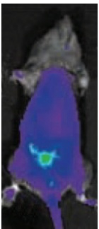
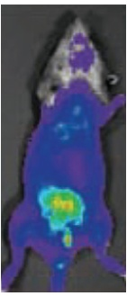
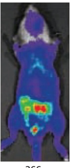

catalog of those genes that are strongly suspected to be cancer-critical for at least one type of tumor. Current estimates put the total number of such genes at around 300, about 1% of the genes in the human genome. These cancer-critical genes are amazingly diverse, revealing an unexpected breadth of mechanisms. Whereas some of the new cancer genes encode classical signaling and cell-cycle proteins that might be anticipated to become mutated in cancer cells, others populate new and sometimes surprising categories. These include functions as diverse as metabolism, chromatin biology, RNA splicing, protein homeostasis, and cell differentiation. It is clear that alterations in any of these processes can contribute, in one tissue or another, to the evolution of cells with the cancerous properties that were listed on page 1172.

Clearly, the molecular changes that cause cancer are complex. As we now explain, however, the complexity is not quite as daunting as it might initially seem.

## Disruptions in a Handful of Key Pathways Are Common to Many Cancers

Some genes, like Rb and Ras, are mutated in many cases of cancer and in cancers of many different types. The involvement of genes such as Rb and Ras in cancer is no surprise, now that we understand their normal functions: they control fundamental processes of cell division and growth. But even these common culprits feature in considerably less than half of individual cases. What is happening to the control of these processes in the many cases of cancer where, for example, Rb is intact or Ras is not mutated? What part do mutations in the hundreds of other cancer-critical genes play in the development of the disease? With our increasing knowledge of the normal functions of the genes in the human genome, it is becoming easier to detect patterns in the cataloged driver mutations and to give some simplifying answers to these questions.

In order to clarify the type of patterns revealed, consider the deadly disease glioblastoma—the most common type of human brain cancer. Analysis of the genomes of tumor cells from 91 individuals identified a total of at least 79 genes that were mutated in more than one individual. The normal functions of most of these genes were known or could be guessed, allowing them to be assigned to specific biochemical or regulatory pathways. Three functional groupings stood out, accounting for 21 of the recurrently mutated genes. One group consists of genes in the Rb pathway (that is, Rb itself, along with genes that directly regulate Rb); this pathway governs initiation of the cell-division cycle. Another consists of genes in the same regulatory subnetwork as Ras—referred to as the RTK/Ras/PI 3-kinase pathway, after three of its core components; this pathway serves to transmit signals for cell growth and cell division from outside the cell to the cell interior. A third grouping consists of genes in a pathway regulating responses to stress and DNA damage—the p53 pathway. We shall have more to say about these pathways below.

For the 91 glioblastomas, 74% had identifiable mutations in all three pathways. If one were to trace these three pathways further upstream and include all the components, known and unknown, on which they depend, this percentage would almost certainly be even higher. In other words, in almost every case of glioblastoma, there are mutations that disrupt each of three fundamental controls: the control of cell growth, the control of cell division, and the control of responses to stress and DNA damage.

Strikingly, in any given tumor-cell clone, there is a strong tendency for no more than one gene to be mutated in each pathway. Evidently, what matters for tumor evolution is the disruption of the control mechanism, and not the genetic means by which that is achieved. Thus, for example, in an individual whose tumor cells have no mutation in Rb itself, there is generally a mutation in some other component of the Rb pathway, producing a similar biological effect. This indicates that there is no further selection for a mutant in a pathway if the pathway has been disabled by a mutation elsewhere.

Similar patterns are seen in other types of cancers. A survey of many specimens of the major variety of ovarian cancer, for example, identified 67% of individuals as having mutations in the Rb pathway, 45% in the Ras/PI 3-kinase pathway (defined more narrowly than in the glioblastoma study), and more than 96% in the p53 pathway. Allowing for additional pathway components not included in the analysis, it seems that most cases of this type of cancer, too, have mutations disrupting the same three controls, leading to misregulated cell growth, misregulated cell proliferation, and an abnormal disregard of stress and DNA damage.

Figure 20–29 The three major cellular pathways that contribute to tumorigenesis. The specific examples listed here are described in this chapter. Cell-cycle events controlled by Rb are described in detail in Chapter 17.

It seems that these three fundamental controls are subverted in one way or another in virtually every type of cancer. However, because specialized tissues can depend on different mechanisms to relay environmental signals to the core control machinery, these controls are open to subversion in a different set of ways in different types of cancers. In fact, one can find examples of driver mutations in practically all the major signaling pathways through which cells communicate during development and tissue maintenance (discussed in Chapters 15, 21, and 22).

**Figure 20–29** outlines the three central pathways just described, abbreviating them as cell cycle, cell proliferation, and cell survival. We have previously discussed Rb (see pp. 1182–1183) and devoted an entire chapter to cell-cycle controls (Chapter 17). Some important details of the other two control pathways in Figure 20–29 are reviewed next.

## Mutations in the PI 3-kinase/Akt/mTOR Pathway Drive Cancer Cells to Grow

Cell proliferation is not simply a matter of progression through the cell cycle; it also requires coordinated cell growth, which involves complex anabolic processes through which the cell synthesizes all the necessary macromolecules from small-molecule precursors (**Figure 20–30**). Cancer depends, therefore, not only on a loss of restraints on cell-cycle progression but also on a disrupted control of cell growth.

Downstream of RTK/Ras activation, the PI 3-kinase/Akt/mTOR intracellular signaling pathway is critical for cell growth control. As described in Chapter 15, various extracellular signal proteins, including insulin and insulin-like growth factors, normally activate this pathway. In cancer cells, however, the pathway is activated by mutation so that the cell can grow in the absence of such signals. The resulting abnormal activation of the protein kinases Akt and mTOR not only stimulates protein synthesis but also greatly increases both glucose uptake and the production of the acetyl CoA in the cytosol required for cell lipid synthesis, as outlined in Figure 20–30B.

The abnormal activation of the PI 3-kinase/Akt/mTOR pathway, which normally occurs early in the process of tumor progression, helps to explain the excessive rate of glycolysis that is observed in tumor cells, known as the Warburg effect, as discussed earlier (see Figure 20–18). As expected from our previous discussion, cancers can activate this pathway in many different ways. Thus, for example, a growth factor receptor can become abnormally activated, as in Figure 20–23. Also very common in cancers is the loss of the phosphatase and tensin homolog (PTEN) phosphatase that normally functions to counteract this pathway. PTEN suppresses the PI 3-kinase/Akt/mTOR pathway by dephosphorylating the phosphatidylinositol 3,4,5-trisphosphate [PI(3,4,5)P3] molecules that the PI 3-kinase generates (see p. 920). PTEN is commonly mutated in tumors.

(A)

(B)

Figure 20–30 Cells seem to require two types of signals to proliferate. (A) In order to multiply successfully, most normal cells require both extracellular signals that drive cell-cycle progression (shown here as blue mitogen) and extracellular signals that drive cell growth (shown here as red growth factor). How mitogens activate signaling through the Rb pathway to drive entry into the cell cycle is described in Figure 17–59. (B) Diagram of the signaling system involving activation of Akt and mTOR that drives cell growth through greatly stimulating glucose uptake and utilization, including a conversion of the excess citric acid produced from sugar intermediates in mitochondria into the acetyl CoA that is needed in the cytosol for lipid synthesis and new membrane production. As indicated, protein synthesis is also increased. This system becomes abnormally activated early in tumor progression. TCA cycle indicates the tricarboxylic acid cycle (citric acid cycle).

## Mutations in the p53 Pathway Enable Cancer Cells to Survive and Proliferate Despite Stress and DNA Damage

That cancer cells must break the normal rules governing cell growth and cell division is obvious: that is part of the definition of cancer. It is not so obvious why cancer cells should also be abnormal in their response to stress and DNA damage, and yet this too is an almost universal feature. The gene that lies at theMBoC7 m20.26/20.30 center of this response, the p53 gene, is mutated in about 50% of all cases of cancer—a higher proportion than for any other known cancer-critical gene. When we include with p53 the other genes that are closely involved in its function, we find that most cases of cancer harbor mutations in the p53 pathway. Why should this be? To answer, we must first consider the normal function of this pathway.

In contrast to Rb, most cells in the body contain very little **p53** protein under normal conditions: although the protein is synthesized, it is rapidly degraded. Mice in which both copies of the gene have been deleted or inactivated typically appear normal in all respects except one—they universally develop cancer before 10 months of age. These observations suggest that p53 has a function that is required only in special circumstances. In fact, cells raise their concentration of p53 protein in response to a whole range of conditions that have only one obvious thing in common: they are, from the cell’s point of view, pathological, putting the cell in danger of death or serious injury. These conditions include DNA damage, which puts the cell at risk from a faulty genome; telomere loss or shortening, also dangerous to the integrity of the genome; hypoxia, which deprives the cell of the oxygen it needs to maintain mitochondrial respiration; osmotic stress, which causes the cell to swell or shrivel; and oxidative stress, which generates dangerous levels of highly reactive free radicals.

Figure 20–31 Modes of action of the p53 tumor suppressor. The p53 protein is a cellular stress sensor. In response to hyperproliferative signals, DNA damage, hypoxia, telomere shortening, and various other stresses, the p53 levels in the cell rise. As indicated, this may either arrest cell cycling in a way that allows the cell to adjust and survive, trigger cell suicide by apoptosis, or cause cell senescence—an irreversible cell-cycle arrest that stops damaged cells from dividing.

Yet another form of stress that can activate the p53 pathway arises, it seems,MBoC7 m20.27/20.31 when regulatory signals are so intense or uncoordinated as to drive the cell beyond its normal limits and into a danger zone where its mechanisms of control and coordination break down, as in an engine driven too fast. The p53 concentration rises, for example, when Myc is overexpressed to oncogenic levels.

All these circumstances call for desperate action, which may take either of two forms: the cell can block any further progress through the division cycle in order to take time out to repair or recover from the pathological condition or it can accept that it must die, and do so in a way that minimizes damage to the organism. A good death, from this point of view, is a death by apoptosis. In apoptosis, the cell is phagocytosed by its neighbors and its contents are efficiently recycled. A bad death is a death by necrosis. In necrosis, the cell bursts or disintegrates and its contents are spilled into the extracellular space, inducing inflammation.

The p53 pathway, therefore, behaves as a sort of antenna, sensing the presence of a wide range of dangerous conditions and, when any are detected, triggering appropriate action—either a temporary or permanent arrest of cell cycling or suicide by apoptosis (**Figure 20–31**). These responses serve to prevent deranged cells from proliferating. Cancer cells are indeed generally deranged, and their survival and proliferation thus depend on inactivation of the p53 pathway. If the p53 pathway were active in them, they would be halted in their tracks or die (**Movie 20.6**). For example, if the p53 pathway is functional, a cell with unrepaired DNA damage will stop dividing or die; it cannot proliferate.

The p53 protein performs its job mainly by acting as a transcription regulator (see Movie 17.8). Indeed, the most common mutations observed in p53 in human tumors are in its DNA-binding domain, where they cripple the ability of p53 to bind to its DNA target sequences. As discussed in Chapter 17, the p53 protein exerts its inhibitory effects on the cell cycle, in part at least, by inducing the transcription of p21, which encodes a protein that binds to and inhibits the cyclin-dependent kinase (Cdk) complexes required for progression through the cell cycle. By blocking the kinase activity of these Cdk complexes, the p21 protein prevents the cell from progressing through S phase and replicating its DNA.

The mechanism by which p53 induces apoptosis includes stimulation of the expression of many pro-apoptotic genes, as described in Chapter 18.

## Studies Using Mice Help to Define the Functions of Cancer-critical Genes

The ultimate test of a gene’s role in cancer has to come from investigations in the intact, mature organism. The most favored organism for experimental studies is the mouse. To explore the function of a candidate oncogene or tumor suppressor gene, one can make a transgenic mouse that overexpresses it or a knockout mouse that lacks it. Using the techniques described in Chapter 8, one can engineer mice in which the misexpression or deletion of the gene is restricted to a specific set of cells, or in which expression of the gene can be switched on at will at a chosen point in time, or both, to see whether and how tumors develop. Moreover, to follow the growth of tumors from day to day in the living mouse, the cells of interest can be genetically marked and made visible by expression of a fluorescent or luminescent reporter (**Figure 20–32**). In these ways, one can begin to clarify the part that each cancer-critical gene plays in cancer initiation or progression.

144

67

103

Figure 20–32 Monitoring tumor growth and metastasis in a mouse with a luminescent reporter. A mouse was genetically engineered in a way that allows both copies of its PTEN tumor suppressor gene to be inactivated in the prostate gland, simultaneously with the prostate-specific MBoC7 m20.28/20.32activation of a gene engineered to produce the enzyme luciferase (derived from fireflies). After an injection of luciferin (the substrate molecule for luciferase) into the mouse’s bloodstream, the cells in the prostate emit light and can be detected by their bioluminescence in a live mouse, as seen in the 67-day-old animal at the left. Cells lacking the PTEN phosphatase enzyme contain elevated amounts of the Akt activator, $\mathsf { P } | ( 3 { , } 4 { , } 5 ) \mathsf { P } _ { 3 } ,$ and this causes the prostate cells to proliferate abnormally, progressing over time to form a cancer. In this way, the process of metastasis could be followed in the same animal over the course of a year. The light intensity in these experiments is proportional to the number of prostate-cell descendants, increasing from light blue to green, to yellow, to red in this representation. (Adapted from C.-P. Liao et al., Cancer Res. 67:7525–7533, 2007. With permission from the American Association for Cancer Research.)

Transgenic mouse studies confirm, for example, that a single oncogene is generally not enough to turn a normal cell into a cancer cell. Thus, in mice engineered to express a Myc or Ras oncogenic transgene, some of the tissues that express the oncogene may show enhanced cell proliferation, and, over time, occasional cells will undergo further changes to give rise to cancers. Most cells expressing the oncogene, however, do not give rise to cancers. Nevertheless, from the point of view of the whole animal, the inherited oncogene is a serious menace because it creates a high risk that a cancer will arise somewhere in the body. Mice that express both Myc and Ras oncogenes develop cancers earlier and at a much higher rate than mice that express either gene alone (**Figure 20–33**); but, again, the cancers originate as scattered, isolated tumors among noncancerous cells. Thus, even cells expressing these two oncogenes must undergo further, randomly generated changes to become cancerous. This strongly suggests that multiple mutations are required for tumorigenesis, as supported by a great deal of other evidence discussed earlier. Experiments using mice with deletions of tumor suppressor genes lead to similar conclusions.

Figure 20–33 Oncogene collaboration in transgenic mice. The graphs show the incidence of tumors in three types of transgenic mouse strains, one carrying a Myc oncogene, one carrying a Ras oncogene, and one carrying both oncogenes. For these experiments, two lines of transgenic mice were first generated. One carries an inserted copy of an oncogene created by fusing the proto-oncogene Myc with the mouse mammary tumor virus regulatory DNA (which then drives Myc overexpression in the mammary gland). The other line carries an inserted copy of the Ras oncogene under the control of the same regulatory element. Both strains of mice develop tumors much more frequently than normal, most often in the mammary or salivary glands. Mice that carry both oncogenes together are obtained by crossing the two strains. These hybrids develop tumors at a far higher rate still, much greater than the sum of the rates for the two oncogenes separately. Nevertheless, the tumors arise only after a delay and only from a small proportion of the cells in the tissues where the two genes are expressed. Further accidental changes, in addition to the two oncogenes, are apparently required for the development of cancer. (After E. Sinn et al., Cell 49:465–475, 1987.)

## Cancers Become More and More Heterogeneous as They Progress

Although useful to study the function and interaction of cancer driver genes in vivo, there are important limitations to mouse models of human cancer. Whereas a mouse tumor is small and arises over a period of months or even days, a human tumor may be the size of a mouse or larger and will often have been growing for decades. From simple histology looking at stained tissue sections, it is clear that some tumors contain distinct sectors, all clearly cancerous, but differing in appearance because they differ genetically or epigenetically: the cancer cell population is heterogeneous. Evidently, within the initial clone of cancerous cells, additional mutations have arisen and conferred selective advantages, such as increased growth rates, creating diverse subclones. Today, the ability to analyze cancer genomes lets us look much deeper into the process. Comparison of samples from different regions of a tumor and the metastases it has spawned reveal a classic picture of Darwinian evolution, occurring on a time scale of months or years rather than millions of years, but governed by the same rules of natural selection.

One approach to examine the development of tumor heterogeneity takes advantage of human cells grown outside the body, termed “organoids” (described in Chapter 22). Unlike the immortalized cancer cell lines described previously that have adapted to an artificial, two-dimensional lifestyle (see Figure 20–15), organoids are grown from adult stem cells under more physiological conditions within a three-dimensional matrix. In this environment, a single stem cell can proliferate and differentiate into a self-organizing structure that resembles a miniature, simplified version of the organ from which it was taken, with realistic microanatomy. One study applied this organoid system to examine the genetic heterogeneity within individual colorectal tumors (**Figure 20–34A**). Organoids were grown from single cells isolated from different regions of a tumor as well as from neighboring, normal tissue. Genome analysis revealed detailed patterns of mutations in each organoid that indicated how closely it was related to the others, and from these data one could draw up a family tree. Those organoids derived from the same tumor site bore the most similarities, and all possessed the same set of cancer-driving mutations that arose in their common ancestor within the trunk of the tree, corresponding to the early stages of tumor growth.

Clearly, cancer cells are constantly mutating, multiplying, competing, evolving, and diversifying as they exploit new ecological niches and react to the treatments that are used against them (**Figure 20–34B**). Diversification accelerates as they metastasize and colonize new territories, where they encounter new selection pressures. The longer the evolutionary process continues, the harder it becomes to catch them all in the same net and kill them.

## Colorectal Cancers Evolve Slowly Via a Succession of Visible Changes

At the beginning of this chapter, we saw that most cancers develop gradually from a single aberrant cell, progressing from benign to malignant tumors by the accumulation of a number of independent genetic and epigenetic changes. We have discussed what some of these changes are in molecular terms and have seen how they contribute to cancerous behavior. We now examine one of the common human cancers more closely, using it to illustrate and enlarge upon some of the general principles and molecular mechanisms we have introduced. We take **colorectal cancer** as our example.

Figure 20–34 How cancers progress as a series of subclones. (A) Cancer analysis using organoids. Single cells were isolated from four different regions of a human colorectal tumor (color coded) as well as from nearby healthy tissue (not shown). These cells were then used to produce organoids, allowing large amounts of material to be obtained for analysis. DNA sequencing was used to determine the mutations in each organoid. These data then enabled construction of a MBoC7 20.30/20.34phylogenetic tree that reveals the order in which the mutations emerged in the original tumor. (B) A depiction of how driver mutations are thought to cause cancer progression over long periods of time, before producing a large enough clone of proliferating cells to be detected as a tumor. The data indicate that driver mutations occur only rarely in a background of long-lived subclones of cells that continually accumulate passenger mutations without gaining a growth advantage. (A, adapted from C.J. Kuo and C. Curtis, Nature 556:441–442, 2016. With permission from Springer Nature. B, adapted from S. Nik-Zainal et al., Cell 149:994–1007, 2012. This article is distributed under the terms of the Creative Commons Attribution License.)

Colorectal cancers arise from the epithelium lining the colon (the large intestine) and rectum (the terminal segment of the gut). The organization of this tissue is broadly similar to that of the small intestine, discussed in Chapter 22 (pp. 1281–1282). For both the small and large intestine, the epithelium is renewed at an extraordinarily rapid rate, taking about a week to completely replace most of the epithelial sheet. In both regions, the renewal depends on stem cells that lie in deep pockets of the epithelium, called intestinal crypts. The signals that maintain the stem cells and control the normal organization and renewal of the epithelium are beginning to be quite well understood, as explained in Chapter 22. Mutations that disrupt these signals begin the process of tumor progression for most colorectal cancers (**Movie 20.7**).

Colorectal cancers are common, currently causing nearly 60,000 deaths a year in the United States, or about 10% of total deaths from cancer. Like most cancers, they are not usually diagnosed until late in life (90% occur after the age of 55). However, routine examination of normal adults with a colonoscope (a fiberoptic device for viewing the interior of the colon and rectum) often reveals a small benign tumor, or adenoma, of the gut epithelium in the form of a protruding mass of tissue called a polyp. These adenomatous polyps are believed to be the precursors of a large proportion of colorectal cancers. Because the progression of the disease is usually very slow, there is typically a period of about 10 years in which the slowly growing tumor is detectable but has not yet turned malignant. Thus, when people are screened by colonoscopy in their fifties and the polyps are removed through the colonoscope—a quick and easy procedure—the subsequent incidence of colorectal cancer is much lower: according to some studies, less than a quarter of what it would be otherwise.

<table><tbody><tr><td colspan="4">TABLE 20-1 Some Genetic Abnormalities Detected in Colorectal Cancer Cells</td></tr><tr><td>Gene</td><td>Class</td><td>Pathway affected</td><td>Human colon cancers (%)</td></tr><tr><td>K-Ras</td><td>Oncogene</td><td>Receptor tyrosine kinase signaling</td><td>40</td></tr><tr><td>b-Catenin1</td><td>Oncogene</td><td>Wnt signaling</td><td>5-10</td></tr><tr><td>Apc1</td><td>Tumor suppressor</td><td>Wnt signaling</td><td>&gt;80</td></tr><tr><td>p53</td><td>Tumor suppressor</td><td>Response to stress and DNA damage</td><td>60</td></tr><tr><td>TGFb receptor II2</td><td>Tumor suppressor</td><td>TGFβ signaling</td><td>10</td></tr><tr><td>Smad42</td><td>Tumor suppressor</td><td>TGFβ signaling</td><td>30</td></tr><tr><td>MLH1 and other DNA mismatch repair genes (often silenced by DNA methylation)</td><td>Tumor suppressor (genetic stability)</td><td>DNA mismatch repair</td><td>15</td></tr></tbody></table>

1,2The genes with the same superscript numeral act in the same pathway, and therefore only one of the components is mutated in an individual cancer.

In microscopic sections of polyps smaller than 1 cm in diameter, the cells and their arrangement in the epithelium usually appear almost normal. The larger the polyp, the more likely it is to contain cells that look aberrant and are abnormally organized. Sometimes, two or more distinct areas can be distinguished within a single polyp, with the cells in one area appearing relatively normal and those in the other appearing clearly cancerous, as though they have arisen as a mutant subclone within the original clone of adenomatous cells. At later stages in the disease, some tumor cells become invasive in a small fraction of the polyps, first breaking through the epithelial basal lamina, then spreading through the layer of muscle that surrounds the gut, and finally metastasizing to lymph nodes via lymphatic vessels and to liver, lung, and other organs via blood vessels.

## A Few Key Genetic Lesions Are Common to a Large Fraction of Colorectal Cancers

What are the mutations that accumulate with time to produce this chain of events? Of those genes so far discovered to be involved in colorectal cancer, three stand out as most frequently mutated: the proto-oncogene K-Ras (a member of the Ras gene family), in about 40% of cases; p53, in about 60% of cases; and the tumor suppressor gene Apc (discussed below), in more than 80% of cases. Others are involved in smaller numbers of colon cancers, and some of these are listed in **Table 20–1**.

The role of Apc first came to light through study of certain families showing a rare type of hereditary predisposition to colorectal cancer, called familial adenomatous polyposis coli (FAP). In this syndrome, hundreds or thousands of polyps develop along the length of the colon (**Figure 20–35**). These polyps start to appear in early adult life, and if they are not removed, one or more will almost always progress to become malignant; the average time from the first detection of polyps to the diagnosis of cancer is 12 years. The disease can be traced to a deletion or inactivation of the tumor suppressor gene Apc, named after the syndrome. Individuals with FAP have inactivating mutations or deletions of one copy of the Apc gene in all their cells and show loss of heterozygosity in tumors, meaning that both copies have been lost or inactivated, even in the benign polyps. Most individuals with colorectal cancer do not have the hereditary condition. Nevertheless, in more than 80% of the cases, their cancer cells (but not their normal cells) have inactivated both copies of the Apc gene through mutations acquired during the individual’s lifetime. Thus, by a route similar to what we discussed for retinoblastoma, mutation of the Apc gene was identified as one of the central ingredients of colorectal cancer.

(A)

(B)

Figure 20–35 Colon of individual with familial adenomatous polyposis coli compared to normal colon. (A) The normal colon wall is a gently undulating but smooth surface. (B) The polyposis colon is completely covered by hundreds of projecting polyps, each resembling a tiny cauliflower when viewed with the naked eye. (Courtesy of Mark Arends.)

The APC protein is an inhibitory component of the Wnt signaling pathway (discussed in Chapter 15). It binds to the b-catenin protein, another component of the Wnt pathway, and helps to induce the protein’s degradation. By inhibiting β-catenin in this way, APC prevents it from localizing to the nucleus, where it would act as a transcriptional regulator to drive cell proliferation and maintain the stem-cell state (see Figure 15–61). Loss of APC results in an excess of free β-catenin and thus leads to an uncontrolled expansion of the stem-cell population. This causes massive increase in the number and size of the intestinal crypts (see Figure 22–4).

When the b-catenin gene was sequenced in a collection of colorectal tumors, it was discovered that many of the tumors that did not have Apc mutations had activating mutations in the β-catenin protein instead. Thus, it is excessive activity in the Wnt signaling pathway that is critical for the initiation of this cancer, rather than any single oncogene or tumor suppressor gene that the pathway contains.

This being so, why is the Apc gene in particular so often the most common culprit in colorectal cancer? The APC protein is large and it interacts not only with β-catenin but also with various other cell components, including microtubules. Loss of APC appears to increase the frequency of mitotic spindle defects, leading to chromosome abnormalities when cells divide. This additional, independent cancer-promoting effect could explain why Apc mutations feature so prominently in the causation of colorectal cancer.

## Some Colorectal Cancers Have Defects in DNA Mismatch Repair

In addition to the hereditary disease (FAP) associated with Apc mutations, there is a second, more common kind of hereditary predisposition to colon carcinoma in which the course of events differs from the one we have described for FAP. In this more common condition, called hereditary nonpolyposis colorectal cancer (HNPCC), or Lynch syndrome, the probability of colon cancer is increased without any increase in the number of colorectal polyps (adenomas). Moreover, the cancer cells are unusual, in that they have a normal (or almost normal) karyotype. The majority of colorectal tumors in non-HNPCC individuals, in contrast, have gross chromosomal abnormalities, with multiple translocations, deletions, and other aberrations, and have many more chromosomes than normal (see Figure 20–10).

The mutations that predispose HNPCC individuals to colorectal cancer occur in one of several genes that code for central components of the DNA mismatch repair system. These genes are homologous in structure and function to the MutL and MutS genes in bacteria and yeast (see Figure 5–20). Only one of the two copies of the involved gene is defective, so the repair system is still able to remove the inevitable DNA replication errors that occur in the individual’s cells. However, as discussed previously, these individuals are at risk because the accidental loss or inactivation of the remaining good gene copy will immediately elevate the spontaneous mutation rate by a hundredfold or more (discussed in

Chapter 5). These genetically unstable cells can then speed through the standard processes of mutation and natural selection that allow clones of cells to progress to malignancy.

This particular type of genetic instability produces invisible changes in the chromosomes—most notably changes in individual nucleotides and short expansions and contractions of mononucleotide and dinucleotide repeats such as AAAA... or CACACA.... Once the defect in HNPCC individuals was recognized, the epigenetic silencing or mutation of mismatch repair genes was found in about 15% of the colorectal cancers occurring in people with no inherited predisposing mutation.

Thus, the genetic instability found in many colorectal cancers can be acquired in at least two ways. The majority of the cancers display a form of chromosomal instability that leads to visibly altered chromosomes, whereas in the others the instability occurs on a much smaller scale and reflects a defect in DNA mismatch repair. Indeed, many carcinomas show either chromosomal instability or defective mismatch repair—but rarely both. These findings clearly demonstrate that genetic instability is not an accidental by-product of malignant behavior but a contributory cause—and that cancer cells can acquire this instability in multiple ways.

## The Steps of Tumor Progression Can Often Be Correlated with Specific Mutations

In what order do K-Ras, p53, Apc, and the other identified colorectal cancercritical genes mutate, and what contribution does each of them make to the asocial behavior of the cancer cell? There is no single answer because colorectal cancer can arise by more than one route: thus, we know that in some cases, the first mutation can be in a DNA mismatch repair gene; in others, it can be in a gene regulating cell proliferation. Moreover, as previously discussed, a general feature such as genetic instability or a tendency to proliferate abnormally can arise in a variety of ways, through mutations in different genes.

Nevertheless, certain sets of mutations are particularly common in colorectal cancer, and they occur in a characteristic order. Thus, in most cases, mutations inactivating the Apc gene appear to be the first or, at least, a very early step, as they are detected at the same high frequency in small benign polyps as in large malignant tumors. Changes that lead to genetic and epigenetic instability are likely also to arise early in tumor progression, as they are needed to drive the later steps.

Activating mutations in the K-Ras gene occur later, as they are rare in small polyps but common in larger ones that show disturbances in cell differentiation and histological pattern.

Inactivating mutations in p53 are thought to come later still, as they are rare in polyps but common in carcinomas (**Figure 20–36**). We have seen that loss of p53 function allows cancer cells to endure stress and to avoid apoptosis and cell-cycle arrest. Additionally, loss of p53 is related to the heightened activation of oncogenes such as Ras. Experiments in mice show that an initial low level of oncogene activation can give rise to a slowly growing tumor even while p53 is functional: genes such as Ras are, after all, part of the normal machinery of growth control, and moderate activation is not stressful for a cell and does not call the p53 protein into play. Progression of a tumor from slow to rapid, malignant growth, however, involves activation of oncogenes beyond normal physiological limits to a higher, stressful level. If the p53 protein is present and functional, this should lead to cell-cycle arrest or death. Only by losing p53 function can the cancer cells with hyperactive oncogenes survive and progress.

Figure 20–36 Suggested typical sequence of genetic changes underlying the development of a colorectal carcinoma. This oversimplified diagram provides a general idea of the way mutation and tumor development are related. But many other mutations are generally involved, and different colon cancers can progress through different sequences of mutations (and/or epigenetic changes).

The steps we have just described are only part of the picture. It is important to emphasize that each case of colorectal cancer is different, with its own detailed combination of mutations, and that even for the mutations that are commonly shared, the sequence of occurrence may vary.

## The Changes in Tumor Cells That Lead to Metastasis Are Still Largely a Mystery

Perhaps the most significant gap in our understanding of cancer concerns invasiveness and metastasis (see Figure 20–20). More than 25 years after the multistep progression of colorectal cancer was first described, no genetic mutations have been identified that are characteristically associated with metastatic disease. To date, even large-scale genomic sequencing efforts have yet to uncover recurrent mutations that adequately explain the escape of cancer cells from a primary tumor and their dissemination and colonization of a distant tissue. One possibility is that metastasis can be initiated by epigenetic changes that alter patterns of gene expression. These changes could allow cancer cells to take on new traits in the absence of further genetic changes, thereby reprogramming their behavior to promote invasiveness and motility or to generate cancer stem cells. Importantly, changes in cellular programming and behavior operate normally in a variety of contexts during cellular differentiation. The example most relevant to metastasis is the epithelial-to-mesenchymal transition (EMT), a highly regulated and poorly understood process that allows epithelial cells to lose their characteristic polarity and adhesiveness and take on a mesenchymal phenotype, which includes enhanced migratory behavior. An EMT program operates at several stages of embryogenesis as well as during wound healing, and its activation in cancer cells could explain how they escape from a primary tumor and invade a new tissue. However, EMT is unlikely to explain the major puzzle of how disseminated cells acquire the ability to survive in the microenvironment of that new tissue, with its unfamiliar mix of growth factors and extracellular matrix components. Because the EMT program (like almost all cellular differentiation programs) involves changes in gene expression, it does not alter DNA sequences and would not be detected by sequencing the genomes of metastasized cancer cells.

Observations of the many stages and varied features of tumorigenesis highlight that cancer cells do not invent new biological phenomena, but instead deploy existing mechanisms and pathways at inappropriate times and places. A better understanding of the normal, underlying cell biology, and of the molecular changes that act to subvert it in cancer, will provide promising leads for cancer treatment, as we discuss in the final section of this chapter.

## Summary

The molecular analysis of cancer cells reveals two classes of cancer-critical genes: oncogenes and tumor suppressor genes. A set of these genes becomes altered by a combination of genetic and epigenetic accidents to drive tumor progression. Many cancer-critical genes code for components of the social control pathways that regulate when cells grow, divide, differentiate, or die. In addition, a subclass of tumor suppressors can be categorized as genome maintenance genes, because their normal role is to help maintain genome integrity.

The inactivation of the p53 pathway, which occurs in nearly all human cancers, allows genetically damaged cells to escape apoptosis and continue to proliferate.

Inactivation of the Rb pathway also occurs in most human cancers, illustrating how fundamental each of these pathways is for protecting us against cancer. More generally, the extensive sequencing of cancer cell genomes reveals that the development of a cancer requires the acquisition of heritable disturbances in each of three types of normal controls—those in the cell cycle, cell proliferation, and cell survival pathways.

The sequencing of cancer cell genomes indicates that—except for the cancers of childhood—many cancers acquire multiple driver mutations over the long course of tumor progression, along with a considerably larger number of passenger mutations of no consequence. The same methods reveal how subclones of cells arise and die out as a tumor ages. Tumors thus contain a heterogeneous mixture of cells, some—the so-called cancer stem cells—being much more dangerous than others.

We can often correlate the steps of tumor progression with mutations that activate specific oncogenes and inactivate specific tumor suppressor genes, and colon cancer provides a good example. But different combinations of mutations and epigenetic changes are found in different types of cancer, and even in different individuals with the same type of cancer, reflecting the random way in which these inherited changes arise. Nevertheless, many of the same changes are encountered repeatedly, suggesting that there are a limited number of ways to breach our defenses against cancer. However, the molecular basis of the final and most deadly step in cancer, metastasis, remains poorly understood.

## CANCER PREVENTION AND TREATMENT: PRESENT AND FUTURE

We can apply the growing understanding of the molecular biology of cancer to sharpen our attack on the disease at three levels: prevention, diagnosis, and treatment. Prevention is always better than cure, and indeed many cancers can be prevented, especially by avoiding smoking. Highly sensitive molecular assays promise new opportunities for earlier and more precise diagnosis, with the aim of detecting primary tumors while they are still small and have not yet metastasized. Cancers caught at these early stages can often be nipped in the bud by surgery or radiotherapy, as we saw for colorectal polyps. Nevertheless, full-blown malignant disease will continue to be common for many years to come, and cancer treatments will continue to be needed.

In this section, we first examine the preventable causes of cancer and then consider how advances in our understanding at a molecular level are beginning to transform the treatment of the disease.

## Epidemiology Reveals That Many Cases of Cancer Are Preventable

A certain irreducible background incidence of cancer is to be expected regardless of circumstances. As discussed in Chapter 5, mutations can never be absolutely avoided because they are an inescapable consequence of fundamental limitations on the accuracy of DNA replication and repair. If a person could live long enough, it is inevitable that at least one of his or her cells would eventually accumulate a set of mutations sufficient for cancer to develop.

Nevertheless, environmental factors seem to play a large part in determining the risk for cancer. This is demonstrated most clearly by a comparison of cancer incidence in different countries: for almost every cancer that is common in one country, there is another country where the incidence is much lower. Because migrant populations tend to adopt the pattern of cancer incidence typical of their new host country, the differences are thought to be due mostly to environmental, not genetic, factors (**Figure 20–37A**). From epidemiologic studies compiled by the American Cancer Society, it is estimated that at least 45% of cancer deaths can be attributed to modifiable risk factors, indicating that more than half of all cancers should be avoidable (**Figure 20–37B**).