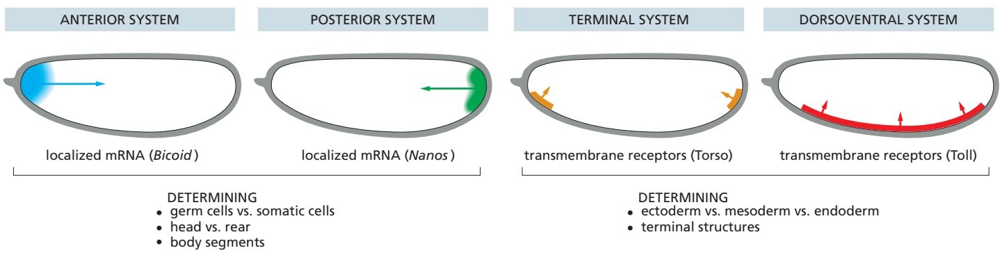
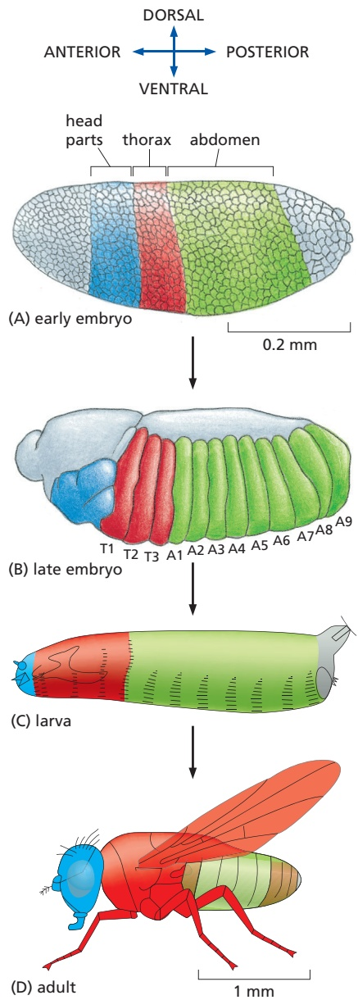
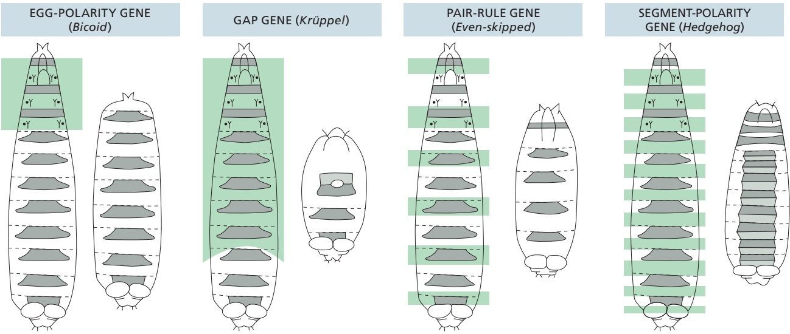
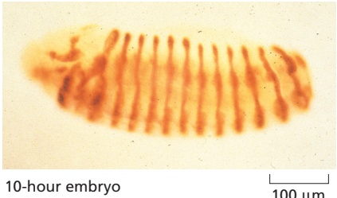
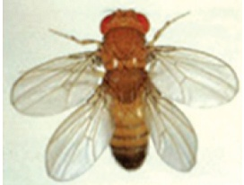
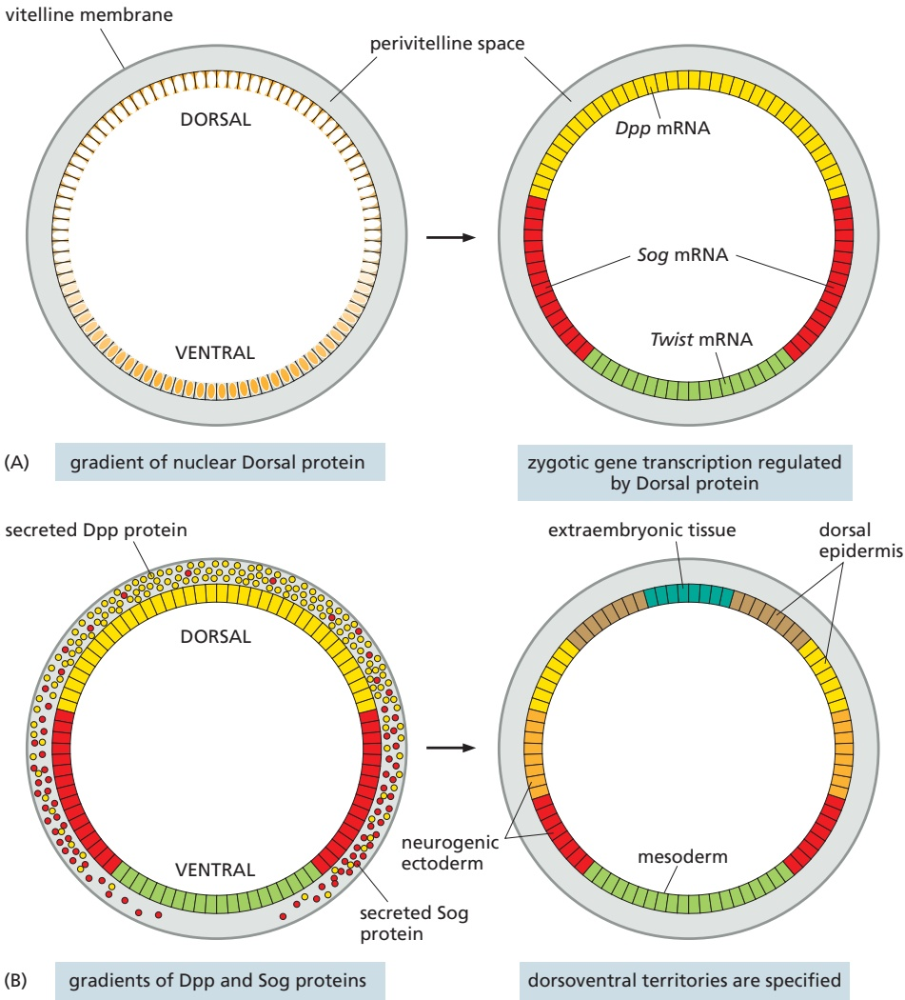
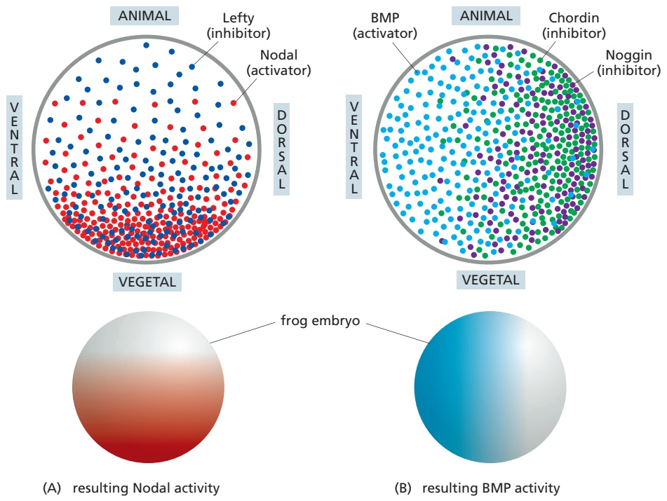

(C)

Figure 21–15 The Bicoid protein gradient. (A) Bicoid mRNA is deposited at the anterior pole during oogenesis. (B) Local translation followed by diffusion generates the Bicoid protein gradient. (C) Absence of the Bicoid protein gradient in embryos from Bicoid homozygous mutant mothers. (A and B, courtesy of Stephen Small.)

These signals can be described as **maternal effect**, because it is the genome of the mother rather than the zygote that produces them. Before fertilization, the anteroposterior and dorsoventral axes of the future embryo become defined by systems of **egg-polarity genes** that create landmarks—either mRNA or protein— in the oocyte. After fertilization, each landmark serves as a beacon, providing a signal that organizes the developmental process in its neighborhood.

The nature of the egg-polarity genes emerged from studies of mutants in which the patterning of the embryo was altered. Some of these mutations gave embryos with disrupted polarity; for example, one caused tail-end structures at both ends of the body, with no head-end structures. This particular mutation allowed the identification of the landmark that organizes the anterior end of the embryo, called Bicoid. A deposit of Bicoid mRNA molecules is localized, before fertilization, at the anterior end of the egg. Upon fertilization, the mRNA is translated to produce Bicoid protein. This protein is an intracellular morphogen and transcription regulator that diffuses away from its source to form a concentration gradient within the syncytial cytoplasm, with its maximum at the head end of the embryo (**Figure 21–15**). The different concentrations of Bicoid along the A-P axis help determine different cell fates by directly regulating the transcription of genes in the nuclei of the syncytial blastoderm (discussed in Chapter 7).

There are three other egg-polarity gene systems that pattern the syncytial nuclei; two act along the A-P axis and one acts along the D-V axis. Together with the Bicoid group of genes, and acting in a broadly similar way, their gene products mark out three fundamental partitions of body regions—head versus rear, dorsal versus ventral, and endoderm versus mesoderm and ectoderm—as well as a fourth partition, no less fundamental to the body plan of animals: the distinction between germ cells and somatic cells (**Figure 21–16**).

Figure 21–16 The organization of the four egg-polarity gradient systems in Drosophila. Bicoid mRNA encodes a transcriptional activator that determines the head and thoracic regions. Nanos is a translational repressor that governs the formation of the abdomen. Localized Nanos mRNA is also incorporated into the germ cells as they form at the posterior of the embryo, and Nanos protein is necessary for germ-line development. Toll and Torso are receptor proteins that are distributed all over the membrane but are activated only at the sites indicated by the coloring, through localized exposure to the extracellular ligands Spaetzle (the ligand for Toll) and Trunk (the ligand for Torso). Toll activity determines the mesoderm and Torso activity determines the formation of terminal structures at the head and tail.

The egg-polarity genes act first in a hierarchy of gene systems that define a progressively more detailed pattern of body parts. In the next few pages, we begin with the molecular mechanisms that pattern the developing Drosophila embryo and larva along the A-P axis, before considering the patterning along the D-V axis.

## Three Groups of Genes Control Drosophila Segmentation Along the A-P Axis

The body of an insect is divided along its A-P axis into a series of **segments**. The segments are repetitions of a theme with variations: each segment forms highly specialized structures, all built according to a similar fundamental plan (**Figure 21–17**). The gradients of transcription regulators set up along the A-P axis in the early embryo by the egg-polarity genes are the prelude to the creation of the segments. These regulators initiate the orderly transcription of segmentation genes, which refine the pattern of gene expression to define the boundaries and ground plan of the individual segments. Segmentation genes are expressed by subsets of cells in the embryo, and their products are among the first components that the embryo’s own genome contributes to embryonic development; they are therefore called zygotic-effect genes, to distinguish them from the earlier-acting maternal-effect genes. Mutations in segmentation genes can alter either the number of segments or their basic internal organization.

The **segmentation genes** fall into three groups according to their mutant phenotypes (**Figure 21–18**). It is convenient to think of the three groups as acting in sequence, although in reality their functions overlap in time. First to be expressed is a set of at least six **gap genes**, whose products mark out coarse A-P subdivisions of the embryo. Mutations in a gap gene eliminate one or more groups of adjacent segments: in the mutant Krüppel, for example, the larva lacks eight segments. Next comes a set of eight **pair-rule genes**. Mutations in these genes cause a series of deletions affecting alternate segments, leaving the embryo with only half as many segments as usual; although all the mutants display this two-segment periodicity, they differ in the precise pattern. Finally, there are at least 10 **segment-polarity genes**, in which mutations produce a normal number of segments but with a part of each segment deleted and replaced by a mirrorimage duplicate of all or part of the rest of the segment.

<small>Figure 21–17 The origins of the Drosophila body segments. (A) At 3 hours, the embryo (shown in side view) is at the blastoderm stage and no segmentation is visible, although a fate map can be drawn showing the future segmented regions (color). (B) At 10 hours, all the segments are clearly defined (T1: first thoracic segment; A1: first abdominal segment). See Movie 21.3. (C) The segments of the Drosophila larva and their correspondence with regions in the embryo. (D) The segments of the Drosophila adult and their correspondence with regions in the embryo.</small>

Figure 21–18 Examples of the phenotypes of mutations affecting egg-polarity genes and the three types of segmentation genes. In each case, the areas shaded in green on the normal larva (left) are deleted in the mutant (right) or are replaced by mirror-image duplicates of the unaffected regions. (Modified from C. Nüsslein-Volhard and E. Wieschaus, Nature 287:795–801, 1980.)

The phenotypes of the various segmentation mutants suggest that the segmentation genes form a coordinated system that subdivides the embryo progressively into smaller and smaller domains along the A-P axis, each distinguished by a different pattern of gene expression. Molecular genetics has helped to reveal how this system works.

## A Hierarchy of Gene Regulatory Interactions Subdivides the Drosophila Embryo

Like Bicoid, most of the segmentation genes encode transcription regulators. Their control by the egg-polarity genes and their actions on one another and on still other genes can be deciphered by comparing gene expression in normal and mutant embryos. By using appropriate probes to detect RNA transcripts or their protein products, one can observe genes switch on and off in changing patterns. These patterns reveal the wealth of spatial information created within the morphologically uniform embryo by the egg-polarity gene network. By comparing these patterns in different mutants, one can begin to discern the logic of the entire gene control system.

The products of the egg-polarity genes provide the global positional signals in the early embryo (see Figure 21–16). The Bicoid protein, as we have seen, acts as a morphogen and activates different sets of genes at different positions along the A-P axis: some gap genes are only activated in regions with high levels of Bicoid, others only where levels of Bicoid are lower. There are only six gap genes, but a combination of overlapping expression as well as different levels within their domains provides each cell along the A-P axis with a rich variety of positional identities. After the gap-gene products refine their positions by repressing each other’s expression, they provide a second tier of positional signals that act more locally to regulate finer details of patterning. They control the expression of the pair-rule genes, through combinatorial effects as discussed in Chapter 7 for the pair-rule gene Even-skipped (see pp. 423–424). The pair-rule genes demarcate the repeated groups of cells that will later become segments and, in turn, collaborate with one another and with the gap genes to set up a regular, periodic pattern of expression of the segment-polarity genes, which define the internal pattern of each individual segment (**Figure 21–19**).

Figure 21–19 The regulatory hierarchy of A-P patterning in the Drosophila embryo. Egg-polarity genes define the A-P axis and also initiate expression of three groups of genes (gap, pair-rule, and segment polarity) that create segments. The identity of each segment is specified by Hox genes (discussed shortly), whose expression is controlled by input from both egg-polarity and segmentation genes. The photographs show mRNA expression patterns of representative examples of genes of each type. (Courtesy of Stephen Small.)

A large subset of the segment-polarity genes codes for components of two signaling pathways—the Wnt pathway and the Hedgehog pathway, including the secreted signal proteins Wingless (the first-named member of the Wnt family) and Hedgehog. (The Hedgehog pathway was first discovered through study of Drosophila segmentation, and it takes its name from the prickly appearance of theMBoC7 m21.20/21.19 surface of the Hedgehog mutant embryo.) Wingless and Hedgehog are synthesized in different bands of cells that serve as signaling centers within each segment. The two proteins mutually maintain each other’s expression while regulating the expression of genes such as Engrailed in neighboring cells (**Figure 21–20**). In such a manner, a series of sequential inductions creates a fine-grained pattern of gene expression within each segment.

Figure 21–20 Mutual maintenance of Hedgehog and Wingless expression. Engrailed is a transcription regulator (blue) that drives the expression of Hedgehog. Hedgehog encodes a secreted protein (red) that activates a signaling pathway in neighboring cells and thereby drives them to express the Wingless gene. In turn, Wingless encodes a secreted protein (green) that acts back on neighbors of the Wingless-expressing cell to maintain their expression of Engrailed. Engrailed then maintains Hedgehog expression to complete the loop. As indicated, the same network repeats along the A-P axis of the fly. (Based on S. DiNardo et al., Curr. Opin. Genet. Dev. 4:529–534, 1994.)

500 µm

## Egg-Polarity, Gap, and Pair-Rule Genes Create a Transient Pattern That Is Remembered by Segment-Polarity and Hox Genes

The gap genes and pair-rule genes are activated within the first few hours after fertilization. Their mRNA products initially appear in patterns that only approximate the final picture; then, within a short time, this fuzzy initial pattern resolves itself into a regular, crisply defined system of stripes. But this pattern itself is unstable and transient: as the embryo proceeds through gastrulation and beyond, the pattern disintegrates. The genes’ actions, however, have passed on an enduring memory of their patterns of expression by inducing the expression of certain segment-polarity genes along with another class of genes called Hox genes (discussed shortly). After a period of pattern refinement mediated by cell–cell interactions, the expression patterns of these new groups of patterning genes are stabilized to provide positional labels that serve to maintain the segmental organization of the larva and adult fly.

The segment-polarity gene Engrailed provides a good example. Its RNA transcripts form a series of 14 bands in the cellular blastoderm, each approximately one cell wide. These stripes lie immediately anterior to similar stripes of expression of another segment-polarity gene, Wingless. As the cells in the developing embryo continue to divide and move, signaling between the Wingless-expressing cells and the Engrailed-expressing cells maintains narrow stripes of their expression (see Figure 21–20). This interaction triggers a stable Engrailed expression pattern that will last throughout the life of the fly, long after the signals that induced and refined it have disappeared. The segment borders in embryo, larva, and adult will all form at the posterior edge of each such Engrailed stripe (**Figure 21–21**).

In addition to regulating the segment-polarity genes, the products of pair-rule genes collaborate with those of gap genes to induce the precisely localized activation of a further set of genes—the Hox genes (see Figure 21–19). It is the Hox genes that first define and then permanently distinguish one segment from another. In the next section, we examine these important genes in detail; we shall see that this role is critical in a wide range of animals, including ourselves.

## Hox Genes Permanently Pattern the A-P Axis

As animal development proceeds, the body becomes more and more complex. But again and again, in every species and at every level of organization, we find that complex structures are made by repeating a few elementary themes, with variations. Thus, a subset of basic differentiated cell types, such as muscle cells or fibroblasts, recur at different sites and are organized into tissues such as muscle or tendon. Subtle variations in how and where patterning mechanisms are deployed determines how structures such as teeth or digits are built, giving rise to molars and incisors, fingers and thumbs and toes.

Wherever we find this phenomenon of modulated repetition, we can break down the developmental biologist’s problem into two kinds of questions: What is the basic construction mechanism common to all the objects of the given class, and how is this mechanism modified to give the observed variations in different animals? The segments of the insect body provide a good example. We have thus far sketched the way in which the rudiment of a single body segment is constructed and how cells within each segment become different from one another. We now consider how one segment becomes determined, or specified, to be different from another.

The first glimpse of the answer to this problem came more than 80 years ago, with the discovery of a set of mutations in Drosophila that cause bizarre disturbances in the organization of the adult fly. In the Antennapedia mutant, for example, legs sprout from the head in place of antennae, whereas in the Bithorax mutant, portions of an extra pair of wings appear where normally there should be the much smaller appendages called halteres (**Figure 21–22**). These mutations transform parts of the body into structures appropriate to other positions, and they are called homeotic mutations (from the Greek homoios, meaning “similar”) because the transformation is between structures of a recognizably similar general type, changing one kind of limb or one kind of segment into another. It was eventually discovered that a whole set of genes, the **homeotic selector genes**MBoC7 m21.23/21.22 or **Hox genes**, serve to permanently specify the A-P characters of the whole set of animal segments. These genes are all related to one another as members of a multigene family.

10-hour embryo

Figure 21–21 The pattern of expression of Engrailed, a segment-polarity gene. The Engrailed pattern is shown in a 10-hour embryo and an adult (whose wings have been removed in this preparation). The pattern is revealed by constructing a strain of Drosophila containing the control sequences of the Engrailed gene coupled to the coding sequence of the reporter LacZ, whose product is detected histochemically through the brown product generated by immunohistochemistry against LacZ itself (10-hour embryo) or through the blue product generated by a reaction that LacZ MBoC7 m21.22/21.21catalyzes (adult). Note that the Engrailed pattern marks segment boundaries and, once established, is preserved throughout the animal’s life. (Courtesy of Tom Kornberg.)

wild type

gain of Ubx

(A)

haltere

loss of Ubx

(B)

(C)

There are eight Hox genes in the fly, and they all lie in one or the other of two gene clusters known as the **Bithorax complex** and the **Antennapedia complex**. The genes in the Bithorax complex control the differences among the abdominal and thoracic segments of the body, while those in the Antennapedia complex control the differences among thoracic and head segments. Comparisons with other species show that the same genes are present in essentially all animals, including humans. These comparisons also reveal that the Antennapedia and Bithorax complexes are two halves of a single entity, called the **Hox complex**, that has become split in the course of the fly’s evolution, and whose members operate in a coordinated way to exert their control over the head-to-tail pattern of the body.

The products of the Hox genes, the **Hox proteins**, are transcription regulators, all of which possess a highly conserved, 60-amino-acid-long DNA-binding homeodomain (see p. 404). The homeodomain-encoding DNA sequence is called a “homeobox,” from which, by abbreviation, the Hox complex takes its name. There are many homeobox-containing genes, but only those located in a Hox complex are Hox genes.

## Hox Proteins Give Each Segment Its Individuality

The Hox proteins can be viewed as molecular address labels possessed by the cells of each segment: these labels give the cells in each region a **positional value**; that is, an intrinsic character that differs according to a cell’s location. If the address labels in a developing Drosophila segment are changed, the segment behaves as though it were located somewhere else; if all the Hox genes in an embryo are deleted, the body segments in the larva will all be alike.

To a first approximation, each Hox gene is normally expressed in those regions that develop abnormally when that gene is mutated or absent. How does each Hox protein give a segment its permanent identity? Recall that the Hox proteins are transcription regulators, which can bind to gene regulatory DNA; each Hox protein targets a different set of genes for activation or repression. Hundreds of genes are under this type of Hox-modulated control, including genes that control cell–cell signaling, transcriptional regulation, cell polarity, cell adhesion, cytoskeletal function, cell growth, and cell death, all conspiring to give each segment its distinctive Hox-dependent character.

## Hox Genes Are Expressed According to Their Order in the Hox Complex

How, then, is the expression of the Hox genes themselves regulated? The coding sequences of the eight Hox genes in Drosophila are interspersed amid a much larger quantity of regulatory DNA. This DNA includes binding sites for the

Figure 21–22 Homeotic mutations. Ultrabithorax, or Ubx, is one of three genes in the Bithorax gene complex (a Hox gene cluster). Ubx is responsible for all of the differences between the second (wing-bearing) and third (haltere-bearing) thoracic segments. (A and B) Ubx loss-of-function mutations transform the halterebearing segment (A) into a wing-bearing segment, resulting in four-winged flies (B). (C) Ubx gain-of-function in the second thoracic segment transforms this wingbearing segment into a haltere-bearing segment, resulting in wingless flies. (A, courtesy of the Archives, California Institute of Technology; C, courtesy of L.S. Shashidhara.)

Figure 21–23 The patterns of expression compared to the chromosomal locations of the genes of the Hox complex. (A) Diagram of a Drosophila embryo at the so-called germ band retraction stage, about 10 hours after fertilization when the developing body axis is folded over on itself. (B) An embryo at this stage has been stained by in situ hybridization using differently labeled probes to detect the mRNA products of different Hox genes in different colors. (C) The spatial pattern in the photograph corresponds, with minor deviations, to the sequence of genes in each of the two subdivisions of the chromosomal complex. (B, courtesy of William McGinnis, adapted from D. Kosman et al., Science 305:846, 2004. With permission from AAAS.)

products of the egg-polarity and segmentation genes, thereby serving as an interpreter of the detailed spatial information supplied to it by all of these transcription regulators. The net result is that a particular set of Hox genes is transcribed in a specific region along the A-P body axis.

The pattern of Hox gene expression exhibits a remarkable regularity that suggests an additional form of control. The sequence in which the genes are ordered along the chromosome, in both the Antennapedia and the Bithorax complexes, corresponds almost exactly to the order in which they are expressed along the7 21.24/21.23 A-P axis of the body (**Figure 21–23**). This hints at some process of gene activation, perhaps dependent on chromatin structures that propagate along the Hox complexes, switching on one Hox gene after another according to their order along the chromosome. The most “posterior” of the Hox genes that are expressed in a cell generally dominates, driving down expression and activity of the “anterior” genes and dictating the character of the segment. The gene regulatory mechanisms underlying these phenomena are still not well understood, but their consequences are profound. We shall see that the serial organization of gene expression in the Hox complex is a fundamental feature that has been highly conserved in the course of animal evolution.

## Trithorax and Polycomb Group Proteins Regulate Hox Expression to Maintain a Permanent Record of Positional Information

The spatial pattern of expression of the genes in the Hox complex is set up by signals acting early in development, but the effects are long lasting. Although the pattern of expression undergoes complex adjustments as development proceeds, the Hox pattern stamps each cell and all of its progeny with a permanent record of the A-P position that the cell occupied in the early embryo. In this way, the cells of each segment maintain a memory of their location along the A-P axis of the body, which governs the segment-specific identity not only of the larval segments but also of the structures of the adult fly.

Two molecular mechanisms ensure that a cell remembers its positional information. One is from the Hox genes themselves: many of the Hox proteins autoactivate the transcription of their own genes, thereby helping to keep the genes on indefinitely. Another crucial input is from two large, complementary sets of proteins, called the **Trithorax group** and the **Polycomb group**, which imprint the chromatin of the Hox complex with a heritable record of its embryonic state of activation or repression. These are key general regulators of chromatin structure that are critical for cell memory: if genes of the Trithorax or Polycomb group are defective, the pattern of expression of the Hox genes is set up correctly at first, but it is not correctly maintained as cells divide and the embryo grows older.

The two sets of regulators act in opposite ways. Trithorax group proteins are needed to maintain the transcription of Hox genes in cells where their

transcription has already been switched on. In contrast, Polycomb group proteins form stable complexes that bind to the chromatin of the Hox complex and maintain the repressed state in cells where Hox genes have not yet been activated (Figure 21–24). Although first discovered because of their influence on Hox genes in flies, Polycomb and Trithorax group proteins are general regulators of chromatin structure that control many genes in plants as well as animals. How such changes in chromatin can store developmental cell memory is discussed in Chapters 4 and 7.

## The D-V Signaling Genes Create a Gradient of the Transcription Regulator Dorsal

We now turn to patterning of the second major axis of the Drosophila embryo. As with the patterning along the A-P axis just discussed, the patterning along the dorsoventral (D-V) axis begins with maternal gene products that define this axis in the egg (see Figure 21–16) and then progresses through zygotic gene products that further subdivide the D-V axis in the embryo.

Initially, a protein that is produced by the mother’s somatic cells underneath the future ventral region of the embryo leads to the localized activation of a transmembrane receptor called **Toll** on the ventral side of the egg membrane. (Curiously, Drosophila Toll and vertebrate Toll-like proteins also operate in innate immune responses, as discussed in Chapter 24.) The localized activation of Toll controls the distribution of **Dorsal**, a transcription regulator of the NFκB family discussed in Chapter 15. The Toll-regulated activity of Dorsal, like that of NFκB, depends on the translocation of Dorsal protein from the cytosol, where it is held in an inactive form, to the nucleus, where it regulates gene expression (see Figure 15–63). In the newly laid egg, both Dorsal mRNA and protein are distributed uniformly in the cytosol. After the nuclei in the syncytial blastoderm have migrated to the surface of the embryo, but before cellularization (see Figure 21–14), Toll receptor activation on the ventral side induces a remarkable redistribution of the Dorsal protein. On the dorsal side, the protein remains in the cytosol, but ventrally it becomes concentrated in the nuclei, with a smooth gradient of nuclear localization between these two extremes (**Figure 21–25**).

Figure 21–24 The role of genes of the Polycomb group. (A) Photograph of a wild-type Drosophila embryo, imaged by dark-field microscopy. (B) Photograph of a mutant embryo defective for the gene Extra sex combs (Esc) and derived from a mother also lacking this gene. The gene belongs to the Polycomb group. Essentially all segments have been transformed to resemble the most posterior abdominal segment, A8. In the mutant, the pattern of expression of the homeotic selector genes, which is roughly normal initially, is unstable in such a way that all these genes soon become switched on all along the body axis. (From G. Struhl, Nature 293:36–41, published 1981 by Nature Publishing Group. Reproduced with permission of SNCSC.)

Figure 21–25 The concentration gradient of Dorsal protein in the nuclei of the blastoderm. In wild-type Drosophila embryos, the protein is present in the dorsal cytoplasm and absent from the dorsal nuclei; ventrally, it is depleted in the cytoplasm and concentrated in the nuclei. In a mutant in which the Toll pathway is activated everywhere and not just ventrally, Dorsal protein is everywhere concentrated in the nuclei; the result is a ventralized embryo. Conversely, in a mutant in which the Toll signaling pathway is inactivated, Dorsal protein everywhere remains in the cytoplasm and is absent from the nuclei; the result is a dorsalized embryo. (From S. Roth et al., Cell 59:1189–1202, 1989. With permission from Elsevier.)

Similar to Bicoid along the A-P axis, Dorsal acts as a morphogen along the D-V axis. Once inside the nucleus, the Dorsal protein turns on or off the expression of different sets of genes depending on Dorsal’s concentration. The expression of each responding gene depends on its regulatory DNA—specifically, on the number and affinity of the binding sites that this DNA contains for Dorsal and other transcription regulators. In this way, the regulatory DNA interprets the positional signal provided by the nuclear Dorsal protein gradient, so as to define a distinct D-V series of territories—complementary bands of cells that run the length of the embryo. Most ventrally—where the nuclear concentration of Dorsal protein is highest—it switches on, for example, the expression of a gene called Twist, which directs mesodermal fate. Most dorsally, where the nuclear concentration of Dorsal protein is lowest, the cells switch on a gene called Decapentaplegic (Dpp). And in an intermediate region, where the nuclear concentration of Dorsal protein is high enough to repress Dpp but too low to activate Twist, the cells switch on another set of genes, including one called Short gastrulation (Sog) (**Figure 21–26A**).

Products of the genes directly regulated by the Dorsal protein generate in turn more local signals, which define finer subdivisions along the D-V axis. These signals act after cellularization and take the form of conventional extracellular diffusible proteins. In particular, Dpp codes for a secreted TGFβ family protein, which forms a local morphogen gradient in the dorsal part of the embryo. Sog, produced ventrally to Dpp, encodes another secreted protein that acts as an antagonist of Dpp protein, by binding to it and preventing Dpp from activating its receptor. The opposing diffusion gradients of these two signal proteins create a steep gradient of Dpp activity: the highest Dpp activity levels, in combination with certain other factors, cause development of the most dorsal tissue of all—an extraembryonic membrane. Intermediate levels cause development of dorsal epidermis; and the absence of Dpp activity in cells expressing Sog allows the development of neurogenic ectoderm, which will give rise to the nervous system (**Figure 21–26B**).

Figure 21–26 How morphogen gradients guide a patterning process along the dorsoventral axis of the Drosophila embryo. (A) Initially, a gradient of Dorsal protein defines three broad territories of gene expression, marked here by the expression of three representative genes: Dpp, Sog, and Twist. (B) Slightly later, the cells expressing Dpp and Sog secrete, respectively, the signal proteins Dpp (a TGFβ family member) and Sog (an antagonist of Dpp). These two proteins then diffuse and interact with one another (and with certain other factors) to create the dorsoventral (D-V) territories shown.

## A Hierarchy of Inductive Interactions Subdivides the Vertebrate Embryo

The molecular genetic analysis of Drosophila development has uncovered how a cascade of transcription regulators and signaling pathways sequentially subdivides the embryo. The same principle of progressive pattern refinement is used during the development of all animal embryos, including vertebrates. Remarkably, conservation is not restricted to the general strategy of pattern formation, but also extends to many of the molecules involved.

As mentioned previously, the earliest phases of vertebrate development are surprisingly variable, even between closely related species, and it is even hard to say precisely how the A-P and D-V axes of an early fly embryo correspond to those of an early frog or mouse embryo. Nevertheless, we shall see that amid this display of evolutionary plasticity, some features of early development turn out to be highly conserved. The same is true of later developmental stages also, often to an astonishing degree. From our own anatomy, it is obvious that we are cousins to birds and fish. But looking at molecular mechanisms, we see that we are related to flies and worms too.

In the following pages, we discuss how vertebrate embryos are patterned by the interplay of signaling molecules and transcription regulators. We begin by discussing the formation and patterning of the embryonic axes in amphibians, taking the frog Xenopus as our example. We have already broached this topic earlier in the chapter. Here, we pick up the thread and draw comparisons with the fly.

As noted earlier, the origins of the embryonic axes and the three germ layers in the frog can be traced back to the blastula (see Figure 21–3A). By labeling individual blastomeres, we can track cells through all their divisions, transformations, and migrations and see what they become and where they come from. The precursors of ectoderm, mesoderm, and endoderm are arranged in order along the animal–vegetal axis of the blastula: the endoderm derives from the most vegetal blastomeres, the ectoderm from the most animal, and the mesoderm from a middle set. Within each of these territories, the cells have diverse fates according to their positions along the D-V axis of the later embryo. For ectoderm, epidermal precursors are located ventrally, and future neurons are found dorsally; for mesoderm, precursors for notochord, muscle, kidney, and blood are arranged from dorsal to ventral. All this can be represented by a **fate map** that shows which later cell types derive from which regions of the early embryo (**Figure 21–27**). The fate map confronts us with the central question: How are the cells in different positions driven toward their different fates? We have already explained how maternal factors deposited in the developing frog egg define its animal–vegetal axis, and how cortical rotation triggered by fertilization defines the orientation of the dorsoventral axis (see Figure 21–13). But how does the establishment of axes lead on to the subdivision of the embryo into the future body parts?

The answer is that the maternal gene products lead to the formation of signaling centers on the vegetal and dorsal sides of the embryo. The dorsal signaling center in particular has a special place in the history of developmental biology. Experiments in the early twentieth century identified it as a small cluster of cells with an extraordinary property: when the cells were transplanted to an opposite site, they could trigger a radical reorganization of the neighboring tissue, causing it to form a second whole-body axis (**Figure 21–28**). The discovery of this signaling center, called the **Organizer**, led the way to a pioneering analysis of the chain of inductive interactions that establish the framework of the vertebrate body.

Figure 21–27 Blastula fate map in a frog embryo. The endoderm derives from the most vegetal blastomeres (yellow), the MBoC7 m21.28/21.27ectoderm from the most animal (blue), and the mesoderm from a middle set (green) that contributes also to endoderm and ectoderm. Different cell types derive from different positions along the dorsoventral axis.

Figure 21–28 Induction of a secondary axis by the Organizer. An amphibian embryo receives a graft of a small cluster of cells taken from a specific site, called the Organizer region, on the dorsal side of another embryo at the same stage. Signals from the graft organize the behavior of neighboring cells of the host embryo, causing development of a pair of conjoined (Siamese) twins. See Movie 21.4. [After J. Holtfreter and V. Hamburger, in Analysis of Development (B.H. Willier, P.A. Weiss, and V. Hamburger, eds.), pp. 230–296. Philadelphia: Saunders, 1955.]

In contrast to the Drosophila syncytial embryo, the fertilized frog egg undergoes conventional cleavage divisions that result in an embryo consisting of thousands of cells. Patterning must therefore be mediated by extracellular signal molecules that diffuse through the embryo from cell to cell, not by transcription regulators that move through the cytoplasm of a syncytium. Not surprisingly,MBoC7 m21.29/21.28 the Organizer is now known to be a major source of secreted signals. As we shall see, this includes not only ligands that bind and activate transmembrane receptors (see Chapter 15), but also secreted proteins that inhibit the activity of these ligands.

## A Competition Between Secreted Signaling Proteins Patterns the Vertebrate Embryonic Axes

The signal molecules that pattern the frog embryo along the animal–vegetal (A-V) axis belong to the TGFβ family: they are secreted by a signaling center at the vegetal pole and form concentration gradients along the A-V axis. These Nodal proteins act over a relatively short range: cells closest to the vegetal pole are exposed to high levels and respond by switching on genes that promote the development of endoderm; cells farther away are exposed to lower levels and activate genes that promote the formation of mesoderm. The cells at the vegetal pole that produce Nodal also produce a second, more rapidly diffusing protein called Lefty, which antagonizes Nodal. The high ratio of Lefty to Nodal at the animal pole allows Lefty to block Nodal signaling; this causes the cells there to develop as ectoderm (**Figure 21–29A**). Thus, a mid-range activation by Nodal, combined with a long-range inhibition by Lefty, sets up the pattern of progenitors along the A-V axis for the three germ layers—endoderm, mesoderm, and ectoderm.

The frog uses a somewhat related strategy to subdivide the germ-layer territories along the D-V axis of the embryo. It relies on patterned inhibition of otherwise uniform signaling by the bone morphogenetic proteins (BMPs; members of yet another subclass of the TGFβ family), which are secreted throughout the embryo. The dorsal signaling system exerts its influence by secreting several proteins, including Chordin and Noggin, that block BMP signaling when their own concentrations are high. In this way, Chordin and Noggin create a dorsal-to-ventral gradient of BMP, with low activity on the dorsal side and high activity on the ventral side (**Figure 21–29B**). Ectodermal cells that experience high levels of BMP signaling are driven to epidermal fates, whereas cells that experience little or no BMP signaling remain neural. We can note that this strategy for patterning the D-V axis by opposing gradients of BMP family signals and diffusible inhibitors is similar to that used in Drosophila, and indeed the particular molecules used are homologous.

Figure 21–29 How Nodal and bone morphogenic protein (BMP) signaling pattern the embryonic axes. Nodal and its antagonist Lefty pattern the animal–vegetal axis, while BMP and its antagonists Chordin and Noggin pattern the dorsoventral axis. (A) In the animal-pole region, where Nodal levels are low relative to Lefty, Lefty blocks Nodal from binding to its receptors. In the vegetal region, there is an excess of Nodal, resulting in Nodal pathway activation. (B) Along the dorsoventral axis, BMP is widely present, but Chordin and Noggin are concentrated at the dorsal side: there, they bind to BMP and block its binding to receptors. The resulting patterns of Nodal and BMP activity are illustrated at the bottom of the figure.

Knowing the signals that specify the three germ layers and various tissue types of the vertebrate body, one can reproduce this specification in a culture dish. Frog cells taken from the animal-pole region of the embryo, for example, will differentiate into blood (a ventral mesodermal tissue) when diverted from their original fate by exposure to intermediate concentrations of Nodal and high concentra-. / . tions of BMP. Similarly, mouse or human embryonic stem cells can be coaxed into generating specific cell types by exposing them in culture to appropriate combinations of signal molecules. In this way, the insights gained through studies of animal development can be used to generate the cell types needed for regenerative medicine, as we discuss in the next chapter.

## Hox Genes Control the Vertebrate A-P Axis

The conservation of developmental mechanisms between Drosophila and vertebrates extends far beyond the D-V signaling system. Hox genes are found in almost every animal species studied, where they are often grouped in complexes similar to the insect Hox complex. In mice and humans, for example, there are four such complexes—called the HoxA, HoxB, HoxC, and HoxD complexes—each on a different chromosome. Individual genes in each complex can be recognized by their sequences as counterparts of specific members of the Drosophila set. Indeed, mammalian Hox genes can function in Drosophila as partial replacements for the corresponding Drosophila Hox genes. It appears that each of the four mammalian Hox complexes is, roughly speaking, the equivalent of one complete insect Hox complex (that is, an Antennapedia complex plus a Bithorax complex) (**Figure 21–30**).

The ordering of the genes within each vertebrate Hox complex is essentially the same as in the insect Hox complex, suggesting that all four vertebrate complexes originated by duplications of a single primordial complex present in the common ancestor of vertebrates and insects, and have preserved its basic organization. Most tellingly, the members of each vertebrate Hox complex are expressed in a head-to-tail series along the axis of the embryo, just as they are in Drosophila. As in Drosophila, vertebrate Hox gene expression patterns are often aligned with vertebrate segments. This alignment is especially clear in the hindbrain (see Figure 21–30), where the segments are called rhombomeres.

The products of the vertebrate Hox genes, the Hox proteins, specify positional values that control the A-P pattern of parts in the hindbrain, neck, and trunk (as well as some other parts of the body). As in Drosophila, when a posterior Hox