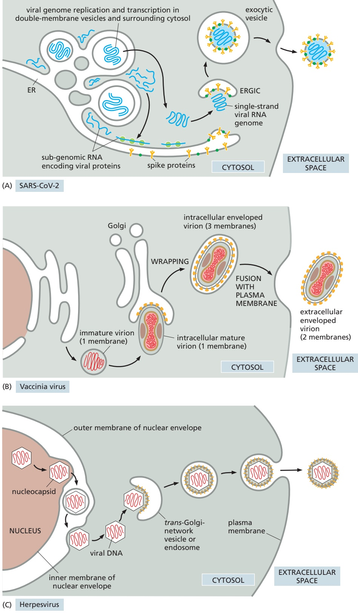
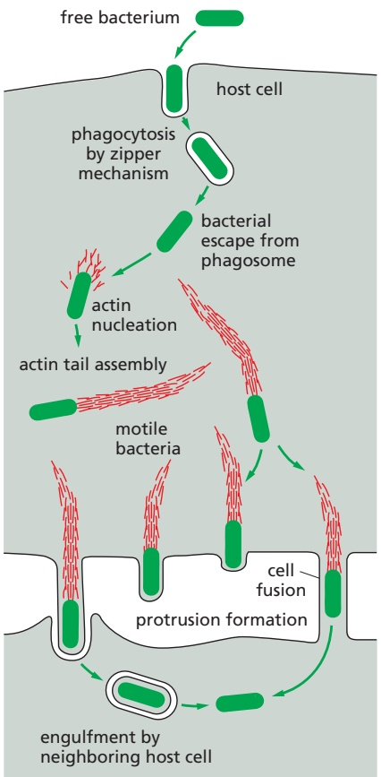
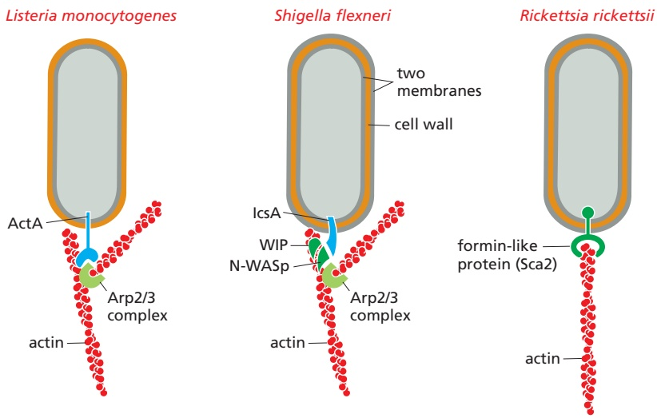
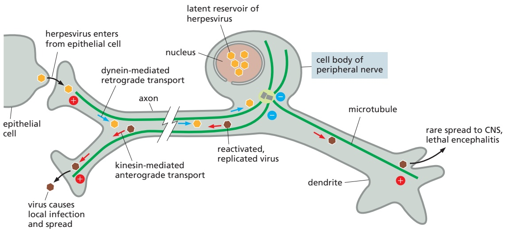
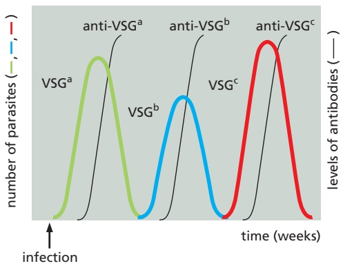
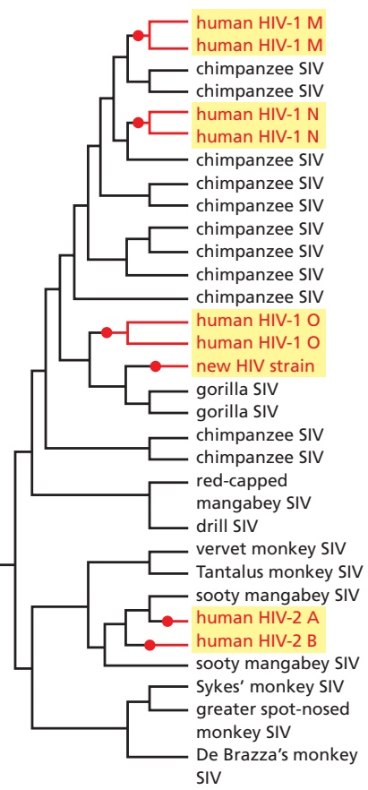
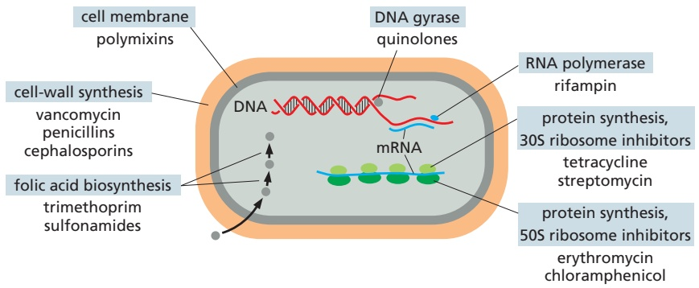
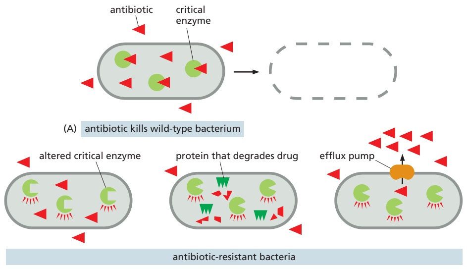

the secretory pathway through the Golgi apparatus to the plasma membrane; the viral capsid proteins and genome assemble into nucleocapsids, which acquire their envelope as they bud off from the plasma membrane (see Figure 23–12). The process for SARS-CoV-2 is more complicated, as this virus induces the formation of convoluted double-membrane vesicles derived from the endoplasmic reticulum, which house its genome replication factories (**Figure 23–28A**). These

Figure 23–28 Complex strategies for viral envelope acquisition. (A) The coronavirus SARS-CoV-2 replicates its positive sense RNA genome in double membrane vesicles associated with the endoplasmic reticulum (ER). Viral genomes are released into the cytoplasm by a poorly understood mechanism that may involve passage through pores in the double membrane. Transcription of subgenomic RNAs encoding viral structural proteins occurs in the surrounding cytosol. Translation of transmembrane viral proteins, including the spike protein, occurs on the ER. These proteins are then trafficked from the ER to the ER Golgi intermediate compartment (ERGIC), where the singlestranded viral RNA genome associates with viral proteins to drive formation of virus particles in the lumen of exocytic vesicles. When these vesicles fuse with the plasma membrane, viruses are released from the cell surface. (B) Vaccinia virus assembles in “replication factories” in the cytosol, far away from the plasma membrane. The immature virion, surrounded by a single membrane, then acquires two additional membranes from the Golgi apparatus by a poorly understood wrapping mechanism, to form the intracellular enveloped virion. After fusion of the outermost membrane with the host-cell plasma membrane, the extracellular enveloped virion is released from the host cell. (C) Herpesvirus nucleocapsids assemble in the nucleus and then bud through the inner nuclear membrane into the space between the inner and outer nuclear membranes, acquiring a membrane coat. The virus particles then apparently lose this coat when they fuse with the endoplasmic reticulum membrane to escape into the cytosol. Subsequently, the nucleocapsids travel through the Golgi apparatus, acquiring two new membrane coats in the process. The virus then buds from the cell surface with a single membrane when its outer membrane fuses with the plasma membrane.

may concentrate replication intermediates and sequester such intermediates from innate immune sensor molecules (see Chapter 24). Viral genomes are then released into the cytoplasm by an unknown mechanism and interact with viral structural proteins in the endoplasmic reticulum Golgi intermediate compartment (ERGIC), acquiring two new lipid bilayer membrane coats. Subsequent fusion of virus-containing exocytic vesicles with the plasma membrane leads to the release of viruses with a single membrane envelope. DNA viruses such as herpesviruses and vaccinia virus also alter membrane traffic and acquire their lipid envelopes in complex ways (**Figure 23–28B and C**).

## Bacteria and Viruses Use the Host-Cell Cytoskeleton for Intracellular Movement

As mentioned earlier, many pathogens escape into the cytosol rather than remaining in a membrane-enclosed compartment. The cytosol of mammalian cells is extremely viscous, as it is crowded with protein complexes, organelles, and cytoskeletal filaments, all of which inhibit the diffusion of particles the size of a bacterium or a viral nucleocapsid. Thus, to reach a particular region of the host cell, a pathogen must be actively moved there. As with transport of intracellular organelles, pathogens generally use the host cell’s cytoskeleton for their active movement.

Several pathogens have adopted a remarkable mechanism that depends on actin polymerization for their movement. These include the human bacterial pathogens Listeria monocytogenes, Shigella flexneri, Rickettsia rickettsii (which causes Rocky Mountain spotted fever), and Burkholderia pseudomallei (which causes melioidosis, a disease characterized by severe respiratory symptoms), as well as Ebola virus and the insect virus baculovirus. All induce the nucleation and assembly of host-cell actin filaments at one pole of the microbe. The growing filaments generate force and push the pathogens through the cytosol at rates of up to 1 µm/min (**Figure 23–29**). New filaments form at the rear of each pathogen and are left behind like a rocket trail as the microbe advances; the filaments depolymerize within a minute or so as they encounter depolymerizing factors in the cytosol. For L. monocytogenes and S. flexneri, the moving bacteria collide with the plasma membrane and move outward, inducing the formation of long, thin, host-cell protrusions with the bacteria at their tip. A neighboring cell often engulfs these projections, allowing the bacteria to enter the neighbor’s cytoplasm without exposure to the extracellular environment, thereby avoiding antibodies produced by the host’s adaptive immune system. For B. pseudomallei, movement and collision of the bacteria with the plasma membrane promote cell–cell fusion, which serves a similar purpose of immune avoidance while aiding continued bacterial replication.

The molecular mechanisms of pathogen-induced actin assembly differ for the different pathogens, suggesting that they evolved independently (**Figure 23–30**). L. monocytogenes and baculovirus produce proteins that directly bind to and activate the Arp2/3 complex to initiate the formation of an actin tail and movement (see Figure 16–17). S. flexneri produces an unrelated surface protein that binds to and activates the NPF N-WASp, which then activates the Arp2/3 complex. Rickettsia and Burkholderia species produce proteins that directly polymerize actin, for example by mimicking the function of host proteins such as formins (see Figure 16–13).

Many viral pathogens rely primarily on microtubule-dependent motor proteins, rather than actin polymerization, to move within the host-cell cytosol, taking advantage of the inherent polarity of microtubules to enable directed longrange movements. Important examples are viruses that infect neurons, such as the neurotropic alphaherpesviruses, which include the virus that causes chickenpox (**Figure 23–31**). These virions enter sensory neurons at the tips of their axons and move by retrograde (“backward”) axonal transport along the axon toward the microtubule minus end. The transport is mediated by attachment of viral capsid proteins to the motor protein dynein. These viruses then establish eitherMBoC7 m23.29/23.30 productive or latent infection in the nuclei of neurons of the peripheral nervous system. After replication or reactivation, virions are then carried by anterograde (“forward”) axonal transport along microtubules to the axon tips, with the transport being mediated by the attachment of a different viral capsid protein to a kinesin motor protein. Many other viruses associate with either dynein or kinesin motor proteins to move along microtubules at some stage in their replication, and some even alter the dynamic assembly and disassembly of microtubules. As microtubules serve as oriented tracks for vesicular transport in all cell types, not just neurons, it is not surprising that many viruses have independently evolved the ability to exploit them for their own transport.

<small>Figure 23–29 The actin-based movement of bacterial pathogens within and between host cells. After invasion, bacterial pathogens such as L. monocytogenes, S. flexneri, R. rickettsii, and B. pseudomallei induce the assembly of actin-rich tails in the host-cell cytoplasm, which drives rapid bacterial movement. For most of these pathogens, the moving bacteria collide with the host-cell plasma membrane to form membrane-covered protrusions, which are engulfed by neighboring cells—spreading the infection from cell to cell. In contrast, for B. pseudomallei, collision with the plasma membrane promotes cell–cell fusion, creating a conduit through which bacteria can invade neighboring cells (Movie 23.7).</small>

Figure 23–30 Molecular mechanisms for actin nucleation by various bacterial pathogens. L. monocytogenes and S. flexneri induce actin nucleation by recruiting and activating the host Arp2/3 complex (see Figure 16–12), although each uses a different recruitment strategy: L. monocytogenes expresses a surface protein, ActA, that directly binds to and activates the Arp2/3 complex; S. flexneri expresses a surface protein, IcsA (unrelated to ActA), that recruits the host NPF N-WASp, which in turn recruits the Arp2/3 complex, along with other host proteins, including WIP (WASp-interacting protein). R. rickettsii uses an entirely different strategy: it expresses a surface protein, Sca2, that directly nucleates actin polymerization by mimicking the activity of host formin proteins.

Figure 23-31 Microtubule-based movement of viruses. Neurotropic alphaherpesviruses infect peripheral nerve cells from neighboring epithelial cells in the skin. Virus particles are then transported along microtubules in the nerve-cell axon toward the microtubule minus ends in the cell body (retrograde transport), a process that is driven by dynein motor proteins. Upon reaching the cell body, viruses can establish a latent reservoir in the nucleus. After reactivation (for example, following stress 7 23.102/23.31or immune suppression) or upon replication, virus particles are again transported along microtubules in the axon, this time toward the microtubule plus ends at the nerve terminal (anterograde transport), where they are released to enable local reinfection and spread. In rare instances, viruses can instead spread to the central nervous system (CNS), which can cause encephalitis.

Figure 23–32 Microbial manipulation of autophagy. Microbial pathogens have various mechanisms for avoiding antimicrobial autophagy (red lines), which include modifying their surface to avoid autophagy initiation or secreting factors and initiating actin-based motility to avoid enclosure in autophagosomes. Microbes can also exploit autophagy (green arrows), for example by recruiting and fusing with autophagosomes to gain nutrients and lipids or by growing near autolysosomes for nutrient acquisition.

Many Microbes Manipulate Autophagy

Whether a microbe lives within the cytosol or inside a membrane-bound compartment, it must contend with the host cell’s defenses, which include the autophagy pathway (see Figure 13–67). Autophagy is the process through which organelles or other cytoplasmic cargoes become surrounded by a double-membrane autopha-MBoC7 n23.103/23.32 gosome that fuses with lysosomes to promote degradation (see Figure 13–71). It has recently become apparent that targeting of intracellular microbes for destruction by autophagy is an important pathway in the innate immune defense against infection (see Chapter 24). When this occurs, the process is called antimicrobial autophagy, or xenophagy. Not surprisingly, pathogens have evolved various strategies either to avoid antimicrobial autophagy or to manipulate autophagy pathways for their own benefit (**Figure 23–32**).

One strategy for avoiding antimicrobial autophagy is to deploy a protective shield that prevents detection of the microbe by the host cell. Francisella tularensis, which causes the zoonosis tularemia, or rabbit fever, uses this scheme. Once it escapes from the phagosome into the cytosol, it shields its surface by producing a variant of its outer membrane LPS that is not recognized by the host cell’s autophagy initiation machinery. Other strategies to subvert autophagy, employed by L. monocytogenes, are to secrete bacterial enzymes and harness actin-based movement, both of which enable bacteria to avoid enclosure by autophagosomes. On the other hand, some pathogens take the opposite strategy of activating and then exploiting autophagy. Coxiella burnetii, which causes the zoonosis Q fever, replicates in a membrane-bound compartment that recruits and fuses with autophagosomes to deliver nutrients as well as lipids for compartment expansion. Poliovirus makes use of autophagy for the alternative effect of promoting virus trafficking to the plasma membrane and release from the host cell.

## Viruses Can Take Over the Metabolism of the Host Cell

Viruses use basic host-cell machinery for most aspects of their reproduction: they depend on host-cell ribosomes to produce their proteins, and many use host-cell DNA and RNA polymerases for their own replication and transcription. Many viruses encode proteins that modify the host transcription or translation apparatus to favor the synthesis of viral RNAs and proteins over those of the host cell, shifting the synthetic capacity of the cell toward the production of new virus particles. Poliovirus, for example, encodes a protease that specifically cleaves the TATA-binding component of TFIID (see Figure 6–15), shutting off transcription of most of the host cell’s protein-coding genes. Influenza virus produces a protein that blocks both the splicing and the polyadenylation of host-cell RNA transcripts, preventing their export into the cytosol (see Figure 6–39), but does not affect viral RNA transcripts.

Viruses also alter translation by the host. Translation initiation for most hostcell mRNAs depends on recognition of their 5′ cap by translation initiation factors (see Figure 6–40). This initiation process is often inhibited during viral infection, so that the host-cell ribosomes can be used more efficiently for the synthesis of viral proteins. Some viral genomes encode endonucleases that cleave off the 5′ cap from host-cell mRNAs; some go even further by using the liberated 5′ caps as primers to synthesize viral mRNAs, a process called cap snatching. Several other viral RNA genomes encode proteases that cleave certain translation initiation factors; these viruses rely on 5′ cap–independent translation of their own RNA, using internal ribosome entry sites (IRESs; see Figure 7–72).

DNA viruses that replicate in the nucleus use host-cell DNA polymerase to replicate their genome. Because DNA polymerase is expressed at high levels only during S phase of the cell cycle, adenovirus has evolved a mechanism to drive the host cell into S phase, so that the cell produces large amounts of active DNA polymerase, which then replicates the viral genome. To accomplish this, the adenovirus genome also encodes proteins that inactivate both Rb (see Figure 17–59) and p53 (see Figure 17–60), two key suppressors of cell-cycle progression. As might be expected for any mechanism that encourages unregulated DNA replication, these viruses can promote, under some circumstances, the development of cancer.

Animal RNA viruses encode their own replication proteins because most animals lack polymerase enzymes that use RNA as a template (such as the RNA-dependent RNA polymerases used in RNA interference; see Chapter 7). For RNA viruses with a single-stranded genome, the replication strategy depends on whether the RNA is a positive [+] strand, which contains translatable information like mRNA does, or a complementary negative [–] strand. When the RNA genome is a positive [+] strand (such as for the coronavirus SARS-CoV-2), the incoming viral genome is translated to produce the viral RNA polymerase and viral proteins; the viral polymerase is then used to replicate the viral RNA and to generate mRNAs for the production of more viral proteins. For viruses with a negative [–] strand RNA genome (such as influenza and measles virus), an RNA polymerase enzyme is packaged as a structural protein of the incoming viral capsids.

Retroviruses such as HIV, which have a positive [+] strand RNA genome, are a special class of RNA virus because they carry with them a viral reverse transcriptase enzyme. After entry to the host cell, the reverse transcriptase uses the viral RNA genome as a template to synthesize a double-stranded DNA copy of the viral genome, which enters into the nucleus and integrates into the host cell’s chromosomes (see Figure 5–61). It is later transcribed by the cell’s DNA-dependent RNA polymerase to produce viral genomes and proteins.

## Pathogens Can Evolve Rapidly by Antigenic Variation

The complexity and specificity of the interplay between pathogens and their host cells might suggest that virulence would be difficult to acquire by random mutation. Yet, new pathogens are constantly emerging, and old pathogens are constantly changing in ways that make familiar infections more difficult to pre-vent or treat. Pathogens have two advantages that enable them to evolve rapidly. First, they replicate very quickly, providing a great deal of mutational variation for natural selection to work with. Whereas humans and chimpanzees have acquired a 2% difference in genome sequences over about 8 million years of divergent evolution, poliovirus manages a 2% change in its genome in 5 days—about the time it takes the virus to pass from the human mouth to the gut. Second, selective pressures act rapidly on this genetic variation. The host’s adaptive immune system and modern microbicidal drugs, both of which destroy pathogens that fail to change, are the main sources of these selective pressures.

(A)

(B)

An example of an adaptation to the selective pressure imposed by the adaptive immune system is the phenomenon of **antigenic variation**. An important adaptive immune response against many pathogens is the host’s production of antibodies that recognize specific molecules (antigens) on the pathogen’s surface (discussed in Chapter 24). Many pathogens have evolved mechanisms that change these anti-gens during the course of an infection, enabling them to stay one step ahead of the antibody response. Some eukaryotic parasites, for example, undergo programmed rearrangements of the genes encoding their surface antigens (**Figure 23–33**). A striking example occurs in Trypanosoma brucei, a protozoan parasite that causes African sleeping sickness and is spread by tsetse flies. (T. brucei is a relative of T. cruzi—see Figure 23–22—but it replicates extracellularly rather than intracellularly.) T. brucei is covered with a single type of glycoprotein, called variant-specific glycoprotein (VSG), which elicits in the host an antibody response that rapidly clears most of the parasites. The trypanosome genome, however, contains about 1000 different inactive Vsg genes (or pseudogenes), each encoding a VSG with a distinct amino acid sequence. Only one Vsg gene is expressed at any one time, from one of approximately 20 possible expression sites in the genome. Gene rearrangements that copy different inactive Vsg genes into expression sites repeatedly change the VSG protein displayed on the surface of the pathogen. In this way, a few trypanosomes with an altered VSG escape the initial antibody-mediated clearance, replicate, and cause the disease to recur, leading to a chronic cyclic infection.

Figure 23-33 Antigenic variation in trypanosomes. (A) There are about 1000 distinct Vsg genes in Trypanosoma brucei, and they are expressed one at a time from approximately 20 expression sites in the genome. To be expressed, an inactive gene is copied and the copy is moved into an expression site through DNA recombination. Each Vsg gene encodes a different surface protein (antigen). These switching events allow the trypanosome to repeatedly change the surface antigen it expresses. (B) A person infected with trypanosomes expressing VSGa mounts an antibody response against this particular antigen, which clears most of the VSGaexpressing parasites. However, a few of the trypanosomes will have spontaneously switched to expression of VSGb, which can now proliferate until anti-VSGb antibodies are made. By that time, however, some parasites will have switched to VSGc, and so the cycle continues.

Bacterial pathogens can also rapidly change their surface antigens. Species of the genus Neisseria are champions at this. These Gram-negative cocci can cause sexually transmitted disease, in the case of Neisseria gonorrhoeae, or meningitis, in the case of Neisseria meningitidis. They undergo genetic recombination very similar to that just described for eukaryotic pathogens, which enables them to vary the pilin protein they use to attach to host cells. By inserting one of the multiple silent copies of variant pilin genes into a single expression locus, they can express many slightly different versions of the protein and repeatedly change the amino acid sequence over time. Neisseria bacteria are also extremely adept at taking up DNA from their environment by natural transformation and incorporating it into their genomes, further contributing to their extraordinary variability. The end result of this considerable variation is a plethora of different surface protein compositions with which to bewilder the host adaptive immune system. It is therefore not surprising that it has been difficult to develop an effective vaccine against N. gonorrhoeae infections, although there are now several that protect against N. meningitidis, due to the much smaller number of variants of its surface polysaccharide capsule.

## Error-prone Replication Dominates Viral Evolution

In contrast to the DNA rearrangements in bacteria and parasites, viruses rely on an error-prone replication mechanism for antigenic variation. Retroviral genomes, for example, acquire on average one point mutation every replication cycle, because the viral reverse transcriptase (see Figure 5–61) needed to produce DNA from the viral RNA genome lacks the proofreading activity of DNA polymerases. A typical, untreated HIV infection may eventually produce HIV genomes with every possible point mutation. By a process of mutation and selection within each host, most HIV viruses change over time—from a form that is most efficient at infecting macrophages to one more efficient at infecting T cells, as described earlier (see Figure 23–18). Similarly, once a patient is treated with an antiviral drug, the viral genome can quickly mutate and be selected for its resistance to the drug. Remarkably, only about one-third of the nucleotide positions in the coding sequence of the viral genome are invariant (because mutations at these positions would be detrimental to the virus), and nucleotide sequences in some parts of the genome, such as the Env gene (see Figure 7–66), can differ by as much as 30% from one HIV isolate to another. This extraordinary genomic plasticity greatly complicates attempts to develop vaccines against HIV.

The rapid evolution of HIV by error-prone replication has also led to the swift emergence and spread of new HIV strains. Nucleotide sequence comparisons between various strains of HIV and the very similar simian immunodeficiency virus (SIV) isolated from a variety of monkey species suggest that the most virulent type of HIV, HIV-1, may have jumped from primates to humans multi-ple independent times, starting as long ago as 1908 (**Figure 23–34A**). Sequence

(A)

= jumps from monkey and ape to human

(B)

Figure 23–34 Diversification of HIV-1, HIV-2, and related strains of SIV. (A) HIV comprises different viral families, all descended from SIV (simian immunodeficiency virus). On three separate occasions, SIV was passed from a chimpanzee to a human, resulting in three HIV-1 groups: major (M), outlier (O), and non-M non-O (N). HIV-1 M is the most common and is primarily responsible for the global AIDS epidemic. On two separate occasions, SIV was passed from a sooty mangabey monkey to a human, resulting in the two pandemic HIV-2 groups A and B. In 2009, a new strain of HIV was discovered that appears to have resulted from SIV passage from a gorilla to a human. (B) Geography and timing of HIV-1 spread from Africa to other parts of the world.

comparisons between human HIV strains has further enabled a reconstruction of the evolutionary and geographic history of the current pandemic of HIV-1 group M (major). The pandemic strain is thought to have originated in Kinshasa, Democratic Republic of the Congo, in the 1920s. Virus spread increased in Africa in the 1960s due to changing sexual behaviors and emerging transportation networks (Figure 23–34B). It then crossed the Atlantic to Haiti in the late 1960s and spread to New York and other locations in the United States in the 1970s, eventually giving rise to a worldwide pandemic.

An important exception to the rule that error-prone replication dominates viral evolution is the influenza viruses. Although they accumulate point mutations as they replicate, they differ from other viruses in that their genome consists of several (usually eight) strands of RNA, each of which codes for different proteins. WhenMBoC7 m23.32/23.35 two strains of influenza infect the same host, the RNA strands of the two strains can reassort to form a new type of influenza virus. In normal years, influenza is a mild disease in healthy adults, although it can be life-threatening in the very young and very old. Different influenza strains infect fowl such as ducks and chickens, but only a subset of these strains can infect humans, and transmission from fowl to humans is rare. In 1918, however, a particularly virulent variant of avian influenza crossed the species barrier to infect humans, triggering the catastrophic pandemic of 1918 called the Spanish flu, which killed 20–50 million people worldwide. Subsequent influenza pandemics have been triggered by genome reassortment, in which a new RNA segment from an avian form of the virus replaced one or more of the viral RNA segments from the human form (**Figure 23–35**). In 2009, a new H1N1 swine virus emerged that derived genes from pig, avian, and human influenza viruses. Such recombination events allowed the new virus to replicate rapidly and spread through an immunologically naïve human population. Generally, within 2 or 3 years, the human population develops immunity to a new recombinant strain of virus, and the infection rate drops to a steady-state level. Because the recombination events are unpredictable, it is not possible to know when the next influenza pandemic will occur or how severe it might be.

## Drug-resistant Pathogens Are a Growing Problem

The development of drugs that cure rather than prevent infections has had a major impact on human health. **Antibiotics**, which are either bactericidal (they kill bacteria) or bacteriostatic (they inhibit bacterial growth without killing), are the most successful class of such drugs. Penicillin was one of the first antibiotics

Figure 23–35 Model for the evolution of pandemic strains of influenza virus by recombination. Influenza A virus is a natural pathogen of birds, particularly waterfowl, and it is always present in wild bird populations. In 1918, a particularly virulent form of the virus crossed the species barrier from birds to humans and caused a devastating worldwide epidemic. This strain was designated H1N1, referring to the specific forms of its main antigens, hemagglutinin (H) and neuraminidase (N). Changes in the virus, rendering it less virulent, and the rise of adaptive immunity in the human population prevented the pandemic from continuing in subsequent seasons, although H1N1 influenza strains continued to cause serious disease every year in very young and very old people. In 1957, a new pandemic arose when three genes were replaced by equivalent genes from a different avian virus (green bars); the new strain (designated H2N2) was not effectively cleared by antibodies in people who had previously contracted only H1N1 forms of influenza. In 1968, another pandemic was triggered when two genes were replaced from yet another avian virus; the new virus was designated H3N2. In 1977, there was a resurgence of H1N1 influenza, which had previously been almost completely replaced by the N2 strains. Molecular sequence information suggests that this minor pandemic may have been caused by an accidental release of an influenza strain that had been held in a laboratory since about 1950 or by the use of this strain in a vaccine study. In 2009, a new H1N1 swine virus emerged that had derived five genes from pig influenza viruses, two from avian influenza viruses, and one from a human influenza virus. As indicated, most human influenza today is caused by H1N1 and H3N2 strains.

(D)

(C)

Figure 23–36 Antibiotic targets. Although there are many antibiotics in clinical use, they have a narrow range of targets, which are highlighted in blue. A few representative antibiotics in each class are listed. Nearly all antibiotics used to treat human infections fall into one of these categories. The vast majority inhibit either bacterial protein synthesis or bacterial cell-wall synthesis. The illustration example is a Gram-positive bacterium.

used to treat infections in humans, just in time to prevent tens of thousands of deaths from infected battlefield wounds in World War II. Because bacteria (see Figure 1–9) are not closely related evolutionarily to the eukaryotes they infect, much of their basic machinery for cell-wall synthesis, DNA replication and transcription, RNA translation, and metabolism differs from that of their host. These differences enable us to develop antibacterial drugs that exhibit selective toxicity, in that they specifically inhibit these processes in bacteria without disrupting them in the host. Most of the antibiotics that we use to treat bacterialMBoC7 m23.33/23.36 infections are small molecules that inhibit macromolecular synthesis in bacteria by targeting bacterial enzymes that either are distinct from their eukaryotic counterparts or are involved in pathways such as cell-wall biosynthesis that are absent in animals (**Figure 23–36**; see also Table 6–4).

However, bacteria continually evolve and strains resistant to antibiotics rapidly develop, often within a few years of the introduction of a new drug. Similar drug resistance also arises rapidly when treating viral infections with antiviral drugs. The virus population in an HIV-infected person treated with the reverse transcriptase inhibitor azidothymidine (AZT), for example, will acquire complete resistance to the drug within a few months. The current protocol for treatment of HIV infections involves the simultaneous use of three drugs, which helps to minimize the acquisition of resistance for any one of them. Even eukaryotic pathogens rapidly evolve resistance. The malaria parasite Plasmodium falciparum is now generally resistant to the heavily used drug chloroquine, which was introduced in the 1930s, and resistance to the newer drug artemisinin is emerging.

There are three general strategies by which a pathogen can develop drug resistance: (1) it can alter the molecular target of the drug so that it is no longer sensitive to the drug; (2) it can produce an enzyme that modifies or destroys the drug; or (3) it can prevent the drug’s access to the drug target by, for example, actively pumping the drug out of the pathogen (**Figure 23–37**).

Figure 23–37 Three general mechanisms of antibiotic resistance. (A) A nonresistant wild-type bacterial cell bathed in a drug (red triangles) that binds to and inhibits an essential enzyme (light green) will be killed because of enzyme inhibition. (B) A bacterium that has altered the drug’s target enzyme so that the drug no longer binds to the enzyme will survive and proliferate. In many cases, a single point mutation in the gene encoding the target protein can generate resistance. (C) A bacterium that expresses an enzyme (dark green) that either degrades or covalently modifies the drug will survive and proliferate. Some resistant bacteria, for example, make β-lactamase enzymes, which cleave penicillin and similar molecules. (D) A bacterium that expresses or up-regulates an efflux pump that ejects the drug from the bacterial cytoplasm (using energy derived from either ATP hydrolysis or the electrochemical gradient across the bacterial plasma membrane) will survive and proliferate. Some efflux pumps, such as the TetR efflux pump, are specific for a single drug (in this case, tetracycline), whereas others, called multidrug resistance (MDR) efflux pumps, are capable of exporting a wide variety of structurally dissimilar drugs. Up-regulation of an MDR pump can render a bacterium resistant to a very large number of different antibiotics in a single step.

Once a pathogen has chanced upon an effective drug-resistance strategy, the newly acquired or mutated genes that confer the resistance are frequently spread throughout the pathogen population by horizontal gene transfer. They may even spread between pathogens of different species. The highly effective but expensive antibiotic vancomycin, for example, is used as a treatment of last resort for many severe, hospital-acquired, Gram-positive bacterial infections that are resistant to most other known antibiotics. Vancomycin prevents one step in bacterial cell-wall synthesis—the cross-linking of peptidoglycan chains in the bacterial cell wall (see Figure 23–3B). Resistance can arise if the bacterium synthesizes a cell wall using different subunits that do not bind vancomycin. The most devastating form of vancomycin resistance depends on the acquisition of a transposon (see Figure 5–58) containing seven genes, the products of which work together to sense the presence of vancomycin, shut down the normal pathway for bacterial cell-wall synthesis, and produce a different type of cell wall.

Drug-resistance genes acquired by horizontal transfer frequently come from environmental microbial reservoirs. Nearly all antibiotics used to treat bacterial infections today are based on natural products produced by fungi or bacteria. Penicillin, for example, is made by the mold Penicillium, and more than 50% of the antibiotics currently used in the clinic are made by Gram-positive bacteria of the genus Streptomyces, which reside in the soil. It is believed that microorganisms produce antimicrobial compounds, many of which have probably existed on Earth for hundreds of millions of years, as weapons in their competition with other microorganisms in the environment. Surveys of bacteria taken from soil samples that have never been exposed to antibiotic drugs used in modern medicine reveal that there are bacteria already resistant to about seven or eight of the antibiotics widely used in clinical practice. When pathogenic microorganisms are faced with the selective pressure provided by antibiotic treatments, they can apparently draw upon the immense source of genetic material in environmental microbial reservoirs to acquire resistance.

Like most other aspects of infectious disease, human behavior has exacerbated the problem of drug resistance. Many patients take antibacterial antibiotics for symptoms that are typically caused by viruses (flu-like illnesses, colds, and sore throats), and these drugs have no effects. Persistent and chronic misuse of antibiotics can eventually result in antibiotic-resistant microbes, which can then transfer the resistance to pathogens. Antibiotics are also misused in the livestock industry, where they are commonly employed as food additives to promote the growth and health of farm animals. An antibiotic closely related to vancomycin was commonly added to cattle feed in Europe; the resulting resistance in the microbiota of these animals is widely believed to be one of the original sources for vancomycin-resistant bacteria that now threaten the lives of hospitalized patients.

## Summary

All pathogens share the ability to interact with host cells in diverse ways that promote pathogen replication and spread. Pathogens often colonize the host by adhering to or invading the epithelial surfaces that line the respiratory, gastrointestinal, and urinary tracts, as well as the other body surfaces in direct contact with the environment. Intracellular pathogens, including all viruses and many bacteria and protozoa, invade host cells by one of several mechanisms. Viruses rely largely on receptor-mediated endocytosis, whereas bacteria exploit cell adhesion and phagocytic pathways; in both cases, the host cell provides the machinery and energy for the invasion. Protozoa, by contrast, employ unique invasion strategies that usually require significant energy expenditure on the part of the invader. Once inside, intracellular pathogens seek out a cell compartment that is favorable for their survival and replication, frequently altering host membrane traffic, exploiting the host-cell cytoskeleton for intracellular movement, and manipulating autophagy. Pathogens evolve rapidly, so that new infectious diseases frequently emerge, and old pathogens acquire new ways to evade our attempts at prevention, treatment, and eradication.

Because the acquisition of drug resistance is almost inevitable, it is crucial that we take measures to delay the onset of resistance and develop innovative new drug treatments.

## THE HUMAN MICROBIOTA

Although pathogens can cause disease in otherwise healthy humans, it is now appreciated that our bodies are colonized by many microbes that normally cause no harm. These microbes compose the so-called microbiota. Recent estimates suggest that the human body contains about $3 \times 1 0 ^ { 1 3 }$ human cells, as well as approximately 4 $1 \times 1 0 ^ { 1 3 }$ resident microbial cells. As detailed below, we now appreciate that the microbiota is a complex microbial community that makes important contributions to human biology.

## The Human Microbiota Is a Complex Ecological System

The human microbiota is usually confined to specific locations of the body (**Figure 23–38**), including the skin, mouth, digestive tract, and vagina, with distinct communities of species inhabiting each body part. Of the resident microbes, bacterial cells make up the vast majority by sheer numbers (>99%), whereas there are smaller numbers of archaeal, fungal, and protozoan cells. The concentrations and total numbers of microbial cells differ vastly between body locations (Figure 23–38), with the large intestine containing by far the most microbial residents.

The microbiota of an individual person consists of thousands of different microbial species. The species composition varies considerably between individual humans, even between close relatives or identical twins. Different body sites also have different degrees of species diversity. The digestive tract, for example, contains between 500 and 1000 species, most belonging to only a few phyla of bacteria. The microbiota of the digestive tract also provides an interesting illustration of how the diversity and composition of microbial species can change over time, from birth through adulthood. The digestive tract of human infants is colonized by environmental microbes during birth, and the mode of birth (vaginal delivery versus cesarean section) can influence species composition. During the first year of life, the microbiota consists of fewer species that vary considerably over time and between individuals, whereas species diversity increases and composition stabilizes at 1–2 years of age. Thereafter, the microbiota of an individual is generally consistent over time but is influenced by a variety of factors, including age, pregnancy, diet, health status, hygiene, and antibiotic use.

To appreciate the contributions of the microbiota to human biology, it is helpful to consider the various ecological terms that are used to classify relationships between microbes and their host. For the pathogens discussed earlier in this chapter, the microbe benefits to the detriment of the host, a situation referred to as **parasitism**. In contrast, most constituents of the microbiota exhibit less sinister ecological relationships with the host. Some exhibit **commensalism**, which describes the circumstance in which the microbe benefits but has no known beneficial or harmful effects on the host. In **mutualism**, both the microbe and host benefit. It is sometimes difficult to draw a line between these categories.

Figure 23–38 Sites in the human body that harbor the microbiota include the skin, mouth, and digestive tract. An estimate of the total number of microbes in each location is indicated.

Some constituents of the microbiota that exhibit commensalism or mutualism under normal circumstances can also act as parasites or opportunistic pathogens that can cause disease if our immune systems are weakened or if they gain access to a normally sterile part of the body.

## The Microbiota Influences Our Development and Health

It is increasingly recognized that many constituents of the human microbiota exhibit a mutualistic relationship with our bodies by supporting metabolism, development, and immunity (**Figure 23–39**). The anaerobic bacteria that inhabit our intestines, for example, gain shelter and a nutrient supply but also contribute to the digestion of our food and produce important metabolites. One reason for the beneficial influence of the microbiota on our metabolism is that the combined genomes of the various microbial species, called the **microbiome**, contain 100 times more genes than the number in the human genome itself. A consequence of this genomic diversity is that the microbiota expands the range of biochemical activities available to humans by producing small-molecule metabolites of different chemical composition or in greater abundance than that produced by our own cells. An example is the production of abundant short-chain fatty acids by the microbiota in the digestive tract, which may contribute to metabolism and may also signal to our cells to influence human physiology.

The microbiota is also important for normal development, most notably of the epithelial tissue and immune system in the digestive tract. Studies comparing mice with and without a gastrointestinal microbiota (so-called germ-free mice) show that the microbiota affects properties of the intestinal lining including villus geometry, stem-cell proliferation, blood vessel density, and mucus thickness (Figure 23–39). The mucosal immune system that is associated with the mucus-containing surface of the intestinal epithelium is also strongly influenced by the microbiota. The mucosal immune system must be fine-tuned to be non-responsive to beneficial microbes in the microbiota, yet responsive to pathogens and microbes that inappropriately penetrate into the epithelial layer. The microbiota plays an important role in the development of lymphoid tissues and in the appropriate differentiation of various immune cell types to control the overall number, species composition, and location of microbes in the digestive tract (Figure 23–39).

There is increasing evidence that an imbalance in the community of microbes that constitute the microbiota, referred to as dysbiosis, is correlated with various human diseases. These include autoimmune and allergic diseases, obesity,

Figure 23–39 Influences of the microbiota on metabolism and development. The microbiota (not drawn exactly to scale) produces nutrients as well as signaling molecules that affect host-cell biology and physiology and also influences the development of the intestinal epithelium and the mucosal immune system.