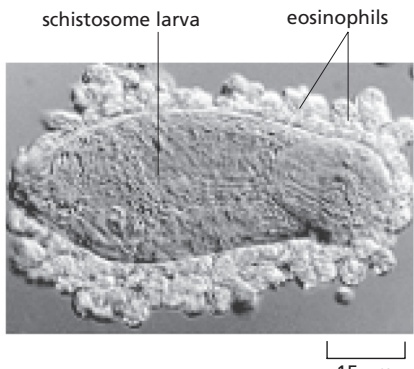
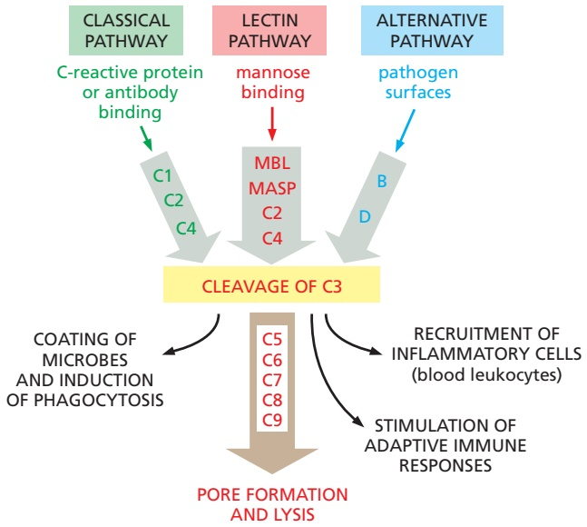
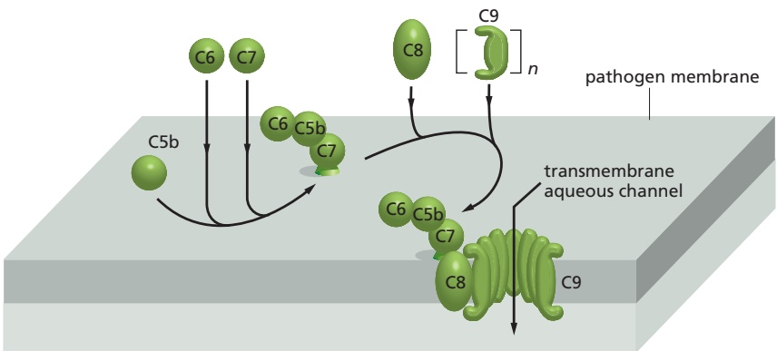
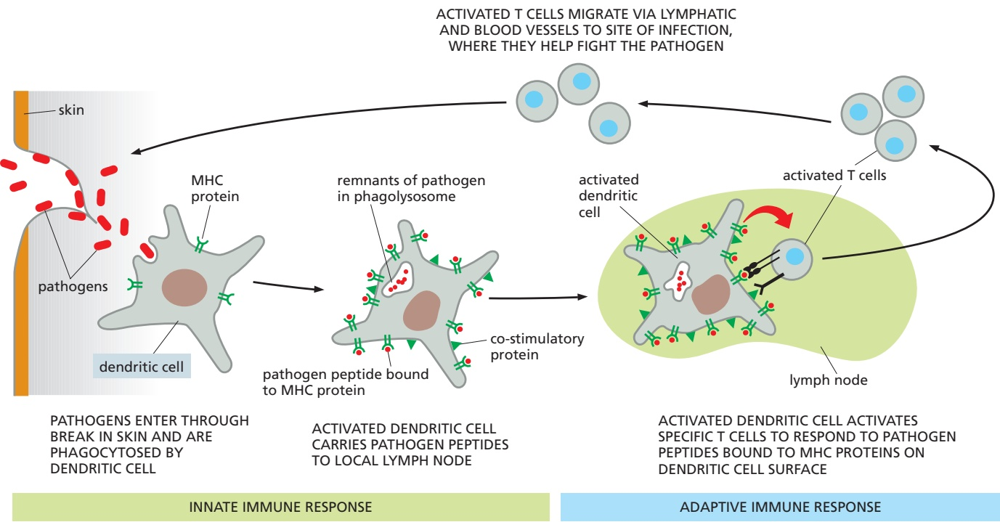

# The Innate and Adaptive Immune Systems

As we discussed in Chapter 23, all living organisms serve as hosts for other species, usually in relationships that are benign or even mutually helpful. But all organisms, and all cells in a multicellular organism, need to defend themselves against infection by harmful invaders, collectively called **pathogens**, which can be microbes (bacteria, viruses, or fungi) or larger parasites. The first line of defense against pathogens is provided by the **innate immune responses**, which can include protective barriers, toxic molecules, and phagocytic cells that ingest and destroy the invading pathogen. These and other innate immune defenses are not pathogen specific, but they usually can prevent or halt an infection early; if they fail to do so, some organisms, including all vertebrates and some bacteria and archaea (see Figure 7–81), can activate more sophisticated, powerful, and pathogen-specific adaptive immune responses. In this chapter, we mainly discuss the innate and adaptive immune systems of humans.

The diverse cells of our innate immune system can respond directly to a pathogen, and some of them can then help activate adaptive immune responses. The innate and adaptive immune responses then work together to help eliminate the pathogen (**Figure 24–1**). Unlike the innate responses, our adaptive responses are highly specific to the particular pathogen that induced them, and they depend on white blood cells called B and T lymphocytes. B lymphocytes (B cells) secrete anti-bodies that bind specifically to the pathogen. T lymphocytes (T cells) can either directly kill cells infected with the pathogen (**Figure 24–2**) or produce secreted or cell-surface signal proteins that stimulate other host cells to help destroy the pathogen. Whereas innate immune responses are generally brief, the adaptive responses provide long-lasting protection: a person who recovers from measles or is vaccinated specifically against it, for example, is protected for life against measles by the adaptive immune system, although not against other common viruses, such as those that cause mumps or chickenpox.

Both the innate and adaptive immune systems have evolved sensing mechanisms that enable the systems to recognize pathogens and their harmful products, and distinguish them from both the host’s own cells and molecules and from harmless or beneficial foreign organisms and their molecules. The innate system relies on various sensor proteins to distinguish self from nonself by recognizing particular types or patterns of molecules that are common to microbes but are absent or sequestered in the host. Our adaptive system, by contrast, uses unique genetic mechanisms to produce a virtually limitless diversity of related proteins—receptors on T and B cells and secreted antibodies—that, among them, can bind almost any foreign molecule. This remarkable strategy enables our adaptive immune system to react specifically against any pathogen, even if we never encountered it before. However, it also requires that the system learn not to react against self molecules or harmless foreign ones; if these learning mechanisms fail, harmful autoimmune or allergic responses result.

In this chapter, we focus mainly on features of our immune responses that distinguish them from other kinds of human cell and tissue responses. We begin with innate immune defenses and then discuss the highly specialized properties of our adaptive immune system.

C HAP T E R

IN THIS CHAPTER The Innate Immune System Overview of the Adaptive Immune System B Cells and Immunoglobulins T Cells and MHC Proteins

Figure 24–1 Innate and adaptive immune responses. Innate immune responses are activated directly by pathogens and defend all multicellular organisms against infection. In vertebrates, pathogens, together with the innate immune responses they MBoC7 m24.01/24.01activate, also stimulate adaptive immune responses, which then work together with innate immune responses to help fight the infection. Whereas adaptive responses are specific to a particular pathogen, innate responses are not.

## THE INNATE IMMUNE SYSTEM

Our adaptive immune responses are slow to develop when we first encounter a new pathogen. This is because the specific B cells and T cells that can respond to a particular pathogen are initially few in number and must be stimulated to proliferate and differentiate before they can mount effective adaptive immune responses, which can take days. By contrast, a single bacterium that divides every hour can generate almost 20 million progeny in a single day, producing a full-blown infection. We therefore rely on our **innate immune system** to defend us against infection during the first critical hours and days of exposure to a new pathogen.

In this section, we consider some of the strategies our innate immune system uses to recognize pathogens and to provide a first line of defense against them.

## Epithelial Surfaces Serve as Barriers to Infection

Our first encounters with infectious organisms are typically at the epithelial surfaces that form our skin and line our respiratory, digestive, and genitourinary tracts. These epithelia provide both physical and chemical barriers to invasion by pathogens: tight junctions between epithelial cells bar entry between the cells, and a variety of substances secreted by the cells discourage the attachment and entry of pathogens. The keratinized epithelial cells of the skin, for example, form a thick physical barrier, and the sebaceous glands in the skin secrete fatty acids and lactic acid, which inhibit bacterial growth. In addition, epithelial cells in all tissues, including those in plants and invertebrates, secrete antimicrobial molecules called **defensins**. Defensins are positively charged, amphipathic peptides that bind to and disrupt the membranes of many pathogens, including enveloped viruses, bacteria, fungi, and parasites.

The epithelial cells that line internal organs such as the respiratory and digestive tracts also secrete slimy mucus, which sticks to the epithelial surface and makes it difficult for pathogens to adhere. The beating of cilia on the surface of the epithelial cells lining the respiratory tract and the peristaltic action of the intestine also discourage the adherence of pathogens. Moreover, as we discuss in Chapter 23, healthy skin and gut are normally populated by enormous numbers of harmless (and often helpful) commensal microbes, collectively called the flora, which compete for nutrients with pathogens; some also produce antimicrobial peptides that actively inhibit pathogen proliferation. Commensal microbes also bring other benefits to their host: some of those in the gut, for example, help digest food and make several vitamins; some are also needed for the normal development of the gut’s innate and adaptive immune systems.

## Pattern Recognition Receptors (PRRs) Recognize Conserved Features of Pathogens

Pathogens do occasionally breach the epithelial barricades, in which case underlying nonepithelial cells of the innate immune system provide the next line of defense. These cells sense the presence of pathogens largely through the use of receptor proteins that recognize microbe-associated molecules that are either not present or are sequestered in the host organism. Because these microbial molecules often occur in repeating patterns, they are called **pathogen-associated molecular patterns**, or **PAMPs** (because the molecular patterns are shared with commensal microbes, they are also called microbe-associated molecular patterns, or MAMPs). PAMPs are present in various microbial macromolecules, including nucleic acids, lipids, polysaccharides, and proteins.

The diverse receptor proteins that recognize PAMPs are collectively called **pattern recognition receptors (PRRs)**, which not only bind to PAMPs but can also activate intracellular signaling pathways that lead to the production and secretion of various signal molecules that help fight the pathogen, as we discuss shortly. Some PRRs are transmembrane proteins on the surface of many types of host cells, where they recognize extracellular pathogens. On specialized phagocytic cells (phagocytes) such as macrophages and neutrophils, for example, they

Figure 24–2 Two classes of vertebrate adaptive immune responses.

Lymphocytes carry out both classes, shown here as responses to a viral infection. In one class, B cells secrete antibodies that specifically bind to and. / . neutralize an extracellular virus, thereby preventing the virus from infecting host cells. In the other, T cells mediate the response; in this example, they kill the virus-infected host cells. In both cases, innate immune responses help activate the adaptive immune responses through pathways that we discuss later.

0.2 mm

Figure 24–3 A scanning electron micrograph of a mutant fruit fly that died from a fungal infection. The fly is covered with fungal hyphae, as it lacked Toll receptors, which help protect Drosophila from fungal infections. (From B. Lemaitre et al., Cell 86:973–983, 1996. With permission from Elsevier.)

can help mediate the uptake of the pathogens into phagosomes, which then fuse with lysosomes to form phagolysosomes, where the pathogens are destroyed.MBoC7 m24.03/24.03 Other PRRs are located intracellularly, where they can detect intracellular pathogens such as viruses; these PRRs are either free in the cytosol or associated with the membranes of the endolysosomal system (discussed in Chapter 13). Still other PRRs are secreted and bind to the surface of extracellular pathogens, marking them for destruction by either phagocytes or blood proteins that are part of the complement system (discussed later).

## There Are Multiple Families of PRRs

The first PRR identified was the Toll receptor in Drosophila, which was already well known for its role in fly development (see Figure 21–16). It was later discovered to be required also for the production of antimicrobial peptides that protect the fly against fungal infections (**Figure 24–3**). Toll is a transmembrane glycoprotein with a large extracellular domain that contains a series of leucine-rich repeats. Soon it was discovered that both plants and animals have a variety of **Toll-like receptors (TLRs)** that function as PRRs in innate immune responses against various pathogens. A human makes at least 10 different TLRs, each recognizing distinct ligands: TLR3, for example, recognizes double-stranded viral RNA in the endosomal lumen (**Figure 24–4**); TLR4 recognizes lipopolysaccharide (LPS) on the outer membrane of Gram-negative bacteria; TLR5 recognizes the protein that forms the bacterial flagellum; TLR7 and TLR8 recognize singlestranded viral RNA; and TLR9 recognizes short, unmethylated sequences of bacterial, viral, or protozoan DNA, called CpG motifs, which are uncommon in vertebrate DNA.

In addition to TLRs, humans use several other families of PRRs to detect pathogens. One is the large family of **NOD-like receptors (NLRs)**. Like TLRs, NLRs have leucine-rich repeat motifs, but they are exclusively cytoplasmic and recognize a distinct set of bacterial molecules. Individuals who are homozygous for an inactivating mutation in the NLR gene NOD2 have a greatly increased risk of developing Crohn’s disease, a chronic inflammatory disease of the small intestine, thought to involve chronic immune responses against harmless commensal gut microbes. Another family of PRRs consists of RIG-like receptors (RLRs), which are members of the RNA helicase family of proteins. They are also exclusively cytoplasmic and detect viral pathogens. A fourth family of PRRs consists of C-type lectin receptors (CLRs), which are transmembrane cell-surface proteins that recognize carbohydrates (which is why they are called lectins) on various microbes; they are called C-type because the binding to carbohydrate is dependent on $\mathrm { C a ^ { \vec { 2 } + } }$ . Table 24–1 summarizes some PRRs and their ligands and locations in cells. Collectively, these and other PRRs act as an alarm system to alert the innate and adaptive immune systems that an infection is brewing (**Movie 24.1**).

When a cell-surface or intracellular PRR binds a PAMP, it stimulates the cell to secrete a variety of cytokines and other extracellular signal molecules. Some of these inhibit viral replication, but most induce a local inflammatory response that helps eliminate the pathogen, as we now discuss.

Figure 24–4 A Toll-like receptor. (A) The structure of human TLR3 is shown (green), bound to a double-stranded RNA molecule (dsRNA; blue). The receptor is a transmembrane homodimer in the membrane of endosomes. The binding of dsRNA to the two horseshoe-shaped domains on the lumenal side of the endosome brings the two cytosolic domains together, allowing adaptor proteins in the cytosol to assemble into a large signaling complex, leading to the production of antivirus cytokines (not shown, but discussed later). (B) The crystal structure of a lumenal domain of the transmembrane receptor, which contains 23 conventional leucine-rich repeats, each of which contributes a β strand to the continuous β sheet (red) that lines the concave surface of the structure. (A, adapted from L. Liu et al., Science 320:379–381, 2008; B, adapted from J. Choe et al., Science 309:581–585, 2005. Both with permission from AAAS. PDB code: 1ZIW.)

## Activated PRRs Trigger an Inflammatory Response at SitesMBoC7 m24.04/24.04 of Infection

When a pathogen invades a tissue, it activates PRRs on or in various cells of the innate immune system, resulting in an **inflammatory response** at the site of infection. Resident macrophages are usually the first cells to respond, and they orchestrate the subsequent responses by secreting short-range signal molecules that recruit other cells of the innate immune system. The inflammatory response involves changes in local blood vessels and is characterized clinically by local pain, redness, heat, and swelling. The blood vessels dilate and become permeable to fluid and proteins, leading to local swelling and an accumulation of blood proteins, including some that aid in defense against pathogens. At the same time, the endothelial cells lining the local blood vessels are stimulated to express cell adhesion proteins, which promote the attachment and escape of white blood cells, or leukocytes (see Figure 19–28), adding to the local swelling; initially neutrophils escape, followed later by lymphocytes and monocytes (the blood-borne precursors of macrophages— see Figure 22–12).

<table><tbody><tr><td colspan="4">TABLE 24-1 Some Pattern Recognition Receptors (PRRs)</td></tr><tr><td>Receptor</td><td>Location</td><td>Ligand</td><td>Origin of ligand</td></tr><tr><td colspan="4">Toll-like receptors (TLRs)</td></tr><tr><td>TLR3</td><td>Endolysosomal system</td><td>Double-stranded RNA</td><td>Viruses</td></tr><tr><td>TLR4</td><td>Plasma membrane</td><td>Bacterial lipopolysaccharide (LPS); viral coat proteins</td><td>Bacteria, viruses</td></tr><tr><td>TLR5</td><td>Plasma membrane</td><td>Flagellin</td><td>Bacteria</td></tr><tr><td>TLR9</td><td>Endolysosomal system</td><td>Unmethylated CpG dinucleotides in DNA</td><td>Bacteria, viruses, protozoa</td></tr><tr><td colspan="4">NOD-like receptors (NLRs)</td></tr><tr><td>NOD2</td><td>Cytoplasm</td><td>Degradation products of peptidoglycans</td><td>Bacteria</td></tr><tr><td colspan="4">Retinoic acid-inducible gene 1 (RIG)-like receptors (RLRs)</td></tr><tr><td>RIG1</td><td>Cytoplasm</td><td>Double-stranded RNA</td><td>Viruses</td></tr><tr><td colspan="4">C-type lectin receptors (CLRs)</td></tr><tr><td>Dectin1</td><td>Plasma membrane</td><td>β-Glucan</td><td>Fungi</td></tr></tbody></table>

The activation of PRRs results in the production of a large variety of extracellular signal molecules that mediate the inflammatory response at the site of an infection. These include both lipid signal molecules, such as prostaglandins, and protein (or peptide) signal molecules called **cytokines**, which mainly influence nearby cells. Some of the most important **pro-inflammatory cytokines** are tumor necrosis factor-a (TNFa), interferon-g (IFNg), a variety of chemokines that recruit leukocytes, and various interleukins (ILs) that we discuss later, including IL1β, IL6, IL12, IL17, and IL18. In addition, a secreted PRR (mannose-binding lectin) activates the complement system when the PRR binds to a pathogen; fragments of complement proteins released during complement activation stimulate an inflammatory response (discussed shortly; see Figure 24–7).

When activated by PAMPs, most cell-surface and intracellular PRRs stimulate the production of multiple pro-inflammatory cytokines by activating intracellular signaling pathways that switch on transcription regulators, including NFκB, to induce the transcription of the relevant cytokine genes (see Figure 15–63). Some PRRs, however, can also stimulate pro-inflammatory cytokine production by a different mechanism: when activated, several cytoplasmic NLRs assemble with adaptor proteins and specific proteases of the caspase family (discussed in Chapter 18) to form **inflammasomes**, in which the pro-inflammatory cytokines such as IL1β and IL18 are cleaved from their inactive precursor proteins by caspase-1. These cytokines are then released from the cell by unconventional secretion pathways. Inflammasomes closely resemble apoptosomes in their assembly and structure, but, in apoptosomes, caspases are activated to initiate an intracellular, proteolytic, caspase cascade that leads to apoptotic cell death (see Figure 18–8).

NLR-dependent inflammasome assembly can also be triggered in the absence of infection if cells are damaged or stressed. Such cells produce damageassociated molecular patterns (DAMPs), including those on altered or misplaced self molecules, which can activate the relevant NLRs: the arthritis caused by uric acid crystals formed in the joints of individuals with gout, who have abnormally high uric acid levels in their blood, is a painful example.

The inflammatory response is amplified by various positive feedback loops. Activated macrophages, for example, secrete IL1β, which acts back on macrophages to increase their production of more precursor of IL1β; at the same time, other cytokines increase the assembly of inflammasomes that produce yet more IL1β by cleaving its precursor. As another example, activated macrophages secrete chemokines that recruit leukocytes that also secrete chemokines that recruit more leukocytes, some of which are monocytes that mature into macrophages, which can be become activated to drive more rounds of this positive feedback cycle.

Besides their local effects, pro-inflammatory cytokines can produce widespread changes in the body. IL1β, IL6, and TNFα, for example, can act on the brain hypothalamus, muscle cells, and fat cells to increase body temperature, producing a fever that helps some immune cells fight infection. These cytokines can also stimulate the liver to secrete acute-phase proteins, such as C-reactive protein, which binds to the surface of various pathogens, where it recruits complement components that stimulate phagocytosis of the pathogen (discussed shortly). Because it increases several hundredfold, the increase in C-reactive protein is widely used clinically as a test for infection, inflammation, and tissue damage.

## Phagocytic Cells Seek, Engulf, and Destroy Pathogens

In all animals, the recognition of a microbial invader is usually quickly followed by its engulfment by a phagocytic cell. In humans, these are usually macrophages, which are long-lived cells that are resident in most tissues and are therefore the first phagocytes to respond. Neutrophils, by contrast, are short-lived and, although they are the most numerous leukocytes in blood, they are not present in other healthy tissues. They are rapidly recruited from the blood to sites of infection by various attractive molecules, including formylmethionine-containing peptides (which are released by microbes but are not made by mammalian cells), chemokines secreted by activated macrophages, and peptide fragments produced from cleaved, activated complement proteins. The recruited neutrophils phagocytose the pathogens and secrete their own pro-inflammatory cytokines, thereby amplifying the local inflammatory response.

In addition to their PRRs, macrophages and neutrophils display a variety of cell-surface receptors that recognize antibodies or fragments of complement proteins bound to the surface of a pathogen. The binding of such a coated pathogen to these receptors leads to its rapid phagocytosis (**Figure 24–5**) and the mounting of a ferocious attack on the pathogen once it is inside a phagolysosome. Both macrophages and neutrophils possess an impressive armory of weapons to kill ingested invaders, including enzymes such as lysozyme and acid hydrolases that can degrade the pathogen’s cell wall. The cells assemble NADPH oxidase complexes on the phagolysosomal membrane, where the complexes catalyze the production of highly toxic oxygen-derived compounds, including superoxide (O2–), hydrogen peroxide, and hydroxyl radicals. A transient increase in oxygen consumption by the phagocytic cells, called the respiratory burst, helps power the production of these toxic compounds. Whereas macrophages generally survive this killing frenzy and live to kill again, neutrophils do not: they are programmed to die by apoptosis (discussed in Chapter 18) after they have destroyed their prey and are then phagocytosed by macrophages; some neutrophils die by a form of cell necrosis, releasing decondensed chromatin that forms extracellular nets, which are thought to trap and kill pathogens. Dead and dying neutrophils are a major component of the pus that forms in acute wounds infected with bacteria.

If a pathogen is too large to be successfully phagocytosed (if it is a large parasite such as a worm, for example), a group of macrophages, neutrophils, or eosinophils (another type of leukocyte—see Figure 22–11) will gather around the invader. They secrete defensins and other damaging agents and release the oxygen-derived toxic products of the respiratory burst. This barrage is often sufficient to destroy the pathogen (**Figure 24–6**).

## Complement Activation Targets Pathogens for Phagocytosis or Lysis

The blood and other extracellular fluids contain numerous proteins with antimicrobial activity, some of which are produced in response to an infection, while others are produced constitutively. The most important of these are components of the **complement system**, which consists of more than 30 interacting soluble proteins that are mainly made continually by the liver and are inactive until an infection or another trigger activates them. They were originally identified by their ability to amplify and thereby “complement” the action of antibodies made by B cells, but some are also secreted PRRs, which directly recognize PAMPs on microbes.

Figure 24–5 Phagocytosis of an antibody-coated pathogen. Electron micrograph of a neutrophil phagocytosing an antibody-coated bacterium, which is in the process of dividing. The process in which antibody (or complement) coating of a pathogen increases the efficiency with which the pathogen is phagocytosed is called opsonization. (Courtesy of Dorothy F. Bainton, from. / . R.C. Williams, Jr., and H.H. Fudenberg, Phagocytic Mechanisms in Health and Disease. New York: Intercontinental Medical Book Corporation, 1971.)

Figure 24–6 Eosinophils attacking a parasite. Phagocytes cannot ingest large parasites such as the schistosome larva shown here. When such a parasite is coated with antibody or complement components, however, eosinophils (and other leukocytes) can recognize it and collectively kill it by secreting a large variety of toxic molecules. (Courtesy of Anthony Butterworth.)

Figure 24–7 The principal stages in complement activation by the classical, lectin, and alternative pathways. In all three pathways, the reactions of complement activation usually take place on the surface of an invading microbe, such as a bacterium, and lead to the cleavage of C3 and the various consequences shown. As indicated, the complement proteins C1 to C9, mannose-binding lectin (MBL), MBL-associated serine protease (MASP), and factors B and D are the central components of the complement system. The early components are shown within gray arrows, while the late components are shown within a brown arrow. The black arrows indicate the functions of the protein fragments produced during complement activation. The various complement proteins that regulate the system are omitted. C-reactive protein is a secreted PRR protein that is made by the liver; it increases in the blood during an infection (and other inflammatory conditions) and binds to the surface of some bacteria.

The early complement components consist of three sets of proteins, belonging to three distinct pathways of complement activation—the classical pathway, the lectin pathway, and the alternative pathway. The early components of all three pathways act locally to cleave and activate C3, which is the pivotal complement component (**Figure 24–7**); individuals with a C3 deficiency are subject to repeated severe infections. The early components are proenzymes, which are activated sequentially by proteolytic cleavage. The cleavage of each proenzyme in the series activates the next component to generate a serine protease, which cleaves the next proenzyme in the series, and so on. Because each activated enzyme cleaves many molecules of the next proenzyme in the chain, the activation of the early components consists of an amplifying proteolytic cascade.

Many of these protein cleavages liberate a biologically active small fragment, which can attract neutrophils, plus a membrane-binding larger fragment. The binding of the large fragment to a cell membrane, usually the surface of a pathogen, helps stimulate the next reaction in the sequence. In this way, complement activation is largely kept confined to the cell surface where it began. In particular, the large fragment of C3, called C3b, binds covalently to the surface of the pathogen. Here, it recruits protein fragments produced by cleavage of other early complement components to form proteolytic complexes that catalyze the subsequent steps in the complement cascade. The early events in complement activation have diverse functions: C3b-binding receptors on phagocytic cells enhance the ability of these cells to phagocytose the pathogen, and similar receptors on B cells enhance the ability of these cells to make antibodies against various microbial molecules on C3b-coated pathogens. The smaller fragment of C3 (called C3a), as well as small fragments of C4 and C5, act independently as diffusible signals to promote an inflammatory response by recruiting leukocytes to the site of infection.

As indicated in Figure 24–7, C-reactive protein or antibodies bound to the surface of a pathogen activate the classical pathway. Mannose-binding lectin, mentioned earlier, is a secreted PRR that initiates the lectin pathway of complement activation when it recognizes bacterial or fungal glycolipids and glycoproteins bearing terminal mannose and fucose sugars in a particular spatial conformation. These initial binding events in the classical and lectin pathways cause the recruitment and activation of the early complement components. Because molecules on the surface of pathogens can directly activate the alternative pathway, it is usually the first complement pathway activated at the start of an infection.

Membrane-immobilized C3b, produced by any of the three pathways, triggers a further cascade of reactions that leads to the assembly of the late complement components to form membrane attack complexes. These protein complexes assemble in the pathogen membrane near the site of C3 activation, forming aqueous pores through the membrane (**Figure 24–8**). For this reason, and because they perturb the structure of the lipid bilayer in their vicinity, they make the membrane leaky and can, in some cases, cause the microbe to lyse.

The self-amplifying, inflammatory, and destructive properties of the complement cascade make it essential that the cascade is tightly controlled, which is achieved in various ways. One way is that key activated components are unstableMBoC7 m24.08/24.08 and rapidly inactivate after they are generated, unless they bind immediately to either the next component in the cascade or to a nearby membrane. In addition, specific inhibitor proteins in the blood or on the surface of host cells abort the cascade by inactivating certain complement components once the components have been activated by proteolytic cleavage. One such inhibitor protein in the blood is recruited to sialic acid on host-cell glycoproteins and glycolipids (see Figure 10–16); because pathogens generally lack sialic acid, they are singled out for complement-mediated phagocytosis and destruction, while host cells are spared. Some pathogens, including the bacterium Neisseria gonorrhoeae that causes the sexually transmitted disease gonorrhea, coat themselves with a layer of sialic acid to effectively hide from the complement system.

## Virus-infected Cells Take Drastic Measures to Prevent Viral Replication

A common way for a host-cell PRR to recognize the presence of an infecting virus is to detect unusual elements of the viral genome, such as the double-stranded RNA (dsRNA) that is an intermediate in the life cycle of many viruses and is recognized by several PRRs, including the Toll-like receptor TLR3 (see Figure 24–4A). In addition, DNA virus genomes frequently contain significant amounts of the CpG motifs mentioned earlier, which can be recognized by TLR9 (see Table 24–1, p. 1356).

Mammalian cells are particularly adept at recognizing the presence of dsRNA, which activates intracellular PRRs that induce the host cell to produce and secrete two antiviral cytokines: **interferon-a (IFNa)** and **interferon-b (IFNb)**. These interferons are referred to as type I interferons to distinguish them from IFNγ, which is a type II interferon and has different functions, as we discuss later. A type I interferon acts in both an autocrine fashion on the infected cells that produced it and a paracrine fashion on uninfected neighbors. Type I interferons bind to a common cell-surface receptor, which activates the JAK–STAT intracellular signaling pathway (see Figure 15–57) to stimulate the transcription of many specific genes and thereby promote the production of hundreds of proteins, including many cytokines, reflecting the complexity of the cell’s acute response to a viral infection.

The production of type I interferons appears to be a general response of our cells to a viral infection, and viral components other than dsRNA and CpG motifs

Figure 24–8 Assembly of the late complement components to form a membrane attack complex in the membrane of a pathogen. The cleavage of the early complement components (shown within gray arrows in Figure 24–7) results in the formation of C3b-containing proteolytic complexes on the pathogen membrane (not shown). These then cleave the first of the late components, C5, to produce C5a (not shown) and C5b. As illustrated, C5b rapidly assembles with C6 and C7 to form C567, which then binds firmly via C7 to the pathogen membrane. One molecule of C8 binds to the complex to form C5678. The binding of a molecule of C9 to C5678 induces a conformational change in C9 that exposes a hydrophobic region and causes C9 to insert into the target membrane. This starts a chain reaction in which the altered C9 binds a second molecule of C9, which can then bind another molecule of C9, and so on. In this way, a ring of C9 molecules forms a large, transmembrane aqueous channel in the pathogen membrane.

in viral DNA can trigger it. The type I interferons help block viral replication in multiple ways. They activate a latent ribonuclease, for example, that nonspecifically degrades single-stranded RNAs of both the virus and host cell. They also indirectly activate a protein kinase that phosphorylates and inactivates the protein synthesis initiation factor eIF2 (discussed in Chapter 6), thereby shutting down most protein synthesis in the infected host cell. Apparently, by destroying most of its own RNA and transiently halting most of its protein synthesis, the host cell inhibits viral replication without killing itself. If these measures fail, the cell takes an even more extreme step to prevent the virus from replicating: it kills itself by undergoing apoptosis, often with the help of immune killer cells that are activated by type I interferons, as we discuss next.

## Natural Killer Cells Induce Virus-infected Cells to Kill Themselves

An indirect way that type I interferons block viral replication is by enhancing the activity of **natural killer cells (NK cells)**. These lymphocyte-like leukocytes are part of the innate immune system. They are recruited early to sites of inflammation by cytokines secreted by activated resident macrophages; once there, they secrete cytokines that further activate macrophages to increase their ability to ingest and destroy pathogens and secrete cytokines—yet another positive feedback loop that amplifies the inflammatory response. Like cytotoxic T cells of the adaptive immune system (discussed later), NK cells also directly destroy virus-infected cells by inducing the infected cells to kill themselves by undergoing apoptosis. Thus NK cells help defend us against both extracellular and intracellular pathogens. We consider later how NK cells induce apoptosis when we discuss how cytotoxic T cells do it (see Figure 24–43). Although the two types of killer cells kill in the same ways, the means by which they distinguish the surface of virus-infected cells from that of uninfected cells are different (**Movie 24.2**).

Both cytotoxic T cells and NK cells recognize the same special class of cellsurface proteins on a host cell to help determine if the cell is virus-infected, but they use distinct receptors to do so. The special cell-surface proteins recognized are called class I MHC proteins. As we discuss in detail later, MHC proteins are so called because they are encoded by a cluster of genes in the major histocompatibility complex. Class I MHC proteins are present on almost all nucleated cells in vertebrates, and cytotoxic T cells use specific T cell receptors (TCRs) to recognize peptide fragments of viral proteins bound to these MHC proteins on the surface of virus-infected host cells to induce the cells to undergo apoptosis (discussed later). By contrast, NK cells have a variety of cell-surface inhibitory receptors that monitor the level of class I MHC proteins on the surface of other host cells: the high levels of these MHC proteins normally present on healthy host cells engage these receptors and thereby inhibit the killing activity of the NK cells. The NK cells thus focus primarily on host cells expressing abnormally low levels of class I MHC proteins and induce the cells to kill themselves; these are mainly virus-infected cells and some cancer cells (**Figure 24–9**). NK-cell killing activity is stimulated when various activating receptors on the NK cell surface recognize specific proteins that are greatly increased on the surface of virus-infected cells and some cancer cells.

The reason that class I MHC protein levels are often low on virus-infected cells is that many viruses have developed a variety of mechanisms to inhibit the expression of these proteins on the surface of the host cells they infect, in order to avoid detection by cytotoxic T cells: some viruses encode proteins that block class I MHC gene transcription; others block the intracellular assembly of peptide–MHC complexes; still others block the transport of these complexes to the cell surface. By evading recognition by cytotoxic T cells in these ways, however, a virus incurs the wrath of NK cells, which recognize the infected cells as being different—both because the infected cells express little class I MHC protein and because they express large amounts of other cell-surface proteins that are recognized by the activating receptors on the NK cells (**Figure 24–10**).

Figure 24–9 A natural killer (NK) cell attacking a cancer cell. This scanning electron micrograph was taken shortly after the NK cell attached to the cancer cell, causing the cancer cell to undergo MBoC7 m24.09/24.09apoptosis. The blebbing of the cancer cell’s plasma membrane is characteristic of cells dying in this way (discussed in Chapter 18; see Movie 18.1). (From Eye of Science/ Science Source.)

(A) HEALTHY HOST CELL NOT KILLED

(B) VIRUS-INFECTED HOST CELL KILLED

Figure 24–10 How an NK cell recognizes its target. An NK cell displays a variety of activating and inhibitory receptors on its surface, and the decision to kill or not kill a host cell depends on the sum of interactions between these receptors and the molecules they recognize on the host cell. One simplified example is shown here. (A) The high levels of class I MHC proteins found on healthy host cells activate inhibitory receptors on the NK cell, suppressing the NK cell’s killing activity. (B) In contrast, the high levels of activating proteins and abnormally low level of class I MHC proteins on infected cells stimulate the NK cell to kill the virus-infected host cell by inducing the host cell to kill itself by undergoing apoptosis.

NK cells belong to a large class of lymphocyte-like cells of the innate immune system, collectively called innate lymphoid cells (ILCs); although these cells share some characteristics with T cells, they lack TCRs. Besides NK cells, the ILCs include more recently discovered cell types with diverse distributions and functions: some promote the early development of lymphoid tissues; some secrete various cytokines during innate immune responses to a wide variety of pathogens; others promote the repair of damaged tissues; and some help prevent adaptive immune responses against commensal microbes in the gut. And new ILCs and functions are still being discovered.

## Dendritic Cells Provide the Link Between the Innate and Adaptive Immune Systems

Dendritic cells are crucially important components of the innate immune system. Like macrophages, they are made in the bone marrow, are resident in most of our tissues, express a large variety of PRRs that enable them to recognize and phagocytose invading pathogens or their products, and they become activated during the encounter with pathogens. But, unlike macrophages, which kill the pathogens they ingest, dendritic cells act indirectly to fight the pathogens they ingest by activating T cells of the adaptive immune system to join the fight.

As discussed later, an activated dendritic cell cleaves the proteins of the ingested pathogen or its products into peptide fragments, which bind to newly synthesized MHC proteins that then carry the fragments to the dendritic-cell surface. The activated cells then migrate to a nearby lymphoid organ such as a lymph node (also called a lymph gland), where they present the peptide–MHC complexes to T cells, activating the T cells to proliferate and help fight the specific pathogen (**Figure 24–11**).

In addition to the complexes of MHC proteins and microbial peptides displayed on their cell surface, activated dendritic cells also display cell-surface co-stimulatory proteins that help activate T cells (see Figure 24–11). The activated dendritic cells also secrete a variety of cytokines that influence the type of T cell response induced, ensuring that it is appropriate to fight the particular pathogen. In these ways, dendritic cells serve as crucial links between the innate immune system, which provides a rapid first line of defense against invading pathogens, and the adaptive immune system, which mounts slower but more powerful and highly specific responses to attack a particular invader, as we discuss next.

## Summary

All multicellular organisms possess innate immune defenses against invading pathogens; these defenses include physical and chemical barriers and various defensive cell responses that are not specific to a particular pathogen. In vertebrates, these innate immune responses can also recruit more powerful adaptive immune responses, which are pathogen-specific and help fight the infection. Innate immune responses rely on the ability of host cells to recognize characteristic features of microbial molecules called pathogen-associated molecular patterns, or PAMPs, which can be associated with a pathogen’s proteins, lipids, sugars, or nucleic acids. PAMPs are mainly recognized by a variety of pattern recognition receptors (PRRs), including the Toll-like receptors (TLRs) found on or in both plant and animal cells. In vertebrates, some PRRs are secreted and can activate complement when they bind to PAMPs on the pathogen surface. The complement system, which can also be activated by antimicrobial antibodies bound to pathogens, consists of a group of blood proteins that are activated in sequence to help fight infections by disrupting the pathogen’s membrane, stimulating an inflammatory response, or, most important, by targeting the microbe for phagocytosis—mainly by macrophages and neutrophils. The phagocytes use a combination of hydrolytic enzymes, antimicrobial peptides, and oxygen-derived toxic molecules to kill invading pathogens; in addition, they secrete various signal molecules that help trigger an inflammatory response.

Figure 24–11 Dendritic cells as functional links between the innate and adaptive immune systems. Dendritic cells pick up invading pathogens or their products at the site of an infection. The pathogen PAMPs activate the dendritic cells to express co-stimulatory proteins and increased amounts of MHC proteins on their surface and to migrate via lymphatic vessels to a nearby lymph node. In the lymph node, the activated dendritic cells activate T cells that express appropriate receptors for the co-stimulatory proteins and the pathogen peptides bound to MHC proteins on the dendritic-cell surface. The activated T cells proliferate, and some of their progeny migrate via lymphatic and blood vessels to the original site of infection, where they help eliminate the pathogen, either by activating local macrophages to engulf and kill the pathogen or by directly killing infected host cells (not shown). In addition, some of the activated T cells help stimulate specific B cells in the lymph node to secrete antibodies against the pathogen (not shown).

A crucial feature of dendritic-cell activation is that the pathogen provides an individual dendritic cell with both the peptides for presentation to T cells and the PAMP signals that activate the dendritic cell to express co-stimulatory proteins. In this way, the individual dendritic cell has all it needs to activate specific T cells that recognize the peptide–MHC complexes on its surface (Movie 24.3).

Cells infected by a virus produce and secrete type I interferons (IFNa and IFNb), which induce a complex set of host-cell responses that inhibit viral replication. The interferons also enhance the killing activity of natural killer (NK) cells. An NK cell kills infected host cells because they express large amounts of surface proteins that activate the NK cell; the killing is especially efficient when infected cells express reduced amounts of class I MHC proteins, which, when present in normal amounts on the surface of a healthy host cell, inhibit the killing activity of NK cells.

Dendritic cells of the innate immune system functionally link innate immune responses to adaptive immune responses. They become activated when their PRRs recognize pathogens and the products of pathogens at sites of infection and phagocytose them. The activated dendritic cells cleave the pathogen proteins into peptide fragments, which bind to newly made MHC proteins, which transport the fragments to the dendritic-cell surface. The activated cells then carry the peptide– MHC complexes to a lymph organ, where they activate appropriate T cells to make pathogen-specific adaptive immune responses against the invading microbes.

## OVERVIEW OF THE ADAPTIVE IMMUNE SYSTEM

A dramatic “big bang” in the evolution of animal immune defense mechanisms occurred when jawed vertebrates acquired an **adaptive immune system**. This sophisticated defense system depends on B and T lymphocytes (B and T cells), which, during their development, rearrange specific DNA sequences in various combinations so that, together, the cells can produce an almost limitless variety of B and T cell receptors and secreted antibodies. Collectively, these cell-surface and secreted proteins can bind to essentially any molecule—operationally referred to as an **antigen**—including small chemicals, carbohydrates, lipids, and proteins. Individually, the receptors and antibodies can distinguish between antigens that are very similar—such as between two proteins or peptides that differ in only a single amino acid or between two optical isomers of the same small molecule. By this strategy, the adaptive immune system can recognize and respond specifically to any pathogen, including new mutant forms. However, because the genetic rearrangement processes involved produce receptors that can bind to self molecules as well as receptors that can bind to foreign molecules, vertebrates have had to evolve special mechanisms to ensure that B and T cells do not react against the host’s own molecules and cells—a process called immunological self-tolerance.

Moreover, many harmless foreign substances enter the body, for example, as food or inhaled material, and it would be pointless and potentially dangerous to mount adaptive immune responses against them. Such inappropriate responses are normally avoided because innate immune responses are required to call adaptive immune responses into play and do so only when the innate cells’ PRRs recognize microbial PAMPs, as we discussed earlier. One can trick the adaptive immune system into responding to a harmless foreign molecule, such as a foreign protein, by co-injecting a molecule (often of microbial origin) called an adjuvant, which activates PRRs. This trick is called **immunization**, and it can be exploited in vaccination (discussed later).

There are two broad classes of adaptive immune responses—antibody responses and T cell–mediated immune responses—and most pathogens induce both classes of responses. In **antibody responses**, B cells are activated to secrete antibodies, which are proteins that circulate in the bloodstream and permeate other body fluids, where they can bind specifically to the foreign antigen that stimulated their production. Binding of antibody can neutralize extracellular viruses (see Figure 24–2) and microbial toxins (such as tetanus toxin or cholera toxin) by blocking their ability to bind to receptors on host cells. Antibody binding can also mark invading pathogens for destruction, both by making it easier for phagocytes of the innate immune system to ingest and destroy them and by activating the complement system by the classical pathway (see Figure 24–7).

In **T cell–mediated immune responses**, T cells recognize foreign antigens that are bound to MHC proteins on the surface of host cells such as dendritic cells, which are specialized for presenting antigen to T cells and are therefore often referred to as “professional” antigen-presenting cells (APCs). Because MHC proteins carry fragments of pathogen proteins from inside a host cell to the cell surface, T cells can detect pathogens hiding inside a host cell and either kill the infected cell (see Figure 24–2) or stimulate phagocytes or B cells to help eliminate the pathogens.

In this section, we discuss the origins and general properties of B and T cells. In later sections, we consider the specific properties and functions of these cells.