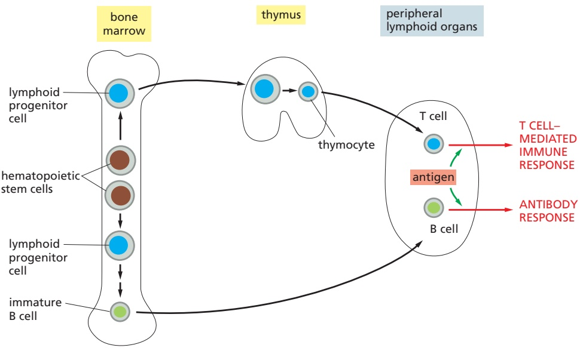
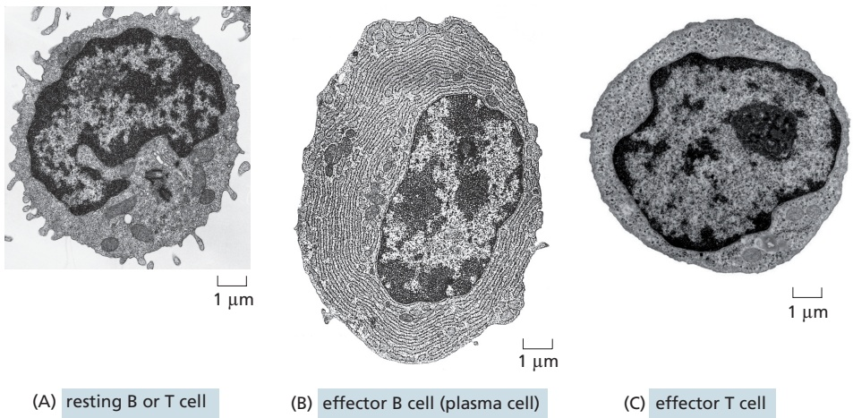
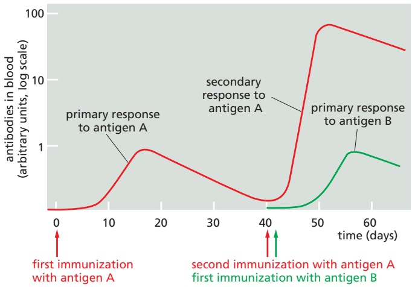
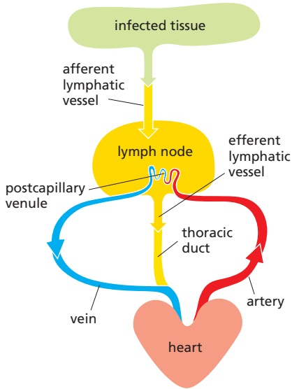
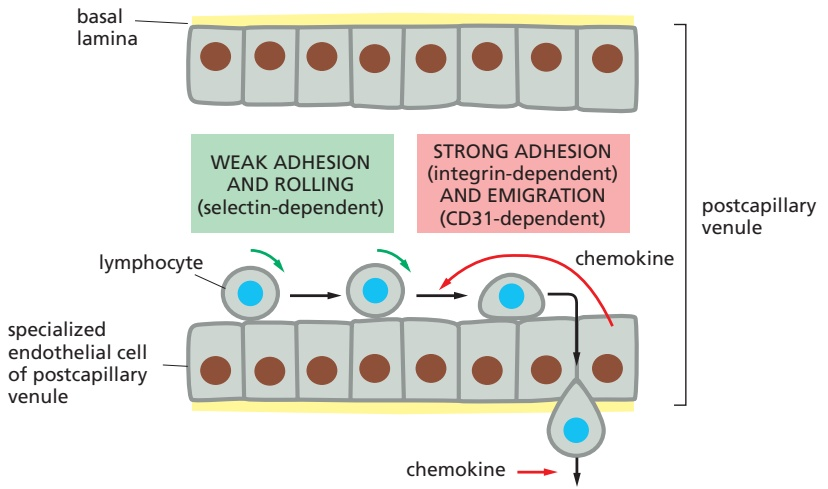
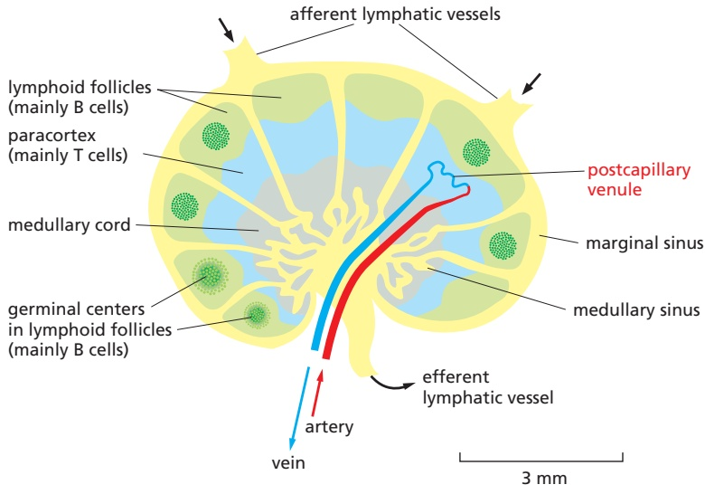
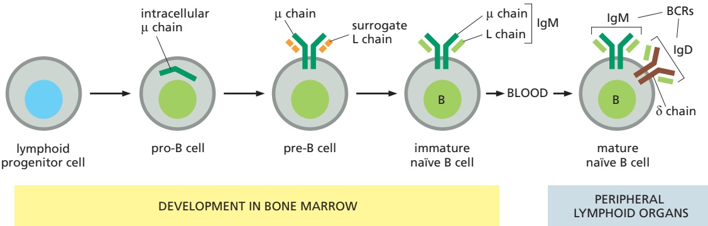
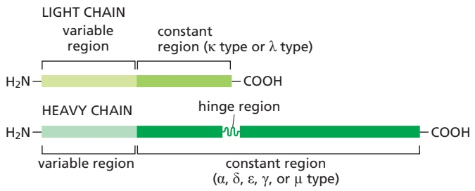
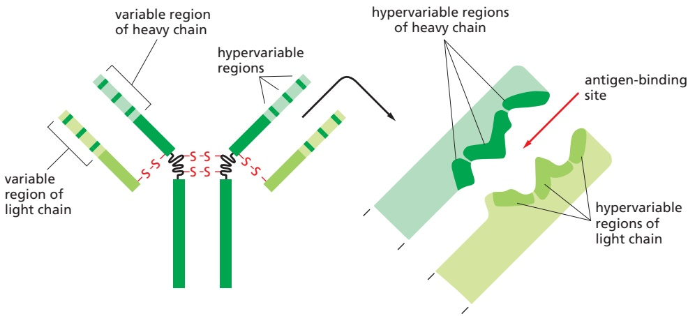
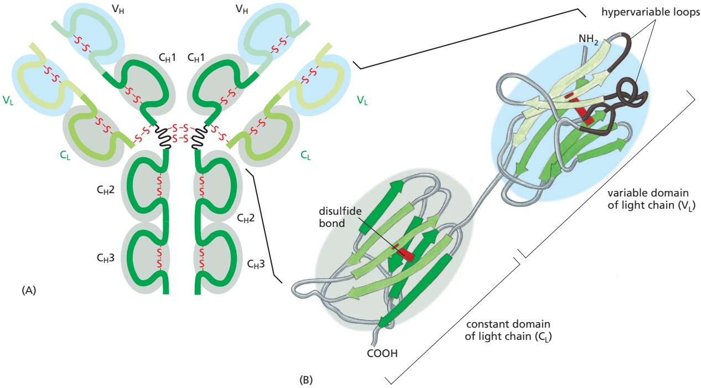

Figure 24–12 Human lymphoid organs. Lymphocytes develop from lymphoid progenitor cells in the thymus and bone marrow (yellow), which are therefore called central (or primary) lymphoid organs. Newly formed lymphocytes migrate from these primary organs to peripheral (or secondary) lymphoid organs (blue), where B and T cells respond to foreign antigen. Only some of the peripheral lymphoid organs and lymphatic vessels (green) are shown; many lymphocytes, for example, are found in the skin and respiratory tract. As we discuss later, the lymphatic vessels ultimately empty into the bloodstream (not shown).

## B Cells Develop in the Bone Marrow, T Cells in the Thymus

There are about $2 \times 1 0 ^ { 1 2 }$ lymphocytes in the human body, making the immune system comparable in cell mass to the liver or the brain. They occur in large numbers in the blood and lymph (the colorless fluid in the lymphatic vessels, which connect the lymph nodes in the body to each other and to the bloodstream). They. / . are also concentrated in **lymphoid organs**, such as the thymus, lymph nodes, and spleen (**Figure 24–12**), and many are also found in other organs, including skin, lung, and gut.

T cells and B cells derive their names from the organs in which they develop: T cells develop in the thymus, and B cells, in adult mammals, develop in the bone marrow. Both types of cells develop from lymphoid progenitor cells that are produced from multipotent hematopoietic stem cells, which, in adults, are found mainly in the bone marrow (**Figure 24–13**). The hematopoietic stem cells give rise

Figure 24–13 The development of B and T cells in adult humans. The central lymphoid organs, where lymphocytes develop from lymphoid progenitor cells, are labeled in yellow boxes. The lymphoid progenitor cells develop from multipotent hematopoietic stem cells in the bone marrow. Some lymphoid progenitor cells develop locally in the bone marrow into immature B cells, while others migrate via the bloodstream to the thymus where they develop into thymocytes (developing T cells). Foreign antigens activate B cells and T cells mainly in peripheral lymphoid organs, such as lymph nodes and the spleen.

Figure 24–14 Electron micrographs of resting and effector B and T cells. (A) This resting lymphocyte could be either a B cell or a T cell, as these cells are difficult to distinguish morphologically until antigen activates them to become effector cells. (B) An effector B cell (a plasma cell). It is filled with an extensive rough endoplasmic reticulum (ER), which is distended with antibody molecules that are secreted in large amounts. (C) An effector T cell, which has relatively little rough ER but is filled with free ribosomes; it secretes cytokines, but in relatively small amounts. The three cells are shown at the same magnification. (A and B, from D. Zucker-Franklin et al., Atlas of Blood Cells: Function and Pathology, 2nd ed. Philadelphia: Lea & Febiger, 1988. Reprinted with permission of Wolters Kluwer; C, David M. Phillips/Science Source.)

to more than just lymphocytes: as discussed in Chapter 22, they produce all of the cells of the hematopoietic system, including erythrocytes, leukocytes, and platelets (see Figure 22–12).

Because they are sites where B and T lymphocytes (as well as innate lymphoid cells, such as NK cells) develop from lymphoid progenitor cells, the thymus and bone marrow are referred to as **central, or primary, lymphoid organs** (see Figure 24–12). Here, lymphocytes differentiate and then migrate via the blood to the **peripheral, or secondary, lymphoid organs**—mainly the lymph nodes, spleen, and epithelium-associated lymphoid tissues in the gastrointestinal tract, respiratory tract, and skin. It is in these peripheral lymphoid organs that foreign antigens activate B and T cells (see Figure 24–13).

B and T cells become morphologically distinguishable from each other only after antigen has activated them: resting B and T cells look very similar, even in an electron microscope (**Figure 24–14A**). After activation by an antigen, both B andMBoC7 m24.14/24.14 T cells proliferate and mature into effector cells. Effector B cells secrete antibodies; in their most mature form, called plasma cells, they are filled with an extensive rough endoplasmic reticulum that is busily making antibodies (**Figure 24–14B**). In contrast, effector T cells (**Figure 24–14C**) contain very little endoplasmic reticulum and secrete a variety of cytokines rather than antibodies. Whereas B cell–derived antibodies are widely distributed by the bloodstream, T cell–derived cytokines mainly act locally, on cells the T cell contacts or on noncontacted neighboring cells, although some are carried via the blood and act on distant host cells.

## Immunological Memory Depends on Both Clonal Expansion and Lymphocyte Differentiation

The most remarkable feature of the adaptive immune system is that it can respond to millions of different foreign antigens in a highly specific way. Human B cells, for example, collectively can make more than 1012 different antibody molecules that react specifically with the antigen that induced their production. How can B cells and T cells respond specifically to such an enormous diversity of foreign antigens? The answer for both B and T cells is the same. As each lymphocyte develops in a central lymphoid organ, it becomes committed to react with a particular antigen before ever being exposed to it. The cell expresses this commitment in the form of cell-surface receptors that specifically bind the antigen. When a lymphocyte encounters its antigen in a peripheral lymphoid organ, the binding of the antigen to the receptors, with help from co-stimulatory signals (see Figure 24–11, and discussed later), activates the lymphocyte; this causes the lymphocyte to proliferate, thereby producing many more cells with the same antigen-specific receptors—a process called clonal expansion. The encounter with antigen also causes some of the cells to differentiate into effector cells. An antigen therefore selectively stimulates those cells that express complementary antigen-specific receptors and are

Figure 24–15 Clonal selection. An antigen activates only those B and T cells that are already committed to respond to it. The committed cell expresses cell-surface receptors that specifically recognize the antigen. The human adaptive immune system consists of many millions of different B and T cell clones, with cells within a clone expressing the same unique antigen receptor. Before its first encounter with antigen, a clone would usually contain only one or a small number of cells. A particular antigen may activate hundreds of different clones, each expressing a different antigen receptor that binds either a different part of the antigen or the same part with a different binding affinity. Although only B cells are shown here, T cells are selected in a similar way. Note that the antigen receptors on the B cells labeled Bβ in this diagram have the same antigen-binding site as the antibodies secreted by the effector Bβ cells. As we discuss later, B cells require co-stimulatory signals from T cells to become activated by antigen to proliferate and differentiate into antibody-secreting cells (not shown).

thus already committed to respond to it (**Figure 24–15**). This arrangement, called **clonal selection**, provides an explanation for **immunological memory**, whereby we develop longlasting immunity to many common infectious diseases after our initial exposure to the pathogen—either through natural infection or vaccination.

It is easy to demonstrate such immunological memory in experimental animals. If an animal is immunized once with antigen A, an adaptive immune response (antibody, T cell–mediated, or both) can be detected after several days; the response rises rapidly and exponentially, and then, more gradually, declines.MBoC7 m24.15/24.15 This is the characteristic course of a **primary immune response**, occurring on an animal’s first exposure to an antigen. If, after some weeks, months, or even years have elapsed, the animal is immunized again with antigen A, it will usually produce a **secondary immune response** that differs from the primary response: the lag period is shorter, because there are now many more preexisting B or T cells (or both) with specificity for antigen A, and the response is greater and more efficient. These differences indicate that the animal has “remembered” its first exposure to antigen A. If the animal is given a different antigen (for example, antigen B) instead of a second immunization with antigen A, the response is typical of a primary, and not a secondary, immune response. The secondary response therefore reflects antigen-specific immunological memory for antigen A (**Figure 24–16**).

Immunological memory depends on both lymphocyte proliferation and differentiation. In an adult animal, the peripheral lymphoid organs contain a mixture of B and T cells in at least three stages of maturation: naïve cells, effector cells, and memory cells. When **naïve cells** encounter their specific foreign antigen for the first time, the antigen stimulates some of them to proliferate and differentiate into **effector cells**, which then carry out an immune response: effector B cells secrete antibody, whereas effector T cells either kill infected cells (see Figure 24–2) or influence the response of other immune cells—by secreting cytokines, for example. Whereas most of the effector cells die after the pathogen has been eliminated, a long-lived population of **memory cells** usually persists, which can more easily and more quickly be induced to become effector cells by a later encounter with the same antigen: like naïve cells, when memory cells encounter their antigen, they give rise to effector cells and more memory cells (**Figure 24–17**).

Thus, during the primary response, clonal expansion and differentiation creates many antigen-specific memory cells, some of which can persist as a pop-MBoC7 m24.16/24.16 ulation for the lifetime of the animal, even in the absence of their specific antigen, thereby providing lifelong protection against the pathogen. Whereas many newly formed memory T and B cells join the pool of T and B cells that continually recirculate through peripheral lymphoid organs (discussed shortly), some memory T cells remain permanently at the site of pathogen entry as tissue-resident memory T cells, which provide long-term local protection against reinfection. In addition, a small proportion of the plasma cells produced in a primary B cell response in a peripheral lymphoid organ migrate to the bone marrow, where they can survive for years and continue to secrete their specific antibodies into the bloodstream, contributing to long-term immunological memory.

## Most B and T Cells Continually Recirculate Through Peripheral Lymphoid Organs

Pathogens generally enter the body through an epithelial surface, usually through the skin, gut, or respiratory tract. To induce an adaptive immune response, pathogenic microbes or their products must travel from these entry points to a peripheral lymphoid organ such as a lymph node, where B and T cells become activated (see Figure 24–11). The route and destination depend on the site of entry. Lymphatic vessels carry antigens that enter through the skin or respiratory tract to local lymph nodes; antigens that enter through the gut end up in gut-associated peripheral lymphoid organs such as Peyer’s patches; and the spleen filters out antigens that enter the blood (see Figure 24–12). As discussed earlier (see Figure 24–11), in many cases, activated dendritic cells will carry the antigen from the site of infection to the peripheral lymphoid organ, where they play a crucial part in activating T cells, as we discuss later.

But only a tiny fraction of naïve B and T cells can recognize a particular microbial antigen in a peripheral lymphoid organ, a reasonable estimate being between $1 / 1 0 { , } 0 0 \bar { 0 }$ and 1/1,000,000 of each class of lymphocyte, depending on the antigen. How do these rare cells find an antigen-presenting cell displaying their specific antigen? The answer is that the lymphocytes continually recirculate between one peripheral lymphoid organ and another via the lymph and blood. In a lymph node, for example, lymphocytes continually leave the bloodstream by squeezing out between specialized endothelial cells lining small veins called postcapillary venules. After percolating through the node, they accumulate in small lymphatic vessels that leave the node and connect with other lymphatic vessels that pass through other lymph nodes downstream (see Figure 24–12). Passing into larger and larger vessels, the lymphocytes eventually enter the main lymphatic vessel (the thoracic duct), which carries them back into the blood (**Figure 24–18**).

Figure 24–16 Immunological memory: primary and secondary antibody responses. The secondary response induced by a second exposure to antigen A is faster and greater than the primary response and is specific for A, indicating that the adaptive immune system has specifically remembered its previous encounter with antigen A. The same type of immunological memory is observed in T cell–mediated responses (not shown). As we discuss later, the types of antibodies produced in the secondary response are different from those produced in the primary response, and these antibodies bind the antigen more tightly.

Figure 24–17 Clonal expansion and production of memory cells as the cellular basis of immunological memory. When stimulated by their specific antigen and co-stimulatory signals, both naïve B and T cells proliferate and differentiate, MBoC7 m24.17/24.17producing both effector cells and memory cells. In principle, memory cells could form either directly from naïve cells, as shown here, or from “retired” effector cells (not shown); for some types of T cells, at least, effector cells can become memory cells. When exposed to the same antigen in the presence of co-stimulatory signals, memory cells respond more readily, rapidly, and efficiently than do naïve cells.

The continual recirculation of a lymphocyte between the blood and lymph ends only if its specific antigen activates it in a peripheral lymphoid organ. In that case, the lymphocyte remains in the peripheral lymphoid organ, where it proliferates and differentiates to produce effector and memory T and B cells. Many of the effector T cells leave the lymphoid organ via the lymph and migrate through the blood to the site of infection (see Figure 24–11), whereas others stay in the lymphoid organ and help activate B cells to differentiate into antibody-secreting cells and undergo further maturation (discussed later). Some effector B cells (including some of the most mature, plasma cells) remain in the peripheral lymphoid organ and secrete antibodies into the blood and undergo further maturation (discussed later). Many of the memory B and T cells produced in a peripheral lymphoid organ join the recirculating pool of naïve and memory lymphocytes.

Lymphocyte recirculation depends on specific interactions between the lymphocyte cell surface and the surface of the endothelial cells lining the blood vessels in the peripheral lymphoid organs. Lymphocytes that enter a lymph node via the blood, for example, adhere weakly to specialized endothelial cells lining the postcapillary venules via homing receptors that belong to the selectin family of cell-surface lectins that bind to specific sugar groups on the endothelial cell surface (see Figure 19–28). The lymphocytes roll slowly along the surface of the endothelial cells until another, much stronger adhesion system, dependent on an integrin protein, is called into play by chemokines secreted by the endothelial cells. Now, the lymphocytes stop rolling, and they crawl out of the blood vessel into the lymph node by using yet another cell adhesion protein called CD31 (**Figure 24–19**). Although B and T cells initially enter the same region of a lymph node, different chemokines guide them to separate regions of the node—B cells to lymphoid follicles and T cells to the paracortex (**Figure 24–20**).

Unless they encounter their antigen, both B and T cells soon leave the lymph node via efferent lymphatic vessels. If they encounter their antigen, however, they are stimulated to display adhesion receptors that trap the cells in the node; the cells accumulate at the junction between the B cell and T cell areas, where the

Figure 24–18 The path followed by lymphocytes that continually recirculate between the lymph and blood. The circulation through a lymph node (yellow) is shown here. Microbial antigens are usually carried into the lymph node by activated dendritic cells (not shown), which enter the node via afferent lymphatic vessels draining MBoC7 m24.18/24.18an infected tissue (green). B and T cells, by contrast, enter via the blood, migrating out of the bloodstream into the lymph node through postcapillary venules. Unless they encounter their antigen, the B and T cells leave the lymph node via efferent lymphatic vessels, which eventually join the thoracic duct. The thoracic duct empties into a large vein carrying blood to the heart, completing the recirculation cycle for T and B cells. A typical recirculation cycle for these lymphocytes takes about 12–24 hours.

Figure 24–19 Migration of a lymphocyte out of the bloodstream into a lymph node. A recirculating lymphocyte adheres weakly to the surface of the specialized endothelial cells lining a postcapillary venule in a lymph node (see Figure 24–18). This initial adhesion is mediated by L-selectin (discussed in Chapter 19) on the lymphocyte surface. The adhesion is sufficiently weak to enable the lymphocyte, pushed by the flow of blood, to roll along the surface of the endothelial cells. Stimulated by chemokines secreted by specialized endothelial cells in the node (curved red arrow), the lymphocyte rapidly activates a stronger adhesion system, mediated by an integrin protein. This strong adhesion enables the cell to stop rolling. The lymphocyte then uses MBoC7 m24.19/24.19an immunoglobulin-like cell adhesion protein (CD31) to bind to the junctions between adjacent endothelial cells and migrate out of the venule. The subsequent migration of the lymphocyte in the lymph node is directed by chemokines produced within the node (straight red arrow). The migration of other types of leukocytes out of the bloodstream into sites of infection occurs in a similar way (see Figure 19–28 and Movie 19.2).

rare antigen-specific B and T cells can interact, leading to their proliferation and differentiation into either effector cells or memory cells. Many of the effector cells leave the node, expressing different chemokine receptors that help guide them to their new destinations—effector plasma cells to the bone marrow, for example, and effector T cells to sites of infection.MBoC7 m24.

Figure 24–20 A simplified drawing of a human lymph node. B cells are mainly found in lymphoid follicles, whereas T cells are found mainly in the paracortex. Some of the lymphoid follicles contain germinal centers, where B cells, activated by their specific antigen (with the help of activated T cells), proliferate rapidly and differentiate into memory and effector cells (as discussed later). Chemokines attract resting B and T cells into the lymph node from the blood via postcapillary venules (see Figure 24–19), after which the two cell types migrate to their respective areas, attracted by different chemokines. If they do not encounter their specific antigen, both B and T cells then migrate to the medullary sinus and leave the node via the efferent lymphatic vessel, which carries the lymph away from the node to a downstream lymph node (not shown). After traveling from node to node, the lymph enters a large lymphatic vessel, the thoracic duct, that empties into the bloodstream to begin another cycle of B and T cell circulation through peripheral lymphoid organs (see Figure 24–18).

## Immunological Self-tolerance Ensures That B and T Cells Do Not Attack Normal Host Cells and Molecules

As discussed earlier, cells of the innate immune system use PRRs to distinguish microbial molecules from self molecules made by the host. The adaptive immune system has the far more difficult recognition task of responding specifically to an almost unlimited number of foreign molecules while not responding to the large number of self molecules. How does it accomplish this feat? It helps that self molecules normally do not induce the innate immune reactions required to activate adaptive immune responses. But even when an infection or tissue injury triggers innate reactions, the vast majority of self molecules normally still fail to induce an adaptive immune response. Why?

One important reason is that the adaptive immune system “learns” not to respond to self molecules. Normal mice, for example, cannot mount an immune response against one of their own protein components of the complement system called C5 (see Figure 24–7). However, mutant mice that lack the gene encoding C5 but are otherwise genetically identical to normal mice of the same strain can make a strong immune response to this blood protein when immunized with it. The **immunological self-tolerance** exhibited by normal mice persists only for as long as the self molecule remains in the body: if a self molecule such as C5 is experimentally removed from an adult mouse, the animal gains the ability to respond to it after a few weeks or months, as new B and T cells develop in the absence of C5. Thus, the adaptive immune system is genetically capable of responding to self molecules but deploys multiple strategies to avoid doing so.

Self-tolerance depends on a number of distinct mechanisms, including the following (**Figure 24–21**):

1. In receptor editing, developing B cells that recognize self molecules change their antigen receptors so that the cells no longer do so.

2. In clonal deletion, large numbers of developing, potentially self-reactive B and T cells die by apoptosis when they encounter their particular self molecule.

3. In clonal inactivation (also called clonal anergy), self-reactive B and T cells become functionally inactivated when they encounter their self molecule.

4. In clonal suppression, self-reactive regulatory T cells (discussed later) suppress the activity of other types of potentially self-reactive lymphocytes.

As we discuss later, some of these mechanisms—especially the first two, receptor editing in B cells and clonal deletion of B and T cells—operate in central lymphoid organs when self-reactive developing B and T cells first encounter their self molecules, and they are largely responsible for the process called central tolerance. Clonal inactivation and clonal suppression, by contrast, operate mainly when mature B and T cells encounter their self molecules in peripheral lymphoid organs, and they are largely responsible for the process called peripheral tolerance. Clonal deletion, however, can also operate peripherally, and clonal inactivation can also operate centrally.

Why does the binding of a self molecule lead to tolerance rather than activation? The answer is still not completely known. As we discuss later, the activation of a B or T cell by its antigen in a peripheral lymphoid organ requires more than just antigen binding: it requires co-stimulatory signals, which are provided by a helper T cell in the case of a B cell and by an activated dendritic cell in the case of a naïve T cell. The production of such signals is usually triggered by exposure to a pathogen, but a self-reactive lymphocyte normally encounters its self antigen in the absence of such signals. Under these conditions, the lymphocyte will not only fail to be activated, it will often be rendered tolerant—being killed (deleted), or inactivated, or suppressed by a regulatory T cell (see Figure 24–21). In peripheral lymphoid organs, both T cell tolerance and activation usually occur through interactions with a dendritic cell, although the type or state of the dendritic cell is different in the two cases.

Figure 24–21 Mechanisms of immunological self-tolerance. When a potentially self-reactive immature B cell recognizes a specific self antigen in the central lymphoid organ (the bone marrow) where the cell is produced, it may alter its antigen receptor so that it no longer recognizes the self antigen (cell 1); this process is called receptor editing. Alternatively, when either a potentially self-reactive developing B or T cell recognizes a specific self antigen in a central lymphoid organ, it may die by apoptosis, a process called clonal deletion (cell 2). Because these two forms of tolerance (shown on the left) occur in central lymphoid organs, they are called central tolerance.

When a potentially self-reactive developing B or T cell escapes tolerance in the central lymphoid organ and binds its specific self antigen in a peripheral lymphoid organ (cell 4) or in a nonlymphoid peripheral tissue (not shown), it will generally not be activated, because the binding usually occurs in the absence of sufficient co-stimulatory signals; instead, the cell may die by apoptosis (often after a period of proliferation), be inactivated, or be suppressed by a regulatory T cell. These forms of tolerance (shown on the right) are called peripheral tolerance. As discussed later, the cells providing the co-stimulatory signals are T lymphocytes for B cells and usually dendritic cells for T cells (not shown).

For reasons that are usually unknown, self-tolerance mechanisms sometimes fail, causing T or B cells (or both) to react against the animal’s own molecules. Myasthenia gravis is an example of such an **autoimmune disease**. Most of the affected individuals make antibodies against the acetylcholine receptors on their own skeletal muscle cells; these receptors are required for the muscle to contract normally in response to nerve stimulation, which releases acetylcholine (see Figure 11–39). The antibodies interfere with the normal functioning of the receptors so that the individuals become weak and may die because they cannot breathe. Similarly, in juvenile (type 1) diabetes, adaptive immune reactions against insulin-secreting β cells in the pancreas kill these cells, leading to severe insulin deficiency.

## Summary

The human adaptive immune system is composed of many millions of B and T cell clones, with the cells in each clone sharing a unique cell-surface receptor that enables them to bind a particular pathogen antigen. The binding of antigen to these receptors, with the help of membrane-bound co-stimulatory signals, activates the lymphocyte to proliferate and differentiate into an effector cell that helps eliminate the pathogen. Effector B cells secrete antibodies, which can act over long distances to help eliminate extracellular pathogens and to neutralize their toxins. Effector T cells, by contrast, produce cell-surface co-stimulatory molecules and secreted cytokines, which act locally to help other immune cells eliminate the pathogen; in addition, some T cells induce infected host cells to kill themselves.

During a primary adaptive immune response to an antigen, B and T cells that recognize the antigen proliferate, so there are more of them to respond the next time, during a secondary response to the same antigen. Moreover, although most effector cells produced during a primary response die after the pathogen is eliminated, some of the lymphocytes activated during the primary response become long-lived memory cells, which can respond faster and more efficiently the next time the same pathogen invades. These two mechanisms—clonal expansion and differentiation into memory cells—are largely responsible for immunological memory. Both B and T cells circulate continually between one peripheral lymphoid organ and another via the blood and lymph; only if they encounter their specific foreign antigen in a peripheral lymphoid organ do they stop migrating, proliferate, and differentiate into effector cells and memory cells. B and T cells that would react against self molecules either alter their receptors (in the case of B cells) or are eliminated, inactivated, or suppressed by regulatory T cells. These mechanisms collectively are responsible for immunological self-tolerance, which helps ensure that the adaptive immune system normally avoids attacking the molecules and cells of the host.

## B CELLS AND IMMUNOGLOBULINS

We would die of infection if we were unable to make antibodies. **Antibodies** are secreted proteins that defend us against extracellular pathogens in several ways. They bind to viruses and microbial toxins, thereby preventing them from binding to host cells (see Figure 24–2). When bound to an extracellular pathogen or its products, antibodies also recruit some of the components of the innate immune system, including various types of leukocytes and components of the complement system, which work together to inactivate or eliminate the invaders.

Antibodies are synthesized exclusively by B cells. They are produced in billions of different varieties, each with a unique antigen-binding site formed by one or more unique amino acid sequences. They belong to the class of proteins called **immunoglobulins** (abbreviated as **Igs**) and are among the most abundant protein components in the blood. In this section, we discuss the structure and function of immunoglobulins and how each of us can make them with so many different antigen-binding sites.

## B Cells Make Immunoglobulins (Igs) as both Cell-Surface Antigen Receptors and Secreted Antibodies

The first Igs made by a developing B cell are not secreted but are instead inserted into the plasma membrane, where they serve as receptors for antigen. They are called **B cell receptors (BCRs)**, and each B cell has approximately $\tilde { 1 0 ^ { 5 } }$ of them on its surface. Each BCR is stably associated with invariant transmembrane proteins that activate intracellular signaling pathways when antigen binds to the BCR; we discuss these invariant proteins later, when we consider how B cells are activated with the assistance of helper T cells.

Each B cell clone produces a single species of BCR, with a unique antigen-binding site. When an antigen and a helper T cell activate a naïve or a memory B cell, the B cell proliferates and differentiates into an effector cell, which then produces and secretes large amounts of soluble (rather than membrane-bound) Ig. The secreted Ig is now called an antibody, and it has the same unique antigen-binding site as the BCR (**Figure 24–22**; and see Figure 24–15).

A typical Ig molecule is bivalent, with two identical antigen-binding sites. It consists of four polypeptide chains—two identical light chains and two identical heavy chains. The N-terminal parts of both light and heavy chains usually cooperate to form the antigen-binding surface, while the more C-terminal parts of the heavy chains form the tail of the Y-shaped protein (**Figure 24–23**). The tail mediates many of the activities of antibodies, and antibodies with the same antigen-binding sites can have any one of a number of different tail regions, each of which gives the antibody different functional properties, such as the ability to activate complement or to bind to receptor proteins on various immune cells that bind a specific type of antibody tail.

## Mammals Make Five Classes of Igs

We can make five major classes of Igs, each of which mediates a characteristic biological response after antigen binding to an antibody: IgA, IgD, IgE, IgG, and IgM, each with its own class of heavy chain (α, δ, ε, γ, and $\mu ,$ respectively). IgA molecules have α chains, IgG molecules have γ chains, and so on. Moreover, there are four IgG subclasses (IgG1, IgG2, IgG3, and IgG4), with $\gamma _ { 1 } ,$ γ2, γ3, and $\gamma _ { 4 }$ heavy chains, respectively, and there are two IgA subclasses. In addition to the various classes and subclasses of heavy chains, we make two types of light chains, κ and $\lambda ,$ which seem to be functionally indistinguishable. Either type of light chain can be associated with any of the heavy chains, but an individual Ig molecule always contains identical light chains and identical heavy chains: an IgG molecule, for instance, can have either κ or λ light chains, but not one of each. As a result, an Ig’s antigen-binding sites are always identical (see Figures 24–22 and 24–23).

Figure 24–22 Activation of a B cell by antigen. The binding of an antigen to the B cell receptors (BCRs) on either a naïve or a memory B cell (together with co-stimulatory signals provided by helper T cells—not shown) activates the cell to proliferate and differentiate into antibody-MBoC7 m24.22/24.22secreting, effector B cells. The effector cells produce and secrete antibodies with a unique antigen-binding site, which is the same as that of the cell-surface BCRs. Because typical antibodies have two identical antigen-binding sites, they can cross-link antigens, as shown for an antigen with multiple, identical, antigenic determinants—the parts of an antigen an antibody or antigen receptor binds to.

Figure 24–23 A schematic drawing of a bivalent antibody molecule. The distal ends of the light and heavy chains together form the two antigen-binding sites. The two heavy chains each have a hinge region (not present in all classes of heavy chains), which, because of its flexibility, improves the efficiency with which the antibody can cross-link antigens (see Figure 24–22). The two heavy chains also form the tail of the antibody, which determines the functional properties of the antibody. The heavy and light chains are held together by a combination of covalent S–S bonds (red) and noncovalent bonds (not shown).

All classes of human Ig can be made in a membrane-bound BCR form, as well as in a soluble, secreted antibody form. The two forms differ only in the C-terminus of their heavy chain. The heavy chains of membrane-bound Ig molecules (BCRs) have a transmembrane hydrophobic C-terminus, which anchors them in the lipid bilayer of the B cell’s plasma membrane. The heavy chains of secreted antibody molecules, by contrast, have instead a hydrophilic C-terminus, which allows them to escape from the cell. The switch in the character of the Ig molecules made occurs because the activation of B cells by antigen and helper T cells induces a change in the way in which the heavy-chain RNA transcripts are made and processed in the nucleus (see Figure 7–62).MBoC7 m24.24/24.24

The various Ig heavy chains give a distinctive conformation to the tail region of secreted antibodies, so that each class (and subclass) has characteristic properties of its own. **IgM** is always the first class of Ig that a developing B cell in the bone marrow makes. It forms the BCRs on the surface of immature naïve B cells. After these cells leave the bone marrow, they start to produce **IgD** BCRs as well, with the same antigen-binding site as the IgM BCRs. These cells are now called mature naïve B cells, as they can now respond to their specific foreign anti-gen if they encounter it in a peripheral lymphoid organ (**Figure 24–24**). IgM is also the major class of antibody secreted into the blood in the early stages of a primary antibody response on first exposure to an antigen. In its secreted form, IgM is a wheel-like pentamer composed of five four-chain units, giving it a total of 10 antigen-binding sites that allow it to bind strongly to pathogens; in its antigen-bound form, IgM is highly efficient at activating complement, which is important in early antibody responses to pathogens.

IgM and IgD are the only classes of Igs made before a B cell is activated by antigen, at which stage they are made only as BCRs. All the other Ig classes are made only after antigen stimulation, as both BCRs and antibodies. **IgG** antibodies are four-chain monomers (see Figure 24–23), and they are secreted into the blood in especially large quantities during secondary antibody responses to most anti-gens. The tail region of some subclasses of IgG antibodies that are bound to antigen can activate complement and also bind to specific receptors on macrophages and neutrophils. Largely by means of such **Fc receptors** (so named because antibody tails are called Fc regions), these phagocytic cells bind, ingest, and destroy infecting microorganisms that have become coated with the IgG antibodies produced in response to the infection (see Figure 24–5); the activated Fc receptors also signal the phagocyte to secrete pro-inflammatory cytokines (**Movie 24.4**).

**IgE** antibodies are produced in response to parasites and, in genetically susceptible individuals, to otherwise harmless environmental antigens (allergens) such as pollen, foods, and drugs. The IgE tail region binds to another class of Fc receptors on the surface of mast cells in tissues and of basophils in the blood (see Figures 22–11 and 22–12). Because antigen-free IgE antibodies bind with high affinity to such Fc receptors, the antibodies act as acquired antigen receptors on these cells. Antigen binding to the bound antibodies activates the Fc receptors and stimulates the cells to secrete a variety of cytokines and biologically active amines, especially histamine, which causes blood vessels to dilate and become leaky; this helps leukocytes, antibodies, and complement components to enter sites

Figure 24–24 Stages of B cell development. All of the stages shown occur before the B cells bind their specific foreign antigen. The first cells in the B cell lineage that make Ig are called pro-B cells; they make μ heavy chains, which remain in the membrane of the endoplasmic reticulum until a special type of light (L) chain is made, called a surrogate light chain. The surrogate light chains substitute for genuine light chains and assemble with μ chains to form a temporary receptor molecule that is delivered to the plasma membrane. The cells are now called pre-B cells. Signaling from this pre-B cell receptor allows the cells to make bona fide light chains, which combine with μ chains to form four-chain IgM molecules that serve as antigen-specific, cell-surface BCRs on immature naïve B cells. After these cells leave the bone marrow (labeled in yellow shading), they start to express IgD BCRs as well, which have the same antigen-binding sites as the IgM BCRs; it is this mature naïve B cell that reacts with its specific foreign antigen in peripheral lymphoid organs (labeled in blue shading).

<table><tbody><tr><td colspan="6">TABLE 24-2 Properties of the Major Classes of Antibodies in Humans</td></tr><tr><td rowspan="2">Properties</td><td colspan="5">Class of antibody</td></tr><tr><td>IgM</td><td>IgD</td><td>IgG (1-4)</td><td>IgA (1, 2)</td><td>IgE</td></tr><tr><td>Heavy chains</td><td>μ</td><td>δ</td><td>γ (1-4)</td><td>α (1, 2)</td><td>ε</td></tr><tr><td>Light chains</td><td>κ or λ</td><td>κ or λ</td><td>κ or λ</td><td>κ or λ</td><td>κ or λ</td></tr><tr><td>Number of four-chain units</td><td>5</td><td>1</td><td>1</td><td>1 or 2</td><td>1</td></tr><tr><td>Mean blood serum level (mg/mL)</td><td>1.5</td><td>0.04</td><td>IgG1 = 9 IgG2 = 3 IgG3 = 1 IG4 = 0.5</td><td>2.1</td><td>3 × 10-5</td></tr><tr><td>Activates classical complement pathway</td><td>+</td><td>-</td><td>+ (IgG1-3)</td><td>-</td><td>-</td></tr><tr><td>Crosses from mother to fetus</td><td>-</td><td>-</td><td>+ (all subclasses)</td><td>-</td><td>-</td></tr><tr><td>Binds to macrophages and neutrophils</td><td>+ (macrophages only)</td><td>-</td><td>+ (all subclasses)</td><td>+</td><td>-</td></tr><tr><td>Binds to mast cells and basophils</td><td>-</td><td>-</td><td>+ (IgG1 and IgG3)</td><td>-</td><td>+</td></tr></tbody></table>

where mast cells have been activated. The release of amines from mast cells and basophils is largely responsible for the symptoms of such allergic reactions as hay fever, asthma, and hives. In addition, mast cells secrete factors that attract and activate eosinophils (see Figures 22–11 and 22–12), which also have Fc receptors that bind IgE molecules and can kill extracellular parasitic worms, especially if the worms are coated with IgE antibodies (see Figure 24–6).

**IgA** is the principal antibody class in secretions, including saliva, tears, milk, and respiratory and intestinal tract secretions. Yet another class of Fc receptors, located on the relevant epithelial cells, guides the secretion by binding antigen-free IgA dimers and transporting them from the extracellular fluid across the epithelium by the process of transcytosis (see Figure 13–56). Some of this IgA is directed against commensal microbes and keeps them in check by preventing them from binding to mucosal epithelial cells. The properties of the various classes of antibodies in humans are summarized in **Table 24–2**.

## Ig Light and Heavy Chains of Antibodies Consist of Constant and Variable Regions

Both the light and heavy chains of antibodies have a variable amino acid sequence at their N-terminal ends but a constant sequence at their C-terminal ends. Whereas the **constant region** and **variable region** of a light chain are the same size, the constant region of a heavy chain is about three or four times longer than its variable region, depending on the class (**Figure 24–25**).

The variable regions of the light and heavy chains come together to form the antigen-binding sites, and the variability of their amino acid sequences provides the structural basis for the diversity of these binding sites. The greatest diversity occurs in three small **hypervariable regions** in the variable regions of both light and heavy chains. Only about 5–10 amino acids in each hypervariable region form the actual antigen-binding site (**Figure 24–26**). As a result, the size of the **antigenic determinant** that an Ig molecule recognizes is generally small: it can consist of fewer than 10 amino acids on the surface of a globular protein, forMBoC7 24.26/24.26 example (see Figure 24–22).

Figure 24–25 Constant and variable regions of antibody chains. The variable regions of both the light and heavy chains form the antigen-binding sites, while the constant regions of the heavy chains determine the other functional properties of an antibody molecule. The different subclasses of IgG antibodies have different γ-chain constant regions. An individual Ig protein has either κ or λ light chains but not both. Note that the heavy chain of the BCR form of each class of Ig has an additional, transmembrane domain at its C-terminus (not shown), and the constant regions of the μ and ε heavy chains do not have a hinge region (not shown).

Figure 24–26 Ig hypervariable regions. Highly schematized drawing of how the three hypervariable regions in each light and heavy chain together form each antigen-binding site of an Ig protein.

Both light and heavy chains are made up of repeating segments—each about 110 amino acids long and each containing one intrachain disulfide bond. Each repeating segment folds independently to form a compact functional unit called an **immunoglobulin (Ig) domain**. As shown in **Figure 24–27A**, a light chain consists of one variable $\left( \mathrm { V _ { L } } \right)$ and one constant (CL) domain, whereas a heavy chain

Figure 24–27 Ig domains. $( \mathsf { A } )$ The light and heavy chains in an Ig protein are each folded into similar repeating domains. The variable domains (shaded in blue) of the light and heavy chains (VL and $\nabla _ { \mathsf { H } } )$ make up the antigen-binding sites, while the constant domains (shaded in gray) of the heavy chains (mainly $\mathsf { C } _ { \mathsf { H } } 2$ and $\mathbb { C } \mathbb { H } \mathbb { 3 } )$ determine the other functional properties of the protein. The heavy chains of IgM and IgE do not have a hinge region and have an extra constant domain $( \mathbb { C } _ { \mathbb { H } } 4 { \mathrm { - } } { \mathsf { n o t } }$ shown). Hydrophobic interactions between domains on adjacent chains help hold the chains together in the $1 \mathrm { g }$ molecule: VL binds to $\nabla _ { \mathbb { H } } ,   \mathbb { C } _ { \mathbb { L } }$ binds to $\mathbb { C } _ { \mathbb { H } } 1$ , and so on. (B) $X - r a y$ crystallography–based structures of the Ig domains of a light chain (Movie 24.5). The variable and constant domains have a similar overall structure, consisting of two β sheets joined by a disulfide bond (red). Note that all the hypervariable regions (black) form loops at the far end of the variable domain, where they come together to form part of the antigen-binding site. All Igs are glycosylated on their $\mathbb { C } _ { \mathbb { H } } 2$ domains (not shown); the attached oligosaccharide chains vary from Ig to Ig and can greatly influence the functional properties of the protein, mainly by affecting its binding to Fc receptors on immune cells.