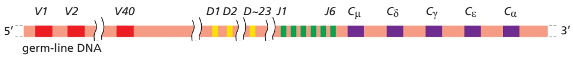
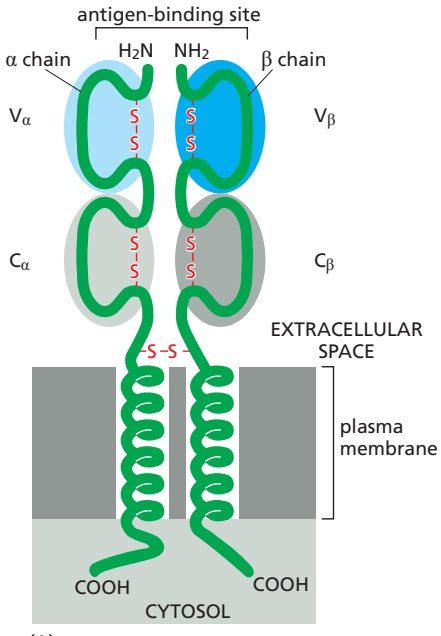
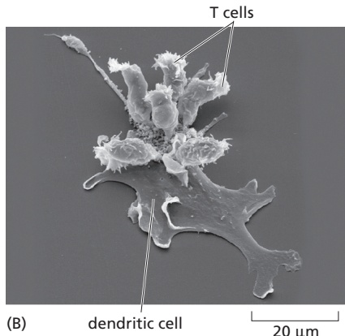
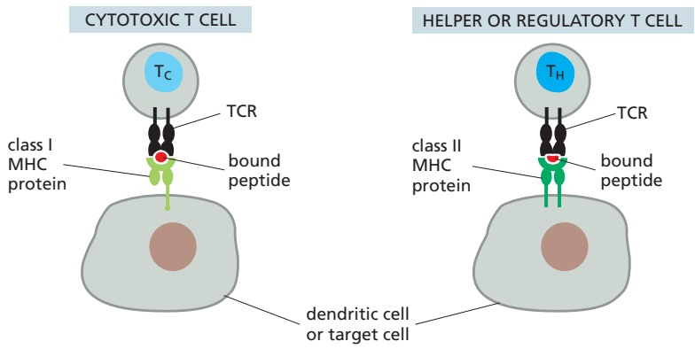
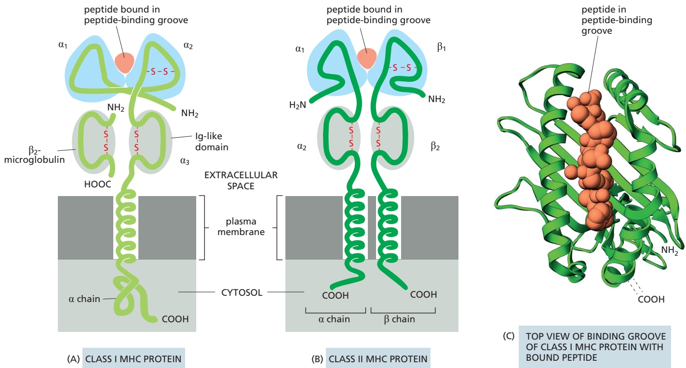
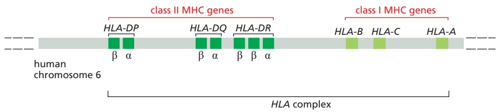
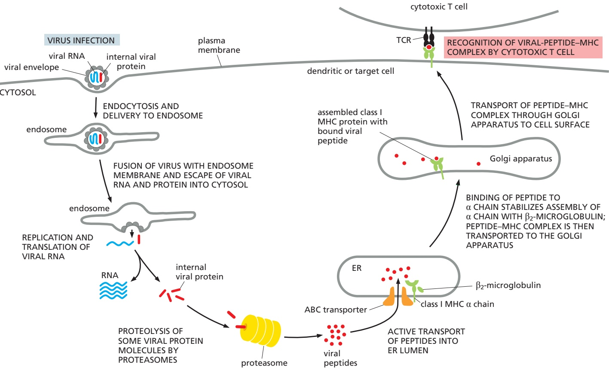

has one variable and three or four constant domains: the variable domains of the light and heavy chains pair to form the antigen-binding region. Each Ig domain has a very similar three-dimensional structure, consisting of a sandwich of two β sheets held together by a disulfide bond; the variable domains are unique in that each has its particular set of hypervariable regions, which are arranged in three hypervariable loops that cluster together at the ends of the variable domains to form the antigen-binding site (**Figure 24–27B**).

## Ig Genes Are Assembled from Separate Gene Segments During B Cell Development

Prior to antigen stimulation, the human **primary Ig repertoire** is probably composed of more than $1 0 ^ { \dot { 1 2 } }$ different BCRs. This repertoire consists of IgM and IgD proteins and is apparently large enough to ensure that there will be an antigen-binding site to fit almost any potential antigenic determinant, albeit with low affinity $\widetilde{K_{a}} \approx 10^{5}-10^{7}$ liters/mole). After stimulation by antigen and helper T cells, B cells can switch from making IgM and IgD to making other classes of $\mathrm { I g } \mathrm { { \_ a } }$ process called class switching. In addition, the binding affinity of these Igs for their antigen progressively increases over time—a process called affinity maturation. Thus, antigen stimulation generates a **secondary Ig repertoire**, with a greatly increased affinity $( K _ { \mathrm { a } }$ up to $\widetilde { 1 0 ^ { 1 1 } }$ liters/mole) and a greater diversity of both Ig classes and antigen-binding sites.

How can each of us make so many different Igs? The problem is not quite as formidable as it might first appear. Recall that the variable regions of the Ig light and heavy chains usually combine to form the antigen-binding site. Thus, if we had 1000 genes encoding light chains and 1000 genes encoding heavy chains, we could, in principle, combine their products in 1000 × 1000 different ways to make $1 0 ^ { 6 }$ different antigen-binding sites. Nonetheless, we have evolved special genetic mechanisms to enable our B cells to generate an almost unlimited number of different light and heavy chains in a remarkably economical way. We do so in two steps. First, before antigen stimulation, developing B cells join together separate gene segments in DNA to create the genes that encode the primary repertoire of low-affinity IgM and IgD proteins. Second, after antigen stimulation, the assembled Ig genes can undergo two further changes—point mutations that can increase the affinity of their antigen-binding site and DNA rearrangements that switch the class of Ig made. Together, these changes produce the secondary repertoire of high-affinity IgG, IgE, and IgA proteins.

We produce our primary Ig repertoire by joining separate **Ig gene segments** together during B cell development. Each type of Ig chain—κ light chains, λ light chains, and heavy chains—is encoded by a separate locus on a separate chromosome. Each locus contains a large number of gene segments encoding the V region of an Ig chain and one or more gene segments encoding the C region. During the development of a B cell in the bone marrow, a complete coding sequence for each of the two Ig chains to be synthesized is assembled by site-specific genetic recombination (discussed in Chapter 5). Once a V-region coding sequence is assembled next to a C-region sequence, it can then be co-transcribed and the resulting RNA transcript processed to produce an mRNA molecule that codes for the complete Ig polypeptide chain.

Each light-chain V region, for example, is encoded by a DNA sequence assembled from two gene segments—a long **V gene segment** and a short joining segment, or **J gene segment** (**Figure 24–28**). Each heavy-chain V region is similarly constructed by combining gene segments, but here an additional diversity segment, or **D gene segment**, is also required (**Figure 24–29**). In addition to bringing together the separate gene segments of the Ig gene, these rearrangements also activate transcription from the gene promoter through changes in the relative positions of the cis-regulatory DNA sequences acting on the gene. Thus, a complete Ig chain can be synthesized only after the DNA has been rearranged.

The large number of inherited V, J, and D gene segments available for encoding Ig chains contributes substantially to Ig diversity, and the combinatorial joining of

these segments (called combinatorial diversification) greatly increases this contribution. Any of the 35 or so functional V segments in our κ light-chain locus, for example, can be joined to any of the 5 J segments (see Figure 24–28), so that this locus can encode at least 175 (35 × 5) different κ-chain V regions. Similarly, any of the 40 V segments in the human heavy-chain locus can be joined to any of the 23 or so D segments and to any of the 6 J segments to encode at least 5520 (40 × $2 3 \times 6 )$ different heavy-chain V regions. By this mechanism alone, called V(D)J recombination, a human can produce 295 different $\mathrm { V _ { L } }$ regions (175 κ and 120 λ) and 5520 different $\mathrm { V _ { H } }$ regions. In principle, these could then be combined to make more than $1 . 6 \times 1 0 ^ { 6 }   ( 2 9 \bar { 5 } \times 5 5 2 0 )$ different antigen-binding sites.

V(D)J recombination is mediated by an enzyme complex called V(D)J recombinase, which recognizes recombination signal sequences in the DNA that flanks each gene segment to be joined. Although the process ensures that only appropriate gene segments recombine, a variable number of nucleotides are often lost from the ends of the recombining gene segments, and one or more randomly chosen nucleotides are also inserted. This random loss and gain of nucleotides at joining sites is called junctional diversification, and it greatly increases the diversity of V-region coding sequences created by V(D)J recombination (between $1 0 ^ { 7 } \cdot$ -fold and $\mathrm { 1 0 ^ { 8 } \mathrm { - f o l d ) } }$ , specifically in the third hypervariable region. This increased diversification comes at a price, however. In many cases, it shifts the reading frame to produce a nonfunctional gene, in which case the developing B cell fails to make a functional Ig molecule and consequently dies in the bone marrow by apoptosis. Once a B cell makes a functional heavy chain and light chain that form an antigen-binding site, it turns off the V(D)J recombination process, thereby ensuring that the cell makes Ig of only one antigen-binding specificity.

Figure 24–28 The V–J joining process involved in making a human k light chain. In the “germ-line” DNA (where the Ig gene segments are not rearranged and are therefore not being expressed), the cluster of five J gene segments (green) is separated from the C-region coding sequence (purple) by a short intron and from the 35 or so functional V gene segments (red) by thousands of nucleotide pairs. During the development of a B cell, a randomly chosen V gene segment (V3 in this case) is moved to lie precisely next to one of the J gene segments (J3 in this case). The “extra” J gene segments (J4 and J5) and the intron sequence are transcribed (along with the joined V3 and J3 gene segments and the C-region coding sequence) and then removed by RNA splicing to generate mRNA molecules with contiguous $V _ { } { 3 } , J _ { } { 3 } ,$ and C sequences, as shown. These mRNAs are then translated into κ light chains. A J gene segment encodes the 15 or so C-terminal amino acids of the V region, and a short sequence containing the V–J segment junction encodes the third hypervariable region, which is the most variable part of the light-chain V region.

Figure 24–29 The human heavy-chain locus. There are 40 V segments, about 23 D segments, 6 J segments, and an ordered cluster of C-region coding sequences, each cluster encoding a different class of heavy chain. The D segment (and part of the J segment) encodes amino acids in the third hypervariable region, which is the most variable part of the heavychain V region. The genetic mechanisms involved in producing a heavy chain are the same as those shown in Figure 24–28 for light chains, except that two DNA rearrangement steps are required instead of one: first a D segment joins to a J segment, and then a V segment joins to the rearranged DJ segment. The rearrangements lead to the production of a VDJC mRNA that encodes a complete Ig heavy chain. The figure is not drawn to scale: the total length of the heavychain locus is more than 2 megabases. Moreover, a number of details are omitted; for example, the exons encoding each C-region Ig domain and the hinge region (see Figure 24–27) and the different subclasses of $\mathsf { C } _ { \gamma }$ -coding segments are not shown.

B cells making BCRs that bind strongly to self antigens in the bone marrow would be dangerous. Such B cells are signaled by the self-binding to maintain expression of an active V(D)J recombinase and undergo a second round of V(D)J recombination in a light-chain locus, thereby changing the specificity of its BCR—in the process of **receptor editing** discussed earlier; self-reactive B cells that fail to change their specificity die by apoptosis, in the process of clonal deletion (see Figure 24–21).

## Antigen-driven Somatic Hypermutation Fine-Tunes Antibody Responses

As mentioned earlier, with the passage of time after an infection or vaccination, there is usually a progressive increase in the affinity of the antibodies produced against the pathogen. This phenomenon of **affinity maturation** is due to the accumulation of point mutations in both heavy-chain and light-chain V-region coding sequences. The mutations occur long after the coding regions have been assembled. After B cells have been stimulated by both antigen and helper T cells in a peripheral lymphoid organ, some of the activated B cells proliferate rapidly in some lymphoid follicles and form germinal centers (see Figure 24–20). Here, the B cells mutate at the rate of about one mutation per V-region coding sequence per cell generation. Because this is about a million times greater than the spontaneous mutation rate in other genes and occurs in somatic cells rather than germ cells, the process is called **somatic hypermutation**.

Very few of the altered Igs generated by hypermutation will have an increased affinity for the antigen. However, the antigen will stimulate preferentially those few B cells that do make BCRs with increased affinity for the antigen. Clones of these altered B cells will preferentially survive and proliferate, especially as the amount of antigen decreases to very low levels late in the response. Most other B cells in the germinal center will die by apoptosis. Thus, as a result of repeated cycles of somatic hypermutation followed by antigen-driven proliferation of selected clones of effector and memory B cells, BCRs and antibodies of increasingly higher affinity become abundant during an adaptive immune response, providing progressively better protection against the pathogen (**Movie 24.6**).

A breakthrough in understanding the molecular mechanism of somatic hypermutation came with the identification of an enzyme that is required for the process. It is called **activation-induced deaminase (AID)** because it is expressed specifically in activated B cells and deaminates cytosine (C) to uracil (U) during transcription of V-region coding DNA. The deamination produces U:G mismatches in the DNA double helix, and the repair of these mismatches produces various types of mutations, depending on the repair pathway used. Somatic hypermutation affects only actively transcribed DNA, both because AID works only on single-stranded DNA (which is transiently exposed during transcription) and because proteins involved in the transcription of V-region coding sequences are required to recruit the AID enzyme. AID is also required for activated B cells to switch from IgM and IgD production to the production of the other classes of Ig, as we now discuss.

## B Cells Can Switch the Class of Ig They Make

After a developing B cell leaves the bone marrow, but before it interacts with antigen, it expresses both IgM and IgD BCRs on its surface, both with the same antigen-binding sites (see Figure 24–24). Stimulation by antigen and helper T cells in a peripheral lymphoid organ activates many of these mature naïve B cells to become IgM-secreting effector cells, so that IgM antibodies dominate the primary antibody response. Later in the immune response, however, when the activated B cells are undergoing somatic hypermutation in germinal centers, the combination of antigen and cytokines derived from helper T cells (discussed later)

stimulates many of the B cells to switch from making membrane-bound IgM and IgD to making IgG, IgE, or IgA, in the process of **class switching**. Some of these cells become memory cells that express the corresponding class of Ig as BCRs on their surface, while others become effector cells that secrete the Ig molecules as antibodies. The $\operatorname { I g G } ,$ IgE, and IgA molecules initially retain their original anti-gen-binding sites, which can then undergo affinity maturation in the germinal centers. These class-switched Igs are collectively referred to as secondary classes of Igs, because they are produced only after antigen stimulation, dominate secondary antibody responses, and make up the secondary Ig repertoire.

As discussed earlier, the constant region of an Ig heavy chain determines the class of the Ig and hence the Ig’s functional properties. Thus, the ability of B cells to switch the class of Ig they make without changing their antigen specificity implies that the same assembled $\mathrm { V _ { H ^ { - } r e g i o n } }$ coding sequence (which specifies the antigen-binding part of the heavy chain) can sequentially associate with different $\mathrm { C _ { H ^ { \prime } } }$ -coding sequences. This has important functional implications. It means that, in an individual animal, a particular antigen-binding site that has been selected by environmental antigens can be distributed among the various classes of antibodies, thereby acquiring the different functional properties of each class. In this way, antipathogen antibodies harness a variety of effector mechanisms to help clear the pathogen, including activation of the complement system and Fc receptors on phagocytes and other innate immune cells (see Table 24–2).

When a B cell switches from making IgM and IgD to one of the secondary classes of $\mathrm { I g } ,$ an irreversible change occurs in the DNA—a process called **class switch recombination**. It entails the deletion of all the $\mathrm { C _ { H ^ { - } } }$ coding sequences between the assembled VDJ-coding sequence and the particular CH-coding sequence that the cell is destined to express. Class switch recombination differs from V(D)J recombination in several ways. (1) It happens after antigen stimulation, mainly in germinal centers, and depends on helper T cells. (2) It uses different recombination signal sequences, called switch sequences, which flank the different $\mathrm{C_H-c o d i n g}$ segments. (3) It involves cutting and joining the switch sequences, which are noncoding sequences, and leaves the assembled VH-region coding sequence unchanged (**Figure 24–30**). (4) Most important, the molecular mechanism is different. It depends on AID, which is also involved in somatic hypermutation, rather than on the V(D)J recombinase. The cytokines that activate class switching induce the production of transcription regulators that activate transcription from the relevant switch sequences, allowing the recruitment of

Figure 24–30 An example of the DNA rearrangement that occurs in class switch recombination. A B cell making IgM (and IgD—not shown) molecules with the same heavy-chain V region encoded by a particular assembled VDJ DNA sequence is stimulated to switch to making IgA molecules with the same heavy-chain V region. In the process, it deletes the DNA between the VDJ sequence and the $C _ { \alpha } \mathrm { - c o d i n g }$ sequence. Specific DNA sequences (switch sequences) located upstream of each CH-coding sequence (except $\mathbb { C } _ { \delta } ,$ as B cells don’t switch from $\mathsf { C } _ { \mu }$ to $\mathrm { C _ { \hat { \delta } } ) }$ can recombine with one another, with the deletion of the intervening DNA, as shown here. As discussed in the text, the recombination process depends on AID, the same enzyme that is involved in somatic hypermutation. When switching from IgM and IgD to IgG or IgE, the C-region coding sequences downstream of $\mathsf { C } _ { \gamma }$ or $\mathsf { C } _ { \mathrm { { \varepsilon } } } ,$ which remain after the DNA deletion, are removed during RNA splicing.

AID to these sites. Once bound, AID initiates switch recombination by deaminating some cytosines to uracil in the vicinity of these switch sequences. Excision of these uracils is thought to lead to double-strand breaks in the participating switch regions, which are then joined by a form of nonhomologous end joining (discussed in Chapter 5).

Thus, whereas the primary Ig repertoire in humans (and mice) is generated by V(D)J joining mediated by V(D)J recombinase, the secondary antibody repertoire is generated by somatic hypermutation and class switch recombination, both of which are mediated by AID. **Figure 24–31** lists the main mechanisms for diversifying Igs that we have discussed in this chapter.

## Summary

Each B cell clone makes Ig molecules with a unique antigen-binding site. Initially, the Ig molecules are inserted into the plasma membrane and serve as B cell receptors (BCRs) for antigen. Antigen binding to the BCRs, together with co-stimulatory signals from helper T cells, activate the B cells to proliferate and differentiate into antibody-secreting effector cells or memory cells. The effector cells secrete large amounts of antibodies with the same antigen-binding site as the BCRs.

A typical Ig molecule is composed of four polypeptide chains—two identical heavy chains and two identical light chains. Parts of both the heavy and light chains form the two identical antigen-binding sites. There are multiple classes of Ig (IgA, IgD, IgE, IgG, and IgM), each with a distinctive heavy chain, which determines the functional properties of the Ig class. Each light and heavy chain is composed of a number of similarly folded Ig domains. The amino acid sequence variation in the variable domains of both light and heavy chains is concentrated in several small hypervariable regions, which form loops at one end of these domains to form the antigen-binding site.

Figure 24–31 The main mechanisms of Ig diversification in mice and humans. Those shaded in gray occur during B cell development in the bone marrow, whereas the two mechanisms shaded in red occur when B cells are stimulated by foreign antigen and helper T cells in germinal centers in peripheral lymphoid organs, MBoC7 m24.31/24.31either late in a primary response or in a secondary response.

Igs are encoded by loci on three different chromosomes, each of which is responsible for producing a different polypeptide chain—a k light chain, a l light chain, or a heavy chain. Each locus contains separate gene segments that encode different parts of the variable region of the particular Ig chain. Each light-chain locus contains one or more constant (C)-region coding sequences and sets of variable (V) and joining (J) gene segments. The heavy-chain locus contains sets of C-region coding sequences and sets of V, diversity (D), and J gene segments.

During B cell development in the bone marrow, before foreign antigen stimulation, separate gene segments are brought together by site-specific recombination mediated by V(D)J recombinase. A VL gene segment recombines with a JL gene segment to produce a DNA sequence coding for the V region of a light chain, and a VH gene segment recombines with a D and a JH gene segment to produce a DNA sequence coding for the V region of a heavy chain. Each of the newly assembled V-region coding sequences is then co-transcribed with the appropriate C-region sequence to produce an RNA molecule that codes for the complete Ig polypeptide chain.

By randomly combining inherited gene segments that code for the variable regions during B cell development, we can make hundreds of different light chains and thousands of different heavy chains. Because the antigen-binding site is formed where the hypervariable loops of the VL and VH domains come together in the final Ig molecule, the heavy and light chains can potentially pair to form Igs with more than a million different antigen-binding sites. A loss or gain of nucleotides at the site of gene-segment joining increases this number enormously. The Igs made by such V(D)J recombination before antigen stimulation are IgMs and IgDs with low affinity for binding antigen, and they constitute the primary Ig repertoire.

Igs are further diversified after antigen stimulation in peripheral lymphoid organs by the AID-mediated and helper T cell–dependent processes of somatic hypermutation and class switch recombination, which together produce the high-affinity IgG, IgE, and IgA Igs that constitute the secondary Ig repertoire. The process of class switching allows the same antigen-binding site to be incorporated into antibodies that have different tails and therefore different functional properties.

## T CELLS AND MHC PROTEINS

Like antibody responses, T cell–mediated immune responses are exquisitely antigen specific, and they are at least as important as antibodies in defending vertebrates against infection. Indeed, most adaptive immune responses, including most antibody responses, require helper T cells for their initiation. Most important, unlike B cells, T cells can help eliminate pathogens that have entered the interior of host cells, where they are invisible to B cells and antibodies. Much of the rest of this chapter is concerned with how T cells accomplish this feat.

T cell responses differ from B cell responses in at least two crucial ways. First, a T cell is activated by foreign antigen to proliferate and differentiate into effector cells only when the antigen is displayed on the surface of an antigen-presenting cell (APC), usually a dendritic cell in a peripheral lymphoid organ. One reason T cells require APCs for activation is that the form of antigen they recognize is different from that recognized by the Igs produced by B cells. Whereas Igs can recognize antigenic determinants on the surface of pathogens and soluble folded proteins, for example, T cells can only recognize fragments of protein antigens that have been produced by partial proteolysis inside a host cell. As mentioned earlier, newly formed MHC proteins capture these peptide fragments and carry them to the surface of the host cell, where T cells can recognize them.

The second difference is that, once activated, effector T cells act mainly at short range, usually contacting the cells they influence, either within a secondary lymphoid organ or after they have migrated to a site of infection. Effector B cells, by contrast, secrete antibodies that can act far away. Effector T cells interact directly with another host cell in the body, which they either kill (if it is an infected host cell, for example) or signal in some way (if it is a B cell or macrophage, for example). We will refer to such host cells as target cells. As is the case with APCs, target cells must display an antigen bound to an MHC protein on their surface for a T cell to recognize them.

There are three main classes of T cells—cytotoxic T cells, helper T cells, and regulatory T cells. When activated, they develop into effector cells, each class having its own distinct activities. Effector cytotoxic T cells directly kill cells that are infected with an intracellular pathogen. Effector helper T cells help stimulate the responses of other immune cells—mainly macrophages, dendritic cells, and B cells; as we will see, there are various functionally distinct subtypes of effector helper T cells. Effector regulatory T cells suppress the activity of other immune cells. After functioning, some effector T cells become memory T cells.

In this section, we discuss how T cells recognize foreign antigens on the surface of APCs or target cells and the crucial part played by MHC proteins in the recognition process. We describe the different classes and subclasses of T cells and their respective functions and how T cells start their development in the thymus. We begin by considering the cell-surface receptors that T cells use to recognize antigen.

## T Cell Receptors (TCRs) Are Ig-like Heterodimers

**T cell receptors (TCRs)**, unlike Igs made by B cells, exist only in membrane-bound form. They are composed of two transmembrane, disulfide-linked polypeptide chains, each of which contains two Ig-like domains—one variable and one constant. On most T cells, the TCRs have one α chain and one β chain (**Figure 24–32**).

The genetic loci that encode the α and β chains are located on different chromosomes. Like an Ig heavy-chain locus (see Figure 24–29), the TCR loci contain separate V, D, and J gene segments (or just V and J gene segments in the case of the α-chain locus), which are brought together by site-specific recombination during T cell development in the thymus. With one exception, T cells use the same mechanisms to generate antigen-binding-site diversity of their TCRs as B cells use to generate antigen-binding-site diversity of their Igs, and they use the same V(D)J recombinase; thus, humans or mice deficient in this recombinase cannot make functional B or T cells. The mechanism that does not operate in TCR diversification is antigen-driven somatic hypermutation. Therefore, the affinities of TCRs tend to be low $K _ { \mathrm { a } } \approx 1 0 ^ { 5 } \mathrm { - 1 0 ^ { 7 } }$ liters/mole). Various co-receptors and cell– cell adhesion proteins, however, greatly strengthen the binding of a T cell to an APC or target cell. TCRs also do not diversify by class switching.

(A)

Instead of making TCR α and β chains, a minority of T cells makes a different but related type of TCR heterodimer, composed of γ chains and δ chains.MBoC7 m24.32/24.32 Although these gd T cells normally make up only 5–10% of the T cells in human blood, they can be the dominant T cell population in epithelia such as the skin. They differ from conventional αβ T cells in other important ways: their surface receptors have restricted diversity and generally do not recognize antigens as peptides presented by MHC proteins. We will not discuss them further, so that, from here on, when we refer to T cells, we mean T cells with αβ TCRs.

As with BCRs, TCRs are tightly associated in the plasma membrane with a number of invariant membrane-bound proteins that are involved in passing the signal from an antigen-activated receptor to the cell interior. We will discuss these proteins in more detail later, when we consider some of the molecular events involved in T and B cell activation. First, we consider the special ways in which T cells recognize foreign antigen on the surface of an APC or target cell.

## Activated Dendritic Cells Activate Naïve T Cells

Generally, naïve T cells, including naïve helper and cytotoxic T cells, proliferate and differentiate into effector cells and memory cells only when they see their specific antigen on the surface of an activated **dendritic cell** in a peripheral lymphoid organ (**Figure 24–33**). The activated dendritic cell displays the antigen in a complex with MHC proteins on its surface, along with co-stimulatory proteins (see Figure 24–11). The memory T cells that develop, however, can be re-activated by the same antigen–MHC complex on the surface of other types of APCs (target cells), including macrophages and B cells—as well as by dendritic cells.

Immature dendritic cells are located in most tissues—underlying epithelial layers of the skin and gut, for example—where they are constantly sampling and processing proteins in their environment. They become activated to mature when their pattern recognition receptors (PRRs) encounter pathogen-associated molecular patterns (PAMPs) on an invading pathogen or its products. The pathogen or products are ingested, and the microbial proteins are cleaved into peptide fragments, which are loaded onto MHC proteins, as we discuss later. The activated dendritic cells then migrate via the lymph from the site of infection to local lymph nodes or gut-associated lymphoid organs, a process aided by the expression of the chemokine receptor CCR7. Here, they present the foreign antigens, displayed

Figure 24–32 A T cell receptor (TCR) heterodimer. (A) Schematic drawing of a TCR composed of an α and a β polypeptide chain. Each chain has a large extracellular part that is folded into two Ig-like domains—one variable and one constant. A $\nabla _ { \alpha }$ and a $1   \nabla _ { \beta }$ domain (shaded in blue) form the antigen-binding site. Unlike Igs, which have two binding sites for antigen, TCRs have only one. Although not shown, the αβ-heterodimer is noncovalently associated with a large set of invariant membrane-bound proteins that help activate the T cell when the TCRs bind their specific antigen (see Figure 24–45B). A typical T cell has about 30,000 TCRs on its surface. (B) The three-dimensional structure of the extracellular part of a TCR. The antigen-binding site is formed by the hypervariable loops of both the $\nabla _ { \alpha }$ and $\nabla _ { \beta }$ domains (black), located at the distal end of the domains, and it is similar in its overall dimensions and geometry to the antigen-binding site of an Ig molecule. (B, PDB code: 1TCR.)

Figure 24–33 Dendritic cells.

(A) Immunofluorescence micrograph of a mouse dendritic cell in culture. These APCs derive their name from their long processes, or “dendrites.” The cell has been labeled with a monoclonal antibody MB C7 24.33/24.33that recognizes a surface antigen on these cells. (B) Scanning electron micrograph of T cells bound to the surface of an activated dendritic cell in a mouse lymph node. (A, courtesy of David Katz; B, courtesy of I. Mellman, P. Pierres, and S. Turley.)

Figure 24–34 The three general types of proteins on the surface of an activated dendritic cell involved in activating a T cell. Although not shown, activated dendritic cells also secrete soluble cytokines that influence the T cell activation process. The invariant polypeptide chains that are always stably associated with the TCR are also not shown; they are discussed later and illustrated in Figure 24–45B and Movie 24.7.

as peptide–MHC complexes on the dendritic cell surface, for recognition by the relevant T cells (see Figure 24–11).

Activated dendritic cells display three types of protein molecules on their surface that have a role in activating a T cell to become an effector cell or memory cell (**Figure 24–34**): (1) MHC proteins, which present foreign peptides to the TCRs; (2) co-stimulatory proteins, which bind to complementary receptors on the T cell surface; and (3) cell–cell adhesion molecules, which enable a T cell to bind to the dendritic cell for long enough to become activated, typically several hours. / . or more. In addition, activated dendritic cells secrete a variety of cytokines that influence the type of effector helper T cell that develops, and different types of dendritic cells promote different outcomes (discussed later).

## T Cells Recognize Foreign Peptides Bound to MHC Proteins

As discussed earlier (see Figure 24–11), **MHC proteins** capture intracellular peptide fragments of foreign proteins and display them on a cell surface for presentation to T cells. There are two main classes of MHC proteins, which are structurally and functionally distinct. **Class I MHC proteins** mainly present foreign peptides to cytotoxic T cells, whereas **class II MHC proteins** mainly present foreign peptides to helper and regulatory T cells (**Figure 24–35**). Some class I–like MHC proteins present microbial lipid and glycolipid antigens to T cells, but these proteins are not encoded within the MHC region of the genome, and we will not consider them further.

Both class I and class II MHC proteins are heterodimers, in which two extracellular domains form a peptide-binding groove, which always has a variable small peptide noncovalently bound in it. In class I MHC proteins, the two domains that form the peptide-binding groove are provided by the transmembrane α chain, which is noncovalently associated with a small subunit called $\beta _ { 2 }$ -microglobulin;

Figure 24–35 Recognition by T cells of peptides bound to MHC proteins. Cytotoxic T (TC) cells recognize foreign peptides in association with class I MHC proteins, whereas helper T (TH) cells recognize foreign peptides in association with class II MHC proteins; regulatory T cells also recognize self or foreign peptides in association with class II MHC proteins. In all cases, the T cell recognizes the peptide–MHC complexes on the surface of an APC—either a dendritic cell or a target cell. Different types of dendritic cells activate naïve cytotoxic and helper T cells (not shown).

Figure 24–36 Class I and class II MHC proteins. (A) The transmembrane α chain of the class I molecule has three extracellular domains, α1, α2, and α3, each encoded by a separate exon. The α chain is noncovalently associated with a smaller, nontransmembrane polypeptide chain, β2-microglobulin, which is not encoded within the MHC region of the genome. The $\alpha _ { 3 }$ domain and β2-microglobulin are Ig-like. While β2-microglobulin is invariant, the α chain is extremely polymorphic, mainly in the $\alpha _ { 1 }$ and α2 domains. (B) In class II MHC proteins, both the α chain and the β chain are transmembrane polypeptides encoded within the MHC and are polymorphic, mainly in the α1 and β1 domains; the α2 and β2 domains are MBoC7 m24.36/24.36Ig-like. Thus, there are striking similarities between class I and class II MHC proteins: in both, the two outermost domains (shaded in blue) are polymorphic and interact to form a groove that binds peptide fragments. The S–S disulfide bonds in A and B are shown in red. (C) Top view of the three-dimensional structure of the peptide-binding groove of a human class I MHC protein (green) with a bound peptide (red), as would be seen by a TCR on a cytotoxic T cell. Two α helices form the sides of the groove, and a β pleated sheet forms the groove’s floor (Movie 24.8 and Movie 24.9). (C, PDB code: 1FZK.)

in class II MHC proteins, a different α chain and a large, noncovalently associated β chain each contribute an extracellular domain to form the peptide-binding groove (**Figure 24–36**). A TCR binds to both the peptide and the ridges of the binding groove. Humans have three major class I proteins, called HLA-A, HLA-B, and HLA-C, and three class II proteins, called HLA-DP, HLA-DQ, and HLA-DR (HLA stands for human leukocyte antigen, as these proteins were first demonstrated on human leukocytes). **Figure 24–37** shows how the genes that encode these proteins are arranged in the MHC region of human chromosome 6.

There are important differences between the class I and class II MHC proteins with regard to the cell types that express them and the origin of the peptides in their peptide-binding grooves. Almost all of our nucleated cells express class I proteins. Their peptide-binding groove displays one of a diverse collection of peptides (typically 8–10 amino acids in length). In a healthy cell, the peptides originate from the

Figure 24–37 Human MHC genes. This simplified schematic drawing shows the location of the genes that encode the transmembrane subunits of class I (light green) and class II (dark green) MHC proteins. The genes shown encode the three main types of class I MHC proteins (HLA-A, HLA-B, and HLA-C) and three types of class II MHC proteins (HLA-DP, HLA-DQ, and HLA-DR). An individual can therefore make six types of class I MHC proteins (three encoded by maternal genes and three by paternal genes) and more than six types of class II MHC proteins. Because of the extreme polymorphism of the MHC genes, the chances are very low that the maternal and paternal alleles will be the same. The number of class II MHC proteins that an individual can make is greater than six because there are two DRb genes and because maternally encoded and paternally encoded polypeptide chains can sometimes pair. The entire region shown spans about 7 million base pairs and contains other genes that are not shown.

cell’s own cytosolic and nuclear proteins that have undergone partial degradation in proteasomes in the processes of normal protein turnover and quality control mechanisms. Some of the peptide fragments produced in this way are actively transported into the lumen of the endoplasmic reticulum (ER) by a specialized transporter in the ER membrane; there, they are loaded onto newly synthesized class I MHC α chains. This process depends on a peptide-loading complex that assembles transiently in the ER membrane; the complex consists of the transporter, chaperone proteins, and other proteins that assist in peptide selection by the class I MHC α chain and its partner β2-microglobulin. The self-peptide– MHC complex produced is then transported through the Golgi apparatus to the cell surface. Such complexes are not dangerous, however, because the cytotoxic T cells that could recognize them have been eliminated or inactivated or sup-MBoC7 m24.38/24.38 pressed by regulatory T cells in the process of self-tolerance (see Figure 24–21). By contrast, in a cell infected by a pathogen such as a virus, the pathogen proteins will be processed in the same way, and peptides derived from them will be displayed on the infected cell surface bound to class I MHC proteins; there, they are recognized by effector cytotoxic T cells expressing the appropriate TCRs, thereby targeting the infected cell for destruction (**Figure 24–38**).

In general, **antigen-presenting cells (APCs)** are the main cells that express class II MHC proteins. Dendritic cells are the major APCs, as they are specialized for this function, and only they can activate naïve T cells. Other immune cells that are targets of effector T cell regulation, including B cells and macrophages, are also APCs and express class II MHC proteins, as do thymus epithelial cells (discussed later). Other epithelial cells can also be induced to express class II MHC proteins and act as APCs, but only when they encounter infection or inflammation. All APCs load their newly synthesized class II MHC proteins with peptides derived mainly from extracellular proteins that are endocytosed and delivered to endosomes. The newly synthesized class II MHC proteins initially contain an invariant chain, which acts as both a guide and a guardian of the peptide-binding

Figure 24–38 A simplified drawing of antigen processing of an internal viral protein for presentation by class I MHC proteins to a cytotoxic T cell. An effector cytotoxic T cell kills a virus-infected cell when it recognizes fragments of an internal viral protein bound to class I MHC proteins on the surface of the infected cell. Not all viruses enter the cell in the way that this enveloped RNA virus does, but fragments of internal viral proteins always follow the pathway shown. Only a small proportion of the viral proteins synthesized in the cytosol are degraded and transported to the cell surface, but this is sufficient to attract an attack by a cytotoxic T cell. Several chaperone and other proteins in the ER lumen combine with the ABC transporter and MHC protein to form a peptide-loading complex that aids peptide selection (editing) and the assembly of peptide–class I MHC protein complexes (not shown). Both the final assembly of a class I MHC protein and its transport in vesicles to the cell surface require the presence of either a self or foreign peptide in the peptide-binding groove of the MHC protein (Movie 24.10).

Figure 24–39 A simplified drawing of antigen processing of a foreign extracellular protein for presentation by class II MHC proteins to a helper T cell. Peptide–class II MHC complexes are formed in endosomes and delivered via transport vesicles from endolysosomes to the cell surface. As in the previous figure, the chaperones and other proteins that operate to select (edit) peptides for high-affinity binding to the groove of class II MHC proteins are not shown. Also not shown is how viral envelope glycoproteins can be processed by this pathway for presentation to helper T cells: these glycoproteins are normally made in the ER and transported via the Golgi apparatus for insertion into the plasma membrane; although most of these glycoproteins will be incorporated into the envelope of budding viral particles, some will be endocytosed and enter endosomes, from where they can enter the last part of the pathway illustrated here.

groove, preventing the groove from prematurely binding a peptide until the class II MHC protein reaches the endocytic pathway. Here, invariant chain removal is initiated by proteolysis and completed by the action of a chaperone protein, allowing peptide fragments (typically 12–20 amino acids long) produced from endocytosed proteins to bind to the groove of the class II MHC proteins. TheseMBoC7 m24.39/24.39 peptide–MHC complexes are then transported to the plasma membrane for display on the surface of the APC. In a healthy host cell, class II MHC protein grooves are loaded with self peptides derived from normal proteins and will be ignored by most T cells because of self-tolerance mechanisms (although they will be recognized by regulatory T cells as part of these self-tolerance mechanisms—see Figure 24–21). During an infection, however, pathogen proteins are also endocytosed and processed in the same way, enabling APCs to present pathogen peptides bound to class II MHC proteins to T cells expressing an appropriate TCR (**Figure 24–39**).

The distinction just discussed between the antigen-processing pathways for loading peptides onto class I and class II MHC proteins is not absolute. Dendritic cells, for example, need to be able to activate cytotoxic T cells to kill virus-infected cells even when the virus does not infect dendritic cells themselves. To do so, a specialized subset of dendritic cells uses a process called **cross-presentation**, which begins when these noninfected dendritic cells phagocytose virus-infected host cells or their fragments. In one pathway, at least, the ingested viral proteins are transported by a special mechanism from phagolysosomes into the cytosol, where they are degraded in proteasomes; the resulting protein fragments are then transported into the ER lumen and loaded onto assembling class I MHC proteins, as described earlier (see Figure 24–38). Cross-presentation by dendritic cells is not confined to endocytosed pathogens and their products: it also operates to activate cytotoxic T cells against tumor antigens of cancer cells and the foreign MHC proteins on the cells of foreign organ grafts.

During an infection, only a small fraction of the many thousands of MHC proteins on the surface of an APC or target cell will have pathogen peptides bound to them. This is sufficient, however: fewer than 50 copies of the same peptide–MHC complex on a dendritic cell, for example, can activate a helper T cell that has a

<table><tbody><tr><td colspan="3">TABLE 24-3 Properties of Human Class I and Class II MHC Proteins</td></tr><tr><td></td><td>Class I</td><td>Class II</td></tr><tr><td>Genetic loci</td><td>HLA-A, HLA-B, HLA-C</td><td>HLA-DM, HLA-DO, HLA-DP, HLA-DQ, HLA-DR</td></tr><tr><td>Chain structure</td><td>α chain + β2-microglobulin</td><td>α chain + β chain</td></tr><tr><td>Cell distribution</td><td>Most nucleated cells</td><td>Dendritic cells, B cells, macrophages, thymus epithelial cells, some others</td></tr><tr><td>Presents antigen to</td><td>Cytotoxic T cells</td><td>Helper T cells, regulatory T cells</td></tr><tr><td>Source of peptide fragments</td><td>Mainly proteins made in cytoplasm</td><td>Mainly endocytosed plasma membrane and extracellular proteins</td></tr><tr><td>Polymorphic domains</td><td>α1 + α2</td><td>α1 + β1</td></tr><tr><td>Recognition by co-receptor</td><td>CD8</td><td>CD4</td></tr></tbody></table>

TCR that binds the complex with a high-enough affinity. **Table 24–3** compares the properties of class I and class II MHC proteins.

## MHC Proteins Are the Most Polymorphic Human Proteins Known

Although any individual can make only a small number of different class I and class II MHC proteins, together these proteins must be able to present peptide fragments from almost any foreign protein to T cells. Thus, unlike the antigen-binding site of an Ig protein, the peptide-binding groove of each MHC protein must be able to bind a very large number of different peptides. The genes encoding class I and class II MHC proteins (see Figure 24–37) are the most polymorphic known in higher vertebrates: in the human population, for example, there are more than 2000 allelic variants of these genes. The corresponding variations in the MHC proteins are functionally important, as they are concentrated in the floor and walls of the peptide-binding grooves and allow MHC molecules in different individuals to bind different arrays of peptides.

It is thought that infectious diseases have been an important driving force for generating this remarkable MHC polymorphism. In the evolutionary war between pathogens and the adaptive immune system, pathogens will tend to change their proteins through mutation so that the peptides derived from them will not fit in the MHC peptide-binding grooves. When a pathogen succeeds, it can sweep through a population as an epidemic. In such circumstances, the few individuals who produce a new allelic form of MHC protein that can bind peptides derived from the altered pathogen will have a large selective advantage. This type of selection will tend to promote and maintain a large diversity of MHC proteins in the population. In West Africa, for example, individuals with a specific MHC allele (HLA-B53) have a reduced susceptibility to a severe form of malaria that is endemic there; although this allele is rare elsewhere, it is found in 25% of the West African population.

The extensive diversity of human MHC proteins is the main reason that individuals who receive a foreign organ transplant must be treated with strong immunosuppressive drugs to prevent the immunological rejection of the grafted organ. Of all the foreign proteins that the graft expresses, the MHC proteins are by far the most powerful stimulators of the recipient’s T cells, which would rapidly destroy the graft if they were not prevented from doing so by such drugs. Foreign MHC proteins are powerful T cell stimulants because T cells respond to them in the same way they respond to self MHC proteins that have foreign peptides bound to them; for this reason, the proportion of a person’s T cells that can specifically recognize any foreign MHC protein is relatively high.