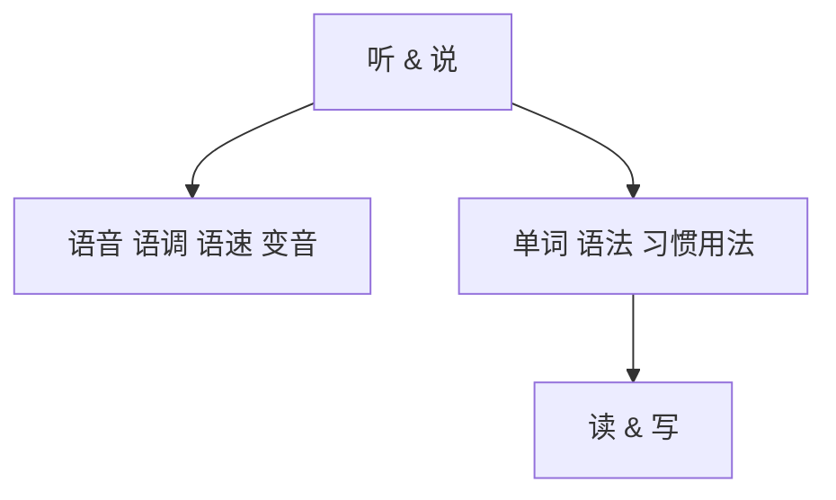

## 使用指南

## 跟读 & 泡耳朵

flowchart

```mermaid
graph TD
  A["听 & 说"] --> B["语音 语调 语速 变音"]
  A --> C["单词 语法 习惯用法"]
  C --> D["读 & 写"]
```

natural_image

Man speaking at a wooden table with a tablet and microphone, no visible text or symbols

