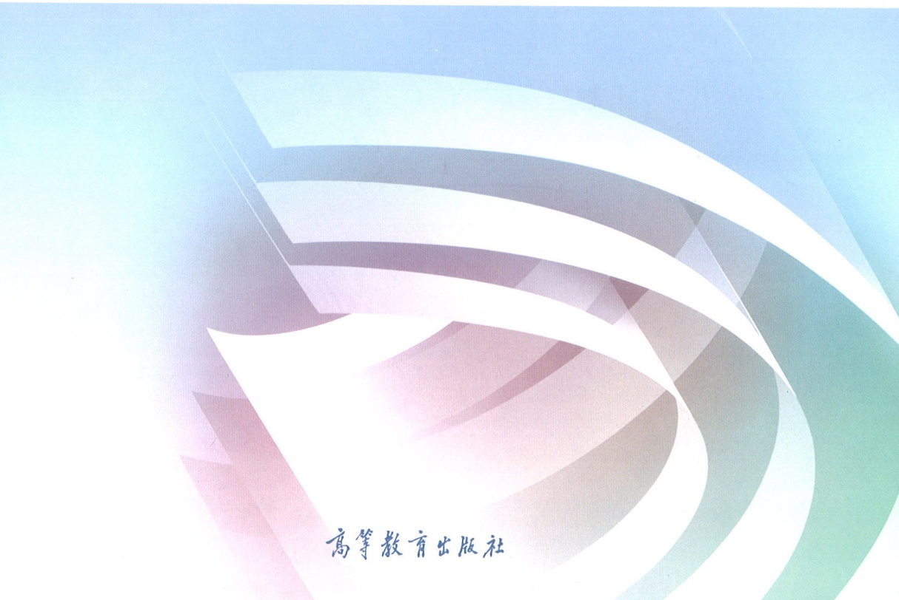

· 马克思主义理论研究和建设工程重点教材 ·

# 中国近现代史纲要

## (2023年版)

本书编写组

马克思主义理论研究和建设工程重点教材

# 中国近现代史纲要

(2023年版)

本书编写组

高等教育出版社·北京

图书在版编目（CIP）数据

中国近现代史纲要:2023年版 / 《中国近现代史纲要（2023年版）》编写组编.--9版.--北京:高等教育出版社，2023.2

ISBN 978-7-04-059901-5

I.①中… II.①中… III.①中国历史-近现代-高等学校-教材 IV.①K25

中国国家版本馆 CIP 数据核字（2023）第 012589 号

Zhongguo Jinxiandaishi Gangyao

策划编辑 王 杨 张新峰 刘柏才

出版发行 高等教育出版社

社 址 北京市西城区德外大街4号

责任编辑 王 杨 张新峰

邮政编码 100120

购书热线 010-58581118

封面设计 王凌波 杨立新

咨询电话 400-810-0598

网 址 http://www.hep.edu.cn

版式设计 王凌波 王琰

责任校对 王雨

网上订购 http://www.hepmall.com.cn  
http://www.hepmall.com  
http://www.hepmall.cn

责任印制 朱琦

印刷 三河市华骏印务包装有限公司

开 本 $787\mathrm{mm}\times 960\mathrm{mm}$ 1/16

印 张 26.75

字 数 360千字

版次 2007年2月第1版  
2023年2月第9版

印 次 2023年2月第1次印刷

定 价 26.00元

本书如有缺页、倒页、脱页等质量问题，请到所购图书销售部门联系调换。

版权所有 侵权必究

物料号 59901-00

# · 马克思主义理论研究和建设工程重点教材。

马克思主义理论研究和建设工程咨询委员会委员、审议专家（以姓氏笔画为序）

王伟光 王晓晖 王梦奎 王维澄 王嘉毅

韦建桦 尹汉宁 左中一 龙新民 宁吉喆

邢贲思 曲青山 曲爱国 刘永治 刘国光

江流 江金权 汝信 孙英 孙谦

孙业礼 苏星 李伟 李捷 李书磊

李君如 李忠杰 李宝善 李培林 李景田

李慎明 吴杰明 吴德刚 何毅亭 冷溶

沈春耀 怀进鹏 张宇 张文显 张树军

张研农 陈 晋 陈宝生 邵华泽 欧阳淞

金冲及 金炳华 周济 郑必坚 郑科扬

赵长茂 南振中 信春鹰 侯树栋 逢先知

逄锦聚 姜辉 袁贵仁 袁曙宏 贾高建

夏伟东 顾海良 徐光春 高翔 高永中

龚育之 隆国强 蒋乾麟 韩震 韩文秀

谢伏瞻 甄占民 靳诺 路建平 虞云耀

蔡昉 雒树刚 滕文生 颜晓峰 魏礼群

《中国近现代史纲要（2023年版）》课题组首席专家欧阳淞

主要成员（以姓氏笔画为序）
仝华 朱鸿召 李蕉 李朝阳 张树军
张洪松 罗平汉 金民卿 周家彬 徐建刚
傅颐

## 目录

- 导言/1
- 一、中国近代史综述 / 1
- 二、中国现代史综述 / 6
- 三、学习中国近现代史的目的和要求 / 11
- 第一章 进入近代后中华民族的磨难与抗争 / 13
- 第一节 鸦片战争前后的中国与世界 / 13
- 一、中国封建社会的衰落 / 13
- 二、世界资本主义的发展与殖民扩张 / 15
- 三、鸦片战争的爆发 / 16
- 第二节 西方列强对中国的侵略 / 23
- 一、军事侵略 / 23
- 二、政治控制 / 26
- 三、经济掠夺 / 29
- 四、文化渗透 / 33
- 第三节 反抗外国武装侵略的斗争 / 35
- 一、抵御外来侵略的斗争历程 / 35
- 二、义和团运动与列强瓜分中国图谋的破产 / 38
- 第四节 反侵略战争的失败与民族意识的觉醒 / 41
- 一、反侵略战争的失败及其原因 / 41
- 二、民族意识的觉醒 / 44

- 第二章 不同社会力量对国家出路的早期探索/49
- 第一节 太平天国运动的起落/49
- 一、太平天国农民战争/49
- 二、农民斗争的意义和局限/52
- 第二节 洋务运动的兴衰/55
- 一、洋务事业的兴办/55
- 二、洋务运动的历史作用及失败/57
- 第三节 维新运动的兴起和夭折/59
- 一、戊戌维新运动的开展/59
- 二、戊戌维新运动的意义和教训/63
- 第三章 辛亥革命与君主专制制度的终结/68
- 第一节 举起近代民族民主革命的旗帜/68
- 一、辛亥革命爆发的历史条件/68
- 二、资产阶级革命派的活动/71
- 三、三民主义的提出/73
- 四、关于革命与改良的辩论/75
- 第二节 辛亥革命与中华民国的建立/77
- 一、辛亥革命的爆发与清王朝覆灭/77
- 二、中华民国的建立/79
- 第三节 北洋军阀统治与旧民主主义革命的失败/82
- 一、封建军阀专制统治的形成/82
- 二、旧民主主义革命的失败/85
- 第四章 中国共产党成立和中国革命新局面/91
- 第一节 新文化运动和五四运动/91
- 一、新文化运动与思想解放的潮流/91
- 二、十月革命与马克思主义在中国的初步传播/93
- 三、五四运动:新民主主义革命的开端/95

- 第二节 马克思主义广泛传播与中国共产党诞生 / 98
- 一、中国早期马克思主义思想运动 / 98
- 二、马克思主义与中国工人运动的结合 / 102
- 三、中国共产党第一次全国代表大会的召开与中国共产党的成立 / 107
- 第三节 中国革命的新局面 / 109
- 一、民主革命纲领的制定和工农运动的发动 / 109
- 二、国共合作和大革命的进行 / 111
- 三、大革命的失败及其教训 / 115
- 第五章 中国革命的新道路 / 120
- 第一节 中国共产党对革命新道路的探索 / 120
- 一、国民党在全国统治的建立及其性质 / 120
- 二、土地革命战争的兴起 / 123
- 三、农村包围城市、武装夺取政权道路的开辟 / 125
- 第二节 中国革命在曲折中前进 / 129
- 一、土地革命战争的发展及其挫折 / 129
- 二、遵义会议实现伟大历史转折 / 132
- 三、红军长征胜利和迎接全民族抗战 / 134
- 第六章 中华民族的抗日战争 / 138
- 第一节 日本发动企图灭亡中国的侵略战争 / 138
- 一、日本灭亡中国的计划及其实施 / 138
- 二、日本帝国主义的残暴统治 / 139
- 第二节 中国人民奋起抗击日本侵略者 / 141
- 一、中国共产党举起武装抗日的旗帜 / 141
- 二、抗日救亡运动的兴起 / 141
- 三、抗日民族统一战线的建立与全民族抗战的开始 / 142
- 第三节 抗日战争的正面战场 / 145
- 一、战略防御阶段的正面战场 / 145
- 二、战略相持阶段的正面战场 / 146

- iv 目录
- 第四节 抗日战争的中流砥柱 / 148
- 一、全面抗战路线和持久战的战略总方针 / 148
- 二、敌后战场的开辟与游击战争的发展 / 149
- 三、坚持抗战、团结、进步的方针 / 151
- 四、抗日民主根据地的建设 / 153
- 五、大后方的抗日民主运动和进步文化工作 / 155
- 六、中国共产党的自身建设 / 156
- 第五节 抗日战争的胜利及其意义 / 161
- 一、抗日战争的胜利 / 161
- 二、中国人民抗日战争在世界反法西斯战争中的地位 / 162
- 三、抗日战争胜利的原因和意义 / 164
- 第七章 为建立新中国而奋斗 / 168
- 第一节 从争取和平民主到击退国民党的军事进攻 / 168
- 一、中国共产党争取和平民主的斗争 / 168
- 二、国民党发动全面内战和解放区军民的坚决反击 / 172
- 第二节 全国解放战争的发展和第二条战线的形成 / 173
- 一、解放战争的胜利发展 / 173
- 二、解放区的土地改革运动与农民的广泛发动 / 175
- 三、第二条战线的形成和发展 / 176
- 第三节 中国共产党与民主党派的团结合作 / 178
- 一、各民主党派的历史发展 / 178
- 二、中国共产党与民主党派的合作 / 180
- 三、中国共产党领导的多党合作和政治协商格局的形成 / 181
- 第四节 建立人民民主专政的新中国 / 184
- 一、南京国民党政权的覆灭 / 184
- 二、人民政协与《共同纲领》 / 186
- 三、中国革命胜利的原因、意义和基本经验 / 189

- 第八章 中华人民共和国的成立与中国社会主义建设道路的探索/194
- 第一节 中华人民共和国的成立和新生人民政权的巩固/194
- 一、中国人民站立起来了/194
- 二、捍卫巩固新政权的斗争/195
- 第二节 党在过渡时期的总路线及其实施/204
- 一、党提出过渡时期总路线/204
- 二、社会主义工业化的起步/206
- 三、改造个体农业和手工业/207
- 四、改造资本主义工商业/209
- 第三节 初步确立社会主义基本制度/211
- 一、建立社会主义经济制度/211
- 二、确立社会主义政治制度/213
- 三、社会主义基本制度确立的伟大意义/215
- 第四节 全面建设社会主义的良好开端/216
- 一、探索适合中国国情的社会主义建设道路/216
- 二、开始全面建设社会主义/221
- 第五节 社会主义道路的艰辛探索和曲折发展/224
- 一、“大跃进”和初步纠正“左”的错误/224
- 二、国民经济调整和“四个现代化”战略目标的制定/226
- 三、“文化大革命”内乱及其历史教训/228
- 四、全面建设社会主义的成就/233
- 第九章 改革开放与中国特色社会主义的开创和发展/242
- 第一节 历史性的伟大转折和改革开放的起步/242
- 一、伟大转折和成功开创中国特色社会主义/242
- 二、拨乱反正任务的基本完成/247
- 三、改革开放的起步/250

- vi 目录
- 第二节 改革开放和社会主义现代化建设新局面 / 256
- 一、改革开放的全面展开 / 256
- 二、加强和改善党的领导 / 260
- 三、改革开放和现代化建设的深入推进 / 262
- 四、国防战略的转变、“一国两制”方针的形成和外交方针政策的调整 / 265
- 五、经受严重政治风波的考验 / 268
- 六、邓小平南方谈话 / 269
- 第三节 把中国特色社会主义推向 21 世纪 / 271
- 一、新的中央领导集体与捍卫中国特色社会主义 / 271
- 二、社会主义市场经济体制改革目标和基本框架的确立 / 275
- 三、改革开放和现代化建设的跨世纪发展 / 279
- 四、香港、澳门回归祖国与两岸交流扩大 / 288
- 五、推进党的建设新的伟大工程 / 289
- 第四节 在新形势下坚持和发展中国特色社会主义 / 292
- 一、全面建设小康社会宏伟目标的提出 / 292
- 二、全面建设小康社会新部署和改革开放的深化 / 296
- 三、推进“一国两制”实践与祖国和平统一大业 / 304
- 四、提高党的建设科学化水平 / 306
- 第十章 中国特色社会主义进入新时代 / 312
- 第一节 开拓中国特色社会主义更为广阔的发展前景 / 312
- 一、中国特色社会主义进入新时代 / 312
- 二、习近平同志党中央的核心、全党的核心地位的确立 / 315
- 三、统筹推进“五位一体”总体布局 / 318
- 四、协调推进“四个全面”战略布局 / 327
- 五、全面推进国防和军队现代化 / 334
- 六、全面加强国家安全 / 338
- 第二节 把新时代中国特色社会主义不断推向前进 / 342
- 一、习近平新时代中国特色社会主义思想指导地位的确立 / 342
- 二、坚持党的全面领导与推进党的自我革命 / 347
- 三、国家制度和治理体系建设迈出新步伐 / 353

- 四、在应对风险挑战中推进各项事业 / 360
- 五、坚持“一国两制”和推进祖国统一 / 368
- 六、全面推进中国特色大国外交和推动构建人类命运共同体 / 374
- 第三节 开启全面建设社会主义现代化国家新征程 / 379
- 一、完成脱贫攻坚、全面建成小康社会的历史任务，实现第一个百年奋斗目标 / 379
- 二、把握新发展阶段、贯彻新发展理念、构建新发展格局、推动高质量发展 / 389
- 三、隆重庆祝中国共产党成立一百周年 / 393
- 四、全面总结党的百年奋斗重大成就和历史经验 / 396
- 五、党的二十大的召开和以中国式现代化全面推进中华民族伟大复兴 / 401

后记/412