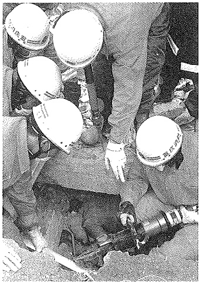
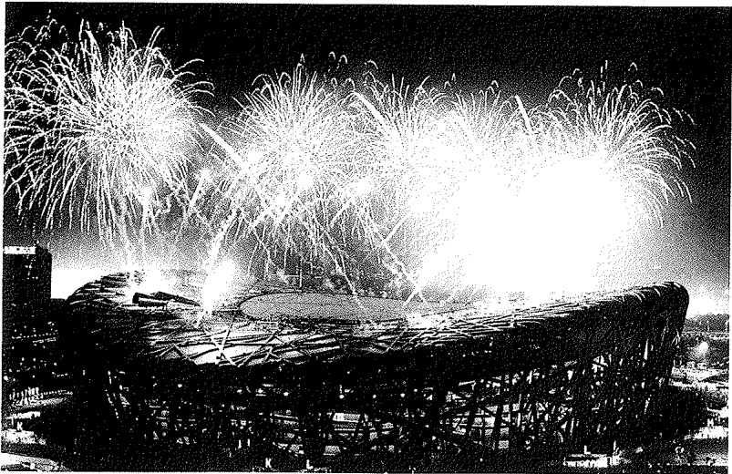
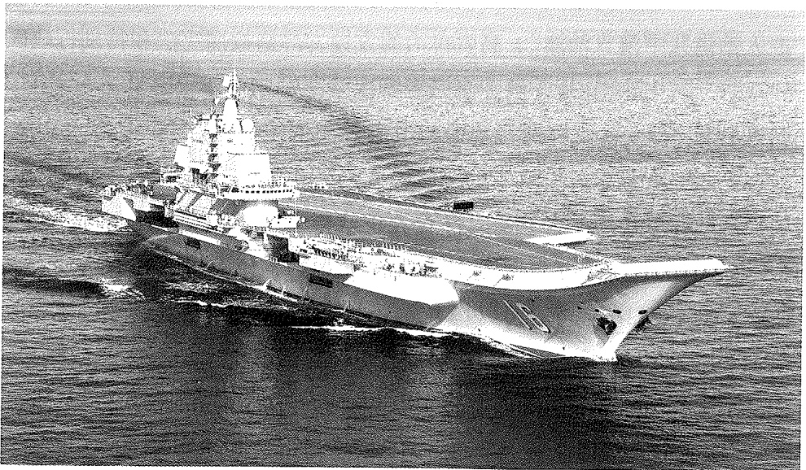
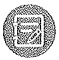

## 第九章 改革开放与中国特色社会主义的开创和发展

粉碎“四人帮”后，人民群众强烈要求彻底扭转十年内乱造成的严重局面，使党和国家从危难中重新奋起。这个时期，世界经济快速发展，科技进步日新月异。国内外发展大势要求中国共产党尽快就关系党和国家前途命运的大政方针作出政治决断和战略抉择。1978年12月，中国共产党第十一届中央委员会第三次全体会议召开。这次会议开启了改革开放和社会主义现代化建设新时期，实现了新中国成立以来党的历史上具有深远意义的伟大转折。在中国共产党的带领下，全国各族人民踏上了中国特色社会主义开创和接续发展的征程。

## 第一节 历史性的伟大转折和改革开放的起步

## 一、伟大转折和成功开创中国特色社会主义

在徘徊中前进和关于真理标准问题大讨论 粉碎“四人帮”后，党中央采取果断措施，清查清理“四人帮”帮派体系，开始纠正冤假错案，调整和配备各级领导班子，部署开展揭批“四人帮”的运动，恢复党和国家正常秩序，人民群众期盼已久的安定的政治局面开始形成。但是，要想短期内消除“文化大革命”在政治上思想上造成的严重混乱，并非一件容易的事情。这种混乱的发生，主要是由于林彪、江青两个反革命集团的兴风作浪，但也与党内较长时间存在的“左”的错误有关。纠正这种严重混乱最突出的阻碍，是当时提出和推行“两个凡是”，即“凡是毛主席作出的

---

第一节 历史性的伟大转折和改革开放的起步

243

决策，我们都坚决维护，凡是毛主席的指示，我们都始终不渝地遵循”。“两个凡是”在理论上违背了马克思主义基本原理和党的实事求是的思想路线，在实践上给坚持真理、修正错误造成了障碍。

“两个凡是”提出后不久，尚未恢复领导职务的邓小平于1977年4月10日致信党中央，指出:“我们必须世世代代地用准确的完整的毛泽东思想来指导我们全党、全军和全国人民” $^{①}$ 。此后，他在不同场合多次批评“两个凡是”。叶剑英、陈云、李先念、聂荣臻、徐向前等老一辈革命家也强调要发扬党的实事求是的优良传统，对“两个凡是”进行抵制。

1977 年 7 月，党的十届三中全会决定恢复邓小平在 1976 年被撤销的一切职务。邓小平复出后，主动要求分管科学教育工作，以此作为推动拨乱反正的突破口。他领导批判林彪、“四人帮”鼓吹的“文艺黑线专政论”“教育黑线专政论”和“两个估计”，号召尊重知识、尊重人才，强调“科学技术是生产力”，指出为社会主义服务的脑力劳动者是劳动人民中的一部分。从此，党扭转了一度存在的对知识分子的“左”的政策。1977 年底，“文化大革命”期间中断的高等学校统一招生考试制度得到恢复。全国有 570 万人参加高考，27.3 万人被录取。1978 年 3 月，全国科学大会召开，科学的春天到来了。

1977 年 8 月 12 日至 18 日，中国共产党第十一次全国代表大会举行。大会宣告 “文化大革命” 结束，重申 20 世纪内把我国建设成为社会主义现代化强国的根本任务，但仍然肯定了 “文化大革命” 的错误理论和实践。随后召开的十一届一中全会选举华国锋为中央委员会主席，叶剑英、邓小平、李先念、汪东兴为副主席。1978 年 3 月，五届全国人大一次会议选举叶剑英为全国人大常委会委员长，决定华国锋为国务院总理；全国政协五届一次会议选举邓小平为政协第五届全国委员会主席。

在“文化大革命”结束后的两年间，党和国家工作有所前进，一些领

<small>①《邓小平文选》第二卷，人民出版社1994年版，第39页。</small>

---

244

第九章 改革开放与中国特色社会主义的开创和发展

域的拨乱反正已经开始，经济建设、社会各项事业和外交工作有所恢复和发展。人们急切期待党和国家迅速摆脱困境，迈开大步前进。但是，由于“左”倾错误的长期影响和“两个凡是”的限制，党和国家工作出现了在徘徊中前进的局面。许多人开始思考:究竟应该用什么样的态度对待毛泽东的指示？判定历史实践的是非标准到底是什么？这就不可避免地产生了实事求是与“两个凡是”的争论。

1978 年 5 月 10 日，中央党校内部刊物《理论动态》刊登《实践是检验真理的唯一标准》一文。第二天，《光明日报》以特约评论员名义公开发表这篇文章，新华社向全国转发。文章提出，社会实践不仅是检验真理的标准，而且是唯一的标准。对“四人帮”设置的禁区“要敢于去触及，敢于去弄清是非”。不能拿现成的公式去限制、宰割、剪裁无限丰富的飞速发展的革命实践，应该勇于研究新的实践中提出的新问题。文章发表后产生强烈反响，引发了关于真理标准问题的大讨论。

实践是检验真理的唯一标准，本来是马克思主义的常识。但由于它同“两个凡是”尖锐对立，并且触及盛行多年的思想僵化和个人崇拜，因此讨论一开始就受到一些人的指责。关键时刻，邓小平给予有力的支持。他发表讲话，批评有些人在对待毛泽东和毛泽东思想问题上的“两个凡是”的错误态度，号召“拨乱反正，打破精神枷锁，使我们的思想来个大解放” $^{①}$ 。在邓小平和许多老一辈革命家的支持下，关于真理标准问题的大讨论迅速在全党全社会展开。这场深刻而广泛的马克思主义思想解放运动，成为正本清源、拨乱反正和改革开放的思想先导。

在关于真理标准问题的大讨论中，党内外思想日益活跃，开始出现酝酿对外开放和对各方面体制进行改革的新局面。1978年3月，邓小平指出:独立自主不是闭关自守，自力更生不是盲目排外。“任何一个民族、一个国家，都需要学习别的民族、别的国家的长处，学习人家的先进科

<small>①《邓小平文选》第二卷，人民出版社1994年版，第119页。</small>

---

第一节 历史性的伟大转折和改革开放的起步

245

学技术。” $^{①}$  在7月至9月召开的国务院务虚会上，许多部门负责人提出改革僵化的经济管理体制、引进国外先进技术和资金的建议。9月下旬，全国计划会议提出经济工作必须实行三个转变。1978年9月，邓小平视察东北三省。他强调，一定要根据现在的有利条件加速发展生产力，使人民的生活好一些。他还提出，揭批“四人帮”的群众运动要适时结束，转入正常工作，从而提出了把党和国家工作重点转移到现代化建设上来的重要主张。这为随后召开的中央工作会议和党的十一届三中全会奠定了思想基础。

党的十一届三中全会实现伟大转折 党的十一届三中全会召开前，1978年11月10日至12月15日，中共中央在北京召开工作会议。会议原定议题主要是讨论经济工作，由于会前邓小平提出的工作重点转移的建议得到中央政治局常委的赞同，这次会议首先讨论工作重点转移的问题。与会者对于工作重点转移是一致赞成的，但又感到，如果不正确解决指导思想问题，不纠正“左”倾错误包括“文化大革命”的严重错误，不克服教条主义、本本主义和思想僵化，不解决检验真理的标准问题，是不可能真正实现工作重点转移的。东北组在讨论中率先提出解决历史遗留问题的意见，引起强烈反响。随后，会议对真理标准问题展开思想交锋，对经济问题、党的建设、民主法制建设进行了热烈讨论。根据大家的要求，11月25日，中央政治局作出为天安门事件等重大错案平反的决定。

12月13日，邓小平在中央工作会议闭幕会上作题为《解放思想，实事求是，团结一致向前看》的讲话。他指出，首先是解放思想，只有思想解放了，我们才能正确地以马列主义、毛泽东思想为指导，解决过去遗留的问题，解决新出现的一系列问题。一个党，一个国家，一个民族，如果一切从本本出发，思想僵化，迷信盛行，那它就不能前进，它的生机就停止了，就要亡党亡国。他强调，民主是解放思想的重要条件，为了保障人

<small>①《邓小平文选》第二卷，人民出版社1994年版，第91页。</small>

---

2,46

第九章 改革开放与中国特色社会主义的开创和发展

民民主，必须加强法制，做到有法可依，有法必依，执法必严，违法必究。邓小平还提出改革经济体制的任务，指出:“如果现在再不实行改革，我们的现代化事业和社会主义事业就会被葬送。” $^{①}$ 这个讲话是解放思想、开辟新时期新道路的宣言书，实际上成为随后召开的党的十一届三中全会的主题报告，为全会实现具有划时代意义的伟大转折奠定了重要基础。

1978年12月18日至22日，党的十一届三中全会在北京召开。全会冲破长期“左”的错误的严重束缚，彻底否定“两个凡是”的错误方针，高度评价关于真理标准问题的讨论，果断停止使用“以阶级斗争为纲”的口号，决定从1979年1月起把全党的工作重心转移到社会主义现代化建设上来。全会提出了改革开放的任务，指出实现四个现代化是一场广泛、深刻的革命。要采取一系列新的重大的经济措施，对经济管理体制和经营管理方法进行认真的改革，在自力更生的基础上积极发展同世界各国平等互利的经济合作。

全会强调要充分发扬民主，提出要实现民主制度化、法律化，健全党的民主集中制，健全党规党法，严肃党纪。全会还特别强调要正确对待毛泽东的历史地位和毛泽东思想的科学体系，为坚持和发展毛泽东思想指明了方向。全会增选了中央领导机构成员，决定恢复成立并选举产生了以陈云为第一书记的中共中央纪律检查委员会。会后，从体现党的正确指导思想以及决定改革开放和社会主义现代化建设的重大方针政策来看，实际上邓小平同志已经成为党的中央领导集体的核心。

党的十一届三中全会的胜利召开，结束了粉碎“四人帮”后党和国家工作徘徊中前进的局面，标志着中国共产党重新确立了马克思主义的思想路线、政治路线、组织路线，开启了我国改革开放和社会主义现代化建设新时期，实现了历史性的伟大转折。全会作出实行改革开放的历史性决策，是基于对党和国家前途命运的深刻把握，是基于对社会主义革命和建

<small>①《邓小平文选》第二卷，人民出版社1994年版，第150页。</small>

---

第一节 历史性的伟大转折和改革开放的起步

247

设实践的深刻总结，是基于对时代潮流的深刻洞察，是基于对人民群众期盼和需要的深刻体悟。改革开放是中国共产党的一次伟大觉醒，正是这个伟大觉醒，孕育了党从理论到实践的伟大创造。从这次全会开始，改革开放和开创中国特色社会主义的大幕拉开，邓小平理论也逐步形成和发展起来。党的十一届三中全会作为一个伟大转折点而载入光辉史册。

## 二、拨乱反正任务的基本完成

大规模平反冤假错案和调整社会关系 十一届三中全会后，党和国家按照实事求是、有错必纠的原则，加快了平反冤假错案的步伐。1980年2月，党的十一届五中全会决定为刘少奇彻底平反，恢复了刘少奇作为伟大的马克思主义者和无产阶级革命家、党和国家主要领导人之一的名誉。此后，又为遭到错误批判、处理的党和国家其他领导人、各族各界的代表人物恢复了名誉，复查和平反了大量冤假错案，落实了干部政策和知识分子政策。到1982年底，大规模的平反冤假错案工作基本结束。全国共纠正300多万名干部的冤假错案，47万多名共产党员恢复了党籍，他们心情舒畅地重新走上工作岗位或担任新的领导职务。

中共中央还采取措施调整社会关系，改正了错划右派分子的案件，摘掉地主、富农分子的帽子，为国民党投诚起义人员落实政策，将原为劳动者的小商小贩、手工业者同原工商业者区别开来，支持各民主党派恢复活动，认真落实民族政策和宗教政策，重申侨务政策。这就为有效地调动社会各阶层人员的积极性、实现改革开放和开创现代化建设的新局面，奠定了必不可少的社会基础和群众基础。

阐明必须坚持四项基本原则 在拨乱反正的过程中，广大干部群众从过去一个时期“左”倾思想的严重束缚中解脱出来，党内外呈现出研究新情况、解决新问题的生动局面，但同时也出现了一些值得注意和警觉的现象。有的人对十一届三中全会以来的新的路线方针政策表现出不理解甚至

---

248

第九章 改革开放与中国特色社会主义的开创和发展

抵触情绪。有的人对解放思想加以曲解，肆意夸大中国共产党和毛泽东所犯的错误，企图否定中国共产党的领导，否定社会主义制度，否定毛泽东和毛泽东思想。

针对这些思想混乱状况，1979年3月30日，邓小平在党的理论工作务虚会上发表《坚持四项基本原则》的讲话。他指出:坚持社会主义道路，坚持人民民主专政，坚持共产党的领导，坚持马克思列宁主义、毛泽东思想这四项基本原则，“是实现四个现代化的根本前提” $^{①}$ 。“如果动摇了这四项基本原则中的任何一项，那就动摇了整个社会主义事业，整个现代化建设事业。” $^{②}$ 他还提出一个重要思想:“现在搞建设，也要适合中国情况，走出一条中国式的现代化道路。” $^{③}$ 这表明，中国共产党所领导的改革开放从一开始就具有明确的社会主义方向。邓小平的讲话不仅在当时，而且在以后的党和国家政治生活中，对排除来自“左”的和右的方面的干扰和影响，保证改革开放和现代化建设事业的顺利进行，提供了可靠的政治基础，指明了正确的方向。

制定《关于建国以来党的若干历史问题的决议》和明确新时期我国社会主要矛盾 全面拨乱反正，必然要求对新中国成立以来党的重大历史问题作出结论，以便统一全党和全国人民的思想，团结一致向前看。从1979年11月起，在邓小平主持下，中共中央着手起草《关于建国以来党的若干历史问题的决议》。邓小平对《决议》的起草提出三条指导原则:第一，确立毛泽东同志的历史地位，坚持和发展毛泽东思想，这是最核心的一条；第二，对建国30年来历史上的大事，要进行实事求是的分析，包括一些负责同志的功过是非，要作出公正的评价；第三，这个总结宜粗不宜细，总结过去是为了引导大家团结一致向前看。他还多次强调，对毛泽东的功过评价，要实事求是、恰如其分。毛泽东思想这个旗帜丢不

<small>①《邓小平文选》第二卷，人民出版社1994年版，第164页。</small>

<small>②《邓小平文选》第二卷，人民出版社1994年版，第173页。</small>

<small>③《邓小平文选》第二卷，人民出版社1994年版，第163页。</small>

---

第一节 历史性的伟大转折和改革开放的起步

249

得，丢掉了这个旗帜实际上就否定了我们党的光辉历史。他指出，毛泽东“多次从危机中把党和国家挽救过来。没有毛主席，至少我们中国人民还要在黑暗中摸索更长的时间” $^{①}$ 。1981年6月，党的十一届六中全会通过了这个《决议》。

《决议》指出，中国共产党在中华人民共和国成立以后的历史，总的说来，是我们党在马克思列宁主义、毛泽东思想指导下，领导全国各族人民进行社会主义革命和社会主义建设并取得巨大成就的历史。《决议》彻底否定“文化大革命”，对新中国成立以来的重大历史事件和重要历史人物作出了基本结论。

《决议》科学地评价了毛泽东和毛泽东思想的历史地位，指出:毛泽东同志是伟大的马克思主义者，是伟大的无产阶级革命家、战略家和理论家。他虽然在“文化大革命”中犯了严重错误，但是就他的一生来看，他对中国革命的功绩远远大于他的过失。他的功绩是第一位的，错误是第二位的。他为中国共产党和中国人民解放军的创立和发展，为中国各族人民解放事业的胜利，为中华人民共和国的缔造和中国社会主义事业的发展，建立了永远不可磨灭的功勋。毛泽东思想是马克思列宁主义在中国的运用和发展，是被实践证明了的关于中国革命和建设的正确的理论原则和经验总结，是中国共产党集体智慧的结晶。《决议》对毛泽东思想的科学体系和活的灵魂（即实事求是、群众路线、独立自主）作了概括，强调毛泽东

思想是我们党的宝贵的精神财富，它将长期指导我们的行动。

《决议》对党的十一届三中全会以来逐步确立的适合中国情况的建设社会主义现代化强国的道路，从十个方面作了概括。其中，第一个方面就是关于新时期我国社会主义矛盾的判断。《决议》指出:社会主义改造基本完成以后，我国所要解决的主要矛盾，是人民日益增长的物质文化需要同落后

《关于建国以来党的若干历史问题的决议》

<small>①《邓小平文选》第二卷，人民出版社1994年版，第344—345页。</small>

---

250

第九章 改革开放与中国特色社会主义的开创和发展

的社会生产之间的矛盾。为了解决这个主要矛盾，《决议》强调:党和国家工作的重点必须转移到以经济建设为中心的社会主义现代化建设上来，大大发展社会生产力，并在这个基础上逐步改善人民的物质文化生活。今后，除了发生大规模外敌入侵（那时仍然必须进行为战争所需要和容许的经济建设），决不能再离开这个重点。党的各项工作都必须服从和服务于经济建设这个中心。《决议》还提出:社会主义经济建设必须从我国国情出发，量力而行，积极奋斗，有步骤分阶段地实现现代化的目标，等等。这十个方面的概括，实质上初步提出了在中国建设什么样的社会主义和怎样建设社会主义的问题。《决议》正确解决了既科学评价毛泽东的历史地位和毛泽东思想的科学体系，又根据新的实际和发展要求实行改革开放、确立中国社会主义现代化建设正确道路这两个相互联系的重大历史课题，充分体现出以邓小平同志为核心的中共中央领导集体的远见卓识和政治上的成熟。党制定《决议》，标志着党在指导思想上的拨乱反正胜利完成。

全会还决定同意华国锋辞去中共中央委员会主席、中共中央军事委员会主席的职务，选举胡耀邦为中共中央委员会主席、邓小平为中共中央军事委员会主席。

## 三、改革开放的起步

国民经济的调整 针对 1977 年至 1978 年出现的国民经济比例失调的情况，1979 年 4 月召开的中共中央工作会议，提出对国民经济实行“调整、改革、整顿、提高”的方针，坚决纠正前两年经济工作中的失误，认真清理过去在这方面长期存在的“左”倾错误影响。会议强调，经济建设必须从国情出发，符合经济规律和自然规律；必须量力而行，循序渐进，经过论证，讲求实效，使发展生产同改善生活紧密结合；必须在独立自主、自力更生的基础上，积极开展对外经济合作和技术交流。

在讨论国民经济调整问题时，邓小平强调，要使中国实现四个现代

---

第一节 历史性的伟大转折和改革开放的起步

2.51

化，至少有两个重要特点是必须看到的。一个是底子薄；一个是人口多，耕地少。陈云也指出，我国社会经济的主要特点是农村人口占80%，而且人口多，耕地少，要认清我们是在这种情况下搞四个现代化的。

经过两年的努力，经济形势较快好转，国民经济的主要比例关系渐趋合理，长期存在的积累率过高和农业、轻工业严重滞后的情况有了根本改变。1981年12月，五届全国人大四次会议通过的政府工作报告，提出要真正从我国实际情况出发，走出一条速度比较实在、经济效益比较好、人民可以得到更多实惠的新路子。报告肯定了调整工作取得的成绩，宣布1981年国民经济计划预计可以胜利完成，稳定经济的目标能够基本实现。国民经济调整任务胜利完成。

农村改革率先取得突破 党的十一届三中全会前，我国农村存在经营管理过于集中和分配中的平均主义等弊端，严重挫伤了农民的生产积极性，农业发展和农民生活改善比较缓慢。1978年，全国还有2.5亿人口的温饱问题没有解决。

1978年夏秋之际，安徽省遭遇严重旱灾，秋种遇到困难。省委决定把部分土地借给农民，谁种谁收。这一措施很快调动起群众的生产积极性。从“借地”中得到启发，安徽一些地方的基层干部和农民冲破旧体制的限制，开始包干到组、包产到户。凤阳县梨园公社小岗生产队18户农民还创造了包干到户，即“保证国家的，留足集体的，剩下都是自己的”。这个办法简便易行，成效显著，受到农民欢迎。四川、甘肃、云南、广东等省份的一些地方也采取了类似做法。这些大胆尝试，揭开了农村经济改革的序幕。

对于包产到户、包干到户等农业生产责任制形式，党内外一度出现不同意见。不少人心存疑虑，担心这样会影响农村集体经济，会偏离农村发展的社会主义方向。1980年5月，邓小平在一次谈话中肯定了包产到户这种形式。他指出，影响集体经济的担心是不必要的。只要生产发展了，农村的社会分工和商品经济发展了，低水平的集体化就会发展到高水平的

---

252

第九章 改革开放与中国特色社会主义的开创和发展

集体化，集体经济不巩固的也会巩固起来。9月，中共中央印发《关于进一步加强和完善农业生产责任制的几个问题》，突破多年来把包产到户等同于分田单干和资本主义的观念，肯定了在生产队领导下实行的包产到户。1982年，中共中央发出“一号文件”，指出包产到户、包干到户等各种责任制，都是社会主义集体经济的生产责任制。在中央的支持和推动下，以包产到户、包干到户为主要形式的家庭联产承包责任制迅速推广开来。许多地方一年即见成效，粮食产量明显提高，几年就变了个大样。

在农村改革的过程中，也有部分地方没有实行以分散经营为主的家庭联产承包责任制，而是继续坚持统一经营的集体经济，改革原来的平均主义分配办法，逐渐向高水平的集体化前进。对此，党和政府也给予支持和鼓励。

改革开放初期党中央有关农村改革与农村工作的“一号文件”

农村改革是中国农民的伟大创造。改革首先在农村取得突破和成功不是偶然的，它是由我国基本国情和当时农村经济发展困境决定的。党的十一届三中全会为农村改革提供了

重要的思想前提，创造了良好的政治环境，广大农村基层干部和亿万农民为改变农村面貌和自身命运，勇敢冲破不利于生产力发展的旧体制，掀起了波澜壮阔的改革大潮。建设中国特色社会主义的伟大实践，就这样在党和广大人民群众的创造中，开始一步一步坚定前行。

逐步转向城市经济体制改革 在借鉴农村改革经验的基础上，以扩大企业自主权为主要内容的城市经济体制改革逐步在全国推开。1979年5月，首都钢铁公司、天津自行车厂、上海柴油机厂等8家大型企业开始进行改革试点。到1980年6月，参与改革的企业增至6600个。扩大企业自主权改革，在传统的计划经济体制上打开一个缺口，初步改变了过去只按国家指令性计划生产，不了解市场需要，不关心产品销路，不关心盈利亏损的状况，增强了企业的自主经营意识和市场意识。

在扩大企业自主权的基础上，城市改革逐步推向经济责任制方面，并于1981年春首先在山东省的企业中试行。实行经济责任制的改革，是要

---

第一节 历史性的伟大转折和改革开放的起步

253

把企业和职工的经济利益同他们所承担的责任与实现的经济效益联系起来，使广大职工以主人翁的态度，用最少的人力物力，取得最大的经济效益。此后，经济责任制很快推行到全国3.6万个工业企业。

商业流通体制的改革也在展开。从1979年起，国家重新限定农副产品的统购和派购范围，放宽农副产品的购销政策，规定供销合作社基层社可以出县、出省购销，集体所有制商业、个体商贩和农民可以长途贩运。这为加快城乡商品流转创造了有利条件。

所有制结构的改革开始进行。1979年，全国出现知青返城大潮。为了缓解与日俱增的就业压力，党中央、国务院采取支持城镇集体经济和个体经济发展的方针，开启了以公有制经济为主体、多种经济形式并存的改革。“个体户”由此应运而生。1981年10月，党中央、国务院在《关于广开门路，搞活经济，解决城镇就业问题的若干决定》中指出:在社会主义公有制经济占优势的根本前提下，实行多种经济形式和多种经营方式长期并存，是我党的一项战略决策，绝不是一种权宜之计。在新的政策指引下，集体经济、个体经济有了新的发展，还出现全民、集体和个体联营共同发展的新经济形式。

对外开放和兴办经济特区 在改革推进的过程中，对外开放逐步展开，并取得重大突破。吸引和利用外资、兴办中外合资经营企业和中外合作经营企业（或项目），是对外开放的重要方式和步骤。1979年，中国国际信托投资公司成立，开展国际信托、投资、租赁等业务。1980年，我国恢复在世界银行、国际货币基金组织的代表权，并加入国际农业发展基金会，开始从这些国际金融机构中得到贷款。我国还同日、法、美等国公司共同开展海上石油勘探开发。随着1979年7月《中华人民共和国中外合资经营企业法》及此后一系列相关法律法规的出台，中外合资经营从无到有发展起来。旅游业异军突起，发展为一个新兴产业。

兴办经济特区，是党和国家推进改革开放和社会主义现代化建设的伟大创举。早在1978年4月，国家计委、外贸部派遣的经济贸易考察组赴

---

254

第九章 改革开放与中国特色社会主义的开创和发展

香港、澳门考察后，向中央建议，把靠近港澳的广东宝安、珠海划为出口基地。1979年1月，广东省和交通部联名向国务院递交报告，提出在蛇口一带设立工业区的设想，得到中央批准。不久后，在轰鸣的开山炮声中，蛇口工业区诞生了。

1979年4月，中央召开工作会议。广东省委第一书记习仲勋在发言中提出，广东的对外开放应该先走一步，希望中央下放若干权力，让广东在对外经济活动中有必要的自主权。他说:“麻雀虽小，五脏俱全”，①广东作为一个省，是个大麻雀，等于人家一个或几个国家。但现在省的地方机动权力太小，我们要求在全国的集中统一领导下，放手一点，搞活一点。这样做，对地方有利，对国家也有利。他还提出，允许广东在深圳、珠海和汕头举办出口加工区。福建省委也提出类似的设想。中央对此表示支持。关于如何命名这几处实行特殊政策的地区，邓小平明确指出，还是叫特区好，陕甘宁开始就叫特区嘛！中央没有钱，可以给些政策，你们自己去搞，杀出一条血路来。同年7月，党中央、国务院批准广东、福建两省对外经济活动实行特殊政策和灵活措施，先走一步，把经济尽快搞上去，并决定在深圳、珠海划出部分地区试办出口特区。1980年5月，党中央、国务院正式将“出口特区”定名为“经济特区”。8月，五届全国人大常委会第十五次会议批准广东、福建两省在深圳、珠海、汕头、厦门设置经济特区。

在中央决策的推动下，来自四面八方的建设者艰苦创业，在几年时间里，将深圳、珠海这些昔日落后的渔村小镇建设成生机勃勃的崭新城市，创造了敢闯敢试、敢为人先、埋头苦干的特区精神。经济特区的创办，是党中央坚强领导、悉心指导的结果，是广大建设者开拓进取、奋勇拼搏的结果，是全国人民和四面八方倾力支持、广泛参与的结果。经济特区不辱使命，成为中国改革开放的重要窗口，向世界展示了中国改革开放的磅礴伟力。

<small>①《习仲勋传》下卷，中央文献出版社2013年版，第452页。</small>

---

第一节 历史性的伟大转折和改革开放的起步

255

政治体制改革的启动 从党的十一届三中全会起，党中央认真总结和汲取以往党和国家政治生活中的经验教训，以改革党和国家领导制度，使民主制度化、法律化为主要内容的政治体制改革开始起步。

1979年7月，五届全国人大二次会议审议并通过地方各级人民代表大会和地方各级人民政府组织法、全国人民代表大会和地方各级人民代表大会选举法、刑法、刑事诉讼法、人民法院组织法、人民检察院组织法、中外合资经营企业法七部法律。我国社会主义民主制度化、法律化迈出重要一步。

中国共产党领导的多党合作和政治协商制度得到恢复和发展。1979年10月，邓小平在全国政协、中央统战部举行的招待会上强调，在中国共产党的领导下，实行多党派的合作，这是由我国具体历史条件和现实条件所决定的，也是我国政治制度中的一个特点和优点。长期共存，互相监督，这是一项长期不变的方针。同月，中共中央还提出，各级党委要克服“清一色”思想，切实做好党外人士特别是具有业务和技术专长的党外人士的安排工作，同他们真诚合作，共同把国家的事情办好。

中共中央对改革党和国家领导制度采取了一系列举措。1980年2月，党的十一届五中全会决定恢复设立中央书记处，作为中央政治局和它的常务委员会领导下的经常工作机构；选举胡耀邦为中央委员会总书记。

1980年8月，中央政治局召开扩大会议，邓小平作《党和国家领导制度的改革》的讲话。他指出，领导制度、组织制度问题，更带有根本性、全局性、稳定性和长期性。改革党和国家的领导制度，不是要削弱党的领导，涣散党的纪律，而正是为了坚持和加强党的领导，坚持和加强党的纪律。这个讲话，为党和国家领导制度的改革明确了基本的指导思想。

在坚持党的领导的前提下，党和政府采取一系列重要措施，逐步解决效率不高、机构臃肿、人浮于事、作风拖拉等问题，增加地方权力，扩大基层民主权利，加强各级人民代表大会的工作，省、县两级人代会增设常设机构，县级和县级以下人民代表普遍实行由选民直接选举的制度，切实

---

2.56

第九章 改革开放与中国特色社会主义的开创和发展

保障审判、检察机关依据宪法而享有的审判权和检察权，等等。

1982 年，机构改革提上日程。邓小平在这年 1 月召开的中央政治局会议上指出，精简机构是一场革命，最关键的问题是选比较年轻的、德才兼备的干部进领导班子。经过改革，党中央直属单位的局级机构减少 11%，工作人员编制缩减 17.3%。国务院所属部委、直属机构和办公机构由 100 个裁并调整为 61 个，工作人员编制缩减 1/3 左右。在新组成的领导班子中，新选拔的中青年干部占 32%，平均年龄由 64 岁降到 58 岁。

在十一届三中全会后三年多的时间里，拨乱反正全面展开，社会主义民主法制建设逐步走上正轨，党和国家领导制度改革稳步推进，改革开放和国民经济调整取得积极成效，各项事业蓬勃发展。这为党的十二大召开奠定了重要基础。

## 第二节 改革开放和社会主义现代化建设新局面

## 一、改革开放的全面展开

“建设有中国特色的社会主义”重大命题的提出 1982年9月1日至11日，中国共产党第十二次全国代表大会在北京举行。邓小平在开幕词中响亮提出:“把马克思主义的普遍真理同我国的具体实际结合起来，走自己的道路，建设有中国特色的社会主义” $^{①}$ 。“建设有中国特色的社会主义”的重大崭新命题，回答了进入改革开放新时期后走什么样的道路这一全党和全国人民最为关心的重大问题，成为指引改革开放和社会主义现代化建设的伟大旗帜。

大会提出，党在新的历史时期的总任务是:团结全国各族人民，自力

<small>①《邓小平文选》第三卷，人民出版社1993年版，第3页。</small>

---

第二节 改革开放和社会主义现代化建设新局面的

2.57

更生，艰苦奋斗，逐步实现工业、农业、国防和科学技术现代化，把我国建设成为高度文明、高度民主的社会主义国家。大会提出了从1981年到20世纪末我国经济建设总的奋斗目标:在不断提高经济效益的前提下，国内工农业年总产值在20世纪末翻两番，即由1980年的7100亿元增加到2000年的2.8万亿元左右，人民生活达到小康水平。为了实现这个目标，在战略部署上，前十年主要是打好基础，积蓄力量，创造条件；后十年要进入一个新的经济振兴时期。大会把20世纪末的奋斗目标由先前的实现四个现代化改为实现小康，从战略指导上解决了长期存在的急于求成问题。这是党中央在总结历史经验基础上作出的一个历史性决策。

大会的另一个重要贡献，是明确提出努力建设高度的社会主义精神文明和高度的社会主义民主的战略方针。大会强调，社会主义精神文明是社会主义的重要特征，是社会主义制度优越性的重要表现。建设社会主义的物质文明和精神文明，都要靠发展社会主义民主来保证。社会主义民主建设必须同社会主义法制建设紧密地结合起来，使社会主义民主制度化、法律化。

大会通过了新的《中国共产党章程》。新党章规定，党中央不设主席只设总书记，由总书记负责召集中央政治局会议、政治局常委会议和主持中央书记处的工作；中央和省一级设顾问委员会作为新老干部交替的过渡性机构。

随后召开的党的十二届一中全会选举胡耀邦为中央委员会总书记，决定邓小平为中央军事委员会主席，批准陈云为中央纪律检查委员会第一书记，批准邓小平为中央顾问委员会主任。

1982 年 11 月至 12 月，五届全国人大五次会议审议了关于宪法修改草案的报告，通过新修改的《中华人民共和国宪法》。新宪法以 1954 年宪法为基础，纠正了 1975 年和 1978 年通过的宪法中存在的问题，充分体现了十一届三中全会以来党和国家在现代化建设和民主法制建设方面的新思想、新举措和新要求。

1983年6月，六届全国人大一次会议选举李先念为国家主席，彭真

---

258

第九章 改革开放与中国特色社会主义的开创和发展

为全国人大常委会委员长，决定赵紫阳为国务院总理，选举邓小平为国家中央军事委员会主席；全国政协六届一次会议选举邓颖超为政协第六届全国委员会主席。

经济体制改革的全面展开 党的十二大以后，经济体制改革全面展开。1982年至1984年，党中央连续发出关于农村工作的“一号文件”，不断推出稳定和完善家庭联产承包责任制的措施。到1987年，全国 $98\%$ 的农户实行了家庭联产承包责任制，亿万农民的生产积极性得到极大提高，农业生产摆脱了停滞的困境。这从根本上动摇了“三级所有、队为基础”和“政社合一”的人民公社体制。1982年，新宪法作出改变农村人民公社政社合一体制，设立乡政府作为基层政权，普遍成立村民委员会作为群众性自治组织等规定。到1984年底，全国基本完成政社分开，实行了20多年的人民公社制度不复存在。这是农村经济和政治体制的重大改革。1985年的“一号文件”，决定对实施了30多年的农产品统购派购制度进行改革，实行合同收购和市场收购，从而把农村经济纳入了有计划的商品经济的轨道。随着农村经济的发展，大批富余劳动力逐渐从土地上转移出来，从事工业和加工业，乡镇企业异军突起。到1987年，全国乡镇企业发展到1750多万个，从业人员8805万人，产值达到4764亿元，第一次超过农业总产值。这是农村经济的一个历史性变化。

城市改革进一步推进。1984年10月，党的十二届三中全会通过《中共中央关于经济体制改革的决定》。《决定》突破把计划经济同商品经济对立起来的观点，指出我国社会主义经济是在公有制基础上的有计划的商品经济；《决定》突破了把全民所有同国家机构直接经营企业混为一谈的传统观念，提出“所有权同经营权是可以适当分开的”。这是党中央在计划与市场关系问题上取得的新认识。会后，经济体制改革以城市为重点全面展开。改革的中心环节是增强全民所有制企业的活力，其中一项措施是推行承包经营责任制。到1987年，全国80%的国营企业实行了各种形式的承包经营责任制。有的企业还开始进行股份制改革尝试。1984年11月，

---

第二节 改革开放和社会主义现代化建设新局面

259

上海飞乐音响公司公开发行股票，成为改革开放后上海第一家试行股份制经营的股份有限公司。

其他领域的体制改革加快步伐。1985年3月，中共中央作出《关于科学技术体制改革的决定》，提出经济建设必须依靠科学技术、科学技术工作必须面向经济建设的战略方针。1986年11月，我国决定实施发展高科技的“863”计划。1985年5月，中共中央作出《关于教育体制改革的决定》，提出教育体制改革的根本目的是提高民族素质，多出人才、出好人才，要求有计划分步骤地实施九年义务教育。适应现代化建设需要的各类人才在改革过程中不断涌现。1986年4月，第六届全国人民代表大会第四次会议通过《中华人民共和国义务教育法》。

1985年底，国民经济和社会发展第六个五年计划胜利完成。过去长期感到困扰的一些经济问题得到比较好的解决，工农业产品产量大幅度增长，为解决人民温饱问题提供了条件。日用消费品货源比较充足，过去许多定量分配和凭票供应的商品，除粮、油外，已基本取消票证，敞开供应。这些成就和变化，同新中国成立以来前几个五年计划时期的情况相比，是很突出的。

“六五”计划的一个鲜明特点，是在重视经济发展的同时，把社会发展摆到突出位置。以往的五年计划都称为国民经济发展计划，从“六五”计划开始，改称国民经济和社会发展计划。“六五”时期，党和政府对人口、劳动就业、居民收入和消费、城乡建设、社会福利、文化、卫生、体育、环境保护等社会发展方面作出安排。计划生育、环境保护被确定为基本国策。

1985 年 9 月，中国共产党全国代表会议通过《中共中央关于制定国民经济和社会发展第七个五年计划的建议》。根据中共中央的建议，国务院制定了“七五”计划草案。1986 年 4 月，这个计划经六届全国人大四次会议批准后实施。

对外开放确立为基本国策和形成新格局 1984 年初，邓小平视察深圳、珠海、厦门等地，对经济特区的发展给予充分肯定。他指出:“我们

---

260

第九章 改革开放与中国特色社会主义的开创和发展

建立经济特区，实行开放政策，有个指导思想要明确，就是不是收，而是放。”“特区是个窗口，是技术的窗口，管理的窗口，知识的窗口，也是对外政策的窗口。”①5月，中共中央、国务院决定进一步开放天津、上海、大连、秦皇岛、烟台、青岛、连云港、南通、宁波、温州、福州、广州、湛江、北海14个沿海港口城市。《中共中央关于经济体制改革的决定》明确指出:“十一届三中全会以来，我们把对外开放作为长期的基本国策，作为加快社会主义现代化建设的战略措施，在实践中已经取得显著成效”，强调一定要充分利用国内和国外两种资源，开拓国内和国外两个市场，学会组织国内建设和发展对外经济关系两套本领。为了进一步扩大对外开放，1985年2月，中央决定在长江三角洲、珠江三角洲、闽南厦（门）漳（州）泉（州）三角地区开辟沿海经济开放区。这样，就逐步形成了从经济特区到沿海开放城市再到沿海经济开放区这样一个多层次、有重点、点面结合的对外开放新格局，在沿海地区形成了包括2个直辖市、25个省辖市、67个县、约1.5亿人口的对外开放前沿地带。

## 二、加强和改善党的领导

《关于党内政治生活的若干准则》十一届三中全会以后，中共中央采取切实措施，健全党规党法，整顿党的作风。1980年2月，党的十一届五中全会通过《关于党内政治生活的若干准则》，把党章的有关规定和民主集中制的原则具体化，提出12个方面的要求。随后，中央纪律检查委员会在一年之内召开三次座谈会，推动《准则》的贯彻施行。陈云在1980年11月中央纪委召开座谈会期间尖锐地指出，“执政党的党风问题是有关党的生死存亡的问题” $^{②}$ ，要求党的各级组织提高认识，努力加强党

<small>①《邓小平文选》第三卷，人民出版社1993年版，第51—52页。</small>

<small>②《陈云文选》第三卷，人民出版社1995年版，第273页。</small>

---

第二节 改革开放和社会主义现代化建设新局面

261

风建设。《准则》的施行，对于恢复和健全党内民主、维护党的集中统一、严肃党的纪律、促进党的团结，保证改革开放和现代化建设顺利进行，发挥了重要作用。1984年12月，党中央、国务院作出《关于严禁党政机关和党政干部经商、办企业的决定》。

干部队伍“四化”建设 改革开放和建设社会主义现代化，需要一大批年富力强的各级领导干部。邓小平、陈云等老一辈革命家敏锐地提醒全党同志，要注意培养、选拔合格的接班人，实现干部队伍革命化、年轻化、知识化、专业化，使党的事业能够后继有人。为了解决干部队伍老化问题，党中央于1982年2月作出《关于建立老干部退休制度的决定》。9月，党的十二大提出“把党建设成为领导社会主义现代化事业的坚强核心”，把实现干部的“四化”写入党章。按照“四化”标准，党中央加快了选拔中青年干部的步伐。一大批年富力强、有知识、懂业务、德才兼备的中青年干部脱颖而出，担负重任。1985年9月，中国共产党全国代表会议对中央领导层进行较大规模的调整，有力推动了干部新老交替和干部队伍结构的改善，保证了干部队伍接力不断和党的事业持续向前。

整党和社会主义精神文明建设 根据党的十二大的部署，1983年10月召开的党的十二届二中全会作出关于整党的决定。全面整党开始分期分批进行。整党的任务是:统一思想，纠正一切违反四项基本原则、违反十一届三中全会以来党的路线的“左”的和右的错误倾向；整顿作风，纠正各种利用职权谋取私利的行为；加强纪律，坚持民主集中制的组织原则，改变党组织的软弱涣散状况；纯洁组织，把坚持反对党、危害党的分子清理出去。到1987年5月，整党基本结束。全党在思想、作风、组织、纪律等方面都有了进步，并积累了在新时期正确处理党内矛盾和问题的经验。

随着改革开放的全面展开，加强社会主义精神文明建设的任务被进一步提上了日程。1986年9月，党的十二届六中全会通过《关于社会主义精神文明建设指导方针的决议》，提出要以经济建设为中心，坚定不移地进行经济体制改革，坚定不移地进行政治体制改革，坚定不移地加强精

---

262

第九章 改革开放与中国特色社会主义的开创和发展

神文明建设，并且使这几个方面互相配合、互相促进。社会主义精神文明建设的根本任务，是培养有理想、有道德、有文化、有纪律的社会主义公民，提高整个中华民族的思想道德素质和科学文化素质。邓小平在全会上强调，必须坚持反对资产阶级自由化。搞自由化，就会破坏我们安定团结的政治局面。没有一个安定团结的政治局面，就不可能搞建设。《决议》是党的第一个关于精神文明建设的纲领性文件，为我国精神文明建设的健康发展提供了基本指导方针。

然而，由于一些人包括有些高级领导干部对资产阶级自由化的实质和危害认识不够、反对不力，导致十二届六中全会决议所强调的加强马克思主义在精神文明建设中的指导地位和反对资产阶级自由化的内容，没有得到认真贯彻。1987年1月，中央政治局扩大会议同意接受胡耀邦辞去中央委员会总书记职务的请求，继续保留他的中央政治局委员、政治局常委的职务。赵紫阳被推选为代理总书记。这次会议的决定后经同年10月召开的十二届七中全会确认。

## 三、改革开放和现代化建设的深入推进

社会主义初级阶段理论和党的基本路线的提出 1987 年 10 月 25 日至 11 月 1 日，中国共产党第十三次全国代表大会在北京举行。大会通过的报告《沿着有中国特色的社会主义道路前进》，系统阐述了社会主义初级阶段理论，明确概括了党在社会主义初级阶段的基本路线。大会指出，我国正处在社会主义的初级阶段。这个论断，包括两层含义。第一，我国社会已经是社会主义社会。我们必须坚持而不能离开社会主义。第二，我国的社会主义社会还处在初级阶段。我们必须从这个实际出发，而不能超越这个阶段。党在社会主义初级阶段的基本路线是:领导和团结全国各族人民，以经济建设为中心，坚持四项基本原则，坚持改革开放，自力更生，艰苦创业，为把我国建设成为富强、民主、文明的社会主义现代化国

---

第二节 改革开放和社会主义现代化建设新局面

263

家而奋斗。概括起来说，它的主要内容就是“一个中心、两个基本点”，即以经济建设为中心，坚持四项基本原则，坚持改革开放。实践证明，以经济建设为中心是兴国之要，四项基本原则是立国之本，改革开放是强国之路，这个基本路线是党和国家的生命线、人民的幸福线。

大会高度评价党的十一届三中全会以来开辟建设有中国特色的社会主义道路在马克思主义中国化历史进程中的伟大意义。大会对十一届三中全会以后开辟新道路的历史经验作了初步概括，并从我国社会主义建设的阶段、任务、动力、条件、布局和国际环境等方面，对改革开放和现代化建设实践中形成发展起来的一系列科学理论观点作了归纳，使建设有中国特色的社会主义理论有了更清晰的轮廓。

随后召开的党的十三届一中全会选举赵紫阳为中央委员会总书记，决定邓小平为中央军事委员会主席，批准陈云为中央顾问委员会主任，乔石为中央纪律检查委员会书记。1988年4月，七届全国人大一次会议选举杨尚昆为国家主席，万里为全国人大常委会委员长，邓小平为国家中央军事委员会主席，决定李鹏为国务院总理；全国政协七届一次会议选举李先念为政协第七届全国委员会主席。

“三步走”发展战略的制定 随着改革开放的不断深入，邓小平对经济发展战略的思考不断趋于成熟。1979年12月，邓小平在会见日本首相大平正芳时指出:我们要实现的四个现代化，是中国式的四个现代化。我们的四个现代化的概念，不是像你们那样的现代化的概念，而是“小康之家”。此后，党的十二大确定了分两步走到20世纪末实现小康的战略目标。1987年4月，邓小平在会见西班牙外宾时明确提出“三步走”现代化战略设想。这一战略设想在党的十三大上得到确认。党的十三大指出，党的十一届三中全会以后，我国经济建设的战略部署分三步走:第一步，实现国民生产总值比1980年翻一番，解决人民的温饱问题，这个任务已经基本实现；第二步，到20世纪末，使国民生产总值再增长一倍，人民生活达到小康水平；第三步，到21世纪中叶，人均国民生产总值达到中

---

264

第九章 改革开放与中国特色社会主义的开创和发展

等发达国家水平，人民生活比较富裕，基本实现现代化。

“三步走”发展战略，对中华民族百年图强的宏伟目标作了积极而稳妥的规划，既体现了党和人民勇于进取的雄心壮志，又反映了从实际出发、遵循客观规律的科学精神，是中国共产党探索中国特色社会主义建设规律的重大成果，对中国未来几十年的发展具有深远影响。

改革开放的不断推进和治理整顿的开始 按照党的十三大的部署，1988年经济体制改革以深化企业经营机制改革为重点。这年2月，国务院颁布《全民所有制工业企业承包经营责任制暂行条例》。4月，七届全国人大一次会议通过《中华人民共和国全民所有制工业企业法》，对企业所有权和经营权“两权分离”的改革原则作了更为明确的规定。会议通过的宪法修正案规定:“国家允许私营经济在法律规定的范围内存在和发展。私营经济是社会主义公有制经济的补充。”私营经济的法律地位得到确认。

对外开放的步伐进一步加大。1988年3月，国务院决定适当扩大沿海经济开放区，新划入沿海经济开放区的有140个市、县，包括杭州、南京、沈阳3个省会城市。4月，七届全国人大一次会议正式批准设立海南省和建立海南经济特区。

在全面改革的推动下，我国经济建设取得重大成就。1984年至1988年，国内生产总值年均增长 $12.1\%$ ，工业总产值达6万多亿元，国家经济实力和综合国力迈上了一个新台阶。但在经济运行中也出现了通货膨胀加剧、社会生产和消费总量不平衡、结构不合理等一系列不稳定、不协调的问题。1985年初党和政府采取“软着陆”的方针，未能达到预期效果。1988年夏季准备进行“价格闯关”，全面推进价格改革，放开价格。消息传开后，引发了人们的高通胀预期和恐慌心理，触发了全国性的挤提储蓄存款和抢购商品的风潮。面对严峻的经济形势，1988年9月，党的十三届三中全会提出了治理经济环境、整顿经济秩序、全面深化改革的方针。经过一年左右的治理整顿，过旺的社会需求得到相当程度的控制，但国民经济发展的难关尚未渡过，一些深层次的结构和体制问题还有待于进一步解决。

---

第二节 改革开放和社会主义现代化建设新局面

265

四、国防战略的转变、“一国两制”方针的形成和外交方针政策的调整

国防战略的转变 党的十一届三中全会后，根据对国际国内形势变化的判断，军事战略方针由“积极防御、诱敌深入”改为“积极防御”。1981年9月，邓小平在华北军事演习阅兵式上发表讲话，明确提出要建设强大的现代化、正规化革命军队的总目标。1985年五六月间，中央军委召开扩大会议，提出对军队建设指导思想实行战略性重大转变，即把军队工作从立足于“早打、大打、打核战争”的临战准备状态真正转入和平时期建设轨道。会议作出减少军队员额100万的决策，通过《军队体制改革、精简整编方案》。1985年下半年至1987年初，百万大裁军基本完成。1988年，开始实行新的军衔制度，建立文职干部制度。人民解放军正规化建设迈出新步伐。

“一国两制”方针的形成 20世纪70年代后期，台湾问题被提上党和国家重要议事日程。中共中央和邓小平在毛泽东、周恩来等老一辈革命家关于争取和平解放台湾思想的基础上，正视历史和现实，创造性地提出“一国两制”科学构想，开辟了以和平方式实现祖国统一的新途径。1979年元旦，全国人大常委会发表《告台湾同胞书》，宣示了争取祖国和平统一的大政方针。1980年1月，邓小平提出80年代要做三件事:在国际事务中反对霸权主义、维护世界和平；台湾回归祖国，实现祖国统一；加紧经济建设。1981年9月，全国人大常委会委员长叶剑英发表谈话，就台湾回归祖国、实现和平统一问题提出九条方针。1982年1月，邓小平首次提出“一个国家，两种制度”的概念。此后他在1983年6月提出解决台湾问题的六条方针，进一步充实了“一国两制”的构想。

“一国两制”构想首先被运用于解决香港、澳门回归祖国问题。香港、澳门自古以来就是中国领土，后分别被英国和葡萄牙强占。1972年11月，第二十七届联合国大会通过决议，接受中国政府立场，将香港、

---

2,66

第九章 改革开放与中国特色社会主义的开创和发展

澳门从反殖民主义宣言适用的殖民地名单中删除，明确香港、澳门不属于通常意义上的殖民地。20世纪70年代末，英国政府提出香港未来地位问题，试图向中国施加压力，取得管治香港的长期权力。1981年12月，中共中央作出1997年7月1日收回香港的决定。中国政府就处理香港问题确定两条原则:一定要在1997年收回香港，恢复行使主权，不能再晚；在恢复行使主权的前提下，保持香港的稳定和繁荣。

1982 年 9 月，英国首相撒切尔夫人访问中国，中英两国开始就香港问题进行谈判。撒切尔夫人提出，香港的繁荣有赖于英国的统治。如果现在对英国的管理实行或宣布重大改变，将对香港产生灾难性影响，强烈表示不能单方面废除有关香港的三个条约。邓小平明确表示:主权问题不是一个可以讨论的问题。1997 年中国将收回香港。中国和英国就是在这个前提下来进行谈判的。如果说宣布要收回香港就会像夫人说的“带来灾难性的影响” $^{①}$ ，那我们要勇敢地面对这个灾难，作出决策。通过这次会谈，中方掌握了收回香港的主动权，解决香港问题的基调就这样按照中国共产党和中国人民的意志定了下来。

1984 年 12 月，中英两国政府正式签署关于香港问题的联合声明，确认中国政府于 1997 年 7 月 1 日对香港恢复行使主权。1990 年 4 月，七届全国人大三次会议审议通过《中华人民共和国香港特别行政区基本法》。

1986年6月，中葡两国政府开始就澳门问题举行谈判。1987年4月，中葡两国政府正式签署关于澳门问题的联合声明，宣布中国政府将于1999年12月20日对澳门恢复行使主权。1993年3月，八届全国人大一次会议审议通过《中华人民共和国澳门特别行政区基本法》。

解决香港、澳门问题的初步实践，证明“一国两制”构想既体现了实现祖国统一、维护国家主权的原则性，又充分考虑到香港、澳门等地的历史和现实，是推动祖国和平统一的创造性方针，在国际社会产生了巨大

<small>①《邓小平文选》第三卷，人民出版社1993年版，第14页。</small>

---

第二节 改革开放和社会主义现代化建设新局面

267

影响。

外交方针政策的调整 党的十一届三中全会前夕，中国外交采取了两个重大举措。一是1978年8月同日本签订和平友好条约，二是同年12月同美国发表正式建交的联合公报。随着国际形势的发展变化，中共中央对外交政策进行重大调整，实行两个重大转变。第一个转变是改变战争不可避免而且迫在眉睫的观点，对战争与和平问题作出新的科学判断。1985年3月，邓小平明确提出“和平和发展是当代世界的两大问题”的重要论断，为新时期党和国家制定对外政策提供了重要依据。第二个转变是改变过去联美抗苏的“一条线”战略。

1982年9月，党的十二大报告郑重申明中国坚持独立自主的对外政策，并提出按照独立自主、完全平等、互相尊重、互不干涉内部事务的原则处理党际关系。1986年4月，六届全国人大四次会议批准的国务院《关于第七个五年计划的报告》，阐述了中国独立自主和平外交政策的主要内容和基本原则，对改革开放以来中国外交方针政策的调整作了总结。其中提到:中国主张世界上所有国家不论大小、富贫、强弱一律平等，各国的事应由各国人民自己去管，世界上的事应由各国协商解决，而不能由一两个超级大国说了算。中国决不称霸，也坚决反对来自任何方面和以任何形式出现的霸权主义。中国在任何时候和任何情况下都坚持独立自主，对一切国际问题都根据其本身的是非曲直决定自己的态度和对策。中国决不依附于任何一个超级大国，也决不同它们任何一方结盟。中国不以社会制度和意识形态的异同来决定亲疏、好恶，坚决反对任何国家以社会制度和意识形态的相同或不同作为占领别国领土、干涉别国内政的借口。

随着外交方针政策的调整，中国外交得到全方位发展。1989年5月，破裂20多年的中苏关系实现正常化。到1989年，同中国建交的国家达137个。一个有利于中国改革开放和现代化建设的外部环境初步形成。

---

268

第九章 改革开放与中国特色社会主义的开创和发展

## 五、经受严重政治风波的考验

1989 年严重政治风波 1989 年春夏之交，北京和其他一些城市发生政治风波。中共中央政治局在邓小平和其他老一辈革命家坚决有力的支持下，依靠人民，旗帜鲜明地反对动乱，在 6 月 4 日采取果断措施，一举平息了北京地区的反革命暴乱。这场斗争的胜利，捍卫了社会主义国家政权，维护了社会正常秩序和人民根本利益。6 月 9 日，邓小平接见首都戒严部队军以上干部，对中国乃至世界都高度关注的中国向哪个方向发展、走哪条道路的根本问题作出明确回答。他指出:“这场风波迟早要来。这是国际的大气候和中国自己的小气候所决定了的，是一定要来的，是不以人们的意志为转移的” $^{①}$ 。极少数敌对势力反对共产党、反对社会主义的目的“是要建立一个完全西方附庸化的资产阶级共和国” $^{②}$ 。他强调，党的十一届三中全会制定的路线方针政策没有错；党的十三大概括的“一个中心、两个基本点”的基本路线没有错。我们制定的基本路线方针政策，照样干下去，坚定不移地干下去。邓小平的重要讲话，总结了改革开放十年来的经验教训，为中国的改革发展指明了正确方向。

党的十三届四中全会召开 1989 年 6 月，党的十三届四中全会召开。全会分析国内发生政治风波的性质和原因，初步总结了经验教训，明确了当前和今后一个时期党的方针任务，对中央领导机构成员进行调整。鉴于赵紫阳在关系党和国家生死存亡的关键时刻犯了支持动乱和分裂党的严重错误，全会决定撤销他所担任的党内一切领导职务，选举江泽民为中共中央委员会总书记。

江泽民在全会上指出:党的十一届三中全会以来的路线和基本政策没有变，必须继续贯彻执行。在这个最基本的问题上，我要十分明确地讲两

<small>①《邓小平文选》第三卷，人民出版社1993年版，第302页。</small>

<small>②《邓小平文选》第三卷，人民出版社1993年版，第303页。</small>

---

第二节 改革开放和社会主义现代化建设新局面

269

句话:一句是坚定不移，毫不动摇；一句是全面执行，一以贯之。这一鲜明的政治宣示，对于帮助广大党员干部全面理解、自觉执行党的十一届三中全会以来的路线方针政策，保证我国改革开放和现代化建设事业沿着中国特色社会主义道路健康发展，具有重大意义。党的十三届四中全会在党的历史发展上是一次非常重要的会议。它不仅对于进一步稳定全国局势具有重大作用，而且对于保证十一届三中全会以来的路线方针政策的延续性，产生了深远的影响。

党的十三届四中全会以后，党中央全面坚持党的基本路线，继续抓住经济建设这个中心，努力纠正“一手比较硬，一手比较软”的现象，加强思想政治工作和党的建设工作。在国际局势剧变的情况下，按照冷静观察、沉着应付的方针，坚持把注意力集中在办好我们自己的事情上，成功稳住了改革发展大局，捍卫了中国特色社会主义伟大事业，保证了改革开放和现代化建设的航船始终沿着正确的方向破浪前进。

## 六、邓小平南方谈话

随着苏联解体、东欧剧变，冷战结束。世界开始走向多极化，经济全球化进程加快，周边一些国家呈现强劲发展势头。我国经济在治理整顿后走出了低谷，但一些深层次问题尚未得到根本解决，社会主义事业发展仍面临巨大的困难和压力。世界社会主义运动的严重曲折对我国也产生了一定的负面影响。能否坚持党的基本路线不动摇，抓住机遇、加快发展，把改革开放和现代化建设继续推向前进，成为中国共产党人必须回答和解决的重大课题。

1992 年 1 月 18 日至 2 月 21 日，邓小平先后视察武昌、深圳、珠海、上海等地，发表重要谈话。

邓小平强调，革命是解放生产力，改革也是解放生产力。不坚持社会主义，不改革开放，不发展经济，不改善人民生活，只能是死路一条。他

---

270

第九章 改革开放与中国特色社会主义的开创和发展

指出，改革开放胆子要大一些，敢于试验。看准了的，就大胆地试，大胆地闯。判断姓“社”姓“资”的标准，应该主要看是否有利于发展社会主义社会的生产力，是否有利于增强社会主义国家的综合国力，是否有利于提高人民的生活水平。

邓小平指出，计划多一点还是市场多一点，不是社会主义与资本主义的本质区别。计划经济不等于社会主义，资本主义也有计划；市场经济不等于资本主义，社会主义也有市场。计划和市场都是经济手段。社会主义的本质，是解放生产力，发展生产力，消灭剥削，消除两极分化，最终达到共同富裕。他强调，基本路线要管一百年，动摇不得。右可以葬送社会主义，“左”也可以葬送社会主义。中国要警惕右，但主要是防止“左”。

邓小平强调，发展才是硬道理。抓住时机，发展自己，关键是发展经济。科学技术是第一生产力。

邓小平指出，中国要出问题，还是出在共产党内部。对这个问题要清醒，要注意培养人。要坚持两手抓，一手抓改革开放，一手抓打击各种犯罪活动。这两只手都要硬。在整个改革开放过程中都要反对腐败。

面对世界社会主义出现的低潮，邓小平指出:我坚信，世界上赞成马克思主义的人会多起来的，因为马克思主义是科学。一些国家出现严重曲折，社会主义好像被削弱了，但人民经受锻炼，从中吸收教训，将促使社会主义向着更加健康的方向发展。不要惊慌失措，不要认为马克思主义就消失了，没用了，失败了。哪有这回事！他强调，我们搞社会主义才几十年，还处在初级阶段。巩固和发展社会主义制度，还需要一个很长的历史阶段，需要我们几代人、十几代人，甚至几十代人坚持不懈地努力奋斗，决不能掉以轻心。

邓小平的南方谈话，从理论上深刻回答了长期困扰和束缚人们思想的许多重大问题，是把改革开放和现代化建设推向新阶段的又一个解放思想、实事求是的宣言书，不仅对即将召开的党的十四大具有十分重要的指导作用，而且对中国整个社会主义现代化建设事业具有重大而深远的意义。

---

第三节 把中国特色社会主义推向21世纪

271

## 第三节 把中国特色社会主义推向21世纪

## 一、新的中央领导集体与捍卫中国特色社会主义

新的中央领导集体的形成 党的十三届四中全会前后，邓小平就多次表示:等新的领导班子一经建立威信，就要坚决退出中央领导岗位；希望大家能够以江泽民同志为核心，很好地团结。他明确指出，任何一个领导集体都要有一个核心，没有核心的领导是靠不住的。进入第三代的领导集体也必须有一个核心。新的常委会从开始工作的第一天起，就要注意树立和维护这个集体和这个集体中的核心。“只要有一个好的政治局，特别是有一个好的常委会，只要它是团结的，努力工作的，能够成为榜样的，就是在艰苦创业反对腐败方面成为榜样的，什么乱子出来都挡得住。”①

在新的中央领导集体已卓有成效地开展工作的情况下，1989年9月，邓小平向中央政治局正式提出辞去中共中央军事委员会主席职务的请求。11月，党的十三届五中全会同意邓小平的请求，决定江泽民任中共中央军事委员会主席（1990年3月，七届全国人大三次会议接受邓小平辞去中华人民共和国中央军事委员会主席职务的请求，选举江泽民为国家中央军事委员会主席）。

经过党的十三届四中、五中全会，形成了以江泽民同志为核心的党的第三代中央领导集体，中央领导集体顺利实现了新老交替。这对于保证党的政策的稳定性、连续性，实现党和国家的长治久安，具有极为重大的意义。

加强党的建设和思想政治工作 中国共产党在政治风波中经受住了考验，同时也深刻认识到自身存在的问题。邓小平指出，这次暴乱使我们头脑更加清醒起来。这个党该抓了，不抓不行了。1989年8月，党中央发出

<small>①《邓小平文选》第三卷，人民出版社1993年版，第310页。</small>

---

272

第九章 改革开放与中国特色社会主义的开创和发展

关于加强党的建设的通知，要求各级党组织聚精会神地抓党的建设，下决心解决好党的建设中的迫切问题。1989年秋冬和1990年春，各级党组织对在政治风波中的重点人和重点事认真进行清查、清理，以保证党的队伍的纯洁性。其后，在全党进行了做合格共产党员的教育和党员重新登记工作。同时，严格党员标准，培养吸收企业、农村生产一线的优秀分子入党。

在加强党的思想建设方面，着重对县处级以上党政干部进行马列主义、毛泽东思想基本理论的教育，并使之经常化、制度化。按照中央的规定，凡进入领导班子的成员，都要经过相应的党校学习，其他领导成员也要定期到党校接受轮训。

党中央强调要发扬党的优良传统，密切党群干群关系，开展反腐倡廉建设，坚决同腐败作斗争。江泽民在党的十三届四中全会上指出:“全国各族人民的眼睛盯着我们，看我们能不能拿出惩治腐败的实际行动来。” $^{①}$ 1989年7月，党中央、国务院作出决定，要求从党中央、国务院的领导同志做起，在制止腐败和带头廉洁奉公、艰苦奋斗方面做群众关心的七件事。1990年3月，党的十三届六中全会通过《关于加强党同人民群众联系的决定》。会后，中央政治局常委带头，深入基层，深入群众，开展调查研究，对全党转变工作作风起了极大的推动作用。

党中央还加强对人民群众尤其是青年学生的思想政治工作。1990年至1991年，在广大党员干部中开展了马克思主义党建学说和中共党史的学习教育，在人民群众中开展了社会主义思想教育。中国近现代史及国情教育也越来越受到各方面重视。

党中央加强了对新闻舆论战线的领导。1989年11月，江泽民在中宣部举办的新闻工作研讨班上发表讲话，要求报纸、广播、电视做党、政府和人民的喉舌，坚持新闻工作的党性原则，反对绝对的新闻自由。会议提出，要坚持正面宣传为主的方针，发挥舆论的正确导向作用。

<small>①《江泽民文选》第一卷，人民出版社2006年版，第63页。</small>

---

第三节 把中国特色社会主义推向21世纪

273

党的建设和思想政治工作的加强，促进了我国的政治稳定和社会安定，为治理整顿、深化改革创造了重要的思想政治条件。

应对国际风云变幻 1989 年政治风波后，以美国为首的西方国家对华实施 “制裁”。不久，国际形势接连发生重大变化，苏联解体、东欧剧变。面对一些西方国家掀起的反华浪潮和国际上不绝于耳的唱衰中国的论调，邓小平反复强调，要保持稳定和坚持改革开放，关键是要搞好自己的事情。他告诫说，西方国家向中国施压，根本点就是要中国放弃社会主义。对这股逆流要旗帜鲜明地坚决顶住。国际舆论压我们，要泰然处之，维护我们独立自主、不信邪、不怕鬼的形象。只要沿着自己选择的社会主义道路走到底，谁也压不垮我们。

1989 年 9 月，江泽民在庆祝中华人民共和国成立 40 周年大会上坚定地表示:“企图排斥、孤立中国是很不明智的，也是根本不可能的。任何经济制裁，都丝毫不能动摇我们振兴中华、坚持社会主义道路的决心，丝毫不能动摇我们同世界各国人民友好相处的信念。” $^{①}$

为了扭转局面、争取主动，党和政府确定20世纪90年代初期外交工作的两个重点:一是开展睦邻外交，稳定和积极发展同周边国家的关系，加强同发展中国家的团结与合作；二是打破西方国家的“制裁”，恢复和稳定同西方发达国家的关系。1990年至1992年，中国同印度尼西亚恢复外交关系，中越关系实现正常化，中印关系有了很大改善，中国同沙特阿拉伯、新加坡、以色列、韩国建立外交关系，顺利实现中苏关系向中俄关系的过渡，并同苏联解体后新独立的国家和东欧国家建立或发展了正常关系。到1992年8月底，同中国建交的国家达154个。中国还成功争取到联合国第四次世界妇女大会1995年在北京召开。

对于以美国为首的一些西方国家的“制裁”，中国进行了有理有利有节的斗争。中国领导人审时度势，推动日本率先于1990年取消对华“制

<small>① 中共中央文献研究室编:《十三大以来重要文献选编》（中），人民出版社1991年版，第633页。</small>

---

274

第九章 改革开放与中国特色社会主义的开创和发展

裁”。到1991年底，中国同大多数西方国家的关系基本回到正常轨道。美国带头“制裁”中国，但也逐渐意识到孤立中国未必符合自身利益。1989年7月至12月，美国总统布什两次派总统国家安全事务助理斯考克罗夫特作为特使来华进行沟通。中方以着眼于大局的远见卓识，积极同美方进行沟通。1989年9月至1990年，邓小平多次接见美国政要和学者，指出:第一，中国目前的局势是稳定的；第二，中国人吓不倒。在判断中国局势的时候，这两点必须看清楚。结束中美关系的严峻事态要由美国采取主动。1993年11月，应美国总统克林顿邀请，中国国家主席江泽民出席在美国西雅图举行的亚太经合组织第一次领导人非正式会议。其间，两国最高领导人举行正式会晤。经过努力，中国有效应对了政治风波后的种种外部挑战。中国外交坚定地朝着全方位方向发展。

继续开展国民经济的治理整顿工作 政治风波后，一度被延误的国民经济治理整顿工作重新提上日程。1989年11月，党的十三届五中全会通过《关于进一步治理整顿和深化改革的决定》，明确了治理整顿的主要目标和必须抓好的重要环节。经过治理整顿，过热的经济明显降温，国民经济保持适合实际的一定增长速度，供求平衡矛盾明显缓解，通货膨胀得到有效控制，产业结构调整开始起步，流通领域的混乱现象初步缓解，市场秩序明显好转。1992年3月，七届全国人大五次会议宣布，治理整顿的主要任务基本完成，作为经济发展的一个特定阶段可以如期结束。

在治理整顿的同时，改革开放进一步推进，并在一些领域取得重大突破。1990年4月，党中央、国务院批准开发开放浦东。浦东新区的建设，不仅促进了上海的迅速发展，而且对长江三角洲、整个长江流域乃至全国的改革开放和经济发展产生了强大的辐射和带动作用。1990年12月，上海证券交易所正式开业。这是改革开放以来在大陆开业的第一家证券交易所。1991年7月，深圳证券交易所正式开业。1990年10月，郑州粮食批发市场开业并引入期货交易机制，成为中国期货交易的开端。通过这些举措，中国向世界发出了将改革开放坚定不移地向前推进的强烈信号。

---

第三节 把中国特色社会主义推向21世纪

275

到 1990 年底，“七五”计划所规定的各项指标绝大部分完成或超额完成，提前实现了第一步战略目标。人民生活水平进一步提高，全国绝大多数地区解决了温饱问题，开始向小康社会迈进。1990 年 12 月，党的十三届七中全会通过《关于制定国民经济和社会发展十年规划和“八五”计划的建议》。1991 年 4 月，七届全国人大四次会议批准了十年规划和“八五”计划纲要。

## 二、社会主义市场经济体制改革目标和基本框架的确立

确立社会主义市场经济体制改革目标 1992 年下半年，中国共产党将召开第十四次全国代表大会。邓小平南方谈话之后，中国的改革开放如何迈出新的步伐，国内外十分关注。在指导起草党的十四大报告过程中，江泽民在 1992 年 6 月提出，对高度集中的计划经济体制进行根本性的改革势在必行，不然就不可能实现我国的现代化。根据邓小平南方谈话精神，他明确提出使用 “社会主义市场经济体制” 这个提法，为中共十四大召开作了重要的思想理论准备。

1992 年 10 月 12 日至 18 日，中国共产党第十四次全国代表大会在北京举行。大会作出了三项具有深远意义的决策。一是抓住机遇，加快发展，集中精力把经济建设搞上去。大会指出，我国经济能不能加快发展，不仅是重大的经济问题，而且是重大的政治问题。现在国内条件具备，国际环境有利，既有挑战，更有机遇，是加快发展的好时机。大会对我国 20 世纪 90 年代的经济发展速度作出调整，把原定的国民生产总值平均每年增长 6% 调整为 8% 至 9%；提出到 20 世纪末，国民生产总值将超过原定比 1980 年翻两番的要求，人民生活由温饱进入小康。

二是确定我国经济体制改革的目标是建立社会主义市场经济体制。使市场在社会主义国家宏观调控下对资源配置起基础性作用，使经济活动遵循价值规律的要求，适应供求关系的变化。把社会主义基本制度与市场经

---

2,76

第九章 改革开放与中国特色社会主义的开创和发展

济结合起来，建立社会主义市场经济体制，是中国共产党人对马克思主义的重大发展，也是社会主义发展史上的重大突破，对我国改革开放和经济社会发展具有极其重要的作用。

三是提出用邓小平建设有中国特色社会主义理论武装全党的任务。大会报告从发展道路、发展阶段、根本任务、发展动力、外部条件、政治保证、战略步骤、领导力量和依靠力量、祖国统一九个方面，对建设有中国特色社会主义理论的主要内容作了概括，指出这个理论第一次比较系统地初步回答了在中国这样的经济文化比较落后的国家如何建设社会主义、如何巩固和发展社会主义的一系列基本问题，用新的思想、观点继承和发展了马克思主义。

大会审议通过了报告和《中国共产党章程（修正案）》。党章修正案写入建设有中国特色社会主义理论和党在社会主义初级阶段的基本路线；明确提出党的建设必须紧密围绕党的基本路线，坚持从严治党，把党建设成为领导全国人民沿着有中国特色社会主义道路不断前进的坚强核心。

大会决定不再设立中央顾问委员会。随后召开的党的十四届一中全会选举江泽民为中央委员会总书记，决定江泽民为中央军事委员会主席，批准尉健行为中央纪律检查委员会书记。1993年3月，八届全国人大一次会议选举江泽民为国家主席、国家中央军事委员会主席，乔石为全国人大常委会委员长，决定李鹏为国务院总理；全国政协八届一次会议选举李瑞环为政协第八届全国委员会主席。

以邓小平南方谈话和党的十四大为标志，改革开放和现代化建设事业进入从计划经济体制向社会主义市场经济体制转变的新阶段，由此打开了中国经济、政治、文化发展的崭新局面。

1993 年 11 月召开的党的十四届三中全会，通过了《中共中央关于建立社会主义市场经济体制若干问题的决定》，将党的十四大提出的社会主义市场经济体制改革的目标和基本原则具体化，进一步勾画了建立社会主义市场经济体制的基本框架:在坚持以公有制为主体、多种经济成分共同

---

第三节 把中国特色社会主义推向21世纪

277

发展的基础上，建立现代企业制度、全国统一开放的市场体系、完善的宏观调控体系、合理的收入分配制度和多层次的社会保障制度。我国经济体制改革开始向着建立社会主义市场经济体制的目标整体推进。

进一步推进改革开放和现代化建设 按照党中央关于建立社会主义市场经济体制的要求，国务院先后作出一系列部署，加快推进财政、税收、金融、外贸、外汇、计划、投资、价格、流通等方面的体制改革步伐。

国有企业改革是建立社会主义市场经济体制的中心环节，也是难点所在。这一时期，国有企业改革开始从以往的放权让利、政策调整进入转换机制、制度创新阶段。从1994年起，按照建立现代企业制度的总体思路推进国有企业改革。国家经贸委、体改委会同有关部门选择100家国有大中型企业进行建立现代企业制度的试点。随后，全国各地先后选择2700多家国有企业进行公司制、股份制改革的试点。国务院还选择18个城市进行“优化资本结构”的配套改革试点，采取多种政策，在减轻企业债务负担、分离社会服务功能、分流富余人员等方面实现了重点突破。

上述改革和调整，从实际步骤上加快了由计划经济体制向社会主义市场经济体制转轨的步伐，市场在资源配置中的基础性作用得到明显增强，全国呈现出改革开放全面推进、经济建设迅猛发展的景象。

在经济高速发展的过程中，也逐渐暴露出固定资产投资增加过猛、房地产热、开发区热、金融秩序混乱、物价上涨等新的问题。中共中央采取果断措施，大力加强宏观调控。中共中央、国务院1993年6月印发的《关于当前经济情况和加强宏观调控的意见》，提出了以紧缩银根、整顿金融秩序为重点的16条重要措施。经过3年努力，投资过热得到有效控制，金融秩序逐渐好转，物价涨幅明显回落，通货膨胀得到抑制，同时又保持了较高的经济发展速度，从而实现了从经济过热和通货膨胀到“高增长、低通胀”的“软着陆”，避免了经济发展的大起大落，为经济健康发展和后来成功抵御亚洲金融危机的冲击打下了基础。

这一时期，对外开放也迈出重大步伐。建立起一批经济技术开发区和

---

278

第九章改革开放与中国特色社会主义的开创和发展

保税区，开放了哈尔滨等4个边境、沿海省会城市和太原等11个内陆省会城市及一大批内陆市县，到1997年，逐步形成从沿海到沿江、从沿边到内陆，多层次、多渠道、多种形式的全方位对外开放的新格局。

1995 年，“八五”计划胜利完成，提前实现了“三步走”战略的第二步目标。同年 9 月，党的十四届五中全会通过《关于制定国民经济和社会发展“九五”计划和 2010 年远景目标的建议》。江泽民在全会闭幕式发表讲话，全面阐述社会主义现代化建设中 12 个重大关系，其中最重要的是正确处理改革、发展、稳定的关系。这是对我国改革开放和现代化建设历史经验的深刻总结。

1996 年 3 月召开的八届全国人大四次会议批准了《中华人民共和国国民经济和社会发展 “九五” 计划和 2010 年远景目标纲要》。《纲要》阐述了国民经济和社会发展的重要方针，提出要实现从传统的计划经济体制向社会主义市场经济体制、从粗放型增长方式向集约型增长方式的两个根本转变，促进国民经济持续、快速、健康发展和社会全面进步。

精神文明建设与民主法制建设不断加强 20世纪90年代，党中央坚持“两手抓，两手都要硬”的方针，强调精神文明重在建设，动员全党全社会的力量，大力发展中国特色社会主义文化，取得新的进展和成就。

为进一步坚持 “为人民服务、为社会主义服务” 的 “二为” 方向，贯彻 “百花齐放、百家争鸣” 的 “双百” 方针，弘扬主旋律，繁荣社会主义文化，从 1991 年起，精神文明建设 “五个一工程” 奖评选活动开始实施。1996 年 3 月，八届全国人大四次会议把精神文明建设列入国民经济和社会发展总体规划，推动物质文明建设和精神文明建设相互促进、协调发展。

1996 年 10 月，党的十四届六中全会作出《关于加强社会主义精神文明建设若干重要问题的决议》，对新形势下的精神文明建设作出具体部署和规划，强调要以科学的理论武装人，以正确的舆论引导人，以高尚的精神塑造人，以优秀的作品鼓舞人，培养有理想、有道德、有文化、有纪律

---

第三节 把中国特色社会主义推向21世纪

279

的社会主义公民。会后，以创建文明城市、文明村镇、文明行业等为主要内容的群众性精神文明创建活动在全国蓬勃开展，为继续深化改革、加快发展创造了良好氛围。

社会主义民主法制建设也取得重大进展。自1993年至1997年，全国人大及其常委会制定和出台了近百部法律及有关法律的决定，其中多数是社会主义市场经济方面的立法，为整个社会经济活动的正常运行提供了重要的法律保障。

## 三、改革开放和现代化建设的跨世纪发展

确立邓小平理论的指导地位和新的“三步走”发展战略 1997 年 2 月 19 日，中国社会主义改革开放和现代化建设的总设计师邓小平逝世。邓小平逝世后，中国能否继续沿着邓小平开辟的建设有中国特色社会主义道路走下去，举世瞩目。

同年9月12日至18日，中国共产党第十五次全国代表大会在北京举行。大会的主题是:高举邓小平理论伟大旗帜，把建设有中国特色社会主义事业全面推向21世纪。大会首次使用“邓小平理论”这个概念，把这一理论同马克思列宁主义、毛泽东思想一道确立为中国共产党的指导思想，并写入修改后的《中国共产党章程》。大会指出，邓小平理论围绕“什么是社会主义、怎样建设社会主义”这个根本问题，第一次比较系统地回答了建设有中国特色社会主义的一系列基本问题。大会对邓小平理论的历史地位和指导意义作了深刻阐述，指出这一理论的主要创立者是邓小平，我们党把它称为邓小平理论。实践证明，作为毛泽东思想的继承和发展的邓小平理论，是指导中国人民在改革开放中胜利实现社会主义现代化的正确理论。邓小平理论是当代中国的马克思主义，是马克思主义在中国发展的新阶段，是中国特色社会主义理论体系的开篇之作。大会强调，在改革开放和社会主义现代化建设的新时期，在跨越世纪的新征途

---

280

第九章 改革开放与中国特色社会主义的开创和发展

上，一定要高举邓小平理论的伟大旗帜，用邓小平理论来指导我们整个事业和各项工作。

大会提出了党在社会主义初级阶段的基本纲领，阐明了建设有中国特色社会主义的经济、政治和文化的基本要求。大会明确了我国跨世纪发展的战略部署，并就社会主义初级阶段的所有制结构和公有制实现形式、依法治国、建设社会主义法治国家、有中国特色社会主义文化建设等重大问题提出了新论断。大会指出:公有制为主体、多种所有制经济共同发展，是我国社会主义初级阶段的一项基本经济制度。公有制经济不仅包括国有经济和集体经济，还包括混合所有制经济中的国有成分和集体成分。国有经济对经济发展起主导作用，主要体现在控制力上。公有制的实现形式可以而且应当多样化。非公有制经济是我国社会主义市场经济的重要组成部分。要坚持按劳分配为主体、多种分配方式并存的制度，把按劳分配和按生产要素分配结合起来，坚持效率优先、兼顾公平。依法治国，是党领导人民治理国家的基本方略，是发展社会主义市场经济的客观需要，是社会文明进步的重要标志，是国家长治久安的重要保障。建设有中国特色社会主义文化，就是以马克思主义为指导，以培育有理想、有道德、有文化、有纪律的公民为目标，发展面向现代化、面向世界、面向未来的，民族的科学的大众的社会主义文化。这些论述，体现了党在探索回答什么是社会主义、怎样建设社会主义问题上的又一次思想理论认识的深化。

大会在我国经济发展“三步走”战略的第二步目标即将实现之际，对如何实现第三步目标作出进一步规划，提出了新的“三步走”发展战略，即21世纪第一个十年实现国民生产总值比2000年翻一番，使人民的小康生活更加宽裕，形成比较完善的社会主义市场经济体制；再经过十年的努力，到中国共产党成立一百年时，使国民经济更加发展，各项制度更加完善；到21世纪中叶中华人民共和国成立一百年时，基本实现现代化，建成富强民主文明的社会主义国家。

党的十五大在世纪之交的关键时刻，继承邓小平遗志，承前启后、继

---

第三节 把中国特色社会主义推向21世纪

281

往开来，明确回答了中国的改革开放和现代化建设继续向前发展的一系列重大理论问题和实践问题，从思想上、政治上、组织上为中国特色社会主义事业的跨世纪发展提供了根本保证。

随后召开的党的十五届一中全会选举江泽民为中央委员会总书记，决定江泽民为中央军事委员会主席，批准尉健行为中央纪律检查委员会书记。1998年3月，九届全国人大一次会议选举江泽民为国家主席、国家中央军事委员会主席，李鹏为全国人大常委会委员长，决定朱镕基为国务院总理；全国政协九届一次会议选举李瑞环为政协第九届全国委员会主席。

改革开放和现代化建设的不断推进 党的十五大以后，党中央采取一系列重要举措加快推进改革，并强调着重抓好两个大头:一是要加强农业基础地位；一是要搞好国有大中型企业。

对农村改革和发展问题，1995年3月，江泽民在江西考察农业和农村工作时指出，要长期保持家庭联产承包责任制的稳定不变并不断加以完善，同时从长远趋势来说，逐步走上集约化、集体化道路，是农村发展的大方向。随着建立社会主义市场经济体制步伐的加快，我国农业管理体制和产业结构与市场经济不相适应的矛盾日益突出。为此，党中央及时提出对农业结构实施战略性调整的方针。1998年10月召开的党的十五届三中全会，通过了《中共中央关于农业和农村工作若干重大问题的决定》，进一步推动解决“三农”（农业、农村、农民）问题。会议提出，到2010年，基本建立以家庭承包经营为基础，以农业社会化服务体系、农产品市场体系和国家对农业的支持保护体系为支撑，适应发展社会主义市场经济要求的农村经济体制。全会提出的坚定不移贯彻土地承包期再延长30年的政策，让亿万农民安心地在承包的土地上进行生产和经营，促进了农业的发展。

为解决贫困地区农民温饱和增收问题，党和政府采取多方面措施，加大扶贫攻坚力度。自20世纪80年代以来，党和政府在全国范围内开展了有组织有计划的大规模扶贫工作。1994年制定实施的《国家八七扶贫攻坚计划》提出，力争用7年左右的时间，基本解决8 000万农村贫困人

---

282

第九章 改革开放与中国特色社会主义的开创和发展

口的温饱问题。到 2000 年底，全国农村没有解决温饱的贫困人口减少到 3 209 万人，占农村人口的比重下降到 3.5% 左右。

党的十五大后，以建立现代企业制度为方向的国有企业改革攻坚全面展开。国务院按照鼓励兼并、规范破产、下岗分流、减员增效，实施再就业工程的改革思路，以纺织行业为突破口，通过债转股、国家技改专项资金、国企上市变现、政策性关闭破产等一系列举措，全面打响三年脱困攻坚战。1998年，中国石油天然气集团、中国石油化工集团、上海宝钢集团等一批按照市场要求运作的特大型企业集团相继组建，向建立现代企业制度迈出重要一步。国有小企业发挥“船小好调头”的优势，采取改组、联合、兼并、租赁、承包经营、股份合作制、出售等形式，加快改革步伐。1999年9月，党的十五届四中全会通过《中共中央关于国有企业改革和发展若干重大问题的决定》，提出了推进国有企业改革发展的一系列政策措施，强调从战略上调整国有经济布局，推进国有企业战略性改组，建立和完善现代企业制度。到2000年末，国有大中型企业改革和脱困三年目标基本实现，国有控股企业实现利润大幅增长，大多数国有大中型骨干企业初步建立了现代企业制度。

在加快经济结构调整和深化国企改革的过程中，为了解决大量职工下岗问题，党中央反复强调做好国有企业下岗职工基本生活保障和再就业工作。1996年，上海率先创建再就业服务中心，大力推进再就业工程。这项“民心工程”推向全国后，为国企职工分流架起了从企业到市场的桥梁。1998年6月，党中央、国务院发出通知，要求争取用五年左右时间，初步建立适应社会主义市场经济体制要求的社会保障体系和就业机制。各级政府按照中央部署，为下岗职工建立起基本生活保障、失业保险、城市居民最低生活保障三条保障线，启动以职工养老保险、医疗保险为重点的社会保障制度改革。许多地方还通过加强职业培训，引导职工转变择业观念，积极发展第三产业，拓宽就业渠道。这些措施保障了下岗职工的基本生活，在很大程度上消解了国有企业改革的困难和风险。

---

第三节 把中国特色社会主义推向21世纪

283

党的十五大以后，中国以更加积极的姿态走向世界，完善全方位、多层次、宽领域的对外开放格局，发展开放型经济，增强国际竞争力。基于实践经验的积累以及对1997年爆发的亚洲金融危机的教训的深刻总结，党中央深刻指出，经济全球化是一把“双刃剑”，对我国的发展有利也有弊，既要坚定不移地实行对外开放，又要坚持独立自主，增强风险意识，加强防范工作，切实维护我国经济安全，更好地发展壮大自己。根据这些重大决策，我国扩大开放沿海城市和内陆边境城市、沿江城市和省会城市，建立起一批经济技术开发区和保税区，同时明确了以上海浦东新区为龙头带动长江流域经济起飞的发展战略，确定要在21世纪初将上海建成国际经济、金融、贸易中心。

加入世界贸易组织是党为推进经济发展和改革开放而作出的重大战略决策。1986年7月，中国政府申请恢复我国关贸总协定缔约国地位，并开始同缔约各方进行谈判。1995年1月世界贸易组织成立后，中国开始与世贸组织成员国逐一进行拉锯式的双边谈判。党中央明确提出中国加入世界贸易组织的原则:第一，中国加入世界贸易组织是中国经济发展和改革开放的需要，同样世界贸易组织也需要中国，没有12亿多人口的中国参加，世界贸易组织是不完整的，也不利于世界经济的发展；第二，中国是一个发展中国家，社会生产力还不发达，只能以发展中国家的条件加入世界贸易组织；第三，中国加入世界贸易组织，其权利和义务一定要平衡，中国不会接受过高的、超出中国承受能力的要价。遵照这些指导原则，中国在加入世界贸易组织谈判过程中始终掌握主动权，于2001年12月正式成为世贸组织的第143名成员。实践证明，加入世界贸易组织，使中国经济在全球化进程中获得参与制定规则和竞争的有利位置，从而打开了对外开放的新天地，对推动经济体制改革和现代化建设产生了深刻影响。中国对外开放进入了一个新的阶段。

跨世纪发展战略的制定与实施 科教兴国战略。1995年5月，党中央准确分析科技发展趋势和国内外形势，作出关于加速科学技术进步的决

---

284

第九章 改革开放与中国特色社会主义的开创和发展

定，确定实施科教兴国战略。科教兴国，就是全面落实科学技术是第一生产力的思想，坚持教育为本，把科技和教育摆在经济、社会发展的重要位置，增强国家的科技实力及向现实生产力转化的能力，提高全民族的科技文化素质，把经济建设转移到依靠科技进步和提高劳动者素质的轨道上来，加速实现国家的繁荣强盛。党中央提出科教兴国战略后，在继续实施“863”计划的同时，1997年组织实施《国家重点基础研究发展计划》（又称“973”计划），加强国家战略目标导向的基础研究工作。在教育方面，中共中央、国务院于1993年2月颁布《中国教育改革和发展纲要》，明确提出必须把教育摆在优先发展的战略地位，努力提高全民族的思想道德和科学文化水平。1995年9月，《中华人民共和国教育法》正式实施。国家在1995年、1999年先后启动“211工程”和“985工程”，以加强高校建设。特别是敏锐抓住信息化迅猛发展带来的机遇，在制定第十个五年计划时就作出了以信息化带动工业化，实现社会生产力跨越式发展的战略决策。

可持续发展战略。1992年联合国环境与发展大会后，党中央、国务院明确提出将实施可持续发展战略。1994年，我国发表《中国21世纪议程——中国21世纪人口、环境与发展白皮书》，提出可持续发展的总体战略、对策和行动方案。党的十五大和翌年九届全国人大一次会议，都将实施可持续发展战略作为我国跨世纪发展的重要任务，坚持计划生育和保护环境的基本国策，正确处理经济发展同人口、资源、环境的关系。在党和政府的积极推动下，可持续发展战略的实施在一些重要领域取得重大进展。1996年，国务院发布关于环境保护若干问题的决定，大力推进控制主要污染物排放总量、工业污染源达标和重点城市环境质量达标工作，全面开展淮河、海河、辽河和太湖、滇池、巢湖水污染防治，酸雨污染控制区和二氧化硫污染控制区大气污染防治。党的十五大以后，国务院颁布《全国生态环境建设规划》和《中国自然保护区发展规划纲要》，开展水土流失的综合治理，启动天然林保护、退耕还林（还草）、京津风沙源治理等工程，实行资源有偿使用制度，逐年加大生态环境保护的力度。从

---

第三节 把中国特色社会主义推向21世纪

285

1978 年开始启动的三北（西北、华北、东北）防护林建设工程，到 2001 年顺利完成第一阶段建设任务，初步建立起阻止风沙南侵的绿色长城。

西部大开发战略。1999年9月，党的十五届四中全会作出实施西部大开发战略的决定，要求通过优先安排基础设施建设、增加财政转移支付等措施，支持中西部地区和少数民族地区加快发展。2000年10月，党的十五届五中全会对此作了进一步部署，西部大开发战略的实施全面启动。随后，国务院发出关于实施西部大开发若干政策措施的通知，明确西部开发的政策适用范围包括四川、云南、贵州、西藏、重庆、陕西、甘肃、青海、新疆、宁夏、内蒙古、广西12个省、自治区、直辖市。为支持西部大开发，国务院制定出台有关财税、金融、外资外贸、吸引人才和科技教育等方面的具体政策，加大对西部地区财政转移支付的力度，扩大西部地区公共投资规模；青藏铁路、西气东输、西电东送等一大批重点工程相继开工。实施西部大开发战略，是党中央总揽全局作出的一项重大战略决策，对于推动东西部地区协调发展和最终实现共同富裕，维护民族团结、社会稳定和国家安全，具有重大而深远的意义。

“引进来”和“走出去”相结合的开放战略。1997年12月，江泽民在会见全国外资工作会议代表时明确提出“引进来”和“走出去”是我们对外开放基本国策两个紧密联系、相互促进的方面，缺一不可。这是一个大战略，既是对外开放的重要战略，也是经济发展的重要战略。2000年10月，党的十五届五中全会提出“实施‘走出去’战略，努力在利用国内外两种资源、两个市场方面有新的突破”。根据这一战略部署，我国的对外开放从过去侧重引进为主，发展为“引进来”和“走出去”相结合，以开放促改革促发展。一批有实力有优势的企业到非洲、中亚、中东、东欧、南美等地投资办厂，积极参与国际合作。到2001年底，我国累计参与境外资源合作项目195个，总投资46亿美元；累计设立各种境外企业6610家，其中中方投资84亿美元。“引进来”和“走出去”相结合的开放战略促进了开放型经济的发展，加快了我国经济融入经济全球化进程，

---

286

第九章 改革开放与中国特色社会主义的开创和发展

拓展了我国经济发展空间。

在把中国特色社会主义事业推向21世纪的进程中，党团结带领人民从容应对各种严峻风险挑战，成功抵御亚洲金融危机，战胜1998年特大洪涝灾害，改革开放和现代化建设取得新的成就。到2000年，我国成功实现由计划经济体制向社会主义市场经济体制的转变，社会主义市场经济体制基本框架初步建立。2000年，“九五”计划胜利完成。我国实现了社会主义现代化建设第二步战略目标，人民生活总体上达到小康水平。2000年10月，党的十五届五中全会通过了《中共中央关于制定国民经济和社会发展第十个五年计划的建议》。2001年3月，九届全国人大四次会议批准了《中华人民共和国国民经济和社会发展第十个五年计划纲要》，为新世纪的改革开放和现代化建设明确了指导方针和奋斗目标。

积极推进中国特色军事变革 20世纪90年代，面对世界新军事变革风起云涌，党中央和中央军委提出“政治合格、军事过硬、作风优良、纪律严明、保障有力”的新时期军队建设总要求，着眼于打得赢、不变质，对军队建设和军事斗争准备作出一系列战略规划和部署，推进中国特色军事变革。

1991年初爆发的海湾战争，向世界展示了全新的作战图景，引发了世界性军事变革浪潮。中央军委对此高度关注，在战略指导上实行重大调整，1995年12月，中央军委扩大会议通过《“九五”期间军队建设计划纲要》，明确提出科技强军战略和“两个根本性转变”的战略思想，即在军事斗争准备上，由准备应付一般条件下局部战争向准备打赢现代技术特别是高技术条件下局部战争转变；在军队建设上，由数量规模型向质量效能型、由人力密集型向科技密集型转变。为推进中国特色军事变革，在20世纪80年代裁减军队员额100万的基础上，再裁减军队员额50万，同时对军队后勤保障体制、军事院校体系、现役士兵服役制度特别是士官制度等，进行重大调整和改革；国家增加对国防和军队建设的投入，国防科技和武器装备因此取得重大进展、实现重要突破；坚持党对军队的绝对

---

第三节 把中国特色社会主义推向21世纪

287

领导，加强思想政治工作，不断强化官兵的军魂意识，为完成以军事斗争准备为龙头的各项任务提供了坚强保证。

推动构建全方位多层次对外关系新格局 20世纪90年代初，随着苏联解体、东欧剧变，国际格局和形势呈现错综复杂的局面。党中央始终把国家主权和安全放在第一位，积极应对国际关系的新变化及科技迅猛发展的影响和挑战，推动建立公正合理的国际政治经济新秩序。

这一时期，我国向国际社会提出发展以不结盟、不对抗、不针对第三方为主要特征的新型大国关系。根据这一原则，中国分别同俄罗斯、美国、法国、英国、日本及欧盟等建立了发展面向21世纪双边关系的基本框架。倡导并致力于发展新型大国关系，有利于打破以美国为首的西方国家对国际事务的垄断，展现了中国为推动世界走向多极化、国际关系走向民主化的诚意、智慧和力量。

这一时期，我国在发展睦邻合作友好关系上取得了重要进展。中国倡导并推动建立“中国—东盟自由贸易区”，签署中国与东盟全面经济合作框架协议。建立“上海合作组织”，这是第一个由中国参与推动建立并以中国城市命名的地区性合作组织。它所倡导的互信、互利、平等、协商、尊重多样文明、谋求共同发展的“上海精神”，在当代国际关系中产生了重要影响。2000年10月，“中非合作论坛—北京2000年部长级会议”在北京召开，通过了《中非合作论坛北京宣言》和《中非经济和社会发展合作纲领》。

这一时期，中国以更加开放的姿态积极参加多边外交各个领域的活动。2000年9月，在中国倡议下，出席联合国千年首脑会议的中、美、俄、英、法五个安理会常任理事国首脑举行联合国历史上的首次会晤。2001年2月，博鳌亚洲论坛在海南博鳌成立。这是首个永久定址中国、非官方的国际性会议组织。10月，我国在上海成功举办亚太经合组织第九次领导人非正式会议，为促进亚太地区经济的恢复和发展产生积极影响。

总的来看，世纪之交，我国建立起全方位多层次的对外关系新格局，在激烈的国际竞争和斗争中越来越主动，国际影响力显著提高。

---

288

第九章 改革开放与中国特色社会主义的开创和发展

四、香港、澳门回归祖国与两岸交流扩大

祖国统一大业的推进 1997年6月30日午夜至7月1日凌晨，中英两国政府举行了香港政权交接仪式，宣告中国政府对香港恢复行使主权。中华人民共和国香港特别行政区正式成立。1999年12月20日，澳门回归祖国，中华人民共和国澳门特别行政区正式成立。香港、澳门的回归，使“一国两制”从科学构想变为现实，标志着祖国统一大业向前迈出了重要的一步。回归祖国后，香港、澳门作为直辖于中央政府的特别行政区，重新纳入国家治理体系。中央政府依照宪法和特别行政区基本法对香港、澳门实行管治，与之相应的特别行政区制度和体制得以确立。香港、澳门同祖国内地的联系越来越紧密。面对亚洲金融危机的严重冲击和国际经济环境变化的不利影响，在中央政府的有力支持下，特别行政区政府沉着应对，各界人士携手努力，妥善处理一系列经济和社会问题，保持了香港、澳门经济和社会的稳定与繁荣。事实充分表明，“一国两制”是解决历史遗留的香港、澳门问题的最佳解决方案，也是香港、澳门回归后保持长期繁荣稳定的最佳制度安排。

海峡两岸交流的扩大 进入20世纪90年代后，党和政府推进同台湾的经济技术合作与交流，促进双方人员往来。1992年3月，海峡两岸关系协会与台湾海峡交流基金会开始进行事务性商谈。11月，双方就如何表述坚持一个中国原则的问题，达成“海峡两岸同属一个中国，共同努力谋求国家统一”的共识，后被称为“九二共识”。1993年4月，海协会会长汪道涵同台湾海基会董事长辜振甫在新加坡成功举行会谈，签署《汪辜会谈共同协议》等四项协议，建立了两岸制度化联系与协商机制，两岸关系迈出了重要一步。1994年3月，八届全国人大常委会第六次会议通过《中华人民共和国台湾同胞投资保护法》，将保护台商投资纳入法制化轨道。1995年1月30日，江泽民发表《为促进祖国统一大业的完成而继续奋斗》的讲话，提出了发展两岸关系、推进祖国和平统一的八项主张。强调:坚持一

---

第一节 把中国特色社会主义推向21世纪

289

个中国的原则，是实现和平统一的基础和前提。我们不承诺放弃使用武力，决不是针对台湾同胞，而是针对外国势力干涉中国统一和搞“台湾独立”的图谋的。讲话既体现中国政府完成祖国统一大业的坚定决心，又充分考虑到台湾同胞的愿望和台湾的实际情况，引起海内外高度关注和积极反响。

但是，在美国等外部反华势力的支持和纵容下，“台独”活动趋于猖獗。1995年6月，台湾地区领导人李登辉以所谓私人名义访美，公然在国际社会制造“两个中国”，后又抛出所谓“两国论”。2000年3月，台湾民进党领导人陈水扁上台后，拒不接受一个中国原则，否认“九二共识”。针对台湾岛内和外国敌对势力不断加剧的“台独”分裂活动，党中央采取果断措施，从政治、军事、外交、舆论等方面开展斗争。1995年下半年到1996年上半年，人民解放军在台湾海峡和台湾附近海域进行了一系列大规模军事演习，显示了中国政府和中国人民维护国家主权和领土完整的坚强决心。

## 五、推进党的建设新的伟大工程

明确党的建设总目标与两大历史性课题 20 世纪 90 年代，党中央科学分析自身建设面临的新形势，积极探索在发展社会主义市场经济条件下加强党的建设的目标、任务和途径，采取一系列重大举措加强和改进党的建设。

1994 年 9 月，党的十四届四中全会作出《中共中央关于加强党的建设几个重大问题的决定》，把新时期党的建设提到“新的伟大工程”的高度。党的十五大把党的建设总目标概括为:要把党建设成为用邓小平理论武装起来、全心全意为人民服务、思想上政治上组织上完全巩固、能够经受住各种风险、始终走在时代前列、领导全国人民建设有中国特色社会主义的马克思主义政党。

2000 年 1 月，江泽民在十五届中央纪委第四次全会上强调，治国必先治党，治党务必从严，提出要解决好 “提高领导水平和执政水平、增强

---

290

第九章 改革开放与中国特色社会主义的开创和发展

拒腐防变和抵御风险的能力”两大历史性课题。

随着社会主义市场经济的发展，我国出现了新的社会阶层和新经济组织、新社会组织。为适应新情况，党中央及时提出“增强党的阶级基础、扩大党的群众基础”的要求，加快在新经济组织、新社会组织中组建党组织，不断扩大党的工作覆盖面。从2001年8月起，开始在新的社会阶层中进行发展党员的试点工作。

“三讲”教育的开展 加强领导班子建设、提高领导干部素质，是推进党的建设新的伟大工程的关键所在。1995年11月，江泽民在北京考察工作时提出，必须把教育干部特别是教育领导干部摆在突出位置、作为关键的一环来抓，向各级领导干部提出了“讲学习、讲政治、讲正气”的要求。1998年11月至2000年底，全党在领导班子和领导干部中分期分批开展以讲学习、讲政治、讲正气为主要内容的党性党风教育。广大干部在“三讲”教育中拿起批评与自我批评的武器，广泛听取群众意见，查找领导工作中及自身存在的问题，开展积极健康的思想斗争，普遍受到一次深刻的马克思主义教育，经受了一次党内政治生活的严格锻炼。

推进党风廉政建设 在改革开放和发展社会主义市场经济新条件下，党中央坚持把党风廉政建设和反腐败斗争作为关系党和国家生死存亡的大事来抓。1993年8月，江泽民在十四届中央纪委第二次全会上提出要从三个方面着手做好反腐败工作:一是各级党政领导干部要带头廉洁自律；二是集中力量查办一批大案要案；三是紧紧抓住本地区本部门本单位的突出问题，刹住群众最不满意的几股不正之风。为了加强反腐倡廉工作，党中央、国务院进一步健全相关机构。1993年1月，中央纪委、监察部合署办公。1995年11月，最高人民检察院反贪污贿赂总局成立。这一时期，党中央还制定了党风廉政法规，逐步形成了党委统一领导、党政齐抓共管、纪委组织协调、部门各负其责、依靠群众支持和参与的反腐败领导体制和工作机制。为了进一步推进党风廉政建设，2001年9月，中共十五届六中全会通过《中共中央关于加强和改进党的作风建设的决定》，对加

---

第三节 把中国特色社会主义推向21世纪

291

强作风建设作出全面部署。

党中央还果断作出了军队、武警部队和政法机关不再从事经商活动，与所办经营性企业脱钩，实行收支两条线、工程招标、政府采购制度等决策，努力从源头上预防和遏制腐败。党风廉政建设和反腐败斗争取得阶段性成果。

“三个代表”重要思想的形成 在推进中国特色社会主义伟大事业和党的建设新的伟大工程进程中，以江泽民同志为主要代表的中国共产党人，科学分析国内外形势、党所处的历史方位和肩负的历史使命，深入思考面临的新情况新问题，进一步回答了什么是社会主义、怎样建设社会主义的问题，创造性回答了建设什么样的党、怎样建设党的问题，形成了“三个代表”重要思想，继承、丰富、发展了马克思列宁主义、毛泽东思想、邓小平理论。

2000年2月，江泽民在广东考察工作时明确提出“三个代表”要求。他指出:“我们党所以赢得人民的拥护，是因为我们党在革命、建设、改革的各个历史时期，总是代表着中国先进生产力的发展要求，代表着中国先进文化的前进方向，代表着中国最广大人民的根本利益，并通过制定正确的路线方针政策，为实现国家和人民的根本利益而不懈奋斗。”①5月14日，江泽民在上海主持召开江苏、浙江、上海党建工作座谈会时进一步指出，始终做到“三个代表”，是我们党的立党之本、执政之基、力量之源。2001年7月1日，江泽民在庆祝中国共产党成立80周年大会上的讲话中，系统阐述了“三个代表”重要思想。“三个代表”重要思想的形成和贯彻，有力地推动了改革开放和现代化建设的跨世纪发展，也为党的十六大的召开奠定了思想基础。

<small>①《江泽民文选》第三卷，人民出版社2006年版，第2页。</small>

---

292

第九章 改革开放与中国特色社会主义的开创和发展

## 第四节 在新形势下坚持和发展中国特色社会主义

## 一、全面建设小康社会宏伟目标的提出

新世纪头20年奋斗目标的确立 2002年11月8日至14日，中国共产党第十六次全国代表大会在北京举行。江泽民作《全面建设小康社会，开创中国特色社会主义事业新局面》的报告。大会对党的十三届四中全会以来13年的奋斗历程和基本经验进行系统总结，指出:这些经验，联系党成立以来的历史经验，归结起来就是，我们党必须始终代表中国先进生产力的发展要求，代表中国先进文化的前进方向，代表中国最广大人民的根本利益。大会高度评价“三个代表”重要思想的历史地位和重要作用，把“三个代表”重要思想同马克思列宁主义、毛泽东思想、邓小平理论一道确立为中国共产党必须长期坚持的指导思想，并写入党章。

大会提出了全面建设小康社会的奋斗目标。大会认为，经过全党和全国各族人民的共同努力，人民生活总体上达到小康水平。但必须看到，现在达到的小康还是低水平的、不全面的、发展很不平衡的小康，还需要进行长时期的艰苦奋斗。大会提出，21世纪头20年，对我国来说，是一个必须紧紧抓住并且可以大有作为的重要战略机遇期。我国要在本世纪头20年，集中力量，全面建设惠及十几亿人口的更高水平的小康社会。经过这个阶段的建设，再继续奋斗几十年，到本世纪中叶基本实现现代化，把我国建成富强民主文明的社会主义国家。大会还从经济、政治、文化等方面提出了全面建设小康社会的目标，国内生产总值到2020年力争比2000年翻两番。

党的十六大是党在新世纪召开的第一次全国代表大会，明确回答了新世纪新阶段中国共产党举什么旗、走什么路、实现什么样的发展目标等重大问题。从此，中国人民踏上了全面建设小康社会的新征程。

党的十六届一中全会选举胡锦涛为中央委员会总书记，决定江泽民为

---

第四节 在新形势下坚持和发展中国特色社会主义

293

中央军事委员会主席，批准吴官正为中央纪律检查委员会书记。2003年3月，十届全国人大一次会议选举胡锦涛为国家主席，江泽民为国家中央军事委员会主席，吴邦国为全国人大常委会委员长，决定温家宝为国务院总理；全国政协十届一次会议选举贾庆林为政协第十届全国委员会主席。2004年9月，党的十六届四中全会通过《关于同意江泽民同志辞去中共中央军事委员会主席职务的决定》，决定胡锦涛为中共中央军事委员会主席。

科学发展观的提出 2003 年春，我国遭遇一场过去从未出现过的非典型肺炎重大疫情。在党中央、国务院坚强领导下，举国上下紧急动员，坚持群防群控，全国各族人民大力弘扬万众一心、众志成城，团结互助、和衷共济，迎难而上、敢于胜利的抗击非典精神，携手共克时艰，有效控制了非典疫情，保持了经济较快增长。6 月，我国抗击非典取得阶段性重大胜利。

抗击非典的胜利，充分显示出我国社会主义制度的巨大优越性。同时，非典的发生和蔓延，也暴露出我国在经历了一个经济高速发展阶段之后，存在发展不够协调、公共卫生事业发展滞后、突发事件应急机制不健全等新矛盾新问题。这进一步引发了党中央对新形势下“实现什么样的发展、怎样发展”这一重大理论和实践问题的深入思考。2003年8月底9月初，胡锦涛在江西考察时提出“科学发展观”概念，指出要牢固树立协调发展、全面发展、可持续发展的科学发展观。同年10月，党的十六届三中全会第一次在党的正式文件中完整地提出了科学发展观，强调“坚持以人为本，树立全面、协调、可持续的发展观，促进经济社会和人的全面发展” $^{①}$ 。2004年3月，胡锦涛在中央人口资源环境工作座谈会上对科学发展观的深刻内涵、基本要求和指导意义作了全面阐述。科学发展观，是党中央对20多年改革开放实践的经验总结，也是推进全面建设小康社会的迫切要求。

<small>① 中共中央文献研究室编:《十六大以来重要文献选编》（上），中央文献出版社2005年版，第465页。</small>

---

294

第九章 改革开放与中国特色社会主义的开创和发展

科学发展观提出以后，经历了一个实践、认识、再实践、再认识的过程，理论内涵不断丰富，实践成效不断显现。2006年10月，党的十六届六中全会审议通过《中共中央关于构建社会主义和谐社会若干重大问题的决定》，提出按照民主法治、公平正义、诚信友爱、充满活力、安定有序、人与自然和谐相处的总要求，构建社会主义和谐社会。《决定》强调，必须坚持以人为本，始终把最广大人民的根本利益作为党和国家一切工作的出发点和落脚点，做到发展为了人民、发展依靠人民、发展成果由人民共享，促进人的全面发展。

完善社会主义市场经济体制和推动经济又好又快发展 经过改革开放以来特别是党的十四大以来的奋斗探索，我国初步建立起社会主义市场经济体制，极大地促进了社会生产力的发展。但是社会主义市场经济体制还有诸多不完善的地方，需要进一步改革。2003年10月，党的十六届三中全会通过了《中共中央关于完善社会主义市场经济体制若干问题的决定》，提出大力发展国有资本、集体资本和非公有资本等参股的混合所有制经济；放宽市场准入，允许非公有资本进入法律法规未禁入的基础设施、公用事业及其他行业和领域；建立归属清晰、权责明确、保护严格、流转顺畅的现代产权制度；建立有利于逐步改变城乡二元经济结构的体制等重大政策措施。

按照全会的部署，我国经济体制改革向重点领域和关键环节稳步推进。通过规范上市、中外合资、相互参股、兼并收购等多种途径，不断推进国有企业股份制改革，涌现出一批能够把握市场机遇、应对国际市场挑战的新型国有企业，国有经济活力、控制力和影响力明显增强。在国家政策的支持下，非公企业迅速发展。非公企业这一时期创造的产值超过了国内生产总值的一半，上缴国家的税收比重不断增加，在促进经济增长、扩大就业和活跃市场等方面发挥着越来越重要的作用。

在改革持续和深化的过程中，针对经济运行中出现的一些矛盾和问题，中央从2003年底作出加强宏观调控的决策和部署，要求严把土地、信贷两个闸门，将土地等资源政策作为宏观调控手段。由于措施及时，从

---

第四节 在新形势下坚持和发展中国特色社会主义

295

2004 年第二季度起经济缓慢降温，部分行业投资过快增长势头得到一定程度的遏制。

根据经济社会发展的新情况，2006年10月召开的党的十六届六中全会提出了“促进经济又好又快发展”新的发展方针。又好又快发展，强调既要保持经济平稳较快增长，防止大起大落，又要坚持好中求快，注重优化结构，努力提高质量和效益。指导经济发展的方针，从持续使用多年的“又快又好”到“又好又快”，不只是“好”与“快”顺序的调整，还体现了科学发展的本质要求。

促进区域、城乡协调发展 区域、城乡发展不平衡，是制约我国经济社会发展的突出问题。根据科学发展观的要求，党中央对统筹区域、城乡发展作出一系列重大决策部署。

西部大开发战略在世纪之交实施后，党和政府着力加强西部基础设施建设，重点展开西电东送、西气东输、青藏铁路等标志性工程建设。2006年7月1日，全长1956公里的青藏铁路全线通车，结束了西藏不通铁路的历史，有力推动了雪域高原的跨越式发展和各族人民生活的改善。党中央还作出振兴东北地区等老工业基地，促进中部地区崛起，支持东部地区率先发展等重大决策，区域协调发展取得明显成效。东北地区通过实施工业结构调整重大项目，大庆油田、中国一汽等一批重点企业技术水平有了显著提高，自主创新和先进制造能力不断增强。中部地区实现崛起，一批具有竞争力的优势产业和产品不断涌现，城市群、城市带和城市圈加快形成，承东启西的区位优势进一步凸显。国家批准上海浦东新区和天津滨海新区为全国综合配套改革试验区，积极推动长江三角洲、台湾海峡西岸等重点地区的开发开放。东部地区抓住区位优势和先发优势，努力实现率先发展，长三角、珠三角和京津冀三大都市圈始终保持我国经济发展的“三大引擎”地位。

在统筹城乡发展方面，党中央加大解决“三农”问题的力度。党的十六届四中全会在分析总结一些国家工业化发展历程的基础上，提出了“两个趋向”的重要论断，即:在工业化初始阶段，农业支持工业、为工业

---

296

第九章 改革开放与中国特色社会主义的开创和发展

提供积累是带有普遍性的趋向；但在工业化达到相当程度以后，工业反哺农业、城市支持农村，实现工业与农业、城市与农村协调发展，也是带有普遍性的趋向。中央认为，经过几十年的发展，我国总体上已进入以工促农、以城带乡的发展阶段，必须统筹城乡经济社会发展，把解决好农业、农村和农民问题作为全党工作的重中之重，坚持“多予、少取、放活”的方针，努力增加农民收入。2005年10月，党的十六届五中全会提出了建设社会主义新农村的重大战略任务。同年12月29日，十届全国人大常委会第十九次会议决定，自2006年1月1日起，废止《中华人民共和国农业税条例》，在我国存在2600年的农业税成为历史。这根本性地扭转了农民负担过重的状况，给亿万农民带来了看得见、摸得着的实惠。随着社会主义新农村建设的扎实推进，农村经济和农村面貌发生新的深刻变化。

2005 年，“十五”计划确定的主要发展目标提前实现。2001 年至 2005 年，国内生产总值增长 57.3%，年均增长 9.5%。人民生活明显改善，老百姓住房条件大为改观，汽车迅速进入普通家庭，人们的旅游消费大大增加。我国人均国内生产总值突破 1 000 美元，经济社会发展进入一个关键时期。

2005 年 10 月，党的十六届五中全会通过《中共中央关于制定国民经济和社会发展第十一个五年规划的建议》。2006 年 3 月，十届全国人大四次会议审议通过《中华人民共和国国民经济和社会发展第十一个五年规划纲要》。“十一五”规划第一次将延续 50 多年的“计划”改为“规划”。这一字之差体现了社会主义市场经济条件下中长期规划的功能定位，反映了我国发展理念、经济体制、政府职能的重大变革。

## 二、全面建设小康社会新部署和改革开放的深化

全面建设小康社会的新部署 2007 年 10 月 15 日至 21 日，中国共产党第十七次全国代表大会在北京举行。胡锦涛作《高举中国特色社会主义

---

第四节 在新形势下坚持和发展中国特色社会主义

297

伟大旗帜，为夺取全面建设小康社会新胜利而奋斗》的报告。大会阐述了中国特色社会主义道路的基本内涵，首次提出中国特色社会主义理论体系的概念并作了概括。大会强调，改革开放以来我们取得一切成绩和进步的根本原因，归结起来就是:开辟了中国特色社会主义道路，形成了中国特色社会主义理论体系。中国特色社会主义理论体系，就是包括邓小平理论、“三个代表”重要思想以及科学发展观等重大战略思想在内的科学理论体系。大会全面阐述了科学发展观的科学内涵、精神实质和根本要求，明确科学发展观第一要义是发展，核心是以人为本，基本要求是全面协调可持续，根本方法是统筹兼顾。大会认为，科学发展观是中国特色社会主义理论体系重大创新成果，决定将这一成果写入党章。

大会对实现全面建设小康社会的宏伟目标作出全面部署，在经济、政治、文化、社会、生态文明五个方面提出新要求，使全面建设小康社会的目标更全面、内涵更丰富、要求更具体。特别是根据经济持续快速发展的实际，调整了十六大提出的到2020年力争实现国内生产总值比2000年翻两番的经济增长目标，提出实现人均国内生产总值到2020年比2000年翻两番的更高要求。

大会审议通过报告和《中国共产党章程（修正案）》。党章修正案增写了中国特色社会主义事业总体布局，全面推进经济建设、政治建设、文化建设、社会建设；党的中央和省、自治区、直辖市委员会实行巡视制度；党的干部要树立正确政绩观等内容。

随后召开的党的十七届一中全会选举胡锦涛为中央委员会总书记，决定胡锦涛为中央军事委员会主席，批准贺国强为中央纪律检查委员会书记。2008年3月，十一届全国人大一次会议选举胡锦涛为国家主席、国家中央军事委员会主席，选举吴邦国为全国人大常委会委员长，决定温家宝为国务院总理；全国政协十一届一次会议选举贾庆林为政协第十一届全国委员会主席。

应对国际金融危机和各种挑战 从2007年开始的美国次贷危机，到

---

298

第九章 改革开放与中国特色社会主义的开创和发展

2008年演化成一场全球性的金融危机，并迅速由金融领域扩散到实体经济领域，由美国扩散到世界主要经济体。中共中央密切关注危机的发展态势，特别是可能对我国经济发展带来的风险和产生的冲击，强调要树立忧患意识，做好应对危机的预案。随着国际金融危机对我国的冲击加剧，2008年第四季度经济增速出现急剧下滑势头，对外贸易出口困难，就业压力迅速加大。党中央、国务院果断将宏观调控的着力点转到防止经济增速过快下滑上来，实施积极的财政政策和适度宽松的货币政策，着力扩大国内需求特别是消费需求，形成了包括大规模增加政府投资、实行结构性减税、大范围实施十个重点产业调整振兴规划等一揽子计划。

经过艰苦努力，我国在世界上率先实现经济回升向好。从2009年第二季度起，经济止跌回升，全年增长9.2%。我国应对国际金融危机冲击的方针、政策和举措总体上是有效的，但采取的一些经济刺激政策会有一个消化的过程，同时我国经济发展仍存在不少突出的矛盾和问题。从根本上解决经济平稳健康发展问题，必须坚定不移推进和深化改革。

2008 年 5 月 12 日，四川汶川发生里氏 8.0 级特大地震。在党中央领导下，我国迅速开展了历史上救援速度最快、动员范围最广、投入力量最

汶川地震救援现场——为了一个鲜活的生命

大的抗震救灾斗争，充分发挥一方有难、八方支援、集中力量办大事的制度优势，彰显出伟大的抗震救灾精神。在夺取抗震救灾斗争重大胜利后，党和政府迅速制定灾区灾后恢复重建计划，得到全国各族人民、港澳台同胞和海外侨胞的大力支持。到2010年9月底，重建任务提前一年基本完成。

2008年至2010年间，党和政府还带领人民取得抗击南方雨雪冰冻极端天气、青海玉树强烈地震和甘肃舟曲特大山洪泥石流等严重自然灾害以及恢复重建的胜利。依法坚决

---

第四节 在新形势下坚持和发展中国特色社会主义

299

平息和妥善处理 2008 年 3 月 14 日拉萨等地打砸抢烧严重暴力犯罪事件和 2009 年 7 月 5 日乌鲁木齐打砸抢烧严重暴力犯罪事件，坚决打击暴力恐怖势力、民族分裂势力和宗教极端势力的破坏活动，维护了民族团结和社会稳定。

加快转变经济发展方式和深化重要领域改革 为了更好地解决经济长期积累的结构性矛盾和经济增长方式粗放问题，党的十七大提出加快转变经济发展方式的战略任务。国际金融危机爆发后，我国内需外需不平衡、投资消费不协调、产业结构不合理、发展方式不可持续的问题进一步凸显。2010年10月，党的十七届五中全会对加快转变经济发展方式的基本要求作出新的概括，明确要求把经济结构战略性调整作为主攻方向，把科技进步和创新作为重要支撑，把保障和改善民生作为根本出发点和落脚点，把建设资源节约型、环境友好型社会作为重要着力点，把改革开放作为强大动力。随后，党和国家采取一系列措施，坚持实施扩大内需战略，坚持走中国特色新型工业化道路，扎实推进节能减排和生态环境保护，深入实施区域发展总体战略，积极稳妥推进城镇化，推动经济发展方式转变迈出了新步伐。

在所有制改革方面，国有经济战略性调整和国有大型企业改革加快推进。从2006年起，中央企业加大兼并重组力度。到2011年，国资委监管的中央企业从2007年的159家减少到117家，其中有超过 $80\%$ 的资产集中在石油石化、电力、国防和通信等关键领域以及运输、矿业、冶金等支柱行业，国有企业整体素质和竞争力大大增强。在国有企业做强做优的同时，党和政府坚持“两个毫不动摇”的方针，积极鼓励和引导非公有制经济健康发展。2010年5月，国务院印发《关于鼓励和引导民间投资健康发展的若干意见》，非公有制经济发展的体制环境进一步得到改善。

在农村改革发展方面，中央在改革开放30周年之际明确宣示，现有土地承包关系要保持稳定并长久不变。2008年10月，党的十七届三中全会作出《关于推进农村改革发展若干重大问题的决定》，强调农业是安天

---

300

第九章 改革开放与中国特色社会主义的开创和发展

下、稳民心的战略产业，要求坚决守住18亿亩耕地红线，促进城乡经济社会发展一体化。中央还进一步加大对农业的财政投入，出台一系列强农惠农富农政策。从2004年起，我国粮食产量实现8年连续增长，2011年达到5.7亿吨。农民人均纯收入也连年增长。

表 9-1 1978—2010 年全球国内生产总值（GDP）前 12 位国家排名变化情况

| 名次 | 1978年 | 1982年 | 1983年 | 1996年 | 2000年 | 2005年 | 2006年 | 2007年 | 2010年 |
| --- | --- | --- | --- | --- | --- | --- | --- | --- | --- |
| 第1名 | 美国 | 美国 | 美国 | 美国 | 美国 | 美国 | 美国 | 美国 | 美国 |
| 第2名 | 苏联 | 苏联 | 苏联 | 日本 | 日本 | 日本 | 日本 | 日本 | 中国 |
| 第3名 | 日本 | 日本 | 日本 | 德国 | 德国 | 德国 | 德国 | 中国 | 日本 |
| 第4名 | 联邦德国 | 联邦德国 | 联邦德国 | 法国 | 英国 | 英国 | 中国 | 德国 | 德国 |
| 第5名 | 法国 | 法国 | 法国 | 英国 | 法国 | 中国 | 英国 | 英国 | 法国 |
| 第6名 | 英国 | 英国 | 英国 | 意大利 | 中国 | 法国 | 法国 | 法国 | 英国 |
| 第7名 | 意大利 | 意大利 | 意大利 | 中国 | 意大利 | 意大利 | 意大利 | 意大利 | 巴西 |
| 第8名 | 加拿大 | 加拿大 | 加拿大 | 巴西 | 加拿大 | 加拿大 | 加拿大 | 西班牙 | 意大利 |
| 第9名 | 巴西 | 巴西 | 中国 | 西班牙 | 墨西哥 | 西班牙 | 西班牙 | 加拿大 | 印度 |
| 第10名 | 西班牙 | 中国 | 印度 | 加拿大 | 巴西 | 韩国 | 巴西 | 巴西 | 加拿大 |
| 第11名 | 荷兰 | 印度 | 巴西 | 韩国 | 西班牙 | 巴西 | 韩国 | 俄罗斯 | 俄罗斯 |
| 第12名 | 中国 | 西班牙 | 澳大利亚 | 荷兰 | 韩国 | 墨西哥 | 俄罗斯 | 印度 | 西班牙 |

资料来源:除苏联外，数据采自世界银行官网。苏联数据来自《世界经济年鉴（1983-1984）》，中国社会科学出版社1986年版，第907页。

在扩大对外开放方面，开放型经济水平全面提升。国际金融危机爆发后，中国及时出台稳定外需的政策措施，实施市场多元化战略，在对外贸易、利用外资、对外投资等领域取得重要进展。2002年至2011年加入世界贸易组织的10年间，中国货物贸易额的全球排名由第六位上升到第二位。中国实行的平等、互利、合作、共赢的对外开放政策，不仅惠及13亿中国人民，也使世界各国人民获益，给世界经济发展以有力推动。

“十一五”时期，国家面貌发生新的历史性变化。国内生产总值年

---

第四节 在新形势下坚持和发展中国特色社会主义

301

均增长 11.3%。2010 年中国经济总量超过日本，成为世界第二大经济体。城镇居民人均可支配收入和农村居民人均纯收入年均分别增长 9.7% 和 8.9%，人民生活明显改善。

我国在重要学科前沿和战略必争领域取得一批重大自主创新成果，载人航天、探月工程、超级计算机等实现新的重大突破。继2003年“神舟五号”飞船首次实现载人航天飞行后，“神舟七号”飞船航天员成功进行中国人的第一次太空漫步。“嫦娥一号”首次完成绕月探测。中华民族的飞天梦想变成现实。2008年8月，京津城际高速铁路开通运营，中国开始迈入高铁时代。这期间，我国还办好了许多大事。2008年8月至9月，北京成功举办第二十九届夏季奥运会、第十三届残疾人奥运会。中国体育代表团在奥运会上居于金牌榜首位，在残奥会上居于金牌榜和奖牌榜首位。奥运会的成功举办，实现了中华民族的百年期盼，兑现了对国际社会的郑重承诺，进一步增进了同世界各国人民的相互了解和友谊。2010年5月至10月，以“城市，让生活更美好”为主题的世界博览会在上海举行，这是第一次在发展中国家举办的注册类世博会，书写了中国人民同世界各国人民交流互鉴的新篇章。

北京奥运会在国家体育场“鸟巢”开幕

---

302

第九章 改革开放与中国特色社会主义的开创和发展

2010 年 10 月，党的十七届五中全会通过《中共中央关于制定国民经济和社会发展第十二个五年规划的建议》，明确提出“十二五”规划的主题是科学发展，主线是加快转变经济发展方式。2011 年 3 月，十一届全国人大四次会议批准了《中华人民共和国国民经济和社会发展第十二个五年规划纲要》。

党和国家各项事业向前推进 积极稳妥推进民主法治建设。2010年3月，十一届全国人大三次会议通过新修改的全国人大和地方各级人大选举法，明确城乡按相同人口比例选举人大代表。2011年上半年到2012年底，全国完成修改选举法后的首次县乡两级人大换届选举，实现了新中国历史上城乡“同票同权”。科学立法、民主立法的步伐进一步加快。到2010年底，由法律、行政法规、地方性法规等多个层次的法律规范构成的中国特色社会主义法律体系形成。基本政治制度得到进一步完善和发展。党的十七大首次把基层群众自治制度纳入中国特色社会主义政治制度的基本范畴，作为发展社会主义民主政治的基础性工程加以推进。至2012年底，全国98%以上的村委会实行了直接选举，村民平均参选率达到95%。

社会主义文化大发展大繁荣。2011年10月，党的十七届六中全会通过《中共中央关于深化文化体制改革，推动社会主义文化大发展大繁荣若干重大问题的决定》，提出了坚持中国特色社会主义文化发展道路、努力建设社会主义文化强国的战略任务。国家加大投入，改革机制，推动公共文化服务体系建设进入快车道。社会主义核心价值体系建设融入国民教育和精神文明建设全过程。文化产业在体制改革中迅速崛起。到2012年，全国文化产业总产值突破4万亿元，年出版图书品种、总量稳居世界第一位，我国成为世界第三大电影生产国和第一大电视剧生产国。

以改善民生为重点的社会建设加快推进。2008年，城乡义务教育实现全部免除学杂费，惠及1.6亿学生，确保所有义务教育适龄儿童都能“不花钱，有学上”，当年全国学龄儿童入学率达到99.5%。2012年，高等教育毛入学率达到30%以上。新型农村合作医疗制度到2008年底覆盖全

---

第四节 在新形势下坚持和发展中国特色社会主义

303

国，8.14亿农村居民参与其中。城乡就业人数到2011年末达到7.6亿人，保持了就业形势总体稳定。到2012年，我国各项养老保险参保人数达到7.9亿人，城乡基本养老保险制度全面建立；各项医疗保险参保人数超过13亿人，全民医保基本实现；最低生活保障制度实现全覆盖，城乡社会救助体系基本建立。

环境保护力度加大。我国在发展中国家中第一个制定并实施应对气候变化国家方案。从中央到地方，对绿色GDP的追求开始取代以往单纯追求GDP的做法。党和政府高度重视节能减排，着力开展水污染治理。在生态恢复方面，到2008年，全国安排退耕还林任务超过4亿亩，相当于再造一个东北、内蒙古国有林区。环境污染和生态破坏加剧的趋势有所减缓。

人民解放军认真履行历史使命。2004年，中央军委提出，要把军事斗争准备的基点放在打赢信息化条件下的局部战争上。为适应中国特色军事变革的要求，中央对军队体制编制进行调整改革，推动作战力量编成向精干、联合、多能、高效方向发展，着力提升国防科技和武器装备自主创新能力。2012年9月，我国第一艘航空母舰“辽宁舰”正式交付海军。

我国第一艘航空母舰“辽宁舰”

---

304

第九章 改革开放与中国特色社会主义的开创和发展

全军和武警部队还出色完成一系列急难险重任务，以实际行动捍卫了“人民子弟兵”这一光荣称号，充分展示了过硬的军事素质和良好的威武之师、文明之师、和平之师形象。

中国始终不渝地走和平发展道路。根据“大国是关键、周边是首要、发展中国家是基础、多边是重要舞台”的外交工作总体布局，中国开展了富有成效的外交活动。大国关系总体上保持稳定和发展。中国积极同周边国家开展高层互访和交流，推进区域合作进程。2002年11月，中国同东盟签署《南海各方行为宣言》。2010年1月，“中国—东盟自由贸易区”正式启动。同发展中国家的团结合作加强，先后出台中国对非洲、拉丁美洲和加勒比的政策文件，2006年11月在北京成功举办中非合作论坛。中国积极推动全球经济治理机制改革，参与安全反恐等国际合作，取得良好成效。

## 三、推进“一国两制”实践与祖国和平统一大业

推进 “一国两制” 实践 中央政府继续坚定不移贯彻 “一国两制”、“港人治港”、“澳人治澳”、高度自治的方针，严格按照宪法和特别行政区基本法办事，全力支持香港、澳门经济社会发展。

回归以后，香港特别行政区的民主政制依法推进。全国人大常委会行使宪法和香港基本法赋予的职权，先后于1999年、2004年、2005年、2011年，对香港基本法及其附件有关条款作出解释。澳门特别行政区的民主政制也按照基本法的规定向前发展。2011年12月，十一届全国人大常委会第二十四次会议对澳门基本法附件有关条款作出解释，明确了修改澳门特别行政区行政长官和立法会产生办法的程序。

新世纪以后，中央政府及时采取开放内地部分城市居民个人赴港澳游、扩大香港人民币业务、推动内地企业在港上市等措施，为香港的繁荣稳定和经济增长注入强劲力量。从2003年开始，内地与香港、澳门分别

---

第四节 在新形势下坚持和发展中国特色社会主义

305

签署关于建立更紧密经贸关系的安排（CEPA）及其补充协议，进一步实现了互利共赢。2008年国际金融危机爆发后，中央政府出台一系列政策举措，成为香港应对国际金融危机的坚强后盾。中央政府还加大对澳门经济发展和适度多元化的支持力度，支持澳门建设世界旅游休闲中心，批准澳门大学在珠海横琴岛进行新校区建设，支持澳门特区发展与葡语国家间的经贸关系。在2011年，香港GDP较回归前的1996年增长54%；澳门GDP较2000年翻了两番多。香港、澳门社会保持稳定，经济更加繁荣，显示了“一国两制”方针的强大生命力。

推进祖国和平统一大业 进入新世纪，“台独”分裂活动不断加剧，给海峡两岸关系和平稳定发展造成严重影响。中共中央将反对和遏制“台独”摆在对台工作更为突出的位置。2005年3月4日，胡锦涛提出发展两岸关系的四点意见，强调坚持一个中国原则决不动摇，争取和平统一的努力决不放弃，贯彻寄希望于台湾人民的方针决不改变，反对“台独”分裂活动决不妥协。3月14日，十届全国人大三次会议高票通过《反分裂国家法》。这充分表明全中国人民反对“台独”、维护国家统一和领土完整的共同意志和坚定决心。

中共中央积极推动两岸政党交流。2005年4月29日，中共中央总书记胡锦涛在北京会见中国国民党主席连战，实现了60年来中国共产党和中国国民党主要领导人之间第一次历史性握手。会后发表《两岸和平发展共同愿景》，国共两党达成一系列共识。2008年12月31日，胡锦涛在纪念《告台湾同胞书》发表30周年座谈会上发表讲话，提出了推动两岸关系和平发展的六点主张。

两岸双方本着“建立互信、搁置争议、求同存异、共创双赢”的精神，共同致力于两岸关系改善与发展。2008年6月，海协会与台湾海基会在“九二共识”基础上恢复制度化协商。12月，两岸海上直航、空中直航及直接通邮正式启动，两岸“三通”迈开历史性步伐。2010年6月，《海峡两岸经济合作框架协议》的签署，推进了两岸经济合作机制化、制

---

306

第九章 改革开放与中国特色社会主义的开创和发展

度化进程。中国政府还妥善处理了台湾参加世界卫生大会、亚太经合组织领导人非正式会议等涉台外交问题，在协助处理台胞涉外纠纷等事务中切实维护台胞的合法权益，照顾台胞福祉。这些举措，既获得台湾岛内民众的欢迎和赞誉，又巩固了国际社会“一个中国”的格局，为两岸关系的和平发展增添了积极因素。

## 四、提高党的建设科学化水平

加强党的执政能力建设和先进性建设 在全面建设小康社会的进程中，中共中央坚持以执政能力建设和先进性建设为主线，紧密结合治国理政实践，继续全面推进党的建设新的伟大工程。

自党的十六大提出“加强党的执政能力建设”的命题后，2004年9月，党的十六届四中全会通过《中共中央关于加强党的执政能力建设的决定》，就科学执政、民主执政、依法执政的目标及其内涵作了进一步阐述，明确提出要不断提高驾驭社会主义市场经济的能力、发展社会主义民主政治的能力、建设社会主义先进文化的能力、构建社会主义和谐社会的能力、应对国际局势和处理国际事务的能力。在贯彻落实党的十六大和十六届四中全会要求的过程中，党领导国家立法机关科学立法、民主立法，修订宪法和人民代表大会选举法、组织法，颁布各级人大常委会监督法。党中央还先后就深化行政管理体制和机构改革，加强人民政协及人民法院、人民检察院工作作出部署。

2004 年 11 月，党中央对在全党开展以实践 “三个代表” 重要思想为主要内容的保持共产党员先进性教育活动作出部署。2005 年 1 月，胡锦涛在新时期保持共产党员先进性专题报告会上提出 “党的先进性建设” 的重大命题，强调党的先进性建设是马克思主义政党自身建设的根本任务。先进性教育活动于 2005 年 1 月至 2006 年 6 月进行，着力解决党员和党组织在思想、组织、作风以及工作方面存在的突出问题，取得了丰硕成果。

---

第四节 在新形势下坚持和发展中国特色社会主义

307

党的十六大以后，围绕加强党的执政能力建设和先进性建设这条主线，党中央采取了一系列加强党的建设的重要举措。主要有:建立中央政治局集体学习制度；建立中央和地方各级党委常委会向全委会负责并报告工作和接受监督制度，以及党的代表大会代表提案制度、代表提议处理和回复机制；改革干部人事制度，实施公开选拔、竞争上岗；加大新经济组织、新社会组织党建工作力度，扩大基层党组织覆盖面。党中央还决定成立中国浦东干部学院、中国井冈山干部学院、中国延安干部学院，组织开展大规模多层次培训，提高党员干部的能力和素质。

提高党的建设科学化水平 党的十七大在把科学发展观写入党章的同时，作出在全党开展深入学习实践科学发展观活动的部署。2008年9月至2010年2月底，全党开展深入学习实践科学发展观活动。这次学习实践活动，紧紧围绕党员干部受教育、科学发展上水平、人民群众得实惠的总要求，基本实现了提高思想认识、解决突出问题、创新体制机制、促进科学发展、加强基层组织的目标。

在学习实践活动中，中共中央根据世情、国情、党情变化，就加强党的建设作出新的决策部署。2009年9月，党的十七届四中全会通过《关于加强和改进新形势下党的建设若干重大问题的决定》，提出了提高党的建设科学化水平的重大命题和重大任务。围绕提高党的建设科学化水平，党中央着力推进党内制度建设，修订和出台党和国家机关基层组织工作条例、实行党政领导干部问责的暂行规定等文件，有效解决了党的建设中遇到的一些新问题。

为了巩固和拓展全党深入学习实践科学发展观活动成果，党中央于2010年4月决定在党的基层组织和党员中开展“创建先进基层党组织、争当优秀共产党员”活动，并以此作为党的建设的一项重要的经常性工作。各地区、各部门、各单位在推动科学发展、促进社会和谐、服务人民群众、加强基层组织中建功立业，充分发挥了基层党组织的战斗堡垒作用和共产党员的先锋模范作用。

---

308

第九章 改革开放与中国特色社会主义的开创和发展

扎实推进惩治和预防腐败体系建设 中共中央对党风廉政建设和反腐败斗争的长期性、复杂性、艰巨性始终保持着清醒的认识，着眼于保持党的先进性和纯洁性，把党风廉政建设和反腐败斗争放在突出位置。2003年10月，党的十六届三中全会提出建立健全与社会主义市场经济体制相适应的教育、制度、监督并重的惩治和预防腐败体系。

在反腐倡廉的领导体制和工作机制方面，形成了党委统一领导、党政齐抓共管、纪委组织协调、部门各负其责、依靠群众支持和参与的体制机制，建立健全了决策权、执行权、监督权既相互制约又相互协调的权力结构和运行机制。在制度建设方面，制定了《中国共产党党员领导干部廉洁从政若干准则》《中国共产党纪律处分条例》《关于领导干部报告个人有关事项的规定》《关于对配偶子女均已移居国（境）外的国家工作人员加强管理的暂行规定》等一系列规定。2006年2月，我国成为《联合国反腐败公约》缔约国。党中央对领导干部搞官商勾结、权钱交易、索贿受贿的案件，为黑恶势力充当“保护伞”的案件，严重侵害群众利益的案件，群体性事件和重大责任事故背后的腐败案件进行坚决查处。2007年11月至2012年6月，全国纪检监察机关共立案64.37万多件，结案63.9万多件，给予党纪政纪处分66.8万多人。涉嫌犯罪被移送司法机关处理2.4万多人。党的十六大后，坚决查处了陈良宇等一批重大违纪违法案件，彰显了党中央反腐败的坚强决心。

当然，也要看到，滋生腐败的土壤依然存在，反腐败形势依然严峻复杂。在一些地方和部门，腐败现象趋于严重化，出现了区域性腐败、系统性腐败、家族式腐败、塌方式腐败，严重损害党的肌体健康。坚定不移加强党的领导，坚持不懈加强党的建设，坚决遏制腐败蔓延势头，仍需要全党上下付出艰巨努力。

确立科学发展观为党的指导思想 科学发展观对新形势下实现什么样的发展、怎样发展等重大问题作出了新的科学回答，把党对中国特色社会主义规律的认识提高到新的水平。2012年，党的十八大通过的《中国

---

必读文献

309

共产党章程（修正案）》，把科学发展观同马克思列宁主义、毛泽东思想、邓小平理论、“三个代表”重要思想一道确立为党的指导思想并载入党章。

1978年12月召开的党的十一届三中全会，开启了改革开放和社会主义现代化建设的历史新时期，实现了历史性伟大转折。从此，中国共产党带领全国各族人民踏上了中国特色社会主义开创和接续发展的征程。以邓小平为主要代表的中国共产党人，成功开创中国特色社会主义。以江泽民为主要代表的中国共产党人，成功把中国特色社会主义推向21世纪。以胡锦涛为主要代表的中国共产党人，成功在新形势下坚持和发展了中国特色社会主义。

## 学习思考

1. 为什么说党的十一届三中全会是新中国成立以来的伟大历史转折？

2. 中国特色社会主义是怎样开创的？

3. 中国特色社会主义是怎样接续发展的？

## 必读文献

1. 邓小平:《解放思想，实事求是，团结一致向前看》(1978年12月13日)

这是邓小平在中共中央工作会议闭幕会上的讲话。这次中央工作会议为随即召开的党的十一届三中全会作了充分准备。这篇重要讲话是开辟新时期新道路、开创有中国特色的社会主义新理论的宣言书，实际上成为十一届三中全会的主题报告，为全会实现具有划时代意义的伟大转折奠定了重要基础。

2. 江泽民:《在庆祝中国共产党成立八十周年大会上的讲话》(2001年7月1日)

这篇重要讲话全面、精辟地总结了中国共产党80年的光辉业绩和基

---

310

第九章 改革开放与中国特色社会主义的开创和发展

本经验，系统、深刻地阐述了“三个代表”重要思想，从根本上回答了新的历史条件下“建设一个什么样的党和怎样建设党”的问题，成为中国共产党进入新世纪的新的政治宣言和行动纲领。

3. 胡锦涛:《在纪念党的十一届三中全会召开 30 周年大会上的讲话》(2008 年 12 月 18 日)

这篇重要讲话全面回顾和总结中国改革开放30年来的伟大历程和辉煌成就，进一步阐述党的十七大概括的“十个结合”的宝贵经验，指出:30年的历史经验归结到一点，就是把马克思主义基本原理同中国具体实际相结合，走自己的路，建设中国特色社会主义。

4. 习近平:《在庆祝改革开放40周年大会上的讲话》(2018年12月18日)

这篇重要讲话深刻总结了改革开放40年来党和国家事业取得的伟大成就和宝贵经验，明确提出坚定不移全面深化改革、扩大对外开放、不断把新时代改革开放继续推向前进的目标要求。讲话具有很强的思想性、政治性、时代性，是一篇重要的马克思主义文献。

## 延伸阅读文献

1. 邓小平:《在武昌、深圳、珠海、上海等地的谈话要点》(1992年1月18日—2月21日)

这篇重要谈话从理论上深刻回答了长期困扰和束缚人们思想的许多重大问题，是把改革开放和社会主义现代化建设推进到新阶段的又一个解放思想、实事求是的宣言书，不仅对即将召开的党的十四大具有十分重要的指导作用，而且对中国整个社会主义现代化建设事业具有重大而深远的意义。

2. 江泽民:《全面建设小康社会，开创中国特色社会主义事业新局面——在中国共产党第十六次全国代表大会上的报告》(2002年11月8日)

---

延伸阅读文献

311

报告对党的十三届四中全会以来13年的奋斗历程和基本经验进行系统总结，高度评价“三个代表”重要思想的历史地位和重要作用，从经济、政治、文化、社会、生态环境等方面提出了全面建设小康社会的目标。

3. 胡锦涛:《坚定不移沿着中国特色社会主义道路前进，为全面建成小康社会而奋斗——在中国共产党第十八次全国代表大会上的报告》(一)(2012年11月8日)

报告在这部分系统总结了党的十六大以来的10年工作和经验，指出:“这十年，我们紧紧抓住和用好我国发展的重要战略机遇期，战胜一系列重大挑战，奋力把中国特色社会主义推进到新的发展阶段。”