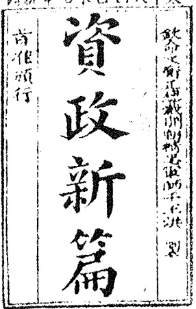
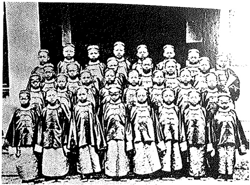
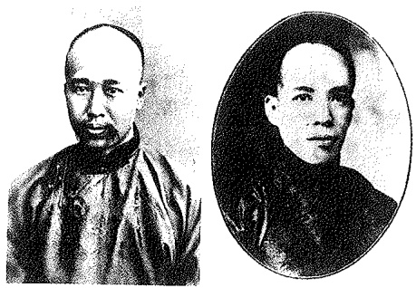
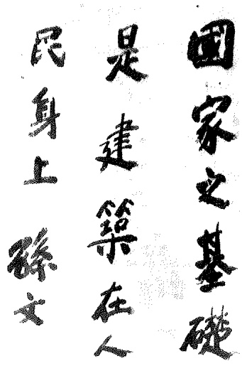

1. 毛泽东:《中国革命和中国共产党》（1939年12月）

这是新民主主义革命理论的代表作之一。毛泽东对中国半殖民地半封建社会性质作出了准确、科学的定义，指出:“帝国主义列强侵略中国，在一方面促使中国封建社会解体，促使中国发生了资本主义因素，把一个封建社会变成了一个半封建的社会；但是在另一方面，它们又残酷地统治了中国，把一个独立的中国变成了一个半殖民地和殖民地的中国。”文章立足于对中国社会性质的界定，分析了中国革命的对象、中国革命的任务、中国革命的动力、中国革命的性质和中国革命的前途。

2. 毛泽东:《把我国建设成为社会主义的现代化强国》(一)(1963年9月)

这是毛泽东在审阅《关于工业发展问题（初稿）》时加写的一段文字。在文中，毛泽东指出，从1840年起列强侵略我国，我国除了抗日战争外，没有一次不以失败告终。其原因主要是两个:一是社会制度腐败，二是经济技术落后。建国以后，第一个原因基本解决了，第二个原因已开始有了改变，为避免再挨打，必须在一个不太长久的时间内改变我国社会经济和技术方面的落后状态。

3. 孙中山:《檀香山兴中会章程》（节选）（1894年11月24日）

在檀香山召开的兴中会成立大会通过了由孙中山亲自草拟的《兴中会章程》。在章程中，孙中山喊出了“振兴中华”的口号，在兴中会会员的入会誓词里，把“驱除鞑虏，恢复中国，创立合众政府”作为全体会员必须信守不渝的目标。

4. 习近平:《实现中华民族伟大复兴是中华民族近代以来最伟大的梦想》(2012年11月29日)

这是习近平在参观《复兴之路》展览时的讲话。讲话指出:经过鸦片战争以来一百七十多年的持续奋斗，中华民族伟大复兴展现出光明的前景。现在，我们比历史上任何时期都更接近中华民族伟大复兴的目标，比历史上任何时期都更有信心、有能力实现这个目标。

## 延伸阅读文献

## 1. 马克思:《中国革命和欧洲革命》（1853年6月）

这是马克思为《纽约每日论坛报》写的有关中国问题的评论。文章以辩证唯物主义和历史唯物主义的观点分析了中国社会的特点，揭露了资本主义强国对华战争的侵略本质和血腥暴行，深切同情和高度评价了中国人民反抗列强侵略的斗争，科学评析了中国农民起义及其对欧洲革命的重要影响，预言了欧洲未来的工业危机以及政治动荡。

## 2. 列宁:《对华战争》（1900年9—10月）

这是列宁最早论述俄中关系思想的重要著作，也是列宁谴责沙俄侵华政策的经典之作。文章指出了沙俄政府对华战争的真实目的，并分析了沙俄侵华政策给中国人民和俄国人民造成的危害影响，提出了俄国无产阶级支持中国人民反帝斗争的任务。

3. 江泽民:《高举邓小平理论伟大旗帜，把建设有中国特色社会主义事业全面推向二十一世纪——在中国共产党第十五次全国代表大会上的报告》(一)(1997年9月12日)

这是江泽民在中国共产党第十五次全国代表大会上所作的报告，报告共分十个部分。第一部分是“世纪之交的回顾和展望”，主要是回顾从1900年八国联军入侵占领北京以来将近一百年的历史，指出这一个世纪里经历了辛亥革命、中华人民共和国成立和改革开放三次历史性巨变，产生了孙中山、毛泽东和邓小平三个站在时代前列的伟大人物，同时也展望了新世纪的发展目标。

## 第二章 不同社会力量对国家出路的早期探索

近代以后，一方面，中国的封建统治者夜郎自大、闭关锁国，导致中国被世界快速发展的浪潮甩在了后面；另一方面，西方列强凭着坚船利炮轰开了中国的大门，进行野蛮侵略。中华民族陷入内忧外患的悲惨境地，社会各阶级、各阶层都面临着“怎么办”的问题。农民阶级、地主阶级洋务派和资产阶级维新派先后从各自的立场出发，提出和尝试了各自的主张和方案，对国家出路进行探索。但是，太平天国运动、洋务运动、戊戌维新运动等都没有成功，中华民族依然处于日益深化的民族危机和社会危机之中。

## 第一节 太平天国运动的起落

## 一、太平天国农民战争

金田起义和太平天国的建立 长期以来，中国农民在封建地主的压迫、剥削下，过着极其贫困和不自由的生活。鸦片战争失败以后，为支付对列强的巨额赔款，同时也为了弥补财政亏空，清政府加重了赋税的征收科派。各级官吏在征收钱粮时往往浮收勒扣，横征暴敛，农民的负担更为沉重。

由于西方资本主义的入侵，中国的农业和家庭手工业相结合的自然经济逐渐解体。鸦片贸易在战后进一步泛滥，导致白银外流、银贵钱贱的现象更加严重，又额外增加了农民的负担。

残酷的压迫和剥削，迫使广大人民尤其是农民群众走上反抗斗争的道路。1842 年至 1850 年间，全国各族人民的反清起义在百次以上。清政府调兵镇压，但群众斗争此起彼伏，反抗的规模也越来越大。太平天国农民起义就是在这种情况下爆发的。

1843 年，洪秀全撷取原始基督教教义中反映下层民众要求的平等思想和某些宗教仪式，从农民斗争的需要出发，加以改造，创立了拜上帝教，并利用它发动和组织群众。

1851年1月，洪秀全率拜上帝教教众在广西省桂平县金田村发动起义，建号太平天国。随后，太平军从广西经湖南、湖北、江西、安徽，一直打到江苏，席卷6省。1853年3月，占领南京，定为首都，改名天京，正式宣告太平天国农民政权的建立。

太平军所进行的战争，是一次反对清政府腐朽统治和地主阶级压迫、剥削的正义战争。太平军在进军的征途中，坚决镇压和打击官僚、豪绅、地主，焚烧衙门、粮册、田契、债券，有力地冲击了封建统治秩序。太平军纪律严明，所过之处，“以攫得衣物散给贫者……谓将来概免租赋三年” $^{①}$ 。这使太平军受到群众的欢迎和拥护。因此，太平天国起义得到了迅速的发展。

太平天国定都天京后，先后进行了北伐、西征和天京城外的破围战。到1856年上半年，除北伐失利外，太平军在湖北、江西、安徽和天京附近等战场都取得了重大胜利，控制了大片地区，达到了军事上的全盛时期。

《天朝田亩制度》和《资政新篇》太平天国定都天京后，进行了一系列制度建设，并颁布了《天朝田亩制度》。

《天朝田亩制度》是最能体现太平天国社会理想和这次农民起义特色的纲领性文件。它确立了平均分配土地的方案，即根据“凡天下田，天下人同耕”的原则，将土地按亩产高低划分为9等，好坏搭配，按人口平均分配。凡 16 岁以上的男女，每人皆可分得一份数量相同的土地，不满 16 岁的减半。

<small>① 中国史学会主编:中国近代史资料丛刊《太平天国》(三)，上海人民出版社、上海书店出版社2000年版，第322、326页。</small>

太平天国的领导者们希望通过施行这样的方案，建立“有田同耕，有饭同食，有衣同穿，有钱同使，无处不均匀，无人不饱暖”的理想社会。所以，《天朝田亩制度》实际上是一个以解决土地问题为中心的比较完整的社会改革方案。

《天朝田亩制度》的主张，否定了封建社会的基础即封建土地所有制，体现了广大农民要求平均分配土地的强烈愿望，是对以往农民战争中“均贫富”“等贵贱”和“均平”“均田”思想的发展和超越，具有进步意义。不过，它并没有超出农民小生产者的狭隘眼界。它所描绘的理想天国，仍然是闭塞的自给自足的自然经济，是小农业和家庭手工业相结合的传统生活方式；同时又是一个没有商品交换的和绝对平均的社会。这种社会理想，在很大程度上具有不切实际的空想性质。实际上，《天朝田亩制度》中的平分土地方案即使在太平军占领地区也并未能付诸实行。

《资政新篇》是太平天国后期颁布的社会发展方案。1859年，洪仁玕从香港来到天京。不久，他提出了一个统筹全局的改革方案——《资政新篇》。它的主要内容是:在政治方面，主张“禁朋党之弊”，加强中央集权，并学习西方，制定法律、制度。在经济方面，主张发展近代工矿、交通、邮政、银行等事业，奖励科技发明和机器制造，尤其是提出“准富者请人雇工”，对穷人“宜令作工，以受所值”，这就把向西方的学习，从生产力的领域扩展到生产关系的领域，即开始提倡资本主义的雇佣劳动制了。在文化方面，建议设立新闻馆以报时事，破除陈规陋俗，提倡兴办学校、医院和社会福利事业。在外交方面，主张同外国平等交往、自由通商，“与番人并雄” $^{①}$ ，但严禁鸦片输入。对于外国人，强调准其为国献策，但不得毁谤国法。

<small>① 参见中国史学会主编:中国近代史资料丛刊《太平天国》（二），上海人民出版社、上海书店出版社2000年版，第524、536、535、538页。</small>

照新年九木己国天平太

《资政新篇》书影

《资政新篇》是一个具有资本主义色彩的方案，在中国近代“向西方学习”、追求近代化的进程中，有比较重要的意义。洪秀全看到后，几乎逐条加以批示，对其中绝大部分条款表示赞同，并下令镌刻颁布。但是限于当时的历史条件，未能付诸实施。

从天京事变到太平天国败亡。太平天国起义者们想要建立一个以“天王”为首的农民政权。但是，在以小农业和家庭手工业相结合的分散的小生产的基础上，虽然可以建立暂时的劳动者政权，但它最终还是会向封建专制政权演变的。

在太平军取得重大胜利的同时，太平天国内部潜在的矛盾和弱点也日益明显地暴露出来。1856年9月，发生了太平天国内部自相残杀的天京事变。东王杨秀清、北王韦昌辉先后被杀，翼王石达开率部出走。天京事变严重地削弱了太平天国的领导和军事力量，成为太平天国由盛转衰的分水岭。

为重整纲纪，挽救危局，洪秀全提拔了陈玉成、李秀成等一批具有军事才干的青年将领，1859年又封洪仁玕为干王，总理朝政。但是，这已经无法从根本上挽回败局。洪秀全本人的保守和迷信思想也越来越严重，洪仁玕在1861年被剥夺了总理朝政的职权。当天京被湘军包围时，洪秀全拒绝了李秀成提出的“让城别走”另辟新根据地的建议，坚持死守天京。

1864年6月，洪秀全病故。7月，天京被湘军攻破。太平天国起义失败。

## 二、农民斗争的意义和局限

太平天国农民起义的历史意义 太平天国起义虽然失败了，但它具有

不可磨灭的历史功绩和重大的历史意义。

太平天国起义沉重打击了封建统治阶级，强烈撼动了清政府的统治根基。这次起义历时14载，起义军转战18省，并建立了与清王朝对峙的政权。在太平天国的影响下，各地各族人民反清斗争风起云涌。如南方和东南沿海各省有天地会及其支派的起义，北方有捻军起义，西南、西北有各族人民起义。天京失陷后，太平天国余部仍坚持斗争达4年之久。这些斗争加速了清王朝的衰败。

太平天国起义是中国旧式农民战争的最高峰。它把千百年来农民对拥有土地的渴望在《天朝田亩制度》中比较完整地表达了出来。《资政新篇》则是中国近代历史上第一个比较系统的发展资本主义的方案，这反映了太平天国某些领导人在后期试图通过向外国学习来寻求出路的一种努力。因此，太平天国起义具有了不同于以往农民战争的新的历史特点。

太平天国起义也冲击了孔子和儒家经典的正统权威，这在一定程度上削弱了封建统治的精神支柱。

太平天国起义还有力地打击了外国侵略势力。太平天国的领袖们拒绝承认不平等条约，严禁鸦片贸易。尤其是当中外反动派勾结起来向太平军举起屠刀时，他们毫不犹豫地同英、法军队和由外国军官组织和指挥的“常胜军”“常捷军”进行英勇的斗争，使侵略者“呼救无人”“梦魂屡惊”。

在 19 世纪中叶的亚洲民族解放运动中，太平天国起义是时间最久、规模最大、影响最深的一次。它和其他亚洲国家的民族解放运动汇合在一起，冲击了西方殖民主义者在亚洲的统治。

太平天国农民起义失败的原因和教训 太平天国农民起义动摇了清王朝封建统治的基础，有力地打击了西方资本主义侵略者，显示了农民阶级的反抗精神和战斗力量，然而，其失败的原因和教训也是深刻的。

农民阶级不是新的生产力和生产关系的代表，无法克服小生产者所固有的阶级局限性，缺乏科学思想理论的指导，没有先进阶级的领导，因而无法从根本上提出完整的、正确的政治纲领和社会改革方案。

太平天国后期无法制止和克服领导集团自身腐败现象的滋生，领导集团的一些人在生活上追求享乐，在政治上争权夺利。太平天国诸王在建都后不久就大兴土木，建立豪华府邸。天王洪秀全养尊处优，沉迷声色；东王杨秀清自恃功高，一切专擅；诸王与部将及广大士兵关系逐渐疏离，诸王之间更是猜忌日生，无法长期保持领导集团的团结。这些都大大削弱了太平天国的向心力和战斗力。

太平天国军事战略上出现了重大失误。比如，没有解决好与捻军这一抗清斗争主力的关系，没有同他们结成同盟，以致丢失了在北方赖以发展的良机，使北伐军艰难支撑直至失败；在天京被围困的情况下死守孤城，拒绝“让城别走”，导致太平天国的最后失败。

太平天国是以宗教来发动、组织群众的，但是，拜上帝教教义不仅不能正确指导斗争，而且给农民战争带来了危害。在太平天国后期，洪秀全甚至幻想不动刀兵而定“太平一统”，梦想以虚幻的力量代替农民起义者自身的努力。

太平天国也未能正确地对待儒学。他们开始时把儒家经书笼统地斥之为“妖书”，后来虽主张将“四书”“五经”删改后加以利用，但原封不动地保留了儒学中的封建纲常伦理原则。

太平天国的领袖们不承认不平等条约，这是很正确的。但他们不能把西方国家的侵略者与人民群众区别开来，而是笼统地把信奉天父上帝的西方人都视为“洋兄弟”，这说明他们对于西方资本主义侵略者还缺乏理性的认识。

太平天国起义及其失败表明，在半殖民地半封建的中国，农民具有伟大的革命潜力，但它自身不能担负起领导反帝反封建斗争取得胜利的重任。单纯的农民战争不可能完成争取民族独立和人民解放的历史任务。

## 第二节 洋务运动的兴衰

## 一、洋务事业的兴办

洋务运动是在 19 世纪 60 年代初第二次鸦片战争结束后，在清政府镇压太平天国起义与捻军起义的过程中兴起的。

为了挽救清政府的统治危机，封建统治阶级中的部分成员如奕䜣、曾国藩、李鸿章、左宗棠、张之洞等，主张引进、仿造西方的武器装备和学习西方的科学技术，创设近代企业，兴办洋务。这些官员被称为“洋务派”。

洋务派兴办洋务事业，首先是为了购买和制造洋枪洋炮以镇压农民起义，同时也有借此加强海防、边防，并乘机发展本集团的政治、经济、军事实力的意图。奕䜣认为，太平天国、捻军等农民起义是“心腹之害”，俄国是“肘腋之患”，英国是“肢体之患”，所以“灭发（指太平天国）、捻（指捻军）为先，治俄次之，治英又次之” $^{①}$ 。具体怎么办？奕䜣提出，“探源之策，在于自强。自强之术，必先练兵” $^{②}$ 。

对洋务派兴办洋务事业的指导思想最先作出比较完整表述的是冯桂芬。他在《校邠庐抗议》一书中强调，为了应对西方的挑战，中国亟须进行改革。他提出了许多关于改革吏治的建议，提出必须改革科举制度，才能向西方学得科学和技术；建议对兵工厂和造船厂的优异工匠应授予举人的功名，对那些能改进西方产品的人应授予进士的功名。他说:“以中国之伦常名教为原本，辅以诸国富强之术。” $^{③}$ 这个思想后来在张之洞的《劝学篇》中被进一步概括为“中学为体，西学为用”。所谓“中体西用”，就是以中国封建伦理纲常所维护的统治秩序为主体，用西方的近代工业和技术为辅助，并以前者来支配后者。

<small>① 中国史学会主编:中国近代史资料丛刊《洋务运动》(一)，上海人民出版社1961年版，第6页。</small>

<small>② 中国史学会主编:中国近代史资料丛刊《洋务运动》(三)，上海人民出版社、上海书店出版社2000年版，第441页。</small>

<small>③ 冯桂芬:《校邠庐抗议》，中州古籍出版社1998年版，第211页。</small>

19世纪60—90年代，洋务派举办的洋务事业归纳起来有三方面:

## （一）兴办近代企业

洋务派首先兴办的是军用工业，这些企业都是官办的。最早创办的是1861年的安庆军械所。此外，规模较大的有5个:1865年，曾国藩支持、李鸿章筹办的上海江南制造总局，是当时国内最大的兵工厂；同年，李鸿

江南制造总局

章在南京设立金陵机器局；1866年，左宗棠在福建创办的福州船政局（附设有船政学堂）是当时国内最大的造船厂；1867年，崇厚在天津建立天津机器局；1890年，张之洞在汉阳创办湖北枪炮厂。

洋务派还兴办了一些民用企业。这些企业除少数采取官办或官商合办的方式外，多数都采取官督商办的方式。其中最重要的官督商办企业有轮船招商局、开平矿务局、天津电报局和上海机器织布局，都是李鸿章筹办或控制的。这些官督商办的民用企业，虽然受官僚的控制，发展受到很大限制，但基本上是资本主义性质的近代企业。

## （二）建立新式海陆军

19 世纪 60 年代，京师和天津、上海、广州、福州等地的军队纷纷改用洋枪、洋炮，聘用外国教练。李鸿章的淮军、左宗棠的湘军也是用洋枪装备的军队。

1874 年，日本派兵侵犯中国台湾，清政府筹办海防、建设海军之议随之兴起。19 世纪 70—90 年代，分别建成福建水师、广东水师、南洋水师和北洋水师。其中北洋水师是清政府的海军主力，拥有舰艇 20 多艘，这支舰队一直归李鸿章管辖。

（三）创办新式学堂，派遣留学生

洋务派创办的新式学堂主要有三种:一为翻译学堂，如京师同文馆，主要培养翻译人才；一为工艺学堂，培养电报、铁路、矿务、西医等专门人才；一为军事学堂，如船政学堂等，培养新

中国首批赴美留学幼童

式海军人才。在创办新式学堂的同时，还先后派遣赴美幼童和官费赴欧留学生200多人。

## 二、洋务运动的历史作用及失败

洋务运动的历史作用 洋务派提出“自强”“求富”的主张，通过所掌握的国家权力集中力量优先发展军事工业，同时也试图“稍分洋商之利”，发展若干民用企业，在客观上对中国的早期工业和民族资本主义的发展起了某些促进作用。但是，洋务派兴办洋务新政，主要是为了维护封建统治，并不是要使中国朝着独立的资本主义方向发展。

洋务运动时期，为了培养通晓洋务的人才，开办了一批新式学堂，派出了最早的官派留学生，这是中国近代教育的开始。与此同时，还翻译了一批近代自然科学书籍，给当时的中国带来了新的知识，使人们开阔了眼界。

洋务运动时期，伴随着资本主义生产方式的出现，传统的“重本抑末”等观念受到冲击，社会风气和价值观念开始变化，工商业者的地位上升。对一部分人来说，西方的各种技术和器物不再被当作“奇技淫巧”受到排斥，而是被视为模仿、学习的对象。这一切，都有利于资本主义经济的发展，也有利于社会风气的改变。

洋务运动的失败及其原因 洋务运动历时30多年，虽然办起了一批企业，建立了海军，却没有使中国富强起来。甲午战争一役，洋务派经营多年的北洋海军全军覆没，标志着以“自强”“求富”为目标的洋务运动的失败。洋务运动失败的原因主要是:

首先，洋务运动具有封建性。洋务运动的指导思想是“中学为体，西学为用”，企图以吸取西方近代生产技术为手段，来达到维护和巩固中国封建统治的目的，这就决定了它必然失败的命运。因为新的生产力是同封建主义的生产关系及其上层建筑不相容的，是不可能在封建主义的桎梏下充分地发展起来的。他们既要发展近代企业，却又采取垄断经营、侵吞商股等手段压制民族资本；既想培养洋务人才，又不愿改变封建科举制度。

其次，洋务运动对列强具有依赖性。洋务运动进行之时，清政府已与西方国家签订了一批不平等条约，西方列强正是依据种种特权，从政治、经济等各方面加紧对中国的侵略和控制，它们并不希望中国真正富强起来。而洋务派官员却一再主张对外“和戎”，其所兴办的企业一切仰赖外国，他们企图依赖外国来达到“自强”“求富”的目的，无异于与虎谋皮。

最后，洋务企业的管理具有腐朽性。洋务派所创办的一些新式企业虽然具有一定的资本主义性质，但其管理基本上仍是封建衙门式的。洋务派所办的军事工业完全由官方控制，经营不讲效益，造出的枪炮、轮船往往质量低下。即使是官商合办和官督商办的民用企业，其管理大多也是由政府专门派员，掌握用人理财种种大权，商人没有多少发言权，还要承担企业的亏损。企业内部极其腐败，充斥着营私舞弊、贪污受贿、挥霍浪费等官场恶习。例如，福州船政局的采办系统就存在大量侵吞公款的现象。

正因为如此，洋务运动不可能为中国摆脱贫弱找到出路，也不可能避免最终失败的命运。

## 第三节 维新运动的兴起和夭折

## 一、戊戌维新运动的开展

维新派倡导救亡和变法的活动 19世纪90年代以后，中国民族资本主义有了初步发展。1895—1898年，出现了一个民族资本设厂的高潮，投资额万元以上的商办企业达50个，投资额1200万元。新兴的民族资产阶级迫切要求挣脱外国资本主义和国内封建势力的压迫和束缚，为在中国发展资本主义开辟道路。甲午战争的惨败，造成了新的民族危机，激发了新的民族觉醒。而站在救亡图存和变法维新前列的，正是代表民族资本主义发展要求的知识分子。他们把向西方学习推进到一个新的高度，即不但要求学习西方的科学技术，而且要求学习西方资本主义的政治制度和思想文化。在内忧外患的冲击和中西文化的碰撞过程中，人们逐步形成了一个共识:要救国，只有维新，要维新，只有学外国，那时的外国只有西方资本主义国家是进步的，它们成功地建设了资产阶级的国家。日本向西方学习有成效，中国人也想向日本学。在这样的历史条件下，资产阶级的改良思想迅速传播开来，逐步形成为变法维新的思潮，并发展成一场变法维新的政治运动。

以康有为、梁启超、谭嗣同、严复等为主要代表人物的资产阶级维新派，采取了下列行动宣传维新主张，即:第一，向皇帝上书。如康有为曾

多次向光绪皇帝上书，他在1895年曾联合在京参加会试的1300多名举人共同发起“公车上书”。第二，著书立说。如康有为写了《新学伪经考》《孔子改制考》，梁启超写了《变法通议》，谭嗣同写了《仁学》，严复翻译了赫胥黎的《天演论》等。第三，介绍外国变法的经验教训。如康有为向光绪皇帝进呈了《日本变政考》《俄彼得变政记》《波兰分灭记》等书。第四，办学会。著名的有强学会、南学会、保国会等。第五，设学堂。重要的有康有为主持的广州万木草堂、梁启超任中文总教习的长沙时务学堂等。第六，办报纸。影响最大的有梁启超任主笔的上海《时务报》、严复主办的天津《国闻报》以及湖南的《湘报》等。维新派以各种方式宣传变法主张，制造维新舆论，培养变法骨干，组织革新力量，而重点则放在争取光绪皇帝及其周围的帝党官员的支持上，希望通过他们自上而下地实行变法主张。

康有为（左）和梁启超

维新派与守旧派的论战 当时，封建守旧派和反对改变封建政治制度的洋务派，利用自己的地位和权力，对维新思想发动攻击，斥之为“异端邪说”，指责康有为、梁启超等维新派人士是“名教罪人”“士林败类”。于是维新派与守旧派之间展开了一场激烈论战。论战主要围绕以下三个问题展开:

第一，要不要变法。

守旧派坚持 “祖宗之法不可变”，有的人甚至主张 “宁可亡国，不可变法”。而维新派则根据西方进化论的观点，认为自然界和人类社会都是不断发展变化的。他们提出，“变者，天下之公理也” $^{①}$ ，“能变则全，不变则亡，全变则强，小变仍亡” $^{②}$ 。只有维新变法，革除积弊，才能挽救中国所面临的危亡局面，以图求存和自强。

第二，要不要兴民权、设议院，实行君主立宪。

守旧派认为，“民权之说，无一益而有百害”，“民权之说一倡，愚民必喜，乱民必作，纪纲不行，大乱四起” $^{③}$ 。维新派则运用西方资产阶级政治学说，对封建君主专制制度作了批判。谭嗣同指出:“君末也，民本也。” $^{①}$ 严复甚至认为，国家是“民之公产”，王侯将相不过是“通国之公仆隶”，而专制帝王则是“窃国者耳” $^{②}$ 。维新派还主张兴绅权，即首先要为正在向资产阶级转化的士绅争取政治地位；认为只有君主立宪制度才是当时中国理想的政治方案，要兴民权、设议院，实行君主立宪。

<small>① 中国史学会主编:中国近代史资料丛刊《戊戌变法》（三），上海人民出版社、上海书店出版社2000年版，第18页。</small>

<small>② 中国史学会主编:中国近代史资料丛刊《戊戌变法》（二），上海人民出版社、上海书店出版社2000年版，第197页。</small>

<small>③ 参见中国史学会主编:中国近代史资料丛刊《戊戌变法》（三），上海人民出版社、上海书店出版社2000年版，第221、222页。</small>

第三，要不要废八股、改科举和兴西学。

守旧派把西方近代科学技术斥为“奇技淫巧”。洋务派虽认为西方的军事和技术可以学习，但坚持封建的政治制度、科举八股，尤其三纲五常绝对不能触动。而维新派则痛斥八股取士的科举制度是统治者“牢笼天下”的愚民政策，因此要救中国必须废八股、改科举，办学堂、兴西学。严复大声疾呼:“民智者，富强之原”，“欲开民智非讲西学不可”，“救亡之道在此，自强之谋亦在此” $^{③}$ 。针对洋务派“中体西用”的口号，维新派驳斥道:“未闻以牛为体，以马为用者也。” $^{④}$ 因为体用是不可分的，把中学之“体”和西学之“用”凑在一起，就如同要让“牛体”产生“马用”一样荒谬。梁启超认为:“变化之本，在育人才，人才之兴，在开学校，学校之立，在变科举” $^{⑤}$ 。

维新派与守旧派的这场论战，实质上是资产阶级思想与封建主义思想在中国的第一次正面交锋。论战所涉及的领域十分广泛，进一步开阔了新型知识分子的眼界，解放了人们长期受到束缚的思想。通过论战，西方资产阶级社会政治学说在中国得到进一步的传播，戊戌变法运动的帷幕随之拉开。

<small>①《谭嗣同全集》下册，中华书局1981年版，第339页。</small>

<small>② 参见中国史学会主编:中国近代史资料丛刊《戊戌变法》（三），上海人民出版社、上海书店出版社2000年版，第81页。</small>

<small>③ 参见中国史学会主编:中国近代史资料丛刊《戊戌变法》（三），上海人民出版社、上海书店出版社2000年版，第56、57、70页。</small>

<small>④《严复集》第三册，中华书局1986年版，第558—559页。</small>

<small>⑤ 梁启超:《变法通议》, 见《饮冰室合集》第一册, 中华书局1989年版, 第10页。</small>

昙花一现的百日维新 由于民族危机越来越严重，在维新派的推动和策划下，富有爱国心、想要有所作为但又无实权的年轻的光绪皇帝也希望通过变法维新来救亡图存，并从以慈禧太后为首的后党手中夺取统治大权。1898年6月11日，他颁布了“明定国是”谕旨，宣布开始变法，并在此后的103天中，接连发布了一系列推行新政的政令，史称“戊戌变法”，又称“百日维新”。其内容归纳起来，包括下列数端:

政治方面:改革行政机构，裁撤闲散、重叠机构；裁汰冗员，澄清吏治，提倡廉政；提倡向皇帝上书言事；准许旗人自谋生计，取消他们享受国家供养的特权。

经济方面:保护、奖励农工商业和交通采矿业，中央设立农工商总局与铁路矿务总局，各省设立商务局；提倡开办实业，奖励发明创造；注重农业发展，提倡西法垦殖，建立新式农场；广办邮政，修筑铁路；开办商学、商报，设立商会等各类组织；改革财政，编制国家预决算。

军事方面:裁减旧式绿营兵，改练新式陆军；采用西洋兵制，练洋操，习洋枪等。

文化教育方面:创设京师大学堂，各省书院改为高等学堂，在各地设立中、小学堂；提倡西学，废除八股，改试策论，开经济特科；设立译书局，翻译外国书籍，派人出国留学；奖励新著，奖励创办报刊，准许自由组织学会。

“百日维新”期间颁布的各项政令大多是接受了维新派的建议而制定的，旨在开放一定程度的言论、出版、结社自由，使资产阶级享受一定程度的政治权利，促进资本主义工商业的发展，因此，戊戌维新是一场资产阶级性质的改良运动。但是，在光绪皇帝发布的新政诏令中，并没有采纳维新派多次提出的开国会、定宪法等政治主张。这些政令和措施并未触及封建制度的根本，所要推行的是一种十分温和的不彻底的改革方案。

维新派试图通过光绪皇帝推行的这种改革方案，遭到了封建守旧势力的激烈反对。光绪皇帝所颁布的新政命令，由于中央和地方守旧官僚们的抵制，大多未能付诸实施。聚集在慈禧太后周围的守旧势力力图对维新派进行反击和镇压。经过密谋策划，守旧势力于1898年9月21日发动政变，慈禧太后以“训政”的名义，重新独揽大权，将光绪皇帝软禁于中南海瀛台，同时下令搜捕维新人士。康有为、梁启超被迫逃亡海外。谭嗣同则拒绝了要他出走日本的劝告，坦然表示:“各国变法，无不从流血而成；今日中国未闻有因变法而流血者，此国之所以不昌也。有之，请自嗣同始！”①9月28日，谭嗣同、刘光第、林旭、杨锐、杨深秀、康广仁6人同遭杀害，史称“戊戌六君子”。临刑前，谭嗣同悲壮地说:“有心杀贼，无力回天。死得其所，快哉快哉！”②表现了为变法维新而献身的大无畏精神。

1898年的“百日维新”如同昙花一现，只经历了103天就夭折了。除京师大学堂（北京大学的前身）被保留下来以外，其余新政措施大都被废除，维新派人士和参与或同情变法的官员，或被囚禁，或被革职，或遭放逐。戊戌维新运动宣告失败。以慈禧太后为首的保守势力扼杀维新变法的政变，史称“戊戌政变”。

## 二、戊戌维新运动的意义和教训

戊戌维新运动的意义 戊戌维新运动虽然失败了，但它在中国近代史上仍然有着重大的历史意义。

第一，戊戌维新运动是一次爱国救亡运动。维新派在民族危亡的关键时刻，高举救亡图存的旗帜，要求通过变法，发展资本主义，使中国走上富强的道路。维新派的政治实践和思想理论，不仅贯穿着强烈的爱国主义精神，而且推动了中华民族的觉醒。

<small>①《谭嗣同全集》下册，中华书局1981年版，第546页。</small>

<small>②《谭嗣同全集》上册，中华书局1981年版，第287页。</small>

第二，戊戌维新运动是一场资产阶级性质的政治改良运动。维新派突破洋务派“中体西用”思想的局限，主张用君主立宪制取代君主专制制度。戊戌维新运动虽然未能成功地建立起资本主义的君主立宪制度，其颁布的促进民族资本主义发展的若干措施也未能生效，但在政治、经济等领域一定程度上冲击了封建制度。

第三，戊戌维新运动更是一场思想启蒙运动。维新派大力传播西方资产阶级的社会政治学说和自然科学知识，宣传自由平等、社会进化观念，批判封建君权和封建纲常伦理，从而把顽固的封建主义思想壁垒打开了一个缺口，有利于民主思想在中国的传播，有利于人们的思想解放。在维新派的推动下，“诗界革命”“文体革命”“小说界革命”“戏剧改良”“史学革命”等相继而起，形成了广泛的文化革新运动。以维新运动为起点，资产阶级新文化开始打破封建文化独占文化阵地的局面。在教育方面，维新派主张采用西方近代教育制度，兴办新式学堂，这对中国近代教育的发展起了积极的推动作用。

维新派在改革社会风习方面也提出了许多新的主张。如主张革除吸食鸦片及妇女缠足等恶俗陋习，提出“剪辫易服”的主张，倡导讲文明、重卫生等。

戊戌维新运动失败的原因和教训 戊戌维新运动的失败，主要是由于维新派自身的局限以及以慈禧太后为首的强大的守旧势力的反对。当时民族资本主义经济力量还十分微弱，民族资产阶级的社会基础相当狭窄。民族资产阶级的政治代表维新派的势力更是非常弱小，很多人自身还保留着封建士大夫的痕迹。他们既没有严密的组织，也不掌握实权和军队，更没有去发动群众。这样，他们就只能把自己实行改革的全部希望寄托在一个没有实权的光绪皇帝身上。在这样的情况下，他们又怎能不失败？

维新派本身的局限性突出地表现在以下三个方面:

首先，不敢否定封建主义。他们在政治上不敢根本否定封建君主制度，只是幻想依靠光绪皇帝“以君权雷厉风行”，通过和平、合法的手段，实现自上而下的改良，让资产阶级和开明士绅的代表参加政权，逐步实现君主立宪。在经济上，他们虽然要求发展民族资本主义，却未触及封建主义的经济基础——封建土地所有制。在思想上，他们虽然提倡学习西学，却仍要打着孔子的旗号，借古代圣贤之名“托古改制”。

其次，对帝国主义抱有幻想。他们虽然大声疾呼救亡图存，却又幻想西方列强能帮助自己变法维新。维新派尖锐地揭露了俄国侵华的事实，却幻想依靠与英、日结成同盟来抵抗俄国。有人甚至建议聘请日本前首相伊藤博文来中国任维新的顾问。英、日帝国主义虽然表面上同情维新派，但实质上只是为了乘机扩大在华侵略势力，并寻找它们在中国的代理人，同时也是为了与俄国进行争夺。因此，在戊戌政变前夕，维新派分别乞求英、美、日公使的支持，结果都落了空。

最后，惧怕人民群众。维新派的活动基本上局限于官僚士大夫和知识分子的小圈子。他们不但脱离人民群众，而且惧怕甚至仇视人民群众。康有为在每次上书中，都反复提醒光绪皇帝不要忘记人民反抗的危险，强调“即无强敌之逼，揭竿斩木，已可忧危”，如果不实行变法，下层群众将会起来造反，使皇帝及其大臣们“求为长安布衣而不可得” $^{①}$ 。正因为没有人民力量作为后盾，所以当他们得悉守旧派要发动军事政变时，只得打算依靠掌有兵权的袁世凯，结果反被袁世凯出卖。而一旦守旧派操刀反击，维新派也就没有丝毫抵抗的能力。谭嗣同慷慨就义前的临终语“有心杀贼，无力回天”，正反映了这一点。“回天之力”存在于亿万民众之中，这是维新派的志士们所没有认识到的。

戊戌维新运动的失败表明，在半殖民地半封建的旧中国，企图通过统治者走自上而下的改良道路，是根本行不通的，必须用革命的手段，推翻帝国主义、封建主义联合统治的半殖民地半封建的社会制度。“戊戌六君子”流血的教训，促使一部分人放弃改良主张，开始走上革命的道路。

<small>① 参见中国史学会主编:中国近代史资料丛刊《戊戌变法》（二），上海人民出版社、上海书店出版社2000年版，第192、190页。</small>

孙中山领导的资产阶级民主革命日益发展起来。

## 学习思考

1. 如何认识太平天国农民战争的意义和失败的原因、教训？

2. 如何认识洋务运动的性质和失败的原因、教训？

3. 如何认识戊戌维新运动的意义和失败的原因、教训？

## 必读文献

## 1.《天朝田亩制度》(1853年)

这是太平天国定都天京后，于1853年颁布的一个以解决土地问题为中心的全面的农民革命斗争纲领和社会改革方案，是太平天国的革命纲领，规定了太平天国的土地制度、社会组织、乡官和教育等制度。其基本内容是关于土地制度的，提出了“凡天下田，天下人同耕”的原则，决心建立“无处不均匀，无人不饱暖”的地上天国，从而根本否定了封建土地所有制。它所规定的按人口平均分配土地的方法，表达了几千年来中国农民对土地的强烈渴望。

2. 洪仁玕:《资政新篇》（1859年）

《资政新篇》是中国近代史上最早提出的发展资本主义的比较完整的纲领，从政治、法律、经济等方面提出了建立资本主义制度的具体主张，反映了当时先进的中国人寻找真理和探索救国救民道路的迫切愿望。但限于当时的历史条件，这些主张未能付诸实施。

3. 康有为:《上清帝第二书》（1895年5月）

1895年5月2日，康有为邀集1300余名举人，联名上书，向清政府提出变法的建议，是为康有为《上清帝第二书》。在《上清帝第二书》中，康有为先是向光绪皇帝分析了天下大势，痛陈了《马关条约》签订的种种不利影响，并对清政府的一些错误观念进行了批驳，并提出六种富国之法:“曰钞法，曰铁路，曰机器轮舟，曰开矿，曰铸银，曰邮政”。

## 1. 梁启超:《变法通议》（节选）（1896年）

这是梁启超在戊戌变法前夕撰写的一组政论文章的结集。《变法通议》各篇在《时务报》上连载，使《时务报》在众多报刊中脱颖而出，成为当时影响最大的维新派刊物。本书从理论上深入阐述了维新变法的必要性及其作用，影响深远，是维新变法时期宣传改良思想的集大成者。

## 2. 严复:《原强》（1895年3月）

甲午战争之后，严复在天津《直报》上发表了一系列文章，其中以《原强》影响最大。该文引述了达尔文生物进化论学说，阐述了“物竞天择，优胜劣汰”的自然选择思想，也阐述了“以自由为体，以民主为用”的思想。

## 第三章 辛亥革命与君主专制制度的终结

在旧式的农民战争走到尽头，不触动封建根基的“自强”运动和资产阶级改良主义屡屡碰壁之后，资产阶级革命派领导的革命运动开始走上历史舞台。中国民主革命的伟大先行者孙中山先生，发动和领导了辛亥革命，推翻了清王朝统治，结束了统治中国几千年的君主专制制度，开创了完全意义上的近代民族民主革命，极大促进了中华民族思想解放，打开了中国进步潮流的闸门，传播了民主共和理念，以巨大的震撼力和深刻的影响力推动了中国社会变革，为实现中华民族伟大复兴探索了道路。当然，由于历史进程和社会条件的制约，由于没有找到解决中国前途命运问题的正确道路和领导力量，辛亥革命没有改变旧中国半殖民地半封建的社会性质，没有改变中国人民的悲惨境遇，没有完成实现民族独立、人民解放的历史任务。

## 第一节 举起近代民族民主革命的旗帜

## 一、辛亥革命爆发的历史条件

民族危机加深，社会矛盾激化 戊戌维新运动失败后，以孙中山为代表的革命派在中国掀起了一场资产阶级革命运动。这场革命的发生，是当时民族危机加深、社会矛盾激化的结果，具有历史的必然性。它是当时中国人民争取民族独立、振兴中华深切愿望的集中反映，是当时中国人民为救亡图存而前赴后继顽强斗争的集中体现。

20世纪初，帝国主义列强在迫使中国签订《辛丑条约》以后，加强了对清政府的政治控制，多方扩展在华经济势力。外国在华投资规模急速扩张，包括扩大设厂规模和给清政府大量高息贷款，而铁路、矿山等的利权更成为帝国主义掠夺的重要目标。1903年至1904年，英国派兵侵入中国西藏地区。1904

《辛丑条约》（节录）

年至 1905 年，日、俄两国为了争夺在华利益竟然在中国东北进行战争。清政府却宣称 “局外中立”。经过一年多的厮杀，日本战胜俄国，俄国将所攫得的中国东北南部所有一切侵略特权 “转让” 给日本。中国的民族危机进一步加深了。

为了对外支付巨额赔款，十多年间清政府的财政开支激增4倍之多。在清朝的最后几年里，各种旧税一次又一次被追加，种种巧立名目的新税更是层出不穷，各级官吏还要中饱私囊，致使民怨沸腾。社会矛盾进一步激化了。

正是在中外反动派的严重压迫下，20世纪初，各阶层人民的斗争风起云涌，遍及全国。1902年至1911年间，各地较大规模的民变多达1300余起。其中包括各阶层人民的反洋教斗争，农民、手工业者的抗租、抗捐、抗税斗争，工人的罢工斗争，商人的罢市斗争，少数民族与会党的起事等。同时，还发生了拒俄、拒法、抵制美货等爱国运动以及收回利权运动和保路运动等。在一些运动中，资产阶级开始成为主要的角色。

这些情况说明，随着晚清政局的演变，人民群众已经不能照旧生活下去了。

清末“新政”及其破产 革命酝酿之际，正是清政府处于内外交困之时。1901年《辛丑条约》的签订，标志着以慈禧太后为首的清政府已经彻底放弃了抵抗外国侵略者的念头，甘当“洋人的朝廷”；同时也使国人对清政府更为失望，国内要求变革的呼声日渐高涨。为了摆脱困境，清政府于1901年4月成立督办政务处，宣布实行“新政”。此后，陆续推行了一些方面的改革，包括:设立商部、学部、巡警部等中央行政机构；裁撤绿营，建立新军；颁布商法商律，奖励工商；鼓励留学，颁布新的学制，并下令从 1906 年起正式废除科举考试。迫于内外压力，清政府又于 1906 年宣布 “预备仿行宪政”，并于 1908 年颁布了《钦定宪法大纲》，制定了一个仿效日本实行君主立宪的方案，但又规定了 9 年的预备立宪期限。

预备立宪并没有能够挽救清王朝，反而激化了社会矛盾，加重了危机。主要原因在于，清政府改革的根本目的是延续其反动统治。正如出洋考察政治的五大臣在回国后的奏折中所说的，立宪有三大利:“皇位永固”“外患渐轻”“内乱可弭” $^{①}$ 。这正是清政府预备立宪的目的。为了巩固皇权，清政府迟迟不答应资产阶级立宪派提出的关于立即召开国会的要求，还镇压了立宪派的国会请愿运动，同时却不断借立宪之名加强皇权。1911年5月，在为形势所迫不得不成立的责任内阁里，13名大臣中满族就有9人，其中皇族占7人，被讥为“皇族内阁”。这不仅使立宪派大失所望，也使统治集团内部因满汉矛盾和中央与地方矛盾的尖锐而分崩离析。

事实表明，清政府已陷入无法照旧统治下去的境地。正如孙中山所形容的，清政府“可以比作一座即将倒塌的房屋，整个结构已从根本上彻底地腐朽了，难道有人只要用几根小柱子斜撑住外墙就能够使那座房屋免于倾倒吗？” $^{②}$ 革命已如箭在弦上，一触即发。这一点，连有的在华外国人也觉察到了。1911年5月，长沙海关税务司伟克非在信中写道:“我看在不久的将来，一场革命是免不了的。” $^{③}$

资产阶级革命派的阶级基础和骨干力量 中国的资产阶级民主革命是以孙中山为代表的资产阶级革命派首先发动的。

19世纪末20世纪初，中国民族资本主义得到初步发展。据统计，1895年至1911年间，新设立的资本额超过万元的民族资本厂矿达800家，资本额超过1.6亿元。随着民族资本主义企业数量的增多和规模的扩大，民族资产阶级及与它相联系的社会力量也有了明显的发展。民族资产阶级为了冲破帝国主义、封建主义的桎梏，发展资本主义，需要自己政治利益的代言人和经济利益的维护者。这正是资产阶级革命派形成的阶级基础。

<small>① 参见故宫博物院明清档案部编:《清末筹备立宪档案史料》，中华书局1979年版，第174—175页。</small>

<small>②《孙中山全集》第一卷，中华书局1981年版，第254页。</small>

<small>③ 金冲及、龚书铎、李文海:《中国是怎样走向共和的？》，《光明日报》2003年8月12日。</small>

资产阶级革命派的骨干是一批资产阶级、小资产阶级知识分子。这个知识分子群体的出现与戊戌维新运动及20世纪初清政府兴学堂、派留学生的措施有关。这些青年学生接触到近代西方资本主义的思想文化，其中不少人在民族危难加深、群众自发斗争高涨形势的推动下，开始摸索救国救民的新道路。当时出国留学成为一种潮流。中国留日学生最多时达近万人。有些人还远渡重洋，赴欧美留学。他们在国外更多地接触到了西方的政治思想，而且对世界大势与国内民族危机有了更敏锐的认识。这些青年知识分子，成为辛亥革命的中坚力量。

## 二、资产阶级革命派的活动

孙中山与资产阶级民主革命的开始 从根本上说，近代中国的革命是被外国侵略者和本国封建统治者逼迫出来的。中国革命的许多先驱者早年也曾尝试采取和平的手段来推进中国的变革与进步。1894年，孙中山北上京津向李鸿章上书，提出“人能尽其才，地能尽其利，物能尽其用，货能畅其流” $^{①}$ 的主张，可见，孙中山也曾寄希望于进行自上而下的改革，但是李鸿章并没有重视他的意见。孙中山在北上京津的过程中，发现清政府的腐败比他原先了解的要严重得多。这时，他“积渐而知和平之手段不得不稍易以强迫” $^{②}$ ，决心以革命的方式推翻清朝的统治。同年11月，孙中山到檀香山组建了第一个革命团体兴中会，立誓“驱除鞑虏，恢复中国，创立合众政府”，1895年策划在广州举行武装起义，失败后流亡海外，继续从事反清革命活动。1904年，孙中山发表《中国问题的真解决》一文，指出只有推翻清政府的统治，“以一个新的、开明的、进步的政府来代替旧政府”，“把过时的满清君主政体改变为‘中华民国’” $^{①}$ ，才能真正解决中国问题。这表明以孙中山为首的资产阶级革命派在踏上革命道路之时，就高举起民主革命的旗帜，并选择了以武装起义推翻清王朝统治的斗争方式。这也是中国资产阶级革命派与改良派的根本不同之处。

<small>①《孙中山全集》第一卷，中华书局1981年版，第8页。</small>

<small>②《孙中山全集》第一卷，中华书局1981年版，第52页。</small>

孙中山手迹

资产阶级革命派的宣传与组织工作 历史进入20世纪，随着一批新兴知识分子的产生，各种宣传革命的书籍报刊纷纷涌现，民主革命思想得到广泛传播。

1903 年，章炳麟发表《驳康有为论革命书》，反对康有为的保皇观点，歌颂革命为“启迪民智，除旧布新”的良药，强调中国人民完全有能力建立民主共和制度。年仅 18 岁的留日学生邹容写了《革命军》，以“革命军中马前卒”的名义，热情讴歌革命，号召人民推翻清朝统治，建立“中华共和国”。留日学生陈天华写了《警世钟》《猛回头》两本小册子，痛陈帝国主义侵略给中国带来的深重灾难，揭露清政府已经成了帝国主义统治中国的工具，号召人民奋起革命，“改条约，复税权，完全独立；雪仇耻，驱外族，复我冠裳”，推翻清政府这个“洋人的朝廷”。

在资产阶级革命思想的传播过程中，资产阶级革命团体也在各地次第成立。从 1904 年开始，出现了十多个革命团体，其中重要的有华兴会、

<small>① 参见《孙中山全集》第一卷，中华书局1981年版，第254页。</small>

1905年8月20日，孙中山和黄兴、宋教仁等人以兴中会和华兴会为基础，在日本东京成立中国同盟会，孙中山被公举为总理，黄兴被任命为执行部庶务，实际主持会内日常

《中国同盟会总章》（节选）

工作。同盟会以《民报》为机关报，并确定了革命纲领。这是近代中国第一个领导资产阶级革命的全国性政党。1905—1907年加入的会员，出身可考者有379人，其中留学生和学生354人，官吏和有功名知识分子10人，教员、医生8人，商人6人，贫农1人，即 $98\%$ 以上都是中小资产阶级及其知识分子。同盟会的成立，标志着中国资产阶级民主革命进入了一个新的阶段。

## 三、三民主义的提出

同盟会的政治纲领是“驱除鞑虏，恢复中华，创立民国，平均地权”。1905年11月，在同盟会机关报《民报》发刊词中，孙中山将同盟会的纲领概括为三大主义，即民族主义、民权主义、民生主义，后被称为三民主义。

民族主义 民族主义包括“驱除鞑虏，恢复中华”两项内容。一是要以革命手段推翻清朝政府，改变它一贯推行的民族歧视和民族压迫政策；二是建立中华民族“独立的国家”。孙中山指出，民族主义不是简单的排满，不是针对一切满人，而是要“将满洲政府所有压制人民之手段、专制不平之政治、暴虐残忍之刑罚、勒派加抽之苛捐与及满洲政府所纵容之虎狼官吏，一切扫除” $^{①}$ ，也就是要结束清政府的专制统治及其媚外政策。

<small>①《孙中山全集》第一卷，中华书局1981年版，第310页。</small>

但是，同盟会纲领中的民族主义没有从正面鲜明地提出反对帝国主义的主张。当时的革命派对于帝国主义的本质认识不清，害怕帝国主义干涉，甚至幻想以承认不平等条约“继续有效”为条件来换取列强对自己的支持。同时，他们也没有明确地把汉族军阀、官僚、地主作为革命对象，从而给了这部分人后来从内部和外部破坏革命以可乘之机。

民权主义 民权主义的内容是“创立民国”，即推翻封建君主专制制度，建立资产阶级民主共和国。这就是孙中山所说的政治革命。

政治革命的目的是建立民国。《军政府宣言》指出:“凡为国民皆平等以有参政权。大总统由国民公举。议会以国民公举之议员构成之。制定中华民国宪法，人人共守。敢有帝制自为者，天下共击之！” $^{①}$ 孙中山强调，政治革命应当与民族革命并行。民族革命是扫除“现在的恶劣政治”，而政治革命则是扫除“恶劣政治的根本” $^{②}$ ，从而把斗争矛头直接指向集国内民族压迫与封建专制统治于一身的清政府。

不过，民权主义虽然强调了要建立民主共和国，却忽略了广大劳动群众在国家中的地位，因而难以使人民的民主权利得到真正的保证。

民生主义 民生主义在当时指的是“平均地权”，也就是孙中山所说的社会革命。孙中山主张核定全国土地的地价，其现有之地价，仍属原主；革命后的增价，则归国家，为国民共享。国家还可按原定地价收买地主的土地。他认为，西方资本主义发展中的诸多社会问题，其根源在于未能解决土地问题，因此他试图探讨一种一劳永逸的办法，既使中国富强，又避免产生贫富悬殊的现象，避免社会危机。为此，他希望“举政治革命、社会革命毕其功于一役”③。

但是，孙中山的“平均地权”的主张，没有正面触及封建土地所有制，不能满足广大农民的土地要求，在革命中难以成为发动广大工农群众

<small>①《孙中山全集》第一卷，中华书局1981年版，第297页。</small>

<small>② 参见《孙中山全集》第一卷，中华书局1981年版，第325页。</small>

<small>③《孙中山全集》第一卷，中华书局1981年版，第289页。</small>

的理论武器。

孙中山的三民主义学说，初步描绘出中国还不曾有过的资产阶级共和国方案，是一个比较完整而明确的资产阶级民主革命纲领。它的提出，对推动革命的发展产生了重大而积极的影响。

## 四、关于革命与改良的辩论

在资产阶级民主革命思潮广泛传播、革命形势日益成熟的时候，康有为、梁启超等人坚持走改良道路，反对用革命手段推翻清朝统治。1905年至1907年间，围绕中国究竟是采用革命手段还是改良方式这个问题，革命派与改良派分别以《民报》《新民丛报》为主要舆论阵地，展开了一场大论战。投入这场论战的还有其他十几种报刊。

要不要以革命手段推翻清王朝 这是双方论战的焦点。改良派认为，革命会引起下层社会暴乱，招致外国的干涉、瓜分，使中国“流血成河”“亡国灭种”，所以要爱国就不能革命，只能改良、立宪。

革命派针锋相对地指出，清政府是帝国主义的“鹰犬”，因此爱国必须革命。只有通过革命，才能“免瓜分之祸”，获得民族独立和社会进步。

革命派还进一步驳斥了改良派认为因革命要“杀人流血”“破坏一切”而不可革命的说法。他们指出:

第一，进行革命，固然会有牺牲，但是，不进行革命，而容忍清王朝在中国的统治，中国人民将长期地遭受难堪的痛苦和作出更大的牺牲。“革命不免于杀人流血固矣，然不革命则杀人流血之祸，可以免乎？” $^{①}$ “无革命，则亦无平和，腐败而已，苦痛而已。” $^{②}$ 由于害怕流血牺牲就否定革命，“是何异见将溃之疽而戒毋施刀圭” $^{①}$ ？革命虽不免流血，但可“救世救人”，是疗治社会的捷径。

<small>① 张枬、王忍之编:《辛亥革命前十年间时论选集》第二卷上册，生活·读书·新知三联书店1963年版，第532页。</small>

<small>② 中国科学院历史研究所第三所影印:《民报》（一）合订本第1—7号，科学出版社1957年版，第53页。</small>

第二，人们在革命过程中所付出的努力，乃至作出的牺牲，是以换取历史的进步作为补偿的。孙中山说，“革命的目的，是为众生谋幸福”，“革命之破坏与革命之建设必相辅而行，犹人之两足、鸟之双翼也”②。这就是说，革命本身正是为了建设，破坏与建设是革命的两个方面。

要不要推翻帝制，实行共和改良派认为，中国“国民恶劣”“智力低下”，没有实行民主共和政治的能力，如果实行，非亡国不可。因此，只能实行君主立宪，这才是中国政治的现实出路。

革命派针锋相对地指出，不是“国民恶劣”，而是“政府恶劣”。民主共和是大势所趋，人心所向。拯救中国与建设中国都必须取法乎上，直接推行民主制度，而不能以国民素质低劣为借口，搞君主立宪甚或开明专制。只有“兴民权改民主”，才是中国的唯一出路。中国国民自有颠覆专制制度、建立民主共和的能力。

要不要进行社会革命 改良派反对土地国有，反对平均地权。他们认为中国社会经济组织优良，土地问题不是中国最重要的问题，不存在社会革命的可能。社会革命只会导致中国的大动乱。他们还攻击主张平均地权是煽动乞丐流氓，主张土地国有是危害国本，并表示在这个问题上“宁死不让”。

革命派强调，当时的中国存在着严重的“地主强权”“地权失平”的现象。必须通过平均地权以实现土地国有，在进行政治革命的同时实现社会革命，才能避免贫富不均等社会问题的出现。

这场论战具有重大的意义。通过这场论战，划清了革命与改良的界限，传播了民主革命思想，促进了革命形势的发展。对于这场论战，《新

<small>① 张枬、王忍之编:《辛亥革命前十年间时论选集》第二卷上册，生活·读书·新知三联书店1963年版，第129页。</small>

<small>② 参见《孙中山选集》上册，人民出版社2011年版，第92、176页。</small>