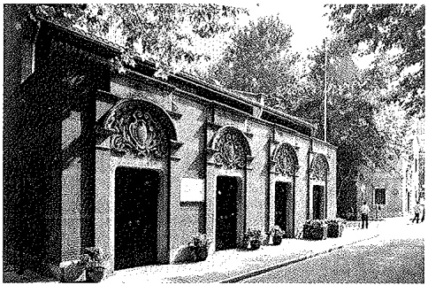
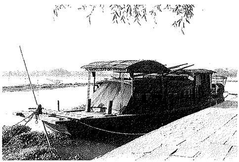
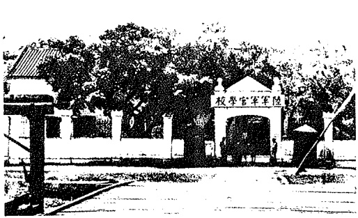
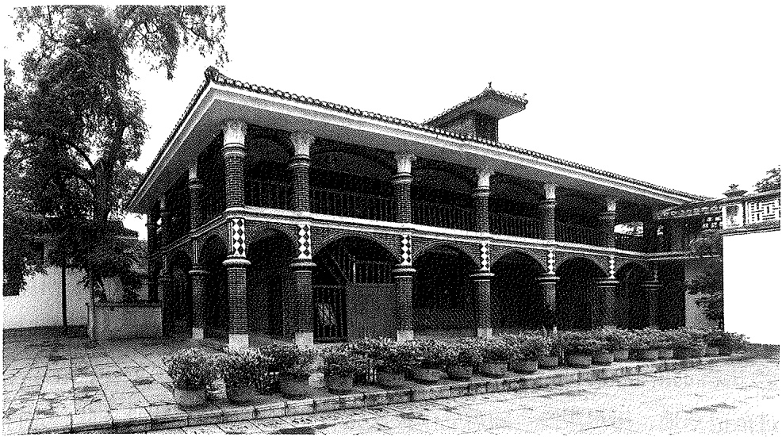

队、作战部。” $^{①}$  党必须“注重‘无产阶级专政’与‘国际色彩’两点”；必须坚持“以唯物史观为人生哲学社会哲学的出发点”；必须严密党的组织和纪律，“严格的物色确实党员” $^{②}$ 等。这些意见得到毛泽东的赞同。

在共产党早期组织领导下，1920年8月，上海社会主义青年团成立。随后，北京、广州、长沙、武昌等地也成立了团组织。各地团组织通过引导青年学习马克思主义，参加实际斗争，为党造就了一批后备力量。

共产党早期组织进行的这些活动，促进了马克思列宁主义的传播及其与中国工人运动的结合。在中国创建共产党的条件基本具备了。

## 三、中国共产党第一次全国代表大会的召开与中国共产党的成立

中国共产党第一次全国代表大会 中国共产党第一次全国代表大会于1921年7月23日在上海法租界望志路106号（今兴业路76号）开幕。

参加大会的代表，代表全国50多名党员。他们是:李达、李汉俊（上海），张国焘、刘仁静（北京），毛泽东、何叔衡（长沙），董必武、陈潭秋（武汉），王尽美、邓恩铭（济南），陈公博（广州），周佛海（旅日）；包惠僧受陈独秀派遣，出席了会议。出席会议的还有共产国际代表马林和尼克尔斯基。陈独秀、李大钊因分别在广州和北京事务繁忙未出席会议。

由于会场受到暗探注意和法租界巡捕房搜查，最后一天的会议转移到嘉兴南湖的游船上举行。这条游船后来被称为“红船”。

中共一大确定党的名称为“中国共产党”。大会通过了中国共产党第一个纲领，明确“革命军队必须与无产阶级一起推翻资本家阶级的政权”，“承认无产阶级专政，直到阶级斗争结束”，“消灭资本家私有制”，③以及联合第三国际。中国共产党一经成立，就旗帜鲜明地把社会主义和共产主义规定为自己的奋斗目标，坚持用革命的手段实现这个目标。

<small>①《蔡和森文集》上册，人民出版社2013年版，第57页。</small>

<small>②《蔡和森文集》上册，人民出版社2013年版，第58、67、75页。</small>

<small>③ 中共中央文献研究室、中央档案馆编:《建党以来重要文献选编（一九二一一一九四九）》第一册，中央文献出版社2011年版，第1页。</small>

上海中共一大会址和嘉兴南湖红船

大会在讨论实际工作计划时，决定首先集中精力组织工人。

中共一大决定设立中央局作为中央的临时领导机构，选举产生了以陈独秀为书记的中央局。

中共一大宣告中国共产党正式成立。

中国共产党的成立，是近现代中国历史发展的必然产物，是中国人民在救亡图存斗争中顽强求索的必然产物，是实现中华民族伟大复兴的必然产物。中国共产党作为中国最先进的阶级——工人阶级的政党，不仅代表着工人阶级的利益，而且代表着整个中华民族和中国最广大人民的利益。它从一开始就坚持以马克思主义为行动指南，把为中国人民谋幸福、为中华民族谋复兴确立为自己的初心使命。

中国共产党成立的历史特点 中国共产党是在特定的社会历史条件下成立的。一方面，它成立于俄国十月革命取得胜利，第二国际社会民主主义、修正主义破产之后。它所接受的，是具有完整的科学世界观和社会革命论的马克思主义。另一方面，它是在半殖民地半封建中国的工人运动基础上产生的。中国工人阶级身受帝国主义、本国资产阶级和封建势力的三重压迫，具有坚强的革命性。所以，中国共产党一开始就是一个以马克思列宁主义理论为基础的党，是一个区别于第二国际旧式社会改良党的新型工人阶级革命政党。

中国共产党成立的历史意义 中国共产党的成立，是中华民族发展史上一个开天辟地的大事变，具有伟大而深远的意义。

近代以后中国人民的反帝反封建斗争之所以屡遭挫折和失败，最重要的原因就是没有先进的坚强的政党作为凝聚力量的领导核心。中国共产党的诞生，从根本上改变了这种局面。

中国共产党一经成立，就把实现共产主义作为党的最高理想和最终目标，义无反顾肩负起实现中华民族伟大复兴的历史使命。中国人民由此踏上了争取民族独立、人民解放的光明道路，开启了实现国家富强、人民幸福的历史征程。

中国共产党的先驱们创建了中国共产党，形成了坚持真理、坚守理想，践行初心、担当使命，不怕牺牲、英勇斗争，对党忠诚、不负人民的伟大建党精神，这是中国共产党的精神之源。正是对这一精神的坚守与践行、光大与发扬，构建起中国共产党人的精神谱系，激励中国共产党和中国人民创造了人间奇迹。

中国共产党的成立，深刻改变了近代以后中华民族发展的方向和进程，深刻改变了中国人民和中华民族的前途和命运，深刻改变了世界发展的趋势和格局。

## 第三节 中国革命的新局面

## 一、民主革命纲领的制定和工农运动的发动

民主革命纲领的制定 中国共产党一经成立，中国革命就展现了新的面貌。中共二大第一次提出了反帝反封建的民主革命纲领，为中国人民指出了明确的斗争目标。刚刚成立的中国共产党，最重要的任务是学习运用科学理论来观察和分析中国面对的实际问题。1922年7月在上海举行的中国共产党第二次全国代表大会，通过对中国社会经济政治状况的分析，揭示出中国社会的半殖民地半封建性质，指出党的最高纲领是实现社会主义、共产主义。但党在现阶段的纲领，即最低纲领是:打倒军阀；推翻国际帝国主义的压迫；统一中国为真正民主共和国。大会指出，为实现反帝反军阀的革命目标，必须联合全国一切革命党派，联合资产阶级民主派，组成“民主主义的联合战线” $^{①}$ 。

《萍乡安源路矿工人罢工宣言》

工农运动的发动 在中国共产党的领导、组织和推动下，从1922年1月香港海员罢工到1923年2月京汉铁路工人罢工，掀起了中国工人运动的第一个高潮。在13个月中，全国发生了包括安源路矿工人罢工、开滦五矿工人罢工等在内的大小罢工100余次，参加者在30万人以上。

通过领导工人斗争，中国共产党密切了同工人阶级的联系，党的自身建设也得到加强。在工人斗争中涌现出的一批优秀人物，如苏兆征、史文彬、项英、邓培、王荷波等先后加入党组织，后来成为重要领导骨干。1924年上半年，650名党员中，工人党员占到 $40\%$ 。次年1月，占到 $50\%$ 以上。

在集中力量领导工人运动的同时，中国共产党也开始从事发动农民的工作。1921年9月，浙江萧山县衙前村成立了中国第一个农民协会，开展反抗地主压迫的斗争。1922年6月，彭湃来到家乡广东海丰县赤山约，经过艰苦的工作，成立了农会。次年元旦，召开海丰全县农民代表大会，海丰总农会宣告成立，全县范围的农民运动轰轰烈烈地开展起来。这种新式的农民运动，在中国共产党成立前是不曾有的。

青年运动和妇女运动的开展 这一时期，中国共产党领导的青年运动和妇女运动也得以初步开展。1921年6月至7月，张太雷作为正在筹建的中国共产党的代表，出席了在莫斯科召开的共产主义国际第三次代表大会和青年国际第二次代表大会。此后，他根据青年国际的指示和中共中央局决定，负责对已停止活动的社会主义青年团组织进行恢复和整顿。1922年5月，上海、北京等17个地方建立了社会主义青年团组织，团员总数约5000人。1922年5月5日至10日，青年团第一次全国代表大会在广州召开，中国社会主义青年团宣告成立。1921年8月，中国共产党帮助在上海颇有影响的中华女界联合会进行改组，作为党的临时中央妇女机构。同年11月，中共中央局发出《关于建立与发展党团工会组织及宣传工作等》的通告，要求各地区切实注意“青年团”及“女界联合会”的工作。 $^{①}$ 为培养妇女运动的骨干，1922年，上海党组织以中华女界联合会名义开办上海平民女校。广大妇女争取自身解放的觉悟明显提高，成为反对帝国主义、反对封建主义斗争的一支重要力量。

<small>① 中共中央文献研究室、中央档案馆编:《建党以来重要文献选编（一九二一一一九四九）》第一册，中央文献出版社2011年版，第133页。</small>

## 二、国共合作和大革命的进行

国共合作的形成 1923 年 2 月 7 日，京汉铁路罢工遭到反动军阀血腥镇压，造成二七惨案。此后，中国工人运动暂时转入低潮。中国共产党从中看到，这时的中国革命力量远不如帝国主义和封建势力强大。所以二七惨案后，中国共产党决定采取更为积极的步骤，联合孙中山领导的中国国民党。

此时的孙中山因依靠军阀打军阀屡遭挫折，陷于苦闷。他看到中国共产党领导工人运动所产生的影响，认识到中国共产党是一支新兴的、生机勃勃的革命力量，愿意与中国共产党合作。1922年8月，中共中央一些领导人在杭州开会，讨论国共合作问题。1923年1月，共产国际执委会作出《关于中国共产党与国民党的关系问题的决议》，对国共合作起了推

<small>① 中共中央党史和文献研究院、中央档案馆编:《中国共产党重要文献汇编》第一卷（一九二一年七月—一九二一年十二月），人民出版社2022年版，第82—83页。</small>

动作用。

1923 年 6 月在广州举行的中国共产党第三次全国代表大会，正确估计了孙中山的革命立场和国民党进行改革的可能性，决定共产党员以个人身份加入国民党，以实现国共合作。明确规定共产党员加入国民党时，党必须在政治上、思想上、组织上保持自己的独立性。

中共三大后，国共合作步伐大大加快。国民党改组很快进入实行阶段。1924年1月，中国国民党第一次全国代表大会由孙中山主持在广州举行。大会审议通过的《中国国民党第一次全国代表大会宣言》，对三民主义作出新的解释，即“新三民主义”。其在民族主义中突出了反对帝国主义的内容；在民权主义中强调民主权利应“为一般平民所共有”；把民生主义概括为“平均地权”和“节制资本”两大原则（后来又提出“耕者有其田” $^{①}$ 的主张）。新三民主义的政纲同中国共产党在民主革命阶段的纲领基本一致，因而有了国共合作的政治基础。

国民党一大确认了共产党员以个人身份加入国民党的原则。大会选举出中国国民党中央执行委员会，共产党员李大钊、谭平山、毛泽东等10人当选为中央执行委员或候补执行委员，约占委员总数的1/4。会后，在国民党中央党部担任重要职务的共产党员有:组织部部长谭平山、农民部部长林伯渠、宣传部代理部长毛泽东等。

国民党一大事实上确认了联俄、联共、扶助农工的三大革命政策，标志着第一次国共合作正式形成。

大革命的准备与进行 国共合作实现后，以广州为中心，汇集全国革命力量，很快开创了反对帝国主义和封建军阀的革命新局面。

1924 年，工人运动开始复兴。1925 年 5 月在广州举行的第二次全国劳动大会上，中华全国总工会成立。农民运动也逐步发展。广东各县农民纷纷建立农民协会，组织自卫军，同土豪劣绅和贪官污吏进行斗争。从 1924 年

<small>① 《孙中山全集》第九卷，中华书局2011年版，第120页。</small>

7月起，在广州开办六届农民运动讲习所，先后由共产党人彭湃、毛泽东等主持，培养了一批农民运动骨干。学生运动和妇女运动也得到发展。

为造就革命武装的骨干力量，在共产党人建议下，国民党一大决定创

办一所陆军军官学校（即黄埔军校）。黄埔军校于1924年5月开学。中国共产党从各地选派大批党团员和革命青年到黄埔军校学习，第一期学生中，共产党员和青年团员有56人，占学生总数的1/10。

黄埔军校

为加强对日益高涨的革命运动的领导，1925年1月，中国共产党第四次全国代表大会在上海举行。其重大历史功绩是:提出了无产阶级在民主革命中的领导权问题，提出了工农联盟问题，对民主革命的内容作了更加完整的规定。这是对中国革命问题认识的重大进展。

在日益高涨的革命形势下，中国共产党还进行了创建直接领导的革命武装的尝试。1926年初，建立了由共产党员叶挺指挥的国民革命军第四军独立团。

这一时期，北方地区的革命运动也迅速发展起来。李大钊和北方党组织进行了争取冯玉祥及其国民军的工作，开展了争取关税自主运动等。

1925 年 5 月，英、日等国军警在上海制造枪杀中国民众的五卅惨案，导致五卅运动爆发。以此为起点，掀起了全国范围的大革命高潮。同年 6 月开始的省港大罢工，前后坚持了 16 个月之久，是中国工人运动史上持续时间最长的一次政治大罢工。10 多万集中在广州的有组织的罢工工人，成为广州革命政府的有力支柱。

在革命蓬勃发展的有利形势下，国共两党合作进行了讨伐广东境内军阀买办势力的广东战争，统一并巩固了广东革命根据地。1925年7月1日，国民政府在广州建立。随后，将黄埔军校校军和驻广东的粤军、湘军、滇军先后改编为国民革命军6个军，共8.5万人。

当时，北洋军阀统治着全国大部分地区。直系军阀吴佩孚控制着湖南、湖北、河南三省和直隶（河北）保定一带，约有兵力20万人；由直系分立出来的孙传芳盘踞在江苏、浙江、安徽、江西、福建五省，约有兵力20万人；奉系军阀张作霖控制着东北三省、热河、察哈尔、京津地区和山东，有兵力30多万人。他们与南方的国民政府相对立，同时彼此之间不断地明争暗斗。

1926年7月，以推翻北洋军阀统治为目标的北伐战争开始。国民革命军在工农群众的支援下，采取各个击破的战略，至同年11月，基本摧毁了北洋军阀吴佩孚、孙传芳的主力，革命势力发展到长江流域和黄河流域的大部分地区。“打倒列强，除军阀”的歌声响彻大江南北。随着北伐的胜利进军，中国历史上空前广大的人民解放运动得以形成。以湖南为中心，广大农村掀起了大革命的风暴；工人运动迅速走向高涨；国民政府进行了收回汉口、九江英租界的斗争；上海工人举行了三次武装起义。帝国主义、封建主义的统治受到严重打击。

1924 年至 1927 年中国反帝反封建的革命，比以往任何一次革命，包括辛亥革命和五四运动，群众的动员程度更为广泛，斗争的规模更加宏伟，革命的社会内涵更为深刻，因此被称作大革命。

大革命中的中国共产党 大革命是在国共合作的条件下进行的，没有国共合作，不会在短时间内掀起这样一场革命。在这场革命中，中国共产党起着独特的、不可替代的作用。没有中国共产党，不会有这场大革命。这是因为:

大革命是在反对帝国主义、反对军阀的政治口号下进行的。而提出这个口号的，正是中国共产党。

大革命是在以国共合作为基础的统一战线的组织形式下进行的。而中国共产党正是国共合作的倡导者和统一战线的组织者。

大革命是近代中国历史上空前广泛而深刻的群众运动。而中国共产党

正是人民群众的主要发动者和组织者。

大革命的主要斗争形式是革命战争。共产党人不仅帮助和推动了国民革命军的建立，而且在军队中进行了卓有成效的政治工作，积极提高国民革命军的素质，增强它的凝聚力和战斗力；共产党员在战斗中更是身先士卒，起着先锋作用和表率作用。由共产党直接领导的第四军独立团，是一个突出的例证。独立团在北伐中战功卓著，使第四军赢得了“铁军”的称号。此外，共产党人还建立了一定数量的工农武装（工人纠察队、农民自卫军等），配合正规军作战，而上海工人的起义武装更是充当了解放上海的主力。

## 三、大革命的失败及其教训

大革命的失败 在大革命初期和中期，中国共产党的路线基本是正确的，党员群众和党的干部积极性非常高，因此获得巨大胜利。北洋军阀势力的迅速崩溃，使帝国主义列强感到震惊。它们在中国集结兵力、制造事端，企图以武力相威胁，阻挡中国革命前进的步伐；同时开始对当时任国民革命军总司令的蒋介石进行拉拢。

在此之前，1925年3月12日，孙中山在北京病逝。国共两党组织各界人民举行哀悼活动，广泛传播孙中山的革命精神，形成一次规模巨大的革命宣传活动。

但是，孙中山病逝后，原先就坚持反共立场的国民党右派重新活跃起来，国民党内部左右两派进一步分化，国共合作建立的统一战线面临复杂局面。1926年3月，蒋介石制造中山舰事件，打击共产党和工农革命力量；5月，在国民党二届二中全会上提出所谓《整理党务决议案》，更加公开地实行反共步骤。

随着北伐的胜利进军，蒋介石的反共活动日益公开化。面对革命阵营随时可能发生破裂的严重局面，1926年12月13日，中共中央在汉口召开特别会议。但这次会议并没有解决党在迫在眉睫的危局中如何生存并坚持斗争的问题，反而决定了右倾机会主义的错误方针，并逐步在实际工作中加以贯彻，造成了严重的消极后果。

1927年3月国民革命军占领南京后，游弋在长江江面的英、美军舰借口保护侨民，猛烈炮轰南京，使中国军民遭到重大伤亡。南京事件加速了蒋介石同帝国主义势力勾结的步伐。

在大革命紧急关头，1927年4月27日至5月9日，中国共产党第五次全国代表大会在武汉举行。党的五大提出争取无产阶级对革命的领导权，建立革命民主政权和实行土地革命等一些正确的原则，但对无产阶级如何争取革命领导权、如何领导农民实行土地革命，特别是如何建立党领导的革命武装等问题，没有提出有效的具体措施，难以承担起挽救革命的任务。

4月12日，蒋介石在上海发动反共政变，以“清党”为名，在东南各省大规模捕杀共产党员和革命群众。7月15日，时任武汉国民政府主席的汪精卫在武汉召开“分共”会议，并在其辖区内对共产党员和革命群众实行搜捕和屠杀。国共合作全面破裂，大革命最终失败。

大革命失败的教训 大革命的失败，从客观方面讲，是由于反革命力量强大，资产阶级发生严重动摇，蒋介石集团、汪精卫集团先后叛变革命。从主观方面说，是由于这时的中国共产党还处在幼年时期，缺乏应对复杂环境的政治经验，缺乏对中国社会和中国革命基本问题的深刻认识，还不善于将马克思列宁主义基本原理同中国革命的具体实际结合起来；是由于党内以陈独秀为代表的右倾思想发展为右倾机会主义错误并在党的领导机关中占了统治地位，党和人民不能组织有效抵抗，致使大革命在强大的敌人突然袭击下遭到惨重失败。

大革命从兴起到失败的经验教训表明，中国共产党能否将马克思主义基本原理同中国革命的具体实际紧密结合，对中国革命至关重要。1922年7月，中共二大决定加入共产国际，作为共产国际的一个支部，直接受共产国际的领导。共产国际及其在中国的代表虽然对这次大革命起了积极作用，所出的主意有些是正确的，但由于并不真正了解中国的情况，也出了一些错误主意。幼年的中国共产党还难以摆脱共产国际那些错误的指导思想，这对大革命后期右倾机会主义错误在中共中央领导机关中占据统治地位有直接影响。

大革命从兴起到失败的经验教训表明，中国共产党不但要建立革命的统一战线，而且要始终保持自身的独立性，实行“又团结又斗争”的方针，争取无产阶级在革命中的领导权。同时，根据中国当时的国情，要取得革命胜利，必须坚持武装斗争，组建由党直接统率和指挥的军队；必须解决农民的土地问题，以充分发动农民参加革命，扩大革命力量；党必须加强自身建设，加强党的民主集中制，既要发展党的组织和注重党员数量，更要巩固党的组织和注重党员质量。只有正确认识和解决这些问题，党才能领导中国革命事业走向成功。

大革命虽然失败了，但它的历史意义仍然是不可磨灭的。正是在这个时期，中国共产党人进行了轰轰烈烈的革命工作，领导了全国反帝反封建的伟大斗争，在中国革命史上写下了光荣的一页，同时开始探索马克思主义中国化的途径，初步提出了新民主主义革命的基本思想，并从大革命的失败中汲取深刻历史教训，开始懂得进行土地革命和掌握革命武装的重要性。

《中国共产党为蒋介石屠杀革命民众宣言》

正是由于经历了这场大革命，中国人民的觉悟程度和组织程度有了明显提高，中国共产党开始掌握了一部分革命武装。所有这些，为把中国革命推进到一个新的阶段——土地革命战争阶段准备了必要的条件。

## 学习思考

1. 中国的先进分子为什么和怎样选择了马克思主义？

2. 为什么说中国共产党的成立是“开天辟地的大事变”？

3. 什么是中国共产党人的初心使命？为什么必须“不忘初心、牢记使命”？

4. 中国共产党成立后，中国革命呈现了哪些新面貌？

## 必读文献

1. 李大钊:《我的马克思主义观》（上篇）（1919年9月）

《我的马克思主义观》系李大钊为纪念马克思诞辰101周年（1919年5月5日）而写，分上篇和下篇。上篇为全文的第1—7节，发表于《新青年》第6卷第5号，论述了马克思的唯物史观及其阶级竞争说，对我们学习和树立唯物史观有重要指导意义。

2.《中国共产党第一个纲领》（1921年7月）

《中国共产党第一个纲领》是中共一大通过的最重要的文件。这一文献对我们正确认识初创时的中国共产党及其基本政治主张有重要意义。

3. 习近平:《在庆祝中国共产党成立100周年大会上的讲话》(2021年7月1日)

这篇重要讲话立足中国共产党百年华诞的重大时刻和“两个一百年”历史交汇的关键节点，回望光辉历史、擘画光明未来，是一篇马克思主义纲领性文献，是新时代中国共产党人“不忘初心、牢记使命”的政治宣言，是我们党团结带领人民以史为鉴、开创未来的行动指南。

## 延伸阅读文献

1. 陈独秀:《敬告青年》（1915年9月）

在《敬告青年》一文中，陈独秀提出了“科学之兴，其功不在人权说下，若舟车之有两轮焉”，国人欲脱蒙昧时代，“当以科学与人权并重”的思想。该文的发表，是新文化运动兴起的标志。

2.《中国共产党第二次全国代表大会宣言》(1922年7月)

《中国共产党第二次全国代表大会宣言》，是中共二大通过的重要文件之一。宣言不仅明确表述了党的最高纲领，而且第一次提出了党的民主革命纲领:“消除内乱，打倒军阀，建设国内和平；推翻国际帝国主义的压迫，达到中华民族完全独立。”

3.《中国国民党第一次全国代表大会宣言》(1924年1月23日)

《中国国民党第一次全国代表大会宣言》由孙中山提交代表大会审查讨论，于1月23日表决通过。在宣言第二部分“国民党之主义”中，孙中山系统阐述了新三民主义。该文对我们了解和认识第一次国共合作有重要意义。

## 第五章 中国革命的新道路

1924 年至 1927 年，国共合作掀起大革命的高潮，帝国主义、封建主义的统治受到沉重打击。然而，由于国民党蒋介石集团和汪精卫集团相继叛变，大革命惨遭失败。面对反动派的血腥屠杀，中国共产党和中国人民并没有被吓倒，被征服，被杀绝，他们从地下爬起来，揩干净身上的血迹，掩埋好同伴的尸首，又继续战斗了。中国革命由此进入土地革命战争时期，中国共产党人经过艰难探索，开辟了中国革命的新道路。

## 第一节 中国共产党对革命新道路的探索

## 一、国民党在全国统治的建立及其性质

国民党在全国统治的建立 1927 年七一五反革命政变后，南京和武汉两个 “国民政府” 经过一段时间相互争斗，达成妥协，实现了宁汉合流。在此基础上，1928 年 2 月，南京国民政府改组，武汉国民政府不复存在。其后，国民党政府的军队继续北伐，于 6 月进驻北京、天津一带。奉系首领张作霖在退回关外途中，被日本人预埋的炸药炸死。其子张学良于同年 12 月 29 日从东北发出通告，宣布 “遵守三民主义，服从国民政府，改易旗帜” $^{①}$ 。北洋军阀不再作为独立的政治力量继续存在。这样，国民党就在全国范围内建立了自己的统治。

一党专政的军事独裁统治 1927 年大革命失败后，国民党已经不再是工人、农民、城市小资产阶级和民族资产阶级的革命联盟，而是变成了一个由代表地主阶级、买办性的大资产阶级利益的反动集团所控制的政党，其所建立的南京国民政府同北洋军阀的统治没有本质的区别。但是，由于国民党曾经是旧民主主义革命的一面旗帜和大革命时期统一战线的组织形式，帝国主义列强一度对它作出过一两项表面上的让步（如承认中国关税自主、允诺取消领事裁判权），一时使人认为它仍在维护民族权利；由于它在形式上暂时统一了中国，因此，这个政权曾经在一个时期内，使一些人尤其是民族工商业者产生过幻想，以为中国可能由此走上独立发展资本主义的道路。

<small>① 《张学良文集》（一），新华出版社1992年版，第150页。</small>

在 1928 年至 1929 年间，中国民族工业有过短暂的繁荣。1928 年注册厂家有 250 户，资本额达 1.1784 亿元。商业、交通运输业、服务业以至文化教育事业等也在这段时间内有所发展。然而，在 1927 年反革命政变时附和过蒋介石的民族资产阶级，并没有成为中国的统治阶级，民族工商业也没有得到自由发展。不久后，这个阶级中的一部分人因为自己的利益，开始逐步形成蒋介石政权下的在野反对派。他们对这个政权表示不满，但又反对无产阶级领导的人民革命。

国民党所实行的是代表地主阶级、买办性大资产阶级利益的一党专政和军事独裁统治。1928年10月，国民党中央常务委员会通过《训政纲领》，规定“由中国国民党全国代表大会代表国民大会领导国民，行使政权”；其全国代表大会闭会时，“以政权付托中国国民党中央执行委员会执行之”；“指导监督国民政府重大国务之施行，由中国国民党中央执行委员会政治会议行之”。 $^{①}$ 这样，北洋政府时期还在形式上存在的议会制度也被彻底废除了。

国民党政府是怎样实行一党专政的军事独裁统治的呢？

首先，为了镇压人民和消灭异己力量，国民党建立了庞大的军队和

<small>① 中国第二历史档案馆编:《中国国民党中央执行委员会常务委员会会议录》（六），影印本，广西师范大学出版社2000年版，第220—221页。</small>

“中统”“军统”全国性特务系统。据1929年3月的官方材料，“全国军额达二百余万”①；国民党建立的庞大特务系统，主要任务就是反对共产党，破坏革命运动，绑架或暗杀革命者和异己分子。1935年11月，平津十校学生自治会发表宣言揭露:国民党在南京“奠都以来，青年之遭杀戮者，报纸记载至三十万人之多，而失踪监禁者更不可胜计。杀之不快，更施以活埋；禁之不足，复加以毒刑。地狱现形，人间何世？”②总之，广大人民被置于国民党武装和特务系统的严密控制和监视之下。

其次，为了控制人民，禁止革命活动，国民党大力推行保甲制度，规定十户为甲，十甲为保，分设甲长、保长。保甲内各户要互相监视、互相告发，“共具联保连坐切结” $^{③}$ ，并从事“碉楼堡塞或其他工事之筹设” $^{④}$ 和交通干线之“保护”等；国民党政府的征税、摊派等，许多也通过保甲来进行。自1934年12月起，保甲制度在全国普遍推行，广大人民被禁锢在保甲制度之内。

最后，为了控制舆论，剥夺人民的言论和出版自由，国民党还厉行文化专制主义。大批进步书刊被查禁，许多进步作家被监视、拘捕乃至杀害。

国民党政府主要是通过这些方法来维护帝国主义、封建主义、官僚资本主义的利益，巩固自身统治的。

正因为如此，中国人民要争得民族独立和自身解放，就必须同国民党

<small>① 中国第二历史档案馆、海峡两岸出版交流中心编:《中国国民党历次全国代表大会暨中央全会文献汇编》第四册，九州出版社2012年版，第253页。</small>

<small>② 中国社会科学院现代史研究室编:《西安事变资料》第一辑，人民出版社1980年版，第82页。</small>

<small>③ 中国第二历史档案馆编:《中华民国史档案资料汇编》第五辑第一编政治（一），江苏古籍出版社1994年版，第122页。</small>

<small>④ 中国第二历史档案馆编:《中华民国史档案资料汇编》第五辑第一编政治（一），江苏古籍出版社1994年版，第121页。</small>

的反动统治作坚决的斗争。

二、土地革命战争的兴起

大革命失败后的艰难环境 在国民党统治下，中国社会的半殖民地半封建性质没有改变。全国陷入一片白色恐怖之中，年轻的中国共产党面临着成立后从未遇到过的严峻考验。

中国共产党及其领导的革命运动遭到严酷镇压。共产党被宣布为“非法”，加入共产党成为最大的“犯罪”，共产党的组织不断遭到破坏，党的活动被迫转入地下，许多共产党员和党的领导干部被捕、被杀。据中共六大时的不完全统计:从1927年3月到1928年上半年，被杀害的共产党员和革命群众达31万多人，其中共产党员2.6万人。汪寿华、萧楚女、熊雄、陈延年、赵世炎、夏明翰、郭亮、罗亦农、向警予、陈乔年、周文雍等党的重要活动家和领导人英勇牺牲。据1927年11月统计，全党党员人数由1927年5月中共五大时的57967人锐减到1万余人。革命的工会、农民协会等也到处被查禁或解散，工农运动走向低落。反革命力量大大超过了有组织的革命力量。

面对极端的白色恐怖，中国共产党人毅然举起独立领导武装斗争和土地革命的旗帜，带领人民群众同国民党反动统治进行英勇的抗争。1928年3月被捕的湖北省委常委夏明翰，身陷牢狱仍坚贞不屈，在给妻子的家书中写下“坚持革命继吾志，誓将真理传人寰”的豪言壮语。他的“砍头不要紧，只要主义真”的就义诗，表达了共产党员的信念之光不灭。一些

追求进步、向往真理的人士，在革命的危急时刻加入了共产党的队伍。年逾半百的教育家徐特立，文学家郭沫若，在国民革命军中担任高中级领导职务的贺龙、叶剑英、彭德怀等，都在这时加入了中国共产党。在黑暗的中国，共产党独立高举起革命旗帜。

中国共产党人英勇就义的故事

怎样坚持革命，革命应当走什么道路？对此，中国共产党人开始了艰难的探索。

开展武装反抗国民党反动统治的斗争 在革命的危急关头，1927年7月中旬，中共中央政治局临时常委会决定了三件大事:将党所掌握和影响的部队向南昌集中，准备起义；组织湘、鄂、赣、粤四省的农民发动秋收起义；召集中央紧急会议，讨论和决定大革命失败后的新方针。同年8月7日，中共中央在汉口秘密召开紧急会议（即八七会议），会议确定了土地革命和武装起义的方针。这是一个正确的方针，是党在付出血的代价后换得的正确结论。出席这次会议的毛泽东在发言中突出地强调:“以后要非常注意军事。须知政权是由枪杆子中取得的。” $^{①}$ 会议还提出了“找着新的道路” $^{②}$ 的任务。

八七会议给正处在思想混乱和组织涣散中的中国共产党指明了新的出路，这是由大革命失败到土地革命战争兴起的历史性转变。

1927年8月1日，在以周恩来为书记的前敌委员会领导下，贺龙、叶挺、朱德、刘伯承等率领共产党掌握和影响的军队2万多人，在南昌打响了武装反抗国民党反动派的第一枪。这是中国共产党独立领导革命战争、创建人民军队和武装夺取政权的开端。9月9日，毛泽东等领导的湘赣边界秋收起义爆发。起义军公开打出了“工农革命军”的旗帜，在攻打中心城市长沙受挫后，毛泽东果断改变计划，决定向敌人控制比较薄弱的农村转移。9月29日，毛泽东领导起义军在江西永新县三湾村进行了著名的三湾改编，从组织上确立了党对军队的领导。三湾改编是建设无产阶级领导的新型人民军队的重要开端。10月7日，起义部队抵达江西省宁冈县茅坪，开始了创建井冈山农村革命根据地的斗争。从进攻大城市转到向农村进军，这是中国人民革命史上具有决定意义的新起点。12月11日，中共广东省委书记张太雷和叶挺、叶剑英等领导了广州起义，对国民党的屠杀政策发动了又一次英勇反击。但实践再一次证明:面对国民党新军阀在中心城市拥有强大武装的形势，想通过城市武装起义或攻占大城市来夺取革命胜利是不可能的。

<small>①《毛泽东文集》第一卷，人民出版社1993年版，第47页。</small>

<small>② 中央档案馆编:《中共中央文件选集》第三册，中共中央党校出版社1989年版，第290页。</small>

从 1927 年大革命失败到 1928 年初，中国共产党还先后在海陆丰、琼崖、鄂豫边、赣西南、赣东北、湘南、湘鄂西、闽西、陕西等地区领导了近百次武装起义。一些起义部队在数省边界地区的偏僻山村坚持下来，开展游击战争。中国革命由此发展到了一个新的阶段，即土地革命战争时期。

蒋介石是靠国共合作、北伐战争上台的。但是，他上台后反而把人民推入了十年内战的血海。他的屠杀政策教育了中国共产党人和革命人民，促使其拿起武器进行战斗。中国共产党为了坚持反帝反封建的事业而领导人民进行土地革命战争，这是必要的、正义的、进步的。

## 三、农村包围城市、武装夺取政权道路的开辟

对中国革命新道路的探索 为了坚持中国革命，在当时的条件下，必须进行武装斗争。但是，武装斗争的主攻方向究竟应当指向城市，还是指向农村？对此，只有遵循马克思列宁主义与中国实际相结合的原则，依靠实践经验的积累，才能予以回答。

从国际共产主义运动的历史看，无论中外，都找不到农村包围城市的经验。革命工作应当以城市为中心，这是一个时期内全党的共识。然而，党在各地以占领中心城市为目标的起义很快都失败了。这些起义失败后保留下来的部队，大都经过摸索，逐步转移到了远离国民党统治中心的农村区域，在那里发动农民群众、开展游击战争、进行土地革命和创建工农政权。

大革命失败后，集中体现中国革命正确方向的是毛泽东、朱德领导的

井冈山革命根据地的斗争。

毛泽东率领起义军到井冈山后，全力进行湘赣边界党、军队和政权的建设。1927年11月，成立边界第一个红色政权——茶陵县工农兵政府。1928年2月中旬，打破江西国民党军队对井冈山地区的进攻。至此，井冈山根据地初步建立起来。

1928年4月下旬，朱德、陈毅率领南昌起义保留下来的部队和湘南起义农军陆续转移到井冈山地区，与毛泽东领导的部队会师，成立工农革命军第四军（后改称“工农红军第四军”），朱德任军长，毛泽东任党代表和军委书记。从此，他们领导的军队被称为“朱毛红军”。

井冈山根据地的建立，点燃了工农武装割据的星星之火，为中国革命开辟出了农村包围城市、武装夺取政权这样一条前人没有走过的正确道路。大革命失败后，中国共产党人正是沿着这条独特的道路，引导中国革命走向复兴并逐步赢得胜利的。

农村包围城市、武装夺取政权的道路，是在党领导人民艰苦奋斗中开辟出来的。1928年6月在苏联举行的中国共产党第六次全国代表大会，在继续把城市工作的复兴视为革命高潮到来的决定条件的同时，肯定了农村根据地和红军是决定革命新高潮的更大的发展基础和重要力量；确定以争取群众作为党的首要任务，把“左”倾作为主要危险来反对。这是党的工作方针的一次重要转变。1929年9月，中共中央给红四军前委的指示信指出:先有农村红军，后有城市政权，这是中国革命的特征，这是中国经济基础的产物。

在中国革命新道路开辟过程中，毛泽东作出了卓越贡献，提出了农村包围城市、武装夺取政权的思想。

毛泽东不仅在实践中首先把武装斗争的立足点放在农村，领导开创井冈山根据地，创造性地解决了为坚持和发展农村根据地所必须解决的一系列根本问题，而且从理论上逐步对中国革命道路问题作出明确说明。1928年10月和11月，毛泽东写了《中国的红色政权为什么能够存在？》和《井冈山的斗争》两篇文章，明确指出以农业为主要经济的中国革命，以军事发展暴动，是一种特征；深刻论证了红色政权能够长期存在并发展的主客观条件，提出了工农武装割据的思想。1930年1月，毛泽东在《星星之火，可以燎原》一文中进一步指出:红军、游击队和红色区域的建立和发展，

毛泽东:《星星之火,可以燎原》

是半殖民地中国在无产阶级领导之下的农民斗争的最高形式和半殖民地农民斗争发展的必然结果，并且无疑义地是促进全国革命高潮的最重要因素。同年5月，毛泽东在《反对本本主义》一文中，提出“没有调查，没有发言权” $^{①}$ 和“中国革命斗争的胜利要靠中国同志了解中国情况” $^{②}$ 的重要思想，表现了毛泽东开辟新道路、创造新理论的革命首创精神。

1929 年 12 月，红四军党的第九次代表大会（古田会议）在福建上杭县古田村召开。大会根据中央九月来信精神，通过了毛泽东起草的古田会议决议，其中最重要的是关于纠正党内错误思想的决议案，确立了思想建党、政治建军原则；阐述了加强党的思想建设的极端重要性，指明党内各种非无产阶级思想的表现、来源及纠正办法；规定红军是一个执行革命的政治任务的武装集团，必须绝对服从共产党的领导，必须全心全意为党的纲领、路线和政策而奋斗；提出红军必须担负打仗、筹款和做群众工作的任务，必须加强政治工作。

古田会议决议是中国共产党和红军建设的纲领性文献，是党和人民军队建设史上的重要里程碑。古田会议确立了马克思主义建党建军原则，创造性地解决了在农村环境中、在党组织和军队以农民为主要成分的条件下，如何保持党的无产阶级先锋队性质和建设党领导的新型人民军队的重大问题。

党对军队的绝对领导，是人民军队永远不变的军魂，是人民军队完全区别于一切旧军队的政治特质和根本优势，对中国革命新道路的开辟和坚持具有重要意义。

<small>①《毛泽东选集》第一卷，人民出版社1991年版，第109页。</small>

<small>②《毛泽东选集》第一卷，人民出版社1991年版，第115页。</small>

随着革命新道路的开辟，中国革命开始走向复兴。到1930年夏，共产党领导人民群众建立了大小十几块农村根据地，红军发展到约7万人，连同地方武装共约10万人。重要的根据地有赣南、闽西、湘鄂西、鄂豫皖、闽浙赣、湘鄂赣、湘赣、广西的左右江、广东的东江和琼崖等。红军游击战争实际上已经成为中国革命的主要形式，农村根据地成为积蓄和锻炼革命力量的主要战略阵地。

反“围剿”战争与土地革命 红军和根据地的存在和发展，使国民党统治当局感到震惊和恐慌。从1930年10月起，蒋介石集重兵向南方各根据地的红军发动大规模“围剿”。从1930年10月到1931年7月，红一方面军在毛泽东、朱德等指挥下，贯彻积极防御的方针，实行“诱敌深入”“避敌主力、打其虚弱”等一整套行之有效的战术，连续粉碎了国民党军队的三次“围剿”。1933年3月，取得了第四次反“围剿”战争的胜利。鄂豫皖、湘鄂西等根据地的反“围剿”战争也取得重大胜利。

红军反“围剿”战争的胜利和革命根据地的发展，与土地革命的开展密切相关。1931年2月，毛泽东总结根据地土地革命的经验，要求各地各级工农民主政府发布公告，明确规定农民已经分得的田归农民个人私有，可以自主租借买卖，别人不得侵犯。毛泽东和邓子恢等一起制定了土地革命中的阶级路线和土地分配方法:坚定地依靠贫农、雇农，联合中农，限制富农，保护中小工商业者，消灭地主阶级；以乡为单位，按人口平分土地，在原耕地的基础上，实行抽多补少、抽肥补瘦。

在中国共产党的土地革命路线指引下，根据地开展了热火朝天的“打土豪，分田地”的斗争，充分调动了广大农民发展生产和参军参战的积极性。在大革命失败、白色恐怖极其严重的条件下，中国革命之所以能够得到坚持和发展，根本原因就在于中国共产党紧紧地依靠农民，领导农民进行了土地制度的革命。

在根据地军民进行反“围剿”作战的同时，国民党统治区的共产党人和进步文化界人士还在文化战线上开展了反“围剿”斗争，形成了声势浩大的左翼文化运动。左翼文化工作者的一大批优秀文学艺术作品（包括小说、戏剧、电影、音乐等）和社会科学论著及译作，对传播进步思想、推动抗日救亡运动起到了重要作用。鲁迅的杂文，瞿秋白的评论，茅盾的小说《子夜》，聂耳作曲、田汉作词的《义勇军进行曲》，邹韬奋主办的《生活周刊》，等等，都在群众中产生了广泛而深刻的影响。

## 第二节 中国革命在曲折中前进

## 一、土地革命战争的发展及其挫折

农村革命根据地的建设 红一方面军第一、二、三次反“围剿”作战的胜利，使赣南、闽西根据地连成一片，形成拥有21座县城、250万人口、5万平方公里土地的中央革命根据地。与此同时，鄂豫皖、湘鄂西、湘赣、湘鄂赣等根据地也都得到了发展。

1931 年 11 月，中华苏维埃第一次全国代表大会在江西瑞金召开。大会通过了《中华苏维埃共和国宪法大纲》以及土地法令、劳动法等，选举产生了中华苏维埃共和国中央执行委员会，成立了中华苏维埃共和国临时中央政府，毛泽东当选为主席。

中华苏维埃共和国是中国历史上第一个全国性的工农民主政权，是中国共产党在局部地区执政的重要尝试，扩大了党和红色政权的影响，一定程度上加强了对处于被分割状态的各根据地的中枢指挥作用，推动了各根据地的政权、经济、文化教育和党的自身建设，开创了土地革命战争新局面。

中华苏维埃共和国实行工农兵代表大会制度，各级苏维埃政府广泛吸收工农群众代表参加政权管理，行使当家作主的权利。苏维埃政府注重廉政建设，严惩腐败分子，成为中国历史上从未有过的真正廉洁的政府。苏维埃政府重视司法建设，临时中央政府先后颁布120多部法律、法令，初步建立起具有鲜明阶级性和时代特征的法律体系。在苏维埃政府领导下，根据地军民积极进行经济建设，努力打破敌人的经济封锁。苏维埃政府注重发展文化教育事业，工农群众开始获得享受文化教育的权利。在领导根据地建设中，党的建设也得到加强，“苏区干部好作风，自带干粮去办公；日着草鞋干革命，夜走山路访贫农”等民歌广泛传唱。

革命根据地生机勃勃的景象，同国民党统治区民不聊生的悲惨景象形成鲜明对照。根据地成为新民主主义共和国的雏形，使身陷苦难深渊的中国人民看到了光明和希望。

土地革命战争的严重挫折 中国革命的复兴和发展并不是一帆风顺的。从1927年7月大革命失败到1935年1月遵义会议召开前，“左”倾错误先后三次在党中央领导机关取得了统治地位，尤其是以王明为代表的“左”倾教条主义错误，使中国革命遭受严重挫折。

1931 年 1 月，在共产国际执行委员会远东局书记米夫的直接干预下，中共扩大的六届四中全会在上海召开。缺乏实际斗争经验的王明不仅被补选为中央委员，而且成为中央政治局委员，以王明为代表的“左”倾教条主义在党内开始长达 4 年的错误领导。会后，国民党统治区内党的工作出现一系列非常情况，党组织遭到严重破坏。在上海的中央委员和政治局委员都已不到半数，根据共产国际执行委员会远东局提议，1931 年 9 月成立临时中央政治局（临时中央），由博古（秦邦宪）负总的责任。

在 20 世纪 30 年代前期、中期，中国共产党内屡次出现严重的 “左” 倾错误，其原因是多方面的。除了八七会议后党内一直存在着浓厚的 “左” 倾情绪始终没有得到认真清理、共产国际对中国革命的错误指导外，主要在于党的马克思主义理论准备不足，缺乏实践经验，对中国的历史状况和社会状况、中国革命的特点、中国革命的规律不甚了解，不善于把马克思列宁主义与中国实际全面地、正确地结合起来。

对于王明等人的“左”倾错误，毛泽东等进行了坚决抵制和斗争。在中共中央主持工人运动工作的刘少奇也多次提出过反对冒险主义的主张。但是，王明等人破坏党的民主集中制、压制党内民主，大搞宗派主义，对坚持正确意见的或不对他们随声附和的同志，进行“残酷斗争”“无情打击” $^{①}$ 。在1931年11月召开的中央苏区第一次党代表大会（即赣南会议）上，毛泽东的正确主张被指责为“狭隘的经验论” $^{②}$ “富农路线”“极严重的一贯的右倾机会主义错误” $^{③}$ 。会议根据中共临时中央政治局的指示，设立中央革命军事委员会，取消红一方面军总司令和总政治委员、总前敌委员会书记的名义，这就剥夺了毛泽东对中央根据地红军的领导权。1932年10月，中共苏区中央局全体会议（宁都会议）对毛泽东和他在红军中实行的战略战术原则进行错误的批评和指责。中共临时中央决定毛泽东回后方主持临时中央政府工作。1933年初，由于白区党的工作遭到严重破坏，临时中央政治局无法在上海立足，被迫迁到中央根据地。为全面推行“左”倾教条主义的方针、政策，他们在福建开展了反对“罗明路线”的斗争，接着又在江西开展反对邓（小平）、毛（泽覃）、谢（唯俊）、古（柏）的斗争，其矛头实际上都是对着毛泽东的正确主张的。

王明等人的“左”倾教条主义错误，对中国革命造成了极其严重的危害。这次错误使红军和根据地损失了 $90\%$ ，国民党统治区党的力量几乎损失了 $100\%$ 。其最大的恶果，就是使红军在第五次反“围剿”作战中遭到失败，不得不退出南方根据地实行战略转移——长征。

在中央红军（红一方面军）主力战略转移前，1934年7月，党中央就派出寻淮洲、粟裕等领导的红七军团与方志敏领导的红十军合组为红十军团，作为抗日先遣队北上抗日。同年11月，中共中央又指示程子华、吴焕先、徐海东等率领红二十五军组成中国工农红军北上抗日第二先遣队。

<small>①《毛泽东选集》第三卷，人民出版社1991年版，第835页。</small>

<small>② 中央档案馆编:《中共中央文件选集》第七册，中共中央党校出版社1991年版，第475页。</small>

<small>③《毛泽东选集》第三卷，人民出版社1991年版，第967页。</small>

中央红军主力开始长征后，项英、陈毅等率领中央根据地留下的部分红军在南方坚持了艰苦卓绝的三年游击战争。

## 二、遵义会议实现伟大历史转折

红军开始长征 历史经验表明:革命政党和革命人民，总是要反复地经过正反两方面的教育，经过比较和对照，才能锻炼得成熟起来，才有赢得胜利的保证。

1934 年 9 月上旬，国民党军队加紧对中央革命根据地腹地发动进攻，红军已无在原地扭转战局的可能。10 月，中共中央、中革军委率中央红军主力等 8.6 万余人踏上战略转移的漫漫征程，开始了世界历史上前所未有的壮举。

1935 年 3 月、4 月，红四方面军从川陕根据地出发长征。同年 11 月，红二、六军团（后组成红二方面军）从湘鄂川黔根据地出发长征。

长征初期，原来推行“左”倾错误路线的中央领导人，在实行突围和战略转移时，又犯了退却中的逃跑主义错误。在强渡湘江后，中央红军从长征出发时的8.6万人锐减到3万多人。严酷的事实教育了广大共产党员和红军指战员，促使他们对“左”倾错误领导产生了怀疑和不满。

遵义会议实现伟大历史转折 湘江战役后，党内对中央红军的前进方向，一直进行着激烈的争论。1934年12月，中央政治局在贵州黎平举行会议，根据毛泽东的建议，通过决议，放弃到湘西北同红二、六军团会合的计划，改向贵州北部进军。

遵义会议会址

1935年1月7日，红军攻克黔北重镇遵义。1月15日至17日，中共中央在此召开政治局扩大会议，即遵义会议。会议集中解决了当时具有决定意义的军事和组织问题。会议增选毛泽东为中央政治局常委，委托张闻天起草《中央关于反对敌人五次“围剿”的总结的决议》。会后不久，在向云南扎西地区进军途中，中央政治局常委决定由张闻天代替博古负总的责任，毛泽东为周恩来在军事指挥上的帮助者，后成立由毛泽东、周恩来、王稼祥组成的三人小组，负责全军的军事行动。

遵义会议是党的历史上一个生死攸关的转折点。这次会议事实上确立了毛泽东在党中央和红军的领导地位，开始确立以毛泽东为主要代表的马克思主义正确路线在党中央的领导地位，开始形成以毛泽东同志为核心的第一代中央领导集体，在最危急关头挽救了党、挽救了红军、挽救了中国革命。遵义会议的鲜明特点是坚持真理、修正错误，确立党中央的正确领导，创造性地制定和实施符合中国革命特点的战略策略。遵义会议开启了中国共产党独立自主解决中国革命实际问题的新阶段。

## 三、红军长征胜利和迎接全民族抗战

红军长征的胜利及其意义 遵义会议后，在毛泽东等的指挥下，党和红军从危难中走出。从此，中国革命朝着胜利的方向前进。

遵义会议后，中央红军采取灵活机动的战略战术，四渡赤水河，巧渡金沙江，摆脱了数十万国民党军队的围追堵截，赢得了战争的主动权。随后，强渡大渡河，飞夺泸定桥，翻越人迹罕至、终年积雪的夹金山。1935年6月中央红军抵达四川懋功（今小金）地区，与红四方面军会师。之后，党同张国焘的分裂主义进行了坚决斗争。为了贯彻北上方针，红军经过茫茫草地，历尽艰险。随后党中央决定将北上红军改称陕甘支队，先行北上，这支红军于10月19日到达陕北吴起镇；11月初，在甘泉地区同在陕甘根据地的红十五军团会合，中国共产党所领导的革命力量有了新的落脚点和战略基地。至此，中央红军主力行程二万五千里、纵横11个省的长征胜利结束。1936年10月9日，红四方面军指挥部到达甘肃会宁，同红一方面军会合。22日，红二方面军指挥部到达甘肃隆德将台堡（今属宁夏），同红一方面军会合。至此，三大主力红军的长征胜利结束。

中国工农红军长征是一次理想信念的伟大远征，是一次检验真理的伟大远征，是一次唤醒民众的伟大远征，是一次开创新局的伟大远征。

长征的胜利，极大地促进了党在政治上和思想上的成熟。中国共产党进一步认识到，只有把马克思主义基本原理同中国革命具体实际结合起来，独立自主解决中国革命的重大问题，才能把革命事业引向胜利。

长征的胜利，是中国革命转危为安的关键。毛泽东曾形象地指出:“长征是历史纪录上的第一次，长征是宣言书，长征是宣传队，长征是播种机。”①

长征宣告了国民党反动派消灭中国共产党和红军的图谋彻底失败，宣告了中国共产党和红军肩负着民族希望胜利实现了北上抗日的战略转移，实现了中国共产党和中国革命事业从挫折走向胜利的伟大转折，开启了中国共产党为实现民族独立、人民解放而斗争的新的伟大进军。

<small>①《毛泽东选集》第一卷，人民出版社1991年版，第149—150页。</small>

长征铸就了伟大的长征精神，这就是:把全国人民和中华民族的根本利益看得高于一切，坚定革命的理想和信念，坚信正义事业必然胜利的精神；为了救国救民，不怕任何艰难险阻，不惜付出一切牺牲的精神；坚持独立自主、实事求是，一切从实际出发的精神；顾全大局、严守纪律、紧密团结的精神；紧紧依靠人民群众，同人民群众生死相依、患难与共、艰苦奋斗的精神。长征精神为中国革命不断从胜利走向胜利提供了强大精神动力。

长征一结束，中国革命的新局面就开始了。

总结历史经验，迎接全民族抗战 红军长征到达陕北后，为端正思想路线、纠正错误，毛泽东、党中央用很大精力总结历史经验，加强共产党自身的思想理论建设。

1935年12月，毛泽东作《论反对日本帝国主义的策略》的报告，阐明党的抗日民族统一战线的新政策，系统说明了党的政治策略上的诸问题。1936年12月，他写了《中国革命战争的战略问题》，总结土地革命战争中党内在军事问题上的争论，系统说明了有关中国革命战争战略方面的诸问题。1937年夏，他在抗日军政大学讲授《实践论》《矛盾论》，从马克思主义认识论的高度，总结中国共产党的历史经验，揭露和批评党内的主观主义尤其是教条主义错误，深入论证马克思列宁主义基本原理同中

国具体实际相结合的原则，科学阐明了党的马克思主义思想路线。

以毛泽东为主要代表的党中央所进行的理论工作，对党的政治路线、军事路线和思想路线作了系统阐述，在理论上武装了全党，为即将到来的全民族抗日战争从思想上、政治上和组织上奠定了坚实基础。

毛泽东谈为写《中国革命战争的战略问题》读过的书

## 学习思考

1. 以毛泽东为主要代表的中国共产党人是如何探索和开辟中国革命新道路的？

2. 中国革命新道路“新”在哪里？

3. 怎样认识长征的意义？如何继承和发扬长征精神？

4. 土地革命战争时期，中国共产党是如何总结历史经验、加强党的思想理论建设的？

## 必读文献

1. 毛泽东:《反对本本主义》（1930年5月）

《反对本本主义》是毛泽东在土地革命战争时期为反对当时红军中的教条主义思想而写的重要著作。毛泽东在这篇著作中首次提出“没有调查，没有发言权”和“从斗争中创造新局面的思想路线”，提出“中国革命斗争的胜利要靠中国同志了解中国情况”的重要思想。这篇文献初步形成了毛泽东思想活的灵魂的三个基本点，即实事求是、群众路线、独立自主。

2. 毛泽东:《中国革命战争的战略问题》（一）（1936年12月）

《中国革命战争的战略问题》是毛泽东为总结第二次国内革命战争的经验所写的重要著作，共五部分。第一部分为“如何研究战争”，其中心内容是讨论如何认识战争规律及中国革命战争规律问题。这些内容构成了毛泽东军事思想的重要组成部分，丰富和发展了马克思主义关于革命战争的理论。

3. 毛泽东:《论新阶段》（七，13）（1938年10月）

《论新阶段》是毛泽东在抗日战争即将由防御阶段转入相持阶段的关键时刻所著的重要文献。毛泽东在第七部分第13点中指出，“没有抽象的马克思主义，只有具体的马克思主义”。“马克思主义的中国化，使之在其每一表现中带着中国的特性，即是说，按照中国的特点去应用它，成为全