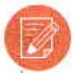
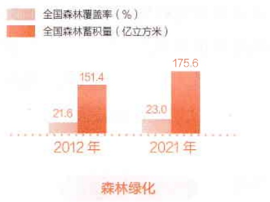
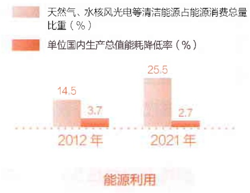
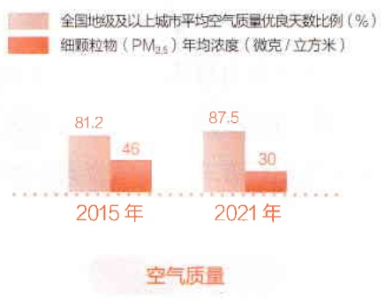
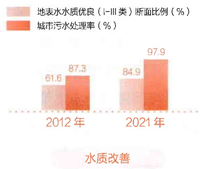
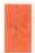

1. 2. 3. 4. 5. 6. 7. 8. 9. 10. 11. 12. 13. 14. 15. 16. 17. 18. 19. 20. 21. 22. 23. 24. 25. 26. 27. 28. 29. 30. 31. 32. 33. 34. 35. 36. 37. 38. 39. 40. 41. 42. 43. 44. 45. 46. 47. 48. 49. 50. 51. 52. 53. 54. 55. 56. 57. 58. 59. 60. 61. 62. 63. 64. 65. 66. 67. 68. 69. 70. 71. 72. 73. 74. 75. 76. 77. 78. 79. 80. 81. 82. 83. 84. 85. 86. 87. 88. 89. 90. 91. 92. 93. 94. 95. 96. 97. 98. 99. 100.

# 第十二章 建设社会主义生态文明

## 学习要点

1. 绿水青山就是金山银山的科学内涵

2. 建设美丽中国的主要任务

3. 全球环境治理的中国方案

生态环境是人类生存最为基础的条件，生态文明建设是关系中华民族永续发展的根本大计。党的十八大以来，以习近平同志为核心的党中央把生态文明建设纳入中国特色社会主义事业总体布局，牢固树立和践行绿水青山就是金山银山的理念，以前所未有的力度抓生态文明建设，推动生态环境保护发生历史性、转折性、全局性变化。要深入贯彻习近平生态文明思想，全面推进美丽中国建设，以高品质生态环境支撑高质量发展，加快推进人与自然和谐共生的现代化，共谋全球生态文明建设之路。

习近平生态文明思想的主要内容集中体现为“十个坚持”:坚持党对生态文明建设的全面领导；坚持生态兴则文明兴；坚持人与自然和谐共生；坚持绿水青山就是金山银山；坚持良好生态环境是最普惠的民生福祉；坚持绿色发展是发展观的深刻

---

242

第十二章 建设社会主义生态文明

革命；坚持统筹山水林田湖草沙系统治理；坚持用最严格制度最严密法治保护生态环境；坚持把建设美丽中国转化为全体人民自觉行动；坚持共谋全球生态文明建设之路。

## 第一节 坚持人与自然和谐共生

大自然是人类赖以生存发展的基本条件，尊重自然、顺应自然、保护自然是全面建设社会主义现代化国家的内在要求。习近平指出，“要像保护眼睛一样保护生态环境，像对待生命一样对待生态环境”①。必须站在中华民族永续发展的高度，坚持绿水青山就是金山银山的理念，推进生态文明建设和生态环境保护，建设人与自然和谐共生的现代化。

## 一、生态兴则文明兴

自然是生命之母，人与自然是生命共同体。人来源于自然，依赖于自然，在同自然的互动中生产、生活与发展。当人类友好保护自然时，自然的回报是慷慨的；当人类粗暴掠夺自然时，自然的惩罚也是无情的。人类对大自然的伤害最终会伤及人类自身，这是无法抗拒的规律。保护自然就是保护人类，建设生态文明就是造福人类。

生态环境变化直接影响文明的兴衰演替。习近平指出:“生态兴则文明兴，生态衰则文明衰。” $^{②}$ 古代埃及、古代巴比伦、古代印度、古代中国四大文明古国均发源于森林茂密、水量丰沛、田野肥沃的地区，而生态环境衰退特别是严重的土地荒漠化则导致古代埃及、古代巴比伦衰落。

<small>①《习近平著作选读》第二卷，人民出版社2023年版，第171页。</small>

<small>②《习近平谈治国理政》第三卷，外文出版社2020年版，第374页。</small>

The following is the following:

---

(1) \( \because {S}\_{\Delta ACD} = {S}\_{\Delta BCD} + {S}\_{\Delta CDE} = {S}\_{\Delta DDE} + {S}\_{\Delta EDE} + {S}\_{\Delta FDE} + {S}\_{\Delta GDE} + {S}\_{\Delta HDE} + {S}\_{\Delta IDE} + {S}\_{\Delta JDE} + {S}\_{\Delta KDE} + {S}\_{\Delta LDE} + {S}\_{\Delta MDE} + {S}\_{\Delta NDE} + {S}\_{\Delta ODE} + {S}\_{\Delta PDE} + {S}\_{\Delta QDE} + {S}\_{\Delta RDE} + {S}\_{\Delta SDE} + {S}\_{\Delta TDE} + {S}\_{\Delta UDE} + {S}\_{\Delta VDE} + {S}\_{\Delta WDE} + {S}\_{\Delta XDE} + {S}\_{\Delta YDE} + {S}\_{\Delta ZDE} + {S}\_{\Delta AADE} + {S}\_{\Delta ABDE} + {S}\_{\Delta ACDE} + {S}\_{\Delta ADDE} + {S}\_{\Delta AEDE} + {S}\_{\Delta AFDE} + {S}\_{\Delta AGDE} + {S}\_{\Delta AHDE} + {S}\_{\Delta AIDE} + {S}\_{\Delta AJDE} + {S}\_{\Delta AKDE} + {S}\_{\Delta ALDE} + {S}\_{\Delta AMDE} + {S}\_{\Delta ANDE} + {S}\_{\Delta AODE} + {S}\_{\Delta APDE} + {S}\_{\Delta AQDE} + {S}\_{\Delta ARDE} + {S}\_{\Delta ASDE} + {S}\_{\Delta ATDE} + {S}\_{\Delta AUDE} + {S}\_{\Delta AVDE} + {S}\_{\Delta AWDE} + {S}\_{\Delta AXDE} + {S}\_{\Delta AZDE} + {S}\_{\Delta BYDE} + {S}\_{\Delta BYDE} + {S}\_{\Delta BYDE} + {S}\_{\Delta BYDE} + {S}\_{\Delta BYDE} + {S}\_{\Delta BYDE} + {S}\_{\Delta BYDE} + {S}\_{\Delta BYDE} + {S}\_{\Delta BYDE} + {S}\_{\Delta BYDE} + {S}\_{\Delta BYDE} + {S}\_{\Delta BYDE} + {S}\_{\Delta BYDE} + {S}\_{\Delta BYDE} + {S}\_{\Delta BYDE} + {S}\_{\Delta BYDE} + {S}\_{\Delta BYDE} + {S}\_{\Delta BYDE} + {S}\_{\Delta BYDE} + {S}\_{\Delta BYDE} + {S}\_{\Delta BYDE} + {S}\_{\Delta BYDE} + {S}\_{\Delta BYDE} + {S}\_{\Delta BYDE} + {S}\_{\Delta BYDE} + {S}\_{\Delta BYDE} + {S}\_{\Delta BYDE} + {S}\_{\Delta BYDE} + {S}\_{\Delta BYDE} + {S}\_{\Delta BYDE} + {S}\_{\Delta BYDE} + {S}\_{\Delta BYDE} + {S}\_{\Delta BYDE} + {S}\_{\Delta BYDE} + {S}\_{\Delta BYDE} + {S}\_{\Delta BYDE} + {S}\_{\Delta BYDE} + {S}\_{\Delta BYDE} + {S}\_{\Delta BYDE} + {S}\_{\Delta BYDE} + {S}\_{\Delta BYDE} + {S}\_{\Delta BYDE} + {S}\_{\Delta BYDE} + {S}\_{\Delta BYDE} + {S}\_{\Delta BYDE} + {S}\_{\Delta BYDE} + {S}\_{\Delta BYDE} + {S}\_{\Delta BYDE} + {S}\_{\Delta BYDE} + {S}\_{\Delta BYDE} + {S}\_{\Delta BYDE} + {S}\_{\Delta BYDE} + {S}\_{\Delta BYDE} + {S}\_{\Delta BYDE} + {S}\_{\Delta BYDE} + {S}\_{\Delta BYDE} + {S}\_{\Delta BYDE} + {S}\_{\Delta BYDE} + {S}\_{\Delta BYDE} + {S}\_{\Delta BYDE} + {S}\_{\Delta BYDE} + {S}\_{\Delta BYDE} + {S}\_{\Delta BYDE} + {S}\_{\Delta BYDE} + {S}\_{\Delta BYDE} + {S}\_{\Delta BYDE} + {S}\_{\Delta BYDE} + {S}\_{\Delta BYDE} + {S}\_{\Delta BYDE} + {S}\_{\Delta BYDE} + {S}\_{\Delta BYDE} + {S}\_{\Delta BYDE} + {S}\_{\Delta BYDE} + {S}\_{\Delta BYDE} + {S}\_{\Delta BYDE} + {S}\_{\Delta BYDE} + {S}\_{\Delta BYDE} + {S}\_{\Delta BYDE} + {S}\_{\Delta BYDE} + {S}\_{\Delta BYDE} + {S}\_{\Delta BYDE} + {S}\_{\Delta BYDE} + {S}\_{\Delta BYDE} + {S}\_{\Delta BYDE} + {S}\_{\Delta BYDE} + {S}\_{\Delta BYDE} + {S}\_{\Delta BYDE} + {S}\_{\Delta BYDE} + {S}\_{\Delta BYDE} + {S}\_{\Delta BYDE} + {S}\_{\Delta BYDE} + {S}\_{\Delta BYDE} + {S}\_{\Delta BYDE} + {S}\_{\Delta BYDE} + {S}\_{\Delta BYDE} + {S}\_{\Delta BYDE} + {S}\_{\Delta BYDE} + {S}\_{\Delta BYDE} + {S}\_{\Delta BYDE} + {S}\_{\Delta BYDE} + {S}\_{\Delta BYDE} + {S}\_{\Delta BYDE} + {S}\_{\Delta BYDE} + {S}\_{\Delta BYDE} + {S}\_{\Delta BYDE} + {S}\_{\Delta BYDE} + {S}\_{\Delta BYDE} + {S}\_{\Delta BYDE} + {S}\_{\Delta BYDE} + {S}\_{\Delta BYDE} + {S}\_{\Delta BYDE} + {S}\_{\Delta BYDE} + {S}\_{\Delta BYDE} + {S}\_{\Delta BYDE} + {S}\_{\Delta BYDE} + {S}\_{\Delta BYDE} + {S}\_{\Delta BYDE} + {S}\_{\Delta BYDE} + {S}\_{\Delta BYDE} + {S}\_{\Delta BYDE} + {S}\_{\Delta BYDE} + {S}\_{\Delta BYDE} + {S}\_{\Delta BYDE} + {S}\_{\Delta BYDE} + {S}\_{\Delta BYDE} + {S}\_{\Delta BYDE} + {S}\_{\Delta BYDE} + {S}\_{\Delta BYDE} + {S}\_{\Delta BYDE} + {S}\_{\Delta BYDE} + {S}\_{\Delta BYDE} + {S}\_{\Delta BYDE} + {S}\_{\Delta BYDE} + {S\_{A B C D}} + {S\_{B C D}} + {S\_{C C D}} + {S\_{D C D}} + {S\_{E C D}} + {S\_{F C D}} + {S\_{G C D}} + {S\_{H C D}} + {S\_{I C D}} + {S\_{J C D}} + {S\_{K C D}} + {S\_{L C D}} + {S\_{M C D}} + {S\_{N C D}} + {S\_{O C D}} + {S\_{P C D}} + {S\_{Q C D}} + {S\_{R C D}} + {S\_{S C D}} + {S\_{T C D}} + {S\_{U C D}} + {S\_{V C D}} + {S\_{W C D}} + {S\_{X C D}} + {S\_{Y C D}} + {S\_{Z C D}} + {S\_{A D E}} + {S\_{B E D}} + {S\_{C E D}} + {S\_{D E D}} + {S\_{E E D}} + {S\_{F E D}} + {S\_{G E D}} + {S\_{H E D}} + {S\_{I E D}} + {S\_{J E D}} + {S\_{K E D}} + {S\_{L E D}} + {S\_{M E D}} + {S\_{N E D}} + {S\_{O E D}} + {S\_{P E D}} + {S\_{Q E D}} + {S\_{R E D}} + {S\_{S E D}} + {S\_{T E D}} + {S\_{U E D}} + {S\_{V E D}} + {S\_{W E D}} + {S\_{X E D}} + {S\_{Y E D}} + {S\_{Z E D}} + {S\_{A D E}} + {S\_{B E D}} + {S\_{C E D}} + {S\_{D E D}} + {S\_{E E D}} + {S\_{F E D}} + {S\_{G E D}} + {S\_{H E D}} + {S\_{I E D}} + {S\_{J E D}} + {S\_{K E D}} + {S\_{L E D}} + {S\_{M E D}} + {S\_{N E D}} + {S\_{O E D}} + {S\_{P E D}} + {S\_{Q E D}} + {S\_{R E D}} + {S\_{S E D}} + {S\_{T E D}} + {S\_{U E D}} + {S\_{V E D}} + {S\_{W E D}} + {S\_{X E D}} + {S\_{Y E D}} + {S\_{Z E D}} + {S\_{A D E}} + {S\_{B E D}} + {S\_{C E D}} + {S\_{D E D}} + {S\_{E E D}} + {S\_{F E D}} + {S\_{G E D}} + {S\_{H E D}} + {S\_{I E D}} + {S\_{J E D}} + {S\_{K E D}} + {S\_{L E D}} + {S\_{M E D}} + {S\_{N E D}} + {S\_{O E D}} + {S\_{P E D}} + {S\_{Q E D}} + {S\_{R E D}} + {S\_{S E D}} + {S\_{T E D}} + {S\_{U E D}} + {S\_{V E D}} + {S\_{W E D}} + {S\_{X E D}} + {S\_{Y E D}} + {S\_{Z E D}} + {S\_{A D E}} + {S\_{B E D}} + {S\_{C E D}} + {S\_{D E D}} + {S\_{E E D}} + {S\_{F E D}} + {S\_{G E D}} + {S\_{H E D}} + {S\_{I E D}} + {S\_{J E D}} + {S\_{K E D}} + {S\_{L E D}} + {S\_{M E D}} + {S\_{N E D}} + {S\_{O E D}} + {S\_{P E D}} + {S\_{Q E D}} + {S\_{R E D}} + {S\_{S E D}} + {S\_{T E D}} + {S\_{U E D}} + {S\_{V E D}} + {S\_{W E D}} + {S\_{X E D}} + {S\_{Y E D}} + {S\_{Z E D}} + {S\_{A D E}} + {S\_{B E D}} + {S\_{C E D}} + {S\_{D E D}} + {S\_{E E D}} + {S\_{F E D}} + {S\_{G E D}} + {S\_{H E D}} + {S\_{I E D}} + {S\_{J E D}} + {S\_{K E D}} + {S\_{L E D}} + {S\_{M E D}} + {S\_{N E D}} + {S\_{O E D}} + {S\_{P E D}} + {S\_{Q E D}} + {S\_{R E D}} + {S\_{S E D}} + {S\_{T E D}} + {S\_{U E D}} + {S\_{V E D}} + {S\_{W E D}} + {S\_{X E D}} + {S\_{Y E D}} + {S\_{Z E D}} + {S\_{A D E}} + {S\_{B E D}} + {S\_{C E D}} + {S\_{D E D}} + {S\_{E E D}} + {S\_{F E D}} + {S\_{G E D}} + {S\_{H E D}} + {S\_{I E D}} + {S\_{J E D}} + {S\_{K E D}} + {S\_{L E D}} + {S\_{M E D}} + {S\_{N E D}} + {S\_{O E D}} + {S\_{P E D}} + {S\_{Q E D}} + {S\_{R E D}} + {S\_{S E D}} + {S\_{T E D}} + {S\_{U E D}} + {S\_{V E D}} + {S\_{W E D}} + {S\_{X E D}} + {S\_{Y E D}} + {S\_{Z E D}} + {S\_{A D E}} + {S\_{B E D}} + {S\_{C E D}} + {S\_{D E D}} + {S\_{E E D}} + {S\_{F E D}} + {S\_{G E D}} + {S\_{H E D}} + {S\_{I E D}} + {S\_{J E D}} + {S\_{K E D}} + {S\_{L E D}} + {S\_{M E D}} + {S\_{N E D}} + {S\_{O E D}} + {S\_{P E D}} + {S\_{Q E D}} + {S\_{R E D}} + {S\_{S E D}} + {S\_{T E D}} + {S\_{U E D}} + {S\_{V E D}} + {S\_{W E D}} + {S\_{X E D}} + {S\_{Y E D}} + {S\_{Z E D}} + {S\_{A D E}} + {S\_{B E D}} + {S\_{C E D}} + {S\_{D E D}} + {S\_{E E D}} + {S\_{F E D}} + {S\_{G E D}} + {S\_{H E D}} + {S\_{I E D}} + {S\_{J E D}} + {S\_{K E D}} + {S\_{L E D}} + {S\_{M E D}} + {S\_{N E D}} + {S\_{O E D}} + {S\_{P E D}} + {S\_{Q E D}} + {S\_{R E D}} + {S\_{S E D}} + {S\_{T E D}} + {S\_{U E D}} + {S\_{V E D}} + {S\_{W E D}} + {S\_{X E D}} + {S\_{Y E D}} + {S\_{Z E D}} + {S\_{A D E}} + {S\_{B E D}} + {S\_{C E D}} + {S\_{D E D}} + {S\_{E E D}} + {S\_{F E D}} + {S\_{G E D}} + {S\_{H E D}} + {S\_{I E D}} + {S\_{J E D}} + {S\_{K E D}} + {S\_{L E D}} + {S\_{M E D}} + {S\_{N E D}} + {S\_{O E D}} + {S\_{P E D}} + {S\_{Q E D}} + {S\_{R E D}} + {S\_{S E D}} + {S\_{T E D}} + {S\_{U E D}} + {S\_{V E D}} + {S\_{W E D}} + {S\_{X E D}} + {S\_{Y E D}} + {S\_{Z E D}} + {S\_{A D E}} + {S\_{B E D}} + {S\_{C E D}} + {S\_{D E D}} + {S\_{E E D}} + {S\_{F E D}} + {S\_{G E D}} + {S\_{H E D}} + {S\_{I E D}} + {S\_{J E D}} + {S\_{K E D}} + {S\_{L E D}} + {S\_{M E D}} + {S\_{N E D}} + {S\_{O E D}} + {S\_{P E D}} + {S\_{Q E D}} + {S\_{R E D}} + {S\_{S E D}} + {S\_{T E D}} + {S\_{U E D}} + {S\_{V E D}} + {S\_{W E D}} + {S\_{X E D}} + {S\_{Y E D}} + {S\_{Z E D}} + {S\_{A D E}} + {S\_{B E D}} + {S\_{C E D}} + {S\_{D E D}} + {S\_{E E D}} + {S\_{F E D}} + {S\_{G E D}} + {S\_{H E D}} + {S\_{I E D}} + {S\_{J E D}} + {S\_{K E D}} + {S\_{L E D}} + {S\_{M E D}} + {S\_{N E D}} + {S\_{O E D}} + {S\_{P E D}} + {S\_{Q E D}} + {S\_{R E D}} + {S\_{S E D}} + {S\_{T E D}} + {S\_{U E D}} + {S\_{V E D}} + {S\_{W E D}} + {S\_{X E D}} + {S\_{Y E D}} + {S\_{Z E D}} + {S\_{A D E}} + {S\_{B E D}} + {S\_{C E D}} + {S\_{D E D}} + {S\_{E E D}} + {S\_{F E D}} + {S\_{G E D}} + {S\_{H E D}} + {S\_{I E D}} + {S\_{J E D}} + {S\_{K E D}} + {S\_{L E D}} + {S\_{M E D}} + {S\_{N E D}} + {S\_{O E D}} + {S\_{P E D}} + {S\_{Q E D}} + {S\_{R E D}} + {S\_{S E D}} + {S\_{T E D}} + {S\_{U E D}} + {S\_{V E D}} + {S\_{W E D}} + {S\_{X E D}} + {S\_{Y E D}} + {S\_{Z E D}} + {S\_{A D E}} + {S\_{B E D}} + {S\_{C E D}} + {S\_{D E D}} + {S\_{E E D}} + {S\_{F E D}} + {S\_{G E D}} + {S\_{H E D}} + {S\_{I E D}} + {S\_{J E D}} + {S\_{K E D}} + {S\_{L E D}} + {S\_{M E D}} + {S\_{N E D}} + {S\_{O E D}} + {S\_{P E D}} + {S\_{Q E D}} + {S\_{R E D}} + {S\_{S E D}} + {S\_{T E D}} + {S\_{U E D}} + {S\_{V E D}} + {S\_{W E D}} + {S\_{X E D}} + {S\_{Y E D}} + {S\_{Z E D}} + {S\_{A D E}} + {S\_{B E D}} + {S\_{C E D}} + {S\_{D E D}} + {S\_{E E D}} + {S\_{F E D}} + {S\_{G E D}} + {S\_{H E D}} + {S\_{I E D}} + {S\_{J E D}} + {S\_{K E D}} + {S\_{L E D}} + {S\_{M E D}} + {S\_{N E D}} + {S\_{O E D}} + {S\_{P E D}} + {S\_{Q E D}} + {S\_{R E D}} + {S\_{S E D}} + {S\_{T E D}} + {S\_{U E D}} + {S\_{V E D}} + {S\_{W E D}} + {S\_{X E D}} + {S\_{Y E D}} + {S\_{Z E D}} + {S\_{A D E}} + {S\_{B E D}} + {S\_{C E D}} + {S\_{D E D}} + {S\_{E E D}} + {S\_{F E D}} + {S\_{G E D}} + {S\_{H E D}} + {S\_{I E D}} + {S\_{J E D}} + {S\_{K E D}} + {S\_{L E D}} + {S\_{M E D}} + {S\_{N E D}} + {S\_{O E D}} + {S\_{P E D}} + {S\_{Q E D}} + {S\_{R E D}} + {S\_{S E D}} + {S\_{T E D}} + {S\_{U E D}} + {S\_{V E D}} + {S\_{W E D}} + {S\_{X E D}} + {S\_{Y E D}} + {S\_{Z E D}} + {S\_{A D E}} + {S\_{B E D}} + {S\_{C E D}} + {S\_{D E D}} + {S\_{E E D}} + {S\_{F E D}} + {S\_{G E D}} + {S\_{H E D}} + {S\_{I E D}} + {S\_{J E D}} + {S\_{K E D}} + {S\_{L E D}} + {S\_{M E D}} + {S\_{N E D}} + {S\_{O E D}} + {S\_{P E D}} + {S\_{Q E D}} + {S\_{R E D}} + {S\_{S E D}} + {S\_{T E D}} + {S\_{U E D}} + {S\_{V E D}} + {S\_{W E D}} + {S\_{X E D}} + {S\_{Y E D}} + {S\_{Z E D}} + {S\_{A D E}} + {S\_{B E D}} + {S\_{C E D}} + {S\_{D E D}} + {S\_{E E D}} + {S\_{F E D}} + {S\_{G E D}} + {S\_{H E D}} + {S\_{I E D}} + {S\_{J E D}} + {S\_{K E D}} + {S\_{L E D}} + {S\_{M E D}} + {S\_{N E D}} + {S\_{O E D}} + {S\_{P E D}} + {S\_{Q E D}} + {S\_{R E D}} + {S\_{S E D}} + {S\_{T E D}} + {S\_{U E D}} + {S\_{V E D}} + {S\_{W E D}} + {S\_{X E D}} + {S\_{Y E D}} + {S\_{Z E D}} + {S\_{A D E}} + {S\_{B E D}} + {S\_{C E D}} + {S\_{D E D}} + {S\_{E E D}} + {S\_{F E D}} + {S\_{G E D}} + {S\_{H E D}} + {S\_{I E D}} + {S\_{J E D}} + {S\_{K E D}} + {S\_{L E D}} + {S\_{M E D}} + {S\_{N E D}} + {S\_{O E D}} + {S\_{P E D}} + {S\_{Q E D}} + {S\_{R E D}} + {S\_{S E D}} + {S\_{T E D}} + {S\_{U E D}} + {S\_{V E D}} + {S\_{W E D}} + {S\_{X E D}} + {S\_{Y E D}} + {S\_{Z E D}} + {S\_{A D E}} + {S\_{B E D}} + {S\_{C E D}} + {S\_{D E D}} + {S\_{E E D}} + {S\_{F E D}} + {S\_{G E D}} + {S\_{H E D}} + {S\_{I E D}} + {S\_{J E D}} + {S\_{K E D}} + {S\_{L E D}} + {S\_{M E D}} + {S\_{N E D}} + {S\_{O E D}} + {S\_{P E D}} + {S\_{Q E D}} + {S\_{R E D}} + {S\_{S E D}} + {S\_{T E D}} + {S\_{U E D}} + {S\_{V E D}} + {S\_{W E D}} + {S\_{X E D}} + {S\_{Y E D}} + {S\_{Z E D}} + {S\_{A D E}} + {S\_{B E D}} + {S\_{C E D}} + {S\_{D E D}} + {S\_{E E D}} + {S\_{F E D}} + {S\_{G E D}} + {S\_{H E D}} + {S\_{I E D}} + {S\_{J E D}} + {S\_{K E D}} + {S\_{L E D}} + {S\_{M E D}} + {S\_{N E D}} + {S\_{O E D}} + {S\_{P E D}} + {S\_{Q E D}} + {S\_{R E D}} + {S\_{S E D}} + {S\_{T E D}} + {S\_{U E D}} + {S\_{V E D}} + {S\_{W E D}} + {S\_{X E D}} + {S\_{Y E D}} + {S\_{Z E D}} + {S\_{A D E}} + {S\_{B E D}} + {S\_{C E D}} + {S\_{D E D}} + {S\_{E E D}} + {S\_{F E D}} + {S\_{G E D}} + {S\_{H E D}} + {S\_{I E D}} + {S\_{J E D}} + {S\_{K E D}} + {S\_{L E D}} + {S\_{M E D}} + {S\_{N E D}} + {S\_{O E D}} + {S\_{P E D}} + {S\_{Q E D}} + {S\_{R E D}} + {S\_{S E D}} + {S\_{T E D}} + {S\_{U E D}} + {S\_{V E D}} + {S\_{W E D}} + {S\_{X E D}} + {S\_{Y E D}} + {S\_{Z E D}} + {S\_{A D E}} + {S\_{B E D}} + {S\_{C E D}} + {S\_{D E D}} + {S\_{E E D}} + {S\_{F E D}} + {S\_{G E D}} + {S\_{H E D}} + {S\_{I E D}} + {S\_{J E D}} + {S\_{K E D}} + {S\_{L E D}} + {S\_{M E D}} + {S\_{N E D}} + {S\_{O E D}} + {S\_{P E D}} + {S\_{Q E D}} + {S\_{R E D}} + {S\_{S E D}} + {S\_{T E D}} + {S\_{U E D}} + {S\_{V E D}} + {S\_{W E D}} + {S\_{X E D}} + {S\_{Y E D}} + {S\_{Z E D}} + {S\_{A D E}} + {S\_{B E D}} + {S\_{C E D}} + {S\_{D E D}} + {S\_{E E D}} + {S\_{F E D}} + {S\_{G E D}} + {S\_{H E D}} + {S\_{I E D}} + {S\_{J E D}} + {S\_{K E D}} + {S\_{L E D}} + {S\_{M E D}} + {S\_{N E D}} + {S\_{O E D}} + {S\_{P E D}} + {S\_{Q E D}} + {S\_{R E D}} + {S\_{S E D}} + {S\_{T E D}} + {S\_{U E D}} + {S\_{V E D}} + {S\_{W E D}} + {S\_{X E D}} + {S\_{Y E D}} + {S\_{Z E D}} + {S\_{A D E}} + {S\_{B E D}} + {S\_{C E D}} + {S\_{D E D}} + {S\_{E E D}} + {S\_{F E D}} + {S\_{G E D}} + {S\_{H E D}} + {S\_{I E D}} + {S\_{J E D}} + {S\_{K E D}} + {S\_{L E D}} + {S\_{M E D}} + {S\_{N E D}} + {S\_{O E D}} + {S\_{P E D}} + {S\_{Q E D}} + {S\_{R E D}} + {S\_{S E D}} + {S\_{T E D}} + {S\_{U E D}} + {S\_{V E D}} + {S\_{W E D}} + {S\_{X E D}} + {S\_{Y E D}} + {S\_{Z E D}} + {S\_{A D E}} + {S\_{B E D}} + {S\_{C E D}} + {S\_{D E D}} + {S\_{E E D}} + {S\_{F E D}} + {S\_{G E D}} + {S\_{H E D}} + {S\_{I E D}} + {S\_{J E D}} + {S\_{K E D}} + {S\_{L E D}} + {S\_{M E D}} + {S\_{N E D}} + {S\_{O E D}} + {S\_{P E D}} + {S\_{Q E D}} + {S\_{R E D}} + {S\_{S E D}} + {S\_{T E D}} + {S\_{U E D}} + {S\_{V E D}} + {S\_{W E D}} + {S\_{X E D}} + {S\_{Y E D}} + {S\_{Z E D}} + {S\_{A D E}} + {S\_{B E D}} + {S\_{C E D}} + {S\_{D E D}} + {S\_{E E D}} + {S\_{F E D}} + {S\_{G E D}} + {S\_{H E D}} + {S\_{I E D}} + {S\_{J E D}} + {S\_{K E D}} + {S\_{L E D}} + {S\_{M E D}} + {S\_{N E D}} + {S\_{O E D}} + {S\_{P E D}} + {S\_{Q E D}} + {S\_{R E D}} + {S\_{S E D}} + {S\_{T E D}} + {S\_{U E D}} + {S\_{V E D}} + {S\_{W E D}} + {S\_{X E D}} + {S\_{Y E D}} + {S\_{Z E D}} + {S\_{A D E}} + {S\_{B E D}} + {S\_{C E D}} + {S\_{D E D}} + {S\_{E E D}} + {S\_{F E D}} + {S\_{G E D}} + {S\_{H E D}} + {S\_{I E D}} + {S\_{J E D}} + {S\_{K E D}} + {S\_{L E D}} + {S\_{M E D}} + {S\_{N E D}} + {S\_{O E D}} + {S\_{P E D}} + {S\_{Q E D}} + {S\_{R E D}} + {S\_{S E D}} + {S\_{T E D}} + {S\_{U E D}} + {S\_{V E D}} + {S\_{W E D}} + {S\_{X E D}} + {S\_{Y E D}} + {S\_{Z E D}} + {S\_{A D E}} + {S\_{B E D}} + {S\_{C E D}} + {S\_{D E D}} + {S\_{E E D}} + {S\_{F E D}} + {S\_{G E D}} + {S\_{H E D}} + {S\_{I E D}} + {S\_{J E D}} + {S\_{K E D}} + {S\_{L E D}} + {S\_{M E D}} + {S\_{N E D}} + {S\_{O E D}} + {S\_{P E D}} + {S\_{Q E D}} + {S\_{R E D}} + {S\_{S E D}} + {S\_{T E D}} + {S\_{U E D}} + {S\_{V E D}} + {S\_{W E D}} + {S\_{X E D}} + {S\_{Y E D}} + {S\_{Z E D}} + {S\_{A D E}} + {S\_{B E D}} + {S\_{C E D}} + {S\_{D E D}} + {S\_{E E D}} + {S\_{F E D}} + {S\_{G E D}} + {S\_{H E D}} + {S\_{I E D}} + {S\_{J E D}} + {S\_{K E D}} + {S\_{L E D}} + {S\_{M E D}} + {S\_{N E D}} + {S\_{O E D}} + {S\_{P E D}} + {S\_{Q E D}} + {S\_{R E D}} + {S\_{S E D}} + {S\_{T E D}} + {S\_{U E D}} + {S\_{V E D}} + {S\_{W E D}} + {S\_{X E D}} + {S\_{Y E D}} + {S\_{Z E D}} + {S\_{A D E}} + {S\_{B E D}} + {S\_{C E D}} + {S\_{D E D}} + {S\_{E E D}} + {S\_{F E D}} + {S\_{G E D}} + {S\_{H E D}} + {S\_{I E D}} + {S\_{J E D}} + {S\_{K E D}} + {S\_{L E D}} + {S\_{M E D}} + {S\_{N E D}} + {S\_{O E D}} + {S\_{P E D}} + {S\_{Q E D}} + {S\_{R E D}} + {S\_{S E D}} + {S\_{T E D}} + {S\_{U E D}} + {S\_{V E D}} + {S\_{W E D}} + {S\_{X E D}} + {S\_{Y E D}} + {

第一节 坚持人与自然和谐共生

243

恩格斯在《自然辩证法》中写道，“美索不达米亚、希腊、小亚细亚以及其他各地的居民，为了得到耕地，毁灭了森林，但是他们做梦也想不到，这些地方今天竟因此而成为不毛之地”①。我国古代一些地区也有过惨痛教训。河西走廊、黄土高原都曾经水丰草茂，由于毁林开荒、乱砍滥伐，致使生态环境遭到严重破坏，加剧了经济衰落。唐代中叶以来我国经济中心逐步向东、向南转移，很大程度上同西部地区生态环境变迁有关。历史表明，人类文明的发展离不开良好生态环境这个根本基础。

生态文明是人类文明发展的历史趋势。自人类社会诞生以来，伴随着人类认识自然、改造自然能力的不断增强，人类经历了原始文明、农业文明、工业文明，人与自然的关系也经历了相应的变化。在工业文明时代，科学技术的进步使得自然界不再具有以往的神秘和威力，传统工业化迅猛发展，在创造巨大物质财富的同时也加速了对自然资源的攫取，打破了地球生态系统原有的循环和平衡，造成人与自然关系紧张。生态文明是工业文明发展到一定阶段的产物，是人类社会进步的重大成果。生态文明强调协调人与自然关系，要求解决好工业文明带来的矛盾，把人类活动限制在生态环境能够承受的限度内，顺应了人与自然和谐发展的新要求，昭示着人类文明发展的未来。

中华民族向来尊重自然、热爱自然，绵延5000多年的中华文明孕育着丰富的生态文化。“天地与我并生，而万物与我为一”的“天人合一”思想是中华文明的鲜明特色和独特标识，代表着我们祖先对处理人与自然关系的重要认识。改革开放以来，我国经济发展取得巨大成就，也积累了大量生态环境问题。我国环境容量有限，生态系统脆弱，资源环境约束趋紧、生态系统退化等问题越来越突出，特别是各类环境污染、生态破坏呈高发态势。如果不抓紧扭转生态环境恶化趋势，必将付出极其沉重的代价。必须清醒认识保护生态环境、治理环境污染的紧迫性和艰

<small>①《马克思恩格斯选集》第三卷，人民出版社2012年版，第998页。</small>

---

244

第十二章 建设社会主义生态文明

巨性，以为子孙万代计、为长远发展谋的态度和责任，积极有效应对各种风险挑战，真正下决心把环境污染治理好、把生态环境建设好，守牢美丽中国建设安全底线，坚定不移走生产发展、生活富裕、生态良好的文明发展道路。

## 二、绿水青山就是金山银山

生态环境问题归根到底是经济发展方式和生活方式问题。绿水青山就是金山银山，这是重要的发展理念，也是推进现代化建设的重大原则。这一理念，阐明了经济发展与生态环境保护之间的关系，揭示了保护生态环境就是保护生产力、改善生态环境就是发展生产力的道理，指明了实现发展和保护协同共生的新路径。

表面上看，生态环境保护和经济发展是矛盾对立的关系，是鱼和熊掌不可兼得的两难选择。但从根本上讲，二者是辩证统一、相辅相成的关系。发展经济不能对资源和生态环境竭泽而渔，生态环境保护也不是舍弃经济发展而缘木求鱼，而是要坚持在发展中保护、在保护中发展。习近平指出:“我们既要绿水青山，也要金山银山。宁要绿水青山，不要金山银山，而且绿水青山就是金山银山。” $^{①}$ 实践证明，经济发展不能以破坏生态为代价，不能把生态环境保护和经济发展割裂开来，更不能对立起来。发展是硬道理，但绝不能不考虑或者很少考虑环境的承载能力，绝不能一味索取资源。

绿水青山既是自然财富、生态财富，又是社会财富、经济财富。“草木植成，国之富也。”巍巍高山、茫茫草原、茂密森林、碧海蓝天、洁净沙滩、湖泊湿地、冰天雪地等都是大自然的慷慨馈赠，也是人类永续发展的最大本钱。绿水青山可带来金山银山，但金山银山却买不到绿水青山

<small>①《习近平关于社会主义生态文明建设论述摘编》，中央文献出版社2017年版，第21页。</small>

[1]

---

(1) \( \because {S}\_{\Delta ACD} = {S}\_{\Delta BCD} + {S}\_{\Delta CDE} = {S}\_{\Delta DDE} + {S}\_{\Delta EDE} + {S}\_{\Delta FDE} + {S}\_{\Delta GDE} + {S}\_{\Delta HDE} + {S}\_{\Delta IDE} + {S}\_{\Delta JDE} + {S}\_{\Delta KDE} + {S}\_{\Delta LDE} + {S}\_{\Delta MDE} + {S}\_{\Delta NDE} + {S}\_{\Delta ODE} + {S}\_{\Delta PDE} + {S}\_{\Delta QDE} + {S}\_{\Delta RDE} + {S}\_{\Delta SDE} + {S}\_{\Delta TDE} + {S}\_{\Delta UDE} + {S}\_{\Delta VDE} + {S}\_{\Delta WDE} + {S}\_{\Delta XDE} + {S}\_{\Delta YDE} + {S}\_{\Delta ZDE} + {S}\_{\Delta AADE} + {S}\_{\Delta ABDE} + {S}\_{\Delta ACDE} + {S}\_{\Delta ADDE} + {S}\_{\Delta AEDE} + {S}\_{\Delta AFDE} + {S}\_{\Delta AGDE} + {S}\_{\Delta AHDE} + {S}\_{\Delta AIDE} + {S}\_{\Delta AJDE} + {S}\_{\Delta AKDE} + {S}\_{\Delta ALDE} + {S}\_{\Delta AMDE} + {S}\_{\Delta ANDE} + {S}\_{\Delta AODE} + {S}\_{\Delta APDE} + {S}\_{\Delta AQDE} + {S}\_{\Delta ARDE} + {S}\_{\Delta ASDE} + {S}\_{\Delta ATDE} + {S}\_{\Delta AUDE} + {S}\_{\Delta AVDE} + {S}\_{\Delta AWDE} + {S}\_{\Delta AXDE} + {S}\_{\Delta AZDE} + {S}\_{\Delta BYDE} + {S}\_{\Delta BYDE} + {S}\_{\Delta BYDE} + {S}\_{\Delta BYDE} + {S}\_{\Delta BYDE} + {S}\_{\Delta BYDE} + {S}\_{\Delta BYDE} + {S}\_{\Delta BYDE} + {S}\_{\Delta BYDE} + {S}\_{\Delta BYDE} + {S}\_{\Delta BYDE} + {S}\_{\Delta BYDE} + {S}\_{\Delta BYDE} + {S}\_{\Delta BYDE} + {S}\_{\Delta BYDE} + {S}\_{\Delta BYDE} + {S}\_{\Delta BYDE} + {S}\_{\Delta BYDE} + {S}\_{\Delta BYDE} + {S}\_{\Delta BYDE} + {S}\_{\Delta BYDE} + {S}\_{\Delta BYDE} + {S}\_{\Delta BYDE} + {S}\_{\Delta BYDE} + {S}\_{\Delta BYDE} + {S}\_{\Delta BYDE} + {S}\_{\Delta BYDE} + {S}\_{\Delta BYDE} + {S}\_{\Delta BYDE} + {S}\_{\Delta BYDE} + {S}\_{\Delta BYDE} + {S}\_{\Delta BYDE} + {S}\_{\Delta BYDE} + {S}\_{\Delta BYDE} + {S}\_{\Delta BYDE} + {S}\_{\Delta BYDE} + {S}\_{\Delta BYDE} + {S}\_{\Delta BYDE} + {S}\_{\Delta BYDE} + {S}\_{\Delta BYDE} + {S}\_{\Delta BYDE} + {S}\_{\Delta BYDE} + {S}\_{\Delta BYDE} + {S}\_{\Delta BYDE} + {S}\_{\Delta BYDE} + {S}\_{\Delta BYDE} + {S}\_{\Delta BYDE} + {S}\_{\Delta BYDE} + {S}\_{\Delta BYDE} + {S}\_{\Delta BYDE} + {S}\_{\Delta BYDE} + {S}\_{\Delta BYDE} + {S}\_{\Delta BYDE} + {S}\_{\Delta BYDE} + {S}\_{\Delta BYDE} + {S}\_{\Delta BYDE} + {S}\_{\Delta BYDE} + {S}\_{\Delta BYDE} + {S}\_{\Delta BYDE} + {S}\_{\Delta BYDE} + {S}\_{\Delta BYDE} + {S}\_{\Delta BYDE} + {S}\_{\Delta BYDE} + {S}\_{\Delta BYDE} + {S}\_{\Delta BYDE} + {S}\_{\Delta BYDE} + {S}\_{\Delta BYDE} + {S}\_{\Delta BYDE} + {S}\_{\Delta BYDE} + {S}\_{\Delta BYDE} + {S}\_{\Delta BYDE} + {S}\_{\Delta BYDE} + {S}\_{\Delta BYDE} + {S}\_{\Delta BYDE} + {S}\_{\Delta BYDE} + {S}\_{\Delta BYDE} + {S}\_{\Delta BYDE} + {S}\_{\Delta BYDE} + {S}\_{\Delta BYDE} + {S}\_{\Delta BYDE} + {S}\_{\Delta BYDE} + {S}\_{\Delta BYDE} + {S}\_{\Delta BYDE} + {S}\_{\Delta BYDE} + {S}\_{\Delta BYDE} + {S}\_{\Delta BYDE} + {S}\_{\Delta BYDE} + {S}\_{\Delta BYDE} + {S}\_{\Delta BYDE} + {S}\_{\Delta BYDE} + {S}\_{\Delta BYDE} + {S}\_{\Delta BYDE} + {S}\_{\Delta BYDE} + {S}\_{\Delta BYDE} + {S}\_{\Delta BYDE} + {S}\_{\Delta BYDE} + {S}\_{\Delta BYDE} + {S}\_{\Delta BYDE} + {S}\_{\Delta BYDE} + {S}\_{\Delta BYDE} + {S}\_{\Delta BYDE} + {S}\_{\Delta BYDE} + {S}\_{\Delta BYDE} + {S}\_{\Delta BYDE} + {S}\_{\Delta BYDE} + {S}\_{\Delta BYDE} + {S}\_{\Delta BYDE} + {S}\_{\Delta BYDE} + {S}\_{\Delta BYDE} + {S}\_{\Delta BYDE} + {S}\_{\Delta BYDE} + {S}\_{\Delta BYDE} + {S}\_{\Delta BYDE} + {S}\_{\Delta BYDE} + {S}\_{\Delta BYDE} + {S}\_{\Delta BYDE} + {S}\_{\Delta BYDE} + {S}\_{\Delta BYDE} + {S}\_{\Delta BYDE} + {S}\_{\Delta BYDE} + {S}\_{\Delta BYDE} + {S}\_{\Delta BYDE} + {S}\_{\Delta BYDE} + {S}\_{\Delta BYDE} + {S}\_{\Delta BYDE} + {S}\_{\Delta BYDE} + {S}\_{\Delta BYDE} + {S}\_{\Delta BYDE} + {S}\_{\Delta BYDE} + {S}\_{\Delta BYDE} + {S}\_{\Delta BYDE} + {S}\_{\Delta BYDE} + {S}\_{\Delta BYDE} + {S\_{A B D}} + {S\_{B A D}} + {S\_{C A D}} + {S\_{D A D}} + {S\_{E A D}} + {S\_{F A D}} + {S\_{G A D}} + {S\_{H A D}} + {S\_{I A D}} + {S\_{J A D}} + {S\_{K A D}} + {S\_{L A D}} + {S\_{M A D}} + {S\_{N A D}} + {S\_{O A D}} + {S\_{P A D}} + {S\_{Q A D}} + {S\_{R A D}} + {S\_{S A D}} + {S\_{T A D}} + {S\_{U A D}} + {S\_{V A D}} + {S\_{W A D}} + {S\_{X A D}} + {S\_{Y A D}} + {S\_{Z A D}} + {S\_{A B D}} + {S\_{B B D}} + {S\_{C B D}} + {S\_{D C B}} + {S\_{E C B}} + {S\_{F C B}} + {S\_{G C B}} + {S\_{H C B}} + {S\_{I C B}} + {S\_{J C B}} + {S\_{K C B}} + {S\_{L C B}} + {S\_{M C B}} + {S\_{N C B}} + {S\_{O C B}} + {S\_{P C B}} + {S\_{Q C B}} + {S\_{R C B}} + {S\_{S C B}} + {S\_{T C B}} + {S\_{U C B}} + {S\_{V C B}} + {S\_{W C B}} + {S\_{X C B}} + {S\_{Y C B}} + {S\_{Z C B}} + {S\_{A D}} + {S\_{B D}} + {S\_{C D}} + {S\_{D D}} + {S\_{E D}} + {S\_{F D}} + {S\_{G D}} + {S\_{H D}} + {S\_{I D}} + {S\_{J D}} + {S\_{K D}} + {S\_{L D}} + {S\_{M D}} + {S\_{N D}} + {S\_{O D}} + {S\_{P D}} + {S\_{Q D}} + {S\_{R D}} + {S\_{S D}} + {S\_{T D}} + {S\_{U D}} + {S\_{V D}} + {S\_{W D}} + {S\_{X D}} + {S\_{Y D}} + {S\_{Z D}} + {S\_{A D}} + {S\_{B D}} + {S\_{C D}} + {S\_{D D}} + {S\_{E D}} + {S\_{F D}} + {S\_{G D}} + {S\_{H D}} + {S\_{I D}} + {S\_{J D}} + {S\_{K D}} + {S\_{L D}} + {S\_{M D}} + {S\_{N D}} + {S\_{O D}} + {S\_{P D}} + {S\_{Q D}} + {S\_{R D}} + {S\_{S D}} + {S\_{T D}} + {S\_{U D}} + {S\_{V D}} + {S\_{W D}} + {S\_{X D}} + {S\_{Y D}} + {S\_{Z D}} + {S\_{A D}} + {S\_{B D}} + {S\_{C D}} + {S\_{D D}} + {S\_{E D}} + {S\_{F D}} + {S\_{G D}} + {S\_{H D}} + {S\_{I D}} + {S\_{J D}} + {S\_{K D}} + {S\_{L D}} + {S\_{M D}} + {S\_{N D}} + {S\_{O D}} + {S\_{P D}} + {S\_{Q D}} + {S\_{R D}} + {S\_{S D}} + {S\_{T D}} + {S\_{U D}} + {S\_{V D}} + {S\_{W D}} + {S\_{X D}} + {S\_{Y D}} + {S\_{Z D}} + {S\_{A D}} + {S\_{B D}} + {S\_{C D}} + {S\_{D D}} + {S\_{E D}} + {S\_{F D}} + {S\_{G D}} + {S\_{H D}} + {S\_{I D}} + {S\_{J D}} + {S\_{K D}} + {S\_{L D}} + {S\_{M D}} + {S\_{N D}} + {S\_{O D}} + {S\_{P D}} + {S\_{Q D}} + {S\_{R D}} + {S\_{S D}} + {S\_{T D}} + {S\_{U D}} + {S\_{V D}} + {S\_{W D}} + {S\_{X D}} + {S\_{Y D}} + {S\_{Z D}} + {S\_{A D}} + {S\_{B D}} + {S\_{C D}} + {S\_{D D}} + {S\_{E D}} + {S\_{F D}} + {S\_{G D}} + {S\_{H D}} + {S\_{I D}} + {S\_{J D}} + {S\_{K D}} + {S\_{L D}} + {S\_{M D}} + {S\_{N D}} + {S\_{O D}} + {S\_{P D}} + {S\_{Q D}} + {S\_{R D}} + {S\_{S D}} + {S\_{T D}} + {S\_{U D}} + {S\_{V D}} + {S\_{W D}} + {S\_{X D}} + {S\_{Y D}} + {S\_{Z D}} + {S\_{A D}} + {S\_{B D}} + {S\_{C D}} + {S\_{D D}} + {S\_{E D}} + {S\_{F D}} + {S\_{G D}} + {S\_{H D}} + {S\_{I D}} + {S\_{J D}} + {S\_{K D}} + {S\_{L D}} + {S\_{M D}} + {S\_{N D}} + {S\_{O D}} + {S\_{P D}} + {S\_{Q D}} + {S\_{R D}} + {S\_{S D}} + {S\_{T D}} + {S\_{U D}} + {S\_{V D}} + {S\_{W D}} + {S\_{X D}} + {S\_{Y D}} + {S\_{Z D}} + {S\_{A D}} + {S\_{B D}} + {S\_{C D}} + {S\_{D D}} + {S\_{E D}} + {S\_{F D}} + {S\_{G D}} + {S\_{H D}} + {S\_{I D}} + {S\_{J D}} + {S\_{K D}} + {S\_{L D}} + {S\_{M D}} + {S\_{N D}} + {S\_{O D}} + {S\_{P D}} + {S\_{Q D}} + {S\_{R D}} + {S\_{S D}} + {S\_{T D}} + {S\_{U D}} + {S\_{V D}} + {S\_{W D}} + {S\_{X D}} + {S\_{Y D}} + {S\_{Z D}} + {S\_{A D}} + {S\_{B D}} + {S\_{C D}} + {S\_{D D}} + {S\_{E D}} + {S\_{F D}} + {S\_{G D}} + {S\_{H D}} + {S\_{I D}} + {S\_{J D}} + {S\_{K D}} + {S\_{L D}} + {S\_{M D}} + {S\_{N D}} + {S\_{O D}} + {S\_{P D}} + {S\_{Q D}} + {S\_{R D}} + {S\_{S D}} + {S\_{T D}} + {S\_{U D}} + {S\_{V D}} + {S\_{W D}} + {S\_{X D}} + {S\_{Y D}} + {S\_{Z D}} + {S\_{A D}} + {S\_{B D}} + {S\_{C D}} + {S\_{D D}} + {S\_{E D}} + {S\_{F D}} + {S\_{G D}} + {S\_{H D}} + {S\_{I D}} + {S\_{J D}} + {S\_{K D}} + {S\_{L D}} + {S\_{M D}} + {S\_{N D}} + {S\_{O D}} + {S\_{P D}} + {S\_{Q D}} + {S\_{R D}} + {S\_{S D}} + {S\_{T D}} + {S\_{U D}} + {S\_{V D}} + {S\_{W D}} + {S\_{X D}} + {S\_{Y D}} + {S\_{Z D}} + {S\_{A D}} + {S\_{B D}} + {S\_{C D}} + {S\_{D D}} + {S\_{E D}} + {S\_{F D}} + {S\_{G D}} + {S\_{H D}} + {S\_{I D}} + {S\_{J D}} + {S\_{K D}} + {S\_{L D}} + {S\_{M D}} + {S\_{N D}} + {S\_{O D}} + {S\_{P D}} + {S\_{Q D}} + {S\_{R D}} + {S\_{S D}} + {S\_{T D}} + {S\_{U D}} + {S\_{V D}} + {S\_{W D}} + {S\_{X D}} + {S\_{Y D}} + {S\_{Z D}} + {S\_{A D}} + {S\_{B D}} + {S\_{C D}} + {S\_{D D}} + {S\_{E D}} + {S\_{F D}} + {S\_{G D}} + {S\_{H D}} + {S\_{I D}} + {S\_{J D}} + {S\_{K D}} + {S\_{L D}} + {S\_{M D}} + {S\_{N D}} + {S\_{O D}} + {S\_{P D}} + {S\_{Q D}} + {S\_{R D}} + {S\_{S D}} + {S\_{T D}} + {S\_{U D}} + {S\_{V D}} + {S\_{W D}} + {S\_{X D}} + {S\_{Y D}} + {S\_{Z D}} + {S\_{A D}} + {S\_{B D}} + {S\_{C D}} + {S\_{D D}} + {S\_{E D}} + {S\_{F D}} + {S\_{G D}} + {S\_{H D}} + {S\_{I D}} + {S\_{J D}} + {S\_{K D}} + {S\_{L D}} + {S\_{M D}} + {S\_{N D}} + {S\_{O D}} + {S\_{P D}} + {S\_{Q D}} + {S\_{R D}} + {S\_{S D}} + {S\_{T D}} + {S\_{U D}} + {S\_{V D}} + {S\_{W D}} + {S\_{X D}} + {S\_{Y D}} + {S\_{Z D}} + {S\_{A D}} + {S\_{B D}} + {S\_{C D}} + {S\_{D D}} + {S\_{E D}} + {S\_{F D}} + {S\_{G D}} + {S\_{H D}} + {S\_{I D}} + {S\_{J D}} + {S\_{K D}} + {S\_{L D}} + {S\_{M D}} + {S\_{N D}} + {S\_{O D}} + {S\_{P D}} + {S\_{Q D}} + {S\_{R D}} + {S\_{S D}} + {S\_{T D}} + {S\_{U D}} + {S\_{V D}} + {S\_{W D}} + {S\_{X D}} + {S\_{Y D}} + {S\_{Z D}} + {S\_{A D}} + {S\_{B D}} + {S\_{C D}} + {S\_{D D}} + {S\_{E D}} + {S\_{F D}} + {S\_{G D}} + {S\_{H D}} + {S\_{I D}} + {S\_{J D}} + {S\_{K D}} + {S\_{L D}} + {S\_{M D}} + {S\_{N D}} + {S\_{O D}} + {S\_{P D}} + {S\_{Q D}} + {S\_{R D}} + {S\_{S D}} + {S\_{T D}} + {S\_{U D}} + {S\_{V D}} + {S\_{W D}} + {S\_{X D}} + {S\_{Y D}} + {S\_{Z D}} + {S\_{A D}} + {S\_{B D}} + {S\_{C D}} + {S\_{D D}} + {S\_{E D}} + {S\_{F D}} + {S\_{G D}} + {S\_{H D}} + {S\_{I D}} + {S\_{J D}} + {S\_{K D}} + {S\_{L D}} + {S\_{M D}} + {S\_{N D}} + {S\_{O D}} + {S\_{P D}} + {S\_{Q D}} + {S\_{R D}} + {S\_{S D}} + {S\_{T D}} + {S\_{U D}} + {S\_{V D}} + {S\_{W D}} + {S\_{X D}} + {S\_{Y D}} + {S\_{Z D}} + {S\_{A D}} + {S\_{B D}} + {S\_{C D}} + {S\_{D D}} + {S\_{E D}} + {S\_{F D}} + {S\_{G D}} + {S\_{H D}} + {S\_{I D}} + {S\_{J D}} + {S\_{K D}} + {S\_{L D}} + {S\_{M D}} + {S\_{N D}} + {S\_{O D}} + {S\_{P D}} + {S\_{Q D}} + {S\_{R D}} + {S\_{S D}} + {S\_{T D}} + {S\_{U D}} + {S\_{V D}} + {S\_{W D}} + {S\_{X D}} + {S\_{Y D}} + {S\_{Z D}} + {S\_{A D}} + {S\_{B D}} + {S\_{C D}} + {S\_{D D}} + {S\_{E D}} + {S\_{F D}} + {S\_{G D}} + {S\_{H D}} + {S\_{I D}} + {S\_{J D}} + {S\_{K D}} + {S\_{L D}} + {S\_{M D}} + {S\_{N D}} + {S\_{O D}} + {S\_{P D}} + {S\_{Q D}} + {S\_{R D}} + {S\_{S D}} + {S\_{T D}} + {S\_{U D}} + {S\_{V D}} + {S\_{W D}} + {S\_{X D}} + {S\_{Y D}} + {S\_{Z D}} + {S\_{A D}} + {S\_{B D}} + {S\_{C D}} + {S\_{D D}} + {S\_{E D}} + {S\_{F D}} + {S\_{G D}} + {S\_{H D}} + {S\_{I D}} + {S\_{J D}} + {S\_{K D}} + {S\_{L D}} + {S\_{M D}} + {S\_{N D}} + {S\_{O D}} + {S\_{P D}} + {S\_{Q D}} + {S\_{R D}} + {S\_{S D}} + {S\_{T D}} + {S\_{U D}} + {S\_{V D}} + {S\_{W D}} + {S\_{X D}} + {S\_{Y D}} + {S\_{Z D}} + {S\_{A D}} + {S\_{B D}} + {S\_{C D}} + {S\_{D D}} + {S\_{E D}} + {S\_{F D}} + {S\_{G D}} + {S\_{H D}} + {S\_{I D}} + {S\_{J D}} + {S\_{K D}} + {S\_{L D}} + {S\_{M D}} + {S\_{N D}} + {S\_{O D}} + {S\_{P D}} + {S\_{Q D}} + {S\_{R D}} + {S\_{S D}} + {S\_{T D}} + {S\_{U D}} + {S\_{V D}} + {S\_{W D}} + {S\_{X D}} + {S\_{Y D}} + {S\_{Z D}} + {S\_{A D}} + {S\_{B D}} + {S\_{C D}} + {S\_{D D}} + {S\_{E D}} + {S\_{F D}} + {S\_{G D}} + {S\_{H D}} + {S\_{I D}} + {S\_{J D}} + {S\_{K D}} + {S\_{L D}} + {S\_{M D}} + {S\_{N D}} + {S\_{O D}} + {S\_{P D}} + {S\_{Q D}} + {S\_{R D}} + {S\_{S D}} + {S\_{T D}} + {S\_{U D}} + {S\_{V D}} + {S\_{W D}} + {S\_{X D}} + {S\_{Y D}} + {S\_{Z D}} + {S\_{A D}} + {S\_{B D}} + {S\_{C D}} + {S\_{D D}} + {S\_{E D}} + {S\_{F D}} + {S\_{G D}} + {S\_{H D}} + {S\_{I D}} + {S\_{J D}} + {S\_{K D}} + {S\_{L D}} + {S\_{M D}} + {S\_{N D}} + {S\_{O D}} + {S\_{P D}} + {S\_{Q D}} + {S\_{R D}} + {S\_{S D}} + {S\_{T D}} + {S\_{U D}} + {S\_{V D}} + {S\_{W D}} + {S\_{X D}} + {S\_{Y D}} + {S\_{Z D}} + {S\_{A D}} + {S\_{B D}} + {S\_{C D}} + {S\_{D D}} + {S\_{E D}} + {S\_{F D}} + {S\_{G D}} + {S\_{H D}} + {S\_{I D}} + {S\_{J D}} + {S\_{K D}} + {S\_{L D}} + {S\_{M D}} + {S\_{N D}} + {S\_{O D}} + {S\_{P D}} + {S\_{Q D}} + {S\_{R D}} + {S\_{S D}} + {S\_{T D}} + {S\_{U D}} + {S\_{V D}} + {S\_{W D}} + {S\_{X D}} + {S\_{Y D}} + {S\_{Z D}} + {S\_{A D}} + {S\_{B D}} + {S\_{C D}} + {S\_{D D}} + {S\_{E D}} + {S\_{F D}} + {S\_{G D}} + {S\_{H D}} + {S\_{I D}} + {S\_{J D}} + {S\_{K D}} + {S\_{L D}} + {S\_{M D}} + {S\_{N D}} + {S\_{O D}} + {S\_{P D}} + {S\_{Q D}} + {S\_{R D}} + {S\_{S D}} + {S\_{T D}} + {S\_{U D}} + {S\_{V D}} + {S\_{W D}} + {S\_{X D}} + {S\_{Y D}} + {S\_{Z D}} + {S\_{A D}} + {S\_{B D}} + {S\_{C D}} + {S\_{D D}} + {S\_{E D}} + {S\_{F D}} + {S\_{G D}} + {S\_{H D}} + {S\_{I D}} + {S\_{J D}} + {S\_{K D}} + {S\_{L D}} + {S\_{M D}} + {S\_{N D}} + {S\_{O D}} + {S\_{P D}} + {S\_{Q D}} + {S\_{R D}} + {S\_{S D}} + {S\_{T D}} + {S\_{U D}} + {S\_{V D}} + {S\_{W D}} + {S\_{X D}} + {S\_{Y D}} + {S\_{Z D}} + {S\_{A D}} + {S\_{B D}} + {S\_{C D}} + {S\_{D D}} + {S\_{E D}} + {S\_{F D}} + {S\_{G D}} + {S\_{H D}} + {S\_{I D}} + {S\_{J D}} + {S\_{K D}} + {S\_{L D}} + {S\_{M D}} + {S\_{N D}} + {S\_{O D}} + {S\_{P D}} + {S\_{Q D}} + {S\_{R D}} + {S\_{S D}} + {S\_{T D}} + {S\_{U D}} + {S\_{V D}} + {S\_{W D}} + {S\_{X D}} + {S\_{Y D}} + {S\_{Z D}} + {S\_{A D}} + {S\_{B D}} + {S\_{C D}} + {S\_{D D}} + {S\_{E D}} + {S\_{F D}} + {S\_{G D}} + {S\_{H D}} + {S\_{I D}} + {S\_{J D}} + {S\_{K D}} + {S\_{L D}} + {S\_{M D}} + {S\_{N D}} + {S\_{O D}} + {S\_{P D}} + {S\_{Q D}} + {S\_{R D}} + {S\_{S D}} + {S\_{T D}} + {S\_{U D}} + {S\_{V D}} + {S\_{W D}} + {S\_{X D}} + {S\_{Y D}} + {S\_{Z D}} + {S\_{A D}} + {S\_{B D}} + {S\_{C D}} + {S\_{D D}} + {S\_{E D}} + {S\_{F D}} + {S\_{G D}} + {S\_{H D}} + {S\_{I D}} + {S\_{J D}} + {S\_{K D}} + {S\_{L D}} + {S\_{M D}} + {S\_{N D}} + {S\_{O D}} + {S\_{P D}} + {S\_{Q D}} + {S\_{R D}} + {S\_{S D}} + {S\_{T D}} + {S\_{U D}} + {S\_{V D}} + {S\_{W D}} + {S\_{X D}} + {S\_{Y D}} + {S\_{Z D}} + {S\_{A D}} + {S\_{B D}} + {S\_{C D}} + {S\_{D D}} + {S\_{E D}} + {S\_{F D}} + {S\_{G D}} + {S\_{H D}} + {S\_{I D}} + {S\_{J D}} + {S\_{K D}} + {S\_{L D}} + {S\_{M D}} + {S\_{N D}} + {S\_{O D}} + {S\_{P D}} + {S\_{Q D}} + {S\_{R D}} + {S\_{S D}} + {S\_{T D}} + {S\_{U D}} + {S\_{V D}} + {S\_{W D}} + {S\_{X D}} + {S\_{Y D}} + {S\_{Z D}} + {S\_{A D}} + {S\_{B D}} + {S\_{C D}} + {S\_{D D}} + {S\_{E D}} + {S\_{F D}} + {S\_{G D}} + {S\_{H D}} + {S\_{I D}} + {S\_{J D}} + {S\_{K D}} + {S\_{L D}} + {S\_{M D}} + {S\_{N D}} + {S\_{O D}} + {S\_{P D}} + {S\_{Q D}} + {S\_{R D}} + {S\_{S D}} + {S\_{T D}} + {S\_{U D}} + {S\_{V D}} + {S\_{W D}} + {S\_{X D}} + {S\_{Y D}} + {S\_{Z D}} + {S\_{A D}} + {S\_{B D}} + {S\_{C D}} + {S\_{D D}} + {S\_{E D}} + {S\_{F D}} + {S\_{G D}} + {S\_{H D}} + {S\_{I D}} + {S\_{J D}} + {S\_{K D}} + {S\_{L D}} + {S\_{M D}} + {S\_{N D}} + {S\_{O D}} + {S\_{P D}} + {S\_{Q D}} + {S\_{R D}} + {S\_{S D}} + {S\_{T D}} + {S\_{U D}} + {S\_{V D}} + {S\_{W D}} + {S\_{X D}} + {S\_{Y D}} + {S\_{Z D}} + {S\_{A D}} + {S\_{B D}} + {S\_{C D}} + {S\_{D D}} + {S\_{E D}} + {S\_{F D}} + {S\_{G D}} + {S\_{H D}} + {S\_{I D}} + {S\_{J D}} + {S\_{K D}} + {S\_{L D}} + {S\_{M D}} + {S\_{N D}} + {S\_{O D}} + {S\_{P D}} + {S\_{Q D}} + {S\_{R D}} + {S\_{S D}} + {S\_{T D}} + {S\_{U D}} + {S\_{V D}} + {S\_{W D}} + {S\_{X D}} + {S\_{Y D}} + {S\_{Z D}} + {S\_{A D}} + {S\_{B D}} + {S\_{C D}} + {S\_{D D}} + {S\_{E D}} + {S\_{F D}} + {S\_{G D}} + {S\_{H D}} + {S\_{I D}} + {S\_{J D}} + {S\_{K D}} + {S\_{L D}} + {S\_{M D}} + {S\_{N D}} + {S\_{O D}} + {S\_{P D}} + {S\_{Q D}} + {S\_{R D}} + {S\_{S D}} + {S\_{T D}} + {S\_{U D}} + {S\_{V D}} + {S\_{W D}} + {S\_{X D}} + {S\_{Y D}} + {S\_{Z D}} + {S\_{A D}} + {S\_{B D}} + {S\_{C D}} + {S\_{D D}} + {S\_{E D}} + {S\_{F D}} + {S\_{G D}} + {S\_{H D}} + {S\_{I D}} + {S\_{J D}} + {S\_{K D}} + {S\_{L D}} + {S\_{M D}} + {S\_{N D}} + {S\_{O D}} + {S\_{P D}} + {S\_{Q D}} + {S\_{R D}} + {S\_{S D}} + {S\_{T D}} + {S\_{U D}} + {S\_{V D}} + {S\_{W D}} + {S\_{X D}} + {S\_{Y D}} + {S\_{Z D}} + {S\_{A D}} + {S\_{B D}} + {S\_{C D}}

第一节 坚持人与自然和谐共生

245

山。山峦层林尽染，平原蓝绿交融，城乡鸟语花香，这样的自然美景带给人们美的享受，这种生态优势是金子换不来的。绿水青山还是人民群众健康的重要保障，是人民群众的共有财富。挣到了钱，但空气、饮用水都不合格，哪有什么幸福可言。坚持生态优先、绿色发展，把生态环境优势转化为生态农业、生态工业、生态旅游等生态经济优势，绿水青山就变成了金山银山。

处理好绿水青山和金山银山的关系，关键在人，关键在思路。让绿水青山充分发挥经济社会效益，不是要把它破坏了，而是要把它保护得更好。新时代，我国经济已由高速增长阶段转向高质量发展阶段，生态环境的支撑作用越来越明显。必须要处理好高质量发展和高水平保护的关系，通过高水平环境保护，不断塑造发展的新动能、新优势，着力构建绿色低碳循环经济体系，有效降低发展的资源环境代价，持续增强发展的潜力和后劲。生态环境保护不好，最终将葬送经济发展前景。我们强调不简单以国内生产总值增长率论英雄，不是不要发展了，而是要扭转只要经济增长不顾其他各项事业发展的思路，扭转为了经济增长数字不顾一切、不计后果、最后得不偿失的做法。不能因为经济发展遇到一点困难，就开始动铺摊子上项目、以牺牲环境换取经济增长的念头，甚至想方设法突破生态保护红线。保护生态，生态就会回馈你。坚持正确的发展理念，产业和生态完全可以相得益彰、和平共处，实现经济效益、社会效益、生态效益同步提升。

无论是黄河长江“母亲河”，还是碧波荡漾的青海湖、逶迤磅礴的雅鲁藏布江；无论是南水北调的世纪工程，还是塞罕坝林场的“绿色地图”；无论是云南大象北上南归，还是藏羚羊繁衍迁徙……这些都昭示着，人不负青山，青山定不负人。

——习近平二〇二二年新年贺词（2021年12月31日）

---

246

第十二章 建设社会主义生态文明

## 三、把生态文明建设摆在全局工作的突出位置

生态文明建设是重大经济问题，也是关系党的使命宗旨的重大政治问题、关系民生福祉的重大社会问题。习近平指出:“良好的生态环境是最公平的公共产品，是最普惠的民生福祉。”①党的十八大以来，我们党把生态文明建设摆在全局工作的突出位置，从思想、法律、体制、组织、作风上全面发力，谋划开展了一系列根本性、开创性、长远性工作。从解决突出生态环境问题入手，注重点面结合、标本兼治，实现由重点整治到系统治理的重大转变；坚持转变观念、压实责任，不断增强全党全国推进生态文明建设的自觉性主动性，实现由被动应对到主动作为的重大转变；紧跟时代、放眼世界，承担大国责任、展现大国担当，实现由全球环境治理参与者到引领者的重大转变；不断深化对生态文明建设规律的认识，形成习近平生态文明思想，实现由实践探索到科学理论指导的重大转变。

生态文明建设战略地位更加凸显。把“生态文明建设”纳入“五位一体”总体布局，把“坚持人与自然和谐共生”纳入新时代坚持和发展中国特色社会主义的基本方略，把“促进人与自然和谐共生”纳入中国式现代化的本质要求，把“美丽中国”纳入社会主义现代化强国目标，把“绿色”纳入新发展理念，把“污染防治”纳入决胜全面建成小康社会三大攻坚战。党的十九大把“增强绿水青山就是金山银山的意识”等写入党章，2018年3月十三届全国人大一次会议通过的宪法修正案把生态文明写入宪法。生态文明建设的谋篇布局更加完善、更加系统，也更加成熟。

生态文明制度体系更加健全。制定出台《中共中央 国务院关于加快推进生态文明建设的意见》《生态文明体制改革总体方案》等纲领性文件，制定数十项涉及生态文明建设的改革方案，生态文明“四梁八柱”性质的制度体系基本形成。制定修订环境保护法、环境保护税法等30多

<small>①《习近平著作选读》第一卷，人民出版社2023年版，第113页。</small>

The following is the following:

---

1. 用 $\mathrm{H}_{2}$ 表示的电导率随时间的变化。

第一节 坚持人与自然和谐共生

247

部生态环境领域法律和行政法规，覆盖各类环境要素的法律法规体系基本建立。开展中央生态环境保护督察，坚决查处破坏生态环境的重大典型案件，解决人民群众反映强烈的突出环境问题。

污染防治和生态保护更加有力。全方位、全地域、全过程加强生态环境保护，持续开展污染防治攻坚行动，深入实施大气、水、土壤污染防治三大行动计划，打好蓝天、碧水、净土保卫战。水源地保护得到有效加强，污染严重水体和不达标水体显著减少，土壤污染风险得到有效控制，我国成为全球大气环境质量改善速度最快的国家。开展农村人居环境整治，推行生活垃圾分类。优化国土空间开发布局，严守生态保护红线、环境质量底线、资源利用上线三条红线，以国家重点生态功能区为支撑，实施全国重要生态系统保护和修复重大工程，筑牢国家生态安全屏障。

新时代十年生态文明建设主要成就

数据来源:国家统计局

---

248

第十二章 建设社会主义生态文明

经过顽强努力，美丽中国建设迈出重大步伐，绿水青山就是金山银山理念深入人心，我国天更蓝、地更绿、水更清，万里河山更加多姿多彩，绿色成为新时代中国的鲜明底色。人民享有更多、更普惠、更可持续的绿色福祉，人民群众生态环境获得感显著增强。新时代生态文明建设的成就举世瞩目，成为新时代党和国家事业取得历史性成就、发生历史性变革的显著标志。

## 第二节 建设美丽中国

建设美丽中国，是全面建设社会主义现代化国家的重要目标，也是满足人民日益增长的优美生态环境需要的必然要求。我国经济社会发展已经进入加快绿色化、低碳化的高质量发展的新阶段，要实现到本世纪中叶建成美丽中国的战略目标，必须从我国国情和生态文明建设的实际出发，加快绿色低碳循环发展，坚持山水林田湖草沙一体化保护和系统治理，建立健全系统完整的生态文明制度体系，推进生态环境治理体系和治理能力现代化，谱写新时代社会主义生态文明建设新篇章。

## 一、加快形成绿色生产方式和生活方式

绿色发展是新发展理念的重要内容，是发展观的一场深刻革命。习近平指出:“绿色发展，就其要义来讲，是要解决好人与自然和谐共生问题。” $^{①}$ 要加快推动发展方式绿色低碳转型，坚持把绿色低碳发展作为解决生态环境问题的治本之策，加快形成绿色生产方式和生活方式，厚植高质量发展的绿色底色。

<small>① 《习近平著作选读》第一卷，人民出版社2023年版，第431页。</small>

Theorem 1.2. Theorem of the first set of equations and equations with respect to $\mathcal{P}(x)$ is a proof of the following:

---

1.  $\overline{L} = \frac{1}{2}$ ,  $\overline{L} = \frac{1}{2}$ ,  $\overline{L} = \frac{1}{2}$ ,  $\overline{L} = \frac{1}{2}$ ,  $\overline{L} = \frac{1}{2}$ ,  $\overline{L} = \frac{1}{2}$ ,  $\overline{L} = \frac{1}{2}$ ,  $\overline{L} = \frac{1}{2}$ ,  $\overline{L} = \frac{1}{2}$ ,  $\overline{L} = \frac{1}{2}$ ,  $\overline{L} = \frac{1}{2}$ ,  $\overline{L} = \frac{1}{2}$ ,  $\overline{L} = \frac{1}{2}$ ,  $\overline{L} = \frac{1}{2}$ ,  $\overline{L} = \frac{1}{2}$ ,  $\overline{L} = \frac{1}{2}$ ,  $\overline{L} = \frac{1}{2}$ ,  $\overline{L} = \frac{1}{2}$ ,  $\overline{L} = \frac{1}{2}$ ,  $\overline{L} = \frac{1}{2}$ ,  $\overline{L} = \frac{1}{2}$ ,  $\overline{L} = \frac{1}{2}$ ,  $\overline{L} = \frac{1}{2}$ ,  $\overline{L} = \frac{1}{2}$ ,  $\overline{L} = \frac{1}{2}$ ,  $\overline{L} = \frac{1}{2}$ ,  $\overline{L} = \frac{1}{2}$ ,  $\overline{L} = \frac{1}{2}$ ,  $\overline{L} = \frac{1}{2}$ ,  $\overline{L} = \frac{1}{2}$ ,  $\overline{L} = \frac{1}{2}$ ,  $\overline{L} = \frac{1}{2}$ ,  $\overline{L} = \frac{1}{2}$ ,  $\overline{L} = \frac{1}{2}$ ,  $\overline{L} = \frac{1}{2}$ ,  $\overline{L} = \frac{1}{2}$ ,  $\overline{L} = \frac{1}{2}$ ,  $\overline{L} = \frac{1}{2}$ ,  $\overline{L} = \frac{1}{2}$ ,  $\overline{L} = \frac{1}{2}$ ,  $\overline{L} = \frac{1}{2}$ ,  $\overline{L} = \frac{1}{2}$ ,  $\overline{L} = \frac{1}{2}$ ,  $\overline{L} = \frac{1}{2}$ ,  $\overline{L} = \frac{1}{2}$ ,  $\overline{L} = \frac{1}{2}$ ,  $\overline{L} = \frac{1}{2}$ ,  $\overline{L} = \frac{1}{2}$ ,  $\overline{L} = \frac{1}{2}$ ,  $\overline{L} = \frac{1}{2}$ ,  $\overline{L} = \frac{1}{2}$ ,  $\overline{L} = \frac{1}{2}$ ,  $\overline{L} = \frac{1}{2}$ ,  $\overline{L} = \frac{1}{2}$ ,  $\overline{L} = \frac{1}{2}$ ,  $\overline{L} = \frac{1}{2}$ ,  $\overline{L} = \frac{1}{2}$ ,  $\overline{L} = \frac{1}{2}$ ,  $\overline{L} = \frac{1}{2}$ ,  $\overline{L} = \frac{1}{2}$ ,  $\overline{L} = \frac{1}{2}$ ,  $\overline{L} = \frac{1}{2}$ ,  $\overline{L} = \frac{1}{2}$ ,  $\overline{L} = \frac{1}{2}$ ,  $\overline{L} = \frac{1}{2}$ ,  $\overline{L} = \frac{1}{2}$ ,  $\overline{L} = \frac{1}{2}$ ,  $\overline{L} = \frac{1}{2}$ ,  $\overline{L} = \frac{1}{2}$ ,  $\overline{L} = \frac{1}{2}$ ,  $\overline{L} = \frac{1}{2}$ ,  $\overline{L} = \frac{1}{2}$ ,  $\overline{L} = \frac{1}{2}$ ,  $\overline{L} = \frac{1}{2}$ ,  $\overline{L} = \frac{1}{2}$ ,  $\overline{L} = \frac{1}{2}$ ,  $\overline{L} = \frac{1}{2}$ ,  $\overline{L} = \frac{1}{2}$ ,  $\overline{L} = \frac{1}{2}$ ,  $\overline{L} = \frac{1}{2}$ ,  $\overline{L} = \frac{1}{2}$ ,  $\overline{L} = \frac{1}{2}$ ,  $\overline{L} = \frac{1}{2}$ ,  $\overline{L} = \frac{1}{2}$ ,  $\overline{L} = \frac{1}{2}$ ,  $\overline{L} = \frac{1}{2}$ ,  $\overline{L} = \frac{1}{2}$ ,  $\overline{L} = \frac{1}{2}$ ,  $\overline{L} = \frac{1}{2}$ ,  $\overline{L} = \frac{1}{2}$ ,  $\overline{L} = \frac{1}{2}$ ,  $\overline{L} = \frac{1}{2}$ ,  $\overline{L} = \frac{1}{2}$ ,  $\overline{L} = \frac{1}{2}$ ,  $\overline{L} = \frac{1}{2}$ ,  $\overline{L} = \frac{1}{2}$ ,  $\overline{L} = \frac{1}{2}$ ,  $\overline{L} = \frac{1}{2}$ ,  $\overline{L} = \frac{1}{2}$ ,  $\overline{L} = \frac{1}{2}$ ,  $\overline{L} = \frac{1}{2}$ ,  $\overline{L} = \frac{1}{2}$ ,  $\overline{L} = \frac{1}{2}$ ,  $\overline{L} = \frac{1}{2}$ ,  $\overline{L} = \frac{1}{2}$ ,  $\overline{L} = \frac{1}{2}$ ,  $\overline{L} = \frac{1}{2}$ ,  $\overline{L} = \frac{1}{2}$ ,  $\overline{L} = \frac{1}{2}$ ,  $\overline{L} = \frac{1}{2}$ ,  $\overline{L} = \frac{1}{2}$ ,  $\overline{L} = \frac{1}{2}$ ,  $\overline{L} = \frac{1}{2}$ ,  $\overline{L} = \frac{1}{2}$ ,  $\overline{L} = \frac{1}{2}$ ,  $\overline{L} = \frac{1}{2}$ ,  $\overline{L} = \frac{1}{2}$ ,  $\overline{L} = \frac{1}{2}$ ,  $\overline{L} = \frac{1}{2}$ ,  $\overline{L} = \frac{1}{2}$ ,  $\overline{L} = \frac{1}{2}$ ,  $\overline{L} = \frac{1}{2}$ ,  $\overline{L} = \frac{1}{2}$ ,  $\overline{L} = \frac{1}{2}$ ,  $\overline{L} = \frac{1}{2}$ ,  $\overline{L} = \frac{1}{2}$ ,  $\overline{L} = \frac{1}{2}$ ,  $\overline{L} = \frac{1}{2}$ ,  $\overline{L} = \frac{1}{2}$ ,  $\overline{L} = \frac{1}{2}$ ,  $\overline{L} = \frac{1}{2}$ ,  $\overline{L} = \frac{1}{2}$ ,  $\overline{L} = \frac{1}{2}$ ,  $\overline{L} = \frac{1}{2}$ ,  $\overline{L} = \frac{1}{2}$ ,  $\overline{L} = \frac{1}{2}$ ,  $\overline{L} = \frac{1}{2}$ ,  $\overline{L} = \frac{1}{2}$ ,  $\overline{L} = \frac{1}{2}$ ,  $\overline{L} = \frac{1}{2}$ ,  $\overline{L} = \frac{1}{2}$ ,  $\overline{L} = \frac{1}{2}$ ,  $\overline{L} = \frac{1}{2}$ ,  $\overline{L} = \frac{1}{2}$ ,  $\overline{L} = \frac{1}{2}$ ,  $\overline{L} = \frac{1}{2}$ ,  $\overline{L} = \frac{1}{2}$ ,  $\overline{L} = \frac{1}{2}$ ,  $\overline{L} = \frac{1}{2}$ ,  $\overline{L} = \frac{1}{2}$ ,  $\overline{L} = \frac{1}{2}$ ,  $\overline{L} = \frac{1}{2}$ ,  $\overline{L} = \frac{1}{2}$ ,  $\overline{L} = \frac{1}{2}$ ,  $\overline{L} = \frac{1}{2}$ ,  $\overline{L} = \frac{1}{2}$ ,  $\overline{L} = \frac{1}{2}$ ,  $\overline{L} = \frac{1}{2}$ ,  $\overline{L} = \frac{1}{2}$ ,  $\overline{L} = \frac{1}{2}$ ,  $\overline{L} = \frac{1}{2}$ ,  $\overline{L} = \frac{1}{2}$ ,  $\overline{L} = \frac{1}{2}$ ,  $\overline{L} = \frac{1}{2}$ ,  $\overline{L} = \frac{1}{2}$ ,  $\overline{L} = \frac{1}{2}$ ,  $\overline{L} = \frac{1}{2}$ ,  $\overline{L} = \frac{1}{2}$ ,  $\overline{L} = \frac{1}{2}$ ,  $\overline{L} = \frac{1}{2}$ ,  $\overline{L} = \frac{1}{2}$ ,  $\overline{L} = \frac{1}{2}$ ,  $\overline{L} = \frac{1}{2}$ ,  $\overline{L} = \frac{1}{2}$ ,  $\overline{L} = \frac{1}{2}$ ,  $\overline{L} = \frac{1}{2}$ ,  $\overline{L} = \frac{1}{2}$ ,  $\overline{L} = \frac{1}{2}$ ,  $\overline{L} = \frac{1}{2}$ ,  $\overline{L} = \frac{1}{2}$ ,  $\overline{L} = \frac{1}{2}$ ,  $\overline{L} = \frac{1}{2}$ ,  $\overline{L} = \frac{1}{2}$ ,  $\overline{L} = \frac{1}{2}$ ,  $\overline{L} = \frac{1}{2}$ ,  $\overline{L} = \frac{1}{2}$ ,  $\overline{L} = \frac{1}{2}$ ,  $\overline{L} = \frac{1}{2}$ ,  $\overline{L} = \frac{1}{2}$ ,  $\overline{L} = \frac{1}{2}$ ,  $\overline{L} = \frac{1}{2}$ ,  $\overline{L} = \frac{1}{2}$ ,  $\overline{L} = \frac{1}{2}$ ,  $\overline{L} = \frac{1}{2}$ ,  $\overline{L} = \frac{1}{2}$ ,  $\overline{L} = \frac{1}{2}$ ,  $\overline{L} = \frac{1}{2}$ ,  $\overline{L} = \frac{1}{2}$ ,  $\overline{L} = \frac{1}{2}$ ,  $\overline{L} = \frac{1}{2}$ ,  $\overline{L} = \frac{1}{2}$ ,  $\overline{L} = \frac{1}{2}$ ,  $\overline{L} = \frac{1}{2}$ ,  $\overline{L} = \frac{1}{2}$ ,  $\overline{L} = \frac{1}{2}$ ,  $\overline{L} = \frac{1}{2}$ ,  $\overline{L} = \frac{1}{2}$ ,  $\overline{L} = \frac{1}{2}$ ,  $\overline{L} = \frac{1}{2}$ ,  $\overline{L} = \frac{1}{2}$ ,  $\overline{L} = \frac{1}{2}$ ,  $\overline{L} = \frac{1}{2}$ ,  $\overline{L} = \frac{1}{2}$ ,  $\overline{L} = \frac{1}{2}$ ,  $\overline{L} = \frac{1}{2}$ ,  $\overline{L} = \frac{1}{2}$ ,  $\overline{L} = \frac{1}{2}$ ,  $\overline{L} = \frac{1}{2}$ ,  $\overline{L} = \frac{1}{2}$ ,  $\overline{L} = \frac{1}{2}$ ,  $\overline{L} = \frac{1}{2}$ ,  $\overline{L} = \frac{1}{2}$ ,  $\overline{L} = \frac{1}{2}$ ,  $\overline{L} = \frac{1}{2}$ ,  $\overline{L} = \frac{1}{2}$ ,  $\overline{L} = \frac{1}{2}$ ,  $\overline{L} = \frac{1}{2}$ ,  $\overline{L} = \frac{1}{2}$ ,  $\overline{L} = \frac{1}{2}$ ,  $\overline{L} = \frac{1}{2}$ ,  $\overline{L} = \frac{1}{2}$ ,  $\overline{L} = \frac{1}{2}$ ,  $\overline{L} = \frac{1}{2}$ ,  $\overline{L} = \frac{1}{2}$ ,  $\overline{L} = \frac{1}{2}$ ,  $\overline{L} = \frac{1}{2}$ ,  $\overline{L} = \frac{1}{2}$ ,  $\overline{L} = \frac{1}{2}$ ,  $\overline{L} = \frac{1}{2}$ ,  $\overline{L} = \frac{1}{2}$ ,  $\overline{L} = \frac{1}{2}$ ,  $\overline{L} = \frac{1}{2}$ ,  $\overline{L} = \frac{1}{2}$ ,  $\overline{L} = \frac{1}{2}$ ,  $\overline{L} = \frac{1}{2}$ ,  $\overline{L} = \frac{1}{2}$ ,  $\overline{L} = \frac{1}{2}$ ,  $\overline{L} = \frac{1}{2}$ ,  $\overline{L} = \frac{1}{2}$ ,  $\overline{L} = \frac{1}{2}$ ,  $\overline{L} = \frac{1}{2}$ ,  $\overline{L} = \frac{1}{2}$ ,  $\overline{L} = \frac{1}{2}$ ,  $\overline{L} = \frac{1}{2}$ ,  $\overline{L} = \frac{1}{2}$ ,  $\overline{L} = \frac{1}{2}$ ,  $\overline{L} = \frac{1}{2}$ ,  $\overline{L} = \frac{1}{2}$ ,  $\overline{L} = \frac{1}{2}$ ,  $\overline{L} = \frac{1}{2}$ ,  $\overline{L} = \frac{1}{2}$ ,  $\overline{L} = \frac{1}{2}$ ,  $\overline{L} = \frac{1}{2}$ ,  $\overline{L} = \frac{1}{2}$ ,  $\overline{L} = \frac{1}{2}$ ,  $\overline{L} = \frac{1}{2}$ ,  $\overline{L} = \frac{1}{2}$ ,  $\overline{L} = \frac{1}{2}$ ,  $\overline{L} = \frac{1}{2}$ ,  $\overline{L} = \frac{1}{2}$ ,  $\overline{L} = \frac{1}{2}$ ,  $\overline{L} = \frac{1}{2}$ ,  $\overline{L} = \frac{1}{2}$ ,  $\overline{L} = \frac{1}{2}$ ,  $\overline{L} = \frac{1}{2}$ ,  $\overline{L} = \frac{1}{2}$ ,  $\overline{L} = \frac{1}{2}$ ,  $\overline{L} = \frac{1}{2}$ ,  $\overline{L} = \frac{1}{2}$ ,  $\overline{L} = \frac{1}{2}$ ,  $\overline{L} = \frac{1}{2}$ ,  $\overline{L} = \frac{1}{2}$ ,  $\overline{L} = \frac{1}{2}$ ,  $\overline{L} = \frac{1}{2}$ ,  $\overline{L} = \frac{1}{2}$ ,  $\overline{L} = \frac{1}{2}$ ,  $\overline{L} = \frac{1}{2}$ ,  $\overline{L} = \frac{1}{2}$ ,  $\overline{L} = \frac{1}{2}$ ,  $\overline{L} = \frac{1}{2}$ ,  $\overline{L} = \frac{1}{2}$ ,  $\overline{L} = \frac{1}{2}$ ,  $\overline{L} = \frac{1}{2}$ ,  $\overline{L} = \frac{1}{2}$ ,  $\overline{L} = \frac{1}{2}$ ,  $\overline{L} = \frac{1}{2}$ ,  $\overline{L} = \frac{1}{2}$ ,  $\overline{L} = \frac{1}{2}$ ,  $\overline{L} = \frac{1}{2}$ ,  $\overline{L} = \frac{1}{2}$ ,  $\overline{L} = \frac{1}{2}$ ,  $\overline{L} = \frac{1}{2}$ ,  $\overline{L} = \frac{1}{2}$ ,  $\overline{L} = \frac{1}{2}$ ,  $\overline{L} = \frac{1}{2}$ ,  $\overline{L} = \frac{1}{2}$ ,  $\overline{L} = \frac{1}{2}$ ,  $\overline{L} = \frac{1}{2}$ ,  $\overline{L} = \frac{1}{2}$ ,  $\overline{L} = \frac{1}{2}$ ,  $\overline{L} = \frac{1}{2}$ ,  $\overline{L} = \frac{1}{2}$ ,  $\overline{L} = \frac{1}{2}$ ,  $\overline{L} = \frac{1}{2}$ ,  $\overline{L} = \frac{1}{2}$ ,  $\overline{L} = \frac{1}{2}$ ,  $\overline{L} = \frac{1}{2}$ ,  $\overline{L} = \frac{1}{2}$ ,  $\overline{L} = \frac{1}{2}$ ,  $\overline{L} = \frac{1}{2}$ ,  $\overline{L} = \frac{1}{2}$ ,  $\overline{L} = \frac{1}{2}$ ,  $\overline{L} = \frac{1}{2}$ ,  $\overline{L} = \frac{1}{2}$ ,  $\overline{L} = \frac{1}{2}$ ,  $\overline{L} = \frac{1}{2}$ ,  $\overline{L} = \frac{1}{2}$ ,  $\overline{L} = \frac{1}{2}$ ,  $\overline{L} = \frac{1}{2}$ ,  $\overline{L} = \frac{1}{2}$ ,  $\overline{L} = \frac{1}{2}$ ,  $\overline{L} = \frac{1}{2}$ ,  $\overline{L} = \frac{1}{2}$ ,  $\overline{L} = \frac{1}{2}$ ,  $\overline{L} = \frac{1}{2}$ ,  $\overline{L} = \frac{1}{2}$ ,  $\overline{L} = \frac{1}{2}$ ,  $\overline{L} = \frac{1}{2}$ ,  $\overline{L} = \frac{1}{2}$ ,  $\overline{L} = \frac{1}{2}$ ,  $\overline{L} = \frac{1}{2}$ ,  $\overline{L} = \frac{1}{2}$ ,  $\overline{L} = \frac{1}{2}$ ,  $\overline{L} = \frac{1}{2}$ ,  $\overline{L} = \frac{1}{2}$ ,  $\overline{L} = \frac{1}{2}$ ,  $\overline{L} = \frac{1}{2}$ ,  $\overline{L} = \frac{1}{2}$ ,  $\overline{L} = \frac{1}{2}$ ,  $\overline{L} = \frac{1}{2}$ ,  $\overline{L} = \frac{1}{2}$ ,  $\overline{L} = \frac{1}{2}$ ,  $\overline{L} = \frac{1}{2}$ ,  $\overline{L} = \frac{1}{2}$ ,  $\overline{L} = \frac{1}{2}$ ,  $\overline{L} = \frac{1}{2}$ ,  $\overline{L} = \frac{1}{2}$ ,  $\overline{L} = \frac{1}{2}$ ,  $\overline{L} = \frac{1}{2}$ ,  $\overline{L} = \frac{1}{2}$ ,  $\overline{L} = \frac{1}{2}$ ,  $\overline{L} = \frac{1}{2}$ ,  $\overline{L} = \frac{1}{2}$ ,  $\overline{L} = \frac{1}{2}$ ,  $\overline{L} = \frac{1}{2}$ ,  $\overline{L} = \frac{1}{2}$ ,  $\overline{L} = \frac{1}{2}$ ,  $\overline{L} = \frac{1}{2}$ ,  $\overline{L} = \frac{1}{2}$ ,  $\overline{L} = \frac{1}{2}$ ,  $\overline{L} = \frac{1}{2}$ ,  $\overline{L} = \frac{1}{2}$ ,  $\overline{L} = \frac{1}{2}$ ,  $\overline{L} = \frac{1}{2}$ ,  $\overline{L} = \frac{1}{2}$ ,  $\overline{L} = \frac{1}{2}$ ,  $\overline{L} = \frac{1}{2}$ ,  $\overline{L} = \frac{1}{2}$ ,  $\overline{L} = \frac{1}{2}$ ,  $\overline{L} = \frac{1}{2}$ ,  $\overline{L} = \frac{1}{2}$ ,  $\overline{L} = \frac{1}{2}$ ,  $\overline{L} = \frac{1}{2}$ ,  $\overline{L} = \frac{1}{2}$ ,  $\overline{L} = \frac{1}{2}$ ,  $\overline{L} = \frac{1}{2}$ ,  $\overline{L} = \frac{1}{2}$ ,  $\overline{L} = \frac{1}{2}$ ,  $\overline{L} = \frac{1}{2}$ ,  $\overline{L} = \frac{1}{2}$ ,  $\overline{L} = \frac{1}{2}$ ,  $\overline{L} = \frac{1}{2}$ ,  $\overline{L} = \frac{1}{2}$ ,  $\overline{L} = \frac{1}{2}$ ,  $\overline{L} = \frac{1}{2}$ ,  $\overline{L} = \frac{1}{2}$ ,  $\overline{L} = \frac{1}{2}$ ,  $\overline{L} = \frac{1}{2}$ ,  $\overline{L} = \frac{1}{2}$ ,  $\overline{L} = \frac{1}{2}$ ,  $\overline{L} = \frac{1}{2}$ ,  $\overline{L} = \frac{1}{2}$ ,  $\overline{L} = \frac{1}{2}$ ,  $\overline{L} = \frac{1}{2}$ ,  $\overline{L} = \frac{1}{2}$ ,  $\overline{L} = \frac{1}{2}$ ,  $\overline{L} = \frac{1}{2}$ ,  $\overline{L} = \frac{1}{2}$ ,  $\overline{L} = \frac{1}{2}$ ,  $\overline{L} = \frac{1}{2}$ ,  $\overline{L} = \frac{1}{2}$ ,  $\overline{L} = \frac{1}{2}$ ,  $\overline{L} = \frac{1}{2}$ ,  $\overline{L} = \frac{1}{2}$ ,  $\overline{L} = \frac{1}{2}$ ,  $\overline{L} = \frac{1}{2}$ ,  $\overline{L} = \frac{1}{2}$ ,  $\overline{L} = \frac{1}{2}$ ,  $\overline{L} = \frac{1}{2}$ ,  $\overline{L} = \frac{1}{2}$ ,  $\overline{L} = \frac{1}{2}$ ,  $\overline{L} = \frac{1}{2}$ ,  $\overline{L} = \frac{1}{2}$ ,  $\overline{L} = \frac{1}{2}$ ,  $\overline{L} = \frac{1}{2}$ ,  $\overline{L} = \frac{1}{2}$ ,  \( \overline{L}

第二节 建设美丽中国

249

加快推动产业结构、能源结构、交通运输结构等调整优化。调整优化经济结构是从源头推动发展方式绿色转型的重要任务，要抓住产业结构调整这个关键，促进产业结构变“轻”、发展模式变“绿”。一方面，要运用绿色低碳技术加快传统产业改造升级，减少过剩和落后产能，推进能源革命，大力发展非化石能源，促进能源消耗、资源消耗突出的传统行业向绿色产业转型。另一方面，以绿色低碳技术创新和应用为重点，推动战略性新兴产业、高技术产业、现代服务业加快发展，增加新的增长动能。

推进各类资源节约集约利用。生态环境问题，归根到底是资源过度开发、粗放利用、奢侈消费造成的。加快发展方式绿色转型，必须在转变资源利用方式、提高资源利用效率上下功夫。要树立节约集约循环利用的资源观，实行最严格的耕地保护、水资源管理制度，更加重视资源利用的系统效率，更加重视在资源开发利用过程中减少对生态环境的损害，更加重视资源的再生循环利用，加快构建废弃物循环利用体系，推动各种废弃物和垃圾集中处理和资源化利用，实现生产系统和生活系统循环链接。全面推动吃、穿、住、行、用、游等各领域消费绿色转型升级，拒绝奢华和浪费，形成节约适度、绿色低碳、文明健康的生活方式和消费模式。

积极稳妥推进碳达峰碳中和。推进“双碳”工作是破解资源环境约束突出问题、实现可持续发展的迫切需要，是一场广泛而深刻的经济社会系统性变革。习近平指出:“实现‘双碳’目标，不是别人让我们做，而是我们自己必须要做。”①扎实推进碳达峰碳中和，要把系统观念切实贯彻到“双碳”工作全过程，注重处理好发展和减排、整体和局部、长远目标和短期目标、政府和市场的关系，既坚定不移走绿色低碳发展的新路子，又不急于求成、偏激冒进。要把“双碳”工作纳入生态文明建设整体布局和经济社会发展全局，有计划分步骤实施碳达峰行动，深入推进能源、工业、建筑、交通等领域绿色低碳转型，提升生态系统碳汇能力，加快绿色低碳

<small>① 《习近平谈治国理政》第四卷，外文出版社2022年版，第371页。</small>

---

250

第十二章 建设社会主义生态文明

科技革命，完善绿色低碳政策体系。要处理好“双碳”承诺和自主行动的关系，我国承诺的“双碳”目标是确定不移的，但达到这一目标的路径和方式、节奏和力度则应该而且必须由我们自己作主，决不受他人左右。

健全绿色发展的保障体系。统筹各领域资源，打好法治、市场、科技、政策“组合拳”。统筹推进生态环境、资源能源等领域相关法律制定修订和生态环境治理制度的完善和实施，强化财政支持、税收政策支持、金融支持、价格政策支持，推动有效市场和有为政府更好结合。推进绿色低碳科技自立自强，把应对气候变化、新污染物治理等作为国家基础研究和科技创新重点领域，狠抓关键核心技术攻关，实施生态环境科技创新重大行动，培养造就一支高水平生态环境科技人才队伍，深化人工智能等数字技术应用，构建美丽中国数字化治理体系，建设绿色智慧的数字生态文明。

坚持把建设美丽中国转化为全体人民自觉行动。生态文明是人民群众共同参与共同建设共同享有的事业，每个人都是生态环境的保护者、建设者、受益者。要在始终坚持用最严格制度最严密法治保护生态环境、保持常态化外部压力的同时，激发起全社会共同呵护生态环境的内生动力，增强全民节约意识、环保意识、生态意识，培育生态道德和行为准则，开展全民绿色行动，动员全社会都以实际行动减少能源资源消耗和污染排放，加快形成绿色生产方式和生活方式。

## 二、坚持山水林田湖草沙一体化保护和系统治理

山水林田湖草沙是一个生命共同体，是不可分割的生态系统。习近平指出:“生态是统一的自然系统，是相互依存、紧密联系的有机链条。人的命脉在田，田的命脉在水，水的命脉在山，山的命脉在土，土的命脉在林和草，这个生命共同体是人类生存发展的物质基础。” $^{①}$ 要坚持

<small>① 《习近平著作选读》第二卷，人民出版社2023年版，第173页。</small>

(1) 2017年，公司与上海华谊（集团）股份有限公司（以下简称“公司”或“公司”）签署《关于上海华谊（集团）股份有限公司与上海华谊（集团）股份有限公司之股权转让协议》。

---

1. 用 $\mathrm{H}_{2}$ 表示的电导率随时间的变化。

第二节 建设美丽中国

251

系统观念，按照生态系统的整体性、系统性及其内在规律，统筹考虑自然生态各要素、山上山下、地上地下、岸上水里、城市农村、陆地海洋以及流域上下游，进行整体保护、系统修复、综合治理，着力提高生态系统自我修复能力，增强生态系统循环能力，维护生态平衡，提升生态系统多样性、稳定性、持续性。

加快实施重要生态系统保护和修复重大工程。强化国土空间规划和用途管控，划定落实生态保护红线、永久基本农田、城镇开发边界三条控制线以及各类海域保护线。以国家重点生态功能区、自然保护地等为重点，突出对国家重大战略的生态支撑，加快推进青藏高原生态屏障区、黄河重点生态区、长江重点生态区和东北森林带、北方防沙带、南方丘陵山地带、海岸带等“三区四带”生态屏障建设。要处理好自然恢复和人工修复的关系，综合运用自然恢复和人工修复两种手段，因地因时制宜、分区分类施策，努力找到生态保护修复的最佳解决方案。

推进自然保护地体系建设。科学划定自然保护地保护范围及功能分区，构建以国家公园为主体、自然保护区为基础、各类自然公园为补充的自然保护地体系。逐步把自然生态系统最重要、自然景观最独特、自然遗产最精华、生物多样性最富集的区域纳入国家公园体系，建设好三江源、大熊猫、东北虎豹、海南热带雨林、武夷山等国家公园。

科学推进荒漠化、石漠化、水土流失综合治理，持续开展大规模国土绿化行动。要科学选择植被恢复模式，合理配置林草植被类型和密度，坚持乔灌草相结合，营造防风固沙林网、林带及防风固沙沙漠锁边林草带等。森林既是水库、钱库、粮库，也是碳库，开展全民义务植树是推进国土绿化、建设美丽中国的生动实践。要积极行动起来，从种树开始，种出属于每个人的绿水青山和金山银山，绘出美丽中国的更新画卷。

实施生物多样性保护重大工程。加强国家重点保护和珍稀濒危野生动植物及其栖息地的保护修复，构筑生物多样性保护网络。优化就地保护体系，完善迁地保护体系，加强生物多样性保护优先区域的保护监管，

---

252

第十二章 建设社会主义生态文明

填补重要区域和重要物种迁地保护空缺。加强生物安全管理，防治外来物种侵害。

推行草原森林河流湖泊湿地休养生息。降低人为活动对草原、森林、河流、湖泊、湿地资源的干扰强度，推动生态保护修复。加强长江、黄河等大江大河和重要湖泊湿地生态保护治理。落实禁牧、休牧和草畜平衡制度，促进草原永续利用。统筹水资源、水环境、水生态、水安全，加强河流和湿地生态流量管理。

## 三、用最严格制度最严密法治保护生态环境

保护生态环境必须依靠制度、依靠法治。习近平指出:“只有实行最严格的制度、最严密的法治，才能为生态文明建设提供可靠保障。”①必须把制度建设作为生态文明建设的重中之重，构建产权清晰、多元参与、激励约束并重、系统完整的生态文明制度体系，把生态文明建设纳入制度化、法治化轨道。

实行最严格的生态环境保护制度。健全源头预防、过程控制、损害赔偿、责任追究的生态环境保护体系。加快建立健全国土空间规划和用途统筹协调管控制度，完善主体功能区制度。完善绿色生产和消费的法律制度和政策导向，更加自觉地推动绿色循环低碳发展。构建以排污许可制为核心的固定污染源监管制度体系。健全生态保护和修复制度，加强对重要生态系统的保护和永续利用。完善生态环境保护法律体系和执法司法制度等。完善生态文明领域统筹协调机制，健全党委领导、政府主导、企业主体、社会组织和公众共同参与的现代环境治理体系，构建一体谋划、一体部署、一体推进、一体考核的制度机制。

全面建立资源高效利用制度。推进自然资源统一确权登记法治化、

<small>①《习近平谈治国理政》第一卷，外文出版社2018年版，第210页。</small>

Theorem 1.2. The following is a linear algebraic structure of the $\mathcal{P}(x)$-specifically defined algebraic expressions and equations. Then, for example, we obtain the following algebraic expressions as follows:

---

1.  $\frac{1}{2}$  [1] [2] [3] [4] [5] [6] [7] [8] [9] [10] [11] [12] [13] [14] [15] [16] [17] [18] [19] [20] [21] [22] [23] [24] [25] [26] [27] [28] [29] [30] [31] [32] [33] [34] [35] [36] [37] [38] [39] [40] [41] [42] [43] [44] [45] [46] [47] [48] [49] [50] [51] [52] [53] [54] [55] [56] [57] [58] [59] [60] [61] [62] [63] [64] [65] [66] [67] [68] [69] [70] [71] [72] [73] [74] [75] [76] [77] [78] [79] [80] [81] [82] [83] [84] [85] [86] [87] [88] [89] [90] [91] [92] [93] [94] [95] [96] [97] [98] [99] [100]

第三节 共谋全球生态文明建设之路

253

规范化、标准化、信息化，健全自然资源产权制度，落实资源有偿使用制度，实行资源总量管理和全面节约制度。健全资源节约集约循环利用政策体系。普遍实行垃圾分类和资源化利用制度。推进能源革命，构建清洁低碳、安全高效的能源体系。健全海洋资源开发保护制度。加快建立自然资源统一调查、评价、监测制度，健全自然资源监管体制。

严明生态环境保护责任制度。建立生态文明建设目标评价考核制度，强化环境保护、自然资源管控、节能减排等约束性指标管理，严格落实企业主体责任和政府监管责任。开展领导干部自然资源资产离任审计。推进生态环境保护综合行政执法，落实中央生态环境保护督察制度。健全生态环境监测和评价制度，完善生态环境公益诉讼制度，落实生态补偿和生态环境损害赔偿制度，实行生态环境损害责任终身追究制。健全河湖长制、林长制等。

制度的生命力在于执行，关键在真抓，靠的是严管。要牢固树立制度的刚性和权威，对已出台的生态环境保护制度必须认真执行，不得作选择、搞变通、打折扣。整合相关部门执法职责、队伍，强化生态环境行政执法与刑事司法衔接，强化对破坏生态环境违法犯罪行为的查处侦办。抓住破坏生态环境的反面典型，释放出严加惩处的强烈信号，明确在生态环境保护问题上不能越雷池一步，以真抓严管确保党中央关于生态文明建设决策部署落地生根见效。

## 第三节 共谋全球生态文明建设之路

建设绿色家园是人类的共同梦想，也是各国人民的共同期盼。保护生态环境、推动可持续发展，需要世界各国同舟共济、共同努力。中国致力于推动共建地球生命共同体，积极参与全球环境治理，是全球生态文明建设的重要参与者、贡献者、引领者。

---

254

第十二章 建设社会主义生态文明

## 一、保护人类共同家园

地球是全人类赖以生存的唯一家园，珍爱和呵护地球是人类的唯一选择。习近平指出:“人类只有一个地球，保护生态环境、推动可持续发展是各国的共同责任。” $^{①}$ 生态文明建设关乎人类未来，人类能不能在地球上幸福地生活，同生态环境有着很大关系。

当今世界，现代化进程加速推进，人口仍在持续增长，人类生活质量和水平大幅提高，地球上的不可再生资源越用越少，大量耗费物质资源的传统发展方式难以为继。探索人与自然和谐共生之路，促进经济发展与生态保护协调统一，才能守护好人类共同的地球家园。

人类可以利用自然、改造自然，但归根结底是自然的一部分，必须呵护自然，不能凌驾于自然之上。我们要解决好工业文明带来的矛盾，以人与自然和谐相处为目标，实现世界的可持续发展和人的全面发展。

——习近平在第七十届联合国大会一般性辩论时的讲话

(2015年9月28日)

生态环境问题是全人类共同面临的问题，保持良好生态环境是各国人民的共同心愿和共同责任。面对生态环境挑战，人类是一荣俱荣、一损俱损的命运共同体，任何一国想单打独斗都无法解决。国际社会应当秉持地球生命共同体理念，开展全球行动、全球应对、全球合作，追求人与自然和谐、追求绿色发展繁荣、追求热爱自然情怀、追求科学治理精神、追求携手合作应对。要站在对人类文明负责的高度，秉持共商共建共享的全球治理观，携手应对气候变化、海洋污染、生物保护等全球性环境问题，实

<small>①《习近平向2019年世界环境日全球主场活动致贺信》，《人民日报》2019年6月6日。</small>

Theorem 1.2. Theorem of the $\mathcal{H}_{\mathcal{L}}$-concomitant structure of the $\mathcal{H}_{\mathcal{L}}$-concomitant structure of the $\mathcal{H}_{\mathcal{L}}$-concomitant structure of the $\mathcal{H}_{\mathcal{L}}$-concomitant structure of the $\mathcal{H}_{\mathcal{L}}$-concomitant structure of the $\mathcal{H}_{\mathcal{L}}$-concomitant structure of the $\mathcal{H}_{\mathcal{L}}$-concomitant structure of the $\mathcal{H}_{\mathcal{L}}$-concomitant structure of the $\mathcal{H}_{\mathcal{L}}$-concomitant structure of the $\mathcal{H}_{\mathcal{L}}$-concomitant structure of the $\mathcal{H}_{\mathcal{L}}$-concomitant structure of the $\mathcal{H}_{\mathcal{L}}$-concomitant structure of the $\mathcal{H}_{\mathcal{L}}$-concomitant structure of the $\mathcal{H}_{\mathcal{L}}$-concomitant structure of the $\mathcal{H}_{\mathcal{L}}$-concomitant structure of the $\mathcal{H}_{\mathcal{L}}$-concomitant structure of the $\mathcal{H}_{\mathcal{L}}$-concomitant structure of the $\mathcal{H}_{\mathcal{L}}$-concomitant structure of the $\mathcal{H}_{\mathcal{L}}$-concomitant structure of the $\mathcal{H}_{\mathcal{L}}$-concomitant structure of the $\mathcal{H}_{\mathcal{L}}$-concomitant structure of the $\mathcal{H}_{\mathcal{L}}$-concomitant structure of the $\mathcal{H}_{\mathcal{L}}$-concomitant structure of the $\mathcal{H}_{\mathcal{L}}$-concomitant structure of the $\mathcal{H}_{\mathcal{L}}$-concomitant structure of the $\mathcal{H}_{\mathcal{L}}$-concomitant structure of the $\mathcal{H}_{\mathcal{L}}$-concomitant structure of the $\mathcal{H}_{\mathcal{L}}$-concomitant structure of the $\mathcal{H}_{\mathcal{L}}$-concomitant structure of the $\mathcal{H}_{\mathcal{L}}$-concomitant structure of the $\mathcal{H}_{\mathcal{L}}$-concomitant structure of the $\mathcal{H}_{\mathcal{L}}$-concomitant structure of the $\mathcal{H}_{\mathcal{L}}$-concomitant structure of the $\mathcal{H}_{\mathcal{L}}$-concomitant structure of the $\mathcal{H}_{\mathcal{L}}$-concomitant structure of the $\mathcal{H}_{\mathcal{L}}$-concomitant structure of the $\mathcal{H}_{\mathcal{L}}$-concomitant structure of the $\mathcal{H}_{\mathcal{L}}$-concomitant structure of the $\mathcal{H}_{\mathcal{L}}$-concomitant structure of the $\mathcal{H}_{\mathcal{L}}$-concomitant structure of the $\mathcal{H}_{\mathcal{L}}$-concomitant structure of the $\mathcal{H}_{\mathcal{L}}$-concomitant structure of the $\mathcal{H}_{\mathcal{L}}$-concomitant structure of the $\mathcal{H}_{\mathcal{L}}$-concomitant structure of the $\mathcal{H}_{\mathcal{L}}$-concomitant structure of the $\mathcal{H}_{\mathcal{L}}$-concomitant structure of the $\mathcal{H}_{\mathcal{L}}$-concomitant structure of the $\mathcal{H}_{\mathcal{L}}$-concomitant structure of the $\mathcal{H}_{\mathcal{L}}$-concomitant structure of the $\mathcal{H}_{\mathcal{L}}$-concomitant structure of the $\mathcal{H}_{\mathcal{L}}$-concomitant structure of the $\mathcal{H}_{\mathcal{L}}$-concomitant structure of the $\mathcal{H}_{\mathcal{L}}$-concomitant structure of the $\mathcal{H}_{\mathcal{L}}$-concomitant structure of the $\mathcal{H}_{\mathcal{L}}$-concomitant structure of the $\mathcal{H}_{\mathcal{L}}$-concomitant structure of the $\mathcal{H}_{\mathcal{L}}$-concomitant structure of the $\mathcal{H}_{\mathcal{L}}$-concomitant structure of the $\mathcal{H}_{\mathcal{L}}$-concomitant structure of the $\mathcal{H}_{\mathcal{L}}$-concomitant structure of the $\mathcal{H}_{\mathcal{L}}$-concomitant structure of the $\mathcal{H}_{\mathcal{L}}$-concomitant structure of the $\mathcal{H}_{\mathcal{L}}$-concomitant structure of the $\mathcal{H}_{\mathcal{L}}$-concomitant structure of the $\mathcal{H}_{\mathcal{L}}$-concomitant structure of the $\mathcal{H}_{\mathcal{L}}$-concomitant structure of the $\mathcal{H}_{\mathcal{L}}$-concomitant structure of the $\mathcal{H}_{\mathcal{L}}$-concomitant structure of the $\mathcal{H}_{\mathcal{L}}$-concomitant structure of the $\mathcal{H}_{\mathcal{L}}$-concomitant structure of the $\mathcal{H}_{\mathcal{L}}$-concomitant structure of the $\mathcal{H}_{\mathcal{L}}$-concomitant structure of the $\mathcal{H}_{\mathcal{L}}$-concomitant structure of the $\mathcal{H}_{\mathcal{L}}$-concomitant structure of the $\mathcal{H}_{\mathcal{L}}$-concomitant structure of the $\mathcal{H}_{\mathcal{L}}$-concomitant structure of the $\mathcal{H}_{\mathcal{L}}$-concomitant structure of the $\mathcal{H}_{\mathcal{L}}$-concomitant structure of the $\mathcal{H}_{\mathcal{L}}$-concomitant structure of the $\mathcal{H}_{\mathcal{L}}$-concomitant structure of the $\mathcal{H}_{\mathcal{L}}$-concomitant structure of the $\mathcal{H}_{\mathcal{L}}$-concomitant structure of the $\mathcal{H}_{\mathcal{L}}$-concomitant structure of the $\mathcal{H}_{\mathcal{L}}$-concomitant structure of the $\mathcal{H}_{\mathcal{L}}$-concomitant structure of the $\mathcal{H}_{\mathcal{L}}$-concomitant structure of the $\mathcal{H}_{\mathcal{L}}$-concomitant structure of the $\mathcal{H}_{\mathcal{L}}$-concomitant structure of the $\mathcal{H}_{\mathcal{L}}$-concomitant structure of the $\mathcal{H}_{\mathcal{L}}$-concomitant structure of the $\mathcal{H}_{\mathcal{L}}$-concomitant structure of the $\mathcal{H}_{\mathcal{L}}$-concomitant structure of the $\mathcal{H}_{\mathcal{L}}$-concomitant structure of the $\mathcal{H}_{\mathcal{L}}$-concomitant structure of the $\mathcal{H}_{\mathcal{L}}$-concomitant structure of the $\mathcal{H}_{\mathcal{L}}$-concomitant structure of the $\mathcal{H}_{\mathcal{L}}$-concomitant structure of the $\mathcal{H}_{\mathcal{L}}$-concomitant structure of the $\mathcal{H}_{\mathcal{L}}$-concomitant structure of the $\mathcal{H}_{\mathcal{L}}$-concomitant structure of the $\mathcal{H}_{\mathcal{L}}$-concomitant structure of the $\mathcal{H}_{\mathcal{L}}$-concomitant structure of the $\mathcal{H}_{\mathcal{L}}$-concomitant structure of the $\mathcal{H}_{\mathcal{L}}$-concomitant structure of the $\mathcal{H}_{\mathcal{L}}$-concomitant structure of the $\mathcal{H}_{\mathcal{L}}$-concomitant structure of the $\mathcal{H}_{\mathcal{L}}$-concomitant structure of the $\mathcal{H}_{\mathcal{L}}$-concomitant structure of the $\mathcal{H}_{\mathcal{L}}$-concomitant structure of the $\mathcal{H}_{\mathcal{L}}$-concomitant structure of the $\mathcal{H}_{\mathcal{L}}$-concomitant structure of the $\mathcal{H}_{\mathcal{L}}$-concomitant structure of the $\mathcal{H}_{\mathcal{L}}$-concomitant structure of the $\mathcal{H}_{\mathcal{L}}$-concomitant structure of the $\mathcal{H}_{\mathcal{L}}$-concomitant structure of the $\mathcal{H}_{\mathcal{L}}$-concomitant structure of the $\mathcal{H}_{\mathcal{L}}$-concomitant structure of the $\mathcal{H}_{\mathcal{L}}$-concomitant structure of the $\mathcal{H}_{\mathcal{L}}$-concomitant structure of the $\mathcal{H}_{\mathcal{L}}$-concomitant structure of the $\mathcal{H}_{\mathcal{L}}$-concomitant structure of the $\mathcal{H}_{\mathcal{L}}$-concomitant structure of the $\mathcal{H}_{\mathcal{L}}$-concomitant structure of the $\mathcal{H}_{\mathcal{L}}$-concomitant structure of the $\mathcal{H}_{\mathcal{L}}$-concomitant structure of the $\mathcal{H}_{\mathcal{L}}$-concomitant structure of the $\mathcal{H}_{\mathcal{L}}$-concomitant structure of the $\mathcal{H}_{\mathcal{L}}$-concomitant structure of the $\mathcal{H}_{\mathcal{L}}$-concomitant structure of the $\mathcal{H}_{\mathcal{L}}$-concomitant structure of the $\mathcal{H}_{\mathcal{L}}$-concomitant structure of the $\mathcal{H}_{\mathcal{L}}$-concomitant structure of the $\mathcal{H}_{\mathcal{L}}$-concomitant structure of the $\mathcal{H}_{\mathcal{L}}$-concomitant structure of the $\mathcal{H}_{\mathcal{L}}$-concomitant structure of the $\mathcal{H}_{\mathcal{L}}$-concomitant structure of the $\mathcal{H}_{\mathcal{L}}$-concomitant structure of the $\mathcal{H}_{\mathcal{L}}$-concomitant structure of the $\mathcal{H}_{\mathcal{L}}$-concomitant structure of the $\mathcal{H}_{\mathcal{L}}$-concomitant structure of the $\mathcal{H}_{\mathcal{L}}$-concomitant structure of the $\mathcal{H}_{\mathcal{L}}$-concomitant structure of the $\mathcal{H}_{\mathcal{L}}$-concomitant structure of the $\mathcal{H}_{\mathcal{L}}$-concomitant structure of the $\mathcal{H}_{\mathcal{L}}$-concomitant structure of the $\mathcal{H}_{\mathcal{L}}$-concomitant structure of the $\mathcal{H}_{\mathcal{L}}$-concomitant structure of the $\mathcal{H}_{\mathcal{L}}$-concomitant structure of the $\mathcal{H}_{\mathcal{L}}$-concomitant structure of the $\mathcal{H}_{\mathcal{L}}$-concomitant structure of the $\mathcal{H}_{\mathcal{L}}$-concomitant structure of the $\mathcal{H}_{\mathcal{L}}$-concomitant structure of the $\mathcal{H}_{\mathcal{L}}$-concomitant structure of the $\mathcal{H}_{\mathcal{L}}$-concomitant structure of the $\mathcal{H}_{\mathcal{L}}$-concomitant structure of the $\mathcal{H}_{\mathcal{L}}$-concomitant structure of the $\mathcal{H}_{\mathcal{L}}$-concomitant structure of the $\mathcal{H}_{\mathcal{L}}$-concomitant structure of the $\mathcal{H}_{\mathcal{L}}$-concomitant structure of the $\mathcal{H}_{\mathcal{L}}$-concomitant structure of the $\mathcal{H}_{\mathcal{L}}$-concomitant structure of the $\mathcal{H}_{\mathcal{L}}$-concomitant structure of the $\mathcal{H}_{\mathcal{L}}$-concomitant structure of the $\mathcal{H}_{\mathcal{L}}$-concomitant structure of the $\mathcal{H}_{\mathcal{L}}$-concomitant structure of the $\mathcal{H}_{\mathcal{L}}$-concomitant structure of the $\mathcal{H}_{\mathcal{L}}$-concomitant structure of the $\mathcal{H}_{\mathcal{L}}$-concomitant structure of the $\mathcal{H}_{\mathcal{L}}$-concomitant structure of the $\mathcal{H}_{\mathcal{L}}$-concomitant structure of the $\mathcal{H}_{\mathcal{L}}$-concomitant structure of the $\mathcal{H}_{\mathcal{L}}$-concomitant structure of the $\mathcal{H}_{\mathcal{L}}$-concomitant structure of the $\mathcal{H}_{\mathcal{L}}$-concomitant structure of the $\mathcal{H}_{\mathcal{L}}$-concomitant structure of the $\mathcal{H}_{\mathcal{L}}$-concomitant structure of the $\mathcal{H}_{\mathcal{L}}$-concomitant structure of the $\mathcal{H}_{\mathcal{L}}$-concomitant structure of the $\mathcal{H}_{\mathcal{L}}$-concomitant structure of the $\mathcal{H}_{\mathcal{L}}$-concomitant structure of the $\mathcal{H}_{\mathcal{L}}$-concomitant structure of the $\mathcal{H}_{\mathcal{L}}$-concomitant structure of the $\mathcal{H}_{\mathcal{L}}$-concomitant structure of the $\mathcal{H}_{\mathcal{L}}$-concomitant structure of the $\mathcal{H}_{\mathcal{L}}$-concomitant structure of the $\mathcal{H}_{\mathcal{L}}$-concomitant structure of the $\mathcal{H}_{\mathcal{L}}$-concomitant structure of the $\mathcal{H}_{\mathcal{L}}$-concomitant structure of the $\mathcal{H}_{\mathcal{L}}$-concomitant structure of the $\mathcal{H}_{\mathcal{L}}$-concomitant structure of the $\mathcal{H}_{\mathcal{L}}$-concomitant structure of the $\mathcal{H}_{\mathcal{L}}$-concomitant structure of the $\mathcal{H}_{\mathcal{L}}$-concomitant structure of the $\mathcal{H}_{\mathcal{L}}$-concomitant structure of the $\mathcal{H}_{\mathcal{L}}$-concomitant structure of the $\mathcal{H}_{\mathcal{L}}$-concomitant structure of the $\mathcal{H}_{\mathcal{L}}$-concomitant structure of the $\mathcal{H}_{\mathcal{L}}$-concomitant structure of the $\mathcal{H}_{\mathcal{L}}$-concomitant structure of the $\mathcal{H}_{\mathcal{L}}$-concomitant structure of the $\mathcal{H}_{\mathcal{L}}$-concomitant structure of the $\mathcal{H}_{\mathcal{L}}$-concomitant structure of the $\mathcal{H}_{\mathcal{L}}$-concomitant structure of the $\mathcal{H}_{\mathcal{L}}$-concomitant structure of the $\mathcal{H}_{\mathcal{L}}$-concomitant structure of the $\mathcal{H}_{\mathcal{L}}$-concomitant structure of the $\mathcal{H}_{\mathcal{L}}$-concomitant structure of the $\mathcal{H}_{\mathcal{L}}$-concomitant structure of the $\mathcal{H}_{\mathcal{L}}$-concomitant structure of the $\mathcal{H}_{\mathcal{L}}$-concomitant structure of the $\mathcal{H}_{\mathcal{L}}$-concomitant structure of the $\mathcal{H}_{\mathcal{L}}$-concomitant structure of the $\mathcal{H}_{\mathcal{L}}$-concomitant structure of the $\mathcal{H}_{\mathcal{L}}$-concomitant structure of the $\mathcal{H}_{\mathcal{L}}$-concomitant structure of the $\mathcal{H}_{\mathcal{L}}$-concomitant structure of the $\mathcal{H}_{\mathcal{L}}$-concomitant structure of the $\mathcal{H}_{\mathcal{L}}$-concomitant structure of the $\mathcal{H}_{\mathcal{L}}$-concomitant structure of the $\mathcal{H}_{\mathcal{L}}$-concomitant structure of the $\mathcal{H}_{\mathcal{L}}$-concomitant structure of the $\mathcal{H}_{\mathcal{L}}$-concomitant structure of the $\mathcal{H}_{\mathcal{L}}$-concomitant structure of the $\mathcal{H}_{\mathcal{L}}$-concomitant structure of the $\mathcal{H}_{\mathcal{L}}$-concomitant structure of the $\mathcal{H}_{\mathcal{L}}$-concomitant structure of the $\mathcal{H}_{\mathcal{L}}$-concomitant structure of the $\mathcal{H}_{\mathcal{L}}$-concomitant structure of the $\mathcal{H}_{\mathcal{L}}$-concomitant structure of the $\mathcal{H}_{\mathcal{L}}$-concomitant structure of the $\mathcal{H}_{\mathcal{L}}$-concomitant structure of the $\mathcal{H}_{\mathcal{L}}$-concomitant structure of the $\mathcal{H}_{\mathcal{L}}$-concomitant structure of the $\mathcal{H}_{\mathcal{L}}$-concomitant structure of the $\mathcal{H}_{\mathcal{L}}$-concomitant structure of the $\mathcal{H}_{\mathcal{L}}$-concomitant structure of the $\mathcal{H}_{\mathcal{L}}$-concomitant structure of the $\mathcal{H}_{\mathcal{L}}$-concomitant structure of the $\mathcal{H}_{\mathcal{L}}$-concomitant structure of the $\mathcal{H}_{\mathcal{L}}$-concomitant structure of the $\mathcal{H}_{\mathcal{L}}$-concomitant structure of the $\mathcal{H}_{\mathcal{L}}$-concomitant structure of the $\mathcal{H}_{\mathcal{L}}$-concomitant structure of the $\mathcal{H}_{\mathcal{L}}$-concomitant structure of the $\mathcal{H}_{\mathcal{L}}$-concomitant structure of the $\mathcal{H}_{\mathcal{L}}$-concomitant structure of the $\mathcal{H}_{\mathcal{L}}$-concomitant structure of the $\mathcal{H}_{\mathcal{L}}$-concomitant structure of the $\mathcal{H}_{\mathcal{L}}$-concomitant structure of the $\mathcal{H}_{\mathcal{L}}$-concomitant structure of the $\mathcal{H}_{\mathcal{L}}$-concomitant structure of the $\mathcal{H}_{\mathcal{L}}$-concomitant structure of the $\mathcal{H}_{\mathcal{L}}$-concomitant structure of the $\mathcal{H}_{\mathcal{L}}$-concomitant structure of the $\mathcal{H}_{\mathcal{L}}$-concomitant structure of the $\mathcal{H}_{\mathcal{L}}$-concomitant structure of the $\mathcal{H}_{\mathcal{L}}$-concomitant structure of the $\mathcal{H}_{\mathcal{L}}$-concomitant structure of the $\mathcal{H}_{\mathcal{L}}$-concomitant structure of the $\mathcal{H}_{\mathcal{L}}$-concomitant structure of the $\mathcal{H}_{\mathcal{L}}$-concomitant structure of the $\mathcal{H}_{\mathcal{L}}$-concomitant structure of the $\mathcal{H}_{\mathcal{L}}$-concomitant structure of the $\mathcal{H}_{\mathcal{L}}$-concomitant structure of the $\mathcal{H}_{\mathcal{L}}$-concomitant structure of the $\mathcal{H}_{\mathcal{L}}$-concomitant structure of the $\mathcal{H}_{\mathcal{L}}$-concomitant structure of the $\mathcal{H}_{\mathcal{L}}$-concomitant structure of the $\mathcal{H}_{\mathcal{L}}$-concomitant structure of the $\mathcal{H}_{\mathcal{L}}$-concomitant structure of the $\mathcal{H}_{\mathcal{L}}$-concomitant structure of the $\mathcal{H}_{\mathcal{L}}$-concomitant structure of the $\mathcal{H}_{\mathcal{L}}$-concomitant structure of the $\mathcal{H}_{\mathcal{L}}$-concomitant structure of the $\mathcal{H}_{\mathcal{L}}$-concomitant structure of the $\mathcal{H}_{\mathcal{L}}$-concomitant structure of the $\mathcal{H}_{\mathcal{L}}$-concomitant structure of the $\mathcal{H}_{\mathcal{L}}$-concomitant structure of the $\mathcal{H}_{\mathcal{L}}$-concomitant structure of the $\mathcal{H}_{\mathcal{L}}$-concomitant structure of the $\mathcal{H}_{\mathcal{L}}$-concomitant structure of the $\mathcal{H}_{\mathcal{L}}$-concomitant structure of the $\mathcal{H}_{\mathcal{L}}$-concomitant structure of the $\mathcal{H}_{\mathcal{L}}$-concomitant structure of the $\mathcal{H}_{\mathcal{L}}$-concomitant structure of the $\mathcal{H}_{\mathcal{L}}$-concomitant structure of the $\mathcal{H}_{\mathcal{L}}$-concomitant structure of the $\mathcal{H}_{\mathcal{L}}$-concomitant structure of the $\mathcal{H}_{\mathcal{L}}$-concomitant structure of the $\mathcal{H}_{\mathcal{L}}$-concomitant structure of the $\mathcal{H}_{\mathcal{L}}$-concomitant structure of the $\mathcal{H}_{\mathcal{L}}$-concomitant structure of the $\mathcal{H}_{\mathcal{L}}$-concomitant structure of the $\mathcal{H}_{\mathcal{L}}$-concomitant structure of the $\mathcal{H}_{\mathcal{L}}$-concomitant structure of the $\mathcal{H}_{\mathcal{L}}$-concomitant structure of the $\mathcal{H}_{\mathcal{L}}$-concomitant structure of the $\mathcal{H}_{\mathcal{L}}$-concomitant structure of the $\mathcal{H}_{\mathcal{L}}$-concomitant structure of the $\mathcal{H}_{\mathcal{L}}$-concomitant structure of the $\mathcal{H}_{\mathcal{L}}$-concomitant structure of the $\mathcal{H}_{\mathcal{L}}$-concomitant structure of the $\mathcal{H}_{\mathcal{L}}$-concomitant structure of the $\mathcal{H}_{\mathcal{L}}$-concomitant structure of the $\mathcal{H}_{\mathcal{L}}$-concomitant structure of the $\mathcal{H}_{\mathcal{L}}$-concomitant structure of the $\mathcal{H}_{\mathcal{L}}$-concomitant structure of the $\mathcal{H}_{\mathcal{L}}$-concomitant structure of the $\mathcal{H}_{\mathcal{L}}$-concomitant structure of the $\mathcal{H}_{\mathcal{L}}$-concomitant structure of the $\mathcal{H}_{\mathcal{L}}$-concomitant structure of the $\mathcal{H}_{\mathcal{L}}$-concomitant structure of the $\mathcal{H}_{\mathcal{L}}$-concomitant structure of the $\mathcal{H}_{\mathcal{L}}$-concomitant structure of the $\mathcal{H}_{\mathcal{L}}$-concomitant structure of the $\mathcal{H}_{\mathcal{L}}$-concomitant structure of the $\mathcal{H}_{\mathcal{L}}$-concomitant structure of the $\mathcal{H}_{\mathcal{L}}$-concomitant structure of the $\mathcal{H}_{\mathcal{L}}$-concomitant structure of the $\mathcal{H}_{\mathcal{L}}$-concomitant structure of the $\mathcal{H}_{\mathcal{L}}$-concomitant structure of the $\mathcal{H}_{\mathcal{L}}$-concomitant structure of the $\mathcal{H}_{\mathcal{L}}$-concomitant structure of the $\mathcal{H}_{\mathcal{L}}$-concomitant structure of the $\mathcal{H}_{\mathcal{L}}$-concomitant structure of the $\mathcal{H}_{\mathcal{L}}$-concomitant structure of the $\mathcal{H}_{\mathcal{L}}$-concomitant structure of the $\mathcal{H}_{\mathcal{L}}$-concomitant structure of the $\mathcal{H}_{\mathcal{L}}$-concomitant structure of the $\mathcal{H}_{\mathcal{L}}$-concomitant structure of the $\mathcal{H}_{\mathcal{L}}$-concomitant structure of the $\mathcal{H}_{\mathcal{L}}$-concomitant structure of the $\mathcal{H}_{\mathcal{L}}$-concomitant structure of the $\mathcal{H}_{\mathcal{L}}$-concomitant structure of the $\mathcal{H}_{\mathcal{L}}$-concomitant structure of the $\mathcal{H}_{\mathcal{L}}$-concomitant structure of the $\mathcal{H}_{\mathcal{L}}$-concomitant structure of the $\mathcal{H}_{\mathcal{L}}$-concomitant structure of the $\mathcal{H}_{\mathcal{L}}$-concomitant structure of the $\mathcal{H}_{\mathcal{L}}$-concomitant structure of the $\mathcal{H}_{\mathcal{L}}$-concomitant structure of the $\mathcal{H}_{\mathcal{L}}$-concomitant structure of the $\mathcal{H}_{\mathcal{L}}$-concomitant structure of the $\mathcal{H}_{\mathcal{L}}$-concomitant structure of the $\mathcal{H}_{\mathcal{L}}$-concomitant structure of the $\mathcal{H}_{\mathcal{L}}$-concomitant structure of the $\mathcal{H}_{\mathcal{L}}$-concomitant structure of the $\mathcal{H}_{\mathcal{L}}$-concomitant structure of the $\mathcal{H}_{\mathcal{L}}$-concomitant structure of the $\mathcal{H}_{\mathcal{L}}$-concomitant structure of the $\mathcal{H}_{\mathcal{L}}$-concomitant structure of the $\mathcal{H}_{\mathcal{L}}$-concomitant structure of the $\mathcal{H}_{\mathcal{L}}$-concomitant structure of the $\mathcal{H}_{\mathcal{L}}$-concomitant structure of the $\mathcal{H}_{\mathcal{L}}$-concomitant structure of the $\mathcal{H}_{\mathcal{L}}$-concomitant structure of the $\mathcal{H}_{\mathcal{L}}$-concomitant structure of the $\mathcal{H}_{\mathcal{L}}$-concomitant structure of the $\mathcal{H}_{\mathcal{L}}$-concomitant structure of the $\mathcal{H}_{\mathcal{L}}$-concomitant structure of the $\mathcal{H}_{\mathcal{L}}$-concomitant structure of the $\mathcal{H}_{\mathcal{L}}$-concomitant structure of the $\mathcal{H}_{\mathcal{L}}$-concomitant structure of the $\mathcal{H}_{\mathcal{L}}$-concomitant structure of the $\mathcal{H}_{\mathcal{L}}$-concomitant structure of the $\mathcal{H}_{\mathcal{L}}$-concomitant structure of the $\mathcal{H}_{\mathcal{L}}$-concomitant structure of the $\mathcal{H}_{\mathcal{L}}$-concomitant structure of the $\mathcal{H}_{\mathcal{L}}$-concomitant structure of the $\mathcal{H}_{\mathcal{L}}$-concomitant structure of the $\mathcal{H}_{\mathcal{L}}$-concomitant structure of the $\mathcal{H}_{\mathcal{L}}$-concomitant structure of the $\mathcal{H}_{\mathcal{L}}$-concomitant structure of the $\mathcal{H}_{\mathcal{L}}$-concomitant structure of the $\mathcal{H}_{\mathcal{L}}$-concomitant structure of the $\mathcal{H}_{\mathcal{L}}$-concomitant structure of the $\mathcal{H}_{\mathcal{L}}$-concomitant structure of the $\mathcal{H}_{\mathcal{L}}$-concomitant structure of the $\mathcal{H}_{\mathcal{L}}$-concomitant structure of the $\mathcal{H}_{\mathcal{L}}$-concomitant structure of the $\mathcal{H}_{\mathcal{L}}$-concomitant structure of the $\mathcal{H}_{\mathcal{L}}$-concomitant structure of the $\mathcal{H}_{\mathcal{L}}$-concomitant structure of the $\mathcal{H}_{\mathcal{L}}$-concomitant structure of the $\mathcal{H}_{\mathcal{L}}$-concomitant structure of the \( \mathcal{H}\_{\

---

(1) \( \because {S}\_{\Delta ACD} = {S}\_{\Delta BCD} + {S}\_{\Delta CDE} = {S}\_{\Delta DDE} + {S}\_{\Delta EDE} + {S}\_{\Delta FDE} + {S}\_{\Delta GDE} + {S}\_{\Delta HDE} + {S}\_{\Delta IDE} + {S}\_{\Delta JDE} + {S}\_{\Delta KDE} + {S}\_{\Delta LDE} + {S}\_{\Delta MDE} + {S}\_{\Delta NDE} + {S}\_{\Delta ODE} + {S}\_{\Delta PDE} + {S}\_{\Delta QDE} + {S}\_{\Delta RDE} + {S}\_{\Delta SDE} + {S}\_{\Delta TDE} + {S}\_{\Delta UDE} + {S}\_{\Delta VDE} + {S}\_{\Delta WDE} + {S}\_{\Delta XDE} + {S}\_{\Delta YDE} + {S}\_{\Delta ZDE} + {S}\_{\Delta AADE} + {S}\_{\Delta ABDE} + {S}\_{\Delta ACDE} + {S}\_{\Delta ADDE} + {S}\_{\Delta AEDE} + {S}\_{\Delta AFDE} + {S}\_{\Delta AGDE} + {S}\_{\Delta AHDE} + {S}\_{\Delta AIDE} + {S}\_{\Delta AJDE} + {S}\_{\Delta AKDE} + {S}\_{\Delta ALDE} + {S}\_{\Delta AMDE} + {S}\_{\Delta ANDE} + {S}\_{\Delta AODE} + {S}\_{\Delta APDE} + {S}\_{\Delta AQDE} + {S}\_{\Delta ARDE} + {S}\_{\Delta ASDE} + {S}\_{\Delta ATDE} + {S}\_{\Delta AUDE} + {S}\_{\Delta AVDE} + {S}\_{\Delta AWDE} + {S}\_{\Delta AXDE} + {S}\_{\Delta AZDE} + {S}\_{\Delta BYDE} + {S}\_{\Delta BYDE} + {S}\_{\Delta BYDE} + {S}\_{\Delta BYDE} + {S}\_{\Delta BYDE} + {S}\_{\Delta BYDE} + {S}\_{\Delta BYDE} + {S}\_{\Delta BYDE} + {S}\_{\Delta BYDE} + {S}\_{\Delta BYDE} + {S}\_{\Delta BYDE} + {S}\_{\Delta BYDE} + {S}\_{\Delta BYDE} + {S}\_{\Delta BYDE} + {S}\_{\Delta BYDE} + {S}\_{\Delta BYDE} + {S}\_{\Delta BYDE} + {S}\_{\Delta BYDE} + {S}\_{\Delta BYDE} + {S}\_{\Delta BYDE} + {S}\_{\Delta BYDE} + {S}\_{\Delta BYDE} + {S}\_{\Delta BYDE} + {S}\_{\Delta BYDE} + {S}\_{\Delta BYDE} + {S}\_{\Delta BYDE} + {S}\_{\Delta BYDE} + {S}\_{\Delta BYDE} + {S}\_{\Delta BYDE} + {S}\_{\Delta BYDE} + {S}\_{\Delta BYDE} + {S}\_{\Delta BYDE} + {S}\_{\Delta BYDE} + {S}\_{\Delta BYDE} + {S}\_{\Delta BYDE} + {S}\_{\Delta BYDE} + {S}\_{\Delta BYDE} + {S}\_{\Delta BYDE} + {S}\_{\Delta BYDE} + {S}\_{\Delta BYDE} + {S}\_{\Delta BYDE} + {S}\_{\Delta BYDE} + {S}\_{\Delta BYDE} + {S}\_{\Delta BYDE} + {S}\_{\Delta BYDE} + {S}\_{\Delta BYDE} + {S}\_{\Delta BYDE} + {S}\_{\Delta BYDE} + {S}\_{\Delta BYDE} + {S}\_{\Delta BYDE} + {S}\_{\Delta BYDE} + {S}\_{\Delta BYDE} + {S}\_{\Delta BYDE} + {S}\_{\Delta BYDE} + {S}\_{\Delta BYDE} + {S}\_{\Delta BYDE} + {S}\_{\Delta BYDE} + {S}\_{\Delta BYDE} + {S}\_{\Delta BYDE} + {S}\_{\Delta BYDE} + {S}\_{\Delta BYDE} + {S}\_{\Delta BYDE} + {S}\_{\Delta BYDE} + {S}\_{\Delta BYDE} + {S}\_{\Delta BYDE} + {S}\_{\Delta BYDE} + {S}\_{\Delta BYDE} + {S}\_{\Delta BYDE} + {S}\_{\Delta BYDE} + {S}\_{\Delta BYDE} + {S}\_{\Delta BYDE} + {S}\_{\Delta BYDE} + {S}\_{\Delta BYDE} + {S}\_{\Delta BYDE} + {S}\_{\Delta BYDE} + {S}\_{\Delta BYDE} + {S}\_{\Delta BYDE} + {S}\_{\Delta BYDE} + {S}\_{\Delta BYDE} + {S}\_{\Delta BYDE} + {S}\_{\Delta BYDE} + {S}\_{\Delta BYDE} + {S}\_{\Delta BYDE} + {S}\_{\Delta BYDE} + {S}\_{\Delta BYDE} + {S}\_{\Delta BYDE} + {S}\_{\Delta BYDE} + {S}\_{\Delta BYDE} + {S}\_{\Delta BYDE} + {S}\_{\Delta BYDE} + {S}\_{\Delta BYDE} + {S}\_{\Delta BYDE} + {S}\_{\Delta BYDE} + {S}\_{\Delta BYDE} + {S}\_{\Delta BYDE} + {S}\_{\Delta BYDE} + {S}\_{\Delta BYDE} + {S}\_{\Delta BYDE} + {S}\_{\Delta BYDE} + {S}\_{\Delta BYDE} + {S}\_{\Delta BYDE} + {S}\_{\Delta BYDE} + {S}\_{\Delta BYDE} + {S}\_{\Delta BYDE} + {S}\_{\Delta BYDE} + {S}\_{\Delta BYDE} + {S}\_{\Delta BYDE} + {S}\_{\Delta BYDE} + {S}\_{\Delta BYDE} + {S}\_{\Delta BYDE} + {S}\_{\Delta BYDE} + {S}\_{\Delta BYDE} + {S}\_{\Delta BYDE} + {S}\_{\Delta BYDE} + {S}\_{\Delta BYDE} + {S}\_{\Delta BYDE} + {S}\_{\Delta BYDE} + {S}\_{\Delta BYDE} + {S}\_{\Delta BYDE} + {S}\_{\Delta BYDE} + {S}\_{\Delta BYDE} + {S}\_{\Delta BYDE} + {S}\_{\Delta BYDE} + {S}\_{\Delta BYDE} + {S}\_{\Delta BYDE} + {S}\_{\Delta BYDE} + {S}\_{\Delta BYDE} + {S}\_{\Delta BYDE} + {S}\_{\Delta BYDE} + {S}\_{\Delta BYDE} + {S}\_{\Delta BYDE} + {S}\_{\Delta BYDE} + {S}\_{\Delta BYDE} + {S\_{A B C D}} + {S\_{B C D}} + {S\_{C C D}} + {S\_{D C D}} + {S\_{E C D}} + {S\_{F C D}} + {S\_{G C D}} + {S\_{H C D}} + {S\_{I C D}} + {S\_{J C D}} + {S\_{K C D}} + {S\_{L C D}} + {S\_{M C D}} + {S\_{N C D}} + {S\_{O C D}} + {S\_{P C D}} + {S\_{Q C D}} + {S\_{R C D}} + {S\_{S C D}} + {S\_{T C D}} + {S\_{U C D}} + {S\_{V C D}} + {S\_{W C D}} + {S\_{X C D}} + {S\_{Y C D}} + {S\_{Z C D}} + {S\_{A D E}} + {S\_{B E D}} + {S\_{C E D}} + {S\_{D E D}} + {S\_{E E D}} + {S\_{F E D}} + {S\_{G E D}} + {S\_{H E D}} + {S\_{I E D}} + {S\_{J E D}} + {S\_{K E D}} + {S\_{L E D}} + {S\_{M E D}} + {S\_{N E D}} + {S\_{O E D}} + {S\_{P E D}} + {S\_{Q E D}} + {S\_{R E D}} + {S\_{S E D}} + {S\_{T E D}} + {S\_{U E D}} + {S\_{V E D}} + {S\_{W E D}} + {S\_{X E D}} + {S\_{Y E D}} + {S\_{Z E D}} + {S\_{A D E}} + {S\_{B E D}} + {S\_{C E D}} + {S\_{D E D}} + {S\_{E E D}} + {S\_{F E D}} + {S\_{G E D}} + {S\_{H E D}} + {S\_{I E D}} + {S\_{J E D}} + {S\_{K E D}} + {S\_{L E D}} + {S\_{M E D}} + {S\_{N E D}} + {S\_{O E D}} + {S\_{P E D}} + {S\_{Q E D}} + {S\_{R E D}} + {S\_{S E D}} + {S\_{T E D}} + {S\_{U E D}} + {S\_{V E D}} + {S\_{W E D}} + {S\_{X E D}} + {S\_{Y E D}} + {S\_{Z E D}} + {S\_{A D E}} + {S\_{B E D}} + {S\_{C E D}} + {S\_{D E D}} + {S\_{E E D}} + {S\_{F E D}} + {S\_{G E D}} + {S\_{H E D}} + {S\_{I E D}} + {S\_{J E D}} + {S\_{K E D}} + {S\_{L E D}} + {S\_{M E D}} + {S\_{N E D}} + {S\_{O E D}} + {S\_{P E D}} + {S\_{Q E D}} + {S\_{R E D}} + {S\_{S E D}} + {S\_{T E D}} + {S\_{U E D}} + {S\_{V E D}} + {S\_{W E D}} + {S\_{X E D}} + {S\_{Y E D}} + {S\_{Z E D}} + {S\_{A D E}} + {S\_{B E D}} + {S\_{C E D}} + {S\_{D E D}} + {S\_{E E D}} + {S\_{F E D}} + {S\_{G E D}} + {S\_{H E D}} + {S\_{I E D}} + {S\_{J E D}} + {S\_{K E D}} + {S\_{L E D}} + {S\_{M E D}} + {S\_{N E D}} + {S\_{O E D}} + {S\_{P E D}} + {S\_{Q E D}} + {S\_{R E D}} + {S\_{S E D}} + {S\_{T E D}} + {S\_{U E D}} + {S\_{V E D}} + {S\_{W E D}} + {S\_{X E D}} + {S\_{Y E D}} + {S\_{Z E D}} + {S\_{A D E}} + {S\_{B E D}} + {S\_{C E D}} + {S\_{D E D}} + {S\_{E E D}} + {S\_{F E D}} + {S\_{G E D}} + {S\_{H E D}} + {S\_{I E D}} + {S\_{J E D}} + {S\_{K E D}} + {S\_{L E D}} + {S\_{M E D}} + {S\_{N E D}} + {S\_{O E D}} + {S\_{P E D}} + {S\_{Q E D}} + {S\_{R E D}} + {S\_{S E D}} + {S\_{T E D}} + {S\_{U E D}} + {S\_{V E D}} + {S\_{W E D}} + {S\_{X E D}} + {S\_{Y E D}} + {S\_{Z E D}} + {S\_{A D E}} + {S\_{B E D}} + {S\_{C E D}} + {S\_{D E D}} + {S\_{E E D}} + {S\_{F E D}} + {S\_{G E D}} + {S\_{H E D}} + {S\_{I E D}} + {S\_{J E D}} + {S\_{K E D}} + {S\_{L E D}} + {S\_{M E D}} + {S\_{N E D}} + {S\_{O E D}} + {S\_{P E D}} + {S\_{Q E D}} + {S\_{R E D}} + {S\_{S E D}} + {S\_{T E D}} + {S\_{U E D}} + {S\_{V E D}} + {S\_{W E D}} + {S\_{X E D}} + {S\_{Y E D}} + {S\_{Z E D}} + {S\_{A D E}} + {S\_{B E D}} + {S\_{C E D}} + {S\_{D E D}} + {S\_{E E D}} + {S\_{F E D}} + {S\_{G E D}} + {S\_{H E D}} + {S\_{I E D}} + {S\_{J E D}} + {S\_{K E D}} + {S\_{L E D}} + {S\_{M E D}} + {S\_{N E D}} + {S\_{O E D}} + {S\_{P E D}} + {S\_{Q E D}} + {S\_{R E D}} + {S\_{S E D}} + {S\_{T E D}} + {S\_{U E D}} + {S\_{V E D}} + {S\_{W E D}} + {S\_{X E D}} + {S\_{Y E D}} + {S\_{Z E D}} + {S\_{A D E}} + {S\_{B E D}} + {S\_{C E D}} + {S\_{D E D}} + {S\_{E E D}} + {S\_{F E D}} + {S\_{G E D}} + {S\_{H E D}} + {S\_{I E D}} + {S\_{J E D}} + {S\_{K E D}} + {S\_{L E D}} + {S\_{M E D}} + {S\_{N E D}} + {S\_{O E D}} + {S\_{P E D}} + {S\_{Q E D}} + {S\_{R E D}} + {S\_{S E D}} + {S\_{T E D}} + {S\_{U E D}} + {S\_{V E D}} + {S\_{W E D}} + {S\_{X E D}} + {S\_{Y E D}} + {S\_{Z E D}} + {S\_{A D E}} + {S\_{B E D}} + {S\_{C E D}} + {S\_{D E D}} + {S\_{E E D}} + {S\_{F E D}} + {S\_{G E D}} + {S\_{H E D}} + {S\_{I E D}} + {S\_{J E D}} + {S\_{K E D}} + {S\_{L E D}} + {S\_{M E D}} + {S\_{N E D}} + {S\_{O E D}} + {S\_{P E D}} + {S\_{Q E D}} + {S\_{R E D}} + {S\_{S E D}} + {S\_{T E D}} + {S\_{U E D}} + {S\_{V E D}} + {S\_{W E D}} + {S\_{X E D}} + {S\_{Y E D}} + {S\_{Z E D}} + {S\_{A D E}} + {S\_{B E D}} + {S\_{C E D}} + {S\_{D E D}} + {S\_{E E D}} + {S\_{F E D}} + {S\_{G E D}} + {S\_{H E D}} + {S\_{I E D}} + {S\_{J E D}} + {S\_{K E D}} + {S\_{L E D}} + {S\_{M E D}} + {S\_{N E D}} + {S\_{O E D}} + {S\_{P E D}} + {S\_{Q E D}} + {S\_{R E D}} + {S\_{S E D}} + {S\_{T E D}} + {S\_{U E D}} + {S\_{V E D}} + {S\_{W E D}} + {S\_{X E D}} + {S\_{Y E D}} + {S\_{Z E D}} + {S\_{A D E}} + {S\_{B E D}} + {S\_{C E D}} + {S\_{D E D}} + {S\_{E E D}} + {S\_{F E D}} + {S\_{G E D}} + {S\_{H E D}} + {S\_{I E D}} + {S\_{J E D}} + {S\_{K E D}} + {S\_{L E D}} + {S\_{M E D}} + {S\_{N E D}} + {S\_{O E D}} + {S\_{P E D}} + {S\_{Q E D}} + {S\_{R E D}} + {S\_{S E D}} + {S\_{T E D}} + {S\_{U E D}} + {S\_{V E D}} + {S\_{W E D}} + {S\_{X E D}} + {S\_{Y E D}} + {S\_{Z E D}} + {S\_{A D E}} + {S\_{B E D}} + {S\_{C E D}} + {S\_{D E D}} + {S\_{E E D}} + {S\_{F E D}} + {S\_{G E D}} + {S\_{H E D}} + {S\_{I E D}} + {S\_{J E D}} + {S\_{K E D}} + {S\_{L E D}} + {S\_{M E D}} + {S\_{N E D}} + {S\_{O E D}} + {S\_{P E D}} + {S\_{Q E D}} + {S\_{R E D}} + {S\_{S E D}} + {S\_{T E D}} + {S\_{U E D}} + {S\_{V E D}} + {S\_{W E D}} + {S\_{X E D}} + {S\_{Y E D}} + {S\_{Z E D}} + {S\_{A D E}} + {S\_{B E D}} + {S\_{C E D}} + {S\_{D E D}} + {S\_{E E D}} + {S\_{F E D}} + {S\_{G E D}} + {S\_{H E D}} + {S\_{I E D}} + {S\_{J E D}} + {S\_{K E D}} + {S\_{L E D}} + {S\_{M E D}} + {S\_{N E D}} + {S\_{O E D}} + {S\_{P E D}} + {S\_{Q E D}} + {S\_{R E D}} + {S\_{S E D}} + {S\_{T E D}} + {S\_{U E D}} + {S\_{V E D}} + {S\_{W E D}} + {S\_{X E D}} + {S\_{Y E D}} + {S\_{Z E D}} + {S\_{A D E}} + {S\_{B E D}} + {S\_{C E D}} + {S\_{D E D}} + {S\_{E E D}} + {S\_{F E D}} + {S\_{G E D}} + {S\_{H E D}} + {S\_{I E D}} + {S\_{J E D}} + {S\_{K E D}} + {S\_{L E D}} + {S\_{M E D}} + {S\_{N E D}} + {S\_{O E D}} + {S\_{P E D}} + {S\_{Q E D}} + {S\_{R E D}} + {S\_{S E D}} + {S\_{T E D}} + {S\_{U E D}} + {S\_{V E D}} + {S\_{W E D}} + {S\_{X E D}} + {S\_{Y E D}} + {S\_{Z E D}} + {S\_{A D E}} + {S\_{B E D}} + {S\_{C E D}} + {S\_{D E D}} + {S\_{E E D}} + {S\_{F E D}} + {S\_{G E D}} + {S\_{H E D}} + {S\_{I E D}} + {S\_{J E D}} + {S\_{K E D}} + {S\_{L E D}} + {S\_{M E D}} + {S\_{N E D}} + {S\_{O E D}} + {S\_{P E D}} + {S\_{Q E D}} + {S\_{R E D}} + {S\_{S E D}} + {S\_{T E D}} + {S\_{U E D}} + {S\_{V E D}} + {S\_{W E D}} + {S\_{X E D}} + {S\_{Y E D}} + {S\_{Z E D}} + {S\_{A D E}} + {S\_{B E D}} + {S\_{C E D}} + {S\_{D E D}} + {S\_{E E D}} + {S\_{F E D}} + {S\_{G E D}} + {S\_{H E D}} + {S\_{I E D}} + {S\_{J E D}} + {S\_{K E D}} + {S\_{L E D}} + {S\_{M E D}} + {S\_{N E D}} + {S\_{O E D}} + {S\_{P E D}} + {S\_{Q E D}} + {S\_{R E D}} + {S\_{S E D}} + {S\_{T E D}} + {S\_{U E D}} + {S\_{V E D}} + {S\_{W E D}} + {S\_{X E D}} + {S\_{Y E D}} + {S\_{Z E D}} + {S\_{A D E}} + {S\_{B E D}} + {S\_{C E D}} + {S\_{D E D}} + {S\_{E E D}} + {S\_{F E D}} + {S\_{G E D}} + {S\_{H E D}} + {S\_{I E D}} + {S\_{J E D}} + {S\_{K E D}} + {S\_{L E D}} + {S\_{M E D}} + {S\_{N E D}} + {S\_{O E D}} + {S\_{P E D}} + {S\_{Q E D}} + {S\_{R E D}} + {S\_{S E D}} + {S\_{T E D}} + {S\_{U E D}} + {S\_{V E D}} + {S\_{W E D}} + {S\_{X E D}} + {S\_{Y E D}} + {S\_{Z E D}} + {S\_{A D E}} + {S\_{B E D}} + {S\_{C E D}} + {S\_{D E D}} + {S\_{E E D}} + {S\_{F E D}} + {S\_{G E D}} + {S\_{H E D}} + {S\_{I E D}} + {S\_{J E D}} + {S\_{K E D}} + {S\_{L E D}} + {S\_{M E D}} + {S\_{N E D}} + {S\_{O E D}} + {S\_{P E D}} + {S\_{Q E D}} + {S\_{R E D}} + {S\_{S E D}} + {S\_{T E D}} + {S\_{U E D}} + {S\_{V E D}} + {S\_{W E D}} + {S\_{X E D}} + {S\_{Y E D}} + {S\_{Z E D}} + {S\_{A D E}} + {S\_{B E D}} + {S\_{C E D}} + {S\_{D E D}} + {S\_{E E D}} + {S\_{F E D}} + {S\_{G E D}} + {S\_{H E D}} + {S\_{I E D}} + {S\_{J E D}} + {S\_{K E D}} + {S\_{L E D}} + {S\_{M E D}} + {S\_{N E D}} + {S\_{O E D}} + {S\_{P E D}} + {S\_{Q E D}} + {S\_{R E D}} + {S\_{S E D}} + {S\_{T E D}} + {S\_{U E D}} + {S\_{V E D}} + {S\_{W E D}} + {S\_{X E D}} + {S\_{Y E D}} + {S\_{Z E D}} + {S\_{A D E}} + {S\_{B E D}} + {S\_{C E D}} + {S\_{D E D}} + {S\_{E E D}} + {S\_{F E D}} + {S\_{G E D}} + {S\_{H E D}} + {S\_{I E D}} + {S\_{J E D}} + {S\_{K E D}} + {S\_{L E D}} + {S\_{M E D}} + {S\_{N E D}} + {S\_{O E D}} + {S\_{P E D}} + {S\_{Q E D}} + {S\_{R E D}} + {S\_{S E D}} + {S\_{T E D}} + {S\_{U E D}} + {S\_{V E D}} + {S\_{W E D}} + {S\_{X E D}} + {S\_{Y E D}} + {S\_{Z E D}} + {S\_{A D E}} + {S\_{B E D}} + {S\_{C E D}} + {S\_{D E D}} + {S\_{E E D}} + {S\_{F E D}} + {S\_{G E D}} + {S\_{H E D}} + {S\_{I E D}} + {S\_{J E D}} + {S\_{K E D}} + {S\_{L E D}} + {S\_{M E D}} + {S\_{N E D}} + {S\_{O E D}} + {S\_{P E D}} + {S\_{Q E D}} + {S\_{R E D}} + {S\_{S E D}} + {S\_{T E D}} + {S\_{U E D}} + {S\_{V E D}} + {S\_{W E D}} + {S\_{X E D}} + {S\_{Y E D}} + {S\_{Z E D}} + {S\_{A D E}} + {S\_{B E D}} + {S\_{C E D}} + {S\_{D E D}} + {S\_{E E D}} + {S\_{F E D}} + {S\_{G E D}} + {S\_{H E D}} + {S\_{I E D}} + {S\_{J E D}} + {S\_{K E D}} + {S\_{L E D}} + {S\_{M E D}} + {S\_{N E D}} + {S\_{O E D}} + {S\_{P E D}} + {S\_{Q E D}} + {S\_{R E D}} + {S\_{S E D}} + {S\_{T E D}} + {S\_{U E D}} + {S\_{V E D}} + {S\_{W E D}} + {S\_{X E D}} + {S\_{Y E D}} + {S\_{Z E D}} + {S\_{A D E}} + {S\_{B E D}} + {S\_{C E D}} + {S\_{D E D}} + {S\_{E E D}} + {S\_{F E D}} + {S\_{G E D}} + {S\_{H E D}} + {S\_{I E D}} + {S\_{J E D}} + {S\_{K E D}} + {S\_{L E D}} + {S\_{M E D}} + {S\_{N E D}} + {S\_{O E D}} + {S\_{P E D}} + {S\_{Q E D}} + {S\_{R E D}} + {S\_{S E D}} + {S\_{T E D}} + {S\_{U E D}} + {S\_{V E D}} + {S\_{W E D}} + {S\_{X E D}} + {S\_{Y E D}} + {S\_{Z E D}} + {S\_{A D E}} + {S\_{B E D}} + {S\_{C E D}} + {S\_{D E D}} + {S\_{E E D}} + {S\_{F E D}} + {S\_{G E D}} + {S\_{H E D}} + {S\_{I E D}} + {S\_{J E D}} + {S\_{K E D}} + {S\_{L E D}} + {S\_{M E D}} + {S\_{N E D}} + {S\_{O E D}} + {S\_{P E D}} + {S\_{Q E D}} + {S\_{R E D}} + {S\_{S E D}} + {S\_{T E D}} + {S\_{U E D}} + {S\_{V E D}} + {S\_{W E D}} + {S\_{X E D}} + {S\_{Y E D}} + {S\_{Z E D}} + {S\_{A D E}} + {S\_{B E D}} + {S\_{C E D}} + {S\_{D E D}} + {S\_{E E D}} + {S\_{F E D}} + {S\_{G E D}} + {S\_{H E D}} + {S\_{I E D}} + {S\_{J E D}} + {S\_{K E D}} + {S\_{L E D}} + {S\_{M E D}} + {S\_{N E D}} + {S\_{O E D}} + {S\_{P E D}} + {S\_{Q E D}} + {S\_{R E D}} + {S\_{S E D}} + {S\_{T E D}} + {S\_{U E D}} + {S\_{V E D}} + {S\_{W E D}} + {S\_{X E D}} + {S\_{Y E D}} + {S\_{Z E D}} + {S\_{A D E}} + {S\_{B E D}} + {S\_{C E D}} + {S\_{D E D}} + {S\_{E E D}} + {S\_{F E D}} + {S\_{G E D}} + {S\_{H E D}} + {S\_{I E D}} + {S\_{J E D}} + {S\_{K E D}} + {S\_{L E D}} + {S\_{M E D}} + {S\_{N E D}} + {S\_{O E D}} + {S\_{P E D}} + {S\_{Q E D}} + {S\_{R E D}} + {S\_{S E D}} + {S\_{T E D}} + {S\_{U E D}} + {S\_{V E D}} + {S\_{W E D}} + {S\_{X E D}} + {S\_{Y E D}} + {S\_{Z E D}} + {S\_{A D E}} + {S\_{B E D}} + {S\_{C E D}} + {S\_{D E D}} + {S\_{E E D}} + {S\_{F E D}} + {S\_{G E D}} + {S\_{H E D}} + {S\_{I E D}} + {S\_{J E D}} + {S\_{K E D}} + {S\_{L E D}} + {S\_{M E D}} + {S\_{N E D}} + {S\_{O E D}} + {S\_{P E D}} + {S\_{Q E D}} + {S\_{R E D}} + {S\_{S E D}} + {S\_{T E D}} + {S\_{U E D}} + {S\_{V E D}} + {S\_{W E D}} + {S\_{X E D}} + {S\_{Y E D}} + {S\_{Z E D}} + {S\_{A D E}} + {S\_{B E D}} + {S\_{C E D}} + {S\_{D E D}} + {S\_{E E D}} + {S\_{F E D}} + {S\_{G E D}} + {S\_{H E D}} + {S\_{I E D}} + {S\_{J E D}} + {S\_{K E D}} + {S\_{L E D}} + {S\_{M E D}} + {S\_{N E D}} + {S\_{O E D}} + {S\_{P E D}} + {S\_{Q E D}} + {S\_{R E D}} + {S\_{S E D}} + {S\_{T E D}} + {S\_{U E D}} + {S\_{V E D}} + {S\_{W E D}} + {S\_{X E D}} + {S\_{Y E D}} + {S\_{Z E D}} + {S\_{A D E}} + {S\_{B E D}} + {S\_{C E D}} + {S\_{D E D}} + {S\_{E E D}} + {S\_{F E D}} + {S\_{G E D}} + {S\_{H E D}} + {S\_{I E D}} + {S\_{J E D}} + {S\_{K E D}} + {S\_{L E D}} + {S\_{M E D}} + {S\_{N E D}} + {S\_{O E D}} + {S\_{P E D}} + {S\_{Q E D}} + {S\_{R E D}} + {S\_{S E D}} + {S\_{T E D}} + {S\_{U E D}} + {S\_{V E D}} + {S\_{W E D}} + {S\_{X E D}} + {S\_{Y E D}} + {S\_{Z E D}} + {S\_{A D E}} + {S\_{B E D}} + {S\_{C E D}} + {S\_{D E D}} + {S\_{E E D}} + {S\_{F E D}} + {S\_{G E D}} + {S\_{H E D}} + {S\_{I E D}} + {S\_{J E D}} + {S\_{K E D}} + {S\_{L E D}} + {S\_{M E D}} + {S\_{N E D}} + {S\_{O E D}} + {S\_{P E D}} + {S\_{Q E D}} + {S\_{R E D}} + {S\_{S E D}} + {S\_{T E D}} + {S\_{U E D}} + {S\_{V E D}} + {S\_{W E D}} + {S\_{X E D}} + {S\_{Y E D}} + {

第三节 共谋全球生态文明建设之路

255

现联合国2030年可持续发展目标，扎实推动全球生态文明之路行稳致远。

顺应自然、保护自然、绿色发展，人类才有美好的未来。建设绿色家园是各国人民的共同梦想，也是全球可持续发展的大势所趋。唯有并肩同行，让资源节约、环境友好成为主流的生产生活方式，共同推动绿色循环低碳发展，共筑生态文明之基，共建清洁美丽世界，共同呵护好地球家园，才能让子孙后代既能享有丰富的物质财富，又能遥望星空、看见青山、闻到花香。

## 二、共建清洁美丽世界

建设人与自然和谐共生的地球家园，要顺应世界各国人民对美好生态环境的需要，以绿色转型为驱动，坚持多边主义，推动全球环境治理体系更加公平合理，携手共建清洁美丽世界。

坚持以人为本。建设清洁美丽的世界，是为了造福世界各国人民。要把全球生态治理同促进世界各国可持续发展结合起来，探索保护环境和发展经济、创造就业、消除贫困的协同增效，采取绿色基建、绿色能源、绿色交通、绿色金融等一系列举措，使共建清洁美丽世界有利于增进世界各国人民特别是发展中国家人民的福祉，在绿色转型过程中努力实现社会公平正义。加强各国人民在生态领域的合作，发起绿色行动倡议，推动世界各国人民共同参与环境治理，让生态环保思想成为社会生活中的主流文化，使生态文明建设的成果持续造福全人类。

坚持科学治理。要加深对自然规律的认识，自觉以对规律的认识指导行动。不仅要研究生态恢复治理防护的措施，而且要加深对生物多样性等科学规律的认识；不仅要从政策上加强管理和保护，而且要从全球变化、碳循环机理等方面加深认识，依靠科技创新破解绿色发展难题，形成人与自然和谐发展新格局。要顺应当代科技革命和产业变革大方向，抓住绿色转型带来的巨大发展机遇，以创新为驱动，大力推进经济、能源、产业结构转型升级，让良好生态环境成为全球经济社会可持续发展的支撑。

---

256

第十二章 建设社会主义生态文明

坚持多边主义。应对生态环境挑战，必须摒弃“单边主义”“极端利己主义”“甩锅推责”，打造多元共治的全球生态治理体系。近年来，绿色发展逐渐成为世界各国共识，越来越多的国家携手走上了绿色发展之路。但有的国家囿于偏见和私利，不仅在国内环境保护政策上大开“倒车”，而且在履行《联合国气候变化框架公约》《生物多样性公约》等国际环境条约方面退群诿责，严重破坏全球生态治理合作、损害国际公平正义。必须坚持以国际法为基础、以公平正义为要旨、以有效行动为导向，维护以联合国为核心的国际体系，遵循国际社会关于生态环境保护的公约、协定和共识，在实现全球生态治理中加强绿色国际合作，消除绿色贸易壁垒。

坚持共同但有区别的责任原则。发达国家和发展中国家处于不同发展阶段，在环境问题上的历史责任和现实能力存在差异。根据国际能源署、世界银行等机构的统计数据，在居民人均消费碳排放方面，发展中国家大多只是“生存型”排放，而发达国家早已是“奢侈型”或“浪费型”排放。必须充分考虑历史责任、各国国情和生态治理能力，坚持各尽所能、国家自主决定贡献的制度安排；必须充分肯定发展中国家应对气候变化所作的贡献，照顾其特殊困难和关切。发达国家应该主动承担历史责任，为发展中国家提供资金、技术、能力建设等方面支持，切实帮助发展中国家提高生态治理的能力。

## 三、积极推动全球可持续发展

中国作为世界上最大的发展中国家，深度参与全球气候治理，同世界各国共同推进全球生物多样性治理，积极共建绿色“一带一路”，承担大国责任，展现大国担当。

积极参与全球气候治理。气候变化问题是全球生态环境治理领域的突出问题，是全人类共同面临的重大挑战。中国重信守诺，已经将应对气候变化全面融入国家经济社会发展战略，实施一系列应对气候变化的

in the following terms, we have been prepared to be a good way to be a good way to be a good way to be a good way to be a good way to be a good way to be a good way to be a good way to be a good way to be a good way to be a good way to be a good way to be a good way to be a good way to be a good way to be a good way to be a good way to be a good way to be a good way to be a good way to be a good way to be a good way to be a good way to be a good way to be a good way to be a good way to be a good way to be a good way to be a good way to be a good way to be a good way to be a good way to be a good way to be a good way to be a good way to be a good way to be a good way to be a good way to be a good way to be a good way to be a good way to be a good way to be a good way to be a good way to be a good way to be a good way to be a good way to be a good way to be a good way to be a good way to be a good way to be a good way to be a good way to be a good way to be a good way to be a good way to be a good way to be a good way to be a good way to be a good way to be a good way to be a good way to be a good way to be a good way to be a good way to be a good way to be a good way to be a good way to be a good way to be a good way to be a good way to be a good way to be a good way to be a good way to be a good way to be a good way to be a good way to be a good way to be a good way to be a good way to be a good way to be a good way to be a good way to be a good way to be a good way to be a good way to be a good way to be a good way to be a good way to be a good way to be a good way to be a good way to be a good way to be a good way to be a good way to be a good way to be a good way to be a good way to be a good way to be a good way to be a good way to be a good way to be a good way to be a good way to be a good way to be a good way to be a good way to be a good way to be a good way to be a good way to be a good way to be a good way to be a good way to be a good way to be a good way to be a good way to be a good way to be a good way to be a good way to be a good way to be a good way to be a good way to be a good way to be a good way to be a good way to be a good way to be a good way to be a good way to be a good way to be a good way to be a good way to be a good way to be a good way to be a good way to be a good way to be a good way to be a good way to be a good way to be a good way to be a good way to be a good way to be a good way to be a good way to be a good way to be a good way to be a good way to be a good way to be a good way to be a good way to be a good way to be a good way to be a good way to be a good way to be a good way to be a good way to be a good way to be a good way to be a good way to be a good way to be a good way to be a good way to be a good way to be a good way to be a good way to be a good way to be a good way to be a good way to be a good way to be a good way to be a good way to be a good way to be a good way to be a good way to be a good way to be a good way to be a good way to be a good way to be a good way to be a good way to be a good way to be a good way to be a good way to be a good way to be a good way to be a good way to be a good way to be a good way to be a good way to be a good way to be a good way to be a good way to be a good way to be a good way to be a good way to be a good way to be a good way to be a good way to be a good way to be a good way to be a good way to be a good way to be a good way to be a good way to be a good way to be a good way to be a good way to be a good way to be a good way to be a good way to be a good way to be a good way to be a good way to be a good way to be a good way to be a good way to be a good way to be a good way to be a good way to be a good way to be a good way to be a good way to be a good way to be a good way to be a good way to be a good way to be a good way to be a good way to be a good way to be a good way to be a good way to be a good way to be a good way to be a good way to be a good way to be a good way to be a good way to be a good way to be a good way to be a good way to be a good way to be a good way to be a good way to be a good way to be a good way to be a good way to be a good way to be a good way to be a good way to be a good way to be a good way to be a good way to be a good way to be a good way to be a good way to be a good way to be a good way to be a good way to be a good way to be a good way to be a good way to be a good way to be a good way to be a good way to be a good way to be a good way to be a good way to be a good way to be a good way to be a good way to be a good way to be a good way to be a good way to be a good way to be a good way to be a good way to be a good way to be a good way to be a good way to be a good way to be a good way to be a good way to be a good way to be a good way to be a good way to be a good way to be a good way to be a good way to be a good way to be a good way to be a good way to be a good way to be a good way to be a good way to be a good way to be a good way to be a good way to be a good way to be a good way to be a good way to be a good way to be a good way to be a good way to be a good way to be a good way to be a good way to be a good way to be a good way to be a good way to be a good way to be a good way to be a good way to be a good way to be a good way to be a good way to be a good way to be a good way to be a good way to be a good way to be a good way to be a good way to be a good way to be a good way to be a good way to be a good way to be a good way to be a good way to be a good way to be a good way to be a good way to be a good way to be a good way to be a good way to be a good way to be a good way to be a good way to be a good way to be a good way to be a good way to be a good way to be a good way to be a good way to be a good way to be a good way to be a good way to be a good way to be a good way to be a good way to be a good way to be a good way to be a good way to be a good way to be a good way to be a good way to be a good way to be a good way to be a good way to be a good way to be a good way to be a good way to be a good way to be a good way to be a good way to be a good way to be a good way to be a good way to be a good way to be a good way to be a good way to be a good way to be a good way to be a good way to be a good way to be a good way to be a good way to be a good way to be a good way to be a good way to be a good way to be a good way to be a good way to be a good way to be a good way to be a good way to be a good way to be a good way to be a good way to be a good way to be a good way to be a good way to be a good way to be a good way to be a good way to be a good way to be a good way to be a good way to be a good way to be a good way to be a good way to be a good way to be a good way to be a good way to be a good way to be a good way to be a good way to be a good way to be a good way to be a good way to be a good way to be a good way to be a good way to be a good way to be a good way to be a good way to be a good way to be a good way to be a good way to be a good way to be a good way to be a good way to be a good way to be a good way to be a good way to be a good way to be a good way to be a good way to be a good way to be a good way to be a good way to be a good way to be a good way to be a good way to be a good way to be a good way to be a good way to be a good way to be a good way to be a good way to be a good way to be a good way to be a good way to be a good way to be a good way to be a good way to be a good way to be a good way to be a good way to be a good way to be a good way to be a good way to be a good way to be a good way to be a good way to be a good way to be a good way to be a good way to be a good way to be a good way to be a good way to be a good way to be a good way to be a good way to be a good way to be a good way to be a good way to be a good way to be a good way to be a good way to be a good way to be a good way to be a good way to be a good way to be a good way to be a good way to be a good way to be a good way to be a good way to be a good way to be a good way to be a good way to be a good way to be a good way to be a good way to be a good way to be a good way to be a good way to be a good way to be a good way to be a good way to be a good way to be a good way to be a good way to be a good way to be a good way to be a good way to be a good way to be a good way to be a good way to be a good way to be a good way to be a good way to be a good way to be a good way to be a good way to be a good way to be a good way to be a good way to be a good way to be a good way to be a good way to be a good way to be a good way to be a good way to be a good way to be a good way to be a good way to be a good way to be a good way to be a good way to be a good way to be a good way to be a good way to be a good way to be a good way to be a good way to be a good way to be a good way to be a good way to be a good way to be a good way to be a good way to be a good way to be a good way to be a good way to be a good way to be a good way to be a good way to be a good way to be a good way to be a good way to be a good way to be a good way to be a good way to be a good way to be a good way to be a good way to be a good way to be a good way to be a good way to be a good way to be a good way to be a good way to be a good way to be a good way to be a good way to be a good way to be a good way to be a good way to be a good way to be a good way to be a good way to be a good way to be a good way to be a good way to be a good way to be a good way to be a good way to be a good way to be a good way to be a good way to be a good way to be a good way to be a good way to be a good way to be a good way to be a good way to be a good way to be a good way to be a good way to be a good way to be a good way to be a good way to be a good way to be a good way to be a good way to be a good way to be a good way to be a good way to be a good way to be a good way to be a good way to be a good way to be a good way to be a good way to be a good way to be a good way to be a good way to be a good way to be a good way to be a good way to be a good way to be a good way to be a good way to be a good way to be a good way to be a good way to be a good way to be a good way to be a good way to be a good way to be a good way to be a good way to be a good way to be a good way to be a good way to be a good way to be a good way to be a good way to be a good way to be a good way to be a good way to be a good way to be a good way to be a good way to be a good way to be a good way to be a good way to be a good way to be a good way to be a good way to be a good way to be a good way to be a good way to be a good way to be a good way to be a good way to be a good way to be a good way to be a good way to be a good way to be a good way to be a good way to be a good way to be a good way to be a good way to be a good way to be a good way to be a good way to be a good way to be a good way to be a good way to be a good way to be a good way to be a good way to be a good way to be a good way to be a good way to be a good way to be a good way to be a good way to be a good way to be a good way to be a good way to be a good way to be a good way to be a good way to be a good way to be a good way to be a good way to be a good way to be a good way to be a good way to be a good way to be a good way to be a good way to be a good way to be a good way to be a good way to be a good way to be a good way to be a good way to be a good way to be a good way to be a good way to be a good way to be a good way to be a good way to be a good way to be a good way to be a good way to be a good way to be a good way to be a good way to be a good way to be a good way to be a good way to be a good way to be a good way to be a good way to be a good way to be a good way to be a good way to be a good way to be a good way to be a good way to be a good way to be a good way to be a good way to be a good way to be a good way to be a good way to be a good way to be a good way to be a good way to be a good way to be a good way to be a good way to be a good way to be a good way to be a good way to be a good way to be a good way to be a good way to be a good way to be a good way to be a good way to be a good way to be a good way to be a good way to be a good way to be a good way to be a good way to be a good way to be a good way to be a good way to be a good way to be a good way to be a good way to be a good way to be a good way to be a good way to be a good way to be a good way to be a good way to be a good way to be a good way to be a good way to be a good way to be a good way to be a good way to be a good way to be a good way to be a good way to be a good way to be a good way to be a good way to be a good way to be a good way to be a good way to be a good way to be a good way to be a good way to be a good way to be a good way to be a good way to be a good way to be a good way to be a good way to be a good way to be a good way to be a good way to be a good way to be a good way to be a good way to be a good way to be a good way to be a good way to be a good way to be a good way to be a good way to be a good way to be a good way to be a good way to be a good way to be a good way to be a good way to be a good way to be a good way to be a good way to be a good way to be a good way to be a good way to be a good way to be a good way to be a good way to be a good way to be a good way to be a good way to be a good way to be a good way to be a good way to be a good way to be a good way to be a good way to be a good way to be a good way to be a good way to be a good way to be a good way to be a good way to be a good way to be a good way to be a good way to be a good way to be a good way to be a good way to be a good way to be a good way to be a good way to be a good way to be a good way to be a good way to be a good way to be a good way to be a good way to be a good way to be a good way to be a good way to be a good way to be a good way to be a good way to be a good way to be a good way to be a good way to be a good way to be a good way to be a good way to be a good way to be a good way to be a good way to be a good way to be a good way to be a good way to be a good way to be a good way to be a good way to be a good way to be a good way to be a good way to be a good way to be a good way to be a good way to be a good way to be a good way to be a good way to be a good way to be a good way to be a good way to be a good way to be a good way to be a good way to be a good way to be a good way to be a good way to be a good way to be a good way to be a good way to be a good way to be a good way to be a good way to be a good way to be a good way to be a good way to be a good way to be a good way to be a good way to be a good way to be a good way to be a good way to be a good way to be a good way to be a good way to be a good way to be a good way to be a good way to be a good way to be a good way to be a good way to be a good way to be a good way to be a good way to be a good way to be a good way to be a good way to be a good way to be a good way to be a good way to be a good way to be a good way to be a good way to be a good way to be a good way to be a good way to be a good way to be a good way to be a good way to be a good way to be a good way to be a good way to be a good way to be a good way to be a good way to be a good way to be a good way to be a good way to be a good way to be a good way to be a good way to be a good way to be a good way to be a good way to be a good way to be a good way to be a good way to be a good way to be a good way to be a good way to be a good way to be a good way to be a good way to be a good way to be a good way to be a good way to be a good way to be a good way to be a good way to be a good way to be a good way to be a good way to be a good way to be a good way to be a good way to be a good way to be a good way to be a good way to be a good way to be a good way to be a good way to be a good way to be a good way to be a good way to be a good way to be a good way to be a good way to be a good way to be a good way to be a good way to be a good way to be a good way to be a good way to be a good way to be a good way to be a good way to be a good way to be a good way to be a good way to be a good way to be a good way to be a good way to be a good way to be a good way to be a good way to be a good way to be a good way to be a good way to be a good way to be a good way to be a good way to be a good way to be a good way to be a good way to be a good way to be a good way to be a good way to be a good way to be a good way to be a good way to be a good way to be a good way to be a good way to be a good way to be a good way to be a good way to be a good way to be a good way to be a good way to be a good way to be a good way to be a good way to be a good way to be a good way to be a good way to be a good way to be a good way to be a good way to be a good way to be a good way to be a good way to be a good way to be a good way to be a good way to be a good way to be a good way to be a good way to be a good way to be a good way to be a good way to be a good way to be a good way to be a good way to be a good way to be a good way to be a good way to be a good way to be a good way to be a good way to be a good way to be a good way to be a good way to be a good way to be a good way to be a good way to be a good way to be a good way to be a good way to be a good way to be a good way to be a good way to be a good way to be a good way to be a good way to be a good way to be a good way to be a good way to be a good way to be a good way to be a good way to be a good way to be a good way to be a good way to be a good way to be a good way to be a good way to be a good way to be a good way to be a good way to be a good way to be a good way to be a good way to be a good way to be a good way to be a good way to be a good way to be a good way to be a good way to be a good way to be a good way to be a good way to be a good way to be a good way to be a good way to be a good way to be a good way to be a good way to be a good way to be a good way to be a good way to be a good way to be a good way to be a good way to be a good way to be a good way to be a good way to be a good way to be a good way to be a good way to be a good way to be a good way to be a good way to be a good way to be a good way to be a good way to be a good way to be a good way to be a good way to be a good way to be a good way to be a good way to be a good way to be a good way to be a good way to be a good way to be a good way to be a good way to be a good way to be a good way to be a good way to be a good way to be a good way to be a good way to be a good way to be a good way to be a good way to be a good way to be a good way to be a good way to be a good way to be a good way to be a good way to be a good way to be a good way to be a good way to be a good way to be a good way to be a good way to be a good way to be a good way to be a good way to be a good way to be a good way to be a good way to be a good way to be a good way to be a good way to be a good way to be a good way to be a good way to be a good way to be a good way to be a good way to be a good way to be a good way to be a good way to be a good way to be a good way to be a good way to be a good way to be a good way to be a good way to be a good way to be a good way to be a good way to be a good way to be a good way to be a good way to be a good way to be a good way to be a good way to be a good way to be a good way to be a good way to be a good way to be a good way to be a good way to be a good way to be a good way to be a good way to be a good way to be a good way to be a good way to be a good way to be a good way to be a good way to be a good way to be a good way to be a good way to be a good way to be a good way to be a good way to be a good way to be a good way to be a good way to be a good way to be a good way to be a good way to be a good way to be a good way to be a good way to be a good way to be a good way to be a good way to be a good way to be a good way to be a good way to be a good way to be a good way to be a good way to be a good way to be a good way to be a good way to be a good way to be a good way to be a good way to be a good way to be a good way to be a good way to be a good way to be a good way to be a good way to be a good way to be a good way to be a good way to be a good way to be a good way to be a good way to be a good way to be a good way to be a good way to be a good way to be a good way to be a good way to be a good way to be a good way to be a good way to be a good way to be a good way to be a good way to be a good way to be a good way to be a good way to be a good way to be a good way to be a good way to be a good way to be a good way to be a good way to be a good way to be a good way to be a good way to be a good way to be a good way to be a good way to be a good way to be a good way to be a good way to be a good way to be a good way to be a good way to be a good way to be a good way to be a good way to be a good way to be a good way to be a good way to be a good way to be a good way to be a good way to be a good way to be a good way to be a good way to be a good way to be a good way to be a good way to be a good way to be a good way to be a good way to be a good way to be a good way to be a good way to be a good way to be a good way to be a good way to be a good way to be a good way to be a good way to be a good way to be a good way to be a good way to be a good way to be a good way to be a good way to be a good way to be a good way to be a good way to be a good way to be a good way to be a good way to be a good way to be a good way to be a good way to be a good way to be a good way to be a good way to be a good way to be a good way to be a good way to be a good way to be a good way to be a good way to be a good way to be a good way to be a good way to be a good way to be a good way to be a good way to be a good way to be a good way to be a good way to be a good way to be a good way to be a good way to be a good way to be a good way to be a good way to be a good way to be a good way to be a good way to be a good way to be a good way to be a good way to be a good way to be a good way to be a good way to be a good way to be a good way to be a good way to be a good way to be a good way to be a good way to be a good way to be a good way to be a good way to be a good way to be a good way to be a good way to be a good way to be a good way to be a good way to be a good way to be a good way to be a good way to be a good way to be a good way to be a good way to be a good way to be a good way to be a good way to be a good way to be a good way to be a good way to be a good way to be a good way to be a good way to be a good way to be a good way to be a good way to be a good way to be a good way to be a good way to be a good way to be a good way to be a good way to be a good way to be a good way to be a good way to be a good way to be a good way to be a good way to be a good way to be a good way to be a good way to be a good way to be a good way to be a good way to be a good way to be a good way to be a good way to be a good way to be a good way to be a good way to be a good way to be a good way to be a good way to be a good way to be a good way to be a good way to be a good way to be a good way to be a good way to be a good way to be a good way to be a good way to be a good way to be a good way to be a good way to be a good way to be a good way to be a good way to be a good way to be a good way to be a good way to be a good way to be a good way to be a good way to be a good way to be a good way to be a good way to be a good way to be a good way to be a good way to be a good way to be a good way to be a good way to be a good way to be a good way to be a good way to be a good way to be a good way to be a good way to be a good way to be a good way to be a good way to be a good way to be a good way to be a good way to be a good way to be a good way to be a good way to be a good way to be a good way to be a good way to be a good way to be a good way to be a good way to be a good way to be a good way to be a good way to be a good way to be a good way to be a good way to be a good way to be a good way to be a good way to be a good way to be a good way to be a good way to be a good way to be a good way to be a good way to be a good way to be a good way to be a good way to be a good way to be a good way to be a good way to be a good way to be a good way to be a good way to be a good way to be a good way to be a good way to be a good way to be a good way to be a good way to be a good way to be a good way to be a good way to be a good way to be a good way to be a good way to be a good way to be a good way to be a good way to be a good way to be a good way to be a good way to be a good way to be a good way to be a good way to be a good way to be a good way to be a good way to be a good way to be a good way to be a good way to be a good way to be a good way to be a good way to be a good way to be a good way to be a good way to be a good way to be a good way to be a good way to be a good way to be a good way to be a good way to be a good way to be a good way to be a good way to be a good way to be a good way to be a good way to be a good way to be a good way to be a good way to be a good way to be a good way to be a good way to be a good way to be a good way to be a good way to be a good way to be a good way to be a good way to be a good way to be a good way to be a good way to be a good way to be a good way to be a good way to be a good way to be a good way to be a good way to be a good way to be a good way to be a good way to be a good way to be a good way to be a good way to be a good way to be a good way to be a good way to be a good way to be a good way to be a good way to be a good way to be a good way to be a good way to be a good way to be a good way to be a good way to be a good way to be a good way to be a good way to be a good way to be a good way to be a good way to be a good way to be a good way to be a good way to be a good way to be a good way to be a good way to be a good way to be a good way to be a good way to be a good way to be a good way to be a good way to be a good way to be a good way to be a good way to be a good way to be a good way to be a good way to be a good way to be a good way to be a good way to be a good way to be a good way to be a good way to be a good way to be a good way to be a good way to be a good way to be a good way to be a good way to be a good way to be a good way to be a good way to be a good way to be a good way to be a good way to be a good way to be a good way to be a good way to be a good way to be a good way to be a good way to be a good way to be a good way to be a good way to be a good way to be a good way to be a good way to be a good way to be a good way to be a good way to be a good way to be a good way to be a good way to be a good way to be a good way to be a good way to be a good way to be a good way to be a good way to be a good way to be a good way to be a good way to be a good way to be a good way to be a good way to be a good way to be a good way to be a good way to be a good way to be a good way to be a good way

---

1. 2. 3. 4. 5. 6. 7. 8. 9. 10. 11. 12. 13. 14. 15. 16. 17. 18. 19. 20. 21. 22. 23. 24. 25. 26. 27. 28. 29. 30. 31. 32. 33. 34. 35. 36. 37. 38. 39. 40. 41. 42. 43. 44. 45. 46. 47. 48. 49. 50. 51. 52. 53. 54. 55. 56. 57. 58. 59. 60. 61. 62. 63. 64. 65. 66. 67. 68. 69. 70. 71. 72. 73. 74. 75. 76. 77. 78. 79. 80. 81. 82. 83. 84. 85. 86. 87. 88. 89. 90. 91. 92. 93. 94. 95. 96. 97. 98. 99. 100.

第三节 共谋全球生态文明建设之路

257

战略、措施和行动，倡议各方携手应对气候变化挑战，努力推动构建公平合理、合作共赢的全球气候治理体系。中国提前完成2020年应对气候变化和设立自然保护区相关目标，人工林面积居全球第一，是对全球臭氧层保护贡献最大的国家。中国宣布提高国家自主贡献力度，到2030年，单位国内生产总值二氧化碳排放将比2005年下降 $65\%$ 以上，非化石能源占一次能源消费比重将达到 $25\%$ 左右，力争2030年前实现碳达峰，努力争取2060年前实现碳中和。这充分体现了负责任大国的担当，为应对全球气候变化重大挑战作出中国贡献。

积极推进全球生物多样性治理。“万物各得其和以生，各得其养以成。”生物多样性使地球充满生机，也是人类生存和发展的基础，保护生物多样性有助于维护地球家园。当前，全球物种灭绝速度不断加快，生物多样性丧失和生态系统退化对人类生存和发展构成重大风险。中国成功承办联合国《生物多样性公约》第十五次缔约方大会，推动国际社会达成“昆明—蒙特利尔全球生物多样性框架”等一揽子具有里程碑意义的成果，为全球生物多样性治理确定了目标、明确了途径。中国积极落实联合国生态系统恢复十年行动计划，实施生物多样性保护修复重大工程，支持发展中国家生物多样性保护事业，推动全球生物多样性治理迈上新台阶。

积极打造绿色“一带一路”。“一带一路”是一条绿色发展之路。习近平指出，“我们要着力深化环保合作，践行绿色发展理念，加大生态环境保护力度，携手打造‘绿色丝绸之路’”①。通过建设更紧密的绿色发展伙伴关系，完善“一带一路”绿色发展国际联盟，把支持联合国2030年可持续发展议程融入共建“一带一路”，同有关国家一道实施“一带一路”应对气候变化南南合作计划，统筹推进经济增长、社会发展、环境保护，让各国都从中受益，实现共同发展。通过共建“一带一路”生态环保大数据服务平台，继续实施绿色丝路使者计划，推动“一带一路”

<small>①《习近平关于社会主义生态文明建设论述摘编》，中央文献出版社2017年版，第138页。</small>

---

258

第十二章 建设社会主义生态文明

绿色投资，为“一带一路”沿线国家和地区绿色发展提供有力支撑，让绿色切实成为共建“一带一路”的底色。

行而不辍，未来可期。继续促进可持续发展，把一个清洁美丽的世界留给子孙后代，需要国际社会加强合作，秉持生态文明理念，以绿色转型为驱动，以人民福祉为中心，以国际法为基础，共建地球生命共同体，共建清洁美丽世界，书写人与自然和谐共生的美好画卷。

## 本章小结

生态文明建设是关系中华民族永续发展的根本大计。建设美丽中国，是全面建设社会主义现代化国家的重要目标，是满足人民美好生活新期待的必然要求。党的十八大以来，以习近平同志为核心的党中央坚持绿水青山就是金山银山的理念，把生态文明建设摆在全局工作的突出位置，推动生态文明建设和生态环境保护发生历史性、转折性、全局性变化，走出一条人与自然和谐共生的现代化道路。建设美丽中国，要从我国国情和生态文明建设的实际出发，加快形成绿色生产方式和生活方式，坚持山水林田湖草沙一体化保护和系统治理，用最严格制度最严密法治保护生态环境。地球是全人类赖以生存的唯一家园，中国致力于推动共建地球生命共同体，积极参与全球环境治理，是全球生态文明建设的重要参与者、贡献者、引领者。

## 课后思考

1. 如何理解“生态兴则文明兴”？

2. 怎样加快发展方式绿色转型？

3. 中国为全球环境治理作出了哪些重要贡献？

in the case of the following conditions: