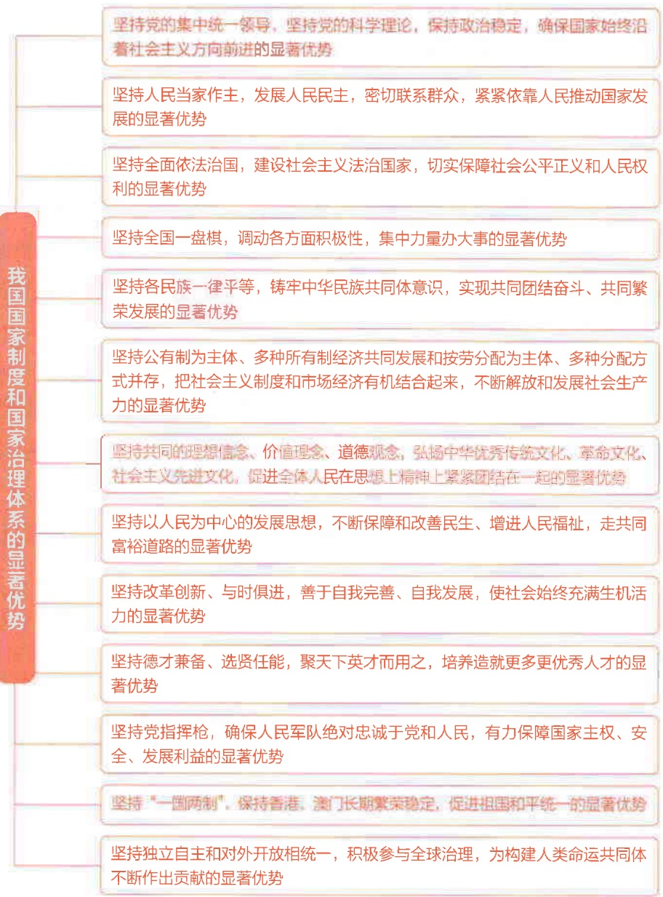

同人民群众的血肉联系关系到党的生死存亡、兴旺发达。我们党的最大政治优势是密切联系群众，党执政后的最大危险是脱离群众。习近平指出:“坚持立党为公、执政为民，始终保持党同人民群众的血肉联系，是马克思主义政党与生俱来的政治品质和最高从政道德，是衡量党的先进性的根本标尺。” $^{①}$  只要我们始终保持同人民群众的血肉联系，紧紧依靠人民、不断造福人民、牢牢植根人民，就没有克服不了的困难，就没有越不过的险滩，就没有完成不了的任务。要牢固树立群众观点，始终同人民群众打成一片，虚心向群众学习，与群众有福同享、有难同当，有盐同咸、无盐同淡。

坚持人民立场，就要热爱人民、尊重人民、敬畏人民。坚持人民立场，凝结着中国共产党对中国人民的深厚情感，体现了深切真挚的人民情怀。“人民”二字，在共产党人的心中位置最高、分量最重。习近平从基层一路走来，不论担任什么职务，对人民都是一往情深，以百姓心为心，以群众事为事。他曾深情地说:“对于我们共产党人来说，老百姓是我们的衣食父母。要像爱自己的父母那样爱老百姓，为老百姓谋利益，带老百姓奔好日子。” $^{②}$ 要心中装着人民，牢记老百姓是天、老百姓是地，诚心诚意做人民的小学生，反映人民意愿、回应人民诉求，把对人民群众的热爱体现在具体工作中。

这么大一个国家，责任非常重、工作非常艰巨。我将无我，不负人民。我愿意做到一个“无我”的状态，为中国的发展奉献自己。

——习近平在访问意大利期间会见意大利众议长菲科时谈话的要点

(2019年3月22日)

<small>① 习近平:《弘扬“红船精神”走在时代前列》，《人民日报》2017年12月1日。</small>

<small>②《习近平谈治国理政》第一卷，外文出版社2018年版，第432页。</small>

## 第二节 坚持人民至上

坚持人民至上，是我们党百年奋斗的宝贵历史经验，也是新时代党治国理政的根本价值取向。要坚持把人民对美好生活的向往作为党的奋斗目标，把人民作为党的工作的最高裁决者和最终评判者，充分调动和激发全体人民的积极性主动性创造性，紧紧依靠人民创造新的历史伟业。

## 一、人民对美好生活的向往就是党的奋斗目标

坚持人民至上，必须始终把人民放在心中最高的位置，想人民之所想，行人民之所嘱。习近平指出:“民之所忧，我必念之；民之所盼，我必行之。”① 必须把人民对美好生活的向往作为党的奋斗目标，团结带领人民共同创造美好的未来。

为人民谋幸福是党始终坚守的初心，让人民过上好日子是党一贯的追求。习近平指出:“我们党团结带领人民进行革命、建设、改革，根本目的就是为了让人民过上好日子，无论面临多大挑战和压力，无论付出多大牺牲和代价，这一点都始终不渝、毫不动摇。”②为了让人民过上好日子，我们党团结带领人民实现民族独立、人民解放，建立了新中国；为了让人民过上好日子，我们党团结带领人民建立社会主义制度、改变一穷二白的国家面貌；为了让人民过上好日子，我们党团结带领人民实行改革开放，解放和发展社会生产力，解决温饱、实现总体小康、全面建设小康社会；为了让人民过上好日子，我们党团结带领人民决胜全面建成小康社会，打赢脱贫攻坚战，迈上全面建设社会主义现代化国家新征程，人民对美好生活的向往不断变为现实。我们党的百年奋斗归根到底就是让中国人民过上好日子，实现国家富强和民族振兴。

<small>① 《习近平谈治国理政》第四卷，外文出版社2022年版，第65页。</small>

<small>②《习近平谈治国理政》第四卷，外文出版社2022年版，第53页。</small>

人民对美好生活的向往就是党的奋斗目标，这体现了我国社会主要矛盾转化对党和国家工作的新要求。进入新时代，我国社会主要矛盾发生了转化，人民的美好生活需要呈现出多样化、多层次、多方面的特点。人民群众更加关心食品安不安全、暖气热不热、雾霾能不能少一点、河湖能不能清一点、精神文化生活能不能更丰富、就业机会能不能更多、收入能不能更高等问题，并且对幼有所育、学有所教、劳有所得、病有所医、老有所养、住有所居、弱有所扶有了更高的期盼，对民主、法治、公平、正义、安全、环境等提出了更高的要求，人民的美好生活需要有了更加丰富更加深刻的时代内涵。从“人民对美好生活的向往，就是我们的奋斗目标”的庄严宣示，到不断把人民对美好生活的向往变为现实的坚定决心，我们党坚持以人民为中心的价值追求始终如一。必须牢牢把握我国社会主要矛盾的新变化，顺应人民对高品质生活的新期待，在高质量发展中努力为人民创造更美好、更幸福的生活。

## 二、依靠人民创造历史伟业

人民是我们党的生命之根、执政之基、力量之源。一路走来，党紧紧依靠人民赢得胜利、取得成功。面向未来，党永远要依靠人民创造新的历史伟业。

依靠人民创造历史伟业，必须尊重人民主体地位。习近平指出:“坚持人民主体地位，充分调动人民积极性，始终是我们党立于不败之地的强大根基。”①中国共产党之所以能够发展壮大，中国特色社会主义之所以能够不断前进，正是因为依靠了人民。谋划发展，最了解实际情况的是人民群众；推动改革，最大的依靠力量也是人民群众。改革开放在认识和实践上的每一次突破和发展，改革开放中每一个新生事物的产生和发展，改革开放每一个方面经验的创造和积累，无不来自亿万人民的实践和智慧。必须自觉拜人民为师，亲身征询于田野，虚心问计于百姓，把握群众的所思所想所盼，凝聚民心民智民力，开创改革发展新局面。

<small>①《习近平著作选读》第一卷，人民出版社2023年版，第211页。</small>

依靠人民创造历史伟业，必须尊重人民首创精神。我们党历来尊重人民首创精神，始终把人民群众作为智慧和力量的源泉，始终把政治智慧的增长、执政本领的增强深深扎根于人民的创造性实践之中。正是因为我们党紧紧依靠人民推动国家发展，充分尊重人民首创精神，最大限度地激发人民的创造热情，我们的事业才能不断保持与时俱进的活力。尊重人民首创精神，就要尊重实践、尊重创造，坚持顶层设计和基层探索相统一，大胆探索、勇于开拓，鼓励创新、宽容失败。尊重人民首创精神，就要激发人民群众的创新创造活力，营造激励干事创业的浓厚氛围，健全创新的激励机制，打破阻碍创新的壁垒，把蕴藏于人民群众中的无穷创造力焕发出来。尊重人民首创精神，就要及时发现、总结、概括人民群众实践中形成的新鲜经验，使之上升为理论和政策，更好指导中国特色社会主义实践。

## 三、人民是党的工作的最高裁决者和最终评判者

我们党是全心全意为人民服务的党，党的执政水平和执政成效不是由自己说了算，必须而且只能由人民来评判。习近平指出:“时代是出卷人，我们是答卷人，人民是阅卷人。” $^{①}$ 要始终把人民放在心中最高位置，树立正确的政绩观，以人民满意不满意作为检验工作的最终评判标准。

让群众满意是我们党做好一切工作的价值取向和根本标准。我们党是以辩证唯物主义和历史唯物主义作为世界观和方法论的党，人民在党的理论路线方针政策和一切工作中始终处于最高的地位，这决定了党的工作的最高裁决者和最终评判者只能是人民。习近平指出:“检验我们一切工作的成效，最终都要看人民是否真正得到了实惠，人民生活是否真正得到了改善，人民权益是否真正得到了保障。”①人民群众的意见是最好的尺子，最能衡量我们工作的长短优劣。生活过得好不好，人民最有发言权。什么是好事实事，要看群众实际感受，由群众来评判。要关注民情、顺应民意，人民群众赞成什么、期盼什么，就要坚持和推动什么；人民群众反对什么、痛恨什么，就要防范和纠正什么。对群众的呼声，要做到件件有着落、事事有回音，用心用情为群众排忧解难，千方百计增进人民福祉。

<small>①《习近平谈治国理政》第三卷，外文出版社2020年版，第70页。</small>

必须牢固树立和践行正确的政绩观。政绩为谁而树、树什么样的政绩、靠什么树政绩，是一个必须认真回答的重大问题。习近平指出:“中国共产党把为民办事、为民造福作为最重要的政绩，把为老百姓办了多少好事实事作为检验政绩的重要标准。” $^{②}$ 坚持把好事实事做到群众心坎上，真正做到对历史和人民负责，这是党员干部应当始终坚守的态度。评价干部的工作成效，不仅要看纸面上的指标数据，更要看人民的生活好不好、看民生是否改善、看生态是否良好、看社会是否进步，不能简单以国内生产总值增长率论英雄，更不能搞脱离实际的盲目攀比，不搞劳民伤财的形象工程和政绩工程。要以“功成不必在我”的精神境界和“功成必定有我”的历史担当，多做为后人作铺垫、打基础、利长远的好事，追求人民群众的好口碑、历史沉淀之后的真评价。

<small>① 《习近平著作选读》第一卷，人民出版社2023年版，第212页。</small>

<small>②《习近平谈治国理政》第四卷，外文出版社2022年版，第55页。</small>

## 第三节 全面落实以人民为中心的发展思想

坚持以人民为中心的发展思想是具体的、现实的，而不是抽象的、空泛的，必须体现在经济社会发展各个环节，体现在更好满足人民美好生活需要的实践当中。要坚持和贯彻党的群众路线，把以人民为中心的发展思想切实贯穿到党和国家事业各方面，推动全体人民共同富裕取得更为明显的实质性进展。

## 一、坚持和贯彻党的群众路线

习近平指出:“群众路线是我们党的生命线和根本工作路线，是我们党永葆青春活力和战斗力的重要传家宝。” $^{①}$  我们党是在同人民群众的密切联系中成长、发展、壮大起来的，是靠宣传群众、组织群众、依靠群众起家的。不论过去、现在和将来，我们都要坚持一切为了群众、一切依靠群众，从群众中来到群众中去，把党的正确主张变为群众的自觉行动，把群众路线贯彻到治国理政全部活动之中。

群众路线是我们党始终坚持的根本工作方法。党的领导工作的正确方法就是将群众意见集中起来形成正确的决策，又到群众中宣传解释，将决策化为群众的行动，并在群众实践中检验这些决策是否正确。贯彻党的群众路线，“知”是基础、是前提，“行”是重点、是关键。必须以知促行、以行促知，做到知行合一，使群众路线落地稳、扎根深，融入经济社会发展全过程，贯穿到党的全部工作中。要善于通过提出和贯彻正确的路线方针政策带领人民前进，善于从群众的实践创造和发展要求中完善政策主张，善于从群众中寻找解决问题的方案和办法，使作出的决策和决策的执行充分体现民心民意。深入研究新形势下群众工作的特点和规律，把暖民心、顺民意的工作做到群众心坎上。把党的优良传统和新技术新手段结合起来，走好网上群众路线，提高做好群众工作的本领。

<small>① 《习近平著作选读》第一卷，人民出版社2023年版，第211页。</small>

调查研究是获得真知灼见的源头活水，是贯彻群众路线的有效途径。习近平指出:“开展调查研究就是走群众路线，没有调查就没有发言权，就没有决策权。” $^{①}$ 要扑下身子、沉到一线、深入基层，听真话、察实情，从人民的创造性实践中获得正确认识。要坚持问题导向，增强问题意识，敢于正视问题，善于发现问题，真正把情况摸清、把问题找准、把对策提实。要到困难较多、情况复杂、矛盾尖锐的地方去把脉问诊，拿出破解难题的实招、硬招。要在深入分析思考上下功夫，真正把群众面临的问题发现出来，把群众的意见反映上来，把群众创造的经验总结出来。党的十八大以来，以习近平同志为核心的党中央将全面深入调查研究作为治国理政的重要方法。从加强党的全面领导、推进新时代党的建设新的伟大工程，到打好防范化解重大风险、精准脱贫、污染防治三大攻坚战，从推动京津冀协同发展、长三角一体化发展、粤港澳大湾区建设，到谋划长江经济带发展、黄河流域生态保护和高质量发展等，都是在深入调查研究基础上作出的重大战略决策。在领导全党全国各族人民打赢脱贫攻坚战中，习近平先后7次主持召开中央扶贫工作座谈会，50多次调研扶贫工作，跋山涉水走遍14个集中连片特困地区，面对面同贫困群众聊家常、算细账，提出精准扶贫、精准脱贫的基本方略，为全党大兴调查研究、走好新时代群众路线作出了表率。

## 二、把为人民造福的事情真正办好办实

坚持以人民为中心的发展思想，不是一句空洞口号，不能只停留在口头上、止步于思想环节，而是要落实到党和国家的各项事业中，体现到人民群众的切身感受上，把发展思想转化为发展实践。

<small>①《习近平关于调查研究论述摘编》，党建读物出版社、中央文献出版社2023年版，第54页。</small>

为人民造福，要落实到新时代中国特色社会主义的各项事业、全部工作之中。在经济高质量发展中，不断破解发展不平衡、不协调、不可持续问题，更好满足人民群众个性化、多样化、不断升级的需求；在全面深化改革中，确保改革发展成果更多更公平惠及全体人民；在民主政治建设中，发展全过程人民民主，使国家政治生活和社会生活各环节、各方面都体现人民意愿、听到人民声音；在全面依法治国中，努力让人民群众在每一个司法案件中感受到公平正义；在文化建设中，不断满足人民日益增长的精神文化需求，使人民在精神生活上更加充盈起来；在民生建设中，时刻把人民的安危冷暖放在心上，关心困难群众的疾苦，千方百计帮助他们排忧解难；在社会治理中，坚持人人有责、人人尽责、人人享有，努力建设人民更满意的平安中国；在生态文明建设中，解决好人民群众身边的突出生态环境问题，为人民创造天更蓝、山更绿、水更清的生活环境；在维护国家安全中，坚持以人民安全为宗旨；在外交工作中，坚持外交为民的理念，等等。所有这些，都已经转化为具体行动，并取得实实在在的成效。

为人民造福，要着力解决好人民群众最关心最直接最现实的利益问题。人民群众是共产党的安身立命之本，共产党人永远不能脱离群众、轻视群众、漠视群众疾苦。习近平指出，“要始终把人民安居乐业、安危冷暖放在心上，用心用情用力解决群众关心的就业、教育、社保、医疗、住房、养老、食品安全、社会治安等实际问题”①。心中要有人民，眼里要有群众，想群众之所想，急群众之所急，解群众之所难，把群众的小事当作大事来办。从最困难的群体入手，经常到他们家中走一走、看一看，关心他们的疾苦，多做雪中送炭的事情。建立健全困难群众帮扶工作机制，使人民群众不为基本生活发愁、得到基本保障，让他们感受到社会主义大家庭的温暖。从最突出的问题着眼，从具体的工作抓起，聚焦解决人民群众看病难、上学难、就业难、住房难等操心事、烦心事、揪心事，聚焦群众亟待解决的痛点难点问题、长期未能解决的民生历史遗留问题，出实招、办实事、求实效。

<small>①《习近平谈治国理政》第四卷，外文出版社2022年版，第55页。</small>

为人民造福，要一件事情接着一件事情办，一年接着一年干。为民造福的事情面广量大，具有稳定性、连续性、累积性等特点，有的当下就可以解决，有的则相对复杂，需要发扬钉钉子精神，一锤一锤接着敲，钉牢一颗再钉下一颗，不断钉下去，合力攻坚、久久为功、一抓到底、抓出成效。制度建设是持续为群众办实事的有力保障。要加强制度设计、制度安排，着力健全为人民执政靠人民执政各项制度、社会公平正义法治保障制度、人民文化权益保障制度、统筹城乡的民生保障制度、共建共治共享的社会治理制度、最严格的生态环境保护制度等，把以人民为中心的发展思想通过制度落到实处。

## 三、推动全体人民共同富裕取得更为明显的实质性进展

共同富裕是中国特色社会主义的本质要求，是中国式现代化的重要特征。坚持以人民为中心的发展思想，真正做到发展成果由人民共享，就必须落实到扎实推进全体人民共同富裕上，在推动共同富裕过程中促进人的全面发展。

实现共同富裕不仅是经济问题，而且是关系党的执政基础的重大政治问题。在中国共产党领导的社会主义中国，我们追求的发展是造福人民的发展，我们追求的富裕是全体人民共同富裕，决不能允许贫富差距越来越大。实现共同富裕，首先要通过全国人民共同奋斗把“蛋糕”做大做好，然后通过合理的制度安排正确处理增长和分配关系，把“蛋糕”切好分好，让人民群众真真切切感受到共同富裕不仅仅是一个口号，而是看得见、摸得着、真实可感的事实。党的十八大以来，以习近平同志为核心的党中央始终把增进人民福祉放在重要位置，推动城乡区域协调发展，采取有力措施保障和改善民生，打赢脱贫攻坚战，全面建成小康社会，为促进共同富裕创造了良好条件。新征程上，谱写全面建设社会主义现代化国家新篇章，必须把扎实推动全体人民共同富裕摆在更加重要的位置。习近平强调:“我们不能等实现了现代化再来解决共同富裕问题，而是要始终把满足人民对美好生活的新期待作为发展的出发点和落脚点，在实现现代化过程中不断地、逐步地解决好这个问题。”①

要从全局角度来把握共同富裕。共同富裕是全体人民共同富裕，是人民群众物质生活和精神生活都富裕，不是少数人的富裕，也不是整齐划一的平均主义，不是所有人都同时富裕，也不是所有地区同时达到一个富裕水准。要处理好先富和共富的关系，允许一部分人先富起来，同时要积极推动先富带后富。实现全体人民共同富裕是一个长期的历史过程，不可能一蹴而就，必须保持历史耐心、进行不懈努力，根据现有条件把能做的事情尽量做起来，积小胜为大胜，不断推动全体人民共同富裕取得更为明显的实质性进展。

扎实推进共同富裕，必须坚持正确的原则和科学的思路。促进共同富裕，要把握好鼓励勤劳创新致富、坚持基本经济制度、尽力而为量力而行、坚持循序渐进的原则。总的思路是，坚持以人民为中心的发展思想，在高质量发展中促进共同富裕，正确处理效率和公平的关系，构建初次分配、再分配、三次分配协调配套的基础性制度安排，加大税收、社保、转移支付等调节力度并提高精准性，扩大中等收入群体比重，增加低收入群体收入，合理调节高收入，取缔非法收入，形成中间大、两头小的橄榄型分配结构，促进社会公平正义，促进人的全面发展，使全体人民朝着共同富裕目标扎实迈进。

推动全体人民共同富裕与促进人的全面发展是高度统一的。《共产党宣言》确立了马克思主义政党的最高目标是实现共产主义，并把实现人的自由而全面发展作为共产主义的本质特征。按照马克思、恩格斯的构想，共产主义社会将彻底消除阶级之间、城乡之间、脑力劳动和体力劳动之间的对立和差别，实行各尽所能、按需分配，真正实现社会共享、实现每个人自由而全面的发展。习近平指出:“现代化的最终目标是实现人自由而全面的发展。” $^{①}$ 推动全体人民共同富裕的过程，必须是人民的物质生活不断提升、精神世界不断丰富的过程，是不断促进人的全面发展的过程。在全面建设社会主义现代化国家新征程上，要更加主动解决地区差距、城乡差距、收入差距等问题，更好回应人民各方面诉求和多层次需要，不断夯实人民幸福生活的物质条件，不断提高整个社会的文明程度和人民的思想道德素质、科学文化素质、身心健康素质，让每个人都获得发展自我和奉献社会的机会，促进物的全面丰富和人的全面发展达到一个新的更高的境界。

<small>① 《习近平著作选读》第二卷，人民出版社2023年版，第140页。</small>

## 本章小结

人民是历史的创造者，是真正的英雄。江山就是人民，人民就是江山。人民是我们党执政的最大底气，也是党执政最深厚的根基。坚持人民至上要解决好为了谁、依靠谁、由谁来评价的问题。为人民谋幸福是中国共产党人的初心，人民对美好生活的向往就是党的奋斗目标。要紧紧依靠人民创造历史伟业，把人民作为党的工作的最高裁决者和最终评判者。全面落实以人民为中心的发展思想，必须贯彻党的群众路线，把为人民造福的事情真正办好办实，推动全体人民共同富裕取得更为明显的实质性进展。

<small>① 习近平:《携手同行现代化之路——在中国共产党与世界政党高层对话会上的主旨讲话》，人民出版社2023年版，第2页。</small>

## 课后思考

1. 为什么说“党的根基在人民、血脉在人民、力量在人民”？

2. 如何理解人民对美好生活的向往是党的奋斗目标？

3. 如何理解“时代是出卷人，我们是答卷人，人民是阅卷人”？

4. 为什么要推动全体人民共同富裕取得更为明显的实质性进展？

## 第五章 全面深化改革开放

## 学习要点

1. 新时代全面深化改革开放是一场深刻革命

2. 坚持全面深化改革开放的正确方向

3. 全面深化改革总目标

4. 全面深化改革开放的正确方法论

改革开放是我们党的一次伟大觉醒，正是这个伟大觉醒孕育了我们党从理论到实践的伟大创造。新时代全面深化改革开放是一场深刻革命，要牢牢把握全面深化改革开放的正确方向，紧紧围绕全面深化改革总目标，坚持正确方法论，不断推动改革开放向广度和深度发展，使党和国家事业焕发出新的生机活力。

## 第一节 改革开放是决定当代中国命运的关键一招

改革开放是当代中国最显著的特征、最壮丽的气象。进入新时代，改革开放到了一个新的重要关头。习近平强调:“改革开放是决定当代中国命运的关键一招，也是决定实现‘两个一百年’奋斗目标、实现中华民族伟大复兴的关键一招。”①中国要前进，必须全面深化改革开放。

## 一、改革开放是我们前进的重要法宝

改革开放是党和人民大踏步赶上时代的重要法宝。只有社会主义才能救中国，只有改革开放才能发展中国、发展社会主义、发展马克思主义。新时代坚持和发展中国特色社会主义，实现“两个一百年”奋斗目标、实现中华民族伟大复兴，必须以改革开放为强大动力。

改革开放是坚持和发展中国特色社会主义的必由之路。党的十一届三中全会深刻把握党和国家前途命运，深刻总结社会主义革命和建设实践，深刻洞察时代潮流，深刻体悟人民群众的期盼和需要，作出实行改革开放的历史性决策，推动我国社会主义事业进入新时期。改革开放使中国社会焕发出强大的生机活力，我国用几十年时间走完了发达国家几百年走过的工业化历程，创造了经济快速发展和社会长期稳定两大奇迹，极大改变了中国的面貌、中华民族的面貌、中国人民的面貌、中国共产党的面貌，中华民族以崭新姿态屹立于世界的东方。

全面深化改革开放是完成新时代目标任务的必然要求。进入新时代，我国发展到了一个新的阶段，需要决胜全面建成小康社会、实现第一个百年奋斗目标、开启全面建设社会主义现代化国家新征程，机遇和挑战前所未有。这一时期，我国改革进入攻坚期和深水区，发展中积累的问题和发展后的新问题、一般矛盾和深层次矛盾、有待完成的任务和新提出的任务交织叠加、错综复杂。发展中不平衡、不协调、不可持续问题依然突出，科技创新能力不强，产业结构不合理，发展方式依然粗放，城乡区域发展差距和居民收入分配差距依然较大，形式主义、官僚主义、享乐主义和奢靡之风问题突出，一些领域消极腐败现象易发多发，等等。

<small>① 《习近平著作选读》第一卷，人民出版社2023年版，第65页。</small>

要破解发展中面临的新的难题、化解来自各方面的新的风险挑战，推动各项事业全面进步和人的全面发展，必须全面深化改革开放。

中国要前进，就要全面深化改革开放；除了全面深化改革开放，别无他途。2013年11月，党的十八届三中全会通过《中共中央关于全面深化改革若干重大问题的决定》，对全面深化改革进行总体擘画，确定了全面深化改革的总目标、战略重点、优先顺序、主攻方向、工作机制、推进方式和时间表、路线图，实现了改革理论和政策的一系列新的重大突破。党的十一届三中全会是划时代的，开启了改革开放和社会主义现代化建设新时期。党的十八届三中全会也是划时代的，实现改革由局部探索、破冰突围到系统集成、全面深化的转变，开创了我国改革开放新局面。

## 二、新时代全面深化改革开放是一场深刻革命

新时代全面深化改革开放，就其艰巨性、复杂性和系统性来说，是一场深刻的革命。习近平指出，“我们提出的一系列创新理论、采取的一系列重大举措、取得的一系列重大突破，都是革命性的” $^{①}$ 。这场革命取得了历史性成就，对中国特色社会主义事业发展产生了重大而深远的影响。

全面深化改革开放是涉险滩、闯难关的变革。经过多年的改革开放，容易的、皆大欢喜的改革已经完成了，好吃的肉都吃掉了，剩下的都是难啃的硬骨头。深层次矛盾加剧、利益固化的藩篱高筑、体制机制的弊病凸显，改革开放如逆水行舟，不进则退。新时代的改革开放既深刻又复杂，各领域改革紧密联系、相互交融，任何一个领域的改革都会牵动其他领域，如果各领域改革不配套，改革和开放不协调，各地各部门改革开放措施相互掣肘，全面深化改革开放就很难推进下去。必须勇于破除一切不合时宜的思维定势和固有观念，深入贯彻新理念新思想新战略，形成勇于变革、勇于突破、勇于创新的新思维方式。必须勇于打破部门利益、行业利益、本位思想，坚持服从国家整体利益、服务改革发展稳定大局，形成有利于维护国家整体利益和最广大人民根本利益的新格局。必须勇于跳出条条框框限制，破除深层次体制机制障碍和顽瘴痼疾，构建系统完备、科学规范、运行有效的制度体系。必须勇于破解我国开放型经济体制建设中的突出问题，积极适应经济全球化新趋势、世界格局新变化和我国发展新要求，以对外开放的主动赢得经济发展的主动、赢得国际竞争的主动。

<small>① 《习近平著作选读》第二卷，人民出版社2023年版，第394页。</small>

面对改革开放进入攻坚期和深水区的新形势、新要求，以习近平同志为核心的党中央以巨大的政治勇气打响改革攻坚战，加强党对全面深化改革开放的集中统一领导，以全局观念和系统思维谋划推进改革，冲破思想观念束缚，突破利益固化藩篱，坚决破除各方面体制机制弊端，着力解决新矛盾、应对新挑战，把全面深化改革开放引向深入。全面深化改革开放是一场思想理论的深刻变革、改革组织方式的深刻变革、国家制度和治理体系的深刻变革、人民广泛参与的深刻变革。从夯基垒台、立柱架梁，到全面推进、积厚成势，再到加强系统集成、协同高效，蹄疾步稳、有力有序解决各领域各方面体制性障碍、机制性梗阻、政策性创新问题，推动许多领域实现历史性变革、系统性重塑、整体性重构，全面深化改革开放取得历史性成就。

全面深化改革开放是在多年改革开放基础上的深化，是一场全面、系统、整体的制度创新。习近平指出:“如果完全停留在旧的体制机制框架内，用老办法应对新情况新问题，或者用零敲碎打的方式来修修补补，是解决不了大问题的。”①必须着眼改革的关联性、系统性、可行性，全面系统整体推进各方面改革，使社会主义制度的优越性得到更好发挥。坚持和完善社会主义基本经济制度，充分发挥市场在资源配置中的决定性作用，更好发挥政府作用，坚持以供给侧结构性改革为主线，加快建设现代化经济体系。坚持和完善对外开放制度机制，完善涉外经济法律和规则体系，推动制度型开放，完善共建“一带一路”的制度保障，建设更高水平开放型经济新体制。坚持和完善人民当家作主制度体系，积极发展全过程人民民主，深入推进国家治理体系和治理能力现代化，加快建设中国特色社会主义法治体系。坚持和完善繁荣发展社会主义先进文化的制度，确立和坚持马克思主义在意识形态领域指导地位的根本制度，健全意识形态工作责任制，完善互联网管理领导体制，完善思想政治工作体系。坚持和完善统筹城乡的民生保障制度和共建共治共享的社会治理制度，完善体现效率、促进公平的收入分配体系。坚持和完善生态文明制度体系，污染防治攻坚向纵深推进，节约资源和保护环境的空间格局、产业结构、生产方式、生活方式加快形成，生态文明制度体系更加健全，美丽中国建设迈出新步伐。坚持和完善党的领导和党的建设制度体系，健全党的全面领导制度，构建一体推进不敢腐、不能腐、不想腐的体制机制。

<small>①《习近平著作选读》第一卷，人民出版社2023年版，第307—308页。</small>

新时代的改革开放是全方位、深层次、根本性的，取得的成就是历史性、革命性、开创性的。放眼全世界，没有哪个国家和政党，能有这样的政治气魄和历史担当，敢于大刀阔斧、刀刃向内，也没有哪个国家和政党，能在这么短时间内推动这么大范围、这么大规模、这么大力度的改革，这体现了中国特色社会主义制度的鲜明特征和显著优势。在新征程上，要继续保持这一鲜明特征、发挥这一显著优势，以坚定毅力和历史主动把改革开放事业不断推向前进。

## 三、坚持全面深化改革开放的正确方向

全面深化改革开放改什么、怎么改，这是一个带有根本性的问题。

习近平强调:“我们的改革开放是有方向、有立场、有原则的。” $^{①}$ 要保持战略定力，牢牢把握全面深化改革开放的正确方向，确保改革不改向、变革不变色。

必须坚持和改善党的全面领导、坚持和完善中国特色社会主义制度。改革开放是对社会主义生产关系和上层建筑的调整，使之适应生产力和经济基础发展的新要求，是社会主义制度的自我完善和发展，而不是改弦易张。习近平强调:“这里面最核心的是坚持和改善党的领导、坚持和完善中国特色社会主义制度，偏离了这一条，那就南辕北辙了。”②一些敌对势力和别有用心的人，把改革定义为往西方政治制度的方向改，否则就是不改革，他们是醉翁之意不在酒。对此，我们要洞若观火，保持政治坚定性。全面深化改革开放既不走封闭僵化的老路，也不走改旗易帜的邪路，该改的、能改的就坚决改，不该改的、不能改的坚决不改。改什么、怎么改，必须以是否有利于坚持和改善党的全面领导、坚持和完善中国特色社会主义制度为根本标准，在这个问题上必须始终保持清醒、坚定。

必须坚持以人民为中心，促进社会公平正义、增进人民福祉。社会主义改革开放的出发点和落脚点，是为了更好实现和维护人民利益、为了让老百姓过上好日子。新时代人民群众对美好生活的需要更加广泛，要求也更高；对改革的关注度，尤其是对涉及切身利益、涉及社会公平正义、涉及增进人民福祉的改革举措的关注度更高，积极参与热情更高，必须更加注重广泛汲取人民群众的智慧、赢得人民群众的支持。党和国家的一系列改革开放举措，都要坚持符合人民利益、反映人民需要、回应人民呼声。改革开放是亿万人民自己的事业，没有人民的支持和参与，任何改革都不可能取得成功。要把人民满意不满意、高兴不高兴作为根本标准，审视我们的各项改革开放措施，哪里不符合人民需要，哪里就需要调整；哪个领域哪个环节不利于更好满足人民对美好生活需要，哪里就需要修正；哪些问题哪项改革不能适应人民群众的迫切期待、强烈要求，哪里就要作为工作的重点，切实实现好、维护好、发展好人民群众的利益。

<small>①《习近平著作选读》第一卷，人民出版社2023年版，第66页。</small>

<small>② 习近平:《论坚持党对一切工作的领导》，中央文献出版社2019年版，第29页。</small>

必须有利于进一步解放思想、进一步解放和发展社会生产力、进一步解放和增强社会活力。习近平指出:“这‘三个进一步解放’既是改革的目的，又是改革的条件。”①解放思想，是开启改革开放事业的思想前提，也是新时代全面深化改革开放的思想前提，只有进一步解放思想，才能找准深化改革开放的着力点，以创新的思维和办法解决前进中的问题。解放和发展社会生产力，是改革开放的鲜明特征和首要任务，也是新时代贯彻新发展理念、构建新发展格局、推动高质量发展的必然要求，只有进一步解放和发展社会生产力，紧紧围绕全面建成小康社会、实现社会主义现代化、实现中华民族伟大复兴的历史任务，才能把改革开放推向深入。解放和增强社会活力，是社会主义改革的内在要求和基本目的，也是新时代全面深化改革的关键所在，只有进一步解放和增强社会活力，激发全体人民的积极性、主动性、创造性，才能让一切劳动、知识、技术、管理、资本等要素的活力竞相迸发，让一切创造社会财富的源泉充分涌流。要通过“三个进一步解放”，不断完善各领域各方面的制度机制，使社会主义生产关系更加适应生产力的发展要求，使社会主义上层建筑更加适应经济基础的发展需要，更好激发全社会的创造活力，充分彰显中国特色社会主义制度的优越性。

## 第二节 统筹推进各领域各方面改革开放

全面深化改革开放，不是某个领域某个方面的变革，而是涉及党和国家事业发展全局的体制机制变革。习近平指出，“一定要适应新时代中国特色社会主义事业发展进程，牢牢把握完善和发展中国特色社会主义制度、推进国家治理体系和治理能力现代化的总目标，统筹推进各领域各方面改革”①。

<small>① 《习近平著作选读》第一卷，人民出版社2023年版，第180页。</small>

## 一、坚持全面深化改革总目标

新时代全面深化改革具有全面性、系统性、整体性的鲜明特点，必须将其作为一个系统工程来把握。习近平指出:“全面深化改革，全面者，就是要统筹推进各领域改革，就需要有管总的目标，也要回答推进各领域改革最终是为了什么、要取得什么样的整体结果这个问题。”②党的十八届三中全会对全面深化改革进行了顶层设计、系统规划和总体部署，明确了全面深化改革的总目标和主要任务。党的十九届四中全会系统总结了十八大以来改革开放的理论成果、制度成果、实践成果，勾勒出新时代全面深化改革开放更加清晰的蓝图。

全面深化改革总目标是:完善和发展中国特色社会主义制度、推进国家治理体系和治理能力现代化。这一总目标是一个内涵丰富的有机整体，两句话都讲，才是完整的、全面的。“完善和发展中国特色社会主义制度”，规定了改革的根本方向，就是无论改什么、怎么改，都要坚持中国共产党领导、坚持中国特色社会主义，就是要通过改革推动中国特色社会主义制度更加成熟更加定型、更好发挥中国特色社会主义制度的优越性。“推进国家治理体系和治理能力现代化”，明确了改革的鲜明指向和时代要求，就是要通过改革进一步增强我国制度活力，把制度优势转化为国家治理效能。这一总目标的提出，标志着我们党对社会主义建设规律和改革开放规律认识的深化，对于新时代统筹推进各领域各方面的改革，对于决胜全面建成小康社会、全面建设社会主义现代化国家、全面推进中华民族伟大复兴具有重大指导意义。

<small>① 习近平:《在党的十九届一中全会上的讲话》，《求是》2018年第1期。</small>

<small>② 习近平:《论坚持全面深化改革》，中央文献出版社2018年版，第88页。</small>

全面深化改革必须牢牢把握总目标，实施好“六个紧紧围绕”的路线图。紧紧围绕使市场在资源配置中起决定性作用和更好发挥政府作用，深化经济体制改革；紧紧围绕坚持党的领导、人民当家作主、依法治国有机统一，深化政治体制改革；紧紧围绕建设社会主义核心价值体系、社会主义文化强国，深化文化体制改革；紧紧围绕更好保障和改善民生、促进社会公平正义，深化社会体制改革；紧紧围绕建设美丽中国，深化生态文明体制改革；紧紧围绕提高科学执政、民主执政、依法执政水平，深化党的建设制度改革。这六个方面明确了经济、政治、文化、社会、生态文明体制和党的建设制度深化改革的分目标，规定了各领域各方面改革的主要任务，是落实全面深化改革总目标、推进各领域各方面改革的基本遵循，构建起新时代全面深化改革的系统工程。

统筹推进各领域各方面改革开放，必须以全面深化改革总目标为引领，以制度建设为主线，以经济体制改革为重点，以重要领域和关键环节改革为突破口，使各方面改革协同推进、环环相扣、形成合力。

## 二、推进国家治理体系和治理能力现代化

中国特色社会主义制度是在实践中不断完善的。20世纪90年代，邓小平曾经指出:“恐怕再有三十年的时间，我们才会在各方面形成一整套更加成熟、更加定型的制度。”①治理国家，制度是起根本性、全局性、长远性作用的，然而没有有效的治理能力，再好的制度也难以发挥作用。

<small>①《邓小平文选》第三卷，人民出版社1993年版，第372页。</small>

国家治理体系和治理能力现代化，是一个国家现代化的重要标志。新时代全面深化改革开放，就是要使中国特色社会主义制度更加成熟更加定型，推进国家治理体系和治理能力现代化。

国家治理体系和治理能力是一个国家制度和制度执行能力的集中体现。国家治理体系是在党领导下管理国家的制度体系，包括经济、政治、文化、社会、生态文明和党的建设等各领域体制机制、法律法规安排，是一整套紧密相连、相互协调的国家制度；国家治理能力则是运用国家制度管理社会各方面事务的能力，包括改革发展稳定、内政外交国防、治党治国治军等各个方面。国家治理体系和治理能力是一个有机整体，相辅相成，有了好的国家治理体系才能提高国家治理能力，提高国家治理能力才能充分发挥国家治理体系的效能。

推进国家治理体系和治理能力现代化，必须坚定中国特色社会主义制度自信。一个国家选择什么样的国家制度和国家治理体系，是由这个国家的历史文化、社会性质、经济发展水平决定的。中国特色社会主义制度和国家治理体系是在中国的社会土壤中生长起来的，是马克思主义国家理论指导我国制度建设实践的成果，是经过革命、建设、改革长期探索形成的，凝结着党和人民的智慧，具有深厚的理论渊源、历史基础、文化底蕴和现实依据。世界上不存在适用于一切国家的政治制度模式。照抄照搬他国的制度行不通，会水土不服，会画虎不成反类犬，甚至会把国家前途命运葬送掉。中国特色社会主义制度既坚持了社会主义的根本性质，又借鉴了古今中外制度建设的有益成果，符合我国国情，体现了中国特色社会主义的特点和优势，具有强大生命力。我们要坚信，中国特色社会主义制度是当代中国发展进步的根本制度保障，是具有鲜明中国特色、明显制度优势、强大自我完善能力的先进制度。没有坚定的制度自信就不可能有全面深化改革的勇气，同样，离开不断改革，制度自信也不可能彻底、不可能久远。要突出坚持和完善支撑中国特色社会主义制度的根本制度、基本制度、重要制度，着力固根基、扬优势、补短板、强弱项，构建系统完备、科学规范、运行有效的制度体系，让各方面制度更加成熟更加定型。

坚持党的集中统一领导，坚持党的科学理论，保持政治稳定，确保国家始终沿着社会主义方向前进的显著优势

坚持人民当家作主，发展人民民主，密切联系群众，紧紧依靠人民推动国家发展的显著优势

坚持全面依法治国，建设社会主义法治国家，切实保障社会公平正义和人民权利的显著优势

坚持共同的理想信念、价值理念、道德观念，弘扬中华优秀传统文化、革命文化、社会主义先进文化，促进全体人民在思想上精神上紧紧团结在一起的显著优势

坚持独立自主和对外开放相统一，积极参与全球治理，为构建人类命运共同体不断作出贡献的显著优势

推进国家治理体系和治理能力现代化，必须更好发挥中国特色社会主义制度优势。习近平指出，“我们全面深化改革，不是因为中国特色社会主义制度不好，而是要使它更好”①。中国特色社会主义制度是党和人民在长期实践探索中形成的，具有多方面的显著优势。长期保持并不断增强这些优势，是我们在新时代坚持和完善中国特色社会主义制度、推进国家治理体系和治理能力现代化的努力方向。要以更大的努力、下更大的功夫，使中国特色社会主义制度和国家治理体系更加科学严密、更有效率活力、更加成熟定型，使我国国家制度和国家治理体系的显著优势得到更加充分的发挥。

推进国家治理体系和治理能力现代化，必须把中国特色社会主义制度优势转化为国家治理效能。把中国特色社会主义制度坚持好完善好，最重要的是发挥好这个制度的作用，把制度优势转化为治理效能。推进国家治理体系和治理能力现代化，就是要适应时代变化，既改革不适应实践发展要求的体制机制、法律法规，又不断构建新的体制机制、法律法规，使各方面制度更加科学、更加完善，实现党、国家、社会各项事务治理制度化、规范化、程序化。要更加注重治理能力建设，增强按制度办事、依法办事意识，善于运用制度和法律治理国家，把各方面制度优势转化为管理国家的效能，提高党科学执政、民主执政、依法执政水平。

## 三、全面深化改革开放要坚持正确方法论

全面深化改革开放是一个复杂系统工程，正确的方法对于改革顺利推进、取得成功至关重要。习近平指出:“改革开放是前无古人的崭新事业，必须坚持正确的方法论，在不断实践探索中推进。”②

增强全面深化改革的系统性、整体性、协同性。全面深化改革是一场深刻而全面的社会变革，涉及经济社会发展各个方面、各个领域，每一项改革都可能牵一发而动全身，对经济社会发展产生多方面影响。这就需要加强对改革的整体谋划、协同推进、系统集成，注重改革措施整体效果，避免各行其是、相互掣肘。要厘清重大改革的逻辑关系，打好改革“组合拳”，压茬推进重要改革，做到前后呼应、衔接配套。坚持整体推进，增强各项措施的关联性和耦合性，防止畸重畸轻、单兵突进、顾此失彼；坚持重点突破，注重抓主要矛盾和矛盾的主要方面，注重抓重要领域和关键环节，避免平均用力、齐头并进；坚持协同配合，既抓改革方案协同，也抓改革落实协同，更抓改革效果协同，促进各项改革举措在政策取向上相互配合、在实施过程中相互促进、在改革成效上相得益彰。

<small>① 《习近平关于全面深化改革论述摘编》，中央文献出版社2014年版，第22页。</small>

<small>②《习近平谈治国理政》第一卷，外文出版社2018年版，第67页。</small>

加强顶层设计和摸着石头过河相结合。新时代的改革同过去相比，广度和深度都大大拓展了，要把改革推向前进，必须加强顶层设计，以利于提高改革的科学性和协调性。但加强顶层设计，并不是不要摸着石头过河。摸着石头过河，是富有中国特色、符合中国国情的改革方法。改革开放是全新的事业，没有现成的方案和经验可以借鉴，必须在实践中探索，摸着石头过河就是摸规律。要把加强顶层设计和摸着石头过河统一起来，鼓励勇于探索、勇于突破，不断形成新经验、产生新认识。加强调查研究，把基层的鲜活经验上升到一般规律性认识，体现到改革开放的顶层设计和战略部署中。坚持问题导向和目标导向相统一，善于从群众关注的焦点、百姓生活的难点中寻找改革切入点，推动顶层设计和基层探索良性互动。

统筹改革发展稳定。正确处理好改革发展稳定的关系，是我国改革开放的一条重要经验。改革发展稳定是我国社会主义现代化建设的三个重要支点。改革是经济社会发展的强大动力，发展是解决一切经济社会问题的关键，稳定是改革发展的前提。许多国家的发展实践表明，如果不能正确处理三者关系，就容易导致政局动荡、社会动乱，不仅难以抓住发展机遇，也会使已有的发展成果化为乌有。只有社会稳定，改革发展才能不断推进；只有改革发展不断推进，社会稳定才能具有坚实基础。要坚持稳中求进工作总基调，把改革的力度、发展的速度和社会可承受的程度统一起来，把改善人民生活作为正确处理改革发展稳定关系的结合点，在保持社会稳定中推进改革发展，通过改革发展促进社会稳定。

胆子要大，步子要稳。全面深化改革开放，面临的任务非常艰巨，没有大胆突破、勇于创新的精神就难以前进；同时，中国是一个国情复杂、人口众多的大国，改革必须慎之又慎。胆子要大，就是改革再难也要向前推进，敢于担当，敢于啃硬骨头，敢于涉险滩。步子要稳，就是方向一定要准，行驶一定要稳，尤其不能犯颠覆性错误。搞改革不可能都是四平八稳、没有任何风险。只要经过充分论证和评估，是符合实际、必须做的，就要大胆地试、大胆地闯。胆子大不是蛮干，而是在深思熟虑后的突破、实践基础上的创新。步子要稳不是盲目保守，而是要在大胆突破中把准方向、科学决策。对一些重大改革，不可能毕其功于一役，要稳扎稳打，做到蹄疾而步稳；对一些事关全局、影响长远的改革，既要敢于突破、不断推进，又要审慎稳妥、三思后行，保持改革的延续性和稳定性。

坚持重大改革于法有据。全面深化改革是一场深刻的制度变革，制度的“立”和“破”都必须于法有据。习近平指出:“凡属重大改革要于法有据，需要修改法律的可以先修改法律，先立后破，有序进行。” $^{①}$ 改革和法治如鸟之两翼、车之两轮，相辅相成、相伴而生。要坚持改革决策和立法决策相统一、相衔接，做到改革和法治同步推进，增强改革的穿透力。充分运用法治思维和法治方式，积极发挥法治引导、推动、规范、保障改革的作用。加强对相关立法工作的协调，确保在法治轨道上推进改革。实践证明行之有效的，要及时上升为法律。实践条件还不成熟、需要先行先试的，要按照法定程序作出授权。对不适应改革要求的法律法规，要及时修改或废止。

<small>① 习近平:《论坚持全面依法治国》，中央文献出版社2020年版，第35页。</small>

## 第三节 将改革开放进行到底

中国特色社会主义制度的成熟定型是一个在改革中不断推进的过程。改革开放只有进行时，没有完成时，停顿和倒退没有出路。在全面建设社会主义现代化国家新征程上要不断推进全面深化改革，不断扩大高水平对外开放，将改革开放进行到底。

## 一、改革开放永无止境

全面深化改革开放，是新时代坚持和发展中国特色社会主义的根本动力。习近平指出:“实践发展永无止境，解放思想永无止境，改革开放也永无止境，改革开放只有进行时、没有完成时。这是历史唯物主义态度。”①

改革开放永无止境是社会基本矛盾运动规律的深刻反映。改革开放说到底，就是要不断破除制约生产力发展、制约社会进步的障碍，推动经济社会更好更快发展。历史唯物主义认为，生产力是推动人类社会发展最活跃最具有革命性的因素，生产力的不断发展客观上要求生产关系与之相适应，要求上层建筑与经济基础相适应。经济社会发展不停顿，改革开放就不止步。改革开放40多年来，我国经济社会发展取得重大成就，根本原因就是我们不断通过改革调整生产关系、完善上层建筑，使之适应我国生产力发展的要求，激发我国社会发展的强大活力。进入新时代，全面深化改革开放取得历史性成就，但改革开放的历史任务并没有完结，一些制约我国发展和稳定的体制机制障碍仍然存在，中国特色社会主义制度和国家治理体系还没有达到完全成熟定型的要求。生产力发展是永无止境的，调整生产关系、完善上层建筑的改革开放也是永无止境的。

<small>① 习近平:《论党的宣传思想工作》，中央文献出版社2020年版，第34页。</small>

改革开放永无止境是总结世界社会主义实践经验得出的重要结论。世界社会主义发展经验，特别是苏联和东欧社会主义国家的教训充分表明，社会主义是在开拓创新中前进的，固守旧有体制机制、不实行改革开放死路一条；不坚持科学社会主义基本原则，搞否定社会主义方向的“改革开放”也是死路一条。习近平指出:“如果没有一九七八年我们党果断决定实行改革开放，并坚定不移推进改革开放，坚定不移把握改革开放的正确方向，社会主义中国就不可能有今天这样的大好局面，就可能面临严重危机，就可能遇到像苏联、东欧国家那样的亡党亡国危机。”①社会主义事业是一项全新事业，没有现成的方案和固定的模式，只有坚持科学社会主义基本原则，结合新的实际大胆探索创新，才能把社会主义事业推向前进。必须发挥历史主动性和创造性，以中国化时代化的马克思主义为指导，大力推进实践基础上的理论创新、制度创新、文化创新以及其他各方面创新，不断推进中国特色社会主义制度更加成熟更加定型，不断提高国家治理体系和治理能力现代化水平。

改革开放永无止境是推进党和人民事业发展的必然要求。中国共产党立志于中华民族千秋伟业，为中国人民谋幸福、为中华民族谋复兴是我们党的初心和使命。完成这一光荣的历史使命，就必须不断解放和发展生产力，不断发展社会主义经济、政治、文化、社会和生态文明，不断完善社会主义的各项制度，这一切都要求不断深化改革开放。回顾改革开放特别是党的十八大以来的历程，每一次重大改革都给党和人民事业发展注入新的活力、增添强大动力。党和人民事业是在改革开放中破浪前行的，也是在改革开放中突破发展的。今天，我们踏上了全面建设社会主义现代化国家新征程，前进中仍然有很多艰难险阻，仍然有许多障碍，都需要通过全面深化改革开放来解决问题、开辟道路。习近平指出，实现新时代新征程的目标任务，要把全面深化改革作为推进中国式现代化的根本动力，作为稳大局、应变局、开新局的重要抓手，把准方向、守正创新、真抓实干，在新征程上谱写改革开放新篇章。

<small>① 《习近平著作选读》第一卷，人民出版社2023年版，第78页。</small>

## 二、坚定不移把全面深化改革引向深入

新时代全面深化改革取得了巨大成就，但仍然需要持续推进。习近平指出:“改革道路上仍面临着很多复杂的矛盾和问题，我们已经啃下了不少硬骨头但还有许多硬骨头要啃，我们攻克了不少难关但还有许多难关要攻克。”①必须适应时代和实践发展变化，坚定信心决心、坚持问题导向，把全面深化改革不断引向深入。

在全面建设社会主义现代化国家新征程上，根本动力仍然是改革开放，要继续用足用好改革开放这个关键一招。党的二十大围绕全面建成社会主义现代化强国、以中国式现代化全面推进中华民族伟大复兴的中心任务，对全面深化改革开放作出新的部署。必须紧紧围绕全面建设社会主义现代化国家的目标，推出一批战略性、创造性、引领性改革举措，加强改革系统集成、协同高效，在重要领域和关键环节取得新突破。要坚持和加强党的领导，把准改革方向，明确目标任务，以科学的谋划、创新的魄力把各项工作抓好抓实。

把全面深化改革不断引向深入，要聚焦全面建设社会主义现代化国家中的重大问题，注重统筹全局、把握重点，抓好重大改革任务攻坚克难。要深化社会主义市场经济体制改革，形成有利于贯彻新发展理念、构建新发展格局、推动高质量发展的体制机制；深化人民当家作主制度体系改革，形成有利于发展全过程人民民主、建设中国特色社会主义法治体系、加快法治中国建设的体制机制；深化文化体制改革，形成有利于建设具有强大凝聚力和引领力的社会主义意识形态、广泛践行社会主义核心价值观、提高全社会文明程度、繁荣发展文化事业和文化产业、增强中华文明传播力影响力的体制机制；深化社会体制改革，形成有利于完善分配、促进就业、健全社会保障、推进健康中国建设的体制机制；深化生态文明体制改革，形成有利于加快发展方式绿色转型、深入推进环境污染防治、提升生态系统多样性稳定性持续性的体制机制；健全加强党的全面领导、全面从严治党制度体系，形成有利于坚持和加强党中央集中统一领导、坚持不懈用习近平新时代中国特色社会主义思想凝心铸魂、完善党的自我革命制度规范体系、建设高素质干部队伍的体制机制。

<small>① 《习近平著作选读》第二卷，人民出版社2023年版，第396页。</small>

改革推进到今天，比认识更重要的是决心，比方法更关键的是担当。当前改革又到了一个新的历史关头，要立足新发展阶段、贯彻新发展理念、构建新发展格局、推动高质量发展，以一往无前的奋斗姿态推动全面深化改革迈出新步伐，不断增强社会主义现代化建设的动力和活力。

## 三、坚定不移扩大高水平对外开放

开放也是改革。以开放促改革、促发展是我国发展不断取得新成就的宝贵经验。改革不停顿、开放不止步。习近平强调:“中国开放的大门只会越开越大，永远不会关上！” $^{①}$ 我们将坚定不移全面扩大开放，发展

<small>① 习近平:《与世界相交与时代相通在可持续发展道路上阔步前行——在第二届联合国全球可持续交通大会开幕式上的主旨讲话》，人民出版社2021年版，第6页。</small>