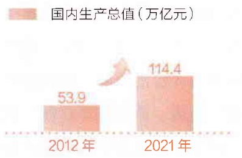
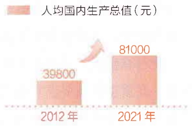
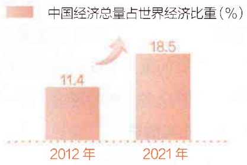
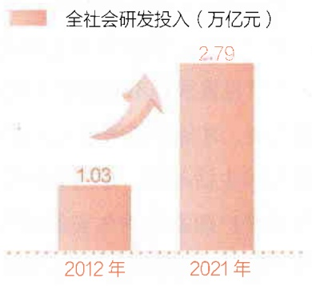

第三节 将改革开放进行到底

109

更高水平开放型经济，不断以中国新发展为世界提供新机遇。

近年来经济全球化遭遇逆流，单边主义、保护主义、孤立主义上升，世界经济低迷，国际贸易和投资大幅萎缩，但是开放合作仍然是历史潮流，经济全球化的历史大势不可逆转，世界决不会退回到相互封闭、彼此分割的状态。顺应大势才能赢得优势。党的十八大以来，我们坚定不移扩大对外开放，实行更加积极主动的开放战略，坚持对内对外开放相互促进、“引进来”和“走出去”更好结合，推动贸易和投资自由化便利化，构建面向全球的高标准自由贸易区网络，共建“一带一路”成为当今世界深受欢迎的国际公共产品和国际合作平台，我国国际经济合作和竞争新优势不断增强。开放带来进步，封闭必然落后。中国扩大高水平开放的决心不会变，同世界分享发展机遇的决心不会变，推动经济全球化朝着更加开放、包容、普惠、平衡、共赢方向发展的决心也不会变。

世界经济的大海，你要还是不要，都在那儿，是回避不了的。想人为切断各国经济的资金流、技术流、产品流、产业流、人员流，让世界经济的大海退回到一个一个孤立的小湖泊、小河流，是不可能的，也是不符合历史潮流的。

——习近平在世界经济论坛2017年年会开幕式上的主旨演讲

(2017年1月17日)

继续扩大对外开放，构建更高水平开放型经济新体制。习近平指出，“中国将坚持实施更大范围、更宽领域、更深层次对外开放，坚持走中国式现代化道路，建设更高水平开放型经济新体制”①。要依托我国超大规模市场优势，以国内大循环吸引全球资源要素，提升贸易投资合作质量和水平。深化贸易投资领域体制机制改革，稳步扩大规则、规制、管理、

<small>①《习近平在亚太经合组织第二十九次领导人非正式会议上的讲话》，人民出版社2022年版，第12页。</small>

---

110

第五章 全面深化改革开放

标准等制度型开放。推动货物贸易优化升级，创新服务贸易发展机制，发展数字贸易，加快建设贸易强国。推动共建“一带一路”高质量发展。优化区域开放布局，实施自由贸易试验区提升战略，形成陆海内外联动、东西双向互济的开放格局。深度参与全球产业分工和合作，促进国际宏观经济政策协调，维护多元稳定的国际经济格局和经贸关系，共同营造有利于发展的国际环境。

中国的发展离不开世界，世界的繁荣也需要中国。要坚持经济全球化正确方向，坚决反对保护主义，反对“筑墙设垒”“脱钩断链”，反对单边制裁、极限施压。中国对外开放，不是要一家唱独角戏，而是要欢迎各方共同参与；不是要谋求势力范围，而是要支持各国共同发展；不是要营造自己的后花园，而是要建设各国共享的百花园。未来之中国，必将以更加开放的姿态拥抱世界，必将同世界形成更加良性的互动，带来更加进步和繁荣的中国和世界。

## 本章小结

改革开放是决定当代中国命运的关键一招，也是决定实现“两个一百年”奋斗目标、实现中华民族伟大复兴的关键一招。新时代全面深化改革开放是啃硬骨头、涉险滩的伟大实践，是一场深刻的革命。以习近平同志为核心的党中央牢牢把握全面深化改革总目标，坚持正确方向、正确方法论，推动各领域各方面实现历史性变革、系统性重塑、整体性重构，中国特色社会主义制度更加成熟更加定型，国家治理体系和治理能力现代化水平不断提高。改革不停顿、开放不止步。新征程上，必须坚定不移推进全面深化改革和高水平对外开放，为以中国式现代化全面推进中华民族伟大复兴提供根本动力。

1. 2017年1月1日，公司收到的现金为3,496,850元。2017年1月1日至2017年1月2日，公司收到的现金为3,496,850元。

---

课后思考

111

1. 为什么说新时代全面深化改革开放是一场深刻革命？

2. 如何理解全面深化改革总目标？

3. 如何理解中国特色社会主义制度和国家治理体系的显著优势？

4. 如何理解“中国开放的大门只会越开越大”？

---

## 第六章 推动高质量发展

## 学习要点

1. 新发展理念的科学内涵和实践要求

2. 高质量发展的深刻内涵和重大意义

3. 坚持和完善社会主义基本经济制度

4. 构建以国内大循环为主体、国内国际双循环相互促进的新发展格局

高质量发展是新时代我国经济社会发展的鲜明主题，是全面建设社会主义现代化国家的首要任务。党的十八大以来，以习近平同志为核心的党中央在领导新时代经济发展的实践中，深刻总结并充分运用我国经济发展的成功经验，从新的实际出发，提出一系列新理念新思想新战略，形成了习近平经济思想，为推动高质量发展提供了根本遵循。必须把握新发展阶段，贯彻新发展理念，坚持和完善社会主义基本经济制度，加快构建新发展格局，建设现代化经济体系，以高质量发展推进中国式现代化。

2017年12月召开的中央经济工作会议对习近平经济思想首次作出概括:以新发展理念为主要内容，坚持加强党对经济工作的集中统一领导；坚持以人民为中心的发展思想；坚持适应把握引领经济发展新常态；坚持使市场在资源配置中起决定

Theorem 1.2. Theorem of (10.3) Let $\mathcal{F}(x)$ be a finite set of all elements $x \in \mathbb{Z}$. Then $\mathcal{F}(x)$ is a finite set of all elements $x$ in the order of

---

第一节 完整、准确、全面贯彻新发展理念

113

性作用，更好发挥政府作用；坚持适应我国经济发展主要矛盾变化完善宏观调控；坚持问题导向部署经济发展新战略；坚持正确工作策略和方法。

## 第一节 完整、准确、全面贯彻新发展理念

发展是解决我国一切问题的基础和关键。新时代新阶段的发展必须贯彻新发展理念，必须是高质量发展。新发展理念是实现高质量发展的指导原则，贯彻新发展理念是关系我国发展全局的一场深刻变革。

## 一、我国进入新发展阶段

正确认识历史方位和发展阶段，是我们党明确各个阶段中心任务、制定正确路线方针政策的根本依据，也是推进社会主义现代化建设事业、推动我国经济社会顺利发展的重要经验。

党的十八大以来，以习近平同志为核心的党中央着眼我国发展阶段、发展环境、发展条件变化，不断深化对经济形势和任务的认识。针对国际金融危机后世界经济低迷、我国经济下行压力加大，提出我国经济发展正处在增长速度换挡期、结构调整阵痛期、前期刺激政策消化期“三期叠加”阶段，进入了新常态。习近平指出:“我国经济发展进入新常态，没有改变我国发展仍处于可以大有作为的重要战略机遇期的判断，改变的是重要战略机遇期的内涵和条件；没有改变我国经济发展总体向好的基本面，改变的是经济发展方式和经济结构。”①我国经济增长速度从高速转向中高速，发展方式从规模速度型转向质量效率型，经济结构调整从增量扩能为

<small>①《习近平著作选读》第一卷，人民出版社2023年版，第330页。</small>

---

114

第六章 推动高质量发展

主转向调整存量、做优增量并举，发展动力从主要依靠资源和低成本劳动力等要素投入转向创新驱动，经济社会发展向形态更高级、分工更优化、结构更合理的阶段演进。我国经济已由高速增长阶段转向高质量发展阶段。

经济工作从来都不是抽象的、孤立的，而是具体的、联系的，必须立足中华民族伟大复兴战略全局和世界百年未有之大变局来思考和谋划。习近平指出:“全面建成小康社会、实现第一个百年奋斗目标之后，我们要乘势而上开启全面建设社会主义现代化国家新征程、向第二个百年奋斗目标进军，这标志着我国进入了一个新发展阶段。” $^{①}$  新发展阶段是我国社会主义初级阶段历史进程中的一个重要阶段，是中国共产党带领人民迎来从站起来、富起来到强起来历史性跨越的新阶段，是全面建设社会主义现代化国家、向第二个百年奋斗目标进军的重要阶段。

进入新发展阶段，我国发展的国内外环境进一步发生深刻变化，面对新的战略机遇、新的战略任务、新的战略要求、新的战略环境，需要解决的矛盾和问题比以往更加错综复杂。习近平强调:“当前和今后一个时期，虽然我国发展仍然处于重要战略机遇期，但机遇和挑战都有新的发展变化，机遇和挑战之大都前所未有，总体上机遇大于挑战。”②新发展阶段，我国经济发展的质量、效率、动力将发生重大变化，要以深化供给侧结构性改革为主线，加快经济结构优化升级、提升科技创新能力、深化改革开放、加快绿色发展、参与全球经济治理体系变革。要坚定不移抓机遇、用机遇，调动和运用好国内外形势变化带来的一切积极因素，充分发挥我们的独特优势，抢占未来发展制高点。

## 二、贯彻新发展理念是关系我国发展全局的一场深刻变革

贯彻新发展理念是新时代我国发展壮大的必由之路。进入新发展阶段

<small>①《习近平著作选读》第二卷，人民出版社2023年版，第398—399页。</small>

<small>②《习近平著作选读》第二卷，人民出版社2023年版，第401页。</small>

---

第一节 完整、准确、全面贯彻新发展理念

115

段，必须把发展质量问题摆在更为突出的位置，在质量效益明显提升的基础上实现经济持续健康发展。习近平指出，新时代抓发展，必须更加突出发展理念，坚定不移贯彻创新、协调、绿色、开放、共享的新发展理念。

发展理念是发展行动的先导，是管全局、管根本、管方向、管长远的东西，是发展思路、发展方式、发展着力点的集中体现。发展理念从根本上决定着发展成效乃至成败，发展理念搞对了，目标任务就好定了，政策举措也就跟着好定了。党的十八大以来，我们党适应发展新的形势，对发展理念和思路作出及时调整，提出了经济社会发展的许多重大理论和战略，其中新发展理念是最重要、最主要的。

新发展理念具有丰富的科学内涵和具体的实践要求。创新是引领发展的第一动力，创新发展注重的是解决发展动力问题，必须坚持创新在我国现代化建设全局中的核心地位，让创新贯穿党和国家一切工作，全面提升创新能力和效率，把创新发展主动权牢牢掌握在自己手中。协调是持续健康发展的内在要求，协调发展注重的是解决发展不平衡问题，必须正确处理局部和全局、当前和长远、重点和非重点的关系，在发展中促进相对平衡，不断增强发展的整体性。绿色是永续发展的必要条件和人民对美好生活追求的重要体现，绿色发展注重的是解决人与自然和谐共生问题，必须实现经济社会发展和生态环境保护协同共进，加快发展方式绿色转型，推动形成绿色低碳的生产方式和生活方式。开放是国家繁荣发展的必由之路，开放发展注重的是解决发展内外联动问题，必须推动形成更大范围、更宽领域、更深层次对外开放格局，不断增强我国国际经济合作和竞争新优势。共享是中国特色社会主义的本质要求，共享发展注重的是解决社会公平正义问题，必须坚持全民共享、全面共享、共建共享、渐进共享，不断推进全体人民共同富裕。新发展理念是一个系统的理论体系，回答了关于发展的目的、动力、方式、路径等一系列理论和实践问题，阐明了我们党关于发展的政治立场、价值导向、发展模式、发展道路等重大政治问题，深化了我们党对中国特

---

116

第六章 推动高质量发展

色社会主义经济发展规律的认识，开拓了中国特色社会主义政治经济学新境界。

新发展理念是指挥棒、红绿灯，是引领我国发展全局深刻变革的科学指引，必须完整、准确、全面地理解和把握。要从根本宗旨上把握新发展理念，坚持以人民为中心的发展思想，坚持发展为了人民、发展依靠人民、发展成果由人民共享，把满足人民群众对美好生活的新期待作为发展的出发点和落脚点，让现代化建设成果更多更公平惠及全体人民。要从问题导向上把握新发展理念，切实解决发展不平衡不充分问题，切实解决影响构建新发展格局、实现高质量发展的重大问题，切实解决影响人民群众生产生活的突出问题，真正实现高质量发展。要从忧患意识上把握新发展理念，积极主动、未雨绸缪，见微知著、防微杜渐，下好先手棋，打好主动仗，敢于斗争、善于斗争，随时准备应对更加复杂困难的局面，牢牢守住安全发展的底线。

## 三、以新发展理念引领高质量发展

高质量发展是全面建设社会主义现代化国家的首要任务，是遵循经济规律发展的必然要求。推动高质量发展，必须以新发展理念为引领，深入推进发展方式、发展动力、发展领域、发展质量变革，实现更高质量、更有效率、更加公平、更可持续、更为安全的发展。

经济发展是一个螺旋式上升的过程，上升不是线性的，量积累到一定阶段，必须转向质的提升，我国经济发展也要遵循这一规律。

——习近平在中央经济工作会议上的讲话

(2017年12月18日)

Theorem 1.2. Theorem of (10.1) Let $\mathcal{P}(x)$ be a finite set of all elements $x \in \mathbb{Z}$. Then $\mathcal{P}(x)$ is a finite set of all elements $x$ in the order of

---

第一节 完整、准确、全面贯彻新发展理念

117

高质量发展，是能够很好满足人民日益增长的美好生活需要的发展，是体现新发展理念的发展，是创新成为第一动力、协调成为内生特点、绿色成为普遍形态、开放成为必由之路、共享成为根本目的的发展。从供给看，高质量发展要求产业体系比较完整，生产组织方式网络化、智能化，创新力、需求捕捉力、品牌影响力、核心竞争力强，产品和服务质量高。从需求看，高质量发展要求不断满足人民群众个性化、多样化、不断升级的需求，引领供给体系和结构的变化，不断催生新的需求。从投入产出看，高质量发展要求不断提高劳动效率、资本效率、土地效率、资源效率、环境效率，不断提升科技进步贡献率，不断提高全要素生产率。从分配看，高质量发展要求实现投资有回报、企业有利润、员工有收入、政府有税收，并且充分反映各自按市场评价的贡献。从宏观经济循环看，高质量发展要求实现生产、分配、流通、消费循环通畅，国民经济重大比例关系和空间布局比较合理，经济发展比较平稳，不出现大的起落。更明确地说，高质量发展，就是从“有没有”转向“好不好”。

高质量发展关系我国社会主义现代化建设全局，具有重大战略意义。第一，高质量发展为全面建设社会主义现代化国家提供更为坚实的物质基础。只有实现高质量发展，才能在经济总量规模继续扩大的同时不断提高发展质量效益，为我国的社会事业发展、文化事业繁荣、生态环境美好、国际地位提升、国防和安全能力增强等提供强大的物质和技术保障。第二，高质量发展是不断满足人民对美好生活需要的重要保证。只有实现高质量发展，才能不断增进人民福祉，满足人民群众多方面的需求，更好地提高人民生活品质，促进共同富裕取得更为扎实的进展。第三，高质量发展是维护国家长治久安的必然要求。只有实现高质量发展，才能确保重要产业、基础设施、战略资源、重大科技等关键领域安全可控，有效防范和化解重大风险，为维护国家主权、安全和发展利益提供重要支撑。

推动高质量发展，要更好统筹质的有效提升和量的合理增长，始终坚持质量第一、效益优先，以效率变革、动力变革促进质量变革，加快

---

118

第六章 推动高质量发展

形成可持续的高质量发展体制机制，不断增强经济竞争力、创新力、抗风险能力。要保持经济社会发展稳定性，坚持稳中求进工作总基调，实行宏观政策要稳、产业政策要准、微观政策要活、改革政策要实、社会政策要托底的政策框架，以深化供给侧结构性改革为主线，以改革创新为根本动力，把实施扩大内需战略同深化供给侧结构性改革有机结合起来，加快构建新发展格局。

新时代十年经济发展主要成就

国内生产总值从53.9万亿元增长到114.4万亿元，稳居世界第二位

人均国内生产总值从39800元上升到81000元，人民生活水平大幅提升

中国经济总量占世界经济比重从$11.4\%$ 提升到 $18.5\%$ ，对世界经济增长的平均贡献率超过 $30\%$ ，居于首位

全社会研发投入从1.03万亿元提高到2.79万亿元

数据来源:国家统计局

(1)  $\frac{1}{2}$  (2)  $\frac{1}{2}$  (3)  $\frac{1}{2}$  (4)  $\frac{1}{2}$  (5)  $\frac{1}{2}$  (6)  $\frac{1}{2}$  (7)

---

(1) \( \because {S}\_{\Delta ACD} = {S}\_{\Delta BCD} + {S}\_{\Delta CDE} = {S}\_{\Delta DDE} + {S}\_{\Delta EDE} + {S}\_{\Delta FDE} + {S}\_{\Delta GDE} + {S}\_{\Delta HDE} + {S}\_{\Delta IDE} + {S}\_{\Delta JDE} + {S}\_{\Delta KDE} + {S}\_{\Delta LDE} + {S}\_{\Delta MDE} + {S}\_{\Delta NDE} + {S}\_{\Delta ODE} + {S}\_{\Delta PDE} + {S}\_{\Delta QDE} + {S}\_{\Delta RDE} + {S}\_{\Delta SDE} + {S}\_{\Delta TDE} + {S}\_{\Delta UDE} + {S}\_{\Delta VDE} + {S}\_{\Delta WDE} + {S}\_{\Delta XDE} + {S}\_{\Delta YDE} + {S}\_{\Delta ZDE} + {S}\_{\Delta AADE} + {S}\_{\Delta ABDE} + {S}\_{\Delta ACDE} + {S}\_{\Delta ADDE} + {S}\_{\Delta AEDE} + {S}\_{\Delta AFDE} + {S}\_{\Delta AGDE} + {S}\_{\Delta AHDE} + {S}\_{\Delta AIDE} + {S}\_{\Delta AJDE} + {S}\_{\Delta AKDE} + {S}\_{\Delta ALDE} + {S}\_{\Delta AMDE} + {S}\_{\Delta ANDE} + {S}\_{\Delta AODE} + {S}\_{\Delta APDE} + {S}\_{\Delta AQDE} + {S}\_{\Delta ARDE} + {S}\_{\Delta ASDE} + {S}\_{\Delta ATDE} + {S}\_{\Delta AUDE} + {S}\_{\Delta AVDE} + {S}\_{\Delta AWDE} + {S}\_{\Delta AXDE} + {S}\_{\Delta AZDE} + {S}\_{\Delta BADE} + {S}\_{\Delta BADE} + {S}\_{\Delta BADE} + {S}\_{\Delta BADE} + {S}\_{\Delta BADE} + {S}\_{\Delta BADE} + {S}\_{\Delta BADE} + {S}\_{\Delta BADE} + {S}\_{\Delta BADE} + {S}\_{\Delta BADE} + {S}\_{\Delta BADE} + {S}\_{\Delta BADE} + {S}\_{\Delta BADE} + {S}\_{\Delta BADE} + {S}\_{\Delta BADE} + {S}\_{\Delta BADE} + {S}\_{\Delta BADE} + {S}\_{\Delta BADE} + {S}\_{\Delta BADE} + {S}\_{\Delta BADE} + {S}\_{\Delta BADE} + {S}\_{\Delta BADE} + {S}\_{\Delta BADE} + {S}\_{\Delta BADE} + {S}\_{\Delta BADE} + {S}\_{\Delta BADE} + {S}\_{\Delta BADE} + {S}\_{\Delta BADE} + {S}\_{\Delta BADE} + {S\_{BADE}} + {S\_{BADE}} + {S\_{BADE}} + {S\_{BADE}} + {S\_{BADE}} + {S\_{BADE}} + {S\_{BADE}} + {S\_{BADE}} + {S\_{BADE}} + {S\_{BADE}} + {S\_{BADE}} + {S\_{BADE}} + {S\_{BADE}} + {S\_{BADE}} + {S\_{BADE}} + {S\_{BADE}} + {S\_{BADE}} + {S\_{BADE}} + {S\_{BADE}} + {S\_{BADE}} + {S\_{BADE}} + {S\_{BADE}} + {S\_{BADE}} + {S\_{BADE}} + {S\_{BADE}} + {S\_{BADE}} + {S\_{BADE}} + {S\_{BADE}} + {S\_{BADE}} + {S\_{BADE}} + {S\_{BADE}} + {S\_{BADE}} + {S\_{BADE}} + {S\_{BADE}} + {S\_{BADE}} + {S\_{BADE}} + {S\_{BADE}} + {S\_{BADE}} + {S\_{BADE}} + {S\_{BADE}} + {S\_{BADE}} + {S\_{BADE}} + {S\_{BADE}} + {S\_{BADE}} + {S\_{BADE}} + {S\_{BADE}} + {S\_{BADE}} + {S\_{BADE}} + {S\_{BADE}} + {S\_{BADE}} + {S\_{BADE}} + {S\_{BADE}} + {S\_{BADE}} + {S\_{BADE}} + {S\_{BADE}} + {S\_{BADE}} + {S\_{BADE}} + {S\_{BADE}} + {S\_{BADE}} + {S\_{BADE}} + {S\_{BADE}} + {S\_{BADE}} + {S\_{BADE}} + {S\_{BADE}} + {S\_{BADE}} + {S\_{BADE}} + {S\_{BADE}} + {S\_{BADE}} + {S\_{BADE}} + {S\_{BADE}} + {S\_{BADE}} + {S\_{BADE}} + {S\_{BADE}} + {S\_{BADE}} + {S\_{BADE}} + {S\_{BADE}} + {S\_{BADE}} + {S\_{BADE}} + {S\_{BADE}} + {S\_{BADE}} + {S\_{BADE}} + {S\_{BADE}} + {S\_{BADE}} + {S\_{BADE}} + {S\_{BADE}} + {S\_{BADE}} + {S\_{BADE}} + {S\_{BADE}} + {S\_{BADE}} + {S\_{BADE}} + {S\_{BADE}} + {S\_{BADE}} + {S\_{BADE}} + {S\_{BADE}} + {S\_{BADE}} + {S\_{BADE}} + {S\_{BADE}} + {S\_{BADE}} + {S\_{BADE}} + {S\_{BADE}} + {S\_{BADE}} + {S\_{BADE}} + {S\_{BADE}} + {S\_{BADE}} + {S\_{BADE}} + {S\_{BADE}} + {S\_{BADE}} + {S\_{BADE}} + {S\_{BADE}} + {S\_{BADE}} + {S\_{BADE}} + {S\_{BADE}} + {S\_{BADE}} + {S\_{BADE}} + {S\_{BADE}} + {S\_{BADE}} + {S\_{BADE}} + {S\_{BADE}} + {S\_{BADE}} + {S\_{BADE}} + {S\_{BADE}} + {S\_{BADE}} + {S\_{BADE}} + {S\_{BADE}} + {S\_{BADE}} + {S\_{BADE}} + {S\_{BADE}} + {S\_{BADE}} + {S\_{BADE}} + {S\_{BADE}} + {S\_{BADE}} + {S\_{BADE}} + {S\_{BADE}} + {S\_{BADE}} + {S\_{BADE}} + {S\_{BADE}} + {S\_{BADE}} + {S\_{BADE}} + {S\_{BADE}} + {S\_{BADE}} + {S\_{BADE}} + {S\_{BADE}} + {S\_{BADE}} + {S\_{BADE}} + {S\_{BADE}} + {S\_{BADE}} + {S\_{BADE}} + {S\_{BADE}} + {S\_{BADE}} + {S\_{BADE}} + {S\_{BADE}} + {S\_{BADE}} + {S\_{BADE}} + {S\_{BADE}} + {S\_{BADE}} + {S\_{BADE}} + {S\_{BADE}} + {S\_{BADE}} + {S\_{BADE}} + {S\_{BADE}} + {S\_{BADE}} + {S\_{BADE}} + {S\_{BADE}} + {S\_{BADE}} + {S\_{BADE}} + {S\_{BADE}} + {S\_{BADE}} + {S\_{BADE}} + {S\_{BADE}} + {S\_{BADE}} + {S\_{BADE}} + {S\_{BADE}} + {S\_{BADE}} + {S\_{BADE}} + {S\_{BADE}} + {S\_{BADE}} + {S\_{BADE}} + {S\_{BADE}} + {S\_{BADE}} + {S\_{BADE}} + {S\_{BADE}} + {S\_{BADE}} + {S\_{BADE}} + {S\_{BADE}} + {S\_{BADE}} + {S\_{BADE}} + {S\_{BADE}} + {S\_{BADE}} + {S\_{BADE}} + {S\_{BADE}} + {S\_{BADE}} + {S\_{BADE}} + {S\_{BADE}} + {S\_{BADE}} + {S\_{BADE}} + {S\_{BADE}} + {S\_{BADE}} + {S\_{BADE}} + {S\_{BADE}} + {S\_{BADE}} + {S\_{BADE}} + {S\_{BADE}} + {S\_{BADE}} + {S\_{BADE}} + {S\_{BADE}} + {S\_{BADE}} + {S\_{BADE}} + {S\_{BADE}} + {S\_{BADE}} + {S\_{BADE}} + {S\_{BADE}} + {S\_{BADE}} + {S\_{BADE}} + {S\_{BADE}} + {S\_{BADE}} + {S\_{BADE}} + {S\_{BADE}} + {S\_{BADE}} + {S\_{BADE}} + {S\_{BADE}} + {S\_{BADE}} + {S\_{BADE}} + {S\_{BADE}} + {S\_{BADE}} + {S\_{BADE}} + {S\_{BADE}} + {S\_{BADE}} + {S\_{BADE}} + {S\_{BADE}} + {S\_{BADE}} + {S\_{BADE}} + {S\_{BADE}} + {S\_{BADE}} + {S\_{BADE}} + {S\_{BADE}} + {S\_{BADE}} + {S\_{BADE}} + {S\_{BADE}} + {S\_{BADE}} + {S\_{BADE}} + {S\_{BADE}} + {S\_{BADE}} + {S\_{BADE}} + {S\_{BADE}} + {S\_{BADE}} + {S\_{BADE}} + {S\_{BADE}} + {S\_{BADE}} + {S\_{BADE}} + {S\_{BADE}} + {S\_{BADE}} + {S\_{BADE}} + {S\_{BADE}} + {S\_{BADE}} + {S\_{BADE}} + {S\_{BADE}} + {S\_{BADE}} + {S\_{BADE}} + {S\_{BADE}} + {S\_{BADE}} + {S\_{BADE}} + {S\_{BADE}} + {S\_{BADE}} + {S\_{BADE}} + {S\_{BADE}} + {S\_{BADE}} + {S\_{BADE}} + {S\_{BADE}} + {S\_{BADE}} + {S\_{BADE}} + {S\_{BADE}} + {S\_{BADE}} + {S\_{BADE}} + {S\_{BADE}} + {S\_{BADE}} + {S\_{BADE}} + {S\_{BADE}} + {S\_{BADE}} + {S\_{BADE}} + {S\_{BADE}} + {S\_{BADE}} + {S\_{BADE}} + {S\_{BADE}} + {S\_{BADE}} + {S\_{BADE}} + {S\_{BADE}} + {S\_{BADE}} + {S\_{BADE}} + {S\_{BADE}} + {S\_{BADE}} + {S\_{BADE}} + {S\_{BADE}} + {S\_{BADE}} + {S\_{BADE}} + {S\_{BADE}} + {S\_{BADE}} + {S\_{BADE}} + {S\_{BADE}} + {S\_{BADE}} + {S\_{BADE}} + {S\_{BADE}} + {S\_{BADE}} + {S\_{BADE}} + {S\_{BADE}} + {S\_{BADE}} + {S\_{BADE}} + {S\_{BADE}} + {S\_{BADE}} + {S\_{BADE}} + {S\_{BADE}} + {S\_{BADE}} + {S\_{BADE}} + {S\_{BADE}} + {S\_{BADE}} + {S\_{BADE}} + {S\_{BADE}} + {S\_{BADE}} + {S\_{BADE}} + {S\_{BADE}} + {S\_{BADE}} + {S\_{BADE}} + {S\_{BADE}} + {S\_{BADE}} + {S\_{BADE}} + {S\_{BADE}} + {S\_{BADE}} + {S\_{BADE}} + {S\_{BADE}} + {S\_{BADE}} + {S\_{BADE}} + {S\_{BADE}} + {S\_{BADE}} + {S\_{BADE}} + {S\_{BADE}} + {S\_{BADE}} + {S\_{BADE}} + {S\_{BADE}} + {S\_{BADE}} + {S\_{BADE}} + {S\_{BADE}} + {S\_{BADE}} + {S\_{BADE}} + {S\_{BADE}} + {S\_{BADE}} + {S\_{BADE}} + {S\_{BADE}} + {S\_{BADE}} + {S\_{BADE}} + {S\_{BADE}} + {S\_{BADE}} + {S\_{BADE}} + {S\_{BADE}} + {S\_{BADE}} + {S\_{BADE}} + {S\_{BADE}} + {S\_{BADE}} + {S\_{BADE}} + {S\_{BADE}} + {S\_{BADE}} + {S\_{BADE}} + {S\_{BADE}} + {S\_{BADE}} + {S\_{BADE}} + {S\_{BADE}} + {S\_{BADE}} + {S\_{BADE}} + {S\_{BADE}} + {S\_{BADE}} + {S\_{BADE}} + {S\_{BADE}} + {S\_{BADE}} + {S\_{BADE}} + {S\_{BADE}} + {S\_{BADE}} + {S\_{BADE}} + {S\_{BADE}} + {S\_{BADE}} + {S\_{BADE}} + {S\_{BADE}} + {S\_{BADE}} + {S\_{BADE}} + {S\_{BADE}} + {S\_{BADE}} + {S\_{BADE}} + {S\_{BADE}} + {S\_{BADE}} + {S\_{BADE}} + {S\_{BADE}} + {S\_{BADE}} + {S\_{BADE}} + {S\_{BADE}} + {S\_{BADE}} + {S\_{BADE}} + {S\_{BADE}} + {S\_{BADE}} + {S\_{BADE}} + {S\_{BADE}} + {S\_{BADE}} + {S\_{BADE}} + {S\_{BADE}} + {S\_{BADE}} + {S\_{BADE}} + {S\_{BADE}} + {S\_{BADE}} + {S\_{BADE}} + {S\_{BADE}} + {S\_{BADE}} + {S\_{BADE}} + {S\_{BADE}} + {S\_{BADE}} + {S\_{BADE}} + {S\_{BADE}} + {S\_{BADE}} + {S\_{BADE}} + {S\_{BADE}} + {S\_{BADE}} + {S\_{BADE}} + {S\_{BADE}} + {S\_{BADE}} + {S\_{BADE}} + {S\_{BADE}} + {S\_{BADE}} + {S\_{BADE}} + {S\_{BADE}} + {S\_{BADE}} + {S\_{BADE}} + {S\_{BADE}} + {S\_{BADE}} + {S\_{BADE}} + {S\_{BADE}} + {S\_{BADE}} + {S\_{BADE}} + {S\_{BADE}} + {S\_{BADE}} + {S\_{BADE}} + {S\_{BADE}} + {S\_{BADE}} + {S\_{BADE}} + {S\_{BADE}} + {S\_{BADE}} + {S\_{BADE}} + {S\_{BADE}} + {S\_{BADE}} + {S\_{BADE}} + {S\_{BADE}} + {S\_{BADE}} + {S\_{BADE}} + {S\_{BADE}} + {S\_{BADE}} + {S\_{BADE}} + {S\_{BADE}} + {S\_{BADE}} + {S\_{BADE}} + {S\_{BADE}} + {S\_{BADE}} + {S\_{BADE}} + {S\_{BADE}} + {S\_{BADE}} + {S\_{BADE}} + {S\_{BADE}} + {S\_{BADE}} + {S\_{BADE}} + {S\_{BADE}} + {S\_{BADE}} + {S\_{BADE}} + {S\_{BADE}} + {S\_{BADE}} + {S\_{BADE}} + {S\_{BADE}} + {S\_{BADE}} + {S\_{BADE}} + {S\_{BADE}} + {S\_{BADE}} + {S\_{BADE}} + {S\_{BADE}} + {S\_{BADE}} + {S\_{BADE}} + {S\_{BADE}} + {S\_{BADE}} + {S\_{BADE}} + {S\_{BADE}} + {S\_{BADE}} + {S\_{BADE}} + {S\_{BADE}} + {S\_{BADE}} + {S\_{BADE}} + {S\_{BADE}} + {S\_{BADE}} + {S\_{BADE}} + {S\_{BADE}} + {S\_{BADE}} + {S\_{BADE}} + {S\_{BADE}} + {S\_{BADE}} + {S\_{BADE}} + {S\_{BADE}} + {S\_{BADE}} + {S\_{BADE}} + {S\_{BADE}} + {S\_{BADE}} + {S\_{BADE}} + {S\_{BADE}} + {S\_{BADE}} + {S\_{BADE}} + {S\_{BADE}} + {S\_{BADE}} + {S\_{BADE}} + {S\_{BADE}} + {S\_{BADE}} + {S\_{BADE}} + {S\_{BADE}} + {S\_{BADE}} + {S\_{BADE}} + {S\_{BADE}} + {S\_{BADE}} + {S\_{BADE}} + {S\_{BADE}} + {S\_{BADE}} + {S\_{BADE}} + {S\_{BADE}} + {S\_{BADE}} + {S\_{BADE}} + {S\_{BADE}} + {S\_{BADE}} + {S\_{BADE}} + {S\_{BADE}} + {S\_{BADE}} + {S\_{BADE}} + {S\_{BADE}} + {S\_{BADE}} + {S\_{BADE}} + {S\_{BADE}} + {S\_{BADE}} + {S\_{BADE}} + {S\_{BADE}} + {S\_{BADE}} + {S\_{BADE}} + {S\_{BADE}} + {S\_{BADE}} + {S\_{BADE}} + {S\_{BADE}} + {S\_{BADE}} + {S\_{BADE}} + {S\_{BADE}} + {S\_{BADE}} + {S\_{BADE}} + {S\_{BADE}} + {S\_{BADE}} + {S\_{BADE}} + {S\_{BADE}} + {S\_{BADE}} + {S\_{BADE}} + {S\_{BADE}} + {S\_{BADE}} + {S\_{BADE}} + {S\_{BADE}} + {S\_{BADE}} + {S\_{BADE}} + {S\_{BADE}} + {S\_{BADE}} + {S\_{BADE}} + {S\_{BADE}} + {S\_{BADE}} + {S\_{BADE}} + {S\_{BADE}} + {S\_{BADE}} + {S\_{BADE}} + {S\_{BADE}} + {S\_{BADE}} + {S\_{BADE}} + {S\_{BADE}} + {S\_{BADE}} + {S\_{BADE}} + {S\_{BADE}} + {S\_{BADE}} + {S\_{BADE}} + {S\_{BADE}} + {S\_{BADE}} + {S\_{BADE}} + {S\_{BADE}} + {S\_{BADE}} + {S\_{BADE}} + {S\_{BADE}} + {S\_{BADE}} + {S\_{BADE}} + {S\_{BADE}} + {S\_{BADE}} + {S\_{BADE}} + {S\_{BADE}} + {S\_{BADE}} + {S\_{BADE}} + {S\_{BADE}} + {S\_{BADE}} + {S\_{BADE}} + {S\_{BADE}} + {S\_{BADE}} + {S\_{BADE}} + {S\_{BADE}} + {S\_{BADE}} + {S\_{BADE}} + {S\_{BADE}} + {S\_{BADE}} + {S\_{BADE}} + {S\_{BADE}} + {S\_{BADE}} + {S\_{BADE}} + {S\_{BADE}} + {S\_{BADE}} + {S\_{BADE}} + {S\_{BADE}} + {S\_{BADE}} + {S\_{BADE}} + {S\_{BADE}} + {S\_{BADE}} + {S\_{BADE}} + {S\_{BADE}} + {S\_{BADE}} + {S\_{BADE}} + {S\_{BADE}} + {S\_{BADE}} + {S\_{BADE}} + {S\_{BADE}} + {S\_{BADE}} + {S\_{BADE}} + {S\_{BADE}} + {S\_{BADE}} + {S\_{BADE}} + {S\_{BADE}} + {S\_{BADE}} + {S\_{BADE}} + {S\_{BADE}} + {S\_{BADE}} + {S\_{BADE}} + {S\_{BADE}} + {S\_{BADE}} + {S\_{BADE}} + {S\_{BADE}} + {S\_{BADE}} + {S\_{BADE}} + {S\_{BADE}} + {S\_{BADE}} + {S\_{BADE}} + {S\_{BADE}} + {S\_{BADE}} + {S\_{BADE}} + {S\_{BADE}} + {S\_{BADE}} + {S\_{BADE}} + {S\_{BADE}} + {S\_{BADE}} + {S\_{BADE}} + {S\_{BADE}} + {S\_{BADE}} + {S\_{BADE}} + {S\_{BADE}} + {S\_{BADE}} + {S\_{BADE}} + {S\_{BADE}} + {S\_{BADE}} + {S\_{BADE}} + {S\_{BADE}} + {S\_{BADE}} + {S\_{BADE}} + {S\_{BADE}} + {S\_{BADE}} + {S\_{BADE}} + {S\_{BADE}} + {S\_{BADE}} + {S\_{BADE}} + {S\_{BADE}} + {S\_{BADE}} + {S\_{BADE}} + {S\_{BADE}} + {S\_{BADE}} + {S\_{BADE}} + {S\_{BADE}} + {S\_{BADE}} + {S\_{BADE}} + {S\_{BADE}} + {S\_{BADE}} + {S\_{BADE}} + {S\_{BADE}} + {S\_{BADE}} + {S\_{BADE}} + {S\_{BADE}} + {S\_{BADE}} + {S\_{BADE}} + {S\_{BADE}} + {S\_{BADE}} + {S\_{BADE}} + {S\_{BADE}} + {S\_{BADE}} + {S\_{BADE}} + {S\_{BADE}} + {S\_{BADE}} + {S\_{BADE}} + {S\_{BADE}} + {S\_{BADE}} + {S\_{BADE}} + {S\_{BADE}} + {S\_{BADE}} + {S\_{BADE}} + {S\_{BADE}} + {S\_{BADE}} + {S\_{BADE}} + {S\_{BADE}} + {S\_{BADE}} + {S\_{BADE}} + {S\_{BADE}} + {S\_{BADE}} + {S\_{BADE}} + {S\_{BADE}} + {S\_{BADE}} + {S\_{BADE}} + {S\_{BADE}} + {S\_{BADE}} + {S\_{BADE}} + {S\_{BADE}} + {S\_{BADE}} + {S\_{BADE}} + {S\_{BADE}} + {S\_{BADE}} + {S\_{BADE}} + {S\_{BADE}} + {S\_{BADE}} + {S\_{BADE}} + {S\_{BADE}} + {S\_{BADE}} + {S\_{BADE}} + {S\_{BADE}} + {S\_{BADE}} + {S\_{BADE}} + {S\_{BADE}} + {S\_{BADE}} + {S\_{BADE}} + {S\_{BADE}} + {S\_{BADE}} + {S\_{BADE}} + {S\_{BADE}} + {S\_{BADE}} + {S\_{BADE}} + {S\_{BADE}} + {S\_{BADE}} + {S\_{BADE}} + {S\_{BADE}} + {S\_{BADE}} + {S\_{BADE}} + {S\_{BADE}} + {S\_{BADE}} + {S\_{BADE}} + {S\_{BADE}} + {S\_{BADE}} + {S\_{BADE}} + {S\_{BADE}} + {S\_{BADE}} + {S\_{BADE}} + {S\_{BADE}} + {S\_{BADE}} + {S\_{BADE}} + {S\_{BADE}} + {S\_{BADE}} + {S\_{BADE}} + {S\_{BADE}} + {S\_{BADE}} + {S\_{BADE}} + {S\_{BADE}} + {S\_{BADE}} + {S\_{BADE}} + {S\_{BADE}} + {S\_{BADE}} + {S\_{BADE}} + {S\_{BADE}} + {S\_{BADE}} + {S\_{BADE}} + {S\_{BADE}} + {S\_{BADE}} + {S\_{BADE}} + {S\_{BADE}} + {S\_{BADE}} + {S\_{BADE}} + {S\_{BADE}} + {S\_{BADE}} + {S\_{BADE}} + {S\_{BADE}} + {S\_{BADE}} + {S\_{BADE}} + {S\_{BADE}} + {S\_{BADE}} + {S\_{BADE}} + {S\_{BADE}} + {S\_{BADE}} + {S\_{BADE}} + {S\_{BADE}} + {S\_{BADE}} + {S\_{BADE}} + {S\_{BADE}} + {S\_{BADE}} + {S\_{BADE}} + {S\_{BADE}} + {S\_{BADE}} + {S\_{BADE}} + {S\_{BADE}} + {S\_{BADE}} + {S\_{BADE}} + {S\_{BADE}} + {S\_{BADE}} + {S\_{BADE}} + {S\_{BADE}} + {S\_{BADE}} + {S\_{BADE}} + {S\_{BADE}} + {S\_{BADE}} + {S\_{BADE}} + {S\_{BADE}} + {S\_{BADE}} + {S\_{BADE}} + {S\_{BADE}} + {S\_{BADE}} + {S\_{BADE}} + {S\_{BADE}} + {S\_{BADE}} + {S\_{BADE}} + {S\_{BADE}} + {S\_{BADE}} + {S\_{BADE}} + {S\_{BADE}} + {S\_{BADE}} + {S\_{BADE}} + {S\_{BADE}} + {S\_{BADE}} + {S\_{BADE}} + {S\_{BADE}} + {S\_{BADE}} + {S\_{BADE}} + {S\_{BADE}} + {S\_{BADE}} + {S\_{BADE}} + {S\_{BADE}} + {S\_{BADE}} + {S\_{BADE}} + {S\_{BADE}} + {S\_{BADE}} + {S\_{BADE}} + {S\_{BADE}} + {S\_{BADE}} + {S\_{BADE}} + {S\_{BADE}} + {S\_{BADE}} + {S\_{BADE}} + {S\_{BADE}} + {S\_{BADE}} + {S\_{BADE}} + {S\_{BADE}} + {S\_{BADE}} + {S\_{BADE}} + {S\_{BADE}} + {S\_{BADE}} + {S\_{BADE}} + {S\_{BADE}} + {S\_{BADE}} + {S\_{BADE}} + {S\_{BADE}} + {S\_{BADE}} + {S\_{BADE}} + {S\_{BADE}} + {S\_{BADE}} + {S\_{BADE}} + {S\_{BADE}} + {S\_{BADE}} + {S\_{BADE}} + {S\_{BADE}} + {S\_{BADE}} + {S\_{BADE}} + {S\_{BADE}} + {S\_{BADE}} + {S\_{BADE}} + {S\_{BADE}} + {S\_{BADE}} + {S\_{BADE}} + {S\_{BADE}} + {S\_{BADE}} + {S\_{BADE}} + {S\_{BADE}} + {S\_{BADE}} + {S\_{BADE}} + {S\_{BADE}} + {S\_{BADE}} + {S\_{BADE}} + {S\_{BADE}} + {S\_{BADE}} + {S\_{BADE}} + {S\_{BADE}} + {S\_{BADE}} + {S\_{BADE}} + {S\_{BADE}} + {S\_{BADE}} + {S\_{BADE}} + {S\_{BADE}} + {S\_{BADE}} + {S\_{BADE}} + {S\_{BADE}} + {S\_{BADE}} + {S\_{BADE}} + {S\_{BADE}} + {S\_{BADE}} + {S\_{BADE}} + {S\_{BADE}} + {S\_{BADE}} + {S\_{BADE}} + {S\_{BADE}} + {S\_{BADE}} + {S\_{BADE}} + {S\_{BADE}} + {S\_{BADE}} + {S\_{BADE}} + {S\_{BADE}} + {S\_{BADE}} + {S\_{BADE}} + {S\_{BADE}} + {S\_{BADE}} + {S\_{BADE}} + {S\_{BADE}} + {S\_{BADE}} + {S\_{BADE}} + {S\_{BADE}} + {S\_{BADE}} + {S\_{BADE}} + {S\_{BADE}} + {S\_{BADE}} + {S\_{BADE}} + {S\_{BADE}} + {S\_{BADE}} + {S\_{BADE}} + {S\_{BADE}} + {S\_{BADE}} + {S\_{BADE}} + {S\_{BADE}} + {S\_{BADE}} + {S\_{BADE}} + {S\_{BADE}} + {S\_{BADE}} + {S\_{BADE}} + {S\_{BADE}} + {S\_{BADE}} + {S\_{BADE}} + {S\_{BADE}} + {S\_{BADE}} + {S\_{BADE}} + {S\_{BADE}} + {S\_{BADE}} + {S\_{BADE}} + {S\_{BADE}} + {S\_{BADE}} + {S\_{BADE}} + {S\_{BADE}} + {S\_{BADE}} + {S\_{BADE}} + {S\_{BADE}} + {S\_{BADE}} + {S\_{BADE}} + {S\_{BADE}} + {S\_{BADE}} + {S\_{BADE}} + {S\_{BADE}} + {S\_{BADE}} + {S\_{BADE}} + {S\_{BADE}} + {S\_{BADE}} + {S\_{BADE}} + {S\_{BADE}} + {S\_{BADE}} + {S\_{BADE}} + {S\_{BADE}} + {S\_{BADE}} + {S\_{BADE}} + {S\_{BADE}} + {S\_{BADE}} + {S\_{BADE}} + {S\_{BADE}} + {S\_{BADE}} + {S\_{BADE}} + {S\_{BADE}} + {S\_{BADE}} + {S\_{BADE}} + {S\_{BADE}} + {S\_{BADE}} + {S\_{BADE}} + {S\_{BADE}} + {S\_{BADE}} + {S\_{BADE}} + {S\_{BADE}} + {S\_{BADE}} + {S\_{BADE}} + {S\_{BADE}} + {S\_{BADE}} + {S\_{BADE}} + {S\_{BADE}} + {S\_{BADE}} + {S\_{BADE}} + {S\_{BADE}} + {S\_{BADE}} + {S\_{BADE}} + {S\_{BADE}} + {S\_{BADE}} + {S\_{BADE}} + {S\_{BADE}} + {S\_{BADE}} + {S\_{BADE}} + {S\_{BADE}} + {S\_{BADE}} + {S\_{BADE}} + {S\_{BADE}} + {S\_{BADE}} + {S\_{BADE}} + {S\_{BADE}} + {S\_{BADE}} + {S\_{BADE}} + {S\_{BADE}} + {S\_{BADE}} + {S\_{BADE}} + {S\_{BADE}} + {S\_{BADE}} + {S\_{BADE}} + {S\_{BADE}} + {S\_{BADE}} + {S\_{BADE}} + {S\_{BADE}} + {S\_{BADE}} + {S\_{BADE}} + {S\_{BADE}} + {S\_{BADE}} + {S\_{BADE}} + {S\_{BADE}} + {S\_{BADE}} + {S\_{BADE}} + {S\_{BADE}} + {S\_{BADE}} + {S\_{BADE}} + {S\_{BADE}} + {S\_{BADE}} + {S\_{BADE}} + {S\_{BADE}} + {S\_{BADE}} + {S\_{BADE}} + {S\_{BADE}} + {S\_{BADE}} + {S\_{BADE}} + {S\_{BADE}} + {S\_{BADE}} + {S\_{BADE}} + {S\_{BADE}} + {S\_{BADE}} + {S\_{BADE}} + {S\_{BADE}} +

第二节 坚持和完善社会主义基本经济制度

119

党的十八大以来，以习近平同志为核心的党中央团结带领全党全国各族人民坚定不移贯彻新发展理念，着力推动高质量发展，我国经济发展取得历史性成就、发生历史性变革。我国国内生产总值突破百万亿元大关，人均国内生产总值超过1万美元，对世界经济增长的贡献率稳居首位，作为世界第二大经济体、第二大消费市场、制造业第一大国、货物贸易第一大国、外汇储备第一大国等的地位进一步巩固提升。重大创新成果竞相涌现，一些前沿领域开始进入并跑、领跑阶段，科技实力正在从量的积累迈向质的飞跃，从点的突破迈向系统能力提升，进入创新型国家行列。产业转型升级步伐持续加快，战略性新兴产业不断壮大，先进制造业和现代服务业融合发展进程加速，一些长期积累的重大风险得到有效处置，粮食、能源资源、产业链供应链、重要基础设施等领域安全得到有效保障。我国经济发展平衡性、协调性、可持续性明显增强，国家经济实力、科技实力、综合国力跃上新台阶，实现历史性跃升。

## 第二节 坚持和完善社会主义基本经济制度

社会主义基本经济制度是中国特色社会主义制度的重要支柱，是新时代推动实现高质量发展的制度基础。完整、准确、全面贯彻新发展理念，实现高质量发展，必须坚持好、巩固好、完善好、发展好社会主义基本经济制度。

## 一、坚持和完善社会主义基本经济制度是实现高质量发展的保障

马克思主义认为，生产力和生产关系、经济基础和上层建筑的矛盾运动，支配着整个社会发展进程。进入新发展阶段，贯彻新发展理

---

(2) 1987年，中国（香港）与美国（新加坡）的贸易商协会签订了《中华人民共和国进出口贸易合同》。

120

第六章 推动高质量发展

念、实现高质量发展，要自觉通过调整生产关系、完善上层建筑以适应新的发展要求，让中国特色社会主义经济更加符合规律地向前发展。社会主义基本经济制度是我国生产关系在制度上的体现，在经济制度体系中具有基础性决定性地位，是中国特色社会主义制度的重要支柱。它规定了我国经济关系的基本原则，明确人们在生产、分配、交换、消费中的地位及相互关系，是解放和发展社会生产力、改善人民生活、维护社会公平正义、推进共同富裕的制度基础，对实现高质量发展具有重大意义。

党的十八大以来，以习近平同志为核心的党中央着眼于更好发挥社会主义制度优越性、推动高质量发展，对社会主义基本经济制度作出新概括，将公有制为主体、多种所有制经济共同发展，按劳分配为主体、多种分配方式并存，社会主义市场经济体制等共同作为社会主义基本经济制度。这一基本经济制度，既体现了社会主义制度优越性，又同我国社会主义初级阶段社会生产力发展水平相适应，是党和人民的伟大创造。

社会主义基本经济制度的新概括，充分体现了我们党对我国经济发展规律的深刻认识和科学把握。这一新概括，包括所有制、分配制度、资源配置体制机制等方面，反映了我国社会主义经济活动的主要方面、主要过程，是相互联系、相互支持、相互促进的内在统一整体。所有制结构是基本经济制度的基础，决定分配方式和资源配置方式；合理有效的分配方式和资源配置方式有利于进一步完善所有制结构。这三个方面是经济制度体系中具有长期性和稳定性的部分，起着规范方向的作用，对经济制度属性和经济发展方式有决定性影响，是新时代推动经济高质量发展的制度支撑。将按劳分配为主体、多种分配方式并存，社会主义市场经济体制上升为基本经济制度，是着眼于新的实践和发展需要作出的概括，具有科学的理论基础、广泛的实践基础和深厚的群众基础，对国家治理体系和治理能力现代化具有系统性影响。

---

第二节 坚持和完善社会主义基本经济制度

121

## 二、坚持“两个毫不动摇”

公有制经济和非公有制经济都是社会主义市场经济的重要组成部分，都是我国经济社会发展的重要基础。要毫不动摇巩固和发展公有制经济，毫不动摇鼓励、支持、引导非公有制经济发展。

公有制经济包括国有经济和集体经济，还包括混合所有制经济中的国有成分和集体成分。公有制经济是全体人民的宝贵财富，公有制主体地位不能动摇，国有经济主导作用不能动摇，这是我国各族人民共享发展成果的制度性保证，也是巩固党的执政地位、坚持我国社会主义制度的重要保证。必须坚持公有制主体地位，探索公有制多种实现形式，发挥国有经济战略支撑作用，推进国有经济布局优化和结构调整，增强国有经济竞争力、创新力、控制力、影响力、抗风险能力。国有企业是中国特色社会主义的重要物质基础和政治基础，是我们党执政兴国的重要支柱和依靠力量。习近平指出:“我国国有企业为我国经济社会发展、科技进步、国防建设、民生改善作出了历史性贡献，功勋卓著！功不可没！”①在中国共产党领导和我国社会主义制度下，国有企业不仅要，而且一定要办好。要坚持有利于国有资产保值增值、有利于提高国有经济竞争力、有利于放大国有资本功能的方针，深化国资国企改革，推动国有资本和国有企业做强做优做大。坚持党对国有企业的领导不动摇，把加强党的领导和完善公司治理统一起来，建设中国特色现代国有企业制度。

非公有制经济包括个体经济、私营经济、港澳台投资经济、外商投资经济以及混合所有制经济中的非国有成分和非集体成分。我国非公有制经济是改革开放以来在中国共产党的方针政策指引下发展起来的，是社会主义市场经济的重要组成部分，是稳定经济的重要基础，是国家税

<small>①《习近平著作选读》第一卷，人民出版社2023年版，第514页。</small>

---

122

第六章 推动高质量发展

收的重要来源，是就业创业的重要领域，是技术创新的重要主体，是金融发展的重要依托，是经济持续健康发展的重要力量。习近平明确指出:“非公有制经济在我国经济社会发展中的地位和作用没有变，我们毫不动摇鼓励、支持、引导非公有制经济发展的方针政策没有变，我们致力于为非公有制经济发展营造良好环境和提供更多机会的方针政策没有变。”①民营经济是非公有制经济的主要经济组织形式，是推进中国式现代化的生力军，是高质量发展的重要基础，是推动我国全面建成社会主义现代化强国、实现第二个百年奋斗目标的重要力量。迈上新征程，我国民营经济只能壮大，不能弱化，而且要走向更加广阔的舞台。要加快营造市场化、法治化、国际化一流营商环境，优化民营经济发展环境，依法保护民营企业产权和企业家权益，全面构建亲清政商关系，使各种所有制经济依法平等使用生产要素、公平参与市场竞争、同等受到法律保护，引导民营企业通过自身改革发展、合规经营、转型升级不断提升发展质量，促进民营经济做大做强做优做强。

社会主义市场经济条件下，公有制经济与非公有制经济具有不同的功能和优势，各自发挥着不可替代的作用，是相辅相成、相得益彰的。任何想把公有制经济否定掉或者想把非公有制经济否定掉的观点，都是不符合最广大人民根本利益的，都是不符合我国社会主义初级阶段实际和经济改革发展实际的，都是错误的。在公有制经济和非公有制经济发展关系上，要适应我国现阶段生产力发展的多层次性和不平衡性，坚持两点论和重点论的统一。要坚持公有制为主体、多种所有制经济共同发展，积极推进国有资本、集体资本、非公有资本等交叉持股、相互融合的混合所有制经济发展，把公有制经济发展和非公有制经济发展统一于社会主义基本经济制度之中。

<small>①《习近平著作选读》第一卷，人民出版社2023年版，第462页。</small>

Theorem 1.2. Theorem of the first set of elements in the $R$-substituted algebraic structures is provided for the properties of the substitutes in (3).

---

第二节 坚持和完善社会主义基本经济制度

123

## 三、坚持按劳分配为主体、多种分配方式并存

马克思主义政治经济学认为，分配决定于生产，又反作用于生产。从我国生产力与生产关系的实际出发，我们确立了按劳分配为主体、多种分配方式并存的分配制度，形成了我国的基本分配制度。实践证明，这一制度安排有利于调动各方面积极性，有利于实现效率和公平有机统一。要坚持和完善社会主义分配制度，促进收入分配更合理、更有序。

基本分配制度是由我国社会主义性质和基本国情决定的。我国宪法明确规定，坚持按劳分配为主体、多种分配方式并存的分配制度。参与生产的一定方式决定着参与分配的形式。在社会主义初级阶段，我国实行的是公有制为主体、多种所有制经济共同发展的所有制，这种所有制决定了我国在分配制度上要坚持按劳分配为主体、多种分配方式并存。恩格斯指出:“最能促进生产的是能使一切社会成员尽可能全面地发展、保持和施展自己能力的那种分配方式。”①劳动是财富创造的活的源泉，劳动者是生产力发展的最活跃的因素，要坚持多劳多得，着重保护劳动所得，鼓励勤劳致富。同时，资本、土地、知识、技术、管理、数据等生产要素也发挥着重要作用，要允许和鼓励这些生产要素参与分配。

坚持和完善基本分配制度，要努力推动居民收入增长和经济增长同步、劳动报酬提高和劳动生产率提高同步。健全工资决定和正常增长机制，完善企业工资集体协商制度，强化工资收入支付保障制度，增加劳动者特别是一线劳动者劳动报酬，提高劳动报酬在初次分配中的比重。健全生产要素由市场评价贡献、按贡献决定报酬的机制，强化以增加知识价值为导向的收入分配政策，充分尊重科研、技术、管理人才，建立健全数据权属、公开、共享、交易规则，更好实现知识、技术、管理、数据等要素的价值，让一切生产要素的活力竞相迸发，让一切创造社会财富的源泉充分涌流。

<small>①《马克思恩格斯选集》第三卷，人民出版社2012年版，第581页。</small>

---

124

第六章 推动高质量发展

## 四、构建高水平社会主义市场经济体制

发展社会主义市场经济是我们党的一个伟大创造。把社会主义制度和市场经济有机结合起来，既发挥了市场经济的长处，又发挥了社会主义制度的优越性。党的二十大着眼全面建设社会主义现代化国家目标任务，坚持社会主义市场经济改革方向，作出构建高水平社会主义市场经济体制的战略部署。

构建高水平社会主义市场经济体制，关键是要处理好政府和市场的关系。以习近平同志为核心的党中央提出使市场在资源配置中起决定性作用，更好发挥政府作用，这是我们党在理论和实践上的重大推进，是对中国特色社会主义建设规律认识的一个新突破。市场在资源配置中起决定性作用，就是把市场机制能有效调节的经济活动交给市场，推动资源配置实现效益最大化和效率最优化。更好发挥政府作用，就是要在保证市场发挥决定性作用的前提下，管好那些市场管不了或管不好的事情。使市场在资源配置中起决定性作用，更好发挥政府作用，二者是有机统一的，不是相互否定的，不能把二者割裂开来、对立起来。要用好“看不见的手”和“看得见的手”，推动有效市场和有为政府更好结合。

加快建设高标准市场体系。当今世界，最稀缺的资源是市场。市场资源是我国的巨大优势，必须充分利用和发挥这个优势，不断巩固和增强这个优势。建设统一开放、竞争有序、制度完备、治理完善的高标准市场体系，是充分发挥我国超大规模市场优势的现实需要和必然选择。要实施高标准市场体系建设行动，围绕夯实市场体系基础制度、推进要素资源高效配置、改善提升市场环境和质量、实施高水平市场开放、完善现代化市场监管机制等重点任务，畅通市场循环，疏通堵点，为构建新发展格局提供有力支撑。

推进宏观经济治理体系和治理能力现代化。宏观调控是党和国家治理经济的重要方式，体现了中国特色社会主义制度的独特优势。宏观调控的主要任务是保持经济总量平衡，促进重大经济结构协调和生产力布局优化，

(1) \( \because {S}\_{\Delta ACD} = {S}\_{\Delta BCD} + {S}\_{\Delta CDD} = {S}\_{\Delta DCD} + {S}\_{\Delta ECD} + {S}\_{\Delta FCD} + {S}\_{\Delta GCD} + {S}\_{\Delta HCD} + {S}\_{\Delta ICD} + {S}\_{\Delta JCD} + {S}\_{\Delta KCD} + {S}\_{\Delta LCD} + {S}\_{\Delta MCD} + {S}\_{\Delta NCD} + {S}\_{\Delta OCD} + {S}\_{\Delta PCD} + {S}\_{\Delta QCD} + {S}\_{\Delta RCD} + {S}\_{\Delta SCD} + {S}\_{\Delta TCD} + {S}\_{\Delta UCD} + {S}\_{\Delta VCD} + {S}\_{\Delta WCD} + {S}\_{\Delta XCD} + {S}\_{\Delta YCD} + {S}\_{\Delta ZCD} + {S}\_{\Delta AACD} + {S}\_{\Delta ABCD} + {S}\_{\Delta ACCD} + {S}\_{\Delta ADCD} + {S}\_{\Delta AECD} + {S}\_{\Delta AFCD} + {S}\_{\Delta AGCD} + {S}\_{\Delta AHCD} + {S}\_{\Delta AICD} + {S}\_{\Delta AJCD} + {S}\_{\Delta AKCD} + {S}\_{\Delta ALCD} + {S}\_{\Delta AMCD} + {S}\_{\Delta ANCD} + {S}\_{\Delta AOCD} + {S}\_{\Delta APCD} + {S}\_{\Delta AQCD} + {S}\_{\Delta ARCD} + {S}\_{\Delta ASCD} + {S}\_{\Delta ATCD} + {S}\_{\Delta AUCD} + {S}\_{\Delta AVCD} + {S}\_{\Delta AWCD} + {S}\_{\Delta AXCD} + {S}\_{\Delta AZCD} + {S}\_{\Delta AZCD} + {S}\_{\Delta AZCD} + {S}\_{\Delta AZCD} + {S}\_{\Delta AZCD} + {S}\_{\Delta AZCD} + {S}\_{\Delta AZCD} + {S}\_{\Delta AZCD} + {S}\_{\Delta AZCD} + {S}\_{\Delta AZCD} + {S}\_{\Delta AZCD} + {S}\_{\Delta AZCD} + {S}\_{\Delta AZCD} + {S}\_{\Delta AZCD} + {S}\_{\Delta AZCD} + {S}\_{\Delta AZCD} + {S}\_{\Delta AZCD} + {S}\_{\Delta AZCD} + {S}\_{\Delta AZCD} + {S}\_{\Delta AZCD} + {S}\_{\Delta AZCD} + {S}\_{\Delta AZCD} + {S}\_{\Delta AZCD} + {S}\_{\Delta AZCD} + {S}\_{\Delta AZCD} + {S}\_{\Delta AZCD} + {S}\_{\Delta AZCD} + {S}\_{\Delta AZCD} + {S}\_{\Delta AZCD} + {S}\_{\Delta AZCD} + {S}\_{\Delta AZCD} + {S\_{\Delta ACD}} + {S\_{\Delta ACD}} + {S\_{\Delta ACD}} + {S\_{\Delta ACD}} + {S\_{\Delta ACD}} + {S\_{\Delta ACD}} + {S\_{\Delta ACD}} + {S\_{\Delta ACD}} + {S\_{\Delta ACD}} + {S\_{\Delta ACD}} + {S\_{\Delta ACD}} + {S\_{\Delta ACD}} + {S\_{\Delta ACD}} + {S\_{\Delta ACD}} + {S\_{\Delta ACD}} + {S\_{\Delta ACD}} + {S\_{\Delta ACD}} + {S\_{\Delta ACD}} + {S\_{\Delta ACD}} + {S\_{\Delta ACD}} + {S\_{\Delta ACD}} + {S\_{\Delta ACD}} + {S\_{\Delta ACD}} + {S\_{\Delta ACD}} + {S\_{\Delta ACD}} + {S\_{\Delta ACD}} + {S\_{\Delta ACD}} + {S\_{\Delta ACD}} + {S\_{\Delta ACD}} + {S\_{\Delta ACD}} + {S\_{\Delta ACD}} + {S\_{\Delta ACD}} + {S\_{\Delta ACD}} + {S\_{\Delta ACD}} + {S\_{\Delta ACD}} + {S\_{\Delta ACD}} + {S\_{\Delta ACD}} + {S\_{\Delta ACD}} + {S\_{\Delta ACD}} + {S\_{\Delta ACD}} + {S\_{\Delta ACD}} + {S\_{\Delta ACD}} + {S\_{\Delta ACD}} + {S\_{\Delta ACD}} + {S\_{\Delta ACD}} + {S\_{\Delta ACD}} + {S\_{\Delta ACD}} + {S\_{\Delta ACD}} + {S\_{\Delta ACD}} + {S\_{\Delta ACD}} + {S\_{\Delta ACD}} + {S\_{\Delta ACD}} + {S\_{\Delta ACD}} + {S\_{\Delta ACD}} + {S\_{\Delta ACD}} + {S\_{\Delta ACD}} + {S\_{\Delta ACD}} + {S\_{\Delta ACD}} + {S\_{\Delta ACD}} + {S\_{\Delta ACD}} + {S\_{\Delta ACD}} + {S\_{\Delta ACD}} + {S\_{\Delta ACD}} + {S\_{\Delta ACD}} + {S\_{\Delta ACD}} + {S\_{\Delta ACD}} + {S\_{\Delta ACD}} + {S\_{\Delta ACD}} + {S\_{\Delta ACD}} + {S\_{\Delta ACD}} + {S\_{\Delta ACD}} + {S\_{\Delta ACD}} + {S\_{\Delta ACD}} + {S\_{\Delta ACD}} + {S\_{\Delta ACD}} + {S\_{\Delta ACD}} + {S\_{\Delta ACD}} + {S\_{\Delta ACD}} + {S\_{\Delta ACD}} + {S\_{\Delta ACD}} + {S\_{\Delta ACD}} + {S\_{\Delta ACD}} + {S\_{\Delta ACD}} + {S\_{\Delta ACD}} + {S\_{\Delta ACD}} + {S\_{\Delta ACD}} + {S\_{\Delta ACD}} + {S\_{\Delta ACD}} + {S\_{\Delta ACD}} + {S\_{\Delta ACD}} + {S\_{\Delta ACD}} + {S\_{\Delta ACD}} + {S\_{\Delta ACD}} + {S\_{\Delta ACD}} + {S\_{\Delta ACD}} + {S\_{\Delta ACD}} + {S\_{\Delta ACD}} + {S\_{\Delta ACD}} + {S\_{\Delta ACD}} + {S\_{\Delta ACD}} + {S\_{\Delta ACD}} + {S\_{\Delta ACD}} + {S\_{\Delta ACD}} + {S\_{\Delta ACD}} + {S\_{\Delta ACD}} + {S\_{\Delta ACD}} + {S\_{\Delta ACD}} + {S\_{\Delta ACD}} + {S\_{\Delta ACD}} + {S\_{\Delta ACD}} + {S\_{\Delta ACD}} + {S\_{\Delta ACD}} + {S\_{\Delta ACD}} + {S\_{\Delta ACD}} + {S\_{\Delta ACD}} + {S\_{\Delta ACD}} + {S\_{\Delta ACD}} + {S\_{\Delta ACD}} + {S\_{\Delta ACD}} + {S\_{\Delta ACD}} + {S\_{\Delta ACD}} + {S\_{\Delta ACD}} + {S\_{\Delta ACD}} + {S\_{\Delta ACD}} + {S\_{\Delta ACD}} + {S\_{\Delta ACD}} + {S\_{\Delta ACD}} + {S\_{\Delta ACD}} + {S\_{\Delta ACD}} + {S\_{\Delta ACD}} + {S\_{\Delta ACD}} + {S\_{\Delta ACD}} + {S\_{\Delta ACD}} + {S\_{\Delta ACD}} + {S\_{\Delta ACD}} + {S\_{\Delta ACD}} + {S\_{\Delta ACD}} + {S\_{\Delta ACD}} + {S\_{\Delta ACD}} + {S\_{\Delta ACD}} + {S\_{\Delta ACD}} + {S\_{\Delta ACD}} + {S\_{\Delta ACD}} + {S\_{\Delta ACD}} + {S\_{\Delta ACD}} + {S\_{\Delta ACD}} + {S\_{\Delta ACD}} + {S\_{\Delta ACD}} + {S\_{\Delta ACD}} + {S\_{\Delta ACD}} + {S\_{\Delta ACD}} + {S\_{\Delta ACD}} + {S\_{\Delta ACD}} + {S\_{\Delta ACD}} + {S\_{\Delta ACD}} + {S\_{\Delta ACD}} + {S\_{\Delta ACD}} + {S\_{\Delta ACD}} + {S\_{\Delta ACD}} + {S\_{\Delta ACD}} + {S\_{\Delta ACD}} + {S\_{\Delta ACD}} + {S\_{\Delta ACD}} + {S\_{\Delta ACD}} + {S\_{\Delta ACD}} + {S\_{\Delta ACD}} + {S\_{\Delta ACD}} + {S\_{\Delta ACD}} + {S\_{\Delta ACD}} + {S\_{\Delta ACD}} + {S\_{\Delta ACD}} + {S\_{\Delta ACD}} + {S\_{\Delta ACD}} + {S\_{\Delta ACD}} + {S\_{\Delta ACD}} + {S\_{\Delta ACD}} + {S\_{\Delta ACD}} + {S\_{\Delta ACD}} + {S\_{\Delta ACD}} + {S\_{\Delta ACD}} + {S\_{\Delta ACD}} + {S\_{\Delta ACD}} + {S\_{\Delta ACD}} + {S\_{\Delta ACD}} + {S\_{\Delta ACD}} + {S\_{\Delta ACD}} + {S\_{\Delta ACD}} + {S\_{\Delta ACD}} + {S\_{\Delta ACD}} + {S\_{\Delta ACD}} + {S\_{\Delta ACD}} + {S\_{\Delta ACD}} + {S\_{\Delta ACD}} + {S\_{\Delta ACD}} + {S\_{\Delta ACD}} + {S\_{\Delta ACD}} + {S\_{\Delta ACD}} + {S\_{\Delta ACD}} + {S\_{\Delta ACD}} + {S\_{\Delta ACD}} + {S\_{\Delta ACD}} + {S\_{\Delta ACD}} + {S\_{\Delta ACD}} + {S\_{\Delta ACD}} + {S\_{\Delta ACD}} + {S\_{\Delta ACD}} + {S\_{\Delta ACD}} + {S\_{\Delta ACD}} + {S\_{\Delta ACD}} + {S\_{\Delta ACD}} + {S\_{\Delta ACD}} + {S\_{\Delta ACD}} + {S\_{\Delta ACD}} + {S\_{\Delta ACD}} + {S\_{\Delta ACD}} + {S\_{\Delta ACD}} + {S\_{\Delta ACD}} + {S\_{\Delta ACD}} + {S\_{\Delta ACD}} + {S\_{\Delta ACD}} + {S\_{\Delta ACD}} + {S\_{\Delta ACD}} + {S\_{\Delta ACD}} + {S\_{\Delta ACD}} + {S\_{\Delta ACD}} + {S\_{\Delta ACD}} + {S\_{\Delta ACD}} + {S\_{\Delta ACD}} + {S\_{\Delta ACD}} + {S\_{\Delta ACD}} + {S\_{\Delta ACD}} + {S\_{\Delta ACD}} + {S\_{\Delta ACD}} + {S\_{\Delta ACD}} + {S\_{\Delta ACD}} + {S\_{\Delta ACD}} + {S\_{\Delta ACD}} + {S\_{\Delta ACD}} + {S\_{\Delta ACD}} + {S\_{\Delta ACD}} + {S\_{\Delta ACD}} + {S\_{\Delta ACD}} + {S\_{\Delta ACD}} + {S\_{\Delta ACD}} + {S\_{\Delta ACD}} + {S\_{\Delta ACD}} + {S\_{\Delta ACD}} + {S\_{\Delta ACD}} + {S\_{\Delta ACD}} + {S\_{\Delta ACD}} + {S\_{\Delta ACD}} + {S\_{\Delta ACD}} + {S\_{\Delta ACD}} + {S\_{\Delta ACD}} + {S\_{\Delta ACD}} + {S\_{\Delta ACD}} + {S\_{\Delta ACD}} + {S\_{\Delta ACD}} + {S\_{\Delta ACD}} + {S\_{\Delta ACD}} + {S\_{\Delta ACD}} + {S\_{\Delta ACD}} + {S\_{\Delta ACD}} + {S\_{\Delta ACD}} + {S\_{\Delta ACD}} + {S\_{\Delta ACD}} + {S\_{\Delta ACD}} + {S\_{\Delta ACD}} + {S\_{\Delta ACD}} + {S\_{\Delta ACD}} + {S\_{\Delta ACD}} + {S\_{\Delta ACD}} + {S\_{\Delta ACD}} + {S\_{\Delta ACD}} + {S\_{\Delta ACD}} + {S\_{\Delta ACD}} + {S\_{\Delta ACD}} + {S\_{\Delta ACD}} + {S\_{\Delta ACD}} + {S\_{\Delta ACD}} + {S\_{\Delta ACD}} + {S\_{\Delta ACD}} + {S\_{\Delta ACD}} + {S\_{\Delta ACD}} + {S\_{\Delta ACD}} + {S\_{\Delta ACD}} + {S\_{\Delta ACD}} + {S\_{\Delta ACD}} + {S\_{\Delta ACD}} + {S\_{\Delta ACD}} + {S\_{\Delta ACD}} + {S\_{\Delta ACD}} + {S\_{\Delta ACD}} + {S\_{\Delta ACD}} + {S\_{\Delta ACD}} + {S\_{\Delta ACD}} + {S\_{\Delta ACD}} + {S\_{\Delta ACD}} + {S\_{\Delta ACD}} + {S\_{\Delta ACD}} + {S\_{\Delta ACD}} + {S\_{\Delta ACD}} + {S\_{\Delta ACD}} + {S\_{\Delta ACD}} + {S\_{\Delta ACD}} + {S\_{\Delta ACD}} + {S\_{\Delta ACD}} + {S\_{\Delta ACD}} + {S\_{\Delta ACD}} + {S\_{\Delta ACD}} + {S\_{\Delta ACD}} + {S\_{\Delta ACD}} + {S\_{\Delta ACD}} + {S\_{\Delta ACD}} + {S\_{\Delta ACD}} + {S\_{\Delta ACD}} + {S\_{\Delta ACD}} + {S\_{\Delta ACD}} + {S\_{\Delta ACD}} + {S\_{\Delta ACD}} + {S\_{\Delta ACD}} + {S\_{\Delta ACD}} + {S\_{\Delta ACD}} + {S\_{\Delta ACD}} + {S\_{\Delta ACD}} + {S\_{\Delta ACD}} + {S\_{\Delta ACD}} + {S\_{\Delta ACD}} + {S\_{\Delta ACD}} + {S\_{\Delta ACD}} + {S\_{\Delta ACD}} + {S\_{\Delta ACD}} + {S\_{\Delta ACD}} + {S\_{\Delta ACD}} + {S\_{\Delta ACD}} + {S\_{\Delta ACD}} + {S\_{\Delta ACD}} + {S\_{\Delta ACD}} + {S\_{\Delta ACD}} + {S\_{\Delta ACD}} + {S\_{\Delta ACD}} + {S\_{\Delta ACD}} + {S\_{\Delta ACD}} + {S\_{\Delta ACD}} + {S\_{\Delta ACD}} + {S\_{\Delta ACD}} + {S\_{\Delta ACD}} + {S\_{\Delta ACD}} + {S\_{\Delta ACD}} + {S\_{\Delta ACD}} + {S\_{\Delta ACD}} + {S\_{\Delta ACD}} + {S\_{\Delta ACD}} + {S\_{\Delta ACD}} + {S\_{\Delta ACD}} + {S\_{\Delta ACD}} + {S\_{\Delta ACD}} + {S\_{\Delta ACD}} + {S\_{\Delta ACD}} + {S\_{\Delta ACD}} + {S\_{\Delta ACD}} + {S\_{\Delta ACD}} + {S\_{\Delta ACD}} + {S\_{\Delta ACD}} + {S\_{\Delta ACD}} + {S\_{\Delta ACD}} + {S\_{\Delta ACD}} + {S\_{\Delta ACD}} + {S\_{\Delta ACD}} + {S\_{\Delta ACD}} + {S\_{\Delta ACD}} + {S\_{\Delta ACD}} + {S\_{\Delta ACD}} + {S\_{\Delta ACD}} + {S\_{\Delta ACD}} + {S\_{\Delta ACD}} + {S\_{\Delta ACD}} + {S\_{\Delta ACD}} + {S\_{\Delta ACD}} + {S\_{\Delta ACD}} + {S\_{\Delta ACD}} + {S\_{\Delta ACD}} + {S\_{\Delta ACD}} + {S\_{\Delta ACD}} + {S\_{\Delta ACD}} + {S\_{\Delta ACD}} + {S\_{\Delta ACD}} + {S\_{\Delta ACD}} + {S\_{\Delta ACD}} + {S\_{\Delta ACD}} + {S\_{\Delta ACD}} + {S\_{\Delta ACD}} + {S\_{\Delta ACD}} + {S\_{\Delta ACD}} + {S\_{\Delta ACD}} + {S\_{\Delta ACD}} + {S\_{\Delta ACD}} + {S\_{\Delta ACD}} + {S\_{\Delta ACD}} + {S\_{\Delta ACD}} + {S\_{\Delta ACD}} + {S\_{\Delta ACD}} + {S\_{\Delta ACD}} + {S\_{\Delta ACD}} + {S\_{\Delta ACD}} + {S\_{\Delta ACD}} + {S\_{\Delta ACD}} + {S\_{\Delta ACD}} + {S\_{\Delta ACD}} + {S\_{\Delta ACD}} + {S\_{\Delta ACD}} + {S\_{\Delta ACD}} + {S\_{\Delta ACD}} + {S\_{\Delta ACD}} + {S\_{\Delta ACD}} + {S\_{\Delta ACD}} + {S\_{\Delta ACD}} + {S\_{\Delta ACD}} + {S\_{\Delta ACD}} + {S\_{\Delta ACD}} + {S\_{\Delta ACD}} + {S\_{\Delta ACD}} + {S\_{\Delta ACD}} + {S\_{\Delta ACD}} + {S\_{\Delta ACD}} + {S\_{\Delta ACD}} + {S\_{\Delta ACD}} + {S\_{\Delta ACD}} + {S\_{\Delta ACD}} + {S\_{\Delta ACD}} + {S\_{\Delta ACD}} + {S\_{\Delta ACD}} + {S\_{\Delta ACD}} + {S\_{\Delta ACD}} + {S\_{\Delta ACD}} + {S\_{\Delta ACD}} + {S\_{\Delta ACD}} + {S\_{\Delta ACD}} + {S\_{\Delta ACD}} + {S\_{\Delta ACD}} + {S\_{\Delta ACD}} + {S\_{\Delta ACD}} + {S\_{\Delta ACD}} + {S\_{\Delta ACD}} + {S\_{\Delta ACD}} + {S\_{\Delta ACD}} + {S\_{\Delta ACD}} + {S\_{\Delta ACD}} + {S\_{\Delta ACD}} + {S\_{\Delta ACD}} + {S\_{\Delta ACD}} + {S\_{\Delta ACD}} + {S\_{\Delta ACD}} + {S\_{\Delta ACD}} + {S\_{\Delta ACD}} + {S\_{\Delta ACD}} + {S\_{\Delta ACD}} + {S\_{\Delta ACD}} + {S\_{\Delta ACD}} + {S\_{\Delta ACD}} + {S\_{\Delta ACD}} + {S\_{\Delta ACD}} + {S\_{\Delta ACD}} + {S\_{\Delta ACD}} + {S\_{\Delta ACD}} + {S\_{\Delta ACD}} + {S\_{\Delta ACD}} + {S\_{\Delta ACD}} + {S\_{\Delta ACD}} + {S\_{\Delta ACD}} + {S\_{\Delta ACD}} + {S\_{\Delta ACD}} + {S\_{\Delta ACD}} + {S\_{\Delta ACD}} + {S\_{\Delta ACD}} + {S\_{\Delta ACD}} + {S\_{\Delta ACD}} + {S\_{\Delta ACD}} + {S\_{\Delta ACD}} + {S\_{\Delta ACD}} + {S\_{\Delta ACD}} + {S\_{\Delta ACD}} + {S\_{\Delta ACD}} + {S\_{\Delta ACD}} + {S\_{\Delta ACD}} + {S\_{\Delta ACD}} + {S\_{\Delta ACD}} + {S\_{\Delta ACD}} + {S\_{\Delta ACD}} + {S\_{\Delta ACD}} + {S\_{\Delta ACD}} + {S\_{\Delta ACD}} + {S\_{\Delta ACD}} + {S\_{\Delta ACD}} + {S\_{\Delta ACD}} + {S\_{\Delta ACD}} + {S\_{\Delta ACD}} + {S\_{\Delta ACD}} + {S\_{\Delta ACD}} + {S\_{\Delta ACD}} + {S\_{\Delta ACD}} + {S\_{\Delta ACD}} + {S\_{\Delta ACD}} + {S\_{\Delta ACD}} + {S\_{\Delta ACD}} + {S\_{\Delta ACD}} + {S\_{\Delta ACD}} + {S\_{\Delta ACD}} + {S\_{\Delta ACD}} + {S\_{\Delta ACD}} + {S\_{\Delta ACD}} + {S\_{\Delta ACD}} + {S\_{\Delta ACD}} + {S\_{\Delta ACD}} + {S\_{\Delta ACD}} + {S\_{\Delta ACD}} + {S\_{\Delta ACD}} + {S\_{\Delta ACD}} + {S\_{\Delta ACD}} + {S\_{\Delta ACD}} + {S\_{\Delta ACD}} + {S\_{\Delta ACD}} + {S\_{\Delta ACD}} + {S\_{\Delta ACD}} + {S\_{\Delta ACD}} + {S\_{\Delta ACD}} + {S\_{\Delta ACD}} + {S\_{\Delta ACD}} + {S\_{\Delta ACD}} + {S\_{\Delta ACD}} + {S\_{\Delta ACD}} + {S\_{\Delta ACD}} + {S\_{\Delta ACD}} + {S\_{\Delta ACD}} + {S\_{\Delta ACD}} + {S\_{\Delta ACD}} + {S\_{\Delta ACD}} + {S\_{\Delta ACD}} + {S\_{\Delta ACD}} + {S\_{\Delta ACD}} + {S\_{\Delta ACD}} + {S\_{\Delta ACD}} + {S\_{\Delta ACD}} + {S\_{\Delta ACD}} + {S\_{\Delta ACD}} + {S\_{\Delta ACD}} + {S\_{\Delta ACD}} + {S\_{\Delta ACD}} + {S\_{\Delta ACD}} + {S\_{\Delta ACD}} + {S\_{\Delta ACD}} + {S\_{\Delta ACD}} + {S\_{\Delta ACD}} + {S\_{\Delta ACD}} + {S\_{\Delta ACD}} + {S\_{\Delta ACD}} + {S\_{\Delta ACD}} + {S\_{\Delta ACD}} + {S\_{\Delta ACD}} + {S\_{\Delta ACD}} + {S\_{\Delta ACD}} + {S\_{\Delta ACD}} + {S\_{\Delta ACD}} + {S\_{\Delta ACD}} + {S\_{\Delta ACD}} + {S\_{\Delta ACD}} + {S\_{\Delta ACD}} + {S\_{\Delta ACD}} + {S\_{\Delta ACD}} + {S\_{\Delta ACD}} + {S\_{\Delta ACD}} + {S\_{\Delta ACD}} + {S\_{\Delta ACD}} + {S\_{\Delta ACD}} + {S\_{\Delta ACD}} + {S\_{\Delta ACD}} + {S\_{\Delta ACD}} + {S\_{\Delta ACD}} + {S\_{\Delta ACD}} + {S\_{\Delta ACD}} + {S\_{\Delta ACD}} + {S\_{\Delta ACD}} + {S\_{\Delta ACD}} + {S\_{\Delta ACD}} + {S\_{\Delta ACD}} + {S\_{\Delta ACD}} + {S\_{\Delta ACD}} + {S\_{\Delta ACD}} + {S\_{\Delta ACD}} + {S\_{\Delta ACD}} + {S\_{\Delta ACD}} + {S\_{\Delta ACD}} + {S\_{\Delta ACD}} + {S\_{\Delta ACD}} + {S\_{\Delta ACD}} + {S\_{\Delta ACD}} + {S\_{\Delta ACD}} + {S\_{\Delta ACD}} + {S\_{\Delta ACD}} + {S\_{\Delta ACD}} + {S\_{\Delta ACD}} + {S\_{\Delta ACD}} + {S\_{\Delta ACD}} + {S\_{\Delta ACD}} + {S\_{\Delta ACD}} + {S\_{\Delta ACD}} + {S\_{\Delta ACD}} + {S\_{\Delta ACD}} + {S\_{\Delta ACD}} + {S\_{\Delta ACD}} + {S\_{\Delta ACD}} + {S\_{\Delta ACD}} + {S\_{\Delta ACD}} + {S\_{\Delta ACD}} + {S\_{\Delta ACD}} + {S\_{\Delta ACD}} + {S\_{\Delta ACD}} + {S\_{\Delta ACD}} + {S\_{\Delta ACD}} + {S\_{\Delta ACD}} + {S\_{\Delta ACD}} + {S\_{\Delta ACD}} + {S\_{\Delta ACD}} + {S\_{\Delta ACD}} + {S\_{\Delta ACD}} + {S\_{\Delta ACD}} + {S\_{\Delta ACD}} + {S\_{\Delta ACD}} + {S\_{\Delta ACD}} + {S\_{\Delta ACD}} + {S\_{\Delta ACD}} + {S\_{\Delta ACD}} + {S\_{\Delta ACD}} + {S\_{\Delta ACD}} + {S\_{\Delta ACD}} + {S\_{\Delta ACD}} + {S\_{\Delta ACD}} + {S\_{\Delta ACD}} + {S\_{\Delta ACD}} + {S\_{\Delta ACD}} + {S\_{\Delta ACD}} + {S\_{\Delta ACD}} + {S\_{\Delta ACD}} + {S\_{\Delta ACD}} + {S\_{\Delta ACD}} + {S\_{\Delta ACD}} + {S\_{\Delta ACD}} + {S\_{\Delta ACD}} + {S\_{\Delta ACD}} + {S\_{\Delta ACD}} + {S\_{\Delta ACD}} + {S\_{\Delta ACD}} + {S\_{\Delta ACD}} + {S\_{\Delta ACD}} + {S\_{\Delta ACD}} + {S\_{\Delta ACD}} + {S\_{\Delta ACD}} + {S\_{\Delta ACD}} + {S\_{\Delta ACD}} + {S\_{\Delta ACD}} + {S\_{\Delta ACD}} + {S\_{\Delta ACD}} + {S\_{\Delta ACD}} + {S\_{\Delta ACD}} + {S\_{\Delta ACD}} + {S\_{\Delta ACD}} + {S\_{\Delta ACD}} + {S\_{\Delta ACD}} + {S\_{\Delta ACD}} + {S\_{\Delta ACD}} + {S\_{\Delta ACD}} + {S\_{\Delta ACD}} + {S\_{\Delta ACD}} + {S\_{\Delta ACD}} + {S\_{\Delta ACD}} + {S\_{\Delta ACD}} + {S\_{\Delta ACD}} + {S\_{\Delta ACD}} + {S\_{\Delta ACD}} + {S\_{\Delta ACD}} + {S\_{\Delta ACD}} + {S\_{\Delta ACD}} + {S\_{\Delta ACD}} + {S\_{\Delta ACD}} + {S\_{\Delta ACD}} + {S\_{\Delta ACD}} + {S\_{\Delta ACD}} + {S\_{\Delta ACD}} + {S\_{\Delta ACD}} + {S\_{\Delta ACD}} + {S\_{\Delta ACD}} + {S\_{\Delta ACD}} + {S\_{\Delta ACD}} + {S\_{\Delta ACD}} + {S\_{\Delta ACD}} + {S\_{\Delta ACD}} + {S\_{\Delta ACD}} + {S\_{\Delta ACD}} + {S\_{\Delta ACD}} + {S\_{\Delta ACD}} + {S\_{\Delta ACD}} + {S\_{\Delta ACD}} + {S\_{\Delta ACD}} + {S\_{\Delta ACD}} + {S\_{\Delta ACD}} + {S\_{\Delta ACD}} + {S\_{\Delta ACD}} + {S\_{\Delta ACD}} + {S\_{\Delta ACD}} + {S\_{\Delta ACD}} + {S\_{\Delta ACD}} + {S\_{\Delta ACD}} + {S\_{\Delta ACD}} + {S\_{\Delta ACD}} + {S\_{\Delta ACD}} + {S\_{\Delta ACD}} + {S\_{\Delta ACD}} + {S\_{\Delta ACD}} + {S\_{\Delta ACD}} + {S\_{\Delta ACD}} + {S\_{\Delta ACD}} + {S\_{\Delta ACD}} + {S\_{\Delta ACD}} + {S\_{\Delta ACD}} + {S\_{\Delta ACD}} + {S\_{\Delta ACD}} + {S\_{\Delta ACD}} + {S\_{\Delta ACD}} + {S\_{\Delta ACD}} + {S\_{\Delta ACD}} + {S\_{\Delta ACD}} + {S\_{\Delta ACD}} + {S\_{\Delta ACD}} + {S\_{\Delta ACD}} + {S\_{\Delta ACD}} + {S\_{\Delta ACD}} + {S\_{\Delta ACD}} + {S\_{\Delta ACD}} + {S\_{\Delta ACD}} + {S\_{\Delta ACD}} + {S\_{\Delta ACD}} + {S\_{\Delta ACD}} + {S\_{\Delta ACD}} + {S\_{\Delta ACD}} + {S\_{\Delta ACD}} + {S\_{\Delta ACD}} + {S\_{\Delta ACD}} + {S\_{\Delta ACD}} + {S\_{\Delta ACD}} + {S\_{\Delta ACD}} + {S\_{\Delta ACD}} + {S\_{\Delta ACD}} + {S\_{\Delta ACD}} + {S\_{\Delta ACD}} + {S\_{\Delta ACD}} + {S\_{\Delta ACD}} + {S\_{\Delta ACD}} + {S\_{\Delta ACD}} + {S\_{\Delta ACD}} + {S\_{\Delta ACD}} + {S\_{\Delta ACD}} + {S\_{\Delta ACD}} + {S\_{\Delta ACD}} + {S\_{\Delta ACD}} + {S\_{\Delta ACD}} + {S\_{\Delta ACD}} + {S\_{\Delta ACD}} + {S\_{\Delta ACD}} + {S\_{\Delta ACD}} + {S\_{\Delta ACD}} + {S\_{\Delta ACD}} + {S\_{\Delta ACD}} + {S\_{\Delta ACD}} + {S\_{\Delta ACD}} + {S\_{\Delta ACD}} + {S\_{\Delta ACD}} + {S\_{\Delta ACD}} + {S\_{\Delta ACD}} + {S\_{\Delta ACD}} + {S\_{\Delta ACD}} + {S\_{\Delta ACD}} + {S\_{\Delta ACD}} + {S\_{\Delta ACD}} + {S\_{\Delta ACD}} + {S\_{\Delta ACD}} + {S\_{\Delta ACD}} + {S\_{\Delta ACD}} + {S\_{\Delta ACD}} + {S\_{\Delta ACD}} + {S\_{\Delta ACD}} + {S\_{\Delta ACD}} + {S\_{\Delta ACD}} + {S\_{\Delta ACD}} + {S\_{\Delta ACD}} + {S\_{\Delta ACD}} + {S\_{\Delta ACD}} + {S\_{\Delta ACD}} + {S\_{\Delta ACD}} + {S\_{\Delta ACD}} + {S\_{\Delta ACD}} + {S\_{\Delta ACD}} + {S\_{\Delta ACD}} + {S\_{\Delta ACD}} + {S\_{\Delta ACD}} + {S\_{\Delta ACD}} + {S\_{\Delta ACD}} + {S\_{\Delta ACD}} + {S\_{\Delta ACD}} + {S\_{\Delta ACD}} + {S\_{\Delta ACD}} + {S\_{\Delta ACD}} + {S\_{\Delta ACD}} + {S\_{\Delta ACD}} + {S\_{\Delta ACD}} + {S\_{\Delta ACD}} + {S\_{\Delta ACD}} + {S\_{\Delta ACD}} + {S\_{\Delta ACD}} + {S\_{\Delta A

---

1

第三节 加快构建新发展格局

125

减缓经济周期波动影响，防范区域性、系统性风险，稳定市场预期，实现经济持续健康发展。必须创新宏观调控思路和方式，把加强顶层设计和坚持问计于民统一起来，健全以国家发展规划为战略导向，以财政政策和货币政策为主要手段，就业、产业、投资、消费、环保、区域等政策紧密配合，目标优化、分工合理、高效协同的宏观经济治理体系。

依法规范和引导资本健康发展。在社会主义市场经济体制下，资本是带动各类生产要素集聚配置的重要纽带。同时，资本具有逐利本性，如不加以规范和约束，就会给经济社会发展带来危害。必须历史地、发展地、辩证地认识和把握我国社会存在的各类资本及其作用，正确认识和把握资本的特性和行为规律，发挥资本作为重要生产要素的积极作用，使之始终服从和服务于人民和国家利益。要深化资本市场改革，继续完善我国资本市场基础制度，深入推进实施公平竞争政策，使各类资本机会平等、公平进入、有序竞争。为资本设立“红绿灯”，健全资本发展的法律制度，形成框架完整、逻辑清晰、制度完备的规则体系，健全事前引导、事中防范、事后监管相衔接的全链条资本治理体系。

## 第三节 加快构建新发展格局

构建以国内大循环为主体、国内国际双循环相互促进的新发展格局，是根据我国发展阶段、发展环境、条件变化，特别是基于我国比较优势变化，审时度势作出的重大决策，是推动高质量发展的战略基点，是关系我国发展全局的重大战略任务。

## 一、把握未来发展主动权的战略部署

构建新发展格局是事关全局的系统性、深层次变革，是立足当前、

---

126

第六章 推动高质量发展

着眼长远的战略谋划，是适应我国发展新阶段要求、塑造国际合作和竞争新优势的必然选择。

改革开放以来特别是加入世界贸易组织后，我国深度参与国际分工，融入国际大循环，形成市场和资源“两头在外”的发展格局，对我们抓住经济全球化机遇快速提升经济实力、改善人民生活发挥了重要作用。2008年国际金融危机是我国发展格局演变的一个重要分水岭。面对严重的外部危机冲击，我国把扩大内需作为保持经济平稳较快发展的重要措施，推动经济发展向内需主导转变。近几年，全球政治经济环境变化，逆全球化趋势加剧，有的国家大搞单边主义、保护主义，市场和资源“两头在外”的国际大循环动能明显减弱，而国内大循环活力日益强劲。我国作为一个人口众多和超大市场规模的社会主义国家，在迈向现代化的历史进程中，必然要承受其他国家都不曾遇到的各种压力和严峻挑战。在这种情况下，必须进一步把发展立足点放在国内，更多依靠国内市场实现经济发展。我们党提出构建新发展格局，是对我国客观经济规律和发展趋势的自觉把握。

构建新发展格局是把握未来发展主动权的先手棋，不是被迫之举和权宜之计。从国际比较看，大国经济的特征都是内需为主导、内部可循环。我国作为世界第二大经济体和制造业第一大国，国内经济循环同国际经济循环的关系客观上早有调整的要求。在当前国际形势充满不稳定性不确定性的背景下，立足国内、依托国内大市场优势，充分挖掘内需潜力，有利于化解外部冲击和外需下降带来的影响，也有利于在极端情况下保证我国经济基本正常运行和社会大局总体稳定。

加快构建新发展格局，就是要在各种可以预见和难以预见的狂风暴雨、惊涛骇浪中，增强我们的生存力、竞争力、发展力、持续力，确保中华民族伟大复兴进程不被迟滞甚至中断。

——习近平在省部级主要领导干部学习贯彻党的十九届五中

全会精神专题研讨班上的讲话（2021年1月11日）

1. 2017年，公司与上海华谊（集团）股份有限公司（以下简称“公司”）签署《关于上海华谊（集团）股份有限公司与上海华谊（集团）股份有限公司之股权转让协议》。

---

第三节 加快构建新发展格局

127

构建新发展格局是开放的国内国际双循环，不是封闭的国内单循环。我国经济已经深度融入世界经济，同全球很多国家的产业关联和相互依赖程度都比较高，内外需市场本身是相互依存、相互促进的。在新发展格局下，中国市场潜力将充分激发，中国开放的大门将进一步敞开，同世界各国共享发展机遇，实现互利共赢。要通过参与国际市场竞争，使国内市场和国际市场更好联通，提高在全球配置资源能力，增强我国在全球产业链供应链创新链中的影响力。

构建新发展格局是以全国统一大市场基础上的国内大循环为主体，不是各地都搞自我小循环。以国内大循环为主体，是针对全国而言的，不能各自为政、画地为牢。各地区要找准自己在国内大循环和国内国际双循环中的位置和比较优势，把构建新发展格局同实施区域重大战略等有机衔接起来，打造改革开放新高地。

## 二、以国内大循环为主体、国内国际双循环相互促进

构建新发展格局，涉及我国经济发展的各个方面、各个领域，要准确把握基本要求，加强整体协调和系统布局，推动国内循环和国际循环相互促进、良性互动。

构建新发展格局必须具备强大的国内经济循环体系和稳固的基本盘，保持国内经济持续健康发展，巩固和发展我国经济的强大竞争力。国内经济运行越稳定、循环越顺畅，就越能形成对全球资源要素的引力场。要加强国内大循环在双循环中的主导作用，把稳定经济运行作为重点，积极推出有利于经济稳定的政策，政策发力适当靠前，兜住民生底线，确保增长、就业、物价不出现大的波动，确保金融不出现区域性系统性风险，为我国参与国际经济合作与竞争奠定坚实的基础。

构建新发展格局必须发挥比较优势，以国内大循环吸引全球资源要素。要充分利用国内国际两个市场两种资源，积极促进内需和外需、进

---

128

第六章 推动高质量发展

口和出口、引进外资和对外投资协调发展，促进国际收支基本平衡。要科学认识国内大循环和国内国际双循环的关系，主动作为、善于作为，实施更大范围、更宽领域、更深层次的对外开放，提升国内国际双循环的效率和水平。要通过参与国际市场竞争，增强我国出口产品和服务竞争力，推动我国产业转型升级。

构建新发展格局必须保证经济循环的畅通无阻，实现生产、分配、流通、消费各环节有机衔接。如果经济循环顺畅，物质产品会增加，社会财富会积聚，人民福祉会增进，国家实力会增强，从而形成一个螺旋式上升的发展过程。如果经济循环过程中出现堵点、断点，循环就会受阻，在宏观上就会表现为增长速度下降、失业增加、风险积累、国际收支失衡等情况，在微观上就会表现为产能过剩、企业效益下降、居民收入下降等问题。要全面优化升级产业结构，建设现代流通体系，提升创新能力、竞争力和综合实力，增强供给体系的韧性，形成更高效率和更高质量的投入产出关系，实现经济在高水平上的动态平衡。

## 三、大力推动构建新发展格局

全面建成新发展格局任重道远，必须坚持问题导向和系统观念，着力破除制约加快构建新发展格局的主要矛盾和问题，不断扬优势、补短板、强弱项。

着力推动实施扩大内需战略同深化供给侧结构性改革有机结合。供给和需求是市场经济内在关系的两个基本方面，是既对立又统一的辩证关系，二者你离不开我、我离不开你，相互依存、互为条件。要坚持深化供给侧结构性改革这条主线，发挥创新第一动力作用，持续推动科技创新、制度创新，着力突破供给约束堵点，以自主可控、优质有效的供给满足和创造需求。要以满足国内需求为基本立足点，加快培育完整内需体系，着力提升供给体系对国内需求的适配性，形成需求牵引供给、

The following table lists the items of which they belong to each of the five items (a, b, c, d, e) and the corresponding item counts in parentheses.

---

第四节 建设现代化经济体系

129

供给创造需求的更高水平的供需良性循环和动态平衡。

着力发展实体经济。实体经济是一国经济的立身之本、财富之源，是构筑未来发展战略优势的重要支撑。要坚持把发展经济的着力点放在实体经济上，推动资源要素向实体经济集聚、政策措施向实体经济倾斜、工作力量向实体经济加强，营造脚踏实地、勤劳创业、实业致富的发展环境和社会氛围，把实体经济做实做强做优。坚持金融为实体经济服务，防止脱实向虚，为实体经济发展提供更高质量、更有效率的金融服务。完善中国特色现代企业制度，激发企业积极性、创造性，加快建设世界一流企业。

着力加快科技自立自强。构建新发展格局最本质的特征是实现高水平的自立自强。科技自立自强是我国经济生存和发展的基础，是畅通国内国际双循环、促进我国发展大局的关键。要打好关键核心技术攻坚战，发挥社会主义市场经济条件下新型举国体制优势，加快攻克重要领域“卡脖子”技术。要充分激发人才创新活力，加强基础研究、注重原始创新，构建体系化、全局性科技发展新格局，不断筑牢科技支撑。

着力推动产业链供应链优化升级。建立稳定的产业链供应链，是稳固国内大循环主体地位、增强在国际大循环中带动能力的迫切需要。要把增强产业链韧性和竞争力放在更加重要的位置，推动短板产业补链、优势产业延链、传统产业升链、新兴产业建链，保证重点产业在国内外有序转移，引导产业链关键环节留在国内，实现产业链供应链的自主可控、安全高效。

## 第四节 建设现代化经济体系

建设现代化经济体系是我国发展的战略目标，是推动高质量发展、全面提高经济整体竞争力的必然要求。建设现代化经济体系，就要建设创新引领、协同发展的产业体系，建设统一开放、竞争有序的市场体系，建设体现效率、促进公平的收入分配体系，建设彰显优势、协调联动的城乡区

---

130

第六章 推动高质量发展

域发展体系，建设资源节约、环境友好的绿色发展体系，建设多元平衡、安全高效的全面开放体系，建设充分发挥市场作用、更好发挥政府作用的经济体制。要深刻认识建设现代化经济体系的重要意义，聚焦目标、抓住重点、全面推进，推动我国经济发展焕发新活力、迈上新台阶。

## 一、建设现代化产业体系

现代化产业体系是国家经济现代化的重要标志。加快建设以实体经济为支撑的现代化产业体系，关系我们在未来发展和国际竞争中赢得战略主动。实现高质量发展，必然伴随着我国产业体系的不断发展壮大。

巩固优势产业领先地位。保持优势产业的领先地位，是支撑我国国际竞争力的基石。要实施产业基础再造工程，实施重大技术装备攻关工程，引导和支持传统产业加快应用先进适用技术，推动制造业高端化、智能化、绿色化发展，提升战略性资源供应保障能力，使我国在全球经济版图中获得竞争主动地位。

大力发展战略性新兴产业。战略性新兴产业具有先导性，代表新一轮科技革命和产业变革的方向，是引领国家未来产业发展的决定性力量。要推动战略性新兴产业融合集群发展，构建新一代信息技术、人工智能、生物技术、新能源、新材料、高端装备、绿色环保等一批新的增长引擎。

构建优质高效的服务业新体系。现代服务业是现代化产业体系的重要支撑。要发挥科技创新和优质高效服务的关键作用，推动生产性服务业向专业化和价值链高端延伸，加快发展现代服务业，推动现代服务业同先进制造业、现代农业深度融合，推动生活性服务业向高品质和多样化发展，深化服务业领域改革开放，不断提升服务业质量和效率。

发展现代流通产业。流通连接生产和消费。高效顺畅的流通体系，是现代化产业体系必不可少的重要组成部分。要统筹推进现代流通体系硬件和软件建设，发展流通新技术新业态新模式，完善流通领域制度规

Theorem 1.2. The following is a linear algebraic structure of the $\mathcal{P}$-header, and that the $\mathcal{P}$-header is a linear algebraic structure with respect to $\mathcal{P}$. Then

---

第四节 建设现代化经济体系

131

范和标准，培育一批具有全球竞争力的现代流通企业。

加快发展数字经济。数字化是新的时代特征，数字经济正在成为新一轮国际竞争的重点领域。要推进数字产业化和产业数字化，促进数字经济和实体经济深度融合，赋能传统产业转型升级，催生新产业新业态新模式，支持数字企业发展壮大，促进平台经济规范健康持续发展，打造具有国际竞争力的数字产业集群。

构建现代化基础设施体系。基础设施是经济社会发展的重要支撑。要优化基础设施布局、结构、功能和系统集成，加强交通、能源、水利等网络型基础设施建设，加快5G网络、数据中心、人工智能、工业互联网、物联网等新型基础设施建设，形成万物互联、人机交互、天地一体的网络空间。

在全面建设社会主义现代化国家的新征程上，要把建设现代化产业体系作为经济现代化的重要任务，瞄准世界科技革命和产业变革方向，立足我国国情，积极推进新型工业化，加快建设制造强国、质量强国、航天强国、交通强国、网络强国、数字中国。

## 二、全面推进乡村振兴

农业强国是社会主义现代化强国的根基。没有农业强国就没有整个现代化强国；没有农业农村现代化，社会主义现代化就是不全面的。全面建设社会主义现代化国家，最艰巨最繁重的任务依然在农村，最广泛最深厚的基础依然在农村。建设农业强国，必须走中国特色社会主义乡村振兴道路，大力实施乡村振兴战略，全面推进乡村振兴。

实施乡村振兴战略，农业农村现代化是总目标，坚持农业农村优先发展是总方针，产业兴旺、生态宜居、乡风文明、治理有效、生活富裕是总要求，建立健全城乡融合发展体制机制和政策体系是制度保障。要坚持乡村全面振兴，实现乡村产业振兴、人才振兴、文化振兴、生态振兴、组织振

---

132

第六章 推动高质量发展

兴，推动农业全面升级、农村全面进步、农民全面发展，让农业成为有奔头的产业，让农民成为有吸引力的职业，让农村成为安居乐业的美丽家园。

全面推进乡村振兴、建设农业强国，必须立足我国国情，扎实稳步推进。要把保障粮食和重要农产品稳定安全供给作为头等大事，坚持“藏粮于地、藏粮于技”，依靠自己力量端牢饭碗，增强农业产业链供应链韧性和稳定性。依托双层经营体制发展农业，以家庭经营为基础，坚持统分结合，积极培育新型农业经营主体，形成中国特色的农业适度规模经营。发展生态低碳农业，实现农业生产、农村建设、乡村生活生态良性循环，做到资源节约、环境友好，守住绿水青山。赓续农耕文明，做到乡村社会形态完整有效，文化基因、美好品德传承弘扬，农耕文明和城市文明交相辉映，物质文明和精神文明协调发展。扎实推进共同富裕，实现城乡融合发展、基本公共服务均等化，农村具备现代生活条件，农民全面发展、过上更加富裕更加美好的生活。

全面实施乡村振兴战略是一项艰巨复杂的事业，必须统筹谋划、科学推进。要处理好长期目标和短期目标的关系，遵循乡村建设规律，坚持科学规划、注重质量、从容建设。处理好顶层设计和基层探索的关系，在贯彻落实党中央关于乡村振兴顶层设计前提下，发挥亿万农民的主体作用和首创精神，制定符合自身实际的实施方案。处理好充分发挥市场决定性作用和更好发挥政府作用的关系，发挥政府在规划引导、政策支持、市场监管、法治保障等方面的积极作用，加快推进农村重点领域和关键环节改革，激发农村资源要素活力。处理好增强群众获得感和适应发展阶段的关系，既要围绕农民群众最关心最直接最现实的利益问题，加快补齐农村发展和民生短板，又要形成可持续发展的长效机制。

## 三、促进区域协调发展

促进区域协调发展，是贯彻新发展理念的重要内容，也是实现高质量发

Theorem 1.2. The following is a linear algebraic structure of $\mathcal{P}(x)$ and is a linear algebraic structure of $\mathcal{P}(y)$, which is a square root of $x$. Then

---

第四节 建设现代化经济体系

133

展的必然要求。习近平指出:“我国幅员辽阔、人口众多，各地区自然资源禀赋差别之大在世界上是少有的，统筹区域发展从来都是一个重大问题。”①

新形势下促进区域协调发展，总的思路是:按照客观经济规律调整完善区域政策体系，发挥各地区比较优势，促进各类要素合理流动和高效集聚，增强创新发展动力，加快构建高质量发展的动力系统，增强中心城市和城市群等经济发展优势区域的经济和人口承载能力，增强其他地区在保障粮食安全、生态安全、边疆安全等方面的功能，形成主体功能明显、优势互补、高质量发展的区域经济布局。

要深入实施区域协调发展战略、区域重大战略、主体功能区战略。推动西部大开发形成新格局，推动东北全面振兴取得新突破，促进中部地区加快崛起，鼓励东部地区加快推进现代化。支持革命老区、民族地区加快发展，加强边疆地区建设，推进兴边富民、稳边固边。推进京津冀协同发展、长江经济带发展、粤港澳大湾区建设、长三角一体化发展，推动黄河流域生态保护和高质量发展。高标准、高质量建设雄安新区，推动成渝地区双城经济圈建设。健全主体功能区制度，逐步形成城市化地区、农产品主产区、生态功能区三大空间格局。发展海洋经济，保护海洋生态环境，加快建设海洋强国。

要推进以人为核心的新型城镇化，加快农业转移人口市民化。城镇化最基本的趋势是农村富余劳动力和农村人口向城镇转移，要把促进有能力在城镇稳定就业和生活的常住人口有序实现市民化作为首要任务，提高城镇人口素质和居民生活质量。以城市群、都市圈为依托构建大中小城市协调发展格局，推进以县城为重要载体的城镇化建设。坚持人民城市人民建、人民城市为人民，提高城市规划、建设、治理水平，加快转变超大特大城市发展方式，实施城市更新行动，加强城市基础设施建设，打造宜居、韧性、智慧城市。

<small>①《习近平谈治国理政》第三卷，外文出版社2020年版，第269页。</small>

---

134

第六章 推动高质量发展

促进区域协调发展，不能简单要求各地区在经济发展上达到同一水平，而是要根据各地区的条件，走合理分工、优化发展的路子。要加快形成统筹有力、竞争有序、绿色协调、共享共赢的区域协调发展新机制，促进区域协调发展向更高水平和更高质量迈进，为打造新的经济发展支撑带、建设具有强大辐射作用的经济中心、促进我国经济高质量发展奠定坚实基础。

## 本章小结

高质量发展是新时代我国经济社会发展的鲜明主题，是全面建设社会主义现代化国家的首要任务。进入新发展阶段明确了我国发展的历史方位，我国经济已由高速增长阶段转向高质量发展阶段。贯彻新发展理念是关系我国发展全局的一场深刻变革，必须以新发展理念为引领推动高质量发展。坚持和完善社会主义基本经济制度是实现高质量发展的保障，要坚持“两个毫不动摇”，坚持按劳分配为主体、多种分配方式并存，构建高水平社会主义市场经济体制。加快构建以国内大循环为主体、国内国际双循环相互促进的新发展格局，是把握未来发展主动权的战略部署。要建设现代化经济体系，推动我国经济发展焕发新活力、迈上新台阶。

## 课后思考

1. 如何理解以新发展理念引领高质量发展？

2. 如何理解我国社会主义基本经济制度的新概括及其重大意义？

3. 如何理解加快构建新发展格局的必然性？

4. 如何认识建设现代化产业体系、全面推进乡村振兴、促进区域协调发展？

Theorem 1.2. Theorem of the first set $M$ is a linear algebraic structure of $M$, and the elements of the line $M$ are not necessarily closed under the condition that $M$ is a linear algebraic structure. Then, for example, we have

---

# 第七章 社会主义现代化建设的教育、科技、人才战略

## 学习要点

1. 教育、科技、人才是全面建设社会主义现代化国家的基础性、战略性支撑

2. 教育是国之大计、党之大计

3. 科技自立自强是国家强盛之基、安全之要

4. 人才是实现民族振兴、赢得国际竞争主动的战略资源

教育、科技、人才是全面建设社会主义现代化国家的基础性、战略性支撑。全面建设社会主义现代化国家，教育是根本，科技是关键，人才是基础。必须坚持科技是第一生产力、人才是第一资源、创新是第一动力，坚持教育优先发展、科技自立自强、人才引领驱动，加快教育强国、科技强国、人才强国建设。

---

136

第七章 社会主义现代化建设的教育、科技、人才战略

## 第一节 全面建设社会主义现代化国家的基础性、战略性支撑

现代化强国，必定是教育强国、科技强国、人才强国。坚持教育发展、科技创新、人才培养良性循环，坚持科教兴国战略、人才强国战略、创新驱动发展战略有效联动，坚持教育强国、科技强国、人才强国一体推进，就能为全面推进中国式现代化开辟发展新领域新赛道、塑造发展新动能新优势，为全面建成社会主义现代化强国奠定更为坚实的基础。

## 一、坚持教育发展、科技创新、人才培养一体推进

建设教育强国、科技强国、人才强国具有内在一致性和相互支撑性。我国已进入全面建设社会主义现代化国家新征程，比以往任何时候都更加需要加快推进教育现代化，需要大幅提升科技整体水平，需要建设世界重要人才中心和创新高地。在全面建设社会主义现代化国家进程中，必须坚持教育、科技、人才的基础性、战略性地位，一体推进教育强国、科技强国、人才强国建设，把我国建设成为教育发达、科技进步、人才济济的现代化国家。

中国共产党历来高度重视教育、科技、人才事业。革命战争年代，党在革命根据地开展文化教育，强调没有知识分子参加的革命是不可能胜利的，提出中国应当建立自己的民族的、科学的、人民大众的新文化和新教育。新中国成立后，党发出了“向科学进军”的号召，先后提出科学文化现代化、科学技术现代化等奋斗目标，“两弹一星”等国防尖端科技不断取得突破，我国教育、科学、文化事业取得很大发展。改革开放以后，党坚持教育为本，提出“科学技术是第一生产力”的论断，把教育、科技和人才摆在经济社会发展的重要位置，出台关于教育体制改

Theorem 1.2. Theorem of theorem 1.3. Let $\mathcal{F}(x)$ be a finite set of all elements $x \in \mathbb{Z}$. Then $\mathcal{F}(x)$ is a finite set of all elements $x$ in such order, and

---

第一节 全面建设社会主义现代化国家的基础性、战略性支撑

137

革、加速科学技术进步、加强人才工作等一系列文件，深入实施知识创新工程、科教兴国战略、人才强国战略，不断完善国家创新体系、建设创新型国家。进入新时代，党提出创新是第一动力，全面实施创新驱动发展战略，统筹推进教育、科技、人才事业，召开全国教育大会、全国科技创新大会、中央人才工作会议等，制定《中国教育现代化2035》《国家创新驱动发展战略纲要》《关于深化人才发展体制机制改革的意见》等文件，加快建设教育强国、科技强国、人才强国，推动教育、科技、人才事业取得历史性成就。

经过长期努力，我国已建成世界上规模最大的教育体系，教育现代化发展总体水平跨入世界中上国家行列，教育普及水平实现历史性跨越，人民群众教育获得感不断增强，教育服务发展能力全面提升，教育面貌发生格局性变化。我国进入创新型国家行列，基础研究和原始创新不断加强，一些关键核心技术实现突破，战略性新兴产业发展壮大，科技事业实现了历史性、整体性、格局性重大变化。我国已经发展成为全球规模最宏大、门类最齐全的人才资源大国，人才效能持续提升，人才比较优势稳步增强，国家战略人才力量新格局正在形成，世界重要人才中心和创新高地建设步伐加快。教育、科技、人才协同发力，为全面建成小康社会、实现第一个百年奋斗目标作出了历史性贡献，为迈上全面建设社会主义现代化国家新征程、实现第二个百年奋斗目标奠定了坚实基础。

当前，全球科技创新进入空前密集活跃期，新一轮科技革命和产业变革正在重构全球创新版图、重塑全球经济结构，教育、科技、人才在综合国力竞争中的关键地位更加凸显。世界各国争相调整、适应，出台新的战略，加大新的投入，加强教育、科技、人才战略资源的争夺。我国正进入高质量发展阶段，面临质量变革、效率变革、动力变革的繁重任务，迫切需要教育、科技、人才提供新的动能。习近平指出:“时代越是向前，知识和人才的重要性就愈发突出，教育的地位和作用就愈发凸

---

138

第七章 社会主义现代化建设的教育、科技、人才战略

显。”①“谁牵住了科技创新这个‘牛鼻子’，谁走好了科技创新这步先手棋，谁就能占领先机、赢得优势。”②同党和国家事业发展要求、人民群众的期待、国际先进水平相比，我国教育、科技、人才发展水平还有差距。必须顺应国际国内发展的新趋势，深入实施科教兴国战略、人才强国战略、创新驱动发展战略，更好提升对现代化的支撑力、贡献力，更好在激烈的国际竞争中赢得主动、赢得优势。

## 二、深入实施科教兴国战略、人才强国战略、创新驱动发展战略

实施科教兴国战略、人才强国战略、创新驱动发展战略，是增强综合国力、满足人民群众美好生活需要的必然要求，是建设教育强国、科技强国、人才强国的重大举措，对于全面建设社会主义现代化国家具有重要战略意义。三者既相互融合又各有侧重，要加强统筹、有效联动、系统集成，更好塑造我国发展新优势。

科教兴国战略，就是要全面落实科学技术是第一生产力的思想，坚持教育优先发展，把科技和教育作为经济社会发展的重中之重，促进教育同经济、科技的密切结合，把经济建设转到依靠科技进步和提高劳动者素质的轨道上来，为实现经济发展提供科技支撑和人才保障。科教兴国是我国的基本国策。实施科教兴国战略，要把教育摆在优先发展的战略地位，把科技创新作为提高社会生产力和综合国力的战略支撑，完善党对教育、科技工作的领导体制机制，不断优化我国科教事业发展总体布局，深化科教体制改革，促进科技和教育成果向现实生产力转化。

人才强国战略，就是要牢固树立人才资源是第一资源的理念，把人

<small>①《习近平关于社会主义社会建设论述摘编》，中央文献出版社2017年版，第58页。</small>

<small>② 《习近平关于科技创新论述摘编》，中央文献出版社2016年版，第26页。</small>

Theorem 1.2. Theorem of the first set of equations