# 第1章 Evolution the Themes of Biology and Scientific Inquiry

<!-- 章节边界按正文内容恢复；原始 MinerU 内容保留如下。 -->

# Evolution, the Themes of Biology, and Scientific Inquiry

## Key Concepts

1.1 The study of life reveals unifying themes

1.2 The Core Theme: Evolution accounts for the unity and diversity of life

1.3 In studying nature, scientists form and test hypotheses

1.4 Science benefits from a cooperative approach and diverse viewpoints

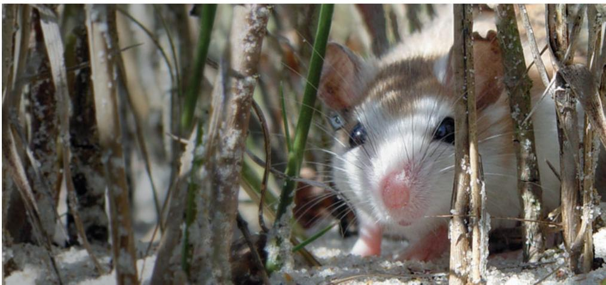  
Figure 1.1 The light, dappled color of this beach mouse (Peromyscus polionotus) allows it to blend into its habitat—brilliant white sand dunes dotted with sparse clumps of beach grass along the Florida seashore. Mice of the same species that inhabit nearby inland areas are much darker, blending with the soil and vegetation where they live.

## Study Tip

Make a table: List the five unifying themes of biology across the top. Enter at least three examples of each theme as you read this chapter. One example is filled in for you. To help you focus on these big ideas, continue adding examples throughout your study of biology.

<table><tr><td>Evolution</td><td>Organization</td><td></td><td></td><td></td></tr><tr><td>Beach mouse&#x27;s coat color matches its sandy habitat.</td><td></td><td></td><td></td><td></td></tr><tr><td></td><td></td><td></td><td></td><td></td></tr></table>

Beach mouse

## How do these mice illustrate the unifying themes of biology?

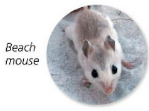

As a result of evolution through natural selection over long periods of time, the fur colors of these two populations of mice resemble their surroundings, providing protection from predators.

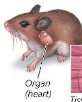  
Structure fits function at all levels of a mouse's organization.

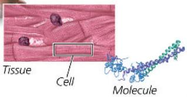  
Energy flows one way from the sun to plants to a mouse; matter cycles between a mouse and its environment.  
Inland mouse

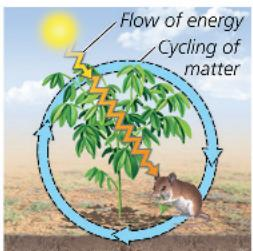  
A plant being eaten by a mouse and a mouse being preyed upon by a hawk are interactions within a system.

Genetic information encoded in DNA determines a mouse's fur colors.

Gene for brown fur

Gene for white fur

# Concept 1.1: The study of life reveals unifying themes

At the most fundamental level, we may ask: What is life? Even a child realizes that a dog or a plant is alive, while a rock or a car is not. Yet the phenomenon we call life defies a simple definition. We recognize life by what living things do. Figure 1.2 highlights some of the properties and processes we associate with life.

Biology, the scientific study of life, is a subject of enormous scope, and exciting new biological discoveries are being made every day. How can you organize into a comprehensible framework all the information you'll encounter as you study biology? Focusing on a few big ideas will help. Here are five unifying themes—ways of thinking about life that will still be useful decades from now.

\- Organization

\- Information

\- Energy and Matter

\- Interactions

\- Evolution

In this section and the next, we'll briefly explore each theme.

▼ Order. This close-up of a sunflower illustrates the highly ordered structure that characterizes life.

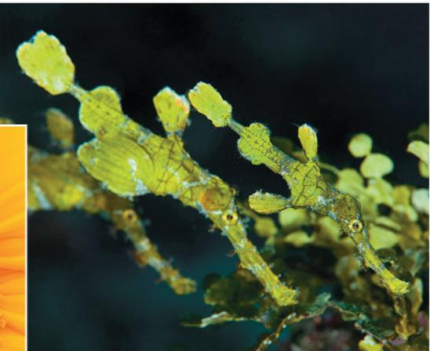  
▲ Evolutionary adaptation. The overall appearance of these ghost pipefish camouflages the animals in their environment. Such adaptations evolve over countless generations by the reproductive success of those individuals with heritable traits that are best suited to their environments.

Figure 1.2 Some properties of life.  

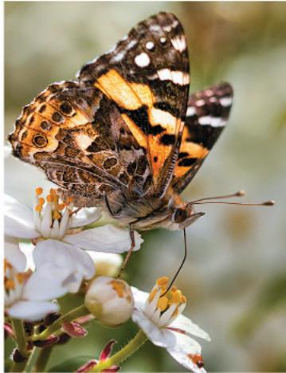  
▲ Regulation. The regulation of blood flow through the blood vessels of this jackrabbit's ears helps maintain a constant body temperature by adjusting heat exchange with the surrounding air.  
▲ Energy processing. This butterfly obtains fuel in the form of nectar from flowers. The butterfly will use chemical energy stored in its food to power flight and other work.

  
▲ Growth and development.
Inherited information carried by genes controls the pattern of growth and development of organisms, such as this oak seedling.

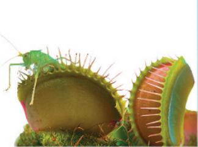  
▲ Response to the environment.
The Venus flytrap on the left closed its trap rapidly in response to the environmental stimulus of a grasshopper landing on the open trap.  
Reproduction.
Organisms (living things) reproduce their own kind.

# Theme: New Properties Emerge at Successive Levels of Biological Organization

ORGANIZATION The study of life on Earth extends from the microscopic scale of the molecules and cells that make up an organism to the global scale of the entire living planet. As biologists, we can divide this enormous range into different levels of biological organization. In Figure 1.3, we zoom in from space to take a closer and closer look at life in a mountain meadow. This journey, depicted as a series of numbered steps, highlights the hierarchy of biological organization.

Zooming in at ever-finer resolution illustrates the principle that underlies reductionism, an approach that reduces complex systems to simpler components that are more manageable to study. Reductionism is a powerful strategy in biology. For example, by studying the molecular structure of DNA that had been extracted from cells, Francis Crick and James Watson inferred the chemical basis of biological inheritance. Despite its importance, reductionism provides an incomplete view of life on Earth, as you'll see next.

## Emergent Properties

Let's reexamine Figure 1.3, beginning this time at the molecular level and then zooming out. This approach allows us to see novel properties emerge at each level that are absent from the preceding one. These emergent properties are due to the arrangement and interactions of parts as complexity increases. For example,

# Exploring Levels of Biological Organization

Figure 1.3

## ◀1 The Biosphere

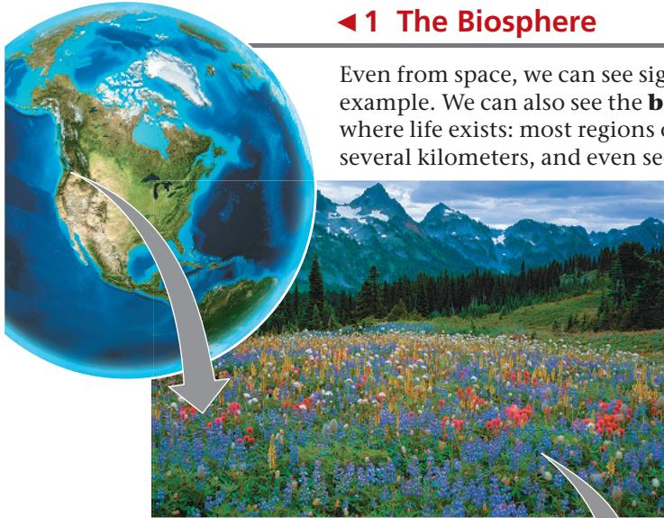

Even from space, we can see signs of Earth's life—in the mosaic of greens indicating forests, for example. We can also see the biosphere, which consists of all life on Earth and all the places where life exists: most regions of land, most bodies of water, the atmosphere to an altitude of several kilometers, and even sediments far below the ocean floor.

## 2 Ecosystems

Our first scale change brings us to a North American mountain meadow, which is an example of an ecosystem, as are a tropical forest, grassland, desert, and coral reef. An ecosystem consists of all the living things in a particular area, along with all the nonliving components of the environment with which life interacts, such as soil, water, atmospheric gases, and light.

## ▶ 3 Communities

The array of organisms inhabiting a particular ecosystem is called a biological community. The community in our meadow ecosystem includes many kinds of plants, various animals, mushrooms and other fungi, and enormous numbers of diverse microorganisms, such as bacteria, that are too small to see without a microscope. Each of these forms of life belongs to a species—a group whose members can only reproduce with other members of the group.

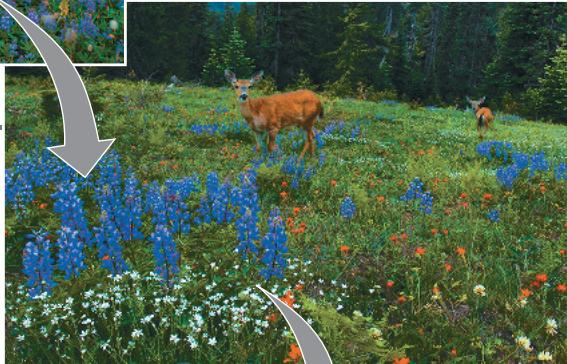

## ▶ 4 Populations

A population consists of all the individuals of a species living within the bounds of a specified area. For example, our meadow includes a population of lupines (some of which are shown here) and a population of mule deer. A community is therefore the set of populations that inhabit a particular area.

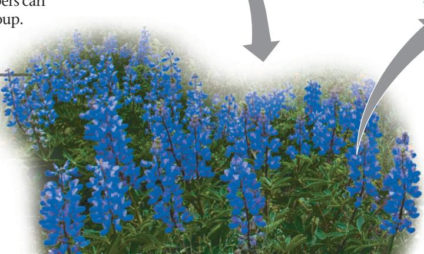

## ▲ 5 Organisms

Individual living things are called organisms. Each plant in the meadow is an organism, and so is each animal, fungus, and bacterium.

although photosynthesis occurs in an intact chloroplast, it will not take place if chlorophyll and other chloroplast molecules are simply mixed in a test tube. The coordinated processes of photosynthesis require a specific organization of these molecules in the chloroplast. Isolated components of living systems—the objects of study in a reductionist approach—lack a number of significant properties that emerge at higher levels of organization.

Emergent properties are not unique to life. A box of bicycle parts won't transport you anywhere, but if they are arranged in a certain way, you can pedal to your chosen destination. Compared with such nonliving examples, however, biological systems are far more complex, making the emergent properties of life especially challenging to study.

To fully explore emergent properties, biologists today complement reductionism with systems biology, the exploration of a biological system by analyzing the interactions among its parts. In this context, a single leaf cell can be considered a system, as can a frog, an ant colony, or a desert ecosystem. By examining and modeling the dynamic behavior of an integrated network of components, systems biology enables us to pose new kinds of questions. For example, how do networks of molecular interactions in our bodies generate our 24-hour cycle of wakefulness and sleep? At a larger scale, how does a gradual increase in atmospheric carbon dioxide alter ecosystems and the entire biosphere? Systems biology can be used to study life at all levels.

## Structure and Function

At each level of the biological hierarchy, we find a correlation between structure and function. Consider the leaf in Figure 1.3: Its broad, flat shape maximizes the capture of sunlight by chloroplasts. Because such correlations of structure and function are common in all living things, analyzing a biological structure gives us clues about what it does and how it works. For

## ▼ 6 Organs

The structural hierarchy of life continues to unfold as we explore the architecture of a complex organism. This lupine leaf (consisting of six leaflets) is an example of an organ, a body part that is made up of multiple tissues and has specific functions in the body. Leaves, stems, and roots are the major organs of plants. Within an organ,

plants. Within an organ, each tissue has a distinct arrangement and contributes particular properties to organ function.

## ▼ 7 Tissues

Viewing the tissues of a leaf requires a microscope. Each tissue is a group of cells that work together, performing a specialized function. The leaf shown here has been cut on an angle. The honeycombed tissue in the interior of

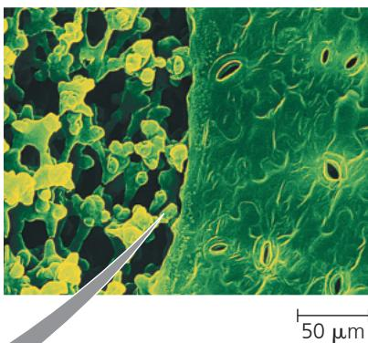  
$\overline{50\mu m}$

the leaf (left side of photo) is the main location of photosynthesis, the process that converts light energy to the chemical energy of sugar. The jigsaw puzzle-like “skin” on the surface of the leaf (right side of photo) is a tissue called epidermis. The pores through the epidermis allow entry of the gas $CO_{2}$ , a raw material for sugar production.

## ▶ 8 Cells

The cell is life's fundamental unit of structure and function. Some organisms consist of a single cell, which performs all the functions of life. Other

10 μm

organisms are multicellular and feature a division of labor among specialized cells. Here we see a magnified view of a cell in a leaf tissue. This cell is about 40 micrometers ( $\mu$ m) across—about 500 of them would reach across a small coin. Within these tiny cells are even smaller green structures called chloroplasts, which are responsible for photosynthesis.

## ▼ 9 Organelles

Chloroplasts are examples of organelles, the various functional components present in cells. The image below, taken by a powerful microscope, shows a single chloroplast.

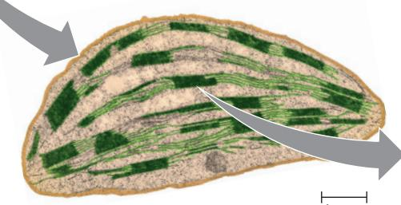  
Chloroplast  
1 μm

## ▼ 10 Molecules

Our last scale change drops us into a chloroplast for a view of life at the molecular level. A molecule is a chemical structure consisting of two or more units called atoms, represented as balls in this computer graphic of a chlorophyll molecule. Chlorophyll is

  
Chlorophyll molecule

the pigment that makes a leaf green, and it absorbs sun-light during photo-synthesis. Within each chloroplast, millions of chlorophyll molecules are organized into systems that convert light energy to the chemical energy of food.

Figure 1.4 Contrasting eukaryotic and prokaryotic cells in size and complexity.

The cells are shown to scale here; to see a larger magnification of a prokaryotic cell, see Figure 6.5.

VISUAL SKILLS Measure the scale bar, the length of the prokaryotic cell, and the diameter of the eukaryotic cell. Knowing that this scale bar represents $1 \mu m$ , calculate the length of the prokaryotic cell and the diameter of the eukaryotic cell in $\mu m$ .

For suggested answer, see Appendix A.

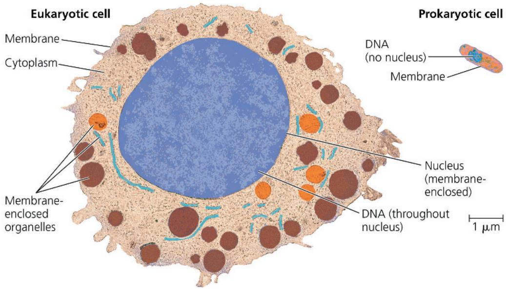

example, the hummingbird's anatomy allows its wings to rotate at the shoulder, so hummingbirds have the ability, unique among birds, to fly backward or hover in place. While hovering, the birds can extend their long, slender beaks into flowers and feed on nectar. The elegant match

of form and function in the structures of life is explained by natural selection, which we'll explore shortly.

## The Cell: An Organism's Basic Unit of Structure and Function

The cell is the smallest unit of organization that can perform all activities required for life. The so-called Cell Theory was first developed in the 1800s, based on the observations of many scientists. The theory states that all living organisms are made of cells, which are the basic unit of life. In fact, the actions of organisms are all based on the activities of cells. For instance, the movement of your eyes as you read this sentence results from the activities of muscle and nerve cells. Even a process that occurs on a global scale, such as the recycling of carbon atoms, is the product of cellular functions, including the photosynthetic activity of chloroplasts in leaf cells.

All cells share certain characteristics. For instance, every cell is enclosed by a membrane that regulates the passage of materials between the cell and its surroundings. Nevertheless, we distinguish two main forms of cells: prokaryotic and eukaryotic. Prokaryotic cells are found in single-celled microorganisms belonging to one of two groups: the bacteria (singular, bacterium) and the archaea (singular, archaean). All other forms of life, including plants and animals, are composed of eukaryotic cells.

A eukaryotic cell contains membrane-enclosed organelles (Figure 1.4). Some organelles, such as the DNA-containing nucleus, are found in the cells of all eukaryotes; other organelles are specific to particular cell types. For example, the chloroplast in Figure 1.3 is an organelle found only in eukaryotic cells that carry out photosynthesis. In contrast to eukaryotic cells, a prokaryotic cell lacks a nucleus or other membrane-enclosed organelles. Furthermore, prokaryotic cells are generally smaller than eukaryotic cells, as shown in Figure 1.4.

# Theme: Life's Processes Involve the Expression and Transmission of Genetic Information

INFORMATION Within cells, structures called chromosomes contain genetic material in the form of DNA (deoxyribonucleic acid). In cells that are preparing to divide, the chromosomes may be made visible using a dye that appears blue when bound to the DNA (Figure 1.5).

Figure 1.5 A lung cell from a newt divides into two smaller cells that will grow and divide again.  
DNA in chromosomes  

Figure 1.6 Inherited DNA directs the development of an organism.  
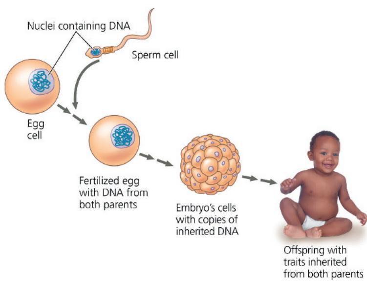  
Offspring with traits inherited from both parents

## DNA, the Genetic Material

Each chromosome contains one very long DNA molecule with hundreds or thousands of genes, each a section of the DNA of the chromosome. Transmitted from parents to offspring, genes are the units of inheritance. They encode the information necessary to build all of the molecules synthesized within a cell, which in turn establish that cell's identity and function. You began as a single cell stocked with DNA inherited from your parents. The replication of that DNA prior to each cell division transmitted copies of the DNA to what eventually became the trillions of cells of your body. As the cells grew and divided, the genetic information encoded by the DNA directed your development (Figure 1.6).

The molecular structure of DNA accounts for its ability to store information. A DNA molecule is made up of two long chains, called strands, arranged in a double helix. Each chain is made up of four kinds of chemical building blocks called nucleotides, abbreviated A, T, C, and G (Figure 1.7). Specific sequences of these four nucleotides encode the information in genes. The way DNA encodes information is analogous to how we arrange the letters of the alphabet into words and phrases with specific meanings. The word rat, for example, evokes a rodent; the words tar and art, which contain the same letters, mean very different things. We can think of nucleotides as a four-letter alphabet.

For many genes, the sequence provides the blueprint for making a protein. For instance, a given bacterial gene may specify a particular protein (such as an enzyme) required to break down a certain sugar molecule, while one particular human gene may denote an enzyme, and another gene a different protein (an antibody, perhaps) that helps fight off infection. Overall, proteins are major players in building and maintaining the cell and carrying out its activities.

Protein-encoding genes control protein production indirectly, using a related molecule called RNA as an intermediary. The sequence of nucleotides along a gene is transcribed into mRNA, which is then translated into a linked series of protein building blocks called amino acids. Once completed, the amino acid chain forms a specific protein with a unique shape and function. The entire

Figure 1.7 DNA: the genetic material.

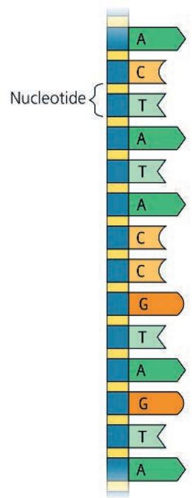  
(b) Single strand of DNA. These geometric shapes and letters are simple symbols for the nucleotides in a small section of one strand of a DNA molecule. Genetic information is encoded in specific sequences of the four types of nucleotides. Their names are abbreviated A, T, C, and G.

(a) DNA double helix. This model shows the atoms in a segment of DNA. Made up of two long chains (strands) of building blocks called nucleotides, a DNA molecule takes the three-dimensional form of a double helix.

process by which the information in a gene directs the manufacture of a cellular product is called gene expression (Figure 1.8, on the next page).

In carrying out gene expression, all forms of life employ essentially the same genetic code: A particular sequence of nucleotides means the same thing in one organism as it does in another. Differences between organisms reflect differences between their nucleotide sequences rather than between their underlying genetic codes. This universality of the genetic code is a strong piece of evidence that all life is related. Comparing the sequences in several species for a gene that codes for a particular protein can provide valuable information both about the protein and about the relationship of the species to each other.

Molecules of mRNA, like the one in Figure 1.8, are translated into proteins, but other cellular RNAs function differently. For example, we have known for decades that some types of RNA are actually components of the cellular machinery that manufactures proteins. In the last few decades, scientists have discovered new classes of RNA that play other roles in the cell, such as regulating the function of protein-coding genes. Genes specify these RNAs as well, and their production is also referred to as gene expression. By carrying the instructions for making proteins and RNAs and by replicating with each cell division, DNA ensures faithful inheritance of genetic information from generation to generation.

Figure 1.8 Gene expression: Cells use information encoded in a gene to synthesize a functional protein.  
  
(a) The lens of the eye (behind the pupil) is able to focus light because lens cells are tightly packed with transparent proteins called crystallin. How do lens cells make crystallin proteins?

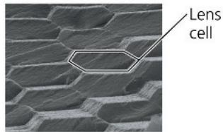

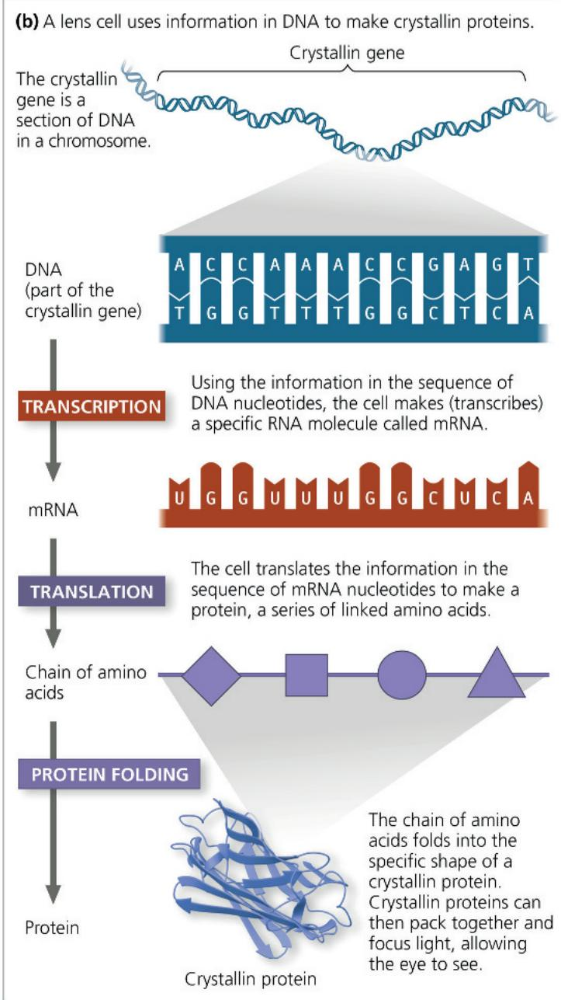  
The chain of amino acids folds into the specific shape of a crystallin protein. Crystallin proteins can then pack together and focus light, allowing the eye to see.

## Genomics: Large-Scale Analysis of DNA Sequences

The entire “library” of genetic instructions that an organism inherits is called its genome. A typical human cell has two similar sets of chromosomes, and each set has approximately 3 billion nucleotide pairs of DNA. If the one-letter abbreviations for the nucleotides of a set were written in letters the size of those you are now reading, the genomic text would fill about 700 biology textbooks.

Since the early 1990s, the pace at which researchers can determine the sequence of a genome has accelerated at an astounding rate, enabled by a revolution in technology. The genome sequence—the entire sequence of nucleotides for a representative member of a species—is now known for humans and many other animals, as well as numerous plants, fungi, bacteria, and archaea. To make sense of the deluge of data from genome-sequencing projects and the growing catalog of known gene functions, scientists are applying a systems biology approach at the cellular and molecular levels. Rather than investigating a single gene at a time, researchers study whole sets of genes (or other DNA) in one or more species—an approach called genomics. Likewise, the term proteomics refers to the study of sets of proteins and their properties. (The entire set of proteins expressed by a given cell, tissue, or organism is called a proteome.)

Three important research developments have made the genomic and proteomic approaches possible. One is “high-throughput” technology, tools that can analyze many biological samples very rapidly. The second major development is bioinformatics, the use of computational tools to store, organize, and analyze the huge volume of data that results from high-throughput methods. One new bioinformatics tool that is becoming essential is artificial intelligence (AI), the development and use of computer systems that can function like neural networks in the human brain to perform various tasks. AI is transforming how researchers analyze biological data, identify patterns, and develop new medical treatments. The third development is the formation of interdisciplinary research teams—groups of diverse specialists that may include computer scientists, mathematicians, engineers, chemists, physicists, and, of course, biologists from a variety of fields. Researchers in such teams aim to learn how the activities of all the proteins and RNAs encoded by the DNA are coordinated in cells and in whole organisms.

## Theme: Life Requires the Transfer and Transformation of Energy and Matter

ENERGY AND MATTER Moving, growing, reproducing, and the various cellular activities of life are work, and work requires energy. The input of energy, primarily from the sun, and the

Figure 1.9 Energy flow and chemical cycling.

There is a one-way flow of energy in an ecosystem: During photosynthesis, plants convert energy from sunlight to chemical energy (stored in food molecules such as sugars), which is used by plants and other organisms to do work and is eventually lost from the ecosystem as heat. In contrast, chemicals cycle between organisms and the physical environment.

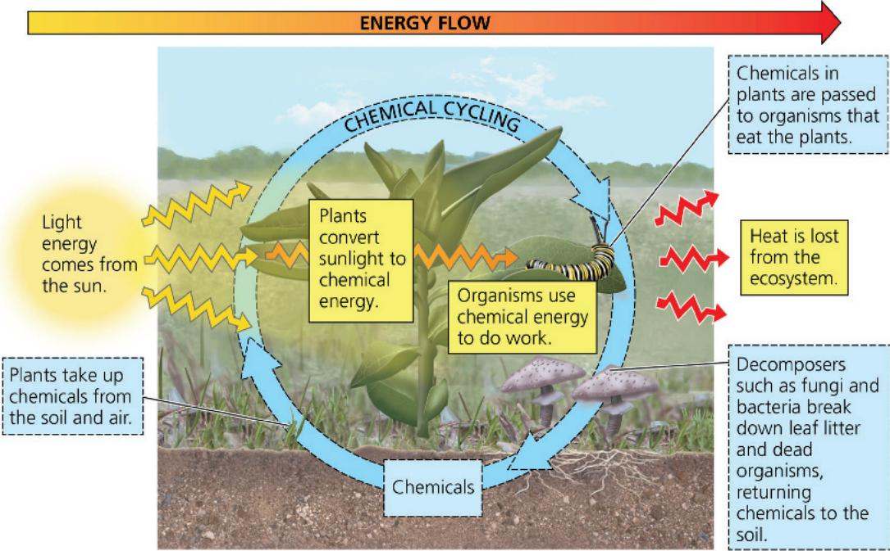

transformation of energy from one form to another make life possible (Figure 1.9). When a plant's leaves absorb sunlight in the process of photosynthesis, molecules within the leaves convert the energy of sunlight to the chemical energy of food, such as sugars. The chemical energy in the food molecules is then passed along from plants and other photosynthetic organisms (producers) to consumers. A consumer is an organism that feeds on other organisms or their remains.

When an organism uses chemical energy to perform work, such as muscle contraction or cell division, some of that energy is lost to the surroundings as heat. As a result, energy flows through an ecosystem in one direction, usually entering as light and exiting as heat. In contrast, chemicals cycle within an ecosystem, where they are used and then recycled (see Figure 1.9). Chemicals that a plant absorbs from the air or soil may be incorporated into the plant's body and then passed to an animal that eats the plant. Eventually, these chemicals will be returned to the environment by decomposers such as bacteria and fungi that break down waste products, leaf litter, and the bodies of dead organisms. The chemicals are then available to be taken up by plants again, thereby completing the cycle.

## Theme: From Molecules to Ecosystems, Interactions Are Important in Biological Systems

INTERACTIONS At any level of the biological hierarchy, interactions between the components of the system ensure smooth integration of all the parts, such that they function as a whole. This holds true equally well for molecules in a cell and the components of an ecosystem; we'll look at both as examples.

## Molecules: Interactions Within Organisms

At lower levels of organization, the interactions between components that make up living organisms—organs, tissues, cells, and molecules—are crucial to their smooth operation. Consider the regulation of blood sugar level, for instance. Cells in the body must match the supply of fuel (sugar) to demand, regulating the opposing processes of sugar breakdown and storage. The key is the ability of many biological processes to self-regulate by a mechanism called feedback.

In feedback regulation, the output or product of a process regulates that very process. The most common form of regulation in living systems is negative feedback, a loop in which the response acts in opposition to the initial stimulus. As seen in the example of blood glucose regulation (Figure 1.10, on the next page), after a meal the level of the sugar glucose in your blood rises (stimulus), which stimulates cells of the pancreas to secrete insulin. Insulin, in turn, causes body cells to take up glucose and liver and muscle cells to store it. This response decreases the blood glucose level, so insulin secretion decreases. Thus, the response (increased glucose uptake) opposes the stimulus (increased blood glucose level).

Though less common than processes regulated by negative feedback, there are also many biological processes regulated by positive feedback, in which an end product reinforces or strengthens the stimulus. The clotting of your blood in response to injury is an example. When a blood vessel is damaged, structures in the blood called platelets begin to aggregate at the site. Positive feedback occurs as chemicals released by the platelets attract more platelets. The platelet pileup then initiates a complex process that seals the wound with a clot.

Figure 1.10 Feedback regulation.

The human body regulates the use and storage of glucose, a major cellular fuel. This figure shows negative feedback: The response to increased blood glucose levels acts in opposition to the initial stimulus.

  
VISUAL SKILLS In this example, what is the response to high blood glucose levels? How does this response act in opposition to the stimulus? For suggested answer, see Appendix A.

# Ecosystems: An Organism's Interactions with Other Organisms and the Physical Environment

At the ecosystem level, every organism interacts with other organisms. For instance, an acacia tree interacts with soil

microorganisms associated with its roots, insects that live on it, and animals that eat its leaves and fruit (Figure 1.11). Interactions between organisms include those that are mutually beneficial (as when “cleaner fish” eat small parasites on a turtle) and those in which one species benefits and the other is harmed (as when a lion kills and eats a zebra). In some interactions between species, both are harmed—for example, when two plants compete for a soil resource that is in short supply. Interactions among organisms help regulate the functioning of the ecosystem as a whole.

Each organism also interacts continuously with physical factors in its environment. The leaves of a tree, for example, absorb light from the sun, take in carbon dioxide from the air, and release oxygen to the air (see Figure 1.11). The environment is also affected by organisms. For instance, in addition to taking up water and minerals from the soil, the roots of a plant break up rocks as they grow, contributing to the formation of soil. On a global scale, plants and other photosynthetic organisms have generated all the oxygen in the atmosphere.

Like other organisms, we humans interact with our environment. Our interactions sometimes have dire consequences: For example, over the past 150 years, humans have greatly increased the burning of fossil fuels (coal, oil, and gas). This practice releases large amounts of carbon dioxide $(\mathrm{CO}_{2})$ and other gases into the atmosphere, causing heat to be trapped close to Earth's surface (see Figure 56.29). Scientists calculate that the $\mathrm{CO}_{2}$ added to the atmosphere by human activities has increased the average temperature of the planet by about $1.15^{\circ}\mathrm{C}$ since 1900. At the current rates that $\mathrm{CO}_{2}$ and other gases are being added to the atmosphere, global models predict an additional rise of about $3^{\circ}\mathrm{C}$ before the end of this century.

This ongoing global warming is a major aspect of climate change, a directional change to the global climate that lasts for three decades or more (as opposed to short-term changes in the weather). But global warming is not the only way the climate is changing: Wind and precipitation patterns are also shifting, and extreme weather events such as storms and droughts are occurring more often. Climate change has already affected organisms and their habitats all over the planet. For example, polar bears have lost much of the ice platform from which they hunt, leading to food shortages and increased mortality rates. As habitats deteriorate, hundreds of plant and animal species are shifting their ranges to more suitable locations—but for some, there is insufficient suitable habitat, or they may not be able to migrate quickly enough. As a result, the populations of many species are shrinking in size or even disappearing (Figure 1.12). (For more examples of how climate change is affecting life on Earth, see Make Connections Figure 56.30.)

Figure 1.11 Interactions of an African acacia tree with other organisms and the physical environment.  

Figure 1.12 Threatened by global warming.

A warmer environment causes lizards in the genus Sceloporus to spend more time in refuges from the heat, reducing time for foraging. Their food intake drops, decreasing reproductive success. Surveys of 200 Sceloporus populations in Mexico show that 12% of these populations have disappeared since 1975.

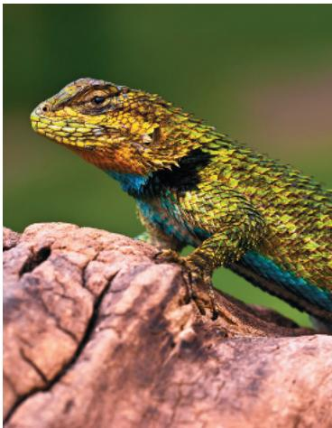

The loss of populations due to climate change can ultimately result in extinction, the permanent loss of a species. As we'll explore in greater detail in Concept 56.4, the consequences of these changes for humans and other organisms may be profound.

Having considered four of the unifying themes (organization, information, energy and matter, and interactions), let's now turn to evolution. There is consensus among biologists that evolution is the core theme of biology, and it is discussed in detail in the next section.

## Concept Check 1.1

1. Starting with the molecular level in Figure 1.3, write a sentence that includes components from the previous (lower) level of biological organization, for example: "A molecule consists of atoms bonded together." Continue with organelles, moving up the biological hierarchy.

2. Identify the theme or themes exemplified by (a) the sharp quills of a porcupine, (b) the development of a multicellular organism from a single fertilized egg, and (c) a hummingbird using sugar to power its flight.

3. WHAT IF? For each theme discussed in this section, give an example not mentioned in the text.

For suggested answers, see Appendix A.

# Concept 1.2: The Core Theme: Evolution accounts for the unity and diversity of life

EVOLUTION An understanding of evolution helps us to make sense of everything we know about life on Earth. As the fossil record clearly shows, life has been evolving for billions of years, resulting in a vast diversity of past and present organisms. But along with the diversity there is also unity, in the form of shared features. For example, while sea horses, jackrabbits, hummingbirds, and giraffes all look very different, their skeletons are organized in the same basic way.

The scientific explanation for the unity and diversity of organisms is evolution: a process of biological change in which species accumulate differences from their ancestors as they adapt to different environments over time. Thus, we can account for differences between two species (diversity) with the idea that certain heritable changes occurred after the two species diverged from their common ancestor. However, they also share certain traits (unity) simply because they have descended from a common ancestor. An abundance of evidence of different types supports the occurrence of evolution and the mechanisms that describe how it takes place, which we'll explore in detail in Chapters 22–25. To quote one of the founders of modern evolutionary theory, Theodosius Dobzhansky, "Nothing in biology makes sense except in the light of evolution." To understand this statement, we need to examine how biologists think about the vast diversity of life on the planet.

## Classifying the Diversity of Life

Diversity is a hallmark of life. Biologists have so far identified and named about 1.8 million species of organisms. Each species is given a two-part name: The first part is the name of the genus (plural, genera) to which the species belongs, and the second part is unique to the species within the genus. (For example, Homo sapiens is the name of our species.)

To date, known species include at least 150,000 species of fungi, 435,000 plant species, 65,000 vertebrate species (animals with backbones), and 1 million insect species (more than half of all known forms of life)—not to mention the myriad types of single-celled organisms. Researchers identify thousands of additional species each year. Estimates of the total number of species range from about 10 million to over 100 million. Whatever the actual number, the enormous variety of life gives biology a very broad scope. Biologists face a major challenge in attempting to make sense of this variety.

## Rethinking the Domains of Life

Humans tend to group diverse items according to their similarities and relationships to each other. Consequently, biologists have long used careful comparisons of structure, function, and other obvious features to classify forms of life into groups. As described in more detail in Concept 26.6, this process has led to changing conceptions of the broadest groupings as new analytical methods have been developed, such as comparing genomic sequences. In 1990, researcher Carl Woese and colleagues proposed a system classifying organisms into three groups, called domains: Bacteria, Archaea, and Eukarya (Figure 1.13). As described, two of the three domains—Bacteria and Archaea—consisted of single-celled prokaryotic organisms. All the eukaryotes (organisms with eukaryotic cells) were placed in domain Eukarya. This domain includes kingdom Plantae, kingdom Fungi, kingdom Animalia, and the protists. The three kingdoms are distinguished partly by their modes of nutrition: Plants produce their own sugars and other food molecules by photosynthesis, fungi absorb nutrients in dissolved form from their surroundings, and animals obtain food by eating and digesting other organisms. Animalia is, of course, the kingdom to which we humans belong.

100 μm

(b) Archaea  
Figure 1.13 The three-domain hypothesis.  
Although recent analyses indicate that Eukarya likely evolved within the Archaea (see Concept 26.6), it is still useful to distinguish the prokaryotic species in Archaea as a group since there are many significant differences between eukaryotic and prokaryotic organisms.  
(a) Bacteria  
  
Bacteria are the most diverse and widespread prokaryotic species and are classified into multiple kingdoms. Each rod-shaped structure in this photo is a bacterial cell.

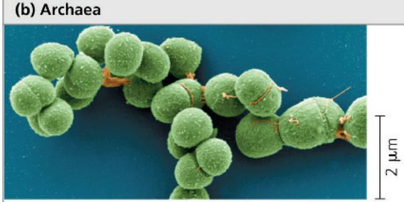  
Archaea includes multiple kingdoms. Some of the prokaryotic organisms known as archaea live in Earth's extreme environments, such as salty lakes and boiling hot springs. Each round structure in this photo is an archaeal cell.

(c) Eukarya  

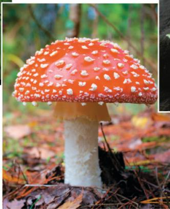

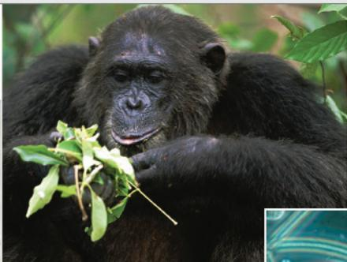  
Kingdom Plantae (plants) consists of multicellular eukaryotes that carry out photosynthesis, the conversion of light energy to the chemical energy in food. Most plant species live on land.  
Kingdom Animalia consists of multicellular eukaryotes that ingest other organisms.  
Kingdom Fungi, which includes unicellular and multicellular eukaryotes, is characterized in part by the nutritional mode of its members (such as this mushroom), which absorb nutrients from outside their bodies.  
▶ Protists are mostly unicellular eukaryotes and some relatively simple multicellular relatives. Pictured here is an assortment of protists inhabiting

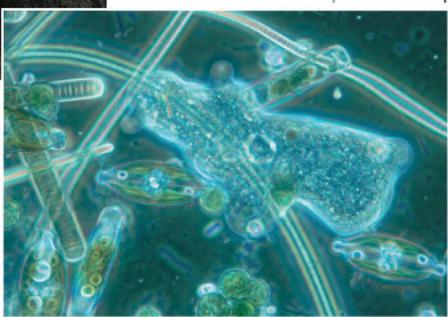  
pond water. Scientists are currently debating how to classify protists in a way that accurately reflects their evolutionary relationships.

In the last few decades, many more analyses of genetic sequences and protein structures have contributed to an ongoing reevaluation of the classification of life. As one example, let's consider the most numerous and diverse eukaryotes—the protists, which are mostly single-celled organisms. Although protists were once placed in a single kingdom, they are now classified into several groups. One major reason for this change is DNA evidence showing that some protists are less closely related to other protists than they are to plants, animals, or fungi. In another example, molecular comparisons of many organisms across Bacteria, Archaea, and Eukarya support that Archaea are more closely related to Eukarya than they are to Bacteria, and that in fact Eukarya may be descended from a subgroup of Archaea. These evolutionary relationships of Eukarya and Archaea are currently a matter of active research, as well as their status as domains (see Concept 26.6).

Although the earliest branching of the tree of life is not fully understood, the names biologists have assigned these groups—Bacteria, Archaea, and Eukarya—are still quite useful for purposes of studying the significant differences between them; therefore,

in this text, when we use the term Archaea, we are referring to prokaryotic species unless otherwise noted.

## Unity in the Diversity of Life

As diverse as life is, there is also remarkable unity among forms of life. Consider, for example, the similar skeletons of different animals and the universal genetic language of DNA (the genetic code), both mentioned earlier. In fact, similarities between organisms are evident at all levels of the biological hierarchy. For example, unity is obvious in many features of cell structure, even among distantly related organisms (Figure 1.14).

How can we account for life's dual nature of unity and diversity? The process of evolution, explained next, illuminates both the similarities and differences in the world of life. It also introduces another important dimension of biology: the passage of time. The history of life, as documented by fossils and other evidence, is the saga of an ever-changing Earth billions of years old, inhabited by an evolving cast of living forms (Figure 1.15).

Figure 1.14 An example of unity underlying the diversity of life: the architecture of cilia in eukaryotes.

Cilia (singular, cilium) are extensions of cells that function in locomotion. They occur in eukaryotes as diverse as Paramecium (found in pond water) and humans. Even organisms so different share a common architecture for their cilia, which have an elaborate system of tubules that is striking in cross-sectional views.

  
Cross section of a cilium, as viewed with an electron microscope  
Cilia of Paramecium. The cilia of the single-celled Paramecium propel the organism through pond water.  
Cilia of windpipe cells. The cells that line the human windpipe are equipped with cilia that help keep the lungs clean by sweeping a film of debris-trapping mucus upward.

Figure 1.15 Studying the history of life.  
Paleontologist Marie-Antoinette de Lumley examines a fossilized tooth of Tautavel Man, a pre-Neanderthal species discovered in southern France. Fossilized teeth preserve well and provide valuable information concerning the age, health, and diet of the individual.  
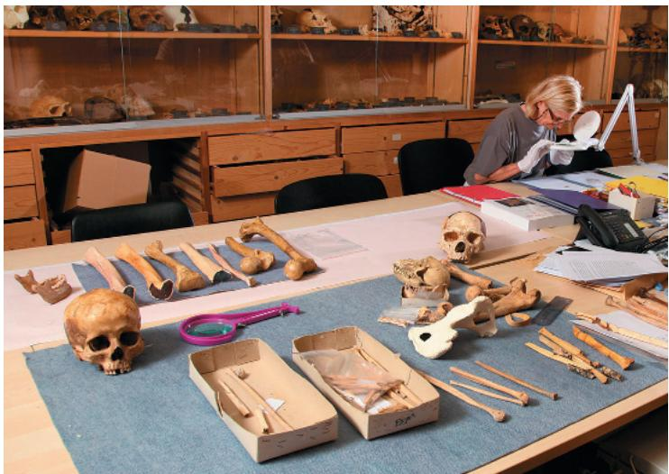

## Charles Darwin and the Theory of Natural Selection

An evolutionary view of life came into sharp focus in November 1859, when Charles Darwin published one of the most important and influential books ever written, On the Origin of Species by Means of Natural Selection (Figure 1.16). The Origin of Species articulated

Figure 1.16 Charles Darwin.  
The portrait shows Darwin in about 1840, well before the 1859 publication of his revolutionary book, commonly referred to as The Origin of Species.  

two main points. The first point was that, as species adapt to different environments over time, they accumulate differences from their ancestors. Darwin called this process “descent with modification.” This insightful phrase captured the duality of life’s unity and diversity—unity in the kinship among species that descended from common ancestors and diversity in the modifications that evolved as species branched from their common ancestors (Figure 1.17). Darwin’s second main point was his proposal that “natural selection” is a primary cause of descent with modification.

Darwin developed his theory of natural selection from observations that by themselves were neither new nor profound. However, although others had described the pieces of the puzzle, it was Darwin who saw how they fit together. He started with the

4 Increased frequency of traits that enhance survival and reproductive success

Figure 1.17 Unity and diversity among birds.

These four birds are variations on a common body plan. For example, each has feathers, a beak, and wings. However, these common features are highly specialized for the birds' diverse lifestyles.

▼ Red-tailed hawk (Buteo borealis)

▼ American flamingo (Phoenicopterus ruber)

  
▲ European robin (Erithacus rubecula)  
▲ Gentoo penguin (Pygoscelis papua)  
This imaginary beetle population has colonized a locale where the soil has been blackened by a recent brush fire. Initially, the population varies extensively in the inherited coloration of the individuals, from very light gray to charcoal. For hungry birds that prey on the beetles, it is easiest to spot the beetles that are lightest in color.

following three observations from nature: First, individuals in a population vary in their traits, many of which seem to be heritable (passed on from parents to offspring). Second, a population can produce far more offspring than can survive to produce offspring of their own. With more individuals than the environment is able to support, competition is inevitable. Third, species generally are suited to their environments—in other words, they are adapted to their circumstances. For instance, a common adaptation among birds that eat hard seeds is an especially strong beak.

By making inferences from these three observations, Darwin developed a scientific explanation for how evolution occurs. He reasoned that individuals with inherited traits that are better suited to the local environment are more likely to survive and reproduce than less well-suited individuals. Over many generations, a higher and higher proportion of individuals in a population will have the advantageous traits. Evolution occurs as the unequal reproductive success of individuals ultimately leads to adaptation to their environment, as long as the environment remains the same.

Darwin called this mechanism of evolutionary adaptation natural selection because the natural environment consistently “selects” for the propagation of certain traits among naturally occurring variant traits in the population. The example in Figure 1.18 illustrates the ability of natural selection to “edit” an insect population’s heritable variations in coloration. We see the products of natural selection in the exquisite adaptations of various organisms to the special circumstances of their way of life and their environment. The wings of the bat shown in Figure 1.19 are an excellent example of adaptation.

## The Tree of Life

Take another look at the skeletal architecture of the bat's wings in Figure 1.19. These wings are not like those of feathered birds; the bat is a mammal. The bones, joints, nerves, and blood vessels

Figure 1.18 Natural selection.

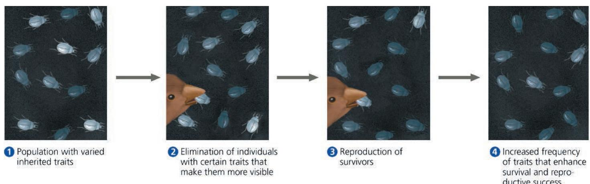  
DRAW IT Over time, the soil will gradually become lighter in color. Draw another step to show how the soil, when lightened to medium color, would affect natural selection. Write a caption for this new step 5. Then explain how the population would change over time as the soil becomes lighter.  
For suggested answer, see Appendix A.

Figure 1.19 Evolutionary adaptation.

Bats, the only mammals capable of active flight, have wings with webbing between extended “fingers.” Darwin proposed that such adaptations are refined over time by natural selection.

in the bat's forelimbs, though adapted for flight, are very similar to those in the human arm, the foreleg of a horse, and the flipper of a whale. Indeed, all mammalian forelimbs are anatomical variations of a common architecture. According to the Darwinian concept of descent with modification, the shared anatomy of mammalian limbs reflects inheritance of the limb structure from a common ancestor—the “prototype” mammal from which all other mammals descended. The diversity of mammalian forelimbs results from modification by natural selection operating over millions of years in different environmental contexts. Fossils and other evidence corroborate anatomical unity in supporting this view of mammalian descent from a common ancestor.

Darwin proposed that natural selection, by its cumulative effects over long periods of time, could cause an ancestral species to give rise to two or more descendant species. This could occur, for example, if one population of organisms became fragmented into several subpopulations isolated in different environments. In these separate arenas of natural selection, one species could gradually radiate into multiple species as the geographically isolated populations adapted over many generations to different environmental conditions.

The Galápagos finches are a famous example of the process of radiation of new species from a common ancestor. Darwin collected specimens of these birds during his 1835 visit to the remote Galápagos Islands, 900 kilometers (km) off the Pacific coast of South America. These relatively young volcanic islands are home to many species of plants and animals found nowhere else in the world, though many Galápagos organisms are clearly related to species on the South American mainland. The Galápagos finches are thought to have descended from an ancestral finch species that reached the archipelago from South America or the Caribbean. Over time, the Galápagos finches diversified from their ancestor as populations became adapted to different food sources on their particular islands. Years after Darwin collected the finches, researchers began to sort out their evolutionary relationships, first from anatomical and geographic data and more recently with the help of DNA sequence comparisons.

Biologists' diagrams of evolutionary relationships generally take treelike forms, though the trees are often turned sideways as in Figure 1.20. Tree diagrams make sense: Just as an individual has a genealogy that can be diagrammed as a family tree, each species is one twig of a branching tree of life extending back in time through ancestral species more and more remote. Species that are very similar, such as the Galápagos finches, share a relatively recent common ancestor. Through an ancestor that lived much further back in time, finches are related to sparrows, hawks,

Figure 1.20 Descent with modification: adaptive radiation of finches on the Galápagos Islands.

This “tree” illustrates a current hypothesis for the evolutionary relationships of finches on the Galápagos. Note the various beaks, which are adapted to particular food sources. For example, heavier, thicker beaks are better at cracking seeds, while the more slender beaks are better at grasping insects.

penguins, and all other birds. Furthermore, finches and other birds are related to us through a common ancestor even more ancient. Trace life back far enough, and we reach the early prokaryotic species that inhabited Earth over 3.5 billion years ago. We can recognize their vestiges in our own cells—in the universal genetic code, for example. Indeed, all of life is connected through its long evolutionary history.

## Concept Check 1.2

1. Explain why “editing” is a metaphor for how natural selection acts on a population’s heritable variation.

2. Referring to Figure 1.20, provide a possible explanation for how, over a very long time, the green warbler finch came to have a slender beak.

3. DRAW IT The three major groups you learned about in Concept 1.2 can be represented in the tree of life as the three main branches, with three subbranches on the eukaryotic branch being the kingdoms Plantae, Fungi, and Animalia. Genomic and other evidence has shown that fungi and animals are more closely related to each other than either of these kingdoms is to plants. Draw a simple branching pattern that symbolizes the proposed relationship between these three eukaryotic kingdoms.

For suggested answers, see Appendix A.

## Concept 1.3: In studying nature, scientists form and test hypotheses

Science is a way of knowing—an approach to understanding the natural world. It developed out of our curiosity about ourselves, other life-forms, our planet, and the universe. The word science is derived from a Latin verb meaning “to know.” Striving to understand seems to be one of our basic urges.

At the heart of science is inquiry, the search for information and explanations of natural phenomena. There is no formula for successful scientific inquiry, no single scientific method that researchers must rigidly follow. As in all quests, science includes elements of challenge, adventure, and luck, along with careful planning, reasoning, creativity, patience, and the persistence to overcome setbacks. Such diverse elements of inquiry make science far less structured than most people realize. That said, it is possible to highlight certain characteristics that help to distinguish science from other ways of describing and explaining nature.

Scientists use a process of inquiry that includes making observations, forming logical, testable explanations (hypotheses), and testing them. The process is necessarily repetitive: In testing a hypothesis, more observations may inspire revision of the original hypothesis or formation of a new one, thus leading to further testing. In this way, scientists circle closer and closer to their best estimation of the laws governing nature.

## Exploration and Observation

Biology, like other sciences, begins with careful observations. In gathering information, biologists often use tools such as microscopes, precision thermometers, or high-speed cameras that extend their senses or facilitate careful measurement. Observations can reveal valuable information about the natural world. For example, a series of detailed observations have shaped our understanding of cell structure, and another set of observations is currently expanding our databases of genome sequences from diverse species and databases of genes whose expression is altered in various diseases.

In exploring nature, biologists also rely heavily on the scientific literature, the published contributions of fellow scientists. By reading about and understanding past studies, scientists can build on the foundation of existing knowledge, focusing their investigations on observations that are original and on hypotheses that are consistent with previous findings. Identifying publications relevant to a new line of research is now easier than at any point in the past, thanks to indexed and searchable electronic databases.

## Gathering and Analyzing Data

Recorded observations are called data. Put another way, data are items of information on which scientific inquiry is based. The term data implies numbers to many people. But some data are qualitative, often in the form of recorded descriptions rather than numerical measurements. For example, Jane Goodall spent decades recording her observations of chimpanzee behavior during field research in a Tanzanian jungle (Figure 1.21). In her studies, Goodall also enriched the field of animal behavior with volumes of quantitative data, such as the frequency and duration of specific behaviors for different members of a group of chimpanzees in a variety of situations. Quantitative data are generally expressed as numerical measurements and often organized into tables and graphs. Scientists analyze their data using a type of mathematics called statistics to test whether their results are significant or merely due to random fluctuations. All results presented in this text have been shown to be statistically significant.

## Figure 1.21 Jane Goodall collecting qualitative data on chimpanzee behavior.

Goodall recorded her observations in field notebooks, often with sketches of the animals' behavior.

## Interview

Interview with Jane Goodall: Living with chimpanzees (eTextbook only)

Collecting and analyzing observations can lead to important conclusions based on a type of logic called inductive reasoning. Through induction, we derive generalizations from a large number of specific observations. "The sun always rises in the east" is one example. Another biological example is the generalization "All organisms are made of cells," which was based on two centuries of microscopic observations made by biologists examining cells in diverse biological specimens. Careful observations and data analyses, along with generalizations reached by induction, are fundamental to our understanding of nature.

## Forming and Testing Hypotheses

Our innate curiosity often stimulates us to pose questions about the natural basis for the phenomena we observe in the world. What caused the different chimpanzee behaviors observed in the wild? What explains the variation in coat color among the mice of a single species, shown in Figure 1.1? Answering such questions usually involves forming and testing logical explanations—that is, hypotheses.

In science, a hypothesis is an explanation, based on observations and assumptions, that leads to a testable prediction. Said another way, a hypothesis is an explanation on trial. The hypothesis is usually a rational accounting for a set of observations, based on the available data and guided by inductive reasoning. A scientific hypothesis must lead to predictions that can be tested by making additional observations or by performing experiments. An experiment is a scientific test, carried out under controlled conditions.

We all make observations and develop questions and hypotheses in solving everyday problems. Let's say, for example, that your desk lamp is plugged in and turned on but the bulb doesn't light up. That's an observation. The question is obvious: Why doesn't the lamp work? Two reasonable hypotheses based on your experience are that (1) the bulb is burnt out or (2) the bulb is not screwed in properly. Each of these alternative hypotheses leads to predictions you can test with experiments. For example, the burnt-out bulb hypothesis predicts that replacing the bulb will fix the problem. Figure 1.22 diagrams this informal inquiry. Figuring things out in this way by trial and error is a hypothesis-based approach.

## Deductive Reasoning

A type of logic called deduction is also built into the use of hypotheses in science. While induction entails reasoning from a set of specific observations to reach a general conclusion, deductive reasoning involves logic that flows in the opposite direction, from the general to the specific. From general premises, we extrapolate to the specific results we should expect if the premises are true. In the scientific process, deductions usually take the form of a prediction of results that will be found if a particular hypothesis (premise) is correct. We then test the hypothesis by carrying out experiments or observations to see whether or not the results are as predicted. This deductive testing takes the form of “If… then”

Figure 1.22 A simplified view of the scientific process.

The idealized process sometimes called the “scientific method” is shown in this flow chart, which illustrates hypothesis testing for a desk lamp that doesn’t work.

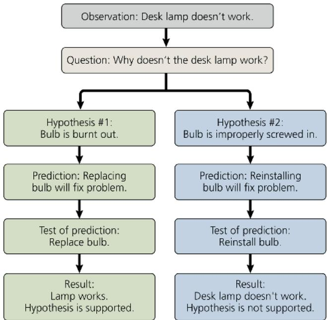

logic. In the case of the desk lamp example: If the burnt-out bulb hypothesis is correct, then the lamp should work if you replace the bulb with a new one.

We can use the desk lamp example to illustrate two other key points about the use of hypotheses in science. First, one can always devise additional hypotheses to explain a set of observations. For instance, another hypothesis to explain our nonworking desk lamp is that the wall socket is faulty. Although you could design an experiment to test this hypothesis, you can never test all possible hypotheses. Second, we can never prove that a hypothesis is true. Suppose that replacing the bulb fixed the lamp. The burnt-out bulb hypothesis would be the most likely explanation, but testing supports that hypothesis not by proving that it is correct, but rather by failing to prove it incorrect. For example, even if replacing the bulb fixed the desk lamp, it might have been because there was a temporary power outage that just happened to end while the bulb was being changed.

Although a hypothesis can never be proved beyond all doubt, testing it in various ways can significantly increase our confidence in its validity. Often, rounds of hypothesis formulation and testing lead to a scientific consensus—the shared conclusion of many scientists that a particular hypothesis explains the known data well and stands up to experimental testing.

## Questions That Can and Cannot Be Addressed by Science

Scientific inquiry is a powerful way to learn about nature, but there are limitations to the kinds of questions it can answer. A scientific hypothesis must be testable; there must be some observation or experiment that could reveal if such an idea is likely to be true or false. The hypothesis that a burnt-out bulb is the sole reason the lamp doesn't work would not be supported if replacing the bulb with a new one didn't fix the lamp.

Not all hypotheses meet the criteria of science: You wouldn't be able to test the hypothesis that invisible ghosts are fooling with your desk lamp! Because science only deals with natural, testable explanations for natural phenomena, it can neither support nor contradict the invisible ghost hypothesis, nor whether spirits or elves cause storms, rainbows, or illnesses. Such supernatural explanations are simply outside the bounds of science, as are religious matters, which are issues of personal faith. Science and religion are not mutually exclusive or contradictory; they are simply concerned with different issues.

## The Flexibility of the Scientific Process

The way that researchers answer questions about the natural and physical world is often idealized as the scientific method. However, very few scientific inquiries adhere rigidly to the sequence of steps that are typically used to describe this approach. For example, a scientist may start to design an experiment, but then backtrack after realizing that more preliminary observations are necessary. In other cases, observations remain too puzzling to prompt well-defined questions until further study provides a new context in which to view those observations. For example, scientists could not unravel the details of how genes encode proteins until after the discovery of the structure of DNA (an event that took place in 1953).

A more realistic model of the scientific process is shown in Figure 1.23. The focus of this model, shown in the central circle in the figure, is the forming and testing of hypotheses. This core set of activities is the reason that science does so well in explaining phenomena in the natural world. These activities, however, are shaped by exploration and discovery (the upper circle in Figure 1.23) and influenced by interactions with other scientists and with society more generally (lower circles). For example, the community of scientists influences which hypotheses are tested, how test results are

In reality, the process of science is not linear, but instead involves backtracking, repetitions, and feedback between different parts of the process. This illustration is based on a model (How Science Works) from the website Understanding Science (www.understandingscience.org).

interpreted, and what value is placed on the findings. Similarly, societal needs—such as the push to cure cancer or understand the process of climate change—may help shape what research projects are funded and how extensively the results are discussed.

Now that we have highlighted the key features of scientific inquiry—making observations and forming and testing hypotheses—you should be able to recognize these features in a case study of actual scientific research.

## A Case Study in Scientific Inquiry: Investigating Coat Coloration in Mouse Populations

Our case study begins with a set of observations and inductive generalizations. Color patterns of animals vary widely in nature, sometimes even among members of the same species. What accounts for such variation? As you may recall, the two mice depicted at the beginning of this chapter are members of the same species (Peromyscus polionotus), but they have different coat (fur) color patterns and reside in different environments. The beach mouse lives along the Florida seashore, a habitat of brilliant white sand dunes with sparse clumps of beach grass. The inland mouse lives on darker, more fertile soil farther inland (Figure 1.24). Even a brief glance at the photographs in Figure 1.24 reveals a striking match of mouse coloration to its habitat. The natural predators of these mice, including hawks, owls, foxes, and coyotes, are all visual hunters (they use their sense of sight to look for prey). It was logical, therefore, for Francis Bertody Sumner, a naturalist studying populations of these mice in the 1920s, to form the hypothesis that their coloration patterns had evolved as adaptations that camouflage the mice in their native environments, protecting them from predation.

As obvious as the camouflage hypothesis may seem, it still required testing. In 2010, biologist Hopi Hoekstra of Harvard University and a group of her students headed to Florida to test the prediction that mice with coloration that did not match their habitat would be preyed on more heavily than the native, well-matched mice. Figure 1.25 summarizes this field experiment, introducing a format we will use throughout this text to walk through other examples of biological inquiry.

## Interview

Interview with Hopi Hoekstra: Investigating the genetics and natural selection of mouse coat color (eTextbook only)

The researchers built hundreds of models of mice and spray-painted them to resemble either beach or inland mice, so that the models differed only in their color patterns. The researchers placed equal numbers of these model mice randomly in both habitats and left them overnight. The mouse models resembling the native mice in the habitat were the control group (for instance, light-colored mouse models in the beach habitat), while the mouse models with the non-native coloration were the experimental group (for example, darker models in the beach habitat). The following morning, the team counted and recorded signs of predation events, which ranged from bites and gouge marks on some models to the outright disappearance of others. Judging by the shape of the predators' bites and the tracks surrounding the experimental sites, the predators appeared to be split fairly evenly between mammals (such as foxes and coyotes) and birds (such as owls, herons, and hawks).

For each environment, the researchers then calculated the percentage of predation events that targeted camouflaged models. The results were clear-cut: Camouflaged models showed much lower predation rates than those lacking camouflage in both the beach habitat (where light mice were less vulnerable) and the inland habitat (where dark mice were less vulnerable). The data thus fit the key prediction of the camouflage hypothesis.

## Variables and Controls in Experiments

In carrying out an experiment, a researcher often manipulates one factor in a system and observes the effects of this change. The mouse camouflage experiment described in Figure 1.25 is an example of a controlled experiment, one that is designed to compare an experimental group (the non-camouflaged mice models, in this case) with a control group (the camouflaged models). Both

Figure 1.24 Different coloration in beach and inland populations of Peromyscus polionotus.  
  
Beach mice live on sparsely vegetated sand dunes along the coast. The light tan, dappled fur on their backs causes them to blend into their surroundings, providing camouflage.  
Members of the same species living about 30 km inland have dark fur on their backs, camouflaging them against the dark ground of their habitat.

## Figure 1.25

# Inquiry: Does camouflage affect predation rates on two populations of mice?

Experiment

Hopi Hoekstra and colleagues tested the hypothesis that coat coloration provides camouflage that protects beach and inland populations of Peromyscus polionotus mice from predation in their habitats. The researchers spray-painted mouse models with light or dark color patterns that matched those of the beach and inland mice and placed models with each of the patterns in both habitats. The next morning, they counted damaged or missing models.

## Results

For each habitat, the researchers calculated the percentage of attacked models that were camouflaged or non-camouflaged. In both habitats, the models whose pattern did not match their surroundings suffered much higher “predation” than did the camouflaged models.

  
Data from S. N. Vignieri, J. G. Larson, and H. E. Hoekstra, The selective advantage of crypsis in mice, Evolution 64:2153–2158 (2010).

## Conclusion

The results are consistent with the researchers' prediction: that mouse models with camouflage coloration would be attacked less often than non-camouflaged mouse models. Thus, the experiment supports the camouflage hypothesis.

INTERPRET THE DATA The bars indicate the percentage of the attacked models that were either light or dark. Assume 100 mouse models were attacked in each habitat. For the beach habitat, how many were light models? Dark models? Answer the same questions for the inland habitat. Do the results of the experiment support the camouflage hypothesis? Explain.

variable; in this case, the researchers measured the amount of predation in response to variation in color of the mouse model. Note also that the experimental and control groups differ in only one independent variable: color.

As a result, the researchers could rule out other factors as causes of the more frequent attacks on the non-camouflaged mice—such as different numbers of predators or different temperatures in the different test areas. The clever experimental design left coloration as the only factor that could account for the low predation rate on models camouflaged with respect to the surrounding environment.

A common misconception is that the term controlled experiment means that scientists control all features of the experimental environment. But that's impossible in field research and can be very difficult even in highly regulated laboratory environments. Researchers usually "control" unwanted variables not by eliminating them through environmental regulation, but by canceling out their effects by using control groups.

## Theories in Science

"It's just a theory!" Our everyday use of the term theory often implies an untested speculation. But the term theory has a different meaning in science. What is a scientific theory, and how is it different from a hypothesis or from mere speculation?

First, a scientific theory is much broader in scope than a hypothesis. This is a hypothesis: "Coat coloration well-matched to their habitat is an adaptation that protects mice from predators." But this is a theory: "Evolutionary adaptations arise by natural selection." This theory proposes that natural selection is the evolutionary mechanism that accounts for an enormous

the factor that is manipulated and the factor that is subsequently measured are variables—a feature or quantity that varies in an experiment.

In our example, the color of the mouse model was the independent variable—the factor being manipulated by the researchers. The dependent variable is the factor being measured that is predicted to be affected by the independent variety of adaptations, of which coat color in mice is but one example.

Second, a theory is general enough to spin off many new, testable hypotheses. For example, the theory of natural selection motivated two researchers at Princeton University, Peter and Rosemary Grant, to test the specific hypothesis that the beaks of Galápagos finches evolve in response to changes in the types of

available food. (Their results supported their hypothesis; see Figure 23.2.)

And third, compared to any one hypothesis, a theory is generally supported by a much greater body of evidence. The theory of natural selection has been supported by a vast quantity of evidence, with more being found every day, and has not been contradicted by any scientific data. Those theories that become widely adopted in science (such as the theory of natural selection and the theory of gravity) explain a great diversity of observations and are supported by a vast accumulation of evidence.

Finally, scientists will sometimes modify or even reject a previously supported theory if new research consistently produces results that don't fit. For example, biologists once lumped bacteria and archaea together as a kingdom of prokaryotic species. When new methods for comparing cells and molecules could be used to test such relationships, the evidence led scientists to reject the theory that bacteria and archaea are members of the same kingdom. If there is “truth” in science, it is at best conditional, based on the weight of available evidence.

## Concept Check 1.3

1. What qualitative observation led to the quantitative study in Figure 1.25?

2. Contrast inductive reasoning with deductive reasoning.

3. Why is natural selection called a theory?

4. WHAT IF? In the deserts of New Mexico, the soils are mostly sandy, with occasional regions of black rock derived from lava flows that occurred about 1,000 years ago. Mice are found in both sandy and rocky areas, and owls are known predators. What might you expect about coat color in these two mouse populations? Explain. How would you use this ecosystem to further test the camouflage hypothesis?

For suggested answers, see Appendix A.

## Concept 1.4: Science benefits from a cooperative approach and diverse viewpoints

Movies and cartoons sometimes portray scientists as loners in white lab coats, working in isolated labs. In reality, science is an intensely social activity. Most scientists work in teams, which often include both graduate and undergraduate students, as well as post-doctoral research scientists (“post-docs”). And to succeed in science, it helps to be a good communicator. Research results have no impact until shared with a community of peers through seminars, publications, and websites. And, in fact, research papers aren’t published until they are vetted by colleagues in what is called the “peer review" process. The examples of scientific inquiry described in this book, for instance, have all been published in peer-reviewed journals.

## Building on the Work of Others

The great scientist Isaac Newton once said: "To explain all nature is too difficult a task for any one man or even for any one age. 'Tis much better to do a little with certainty, and leave the rest for others that come after you." Anyone who becomes a scientist, driven by curiosity about how nature works, is sure to benefit greatly from the rich storehouse of discoveries by others who have come before. In fact, Hopi Hoekstra's experiment benefited from the work of another researcher, D. W. Kaufman, 40 years earlier. You can study the design of Kaufman's experiment and interpret the results in the Scientific Skills Exercise.

Scientific results are continually scrutinized through the repetition of observations and experiments. Scientists working in the same research field often check one another's claims by attempting to confirm observations or repeat experiments. If scientific colleagues cannot repeat experimental findings, this failure may reflect some underlying weakness in the original claim, which will then have to be revised. In this sense, science policies itself. Integrity and adherence to high professional standards in reporting results are central to the scientific endeavor, since the validity of experimental data is key to designing further lines of inquiry.

It is not unusual for several scientists to converge on the same research question. Some scientists enjoy the challenge of being first with an important discovery or key experiment, while others derive more satisfaction from cooperating with fellow scientists working on the same problem.

Cooperation is facilitated when scientists use the same organism. Often, it is a widely used model organism—a species that is easy to grow in the lab and lends itself particularly well to the questions being investigated. Because all species are evolutionarily related, such an organism may be viewed as a model for understanding the biology of other species and their diseases. Genetic studies of the fruit fly Drosophila melanogaster, for example, have taught us a lot about how genes work in other species, even humans. Some other popular model organisms are the mustard plant Arabidopsis thaliana, the soil worm Caenorhabditis elegans, the zebrafish Danio rerio, the mouse Mus musculus, and the bacterium Escherichia coli. As you read through this book, note the many contributions that these and other model organisms have made to the study of life.

Biologists may approach interesting questions from different angles. Some biologists focus on ecosystems, while others study natural phenomena at the level of organisms or cells. This text is divided into units that look at biology at different levels and investigate problems through different approaches. Yet any given problem can be addressed from many perspectives, which in fact complement each other. For example, Hoekstra not only carried out field studies showing that coat coloration can affect predation

## Scientific Skills Exercise Interpreting a Pair of Bar Graphs

How much does camouflage affect predation on mice by owls with and without moonlight? D. W. Kaufman hypothesized that the extent to which the coat color of a mouse contrasted with the color of its surroundings would affect the rate of nighttime predation by owls. He also hypothesized that the contrast would be affected by the amount of moonlight. In this exercise, you will analyze data from his studies of owl predation on mice that tested these hypotheses.

How the Experiment Was Done Pairs of mice (Peromyscus polionotus) with different coat colors, one light brown and one dark brown, were released simultaneously into an enclosure that contained a hungry owl. The researcher recorded the color of the mouse that was first caught by the owl. If the owl did not catch either mouse within 15 minutes, the test was recorded as a zero. The release trials were repeated multiple times in enclosures with either a dark-colored soil surface or a light-colored soil surface. The presence or absence of moonlight during each assay was recorded.

Data from the Experiment  
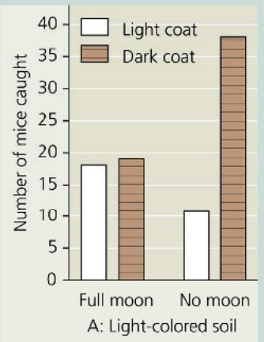

  
Data from D. W. Kaufman, Adaptive coloration in Peromyscus polionotus: Experimental selection by owls, Journal of Mammalogy 55:271–283 (1974).

## INTERPRET THE DATA

1. First, make sure you understand how the graphs are set up. Graph A shows data from the light-colored soil enclosure and graph B from the dark-colored enclosure, but in all other

rates but also did lab studies that uncovered at least one genetic mutation that underlies the differences between beach and inland mouse coloration. Her lab includes biologists specializing in different biological levels, allowing links to be made between the evolutionary adaptations she focuses on and their molecular basis in DNA sequences.

As a biology student, you can benefit from making connections between the different levels of biology. You can develop this skill by noticing when certain topics crop up again and again in different units. One such topic is sickle-cell disease, a

respects the graphs are the same. (a) There is more than one independent variable in these graphs. What are the independent variables, the variables that were tested by the researcher? Which axis of the graphs has the independent variables? (b) What is the dependent variable,

the response to the variables being tested? Which axis of the graphs has the dependent variable?

2. (a) How many dark brown mice were caught in the light-colored soil enclosure on a moonlit night? (b) How many dark brown mice were caught in the dark-colored soil enclosure on a moonlit night? (c) On a moonlit night, would a dark brown mouse be more likely to escape predation by owls on dark- or light-colored soil? Explain your answer.

3. (a) Is a dark brown mouse on dark-colored soil more likely to escape predation under a full moon or with no moon? (b) What about a light brown mouse on light-colored soil? Explain.

4. (a) Under which conditions would a dark brown mouse be most likely to escape predation at night? (b) A light brown mouse?

5. (a) What combination of independent variables led to the highest predation level in enclosures with light-colored soil? (b) What combination of independent variables led to the highest predation level in enclosures with dark-colored soil?

6. Thinking about your answers to question 5, provide a simple statement describing conditions that are especially deadly for either color of mouse.

7. Combining the data from both graphs, estimate the number of mice caught in moonlight versus no-moonlight conditions. Which condition is optimal for predation by the owl? Explain.

Instructors: A version of this Scientific Skills Exercise can be assigned in Mastering Biology.

well-understood genetic condition that is prevalent among native inhabitants of Africa, India, southeast Asia, and other warm regions, as well as their descendants. Sickle-cell disease will appear in several units of the text, each time addressed at a new level. In addition, Make Connections figures, such as Figure 23.18 on sickle-cell disease, connect the content in different chapters, and Make Connections questions ask you to make the connections yourselves. We hope these features will help you integrate the material you're learning and enhance your enjoyment of biology by encouraging you to keep the big picture in mind.

## Science, Technology, and Society

The research community is part of society at large, and the relationship of science to society becomes clearer when we add technology to the picture (see Figure 1.23). Though science and technology sometimes employ similar inquiry patterns, their basic goals differ. The goal of science is to understand natural phenomena, while that of technology is to apply scientific knowledge for some specific purpose. Because scientists put new technology to work in their research, science and technology are interdependent.

The potent combination of science and technology can have dramatic effects on society. Sometimes, the applications of basic research that turn out to be the most beneficial come out of the blue, from completely unanticipated observations in the course of scientific exploration. For example, discovery of the structure of DNA by Crick and Watson in 1953 and subsequent achievements in DNA science led to the technologies of DNA manipulation that are transforming applied fields such as medicine, agriculture, and forensics (Figure 1.26). Perhaps Crick and Watson envisioned that their discovery would someday lead to important applications, but it is unlikely that they could have predicted exactly what all those applications would be.

The directions that technology takes depend less on the curiosity that drives basic science than on the current needs and wants of people and on the social environment of the times. Debates about technology center more on “should we do it” than “can we do it.” With advances in technology come difficult choices. For example, under what circumstances is it acceptable to use DNA technology to find out if particular people have genes for hereditary diseases? Should such tests always be voluntary, or are there circumstances when genetic testing should be mandatory? Should insurance companies or employers have access to the information, as they do for many other types of personal health data? These questions are becoming much more urgent as the sequencing of individual genomes becomes quicker and cheaper.

Ethical issues raised by such questions have as much to do with politics, economics, and cultural values as with science and technology. All citizens—not only professional scientists—have a responsibility to be informed about how science works and about the potential benefits and risks of technology. The relationship between science, technology, and society increases the significance and value of any biology course.

## Chapter 1 Review

## Summary of Key Concepts

To review key terms, go to the Vocabulary Self-Quiz (eTextbook only).

Concept 1.1: The study of life reveals unifying themes

Organization Theme: New Properties Emerge at Successive Levels of Biological Organization

\- The hierarchy of life unfolds as follows: biosphere > ecosystem > community > population > organism > organ system > organ > tissue > cell > organelle > molecule > atom. With each step from atoms to the biosphere, new emergent properties result from interactions among components at the lower levels. In an

## Figure 1.26 DNA technology and forensics.

Since 1992, the Innocence Project, along with other groups, has used forensic analysis of DNA samples from crime scenes to exonerate 375 wrongly convicted prisoners. Most had served many years in prison. To read about the four people shown here who were found to be innocent, go to the Innocence Project website.

  
Lynn DeJac  
John White

  
Michael Morton  
Clemente Aguirre-Jarquin

## Concept Check 1.4

1. How does science differ from technology?

2. MAKE CONNECTIONS The gene that causes sickle-cell disease is present in a higher percentage of native inhabitants of sub-Saharan Africa, India, southeast Asia, and other warm regions than among descendants of people from those regions living in the United States. Even though this gene causes sickle-cell disease, it also provides some protection from malaria, a serious disease that is widespread in sub-Saharan Africa but absent in the United States. Discuss an evolutionary process that could account for the different percentages of the sickle-cell gene. (See Concept 1.2.)

For suggested answers, see Appendix A.

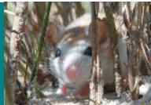

approach called reductionism, complex systems are broken down to simpler components that are more manageable to study. In systems biology, scientists attempt to model the dynamic behavior of whole biological systems by studying the interactions among the system's parts.

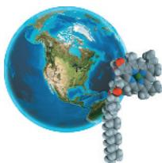

\- Structure and function are correlated at all levels of biological organization. The cell, an organism's basic unit of structure and function, is the lowest level that can perform all activities required for life. Cells are either prokaryotic or eukaryotic. Eukaryotic cells have a DNA-containing nucleus and other membrane-enclosed organelles. Prokaryotic cells lack such organelles.

## Information Theme: Life's Processes Involve the Expression and Transmission of Genetic Information

\- Genetic information is encoded in the nucleotide sequences of DNA. It is DNA that transmits heritable information from parents to offspring. DNA sequences (called genes) program a cell's protein production by being transcribed into mRNA and then translated into specific proteins, a process called gene expression. Gene expression also produces RNAs that are not translated into protein but serve other important functions. Genomics is the large-scale analysis of the DNA sequences of a species (its genome) as well as the comparison of genomes between species. Bioinformatics uses computational tools to deal with huge volumes of sequence data.

## Energy and Matter Theme: Life Requires the Transfer and Transformation of Energy and Matter

\- Energy flows through an ecosystem. All organisms must perform work, which requires energy. Producers convert energy from sunlight to chemical energy, some of which is used by them and by consumers to do work, and is eventually lost from the ecosystem as heat. Chemicals cycle between organisms and the environment.

## Interactions Theme: From Molecules to Ecosystems, Interactions Are Important in Biological Systems

\- In feedback regulation, the output or product of a process alters the activity of the process. In negative feedback, the response opposes the stimulus. In positive feedback, the response

reinforces or strengthens the stimulus.

\- Organisms interact continuously with physical factors. Plants take up nutrients from the soil and chemicals from the air and use energy from the sun.

Thinking about the muscles and nerves in your hand, how does the activity of text messaging reflect the four unifying themes of biology described in this section?

## Concept 1.2: The Core Theme: Evolution accounts for the unity and diversity of life

\- Evolution, the process of change that has transformed life on Earth, accounts for the unity and diversity of life. It also explains evolutionary adaptation—the match of organisms to their environments.

\- Biologists classify species according to a system of broader and broader groups. The major groups Bacteria and Archaea consist of prokaryotic organisms. Eukarya, the eukaryotes, includes various groups of protists and the kingdoms Plantae, Fungi, and Animalia. As diverse as life is, there is also evidence of remarkable unity, revealed in the similarities between different species.

\- Darwin proposed natural selection as the mechanism for evolutionary adaptation of populations to their environments. Natural selection is the evolutionary process that occurs when a population is exposed to environmental factors that consistently cause individuals with certain heritable traits to have greater reproductive success than do individuals with other heritable traits.

\- Each species is one twig of a branching tree of life extending back in time through more and more remote ancestral species. All of life is connected through its long evolutionary history.

How could natural selection have led to the evolution of adaptations such as camouflaging coat color in beach mice?

## Concept 1.3: In studying nature, scientists form and test hypotheses

\- In scientific inquiry, scientists collect data and use inductive reasoning to draw a general conclusion, which can be developed into a testable hypothesis. Deductive reasoning uses predictions to test hypotheses. Hypotheses must be testable; science can address neither the possibility of supernatural phenomena nor religious beliefs. Hypotheses can be tested by conducting experiments or, when that is not possible, by making observations. In the process of science, the core activity is testing ideas. This endeavor is influenced by exploration and discovery, community analysis and feedback, and societal outcomes.

\- Controlled experiments are designed to demonstrate the effect of one variable by testing control groups and experimental groups that differ in only that one variable.

\- A scientific theory is broad in scope, generates new hypotheses, and is supported by a large body of evidence.

What are the roles of gathering and interpreting data?

## Concept 1.4: Science benefits from a cooperative approach and diverse viewpoints

\- Science is a social activity. The work of each scientist builds on the work of others who have come before. Scientists must be able to repeat each other's results, and integrity is key. Biologists approach questions at different levels; their approaches complement each other

\- Technology consists of any method or device that applies scientific knowledge for some specific purpose that affects society. The impact of basic research is not always immediately obvious.

Explain how different approaches among scientists can be helpful to advance scientific knowledge.

For suggested answers, see Appendix A.

## Test Your Understanding

For more multiple-choice questions, go to the Practice Test (eTextbook only).

## Levels 1-2: Remembering/Understanding

1. All the organisms on your campus make up
(A) an ecosystem.
(B) a community.
(C) a population.
(D) a taxonomic kingdom.

2. Systems biology is mainly an attempt to

(A) analyze genomes from different species.

(B) simplify complex problems by reducing the system into smaller, less complex units.

(C) understand the behavior of entire biological systems by studying interactions among its component parts.

(D) build high-throughput machines to rapidly acquire data.

3. Which of these best demonstrates unity among organisms?
(A) emergent properties (C) the structure and
(B) descent with function of DNA
modification (D) natural selection

4. A controlled experiment is one that
(A) proceeds slowly so a scientist can make careful records.
(B) tests experimental and control groups in parallel.
(C) is repeated many times to make sure the results are accurate.
(D) keeps all variables constant.

5. Which of the following statements best distinguishes hypotheses from theories in science?

(A) Theories are hypotheses that have been proved.

(B) Hypotheses are guesses; theories are correct answers.

(C) Hypotheses usually are relatively narrow in scope; theories have broad explanatory power.

(E) Theories are proved true; hypotheses are often contradicted by experimental results.

## Levels 3-4: Applying/Analyzing

6. Which of the following is an example of qualitative data?

(A) The fish swam in a zigzag motion.

(B) The contents of the stomach are mixed every 20 seconds.

(C) The temperature decreased from $20^{\circ}$ C to $15^{\circ}$ C.

(D) The six pairs of robins hatched an average of three chicks each.

7. Which sentence best describes the logic of scientific inquiry?

(A) If I generate a testable hypothesis, tests and observations will support it.

(B) If my prediction is correct, it will lead to a testable hypothesis.

(C) If my observations are accurate, they will support my hypothesis.

(D) If my prediction turns out to be correct, my hypothesis is supported.

8. DRAW IT Draw a biological hierarchy similar to the one in Figure 1.3 but using a coral reef as the ecosystem, a fish as the organism, its stomach as the organ, and DNA as the molecule. Include all levels in the hierarchy.

## Levels 5-6: Evaluating/Creating

9. EVOLUTION CONNECTION A typical prokaryotic cell has about 3,000 genes in its DNA, while a human cell has about 20,000 genes. About 1,000 of these genes are present in both types of cells. Explain how such different organisms could have this same subset of 1,000 genes. What sorts of functions might these shared genes have?

10. SCIENTIFIC INQUIRY Based on the results of the mouse coloration case study, suggest another hypothesis researchers might use to study the role of predators in natural selection.

11. SCIENTIFIC INQUIRY Scientists search the scientific literature using electronic databases such as PubMed, a free online database maintained by the National Center for Biotechnology Information. Use PubMed to find the abstract of an article that Hopi Hoekstra published in 2017 or later.

12. WRITE ABOUT A THEME: EVOLUTION In a short essay (100–150 words), discuss Darwin's view of how natural selection resulted in both unity and diversity of life. Include in your discussion some of his evidence. (For help in writing essays, see "Writing Tips and Rubrics" in the Study Area of Mastering Biology under "Additional Resources.")

## 13. SYNTHESIZE YOUR KNOWLEDGE

  
For selected answers, see Appendix A.

Can you pick out the mossy leaf-tailed gecko lying against the tree trunk in this photo? How is the appearance of the gecko a benefit in terms of survival? Given what you learned about evolution, natural selection, and genetic information in this chapter, describe how the gecko's coloration might have evolved.

# Unit 1 The Chemistry of Life

An Interview with Kristi Anseth

Dr. Kristi Anseth is the Tisone Distinguished Professor of Chemical and Biological Engineering and Associate Faculty Director of the BioFrontiers Institute at the University of Colorado at Boulder. She received a BS in Chemical Engineering from Purdue and a PhD in Chemical Engineering from the University of Colorado. Dr. Anseth has been elected to the National Academy of Sciences, the National Academy of Engineering, and the National Academy of Inventors, and has been named a Howard Hughes Medical Institute Investigator. She was named one of “100 Chemical Engineers of the Modern Era” by the American Institute of Chemical Engineers and is a recipient of the David and Lucile Packard Fellowship for Science and Engineering as well as numerous other awards and honorary degrees. She and her laboratory members develop innovative biological materials that deliver medications to specific sites in the body, regenerate body tissues, or act as a 3-D scaffolding that supports growing cells in culture.

## How did you get started in science?

Growing up, I was always interested in my science and math courses. I wanted to understand how things worked: how reactions occur when you're baking, or how mechanical devices work. So for me, those interests blended: I trained as an engineer, but I use engineering principles to better understand biology and explore medical applications. As an undergraduate, I was intrigued by the idea of making molecules and materials that can improve healthcare and quality of life. I did research in Nicholas Pepys's lab—he was working on designing new types of biomaterials.

## What are biomaterials?

Biomaterials are substances made in the lab based on biological molecules, designed to interface with the tissues in our bodies. Some examples are biomaterials that help your heart to heal after a heart attack or your skin to heal faster after a severe burn, or that deliver medications in a more efficient and stable manner. Developers of the COVID-19 vaccine used a biomaterial to stabilize it as it interacted with body tissues. In that case, the biomaterial was lipids, molecules that make up cellular membranes. Lipids can form organized structures that can protect fragile biomolecules like the vaccine. In making biomaterials, sometimes we use materials that are found in the body, and other times we construct new materials from biological building blocks: amino acids to make proteins that have unique functions, or nucleotides that can assemble into nucleic acids, or sugars to build large molecules called polysaccharides or proteoglycans. And since we know from physics that like charges repel each other and opposite charges attract, we can fine-tune biomaterials to have defined interactions based on ionic charges.

## What is an example of something you've developed that's used in the healthcare field?

One biomaterial we work on is called a hydrogel. Hydrogels are made up of long biological molecules that would normally dissolve in water, but because of interactions between the chains—which can be ionic, covalent, or hydrogen bonds—the material is insoluble and actually takes up a lot of water. Jello is a hydrogel, and so is the super-absorbent material found in diapers that can absorb up to 1,000 times their weight in water. Many cells in the body reside in a natural hydrogel matrix called the extracellular matrix, or ECM, which is made up of molecules secreted by cells. The ECM takes up water and gives unique mechanical properties to the tissue, and it helps cells receive nutrients and heal themselves. We make synthetic mimics of ECM that can be used to repair damaged cartilage, which is a type of ECM. Cartilage cushions our joints, and once it's damaged it doesn't repair itself easily. It has no blood supply, and the cells that make cartilage, called chondrocytes, are present in small numbers. So we collect chondrocytes from other cartilage in a patient's body, cause them to multiply to high numbers, and reinject them into joints along with our artificial ECM. At higher densities, they will make new natural cartilage while the synthetic cartilage degrades away. This procedure is usually used for osteoarthritis, a type of arthritis that's caused by a mechanical or sports injury.

  
Dr. Kristi Anseth

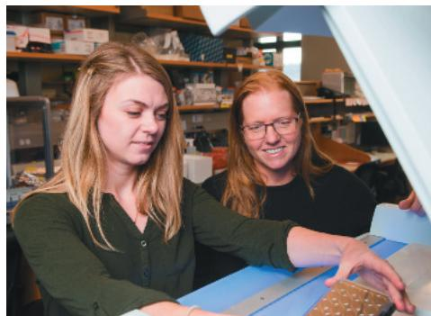  
Graduate student Cierra Walker and Dr. Anseth prepare cells to be imaged and tracked in a 3-D hydrogel matrix (synthetic ECM).

"The path is not really a ladder; it's more of a jungle gym, so be nimble and flexible, and don't be afraid to pursue your passions."

## What do you find most personally rewarding about being a scientist? What would you advise students considering a career in biology?

First, I love my research in that it's discovery of new knowledge, trying to develop new products that can improve quality of life for people everywhere. I feel like I learn something new every day that's intellectually stimulating. As a biologist, you will be a lifelong learner because new discoveries are emerging all the time. Second, in my position at the University of Colorado, one of the best things is the students in my lab. I get to help them learn how to do research, and they end up teaching me as much as I've taught them. In the end, we as scientists want to make the world a better place and tackle important problems, and there are many approaches to that. There is a wealth of career opportunities for those with a biological science background. So don't be afraid to take risks and try new things to find out what really interests you. Sometimes you might fail or really not like something, and that's okay. That helps guide you in a different direction. The path is not really a ladder; it's more of a jungle gym, so be nimble and flexible, and don't be afraid to pursue your passions.

A compound's properties depend on its atoms and how they are bonded together.

