# 第2章 The Chemical Context of Life

<!-- 章节边界按正文内容恢复；原始 MinerU 内容保留如下。 -->

# The Chemical Context of Life

## Key Concepts

2.1 Matter consists of chemical elements in pure form and in combinations called compounds

2.2 An element's properties depend on the structure of its atoms

2.3 The formation and function of molecules and ionic compounds depend on chemical bonding between atoms

2.4 Chemical reactions make and break chemical bonds

  
Figure 2.1 Wood ants (Formica rufa) use chemistry to ward off enemies. When threatened from above, they shoot volleys of formic acid from their abdomens into the air. The acid bombards and stings potential predators, such as hungry birds.

## Study Tip

Make a table: As you read the chapter, make a summary table like the following. Add more rows as you proceed.

<table><tr><td colspan="5">Element (atom)</td></tr><tr><td>Property</td><td>C</td><td>H</td><td>O</td><td>N</td></tr><tr><td>Atomic number</td><td></td><td></td><td></td><td></td></tr><tr><td># Electrons</td><td></td><td></td><td></td><td></td></tr><tr><td># Neutrons</td><td></td><td></td><td></td><td></td></tr><tr><td>Mass number</td><td></td><td></td><td></td><td></td></tr><tr><td>Electron distribution diagram</td><td></td><td></td><td></td><td></td></tr><tr><td># Valence electrons</td><td></td><td></td><td></td><td></td></tr></table>

A compound is made of atoms joined by bonds. Formic acid (CH₂O₂) consists of carbon (C), hydrogen (H), and oxygen (O).

## What determines the properties of a compound such as formic acid?

The number of protons (+) determines an atom's identity. Oxygen has 8 protons.

An atom's electron ( $\ominus$ ) distribution determines its ability to form bonds. Oxygen has space for 2 more electrons, so it can form 2 bonds.

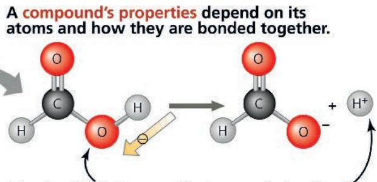  
In formic acid, this O attracts H's electron, releasing $H^{+}$ and making this compound an acid, which stings.

# Concept 2.1: Matter consists of chemical elements in pure form and in combinations called compounds

Organisms are composed of matter, which is anything that takes up space and has mass. Matter exists in many forms. Rocks, metals, oils, gases, and living organisms are a few examples of what seems to be an endless assortment of matter.

## Elements and Compounds

Matter is made up of elements. An element is a substance that cannot be broken down to other substances by chemical reactions. Today, chemists recognize 92 elements occurring in nature; gold, copper, carbon, and oxygen are examples. Each element has a symbol, usually the first letter or two of its name. Some symbols are derived from Latin or German; for instance, the symbol for sodium is Na, from the Latin word natrium.

A compound is a substance consisting of two or more different elements combined in a fixed ratio. Table salt, for example, is sodium chloride (NaCl), a compound composed of the elements sodium (Na) and chlorine (Cl) in a 1:1 ratio. Pure sodium is a metal, and pure chlorine is a poisonous gas. When chemically combined, however, sodium and chlorine form an edible compound. Water ( $H_{2}O$ ), another compound, consists of the elements hydrogen (H) and oxygen (O) in a 2:1 ratio. These are simple examples of organized matter having emergent properties: A compound has characteristics different from those of its elements (Figure 2.2).

## The Elements of Life

Of the 92 natural elements, about 20–25% are essential elements that an organism needs to live a healthy life and reproduce. The essential elements are similar among organisms, but there is some

Figure 2.2 The emergent properties of a compound.

The metal sodium combines with the poisonous gas chlorine, forming the edible compound sodium chloride, or table salt.

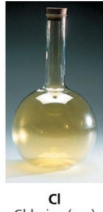

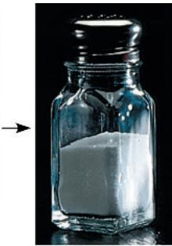

variation—for example, humans need 25 elements, but plants need only 17.

Just four elements—oxygen (O), carbon (C), hydrogen (H), and nitrogen (N)—make up approximately 96% of living matter. Calcium (Ca), phosphorus (P), potassium (K), sulfur (S), and a few other elements account for most of the remaining 4% or so of an organism's mass. Trace elements are required by an organism in only minute quantities. Some trace elements, such as iron (Fe), are needed by all forms of life; others are required only by certain species. For example, in vertebrates (animals with backbones), the element iodine (I) is an essential ingredient of a hormone produced by the thyroid gland. A daily intake of only 0.15 milligram (mg) of iodine is adequate for normal activity of the human thyroid. An iodine deficiency in the diet causes the thyroid gland to grow to abnormal size, a condition called goiter. Consuming seafood or iodized salt reduces the incidence of goiter. Relative amounts of all the elements in the human body are listed in Table 2.1.

Some naturally occurring elements are toxic to organisms. In humans, for instance, the element arsenic has been linked to numerous diseases and can be lethal. In some areas of the world, arsenic occurs naturally and can make its way into the groundwater. As a result of using water from drilled wells in southern Asia, millions of people have been inadvertently exposed to arsenic-laden water. Efforts are under way to reduce arsenic levels in their water supply.

## Interview

Interview with Kenneth Olden: Assessing susceptibility to environmental toxins using genomics (eTextbook only)

Table 2.1 Elements in the Human Body

<table><tr><td>Element</td><td>Symbol</td><td colspan="2">Percentage of Body Mass (including water)</td></tr><tr><td>Oxygen</td><td>O</td><td>65.0%</td><td rowspan="4">96.3%</td></tr><tr><td>Carbon</td><td>C</td><td>18.5%</td></tr><tr><td>Hydrogen</td><td>H</td><td>9.5%</td></tr><tr><td>Nitrogen</td><td>N</td><td>3.3%</td></tr><tr><td>Calcium</td><td>Ca</td><td>1.5%</td><td rowspan="7">3.7%</td></tr><tr><td>Phosphorus</td><td>P</td><td>1.0%</td></tr><tr><td>Potassium</td><td>K</td><td>0.4%</td></tr><tr><td>Sulfur</td><td>S</td><td>0.3%</td></tr><tr><td>Sodium</td><td>Na</td><td>0.2%</td></tr><tr><td>Chlorine</td><td>Cl</td><td>0.2%</td></tr><tr><td>Magnesium</td><td>Mg</td><td>0.1%</td></tr></table>

Trace elements (less than 0.01% of mass): Boron (B), chromium (Cr), cobalt (Co), copper (Cu), fluorine (F), iodine (I), iron (Fe), manganese (Mn), molybdenum (Mo), selenium (Se), silicon (Si), tin (Sn), vanadium (V), zinc (Zn)

INTERPRET THE DATA Given the makeup of the human body, what compound do you think accounts for the high percentage of oxygen?

## Case Study: Evolution of Tolerance to Toxic Elements

EVOLUTION Some species have become adapted to environments containing elements that are usually toxic; an example is serpentine plant communities. Serpentine is a jade-like mineral that contains elevated concentrations of elements such as chromium, nickel, and cobalt. Although most plants cannot survive in soil that forms from serpentine rock, a small number of plant species have adaptations that allow them to do so (Figure 2.3). Presumably, variants of ancestral, nonserpentine species arose that could survive in serpentine soils, and subsequent natural selection resulted in the distinctive array of species we see in these areas today. Serpentine-adapted plants are of great interest to researchers because studying them can teach us so much about natural selection and evolutionary adaptations on a local scale.

Figure 2.3 Serpentine plant community.

These plants are growing on serpentine soil, which contains elements that are usually toxic to plants. The insets show a close-up of serpentine rock and one of the plants, a Tiburon Mariposa lily (Calochortus tiburonensis). This specially adapted species is found only on this one hill in Tiburon, a peninsula that juts into San Francisco Bay.

## Concept Check 2.1

1. MAKE CONNECTIONS Explain how table salt has emergent properties. (See Concept 1.1.)

2. Is a trace element an essential element? Explain.

3. WHAT IF? In humans, iron is a trace element required for the proper functioning of hemoglobin, the molecule that carries oxygen in red blood cells. What might be the effects of an iron deficiency?

4. MAKE CONNECTIONS Explain how natural selection might have played a role in the evolution of species that are tolerant of serpentine soils. (Review Concept 1.2.)

For suggested answers, see Appendix A.

# Concept 2.2: An element's properties depend on the structure of its atoms

Each element consists of a certain type of atom that is different from the atoms of any other element. An atom is the smallest unit of matter that still retains the properties of an element. Atoms are so small that it would take about a million of them to stretch across the period printed at the end of this sentence. We symbolize atoms with the same abbreviation used for the element that is made up of those atoms. For example, the symbol C stands for both the element carbon and a single carbon atom.

## Subatomic Particles

Although the atom is the smallest unit having the properties of an element, these tiny bits of matter are composed of even smaller parts, called subatomic particles. Using high-energy collisions, physicists have produced more than 100 types of particles from the atom, but only three kinds of particles are relevant here: neutrons, protons, and electrons. Protons and electrons are electrically charged. Each proton has one unit of positive charge, and each electron has one unit of negative charge. A neutron, as its name implies, is electrically neutral.

Protons and neutrons are packed together tightly in a dense core, or atomic nucleus, at the center of an atom; protons give the nucleus a positive charge. The rapidly moving electrons form a “cloud” of negative charge around the nucleus, and it is the attraction between opposite charges that keeps the electrons in the vicinity of the nucleus. Figure 2.4 shows two commonly used models of the structure of the helium atom as an example.

Figure 2.4 Simplified models of a helium (He) atom.

The helium nucleus consists of 2 neutrons (brown) and 2 protons (pink with a plus sign). Two electrons (yellow with a minus sign) exist outside the nucleus. These models are not to scale; they greatly overestimate the size of the nucleus in relation to the electron cloud.

  
(a) This model represents the two electrons as a cloud of negative charge, a result of their motion around the nucleus.  
(b) In this more simplified model, the electrons are shown as two small yellow spheres on a circle around the nucleus.

The neutron and proton are almost identical in mass, each about $1.7 \times 10^{-24}$ gram (g). Grams and other conventional units are not very useful for describing the mass of objects that are so minuscule. Thus, for atoms and subatomic particles (and for molecules, too), we use a unit of measurement called the dalton, in honor of John Dalton, the British scientist who helped develop atomic theory around 1800. (The dalton is the same as the atomic mass unit, or amu, a unit you may have encountered elsewhere.) Neutrons and protons have masses close to 1 dalton. Because the mass of an electron is only about 1/2,000 that of a neutron or proton, we can ignore electrons when computing the total mass of an atom.

## Atomic Number and Atomic Mass

Atoms of the various elements differ in their number of sub-atomic particles. All atoms of a particular element have the same number of protons in their nuclei. This number of protons, which is unique to that element, is called the atomic number and is written as a subscript to the left of the symbol for the element. The abbreviation $_{2}$ He, for example, tells us that an atom of the element helium has 2 protons in its nucleus. Unless otherwise indicated, an atom is neutral in electrical charge, which means that its protons must be balanced by an equal number of electrons. Therefore, the atomic number tells us the number of protons and also the number of electrons in an electrically neutral atom.

We can deduce the number of neutrons from a second quantity, the mass number, which is the total number of protons and neutrons in the nucleus of an atom. The mass number is written as a superscript to the left of an element's symbol. For example, we can use this shorthand to write an atom of helium as $\frac{4}{2}He$ . Because the atomic number indicates how many protons there are, we can determine the number of neutrons by subtracting the atomic number from the mass number. In our example, the helium atom $\frac{4}{2}He$ has 2 neutrons. For sodium (Na):

Atomic number = number of protons

Number of neutrons = mass number - atomic number
= 23 - 11 = 12 for sodium

The simplest atom is hydrogen ${}^{1}_{1}H$ , which has no neutrons; it consists of a single proton with a single electron.

Because the contribution of electrons to mass is negligible, almost all of an atom's mass is concentrated in its nucleus. Neutrons and protons each have a mass very close to 1 dalton, so the mass number is close to, but slightly different from, the total mass of an atom, called its atomic mass. For example, the mass number of sodium $\left(\frac{23}{11}\mathrm{Na}\right)$ is 23, but its atomic mass is 22.9898 daltons; the difference is explained below.

## Isotopes

All atoms of a given element have the same number of protons, but some atoms have more neutrons than other atoms of the same element and therefore have greater mass. These different atomic forms of the same element are called isotopes of the element. In nature, an element may occur as a mixture of its isotopes. As an example, the element carbon, which has the atomic number 6, has three naturally occurring isotopes. The most common isotope is carbon-12, $^{12}_{6}$ C, which accounts for about 99% of the carbon in nature. The isotope $^{12}_{6}$ C has 6 neutrons. Most of the remaining 1% of carbon consists of atoms of the isotope $^{13}_{6}$ C, with 7 neutrons. A third, even rarer isotope, $^{14}_{6}$ C, has 8 neutrons. Notice that all three isotopes of carbon have 6 protons; otherwise, they would not be carbon. Although the isotopes of an element have slightly different masses, they behave identically in chemical reactions. (For an element with more than one naturally occurring isotope, the atomic mass is an average of those isotopes, weighted by their abundance. Thus, carbon has an atomic mass of 12.01 daltons.)

Both ${}^{12}$ C and ${}^{13}$ C are stable isotopes, meaning that their nuclei do not have a tendency to lose subatomic particles, a process called decay. The isotope ${}^{14}$ C, however, is unstable, or radioactive. A radioactive isotope is one in which the nucleus decays spontaneously, giving off particles and energy. When the radioactive decay leads to a change in the number of protons, it transforms the atom to an atom of a different element. For example, when a carbon-14 ( ${}^{14}$ C) atom decays, a neutron decays into a proton, transforming the atom into a nitrogen ( ${}^{14}$ N) atom. Radioactive isotopes have many useful applications in biology.

## Radioactive Tracers

Radioactive isotopes are often used as diagnostic tools in medicine. Cells can use radioactive atoms just as they would use nonradioactive isotopes of the same element. The radioactive isotopes are incorporated into biologically active molecules, which are then used as tracers to track atoms during metabolism, the chemical processes of an organism. For example, certain kidney disorders are diagnosed by injecting small doses of radioactively labeled substances into the blood and then analyzing the tracer molecules excreted in the urine. Radioactive tracers are also used in combination with sophisticated imaging instruments, such as PET scanners that can monitor growth and metabolism of cancers in the body (Figure 2.5).

Although radioactive isotopes are very useful in biological research and medicine, radiation from decaying isotopes also poses a hazard to life by damaging cellular molecules. The severity of this damage depends on the type and amount of radiation an organism absorbs. One of the most serious environmental threats is radioactive fallout from nuclear accidents. The doses of most isotopes used in medical diagnosis, however, are relatively safe.

Figure 2.5 A PET scan, a medical use for radioactive isotopes. PET, an acronym for positron-emission tomography, detects locations of intense chemical activity in the body. The bright yellow spot marks an area with an elevated level of radioactively labeled glucose, which in turn indicates high metabolic activity, a hallmark of cancerous tissue.  

## Radiometric Dating

EVOLUTION Researchers measure radioactive decay in fossils to date these relics of past life. Fossils provide a large body of evidence for evolution, documenting differences between organisms from the past and those living at present and giving us insight into species that have disappeared over time. While the layering of fossil beds establishes that deeper fossils are older than more shallow ones, the actual age (in years) of the fossils in each layer cannot be determined by position alone. This is where radioactive isotopes come in.

A “parent” isotope decays into its “daughter” isotope at a fixed rate, expressed as the half-life of the isotope—the time it takes for 50% of the parent isotope to decay. Each radioactive isotope has a characteristic half-life that is not affected by temperature, pressure, or any other environmental variable. Using a process called radiometric dating, scientists measure the ratio of different isotopes and calculate how many half-lives (in years) have passed since an organism was fossilized or a rock was formed. Half-life values range from very short for some isotopes, measured in seconds or days, to extremely long—uranium-238 has a half-life of 4.5 billion years! Each isotope can best “measure” a particular range of years: Uranium-238 was used to determine that moon rocks are approximately 4.5 billion years old, similar to the estimated age of Earth. In the Scientific Skills Exercise on the next page, you can work with data from an experiment that used carbon-14 to determine the age of an important fossil. (Figure 25.6 explains more about radiometric dating of fossils.)

## The Energy Levels of Electrons

The simplified models of the atom in Figure 2.4 greatly exaggerate the size of the nucleus relative to that of the whole atom. If an atom of helium were the size of a typical football stadium, the nucleus would be the size of a pencil eraser in the center of the field. Moreover, the electrons would be like two tiny gnats buzzing around the stadium. Atoms are mostly empty space. When two atoms approach each other during a chemical reaction, their nuclei do not come close enough to interact. Of the three sub-atomic particles we have discussed, only electrons are directly involved in chemical reactions.

An atom's electrons vary in the amount of energy they possess. Energy is defined as the capacity to cause change—for instance, by doing work. Potential energy is the energy that matter possesses because of its location or structure. For example, water in a reservoir on a hill has potential energy because of its altitude. When the gates of the reservoir's dam are opened and the water runs downhill, the energy can be used to do work, such as moving the blades of turbines to generate electricity. Because energy has been expended, the water has less energy at the bottom of the hill than it did in the reservoir. Matter has a natural tendency to move toward the lowest possible state of potential energy; in our example, the water runs downhill. To restore the potential energy of a reservoir, work must be done to elevate the water against gravity.

The electrons of an atom have potential energy due to their distance from the nucleus (Figure 2.6). The negatively charged electrons are attracted to the positively charged nucleus.

It takes work to move a given electron farther away from the nucleus, so the more distant an electron is from the nucleus, the greater its potential energy. Unlike the continuous flow of water downhill, changes in the potential energy of electrons can occur only in steps of fixed amounts. An electron having a certain amount of energy is something like a ball on a staircase (Figure 2.6a). The ball can have different amounts of potential energy, depending on which step it is on, but it

## Figure 2.6 Energy levels of an atom's electrons.

Electrons exist only at fixed levels of potential energy called electron shells.

(a) A ball bouncing down a flight of stairs can come to rest only on each step, not between steps. Similarly, an electron can exist only at certain energy levels, not between levels.

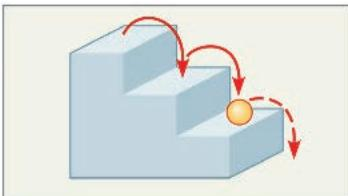  
Third shell (highest energy level in this model)  
Second shell (higher energy level)  
First shell (lowest energy level)  
(b) An electron can move from one shell to another only if the energy it gains or loses is exactly equal to the difference in energy between the energy levels of the two shells. Arrows in this model indicate some of the stepwise changes in potential energy that are possible.

# Scientific Skills Exercise Calibrating a Standard Radioactive Isotope Decay Curve and Interpreting Data

How Long Might Neanderthals Have Co-Existed with Modern Humans (Homo sapiens)? Neanderthals (Homo neanderthalensis) were living in Europe by 430,000 years ago and may have coexisted with early Homo sapiens in parts of Eurasia for hundreds or thousands of years before Neanderthals became extinct. Researchers sought to more accurately determine the extent of their overlap by pinning down the latest date Neanderthals still lived in the area. They used carbon-14 dating to determine the age of a Neanderthal fossil from the most recent (uppermost) archeological layer containing Neanderthal bones. In this exercise you will calibrate a standard carbon-14 decay curve and use it to determine the age of this Neanderthal fossil. The age will help you approximate the last time the two species may have coexisted at the site where this fossil was collected.

How the Experiment Was Done Carbon-14 ( $^{14}$ C) is a radioactive isotope of carbon that decays to $^{14}$ N at a constant rate. $^{14}$ C is present in the atmosphere in small amounts at a constant ratio with both $^{13}$ C and $^{12}$ C, two other isotopes of carbon. When carbon is taken up from the atmosphere by a plant during photosynthesis, $^{12}$ C, $^{13}$ C, and $^{14}$ C isotopes are incorporated into the plant in the same proportions in which they were present in the atmosphere. These proportions remain the same in the tissues of an animal that eats the plant. While an organism is alive, the $^{14}$ C in its body constantly decays to $^{14}$ N but is constantly replaced by new carbon from the environment. Once an organism dies, it stops taking in new $^{14}$ C but the $^{14}$ C in its tissues continues to decay, while the $^{12}$ C in its tissues remains the same because it is not radioactive and does not decay. Thus, scientists can calculate how long the pool of original $^{14}$ C has been decaying in a fossil by measuring the ratio of $^{14}$ C to $^{12}$ C and comparing it to the ratio of $^{14}$ C to $^{12}$ C present originally in the atmosphere. The fraction of $^{14}$ C in a fossil compared to the original fraction of $^{14}$ C can be converted to years because we know that the half-life of $^{14}$ C is 5,730 years—in other words, half of the $^{14}$ C in a fossil decays every 5,730 years.

Data from the Experiment The researchers found that the Neanderthal fossil had approximately 0.0078 (or, in scientific notation, $7.8 \times 10^{-3}$ ) as much $^{14}\mathrm{C}$ as the atmosphere. The following questions will guide you through translating this fraction into the age of the fossil.

## INTERPRET THE DATA

1. The graph shows a standard curve of radioactive isotope decay. The line shows the fraction of the radioactive isotope over time (before the present) in units of half-lives. Recall that a half-life is the amount of time it takes for half of the radioactive isotope to decay. Labeling each data point with the corresponding fractions will help orient you to this graph. Draw an arrow to the data point for half-life = 1 and write the fraction of ${}^{14}$ C that will remain after one half-life. Calculate the fraction of ${}^{14}$ C remaining at each half-life and write the fractions on the graph near arrows pointing to the data points. Convert each fraction to a decimal number and round off to a maximum of three significant digits (zeros at the beginning of the number do not count as significant digits). Also write each decimal number in scientific notation.

  
Data from R. Pinhasi et al., Revised age of late Neanderthal occupation and the end of the Middle Paleolithic in the northern Caucasus, Proceedings of the National Academy of Sciences USA 147:8611–8616 (2011). doi 10.1073/pnas.1018938108

2. Recall that ${}^{14}$ C has a half-life of 5,730 years. To calibrate the x-axis for ${}^{14}$ C decay, write the time before present in years below each half-life.

3. The researchers found that the Neanderthal fossil had approximately 0.0078 as much $^{14}$ C as found originally in the atmosphere. (a) Using the numbers on your graph, determine how many half-lives have passed since the Neanderthal died. (b) Using your $^{14}$ C calibration on the x-axis, what is the approximate age of the Neanderthal fossil in years (round off to the nearest thousand)? (c) Approximately when did Neanderthals become extinct according to this study? (d) The researchers cite evidence that modern humans (H. sapiens) became established in the same region as the last Neanderthals approximately 39,000–42,000 years ago. What does this suggest about possible overlap of Neanderthals and modern humans?

4. Carbon-14 dating works for fossils up to about 75,000 years old; fossils older than that contain too little ${}^{14}$ C to be detected. Most dinosaurs became extinct 65.5 million years ago.

(a) Can $^{14}$ C be used to date dinosaur bones? Explain.

(b) Radioactive uranium-235 has a half-life of 75,000 years If it was incorporated into dinosaur bones, could it be used to date the dinosaur fossils? Explain.

Instructors: A version of this Scientific Skills Exercise can be assigned in Mastering Biology.

cannot spend much time between the steps. Similarly, an electron's potential energy is determined by its energy level. An electron can exist only at certain energy levels, not between them.

An electron's energy level is correlated with its average distance from the nucleus. Electrons are found in different electron shells, each with a characteristic average distance and energy level. In diagrams, shells can be represented by concentric circles, as they are in Figure 2.6b. The first shell is closest to the nucleus, and electrons in this shell have the lowest potential energy. Electrons in the second shell have more energy, and electrons in the third shell even more energy. An electron can move from one shell to another, but only by absorbing or losing an amount of energy equal to the difference in potential energy between its position in the old shell and that in the new shell. When an electron absorbs energy, it moves to a shell farther out from the nucleus. For example, light energy can excite an electron to a higher energy level. (Indeed, this is the first step taken when plants harness the energy of sunlight for photosynthesis, the process that produces food from carbon dioxide and water.) When an electron loses energy, it “falls back” to a shell closer to the nucleus, and the lost energy is usually released to the environment as visible light or ultraviolet radiation.

## Electron Distribution and Chemical Properties

The chemical behavior of an atom is determined by the distribution of electrons in the atom's electron shells. Beginning with hydrogen, the simplest atom, we can imagine building the atoms of the other elements by adding 1 proton and 1 electron at a time (along with an appropriate number of neutrons). Figure 2.7, a modified version of what is called the periodic table of the elements, shows this distribution of electrons for the first 18 elements, from hydrogen ( $_{1}$ H) to argon ( $_{18}$ Ar). The elements are arranged in rows, or periods, each row representing the filling of an electron shell sequentially from left to right. As electrons are added, they occupy the lowest available shell until that shell is filled at the end of the row. Three rows are shown in Figure 2.7, each with a different number of electron shells. (See the complete periodic table at the back of the book.)

Hydrogen's 1 electron and helium's 2 electrons are located in the first shell. Electrons, like all matter, tend to exist in the lowest available state of potential energy. In an atom, this state is in the first shell. However, the first shell can hold no more than 2 electrons; thus, hydrogen and helium are the only elements in the first row of the table. In an atom with

Figure 2.7 Electron distribution diagrams for the first 18 elements in the periodic table.

In a standard periodic table, information for each element is presented as shown for helium in the inset. In these diagrams, electrons are represented as small yellow dots and electron shells as concentric circles. The diagrams show the distribution of an atom's electrons among its electron shells, but they do not accurately represent the atom's shape or its electrons' locations.

  
VISUAL SKILLS What is the atomic number of magnesium? How many protons and electrons does it have? How many electron shells? How many valence electrons?  
For suggested answer, see Appendix A.

more than 2 electrons, the additional electrons must occupy higher shells because the first shell is full. The next element, lithium, has 3 electrons. Two of these electrons fill the first shell, while the third electron occupies the second shell. The second shell holds a maximum of 8 electrons. Neon, at the end of the second row, has 8 electrons in the second shell, giving it a total of 10 electrons.

The chemical behavior of an atom depends mostly on the number of electrons in its outermost shell. We call those outer electrons valence electrons and the outermost electron shell the valence shell. In the case of lithium, there is only 1 valence electron, and the second shell is the valence shell. Atoms with the same number of electrons in their valence shells exhibit similar chemical behavior. For example, fluorine (F) and chlorine (Cl) both have 7 valence electrons, and both form compounds when combined with the element sodium (Na): Sodium fluoride (NaF) is commonly added to toothpaste to prevent tooth decay, and, as described earlier, NaCl is table salt (see Figure 2.2). An atom with a completed valence shell is unreactive; that is, it will not interact readily with other atoms. At the far right of the periodic table are helium, neon, and argon, the only three elements shown in Figure 2.7 that have full valence shells. These elements are said to be inert, meaning chemically unreactive. All the other atoms in Figure 2.7 are chemically reactive because they have incomplete valence shells.

## Electron Orbitals

In the early 1900s, the electron shells of an atom were visualized as concentric paths of electrons orbiting the nucleus, somewhat like planets orbiting the sun. It is still convenient to use two-dimensional concentric-circle diagrams, as in Figure 2.7, to symbolize three-dimensional electron shells. However, you need to remember that each concentric circle represents only the average distance between an electron in that shell and the nucleus. Accordingly, the concentric-circle diagrams do not give a real picture of an atom. In reality, we can never know the exact location of an electron. What we can do instead is describe the space in which an electron spends most of its time. The three-dimensional space where an electron is found 90% of the time is called an orbital.

Each electron shell contains electrons at a particular energy level, distributed among a specific number of orbitals of distinctive shapes and orientations. Figure 2.8 shows the orbitals of neon as an example, with its electron distribution diagram for reference. You can think of an orbital as a component of an electron shell. The first electron shell has only one spherical s orbital (called 1s), but the second shell has four orbitals: one large spherical s orbital (called 2s) and three dumbbell-shaped p orbitals (called 2p orbitals). (The third shell and other higher electron shells also have s and p orbitals, as well as orbitals of more complex shapes.)

No more than 2 electrons can occupy a single orbital. The first electron shell can therefore accommodate up to 2 electrons in its s orbital. The lone electron of a hydrogen atom occupies the 1s orbital, as do the 2 electrons of a helium atom. The four orbitals of the second electron shell can hold up to 8 electrons, (b) Separate electron orbitals. The three-dimensional shapes represent electron orbitals—the volumes of space where the electrons of an atom are most likely to be found. Each orbital holds a maximum of 2 electrons. The first electron shell, on the left, has one spherical (s) orbital, designated 1s. The second shell, on the right, has one larger s orbital (designated 2s for the second shell) plus three dumbbell-shaped orbitals called p orbitals (2p for the second shell). The three 2p orbitals lie at right angles to one another along imaginary x-, y-, and z-axes of the atom. Each 2p orbital is outlined here in a different color.

Figure 2.8 Electron orbitals.  
  
(a) Electron distribution diagram. An electron distribution diagram is shown here for a neon atom, which has a total of 10 electrons. Each concentric circle represents an electron shell, which can be subdivided into electron orbitals.

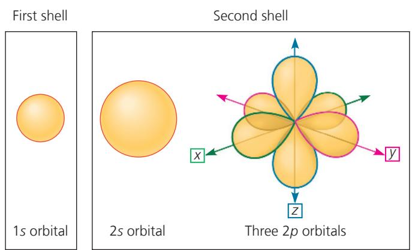

  
(c) Superimposed electron orbitals. To reveal the complete picture of the electron orbitals of neon, we superimpose the 1s orbital of the first shell and the 2s and three 2p orbitals of the second shell.

2 in each orbital. Electrons in each of the four orbitals in the second shell have nearly the same energy, but they move in different volumes of space.

The reactivity of an atom arises from the presence of unpaired electrons in one or more orbitals of the atom's valence shell. As you will see in the next section, atoms interact in a way that completes their valence shells. When they do so, it is the unpaired electrons that are involved.

## Concept Check 2.2

4. VISUAL SKILLS In Figure 2.7, if two or more elements are in the same row, what do they have in common? If two or more elements are in the same column, what do they have in common?

For suggested answers, see Appendix A.

## Concept 2.3: The formation and function of molecules and ionic compounds depend on chemical bonding between atoms

Now that we have looked at the structure of atoms, we can move up the hierarchy of organization and see how atoms combine to form molecules and ionic compounds. Atoms with incomplete valence shells can interact with certain other atoms in such a way that each partner atom completes its valence shell: The atoms either share or transfer valence electrons. These interactions usually result in atoms staying close together, held by attractions called chemical bonds. The strongest kinds of chemical bonds are covalent bonds in molecules and ionic bonds in dry ionic compounds. (Ionic bonds in aqueous, or water-based, solutions are weak interactions, as we will see later.)

## Covalent Bonds

A covalent bond is the sharing of a pair of valence electrons by two atoms. For example, let's consider what happens when two hydrogen atoms approach each other. Recall that hydrogen has 1 valence electron in the first shell, but the shell's capacity is 2 electrons. When the two hydrogen atoms come close enough for their 1s orbitals to overlap, they can share their electrons (Figure 2.9). Each hydrogen atom is now associated with 2 electrons in what amounts to a completed valence shell. Two or more atoms held together by covalent bonds constitute a molecule, in this case a hydrogen molecule.

Figure 2.10a, on the next page, shows several ways of representing a hydrogen molecule. Its molecular formula, $H_{2}$ , simply indicates that the molecule consists of two atoms of hydrogen. Electron sharing can be depicted by an electron distribution diagram or by a Lewis dot structure, in which element symbols are surrounded by dots that represent the valence electrons (H:H). We can also use a structural formula, H—H, where the line represents a single bond, a pair of shared electrons. A space-filling model comes closest to representing the actual shape of the molecule. (You may also be familiar with ball-and-stick models, which are shown in Figure 2.15.)

Figure 2.9 Formation of a covalent bond.  

Oxygen has 6 electrons in its second electron shell and therefore needs 2 more electrons to complete its valence shell. Two oxygen atoms form a molecule by sharing two pairs of valence electrons (Figure 2.10b). The atoms are thus joined by what is called a double bond (O=O).

Each atom that can share valence electrons has a bonding capacity corresponding to the number of covalent bonds the atom can form. When the bonds form, they give the atom a full complement of electrons in the valence shell. The bonding capacity of oxygen, for example, is 2. This bonding capacity is called the atom's valence and usually equals the number of electrons required to complete the atom's outermost (valence) shell. See if you can determine the valences of hydrogen, oxygen, nitrogen, and carbon by studying the electron distribution diagrams in Figure 2.7. You can see that the valence of hydrogen is 1; oxygen, 2; nitrogen, 3; and carbon, 4. The situation is more complicated for phosphorus, in the third row of the periodic table, which can have a valence of 3 or 5 depending on the combination of single and double bonds it makes.

The molecules $H_{2}$ and $O_{2}$ are pure elements rather than compounds because a compound is a combination of two or more different elements. Water, with the molecular formula $H_{2}O$ , is a

Figure 2.10 Covalent bonding in four molecules.  
The number of electrons required to complete an atom's valence shell generally determines how many covalent bonds that atom will form. This figure shows several ways of indicating covalent bonds.  
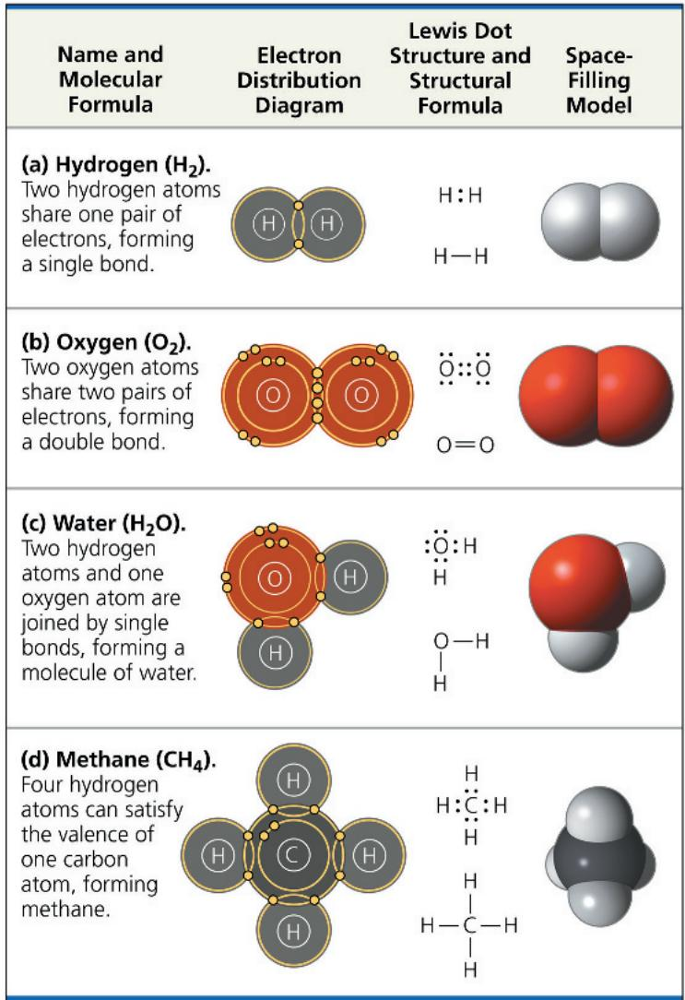

compound. Two atoms of hydrogen are needed to satisfy the valence of one oxygen atom. Figure 2.10c shows the structure of a water molecule. (Water is so important to life that Chapter 3 is devoted to its structure and behavior.)

Methane, the main component of natural gas, is a compound with the molecular formula $\mathrm{CH}_4$ . It takes four hydrogen atoms, each with a valence of 1, to complete the valence shell of a carbon atom, with its valence of 4 (Figure 2.10d). (We'll look at other carbon compounds in Chapter 4.)

Atoms in a molecule attract shared bonding electrons to varying degrees, depending on the element. The attraction of a particular atom for the electrons of a covalent bond is called its electronegativity. The more electronegative an atom is, the more strongly it pulls shared electrons toward itself. In a covalent bond between two atoms of the same element, the electrons are shared equally because the two atoms have the same electronegativity—the tug-of-war is at a standoff. Such a bond is called a nonpolar covalent bond. For example, the single bond of $H_{2}$ is nonpolar, as is the double bond of $O_{2}$ . However, when an atom is bonded to a more electronegative atom, the electrons of the bond are not shared equally. This type of bond is called a polar covalent bond. Such bonds vary in their polarity, depending on the relative electronegativity of the two atoms. For example, the bonds between the oxygen and hydrogen atoms of a water molecule are quite polar (Figure 2.11).

Figure 2.11 Polar covalent bonds in a water molecule.  
Because oxygen (O) is more electronegative than hydrogen (H), shared electrons are pulled more toward oxygen. Thus, the covalent bonds in water are polar.  

Oxygen is one of the most electronegative elements, attracting shared electrons much more strongly than hydrogen does. In a covalent bond between oxygen and hydrogen, the electrons spend more time near the oxygen nucleus than near the hydrogen nucleus. Because electrons have a negative charge and are pulled toward oxygen in a water molecule, the oxygen atom has partial negative charges (indicated by the Greek letter $\delta$ with a minus sign, $\delta-$ , or “delta minus”), and the hydrogen atoms have partial positive charges ( $\delta+$ , or “delta plus”). In contrast, the individual bonds of methane ( $CH_{4}$ ) are much less polar because the electronegativities of carbon and hydrogen are quite similar.

## Ionic Bonds

In some cases, two atoms are so unequal in their attraction for valence electrons that the more electronegative atom strips an electron completely away from its partner. The two resulting oppositely charged atoms (or molecules) are called ions. A positively charged ion is called a cation, while a negatively charged ion is called an anion. (It may help you to think of the t in cation as a plus sign, and of anion as “a negative ion.”) Because of their opposite charges, cations and anions attract each other; this attraction is called an ionic bond. Note that the transfer of an electron is not, by itself, the formation of a bond; rather, it allows a bond to form because it results in two ions of opposite charge. Any two ions of opposite charge can form an ionic bond. The ions do not need to have acquired their charge by an electron transfer with each other.

This is what happens when an atom of sodium $(_{11}\mathrm{Na})$ encounters an atom of chlorine $(_{17}\mathrm{Cl})$ (Figure 2.12). A sodium atom has a total of 11 electrons, with its single valence electron in the third electron shell. A chlorine atom has a total of 17 electrons,

Sodium chloride (NaCl)

Figure 2.12 Electron transfer and ionic bonding.

The attraction between oppositely charged atoms, or ions, is an ionic bond. An ionic bond can form between any two oppositely charged ions, even if they have not been formed by transfer of an electron from one to the other.

① The single valence electron of a sodium atom is transferred to join the 7 valence electrons of a chlorine atom.

② Each resulting ion has a completed valence shell. An ionic bond can form between the oppositely charged ions.

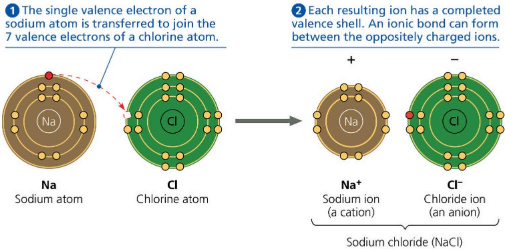

with 7 electrons in its valence shell. When these two atoms meet, the lone valence electron of sodium is transferred to the chlorine atom, and both atoms end up with their valence shells complete. (Because sodium no longer has an electron in the third shell, the second shell is now the valence shell.) The electron transfer between the two atoms moves one unit of negative charge from sodium to chlorine. Sodium, now with 11 protons but only 10 electrons, has a net electrical charge of 1+; the sodium atom has become a cation. Conversely, the chlorine atom, having gained an extra electron, now has 17 protons and 18 electrons, giving it a net electrical charge of 1−; it has become a chloride ion—an anion.

Compounds formed by ionic bonds are called ionic compounds, or salts. We know the ionic compound sodium chloride (NaCl) as table salt (Figure 2.13). Salts are often found in nature as crystals of various sizes and shapes. Each salt crystal is an aggregate of vast numbers of cations and anions bonded by their electrical attraction and arranged in a three-dimensional lattice. Unlike a covalent compound, which consists of molecules having a definite size and number of atoms, an ionic compound does not consist of molecules. The formula for an ionic compound, such as NaCl, indicates only the ratio of elements in a crystal of the salt. “NaCl” by itself is not a molecule.

Figure 2.13 A sodium chloride (NaCl) crystal.  
The sodium ions ( $Na^{+}$ ) and chloride ions ( $Cl^{-}$ ) are held together by ionic bonds. The formula NaCl tells us that the ratio of $Na^{+}$ to $Cl^{-}$ is 1:1.  
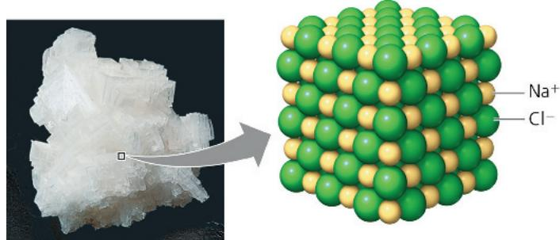

Not all salts have equal numbers of cations and anions. For example, the ionic compound magnesium chloride (MgCl $_2$ ) has two chloride ions for each magnesium ion. Magnesium ( $_{12}$ Mg) must lose 2 outer electrons if the atom is to have a complete valence shell, so it has a tendency to become a cation with a net charge of 2+ (Mg $^{2+}$ ). One magnesium cation can therefore form ionic bonds with two chloride anions (Cl $^-$ ).

The term ion also applies to entire molecules that are electrically charged. In the salt ammonium chloride $\left(\mathrm{NH}_{4}\mathrm{Cl}\right)$ , for instance, the anion is a single chloride ion $\left(\mathrm{Cl}^{-}\right)$ , but the cation is ammonium $\left(\mathrm{NH}_{4}^{+}\right)$ , a nitrogen atom covalently bonded to four hydrogen atoms. The whole ammonium ion has an electrical charge of 1+ because it has given up 1 electron and thus is 1 electron short.

Environment affects the strength of ionic bonds. In a dry salt crystal, the bonds are so strong that it takes a hammer and chisel to break enough of them to crack the crystal in two. However, if the same salt crystal is dissolved in water, the ionic bonds are much weaker because each ion is partially shielded by its interactions with water molecules. Most drugs are manufactured as salts because they are quite stable when dry but can dissociate (come apart) easily in water. (In Concept 3.2, you will learn how water dissolves salts.)

## Weak Chemical Interactions

In organisms, most of the strongest chemical bonds are covalent bonds, which link atoms to form a cell's molecules. But weaker interactions within and between molecules are also indispensable, contributing greatly to the emergent properties of life. Many large biological molecules are held in their functional form by weak interactions. In addition, when two molecules in the cell make contact, they may adhere temporarily by weak interactions. The reversibility of weak interactions can be an advantage: Two molecules can come together, affect one another in some way, and then separate.

Several types of weak chemical interactions are important in organisms. One is the ionic bond as it exists between ions dissociated in water, which we mentioned above. Hydrogen bonds and van der Waals interactions are also crucial to life.

## Hydrogen Bonds

Among weak chemical interactions, hydrogen bonds are so central to the chemistry of life that they deserve special attention. When a hydrogen atom is covalently bonded to an electronegative atom, the hydrogen atom has a partial positive charge that allows it to be attracted to a different electronegative atom with a partial negative charge nearby. This noncovalent attraction between a hydrogen and an electronegative atom is called a hydrogen bond. In living cells, the electronegative partners are usually oxygen or nitrogen atoms. Figure 2.14 shows hydrogen bonding between water ( $H_{2}O$ ) and ammonia ( $NH_{3}$ ).

Figure 2.14 A hydrogen bond.  
  
DRAW IT Draw one water molecule hydrogen bonded to four other water molecules around it. Use simple outlines of space-filling models. Draw the partial charges on the water molecules and use dots for the hydrogen bonds. For suggested answer, see Appendix A.

## Van der Waals Interactions

Even a molecule with nonpolar covalent bonds may have positively and negatively charged regions. Electrons are not always evenly distributed; at any instant, they may accumulate by chance in one part of a molecule or another. The results are ever-changing regions of positive and negative charge that enable all atoms and molecules to stick to one another. These van der Waals interactions are individually weak and occur only when atoms and molecules are very close together. When many such interactions occur simultaneously, however, they can be powerful: Van der Waals interactions allow the gecko lizard shown here to walk straight up a wall! The anatomy of the gecko's foot—including toes with hundreds of thousands of tiny hairs, each with multiple projections—maximizes surface contact with

the wall. The van der Waals interactions between the foot molecules and the molecules of the wall's surface are so numerous that despite their individual weakness, together they can support the gecko's body weight.

Van der Waals interactions, hydrogen bonds, ionic bonds in water, and other weak interactions may form not only between molecules but also between parts of a large molecule, such as a protein or nucleic acid. The cumulative effect of weak interactions is to reinforce the three-dimensional shape of the molecule. (You will learn more about the very important biological roles of weak interactions in Figures 5.18 and 5.24.)

## Molecular Shape and Function

A molecule has a characteristic size and shape, which are key to its function in the living cell. A molecule consisting of two atoms, such as $H_{2}$ or $O_{2}$ , is always linear, but most molecules with more than two atoms have more complicated shapes. These shapes are determined by the positions of the atoms' orbitals (Figure 2.15). When an atom forms covalent bonds, the orbitals in its valence shell undergo rearrangement.

Figure 2.15 Molecular shapes due to hybrid orbitals.  
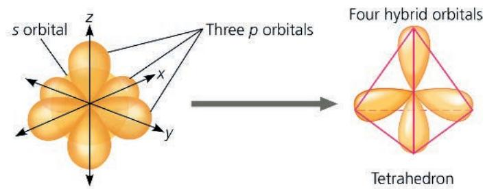  
(a) Hybridization of orbitals. The single s and three p orbitals of a valence shell involved in covalent bonding combine to form four teardrop-shaped hybrid orbitals. These orbitals extend to the four corners of an imaginary tetrahedron (outlined in pink).

  
(b) Molecular-shape models. Three models representing molecular shape are shown for water and methane. The positions of the hybrid orbitals determine the shapes of the molecules.

For atoms with valence electrons in both s and p orbitals (review Figure 2.8), the single s and three p orbitals form four new hybrid orbitals shaped like identical teardrops extending from the region of the atomic nucleus, as shown in Figure 2.15a. If we connect the larger ends of the teardrops with lines, we have the outline of a geometric shape called a tetrahedron, a pyramid with a triangular base.

For water molecules ( $H_{2}O$ ), two of the hybrid orbitals in the oxygen's valence shell are shared with hydrogens. The other two hybrid orbitals are occupied by lone (unbonded) pairs of electrons (see Figure 2.15b). The result is a molecule shaped roughly like a V, with its two covalent bonds at an angle of $104.5^{\circ}$ .

The methane molecule $\left(\mathrm{CH}_{4}\right)$ has the shape of a completed tetrahedron because all four hybrid orbitals of the carbon atom are shared with hydrogen atoms (see Figure 2.15b). The carbon nucleus is at the center, with its four covalent bonds radiating to hydrogen nuclei at the corners of the tetrahedron. Larger molecules containing multiple carbon atoms, including many of the molecules that make up living matter, have more complex overall shapes. However, the tetrahedral shape of a carbon atom bonded to four other atoms is often a repeating motif within such molecules.

Molecular shape is crucial: It determines how biological molecules recognize and respond to one another with specificity. Biological molecules often bind temporarily to each other by forming weak interactions, but only if their shapes are complementary. Consider the effects of opiates, drugs such as morphine and heroin derived from opium. Opiates relieve pain and alter mood by weakly binding to specific receptor molecules on the surfaces of brain cells. Why would brain cells carry receptors for opiates, compounds that are not endogenous, made by the body? In 1975, this question was answered by the discovery of endorphins (or “endogenous morphines”). Endorphins are signaling molecules made by the pituitary gland that bind to the receptors, relieving pain and producing euphoria during times of stress, such as intense exercise. Opiates have shapes similar to endorphins and can bind to endorphin receptors in the brain. That is why opiates and endorphins have similar effects (Figure 2.16). The role of molecular shape in brain chemistry illustrates how biological organization leads to a match between structure and function, one of biology’s unifying themes.

## Interview

Interview with Candace Pert: Discovering opiate receptors in the brain (eTextbook only)

## Concept Check 2.3

1. Why does the structure H—C=C—H fail to make sense chemically?

2. What holds the atoms together in a crystal of magnesium chloride (MgCl $_{2}$ )?

3. WHAT IF? If you were a pharmaceutical researcher, why would you want to learn the three-dimensional shapes of naturally occurring signaling molecules?

Figure 2.16 A molecular mimic.  
Morphine affects pain perception and emotional state by mimicking the brain's natural endorphins.  
  
(a) Structures of endorphin and morphine. The boxed portion of the endorphin molecule (left) binds to receptor molecules on target cells in the brain. The boxed portion of the morphine molecule (right) is a close match.

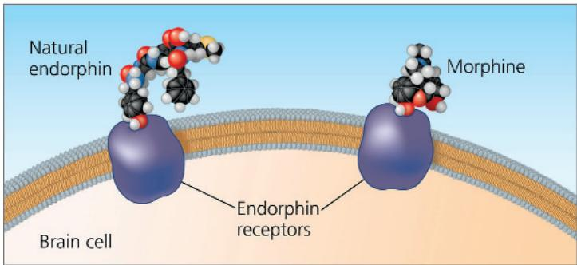  
(b) Binding to endorphin receptors. Both endorphin and morphine can bind to endorphin receptors on the surface of a brain cell.

## Concept 2.4: Chemical reactions make and break chemical bonds

The making and breaking of chemical bonds, leading to changes in the composition of matter, are called chemical reactions. An example is the reaction between hydrogen and oxygen molecules that forms water:

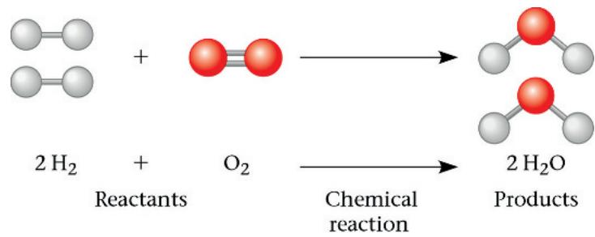

This reaction breaks the covalent bonds of $H_{2}$ and $O_{2}$ and forms the new bonds of $H_{2}O$ . When we write the equation for a chemical reaction, we use an arrow to indicate the conversion of the starting materials, called the reactants, to the resulting materials, or products. The coefficients indicate the number of molecules involved; for example, the coefficient 2 before the $H_{2}$ means that the reaction starts with two molecules of hydrogen. Notice that all atoms of the reactants must be accounted for in the products. Matter is conserved in a chemical reaction: Reactions cannot create or destroy atoms but can only rearrange (redistribute) the electrons among them.

Photosynthesis, which takes place within the cells of green plant tissues, is an important biological example of how chemical reactions rearrange matter. Humans and other animals ultimately depend on photosynthesis for food and oxygen, and this process is at the foundation of life in almost all ecosystems.

The following summarizes photosynthesis:

The raw materials of photosynthesis are carbon dioxide $\left(\mathrm{CO}_{2}\right)$ and water $\left(\mathrm{H}_{2}\mathrm{O}\right)$ , which land plants absorb from the air and soil, respectively. Within the plant cells, sunlight powers the conversion of these ingredients to a sugar called glucose $\left(\mathrm{C}_{6}\mathrm{H}_{12}\mathrm{O}_{6}\right)$ and oxygen molecules $\left(\mathrm{O}_{2}\right)$ , a by-product that can be seen when released by a water plant (Figure 2.17). Although photosynthesis is actually a sequence of many chemical reactions, we still end up with the same number and types of atoms that we had when we started. Matter has simply been rearranged, with an input of energy provided by sunlight.

All chemical reactions are theoretically reversible, with the products of the forward reaction becoming the reactants for the reverse reaction. For example, hydrogen and nitrogen molecules can combine to form ammonia, but ammonia can also decompose to regenerate hydrogen and nitrogen:

$$
3 \mathrm{H} _ {2} + \mathrm{N} _ {2} \rightleftharpoons 2 \mathrm{NH} _ {3}
$$

The two opposite-headed arrows indicate that the reaction is reversible.

One of the factors affecting the rate of a reaction is the concentration of reactants. The greater the concentration of reactant molecules, the more frequently they collide with one another and have an opportunity to react and form products. The same holds true for products. As products accumulate, collisions

Figure 2.17 Photosynthesis: a solar-powered rearrangement of matter.

Elodea, a freshwater plant, produces sugar by rearranging the atoms of carbon dioxide and water in the chemical process known as photosynthesis, which is powered by sunlight. Much of the sugar is then converted to other food molecules. Oxygen gas ( $O_{2}$ ) is a by-product of photosynthesis; notice the bubbles of $O_{2}$ gas escaping from the leaves submerged in water.

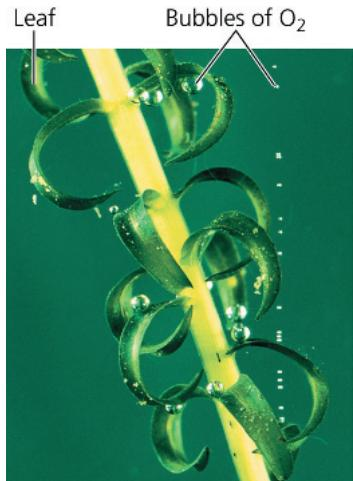

DRAW IT Add labels and arrows on the photo showing the reactants and products of photosynthesis as it takes place in a leaf. For suggested answer, see Appendix A.

resulting in the reverse reaction become more frequent. Eventually, the forward and reverse reactions occur at the same rate, and the relative concentrations of products and reactants stop changing. The point at which the reactions offset one another exactly is called chemical equilibrium. This is a dynamic equilibrium; reactions are still going on in both directions, but with no net effect on the concentrations of reactants and products. Equilibrium does not mean that the reactants and products are equal in concentration, but only that their concentrations have stabilized at a particular ratio. The reaction involving ammonia reaches equilibrium when ammonia decomposes as rapidly as it forms. In some chemical reactions, the equilibrium point may lie so far to the right that these reactions go essentially to completion; that is, virtually all the reactants are converted to products.

We will return to the subject of chemical reactions after more detailed study of the various types of molecules that are important to life. In the next chapter, we focus on water, the substance in which all the chemical processes of organisms occur.

## Concept Check 2.4

1. MAKE CONNECTIONS Consider the reaction between hydrogen and oxygen that forms water, shown with ball-and-stick models at the beginning of Concept 2.4. After studying Figure 2.10, draw and label the Lewis dot structures representing this reaction.

2. Which type of chemical reaction, if any, occurs faster at equilibrium: the formation of products from reactants or that of reactants from products?

3. WHAT IF? Write an equation that uses the products of photosynthesis as reactants and the reactants of photosynthesis as products. Add energy as another product. This new equation describes a process that occurs in your cells. Describe this equation in words. How does this equation relate to breathing?

# Chapter 2 Review

## Summary of Key Concepts

To review key terms, go to the Vocabulary Self-Quiz (eTextbook only).

Concept 2.1: Matter consists of chemical elements in pure form and in combinations called compounds

\- Elements cannot be broken down chemically to other substances. A compound contains two or more different elements in a fixed ratio. Oxygen, carbon, hydrogen, and nitrogen make up approximately 96% of living matter.

Compare an element and a compound.

## Concept 2.2: An element's properties depend on the structure of its atoms

\- An atom, the smallest unit of an element, has the following components:

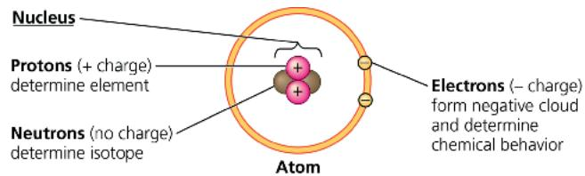

\- An electrically neutral atom has equal numbers of electrons and protons; the number of protons determines the atomic number. The atomic mass is measured in daltons and is roughly equal to the mass number, the sum of protons plus neutrons. Isotopes of an element differ from each other in neutron number and therefore mass. Unstable isotopes give off particles and energy as radioactivity.

\- In an atom, electrons occupy specific electron shells; the electrons in a shell have a characteristic energy level. Electron distribution in shells determines the chemical behavior of an atom. An atom that has an incomplete outer shell, the valence shell, is reactive.

\- Electrons exist in orbitals, three-dimensional spaces with specific shapes that are components of electron shells.

DRAW IT Draw the electron distribution diagrams for neon $(_{10}\mathrm{Ne})$ and argon $(_{18}\mathrm{Ar})$ . Use these diagrams to explain why these elements are chemically unreactive.

Concept 2.3: The formation and function of molecules and ionic compounds depend on chemical bonding between atoms

\- Chemical bonds form when atoms interact and complete their valence shells. Covalent bonds form when pairs of electrons are shared:

\- Molecules consist of two or more covalently bonded atoms. The attraction of an atom for the electrons of a covalent bond is its electronegativity. If both atoms are the same, they have the same electronegativity and share a nonpolar covalent bond. Electrons of a polar covalent bond are pulled closer to the more electronegative atom, such as the oxygen in $H_{2}O$ .

\- An ion forms when an atom or molecule gains or loses an electron and becomes charged. An ionic bond is the attraction between two oppositely charged ions:

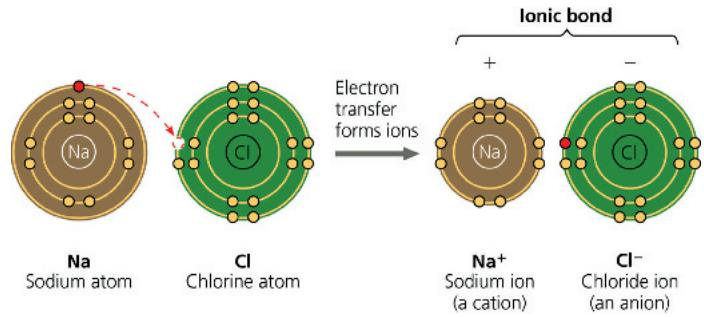

\- Weak interactions reinforce the shapes of large molecules and help molecules adhere to each other. A hydrogen bond is an attraction between a hydrogen atom carrying a partial positive charge ( $\delta+$ ) and an electronegative atom carrying a partial negative charge ( $\delta-$ ). Van der Waals interactions occur between transiently positive and negative regions of molecules. Ionic bonds in water are also weak interactions.

\- A molecule's shape is determined by the positions of its atoms' valence orbitals. Covalent bonds result in hybrid orbitals, which are responsible for the shapes of $\mathrm{H}_2\mathrm{O}$ , $\mathrm{CH}_4$ , and many more complex biological molecules. Molecular shape is usually the basis for the recognition of one biological molecule by another.

In terms of electron sharing between atoms, compare nonpolar covalent bonds, polar covalent bonds, and the formation of ions.

## Concept 2.4: Chemical reactions make and break chemical bonds

\- Chemical reactions change reactants into products while conserving matter. All chemical reactions are theoretically reversible. Chemical equilibrium is reached when the forward and reverse reaction rates are equal.

What would happen to the concentration of products if more reactants were added to a reaction that was in chemical equilibrium? How would this addition affect the equilibrium?

For suggested answers, see Appendix A.

## Test Your Understanding

For more multiple-choice questions, go to the Practice Test (eTextbook only).

## Levels 1-2: Remembering/Understanding

1. Compared with ${}^{31}$ P, the radioactive isotope ${}^{32}$ P has

(A) a different atomic number.

(B) one more proton.

(C) one more electron.

(D) one more neutron.

2. In the term trace element, the adjective trace means that

(A) the element is required in very small amounts.

(B) the element can be used as a label to trace atoms through an organism's metabolism.

(C) the element is very rare on Earth.

(D) the element enhances health but is not essential for the organism's long-term survival.

3. The reactivity of an atom arises from

(A) the average distance of the outermost electron shell from the nucleus.

(B) the existence of unpaired electrons in the valence shell.

(C) the sum of the potential energies of all the electron shells.

(D) the potential energy of the valence shell.

4. Which statement is true of all atoms that are anions?

(A) The atom has more electrons than protons.

(B) The atom has more protons than electrons.

(C) The atom has fewer protons than does a neutral atom of the same element.

(D) The atom has more neutrons than protons.

5. Which of the following statements correctly describes any chemical reaction that has reached equilibrium?

(A) The concentrations of products and reactants are equal.

(B) The reaction is now irreversible.

(C) Both forward and reverse reactions have halted.

(D) The rates of the forward and reverse reactions are equal.

## Levels 3-4: Applying/Analyzing

6. We can represent atoms by listing the number of protons, neutrons, and electrons—for example, $2p^{+}$ , $2n^{0}$ , $2e^{-}$ for helium. Which of the following represents the ${}^{18}O$ isotope of oxygen?

(A) $7p^{+}$ , $2n^{0}$ , $9e^{-}$ (C) $9p^{+}$ , $9n^{0}$ , $9e^{-}$ (B) $8p^{+}$ , $10n^{0}$ , $8e^{-}$ (D) $10p^{+}$ , $8n^{0}$ , $9e^{-}$

7. The atomic number of sulfur is 16. Sulfur combines with hydrogen by covalent bonding to form a compound, hydrogen sulfide. Based on the number of valence electrons in a sulfur atom, predict the molecular formula of the compound.
(A) HS (C) $H_{2}S$ (B) $HS_{2}$ (D) $H_{4}S$

8. What coefficients must be placed in the following blanks so that all atoms are accounted for in the products?

$$
\mathrm{C} _ {6} \mathrm{H} _ {1 2} \mathrm{O} _ {6} \rightarrow \_ \_ \_ \_ \mathrm{C} _ {2} \mathrm{H} _ {6} \mathrm{O} + \_ \_ \_ \_ \mathrm{CO} _ {2}
$$

(A) 2;1 (C) 1;3  
(B) 3;1 (D) 2;2

9. DRAW IT Draw Lewis dot structures for each hypothetical molecule shown below, using the correct number of valence electrons for each atom. Determine which molecule makes sense because each atom has a complete valence shell and each bond has the correct number of electrons. Explain what makes the other molecule nonsensical, considering the number of bonds each type of atom can make.

(a)  
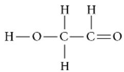

  
(b)

## Levels 5-6: Evaluating/Creating

10. EVOLUTION CONNECTION The percentages of naturally occurring elements making up the human body (see Table 2.1) are similar to the percentages of these elements found in other organisms. How could you account for this similarity among organisms?

11. SCIENTIFIC INQUIRY Female luna moths (Actias luna) attract males by emitting chemical signals that spread through the air. A male hundreds of meters away can detect these molecules and fly toward their source. The sensory organs responsible for this behavior are the comblike antennae visible in the photograph shown here. Each filament of an antenna is equipped with thousands of

receptor cells that detect the sex attractant. Based on what you learned in this chapter, propose a hypothesis to account for the ability of the male moth to detect a specific molecule in the presence of many other molecules in the air. What predictions does your hypothesis make? Design an experiment to test one of these predictions.

12. WRITE ABOUT A THEME: ORGANIZATION While waiting at an airport, Neil Campbell once overheard this claim: "It's paranoid and ignorant to worry about industry or agriculture contaminating the environment with their chemical wastes. After all, this stuff is just made of the same atoms that were already present in our environment." Drawing on your knowledge of electron distribution, bonding, and emergent properties (see Concept 1.1), write a short essay (100–150 words) countering this argument.

13. SYNTHESIZE YOUR KNOWLEDGE This bombardier beetle is spraying a boiling hot liquid that contains irritating chemicals, used as a defense mechanism against its enemies. The beetle stores two sets of chemicals separately in its glands. Using what you learned about chemistry in this chapter, propose a possible explanation for why the beetle is not harmed by the chemicals it stores and what causes the explosive discharge.

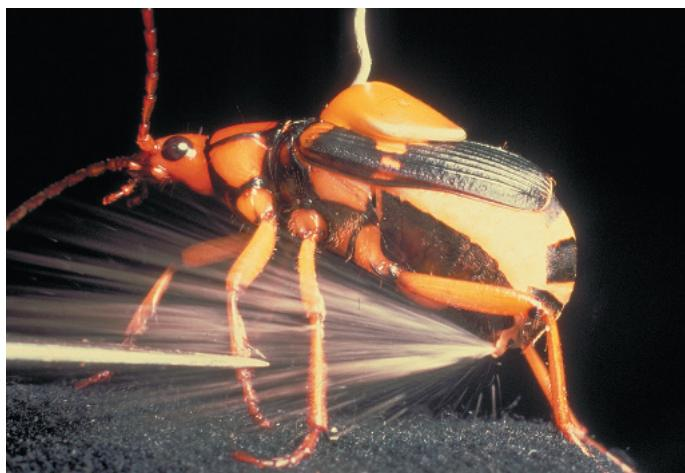  
For selected answers, see Appendix A.

