# 第4章 Carbon and the Molecular Diversity of Life

<!-- 章节边界按正文内容恢复；原始 MinerU 内容保留如下。 -->

# Carbon and the Molecular Diversity of Life

## Key Concepts

4.1 Organic chemistry is key to the origin of life

4.2 Carbon atoms can form diverse molecules by bonding to four other atoms

4.3 A few chemical groups are key to molecular function

  
Figure 4.1 These Qinling golden snub-nosed monkeys in the mountainous forests of southwest China, like all living organisms, are made up of chemicals based mostly on the element carbon. Of all chemical elements, carbon is unparalleled in its ability to form molecules that are large, complex, and varied, making possible the diversity of organisms that have evolved on Earth.

## Study Tip

Label chemical groups: After you have read through Figure 4.9, look through Chapters 4 and 5 for molecules that have the chemical groups shown in that figure. Circle and label the chemical groups you find, as in the example shown here.

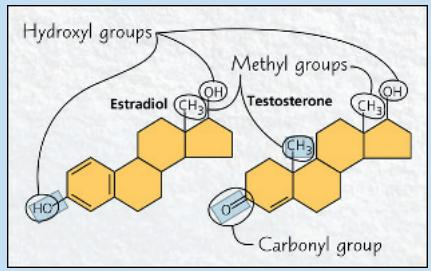  
Carbon can form four bonds, and therefore can bond to up to four other atoms or groups of atoms.

## What makes carbon the basis for all biological molecules?

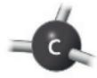

The properties of a carbon-containing molecule depend on the arrangement of its carbon skeleton and on its chemical groups.

Carbon can bond to other carbons, resulting in carbon skeletons. Carbon also commonly bonds to

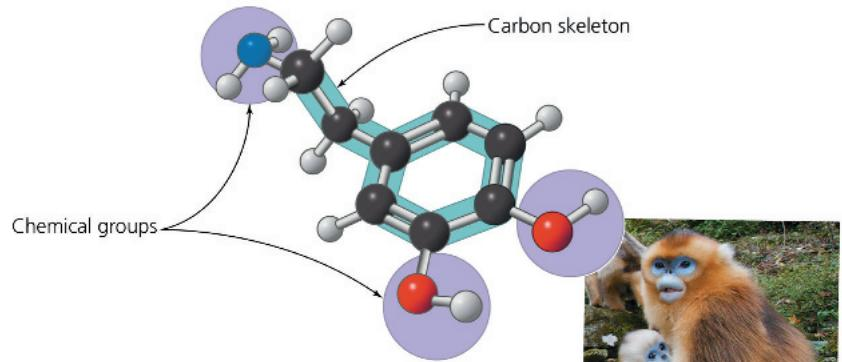  
The signaling molecule shown here, dopamine, has many functions, including promoting mother-infant bonding.

## Concept 4.1: Organic chemistry is key to the origin of life

For historical reasons, compounds containing carbon are called organic compounds, and their study is called organic chemistry. Organic compounds range from simple molecules, such as methane ( $CH_{4}$ ), to colossal ones, such as proteins, with thousands of atoms.

EVOLUTION In 1953, Stanley Miller, a graduate student of Harold Urey at the University of Chicago, designed an experiment on the abiotic (nonliving) synthesis of organic compounds to investigate the origin of life. Study Figure 4.2 to learn about his classic experiment. From his results, Miller concluded that complex

organic molecules could arise spontaneously under conditions thought at that time to have existed on early Earth. You can work with the data from a related experiment in the Scientific Skills Exercise. These experiments support the idea that abiotic synthesis of organic compounds, perhaps near volcanoes, could have been an early stage in the origin of life (see Figure 25.2).

In Concept 3.2, you learned about evidence for the presence of water on Mars in the past. Even more exciting, in 2018, NASA reported that the rover Curiosity had found carbon-based compounds on Mars in Gale Crater where a lake once existed. While these compounds might have been brought to Mars on a meteorite or formed by geologic processes, an intriguing possibility is that they might have been the relics of life-forms that once existed on that planet. Samples were collected here and from other sites so they could be analyzed later for the presence of fossils, which would provide strong evidence for past life on Mars.

## Figure 4.2

## Inquiry: Can organic molecules form under conditions estimated to simulate those on the early Earth?

## Experiment

In 1953, Stanley Miller set up a closed system to mimic conditions thought at that time to have existed on the early Earth. A flask of water simulated the primeval sea. The water was heated so that some vaporized and moved into a second, higher flask containing the “atmosphere”—a mixture of gases. Sparks were discharged in the synthetic atmosphere to mimic lightning.

## Results

Miller identified a variety of organic molecules that are common in organisms. These included simple compounds, such as formaldehyde ( $CH_{2}O$ ) and hydrogen cyanide (HCN), and more complex molecules, such as amino acids and long chains of carbon and hydrogen known as hydrocarbons.

## Conclusion

Organic molecules, a first step in the origin of life, may have been synthesized abiotically on the early Earth. Although later evidence indicated that the early-Earth atmosphere was different from the “atmosphere” used by Miller in this experiment, recent experiments using the revised list of chemicals also produced organic molecules. (We will explore this hypothesis in more detail in Concept 25.1.)

Data from S. L. Miller, A production of amino acids under possible primitive Earth conditions, Science 117:528–529 (1953).

WHAT IF? If Miller had increased the concentration of $NH_{3}$ in his experiment, how might the relative amounts of the products HCN and $CH_{2}O$ have differed?

For suggested answer, see Appendix A.

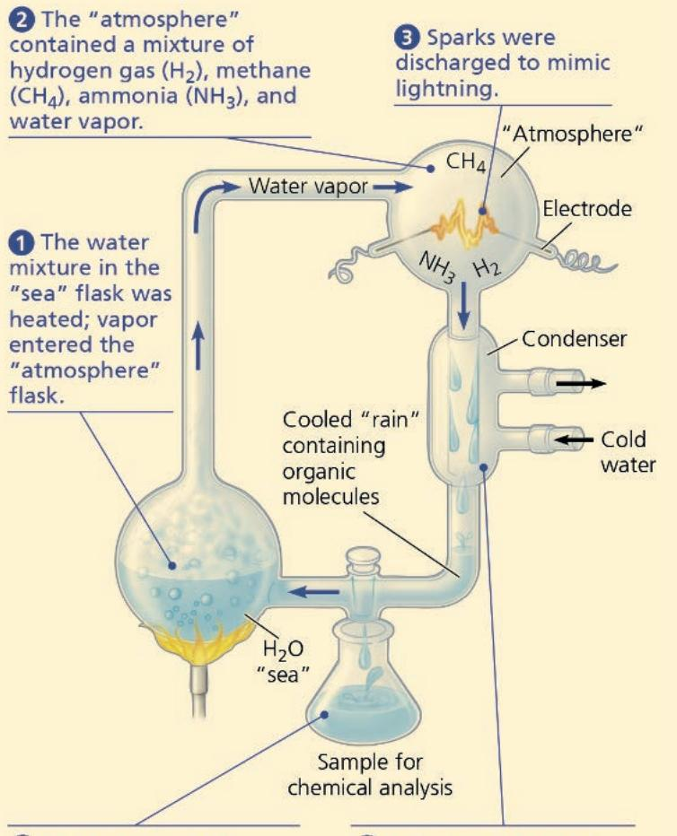  
⑤ As material cycled through the apparatus, Miller periodically collected samples for analysis.  
4 A condenser cooled the atmosphere, raining water and dissolved molecules into the sea flask.

# Scientific Skills Exercise Working with Moles and Molar Ratios

Could the First Biological Molecules Have Formed Near Volcanoes on Early Earth? In 2007, Jeffrey Bada, a former graduate student of Stanley Miller, discovered some vials of samples that had never been analyzed from an experiment performed by Miller in 1958. In that experiment, Miller used hydrogen sulfide gas ( $H_{2}S$ ) as one of the gases in the reactant mixture. Since $H_{2}S$ is released by volcanoes, the $H_{2}S$ experiment was designed to mimic conditions near volcanoes on early Earth. In 2011, Bada and colleagues published the results of their analysis of these “lost” samples. In this exercise, you will make calculations using the molar ratios of reactants and products from the $H_{2}S$ experiment.

How the Experiment Was Done According to his laboratory notebook, Miller used the same apparatus as in his original experiment (see Figure 4.2), but the mixture of gaseous reactants included methane $(\mathrm{CH}_4)$ , carbon dioxide $(\mathrm{CO}_2)$ , hydrogen sulfide $(\mathrm{H}_2\mathrm{S})$ , and ammonia $(\mathrm{NH}_3)$ . After three days of simulated volcanic activity, he collected samples of the liquid, partially purified the chemicals, and sealed the samples in sterile vials. In 2011, Bada's research team used modern analytical methods to analyze the products in the vials for the presence of amino acids, the building blocks of proteins.

Data from the Experiment The table below shows 4 of the 23 amino acids detected in the 2011 analysis of the samples from Miller's 1958 $\mathrm{H}_2\mathrm{S}$ experiment.

<table><tr><td>Product Compound</td><td>Molecular Formula</td><td>Molar Ratio (Relative to Glycine)</td></tr><tr><td>Glycine</td><td> $C_{2}H_{5}NO_{2}$ </td><td>1.0</td></tr><tr><td>Serine</td><td> $C_{3}H_{7}NO_{3}$ </td><td> $3.0 \times 10^{-2}$ </td></tr><tr><td>Methionine</td><td> $C_{5}H_{11}NO_{2}S$ </td><td> $1.8 \times 10^{-3}$ </td></tr><tr><td>Alanine</td><td> $C_{3}H_{7}NO_{2}$ </td><td>1.1</td></tr></table>

Data from E. T. Parker et al., Primordial synthesis of amines and amino acids in a 1958 Miller H₂S-rich spark discharge experiment, Proceedings of the National Academy of Sciences USA 108:5526-5531 (2011). www.pnas.org/cgi/doi/10.1073/pnas.1019191108.  
Some of Stanley Miller's notes from his 1958 hydrogen sulfide $(\mathrm{H}_2\mathrm{S})$ experiment along with his original vials.

## INTERPRET THE DATA

1. A mole is the number of particles of a substance with a mass equivalent to its molecular (or atomic) mass in daltons. There are $6.02 \times 10^{23}$ molecules (or atoms) in 1.0 mole (Avogadro's number; see Concept 3.2). The data table shows the “molar ratios” of some of the products from the Miller $H_{2}S$ experiment. In a molar ratio, each unitless value is expressed relative to a standard for that experiment. Here, the standard is the number of moles of the amino acid glycine, which is set to a value of 1.0. For instance, serine has a molar ratio of $3.0 \times 10^{-2}$ , meaning that for every mole of glycine, there is $3.0 \times 10^{-2}$ mole of serine. (a) Give the molar ratio of methionine to glycine and explain what it means. (b) How many molecules of glycine are present in 1.0 mole? (c) For every 1.0 mole of glycine in the sample, how many molecules of methionine are present? (Recall that to multiply two numbers with exponents, you add their exponents; to divide them, you subtract the exponent in the denominator from that in the numerator.)

2. (a) Which amino acid is present in higher amounts than glycine? (b) How many more molecules of that amino acid are present than the number of molecules in 1.0 mole of glycine?

3. The synthesis of products is limited by the amount of reactants. (a) If one mole each of $CH_{4}$ , $NH_{3}$ , $H_{2}S$ , and $CO_{2}$ is added to 1 liter of water (=55.5 moles of $H_{2}O$ ) in a flask, how many moles of hydrogen, carbon, oxygen, nitrogen, and sulfur are in the flask? (b) Looking at the molecular formula in the table, how many moles of each element would be needed to make 1.0 mole of glycine? (c) What is the maximum number of moles of glycine that could be made in that flask, with the specified ingredients, if no other molecules were made? Explain. (d) If serine or methionine were made individually, which element(s) would be used up first for each? How much of each product could be made?

4. The earlier published experiment carried out by Miller did not include $H_{2}S$ in the reactants (see Figure 4.2). Which of the compounds shown in the data table can be made in the $H_{2}S$ experiment but could not be made in the earlier experiment?

Instructors: A version of this Scientific Skills Exercise can be assigned in Mastering Biology.

The overall percentages of the major elements of life—C, H, O, N, S, and P—are quite uniform from one organism to another, reflecting the common evolutionary origin of all life. Because of carbon's ability to form four bonds, however, this limited assortment of atomic building blocks can be used to build an inexhaustible variety of organic molecules. Different species of organisms, and different individuals within a species, are distinguished by variations in the types of organic molecules they make. In a sense, the great diversity of living organisms we see on the planet (and in fossil remains) is made possible by the unique chemical versatility of the carbon atom.

## Interview

Interview with Stanley Miller: Investigating the origin of life (eTextbook only)

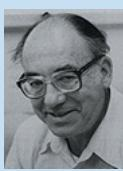

## Concept Check 4.1

1. VISUAL SKILLS See Figure 4.2. Miller carried out a control experiment without discharging sparks and found no organic compounds. What might explain this result?

For suggested answers, see Appendix A.

# Concept 4.2: Carbon atoms can form diverse molecules by bonding to four other atoms

The key to an atom's chemical characteristics is its electron configuration. This configuration determines the kinds and number of bonds an atom will form with other atoms. Recall that it is the valence electrons, those in the outermost shell, that are available to form bonds with other atoms.

## The Formation of Bonds with Carbon

Carbon has 6 electrons, with 2 in the first electron shell and 4 in the second shell; thus, it has 4 valence electrons in a shell that can hold up to 8 electrons. A carbon atom usually completes its valence shell by sharing its 4 electrons with other atoms so that 8 electrons are present. Each pair of shared electrons constitutes a covalent bond (see Figure 2.10d). In organic molecules, carbon usually forms single or double covalent bonds. Each carbon atom acts as an intersection point from which a molecule can branch off in as many as four directions. This enables carbon to form large, complex molecules.

When a carbon atom forms four single covalent bonds, the arrangement of its four hybrid orbitals causes the bonds to angle toward the corners of an imaginary tetrahedron. The bond angles in methane $\left(\mathrm{CH}_{4}\right)$ are $109.5^{\circ}$ (Figure 4.3a), and they are roughly the same in any group of atoms where carbon has four single bonds.

Figure 4.3 The shapes of three simple organic molecules.

<table><tr><td>Molecule and Molecular Shape</td><td>Molecular Formula</td><td>Structural Formula</td><td>Ball-and-Stick Model (molecular shape in pink)</td><td>Space-Filling Model</td></tr><tr><td>(a) Methane. When a carbon atom has four single bonds to other atoms, the molecule is tetrahedral.</td><td> $CH_4$ </td><td></td><td></td><td>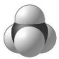</td></tr><tr><td>(b) Ethane. A molecule may have more than one tetrahedral group of single-bonded atoms. (Ethane consists of two such groups.)</td><td> $C_2H_6$ </td><td></td><td></td><td></td></tr><tr><td>(c) Ethene (ethylene). When two carbon atoms are joined by a double bond, all atoms attached to those carbons are in the same plane, and the molecule is flat.</td><td> $C_2H_4$ </td><td></td><td>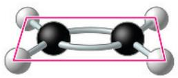</td><td>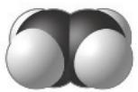</td></tr></table>

For example, ethane $\left(\mathrm{C}_{2}\mathrm{H}_{6}\right)$ is shaped like two overlapping tetrahedrons (Figure 4.3b). In molecules with more carbons, every grouping of a carbon bonded to four other atoms has a tetrahedral shape. But when two carbon atoms are joined by a double bond, as in ethene $\left(\mathrm{C}_{2}\mathrm{H}_{4}\right)$ , the bonds from both carbons are all in the same plane, so the atoms joined to those carbons are in the same plane as well (Figure 4.3c). We find it convenient to write molecules as structural formulas, as if the molecules being represented are two-dimensional, but keep in mind that molecules are three-dimensional and that the shape of a molecule is central to its function.

The number of electrons required to fill the valence shell of an atom is generally equal to the atom's valence, the number of covalent bonds it can form. Figure 4.4 shows the valences of carbon and its most frequent bonding partners—hydrogen, oxygen, and nitrogen. These are the four main atoms in organic molecules.

The electron configuration of carbon gives it covalent compatibility with many different elements. Let's consider how valence and the rules of covalent bonding apply to carbon atoms with partners other than hydrogen. We'll look at two examples, the simple molecules carbon dioxide and urea.

In the carbon dioxide molecule $\left(\mathrm{CO}_{2}\right)$ , a single carbon atom is joined to two atoms of oxygen by double covalent bonds. The structural formula for $CO_{2}$ is shown here:

$$
\mathrm{O} = \mathrm{C} = \mathrm{O}
$$

Each line in a structural formula represents a pair of shared electrons. Thus, the two double bonds in $CO_{2}$ have the same number of shared electrons as four single bonds. The arrangement completes the valence shells of all atoms in the molecule:

Because $CO_{2}$ is a very simple molecule and lacks hydrogen, it is often considered inorganic, even though it contains carbon. Whether we call $CO_{2}$ organic or inorganic, however, it is clearly important to the living world as the source of carbon, via photosynthetic organisms, for all organic molecules in organisms (see Concept 2.4).

Urea, $\mathrm{CO(NH_{2})_{2}}$ , is an organic compound found in urine. Again, each atom has the required number of covalent bonds. In this case, one carbon atom participates in both single and double bonds.

Urea and carbon dioxide are molecules with only one carbon atom. But a carbon atom

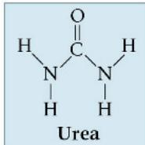

can also use one or more valence electrons to form covalent bonds to other carbon atoms, linking the atoms into chains, as shown here for $C_{3}H_{8}$ :

Figure 4.4 Valences of the major elements of organic molecules. Valence, the number of covalent bonds an atom can form, is generally equal to the number of electrons required to fill the valence shell. (Sodium, phosphorus, and chlorine are exceptions.)

<table><tr><td></td><td>Hydrogen</td><td>Oxygen</td><td>Nitrogen</td><td>Carbon</td></tr><tr><td>Lewis dot structure showing existing valence electrons</td><td>H·</td><td> $\cdot\ddot{O}:$ </td><td> $\cdot\ddot{N}\cdot$ </td><td> $\cdot\dot{C}\cdot$ </td></tr><tr><td>Electron distribution diagram with red dashed circles showing electrons needed to fill the valence shell</td><td></td><td></td><td></td><td></td></tr><tr><td>Number of electrons needed to fill the valence shell</td><td>1</td><td>2</td><td>3</td><td>4</td></tr><tr><td>Valence: Number of bonds the element can form</td><td>1</td><td>2</td><td>3</td><td>4</td></tr></table>

MAKE CONNECTIONS Draw the Lewis dot structures for sodium, silicon, phosphorus, sulfur, and chlorine. (Refer to Figure 2.7.)  
For suggested answer, see Appendix A.

## Molecular Diversity Arising from Variation in Carbon Skeletons

Carbon chains form the basis of most organic molecules. Carbon skeletons vary in length and may be straight, branched, or arranged in closed rings (Figure 4.5). Some carbon chains have double bonds, which vary in number and location. Such variation in carbon chains is one important source of the molecular complexity and diversity that characterize living matter. In addition, the skeletons of biological molecules often include atoms of other elements, like oxygen and phosphorus; such atoms can also be bonded to carbons of the skeleton.

## Hydrocarbons

All of the molecules that are shown in Figures 4.3 and 4.5 are hydrocarbons, organic molecules consisting of only carbon and hydrogen. Atoms of hydrogen are attached to the carbon skeleton wherever electrons are available for covalent bonding. Hydrocarbons are the major components of petroleum, which is called a fossil fuel because it consists of the partially decomposed remains of organisms that lived millions of years ago.

## Interview

Interview with Deborah Gordon: Studying how ants use hydrocarbons to communicate (eTextbook only)

Although hydrocarbons are not prevalent in most living organisms, some of a cell's organic molecules have regions consisting of only carbon and hydrogen. For example, the molecules known as fats have long hydrocarbon tails attached to a nonhydrocarbon component (Figure 4.6). Neither petroleum nor

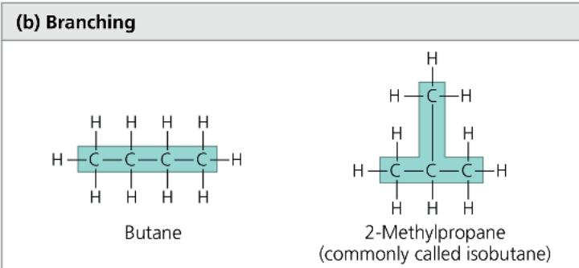  
1-Butene  
Figure 4.5 Four ways that carbon skeletons can vary.

## (a) Length

  
Carbon skeletons vary in length.

## (b) Branching

## (c) Double bond position

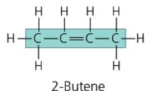  
The skeleton may have double bonds, which can vary in location.

## (d) Presence of rings

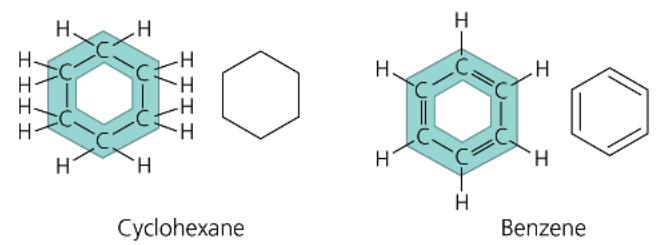  
Some carbon skeletons are arranged in rings. In the abbreviated structural formula for each compound (to its right), each corner represents a carbon and its attached hydrogens.

fat dissolves in water; both are hydrophobic compounds because the great majority of their bonds are relatively nonpolar carbon-to-hydrogen linkages. Another characteristic of hydrocarbons is that they can undergo reactions that release a relatively large amount of energy. The gasoline that fuels a car consists of hydrocarbons, and the hydrocarbon tails of fats serve as stored fuel for plant embryos (seeds) and animals.

## Isomers

Variation in the architecture of organic molecules can be seen in isomers, compounds that have the same numbers of atoms of the same elements but different structures and hence different

## Figure 4.6 The role of hydrocarbons in fats.

(a) Mammalian adipose cells stockpile fat molecules as a fuel reserve. This colorized micrograph shows part of a human adipose cell with many fat droplets, each containing a large number of fat molecules. (b) A fat molecule consists of a small, nonhydrocarbon component joined to three hydrocarbon tails that account for the hydrophobic behavior of fats. The tails can be broken down to provide energy. (Black = carbon; gray = hydrogen; red = oxygen.)

Skeletons may be unbranched or branched.  
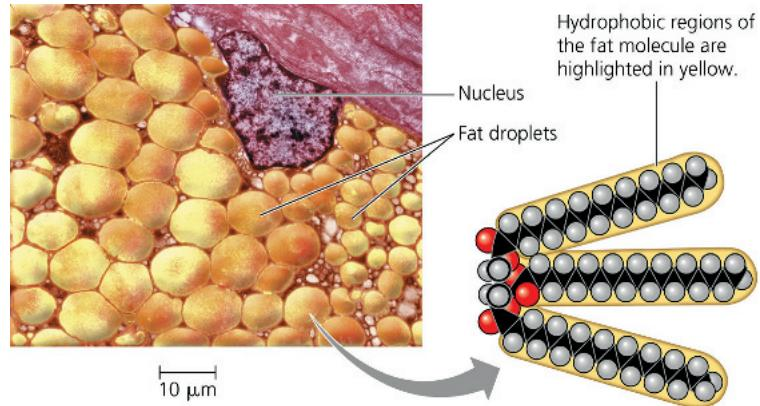  
(a) Part of a human adipose cell (b) A fat molecule  
MAKE CONNECTIONS How do the tails account for the hydrophobic nature of fats? (See Concept 3.2.)
For suggested answer, see Appendix A.

properties. We will examine three types of isomers: structural isomers, cis-trans isomers, and enantiomers.

Structural isomers differ in the covalent arrangements of their atoms. Compare, for example, the two five-carbon compounds in Figure 4.7a. Both have the molecular formula $C_{5}H_{12}$ , but they differ in the covalent arrangement of their carbon skeletons. The skeleton is straight in one compound but branched in the other. The number of possible isomers increases tremendously as carbon skeletons increase in size. There are only three forms of $C_{5}H_{12}$ (two of which are shown in Figure 4.7a), but there are 18 variants of $C_{8}H_{18}$ and 366,319 possible structural isomers of $C_{20}H_{42}$ . Structural isomers may also differ in the location of double bonds.

In cis-trans isomers (also known as geometric isomers), carbons have covalent bonds to the same atoms, but these atoms differ in their spatial arrangements due to the inflexibility of double bonds. Single bonds allow the atoms they join to rotate freely about the bond axis without changing the compound. In contrast, double bonds do not permit such rotation. If a double bond joins two carbon atoms, and each C also has two different atoms (or groups of atoms) attached to it, then two distinct cis-trans isomers are possible. Consider a simple molecule with two double-bonded carbons, each of which has an H and an X attached to it (Figure 4.7b). The arrangement with both Xs on the same side of the double bond is called a cis isomer, and that with the Xs on opposite sides is called a trans isomer. The subtle difference in shape between such isomers can have a dramatic effect on the biological activities of organic molecules. For example, the biochemistry of vision involves a light-induced change of retinal, a chemical compound in the eye, from the cis isomer to the trans isomer (see Figure 50.17). Another example involves trans fats, harmful fats formed during food processing that are discussed in Concept 5.3.

2-Methylbutane

Figure 4.7 Three types of isomers.

Isomers are compounds that have the same molecular formula but different structures.

## (a) Structural isomers

  
Structural isomers differ in the arrangement of covalent bonding partners, as shown in these two isomers of $C_{5}H_{12}$ .

## (b) Cis-trans isomers (also known as geometric isomers)

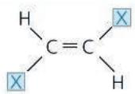  
cis isomer: The two Xs are on the same side.  
trans isomer: The two Xs are on opposite sides.  
Cis-trans isomers differ in arrangement about a double bond. In these diagrams, X represents an atom or group of atoms attached to a double-bonded carbon.

## (c) Enantiomers

  
Enantiomers differ in spatial arrangement around an asymmetric carbon, resulting in molecules that are mirror images, like left and right hands. The two isomers here are designated the L and D isomers from the Latin for "left" and "right" (levo and dextro). Enantiomers cannot be superimposed on each other.

For suggested answer, see Appendix A.

Enantiomers are isomers that are mirror images of each other and that differ in shape due to the presence of an asymmetric carbon, one that is attached to four different atoms or groups of atoms. (See the middle carbon in the ball-and-stick models shown in Figure 4.7c.) The four groups can be arranged in space around the asymmetric carbon in two different ways that are mirror images. Enantiomers are, in a way, left-handed and right-handed versions of the molecule. Just as your right hand won't fit into a left-handed glove, a "right-handed" molecule won't fit into the same space as the "left-handed" version. Usually, only one isomer is biologically active because only that form can bind to specific molecules in an organism.

DRAW IT There are three structural isomers of $C_{5}H_{12}$ ; draw the one not shown in (a).  
Figure 4.8 The pharmacological importance of enantiomers.  
Ibuprofen and albuterol are drugs whose enantiomers have different effects. (S and R are used here to distinguish between enantiomers, rather than D and L as in Figure 4.7c.) Ibuprofen is commonly sold as a mixture of the two enantiomers; the S enantiomer is 100 times more effective than the R form. Albuterol is synthesized and sold only as the R form of that drug; the S form counteracts the active R form.

<table><tr><td>Drug</td><td>Effects</td><td>Effective Enantiomer</td><td>Ineffective Enantiomer</td></tr><tr><td>Ibuprofen</td><td>Reduces inflammation and pain</td><td>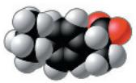S-Ibuprofen</td><td>R-Ibuprofen</td></tr><tr><td>Albuterol</td><td>Relaxes bronchial (airway) muscles, improving airflow in asthma patients</td><td>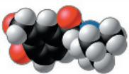R-Albuterol</td><td>S-Albuterol</td></tr></table>

The concept of enantiomers is important in the pharmaceutical industry because the two enantiomers of a drug may not be equally effective, as is the case for both ibuprofen and the asthma medication albuterol (Figure 4.8). Methamphetamine also occurs in two enantiomers that have very different effects. One enantiomer is the highly addictive stimulant drug known as “crank,” sold illegally in the street drug trade. The other has a much weaker effect and is the active ingredient in an over-the-counter vapor inhaler for treatment of nasal congestion. The differing effects of enantiomers in the body demonstrate that organisms are sensitive to even the subtlest variations in molecular architecture. Once again, we see that molecules have emergent properties that depend on the specific arrangement of their atoms.

## Concept Check 4.2

1. DRAW IT (a) Draw a structural formula for $C_{2}H_{4}$ . (b) Draw the trans isomer of $C_{2}H_{2}Cl_{2}$ .

2. VISUAL SKILLS Which two pairs of molecules in Figure 4.5 are isomers? For each pair, identify the type of isomer.

3. How are gasoline and fat chemically similar?

4. VISUAL SKILLS See Figures 4.5a and 4.7. Can propane $(\mathrm{C}_3\mathrm{H}_8)$ form isomers? Explain.

For suggested answers, see Appendix A.

## Concept 4.3: A few chemical groups are key to molecular function

The distinctive properties of an organic molecule depend not only on the arrangement of its mostly carbon skeleton but also on the various chemical groups attached to that skeleton. These groups may participate in chemical reactions or may contribute to

function indirectly by their effects on molecular shape; they help give each molecule its unique properties.

## The Chemical Groups Most Important in the Processes of Life

Consider the differences between estradiol (a type of estrogen) and testosterone. These compounds are female and male sex hormones, respectively, in humans and other vertebrates. Both are steroids, organic molecules with a common carbon skeleton in the form of four fused rings. They differ only in the chemical groups attached to the rings (shown here in abbreviated form, where each corner represents a carbon and its attached hydrogens); the distinctions in molecular architecture are marked with a dotted line:

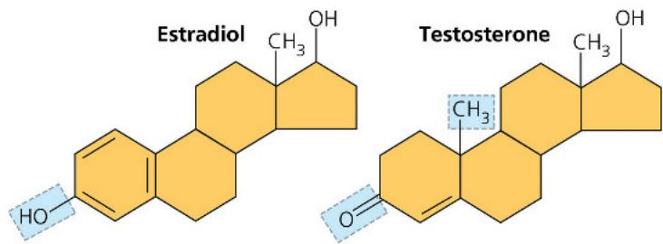

The different actions of these two molecules on many targets throughout the body are the basis of sexual characteristics, producing the contrasting features of male and female vertebrates. In this case, the chemical groups are important because they affect molecular shape, contributing to function.

In other cases, chemical groups are directly involved in chemical reactions; such groups are known as functional groups. Each has certain properties, such as shape and charge, that cause it to participate in chemical reactions in a characteristic way.

The seven chemical groups most important in biological processes are the hydroxyl group, carbonyl group, carboxyl group, amino group, sulfhydryl group, phosphate group, and methyl group. The first six groups can be chemically reactive (thus are functional groups); of these six, all except the sulfhydryl group are also hydrophilic and thus increase the solubility of organic compounds in water. The methyl group is not reactive, but instead often serves as a recognizable tag on biological molecules. Study Figure 4.9, on the next page, to become familiar with these biologically important chemical groups. Note in the Examples column of the figure that the carboxyl group and the amino group are ionized at normal cellular pH.

## ATP: An Important Source of Energy for Cellular Processes

The “Phosphate group” row in Figure 4.9 shows a simple example of an organic phosphate molecule. A more complicated organic phosphate, adenosine triphosphate, or ATP, is worth mentioning here because its function in the cell is so important.

ATP consists of an organic molecule called adenosine attached to a string of three phosphate groups:

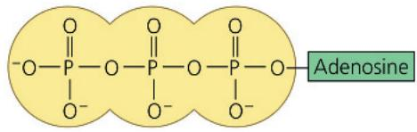

Where three phosphates are present in series, as in ATP, one phosphate may be split off as a result of a reaction with water. This inorganic phosphate ion, HOPO $_{3}^{2-}$ , is often abbreviated $\textcircled{P}_{i}$ in this book, and a phosphate group in an organic molecule is often written as $\textcircled{P}$ . Having lost one phosphate, ATP becomes adenosine $d$ iphosphate, or ADP. Although ATP is sometimes said to store energy, it is more accurate to think of it as storing the potential to react with water or other molecules. Overall, the process releases energy that can be used by the cell. You'll learn more about this in Concept 8.3.

## The Chemical Elements of Life: A Review

Living matter, as you have learned, consists mainly of carbon, oxygen, hydrogen, and nitrogen, with smaller amounts of sulfur and phosphorus. These elements all form strong covalent bonds, an essential characteristic in the architecture of complex organic molecules. Of all these elements, carbon is the virtuoso of the covalent bond. The versatility of carbon makes possible the great diversity of organic molecules, each with particular properties that emerge from the unique arrangement of its mostly carbon skeleton and the chemical groups attached to that skeleton. This variation at the molecular level provides the foundation for the rich biological diversity found on our planet.

## Concept Check 4.3

1. VISUAL SKILLS What does the term amino acid signify about the structure of such a molecule? See Figure 4.9.

2. What chemical change occurs to ATP when it reacts with water and releases energy?

3. DRAW IT Suppose you had an organic molecule such as cysteine (see Figure 4.9, sulfhydryl group example), and you chemically removed the $-NH_{2}$ group and replaced it with —COOH. Draw this structure. How would this change the chemical properties of the molecule? Is the central carbon asymmetric before the change? After?

Figure 4.9 Some biologically important chemical groups.

<table><tr><td>Chemical Group</td><td>Group Properties and Compound Name</td><td colspan="2">Examples</td></tr><tr><td>Hydroxyl group (—OH)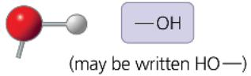(Note: By convention, the bond between the O and H is typically not depicted.)</td><td>Is polar due to electronegative oxygen. Forms hydrogen bonds with water, helping dissolve compounds such as sugars.Compound name:Alcohol(specific name usually ends in -o/)</td><td>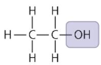</td><td>Ethanol, the alcohol present in alcoholic beverages</td></tr><tr><td>Carbonyl group (&gt;C=O)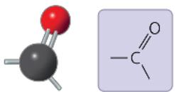</td><td>Sugars with ketone groups are called ketoses; those with aldehydes are calledaldoses.Compound name:Ketone(carbonyl group is within a carbon skeleton) oraldehyde(carbonyl group is at the end of acarbon skeleton)</td><td>Acetone, the simplest ketone</td><td>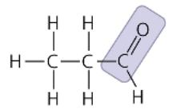Propanal, an aldehyde</td></tr><tr><td>Carboxyl group (—COOH)</td><td>Acts as an acid (can donate  $H^{+}$ ) because the covalent bond between oxygen and hydrogen is so polar.Compound name:Carboxylic acid, ororganic acid</td><td>Acetic acid, which givesvinegar its sour taste</td><td>Ionized form of —COOH (carboxylate ion), found in cells</td></tr><tr><td>Amino group (— $NH_{2}$ )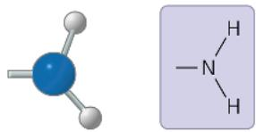</td><td>Acts as a base; can pick up an  $H^{+}$  from the surrounding solution (water, in living organisms).Compound name:Amine</td><td>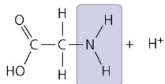Glycine, an amino acid(note its carboxyl group)</td><td>Ionized form of — $NH_{2}$ , found in cells</td></tr><tr><td>Sulfhydryl group (—SH)</td><td>Two — SH groups can react, forming a “cross-link” that helps stabilize protein structure. Hair protein cross-links maintain the straightness or curliness of hair; in hair salons, “permanent” treatments break cross-links, then re-form them while the hair is in the desired shape.Compound name:Thiol</td><td></td><td>Cysteine, a sulfur-containing amino acid</td></tr><tr><td>Phosphate group ( $—OPO_{3}^{2-}$ )</td><td>Contributes negative charge (1– when positioned inside a chain of phosphates; 2– when at the end). When attached, confers on a molecule the ability to react with water, releasing energy.Compound name:Organic phosphate</td><td></td><td>Glycerol phosphate, which takes part in many important chemical reactions in cells</td></tr><tr><td>Methyl group ( $—CH_{3}$ )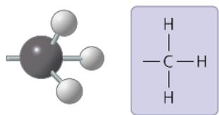</td><td>Affects the expression of genes when bonded to DNA or to proteins that bind to DNA. Affects the shape and function of male and female sex hormones.Compound name:Methylated compound</td><td></td><td>5-Methylcytosine:Cytosine, a component of DNA, has been modified by addition of a methyl group.</td></tr></table>

# Chapter 4 Review

## Summary of Key Concepts

To review key terms, go to the Vocabulary Self-Quiz (eTextbook only).

## Concept 4.1: Organic chemistry is key to the origin of life

\- Organic compounds, once thought to arise only within living organisms, were finally synthesized in the laboratory.

\- Living matter is made mostly of carbon, oxygen, hydrogen, and nitrogen. Biological diversity results from carbon's ability to form a huge number of molecules with particular shapes and properties.

How did Stanley Miller's experiments support the idea that, even at life's origins, physical and chemical laws govern the processes of life?

## Concept 4.2: Carbon atoms can form diverse molecules by bonding to four other atoms

\- Carbon, with a valence of 4, can bond to various other atoms, including O, H, and N. Carbon can also bond to other carbon atoms, forming the carbon skeletons of organic compounds. These skeletons vary in length and shape and have bonding sites for atoms of other elements.

• Hydrocarbons consist of carbon and hydrogen.

\- Isomers are compounds that have the same molecular formula but different structures and therefore different properties. Three types of isomers are structural isomers, cis-trans isomers, and enantiomers.

VISUAL SKILLS Refer back to Figure 4.9. What type of isomers are acetone and propanal? How many asymmetric carbons are present in acetic acid, glycine, and glycerol phosphate? Can these three molecules exist as forms that are enantiomers?

## Concept 4.3: A few chemical groups are key to molecular function

\- Chemical groups attached to the carbon skeletons of organic molecules participate in chemical reactions (functional groups) or contribute to function by affecting molecular shape (see Figure 4.9).

\- ATP (adenosine triphosphate) consists of adenosine attached to three phosphate groups. ATP can react with water or other molecules, forming ADP (adenosine diphosphate) and inorganic phosphate. This reaction releases energy that can be used by the cell.

  
In what ways does a methyl group differ chemically from the other six important chemical groups shown in Figure 4.9?  
For suggested answers, see Appendix A.

## Test Your Understanding

For more multiple-choice questions, go to the Practice Test (eTextbook only).

## Levels 1-2: Remembering/Understanding

1. Organic chemistry is currently defined as

(A) the study of compounds made only by living cells.

(B) the study of carbon compounds.

(C) the study of natural (as opposed to synthetic) compounds.

(D) the study of hydrocarbons.

## 2. VISUAL SKILLS Which functional group is present in this

molecule?

(A) sulfhydryl

(B) carboxyl

(C) methyl

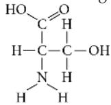

(D) phosphate

3. MAKE CONNECTIONS Which chemical group is most likely to be responsible for an organic molecule behaving as a base (see Concept 3.3)?

(A) hydroxyl

(B) carbonyl

(C) amino

(D) phosphate

## Levels 3-4: Applying/Analyzing

4. VISUAL SKILLS Visualize the structural formula of each of the following hydrocarbons. Which hydrocarbon has a double bond in its carbon skeleton?

(A) $C_{3}H_{8}$

(B) $C_{2}H_{6}$

(C) $C_{2}H_{4}$

(D) $C_{2}H_{2}$

5. VISUAL SKILLS Choose the term that correctly describes the relationship between these two sugar molecules.

(A) structural isomers

(B) cis-trans isomers

(C) enantiomers

(D) isotopes

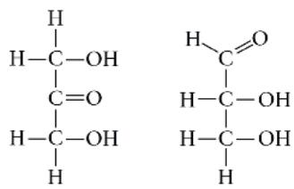

6. VISUAL SKILLS Identify the asymmetric carbon in this molecule.

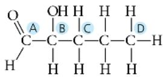

<!-- END OFFICIAL MINERU API RESULT part_01 -->

<!-- BEGIN OFFICIAL MINERU API RESULT part_02 -->

7. Which action could produce a carbonyl group?

(A) the replacement of the —OH of a carboxyl group with hydrogen

(B) the addition of a thiol to a hydroxyl

(C) the addition of a hydroxyl to a phosphate

(D) the replacement of the nitrogen of an amine with oxygen

8. VISUAL SKILLS Which of the molecules shown in question 5 has an asymmetric carbon? Which carbon is asymmetric?

## Levels 5-6: Evaluating/Creating

9. EVOLUTION CONNECTION • DRAW IT Some scientists think that life elsewhere in the universe might be based on the element silicon, rather than on carbon, as on Earth. Look at the electron distribution diagram for silicon in Figure 2.7 and draw the Lewis dot structure for silicon. What properties does silicon share with carbon that would make silicon-based life more likely than, say, neon-based life or aluminum-based life?

10. SCIENTIFIC INQUIRY In the late 1950s and early 1960s, thousands of pregnant patients who were prescribed thalidomide for morning sickness gave birth to children with missing limbs and other congenital abnormalities. Thalidomide is a mixture of two enantiomers; one reduces morning sickness, but the other causes severe congenital deformities. Today, the FDA has approved this drug for non-pregnant individuals with Hansen's disease (leprosy) or newly diagnosed multiple myeloma, a blood and bone marrow cancer. The beneficial enantiomer can be synthesized and given to patients, but over time, both the beneficial and the harmful enantiomer can be detected in the body. Propose a possible explanation for the presence of the harmful enantiomer.

11. WRITE ABOUT A THEME: ORGANIZATION In 1918, an epidemic of sleeping sickness caused an unusual rigid paralysis in some survivors, similar to symptoms of advanced Parkinson's disease. Years later, L-dopa (below, left), a chemical used to treat Parkinson's disease, was given to some of these patients. L-dopa was remarkably effective at eliminating the paralysis, at least temporarily. However, its enantiomer, D-dopa (right), was subsequently shown to have no effect at all, as is the case for Parkinson's disease. In a short essay (100–150 words), discuss how the effectiveness of one enantiomer and not the other illustrates the theme of structure and function.

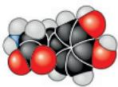  
L-dopa

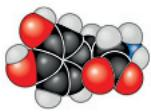  
D-dopa

## 12. SYNTHESIZE YOUR KNOWLEDGE

  
Explain how the chemical structure of the carbon atom accounts for the differences between the male and female lions seen in the photo.  
For selected answers, see Appendix A.

