# 第5章 The Structure and Function of Large Biological Molecules

<!-- 章节边界按正文内容恢复；原始 MinerU 内容保留如下。 -->

# The Structure and Function of Large Biological Molecules

## Key Concepts

5.1 Macromolecules are polymers, built from monomers

5.2 Carbohydrates serve as fuel and building material

5.3 Lipids are a diverse group of hydrophobic molecules

5.4 Proteins include a diversity of structures, resulting in a wide range of functions

5.5 Nucleic acids store, transmit, and help express hereditary information

5.6 Genomics and proteomics have transformed biological inquiry and applications

  
Figure 5.1 Alcohol dehydrogenase, a protein that breaks down alcohol in the body, is shown here as a molecular model. The form of this protein that an individual possesses affects how well that person tolerates drinking alcohol. Proteins are one class of large molecules, or macromolecules.

## Study Tip

Make a visual study guide: For each class of biological molecules, draw two examples and list their structural similarities and their functions.

<table><tr><td colspan="2">Important Biological Molecules</td></tr><tr><td>Carbohydrates</td><td>Proteins</td></tr><tr><td>Nucleic acids</td><td>Lipids</td></tr></table>

## What are the structures and functions of the four important classes of biological molecules?

Carbohydrates are a source of energy and provide structural support.

  
Carbohydrate (starch)  
Nucleic acids store genetic information and function in gene expression.

  
Nucleic acid (DNA)

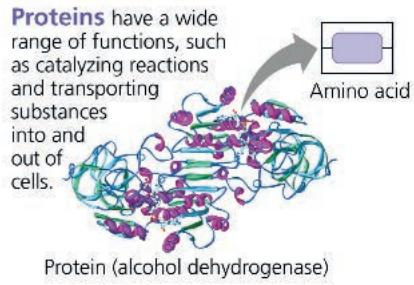  
Protein (alcohol dehydrogenase)

## The fourth class, lipids, are not polymers or macromolecules.

Lipids are a group of diverse molecules that do not mix well with water. Key functions include providing energy, making up cell membranes, and acting as hormones.

  
Lipid (phospholipid)

# Concept 5.1: Macromolecules are polymers, built from monomers

Large carbohydrates, proteins, and nucleic acids, also known as macromolecules for their huge size, are chain-like molecules called polymers (from the Greek polys, many, and meros, part). A polymer is a long molecule consisting of many similar or identical building blocks linked by covalent bonds, much as a train consists of a chain of boxcars. The repeating units that serve as the building blocks of a polymer are smaller molecules called monomers (from the Greek monos, single). In addition to forming polymers, some monomers have functions of their own.

## The Synthesis and Breakdown of Polymers

Although each class of polymer is made up of a different type of monomer, the chemical mechanisms by which cells make polymers (polymerization) and break them down are similar for all classes of large biological molecules. In cells, these processes are facilitated by enzymes, specialized macromolecules (usually proteins) that speed up chemical reactions. The reaction that connects a monomer to another monomer or a polymer is a condensation reaction, a reaction in which two molecules are covalently bonded to each other with the loss of a small molecule. If a water molecule is lost, it is known as a dehydration reaction. For example, carbohydrate and protein polymers are synthesized by dehydration reactions. Each reactant contributes part of the water molecule that is released during the reaction: One provides a hydroxyl group (—OH), while the other provides a hydrogen (—H) (Figure 5.2a). This reaction is repeated as monomers are added to the chain one by one, lengthening the polymer.

Polymers are disassembled to monomers by hydrolysis, a process that is essentially the reverse of the dehydration reaction (Figure 5.2b). Hydrolysis means water breakage (from the Greek hydro, water, and lysis, break). The bond between monomers is broken by the addition of a water molecule, with a hydrogen from water attaching to one monomer and the hydroxyl group attaching to the other. An example of hydrolysis within our bodies is the process of digestion. The bulk of the organic material in our food is in the form of polymers that are much too large to enter our cells. Within the digestive tract, various enzymes attack the polymers, speeding up hydrolysis. Released monomers are then absorbed into the bloodstream for distribution to all body cells. Those cells can then use dehydration reactions to assemble the monomers into new, different polymers that can perform specific functions required by the cell. (Dehydration reactions and hydrolysis can also be involved in the formation and breakdown of molecules that are not polymers, such as some lipids.)

Figure 5.2 The synthesis and breakdown of carbohydrate and protein polymers.

## The Diversity of Polymers

A cell has thousands of different macromolecules; the collection varies from one type of cell to another. The inherited differences between close relatives, such as human siblings, reflect small variations in polymers, particularly DNA and proteins. Molecular differences between unrelated individuals are more extensive, and those between species greater still. The diversity of macromolecules in the living world is vast, and the possible variety is effectively limitless.

What is the basis for such diversity in life's polymers? These molecules are constructed from only 40 to 50 common monomers and some others that occur rarely. Building a huge variety of polymers from such a limited number of monomers is analogous to constructing hundreds of thousands of words from only 26 letters of the alphabet. The key is arrangement—the particular linear sequence that the units follow. However, this analogy falls far short of describing the great diversity of macromolecules because most biological polymers have many more monomers than the number of letters in even the longest word. Proteins, for example, are built from 20 kinds of amino acids arranged in chains that are typically hundreds of amino acids long. The molecular logic of life is simple but elegant: Small molecules common to all organisms act as building blocks that are ordered into unique macromolecules.

Despite this immense diversity, molecular structure and function can still be grouped roughly by class. Let's examine each of the four major classes of large biological molecules. For each class, the large molecules have emergent properties not found in their individual components.

## Concept Check 5.1

1. What are the four main classes of large biological molecules? Which class does not consist of polymers?

2. How many molecules of water are needed to completely hydrolyze a polymer that is ten monomers long?

3. WHAT IF? If you eat a piece of fish, what reactions must occur for the amino acid monomers in the protein of the fish to be converted to new proteins in your body?

For suggested answers, see Appendix A.

## Concept 5.2: Carbohydrates serve as fuel and building material

Carbohydrates include sugars and polymers of sugars. The simplest carbohydrates are the monosaccharides, or simple sugars; these are the monomers from which more complex carbohydrates are built. Disaccharides are double sugars, consisting of two monosaccharides joined by a covalent bond. Carbohydrate macromolecules are polymers called polysaccharides, composed of many sugar building blocks.

## Sugars

Monosaccharides (from the Greek monos, single, and sacchar, sugar) generally have molecular formulas that are some multiple of the unit $CH_{2}O$ . Glucose ( $C_{6}H_{12}O_{6}$ ), the most common monosaccharide, is of central importance in the chemistry of life. In the structure of glucose, we can see the trademarks of a monosaccharide: The molecule has a carbonyl group, $\bigg\backslash C=O$ , and multiple hydroxyl groups, —OH (Figure 5.3). Depending on the location of the carbonyl group, a monosaccharide is either an aldose (aldehyde sugar) or a ketose (ketone sugar). Glucose, for example, is an aldose; fructose, an isomer of glucose, is a ketose. (Most names for sugars end in -ose.) Another criterion for classifying monosaccharides is the size of the carbon skeleton, which ranges from three to seven carbons long. Glucose, fructose, and other sugars that have six carbons are called hexoses. Trioses (three-carbon sugars) and pentoses (five-carbon sugars) are also common.

Still another source of diversity for simple sugars is in the way their parts are arranged spatially around asymmetric carbons. (Recall that an asymmetric carbon is a carbon attached to four different atoms or groups of atoms.) Glucose and galactose, for example, differ only in the placement of parts around one asymmetric carbon (see the purple boxes with dashed outline in Figure 5.3). What seems like a small difference is significant enough to give the two sugars distinctive shapes and binding activities, thus different behaviors.

Although it is convenient to draw glucose with a linear carbon skeleton, this representation is not completely accurate. In aqueous solutions, glucose molecules, as well as most other

## Figure 5.3 The structure and classification of some monosaccharides.

Sugars vary in the location of the carbonyl group (orange, with solid outline), the length of their carbon skeletons, and the way their parts are arranged spatially around asymmetric carbons (compare, for example, the portions of glucose and galactose highlighted purple with a dashed outline).

<table><tr><td>Aldoses (Aldehyde Sugars)Carbonyl group at end of carbon skeleton</td><td>Ketoses (Ketone Sugars)Carbonyl group within carbon skeleton</td></tr><tr><td colspan="2">Trioses: three-carbon sugars ( $C_3H_6O_3$ )</td></tr><tr><td>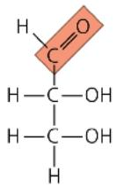GlyceraldehydeAn initial breakdown product of glucose</td><td>DihydroxyacetoneAn initial breakdown product of glucose</td></tr><tr><td colspan="2">Pentoses: five-carbon sugars ( $C_5H_{10}O_5$ )</td></tr><tr><td>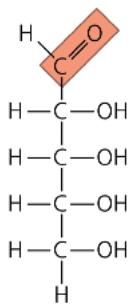RiboseA component of RNA</td><td>RibuloseAn intermediate in photosynthesis</td></tr><tr><td colspan="2">Hexoses: six-carbon sugars ( $C_6H_{12}O_6$ )</td></tr><tr><td></td><td>FructoseAn energy source for organisms</td></tr></table>

MAKE CONNECTIONS In the 1970s, a process was developed that converts the glucose in corn syrup to its sweeter-tasting isomer, fructose. High-fructose corn syrup, a common ingredient in soft drinks and processed food, is a mixture of glucose and fructose. What type of isomers are glucose and fructose? (See Figure 4.7.)

  
Figure 5.4 Linear and ring forms of glucose.  
DRAW IT Start with the linear form of fructose (see Figure 5.3) and draw the formation of the fructose ring in two steps, as shown in (a). First, number the carbons starting at the top of the linear structure. Then, draw the molecule in a ringlike orientation, attaching carbon 5 via its oxygen to carbon 2. Compare the number of carbons in the ring portions of fructose and glucose.  
For suggested answer, see Appendix A.

(a) Linear and ring forms. Chemical equilibrium between the linear and ring structures greatly favors the formation of rings. The carbons of the sugar are numbered 1 to 6, as shown. To form the glucose ring, carbon 1 (magenta) bonds to the oxygen (blue) attached to carbon 5.

(b) Abbreviated ring structure. Each unlabeled corner represents a carbon. The ring's thicker edge indicates that you are looking at the ring edge-on; the components attached to the ring lie above or below the plane of the ring.

five- and six-carbon sugars, form rings, because they are the most stable form of these sugars under physiological conditions (Figure 5.4).

Monosaccharides, particularly glucose, are major nutrients for cells. In the process known as cellular respiration, cells extract energy from glucose molecules by breaking them down in a series of reactions. Not only are monosaccharides a major fuel for cellular work, but their carbon skeletons also serve as raw material for the synthesis of other types of small organic molecules, such as amino acids and fatty acids. Monosaccharides that are not

immediately used in these ways are generally incorporated as monomers into disaccharides or polysaccharides, discussed next.

A disaccharide consists of two monosaccharides joined by a glycosidic linkage, a covalent bond formed between two monosaccharides by a dehydration reaction (glyco refers to carbohydrate). For example, maltose is a disaccharide formed by the linking of two molecules of glucose (Figure 5.5a). Also known as malt sugar, maltose is an ingredient used in brewing beer. The most prevalent disaccharide is sucrose, or table sugar. Its two monomers are glucose and fructose (Figure 5.5b). Plants generally (a) Starch stored in plant cells, (b) glycogen stored in muscle cells, and (c) structural cellulose fibers in plant cell walls are all polysaccharides composed entirely of glucose monomers (green hexagons). In starch and glycogen, the polymer chains tend to form helices in unbranched regions because of the angle of the 1–4 linkages between glucose molecules. There are two kinds of starch: amylose and amylopectin. Cellulose, with a different kind of glucose linkage, is always unbranched.

Figure 5.5 Examples of disaccharide synthesis.  
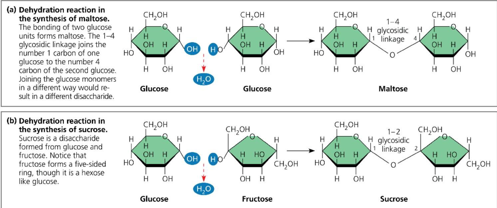  
DRAW IT Referring to Figures 5.3 and 5.4, number the carbons in each sugar in this figure.  
How does the name of each linkage relate to the numbers?  
For suggested answer, see Appendix A.

transport carbohydrates from leaves to roots and other nonphotosynthetic organs in the form of sucrose. Lactose, the sugar present in milk, is another disaccharide, in this case a glucose molecule joined to a galactose molecule. Disaccharides must be broken down into monosaccharides to be used for energy by organisms. Lactose intolerance is a common condition in humans who lack lactase, the enzyme that breaks down lactose. The sugar is instead broken down by intestinal bacteria, causing formation of gas and subsequent cramping. The problem may be avoided by taking the enzyme lactase when eating or drinking dairy products or consuming dairy products that have already been treated with lactase to break down the lactose.

## Polysaccharides

Polysaccharides are macromolecules, polymers with a few hundred to a few thousand monosaccharides joined by glycosidic linkages. Some polysaccharides serve as storage material, hydrolyzed as needed to provide monosaccharides for cells. Other polysaccharides serve as building material for structures that protect the cell or the whole organism. The architecture and function of a polysaccharide are determined by its monosaccharides and by the positions of its glycosidic linkages.

## Storage Polysaccharides

Both plants and animals store sugars for later use in the form of storage polysaccharides (Figure 5.6). Plants store starch, a polymer of glucose monomers, as granules within cellular structures known as plastids. (Plastids include chloroplasts.) Synthesizing starch enables the plant to stockpile surplus glucose. Because glucose is a major cellular fuel, starch represents stored energy. The sugar can later be withdrawn by the plant from this carbohydrate “bank” by hydrolysis, which breaks the bonds between the glucose monomers.

Figure 5.6 Polysaccharides of plants and animals.  
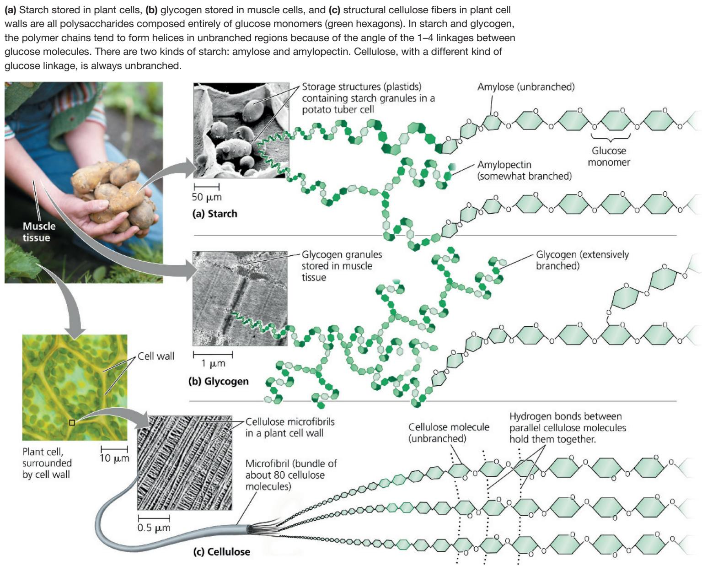

Most animals, including humans, also have enzymes that can hydrolyze plant starch, making glucose available as a nutrient for cells. Potato tubers and grains—the fruits of wheat, maize (corn), rice, and other grasses—are the major sources of starch in the human diet.

Most of the glucose monomers in starch are joined by 1–4 linkages (number 1 carbon to number 4 carbon), like the glucose units in maltose (see Figure 5.5a). The simplest form of starch, amylose, is unbranched. Amylopectin, a more complex starch, is a branched polymer with 1–6 linkages at the branch points. Both of these starches are shown in Figure 5.6a.

Animals store a polysaccharide called glycogen, a polymer of glucose that is like amylopectin but more extensively branched (Figure 5.6b). Vertebrates store glycogen mainly in liver and muscle cells. Breakdown of glycogen in these cells releases glucose when the demand for energy increases. (The extensively branched structure of glycogen fits its function: More free ends are available for breakdown.) This stored fuel cannot sustain an animal for long, however. In humans, for example, glycogen stores are depleted in about a day unless they are replenished by eating. This is an issue of concern in low-carbohydrate diets, which can result in weakness and fatigue.

## Structural Polysaccharides

Organisms build strong materials from structural polysaccharides. For example, the polysaccharide called cellulose is a major component of the tough walls that enclose plant cells (Figure 5.6c). Globally, plants produce almost $10^{14}$ kg (100 billion tons) of cellulose per year; it is the most abundant organic compound on Earth.

Like starch, cellulose is a polymer of glucose with 1–4 glycosidic linkages, but the linkages in these two polymers differ. The difference is based on the fact that there are actually two slightly different ring structures for glucose (Figure 5.7a). When glucose forms a ring, the hydroxyl group attached to the number 1 carbon is positioned either below or above the plane of the ring. These two ring forms for glucose are called alpha ( $\alpha$ ) and beta ( $\beta$ ), respectively. (Greek letters are often used as a “numbering” system for different versions of biological structures, much as we use the letters a, b, c, and so on for the parts of a question or a figure.) In starch, all the glucose monomers are in the $\alpha$ configuration (Figure 5.7b), the arrangement we saw in Figures 5.4 and 5.5. In contrast, the glucose monomers of cellulose are all in the $\beta$ configuration, making every glucose monomer “upside down” with respect to its neighbors (Figure 5.7c; see also Figure 5.6c).

The differing glycosidic linkages in starch and cellulose give the two molecules distinct three-dimensional shapes. Certain starch molecules are largely helical, fitting their function of efficiently storing glucose units. Conversely, a cellulose molecule is straight. Cellulose is never branched, and some hydroxyl groups on its glucose monomers are free to hydrogen-bond with the hydroxyls of other cellulose molecules lying parallel to it. In plant cell walls, parallel cellulose molecules held together in this way are grouped into units called microfibrils (see Figure 5.6c). These cable-like microfibrils are a strong building material for plants and an important substance for humans because cellulose is the major constituent of paper and the only component of cotton. The unbranched structure of cellulose thus fits its function: imparting strength to parts of the plant.

Figure 5.7 Starch and cellulose structures.  

Enzymes that digest starch by hydrolyzing its $\alpha$ linkages are unable to hydrolyze the $\beta$ linkages of cellulose due to the different shapes of these two molecules. In fact, few organisms possess enzymes that can digest cellulose. Almost all animals, including humans, do not; the cellulose in our food passes through the digestive tract and is eliminated with the feces. Along the way, the cellulose abrades the wall of the digestive tract and stimulates the lining to secrete mucus, which aids in the smooth passage of food through the tract. Thus, although cellulose is not a nutrient for humans, it is an important part of a healthy diet. Most fruits, vegetables, and whole grains are rich in cellulose. On food packages, “insoluble fiber” refers mainly to cellulose (see Figure 5.7).

Some microorganisms can digest cellulose, breaking it down into glucose monomers. A cow harbors cellulose-digesting prokaryotic and eukaryotic microorganisms in its gut. These microorganisms hydrolyze the cellulose of hay and grass and convert the glucose to other compounds that nourish the cow. Similarly, a termite, which is unable to digest cellulose by itself, has microorganisms living in its gut that can make a meal of wood. Some fungi can also digest cellulose in soil and elsewhere, thereby helping recycle chemical elements within Earth's ecosystems.

Another important structural polysaccharide is chitin, the carbohydrate used by arthropods (insects, spiders, crustaceans, and related animals) to build their exoskeletons—hard cases that surround the soft parts of an animal (Figure 5.8). Made up of chitin embedded in a layer of proteins, the case is leathery and flexible at first, but becomes hardened when the proteins are chemically linked to each other (as in insects) or encrusted with calcium carbonate (as in crabs). Chitin is also found in fungi, which use this polysaccharide rather than cellulose as the building material for their cell walls. Chitin is similar to cellulose, with $\beta$ linkages, except that the glucose monomer of chitin has a nitrogen-containing attachment (see Figure 5.8).

Figure 5.8 Chitin, a structural polysaccharide.  

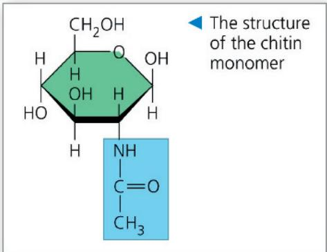  
Chitin, embedded in proteins, forms the exoskeleton of arthropods. This emperor dragonfly (Anax imperator) is molting—shedding its old exoskeleton (brown upright structure) and emerging upside down in adult form.

## Concept Check 5.2

1. Write the formula for a monosaccharide that has three carbons.

2. A dehydration reaction joins two glucose molecules to form maltose. The formula for glucose is $C_{6}H_{12}O_{6}$ . What is the formula for maltose?

3. WHAT IF? After a cow is given antibiotics to treat an infection, a vet gives the animal a drink of "gut culture" containing various microorganisms. Why is this necessary?

For suggested answers, see Appendix A.

## Concept 5.3: Lipids are a diverse group of hydrophobic molecules

Lipids are the one class of large biological molecules that does not include true polymers, and they are generally not big enough to be considered macromolecules. The compounds called lipids are grouped with each other because they share one important trait: They are hydrophobic: They mix poorly, if at all, with water. This behavior of lipids is based on their molecular structure. Although they may have some polar bonds associated with oxygen, lipids consist mostly of hydrocarbon regions with relatively nonpolar C—H bonds. Lipids are varied in form and function. They include waxes and certain pigments, but we will focus on the types of lipids that are most important biologically: fats, phospholipids, and steroids.

## Fats

Although fats are not polymers, they are large molecules assembled from smaller molecules by dehydration reactions, like the dehydration reaction described in Figure 5.2a. A fat consists of a glycerol molecule joined to three fatty acids (Figure 5.9). Glycerol is an alcohol; each of its three carbons bears a hydroxyl group. A fatty acid has a long carbon skeleton, usually 16 or 18 carbon atoms in length. The carbon at one end of the skeleton is part of a carboxyl group, the functional group that gives these molecules the name fatty acid. The rest of the skeleton consists of a hydrocarbon chain. The relatively nonpolar C—H bonds in the hydrocarbon chains of fatty acids are the reason fats are hydrophobic. Fats separate from water because the water molecules hydrogen-bond to one another and exclude the fats. This is why vegetable oil (a liquid fat) separates from the aqueous vinegar solution in a bottle of salad dressing.

In making a fat, each fatty acid molecule is joined to glycerol by a dehydration reaction (Figure 5.9a). This results in an ester linkage, a bond between a hydroxyl group and a carboxyl group. The completed fat consists of three fatty acids linked to one glycerol molecule. (Other names for a fat are triacylglycerol and triglyceride; levels of triglycerides are reported when blood is tested for lipids.) The fatty acids in a fat can all be the same, or they can be of two or three different kinds, as in Figure 5.9b.

Figure 5.9 The synthesis and structure of a fat, or triacylglycerol. The molecular building blocks of a fat are one molecule of glycerol and three molecules of fatty acids. The carbons of the fatty acids are arranged zigzag to suggest the actual orientations of the four single bonds extending from each carbon (see Figures 4.3a and 4.6b).  
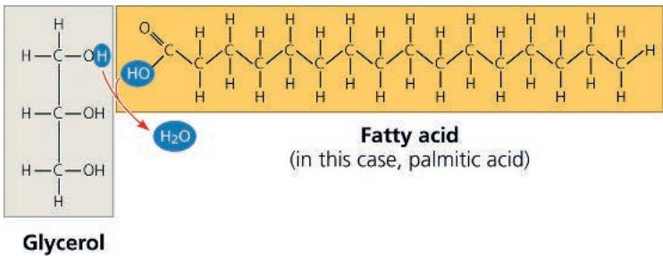  
(a) One of three dehydration reactions in the synthesis of a fat. One water molecule is removed for each fatty acid joined to the glycerol. (Note that the hydrophobic region of the fat is highlighted in yellow.)

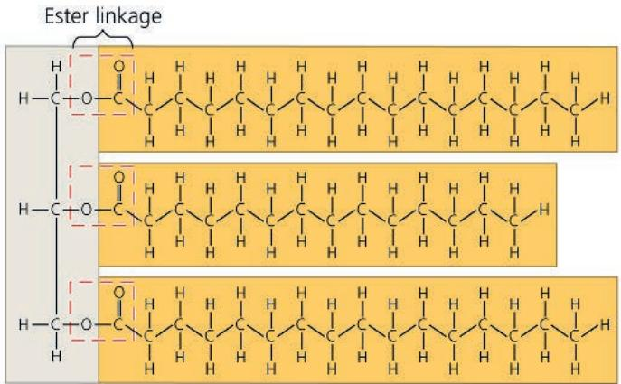  
(b) A fat molecule (triacylglycerol) with three fatty acid units. In this example, two of the fatty acid units are identical.  
Figure 5.10 Saturated and unsaturated fats and fatty acids.

The terms saturated fats and unsaturated fats are commonly used in the context of nutrition (Figure 5.10). These terms refer to the structure of the hydrocarbon chains of the fatty acids. If there are no double bonds between carbon atoms composing a chain, then as many hydrogen atoms as possible are bonded to the carbon skeleton. Such a structure is said to be saturated with hydrogen, and the resulting fatty acid is therefore called a saturated fatty acid (Figure 5.10a). An unsaturated fatty acid has one or more double bonds, with one fewer hydrogen atom on each double-bonded carbon. Nearly every double bond in naturally occurring fatty acids is a cis double bond, which creates a kink in the hydrocarbon chain wherever it occurs (Figure 5.10b). (See Figure 4.7b to remind yourself about cis and trans double bonds.)

A fat made from saturated fatty acids is called a saturated fat. Most animal fats are saturated: The hydrocarbon chains of their fatty acids—the “tails” of the fat molecules—lack double bonds (see Figure 5.10a), and their flexibility allows the fat

## (a) Saturated fat

At room temperature, the molecules of a saturated fat, such as the fat in butter, are packed closely together, forming a solid.

  
Structural formula of a saturated fat molecule (Each hydrocarbon chain is represented as a zigzag line, where each bend represents a carbon atom; hydrogens are not shown.)

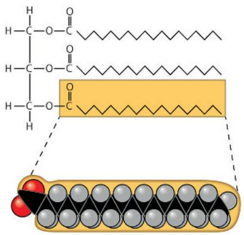  
Space-filling model of stearic acid, a saturated fatty acid (red = oxygen, black = carbon, gray = hydrogen)

## (b) Unsaturated fat

At room temperature, the molecules of an unsaturated fat such as olive oil cannot pack together closely enough to solidify because of the kinks in some of their fatty acid hydrocarbon chains.

Structural formula of an unsaturated fat molecule

Space-filling model of oleic acid, an unsaturated fatty acid  
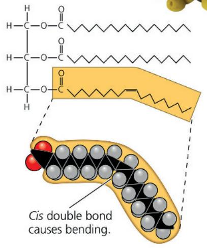

molecules to pack together tightly. Saturated animal fats, such as lard and butter, are solid at room temperature. In contrast, the fats of plants and fishes are generally unsaturated, meaning that they are composed of one or more types of unsaturated fatty acids. Usually liquid at room temperature, plant and fish fats are referred to as oils—olive oil and cod liver oil are examples. The kinks where the cis double bonds are located (see Figure 5.10b) prevent the molecules from

packing together closely enough to solidify at room temperature. The phrase hydrogenated vegetable oils on food labels means that unsaturated fats have been synthetically converted to saturated fats by adding hydrogen, allowing them to solidify. Peanut butter, margarine, and many other products are hydrogenated to prevent lipids from separating out in liquid (oil) form.

A diet rich in saturated fats is one of several factors that may contribute to the cardiovascular disease known as atherosclerosis. In this condition, deposits called plaques develop within the walls of blood vessels, causing inward bulges that impede blood flow and reduce the resilience of the vessels. The process of hydrogenating vegetable oils produces not only saturated fats but also unsaturated fats with trans double bonds. It appears that trans fats can contribute to coronary heart disease (see Concept 42.4). Because trans fats have been especially common in baked goods and processed foods, the U.S. Food and Drug Administration (FDA) requires nutritional labels to include information on trans fat content. In addition, the FDA has ordered U.S. food manufacturers to stop adding trans fats to foods. Globally, the World Health Organization has a stated goal of eliminating industrially produced trans fats. As of 2024, over a third of countries worldwide had already passed such regulations.

The major function of fats is energy storage. The hydrocarbon chains of fats are similar to gasoline molecules and just as rich in energy. A gram of fat stores more than twice as much energy as a gram of a polysaccharide, such as starch. Because plants are relatively immobile, they can function with bulky energy storage in the form of starch. (Vegetable oils are generally obtained from seeds, where more compact storage is an asset to the plant.) Animals, however, must carry their energy

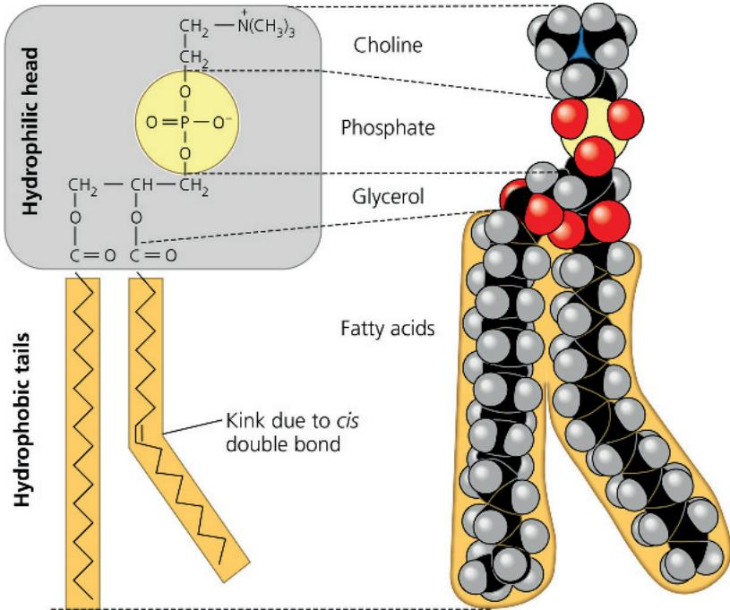  
(a) Structural formula  
(b) Space-filling model

stores with them, so there is an advantage to having a more compact reservoir of fuel—fat. Humans and other mammals stock their long-term food reserves in adipose cells (see Figure 4.6a), which swell and shrink as fat is deposited and withdrawn from storage. In addition to storing energy, adipose tissue also cushions such vital organs as the kidneys, and a layer of fat beneath the skin insulates the body. This subcutaneous layer is especially thick in whales, seals, and most other marine mammals, insulating their bodies in cold ocean water.

## Interview

Interview with Kristi Anseth: Designing biological molecules that can help heal wounds and repair damaged cartilage (at the start of Unit 1, before Chapter 2)

## Phospholipids

Cells as we know them could not exist without another type of lipid, called phospholipids. Phospholipids are essential for cells because they are major constituents of cell membranes. Their structure provides a classic example of how form fits function at the molecular level. As shown in Figure 5.11, a phospholipid is similar to a fat molecule but has only two fatty acids attached to glycerol rather than three. The third hydroxyl group of glycerol is joined to a phosphate group, which has a negative electrical charge in the cell. Typically, an additional small charged or polar

Figure 5.11 The structure of a phospholipid.

A phospholipid has a hydrophilic (polar) head and two hydrophobic (nonpolar) tails. This particular phospholipid, called a phosphatidylcholine, has a choline attached to a phosphate group. Shown here are (a) the structural formula, (b) the space-filling model (yellow atom is phosphorus, blue is nitrogen), (c) the symbol for a phospholipid that will appear throughout this book, and (d) the bilayer structure formed by self-assembly of phospholipids in an aqueous environment.

DRAW IT Draw an oval around the hydrophilic head of the space-filling model. For suggested answer, see Appendix A.  
  
(c) Phospholipid symbol

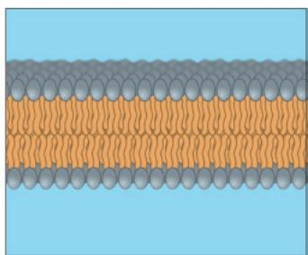  
(d) Phospholipid bilayer

molecule is also linked to the phosphate group. Choline is one such molecule (see Figure 5.11), but there are many others as well, allowing formation of a variety of phospholipids that differ from each other.

The two ends of phospholipids show different behaviors with respect to water. The hydrocarbon tails are hydrophobic and are excluded from water. However, the phosphate group and its attachments form a hydrophilic head that has an affinity for water. When phospholipids are added to water, they self-assemble into a double-layered sheet called a “bilayer” that shields their hydrophobic fatty acid tails from water (Figure 5.11d).

At the surface of a cell, phospholipids are arranged in a similar bilayer. The hydrophilic heads of the molecules are on the outside of the bilayer, in contact with the aqueous solutions inside and outside of the cell. The hydrophobic tails point toward the interior of the bilayer, away from the water. The phospholipid bilayer forms a boundary between the cell and its external environment and establishes separate compartments within eukaryotic cells; in fact, the existence of cells depends on the properties of phospholipids.

## Steroids

Steroids are lipids characterized by a carbon skeleton consisting of four fused rings. Different steroids are distinguished by the particular chemical groups attached to this ensemble of rings. Cholesterol, a type of steroid, is a crucial molecule in animals (Figure 5.12). It is a common component of animal cell membranes and is also the precursor from which other steroids, such as the vertebrate sex hormones, are synthesized. In vertebrates, cholesterol is synthesized in the liver and is also obtained from the diet. A high level of cholesterol in the blood may contribute to atherosclerosis, although some researchers are questioning the roles of cholesterol and saturated fats in the development of this condition.

Cholesterol is the molecule from which other steroids, including the sex hormones, are synthesized. Steroids vary in the chemical groups attached to their four interconnected rings (shaded in gold).

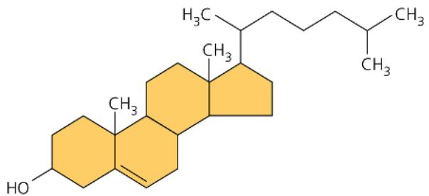  
MAKE CONNECTIONS Compare cholesterol with the sex hormones shown in the figure at the beginning of Concept 4.3. Circle the chemical groups that cholesterol has in common with estradiol; put a square around the chemical groups that cholesterol has in common with testosterone.

For suggested answer, see Appendix A.

## Interview

Interview with Lovell Jones: Investigating the effects of sex hormones on cancer (eTextbook only)

Figure 5.12 Cholesterol, a steroid.  

## Concept Check 5.3

1. Compare the structure of a fat (triglyceride) with that of a phospholipid.

2. Why are human sex hormones considered lipids?

3. WHAT IF? Suppose a membrane surrounded an oil droplet, as it does in the cells of plant seeds and in some animal cells. Describe and explain the form it might take.

For suggested answers, see Appendix A.

## Concept 5.4: Proteins include a diversity of structures, resulting in a wide range of functions

Nearly every dynamic function of a living being depends on proteins. In fact, the importance of proteins is underscored by their name, which comes from the Greek word proteios, meaning “first,” or “primary.” Proteins account for more than 50% of the dry mass of most cells, and they are instrumental in almost everything organisms do. Some proteins speed up chemical reactions, while others play a role in defense, storage, transport, cellular communication, movement, or structural support. Figure 5.13 shows examples of proteins with these functions, which you’ll learn more about in later chapters.

Life would not be possible without enzymes, most of which are proteins. Enzymatic proteins regulate metabolism by acting as catalysts, chemical agents that selectively speed up chemical reactions without being consumed in the reaction. Because an enzyme can perform its function over and over again, these molecules can be thought of as workhorses that keep cells running by carrying out the processes of life.

A human has tens of thousands of different proteins, each with a specific structure and function; proteins, in fact, are the most structurally sophisticated molecules known. Consistent with their diverse functions, they vary extensively in structure, each type of protein having a unique three-dimensional shape.

Proteins are all constructed from the same set of 20 amino acids, linked in unbranched polymers. The bond between amino acids is called a peptide bond, so a polymer of amino acids is called a polypeptide. A protein is a biologically functional molecule made up of one or more polypeptides, each folded and coiled into a specific three-dimensional structure.

Connective tissue

Figure 5.13 An overview of protein functions.

## Enzymatic proteins

Function: Selective acceleration of chemical reactions
Example: Digestive enzymes catalyze the hydrolysis of bonds in food molecules.

## Storage proteins

## Function: Storage of amino acids

Examples: Casein, the protein of milk, is the major source of amino acids for baby mammals. Plants have storage proteins in their seeds. Ovalbumin is the protein of egg white, used as an amino acid source for the developing embryo.

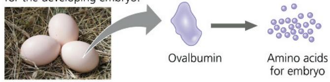

## Hormonal proteins

Function: Coordination of an organism's activities Example: Insulin, a hormone secreted by the pancreas, causes other tissues to take up glucose, thus regulating blood sugar concentration.

## Contractile and motor proteins

## Function: Movement

Examples: Motor proteins are responsible for the undulations of cilia and flagella. Actin and myosin proteins are responsible for the contraction of muscles.

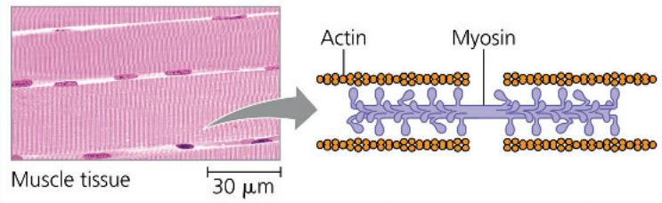

## Amino Acids (Monomers)

All amino acids share a common structure. An amino acid is an organic molecule with both an amino group and a carboxyl group (see Figure 4.9); the small figure shows the general formula for an amino acid. At the center of the amino acid is an asymmetric carbon atom called the alpha ( $\alpha$ ) carbon. Its four different partners are an amino group, a carboxyl group, a hydrogen atom, and

Side chain (R group)

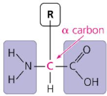  
Amino group  
Carboxyl group

## Transport proteins

## Function: Transport of substances

Examples: Hemoglobin, the iron-containing protein of vertebrate blood, transports oxygen from the lungs to other parts of the body. Other proteins transport molecules across membranes, as shown here.

## Receptor proteins

Function: Response of cell to chemical stimuli
Example: Receptors built into the membrane of a nerve cell detect signaling molecules released by other nerve cells.

## Structural proteins

## Function: Support

Examples: Keratin is the protein of hair, horns, feathers, and other skin appendages. Insects and spiders use silk fibers to make their cocoons and webs, respectively. Collagen and elastin proteins provide a fibrous framework in animal connective tissues.

a variable group symbolized by R. The R group, also called the side chain, differs with each amino acid. The R group may be as simple as a hydrogen atom, or it may be a carbon skeleton with various functional groups attached. The physical and chemical properties of the side chain determine the unique characteristics of a particular amino acid, thus affecting its functional role in a polypeptide.

Figure 5.14 shows the 20 amino acids that cells use to build their thousands of proteins. Here the amino groups and carboxyl groups are all depicted in ionized form, the way they usually exist at the pH found in a cell. The amino acids are grouped

At the top right are the non-ionized and ionized forms of a generic amino acid. The specific amino acids are shown below in their ionized form, prevalent at the pH within a cell (pH 7.2.) The amino acids are grouped by properties of their side chains. The three-letter and one-letter abbreviations for the amino acids are in parentheses. All of the amino acids used in proteins are L enantiomers (see Figure 4.7c).

according to the properties of their side chains. One group consists of amino acids with nonpolar side chains, which are hydrophobic. Another group consists of amino acids with polar side chains, which are hydrophilic. Acidic amino acids have side chains that are generally negative in charge due to the presence of a carboxyl group, which is usually dissociated (ionized) at cellular pH. Basic amino acids have amino groups in their side chains that are generally positive in charge. (The terms acidic and basic in this context refer only to groups in the side chains because all amino acids—as monomers—have carboxyl groups and amino groups.) Because they are charged, acidic and basic side chains are also hydrophilic.

## Polypeptides (Amino Acid Polymers)

Now that we have examined amino acids, let's see how they are linked to form polymers (Figure 5.15). When two amino acids are positioned so that the carboxyl group of one is adjacent to the amino group of the other, they can become joined by a dehydration reaction, with the removal of a water molecule. The resulting covalent bond is called a peptide bond. Repeated over and over, this process yields a polypeptide, a polymer of many amino acids linked by peptide bonds. You'll learn more about how cells synthesize polypeptides in Concept 17.4.

The repeating sequence of atoms highlighted in purple boxes with solid outlines in Figure 5.15 is called the polypeptide backbone. Extending from this backbone are the different side chains (R groups) of the amino acids. Polypeptides range in length from a few amino acids to 1,000 or more. Each specific polypeptide has a unique linear sequence of amino acids. Note that one end of the polypeptide chain has a free amino group (the N-terminus of the polypeptide), while the opposite end has a free carboxyl group (the C-terminus). The chemical nature of the molecule as a whole is determined by the kind and sequence of the side chains, which determine how a polypeptide folds and thus its final shape and chemical characteristics. The immense variety of polypeptides in nature illustrates an important concept introduced earlier—that cells can make many different polymers by linking a limited set of monomers into diverse sequences.

## Protein Structure and Function

The specific activities of proteins result from their intricate three-dimensional architecture, the simplest level of which is the sequence of their amino acids. What can the amino acid sequence of a polypeptide tell us about the three-dimensional structure (commonly referred to simply as the “structure”) of the protein and its function? The term polypeptide is not synonymous with the term protein. Even for a protein consisting

## Figure 5.15 Making a polypeptide chain.

Peptide bonds are formed by dehydration reactions, which link the carboxyl group of one amino acid to the amino group of the next. The peptide bonds are formed one at a time, starting with the amino acid at the amino end (N-terminus). The polypeptide has a repetitive backbone (purple boxes with solid outlines) to which the amino acid side chains are attached (yellow boxes with dashed outlines and green boxes with dotted outlines).

  
DRAW IT Label the three amino acids in the upper part of the figure using three-letter and one-letter codes. Circle and label the carboxyl and amino groups that will form the new peptide bond.
For suggested answer, see Appendix A.

of a single polypeptide, the relationship is somewhat analogous to that between a long strand of yarn and a sweater of particular size and shape that can be knitted from the yarn. A functional protein is not just a polypeptide chain, but one or more polypeptides precisely twisted, folded, and coiled into a molecule of unique shape, which can be shown in several different types of models (Figure 5.16). And it is the amino acid sequence of each polypeptide that determines

## Visualizing Proteins

Figure 5.16

Proteins can be represented in different ways, depending on the goal of the illustration.

## Structural Models

Using data from structural studies of proteins, computers can generate various types of models. Each model emphasizes a different aspect of the protein's structure, but no model can show what a protein actually looks like. These three models depict lysozyme, a protein in tears and saliva that helps prevent infection by binding to target molecules on bacteria.

1. In which model is it easiest to follow the polypeptide backbone?

Space-filling model: Emphasizes the overall globular shape. Shows all the atoms of the protein (except hydrogen), which are color-coded: gray = carbon, red = oxygen, blue = nitrogen, and yellow = sulfur.

Ribbon model: Shows only the polypeptide backbone, emphasizing how it folds and coils to form a 3-D shape, in this case stabilized by disulfide bridges (yellow lines).

Wireframe model (blue): Shows the polypeptide backbone with side chains extending from it. A ribbon model (purple) is superimposed on the wireframe model. The bacterial target molecule (yellow) is bound.

## Simplified Diagrams

It isn't always necessary to use a detailed computer model; simplified diagrams are useful when the focus of the figure is on the function of the protein, not the structure.

A transparent shape is drawn around the contours of a ribbon model of the protein rhodopsin, showing the shape of the molecule as well as some internal details.

When structural details are not needed, a solid shape can be used.

A simple shape is used here to represent a generic enzyme because the diagram focuses on enzyme action in general.

2. Draw a simple version of lysozyme that shows its overall shape, based on the molecular models in the top section of the figure.

Sometimes a protein is represented simply as a dot, as shown here for insulin.

3. Why is it unnecessary to show the actual shape of insulin here?

For suggested answers, see Appendix A.

Instructors: The tutorial “Molecular Model: Lysozyme,” in which students rotate 3-D models of lysozyme,

can be assigned in Mastering Biology.

Instructors: Additional questions related to this Visualizing Figure can be assigned in Mastering Biology.

what three-dimensional structure the protein will have under normal cellular conditions.

When a cell synthesizes a polypeptide, the chain may fold spontaneously, assuming the functional structure for that protein. This folding is driven and reinforced by the formation of various bonds between parts of the chain, which in turn depends on the sequence of amino acids. Many proteins are roughly spherical (globular proteins), while others are shaped like long

fibers (fibrous proteins). Even within these broad categories, countless variations exist.

A protein's specific structure determines how it works. In almost every case, the function of a protein depends on its ability to recognize and bind to some other molecule. In an especially striking example of the marriage of form and function, Figure 5.17 shows the exact match of shape between an antibody (a protein in the body) and the particular foreign substance on a flu virus that the antibody binds to and marks for destruction. Also, you may recall another example of molecules with matching shapes from Concept 2.3: endorphin molecules (produced by the body) and morphine molecules (a manufactured drug), both of which fit into receptor proteins on the surface of brain cells in humans, producing euphoria and relieving pain. Morphine, heroin, and other opiate drugs are able to mimic endorphins because they all have a shape similar to that of endorphins and can thus fit into and bind to endorphin receptors in the brain. This fit is very specific, something like a handshake (see Figure 2.16). The endorphin receptor, like other receptor molecules, is a protein. The function of a protein—for instance, the ability of a receptor protein to bind to a particular pain-relieving signaling molecule—is an emergent property resulting from exquisite molecular order.

Antibody protein  
Protein from flu virus  
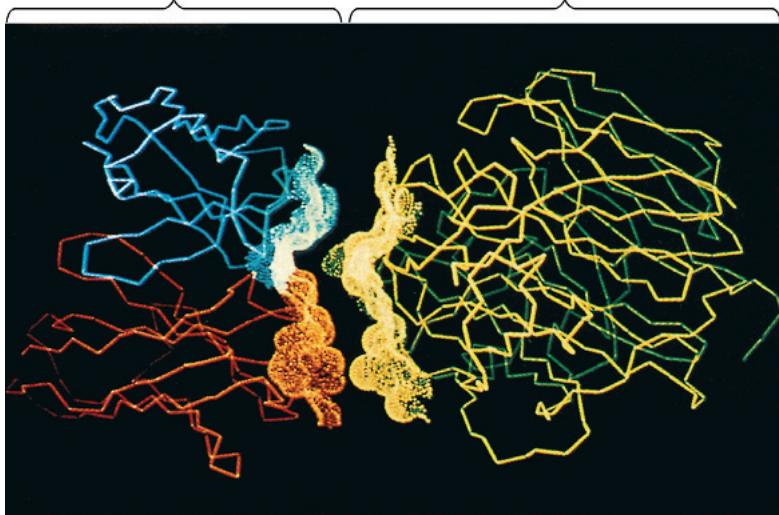

## Four Levels of Protein Structure

In spite of their great diversity, proteins share three superimposed levels of structure, known as primary structure, secondary structure, and tertiary structure. A fourth level, quaternary structure, arises when a protein consists of two or more polypeptide chains. Figure 5.18, on the next two pages, describes these four levels of protein structure. Be sure to study this figure thoroughly before going on to the next section.

## Sickle-Cell Disease: A Change in Primary Structure

Even a slight change in primary structure can affect a protein's shape and ability to function. For instance, sickle-cell disease, an inherited blood disorder, is caused by the substitution of one amino acid (valine) for the normal one (glutamic acid) at the position of the sixth amino acid in the primary structure of hemoglobin, the protein that carries oxygen in red blood cells. Normal red blood cells are disk-shaped, but in sickle-cell disease, the abnormal hemoglobin molecules tend to aggregate into chains, deforming some of the cells into a sickle shape (Figure 5.19, after you turn the next

## Figure 5.17 Complementarity of shape between two protein surfaces.

A technique called X-ray crystallography was used to generate a computer model of an antibody protein (blue and orange, left) bound to a flu virus protein (yellow and green, right). This is a wireframe model modified by adding an “electron density map” in the region where the two proteins meet. Computer software was then used to back the images away from each other slightly.

VISUAL SKILLS What do these computer models allow you to see about the two proteins? For suggested answer, see Appendix A.

page). A person with the disease has periodic i“sickle-cell crises” when the angular cells clog tiny blood vessels, impeding blood flow. The toll taken on such patients is a dramatic example of how a simple change in protein structure can have devastating effects on protein function.

## Interview

Interview with Linus Pauling: Winner of the Nobel Prize in Chemistry and the Nobel Peace Prize (eTextbook only)

## What Determines Protein Structure?

You've learned that a unique shape endows each protein with a specific function. But what are the key factors determining protein structure? You already know most of the answer: A polypeptide chain of a given amino acid sequence can be arranged into a three-dimensional shape determined by the interactions responsible for secondary and tertiary structure. This folding normally occurs as the protein is being synthesized in the crowded environment within a cell, aided by other proteins. However, protein structure also depends on the physical and chemical conditions of the protein's environment. If the pH, salt concentration, temperature, or other aspects of its environment are altered, the weak chemical bonds and interactions within a protein may be destroyed, causing the protein to unravel and lose its native shape, a change called denaturation. Because it is misshapen, the denatured protein is biologically inactive.

Most proteins become denatured if they are transferred from an aqueous environment to a nonpolar solvent, such as ether or chloroform; the polypeptide chain refolds so that its hydrophobic regions face outward toward the solvent. Other denaturation agents include chemicals that disrupt the hydrogen bonds, ionic bonds, and disulfide bridges that maintain a protein's shape. Denaturation can also result from excessive heat, which agitates the polypeptide chain enough to overpower the weak interactions

# Exploring Levels of Protein Structure

Figure 5.18

## Primary Structure

## Linear chain of amino acids

The primary structure of a protein is its sequence of amino acids. As an example, let's consider transthyretin, a globular blood protein that transports vitamin A and one of the thyroid hormones. Transthyretin is made up of four identical polypeptide chains, each composed of 127 amino acids. Shown here is one of these chains unraveled for a closer look at its primary structure. Each of the 127 positions along the chain is occupied by one of the 20 amino acids, indicated here by its three-letter abbreviation.

The primary structure is like the order of letters in a very long word. If left to chance, there would be $20^{127}$ different ways of making a polypeptide chain 127 amino acids long. However, the precise primary structure of a protein is determined not by the random linking of amino acids, but by inherited genetic information. The primary structure in turn dictates secondary structure ( $\alpha$ helices and $\beta$ pleated sheets) and tertiary structure, due to the chemical nature of the backbone and the side chains (R groups) of the amino acids along the polypeptide.

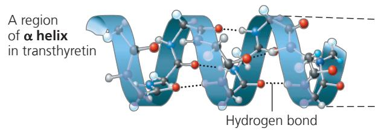  
A region of $\beta$ pleated sheet (made up of adjacent $\beta$ strands) in transthyretin

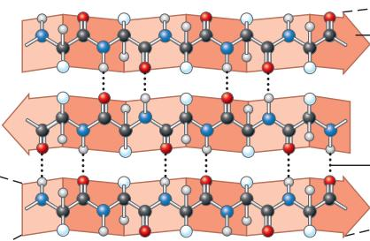  
- β strand, often shown as a folded or flat arrow pointing toward the carboxyl end

Most proteins have segments of their polypeptide chains repeatedly coiled or folded in patterns that contribute to the protein's overall shape. These coils and folds, collectively referred to as secondary structure, are the result of hydrogen bonds between the repeating constituents of the polypeptide backbone (not the amino acid R groups or side chains). Within the backbone, the oxygen atoms have a partial negative charge, and the hydrogen atoms attached to the nitrogens have a partial positive charge (see Figure 2.14); therefore, hydrogen bonds can form between these atoms. Individually, these hydrogen bonds are weak, but because they are repeated many times over a relatively long region of the polypeptide chain, they can support a particular shape for that part of the protein.

One such secondary structure is the $\alpha$ helix, a delicate coil held together by hydrogen bonding between every fourth amino acid, as shown above. Although each transthyretin polypeptide has only one $\alpha$ helix region (see the Primary and Tertiary Structure sections), other globular proteins have multiple stretches of $\alpha$ helix separated by nonhelical regions (see hemoglobin in the Quaternary Structure section). Some fibrous proteins, such as $\alpha$ -keratin, the structural protein of hair, have the $\alpha$ helix formation over most of their length.

The other secondary structure is the $\beta$ pleated sheet. As shown above, two or more segments of the polypeptide chain lying side by side (called $\beta$ strands) are connected by hydrogen bonds between parts of the two parallel segments. $\beta$ pleated sheets make up the core of many globular proteins, as is the case for transthyretin (see Tertiary Structure), and dominate some fibrous proteins, including the silk protein of a spider's web. The teamwork of so many hydrogen bonds makes each spider silk fiber stronger than a steel strand.

▶ Spiders secrete silk fibers made of a structural protein containing $\beta$ pleated sheets, which allow the spiderweb to stretch and recoil.

Quaternary Structure
Association of two or more polypeptides (some proteins only)

Superimposed on the patterns of secondary structure is a protein's tertiary structure, shown here in a ribbon model of the transthyretin polypeptide. While secondary structure involves interactions between backbone constituents, tertiary structure is the overall shape of a polypeptide resulting from interactions between the side chains (R groups) of the various amino acids. One type of interaction that contributes to tertiary structure is called—somewhat misleadingly—a hydrophobic interaction. As a polypeptide folds into its functional shape, amino acids with hydrophobic (nonpolar) side chains usually end up in clusters at the core of the protein, out of contact with water. Thus, a “hydrophobic interaction” is actually caused by the exclusion of nonpolar substances by water molecules. Once nonpolar amino acid side chains are close together, van der Waals interactions help hold them together. Meanwhile, hydrogen bonds between polar side chains and ionic bonds between positively and negatively charged side chains also help stabilize tertiary structure. These are all weak interactions in the aqueous cellular environment, but their cumulative effect helps give the protein a unique shape.

Covalent bonds called disulfide bridges may further reinforce the shape of a protein. Disulfide bridges form where two cysteine monomers, which have sulfhydryl groups (—SH) on their side chains (see Figure 4.9), are brought close together by the folding of the protein. The sulfur of one cysteine bonds to the sulfur of the second, and the disulfide bridge (—S—S—) rivets parts of the protein together (see yellow lines in Figure 5.16 ribbon model). All of these different kinds of interactions can contribute to the tertiary structure of a protein, as shown here in a small part of a hypothetical protein:

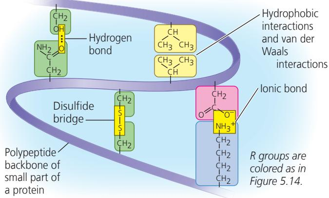

Some proteins consist of two or more polypeptide chains aggregated into one functional macromolecule. Quaternary structure is the overall protein structure that results from the aggregation of these polypeptide subunits. For example, shown above is the complete globular transthyretin protein, made up of its four polypeptides.

Another example is collagen, which is a fibrous protein that has three identical helical polypeptides intertwined into a larger triple helix, giving the long fibers great strength. This suits collagen fibers to their function as the girders of connective tissue in skin, bone, tendons, ligaments, and other body parts. (Collagen accounts for 40% of the protein in a human body.)

Hemoglobin, the oxygen-binding protein of red blood cells, is another example of a globular protein with quaternary structure. It consists of four polypeptide subunits,

two of one kind ( $\alpha$ ) and two of another kind ( $\beta$ ). Both $\alpha$ and $\beta$ subunits consist primarily of $\alpha$ -helical secondary structure. Each subunit has a nonpolypeptide component, called heme, with an iron atom that binds oxygen.

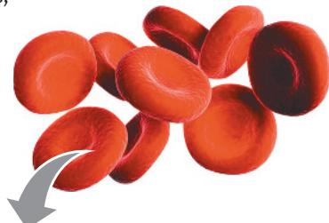

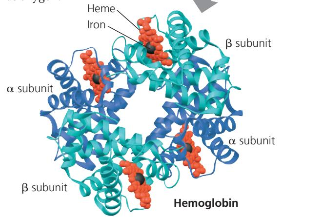

Figure 5.19 A single amino acid substitution in a protein causes sickle-cell disease.  
  
MAKE CONNECTIONS Considering the chemical characteristics of the amino acids valine and glutamic acid (see Figure 5.14), propose a possible explanation for the dramatic effect on protein function that occurs when valine is substituted for glutamic acid.  
For suggested answer, see Appendix A.

Figure 5.20 Denaturation and renaturation of a protein.

High temperatures or various chemical treatments will denature a protein, causing it to lose its shape and hence its ability to function. If the denatured protein remains dissolved, it may renature when the chemical and physical aspects of its environment are restored to normal.

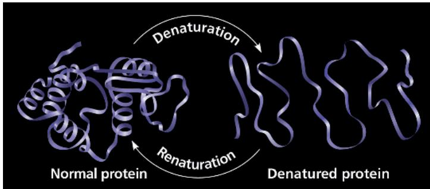

that stabilize the structure. The white of an egg becomes opaque during cooking because the denatured proteins are insoluble and solidify. This also explains why excessively high fevers can be fatal: Proteins in the blood tend to denature at very high body temperatures.

When a protein in a test-tube solution has been denatured by heat or chemicals, it can sometimes return to its functional shape when the denaturing agent is removed (Figure 5.20). (Sometimes this is not possible: For example, a fried egg will not become liquefied when placed back into the refrigerator!) We can conclude that the information for building specific shape is intrinsic to the protein's primary structure; this is often the case for small proteins. The sequence of amino acids determines the protein's shape—where an $\alpha$ helix can form, where a $\beta$ pleated sheet can exist, where disulfide bridges are located, where ionic bonds can form, and so on. But how does protein folding occur in the cell?

## Protein Folding in the Cell

Biochemists now know the amino acid sequence for over 200 million proteins, with millions added each month, and the three-dimensional shape for tens of thousands has been experimentally determined. For decades, researchers have tried to discover the rules of protein folding as determined by a protein's amino acid sequence so that its 3-D structure could be predicted. The experimental methods for determining 3-D structure—such as X-ray crystallography described below—are very time-consuming. It can take years to confirm a particular protein's shape. A huge breakthrough occurred once scientists harnessed computational methods, using computer algorithms and artificial intelligence to tackle this task. In 2020, a team from Google unveiled a project called AlphaFold2 that was able to predict protein structure from amino acid sequence with over 90% accuracy, based on experimentally determined 3-D structures. Three scientists—Demis Hassabis, John Jumper, and David Baker—won the Nobel Prize in Chemistry for this work in 2024, only three years after its debut.

Misfolding of polypeptides in cells is a serious problem that has come under increasing scrutiny by medical researchers. Many diseases—such as cystic fibrosis, Alzheimer's, Parkinson's, and mad cow disease—are associated with an accumulation of misfolded proteins. In fact, misfolded versions of the transthyretin protein featured in Figure 5.18 have been implicated in several diseases, including one form of senile dementia.

Even though computational methods can now predict 3-D structure with remarkable accuracy, the prediction still must be experimentally confirmed for any given protein. The method previously used to determine the 3-D structure of a protein, and the one used to confirm the original computational predictions, is X-ray crystallography, which depends on the diffraction of an X-ray beam by the atoms of a crystallized molecule. Using this technique, scientists can build a 3-D model that shows the exact position of every atom in a protein molecule (Figure 5.21). Cryo-electron microscopy (cryo-EM; see Concept 6.1), nuclear magnetic resonance (NMR) spectroscopy, and bioinformatics

## Figure 5.21

## Research Method: X-Ray Crystallography Application

Scientists use X-ray crystallography to determine the three-dimensional (3-D) structure of macromolecules such as nucleic acids and proteins.

## Technique

Researchers aim an X-ray beam through a crystallized protein or nucleic acid. The atoms of the crystal diffract (bend) the X-rays into an orderly array that a digital detector records as a pattern of spots called an X-ray diffraction pattern, an example of which is shown here.

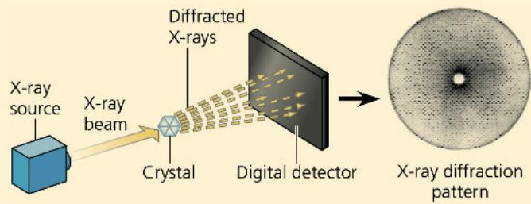

## Results

Using data from X-ray diffraction patterns and the sequence of monomers determined by chemical methods, researchers can build a 3-D computer model of the macromolecule being studied, such as the four-subunit protein transthyretin (see Figure 5.18) shown here.

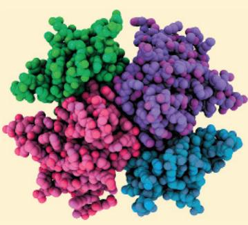

(see Concept 5.6) are complementary approaches to understanding protein structure and function. Cryo-EM is emerging as a quicker method to confirm structure predictions because it does not require crystallization of the protein being studied, something that is very challenging and sometimes not possible.

The structure of some proteins is difficult to determine for a simple reason: A growing body of biochemical research has revealed that a significant number of proteins, or regions of proteins, do not have a distinct 3-D structure until they interact with a target protein or other molecule. Their flexibility and indefinite structure are important for their function, which may require binding with different targets at different times. These proteins, which may account for 20–30% of mammalian proteins, are called intrinsically disordered proteins and are the focus of current research.

## Concept Check 5.4

1. What parts of a polypeptide participate in the bonds that hold together secondary structure? Tertiary structure?

2. Thus far in the chapter, the Greek letters $\alpha$ and $\beta$ have been used to specify at least three different pairs of structures. Name and briefly describe them.

3. Each amino acid has a carboxyl group and an amino group. Are these groups present in a polypeptide? Explain.

4. WHAT IF? Where would you expect a polypeptide region rich in the amino acids valine, leucine, and isoleucine to be located in a folded polypeptide? Explain.

For suggested answers, see Appendix A.

## Concept 5.5: Nucleic acids store, transmit, and help express hereditary information

If the primary structure of polypeptides determines a protein's shape, what determines primary structure? The amino acid sequence of a polypeptide is programmed by a discrete unit of inheritance known as a gene. Genes consist of DNA, which belongs to the class of compounds called nucleic acids. Nucleic acids are polymers made of monomers called nucleotides.

## The Roles of Nucleic Acids

The two types of nucleic acids, deoxyribonucleic acid (DNA) and ribonucleic acid (RNA), enable living organisms to reproduce their complex components from one generation to the next. Unique among molecules, DNA provides directions for its own replication. DNA also directs RNA synthesis and, through RNA, controls protein synthesis; this entire process is called gene expression (Figure 5.22).

DNA is the genetic material that organisms inherit from their parents. Each chromosome contains one long DNA molecule,

Figure 5.22 Gene expression: DNA → RNA → protein.
In a eukaryotic cell, DNA in the nucleus programs protein production in the cytoplasm by dictating synthesis of messenger RNA (mRNA).  

usually carrying several hundred or more genes. When a cell reproduces itself by dividing, its DNA molecules are copied and passed along from one generation of cells to the next. The information that programs all the cell's activities is encoded in the structure of the DNA. The DNA, however, is not directly involved in running the operations of the cell, any more than computer software by itself can read the bar code on a box of cereal. Just as a scanner is needed to read a bar code, proteins are required to implement genetic programs. The molecular hardware of the cell—the tools that carry out biological functions—consists mostly of proteins. For example, the oxygen carrier in red blood cells is the protein hemoglobin that you saw earlier (see Figure 5.18), not the DNA that specifies its structure.

How does RNA, the other type of nucleic acid, fit into gene expression, the flow of genetic information from DNA to proteins? A given gene along a DNA molecule can direct synthesis of a type of RNA called messenger RNA (mRNA). The mRNA molecule interacts with the cell's protein-synthesizing machinery to direct production of a polypeptide, which folds into all or part of a protein. We can summarize the flow of genetic information as DNA → RNA → protein (see Figure 5.22). The sites of protein synthesis are cellular structures called ribosomes. In a eukaryotic cell, ribosomes are in the cytoplasm—the region between the nucleus and the cell's outer boundary, the plasma membrane—but DNA resides in the nucleus. Messenger RNA conveys genetic instructions for building proteins from the nucleus to the cytoplasm. Prokaryotic cells lack nuclei but still use mRNA to convey a message from the DNA to ribosomes and

other cellular equipment that translate the coded information into amino acid sequences. Later, you'll read about other functions of some more recently discovered RNA molecules; the stretches of DNA that direct synthesis of these RNAs are also considered genes (see Concept 18.3).

## The Components of Nucleic Acids

Nucleic acids are macromolecules that exist as polymers called polynucleotides (Figure 5.23a). As indicated by the name, each polynucleotide consists of monomers called nucleotides. A nucleotide, in general, is composed of three parts: a five-carbon sugar (a pentose), a nitrogen-containing (nitrogenous) base, and one to three phosphate groups (Figure 5.23b). The beginning monomer used to build a polynucleotide has three phosphate groups, but two are lost during the polymerization process. The portion of a nucleotide without any phosphate groups is called a nucleoside.

To understand the structure of a single nucleotide, let's first consider the nitrogenous bases (Figure 5.23c). Each nitrogenous base has one or two rings that include nitrogen atoms. (They are called nitrogenous bases because the nitrogen atoms tend to take up $\mathrm{H^{+}}$ from solution, thus acting as bases.) There are two families of nitrogenous bases: pyrimidines and purines. A pyrimidine has one six-membered ring of carbon and nitrogen atoms. The members of the pyrimidine family are cytosine (C), thymine (T), and uracil (U). Purines are larger, with a six-membered ring fused to a five-membered ring. The purines are adenine (A) and guanine (G). The specific pyrimidines and purines differ in the chemical groups attached to the rings. Adenine, guanine, and cytosine are found in both DNA and RNA; thymine is found only in DNA and uracil only in RNA.

Now let's add the sugar to which the nitrogenous base is attached. In DNA the sugar is deoxyribose; in RNA it is ribose (see Figure 5.23c). The only difference between these two sugars is that deoxyribose lacks an oxygen atom on the second carbon in the ring, hence the name deoxyribose.

So far, we have built a nucleoside (base plus sugar). To complete the construction of a nucleotide, we attach one to three phosphate groups to the 5' carbon of the sugar (the carbon numbers in the sugar include ', the prime symbol; see Figure 5.23b). With one phosphate, this is a nucleoside monophosphate, more often called a nucleotide.

## Nucleotide Polymers

The linkage of nucleotides into a polynucleotide involves a condensation reaction. (You will learn the details in Concept 16.2.) In the polynucleotide, adjacent nucleotides are joined by a phosphodiester linkage (see Figure 5.23a), which consists of a phosphate group that covalently links the sugars of two nucleotides. This bonding results in a repeating pattern of sugar-phosphate units called the sugar-phosphate backbone. (Note that the nitrogenous bases are not part of the backbone.) The two free ends of the polymer are distinctly different from each other. One end has a phosphate attached to a 5' carbon, and the other end has a hydroxyl group on a 3' carbon; we refer to these as the 5' end and the 3' end, respectively. We can say that a polynucleotide has a built-in directionality along its sugar-phosphate backbone, from 5' to 3', somewhat like a one-way street. The bases are attached all along the sugar-phosphate backbone.

(a) A polynucleotide has a sugar-phosphate backbone with variable appendages, the nitrogenous bases. (b) In a polynucleotide, each nucleotide monomer includes a nitrogenous base, a sugar, and a phosphate group. Note that carbon numbers in the sugar include primes ('). (c) A nucleoside includes a nitrogenous base (purine or pyrimidine) and a five-carbon sugar (deoxyribose or ribose).

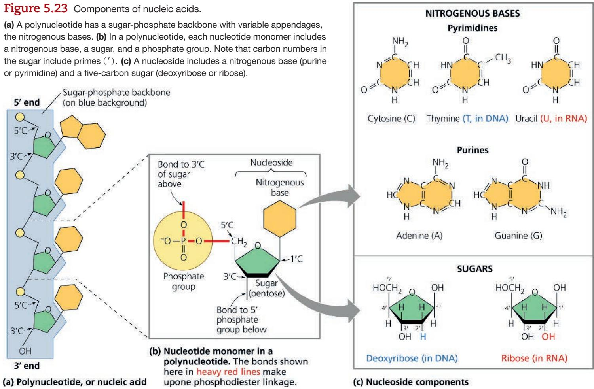

The sequence of bases along a DNA (or mRNA) polymer is unique for each gene and provides very specific information to the cell. Because genes are hundreds to thousands of nucleotides long, the number of possible base sequences is effectively limitless. The information carried by the gene is encoded in its specific sequence of the four DNA bases. For example, the sequence 5'-AGGTAACTT-3' means one thing, whereas the sequence 5'-CGCTTTAAC-3' has a different meaning. (Entire genes, of course, are much longer.) The linear order of bases in a gene specifies the amino acid sequence—the primary structure—of a protein, which in turn specifies that protein's 3-D structure, thus enabling its function in the cell.

## The Structures of DNA and RNA Molecules

A DNA molecule has two polynucleotides, or “strands,” that wind around an imaginary axis, forming a double helix (Figure 5.24a). The two sugar-phosphate backbones run in opposite $5'\rightarrow3'$ directions from each other; this arrangement is referred to as anti-parallel, somewhat like a divided highway. The sugar-phosphate backbones are on the outside of the helix, and the nitrogenous bases are paired in the interior of the helix. The two strands are held together by hydrogen bonds between the paired bases (see Figure 5.24a). Most DNA molecules are very long, with thousands or even millions of base pairs. The one long DNA double helix in a eukaryotic chromosome includes many genes, each one a particular segment of the double-stranded molecule.

In base pairing, only certain bases in the double helix are compatible with each other. Adenine (A) in one strand always pairs with thymine (T) in the other, and guanine (G) always pairs with cytosine (C). Reading the sequence of bases along one strand of the double helix would tell us the sequence of bases along the other strand. If a stretch of one strand has the base sequence 5'-AGGTCCG-3', then the base-pairing rules tell us that the same stretch of the other strand must have the sequence 3'-TCCAGGC-5'. The two strands of the double helix are complementary, each the predictable counterpart of the other. It is this feature of DNA that makes it possible to generate two identical copies of each DNA molecule in a cell that is preparing to divide. When the cell divides, the copies are distributed to the daughter cells, making them genetically identical to the parent cell. Thus, the structure of DNA accounts for its function of transmitting genetic information whenever a cell reproduces.

RNA molecules, by contrast, exist as single strands. Complementary base pairing can occur, however, between regions of two RNA molecules or even between two stretches of nucleotides in the same RNA molecule. In fact, base pairing within an RNA molecule allows it to take on the particular three-dimensional shape necessary for its function. Consider, for example, the type of RNA called transfer RNA (tRNA), which brings amino acids to the ribosome during the synthesis of a

## Figure 5.24 The structures of DNA and tRNA molecules.

(a) The DNA molecule is usually a double helix, with the sugar-phosphate backbones of the antiparallel polynucleotide strands (symbolized here by blue ribbons) on the outside of the helix. Hydrogen bonds between pairs of nitrogenous bases hold the two strands together. As illustrated here with symbolic shapes for the bases, adenine (A) can pair only with thymine (T), and guanine (G) can pair only with cytosine (C). Each DNA strand in this figure is the structural equivalent of the polynucleotide diagrammed in Figure 5. 23a. (b) A tRNA molecule has a roughly L-shaped structure due to complementary base pairing of antiparallel stretches of RNA. In RNA, A pairs with U.

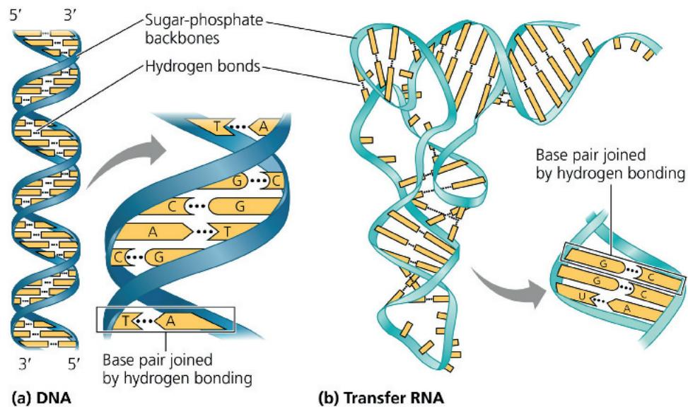

polypeptide. A tRNA molecule is about 80 nucleotides in length. Its functional shape results from base pairing between nucleotides where complementary stretches of the molecule can run antiparallel to each other (Figure 5.24b).

Note that in RNA, adenine (A) pairs with uracil (U); thymine (T) is not present in RNA. Another difference between RNA and DNA is that DNA almost always exists as a double helix, whereas RNA molecules are more variable in shape. RNAs are versatile molecules, and many biologists believe RNA may have preceded DNA as the carrier of genetic information in early forms of life (see Concept 25.1).

## Concept Check 5.5

1. DRAW IT In Figure 5.23a, number all the carbons of the top three nucleotides (use primes), circle the nitrogenous bases, and star the phosphates.

2. DRAW IT A region along one DNA strand has this sequence of nitrogenous bases: 5'-TAGGCCT-3'. Write down its complementary strand, labeling the 5' and 3' ends.

For suggested answers, see Appendix A.

## Concept 5.6: Genomics and proteomics have transformed biological inquiry and applications

Experimental work in the first half of the 20th century established the role of DNA as the carrier of genetic information, passed from generation to generation, that specified the functioning of living cells and organisms. Once the structure of the DNA molecule was described in 1953, and the linear sequence of nucleotide bases was understood to specify the amino acid sequence of proteins, biologists sought to “decode” genes by learning their nucleotide sequences (often called “base sequences”).

An unplanned but profound side benefit of this project—the Human Genome Project—was the rapid development of faster and less expensive methods of sequencing. This trend has continued: The cost for sequencing 1 million bases in 2001, well over \$5,000, has decreased to less than \$0.00002 in 2024. And a human genome, the first of which took over 10 years to sequence, could be completed at today's pace in day or less (Figure 5.25). The number of genomes that have been fully

The first chemical techniques for DNA sequencing, or determining the sequence of nucleotides along a DNA strand, one by one, were developed in the 1970s. Researchers began to study gene sequences, gene by gene, and the more they learned, the more questions they had: How was expression of genes regulated? Genes and their protein products clearly interacted with each other, but how? What was the function, if any, of the DNA that is not part of genes? To fully understand the genetic functioning of a living organism, the entire sequence of the full complement of DNA, the organism's genome, would be most enlightening. In spite of the apparent impracticality of this idea, in the late 1980s several prominent biologists put forth an audacious proposal to launch a project that would sequence the entire human genome—all 3 billion bases of it! This endeavor began in 1990 and was effectively completed in the early 2000s.

Figure 5.25 Automatic DNA-sequencing machines and abundant computing power enable rapid sequencing of genes and genomes.  
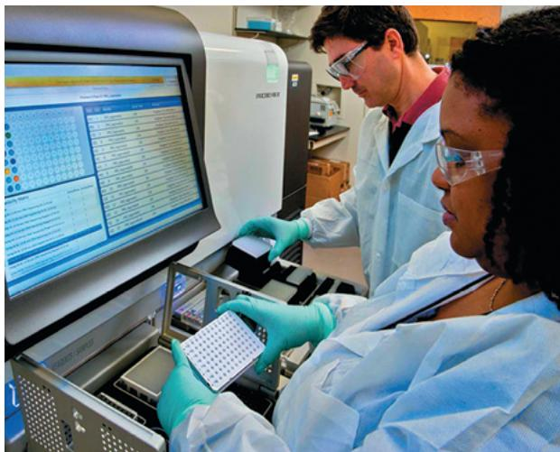

sequenced has exploded, generating reams of data and prompting development of bioinformatics. Bioinformatics is an approach that uses computer software and other computational tools, such as artificial intelligence, that can analyze large data sets.

The reverberations of these developments have transformed the study of biology and related fields. Biologists often look at problems by analyzing large sets of genes or even comparing whole genomes of different species, an approach called genomics. A similar analysis of large sets of proteins, including their sequences, is called proteomics. (Protein sequences can be determined either by using biochemical techniques or by translating the DNA sequences that code for them.) These approaches permeate all fields of biology, some examples of which are shown in Figure 5.26.

Perhaps the most significant impact of genomics and proteomics on the field of biology as a whole has been their contributions to our understanding of evolution. In addition to confirming evidence for evolution from the study of fossils and characteristics of currently existing species, genomics has helped us tease out relationships among different groups of organisms that had not been resolved by previous types of evidence, and thus infer evolutionary history.

## Scientific Skills Exercise Analyzing Polypeptide Sequence Data

Are Rhesus Monkeys or Gibbons More Closely Related to Humans? In this exercise, you will look at amino acid sequence data for the $\beta$ polypeptide chain of hemoglobin, often called $\beta$ -globin. You will then interpret the data to hypothesize whether the monkey or the gibbon is more closely related to humans.

Human

Rhesus monkey

How Such Experiments Are Done Researchers can isolate the polypeptide of interest from an organism and then determine the amino acid sequence. More frequently, the DNA of the relevant gene

<table><tr><td>Species</td><td colspan="6">Alignment of Amino Acid Sequences of β-globin</td></tr><tr><td>Human</td><td>1</td><td>VHLTPEEKSA</td><td>VTALWGKVNV</td><td>DEVGGEALGR</td><td>LLVVYPWTQR</td><td>FFESFGDLST</td></tr><tr><td>Monkey</td><td>1</td><td>VHLTPEEKNA</td><td>VTTLWGKVNV</td><td>DEVGGEALGR</td><td>LLLVYPWTQR</td><td>FFESFGDLSS</td></tr><tr><td>Gibbon</td><td>1</td><td>VHLTPEEKSA</td><td>VTALWGKVNV</td><td>DEVGGEALGR</td><td>LLVVYPWTQR</td><td>FFESFGDLST</td></tr><tr><td>Human</td><td>51</td><td>PDAVMGNPKV</td><td>KAHGKKVLGA</td><td>FSDGLAHLDN</td><td>LKGTFATLSE</td><td>LHCDKLHVDP</td></tr><tr><td>Monkey</td><td>51</td><td>PDAVMGNPKV</td><td>KAHGKKVLGA</td><td>FSDGLNHLDN</td><td>LKGTFAQLSE</td><td>LHCDKLHVDP</td></tr><tr><td>Gibbon</td><td>51</td><td>PDAVMGNPKV</td><td>KAHGKKVLGA</td><td>FSDGLAHLDN</td><td>LKGTFAQLSE</td><td>LHCDKLHVDP</td></tr><tr><td>Human</td><td>101</td><td>ENFRLLGNVL</td><td>VCVLAHHFGK</td><td>EFTPPVQAAY</td><td>QKVVAGVANA</td><td>LAHKYH</td></tr><tr><td>Monkey</td><td>101</td><td>ENFRLLGNVL</td><td>VCVLAHHFGK</td><td>EFTPPVQAAY</td><td>QKVVAGVANA</td><td>LAHKYH</td></tr><tr><td>Gibbon</td><td>101</td><td>ENFRLLGNVL</td><td>VCVLAHHFGK</td><td>EFTPPVQAAY</td><td>QKVVAGVANA</td><td>LAHKYH</td></tr></table>

Data from Human: http://www.ncbi.nlm.nih.gov/protein/AAA21113.1; rhesus monkey: http://www.ncbi.nlm.nih.gov/protein/122634; gibbon: http://www.ncbi.nlm.nih.gov/protein/122616

## DNA and Proteins as Tape Measures of Evolution

EVOLUTION We are accustomed to thinking of shared traits, such as hair and milk production in mammals, as evidence of shared ancestry. Because DNA carries heritable information in the form of genes, sequences of genes and their protein products document the hereditary background of an organism. The linear sequences of nucleotides in DNA molecules are passed from parents to offspring; these sequences determine the amino acid sequences of proteins. As a result, siblings have greater similarity in their DNA and proteins than do unrelated individuals of the same species.

Given our evolutionary view of life, we can extend this concept of “molecular genealogy” to relationships between species: We would expect two species that appear to be closely related based on anatomical evidence (and possibly fossil evidence) to also share a greater proportion of their DNA and protein sequences than do less closely related species. In fact, that is the case. An example is the comparison of the $\beta$ polypeptide chain of human hemoglobin with the corresponding hemoglobin polypeptide in other vertebrates. In this chain of 146 amino acids, humans and gorillas differ in just 1 amino acid, while humans and frogs, more distantly related, differ in 67 amino acids. In the Scientific Skills Exercise, you can apply this sort of reasoning to

is sequenced, and the amino acid sequence of the polypeptide is deduced from the DNA sequence of its gene.

Data from the Experiments In the data below, the letters give the sequence of the 146 amino acids in $\beta$ -globin from humans, rhesus monkeys, and gibbons. Because a complete sequence would not fit on one line here, the sequences are divided into three segments: amino acids 1–50, 51–100, and 101–146. The sequences for the three different species are aligned so that you can compare them easily. For example, you can see that for all three species, the first amino acid is V (valine) and the 146th amino acid is H (histidine).

## INTERPRET THE DATA

1. Scan the monkey and gibbon sequences, letter by letter, circling any amino acids that do not match the human sequence. (a) How many amino acids differ between the monkey and the human sequences? (b) Between the gibbon and human?

2. For each nonhuman species, what percent of its amino acids are identical to the human sequence of $\beta$ -globin?

3. Based on these data alone, state a hypothesis for which of these two species is more closely related to humans. What is your reasoning?

4. What other evidence could you use to support your hypothesis?

Instructors: A version of this Scientific Skills Exercise can be assigned in Mastering Biology.

## Figure 5.26

Nucleotide sequencing and the analysis of large sets of genes and proteins can be done rapidly and inexpensively due to advances in technology and information processing. Taken together, genomics and proteomics have advanced our understanding of biology across many different fields.

## Paleontology

New DNA sequencing techniques have allowed decoding of minute quantities of DNA found in ancient tissues from our extinct relatives, the Neanderthals (Homo neanderthalensis). Sequencing the Neanderthal genome has informed our understanding of their physical appearance (as in this reconstruction), as well as their relationship with modern humans. (See Figures 27.36 and 27.37.)

## Medical Science

## Evolution

A major aim of evolutionary biology is to understand the relationships among species, both living and extinct. For example, genome sequence comparisons have identified the hippopotamus as the land mammal sharing the most recent common ancestor with whales. (See Figure 19.20.)

Identifying the genetic basis for human diseases like cancer helps researchers focus their search for potential future treatments. Currently, sequencing the sets of genes expressed in an individual's type gene analyses were

tumor can allow a more targeted approach to treating the cancer, a type of “personalized medicine.” (See Concept 9.3 and Figure 16.21.)

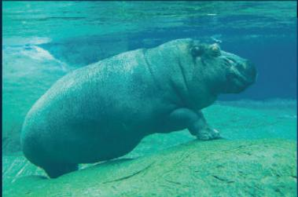

## Hippopotamus

## Short-finned pilot whale

## Conservation Biology

The tools of molecular genetics and genomics are increasingly used by forensic ecologists to identify which species of animals and plants are killed illegally. In one case, genomic sequences of DNA from illegal shipments of elephant tusks were used to track down poachers and pinpoint the territory where they were operating. (See Figure 43.8.)

## Species Interactions

Most plant species exist in a mutually beneficial partnership with fungi (the white fibers in photo) and bacteria associated with the plants' roots; these interactions improve plant growth. Genome sequencing and analysis of gene expression have allowed characterization of plant-associated communities. Such studies will help advance our understanding of such interactions and may improve agricultural practices. (See the Chapter 26 Scientific Skills Exercise and Figure 29.11.)

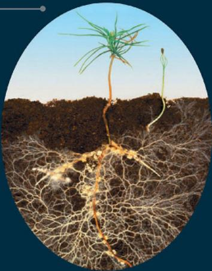

additional species. And this conclusion holds true as well when comparing whole genomes: The human genome is 95–98% identical to that of the chimpanzee, but only roughly 85% identical to that of the mouse, a more distant evolutionary relative. Molecular biology has added a new tape measure to the toolkit biologists use to assess evolutionary kinship.

Comparing genomic sequences has practical applications as well. In the Problem-Solving Exercise, you can see how this type of genomic analysis can help you detect consumer fraud.

## Concept Check 5.6

1. How would sequencing the entire genome of an organism help scientists to understand how that organism functioned?

2. Given the function of DNA, why would you expect two species with very similar traits to also have very similar genomes?

For suggested answers, see Appendix A.

## Problem-Solving Exercise

## Are you a victim of fish fraud?

Despite its higher price, some people prefer to buy wild-caught Pacific salmon (Oncorhynchus species) over farmed Atlantic salmon (Salmo salar) for environmental or health reasons. But if they buy fish labeled as Pacific salmon, studies reveal that about $40\%$ of the time, customers won't get the fish they paid for!

In this exercise, you will investigate whether a piece of salmon has been fraudulently labeled.

## Your Approach

The principle guiding your investigation is that DNA sequences from within a species or from closely related species are more similar to each other than are sequences from more distantly related species.

## Your Data

You've been sold a piece of salmon labeled as coho salmon (Oncorhynchus kisutch). To see whether your fish was labeled correctly, you will compare a short DNA sequence from your sample with known sequences from the same gene for three salmon species. The sequences are as follows:

Sample labeled as O. kisutch (coho salmon)

Known sequences

5 '-CGGCACCGCCCTAAGTCTCT-3'

O. kisutch (coho salmon)
O. keta (chum salmon)
Salmo salar (Atlantic salmon)

5'-AGGCACCGCCCTAAGTCTAC-3'

5'-AGGCACCGCCCTGAGCCTAC-3'

5'-CGGCACCGCCCTAAGTCTCT-3'

Data from the International Barcode of Life.

## Your Analysis

1. Circle any bases in the known sequences that do not match the sequence from your fish sample.

2. How many bases differ between (a) O. kisutch and your fish sample? (b) O. keta and the sample? (c) S. salar and the sample?

3. For each known sequence, what percentage of its bases are identical to your sample?

4. Based on these data alone, state a hypothesis for the species identity of your sample. What is your reasoning?

Instructors: A version of this Problem-Solving Exercise can be assigned in Chapter 5 of Mastering Biology. A more extensive “Solve It” tutorial is in Chapter 26 of Mastering Biology.

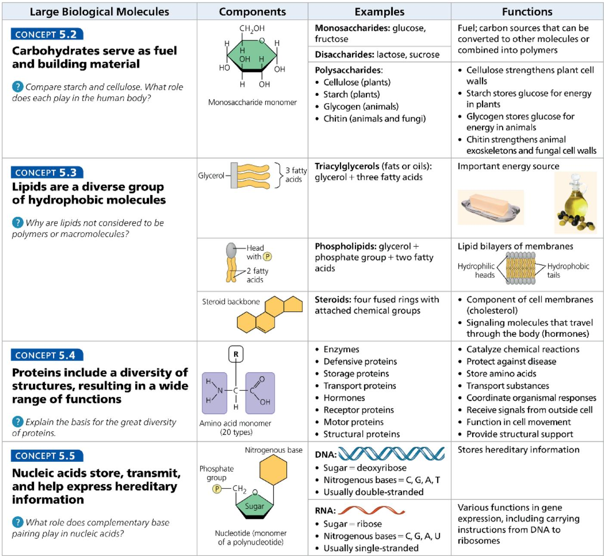

## Concept 5.6: Genomics and proteomics have transformed biological inquiry and applications

\- Recent technological advances in DNA sequencing have given rise to genomics, an approach that analyzes large sets of genes or whole genomes, and proteomics, a similar approach for large sets of proteins. Bioinformatics is the use of computational tools, including artificial intelligence, and computer software to analyze these large data sets.

\- The more closely two species are related evolutionarily, the more similar their DNA sequences are. DNA sequence data confirm models of evolution based on fossils and anatomical evidence.

Given the sequences of a particular gene in fruit flies, fish, mice, and humans, predict the relative similarity of the human sequence to that of each of the other species.
For suggested answers, see Appendix A.

## Test Your Understanding

For more multiple-choice questions, go to the Practice Test (eTextbook only).

## Levels 1-2: Remembering/Understanding

1. Which of the following categories includes all others in the list?
(A) disaccharide (C) starch
(B) polysaccharide (D) carbohydrate

2. The enzyme amylase can break glycosidic linkages between glucose monomers only if the monomers are in the $\alpha$ form. Which of the following could amylase break down?

(A) glycogen, starch, and amylopectin

(B) glycogen and cellulose

(C) cellulose and chitin

(D) starch, chitin, and cellulose

3. Which statement about unsaturated fats is true?

(A) They are more common in animals than in plants.

(B) They have double bonds in their fatty acid chains.

(C) They generally solidify at room temperature.

(D) They contain more hydrogen than do saturated fats having the same number of carbon atoms.

4. The structural level of a protein least affected by a disruption in hydrogen bonding is the
(A) primary level.
(B) secondary level.
(C) tertiary level.
(D) quaternary level.

5. Enzymes that break down DNA catalyze the hydrolysis of the covalent bonds that join nucleotides together. What would happen to DNA molecules treated with these enzymes?

(A) The two strands of the double helix would separate.

(B) The phosphodiester linkages of the polynucleotide backbone would be broken.

(C) The pyrimidines would be separated from the deoxyribose sugars.

(D) All bases would be separated from the deoxyribose sugars.

## Levels 3-4: Applying/Analyzing

6. The molecular formula for glucose is $C_{6}H_{12}O_{6}$ . What would be the molecular formula for a polymer made by linking ten glucose molecules together by dehydration reactions?
(A) $C_{60}H_{120}O_{60}$ (C) $C_{60}H_{100}O_{50}$ (B) $C_{60}H_{102}O_{51}$ (D) $C_{60}H_{111}O_{51}$

7. Which of the following pairs of base sequences could form a short stretch of a normal double helix of DNA?
(A) 5'-AGCT-3' with 5'-TCGA-3'
(B) 5'-GCGC-3' with 5'-TATA-3'
(C) 5'-ATGC-3' with 5'-GCAT-3'
(D) 5'-ATGC-3' with 5'-ATGC-3'

8. Construct a table that organizes the following terms and label the columns and rows.

Monosaccharides Triacylglycerols Peptide bonds
Fatty acids Polynucleotides Glycosidic linkages
Amino acids Polysaccharides Ester linkages
Nucleotides Phosphodiester
Polypeptides linkages

## Levels 5-6: Evaluating/Creating

9. WRITE ABOUT A THEME: ORGANIZATION Proteins, which have diverse functions in a cell, are all polymers of the same kinds of monomers—amino acids. Write a short essay (100–150 words) that discusses how the structure of amino acids allows this one type of polymer to perform so many functions.

## 10. SYNTHESIZE YOUR KNOWLEDGE

Given that the function of egg yolk is to nourish and support the developing chick, explain why egg yolks are so high in fat, protein, and cholesterol.

  
For selected answers, see Appendix A.

## Practice Applying Your Learning

11. This question assesses your ability to apply your understanding of the structures and functions of large biological molecules.

A portion of a molecule is shown in the diagram. Use your knowledge about macromolecules to evaluate each statement about this molecule as more likely to be TRUE or more likely to be FALSE.

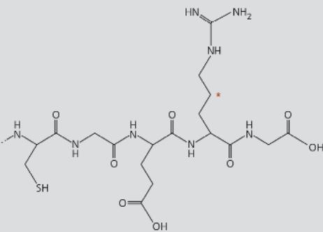

a. Based on the portion shown, this is an organic molecule. \_\_\_\_

b. Hydrolysis reactions are used to synthesize this molecule. \_\_\_\_

c. This molecule is assembled from nucleotide monomers. \_\_\_\_

d. Peptide bonds link the monomers of this molecule together. \_\_\_\_

e. The bend marked by the asterisk represents an oxygen atom. \_\_\_\_

f. This molecule includes an amino group and a carboxyl group. \_\_\_\_

g. Hydrogen bonds are likely to form between certain atoms in this portion of the molecule. \_\_\_\_

h. Exposure to substantial temperature changes will cause this molecule to be biologically inactive. \_\_\_\_

Unit 2
The Cell

An Interview with Julie Theriot

Dr. Julie Theriot is a Professor of Biology at the University of Washington, a Howard Hughes Medical Institute Investigator, and Chief Scientist at the Allen Institute for Cell Science. She received a BS in Biology and Physics from the Massachusetts Institute of Technology (MIT) and a PhD from University of California San Francisco (UCSF) and is a recipient of the David and Lucile Packard Foundation Fellowship for Science and Engineering, the John D. and Catherine T. MacArthur Foundation Fellowship, and numerous other awards. She and her laboratory members investigate the mechanical behavior of structural elements in cells, including cell motility and shape change.

## How did you get started in biology?

Both of my parents were scientists, so I was interested in science from an early age, and I majored in physics and biology in college. I had great professors who really stimulated my interest in biology, and I worked in Steve Burden's lab, looking at the connection between nerve and muscle cells. I loved sitting in the darkened microscope room and looking down at the glowing cells—it seemed like a miracle! Even the positive control samples were beautiful and made me happy. So, after college, I went straight to graduate school.

## What made you pick UCSF for graduate school, and what did you work on for your PhD?

I loved UCSF—it had a sort of joyful spirit and it seemed like all the grad students were friends. There were several faculty members there who were very much at the cutting edge of cell biology. I decided to work in Tim Mitchison's lab because he was interesting to talk to, and I liked what he worked on: the cytoskeleton. Some of the most abundant proteins in the cell are proteins of the cytoskeleton. The two main ones are tubulin and actin; they are both little globular proteins that have a remarkable ability to self-assemble. Many copies can bind to each other and make a long filamentous structure, thousands of times larger than the individual proteins. These long filaments carry out mechanical activities in the cell. Tim was working on microtubules and had developed a method to “tag” them with fluorescent molecules that were photo-activatable—they glowed when you shone light on them.

## What did you discover during your PhD research?

I decided to develop a similar photoactivatable tagging system for actin to find out more about how it worked. At first, I was working on skin cells from under the scales of goldfish. These cells have an enormous front leading edge that helps them move around. I used my tagged actin technique in these living cells, and showed that actin was assembled primarily at the leading edge, and also that it was very dynamic—there was a lot of assembly and disassembly. Then, we learned something interesting about a bacterium called Listeria monocytogenes that causes food-borne illness: This bacterium enters human cells and grows a beautiful comet tail structure that gets longer and longer. The mechanism wasn't clear, although some biologists thought it involved actin assembly. They had been looking at fixed (nonliving) cells, so it seemed that using my labeled actin system in living cells would help answer the question. We were able to show that what drove the movement was actin assembly next to the tails of the bacteria. Once I saw these bacteria moving around, it just blew

  
Listeria monocytogenes infecting a mammalian host cell.

  
Dr. Julie Theriot

my mind! They look like little submarines driving around inside the cell.

"Once I saw these bacteria moving around, it just blew my mind! They look like little submarines driving around inside the cell."

## How were these bacteria moving?

Nobody knew how the actin was assembling at the tail end of Listeria—but it struck me that these pathogenic bacteria were like little cell biologists that could manipulate the cytoskeleton in human cells! It turned out that the bacteria had a protein on their surface that caused the human actin molecules to polymerize there, and that force drove the bacteria around the cell. This discovery ended up helping us understand how human cells regulate assembly of microfilaments. When I set up my own lab, we took a 20-year detour from eukaryotic cells to try to understand what bacteria were doing during an infection, because that seemed like a key to a treasure chest of information. After that, I transitioned back to also studying the cytoskeleton of various eukaryotic cells.

## Do you think it's important for people who are not going to be biologists to learn about cell biology?

Yes, it is very important. It's the basis of how we're alive. One thing that really drew me to cell biology initially was that an individual protein, like an individual enzyme, might be able to do something cool, but that's still just chemistry. A protein by itself isn't alive. But once a whole bunch of those things get together as parts of a cell, the cell is alive, and the cell as a unit can take energy from the environment it can grow; it can arrange things that can perform novel functions. And going from being a cell to being a multicellular organism is in many ways just more of the same. We're great big piles of cells, and our cells can specialize to do different things, but the individual cell is the threshold where you cross from a nonliving chemical system into a living entity.

DNA in the nucleus contains instructions for making proteins.

