# 第9章 Cellular Respiration and Fermentation

<!-- 章节边界按正文内容恢复；原始 MinerU 内容保留如下。 -->

# Cellular Respiration and Fermentation

## Key Concepts

9.1 Catabolic pathways yield energy by oxidizing organic fuels

9.2 Glycolysis harvests chemical energy by oxidizing glucose to pyruvate

9.3 After pyruvate is oxidized, the citric acid cycle completes the energy-yielding oxidation of organic molecules

9.4 During oxidative phosphorylation, chemiosmosis couples electron transport to ATP synthesis

9.5 Fermentation and anaerobic respiration enable cells to produce ATP without the use of oxygen

9.6 Glycolysis and the citric acid cycle connect to many other metabolic pathways

## Study Tip

Make a visual study guide: Draw a cell with a large mitochondrion, labeling the parts of the mitochondrion. As you go through the chapter, add key reactions for each stage of cellular respiration, linking the stages together. Label the carbon molecule(s) with the most energy and the carbon molecule(s) with the least energy. Your cell can be a simple sketch, as shown here.

  
Figure 9.1 This hoary marmot (Marmota caligata) obtains energy for its cells by feeding on plants. In the process of cellular respiration, mitochondria in the cells of animals, plants, and other organisms break down organic molecules, generating ATP and waste products: carbon dioxide, water, and heat. Note that energy flows one way, but chemicals are recycled.

## How is the chemical energy stored in food used to generate ATP, the molecule that drives most cellular work?

## Concept 9.1: Catabolic pathways yield energy by oxidizing organic fuels

Living cells require transfusions of energy from outside sources to perform their many tasks—for example, assembling polymers, pumping substances across membranes, moving, and reproducing. The outside source of energy is food, and the energy stored in the organic molecules of food ultimately comes from the sun. As shown in Figure 9.1, energy flows into an ecosystem as sunlight and exits as heat; in contrast, the chemical elements essential to life are recycled. Photosynthesis generates oxygen, as well as organic molecules used by the mitochondria of eukaryotes as fuel for cellular respiration. Respiration breaks this fuel down, using oxygen ( $O_{2}$ ) and generating ATP. The waste products of this type of respiration, carbon dioxide ( $CO_{2}$ ) and water ( $H_{2}O$ ), are the raw materials for photosynthesis.

Let's consider how cells harvest the chemical energy stored in organic molecules and use it to generate ATP, the molecule that drives most cellular work. Metabolic pathways that release stored energy by breaking down complex molecules are called catabolic pathways (see Concept 8.1). Transfer of electrons from food molecules (like glucose) to other molecules plays a major role in these pathways. In this section, we consider these processes, which are central to cellular respiration.

## Catabolic Pathways and Production of ATP

Organic compounds possess potential energy as a result of the arrangement of electrons in the bonds between their atoms. Compounds that can participate in exergonic reactions can act as fuels. Through the activity of enzymes (see Concept 8.4), a cell systematically degrades complex organic molecules that are rich in potential energy to simpler waste products that have less energy. Some of the energy taken out of chemical storage can be used to do work; the rest is dissipated as heat.

One catabolic process, fermentation, is a partial degradation of sugars or other organic fuel that occurs without the use of oxygen. However, the most efficient catabolic pathway is aerobic respiration, in which oxygen is consumed as a reactant along with the organic fuel (aerobic is from the Greek aer, air, and bios, life). The cells of most eukaryotic and many prokaryotic organisms can carry out aerobic respiration. Some prokaryotic organisms use substances other than oxygen as reactants in a similar process that harvests chemical energy without oxygen; this process is called anaerobic respiration (the prefix an- means “without”). Technically, the term cellular respiration includes both aerobic and anaerobic processes. However, it originated as a synonym for aerobic respiration because of the relationship of that process to organismal respiration, in which an animal breathes in oxygen ( $O_{2}$ ).

Thus, cellular respiration is often used to refer to the aerobic process, a practice we follow in most of this chapter.

Although very different in mechanism, aerobic respiration is in principle similar to the combustion of gasoline in an automobile engine after oxygen is mixed with the fuel (hydrocar-bons). Food provides the fuel for respiration, and the exhaust is carbon dioxide and water. The overall process can be summarized as follows:

$$
\begin{array}{l}\text { Organic }\\\text { compounds }\end{array}+ \text { Oxygen } \rightarrow \text { Carbon   dioxide } + \text { Water } + \text { Energy }
$$

Carbohydrates, fats, and proteins from food can all be processed and consumed as fuel. In animal diets, a major source of carbohydrates is starch, a storage polysaccharide that can be broken down into glucose ( $C_{6}H_{12}O_{6}$ ) subunits. Here, we will learn the steps of cellular respiration by tracking the degradation of the sugar glucose:

$$
\mathrm{C} _ {6} \mathrm{H} _ {1 2} \mathrm{O} _ {6} + 6 \mathrm{O} _ {2} \rightarrow 6 \mathrm{CO} _ {2} + 6 \mathrm{H} _ {2} \mathrm{O} + \text {   Energy   (ATP   +   heat)   }
$$

This breakdown of glucose is exergonic, having a free-energy change of -686 kcal (-2,870 kJ) per mole of glucose decomposed ( $\Delta G = -686$ kcal/mol). Recall that a negative $\Delta G (\Delta G < 0)$ indicates that the products of the chemical process store less energy than the reactants and that the reaction can happen spontaneously—in other words, without an input of energy (see Concept 8.2).

Catabolic pathways do not directly move flagella, pump solutes across membranes, polymerize monomers, or perform other cellular work. Catabolism is linked to work by a chemical drive shaft—ATP (see Concept 8.3). To keep working, the cell must regenerate its supply of ATP from ADP and $\widehat{P}_{i}$ (see Figure 8.12). To understand how cellular respiration accomplishes this, let's examine the fundamental chemical processes known as oxidation and reduction.

## Redox Reactions: Oxidation and Reduction

How do the catabolic pathways that decompose glucose and other organic fuels yield energy? The answer is based on the transfer of electrons during the chemical reactions. The relocation of electrons releases energy stored in organic molecules, and this energy ultimately is used to synthesize ATP.

## The Principle of Redox

In many chemical reactions, there is a transfer of one or more electrons ( $e^{-}$ ) from one reactant to another. These electron transfers are called oxidation-reduction reactions, or redox reactions for short. In a redox reaction, the loss of electrons from one substance is called oxidation, and the addition of electrons to another substance is known as reduction. (Note that adding electrons is called reduction; adding negatively charged electrons to an atom reduces the amount of positive charge of that atom.)

To take a simple, nonbiological example, consider the reaction between the elements sodium (Na) and chlorine (Cl) that forms table salt:

We could generalize a redox reaction this way:

In the generalized reaction, substance $Xe^{-}$ , the electron donor, is called the reducing agent; it reduces Y, which accepts the donated electron. Substance Y, the electron acceptor, is the oxidizing agent; it oxidizes $Xe^{-}$ by removing its electron. Because an electron transfer requires both an electron donor and an acceptor, oxidation and reduction always go hand in hand.

Not all redox reactions involve the complete transfer of electrons from one substance to another; some change the degree of electron sharing in covalent bonds. Methane combustion, shown in Figure 9.2, is an example. The covalent electrons in methane are shared nearly equally between the bonded atoms because carbon and hydrogen have about the same affinity for valence electrons; they are about equally electronegative (see Concept 2.3). But when methane reacts

Figure 9.2 Methane combustion as an energy-yielding redox reaction.

The reaction releases energy to the surroundings because the electrons lose potential energy when they end up being shared unequally, spending more time near electronegative atoms such as oxygen.

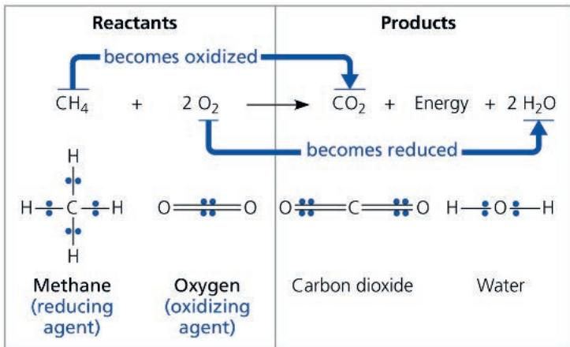  
VISUAL SKILLS Is the carbon atom oxidized or reduced during this reaction? Explain.  
For suggested answer, see Appendix A.

with $O_{2}$ , forming $CO_{2}$ , electrons end up shared less equally between the carbon atom and its new covalent partners, the oxygen atoms, which are very electronegative. In effect, the carbon atom has partially “lost” its shared electrons; thus, methane has been oxidized.

Now let's examine the fate of the reactant $O_{2}$ . The two atoms of $O_{2}$ share their electrons equally. But after the reaction with methane, when each O atom is bonded to two H atoms in $H_{2}O$ , the electrons of those covalent bonds spend more time near the oxygen (see Figure 9.2). In effect, each O atom has partially "gained" electrons, so the oxygen molecule ( $O_{2}$ ) has been reduced. Because the O atom is so electronegative, $O_{2}$ is one of the most powerful of all oxidizing agents.

Energy must be added to pull an electron away from an atom, just as energy is required to push a ball uphill. The more electronegative the atom (the stronger its pull on electrons), the more energy is required to take an electron away from it. An electron loses potential energy when it shifts from a less electronegative atom toward a more electronegative one, just as a ball loses potential energy when it rolls downhill. A redox reaction that moves electrons closer to an O atom, such as the burning (oxidation) of methane, therefore releases chemical energy that can be put to work.

## Oxidation of Organic Fuel Molecules During Cellular Respiration

The oxidation of methane by $O_{2}$ is the main combustion reaction that occurs at the burner of a gas stove. The combustion of gasoline in an automobile engine is also a redox reaction; the energy released pushes the pistons. But the energy-yielding redox process of greatest interest to biologists is respiration: the oxidation of glucose and other molecules in food. Examine again the summary equation for cellular respiration, but this time think of it as a redox process:

$$
\begin{array}{c} \text {becomes oxidized} \\ \mathrm{C} _ {6} \mathrm{H} _ {1 2} \mathrm{O} _ {6} + 6 \mathrm{O} _ {2} \longrightarrow 6 \mathrm{CO} _ {2} + 6 \mathrm{H} _ {2} \mathrm{O} + \text {Energy} \\ \text {becomes reduced} \end{array}
$$

As in the combustion of methane or gasoline, the fuel (glucose) is oxidized and $O_{2}$ is reduced. The electrons lose potential energy along the way, and energy is released.

In general, organic molecules that have an abundance of hydrogen are excellent fuels because their bonds are a source of "hilltop" electrons, whose energy may be released as these electrons "fall" down an energy gradient during their transfer to oxygen. The summary equation for respiration indicates that hydrogen is transferred from glucose to the O atoms in $\mathrm{O}_2$ . But the important point, not visible in the summary equation, is that the energy state of the electron changes as hydrogen (with its electron) is transferred to oxygen. In respiration, the oxidation of glucose transfers electrons to a lower energy state, liberating energy that becomes available for ATP synthesis. So, in general, we see fuels with multiple C—H bonds oxidized into products with multiple C—O bonds.

The main energy-yielding foods—carbohydrates and fats—are reservoirs of electrons associated with hydrogen, often in the form of C—H bonds. Only the barrier of activation energy holds back the flood of electrons to a lower energy state (see Figure 8.13). Without this barrier, a food substance like glucose would combine almost instantaneously with $O_{2}$ . If we supply the activation energy by igniting glucose, it burns in air, releasing 686 kcal (2,870 kJ) of heat per mole of glucose (about 180 g). Body temperature is not high enough to initiate burning, of course. Instead, if you swallow some glucose, enzymes in your cells will lower the barrier of activation energy, allowing the sugar to be oxidized in a series of steps.

## Stepwise Energy Harvest via NAD $^{+}$ and the Electron Transport Chain

If energy is released from a fuel all at once, it cannot be harnessed efficiently for constructive work. For example, if a gasoline tank explodes, it cannot drive a car very far. Cellular respiration does not oxidize glucose (or any other organic fuel) in a single explosive step either. Rather, glucose is broken down in a series of steps, each one catalyzed by an enzyme. At key steps, electrons are stripped from the glucose. As is often the case in oxidation reactions, each electron travels with a proton—thus, as a hydrogen atom. The hydrogen atoms are not transferred directly to $O_{2}$ , but instead are usually passed first to an electron carrier, a coenzyme called nicotinamide adenine dinucleotide, a derivative of the vitamin niacin. This coenzyme is well suited

as an electron carrier because it can cycle easily between its oxidized form, $NAD^{+}$ , and its reduced form, NADH. As an electron acceptor, $NAD^{+}$ functions as an oxidizing agent during respiration.

How does $NAD^{+}$ trap electrons from glucose and the other organic molecules in food? Enzymes called dehydrogenases remove a pair of hydrogen atoms (2 electrons and 2 protons) from the substrate (glucose, in the preceding example), thereby oxidizing it. The enzyme delivers the 2 electrons along with 1 proton to its coenzyme, $NAD^{+}$ , forming NADH (Figure 9.3). The other proton is released as a hydrogen ion ( $H^{+}$ ) into the surrounding solution:

$$
\mathrm{H} - \stackrel {|} {\mathrm{C}} - \mathrm{OH} + \mathrm{NAD} ^ {+} \xrightarrow {\text {   Dehydrogenase   }} \stackrel {|} {\mathrm{C}} = \mathrm{O} + \mathrm{NADH} + \mathrm{H} ^ {+}
$$

By receiving 2 negatively charged electrons but only 1 positively charged proton, the nicotinamide portion of $NAD^{+}$ has its charge neutralized when $NAD^{+}$ is reduced to NADH. The name NADH shows the hydrogen that has been received in the reaction. $NAD^{+}$ is the most versatile electron acceptor in cellular respiration and functions in several of the redox steps during the breakdown of glucose.

Electrons lose very little of their potential energy when they are transferred from glucose to $NAD^{+}$ . Each NADH molecule formed during respiration represents stored energy that can be tapped to make ATP when the electrons complete their “fall” down an energy gradient from NADH to $O_{2}$ .

Figure 9.3 NAD $^{+}$ as an electron shuttle.

The full name for $NAD^{+}$ , nicotinamide adenine dinucleotide, describes its structure—the molecule consists of two nucleotides joined together at their phosphate groups (shown in yellow circles). (Nicotinamide is a nitrogenous base, although not one that is present in DNA or RNA; see Figure 5.23.) The enzymatic transfer of 2 electrons and 1 proton ( $H^{+}$ ) from an organic molecule in food to $NAD^{+}$ reduces the $NAD^{+}$ to NADH: Most of the electrons removed from food are transferred initially to $NAD^{+}$ , forming NADH.

How do electrons that are extracted from glucose and stored as potential energy in NADH finally reach oxygen? It will help to compare the redox chemistry of cellular respiration to a much simpler reaction: the reaction between hydrogen and oxygen to form water (Figure 9.4a). Mix $H_{2}$ and $O_{2}$ , provide a spark for activation energy, and the gases combine explosively. In fact, combustion of liquid $H_{2}$ and $O_{2}$ is harnessed to help power the rocket engines that boost satellites into orbit and launch spacecraft. The explosion represents a release of energy as the electrons of hydrogen “fall” closer to the electronegative oxygen atoms. Cellular respiration also brings hydrogen and oxygen together to form water, but there are two important differences. First, in cellular respiration, the hydrogen atoms that react with oxygen are derived from organic molecules rather than $H_{2}$ . Second, instead of occurring in one explosive reaction, respiration uses an electron transport chain to break the fall of electrons to oxygen into several energy-releasing steps (Figure 9.4b). An electron transport chain consists of a

Figure 9.4 An introduction to electron transport chains.

(a) Uncontrolled reaction. The one-step exergonic reaction of hydrogen with oxygen to form water releases a large amount of energy in the form of heat and light: an explosion.

(b) Cellular respiration. In cellular respiration, the same reaction occurs in stages: An electron transport chain breaks the "fall" of electrons in this reaction into a series of smaller steps and stores some of the released energy in a form that can be used to make ATP. (The rest of the energy is released as heat.)

  
respiration, let's look at the entire process by which energy is harvested from organic fuels.

number of molecules, mostly proteins, built

into the inner membrane of the mitochondria of eukaryotic cells (and the plasma membrane of respiring prokaryotic organisms). Electrons removed from glucose are shuttled by NADH to the "top," higher-energy end of the chain. At the "bottom," lower-energy end, $O_{2}$ captures these electrons along with hydrogen nuclei ( $H^{+}$ ), forming water. (Anaerobically respiring prokaryotic organisms have an electron acceptor at the end of the chain that is different from $O_{2}$ .)

Electron transfer from NADH to oxygen is an exergonic reaction with a free-energy change of -53 kcal/mol (-222 kJ/mol). Instead of this energy being released and wasted in a single explosive step, electrons cascade down the chain from one carrier molecule to the next in a series of redox reactions, losing a small amount of energy with each step until they finally reach oxygen, the terminal electron acceptor, which has a very great affinity for electrons. Each “downhill” carrier has a greater affinity for electrons than, and is thus capable of accepting electrons from (oxidizing), its “uphill” neighbor, with $O_{2}$ at the bottom of the chain. Therefore, the electrons transferred from glucose to $NAD^{+}$ , reducing it to NADH, fall down an energy gradient in the electron transport chain to a far more stable location in an electronegative oxygen atom from $O_{2}$ . Put another way, $O_{2}$ pulls electrons down the chain in an energy-yielding tumble analogous to gravity pulling objects downhill.

In summary, during cellular respiration, most electrons travel the following “downhill” route: glucose → NADH → electron transport chain → oxygen. Later in this chapter, you will learn more about how the cell uses the energy released from this exergonic electron fall to regenerate its supply of ATP. For now, having covered the basic redox mechanisms of cellular

## The Stages of Cellular Respiration: A Preview

The harvesting of energy from glucose by cellular respiration is a cumulative function of three metabolic stages. We list them here along with a color-coding scheme we will use throughout the chapter to help you keep track of the big picture:

1. GLYCOLYSIS (color-coded blue throughout the chapter)

2. PYRUVATE OXIDATION (light orange) and the CITRIC ACID CYCLE (dark orange)

3. OXIDATIVE PHOSPHORYLATION: Electron transport and chemiosmosis (purple)

Biochemists usually reserve the term cellular respiration for stages 2 and 3 together. In this text, however, we include glycolysis as a part of cellular respiration because most respiring cells deriving energy from glucose use glycolysis to produce the starting material for the citric acid cycle.

As diagrammed in Figure 9.5, glycolysis and then pyruvate oxidation and the citric acid cycle are the catabolic pathways that break down glucose and other organic fuels. Glycolysis, which occurs in the cytosol, begins the degradation process by breaking glucose into two molecules of a compound called pyruvate. In eukaryotes, pyruvate enters the mitochondrion and is oxidized to a compound called acetyl CoA, which enters the citric acid

## Figure 9.5 An overview of cellular respiration.

cycle. There, the breakdown of glucose to carbon dioxide is completed. (In prokaryotic organisms, these processes take place in the cytosol.) Thus, the carbon dioxide produced by respiration represents fragments of oxidized organic molecules.

Some of the steps of glycolysis and the citric acid cycle are redox reactions in which dehydrogenases transfer electrons from substrates to $NAD^{+}$ or the related electron carrier FAD, forming NADH or $FADH_{2}$ . (You'll learn more about FAD and $FADH_{2}$ later.) In the third stage of respiration, the electron transport chain accepts electrons from NADH or $FADH_{2}$ generated during the first two stages and passes these electrons down the chain. At the end of the chain, the electrons are combined with molecular oxygen ( $O_{2}$ ) and hydrogen ions ( $H^{+}$ ), forming water (see Figure 9.4b). The energy released at each step of the chain is stored in a form the mitochondrion (or prokaryotic cell) can use to make ATP from ADP. This mode of ATP synthesis is called oxidative phosphorylation because it is powered by the redox reactions of the electron transport chain.

In eukaryotic cells, the inner membrane of the mitochondrion is the site of electron transport and another process called chemiosmosis, together making up oxidative phosphorylation. (In prokaryotic cells, these processes take place in the plasma membrane.) Oxidative phosphorylation accounts for almost 90% of the ATP generated by respiration. A smaller amount of ATP is formed directly in a few reactions of glycolysis and the citric acid cycle by a mechanism called substrate-level phosphorylation (Figure 9.6). This mode of ATP synthesis occurs when an enzyme transfers a phosphate group from a substrate molecule to ADP, rather than adding an inorganic phosphate to ADP as in oxidative phosphorylation. "Substrate molecule" here refers to an organic molecule generated as an intermediate during the catabolism of glucose. You'll see examples of substrate-level phosphorylation later in the chapter, in both glycolysis and the citric acid cycle.

You can think of the whole process this way: When you withdraw a relatively large sum of money from an ATM, it is not delivered to you in a single bill of a large denomination. Instead, the machine dispenses a number of smaller-denomination bills that you can spend more easily. This is analogous to ATP production during cellular respiration. For each molecule of glucose degraded to $CO_{2}$ and $H_{2}O$ by respiration, the cell makes

During glycolysis, each glucose molecule is broken down into two molecules of pyruvate. In eukaryotic cells, as shown here, the pyruvate enters the mitochondrion. There it is oxidized to acetyl CoA, which will be further oxidized to $CO_{2}$ in the citric acid cycle. The electron carriers NADH and $FADH_{2}$ transfer electrons derived from glucose to electron transport chains. During oxidative phosphorylation, electron transport chains convert the chemical energy to a form used for ATP synthesis in the process called chemiosmosis. (During earlier steps of cellular respiration, a few molecules of ATP are synthesized in a process called substrate-level phosphorylation.) To visualize these processes in their cellular context, see Figure 6.32b.

Figure 9.6 Substrate-level phosphorylation.

Some ATP is made by direct transfer of a phosphate group from an organic substrate to ADP by an enzyme. (For examples in glycolysis, see Figure 9.8, 7 and 10.)

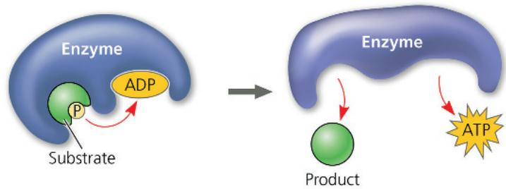  
MAKE CONNECTIONS Review Figure 8.9. In the reaction shown above, is the potential energy higher for the reactants or for the products? Explain. For suggested answer, see Appendix A.

up to about 32 molecules of ATP, each with 7.3 kcal/mol of free energy. Respiration cashes in the large denomination of energy banked in a single molecule of glucose (686 kcal/mol under standard conditions) for the small change of many molecules of ATP, which is more practical for the cell to spend on its work.

This preview has introduced you to how glycolysis, the citric acid cycle, and oxidative phosphorylation fit into the process of cellular respiration so you can keep the big picture in mind as you take a closer look at each of these three stages of respiration. As you read about the chemical reactions, remember that each reaction is catalyzed by a specific enzyme, some of which are shown in Figure 6.32b.

## Concept Check 9.1

1. Compare and contrast aerobic and anaerobic respiration, including the processes involved.

2. WHAT IF? If the following redox reaction occurred, which compounds would be oxidized? Reduced?

$$
\mathrm{C} _ {4} \mathrm{H} _ {6} \mathrm{O} _ {5} + \mathrm{NAD} ^ {+} \rightarrow \mathrm{C} _ {4} \mathrm{H} _ {4} \mathrm{O} _ {5} + \mathrm{NADH} + \mathrm{H} ^ {+}
$$

For suggested answers, see Appendix A.

# Concept 9.2: Glycolysis harvests chemical energy by oxidizing glucose to pyruvate

The word glycolysis means “sugar splitting,” and that is exactly what happens during this pathway. Glucose, a six-carbon sugar, is split into two three-carbon sugars. These smaller sugars are then oxidized and their remaining atoms rearranged to form two molecules of pyruvate. (Pyruvate is the ionized form of pyruvic acid.)

As summarized in Figure 9.7, glycolysis can be divided into two phases: the energy investment phase and the energy payoff phase. During the energy investment phase, the cell actually spends ATP. This investment is repaid with interest during the energy payoff phase, when ATP is produced by substrate-level phosphorylation and $\mathrm{NAD^{+}}$ is reduced to NADH by electrons released from the oxidation of glucose. The net energy yield from glycolysis, per glucose molecule, is 2 ATP plus 2 NADH. The ten steps of the glycolytic pathway are shown in Figure 9.8.

All of the carbon originally present in glucose is accounted for in the two molecules of pyruvate; no carbon is released as $CO_{2}$ during glycolysis. Glycolysis occurs whether or not $O_{2}$ is present. However, if $O_{2}$ is present, the chemical energy stored in pyruvate and NADH can be extracted by pyruvate oxidation, the citric acid cycle, and oxidative phosphorylation.

Figure 9.7 The inputs and outputs of glycolysis.  

Figure 9.8 The steps of glycolysis.  
Glycolysis, a source of ATP and NADH, takes place in the cytosol. Two of the enzymes (in ① and ③) are shown in Figure 6.32b.  
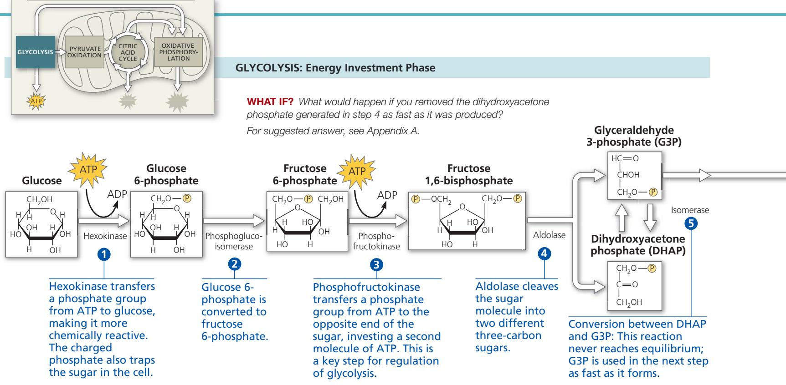

## Concept Check 9.2

1. VISUAL SKILLS During the redox reaction in glycolysis (see step 6 in Figure 9.8), which one of the molecules acts as the oxidizing agent? The reducing agent?

For suggested answers, see Appendix A.

## Concept 9.3: After pyruvate is oxidized, the citric acid cycle completes the energy-yielding oxidation of organic molecules

Glycolysis releases less than a quarter of the chemical energy in glucose that can be harvested by cells; most of the energy remains stockpiled in the two molecules of pyruvate. When $O_{2}$ is present, the pyruvate in eukaryotic cells enters a mitochondrion, where the oxidation of glucose is completed. In aerobically respiring prokaryotic cells, this process occurs in the cytosol. (Later in the chapter, we'll examine other fates for pyruvate—for example, when $O_{2}$ is unavailable or in a prokaryotic organism that is unable to use $O_{2}$ .)

## Oxidation of Pyruvate to Acetyl CoA

Upon entering the mitochondrion via active transport, pyruvate is first converted to a compound called acetyl coenzyme A, or acetyl CoA (Figure 9.9). This step, linking glycolysis and the citric

Figure 9.9 Oxidation of pyruvate to acetyl CoA, the step before the citric acid cycle.

Pyruvate enters the mitochondrion through a transport protein and is processed by a complex of several enzymes known as pyruvate dehydrogenase (shown in the computer-generated image based on cryo-EMs). This complex catalyzes the three numbered steps, which are described in the text. The $CO_{2}$ molecule will diffuse out of the cell. The NADH will be used in oxidative phosphorylation. The acetyl group of acetyl CoA will enter the citric acid cycle. (Coenzyme A is abbreviated S-CoA when it is attached to a molecule, emphasizing its sulfur atom, S.)

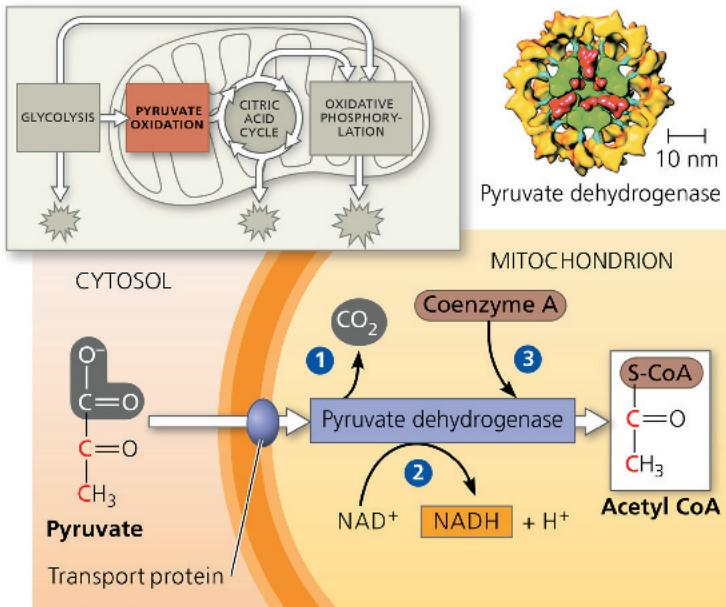

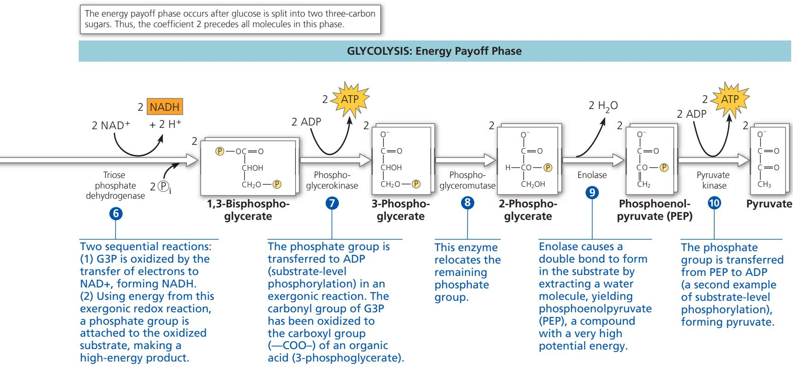

acid cycle, is carried out by a multienzyme complex that catalyzes three reactions: ① Pyruvate's carboxyl group ( $—COO^{-}$ ), already somewhat oxidized and thus carrying little chemical energy, is now fully oxidized and given off as a molecule of $CO_{2}$ . This is the first step in which $CO_{2}$ is released during respiration. ② Next, the remaining two-carbon fragment is oxidized and the electrons transferred to $NAD^{+}$ , storing energy in the form of NADH.

③ Finally, coenzyme A (CoA), a sulfur-containing compound derived from a B vitamin, is attached via its sulfur atom to the two-carbon intermediate, forming acetyl CoA. Acetyl CoA has a high potential energy, which is used to transfer the acetyl group to a molecule in the citric acid cycle, a reaction that is therefore highly exergonic.

## The Citric Acid Cycle

The citric acid cycle functions as a metabolic furnace that further oxidizes organic fuel derived from pyruvate. Figure 9.10 summarizes the inputs and outputs as pyruvate is broken down to three $\mathrm{CO}_{2}$ molecules, including the molecule of $\mathrm{CO}_{2}$ released during the conversion of pyruvate to acetyl CoA. The cycle generates 1 ATP per turn by substrate-level phosphorylation, but most of the chemical energy is transferred to $\mathrm{NAD}^{+}$ and FAD during the redox reactions. The reduced coenzymes, NADH and $\mathrm{FADH}_{2}$ , shuttle their cargo of high-energy electrons into the electron transport chain. The citric acid cycle is also called the tricarboxylic acid cycle or the Krebs cycle, the latter honoring Hans Krebs. Krebs was the German-British scientist largely responsible for working out the pathway in the 1930s.

Now let's look at the citric acid cycle in more detail. The cycle has eight steps, each catalyzed by a specific enzyme. You can see in Figure 9.11 that for each turn of the citric acid cycle, two carbons (red) enter in the relatively reduced form of an acetyl group (①), and two different carbons (blue) leave in the completely oxidized form of $\mathrm{CO}_{2}$ molecules (③ and ④). The acetyl group of acetyl CoA joins the cycle by combining with the compound oxaloacetate, forming citrate (①). Citrate is the ionized form of citric acid, for which the cycle is named. The next seven steps decompose the citrate back to oxaloacetate. It is this regeneration of oxaloacetate that makes the process a cycle.

Referring to Figure 9.11, we can tally the energy-rich molecules produced by the citric acid cycle. For each acetyl group entering the cycle, 3 NAD $^{+}$ are reduced to NADH (3, 4, and 8). In 6, electrons are transferred not to NAD $^{+}$ , but to FAD, which accepts 2 electrons and 2 protons to become FADH $_{2}$ . In many animal tissue cells, the reaction in 5 produces a guanosine triphosphate (GTP) molecule by substrate-level phosphorylation. GTP is a molecule similar to ATP in its structure and cellular function. This GTP may be used to make an ATP molecule (as shown) or directly power work in the cell. In the cells of plants, bacteria, and some animal tissues, 5 forms an ATP molecule directly by substrate-level phosphorylation. The output from 5

Figure 9.10 An overview of pyruvate oxidation and the citric acid cycle.

The inputs and outputs per pyruvate molecule are shown with a focus on the carbon atoms involved. To calculate on a per-glucose basis, multiply by 2 because each glucose molecule is split during glycolysis into two pyruvate molecules.

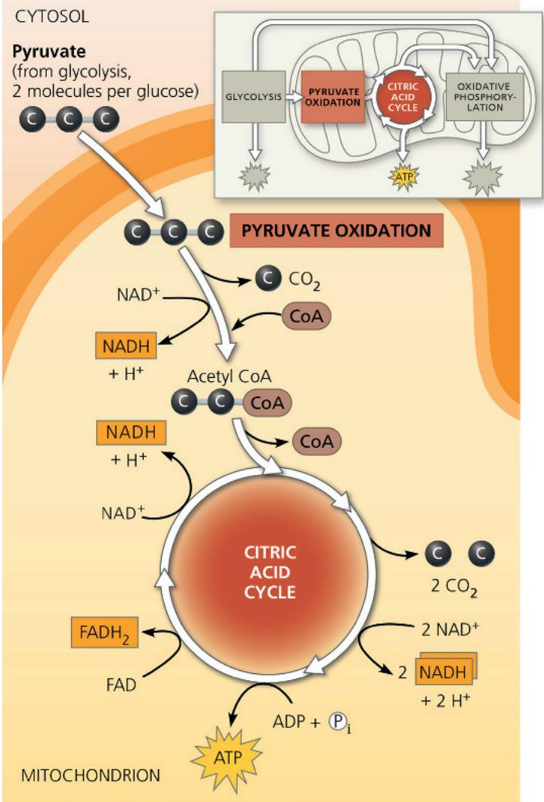

represents the only ATP generated during the citric acid cycle. Recall that each glucose gives rise to two molecules of acetyl CoA that enter the cycle. Because the numbers noted earlier are obtained from a single acetyl group entering the pathway, the total yield per glucose from the citric acid cycle turns out to be doubled, or 6 NADH, 2 FADH $_{2}$ , and the equivalent of 2 ATP.

Most of the ATP produced by respiration is generated later, from oxidative phosphorylation, when the NADH and $FADH_{2}$ produced by the citric acid cycle and earlier steps relay the electrons extracted from food to the electron transport chain. In the process, they supply the necessary energy for the phosphorylation of ADP to ATP. We will explore this process in the next section.

Figure 9.11 A closer look at the citric acid cycle.

In the chemical structures, red type traces the fate of the two carbon atoms that enter the cycle via acetyl CoA (1), and blue type indicates the two carbons that exit the cycle as $\mathrm{CO}_{2}$ in 3 and 4. (The red type goes only through 5 because the succinate molecule is symmetrical; the two ends cannot be distinguished from each other.) Notice that the carbon atoms that enter the cycle from acetyl CoA do not leave the cycle in the same turn. They remain in the cycle, occupying a different location in the molecules on their next turn, after another acetyl group is added. Therefore, the oxaloacetate regenerated at ⑧ is made up of different carbon atoms each time around. Carboxylic acids are represented in their ionized forms, as $-\mathrm{COO}^{-}$ , because the ionized forms prevail at the pH within the mitochondrion. In eukaryotic cells, all the citric acid cycle enzymes are located in the mitochondrial matrix except for the enzyme that catalyzes ⑥, which resides in the inner mitochondrial membrane. (The enzyme that catalyzes ③, isocitrate dehydrogenase, is shown in Figure 6.32b.)

## Concept Check 9.3

1. VISUAL SKILLS In the citric acid cycle shown in Figure 9.11, what molecules capture energy from the redox reactions? How is ATP produced?

2. What processes in your cells produce the $CO_{2}$ that you exhale?

3. VISUAL SKILLS The conversions shown in Figure 9.9 and ④ of Figure 9.11 are each catalyzed by a large multienzyme complex. What similarities are there in the reactions that occur in these two cases?

For suggested answers, see Appendix A.

# Concept 9.4: During oxidative phosphorylation, chemiosmosis couples electron transport to ATP synthesis

Our main objective in this chapter is to learn how cells harvest the energy of glucose and other nutrients in food to make ATP. But the metabolic components of respiration we have examined so far, glycolysis and the citric acid cycle, produce only 4 ATP molecules per glucose molecule, all by substrate-level phosphorylation: 2 net ATP from glycolysis and 2 ATP from the citric acid cycle. At this point, molecules of NADH (and FADH $_{2}$ ) account for most of the energy extracted from each glucose molecule. These electron escorts link glycolysis and the citric acid cycle to the machinery of oxidative phosphorylation, which uses energy released by the electron transport chain to power ATP synthesis. In this section, you will learn first how the electron transport chain works and then how electron flow down the chain is coupled to ATP synthesis.

## The Pathway of Electron Transport

The electron transport chain is a collection of molecules embedded in the inner membrane of the mitochondrion in eukaryotic cells. (In prokaryotic cells, these molecules reside in the plasma membrane.) The folding of the inner membrane to form cristae increases its surface area, providing space for thousands of copies of each component of the electron transport chain in a mitochondrion. Structure fits function: The infolded membrane with its concentration of electron carrier molecules is well-suited for the series of sequential redox reactions that take place along the electron transport chain. Most components of the chain are proteins, which exist in multiprotein complexes numbered I through IV. Tightly bound to these proteins are prosthetic groups, nonprotein components such as cofactors and coenzymes essential for the catalytic functions of certain enzymes.

Figure 9.12 shows the sequence of electron carriers in the electron transport chain and the drop in free energy as electrons travel down the chain. During this electron transport, electron carriers alternate between reduced and oxidized states as they accept and then donate electrons. Each component of the chain becomes reduced when it accepts electrons from its “uphill” neighbor, which is a better electron donor. It then returns to its oxidized form as it passes electrons to its “downhill” neighbor, which is a better electron acceptor.

Figure 9.12 Free-energy change during electron transport.  
Figure 9.12 Free energy change during electron transport.

The overall energy drop ( $\Delta G$ ) for electrons traveling from NADH to oxygen is 53 kcal/mol, but this “fall” is broken up into a series of smaller steps by the electron transport chain. (An oxygen atom is represented here as $\frac{1}{2}O_{2}$ to show that $O_{2}$ is reduced, not individual oxygen atoms.) To view these proteins in their cellular context, see Figure 6.32b.  
  
VISUAL SKILLS Compare the position of the electrons in NADH (see Figure 9.3) at the top of the chain with that in $H_{2}O$ , at the bottom. Describe why the electrons in $H_{2}O$ have less potential energy, using the term electronegativity. For suggested answers, see Appendix A.

Now let's take a closer look at the electrons as they drop in energy level, passing through the components of the electron transport chain in Figure 9.12. We'll first look at the passage of electrons through complex I in some detail as an illustration of the general principles involved in electron transport. Electrons acquired from glucose by $\mathrm{NAD^{+}}$ during glycolysis and the citric acid cycle are transferred from NADH to the first molecule of the electron transport chain in complex I. This molecule is a flavoprotein, so named because it has a prosthetic group called flavin mononucleotide (FMN). In the next redox reaction, the flavoprotein returns to its oxidized form as it passes electrons to an iron-sulfur protein (Fe · S in complex I), one of a family of proteins with both iron and sulfur tightly bound. The iron-sulfur protein then passes the electrons to a compound called ubiquinone (Q in Figure 9.12). This electron carrier is a small hydrophobic molecule, the only member of the electron transport chain that is not a protein. Ubiquinone is individually mobile within the membrane rather than residing in a particular complex. (Another name for ubiquinone is coenzyme Q, or CoQ; you may have seen it sold as a nutritional supplement.)

Most of the remaining electron carriers between ubiquinone and oxygen are proteins called cytochromes. Their prosthetic group, called a heme group, has an iron atom that accepts and donates electrons. (The heme group in a cytochrome is similar to the heme group in hemoglobin, the protein of red blood cells, except that the iron in hemoglobin carries oxygen, not electrons.) The electron transport chain has several types of cytochromes, each named “cyt” with a letter and number to distinguish it as a different protein with a slightly different electron-carrying heme group. The last cytochrome of the chain, cyt $a_{3}$ , passes its electrons to oxygen (in $O_{2}$ ), which is very electronegative. Each O also picks up a pair of hydrogen ions (protons) from the aqueous solution, neutralizing the -2 charge of the added electrons and forming water.

Another source of electrons for the electron transport chain is $FADH_{2}$ , the other reduced product of the citric acid cycle. Notice in Figure 9.12 that $FADH_{2}$ adds its electrons from within complex II, at a lower energy level than NADH does. Consequently, although NADH and $FADH_{2}$ each donate an equivalent number of electrons (2) for oxygen reduction, the electron transport chain provides about one-third less energy for ATP synthesis when the electron donor is $FADH_{2}$ rather than NADH. We'll see why in the next section.

The electron transport chain makes no ATP directly. Instead, it eases the fall of electrons from food to oxygen, breaking a large free-energy drop into a series of smaller steps that release energy in manageable amounts, step by step. How does the mitochondrion (or the plasma membrane in prokaryotic cells) couple this electron transport and energy release to ATP synthesis? The answer is a mechanism called chemiosmosis.

## Chemiosmosis: The Energy-Coupling Mechanism

Populating the inner membrane of the mitochondrion or the prokaryotic plasma membrane are many copies of a protein complex called ATP synthase, the enzyme that makes ATP from ADP and inorganic phosphate (Figure 9.13). ATP synthase works like an ion pump running in reverse. Ion pumps usually use ATP as an energy source to transport ions against their gradients. Enzymes can catalyze a reaction in either direction, depending on the $\Delta G$ for the reaction, which is affected by the local concentrations of reactants and products (see Concepts 8.2 and 8.3). Under the conditions of cellular respiration, rather than hydrolyzing ATP to pump protons against their concentration gradient, ATP synthase uses the energy of an existing ion gradient to power ATP synthesis. The power source for ATP synthase is a difference in the concentration of $\mathrm{H^{+}}$ (a pH difference) on opposite sides of the inner mitochondrial membrane. This process, in which energy

Figure 9.13 ATP synthase, a molecular mill.

Multiple ATP synthases reside in eukaryotic mitochondrial and chloroplast membranes and in prokaryotic plasma membranes. (See Figure 6.32b and c.)

stored in the form of a hydrogen ion gradient across a membrane is used to drive cellular work such as the synthesis of ATP, is called chemiosmosis (from the Greek osmos, push). The word osmosis was previously used in discussing water transport, but here it refers to the flow of $H^{+}$ across a membrane.

From studying the structure of ATP synthase, scientists have learned how the flow of $H^{+}$ through this enzyme powers ATP generation. ATP synthase is a multisubunit complex with four main parts, each made up of multiple polypeptides (see Figure 9.13). Protons move one by one into binding sites on the rotor, causing it to spin in a way that catalyzes ATP production from ADP and $P_{i}$ . The flow of protons thus behaves somewhat like a rushing stream that turns a waterwheel. ATP synthase is the smallest molecular rotary motor known in nature.

Figure 9.14 Chemiosmosis couples the electron transport chain to ATP synthesis.

1 NADH and FADH $_2$ shuttle high-energy electrons extracted from food during glycolysis and the citric acid cycle into an electron transport chain built into the inner mitochondrial membrane. (See Figure 6.32b.) The gold arrows trace the transport of electrons, which are finally passed to a terminal acceptor (O $_2$ , in the case of aerobic respiration) at the “downhill” end of the chain, forming water. Most of the electron carriers of the chain are grouped into four complexes (I–IV). Two mobile carriers, ubiquinone (Q) and cytochrome c (Cyt c), move rapidly, ferrying electrons between the large complexes. As the complexes shuttle electrons, they pump protons

How does the inner mitochondrial membrane (or the prokaryotic plasma membrane) generate and maintain the $H^{+}$ gradient that drives ATP synthesis by the ATP synthase protein complex? Establishing the $H^{+}$ gradient is a major function of the electron transport chain, which is shown in its mitochondrial location in Figure 9.14. The chain is an energy converter that uses the exergonic flow of electrons from NADH and $FADH_{2}$ to pump $H^{+}$ across the membrane, from the mitochondrial matrix into the intermembrane space. The $H^{+}$ has a tendency to move back across the membrane, diffusing down its gradient. And the ATP synthases are the only sites that provide a route through the membrane for $H^{+}$ . As we described previously, the passage of $H^{+}$ through ATP synthase uses the exergonic flow of $H^{+}$ to drive the phosphorylation of ADP. Thus, the energy stored in an $H^{+}$

from the mitochondrial matrix into the intermembrane space. FADH $_{2}$ deposits its electrons via complex II and so results in fewer protons being pumped into the intermembrane space than occurs with NADH. Chemical energy originally harvested from food is transformed into a proton-motive force, a gradient of H $^{+}$ across the membrane. ② During chemiosmosis, the protons flow back down their gradient through ATP synthase, which is built into the membrane nearby. The ATP synthase harnesses the proton-motive force to phosphorylate ADP, forming ATP. Together, electron transport and chemiosmosis make up oxidative phosphorylation.

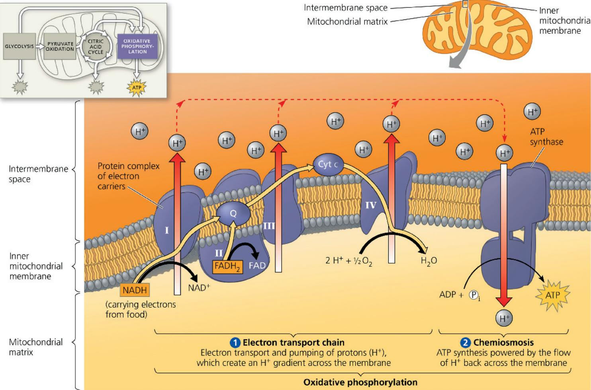  
WHAT IF? If complex IV were nonfunctional, could chemiosmosis produce any ATP, and if so, how would the rate of synthesis differ?
For suggested answer, see Appendix A.

gradient across a membrane couples the redox reactions of the electron transport chain to ATP synthesis.

At this point, you may be wondering how the electron transport chain pumps hydrogen ions into the intermembrane space. Researchers have found that certain members of the electron transport chain accept and release protons ( $H^{+}$ ) along with electrons. (The aqueous solutions inside and surrounding the cell are a ready source of $H^{+}$ .) At certain steps along the chain, electron transfers cause $H^{+}$ to be taken up and released into the surrounding solution. In eukaryotic cells, the electron carriers are spatially arranged in the inner mitochondrial membrane in such a way that $H^{+}$ is accepted from the mitochondrial matrix and deposited in the intermembrane space (see Figure 9.14). The $H^{+}$ gradient that results is referred to as a proton-motive force, emphasizing the capacity of the gradient to perform work. The force drives $H^{+}$ back across the membrane through the $H^{+}$ channels provided by ATP synthases.

In general terms, chemiosmosis is an energy-coupling mechanism that uses energy stored in the form of an $H^{+}$ gradient across a membrane to drive cellular work. In mitochondria, the energy for gradient formation comes from exergonic redox reactions along the electron transport chain, and ATP synthesis is the work performed. But chemiosmosis also occurs elsewhere and in other variations. Chloroplasts use chemiosmosis to generate ATP during photosynthesis; in these organelles, light (rather than chemical energy) drives both electron flow down an electron transport chain and the resulting $H^{+}$ gradient formation. Prokaryotic organisms, as already mentioned, generate $H^{+}$ gradients across their plasma membranes. They then tap the proton-motive force not only to make ATP inside the cell but also to rotate their flagella and to pump nutrients and waste products across the membrane. Because of its central importance to energy conversions in prokaryotic and eukaryotic cells, chemiosmosis has helped unify the study of bioenergetics. Peter Mitchell was awarded the Nobel Prize in 1978 for originally proposing the chemiosmotic model.

## An Accounting of ATP Production by Cellular Respiration

In the last few sections, we have looked rather closely at the key processes of cellular respiration. Now let's take a step back and remind ourselves of its overall function: harvesting the energy of glucose for ATP synthesis.

During respiration, most energy flows in this sequence: glucose $\rightarrow$ NADH $\rightarrow$ electron transport chain $\rightarrow$ proton-motive force $\rightarrow$ ATP. We can do some bookkeeping to calculate the ATP profit when cellular respiration oxidizes a molecule of glucose to six molecules of carbon dioxide. The three main departments of this metabolic enterprise are glycolysis, pyruvate oxidation and the citric acid cycle, and the electron transport chain, which drives oxidative phosphorylation. Figure 9.15 gives a detailed accounting of the ATP yield for each glucose molecule that is oxidized. The tally adds the 4 ATP produced directly by substrate-level phosphorylation during glycolysis and the citric acid cycle to the many more molecules of ATP generated by oxidative phosphorylation. Each NADH that transfers a pair of electrons from glucose to the electron transport chain contributes enough to the proton-motive force to generate a maximum of about 3 ATP.

Figure 9.15 ATP yield per molecule of glucose at each stage of cellular respiration.  
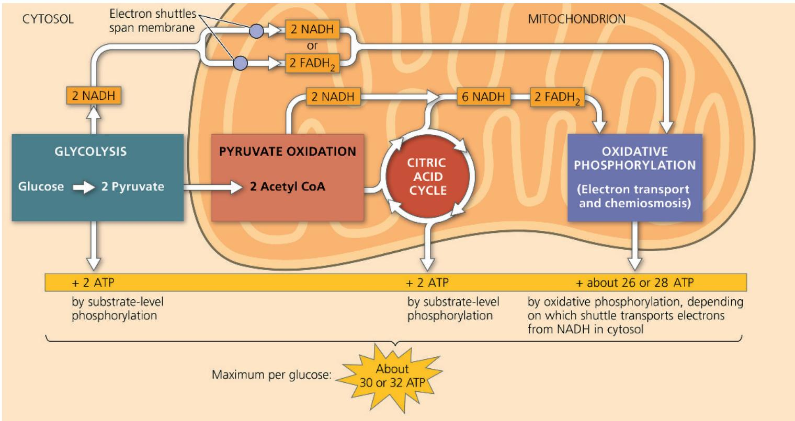  
VISUAL SKILLS After reading the discussion in the text, explain exactly how the total of 26 or 28 ATP from oxidative phosphorylation was calculated (see the yellow bar with the ATP numbers).  
For suggested answers, see Appendix A.

Why are the numbers in Figure 9.15 inexact? There are three reasons we cannot state an exact number of ATP molecules generated by the breakdown of one molecule of glucose. First, phosphorylation and the redox reactions are not directly coupled to each other, so the ratio of the number of NADH molecules to the number of ATP molecules is not a whole number. We know that 1 NADH results in $10\ H^{+}$ being transported out across the inner mitochondrial membrane, but the exact number of $H^{+}$ that must reenter the mitochondrial matrix via ATP synthase to generate 1 ATP has long been debated. Based on experimental data, however, most biochemists now agree that the most accurate number is $4\ H^{+}$ . Therefore, a single molecule of NADH generates enough proton-motive force for the synthesis of 2.5 ATP. The citric acid cycle also supplies electrons to the electron transport chain via $FADH_{2}$ , but since its electrons enter later in the chain, each molecule of this electron carrier is responsible for transport of only enough $H^{+}$ for the synthesis of 1.5 ATP. These numbers also take into account the slight energetic cost of moving the ATP formed in the mitochondrion out into the cytosol, where it will be used.

Second, the ATP yield varies slightly depending on the type of shuttle used to transport electrons from the cytosol into the mitochondrion. The mitochondrial inner membrane is not permeable to NADH, so NADH in the cytosol is segregated from the machinery of oxidative phosphorylation. The 2 electrons of NADH captured in glycolysis must be conveyed into the mitochondrion by one of several electron shuttle systems. Depending on the kind of shuttle in a particular cell type, the electrons are passed either to $NAD^{+}$ or to FAD in the mitochondrial matrix (see Figures 9.14 and 9.15). If the electrons are passed to FAD, as in brain cells, only about 1.5 ATP can result from each NADH that was originally generated in the cytosol. If the electrons are passed to mitochondrial $NAD^{+}$ , as in liver cells and heart cells, the yield is about 2.5 ATP per NADH.

A third variable that reduces the yield of ATP is the use of the proton-motive force generated by the redox reactions of respiration to drive other kinds of work. For example, the proton-motive force powers the mitochondrion's uptake of pyruvate from the cytosol (see Figure 9.9). However, if all the proton-motive force generated by the electron transport chain were used to drive ATP synthesis, one glucose molecule could generate a maximum of 28 ATP produced by oxidative phosphorylation plus 4 ATP (net) from substrate-level phosphorylation to give a total yield of about 32 ATP (or only about 30 ATP if the less efficient shuttle were functioning).

We can now roughly estimate the efficiency of respiration—that is, the percentage of chemical energy in glucose that has been transferred to ATP. Recall that the complete oxidation of a mole of glucose releases 686 kcal of energy under standard conditions ( $\Delta G = -686$ kcal/mol). Phosphorylation of ADP to form ATP stores at least 7.3 kcal per mole of ATP. Therefore, the efficiency of respiration is 7.3 kcal per mole of ATP times 32 moles of ATP per mole of glucose divided by 68 kcal per mole of glucose, which equals 0.34. Thus, about 34% of the potential chemical energy in glucose has been transferred to ATP; the actual percentage is bound to vary as $\Delta G$ varies under different cellular conditions. Cellular respiration is remarkably efficient in its energy conversion. By comparison, even the most efficient automobile converts only about 25% of the energy stored in gasoline to energy that moves the car.

The rest of the energy stored in glucose is lost as heat. We humans use some of this heat to maintain our relatively high body temperature ( $37^{\circ}$ C), and we dissipate the rest through sweating and other cooling mechanisms.

Surprisingly, perhaps, it may be beneficial under certain conditions to reduce the efficiency of cellular respiration. A remarkable adaptation is shown by hibernating mammals, which overwinter in a state of inactivity and lowered metabolism. Although their internal body temperature is lower than normal, it still must be kept significantly higher than the external air temperature. One type of tissue, called brown fat, is made up of cells packed full of mitochondria. The inner mitochondrial membrane contains a channel protein called the uncoupling protein that allows protons to flow back down their concentration gradient without generating ATP. Activation of these proteins in hibernating mammals results in ongoing oxidation of stored fuel (fats), generating heat without any ATP production. In the absence of such an adaptation, the buildup of ATP would eventually cause cellular respiration to be shut down by regulatory mechanisms that will be discussed later. Brown fat is also used for heat generation in humans. In the Scientific Skills Exercise, you can work with data in a related but different case where a decrease in metabolic efficiency in cells is used to generate heat.

## Concept Check 9.4

1. WHAT IF? What effect would an absence of $O_{2}$ have on the process shown in Figure 9.14?

2. WHAT IF? In the absence of $O_{2}$ , as in question 1, what do you think would happen if you decreased the pH of the intermembrane space of the mitochondrion? Explain your answer.

3. MAKE CONNECTIONS Membranes must be fluid to function properly (see Concept 7.1). How does the operation of the electron transport chain support that assertion?

For suggested answers, see Appendix A.

# Scientific Skills Exercise Making a Bar Graph and Evaluating a Hypothesis

INTERPRET THE DATA

Does Thyroid Hormone Level Affect $O_{2}$ Consumption in Cells? Some animals, such as mammals and birds, maintain a relatively constant body temperature, above that of their environment, by using heat produced as a by-product of metabolism. When the core temperature of these animals drops below an internal set point, their cells are triggered to reduce the efficiency of ATP production by the electron transport chains in mitochondria. At lower efficiency, extra fuel must be consumed to produce the same number of ATPs, generating additional heat. This response is moderated by the endocrine system, and researchers hypothesized that it might be triggered by thyroid hormone. In this exercise, you will use a bar graph to visualize data from an experiment that compared the metabolic rates (by measuring $O_{2}$ consumption) in mitochondria of cells from animals with different levels of thyroid hormone.

How the Experiment Was Done Liver cells were isolated from sibling rats that had low, normal, or elevated thyroid hormone levels. The oxygen consumption rate due to activity of the mitochondrial electron transport chains of each type of cell was measured under controlled conditions.

## Data from the Experiment

<table><tr><td>Thyroid Hormone Level</td><td>Oxygen Consumption Rate [nmol  $O_2$ /(min·mg cells)]</td></tr><tr><td>Low</td><td>4.3</td></tr><tr><td>Normal</td><td>4.8</td></tr><tr><td>Elevated</td><td>8.7</td></tr></table>

Data from M. E. Harper and M. D. Brand, The quantitative contributions of mitochondrial proton leak and ATP turnover reactions to the changed respiration rates of hepatocytes from rats of different thyroid status, Journal of Biological Chemistry 268:14850–14860 (1993).

## Concept 9.5: Fermentation and anaerobic respiration enable cells to produce ATP without the use of oxygen

Because most of the ATP generated by cellular respiration is due to the work of oxidative phosphorylation, our estimate of ATP yield from aerobic respiration depends on an adequate supply of $O_{2}$ to the cell. Without the electronegative oxygen

1. To visualize any differences in $O_{2}$ consumption between cell types, it will be useful to graph the data in a bar graph. First, set up the axes. (a) What is the independent variable (intentionally varied by the researchers), which goes on the x-axis? List the categories along the x-axis;

because they are discrete rather than continuous, you can list them in any order. (b) What is the dependent variable (measured by the researchers), which goes on the y-axis? (c) What units (abbreviated) should go on the y-axis? Label the y-axis, including the units specified in the data table. Determine the range of values of the data that will need to go on the y-axis. What is the largest value? Draw evenly spaced tick marks and label them, starting with 0 at the bottom.

2. Graph the data for each sample. Match each x-value with its y-value and place a mark on the graph at that coordinate, then draw a bar from the x-axis up to the correct height for each sample. Why is a bar graph more appropriate than a scatter plot or line graph? (For additional information about graphs, see the Scientific Skills Review in Appendix D.)

3. Examine your graph and look for a pattern in the data. (a) Which cell type had the highest rate of $O_{2}$ consumption, and which had the lowest? (b) Does this support the researchers' hypothesis? Explain. (c) Based on what you know about mitochondrial electron transport and heat production, predict which rats had the highest, and which had the lowest, body temperature.

Instructors: A version of this Scientific Skills Exercise can be assigned in Mastering Biology.

atoms in $O_{2}$ to pull electrons down the transport chain, oxidative phosphorylation eventually ceases. However, there are two general mechanisms by which certain cells can oxidize organic fuel and generate ATP without the use of $O_{2}$ : anaerobic respiration and fermentation. The distinction between these two is that an electron transport chain is used in anaerobic respiration but not in fermentation. (The electron transport chain is also called the respiratory chain because of its role in both types of cellular respiration.)

We have already mentioned anaerobic respiration, which takes place in certain prokaryotic organisms that live in environments without $O_{2}$ . These organisms have an electron transport chain but do not use $O_{2}$ as a final electron acceptor at the end of the chain.

$O_{2}$ performs this function very well because it consists of two extremely electronegative atoms, but other substances can also serve as final electron acceptors. Some “sulfate-reducing” marine bacteria, for instance, use the sulfate ion ( $SO_{4}^{2-}$ ) at the end of their respiratory chain. Operation of the chain builds up a proton-motive force used to produce ATP, but $H_{2}S$ (hydrogen sulfide) is made as a by-product rather than water. The rotten-egg odor you may have smelled while walking through a salt marsh or a mudflat signals the presence of sulfate-reducing bacteria.

Fermentation is a way of harvesting chemical energy without using either $O_{2}$ or any electron transport chain—in other words, without cellular respiration. How can food be oxidized without cellular respiration? Remember, oxidation simply refers to the loss of electrons to an electron acceptor, so it does not need to involve $O_{2}$ . Glycolysis oxidizes glucose to two molecules of pyruvate. The oxidizing agent of glycolysis is $NAD^{+}$ , and neither $O_{2}$ nor any electron transfer chain is involved. Overall, glycolysis is exergonic, and some of the energy made available is used to produce 2 ATP (net) by substrate-level phosphorylation. If $O_{2}$ is present, then additional ATP is made by oxidative phosphorylation when NADH passes electrons removed from glucose to the electron transport chain. But glycolysis generates 2 ATP whether oxygen is present or not—that is, whether conditions are aerobic or anaerobic.

As an alternative to respiratory oxidation of organic nutrients, fermentation is an extension of glycolysis that allows continuous generation of ATP by the substrate-level phosphorylation of glycolysis. For this to occur, there must be a sufficient supply of $NAD^{+}$ to accept electrons during the oxidation step of glycolysis. Without some mechanism to recycle $NAD^{+}$ from NADH, glycolysis would soon deplete the cell's pool of $NAD^{+}$ by reducing it all to NADH and would shut itself down for lack of an oxidizing agent. Under aerobic conditions, $NAD^{+}$ is recycled from NADH by the transfer of electrons to the electron transport chain. An anaerobic alternative is to transfer electrons from NADH to pyruvate, the end product of glycolysis.

## Types of Fermentation

Fermentation consists of glycolysis plus reactions that regenerate $NAD^{+}$ by transferring electrons from NADH to pyruvate or derivatives of pyruvate. The $NAD^{+}$ can then be reused to oxidize sugar by glycolysis, which nets two molecules of ATP by substrate-level phosphorylation. There are many types of fermentation, differing in the end products formed from pyruvate. Two types are alcohol fermentation and lactic acid fermentation, and both are harnessed by humans for food and industrial production.

In alcohol fermentation (Figure 9.16a), pyruvate is converted to ethanol (ethyl alcohol) in two steps. The first step releases $\mathrm{CO}_{2}$ from the pyruvate, which is converted to the two-carbon compound acetaldehyde. In the second step, acetaldehyde is reduced by NADH to ethanol. This regenerates the supply of $\mathrm{NAD^{+}}$ needed for the continuation of glycolysis. Many bacteria carry out alcohol fermentation under anaerobic conditions. Yeast (a fungus), in addition to aerobic respiration, also carries out alcohol fermentation. For thousands of years, humans have used yeast in brewing, winemaking, and baking. The $\mathrm{CO}_{2}$ bubbles generated by baker's yeast during alcohol fermentation allow bread to rise.

Figure 9.16 Fermentation.

In the absence of oxygen, many cells use fermentation to produce ATP by substrate-level phosphorylation. NAD $^{+}$ is regenerated for use in glycolysis when pyruvate, the end product of glycolysis, serves as an electron acceptor for oxidizing NADH. Two of the common end products formed from fermentation are (a) ethanol and (b) lactate, the ionized form of lactic acid.

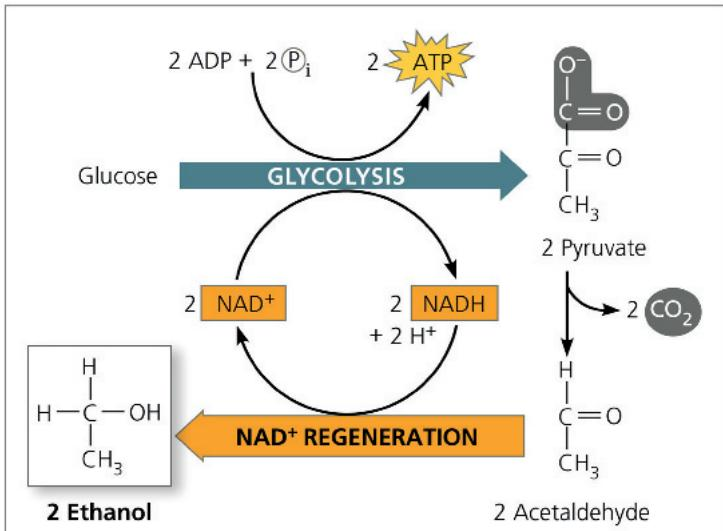

(a) Alcohol fermentation  
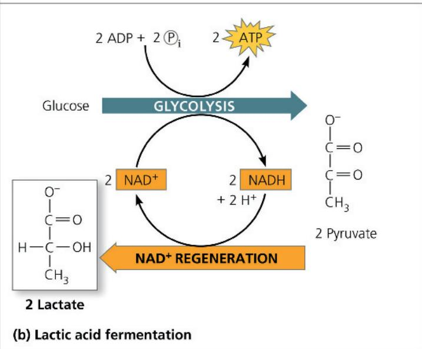

During lactic acid fermentation (Figure 9.16b), pyruvate is reduced directly by NADH to form lactate as an end product,

regenerating $NAD^{+}$ with no release of $CO_{2}$ . (Lactate is the ionized form of lactic acid.) Lactic acid fermentation by certain fungi and bacteria is used in the dairy industry to make cheese and yogurt. A complex series of fermentation and aerobic respiration pathways carried out by yeasts and bacteria on cacao beans is responsible for the production of chocolate.

Cacao beans and fruits  
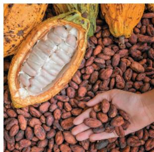

What about lactate production in humans? Previously, we thought that human muscle cells only produced lactate when $O_{2}$ was in short supply, such as during intense exercise. Research done over the last few decades, though, indicates that the lactate story, in mammals at least, is more complicated. There are two types of skeletal muscle fibers. One (red muscle) preferentially oxidizes glucose completely to $CO_{2}$ ; the other (white muscle) produces significant amounts of lactate from the pyruvate made during glycolysis, even under aerobic conditions, offering fast but energetically inefficient ATP production. The lactate product is then mostly oxidized by red muscle cells in the vicinity, with the remainder exported to liver or kidney cells for glucose formation. Because this lactate production is not anaerobic, but the result of glycolysis in these cells, exercise physiologists prefer not to use the term “fermentation.”

During strenuous exercise, when carbohydrate catabolism outpaces the supply of $\mathrm{O}_2$ from the blood to the muscle, lactate can't be oxidized to pyruvate. The lactate that accumulates was once thought to cause muscle fatigue during intense exercise and pain a day or so later. However, research suggests that, contrary to popular opinion, lactate production actually improves performance during exercise! Furthermore, within an hour, excess lactate is shuttled to other tissues for oxidation or to the liver and kidneys for production of glucose or its storage molecule, glycogen. (Next-day muscle soreness is more likely caused by trauma to cells in small muscle fibers, which leads to inflammation and pain.)

## Comparing Fermentation with Anaerobic and Aerobic Respiration

Fermentation, anaerobic respiration, and aerobic respiration are three alternative cellular pathways for producing ATP by harvesting the chemical energy of food. All three use glycolysis to oxidize glucose and other organic fuels to pyruvate, with a net production of 2 ATP by substrate-level phosphorylation. And in all three pathways, NAD $^{+}$ is the oxidizing agent that accepts electrons from food during glycolysis.

A key difference is the contrasting mechanisms for oxidizing NADH back to $NAD^{+}$ , which is required to sustain glycolysis. In fermentation, the final electron acceptor is an organic molecule such as pyruvate (lactic acid fermentation) or acetaldehyde (alcohol fermentation). In cellular respiration, by contrast, electrons carried by NADH are transferred to an electron transport chain, which regenerates the $NAD^{+}$ required for glycolysis.

Another major difference is the amount of ATP produced. Fermentation yields two molecules of ATP, produced by substrate-level phosphorylation. In the absence of an electron transport chain, the energy stored in pyruvate is unavailable. In cellular respiration, however, pyruvate is completely oxidized in the mitochondrion. Most of the chemical energy from this process is shuttled by NADH and $FADH_{2}$ in the form of electrons to the electron transport chain. There, the electrons move stepwise down a series of redox reactions to a final electron acceptor. [In aerobic respiration, the final electron acceptor is $O_{2}$ ; in anaerobic respiration, the final acceptor is another molecule with a high affinity for electrons (and thus a good electron acceptor), although less so than $O_{2}$ .] Stepwise electron transport drives oxidative

Figure 9.17 Pyruvate as a key juncture in catabolism.

Glycolysis is common to fermentation and cellular respiration. The end product of glycolysis, pyruvate, represents a fork in the catabolic pathways of glucose oxidation. In facultative anaerobes, such as yeasts, which are capable of both aerobic cellular respiration and fermentation, pyruvate is committed to one of those two pathways, usually depending on whether or not oxygen is present.

phosphorylation, yielding ATP. Thus, cellular respiration harvests much more energy from each sugar molecule than fermentation can. In fact, aerobic respiration yields up to 32 molecules of ATP per glucose molecule—up to 16 times as much as does fermentation.

Some organisms, called obligate anaerobes, carry out only fermentation or anaerobic respiration. In fact, these organisms cannot survive in the presence of oxygen, some forms of which can actually be toxic if protective systems are not present in the cell. A few cell types, such as cells of the vertebrate brain, can carry out only aerobic oxidation of pyruvate, and need $O_{2}$ to survive. Other organisms, including yeasts and many bacteria, can make enough ATP to survive using either fermentation or respiration. Such species are called facultative anaerobes. In yeast cells, for example, pyruvate is a fork in the metabolic road that leads to two alternative catabolic routes (Figure 9.17). Under aerobic conditions, pyruvate can be converted to acetyl CoA, and oxidation continues in the citric acid cycle via aerobic respiration. Under anaerobic conditions, lactic acid fermentation occurs. Pyruvate is diverted from the citric acid cycle, serving instead as an electron acceptor to recycle $NAD^{+}$ . To make the same amount of ATP, a facultative anaerobe has to consume sugar at a much faster rate when fermenting than when respiring.

## The Evolutionary Significance of Glycolysis

EVOLUTION The role of glycolysis in both fermentation and respiration has an evolutionary basis. Ancient prokaryotic organisms are thought to have used glycolysis to make ATP long before

oxygen was present in Earth's atmosphere. The oldest known fossils of bacteria date back 3.5 billion years, but appreciable quantities of oxygen probably did not begin to accumulate in the atmosphere until about 2.7 billion years ago. Cyanobacteria produced this $\mathrm{O}_2$ as a by-product of photosynthesis. Therefore, early prokaryotic organisms may have generated ATP exclusively from glycolysis. The fact that glycolysis is today the most widespread metabolic pathway among Earth's organisms suggests that it evolved very early in the history of life. The cytosolic location of glycolysis also implies great antiquity; the pathway does not require any of the membrane-enclosed organelles of the eukaryotic cell, which evolved approximately 1 billion years after the first prokaryotic cell. Glycolysis is a metabolic heirloom from early cells that continues to function in fermentation and as the first stage in the breakdown of organic molecules by respiration.

## Concept Check 9.5

1. Consider the NADH formed during glycolysis. What is the final acceptor for its electrons during fermentation? During aerobic respiration? During anaerobic respiration?

2. WHAT IF? A glucose-fed yeast cell is moved from an aerobic environment to an anaerobic one. How would its rate of glucose consumption change if ATP were to be generated at the same rate?

For suggested answers, see Appendix A.

## Concept 9.6: Glycolysis and the citric acid cycle connect to many other metabolic pathways

So far, we have looked at the oxidative breakdown of glucose in isolation from the cell's overall metabolic economy. In this section, you will learn that glycolysis and the citric acid cycle are major intersections of the cell's catabolic (breakdown) and anabolic (biosynthetic) pathways.

## The Versatility of Catabolism

Throughout this chapter, glucose has been used as an example of a fuel for cellular respiration. But free glucose molecules are not common in the diets of humans and other animals. We obtain most of our calories in the form of fats, proteins, and carbohydrates such as sucrose and other disaccharides, and starch, a polysaccharide. All these organic molecules in food can be used by cellular respiration to make ATP (Figure 9.18).

Glycolysis can accept a wide range of carbohydrates for catabolism. In the digestive tract, starch is hydrolyzed to glucose, which is broken down in cells by glycolysis and the citric acid cycle. Glycogen, the polysaccharide that humans and many other animals store in their liver and muscle cells, can be hydrolyzed to glucose between meals as fuel for respiration. Digestion of disaccharides, including sucrose, provides glucose and other monosaccharides as fuel for respiration.

Figure 9.18 The catabolism of various molecules from food. Carbohydrates, fats, and proteins can all be used as fuel for cellular respiration. Monomers of these molecules enter glycolysis or the citric acid cycle at various points. Glycolysis and the citric acid cycle are catabolic funnels through which electrons from all kinds of organic molecules flow on their exergonic fall to oxygen.  

Proteins can also be used for fuel, but first they must be digested to their constituent amino acids. Many of the amino acids are used by the organism to build new proteins. Amino acids present in excess are converted by enzymes to intermediates of glycolysis and the citric acid cycle. Before amino acids can feed into glycolysis or the citric acid cycle, their amino groups must be removed, a process called deamination. The nitrogenous waste is excreted from the animal in the form of ammonia ( $NH_{3}$ ), urea, or other waste products.

Catabolism can also harvest energy stored in fats obtained either from food or from fat cells in the body. After fats are digested to glycerol and fatty acids, the glycerol is converted to glyceraldehyde 3-phosphate, an intermediate of glycolysis. Most of the energy of a fat is stored in the fatty acids. A metabolic sequence called beta oxidation breaks the fatty acids down to two-carbon fragments, which enter the citric acid cycle as acetyl CoA. NADH and FADH $_{2}$ are also generated during beta oxidation; they can enter the electron transport chain, leading to further ATP production. Fats make excellent fuels, in large part due to their chemical structure and the high energy level of their electrons (present in many C—H bonds, equally

shared between C and H) compared to those of carbohydrates. A gram of fat oxidized by respiration produces more than twice as much ATP as a gram of carbohydrate. Unfortunately, this also means that a person trying to lose weight must work hard to use up fat stored in the body because so many calories are stockpiled in each gram of fat.

## Biosynthesis (Anabolic Pathways)

Cells need substance as well as energy. Not all the organic molecules of food are destined to be oxidized as fuel to make ATP. In addition to calories, food must also provide the carbon skeletons that cells require to make their own molecules. Some organic monomers obtained from digestion can be used directly. For example, as previously mentioned, amino acids from the hydrolysis of proteins in food can be incorporated into the organism's own proteins. Often, however, the body needs specific molecules that are not present as such in food. Compounds formed as intermediates of glycolysis and the citric acid cycle can be diverted into anabolic pathways as precursors from which the cell can synthesize the molecules it requires. For example, humans can make about half of the 20 amino acids in proteins by modifying compounds siphoned away from the citric acid cycle; the rest are “essential amino acids” that must be obtained in the diet. Also, glucose can be made from pyruvate, and fatty acids can be synthesized from acetyl CoA. Of course, these anabolic, or biosynthetic, pathways do not generate ATP, but instead consume it.

In addition, glycolysis and the citric acid cycle function as metabolic interchanges that enable our cells to convert some kinds of molecules to others as we need them. For example, an intermediate compound generated during glycolysis, dihydroxyacetone phosphate (see Figure 9.8, step 5), can be converted to one of the major precursors of fats. If we eat more food than we need, we store fat even if our diet is fat-free. Metabolism is remarkably versatile and adaptable.

## Regulation of Cellular Respiration via Feedback Mechanisms

Basic principles of supply and demand regulate the metabolic economy. The cell does not waste energy making more of a particular substance than it needs. If there is a surplus of a certain amino acid, for example, the anabolic pathway that synthesizes that amino acid from an intermediate of the citric acid cycle is switched off. The most common mechanism for this control is feedback inhibition: The end product of the anabolic pathway inhibits the enzyme that catalyzes an early step of the pathway (see Figure 8.21). This prevents the needless diversion of key metabolic intermediates from uses that are more urgent.

The cell also controls its catabolism. If the cell is working hard and its ATP concentration begins to drop, cellular respiration speeds up. When there is plenty of ATP to meet demand, respiration slows down, sparing valuable organic molecules for other functions. Again, control is based mainly on regulating the activity of enzymes at strategic points in the catabolic pathway. As shown in Figure 9.19, one important switch is phosphofructokinase, the enzyme that catalyzes step 3 of glycolysis (see Figure 9.8). That is the first step

Figure 9.19 The control of cellular respiration.

Allosteric enzymes at certain points in the respiratory pathway respond to inhibitors and activators that help set the pace of glycolysis and the citric acid cycle. Phosphofructokinase, which catalyzes an early step in glycolysis (see Figure 9.8, ③ and Figure 6.32b), is one such enzyme. It is stimulated by AMP (derived from ADP) but is inhibited by ATP and by citrate. This feedback regulation adjusts the rate of respiration as the cell's catabolic and anabolic demands change.

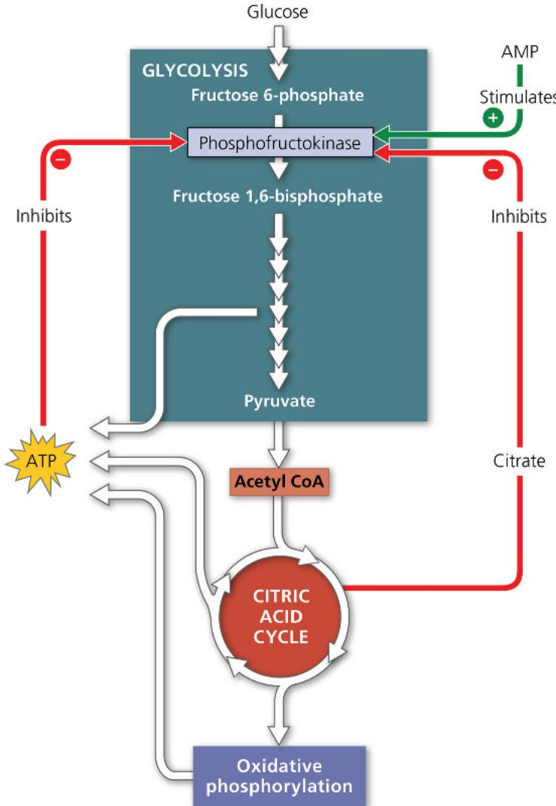

that commits the substrate irreversibly to the glycolytic pathway. By controlling the rate of this step, the cell can speed up or slow down the entire catabolic process. Phosphofructokinase can thus be considered the pacemaker of cellular respiration.

Phosphofructokinase is an allosteric enzyme with receptor sites for specific inhibitors and activators. It is inhibited by ATP and stimulated by AMP (adenosine monophosphate), which the cell derives from ADP. As ATP accumulates, inhibition of the enzyme slows down glycolysis. The enzyme becomes active again as cellular work converts ATP to ADP (and AMP) faster than ATP is being regenerated. Phosphofructokinase is also sensitive to citrate, the first product of the citric acid cycle. If citrate accumulates in mitochondria, some of it passes into the cytosol and inhibits phosphofructokinase. This mechanism helps synchronize the rates of glycolysis and the citric acid cycle. As citrate accumulates, glycolysis slows down, and the supply of

pyruvate and thus acetyl groups to the citric acid cycle decreases. If citrate consumption increases, either because of a demand for more ATP or because anabolic pathways are draining off intermediates of the citric acid cycle, glycolysis accelerates and meets the demand. Metabolic balance is augmented by the control of enzymes that catalyze other key steps of glycolysis and the citric acid cycle. Cells are thrifty, expedient, and responsive in their metabolism.

Review the first page of this chapter to put cellular respiration into the broader context of energy flow and chemical cycling in ecosystems. The energy that keeps us alive is released, not produced, by cellular respiration. We are tapping energy that was stored in food by photosynthesis, which captures light and converts it to chemical energy, a process you will learn about next, in Chapter 10.

## Chapter 9 Review

## Summary of Key Concepts

To review key terms, go to the Vocabulary Self-Quiz (eTextbook only).

Concept 9.1: Catabolic pathways yield energy by oxidizing organic fuels

\- Cells break down glucose and other organic fuels to yield chemical energy in the form of ATP. Fermentation is a process that results in the partial degradation of glucose without the use of oxygen ( $O_{2}$ ). The process of cellular respiration is a more complete breakdown of glucose. In aerobic respiration, $O_{2}$ is used as a reactant; in anaerobic respiration, other substances are used in place of $O_{2}$ .

\- The cell taps the energy stored in food molecules through redox reactions, in which one substance partially or totally shifts electrons to another. Oxidation is the total or partial loss of electrons, while reduction is the total or partial addition of electrons. During aerobic respiration, glucose $\left(\mathrm{C}_{6}\mathrm{H}_{12}\mathrm{O}_{6}\right)$ is oxidized to $CO_{2}$ , and $O_{2}$ is reduced to $H_{2}O$ :

$$
\mathrm{C} _ {6} \mathrm{H} _ {1 2} \mathrm{O} _ {6} + 6 \mathrm{O} _ {2} \longrightarrow 6 \mathrm{CO} _ {2} + 6 \mathrm{H} _ {2} \mathrm{O} + \text {   becomes   oxidized   } \text {   becomes   reduced   }
$$

\- Electrons lose potential energy during their transfer from glucose or other organic compounds to $O_{2}$ . Electrons are usually passed first to $NAD^{+}$ , reducing it to NADH, and are then passed from NADH to an electron transport chain, which conducts the electrons to $O_{2}$ in energy-releasing steps. The energy that is released is used to make ATP.

\- Aerobic respiration occurs in three stages: (1) glycolysis, (2) pyruvate oxidation and the citric acid cycle, and (3) oxidative phosphorylation (electron transport and chemiosmosis).

Describe the difference between the two processes in cellular respiration that produce ATP: oxidative phosphorylation and substrate-level phosphorylation.

## Concept Check 9.6

1. MAKE CONNECTIONS Compare the structures of a carbohydrate and a fat (see Figures 5.3 and 5.9). What features make fat a much better fuel?

2. Under what circumstances might your body synthesize fat molecules?

3. VISUAL SKILLS What will happen in a muscle cell that has used up its supply of $O_{2}$ and ATP? (Review Figures 9.17 and 9.19.)

4. VISUAL SKILLS During intense exercise, can a muscle cell use fat as a concentrated source of chemical energy? Explain. (Review Figures 9.17 and 9.18.)

For suggested answers, see Appendix A.

## Concept 9.2: Glycolysis harvests chemical energy by oxidizing glucose to pyruvate

\- Glycolysis (“splitting of sugar”) is a series of reactions that breaks down glucose into two pyruvate molecules, which may go on to enter the citric acid cycle, and nets 2 ATP and 2 NADH per glucose molecule.

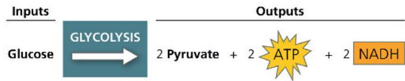  
Which reactions in glycolysis are the source of energy for the formation of ATP and NADH?

Concept 9.3: After pyruvate is oxidized, the citric acid cycle completes the energy-yielding oxidation of organic molecules

\- In eukaryotic cells, pyruvate enters the mitochondrion and is oxidized to acetyl CoA, which is further oxidized in the citric acid cycle.

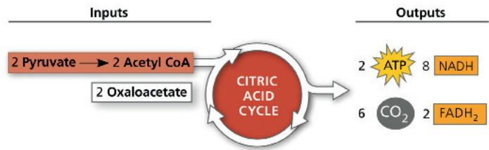  
What molecular products indicate the complete oxidation of glucose during cellular respiration?

## Concept 9.4: During oxidative phosphorylation, chemiosmosis couples electron transport to ATP synthesis

\- NADH and $FADH_{2}$ transfer electrons to the electron transport chain. Electrons move down the chain, losing energy in several energy-releasing steps. Finally, electrons are passed to $O_{2}$ , reducing it to $H_{2}O$ .

  
MITOCHONDRIAL MATRIX  
(carrying electrons from food)

\- Along the electron transport chain, electron transfer causes protein complexes to move $H^{+}$ from the mitochondrial matrix (in eukaryotes) to the intermembrane space, storing energy as a proton-motive force ( $H^{+}$ gradient). As $H^{+}$ diffuses back into the matrix through ATP synthase, its passage drives the phosphorylation of ADP to form ATP, called chemiosmosis.

\- About 34% of the energy stored in a glucose molecule is transferred to ATP during cellular

respiration, producing a maximum of about 32 ATP.

Briefly explain the mechanism by which ATP synthase produces ATP. List three locations in which ATP synthases are found.

## Concept 9.5: Fermentation and anaerobic respiration enable cells to produce ATP without the use of oxygen

\- Glycolysis nets 2 ATP by substrate-level phosphorylation, whether $O_{2}$ is present or not. Under anaerobic conditions, anaerobic respiration or fermentation can take place. In anaerobic respiration, an electron transport chain is present with a final electron acceptor other than oxygen. In fermentation, the electrons from NADH are passed to pyruvate or a derivative of pyruvate, regenerating the $NAD^{+}$ required to oxidize more glucose. Two common types of fermentation are alcohol fermentation and lactic acid fermentation.

\- Fermentation, anaerobic respiration, and aerobic respiration all use glycolysis to oxidize glucose, but they differ in their final electron acceptor and whether an electron transport chain is used (respiration) or not (fermentation). Respiration yields more ATP; aerobic respiration, with $O_{2}$ as the final

electron acceptor, yields about 16 times as much ATP as does fermentation.

\- Glycolysis occurs in nearly all organisms and is thought to have evolved in ancient prokaryotic species before there was $O_{2}$ in the atmosphere.

Which process yields more ATP, fermentation or anaerobic respiration? Explain.

## Concept 9.6: Glycolysis and the citric acid cycle connect to many other metabolic pathways

\- Catabolic pathways funnel electrons from many kinds of organic molecules into cellular respiration. Many carbohydrates can enter glycolysis, most often after conversion to glucose. Amino acids of proteins must be deaminated before being oxidized. The fatty acids of fats undergo beta oxidation to two-carbon fragments and then enter the citric acid cycle as acetyl CoA. Anabolic pathways can use small molecules from food directly or build other substances using intermediates of glycolysis or the citric acid cycle.

\- Cellular respiration is controlled by allosteric enzymes at key points in glycolysis and the citric acid cycle.

Describe how the catabolic pathways of glycolysis and the citric acid cycle intersect with anabolic pathways in the metabolism of a cell.

For suggested answers, see Appendix A.

## Test Your Understanding

For more multiple-choice questions, go to the Practice Test (eTextbook only).

## Levels 1-2: Remembering/Understanding

1. The immediate energy source that drives ATP synthesis by ATP synthase during oxidative phosphorylation is the

(A) oxidation of glucose and other organic compounds.

(B) flow of electrons down the electron transport chain.

(C) $H^{+}$ concentration gradient across the membrane holding ATP synthase.

(D) transfer of phosphate to ADP.

2. Which metabolic pathway is common to both fermentation and cellular respiration of a glucose molecule?

(A) the citric acid cycle

(B) the electron transport chain

(C) glycolysis

(D) reduction of pyruvate to lactate

3. The final electron acceptor of the electron transport chain that functions in aerobic oxidative phosphorylation is

(A) $O_{2}$ .

(B) water.

(C) $NAD^{+}$ .

(D) pyruvate.

4. In mitochondria, exergonic redox reactions

(A) are the source of energy driving prokaryotic ATP synthesis.

(B) provide the energy that establishes the proton gradient.

(C) reduce carbon atoms to carbon dioxide.

(D) are coupled via phosphorylated intermediates to endergonic processes.

## Levels 3-4: Applying/Analyzing

5. What is the oxidizing agent in the following reaction?
Pyruvate + NADH + H $^{+}$ → Lactate + NAD $^{+}$ (A) oxygen
(B) NADH
(C) lactate
(D) pyruvate

6. When electrons flow along the electron transport chains of mitochondria, which of the following changes occurs?
(A) The pH of the matrix increases.

(B) ATP synthase pumps protons by active transport.

(C) The electrons gain free energy.

(D) $NAD^{+}$ is oxidized.

7. Most $\mathrm{CO}_{2}$ from catabolism is released during (A) glycolysis. (B) the citric acid cycle. (C) lactate fermentation. (D) electron transport.

8. MAKE CONNECTIONS Step 3 in Figure 9.8 is a major point of regulation of glycolysis. The enzyme phosphofructokinase is allosterically regulated by ATP and related molecules (see Concept 8.5). Considering the overall result of glycolysis, would you expect ATP to inhibit or stimulate activity of this enzyme? Explain. (Hint: Make sure you consider the role of ATP as an allosteric regulator, not as a substrate of the enzyme.)

9. MAKE CONNECTIONS The proton pump shown in Figures 7.18 and 7.19 is a type of ATP synthase like that in Figure 9.13. Compare the processes shown in the three figures, and say whether they are involved in active or passive transport (see also Concepts 7.3 and 7.4).

10. VISUAL SKILLS This computer model shows the four parts of ATP synthase, each part consisting of a number of polypeptide subunits (the solid gray part is still an area of active research). Using Figure 9.13 as a guide, label the rotor, stator, internal rod, and catalytic knob of this molecular motor.

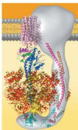

## Levels 5-6: Evaluating/Creating

## 11. INTERPRET THE DATA

Phosphofructokinase is an enzyme that acts on fructose 6-phosphate at an early step in glucose breakdown. Regulation of this enzyme controls whether the sugar will continue on in the glycolytic pathway. Considering this graph, under which condition is phosphofructokinase more active? Given what you know about

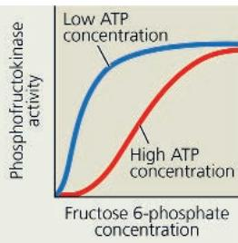

glycolysis and regulation of metabolism by this enzyme, explain the mechanism by which phosphofructokinase activity differs depending on ATP concentration. Explain why it makes sense that regulation of this enzyme has evolved so that it works this way.

12. DRAW IT The graph here shows the pH difference across the inner mitochondrial membrane over time in an actively respiring cell. At the time indicated by the vertical arrow, a metabolic poison is added that specifically and completely inhibits all function of mitochondrial ATP synthase. Draw what you would expect to see for the rest of the

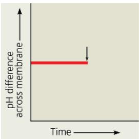

graphed line over the next short period of time. Explain.

13. EVOLUTION CONNECTION ATP synthases are found in the prokaryotic plasma membrane and in mitochondria and chloroplasts. (a) Propose a hypothesis to account for an evolutionary relationship of these eukaryotic organelles and prokaryotic species. (b) Explain how the amino acid sequences of the ATP synthases from the different sources might either support or fail to support your hypothesis.

14. SCIENTIFIC INQUIRY In the 1930s, some physicians prescribed low doses of a compound called dinitrophenol (DNP) to help patients lose weight. This unsafe method was abandoned after some patients died. DNP uncouples the chemiosmotic machinery by making the lipid bilayer of the inner mitochondrial membrane leaky to $H^{+}$ . Explain how this could cause weight loss and death.

15. WRITE ABOUT A THEME: ORGANIZATION In a short essay (100–150 words), explain how oxidative phosphorylation—production of ATP using energy from the redox reactions of a spatially organized electron transport chain followed by chemiosmosis—is an example of how new properties emerge at each level of the biological hierarchy.

## 16. SYNTHESIZE YOUR KNOWLEDGE

Coenzyme Q (CoQ) is sold as a nutritional supplement. One company uses this marketing slogan for CoQ: "Give your heart the fuel it craves most." Considering the role of coenzyme Q, critique this claim. How do you think this product might function to benefit the heart? Is CoQ used as a "fuel" during cellular respiration?

For selected answers, see Appendix A.

