# 第10章 Photosynthesis

<!-- 章节边界按正文内容恢复；原始 MinerU 内容保留如下。 -->

# Photosynthesis

## Key Concepts

10.1 Photosynthesis feeds the biosphere
10.2 Photosynthesis converts light energy to the chemical energy of food

10.3 The light reactions convert solar energy to the chemical energy of ATP and NADPH

10.4 The Calvin cycle uses the chemical energy of ATP and NADPH to reduce $CO_{2}$ to sugar

10.5 Alternative mechanisms of carbon fixation have evolved in hot, arid climates

10.6 Photosynthesis is essential for life on Earth: A review

## Study Tip

Make a visual study guide: Draw a cell with a large chloroplast, labeling the parts of the chloroplast. As you go through the chapter, add key reactions for each stage of photosynthesis, linking the stages together. Label the carbon molecule(s) with the most energy and the carbon molecule(s) with the least energy.

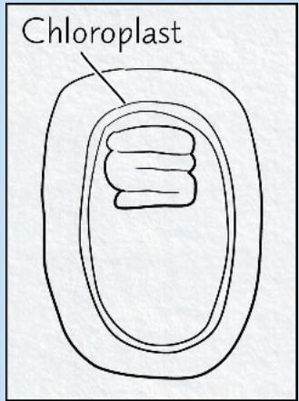

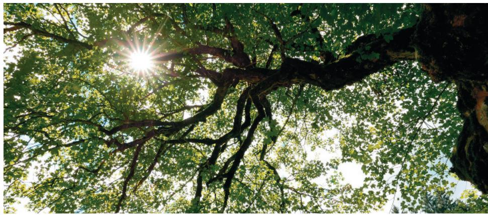  
Figure 10.1 Each leaf of this tree is harvesting energy from sunlight and using it to convert $CO_{2}$ and $H_{2}O$ into chemical energy stored in sugar and other organic molecules. The tree uses these sugars for energy and to build its own trunk, branches, and leaves. Remarkably, enough sugars are left over to feed other organisms (like moth larvae, shown below) that cannot carry out this extraordinary transformation.

How do photosynthetic cells use light to change carbon dioxide and water into organic molecules and oxygen?  
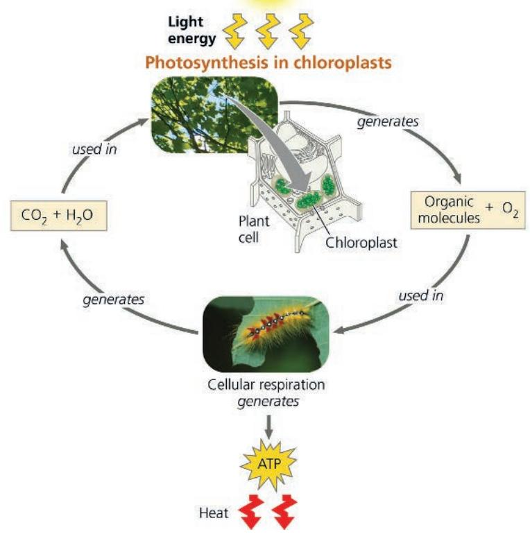

# Concept 10.1: Photosynthesis feeds the biosphere

The conversion process that transforms the energy of sunlight into chemical energy stored in sugars and other organic molecules is called photosynthesis. Let's begin by placing photosynthesis in its ecological context.

Photosynthesis nourishes almost the entire living world directly or indirectly. An organism acquires the organic compounds it uses for energy and carbon skeletons by one of two major modes: autotrophic nutrition or heterotrophic nutrition. Autotrophs are “self-feeders” (auto- means “self,” and trophos means “feeder”); they sustain themselves without eating anything derived from other living beings. Autotrophs produce their organic molecules from $CO_{2}$ and other inorganic raw materials obtained from the environment. They are the ultimate sources of organic compounds for all nonautotrophic organisms, and for this reason, biologists refer to autotrophs as the producers of the biosphere.

Almost all plants are autotrophs; the only nutrients they require are water and minerals from the soil and $CO_{2}$ from the air. Specifically, plants are photoautotrophs, organisms that use light as a source of energy to synthesize organic substances (Figure 10.1). Photosynthesis also occurs in seaweeds (multicellular algae) and certain prokaryotic and unicellular eukaryotic organisms (Figure 10.2). In this chapter, we will touch on these other groups in passing, but our emphasis will be on plants. Variations in autotrophic nutrition that occur in prokaryotic organisms will be described in Concept 27.3.

Heterotrophs are unable to make their own food; they live on compounds produced by other organisms (hetero- means “other”). Heterotrophs are the biosphere’s consumers. The most obvious “other-feeding” occurs when an animal eats plants or other organisms, but heterotrophic nutrition may be more subtle. Some heterotrophs consume the remains of other organisms and organic litter such as feces, and fallen leaves; these types of heterotrophs are known as decomposers. Most fungi and many types of prokaryotic organisms get their nourishment this way. Earth’s supply of fossil fuels was formed from remains of organisms that died hundreds of millions of years ago. In a sense, then, fossil fuels represent stores of the sun’s energy from the distant past. Almost all heterotrophs, including humans, are completely dependent, either directly or indirectly, on photoautotrophs for food—and also for oxygen, a by-product of photosynthesis.

## Concept Check 10.1

1. Why are heterotrophs dependent on autotrophs?

2. WHAT IF? Fossil fuels are being depleted faster than they are replenished. Therefore, researchers are developing ways to produce "biodiesel" from the products of photosynthetic algae. They have proposed placing containers of these algae near industrial plants or highly congested city streets. Considering the process of photosynthesis, how does this arrangement make sense?

For suggested answers, see Appendix A.

## Figure 10.2 Photoautotrophs.

These organisms use light energy to drive the synthesis of organic molecules from carbon dioxide and (in most cases) water. They feed themselves and the entire living world. On land, (a) plants are the predominant producers of food. In aquatic environments, photoautotrophs include unicellular and (b) multicellular algae, such as this kelp; (c) some other unicellular eukaryotes, such as Euglena; (d) cyanobacteria; and (e) other photosynthetic bacteria, such as these purple sulfur bacteria, which produce sulfur (the yellow globules within the cells) (c–e, LMs).

  
(a) Plants

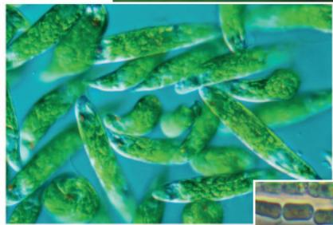  
(b) Multicellular alga  
10 μm  
(c) Unicellular protists

  
(d) Cyanobacteria $\overline{20\ \mu m}$  
1μm  
(e) Purple sulfur bacteria

# Concept 10.2: Photosynthesis converts light energy to the chemical energy of food

The remarkable ability of an organism to harness light energy and use it to drive the synthesis of organic compounds emerges from structural organization in the cell: Photosynthetic enzymes and other molecules are grouped together as specialized molecular complexes in a biological membrane, enabling the necessary series of chemical reactions to be carried out efficiently. The process of photosynthesis most likely originated in a group of bacteria that had infolded regions of the plasma membrane containing clusters of such molecules. In currently existing photosynthetic bacteria, infolded photosynthetic membranes function similarly to the internal membranes of the chloroplast, the eukaryotic organelle that absorbs energy from sunlight and uses it to drive the synthesis of organic compounds from carbon dioxide ( $CO_{2}$ ) and water ( $H_{2}O$ ). According to what has come to be known as the endosymbiont theory, the original chloroplast was a photosynthetic bacterium that lived inside an ancestor of eukaryotic cells. (You learned about this theory in Concept 6.5, and it will be described more fully in Concept 25.3.) Chloroplasts are present in a variety of photosynthesizing organisms (see some examples in Figure 10.2); in this chapter, we focus on chloroplasts in plants, while mentioning prokaryotic organisms from time to time.

## Chloroplasts: The Sites of Photosynthesis in Plants

All green parts of a plant, including green stems and unripened fruit, have chloroplasts, but the leaves are the major sites of photosynthesis in most plants (Figure 10.3). There are about half a million chloroplasts in a chunk of leaf with a top surface area of $1 \, mm^2$ . Chloroplasts are found mainly in the cells of the mesophyll, the tissue in the interior of the leaf. $CO_2$ enters the leaf, and $O_2$ exits, by way of microscopic pores called stomata (singular, stoma; from the Greek, meaning “mouth”). Water absorbed by the roots is delivered to the leaves in veins. Leaves also use veins to export sugar to roots and other nonphotosynthetic parts of the plant.

A typical mesophyll cell has about 30–40 chloroplasts, each measuring about 2–4 $\mu$ m by 4–7 $\mu$ m. A chloroplast has two membranes surrounding a dense fluid called the stroma. Suspended within the stroma is a third membrane system, made up of sacs called thylakoids, which segregates the stroma from the thylakoid space inside these sacs. In some places, thylakoid sacs are stacked in columns called grana (singular, granum).

Chlorophyll, the green pigment that gives leaves their color, resides in the thylakoid membranes of the chloroplast. (The internal photosynthetic membranes of some prokaryotic organisms are also called thylakoid membranes; see Figure 27.8b.) It is the light energy absorbed by chlorophyll that drives the synthesis of organic molecules in the chloroplast. Now that we have looked at the sites of photosynthesis in plants, we are ready to look more closely at the process itself.

Figure 10.3 Zooming in on the location of photosynthesis in a plant. Leaves are the major organs of photosynthesis in plants. These images take you into a leaf, then into a cell, and finally into a chloroplast, the organelle where photosynthesis occurs (middle, LM; bottom, TEM).  
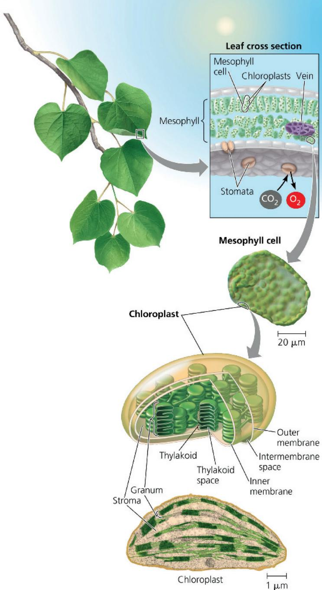

## Tracking Atoms Through Photosynthesis

Scientists have tried for centuries to piece together the process by which plants make food. Although some of the steps are still not completely understood, the overall photosynthetic equation has been known since the 1800s: In the presence of light, the green parts of plants produce organic compounds and $O_{2}$ from $CO_{2}$ and $H_{2}O$ . We can summarize the complex series of chemical reactions in photosynthesis with this chemical equation:

$$
6 \mathrm{CO} _ {2} + 1 2 \mathrm{H} _ {2} \mathrm{O} + \text { Light   energy } \rightarrow \mathrm{C} _ {6} \mathrm{H} _ {1 2} \mathrm{O} _ {6} + 6 \mathrm{O} _ {2} + 6 \mathrm{H} _ {2} \mathrm{O}
$$

We use glucose $\left(\mathrm{C}_{6}\mathrm{H}_{12}\mathrm{O}_{6}\right)$ here to simplify the relationship between photosynthesis and respiration, but the direct product of photosynthesis is actually a three-carbon sugar that can be used to make glucose. Water appears on both sides of the equation because 12 molecules are consumed and 6 molecules are newly formed during photosynthesis. We can simplify the equation by indicating only the net consumption of water:

$$
6 \mathrm{CO} _ {2} + 6 \mathrm{H} _ {2} \mathrm{O} + \text {   Light   energy   } \rightarrow \mathrm{C} _ {6} \mathrm{H} _ {1 2} \mathrm{O} _ {6} + 6 \mathrm{O} _ {2}
$$

Writing the equation in this form, we can see that the overall chemical change during photosynthesis is the reverse of the one that occurs during cellular respiration (see Concept 9.1). It is important to realize that both of these metabolic processes occur in plant cells. However, as you will soon learn, chloroplasts do not synthesize sugars by simply reversing the steps of respiration.

Now let's divide the photosynthetic equation by 6 to put it in its simplest possible form:

$$
\mathrm{CO} _ {2} + \mathrm{H} _ {2} \mathrm{O} \rightarrow [ \mathrm{CH} _ {2} \mathrm{O} ] + \mathrm{O} _ {2}
$$

Here, the brackets indicate that $CH_{2}O$ is not an actual sugar but represents the general formula for a carbohydrate (see Concept 5.2). In other words, we are imagining the synthesis of a sugar molecule one carbon at a time (with six repetitions theoretically adding up to a glucose molecule: $C_{6}H_{12}O_{6}$ ). Let's now see how researchers tracked the elements C, H, and O from the reactants of photosynthesis to the products.

## The Splitting of Water: Scientific Inquiry

One of the first clues to the mechanism of photosynthesis came from the discovery that the $O_{2}$ given off by plants is derived from $H_{2}O$ and not from $CO_{2}$ . The chloroplast splits water into hydrogen and oxygen atoms. Before this discovery, the prevailing hypothesis was that photosynthesis split carbon dioxide ( $CO_{2} \rightarrow C + O_{2}$ ) and then added water to the carbon ( $C + H_{2}O \rightarrow [CH_{2}O]$ ). That hypothesis predicted that the $O_{2}$ released during photosynthesis came from $CO_{2}$ , an idea challenged in the 1930s by C. B. van Niel, of Stanford University. Van Niel was investigating photosynthesis in bacteria that make their carbohydrate from $CO_{2}$ but do not release $O_{2}$ . He concluded that, at least in these bacteria, $CO_{2}$ is not split into carbon and oxygen. One group of bacteria used hydrogen sulfide ( $H_{2}S$ ) rather than water for photosynthesis, forming yellow globules of sulfur as a waste product (these globules are visible in Figure 10.2e). Here is the chemical equation for photosynthesis in these sulfur bacteria:

$$
\mathrm{CO} _ {2} + 2 \mathrm{H} _ {2} \mathrm{S} \rightarrow [ \mathrm{CH} _ {2} \mathrm{O} ] + \mathrm{H} _ {2} \mathrm{O} + 2 \mathrm{S}
$$

Van Niel reasoned that the bacteria split $H_{2}S$ and used the hydrogen atoms to make sugar. He then generalized that idea, proposing that all photosynthetic organisms require a hydrogen source but that the source varies:

$$
\begin{array}{r l}\text { Sulfur   bacteria: }&\mathrm{CO} _ {2} + 2 \mathrm{H} _ {2} \mathrm{S} \rightarrow [ \mathrm{CH} _ {2} \mathrm{O} ] + \mathrm{H} _ {2} \mathrm{O} + 2 \mathrm{S}\\\text { Plants: }&\mathrm{CO} _ {2} + 2 \mathrm{H} _ {2} \mathrm{O} \rightarrow [ \mathrm{CH} _ {2} \mathrm{O} ] + \mathrm{H} _ {2} \mathrm{O} + \mathrm{O} _ {2}\\\text { General: }&\mathrm{CO} _ {2} + 2 \mathrm{H} _ {2} \mathrm{X} \rightarrow [ \mathrm{CH} _ {2} \mathrm{O} ] + \mathrm{H} _ {2} \mathrm{O} + 2 \mathrm{X}\end{array}
$$

Thus, van Niel hypothesized that plants split $H_{2}O$ as a source of electrons from hydrogen atoms, releasing $O_{2}$ as a by-product.

Figure 10.4 Tracking atoms through photosynthesis.
The atoms from $CO_{2}$ are shown in magenta (solid arrows), and the atoms from $H_{2}O$ are shown in blue (dashed arrows).  

Nearly 20 years later, scientists confirmed van Niel's hypothesis by using oxygen-18 ( $^{18}$ O), a heavy isotope, as a tracer to follow the path of oxygen atoms during photosynthesis. The experiments showed that the O $_{2}$ produced by plants was labeled with $^{18}$ O only if water was the source of the tracer (experiment 1). If the $^{18}$ O was introduced to the plant in the form of CO $_{2}$ , the label did not turn up in the released O $_{2}$ (experiment 2). In the following summary, bold green type denotes labeled atoms of oxygen ( $^{18}$ O):

$$
\begin{array}{l}\text {Experiment 1:} \quad \mathrm{CO} _ {2} + 2 \mathrm{H} _ {2} \mathbf {O} \rightarrow [ \mathrm{CH} _ {2} \mathrm{O} ] + \mathrm{H} _ {2} \mathrm{O} + \mathbf {O} _ {2}\\\text {Experiment 2:} \quad \mathrm{CO} _ {2} + 2 \mathrm{H} _ {2} \mathrm{O} \rightarrow [ \mathrm{CH} _ {2} \mathbf {O} ] + \mathrm{H} _ {2} \mathbf {O} + \mathrm{O} _ {2}\end{array}
$$

A significant result of the shuffling of atoms during photosynthesis is the extraction of hydrogen from water and its incorporation into sugar. The waste product of photosynthesis, $O_{2}$ , is released to the atmosphere. Figure 10.4 shows the fates of all atoms in photosynthesis.

## Photosynthesis as a Redox Process

Let's briefly compare photosynthesis with cellular respiration. Both processes involve redox reactions. During cellular respiration, energy is released from sugar when electrons associated with hydrogen are transported by carriers to oxygen, forming water as a by-product (see Concept 9.1). The electrons lose potential energy as they "fall" down the electron transport chain toward electro-negative oxygen, and the mitochondrion harnesses that energy to synthesize ATP (see Figure 9.14). Photosynthesis reverses the direction of electron flow. Water is split, and its electrons are transferred along with hydrogen ions $(\mathrm{H}^{+})$ from the water to carbon dioxide, reducing it to sugar.

Because the electrons increase in potential energy as they move from water to sugar, this process requires energy—in other words, it is endergonic. This energy boost that occurs during photosynthesis is provided by light.

## The Two Stages of Photosynthesis: A Preview

The equation for photosynthesis is a deceptively simple summary of a very complex process. Actually, photosynthesis is not a single process, but two processes, each of which has multiple

## Figure 10.5 An overview of photosynthesis: cooperation of the light reactions and the Calvin cycle.

In the chloroplast, the thylakoid membranes (green) are the sites of the light reactions, whereas the Calvin cycle occurs in the stroma (gray). The light reactions use solar energy to make ATP and NADPH, which supply chemical energy and reducing power, respectively, to the Calvin cycle. The Calvin cycle incorporates $CO_{2}$ into organic molecules, which are converted to sugar. (Recall that most simple sugars have formulas that are some multiple of $CH_{2}O$ .) To visualize these processes in their cellular context, see Figure 6.32.

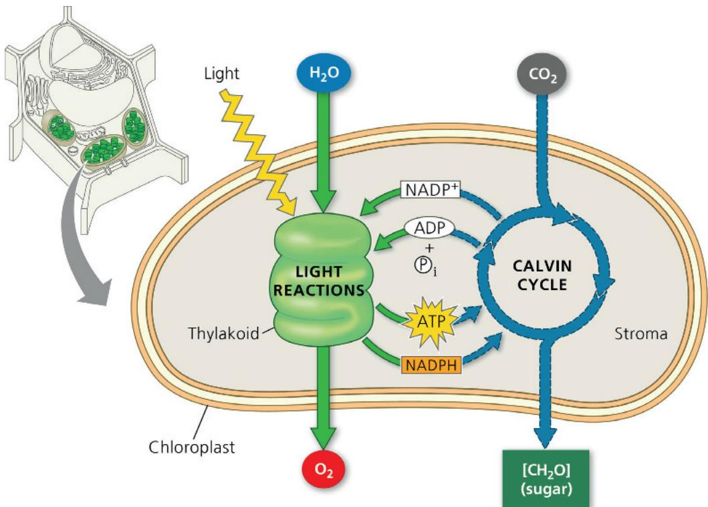

steps. These two stages of photosynthesis are known as the light reactions (the photo part of photosynthesis) and the Calvin cycle (the synthesis part) (Figure 10.5).

The light reactions are the steps of photosynthesis that convert solar energy to chemical energy. Water is split, providing a source of hydrogen atoms, each consisting of an electron and a proton ( $H^{+}$ , a hydrogen ion) and giving off $O_{2}$ as a by-product. Light absorbed by chlorophyll drives a transfer of the electrons and hydrogen ions from water to an acceptor called $NADP^{+}$ (nicotinamide adenine dinucleotide phosphate), where they are temporarily stored. (The electron acceptor $NADP^{+}$ is first cousin to $NAD^{+}$ , which functions as an electron carrier in cellular respiration; the two molecules differ only by the presence of an extra phosphate group in the $NADP^{+}$ molecule.) The light reactions use solar energy to reduce $NADP^{+}$ to NADPH by adding a pair of electrons along with an $H^{+}$ . The light reactions also generate ATP, using chemiosmosis to power the addition of a phosphate group to ADP, a process called photophosphorylation. Thus, light energy is initially converted to chemical energy in the form of two compounds: NADPH and ATP. NADPH, a source of electrons, acts as “reducing power” that can be passed along to an electron acceptor, reducing it, while ATP is the versatile energy currency of cells. Notice that the light reactions produce no sugar; that happens in the second stage of photosynthesis, the Calvin cycle.

The Calvin cycle is named for Melvin Calvin, who, along with his colleagues James Bassham and Andrew Benson, began to elucidate its steps in the late 1940s. The cycle begins by incorporating $CO_{2}$ from the air into organic molecules already present in the chloroplast. This initial incorporation of carbon into organic compounds is known as carbon fixation. The Calvin cycle then reduces the fixed carbon to carbohydrate by the addition of electrons. The reducing power is provided by NADPH, which acquired its cargo of electrons in the light reactions. To convert $CO_{2}$ to carbohydrate, the Calvin cycle also

requires chemical energy in the form of ATP, which is also generated by the light reactions. Thus, it is the Calvin cycle that makes sugar, but it can do so only with the help of the NADPH and ATP produced by the light reactions. The metabolic steps of the Calvin cycle are sometimes referred to as the dark reactions, or light-independent reactions, because none of the steps requires light directly. Nevertheless, the Calvin cycle in most plants occurs during daylight, for only then can the light reactions provide the NADPH and ATP that the Calvin cycle requires. In essence, the chloroplast uses light energy to make sugar by coordinating the two stages of photosynthesis.

As Figure 10.5 indicates, the thylakoids of the chloroplast are the sites of the light reactions, while the Calvin cycle occurs in the stroma. On the outside of the thylakoids, during the light reactions, molecules of NADP $^{+}$ and ADP pick up electrons and phosphate, respectively, and NADPH and ATP are then released to the stroma, where they play crucial roles in the Calvin cycle. The two stages of photosynthesis are treated in this figure as metabolic modules that take in ingredients and crank out products. In the next two sections, we’ll look more closely at how the two stages work, beginning with the light reactions.

## Concept Check 10.2

1. MAKE CONNECTIONS How do the $CO_{2}$ molecules used in photosynthesis reach and enter the chloroplasts inside leaf cells? (See Concept 7.2.)

2. Explain how the use of an oxygen isotope helped elucidate the chemistry of photosynthesis.

3. WHAT IF? The Calvin cycle requires ATP and NADPH, products of the light reactions. If a classmate asserted that the light reactions don't depend on the Calvin cycle and, with continual light, could just keep on producing ATP and NADPH, how would you respond?

## Concept 10.3: The light reactions convert solar energy to the chemical energy of ATP and NADPH

Chloroplasts are chemical factories powered by the sun. Their thylakoids transform light energy into the chemical energy of ATP and NADPH. To better understand the conversion of light to chemical energy, we need to know about some important properties of light.

## The Nature of Sunlight

Light is a form of energy known as electromagnetic energy, also called electromagnetic radiation. Electromagnetic energy travels in rhythmic waves analogous to those created by dropping a pebble into a pond. Electromagnetic waves, however, are disturbances of electric and magnetic fields rather than disturbances of a material medium such as water.

The distance between the crests of electromagnetic waves is called the wavelength. Wavelengths range from less than a nanometer (for gamma rays) to more than a kilometer (for radio waves). This entire range of radiation is known as the electromagnetic spectrum (Figure 10.6). The segment most important to life is the narrow band from about 380 nm to 740 nm in wavelength. This radiation is known as visible light because it can be detected as various colors by the human eye.

The model of light as waves explains many of light's properties, but in certain respects light behaves as though it consists of discrete particles, called photons. Photons are not tangible objects, but they act like objects in that each of them has a fixed quantity of energy. The amount of energy is inversely related to the wavelength of the light: The shorter the wavelength, the greater the energy of each photon of that light. Thus, a photon of violet light packs nearly twice as much energy as a photon of red light (see Figure 10.6).

Figure 10.6 The electromagnetic spectrum.  
White light is a mixture of all wavelengths of visible light. A prism can sort white light into its component colors by bending light of different wavelengths at different angles. (Droplets of water in the atmosphere can act as prisms, causing a rainbow to form.) Visible light drives photosynthesis.  
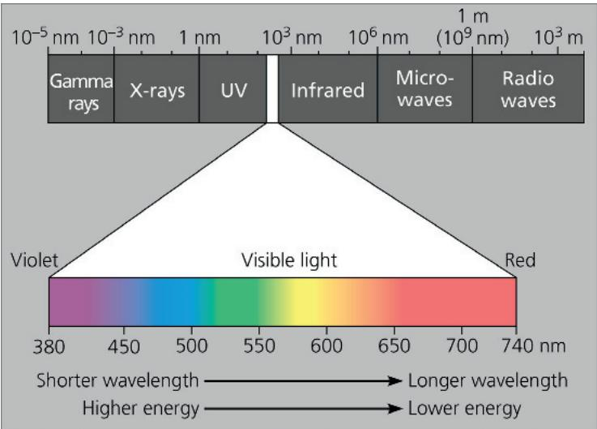  
Figure 10.7 Why leaves are green: interaction of light with chloroplasts.  
The chlorophyll molecules of chloroplasts absorb violet-blue and red light (the colors most effective in driving photosynthesis) and reflect or transmit green light. This is why leaves appear green.

Although the sun radiates the full spectrum of electromagnetic energy, the atmosphere acts like a selective window, allowing visible light to pass through while screening out a substantial fraction of other radiation. The part of the spectrum we can see—visible light—is also the radiation that drives photosynthesis.

## Photosynthetic Pigments: The Light Receptors

When light meets matter, it may be reflected, transmitted, or absorbed. Substances that absorb visible light are known as pigments. Different pigments absorb light of different wavelengths, and the wavelengths that are absorbed disappear. If a pigment is illuminated with white light, the color we see is the color most reflected or transmitted by the pigment. (If a pigment absorbs all wavelengths, it appears black.) We see green when we look at a leaf because chlorophyll absorbs violet-blue and red light while transmitting and reflecting green light (Figure 10.7). The ability of a pigment to absorb various wavelengths of light can be measured with an instrument called a spectrophotometer. This machine directs beams of light of different wavelengths through a solution of the pigment and measures the fraction of the light transmitted at each wavelength. A graph plotting a pigment's light absorption versus wavelength is called an absorption spectrum (Figure 10.8).

## Figure 10.8

# Research Method: Determining an Absorption Spectrum

## Application

An absorption spectrum is a visual representation of how well a particular pigment absorbs different wavelengths of visible light. Absorption spectra of various chloroplast pigments help scientists decipher the role of each pigment in a plant.

## Technique

A spectrophotometer measures the relative amounts of light of different wavelengths absorbed and transmitted by a pigment solution.

① White light is separated into colors (wavelengths) by a prism.
② One by one, the different colors of light are passed through the sample (chlorophyll in this example). Green light and blue light are shown here.

3 The transmitted light strikes a photoelectric tube, which converts the light energy to electricity.

4 The electric current is measured by a galvanometer. The meter indicates the fraction of light transmitted through the sample, from which we can determine the amount of light absorbed.

## Results

See Figure 10.9a for absorption spectra of three types of chloroplast pigments.

## Figure 10.9

## Inquiry: Which wavelengths of light are most effective in driving photosynthesis?

## Experiment and Results

Absorption and action spectra, along with a classic experiment by Theodor W. Engelmann, reveal which wavelengths of light are photosynthetically important.

  
(a) Absorption spectra. The three curves show the wavelengths of light best absorbed by three types of chloroplast pigments.

  
(b) Action spectrum. This graph plots the rate of photosynthesis versus wavelength. The resulting action spectrum resembles the absorption spectrum for chlorophyll a but does not match exactly (see part a). This is partly due to the absorption of light by accessory pigments such as chlorophyll b and carotenoids.

  
(c) Engelmann's experiment. In 1883, Theodor W. Engelmann shined light through a prism onto an alga, exposing different segments of the alga to different wavelengths. He used aerobic bacteria, which congregate near an oxygen source, to determine which segments of the alga were releasing the most $\mathrm{O}_2$ and thus photosynthesizing most. Bacteria congregated in greatest numbers around the parts of the alga illuminated with violet-blue or red light.

## Conclusion

The action spectra, confirmed by the experiment, show which wavelengths are most effective in driving photosynthesis.

Data from T. W. Engelmann, Bacterium photometricum. Ein Beitrag zur vergleichenden Physiologie des Licht-und Farbensinnes, Archiv. für Physiologie 30:95–124 (1883).

Instructors: A related Experimental Inquiry Tutorial can be assigned in Mastering Biology.

INTERPRET THE DATA According to the graph, which wavelengths of light drive the highest rates of photosynthesis?

The absorption spectra of chloroplast pigments provide clues to the relative effectiveness of different wavelengths for driving photosynthesis since light can perform work in chloroplasts only if it is absorbed. Figure 10.9a shows the absorption spectra of three types of pigments in chloroplasts: chlorophyll a, the key light-capturing pigment that participates directly in the light reactions; the accessory pigment chlorophyll b; and a separate group of accessory pigments called carotenoids. The spectrum of chlorophyll a suggests that violet-blue light (around 450 nm) and red light (around 670 nm) work best for photosynthesis, since they are absorbed, while green light (around 540 nm) is the least effective color. This is confirmed by an action spectrum for photosynthesis (Figure 10.9b), which profiles the relative effectiveness of different wavelengths of radiation in driving the process. An action spectrum is prepared by illuminating chloroplasts with light of different colors and then plotting wavelength against some measure of photosynthetic rate, such as $CO_{2}$ consumption or $O_{2}$ release. The action spectrum for photosynthesis was first demonstrated by Theodor W. Engelmann, a German botanist, in 1883. Before equipment for measuring $O_{2}$ levels had even been invented, Engelmann performed a clever experiment in which he used $O_{2}$ -requiring bacteria to measure rates of photosynthesis in filamentous algae (Figure 10.9c). His results are a striking match to the modern action spectrum shown in Figure 10.9b.

Notice by comparing Figures 10.9a and 10.9b that the action spectrum for photosynthesis is much broader than the absorption spectrum of chlorophyll a. The absorption spectrum of chlorophyll a alone underestimates the effectiveness of certain wavelengths in driving photosynthesis. This is partly because accessory pigments with different absorption spectra—including chlorophyll b and carotenoids—broaden the spectrum of colors that can be used for photosynthesis. Figure 10.10 shows the structure of chlorophyll a compared with that of chlorophyll b. A slight structural difference between them is enough to cause the two pigments to absorb at slightly different wavelengths in the red and blue parts of the spectrum (see Figure 10.9a). As a result, chlorophyll a appears blue green and chlorophyll b olive green under visible light.

In the last decade, researchers have identified two other forms of chlorophyll—chlorophyll d and chlorophyll f—that absorb higher wavelengths of light. In 2018, researchers grew a species of cyanobacterium called Chroococcidiopsis thermalis under only far-red light with a wavelength of 750 nm. They concluded that chlorophyll f was functioning in place of chlorophyll a, enabling

Colony of the cyanobacterium Chroococcidiopsis thermalis. In this micrograph of cells becoming acclimated to higher wavelengths of light, cells that haven't yet acclimated and are still using chlorophyll a for photosynthesis appear purplish-pink, and cells that have acclimated and are using chlorophyll f appear yellow.

Figure 10.10 Structure of chlorophyll a and b. Chlorophyll a and b differ in only one functional group:  
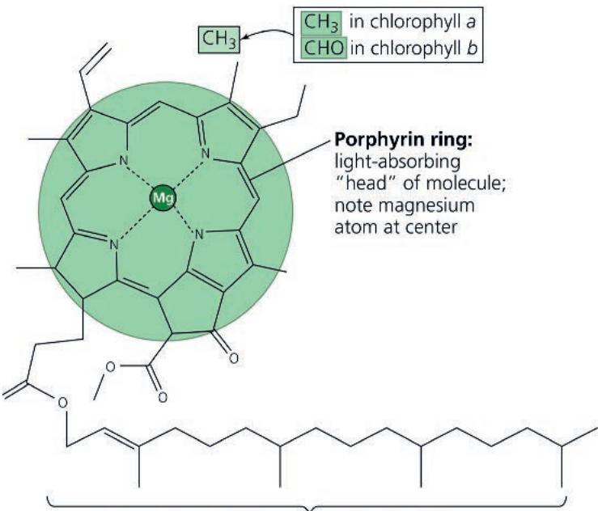  
Hydrocarbon tail: interacts with hydrophobic regions of proteins inside thylakoid membranes of chloroplasts

this cyanobacterium to flourish in very shaded conditions. Higher-wavelength light has less energy, so this observation extends the lower limit of energy (the “red limit”) needed for photosynthesis to occur.

Other accessory pigments include carotenoids, hydrocarbons that are various shades of yellow and orange because they absorb violet and blue-green light (see Figure 10.9a). Carotenoids may broaden the spectrum of colors that can drive photosynthesis. However, a more important function of at least some carotenoids seems to be photoprotection: These compounds absorb and dissipate excessive light energy that would otherwise damage chlorophyll or interact with oxygen, forming reactive oxidative molecules that are dangerous to the cell. Interestingly, carotenoids similar to the photoprotective ones in chloroplasts have a photoprotective role in the human eye. (Carrots, known for aiding night vision, are rich in carotenoids.) These and related molecules are, of course, found naturally in many vegetables and fruits. They are also often advertised in health food products as “phytochemicals” (from the Greek phyton, plant), some of which have antioxidant properties. Plants can synthesize all the antioxidants they require, but humans and other animals must obtain some of them from their diets.

## Excitation of Chlorophyll by Light

What exactly happens when chlorophyll and other pigments absorb light? The colors corresponding to the absorbed wavelengths disappear from the spectrum of the transmitted and reflected light, but energy cannot disappear. When a molecule absorbs a photon of light, one of the molecule's electrons is elevated to an orbital where it has more potential energy (see Figure 2.6b). When the electron

Figure 10.11 Excitation of isolated chlorophyll by light.

(a) Absorption of a photon causes a transition of the chlorophyll molecule from its ground state to its excited state. The photon boosts an electron to an orbital where it has more potential energy. If the illuminated molecule exists in isolation, its excited electron immediately drops back down to the ground-state orbital, and its excess energy is given off as heat and fluorescence (light). (b) A chlorophyll solution excited with ultraviolet light fluoresces with a red-orange glow.

WHAT IF? If a leaf containing the same concentration of chlorophyll as in the solution was exposed to the same ultraviolet light, no fluorescence would be seen. Propose an explanation for the difference in fluorescence emission between the solution and the leaf. For suggested answer, see Appendix A.

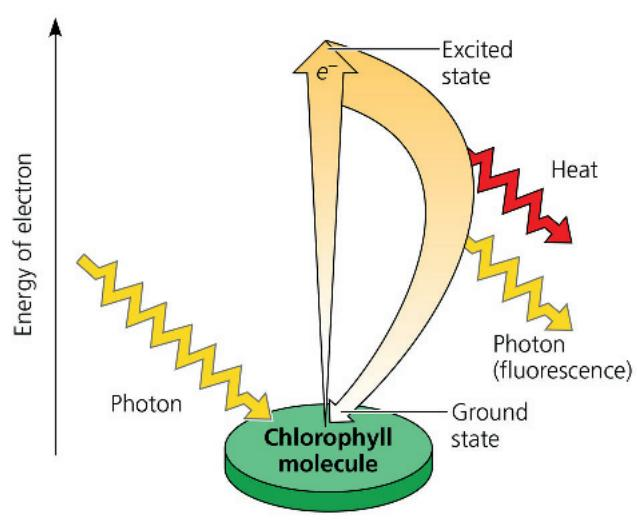  
(a) Excitation of isolated chlorophyll molecule

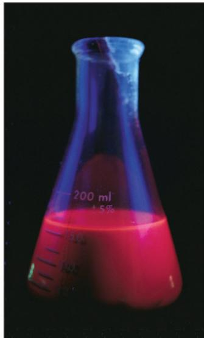  
(b) Fluorescence

is in its normal orbital, the pigment molecule is said to be in its ground state. Absorption of a photon boosts an electron to an orbital of higher energy, and the pigment molecule is then said to be in an excited state. The only photons absorbed are those whose energy is exactly equal to the energy difference between the ground state and an excited state, and this energy difference varies from one kind of molecule to another. Thus, a particular compound absorbs only photons corresponding to specific wavelengths, which is why each pigment has a unique absorption spectrum.

Once absorption of a photon raises an electron to an excited state, the electron cannot stay there long (Figure 10.11a). The excited state, like all high-energy states, is unstable. Generally, when isolated pigment molecules absorb light, their excited electrons drop back down to the ground-state orbital in a billionth of a second, releasing their excess energy as heat. This conversion of light energy to heat is what makes the top of an automobile so hot on a sunny day. (White cars are coolest because their paint reflects all wavelengths of visible light.) In isolation, some pigments, including chlorophyll, emit light as well as heat after absorbing photons. As excited electrons fall back to the ground state, photons are given off, an afterglow called fluorescence. An illuminated solution of chlorophyll isolated from chloroplasts will fluoresce in the red part of the spectrum and also give off heat (Figure 10.11b). This is best seen by illuminating with ultraviolet light, which chlorophyll can also absorb (see Figures 10.6 and 10.9a). Viewed under visible light, the fluorescence would be difficult to see against the green of the solution.

## A Photosystem: A Reaction-Center Complex Associated with Light-Harvesting Complexes

Chlorophyll molecules excited by the absorption of light energy produce very different results in an intact chloroplast than they do in isolation (see Figure 10.11). In their native environment of the thylakoid membrane, chlorophyll molecules are organized along with other small organic molecules and proteins into complexes called photosystems.

A photosystem is composed of a reaction-center complex surrounded by several light-harvesting complexes (Figure 10.12, on the next page). The reaction-center complex is an organized association of proteins holding a special pair of chlorophyll $a$ molecules and a primary electron acceptor. Each light-harvesting complex consists of various pigment molecules (which may include chlorophyll $a$ , chlorophyll $b$ , and multiple carotenoids) bound to proteins. The number and variety of pigment molecules enable a photosystem to harvest light over a larger surface area and a larger portion of the spectrum than could any single pigment molecule alone. Together, these light-harvesting complexes act as an antenna for the reaction-center complex. When a pigment molecule absorbs a photon, the energy is transferred from pigment molecule to pigment molecule within a light-harvesting complex, like a human “wave” at a sports arena, until it is passed to the pair of chlorophyll $a$ molecules in the reaction-center complex. This pair of chlorophyll $a$ molecules is special because their molecular environment—their location and the other molecules with which they are associated—enables them to use the energy from light not only to boost one of their electrons to a higher energy level, but also to transfer it to a different molecule—the primary electron acceptor, which is a molecule capable of accepting electrons and becoming reduced.

The solar-powered transfer of an electron from the reaction-center chlorophyll a pair to the primary electron acceptor is the first step of the light reactions. As soon as the chlorophyll electron is excited to a higher energy level, the primary electron acceptor captures it; this is a redox reaction. In the flask shown in Figure 10.11b, isolated chlorophyll fluoresces because there is no electron acceptor, so electrons of photoexcited chlorophyll drop right back to the ground state. In the structured environment of a chloroplast, however, an electron acceptor is readily available, and the potential energy represented by the excited electron is not dissipated as light and heat. Thus, each photosystem—a reaction-center complex surrounded by light-harvesting complexes—functions in the chloroplast as a unit. It converts light energy to chemical energy, which will ultimately be used for the synthesis of sugar.

Figure 10.12 The structure and function of a photosystem.  
  
(a) How a photosystem harvests light. When a photon strikes a pigment molecule in a light-harvesting complex, the energy is passed from molecule to molecule until it reaches the reaction-center complex. Here, an excited electron from the special pair of chlorophyll a molecules is transferred to the primary electron acceptor.

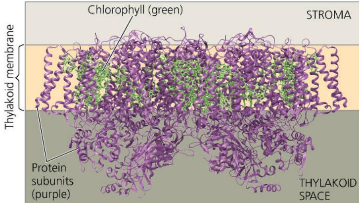  
(b) Structure of a photosystem. This computer model, based on X-ray crystallography, shows two photosystem complexes side by side. Chlorophyll molecules (bright green ball-and-stick models within the membrane; the tails are not shown) are interspersed with protein subunits (purple ribbons; notice the many $\alpha$ helices spanning the membrane). For simplicity, a photosystem will be shown as a single complex in the rest of the chapter.

The thylakoid membrane is populated by two types of photosystems that cooperate in the light reactions of photosynthesis: photosystem II (PS II) and photosystem I (PS I). (They were named in order of their discovery, but

photosystem II functions first in the light reactions.) Each has a characteristic reaction-center complex—a particular kind of primary electron acceptor next to a special pair of chlorophyll $a$ molecules associated with specific proteins. The reaction-center chlorophyll $a$ of photosystem II is known as P680 because this pigment is best at absorbing light having a wavelength of 680 nm (in the red part of the spectrum). The chlorophyll $a$ at the reaction-center complex of photosystem I is called P700 because it most effectively absorbs light of wavelength 700 nm (in the far-red part of the spectrum). These two pigments, P680 and P700, are nearly identical chlorophyll $a$ molecules. However, their association with different proteins in the thylakoid membrane affects the electron distribution in the two pigments and accounts for the slight differences in their light-absorbing properties. Now let's see how the two types of photosystems work together in using light energy to generate ATP and NADPH, the two main products of the light reactions.

## Linear Electron Flow

Light drives the synthesis of ATP and NADPH by energizing the two types of photosystems embedded in the thylakoid membranes of chloroplasts. The key to this energy transformation is a flow of electrons through the photosystems and other molecular components built into the thylakoid membrane. This is called linear electron flow, and it occurs during the light reactions of photosynthesis, as shown in Figure 10.13. The numbered steps in the text correspond to the numbered steps in the figure.

A photon of light strikes one of the pigment molecules in a light-harvesting complex of PS II, boosting one of its electrons to a higher energy level. As this electron falls back to its ground state, an electron in a nearby pigment molecule is simultaneously raised to an excited state. The process continues, with the energy being relayed to other pigment molecules until it reaches the P680 pair of chlorophyll $a$ molecules in the PS II reaction-center complex. It excites an electron in this pair of chlorophylls to a higher energy state.

2 This electron is transferred from the excited P680 to the primary electron acceptor. We can refer to the resulting form of P680, missing the negative charge of an electron, as $\mathrm{P680^{+}}$ .

3 An enzyme catalyzes the splitting of a water molecule into two electrons, two hydrogen ions ( $H^{+}$ ), and an oxygen atom. The electrons are supplied one by one to the $P680^{+}$ pair, each electron replacing one transferred to the primary electron acceptor. ( $P680^{+}$ is the strongest biological oxidizing agent known; its electron “hole” must be filled. This greatly facilitates the transfer of electrons from the split water molecule.) The $H^{+}$ are released into the thylakoid space (interior of the thylakoid). The oxygen atom immediately combines with an oxygen atom generated by the splitting of another water molecule, forming $O_{2}$ .

4 Each photoexcited electron passes from the primary electron acceptor of PS II to PS I via an electron transport chain, the components of which are similar to those of the electron transport chain that functions in cellular respiration. The electron transport chain between PS II and PS I is made up of the electron carrier plastoquinone (Pq), a cytochrome

Figure 10.13 How linear electron flow during the light reactions generates ATP and NADPH. The gold arrows trace the flow of light-driven electrons from water to NADPH. The black arrows trace the transfer of energy from pigment molecule to pigment molecule. To see these proteins in their cellular context, see Figure 6.32b.

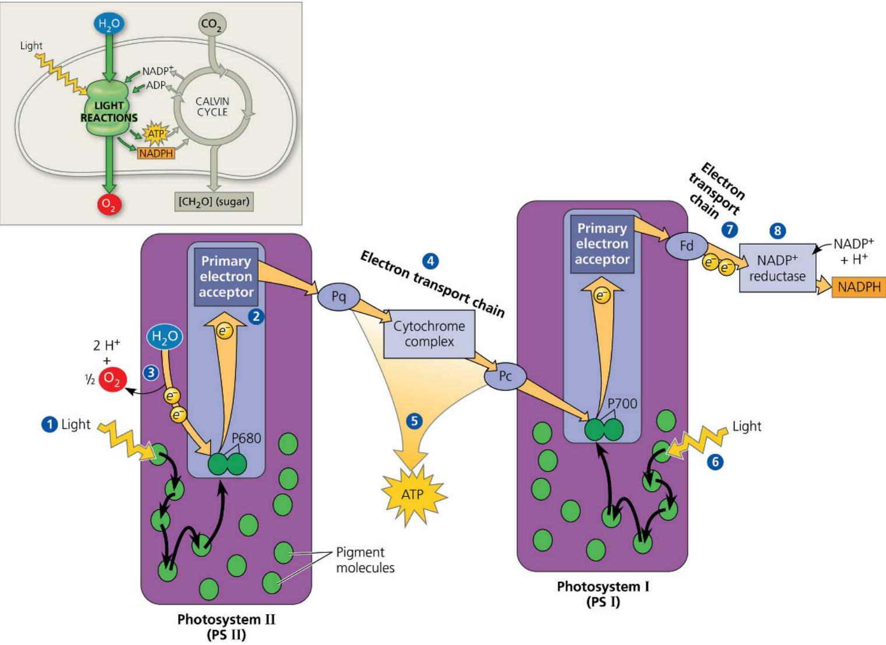

complex, and a protein called plastocyanin (Pc). Each component carries out redox reactions as electrons flow down the electron transport chain, releasing free energy that is used to pump protons ( $H^{+}$ ) into the thylakoid space, contributing to a proton gradient across the thylakoid membrane.

5 The potential energy stored in the proton gradient is used to make ATP in the process you learned about in Concept 9.4 called chemiosmosis, to be further discussed shortly.

6 Meanwhile, light energy has been transferred via light-harvesting complex pigments to the PS I reaction-center complex, exciting an electron of the P700 pair of chlorophyll a molecules located there. The photoexcited electron is then transferred to PS I's primary electron acceptor, creating an electron "hole" in the P700—which we now can call $\mathrm{P700^{+}}$ . In other words, $\mathrm{P700^{+}}$ can now act as an electron acceptor, accepting an electron that reaches the bottom of the electron transport chain from PS II.

7 Photoexcited electrons are passed in a series of redox reactions from the primary electron acceptor of PS I down a second electron transport chain through the protein ferredoxin (Fd). (This chain does not create a proton gradient and thus does not produce ATP.)

8 The enzyme NADP $^{+}$ reductase catalyzes the transfer of electrons from Fd to NADP $^{+}$ . Two electrons are required for its reduction to NADPH. Electrons in NADPH are at a higher energy level than they are in water (where they started), so they are more readily available for the reactions of the Calvin cycle. This process also removes an H $^{+}$ from the stroma.

The energy changes of electrons during their linear flow through the light reactions are shown in a mechanical analogy in

Figure 10.14 A mechanical analogy for linear electron flow during the light reactions.

Figure 10.14. Although the scheme shown in Figures 10.13 and 10.14 may seem complicated, do not lose track of the big picture: The light reactions use solar power to generate ATP and NADPH, which provide chemical energy and reducing power, respectively, to the carbohydrate-synthesizing reactions of the Calvin cycle.

## Cyclic Electron Flow

In certain cases, photoexcited electrons can take an alternative path called cyclic electron flow, which uses photosystem I but not photosystem II. You can see in Figure 10.15 that cyclic flow is a short circuit: The electrons cycle back from ferredoxin (Fd) to the cytochrome complex, then via a plastocyanin molecule (Pc) to a P700 chlorophyll in the PS I reaction-center complex. There is no production of NADPH and no release of oxygen that results from this process. On the other hand, cyclic flow does generate ATP.

Rather than having both PS II and PS I, several of the currently existing groups of photosynthetic bacteria are known to have a single photosystem related to either PS II or PS I. For these species, which include the purple sulfur bacteria (see Figure 10.2e) and the green sulfur bacteria, cyclic electron flow is the one and only means of generating ATP during the process of photosynthesis. Evolutionary biologists hypothesize that these bacterial groups are descendants of ancestral bacteria in which photosynthesis first evolved, in a form similar to cyclic electron flow.

Cyclic electron flow can also occur in photosynthetic species that possess both photosystems; this includes some prokaryotic organisms, such as the cyanobacteria shown in Figure 10.2d, as well as the eukaryotic photosynthetic species that have been tested thus far. Although the process is probably in part an “evolutionary leftover,” research suggests it plays at least one beneficial role for

Figure 10.15 Cyclic electron flow.

Photoexcited electrons from PS I are occasionally shunted back from ferredoxin (Fd) to chlorophyll via the cytochrome complex and plastocyanin (Pc). This electron shunt supplements the supply of ATP (via chemiosmosis) but produces no NADPH. The “shadow” of linear electron flow is included in the diagram for comparison with the cyclic route. The two Fd molecules in this diagram are actually one and the same—the final electron carrier in the electron transport chain of PS I—although it is depicted twice to clearly show its role in two parts of the process.

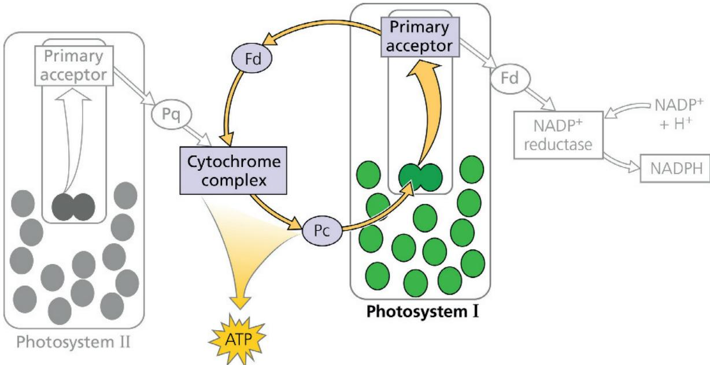  
VISUAL SKILLS Look at Figure 10.14 and explain how you would alter it to show a mechanical analogy for cyclic electron flow.

these organisms. Plants with mutations that render them unable to carry out cyclic electron flow are capable of growing well in low light, but do not grow well where light is intense. This is evidence for the idea that cyclic electron flow may be photoprotective. Later you'll learn more about cyclic electron flow as it relates to a particular adaptation of photosynthesis ( $C_{4}$ plants; see Concept 10.5).

Whether ATP synthesis is driven by linear or cyclic electron flow, the actual mechanism is the same. Before we move on to consider the Calvin cycle, let's review chemiosmosis, the process that uses membranes to couple redox reactions to ATP production.

## A Comparison of Chemiosmosis in Chloroplasts and Mitochondria

Chloroplasts and mitochondria generate ATP by the same basic mechanism: chemiosmosis (see Figure 9.14). An electron transport chain pumps protons ( $H^{+}$ ) across a membrane as electrons are passed through a series of carriers that have progressively more affinity for electrons. Thus, electron transport chains transform redox energy to a proton-motive force, potential energy stored in the form of an $H^{+}$ gradient across a membrane. An ATP synthase complex in the same membrane couples the diffusion of hydrogen ions down their gradient to the phosphorylation of ADP, forming ATP.

Some of the electron carriers, including the iron-containing proteins called cytochromes, are very similar in mitochondria and chloroplasts (see Figure 6.32b and c). The ATP synthase complexes of the two organelles are also quite similar. But there are noteworthy differences between photophosphorylation in chloroplasts and oxidative phosphorylation in mitochondria. Both work by way of chemiosmosis, but in chloroplasts, the high-energy electrons dropped down the transport chain come from water, while in mitochondria, they are extracted from organic molecules (which are thus oxidized). Chloroplasts do not need molecules from food to make ATP; their photosystems capture light energy and use it to drive the electrons from water to the top of the transport chain. In other words, mitochondria use chemiosmosis to transfer chemical energy from food molecules to ATP, whereas chloroplasts use it to transform light energy into chemical energy in ATP.

Although the spatial organization of chemiosmosis differs slightly between chloroplasts and mitochondria, it is easy to see similarities in the two (Figure 10.16). Electron transport chain proteins in the inner membrane of the mitochondrion pump protons from the mitochondrial matrix out to the intermembrane space, which then serves as a reservoir of hydrogen ions. Similarly, electron transport chain proteins in the thylakoid membrane of the chloroplast pump protons from the stroma into the thylakoid space, which functions as the $H^{+}$ reservoir. If you imagine the cristae of mitochondria pinching off from the inner membrane, this may help you see how the thylakoid space and the intermembrane space are comparable spaces in the two organelles, while the mitochondrial matrix is analogous to the stroma of the chloroplast.

Figure 10.16 Comparison of chemiosmosis in mitochondria and chloroplasts.  
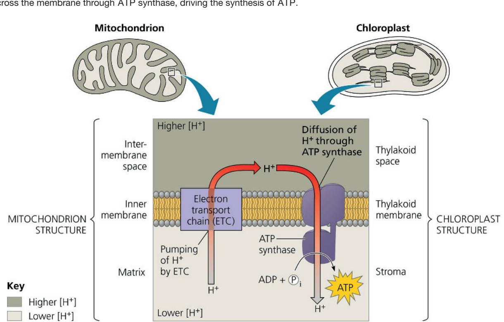  
MAKE CONNECTIONS Describe how you would change the pH in order to artificially cause ATP synthesis (a) outside an isolated mitochondrion (assume $H^{+}$ can freely cross the outer membrane; see Figure 9.14) and (b) in the stroma of a chloroplast. Explain. For suggested answer, see Appendix A.

In the mitochondrion, protons diffuse down their concentration gradient from the intermembrane space through ATP synthase to the matrix, driving ATP synthesis. In the chloroplast, ATP is synthesized as the hydrogen ions diffuse from the thylakoid space back to the stroma through ATP synthase complexes (Figure 10.17), whose catalytic knobs are on the stroma side of the membrane. Thus, ATP forms in the stroma, where it is used to help drive sugar synthesis during the Calvin cycle.

The proton (H $^{+}$ ) gradient, or pH gradient, across the thylakoid membrane is substantial. When chloroplasts in an experimental setting are illuminated, the pH in the thylakoid space drops to about 5 (the H $^{+}$ concentration increases), and the pH in the stroma increases to about 8 (the H $^{+}$ concentration decreases). This gradient of three pH units corresponds to a thousandfold difference in H $^{+}$ concentration. If the lights are then turned off, the pH gradient is abolished, but it can quickly be restored by turning the lights back on. Experiments such as this provided strong evidence in support of the chemiosmotic model.

The currently accepted model for the organization of the light-reaction “machinery” within the thylakoid membrane is based on several research studies. Each of the molecules and molecular complexes in Figure 10.17 is present in numerous copies in each thylakoid. Notice that NADPH, like ATP, is produced on the side of the membrane facing the stroma, where the Calvin cycle reactions take place.

Let's step back and see the big picture by summarizing the light reactions. Electron flow pushes electrons from water, where they are at a state of low potential energy, ultimately to NADPH, where they are stored at a state of high potential energy. The light-driven electron flow also generates ATP. Thus, the equipment of the thylakoid membrane converts light energy to chemical energy stored in ATP and NADPH. $\mathrm{O}_2$ is produced as a by-product. Let's now see how the enzymes of the Calvin cycle use the products of the light reactions to synthesize sugar from $\mathrm{CO}_2$ .

## Concept Check 10.3

1. What color of light is least effective in driving photosynthesis? Explain.

2. In the light reactions, what is the initial electron donor? Where do the electrons finally end up?

3. WHAT IF? In an experiment, isolated chloroplasts placed in an illuminated solution with the appropriate chemicals can carry out ATP synthesis. Predict what would happen to the rate of synthesis if a compound is added to the solution that makes membranes freely permeable to hydrogen ions.

For suggested answers, see Appendix A.

## Concept 10.4: The Calvin cycle uses the chemical energy of ATP and NADPH to reduce CO₂ to sugar

The Calvin cycle takes place in the stroma; it is similar to the citric acid cycle in that a starting material is regenerated after some molecules enter and others exit the cycle. However, the citric acid cycle is catabolic, oxidizing acetyl CoA and using the energy to synthesize ATP (see Figure 9.11), while the Calvin cycle is anabolic, building carbohydrates from smaller molecules and consuming energy. Carbon enters the Calvin cycle in the form of $CO_{2}$ and leaves in the form of sugar. The cycle spends ATP as an energy source and consumes NADPH as reducing power for adding high-energy electrons to make the sugar.

As we mentioned in Concept 10.2, the carbohydrate produced directly from the Calvin cycle is not glucose. It is actually a three-carbon sugar called glyceraldehyde 3-phosphate (G3P). For the net synthesis of one molecule of G3P, the cycle must take place three times, fixing three molecules of $CO_{2}$ —one per turn of the cycle. (Recall that the term carbon fixation refers to the initial incorporation of $CO_{2}$ into organic material.) As we trace the steps of the Calvin cycle, keep in mind that we are following three molecules of $CO_{2}$ through the reactions. Figure 10.18 divides the Calvin cycle into three phases: carbon fixation, reduction, and regeneration of the $CO_{2}$ acceptor.

Phase 1: Carbon fixation. The Calvin cycle incorporates each $CO_{2}$ molecule, one at a time, by attaching it to a five-carbon sugar named ribulose bisphosphate (which is abbreviated RuBP). The enzyme that catalyzes this first step is RuBP carboxylase-oxygenase, or rubisco (see Figure 6.32c). (This is the most abundant protein in chloroplasts and is also thought to be the most abundant protein on Earth.) The product of the reaction is a six-carbon intermediate that is short-lived because it is so energetically unstable that it immediately splits in half, forming two molecules of 3-phosphoglycerate (for each $CO_{2}$ fixed).

Phase 2: Reduction. Each molecule of 3-phosphoglycerate receives an additional phosphate group from ATP, becoming 1, 3-phosphoglycerate. Next, a pair of electrons donated from NADPH reduces 1, 3-phosphoglycerate, which also loses a phosphate group in the process, becoming glyceraldehyde 3-phosphate (G3P). Specifically, the electrons from NADPH reduce a carboxyl group on 1, 3-bisphosphoglycerate to the aldehyde group of G3P, which stores more potential energy. G3P is a sugar—the same three-carbon sugar formed in glycolysis by the splitting of glucose (see Figure 9.8). Notice in Figure 10.18 that for every three molecules of $\mathrm{CO}_{2}$ that enter the cycle, there are six molecules of G3P formed. But only one molecule of this three-carbon sugar can be counted as a net gain of carbohydrate because the rest are required to complete the cycle. The cycle began with 15 carbons' worth of carbohydrate in the form of three molecules of the five-carbon sugar RuBP. Now there are 18 carbons' worth of carbohydrate in the form of six molecules of G3P. One molecule exits the cycle to be used by the plant cell, but the other five molecules must be recycled to regenerate the three molecules of RuBP.

Phase 3: Regeneration of the $CO_{2}$ acceptor (RuBP). In a complex series of reactions, the carbon skeletons of five molecules of G3P are rearranged by the last steps of the Calvin cycle into three molecules of RuBP. To accomplish this, the cycle spends three more molecules of ATP. The RuBP is now prepared to receive $CO_{2}$ again, and the cycle continues.

For the net synthesis of one G3P molecule, the Calvin cycle consumes a total of nine molecules of ATP and six molecules of NADPH. The light reactions regenerate the ATP and NADPH. The G3P spun off from the Calvin cycle becomes the starting material for metabolic pathways that synthesize other organic compounds, including glucose (from two molecules of G3P), sucrose, and other carbohydrates. Neither the light reactions nor the Calvin cycle alone can make sugar from $CO_{2}$ . Photosynthesis is an emergent property of the intact chloroplast, which integrates the two stages of photosynthesis.

## Figure 10.18 The Calvin cycle.

This diagram summarizes three turns of the cycle, tracking carbon atoms (shown as dark-gray spheres). The three phases of the cycle correspond to the phases discussed in the text. For every three molecules of $CO_{2}$ that enter the cycle, the net output is one molecule of glyceraldehyde 3-phosphate (G3P), a three-carbon sugar. The light reactions sustain the Calvin cycle by regenerating the required ATP and NADPH.

## Concept Check 10.4

1. To synthesize one glucose molecule, the Calvin cycle uses \_\_\_\_ molecules of $\mathrm{CO}_{2}$ , \_\_\_\_ molecules of ATP, and \_\_\_\_ molecules of NADPH.

2. How are the large numbers of ATP and NADPH molecules used during the Calvin cycle consistent with the high value of glucose as an energy source?

3. WHAT IF? Consider a poison that inhibits an enzyme of the Calvin cycle. Do you think such a poison will also inhibit the light reactions? Explain.

4. DRAW IT Draw a simple version of the Calvin cycle that shows only the number of carbon atoms at each step, using numerals rather than gray spheres (for example, “3 × 1C = 3C” at the beginning of the cycle). Explain how the total number of carbon atoms remains constant for every three turns of the cycle, noting the forms in which the carbon atoms enter and leave the cycle.

5. MAKE CONNECTIONS Review Figures 9.8 and 10.18, and then discuss the roles of intermediate and product played by glyceraldehyde 3-phosphate (G3P) in the two processes shown in these figures.

For suggested answers, see Appendix A.

## Concept 10.5: Alternative mechanisms of carbon fixation have evolved in hot, arid climates

EVOLUTION Ever since plants first moved onto land about 475 million years ago, they have been adapting to the problems of terrestrial life, particularly the problem of dehydration. In Concept 36.4, we will consider anatomical adaptations that help plants conserve water, while in this chapter we are concerned with metabolic adaptations. The solutions often involve trade-offs. An important example is the balance between photosynthesis and the prevention of excessive water loss from the plant. The $CO_{2}$ required for photosynthesis enters a leaf (and the resulting $O_{2}$ exits) via stomata, the pores on the leaf surface (see Figure 10.3). However, stomata are also the main avenues of transpiration, the evaporative loss of water from leaves. On a hot, dry day, most plants close their stomata, a response that conserves water but also reduces $CO_{2}$ levels. With stomata even partially closed, $CO_{2}$ concentrations begin to decrease in the air spaces within the leaf, and the concentration of $O_{2}$ released from the light reactions begins to increase. These conditions within the leaf favor an apparently wasteful process called photorespiration.

## Photorespiration: An Evolutionary Relic?

In most plants, initial fixation of carbon occurs via rubisco, the Calvin cycle enzyme that adds $CO_{2}$ to ribulose bisphosphate. Such plants are called $C_{3}$ plants because the first organic product of carbon fixation is a three-carbon compound, 3-phosphoglycerate (see Figure 10.18). $C_{3}$ plants include important agricultural plants such as rice, wheat, and soybeans. When their stomata close on hot, dry days, $C_{3}$ plants produce less sugar because the declining level of $CO_{2}$ in the leaf starves the Calvin cycle. In addition, rubisco is capable of binding $O_{2}$ in place of $CO_{2}$ . As $CO_{2}$ becomes scarce within the air spaces of the leaf and $O_{2}$ builds up, rubisco adds $O_{2}$ to the Calvin cycle instead of $CO_{2}$ . The product splits, and a two-carbon compound leaves the chloroplast. Peroxisomes and mitochondria within the plant cell rearrange and split this compound, releasing $CO_{2}$ . The process is called photorespiration because it occurs in the light (photo) and consumes $O_{2}$ while producing $CO_{2}$ (respiration). However, unlike normal cellular respiration, photorespiration uses ATP rather than generating it. And unlike photosynthesis, photorespiration produces no sugar. In fact, photorespiration decreases photosynthetic output by siphoning organic material from the Calvin cycle and releasing $CO_{2}$ that would otherwise be fixed. This $CO_{2}$ can eventually be fixed if it is still in the leaf once the $CO_{2}$ concentration builds up to a high enough level. In the meantime, though, the process is energetically costly, much like a hamster running on its wheel.

How can we explain the existence of a metabolic process that seems to be counterproductive for the plant? According to one hypothesis, photorespiration is evolutionary baggage—a metabolic relic from a much earlier time when the atmosphere had less $O_{2}$ and more $CO_{2}$ than it does today. In the ancient atmosphere that prevailed when rubisco first evolved, the ability of the enzyme's active site to bind $O_{2}$ would have made little difference. The hypothesis suggests that modern rubisco retains some of its chance affinity for $O_{2}$ , which is now so concentrated in the atmosphere that a certain amount of photorespiration is inevitable. There is also some evidence that photorespiration may provide protection against the damaging products of the light reactions, which build up when the Calvin cycle slows due to low $CO_{2}$ .

In many types of plants—including a significant number of crop plants—photorespiration drains away as much as 50% of the carbon fixed by the Calvin cycle. Indeed, if photorespiration could be reduced in certain plant species without otherwise affecting photosynthetic productivity, crop yields and food supplies might increase.

In some plant species, alternate modes of carbon fixation have evolved that minimize photorespiration and optimize the Calvin cycle—even in hot, arid climates. The two most important of these photosynthetic adaptations are $C_{4}$ photosynthesis and crassulacean acid metabolism (CAM).

## $C_{4}$ Plants

The $C_{4}$ plants are so named because they preface the Calvin cycle with an alternate mode of carbon fixation that forms a four-carbon compound as its first product. The $C_{4}$ pathway is believed to have evolved independently at least 45 separate times and is used by several thousand species in at least 19 plant families. Among the $C_{4}$ plants important to agriculture are sugarcane and corn, members of the grass family.

When the weather is hot and dry, a $C_{4}$ plant partially closes its stomata, conserving water but reducing the $CO_{2}$ concentration in the leaves. However, sugar is still made because $C_{4}$ plants use a multistep process that operates even under low $CO_{2}$ conditions. Photosynthesis begins in mesophyll cells but is completed in bundle-sheath cells, cells that are arranged into tightly packed sheaths around the veins of the leaf (Figure 10.19). In $C_{4}$ leaves, the loosely arranged mesophyll cells are located between the bundle-sheath cells and the leaf surface, no more than two to three cells away from the bundle-sheath cells. In mesophyll cells, $CO_{2}$ is incorporated into organic compounds that then move into the bundle-sheath cells, where the Calvin cycle takes place. See the numbered steps in Figure 10.19, which are also described here:

The first step is carried out by an enzyme present only in mesophyll cells called PEP carboxylase, which has a much higher affinity for $CO_{2}$ than does rubisco, and no affinity for $O_{2}$ . This enzyme adds $CO_{2}$ to phosphoenolpyruvate (PEP), forming the four-carbon product oxaloacetate; it does this even under conditions of lower $CO_{2}$ concentration and relatively higher $O_{2}$ concentration.

Figure 10.19 $C_{4}$ leaf anatomy and the $C_{4}$ pathway.

The structure and biochemical functions of the leaves of $C_{4}$ plants are an evolutionary adaptation to hot, dry climates. This adaptation maintains a $CO_{2}$ concentration in the bundle-sheath cells that favors photosynthesis over photorespiration.

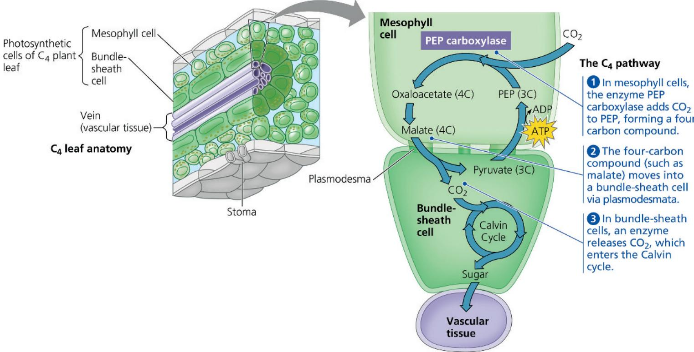

2 After the $CO_{2}$ is fixed in the mesophyll cells, the four-carbon products (malate in the example shown in Figure 10.19) are exported to bundle-sheath cells through plasmodesmata (see Figure 6.29).

3 Within the bundle-sheath cells, an enzyme releases $CO_{2}$ from the four-carbon compounds; the $CO_{2}$ is re-fixed into organic material by rubisco and the Calvin cycle. The same reaction regenerates pyruvate, which is transported to mesophyll cells. There, ATP is used to convert pyruvate to PEP, which can then accept addition of another $CO_{2}$ , allowing the reaction cycle to continue. This ATP can be thought of, in a sense, as the “price” of concentrating $CO_{2}$ in the bundle-sheath cells. To generate this extra ATP, bundle-sheath cells carry out cyclic electron flow, the process described earlier in this chapter (see Figure 10.15). In fact, these cells contain PS I but no PS II, so cyclic electron flow is their only photosynthetic mode of generating ATP.

In effect, the mesophyll cells of a $C_{4}$ plant pump $CO_{2}$ into the bundle-sheath cells, keeping the $CO_{2}$ concentration in those cells high enough for rubisco to bind $CO_{2}$ rather than $O_{2}$ . The cyclic series of reactions involving PEP carboxylase and the regeneration of PEP can be thought of as an ATP-powered pump that concentrates $CO_{2}$ where it can be fixed. In this way, $C_{4}$ photosynthesis spends ATP energy to minimize photorespiration and enhance sugar production. This adaptation is especially advantageous in hot regions with intense sunlight, and it is in such environments that $C_{4}$ plants evolved and thrive today.

The concentration of $CO_{2}$ in the atmosphere has drastically increased since the Industrial Revolution began in the 1800s, and it continues to rise today due to human activities such as the burning of fossil fuels (see Concept 1.1). The resulting global climate change, including an increase in average temperatures around the planet, may have far-reaching effects on plant species. Scientists are concerned that increasing $CO_{2}$ concentration and temperature may affect $C_{3}$ and $C_{4}$ plants differently, thus changing the relative abundance of these species in a given plant community.

Which type of plant would stand to gain more from increasing $CO_{2}$ levels? Recall that in $C_{3}$ plants, the binding of $O_{2}$ rather than $CO_{2}$ by rubisco leads to photorespiration, lowering the efficiency of photosynthesis. $C_{4}$ plants overcome this problem by concentrating $CO_{2}$ in the bundle-sheath cells at the cost of ATP. Rising $CO_{2}$ levels should benefit $C_{3}$ plants by lowering the amount of photorespiration that occurs. At the same time, rising temperatures have the opposite effect, increasing photorespiration (Other factors such as water availability may also come into play.) In contrast, many $C_{4}$ plants could be largely unaffected by increasing $CO_{2}$ levels or temperature. Researchers have investigated aspects of this question in several studies; you can work with data from one such experiment in the Scientific Skills Exercise. In different regions, the particular combination of $CO_{2}$ concentration and temperature is likely to alter the balance of $C_{3}$ and $C_{4}$ plants in varying ways. The effects of such a widespread and variable change in community structure are unpredictable and thus a cause of legitimate concern.

# Scientific Skills Exercise Making Scatter Plots with Regression Lines

Does Atmospheric $CO_{2}$ Concentration Affect the Productivity of Agricultural Crops? The atmospheric concentration of $CO_{2}$ has been rising globally, and scientists wondered whether this would affect $C_{3}$ and $C_{4}$ plants differently. In this exercise, you will make a scatter plot to examine the relationship between $CO_{2}$ concentration and growth of both corn (maize), a $C_{4}$ crop plant, and velvetleaf, a $C_{3}$ weed found in cornfields.

How the Experiment Was Done For 45 days, researchers grew corn and velvetleaf plants under controlled conditions, where all plants received the same amounts of water and light. The plants were divided into three groups, and each was exposed to a different concentration of $CO_{2}$ in the air: 350, 600, or 1,000 ppm (parts per million).

Data from the Experiment The table shows the dry mass (in grams) of corn and velvetleaf plants grown at the three concentrations of $CO_{2}$ . The dry mass values are averages calculated from the leaves, stems, and roots of eight plants.

<table><tr><td></td><td>350 ppm  $CO_2$ </td><td>600 ppm  $CO_2$ </td><td>1,000 ppm  $CO_2$ </td></tr><tr><td>Average dry mass of one corn plant (g)</td><td>91</td><td>89</td><td>80</td></tr><tr><td>Average dry mass of one velvetleaf plant (g)</td><td>35</td><td>48</td><td>54</td></tr></table>

Data from D. T. Patterson and E. P. Flint, Potential effects of global atmospheric $CO_{2}$ enrichment on the growth and competitiveness of $C_{3}$ and $C_{4}$ weed and crop plants, Weed Science 28(1):71–75 (1980).

## INTERPRET THE DATA

1. To explore the relationship between the two variables, it is useful to graph the data in a scatter plot, and then draw a regression line. (a) First, place labels for the dependent and independent variables on the appropriate axes. Explain your choices. (b) Plot the data points for corn and velvetleaf using different symbols for each set of data, and add a key for the two symbols. (For additional information about graphs, see the Scientific Skills Review in Appendix D.)

2. Draw a “best-fit” line for each set of points. A best-fit line does not necessarily pass through all or even most points. Instead, it is a straight line that passes as close as possible to all data points from that set. Draw a best-fit line for each set of data. Because placement of the line is a matter of

$C_{4}$ photosynthesis is considered more efficient than $C_{3}$ photosynthesis because it uses less water and resources. On our planet today, the world population and demand for food are rapidly increasing. At the same time, the amount of land suitable

judgment, two individuals may draw two slightly different lines for a given set of points. The line that actually fits best, a regression line, can be identified by squaring the distances of all points to any candidate line, then selecting the line that mini-

  
Corn field with invasive velvetleaf plants.

mizes the sum of the squares. (See the graph in the Scientific Skills Exercise in Chapter 3 for an example of a linear regression line.) Excel or other software programs, including those on a graphing calculator, can plot a regression line once data points are entered. Using either Excel or a graphing calculator, enter the data points for each data set and have the program draw the two regression lines. Compare them to the lines you drew.

3. Describe the trends shown by the regression lines in your scatter plot. (a) Compare the relationship between increasing concentration of $CO_{2}$ and the dry mass of corn to that for velvetleaf. (b) Considering that velvetleaf is a weed invasive to cornfields, predict how increased $CO_{2}$ concentration may affect interactions between the two species.

4. Based on the data in the scatter plot, estimate the percentage change in dry mass of corn and velvetleaf plants if atmospheric $CO_{2}$ concentration increased from 390 ppm (current levels) to 800 ppm. (a) What is the estimated dry mass of corn and velvetleaf plants at 390 ppm? 800 ppm? (b) To calculate the percentage change in mass for each plant, subtract the mass at 390 ppm from the mass at 800 ppm (change in mass), divide by the mass at 390 ppm (initial mass), and multiply by 100. What is the estimated percentage change in dry mass for corn? For velvetleaf? (c) Do these results support the conclusion from other experiments that $C_{3}$ plants grow better than $C_{4}$ plants under increased $CO_{2}$ concentration? Why or why not?

Instructors: A version of this Scientific Skills Exercise can be assigned in Mastering Biology.

for growing crops is decreasing due to the effects of global climate change, which include an increase in sea level as well as a hotter, drier climate in many regions. To address issues of food supply, scientists in the Philippines have been working on genetically

modifying rice—an important food staple that is a $C_{3}$ crop—so that it can instead carry out $C_{4}$ photosynthesis. Results so far seem promising, and these researchers estimate that the yield of $C_{4}$ rice might be 30–50% higher than $C_{3}$ rice with the same input of water and resources.

## CAM Plants

A second photosynthetic adaptation to arid conditions has evolved in pineapples, many cacti, and other succulent (water-storing) plants, such as aloe and jade plants. These plants open their stomata at night and close them during the day, just the reverse of how other plants behave. Closing stomata during the day helps desert plants conserve water, but it also prevents $CO_{2}$ from entering the leaves. During the night, when their stomata are open, these plants take up $CO_{2}$ and incorporate it into a variety of organic acids. This mode of carbon fixation is called crassulacean acid metabolism, or CAM, after the plant family Crassulaceae, the succulents in which the process was first discovered. The mesophyll cells of CAM plants store the organic acids they make during the night in their vacuoles until morning, when the stomata close. During the day, when the light reactions can supply ATP and NADPH for the Calvin cycle, $CO_{2}$ is released from the organic acids made the night before to become incorporated into sugar in the chloroplasts.

Notice in Figure 10.20 that the CAM pathway is similar to the $C_{4}$ pathway in that $CO_{2}$ is first incorporated into organic intermediates before it enters the Calvin cycle. The difference is that in $C_{4}$ plants, the initial steps of carbon fixation are separated structurally from the Calvin cycle, whereas in CAM plants, the two steps occur within the same cell but at separate times. (Keep in mind that CAM, $C_{4}$ , and $C_{3}$ plants all eventually use the Calvin cycle to make sugar from carbon dioxide.)

## Concept Check 10.5

1. Describe how photorespiration lowers photosynthetic output for plants.

2. The presence of only PS I, not PS II, in the bundle-sheath cells of $C_{4}$ plants has an effect on $O_{2}$ concentration. What is that effect, and how might that benefit the plant?

3. MAKE CONNECTIONS Refer to the discussion of ocean acidification in Concept 3.3. Ocean acidification and changes in the distribution of $C_{3}$ and $C_{4}$ plants may seem to be two very different problems, but what do they have in common? Explain.

4. WHAT IF? How would you expect the relative abundance of $C_{3}$ versus $C_{4}$ and CAM species to change in a geographic region whose climate becomes much hotter and drier, with no change in $CO_{2}$ concentration?

For suggested answers, see Appendix A.

Figure 10.20 $C_{4}$ and CAM photosynthesis compared.

The $C_{4}$ and CAM pathways are two evolutionary solutions to the problem of maintaining photosynthesis with stomata partially or completely closed on hot, dry days. Both adaptations are characterized by: ① preliminary incorporation of $CO_{2}$ into organic acids, followed by ② transfer of $CO_{2}$ to the Calvin cycle.

  
(a) Spatial separation of steps. In $C_{4}$ plants, carbon fixation and the Calvin cycle occur in different types of cells.  
(b) Temporal separation of steps. In CAM plants, carbon fixation and the Calvin cycle occur in the same cell at different times.

## Concept 10.6: Photosynthesis is essential for life on Earth: A review

In this chapter, we have followed photosynthesis from photons to food. The light reactions capture solar energy and use it to make ATP and transfer electrons from $H_{2}O$ to $NADP^{+}$ , forming NADPH. The Calvin cycle uses the ATP and NADPH to produce sugar from $CO_{2}$ . The energy that enters the chloroplasts as sunlight becomes stored as chemical energy in organic compounds. The entire process is reviewed visually in Figure 10.21, where photosynthesis is also put in its natural context.

As for the fates of photosynthetic products, enzymes in the chloroplast and cytosol convert the G3P made in the Calvin cycle to many other organic compounds. In fact, the sugar made in the chloroplasts supplies the entire plant with chemical energy and carbon skeletons for the synthesis of all the major organic molecules of plant cells. About 50% of the organic material made by photosynthesis is consumed as fuel for cellular respiration in plant cell mitochondria.

Technically, green cells are the only autotrophic parts of the plant. The rest of the plant depends on organic molecules exported

Figure 10.21 A review of photosynthesis.

This diagram shows the main reactants and products of photosynthesis as they move through the tissues of a tree (left) and a chloroplast (right).

from leaves through veins (see Figure 10.21, top). In most plants, carbohydrate is transported out of the leaves to the rest of the plant in the form of sucrose, a disaccharide. After arriving at nonphotosynthetic cells, the sucrose provides raw material for cellular respiration and a multitude of anabolic pathways that synthesize proteins, lipids, and other products. A considerable amount of sugar in the form of glucose is linked together to make the polysaccharide cellulose (see Figure 5.6c), especially in plant cells that are still growing and maturing. Cellulose, the main ingredient of cell walls, is the most abundant organic molecule in the plant—and probably on the surface of the planet.

Most plants and other photosynthesizers make more organic material per day than they need to use as respiratory fuel and precursors for biosynthesis. For example, flowering plants stockpile the extra sugar in the form of starch, storing some in the chloroplasts and some in cells of roots, tubers, seeds, and fruits. In accounting for the use of food molecules produced by photosynthesis, note that most flowering plants lose leaves, roots, stems, fruits, and often their entire bodies to heterotrophs, including humans.

On a global scale, photosynthesis is the process responsible for the presence of $O_{2}$ in our atmosphere. Furthermore, although each chloroplast is minuscule, their collective productivity in terms of food production is enormous: Photosynthesis makes an estimated 150 billion metric tons of carbohydrate per year (a metric ton is 1,000 kg, about 1.1 tons). That's organic matter equivalent in mass to a stack of about 60 trillion biology textbooks—and the stack would reach 17 times the distance from Earth to the sun! No chemical process is more important than photosynthesis to the welfare of life on Earth.

In Chapters 5 through 10, you have learned about many activities of cells. Figure 10.22 integrates these cellular processes into the context of a working plant cell. As you study the figure, reflect on how each process fits into the big picture: As the most basic unit of living organisms, a cell performs all functions characteristic of life.

## Concept Check 10.6

1. MAKE CONNECTIONS How do plants use the sugar they produce during photosynthesis to directly power the work of the cell? Provide some examples of cellular work. (See Figures 8.10, 8.11, and 9.5.)

## Make Connections: The Working Cell

Figure 10.22

This figure illustrates how a generalized plant cell functions, integrating the cellular activities you learned about in Chapters 5–10. To see some of the enzymes involved, look at Figure 6.32.

## Flow of Genetic Information in the Cell: DNA → RNA → Protein (Chapters 5–7)

In the nucleus, DNA serves as a template for the synthesis of mRNA, which moves to the cytoplasm. (See Figures 5.22 and 6.9.)

2 mRNA attaches to a ribosome, which remains free in the cytosol or binds to the rough ER. Proteins are synthesized. (See Figures 5.22 and 6.10.)

3 Proteins and membrane produced by the rough ER flow in vesicles to the Golgi apparatus, where they are processed. (See Figures 6.15 and 7.9.)

4 Transport vesicles carrying proteins pinch off from the Golgi apparatus. (See Figure 6.15.)

5 Some vesicles merge with the plasma membrane, releasing proteins by exocytosis. (See Figure 7.9.)

6 Proteins synthesized on free ribosomes stay in the cell and perform specific functions; examples include the enzymes that catalyze the reactions of cellular respiration and photosynthesis. (See Figures 9.6, 9.8, and 10.18.)

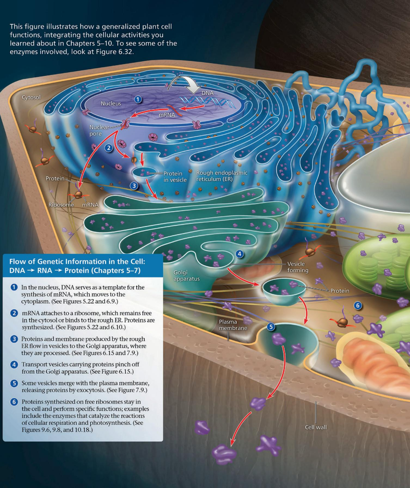

MAKE CONNECTIONS The first enzyme that functions in glycolysis is hexokinase (see Figure 6.32a). How and where is hexokinase produced in this plant cell? Where does hexokinase function? (See Figures 5.18, 5.22, and 9.8.) For suggested answer, see Appendix A.

## Movement Across Cell Membranes (Chapter 7)

7 Water diffuses into and out of the cell directly through the plasma membrane and by facilitated diffusion through aquaporins. (See Figure 7.10.)

8 By passive transport, the $CO_{2}$ used in photosynthesis diffuses into the cell, and the $O_{2}$ formed as a by-product of photosynthesis diffuses out of the cell. Both solutes move down their concentration gradients. (See Figures 7.11 and 10.21.)

9 In active transport, energy (usually supplied by ATP) is used to transport a solute against its concentration gradient. (See Figure 7.17.)

Exocytosis (shown in step 5) and endocytosis move larger materials out of and into the cell. (See Figures 7.20 and 7.21.)

Energy Transformations in the Cell: Photosynthesis and Cellular Respiration (Chapters 8–10)

10 In chloroplasts, the process of photosynthesis uses the energy of light to convert $CO_{2}$ and $H_{2}O$ to organic molecules, with $O_{2}$ as a by-product. (See Figures 10.1 and 10.21.)

11 In mitochondria, organic molecules are broken down by cellular respiration, capturing energy in molecules of ATP, which are used to power the work of the cell, such as protein synthesis and active transport. $\mathrm{CO}_{2}$ and $\mathrm{H}_2\mathrm{O}$ are by-products. (See Figures 8.9, 8.11, 9.1, and 9.15.)

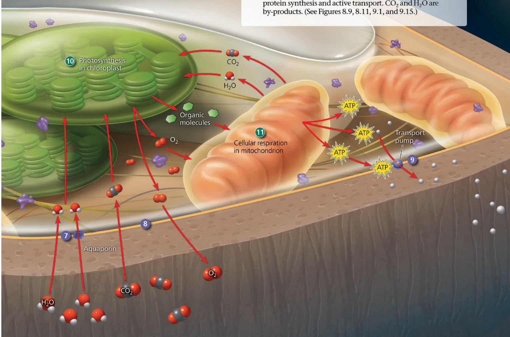

For suggested answers, see Appendix A.

## Summary of Key Concepts

To review key terms, go to the Vocabulary Self-Quiz (eTextbook only).

## Concept 10.1: Photosynthesis feeds the biosphere

\- Photosynthesis converts the energy of sunlight into chemical energy stored in sugars.

\- Autotrophs (“producers”) produce their organic molecules from $CO_{2}$ and other inorganic raw materials; plants are photoautotrophs that use light energy to do this. Heterotrophs (consumers, including decomposers) are unable to make their own food and live on compounds produced by others.

Using the terms producers, consumers, and decomposers, explain how photosynthesis feeds organisms, either directly or indirectly.

## Concept 10.2: Photosynthesis converts light energy to the chemical energy of food

\- In plants and other eukaryotic autotrophs, photosynthesis occurs in chloroplasts, organelles containing thylakoids. Stacks of thylakoids form grana. Photosynthesis is summarized as

$$
6 \mathrm{CO} _ {2} + 1 2 \mathrm{H} _ {2} \mathrm{O} + \text {   Light   energy   } \rightarrow \mathrm{C} _ {6} \mathrm{H} _ {1 2} \mathrm{O} _ {6} + 6 \mathrm{O} _ {2} + 6 \mathrm{H} _ {2} \mathrm{O}.
$$

Chloroplasts split water into hydrogen and oxygen, incorporating the electrons of hydrogen into sugar molecules. Photosynthesis is a redox process: $H_{2}O$ is oxidized, and $CO_{2}$ is reduced. The light reactions in the thylakoid membranes split water, releasing $O_{2}$ , producing ATP, and forming NADPH. The Calvin cycle in the stroma forms sugar from $CO_{2}$ , using ATP for energy and NADPH for reducing power.

Compare the roles of $CO_{2}$ and $H_{2}O$ in cellular respiration and photosynthesis.

## Concept 10.3: The light reactions convert solar energy to the chemical energy of ATP and NADPH

\- Light is a form of electromagnetic energy. The colors we see as visible light include those wavelengths that drive photosynthesis. A pigment absorbs light of specific wavelengths; chlorophyll a is the main photosynthetic pigment in plants. Other accessory pigments absorb different wavelengths of light and pass the energy on to chlorophyll a.

\- A pigment goes from a ground state to an excited state when a photon of light boosts one of the pigment's electrons to a higher-energy orbital. This excited state is unstable. Electrons from isolated pigments tend to fall back to the ground state, giving off heat and/or light.

\- A photosystem is composed of a reaction-center complex surrounded by light-harvesting complexes that funnel the energy of photons to the reaction-center complex. When a special pair of reaction-center chlorophyll $a$ molecules absorbs energy, one of its electrons is boosted to a higher energy level and transferred to the primary electron acceptor. Photosystem II contains P680 chlorophyll $a$ molecules in the reaction-center complex; photosystem I contains P700 molecules.

\- Linear electron flow during the light reactions uses both photosystems and produces NADPH, ATP, and oxygen:

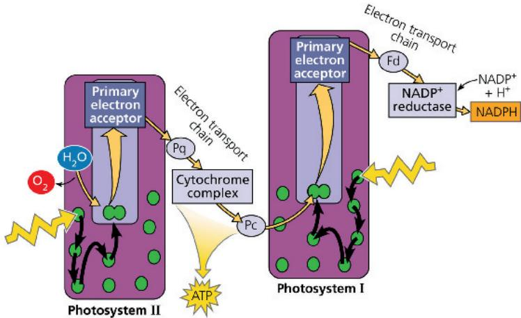

\- Cyclic electron flow employs only one photosystem, producing ATP but no NADPH or $O_{2}$ .

\- During chemiosmosis in both mitochondria and chloroplasts, electron transport chains generate an $H^{+}$ gradient across a membrane. ATP synthase uses this proton-motive force to make ATP.

The absorption spectrum of chlorophyll a differs from the action spectrum of photosynthesis. Explain this observation.

Concept 10.4: The Calvin cycle uses the chemical energy of ATP and NADPH to reduce $CO_{2}$ to sugar

\- The Calvin cycle occurs in the stroma, using electrons from NADPH and energy from ATP.

\- One molecule of G3P exits the cycle per three $CO_{2}$ molecules fixed and is converted to glucose and other organic molecules.

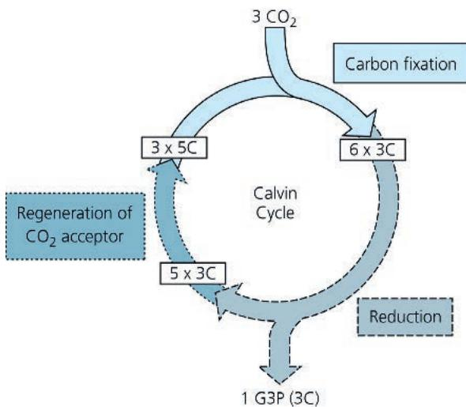  
DRAW IT On the diagram above, draw where ATP and NADPH are used and where rubisco functions. Describe these steps.

## Concept 10.5: Alternative mechanisms of carbon fixation have evolved in hot, arid climates

\- On dry, hot days, $C_{3}$ plants close their stomata, conserving water but keeping $CO_{2}$ out and $O_{2}$ in. Under these conditions, photorespiration can occur: Rubisco binds $O_{2}$ instead of $CO_{2}$ , consuming ATP and releasing $CO_{2}$ without producing ATP or carbohydrate. Photorespiration may be an evolutionary relic, and it may play a photoprotective role.

\- $C_4$ and CAM plants are adopted to hot, dry climates.

\- $C_{4}$ plants minimize the cost of photorespiration by incorporating $CO_{2}$ into four-carbon compounds in mesophyll cells. These compounds are exported to bundle-sheath cells, where they release carbon dioxide for use in the Calvin cycle.

\- CAM plants open their stomata at night, incorporating $CO_{2}$ into organic acids, which are stored in mesophyll cells. During the day, the stomata close, and the $CO_{2}$ is released from the organic acids for use in the Calvin cycle.

\- Organic compounds produced by photosynthesis provide the energy and building material for Earth's ecosystems.

Why are $C_{4}$ and CAM photosynthesis more energetically expensive than $C_{3}$ photosynthesis? What climate conditions would favor $C_{4}$ and CAM plants?

## Concept 10.6: Photosynthesis is essential for life on Earth: a review

\- Organic compounds produced by photosynthesis provide the energy and building material for Earth's ecosystems.

How do plants use the products of photosynthesis? For suggested answers, see Appendix A.

## Test Your Understanding

For more multiple-choice questions, go to the Practice Test (eTextbook only).

## Levels 1-2: Remembering/Understanding

1. The light reactions supply the Calvin cycle with

(A) light energy.

(B) $CO_{2}$ and ATP.

(C) $H_{2}O$ and NADPH.

(D) ATP and NADPH.

2. Which of the following sequences correctly represents the flow of electrons during photosynthesis?

(A) NADPH → O₂ → CO₂

(B) $H_{2}O \rightarrow NADPH \rightarrow Calvin cycle$

(C) $H_{2}O \rightarrow photosystem I \rightarrow photosystem II$

(D) NADPH → electron transport chain → $O_{2}$

3. How is photosynthesis similar in $C_{4}$ plants and CAM plants?

(A) In both cases, only photosystem I is used.

(B) Both types of plants make sugar without the Calvin cycle.

(C) In both cases, rubisco is not used to fix carbon initially.

(D) Both types of plants make most of their sugar in the dark.

4. Which of the following statements is a correct distinction between autotrophs and heterotrophs?

(A) Autotrophs, but not heterotrophs, can nourish themselves beginning with $CO_{2}$ and other nutrients that are inorganic.

(B) Only heterotrophs require chemical compounds from the environment.

(C) Cellular respiration is unique to heterotrophs.

(D) Only heterotrophs have mitochondria.

5. Which of the following occurs during the Calvin cycle?

(A) carbon fixation

(B) reduction of NADP $^{+}$

(C) release of oxygen

(D) generation of $CO_{2}$

## Levels 3-4: Applying/Analyzing

6. In mechanism, photophosphorylation is most similar to

(A) substrate-level phosphorylation in glycolysis.

(B) oxidative phosphorylation in cellular respiration.

(C) carbon fixation.

(D) reduction of NADP $^{+}$ .

7. Which process is most directly driven by light energy?

(A) creation of a pH gradient by pumping protons across the thylakoid membrane

(B) reduction of NADP $^{+}$ molecules

(C) transfer of energy from pigment molecule to pigment molecule

(D) ATP synthesis

## Levels 5-6: Evaluating/Creating

8. SCIENCE, TECHNOLOGY, AND SOCIETY Scientific evidence indicates that the $CO_{2}$ added to the air by the burning of wood and fossil fuels is contributing to global warming, a rise in global temperature. Tropical rain forests are estimated to be responsible for approximately 20% of global photosynthesis, yet the consumption of large amounts of $CO_{2}$ by living trees is thought to make little or no net contribution to reduction of global warming. Explain why this might be the case. (Hint: What processes in both living and dead trees produce $CO_{2}$ ?)

9. EVOLUTION CONNECTION Photorespiration can decrease soybeans' photosynthetic output by about 50%. Would this figure be higher or lower in wild relatives of soybeans? Why?

10. SCIENTIFIC INQUIRY • DRAW IT The following diagram represents an experiment with isolated thylakoids. The thylakoids were first made acidic by soaking them in a solution at pH 4. After the thylakoid space reached pH 4, the thylakoids were transferred to a basic solution at pH 8. The thylakoids then made ATP in the dark. (See Concept 3.3 to review pH.)

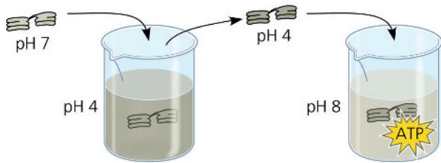

Draw an enlargement of part of the thylakoid membrane in the beaker with the solution at pH 8. Draw ATP synthase. Label the areas of high $H^{+}$ concentration and low $H^{+}$ concentration. Show the direction protons flow through the enzyme, and show the reaction where ATP is synthesized. Would ATP end up in the thylakoid or outside of it? Explain why the thylakoids in the experiment were able to make ATP in the dark.

11. WRITE ABOUT A THEME: ENERGY AND MATTER In a short essay (100–150 words), describe how photosynthesis transforms solar energy into the chemical energy of sugar molecules.

12. SYNTHESIZE YOUR KNOWLEDGE

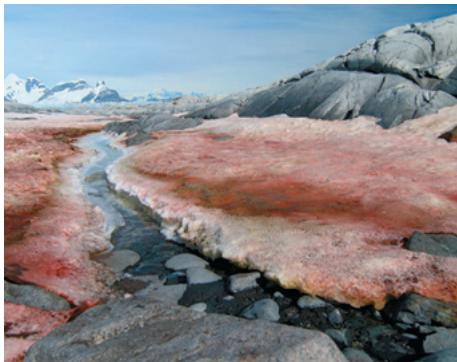  
"Watermelon snow" in Antarctica is caused by a certain species of photosynthetic green algae that thrives in subzero temperatures (Chlamydomonas nivalis). These algae are also found in high-altitude, year-round snowfields. In both locations, UV light levels tend to be high. Propose an explanation for why this alga appears reddish-pink.

For selected answers, see Appendix A.

# Explore Scientific Papers with Science in the Classroom | AAAS

Can we capture the sun's energy by mimicking plants? Go to "Replicating Photosynthesis" at www.scienceintheclassroom.org.

Instructors: Questions can be assigned in Mastering Biology.

