# 第12章 The Cell Cycle

<!-- 章节边界按正文内容恢复；原始 MinerU 内容保留如下。 -->

# The Cell Cycle

## Key Concepts

12.1 Most cell division results in genetically identical daughter cells

12.2 The mitotic phase alternates with interphase in the cell cycle

12.3 The eukaryotic cell cycle is regulated by a molecular control system

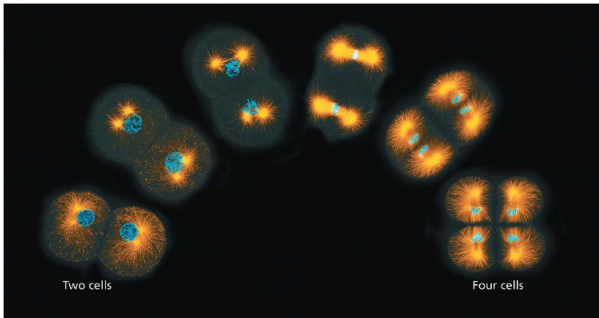  
Figure 12.1 A multicellular organism starts out as a single cell that divides into two. Those two cells then divide into four, as shown in these fluorescence micrographs of a marine worm embryo. Cell division continues throughout an organism's life, for growth or to replace worn-out or damaged cells. Each time a cell divides in this way, it is crucial that the daughter cells be genetically identical to the parent cell.

## Study Tip

## Make a visual study guide:

Figure 12.1 presents the events of the cell cycle as a simplified linear diagram. As you learn more about the cell cycle, draw a detailed linear diagram of the stages of interphase, mitosis, and cytokinesis. Include explanatory labels. Add the circular chart from Figure 12.6 and show how the two diagrams are related.

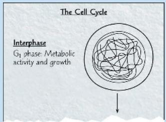

## How does one parent cell give rise to two genetically identical daughter cells?

  
Cytokinesis: The cell divides into two daughter cells, genetically identical to each other and to the parent cell.

# Concept 12.1: Most cell division results in genetically identical daughter cells

The ability of organisms to produce more of their own kind is the one characteristic that best distinguishes living things from non-living matter. This unique capacity to procreate, like all biological functions, has a cellular basis. The continuity of life is based on the reproduction of cells, or cell division.

## Key Roles of Cell Division

Cell division plays several important roles in life. When a pro-karyotic cell divides, it is actually reproducing because the process gives rise to a new organism (another cell). The same is true of any unicellular eukaryote, such as the amoeba shown in Figure 12.2a. As for multicellular eukaryotes, cell division enables each of these organisms to develop from a single cell—the fertilized egg. A two-celled embryo, the first stage in this process, is shown in Figure 12.2b. And cell division continues to function in renewal and repair in fully grown multicellular eukaryotes, replacing cells that die from accidents or normal wear and tear. For example, dividing cells in your bone marrow continuously make new blood cells (Figure 12.2c).

The reproduction of a cell, with all of its complexity, cannot occur by a mere pinching in half; a cell is not like a soap bubble that simply enlarges and splits in two. In both prokaryotes and eukaryotes, a crucial function of most cell divisions is the distribution of identical genetic material—DNA—to two daughter cells. (The exception is meiosis, the special type of eukaryotic cell division that can produce sperm and eggs in animals, or spores in plants.) What is most remarkable about cell division is the accuracy with which the DNA is passed from one generation of cells to the next. A dividing cell replicates its DNA, distributes the two copies to opposite ends of the cell, and then splits into daughter cells.

Figure 12.2 The functions of cell division.  
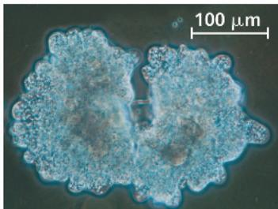  
(b) Growth and development. This micrograph shows a sand dollar embryo shortly after the fertilized egg divided, forming two cells (LM).

  
(a) Asexual reproduction. An amoeba, a single-celled eukaryote, is dividing into two cells. Each new cell will be an individual organism (LM).

  
(c) Tissue renewal. These dividing bone marrow cells will give rise to new blood cells (LM).  
Figure 12.3 Eukaryotic chromosomes.

## Cellular Organization of the Genetic Material

A cell's DNA, its genetic information, is called its genome. Although a prokaryotic genome is often a single DNA molecule, eukaryotic genomes usually consist of a number of DNA molecules. The overall length of DNA in a eukaryotic cell is enormous. A typical human cell, for example, has about $2\mathrm{m}$ of DNA—a length about 250,000 times greater than the cell's diameter. Before the cell can divide to form genetically identical daughter cells, all of this DNA must be copied, or replicated, and then the two copies must be separated so that each daughter cell ends up with a complete genome.

The replication and distribution of so much DNA are manageable because the DNA molecules are packaged into structures called chromosomes (from the Greek chroma, color, and soma, body), so named because they take up certain dyes used in microscopy (Figure 12.3). Each eukaryotic chromosome consists of one very long, linear DNA molecule associated with many proteins (see Figure 6.9). The DNA molecule carries several hundred to a few thousand genes, the units of information that specify an organism's inherited traits. The associated proteins maintain the structure of the chromosome and help control the activity of the genes. Together, the entire complex of DNA and proteins that is the building material of chromosomes is referred

Chromosomes (stained purple) are visible within the nucleus of this cell from an African blood lily. The thinner red threads in the surrounding cytoplasm are the cytoskeleton. The cell is preparing to divide (LM).

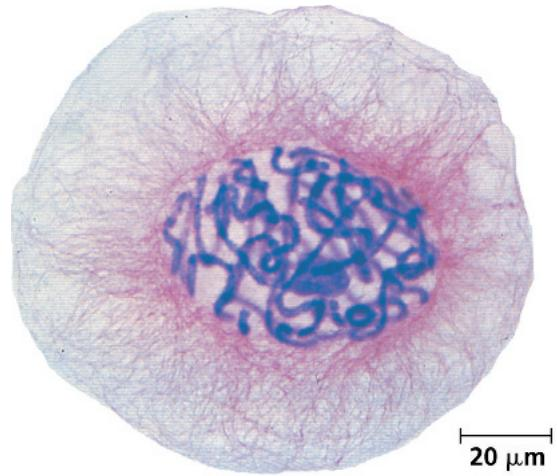

to as chromatin. As you will soon see, the chromatin of a chromosome varies in its degree of condensation during the process of cell division. (Figure 16.23 shows how this chromatin is packed into the cell nucleus.)

Every eukaryotic species has a characteristic number of chromosomes in each cell's nucleus. For example, the nuclei of human somatic cells (all body cells except the reproductive cells) each contain 46 chromosomes, made up of two sets of 23, one set inherited from each parent. Reproductive cells, or gametes—such as sperm and eggs—have half as many chromosomes as somatic cells; in our example, human gametes have one set of 23 chromosomes. The number of chromosomes in somatic cells varies widely among species: 18 in cabbage plants, 48 in chimpanzees, 56 in elephants, 90 in hedgehogs, and 148 in one species of alga. We'll now consider how these chromosomes behave during cell division.

## Distribution of Chromosomes During Eukaryotic Cell Division

When a cell is not dividing, and even as it replicates its DNA in preparation for cell division, each chromosome is in the form of a long, thin chromatin fiber. After DNA replication, however, the

chromosomes condense as a part of cell division: Each chromatin fiber becomes densely coiled and folded, making the chromosomes much shorter and so thick that we can see them with a light microscope. (See Figure 16.23.)

Each duplicated chromosome consists of two sister chromatids, which are joined copies of the original chromosome (Figure 12.4). The two chromatids, each containing an identical DNA molecule, are often attached all along their lengths by protein complexes called cohesins; this attachment is known as sister chromatid cohesion. Each sister chromatid has a centromere, a region made up of repetitive sequences in the chromosomal DNA where the chromatid is attached most closely to its sister chromatid. This attachment is mediated by proteins that recognize and bind to the centromeric DNA; other bound proteins condense the DNA, giving the duplicated chromosome a narrow “waist.” The portion of a chromatid to either side of the centromere is referred to as an arm of the chromatid. (An unduplicated chromosome has a single centromere, distinguished by the proteins that bind there, and two arms.)

Later in the cell division process, the two sister chromatids of each duplicated chromosome separate and move into two new nuclei, one forming at each end of the cell. Once the sister chromatids separate, they are no longer called sister chromatids but are considered individual chromosomes;

Figure 12.4 A highly condensed, duplicated human chromosome. (SEM)  
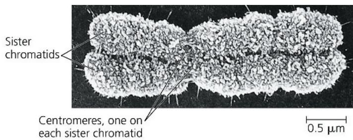  
DRAW IT Circle one sister chromatid of this chromosome.  
For suggested answer, see Appendix A.

this is the step that essentially doubles the number of chromosomes during cell division. Thus, each new nucleus receives a collection of chromosomes identical to that of the parent cell (Figure 12.5). Mitosis, the division of the genetic material in the nucleus, is usually followed immediately by cytokinesis, the division of the cytoplasm. One cell has become two, each the genetic equivalent of the parent cell.

Figure 12.5 Chromosome duplication and distribution during cell division.  
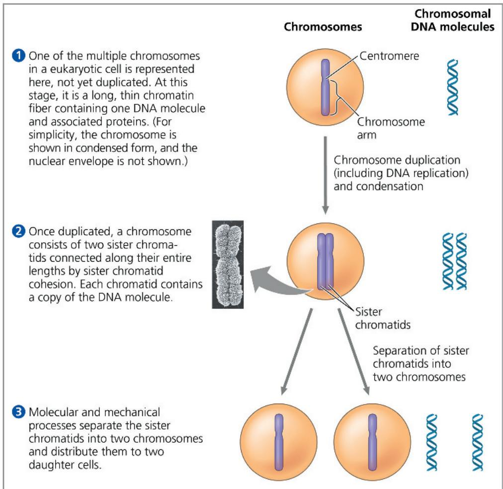  
How many chromatid arms does the chromosome in ② have? Identify the point in the figure where one chromosome becomes two. For suggested answer, see Appendix A.

In a dividing cell, the mitotic (M) phase alternates with interphase, a growth period.

From a fertilized egg, mitosis and cytokinesis produced the 37 trillion somatic cells that now make up your body, and the same processes continue to generate new cells to replace dead and damaged ones. In contrast, you produce gametes—eggs or sperm—by a variation of cell division called meiosis, which yields daughter cells with only one set of chromosomes, half as many chromosomes as the parent cell. Meiosis in humans occurs only in special cells in the ovaries or testes (the gonads). Generating gametes, meiosis reduces the chromosome number from 46 (two sets) to 23 (one set). Fertilization fuses two gametes together and returns the chromosome number to 46 (two sets). Mitosis then conserves that number in every somatic cell nucleus of the new human individual. In Chapter 13, we will examine the role of meiosis in reproduction and inheritance in more detail. In the remainder of this chapter, we focus on mitosis and the rest of the cell cycle in eukaryotes.

## Concept Check 12.1

1. How many chromosomes are drawn in each part of Figure 12.5? (Ignore the micrograph in step 2.)

2. WHAT IF? A chicken has 78 chromosomes in its somatic cells. How many chromosomes did the chicken inherit from each parent? How many chromosomes are in each of the chicken's gametes? How many chromosomes will be in each somatic cell of the chicken's offspring?

For suggested answers, see Appendix A.

## Concept 12.2: The mitotic phase alternates with interphase in the cell cycle

In 1882, a German anatomist named Walther Flemming developed dyes that allowed him to observe, for the first time, the behavior of chromosomes during mitosis and cytokinesis. (In fact, Flemming coined the terms mitosis and chromatin.) During the period between one cell division and the next, it appeared to Flemming that the cell was simply growing larger. But we now know that many critical events occur during this stage in the life of a cell.

## Phases of the Cell Cycle

Mitosis is just one part of the cell cycle, the life of a cell from the time it is first formed during division of a parent cell until its own division into two daughter cells (Figure 12.6). (Biologists use the words daughter or sister in relation to cells, but this is not meant to imply gender.) In fact, the mitotic phase (M), which includes both mitosis and cytokinesis, is usually the shortest part of the cell cycle. The mitotic phase alternates with a much longer stage called interphase, which often accounts for about 90% of the cycle. Interphase can be divided into three phases: the

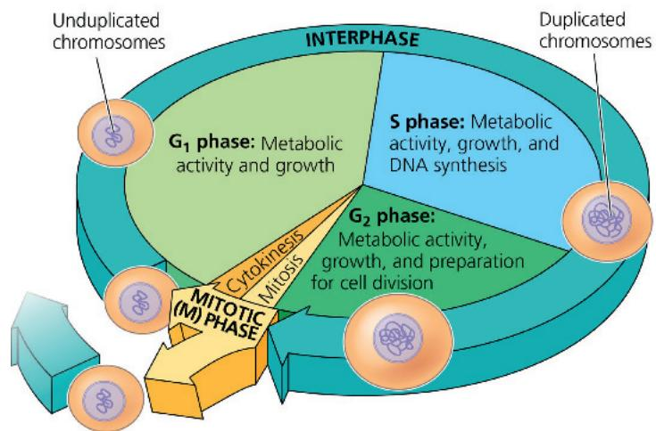  
MITOTIC (M) PHASE: Mitosis: Distribution of chromosomes into two daughter nuclei Cytokinesis: Division of cytoplasm, producing two daughter cells. Each daughter cell can start a new cell cycle.

G $_{1}$ phase (“first gap”), the S phase (“synthesis”), and the G $_{2}$ phase (“second gap”). The G phases were misnamed as “gaps” when they were first observed because the cells appeared inactive, but we now know that intense metabolic activity and growth occur throughout interphase. During all three phases of interphase, actually, a cell grows by producing proteins and cytoplasmic organelles such as mitochondria and endoplasmic reticulum. Duplication of the chromosomes, crucial for eventual division of the cell, occurs entirely during the S phase. (We’ll explore synthesis, or replication, of DNA in Concept 16.2.) Thus, a cell grows (G $_{1}$ ), continues to grow as it copies its chromosomes (S), grows more as it completes preparations for cell division (G $_{2}$ ), and divides (M). The daughter cells may then repeat the cycle.

A particular human cell might undergo one division in 24 hours. Of this time, the M phase would occupy less than 1 hour, while the S phase might occupy 10–12 hours, or about half the cycle. The rest of the time would be apportioned between the $G_{1}$ and $G_{2}$ phases. The $G_{2}$ phase usually takes 4–6 hours; in our example, $G_{1}$ would occupy about 5–6 hours. $G_{1}$ is the most variable in length in different types of cells. Some cells in a multicellular organism divide very infrequently or not at all. These cells spend their time in $G_{1}$ (or a related phase called $G_{0}$ , to be discussed later in the chapter) doing their job in the organism—a cell of the pancreas secretes digestive enzymes, for example.

Mitosis is conventionally broken down into five stages: prophase, prometaphase, metaphase, anaphase, and telophase. Overlapping with the latter stages of mitosis, cytokinesis completes the mitotic phase. Figure 12.7 describes these stages in an animal cell. Study this figure thoroughly before proceeding to the next two sections, which examine mitosis and cytokinesis more closely.

## Exploring Mitosis in an Animal Cell

Figure 12.7  
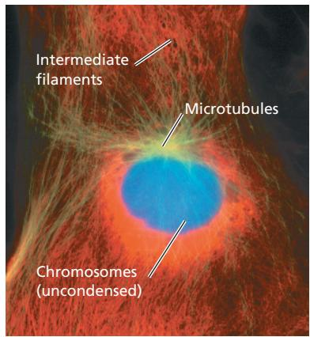  
$G_{2}$ of Interphase

  
Prophase

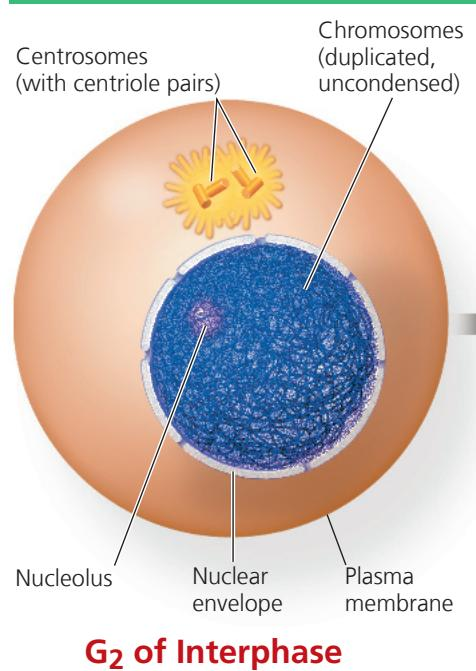

Prometaphase  

## $G_{2}$ of Interphase

• A nuclear envelope encloses the nucleus.

\- The nucleus contains one or more nucleoli (singular, nucleolus).

\- Two centrosomes have formed by duplication of a single centrosome. Centrosomes are regions in animal cells that organize the microtubules of the spindle. Each centrosome contains two centrioles.

\- Chromosomes, duplicated during S phase, cannot be seen individually because they have not yet condensed.

## Prophase

The fluorescence micrographs show dividing lung cells from a newt; this species has 22 chromosomes. Chromosomes appear blue, microtubules green, and intermediate filaments red. For simplicity, the drawings show only 6 chromosomes.

\- The chromatin fibers become more tightly coiled, condensing into discrete chromosomes observable with a light microscope.

• The nucleoli disappear.

\- Each duplicated chromosome appears as two identical sister chromatids joined at their centromeres and, in some species, all along their arms by cohesins, arms by cohesins (sister chromatid cohesion).

\- The mitotic spindle (named for its shape) begins to form. It is composed of the centrosomes and the microtubules that extend from them. The radial arrays of shorter microtubules that extend from the centrosomes are called asters (“stars”).

\- The centrosomes move away from each other, propelled partly by the lengthening microtubules between them.

## Prometaphase

\- The nuclear envelope fragments.

\- The microtubules extending from each centrosome can now invade the nuclear area.

\- The chromosomes have become even more condensed.

\- A kinetochore, a specialized protein structure, has now formed at the centromere of each chromatid (thus, two per chromosome).

\- Some of the microtubules attach to the kinetochores, becoming “kinetochore microtubules,” which jerk the chromosomes back and forth.

\- Nonkinetochore microtubules interact with those from the opposite pole of the spindle, lengthening the cell.

10 μm

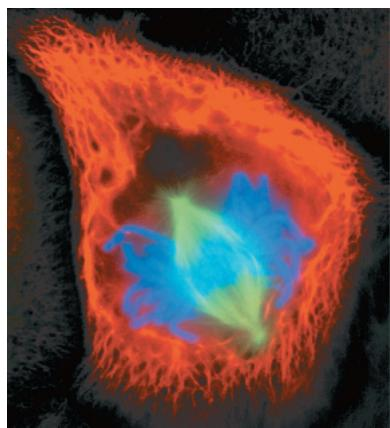  
Metaphase

  
Anaphase

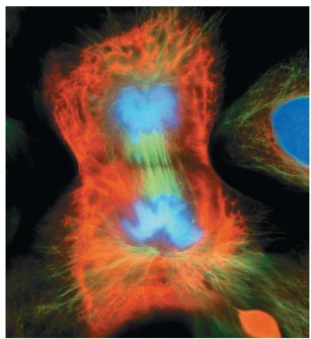  
Telophase and Cytokinesis

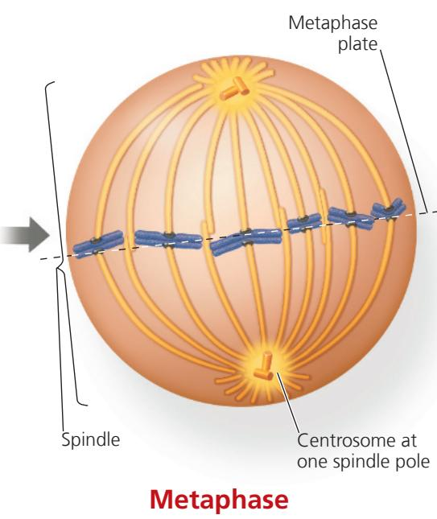

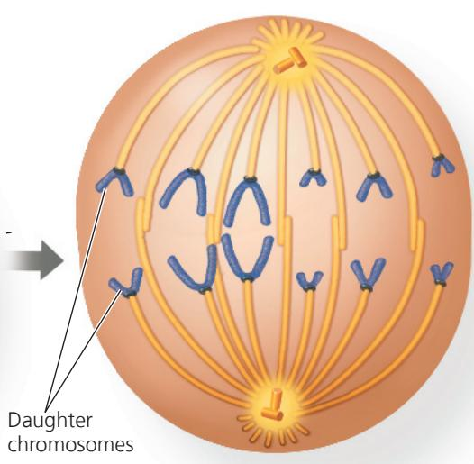

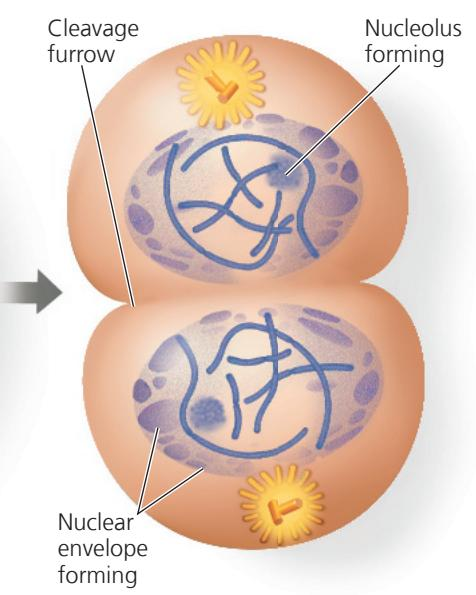

\- The centrosomes are now at opposite poles of the cell.

\- The chromosomes have all arrived at the metaphase plate, a plane that is equidistant between the spindle's two poles. The chromosomes' centromeres lie at the metaphase plate.

\- For each chromosome, the kinetochores of the sister chromatids are attached to kinetochore microtubules coming from opposite poles.

## Anaphase

\- Anaphase is the shortest stage of mitosis, often lasting only a few minutes.

\- Anaphase begins when the cohesin proteins are cleaved. This allows the two sister chromatids of each pair to part suddenly. Each chromatid thus becomes an independent chromosome.

\- The two new daughter chromosomes begin moving toward opposite ends of the cell as their kinetochore microtubules shorten. Because these microtubules are attached at the centromere region, the centromeres are pulled ahead of the arms, moving at a rate of about 1 $\mu$ m/min.

\- The cell elongates as the nonkinetochore microtubules lengthen.

\- By the end of anaphase, the two ends of the cell have equivalent and complete collections of chromosomes.

## Telophase

\- Two daughter nuclei form in the cell. Nuclear envelopes arise from the fragments of the parent cell's nuclear envelope and other portions of the endomembrane system.

\- Nucleoli reappear.

• The chromosomes become less condensed.

\- Any remaining spindle microtubules are depolymerized.

\- Mitosis, the division of one nucleus into two genetically identical nuclei, is now complete.

## Cytokinesis

\- The division of the cytoplasm is usually well under way by late telophase, so the two daughter cells appear shortly after the end of mitosis.

\- In animal cells, cytokinesis involves the formation of a cleavage furrow, which pinches the cell in two.

DRAW IT On the lower micrograph, draw a line indicating the position of the metaphase plate. Draw arrows showing the directions of chromosome movement when anaphase begins.
For suggested answer, see Appendix A.

## The Mitotic Spindle: A Closer Look

Many of the events of mitosis depend on the mitotic spindle, which begins to form in the cytoplasm during prophase. This structure consists of fibers made of microtubules and associated proteins. While the mitotic spindle assembles, the other microtubules of the cytoskeleton partially disassemble, providing the material used to construct the spindle. The spindle microtubules elongate (polymerize) by incorporating more subunits of the protein tubulin (see Table 6.1) and shorten (depolymerize) by losing subunits.

In animal cells, the assembly of spindle microtubules starts at the centrosome, a subcellular region containing material that functions throughout the cell cycle to organize the cell's microtubules. (It is also a type of microtubule-organizing center.) A pair of centrioles is located at the center of the centrosome, but they are not essential for cell division: If the centrioles are destroyed with a laser microbeam, a spindle nevertheless forms during mitosis. In fact, centrioles are not even present in plant cells, which do form mitotic spindles.

During interphase in animal cells, the single centrosome duplicates, forming two centrosomes, which remain near the nucleus. The two centrosomes move apart during prophase and prometaphase of mitosis as spindle microtubules grow out from them. By the end of prometaphase, the two centrosomes, one at each pole of the spindle, are at opposite ends of the cell. An aster, a radial array of short microtubules, extends from each centrosome. The spindle includes the centrosomes, the spindle microtubules, and the asters.

Each of the two sister chromatids of a duplicated chromosome has a kinetochore, a structure made up of proteins that have assembled on specific sections of DNA at each centromere. The chromosome's two kinetochores face in opposite directions. During prometaphase, some of the spindle microtubules attach to the kinetochores; these are called kinetochore microtubules. (The number of microtubules attached to a kinetochore varies among species, from one microtubule in yeast cells to 40 or so in some mammalian cells.) When one of a chromosome's kinetochores is "captured" by microtubules, the chromosome begins to move toward the pole from which those microtubules extend. However, this movement comes to a halt as soon as microtubules from the opposite pole attach to the kinetochore on the other chromatid. What happens next is like a tug-of-war that ends in a draw. The chromosome moves first in one direction and then in the other, back and forth, finally settling midway between the two ends of the cell. At metaphase, the centromeres of all the duplicated chromosomes are on a plane midway between the spindle's two poles. This plane is called the metaphase plate, which is an imaginary plate rather than an actual cellular structure (Figure 12.8). Meanwhile, microtubules that do not attach to kinetochores have been elongating, and by metaphase they overlap and interact with other nonkinetochore microtubules from the opposite pole of the spindle. By metaphase, the microtubules of the asters have also grown and are in contact with the plasma membrane. The spindle is now complete.

The structure of the spindle correlates well with its function during anaphase. Anaphase begins suddenly when the cohesins holding together the sister chromatids of each chromosome are cleaved by an enzyme called separase. Once separated, the chromatids become individual chromosomes that move toward opposite ends of the cell.

How do the kinetochore microtubules function in this poleward movement of chromosomes? Apparently, two

Figure 12.8 The mitotic spindle at metaphase.

The kinetochores of each chromosome's two sister chromatids face in opposite directions. Here, each kinetochore is attached to a cluster of kinetochore microtubules (see TEM) extending from the nearest centrosome. Nonkinetochore microtubules overlap at the metaphase plate. The fluorescent micrograph is a rat kangaroo cell at metaphase.

mechanisms are in play, both involving motor proteins. (To review how motor proteins move an object along a microtubule, see Figure 6.21.) Results of a cleverly designed experiment suggested that motor proteins on the kinetochores “walk” the chromosomes along the microtubules, which depolymerize at their kinetochore ends after the motor proteins have passed (Figure 12.9). (This is referred to as the “Pacman” mechanism because of its resemblance to the arcade game character that moves by eating all the dots in its path.) However, other researchers, working with different cell types or cells from other species, have shown that chromosomes are “reeled in” by motor proteins at the spindle poles and that the microtubules depolymerize after they pass by these motor proteins at the poles. The general consensus now is that both mechanisms are used and that their relative contributions vary among cell types.

## Figure 12.9

# Inquiry: At which end do kinetochore microtubules shorten during anaphase?

## Experiment

Gary Borisy and colleagues at the University of Wisconsin wanted to determine whether kinetochore microtubules depolymerize at the kinetochore end or the pole end as chromosomes move toward the poles during mitosis. First they labeled the microtubules of a pig kidney cell in early anaphase with a yellow fluorescent dye. (Nonkinetochore microtubules are not shown.)

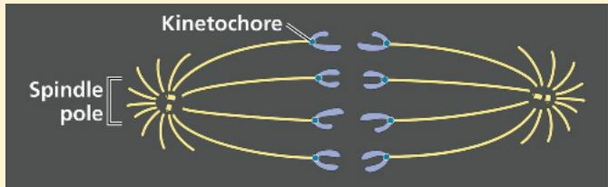

Then they marked a region of the kinetochore microtubules between one spindle pole and the chromosomes by using a laser to eliminate the fluorescence from that region, while leaving the microtubules intact (see below). As anaphase proceeded, they monitored the changes in microtubule length on either side of the non-fluorescent mark.

In a dividing animal cell, the nonkinetochore microtubules are responsible for elongating the whole cell during anaphase. Nonkinetochore microtubules from opposite poles overlap each other extensively during metaphase (see Figure 12.8). During anaphase, the region of overlap is reduced as motor proteins attached to the microtubules walk them away from one another, using energy from ATP. As the microtubules push apart from each other, their spindle poles are pushed apart, elongating the cell. At the same time, the microtubules lengthen somewhat by the addition of tubulin subunits to their overlapping ends. As a result, the microtubules continue to overlap.

At the end of anaphase, duplicate groups of chromosomes have arrived at opposite ends of the elongated parent cell. Nuclei re-form during telophase. Cytokinesis generally begins during anaphase or telophase, and the spindle eventually disassembles by depolymerization of microtubules.

## Results

As the chromosomes moved poleward, the microtubule segments on the kinetochore side of the mark shortened, while those on the spindle pole side stayed the same length.

## Conclusion

During anaphase in this cell type, chromosome movement is correlated with kinetochore microtubules shortening at their kinetochore ends and not at their spindle pole ends. This experiment supports the hypothesis that during anaphase, a chromosome is walked along a microtubule as the microtubule depolymerizes at its kinetochore end, releasing tubulin subunits.

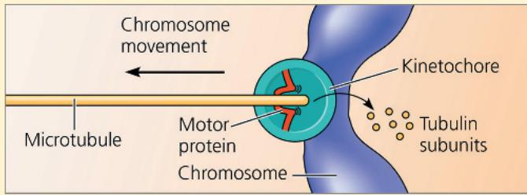  
Data from G. J. Gorbsky, P. J. Sammak, and G. G. Borisy, Chromosomes move poleward in anaphase along stationary microtubules that coordinately disassemble from their kinetochore ends, Journal of Cell Biology 104:9–18 (1987).  
WHAT IF? If this experiment had been done on a cell type in which “reeling in” at the poles was the main cause of chromosome movement, how would the mark have moved relative to the poles? How would the microtubule portions on either side of the mark have changed?

For suggested answer, see Appendix A.

## Cytokinesis: A Closer Look

In animal cells, cytokinesis occurs by a process known as cleavage. The first sign of cleavage is the appearance of a cleavage furrow, a shallow groove in the cell surface near the old metaphase plate (Figure 12.10a). On the cytoplasmic side of the furrow is a contractile ring of actin microfilaments associated with molecules of the protein myosin. The actin microfilaments interact with the myosin molecules, causing the ring to contract. The contraction of the dividing cell's ring of microfilaments is like the pulling of a drawstring. The cleavage furrow deepens until the parent cell is pinched in two, producing two completely separated cells, each with its own nucleus and its own share of cytosol, organelles, and other subcellular structures.

Cytokinesis in plant cells, which have cell walls, is markedly different. There is no cleavage furrow. Instead, during telophase, vesicles derived from the Golgi apparatus move along microtubules to the middle of the cell, where they coalesce, producing a

Figure 12.10 Cytokinesis in animal and plant cells.  
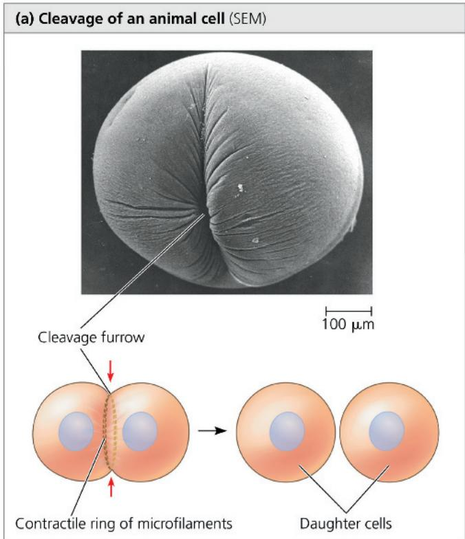

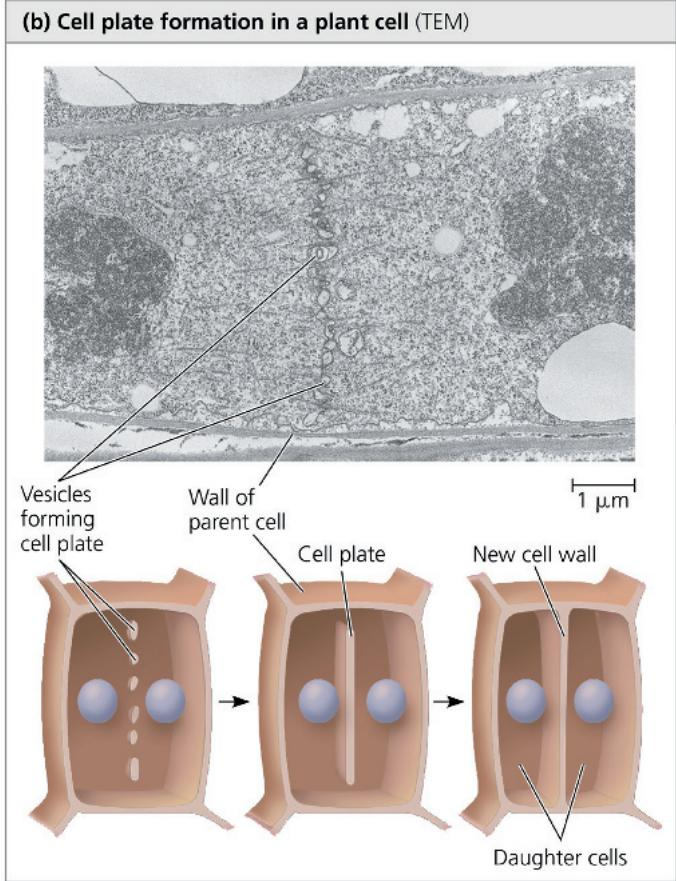

cell plate. Cell wall materials carried in the vesicles collect inside the cell plate as it grows (Figure 12.10b). The cell plate enlarges until its surrounding membrane fuses with the plasma membrane along the perimeter of the cell. Two daughter cells result, each with its own plasma membrane. Meanwhile, a new cell wall arising from the contents of the cell plate forms between the daughter cells.

Figure 12.11 is a series of micrographs of a dividing plant cell. Examining this figure will help you review mitosis and cytokinesis.

## Binary Fission in Bacteria

Prokaryotic organisms (in both Bacteria and Archaea) can undergo a type of reproduction in which the cell grows to roughly double its size and then divides to form two cells. The term binary fission, meaning “division in half,” refers to this process and to the asexual reproduction of single-celled eukaryotes, such as the amoeba in Figure 12.2a. However, the process in eukaryotes involves mitosis, while that in prokaryotic organisms does not.

In bacteria, most genes are carried on a single bacterial chromosome that consists of a circular DNA molecule and associated proteins. Although bacteria are smaller and simpler than eukaryotic cells, the challenge of replicating their genomes in an orderly fashion and distributing the copies equally to two daughter cells is still formidable. For example, when it is fully stretched out, the chromosome of the bacterium Escherichia coli is about 500 times as long as the cell. For such a long chromosome to fit within the cell, it must be highly coiled and folded.

In some bacteria, the process of cell division is initiated when the DNA of the bacterial chromosome begins to replicate at a specific place on the chromosome called the origin of replication, producing two origins. As the chromosome continues to replicate, one origin moves rapidly toward the opposite end of the cell (Figure 12.12). While the chromosome is replicating, the cell elongates. When replication is complete and the bacterium has reached about twice its initial size, proteins cause its plasma membrane to pinch inward, dividing the parent bacterial cell into two daughter cells. In this way, each cell inherits a complete genome.

Using the techniques of modern DNA technology to tag the origins of replication with molecules that glow green in fluorescence microscopy (see Figure 6.3), researchers have directly observed the movement of bacterial chromosomes. This movement is reminiscent of the poleward movements of the centromere regions of eukaryotic chromosomes during anaphase of mitosis, but bacteria don't have visible mitotic spindles or even microtubules. In most bacterial species studied, the two origins of replication end up at opposite ends of the cell or in some other very specific location, possibly anchored there by one or more proteins. How bacterial chromosomes move and how their specific location is established and maintained are active areas of research. Several proteins that play important roles have been identified. Polymerization of one protein resembling eukaryotic actin apparently functions in bacterial chromosome movement during cell division, and another protein that is related to tubulin helps pinch the plasma membrane inward, separating the two bacterial daughter cells.

## The Evolution of Mitosis

EVOLUTION Given that prokaryotic organisms preceded eukaryotes on Earth by more than a billion years, we might hypothesize that mitosis evolved from simpler prokaryotic mechanisms of cell reproduction. The fact that some of the proteins involved in bacterial binary fission are related to eukaryotic proteins that function in mitosis supports that hypothesis.

As eukaryotes with nuclear envelopes and larger genomes evolved, the ancestral process of binary fission, seen today in bacteria,

  
Figure 12.12 Bacterial cell division by binary fission.
The bacterium E. coli, shown here, has a single, circular chromosome.  
Figure 12.11 Mitosis in a plant cell.

These light micrographs show mitosis in cells of an onion root.

Nucleus

Nucleolus

Chromosomes condensing

1 Prophase. The chromosomes are condensing and the nucleolus is beginning to disappear. Although not yet visible in the micrograph, the mitotic spindle is starting to form.

Chromosomes  
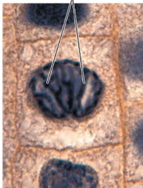

2 Prometaphase. Discrete chromosomes are now visible; each consists of two aligned, identical sister chromatids. Later in prometaphase, the nuclear envelope will fragment.

Metaphase. The spindle is complete, and the chromosomes, attached to microtubules at their kinetochores, are all at the metaphase plate.

Cell plate  
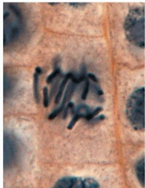

10 μm

4 Anaphase. Chromatids of each chromosome have separated. The daughter chromosomes are moving to the ends of the cell as their kinetochore microtubules shorten.

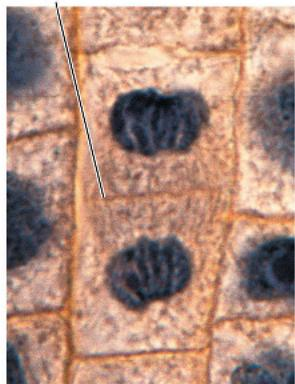

5 Telophase. Daughter nuclei are forming. Cytokinesis has started: The cell plate, which will divide the cytoplasm in two, grows toward the perimeter of the parent cell.

## 1 Chromosome

replication begins at the origin. Soon after, one copy of the origin moves rapidly toward the other end of the cell by a mechanism involving an actin-like protein.

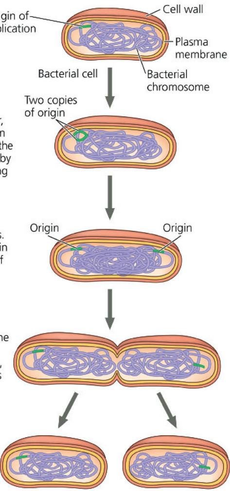

2 Replication continues. One copy of the origin is now at each end of the cell. Meanwhile, the cell elongates.

3 Replication finishes. The plasma membrane is pinched inward by a tubulin-like protein, and a new cell wall is deposited.

Two daughter cells result.

somehow gave rise to mitosis. Variations on cell division exist in different groups of organisms. These variant processes may be similar to mechanisms used by ancestral species and thus may resemble steps in the evolution of mitosis from a binary fission-like process presumably carried out by very early bacteria. Possible intermediate stages are suggested by two unusual types of nuclear division found today in certain unicellular eukaryotes—dinoflagellates, diatoms, and some yeasts (Figure 12.13, on the next page). These two modes of nuclear division are thought to be cases where ancestral mechanisms have remained relatively unchanged over evolutionary time. In both types, the nuclear envelope remains intact, in contrast to what happens in most eukaryotic cells. Keep in mind, however, that we can't observe cell division in cells of extinct species. This hypothesis uses only currently existing species as some possible examples of intermediate mechanisms. Other mechanisms may have existed in species that have gone extinct; we simply have no way of knowing.

## Concept Check 12.2

1. How many chromosomes are shown in the illustration in Figure 12.8? Are they duplicated? How many chromatids are shown?

2. Compare cytokinesis in animal cells and plant cells.

3. During which stages of the cell cycle does a chromosome consist of two identical chromatids?

4. Compare the roles of tubulin and actin during eukaryotic cell division with the roles of tubulin-like and actin-like proteins during bacterial binary fission.

5. A kinetochore has been compared to a coupling device that connects a motor to the cargo that it moves. Explain.

6. MAKE CONNECTIONS What other functions do actin and tubulin carry out? Name the proteins they interact with to do so. (Review Figures 6.21a and 6.26a.)

Figure 12.13 Mechanisms of cell division in several groups of organisms.

Some unicellular eukaryotes existing today have mechanisms of cell division that may resemble intermediate steps in the evolution of mitosis. Except for (a), cell walls are not shown.

(a) Bacteria. During binary fission in bacteria, the origins of the daughter chromosomes move to opposite ends of the cell. The mechanism involves polymerization of actin-like molecules and possibly proteins that may anchor the daughter chromosomes to specific sites on the plasma membrane.

  
(b) Dinoflagellates. In unicellular eukaryotes called dinoflagellates, the chromosomes attach to the nuclear envelope, which remains intact during cell division. Microtubules pass through the nucleus inside cytoplasmic tunnels, reinforcing the spatial orientation of the nucleus, which then divides in a process reminiscent of bacterial binary fission.

(c) Diatoms and some yeasts (unicellular fungi). In these two other groups of unicellular eukaryotes, the nuclear envelope also remains intact during cell division. In these organisms, the microtubules form a spindle within the nucleus. Microtubules separate the chromosomes, and the nucleus splits into two daughter nuclei.

  
(d) Most eukaryotes. In most other eukaryotes, including plants and animals, the spindle forms outside the nucleus, and the nuclear envelope breaks down during mitosis. Microtubules separate the chromosomes, and two nuclear envelopes then form.

# Concept 12.3: The eukaryotic cell cycle is regulated by a molecular control system

The timing and rate of cell division in different parts of a plant or animal are crucial to normal growth, development, and maintenance. The frequency of cell division varies with the type of cell. For example, human skin cells divide frequently throughout life, whereas liver cells maintain the ability to divide but keep it in reserve until an appropriate need arises—say, to repair a wound. Some of the most specialized cells, such as fully formed nerve cells and muscle cells, do not divide at all in a mature human. These cell cycle differences result from regulation at the molecular level. The mechanisms of this regulation are of great interest, not only to understand the life cycles of normal cells but also to learn how cancer cells manage to escape the usual controls.

## The Cell Cycle Control System

What controls the cell cycle? In the early 1970s, a variety of experiments led to the hypothesis that the cell cycle is driven by specific signaling molecules present in the cytoplasm. Some of the first strong evidence for this hypothesis came from experiments with mammalian cells grown in culture. In these experiments, two cells in different phases of the cell cycle were fused to form a single cell with two nuclei (Figure 12.14). If one of the original cells was in the S phase and the other was in $G_{1}$ , the $G_{1}$ nucleus immediately entered the S phase, as though stimulated by signaling molecules present in the cytoplasm of the first cell. Similarly, if a cell undergoing mitosis (M phase) was fused with another cell in any stage of its cell cycle, even $G_{1}$ , the second nucleus immediately entered mitosis, with condensation of the chromatin and formation of a mitotic spindle.

The experiment shown in Figure 12.14 and other experiments on animal cells and yeasts demonstrated that the sequential events of the cell cycle are directed by a distinct cell cycle control system, a cyclically operating set of molecules in the cell that both triggers and coordinates key events in the cell cycle (Figure 12.15). The cell cycle control system has been compared to the control device of a washing machine. Like the washer's timing device, the cell cycle control system proceeds on its own, according to a built-in clock. However, just as a washer's cycle is subject to both internal control (such as the sensor that detects when the tub is filled with water) and external adjustment (such as starting or stopping the machine), the cell cycle is regulated at certain checkpoints by both internal and external signals. A checkpoint in the cell cycle is a control point where stop and go-ahead signals can regulate the cycle. Three important checkpoints are found in the $G_1$ , $G_2$ , and M phases (red gates in Figure 12.15), which will be discussed shortly.

To understand how cell cycle checkpoints work, we'll first identify some of the molecules that make up the cell cycle control system (the molecular basis for the cell cycle clock) and describe how a cell progresses through the cycle. We'll then consider the internal and external checkpoint signals that can make the clock either pause or continue.

## Figure 12.14

# Inquiry: Do molecular signals in the cytoplasm regulate the cell cycle?

Experiment

Researchers at the University of Colorado wondered whether a cell's progression through the cell cycle is controlled by cytoplasmic molecules. They induced cultured mammalian cells at different phases of the cell cycle to fuse. Two experiments are shown.

## Results

  
When a cell in S phase was fused with a cell in $G_{1}$ , the $G_{1}$ nucleus immediately entered S phase—DNA was synthesized.  
When a cell in M phase was fused with a cell in $G_{1}$ , the $G_{1}$ nucleus immediately began mitosis—a spindle formed and the chromosomes condensed, even though the chromosomes had not been duplicated.

## Conclusion

The results of fusing a $G_{1}$ cell with a cell in the S or M phase of the cell cycle suggest that molecules present in the cytoplasm during the S or M phase control the progression to those phases.

Data from R. T. Johnson and P. N. Rao, Mammalian cell fusion: Induction of premature chromosome condensation in interphase nuclei, Nature 226:717–722 (1970).

WHAT IF? If the progression of phases did not depend on cytoplasmic molecules and each phase began when the previous one was complete, how would the results have differed?

For suggested answer, see Appendix A.

## The Cell Cycle Clock: Cyclins and Cyclin-Dependent Kinases

Rhythmic fluctuations in the abundance and activity of cell cycle control molecules pace the sequential events of the cell cycle. These regulatory molecules are mainly proteins of two types: protein kinases and cyclins. As you learned in Concept 11.3, protein kinases are enzymes that activate or inactivate other proteins by phosphorylating them.

Many of the kinases that drive the cell cycle are actually present at a constant concentration in the growing cell, but much of the time they are in an inactive form. To be active, such a kinase must be attached to a cyclin, a protein that gets its name from its cyclically fluctuating concentration in the cell. Because

Figure 12.15 Mechanical analogy for the cell cycle control system. In this diagram, the flat “stepping stones” around the perimeter represent sequential events. Like the control device of a washing machine, the cell cycle control system proceeds on its own, driven by a built-in clock. However, the system is subject to internal and external regulation at various checkpoints; three important checkpoints are shown (red gates).  
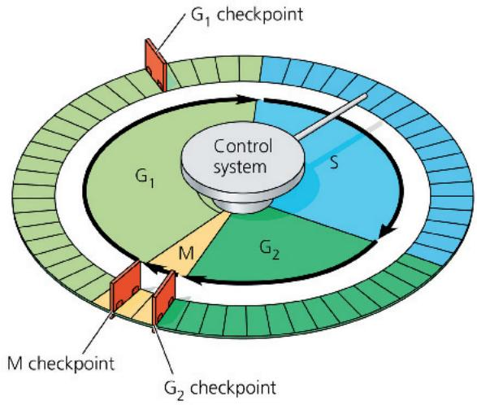

## Interview

Interview with Paul Nurse: Discovering how protein kinases control the cell cycle (eTextbook only)

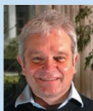

of this requirement, these kinases are called cyclin-dependent kinases, or Cdks. The activity of a Cdk rises and falls with changes in the concentration of its cyclin partner. Figure 12.16a, on the next page, shows the fluctuating activity of MPF, the cyclin-Cdk complex that was discovered first (in frog eggs). Note that the peaks of MPF activity correspond to the peaks of cyclin concentration. The cyclin level rises during the S and $G_{2}$ phases and then falls abruptly during M phase.

The initials MPF stand for “maturation-promoting factor,” but we can think of MPF as “M-phase-promoting factor” because it triggers the cell’s passage into the M phase, past the $G_{2}$ checkpoint. When cyclins that accumulate during $G_{2}$ associate with Cdk molecules, the resulting MPF complex is active—it phosphorylates a variety of proteins, initiating mitosis (Figure 12.16b). MPF acts both directly as a kinase and indirectly by activating other kinases. For example, MPF causes phosphorylation of various proteins of the nuclear lamina (see Figure 6.9), which promotes fragmentation of the nuclear envelope during prometaphase of mitosis. There is also evidence that MPF contributes to molecular events required for chromosome condensation and spindle formation during prophase.

During anaphase, MPF helps switch itself off by initiating a process that leads to the destruction of its own cyclin. The noncyclin part of MPF, the Cdk, persists in the cell, inactive until it becomes part of MPF again by associating with new cyclin molecules synthesized during the S and $G_{2}$ phases of the next round of the cycle.

The fluctuating activities of different cyclin-Cdk complexes are of major importance in controlling all the stages of the cell

For suggested answer, see Appendix A.

VISUAL SKILLS Explain how the events in the diagram in (b) are related to the "Time" axis of the graph in (a), beginning at the left.

Figure 12.16 Molecular control of the cell cycle at the $G_{2}$ checkpoint.

The steps of the cell cycle are timed by rhythmic fluctuations in the activity of cyclin-dependent kinases (Cdks). Here we focus on a cyclin-Cdk complex in animal cells called MPF, which acts at the $G_{2}$ checkpoint as a go-ahead signal, triggering the events of mitosis.

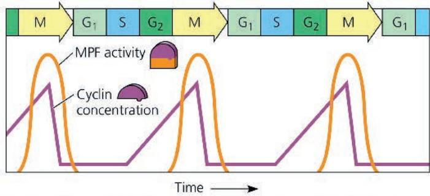  
(a) Fluctuation of MPF activity and cyclin concentration during the cell cycle

$$
G _ {2}
$$

  
(b) Molecular mechanisms that help regulate the cell cycle

cycle; they also give the go-ahead signals at some checkpoints. As mentioned above, MPF controls the cell's passage through the $G_{2}$ checkpoint. Cell behavior at the $G_{1}$ checkpoint is also regulated by the activity of cyclin-Cdk protein complexes. Animal cells appear to have at least three Cdk proteins and several different cyclins that operate at this checkpoint. Next, let's consider checkpoints in more detail.

## Stop and Go Signs: Internal and External Signals at the Checkpoints

Animal cells generally have built-in stop signals that halt the cell cycle at checkpoints until overridden by go-ahead signals. Many signals registered at checkpoints come from cellular surveillance mechanisms inside the cell. These signals report whether crucial cellular processes that should have occurred by that point have in fact been completed correctly and thus whether or not the cell cycle should proceed. Checkpoints also register signals from outside the cell. The signals are transmitted within the cell by signal transduction pathways (see Figure 11.6). Three important checkpoints are those in the $G_{1}$ , $G_{2}$ , and M phases (see Figure 12.15).

For many cells, the $G_{1}$ checkpoint (also called the restriction point) seems to be the most important. If a cell does not receive a go-ahead signal at the $G_{1}$ checkpoint, it may exit the cycle, switching into a nondividing state called the $G_{0}$ phase (Figure 12.17a). If a cell does receive a go-ahead signal that allows it to pass the $G_{1}$ checkpoint, it was thought until recently that the cell was committed to completing the $G_{1}$ , S, $G_{2}$ , and M phases and dividing, even in the absence of further signals. However, research studies reported in 2023 have identified a subset (up to 15%) of cells that pass the $G_{1}$ checkpoint but are not committed to dividing unless the go-ahead signals continue. These cells may go through S phase and then exit the cycle, or they may continue through cell division, depending on how long the go-ahead signals are present; cyclin proteins are involved here as well. This research is significant because it highlights the complex nature of checkpoints—something that is crucial to our understanding of cell cycle regulation, and therefore how its misregulation can contribute to cancer.

Most cells of the human body are actually in the $G_{0}$ phase. As mentioned earlier, mature nerve cells and muscle cells never divide. Other cells, such as liver cells, can be “called back” from the $G_{0}$ phase to the cell cycle by external cues, such as growth factors released during injury.

Biologists are currently working out the pathways that link signals originating inside and outside the cell with the responses by cyclin-dependent kinases and other proteins. An example of an internal signal occurs at the third important checkpoint, the M checkpoint (Figure 12.17b). Anaphase, the separation of sister chromatids, does not begin until all the chromosomes are properly attached to the spindle at the metaphase plate. Researchers have learned that as long as some kinetochores are unattached to spindle microtubules, the sister chromatids remain together, delaying anaphase. Only when the kinetochores of all the chromosomes are properly attached to the spindle does the appropriate regulatory protein complex become activated. (In this case, the regulatory molecule is not a cyclin-Cdk complex but, instead, a different complex made up of several proteins.) Once activated, the complex sets off a chain of molecular events that activates the enzyme separase, which cleaves the cohesins, allowing the sister chromatids to separate. This mechanism ensures that daughter cells do not end up with missing or extra chromosomes.

There are checkpoints in addition to those in $G_{1}$ , $G_{2}$ , and M. For instance, a checkpoint in S phase stops cells with DNA damage from proceeding in the cell cycle. And, a decade or so ago, researchers presented evidence for another checkpoint between

4 PDGF is added to half the vessels. The culture vessels are incubated at 37°C for 24 hours.

Figure 12.17 Two important checkpoints.

At certain checkpoints in the cell cycle (red gates), cells do different things depending on the signals they receive. Events of the (a) $G_{1}$ and (b) M checkpoints are shown. In (b), the $G_{2}$ checkpoint has already been passed by the cell.

In the absence of a go-ahead signal, a cell exits the cell cycle and enters $G_{0}$ , a nondividing state.

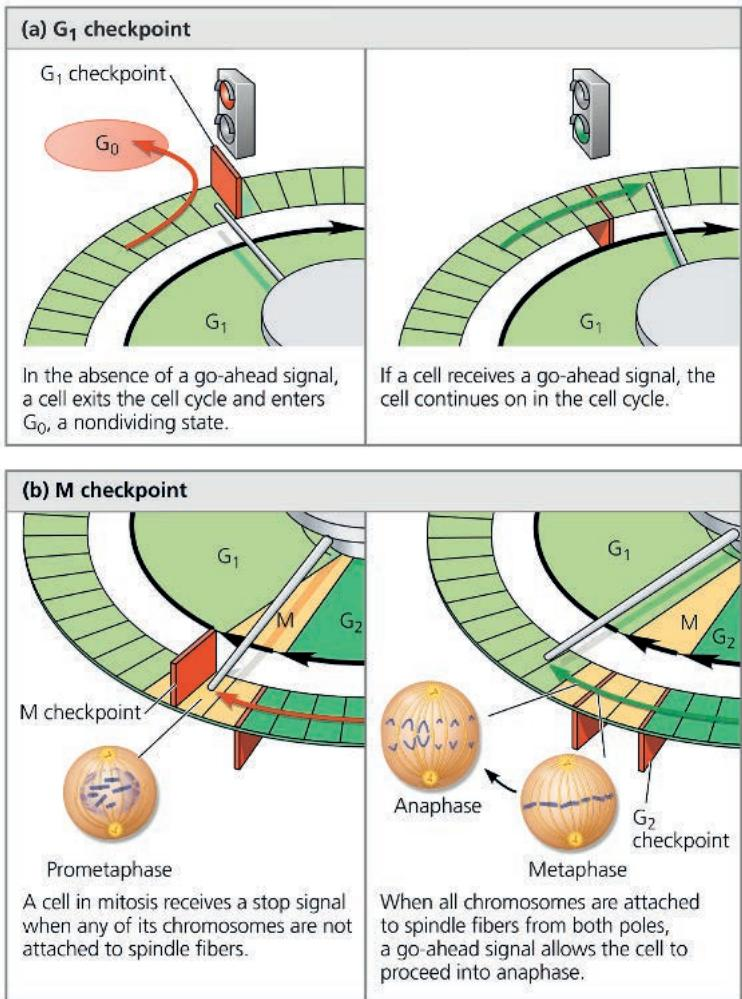  
If a cell receives a go-ahead signal, the cell continues on in the cell cycle.

WHAT IF? What might be the result if the cell ignored either checkpoint and progressed through the cell cycle? For suggested answer, see Appendix A.

anaphase and telophase that ensures anaphase is completed and the chromosomes are well separated before cytokinesis can begin, thus avoiding chromosomal damage.

What about the stop and go-ahead signals themselves—what are the signaling molecules? Studies using animal cells in culture have led to the identification of many external factors, both chemical and physical, that can influence cell division. For example, cells fail to divide if an essential nutrient is lacking in the culture medium. (This is analogous to trying to run a washing machine without the water supply hooked up; an internal sensor won't allow the machine to continue past the point where water is needed.) And even if all other conditions are favorable, most types of mammalian cells divide in culture only if the growth medium includes specific growth factors. As mentioned in Concept 11.1, a growth factor is a protein released by certain cells that stimulates other cells to divide. Different cell types respond specifically to different growth factors or combinations of growth factors.

Consider, for example, platelet-derived growth factor (PDGF), which is made by blood cell fragments called platelets. When an injury occurs, platelets release PDGF in the vicinity. The experiment illustrated in Figure 12.18 demonstrates that PDGF is required for the division of cultured fibroblasts, a type of connective tissue cell. Fibroblasts have PDGF receptors on their plasma membranes. The binding of PDGF molecules to these receptors (which are receptor tyrosine kinases; see Figure 11.8) triggers a signal transduction pathway that allows the cells to pass the $G_{1}$ checkpoint and divide. PDGF stimulates fibroblast division not only in the artificial conditions of cell culture but also in an animal's body. Thus, injury results in a proliferation of fibroblasts that helps heal the wound.

The effect of an external physical factor on cell division is clearly seen in density-dependent inhibition, a phenomenon

Figure 12.18 The effect of platelet-derived growth factor (PDGF) on cell division.

2 Enzymes are used to digest the extracellular matrix in the tissue pieces, resulting in a suspension of free fibroblasts.

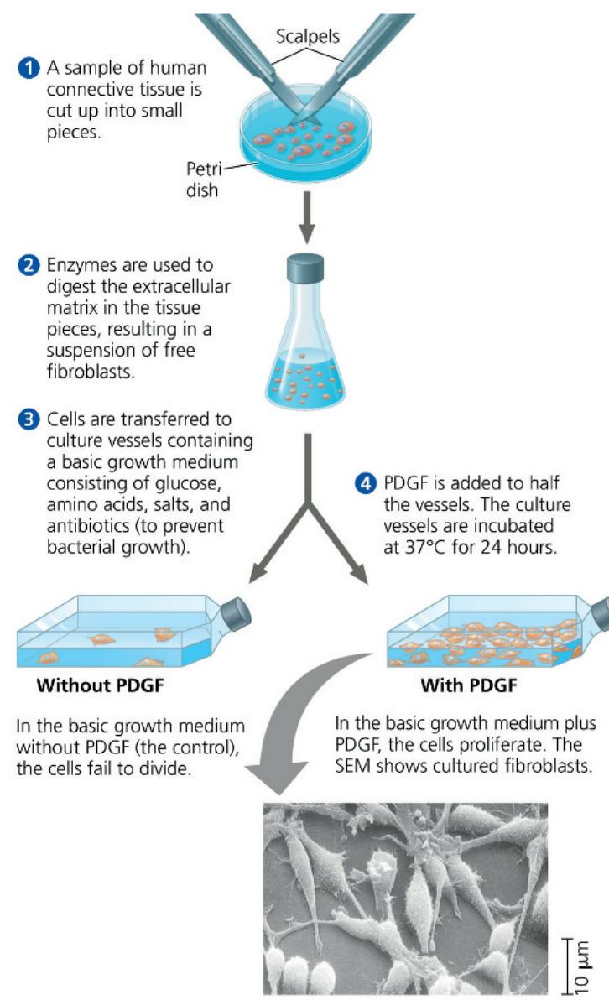

3 Cells are transferred to culture vessels containing a basic growth medium consisting of glucose, amino acids, salts, and antibiotics (to prevent bacterial growth).

Without PDGF

In the basic growth medium without PDGF (the control), the cells fail to divide.

In the basic growth medium plus PDGF, the cells proliferate. The SEM shows cultured fibroblasts.

MAKE CONNECTIONS PDGF signals cells by binding to a cell-surface receptor tyrosine kinase. If you added a chemical that blocked phosphorylation, how would the results differ? (See Figure 11.8.) For suggested answer, see Appendix A.

Cells anchor to dish surface and divide (anchorage dependence).

Figure 12.19 Density-dependent inhibition and anchorage dependence of cell division.

Individual cells are shown disproportionately large in the drawings.

  
When cells have formed a complete single layer, they stop dividing (density-dependent inhibition).

(a) Normal mammalian cells. Cell density is limited to a single layer by contact with neighboring cells and the availability of nutrients, growth factors, and a substratum for attachment.  
  
(b) Cancer cells. Cancer cells usually continue to divide well beyond a single layer, forming a clump of overlapping cells. They do not exhibit anchorage dependence or density-dependent inhibition.

in which crowded cells stop dividing (Figure 12.19a). Studies done many years ago showed that cultured cells normally divide until they form a single layer of cells on the inner surface of a culture flask, at which point the cells stop dividing. If some cells are removed, those bordering the open space begin dividing again and continue until the vacancy is filled. Follow-up studies revealed that the binding of a cell-surface protein to its counterpart on an adjoining cell sends a signal to both cells that inhibits cell division, preventing them from moving forward in the cell cycle, even in the presence of growth factors.

Most animal cells also exhibit anchorage dependence (see Figure 12.19a). To divide, they must be attached to something, such as the inside of a culture flask or the extracellular matrix of a tissue. Experiments suggest that, like cell density, anchorage is signaled to the cell cycle control

system via pathways involving plasma membrane proteins and elements of the cytoskeleton linked to them.

Density-dependent inhibition and anchorage dependence appear to function not only in cell culture but also in the body's tissues, checking the growth of cells at some optimal density and location during embryonic development and throughout an organism's life. Cancer cells, which we examine next, exhibit neither density-dependent inhibition nor anchorage dependence (Figure 12.19b).

## Loss of Cell Cycle Controls in Cancer Cells

Cancer cells do not heed the normal signals that regulate the cell cycle. In culture, they do not stop dividing when growth factors are depleted. A logical hypothesis is that cancer cells do not need growth factors in their culture medium to grow and divide. They may make a required growth factor themselves, or they may have an abnormality in the signaling pathway that conveys the growth factor's signal to the cell cycle control system even in the absence of that factor. Another possibility is an abnormal cell cycle control system. In these scenarios, the underlying basis of the abnormality is almost always a change in one or more genes (for example, a mutation) that alters the function of their protein products, resulting in faulty cell cycle control. We'll explore the molecular basis for such changes in Concept 18.5.

There are other important differences between normal cells and cancer cells that reflect malfunctions of the cell cycle. If and when they stop dividing, cancer cells do so at random points in the cycle, rather than at the normal checkpoints. Moreover, cancer cells can go on dividing indefinitely in culture if they are given a continual supply of nutrients; in essence, they are “immortal.” A striking example is a cell line that has been reproducing in culture since 1951. Cells of this line are called HeLa cells because their original source was a tumor removed from a woman named Henrietta Lacks. (Neither Ms. Lacks nor her family gave permission or even knew about the propagation and use of her cells, which have helped biologists make countless significant discoveries over the years.) Cells in culture that acquire the ability to divide indefinitely are said to have undergone a process called transformation, causing them to behave (in cell division, at least) like cancer cells. By contrast, nearly all normal, nontransformed mammalian cells growing in culture divide only about 20 to 50 times before they stop dividing, age, and die. Finally, cancer cells evade the normal controls that trigger a cell to undergo apoptosis when something is wrong—for example, when an irreparable mistake has occurred during DNA replication preceding mitosis.

Abnormal cell behavior in the body can be catastrophic. The problem begins when a single cell in a tissue undergoes the first of many steps that convert a normal cell to a cancer cell. Such a cell often has altered proteins on its surface, and the body's immune system normally recognizes the cell as “nonself”—an insurgent—and destroys it. However, if the cell evades destruction, it may proliferate and form a tumor, a mass of abnormal cells within otherwise normal tissue. The abnormal cells may remain at the original site if their genetic and cellular changes don't allow them to move to or survive at another site. In that case, the tumor is called a benign tumor. Most benign tumors do not cause serious problems (depending on their location) and can be removed by surgery. In contrast, a malignant tumor includes

Figure 12.20 The growth and metastasis of a malignant breast tumor.  
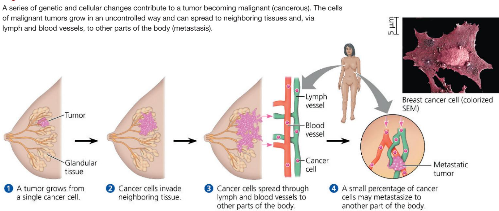

cells whose genetic and cellular changes enable them to spread to new tissues and impair the functions of one or more organs; these cells are also sometimes called transformed cells (although usage of this term is generally restricted to cells in culture). An individual with a malignant tumor is said to have cancer (Figure 12.20).

The changes that have occurred in cells of malignant tumors show up in many ways besides excessive proliferation. These cells may have unusual numbers of chromosomes, though whether this is a cause or an effect of tumor-related changes is an ongoing debate. Their metabolism may be altered, and they may cease to function in any constructive way. Abnormal changes on the cell surface cause cancer cells to lose attachments to neighboring cells and the extracellular matrix, allowing them to spread into nearby tissues. Cancer cells may also secrete signaling molecules that cause blood vessels to grow toward the tumor. A few tumor cells may separate from the original tumor, enter blood vessels and lymph vessels, and travel to other parts of the body. There, they may proliferate and form a new tumor. This spread of cancer cells to locations distant from their original site is called metastasis (see Figure 12.20).

A tumor that appears to be localized may be treated with high-energy radiation, which damages DNA in cancer cells much more than DNA in normal cells, apparently because the majority of cancer cells have lost the ability to repair such damage. To treat known or suspected metastatic tumors, chemotherapy is used, in which drugs that are toxic to actively dividing cells are administered through the circulatory system. As you might expect, chemotherapeutic drugs interfere with specific steps in the cell cycle. For example, the drug Taxol freezes the mitotic spindle by preventing microtubule depolymerization, which stops actively dividing cells from proceeding past metaphase and leads to their destruction. The side effects of chemotherapy are due to the effects of the drugs on normal cells that divide frequently, due to the function of that cell type in the organism. For example, nausea results from chemotherapy's effects on intestinal cells, hair loss from effects on hair follicle cells, and susceptibility to infection from effects on immune system cells. You can work with data from an experiment involving a potential chemotherapeutic agent in the Scientific Skills Exercise.

Over the past several decades, researchers have produced a flood of valuable information about cell-signaling pathways and how their malfunction contributes to the development of cancer through effects on the cell cycle. Coupled with new molecular techniques, such as the ability to rapidly sequence the DNA of cells in a particular tumor, medical treatments for cancer are beginning to become more “personalized” to a particular patient’s tumor.

For example, the cells of roughly 20% of breast cancer tumors show abnormally high amounts of a cell-surface receptor tyrosine kinase called HER2, and many show an increase in the number of estrogen receptor (ER) molecules, intracellular receptors that can trigger cell division. Based on lab findings, a physician can prescribe chemotherapy with a molecule that blocks the function of the specific protein (Herceptin for HER2 and tamoxifen for ERs). Treatment using these agents, when appropriate, has led to increased survival rates and fewer cancer recurrences (see Make Connections Figure 18.27).

## Interview

Interview with Bruce Alberts: Cancer control and careers in science (eTextbook only)

## Concept Check 12.3

1. In Figure 12.14, why do the nuclei resulting from experiment 2 contain different amounts of DNA?

2. How does MPF allow a cell to pass the $G_{2}$ phase checkpoint and enter mitosis? (See Figure 12.16.)

3. MAKE CONNECTIONS Explain how receptor tyrosine kinases and intracellular receptors might function in triggering cell division. (Review Figures 11.8 and 11.9 and Concept 11.2.)

## Scientific Skills Exercise Interpreting Histograms

At What Phase Is the Cell Cycle Arrested by an Inhibitor? Many medical treatments are aimed at stopping cancer cell proliferation by blocking the cell cycle of cancerous tumor cells. One potential treatment is a cell cycle inhibitor derived from human umbilical cord stem cells. In this exercise, you will compare two histograms to determine where in the cell cycle the inhibitor blocks the division of cancer cells.

How the Experiment Was Done In the treated sample, human glioblastoma (brain cancer) cells were grown in tissue culture in the presence of the inhibitor, while a control sample of glioblastoma cells was grown in its absence. After 72 hours of growth, the two cell samples were harvested. To get a “snapshot” of the phase of the cell cycle each cell was in at that time, the samples were treated with a fluorescent chemical that binds to DNA and then run through a flow cytometer, an instrument that records the fluorescence level of each cell. Computer software then graphed the number of cells in each sample with a particular fluorescence level, as shown below.

## Data from the Experiment

  
Data from K. K. Velpula et al., Regulation of glioblastoma progression by cord blood stem cells is mediated by downregulation of cyclin D1, PLoS ONE 6(3):e18017 (2011).

The data are plotted in a type of graph called a histogram (above), which groups the values for a numeric variable on the x-axis into intervals. A histogram allows you to see how all the experimental subjects (cells, in this case) are distributed along a continuous variable (amount of fluorescence). In these histograms, the bars are so narrow that the data appear to follow a curve for which you can detect peaks and dips. Each narrow bar represents the number of cells observed to have a level of fluorescence in the range of that interval. This in turn indicates the relative amount of DNA in those cells. Overall, comparing the two histograms allows you to see how the DNA content of this cell population is altered by the treatment.

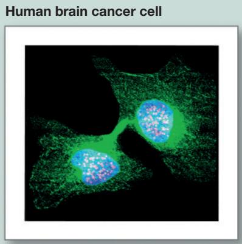

## INTERPRET THE DATA

1. Study the data in the histograms. (a) Which axis indirectly shows the relative amount of DNA per cell? Explain your answer. (b) In the control sample, compare the first peak in the histogram (in region A) to the second peak (in region C). Which peak shows the population of cells with the higher amount of DNA per cell? Explain. (For additional information about histograms, see the Scientific Skills Review in Appendix D.)

2. (a) In the control sample histogram, identify the phase of the cell cycle ( $G_{1}$ , S, or $G_{2}$ ) of the population of cells in each region delineated by vertical lines. Label the histogram with these phases and explain your answer. (b) Does the S phase population of cells show a distinct peak in the histogram? Why or why not?

3. The histogram representing the treated sample shows the effect of growing the cancer cells alongside human umbilical cord stem cells that produce the potential inhibitor.
(a) Label the histogram with the cell cycle phases. Which phase of the cell cycle has the greatest number of cells in the treated sample? Explain.
(b) Compare the distribution of cells among $G_{1}$ , S, and $G_{2}$ phases in the control and treated samples. What does this tell you about the cells in the treated sample?
(c) Based on what you learned in Concept 12.3, propose a mechanism by which the stem cell-derived inhibitor might arrest the cancer cell cycle at this stage. (More than one answer is possible.)

Instructors: A version of this Scientific Skills Exercise can be assigned in Mastering Biology.

# Chapter 12 Review

## Summary of Key Concepts

To review key terms, go to the Vocabulary Self-Quiz (eTextbook only).

## Concept 12.1: Most cell division results in genetically identical daughter cells

\- Unicellular organisms reproduce by cell division; multicellular organisms depend on cell division for their development from a fertilized egg and for growth and repair.

\- The genetic material (DNA) of a cell—its genome—is partitioned among chromosomes. Each eukaryotic chromosome consists of one DNA molecule associated with many proteins. Together, the complex of DNA and associated proteins is called chromatin. The chromatin of a chromosome exists in different states of condensation at different times. In animals, gametes have one set of chromosomes and somatic cells have two sets.

\- Cells replicate their genetic material before they divide, each daughter cell receiving a copy of the DNA. Prior to cell division, chromosomes are duplicated. Each one then consists of two identical sister chromatids often joined along their lengths by sister chromatid cohesion and held most tightly together at a constricted region at the centromeres. When this cohesion is broken, the chromatids separate during cell division, becoming the chromosomes of the daughter cells. Eukaryotic cell division consists of mitosis (division of the nucleus) and cytokinesis (division of the cytoplasm).

Differentiate between these terms: chromosome, chromatin, and chromatid.

## Concept 12.2: The mitotic phase alternates with interphase in the cell cycle

\- Cell division is part of the cell cycle, an ordered sequence of events in the life of a cell.

\- Between divisions, a cell is in interphase: the $G_{1}$ , S, and $G_{2}$ phases. The cell grows throughout interphase, with DNA being replicated during the synthesis (S) phase. Mitosis and cytokinesis make up the mitotic (M) phase of the cell cycle.

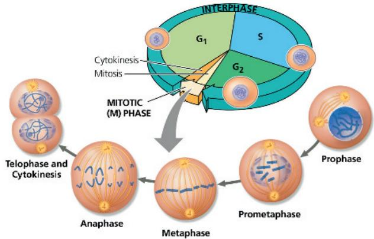

\- The mitotic spindle, made up of microtubules, controls chromosome movement during mitosis. In animal cells, it arises from the centrosomes and includes spindle microtubules and asters. Some spindle microtubules attach to the kinetochores of chromosomes and move the chromosomes to the metaphase plate. After sister chromatids separate, motor proteins move them along kinetochore microtubules toward opposite ends of the cell. The cell elongates when motor proteins push nonkinet-ochore microtubules from opposite poles away from each other.

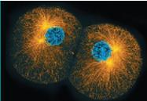

\- Mitosis is usually followed by cytokinesis. Animal cells carry out cytokinesis by cleavage, and plant cells form a cell plate.

\- During binary fission in bacteria, the chromosome replicates and the daughter chromosomes actively move apart. Some of the proteins involved in bacterial binary fission are related to eukaryotic actin and tubulin.

\- Since prokaryotes preceded eukaryotes by more than a billion years, it is likely that mitosis evolved from prokaryotic cell division. Certain unicellular eukaryotes exhibit mechanisms of cell division that may be similar to those of ancestors of existing eukaryotes. Such mechanisms might represent intermediate steps in the evolution of mitosis.

In which of the three phases of interphase and the stages of mitosis do chromosomes exist as single DNA molecules?

## Concept 12.3: The eukaryotic cell cycle is regulated by a molecular control system

\- Signaling molecules present in the cytoplasm regulate progress through the cell cycle.

\- In the cell cycle control system, cyclic changes in regulatory proteins—including cyclins and cyclin-dependent kinases (Cdks)—work as a cell cycle clock. The cell cycle stops at specific checkpoints until a go-ahead signal is received; important checkpoints occur in $G_{1}$ , $G_{2}$ , and M phases. Internal and external signals control the cell cycle checkpoints via signal transduction pathways. Most cells exhibit density-dependent inhibition of cell division as well as anchorage dependence.

\- Cancer cells elude normal cell cycle regulation and divide unchecked, forming tumors. Malignant tumors invade nearby tissues and can undergo metastasis, exporting cancer cells to other sites, where they may form secondary tumors.

Explain the significance of the $G_{1}$ , $G_{2}$ , and M checkpoints and the go-ahead signals involved in the cell cycle control system.

For suggested answers, see Appendix A.

## Test Your Understanding

For more multiple-choice questions, go to the Practice Test (eTextbook only).

## Levels 1-2: Remembering/Understanding

1. Through a microscope, you can see a cell plate beginning to develop across the middle of a cell and nuclei forming on either side of the cell plate. This cell is most likely

(A) an animal cell in the process of cytokinesis.

(B) a plant cell in the process of cytokinesis.

(C) a bacterial cell dividing.

(D) a plant cell in metaphase.

2. Vinblastine is a standard chemotherapeutic drug used to treat cancer. Because it interferes with the assembly of microtubules, its effectiveness must be related to

(A) disruption of mitotic spindle formation.

(B) suppression of cyclin production.

(C) myosin denaturation and inhibition of cleavage furrow formation.

(D) inhibition of DNA synthesis.

3. One difference between cancer cells and normal cells is that cancer cells
(A) are unable to synthesize DNA.
(B) are arrested at the S phase of the cell cycle.
(C) continue to divide even when they are tightly packed together.
(D) cannot function properly because they are affected by density-dependent inhibition.

4. The decline of MPF activity at the end of mitosis is due to (A) the destruction of the protein kinase Cdk.
(B) decreased synthesis of Cdk.
(C) the degradation of cyclin.
(D) the accumulation of cyclin.

5. In the cells of some organisms, mitosis occurs without cytokinesis. This will result in
(A) cells with more than one nucleus.
(B) cells that are unusually small.
(C) cells lacking nuclei.
(D) cell cycles lacking an S phase.

6. Which of the following occurs during S phase?
(A) condensation of the chromosomes
(B) replication of the DNA
(C) separation of sister chromatids
(D) spindle formation

## Levels 3-4: Applying/Analyzing

7. Cell A has half as much DNA as cells B, C, and D in a mitotically active tissue. Cell A is most likely in
(A) $G_{1}$ .
(B) $G_{2}$ .
(C) prophase.
(D) metaphase.

8. The drug cytochalasin B blocks the function of actin. Which of the following aspects of the animal cell cycle would be most disrupted by cytochalasin B?
(A) spindle formation
(B) spindle attachment to kinetochores
(C) cell elongation during anaphase
(D) cleavage furrow formation and cytokinesis

9. VISUAL SKILLS The light micrograph shows dividing cells near the tip of an onion root. Identify a cell in each of the following stages: prophase, prometaphase, metaphase, anaphase, and telophase. Describe the major events occurring at each stage.

10. DRAW IT Draw one eukaryotic chromosome as it would appear during interphase, during each of the stages of mitosis, and during cytokinesis. Also draw and label the nuclear envelope and any microtubules attached to the chromosome(s).

## Levels 5-6: Evaluating/Creating

11. EVOLUTION CONNECTION The result of mitosis is that the daughter cells end up with the same number of chromosomes that the parent cell had. Another potential way to maintain the number of chromosomes would be to carry out cell division first and then duplicate the chromosomes in each daughter cell. Assess whether this would be an equally good way of organizing the cell cycle. Explain why evolution has not led to this alternative.

12. SCIENTIFIC INQUIRY Although both ends of a microtubule can gain or lose subunits, one end (called the plus end) polymerizes and depolymerizes at a higher rate than the other end (the minus end). For spindle microtubules, the plus ends are in the center of the spindle, and the minus ends are at the poles. Motor proteins that move along microtubules specialize in walking either toward the plus end or toward the minus end; the two types are called plus end-directed and minus end-directed motor proteins, respectively. Given what you know about chromosome movement and spindle changes during anaphase, predict which type of motor proteins would be present on (a) kinetochore microtubules and (b) nonkinetochore microtubules.

13. WRITE ABOUT A THEME: INFORMATION The continuity of life is based on heritable information in the form of DNA. In a short essay (100–150 words), explain how the process of mitosis faithfully parcels out exact copies of this heritable information in the production of genetically identical daughter cells.

## 14. SYNTHESIZE YOUR KNOWLEDGE

  
Shown here are two HeLa cancer cells that are just completing cytokinesis. Explain how the cell division of cancer cells like these is misregulated. Identify genetic and other changes that might have caused these cells to escape normal cell cycle regulation.
For selected answers, see Appendix A.

Genetics

An Interview with Pardis Sabeti

Dr. Pardis Sabeti is a professor at Harvard University and the Harvard School of Public Health, a Howard Hughes Medical Investigator, a core institute member at the Broad Institute, and a member of the National Academy of Medicine. She attended Massachusetts Institute of Technology (MIT) as an undergraduate, received a master's degree and a PhD from Oxford University, and an MD from Harvard Medical School. Her genomic analysis of Ebola virus during the outbreak in West Africa in 2014 showed that it was being transmitted from person to person. Currently, her lab at the Broad Institute focuses on developing computational methods for detecting, tracking, and responding to deadly pathogens. Her many awards include "Person of the Year" in 2014 as one of the Ebola fighters and 100 Most Influential People in 2015, both from TIME magazine. Outside of work, Pardis is lead singer in the band Thousand Days.

## How did you get started in biology?

I was born in Iran and came to the United States in 1978 when I was 2 because of the revolution that happened in Iran. We were basically dropped into American culture. My entry into science was that I loved math and puzzles. In seventh grade, my math teacher brought in a video of a robotics competition at MIT. I couldn't believe a place like that existed—I immediately said, “I'll go there!” At MIT, I took a lot of math classes, but math was not a big major there. On the other hand, biology was huge. Eric Lander was my advisor, and I learned about genetics. I was never really a classical biologist—I just love how logic and math underlie genetics.

## What did you do after college?

I went to Oxford University in England as a Rhodes Scholar, intending to study anthropology and sociology before going to medical school. But when I got there, I was encouraged to study medical and population genetics because of my research experience. I got into computational genetics, developing mathematical tools to analyze genetic data. I ended up studying

African-American history using DNA sequences as a record. My PhD focused on understanding resistance to malaria in humans, also using computational genetics. I was basically “mining the genome,” which I continued doing in my postdoctoral position back at MIT.

## What were you looking for while mining the genome?

What's really cool about the genome is its logic. Humans pass their genes along according to certain principles, which leads to patterns in DNA sequences that you can see. Certain mutations occur again and again, and over time they leave a sort of “footprint” in our DNA that can be used to trace back information. I started recognizing patterns. Every time I saw a gene that was thought to be adaptive (beneficial to humans), a characteristic pattern in the DNA was associated with it. Essentially, some patterns indicate that a mutation has occurred recently, but has rapidly increased in the population. This type of natural selection, called positive selection, can tell us a lot about human evolution. We saw that one of the major drivers of human evolution is infectious disease. Looking at genomes across all populations, one of the most significant mutations that was being positively selected was in a gene important for infection by Lassa virus, a virus I'd never really heard about! Genomic research is like a scavenger hunt: You pull one thread and it leads to something else—you never know what you'll find. Once I realized viruses were so important in human evolution, I focused my research on both human genome evolution and infectious viruses.

"Genomic research is like a scavenger hunt: You pull one thread and it leads to something else—you never know what you'll find."

## You've worked on viruses all over the world. How have you navigated that work?

To understand genetic resistance to Lassa virus, we identified Lassa fever patients in clinics and villages in Nigeria and Sierra Leone, collecting samples and studying the virus. We realized that Lassa virus, and probably others, were widespread, but often undiagnosed. Together with Dr. Christian Happi of Redeemer's University in Ede, Nigeria, a molecular biologist and genomicist, we developed the African Center for Excellence for the Genomics of Infectious Diseases. We got a grant that has allowed us to train individuals in 53 of the 54 African countries. We started a program, Sentinel, to track viral outbreaks. Our goal is to democratize science, to put these efficient, effective tools in the hands of everyone; we want them to be freely available.

  
Dr. Pardis Sabeti

  
Dr. Sabeti in the lab processing DNA microarray samples (see Figure 20.13) to analyze human genomic diversity.

That's such powerful work. What advice do you have for students beginning biology?

As a student, the number one thing that's associated with your mental fortitude and stamina is the health of your body. I had a near-fatal accident in 2015 and shattered my pelvis and both my knees. That taught me that there is no brain without the body. I also learned that I couldn't wait to get back to my work, because I love what I do. It's such an amazing job—I get to work with incredible people and to find out things about humans and the world that no one has ever known before. What a remarkable privilege to be able to do that!

