# 第15章 The Chromosomal Basis of Inheritance

<!-- 章节边界按正文内容恢复；原始 MinerU 内容保留如下。 -->

# The Chromosomal Basis of Inheritance

## Key Concepts

15.1 Mendelian inheritance has its physical basis in the behavior of chromosomes

15.2 Sex-linked genes exhibit unique patterns of inheritance

15.3 Linked genes tend to be inherited together because they are located near each other on the same chromosome

15.4 Alterations of chromosome number or structure cause some genetic disorders

15.5 Some inheritance patterns are exceptions to standard Mendelian inheritance

  
Figure 15.1 The yellow dots mark the locations of a specific gene, tagged with a fluorescent yellow dye, on a pair of homologous chromosomes. The chromosomes have duplicated, so each chromosome has two sister chromatids, each with a copy of the gene. This provides a visual demonstration that genes—Mendel's “factors”—are segments of DNA located along chromosomes.

## Study Tip

Draw chromosomes: As you work on the figure legend questions in this chapter, draw the chromosomes for the crosses described in the questions. Shown here is a starting sketch for the What If? question that follows Figure 15.3. (Here you are including sex chromosomes to keep track of the offspring.)

  
Genes are located on chromosomes. In diploid cells, chromosomes and genes are present in pairs.  
Chromosomes duplicate before cell division. Each duplicated chromosome has two copies of each allele, one on each sister chromatid.

## What is the relationship between genes and chromosomes?

During meiosis I, homologous chromosomes separate and alleles segregate. In meiosis II, sister chromatids separate.

Genes are passed on as discrete units. Each chromosome has one version of a gene (one allele).

Offspring inherit one allele from each parent.

  
— Homologous chromosomes each have one allele of a given gene at the same locus. The chromosomes in this example have different alleles.

## Concept 15.1: Mendelian inheritance has its physical basis in the behavior of chromosomes

When Gregor Mendel proposed the existence of “hereditary factors” in 1860, no cellular structures had been identified that could house these imaginary units, and most biologists were skeptical. When the processes of mitosis and meiosis were worked out later that century, biologists saw parallels between the behavior of Mendel’s proposed factors (genes) during sexual life cycles and the behavior of chromosomes: As shown in Figure 15.1, chromosomes and genes are both present in pairs in diploid cells, and homologous chromosomes separate and alleles segregate during the process of meiosis. After meiosis, fertilization restores the paired condition for both chromosomes and genes. Around 1902, Walter S. Sutton, Theodor Boveri, and others independently noted these parallels and began to develop the chromosome theory of inheritance. According to this theory, Mendelian genes have specific loci (sites) along chromosomes, and it is the chromosomes that undergo segregation and independent assortment.

The first solid evidence associating a specific gene with a specific chromosome came early in the 1900s from the work of Thomas Hunt Morgan, an experimental embryologist at Columbia University. Although Morgan was initially doubtful about both Mendelian genetics and the chromosome theory, his early experiments provided convincing evidence that chromosomes are indeed the location of Mendel's heritable factors.

## Morgan's Choice of Experimental Organism

Many times in the history of biology, important discoveries have come to those insightful or lucky enough to choose an experimental organism suitable for the research problem being tackled. Mendel chose the garden pea because a number of distinct varieties were available. For his work, Morgan selected a species of fruit fly, Drosophila melanogaster, a common insect that feeds on the fungi growing on fruit. Fruit flies are prolific breeders; a single mating will produce hundreds of offspring, and a new generation can be bred every two weeks. Morgan's laboratory began using this convenient organism for genetic studies in 1907 and soon became known as "the fly room."

Another advantage of the fruit fly is that it has only four pairs of chromosomes, which are easily distinguishable with a light microscope. There are three pairs of autosomes and one pair of sex chromosomes. Female fruit flies have a pair of homologous X chromosomes, and males have one X chromosome and one Y chromosome.

While Mendel could readily obtain different pea varieties from seed suppliers, Morgan was probably the first person to want different varieties of the fruit fly. He faced the tedious task of carrying out many matings and then microscopically inspecting large numbers of offspring in search of naturally occurring variant individuals. After many months of this, he complained, “Two years’ work wasted. I have been breeding those flies for all that time and I’ve got nothing out of it.” Morgan persisted, however, and was

Wild-type Drosophila flies have red eyes (left). Among his flies, Morgan discovered a mutant male with white eyes (right). This variation made it possible for Morgan to trace a gene for eye color to a specific chromosome.

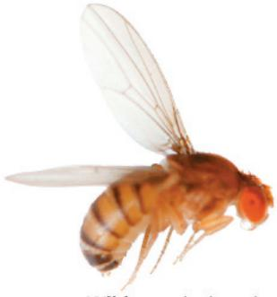

  
Wild type (red eyes)  
Mutant (white eyes)

finally rewarded with the discovery of a single male fly with white eyes instead of the usual red. The phenotype for a character most commonly observed in natural populations, such as red eyes in Drosophila, is called the wild type (Figure 15.2). Traits that are alternatives to the wild type, such as white eyes in Drosophila, are called mutant phenotypes because they are due to alleles assumed to have originated as changes, or mutations, in the wild-type allele.

Morgan and his students invented a notation for symbolizing alleles in Drosophila that is still widely used for fruit flies. For a given character in flies, the gene takes its symbol from the first mutant (non-wild type) discovered. Thus, the allele for white eyes in Drosophila is symbolized by w. A superscript + identifies the allele for the wild-type trait: $w^{+}$ for the allele for red eyes, for example. Over the years, a variety of gene notation systems have been developed for different organisms. For example, human genes are usually written in all capitals, such as HTT for the gene involved in Huntington's disease. (More than one letter may be used for an allele, as in HTT.)

## Correlating Behavior of a Gene's Alleles with Behavior of a Chromosome Pair: Scientific Inquiry

Morgan mated his white-eyed male fly with a red-eyed female. All the $F_{1}$ offspring had red eyes, suggesting that the wild-type allele is dominant. When Morgan bred the $F_{1}$ flies to each other, he observed the classical 3:1 phenotypic ratio among the $F_{2}$ offspring. However, there was a surprising additional result: The white-eye trait showed up only in males. All the $F_{2}$ females had red eyes, while half the males had red eyes and half had white eyes. Therefore, Morgan concluded that somehow a fly's eye color was linked to its sex. (If the eye color gene were unrelated to sex, half of the white-eyed flies would have been female.)

Recall that a female fly has two X chromosomes (XX), while a male fly has an X and a Y (XY). The correlation between the trait of white eye color and the male sex of the affected $F_{2}$ flies suggested to Morgan that the gene involved in his white-eyed mutant was located exclusively on the X chromosome, with no corresponding allele present on the Y chromosome. His reasoning can be followed in Figure 15.3. For a male, a single copy of the mutant allele would confer white eyes; since a male has only one X chromosome, there can be no wild-type allele ( $w^{+}$ ) present to mask the recessive allele. However, a female could have white eyes only if both her X

## Figure 15.3

Inquiry: In a cross between a wild-type female fruit fly and a mutant white-eyed male, what color eyes will the $F_{1}$ and $F_{2}$ offspring have?

Experiment

Thomas Hunt Morgan wanted to analyze the behavior of two alleles of a fruit fly eye color gene. In crosses similar to those done by Mendel with pea plants, Morgan and his colleagues mated a wild-type (red-eyed) female with a mutant white-eyed male.

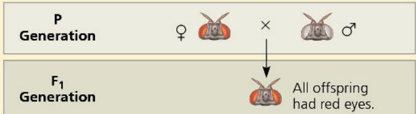

Morgan then bred an $F_{1}$ red-eyed female to an $F_{1}$ red-eyed male to produce the $F_{2}$ generation.

## Results

The $F_{2}$ generation showed a typical Mendelian ratio of 3 red-eyed flies: 1 white-eyed fly. However, all white-eyed flies were males; no females displayed the white-eye trait.

## Conclusion

All $F_{1}$ offspring had red eyes, so the mutant white-eye trait (w) must be recessive to the wild-type red-eye trait ( $w^{+}$ ). Since the

chromosomes carried the recessive mutant allele (w). This was impossible for the $F_{2}$ females in Morgan's experiment because all the $F_{1}$ males had red eyes, so each $F_{2}$ female received a $w^{+}$ allele on the X chromosome inherited from her male parent.

Morgan's finding of the correlation between a particular trait and an individual's sex provided support for the chromosome theory of inheritance: namely, that a specific gene is carried on a specific chromosome. In this case, an eye color gene is carried on the X chromosome.

Figure 15.4 illustrates the relationship between the chromosome theory of inheritance and Mendel's laws. The separation of homologs during anaphase I accounts for the segregation of the two alleles of a gene into separate gametes, and the random arrangement of chromosome pairs at metaphase I accounts for independent assortment of the alleles for two or more genes located on different homolog pairs. This figure traces the same dihybrid pea cross you learned about in Figure 14.8. By carefully studying Figure 15.4, you can see how the behavior of chromosomes during meiosis in the $\mathrm{F}_1$ generation and subsequent random fertilization give rise to the $\mathrm{F}_2$ phenotypic ratio observed by Mendel.

recessive trait—white eyes—was expressed only in males in the $F_{2}$ generation, Morgan deduced that this eye color gene is located on the X chromosome and that there is no corresponding locus on the Y chromosome.

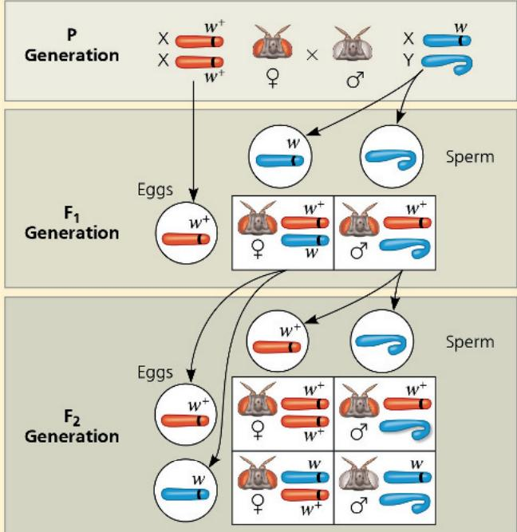

Data from T. H. Morgan, Sex-limited inheritance in Drosophila, Science 32: 120–122 (1910).

Instructors: A related Experimental Inquiry Tutorial can be assigned in Mastering Biology.

WHAT IF? Suppose this eye color gene were located on an autosome rather than a sex chromosome. Predict the phenotypes (including sex) of the $F_{2}$ flies in this hypothetical cross. (Hint: Draw Punnett squares, including chromosomes, for the $F_{1}$ and $F_{2}$ generations; see the Study Tip at the beginning of this chapter.)

For suggested answer, see Appendix A.

In addition to showing that a specific gene is carried on a specific chromosome, Morgan's work indicated that genes located on a sex chromosome exhibit unique inheritance patterns, which we will discuss in the next section. Recognizing the importance of Morgan's early work, many bright students were attracted to his fly room.

## Concept Check 15.1

1. WHAT IF? Propose a possible reason that the first naturally occurring mutant fruit fly Morgan saw involved a gene on a sex chromosome and was found in a male.

2. Which one of Mendel's laws describes the inheritance of alleles for a single character? Which law relates to the inheritance of alleles for two characters in a dihybrid cross?

3. MAKE CONNECTIONS Review the description of meiosis (see Figure 13.8) and Mendel's laws of segregation and independent assortment (see Concept 14.1). What is the physical basis for each of Mendel's laws?

Figure 15.4 The chromosomal basis of Mendel's laws.

Here we correlate the results of one of Mendel's dihybrid crosses (see Figure 14.8) with the behavior of chromosomes during meiosis (see Figure 13.8). The arrangement of chromosomes at metaphase I of meiosis and their movement during anaphase I account for, respectively, the independent assortment and segregation of the alleles for seed color and shape. Each cell that undergoes meiosis in an $F_1$ plant produces two kinds of gametes. If we count the results for all cells, however, each $F_1$ plant produces equal numbers of all four kinds of gametes because the alternative chromosome arrangements at metaphase I are equally likely.

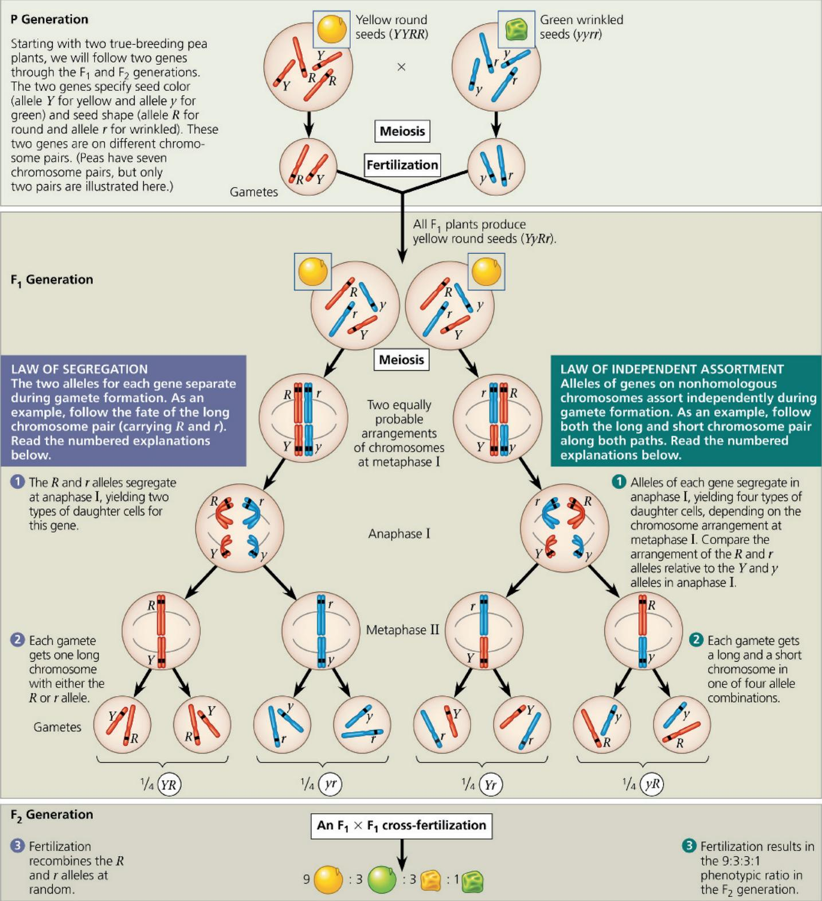  
If you crossed an $F_{1}$ plant from this example with a plant that was homozygous recessive for both genes (yyrr), how would the phenotypic ratio of the offspring compare with the 9:3:3:1 ratio seen here?  
For suggested answer, see Appendix A.

# Concept 15.2: Sex-linked genes exhibit unique patterns of inheritance

Morgan's discovery of a trait (white eyes) that correlated with the sex of flies provided important support for the chromosome theory of inheritance. Because the identity of the sex chromosomes in an individual could be inferred by observing the sex of the fly, the behavior of the two members of the pair of sex chromosomes could be correlated with the behavior of the two alleles of the eye color gene. In this section, we'll take a closer look at the role of sex chromosomes in inheritance.

## The Chromosomal Basis of Sex

Although in many species sex has traditionally been described as binary—male or female—we are coming to understand that this classification may be too simplistic. Here, we use the term sex to refer to classification into a group with a shared set of anatomical and physiological traits. In this sense, sex in many species is determined largely by inheritance of sex chromosomes.

Humans and other mammals have two types of sex chromosomes, designated X and Y. The Y chromosome is much smaller than the X chromosome (Figure 15.5). A person who inherits two X chromosomes, one from each parent, usually develops anatomy we associate with the female sex, while male properties are associated with the inheritance of one X chromosome and one Y chromosome (Figure 15.6a). Short

## Figure 15.5 Human sex chromosomes (duplicated).

segments at either end of the Y chromosome are the only regions that are homologous with regions on the X. These homologous regions allow the X and Y chromosomes in males to pair and behave like homologs during meiosis in the testes.

In mammalian testes and ovaries, the two sex chromosomes segregate during meiosis. Each egg receives one X chromosome. In contrast, sperm fall into two categories: Half the sperm cells a male produces receive an X chromosome, and half receive a Y chromosome. We can trace the sex of each offspring to the events of conception: If a sperm cell bearing an X chromosome fertilizes an egg, the zygote is XX, a female; if a sperm cell containing a Y chromosome fertilizes an egg, the zygote is XY, a male (see Figure 15.6a). Thus, in general, sex determination is a matter of chance—a fifty-fifty chance. Note that the mammalian X-Y system isn't the only chromosomal system for determining sex, although some insects do have X-Y systems. (In fact, in 1905, Dr. Nettie Stevens of Bryn Mawr College was the first to show, using mealworms, that inheritance of the Y chromosome resulted in male offspring.) Figure 15.6b–d illustrates three other systems.

In humans, the anatomical signs of sex begin to emerge when the embryo is about 2 months old. Before then, the rudiments of the gonads are generic—they can develop into either testes or

Figure 15.6 Some chromosomal systems of sex determination. Numerals indicate the number of autosomes in the species pictured. In Drosophila, males are XY, but sex depends on the ratio of the number of X chromosomes to the number of autosome sets, not simply on the presence of a Y chromosome. In some species (not shown here), sex is determined not by chromosomes but by environmental factors such as temperature.  

ovaries, depending on whether or not a Y chromosome is present, and depending on what genes are active. A gene on the Y chromosome—called SRY, for sex-determining region of Y—is required for the development of testes. In the absence of SRY, the gonads develop into ovaries, even in an XY embryo.

A gene located on either sex chromosome is called a sex-linked gene. The human X chromosome contains approximately 900 genes, which are called X-linked genes, while genes located on the Y chromosome are called Y-linked genes. The sequence of the human Y chromosome was finally completed in 2023; the researchers reported

Figure 15.7 The transmission of X-linked recessive traits.

In this diagram, red-green color blindness is used as an example. The superscript N represents the dominant allele for normal color vision carried on the X chromosome, while n represents the recessive allele, which has a mutation causing color blindness. White boxes indicate unaffected individuals, light orange boxes indicate carriers, and dark orange boxes indicate color-blind individuals.

  
(a) A male parent with color-blindness will transmit the mutant allele to all female offspring but to no male offspring. When the female parent is a dominant homozygote, the female offspring will have the normal phenotype but will be carriers of the mutation.  
(b) If a female carrier mates with a male who has normal color vision, there is a $50\%$ chance that each female offspring will be a carrier like their female parent and a $50\%$ chance that each male offspring will have the disorder.  
(c) If a female carrier mates with a color-blind male, there is a 50% chance that each child born to them will have the disorder, regardless of sex. Female offspring who have normal color vision will be carriers, whereas males who have normal color vision will be free of the recessive allele.  
If a color-blind female married a male who had normal color vision, what would be the probable phenotypes of their children? For suggested answer, see Appendix A.

identifying roughly 700 genes, of which about 100 coded for proteins (some genes are duplicates and the number of copies varies from person to person). About half of these genes are expressed only in the testis, and some are required for normal testicular functioning and the production of normal sperm. The Y chromosome is passed along virtually intact from a male parent to all his male offspring. Because there are so few Y-linked genes, very few disorders are transferred from male parent to male offspring on the Y chromosome.

The development of female gonads in humans requires a gene called WNT4 (on chromosome 1, an autosome), which encodes a protein that promotes ovary development. An embryo that is XY but has extra copies of the WNT4 gene can develop rudimentary female gonads. Overall, sex is determined by the interactions of a network of gene products like these.

The biochemical, physiological, and anatomical features associated with males and females are turning out to be more complicated than previously thought, with many genes involved in their development. Because of the complexity of this process, many variations exist: Some individuals vary in the number of sex chromosomes in their cells (see Concept 15.4), and others are born with intermediate sexual (intersex) characteristics. Sex determination is an active area of research that will likely yield a more sophisticated understanding in years to come.

## Inheritance of X-Linked Genes

The fact that males and females inherit a different number of X chromosomes leads to a pattern of inheritance different from that produced by genes located on autosomes. While there are very few Y-linked genes, many of which help determine sex, the X chromosomes have numerous genes for characters unrelated to sex. X-linked genes in humans follow the same pattern of inheritance that Morgan observed for the eye color locus he studied in

Drosophila (see Figure 15.3). A male parent passes X-linked alleles to all of his female offspring but to none of his male offspring. In contrast, a female parent can pass X-linked alleles to both male and female offspring, as shown in Figure 15.7 for the inheritance of a mild X-linked disorder, red-green color blindness.

If an X-linked trait is due to a recessive allele, a female will express the phenotype only if she is homozygous for that allele. Because males have only one locus, the terms homozygous and heterozygous lack meaning for describing their X-linked genes; the term hemizygous is used in such cases. Any male receiving the recessive allele from his female parent will express the trait. For this reason, far more males than females have X-linked recessive disorders. However, even though the chance of a female inheriting a double dose of the mutant allele is much less than the probability of a male inheriting a single dose, there are females with X-linked disorders. For instance, color blindness is almost always inherited as an X-linked trait. A color-blind daughter may be born to a color-blind father whose mate is a carrier (see Figure 15.7c). Because the X-linked allele for color blindness is relatively rare, though, the probability that such a male and female will mate is low.

A number of human X-linked disorders are much more serious than color blindness, such as Duchenne muscular dystrophy, which affects about one out of 5,000 males born in the United States. The disease is characterized by a progressive weakening of the muscles and loss of coordination. Affected individuals' life expectancy is into the 20s or 30s. Researchers have traced the disorder to the absence of a key muscle protein called dystrophin and have mapped the gene for this protein to a specific locus on the X chromosome. Research into gene therapy has led to a treatment that was fully approved by the FDA in 2024 for patients 4 years and older. This single-dose treatment involves introduction of an experimentally modified "gene" called microdystrophin that includes important portions of the dystrophin gene.

Figure 15.8 X inactivation and the tortoiseshell cat.

Hemophilia is an X-linked recessive disorder defined by the absence of one or more of the proteins required for blood clotting. When a person with hemophilia is injured, bleeding is prolonged because a firm clot is slow to form. Small cuts in the skin are usually not a problem, but bleeding in the muscles or joints can be painful and can lead to serious damage. In the 1800s, hemophilia was widespread among the royal families of Europe. Queen Victoria of England is known to have passed the allele to several of her descendants. Subsequent intermarriage with royal family members of other nations, such as Spain and Russia, further spread this X-linked trait, and its incidence is well documented in royal pedigrees. A few years ago, new genomic techniques allowed sequencing of DNA from tiny amounts isolated from the buried remains of royal family members. The genetic basis of the mutation, and how it resulted in a nonfunctional blood-clotting factor, is now understood. Since the 1970s, people with hemophilia have been treated with intravenous injections of the protein that is missing (typically a synthetic version in recent decades). More recently, in 2023, a gene therapy treatment was approved that introduces a gene for a clotting protein into patients with one type of severe hemophilia.

## X Inactivation in Female Mammals

Female mammals, including human females, inherit two X chromosomes—twice the number inherited by males—so you may wonder whether females make twice as many of the proteins encoded by X-linked genes as males. In fact, almost all of one X chromosome in each cell in female mammals becomes inactivated during early embryonic development. As a result, the cells of females and males have the same effective dose (one active copy) of most X-linked genes. The inactive X in each cell of a female condenses into a compact object called a Barr body (discovered by Canadian anatomist Murray Barr), which lies along the inside of the nuclear envelope. Most of the genes of the X chromosome that forms the Barr body are not expressed. In the ovaries, however, Barr body chromosomes are reactivated in the cells that give rise to eggs, resulting in every female gamete (egg) having an active X after meiosis.

British geneticist Mary Lyon demonstrated that the selection of which X chromosome will form the Barr body occurs randomly and independently in each embryonic cell present at the time of X inactivation. As a consequence, females consist of a mosaic of two types of cells: those with the active X derived from the male parent and those with the active X derived from the female parent. After an X chromosome is inactivated in a particular cell, all mitotic descendants of that cell have the same inactive X. Thus, if a female is heterozygous for a sex-linked trait, about half of her cells will express one allele, while the others will express the alternate allele. Figure 15.8 shows how this mosaicism results in the patchy coloration of a tortoiseshell cat. In humans, mosaicism can be observed in a recessive X-linked mutation that prevents the development of sweat glands. A female who is heterozygous for this trait has patches of normal skin and patches of skin lacking sweat glands.

Inactivation of an X chromosome involves modification of the DNA and proteins bound to it called histones, including attachment of methyl groups ( $—CH_{3}$ ) to DNA nucleotides. (The regulatory role of DNA methylation is discussed in Concept 18.2.) A particular region of each X chromosome contains several genes involved in the inactivation process. The two regions, one on each

The tortoiseshell gene is on the X chromosome, and the tortoiseshell phenotype requires the presence of two different alleles, one for orange fur and one for black fur. Normally, only females can have both alleles because only they have two X chromosomes. If a female cat is heterozygous for the tortoiseshell gene, she is tortoiseshell. Orange patches are formed by populations of cells in which the X chromosome with the orange allele is active; black patches have cells in which the X chromosome with the black allele is active. (“Calico” cats also have white areas, which are determined by another gene.)

X chromosome, associate briefly with each other in each cell at an early stage of embryonic development. Then, one of the genes, called XIST (for X-inactive specific transcript), becomes active only on the chromosome that will become the Barr body (the inactive X). Multiple copies of the RNA product of this gene apparently attach to the X chromosome on which they are made, eventually almost covering it. Interaction of this RNA with the chromosome initiates X inactivation, and the RNA products of nearby genes help to regulate the process.

## Concept Check 15.2

1. A white-eyed female Drosophila is mated with a red-eyed (wild-type) male, the reciprocal cross of the one shown in Figure 15.3. What phenotypes and genotypes do you predict for the offspring from this cross?

2. Neither Tim nor Shonda has Duchenne muscular dystrophy, but their firstborn son does. What is the probability that a second child will have the disease? What is the probability if the second child is male? Female?

3. MAKE CONNECTIONS Consider what you learned about dominant and recessive alleles in Concept 14.1. If a disorder were caused by a dominant X-linked allele, how would the inheritance pattern differ from what we see for recessive X-linked disorders?

# Concept 15.3: Linked genes tend to be inherited together because they are located near each other on the same chromosome

The number of genes in a cell is far greater than the number of chromosomes; in fact, each chromosome (except the Y) has hundreds or thousands of genes. Genes located near each other on the same chromosome tend to be inherited together in genetic crosses; such genes are said to be genetically linked and are called linked genes. When geneticists follow linked genes in breeding experiments, the results deviate from those expected from Mendel's law of independent assortment.

## How Linkage Affects Inheritance

To see how linkage between genes affects the inheritance of two different characters, let's examine another of Morgan's Drosophila experiments. In this case, the characters are body color and wing size, each with two different phenotypes. Wild-type flies have gray bodies and normal-sized wings. In addition to these flies, Morgan had managed to obtain, through breeding, doubly mutant flies with black bodies and wings much smaller than normal, called vestigial wings. The mutant alleles are recessive to the wild-type alleles, and neither gene is on a sex chromosome. In his investigation of these two genes, Morgan carried out the crosses shown in Figure 15.9. The first was a P generation cross to generate $\mathrm{F}_1$ dihybrid flies, and the second was essentially a testcross.

The resulting flies had a much higher proportion of the combinations of traits seen in the P generation flies (called parental phenotypes) than would be expected if the two genes assorted independently. Morgan thus concluded that body color and wing size are usually inherited together in specific (parental) combinations because the genes are linked; they are near each other on the same chromosome:

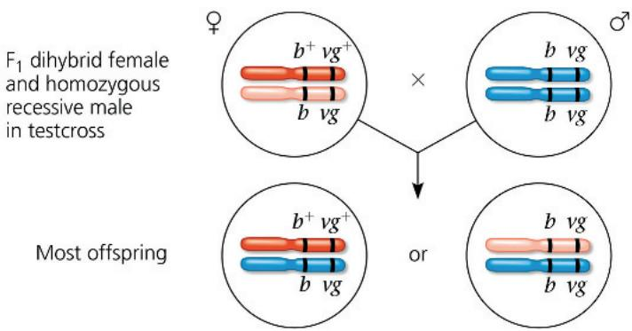

As you proceed, be sure to keep in mind the distinction between the terms linked genes (two or more genes on the same chromosome that tend to be inherited together) and sex-linked gene (a single gene on a sex chromosome).

As Figure 15.9 shows, both of the combinations of traits not seen in the P generation (called nonparental phenotypes) were also produced in Morgan's experiments, suggesting that the body color and wing size alleles are not always linked genetically. To understand this conclusion, we need to further explore genetic recombination, the production of offspring with combinations of traits that differ from those found in either P generation parent.

## Genetic Recombination and Linkage

Meiosis and random fertilization generate genetic variation among offspring of sexually reproducing organisms due to independent assortment of chromosomes, crossing over in meiosis I, and the possibility of any sperm fertilizing any egg (see Concept 13.4). Here we'll examine the chromosomal basis of recombination of alleles in relation to the genetic findings of Mendel and Morgan.

## Recombination of Unlinked Genes: Independent Assortment of Chromosomes

Mendel learned from crosses in which he followed two characters that some offspring have combinations of traits that do not match those of either parent. For example, consider a cross of a dihybrid pea plant with yellow round seeds, heterozygous for both seed color and seed shape (YyRr), with a plant homozygous for both recessive alleles (with green wrinkled seeds, yyrr). (This cross acts as a testcross because the results will reveal the genotype not only of the dihybrid YyRr plant, which we know, but of the gametes made in that plant.) Let's represent the cross by the following Punnett square:

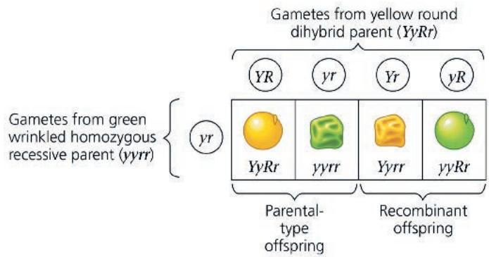

Notice in this Punnett square that one-half of the offspring are expected to inherit a phenotype that matches either of the phenotypes of the P (parental) generation originally crossed to produce the $F_{1}$ dihybrid (see Figure 15.2). These matching offspring are called parental types (short for phenotypes). But two nonparental phenotypes are also found among the offspring. Because these offspring have new combinations of seed shape and color, they are called recombinant types, or recombinants for short. When 50% of all offspring are recombinants, as in this example, geneticists say that there is a 50% frequency of recombination. The predicted phenotypic ratios among the offspring are similar to what Mendel actually found in his YrRr × yyrr crosses.

A 50% frequency of recombination in such testcrosses is observed for any two genes that are located on different chromosomes and thus cannot be linked. The physical basis of recombination between unlinked genes is the random orientation

## Figure 15.9

# Inquiry: How does linkage between two genes affect inheritance of characters? Experiment and Results

Morgan wanted to know whether the genes for body color and wing size are genetically linked and, if so, how this affects their

Morgan mated true-breeding P (parental) generation flies—wild-type flies with black, vestigial-winged flies—to produce heterozygous $F_{1}$ dihybrids ( $b^{+}b\quad vg^{+}vg$ ), all of which are wild-type in appearance.

He then mated wild-type $F_{1}$ dihybrid females with homozygous recessive males. This testcross will reveal the genotype of the eggs made by the dihybrid female.

The male's sperm contributes only recessive alleles, so the phenotype of the offspring reflects the genotype of the female's eggs.

Note: Although only females (with pointed abdomens) are shown, half the offspring in each class would be males (with rounded abdomens).

inheritance. The alleles for body color are $b^{+}$ (gray) and b (black), and those for wing size are $vg^{+}$ (normal) and vg (vestigial).

<table><tr><td rowspan="2">Predicted ratios of testcross offspring</td><td>if genes are located on different chromosomes:</td><td>1</td><td>:</td><td>1</td><td>:</td><td>1</td><td>:</td><td>1</td></tr><tr><td>if genes are located on the same chromosome and parental alleles are always inherited together:</td><td>1</td><td>:</td><td>1</td><td>:</td><td>0</td><td>:</td><td>0</td></tr><tr><td></td><td>Data from Morgan&#x27;s experiment:</td><td>965</td><td>:</td><td>944</td><td>:</td><td>206</td><td>:</td><td>185</td></tr></table>

## Conclusion

Since most offspring had a parental (P generation) phenotype, Morgan concluded that the genes for body color and wing size are genetically linked on the same chromosome. However, the production of a relatively small number of offspring with nonparental phenotypes indicated that some mechanism occasionally breaks the linkage between specific alleles of genes on the same chromosome.

of homologous chromosomes at metaphase I of meiosis, which leads to the independent assortment of the two unlinked genes (see Figure 13.11 and the question in the Figure 15.4 legend).

## Recombination of Linked Genes: Crossing Over

Now, let's explain the results of the Drosophila testcross in Figure 15.9. Recall that most (83%) of the offspring from the testcross for body color and wing size had parental phenotypes. That

Data from T. H. Morgan and C. J. Lynch, The linkage of two factors in Drosophila that are not sex-linked, Biological Bulletin 23:174–182 (1912).

WHAT IF? If the parental (P generation) flies had been true-breeding for gray body with vestigial wings and black body with normal wings, which phenotypic class(es) would be largest among the testcross offspring?

For suggested answer, see Appendix A.

suggested that the two genes were on the same chromosome, since the occurrence of parental types with a frequency greater than 50% indicates that the genes are linked. About 17% of offspring, however, were recombinants.

Seeing these results, Morgan proposed that some process must occasionally break the physical connection between specific alleles of genes on the same chromosome. Later experiments showed that this process, now called crossing over, accounts for the recombination of linked genes. In crossing over, which occurs while replicated homologous chromosomes are paired during

prophase of meiosis I, a set of proteins breaks the DNA molecules of one maternal and one paternal chromatid and rejoins each to the other (see Figure 13.9). In effect, when a single crossover occurs, end portions of two nonsister chromatids trade places.

Figure 15.10 shows how crossing over in a dihybrid female fly resulted in recombinant eggs and ultimately recombinant offspring in Morgan's testcross. Most eggs had a chromosome with either the $b^{+}vg^{+}$ or $bvg$ parental genotype, but some eggs

Figure 15.10 $^{9}$ Chromosomal basis for recombination of linked genes.

In these diagrams re-creating the testcross in Figure 15.9, we track chromosomes as well as genes. The maternal chromosomes (those present in the wild-type F $_{1}$ dihybrid) are color-coded red and pink to distinguish one homolog from the other before any meiotic crossing over has occurred. Because crossing over between the b $^{+}$ /b and vg $^{+}$ /vg loci occurs in some, but not most, egg-producing cells, more eggs with parental-type chromosomes than with recombinant ones are produced in the mating females. Fertilization of the eggs by sperm of genotype b vg gives rise to some recombinant offspring. The recombination frequency is the percentage of recombinant flies in the total pool of offspring.

DRAW IT Suppose, as in the question at the bottom of Figure 15.9, the parental (P generation) flies were true-breeding for gray body with vestigial wings and black body with normal wings. Draw the chromosomes in each of the four possible kinds of eggs from an $F_{1}$ female, and label each chromosome as “parental” or “recombinant.”

For suggested answer, see Appendix A.

had a recombinant chromosome $(b^{+}vg$ or $bvg^{+})$ . Fertilization of all classes of eggs by homozygous recessive sperm $(bvg)$ produced an offspring population in which 17% exhibited a nonparental, recombinant phenotype, reflecting combinations of alleles not seen before in either P generation parent. In the Scientific Skills Exercise, you can use a statistical test to analyze the results from an $F_{1}$ dihybrid testcross and see whether the two genes assort independently or are linked.

  
Recombination frequency = $\frac{391\ recombinants}{2,300\ total\ offspring}$ × 100 = 17%

# Scientific Skills Exercise Using the Chi-Square ( $\chi^{2}$ ) Test

Are Two Genes Linked or Unlinked? Genes that are in close proximity on the same chromosome will result in the linked alleles being inherited together more often than not. But how can you tell if certain alleles are inherited together due to linkage or whether they just happen to assort together randomly? In this exercise, you'll use a simple statistical test, the chi-square $(\chi^2)$ test, to analyze phenotypes of $F_{1}$ testcross progeny in order to see whether two genes are linked or unlinked.

How These Experiments Are Done If genes are unlinked and assorting independently, the phenotypic ratio of offspring from an $F_{1}$ testcross is expected to be 1:1:1:1 (see Figure 15.9). If the two genes are linked, however, the observed phenotypic ratio of the offspring will not match that ratio. Given that random fluctuations in the data do occur, how much must the observed numbers deviate from the expected numbers for us to conclude that the genes are not assorting independently but may instead be linked?

To answer this question, scientists use a statistical test. This test, called a chi-square $(\chi^{2})$ test, compares an observed data set with an expected data set predicted by a hypothesis (here, that the genes are unlinked) and measures the discrepancy between the two, thus determining the “goodness of fit.” If the discrepancy between the observed and expected data sets is so large that it is unlikely to have occurred by random fluctuation, we say there is statistically significant evidence against the hypothesis (or, more specifically, evidence for the genes being linked). If the discrepancy is small, then our observations are well explained by random variation alone. In this case, we say that the observed data are consistent with our hypothesis, or that the discrepancy is statistically insignificant. Note, however, that consistency with our hypothesis is not the same as proof of our hypothesis. Also, the size of the experimental data set is important: With small data sets like this one, even if the genes are linked, discrepancies might be small by chance alone if the linkage is weak. For simplicity, we overlook the effect of sample size here.

Data from the Simulated Experiment In cosmos plants, purple stem (A) is dominant to green stem (a), and short petals (B) is dominant to long petals (b). In a simulated cross, AABB plants were crossed with aabb plants to generate $F_{1}$ dihybrids (AaBb), which were then testcrossed (AaBb × aabb). A total of 900 offspring plants were scored for stem color and flower petal length.

<table><tr><td>Offspring from testcross of  $AaBb\left( {F}_{1}\right)  \times$  aabb</td><td>Purple stem/short petals (A-B-)*</td><td>Green stem/short petals (aaB-)</td><td>Purple stem/long petals (A-bb)</td><td>Green stem/long petals (aabb)</td></tr><tr><td>Expected ratio if the genes are unlinked</td><td>1</td><td>1</td><td>1</td><td>1</td></tr><tr><td>Expected number of offspring (of 900)</td><td></td><td></td><td></td><td></td></tr><tr><td>Observed number of offspring (of 900)</td><td>220</td><td>210</td><td>231</td><td>239</td></tr></table>

\* If the phenotype is dominant, a dash is used for the second allele; it could be either the dominant or recessive allele.

## INTERPRET THE DATA

## Cosmos plants

1. The results in the data table are from a simulated $F_{1}$ dihybrid testcross. The hypothesis that the two genes are unlinked predicts that the offspring phenotypic ratio will be 1:1:1:1. Using this ratio, calculate the expected number of each phenotype out of the 900 total

offspring, and enter the values in that data table.

2. The goodness of fit is measured by $\chi^2$ . This statistic measures the amounts by which the observed values differ from their respective predictions to indicate how closely the two sets of values match. The formula for calculating this value is

$$
\chi^ {2} = \Sigma \frac {(o - e) ^ {2}}{e}
$$

where $\Sigma = sum of, o = observed, and e = expected.$ Calculate the $\chi^{2}$ value for the data using the table below. Fill out that table, carrying out the operations indicated in the top row. Then, add up the entries in the last column to find the $\chi^{2}$ value.

<table><tr><td>Testcross Offspring</td><td>Expected (e)</td><td>Observed (o)</td><td>Deviation (o - e)</td><td> ${\left( o - e\right) }^{2}$ </td><td> ${\left( o - e\right) }^{2}/e$ </td></tr><tr><td>A-B-</td><td></td><td>220</td><td></td><td></td><td></td></tr><tr><td>aaB-</td><td></td><td>210</td><td></td><td></td><td></td></tr><tr><td>A-bb</td><td></td><td>231</td><td></td><td></td><td></td></tr><tr><td>aabb</td><td></td><td>239</td><td></td><td></td><td></td></tr><tr><td colspan="5"> ${\chi }^{2} = \text{Sum}$ </td><td></td></tr></table>

3. The $\chi^{2}$ value means nothing on its own—it is used to find the probability that, assuming the hypothesis is true, the observed data set could have resulted from random fluctuations. A low probability suggests that the observed data are not consistent with the hypothesis and thus the hypothesis should be rejected. A standard cutoff point used by biologists is a probability of 0.05 (5%). If the probability corresponding to the $\chi^{2}$ value is 0.05 or less, the differences between observed and expected values are considered statistically significant and the hypothesis (that the genes are unlinked) should be rejected. If the probability is above 0.05, the results are not statistically significant; the observed data are consistent with the hypothesis that the genes are unlinked.

To find the probability, locate your $\chi^{2}$ value in the $\chi^{2}$ distribution table in Appendix D. The “degrees of freedom” (df) of your data set is the number of categories (here, 4 phenotypes) minus 1, so df = 3. (a) Determine which values on the df = 3 line of the table your calculated $\chi^{2}$ value lies between. (b) The column headings for these values show the probability range for your $\chi^{2}$ number. Based on whether there are nonsignificant (p > 0.05) or significant ( $p \leq 0.05$ ) differences between the observed and expected values, are the data consistent with the hypothesis that the two genes are unlinked and assorting independently, or is there enough evidence to reject this hypothesis?

Instructors: A version of this Scientific Skills Exercise can be assigned in Mastering Biology.

## New Combinations of Alleles: Variation for Natural Selection

EVOLUTION The physical behavior of chromosomes during meiosis contributes to the generation of variation in offspring (see Concept 13.4). Each pair of homologous chromosomes lines up independently of other pairs during metaphase I, and crossing over prior to that, during prophase I, can mix and match parts of maternal and paternal homologs. Mendel's elegant experiments show that the behavior of the abstract entities known as genes—or, more concretely, alleles of genes—also leads to variation in offspring (see Concept 14.1). Now, putting these different ideas together, you can see that the recombinant chromosomes resulting from crossing over may bring alleles together in new combinations, and the subsequent events of meiosis distribute to gametes the recombinant chromosomes in a multitude of combinations, such as the new variants seen in Figures 15.9 and 15.10. Random fertilization then increases even further the number of variant allele combinations that can be created.

This abundance of genetic variation provides the raw material on which natural selection works. If the traits conferred by particular combinations of alleles are better suited for a given environment, organisms possessing those genotypes will be expected to thrive and leave more offspring, ensuring the continuation of their genetic complement. In the next generation, of course, the alleles will be shuffled anew. Ultimately, the interplay between environment and phenotype (and thus genotype) will determine which genetic combinations persist over time.

## Mapping the Distance Between Genes Using Recombination Data: Scientific Inquiry

The discovery of linked genes and recombination due to crossing over motivated one of Morgan's students, Alfred H. Sturtevant, to work out a method for constructing a genetic map, an ordered list of the genetic loci along a particular chromosome.

Sturtevant hypothesized that the percentage of recombinant offspring, the recombination frequency, calculated from experiments like the one in Figures 15.9 and 15.10, depends on the distance between genes on a chromosome. He assumed that crossing over is a random event, with the chance of crossing over approximately equal at all points along a chromosome. Based on these assumptions, Sturtevant predicted that the farther apart two genes are, the higher the probability that a crossover will occur between them and, therefore, the higher the recombination frequency. His reasoning was simple: The greater the distance between two genes, the more points there are between them where crossing over can occur. Using recombination data from various fruit fly crosses, Sturtevant proceeded to assign relative positions to genes on the same chromosomes—that is, to map genes.

A genetic map based on recombination frequencies is called a linkage map. Figure 15.11 shows Sturtevant's linkage map of three genes: the body color (b) and wing size (vg) genes depicted in Figure 15.10 and a third gene, called cinnabar (cn). Cinnabar is one of many Drosophila genes affecting eye color. Cinnabar eyes, a mutant phenotype, are a brighter red than the wild-type color. The recombination frequency between cn and b is 9%; that between cn and vg, 9.25%; and that between b and vg, 17%. In other words,

## Figure 15.11

## Research Method: Constructing a Linkage Map

## Application

A linkage map shows the relative locations of genes along a chromosome.

## Technique

A linkage map is based on the assumption that the probability of a crossover between two genetic loci is proportional to the distance separating the loci. The recombination frequencies used to construct a linkage map for a particular chromosome are obtained from experimental crosses, such as the cross depicted in Figures 15.9 and 15.10. The distances between genes are expressed as map units, with one map unit equivalent to a 1% recombination frequency. Genes are arranged on the chromosome in the order that best fits the data.

## Results

In this example, the observed recombination frequencies between three Drosophila gene pairs (b and cn, 9%; cn and vg, 9.5%; and b and vg, 17%) best fit a linear order in which cn is positioned about halfway between the other two genes:

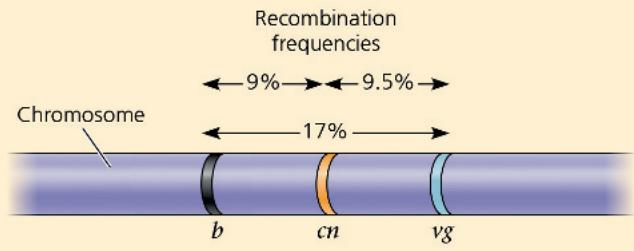

The b-vg recombination frequency (17%) is slightly less than the sum of the b-cn and cn-vg frequencies (9 + 9.5 = 18.5%) because of the few times that one crossover occurs between b and cn and another crossover occurs between cn and vg. The second crossover would “cancel out” the first, reducing the observed b-vg recombination frequency while contributing to the frequency between each of the closer pairs of genes. The value of 18.5% (18.5 map units) is closer to the actual distance between the genes. In practice, a geneticist would add the smaller distances in constructing a map.

crossovers between cn and b and between cn and vg are about half as frequent as crossovers between b and vg. Only a map that locates cn about midway between b and vg is consistent with these data, as you can prove to yourself by drawing alternative maps. Sturtevant expressed the distances between genes in map units, defining one map unit as equivalent to a 1% recombination frequency.

In practice, the interpretation of recombination data is more complicated than this example suggests. Some genes on a chromosome are so far from each other that a crossover between them is virtually certain. The observed frequency of recombination in crosses involving two such genes can have a maximum value of 50%, a result indistinguishable from that for genes on different

chromosomes. In this case, the physical connection between genes on the same chromosome is not reflected in the results of genetic crosses. Despite being on the same chromosome and thus being physically connected, the genes are genetically unlinked; alleles of such genes assort independently, as if they were on different chromosomes. In fact, at least two of the genes for pea characters that Mendel studied are now known to be on the same chromosome, but the distance between them is so great that linkage is not observed in genetic crosses. Consequently, the two genes behaved as if they were on different chromosomes in Mendel's experiments. Genes located far apart on a chromosome are mapped by adding the recombination frequencies from crosses involving closer pairs of genes lying between the two distant genes.

Using recombination data, Sturtevant and his colleagues were able to map numerous Drosophila genes in linear arrays. They found that the genes clustered into four groups of linked genes (linkage groups). Light microscopy had revealed four pairs of chromosomes in Drosophila, so the linkage map provided additional evidence that genes are located on chromosomes. Each chromosome has a linear array of specific genes, each gene with its own locus (Figure 15.12).

Because a linkage map is based strictly on recombination frequencies, it gives only an approximate picture of a chromosome. The frequency of crossing over is not actually uniform over the length of a chromosome, as Sturtevant assumed, and therefore map units do not correspond to actual physical distances (in nanometers, for instance). A linkage map does portray the order of genes along a chromosome, but it does not accurately portray the precise locations of those genes. Other methods enable geneticists to construct cytogenetic maps of chromosomes, which locate genes with respect to chromosomal features, such as stained bands, that can be seen in the microscope. Technical advances over recent decades have enormously increased the rate and affordability of

Figure 15.12 A partial genetic (linkage) map of a Drosophila chromosome.

This partial map shows just seven mapped genes on Drosophila chromosome II. (DNA sequencing has revealed over 9,000 genes on that chromosome.) The number at each gene locus is the number of map units from the arista length gene (far left).

DNA sequencing. Therefore, today, most researchers sequence whole genomes to map the locations of genes of a given species. The entire nucleotide sequence is the ultimate physical map of a chromosome, revealing the physical distances in DNA nucleotides between gene loci (see Concept 21.1). Comparing a linkage map with such a physical map or with a cytogenetic map of the same chromosome, we find that the linear order of genes is identical in all the maps, but the spacing between genes is not.

## Concept Check 15.3

1. When two genes are located on the same chromosome, what is the physical basis for the production of recombinant offspring in a testcross between a dihybrid parent and a double-mutant (recessive) parent?

2. VISUAL SKILLS For each type of offspring of the testcross in Figure 15.9, explain the relationship between its phenotype and the alleles contributed by the female parent. (It will be useful to draw out the chromosomes of each fly and follow the alleles throughout the cross.)

3. WHAT IF? Genes A, B, and C are located on the same chromosome. Testcrosses show that the recombination frequency between A and B is 28% and that between A and C is 12%. Can you determine the linear order of these genes? Explain.

For suggested answers, see Appendix A.

## Concept 15.4: Alterations of chromosome number or structure cause some genetic disorders

As you have learned so far in this chapter, the phenotype of an organism can be affected by small-scale changes involving individual genes. Random mutations are the source of all new alleles, which can lead to new phenotypic traits.

Large-scale chromosomal changes can also affect an organism's phenotype. Physical and chemical disturbances, as well as errors during meiosis, can damage chromosomes in major ways or alter their number in a cell. Large-scale chromosomal alterations in humans and other mammals often lead to miscarriage of a fetus, and individuals born with these types of genetic defects commonly exhibit various developmental disorders. Plants appear to tolerate such genetic defects better than animals do.

## Interview

Interview with Terry Orr-Weaver: Why are humans so bad at meiosis? (eTextbook only)

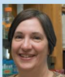

## Abnormal Chromosome Number

Ideally, the meiotic spindle distributes chromosomes to daughter cells without error. But there is an occasional mishap, called a nondisjunction, in which the members of a pair of homologous

Figure 15.13 Meiotic nondisjunction.

Gametes with an abnormal chromosome number can arise by nondisjunction in either meiosis I or meiosis II. For simplicity, the figure does not show the spores formed by meiosis in plants. Ultimately, spores form gametes that have the defects shown. (See Figure 13.6.)

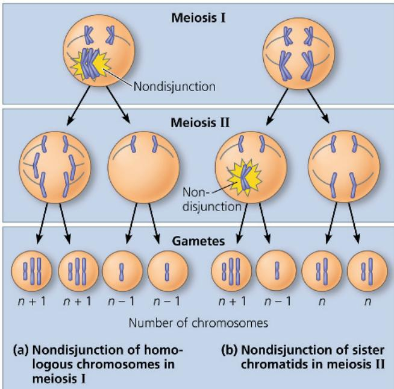

chromosomes do not move apart properly during meiosis I or sister chromatids fail to separate during meiosis II (Figure 15.13). In nondisjunction, one gamete receives two of the same type of chromosome and another gamete receives no copy. The other chromosomes are usually distributed normally.

If either of the aberrant gametes unites with a normal one at fertilization, the zygote will also have an abnormal number of a particular chromosome, a condition known as aneuploidy. Fertilization involving a gamete that has no copy of a particular chromosome will lead to a missing chromosome in the zygote (so that the cell has 2n - 1 chromosomes); the aneuploid zygote is said to be monosomic for that chromosome. If a chromosome is present in triplicate in the zygote (so that the cell has 2n + 1 chromosomes), the aneuploid cell is trisomic for that chromosome. Mitosis will subsequently transmit the anomaly to all embryonic cells. Monosomy and trisomy are estimated to occur in 10–25% of human conceptions and are the main reason for pregnancy loss. If the organism survives, it usually has a set of traits caused by the abnormal dose of the genes associated with the extra or missing chromosome. Down syndrome is an example of trisomy in humans that will be discussed later. Nondisjunction can also occur during mitosis. If such an error takes place early in embryonic development, then the aneuploid condition is passed along by mitosis to a large number of cells and is likely to have a substantial effect on the organism.

Some organisms have more than two complete chromosome sets in all somatic cells. The general term for this chromosomal alteration is polyploidy; the specific terms triploidy (3n) and tetraploidy (4n) indicate three and four chromosomal sets, respectively. One way a triploid cell may arise is by the fertilization of an abnormal diploid egg produced by nondisjunction of all its chromosomes. Tetraploidy could result from the failure of a 2n zygote to divide after replicating its chromosomes. Subsequent normal mitotic divisions would then produce a 4n embryo.

Polyploidy is fairly common in the plant kingdom. The spontaneous origin of polyploid individuals plays an important role in plant evolution (see Concept 24.2). Many species we eat are polyploid: Bananas are triploid, wheat hexaploid (6n), and strawberries octoploid (8n).

Examples of polyploid plants

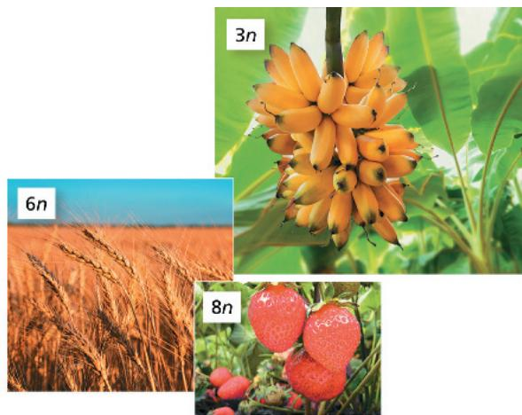

Polyploid animal species are much less common, but there are a few fishes and amphibians known to be polyploid. In general, polyploids are more nearly normal in appearance than aneuploids. One extra (or missing) chromosome apparently disrupts genetic balance more than does an entire extra set of chromosomes.

## Alterations of Chromosome Structure

Errors in meiosis or damaging agents such as radiation can cause breakage of a chromosome, which can lead to four types of changes in chromosome structure (Figure 15.14). A deletion occurs when a chromosomal fragment is lost. The affected chromosome is then missing certain genes. A broken fragment may become reattached as an extra segment to a sister or nonsister chromatid, producing a duplication of a portion of that chromosome. A chromosomal fragment may also reattach to the original chromosome but in the reverse orientation, producing an inversion. A fourth possible result of chromosomal breakage is for the fragment to join a nonhomologous chromosome, a rearrangement called a translocation.

Deletions and duplications are especially likely to occur during meiosis. In crossing over, nonsister chromatids sometimes exchange unequal-sized segments of DNA, so that one partner gives up more genes than it receives (see Figure 21.13). The products of such an unequal crossover are one chromosome with a deletion and one chromosome with a duplication.

A diploid embryo that is homozygous for a large deletion (both homologs have the deletion) or, if a male, has a single X chromosome with a large deletion is usually missing a number of essential genes. This condition is typically lethal.

Duplications and translocations also tend to be harmful. In reciprocal translocations, in which segments are exchanged between nonhomologous chromosomes, and in inversions, the balance of genes is not abnormal—all genes are present in their normal doses. Nevertheless, translocations and inversions can alter phenotype because a gene's expression can be influenced by its location among neighboring genes, which can have devastating effects.

The red upward-pointing arrows indicate breakage points. The darker purple segments indicate the chromosomal parts affected by the rearrangements.

Figure 15.14 Alterations of chromosome structure.  

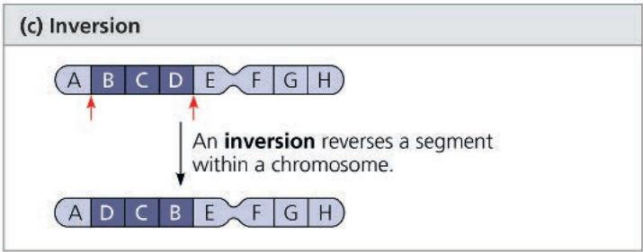

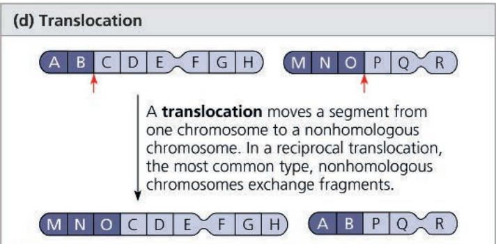  
Less often, a nonreciprocal translocation occurs: A chromosome transfers a fragment but receives none in return (not shown).  
Figure 15.15 Down syndrome.

## Human Conditions Due to Chromosomal Alterations

Alterations of chromosome number and structure are associated with a number of human conditions, which vary in severity. As described earlier, nondisjunction in meiosis results in aneuploidy in gametes and any resulting zygotes. Although the frequency of aneuploid zygotes may be quite high in humans, most of these chromosomal alterations are so disastrous to development that the affected embryos are typically miscarried before birth. However, some types of aneuploidy appear to upset the genetic balance less than others, so individuals with certain aneuploid conditions can survive to birth and beyond. These individuals have a set of traits—a syndrome—characteristic of the type of aneuploidy. Genetic disorders caused by aneuploidy can be diagnosed before birth by fetal testing (see Figure 14.19).

The karyotype shows trisomy 21, the most common cause of Down syndrome. The child exhibits the facial features characteristic of this syndrome.

## Down Syndrome (Trisomy 21)

One aneuploid condition, Down syndrome, affects approximately one out of every 830 children born in the United States (Figure 15.15). Down syndrome is usually the result of an extra chromosome 21, so that each body cell has a total of 47 chromosomes. Because the cells are trisomic for chromosome 21, Down syndrome is often called trisomy 21. Down syndrome includes characteristic facial features, short stature, correctable heart defects, and developmental delays. Individuals with Down syndrome have an increased chance of developing leukemia and Alzheimer's disease but have a lower rate of high blood pressure, atherosclerosis (hardening of the arteries), stroke, and many types of solid tumors. People with Down syndrome have an average life span that is shorter than is typical; however, most live to middle age and beyond with proper medical care. Many live independently or at home with their families, are employed, and are valuable contributors to their communities. Almost all males and about half of females with Down syndrome are sexually underdeveloped and lack the ability to reproduce.

The frequency of Down syndrome increases with the age of the female parent. While the syndrome occurs in just 0.1% (1 out of 900) births of children born to females at age 30, the risk climbs to 1% (1 out of 100) for females at age 40 and is even higher for older female parents. The correlation of Down syndrome with maternal age has not yet been explained. Most cases result from nondisjunction during meiosis I, and some research points to an age-dependent abnormality in meiosis. Trisomies of some other chromosomes (13 and 18) also increase in incidence with maternal age, although infants with other autosomal trisomies rarely survive for long. Medical experts recommend that prenatal screening for trisomies in the embryo be offered to all pregnant patients due to its low risk and useful results. In 2008, a law was passed stipulating that medical practitioners give accurate, up-to-date information about any prenatal or postnatal diagnosis received by parents and that they connect parents with appropriate support services.

## Aneuploidy of Sex Chromosomes

Aneuploid conditions involving sex chromosomes appear to upset the genetic balance less than those involving autosomes. This may be because the Y chromosome carries relatively few genes. Also, extra copies of the X chromosome simply become inactivated as Barr bodies.

An extra X chromosome in a male, producing XXY, occurs approximately once in every 650 live male births. People with this condition, called Klinefelter syndrome, have male sex organs, but their testes are small and produce little or no sperm. Signs and symptoms vary widely, but may include taller than average height, less muscle mass, and enlarged breast tissue. Affected individuals may have learning disabilities. Testosterone replacement therapy helps stimulate changes that typically occur at puberty in males. About one of every 1,000 males is born with an extra Y chromosome (XYY). These males undergo typical sexual development and do not exhibit any well-defined syndrome, but tend to be taller than average.

Females with trisomy X (XXX), which occurs once in approximately 1,000 live female births, are generally healthy and have no unusual physical features other than being slightly taller than average. Females with trisomy X are at risk for learning disabilities. Monosomy X, which is called Turner syndrome, occurs about once in every 2,500 female births and is the only known viable monosomy in humans. Although these X0 individuals are phenotypically female, they usually lack the ability to reproduce because their sex organs do not mature. When provided with estrogen replacement therapy, girls with Turner syndrome do develop secondary sex characteristics. Most have typical intelligence.

## Disorders Caused by Structurally Altered Chromosomes

Many deletions in human chromosomes, even in a heterozygous state, cause severe problems. One such syndrome, known as cri du chat (“cry of the cat”), results from a specific deletion in chromosome 5. A child born with this deletion has a small head with unusual facial features, severe intellectual disabilities, and a cry that sounds like the mewing of a distressed cat. Such individuals usually die in infancy or early childhood.

## Figure 15.16 Translocation associated with chronic myelogenous leukemia (CML).

The cancerous cells in nearly all CML patients contain an abnormally short chromosome 22, the so-called Philadelphia chromosome, and an abnormally long chromosome 9. These altered chromosomes result from the reciprocal translocation shown here, which presumably occurred in a single white blood cell precursor undergoing mitosis and was then passed along to all descendant cells.

Chromosomal translocations can also occur during mitosis; some have been implicated in certain cancers, including chronic myelogenous leukemia (CML). This disease occurs when a reciprocal translocation happens during mitosis of cells that are precursors of white blood cells. The exchange of a large portion of chromosome 22 with a small fragment from a tip of chromosome 9 produces a much shortened, easily recognized chromosome 22, called the Philadelphia chromosome (Figure 15.16). Such an exchange causes cancer by creating a new “fused” gene that leads to uncontrolled cell cycle progression. (The mechanism of gene activation will be discussed in Concept 18.5.)

## Concept Check 15.4

1. About $5\%$ of individuals with Down syndrome have a chromosomal translocation in which a third copy of chromosome 21 is attached to chromosome 14. If this translocation occurred in a parent's gonad, how could it lead to Down syndrome in a child?

2. MAKE CONNECTIONS The ABO blood type locus has been mapped on chromosome 9. A male who has type AB blood and a female who has type O blood have a child with trisomy 9 and type A blood. Using this information, can you tell in which parent the nondisjunction occurred? Explain your answer. (See Figures 14.11 and 15.13.)

3. MAKE CONNECTIONS The gene that is activated on the Philadelphia chromosome codes for an intracellular tyrosine kinase. Review the discussion of cell cycle control in Concept 12.3, and explain how the activation of this gene could contribute to the development of cancer.

For suggested answers, see Appendix A.

## Concept 15.5: Some inheritance patterns are exceptions to standard Mendelian inheritance

In the previous section, you learned about deviations from the usual patterns of chromosomal inheritance due to abnormal events in meiosis and mitosis. We conclude this chapter by describing two normally occurring exceptions to Mendelian genetics, one involving genes located in the nucleus and the other involving genes located outside the nucleus. In both cases, the sex of the parent contributing an allele is a factor in the pattern of inheritance.

## Genomic Imprinting

Throughout our discussions of Mendelian genetics and the chromosomal basis of inheritance, we have assumed that a given allele will have the same effect whether it was inherited from the female parent or the male parent. This is probably a safe assumption most of the time. For example, when Mendel crossed purple-flowered pea plants with white-flowered pea plants, he observed the same results regardless of whether the purple-flowered parent supplied the eggs or the sperm. In recent years, however, geneticists have identified a number of traits in placental mammals (and some flowering plants) that depend on which parent passed along the alleles for those traits. Such variation in phenotype depending on whether an allele is inherited

from the male or female parent is called genomic imprinting. (Note that unlike sex-linked genes, most imprinted genes are on autosomes.) Using newer DNA sequence-based methods, over 200 imprinted genes have been identified in both humans and mice.

Genomic imprinting occurs during gamete formation and results in the silencing of a particular allele of certain genes. Because these genes are imprinted differently in sperm and eggs, the offspring expresses only one allele of an imprinted gene, the one that has been inherited from a specific parent—either the female parent or the male parent, depending on the particular gene. The imprints are then transmitted to all body cells during early development. In each generation, the old imprints are “erased” in gamete-producing cells, and the chromosomes of the developing gametes are newly imprinted according to the sex of the individual forming the gametes. In a given species, the imprinted genes are always imprinted in the same way. For instance, a gene imprinted for maternal allele expression is always imprinted this way, generation after generation.

Consider, for example, the mouse gene for insulin-like growth factor 2(Igf2), one of the first imprinted genes to be identified. Although this growth factor is required for normal prenatal growth, only the paternal allele is expressed (Figure 15.17a). Evidence that the Igf2 gene is imprinted came initially from crosses between normal-sized (wild-type) mice and dwarf (mutant) mice homozygous for a recessive mutation in the Igf2 gene. The phenotypes of heterozygous offspring (with one normal allele and one mutant) differed depending on whether the mutant allele came from the female parent or the male parent (Figure 15.17b).

What exactly is a genomic imprint? It turns out that imprinting can involve either silencing an allele in one type of gamete (egg or sperm) or activating it in the other. In many cases, the imprint seems to consist of methyl $\left(\mathrm{—CH}_{3}\right)$ groups that are added to cytosine nucleotides of one of the alleles. Such methylation may silence the allele, an effect consistent with evidence that heavily methylated genes are usually inactive (see Concept 18.2). However, for a few genes, methylation has been shown to activate expression of the allele. This is the case for the Igf2 gene: Methylation of certain cytosines on the paternal chromosome leads to expression of the paternal Igf2 allele, by an indirect mechanism involving chromatin structure and protein-DNA interactions.

Genomic imprinting may affect only a small fraction of the genes in mammalian genomes, but most of the known imprinted genes are critical for embryonic development. Recent research has revealed that imprinted genes are involved in regulation of body temperature, sleep, and other metabolic functions. Some evolutionary biologists have proposed that genomic imprinting represents a kind of evolved “competition” between male mammals (who benefit from larger offspring more likely to pass on the male parent's genes) and female mammals (who benefit from smaller offspring during birth).

For decades, mouse embryos engineered to inherit both copies of certain chromosomes from the same parent died before birth, whether that parent was male or female. In 2018, a team in China was able to produce mice with two female parents that lived into adulthood, and in 2025, they repeated the feat with mice that had two male parents. Their technique involved altering multiple regions of imprinted genes, with the altered regions being different in the two cases. This work underscores the importance of correct imprinting for normal embryonic development. The association of improper imprinting with abnormal development and certain cancers has spurred ongoing research in this field.

Figure 15.17 Genomic imprinting of the mouse lgf2 gene.  
  
(b) Heterozygotes. Heterozygotes have different phenotypes depending on which allele is contributed by each parent. Matings between wild-type mice and those homozygous for the recessive mutant Igf2 allele produce heterozygous offspring. Since the maternal Igf2 allele is not expressed, the dwarf (mutant) phenotype is seen only when the male parent contributes the mutant allele.

## Interview

Interview with Shirley Tilghman: Discovering imprinted genes (eTextbook only)

## Inheritance of Organelle Genes

Although our focus in this chapter has been on the chromosomal basis of inheritance, we end with an important amendment: Not all of a eukaryotic cell's genes are located on nuclear chromosomes, or even in the nucleus; some genes are located in organelles in the cytoplasm. Because they are outside the nucleus, these genes are sometimes called extranuclear genes or cytoplasmic genes. Mitochondria, as well as chloroplasts and other plastids in plants, contain small circular DNA molecules that carry a number of genes. These organelles reproduce themselves and transmit their genes to daughter organelles. Genes on organelle DNA are not distributed to offspring according to the same rules that direct the distribution of nuclear chromosomes during meiosis, so they do not display Mendelian inheritance.

The first hint that extranuclear genes exist came from studies by the German scientist Carl Correns on the inheritance of yellow or white patches on the leaves of an otherwise green plant. In 1909, he observed that the coloration of the offspring was determined only by the maternal parent (the source of eggs) and not by the paternal parent (the source of sperm). Subsequent research showed that such coloration patterns, or variegation (Figure 15.18), are due to mutations in genes controlling pigmentation that are located in the DNA circles in the organelles called plastids (see Concept 6.5). In most plants, a zygote receives all its plastids from the cytoplasm of the egg and none from the sperm, which contributes little more than a haploid set of chromosomes. An egg may contain plastids with different alleles for a pigmentation gene. As the zygote develops, plastids containing wild-type or mutant pigmentation genes are distributed randomly to daughter cells. The pattern of leaf coloration exhibited by a plant depends on the ratio of wild-type to mutant plastids in its various tissues.

Similar maternal inheritance is also the rule for mitochondrial genes in most animals and plants, because the mitochondria passed on to a zygote come from the cytoplasm of the egg. (The few mitochondria contributed by the sperm appear to be destroyed in the egg.) The products of most mitochondrial genes help make up some of the protein complexes of the electron transport chain and ATP synthase (see Figure 9.14). Defects in one or more of these proteins, therefore, reduce the amount of ATP the cell can make and have been shown to cause a number of human disorders in as many as one out of every 5,000 births. Because the parts of the body most susceptible to energy deprivation are the nervous system and the muscles, most mitochondrial diseases primarily affect these systems. For example, mitochondrial myopathy causes weakness, intolerance of exercise, and muscle deterioration. Another mitochondrial disorder is Leber's hereditary optic neuropathy, which can produce sudden blindness in people as young as their 20s or 30s. The four mutations found thus far to

## Figure 15.18 A painted nettle coleus plant.

The variegated (patterned) leaves on this coleus plant (Plectranthus scutellarioides) result from mutations that affect expression of pigment genes located in plastids, which generally are inherited from the maternal parent.

cause this disorder affect oxidative phosphorylation during cellular respiration, a crucial function for the cell (see Concept 9.4).

The fact that mitochondrial disorders are inherited only from the female parent led to development of a technique, first used in Mexico in 2016, that avoids passing along these disorders. The chromosomes from the egg of an affected female are transferred to an egg of a healthy donor that has had its own chromosomes removed. This “two-female-parent” egg is then fertilized by a sperm from the prospective male parent and transplanted into the womb of the affected female, becoming an embryo with three parents. This procedure has been carried out successfully in several countries, including the U.K., China, Jordan, and Ukraine. Some scientists are concerned that the procedure might have negative effects later in development and think that longer-term studies are necessary. In the United States, the procedure was prohibited by a 2015 federal law, and whether the benefits outweigh the risks is still under debate.

In addition to the rarer diseases clearly caused by defects in mitochondrial DNA, mitochondrial mutations inherited from a person's female parent may contribute to at least some types of diabetes and heart disease, as well as to other disorders that commonly debilitate the elderly, such as Alzheimer's disease. In the course of a lifetime, new mutations gradually accumulate in our mitochondrial DNA, and some researchers think that these mutations play a role in the normal aging process.

## Concept Check 15.5

1. Gene dosage—the number of copies of a gene that are actively being expressed—is important to proper development. Identify and describe two processes that establish the proper dosage of certain genes.

2. Reciprocal crosses between two primrose varieties,
A and B, produced the following results:
A female × B male → offspring with all green
(nonvariegated) leaves; B female × A male → offspring with
patterned (variegated) leaves. Explain these results.

3. WHAT IF? Mitochondrial genes are critical to the energy metabolism of cells, but mitochondrial disorders caused by mutations in these genes are generally not lethal. Why not?

For suggested answers, see Appendix A.

## Chapter 15 Review

## Summary of Key Concepts

To review key terms, go to the Vocabulary Self-Quiz (eTextbook only).

## Concept 15.1: Morgan showed that Mendelian inheritance has its physical basis in the behavior of chromosomes

\- Morgan's work with an eye color gene in Drosophila led to the chromosome theory of inheritance, which states that genes are located on chromosomes and that the behavior of chromosomes during meiosis accounts for Mendel's laws.

What characteristic of the sex chromosomes allowed Morgan to correlate their behavior with that of the alleles of the eye color gene?

## Concept 15.2: Sex-linked genes exhibit unique patterns of inheritance

\- Sex is often chromosomally based. Humans and other mammals have an X-Y system in which sex is largely determined by whether a Y chromosome is present. Other systems are found in birds, fishes, and insects.

\- The sex chromosomes carry sex-linked genes, virtually all of which are on the X chromosome (X-inked). Any male who

inherits a recessive X-linked allele (from his female parent) will express the trait, such as color blindness.

\- In mammalian females, one of the two X chromosomes in each cell is randomly inactivated during early embryonic development, becoming highly condensed into a Barr body.

Why are males affected by X-linked disorders much more often than females?

Concept 15.3: Linked genes tend to be inherited together because they are located near each other on the same chromosome

\- An $F_{1}$ dihybrid testcross yields parental types with the same combination of traits as those in the P generation parents and recombinant types (recombinants) with new combinations of traits not seen in either P generation parent. Because of the independent assortment of chromosomes, unlinked genes exhibit a 50% frequency of recombination in the gametes. For genetically linked genes, crossing over between nonsister chromatids during meiosis I accounts for the observed recombinants, always less than 50%.

\- The order of genes on a chromosome and the relative distances between them can be deduced from recombination frequencies observed in genetic crosses. These data allow construction of a linkage map (a type of genetic map). The farther apart genes are, the more likely their allele combinations will be recombined during crossing over.

Why are specific alleles of two distant genes more likely to show recombination than those of two closer genes?

## Concept 15.4: Alterations of chromosome number or structure cause some genetic disorders

\- Aneuploidy, an abnormal chromosome number, can result from nondisjunction during meiosis. When a normal gamete unites with one containing two copies or no copies of a particular chromosome, the resulting zygote and its descendant cells either have one extra copy of that chromosome (trisomy, $2n + 1$ ) or are missing a copy (monosomy, 2n - 1). Polyploidy (extra sets of chromosomes) can result from nondisjunction of all chromosomes.

\- Chromosome breakage can result in alterations of chromosome structure: deletions, duplications, inversions, and translocations. Translocations can be reciprocal or nonreciprocal.

\- Changes in the number of chromosomes per cell or in the structure of individual chromosomes can affect the phenotype and, in some cases, lead to disorders. Such alterations cause Down syndrome (usually due to trisomy of chromosome 21), certain cancers associated with chromosomal translocations that occur during mitosis, and various other human disorders.

Why are inversions and reciprocal translocations less likely to be lethal than are aneuploidy, duplications, deletions, and nonreciprocal translocations?

## Concept 15.5: Some inheritance patterns are exceptions to standard Mendelian inheritance

\- In mammals, the phenotypic effects of a small number of particular genes depend on which allele is inherited from each parent, a phenomenon called genomic imprinting. Imprints are formed during gamete production, with the result that one allele (either maternal or paternal) is not expressed in offspring.

\- The inheritance of traits controlled by the genes present in mitochondria and plastids depends solely on the maternal parent because the zygote's cytoplasm containing these organelles comes from the egg. Some diseases affecting the nervous and muscular systems are caused by defects in mitochondrial genes that prevent cells from making enough ATP.

Explain how genomic imprinting and inheritance of mitochondrial and chloroplast DNA are exceptions to standard Mendelian inheritance.
For suggested answers, see Appendix A.

## Test Your Understanding

For multiple-choice questions, go to the Practice Test (eTextbook only).

## Levels 1-2: Remembering/Understanding

1. A male with hemophilia (a recessive, sex-linked condition) has a daughter without hemophilia who marries a male without hemophilia. What is the probability of their daughter having hemophilia? Their son? If they have four sons, what is the probability that all will be affected?

2. Pseudohypertrophic muscular dystrophy is an inherited disorder that causes gradual deterioration of the muscles. It is seen almost exclusively in male children born to unaffected parents and usually results in death in the early teens. Is this disorder caused by a dominant or a recessive allele? Is its inheritance sex-linked or autosomal? How do you know? Explain why this disorder is almost never seen in female children.

3. A wild-type fruit fly (heterozygous for gray body color and normal wings) is mated with a black fly with vestigial wings. The offspring have the following phenotypic distribution: wild-type, 778; black vestigial, 785; black normal, 158; gray vestigial, 162. What is the recombination frequency between these genes for body color and wing size? Is this consistent with the results of the experiment in Figure 15.9? Draw the chromosomes in the wild-type and black parents.

4. A planet is inhabited by creatures that reproduce with the same hereditary patterns seen in humans. Three phenotypic characters are height (T = tall, t = dwarf), head appendages (A = antennae, a = no antennae), and nose shape (S = upturned snout, s = downturned snout). Since the creatures are not “intelligent,” Earth scientists are able to do some controlled breeding experiments using various heterozygotes in testcrosses. For tall heterozygotes with antennae, the offspring are tall/antennae, 46; dwarf/antennae, 7; dwarf/no antennae, 42; tall/no antennae, 5. For heterozygotes with antennae and an upturned snout, the offspring are antennae/upturned snout, 47; antennae/downturned snout, 2; no antennae/downturned snout, 48; no antennae/upturned snout, 3. Calculate the recombination frequencies for both experiments.

## Levels 3-4: Applying/Analyzing

5. Scientists do a testcross of the creatures from problem 4 using heterozygotes for height and nose shape. The offspring are tall/upturned snout, 41; dwarf/upturned snout, 8; dwarf/downturned snout, 43; tall/downturned snout, 8. Calculate the recombination frequency from these data, and then use your answer from problem 4 to determine the correct order of the three linked genes.

6. A wild-type fruit fly (heterozygous for gray body color and red eyes) is mated with a black fruit fly with purple eyes. The offspring are wild-type, 721; black/purple, 751; gray/purple, 49; black/red, 45. What is the recombination frequency between these genes for body color and eye color? Using information from problem 3, what fruit flies (genotypes and phenotypes) would you mate to determine the order of the body color, wing size, and eye color genes on the chromosome?

7. Assume that genes A and B are 50 map units apart on the same chromosome. An animal heterozygous at both loci is crossed with one that is homozygous recessive at both loci. What percentage of the offspring will show recombinant phenotypes resulting from crossovers? Without knowing these genes are on the same chromosome, how would you interpret the results of this cross?

8. Two genes of a flower, one controlling blue (B) versus white (b) petals and the other controlling round (R) versus oval (r) stamens, are linked and are 10 map units apart. You cross a homozygous blue/oval plant with a homozygous white/round plant. The resulting $F_{1}$ progeny are crossed with homozygous white/oval plants, and 1,000 offspring plants are obtained. How many $F_{2}$ plants of each of the four phenotypes do you expect?

9. You design Drosophila crosses to provide recombination data for gene a, which is located on the chromosome shown in Figure 15.12. Gene a has recombination frequencies of 14% with the vestigial wing locus and 26% with the brown eye locus. Approximately where is a located along the chromosome relative to these two loci?

## Levels 5-6: Evaluating/Creating

10. Banana plants, which are triploid, are seedless and therefore sterile. Thinking about meiosis, propose a possible explanation.

11. EVOLUTION CONNECTION Crossing over is thought to be evolutionarily advantageous because it continually shuffles genetic alleles into novel combinations. It was thought that Y-linked genes might degenerate because they lack homologous genes on the X chromosome with which to pair up prior to

crossing over. However, when the Y chromosome was sequenced, scientists discovered eight large regions that were internally homologous to each other, and several genes are duplicates. (Y chromosome researcher David Page has called it a "hall of mirrors.") How might this be beneficial?

12. SCIENTIFIC INQUIRY • DRAW IT Assume you are mapping genes A, B, C, and D in Drosophila. You know that these genes are linked on the same chromosome, and you determine the recombination frequencies between each pair of genes to be as follows: A and B, 8%; A and C, 28%; A and D, 25%; B and C, 20%; B and D, 33%.

(a) Describe how you determined the recombination frequency for each pair of genes.

(b) Draw a chromosome map based on your data.

13. WRITE ABOUT A THEME: INFORMATION The continuity of life is based on heritable information in the form of DNA. In a short essay (100–150 words), relate the structure and behavior of chromosomes to inheritance in both asexually and sexually reproducing species.

## 14. SYNTHESIZE YOUR KNOWLEDGE

Butterflies have an X–Y sex determination system that is different from that of flies or humans. Female butterflies may be either XY or X0, while butterflies with two or more X chromosomes are males. This photograph shows a tiger swallowtail gynandromorph, which is half male (left

side) and half female (right side). Given that the first division of the zygote divides the embryo into the future right and left halves of the butterfly, propose a hypothesis that explains how nondisjunction during the first mitosis might have produced this unusual-looking butterfly.

For selected answers, see Appendix A.

# Explore Scientific Papers with Science in the Classroom | AAAS

How does smoking affect the Y chromosome? Go to “Does Smoking Make a Man Less of a Man?” at www.scienceintheclassroom.org.

Instructors: Questions can be assigned in Mastering Biology.

