# 第16章 The Molecular Basis of Inheritance

<!-- 章节边界按正文内容恢复；原始 MinerU 内容保留如下。 -->

# The Molecular Basis of Inheritance

## Key Concepts

16.1 DNA is the genetic material

16.2 Many proteins work together in DNA replication and repair

16.3 A chromosome consists of a DNA molecule packed together with proteins

## Study Tip

Draw DNA replication: Make up a single-stranded DNA sequence that is 40 nucleotides in length. As you go through Concepts 16.1 and 16.2, use your sequence to draw a double-stranded DNA molecule, labeling the ends. Then diagram the process of replication of your DNA molecule.

  
Figure 16.1 The elegant double-helical structure of deoxyribonucleic acid (DNA) shook the scientific world when it was proposed in April 1953 by James Watson and Francis Crick. The DNA you inherited from your parents contains all your genes—your genetic information.

## How does DNA replication transmit genetic information?

DNA replication allows genetic information to be inherited from a parent cell to daughter cells (by mitosis) and from generation to generation (starting with meiosis).

## Concept 16.1: DNA is the genetic material

Today, even schoolchildren have heard of DNA, and scientists routinely manipulate DNA in the laboratory. Early in the 20th century, however, identifying the molecules of inheritance posed a major challenge to biologists.

## The Search for the Genetic Material: Scientific Inquiry

Once T. H. Morgan's group showed that genes exist as parts of chromosomes (described in Concept 15.1), the two chemical components of chromosomes—DNA and protein—emerged as the leading candidates for the genetic material. Until the 1940s, the case for proteins seemed stronger: Biochemists had identified proteins as a class of macromolecules with great heterogeneity and specificity of function, essential requirements for the hereditary material. Moreover, little was known about nucleic acids, whose physical and chemical properties seemed far too uniform to account for the multitude of specific inherited traits exhibited by every organism. This view gradually changed as the role of DNA in heredity was worked out in studies of bacteria and the viruses that infect them, systems far simpler than fruit flies or humans. Let's trace the search for the genetic material as a case study in scientific inquiry.

## Evidence That DNA Can Transform Bacteria

In 1928, a British medical officer named Frederick Griffith was trying to develop a vaccine against pneumonia. He was studying Streptococcus pneumoniae, a bacterium that causes pneumonia in mammals. Griffith had two strains (varieties) of the bacterium, one pathogenic (disease-causing) and one nonpathogenic (harmless). He was surprised to find that when he killed the pathogenic bacteria with heat and then mixed the cell remains with living bacteria of the nonpathogenic strain, some of the living cells became pathogenic (Figure 16.2). Furthermore, this newly acquired trait of pathogenicity was inherited by all the descendants of the transformed bacteria. Apparently, some chemical component of the dead pathogenic cells caused this heritable change, although the identity of the substance was not known. Griffith called the phenomenon transformation, now defined as a change in genotype and phenotype due to the taking up of external DNA by a cell. Later work by Oswald Avery, Maclyn McCarty, and Colin MacLeod identified the transforming substance as DNA.

Scientists remained skeptical, however, since many still viewed proteins as better candidates for the genetic material. Also, many biologists were not convinced that bacterial genes would be similar in composition and function to those of more complex organisms. But the major reason for the continued doubt was that so little was known about DNA.

## Evidence That Viral DNA Can Program Cells

Additional evidence that DNA was the genetic material came from studies of viruses that infect bacteria (Figure 16.3). These viruses are called bacteriophages (meaning “bacteria-eaters”), or phages for short. Viruses are much simpler than cells. A virus is little more than

## Figure 16.2

# Inquiry: Can a genetic trait be transferred between different bacterial strains?

Experiment

Frederick Griffith studied two strains of the bacterium Streptococcus pneumoniae. The S (smooth) strain can cause pneumonia in mice; it is pathogenic because the cells have an outer capsule that protects them from an animal's immune system. Cells of the R (rough) strain lack a capsule and are nonpathogenic. To test for the trait of pathogenicity, Griffith injected mice with the two strains:

Living S cells (pathogenic control)

Living R cells (nonpathogenic control)

Heat-killed S cells (nonpathogenic control)

Mixture of heat-killed S cells and living R cells

Conclusion

The living R bacteria had been transformed into pathogenic S bacteria by an unknown, heritable substance from the dead S cells that enabled the R cells to make capsules.

Data from F. Griffith, The significance of pneumococcal types, Journal of Hygiene 27:113–159 (1928).

WHAT IF? How did this experiment rule out the possibility that the R cells simply used the dead S cells' capsules to become pathogenic? For suggested answer, see Appendix A.

DNA (or sometimes RNA) enclosed by a protective coat, which is often simply protein. To produce more viruses, a virus must infect a cell and take over the cell's metabolic machinery.

Phages have been widely used as tools by researchers in molecular genetics. In 1952, Alfred Hershey

## Figure 16.3 A virus infecting a bacterial cell.

A phage called T2 attaches to a host cell and injects its genetic material through the plasma membrane, while the head and tail parts remain on the outer bacterial surface (colorized TEM).

and Martha Chase performed experiments showing that DNA is the genetic material of a phage known as T2. This is one of many phages that infect Escherichia coli (E. coli), a bacterium that normally lives in the intestines of mammals and is a model organism for molecular biologists. At that time, biologists already knew that T2, like many other phages, was composed almost entirely of DNA and protein. They also knew that the T2 phage could quickly turn an E. coli cell into a T2-producing factory that released many copies of new phages when the cell ruptured. Somehow, T2 could reprogram its host cell to produce viruses. But which viral component—protein or DNA—was responsible?

Hershey and Chase answered this question by devising an experiment showing that only one of the two components of T2 actually enters the E. coli cell during infection (Figure 16.4). In their

## Figure 16.4

## Inquiry: Is protein or DNA the genetic material of phage T2?

## Experiment

Alfred Hershey and Martha Chase used radioactive sulfur and phosphorus to trace the fates of protein and DNA, respectively, of T2 phages that infected bacterial cells. They

1 Mixed radioactively labeled phages with bacteria. The phages infected the bacterial cells.

wanted to see which of these molecules entered the cells and could reprogram them to make more phages.

2 Agitated the mixture in a blender to free the phage parts outside the bacteria from the cells.

3 Centrifuged the mixture so that bacteria formed a pellet at the bottom of the test tube; free phages and phage parts, which are lighter, remained suspended in the liquid.

4 Measured the radioactivity in the pellet and the liquid.

Batch 1: Phages were grown with radioactive sulfur ( $^{35}$ S), which was incorporated into phage protein (pink).

Radioactivity (phage protein) found in liquid

Batch 2: Phages were grown with radioactive phosphorus ( $^{32}$ P), which was incorporated into phage DNA (blue).

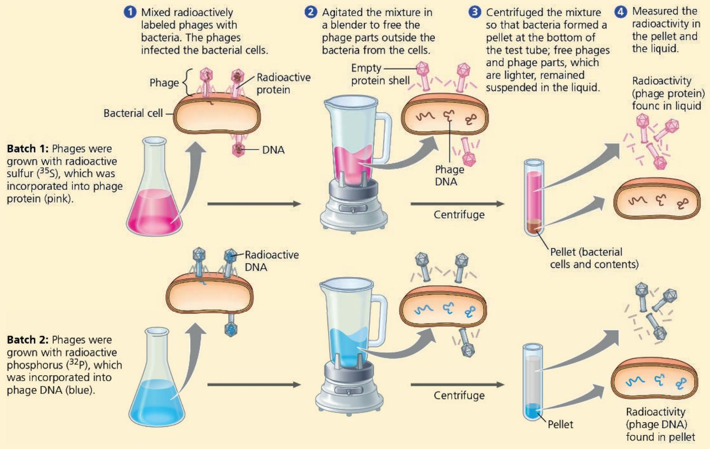

## Results

When proteins were labeled (batch 1), radioactivity remained outside the cells, but when DNA was labeled (batch 2), radioactivity was found inside the cells. Cells containing radioactive phage DNA released new phages with some radioactive phosphorus.

## Conclusion

Phage DNA entered bacterial cells, but phage proteins did not. Hershey and Chase concluded that DNA, not protein, functions as the genetic material of phage T2.

Data from A. D. Hershey and M. Chase, Independent functions of viral protein and nucleic acid in growth of bacteriophage, Journal of General Physiology 36:39–56 (1952).

WHAT IF? How would the results have differed if proteins carried the genetic information?

For suggested answer, see Appendix A.

experiment, they used a radioactive isotope of sulfur to tag protein in one batch of T2 and a radioactive isotope of phosphorus to tag DNA in a second batch. Because protein, but not DNA, contains sulfur, radioactive sulfur atoms were incorporated only into the protein of the phage. In a similar way, the atoms of radioactive phosphorus labeled only the DNA, not the protein, because nearly all the phage's phosphorus is in its DNA. In the experiment, different samples of nonradioactive E. coli cells were infected separately with the protein-labeled and DNA-labeled batches of T2. The researchers then tested the two samples shortly after the onset of infection to see which type of radioactively labeled molecule—protein or DNA—had entered the bacterial cells and would therefore be capable of reprogramming them.

Hershey and Chase found that the phage DNA entered the host cells, but the phage protein did not. Moreover, when these bacteria were returned to a culture medium and the infection ran its course, the E. coli released phages that contained some radioactive phosphorus. This result further showed that the DNA inside the cell played an ongoing role during the infection process. They concluded that the DNA injected by the phage must be the molecule carrying the genetic information that makes the cells produce new viral DNA and proteins. The Hershey-Chase experiment was a landmark study because it provided powerful evidence that nucleic acids, rather than proteins, are the hereditary material, at least for certain viruses.

## Additional Evidence That DNA Is the Genetic Material

Further evidence that DNA is the genetic material came from the laboratory of biochemist Erwin Chargaff. DNA was known to be a polymer of nucleotides, each having three components: a nitrogenous (nitrogen-containing) base, a pentose sugar called deoxyribose, and a phosphate group (Figure 16.5). The base can be adenine (A), thymine (T), guanine (G), or cytosine (C). Chargaff analyzed the base composition of DNA from a number of different organisms. In 1950, he reported that the base composition of DNA varies from one species to another. For example, he found that 32.8% of sea urchin DNA nucleotides have the base A, whereas only 24.7% of those from the bacterium E. coli have an A. This evidence of molecular diversity among species, which most scientists had presumed to be absent from DNA, made DNA a more credible candidate for the genetic material.

Chargaff also noticed a peculiar regularity in the ratios of nucleotide bases. In the DNA of each species he studied, the number of adenines approximately equaled the number of thymines, and the number of guanines approximately equaled the number of cytosines. In sea urchin DNA, for example, the four bases are present in these percentages: A = 32.8% and T = 32.1%; G = 17.7% and C = 17.3%. (The percentages are not exactly the same because of limitations in Chargaff's techniques.)

These two findings became known as Chargaff's rules: (1) DNA base composition varies between species, and (2) for each species, the percentages of A and T bases are roughly equal, as are those of G and C bases. In the Scientific Skills Exercise, you can use Chargaff's rules to predict percentages of nucleotide bases. The basis for these rules remained unexplained until the discovery of the double helix.

## Figure 16.5 The structure of a DNA strand.

Each DNA nucleotide monomer consists of the sugar deoxyribose (blue pentagon) attached to both a nitrogenous base (A, T, G, or C), and a phosphate group (yellow circle). The phosphate group of one nucleotide is attached to the sugar of the next by a covalent bond, forming a “backbone” of alternating phosphates and sugars from which the bases project. A polynucleotide strand has directionality, from the 5' end (with the phosphate group) to the 3' end (with the —OH group of the sugar). 5' and 3' refer to the numbers assigned to the carbons in the sugar ring (see magenta numbers).

Sugar-phosphate backbone

Nitrogenous bases

## Building a Structural Model of DNA

Once most biologists were convinced that DNA was the genetic material, the challenge was to determine how the structure of DNA could account for its role in inheritance. By the early 1950s, the arrangement of covalent bonds in a nucleic acid polymer was well established (see Figure 16.5), and researchers focused on discovering the three-dimensional structure of DNA. Among the scientists working on the problem were Linus Pauling, at the California Institute of Technology, and Maurice Wilkins and Rosalind Franklin, at King's College in London. First to come up with the complete answer, however, were two scientists who were relatively unknown at the time—the American James Watson and the Englishman Francis Crick.

The collaborative work that solved the puzzle of DNA structure began soon after Watson went to Cambridge University, where Crick

# Scientific Skills Exercise Working with Data in a Table

Given the Percentage Composition of One Nucleotide in a Genome, Can We Predict the Percentages of the Other Three Nucleotides? Even before the structure of DNA was elucidated, Erwin Chargaff and his co-workers noticed a pattern in the base composition of nucleotides from different species: The percentage of adenine (A) bases roughly equaled that of thymine (T) bases, and the percentage of cytosine (C) bases roughly equaled that of guanine (G) bases. Further, the percentage of each pair (A–T or C–G) varied from species to species. We now know that the 1:1 A/T and C/G ratios are due to complementary base pairing between A and T and between C and G in the DNA double helix, and differences between species are due to the unique sequences of bases along a DNA strand. In this exercise, you will apply Chargaff's rules to predict the composition of bases in a genome.

How the Experiments Were Done In Chargaff's experiments, DNA was extracted from the given species, hydrolyzed to break apart the nucleotides, and then analyzed chemically. These studies provided approximate values for each type of nucleotide. (Today, whole-genome sequencing allows base composition analysis to be done more precisely directly from the sequence data.)

Data from the Experiments Tables are useful for organizing sets of data representing a common set of values (here, percentages of A, G, C, and T) for a number of different samples (in this case, from different species). You can apply the patterns that you see in the known data to predict unknown values. In the table shown here, the complete base distribution data are given for sea urchin DNA and salmon DNA; you will use Chargaff's rules to fill in the rest of the table with predicted values.

was studying protein structure with a technique called X-ray crystallography (see Figure 5.21). While visiting the laboratory of Maurice Wilkins, Watson saw an X-ray diffraction image of DNA produced by Wilkins's accomplished colleague Rosalind Franklin (Figure 16.6). Images produced by X-ray crystallography are not actually pictures of molecules. The spots in the image were produced by X-rays that were diffracted (diverted) as they passed through aligned fibers of purified DNA. Watson was familiar with the type of X-ray diffraction pattern of helical molecules, and seeing the photo that Wilkins showed him confirmed that DNA was helical in shape. The photo also added to earlier data obtained by Franklin and others suggesting the width of the helix and the spacing of the nitrogenous bases along it. The pattern in this photo implied that the helix was made up of two strands, contrary to a three-stranded model proposed by Linus Pauling a short time earlier. The presence of two strands accounts for the now-familiar term double helix. DNA is shown in some of its many different representations in Figure 16.7. Watson and Crick began building models of a double helix that would conform to the X-ray measurements and what was then

<table><tr><td rowspan="2">Source of DNA</td><td colspan="4">Base Percentage</td></tr><tr><td>Adenine</td><td>Guanine</td><td>Cytosine</td><td>Thymine</td></tr><tr><td>Sea urchin</td><td>32.8</td><td>17.7</td><td>17.3</td><td>32.1</td></tr><tr><td>Salmon</td><td>29.7</td><td>20.8</td><td>20.4</td><td>29.1</td></tr><tr><td>Wheat</td><td>28.1</td><td>21.8</td><td>22.7</td><td></td></tr><tr><td>E. coli</td><td>24.7</td><td>26.0</td><td></td><td></td></tr><tr><td>Human</td><td>30.4</td><td></td><td></td><td>30.1</td></tr><tr><td>Ox</td><td>29.0</td><td></td><td></td><td></td></tr><tr><td>Average %</td><td></td><td></td><td></td><td></td></tr></table>

Data from several papers by Chargaff: for example, E. Chargaff et al., Composition of the desoxypentose nucleic acids of four genera of sea-urchin, Journal of Biological Chemistry 195: 155–160 (1952).

## INTERPRET THE DATA

1. Explain how the sea urchin and salmon data demonstrate both of Chargaff's rules.

2. Using Chargaff's rules, fill in the table with your predictions of the missing percentages of bases, starting with the wheat genome and proceeding through $E. coli$ , human, and ox. Show how you arrived at your answers.

3. If Chargaff's rule—that the amount of A equals the amount of T and the amount of C equals the amount of G—is valid, then hypothetically we could extrapolate this to the combined DNA of all species on Earth (like one huge Earth genome). To see whether the data in the table support this hypothesis, calculate the average percentage for each base in your completed table by averaging the values in each column. Does Chargaff's equivalence rule still hold true?

Instructors: A version of this Scientific Skills Exercise can be assigned in Mastering Biology.

Figure 16.6 Rosalind Franklin and her X-ray diffraction photo of DNA.  
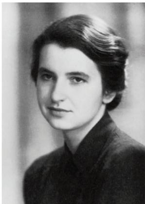  
(a) Rosalind Franklin

  
(b) Franklin's X-ray diffraction photograph of DNA

Diameter $= 2\mathrm{nm}$

One full turn every 10 base pairs (3.4 nm)

## Visualizing DNA

## Figure 16.7

DNA can be illustrated in many ways, but all diagrams represent the same basic structure. The level of detail shown depends on the process or the type of information being conveyed.

Here, the two DNA strands are shown untwisted so it's easier to see the chemical details. Note that the strands are antiparallel—they are oriented in opposite directions, like the lanes of a divided street.

## Structural Images

The space-filling model on the left shows the 3-D shape of the DNA double helix; the diagram on the right shows chemical details of DNA's structure. In both images, phosphate groups are yellow, deoxyribose sugars are blue, and nitrogenous bases are shades of green and orange.

The DNA double helix is "right-handed." To see why, picture a person's right hand held as shown, following the sugar phosphate backbone up the helix and around to the back. (It won't work with their left hand.)

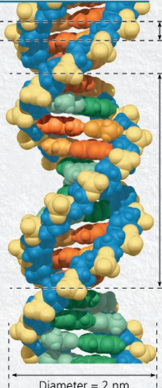

1. Describe the bonds that hold together the nucleotides in one DNA strand. Then compare them with the bonds that hold the two DNA strands together.

2. How do the two ends of a DNA strand differ in structure?

## Simplified Images

When molecular detail is not necessary, DNA is portrayed in a range of simplified diagrams, depending on the focus of the figure.

These flattened "ladder style" diagrams of DNA depict the sugar-phosphate backbones like the side rails of a ladder, with the base pairs as rungs. Light blue is used to indicate the more recently synthesized strand.

Sometimes the double-stranded DNA molecule is shown simply as two straight lines.

3. Compare the information conveyed in the three ladder diagrams.

## DNA Sequences

Genetic information is carried in DNA as a linear sequence of nucleotides that may be transcribed into mRNA and translated into a polypeptide. When focusing on the DNA sequence, each nucleotide can be represented simply as the letter of its base: A, T, C, or G.

3' - ACGTAAGCGGTTAAT-5'
5' - TGCATTTCGCCAATTA-3'

Instructors: Additional questions related to this Visualizing Figure can be assigned in Mastering Biology. For suggested answers, see Appendix A.

known about the chemistry of DNA, including Chargaff's rule of base equivalences. Having also read an unpublished annual report summarizing Franklin's work, they knew she had concluded that the sugar-phosphate backbones were on the outside of the DNA molecule, contrary to their working model. Franklin's arrangement was appealing because it put the negatively charged phosphate groups facing the aqueous surroundings, while the relatively hydrophobic nitrogenous bases were hidden in the interior. Watson constructed such a model, in which the two sugar-phosphate backbones are antiparallel—that is, their subunits run in opposite directions (see Figure 16.7). You can imagine the overall arrangement as a rope ladder with rigid rungs. The side ropes represent the sugar-phosphate backbones, and the rungs represent pairs of nitrogenous bases. Now imagine twisting the ladder to form a helix. Franklin's X-ray data indicated that the helix makes one full turn every $3.4\mathrm{nm}$ along its length. With the bases stacked just $0.34\mathrm{nm}$ apart, there are ten layers of base pairs, or rungs of the ladder, in each full turn of the helix.

The nitrogenous bases of the double helix are paired in specific combinations: adenine (A) with thymine (T), and guanine (G) with cytosine (C). It was mainly by trial and error that Watson and Crick arrived at this key feature of DNA. At first, Watson imagined that the bases paired like with like—for example, A with A and C with C. But this model did not fit the X-ray data, which suggested that the double helix had a uniform diameter. Why is this requirement inconsistent with like-with-like pairing of bases? Adenine and guanine are purines, nitrogenous bases with two organic rings, while cytosine and thymine are nitrogenous bases called pyrimidines, which have a single ring. Pairing a purine with a pyrimidine is the only combination that results in a uniform diameter for the double helix (Figure 16.8).

Watson and Crick reasoned that there must be additional specificity of pairing dictated by the structure of the bases. Each base has chemical side groups that can form hydrogen bonds with its appropriate partner: Adenine can form two hydrogen bonds with thymine and only thymine; guanine forms three hydrogen bonds with cytosine and only cytosine. In shorthand, A pairs with T, and G pairs with C (Figure 16.9).

The Watson-Crick model took into account Chargaff's ratios and ultimately explained them. Wherever one strand of a DNA molecule has an A, the partner strand has a T. Similarly, a G in one strand is always paired with a C in the complementary strand. Therefore, in the DNA of any organism, the amount of adenine equals the amount of thymine, and the amount of guanine equals the amount of cytosine. (Modern DNA-sequencing techniques have confirmed that the amounts are exactly equal.) Although the

Purine + purine: too wide

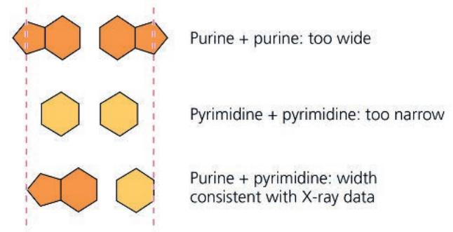  
Pyrimidine + pyrimidine: too narrow  
Purine + pyrimidine: width consistent with X-ray data

## Figure 16.9 Base pairing in DNA.

Nitrogenous base pairs are held together by hydrogen bonds.

Figure 16.8 Possible base pairings in the DNA double helix.  

base-pairing rules dictate the combinations of nitrogenous bases that form the “rungs” of the double helix, they do not restrict the sequence of nucleotides along each DNA strand. The linear sequence of the four bases can be varied in countless ways, and each gene has a unique base sequence.

In April 1953, Watson and Crick surprised the scientific world with a succinct, one-page paper that reported their molecular model for DNA: the double helix, which has since become an icon of molecular biology. They did not include Rosalind Franklin as an author, in spite of using her data to build their model. Watson and Crick, along with Maurice Wilkins, were awarded the Nobel Prize in 1962 for this work. (Sadly, Franklin had died at the age of 37 in 1958 and was thus ineligible for the prize.) The beauty of the double helix model was that the structure of DNA suggested the basic mechanism of its replication.

## Concept Check 16.1

1. Given a polynucleotide sequence such as GAATTC, explain what further information you would need in order to identify which is the 5' end. (See Figure 16.5.)

2. VISUAL SKILLS While trying to develop a vaccine for S. pneumoniae, Griffith was surprised to discover the phenomenon of bacterial transformation. Based on the results in the second and third panels of Figure 16.2, what result was he expecting in the fourth panel? Explain.

For suggested answers, see Appendix A.

## Concept 16.2: Many proteins work together in DNA replication and repair

Hereditary information in DNA directs the development of your biochemical, anatomical, physiological, and, to some extent, behavioral traits. A person's resemblance to their parents has its basis in the accurate replication of DNA prior to meiosis and therefore its transmission from the parents' generation to the children's. Replication prior to mitosis ensures faithful transmission of genetic information from a parent cell to two daughter cells.

Of all nature's molecules, nucleic acids are unique in their ability to dictate their own replication from monomers. The relationship between structure and function is evident in the double helix: The specific complementary pairing of nitrogenous bases in DNA has a functional significance. Watson and Crick ended their classic paper with this statement: "It has not escaped our notice that the specific

Figure 16.10 A model for DNA replication: the basic concept.  
In this simplified illustration, a short segment of DNA has been untwisted. Simple shapes symbolize the four kinds of bases. Dark blue represents DNA strands present in the parental molecule; light blue represents newly synthesized DNA.  
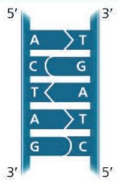  
(a) The parental molecule has two complementary strands of DNA. Each base is paired by hydrogen bonding with its specific partner, A with T and G with C.

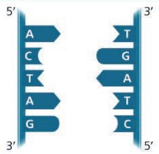  
(b) First, the two DNA strands are separated. Each parental strand can now serve as a template for a new, complementary strand.

  
(c) Nucleotides complementary to the parental (dark blue) strand are connected to form the sugar-phosphate backbones of the new "daughter" (light blue) strands.  
somehow come back together after the process (that is, the parental molecule is conserved). In yet a third model, called the dispersive model, all four strands of DNA following replication have a mixture of old and new DNA (Figure 16.11).

pairing we have postulated immediately suggests a possible copying mechanism for the genetic material."¹ In this section, you will learn about the basic principle of DNA replication, the copying of DNA, as well as some important details of the process.

## The Basic Principle: Base Pairing to a Template Strand

In a second paper, Watson and Crick stated their hypothesis for how DNA replicates: "Now our model for deoxyribonucleic acid is, in effect, a pair of templates, each of which is complementary to the other. We imagine that prior to duplication the hydrogen bonds are broken, and the two chains unwind and separate. Each chain then acts as a template for the formation on to itself of a new companion chain, so that eventually we shall have two pairs of chains, where we only had one before. Moreover, the sequence of the pairs of bases will have been duplicated exactly."2

Figure 16.10 illustrates the basic idea. If you cover a DNA strand in Figure 16.10a, its linear sequence of nucleotides is revealed by applying the base-pairing rules to the uncovered strand. The two strands are complementary; each stores the information necessary to reconstruct the other. When a cell copies a DNA molecule, each strand serves as a template for ordering nucleotides into a new, complementary strand. Nucleotides line up along the template strand according to the base-pairing rules and are linked to form the new strands. One double-stranded DNA molecule becomes two, each an exact replica of the “parental” molecule.

This model of DNA replication remained untested for several years following publication of the DNA structure. The necessary experiments were simple in concept but difficult to perform. Watson and Crick's model predicts that when a double helix replicates, each of the two daughter molecules will have one old strand, from the parental molecule, and one newly made strand. This semiconservative model can be distinguished from a conservative model of replication, in which the two parental strands

## Figure 16.11 DNA replication: three alternative models.

Each short segment of double helix symbolizes the DNA within a cell. Beginning with a parent cell, we follow the DNA for two more generations of cells—two rounds of DNA replication. Parental DNA is dark blue; newly made DNA is light blue.

<table><tr><td></td><td>Parent cell</td><td>First replication</td><td>Second replication</td></tr><tr><td>(a) Conservative model.The two parental strands reassociate after acting as templates for new strands, thus restoring the parental double helix.</td><td></td><td></td><td></td></tr><tr><td>(b) Semiconservative model.The two strands of the parental molecule separate, and each functions as a template for synthesis of a new, complementary strand.</td><td></td><td></td><td></td></tr><tr><td>(c) Dispersive model.Each strand of both daughter molecules contains a mixture of old and newly synthesized DNA.</td><td colspan="3"></td></tr></table>

## Figure 16.12

# Inquiry: Does DNA replication follow the conservative, semiconservative, or dispersive model?

Experiment

Matthew Meselson and Franklin Stahl cultured E. coli for several generations in a medium containing nucleotide precursors labeled with a heavy isotope of nitrogen, ${}^{15}$ N. They then transferred the bacteria to a medium with only ${}^{14}$ N, a lighter isotope. They took one sample after the first DNA replication and another after the second replication. They extracted DNA from the bacteria in the samples and then centrifuged each DNA sample to separate DNA of different densities.

## Conclusion

Meselson and Stahl compared their results to those predicted by each of the three models in Figure 16.11, as summarized in the following diagram. The first replication in the ${}^{14}$ N medium produced a single band of many molecules of hybrid ( ${}^{15}$ N- ${}^{14}$ N) DNA. This

Although mechanisms for conservative or dispersive DNA replication are not easy to devise, these models remained possibilities until they could be ruled out. After two years of preliminary work at the California Institute of Technology in the late 1950s, Matthew Meselson and Franklin Stahl devised a clever experiment that distinguished between the three models, described in Figure 16.12. Their results supported the semiconservative model of DNA replication, as predicted by Watson and Crick, and their experiment is widely recognized among biologists as a classic example of elegant design.

The basic principle of DNA replication is conceptually simple. However, the actual process involves some complicated biochemical gymnastics, as we will now see.

## DNA Replication: A Closer Look

The bacterium E. coli has a single chromosome of about 4.6 million nucleotide pairs. In a favorable environment, an E. coli cell can copy all of this DNA and divide to form two genetically identical daughter cells in considerably less than an hour. Each of result eliminated the conservative model. The second replication produced both light and hybrid DNA, refuting the dispersive model and supporting the semiconservative model. They therefore concluded that DNA replication is semiconservative.

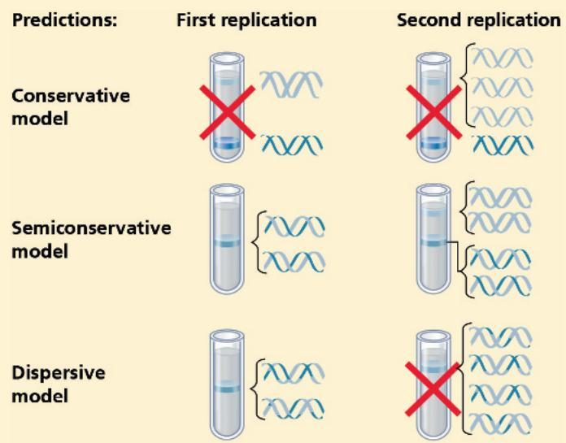  
Data from M. Meselson and F. W. Stahl, The replication of DNA in Escherichia coli, Proceedings of the National Academy of Sciences USA 44:671–682 (1958).

INQUIRY IN ACTION Read and analyze the original paper in Inquiry in Action: Interpreting Scientific Papers.

Instructors: A related Experimental Inquiry Tutorial can be assigned in Mastering Biology.

WHAT IF? If Meselson and Stahl had first grown the cells in ${}^{14}$ N-containing medium and then moved them into ${}^{15}$ N-containing medium before taking samples, what would have been the result after each of the two replications?

For suggested answer, see Appendix A.

your somatic cells has 46 DNA molecules in its nucleus, one long double-helical molecule per chromosome. In all, that represents about 6 billion nucleotide pairs, or over 1,000 times more DNA than is found in most bacterial cells. If we were to print the one-letter symbols for these bases (A, G, C, and T) the size of the type you are now reading, the 6 billion nucleotide pairs of information in a diploid human cell would fill about 1,400 biology textbooks. Yet it takes one of your cells just a few hours to copy all of this DNA during S phase of interphase. This replication of an enormous amount of genetic information is achieved with very few errors—only about one per 10 billion nucleotides. The copying of DNA is remarkable in its speed and accuracy.

More than a dozen enzymes and other proteins participate in DNA replication. Much more is known about how this “replication machine” works in bacteria (such as $E.\ coli$ ) than in eukaryotes, and we will describe the basic steps of the process for $E.\ coli$ , except where otherwise noted. What scientists have learned about eukaryotic DNA replication suggests, however, that most of the process is fundamentally similar for prokaryotes and eukaryotes.

## Getting Started

The replication of chromosomal DNA begins at particular sites called origins of replication, short stretches of DNA that have a specific sequence of nucleotides. The E. coli chromosome, like many other bacterial chromosomes, is circular and has a single origin. Proteins that initiate DNA replication recognize this sequence and attach to the DNA, separating the two strands and opening up a replication “bubble” (Figure 16.13a). Replication of DNA then proceeds in both directions until the entire molecule is copied. In contrast to a bacterial chromosome, a eukaryotic chromosome may have hundreds or even a few thousand replication origins. Multiple replication bubbles form and eventually fuse, thus speeding up the copying of the very long DNA molecules (Figure 16.13b). As in bacteria, eukaryotic DNA replication proceeds in both directions from each origin.

At each end of a replication bubble is a replication fork, a Y-shaped region where the parental strands of DNA are being unwound. Several kinds of proteins participate in the unwinding (Figure 16.14). Helicases are enzymes that untwist the double helix at the replication forks, separating the two parental strands and making them available as template strands. After the parental strands separate, single-strand binding proteins bind to the unpaired DNA strands, keeping them from re-pairing. The untwisting of the double helix causes tighter twisting and strain ahead of the replication fork. Topoisomerase is an enzyme that helps relieve this strain by breaking, swiveling, and rejoining DNA strands.

## Synthesizing a New DNA Strand

The unwound sections of parental DNA strands are now available to serve as templates for the synthesis of new complementary DNA strands. However, the enzymes that synthesize DNA cannot initiate the synthesis of a polynucleotide; they can only add DNA nucleotides to the end of an already existing chain that is base-paired with the template strand. An initial nucleotide chain that can be used as a pre-existing chain is produced during DNA synthesis; this is actually a short stretch of RNA, not DNA. The RNA chain is called a primer

Figure 16.13 Origins of replication in E. coli and eukaryotes.  
The smaller red arrows indicate the movement of the replication forks and thus the overall directions of DNA replication within each bubble.  
  
The circular chromosome of E. coli and other bacteria has only one origin of replication. The parental strands separate there, forming a replication bubble with two forks (red arrows). Replication proceeds in both directions until the forks meet on the other side, resulting in two daughter DNA molecules. The TEM shows a bacterial chromosome with a replication bubble.

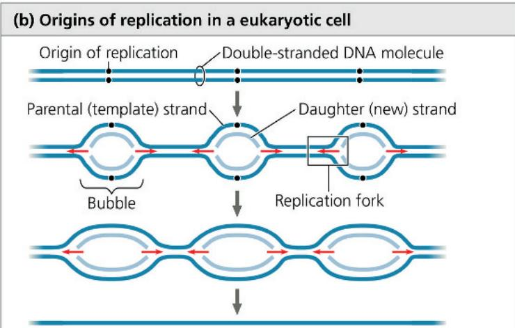  
Two daughter DNA molecules

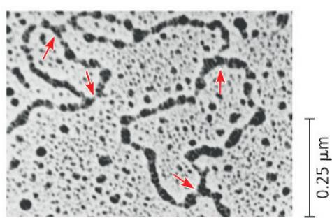  
In a linear chromosome of a eukaryote, replication bubbles form at many sites along the giant DNA molecule during S phase of interphase. The bubbles expand as replication proceeds in both directions (red arrows). Eventually, the bubbles fuse and synthesis of the daughter strands is complete. The TEM shows three replication bubbles along the DNA of a cultured Chinese hamster cell.

Figure 16.14 Some of the proteins involved in the initiation of DNA replication.

The same proteins function at both replication forks in a replication bubble. For simplicity, only the left-hand fork is shown, and the DNA bases are drawn much larger in relation to the proteins than they are in reality.

and is synthesized by the enzyme primase (see Figure 16.14). Primase starts a complementary RNA chain with a single RNA nucleotide and adds RNA nucleotides one at a time, using the parental DNA strand as a template. The completed primer, generally five to ten nucleotides long, is thus base-paired to the template strand. The new DNA strand will start from the 3' end of the RNA primer; the RNA primer will be destroyed later, as we'll describe in a bit.

Enzymes called DNA polymerases catalyze the synthesis of new DNA by adding nucleotides to the 3' end of a preexisting chain. In E. coli, there are several DNA polymerases, but two of them appear to play the major roles in DNA replication: DNA polymerase III and DNA polymerase I. The situation in eukaryotes is more complicated, with at least 11 different DNA polymerases discovered so far, although the general principles are the same.

Most DNA polymerases require a primer and a DNA template strand, along which complementary DNA nucleotides are lined up, one by one. In E. coli, DNA polymerase III (abbreviated DNA pol III) adds a DNA nucleotide to the RNA primer and then continues adding DNA nucleotides, which are complementary to the parental DNA template strand, to the growing end of the new DNA strand. The rate of elongation is about 500 nucleotides per second in bacteria and 50 per second in human cells.

Each nucleotide to be added to a growing DNA strand consists of a sugar attached to a base and to three phosphate groups. You have already encountered such a molecule—ATP (adenosine triphosphate; see Figure 8.9). The only difference between the ATP of energy metabolism and dATP, the adenine nucleotide used to make DNA, is the sugar component, which is deoxyribose in the building block of DNA but ribose in ATP. Like ATP, the nucleotides used for DNA synthesis are chemically reactive, partly because their triphosphate tails have an unstable cluster of negative charge. DNA polymerase catalyzes the addition of each monomer to the growing end of a DNA strand by a condensation reaction in which two phosphate groups are lost as a molecule of pyrophosphate. Subsequent hydrolysis of the pyrophosphate to two molecules of inorganic phosphate is a coupled exergonic reaction that helps drive the polymerization reaction (Figure 16.15).

## Antiparallel Elongation

As we have noted previously, the two ends of a DNA strand are different, giving each strand directionality, like a one-way street (see Figure 16.5). In addition, the two strands of DNA in a double helix are antiparallel, meaning that they are oriented in opposite directions to each other, like the two sides of a divided street (see Figure 16.15). Therefore, the two new strands formed during DNA replication must also be antiparallel to their template strands.

The antiparallel arrangement of the double helix, together with a constraint on the function of DNA polymerases, has an important effect on how replication occurs. Because of their structure, DNA polymerases can add nucleotides only to the free 3' end of a primer or growing DNA strand, never to the 5' end (see Figure 16.15). Thus, a new DNA strand can elongate only in the 5' → 3' direction. With this in mind, let's examine one of the two replication forks in a bubble (Figure 16.16). Along one template strand, DNA polymerase III can synthesize a complementary strand continuously by elongating the new DNA in the mandatory 5' → 3' direction. DNA pol III remains in the replication fork on that template strand and continuously adds nucleotides to the new complementary strand as the fork progresses. The DNA strand made by this mechanism is called the leading strand. Only one primer is required for DNA pol III to synthesize the entire leading strand (see Figure 16.16).

To elongate the other new strand of DNA in the mandatory $5'\rightarrow3'$ direction, DNA pol III must work along the other template strand in the direction away from the replication fork. The DNA strand elongating in this direction is called the lagging strand. In contrast to the leading strand, which elongates continuously, the

Figure 16.15 Addition of a nucleotide to a DNA strand. DNA polymerase catalyzes addition of a nucleotide to the 3' end of a growing DNA strand, with the release of two phosphates.  
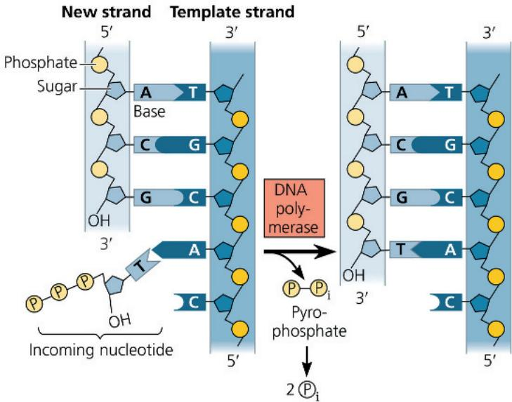  
DRAW IT Circle the area where the new bond was made. For suggested answer, see Appendix A.

## Figure 16.16 Synthesis of the leading strand during DNA replication.

This diagram focuses on the left replication fork shown in the overview box. DNA polymerase III (DNA pol III), shaped like a cupped hand, is shown closely associated with a protein called the “sliding clamp” that encircles the newly synthesized double helix like a doughnut. The sliding clamp moves DNA pol III along the DNA template strand.

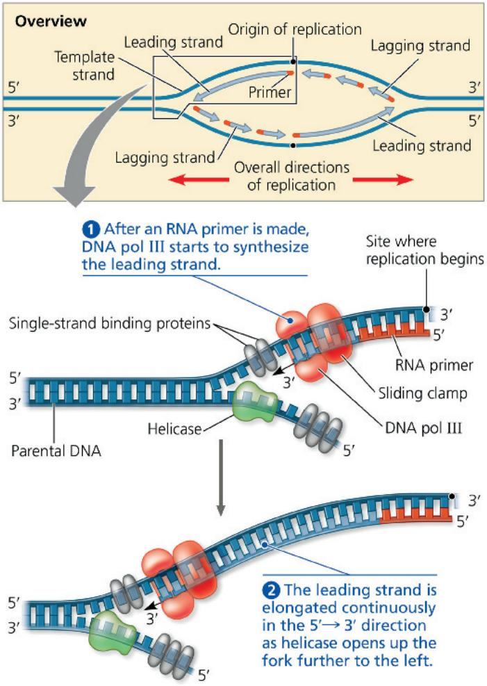

lagging strand is synthesized discontinuously, as a series of segments. These segments of the lagging strand are called Okazaki fragments, after Reiji Okazaki, the Japanese scientist who discovered them. The fragments are about 1,000–2,000 nucleotides long in E. coli and 100–200 nucleotides long in eukaryotes.

Figure 16.17 illustrates the steps in the synthesis of the lagging strand at one fork. Whereas only one primer is required on the leading strand, each Okazaki fragment on the lagging strand must be primed separately (1 and 4). After DNA pol III forms an Okazaki fragment (2 to 4), another DNA polymerase, DNA pol I, replaces the RNA nucleotides of the adjacent primer with DNA nucleotides one at a time (5). But DNA pol I cannot join the final nucleotide of this replacement DNA segment to the first DNA nucleotide of the adjacent Okazaki fragment. Another enzyme, DNA ligase, accomplishes this task, joining the sugar-phosphate backbones of all the Okazaki fragments into a continuous DNA strand (6).

Synthesis of the leading strand and synthesis of the lagging strand occur concurrently and at the same rate. The lagging strand is so named because its synthesis is delayed slightly relative to synthesis of the

Figure 16.17 Synthesis of the lagging strand.  

leading strand; each new fragment of the lagging strand cannot be started until enough template has been exposed at the replication fork.

Figure 16.18 and Table 16.1 summarize DNA replication. Please study them carefully before proceeding.

## The DNA Replication Complex

It is traditional—and convenient—to represent DNA polymerase molecules as locomotives moving along a DNA railroad track, but such a model is inaccurate in two important ways. First, the various proteins that participate in DNA replication actually form a single large complex, a “DNA replication machine.” Many protein-protein interactions facilitate the efficiency of this complex. For example, by interacting with other proteins at the fork, primase apparently acts as a molecular brake, slowing progress of the replication fork and coordinating the placement of primers and the

rates of replication on the leading and lagging strands. Second, the DNA replication complex may not move along the DNA; rather, the DNA may move through the complex during the replication process. In eukaryotic cells, multiple copies of the complex, perhaps grouped into “factories,” may be anchored to the nuclear matrix, a framework of fibers extending through the interior of the nucleus.

Some experimental evidence supports a model in which two DNA polymerase molecules, one on each template strand, "reel in" the parental DNA and extrude newly made daughter DNA molecules. In this so-called trombone model, the lagging strand is also looped back through the complex (Figure 16.19). Whether the complex moves along the DNA or whether the DNA moves through the complex, either anchored or not, are still open, unresolved questions that are under active investigation.

Figure 16.18 A summary of bacterial DNA replication.  
The detailed diagram shows the left-hand replication fork of the replication bubble shown in the overview (upper right). Viewing each daughter strand in its entirety in the overview, you can see that half of it is made continuously as the leading strand, while the other half (on the other side of the origin) is synthesized in fragments as the lagging strand.  
  
DRAW IT Draw a diagram showing the right-hand fork of the bubble in this figure. Number the Okazaki fragments, and label all 5' and 3' ends.  
For suggested answer, see Appendix A.

Table 16.1 Bacterial DNA Replication Proteins and Their Functions

<table><tr><td>Protein</td><td>Function</td></tr><tr><td>Helicase</td><td>Unwinds parental double helix at replication forks</td></tr><tr><td>Single-strand binding protein</td><td>Binds to and stabilizes single-stranded DNA until it is used as a template</td></tr><tr><td>Topoisomerase</td><td>Relieves overwinding strain ahead of replication forks by breaking, swiv-elling, and rejoining DNA strands</td></tr><tr><td>Primase</td><td>Synthezises an RNA primer at 5&#x27; end of leading strand and at 5&#x27; end of each Okazaki fragment of lagging strand</td></tr><tr><td>DNA pol IIT</td><td>Using parental DNA as a template, synthezises new DNA strand by add-ing nucleotides to an RNA primer or a pre-existing DNA strand</td></tr><tr><td>DNA pol I</td><td>Removes RNA nucleotides of primer from 5&#x27; end and replaces them with DNA nucleotides added to 3&#x27; end of adjacent fragment</td></tr><tr><td>DNA ligase</td><td>Joins Okazaki fragments of lagging strand; on leading strand, joins 3&#x27; end of DNA that replaces primer to rest of leading strand DNA</td></tr></table>

Figure 16.19 The “trombone” model of the DNA replication complex.

## Proofreading and Repairing DNA

The accuracy of DNA replication is not solely due to the specificity of base pairing. Initial pairing errors between incoming nucleotides and those in the template strand occur at a rate of one in $10^{5}$ nucleotides. However, errors in the completed DNA molecule amount to only one in $10^{10}$ (10 billion) nucleotides, an error rate that is 100,000 times lower. This is because during DNA replication, many DNA polymerases proofread each nucleotide against its template as soon as it is covalently bonded to the growing strand. Upon finding an incorrectly paired nucleotide, the polymerase removes the nucleotide and then resumes synthesis. (This action is similar to fixing a texting error by deleting the wrong letter and then entering the correct one.)

Mismatched nucleotides sometimes evade proofreading by a DNA polymerase. In mismatch repair, other enzymes remove and replace incorrectly paired nucleotides that have resulted from replication errors. Researchers highlighted the importance of such repair enzymes when they found that a hereditary defect in one of them is associated with a form of colon cancer. Apparently, this defect allows cancer-causing errors to accumulate in the DNA faster than normal.

Incorrectly paired or altered nucleotides can also arise after replication. In fact, maintenance of the genetic information encoded in DNA requires frequent repair of various kinds of

In this proposed model, two molecules of DNA polymerase III work together in a complex, one on each strand, with helicase and other proteins. The lagging strand template DNA loops through the complex, resembling the slide of a trombone.

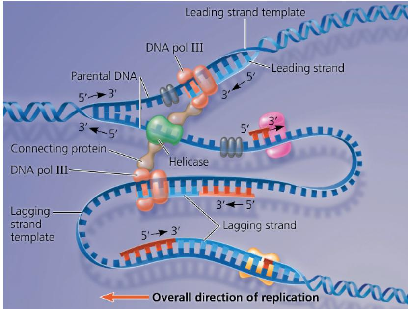  
DRAW IT Draw a line tracing the lagging strand template in this figure. For suggested answer, see Appendix A.

damage to existing DNA. DNA molecules are constantly subjected to potentially harmful chemical and physical agents, such as X-rays, as we'll discuss in Concept 17.5. In addition, DNA bases may undergo spontaneous chemical changes under normal cellular conditions. However, these changes in DNA are usually corrected before they become permanent changes—mutations—perpetuated through successive replications. Each cell continuously monitors and repairs its genetic material. Because repair of damaged DNA is so important to the survival of an organism, it is no surprise that many different DNA repair enzymes have evolved. Almost 100 are known in E. coli, and about 170 have been identified so far in humans.

Most cellular systems for repairing incorrectly paired nucleotides, whether they are due to DNA damage or to replication errors, use a mechanism that takes advantage of the base-paired structure of DNA. In many cases, a segment of the strand containing the damage is cut out (excised) by a DNA-cutting enzyme—a nuclease—and the resulting gap is then filled in with nucleotides, using the undamaged strand as a template. The enzymes involved in filling the gap are a DNA polymerase and DNA ligase. There are several such DNA repair systems; one is called nucleotide excision repair.

An example is shown in Figure 16.20. An important function of the DNA repair enzymes in our skin cells is to repair genetic damage caused by the UV rays of sunlight: For example, adjacent thymine bases on a DNA strand can become covalently linked into thymine dimers, causing the DNA to buckle and interfere with DNA replication. The importance of repairing this kind of damage is underscored by a disorder called xeroderma pigmentosum (XP), which in most cases is caused by an inherited defect in a nucleotide excision repair enzyme. Individuals with XP are hypersensitive to sunlight; mutations in their skin cells caused by ultraviolet light are left uncorrected, often resulting in skin cancer. The effects are extreme: Without sun protection, children who have XP can develop skin cancer by age 10.

Figure 16.20 Nucleotide excision repair of DNA damage.  
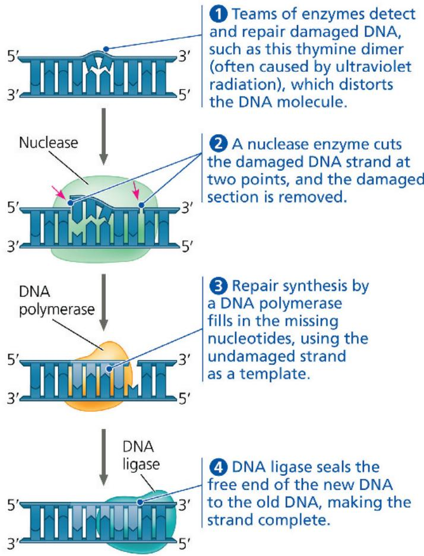

## Evolutionary Significance of Altered DNA Nucleotides

EVOLUTION Faithful replication of the genome and repair of DNA damage are important for the functioning of the organism and for passing on a complete, accurate genome to the next generation. The error rate after proofreading and repair is extremely low, but rare mistakes do slip through. Once a mismatched nucleotide pair is replicated, the sequence change is permanent in the daughter molecule that has the incorrect nucleotide as well as in any subsequent copies. As we mentioned earlier, a permanent change in the DNA sequence is called a mutation.

Mutations can change the phenotype of an organism (see Concept 17.5). And if they occur in germ cells, which give rise to gametes, mutations can be passed on from generation to generation. The vast majority of such changes either have no effect or are harmful, but a very small percentage can be beneficial. In either case, mutations are the original source of the variation on which natural selection operates during evolution and are ultimately responsible for the appearance of new species. (You'll learn more

about this process in Unit Four.) The balance between complete fidelity of DNA replication or repair and a low mutation rate has resulted in new proteins that contribute to different phenotypes. Ultimately, over long periods of time, this process leads to new species and thus to the rich diversity of life on Earth today.

## Replicating the Ends of DNA Molecules

For linear DNA, such as the DNA of eukaryotic chromosomes, the usual replication machinery cannot complete the 5' ends of daughter DNA strands because there is no 3' end of a preexisting polynucleotide for DNA polymerase to add onto. This is another consequence of the enzyme's requirements. Even if an Okazaki fragment can be started with an RNA primer hydrogen-bonded to the very end of the template strand, once that primer is removed, it cannot be replaced with DNA because there is no 3' end available for nucleotide addition (Figure 16.21). As a result, repeated rounds of replication produce shorter and shorter DNA molecules with uneven ("staggered") ends.

Most prokaryotic organisms have a circular chromosome, with no ends, so the shortening of DNA does not occur. But what protects the genes of linear eukaryotic chromosomes from being eroded away during successive rounds of DNA replication? Eukaryotic chromosomal DNA molecules have special nucleotide sequences called telomeres at their ends (Figure 16.22). Telomeres do not contain genes; instead, the DNA typically consists of multiple repetitions of one short nucleotide sequence. In each human telomere, for example, the six-nucleotide sequence TTAGGG is repeated between 100 and 1,000 times.

Telomeres have two protective functions. First, specific proteins associated with telomeric DNA prevent the staggered ends of the daughter molecule from activating the cell's systems for monitoring DNA damage. (Staggered ends of a DNA molecule, which often result from double-strand breaks, can trigger signal transduction pathways leading to cell cycle arrest or cell death.) Second, telomeric DNA acts as a kind of buffer zone that provides some protection against the organism's genes shortening, somewhat like how the plastic-wrapped ends of a shoelace slow down its unraveling. Telomeres do not prevent the erosion of genes near the ends of chromosomes; they merely postpone it.

As shown in Figure 16.21, telomeres become shorter during every round of replication. Thus, as expected, telomeric DNA tends to be shorter in dividing somatic cells of older individuals and in cultured cells that have divided many times. It has been proposed that shortening of telomeres is somehow connected to the aging process of certain tissues and even to aging of the organism as a whole.

But what about germ cells, whose genome must persist virtually unchanged from an organism to its offspring over many generations? If the chromosomes of germ cells became shorter in every cell cycle, essential genes would eventually be missing from the gametes they produce. However, this does not occur: An enzyme called telomerase catalyzes the lengthening of telomeres in eukaryotic germ cells, thus restoring their original length and compensating for the shortening that occurs during DNA replication. This enzyme contains its own RNA molecule that it uses as a template to artificially “extend” the leading strand, allowing the lagging strand to maintain a given length.

Figure 16.21 Shortening of the ends of linear DNA molecules. Here we follow the left end of one DNA molecule through two rounds of replication. After the first round, the new lagging strand is shorter than its template. After a second round, both the leading and lagging strands have become shorter than the original parental DNA. Although not shown here, the other ends of these chromosomal DNA molecules (not shown) also become shorter.

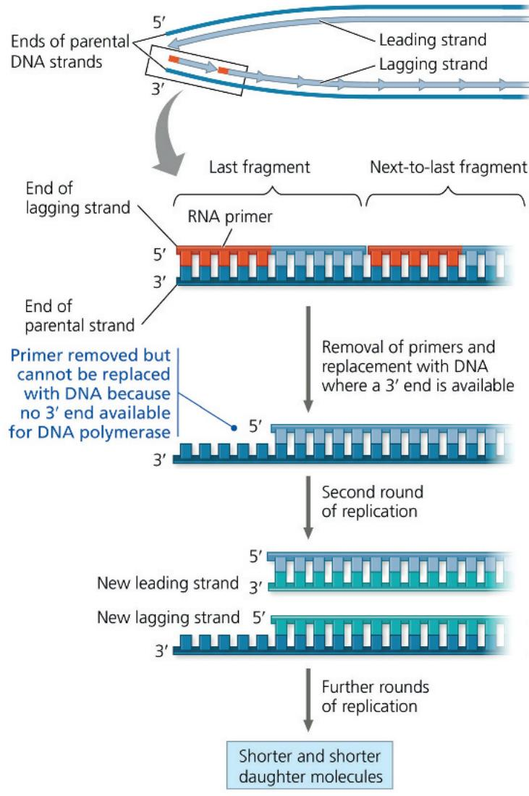  
Figure 16.22 Telomeres.

Eukaryotes have repetitive, noncoding sequences called telomeres at the ends of their DNA. Telomeres are the bright spots stained orange in these mouse chromosomes (LM).  

Telomerase is not active in most human somatic cells, but its activity varies from tissue to tissue. The activity of telomerase in germ cells results in telomeres of maximum length in the zygote.

The notion that longer telomeres could provide a sort of “fountain of youth” has prompted a number of studies. A decade ago, one study that artificially extended telomere length in cultured cells reported that, indeed, the cells had much longer life spans, as measured by how many times they could divide. As a logical extension, in 2023, a research team carried out a study on a group of related individuals with a mutation that led to longer telomeres. Comparing these individuals with family members without the mutation, the researchers reported that although some of those with the mutation showed signs of youthfulness, a large number of them developed tumors, cancers, and harmful blood conditions.

A likely conclusion is that normal shortening of telomeres may protect organisms from cancer by limiting the number of divisions that somatic cells can undergo. Cells from large tumors often have unusually short telomeres, as we would expect for cells that have undergone many cell divisions. Further shortening would presumably lead to self-destruction of the tumor cells. Telomerase activity is abnormally high in cancerous somatic cells, suggesting that its ability to stabilize telomere length may allow these cancer cells to persist. Many cancer cells do seem capable of unlimited cell division, as do immortal strains of cultured cells (see Concept 12.3). For several years, researchers have studied inhibition of telomerase as a possible cancer therapy. While studies that inhibited telomerase in mice with tumors have led to the death of cancer cells, eventually the cells have restored the length of their telomeres by an alternative pathway. This is an area of ongoing research that may eventually yield useful cancer treatments.

## Concept Check 16.2

1. What role does complementary base pairing play in the replication of DNA?

2. Identify two major functions of DNA pol III in DNA replication.

3. MAKE CONNECTIONS What is the relationship between DNA replication and the S phase of the cell cycle? See Figure 12.6.

4. VISUAL SKILLS If the DNA pol I in a given cell were non-functional, how would that affect the synthesis of a leading strand? In the overview box in Figure 16.18, point out where DNA pol I would normally function on the top leading strand.

For suggested answers, see Appendix A.

## Concept 16.3: A chromosome consists of a DNA molecule packed together with proteins

Now let's examine how DNA is packaged into chromosomes, the structures that carry genetic information. The main component of the genome in most bacteria is a double-stranded, circular DNA molecule that is associated with specific proteins. A bacterial chromosome differs from a eukaryotic chromosome in that a eukaryotic chromosome consists of a single linear DNA molecule associated with a large number of proteins. In E. coli, the chromosomal DNA consists of about 4.6 million nucleotide pairs, representing about 4,400 genes. This is 100 times more DNA than is found in a typical virus, but only about one-thousandth as much DNA as in a human somatic cell. Even so, that is a tremendous amount of DNA to be packaged in such a small container.

Stretched out, the DNA of an E. coli cell would measure about a millimeter in length, 1,000 times longer than the region it occupies in the cell. Within a bacterium, however, certain proteins cause the chromosome to coil and “supercoil,” densely packing it so that it fills only part of the cell. Unlike the nucleus of a eukaryotic cell, this dense region of DNA in a bacterium, called the nucleoid, is not bounded by a membrane (see Figure 6.5).

Each eukaryotic chromosome contains a single linear DNA double helix that, in humans, averages about $1.5 \times 10^{8}$ nucleotide pairs. This is an enormous amount of DNA relative to a chromosome's condensed length. If completely stretched out, such a DNA molecule would be about $4\mathrm{cm}$ long, thousands of times the diameter of a cell nucleus—and that's not even considering the DNA of the other 45 human chromosomes!

In the cell, eukaryotic DNA is precisely combined with a large amount of protein. The exact way in which this complex of DNA and protein, called chromatin, fits into the nucleus has long been debated. Figure 16.23 outlines the current view of the organization of chromatin during interphase and how it is condensed during mitosis into the metaphase chromosome. Study this figure carefully before reading further.

# Exploring Chromatin Packing in a Eukaryotic Chromosome

Figure 16.23

## DNA, the Double Helix

Shown below is a ribbon model of DNA, with each ribbon representing one of the polynucleotide strands. The TEM shows a molecule of naked (protein-free) DNA; the double helix is 2 nm across.

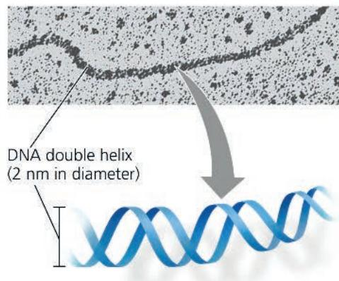

## Histones

Proteins called histones are responsible for the main level of DNA packing in interphase chromatin. More than a fifth of a histone's amino acids are positively charged (Lys or Arg) and therefore bind tightly to the negatively charged DNA.

Four types of histones are most common in chromatin. The histones are very similar among eukaryotes, probably reflecting their important role in chromatin structure.

## Nucleosomes in a 10-nm Fiber

In electron micrographs, unfolded chromatin is roughly 10 nm in diameter (the 10-nm fiber). Such chromatin resembles beads on a string (see the TEM). Each “bead” is a nucleosome, the basic unit of DNA packing; the “string” between beads is called linker DNA.

A nucleosome consists of DNA wound twice around a protein core of eight histones, two each of the four main histone types. The amino end of each histone (the histone tail) extends outward from the nucleosome and is involved in regulation of gene expression.

In the cell cycle, the histones leave the DNA only briefly during DNA replication. Generally, they do the same during the process of transcription, which requires access to the DNA by transcription proteins.

  
Euchromatin (loosely arranged 10-nm fiber)

## Euchromatin/Heterochromatin

A recent technique called ChromEMT allows scientists to visualize chromatin in intact cells. ChromEMT and other new techniques have shown that the 10-nm fiber is the basic constituent of interphase chromatin.

During interphase, different regions of a chromosome may exist as euchromatin (below left) or heterochromatin (below). In euchromatin, the 10-nm fiber is loosely arranged in a more open configuration than heterochromatin; higher degrees of organization, including the 30-nm fiber in one older model, may exist in specific cells or at certain times. (This is an area of very active research.) The DNA in euchromatin is accessible to the proteins that carry out transcription, and its genes can be expressed. In heterochromatin, the 10-nm fiber is more densely arranged and less accessible to these proteins; genes in heterochromatin are generally not expressed.

Euchromatin and heterochromatin are organized into regions by other proteins not shown here; this organization is dynamic but disappears once mitosis begins.

  
Heterochromatin (densely arranged 10-nm fiber)

Chromatin undergoes striking changes in how densely it is packed during the course of the cell cycle (see Figure 12.7). In interphase cells stained for light microscopy, the chromatin usually appears as a diffuse mass within the nucleus, with some denser clumps, including in regions of centromeres and telomeres. The less compacted, more dispersed interphase chromatin is called euchromatin (“true chromatin”) to distinguish it from the more compacted, denser-appearing heterochromatin (see Figure 16.23). Recent research has clarified our understanding of chromatin structure: For both types of chromatin, the basic organizing unit is the 10-nm fiber—nucleosomes joined by linker DNA. In heterochromatin, this 10-nm fiber is folded and bent back on itself to a much greater degree than in euchromatin, accounting for its denser appearance.

Because heterochromatin is so compacted, it is largely inaccessible to the proteins responsible for transcribing the genetic information, a crucial early step in gene expression. In contrast, the looser packing of euchromatin makes its DNA accessible to those proteins, and the genes present in euchromatin are available for transcription.

Early on, biologists assumed that interphase chromatin was a tangled mass in the nucleus, like a bowl of spaghetti, but this is far from the case. Although an interphase chromosome lacks an obvious scaffold, there are proteins that further organize the 10-nm fiber into larger compartments and smaller looped domains. Some of the looped domains appear to be attached to the nuclear lamina, on the inside of the nuclear envelope, and perhaps also to fibers of the nuclear matrix. These attachments may help

## Prophase

When mitosis begins, DNA replication has already occurred, so each chromosome consists of two sister chromatids. During prophase, the chromatin of each sister chromatid begins to condense. Two related proteins called condensin II and condensin I play important roles. First, condensin II proteins (red) bind to the 10-nm fiber of DNA and form DNA loops that get larger and larger. The condensin II proteins form a central scaffold from which the loops extend. As the loops grow, the chromosome gets wider and shorter. By the end of prophase, the chromosome

## Prometaphase

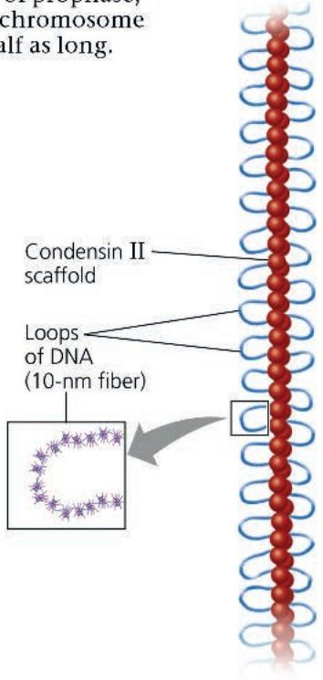

When prometaphase begins, condensin I proteins (green) bind to DNA outside the central scaffold, making smaller loops (not shown) out of the larger loops generated by condensin II. The process continues, with more and more loops extending outward, and the chromosome getting denser, shorter, and wider. The scaffold itself also begins to twist into a helix (suggested by the curved gray arrows), allowing even more loops per given length of chromosome.

## Metaphase

At metaphase, the chromosome is at its most dense, with the most loops per turn, and therefore is at its shortest length. The two sister chromatids are fully condensed.

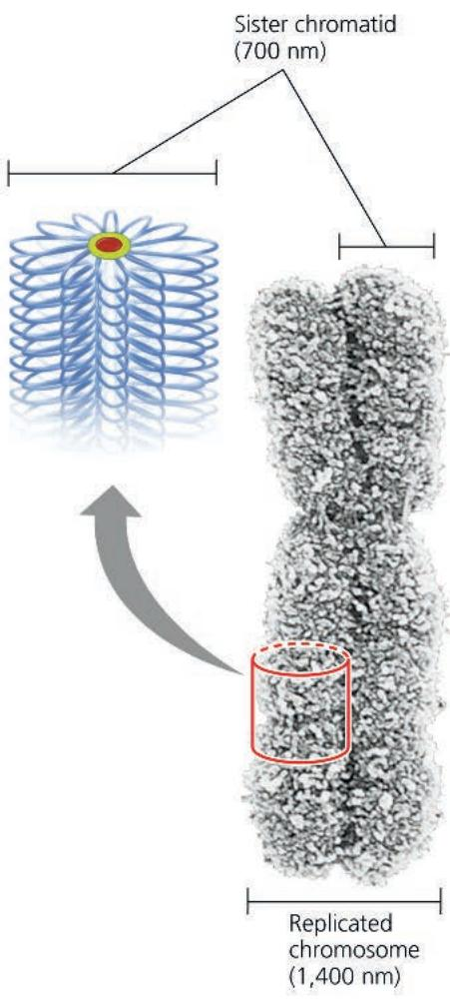  
Replicated chromosome (1,400 nm)

Figure 16.24 "Painting" chromosomes.

Researchers can treat (“paint”) human chromosomes with molecular tags that cause each chromosome pair to appear a different color.

(a) The ability to visually distinguish among chromosomes makes it possible to see how the chromosomes are arranged in the interphase nucleus. Each chromosome appears to occupy a specific territory during interphase. In general, the two homologs of a pair are not located together.

(b) These metaphase chromosomes have been "painted" so that the two homologs of a pair are the same color. On the left is a spread of treated chromosomes; on the right, they have been organized into a karyotype.

MAKE CONNECTIONS If you arrested a human cell in metaphase I of meiosis and applied this technique, what would you observe? How would this differ from what you would see in metaphase of mitosis? Review Figure 13.8 and Figure 12.7.

For suggested answer, see Appendix A.

## Chapter 16 Review

## Summary of Key Concepts

To review key terms, go to the Vocabulary Self-Quiz (eTextbook only).

## Concept 16.1: DNA is the genetic material

\- Experiments with bacteria and with phages provided the first strong evidence that the genetic material is DNA.

organize regions of chromatin where genes are active. The chromatin of each chromosome occupies a specific restricted area within the interphase nucleus, and the chromatin fibers of different chromosomes do not appear to be entangled (Figure 16.24a).

As a cell prepares for mitosis, its chromatin becomes organized into loops and coils, eventually condensing into a characteristic number of short, thick metaphase chromosomes that are distinguishable from each other with the light microscope (Figure 16.24b).

The chromosome is a dynamic structure that is condensed, loosened, modified, and remodeled as necessary for various cell processes, including DNA replication, mitosis, meiosis, and gene expression. Certain chemical modifications of histones affect the state of chromatin condensation and also have multiple effects on gene expression, as you'll see in Concept 18.2.

In this chapter, you have learned how DNA molecules are arranged in chromosomes and how DNA replication provides the copies of genes that parents pass to offspring. However, it is not enough that genes be copied and transmitted; the information they carry must be used by the cell. In other words, genes must also be expressed. In the next chapter, we will examine how the cell expresses the genetic information encoded in DNA.

## Concept Check 16.3

1. Describe the structure of a nucleosome, the basic unit of DNA packing in eukaryotic cells.

2. How does euchromatin differ from heterochromatin in structure and function?

3. MAKE CONNECTIONS Interphase chromosomes appear to be attached to the nuclear lamina and perhaps also the nuclear matrix. Describe these two structures. See Figure 6.9 and the associated text.

For suggested answers, see Appendix A.

  
What does it mean when we say that the two DNA strands in the double helix are antiparallel? What would an end of the double helix look like if the strands were parallel?

## Concept 16.2: Many proteins work together in DNA replication and repair

\- The Meselson-Stahl experiment showed that DNA replication is semiconservative: The parental molecule unwinds, and each strand then serves as a template for the synthesis of a new strand according to base-pairing rules.

• DNA replication at one replication fork is summarized here:

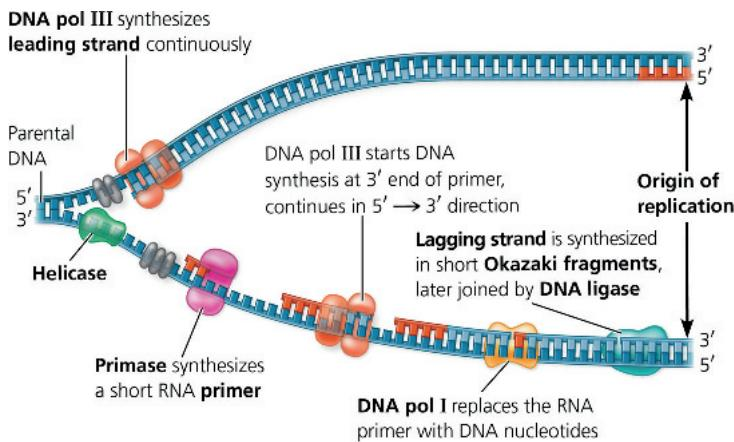

\- DNA polymerases proofread new DNA, replacing incorrect nucleotides. In mismatch repair, enzymes correct errors that persist. Nucleotide excision repair is a process by which nucleases cut out and other enzymes replace damaged stretches of DNA.

\- The ends of eukaryotic chromosomal DNA get shorter with each round of replication. The presence of telomeres, repetitive sequences at the ends of linear DNA molecules, postpones the erosion of genes. Telomerase catalyzes the lengthening of telomeres in germ cells.

Compare DNA replication on the leading and lagging strands, including similarities and differences.

## Concept 16.3: A chromosome consists of a DNA molecule packed together with proteins

\- The chromosome of most bacterial species is a circular DNA molecule with some associated proteins, making up the nucleoid.

\- The chromatin making up a eukaryotic chromosome is composed of DNA, histones, and other proteins. The histones bind to each other and to the DNA to form nucleosomes, the most basic units of DNA packing, which exist as part of the 10-nm fiber. Histone tails extend outward from each bead-like nucleosome core. Additional coiling and folding lead ultimately to the highly condensed chromatin of the metaphase chromosome.

\- Chromosomes occupy restricted areas in the interphase nucleus. In interphase cells, most 10-nm fiber chromatin is loosely arranged (euchromatin), but some is more densely arranged (heterochromatin). Euchromatin, but not heterochromatin, is generally accessible for gene transcription.

Describe the levels of chromatin packing you'd expect to see in an interphase nucleus. For suggested answers, see Appendix A.

## Test Your Understanding

For more multiple-choice questions, go to the Practice Test (eTextbook only).

## Levels 1-2: Remembering/Understanding

1. In his work with pneumonia-causing bacteria and mice, Griffith found that

(A) the protein coat from pathogenic cells was able to transform nonpathogenic cells.

(B) heat-killed pathogenic cells caused pneumonia.

(C) some substance from pathogenic cells was transferred to nonpathogenic cells, making them pathogenic.

(D) the polysaccharide coat of bacteria caused pneumonia.

2. What is the basis for the difference in how the leading and lagging strands of DNA molecules are synthesized?

(A) The origins of replication occur only at the $5'$ end.

(B) Helicases and single-strand binding proteins work at the 5' end.

(C) DNA polymerase can join new nucleotides only to the $3'$ end of a pre-existing strand, and the strands are antiparallel.

(D) DNA ligase works only in the $3'\rightarrow5'$ direction.

3. In analyzing the number of different bases in a DNA sample, which result would be consistent with the base-pairing rules?
(A) A = G
(B) A + G = C + T
(C) A + T = G + C
(D) A = C

4. The elongation of the leading strand during DNA synthesis

(A) progresses away from the replication fork.

(B) occurs in the $3'\rightarrow5'$ direction.

(C) produces Okazaki fragments.

(D) depends on the action of DNA polymerase.

5. In a nucleosome, the DNA is wrapped around

(A) histones.

(B) ribosomes.

(C) polymerase molecules.

(D) a thymine dimer.

## Levels 3-4: Applying/Analyzing

6. E. coli cells grown on ${}^{15}$ N medium are transferred to ${}^{14}$ N medium and allowed to grow for two more generations (two rounds of DNA replication). DNA extracted from these cells is centrifuged. What density distribution of DNA would you expect in this experiment?

(A) one high-density and one low-density band

(B) one intermediate-density band

(C) one high-density and one intermediate-density band

(D) one low-density and one intermediate-density band

7. A student isolates, purifies, and combines in a test tube a variety of molecules needed for DNA replication. When she adds some DNA to the mixture, replication occurs, but each DNA molecule consists of a normal strand paired with numerous segments of DNA a few hundred nucleotides long. What has she probably left out of the mixture?

(A) DNA polymerase

(B) DNA ligase

(C) Okazaki fragments

(D) primase

8. The spontaneous loss of amino groups from adenine in DNA results in hypoxanthine, an uncommon base, opposite thymine. What combination of proteins could repair such damage?

(A) nuclease, DNA polymerase, DNA ligase

(B) telomerase, primase, DNA polymerase

(C) telomerase, helicase, single-strand binding protein

(D) DNA ligase, replication fork proteins, adenylyl cyclase

9. MAKE CONNECTIONS Although the proteins that cause the E. coli chromosome to coil are not histones, what property would you expect them to share with histones, given their ability to bind to DNA (see Figure 5.14)?

## Levels 5-6: Evaluating/Creating

10. EVOLUTION CONNECTION Some bacteria may be able to respond to environmental stress by increasing the rate at which mutations occur during cell division. How might this be accomplished? Might there be an evolutionary advantage to this ability? Explain.

## 11. SCIENTIFIC INQUIRY

DRAW IT Model building can be an important part of the scientific process. The illustration shown above is a computer-generated model of a DNA replication complex. The parental and newly synthesized DNA strands are color-coded differently, as are each of the following three proteins: DNA pol III, the sliding clamp, and single-strand binding protein.

(a) Using what you've learned in this chapter to clarify this model, label each DNA strand and each protein.

(b) Draw an arrow to indicate the overall direction of DNA replication.

12. WRITE ABOUT A THEME: ORGANIZATION The continuity of life is based on heritable information in the form of DNA, and structure and function are correlated at all levels of biological organization. In a short essay (100–150 words), describe how the structure of DNA is correlated with its role as the molecular basis of inheritance.

## 13. SYNTHESIZE YOUR KNOWLEDGE

This image shows DNA (gray double helix) interacting with a computer-generated model of a TAL protein (multicolored ribbons and connecting wires), one of a family of proteins found only in a species of the bacterium Xanthomonas. The bacterium uses proteins like this one to find specific gene sequences in cells of the organisms it infects, such as tomatoes, rice, and citrus fruits. Given what you know about DNA structure and considering the image above, discuss how the TAL protein's structure suggests that it functions.

For selected answers, see Appendix A.

