# 第19章 Viruses

<!-- 章节边界按正文内容恢复；原始 MinerU 内容保留如下。 -->

## Viruses

## Key Concepts

19.1 A virus consists of a nucleic acid surrounded by a protein coat
19.2 Viruses replicate only in host cells

19.3 Viruses and prions are formidable pathogens in animals and plants

## Study Tip

Make flowcharts: Make a simple flowchart for each viral replicative cycle in this chapter. Shown here is the beginning of an example for the lysogenic cycle. Note the similarities and differences between the replicative cycles.

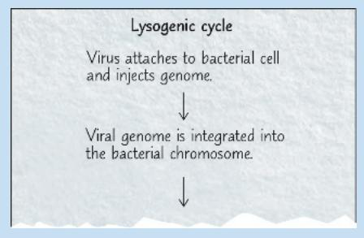

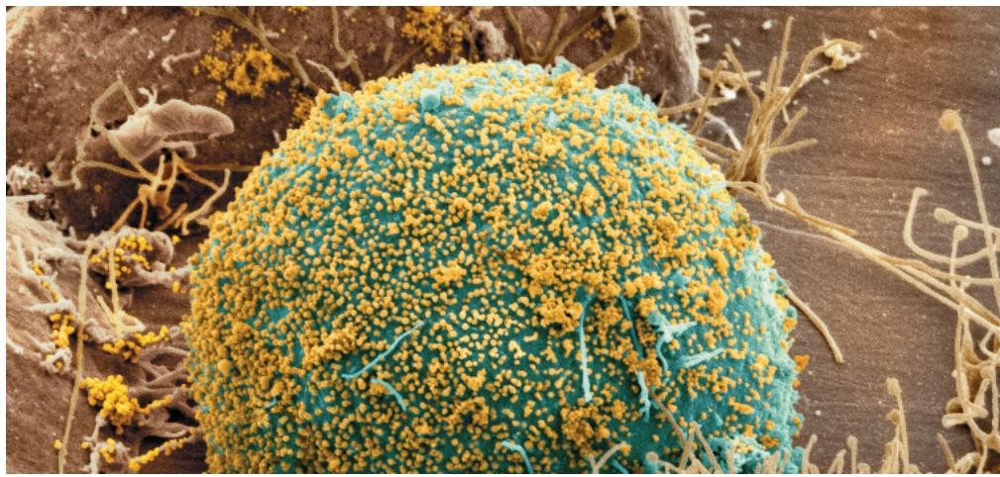  
Figure 19.1 A human immune cell (blue) infected by human immunodeficiency virus (HIV) is releasing more HIV viruses (small gold dots), which will go on to infect other cells. Left untreated, HIV destroys vital immune system cells, causing AIDS. This disease has killed about 35 million people worldwide.

## How does a virus make more viruses?

A virus consists only of nucleic acid, proteins, and sometimes a membranous envelope. After infecting a host cell, it uses the host cell's molecules to make new viruses, as shown in this simplified diagram.

  
With some viruses, the host cell remains alive after the new viruses are released.

## Concept 19.1: A virus consists of a nucleic acid surrounded by a protein coat

For the past several years, world news has focused on the virus called SARS-CoV-2, short for Severe Acute Respiratory Syndrome-CoronaVirus-2, which causes COVID-19. This virus first infects cells in the airway, where it produces more viruses that can be transmitted to other individuals via exhaled breath. Worldwide, COVID-19 has killed more than 7 million individuals as of 2025. (The actual number is likely significantly higher as many people who died from COVID-19-like symptoms were not tested for the virus.)

What distinguishes SARS-CoV-2 and other viruses from cells? Compared with eukaryotic and even prokaryotic cells, most viruses are much smaller and simpler in structure. Lacking the structures and metabolic machinery found in a cell, a virus is an infectious particle consisting of little more than genes packaged in a protein coat.

Are viruses living or nonliving? Early on, they were considered biological chemicals; the Latin root for virus means “poison.” Viruses can cause a wide variety of diseases, so researchers in the late 1800s saw a parallel with bacteria and proposed that viruses were the simplest of living forms. However, viruses cannot reproduce or carry out metabolic activities outside of a host cell. Most biologists would probably agree that viruses are not alive, but instead exist in a shady area between life-forms and chemicals. The simple phrase used by two researchers describes them aptly: Viruses lead “a kind of borrowed life.”

## The Discovery of Viruses: Scientific Inquiry

Scientists detected viruses indirectly long before they were able to see them. The story of how viruses were discovered begins in 1883. A German scientist named Adolf Mayer was studying tobacco mosaic disease, which stunts the growth of tobacco plants and gives their leaves a mottled, or mosaic, coloration. Mayer discovered that he could transmit the disease from plant to plant by rubbing sap extracted from diseased leaves onto healthy plants. After an unsuccessful search for an infectious microorganism in the sap, he suggested that the disease was caused by unusually small bacteria that were invisible under a microscope. This hypothesis was tested a decade later by Dmitri Ivanowsky, a Russian biologist who passed sap from infected tobacco leaves through a filter designed to remove bacteria. After filtration, the sap still produced mosaic disease.

But Ivanowsky reasoned that perhaps the bacteria were small enough to pass through the filter or made a toxin that could do so. The second possibility was ruled out when the Dutch botanist Martinus Beijerinck carried out a classic series of experiments that showed that the infectious agent in the filtered sap could replicate (Figure 19.2).

In fact, the pathogen replicated only within the host it infected. In further experiments, Beijerinck showed that unlike bacteria used in the lab at that time, the mysterious agent of mosaic disease could not be cultivated on nutrient media in test tubes or petri dishes. Beijerinck imagined a replicating particle much smaller and simpler than a bacterium, and he is generally credited with being

## Figure 19.2

# Inquiry: What causes tobacco mosaic disease?

## Experiment

In the late 1800s, Martinus Beijerinck, of the Technical School in Delft, the Netherlands, investigated the properties of the agent that causes tobacco mosaic disease (then called spot disease).

  
1 Extracted sap from tobacco plant with tobacco mosaic disease

## Results

When the filtered sap was rubbed on healthy plants, they became infected. Their sap, extracted and filtered, could then act as a source of infection for another group of plants. Each successive group of plants developed the disease to the same extent as earlier groups.

## Conclusion

The infectious agent was apparently not a bacterium because it could pass through a bacterium-trapping filter. The pathogen must have been replicating in the plants because its ability to cause disease was undiluted after several transfers from plant to plant.

Data from M. J. Beijerinck, Concerning a contagium vivum fluidum as cause of the spot disease of tobacco leaves, Verhandelingen der Koninkyke akademie Wettenschappen te Amsterdam 65:3–21 (1898). Translation published in English as Phytopathological Classics Number 7 (1942), American Phytopathological Society Press, St. Paul, MN.

WHAT IF? If Beijerinck had observed that the infection of each group was weaker than that of the previous group and that ultimately the sap could no longer cause disease, what might he have concluded?

For suggested answer, see Appendix A.

the first scientist to voice the concept of a virus. His suspicions were confirmed in 1935 when the American scientist Wendell Stanley crystallized the infectious particle, now known as tobacco mosaic virus (TMV). Subsequently, TMV and many other viruses were actually seen with the help of the electron microscope.

## Structure of Viruses

The tiniest viruses are only 20 nm in diameter—smaller than a ribosome. Millions could easily fit on a pinhead. Even the largest known virus, which has a diameter of 1,500 nm (1.5 $\mu$ m), is barely visible under the light microscope. Stanley's discovery that some viruses could be crystallized was exciting and puzzling news. Not even the simplest of cells can aggregate into regular crystals. But if viruses are not cells, then what are they? Examining the structure of a virus more closely reveals that it is an infectious particle consisting of one or more molecules of a nucleic acid enclosed in a protein coat and, for some viruses, surrounded by a membranous envelope.

The simple structure of viruses make them a useful biological system: To a large extent, molecular biology was born in the laboratories of biologists studying viruses that infect bacteria. Experiments using these viruses provided evidence that genes are made of nucleic acids, and they were critical in working out the molecular mechanisms of the fundamental processes of DNA replication, transcription, and translation.

## Viral Genomes

We usually think of genes as being made of double-stranded DNA, but many viruses defy this convention. Their genomes may consist of double-stranded DNA, single-stranded DNA, double-stranded RNA, or single-stranded RNA, depending on the type of virus. A virus is called a DNA virus or an RNA virus based on the kind of nucleic acid that makes up its genome. In either case, the genome is usually organized as a single linear or circular molecule of nucleic acid, although the genomes of some viruses consist of multiple molecules of nucleic acid. The smallest viruses known have only three genes in their genome, while the largest have several hundred to 2,000. For comparison, bacterial genomes contain about 200 to a few thousand genes.

## Capsids and Envelopes

The protein shell enclosing the viral genome is called a capsid. (Together, the capsid and genome are called the nucleocapsid.) Depending on the type of virus, the capsid may be rod-shaped, polyhedral, or more complex in shape. Capsids are built from a large number of protein subunits called capsomeres, but the number of different kinds of proteins in a capsid is usually small. Tobacco mosaic virus has a rigid, rod-shaped capsid made from over 1,000 molecules of a single type of protein arranged in a helix; rod-shaped viruses are commonly called helical viruses for this reason (Figure 19.3a).

Figure 19.3 Viral structure.

Viruses are made up of nucleic acid (DNA or RNA) enclosed in a protein coat (the capsid) and sometimes further wrapped in a membranous envelope. The individual protein subunits making up the capsid are called capsomeres. Although diverse in size and shape, viruses have many common structural features. (All micrographs are colorized TEMs.)

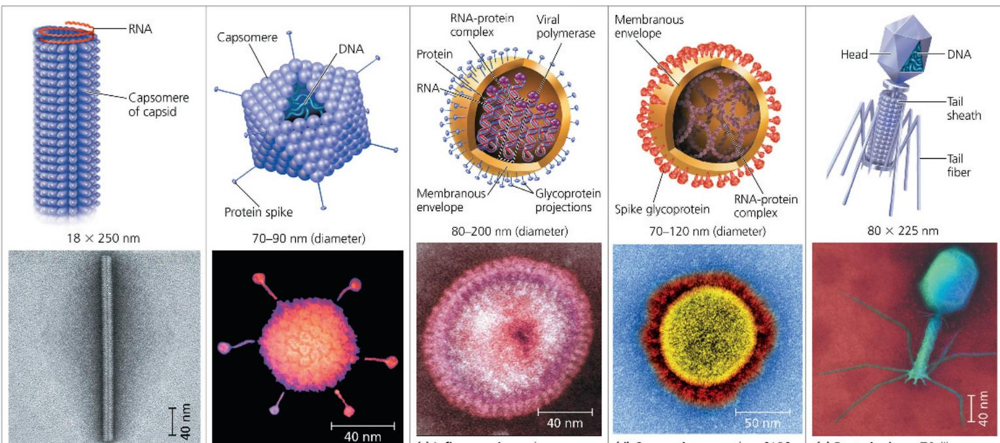  
(a) Tobacco mosaic virus has a helical capsid surrounding a single helical RNA molecule, with the overall shape of a rigid rod.  
(b) Adenoviruses have an icosahedral capsid with a protein spike at each vertex (corner). The capsid, made up of capsomeres, contains double-stranded DNA.  
(c) Influenza viruses have an outer envelope, studded with glycoprotein projections, that generally contains eight double-helical RNA-protein complexes, each associated with a viral polymerase.  
(d) Coronaviruses, such as SARS-CoV-2 (shown here; the virus that causes COVID-19) are spherical, with a "corona" (crown) of Spike glycoproteins extending out from the membranous envelope. The genome consists of a single RNA molecule, complexed with proteins.  
(e) Bacteriophage T4, like other "T-even" phages, has a complex capsid consisting of an icosahedral head and a tail apparatus. T4's double-stranded DNA is enclosed in the head.

Adenoviruses, which infect the respiratory tracts of animals, have 252 identical protein molecules arranged in a polyhedral capsid with 20 triangular facets—an icosahedron; thus, these and other similarly shaped viruses are referred to as icosahedral viruses (Figure 19.3b).

To infect their hosts, all viruses must enter host cells, and some have accessory structures that help them do so. For instance, a membranous envelope surrounds the capsids of influenza viruses, coronaviruses (such as SARS-CoV-2, the virus that causes COVID-19), and many other viruses found in animals (Figure 19.3c and d). These viral envelopes, which are derived from the membranes of the previous host cell, contain host cell phospholipids and membrane proteins. They also contain virally encoded proteins and glycoproteins—proteins with carbohydrates covalently attached, including proteins that allow fusion with the host cell membrane. These viral proteins are unique to each virus. Some viruses carry a few viral enzymes, such as viral polymerase, within their capsids.

Many of the most complex capsids are found among the viruses that infect bacteria, called bacteriophages, or simply phages. The first phages studied included seven that infect Escherichia coli (E. coli). These seven phages were named type 1 (T1), type 2 (T2), and so forth, in the order of their discovery. (The T2 phage was used in the experiment that established DNA as the genetic material; see Figure 16.4.) The three “T-even” phages (T2, T4, and T6) turned out to be very similar in structure. Their capsids have elongated icosahedral heads enclosing their DNA. Attached to the head is a protein tail piece with fibers by which the phages attach to a bacterial cell (Figure 19.3e). In the next section, we’ll examine how these few viral parts function together with cellular components to produce large numbers of viral progeny.

## Concept Check 19.1

1. VISUAL SKILLS Describe one similarity and two differences between the structures of tobacco mosaic virus (TMV) and influenza virus (see Figure 19.3).

2. MAKE CONNECTIONS Bacteriophages were used to provide evidence that DNA carries genetic information (see Figure 16.4). Briefly describe the experiment carried out by Hershey and Chase, including in your description why the researchers chose to use phages.

For suggested answers, see Appendix A.

## Concept 19.2: Viruses replicate only in host cells

Viruses lack metabolic enzymes and equipment for making proteins, such as ribosomes. They are obligate intracellular parasites; in other words, they can replicate only within a host cell. It is fair to say that viruses in isolation are merely packaged sets of genes in transit from one host cell to another.

Each particular virus can infect cells of only a limited number of host species, called the host range of the virus. This host specificity results from the evolution of recognition systems by the virus. Viruses usually identify host cells by a “handshake” fit between viral surface proteins and specific receptor molecules on the outside of cells. Such receptor molecules are most often proteins that carry out necessary functions for the host cell and have been adopted by viruses as portals of entry. Some viruses have broad host ranges. For example, West Nile virus and equine encephalitis virus are distinctly different viruses that can each infect mosquitoes, birds, horses, and humans. Other viruses have host ranges so narrow that they infect only a single species. Measles virus, for instance, can infect only humans. Furthermore, viral infection of multicellular eukaryotes is usually limited to particular tissues. Human cold viruses infect only the cells lining the upper respiratory tract, and the HIV seen in Figure 19.1 binds to receptors present only on certain types of immune cells.

## General Features of Viral Replicative Cycles

A viral infection begins when a virus binds to a host cell and the viral genome makes its way inside (Figure 19.4). The mechanism of genome entry depends on the type of virus and the type of host cell. For example, T-even phages use their elaborate tail apparatus to inject DNA into a bacterium (see Figure 19.3d). Other viruses are taken up by endocytosis or, in the case of enveloped viruses, by fusion of the viral envelope with the host's plasma membrane. Once the viral genome is inside, the proteins it encodes can commandeer the host, reprogramming the cell to copy the viral genome and manufacture viral proteins. The host provides the nucleotides for making viral nucleic acids, as well as enzymes, ribosomes, tRNAs, amino acids, ATP, and other components needed for making the viral proteins. Many DNA viruses use the DNA polymerases of the host cell to synthesize new genomes along the templates provided by the viral DNA. In contrast, to replicate their genomes, RNA viruses use virally encoded RNA polymerases that can use RNA as a template. (Uninfected cells generally make no enzymes for transcribing RNA from an RNA template.)

After the viral nucleic acid molecules and capsomeres are produced, they spontaneously self-assemble into new viruses. In fact, researchers can separate the RNA and capsomeres of TMV and then reassemble complete viruses simply by mixing the components together under the right conditions. The simplest type of viral replicative cycle ends with the exit of hundreds or thousands of viruses from the infected host cell, a process that often damages or destroys the cell. Such cellular damage and death, as well as the body's responses to this destruction, cause many of the symptoms associated with viral infections. The viral progeny that exit a cell have the potential to infect additional cells, spreading the viral infection.

There are many variations on the simplified viral replicative cycle we have just described. We will now take a look at some of these variations in bacterial viruses (phages) and animal viruses; later in the chapter, we will consider plant viruses.

  
MAKE CONNECTIONS Label each of the straight gray arrows to identify the process that is occurring. Review Figure 17.25.

For suggested answer, see Appendix A.

## Replicative Cycles of Phages

Phages are the best understood of all viruses, although some of them are also among the most complex. Research on phages led to the discovery that some double-stranded DNA viruses can replicate by two alternative mechanisms: the lytic cycle and the lysogenic cycle.

## The Lytic Cycle

A phage replicative cycle that culminates in death of the host cell is known as a lytic cycle. The term lytic refers to the last stage of infection, during which the bacterium lyses (breaks open) and releases the phages that were produced within the cell. Each of these phages can then infect a healthy cell, and a few successive lytic cycles can destroy an entire bacterial population in just a few

Phage T4 has almost 300 genes, which are transcribed and translated using the host cell's machinery. One of the first phage genes translated after the viral DNA enters the host cell codes for an enzyme that degrades the host cell's DNA (2); the phage DNA is protected from breakdown because it contains a modified form of cytosine that is not recognized by the phage enzyme. The entire lytic cycle, from the phage's first contact with the cell surface to cell lysis, takes only 20–30 minutes at $37^{\circ}$ C.

1 Attachment. The T4 phage uses its tail fibers to bind to specific surface proteins on an E. coli cell that act as receptors.

5 Release. The phage directs production of an enzyme that damages the bacterial cell wall, allowing fluid to enter. The cell swells and finally bursts, releasing 100 to 200 phage particles.

Entry of phage DNA and degradation of host DNA. The sheath of the tail contracts, injecting the phage DNA into the cell and leaving an empty capsid outside. The cell's DNA is hydrolyzed by a phage-encoded enzyme.

  
4 Self-assembly. Three separate sets of proteins self-assemble to form phage heads, tails, and tail fibers. The phage genome is packaged inside the capsid as the head forms.

hours. A phage that replicates only by a lytic cycle is a virulent phage. Figure 19.5 illustrates the major steps in the lytic cycle of T4, a typical virulent phage.

## The Lysogenic Cycle

Instead of lysing their host cells, many phages coexist with them in a state called lysogeny. In contrast to the lytic cycle, which kills the host cell, the lysogenic cycle allows replication of the phage genome without destroying the host. Phages capable of using both modes of replicating within a bacterium are called temperate phages. A temperate phage called lambda, written with the Greek letter $\lambda$ , has been widely used in biological research. Phage $\lambda$ resembles T4, but its tail has only one short tail fiber.

3 Synthesis of viral genomes and proteins. The phage DNA directs production of more phage proteins and copies of the phage genome by host and viral enzymes, using components within the cell.

Infection of an E. coli cell by phage $\lambda$ begins when the phage binds to the surface of the cell and injects its linear DNA genome (Figure 19.6, on the next page). Within the host, the $\lambda$ DNA molecule forms a circle. What happens next depends on the replicative mode: lytic cycle or lysogenic cycle. During a lytic

cycle, the viral genes immediately turn the host cell into a $\lambda$ -producing factory, and the cell soon lyses and releases its virus progeny. During a lysogenic cycle, however, the $\lambda$ DNA molecule is incorporated into a specific site on the E. coli chromosome by viral proteins that break both circular DNA molecules and join them to each other. When integrated into the bacterial chromosome in this way, the viral DNA is known as a prophage. One prophage gene codes for a protein that prevents transcription of most of the other prophage genes. Thus, the phage genome is mostly silent within the bacterium. Every time the E. coli cell prepares to divide, it replicates the phage DNA along with its own chromosome such that each daughter cell inherits a prophage. A single infected cell can quickly give rise to a large population of bacteria carrying the virus in prophage form. This mechanism enables viruses to propagate without killing the host cells on which they depend.

The term lysogenic signifies that prophages are capable of generating active phages that lyse their host cells. This occurs when the $\lambda$ genome (or that of another temperate phage) is

Figure 19.6 The lytic and lysogenic cycles of phage $\lambda$ , a temperate phage.

After entering the bacterial cell and circularizing, the $\lambda$ DNA can immediately initiate the production of a large number of progeny phages (lytic cycle) or integrate into the bacterial chromosome (lysogenic cycle). In most cases, phage $\lambda$ follows the lytic pathway, which is similar to that detailed in Figure 19.5. However, once a lysogenic cycle begins, the prophage may be carried in the host cell's chromosome for many generations. Phage $\lambda$ has one main tail fiber, which is short.

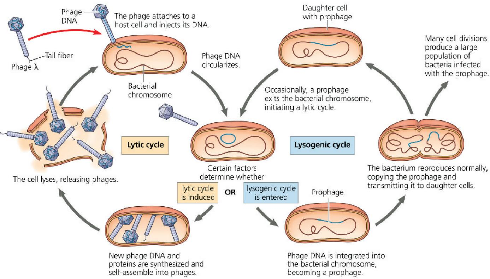

induced to exit the bacterial chromosome and initiate a lytic cycle. An environmental signal, such as a certain chemical or high-energy radiation, usually triggers the switchover from the lysogenic to the lytic mode.

In addition to the gene for the viral protein that prevents transcription, a few other prophage genes may be expressed during lysogeny. Expression of these genes may alter the host's phenotype, a phenomenon that can have important medical significance. For example, the three species of bacteria that cause the human diseases diphtheria, botulism, and scarlet fever would not be so harmful to humans without certain prophage genes that cause the host bacteria to make toxins. And the difference between the E. coli strain in our intestines and the O157:H7 strain that has caused several deaths by food poisoning appears to be the presence of toxin genes of prophages in the O157:H7 strain.

## Bacterial Defenses Against Phages

After reading about the lytic cycle, you may have wondered why phages haven't exterminated all bacteria. Lysogeny is one major reason why bacteria have been spared from extinction caused by phages. Bacteria also have their own defenses against phages. First, natural selection favors bacterial mutants with surface proteins that are no longer recognized as receptors by a particular type of phage. Second, when phage DNA does enter a bacterium, the DNA often is identified as foreign and cut up by cellular enzymes called restriction enzymes, which are so named because they restrict a phage's ability to replicate within the bacterium. (Restriction enzymes are used in molecular biology and DNA cloning techniques; see Concept 20.1.) The bacterium's own DNA is methylated in a way that prevents attack by its own restriction enzymes. A third defense is a system present in both bacteria and archaea called the CRISPR-Cas system, which you learned about in Concept 17.5.

The CRISPR-Cas system was discovered during a study of repetitive DNA sequences present in the genomes of many prokaryotes. These sequences, which puzzled scientists, were named clustered regularly interspaced short palindromic repeats (CRISPRs) because each sequence reads the same forward and backward (a palindrome), with different stretches of “spacer DNA” in between the repeats. At first, scientists assumed the spacer DNA sequences were random and meaningless, but analysis by several research groups showed that each spacer sequence corresponded to DNA from a particular phage that had infected the cell. Further studies revealed that particular nuclease proteins interact with the CRISPR region. These nucleases, called Cas (CRISPR-associated) proteins, can identify and cut phage DNA, thereby defending the bacterium against phage infection.

When a phage infects a bacterial cell that has the CRISPR-Cas system, the DNA of the invading phage is stored, integrated into

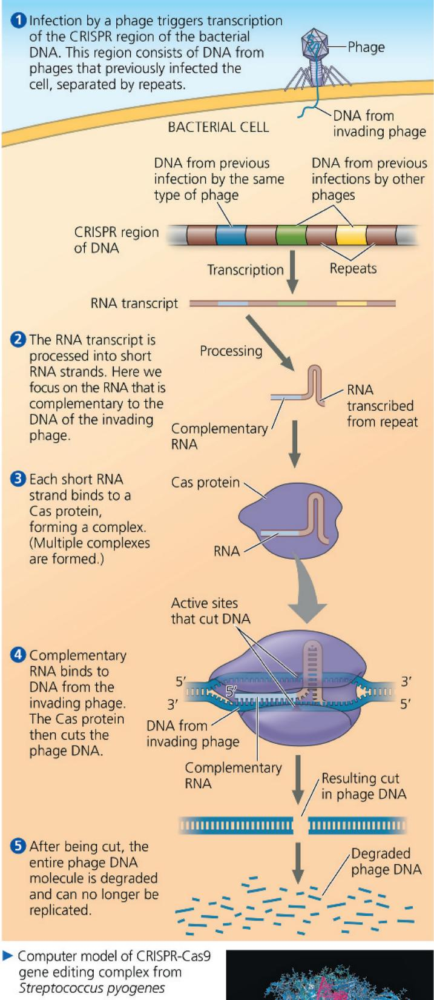

Figure 19.7 The CRISPR-Cas system: a type of bacterial immune system.

1 Infection by a phage triggers transcription of the CRISPR region of the bacterial DNA. This region consists of DNA from phages that previously infected the cell, separated by repeats.

3 Each short RNA strand binds to a Cas protein, forming a complex. (Multiple complexes are formed.)

4 Complementary RNA binds to DNA from the invading phage. The Cas protein then cuts the phage DNA.

5 After being cut, the entire phage DNA molecule is degraded and can no longer be replicated.

▶ Computer model of CRISPR-Cas9 gene editing complex from Streptococcus pyogenes

the genome between two repeat sequences (Figure 19.7). If the cell survives the infection, any further attempt by the same type of phage to infect this cell (or its offspring) triggers transcription of the CRISPR region into RNA molecules. These RNAs are cut into pieces and then bound by Cas proteins, such as the Cas9 protein (see Figure 17.28). The Cas protein uses a portion of the phage-related RNA as a homing device to identify the invading phage DNA and cut it, leading to its destruction.

Just as natural selection favors bacteria that have receptors altered by mutation or that have enzymes that cut phage DNA, it also favors phage mutants that can bind to altered receptors or that are resistant to enzymes. Thus, the bacterium–phage relationship is in constant evolutionary flux.

## Interview

Interview with Francisco Mojica: Discovering CRISPR in bacteria (eTextbook only)

## Replicative Cycles of Animal Viruses

Everyone has suffered from viral infections, whether cold sores, influenza, or the common cold. Like all viruses, those that cause illness in humans and other animals can replicate only inside host cells. Many variations on the basic scheme of viral infection and replication are represented among the animal viruses. Key variables are the nature of the viral genome (double- or single-stranded DNA or RNA) and the presence or absence of an envelope.

Whereas there are only a few bacteriophages that have an envelope or RNA genome, many animal viruses have both. In fact, nearly all animal viruses with RNA genomes have an envelope, as do some with DNA genomes. Rather than consider all the mechanisms of viral infection and replication, we will focus first on the roles of viral envelopes and then on the functioning of RNA as the genetic material of many animal viruses.

## Viral Envelopes

An animal virus equipped with an envelope—that is, a membranous outer layer—uses it to enter the host cell. Protruding from the outer surface of this envelope are viral glycoproteins that bind to specific receptor molecules on the surface of a host cell. For example, the Spike protein on SARS-CoV-2, the virus that causes COVID-19, binds to a protein called ACE2 on the surface of human airway (and other) cells. Figure 19.8 outlines the events in the replicative cycle of an enveloped virus with an RNA genome. Ribosomes bound to the endoplasmic reticulum (ER) of the host cell make the protein parts of the envelope glycoproteins; cellular enzymes in the ER and Golgi apparatus then add the sugars. The resulting viral glycoproteins, embedded in membrane derived from the host cell, are transported to the cell surface. In a process much like exocytosis (see Figure 7.20), new viral capsids are wrapped in membrane as they bud from the cell. In other words,

Figure 19.8 The replicative cycle of an enveloped RNA virus.

Shown here is a virus with a single-stranded RNA genome that functions as a template for synthesis of mRNA.

the viral envelope is usually derived from the host cell's plasma membrane, although all or most of the molecules of this membrane are specified by viral genes. The enveloped viruses are now free to infect other cells. This replicative cycle does not necessarily kill the host cell, in contrast to the lytic cycles of phages.

Some viruses have envelopes that are not derived from plasma membrane. Herpesviruses, for example, are temporarily cloaked in membrane derived from the nuclear envelope of the host; they then shed this membrane in the cytoplasm and acquire a new envelope made from membrane of the Golgi apparatus. These viruses have a double-stranded DNA genome and replicate within the host cell nucleus, using a combination of viral and cellular enzymes to replicate and transcribe their DNA. In the case of herpesviruses, copies of the viral DNA can remain behind as mini-chromosomes in the nuclei of certain nerve cells. There they remain latent until some sort of physical or emotional stress triggers a new round of active virus production. The infection of other cells by these new viruses causes the blisters characteristic of herpes, such as cold sores or genital sores. Once someone acquires a herpesvirus infection, flare-ups may recur throughout the person's life.

## Viral Genetic Material

Table 19.1 shows the common classification system for animal viruses, which is based on their genetic material: double- or

single-stranded DNA, or double- or single-stranded RNA, with further classification of RNA viruses. Although some phages and most plant viruses are RNA viruses, the broadest variety of RNA genomes is found among the viruses that infect animals. There are three types of single-stranded RNA genomes found in animal viruses (classes IV–VI in Table 19.1). The genome of class IV viruses can directly serve as mRNA and thus can be translated into viral protein immediately after infection. (SARS-CoV-2 has this type of genome.) Figure 19.8 shows a virus of class V, in which the RNA genome serves instead as a template for mRNA synthesis. (This type is found in influenza viruses.) The RNA genome is transcribed into complementary RNA strands, which function both as mRNA and as templates for the synthesis of additional copies of genomic RNA. All viruses that use an RNA genome as a template for mRNA transcription require RNA → DNA synthesis. These viruses use a viral enzyme capable of carrying out this process; there are no such enzymes in most host cells. The enzyme used in this process is encoded by the viral genome. After the enzyme is synthesized, it is packaged during viral self-assembly with the genome inside the viral capsid.

The RNA animal viruses with the most complicated replicative cycles are the retroviruses (class VI). These viruses have an enzyme called reverse transcriptase that transcribes an RNA template into a DNA copy, an RNA → DNA information flow that is the opposite of the usual direction. This unusual phenomenon is the source of the name retroviruses (retro means "backward"). Of particular medical importance is HIV (human immunodeficiency virus), the retrovirus shown in Figure 19.1 that causes AIDS (acquired immunodeficiency syndrome). HIV and other retroviruses are enveloped viruses that contain two identical molecules of single-stranded RNA and two molecules of reverse transcriptase.

Table 19.1 Classes of Animal Viruses

<table><tr><td>Class/Family</td><td>Envelope?</td><td>Examples That Cause Human Diseases</td></tr><tr><td colspan="3">I. Double-Stranded DNA (dsDNA)</td></tr><tr><td>Adenovirus(see Figure 19.3b)</td><td>No</td><td>Respiratory viruses</td></tr><tr><td>Papillomavirus</td><td>No</td><td>Warts, cervical cancer (HPV)</td></tr><tr><td>Polyomavirus</td><td>No</td><td>Tumors</td></tr><tr><td>Herpesvirus</td><td>Yes</td><td>Herpes simplex I and II (cold sores, genital sores); varicella zoster (shingles, chicken pox); Epstein-Barr virus (mononucleosis, Burkitt&#x27;s lymphoma)</td></tr><tr><td>Poxvirus</td><td>Yes</td><td>Smallpox virus; cowpox virus</td></tr><tr><td colspan="3">II. Single-Stranded DNA (ssDNA)</td></tr><tr><td>Parvovirus</td><td>No</td><td>B19 parvovirus (mild rash)</td></tr><tr><td colspan="3">III. Double-Stranded RNA (dsRNA)</td></tr><tr><td>Reovirus</td><td>No</td><td>Rotavirus (diarrhea); Colorado tick fever virus</td></tr><tr><td colspan="3">IV. Single-Stranded RNA (ssRNA); Serves as mRNA</td></tr><tr><td>Picornavirus</td><td>No</td><td>Rhinovirus (common cold); poliovirus; hepatitis A virus; other intestinal viruses</td></tr><tr><td>Coronavirus</td><td>Yes</td><td>Severe acute respiratory syndrome (SARS) virus; SARS-CoV-2 (COVID-19); Middle East respiratory syndrome (MERS-CoV)</td></tr><tr><td>Flavivirus</td><td>Yes</td><td>Zika virus (see Figure 19.10c); yellow fever virus; dengue virus; West Nile virus; hepatitis C virus</td></tr><tr><td>Togavirus</td><td>Yes</td><td>Chikungunya virus (see Figure 19.10b); rubella virus; equine encephalitis viruses</td></tr><tr><td colspan="3">V. ssRNA; Serves as Template for mRNA Synthesis</td></tr><tr><td>Filovirus</td><td>Yes</td><td>Ebola virus (hemorrhagic fever; see Figure 19.10a)</td></tr><tr><td>Orthomyxovirus</td><td>Yes</td><td>Influenza virus (see Figure 19.3c)</td></tr><tr><td>Paramyxovirus</td><td>Yes</td><td>Measles virus; mumps virus</td></tr><tr><td>Rhabdovirus</td><td>Yes</td><td>Rabies virus</td></tr><tr><td colspan="3">VI. ssRNA; Serves as Template for DNA Synthesis</td></tr><tr><td>Retrovirus</td><td>Yes</td><td>Human immunodeficiency virus (HIV/AIDS; see Figure 19.9); human T-lymphotropic virus type 1 (HTLV-1) (leukemia)</td></tr></table>

The HIV replicative cycle (illustrated in Figure 19.9, on the next page) is typical of a retrovirus. After HIV enters a host cell, its reverse transcriptase molecules are released into the cytoplasm, where they catalyze synthesis of viral DNA. The newly made viral DNA then enters the cell's nucleus and integrates into the DNA of a chromosome. The integrated viral DNA, called a provirus, never leaves the host's genome, remaining a permanent resident of the cell. (Recall that a prophage, in contrast, leaves the host's genome at the start of a lytic cycle.) The RNA polymerase of the host transcribes the proviral DNA into RNA molecules, which can function both as mRNA for the synthesis of viral proteins and as genomes for the new viruses that will be assembled and released from the cell. In Concept 43.4, we describe how HIV causes the deterioration of the immune system that occurs in AIDS.

## Evolution of Viruses

EVOLUTION We began this chapter by asking whether or not viruses are alive. Viruses do not really fit our definition of living organisms. An isolated virus is biologically inert, unable to replicate its genes or regenerate its own ATP. Yet it has a genetic program written in the universal language of life. Do we think of viruses as nature's most complex associations of molecules or as the simplest forms of life? Either way, we must bend our usual definitions. Although viruses cannot replicate or carry out metabolic activities independently, their use of the genetic code makes it hard to deny their evolutionary connection to the living world.

How did viruses originate? Viruses have been found that infect every form of life—not only bacteria, animals, and plants, but also archaea, fungi, and algae and other protists. Researchers estimate that each milliliter (one-fifth of a teaspoon) of seawater contains between one and 100 million viruses, ten times the number of microorganisms! Because viruses depend on cells for their own propagation, it seems likely that viruses are not the descendants of precellular forms of life but evolved—possibly multiple times—after the first cells appeared. Most molecular biologists favor the hypothesis that viruses originated from naked bits of cellular nucleic acids that moved from one cell to another, perhaps via injured cell surfaces. The evolution of genes coding for capsid proteins may have allowed viruses to bind cell membranes, thus facilitating the infection of uninjured cells.

Candidates for the original sources of viral genomes include plasmids and transposons. Plasmids are small, circular DNA molecules found in bacteria and in the unicellular fungi called yeasts. Plasmids exist apart from the genome, can replicate independently of the genome, and are occasionally transferred between cells. Transposons are DNA segments that can move from one location to another within a cell's genome. Thus, plasmids, transposons, and viruses all share an important feature: They are mobile genetic elements. (We'll discuss plasmids in more detail in Concepts 20.1 and 27.2 and transposons in Concept 21.4.)

Consistent with this notion of pieces of DNA shuttling from cell to cell is the observation that a viral genome can have more in common with the genome of its host than with the genomes

MAKE CONNECTIONS Describe what is known about binding of HIV to immune system cells. (See Figure 7.8.) How was this discovered? For suggested answer, see Appendix A.

Figure 19.9 The replicative cycle of HIV, the retrovirus that causes AIDS.

The photos (artificially colored TEMs) show HIV entering and leaving a human white blood cell. See Figure 7.8 for the cell-surface proteins that act as receptors for HIV. Note in step 6 that DNA synthesized from the viral RNA genome is integrated as a provirus into the host cell chromosomal DNA, a characteristic unique to retroviruses.

HIV entering a cell

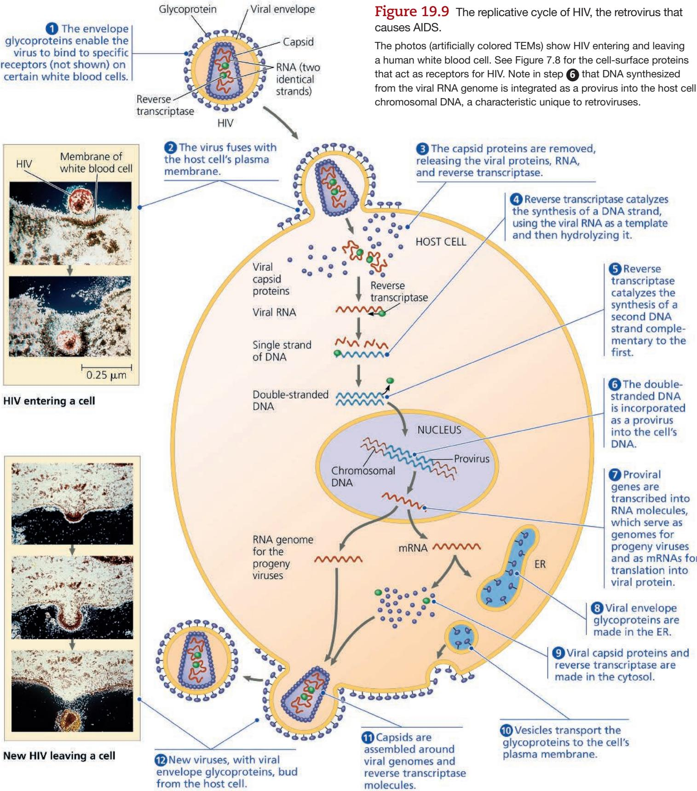  
New HIV leaving a cell

of viruses that infect other hosts. Indeed, some viral genes are essentially identical to genes of the host.

Debate about the origin of viruses was reinvigorated in the early 2000s when an extremely large virus was identified: Mimivirus is a double-stranded DNA (dsDNA) virus with an icosahedral capsid that is 400 nm in diameter, the size of a small bacterium. Its genome contains 1.2 million bases (Mb)—about 100 times as many as the influenza virus genome—and an estimated 1,000 genes. Perhaps the most surprising aspect of mimivirus, however, was that its genome included genes previously found only in cellular genomes. Some of these genes code for proteins involved in translation, DNA repair, protein folding, and polysaccharide synthesis. Whether mimivirus evolved before the first cells and then developed an exploitative relationship with them or evolved more recently and simply scavenged genes from its hosts is not yet settled.

In the past decade, several even larger viruses have been discovered that cannot be classified with any existing known virus. One such virus is 1 $\mu$ m (1,000 nm) in diameter, with a dsDNA genome of around 2–2.5 Mb, larger than that of some small eukaryotes. What's more, over 90% of its 2,000 or so genes are unrelated to cellular genes, inspiring the name it was given, pandoravirus. The number of genes in pandoraviruses varies from 1,500 to 2,500 genes. A second virus, called Pithovirus sibericum, with a diameter of 1.5 $\mu$ m and 500 genes, was discovered in permanently frozen soil in Siberia. This virus, once thawed, was able to infect an amoeba after being frozen for 30,000 years! How these and all other viruses fit in the tree of life is an intriguing, unresolved question.

The ongoing evolutionary relationship between viruses and the genomes of their host cells is an association that continues to make viruses very useful experimental systems in molecular biology. Knowledge about viruses also allows many practical applications, since viruses have a tremendous impact on all organisms through their ability to cause disease.

## Concept Check 19.2

1. Compare the effect on the host cell of a lytic (virulent) phage and a lysogenic (temperate) phage.

2. MAKE CONNECTIONS Compare the CRISPR-Cas system with the miRNA system discussed in Concept 18.3, including their mechanisms and their functions.

3. MAKE CONNECTIONS The RNA virus in Figure 19.8 has a viral RNA polymerase that functions in step 3 of the virus's replicative cycle. Compare this with a cellular RNA polymerase in terms of template and overall function (see Figure 17.10).

4. Why is HIV called a retrovirus?

5. VISUAL SKILLS Looking at Figure 19.9, imagine you are a researcher trying to combat HIV infection. What molecular processes could you attempt to block?

For suggested answers, see Appendix A.

# Concept 19.3: Viruses and prions are formidable pathogens in animals and plants

Diseases caused by viral infections afflict humans, agricultural crops, and livestock worldwide. Other smaller, less complex entities known as prions also cause disease in animals. We'll first consider animal viruses.

## Viral Diseases in Animals

A viral infection can produce symptoms by a number of different mechanisms. Viruses may damage or kill cells by causing the release of hydrolytic enzymes from lysosomes. Some viruses cause infected cells to produce toxins that lead to disease symptoms, and some have molecular components that are toxic, such as envelope proteins. How much damage a virus causes depends partly on the ability of the infected tissue to regenerate by cell division. People usually recover completely from colds because the epithelium of the respiratory tract, which the viruses infect, can efficiently repair itself. In contrast, damage inflicted by poliovirus to mature nerve cells is permanent because these cells do not divide and usually cannot be replaced. Many of the temporary symptoms associated with viral infections, such as fever and body aches, actually result from the body's own efforts to defend itself against infection rather than from cell death caused by the virus.

The immune system is a critical part of the body's natural defenses (see Chapter 43). It is also the basis for the major medical tool used to prevent viral infections—vaccines. A vaccine is a harmless component of a pathogen that stimulates the immune system to mount defenses against the harmful pathogen. Smallpox, a viral disease that was once a devastating scourge in many parts of the world, was eradicated by 1980 due to a vaccination program carried out by the World Health Organization (WHO). The very narrow host range of the smallpox virus—it infects only humans—was a critical factor in the success of this program. Similar worldwide vaccination campaigns are under way to eradicate polio, the incidence of which has dropped by $99\%$ , and measles. Although an effective vaccine exists for measles, a large outbreak—a measles epidemic—originated in Texas in 2025, correlated with lower vaccination rates in that region. Effective vaccines are also available to protect against rubella, mumps, hepatitis B, and a number of other viral diseases. Less than a year after SARS-CoV-2 was identified as the cause of COVID-19, multiple vaccines were developed and approved for use (see Figure 43.24). Many nations immediately initiated programs to administer shots rapidly to their populations. Unfortunately, many less-resourced countries lagged behind in receiving needed vaccine doses, one factor contributing to the persistence of the pandemic.

Although vaccines can prevent some viral illnesses, medical care can do little, at present, to cure most viral infections once they occur. The antibiotics that help us recover from bacterial infections are powerless against viruses. Antibiotics kill bacteria by inhibiting enzymes specific to bacteria but have little or no effect on eukaryotic or virally encoded enzymes. However, the few enzymes that are encoded only by viruses have provided targets for other drugs. Most antiviral drugs resemble nucleosides and thus interfere with viral nucleic acid synthesis. One such drug is acyclovir, which impedes herpesvirus replication by inhibiting the viral polymerase that synthesizes viral DNA but not the eukaryotic one. Similarly, azidothymidine (AZT) curbs HIV replication by interfering with the synthesis of DNA by reverse transcriptase. In the past 30 years, much effort has gone into developing drugs to treat HIV.

Currently, multidrug treatments, called antiretroviral therapy or ART, are considered to be most effective. Such treatments commonly include a combination of two nucleoside mimics and a protease inhibitor, which interferes with an enzyme required for assembly of the viruses. Multidrug treatments originally involved taking up to 20 pills multiple times per day but now usually consist of a single daily tablet. However, even a daily dose has had a limited impact on the number of new infections, because many individuals are unable to comply with this dosage. Other medications have now been developed and approved for treatment—including lenacapavir, which requires only two yearly injections and a pill every 7 days. This drug has also been tested experimentally to prevent infection in individuals who either have been exposed to, or are at risk of exposure to, HIV. In 2024, HIV researchers were excited to hear the results of a clinical trial of lenacapavir in which 2,000 African women received just a twice-yearly

reported in the early 1980s among young gay men in California and New York. In 1982, the Centers for Disease Control named the disease AIDS. Another example of an emerging virus is West Nile virus, which causes encephalitis, inflammation of the brain. This appeared in North America in 1999 and has spread to 49 U.S. states, by 2024 resulting in more than 60,000 cases and more than 2,400 deaths.

The deadly Ebola virus (Figure 19.10a), recognized initially in 1976 in central Africa, is one of several emerging viruses that cause hemorrhagic fever, an often fatal illness characterized by fever, vomiting, massive bleeding, and circulatory system collapse. In 2014, an Ebola epidemic occurred that resulted in over 11,000 deaths by 2016. In 2017, 2018, and 2019, smaller outbreaks occurred in the Democratic Republic of the Congo. In 2024, some scientists (including this edition's Unit 3 interviewee, Dr. Pardis Sabeti) proposed that some of these viruses have probably been circulating at low levels in these areas for thousands of years and have flared up from time to time. This is based on the analysis of genomes of descendants from these regions of Africa. They suggest that in these cases, what we see aren't so much “emerging diseases” as “emerging diagnoses.”

The mosquito-borne chikungunya virus (Figure 19.10b) causes an acute illness with fever, rashes, and persistent joint pain. Chikungunya has long been considered a tropical virus, but it has now appeared in Italy, France, and Spain. The Zika virus (Figure 19.10c) was first observed in Uganda in 1947, but for decades only a few cases occurred per year. In the spring of 2015, however, it became an emerging virus when it caused a

HIV infection. This drug binds directly to HIV capsid proteins, blocking it from entering cells. In a similar approach, the current vaccines against SARS-CoV-2 are designed to raise an immune response against the Spike protein on the viral surface, blocking it from binding to the cell surface receptor during infection and causing COVID-19.

## Emerging Viral Diseases

Viruses that suddenly become apparent are often referred to as emerging viruses. As we have discussed throughout the chapter,

Figure 19.10 Examples of emerging viruses.  
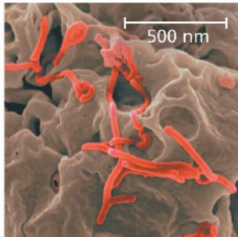  
(a) Ebola viruses
budding from a monkey cell (colorized SEM).

  
(b) Chikungunya viruses emerging from a cell in the upper left and packing together (colorized TEM).  
20 nm

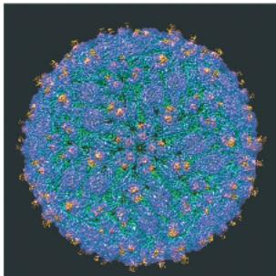  
(c) Computer-generated image of a Zika virus, based on a technique called cryo-electron microscopy.

SARS-CoV-2 is one good example. The first case of COVID-19 was reported in Wuhan, China, in late December, 2019, and on March 11, 2020, WHO declared it a pandemic—a worldwide epidemic. Within the next 18 months, virtually every country was battling SARS-CoV-2.

HIV, the AIDS virus, is another classic example: The earliest HIV infections of humans occurred in sub-Saharan Africa, perhaps as early as the 1920s or 1930s, with outbreaks in the 1960s and 1970s. In the United States, the first cases were

Interview

Interview with Dr. Pardis Sabeti: Analyzing genomes of viruses and their hosts to learn more about epidemics (at the start of Unit 3, before Chapter 13)

large outbreak in Brazil. Although symptoms of Zika are often mild, the infection of pregnant individuals was correlated with a striking increase in the number of babies born with abnormally small brains, a condition called microcephaly. Zika is a mosquito-borne flavivirus (like West Nile virus) that infects neural cells, posing a particular danger to fetal brain development.

Where do these new strains of virus come from? One cause of rapidly emerging viral diseases in humans is mutation of existing viruses into new viruses that can spread more easily. RNA viruses have a high rate of mutation because viral RNA polymerases do not proofread and correct errors in replicating their RNA genomes. Some mutations change existing viruses into new viral strains that can cause disease, even in people immune to the original virus. A well-known related example is how three or four mutations causing changes in a surface protein of a cat virus (feline panleukopenia virus) resulted in the emergence in 1978 of canine parvovirus, a very contagious deadly virus infecting dogs.

A second cause of the emergence of viral diseases is the spread of a viral disease from a small, isolated human population. AIDS went unnamed and virtually unnoticed for decades before spreading around the world, accelerated by affordable international travel. HIV is transmitted through exchange of bodily fluids; this happens, for instance, through blood transfusions, unprotected sexual intercourse, and reuse of needles to inject intravenous drugs. In African countries, lack of resources and stigmatization of infected individuals initially hastened the spreading of AIDS. In the United States, AIDS was seen at first as only affecting gay men. Societal prejudice toward this community led to a lack of resources to investigate and stem the spread of the disease, which contributed to its worldwide spread.

# Interview

Interview with David Satcher: The role of the CDC in recognizing AIDS and in public health (eTextbook only)

A third cause of new viral diseases in humans is the spread of existing viruses from other animals. Scientists estimate that about three-quarters of new human diseases originate in this way. Animals infected with a virus that can be transmitted to humans are said to be a natural reservoir for that virus. HIV is an example, as scientists believe that it originated from a version of the virus found in chimpanzees in central Africa, after people ate chimpanzee meat for food and were infected by exposure to chimpanzee blood. In a more recent example, the West Nile virus has been passed from wild birds to humans via mosquitoes.

In general, flu epidemics provide an instructive example of these three causes of emerging viruses. There are three types of influenza virus: types B and C, which infect only humans and have never caused an epidemic, and type A, which infects a wide range of animals, including birds, pigs, horses, and humans. The influenza type A viruses present in pigs and wild and domestic birds are potential emerging viruses that represent a long-term threat to human health.

A case in point is the H5N1 strain of avian influenza virus, which is highly contagious and deadly in birds. The first transmission from birds to humans was documented in Hong Kong in 1997. From 2003 to 2024, about 950 people have been infected, with an alarming mortality rate of around 50%. The high mortality rate is partly because H5N1 is very different from strains of influenza that have circulated among humans for a long time. Individuals are therefore not able to mount a strong immune response against viruses like H5N1.

Different strains of influenza A are given standardized names; for example, the name H5N1 identifies which forms of two viral surface proteins are present—hemagglutinin and neuraminidase (HA and NA, respectively; see the glycoprotein spikes in Figure 19.3c). These two proteins together help determine the host range and severity of disease caused by each virus. Eighteen types of hemagglutinin, a protein that helps the flu virus attach to host cells, and 11 types of neuraminidase, an enzyme that helps release new virus particles from infected cells, have been identified. All possible combinations of HA and NA have been found in some waterbirds.

Although deadly, the H5N1 strain has not yet caused an epidemic because nearly all cases have been the result of transmission from birds or other animals to people, rather than person-to-person. Epidemics occur when genetic changes allow a new viral strain to be easily transmitted between humans. An event like this occurred in 2009, when a strain of influenza virus (H1N1) appeared that was very different from the virus that causes the seasonal flu. The H1N1 influenza virus spread rapidly, prompting WHO to declare a pandemic. Within half a year, the disease had reached 207 countries, infecting over 600,000 people and killing almost 8,000.

In addition to the 2009 H1N1 pandemic, influenza A strains have caused three other major flu epidemics among humans in the last 100 years. The most notable of these was the “Spanish flu” pandemic of 1918–1919, which killed 40–50 million people worldwide. In the Scientific Skills Exercise, you’ll analyze genetic changes in variants of the 2009 H1N1 influenza virus and correlate them with spread of the disease.

The disease caused by H1N1 was originally called “swine flu” because parts of the viral genome were very similar to strains of influenza in pigs. However, studies revealed that the virus was not transmitted from pigs to humans. Instead, the story was more complex: H1N1 was a unique combination of swine, avian, and human influenza genes that allowed it to spread among humans.

Influenza viruses can change quickly because they have a genome made up of eight segments of RNA (or seven for influenza C) rather than a single RNA molecule (see Figure 19.3c). When an animal like a pig or a bird is infected with multiple strains of influenza virus, the RNA molecules making up the viral genomes can mix and match (reassort) during viral assembly, resulting in new genetic combinations. If a flu virus from pigs recombines with viruses that circulate widely among humans, it may acquire the ability to spread easily from person to person, dramatically increasing the potential for a major human outbreak. Pigs are believed to have been the main hosts for recombination that led to the 2009 H1N1 flu virus.

# Scientific Skills Exercise Analyzing a Sequence-Based Phylogenetic Tree to Understand Viral Evolution

How Can Sequence Data Be Used to Track Flu Virus Evolution? In 2009, an influenza A H1N1 virus caused a pandemic, and the virus has continued to resurface in outbreaks across the world. Researchers in Taiwan were curious about why the virus kept appearing despite widespread flu vaccine initiatives. They hypothesized that newly evolved variant strains of the H1N1 virus were able to evade human immune system defenses. To test this hypothesis, they needed to determine if each wave of flu infection was caused by a different H1N1 variant strain.

How the Experiment Was Done Scientists obtained the genome sequences for 4,703 virus isolates collected from patients with H1N1 flu in Taiwan, each named by type/location/identifying number/year. They compared the sequences in different strains for the viral hemagglutinin (HA) gene, and based on mutations that had occurred, arranged the isolates into a phylogenetic tree (see Figure 26.5 for information on how to read phylogenetic trees).

Data from the Experiment In the phylogenetic tree shown at right, each branch tip is one variant strain of the H1N1 virus with a unique HA gene sequence. The tree is a way to visualize a working hypothesis about the evolutionary relationships between H1N1 variants.

## INTERPRET THE DATA

1. The more closely connected two variants are in the tree, the more alike they are in terms of HA gene sequence. Each fork in a branch, called a node, shows where two lineages separate due to different accumulated mutations. The length of the branches is a measure of how many sequence differences there are between the variants, indicating how distantly related they are. Referring to the tree, which variants are more closely

related to each other: A/Taiwan/1018/2011 and A/Taiwan/552/2011 or A/Taiwan/1018/2011 and A/Taiwan/8542/2009? Explain.

2. The scientists arranged the branches into groups made up of one ancestral variant and all of its descendant, mutated variants. They are color-coded and also grouped by brackets. Using group 11 as an example, trace the lineage of its variants. (a) Do all of the nodes have the same number of branches? (b) Are all of the branches in the group the same length? (c) What do these results indicate?

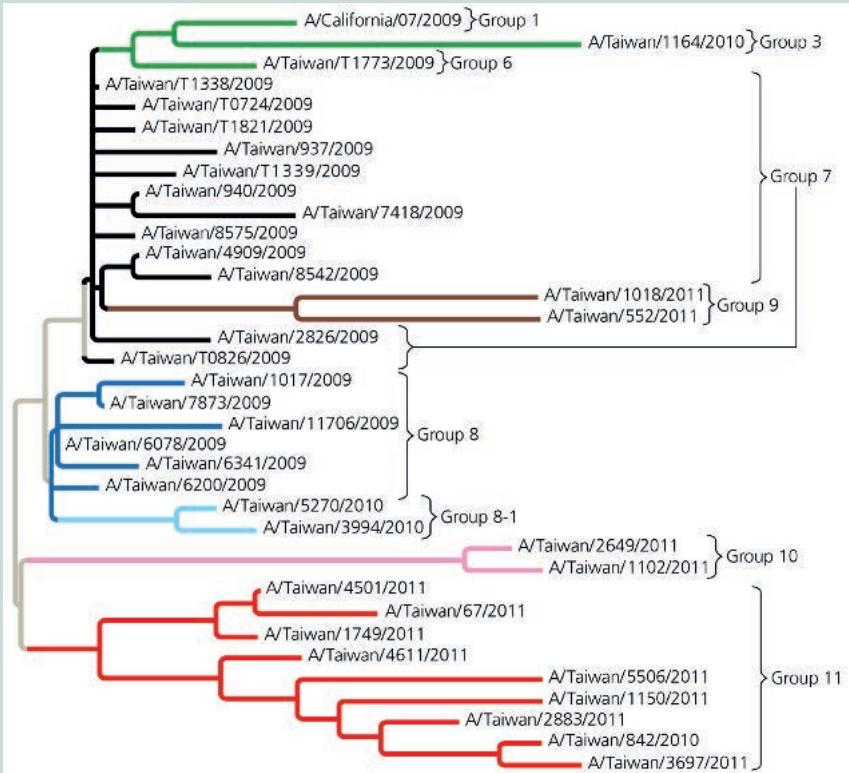

3. The graph shows the number of isolates collected (each from an ill patient) on the y-axis and the month and year that the isolates were collected on the x-axis. Each group of variants is plotted separately with a line color and label that match the tree diagram. (a) Which group of variants was the earliest to cause the first wave of H1N1 flu in over 100 patients in Taiwan? (b) After a group of variants had a peak number of infections, did members of that same group cause another (later) wave of infection? (c) One variant in group 1 (green, uppermost branch) was used to make a vaccine that was distributed very early in the pandemic. Based on the graphed data, does it look like the vaccine was effective?

4. Groups 9, 10, and 11 all had H1N1 variants that caused a large number of infections at the same time in Taiwan. Does this mean that the scientists' hypothesis, that new variants cause new waves of infection, was incorrect? Explain.

To make the graph below, scientists plotted the number of isolates by the month and year of isolate collection to show the period in which each viral variant was actively causing illness in people.

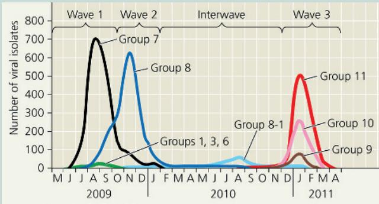  
Data from J.-R. Yang et al., New variants and age shift to high fatality groups contribute to severe successive waves in the 2009 influenza pandemic in Taiwan, PLoS ONE 6(11): e28288 (2011).

Instructors: A version of this Scientific Skills Exercise can be assigned in Mastering Biology.

Influenza viruses also have a high rate of mutation, for reasons mentioned earlier. Coupled with reassortments, these mutations can lead to the emergence of a viral strain from animals that can infect human cells. Scientists have been worried that an H5N1 strain will evolve in a way that enables it to spread as easily as the H1N1 strain. The concern has become more focused because an H5N1 avian influenza virus epidemic is currently underway; it was first detected in wild birds in the United States in January 2022, and in domestic poultry the next month. Since then, somewhat alarmingly, the virus has been found in domestic cows, dogs, and cats, as well as many wild mammals, including bears, foxes, skunks, and even seals. Thus far this particular strain has not been capable of human-to-human transmission, but a 2024 laboratory study showed that one or two mutations in the bovine strain of this virus would allow it to attach to receptors in human airway cells. If such mutations were to happen in the viruses currently circulating, this would represent another major global health threat like those of the COVID-19 or 1918 influenza pandemics.

In fact, we have observed a similar phenomenon in SARS-CoV-2 during the COVID-19 pandemic. Widespread SARS-CoV-2 infection of many individuals has allowed random mutations to occur, and evolutionary processes have led to new, more easily transmissible strains of the virus emerging and becoming predominant. Clearly, the COVID-19 pandemic has sharply highlighted the crucial importance of understanding the evolution and functioning of viruses.

Normal seasonal flu viruses (including influenza types A and B) are not considered emerging viruses because variations of seasonal flu viruses have been circulating among humans for long enough that most components are recognized by the immune system. However, these viruses still undergo mutation and reassortment of genome segments, and variations of the HA protein are used each year to generate vaccines against the strains predicted most likely to occur the following year.

As we have seen, emerging viruses are usually existing viruses that mutate, spread more widely in the current host species, or spread to new host species. Changes in host behavior or environmental changes can increase the viral traffic responsible for emerging diseases. For instance, new roads built through remote areas can allow viruses to spread between previously isolated human populations. Also, the destruction of forests to expand cropland can bring humans into contact with animals that host infectious viruses. Finally, genetic mutations and changes in host ranges can allow viruses to jump between species. Many viruses are transmitted by mosquitoes. A dramatic expansion of the disease caused by the chikungunya virus occurred in the mid-2000s when a mutation allowed it to infect not only the mosquito species Aedes aegypti but also the related Aedes albopictus. Insecticides and mosquito netting over beds are crucial tools in public health attempts to prevent diseases carried by mosquitoes (Figure 19.11).

Recently, scientists have become concerned about the possible effects of climate change on worldwide viral transmission. Dengue fever, also mosquito-borne, has appeared in Florida, Texas, California, and Portugal, regions where it had not been seen before. The possibility that global climate change has allowed

Figure 19.11 Netting as protection against virus-carrying mosquitoes.  
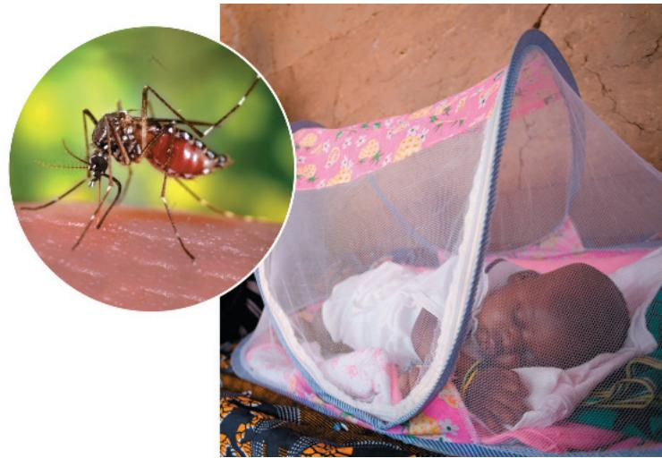

mosquito species carrying these viruses to expand their ranges and interact more is troubling because of the increased chance of a mutation allowing a virus to jump to a new host. This is an area of active research by scientists applying climate change models to what is known about the habitat requirements of mosquito species.

## Viral Diseases in Plants

More than 2,000 types of viral diseases of plants are known, accounting for an annual loss of over \$30 billion worldwide due to destruction of crops. Common signs of viral infection include bleached or brown spots on leaves and fruits (Figure 19.12), stunted growth, and damaged flowers or roots, all of which can diminish the yield and quality of crops.

Plant viruses have the same basic structure and mode of replication as animal viruses. Most known plant viruses, including tobacco mosaic virus (TMV), have an RNA genome. Many have a helical capsid, like TMV, while others have an icosahedral capsid (see Figure 19.3b).

Viral diseases of plants spread by two major routes. In the first route, horizontal transmission, an external source infects the plant. Because the invading virus must get past the plant's outer protective layer of cells (the epidermis), a plant becomes more susceptible to viral infections if it has been damaged by wind, injury, or herbivores. Herbivores, especially insects, pose a double

Figure 19.12 Immature tomato infected by a virus.

## Figure 19.13 Model for how prions propagate.

Prions are misfolded versions of normal brain proteins. When a prion contacts a normally folded version of the same protein, it may induce the normal protein to assume the abnormal shape. The resulting chain reaction may continue until high levels of prion aggregation cause cellular malfunction and eventual degeneration of the brain.

threat because they can also carry viruses, transmitting disease from plant to plant. Moreover, gardeners may transmit plant viruses inadvertently on pruning shears and other tools. The other route of viral infection is vertical transmission, in which a plant inherits a viral infection from a parent. Vertical transmission can occur in asexual propagation (for example, through cuttings) or in sexual reproduction via infected seeds.

Once a virus enters a plant cell and begins replicating, viral genomes and associated proteins can spread throughout the plant through plasmodesmata, the cytoplasmic connections that penetrate the walls between adjacent plant cells (see Figure 36.19). The passage of viral macromolecules from cell to cell is facilitated by virally encoded proteins that cause enlargement of plasmodesmata. Scientists have not yet devised cures for most viral plant diseases, so research efforts are focused largely on reducing disease transmission and on breeding resistant varieties of crop plants.

As small and simple as viruses are, they dwarf another class of plant pathogens: viroids. These are circular RNA molecules, only a few hundred nucleotides long. Viroids do not encode proteins but can replicate in host plant cells, apparently using cellular enzymes. These small RNA molecules seem to cause errors in the regulatory systems that control plant growth, and the typical signs of viroid diseases are abnormal development and stunted growth. One viroid disease, called cadang-cadang, has killed more than 10 million coconut palms in the Philippines.

## Prions: Proteins as Infectious Agents

The viruses discussed in this chapter are infectious agents that spread diseases, and their genetic material is composed of nucleic acids, whose ability to be replicated is well known. Surprisingly, there are also proteins that are infectious. Proteins called prions appear to cause degenerative brain diseases in various animal species. These diseases include scrapie in sheep; mad cow disease, which plagued the European beef industry several decades ago; and Creutzfeldt-Jakob disease in humans, which has recently been diagnosed in 500–600 people per year in the United States. Prions can be transmitted in food, as may occur when people eat beef from cattle with mad cow disease. Kuru, another human disease caused by prions, was identified in the early 1900s among the South Fore indigenous people of New Guinea. When a kuru epidemic peaked there in the 1960s, scientists at first thought

the disease had a genetic basis because family members also often contracted the disease. Eventually, however, investigations revealed a different story: After a death, family members practiced ritual cannibalism, eating organs of the deceased, and prions were transmitted primarily in brain tissue. Women got kuru more often than men because men ate the more “prestigious” organs, like the heart, while women and children ate the brains.

Two characteristics of prions are especially alarming. First, prions act very slowly, with an incubation period of at least ten years before symptoms develop. The lengthy incubation period prevents sources of infection from being identified until long after the first cases appear, allowing many more infections to occur. Second, prions are not destroyed or deactivated by heating to normal cooking temperatures. To date, there is no known cure for prion diseases, and the only hope for developing effective treatments lies in understanding the process of infection.

How can a protein, which cannot replicate itself, be a transmissible pathogen? According to the leading model, a prion is a misfolded form of a protein normally present in brain cells. When the prion gets into a cell containing the normal form of the protein, the prion somehow converts normal protein molecules to the misfolded prion versions. Several prions then aggregate into a complex that can convert other normal proteins to prions, which join the chain (Figure 19.13). Prion aggregation interferes with normal cellular functions and causes disease symptoms. This model was greeted with much skepticism when it was first proposed by Stanley Prusiner in the early 1980s, but it is now widely accepted. Prusiner was awarded the Nobel Prize in 1997 for his work on prions. He has also proposed that prions are involved in neurodegenerative diseases such as Alzheimer's and Parkinson's disease, and recent evidence supporting this notion is compelling. There are many outstanding questions about these small infectious agents.

## Concept Check 19.3

1. Describe two ways in which a preexisting virus can become an emerging virus.

2. Contrast horizontal and vertical transmission of viruses in plants.

3. WHAT IF? TMV has been isolated from virtually all commercial tobacco products. Why, then, is TMV infection not an additional hazard for smokers?

For suggested answers, see Appendix A.

# Chapter 19 Review

## Summary of Key Concepts

To review key terms, go to the Vocabulary Self-Quiz (eTextbook only).

## Concept 19.1: A virus consists of a nucleic acid surrounded by a protein coat

\- Researchers discovered viruses in the late 1800s by studying a plant disease, tobacco mosaic disease.

\- A virus is a small nucleic acid genome enclosed in a protein capsid and sometimes a membranous viral envelope. The genome may be single- or double-stranded DNA or RNA.

Are viruses generally considered living or nonliving? Explain.

## Concept 19.2: Viruses replicate only in host cells

\- Viruses use enzymes, ribosomes, and small molecules of host cells to synthesize progeny viruses during replication.

\- Each type of virus has a characteristic host range, affected by whether cell-surface proteins are present that viral surface proteins can bind to.

\- Phages (viruses that infect bacteria) can replicate by two alternative mechanisms: the lytic cycle and the lysogenic cycle.

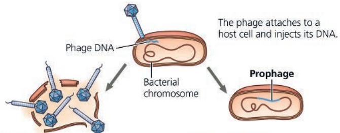

Lytic cycle

• Virulent or temperate phage

Lysogenic cycle

\- Destruction of host DNA

• Temperate phage only

• Production of new phages • Lysis of host cell causes release of progeny phages

• Genome integrates into bacterial chromosome as prophage, which (1) is replicated and passed on to daughter cells and

(2) can be induced to leave the

chromosome and initiate a lytic cycle

\- Bacteria have various ways of defending themselves against phage infections, including the CRISPR-Cas system.

\- Many animal viruses have an envelope. Retroviruses (such as HIV) use the enzyme reverse transcriptase to copy their RNA genome into DNA, which can be integrated into the host genome as a provirus.

\- Since viruses can replicate only within cells, they probably evolved after the first cells appeared, perhaps as packaged fragments of cellular nucleic acid.

Describe enzymes that are not found in most cells but are necessary for the replication of certain types of viruses.

## Concept 19.3: Viruses and prions are formidable pathogens in animals and plants

\- Symptoms of viral diseases may be caused by direct viral harm to cells or by the body's immune response. Vaccines stimulate the immune system to defend the host against specific viruses.

\- An epidemic, a widespread outbreak of a disease, can become a pandemic, a global epidemic.

\- Outbreaks of emerging viral diseases in humans are usually not new, but rather are caused by existing viruses that expand their host territory. The H1N1 2009 flu virus was a new combination of pig, human, and avian viral genes that caused a pandemic. The H5N1 avian flu virus has the potential to cause a high-mortality flu pandemic.

\- Viruses enter plant cells through damaged cell walls (horizontal transmission) or are inherited from a parent (vertical transmission).

\- Prions are slow-acting, virtually indestructible infectious proteins that cause brain diseases in mammals.

What aspect of an RNA virus makes it more likely than a DNA virus to become an emerging virus?

For suggested answers, see Appendix A.

## Test Your Understanding

For more multiple-choice questions, go to the Practice Test (eTextbook only).

## Levels 1-2: Remembering/Understanding

1. Which of the following characteristics, structures, or processes is common to both bacteria and viruses?

(A) metabolism

(B) ribosomes

(C) genetic material composed of nucleic acid

(D) cell division

2. Emerging viruses arise by

(A) mutation of existing viruses.

(B) the spread of existing viruses to new host species.

(C) the spread of existing viruses more widely within their host species.

(D) all of the above.

3. To cause a human pandemic, the H5N1 avian flu virus would have to

(A) spread to primates such as chimpanzees.

(B) develop into a virus with a different host range.

(C) become capable of human-to-human transmission.

(D) become much more pathogenic.

## Levels 3-4: Applying/Analyzing

4. A bacterium is infected with an experimentally constructed bacteriophage composed of the T2 phage protein coat and T4 phage DNA. The new phages produced would have

(A) T2 protein and T4 DNA.

(B) T4 protein and T2 DNA.

(C) T2 protein and T2 DNA.

(D) T4 protein and T4 DNA.

5. RNA viruses require their own supply of certain enzymes because (A) host cells rapidly destroy the viruses.

(B) host cells lack enzymes that can replicate the viral genome.

(C) these enzymes translate viral mRNA into proteins.

(D) these enzymes penetrate host cell membranes.

6. DRAW IT Redraw Figure 19.8 to show the replicative cycle of a virus with a single-stranded genome that can function as mRNA (a class IV virus).

## Levels 5-6: Evaluating/Creating

7. EVOLUTION CONNECTION The success of some viruses lies in their ability to evolve rapidly within the host. Such viruses evade the host's defenses by mutating and producing many altered progeny viruses before the body can mount an attack. Thus, the viruses present late in infection differ from those that initially infected the body. Discuss this as an example of evolution in microcosm. Which viral lineages tend to predominate?

8. SCIENTIFIC INQUIRY When bacteria infect an animal, the number of bacteria in the body increases in an exponential fashion (graph A). After infection by a virulent animal virus with a lytic replicative cycle, there is no evidence of infection for a while. Later, however, the number of viruses rises suddenly and subsequently increases in a series of steps (graph B). Explain the difference in the curves.

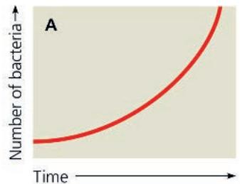

  
For selected answers, see Appendix A.

9. WRITE ABOUT A THEME: ORGANIZATION While viruses are considered by most scientists to be nonliving, they do show some characteristics of life, including the correlation of structure and function. In a short essay (100–150 words), discuss how the structure of a virus correlates with its function.

## 10. SYNTHESIZE YOUR KNOWLEDGE

Oseltamivir (Tamiflu), an antiviral drug prescribed for the flu, inhibits the enzyme neuraminidase. Explain how this drug could prevent infection in someone exposed to the flu or could shorten the course of flu in an infected patient (the reasons for which it is prescribed).

# Explore Scientific Papers with Science in the Classroom | AAAS

How can genomics help track the Ebola virus? Go to “Ebola Outbreak Traced to the Funeral of a Traditional Healer” at www.scienceintheclassroom.org.

Instructors: Questions can be assigned in Mastering Biology.

