# 第20章 DNA Tools and Biotechnology

<!-- 章节边界按正文内容恢复；原始 MinerU 内容保留如下。 -->

# DNA Tools and Biotechnology

## Key Concepts

20.1 DNA sequencing and DNA cloning are valuable tools for genetic engineering and biological inquiry

20.2 Biologists use DNA technology to study gene expression and function

20.3 Cloned organisms and stem cells are useful for basic research and other applications

20.4 The practical applications of DNA-based biotechnology affect our lives in many ways

## Study Tip

Apply what you've learned: Write down a gene-related question you've wondered about. Then make a table listing techniques you could use to investigate your question and how you would apply them. Shown here is one example.

<table><tr><td colspan="2">Is autism caused by genes, the environment, or both?</td></tr><tr><td>Technique</td><td>Application to question</td></tr><tr><td>DNA sequencing</td><td>-Compare DNA sequences from people with autism with sequences from nonaffected people.</td></tr></table>

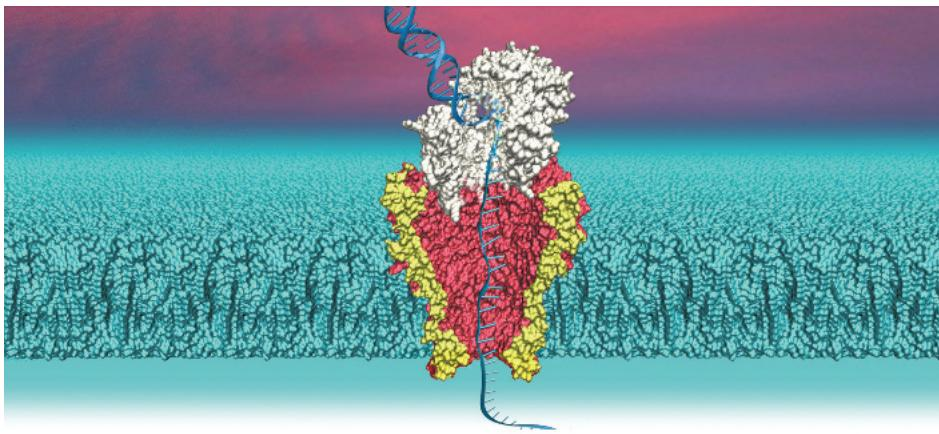  
Figure 20.1 This model shows a technique in which a DNA strand is passed through a small pore in a membrane. The resulting changes in an electrical current are used to determine the nucleotide sequence. The first human genome sequence, completed in 2003, took 13 years and cost \$1 billion; the time and cost of genome sequencing have been greatly reduced by improved methods like the one shown here.

What are the main techniques and applications of biotechnology?  

# Concept 20.1: DNA sequencing and DNA cloning are valuable tools for genetic engineering and biological inquiry

The discovery of the structure of the DNA molecule, and specifically the recognition that its two strands are complementary to each other, opened the door for the development of DNA sequencing and other techniques for manipulating DNA—known as DNA technology—used in biological research today. Key to these techniques is nucleic acid hybridization, the base pairing of one strand of a nucleic acid to a complementary sequence from another nucleic acid strand, either DNA or RNA. Nucleic acid hybridization forms the foundation of virtually every technique used in genetic engineering, the direct manipulation of genes for practical purposes. Genetic engineering has launched a revolution in fields as varied as criminal law, medicine, and basic biological research. In this section, we'll explore several important techniques and their uses.

## DNA Sequencing

Researchers can exploit the principle of complementary base pairing to determine the complete nucleotide sequence of a DNA molecule, a process called DNA sequencing. The first automated procedure, called dideoxy sequencing, was developed in the 1970s by biochemist Frederick Sanger, who received the Nobel Prize in 1980 for this accomplishment. Dideoxy sequencing has been largely replaced by newly developed methods.

During the first decade of this century, “next-generation sequencing” techniques were developed that are rapid and inexpensive (Figure 20.2). DNA fragments are amplified (copied) to yield an enormous number of identical fragments (Figure 20.3). A single template strand of each fragment is immobilized, and the complementary strand is synthesized, one nucleotide at a time. A chemical technique enables electronic monitors to identify in real time which of the four nucleotides is added; this method is thus called sequencing by synthesis. Thousands or hundreds of

Figure 20.2 Next-generation DNA sequencing machines.  

thousands of fragments, each about 300 nucleotides long, are sequenced in parallel in machines like those shown in Figure 20.2, accounting for the high rate of nucleotides sequenced per hour. This is an example of “high-throughput” DNA technology and is currently the method of choice for studies where massive numbers of DNA samples—even a set of numerous fragments representing an entire genome—are being sequenced.

More and more often, next-generation sequencing is complemented (or in some cases replaced) by “third-generation sequencing,” with each new technique being faster and less expensive than the previous one. In some new methods, the DNA is neither cut into fragments nor amplified. Instead, a single, very long DNA molecule is sequenced on its own. Several groups have developed techniques that move a single strand of a DNA molecule through a very small pore (a nanopore) in a membrane, identifying the bases one by one by the distinct way each interrupts an electrical current. One model of this concept is shown in Figure 20.1, in which the pore is a protein channel embedded in a lipid membrane. (Other researchers are using artificial membranes and nanopores.) Each type of base interrupts the electrical current for a slightly different length of time. In 2015, the first nanopore sequencer went on the market; this device is the size of a small candy bar and connects to a computer via a USB port. Associated software allows immediate identification and analysis of the sequence. This is only one of many approaches to further increase the rate and cut the cost of sequencing, while also allowing the methodology to move out of the laboratory and into the field.

Improved DNA-sequencing techniques have transformed the way in which we can explore fundamental biological questions about evolution and how life works (see Make Connections Figure 5.26). Little more than 15 years after the human genome sequence was announced, researchers had completed the sequencing of thousands of genomes, with tens of thousands in progress. Complete genome sequences have been determined for cells from numerous cancers, for ancient humans, and for the many bacteria that live in the human intestine. In Chapter 21, you'll learn more about how this rapid acceleration of sequencing technology has revolutionized our study of the evolution of species and the genome itself. Now, let's consider how individual genes are studied.

## Making Multiple Copies of a Gene or Other DNA Segment

A molecular biologist studying a particular gene or group of genes faces a challenge. Naturally occurring DNA molecules are very long, and a single molecule usually carries hundreds or even thousands of genes. Moreover, in many eukaryotic genomes, protein-coding genes occupy only a small proportion of the chromosomal DNA, the rest being noncoding nucleotide sequences. A single human gene, for example, might constitute only 1/100,000 of a chromosomal DNA molecule. As a further complication, it's not easy to distinguish a gene from the surrounding DNA because they differ only in nucleotide sequence. To study a specific gene, scientists have developed methods to isolate a segment of DNA carrying that gene and make multiple identical copies of it—a process called DNA cloning.

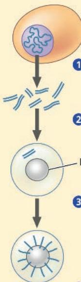

## Figure 20.3

# Research Method: Sequencing by Synthesis: Next-Generation Sequencing

1 Genomic DNA is fragmented, and fragments of 300 base pairs are selected.

2 Each fragment is placed in a droplet with a bead.

## Application

In current next-generation sequencing techniques, each fragment is about 300 nucleotides long; by sequencing the fragments in parallel, about 2 billion nucleotides can be sequenced in 24 hours.

## Technique

\- Bead

3 Many copies of each fragment are made using a technique called PCR (see Figure 20.7). One million identical copies are made and attached by their 5' end to the bead.

4 The bead is placed into a small well along with DNA polymerases and primers that can hybridize to the 3' end of the single (template) strand.

See numbered steps and diagrams.

DNA polymerase

## Results

Each of the 2,000,000 wells in the multiwell plate, which holds a different fragment, yields a different sequence. The results for one fragment are shown below as a “flow-gram.” The sequences of the entire set of fragments are analyzed using computer software, which “stitches” them together into a whole sequence—here, an entire genome.

5 The well is one of 2 million on a multiwell plate, each containing a different DNA fragment to be sequenced. A solution of one of the four nucleotides required for DNA synthesis (deoxynucleoside triphosphates, or dNTPs) is added to all wells and then washed off. This is done sequentially for all four nucleotides: dATP, dTTP, dGTP, and then dCTP. The entire process is then repeated over and over again.

6 In each well, if the next base on the template strand (T in this example) is complementary to the added nucleotide (A, here), the nucleotide is joined to the growing strand, releasing PP $_{1}$ , which causes a flash of light that is recorded.

7 The nucleotide is washed off and a different nucleotide (dTTP, here) is added. If the nucleotide is not complementary to the next template base (G, here), it is not joined to the strand, no reaction occurs, and there is no flash.

8 The process of adding and washing off the four nucleotides is repeated until every fragment has a complete complementary strand. The pattern of flashes reveals the sequence of the original fragment in each well.

INTERPRET THE DATA If the template strand has two or more identical nucleotides in a row, their complementary nucleotides will be added one after the other in the same flow step. How are two or more of the same nucleotide (in a row) detected in the flow-gram? (See sample sequence on the right side of the diagram.) Write out the sequence of the first 25 nucleotides in the flow-gram above, starting from the left. (Ignore the very short lines.)

Most methods for cloning pieces of DNA in the laboratory share certain general features. One common approach uses bacteria, most often Escherichia coli. Recall from Figure 16.13 that the E. coli chromosome is a large, circular molecule of DNA. In addition, E. coli and many other bacteria also have plasmids, small, circular DNA molecules that are replicated separately. A plasmid has only a small number of genes; these genes may be useful when the bacterium is in a particular environment but may not be required for survival or reproduction under most conditions.

To clone pieces of DNA using bacteria, scientists have isolated plasmids from bacterial cells and altered them by genetic engineering. Researchers insert DNA they want to study (“foreign” DNA) into the plasmid (Figure 20.4). The resulting plasmid is now a recombinant DNA molecule, a molecule containing DNA from two different sources, very often different species. The plasmid is then returned to a bacterial cell, producing a recombinant bacterium. This single cell reproduces through repeated cell divisions to form a clone of cells, a population of genetically identical cells. Because the dividing bacteria replicate the recombinant plasmid and pass it on to their descendants, the foreign DNA and any genes it carries are cloned at the same time. The production of multiple copies of a single gene is a type of DNA cloning called gene cloning.

In Figure 20.4, the plasmid acts as a cloning vector, a DNA molecule that can carry foreign DNA into a host cell and be replicated there. Bacterial plasmids are widely used as cloning vectors for several reasons: They can be readily obtained from commercial suppliers, manipulated to form recombinant plasmids by insertion of foreign DNA in a test tube (referred to as in vitro, from the Latin meaning “in glass”), and then easily introduced into bacterial cells. The foreign DNA in Figure 20.4 is a gene from a eukaryotic cell; we will describe in more detail how the foreign DNA segment was obtained later in this section.

Gene cloning is useful for two basic purposes: to make many copies of, or amplify, a particular gene and to produce a protein product from it (see Figure 20.4). Researchers can isolate copies of a cloned gene from bacteria for use in basic research or to endow another organism with a new metabolic capability, such as pest resistance. For example, a resistance gene present in one crop species might be cloned and transferred into plants of another species. (Such organisms are called genetically modified organisms, or GMOs for short; they will be discussed later in the chapter.) Alternatively, a protein with medical uses, such as human growth hormone, can be harvested in large quantities from cultures of bacteria carrying a cloned gene for the protein. (We'll look at the techniques for expressing cloned genes later.) Since one gene is only a very small part of the total DNA in a cell, the ability to amplify such a DNA fragment is crucial for any application involving a single gene.

## Using Restriction Enzymes to Make a Recombinant DNA Plasmid

Gene cloning and genetic engineering generally rely on the use of enzymes that cut DNA molecules at a limited number of specific locations. These enzymes, called restriction endonucleases, or restriction enzymes, were discovered in the late 1960s by

Figure 20.4 Gene cloning and some uses of cloned genes.
In this simplified diagram of gene cloning, we start with a plasmid (originally isolated from a bacterial cell) and a gene of interest from another organism. Only one plasmid and one copy of the gene of interest are shown at the top of the figure, but the starting materials would include many of each.

biologists doing basic research on bacteria. Restriction enzymes protect the bacterial cell by cutting up foreign DNA from other organisms or phages (see Concept 19.2).

Hundreds of different restriction enzymes have been identified and isolated. Each restriction enzyme is very specific, recognizing a particular short DNA sequence, or restriction site, and cutting both DNA strands at precise points within this

Figure 20.5 Using a restriction enzyme and DNA ligase to make a recombinant DNA plasmid.

The restriction enzyme in this example (called EcoRI) recognizes a single six-base-pair restriction site present in this plasmid. It makes staggered cuts in the sugar-phosphate backbones, producing fragments with “sticky ends.” Foreign DNA fragments with complementary sticky ends can base-pair with the plasmid ends; the ligated product is a recombinant plasmid. (If the two plasmid sticky ends base-pair, the original nonrecombinant plasmid is reformed.)

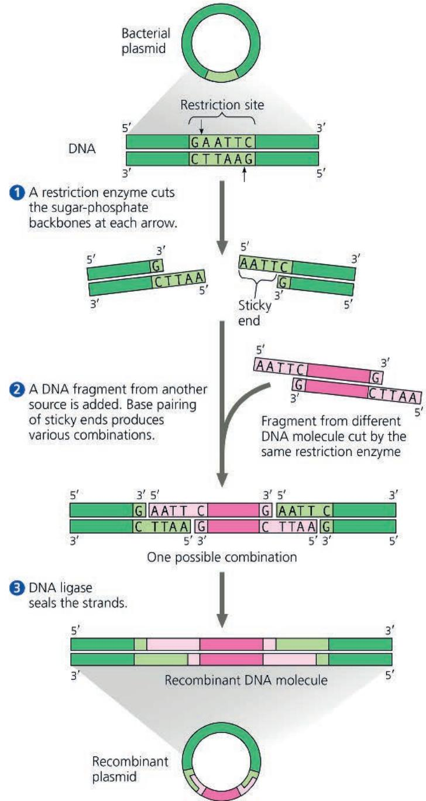  
DRAW IT The restriction enzyme HindIII recognizes the sequence 5'-AAGCTT-3', cutting between the two A's. Draw the double-stranded sequence before and after the enzyme cuts it.
For suggested answer, see Appendix A.

restriction site. The DNA of a bacterial cell is protected from the cell's own restriction enzymes by the addition of methyl groups ( $—CH_{3}$ ) to adenines or cytosines within the sequences recognized by the enzymes.

Figure 20.5 shows how restriction enzymes are used to clone a foreign DNA fragment into a bacterial plasmid. At the top of the figure is a bacterial plasmid (like the one shown in Figure 20.4) that has a single restriction site recognized by a particular restriction enzyme. As shown in this example, most restriction sites are symmetrical. In other words, the sequence of nucleotides is the same on both strands when read in the $5'\rightarrow3'$ direction. The most commonly used restriction enzymes recognize sequences containing four to eight nucleotide pairs. Because any sequence that is this short usually occurs (by chance) many times in a long DNA molecule, a restriction enzyme will make many cuts in such a DNA molecule, yielding a set of restriction fragments. Since restriction enzymes always cut at the same exact DNA sequence, copies of any given DNA molecule exposed to the same restriction enzyme always yield the same set of restriction fragments.

The most useful restriction enzymes cleave the sugar-phosphate backbones in the two DNA strands in a staggered manner, as shown in ① of Figure 20.5. The resulting double-stranded restriction fragments have at least one single-stranded end, called a sticky end. These short extensions can form hydrogen-bonded base pairs with complementary sticky ends on any other DNA molecules cut with the same restriction enzyme, such as the inserted DNA shown in ② of Figure 20.5. The associations formed in this way are only temporary but can be made permanent by DNA ligase, an enzyme that catalyzes the formation of covalent bonds that close up the sugar-phosphate backbones of DNA strands (see ③ of Figure 20.5). At the bottom of Figure 20.5, you can see the stable recombinant DNA molecule that was produced by the ligase-catalyzed joining of DNA from two different sources. The end result, in this example, is the formation of a stable recombinant plasmid containing foreign DNA.

After the recombinant plasmids have been copied many times in host cells, they need to be checked to make sure the fragment has been inserted (see Figure 20.4). To do so, a researcher might cut the products again using the same restriction enzyme. If the insert is there, there would be two DNA fragments, one the size of the plasmid and one the size of the inserted DNA. To separate and visualize the fragments, researchers carry out a technique called gel electrophoresis, in which an electrical current is passed through a gel made of a polymer that has microscopic holes of different sizes. The current drives the fragments through the gel, with shorter fragments traveling faster. Thus, the gel works as a molecular sieve to separate out a mixture of nucleic acid fragments by length (Figure 20.6). Gel electrophoresis is used in conjunction with many different techniques in molecular biology. The same principles are the basis of another technique increasingly in use called capillary electrophoresis, in which a current drives the sample molecules through narrow capillary tubes, separating molecules due to their size.

## Figure 20.6 Gel electrophoresis.

A gel made of a polymer acts as a molecular sieve to separate nucleic acids or proteins differing in size, electrical charge, or other physical properties as they move in an electric field. In the example shown here, DNA molecules are separated by length in a gel made of a polysaccharide called agarose.

  
(a) Each sample, a mixture of different DNA molecules, is placed in a separate well near one end of a thin slab of agarose gel. The gel is set into a small plastic support and immersed in an aqueous, buffered solution in a tray with electrodes at each end. The current is then turned on, causing the negatively charged DNA molecules to move toward the positive electrode.

  
(b) Shorter molecules are slowed down less than longer molecules, so shorter molecules move faster through the gel. After the current is turned off, a DNA-binding dye is added that fluoresces pink in ultraviolet (UV) light. Each pink band corresponds to many thousands of DNA molecules of the same length. The bands at the upper and lower edges of the gel are restriction fragments of standard lengths for comparison with samples of unknown length.

## Amplifying DNA: The Polymerase Chain Reaction (PCR) and Its Use in DNA Cloning

Now that we have examined the cloning vector in some detail, let's consider how biologists obtain the foreign DNA to be inserted. Most researchers have some sequence information about the DNA fragment they want to clone. Using this information, they can start with genomic DNA from the particular species of interest and obtain many copies of the desired gene by using a technique called the polymerase chain reaction, or PCR. Figure 20.7 illustrates the steps in PCR. Within a few hours, this technique can make billions of copies of a specific target DNA segment in a sample, even if that segment makes up less than $0.001\%$ of the total DNA in the sample.

## Figure 20.7

## Research Method: The Polymerase Chain Reaction (PCR)

## Application

With PCR, any specific segment—the target sequence—in a DNA sample can be copied many times (amplified).

## Technique

PCR requires double-stranded DNA containing the target sequence, a heat-resistant DNA polymerase, all four nucleotides, and two 15- to 20-nucleotide single DNA strands that serve as primers. One primer is complementary to one end of the target sequence on one strand; the second primer is complementary to the other end of the sequence on the other strand.

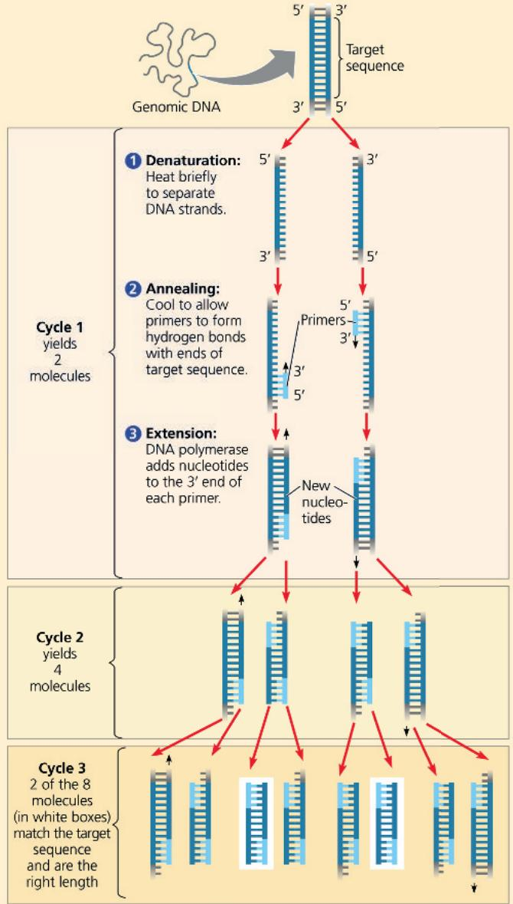

## Results

After three cycles, two molecules match the target sequence exactly. After 30 more cycles, over 1 billion ( $10^{9}$ ) molecules match.

In the PCR procedure, a three-step cycle causes a chain reaction that produces an exponentially growing population of identical DNA molecules. During each cycle, the reaction mixture is ① heated to high temperatures to denature (separate) the strands of the double-stranded DNA and then ② cooled to allow annealing (hydrogen bonding) of short, single-stranded DNA primers complementary to sequences on opposite strands at each end of the target sequence; finally, ③ a specialized DNA polymerase extends the primers in the $5'\rightarrow3'$ direction. This cycle is then repeated 30–40 times. If a standard DNA polymerase were used, this enzyme would be denatured along with the DNA during the first heating step and would have to be replaced after each cycle. The key to automating PCR was the discovery of an unusual heat-stable DNA polymerase enzyme called Taq polymerase, named after the bacterial species from which it was first isolated. This bacterial species, Thermus aquaticus, lives in hot springs, and the stability of its DNA polymerase at high temperatures is an evolutionary adaptation that enables the enzyme to function at temperatures up to $95^{\circ}$ C. Today, researchers also use a DNA polymerase from the archaeal species Pyrococcus furiosus. This enzyme, called Pfu polymerase, is more accurate and stable but more expensive than Taq polymerase.

PCR is speedy and very specific. Only a minuscule amount of DNA need be present in the starting material, and this DNA can be partially degraded, as long as there are a few copies of the complete target sequence. The key to the high specificity is the pair of primers used for each PCR amplification. The primer sequences are chosen so that they hybridize only to sequences at opposite ends of the target segment, one on the 3' end of each strand. (For high specificity, the primers must be at least 15 nucleotides long.) With each successive cycle, the number of target segment molecules of the correct length doubles, so the number of molecules equals $2^{n}$ , where n is the number of cycles. After 30 or so cycles, about a billion copies of the target sequence are present!

Despite its speed and specificity, PCR amplification cannot substitute for gene cloning in cells to make large amounts of a gene. This is because the polymerases that are used have no proofreading function, and occasional errors during PCR replication limit the number of good copies and the length of DNA fragments that can be copied. Instead, PCR is used to provide the specific DNA fragment for cloning. PCR primers are synthesized to include a restriction site at each end of the DNA fragment that matches the site in the cloning vector, and the fragment and vector are cut and ligated together (Figure 20.8). The resulting plasmids are sequenced so that those with error-free inserts can be selected.

Devised in 1985, PCR has had a major impact on biological research and genetic engineering. PCR has been used to amplify DNA from a wide variety of sources: a 40,000-year-old frozen woolly mammoth; fingerprints or tiny amounts of blood, tissue, or semen found at crime scenes; single embryonic cells for rapid prenatal diagnosis of genetic disorders (see Figure 14.19); and cells infected with viruses that are difficult to detect, such as

## Figure 20.8 Use of a restriction enzyme and PCR in gene cloning.

In a closer look at the beginning of the process shown in Figure 20.4, PCR is used to produce the DNA fragment or gene of interest that will be ligated into a cloning vector, in this case a bacterial plasmid.

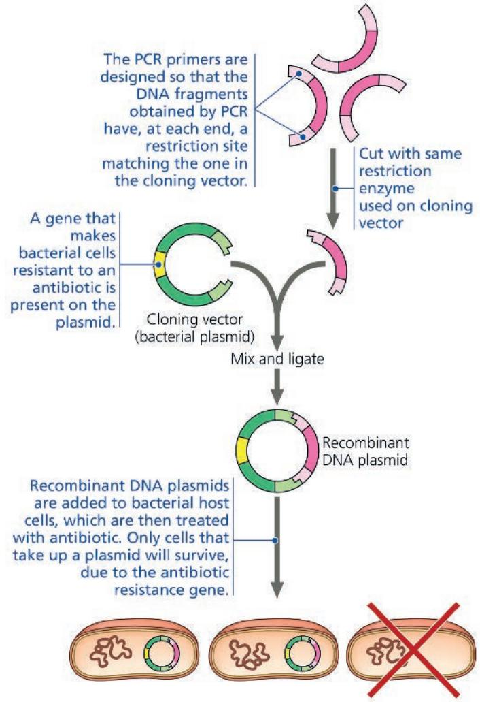

HIV. (To test for HIV, viral genes are amplified.) Also, PCR tests are used to accurately detect the presence of SARS-CoV-2 (the virus that causes COVID-19) even in patients without any symptoms. We'll return to these and other applications of PCR later in the chapter.

## Expressing Cloned Eukaryotic Genes

Once a gene has been cloned in host cells, its protein product can be expressed in large amounts for research or for practical applications, which we'll explore in Concept 20.4. Cloned genes can be expressed in either bacterial or eukaryotic cells; each option has advantages and disadvantages.

## Bacterial Expression Systems

Getting a cloned eukaryotic gene to function in bacterial host cells can be difficult because certain aspects of gene expression are different in eukaryotes and bacteria. To overcome differences in promoters and other DNA control sequences (see Concept 17.2), scientists usually employ an expression vector, a cloning vector that contains a highly active bacterial promoter just upstream of a restriction site where the eukaryotic gene can be inserted in the correct reading frame. The bacterial host cell will recognize the promoter and proceed to express the foreign gene now linked to that promoter. Such expression vectors allow the synthesis of many eukaryotic proteins in bacterial cells.

Another problem with expressing cloned eukaryotic genes in bacteria is the presence of noncoding regions (introns) in most eukaryotic genes (see Concept 17.3). Introns can make a eukaryotic gene very long and unwieldy, and they prevent correct expression of the gene by bacterial cells, which do not have RNA-splicing machinery. This problem can be surmounted by using a form of the gene that includes only the exons. (This is called complementary DNA, or cDNA; see Figure 20.10.)

## Eukaryotic DNA Cloning and Expression Systems

Molecular biologists can avoid eukaryotic-bacterial incompatibility by using eukaryotic cells such as yeasts as hosts for cloning and expressing eukaryotic genes. Yeasts, single-celled fungi, are as easy to grow as bacteria, and they have plasmids, a rarity among eukaryotes.

In addition to enabling RNA splicing, eukaryotic host cells are advantageous because many eukaryotic proteins will not function unless they are modified after translation—for example, by the addition of carbohydrate groups (glycosylation) or lipid groups in the ER and Golgi. Bacterial cells lack membrane-bound organelles and cannot carry out these modifications, and if the gene product requiring such processing is from a mammalian gene, even yeast cells may not be able to modify the protein correctly. Several cultured cell types have proved successful as host cells for this purpose, including some mammalian cell lines and an insect cell line that can be infected by a virus carrying recombinant DNA.

Scientists have developed other methods for introducing recombinant DNA into eukaryotic cells. In electroporation, a brief electrical pulse applied to a solution containing cells creates temporary holes in their plasma membranes, through which DNA can enter. (This technique is now commonly used for bacteria as well.) Alternatively, scientists can inject DNA directly into single eukaryotic cells using microscopically thin needles. Another way to get DNA into plant cells is by using the soil bacterium Agrobacterium tumefaciens, as we'll see later. Whatever the method, if the introduced DNA is incorporated into a cell's genome by genetic recombination, then it can be stably expressed by the cell. Expressing different versions of genes in cells allows researchers to study protein function, a topic we'll return to in Concept 20.2.

## Cross-Species Gene Expression and Evolutionary Ancestry

EVOLUTION The ability to express eukaryotic proteins in bacteria (even if the proteins can't be modified properly) is quite remarkable when we consider how different eukaryotic and bacterial cells are. In fact, examples abound of genes that are taken from one species and function perfectly well when transferred into another very different species, such as a firefly gene in a tobacco plant and a jellyfish gene in a pig (see Figure 17.7). These observations underscore the shared evolutionary ancestry of species living today.

One example involves a gene called Pax-6, which has been found in animals as diverse as vertebrates and fruit flies. The vertebrate Pax-6 gene product (the PAX-6 protein) triggers a complex program of gene expression resulting in formation of the vertebrate eye, which has a single lens. Expression of the fly Pax-6 gene leads to formation of the compound fly eye, which is quite different from the vertebrate eye. When the mouse Pax-6 gene was cloned and introduced into a fly embryo so that it replaced the fly's own Pax-6 gene, researchers were surprised to see that the mouse version of the gene led to formation of a compound fly eye (see Figure 50.16). Conversely, when the fly Pax-6 gene was transferred into a vertebrate embryo—a frog, in this case—a frog eye formed. Although the genetic programs triggered in vertebrates and flies generate very different eyes, the two versions of the Pax-6 gene can substitute for each other to trigger lens development, evidence of their evolution from a gene in a very ancient common ancestor. Because of their ancient evolutionary roots, all living organisms share the same basic mechanisms of gene expression. This commonality is the basis of many recombinant DNA techniques described in this chapter.

## Concept Check 20.1

1. MAKE CONNECTIONS The restriction site for an enzyme called PvuI is the following sequence:

## $5^{\prime}$ -CGATCG- $3^{\prime}$ $3^{\prime}$ -GCTAGC- $5^{\prime}$

Staggered cuts are made between the T and C on each strand. What type of bonds are being cleaved? (See Concept 5.5.)

2. DRAW IT One strand of a DNA molecule has the following sequence:

## 5′-CTTGACGATCGTTACCG-3′

Draw the other strand. Will PvuI (see question 1) cut this molecule? If so, draw the products.

3. What are some potential difficulties in using plasmid vectors and bacterial host cells to produce large quantities of proteins from cloned eukaryotic genes?

4. VISUAL SKILLS Compare Figure 20.7 with Figure 16.21. How does replication of DNA ends during PCR proceed without shortening the fragments each time?

For suggested answers, see Appendix A.

# Concept 20.2: Biologists use DNA technology to study gene expression and function

To see how a biological system works, scientists seek to understand the functioning of the system's component parts. Analysis of when and where a gene or group of genes is expressed can provide important clues about their function and how they contribute to the organism as a whole.

## Analyzing Gene Expression

Biologists driven to understand the assorted cell types of a multicellular organism, cancer cells, or the developing tissues of an embryo first try to discover which genes are expressed by the cells of interest. The most straightforward way to do this is usually to identify the mRNAs being made. We'll first examine techniques that look for patterns of expression of specific individual genes. Next, we'll explore ways to characterize groups of genes being expressed by cells or tissues of interest. As you will see, all of these procedures depend in some way on base pairing between complementary nucleotide sequences.

## Studying the Expression of Single Genes

Suppose we have cloned a gene that we suspect plays an important role in the embryonic development of Drosophila melanogaster (the fruit fly). The first thing we might wonder is which embryonic cells express the gene—in other words, where in the embryo is the corresponding mRNA found? We can detect the mRNA in an embryonic sample using nucleic acid hybridization with molecules of complementary sequence to the mRNA we want to follow. Using our cloned gene as a template, we can synthesize a short, single-stranded nucleic acid (either RNA or DNA) complementary to the mRNA of interest; this is called a nucleic acid probe. For example, if part of the sequence on the mRNA were

## 5' ...CUCAUCACCGGC ... 3'

then we would synthesize this single-stranded DNA probe:

## 3' GAGTAGTGGCCG 5'

Each probe molecule is labeled during synthesis with a fluorescent tag so we can follow it. A solution containing probe molecules is applied to Drosophila embryos, allowing the probe to hybridize specifically with any complementary sequences on the many mRNAs in embryonic cells in which the gene is being transcribed. Because this technique allows us to see the mRNA in place (or in situ, in Latin) in the intact organism, this technique is called in situ hybridization. Different probes can be labeled with different fluorescent dyes, sometimes with strikingly beautiful results (Figure 20.9).

Figure 20.9 Determining where single genes are expressed by in situ hybridization analysis.

This Drosophila embryo was incubated in a solution containing DNA probes for five different mRNAs, each probe labeled with a different fluorescently colored tag. The embryo was then viewed using fluorescence microscopy. Each color marks where a specific gene is expressed as mRNA. The arrows from the groups of yellow and blue cells above the micrograph show a magnified view of nucleic acid hybridization of the appropriately colored probe to the mRNA. The thorax (trunk) and abdomen are made up of repeating segments. Yellow cells (expressing the wg gene) interact with blue cells (expressing the en gene); their interaction helps establish the pattern in a body segment.

The yellow DNA probe hybridizes with mRNAs in cells that are expressing the wingless (wg) gene, which encodes a secreted signaling protein.

The blue DNA probe hybridizes with mRNAs in cells that are expressing the engrailed (en) gene, which encodes a transcription factor.

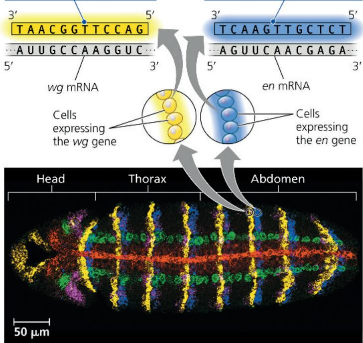

Other mRNA detection techniques may be preferable for comparing the amounts of a specific mRNA in several samples at the same time—for example, in different cell types or in embryos of different stages. One method that is widely used is called the reverse transcriptase polymerase chain reaction, or RT-PCR.

RT-PCR begins by turning sample sets of mRNAs into double-stranded DNAs with the corresponding sequences. First, the enzyme reverse transcriptase (from a retrovirus; see Figure 19.9) is used to synthesize a complementary DNA copy (a reverse transcript) of each mRNA in the sample (Figure 20.10, on the next page). The mRNA is then degraded by addition of a specific enzyme, and a second DNA strand, complementary to the first, is synthesized by DNA polymerase. The resulting double-stranded DNA is called complementary DNA (cDNA). (Made from mRNA, cDNA lacks introns and can be used for protein expression in bacteria, as mentioned earlier.) To analyze the timing of expression of the Drosophila gene of interest, for example, we would first isolate all the mRNAs from different stages of Drosophila embryos and make cDNA from each stage (Figure 20.11).

Figure 20.10 Making complementary DNA (cDNA) from eukaryotic genes.

Complementary DNA is made in a test tube using mRNA as a template for the first strand. Only one mRNA is shown after step 1, but the final collection of cDNAs would reflect all the mRNAs present in the cell.

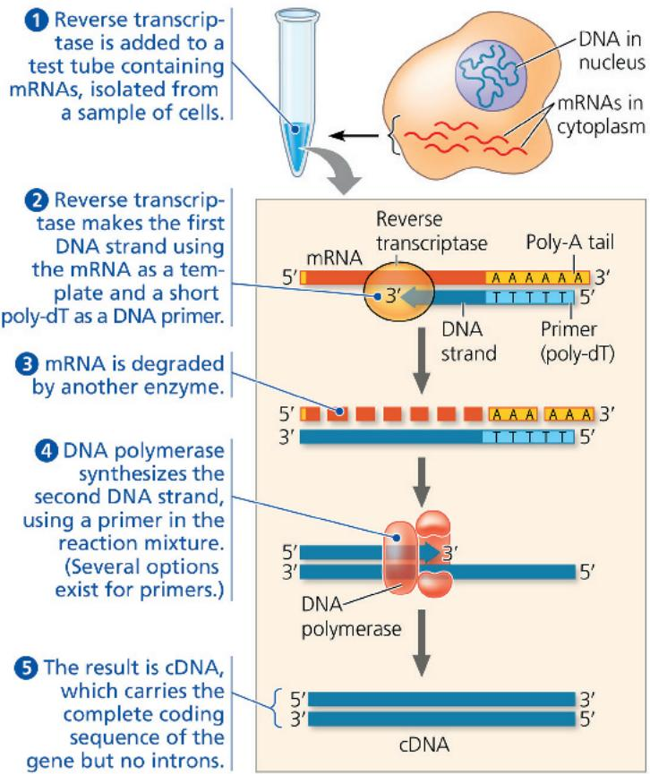

Next in RT-PCR is the PCR step (see Figure 20.7). As you will recall, PCR is a way of rapidly making many copies of one specific stretch of double-stranded DNA, using primers that hybridize to the opposite ends of the segment that we are interested in studying. In our case, we would add primers corresponding to a segment of our Drosophila gene, using the cDNA from each embryonic stage as a template for PCR amplification in separate samples. When the products are analyzed on a gel, copies of the amplified region will be observed as bands only in samples that originally contained mRNA from the gene being studied. This method can tell researchers whether an mRNA is present, but not how much is there.

Accurate measurement of mRNA levels requires newer, more quantitative PCR machines that use a dye that fluoresces only when bound to a double-stranded PCR product. This technique, called quantitative RT-PCR (qRT-PCR), can detect the light and measure the PCR product, thus avoiding the need for electrophoresis while providing quantitative data, a distinct advantage. Both RT-PCR and qRT-PCR can also be carried out with mRNAs collected from different tissues at one time to discover which tissue is producing a specific mRNA.

Instructors: The Scientific Skills Exercise “Analyzing Quantitative and Spatial Gene Expression Data” can be assigned in Mastering Biology. Students can work with data from an experiment that investigated mRNA expression using both in situ hybridization and quantitative RT-PCR.

## Figure 20.11

## Research Method: RT-PCR Analysis of the Expression of Single Genes

## Application

RT-PCR uses the enzyme reverse transcriptase (RT) in combination with PCR and gel electrophoresis. RT-PCR can be used to compare gene expression between samples—for instance, in different embryonic stages, in different tissues, or in the same type of cell under different conditions.

## Technique

In this example, samples containing mRNAs from six embryonic stages of Drosophila were analyzed for a specific mRNA as shown below. (In steps 1 and 2, the mRNA from only one stage is shown.)

1 cDNA synthesis is carried out by incubating the mRNAs from each stage with reverse transcriptase and other necessary components.

2 PCR amplification is then performed using primers specific to the Drosophila gene of interest to see whether its mRNA was present in each sample.

3 Gel electrophoresis will reveal amplified DNA products only in samples that contained mRNA transcribed from the specific Drosophila gene.

## Results

The mRNA for this gene is expressed from stage 2 through stage 6. The size of the amplified fragment (shown by its position on the gel) depends on the distance between the primers that were used (not on the size of the mRNA).

## Studying the Expression of Interacting Groups of Genes

While the techniques described above can analyze expression of only one or a few known genes, a major goal of biologists is to learn how genes act together to produce and maintain a functioning organism. Now that the genomes of a number of species have been sequenced, it is possible to study the expression of

Green cDNA Genes that were expressed in tissue 2 bind to green cDNAs.

large groups of genes—an approach called the systems approach. Researchers use what is known about the whole genome to investigate which genes are transcribed in different tissues or at different stages of development, or even in single cells. One aim is to identify networks of gene expression across an entire genome.

To accomplish such genome-wide expression studies, today's rapid, inexpensive DNA-sequencing methods allow researchers to discover which genes are expressed by simply sequencing the cDNA samples from different tissues or different embryonic stages. This straightforward method is called RNA sequencing, or RNA-seq (pronounced "RNA-seek"), even though it is the cDNA that is actually sequenced. In RNA-seq, the mRNA (or other RNA) samples are isolated, cut into shorter, similar-sized fragments, and converted into cDNAs (Figure 20.12). These short cDNA stretches are sequenced, and a computer program reassembles them, either mapping them onto the genome of the species in question (when available) or simply putting the fragments in order from scratch based on overlapping sequences of multiple RNAs.

A helpful adaptation of RNA-seq that is becoming more widely used is called single-cell RNA-seq. In this technique, the cells of a tissue or a tumor, for instance, are separated into individual wells or droplets, then each cell is subjected to the steps of RNA-seq to analyze which genes are being expressed in that cell. This is particularly useful when analyzing

## Figure 20.12 Use of RNA sequencing (RNA-seq) to analyze expression of many genes.

RNA-seq yields a wide range of information about expression of genes, including their level of expression.

1 mRNAs are isolated from the tissue being studied.

② mRNAs are cut into similar-sized, small fragments.

3 mRNAs are reverse-transcribed into cDNAs of the same size.

④ cDNAs are sequenced.

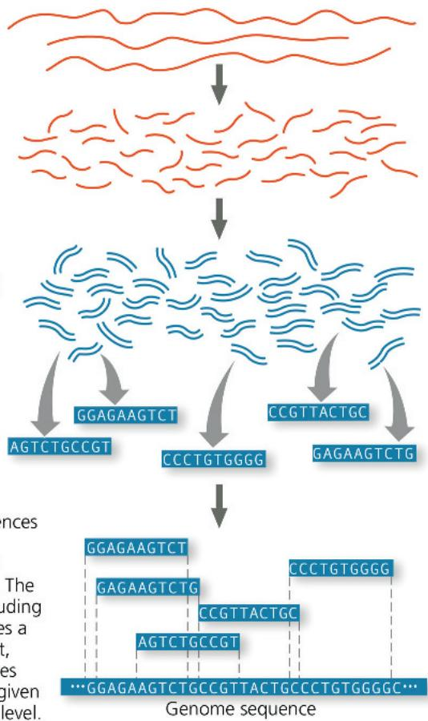

5 The short sequences are mapped by computer onto the genome sequence. The resulting data, including the number of times a sequence is present, indicate which genes are expressed in a given tissue and at what level.

heterogeneous tissues where gene expression patterns of rare but important cells are masked by the overall average gene expression in the entire tissue. For example, it allows researchers and clinicians to identify a small number of cells in a tumor that are resistant to the particular treatment being used, based on their gene expression.

Several characteristics make RNA-seq a powerful technique. First, it is not based on hybridization with a labeled probe, so it doesn't depend on knowing genomic sequences. Second, it can measure levels of expression over a very wide range. Third, a careful analysis provides a wealth of information about expression of a particular gene, such as relative levels of alternatively spliced mRNAs. In most cases, however, expression of individual genes still needs to be confirmed by RT-PCR.

An older method of genome-wide expression studies, called DNA microarray assays, is less powerful than RNA-seq but is still used for some applications, such as fetal testing (see Figure 14.19). A DNA microarray consists of tiny amounts of a large number of single-stranded DNA fragments representing different genes fixed to a glass slide in a tightly spaced array, or grid, of dots. (The microarray is also called a DNA chip by analogy to a computer chip.) The mRNAs from the cells being studied are reverse-transcribed into cDNAs (see Figure 20.10), and a fluorescent label is added so the cDNAs can be used as probes on the microarray. Different fluorescent labels are used for different cell samples so that multiple samples can be tested in the same experiment. The resulting pattern of colored dots, shown in an actual-size microarray in Figure 20.13, reveals the

## Figure 20.13 Use of microarrays to analyze expression of many genes.

Researchers extracted mRNAs from two different human tissues and synthesized two sets of cDNAs, fluorescently labeled red (tissue 1) or green (tissue 2). Labeled cDNAs were hybridized with a microarray containing 5,760 human genes (about 25% of human genes), part of which is shown in the enlargement. Red indicates that the gene in that well was expressed in tissue 1, green in tissue 2, yellow in both, and black in neither. The fluorescence intensity at each spot indicates the relative expression of the gene.

DNA microarray (actual size). Each dot is a well containing identical copies of DNA fragments that carry a specific gene.

Red cDNA

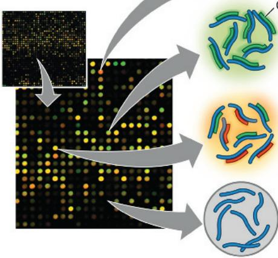  
Genes that were expressed in tissue 1 bind to red cDNAs made from mRNAs in that tissue.  
Genes that were expressed in both tissues bind both red and green cDNAs; these wells appear yellow.

Genes that were not expressed in either tissue do not bind either cDNA; these wells appear black.

dots to which each probe was bound and thus the genes that are expressed in the cell samples being tested.

Scientists can now measure the expression of thousands of genes at one time. DNA technology makes such studies possible; with automation, they are easily performed on a large scale. By uncovering gene interactions and providing clues to gene function, DNA microarray assays and RNA-seq may contribute to a better understanding of diseases and suggest new diagnostic techniques or therapies. For instance, comparing patterns of gene expression in breast cancer tumors and noncancerous breast tissue has already resulted in more informed and effective treatment protocols (see Figure 18.27). Ultimately, information from these methods should provide a grander view of how ensembles of genes interact to form an organism and maintain its vital systems.

## Determining Gene Function

Once they identify a gene of interest, how do scientists determine its function? A gene's sequence can be compared with sequences in other species. If the function of a similar gene in another species is known, one might suspect that the gene product in question performs a comparable task. Data about the location and timing of gene expression may reinforce the suggested function. To obtain stronger evidence, one approach is to disable the gene and then observe the consequences in the cell or organism.

## Editing Genes and Genomes

Molecular biologists have long sought techniques for altering, or editing, the genetic material of cells or organisms in a predictable way. In one such technique, called in vitro mutagenesis, specific mutations are introduced into a cloned gene, and the mutated gene is returned to a cell in such a way that it disables (“knocks out”) the normal cellular copies of the same gene. If the introduced mutations alter or destroy the function of the gene product, the phenotype of the mutant cell may help reveal the function of the missing normal protein.

In Concept 17.5, you read about the CRISPR-Cas9 system, the powerful new technique for gene editing in living cells and organisms that has taken the field of genetic engineering by storm (see Figure 17.28). This system, worked out by Jennifer Doudna (Figure 20.14) and Emmanuelle Charpentier, is a highly effective way for researchers to knock out a given gene in order to study what that gene does. It has already been used in many organisms, including bacteria, fish, mice, insects, human cells, and various crop plants. Modifications of the technique allow researchers to repair a gene that has a mutation. This approach is used for gene therapy, which will be discussed later in the chapter.

In another application of the CRISPR-Cas9 system, scientists are attempting to address the global problem of insect-borne diseases by altering genes in insects so that, for example, they cannot transmit disease. An extra twist to this approach is to engineer the new allele so that it is much more highly favored for inheritance than the wild-type allele. This strategy is called a gene drive because the biased inheritance of the engineered gene during reproduction rapidly “drives” the new allele through the population.

Figure 20.14 Jennifer Doudna holding a model of CRISPR-Cas9.

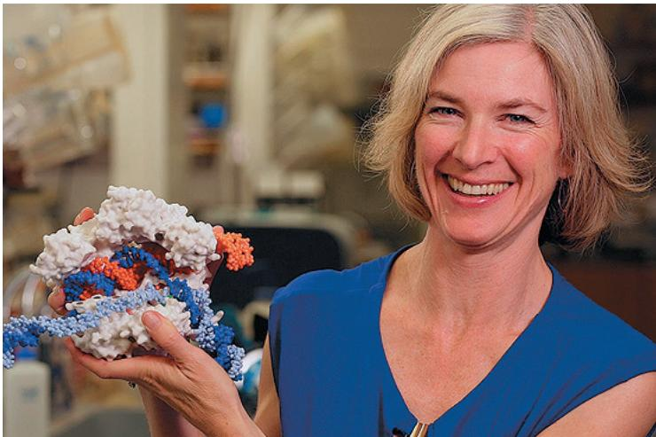

Concerns have been raised about unpredictable negative effects of permanent genetic changes in wild populations, such as mosquitoes. In 2025, one group of researchers modified the gene drive protocol so that the CRISPR-Cas9 system itself would not be replicated in the insects. This allowed the desired genetic change to be temporary, and ensured that the population would gradually revert back to its wild-type genome.

## Other Methods for Studying Gene Function

Another method for silencing expression of selected genes doesn't alter the genome; instead, it exploits the phenomenon of RNA interference (RNAi), described in Concept 18.3. This experimental approach uses synthetic double-stranded RNA molecules matching the sequence of a particular gene to trigger breakdown of the gene's messenger RNA or to block its translation. In organisms such as the nematode and the fruit fly, RNAi has already proved valuable for analyzing the functions of genes on a large scale. This method is quicker than using the CRISPR-Cas9 system, but it leads to only a temporary reduction of gene expression rather than a permanent gene knockout or alteration.

In humans, ethical considerations prohibit knocking out genes to determine their functions. An alternative approach to identifying disease-causing genes is to analyze the genomes of large numbers of people with a certain phenotypic condition or disease, such as heart disease or diabetes, to try to find differences they all share compared with people without that condition. The logic is that these differences may be associated with one or more malfunctioning genes and thus in a sense are naturally occurring gene knockouts. In these large-scale analyses, called genome-wide association studies, researchers look for genetic markers, DNA sequences that vary in the population. In a gene, such sequence variation is the basis of different alleles, as we have seen for sickle-cell disease (see Figure 17.26). And just like the coding sequences of genes, noncoding DNA at a specific locus on a chromosome may exhibit small nucleotide differences among individuals. Variations in coding or noncoding DNA sequences among a population are called polymorphisms (from the Greek for “many forms”).

## Interview

Interview with Charles Rotimi: Using genomics to study health-related conditions in African-Americans (eTextbook only)

Among the most useful genetic markers in tracking down genes that contribute to diseases and disorders are single base-pair variations in the genomes of the human population. For more than 99% of the nucleotides in the human genome, virtually all people have the same nucleotide in each position. However, once in every 100–300 base pairs of both coding and noncoding DNA sequences are positions where the sequence varies between individuals. A single base-pair site where variation is found in at least 1% of the population is called a single nucleotide polymorphism (SNP, pronounced “snip”); a few million SNPs occur in the human genome. To find SNPs in large numbers of people, it isn’t necessary to sequence their DNA; SNPs can be detected by very sensitive microarray assays, RNA-seq, or PCR.

Once a SNP is identified that is found in all people affected by the disease being studied, researchers focus on that region and sequence it. In nearly all cases, the SNP itself does not contribute directly to the disease in question by altering the encoded protein; in fact, most SNPs are in noncoding regions. Instead, having a particular SNP associated with a disease suggests that the gene whose mutation causes the disease is located very close to that SNP on that chromosome. This closeness (genetic linkage; see Concept 15.3) means that crossing over between the SNP and the gene is very unlikely during gamete formation. Therefore, the SNP and gene are almost always inherited together, so the SNP acts as a genetic marker for the disease-causing allele (Figure 20.15). SNPs have been found that correlate with diabetes, heart disease, and several types of cancer, and the search is on for genes that might be involved in these and other inherited conditions.

The experimental approaches you have learned about thus far focus on working with molecules, mainly DNA and proteins. In a parallel line of inquiry, biologists have been developing powerful techniques for cloning whole multicellular organisms. One aim of this work is to obtain special types of cells, called stem cells, that can give rise to all types of tissues. Being able to manipulate stem cells would allow scientists to use the DNA-based methods previously discussed to alter stem cells for the treatment of diseases. Methods involving the cloning of organisms and production of stem cells are the subject of the next section.

## Figure 20.15 Single nucleotide polymorphisms (SNPs) as genetic markers for disease-associated alleles.

This diagram depicts the same region of the genome from two groups of individuals, one group having a particular disease or condition with a genetic basis. Unaffected people have an AT pair at a given SNP locus, while affected people have a CG pair there. Once the allele is confirmed as being associated with the disease in question, the SNP that varies in this way can be used as a marker for the disease-associated allele.

## Concept Check 20.2

1. Describe the role of complementary base pairing during RT-PCR, RNA sequencing, and DNA microarray analysis.

2. VISUAL SKILLS Consider the microarray in Figure 20.13. If a sample from normal tissue is labeled with a green fluorescent dye and a sample from cancerous tissue is labeled red, what color spots would represent genes you would be interested in if you were studying cancer? Explain.

For suggested answers, see Appendix A.

## Concept 20.3: Cloned organisms and stem cells are useful for basic research and other applications

Along with advances in DNA technology, scientists have been developing and refining methods for cloning whole multicellular organisms from single cells. In this context, cloning produces one or more organisms that are genetically identical to the “parent” that donated the single cell. This is often called organismal cloning to differentiate it from gene cloning and, more significantly, from cell cloning—the division of an asexually reproducing cell such as a bacterium into a group of genetically identical cells. (The common theme is that the product is genetically identical to the parent.) The current interest in organismal cloning is primarily due to its ability to generate stem cells. A stem cell is a relatively unspecialized cell that can both reproduce itself indefinitely and, under appropriate conditions, differentiate into specialized cells of one or more types. Stem cells have great potential for regenerating damaged tissues.

The cloning of plants and animals was first attempted over 50 years ago in experiments designed to answer basic questions about the genetic potential of single cells. For example, researchers wondered if all the cells of an organism have the same genes or whether cells lose genes during the process of differentiation (see Concept 18.4). One way to answer this question is to see whether a differentiated cell can generate a whole organism—in other words, whether cloning an organism is possible. Let's discuss these early experiments before we consider more recent progress in organismal cloning and procedures for producing stem cells.

## Cloning Plants: Single-Cell Cultures

The successful cloning of whole plants from single differentiated cells was accomplished at Cornell University during the 1950s by F. C. Steward and his students, who worked with carrot plants. They found that differentiated cells taken from the root (the carrot) and incubated in culture medium could grow into normal adult plants, each genetically identical to the parent plant. These results showed that differentiation does not necessarily involve irreversible changes in the DNA. In plants, mature cells can “dedifferentiate” and then give rise to all the specialized cell types of the organism; any cell with this potential is said to be totipotent.

Plant cloning is used extensively in agriculture. For plants such as orchids, cloning is the only commercially practical means of producing new plants. In other cases, cloning has been used to reproduce a plant with valuable characteristics, such as resistance to plant pathogens. In fact, you yourself may be a plant cloner: If you have ever grown a new plant from a cutting, you have practiced cloning!

## Cloning Animals: Nuclear Transplantation

Differentiated cells from animals generally do not divide in culture, much less develop into the multiple cell types of a new organism. Therefore, early researchers had to use a different approach to answer the question of whether differentiated animal cells are totipotent. Their approach was to remove the nucleus of an egg (creating an enucleated egg) and replace it with the nucleus of a differentiated cell, a procedure called nuclear transplantation, now more commonly called somatic cell nuclear transfer. If the nucleus from the differentiated donor cell retains its full genetic potential, then it should be able to direct development of the recipient cell into all the tissues and organs of an organism. Such experiments were conducted on one species of frog (Rana pipiens) by Robert Briggs and Thomas King in the 1950s and on another frog species (Xenopus laevis) by John Gurdon in the 1970s (Figure 20.16). These researchers transplanted a nucleus from an embryonic or tadpole cell into an enucleated egg of the same species. In Gurdon's experiments, the transplanted nucleus was often able to support normal development of the egg into a tadpole. However, he found that the potential of a transplanted nucleus to direct normal development was inversely related to the age of the donor: The older the donor nucleus, the lower the percentage of normal tadpoles.

From these results, Gurdon concluded that something in the nucleus does change as animal cells differentiate. In frogs and most other animals, nuclear potential tends to be restricted more and more as embryonic development and cell differentiation progress. These were foundational experiments that ultimately led to stem cell technology, and Gurdon received the 2012 Nobel Prize in Medicine for this work.

## Reproductive Cloning of Mammals

In addition to cloning frogs, researchers were able to clone mammals using early embryonic cells as a source of donor nuclei. Until several decades ago, though, it was not known whether a nucleus from a fully differentiated cell could be reprogrammed successfully to act as a donor nucleus. In 1997, researchers in Scotland announced the birth of Dolly, a lamb cloned from an adult sheep by nuclear transfer from a differentiated mammary gland cell (Figure 20.17). Using a technique related to that in Figure 20.16, the researchers implanted early embryos into surrogate mothers. Out of several hundred embryos, one successfully completed normal development, and Dolly was born, a genetic clone of the nucleus donor. By the age of 6, Dolly had developed premature arthritis, and complications from a lung infection led to her euthanization. This led to speculation that this sheep's cells were in some way not quite as healthy as those of a normal sheep, possibly reflecting incomplete reprogramming

## Figure 20.16

## Inquiry: Can the nucleus from a differentiated animal cell direct development of an organism?

## Experiment

John Gurdon and colleagues at Oxford University, in England, destroyed the nuclei of frog (Xenopus laevis) eggs by exposing the eggs to ultraviolet light. They then transplanted nuclei from cells of frog embryos and tadpoles into the enucleated eggs.

## Results

When the transplanted nuclei came from an early embryo, the cells of which are relatively undifferentiated, most of the recipient eggs developed into tadpoles. But when the nuclei came from the fully differentiated intestinal cells of a tadpole, fewer than 2% of the eggs developed into normal tadpoles, and most of the embryos stopped developing at a much earlier stage.

## Conclusion

The nucleus from a differentiated frog cell can direct development of a tadpole. However, its ability to do so decreases as the donor cell becomes more differentiated, presumably because of changes in the nucleus.

Data from J. B. Gurdon et al., The developmental capacity of nuclei transplanted from keratinized cells of adult frogs, Journal of Embryology and Experimental Morphology 34:93–112 (1975).

WHAT IF? If each cell in a four-cell embryo was already so specialized that it was not totipotent, what results would you predict for the experiment on the left side of the figure?
For suggested answer, see Appendix A.

Figure 20.17 Reproductive cloning of a mammal by nuclear transfer.

Dolly, shown here as a lamb, has a very different appearance from her surrogate mother, standing beside her.

of the original transplanted nucleus. Reprogramming involves epigenetic changes that lead to changes in chromatin structure (see Concept 18.2), to be discussed shortly.

Since that time, researchers have cloned many other mammals, including mice, cats, cows, horses, pigs, and dogs. In 2018, Chinese biologists reported the first cloning of a primate, the long-tailed macaque, using the same technique that was used to clone Dolly the sheep. Then, in 2019, a different team of researchers in China announced that they had been able to culture macaque embryos in the lab, without using a surrogate mother, for 20 days after fertilization. In this case, the aim was to be able to observe early embryonic events that cannot normally be seen. However, in most cases, the research goal has been the production of new individuals, known as reproductive cloning.

We have learned from such experiments that cloned animals of the same species are not always identical. For example, in 2016, scientists examined four 7- to 9-year-old clones genetically identical to Dolly and concluded that, unlike Dolly, they were healthy and aging normally. Another example of nonidentity in clones is the first cloned cat, named CC for Carbon Copy (Figure 20.18). The color and pattern of her calico coat differed

Figure 20.18 CC (“Carbon Copy”), the first cloned cat (right), and her single parent.

Rainbow (left) donated the nucleus in a cloning procedure that resulted in CC. However, the two cats are not identical: Rainbow is a classic calico cat with orange patches on her fur and has a “reserved personality,” while CC has a gray and white coat and is more playful.

from that of her single female parent because of random X chromosome inactivation, which is a normal occurrence during embryonic development (see Figure 15.8). And identical human twins, which are naturally occurring “clones,” are always slightly different. Clearly, environmental influences and random phenomena play a significant role during development.

## Epigenetic Differences in Cloned Animals

In most nuclear transplantation studies thus far, only a small percentage of cloned embryos develop normally to birth. And like Dolly, many cloned animals exhibit defects. Cloned mice, for instance, are prone to obesity, pneumonia, liver failure, and premature death. Scientists assert that even cloned animals that appear normal are likely to have subtle defects.

Researchers have uncovered some reasons for the low efficiency of cloning and the high incidence of abnormalities. In the nuclei of fully differentiated cells, a small subset of genes is turned on and expression of the rest of the genes is repressed. This regulation often is the result of epigenetic changes in chromatin, such as acetylation of histones or methylation of DNA (see Figure 18.7). During the nuclear transfer procedure, many of these changes must be reversed in the later-stage nucleus from a donor animal for genes to be expressed or repressed appropriately in earlier stages of development. Researchers have found that the DNA in cells from cloned embryos, like that of differentiated cells, often has abnormally high numbers of methyl groups. This finding suggests that the reprogramming of donor nuclei requires more accurate and complete chromatin restructuring than occurs during cloning procedures. Because DNA methylation helps regulate gene expression, misplaced or extra methyl groups in the DNA of donor nuclei may interfere with the pattern of gene expression necessary for normal embryonic development. In fact, the success of a cloning attempt may depend in large part on whether or not the chromatin in the donor nucleus can be artificially modified to resemble that of a newly fertilized egg.

## Stem Cells of Animals

Progress in cloning mammalian embryos, including primates, has heightened speculation about the cloning of humans, which has not yet been achieved past very early embryonic stages. The main reason researchers have been trying to clone human embryos is not for reproduction, but for the production of stem cells to treat human diseases. Recall that a stem cell is a relatively unspecialized cell that can both reproduce itself indefinitely and, under appropriate conditions, differentiate into specialized cells of one or more types (Figure 20.19, on the next page).

## Embryonic and Adult Stem Cells

Many early animal embryos contain stem cells capable of giving rise to differentiated cells of any type. Stem cells can be isolated from early embryos at a stage called the blastula stage or its human equivalent, the blastocyst stage. In culture, these embryonic stem (ES) cells reproduce indefinitely, and depending on culture conditions, they can be made to differentiate into a wide variety of specialized cells (Figure 20.20), including even eggs and sperm.

The adult body also has stem cells, which serve to replace nonreproducing specialized cells as needed. In contrast to ES cells,

Figure 20.19 How stem cells maintain their own population and generate differentiated cells.

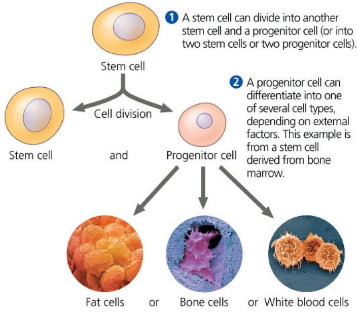  
Figure 20.20 Working with stem cells.

Animal stem cells, which can be isolated from early embryos or adult tissues and grown in culture, are self-perpetuating, relatively undifferentiated cells. Embryonic stem cells are easier to grow than adult stem cells and can theoretically give rise to all types of cells in an organism. The range of cell types that can arise from adult stem cells is not yet fully understood.

adult stem cells are not able to give rise to all cell types in the organism, though they can generate several defined types. For example, one of the several types of stem cells in bone marrow can generate all the different kinds of blood cells (see Figure 20.20), and another type of bone marrow stem cell can differentiate into bone, cartilage, fat, muscle, and the linings of blood vessels. To the surprise of many, the adult brain has been found to contain stem cells that continue to produce certain kinds of nerve cells there. Researchers have also reported finding stem cells in skin, hair, eyes, and dental pulp. Although adult animals have only tiny numbers of stem cells, scientists are learning to identify and isolate these cells from various tissues and, in some cases, to grow them in culture. With the right culture conditions (for instance, the addition of specific growth factors), cultured stem cells from adult animals have been made to differentiate into various defined types of specialized cells, although none are as versatile as ES cells.

Research with embryonic or adult stem cells is a source of valuable data about differentiation and has enormous potential for medical applications. The ultimate aim is to supply cells for the repair of damaged or diseased organs: For example, insulin-producing pancreatic cells for people with type 1 diabetes or certain kinds of brain cells for people with Parkinson's disease or Huntington's disease. Adult stem cells from bone marrow have long been used in bone marrow transplants as a source of immune system cells in patients whose own immune systems are nonfunctional because of genetic disorders or radiation treatments for cancer.

The developmental potential of adult stem cells is limited to certain tissues. ES cells hold more promise than adult stem cells for most medical applications because ES cells are pluripotent, capable of differentiating into many different cell types. One source of ES cells, first reported in 2013, is cloned human blastocysts produced by transferring a nucleus from a differentiated cell into an enucleated egg (similar to cloning Dolly the sheep). Prior to that report, cells were obtained only from embryos donated by patients undergoing infertility treatments or from long-term cell cultures originally established with cells isolated from donated embryos, an issue that prompts ethical and political discussions. Although the techniques for cloning early human embryos are still being optimized and the ethics of this procedure are being actively discussed, cloned embryos represent a potential new source for ES cells that may be less controversial. Furthermore, with a donor nucleus from a person with a particular disease, researchers should be able to produce ES cells that match the patient and are thus not rejected by his or her immune system when used for treatment. When the main aim of cloning is to produce ES cells to treat disease, the process is called therapeutic cloning. Although most people believe that reproductive cloning of humans is unethical, opinions vary about the morality of therapeutic cloning.

This debate has intensified with a recent result reported by the same research team in China that previously cloned macaque embryos in the laboratory. In 2021, these researchers incorporated human stem cells into 6-day-old macaque embryos, creating so-called chimeric embryos—embryos formed by cells of two different species. Most of these chimeric embryos died, but a few (3 out of 91) persisted and had about 5% human cells. The research team described the possibility that this technology could lead to growing human organs in monkeys as a rationale for doing these experiments, but other scientists have been quite troubled by the ethical questions raised by this procedure.

## Induced Pluripotent Stem (iPS) Cells

In another approach to producing stem cells for research and therapy, researchers succeeded in 2007 in learning how to turn back the clock in fully differentiated cells, reprogramming them to act like ES cells. Differentiated cells can be transformed into a type of ES cell by various methods, including using a modified retrovirus to introduce extra, cloned copies of four “stem cell” master regulatory genes. The “deprogrammed” cells are known as induced pluripotent stem (iPS) cells because, in using this fairly simple laboratory technique to return them to their undifferentiated state, pluripotency has been restored. The experiments that first transformed human differentiated cells into iPS cells are described in Figure 20.21. Shinya Yamanaka received the 2012 Nobel Prize in Medicine for this work, shared with John Gurdon, whose work you read about in Figure 20.16.

By many criteria, iPS cells can perform most of the functions of ES cells, but there are some differences in gene expression and other cellular functions, such as cell division. At least until these differences are fully understood, the study of ES cells will continue to make important contributions to the development of stem cell therapies. (In fact, it is likely that ES cells will always be a focus of basic research as well.) In the meantime, work is proceeding using the iPS cells that have been experimentally produced.

There are two major potential uses for human iPS cells. First, cells from patients with particular diseases have been reprogrammed to become iPS cells, which act as model cells for studying the disease and potential treatments. Human iPS cell lines have already been developed from individuals with type 1 diabetes, Parkinson's disease, Huntington's disease, Down syndrome, and many other diseases. Second, in the field of regenerative medicine, a patient's own cells could be reprogrammed into iPS cells and then used to replace nonfunctional tissues, such as cells of the retina of the eye that have been damaged by a condition called age-related macular degeneration (AMD). Because the eye is easily accessible to treatment, while being fairly well isolated from the immune and circulatory systems, AMD

## Figure 20.21

# Inquiry: Can a fully differentiated human cell be “deprogrammed” to become a stem cell?

## Experiment

Shinya Yamanaka and colleagues at Kyoto University, in Japan, used a retroviral vector to introduce four genes into fully differentiated human skin fibroblast cells. The cells were then cultured in a medium that would support growth of stem cells.

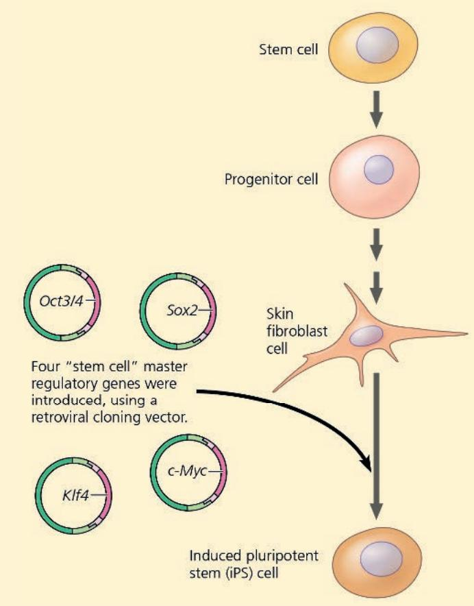  
Induced pluripotent stem (iPS) cell

## Results

Two weeks later, the cells resembled embryonic stem cells in appearance and were actively dividing. Their gene expression patterns, gene methylation patterns, and other characteristics were also consistent with those of embryonic stem cells. The iPS cells were able to differentiate into heart muscle cells, as well as other cell types.

## Conclusion

The four genes induced differentiated skin cells to become pluripotent stem cells, with characteristics of embryonic stem cells.

Data from K. Takahashi et al., Induction of pluripotent stem cells from adult human fibroblasts by defined factors, Cell 131:861–872 (2007).

WHAT IF? Patients with diseases such as heart disease or Alzheimer's could have their own skin cells reprogrammed to become iPS cells. Once affordable procedures have been developed for this and for converting iPS cells into heart or nervous system cells, the patients' own iPS cells might be used to treat their disease. When organs are transplanted from a donor to a recipient, the recipient's immune system may reject the transplant, a dangerous condition. Would using iPS cells be expected to carry the same risk? Why or why not? Given that these cells are actively dividing, undifferentiated cells, what risks might this procedure carry?

For suggested answer, see Appendix A.

and other sight disorders have been a frequent target of stem cell therapy. For instance, in the last decade, researchers have made iPS cells from skin or other cells from patients with AMD, caused them to differentiate into retinal cells, and implanted them into the patients' retinas. Thus far, there have been mixed results, depending in part on the source of the iPS cells. At best, deterioration of the patient's vision has been stopped, but some patients have experienced further loss of vision caused by factors associated with the procedure. Whether or not this approach will succeed, and be affordable enough for standard treatment, is still unknown.

Over time, the procedure may become less expensive, and some researchers have suggested creating a bank for storage of donor iPS cells that could be matched to patients' tissues. Development of techniques that direct iPS cells to become specific cell types for regenerative medicine is an area of intense research. If the challenges are met, iPS cells created in this way could eventually provide tailor-made "replacement" cells for patients without using any human eggs or embryos, thus circumventing most ethical objections.

## Concept Check 20.3

1. Based on current knowledge, how would you explain the difference in the percentage of tadpoles that developed from the two kinds of donor nuclei in Figure 20.16?

2. A few companies in China and South Korea provide the service of cloning dogs, using cells from their clients' pets to provide nuclei in procedures like that in Figure 20.17. Should their clients expect the clone to look identical to their original pet? Why or why not? What ethical questions does this bring up?

3. MAKE CONNECTIONS Based on what you know about muscle differentiation (see Figure 18.18) and genetic engineering, propose the first experiment you might try if you wanted to direct an embryonic stem cell or iPS cell to develop into a muscle cell.

For suggested answers, see Appendix A.

# Concept 20.4: The practical applications of DNA-based biotechnology affect our lives in many ways

In the last section, we'll survey the practical applications of DNA-based biotechnology, the manipulation of organisms or their components to make useful products. Today, major applications of DNA technology and genetic engineering include medical treatments and medication development, forensic evidence and genetic profiles, environmental cleanup, and agriculture.

## Medical Applications

One important use of DNA technology is the identification of human genes whose mutation plays a role in genetic diseases. These discoveries may lead to ways of diagnosing, treating, and even

preventing such conditions. DNA technology has also identified genes that play a role in a number of “nongenetic” diseases, from arthritis to AIDS, by influencing susceptibility to these diseases. Furthermore, a wide variety of diseases involve changes in gene expression within the affected cells and often within the patient’s immune system. By using RNA-seq and DNA microarray assays (see Figures 20.12 and 20.13) or other techniques to compare gene expression in healthy and diseased tissues, researchers are finding genes that are turned on or off in particular diseases. These genes and their products are potential targets for prevention or therapy.

## Diagnosis and Treatment of Diseases

A new chapter in the diagnosis of infectious diseases has been opened by DNA technology, in particular the use of PCR and labeled nucleic acid probes to track down pathogens. For example, because the sequence of the RNA genome of SARS-CoV-2 is known, RT-PCR can be used to amplify and therefore detect and quantify even a small amount of SARS-CoV-2 RNA in nasal or throat swab samples (see Figure 20.11). RT-PCR is often the best way to detect an otherwise elusive infectious agent.

Medical scientists can now diagnose hundreds of human genetic disorders by using PCR with primers that target the genes associated with these disorders. The amplified DNA product is then sequenced to reveal the presence or absence of the disease-causing mutation. Among the genes for human diseases targeted in this way are those for sickle-cell disease, hemophilia, cystic fibrosis, Huntington's disease, and Duchenne muscular dystrophy. Individuals with such diseases can often be identified before the onset of symptoms, even before birth (see Figure 14.19). PCR can also be used to identify symptomless carriers of potentially harmful recessive alleles as part of genetic counseling (see Concept 14.4).

## Personal Genome Analysis

As you learned earlier, genome-wide association studies have pinpointed SNPs (single nucleotide polymorphisms) that are linked to disease-associated alleles (see Figure 20.15). Individuals can be tested by PCR and sequencing for a SNP that is correlated with the abnormal allele. The presence of particular SNPs is correlated with increased risk for particular adverse health conditions such as heart disease, Alzheimer's disease, and some types of cancer.

Direct-to-consumer genome analysis companies offer kits allowing individuals to send in a swab containing cheek cells that the company will analyze genetically. Genetic testing for risk factors like heart disease, Alzheimer's disease, and some types of cancer is carried out by looking for linked SNPs that have been previously identified (see Figure 20.15). It may be helpful for individuals to learn about their health risks, with the understanding that such genetic tests merely reflect correlations and do not make predictions.

In addition to health-related genetic information, these companies compare a person's DNA segments with those from reference populations around the world, established from thousands of individuals of known ancestry. Based on how closely the segments match up, the report can tell an individual about their likely ancestral breakdown. Females can also learn about their maternal lines of descent, based on comparisons of mitochondrial

DNA, which is contributed to the egg only by the female parent. For males, an analysis of the sequence of the Y chromosome can trace their paternal lines of descent. As the size of the database used by these companies increases, the results become more refined and more accurate.

## Personalized Medicine

The techniques described in this chapter have also prompted improvements in disease treatments—for example, by knowing which specific cancer-related genes have been mutated in a particular patient's tumor. By analyzing the expression of many genes in large numbers of breast cancer patients, researchers can refine their understanding of the different subtypes of breast cancer (see Figure 18.27). Knowing the expression levels of particular genes in a given individual can help physicians determine the likelihood that the cancer will recur, thus helping them design an appropriate treatment. Given that some low-risk patients have a $96\%$ survival rate over a ten-year period with no treatment, gene expression analysis allows doctors and patients access to valuable information when they are considering treatment options.

Many researchers envision a future of personalized medicine, a type of medical care in which each person's specific genetic profile can provide information about diseases or conditions for which the person is especially at risk and help make health-care decisions. As we will see later in the chapter, a genetic profile is currently taken to mean a set of genetic markers such as SNPs. Ultimately, however, it will likely mean the complete DNA sequence of an individual—after sequencing becomes inexpensive enough. The ability to sequence a person's genome quickly and inexpensively is advancing rapidly, perhaps faster than development of appropriate treatments for the conditions. Still, the identification of genes involved in these conditions provides targets for therapeutic interventions.

An individual's genomic information can be used to predict the benefits and risks of particular medications, an approach called pharmacogenetics. There are over 300 medications for which the Food and Drug Administration recommends genetic testing for patients prior to their use.

## Human Gene Therapy and Gene Editing

Gene therapy—the introduction of genes into an afflicted individual for therapeutic purposes—holds great potential for treating the relatively small number of disorders traceable to a single defective gene. The aim of this approach is to insert a normal allele of the defective gene into the somatic cells of the tissue affected by the disorder.

For gene therapy of somatic cells to be permanent, the cells that receive the normal allele must be cells that multiply throughout the patient's life. Bone marrow cells, which include the stem cells that give rise to all the cells of the blood and immune system, are prime candidates. Figure 20.22 outlines one procedure for gene therapy in an individual whose bone marrow cells do not produce a vital enzyme because of a single defective gene. One type of severe combined immunodeficiency (SCID) is caused by this kind of defect. If the treatment is successful, the patient's bone marrow cells will begin producing the missing protein, and the patient may be cured.

A retrovirus that has been rendered harmless is used as a vector in this procedure, which exploits the ability of a retrovirus to insert a DNA transcript of its RNA genome into the chromosomal DNA of its host cell (see Figure 19.9). If the foreign gene carried by the retroviral vector is expressed, the cell and its descendants will possess the gene product. Cells that reproduce throughout life, such as bone marrow cells, are ideal candidates for gene therapy.

The procedure shown in Figure 20.22 was used in gene therapy trials for SCID in France in 2000, resulting in the first indisputable success of gene therapy. However, three patients subsequently developed leukemia, a type of blood cell cancer, and one of them died. Researchers have concluded it is likely that the insertion of the retroviral vector occurred near a gene that triggers the proliferation of blood cells. Using a viral vector that does not come from a retrovirus, clinical researchers have treated several other genetic diseases somewhat successfully with gene therapy, including a type of progressive blindness (see Concept 50.3), a degenerative disease of the nervous system, and a blood disorder involving the $\beta$ -globin gene.

Gene therapy raises many technical issues. For example, how can the activity of the transferred gene be controlled so that cells make appropriate amounts of the gene product at the right time and in the right place? How can we be sure that the insertion of the therapeutic gene does not harm some other necessary cell function? As more is learned about DNA control elements and gene interactions, researchers may be able to answer such questions.

A more direct approach that avoids the complications of using a viral vector in gene therapy is made possible by gene editing, especially using the CRISPR-Cas9 system (see Figure 17.28). In this approach, the existing defective gene is edited to correct the mutation.

Researchers have been using the CRISPR-Cas9 system to try to correct the genetic mutation that leads to sickle-cell disease. After studies using mouse models, CRISPR-based treatments for sickle-cell disease and another disease caused by a mutation of the $\beta$ -globin gene called beta-thalassemia were tested in human clinical trials. These disorders are good targets because they are caused by a mutation in a single gene, and they involve blood cells. The patients' blood cells are removed and genetically edited outside the body, then returned to the patient. In these clinical trials, rather than trying to correct the $\beta$ -globin mutation, the approach was to re-activate a gene for fetal hemoglobin, a different form that is normally turned off at birth but can substitute for $\beta$ -globin. A significant majority of patients showed remarkable results, having near-normal hemoglobin levels and not needing blood transfusions or experiencing pain crises. In 2024, this gene therapy treatment for these two blood-based disorders was approved for usage by the U.S. Food and Drug Administration (FDA). This is exciting, as it suggests that CRISPR technology could potentially treat or even cure human genetic diseases, such as autoimmune diseases, Parkinson's, or Alzheimer's disease, or even some types of cancer. As of 2025, more than 20 gene therapy treatments have been approved by the FDA.

There are ongoing concerns about introducing CRISPR-treated cells into humans because of the risks associated with cutting both strands of DNA and the possible effects on so-called “off-target genes,” genes that are not meant to be edited. Researchers are studying ways of minimizing these effects; for example, using different forms of Cas proteins that are more accurate. Another approach that has been successful is to use CRISPR in association with a new technique called base editing, in which specific bases in a gene are chemically modified to resemble a different base, rather than being cut and replaced. This is done in a way that alters the resulting protein so it is no longer harmful.

In addition to technical challenges, gene therapy and gene editing provoke ethical questions. Some critics believe that tampering with human genes in any way is unethical. Other observers see no fundamental difference between transplanting genes into somatic cells and transplanting organs from one person to another.

An even more pressing question is the issue of engineering human germ-line cells to try to correct a defect in future generations. Such genetic engineering is now routinely done in laboratory mice, and some methods for genetic engineering of human embryos have been developed.

The development of the CRISPR-Cas9 system has engendered much debate about the ethics of gene editing. Jennifer Doudna (Figure 20.14), a co-discoverer of CRISPR-Cas9, and other biologists have agreed to exercise extreme caution as the field moves forward. Together, they called for the research community to “strongly discourage” any experimental work on human eggs or embryos.

In spite of this general consensus among biologists, a Chinese researcher reported in 2018 that he had used the CRISPR-Cas9 system to edit genes in embryos that completed fetal development and were born as twins and a third individual. He claimed to have edited the CCR5 gene, which codes for a co-receptor for HIV (see Figure 7.8), so that HIV would be unable to bind and infect the cells. The twins' father was HIV-positive, which was the rationale the scientist used for carrying out this genetic engineering. However, this act was roundly condemned as highly unethical by the biological community; the researcher lost his job and was released in 2022 after 3 years in prison. In 2019, the World Health Organization established the Human Genome Editing Registry to monitor such research.

There are many potential technical problems with the CRISPR-Cas9 technique, like the off-target effects mentioned previously; there is strong evidence that off-target editing did occur in the three gene-edited individuals, although the consequences of these events are unknown at present. Beyond those technical concerns, however, are underlying ethical considerations: Under what circumstances, if any, should genomes of human germ lines be altered? Would alterations lead to the practice of eugenics, a deliberate effort to control the genetic makeup of human populations? It is imperative to consider these questions.

## Pharmaceutical Products

The pharmaceutical industry derives significant benefit from advances in DNA technology and genetic research, applying them to the development of useful drugs that can prevent, treat, or manage diseases. Pharmaceutical products are synthesized using methods of either organic chemistry or biotechnology, depending on the nature of the product.

## Cell and Tissue Culture Usage in Pharmaceutical Research

Cell and tissue culture involve growing and maintaining cells or tissues outside of their natural environment, typically in a Petri dish, flask, or larger vessel (see Figure 12.18). In this technique, the cells grow, divide, and function as they would inside a living organism, which allows researchers to investigate cellular interactions and responses. This fundamental approach offers insights for understanding diseases, discovering new drugs, and advancing therapies.

Recently, scientists have used innovative cell culture techniques to develop organoids, which are 3-dimensional, miniature versions of organs derived from stem cells (Figure 20.23). Organoids mimic the structure and function of human organs, making them useful for disease modeling, drug testing, personalized treatment, and in the future, even transplantation.

## Organic Synthesis of Small-Molecule Drugs

Small-molecule drugs, developed by organic synthesis, are a key tool of modern medicine because their small size allows them to enter cells and interact with proteins to alter biological processes. For example, aspirin is a common small-molecule

## Figure 20.23 Intestinal organoid.

This organoid was derived from adult intestinal stem cells that are grown into colonies, then treated with factors that cause differentiation into structures called intestinal crypts (the two tubes extending outward from the central cavity). Crypts contain both stem cells and support cells. The cells have been fluorescently stained for actin (green, which stains the apical part of the cell, by the lumen), nuclei (blue), and a support cell protein (red).

drug that inhibits an enzyme called cyclooxygenase to reduce pain, lower fever, and even improve blood flow during a heart attack.

Determining the sequence and structure of proteins crucial for tumor cell survival has led to the identification of small molecules that combat certain cancers by blocking the function of these proteins. One drug, imatinib (trade name Gleevec), is a small molecule that inhibits one tyrosine kinase (see Figure 11.8). The overexpression of this kinase, resulting from a chromosomal translocation, is instrumental in causing chronic myelogenous leukemia (CML; see Figure 15.16). Patients in the early stages of CML who are treated with imatinib have exhibited nearly complete, sustained remission from the cancer. Drugs that work in a similar way have also been used with success to treat a few types of lung and breast cancers. This approach is feasible only for cancers whose molecular basis is fairly well understood.

## Biologic Drugs Developed through Biotechnology

Biologic drugs (biologics) are a class of drugs derived from living organisms, including from cells. Unlike traditional small-molecule drugs, they are larger in size, more complex, and can target specific components in the body. Biologics work by interacting with specific molecules in the body, such as proteins, to alter cellular function or environment. Examples of biologics include recombinant proteins, vaccines, and monoclonal antibodies. As you'll learn in Concept 43.3, monoclonal antibodies are a group of antibodies that all recognize exactly the same region of a particular molecule. Monoclonal antibodies can block protein interactions, mark cells for destruction, and neutralize pathogens. Their use

as a cancer treatment has revolutionized cancer medicine because of their high specificity and prolonged therapeutic effects.

You learned earlier in the chapter about DNA cloning and gene expression systems for producing large quantities of a chosen protein that is present naturally in only minute amounts. The host cells used in such expression systems can even be genetically engineered to secrete a protein as it is made, thereby simplifying the task of purifying it by traditional biochemical methods.

Among the first biologics manufactured in this way were human insulin and human growth hormone (HGH). Some 2 million people with diabetes in the United States depend on insulin treatment to control their disease. Human growth hormone has been a boon to children born with a form of dwarfism caused by inadequate amounts of HGH, as well as helping patients with AIDS gain weight. Another important biologic produced by genetic engineering is tissue plasminogen activator (TPA). If administered shortly after a heart attack, TPA helps dissolve blood clots and reduces the risk of subsequent heart attacks.

In some cases, instead of using cell systems to produce large quantities of protein products, pharmaceutical scientists can use whole organisms. To do this, they use a transgene, a gene that has been transferred into one organism from another. They first remove eggs from a female of the recipient species and fertilize them in vitro. Meanwhile, they clone the desired gene from a donor organism. They then inject the cloned DNA directly into the nuclei of the fertilized eggs. Some of the cells integrate the foreign DNA, the transgene, into their genome and are able to express the foreign gene. The engineered embryos that arise from these zygotes are then surgically implanted in a surrogate female. If an embryo develops successfully, the result is a transgenic organism that expresses its new, “foreign” gene.

Assuming that the introduced gene encodes a protein desired in large quantities, transgenic animals can act as pharmaceutical “factories.” For example, a transgene for a human blood protein such as antithrombin, which prevents blood clots, can be inserted into the genome of a goat in such a way that the transgene’s product is secreted in the animal’s milk. The protein is then purified from the milk (which is easier than purification from a cell culture). Such proteins must be tested to ensure that they (or contaminants from the farm animals) will not cause allergic reactions or other adverse effects in patients who receive them.

## Biomaterials for Drug Delivery and Treatment

When treating patients with small molecule or biologic drugs, there are challenges such as rapid drug clearance from the body, poor drug absorption, or other difficulties. Biomaterials are naturally or synthetically derived materials that have a wide range of applications from developing prosthetic limbs to promoting wound healing. In drug delivery, biomaterials can serve as carriers to transport drugs to their intended destinations. They can control the release of drugs over time, target specific areas of the body, and protect sensitive medication (such as biologics) from being broken down before reaching the specific cells and tissue. For example, the COVID-19 vaccine contains mRNA, which is highly unstable and requires a protective carrier. To address this, researchers developed small structures made of lipids—lipid nanoparticles—as delivery vehicles, which encase the mRNA and ensure that it reaches the target cells intact.

## Interview

Interview with Kristi Anseth: Designing biological molecules that can help wounds heal wounds and repair damaged cartilage (at the start of Unit 1, before Chapter 2)

## Forensic Evidence and Genetic Profiles

In violent crimes, body fluids or small pieces of tissue may be left at the scene or on the clothes or other possessions of the victim or assailant. If enough blood, semen, or tissue is available, forensic laboratories can determine the blood type or tissue type by using antibodies to detect specific cell-surface proteins. However, such tests require fairly fresh samples in relatively large amounts. Also, because many people have the same blood or tissue type, this approach can only exclude a suspect; it cannot provide strong evidence of guilt.

DNA testing, on the other hand, can identify the guilty individual with a high degree of certainty because the DNA sequence of every person is unique (except for identical twins). Genetic markers that vary in the population can be analyzed for a given person to determine that individual's unique set of genetic markers, or genetic profile. (This term is preferred over "DNA fingerprint" by forensic scientists, who want to emphasize the heritable aspect of these markers rather than the fact that they produce a pattern on a gel that, like a fingerprint, is visually recognizable.) The FBI started applying DNA technology to forensics in 1988, using a method involving gel electrophoresis and nucleic acid hybridization to detect similarities and differences in DNA samples. This method required much smaller samples of blood or tissue than earlier methods—only about 1,000 cells.

Today, forensic scientists use an even more sensitive method that takes advantage of variations in length of genetic markers called short tandem repeats (STRs). These are tandemly repeated units of two- to five-nucleotide sequences in specific regions of the genome. The number of repeats present in these regions is highly variable from person to person (polymorphic); even for a single individual, the two alleles of an STR may differ from each other. For example, one individual may have the sequence ACAT repeated 30 times at one genome locus and 15 times at the same locus on the other homolog, whereas another individual may have 18 repeats at this locus on each homolog. (These two genotypes can be expressed by the two repeat numbers: 30,15 and 18,18.) PCR is used to amplify particular STRs, using sets of primers that are labeled with colored fluorescent tags; the length of the region, and thus the number of repeats, can then be determined by electrophoresis. The PCR step allows use of this method even when the DNA is in poor condition or available only in tiny quantities: A tissue sample containing as few as 20 cells can be sufficient.

In a murder case, for example, this method can be used to compare DNA samples from the suspect, the victim, and a small amount of blood found at the crime scene. The forensic scientist tests only a few selected portions of the DNA—usually 13 STR markers. However, even this small set of markers can provide a forensically useful genetic profile because the probability that two people (who are not identical twins) would have exactly the same set of STR markers is vanishingly small. The Innocence Project, a nonprofit organization dedicated to overturning wrongful convictions, uses STR analysis of archived samples from crime scenes to revisit old cases. Hundreds of innocent people have been released from prison in the United States as a result of DNA-based forensic and legal work done by this and related groups (Figure 20.24).

Genetic profiles can also be useful for other purposes. A comparison of the DNA of a mother, her child, and the purported father can conclusively settle a question of paternity. Sometimes paternity is of historical interest: Genetic profiles provided strong evidence that Thomas Jefferson or one of his close male

Figure 20.24 STR analysis used to release an innocent man from prison.

(a) In 1984, Earl Washington was convicted and sentenced to death for the 1982 rape and murder of Rebecca Williams. His sentence was commuted to life in prison in 1993 due to new doubts about the evidence. In 2000, STR analysis by forensic scientists associated with the Innocence Project showed conclusively that he was innocent. This photo shows Washington just before his release in 2001, after 17 years in prison.

<table><tr><td>Source of sample</td><td>STR marker 1</td><td>STR marker 2</td><td>STR marker 3</td></tr><tr><td>Semen on victim</td><td>17,19</td><td>13,16</td><td>12,12</td></tr><tr><td>Earl Washington</td><td>16,18</td><td>14,15</td><td>11,12</td></tr><tr><td>Kenneth Tinsley</td><td>17,19</td><td>13,16</td><td>12,12</td></tr></table>

(b) In STR analysis, selected STR markers in a DNA sample are amplified by PCR, and the PCR products are separated by electrophoresis. The procedure reveals how many repeats are present for each STR locus in the sample. An individual has two alleles per STR locus, each with a certain number of repeats. This table shows the number of repeats for three STR markers in three samples: from semen found on the victim, from Washington, and from another man (Kenneth Tinsley), who was in prison because of an unrelated conviction. These and other STR data (not shown) exonerated Washington and led Tinsley to plead guilty to the murder.

relatives was the male parent of at least one of the children of Sally Hemings, one of the people Jefferson enslaved. Genetic profiles can also identify victims of mass casualties. The largest such effort occurred after the attack on the World Trade Center in 2001; more than 10,000 samples of victims' remains were compared with DNA samples from personal items, such as toothbrushes, provided by families. Ultimately, forensic scientists succeeded in identifying almost 3,000 victims using these methods.

Just how reliable is a genetic profile? The greater the number of markers examined in a DNA sample, the more likely it is that the profile is unique to one individual. In forensic cases using STR analysis with 13 markers, the probability of two people having identical DNA profiles is somewhere between one in 10 billion and one in several trillion. (For comparison, the world's population is roughly 8 billion.) The exact probability depends on the frequency of those markers in the general population. Information on how common various markers are in different ethnic groups is critical because these marker frequencies may vary considerably among ethnic groups and between a particular ethnic group and the population as a whole. With the increasing availability of frequency data, forensic scientists can make extremely accurate statistical calculations. Thus, despite problems that can arise from insufficient data, human error, or flawed evidence, genetic profiles are now accepted as compelling evidence by legal experts and scientists alike.

## Environmental Cleanup

Increasingly, the diverse abilities of certain microorganisms to transform chemicals are being exploited for environmental cleanup. This process is called bioremediation—the use of organisms to detoxify and restore polluted and degraded ecosystems. If the growth needs of such microorganisms make them unsuitable for direct use, scientists can now transfer the genes for their valuable metabolic capabilities into other microorganisms; these transgenic microorganisms can then be used to treat environmental problems. For example, many bacteria can extract heavy metals, such as copper, lead, and nickel, from their environments and incorporate the metals into compounds such as copper sulfate or lead sulfate, which are readily recoverable. Genetically engineered microorganisms may become important in both mining (especially as ore reserves are depleted) and cleaning up highly toxic mining wastes. Biotechnologists have also identified microorganisms that can degrade chlorinated hydrocarbons and other harmful compounds, in many cases enhancing their capability through genetic engineering. These microorganisms are currently used in wastewater treatment plants and by manufacturers before the compounds are ever released into the environment.

## Agricultural Applications

Scientists are working to learn more about the genomes of agriculturally important plants and animals. For a number of years, they have been using DNA technology in an effort to improve agricultural productivity. The selective breeding of both livestock (animal husbandry) and crops has exploited naturally occurring mutations and genetic recombination for thousands of years.

As we described earlier, DNA technology enables scientists to produce transgenic animals, which speeds up the selective breeding process. The goals of creating a transgenic animal are often the same as the goals of traditional breeding—for instance, to make a sheep with better quality wool, a pig with leaner meat, or a cow that will mature in a shorter time. Scientists might, for example, identify and clone a gene that causes the development of larger muscles (muscles make up most of the meat we eat) in one breed of cattle and transfer it to other cattle or even to sheep. However, health problems are not uncommon among farm animals carrying genes from other species, and modification of the animal's own genes using the CRISPR-Cas9 system is increasingly used as a more useful technique. Animal health and welfare are important issues to consider when genetically altering animals.

Agricultural scientists have already endowed a number of crop plants with genes for desirable traits, such as delayed ripening and resistance to spoilage, disease, and drought. Modifications can also add value to food crops, giving them a longer shelf life or improved flavor or nutritional value. Examples are golden rice and golden bananas, which have been genetically engineered to have higher levels of a precursor to vitamin A. For many plant species, a single tissue cell grown in culture can give rise to an adult plant. Thus, genetic manipulations can be performed on an ordinary somatic cell and the cell then can be used to generate a plant with new traits.

Genetic engineering is rapidly replacing traditional plant-breeding programs, especially for useful traits, such as herbicide or pest resistance, determined by one or a few genes. Crops engineered with a bacterial gene making the plants resistant to an herbicide can grow while weeds are destroyed, and genetically engineered crops that can resist destructive insects reduce the need for chemical insecticides.

The Food and Agriculture Organization of the United Nations has predicted that we will need 70% more food by the year 2050 than the planet is currently producing. One novel approach is being taken by researchers working on the international $C_{4}$ Rice Project. The common form of rice, a global food staple, uses the $C_{3}$ form of photosynthesis (see Concept 10.5). The aim of researchers engaged in this project is to genetically engineer a strain of rice that can use $C_{4}$ photosynthesis, which is more efficient. This research has run into some hurdles, but a gene was identified in 2022 that, when knocked out, increases production in both rice and corn plants by 8–10%. (The gene is a member of the WD40 family; see Figure 21.3.)

## Safety and Ethical Questions Raised by DNA Technology

Early concerns about potential dangers associated with recombinant DNA technology and genetic engineering focused on the possibility that hazardous new pathogens might be created. What might happen, for instance, if in a research study, cancer cell genes were transferred into bacteria or viruses? To guard against such rogue microorganisms, scientists developed a set of guidelines that were adopted as formal government regulations in the United States and some other countries. One safety measure is a set of strict laboratory procedures designed to prevent engineered microorganisms from either infecting researchers or accidentally leaving the laboratory. In addition, strains of microorganisms to be used in recombinant DNA experiments are genetically crippled to ensure that they cannot survive outside the laboratory. Finally, certain obviously dangerous experiments have been banned.

Today, most public concern about possible hazards centers not on recombinant microorganisms but on genetically modified organisms (GMOs) used as food. A GMO is a transgenic organism that has acquired one or more genes from another species or from another variety of the same species. Some salmon, for example, have been genetically modified by addition of a more active salmon growth hormone gene. However, the majority of the GMOs that contribute to our food supply are not animals, but crop plants.

GM crops are widespread in the United States, Argentina, and Brazil; together, these countries account for over 80% of the world's acreage devoted to such crops. In the United States, most corn, soybean, and canola crops are genetically modified, and a recent law requires labeling of GM products, although as of 2022, the term “GMO” has been replaced by “bioengineered.” The same foods are an ongoing subject of controversy in Europe, where the GM revolution has been met with strong opposition. Many Europeans are concerned about the safety of GM foods and the possible environmental consequences of growing GM plants. Although a small number of GM crops have been grown on European soil, the European Union established a comprehensive legal framework regarding GMOs in 2015. Among other regulations, individual member states may ban either the growing or importing of GM crops, which must be clearly labeled. As of 2022, 19 of the 27 European Union member states have fully or partially banned GMOs. However, pressure is increasing to reconsider this stance, based on evidence that improving crop yields could significantly reduce carbon emissions and thus decrease climate change. In the end, though, the high degree of consumer distrust in Europe makes the future of GM crops there uncertain.

Advocates of a cautious approach toward GM crops fear that transgenic plants might pass their new genes to close relatives in nearby wild areas. We know that lawn and crop grasses, for example, commonly exchange genes with wild relatives via pollen transfer. If crop plants carrying genes for resistance to herbicides, diseases, or insect pests pollinated wild ones, the offspring might become “super weeds” that are very difficult to control. Another worry involves possible risks to human health from GM foods. Some people fear that the protein products of transgenes might lead to allergic reactions. Although there is some evidence that this could happen, advocates claim that these proteins could be tested in advance to avoid producing ones that cause allergic reactions. (For further discussion of plant biotechnology and GM crops, see Concept 38.3.)

Today, governments and regulatory agencies throughout the world are grappling with how to facilitate the use of

biotechnology in agriculture, industry, and medicine while ensuring that new products and procedures are safe. In the United States, such applications of biotechnology must be evaluated for potential risks by various regulatory agencies, including the Food and Drug Administration, the Environmental Protection Agency, the National Institutes of Health, and the Department of Agriculture. Meanwhile, these same agencies and the public must consider the ethical implications of biotechnology.

Advances in biotechnology have allowed us to obtain complete genome sequences for humans and many other species, providing a vast treasure trove of information about genes. We can ask how certain genes differ from species to species, as well as how genes and, ultimately, entire genomes have evolved. (These are the subjects of Chapter 21.) At the same time, the increasing speed and falling cost of sequencing the genomes of individuals are raising significant ethical questions. Who should have the right to examine someone else's genetic information? How should that information be used? Should a person's genome be a factor in determining eligibility for a job or insurance? Ethical considerations, as well as concerns about potential environmental and health hazards, will likely slow some applications of biotechnology. There is always a danger that too much regulation will stifle basic research and its potential benefits. On the other hand, genetic engineering—especially gene editing with the CRISPR-Cas9 system—enables us to profoundly and rapidly alter species that have been evolving for millennia. A good example is the potential use of a gene drive that would eliminate the ability of mosquito species to carry diseases or even eradicate certain mosquito species. There would probably be health benefits to this approach, at least initially, but unforeseen problems could easily arise. Given the tremendous power of DNA technology, we must proceed with humility and caution.

## Interview

Interview with David Suzuki: Exploring ethical issues related to DNA technology (eTextbook only)

## Concept Check 20.4

1. What is the advantage of using stem cells for gene therapy or gene editing?

2. List at least three different properties that have been acquired by crop plants via genetic engineering.

3. WHAT IF? As a physician, you have a patient with symptoms that suggest a hepatitis A infection, but you have not been able to detect viral proteins in the blood. Knowing that hepatitis A is an RNA virus, what lab tests could you perform to support your diagnosis? Explain the results that would support your hypothesis.

For suggested answers, see Appendix A.

by PCR or from another source

# Chapter 20 Review

## Summary of Key Concepts

To review key terms, go to the Vocabulary Self-Quiz (eTextbook only).

## Concept 20.1: DNA sequencing and DNA cloning are valuable tools for genetic engineering and biological inquiry

\- Nucleic acid hybridization, the base pairing of one strand of a nucleic acid to the complementary sequence on a strand from another nucleic acid molecule, is widely used in DNA technology.

\- DNA sequencing can be carried out using the dideoxy sequencing method in automated sequencing machines.

\- Fast and inexpensive next-generation (high-throughput) techniques for sequencing DNA are based on sequencing by synthesis: DNA polymerase is used to synthesize a stretch of DNA using a single-stranded template, and the order in which nucleotides are added reveals the sequence. Third-generation sequencing methods, including nanopore technology, sequence long DNA molecules one at a time

\- Gene cloning (or DNA cloning) produces multiple copies of a gene (or DNA segment) that can be used to manipulate and analyze DNA and to produce useful new products or organisms with beneficial traits.

\- In genetic engineering, bacterial restriction enzymes are used to cut DNA molecules within short, specific nucleotide sequences (restriction sites), yielding a set of double-stranded restriction fragments with single-stranded sticky ends:

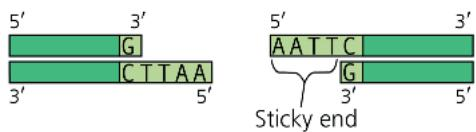

\- The sticky ends on restriction fragments from one DNA source can base-pair with complementary sticky ends on fragments from other DNA molecules. Sealing the base-paired fragments with DNA ligase produces recombinant DNA molecules.

\- DNA restriction fragments of different lengths can be separated by gel electrophoresis.

\- The polymerase chain reaction (PCR) can amplify (produce many copies of) a specific target segment of DNA, using primers that bracket the desired sequence and a heat-resistant DNA polymerase.

• To clone a eukaryotic gene:

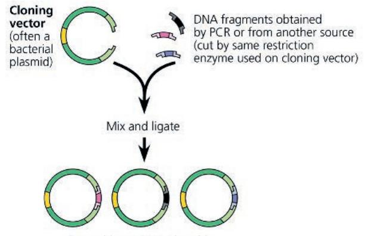  
(cut by same restriction  
enzyme used on cloning vector)  
Recombinant DNA plasmids

\- Recombinant plasmids are returned to host cells, each of which divides to form a clone of cells.

\- Expressing cloned eukaryotic genes in bacterial host cells poses several technical difficulties. The use of cultured eukaryotic cells as host cells, coupled with appropriate expression vectors, helps avoid these problems.

Describe how the process of gene cloning results in a cell clone containing a recombinant plasmid.

## Concept 20.2: Biologists use DNA technology to study gene expression and function

\- Several techniques use hybridization of a nucleic acid probe to detect the presence of specific mRNAs.

\- In situ hybridization and RT-PCR can detect the presence of a given mRNA in a tissue or an RNA sample, respectively.

\- Sets of genes co-expressed by a group of cells or a single cell can be detected by RNA sequencing (RNA-seq)—sequencing the cDNAs corresponding to mRNAs from the cells. DNA microarrays are also used for this purpose.

\- For a gene of unknown function, experimental inactivation of the gene (a gene knockout) and observation of the resulting phenotypic effects can provide clues to its function. The CRISPR-Cas9 system allows researchers to edit genes in living cells in a specific, desired way. The new alleles can be altered so that they are inherited in a biased way through a population (gene drive).

\- In humans, genome-wide association studies identify and use single nucleotide polymorphisms (SNPs) as genetic markers for alleles that are associated with particular conditions.

What useful information is obtained by detecting expression of specific genes?

## Concept 20.3: Cloned organisms and stem cells are useful for basic research and other applications

\- The question of whether all the cells in an organism have the same genome prompted the first attempts at organismal cloning.

\- Single differentiated cells from plants are often totipotent: capable of generating all the tissues of a complete new plant.

\- Transplantation of the nucleus from a differentiated animal cell into an enucleated egg can sometimes give rise to a new animal.

\- Certain embryonic stem cells (ES cells) from animal embryos and particular adult stem cells from adult tissues can reproduce and differentiate both in the lab and in the organism, offering the potential for medical use. ES cells are pluripotent but difficult to acquire. Induced pluripotent stem (iPS) cells resemble ES cells in their capacity to differentiate; they can be generated by reprogramming differentiated cells. iPS cells hold promise for medical research and regenerative medicine.

Describe how, using mice, a researcher could carry out (1) organismal cloning, (2) production of ES cells, and (3) generation of iPS cells, focusing on how the cells are reprogrammed. (The procedures are basically the same in humans and mice.)

## Concept 20.4: The practical applications of DNA-based biotechnology affect our lives in many ways

\- DNA technology, including the analysis of genetic markers such as SNPs, is increasingly being used in the diagnosis of genetic and other diseases and in personal genome analysis. Personalized medicine offers potential for an individual minimizing their known risk for a disease, as well as better treatment of genetic disorders or cancers. Gene therapy or gene editing with the CRISPR-Cas9 system may also lead to permanent cures. DNA technology is used with cell cultures in the large-scale production of protein hormones and other proteins with therapeutic uses. Cell and tissue culture are important in developing useful drugs, both those synthesized chemically and biologics, those produced by living cells. Some therapeutic proteins are being produced in transgenic “pharm” animals.

\- Analysis of genetic markers such as short tandem repeats (STRs) in DNA isolated from tissue or body fluids found at crime scenes leads to a genetic profile. Use of genetic profiles can provide definitive evidence that a suspect is innocent or strong evidence of guilt. Such analysis is also useful in parenthood disputes and in identifying the remains of crime victims.

\- Genetically engineered microorganisms can be used to extract minerals from the environment or degrade various types of toxic waste materials, a process called bioremediation.

\- The aims of developing transgenic plants and animals are to improve agricultural productivity and food quality.

\- The potential benefits of genetic engineering must be carefully weighed against the potential for harm to humans or the environment.

What factors affect whether a given genetic disease would be a good candidate for successful gene therapy?

For suggested answers, see Appendix A.

## Test Your Understanding

For more multiple-choice questions, go to the Practice Test (eTextbook only).

## Levels 1-2: Remembering/Understanding

1. In DNA technology, the term vector can refer to

(A) the enzyme that cuts DNA into restriction fragments.

(B) the sticky end of a DNA fragment.

(C) a SNP marker.

(D) a plasmid used to transfer DNA into a living cell.

2. Which of the following tools of DNA technology is incorrectly paired with its use?

(A) electrophoresis—separation of DNA fragments

(B) DNA ligase—cutting DNA, creating sticky ends of restriction fragments

(C) DNA polymerase—polymerase chain reaction to amplify sections of DNA

(D) reverse transcriptase—production of cDNA from mRNA

3. Plants are more readily manipulated by genetic engineering than are animals because

(A) plant genes do not contain introns.

(B) more vectors are available for transferring recombinant DNA into plant cells.

(C) a somatic plant cell can often give rise to a complete plant.

(D) plant cells have larger nuclei.

4. A paleontologist has recovered a bit of tissue from the 400-year-old preserved skin of an extinct dodo (a bird). To compare a specific region of the DNA from a sample with DNA from living birds, which of the following would be most useful for increasing the amount of dodo DNA available for testing?

(A) SNP analysis

(B) polymerase chain reaction (PCR)

(C) electroporation

(D) gel electrophoresis

## Levels 3-4: Applying/Analyzing

5. Which of the following is true of cDNA produced using human brain tissue as the starting material?

(A) The procedure to make it requires amplification by the polymerase chain reaction.

(B) It is produced from pre-mRNA using reverse transcriptase.

(C) It can be labeled and used as a probe to detect genes expressed in the brain.

(D) It includes the introns of the pre-mRNA.

6. Expression of a cloned eukaryotic gene in a bacterial cell involves many challenges. The use of mRNA and reverse transcriptase is part of a strategy to solve the problem of
(A) post-transcriptional processing.
(B) post-translational processing.
(C) nucleic acid hybridization.
(D) restriction fragment ligation.

7. Which of the following sequences in double-stranded DNA is most likely to be recognized as a cutting site for a restriction enzyme?
(A) AAGG (C) ACCA
TTCC TGGT
(B) GGCC (D) AAAA
CCGG TTTT

## Levels 5-6: Evaluating/Creating

8. MAKE CONNECTIONS Imagine you want to study one of the human crystallins, proteins present in the lens of the eye (see Figure 1.8). To obtain a sufficient amount of the protein of interest, you decide to clone the gene that codes for it. Assume you know the sequence of this gene. Explain how you would go about this.

9. MAKE CONNECTIONS Looking at Figure 20.15, what does it mean for a SNP to be “linked” to a disease-associated allele? How does this allow the SNP to be used as a genetic marker? (See Concept 15.3.)

10. DRAW IT You are cloning an aardvark gene, using a bacterial plasmid as a vector. The green diagram shows the plasmid, which contains the restriction site for the enzyme used in

  
Aardvark DNA

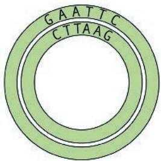  
Plasmid

Figure 20.5. Above the plasmid is a segment of linear aardvark DNA that was synthesized using PCR. Diagram your cloning procedure, and show what would happen to these two molecules during each step. Use one color for the aardvark DNA and its bases and another color for those of the plasmid. Label each step and all 5' and 3' ends.

11. EVOLUTION CONNECTION Ethical considerations aside, if DNA-based technologies became widely used, discuss how they might change the way evolution proceeds, as compared with the natural evolutionary mechanisms that have operated for the past 4 billion years.

12. SCIENTIFIC INQUIRY You hope to study a gene that codes for a neurotransmitter protein produced in human brain cells. You know the amino acid sequence of the protein. Explain how you might (a) identify what genes are expressed in a specific type of brain cell, (b) identify (and isolate) the neurotransmitter gene, (c) produce multiple copies of the gene for study, and (d) produce large quantities of the neurotransmitter for evaluation as a potential medication.

13. WRITE ABOUT A THEME: INFORMATION In a short essay (100–150 words), discuss how the genetic basis of life plays a central role in biotechnology.

14. SYNTHESIZE YOUR KNOWLEDGE The water in the

Yellowstone National Park hot springs shown here is around $160^{\circ}$ F ( $70^{\circ}$ C). Biologists assumed that no species of organisms could live in water above about $130^{\circ}$ F ( $55^{\circ}$ C), so they were surprised to find several species of bacteria there, now called thermophiles (“heat-lovers”). You’ve

learned in this chapter how an enzyme from one species, Thermus aquaticus, made feasible one of the most important DNA-based techniques used in labs today. Identify the enzyme, and indicate the value of its being isolated from a thermophile. Suggest other reasons why enzymes from this bacterium (or other thermophiles) might also be valuable.

For selected answers, see Appendix A.

# Explore Scientific Papers with Science in the Classroom | AAAS

How can CRISPR-Cas9 be used to create a gene drive? Go to "Can We Handle the Power of CRISPR?" at www.scienceintheclassroom.org.

Instructors: Questions can be assigned in Mastering Biology.

