# 第21章 Genomes and Their Evolution

<!-- 章节边界按正文内容恢复；原始 MinerU 内容保留如下。 -->

# Genomes and Their Evolution

## Key Concepts

21.1 The Human Genome Project fostered development of faster, less expensive sequencing techniques

21.2 Scientists use bioinformatics to analyze genomes and their functions

21.3 Genomes vary in size, number of genes, and gene density

21.4 Multicellular eukaryotes have a lot of noncoding DNA and many multigene families

21.5 Duplication, rearrangement, and mutation of DNA contribute to genome evolution

21.6 Comparing genome sequences provides clues to evolution and development

  
Figure 21.1 The elephant shark (Callorhinchus milii) looks vaguely prehistoric and has been called a “living fossil.” In fact, it has the slowest-evolving genome of any vertebrate sequenced so far. Comparing rates of genome change in different species provides insights into the evolutionary past.

## Study Tip

Write genomic analysis questions: As you go through the chapter, make a table of genomic analyses that are discussed and write down some questions they can address. You can include questions not covered in the text.

<table><tr><td>Genomic projects and websites</td><td>Questions that can be addressed</td></tr><tr><td>Human Genome Project</td><td>How much DNA is in the human genome?How much of the human genome codes for proteins?What functions are carried out by other regions of the genome?</td></tr><tr><td>ENCODE project</td><td></td></tr></table>

What are the functions of the human genome?

## What are some questions that can be explored by sequencing and comparing genomes?

  
How do genomes differ in number of genes?

  
Escherichia coli 4,400 genes

  
Homo sapiens \~20,000 genes

  
Zea mays (corn) 32,000 genes  
What do gene sequences tell us about evolutionary relationships between species?  
How do genomes evolve over time?

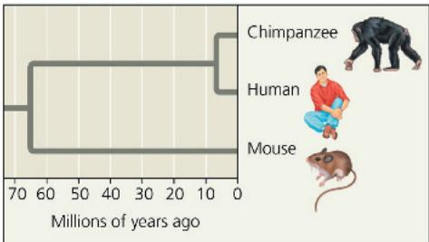

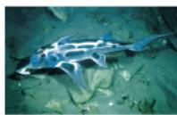  
Elephant shark: slower-evolving genome  
Tiger tail sea horse: faster-evolving genome

# Concept 21.1: The Human Genome Project fostered development of faster, less expensive sequencing techniques

Upon sequencing the genome of any species, scientists can study whole sets of genes and their interactions, an approach called genomics. The sequencing efforts that feed this approach generate enormous volumes of data. The necessity of dealing with this ever-increasing flood of information has energized the field of bioinformatics, the use of computers, software, mathematical models, and other computational tools such as artificial intelligence, to process, integrate, and analyze information from large biological data sets.

The sequencing of the human genome, an ambitious undertaking, officially began as the Human Genome Project in 1990. Organized by an international, publicly funded consortium of scientists at universities and research institutes, the project involved 20 large sequencing centers in six countries plus a host of other labs working on smaller parts of the project.

The human genome sequence was largely completed in 2003 and since then has been fine-tuned. Regions of the genome with much repetitive DNA are difficult to sequence, and the fully completed human genome wasn't published until 2022. The original sequenced DNA was pooled from a few individuals; scientists reviewed the results and agreed on a reference genome, a full sequence that represents the genome of a species. However, a disadvantage of a reference genome is that since it is based on DNA from one or a few individuals, it is biased toward the group those individuals belong to. A more recent approach has been to assemble a pangenome, a composite genome sequence based on sequences of multiple individuals within a species. The choice of individuals includes a wide range of genetic backgrounds, therefore revealing important regions of variation that may have medical or evolutionary significance. A draft human pangenome, based on 47 individual genomes from various populations, was published in 2023, and will be continually revised by incorporating information from more individuals.

The ultimate goal in mapping any genome is to determine the complete nucleotide sequence of each chromosome. For the 3 billion base pairs in the human genome, this was accomplished by scientists using sequencing machines and the dideoxy chain termination method mentioned in Concept 20.1. Two approaches complemented each other in this endeavor. The initial approach was a methodical one that ordered each fragment based on earlier genetic mapping of the human genome. In 1998, however, molecular biologist J. Craig Venter led an effort to sequence the entire human genome using an alternative strategy. The whole-genome shotgun approach starts with the cloning and sequencing of DNA fragments from randomly cut DNA. Powerful computer programs then assemble the resulting very large number of overlapping short sequences into a single continuous sequence (Figure 21.2). The whole-genome shotgun approach, in combination with newer sequencing methods, is still widely used today.

A major success of the Human Genome Project was the development of sequencing machines with automated technology for faster sequencing (see Concept 20.1). While a productive lab could typically sequence 1,000 base pairs a day in the 1980s, by four decades later, widely used “next-generation” sequencing machines could sequence nearly 35 million base pairs per second (see Figure 20.3).

In one approach, many very small DNA fragments (each about 300 base pairs long) are sequenced at the same time, and computer software rapidly assembles the complete sequence. Because of the sensitivity of these techniques, the DNA can be sequenced directly, either in fragments or as a single whole molecule; the cloning (2 in Figure 21.2) is unnecessary.

In another approach, called long-read sequencing, new techniques enable sequencing of a single long DNA strand, of tens of thousands to over 100,000 bases, at one time. Sequencing machines using rapid sequencing techniques are an example of "high-throughput" devices because they can analyze biological materials very rapidly and produce enormous volumes of data.

Along with massive increases in sequencing speed, the cost of sequencing entire genomes has plummeted. Whereas sequencing the first human genome took 13 years and cost between \$500 million and \$1 billion, the cost has decreased

Figure 21.2 Whole-genome shotgun approach to sequencing. In this approach, random DNA fragments are cloned (see Figure 20.4), sequenced, and then ordered relative to each other.  
  
VISUAL SKILLS The fragments in step 2 of this figure are depicted as scattered, rather than arranged in an ordered array. How does this depiction reflect the approach? For suggested answer, see Appendix A.

dramatically while the speed has increased: In 2024, the fastest machines could sequence a single human genome in less than 48 hours for about \$600.

These technological advances have also facilitated an approach called metagenomics (from the Greek meta, beyond), in which DNA from an entire community of species (a metagenome) is collected from an environmental sample and sequenced. Again, computer software sorts out the partial sequences and assembles them into the individual species' partial of complete genomes. An advantage of this technique is the ability to sequence the DNA of mixed microbial populations, which eliminates the need to culture each species separately in the lab, a challenge that has limited the study of microorganisms. So far, this approach has been applied to communities found in environments as diverse as the human intestine and extreme habitats like thermal springs where the temperature exceeds $80^{\circ}$ C.

Advances in sequencing techniques have significantly transformed medicine. In oncology, next-generation sequencing allows physicians to detect tumor-specific mutations, which can guide targeted treatments. In reproductive medicine, noninvasive prenatal testing utilizes sequencing to identify chromosomal abnormalities in fetal DNA, which can lead to early diagnosis and informed decision-making. Although these advances have made genetic testing a powerful tool in healthcare, it does raise some ethical considerations. One large concern centers around privacy, because storing personal genetic data creates risks of unauthorized access, misuse, and discrimination.

At first glance, genome sequences of humans and other organisms are simply dry lists of nucleotide bases—millions of A's, T's, C's, and G's in mind-numbing succession. Making sense of this massive amount of data has called for new analytical approaches, which we discuss next.

## Concept Check 21.1

1. Describe the whole-genome shotgun approach.
For suggested answers, see Appendix A.

## Concept 21.2: Scientists use bioinformatics to analyze genomes and their functions

Each of the 20 or so sequencing centers around the world working on the Human Genome Project churned out voluminous amounts of DNA sequence day after day. As the data began to accumulate, the need to coordinate efforts to keep track of all the sequences became clear. Thanks to the foresight of research scientists and government officials involved in the Human Genome Project, its goals included using bioinformatics: establishing centralized databases and refining analytical software, all made readily accessible on the Internet.

## Centralized Resources for Analyzing Genome Sequences

Making bioinformatics resources available to researchers worldwide and speeding up the dissemination of information served to accelerate progress in DNA sequence analysis. The National Library of Medicine (NLM) and the National Institutes of Health (NIH) maintain the National Center for Biotechnology Information (NCBI), which today maintains a website (www.ncbi.nlm.nih.gov), which has extensive bioinformatics resources. On this site are links to databases, software, and a wealth of information about genomics and related topics. Similar websites have also been established by three genome centers with which the NCBI collaborates: the European Molecular Biology Laboratory, the DNA Data Bank of Japan, and BGI (formerly known as the Beijing Genomics Institute) in Shenzhen, China. These large, comprehensive websites are complemented by others maintained by individual or small groups of laboratories. Smaller websites often provide databases and software designed for a narrower purpose, such as studying genetic and genomic changes in one particular type of cancer.

The NCBI database of sequences is called GenBank. As of early 2025, it included the sequences of 256 million fragments of genomic DNA, totaling 5.4 trillion base pairs! GenBank is constantly updated, and the amount of data it contains increases rapidly. Any sequence in the database can be retrieved and analyzed using software from the NCBI website or elsewhere.

One very widely used software program available on the NCBI website, called BLAST (Basic Local Alignment Search Tool), allows the user to compare a DNA sequence with every sequence in GenBank, base by base. A researcher might search for similar regions in other genes of the same species or among the genes of other species. Another program allows comparison of protein sequences. A third program can search any protein sequence for conserved (common) stretches of amino acids (domains) for which a function is known or suspected, and it can show a three-dimensional model of the domain alongside other relevant information (Figure 21.3). There are even various software programs that can align and compare a collection of sequences, either nucleic acids or polypeptides, and diagram them in the form of an evolutionary tree based on the sequence relationships. (One such diagram is shown in Figure 21.17.)

Three research institutions, Rutgers University, the University of California, San Diego, and the University of California, Berkeley, also operate the U.S. data center for a worldwide database of all three-dimensional protein structures that have been experimentally determined, called the Protein Data Bank (www.wwpdb.org). These structures can be rotated by the viewer to show all sides of the protein. Throughout this book, you'll find images of protein structures that have been obtained from the Protein Data Bank.

There is a vast array of resources available for researchers anywhere in the world to use free of charge. Let us now consider the types of questions scientists can address using these resources.

Instructors: BLAST Data Analysis Tutorials, which teach students how to work with real data from the BLAST database, can be assigned in Mastering Biology.

Some results are shown from a search for regions of proteins similar to an amino acid sequence in a muskmelon protein.

Figure 21.3 National Center for Biotechnology Information (NCBI) website.

In this window, a partial amino acid sequence from an unknown muskmelon protein ("Query") is aligned with sequences from other proteins that the program found to be similar. Each sequence represents a domain called WD40.

2 Four hallmarks of the WD40 domain are highlighted in yellow columns. (Sequence similarity is based on chemical aspects of the amino acids, so the amino acids in each hallmark region are not always identical.)

6 This window displays information about the WD40 domain from the Conserved Domain Database (CDD), which can find and describe similar domains in related proteins.

3 The Cn3D ("See in 3D") program displays 3D models of domains, such as this ribbon model of cow transducin (the protein highlighted across the top in purple in the Sequence Alignment Viewer). This protein is the only one of those shown for which a structure has been determined. The sequence similarity of the other proteins to cow transducin suggests that their structures are likely to be similar.

4 Cow transducin contains seven WD40 domains, one of which is highlighted here in gray.

5 The yellow segments correspond to the WD40 hallmarks highlighted in yellow columns in the window above.

## Identifying Protein-Coding Genes and Understanding Their Functions

Using available DNA sequences, geneticists can study genes directly, rather than taking the classical genetic approach, which requires determining the function of an unknown gene from the phenotype. But this more recent approach poses a new challenge: What does the gene actually do? Given a long DNA sequence from a database like GenBank, scientists aim to identify all protein-coding genes in the sequence and ultimately their functions. This process, called gene annotation, uses three lines of evidence to identify a gene.

First, computers are utilized in a search for patterns that indicate the presence of genes. The usual approach is to use software to scan the stored sequences for those that represent transcriptional and translational start and stop signals, RNA-splicing sites, and other telltale signs of protein-coding genes, such as promoter sequences. The software also looks for certain short sequences that specify known mRNAs. Thousands of such sequences, called expressed sequence tags, or ESTs, have been collected from cDNA sequences and are cataloged in computer databases. This type of analysis identifies sequences that may turn out to be previously unknown protein-coding genes.

Although the identities of about half of the human genes were known before the Human Genome Project began, the other genes, previously unknown, were revealed by DNA sequence analysis. Once such suspected genes are identified, the second step is to obtain clues about their identities and functions. Software is used to compare their sequences with those of known genes from other organisms. Due to redundancy in the genetic code, the DNA sequence itself may vary more among species than the protein sequence does. Thus, scientists interested in proteins often compare the predicted amino acid sequence of a protein to that of other proteins. The final step is to confirm the identities of these genes using RNA-seq (see Figure 20.12) or some other method to show that the relevant RNA is actually expressed from the proposed gene.

Sometimes a newly identified sequence will match, at least partially, the sequence of a gene or protein in another species whose function is well known. For example, a plant researcher working on signaling pathways in the muskmelon would be excited to see that a partial amino acid sequence from a gene she had identified matched sequences in other species encoding a functional part of a protein called a WD40 domain (see Figure 21.3). WD40 domains are present in many eukaryotic proteins and are known to function in signal transduction pathways. Alternatively, a new gene sequence might be similar to a previously encountered sequence whose function is still unknown. Another possibility is that the sequence is entirely unlike anything ever seen before. This was true for about a third of the genes of

Escherichia coli when its genome was sequenced. In such cases, protein function is usually deduced through a combination of biochemical and functional studies. The biochemical approach aims to determine the three-dimensional structure of the protein as well as other attributes, such as potential binding sites for other molecules. Functional studies usually involve knocking out (blocking or disabling) the gene in an organism to see how the phenotype is affected. The CRISPR-Cas9 system, described in Figure 17.28, is an example of an experimental technique used to block gene function.

## Understanding Genes and Gene Expression at the Systems Level

The impressive computational power provided by the tools of bioinformatics allows the study of whole sets of genes and their interactions, as well as the comparison of genomes from different species. Genomics is a rich source of new insights into fundamental questions about genome organization, regulation of gene expression, embryonic development, and evolution.

One informative approach was taken by a long-term research project called ENCODE (Encyclopedia of DNA Elements), which began in 2003. The aim of the project was to learn everything possible about the functionally important elements in the human genome, at first using multiple experimental techniques on different types of cultured cells. Investigators sought to identify protein-coding genes and genes for noncoding RNAs, along with sequences that regulate gene expression, such as enhancers and promoters. In addition, they extensively characterized DNA and histone modifications and chromatin structure—features termed “epigenetic” since they affect gene expression without changing the sequence of nucleotide bases (see Concept 18.3). The second phase of the project, involving more than 440 scientists in 32 research groups, culminated in 2012 with the simultaneous publication of 30 papers describing over 1,600 large data sets. The project wound down after completing its fourth phase, expanding its analysis of the human genome and that of the mouse (a mammalian model organism), seeking to identify regulatory and other important sequences. The considerable power of ENCODE was that it provided the opportunity to compare results from specific projects with each other, yielding a much richer picture of the human and mouse genomes.

Perhaps the most striking finding was that about 75% of the human genome is transcribed at some point in at least one of the cell types studied, even though less than 2% codes for proteins. Furthermore, biochemical functions have been assigned to DNA elements making up at least 80% of the genome. To learn more about the different types of functional elements, parallel projects analyzed in a similar way the genomes of two model organisms, the soil nematode Caenorhabditis elegans and the fruit fly Drosophila melanogaster. Because genetic and biochemical experiments using DNA technology can be performed on these species, testing the activities of potentially functional DNA elements in their genomes is expected to illuminate the workings of the human genome.

To build on the legacy of the ENCODE project, a new federally funded research initiative called the Impact of Genomic Variation on Function (IGVF) was launched in 2021. This project aims to understand how the many genomic variations found among humans affect genetic functions. The 120 participating laboratories are taking advantage of new technologies to analyze gene expression in single cells, as well as using new statistical and computational methods.

Yet another initiative, the Roadmap Epigenomics Project, set out to characterize the epigenome—the epigenetic features of the genome of hundreds of human cell types and tissues. The aim was to focus on the epigenomes of stem cells, normal tissues from mature adults, and relevant tissues from individuals with diseases such as cancer and neurodegenerative and autoimmune disorders. In a series of papers reporting on the results from 111 tissues, one of the most useful findings was that the original tissue in which a cancer arose can be identified in cells of a secondary tumor based on characterization of their epigenomes.

## Systems Biology

The scientific progress resulting from sequencing genomes and studying large sets of genes has encouraged scientists to attempt similar systematic studies of sets of proteins and their properties (such as their abundance, chemical modifications, and interactions), an approach called proteomics. (A proteome is the entire set of proteins expressed by a cell or group of cells.) Proteins, not the genes that encode them, carry out most of the activities of the cell. Therefore, if we are to understand the functioning of cells and organisms, we must study when and where proteins are produced in an organism, as well as how they interact in networks.

Genomics and proteomics enable molecular biologists to approach the study of life from an increasingly integrated perspective. Using the tools we have described, biologists have begun to compile catalogs of genes and proteins, listing all the “parts” that contribute to the operation of cells, tissues, and organisms. With such catalogs in hand, researchers have shifted their attention from the individual parts—genes and proteins—to their functional integration in biological systems. As you may recall, Concept 1.1 discussed this approach, called systems biology, which aims to model the dynamic behavior of whole biological systems based on the study of the interactions among the system’s parts. Because of the vast amounts of data generated in these types of studies, advances in computer technology and bioinformatics are crucial to studying systems biology.

One important use of the systems biology approach is to define gene and protein interaction networks. To map the protein interaction network in the yeast Saccharomyces cerevisiae, for instance, researchers used sophisticated techniques to knock out pairs of genes, one pair at a time, creating doubly mutant cells. They then compared the fitness of each double mutant (based in part on the size of the cell colony it formed) to that predicted from the fitness of each of the two single mutants. The researchers reasoned that if the observed fitness matched the prediction, then the products of the two genes didn't interact with each other, but if the observed fitness was greater or less than predicted, then the gene products interacted in the cell. They then used computer software to build a graphic model by “mapping” the gene products to certain locations in the model, based on the similarity of their interactions. This resulted in the network-like “functional map” of protein interactions shown in Figure 21.4. Processing the vast number of

Figure 21.4 The systems biology approach to protein interactions.

This global protein interaction map shows the likely interactions (lines) among about 4,500 gene products (dots) in Saccharomyces cerevisiae, the budding yeast. Dots of the same color represent gene products involved in one of the 13 similarly colored cellular functions listed around the map. The white dots represent proteins that haven't been assigned to any color-coded function. The expanded area shows additional details of one map region where the gene products (dark blue dots) carry out amino acid biosynthesis, uptake, and related functions.

protein-protein interactions generated by this experiment and integrating them into the completed map required powerful computers, mathematical tools, and newly developed software.

## Application of Systems Biology to Medicine

The Cancer Genome Atlas began in 2007 and culminated in 2018 with publications called the Pan-Cancer Atlas. This project is another example of systems biology in which many interacting genes and gene products are analyzed together as a group. Under the joint leadership of the National Cancer Institute and the NIH, the project aimed to determine how changes in biological systems lead to cancer. A pilot project set out to find all the common mutations in three types of cancer—lung cancer, ovarian cancer, and glioblastoma of the brain—by comparing gene sequences and patterns of gene expression in cancer cells with those in normal cells. Work on glioblastoma confirmed the role of several suspected genes and identified a few previously unknown ones, suggesting possible new targets for therapies.

As high-throughput techniques become more rapid and less expensive, they are increasingly being applied to the problem of cancer. The approach described previously proved so fruitful for those three types of cancer that it was extended to ten other types, chosen because they are common and often lethal in humans, as well as to metastatic tumors (see Figure 12.20), those that have dispersed from primary tumors and invaded organs far away in the body. Ninety percent of cancer deaths are primarily caused by metastasis. Results from the study of metastatic tumors, published in 2017,

highlighted several key genes whose mutations were frequently found in metastases and could be targets for chemotherapy. Overall, the Pan-Cancer Atlas contributed significantly to understanding how, where, and why tumors arise, underscoring the value of an integrative systems biology approach to treating cancer.

In addition to whole-genome sequencing, RNA-seq (see Figure 20.12) is used to analyze gene expression patterns in patients who have various cancers and other diseases. Analyzing which genes are overexpressed or underexpressed in a particular cancer allows physicians to tailor patients' treatment to their unique genetic makeup and the specifics of their cancers. This approach has been used to characterize subsets of particular cancers, enabling more refined treatments. Breast cancer is one example (see Figure 18.27).

Eventually, medical records may include an individual's DNA sequence, a sort of genetic bar code, with regions highlighted that predispose the person to specific diseases. The use of such sequences for personalized medicine—disease prevention and treatment—has great potential.

## Artificial Intelligence and Machine Learning Applied to Bioinformatics

The term artificial intelligence (AI) describes the development and use of computer systems that can function like neural networks in the human brain to perform various tasks, such as decision-making, pattern recognition, and learning from existing data. AI is becoming an essential tool in bioinformatics,

transforming how researchers analyze biological data, identify patterns, and develop new medical treatments. By automating complex tasks, AI accelerates discoveries and enhances precision in various fields of life sciences. Machine learning, a subset of AI, allows computers to learn from data, improving their ability to make predictions and recognize biological trends that would be difficult to detect using traditional methods.

AI is widely used in a variety of biological applications. In genomics and sequencing, AI can analyze massive genetic datasets to identify specific genes and predict mutations that may be linked to diseases. Machine learning models help detect patterns in DNA sequences, allowing researchers to better understand genetic variations and their potential health implications. In drug discovery applications, AI is revolutionizing the process of identifying new drugs by simulating molecular interactions and predicting how different compounds will interact with biological targets. Virtual drug screening powered by AI accelerates the search for promising therapeutic compounds. Biological imaging serves as another example, in which AI-driven image analysis enhances diagnostic accuracy in medical imaging. By analyzing microscopic and other images, AI can detect cancer cells, classify tissue samples, and identify other abnormalities with high precision—for example, the broken bone in Figure 21.5. As AI continues to develop, its integration into bioinformatics will expand, driving innovation in medical research, diagnostics, and personalized medicine.

Figure 21.5 Example of the use of artificial intelligence (AI) in medical diagnosis.

The AI model overlays the radiograph with a "heatmap" in which the colors indicate probability of a fracture. The area highlighted red in the center of the heatmap is where AI predicts a fracture has occurred. A doctor could then check that area very carefully; this would reduce the chance a fracture might be overlooked.

  
(a) Radiograph of the fibula

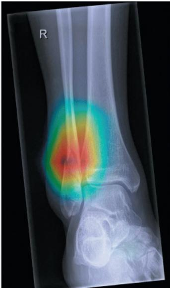  
(b) Radiograph with AI-generated heatmap overlaid

## Concept Check 21.2

1. What role does the Internet play in current genomics and proteomics research?

2. Explain the advantage of the systems biology approach to studying cancer versus the approach of studying a single gene at a time.

3. MAKE CONNECTIONS The ENCODE pilot project found that at least 75% of the genome is transcribed into RNAs, far more than could be accounted for by protein-coding genes. Review Concepts 17.3 and 18.3 and suggest some roles that these RNAs might play.

4. MAKE CONNECTIONS In Concept 20.2, you learned about genome-wide association studies. Explain how these studies use the systems biology approach.

For suggested answers, see Appendix A.

## Concept 21.3: Genomes vary in size, number of genes, and gene density

The sequences of thousands of genomes have been completed, with tens of thousands of genomes either in progress or considered permanent drafts (because they require more work than it would be worth to complete them). As of early 2025, among the sequences in progress are roughly 27,500 metagenomes, with about 145,000 completed as permanent drafts. In the completely sequenced group, about 215,000 are genomes of bacteria, and 1,900 are archaeal genomes. There are roughly 2,000 completed eukaryotic species, along with 13,170 permanent drafts. Among these are vertebrates, invertebrates, protists, fungi, and plants. Next, we'll discuss what we've learned about genome size, number of genes, and gene density, focusing on general trends.

## Genome Size

Comparing prokaryotic bacterial and archaeal species and eukaryotic species, we find a general difference in genome size between prokaryotic and eukaryotic organisms (Table 21.1). While there are some exceptions, most prokaryotic genomes sequenced to date have between 1 and 6 million base pairs (Mb); for example, the genome of E. coli has 4.6 Mb. Eukaryotic genomes tend to be larger: The genome of the single-celled yeast Saccharomyces cerevisiae (a fungus) has about 12 Mb, while most animals and plants, which are multicellular, have genomes of at least 100 Mb. There are 165 Mb in the fruit fly genome, while humans have 3,000 Mb, about 500 to 3,000 times as many as a typical bacterium.

Aside from this general difference between prokaryotic and eukaryotic organisms, a comparison of genome sizes among eukaryotes fails to reveal any systematic relationship between genome size and the organism's phenotype. For instance, the range among plants is enormous: The genome of

Table 21.1 Genome Sizes and Estimated Numbers of Genes\*

<table><tr><td>Organism</td><td>Haploid Genome Size (Mb)</td><td>Number of Genes</td><td>Genes per Mb</td></tr><tr><td colspan="4">Bacteria</td></tr><tr><td>Haemophilus influenzae</td><td>1.8</td><td>1,700</td><td>940</td></tr><tr><td>Escherichia coli</td><td>4.6</td><td>4,400</td><td>950</td></tr><tr><td colspan="4">Archaea**</td></tr><tr><td>Archaeoglobus fulgidus</td><td>2.2</td><td>2,500</td><td>1,130</td></tr><tr><td>Methanosarcina barkeri</td><td>4.8</td><td>3,600</td><td>750</td></tr><tr><td colspan="4">Eukarya</td></tr><tr><td>Saccharomyces cerevisiae (yeast, a fungus)</td><td>12</td><td>6,300</td><td>525</td></tr><tr><td>Utricularia gibba (floating bladderwort)</td><td>82</td><td>28,500</td><td>348</td></tr><tr><td>Caenorhabditis elegans (nematode)</td><td>100</td><td>20,100</td><td>200</td></tr><tr><td>Arabidopsis thaliana (mustard family plant)</td><td>120</td><td>27,000</td><td>225</td></tr><tr><td>Drosophila melanogaster (fruit fly)</td><td>165</td><td>14,000</td><td>85</td></tr><tr><td>Daphnia pulex (water flea)</td><td>200</td><td>31,000</td><td>155</td></tr><tr><td>Zea mays (corn)</td><td>2,300</td><td>32,000</td><td>14</td></tr><tr><td>Ailuropoda melanoleuca (giant panda)</td><td>2,400</td><td>21,000</td><td>9</td></tr><tr><td>Homo sapiens (human)</td><td>3,000</td><td>~20,000</td><td>7</td></tr><tr><td>Tmesipteris oblanceolata (a New Caledonian fork fern)</td><td>160,450</td><td>ND</td><td>ND</td></tr></table>

\*Some values given here are likely to be revised as genome analysis continues. Mb = million base pairs; the haploid number is used because it represents a complete set of genetic information. ND = not determined.
\*\*As discussed in Concept 1.2, the term Archaea here refers to prokaryotic species.

Tmesipteris oblanceolata, a New Caledonian fork fern, contains about 160.5 billion base pairs (160,450 Mb), while that of another plant, Utricularia gibba, a bladderwort, contains only 82 Mb. Even more striking, there is a single-celled amoeba, Polychaos dubium, whose genome size has been estimated at 670 billion base pairs (670,000 Mb). (This genome has not yet been sequenced.) On a finer scale, comparing two insect species, the cricket (Anabrus simplex) genome turns out to have 11 times as many base pairs as the fruit fly (Drosophila melanogaster) genome. There is a wide range of genome sizes within the groups of insects, amphibians, and plants and less of a range within mammals and reptiles.

## Number of Genes

Prokaryotic organisms, in general, have fewer genes than eukaryotes. Free-living prokaryotic species studied have from 1,500 to 7,500 genes, while the number of genes in eukaryotes ranges from about 5,000 for unicellular fungi (yeasts) to at least 40,000 for some multicellular eukaryotes.

Within the eukaryotes, the number of genes in a species is often lower than expected from considering simply the size of its genome. As shown in Table 21.1, the genome of the nematode C. elegans is 100 Mb in size and contains roughly 20,100 genes. In comparison, the genome of Drosophila melanogaster is much bigger (165 Mb) but has only about two-thirds the number of genes—14,000 genes.

Considering an example closer to home, we noted that the human genome contains 3,000 Mb, well over ten times the size of either the D. melanogaster or C. elegans genome. At the outset of the Human Genome Project, biologists expected somewhere between 50,000 and 100,000 genes to be identified in the completed sequence, based on the number of known human proteins. As the project progressed, the estimate was revised downward several times. There is still debate about the number, but it is much lower, probably around 20,000. This estimate, similar to the number of genes in the nematode C. elegans, surprised biologists, who had been expecting many more human genes.

What genetic attributes allow humans (and other vertebrates) to get by with no more genes than nematodes? An important factor is that vertebrate genomes “get more bang for the buck” from their coding sequences because of extensive alternative splicing of RNA transcripts. Recall that this process generates more than one polypeptide from a single gene (see Figure 18.14). A typical human gene contains about ten exons, and an estimated 90% or more of these multi-exon genes are spliced in at least two different ways. Some genes are expressed in hundreds of alternatively spliced forms, others in just two. Scientists have not yet catalogued all of the different forms, but it is clear that the number of different proteins encoded in the human genome far exceeds the proposed number of genes.

Additional polypeptide diversity could result from post-translational modifications such as cleavage or the addition of carbohydrate groups in different cell types or at different developmental stages. Finally, the discovery of miRNAs and other RNAs that play regulatory roles has added a new variable to the mix (see Concept 18.3). Some scientists think that this added level of regulation of some genes, when present, may contribute to greater organismal complexity.

## Gene Density and Noncoding DNA

We can take both genome size and number of genes into account by comparing gene density in different species. In other words, we can ask how many genes are in a given length of DNA. When we compare the genomes of prokaryotic and eukaryotic organisms, we see that eukaryotes generally have larger genomes but fewer genes in a given number of base pairs. For example, humans have hundreds or thousands of times as many base pairs in their genome as most bacteria, as we already noted, but only 5 to 15 times as many genes; thus, gene density is lower in humans (see Table 21.1). Even unicellular eukaryotes, such as yeasts, have fewer genes per million base pairs than bacteria. Among the genomes that have been sequenced completely, humans and other mammals have the lowest gene density.

In all bacterial genomes studied so far, most of the DNA consists of genes for protein, tRNA, or rRNA; the small amount remaining consists mainly of nontranscribed regulatory sequences, such as promoters. The sequence of nucleotides along a bacterial protein-coding gene is not interrupted by noncoding sequences (introns). In eukaryotic genomes, by contrast, most of the DNA neither encodes protein nor is transcribed into RNA molecules of known function, and the DNA includes more complex regulatory sequences. In fact, humans have 10,000 times as much noncoding DNA as bacteria. Some of this DNA in multicellular eukaryotes is present as introns within genes. Indeed, introns account for most of the difference in average length between human genes (27,000 base pairs) and bacterial genes (1,000 base pairs).

In addition to introns, multicellular eukaryotes have a vast amount of non-protein-coding DNA between genes. In the next section, we will describe the composition and arrangement of these great stretches of DNA in the human genome.

## Concept Check 21.3

1. The current best estimate is that the human genome contains around 20,000 genes. However, there is evidence that human cells produce many more than 20,000 different polypeptides. What processes might account for this discrepancy?

2. The Genomes Online Database (GOLD) website of the Joint Genome Institute has information about genome sequencing projects. Scroll through the page at gold.jgi.doe.gov/statistics and describe the information you find. What percent of bacterial genome projects have medical relevance?

3. WHAT IF? What evolutionary processes might account for prokaryotic organisms having smaller genomes than eukaryotes?

For suggested answers, see Appendix A.

## Concept 21.4: Multicellular eukaryotes have a lot of noncoding DNA and many multigene families

We have spent most of our time focusing on genes that code for proteins. Yet the coding regions of these genes and the genes for small RNAs like tRNAs make up a small portion of most multicellular eukaryotic genomes. For example, only a tiny part—about 1.5%—codes for proteins or is transcribed into rRNAs or tRNAs.

Figure 21.6 shows what is known about the makeup of the remaining 98.5% of the genome.

Gene-related regulatory sequences and introns account, respectively, for 5% and about 20% of the human genome. The rest, located between functional genes, includes some unique (single-copy) noncoding DNA, such as gene fragments and pseudogenes, former genes that have accumulated mutations over a long time and no longer produce functional proteins. (The genes that produce small noncoding RNAs are a tiny percentage of the genome, distributed between the 20% introns and the 15% unique noncoding DNA.) Most of the DNA

Figure 21.6 Types of DNA sequences in the human genome. The gene sequences that code for proteins or are transcribed into rRNA or tRNA molecules make up only about 1.5% of the human genome (dark purple in the pie chart), while introns and regulatory sequences associated with genes (lighter purple) make up about a quarter. The vast majority of the human genome does not code for proteins (although much of it gives rise to RNAs), and a large amount is repetitive DNA (dark and light green and teal).

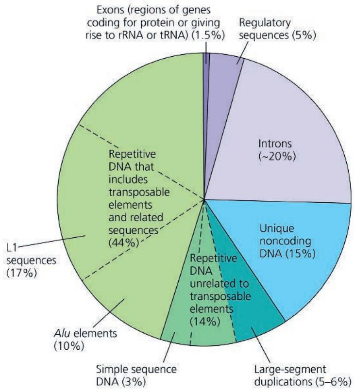

between functional genes, however, is repetitive DNA, which consists of sequences that are present in multiple copies in the genome.

The bulk of many eukaryotic genomes consists of DNA sequences that neither code for proteins nor are transcribed to produce RNAs with known functions; this noncoding DNA was often described in the past as “junk DNA.” However, we now know from the ENCODE project described earlier that 80% of the genome appears to have some biochemical function, and genome comparisons over the past 10 years have revealed the persistence of this DNA in diverse genomes over many hundreds of generations. For example, the genomes of humans, rats, and mice contain almost 500 regions of noncoding DNA that are identical in sequence in all three species. This is a higher level of sequence conservation than is seen for protein-coding regions in these species, strongly supporting the hypothesis that the noncoding regions have important functions. Next, we’ll examine how genes and noncoding DNA sequences are organized within genomes of multicellular eukaryotes, using the human genome as our main example. Genome organization tells us a lot about how genomes have evolved and continue to evolve, as we’ll see in Concept 21.5.

## Transposable Elements and Related Sequences

Both prokaryotic and eukaryotic organisms have stretches of DNA that can move from one location to another within the genome. These stretches are known as transposable genetic elements, or simply transposable elements. During the process called transposition, a transposable element moves from one site in a cell's DNA to a different target site by a type of recombination process. Transposable elements are sometimes called "jumping genes," but actually they never entirely detach from the cell's DNA. Instead, the original and new DNA sites are brought very close together by enzymes and other proteins that bend the DNA. Surprisingly, about 75% of human repetitive DNA (44% of the entire human genome) is made up of transposable elements and sequences related to them.

The first evidence for wandering DNA segments came from American geneticist Barbara McClintock's breeding experiments with calico corn (maize) in the 1940s and 1950s (Figure 21.7). Tracking corn plants through many generations, McClintock analyzed changes in the color of corn kernels. The patterns she saw led her to propose that there were genetic elements capable of moving from other locations in the genome into the genes for kernel color, disrupting the genes and changing the kernel color. McClintock's hypothesis provoked great interest among her maize colleagues, but most other scientists thought the phenomenon she had observed might occur only in maize. Her careful work and insightful ideas were finally validated many years later when transposable elements were found in bacteria. In 1983, at the age of 81, McClintock received the Nobel Prize for her pioneering research.

## Movement of Transposons and Retrotransposons

Eukaryotic transposable elements are of two types. The first type, transposons, move within a genome by means of a DNA intermediate. Transposons can move by a “cut-and-paste” mechanism, which removes the element from the original site, or by a “copy-and-paste” mechanism, which leaves a copy behind (Figure 21.8). Both mechanisms require an enzyme called transposase, which is generally encoded by the transposon.

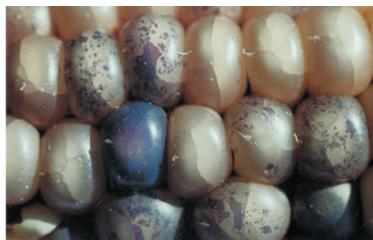  
Figure 21.7 The effect of transposable elements on corn kernel color.

Barbara McClintock first proposed the idea of mobile genetic elements after observing variegations in the color of the kernels on a corn cob (top right).

Figure 21.8 Transposon movement.  
Movement of transposons by either the copy-and-paste mechanism (shown here) or the cut-and-paste mechanism involves a double-stranded DNA intermediate that is inserted into the genome.  
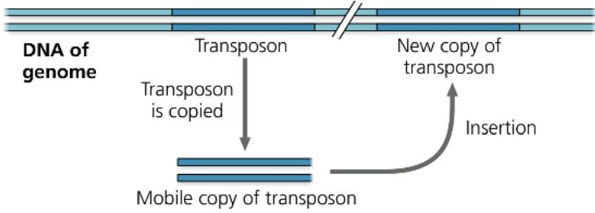  
VISUAL SKILLS How would this figure differ if it showed the cut-and-paste mechanism?  
For suggested answer, see Appendix A.

## Interview

Interview with Virginia Walbot: Plant genetics and development (eTextbook only)

Most transposable elements in eukaryotic genomes are of the second type, retrotransposons, which move by means of an RNA intermediate that is a transcript of the retrotransposon DNA. Thus, retrotransposons always leave a copy at the original site during transposition (Figure 21.9). To insert at another site, the RNA intermediate is first converted back to DNA by reverse transcriptase, an enzyme encoded by the retrotransposon. (Reverse transcriptase is also encoded by retroviruses, as you learned in Concept 19.2. In fact, retroviruses may have evolved from retrotransposons, or vice versa.) Another cellular enzyme catalyzes insertion of the reverse-transcribed DNA at a new site.

Figure 21.9 Retrotransposon movement.  
Movement begins with synthesis of a single-stranded RNA intermediate. The remaining steps are essentially identical to part of the retrovirus replicative cycle (see Figure 19.8).  
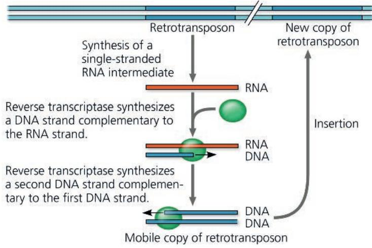

## Sequences Related to Transposable Elements

Multiple copies of transposable elements and sequences related to them are scattered throughout eukaryotic genomes. A single unit is usually hundreds to thousands of base pairs long, and the dispersed copies are similar but usually not identical to each other. Some of these are transposable elements that can move; the enzymes required for this movement may be encoded by any transposable element, including the one that is moving. Others are related sequences that have lost the ability to move altogether. Transposable elements and related sequences make up 25–50% of most mammalian genomes (see Figure 21.6) and even higher percentages in amphibians and many plants. In fact, the very large size of some plant genomes is accounted for by extra transposable elements rather than by extra genes. For example, transposable elements make up 85% of the corn genome!

In humans and other primates, a large portion of transposable element–related DNA consists of a family of similar sequences called Alu elements. These sequences alone account for approximately 10% of the human genome. Alu elements are about 300 nucleotides long, much shorter than most functional transposable elements, and they do not code for any protein. However, many Alu elements are transcribed into RNA, and at least some of these RNAs are thought to help regulate gene expression.

An even larger percentage (17%) of the human genome is made up of a type of retrotransposon called LINE-1, or L1. These sequences are much longer than Alu elements—about 6,500 base pairs—and typically have a very low rate of transposition. However, researchers working with mice have discovered that transcription of L1 retrotransposons is crucial for the development of early (one- and two-cell stage) embryos. They have proposed that transcription of L1 retrotransposons may affect the chromatin structure in ways important for embryonic development.

Although some transposable elements encode proteins, these proteins do not carry out normal cellular functions. Therefore, transposable elements are usually included in the “noncoding” DNA category, along with other repetitive sequences.

## Other Repetitive DNA, Including Simple Sequence DNA

Repetitive DNA that is not related to transposable elements has probably arisen from mistakes during DNA replication or recombination. Such DNA accounts for about 14% of the human genome (see Figure 21.6). About a third of this (5–6% of the human genome) consists of duplications of long stretches of DNA, with each unit ranging from 10,000 to 300,000 base pairs. These long segments seem to have been copied from one chromosomal location to another site on the same or a different chromosome and probably include some functional genes.

In contrast to scattered copies of long sequences, stretches of DNA known as simple sequence DNA contain many copies of tandemly repeated short sequences, as in the following example (showing one DNA strand only):

## ... GTTACGTTACGTTACGTTACGTTACGTTAC ...

In this case, the repeated unit (GTTAC) consists of 5 nucleotides, but the number can range from 2 to 500. When the unit contains

2–5 nucleotides, the series of repeats is called a short tandem repeat, or STR; we discussed the use of STR analysis in preparing genetic profiles by use of PCR in Concept 20.4 (see Figure 20.24). The number of copies of the repeated unit can vary from site to site within a given genome. There could be as many as several hundred thousand repetitions of the GTTAC unit at one site, but only half that number at another. STR analysis is performed on sites selected because they have relatively few repeats. The repeat number varies from person to person, and since humans are diploid, each person has two alleles per repeat site; these can differ in repeat number. This diversity produces the variation represented in the genetic profiles that result from STR analysis.

Simple sequence DNA makes up 3% of the human genome, much of it located at chromosomal telomeres and centromeres, where it may play a structural role. The DNA at centromeres is essential for the separation of chromatids in cell division (see Concept 12.2) and, along with simple sequence DNA located elsewhere, may also help organize the chromatin within the interphase nucleus. The simple sequence DNA located at telomeres binds proteins that protect chromosomal ends from degradation and from joining to other chromosomes.

Short repetitive sequences like those described here provide a challenge for whole-genome shotgun sequencing because the presence of many short repeats hinders accurate reassembly of fragment sequences by computers. Regions of simple sequence DNA account for much of the uncertainty present in estimates of whole-genome sizes and are the reason some sequences are considered “permanent drafts.”

## Genes and Multigene Families

Now, let's take a look at genes. Recall that DNA sequences that code for proteins or give rise to tRNA or rRNA make up only 1.5% of the human genome (see Figure 21.6). If we include introns and regulatory sequences, the total amount of DNA that is gene-related—coding and noncoding—constitutes about 25% of the human genome. Put another way, only about 6% (1.5% out of 25%) of the length of the average gene is represented in the final gene product.

Many eukaryotic genes are present as unique sequences, with only one copy per haploid set of chromosomes. But in the human genome and the genomes of many other animals and plants, these unique genes make up less than half of the total gene-related DNA. The rest occur in multigene families, collections of two or more identical or very similar genes.

In multigene families that consist of identical DNA sequences, those sequences are usually clustered tandemly and, with the notable exception of the genes for histone proteins, have RNAs as their final products. An example is the family of identical DNA sequences that each include the genes for the three largest rRNA molecules (Figure 21.10a). These rRNA molecules are transcribed from a single transcription unit that is repeated tandemly hundreds to thousands of times in one or several clusters in the genome of a multicellular eukaryote. The many copies of this rRNA transcription unit help cells to quickly make the millions of ribosomes needed for active protein synthesis. The primary transcript is cleaved to yield three rRNA molecules, which combine with proteins and one other kind of rRNA (5S rRNA) to form ribosomal subunits.

Figure 21.10 Gene families.  

(a) Part of the ribosomal RNA gene family. The TEM at the top shows three of the hundreds of copies of rRNA transcription units in the rRNA gene family of a salamander genome. Each "feather" corresponds to a single unit being transcribed by about 100 molecules of RNA polymerase (dark dots along the DNA), moving left to right (red arrow). The growing RNA transcripts extend from the DNA, accounting for the feather-like appearance. In the diagram of a transcription unit below the TEM, the genes (darker blue) for three types of rRNA are adjacent to regions (striped) that are transcribed but later removed. A single transcript is processed to yield one of each of the three rRNAs (red), key components of the ribosome.  
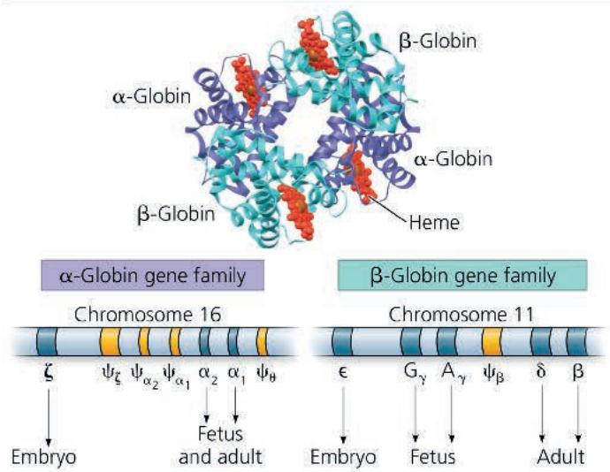

(b) The human $\alpha$ -globin and $\beta$ -globin gene families. Adult hemoglobin is composed of two $\alpha$ -globin and two $\beta$ -globin polypeptide subunits, as shown in the molecular model. The genes (darker blue) encoding $\alpha$ - and $\beta$ -globins are found in two families, organized as shown here. The noncoding DNA (light blue) separating the functional genes within each family includes pseudogenes ( $\Psi$ ; gold), versions of the functional genes that no longer encode functional polypeptides. Genes and pseudogenes are named with Greek letters, as you have seen previously for the $\alpha$ - and $\beta$ -globins. Some genes are expressed only in the embryo or fetus.

VISUAL SKILLS In the TEM at the top of part (a), how could you determine the direction of transcription if it weren't indicated by the red arrow? For suggested answer, see Appendix A.

The classic examples of multigene families of nonidentical genes are two related families of genes that encode globins, a group of proteins that include the $\alpha$ and $\beta$ polypeptide subunits of hemoglobin. One family, located on chromosome 16 in humans, encodes various forms of $\alpha$ -globin; the other, on chromosome 11, encodes forms of $\beta$ -globin (Figure 21.10b). The different forms of each globin subunit are expressed at different times in development, allowing hemoglobin to function effectively in the changing environment of the developing animal. In humans, for example, the embryonic and fetal forms of hemoglobin have a higher affinity for oxygen than the adult forms, ensuring the efficient transfer of oxygen from mother to fetus. Also found in the globin gene family clusters are several pseudogenes.

In Concept 21.5, we'll consider the evolution of these two globin gene families as we explore how arrangements of genes provide insight into the evolution of genomes. We'll also examine some processes that have shaped the genomes of different species over evolutionary time.

## Concept Check 21.4

1. Discuss the characteristics of mammalian genomes that make them larger than genomes of prokaryotic organisms.

2. VISUAL SKILLS Which of the three mechanisms described in Figures 21.8 and 21.9 result(s) in a copy remaining at the original site as well as a copy appearing in a new location?

3. Contrast the organizations of the rRNA gene family and the globin gene families. For each, explain how the existence of a family of genes benefits the organism.

4. MAKE CONNECTIONS Assign each DNA segment at the top of Figure 18.9 to a sector in the pie chart in Figure 21.6.

For suggested answers, see Appendix A.

## Concept 21.5: Duplication, rearrangement, and mutation of DNA contribute to genome evolution

EVOLUTION Now that we have explored the makeup of the human genome, let's see what its composition reveals about how the genome evolved. The basis of change at the genomic level is mutation, which underlies much of genome evolution. It seems likely that the earliest forms of life had a minimal number of genes—those necessary for survival and reproduction. If this were indeed the case, one aspect of evolution must have been an increase in the size of the genome, with the extra genetic material providing the raw material for gene diversification. In this section, we'll first look at how extra copies of all or part of a genome can arise and then consider subsequent processes that can lead to the evolution of proteins (or RNA products) with slightly different or entirely new functions.

## Duplication of Entire Chromosome Sets

An accident in meiosis, such as failure to separate homologs during meiosis I, can result in one or more extra sets of chromosomes, a condition known as polyploidy (see Concept 15.4). Although such accidents would most often be lethal, in rare cases they could facilitate the evolution of genes. In a polyploid organism, one set of genes can provide essential functions for the organism. The genes in the one or more extra sets can diverge by accumulating mutations; these variations may persist if the organism carrying them survives and reproduces. In this way, genes with novel functions can evolve. As long as one copy of an essential gene is expressed, the divergence of another copy can lead to its encoded protein acting in a novel way, thereby changing the organism's phenotype.

The outcome of this accumulation of mutations may eventually be the branching off of a new species. While polyploidy is rare among animals, it is relatively common among plants, especially flowering plants. Some botanists estimate that as many as 80% of the plant species that are alive today show evidence of polyploidy having occurred among their ancestral species. You'll learn more about the details of how polyploidy leads to plant speciation in Concept 24.2.

## Alterations of Chromosome Structure

With the recent explosion in genomic sequence information, we can now compare the chromosomal organizations of many different species in detail. This information allows us to make inferences about the evolutionary processes that shape chromosomes and may drive speciation. For example, scientists have long known that sometime in the last 7–8 million years, when the ancestors of humans and chimpanzees diverged as species, the fusion of two ancestral chromosomes in the human line led to different haploid numbers for humans (n = 23) and chimpanzees (n = 24). The banding patterns in stained chromosomes suggested that the ancestral versions of current chimpanzee chromosomes 12 and 13 fused end to end, forming chromosome 2 in an ancestor of the human lineage (Figure 21.11).

How do we know a chromosome didn't just split into two in an ancestor of chimps? A comparison of chromosomes in other great apes—gorillas, chimps, bonobos, and orangutans, our closest relatives—shows that those species have 24 chromosomes, so the simplest conclusion is that the last common ancestor of all great apes had 24 chromosomes. (You'll learn more about this type of reasoning in Concept 26.3.) Sequencing and analysis of human chromosome 2 during the Human Genome Project revealed sequences for telomeres and an extra, unused centromere in the middle of it, among other very strong supporting evidence for the model described previously (see Figure 21.11).

In another study of broader scope, researchers compared the DNA sequence of each human chromosome with the whole-genome sequence of the mouse (Figure 21.12). One part of their study showed that large blocks of genes on human chromosome 16 are found on four mouse chromosomes,

## Figure 21.11 Human and chimpanzee chromosomes.

The positions of telomere-like and centromere-like sequences on human chromosome 2 (left) match those of telomeres on chimpanzee chromosomes 12 and 13 and the centromere on chimpanzee chromosome 13 (right). This suggests that chromosomes 12 and 13 in a human ancestor fused end to end to form human chromosome 2. The centromere from ancestral chromosome 12 remained functional on human chromosome 2, while the one from ancestral chromosome 13 did not.

indicating that the genes in each block stayed together in both the mouse and the human lineages during their divergent evolution from a common ancestor.

Performing the same comparison of chromosomes of humans and six other mammalian species allowed the researchers to reconstruct the evolutionary history of chromosomal rearrangements in these eight species. They found many duplications and inversions of large portions of chromosomes, the result of errors during meiotic recombination in which the DNA was broken and rejoined incorrectly. The rate of these events seems to have begun accelerating about 100 million years ago, around 35 million years before large

## Interview

Interview with Eric Lander: Exploring the human genome (eTextbook only)

## Figure 21.12 Human and mouse chromosomes.

Here, we can see that DNA sequences very similar to large blocks of human chromosome 16 (colored areas in this diagram) are found on mouse chromosomes 7, 8, 16, and 17. This finding suggests that the DNA sequence in each block has stayed together in the mouse and human lineages since the time they diverged from a common ancestor.

Human chromosome  
  
Mouse chromosomes

dinosaurs became extinct and the number of mammalian species began rapidly increasing. The apparent coincidence is interesting because chromosomal rearrangements are thought to contribute to the generation of new species. Although two individuals with different arrangements could still mate and produce offspring, the offspring would have two nonequivalent sets of chromosomes, making meiosis inefficient or even impossible. Thus, chromosomal rearrangements would lead to two populations that could not successfully mate with each other, a step on the way to their becoming two separate species. (You'll learn more about this in Concept 24.2.)

The same study also unearthed a pattern with medical relevance. Analysis of the chromosomal breakage points associated with the rearrangements showed that specific sites were used over and over again. A number of these recombination “hot spots” correspond to locations of chromosomal rearrangements within the human genome that are associated with congenital diseases (see Concept 15.4).

## Duplication and Divergence of Gene-Sized Regions of DNA

Errors during meiosis can also lead to the duplication of chromosomal regions that are smaller than the ones we've just discussed, including segments the length of individual genes. Unequal crossing over during prophase I of meiosis, for instance, can result in one chromosome with a deletion and another with a duplication of a particular gene or genes. Transposable elements can provide homologous sites where nonsister chromatids can cross over, even when other chromatid regions are not correctly aligned (Figure 21.13).

Also, slippage can occur during DNA replication, such that the template shifts with respect to the new complementary strand, and a part of the template strand is either skipped by the replication machinery or used twice as a template. As a result, a segment of DNA is deleted or duplicated. It is easy to imagine how such errors could occur in regions of repeats. (See the question in Figure 21.13.) The variable number of repeated units of simple sequence DNA at a given site, used for STR analysis, is probably due to errors like these. Evidence that unequal crossing over and template slippage during DNA replication lead to duplication of genes is found in the existence of multigene families, such as the globin family.

## Evolution of Genes with Related Functions: The Human Globin Genes

In Figure 21.10b, you saw the organization of the $\alpha$ -globin and $\beta$ -globin gene families as they exist in the human genome today. Now, let's consider how events such as duplications can lead to the evolution of genes with related functions like the globin genes. A comparison of gene sequences within a multigene family can suggest the order in which the genes arose. Re-creating the evolutionary history of the globin genes using this approach indicates that they all evolved from one common ancestral globin gene that underwent duplication and divergence into the $\alpha$ -globin and $\beta$ -globin ancestral genes

Figure 21.13 Gene duplication due to unequal crossing over. One mechanism by which a gene (or other DNA segment) can be duplicated is recombination during meiosis between copies of a transposable element (patterned yellow) flanking the gene (blue). Such recombination between misaligned nonsister chromatids of homologous chromosomes produces one chromatid with two copies of the gene and one chromatid with no copy. (Genes and transposable elements are shown only in the region of interest.)

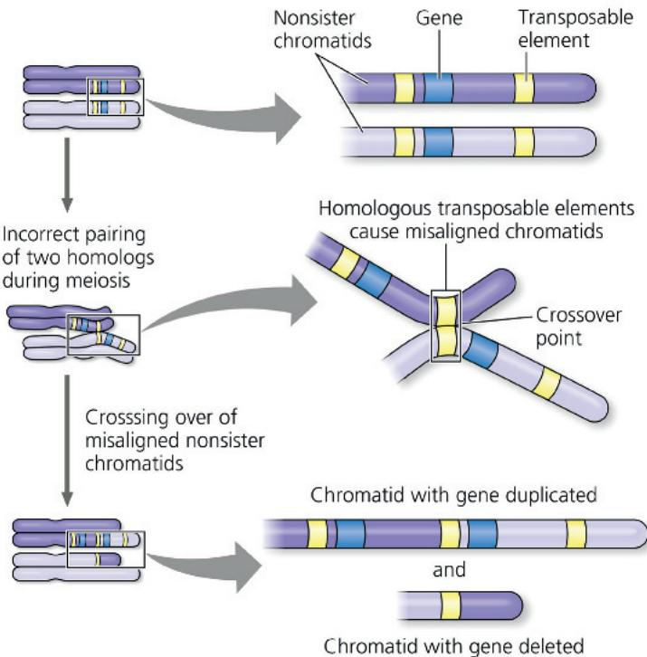  
MAKE CONNECTIONS Examine how crossing over occurs in Figure 13.9. In the middle panel above, draw a line through the portions that result in the upper chromatid in the bottom panel. Use a different color to do the same for the other chromatid.  
For suggested answer, see Appendix A.

about 450–500 million years ago (Figure 21.14). Each of these genes was later duplicated several times, and the copies then diverged from each other in sequence, yielding the current family members. In fact, the common ancestral globin gene also gave rise to the oxygen-binding muscle protein myoglobin and to the plant protein leghemoglobin. The latter two proteins function as monomers, and their genes are included in a “globin superfamily.”

After the duplication events, the differences between the genes in the globin families undoubtedly arose from mutations that accumulated in the gene copies over many generations. The current model is that the necessary function provided by an $\alpha$ -globin protein, for example, was fulfilled by one gene, while other copies of the $\alpha$ -globin gene accumulated random mutations. Many mutations may have had an adverse effect on the organism, and others may have had no effect. However, a few mutations must have altered the function of the protein product in a way that benefitted the organism at a particular life stage without substantially changing the protein's oxygen-carrying function. Presumably, natural selection acted on these altered genes, maintaining them in the population.

  
Figure 21.15 Comparison of lysozyme and $\alpha$ -lactalbumin proteins.

Figure 21.14 A proposed model for the sequence of events in the evolution of the human $\alpha$ -globin and $\beta$ -globin gene families from a single ancestral globin gene.  
  
The gold elements (labeled $\psi$ ) are pseudogenes. Explain how they could have arisen after gene duplication. For suggested answer, see Appendix A.

In the Scientific Skills Exercise, you can compare amino acid sequences of the globin family proteins and see how such comparisons were used to generate the model for globin gene evolution shown in Figure 21.14. The existence of several pseudogenes among the functional globin genes provides

additional evidence for this model: Random mutations in these “genes” over evolutionary time have destroyed their function.

## Evolution of Genes with Novel Functions

In the evolution of the globin gene families, gene duplication and subsequent divergence produced family members whose protein products performed similar functions (oxygen transport). Alternatively, one copy of a duplicated gene can undergo alterations that lead to a completely new function for the protein product. The genes for lysozyme and $\alpha$ -lactalbumin are a good example.

Lysozyme is an enzyme that helps protect animals against bacterial infection by hydrolyzing bacterial cell walls (see Visualizing Figure 5.16); $\alpha$ -lactalbumin is a nonenzymatic protein that plays a role in milk production in mammals. The two proteins are quite similar in their amino

acid sequences and three-dimensional structures (Figure 21.15). Both genes are found in mammals, but only the lysozyme gene is present in birds. These findings suggest that at some time after the lineages leading to mammals and birds had separated,

Computer-generated ribbon models of the similar structures of (a) lysozyme and (b) $\alpha$ -lactalbumin are shown, along with (c) a comparison of the amino acid sequences of the two proteins. Single-letter amino acid codes are used (see Figure 5.14). Identical amino acids are highlighted in yellow, and dashes indicate gaps in one sequence that have been introduced by the software to optimize the alignment.  
  
MAKE CONNECTIONS Even though two amino acids are not identical, they may be structurally and chemically similar and therefore behave similarly. Using Figure 5.14 as a reference, examine the nonidentical amino acids in positions 1–30 and note cases where the amino acids in the two sequences are similarly acidic or basic.

For suggested answer, see Appendix A.

Lysozyme 51 STD YGI FQI NSRYWC NDGKTP GAVN ACHL SCSAL LQDN IADAVACAKRVV
α-lactalbumin 51 STEYGL FQISNKL WCKSSQVP QSRNIC DISC DKFL DDDIT DDIM CAKKIL

Lysozyme 101 RDPQGIRAWVWRNRCQ-NRDVRQYVQGCGV
α-lactalbumin 101 D-IKGIDYWLAHKALCT--EKLEQWLCEKL-

(c) Amino acid sequence alignments of lysozyme and $\alpha$ -lactalbumin

## Scientific Skills Exercise Reading an Amino Acid Sequence Identity Table

How Have Amino Acid Sequences of Human Globin Genes Diverged During Their Evolution? To build a model of the evolutionary history of the globin genes (see Figure 21.14), researchers compared the amino acid sequences of the polypeptides they encode. In this exercise, you will analyze comparisons of the amino acid sequences of the globin polypeptides to shed light on their evolutionary relationships.

How the Experiment Was Done Scientists obtained the DNA sequences for each of the eight globin genes and “translated” them into amino acid sequences. They then used a computer program to align the sequences (with dashes indicating gaps in one sequence) and calculate a percent identity value for each pair of globins. The percent identity reflects the number of positions with identical amino acids relative to the total number of amino acids in a globin polypeptide. The data were displayed in a table to show the pairwise comparisons.

Data from the Experiment The following table shows an example of a pairwise alignment—that of the $\alpha_{1}$ -globin (alpha-1 globin) and $\zeta$ -globin (zeta globin) amino acid sequences—using the

<table><tr><td>Globin</td><td>Alignment of Globin Amino Acid Sequences</td></tr><tr><td> $\alpha_{1}$ </td><td>1MMLSPADKTNVKAAWGKVGAHAGEYGAEAL</td></tr><tr><td> $\zeta$ </td><td>1MSLTKTERTIIVSMWAKISTQADTIGTETL</td></tr><tr><td> $\alpha_{1}$ </td><td>31ERMFLSFPTTKTYFPHFDLSH-GSAQVKGH</td></tr><tr><td> $\zeta$ </td><td>31ERLFLSHPQTKTYFPHFDL-HPGSAQLRAH</td></tr><tr><td> $\alpha_{1}$ </td><td>61GKKVADALTNAVAHVDDMPNALSALS D LHA</td></tr><tr><td> $\zeta$ </td><td>61GSKVVAAVGDAVKSIDDIGGALS KLS E LHA</td></tr><tr><td> $\alpha_{1}$ </td><td>91HKLRVDPVNFKLLSHCLLVTLAAHLPAEFT</td></tr><tr><td> $\zeta$ </td><td>91YILRVDPVNFKLLSHCLLVTLAARFPADFT</td></tr><tr><td> $\alpha_{1}$ </td><td>121PAVHASLDKFLASVSTVLTSKYR</td></tr><tr><td> $\zeta$ </td><td>121AEAHAWDKFLSVVSSVLTEKYR</td></tr></table>

standard single-letter symbols for amino acids. To the left of each line of amino acid sequence is the number of the first amino acid in that line. The percent identity value for the $\alpha_{1}$ - and $\zeta$ -globin amino acid sequences was calculated by counting the number of matching amino acids (86, highlighted in yellow), dividing by the total number of amino acid positions (143), and

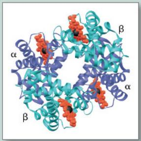  
Hemoglobin

then multiplying by 100. This resulted in a $60\%$ identity value for the $\alpha_{1}-\zeta$ pair, as shown in the amino acid identity table below. The values for other globin pairs were calculated in the same way.

## INTERPRET THE DATA

1. Note that in the amino acid identity table, the data are arranged so each globin pair can be compared. (a) Some cells in the table have dashed lines. What percent identity value is implied by the dashed lines? (b) Using the information already provided in the table, fill in the missing values in the lower left half of the table. Why does it make sense that these cells were left blank?

2. The earlier that two genes arose from a duplicated gene, the more their nucleotide sequences can have diverged, which may result in amino acid differences in the protein products. (a) Based on that premise, identify which two genes are most divergent from each other. What is the percent amino acid identity between their polypeptides? (b) Which two globin genes are the most recently duplicated? What is the percent identity between them?

3. The model of evolution in Figure 21.14 suggests that an ancestral gene duplicated and mutated to become $\alpha$ - and $\beta$ -globin genes, and then each one was further duplicated and mutated. What features of the data set support the model?

4. Make an ordered list of all the percent identity values from the table, starting with 100% at the top. Next to each number write the globin pair(s) with that percent identity value. Use one color for the globins from the $\alpha$ family and a different color for the globins from the $\beta$ family. (a) Compare the order of pairs with their positions in Figure 21.14. Does the order of pairs describe the same relative “closeness” of globin family members seen in the model? (b) Compare the percent identity values for pairs within the $\alpha$ or $\beta$ family. to the values for between-family pairs.

<table><tr><td colspan="10">Amino Acid Identity Table</td></tr><tr><td colspan="5">α Family</td><td colspan="5">β Family</td></tr><tr><td></td><td></td><td> $α_1$ (alpha 1)</td><td> $α_2$ (alpha 2)</td><td>ζ(zeta)</td><td>β(beta)</td><td>δ(delta)</td><td>ε(epsilon)</td><td> $A_\gamma$ (gamma A)</td><td> $G_\gamma$ (gamma G)</td></tr><tr><td rowspan="3">α Family</td><td> $α_1$ </td><td>----</td><td>100</td><td>60</td><td>45</td><td>44</td><td>39</td><td>42</td><td>42</td></tr><tr><td> $α_2$ </td><td></td><td>----</td><td>60</td><td>45</td><td>44</td><td>39</td><td>42</td><td>42</td></tr><tr><td>ζ</td><td></td><td></td><td>----</td><td>38</td><td>40</td><td>41</td><td>41</td><td>41</td></tr><tr><td rowspan="5">β Family</td><td>β</td><td></td><td></td><td></td><td>----</td><td>93</td><td>76</td><td>73</td><td>73</td></tr><tr><td>δ</td><td></td><td></td><td></td><td></td><td>----</td><td>73</td><td>71</td><td>72</td></tr><tr><td>ε</td><td></td><td></td><td></td><td></td><td></td><td>----</td><td>80</td><td>80</td></tr><tr><td> $A_\gamma$ </td><td></td><td></td><td></td><td></td><td></td><td></td><td>----</td><td>99</td></tr><tr><td> $G_\gamma$ </td><td></td><td></td><td></td><td></td><td></td><td></td><td></td><td>----</td></tr></table>

Compiled using data from the National Center for Biotechnology Information (NCBI).

the lysozyme gene was duplicated in the mammalian lineage but not in the avian lineage. Subsequently, one copy of the duplicated lysozyme gene evolved into a gene encoding $\alpha$ -lactalbumin, a protein with a completely new function associated with a key characteristic of mammals—milk production. In one study, evolutionary biologists searched vertebrate genomes for genes with similar sequences. There appear to be at least eight members of the lysozyme family, distributed widely among mammalian species. The functions of all the encoded gene products are not yet known, but it will be exciting to discover whether they are as different as the functions of lysozyme and $\alpha$ -lactalbumin.

Besides the duplication and divergence of whole genes, rearrangement of existing DNA sequences within genes has also contributed to genome evolution. The presence of introns may have promoted the evolution of new proteins by facilitating the duplication or shuffling of exons, as we'll see next.

## Rearrangements of Parts of Genes: Exon Duplication and Exon Shuffling

Recall from Concept 17.3 that an exon often codes for a protein domain, a distinct structural and functional region of a protein molecule, such as the WD40 domain in Figure 21.3. We've already seen that unequal crossing over during meiosis can lead to duplication of a gene on one chromosome and its loss from the homologous chromosome (see Figure 21.13). By a similar process, a particular exon within a gene could be duplicated on one chromosome and deleted from the other. The gene with the duplicated exon would code for a protein containing a second copy of the encoded domain. This change in the protein's structure might augment its function by increasing its stability, enhancing its ability to bind a particular ligand, or altering some other property. Quite a few protein-coding genes have multiple copies of related exons, which presumably arose by duplication and then diverged. The gene encoding the extracellular matrix protein collagen is a good example. Collagen is a structural protein (see Figure 5.18) with a highly repetitive amino acid sequence, which reflects the repetitive pattern of exons in the collagen gene.

As an alternative possibility, we can imagine the occasional mixing and matching of different exons either within a gene or between two different (nonallelic) genes owing to errors in meiotic recombination. This process, termed exon shuffling, could lead to new proteins with novel combinations of functions. As an example, let's consider the gene for tissue plasminogen activator (TPA). The TPA protein is an extracellular protein that helps control blood clotting. It has four domains of three types, each encoded by an exon, and one of those exons is present in two copies. Because each type of exon is also found in other proteins, the current version of the gene for TPA is thought to have arisen by several instances of exon shuffling during errors in meiotic recombination and subsequent duplication (Figure 21.16).

## How Transposable Elements Contribute to Genome Evolution

The persistence of transposable elements as a large fraction of some eukaryotic genomes is consistent with the idea that they play an important role in shaping a genome over evolutionary

Figure 21.16 Evolution of a new gene by exon shuffling.

Meiotic errors could have moved exons, each encoding a particular domain, from ancestral forms of the genes for epidermal growth factor, fibronectin, and plasminogen (left) into the evolving gene for tissue plasminogen activator, TPA (right). Subsequent duplication of the “kringle” exon (K) from the plasminogen gene after its movement into the TPA gene could account for the two copies of this exon in the TPA gene existing today.

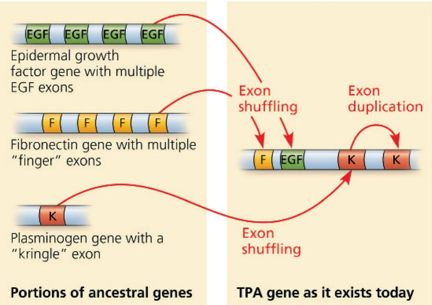  
VISUAL SKILLS Looking at Figure 21.13, describe the steps by which transposable elements within introns might have facilitated the exon shuffling shown here.  
For suggested answer, see Appendix A.

time. These elements can contribute to the evolution of the genome in several ways. They can promote recombination, disrupt cellular genes or control elements, and carry entire genes or individual exons to new locations.

Transposable elements of similar sequence scattered throughout the genome facilitate recombination between different (nonhomologous) chromosomes by providing homologous regions for crossing over (see Figure 21.13). Most such recombination events are probably detrimental, causing chromosomal translocations and other changes in the genome that may be lethal to the organism. But over the course of evolutionary time, an occasional recombination event of this sort may be advantageous to the organism. (For the change to be heritable, of course, it must happen in a cell that will give rise to a gamete.)

The movement of a transposable element can have a variety of consequences. For instance, a transposable element that “jumps” into a protein-coding sequence will prevent the production of a normal transcript of the gene. (Introns provide a sort of “safety zone” that does not affect the transcript because the transposable element will be spliced out—unless it affects the splicing process.) If a transposable element inserts within a regulatory sequence, the transposition may lead to increased or decreased production of one or more proteins. Transposition caused both types of effects on the genes coding for pigment-synthesizing enzymes in McClintock’s corn kernels. Again, while such changes are usually harmful, in the long run some may provide a survival advantage. A possible example was mentioned earlier: At least some of the Alu transposable elements in the human genome are known to produce RNAs that regulate expression of human genes.

During transposition, a transposable element may carry along a gene or even a group of genes to a new position in the genome. This occurrence probably accounts for the location of the $\alpha$ -globin and $\beta$ -globin gene families on different human chromosomes, as well as the dispersion of the genes of certain other gene families. By a similar tag-along process, an exon from one gene may be inserted into another gene in a mechanism similar to that of exon shuffling during recombination. For example, an exon may be inserted by transposition into the intron of a protein-coding gene. If the inserted exon is retained in the RNA transcript during RNA splicing, the protein that is synthesized will have an additional domain, which may confer a new function on the protein.

Most often, the processes discussed in this section produce harmful effects, which may be lethal, or have no effect at all. In a few cases, however, small heritable changes that are beneficial may occur. Over many generations, the resulting genetic diversity provides valuable raw material for natural selection. Diversification of genes and their products is an important factor in the evolution of new species. Thus, the accumulation of changes in the genome of each species provides a record of its evolutionary history. To read this record, we must be able to identify genomic changes. Comparing the genomes of different species allows us to do that, increasing our understanding of how genomes evolve. You will learn more about these topics next.

## Concept Check 21.5

1. Describe three examples of errors in cellular processes that lead to DNA duplications.

2. Explain how multiple exons might have arisen in the ancestral EGF and fibronectin genes shown in Figure 21.16 (left).

3. What are three ways that transposable elements are thought to contribute to genome evolution?

4. WHAT IF? In 2005, Icelandic scientists reported finding a large chromosomal inversion present in 20% of northern Europeans, and they noted that Icelandic females with this inversion had significantly more children than females without it. What would you expect to happen to the frequency of this inversion in the Icelandic population in future generations?

For suggested answers, see Appendix A.

# Concept 21.6: Comparing genome sequences provides clues to evolution and development

EVOLUTION In the last several decades, we have seen rapid advances in genome sequencing and data collection, new techniques for assessing gene activity across the whole genome and for editing a gene sequence in a specific way in living cells, and refined approaches for understanding how genes and their products work together in complex systems. In the field of biology, we are truly in the midst of a new world.

The more similar in sequence the genes and genomes of two species are, the less time has passed for mutations and other changes to accumulate, and therefore the more closely related those species are in their evolutionary history. Comparing genomes of closely related species sheds light on more recent evolutionary events, whereas comparing genomes of very distantly related species helps us understand ancient evolutionary history. In either case, learning about characteristics that are shared or divergent between groups enhances our picture of the evolution of organisms and biological processes. Evolutionary relationships between species can be represented by a diagram in the form of a tree (often turned sideways), where each branch point marks the divergence of two lineages (see Figure 1.20). Figure 21.17 shows the evolutionary relationships of some groups and species we'll now examine.

Comparing genome sequences from different species reveals a lot about the evolutionary history of life, from very ancient to more recent. Similarly, comparative studies of the genetic programs that direct embryonic development in different species are uncovering the mechanisms that generated the great diversity of life-forms present today. We'll now look at what has been learned from these two approaches.

## Comparing Genomes

Figure 21.17 Evolutionary relationships of distantly and closely related organisms.

The tree diagram at the top shows the divergence long ago of plants, animals, and fungi. A portion of the animal lineage is expanded to show the more recent divergence of three mammalian species discussed in this chapter.

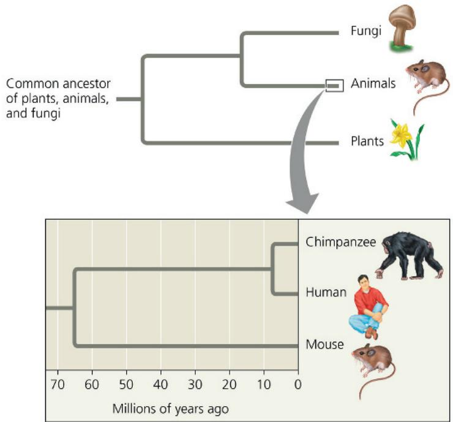

<!-- END OFFICIAL MINERU API RESULT part_05 -->

<!-- BEGIN OFFICIAL MINERU API RESULT part_06 -->

## Comparing Distantly Related Species

Determining which genes have remained similar—that is, are highly conserved—in distantly related species can help clarify evolutionary relationships among species that diverged from each other long ago. Indeed, comparisons of gene sequences of organisms in Bacteria, Archaea, and Eukarya indicate that these groups diverged between 2 and 4 billion years ago. Studies comparing gene sequences of plants, animals, and fungi have revealed that animals and fungi diverged from each other more recently (at least 1 billion years ago) than those two groups diverged from plants (at least 1.2 billion years ago). This tells us that fungi—which include mushrooms and yeasts—are more closely related to animals than they are to plants (see Figure 21.17).

In addition to their value in evolutionary biology, comparative genomic studies confirm the relevance of research on model organisms to our understanding of biology in general and human biology in particular. Very ancient genes can still be surprisingly similar in disparate species. One experimental study tested the ability of the human version of each of 414 important yeast genes to function equivalently in yeast cells. Remarkably, the researchers concluded that 47% of these yeast genes could be replaced by the corresponding human gene. This striking result underscores the common origin of yeasts and humans—two distantly related species.

## Comparing Closely Related Species

The genomes of two closely related species are likely to be organized similarly because of their relatively recent divergence. Their long shared history also means that only a small number of gene differences are found when their genomes are compared. These genetic differences can thus be more easily correlated with phenotypic differences between the two species. An exciting application of this type of analysis is seen as researchers compare the human genome with the genomes of the chimpanzee, mouse, rat, and other mammals. Identifying the genes shared by all of these species but not by nonmammals gives us clues about what it takes to make a mammal, while finding the genes shared by chimpanzees and humans but not by rodents tells us something about primates. And, of course, comparing the human genome with that of the chimpanzee helps us answer a tantalizing question: What genomic information defines a human or a chimpanzee?

An analysis of the overall composition of the human and chimpanzee genomes, which are thought to have diverged only about 7–8 million years ago (see Figure 21.17), reveals some general differences. Considering single nucleotide substitutions, the two genomes differ by only 1.2%. When researchers looked at longer stretches of DNA, however, they were surprised to find a further 2.7% difference due to insertions or deletions of larger regions in the genome of one or the other species; many of the insertions were duplications or other repetitive DNA. In fact, a third of the human duplications are not present in the chimpanzee genome, and some of these duplications contain regions associated with

human diseases. More Alu elements have undergone transposition in the human genome, leading to 7,000 human-specific elements compared with 2,300 chimpanzee-specific elements. The chimpanzee genome, in turn, contains many copies of a retroviral provirus not present in humans. All of these observations provide clues to the forces that might have swept the two genomes along different paths, but we don't have a complete picture yet.

Along with chimpanzees, bonobos are the other African ape species that are the closest living relatives to humans. The sequencing of the bonobo genome revealed that in some regions, human sequences were more closely related to either chimpanzee or bonobo sequences than chimpanzee or bonobo sequences were to each other. Such a fine-grained comparison of three closely related species allows even more detail to be worked out in reconstructing their related evolutionary history.

In 2023, a group of researchers from many institutions around the world published a comparison of 800 genome sequences of 233 primate species, almost half of the known primate species on the planet (including our species—Homo sapiens). Various sequence analyses yielded valuable insights in a wide range of fields, including human health and behavioral evolution. One study focused on 4.3 million common gene variants in humans; researchers were able to classify 98.7% of them as most likely harmless based on their prevalence throughout primate species. Another study analyzed species of monkey with multilevel social structures. These researchers found that the evolution of complex societies was correlated with species living in colder climates and changes in the genes for oxytocin and dopamine, molecules that function in pair bonding and pleasure, respectively.

We don't know how the genetic differences revealed by genome sequencing might account for the distinct characteristics of each species. To discover the basis for the phenotypic differences between chimpanzees and humans, biologists are studying specific genes and types of genes that differ between the two species and comparing them with their counterparts in other mammals. This approach has revealed a number of genes that are apparently changing (evolving) faster in the human than in either the chimpanzee or the mouse. Among them are genes involved in defense against malaria and tuberculosis as well as at least one gene that regulates brain size. When genes are classified by function, the genes that seem to be evolving the fastest are those that code for transcription factors. This discovery makes sense because transcription factors regulate gene expression and thus play a key role in orchestrating the overall genetic program.

One transcription factor of interest, whose gene is called FOXP2, might be involved with the acquisition of speech in humans. Several lines of evidence suggest that the FOXP2 gene product regulates genes that function in vocalization in vertebrates. First, mutations in this gene can produce severe speech and language impairment in humans. Second, the FOXP2 gene is expressed in the brains of zebra finches and canaries at the time when these songbirds are learning their songs. And third, perhaps the strongest evidence comes from a “knockout” experiment in which researchers disrupted the FOXP2 gene in mice and analyzed the resulting phenotype (Figure 21.18). The homozygous mutant mice had malformed brains and failed to

## Figure 21.18

# Inquiry: What is the function of a gene (FOXP2) that may be involved in language acquisition?

## Experiment

Several lines of evidence support a role for the FOXP2 gene in the development of speech and language in humans and of vocalization in other vertebrates. In 2005, Joseph Buxbaum and collaborators at the Mount Sinai School of Medicine and several other institutions tested the function of FOXP2. They used the mouse, a model organism in which genes can be easily knocked out, as a representative vertebrate that vocalizes: Mice produce ultrasonic squeaks (whistles) to communicate stress. The researchers used genetic engineering to produce mice in which one or both copies of FOXP2 were disrupted.

Wild type: two normal copies of FOXP2

Heterozygote: one copy of FOXP2 disrupted

Homozygote: both copies of FOXP2 disrupted

They then compared the phenotypes of these mice. Two of the characters they examined are included here: brain anatomy and vocalization.

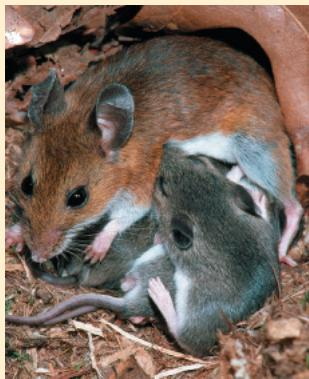

## Experiment 1

Researchers cut thin sections of brain and stained them with reagents that allow visualization of brain anatomy in a UV fluorescence microscope.

Experiment 1 Results: Disruption of both copies of FOXP2 led to brain abnormalities in which the cells were disorganized. Phenotypic effects on the brain of heterozygotes, with one disrupted copy, were less severe. (Each color in the micrographs below reveals a different cell or tissue type, as labeled.)

## Experiment 2

To induce stress, researchers separated each newborn mouse pup from its mother and recorded the number of ultrasonic whistles produced by the pup.

Experiment 2 Results: Disruption of both copies of FOXP2 led to an absence of ultrasonic vocalization in response to stress. The effect on vocalization in the heterozygote was also extreme.

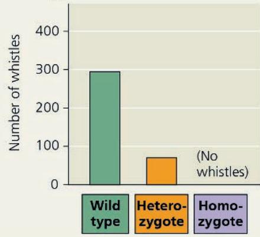

## Conclusion

FOXP2 plays a significant role in the development of functional communication systems in mice. The results augment evidence from studies of birds and humans, supporting the hypothesis that FOXP2 may act similarly in diverse organisms.

Data from W. Shu et al., Altered ultrasonic vocalization in mice with a disruption in the FOXP2 gene, Proceedings of the National Academy of Sciences USA 102:9643–9648 (2005).

WHAT IF? Since the results support a role for mouse FOXP2 in vocalization, you might wonder whether the human FOXP2 protein is a key regulator of speech. If you were given the amino acid sequences of wild-type and mutant human FOXP2 proteins and the wild-type chimpanzee FOXP2 protein, how would you investigate this question? What further clues could you obtain by comparing these sequences to that of the mouse FOXP2 protein?

For suggested answer, see Appendix A.

emit normal ultrasonic vocalizations; mice with one faulty copy of the gene also showed significant problems with vocalization. These results support the idea that the FOXP2 gene product turns on genes involved in vocalization.

Expanding on this analysis in 2021, another research group replaced the FOXP2 gene in mice with a “humanized” copy coding for the human versions of the FOXP2 protein. The researchers reported that although the mice with the human FOXP2 gene were generally healthy, they had subtly different vocalizations and showed changes in brain cells in circuits associated with speech in human brains. A different group further investigated the mechanism for the disruption of vocalization patterns in mice. In 2023, they reported that mutations in FOXP2 disrupt motor proteins that move along the microtubules of the cytoskeleton, which prevents formation of nerve cell processes that allow signals for speech production. The human version of FOXP2 may also contribute to autism spectrum disorders, Huntington’s disease, and Parkinson’s disease, all of which are areas of current research.

The FOXP2 story is an excellent example of how different approaches can complement each other in uncovering biological phenomena of widespread importance. The FOXP2 experiments used mice as a model for humans because it would be unethical (as well as impractical) to carry out such experiments in humans. Mice and humans, which diverged about 65.5 million years ago (see Figure 21.17), share about 85% of their genes. This genetic similarity can be exploited in studying human genetic disorders. If researchers know the organ or tissue that is affected by a particular genetic disorder, they can look for genes that are expressed in these locations in mice.

Even though more distantly related to humans, fruit flies have also been a useful model species for study of such human disorders as Parkinson's disease and alcoholism, while nematodes (soil worms) have yielded a wealth of information about aging. Further research efforts are under way to extend genomic studies to many more species, including neglected species from diverse branches of the tree of life. These studies will advance our understanding of evolution, of course, as well as all aspects of biology, from human health to ecology.

## Comparing Genomes Within a Species

Another exciting consequence of our ability to analyze genomes is our growing understanding of the spectrum of genetic variation in humans. Because the history of the human species is so short—probably about 200,000 years—the amount of DNA variation among humans is small compared to that of many other species. Much of our diversity seems to be in the form of single nucleotide polymorphisms (SNPs). SNPs are single base-pair sites where genetic variation is found in at least 1% of the population (see Concept 20.2); they are usually detected by DNA sequencing. In the human genome, SNPs occur on average about once in 100–300 base pairs. Scientists have already identified the locations of many tens of millions of SNP sites in the human genome and continue to find additional SNPs, especially when sequencing the whole genomes of individuals from cultural or linguistic groups not previously sampled. These are stored in databases around the world, one of which is run by the National Center for Biotechnology Information (NCBI).

In the course of this search, they have also found other variations—including chromosomal regions with inversions, deletions, and duplications. The most surprising discovery has been the widespread occurrence of copy-number variants (CNVs), loci where some individuals have one or multiple copies of a particular gene or genetic region rather than the standard two copies (one on each homolog). CNVs result from regions of the genome being duplicated or deleted inconsistently within the population. One 2022 study used a computational method to analyze tissue samples from the United Kingdom Biobank, from 452,500 individuals, and found 15 million CNVs. Since these variants encompass much longer stretches of DNA than the single nucleotides of SNPs, CNVs are more likely to have phenotypic consequences and to play a role in complex diseases and disorders. Using data available from the donors, the researchers were able to find biological connections between these CNVs and dozens of complex traits, including height and blood levels of constituents such as cholesterol. This type of analysis is likely to prove very helpful in understanding and treating diseases.

Copy-number variants, SNPs, and variations in repetitive DNA such as short tandem repeats (STRs) are useful genetic markers for studying human evolution. Several large studies over the past few years have thoroughly sequenced hundreds of individuals from diverse populations around the world—from Europe, Africa, the Middle East, Central and South Asia, East Asia, Oceania, and the Americas. Their results strongly supported earlier studies showing that genetic diversity among African genomes is far higher than among individuals from any other continent, consistent with our understanding that humans and their ancestors arose in Africa (see Concept 34.7). Further genome sequencing will continue to clarify our understanding of the migratory routes and evolution of different human populations.

## Interview

Interview with Charles Rotimi: Using genomics to study health-related conditions in African-Americans (eTextbook only)

## Widespread Conservation of Developmental Genes Among Animals

Biologists in the field of evolutionary developmental biology, or evo-devo, as it is often called, compare developmental processes of different multicellular organisms. Their aim is to understand how these processes have evolved and how changes in them can modify existing organismal features or lead to new ones. With the advent of molecular techniques and the recent flood of genomic information, we are beginning to realize that the genomes of related species with strikingly different forms may have only minor differences in gene sequence or, perhaps more importantly, in gene regulation. Discovering the molecular basis of these differences in turn helps us understand the origins of the myriad diverse forms that cohabit this planet, thus informing our study of the evolution of life.

In Concept 18.4, you learned about the homeotic genes in Drosophila melanogaster, which encode transcription factors that regulate gene expression and specify the identity of body segments in the fruit fly (see Figure 18.20). Molecular analysis of the homeotic genes in Drosophila has shown that they all include a 180-nucleotide sequence called a homeobox, which codes for a 60-amino-acid homeodomain in the encoded proteins. An identical or very similar nucleotide sequence has been discovered in the homeotic genes of many invertebrates and vertebrates. The resemblance even extends to the organization of these genes: The vertebrate genes homologous to the homeotic genes of fruit flies have kept the same chromosomal arrangement (Figure 21.19). The similarities in sequence and organization are so striking that one researcher has whimsically referred to flies as “little people with wings.” Homeobox-containing sequences have also been found in regulatory genes of much more distantly related eukaryotes, including plants and yeasts. From these similarities, we can deduce that the homeobox DNA sequence evolved very early and was sufficiently valuable to organisms to have been conserved in animals and plants virtually unchanged for hundreds of millions of years.

Homeotic genes in animals were named Hox genes, short for homeobox-containing genes, because homeotic genes were the first genes found to have this sequence. Other homeobox-containing genes were later found that do not act as homeotic genes; that is, they do not directly control the identity of body parts. However, most of these genes, in animals at least, are associated with development, suggesting their ancient and fundamental importance in that process. In Drosophila, for example, homeoboxes are present not only in the homeotic genes but also in the egg-polarity gene bicoid (see Figures 18.21 and 18.22), in several of the segmentation genes, and in a master regulatory gene for eye development.

Researchers have discovered that the homeobox-encoded homeodomain is the part of the protein that binds to DNA when the protein functions as a transcription factor. Elsewhere in the protein, domains that are more variable interact with other transcription factors, allowing the homeodomain-containing protein to recognize specific enhancers and regulate the associated genes. Proteins with homeodomains probably regulate development by coordinating the transcription of batteries of developmental genes, switching them on or off. In embryos of Drosophila and other animal species, different combinations of homeobox genes are active in different parts of the embryo. This selective expression of regulatory genes, varying over time and space, is central to pattern formation.

Figure 21.19 Conservation of homeotic genes in a fruit fly and a mouse.

Homeotic genes that control the form of anterior and posterior structures of the body occur in the same linear sequence on chromosomes in Drosophila and mice. Each colored band on the chromosomes shown here represents a homeotic gene. In fruit flies, all homeotic genes are found on one chromosome. The mouse and other mammals have the same or similar sets of genes on four chromosomes. The color code indicates the parts of the embryos in which these genes are expressed and the adult body regions that result. All of these genes are essentially identical in flies and mice, except for those represented by black bands, which are less similar in the two animals.

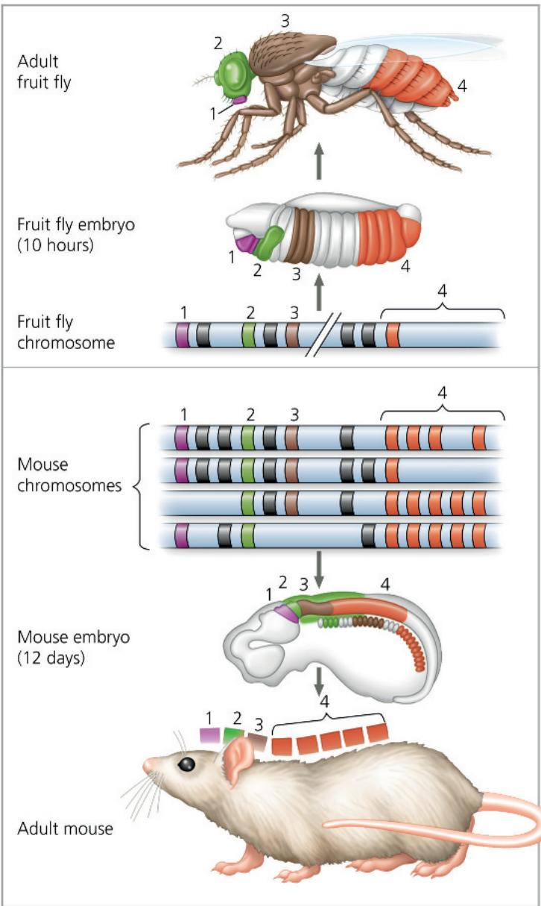

Developmental biologists have found that in addition to homeotic genes, many other genes involved in development are highly conserved from species to species. These include numerous genes encoding components of signaling pathways.

The extraordinary similarity among some developmental genes in different animal species raises a question: How can the same genes be involved in the development of animals whose forms are so very different from each other?

In some cases, small changes in regulatory sequences of particular genes cause changes in gene expression patterns that can lead to major changes in body form. For example, the differing patterns of expression of the Hox genes along the body axis in a crustacean and an insect can explain the variation in number of leg-bearing segments among these closely related animals (Figure 21.20). In other cases, similar genes direct different developmental processes in various organisms, resulting in diverse body shapes. Several Hox genes, for instance, are expressed in the embryonic and larval stages of the sea urchin, a nonsegmented animal that has a body plan quite different from those of insects and mice. Sea urchin adults make the pincushion-shaped shells you may have seen on the beach; two species of live sea urchins are shown in the photo. Sea urchins are among the model organisms long used in classical embryological studies (see Concept 47.2).

In this final chapter of the genetics unit, you have learned how studying genomic composition and comparing the genomes of different species can illuminate the process by which genomes evolve. Furthermore, comparing developmental programs, we can see that the unity of life is reflected in the similarity of molecular and cellular mechanisms used to establish body pattern, although the genes directing development may differ among organisms. The similarities between genomes reflect the common ancestry of life on Earth. But the differences are also crucial, for they have created the huge diversity of organisms that have evolved. In the remaining chapters, we expand our perspective beyond the level of molecules, cells, and genes to explore this diversity on the organismal level.

Two species of sea urchins  
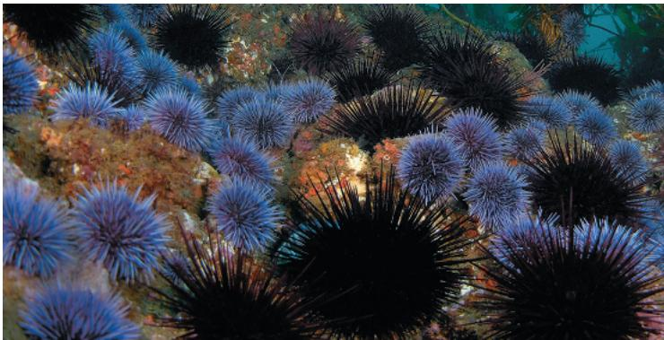

Figure 21.20 Effect of differences in Hox gene expression in a crustacean and an insect.

Changes in the expression patterns of Hox genes have occurred over evolutionary time since insects diverged from a crustacean ancestor. These changes account in part for the different body plans of (a) the brine shrimp Artemia, a crustacean, and (b) the grasshopper, an insect. Shown here are regions of the adult body color-coded for expression of four Hox genes that determine the formation of particular body parts during embryonic development. Each color represents a specific Hox gene.

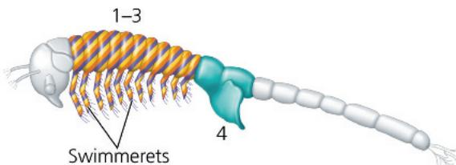

(a) Expression of four Hox genes in the brine shrimp Artemia. Three of the Hox genes are expressed together in one region (indicated by stripes), specifying the identity of the segments that have swimmerets. The fourth (teal) specifies the identity of the genital segments.

(b) Expression of the grasshopper versions of the same four Hox genes. In the grasshopper, each Hox gene is expressed in a discrete region and specifies the identity of that region.

## Concept Check 21.6

1. Would you expect the genome of the macaque (a monkey) to be more like that of a mouse or that of a human? Explain.

2. DNA sequences called homeoboxes help homeotic genes in animals direct development. Given that they are common to flies and mice, explain why these animals are so different.

3. WHAT IF? There are three times as many human-specific insertions of Alu elements in the human genome as in the chimpanzee genome. How did these extra Alu elements arise in the human genome? Propose a role they might have played in the divergence of these two species.

For suggested answers, see Appendix A.

# Chapter 21 Review

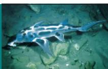

## Summary of Key Concepts

To review key terms, go to the Vocabulary Self-Quiz (eTextbook only).

## Concept 21.1: The Human Genome Project fostered development of faster, less expensive sequencing techniques

\- The Human Genome Project was largely completed in 2003, aided by major advances in sequencing technology

\- In the whole-genome shotgun approach, the whole genome is cut into many small, overlapping fragments that are sequenced; computer software then assembles the genome sequence.

How did the Human Genome Project result in more rapid, less expensive DNA-sequencing technology?

## Concept 21.2: Scientists use bioinformatics to analyze genomes and their functions

\- Computer analysis of genome sequences aids gene annotation, the identification of protein-coding sequences. Methods to determine gene function include comparing sequences of newly discovered genes with those of known genes in other species and observing the effects of experimentally inactivating the genes.

\- In a systems biology, scientists use the computer-based tools of bioinformatics (including artificial intelligence, or AI) to compare genomes and study sets of genes and proteins as whole systems (genomics and proteomics). Studies include large-scale analyses of protein interactions, functional DNA elements, and genes contributing to medical conditions.

What has been the most significant finding of the ENCODE project? Why was the project expanded to include nonhuman species?

Concept 21.3: Genomes vary in size, number of genes, and gene density

<table><tr><td></td><td>Bacteria</td><td>Archaea*</td><td>Eukarya</td></tr><tr><td>Genome size</td><td colspan="2">Most are 1–6 Mb</td><td>Most are 10–4,000 Mb, but a few are much larger</td></tr><tr><td>Number of genes</td><td colspan="2">1,500–7,500</td><td>Most are 5,000–45,000</td></tr><tr><td>Gene density</td><td colspan="2">Higher than in eukaryotes</td><td>Lower than in prokaryotic organisms (Within eukaryotes, lower density is correlated with larger genomes.)</td></tr><tr><td>Introns</td><td>None in protein-coding genes</td><td>Present in some genes</td><td>Present in most genes of multicellular eukaryotes, but only in some genes of unicellular eukaryotes</td></tr><tr><td>Other noncoding DNA</td><td colspan="2">Very little</td><td>Can exist in large amounts; generally more repetitive noncoding DNA in multicellular eukaryotes</td></tr></table>

\*As discussed in Concept 1.2, the term Archaea here refers to prokaryotic species.  
Compare genome size, gene number, and gene density (a) in the three listed groups and (b) among eukaryotes.

## Concept 21.4: Multicellular eukaryotes have a lot of noncoding DNA and many multigene families

\- Only 1.5% of the human genome codes for proteins or gives rise to rRNAs or tRNAs; the rest is noncoding DNA, including pseudogenes and repetitive DNA of unknown function.

\- The most abundant type of repetitive DNA in multicellular eukaryotes consists of transposable elements and related sequences. In eukaryotes, there are two types of transposable elements: transposons, which move via a DNA intermediate, and retrotransposons, which are more prevalent and move via an RNA intermediate.

\- Other repetitive DNA includes short, noncoding sequences that are tandemly repeated thousands of times (simple sequence DNA, which includes STRs); these sequences are especially prominent in centromeres and telomeres, where they probably play structural roles in the chromosome.

\- Though many eukaryotic genes are present in one copy per haploid chromosome set, others (most, in some species) are members of a gene family, such as the human globin gene families:

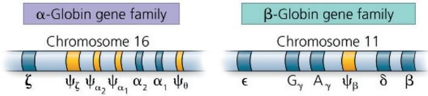  
Explain how the function of transposable elements might account for their prevalence in human noncoding DNA.

## Concept 21.5: Duplication, rearrangement, and mutation of DNA contribute to genome evolution

\- Errors in cell division can lead to extra copies of all or part of entire chromosome sets, which may then diverge if one set accumulates sequence changes. Polyploidy occurs more often among plants than animals and contributes to speciation.

\- The chromosomal organization of genomes can be compared among species, providing information about evolutionary relationships. Within a given species, rearrangements of chromosomes are thought to contribute to the emergence of new species.

\- The genes encoding the various related but different globin proteins evolved from one common ancestral globin gene, which duplicated and diverged into the $\alpha$ -globin and $\beta$ -globin ancestral genes. Subsequent duplication and random mutation gave rise to the present globin genes, all of which code for oxygen-binding proteins. The copies of some duplicated genes have diverged so much that the functions of their encoded proteins (such as lysozyme and $\alpha$ -lactalbumin) are now substantially different.

\- Rearrangement of exons within and between genes during evolution has led to genes containing multiple copies of similar exons and/or several different exons derived from other genes.

\- Movement of transposable elements or recombination between copies of the same element can generate new sequence combinations that are beneficial to the organism. These may alter the functions of genes or their patterns of expression and regulation.

How could chromosomal rearrangements lead to the emergence of new species?

## Concept 21.6: Comparing genome sequences provides clues to evolution and development

\- Comparisons of genomes from widely divergent and closely related species provide valuable information about ancient and more recent evolutionary history, respectively. Analysis of single nucleotide polymorphisms (SNPs) and copy-number variants (CNVs) among individuals in a species can also shed light on the evolution of that species.

\- Evolutionary developmental (evo-devo) biologists have shown that homeotic genes and some other genes associated with animal development contain a homeobox region whose sequence is highly conserved among diverse species.

What type of information can be obtained by comparing the genomes of closely related species? Of very distantly related species?

For suggested answers, see Appendix A.

## Test Your Understanding

For more multiple-choice questions, go to the Practice Test (eTextbook only).

## Levels 1-2: Remembering/Understanding

1. Bioinformatics includes

(A) using DNA technology to clone genes.

(B) using computer programs to align DNA sequences.

(C) using a person's genomic sequence to inform decisions about medical treatment.

(D) amplifying DNA segments from a species' genome.

## 2. Homeotic genes

(A) encode transcription factors that control the expression of genes responsible for specific anatomical structures.

(B) are found only in Drosophila and other arthropods.

(C) are the only genes that contain the homeobox domain.

(D) encode proteins that form complexes that determine anatomical structures in the fly.

## Levels 3-4: Applying/Analyzing

3. Two eukaryotic proteins have one domain in common but are otherwise very different. Which of the following processes is most likely to have contributed to this similarity?

(A) gene duplication

(B) alternative splicing

(C) exon shuffling

(D) random point mutations

4. DRAW IT Below are the amino acid sequences (using single letters; see Figure 5.14) of three short segments of the FOXP2 protein from five species. These segments contain all amino acid differences between the FOXP2 proteins of these species. Compare the amino acid sequences by answering parts (a)-(d).

<table><tr><td>Chimpanzee</td><td>PKSSD ... TSSTT ... NARRD</td></tr><tr><td>Mouse</td><td>PKSSE ... TSSTT ... NARRD</td></tr><tr><td>Gorilla</td><td>PKSSD ... TSSTT ... NARRD</td></tr><tr><td>Human</td><td>PKSSD ... TSSNT ... SARRD</td></tr><tr><td>Rhesus monkey</td><td>PKSSD ... TSSTT ... NARRD</td></tr></table>

(a) Circle the names of any species that have identical amino acid sequences for the FOXP2 protein.

(b) In the sequence for the mouse, circle any amino acid that differs from the sequence for the chimpanzee, gorilla, and rhesus monkey. Then, draw a box around any amino acid that differs from the human sequence.

(c) In the human sequence, underline any amino acid that differs from the sequence for the chimpanzee, gorilla, and rhesus monkey.

(d) Primates and rodents diverged about 65 million years ago, and chimpanzees and humans diverged about 7–8 million years ago (see Figure 21.17). How many amino acid differences are there between the sequence for the mouse and the sequence for the chimpanzee, gorilla, and rhesus monkey? How many amino acid differences are there between the human sequence and the sequence for the chimpanzee, gorilla, and rhesus monkey? Based solely on the numbers of amino acid differences occurring over these time periods, what might you hypothesize about the rate of evolution of the FOXP2 gene? Based on the information in the chapter regarding the FOXP2 gene, is your hypothesis correct?

## Levels 5-6: Evaluating/Creating

5. EVOLUTION CONNECTION Genes important in the embryonic development of animals, such as homeobox-containing genes, have been relatively well conserved during evolution; that is, they are more similar among different species than are many other genes. Explain why this is.

6. SCIENTIFIC INQUIRY The scientists mapping the SNPs in the human genome noticed that groups of SNPs tended to be inherited together, in blocks known as haplotypes, ranging in length from 5,000 to 200,000 base pairs. There are as few as four or five commonly occurring combinations of SNPs per haplotype. Integrating what you've learned throughout this chapter and this unit, propose an explanation for this observation.

7. WRITE ABOUT A THEME: INFORMATION The continuity of life is based on heritable information in the form of DNA. In a short essay (100–150 words), explain how mutations in protein-coding genes and regulatory DNA contribute to evolution.

## 8. SYNTHESIZE YOUR KNOWLEDGE

  
Insects have three thoracic (trunk) segments. While researchers have found insect fossils with wings on all segments, modern insects have wings or related structures on only the second and third segment. In modern insects, Hox gene products act to inhibit

wing formation on the first segment. The treehopper insect (above) is an exception. In addition to the pair of prominent wings on its second segment, its first segment has an ornate helmet resembling a set of thorns, which is a modified, fused pair of “wings.” (This provides camouflage in tree branches, reducing the risk of predation.) Explain how changes in gene regulation could have led to the evolution of such a structure.

For selected answers, see Appendix A.

## Explore Scientific Papers with Science in the Classroom | AAAS

How do transposable elements drive evolution? Go to “Jumping Genes!” at www.scienceintheclassroom.org.

Instructors: Questions can be assigned in Mastering Biology.

# Mechanisms of Evolution

An Interview with Neil H. Shubin

Dr. Neil H. Shubin is the Robert R. Bensley Distinguished Service Professor of Organismal Biology and Anatomy at the University of Chicago. His research examines the evolution and development of vertebrate animals, focusing on major evolutionary events, such as the colonization of land. He leads expeditions to polar regions in search of fossils and explores the genetics and evolution of the formation of the skeleton in living fish and amphibians. He is also a communicator of science to the general public. Neil grew up outside Philadelphia and received his AB from Columbia University and his PhD from Harvard. He is a member of the National Academy of Sciences and a fellow of the American Academy of Arts and Sciences and the American Philosophical Society.

## How did you get started in science? How did you decide what to work on?

My interest in natural history dates back to my childhood in suburban Philadelphia. I remember being really struck by the “duck-billed” dinosaurs, thinking that nature can be crazy and behave in ways that we don’t understand. In my first semester of college, I took an anthropology course where the professor would bring in skulls and other human bones, and I thought, “Wow! People go around the world and discover these artifacts, and they tell us about how the world as we know it came to be.”

Later in college, I had the opportunity to volunteer on an expedition to eastern Wyoming, where there are Cretaceous deposits. I was not very good at it—to the point where the curator in charge said, “You stay away from the fossils. You’re going to break too many of them.” I really liked doing this fieldwork, but I didn’t have any innate ability to do it; I didn’t know how to camp, and the outdoors thing was really confusing to me. Which is surprising, given that now I’ve spent the better part of the last 40 years leading expeditions to both poles. I kind of was a fish out of water initially, but I wanted to learn. Similarly, our search for evidence of the first land animals took a lot of patience and a lot of failures, but we kept learning from the failures, and ultimately, we were successful. Our plan was to target our expeditions to particular regions in the Arctic that contained exposed rocks from the time when we expected animals to have colonized land, but we didn't know there would be years of finding nothing before we found something special. The moment we saw Tiktaalik for the first time was a moment that no other human to that point had experienced. Being one of the first people to see this “fish with legs” was really special (see Figure 34.20). That's a vivid example of something that researchers do every day, whether it's in the lab or somewhere else: They're at the forefront of human knowledge.

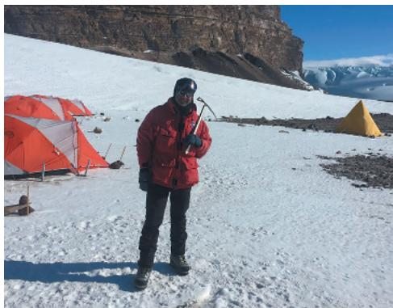  
On a fossil-hunting expedition in the Arctic.

## What are you working on now?

My laboratory is very interdisciplinary. We use molecular biology approaches to look at the genes and developmental systems that produce organs in living animals and to ask questions about how they evolve. We also continue our paleontological research in the Arctic. Being a scientist is really about being able to ask the right questions—questions that are important, interesting, and answerable.

  
Dr. Neil H. Shubin

## How does your research connect microevolution and macroevolution?

When you understand both the mechanisms of evolution across generations (microevolution) and the big-picture history of evolution (macroevolution), what you're really doing is answering the question of "Why does life on the planet look the way it does?" Through a microevolutionary lens, we see how life can evolve, and we've learned a lot about the genetic basis of adaptation. Organisms have so much capacity for change; in fact, they're capable of so much more change than we see in the fossil record. When we flip to a macroevolutionary perspective, we see what actually happened in the long term. There are lessons to learn from both. We're very biased as a species. We're used to thinking about a planet with ice at the poles. We're used to seeing species that live on land. But if you were to take a time machine and go back to the middle or late Devonian, there was no ice at the poles—it was really warm everywhere. We need to remember that the world as we see it is just a snapshot of its long history.

"There's a lot to discover. The book is still being written."

## What advice would you give a student considering a career in biology?

The thing that transformed me was the ability to get out of the classroom and do research, to actually do the science. Sometimes when we're in class, we tend to see science as knowledge that is fixed. You can break out of that when you realize that there's an entire world to discover, and in class you're learning the tools to enable you to do the discovering. There's a lot to discover. The book is still being written.

