# 第24章 The Origin of Species

<!-- 章节边界按正文内容恢复；原始 MinerU 内容保留如下。 -->

# The Origin of Species

## Key Concepts

24.1 The biological species concept emphasizes reproductive isolation

24.2 Speciation can take place with or without geographic separation

24.3 Hybrid zones reveal factors that cause reproductive isolation

24.4 Speciation can occur rapidly or slowly and can result from changes in few or many genes

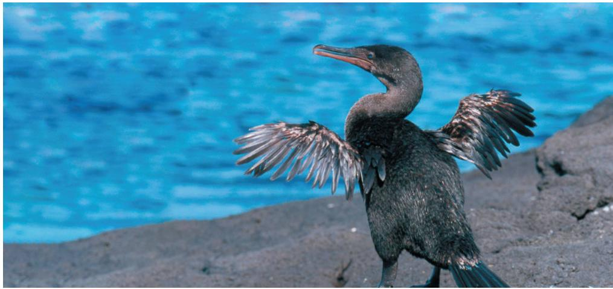

## Study Tip

Make a table: Some processes that can lead to speciation only occur in allopatric (geographically separated) populations, while others also occur in sympatric (geographically overlapping) populations. To help you keep track of these processes and the geographic conditions under which they can occur, fill in the table as you read the chapter.

<table><tr><td>Process(include page #or figure #)</td><td>Can occur inallopatricpopulations(yes/no)?</td><td>Can occur insympatricpopulations(yes/no)?</td></tr><tr><td>Sexual selection(Figure 24.12)</td><td>Yes</td><td>Yes</td></tr><tr><td></td><td></td><td></td></tr><tr><td></td><td></td><td></td></tr></table>

Figure 24.1 This flightless cormorant is one of many species in the Galápagos Islands that are found nowhere else in the world. How did a bird that cannot fly come to live in this isolated place? When Darwin visited the Galápagos, he also was intrigued by its unique species, and later concluded that they must have originated in the islands from ancestors that had traveled from South America.  
Over time, populations of a single species connected by gene flow can diverge genetically, giving rise to a new species:

## How do new species originate from existing species?

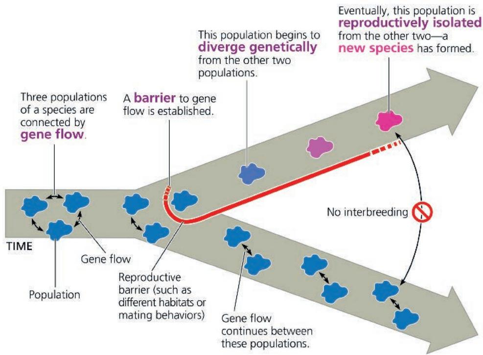

When Darwin came to the Galápagos Islands, he noted that they were teeming with unique species, like the flightless bird in Figure 24.1. Later, he realized that these species had formed relatively recently, writing in his diary, “Both in space and time, we seem to be brought somewhat near to that great fact—that mystery of mysteries—the first appearance of new beings on this Earth.”

The “mystery of mysteries” that captivated Darwin is speciation, the process by which one species splits into two species. Speciation fascinated Darwin (and many biologists since) because it has produced the tremendous diversity of life, repeatedly yielding new species that differ from existing ones. Speciation also helps to explain the many features that organisms share (the unity of life): When one species splits into two, the species that result share many characteristics because they are descended from this common ancestor. For example, at the DNA sequence level, such similarities indicate that the flightless cormorant in Figure 24.1 is closely related to flying cormorants found in the Americas. This suggests that the flightless cormorant originated from an ancestral cormorant species that flew from the mainland to the Galápagos.

Speciation forms a conceptual bridge between microevolution, changes over time in allele frequencies in a population, and macroevolution, the broad pattern of evolution above the species level. An example of macroevolutionary change is the origin of new groups of organisms, such as mammals or flowering plants, through a series of speciation events. We examined microevolutionary mechanisms in Chapter 23, and we'll turn to macroevolution in Chapter 25. In this chapter, we'll explore the mechanisms by which new species originate from existing ones. First, let's establish what we actually mean by a “species.”

## Concept 24.1: The biological species concept emphasizes reproductive isolation

The word species is Latin for “kind” or “appearance.” In daily life, we commonly distinguish between various “kinds” of organisms—dogs and cats, for instance—based on differences in their appearance. To distinguish species scientifically, biologists compare not only the morphology (body form) of different groups of organisms but also their physiology, biochemistry, and DNA sequences; as we’ll see, sometimes multiple types of information are needed to identify species as distinct. It is nevertheless important to keep in mind that the idea of “species” is ultimately a human construct—that is, a concept defined by humans to help organize and think about our natural world.

## The Biological Species Concept

The primary definition of species used in this textbook is the biological species concept. According to this concept, a species is a group of populations whose members have the potential to interbreed in nature and produce viable, fertile offspring—but do not produce viable, fertile offspring with members of other such groups (Figure 24.2). Thus, the members of a biological species are united by being reproductively compatible, at least potentially. All human beings, for example, belong to the same species. A male and a female from opposite sides of the globe may be unlikely to meet and mate, but if they do, they could have viable babies who develop into fertile adults. In contrast, humans and chimpanzees remain distinct biological species, even where they live in the same region, because many factors keep them from interbreeding and producing fertile offspring.

Figure 24.2 The biological species concept is based on the potential to interbreed, not on physical similarity.  
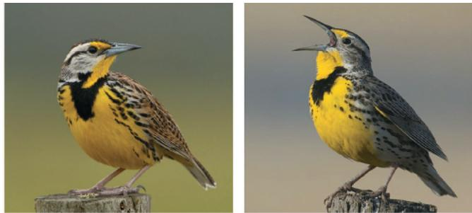  
(a) Similarity between different species. The eastern meadowlark (Sturnella magna, left) and the western meadowlark (Sturnella neglecta, right) have similar body shapes and colorations. Nevertheless, they are distinct biological species because their songs and other behaviors are different enough to prevent interbreeding should they meet in the wild.

  
(b) Variation within a species. As varied as we may be in physical appearance, all humans belong to a single biological species (Homo sapiens), defined by our capacity to interbreed successfully.

What holds the gene pool of a species together, causing its members to resemble each other more than they resemble members of other species? Recall the evolutionary mechanism of gene flow, the transfer of alleles between populations (see Concept 23.3). Typically, gene flow occurs between the different populations of a species. This ongoing exchange of alleles tends to hold the populations together genetically. But as we'll explore in this chapter, a reduction or lack of gene flow can play a key role in the formation of new species.

## Reproductive Isolation

Because biological species are defined in terms of reproductive compatibility, the formation of a new species hinges on reproductive isolation—the existence of biological factors (barriers) that impede members of two species from interbreeding and producing viable, fertile offspring (Figure 24.3). Such barriers block gene

## Exploring Reproductive Barriers

Figure 24.3

## Prezygotic barriers impede mating or hinder fertilization if mating does occur

Habitat Isolation

Temporal Isolation

Behavioral Isolation

Mechanical Isolation

Individuals of different species

MATING ATTEMPT

Two species that occupy different habitats within the same area may encounter each other rarely, if at all.

Example: These two fly species in the genus Rhagoletis occur in the same geographic areas, but the apple maggot fly (Rhagoletis pomonella) feeds and mates on hawthorns and apples (a) while its close relative, the blueberry maggot fly (R. mendax), mates and lays its eggs only on blueberries (b).

Species that breed during different times of the day, different seasons, or different years cannot mix their gametes.

Example: In North America, the geographic ranges of the western spotted skunk (Spilogale gracilis) (c) and the eastern spotted skunk (Spilogale putorius) (d) overlap, but S. gracilis mates in late summer and S. putorius mates in late winter.

Courtship rituals that attract mates and other behaviors unique to a species are effective reproductive barriers, even between closely related species.

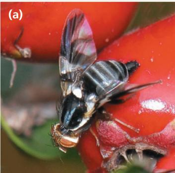

Mating is attempted, but morphological differences prevent its successful completion.

Example: Blue-footed boobies, inhabitants of the Galápagos, mate only after a courtship display unique to their species. Part of the "script" calls for the male to high-step (e), a behavior that calls the female's attention to his bright blue feet.

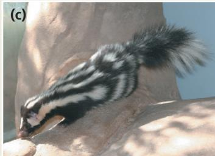

Example: Snails in the genus Bradybaena approach each other headfirst when they attempt to mate. Once their heads have moved slightly past each other, the snails' genitals emerge, and if their shells spiral in the same direction, mating can occur (f). But if a snail attempts to mate with a snail whose shell spirals in the opposite direction (g), the two snails' genital openings (indicated by arrows) will not be aligned, and mating cannot be completed.

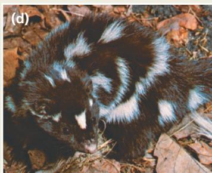

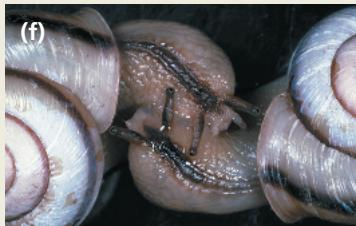

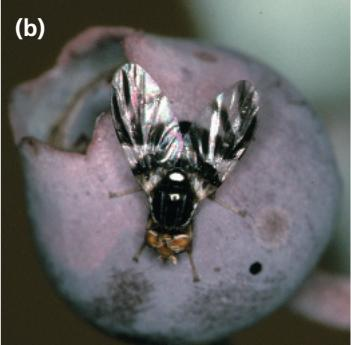

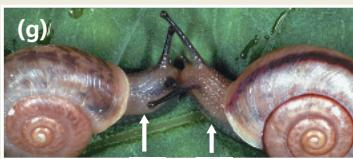

## Postzygotic barriers prevent a hybrid zygote from developing into a viable, fertile adult

Gametic Isolation

Reduced Hybrid Viability

Reduced Hybrid Fertility

Hybrid Breakdown

Sperm of one species may not be able to fertilize the eggs of another species. For instance, sperm may not be able to survive in the reproductive tract of females of the other species, or biochemical mechanisms may prevent the sperm from penetrating the membrane surrounding the other species' eggs.

Example: Gametic isolation separates certain closely related species of aquatic animals, such as sea urchins (h). Sea urchins release their sperm and eggs into the surrounding water, where they fuse and form zygotes. It is difficult for gametes of different species, such as the red and purple urchins shown here (Strongylocentrotus franciscanus and S. purpuratus, respectively), to fuse because proteins on the surfaces of the eggs and sperm bind very poorly to each other.

FERTILIZATION

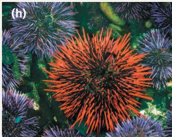

The genes of different parent species may interact in ways that impair the hybrid's development or survival in its environment.

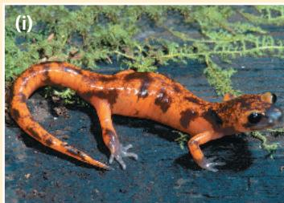

Example: Some salamander subspecies of the genus Ensatina live in the same regions and habitats, where they may occasionally hybridize. But most of the hybrids do not complete development, and those that do are frail (i).

Example: The hybrid offspring of a male donkey (j) and a female horse (k) is a mule (l), which is robust but sterile. A "hinny" (not shown), the offspring of a female donkey and a male horse, is also sterile.

Even if hybrids are vigorous, they may be sterile. If the chromosomes of the two parent species differ in number or structure, meiosis in the hybrids may fail to produce normal gametes. Since the infertile hybrids cannot produce offspring when they mate with either parent species, genes cannot flow freely between the species.

VIABLE, FERTILE OFFSPRING

Some first-generation hybrids are viable and fertile, but when they mate with one another or with either parent species, offspring of the next generation are feeble or sterile.

Example: Strains of cultivated rice have accumulated different mutant recessive alleles at two loci in the course of their divergence from a common ancestor. Hybrids between them are vigorous and fertile (m, left and right), but plants in the next generation that carry too many of these recessive alleles are small and sterile (m, center). Although these rice strains are not yet considered different species, they have begun to be separated by postzygotic barriers.

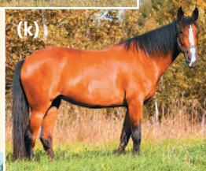

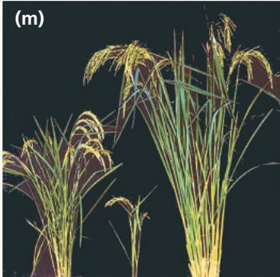

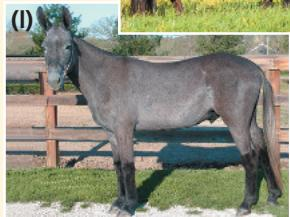

▼ Polar bear (U. maritimus)

flow between the species and limit the formation of hybrids, offspring that result from an interspecific mating. Although a single barrier may not prevent all gene flow, a combination of several barriers can effectively isolate a species' gene pool.

Clearly, a fly cannot mate with a frog or a fern, but the reproductive barriers between more closely related species are not so obvious. As described in Figure 24.3, these barriers can be classified according to whether they contribute to reproductive isolation before or after fertilization. Prezygotic barriers (“before the zygote”) block fertilization from occurring. Such barriers typically act in one of three ways: by impeding members of different species from attempting to mate, by preventing an attempted mating from being completed successfully, or by hindering fertilization if mating is completed successfully. If a sperm cell from one species overcomes prezygotic barriers and fertilizes an ovum from another species, a variety of postzygotic barriers (“after the zygote”) may contribute to reproductive isolation after the hybrid zygote is formed. Developmental errors may reduce survival among hybrid embryos. Alternatively, problems after birth may cause hybrids to be infertile or decrease their chance of surviving long enough to reproduce.

## Limitations of the Biological Species Concept

One strength of the biological species concept is that it directs our attention to a way by which speciation can occur: by the evolution of reproductive isolation. However, the number of species to which this concept can be usefully applied is limited. There is, for example, no way to evaluate the reproductive isolation of fossils. The biological species concept also does not apply to organisms that reproduce asexually, such as prokaryotic organisms. (Many prokaryotic organisms do transfer genes among themselves, as we will discuss in Concept 27.2, but this is not sexual reproduction.) Furthermore, in the biological species concept, species are designated by the absence of gene flow. But there are many pairs of species that are morphologically and ecologically distinct, and yet gene flow occurs between them. An example is the grizzly bear (Ursus arctos) and polar bear (Ursus maritimus), whose hybrid offspring have been dubbed “grolar bears” (Figure 24.4). As we’ll discuss, natural selection can cause such species to remain distinct even though some gene flow occurs between them. Because of the limitations to the biological species concept, alternative species concepts are useful in certain situations.

## Other Definitions of Species

While the biological species concept emphasizes the separateness of different species due to reproductive barriers, several other definitions emphasize the unity within a species. For example, the morphological species concept distinguishes a species by body shape and other structural features. The morphological species concept can be applied to asexual and sexual organisms, and it can be useful even without information on the extent of gene flow. In practice, scientists often distinguish species using morphological criteria. A disadvantage of this approach, however, is that it relies on subjective criteria; researchers may disagree on which structural features distinguish a species.

Figure 24.4 Hybridization between two species of bears in the genus Ursus.

Grizzly bear (U. arctos)

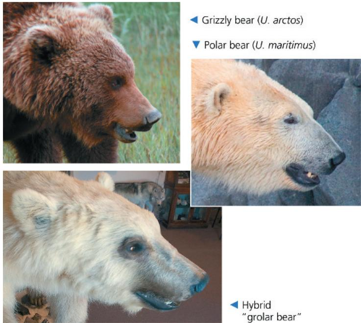

The ecological species concept defines a species in terms of its ecological niche, the sum of how members of the species interact with the nonliving and living parts of their environment (see Concept 54.1). For example, two species of oak trees might differ in their size or in their ability to tolerate dry conditions, yet still occasionally interbreed. Because they occupy different ecological niches, these oaks would be considered separate species even though they are connected by some gene flow. Unlike the biological species concept, the ecological species concept can accommodate asexual as well as sexual species. It also emphasizes the role of disruptive natural selection as organisms adapt to different environments.

In addition to those discussed here, more than 20 other species definitions have been proposed. The usefulness of each definition depends on the situation and the research questions being asked. As we mentioned earlier, these species definitions are all human constructs; however, for our purposes here of studying how species originate, the biological species concept is particularly helpful because of its focus on reproductive barriers.

## Concept Check 24.1

1. a. Which species concept(s) could you apply to both asexual and sexual species?

b. Which would be most useful for identifying species in the field? Explain.

2. WHAT IF? Suppose two bird species live in a forest and are not known to interbreed. One species feeds and mates in the treetops and the other on the ground. But in captivity, the birds can interbreed and produce viable, fertile offspring. What type of reproductive barrier most likely keeps these species separate in nature? Explain.

# Concept 24.2: Speciation can take place with or without geographic separation

Having discussed what constitutes a unique species, let's return to the process by which such species arise from existing species. We'll describe this process by focusing on the geographic setting in which gene flow is interrupted between populations of the existing species—in allopatric speciation the populations are geographically isolated, while in sympatric speciation they are not (Figure 24.5).

## Allopatric ("Other Country") Speciation

In allopatric speciation (from the Greek allos, other, and patra, homeland), gene flow is interrupted when a population is divided into geographically isolated subpopulations. For example, the water level in a lake may subside, resulting in two or more smaller lakes that are now home to separated populations (see Figure 24.5a). Or a river may change course and divide a population of animals that cannot cross it. Allopatric speciation can also occur without geologic change, such as when individuals colonize a remote area and their descendants become geographically isolated from the parent population. The flightless cormorant shown in Figure 24.1 probably originated in this way from an ancestral flying species that reached the Galápagos Islands.

## The Process of Allopatric Speciation

How formidable must a geographic barrier be to promote allopatric speciation? The answer depends on the ability of the organisms to move about. Birds, mountain lions, and coyotes can cross rivers and canyons—as can windblown pollen and the seeds of some flowering plants. In contrast, small rodents may find a river or canyon a formidable barrier.

Figure 24.5 The geography of speciation.  
  
(a) Allopatric speciation. A population forms a new species while geographically isolated from its parent population.  
(b) Sympatric speciation. A subset of a population forms a new species without geographic separation.  
Figure 24.6 Evolution in mosquitofish populations.

Once geographic isolation has occurred, the separated gene pools may diverge. Different mutations arise, and natural selection and genetic drift may alter allele frequencies in different ways in the separated populations. Reproductive isolation may then evolve as a by-product of the genetic divergence that results from selection or drift.

Figure 24.6 describes an example. On Andros Island, in the Bahamas, populations of the mosquitofish Gambusia hubbsi colonized a series of ponds that later became isolated from one another. Genetic analyses indicate that little or no gene flow currently occurs between the ponds. The environments of these ponds are very similar except that some contain predatory fishes, while others do not. In ponds with predatory fishes, selection has favored the evolution of a mosquitofish body shape that enables rapid bursts of speed (see Figure 24.6a). In ponds without predatory fishes, selection has favored a different body shape, one that improves the ability to swim for long periods of time (see Figure 24.6b).

How have these different selective pressures affected the evolution of reproductive barriers? Researchers studied this question by bringing together mosquitofish from the two types of ponds. They found that female mosquitofish prefer to mate with males whose body shape is similar to their own. This preference

Different body shapes have evolved in mosquitofish populations from ponds with and without predators. These differences affect how quickly the fishes can accelerate to escape and therefore their survival rate when exposed to predators.

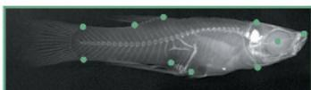  
In ponds with predatory fishes, the mosquitofish's head is streamlined and the tail is powerful, enabling rapid bursts of speed.  
In ponds without predatory fishes, mosquitofish have a different body shape that favors long, steady swimming.

(a) Differences in body shape  

  
(b) Differences in escape acceleration and survival

establishes a behavioral barrier to reproduction between mosquitofish from ponds with predators and those from ponds without predators. Thus, as a by-product of selection for avoiding predators, reproductive barriers have formed in these allopatric populations.

## Evidence of Allopatric Speciation

Many studies provide evidence that speciation can occur in allo-patric populations. For example, laboratory studies show that reproductive barriers can develop when populations are isolated experimentally and subjected to different environmental conditions (Figure 24.7).

Field studies indicate that allopatric speciation also can occur in nature. Consider the 30 species of snapping shrimp in the genus Alpheus that live off the Isthmus of Panama, the land bridge that connects South and North America (Figure 24.8). Fifteen of these species live on the Atlantic side of the isthmus, while the other 15 live on the Pacific side. Before the isthmus formed, gene flow could occur between

## Figure 24.7

## Inquiry: Can divergence of allopatric populations lead to reproductive isolation?

## Experiment

A researcher divided a laboratory population of the fruit fly Drosophila pseudoobscura, raising some flies on a starch medium and others on a maltose medium. After one year (about 40 generations), natural selection resulted in divergent evolution: Populations raised on starch digested starch more efficiently, while those raised on maltose digested maltose more efficiently. The researcher then put flies from the same or different populations in mating cages and measured mating frequencies. All flies used in the mating preference tests were reared for one generation on a standard cornmeal medium.

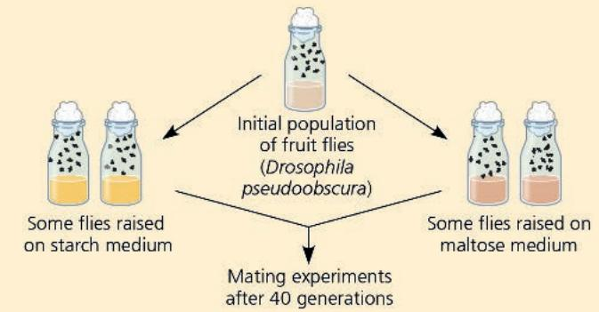

## Results

Mating patterns among populations of flies raised on different media are shown below. When flies from “starch populations” were mixed with flies from “maltose populations,” the flies tended to mate with like partners (see the lefthand table). But in a control group consisting the Atlantic and Pacific populations of snapping shrimp. Did the species on different sides of the isthmus originate by allopatric speciation? Morphological and genetic data group these shrimp into 15 pairs of sister species, pairs whose member species are each other's closest relative. In each of these 15 pairs, one of the sister species lives on the Atlantic side of the isthmus, while the other lives on the Pacific side. This fact strongly suggests that the two species arose as a consequence of geographic separation. Furthermore, genetic analyses indicate that the Alpheus species originated from 9 to 3 million years ago, with the sister species that live in the deepest water diverging first. These divergence times are consistent with geologic evidence that the isthmus formed gradually, starting 10 million years ago, and closing completely about 3 million years ago.

The importance of allopatric speciation is also suggested by the fact that regions that are isolated or highly subdivided by barriers typically have more species than do otherwise similar regions that lack such features. For example, many unique plants and animals are found on the geographically isolated Hawaiian

of flies from two different populations adapted to starch, the flies were about as likely to mate with flies of the other population as with flies of their own population (see the righthand table); similar results were obtained for control groups adapted to maltose.

<table><tr><td rowspan="2"></td><td colspan="2">Female</td></tr><tr><td>Starch</td><td>Maltose</td></tr><tr><td>Male Starch</td><td>22</td><td>9</td></tr><tr><td>Maltose</td><td>8</td><td>20</td></tr></table>

Number of matings in experimental group

<table><tr><td rowspan="2" colspan="2"></td><td colspan="2">Female</td></tr><tr><td>Starch population 1</td><td>Starch population 2</td></tr><tr><td rowspan="2">Male</td><td>Starch population 1</td><td>18</td><td>15</td></tr><tr><td>Starch population 2</td><td>12</td><td>15</td></tr></table>

Number of matings in control group

## Conclusion

In the experimental group, the strong preference of “starch flies” and “maltose flies” to mate with like-adapted flies indicates that a reproductive barrier was forming between these fly populations. Although this barrier was not absolute (some mating between starch flies and maltose flies did occur), after 40 generations reproductive isolation appeared to be increasing. This barrier may have been caused by differences in courtship behavior that arose as an incidental by-product of differing selective pressures as these allopatric populations adapted to different sources of food.

Data from D. M. B. Dodd, Reproductive isolation as a consequence of adaptive divergence in Drosophila pseudoobscura, Evolution 43:1308–1311 (1989).

WHAT IF? Why were all flies used in the mating preference tests reared on a standard medium (rather than on starch or maltose)?
For suggested answer, see Appendix A.

Figure 24.8 Allopatric speciation in snapping shrimp (Alpheus). The shrimp pictured are just 2 of the 15 pairs of sister species that arose as populations were divided by the formation of the Isthmus of Panama. A. formosus and A. panamensis are one pair of sister species; A. nuttingi and A. millsae are another pair of sister species.

Islands (we'll return to the origin of Hawaiian species in Concept 25.4). Field studies also show that reproductive isolation between two populations generally increases as the geographic distance between them increases, a finding consistent with allopatric speciation. In the Scientific Skills Exercise, on the next page, you can analyze data from one such study that examined reproductive isolation in geographically separated salamander populations.

Note that while geographic isolation prevents interbreeding between members of allopatric populations, physical separation is not a biological barrier to reproduction. Biological reproductive barriers such as those described in Figure 24.3 are intrinsic to the organisms themselves. Hence, it is biological barriers that can prevent interbreeding when members of different populations come into contact with one another.

## Sympatric (“Same Country”) Speciation

In sympatric speciation (from the Greek syn, together), speciation occurs in populations that live in the same geographic area (see Figure 24.5b). How can reproductive barriers form between sympatric populations while their members remain in contact with each other? Although such contact (and the ongoing gene flow that results) makes sympatric speciation less common than allopatric speciation, sympatric speciation can occur if gene flow is reduced by such factors as polyploidy, sexual selection, and habitat differentiation. (Note that sexual selection and habitat differentiation also can promote allopatric speciation.)

## Polyploidy

A species may originate from an accident during cell division that results in extra sets of chromosomes, a condition called polyploidy. Polyploid speciation occasionally occurs in animals; for example, the gray tree frog Hyla versicolor (see Figure 23.16) is thought to have originated in this way. However, polyploidy is far more common in plants. In fact, botanists estimate that more than 80% of the plant species alive today are descended from ancestors that formed by polyploid speciation.

Two distinct forms of polyploidy have been observed in plant (and a few animal) populations. An autopolyploid (from the Greek autos, self) is an individual that has more than two chromosome sets that are all derived from a single species. In plants, for example, a failure of cell division could double a cell's chromosome number from the original number $(2n)$ to a tetraploid number $(4n)$ (Figure 24.9).

A tetraploid can produce fertile tetraploid offspring by self-pollinating or by mating with other tetraploids. In addition, the tetraploids are reproductively isolated from 2n plants of the original population because the triploid (3n) offspring of such unions have reduced fertility. Thus, in just one generation, autopolyploidy can generate reproductive isolation without any geographic separation.

A second form of polyploidy can occur when two different species interbreed and produce hybrid offspring. Most such hybrids are sterile because the set of chromosomes from one species cannot pair during meiosis with the set of chromosomes from the other species. However, an infertile hybrid may be able to

Figure 24.9 Sympatric speciation by autopolyploidy.  
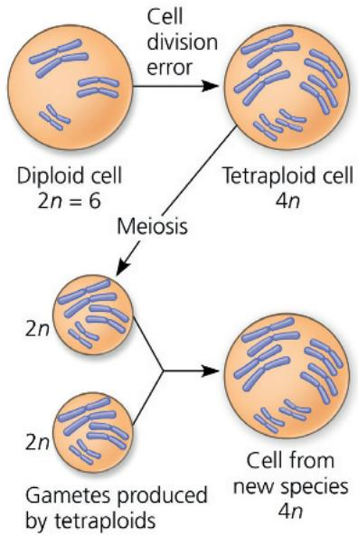

# Scientific Skills Exercise

# Identifying Independent and Dependent Variables, Making a Scatter Plot, and Interpreting Data

Does Distance Between Salamander Populations Increase Their Reproductive Isolation? Allopatric speciation begins when populations become geographically isolated, reducing mating between individuals in different populations and thus reducing gene flow. It is logical that as distance between populations increases, so will their degree of reproductive isolation. To test this hypothesis, researchers studied populations of the dusky salamander (Desmognathus ochrophaeus) living on different mountain ranges in the southern Appalachians.

How the Experiment Was Done The researchers tested the reproductive isolation of pairs of salamander populations by leaving one male and one female together and later checking the females for the presence of sperm. Four mating combinations were tested for each pair of populations (A and B)—two within the same population (female A with male A and female B with male B) and two between populations (female A with male B and female B with male A).

Data from the Experiment The researchers used an index of reproductive isolation that ranged from a value of 0 (no isolation) to a value of 2 (full isolation). The proportion of successful matings for each mating combination was measured, with 100% success = 1 and no success = 0. The reproductive isolation value for two populations is the sum of the proportion of successful matings of each type within populations (AA + BB) minus the sum of the proportion of successful matings of each type between populations (AB + BA). The table provides distance and reproductive isolation data for 27 pairs of dusky salamander populations.

## INTERPRET THE DATA

1. State the researchers' hypothesis, and identify the independent and dependent variables in this study. Explain why the researchers used four mating combinations for each pair of populations.

reproductive isolation index (a) if all of the matings within a population were successful, but none of the matings between populations were successful and (b) if salamanders are equally successful in mating with members of their own population and members of another population.

3. Make a scatter plot to help you visualize any patterns that might indicate a relationship between the variables. Plot the independent variable on the x-axis and the dependent variable on the y-axis. (For additional information about graphs, see the Scientific Skills Review in Appendix D.)

4. Interpret your graph by (a) explaining in words any pattern indicating a possible relationship between the variables and (b) hypothesizing the possible cause of such a relationship.

Instructors: A version of this Scientific Skills Exercise can be assigned in Mastering Biology.

<table><tr><td>Geographic Distance (km)</td><td>15</td><td>32</td><td>40</td><td>47</td><td>42</td><td>62</td><td>63</td><td>81</td><td>86</td><td>107</td><td>107</td><td>115</td><td>137</td><td>147</td></tr><tr><td>Reproductive Isolation Value</td><td>0.32</td><td>0.54</td><td>0.50</td><td>0.50</td><td>0.82</td><td>0.37</td><td>0.67</td><td>0.53</td><td>1.15</td><td>0.73</td><td>0.82</td><td>0.81</td><td>0.87</td><td>0.87</td></tr><tr><td>Distance (continued)</td><td>137</td><td>150</td><td>165</td><td>189</td><td>219</td><td>239</td><td>247</td><td>53</td><td>55</td><td>62</td><td>105</td><td>179</td><td>169</td><td></td></tr><tr><td>Isolation Value (continued)</td><td>0.50</td><td>0.57</td><td>0.91</td><td>0.93</td><td>1.5</td><td>1.22</td><td>0.82</td><td>0.99</td><td>0.21</td><td>0.56</td><td>0.41</td><td>0.72</td><td>1.15</td><td></td></tr></table>

Data from S. G. Tilley, A. Verrell, and S. J. Arnold, Correspondence between sexual isolation and allozyme differentiation: a test in the salamander Desmognathus ochrophaeus, Proceedings of the National Academy of Sciences USA 87:2715–2719 (1990).

propagate itself asexually (as many plants can do). In subsequent generations, various mechanisms can change a sterile hybrid into a fertile polyploid called an allopolyploid (Figure 24.10). The allopolyploids are fertile when mating with each other but cannot interbreed with either parent species; thus, they represent a new biological species. The new species has a diploid chromosome number equal to the sum of the diploid chromosome numbers of the two parent species.

Although it can be challenging to study speciation in the field, scientists have documented at least five new plant species that have originated by polyploid speciation since 1850. One of these examples involves the origin of a new species of goatsbeard plant (genus Tragopogon) in the Pacific Northwest. Tragopogon first arrived in the region when humans introduced three European species in the early 1900s: T. pratensis, T. dubius, and T. porrifolius. These three species are now common in the Pacific Northwest and many other parts of North America. In 1950, a new Tragopogon species was discovered near the Idaho-Washington border, a region where all three European species also were found. Genetic analyses revealed that this new species, Tragopogon miscellus, is an allopolyploid that originated from a hybrid of two of the European species (Figure 24.11). Although the T. miscellus population grows mainly by reproduction of its own members, hybridization between the parent species (followed by a mitotic or meiotic error that doubles the chromosome number) continues to add new members to the T. miscellus population.

Figure 24.10 One mechanism for allopolyploid speciation in plants. Most hybrids are sterile because their chromosomes are not homologous and cannot pair during meiosis. However, such a hybrid may be able to reproduce asexually. This diagram traces one mechanism by which sterile hybrids can give rise to fertile allopolyploids that are members of a new species.

  
Figure 24.11 Allopolyploid speciation in Tragopogon.  
The gray boxes indicate the parent species of the two new polyploid species. The diploid chromosome number of each species is shown in parentheses.

  
VISUAL SKILLS Based on this diagram, identify the two parent species of each polyploid species.  
For suggested answer, see Appendix A.

Later, scientists discovered another new Tragopogon species, T. mirus, which also arose by polyploid speciation.

Many important agricultural crops—such as oats, cotton, potatoes, tobacco, and wheat—are polyploids. For example, the wheat used for bread, Triticum aestivum, is an allohexaploid (six sets of chromosomes, two sets from each of three different species). The events that eventually led to modern wheat probably began about 8,000 years ago in the Middle East when an early cultivated wheat species hybridized with a wild grass. Today, plant geneticists generate new polyploids in the laboratory by using chemicals that induce meiotic and mitotic errors. By harnessing the evolutionary process, researchers can produce new polyploid species with desired qualities, such as a polyploid that combines the high yield of wheat with the hardiness of rye.

## Sexual Selection

There is evidence that sympatric speciation can also be driven by sexual selection. Clues to how this can occur have been found in cichlid fish from one of Earth's hot spots of animal speciation, East Africa's Lake Victoria. This lake was once home to as many as 600 species of cichlids. Genetic data indicate that these species originated within the last 100,000 years from a small number of colonizing species that arrived from other lakes and rivers. How did so many species—more than double the number of freshwater fish species known in all of Europe—originate within a single lake?

One hypothesis is that subgroups of the original cichlid populations adapted to different food sources and the resulting genetic divergence contributed to speciation in Lake Victoria. But sexual selection, in which (typically) females select males based on their appearance (see Concept 23.4), may also have been a factor. Researchers have studied two closely related sympatric species of cichlids that differ mainly in the coloration of breeding males: Breeding Pundamilia pundamilia males have a blue-tinged back, whereas breeding Pundamilia nyererei males have a red-tinged back (Figure 24.12, on the next page). Their results suggest that mate choice based on male breeding coloration can act as a reproductive barrier that keeps the gene pools of these two species separate.

## Habitat Differentiation

Sympatric speciation can also occur when a subpopulation exploits a habitat or resource not used by the parent population. Consider the North American apple maggot fly (Rhagoletis pomonella), a pest of apples. The fly's original habitat was the native hawthorn tree (see Figure 24.3a), but about 200 years ago, some populations colonized apple trees that had been introduced by European settlers. Apple maggot flies usually mate on or near their host plant. This results in a prezygotic barrier (habitat isolation) between populations that feed on apples and populations that feed on hawthorns. Furthermore, because apples mature more quickly than hawthorn fruit, natural selection has favored apple-feeding flies with rapid development. These apple-feeding populations now show temporal isolation from the hawthorn-feeding R. pomonella, providing a second prezygotic barrier to gene flow between the two populations. Researchers also have identified alleles that benefit the flies that use one host plant but harm the flies that use the other host plant. Natural selection operating on these alleles has provided a postzygotic barrier to reproduction, further limiting gene flow. Altogether, although the

Figure 24.12

# Inquiry: Does sexual selection in cichlids result in reproductive isolation?

## Experiment

Researchers placed males and females of Pundamilia pundamilia and P. nyererei together in two aquarium tanks, one with natural light and one with a monochromatic orange lamp. Under normal light, the two species are noticeably different in male breeding coloration; under monochromatic orange light, the two species are very similar in color. The researchers then observed the mate choices of the females in each tank.

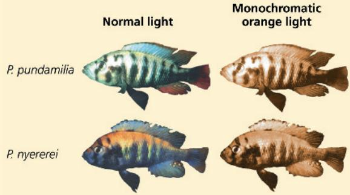

## Results

Under normal light, females of each species strongly preferred males of their own species. But under orange light, females of each species responded indiscriminately to males of both species. The resulting hybrids were viable and fertile.

## Conclusion

The researchers concluded that mate choice by females based on male breeding coloration can act as a reproductive barrier that keeps the gene pools of these two species separate. Since the species can still interbreed when this prezygotic barrier is breached in the laboratory, the genetic divergence between the species is likely to be small. This suggests that speciation in nature has occurred relatively recently.

Data from O. Seehausen and J. J. M. van Alphen, The effect of male coloration on female mate choice in closely related Lake Victoria cichlids (Haplochromis nyererei complex), Behavioral Ecology and Sociobiology 42:1–8 (1998).

WHAT IF? Suppose that female cichlids living in the murky waters of a polluted lake could not distinguish colors well. In such waters, how might the gene pools of these species change over time?

For suggested answer, see Appendix A.

two populations are still classified as subspecies rather than separate species, sympatric speciation appears to be well under way.

## Allopatric and Sympatric Speciation: A Review

Now let's recap the processes by which new species form. In allopatric speciation, a new species forms in geographic isolation from its parent population. Geographic isolation severely restricts gene flow. Intrinsic barriers to reproduction with members of the parent population may then arise as a by-product of genetic changes that occur within the isolated population. Many different processes can produce such genetic changes, including natural selection under different environmental conditions, genetic drift, and sexual selection. Once formed, reproductive barriers that arise in allopatric populations can prevent interbreeding with the parent population even if the populations come back into contact.

Sympatric speciation, in contrast, requires the emergence of a reproductive barrier that isolates a subset of a population from the remainder of the population in the same area. Though rarer than allopatric speciation, sympatric speciation can occur when gene flow to and from the isolated subpopulation is blocked. This can occur as a result of polyploidy, a condition in which an organism has extra sets of chromosomes. Sympatric speciation also can occur when a subset of a population becomes reproductively isolated because of natural selection resulting from a switch to a habitat or food source not used by the parent population. Sympatric speciation can also result from sexual selection and other mechanisms.

Having reviewed the geographic context in which species originate, we'll next explore in more detail what can happen when new or partially formed species come into contact.

## Concept Check 24.2

1. Summarize key differences between allopatric and sympatric speciation. Which type of speciation is more common, and why?

2. Describe two mechanisms that can decrease gene flow in sympatric populations, thereby making sympatric speciation more likely to occur.

3. WHAT IF? Is allopatric speciation more likely to occur on an island close to a mainland or on a more isolated island of the same size? Explain your prediction.

4. MAKE CONNECTIONS Review the process of meiosis in Figure 13.8. Describe how an error during meiosis could lead to polyploidy.

For suggested answers, see Appendix A.

## Concept 24.3: Hybrid zones reveal factors that cause reproductive isolation

What happens if species with incomplete reproductive barriers come into contact with one another? One possible outcome is the formation of a hybrid zone, a region in which members of different species meet and mate, producing at least some offspring of mixed ancestry. In this section, we'll explore hybrid zones and what they reveal about factors that cause the evolution of reproductive isolation.

## Patterns Within Hybrid Zones

Some hybrid zones form as narrow bands, such as the one depicted in Figure 24.13 for the yellow-bellied toad (Bombina variegata) and its close relative, the fire-bellied toad (B. bombina). This hybrid zone, represented by the red line on the map, extends for 4,000 km but is less than 10 km wide in most places. The hybrid zone occurs where the higher-altitude habitat of the yellow-bellied toad meets the lowland habitat of the fire-bellied toad. Across a given “slice” of the zone, the frequency of alleles specific to yellow-bellied toads typically decreases from close to 100% at the edge where only yellow-bellied toads are found to around 50% in the central portion of the zone and to close to 0% at the edge where only fire-bellied toads are found.

Figure 24.13 A narrow hybrid zone for Bombina toads in Europe.  
The graph shows species-specific allele frequencies across the width of the zone near Krakow, Poland, averaged over six genetic loci. A value of 1.0 indicates that all individuals were yellow-bellied toads, 0 indicates that all individuals were fire-bellied toads, and intermediate frequencies indicate that some individuals were of mixed ancestry.  

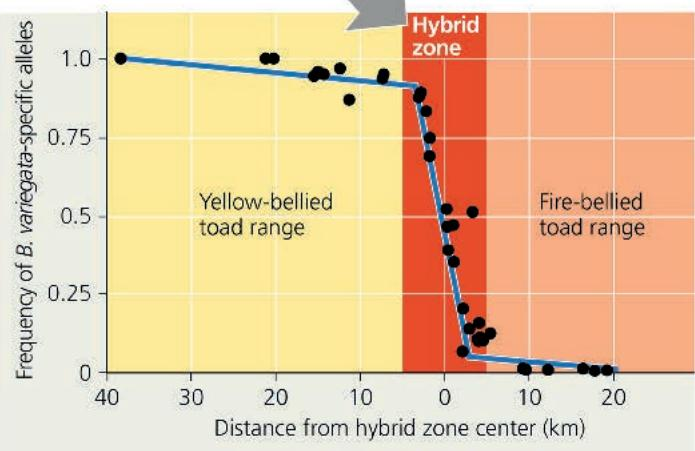  
Does the graph indicate that gene flow is spreading fire-bellied toad alleles into the range of the yellow-bellied toad? Explain.  
For suggested answer, see Appendix A.

What causes such a pattern of allele frequencies across a hybrid zone? We can infer that there is an obstacle to gene flow—otherwise, alleles from one parent species would also be common in the gene pool of the other parent species. Are geographic barriers reducing gene flow? Not in this case, since the toads can move throughout the hybrid zone. A more important factor is that hybrid toads have increased rates of embryonic mortality and a variety of morphological abnormalities, including ribs that are fused to the spine and malformed tadpole mouthparts. Because the hybrids have poor survival and reproduction, they produce few viable offspring with members of the parent species. As a result, hybrid individuals rarely serve as a stepping-stone from which alleles are passed from one species to the other. Outside the hybrid zone, additional obstacles to gene flow may be provided by natural selection in the different environments in which the parent species live.

Hybrid zones typically are located wherever the habitats of the interbreeding species meet. Those regions often resemble a group of isolated patches scattered across the landscape—more like the pattern of spots on a Dalmatian than the continuous band shown in Figure 24.13. But regardless of whether they have complex or simple spatial patterns, hybrid zones form when two species lacking complete barriers to reproduction come into contact. What happens when the habitats of the interbreeding species change over time?

## Hybrid Zones and Environmental Change

A change in environmental conditions can alter where the habitats of interbreeding species meet. When this happens, an existing hybrid zone can move to a new location, or a novel hybrid zone may form.

For example, black-capped chickadees (Poecile atricapillus) and Carolina chickadees (P. carolinensis) interbreed in a narrow hybrid zone that runs from New Jersey to Kansas. Recent studies have shown that the location of this hybrid zone has shifted northward as the climate has warmed (Figure 24.14). In another example, a series of warm winters prior to 2003 enabled the southern flying squirrel (Glaucomys volans) to expand northward into the range of the northern flying squirrel, G. sabrinus. Previously, the ranges of these two species had not overlapped. Genetic analyses showed that these flying squirrels began to hybridize where their ranges came into contact, thereby forming a novel hybrid zone induced by climate change.

Finally, note that a hybrid zone can be a source of novel genetic variation that improves the ability of one or both parent species to cope with changing environmental conditions. This can occur when an allele found only in one parent species is transferred first to hybrid individuals and then to the other parent species when hybrids breed with the second parent species. Recent genetic analyses have shown that hybridization has been a source for such novel genetic variation in some insect, mammal, bird, and plant species. In the Problem-Solving Exercise, you can examine one such example: a case in which hybridization may have led to the transfer of insecticide-resistance alleles between species of mosquitoes that transmit malaria.

## Hybrid Zones over Time

Studying a hybrid zone is like observing a naturally occurring experiment on speciation. Will the hybrids become reproductively isolated from their parents and form a new species? This has occurred by polyploid speciation in some cases, as we saw for the formation of two new species of goatsbeard plants (see Figure 24.11). Hybridization also has led to what may turn out to be a new species of finch in the Galápagos archipelago: A 2018 study found that descendants of hybrids between the large cactus finch (Geospiza conirostris) and the medium ground finch (G. fortis) are becoming reproductively isolated from both parent species. As of 2019, this emerging species is known informally as “Big Bird.”

In other cases, however, interspecific hybrids do not become reproductively isolated from their parent species. In such situations, there are three common outcomes for a hybrid zone over time: reinforcement of barriers, fusion of species, or

## Figure 24.14 A shift in a hybrid zone resulting from climate change.

Black-capped (a) and Carolina chickadees (b) interbreed in a hybrid zone that runs from Kansas to New Jersey. In Pennsylvania, the center of this hybrid zone moved 12 km to the north from 2002 to 2012. This shift is consistent with predictions based on the warmer winter temperatures that have resulted from climate change.

  
(a) Black-capped chickadee (Poecile atricapillus)

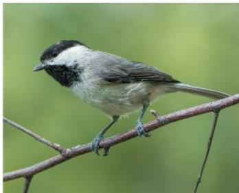  
(b) Carolina chickadee (Poecile carolinensis)

stability (Figure 24.15). Let's examine what studies suggest about these possibilities.

## Reinforcement: Strengthening Reproductive Barriers

Hybrids often are less fit than members of their parent species. In such cases, natural selection should strengthen prezygotic barriers to reproduction, reducing the formation of unfit hybrids. Because this process involves reinforcing reproductive barriers, it is called reinforcement. If reinforcement is occurring, a logical prediction is that barriers to reproduction between species should be stronger for sympatric populations than for allopatric populations.

As an example, let's consider two species of European flycatcher, the pied flycatcher (Ficedula hypoleuca) and the collared flycatcher (Ficedula albicollis). In allopatric populations of these birds, males of the two species closely resemble one another, while in sympatric populations, the males look very different. Female flycatchers do not select males of the other species when given a choice between males from sympatric populations, but they frequently do make mistakes when selecting between males from allopatric populations. Thus, barriers to reproduction are stronger in birds from sympatric populations than in birds from allopatric populations, as you would predict if reinforcement were occurring. Similar results have been observed in a number of organisms, including some fishes, insects, plants, and other birds.

## Fusion: Weakening Reproductive Barriers

Barriers to reproduction may be weak when two species meet in a hybrid zone. Indeed, so much gene flow may occur that reproductive barriers weaken further and the gene pools of the two species become increasingly alike, a process referred to as fusion. In effect, the speciation process reverses, eventually causing the two hybridizing species to fuse into a single species.

For example, genetic and morphological evidence indicates that the recent loss of the large tree finch from the Galápagos island of Floreana resulted from extensive hybridization with another finch species on that island. Such a situation also may be occurring among Lake Victoria cichlids (Figure 24.16). Many pairs of ecologically similar cichlid species are reproductively isolated because the females of one species prefer to mate with males of one color, while females of the other species prefer to mate with males of a different color (see Figure 24.12). Results from field and laboratory studies indicate that murky waters caused by pollution have reduced the ability of females to use color to distinguish males of their own species from males of closely related species. In some polluted waters, many hybrids have been produced, leading to fusion of the parent species' gene pools and a loss of species.

## Stability: Continued Formation of Hybrid Individuals

Many hybrid zones are stable in the sense that hybrids continue to be produced. In some cases, this stability occurs because the hybrids survive or reproduce better than members of either parent species, at least in certain habitats or years. But stable hybrid zones have also been observed in cases where the hybrids are selected against—an unexpected result.

## Problem-Solving Exercise

## Is hybridization promoting insecticide resistance in mosquitoes that transmit malaria?

Malaria is a leading cause of human illness and mortality worldwide, with 200 million people infected and 600,000 deaths each year. In the 1960s, the incidence of malaria was reduced, owing to the use of insecticides that killed mosquitoes in the genus Anopheles, which transmit the disease from person to person. But today, mosquitoes are becoming resistant to insecticides—causing a resurgence in malaria.

Insecticide-treated bed nets have helped reduce cases of malaria in many countries, but resistance to insecticides is rising in mosquito populations.

In this exercise, you will investigate whether alleles encoding resistance to insecticides have been transferred between closely related species of Anopheles.

## Your Approach

The principle guiding your investigation is that DNA analyses can detect the transfer of resistance alleles between closely related mosquito species. To find out whether such transfers have occurred, you will analyze DNA results from two species of mosquitoes that transmit malaria (Anopheles gambiae and A. coluzzii) and from A. gambiae X A. coluzzii hybrids.

For example, hybrids continue to form in the Bombina hybrid zone even though they are strongly selected against. One explanation relates to the narrowness of the Bombina hybrid zone (see Figure 24.13). Evidence suggests that members of both parent species migrate into the zone from the parent populations located outside the zone, thus leading to the continued production of hybrids. If the hybrid zone were wider, this would be less likely to occur, since the center of the zone would receive little gene flow from distant parent populations located outside the hybrid zone.

## Your Data

Resistance to DDT and other insecticides in Anopheles is affected by a sodium channel gene, kdr. The r allele of this gene confers resistance, while the wild-type (+/+) genotype is not resistant. Researchers sequenced the kdr gene from mosquitoes collected in Mali during three time periods: pre-2006 (2002 and 2004), 2006, and post-2006 (2009–2012). A. gambiae and A. coluzzii were collected during all three time periods, but their hybrids only occurred in 2006, the first year that insecticide-treated bed nets were used to reduce the spread of malaria. A likely explanation is that the introduction of the treated bed nets may have briefly favored hybrid individuals, which are usually at a selective disadvantage.

Observed numbers of mosquitoes by kdr genotype

<table><tr><td></td><td>+/+</td><td>+/r</td><td>r/r</td></tr><tr><td colspan="4">A. gambiae:</td></tr><tr><td>Pre-2006</td><td>3</td><td>5</td><td>2</td></tr><tr><td>2006</td><td>8</td><td>8</td><td>7</td></tr><tr><td>Post-2006</td><td>3</td><td>3</td><td>57</td></tr><tr><td>Hybrids: 2006</td><td>10</td><td>7</td><td>0</td></tr><tr><td colspan="4">A. coluzzii:</td></tr><tr><td>Pre-2006</td><td>226</td><td>0</td><td>0</td></tr><tr><td>2006</td><td>70</td><td>7</td><td>0</td></tr><tr><td>Post-2006</td><td>79</td><td>127</td><td>94</td></tr></table>

## Your Analysis

1. (a) Calculate the kdr genotype frequencies in A. gambiae for each time period. To do this, divide the number of individuals that have a given genotype by the total number of individuals observed for that time period. (b) How did the kdr genotype frequencies change over time? Describe a hypothesis that accounts for these observations.

2. How did the frequencies of kdr genotypes change over time in A. coluzzii? Describe a hypothesis that accounts for these observations.

3. Do these results indicate that hybridization can lead to the transfer of adaptive alleles? Explain.

4. Predict how the transfer of the r allele to A. coluzzii populations could affect the number of malaria cases in the years immediately following the transfer.

Instructors: A version of this Problem-Solving Exercise can be assigned in Mastering Biology.

Sometimes the outcomes in hybrid zones match our predictions (European flycatchers and cichlid fishes), and sometimes they don't (Bombina). But whether our predictions are upheld or not, events in hybrid zones can shed light on how barriers to reproduction between closely related species change over time. In the next section, we'll examine how interactions between hybridizing species can also provide a glimpse into the speed and genetic control of speciation.

Figure 24.15 Formation of a hybrid zone and common outcomes for hybrids over time. The thick gray and purple arrows represent the passage of time.  
  
5 Common outcomes for hybrids:  
Reinforcement (strengthening of reproductive barriers—hybrids gradually cease to be formed)  
WHAT IF? Predict what might happen if gene flow were re-established at step 3 in this process. For suggested answer, see Appendix A.

Fusion (weakening of reproductive barriers—the two species fuse)

OR

Stability (continued production of hybrid individuals)

Figure 24.16 Fusion: the breakdown of reproductive barriers.

Increasingly cloudy water in Lake Victoria over the past several decades may have weakened reproductive barriers between P. nyererei and P. pundamilia. In areas of cloudy water, the two species have hybridized extensively, causing their gene pools to fuse.

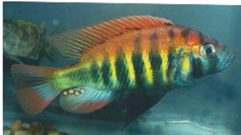  
Pundamilia nyererei

  
Pundamilia pundamilia

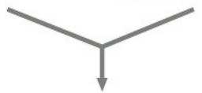

  
Pundamilia "turbid water," hybrid offspring from a location with turbid water

## Concept Check 24.3

1. What are hybrid zones, and why can they be viewed as "natural laboratories" in which to study speciation?

2. WHAT IF? Consider two species that diverged while geographically separated but resumed contact before reproductive isolation was complete. Predict the outcome over time if the two species mated indiscriminately and (a) hybrid offspring survived and reproduced more poorly than offspring from intraspecific matings or (b) hybrid offspring survived and reproduced as well as offspring from intraspecific matings.

For suggested answers, see Appendix A.

## Concept 24.4: Speciation can occur rapidly or slowly and can result from changes in few or many genes

Darwin faced many questions when he began to ponder that “mystery of mysteries”—speciation. He found answers to some of those questions when he realized that evolution by natural selection helps explain both the diversity of life and the adaptations of organisms (see Concept 22.2). But biologists since Darwin have continued to ask fundamental questions about speciation. How long does it take for new species to form? And how many genes change when one species splits into two? Answers to these questions are also emerging.

(a) Punctuated model. New species change most as they branch from a parent species and then change little for the rest of their existence.  
Figure 24.17 Two models for the tempo of speciation.  
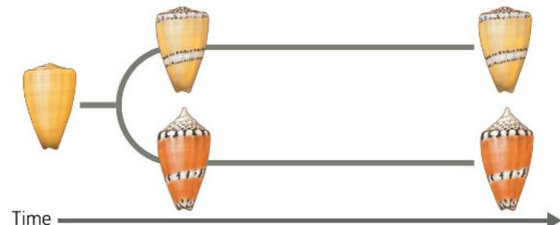  
(b) Gradual model. Species diverge from one another more slowly and steadily over time.

## The Time Course of Speciation

We can gather information about how long it takes new species to form from broad patterns in the fossil record and from studies that use morphological data (including fossils) or molecular data to assess the time interval between speciation events in particular groups of organisms.

## Patterns in the Fossil Record

The fossil record includes many episodes in which new species appear suddenly in a geologic stratum, persist essentially unchanged through several strata, and then disappear. For example, there are dozens of species of marine invertebrates that make their debut in the fossil record with novel morphologies, but then change little for millions of years before becoming extinct. The term punctuated equilibria is used to describe these periods of apparent stasis punctuated by sudden change (Figure 24.17a). Other species do not show a punctuated pattern; instead, they appear to have changed more gradually over long periods of time (Figure 24.17b).

What might punctuated and gradual patterns tell us about how long it takes new species to form? Suppose that a species survived for

5 million years, but most of the morphological changes that caused it to be designated a new species occurred during its first 50,000 years—just 1% of the total existence of the species. Time periods this short (in geologic terms) often cannot be distinguished in fossil strata, in part because the rate of sediment accumulation may be too slow to separate layers this close in time. Thus, based on its fossils, the species would seem to have appeared suddenly and then lingered with little or no change before becoming extinct. Even though such a species may have originated more slowly than its fossils suggest (in this case taking up to 50,000 years), a punctuated pattern indicates that speciation occurred relatively rapidly. For species whose fossils changed much more gradually, we also cannot tell exactly when a new biological species formed, since information about reproductive isolation does not fossilize. However, it is likely that speciation in such groups occurred relatively slowly, perhaps taking millions of years.

## Interview

Interview with Stephen Jay Gould: An “architect” of the concept of punctuated equilibria (eTextbook only)

## Speciation Rates

The existence of fossils that display a punctuated pattern suggests that once the process of speciation begins, it can be completed relatively rapidly—a suggestion supported by many studies. For example, rapid speciation appears to have produced the wild sunflower Helianthus anomalus. Genetic evidence indicates that this species originated by the hybridization of two other sunflower species, H. annuus and H. petiolaris. The hybrid species H. anomalus is ecologically distinct and reproductively isolated from both parent species (Figure 24.18). Unlike the outcome of allopolyploid speciation, in which there is a change in chromosome number after hybridization, in these sunflowers the two parent species and the hybrid all have the same number of chromosomes (2n = 34).

Figure 24.18 A hybrid sunflower species and its dry sand dune habitat.  
The wild sunflower Helianthus anomalus shown here originated via the hybridization of two other sunflowers, H. annuus and H. petiolaris, which live in nearby but moister environments.  
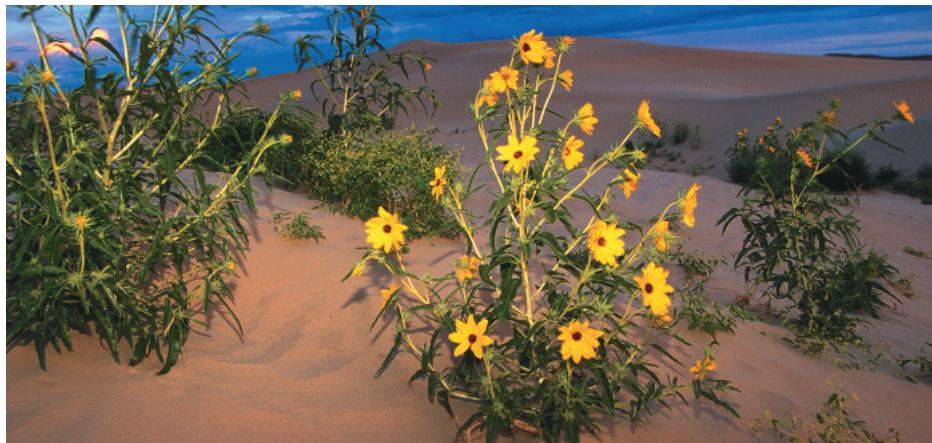

## Figure 24.19

# Inquiry: How does hybridization lead to speciation in sunflowers?

## Experiment

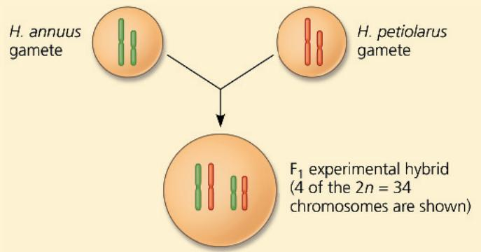  
Note that in the first $(F_{1})$ generation, each chromosome of the experimental hybrids consisted entirely of DNA from one or the other parent species. The researchers then tested whether the $F_{1}$ and subsequent generations of experimental hybrids were fertile. They also used species-specific genetic markers to compare the chromosomes in the experimental hybrids with the chromosomes in the naturally occurring hybrid H. anomalus.

## Results

Although only 5% of the $F_{1}$ experimental hybrids were fertile, after just four more generations the hybrid fertility rose to more

How, then, did speciation occur? To study this question, researchers performed an experiment designed to mimic events in nature (Figure 24.19). Their results indicated that natural selection could produce extensive genetic changes in hybrid populations over short periods of time. These changes appear to have caused the hybrids to diverge reproductively from their parents and form a new species, H. anomalus.

The sunflower example, along with the apple maggot fly, Lake Victoria cichlid, and fruit fly examples discussed earlier, suggests that new species can arise rapidly once divergence begins. But what is the total length of time between speciation events? This interval consists of the time that elapses before populations of a newly formed species start to diverge from one another plus the time it takes for speciation to be complete once divergence begins. It turns out that the total time between speciation events varies considerably. In a survey of data from 84 groups of plants and animals, speciation intervals ranged from 4,000 years (in cichlids of Lake Nabugabo, Uganda) to 40 million years (in some beetles). Overall, the time between

than 90%. The chromosomes of individuals from this fifth hybrid generation differed from those in the $F_{1}$ generation but were similar to those in H. anomalus individuals from natural populations:

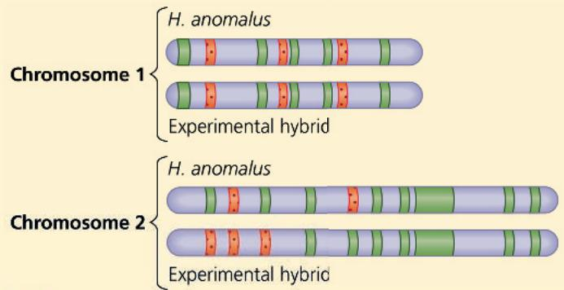  
Comparison region containing H. annuus-specific marker
Comparison region containing H. petiolarus-specific marker

## Conclusion

Over time, the chromosomes in the population of experimental hybrids became similar to the chromosomes of H. anomalus individuals from natural populations. This suggests that the observed rise in the fertility of the experimental hybrids may have occurred as selection eliminated regions of DNA from the parent species that were not compatible with one another. Overall, it appeared that the initial steps of the speciation process occurred rapidly and could be mimicked in a laboratory experiment.

Data from L. H. Rieseberg et al., Role of gene interactions in hybrid speciation: evidence from ancient and experimental hybrids, Science 272:741–745 (1996).

WHAT IF? The increased fertility of the experimental hybrids could have resulted from natural selection for thriving under laboratory conditions. Evaluate this alternative explanation for the result.

For suggested answer, see Appendix A.

speciation events averaged 6.5 million years and was rarely less than 500,000 years.

These data suggest that on average, millions of years may pass before a newly formed plant or animal species will itself give rise to another new species. As you'll read in Concept 25.4, this finding has implications for how long it takes life on Earth to recover from mass extinction events. Moreover, the extreme variability in the time it takes new species to form indicates that organisms do not have an internal “speciation clock” that causes them to produce new species at regular intervals. Instead, speciation begins only after gene flow between populations is interrupted, perhaps by changing environmental conditions or by unpredictable events, such as a storm that transports a few individuals to a new area. Furthermore, once gene flow is interrupted, the populations must diverge genetically to such an extent that they become reproductively isolated—all before other events cause gene flow to resume, possibly reversing the speciation process (see Figure 24.16).

## Studying the Genetics of Speciation

Studies of ongoing speciation (as in hybrid zones) can reveal traits that cause reproductive isolation. By identifying the genes that control those traits, scientists can explore a fundamental question of evolutionary biology: How many genes influence the formation of new species?

In some cases, the evolution of reproductive isolation results from the effects of a single gene. For example, in Japanese snails of the genus Euhadra, a change in a single gene results in a mechanical barrier to reproduction. This gene controls the direction in which the shells spiral. When their shells spiral in different directions, the snails' genitalia are oriented in a manner that prevents mating (Figure 24.3f and g show a similar example). Recent genetic analyses have uncovered other single genes that cause reproductive isolation in fruit flies or mice.

A major barrier to reproduction between two closely related species of monkey flower, Mimulus cardinalis and M. lewisii, also appears to be influenced by a relatively small number of genes. These two species are isolated by several prezygotic and postzygotic barriers. Of these, one prezygotic barrier, pollinator choice, accounts for most of the isolation: In a hybrid zone between M. cardinalis and M. lewisii, nearly 98% of pollinator visits were restricted to one species or the other.

The two monkey flower species are visited by different pollinators: Hummingbirds prefer the red-flowered M. cardinalis, and bumblebees prefer the pink-flowered M. lewisii. Pollinator choice is affected by at least two loci in the monkey flowers, one of which, the “yellow upper,” or yup, locus, influences flower color (Figure 24.20). By crossing the two parent species to produce $F_{1}$ hybrids and then performing repeated backcrosses of these $F_{1}$ hybrids to each parent species, researchers succeeded in transferring the M. cardinalis allele at this locus into M. lewisii, and vice versa. In a field experiment, M. lewisii plants with the M. cardinalis yup allele received 68-fold more visits from hummingbirds than did wild-type M. lewisii. Similarly, M. cardinalis plants with the M. lewisii yup allele received 74-fold more visits from bumblebees than did wild-type M. cardinalis. Thus, a mutation at a single locus can influence pollinator preference and hence contribute to reproductive isolation in monkey flowers.

In other organisms, the speciation process is influenced by larger numbers of genes and gene interactions. For example, hybrid sterility between two subspecies of the fruit fly Drosophila pseudoobscura results from gene interactions among at least four loci, and postzygotic isolation in the sunflower hybrid zone discussed earlier is influenced by at least 26 chromosome segments (and an unknown number of genes). Overall, studies suggest that few or many genes can influence the evolution of reproductive isolation and hence the emergence of a new species.

## From Speciation to Macroevolution

As you've seen, speciation may begin with differences as small as the color on a cichlid's back. However, as speciation occurs again and again, such differences can accumulate and become more pronounced, eventually leading to the formation of new groups of organisms that differ greatly from their ancestors (as in the origin of whales from terrestrial mammals; see Figure 22.20). Moreover, as one group of organisms increases in

Figure 24.20 A locus that influences pollinator choice.
Pollinator preferences provide a strong barrier to reproduction between Mimulus lewisii and M. cardinalis. After transferring the M. lewisii allele for a flower-color locus into M. cardinalis and vice versa, researchers observed a shift in some pollinators' preferences.

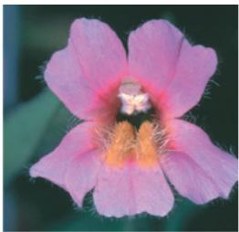

  
(a) Typical Mimulus lewisii (pink-flowered)  
(b) Orange-flowered M. lewisii with an M. cardinalis flower-color allele

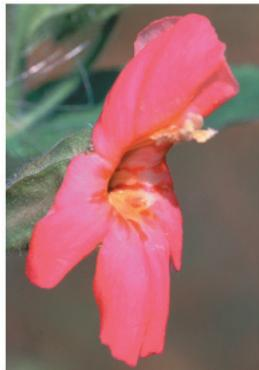  
(c) Typical Mimulus cardinalis (red-flowered)  
(d) Pink-flowered M. cardinalis with an M. lewisii flower-color allele  
WHAT IF? If M. cardinalis individuals that had the M. lewisii yup allele were planted in an area that housed both monkey flower species, how might the production of hybrid offspring be affected?  
For suggested answers, see Appendix A.

size by producing many new species, another group of organisms may shrink, losing species to extinction. The cumulative effects of many such speciation and extinction events have helped shape the sweeping evolutionary changes that are documented in the fossil record. In the next chapter, we turn to such large-scale evolutionary changes as we begin our study of macroevolution.

## Concept Check 24.4

1. Speciation can occur rapidly between diverging populations, yet the time between speciation events is often more than a million years. Explain this apparent contradiction.

2. Summarize evidence that the yup locus acts as a prezygotic barrier to reproduction in two species of monkey flowers. Do these results show that the yup locus alone controls barriers to reproduction between these species? Explain.

3. MAKE CONNECTIONS Compare Figures 13.12 and 24.19. What cellular process could cause the hybrid chromosomes in Figure 24.19 to have DNA from both parent species? Explain.

## Summary of Key Concepts

To review key terms, go to the Vocabulary Self-Quiz (eTextbook only).

## Concept 24.1: The biological species concept emphasizes reproductive isolation

\- A biological species is a group of populations whose individuals may interbreed and produce viable, fertile offspring with each other but not with members of other species.

\- New species form when reproductive isolation between populations develops through the establishment of prezygotic or postzygotic barriers that separate gene pools.

Explain the role of gene flow in the biological species concept.

## Concept 24.2: Speciation can take place with or without geographic separation

\- In allopatric speciation, gene flow is reduced when two populations of one species become geographically separated from each other. One or both populations may undergo evolutionary change during the period of separation, resulting in the establishment of barriers to reproduction.

\- In sympatric speciation, a new species originates while remaining in the same geographic area as the parent species. Plant species (and, more rarely, animal species) have evolved sympatrically through polyploidy. Sympatric speciation can also result from sexual selection and habitat shifts.

Can factors that cause sympatric speciation also cause allopatric speciation? Explain.

## Concept 24.3: Hybrid zones reveal factors that cause reproductive isolation

\- Many groups of organisms form hybrid zones in which members of different species meet and mate, producing at least some offspring of mixed ancestry.

\- Many hybrid zones are stable, in that hybrid offspring continue to be produced over time. In others, reinforcement strengthens prezygotic barriers to reproduction, thus

decreasing the formation of unfit hybrids. In still other hybrid zones, barriers to reproduction may weaken over time, resulting in the fusion of the species' gene pools (reversing the speciation process).

What factors can support the long-term stability of a hybrid zone if the parent species live in different environments?

## Concept 24.4: Speciation can occur rapidly or slowly and can result from changes in few or many genes

\- New species can form rapidly once divergence begins, but it can take millions of years for that to happen. The time interval between speciation events varies considerably, from a few thousand years to tens of millions of years.

\- Researchers have identified particular genes involved in some cases of speciation. Speciation can be driven by a few or many genes.

Is speciation something that happened only in the distant past, or are new species continuing to arise today? Explain.

For suggested answers, see Appendix A.

## Test Your Understanding

For more multiple-choice questions, go to the Practice Test (eTextbook only).

## Levels 1-2: Remembering/Understanding

1. The largest unit within which gene flow can readily occur is a (A) population.

(B) species.

(C) genus.

(D) hybrid.

2. Males of different species of the fruit fly Drosophila that live in the same parts of the Hawaiian Islands have different elaborate courtship rituals. These rituals involve fighting other males and making stylized movements that attract females. What type of reproductive isolation does this represent?

(A) habitat isolation

(B) temporal isolation

(C) behavioral isolation

(D) gametic isolation

3. According to the punctuated equilibria model,

(A) given enough time, most existing species will branch gradually into new species.

(B) new species differentiate rapidly as they form, then change little for the rest of their existence.

(C) most evolution occurs in sympatric populations.

(D) speciation is usually due to a single mutation.

## Levels 3-4: Applying/Analyzing

4. Bird guides once listed the myrtle warbler and Audubon's warbler as distinct species. Recently, these birds have been classified as eastern and western forms of a single species, the yellow-rumped warbler. Which of the following pieces of evidence, if true, would be cause for this reclassification?

(A) The two forms interbreed often in nature, and their offspring survive and reproduce well.

(B) The two forms live in similar habitats and have similar food requirements.

(C) The two forms have many genes in common.

(D) The two forms are very similar in appearance.

5. Which of the following factors would be the most likely to contribute to allopatric speciation?

(A) The separated population is large, and genetic drift occurs.

(B) Selection pressures in the isolated population are similar to those in the ancestral population.

(C) Gene flow between the two populations is extensive.

(D) Different mutations begin to distinguish the gene pools of the separated populations.

6. Plant species A has a diploid chromosome number of 12. Plant species B has a diploid number of 16. A new species, C, arises as an allopolyploid from A and B. The diploid number for species C would probably be

(A) 14.

(B) 16.

(C) 28.

(D) 56.

## Levels 5-6: Evaluating/Creating

7. EVOLUTION CONNECTION Explain the biological basis for assigning all human populations to a single species. Can you think of a scenario by which a second human species could originate in the future?

8. SCIENTIFIC INQUIRY • DRAW IT In this chapter, you read that bread wheat (Triticum aestivum) is an allohexaploid, containing two sets of chromosomes from each of three different parent species. Genetic analysis suggests that each of the three species pictured following this question contributed chromosome sets to T. aestivum. (The capital letters represent sets of chromosomes, each of which can be traced to a particular species, not individual genes. The numbers in parentheses are the species' chromosome numbers.) Evidence also indicates that the first polyploidy event began with the spontaneous hybridization of the early cultivated wheat species T. monococcum and a wild Triticum grass species. Draw a diagram of one possible chain of events that could have produced the allohexaploid T. aestivum.

## (Continued)

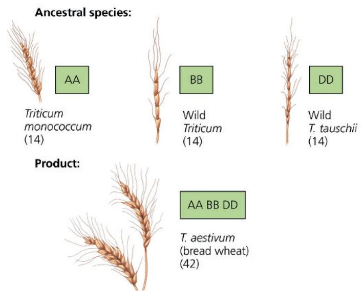

9. WRITE ABOUT A THEME: INFORMATION In sexually reproducing species, each individual inherits DNA from both parent organisms. In a short essay (100–150 words), apply this idea to what occurs when organisms of two species that have homologous chromosomes mate and produce $\left(\mathrm{F}_{1}\right)$ hybrid offspring. What percentage of the DNA in the $F_{1}$ hybrids' chromosomes comes from each parent species? As the hybrids mate and produce $F_{2}$ and later-generation hybrid offspring, describe how recombination and natural selection may affect whether the DNA in hybrid chromosomes is derived from one parent species or the other.

## 10. SYNTHESIZE YOUR KNOWLEDGE

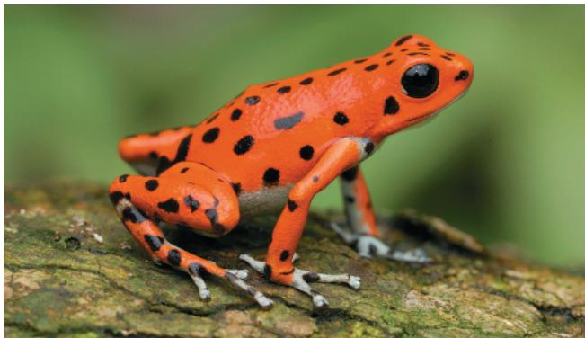  
Suppose that females of one population of strawberry poison dart frogs (Dendrobates pumilio) prefer to mate with males that are orange-red in color. In a different population, females prefer males with yellow skin. Explain how such differences could arise and how they could affect the evolution of reproductive isolation in allopatric versus sympatric populations.
For selected answers, see Appendix A.

