# 第26章 Phylogeny and the Tree of Life

<!-- 章节边界按正文内容恢复；原始 MinerU 内容保留如下。 -->

# Phylogeny and the Tree of Life

## Key Concepts

26.1 Phylogenies show evolutionary relationships

26.2 Phylogenies can be used to understand shared characters

26.3 Phylogenies are inferred from morphological and molecular data

26.4 An organism's evolutionary history is documented in its genome

26.5 Molecular clocks help track evolutionary time

26.6 New information continues to improve our understanding of evolutionary history

  
Figure 26.1 Although this animal resembles a snake, it is actually a legless lizard: the glass lizard Ophisaurus apodus. Why isn't the glass lizard considered a snake? Biologists based this decision in part on a comparison of its traits with those of snakes—and the glass lizard does not have a highly mobile jaw or many vertebrae, two traits shared by all snakes.

## Study Tip

Label a drawing: The members of a sister group are each other's closest relatives, making sister groups a useful way to describe evolutionary relationships. As in this example, identify the sister groups associated with each branch point in Figures 26.8, 26.9, 26.10, and 26.12.

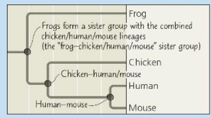

## How do biologists distinguish and categorize the millions of species on Earth?

Traits shared due to common ancestry are used to classify organisms into groups that reflect their evolutionary history:

## Concept 26.1: Phylogenies show evolutionary relationships

The glass lizard in Figure 26.1 is part of the continuum of life extending from the earliest organisms to the great variety of species alive today. In this unit, we will survey this diversity and describe hypotheses regarding how it evolved.

To set the stage for surveying life's diversity, in this chapter we consider how biologists trace phylogeny, the evolutionary history of a species or group of species. A phylogeny of lizards and snakes, for example, indicates that both glass lizards and snakes evolved from lizards with legs—but they evolved from different lineages of legged lizards (Figure 26.2). Thus, it appears that their legless conditions evolved independently. As we'll see, biologists reconstruct phylogenies like that in Figure 26.2 using systematics, a discipline focused on classifying organisms and determining their evolutionary relationships. We'll begin by describing how organisms are named and classified.

## Binomial Nomenclature

Common names for organisms—such as monkey, finch, and lilac—convey meaning in casual usage, but they can also cause confusion. Each of these names, for example, refers to more than one species. Moreover, some common names do not accurately reflect the kind of organism they signify. Consider these three “fishes”: jellyfish (a cnidarian), crayfish (a small, lobsterlike crustacean), and silverfish (an insect). And, of course, a given organism has different names in different languages.

To avoid ambiguity when communicating about their research, biologists refer to organisms by Latin scientific names. The two-part format of the scientific name, commonly called a binomial, was instituted in the 18th century by Carolus Linnaeus (see Concept 22.1). The first part of a binomial is the name of the genus (plural, genera) to which the species belongs. The second part, called the specific epithet, is unique for each species within

Figure 26.2 Convergent evolution of limbless bodies.

A phylogeny based on DNA sequence data reveals that a legless body form evolved independently from legged ancestors in the lineages leading to glass lizards and to snakes.

  
Figure 26.3 Linnaean classification.

the genus. An example of a binomial is Panthera pardus, the scientific name for the leopard. Notice that the first letter of the genus is capitalized and the entire binomial is italicized. (Newly created scientific names are also “latinized”: You can name an insect you discover after a friend, but you must add a Latin ending.) Many of the more than 11,000 binomials assigned by Linnaeus are still used today, including the optimistic name he gave our own species—Homo sapiens, meaning “wise man.”

## Hierarchical Classification

In addition to naming species, Linnaeus also grouped them into a hierarchy of increasingly inclusive categories. The first grouping is built into the binomial: Species that appear to be closely related are grouped into the same genus. For example, the leopard (Panthera pardus) belongs to a genus that also includes the African lion (Panthera leo), the tiger (Panthera tigris), and the jaguar (Panthera onca). Beyond genera, biologists employ progressively more comprehensive categories of classification (Figure 26.3). The classification system named after Linnaeus, the Linnaean system, places related genera in the same family, families into orders,

At each level, or “rank,” species are placed in groups within more inclusive groups.

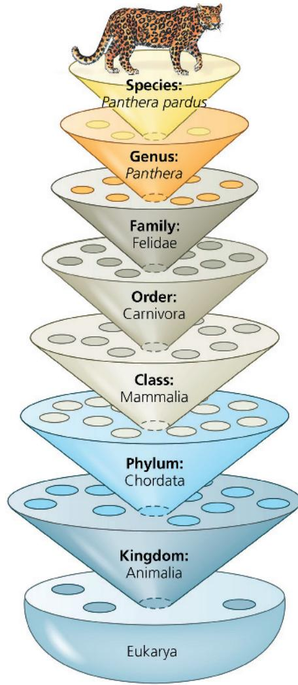

<!-- END OFFICIAL MINERU API RESULT part_06 -->

<!-- BEGIN OFFICIAL MINERU API RESULT part_07 -->

orders into classes, classes into phyla (singular, phylum), phyla into kingdoms, and, more recently, kingdoms into domains. The resulting biological classification of a particular organism is somewhat like a postal address identifying a person in a particular apartment, in a building with many apartments, on a street with many apartment buildings, in a city with many streets, and so on.

The named group at any level of the hierarchy is called a taxon (plural, taxa). In the leopard example, Panthera is a taxon at the genus level, and Mammalia is a taxon at the class level that includes all the many orders of mammals. Note that in the Linnaean system, taxa broader than the genus are not italicized, though they are capitalized.

Classifying species is a way to structure our human view of the world. We lump together various species of trees to which we give the common name of pines and distinguish them from other trees that we call firs. Systematists have decided that pines and firs are different enough to be placed in separate genera, yet similar enough to be grouped into the same family, Pinaceae. As with pines and firs, higher levels of classification are usually defined by particular characters chosen by systematists. However, characters that are useful for classifying one group of organisms may not be appropriate for other organisms. For this reason, the larger categories often are not comparable between lineages; that is, an order of snails does not exhibit the same degree of morphological or genetic diversity as an order of mammals. As we'll see, the historical placement of species into orders, classes, and so on also does not necessarily reflect evolutionary history. Taxonomy is always a “work in progress” as we continue to learn more about evolutionary relationships.

## Linking Classification and Phylogeny

The evolutionary history of a group of organisms can be represented in a branching diagram called a phylogenetic tree. As in Figure 26.4, the branching pattern often matches how systematists have classified groups of organisms nested within more inclusive groups. Sometimes, however, systematists have placed a species within a genus (or other group) to which it is not most closely related. One reason for such a mistake might be that over the course of evolution, a species has lost a key feature shared by its close relatives. If DNA or other new evidence indicates that an organism has been misclassified, the organism may be reclassified to accurately reflect its evolutionary history. Another issue is that while the Linnaean system may distinguish groups, such as amphibians, mammals, reptiles, and other classes of vertebrates, it tells us nothing about these groups' evolutionary relationships to one another.

Such difficulties in aligning Linnaean classification with phylogeny have led many systematists to propose that classification be based entirely on evolutionary relationships. In such systems, names are assigned only to groups that include a common ancestor and all of its descendants. Using this approach, some commonly recognized groups become part of other groups previously at the same level of the Linnaean system. For example, because birds evolved from a group of reptiles, Aves (the Linnaean class to which birds are assigned) is considered a subgroup of Reptilia (also a class in the Linnaean system).

Figure 26.4 The connection between classification and phylogeny.

Hierarchical classification can reflect the branching patterns of phylogenetic trees. This tree shows evolutionary relationships between some of the taxa within order Carnivora, itself a branch of class Mammalia.

## Phylogenetic Trees are Tools Inferred from Data

Regardless of how groups are named, a phylogenetic tree represents a hypothesis about evolutionary relationships. These relationships often are depicted as a series of dichotomies, or two-way branch points. Each branch point represents the common ancestor of the two evolutionary lineages diverging from it. An evolutionary lineage is a sequence of ancestral organisms leading to a particular descendant taxon. Figure 26.5 illustrates these elements of a phylogenetic tree and offers more tips on interpreting these diagrams.

Each tree in Figure 26.5 has a branch point that represents the common ancestor of chimpanzees and humans. Chimps and humans are an example of sister taxa, groups of organisms that share an immediate common ancestor that is not shared by any other group. Note that there is a sister group associated with each branch point in a tree (since each branch point represents the common ancestor of the two lineages diverging at that point).

The members of a sister group are each other's closest relatives, making sister groups a useful way to describe the evolutionary relationships shown in a tree. For example, in Figure 26.5, the evolutionary lineage leading to lizards shares an immediate common ancestor with the lineage leading to chimpanzees and humans. Thus, we can describe this portion of the tree by saying that lizards are the sister taxon to a group consisting of chimpanzees and humans.

As also discussed in Figure 26.5, the branches of a tree can be rotated around branch points without changing the relationships shown in the tree. That is, the order in which the taxa appear at the right side of the tree does not represent a sequence of evolution—in this case, it does not imply a sequence leading from fishes to humans.

# Visualizing Phylogenetic Relationships

## Figure 26.5 For suggested answers, see Appendix A.

A phylogenetic tree visually represents a hypothesis of how a group of organisms are related. This figure explores how the way a tree is drawn conveys information.

## Parts of a Phylogenetic Tree

This tree shows how the five groups of organisms at the tips of the branches, called taxa, are related. Each branch point represents the common ancestor of the evolutionary lineages diverging from it.

This branch point represents the common ancestor of all the animal groups shown in this tree.

1. According to this tree, which group or groups of organisms are most closely related to frogs?

2. Label the part of the diagram that represents the most recent common ancestor of frogs and humans.

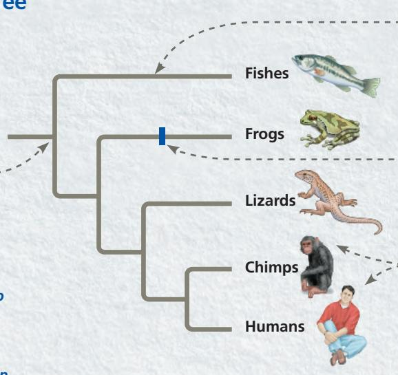

Instructors: Additional questions related to this Visualizing Figure can be assigned in Mastering Biology.

Each horizontal branch represents an evolutionary lineage. The length of the branch is arbitrary unless the diagram specifies that branch lengths represent information such as time or amount of genetic change.

Each position along a branch represents an ancestor in the lineage leading to the taxon named at the tip.

Chimps and humans are an example of sister taxa, groups of organisms that share a common ancestor that is not shared by any other group. The members of a sister group are each other's closest relatives.

## Alternative Forms of Tree Diagrams

These diagrams are referred to as "trees" because they use the visual analogy of branches to represent evolutionary lineages diverging over time. In this text, trees are usually drawn horizontally, as shown above, but the same tree can be drawn vertically or diagonally without changing the relationships it conveys.

Vertical tree

Fishes Frogs Lizards Chimps Humans

3. How many sister taxa are shown in these two trees? Identify them.

4. Redraw the horizontal tree in Figure 26.2 as a vertical tree and a diagonal tree.

Diagonal tree

## Rotating Around Branch Points

Rotating the branches of a tree around a branch point does not change what they convey about evolutionary relationships. As a result, the order in which taxa appear at the branch tips is not significant. What matters is the branching pattern, which signifies the order in which the lineages have diverged from common ancestors.

Note: The order of the taxa does NOT represent a sequence of evolution "leading to" the last taxon shown (in this tree, humans).

If you rotate the branches of the tree at left around the three blue points, the result is the tree at right.

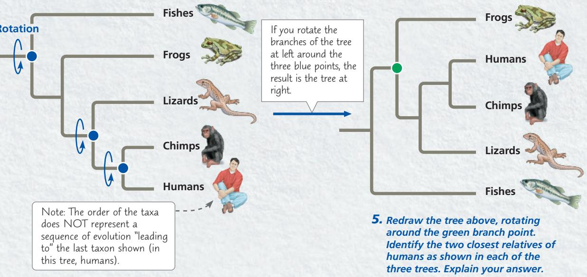

5. Redraw the tree above, rotating around the green branch point. Identify the two closest relatives of humans as shown in each of the three trees. Explain your answer.

This tree, like all of the phylogenetic trees in this book, is rooted, which means that a branch point within the tree (often drawn farthest to the left) represents the most recent common ancestor of all taxa in the tree. A lineage that diverges from all other members of its group early in the history of the group is referred to as the sister group to the rest of the tree. This lineage shares the same common ancestor as the rest of the group. Hence, the fishes in Figure 26.5 would be considered the sister group to all the other vertebrates. Note that the lineages that stem from the common ancestor originated at the same point in time and thus have been evolving for the same length of time. In this case, be careful to not interpret the fishes as “more primitive” or “less evolved” than the rest of the taxa on the tree; rather, they are just less closely related to the other taxa.

What other key points do we need to keep in mind when interpreting phylogenetic trees? First, they are intended to show patterns of descent, not phenotypic similarity. Although closely related organisms often resemble one another due to their common ancestry, they may not if their lineages have evolved at different rates or faced very different environmental conditions. For example, even though crocodiles are more closely related to birds than to lizards (see Figure 22.17), they look more like lizards because morphology has changed dramatically in the bird lineage. Phylogenies show a hypothesized pattern of descent that is inferred from data, often molecular genetic sequence similarity.

Second, we cannot necessarily infer the ages of the taxa or branch points shown in a tree. For example, the tree in Figure 26.5 does not indicate that chimpanzees evolved before humans. Rather, the tree shows only that chimpanzees and humans share a recent common ancestor, but we cannot tell when that ancestor lived or when the first chimpanzees or humans arose. Generally, unless we are given specific information about what the branch lengths in a tree mean—for example, that they are proportional to time—we should interpret the diagram solely in terms of patterns of descent. No assumptions should be made about when particular species evolved or how much change occurred in each lineage.

Third, we should not assume that a taxon on a phylogenetic tree evolved from the taxon next to it. Figure 26.5 does not indicate that humans evolved from chimpanzees or vice versa. We can infer only that the lineage leading to humans and the lineage leading to chimpanzees both evolved from a recent common ancestor. That ancestor, which is now extinct, was neither a human nor a chimpanzee.

Finally, remember that a phylogeny is a hypothesis about our understanding of the evolutionary relationships among the members of a group. Some parts of a phylogeny may be more resolved than others; that is, there may be more evidence supporting those branch points compared to others. Systematists often illustrate uncertainty about a given branch point by drawing it as a polytomy: more than two lineages stemming from a single branch point (see Figure 26.21). This does not mean that all of these lineages are “equally related” to each other, but rather that the pattern of divergence is unclear.

## Applying Phylogenies

Understanding phylogeny can have practical applications. Consider maize (corn), which originated in the Americas and is now an important food crop worldwide. From a phylogeny of maize based on DNA data, researchers have identified two species of wild grasses that may be maize's closest living relatives. These two close relatives may be useful as “reservoirs”

of beneficial alleles that can be transferred to cultivated maize by cross-breeding or genetic engineering.

A different use of phylogenetic trees is to infer species identities by analyzing the relatedness of DNA sequences from different organisms. Researchers have used this approach to investigate whether “whale meat” had been harvested illegally from whale species protected under international law rather than from species that can be harvested legally (Figure 26.6).

How do researchers construct phylogenetic trees like those we've considered here? In the next section, we'll begin to answer that question by examining the data used to determine phylogenies.

## Figure 26.6

## Inquiry: What is the species identity of food being sold as whale meat?

## Experiment

C. S. Baker and S. R. Palumbi purchased 13 samples of “whale meat” from Japanese fish markets. They sequenced part of the mitochondrial DNA (mtDNA) from each sample and compared their results with the comparable mtDNA sequence from known whale species. To infer the species identity of each sample, the team constructed a gene tree, a phylogenetic tree that shows patterns of relatedness among DNA sequences rather than among taxa.

## Results

Of the species in the resulting gene tree, only Minke whales caught in the Southern Hemisphere can be sold legally in Japan.

## Conclusion

This analysis indicated that mtDNA sequences of six of the unknown samples (in red) were most closely related to mtDNA sequences of whales that are not legal to harvest.

Data from C. S. Baker and S. R. Palumbi, Which whales are hunted? A molecular genetic approach to monitoring whaling, Science 265:1538–1539 (1994). Reprinted with permission from AAAS.

WHAT IF? What different results would have indicated that all of the whale meat had been harvested legally?
For suggested answer, see Appendix A.

## Concept Check 26.1

1. VISUAL SKILLS Based on the tree in Figure 26.4, are leopards more closely related to badgers or wolves, or are they equally related to these two species? Explain.

2. VISUAL SKILLS Which of the trees shown here depicts an evolutionary history different from the other two? Explain.

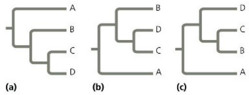  
3. DRAW IT The bear family (Ursidae) is more closely related to the badger/otter family (Mustelidae) than to the dog family (Canidae). Use this information to redraw Figure 26.4.

For suggested answers, see Appendix A.

# Concept 26.2: Phylogenies can be used to understand shared characters

Phylogenies are powerful tools that equip biologists to categorize and analyze the diversity of life. A phylogeny can help us to understand how we group organisms and how their traits have evolved.

## Cladistics

In the approach to systematics called cladistics, common ancestry is the primary criterion used to classify organisms. Using this methodology, biologists attempt to place species into groups called clades, each of which includes an ancestral species and all of its descendants. Clades, like the categories of the Linnaean system, are nested within larger clades. In Figure 26.4, for example, the cat group (Felidae) represents a clade within a larger clade (Carnivora) that also includes the dog group (Canidae).

A taxon is considered a clade only if it is monophyletic (from the Greek, meaning “single tribe”), signifying that it consists of an ancestral species and all of its descendants (Figure 26.7a). Contrast this with a paraphyletic (“beside the tribe”) group, which consists of an ancestral species and some, but not all, of its descendants (Figure 26.7b), or a polyphyletic (“many tribes”) group, which includes distantly related species but does not include their most recent common ancestor (Figure 26.7c).

Note that in a paraphyletic group, the most recent common ancestor of all members of the group is part of the group, whereas in a polyphyletic group the most recent common ancestor is not part of the group. For example, a group consisting of even-toed ungulates (hippopotamuses, deer, and their relatives) and their common ancestor is paraphyletic because it does not include cetaceans (whales, dolphins, and porpoises), which descended from that ancestor (Figure 26.8). In contrast, a group consisting of seals and cetaceans (based on their similar body forms) is polyphyletic because it does not include the common ancestor of seals and cetaceans. Biologists avoid defining such polyphyletic groups; if new evidence indicates that an existing group is polyphyletic, its members are reclassified.

## Shared Ancestral and Shared Derived Characters

As a result of descent with modification, organisms have characters they share with their ancestors, and they also have characters that differ from those of their ancestors. For example, all mammals have backbones, but a backbone does not distinguish mammals from other vertebrates because all vertebrates have backbones. The backbone predates the divergence of mammals from other vertebrates. Thus for mammals, the backbone is a shared ancestral character, a character that originated in an ancestor of the taxon. In contrast, hair is a character shared by all mammals but not found in their ancestors. Thus, in mammals, hair is considered a shared derived character, an evolutionary novelty unique to a clade. Note that a shared derived character can in some cases refer to the loss of a feature, such as the loss of limbs in snakes or whales. Also, keep in mind that it is a relative matter whether a character is considered ancestral or derived. A backbone can also qualify as

Figure 26.7 Monophyletic, paraphyletic, and polyphyletic groups.  
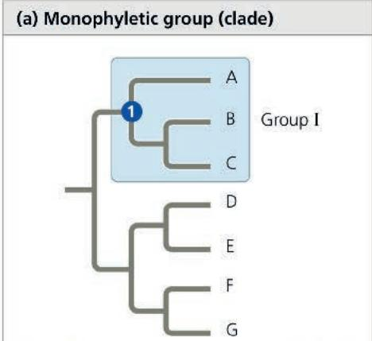  
Group I, consisting of three species (A, B, C) and their common ancestor 1, is a monophyletic group (clade), meaning that it consists of an ancestral species and all of its descendants.

  
Group II is paraphyletic, meaning that it consists of an ancestral species ② and some of its descendants (species D, E, F) but not all of them (does not include species G).

  
Group III, consisting of four species (A, B, C, D), is polyphyletic, meaning that the most recent common ancestor ③ of its members is not part of the group.

Figure 26.8 Paraphyletic versus polyphyletic groups.  
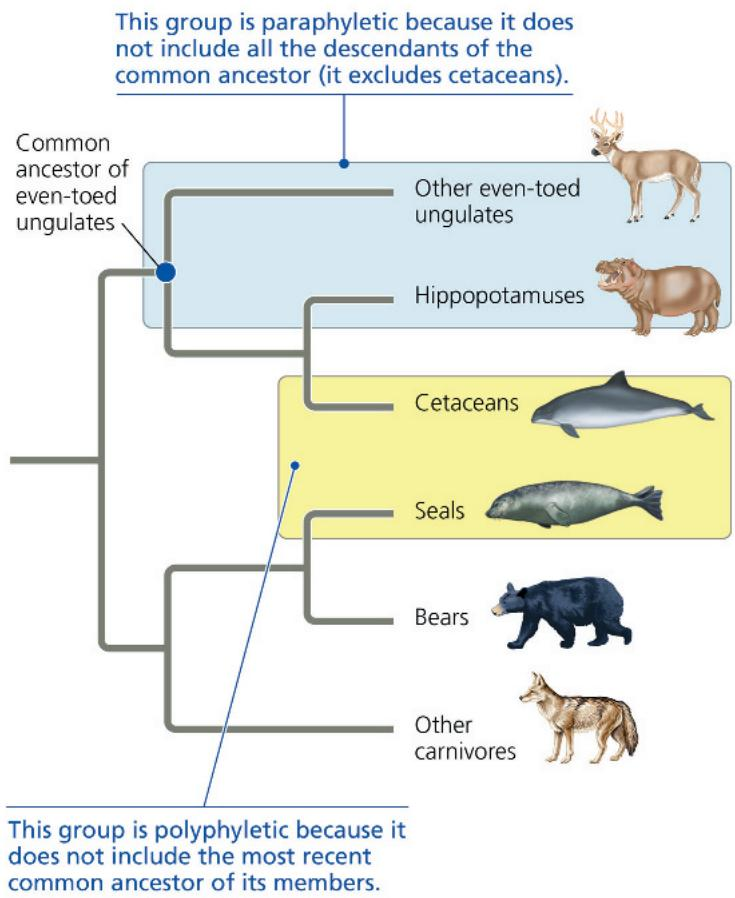  
This group is polyphyletic because it does not include the most recent common ancestor of its members.

DRAW IT Circle the branch point that represents the most recent common ancestor of cetaceans and seals. Explain why that ancestor would not be part of a cetacean–seal group defined by similar body form.
For suggested answer, see Appendix A.

a shared derived character, but only at a deeper branch point that distinguishes all vertebrates from other animals.

## Mapping Characters on a Phylogeny

Shared derived characters are unique to particular clades. We can visualize this by mapping the characters onto a phylogeny. To give an example of this approach, consider the set of characters shown in Figure 26.9a for each of five vertebrates—a leopard, turtle, frog, bass, and lamprey (a jawless aquatic vertebrate). As a basis of comparison, we need to select an outgroup. An outgroup is a species or group of species from an evolutionary lineage that is closely related to but not part of the group of species that we are studying (the ingroup). Note that the outgroup and the ingroup would be considered sister taxa. A suitable outgroup for any given comparison can be determined based on evidence from morphology, paleontology, embryonic development, and gene sequences. An appropriate outgroup for our example is the lancelet, a small animal that lives in mudflats and (like vertebrates) is a member of the more inclusive group called the chordates. Unlike the vertebrates, however, the lancelet does not have a backbone.

If a character is found in both the outgroup and the ingroup, it is ancestral. If a character only occurs in a subset of the ingroup, we infer that the character arose in the lineage leading to those members of the ingroup, and it is labeled on the tree with a hatch mark.

By comparing members of the ingroup with each other and with the outgroup, we can determine which characters were derived (that is, evolved independently) at the various branch points of vertebrate evolution. In our example, all of the vertebrates in the ingroup have backbones: This character was present in the ancestral vertebrate, but not in the outgroup. Note that hinged jaws are absent in the outgroup and in lampreys, but present in all other members of the ingroup. This indicates that hinged jaws arose in a lineage leading to all members of the ingroup except lampreys.

Figure 26.9 Mapping characters onto a phylogeny.  
The characters used here include the amnion, a membrane that encloses the embryo inside a fluid-filled sac (see Figure 34.26).  
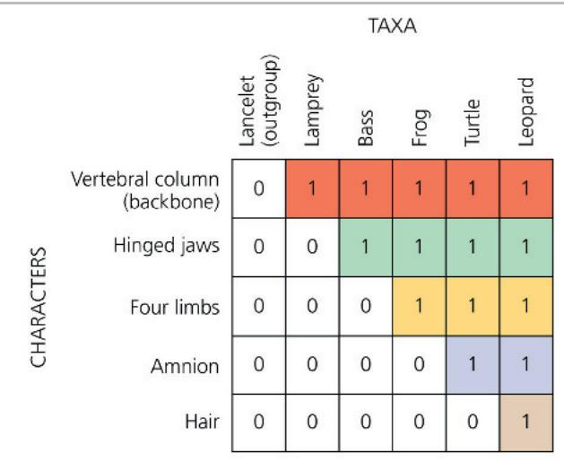  
(a) Character table. A 0 indicates that a character is absent; a 1 indicates that a character is present.

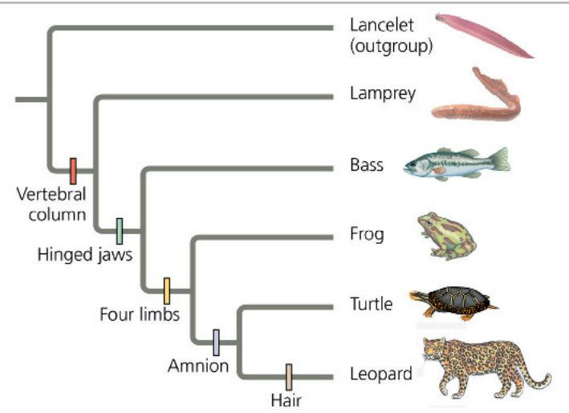  
(b) Phylogenetic tree. The character table in (a) leads to the phylogenetic mapping shown on this tree.

Proceeding in this way, we can visualize the evolution of key traits across the span of vertebrate evolution (Figure 26.9b).

## Phylogenetic Trees as Hypotheses

This is a good place to reiterate that any phylogenetic tree represents a hypothesis about how the organisms in the tree are related to one another. The best hypothesis is the one that best fits all the available data. A phylogenetic hypothesis may be modified when new evidence compels systematists to revise their trees. Indeed, while many older phylogenetic hypotheses have been supported by new data, others have been changed or rejected.

Thinking of phylogenies as hypotheses also allows us to use them in a powerful way: We can make and test predictions based on the assumption that a particular phylogeny—our hypothesis—is correct. For example, in an approach known as phylogenetic bracketing, we can predict that features shared by two groups of closely related organisms are present in their common ancestor and all of its descendants unless independent data indicate otherwise. (Note that “prediction” can refer to unknown past events as well as to evolutionary changes yet to occur.)

This approach has been used to make novel predictions about dinosaurs. For example, there is evidence that birds descended from the theropods, a group of bipedal dinosaurs. As seen in Figure 26.10, the closest living relatives of birds are crocodiles. Birds and crocodiles share numerous features: They have four-chambered hearts, they “sing” to defend territories and attract mates (although a crocodile’s “song” is more like a bellow), and they build nests. Both birds and crocodiles also care for their eggs by warming them. Birds warm their eggs by sitting on them, whereas crocodiles cover their eggs with their neck or with sand or vegetation. Reasoning that any feature shared by birds and crocodiles is likely to have been present in their common ancestor (denoted by the blue dot in Figure 26.10) and all of its descendants, biologists predicted that dinosaurs had four-chambered hearts, sang, built nests, and cared for their eggs.

Internal organs, such as the heart, rarely fossilize, and it is, of course, difficult to test whether dinosaurs sang to defend territories and attract mates. However, fossil discoveries have supported the

Figure 26.10 A phylogenetic tree of birds and their close relatives. (A dagger, †, indicates extinct lineages.)  
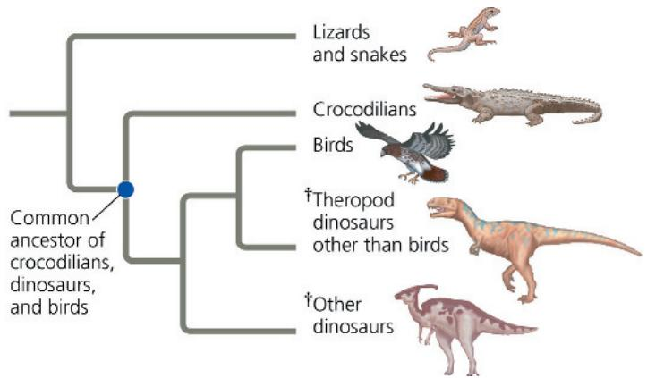  
VISUAL SKILLS In this tree diagram, what is the sister taxon of the clade that includes dinosaurs and their most recent common ancestor? Explain. For suggested answer, see Appendix A.

Figure 26.11 Fossil support for a phylogenetic prediction: Dinosaurs built nests and cared for their eggs.

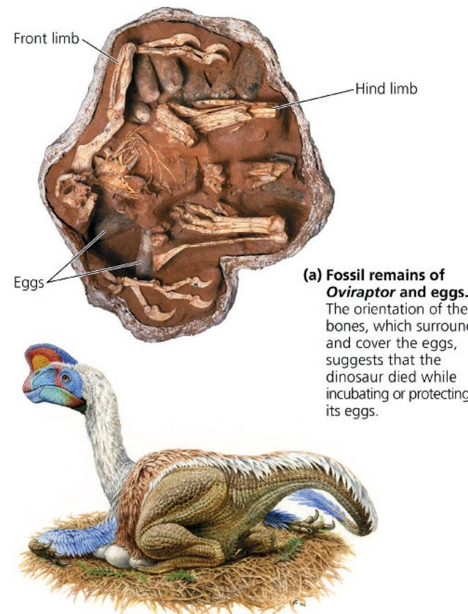  
(a) Fossil remains of Oviraptor and eggs. The orientation of the bones, which surround and cover the eggs, suggests that the dinosaur died while incubating or protecting its eggs.  
(b) Artist's reconstruction of the dinosaur's posture on its nest based on the fossil findings.

prediction that dinosaurs built nests and cared for their eggs. First, a fossil embryo of an Oviraptor dinosaur was found, still inside its egg. This egg was identical to those found in another fossil, one that showed an Oviraptor crouching over a group of eggs in a posture similar to how birds sit on their nests today (Figure 26.11). Researchers suggested that the Oviraptor dinosaur preserved in this second fossil died while incubating or protecting its eggs. The broader conclusion that emerged from this work—that dinosaurs built nests and cared for their eggs—has since been strengthened by additional fossil discoveries that show that other species of dinosaurs built nests and sat on their eggs. Finally, by supporting predictions based on the phylogenetic hypothesis shown in Figure 26.10, fossil discoveries of nests and parental care in dinosaurs provide independent data that suggest that the hypothesis is correct.

## Phylogenetic Trees with Proportional Branch Lengths

In the phylogenetic trees we have presented so far, the lengths of the tree's branches do not indicate the degree of evolutionary change in each lineage. Furthermore, the chronology represented by the branching pattern of the tree is relative (earlier versus later) rather than absolute (how many millions of years ago). But in some tree diagrams, branch lengths are proportional to the amount of evolutionary change or to the times at which particular events occurred.

Figure 26.12 Branch lengths can represent genetic change. This tree was based on sequences of homologs of a gene that plays a role in development; Drosophila was used as an outgroup. Branch lengths are proportional to the amount of genetic change in each lineage; varying branch lengths indicate that the gene has evolved at different rates in different lineages.

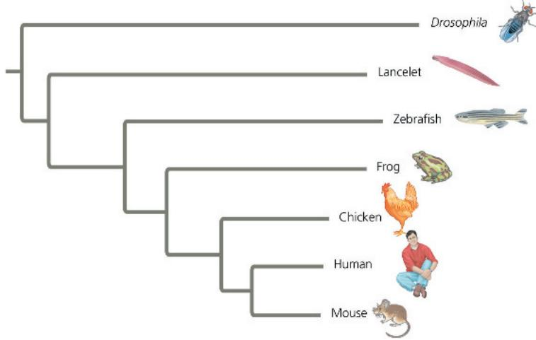  
INTERPRET THE DATA In which vertebrate lineage has the studied gene evolved most rapidly? Explain.

In Figure 26.12, for example, each branch length of the phylogenetic tree reflects the number of changes that have taken place in a particular DNA sequence in that lineage. Note that the total length of the horizontal lines from the base of the tree to the mouse is less than that of the line leading to the fruit fly, Drosophila. This indicates that fewer genetic changes have occurred in the mouse lineage than in the Drosophila lineage. In addition, because the mouse and fly lineages have evolved for an equal amount of time after they diverged from a common ancestor, the rate of change was lower in mouse lineage than in the Drosophila lineage.

In general, although the branches of a phylogenetic tree may have different lengths, among organisms alive today, all the different lineages that descend from a common ancestor have survived for the same number of years. To take an extreme example, humans and bacteria had a common ancestor that lived over 3 billion years ago. Fossils and genetic evidence indicate that this ancestor was a single-celled prokaryote. Even though bacteria have apparently changed little in their morphology since that common ancestor, there have nonetheless been 3 billion years of evolution in the bacterial lineage, just as there have been 3 billion years of evolution in the lineage that ultimately gave rise to humans.

These equal spans of chronological time can be represented in a phylogenetic tree whose branch lengths are proportional to time (Figure 26.13). Such a tree draws on fossil data to place branch points in the context of geologic time. Additionally, it is possible to combine these two types of trees by labeling branch points with information about rates of genetic change or dates of divergence.

## Maximum Parsimony and Maximum Likelihood

As the database of DNA sequences that enables us to study more species grows, the difficulty of building the phylogenetic tree that best describes their evolutionary history also grows. What if you are analyzing data for 50 species? There are $3 \times 10^{76}$ different ways to arrange 50 species into a tree! And which tree in this huge forest reflects the true phylogeny? Systematists can never be sure of finding the most accurate tree in such a large data set, but they can narrow the possibilities by applying the principles of maximum parsimony and maximum likelihood.

According to the principle of maximum parsimony, we should first investigate the simplest explanation that is consistent with the facts. (The parsimony principle is also called “Occam’s razor” after William of Occam, a 14th-century English philosopher who advocated solving problems by “shaving away” unnecessary complications.) In the case of trees based on morphology, the most parsimonious tree requires the fewest evolutionary events, as measured by the origin of shared derived morphological characters. For phylogenies based on DNA, the most parsimonious tree requires the fewest base changes.

A maximum likelihood approach identifies the tree most likely to have produced a given set of DNA data based on certain probability rules about how DNA sequences change over time. For example, the underlying probability rules could be based on the assumption that all nucleotide substitutions are equally likely. If

Figure 26.13 Branch lengths can indicate time.

This tree is based on the same DNA data as that in Figure 26.12, but here the branch points are dated based on fossil evidence. Thus, the branch lengths are proportional to time. Each lineage has the same total length from the base of the tree to the branch tip, indicating that all the lineages have diverged from the common ancestor for equal amounts of time.

6 events

Species I

evidence suggests that this assumption is not correct, more complex rules could be devised to account for different rates of change among different nucleotides or at different positions in a gene.

Scientists have developed many computer programs to search for trees that are parsimonious and likely. When a large amount of accurate data is available, the methods used in these programs usually yield similar trees. As an example of one method, Figure 26.14 walks you through the process of identifying the most parsimonious molecular tree for a three-species problem. Computer programs use the principle of parsimony to estimate

## Figure 26.14

## Research method: applying parsimony to a problem in molecular systematics

## Application

In considering possible phylogenies for a group of species, systematists compare molecular data for the species. An efficient way to begin is by identifying the most parsimonious hypothesis—the one that requires the fewest evolutionary events (molecular changes) to have occurred.

1 First, draw the three possible trees for the species. (Although only three trees are possible when ordering three species, the number of possible trees increases rapidly with the number of species: There are 15 trees for four species and 34,459,425 trees for 10 species.)

2 Tabulate the molecular data for the species. In this simplified example, the data represent a DNA sequence consisting of just four nucleotide bases. Data from several outgroup species (not shown) were used to infer the ancestral DNA sequence.

3 Now focus on site 1 in the DNA sequence. In the tree on the left, a single base-change event, represented by the purple hatch mark on the branch leading to species I and II (and labeled 1/C, indicating a change at site 1 to nucleotide C), is sufficient to account for the site 1 data. In the other two trees, two base-change events are necessary.

4 Continuing the comparison of bases at sites 2, 3, and 4 reveals that each of the three trees requires a total of five additional base-change events (purple hatch marks).

## Results

To identify the most parsimonious tree, we total all of the base-change events noted in steps 3 and 4. We conclude that the first tree is the most parsimonious of the three possible phylogenies. (In a real example, many more sites would be analyzed. Hence, the trees would often differ by more than one base-change event.)

## Technique

Follow the numbered steps as we apply the principle of parsimony to a hypothetical phylogenetic problem involving three closely related beetle species.

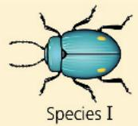

  
Species II

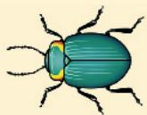

  
Site

Species I

Species II

Species III

<table><tr><td>1</td><td>2</td><td>3</td><td>4</td></tr><tr><td>C</td><td>T</td><td>A</td><td>T</td></tr><tr><td>C</td><td>T</td><td>T</td><td>C</td></tr><tr><td>A</td><td>G</td><td>A</td><td>C</td></tr><tr><td>A</td><td>G</td><td>T</td><td>T</td></tr></table>

Ancestral sequence

phylogenies in a similar way: They examine large numbers of possible trees and identify those that require the fewest evolutionary changes.

## Concept Check 26.2

1. To distinguish a particular clade of mammals within the larger clade that corresponds to class Mammalia, would hair be a useful character? Why or why not?

2. WHAT IF? Draw a phylogenetic tree that includes the relationships from Figure 25.7 and Figure 26.10. Traditionally, all the taxa shown besides birds and mammals were classified as reptiles. Would a cladistic approach support that classification? Explain.

For suggested answers, see Appendix A.

## Concept 26.3: Phylogenies are inferred from morphological and molecular data

To infer phylogeny, systematists must gather as much information as possible about the relevant organisms. It is important to focus on features that result from common ancestry because only those features reflect evolutionary relationships. While phylogeny can be inferred from any kind of comparative data, most researchers now use molecular genetic sequences.

## Morphological and Molecular Homologies

Before we discuss how scientists infer the structure of a phylogenetic tree, we'll start by exploring how we read and interpret a tree. A fundamental use of a phylogeny is to help differentiate homologous (evolutionarily conserved) similarity from analogous (evolutionarily independent) similarity (see Concept 22.3). Recall that homologies are phenotypic and genetic similarities due to shared ancestry. For example, the similarity in the number and arrangement of bones in the forelimbs of mammals is due to their descent from a common ancestor with the same bone structure; this is an example of a morphological homology (see Figure 22.15). In the same way, genes or other DNA sequences are homologous if they are descended from sequences carried by a common ancestor.

In general, organisms that share very similar morphologies or similar DNA sequences are likely to be more closely related than organisms with vastly different structures or sequences. In some cases, however, the morphological divergence between related species can be great and their genetic divergence small (or vice versa). Consider the Hawaiian silversword plants: Some of these species are tall, twiggy trees, while others are dense, ground-hugging shrubs (see Figure 25.23). But despite these striking phenotypic differences, the silverswords' genes are very similar. Based on these small molecular divergences, scientists estimate that the silversword group began to diverge 5 million years ago. We'll discuss how scientists use molecular data to estimate such divergence times later in this chapter.

Figure 26.15 Convergent evolution in burrowers.

A long body, large front paws, small eyes, and a pad of thick skin that protects the nose all evolved independently in these species.

  
Australian "mole"

  
African golden mole

## Sorting Homology from Analogy

A potential source of confusion in constructing a phylogeny is similarity between organisms that is due to convergent evolution—called analogy—rather than to shared ancestry (homology). Convergent evolution occurs when similar environmental conditions and natural selection produce similar (analogous) adaptations in organisms from different evolutionary lineages. For example, the two mole-like animals shown in Figure 26.15 look very similar. However, their internal anatomy, physiology, and reproductive systems are very dissimilar. Indeed, genetic and fossil evidence indicate that the common ancestor of these animals lived 160 million years ago. This common ancestor and most of its descendants were not mole-like. It appears that analogous characteristics evolved independently in these two lineages as they became adapted to similar lifestyles—hence, the similar mole-like features of these animals should not be used when reconstructing their phylogeny.

Another clue to distinguishing between homology and analogy is the complexity of the characters being compared. The more elements that are similar in two complex structures, the more likely it is that the structures evolved from a common ancestor. For instance, the skulls of an adult human and an adult chimpanzee both consist of many bones fused together. The compositions of the skulls match almost perfectly, bone for bone. It is highly improbable that such complex structures, matching in so many details, have separate origins. More likely, the genes involved in the development of both skulls were inherited from a common ancestor.

Traditionally, researchers have used a variety of data types to infer phylogeny, being careful to avoid making inferences based on similarities that are analogous. The advent of powerful computer technology and sophisticated techniques of sequencing genetic data has revolutionized methods of phylogenetic inference, greatly reducing the use of morphological data that can be misleading. Unless otherwise noted, the phylogenetic trees shown in this text are based on genetic sequence data, allowing us to easily visualize whether similar structures are homologous or analogous.

## Evaluating Molecular Homologies

Genes are sequences of thousands of nucleotides, each of which represents an inherited character in the form of one of the four DNA bases: A (adenine), G (guanine), C (cytosine), or T (thymine). If genes in two organisms share many portions of their nucleotide sequences, it is likely that the genes are homologous. Comparing DNA molecules often poses technical challenges for researchers. The first step after sequencing the DNA is to align comparable

sequences from the species being studied. If the species are very closely related, the sequences probably differ at only one or a few sites. In contrast, comparable nucleic acid sequences in distantly related species usually have different bases at many sites and may have different lengths. This is because insertions and deletions accumulate over long periods of time.

Suppose, for example, that certain noncoding DNA sequences near a particular gene are very similar in two species, except that the first base of the sequence has been deleted in one of the species. The effect is that the remaining sequence shifts back one notch. A comparison of the two sequences that does not take this deletion into account would overlook what in fact is a very good match. Computer programs can be used to identify such matches by testing possible alignments for comparable DNA segments of differing lengths (Figure 26.16).

Such molecular comparisons reveal that many base substitutions and other differences have accumulated in the comparable genes of an Australian “mole” and a golden mole (see Figure 26.15). The many differences indicate that their lineages have diverged greatly since their common ancestor; thus, we say that the living species are not closely related. In contrast, the high degree of gene sequence similarity among the silversword plants (see Figure 25.23) indicates that they are all very closely related, in spite of their considerable morphological differences.

Just as with morphological characters, it is necessary to distinguish homology from analogy in evaluating molecular similarities for evolutionary studies. Two sequences that resemble each other at many points along their length most likely are homologous (see Figure 26.16). But in organisms that do not

## Figure 26.16 Aligning segments of DNA.

Systematists search for similar sequences along DNA segments from two species (only one DNA strand is shown for each species). In this example, 11 of the original 12 bases have not changed since the species diverged. Hence, those portions of the sequences still align once the length is adjusted.

1 These homologous DNA sequences are identical as species 1 and species 2 begin to diverge from their common ancestor.

2 Deletion and insertion mutations shift what had been matching sequences in the two species.

3 Of the regions of the species 2 sequence that match the species 1 sequence, those highlighted in orange dashed boxes no longer align because of these mutations.

4 The matching regions realign after a computer program adds gaps in sequence 1.

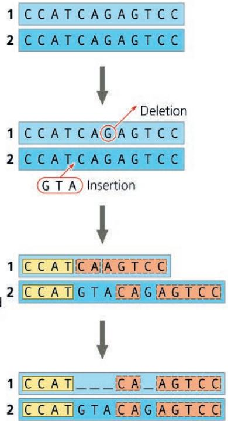

Figure 26.17 A coincidental match.  
These two DNA sequences from distantly related species coincidentally share 23% of their bases (those highlighted in yellow boxes).  
  
WHAT IF? Why might you expect organisms that are not closely related to nevertheless share roughly 25% of their bases?
For suggested answer, see Appendix A.

appear to be closely related, the bases that their otherwise very different sequences happen to share may simply be coincidental matches (Figure 26.17). Scientists have developed statistical tools that can help distinguish “distant” homologies from such coincidental matches in extremely divergent sequences.

## Concept Check 26.3

1. Decide whether each of the following pairs of structures more likely represents analogy or homology, and explain your reasoning:

a. a porcupine's quills and a cactus's spines;

b. a cat's paw and a human's hand;

c. an owl's wing and a hornet's wing.

2. WHAT IF? Suppose that two species, A and B, have similar appearances but very divergent gene sequences, while species B and C have very different appearances but similar gene sequences. Which pair of species is more likely to be closely related: A and B or B and C? Explain.

3. How might analogous similarity like that shown in Figure 26.15 increase confusion when organisms are referred to by similar “common” names such as “fish” or “sparrow”?

4. Explain how it is possible that the most parsimonious tree of evolutionary relationships could be inaccurate.

For suggested answers, see Appendix A.

## Concept 26.4: An organism's evolutionary history is documented in its genome

As you have seen in this chapter, comparisons of nucleic acids or other molecules can be used to deduce relatedness. In some cases, such comparisons can reveal phylogenetic relationships that cannot be determined by nonmolecular methods such as comparative anatomy. For example, the analysis of molecular data helps us uncover evolutionary relationships between groups that have little common ground for morphological comparison, such as animals and fungi. And molecular methods allow us to reconstruct phylogenies among groups of present-day organisms for which the fossil record is poor or lacking entirely.

Different genes can evolve at different rates, even in the same evolutionary lineage. As a result, molecular trees can represent short or long periods of time, depending on which genes are used. For example, the DNA that codes for ribosomal RNA (rRNA) changes relatively slowly. Therefore, comparisons of DNA sequences in these genes are useful for investigating relationships between taxa that diverged hundreds of millions of years ago. Studies of rRNA sequences indicate, for instance, that fungi are more closely related to animals than to plants. In contrast, mitochondrial DNA (mtDNA) evolves relatively rapidly and can be used to explore recent evolutionary events. One research team has traced the relationships among Native American groups through their mtDNA sequences. The molecular findings corroborate other evidence that the Pima of Arizona, the Maya of Mexico, and the Yanomami of Venezuela are closely related, probably descending from the first of three waves of immigrants that crossed the Bering Land Bridge from Asia to the Americas about 15,000 years ago.

## Gene Duplications and Gene Families

What do molecular data reveal about the evolutionary history of genome change? Consider gene duplication, which can play an important role in evolution because it increases the number of genes in the genome, providing more opportunities for further evolutionary changes. Molecular techniques now allow us to trace the phylogenies of gene duplications. These molecular phylogenies must account for repeated duplications that have resulted in gene families, groups of related genes within an organism's genome (see Figure 21.10).

Accounting for such duplications leads us to distinguish two types of homologous genes (Figure 26.18): orthologous genes and paralogous genes. In orthologous genes from the Greek orthos, exact), the homology is the result of a speciation event and hence occurs between genes found in different species (see Figure 26.18a). For example, the genes that code for cytochrome c (a protein that functions in electron transport chains) in humans and dogs are orthologous. In paralogous genes (from the Greek para, in parallel), the homology results from gene duplication; hence, multiple copies of these genes have diverged from one another within a species

(see Figure 26.18b). In Concept 23.1, you encountered the example of olfactory receptor genes, which have undergone many gene duplications in vertebrates; humans have 380 functional copies of these paralogous genes, while mice have 1,200.

Note that orthologous genes can only diverge after speciation has taken place, that is, after the genes are found in separate gene pools. Thus, differences among orthologous genes reflect the history of speciation events, making them well-suited for inferring phylogeny. For example, although the cytochrome c genes in humans and dogs serve the same function, the gene's sequence in humans has diverged from that in dogs in the time since these species last shared a common ancestor. Paralogous genes, on the other hand, can diverge within a species because they are present in more than one copy in the genome. The paralogous genes that make up the olfactory receptor gene family in humans have diverged from each other during our long evolutionary history. They now specify proteins that confer sensitivity to a wide variety of molecules, ranging from food odors to sex pheromones.

## Genome Evolution

Now that we can compare the entire genomes of different organisms, including our own, two patterns have emerged. First, lineages that diverged long ago often share many orthologous genes. For example, though the human and mouse lineages diverged about 65 million years ago, 99% of the genes of humans and mice are orthologous. And 50% of human genes are orthologous with those of yeast, despite 1 billion years of divergent evolution. Such commonalities explain why disparate organisms nevertheless share many biochemical and developmental pathways. As a result of these shared pathways, the functioning of genes linked to diseases in humans can often be investigated by studying yeast and other organisms distantly related to humans.

Second, the number of genes a species has doesn't seem to increase through duplication at the same rate as perceived phenotypic complexity. Humans have only about four times as many genes as yeast, a single-celled eukaryote, even though—unlike yeast—we have a large, complex brain and a body with more than 200 different

Figure 26.18 Two types of homologous genes.

Colored bands mark regions of the genes where differences in base sequences have accumulated.

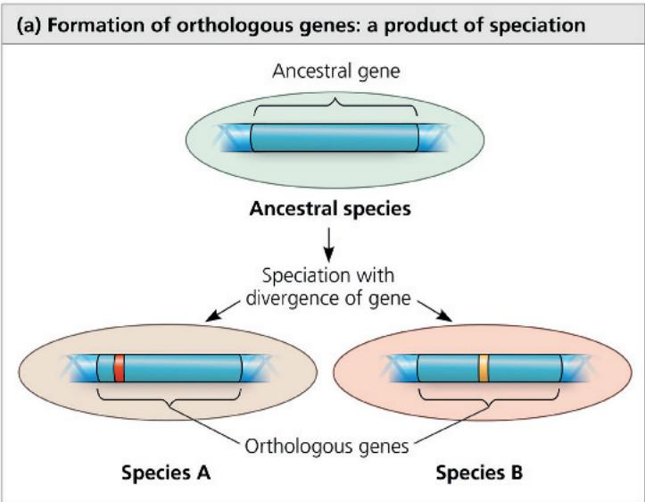

types of tissues. Evidence is emerging that many human genes are more versatile than those of yeast: A single human gene can encode multiple proteins that perform different tasks in various body tissues. Unraveling the mechanisms that cause this genomic versatility and phenotypic variation is an exciting challenge.

## Concept Check 26.4

1. Explain how comparing proteins of two species can yield data about the species' evolutionary relationship.

2. Distinguish orthologous from paralogous genes. Which of these two types of genes should be used to infer phylogeny? Explain your answer.

3. MAKE CONNECTIONS Review Figure 18.12, then suggest how a particular gene could have different functions in different tissues within an organism.

For suggested answers, see Appendix A.

## Concept 26.5: Molecular clocks help track evolutionary time

One goal of evolutionary biology is to understand the relationships among all organisms. It is also helpful to know when lineages diverged from one another, including those for which there is no fossil record. But how can we determine the timing of phylogenies that extend beyond the fossil record?

## Molecular Clocks

We stated earlier that researchers have estimated that the common ancestor of Hawaiian silversword plants lived about 5 million years ago. How did they make this estimate? They relied on the concept of a molecular clock, an approach for measuring the absolute time of evolutionary change based on the observation that some genes and other regions of genomes appear to evolve at constant rates. An assumption underlying the molecular clock is that the number of nucleotide substitutions in orthologous genes is proportional to the time that has elapsed since the genes branched from their common ancestor. In the case of paralogous genes, the number of substitutions is proportional to the time since the ancestral gene was duplicated.

We can calibrate the molecular clock of a gene that has a reliable average rate of evolution by graphing the number of genetic differences—for example, nucleotide, codon, or amino acid differences—against the dates of evolutionary branch points that are known from the fossil record (Figure 26.19). The average rates of genetic change inferred from such graphs can then be used to estimate the dates of events that cannot be discerned from the fossil record, such as the origin of the silverswords discussed earlier.

Of course, no gene marks time with complete precision. In fact, some portions of the genome appear to have evolved in irregular bursts that are not at all clocklike. And even those genes that seem to act as reliable molecular clocks are accurate only in the statistical sense of showing a fairly smooth average rate of

change. Over time, there may still be deviations from that average rate. Furthermore, the same gene may evolve at different rates in different groups of organisms. Finally, when comparing genes that are clocklike, the rate of the clock may vary greatly from one gene to another; some genes evolve a million times faster than others.

## Differences in Clock Speed

What causes such differences in the speed at which clocklike genes evolve? The answer stems from the fact that some mutations are selectively neutral—neither beneficial nor detrimental. Of course, many new mutations are harmful and are removed quickly by selection. But if most of the rest are neutral and have little or no effect on fitness, then the rate of evolution of those neutral mutations should indeed be regular, like a clock. Differences in the clock rate for different genes are related to how important a gene is. If the exact sequence of amino acids that a gene specifies is essential to survival, most of the mutational changes will be harmful and only a few will be neutral. As a result, such genes change only slowly. But if the exact sequence of amino acids is less critical, fewer of the new mutations will be harmful and more will be neutral. Such genes change more quickly.

## Potential Problems with Molecular Clocks

As we've seen, molecular clocks do not run as smoothly as would be expected if the underlying mutations were selectively neutral. Many irregularities are likely to be the result of natural selection in which certain DNA changes are favored over others. Indeed, evidence suggests that almost half the amino acid differences in proteins of two Drosophila species, $D$ . simulans and $D$ . yakuba, are not neutral but have resulted from natural selection. But because the direction of natural selection may change repeatedly over long periods of time (and hence may average out), some genes experiencing selection can nevertheless serve as approximate markers of elapsed time.

Another question arises when researchers attempt to extend molecular clocks beyond the time span documented by the fossil record. Although an abundant fossil record extends back only about 550 million years, molecular clocks have been used to date

## Figure 26.19 A molecular clock for mammals.

The number of accumulated mutations in seven well-studied proteins has increased over time in a consistent manner for most mammal species. The three square green data points represent primate species, whose proteins appear to have evolved more slowly than those of other mammals. The divergence time for each data point was based on fossil evidence.

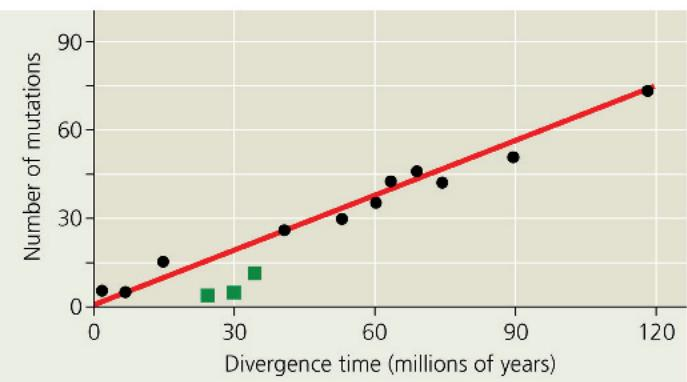  
INTERPRET THE DATA Use the graph to estimate the divergence time for a mammal with a total of 30 mutations in the seven proteins.

evolutionary divergences that occurred a billion or more years ago. These estimates assume that the clocks have been constant for all that time. Such estimates are highly uncertain.

In some cases, problems may be avoided by calibrating molecular clocks with data on the rates at which genes have evolved in different taxa. In other cases, problems may be avoided by using many genes rather than just using one or a few genes. By using many genes, fluctuations in evolutionary rate due to natural selection or other factors that vary over time may average out. For example, one group of researchers constructed molecular clocks of vertebrate evolution from published sequence data for 658 nuclear genes. Despite the broad period of time covered (nearly 600 million years) and the fact that natural selection probably affected some of these genes, their estimates of divergence times agreed closely with fossil-based estimates. As this example suggests, if used with care, molecular clocks can aid our understanding of evolutionary relationships.

## Applying a Molecular Clock: Dating the Origin of HIV

Researchers have used a molecular clock to date the origin of HIV infection in humans. Phylogenetic analysis shows that HIV, the virus that causes AIDS, is descended from viruses that infect chimpanzees and other primates. (Most of these viruses do not cause AIDS-like diseases in their native hosts.) When did HIV jump to humans? There is no simple answer because the virus has spread to humans more than once. The multiple origins of HIV are reflected in the

## Figure 26.20 Dating the origin of HIV-1 M.

The black data points are based on DNA sequences of an HIV gene in patients' blood samples. (The dates when these individual HIV gene sequences arose are not certain because a person can harbor the virus for years before symptoms occur.) Projecting the gene's rate of change backward in time by this method suggests that the virus originated in the 1930s.

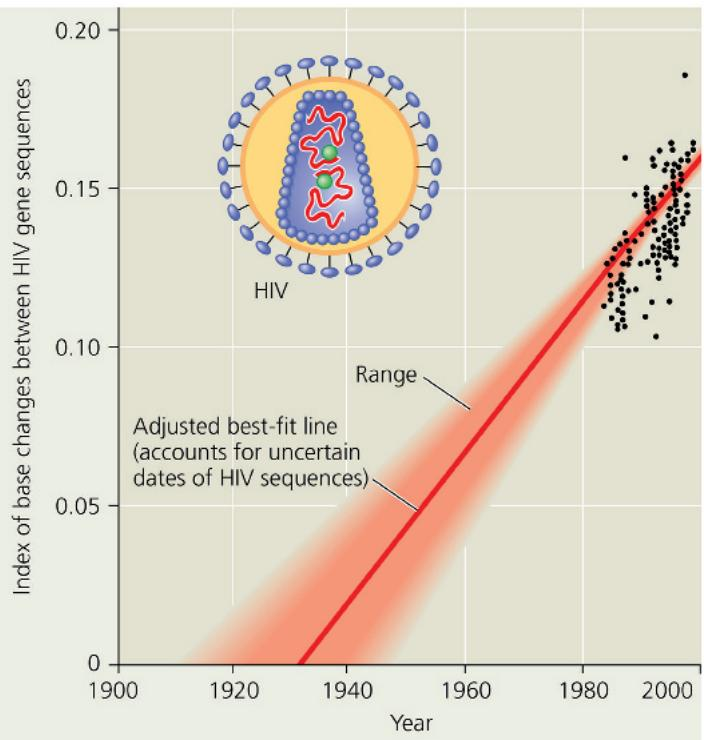

variety of strains (genetic types) of the virus. HIV's genetic material is made of RNA, and like other RNA viruses, it evolves quickly.

The most widespread strain in humans is HIV-1 M. To pinpoint the earliest HIV-1 M infection, researchers compared samples of the virus from various times during the epidemic, including a sample from 1959. Comparisons of gene sequences showed that the virus has evolved in a clocklike fashion. Extrapolating backward in time using the molecular clock indicates that the HIV-1 M strain first spread to humans around 1930 (Figure 26.20). A later study, which dated the origin of HIV using a more advanced molecular clock approach than that covered in this book, estimated that the HIV-1 M strain first spread to humans around 1910.

## Concept Check 26.5

1. What is a molecular clock? What assumption underlies the use of a molecular clock?

2. MAKE CONNECTIONS Review Concept 17.5. Then, explain how numerous base changes could occur in an organism's DNA yet have no effect on its fitness.

For suggested answers, see Appendix A.

## Concept 26.6: New information continues to improve our understanding of evolutionary history

The discovery that the glass lizard in Figure 26.1 evolved from a different lineage of legless lizards than did snakes is one example of how our understanding of life's diversity is informed by systematics. Indeed, in recent decades, systematists have gained insight into even the very deepest branches of the tree of life by analyzing DNA sequence data.

## Kingdoms and Domains of Life

Biologists once classified all known species into two kingdoms: plants and animals. Classification schemes with more than two kingdoms gained broad acceptance in the late 1960s, when many biologists recognized five kingdoms: Monera (prokaryotes), Protista (a diverse kingdom consisting mostly of unicellular organisms), Plantae, Fungi, and Animalia. This system highlighted the two fundamentally different types of cells, prokaryotic and eukaryotic, and set the prokaryotes apart from all eukaryotes by placing them in their own kingdom, Monera.

However, phylogenies based on genetic data soon revealed a problem with this system: Some prokaryotes differ as much from each other as they do from eukaryotes. Such difficulties led biologists to propose a three-domain system, as discussed in Concept 1.2. In this system, the domains—Bacteria, Archaea, and Eukarya—represent a classification level higher than the kingdom. The domain Bacteria contains most of the currently known prokaryotes, while Archaea includes a diverse group of prokaryotic organisms that inhabit a wide variety of environments. Eukarya

consists of all the organisms that have cells containing true nuclei. This clade includes many groups of single-celled organisms as well as multicellular plants, fungi, and animals. Figure 26.21a represents one possible phylogenetic tree for the three domains and some of the many lineages they encompass.

The three-domain system highlights the fact that much of the history of life has been about single-celled organisms. All prokaryotic organisms are single-celled, and even in Eukarya, only the branches labeled in red type (plants, fungi, and animals) are dominated by multicellular organisms. Of the five kingdoms previously recognized by systematists, most biologists continue to recognize Plantae, Fungi, and Animalia, but not Monera and Protista. The kingdom Monera is obsolete because it would have members in multiple domains. The kingdom Protista has also crumbled because it includes members that are more closely related to plants, fungi, or animals than to other protists (see Figure 28.5).

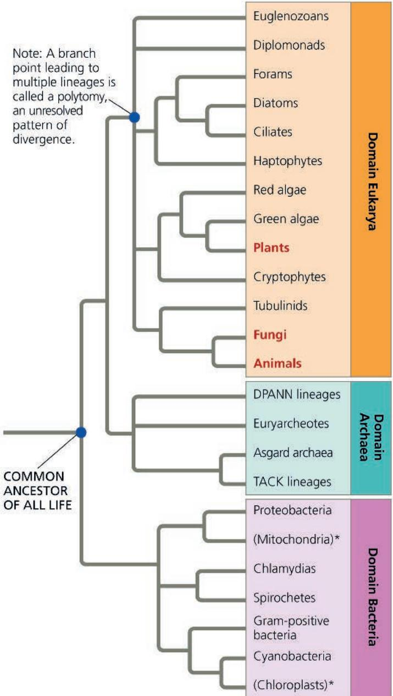  
(a) Three domains. In this tree, Eukarya and Archaea are sister groups; they share a common ancestor and are more closely related to each other than either is to Bacteria.

New research continues to change our understanding of the tree of life. In the phylogeny shown in Figure 26.21a, based on sequence data for rRNA and other genes, the first major split in the history of life occurred when bacteria diverged from other organisms, meaning that eukaryotes and archaea are more closely related to each other than either is to bacteria. Recent studies comparing entire genomes support the close relationship between Archaea and Eukarya. These metagenomic studies have uncovered the genomes of many new species of archaea, leading to the identification of many previously unknown phyla of archaea. One of these newly discovered groups, the Asgard archaea (many of which are named for the gods in Norse mythology), includes lineages that appear to share a more recent common ancestor with Eukarya than with other lineages of Archaea. This finding implies that Eukarya arose from within the Archaea and supports a two-domain hypothesis for the tree of life (Figure 26.21b). This finding may also help shed light on how eukaryotes arose from their prokaryotic ancestors (see Concepts 27.4 and 28.1).

Figure 26.21 Two hypotheses for the tree of life.

For simplicity, only some of the major branches in each domain are shown. Lineages within Eukarya that are dominated by multicellular organisms (plants, fungi, and animals) are in bold red type, while the two lineages denoted by an asterisk are based on DNA from cellular organelles. All other lineages consist solely or mainly of single-celled organisms.

MAKE CONNECTIONS After reviewing endosymbiont theory (see Figure 6.16), explain the specific positions of the mitochondrion and chloroplast lineages on these trees.

  
(b) Two domains. In this tree, clade Eukarya is sister to one subgroup within Archaea; these groups are more closely related to each other than to other archaea.

## The Important Role of Horizontal Gene Transfer

Historical comparisons based on only one or a few genes have sometimes suggested a different set of relationships than those shown in Figure 26.21. For example, researchers have found that many of the genes that influence metabolism in yeast (a unicellular eukaryote) are more similar to genes in the domain Bacteria than they are to genes in the domain Archaea.

What causes data from different genes to yield such different results? Comparisons of complete genomes from the three domains show that there have been substantial movements of genes between organisms in the different domains. These took place through horizontal gene transfer, a process in which genes are transferred from one genome to another through mechanisms such as exchange of transposable elements and

plasmids, viral infection (see Concept 19.2), and fusions of organisms (as when a host and its endosymbiont become a single organism). Recent research reinforces the view that horizontal gene transfer is important. For example, one study found that on average, 80% of the genes in 181 prokaryotic genomes had moved between species at some point during the course of evolution. Because phylogenetic trees are based on the assumption that genes are passed vertically from one generation to the next, the occurrence of such horizontal transfer events helps to explain why trees built using different genes can give inconsistent results.

Horizontal gene transfer can also occur between eukaryotes. For example, over 200 cases of the horizontal transfer of transposons have been reported in eukaryotes, including humans and other primates, plants, birds, and lizards. Nuclear genes have also been transferred horizontally from one eukaryote to another. The Scientific Skills Exercise describes one such example, giving you

## Scientific Skills Exercise Using Protein Sequence Data to Test an Evolutionary Hypothesis

Did Aphids Acquire Their Ability to Make Carotenoids Through Horizontal Gene Transfer? Carotenoids are colored molecules that have diverse functions in many organisms, such as photosynthesis in plants and light detection in animals. Plants and many microorganisms can synthesize carotenoids from scratch, but animals generally cannot (they must obtain carotenoids from their diet). One exception is the pea aphid Acyrthosiphon pisum, a small, plant-dwelling insect whose genome includes a full set of genes for the enzymes needed to make carotenoids. Because other animals lack these genes, it is unlikely that aphids inherited them from a single-celled common ancestor shared with microorganisms and plants. So where did they come from? Evolutionary biologists hypothesized that an aphid ancestor acquired these genes by horizontal gene transfer from distantly related organisms.

How the Experiment Was Done Scientists obtained the DNA sequences for the carotenoid-biosynthesis genes from several species, including aphids, fungi, bacteria, and plants. A computer “translated” these sequences into amino acid sequences of the encoded polypeptides and aligned the amino acid sequences. This allowed the team to compare the corresponding polypeptides in the different organisms.

Data from the Experiment The sequences below show the first 60 amino acids of one polypeptide of the carotenoid-biosynthesis enzymes in the plant Arabidopsis thaliana (bottom) and the corresponding amino acids in five nonplant species, using the

one-letter abbreviations for the amino acids (see Figure 5.14). A dash (−) indicates a gap inserted in a sequence to optimize its alignment with the corresponding sequence in Arabidopsis.

## INTERPRET THE DATA

1. In the rows of data for the organisms being compared with the aphid, highlight the amino acids that are identical to the corresponding amino acids in the aphid.

2. Which organism has the most amino acids in common with the aphid? Rank the partial polypeptides from the other four organisms in degree of similarity to that of the aphid.

3. (a) Do these data support the hypothesis that aphids acquired the gene for this polypeptide by horizontal gene transfer? Why or why not? (b) If horizontal gene transfer did occur, what type of organism is likely to have been the source?

4. What additional sequence data would support your hypothesis?

5. How would you account for the similarities between the aphid sequence and the sequences for the bacteria and plant?

Instructors: A version of this Scientific Skills Exercise can be assigned in Mastering Biology.

<table><tr><td>Organism</td><td colspan="6">Alignment of Amino Acid Sequences</td></tr><tr><td>Acyrthosiphon (aphid)</td><td>IKIIIGSGV</td><td>GGTAAAARLS</td><td>KKGFQVEVYE</td><td>KNSYNGGRCS</td><td>IIR-HNGHRF</td><td>DQGPSL--YL</td></tr><tr><td>Ustilago (fungus)</td><td>KKVVIIGAGA</td><td>CGTALAARLG</td><td>RRGYSVTVLE</td><td>KNSFGGCRCS</td><td>LIH-HDGHRW</td><td>DQGPSL--YL</td></tr><tr><td>Gibberella (fungus)</td><td>KSVIVIGAGV</td><td>GGVSTAARLA</td><td>KAGFKVTILE</td><td>KNDFTGGRCS</td><td>LIH-NDGHRF</td><td>DQGPSL--LL</td></tr><tr><td>Staphylococcus (bacterium)</td><td>MKIAVIGAGV</td><td>TGLAAAARIA</td><td>SQGHEVTIFE</td><td>KNNNVGGRMN</td><td>QLK-KDGFTF</td><td>DMGPTI--VM</td></tr><tr><td>Pantoea (bacterium)</td><td>KRTFVIGAGF</td><td>GGLALAIRLQ</td><td>AAGIATTVLE</td><td>QHDKPGGRAY</td><td>VWQ-DQGFTF</td><td>DAGPTV--IT</td></tr><tr><td>Arabidopsis (plant)</td><td>WDAVVIGGGH</td><td>NGLTAAAYLA</td><td>RGGLSVAVLE</td><td>RRHVIGGAAV</td><td>TEEIVPGFKF</td><td>SRCSYLQGLL</td></tr></table>

Data from Nancy A. Moran, Yale University. See N. A. Moran and T. Jarvik, Lateral transfer of genes from fungi underlies carotenoid production in aphids, Science 328:624–627 (2010).

Figure 26.23 A tangled web of life.

Figure 26.22 A recipient of transferred genes: the alga Galdieria sulphuraria.

Genes received from prokaryotes enable G. sulphuraria (inset) to grow in extreme environments, including on sulfur-encrusted rocks around volcanic hot springs similar to this one in Yellowstone National Park.

the opportunity to interpret data on the transfer of a pigment gene to an aphid from another species.

Studies show that eukaryotes can even acquire genes by horizontal gene transfer from prokaryotes. For example, a recent genomic analysis showed that the alga Galdieria sulphuraria (Figure 26.22) acquired about 5% of its nuclear genes from various bacterial and archaeal species. Unlike most eukaryotes, this alga can survive in environments that are highly acidic or extremely hot, as well as those with high concentrations of heavy metals. The researchers identified specific genes transferred from prokaryotes that have enabled G. sulphuraria to thrive in such extreme habitats.

Overall, horizontal gene transfer has played a key role throughout the evolutionary history of life, and it continues to occur today. Some biologists have argued that horizontal gene transfer was so common that the early history of life should be represented not as a dichotomously branching tree like those in Figure 26.21, but rather as a tangled network of connected branches (Figure 26.23). Although scientists continue to debate how best to portray the earliest steps in the history of life, in recent decades there have been many exciting discoveries about evolutionary events that occurred over time. We'll explore such discoveries in the rest of this unit, beginning with Earth's earliest inhabitants, prokaryotic organisms.

## Chapter 26 Review

## Summary of Key Concepts

To review key terms, go to the Vocabulary Self-Quiz (eTextbook only).

## Concept 26.1: Phylogenies show evolutionary relationships

\- Linnaeus's binomial classification system gives organisms two-part names: a genus plus a specific epithet.

\- In the Linnaean system, species are grouped in increasingly broad taxa: Related genera are placed in the same family, families in orders, orders in classes, classes in phyla, phyla in kingdoms, and (more recently) kingdoms in domains.

Horizontal gene transfer may have been so common in the early history of life that the base of a “tree of life” might be more accurately portrayed as a tangled web.

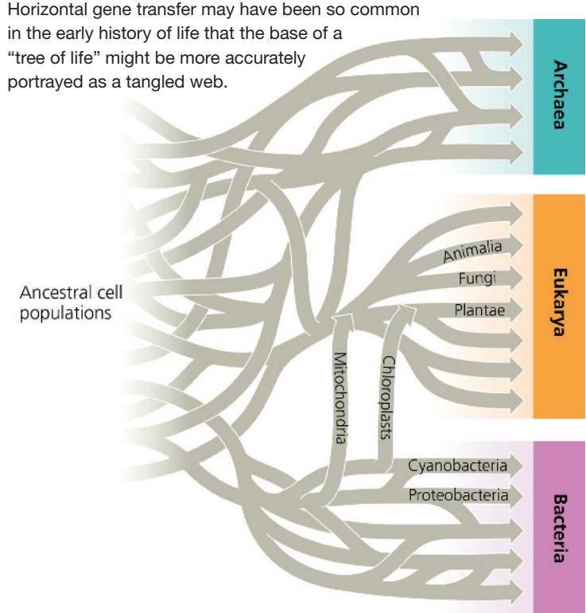  
Ancestral cell populations

## Interview

Interview with Nancy Moran: Studying symbioses and horizontal gene transfer (eTextbook only)

## Concept Check 26.6

1. Why is kingdom Monera no longer considered a valid taxon?

2. Explain why phylogenies based on different genes can yield different branching patterns for the tree of all life.

3. MAKE CONNECTIONS Explain how the origin of eukaryotes is thought to have represented a fusion of organisms, leading to extensive horizontal gene transfer. (See Figure 25.10.)

For suggested answers, see Appendix A.

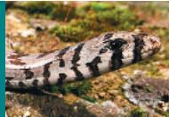

\- Systematists depict evolutionary relationships as branching phylogenetic trees. Many systematists propose that classification be based entirely on evolutionary relationships.

\- Unless branch lengths are proportional to time or genetic change, a phylogenetic tree indicates only patterns of descent.

\- Much information can be learned about a species from its evolutionary history; hence, phylogenies are useful in a wide range of applications.

Humans and chimpanzees are sister species. Explain what this statement means.

## Concept 26.2: Phylogenies can be used to understand shared characters

\- A clade is a monophyletic group that includes an ancestral species and all of its descendants.

Monophyletic group  

  
Polyphyletic group

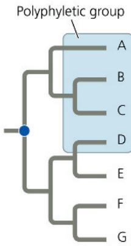  
Paraphyletic group

\- Clades can be distinguished by their shared derived characters.

\- A paraphyletic group includes a common ancestor but excludes some descendants of that common ancestor. A polyphyletic group does not include a common ancestor and may indicate analogous similarity.

\- We can map characters on a phylogeny to visualize the pattern of their evolution.

\- Well-supported phylogenetic hypotheses are consistent with a wide range of data.

Explain how a trait could be considered ancestral for a given taxon, but derived for a different taxon.

## Concept 26.3: Phylogenies are inferred from morphological and molecular data

\- Organisms with similar morphologies or DNA sequences are likely to be more closely related than organisms with very different structures and genetic sequences.

\- We infer phylogeny based on homology (similarity due to shared ancestry) rather than analogy (similarity due to convergent evolution).

\- Computer programs are used to align comparable DNA sequences and to distinguish molecular homologies from coincidental matches between taxa that diverged long ago.

\- Branch lengths can be proportional to the amount of evolutionary change or time.

\- Among phylogenies, the most parsimonious tree is the one that requires the fewest evolutionary changes. The most likely tree is the one based on the most likely pattern of changes.

Why is it necessary to distinguish homology from analogy to infer phylogeny?

## Concept 26.4: An organism's evolutionary history is documented in its genome

\- Orthologous genes are homologous genes found in different species as a result of speciation. Paralogous genes are homologous genes within a species that result from gene duplication; such genes can diverge and potentially take on new functions.

\- Distantly related species often have many orthologous genes. The small variation in gene number in organisms of varying complexity suggests that genes are versatile and may have multiple functions.

When reconstructing phylogenies, is it more useful to compare orthologous or paralogous genes? Explain.

## Concept 26.5: Molecular clocks help track evolutionary time

\- Some regions of DNA change at a rate consistent enough to serve as a molecular clock, a method of estimating the date of past evolutionary events based on the amount of genetic change. Other DNA regions change in a less predictable way.

\- Molecular clock analyses suggest that the most common strain of HIV jumped from primates to humans in the early 1900s.

Describe some assumptions and limitations of molecular clocks.

## Concept 26.6: New information continues to improve our understanding of evolutionary history

\- Past classification systems have given way to the current view of the tree of life, which consists of three major groups: Bacteria, Archaea, and Eukarya.

\- Phylogenies based on analyses of genomic and protein sequences suggest that eukaryotes are most closely related to archaea, and more specifically that they likely arose within the archaea. These relationships are an area of active research and discussion.

\- Genetic analyses indicate that extensive horizontal gene transfer has occurred throughout the evolutionary history of life.

Why was the five-kingdom system abandoned for a domain system? For suggested answers, see Appendix A.

## Test Your Understanding

For more multiple-choice questions, go to the Practice Test (eTextbook only).

## Levels 1-2: Remembering/Understanding

1. In a comparison of birds and mammals, the condition of having four limbs is

(A) a shared ancestral character.

(B) a shared derived character.

(C) a character useful for distinguishing birds from mammals.

(D) an example of analogy rather than homology.

2. To apply parsimony to constructing a phylogenetic tree,

(A) choose the tree that assumes all evolutionary changes are equally probable.

(B) choose the tree in which the branch points are based on as many shared derived characters as possible.

(C) choose the tree that represents the fewest evolutionary changes, in either DNA sequences or morphology.

(D) choose the tree with the fewest branch points.

## Levels 3-4: Applying/Analyzing

3. VISUAL SKILLS In Figure 26.4, which similarly inclusive taxon is represented as descending from the same common ancestor as Canidae?

(A) Felidae

(B) Mustelidae

(C) Carnivora

(D) Lutra

4. Three living species X, Y, and Z share a common ancestor T, as do extinct species U and V. A grouping that consists of species T, X, Y, and Z (but not U or V) makes up

(A) a monophyletic taxon.

(B) an ingroup, with species U as the outgroup.

(C) a paraphyletic group.

(D) a polyphyletic group.

5. VISUAL SKILLS Based on the tree below, which statement is correct?

(A) Lizards and goats form a sister group.

(B) Salamanders are a sister group to the group containing lizards, goats, and humans.

(C) Salamanders are more closely related to lizards than to humans.

(D) Goats and humans are the only sister group shown in this tree.

6. If you were using cladistics to build a phylogenetic tree of cats, which of the following would be the best outgroup?

(A) wolf

(B) domestic cat

(C) lion

(D) leopard

7. VISUAL SKILLS The relative lengths of the frog and mouse branches in the phylogenetic tree in Figure 26.12 indicate that (A) frogs evolved before mice.

(B) mice evolved before frogs.

(C) the homolog evolved more rapidly in the mouse lineage.

(D) the homolog evolved more slowly in the mouse lineage.

## Levels 5-6: Evaluating/Creating

8. EVOLUTION CONNECTION Darwin suggested looking at a species' close relatives to learn what its ancestors may have been like. Explain how his suggestion anticipates recent methods, such as phylogenetic bracketing and the use of outgroups in cladistic analysis.

9. SCIENTIFIC INQUIRY • DRAW IT (a) Using the phylogenetic tree shown, map characters 1–6 from the table onto the appropriate branches. Add hatch marks to indicate the origins of characters 1–6. (b) Suppose you were asked to evaluate the hypothesis that tuna and dolphins are sister groups. Redraw the phylogenetic tree accordingly, using hatch marks to indicate the origins of characters 1–6. (c) Determine how

many evolutionary changes are required in each tree. Identify the most parsimonious tree.

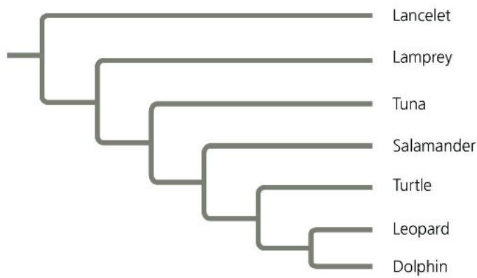

<table><tr><td>Character</td><td>Lancelet(outgroup)</td><td>Lamprey</td><td>Tuna</td><td>Salamander</td><td>Turtle</td><td>Leopard</td><td>Dolphin</td></tr><tr><td>(1) Backbone</td><td>0</td><td>1</td><td>1</td><td>1</td><td>1</td><td>1</td><td>1</td></tr><tr><td>(2) Hinged jaw</td><td>0</td><td>0</td><td>1</td><td>1</td><td>1</td><td>1</td><td>1</td></tr><tr><td>(3) Four limbs</td><td>0</td><td>0</td><td>0</td><td>1</td><td>1</td><td>1</td><td>1*</td></tr><tr><td>(4) Amnion</td><td>0</td><td>0</td><td>0</td><td>0</td><td>1</td><td>1</td><td>1</td></tr><tr><td>(5) Milk</td><td>0</td><td>0</td><td>0</td><td>0</td><td>0</td><td>1</td><td>1</td></tr><tr><td>(6) Dorsal fin</td><td>0</td><td>0</td><td>1</td><td>0</td><td>0</td><td>0</td><td>1</td></tr></table>

\*Although adult dolphins have only two obvious limbs (their flippers), as embryos they have two hind-limb buds, for a total of four limbs.

10. WRITE ABOUT A THEME: INFORMATION In a short essay (100–150 words), explain how genetic information—along with an understanding of the process of descent with modification—enables scientists to reconstruct phylogenies that extend hundreds of millions of years back in time.

## 11. SYNTHESIZE YOUR KNOWLEDGE

This West Indian manatee (Trichechus manatus) is an aquatic mammal. Like amphibians and reptiles, mammals are tetrapods (vertebrates with four limbs). Explain why manatees are considered tetrapods even though they lack hind limbs, and suggest traits that manatees likely share with leopards and other mammals (see Figure 26.9b). Discuss how early members of the manatee lineage might have differed from today's manatees.

For selected answers, see Appendix A.

