# 第27章 Bacteria and Archaea

<!-- 章节边界按正文内容恢复；原始 MinerU 内容保留如下。 -->

# Bacteria and Archaea

## Key Concepts

27.1 Structural and functional adaptations contribute to prokaryotic success

27.2 Rapid reproduction, mutation, and genetic recombination promote genetic diversity in prokaryotic organisms

27.3 Diverse nutritional and metabolic adaptations have evolved in Bacteria and Archaea

27.4 Bacteria and Archaea have radiated into a diverse set of lineages

27.5 Prokaryotic organisms play crucial roles in the biosphere

27.6 Prokaryotic organisms have both beneficial and harmful impacts on humans

  
Figure 27.1 The pink color of this lake in Spain is a sign that its waters are much saltier than seawater. Its color is caused not by minerals or other nonliving sources, but by trillions of prokaryotic organisms that thrive in salinities that kill other cells. Other prokaryotic organisms live in environments that are far too cold or hot or acidic for most other living things.

## Study Tip

Make a table: As you read the chapter, identify examples of challenging environments in which prokaryotic organisms thrive. List the structural, metabolic, or other features that contribute to their success in each of these environments.

<table><tr><td>Environmental challenge</td><td>Prokaryotic feature enabling success</td></tr><tr><td>Lack of water</td><td>Capsule or slime layer</td></tr><tr><td>Exposure to antibiotics</td><td></td></tr></table>

## What characteristics enable prokaryotic organisms to reach huge population sizes and thrive in diverse environments?

Due to the organisms' small size and rapid reproduction, prokaryotic populations can reach enormous numbers.

  
Their diverse adaptations enable prokaryotic organisms to live in a wide range of environments.

Because prokaryotic populations are so large, mutations produce high genetic diversity, enabling rapid evolution.

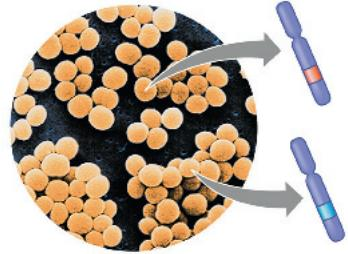  
Rapid evolution in prokaryotic populations results in diverse metabolic and structural adaptations.

  
Protective coat

  
Endospore (resistant cell that can enable this bacterium to survive harsh conditions)

The single-celled organisms classified in domains Bacteria and Archaea, collectively referred to as prokaryotes, include species that can thrive in a wide range of extreme environments. Prokaryotic species are also very well adapted to more “normal” habitats—the lands and waters in which most other species are found. Their ability to adapt to a broad range of habitats helps explain why prokaryotic organisms are the most abundant organisms on Earth. Indeed, the number of prokaryotic organisms in a handful of fertile soil is greater than the number of people who have ever lived. In this chapter, we’ll examine the adaptations, diversity, and enormous ecological impact of these remarkable organisms.

## Concept 27.1: Structural and functional adaptations contribute to prokaryotic success

The first organisms to inhabit Earth were prokaryotes that lived 3.5 billion years ago (see Concept 25.3). Throughout their long evolutionary history, prokaryotic populations have been (and continue to be) subjected to natural selection in all kinds of environments, resulting in their enormous diversity today.

We'll begin by describing prokaryotes. Most prokaryotic organisms are unicellular, although the cells of some species remain attached to each other after cell division. Prokaryotic cells typically have diameters of 0.5–5 $\mu$ m, much smaller than the 10- to 100- $\mu$ m diameter of many eukaryotic cells. (One notable exception, the bacterium Thiomargarita namibiensis, can be as large as 750 $\mu$ m in diameter—bigger than a poppy seed.) Prokaryotic cells have a variety of shapes (Figure 27.2). Finally, although they are unicellular and small, prokaryotic organisms are well organized, achieving all of an organism's life functions within a single cell.

## Cell-Surface Structures

A key feature of nearly all prokaryotic cells is the cell wall, which maintains cell shape, protects the cell, and prevents it from bursting in a hypotonic environment (see Figure 7.13). In a hypertonic environment, most prokaryotic organisms lose water and shrink away from their wall. Such water losses can inhibit cell reproduction. Thus, salt can be used to preserve foods because it causes food-spoiling prokaryotic organisms to lose water, preventing them from reproducing rapidly.

The cell walls of prokaryotic organisms differ in structure from those of eukaryotes. In eukaryotes that have cell walls, such as plants and fungi, the walls are usually made of cellulose or chitin (see Concept 5.2). In contrast, most bacterial cell walls contain peptidoglycan, a polymer composed of modified sugars cross-linked by short polypeptides. This molecular fabric encloses the entire bacterium and anchors other molecules that extend from its surface. Archaeal cell walls contain a variety of polysaccharides and proteins but lack peptidoglycan.

Using a technique called the Gram stain, developed by the 19th-century Danish physician Hans Christian Gram, scientists

Figure 27.2 The most common shapes of prokaryotic cells.

(a) Cocci (singular, coccus) are spherical prokaryotic cells. They can occur singly, in chains of two or more cells, and in clusters resembling bunches of grapes.

(b) Bacilli (singular, bacillus) are rod-shaped prokaryotic cells. They are usually solitary, but in some forms the rods are arranged in chains.

(c) Spiral prokaryotic cells include spirochetes (shown here), which are corkscrew-shaped; other spiral prokaryotic cells resemble commas or loose coils (colorized SEMs).

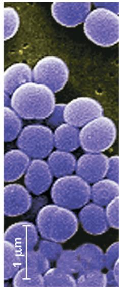  
(a) Spherical

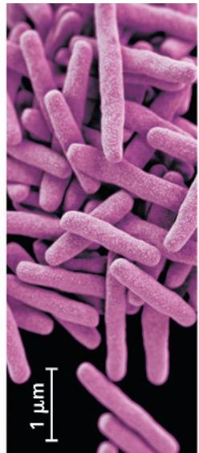  
(b) Rod-shaped

  
(c) Spiral

can categorize many bacterial species according to differences in cell wall composition. To do this, samples are first stained with crystal violet dye and iodine, then rinsed in alcohol, and finally stained with the red dye safranin, which enters the cell and binds to its DNA. The structure of a bacterium's cell wall determines the staining response (Figure 27.3). Gram-positive bacteria have relatively simple walls composed of a thick layer of peptidoglycan. The walls of gram-negative bacteria have less peptidoglycan and are structurally more complex, with an outer membrane that contains lipopolysaccharides (carbohydrates bonded to lipids).

Gram staining is a valuable tool in medicine for quickly determining if a patient's infection is due to gram-negative or to gram-positive bacteria. This information has treatment implications. The lipid portions of the lipopolysaccharides in the walls of many gram-negative bacteria are toxic, causing fever or shock. Furthermore, the outer membrane of a gram-negative bacterium helps protect it from the body's defenses. Gram-negative bacteria also tend to be more resistant than gram-positive species to antibiotics because the outer membrane impedes the entry of some drugs. However, some gram-positive species have virulent strains that are resistant to one or more antibiotics. (Figure 22.14 discusses one example: methicillin-resistant Staphylococcus aureus, or MRSA, which can cause lethal skin infections.)

The effectiveness of certain antibiotics, such as penicillin, derives from their inhibition of peptidoglycan cross-linking. The resulting cell wall may not be functional, particularly in gram-positive bacteria. Such drugs destroy many species of pathogenic bacteria without adversely affecting human cells, which do not have peptidoglycan.

Figure 27.3 Gram staining.  
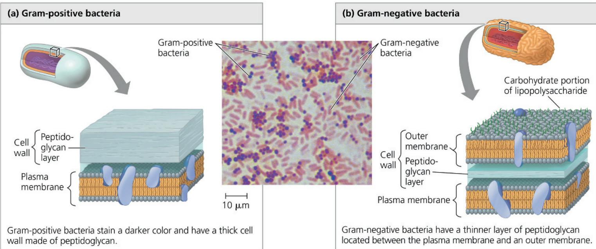  
Gram-positive bacteria stain a darker color and have a thick cell wall made of peptidoglycan.  
Gram-negative bacteria have a thinner layer of peptidoglycan located between the plasma membrane and an outer membrane.

The cell wall of many prokaryotic organisms is surrounded by a sticky layer of polysaccharide or protein. This layer is called a capsule if it is dense and well-defined (Figure 27.4) or a slime layer if it is not as well organized. Both kinds of sticky outer layers enable prokaryotic organisms to adhere to their substrate or to other individuals in a colony. Capsules and slime layers also protect against dehydration, and some capsules shield pathogenic prokaryotes from attacks by their host's immune system.

In another way of withstanding harsh conditions, certain bacteria develop resistant cells called endospores when they lack water or essential nutrients (Figure 27.5). The original cell produces a copy of its chromosome and surrounds that copy with a multilayered structure, forming the endospore. Water is removed from the endospore, and its metabolism halts. The original cell

then lyses, releasing the endospore. Most endospores are so durable that they can survive in boiling water; killing them requires heating lab equipment to $121^{\circ}$ C under high pressure. In less hostile environments, endospores can remain dormant but viable for centuries, able to rehydrate and resume metabolism when their environment improves.

Finally, some prokaryotic organisms stick to their substrate or to one another by means of hairlike appendages called fimbriae (singular, fimbria) (Figure 27.6). For example, the bacterium that causes gonorrhea, Neisseria gonorrhoeae, uses fimbriae to fasten itself to the mucous membranes of its host. Fimbriae are usually shorter and more numerous than pili (singular, pilus), appendages that pull two cells together prior to DNA transfer from one cell to the other (see Figure 27.12); pili are sometimes referred to as sex pili.

Figure 27.4 Capsule.

The polysaccharide capsule around this Streptococcus bacterium enables it to attach to cells in the respiratory tract—in this colorized TEM, a tonsil cell.

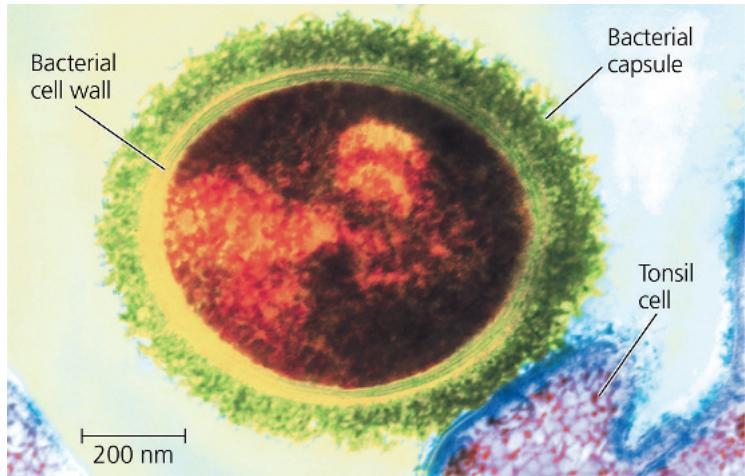  
Figure 27.5 An endospore.

Bacillus anthracis, the bacterium that causes the disease anthrax, produces endospores (TEM). An endospore's protective, multilayered coat helps it survive in the soil for years.

Figure 27.6 Fimbriae.

These numerous protein-containing appendages enable some prokaryotic organisms to attach to surfaces or to other cells (colorized TEM).

## Motility

About half of all prokaryotic organisms are capable of taxis, a directed movement toward or away from a stimulus (from the Greek taxis, to arrange). For example, prokaryotic organisms that exhibit chemotaxis change their movement pattern in response to

chemicals. They may move toward nutrients or oxygen (positive chemotaxis) or away from a toxic substance (negative chemotaxis). Some species can move at velocities exceeding 50 $\mu$ m/sec—up to 50 times their body length per second. For perspective, consider that a person 1.7 m tall moving that fast would be running 306 km (190 miles) per hour!

Of the various structures that enable prokaryotic organisms to move, the most common are flagella (Figure 27.7). Flagella (singular, flagellum) may be scattered over the entire surface of the cell or concentrated at one or both ends. Prokaryotic flagella differ greatly from eukaryotic flagella: They are one-tenth the width and typically are not covered by an extension of the plasma membrane (see Figure 6.24). Prokaryotic and eukaryotic flagella also differ in their molecular composition and their mechanism of propulsion. Among prokaryotes, bacterial and archaeal flagella are similar in size and rotational mechanism, but they are composed of entirely different and unrelated proteins. Overall, these structural and molecular comparisons indicate that the flagella of the two groups of prokaryotes, as well as those of eukaryotes, each arose independently. Since current evidence shows that the flagella of organisms in the three domains perform similar functions but are not related by common descent, they are described as analogous, not homologous, structures (see Concept 22.3).

## Evolutionary Origins of Bacterial Flagella

The bacterial flagellum shown in Figure 27.7 has three main parts (the motor, hook, and filament) that are themselves composed of 42 different kinds of proteins. How could such a complex structure evolve? In fact, much evidence indicates that bacterial flagella originated as simpler structures that were modified in a stepwise fashion over time. As in the case of the human eye (see Concept 25.6), biologists asked whether a less complex version of the flagellum could still benefit its owner. Analyses of hundreds of bacterial genomes indicate that only half of the flagellum's protein components appear to be necessary for it to function; the others are inessential or not encoded in the genomes of some species. Of the 21 proteins required by all species studied to date, 19 are modified versions of proteins that perform other tasks in bacteria. For example, a set of 10 proteins in the motor is homologous to 10 similar proteins in a secretory system found in bacteria. (A secretory system is a protein complex that enables a cell to produce and release certain macromolecules.) Two other proteins in the motor are homologous to proteins that function in ion transport. The proteins that comprise the rod, hook, and filament are all related to each other and are descended from an

Figure 27.7 A prokaryotic flagellum.

The motor of a prokaryotic flagellum consists of a system of protein rings embedded in the cell wall and plasma membrane (TEM). The electron transport chain pumps protons out of the cell. The diffusion of protons back into the cell provides the force that turns a curved hook and thereby causes the attached filament to rotate and propel the cell. (This diagram shows flagellar structures characteristic of gram-negative bacteria.)

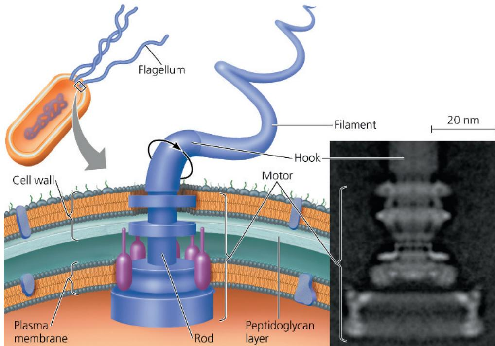  
VISUAL SKILLS Predict which of the four protein rings shown in this diagram are likely hydrophobic. Explain your answer.
For suggested answer, see Appendix A.

Figure 27.9 A prokaryotic chromosome and plasmids. The thin, tangled loops surrounding this ruptured Escherichia coli cell are parts of the cell's large, circular chromosome (colorized TEM). Three of the cell's plasmids, the much smaller rings of DNA, are also shown.

ancestral protein that formed a pilus-like tube. These findings suggest that the bacterial flagellum evolved as other proteins were added to an ancestral secretory system. This is an example of exaptation, the process in which structures originally adapted for one function take on new functions through descent with modification.

## Internal Organization and DNA

The cells of prokaryotic organisms are simpler than those of eukaryotes in both their internal structure and the physical arrangement of their DNA (see Figure 6.5). Prokaryotic cells lack the complex compartmentalization associated with the membrane-enclosed organelles found in eukaryotic cells. However, some prokaryotic cells do have specialized membranes that perform metabolic functions (Figure 27.8). These membranes are usually infoldings of the plasma membrane. Recent discoveries also indicate that some prokaryotic organisms can store metabolic by-products in simple compartments that are made out of proteins; these compartments do not have a membrane.

A prokaryotic genome is structurally different from a eukaryotic genome and in most cases has considerably less DNA. Prokaryotic organisms typically have one circular chromosome (Figure 27.9), whereas eukaryotes usually have several to many linear chromosomes. In addition, the prokaryotic chromosome is associated with many fewer proteins than are the chromosomes of eukaryotes. Also unlike eukaryotes, prokaryotic organisms lack a nucleus; their chromosome is located in the nucleoid, a region of cytoplasm that is not enclosed by a membrane. In addition to its single chromosome, a typical prokaryotic cell may also have much smaller rings of independently replicating DNA molecules called plasmids (see Figure 27.9), most carrying only a few genes.

(a) Infoldings of the plasma membrane, reminiscent of the cristae of mitochondria, function in cellular respiration in some aerobic prokaryotic organisms (TEM). (b) Photosynthetic prokaryotic organisms called cyanobacteria have thylakoid membranes, much like those in chloroplasts (TEM).

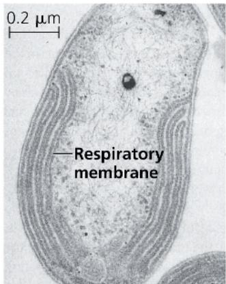  
(a) Aerobic prokaryote

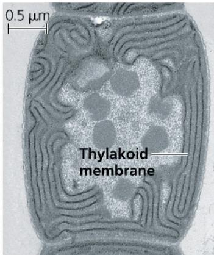  
(b) Photosynthetic prokaryote

Figure 27.8 Specialized membranes of prokaryotic organisms.  
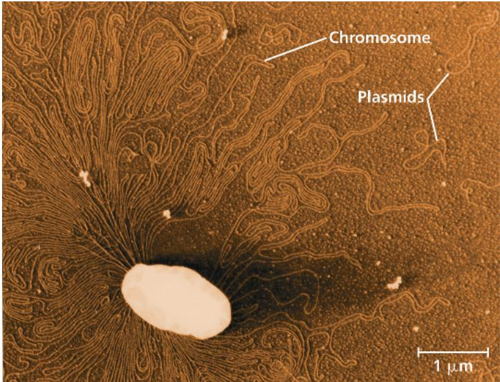  
VISUAL SKILLS Identify and label the third plasmid visible in this micrograph. For suggested answer, see Appendix A.

Although DNA replication, transcription, and translation are fundamentally similar processes in prokaryotic and eukaryotic organisms, some of the details differ (see Chapter 17). For example, prokaryotic ribosomes are slightly smaller than eukaryotic ribosomes and differ in their protein and RNA content. These differences allow certain antibiotics, such as erythromycin and tetracycline, to bind to ribosomes and block protein synthesis in prokaryotic organisms but not in eukaryotes. As a result, people can use these antibiotics to kill or inhibit the growth of bacteria without harming themselves.

## Reproduction

Many prokaryotic organisms can reproduce quickly in favorable environments. By binary fission (see Figure 12.12), a single prokaryotic cell divides into 2 cells, which then divide into 4, 8, 16, and so on. Under optimal conditions, many prokaryotic organisms can divide every 1–3 hours; some species can produce a new generation in only 20 minutes. At this rate, a single prokaryotic cell could give rise to a colony outweighing Earth in only two days!

In reality, of course, this does not occur. The cells eventually exhaust their nutrient supply, poison themselves with metabolic wastes, face competition from other microorganisms, or are consumed by other organisms. Still, the potential of many prokaryotic species for rapid population growth emphasizes three key features of their biology: They are small, they reproduce by binary fission, and they often have short generation times. As a result, prokaryotic populations can consist of many trillions of individuals—far more than populations of multicellular eukaryotes, such as plants or animals.

## Concept Check 27.1

1. Describe two adaptations that enable prokaryotic organisms to survive in environments too harsh for other organisms.

2. Contrast the cellular and DNA structures of prokaryotic organisms and eukaryotes.

3. MAKE CONNECTIONS Suggest a hypothesis that explains why the thylakoid membranes of chloroplasts resemble those of cyanobacteria. Refer to Figures 6.18 and 26.21.

For suggested answers, see Appendix A.

## Concept 27.2: Rapid reproduction, mutation, and genetic recombination promote genetic diversity in prokaryotic organisms

As we discussed in Unit Four, evolution cannot occur without genetic variation. The diverse adaptations exhibited by prokaryotic organisms suggest that their populations must have considerable genetic variation—and they do. In this section, we'll examine three factors that give rise to high levels of genetic diversity in prokaryotic organisms: rapid reproduction, mutation, and genetic recombination.

## Rapid Reproduction and Mutation

Most of the genetic variation in sexually reproducing species results from the way existing alleles are arranged in new combinations during meiosis and fertilization (see Concept 13.4). Prokaryotic organisms do not reproduce sexually, so at first glance their extensive genetic variation may seem puzzling. But in many species, this variation can result from a combination of rapid reproduction and mutation.

Consider the bacterium Escherichia coli as it reproduces by binary fission in a human intestine, one of its natural environments. After repeated rounds of division, most of the offspring cells are genetically identical to the original parent cell. However, if errors occur during DNA replication, some of the offspring cells may differ genetically. The probability of such a mutation occurring in a given E. coli gene is about one in 10 million $(1 \times 10^{-7})$ per cell division. But among the $2 \times 10^{10}$ new E. coli cells that arise each day in a person's intestine, there will be approximately $(2 \times 10^{10}) \times (1 \times 10^{-7}) = 2,000$ bacteria that have a mutation in that gene. The total number of new mutations when all 4,300 E. coli genes are considered is about $4,300 \times 2,000$ —more than 8 million per day per human host.

The key point is that new mutations, though rare on a per gene basis, can increase genetic diversity quickly in species with short generation times and large populations. This diversity, in turn, can lead to rapid evolution (Figure 27.10): Individuals that

# Figure 27.10

# Inquiry: Can prokaryotic populations evolve rapidly in response to environmental change?

## Experiment

Researchers tested the ability of E. coli populations to adapt to a new environment. They established 12 populations, each founded by a single cell from an E. coli strain, and followed these populations for 20,000 generations

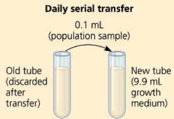

(3,000 days). To maintain a continual supply of resources, each day the researchers performed a serial transfer: They transferred 0.1 mL of each population to a new tube containing 9.9 mL of fresh growth medium. The growth medium used throughout the experiment provided a challenging environment that contained only low levels of glucose and other resources needed for growth.

Samples were periodically removed from the 12 populations and grown in competition with the common ancestral strain in the experimental (low-glucose) environment.

## Results

The fitness of the experimental populations, as measured by the growth rate of each population, increased rapidly for the first 5,000 generations (2 years) and more slowly for the next 15,000 generations. The graph shows the averages for the 12 populations.

## Conclusion

Populations of E. coli continued to accumulate beneficial mutations for 20,000 generations, allowing rapid evolution of increased population growth rates in their new environment.

Data from V. S. Cooper and R. E. Lenski, The population genetics of ecological specialization in evolving Escherichia coli populations, Nature 407:736–739 (2000).

WHAT IF? Suggest possible functions of the genes whose sequence or expression was altered as the experimental populations evolved in the low-glucose environment.

For suggested answer, see Appendix A.

are genetically better equipped for their environment tend to survive and reproduce at higher rates than other individuals. The ability of prokaryotic populations to adapt rapidly to new conditions highlights the point that although the structure of their cells is simpler than that of eukaryotic cells, prokaryotic organisms are not “primitive” or “inferior” in an evolutionary sense. They are, in fact, highly evolved: For 3.5 billion years, prokaryotic populations have responded successfully to many types of environmental challenges.

## Genetic Recombination

Although new mutations are a major source of variation in prokaryotic populations, additional diversity arises from genetic recombination, the combining of DNA from two sources. In eukaryotes, the sexual processes of meiosis and fertilization combine DNA from two individuals in a single zygote. But meiosis and fertilization do not occur in prokaryotic organisms. Instead, three other mechanisms—transformation, transduction, and conjugation—can bring together prokaryotic DNA from different individuals (that is, different cells). When the individuals are members of different species, this movement of genes from one organism to another is called horizontal gene transfer. Scientists have found evidence that each of these mechanisms can transfer DNA within and between species in both domain Bacteria and domain Archaea. To date, however, most of our knowledge comes from research on bacteria.

## Transformation and Transduction

In transformation, the genotype and possibly phenotype of a prokaryotic cell are altered by the uptake of foreign DNA from its surroundings. For example, a harmless strain of Streptococcus pneumoniae can be transformed into pneumonia-causing cells if the cells are exposed to DNA from a pathogenic strain (see Figure 16.2). This transformation occurs when a nonpathogenic cell takes up a piece of DNA carrying the allele for pathogenicity and replaces its own allele with the foreign allele, an exchange of homologous DNA segments. The cell is now a recombinant: Its chromosome contains DNA derived from two different cells.

For many years after transformation was discovered in laboratory cultures, most biologists thought it was too rare and haphazard to play an important role in natural bacterial populations. But researchers have since learned that many bacteria have cell-surface proteins that recognize DNA from closely related species and transport it into the cell. Once inside the cell, the foreign DNA can be incorporated into the genome by homologous DNA exchange.

In transduction, phages (short for “bacteriophages,” the viruses that infect bacteria) carry prokaryotic genes from one host cell to another. In most cases, transduction results from accidents that occur during the phage replicative cycle (Figure 27.11). A virus that carries prokaryotic DNA may not be able to replicate because it lacks some or all of its own genetic material. However, the virus can attach to another prokaryotic cell (a recipient) and inject prokaryotic DNA acquired from the first cell (the donor). If some of this DNA is then incorporated into the recipient cell’s chromosome by crossing over, a recombinant cell is formed.

## Figure 27.11 Transduction.

Phages may carry pieces of a bacterial chromosome from one cell (the donor) to another (the recipient). If crossing over occurs after the transfer, genes from the donor may be incorporated into the recipient's genome.

1 A phage infects a bacterial cell that carries the $A^{+}$ and $B^{+}$ alleles on its chromosome (brown). This bacterium will be the "donor" cell.

2 The phage DNA is replicated, and the cell makes many copies of phage proteins (represented as purple dots). Certain phage proteins halt the synthesis of proteins encoded by the host cell's DNA, and the host cell's DNA may be fragmented, as shown here.

3 As new phage particles assemble, a fragment of bacterial DNA carrying the $A^{+}$ allele happens to be packaged in a phage capsid.

4 The phage carrying the $A^{+}$ allele from the donor cell infects a recipient cell with alleles $A^{-}$ and $B^{-}$ . Crossing over at two sites (dotted lines) allows donor DNA (brown) to be incorporated into recipient DNA (green).

5 The genotype of the resulting recombinant cell ( $A^{+}B^{-}$ ) differs from the genotypes of both the donor ( $A^{+}B^{+}$ ) and the recipient ( $A^{-}B^{-}$ ).

VISUAL SKILLS Based on this diagram, describe the circumstances in which a transduction event would result in horizontal gene transfer. For suggested answer, see Appendix A.

## Conjugation and Plasmids

In a process called conjugation, DNA is transferred between two prokaryotic cells (usually of the same species) that are temporarily joined. In bacteria, the DNA transfer is always one-way: One cell donates the DNA, and the other receives it. We'll focus here on the mechanism used by E. coli.

First, a pilus of the donor cell attaches to the recipient (Figure 27.12). The pilus then retracts, pulling the two cells together, like a grappling hook. The next step is thought to be the formation of a temporary structure between the two cells, a “mating bridge” through which the donor may transfer DNA to

Figure 27.12 Bacterial conjugation.

The E. coli donor cell (left) extends a pilus that attaches to a recipient cell, a key first step in the transfer of DNA. The pilus is a flexible tube of protein subunits (TEM).

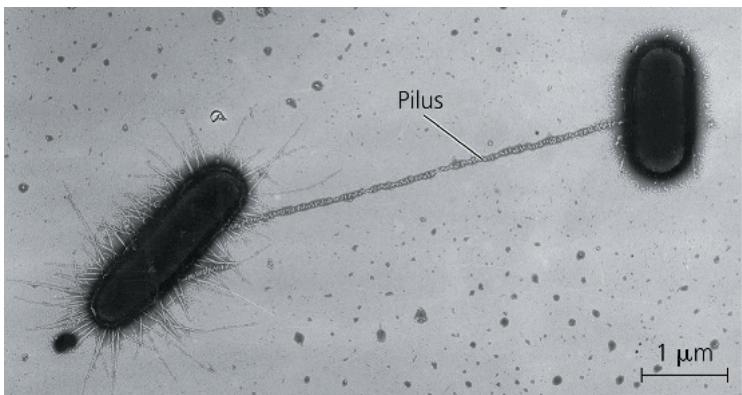  
Figure 27.13 Conjugation and recombination in E. coli.

the recipient. However, the mechanism by which DNA transfer occurs is unclear; indeed, recent evidence indicates that DNA may pass directly through the hollow pilus.

The ability to form pili and donate DNA during conjugation results from the presence of a particular piece of DNA called the F factor (F for fertility). The F factor of E. coli consists of about 25 genes, most required for the production of pili. As shown in Figure 27.13, the F factor can exist either as a plasmid or as a segment of DNA within the bacterial chromosome.

## The F Factor as a Plasmid

The F factor in its plasmid form is called the F plasmid. Cells containing the F plasmid, designated $F^{+}$ cells, function as DNA donors during conjugation (see Figure 27.13a). Cells lacking the F factor, designated $F^{-}$ , function as DNA recipients during conjugation. The $F^{+}$ condition is transferable in the sense that an $F^{+}$ cell converts an $F^{-}$ cell to $F^{+}$ if a copy of the entire F plasmid is

The DNA replication that accompanies transfer of an F plasmid or part of an Hfr bacterial chromosome is called rolling circle replication. In effect, the intact circular parental DNA strand “rolls” as its other strand peels off and a new complementary strand is synthesized.

1 A cell carrying an F plasmid (an $\mathsf{F}^+$ cell) forms a mating bridge with an $\mathsf{F}^{-}$ cell. One strand of the plasmid's DNA breaks at the point marked by the arrowhead.

2 Using the unbroken strand as a template, the cell synthesizes a new strand (light blue). Meanwhile, the broken strand peels off (red arrow), and one end enters the F- cell. There, synthesis of its complementary strand begins.

(a) Conjugation and transfer of an F plasmid

3 DNA replication continues in both the donor and recipient cells, as the transferred plasmid strand moves farther into the recipient cell.

4 Once DNA transfer and synthesis are completed, the plasmid in the recipient cell circularizes. The recipient cell is now a recombinant F+ cell.

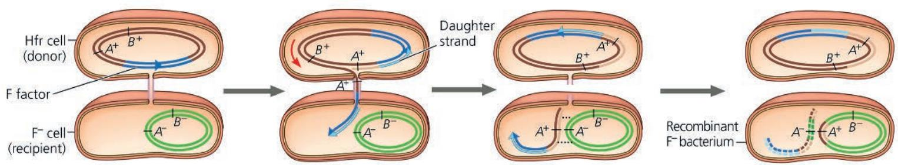

Recombinant F-bacterium—

In an Hfr cell, the F factor (dark blue) is integrated into the bacterial chromosome. Since an Hfr cell has all of the F factor genes, it can form a mating bridge with an F- cell and transfer DNA.

2 A single strand of the F factor breaks and begins to move through the bridge. DNA replication occurs in both donor and recipient cells, resulting in double-stranded DNA (daughter strands shown in lighter color).

3 The mating bridge usually breaks before the entire chromosome is transferred. Crossing over at two sites (dotted lines) can result in the exchange of homologous genes (here, $A^{+}$ and $A^{-}$ ) between the transferred DNA (brown) and the recipient's chromosome (green).

(b) Conjugation and transfer of part of an Hfr bacterial chromosome, resulting in recombination. $A^{+}/A^{-}$ and $B^{+}/B^{-}$ indicate alleles for gene A and gene B, respectively.

4 Cellular enzymes degrade any linear DNA not incorporated into the chromosome. The recipient cell, with a new combination of genes but no F factor, is now a recombinant F $^{-}$ cell.

transferred. Even if this does not occur, as long as some of the F plasmid's DNA is transferred successfully to the recipient cell, that cell is now a recombinant cell.

## The F Factor in the Chromosome

Chromosomal genes can be transferred during conjugation when the donor cell's F factor is integrated into the chromosome. A cell with the F factor built into its chromosome is called an Hfr cell (for high frequency of recombination). Like an $F^{+}$ cell, an Hfr cell functions as a donor during conjugation with an $F^{-}$ cell (see Figure 27.13b). When chromosomal DNA from an Hfr cell enters an $F^{-}$ cell, homologous regions of the Hfr and $F^{-}$ chromosomes may align, allowing segments of their DNA to be exchanged. As a result, the recipient cell becomes a recombinant bacterium that has genes derived from the chromosomes of two different cells—a new genetic variant on which evolution can act.

## R Plasmids and Antibiotic Resistance

Many species of bacteria have genes that code for enzymes that specifically destroy or otherwise hinder the effectiveness of certain antibiotics, such as tetracycline or ampicillin. Such “resistance genes” are often carried by plasmids known as R plasmids (R for resistance). Many R plasmids, like F plasmids, have genes that encode pili and enable DNA transfer from one bacterial cell to another by conjugation. As a result, R plasmids and the resistance genes they carry can spread rapidly through a bacterial population—a problem of great public health concern (see Concept 27.6). Making the problem still worse, some R plasmids carry genes for resistance to as many as ten antibiotics.

## Concept Check 27.2

1. Although rare on a per gene basis, new mutations can add considerable genetic variation to prokaryotic populations in each generation. Explain how this occurs.

2. Distinguish between the three mechanisms by which bacteria can transfer DNA from one bacterial cell to another.

3. WHAT IF? If a nonpathogenic bacterium were to acquire resistance to antibiotics, could this strain pose a health risk to people? In general, how does DNA transfer among bacteria affect the spread of resistance genes?

For suggested answers, see Appendix A.

## Concept 27.3: Diverse nutritional and metabolic adaptations have evolved in Bacteria and Archaea

The extensive genetic variation found in prokaryotic organisms is reflected in their diverse nutritional adaptations. Like all living things, prokaryotic organisms can be categorized by how they obtain energy and the carbon used in building the organic molecules that make up cells. Every type of nutritional mode observed in eukaryotes is represented among prokaryotic organisms, along with some nutritional modes unique to prokaryotic organisms. In fact, prokaryotic organisms have an astounding range of metabolic adaptations, much broader than that found in eukaryotes.

Organisms that obtain energy from light are called phototrophs, and those that obtain energy from chemicals are called chemotrophs. Organisms that need only $CO_{2}$ or related compounds as a carbon source are called autotrophs. In contrast, heterotrophs require at least one organic nutrient, such as glucose, to make other organic compounds. Combining the two energy sources with the two carbon sources results in four major modes of nutrition: photoautotroph, chemoautotroph, photoheterotroph, and chemoheterotroph (Table 27.1).

## The Role of Oxygen in Metabolism

Prokaryotic metabolism also varies with respect to oxygen ( $O_{2}$ ). Obligate aerobes must use $O_{2}$ for cellular respiration and cannot grow without it. Obligate anaerobes, on the other hand, are poisoned by $O_{2}$ . Some obligate anaerobes live exclusively

Table 27.1 Major Nutritional Modes

<table><tr><td>Mode</td><td>Energy Source</td><td>Carbon Source</td><td>Types of Organisms</td></tr><tr><td colspan="4">AUTOTROPH</td></tr><tr><td>Photoautotroph</td><td>Light</td><td> $CO_{2}, HCO_{3}^{-}$ , or related compound</td><td>Photosynthetic prokaryotic organisms (for example, cyanobacteria); plants; certain protists (for example, diatoms and multi-cellular algae)</td></tr><tr><td>Chemoautotroph</td><td>Inorganic chemicals (such as  $H_{2}S$ ,  $NH_{3}$ , or  $Fe^{2+}$ )</td><td> $CO_{2}, HCO_{3}^{-}$ , or related compound</td><td>Unique to certain prokaryotic organisms (for example, Sulfolobus)</td></tr><tr><td colspan="4">HETEROTROPH</td></tr><tr><td>Photoheterotroph</td><td>Light</td><td>Organic compounds</td><td>Unique to certain aquatic and salt-loving prokaryotic organisms (for example, Rhodobacter, Chloroflexus)</td></tr><tr><td>Chemoheterotroph</td><td>Organic compounds</td><td>Organic compounds</td><td>Many prokaryotic organisms (for example, Clostridium) and protists; fungi; animals; some plants</td></tr></table>

by fermentation; others extract chemical energy by aanaerobic respiration, in which substances other than $O_{2}$ , such as nitrate ions ( $NO_{3}^{-}$ ) or sulfate ions ( $SO_{4}^{2-}$ ), accept electrons at the “downhill” end of electron transport chains. Facultative anaerobes use $O_{2}$ if it is present but can also carry out fermentation or anaerobic respiration in an anaerobic environment.

## Nitrogen Metabolism

Nitrogen is essential for the production of amino acids and nucleic acids in all organisms. Whereas eukaryotes can obtain nitrogen only from a limited group of nitrogen compounds, prokaryotic organisms can metabolize nitrogen in many forms. For example, some cyanobacteria and some methanogens (various archaea) convert atmospheric nitrogen $\left(\mathrm{N}_{2}\right)$ to ammonia $\left(\mathrm{NH}_{3}\right)$ , a process called nitrogen fixation. The cells can then incorporate this “fixed” nitrogen into amino acids and other organic molecules. In terms of nutrition, nitrogen-fixing cyanobacteria are some of the most self-sufficient organisms since they need only light, $CO_{2}$ , $N_{2}$ , water, and some minerals to grow.

Nitrogen fixation has a large impact on other organisms. For example, nitrogen-fixing prokaryotic organisms can increase the nitrogen available to plants, which cannot use atmospheric nitrogen but can use the nitrogen compounds that the prokaryotic organisms produce from ammonia. Concept 55.4 discusses this and other essential roles that prokaryotic organisms play in the nitrogen cycles of ecosystems.

## Metabolic Cooperation

Cooperation between prokaryotic cells allows them to use environmental resources they could not use as individual cells. In some cases, this cooperation takes place between specialized cells of a filament. For instance, the cyanobacterium Anabaena has genes that encode proteins for photosynthesis and for nitrogen fixation. However, a single cell cannot carry out both processes at the same time because photosynthesis produces $O_{2}$ , which inactivates the enzymes involved in nitrogen fixation. Instead of living as isolated cells, Anabaena forms filamentous chains (Figure 27.14).

Figure 27.14 Metabolic cooperation in a prokaryotic organisms. In the filamentous freshwater cyanobacterium Anabaena, heterocysts fix nitrogen, while the other cells carry out photosynthesis (LM).  

Most cells in a filament carry out only photosynthesis, while a few specialized cells called heterocysts (sometimes called heterocytes) carry out only nitrogen fixation. Each heterocyst is surrounded by a thickened cell wall that restricts entry of $O_{2}$ produced by neighboring photosynthetic cells. Intercellular connections allow heterocysts to transport fixed nitrogen to neighboring cells and to receive carbohydrates.

Metabolic cooperation among the cells of one or more prokaryotic species often occurs in a surface-coating colony known as a biofilm. Cells in a biofilm secrete signaling molecules that recruit nearby cells, causing the colonies to grow. The cells also produce polysaccharides and proteins that stick the cells to the substrate and to one another; these polysaccharides and proteins form the capsule, or slime layer, mentioned earlier in the chapter. Channels in the biofilm allow nutrients to reach cells in the interior and wastes to be expelled.

Biofilms are common in nature, but they can cause a wide range of problems for humans. For example, biofilms growing in pipes slow the flow of liquids such as water or oil and degrade the pipes themselves. Biofilms also corrode boat hulls, oil platforms, and many other structures and industrial products. In medical settings, biofilms can contaminate contact lenses, catheters, pacemakers, heart valves, artificial joints, and many other devices. They also contribute to tooth decay and a wide range of chronic infections (Figure 27.15), some of which can be lethal. Many biofilms can evade host immune responses and are extremely resistant to antibiotics, making them hard to treat. Altogether, each year biofilms cause billions of dollars in damage and inflict tens of millions of people with chronic infections.

## Figure 27.15 Pseudomonas aeruginosa forming a biofilm (colorized SEM).

This widespread bacterial species can be found in soil and water and as part of the normal community in the human intestines. P. aeruginosa can cause serious infections of other human organs, including the skin, urinary tract, and lungs. These infections can be difficult to treat, in part because the bacteria can grow as biofilms that have increased resistance to antibiotics.

## Concept Check 27.3

1. Distinguish between the four major modes of nutrition, noting which are unique to prokaryotic organisms.

2. A bacterium requires only the amino acid methionine as an organic nutrient and lives in lightless caves. What mode of nutrition does it employ? Explain.

3. WHAT IF? Describe what you might eat for a typical meal if humans, like cyanobacteria, could fix nitrogen.

For suggested answers, see Appendix A.

## Concept 27.4: Bacteria and Archaea have radiated into a diverse set of lineages

Since their origin 3.5 billion years ago, prokaryotic populations have radiated extensively as a wide range of structural and metabolic adaptations have evolved in them. Collectively, these adaptations have enabled prokaryotic organisms to inhabit every environment known to support life—if there are organisms in a particular place, some of those organisms are prokaryotic. Yet despite their obvious success, it is only in recent decades that advances in genomics have begun to reveal the full extent of prokaryotic diversity.

## An Overview of Prokaryotic Diversity

In the 1970s, microbiologists began using small-subunit ribosomal RNA as a marker for evolutionary relationships. Their results indicated that many prokaryotic species once classified as bacteria are actually more closely related to eukaryotes and belong in a domain of their own: Archaea. Microbiologists have since analyzed larger amounts of genetic data—including thousands of complete genomes—and have concluded that a few traditional groups, such as cyanobacteria, are monophyletic. However, other traditional groups, such as gram-negative bacteria, are scattered throughout several lineages. Figure 27.16 shows one phylogenetic hypothesis for some of the major taxa of bacteria and archaea based on molecular systematics.

One lesson from studying prokaryotic phylogeny is that the genetic diversity of prokaryotic organisms is immense. When researchers began to sequence prokaryotic genes, they could investigate only the small fraction of species that could be cultured in the laboratory. In the 1980s, researchers began using the polymerase chain reaction (PCR; see Figure 20.8) to analyze the genes of prokaryotic organisms collected from the environment (such as from soil or water samples). Such “genetic prospecting” is now widely used; in fact, today entire prokaryotic genomes can be obtained from environmental samples using metagenomics (see Concept 21.1). Each year these techniques add new branches to the tree of life. While more than 20,000 prokaryotic species have been assigned scientific names, that likely represents less than 1% of species globally. One handful of soil from a single location could contain 10,000 prokaryotic species by some estimates. Taking full stock of this diversity will require many years of research.

Figure 27.16 A simplified phylogeny of Bacteria and Archaea. This tree shows relationships among major lineages of bacteria and archaea; some of these relationships are shown as polytomies to reflect their uncertain order of divergence. (Note that this tree reflects the hypothesis that eukaryotes arose within Archaea; see Concept 26.6.)  
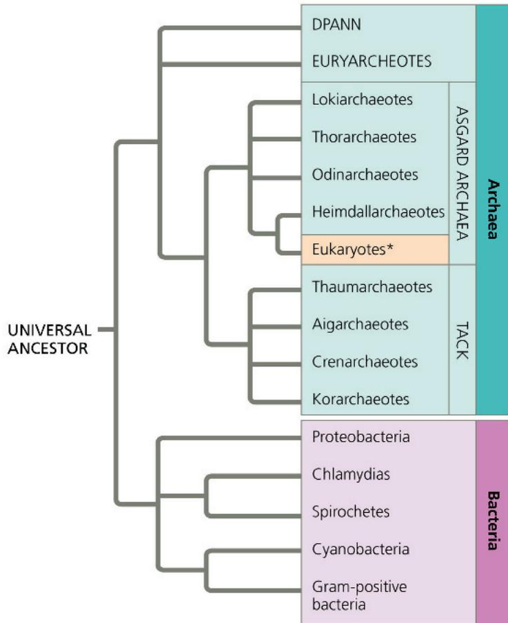

Another important lesson from molecular systematics is that horizontal gene transfer has played a key role in evolution. Over hundreds of millions of years, prokaryotic organisms have acquired genes from even distantly related species, and they continue to do so today. As a result, significant portions of the genomes of many prokaryotic organisms are actually mosaics of genes imported from other species. For example, a study of 329 sequenced bacterial genomes found that an average of 75% of the genes in each genome had been transferred horizontally at some point in their evolutionary history. As we saw in Concept 26.6, such gene transfers can make it difficult to determine phylogenetic relationships. Still, it is clear that for billions of years, prokaryotic organisms have evolved in two separate lineages: Bacteria and Archaea (see Figure 27.16).

## Bacteria

As surveyed in Figure 27.17, bacteria include the vast majority of prokaryotic species familiar to most people, from the pathogenic species that cause strep throat and tuberculosis to the beneficial

## Exploring Bacterial Diversity

## Figure 27.17

While this figure highlights a few key groups of bacteria, their actual diversity is far greater than shown here. Likewise, as shown in the pie chart, gene sequence data indicate that the 16,000 known species of bacteria represent a small fraction of the actual number, estimated at 700,000–1.4 million species.

## Proteobacteria

This large and diverse clade of gram-negative bacteria includes photoautotrophs, chemoautotrophs, and heterotrophs. One autotroph, the sulfur bacterium Thiomargarita namibiensis, obtains energy by oxidizing $H_{2}S$ , producing sulfur as a waste product (the small globules in the photograph below). Heterotrophs include pathogens such as Neisseria gonorrhoeae, which causes gonorrhea; Vibrio cholerae, which causes cholera; and Helicobacter pylori, which causes stomach ulcers. Current evidence indicates that mitochondria evolved by endosymbiosis from a

heterotroph in the subgroup alpha proteobacteria.

Thiomargarita namibiensis containing sulfur wastes (LM)

  
200 μm

## Chlamydias

These parasites can survive only within animal cells, depending on their hosts for resources as basic as ATP. The gram-negative walls of chlamydias are unusual in that they lack peptidoglycan. One species, Chlamydia trachomatis, is the most common cause of blindness in the world and also causes nongonococcal urethritis, the most common sexually transmitted infection in the United States.

Chlamydia (arrows inside an animal cell (colorized TEM)

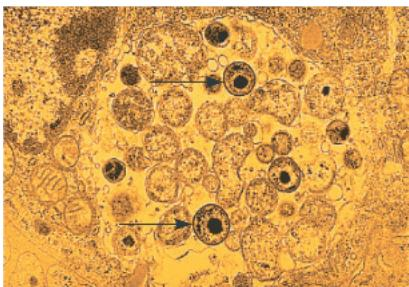  
2.5 μm  
Leptospira,
a spirochete
(colorized TEM)

## Spirochetes

These helical gram-negative heterotrophs spiral through their environment by means of rotating, internal, flagellum-like filaments. Many spirochetes are free-living, but others are notorious pathogenic parasites: Treponema pallidum causes syphilis, and Borrelia burgdorferi causes Lyme disease.

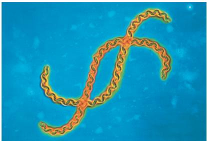  
5μm

## Cyanobacteria

These gram-negative photoautotrophs are the only prokaryotes with plantlike, oxygen-generating photosynthesis. (In fact, chloroplasts are thought to have evolved from an endosymbiotic cyanobacterium.) Both solitary and filamentous cyanobacteria are abundant components of freshwater and marine phytoplankton, the collection of small photosynthetic organisms that drift near the water's surface.

  
Cylindrospermum, a filamentous cyanobacterium  
40 μm

## Gram-Positive Bacteria

Gram-positive bacteria rival the proteobacteria in diversity. Species in one subgroup, the actinomycetes, form colonies containing branched chains of cells; two of these species cause tuberculosis and leprosy, but most are decomposers living in soil. Soil-dwelling species in the genus Streptomyces are cultured as a source of antibiotics, including tetracycline and erythromycin. Other subgroups of gram-positive bacteria include pathogens such as Staphylococcus aureus, Bacillus anthracis, which causes anthrax, and Clostridium botulinum, which causes botulism.

Streptomyces, the source of many antibiotics (SEM)

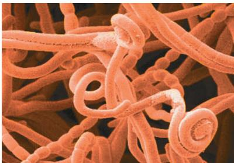  
5 μm

species used to make Swiss cheese and yogurt. Every major mode of nutrition and metabolism is represented among the 80 or so phyla of bacteria, and even a small group of bacteria may contain species exhibiting many different nutritional modes. As we'll see, the diverse nutritional and metabolic capabilities of bacteria—and archaea—are behind the great impact these organisms have on Earth and its life.

## Archaea

Prokaryotic organisms in Archaea share certain traits with bacteria and other traits with eukaryotes (Table 27.2). However, they also have many unique characteristics.

The first prokaryotic organisms identified as belonging to domain Archaea live in environments so extreme that few other organisms can survive there. Such organisms are called extremophiles, meaning “lovers” of extreme conditions (from the Greek philos, lover), and include extreme halophiles and extreme thermophiles.

Extreme halophiles (from the Greek halo, salt) live in highly saline environments, such as the Great Salt Lake in Utah, the Dead Sea in Israel, and the Spanish lake shown in Figure 27.1. Some species merely tolerate salinity, while others require an environment that is several times saltier than seawater (which has a salinity of 3.5%). For example, the proteins and cell wall of Halobacterium have unusual features that improve function in extremely salty environments but render these organisms incapable of survival if the salinity drops below 9%.

Table 27.2 A Comparison of Bacteria, Archaea\*, and Eukarya

<table><tr><td>CHARACTERISTIC</td><td>Bacteria</td><td>Archaea</td><td>Eukarya</td></tr><tr><td>Nuclear envelope</td><td>Absent</td><td>Absent</td><td>Present</td></tr><tr><td>Membrane-enclosed organelles</td><td>Absent</td><td>Absent</td><td>Present</td></tr><tr><td>Peptidoglycan in cell wall</td><td>Present</td><td>Absent</td><td>Absent</td></tr><tr><td>Membrane lipids</td><td>Unbranched hydrocarbons</td><td>Some branched hydrocarbons</td><td>Unbranched hydrocarbons</td></tr><tr><td>RNA polymerase</td><td>One kind</td><td>Several kinds</td><td>Several kinds</td></tr><tr><td>Initiator amino acid for protein synthesis</td><td>Formyl-methionine</td><td>Methionine</td><td>Methionine</td></tr><tr><td>Introns in genes</td><td>Very rare</td><td>Present in some genes</td><td>Present in many genes</td></tr><tr><td>Response to the antibiotics streptomycin and chloramphenicol</td><td>Growth usually inhibited</td><td>Growth not inhibited</td><td>Growth not inhibited</td></tr><tr><td>Histones associated with DNA</td><td>Absent</td><td>Present in some species</td><td>Present</td></tr><tr><td>Circular chromosome</td><td>Present</td><td>Present</td><td>Absent</td></tr><tr><td>Growth at temperatures &gt;100°C</td><td>No</td><td>Some species</td><td>No</td></tr></table>

\*As discussed in Concept 1.2, the term Archaea here refers to prokaryotic species.

Extreme thermophiles (from the Greek thermos, hot) thrive in very hot environments. For example, the archaean Pyrococcus furiosus lives in geothermally heated marine sediments that reach temperatures of $100^{\circ}$ C. At temperatures this high, the cells of most organisms die because their DNA does not remain in a double helix and many of their proteins denature. P. furiosus and other extreme thermophiles avoid this fate because they have structural and biochemical adaptations that make their DNA and proteins stable at high temperatures—a feature that has enabled P. furiosus to be used in biotechnology as a source of DNA polymerase for the PCR technique (see Figure 20.8). Other examples of extreme thermophiles include archaea in the genus Sulfolobus, which live in sulfur-rich volcanic springs (Figure 27.18). One extreme thermophile that lives near deep-sea hot springs called hydrothermal vents is informally known as “strain 121” since it can reproduce even at $121^{\circ}$ C.

Many other archaea live in more moderate environments. Consider methanogens, archaea that release methane as a by-product of how they obtain energy. Many methanogens use $CO_{2}$ to oxidize $H_{2}$ , a process that produces both energy and methane waste. Among the strictest of anaerobes, methanogens are poisoned by $O_{2}$ . Although some methanogens live in extreme environments, such as under kilometers of ice in Greenland, others live in swamps and marshes where other microorganisms have consumed all the $O_{2}$ . The “marsh gas” found in such environments is the methane released by these archaea. Other species inhabit the anaerobic guts of cattle, termites, and other herbivores, playing an essential role in the nutrition of these animals. Methanogens are also useful to humans as decomposers in sewage treatment facilities.

Figure 27.18 Extreme thermophiles.  
Orange and yellow colonies of thermophilic prokaryotic organisms grow in the hot water of Yellowstone National Park's Grand Prismatic Spring.  
  
MAKE CONNECTIONS How might the enzymes of thermophiles differ from those of other organisms? (Review enzymes in Concept 8.4.) For suggested answer, see Appendix A.

Many extreme halophiles and most known methanogens are archaea in the clade Euryarchaeota (from the Greek eurys, broad, a reference to their wide habitat range). The euryarchaeotes also include some extreme thermophiles, though most thermophilic species belong to a second clade, Crenarchaeota (cren means “spring,” such as a hydrothermal spring). Metagenomic studies have identified many species of euryarchaeotes and crenarchaeotes that are not extremophiles. These archaea exist in habitats ranging from farm soils to lake sediments to the surface of the open ocean.

New findings continue to inform our understanding of archaeal phylogeny. For example, recent metagenomic studies have uncovered the genomes of many species that are not members of Euryarchaeota or Crenarchaeota. Moreover, phylogenomic analyses show that three of these newly discovered groups—the Thaumarchaeota, Aigarchaeota, and Korarchaeota—are more closely related to the Crenarchaeota than they are to the Euryarchaeota. These findings have led to the identification of a “supergroup” that contains the Thaumarchaeota, Aigarchaeota, Crenarchaeota, and Korarchaeota (see Figure 27.16). This supergroup is referred to as “TACK” based on the names of the groups it includes.

Another important update to the archaeal phylogenetic tree is a group of lineages called the “Asgard archaea,” whose names are derived from Norse mythology, including Lokiarcheota, Thorarcheota, Odinarcheota, and Heimdallarcheota. The Asgard archaea are related to the TACK supergroup, and even more closely related to Eukarya—in fact, some recent studies show strong support for a particular lineage within the Heimdallarcheota being Eukarya’s closest relatives. This significant finding would mean that Eukarya are nested within Archaea, rather than being a sister group to the Archaea (see Figure 27.16). Thus the characteristics of the Asgard archaea may shed light on one of the major puzzles of biology today—how eukaryotes arose from their prokaryotic ancestors. The pace of these and other recent discoveries suggests that as metagenomic prospecting continues, the tree in Figure 27.16 will likely undergo further changes.

## Concept Check 27.4

1. Explain how molecular systematics and metagenomics have contributed to our understanding of the phylogeny and evolution of prokaryotic organisms.

For suggested answers, see Appendix A.

# Concept 27.5: Prokaryotic organisms play crucial roles in the biosphere

If people were to disappear from the planet tomorrow, life on Earth would change for many species, but few would be driven to extinction. In contrast, prokaryotic organisms are so important to the biosphere that if they were to disappear, the prospects of survival for many other species would be dim.

Figure 27.19 Impact of bacteria on soil nutrient availability.
Pine seedlings grown in sterile soils to which one of three strains of the bacterium Burkholderia glatheii had been added absorbed more potassium ( $K^{+}$ ) than did seedlings grown in soil without any bacteria. Other results (not shown) demonstrated that strain 3 increased the amount of $K^{+}$ released from mineral crystals to the soil.  
  
WHAT IF? Estimate the average uptake of $K^{+}$ for seedlings in soils with bacteria. What would you expect this average to be if bacteria had no effect on nutrient availability?  
For suggested answer, see Appendix A.

## Chemical Recycling

The atoms that make up the organic molecules in all living things were at one time part of inorganic substances in the soil, air, and water. Sooner or later, those atoms will return to the nonliving environment. Ecosystems depend on the continual recycling of chemical elements between the living and nonliving components of the environment, and prokaryotic organisms play a major role in this process. For example, some chemoheterotrophic prokaryotes function as decomposers, breaking down dead organisms as well as waste products and thereby unlocking supplies of carbon, nitrogen, and other elements. Without the actions of prokaryotic organisms and other decomposers such as fungi, life as we know it would cease. (See Concept 55.4 for a detailed discussion of chemical cycles.)

Prokaryotic organisms also convert some molecules to forms that can be taken up by other organisms. Cyanobacteria and other autotrophic prokaryotes use $CO_{2}$ to make organic compounds such as sugars, which are then passed up through food chains. Cyanobacteria also produce atmospheric $O_{2}$ , and a variety of prokaryotic organisms fix atmospheric nitrogen ( $N_{2}$ ) into forms that other organisms can use to make the building blocks of proteins and nucleic acids. Under some conditions, prokaryotic organisms can increase the availability of nutrients that plants require for growth, such as nitrogen, phosphorus, and potassium (Figure 27.19). Prokaryotic organisms can also decrease the availability of key plant nutrients; this occurs when prokaryotes “immobilize” nutrients by using them to synthesize molecules that remain within their cells. Thus, prokaryotic organisms can have complex effects on soil nutrient concentrations. In marine environments, an archaean from the clade Crenarchaeota can perform nitrification, a key step in the nitrogen cycle (see Figure 55.14). Crenarchaeotes dominate the oceans by numbers, comprising an estimated $10^{28}$ cells. The sheer abundance of these organisms suggests that they may have a large impact on the global nitrogen cycle.

## Ecological Interactions

Prokaryotic organisms play a central role in many ecological interactions. Consider symbiosis (from a Greek word meaning "living together"), an ecological relationship in which two species live in close contact with each other. Prokaryotic organisms often form symbiotic associations with much larger organisms. In general, the larger organism in a symbiotic relationship is known as the host, and the smaller is known as the symbiont. There are many cases in which a prokaryotic organisms and its host participate in mutualism, an ecological interaction between two species in which both benefit (Figure 27.20). Other interactions take the form of commensalism, an ecological relationship in which one species benefits while the other is not harmed or helped in any significant way. For example, more than 150 bacterial species live on the outer surface of your body, covering portions of your skin with up to 10 million cells per square centimeter. Some of these species are commensalists: You provide them with food, such as the oils that exude from your pores, and a place to live, while they neither harm nor benefit you. Finally, some symbiotic prokaryotic organisms engage in parasitism, an ecological relationship in which a parasite feeds on the cell contents, tissues, or body fluids of its host. As a group, parasites harm but usually do not kill their host, at least not immediately (unlike a predator). Parasites that cause disease are known as pathogens, many of which are prokaryotic. (We'll discuss mutualism, commensalism, and parasitism in greater detail in Concept 54.1.)

The glowing oval below the eye of the flashlight fish (Photoblepharon palpebratus) is an organ harboring bioluminescent bacteria. The fish uses the light to attract prey and to signal potential mates. The bacteria receive nutrients from the fish.

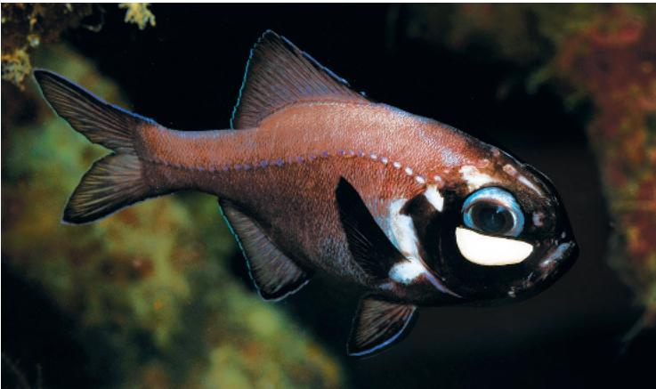

The very existence of an ecosystem can depend on prokaryotic organisms. For example, consider the diverse ecological communities found at hydrothermal vents. These communities are densely populated by many different kinds of animals, including worms, clams, crabs, and fishes. But since sunlight does not penetrate to the deep ocean floor, the community does not include photosynthetic organisms. Instead, the energy that supports the community is derived from the metabolic activities of chemoautotrophic bacteria. These bacteria harvest chemical energy from compounds such as hydrogen sulfide ( $H_{2}S$ ) that are released from the vent. An active hydrothermal vent may support hundreds of eukaryotic species, but when the vent stops releasing chemicals, the chemoautotrophic bacteria cannot survive. As a result, the entire vent community collapses.

## Interview

Interview with Penny Chisholm: Studying the role of cyanobacteria in marine ecosystems (eTextbook only)

Figure 27.20 Mutualism: bacterial “headlights.”  

## Concept Check 27.5

1. Explain how prokaryotic organisms, though small, can be considered giants in their collective impact on Earth and its life.

2. MAKE CONNECTIONS Review Figure 10.5. Then summarize the main steps by which cyanobacteria produce $O_{2}$ and use $CO_{2}$ to make organic compounds.

For suggested answers, see Appendix A.

## Concept 27.6: Prokaryotic organisms have both beneficial and harmful impacts on humans

Although the best-known prokaryotic organisms tend to be the bacteria that cause human illness, these pathogens represent only a small fraction of prokaryotic species. Many other prokaryotic organisms have positive interactions with people, and some play essential roles in agriculture and industry.

## Mutualistic Bacteria

As is true for many other eukaryotes, human well-being can depend on mutualistic prokaryotic organisms. For example, our intestines are home to an estimated 500–1,000 species of bacteria; collectively, their cells outnumber all human cells in the body by a factor of ten. Different species live in different portions of the intestines, and they vary in their ability to process different foods. Many of these species are mutualists, digesting food that our own intestines cannot break down. The genome of one of these gut mutualists, Bacteroides thetaiotaomicron, includes a large array of genes involved in synthesizing carbohydrates, vitamins, and other nutrients needed by humans. Signals from the bacterium activate human genes that build the network of intestinal blood vessels necessary to absorb nutrient molecules. Other signals induce human cells to produce antimicrobial compounds to which B. thetaiotaomicron is not susceptible. This action may reduce the population sizes of other, competing species, thus potentially benefiting both B. thetaiotaomicron and its human host.

## Pathogenic Bacteria

Nearly all of the prokaryotic organisms known to be human pathogens to date are bacteria, and they deserve their negative reputation. Bacteria cause about half of all human diseases. For example, more than 1.5 million people die each year of the lung disease tuberculosis, caused by Mycobacterium tuberculosis. And another 2 million people die each year from diarrheal diseases caused by various bacteria.

Some bacterial diseases are transmitted by other species, such as fleas or ticks. In the United States, the most widespread pest-carried disease is Lyme disease, which infects about 300,000 people each year according to a recent CDC estimate (Figure 27.21). Caused by a bacterium carried by ticks, Lyme disease can result in debilitating arthritis, heart disease, nervous disorders, and death if untreated.

Pathogenic bacteria usually cause illness by producing poisons, which are classified as exotoxins or endotoxins. Exotoxins are proteins secreted by certain bacteria and other organisms. Cholera, a dangerous diarrheal disease, is caused by an exotoxin secreted by the proteobacterium Vibrio cholerae. The exotoxin stimulates intestinal cells to release chloride ions into the gut, and water follows by osmosis. In another example, the potentially fatal disease botulism is caused by botulinum

Figure 27.21 Lyme disease.

Ticks in the genus Ixodes spread the disease by transmitting the spirochete Borrelia burgdorferi (colorized SEM). A rash may develop at the site of the tick's bite; the rash may be large and ring-shaped (as shown) or much less distinctive.

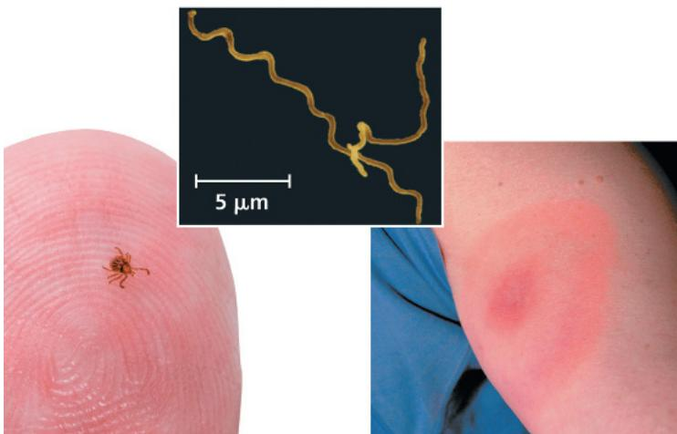  
Figure 27.22 The rise of antibiotic resistance.

toxin, an exotoxin secreted by the gram-positive bacterium Clostridium botulinum as it ferments various foods, including improperly canned meat, seafood, and vegetables. Like other exotoxins, the botulinum toxin can produce disease even if the bacteria that manufacture it are no longer present when the food is eaten.

Endotoxins are lipopolysaccharide components of the outer membrane of gram-negative bacteria. In contrast to exotoxins, endotoxins are released only when the bacteria die and their cell walls break down. Endotoxin-producing bacteria include species in the genus Salmonella, such as Salmonella typhi, which causes typhoid fever. You might have heard of food poisoning caused by other Salmonella species that can be found in poultry and some fruits and vegetables.

Finally, horizontal gene transfer can spread genes associated with virulence, turning normally harmless bacteria into potent pathogens. E. coli, for instance, is ordinarily a harmless symbiont in the human intestines, but pathogenic strains that cause bloody diarrhea have emerged. One of the most dangerous strains, O157:H7, is a global threat; in the United States alone, there are around 75,000 cases of O157:H7 infection per year, often from contaminated beef or produce. Scientists have discovered over 1,000 genes in O157:H7 that have no counterpart in harmless E. coli strains. Some of the genes found only in O157:H7 are associated with virulence and were likely transferred by phage-mediated horizontal gene transfer (transduction) from pathogenic bacterial species.

## Antibiotic Resistance

Since their initial use in the 1940s, antibiotics have saved many lives and reduced the incidence of disease caused by pathogenic bacteria. Unfortunately, as Figure 27.22 shows, resistance to

As illustrated by the examples shown here, bacteria have developed resistance to every antibiotic currently in clinical use, often within a few years. It took more than 50 years for resistance to develop to colistin, most likely because this antibiotic has toxic side effects in humans and hence was used rarely (as a treatment of last resort).

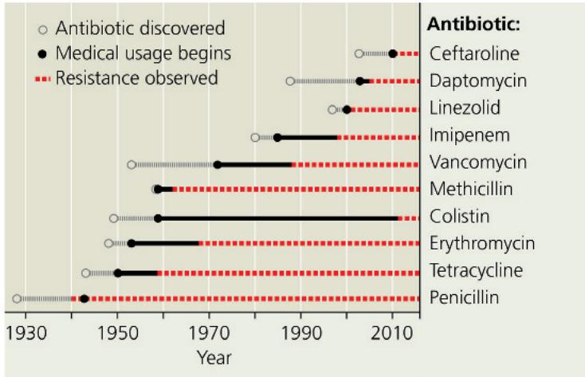  
VISUAL SKILLS Based on this diagram, identify the antibiotic for which resistance appeared before the antibiotic began to be used medicinally. For suggested answer, see Appendix A.

antibiotics has evolved in many bacteria, often rapidly. Compounding this problem, the discovery of new antibiotics has not kept pace with the rate at which resistance has evolved in bacteria. We now face a major public health concern: For every antibiotic now in use, at least one species of bacteria has developed resistance to it.

The rise of antibiotic resistance is driven by several factors. The rapid reproduction of bacteria enables cells carrying resistance genes to quickly produce large numbers of resistant offspring. Thus, when humans use antibiotics in medical or agricultural settings, natural selection can cause the fraction of a bacterial population carrying genes for antibiotic resistance to increase rapidly. Resistance genes also can spread within and among bacterial species by horizontal gene transfer. As a result, bacterial strains that are resistant to multiple antibiotics are becoming more common, making the treatment of certain bacterial infections very difficult.

Consider tuberculosis, currently the second leading cause of death by infectious disease worldwide (after COVID-19). The recent rise of drug-resistant strains of the tuberculosis bacterium (Mycobacterium tuberculosis) threatens decades of progress in combating tuberculosis. "Superbug" tuberculosis strains came to public notice in 2006, when an outbreak in a rural area of South Africa killed 52 of the 53 patients infected with what is now called extensively drug-resistant tuberculosis (XDR-TB). As of 2017, more than 100 countries had confirmed cases of XDR-TB. There are few treatments for XDR-TB, and those we have are difficult to administer and more toxic than are treatments for standard strains of the tuberculosis bacterium.

M. tuberculosis is not the only bacterium in which resistance to multiple antibiotics has evolved. Highly resistant strains have also been found in species that cause potentially lethal infections of the skin, lungs, digestive tract, and other human organs. Even so, recent discoveries give cause for hope. In one such study, researchers used a metagenomic approach to sequence genes from soil bacteria that could not be grown in the laboratory. They found that some of these genes encoded a new class of antibiotics, which have been named malacidins. Malacidins have been effective against multidrug-resistant gram-positive pathogens, including clone USA300 (Figure 27.23), a highly virulent strain of methicillin-resistant Staphylococcus aureus (MRSA; see Figure 22.14). Researchers also have developed virus-like particles capable of targeting (and killing) particular species of multidrug-resistant bacteria. Novel approaches for growing soil bacteria in the laboratory also have led to the discovery of new antibiotics, as you can explore in the Scientific Skills Exercise.

## Prokaryotic Organisms in Research and Technology

On a positive note, we reap many benefits from the metabolic capabilities of both bacteria and archaea. For example, people have long used bacteria to convert milk to cheese and yogurt. Bacteria are also used in the production of beer and wine, pepperoni,

Figure 27.23 Effectiveness of malacidin against MRSA clone USA300.

Treatment with malacidin rapidly cleared a skin infection in rats caused by clone a highly virulent strain of methicillin-resistant Staphylococcus aureus (MRSA). Malacidin was as effective as daptomycin, an antibiotic used to treat life-threatening infections.

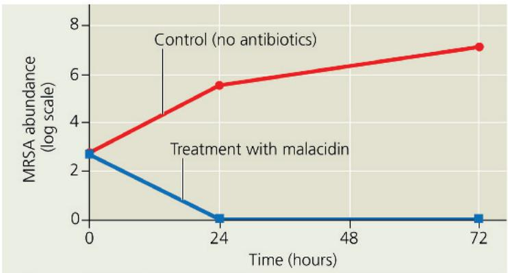

fermented cabbage (sauerkraut), and soy sauce. In recent decades, our greater understanding of prokaryotic organisms has led to an explosion of new applications in biotechnology. Examples include the use of E. coli in gene cloning (see Figure 20.4) and the use of DNA polymerase from Pyrococcus furiosus in the PCR technique (see Figure 20.8). Through genetic engineering, we can modify bacteria to produce vitamins, antibiotics, hormones, and other products (see Concept 20.1).

Recently, the prokaryotic CRISPR-Cas system, which helps bacteria and archaea defend against attack by viruses (see Figure 19.7), has been developed into a powerful new tool for altering genes in virtually any organism. The genomes of many prokaryotic organisms contain short DNA repeats, called CRISPRs, that interact with proteins known as the Cas (CRISPR-associated) proteins. Cas proteins, acting together with “guide RNA” made from the CRISPR region, can cut any DNA sequence to which they are directed. Scientists have been able to exploit this system by introducing a Cas protein (Cas9) to guide RNA into cells whose DNA they want to alter (see Figure 17.28). Among other applications, this CRISPR-Cas9 system has already opened new lines of research on HIV, the virus that causes AIDS (Figure 27.24). While the CRISPR-Cas9 system can potentially be used in many different ways, care must be taken to guard against the unintended consequences that could arise when applying such a new and powerful technology.

Another valuable application of bacteria is to reduce our use of petroleum. Consider the plastics industry. Globally, each year more than 1 trillion (1,000,000,000,000) pounds of plastic are produced from petroleum and used to make toys, storage containers, soft drink bottles, and many other items. Many of these products end up as plastic waste that contaminates natural habitats and degrades slowly, creating environmental problems (see Concept 56.4). One promising avenue for addressing these problems is to use bacteria that produce natural plastics

# Scientific Skills Exercise

# Calculating and Interpreting Means and Standard Errors

Can Antibiotics Obtained from Soil Bacteria Help Fight Drug-Resistant Bacteria? Soil bacteria synthesize antibiotics, which they use against species that attack or compete with them. To date, these species have been inaccessible as sources for new medicines because 99% of soil bacteria cannot be grown using standard laboratory techniques. To address this problem, researchers developed a method in which soil bacteria grow in a simulated version of their natural environment; this led to the discovery of a new antibiotic, teixobactin. In this exercise, you'll calculate means and standard errors from an experiment that tested teixobactin's effectiveness against MRSA (methicillin-resistant Staphylococcus aureus; see Figure 22.14).

How the Experiment Was Done Researchers drilled tiny holes into a small plastic chip and filled the holes with a dilute aqueous solution containing soil bacteria and agar. The dilution had been calibrated so that only one bacterium was likely to grow in each hole. After the agar solidified, the chip was placed in a container containing the original soil; nutrients from the soil diffused into the agar, allowing the bacteria to grow. After isolating teixobactin from a soil bacterium, researchers performed the following experiment: Mice infected with MRSA were given low (1 mg/kg) or high (5 mg/kg) doses of teixobactin or vancomycin, an existing antibiotic; in the control, mice infected with MRSA were not given an antibiotic. After 26 hours, researchers sampled infected mice and estimated the number of S. aureus colonies in each sample. Results were reported on a log scale; a decrease of 1.0 on this scale reflects a tenfold decrease in MRSA abundance.

## Data from the Experiment

<table><tr><td>Treatment</td><td>Dose (mg/kg)</td><td>Log of Number of Colonies</td><td>Mean ( $\bar{x}$ )</td></tr><tr><td>Control</td><td>—</td><td>9.0, 9.5, 9.0, 8.9</td><td></td></tr><tr><td rowspan="2">Vancomycin</td><td>1.0</td><td>8.5, 8.4, 8.2</td><td></td></tr><tr><td>5.0</td><td>5.3, 5.9, 4.7</td><td></td></tr><tr><td rowspan="2">Teixobactin</td><td>1.0</td><td>8.5, 6.0, 8.4, 6.0</td><td></td></tr><tr><td>5.0</td><td>3.8, 4.9, 5.2, 4.9</td><td></td></tr></table>

Data from L. Ling et al. A new antibiotic kills pathogens without detectable resistance, Nature 517:455–459 (2015).

## Figure 27.24 CRISPR: opening new avenues of research for treating HIV infection.

(a) In laboratory experiments, untreated (control) human cells were susceptible to infection by HIV, the virus that causes AIDS. (b) In contrast, cells treated with a CRISPR-Cas9 system that targets HIV were resistant to viral infection. The CRISPR-Cas9 system was also able to remove HIV proviruses (see Figure 19.8) that had become incorporated into the DNA of human cells.

(Figure 27.25). For example, some bacteria synthesize a type of polymer known as PHA (polyhydroxyalkanoate), which they use to store chemical energy. The PHA can be extracted, formed into

▶ Plastic chip used to grow soil bacteria

## INTERPRET THE DATA

1. The mean $(\bar{x})$ of a variable is the sum of the data values divided by the number of observations $(n)$ :

$$
\overline {{x}} = \frac {\sum x _ {i}}{n}
$$

In this formula, $x_{i}$ is the value of the ith observation of the variable (observation number “i” out of a total of n such observations); the $\Sigma$ symbol represents adding the n values of x together. Calculate the mean for each treatment.

2. Use your results from question 1 to evaluate the effectiveness of vancomycin and teixobactin.

3. The variation found in a set of data can be estimated by the standard deviation, s:

$$
s = \sqrt {\frac {\sum (x _ {i} - \bar {x}) ^ {2}}{n - 1}}
$$

Calculate the standard deviation for each treatment.

4. The standard error (SE), which indicates how greatly the mean would likely vary if the experiment was repeated, is calculated as:

$$
S E = \frac {s}{\sqrt {n}}
$$

As a rough rule of thumb, if an experiment were to be repeated, the new mean typically would lie within two standard errors of the original mean (that is, within the range $\bar{x} \pm 2SE$ ). Calculate $\bar{x} \pm 2SE$ for each treatment, determine whether these ranges overlap, and interpret your results.

Instructors: A version of this Scientific Skills Exercise can be assigned in Mastering Biology.

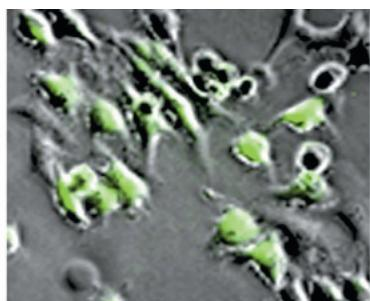  
(a) Control cells. The green highlighting indicates infection by HIV.

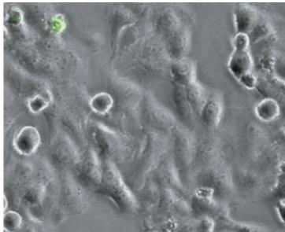  
(b) Experimental cells. These cells were treated with a CRISPR-Cas9 system that targets HIV.

Figure 27.26 Bioremediation of an oil spill.

Figure 27.25 Bacteria synthesizing and storing PHA, a component of biodegradable plastics.  

pellets, and used to make durable, yet biodegradable, plastics. Researchers are also seeking to reduce the use of petroleum and other fossil fuels by engineering bacteria that can produce ethanol from various forms of biomass, including agricultural waste, switchgrass, and corn.

Another way to harness prokaryotic organisms is bioremediation, the use of organisms to remove pollutants from soil, air, or water. For example, anaerobic bacteria and archaea decompose the organic matter in sewage, converting it to material that can be used as landfill or fertilizer after chemical sterilization. Other bioremediation applications include cleaning up oil spills (Figure 27.26) and precipitating radioactive material (such as uranium) out of groundwater.

The usefulness of prokaryotic organisms largely derives from their diverse forms of nutrition and metabolism. All this metabolic versatility evolved prior to the appearance of the structural novelties that heralded the evolution of eukaryotic organisms, discussed in the rest of this unit.

Spraying fertilizer stimulates the growth of native bacteria that metabolize oil, increasing the speed of the breakdown process up to fivefold.

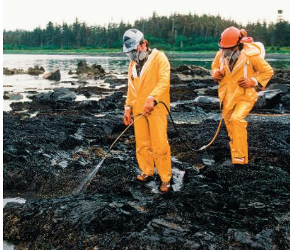

## Concept Check 27.6

1. Identify at least two ways that prokaryotic organisms have affected you positively today.

2. A pathogenic bacterium's toxin causes symptoms that increase the bacterium's chance of spreading from host to host. Does this information indicate whether the poison is an exotoxin or endotoxin? Explain.

3. WHAT IF? How might a sudden and dramatic change in your diet affect the diversity of prokaryotic species that live in your digestive tract?

For suggested answers, see Appendix A.

## Chapter 27 Review

## Summary of Key Concepts

To review key terms, go to the Vocabulary Self-Quiz (eTextbook only).

## Concept 27.1: Structural and functional adaptations contribute to prokaryotic success

\- Many prokaryotic species can reproduce quickly by binary fission, leading to the formation of extremely large populations.

Describe features of prokaryotic organisms that enable them to thrive in a wide range of different environments.

## Concept 27.2: Rapid reproduction, mutation, and genetic recombination promote genetic diversity in prokaryotic organisms

\- Because prokaryotic organisms can often proliferate rapidly, mutations can quickly increase a population's genetic variation. As a result, prokaryotic populations often can evolve in short periods of time in response to changing conditions.

\- Genetic diversity in prokaryotic organisms also can arise by recombination of the DNA from two different cells (via transformation, transduction, or conjugation). By transferring advantageous alleles, such as ones for antibiotic resistance, recombination can promote adaptive evolution in prokaryotic populations.

Mutations are rare and prokaryotic organisms reproduce asexually, yet their populations can have high genetic diversity. Explain how this can occur.

## Concept 27.3: Diverse nutritional and metabolic adaptations have evolved in Bacteria and Archaea

\- Nutritional diversity is much greater in prokaryotic organisms than in eukaryotes and includes all four modes of nutrition: photoautotrophy, chemoautotrophy, photoheterotrophy, and chemoheterotrophy.

\- Among prokaryotic organisms, obligate aerobes require $O_{2}$ , obligate anaerobes are poisoned by $O_{2}$ , and facultative anaerobes can survive with or without $O_{2}$ .

\- Unlike eukaryotes, prokaryotic organisms can metabolize nitrogen in many different forms. Some can convert atmospheric nitrogen to ammonia, a process called nitrogen fixation.

\- Prokaryotic cells and even species may cooperate metabolically, including in surface-coating biofilms.

Describe the range of prokaryotic metabolic adaptations.

## Concept 27.4: Bacteria and Archaea have radiated into a diverse set of lineages

\- Molecular systematics is helping biologists classify prokaryotic organisms and identify new clades.

\- Diverse nutritional types are scattered among the major groups of bacteria. The two largest groups are proteobacteria and gram-positive bacteria.

\- Some archaea, such as extreme thermophiles and extreme halophiles, live in extreme environments. Other archaea live in moderate environments such as soils and lakes.

How have molecular data informed prokaryotic phylogeny?

## Concept 27.5: Prokaryotic organisms play crucial roles in the biosphere

\- Decomposition by heterotrophic prokaryotic organisms and the synthetic activities of autotrophic and nitrogen-fixing prokaryotic organisms contribute to the recycling of elements in ecosystems.

\- Many prokaryotic organisms have a symbiotic relationship with a host; the relationships between prokaryotic organisms and their hosts range from mutualism to commensalism to parasitism.

In what ways are prokaryotic organisms key to the survival of many species?

## Concept 27.6: Prokaryotic organisms have both beneficial and harmful impacts on humans

\- People depend on mutualistic prokaryotic organisms, including hundreds of species that live in our intestines and help digest food.

\- Pathogenic bacteria typically cause disease by releasing exotoxins or endotoxins. Horizontal gene transfer can spread genes associated with virulence to harmless species or strains.

\- Resistance to multiple antibiotics has evolved in many pathogenic bacteria, a problem of great concern for public health.

\- Prokaryotic organisms can be used in bioremediation and production of plastics, vitamins, antibiotics, and other products.

Describe beneficial and harmful impacts of prokaryotic organisms on humans. For suggested answers, see Appendix A.

## Test Your Understanding

For more multiple-choice questions, go to the Practice Test (eTextbook only).

## Levels 1-2: Remembering/Understanding

1. A process that cannot produce genetic variation in bacterial populations is
(A) transduction.
(B) conjugation.
(C) mutation.
(D) meiosis.

2. Photoautotrophs use

(A) light as an energy source and $CO_{2}$ as a carbon source.

(B) light as an energy source and methane as a carbon source.

(C) $N_{2}$ as an energy source and $CO_{2}$ as a carbon source.

(D) $CO_{2}$ as both an energy source and a carbon source.

3. Which of the following statements is true?

(A) Archaea and bacteria have identical membrane lipids.

(B) The cell walls of archaea lack peptidoglycan.

(C) Prokaryotic organisms have low levels of genetic diversity.

(D) No archaea are capable of using $CO_{2}$ to oxidize $H_{2}$ , releasing methane.

4. Which of the following involves metabolic cooperation among prokaryotic cells?

(A) binary fission

(B) endospore formation

(C) biofilms

(D) photoautotrophy

5. Which of the following describes a bacterium that lives in the human intestine and causes disease?

(A) commensalist

(B) decomposer

(C) gut mutualist

(D) symbiotic pathogen

6. Photosynthesis that releases $O_{2}$ occurs in

(A) cyanobacteria.

(B) methanogens.

(C) gram-positive bacteria.

(D) chemoautotrophic bacteria.

## Levels 3-4: Applying/Analyzing

7. EVOLUTION CONNECTION In patients with nonresistant strains of the tuberculosis bacterium, antibiotics can relieve symptoms in a few weeks. However, it takes much longer to halt the infection, and patients may discontinue treatment while bacteria are still present. Explain how this could result in the evolution of drug-resistant pathogens.

## Levels 5-6: Evaluating/Creating

8. SCIENTIFIC INQUIRY • INTERPRET THE DATA The nitrogen-fixing bacterium Rhizobium infects the roots of some plant species, forming a mutualism in which the bacterium provides nitrogen, and the plant provides carbohydrates. Scientists measured the 12-week growth of one such plant species (Acacia irrorata) when infected by six different Rhizobium strains. (a) Graph the data. (b) Interpret the graph.

<table><tr><td>Rhizobium strain</td><td>1</td><td>2</td><td>3</td><td>4</td><td>5</td><td>6</td></tr><tr><td>Plant mass (g)</td><td>0.91</td><td>0.06</td><td>1.56</td><td>1.72</td><td>0.14</td><td>1.03</td></tr></table>

Data from J. J. Burdon et al., Variation in the effectiveness of symbiotic associations between native rhizobia and temperate Australian Acacia: within species interactions, Journal of Applied Ecology 36:398–408 (1999). Note: Without Rhizobium, after 12 weeks, Acacia plants have a mass of about 0.1 g.

9. WRITE ABOUT A THEME: ENERGY In a short essay (about 100–150 words), discuss how prokaryotic organisms and other members of hydrothermal vent communities transfer and transform energy.

## 10. SYNTHESIZE YOUR KNOWLEDGE

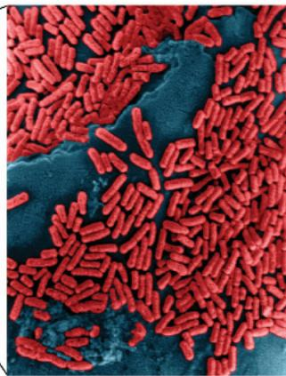  
Explain how the small size and rapid reproduction rate of bacteria (such as the population shown here on the tip of a pin) contribute to their large population sizes and high genetic variation.  
For selected answers, see Appendix A.

