# 第28章 The Origin and Diversification of Eukaryotes

<!-- 章节边界按正文内容恢复；原始 MinerU 内容保留如下。 -->

# The Origin and Diversification of Eukaryotes

## Key Concepts

28.1 Most eukaryotes are single-celled organisms

28.2 SAR is a highly diverse group of protists defined by DNA similarities

28.3 Red algae and green algae are the closest relatives of plants

28.4 Amorpheans include protists that are closely related to fungi and animals

28.5 Phylogenomic research has identified new supergroups and led to the rearrangement of the eukaryotic tree of life

28.6 Protists play key roles in ecological communities

## Study Tip

Label a drawing: Life cycles vary greatly among different eukaryote groups. To make sense of this variation, it can be helpful to identify when mitosis occurs in different life cycles, as shown here for a portion of Figure 28.14. Identify the stages at which mitosis occurs in Figures 28.14, 28.18, 28.25, and 28.28.

  
Figure 28.1 This single-celled eukaryote is a member of a recently identified supergroup of eukaryotes called Provora. This name provides some details about this tiny predator: Provora is an abbreviation of the words PRO-tist, deVOuring, and voRAcious. The organism depicted (Nibbleromonas arcticus) belongs to a lineage called the Nibbleridia, so named because these small provorans can consume larger prey organisms by slowly “nibbling” away at them over time.

What gave rise to the great diversity of eukaryotes, and how have their lineages diverged over time?  

# Concept 28.1: Most eukaryotes are single-celled organisms

Protists—along with plants, animals, and fungi—are eukaryotic organisms; together they make up the clade Eukarya. Protists were formerly classified in the kingdom Protista, but genetic and morphological studies have shown that some protists are more closely related to plants, fungi, or animals than they are to other protists, which means this kingdom was paraphyletic. As a result, the kingdom Protista has been abandoned, and various protist lineages are now recognized as major groups in their own right. Most biologists still use the term protist, not as a taxonomic group, but rather as a convenient way to refer to eukaryotes that are not plants, animals, or fungi.

Unlike the cells of prokaryotic organisms, the cells of eukaryotes have a nucleus and other membrane-enclosed organelles, such as mitochondria and the Golgi apparatus. Such organelles provide specific locations where particular cellular functions are accomplished, making the structure and organization of eukaryotic cells more complex than those of prokaryotic cells. Eukaryotic cells also have a well-developed cytoskeleton that extends throughout the cell (see Figure 6.20). The cytoskeleton provides the structural support that enables eukaryotic cells to have asymmetric (irregular) forms, as well as to change in shape as they feed, move, or grow. In contrast, prokaryotic cells lack a well-developed cytoskeleton, thus limiting the extent to which they can maintain asymmetric forms or change shape over time.

We'll survey the diversity of eukaryotes throughout the rest of this unit, beginning in this chapter with the protists: those eukaryotic organisms that are not in Kingdoms Animalia, Plantae or Fungi. As you explore this material, bear in mind that

\- the organisms in most eukaryotic lineages are protists, and

\- most protists are unicellular.

Thus, life differs greatly from how most of us commonly think of it. The large, multicellular organisms that we know best (plants, animals, and fungi) are the tips of just a few branches on the great tree of life (see Figure 26.21).

## Structural and Functional Diversity in Protists

Given that they are classified in a number of different groups, it isn't surprising that few general characteristics of protists can be cited without exceptions. In fact, protists exhibit more structural and functional diversity than the eukaryotes with which we are most familiar—plants, animals, and fungi.

For example, most protists are unicellular, although there are many colonial and multicellular species—even some that are very large, such as giant kelp (a seaweed). Single-celled protists are justifiably considered the simplest eukaryotes, but at the cellular level, many protists are very complex—the most elaborate of all cells. In most multicellular organisms, essential biological functions are carried out by organs. Unicellular

Figure 28.2 The eye-like ocelloid of Erythropsidinium, a dinoflagellate.
This complex, subcellular structure resembles the camera-like eye found in vertebrates and some molluscs. In some dinoflagellates, the ocelloid may function in prey detection.

protists carry out the same essential functions, but they do so using subcellular organelles, not multicellular organs. The organelles that protists use are mostly those discussed in Figure 6.8, including the nucleus, endoplasmic reticulum, Golgi apparatus, and lysosomes. Certain protists also rely on organelles not found in most other eukaryotic cells, such as contractile vacuoles that pump excess water from the protistan cell (see Figure 7.13). One group of dinoflagellate protists has the most complex subcellular structure known: a unique, eye-like organelle called an ocelloid with components resembling the lens and retina in the eyes of vertebrates and some other animals (Figure 28.2).

Protists are also very diverse in their nutrition. Some protists are photoautotrophs and contain chloroplasts. Some are heterotrophs, absorbing organic molecules or ingesting larger food particles. Still other protists, called mixotrophs, combine photosynthesis and heterotrophic nutrition. Photoautotrophy, heterotrophy, and mixotrophy have all arisen independently in many different protist lineages.

## Reproductive Diversity of Eukaryotes

Some protists are only known to reproduce asexually. Others can also reproduce sexually, with life cycles that alternate between a haploid and a diploid phase through the processes of meiosis and fertilization. There are three basic types of sexual life cycles (Figure 28.3); they vary in which phase of the life cycle (haploid or diploid) mitosis occurs. In a gametic life cycle, mitosis occurs only in diploid cells; therefore, gametes are unique in this life cycle in that they are the only haploid cells (see Figure 28.3a). A gamete may fertilize another gamete to produce a diploid zygote that can divide through mitosis—in some cases forming a multicellular diploid organism. Some diploid cells undergo meiosis, forming haploid gametes. The opposite occurs in a zygotic life cycle, where mitosis occurs only in haploid cells; therefore, zygotes are unique in these life cycles in that they are the only diploid cells (see Figure 28.3c). Zygotes never divide through mitosis and can only undergo meiosis to form haploid cells, which themselves can divide through mitosis to form a series of single cells or to form a multicellular haploid organism. Some haploid cells differentiate

Figure 28.3 Three types of life cycles found in eukaryotic organisms.

The common feature of all three cycles is the alternation of haploid cells and diploid cells through the processes of meiosis and fertilization. The cycles differ in where mitosis occurs in the life cycle, whether only in diploid cells (a), in both diploid and haploid cells (b), or only in haploid cells (c). Small circles represent cells; large circles represent organisms.

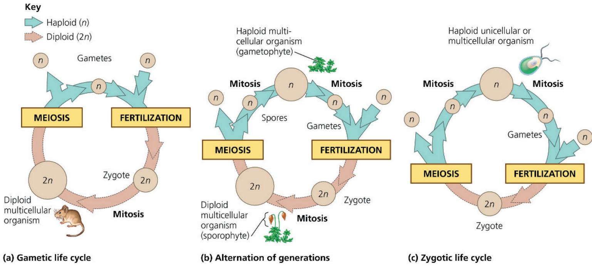

into gametes, each of which can fertilize another gamete to create a diploid zygote. In alternation of generations (also called a sporic life cycle), mitosis occurs in both haploid cells and diploid cells (see Figure 28.3b).

Sexual life cycles originated in protists and all three types of life cycles are represented among protists, along with some variations that do not quite fit any of these types. We will examine the life cycles of several protist groups later in this chapter, and we'll continue to discuss sexual life cycles in the coming chapters as we examine how they vary between plants, fungi, and animals. Understanding life cycles will be important to understand the anatomy and evolution of these groups.

## Endosymbiosis in Eukaryotic Evolution

What gave rise to the enormous diversity of protists that exist today? There is abundant evidence that much of protistan diversity has its origins in endosymbiosis, a relationship between two species in which one organism lives inside the cell or cells of another organism (the host). In particular, as we discussed in Concept 25.3, structural, biochemical, and DNA sequence data indicate that mitochondria and plastids are derived from bacteria that were engulfed by the ancestors of early eukaryotic cells. The evidence also suggests that mitochondria evolved before plastids. Thus, a defining moment in the origin of eukaryotes occurred when a host cell engulfed a bacterium that would later become an organelle found in all eukaryotes—the mitochondrion.

To determine which bacterial lineage gave rise to mitochondria, researchers have compared the DNA sequences of mitochondrial genes (mtDNA) to those found in major clades of bacteria. In the Scientific Skills Exercise, you will interpret one such set of DNA sequence comparisons. Collectively, such studies indicate that mitochondria arose from an alpha proteobacterium (see Figure 27.17). Results from mtDNA sequence analyses also indicate that the mitochondria of protists, animals, fungi, and plants descended from a single common ancestor, thus suggesting that mitochondria arose only once over the course of evolution. Similar analyses provide evidence that plastids descended from a single common ancestor—a cyanobacterium that was engulfed by a eukaryotic host cell.

Progress has also been made toward identifying the host cell that engulfed an alpha proteobacterium, thereby setting the stage for the origin of eukaryotes. For example, there is strong evidence that eukaryotes originated from within the domain Archaea. Genetic sequence analysis suggests that the Asgard group of archaea are most closely related to the lineage that gave rise to eukaryotes (see Concept 27.4). One hypothesis is that the ancestor of eukaryotes was a relatively complex archaeal cell in which certain features of eukaryotic cells had evolved, such as a cytoskeleton that enabled it to change shape (and thereby engulf the alpha proteobacterium).

## Plastid Evolution: A Closer Look

In addition to the evidence indicating that mitochondria are descended from a bacterium that was engulfed by an archaean, giving rise to the eukaryotes, there is also much evidence that later in eukaryotic history, a lineage of heterotrophic eukaryotes

# Scientific Skills Exercise Interpreting Comparisons of Genetic Sequences

Which Bacteria Are Most Closely Related to Mitochondria? Early eukaryotes acquired mitochondria by endosymbiosis: A host cell engulfed an aerobic bacterium that persisted within the cytoplasm to the mutual benefit of both cells. In studying which living bacteria might be most closely related to mitochondria, researchers compared DNA sequences encoding ribosomal RNA (rRNA), a component of ribosomes. Ribosomes perform critical cell functions. Hence, genes encoding rRNA are under strong selection and change slowly over time, making them suitable for comparing even distantly related species. In this exercise, you will interpret some of the research data to draw conclusions about the phylogeny of mitochondria.

How the Research Was Done Researchers isolated and cloned DNA sequences from the gene that codes for the small-subunit rRNA molecule for the wheat (a eukaryote) mitochondrion and for five bacterial species:

\- Wheat, used as the source of genes encoding mitochondrial rRNA

\- Agrobacterium tumefaciens, an alpha proteobacterium that lives within plant tissue and produces tumors in the host

\- Comamonas testosteroni, a beta proteobacterium

\- Escherichia coli, a well-studied gamma proteobacterium that inhabits human intestines

\- Mycoplasma capricolum, a gram-positive mycoplasma, which is the only group of bacteria lacking cell walls

\- Anacystis nidulans, a cyanobacterium

Wheat, used as the source of mitochondrial rRNA

Data from the Research Gene sequences encoding rRNA for the wheat mitochondrion and the five bacteria were aligned and compared. The data table below, called a comparison

matrix, summarizes the comparison of 617 nucleotide positions from the gene sequences. Each value in the table is the percentage of the 617 nucleotide positions for which the pair of organisms have the same base. Any positions that were identical across all six rRNA-encoding gene sequences were omitted from this comparison matrix.

## INTERPRET THE DATA

1. First, make sure you understand how to read the comparison matrix. (a) Find the cell that represents the comparison of C. testosteroni and E. coli. What value is given in this cell? (b) What does that value signify about the comparable gene sequences in those two organisms? (c) Explain why some cells have a dash rather than a value. (d) Why are some cells shaded gray, with no value?

2. Why did the researchers choose one plant mitochondrion and five bacterial species to include in the comparison matrix?

3. (a) Which bacterium has an rRNA-encoding gene that is most similar to that of the wheat mitochondrion? (b) What is the significance of this similarity?

Instructors: A version of this Scientific Skills Exercise can be assigned in Mastering Biology.

<table><tr><td></td><td>Wheat mitochondrion</td><td>A. tumefaciens</td><td>C. testosteroni</td><td>E. coli</td><td>M. capricolum</td><td>A. nidulans</td></tr><tr><td>Wheat mitochondrion</td><td>-</td><td>48</td><td>38</td><td>35</td><td>34</td><td>34</td></tr><tr><td>A. tumefaciens</td><td></td><td>-</td><td>55</td><td>57</td><td>52</td><td>53</td></tr><tr><td>C. testosteroni</td><td></td><td></td><td>-</td><td>61</td><td>52</td><td>52</td></tr><tr><td>E. coli</td><td></td><td></td><td></td><td>-</td><td>48</td><td>52</td></tr><tr><td>M. capricolum</td><td></td><td></td><td></td><td></td><td>-</td><td>50</td></tr><tr><td>A. nidulans</td><td></td><td></td><td></td><td></td><td></td><td>-</td></tr></table>

Data from D. Yang et al., Mitochondrial origins, Proceedings of the National Academy of Sciences USA 82:4443–4447 (1985).

acquired an additional endosymbiont—a photosynthetic cyanobacterium—that then evolved into plastids. According to the hypothesis illustrated in Figure 28.4, this plastid-bearing lineage gave rise to two lineages of photosynthetic protists, or algae: red algae and green algae.

Let's examine some of the steps in Figure 28.3 more closely. First, recall that cyanobacteria are gram-negative and that gram-negative bacteria have two cell membranes, an inner plasma membrane and an outer membrane that is part of the cell wall (see Figure 27.3). Plastids in red algae and green algae are also surrounded by two membranes. Transport proteins in these

membranes are homologous to proteins in the inner and outer membranes of cyanobacteria, providing further support for the hypothesis that plastids originated from a cyanobacterial endosymbiont.

On several occasions during eukaryotic evolution, red algae and green algae underwent secondary endosymbiosis, meaning they were ingested in the food vacuoles of heterotrophic eukaryotes and became endosymbionts themselves. For example, protists known as chlorarachniophytes likely evolved when a heterotrophic eukaryote engulfed a green alga. Evidence for this process can be found within the engulfed cell,

## Figure 28.4 Diversity of plastids produced by endosymbiosis.

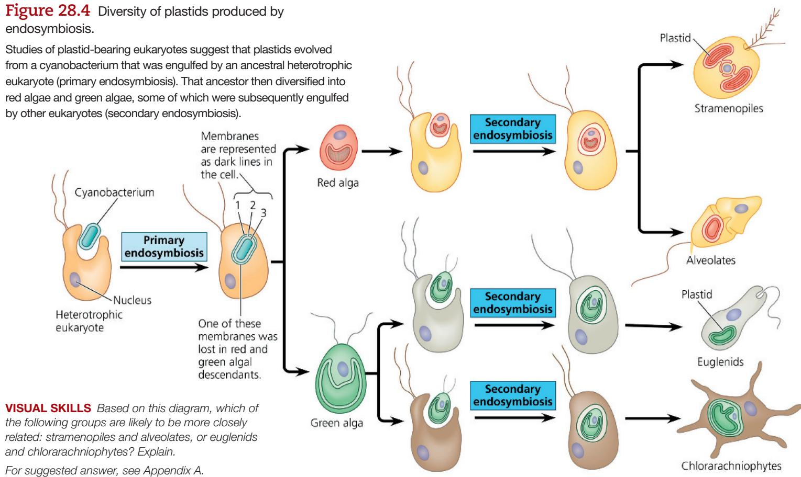  
VISUAL SKILLS Based on this diagram, which of the following groups are likely to be more closely related: stramenopiles and alveolates, or euglenids and chlorarachniophytes? Explain.
For suggested answer, see Appendix A.

which contains a tiny vestigial nucleus, called a nucleomorph (Figure 28.5). Genes from the nucleomorph are still transcribed, and their DNA sequences indicate that the engulfed cell was a green alga.

## Eukaryotic Supergroups

Our understanding of the evolutionary history of eukaryotic diversity has been in flux in recent years. Not only has kingdom Protista been abandoned, but other hypotheses have been discarded as well. For example, many biologists once thought that the first lineage to have diverged from all other eukaryotes was the amitochondriate protists, organisms without conventional mitochondria and with fewer membrane-enclosed organelles than other protist groups. But recent structural and DNA data have undermined this hypothesis. Many of the so-called amitochondriate protists have been shown to have mitochondria—though reduced ones—and some of these organisms are now classified in distantly related groups.

Figure 28.5 Nucleomorph within a plastid of a chlorarachniophyte.  
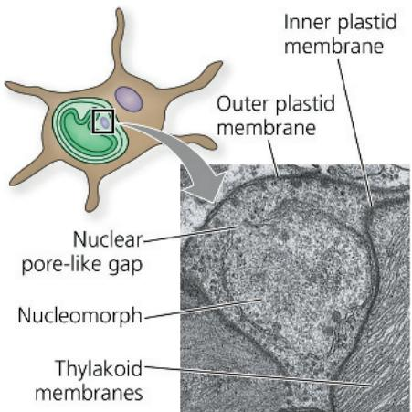

The ongoing changes in our understanding of the phylogeny of protists pose challenges to students and instructors alike. Hypotheses about these relationships are a focus of scientific activity, changing rapidly as new data cause previous ideas to be modified or discarded. Over the last two decades, eukaryotes have been organized into from four to ten major groupings known as “supergroups.” New supergroups have been proposed as previously unknown taxa are identified, whereas some previously recognized supergroups have been shown to not be monophyletic and therefore dropped.

The next three Key Concepts (28.2–28.4) will focus on three supergroups whose position on the eukaryotic tree is fairly well established, while Concept 28.5 will explore major groups whose position is less firm—some of which have been described very recently (Figure 28.6). Because the deep roots of the eukaryotic tree are still an area of active study, the phylogenetic trees in this chapter include some polytomies (branching points where several lineages are drawn as diverging simultaneously from a common ancestor). Such polytomies aren’t meant to suggest that all the lineages actually diverged at once, but they indicate that the pattern of branching among these lineages is still unknown. Overall, as you read this chapter, it may be helpful to focus less on the specific names of groups of organisms and more on why the organisms are important and how ongoing research is elucidating their evolutionary relationships.

## Exploring Protistan Diversity

## Figure 28.6

The tree below represents a phylogenetic hypothesis for the relationships among eukaryotes on Earth today. The eukaryotic groups at the branch tips are related in larger “supergroups,” labeled vertically at the far right of the tree. Groups highlighted in yellow boxes are informally referred to as protists: eukaryotic organisms that are not plants, animals or fungi. Note that this tree includes only some of the supergroups that have been described, and only some representative clades for each supergroup.

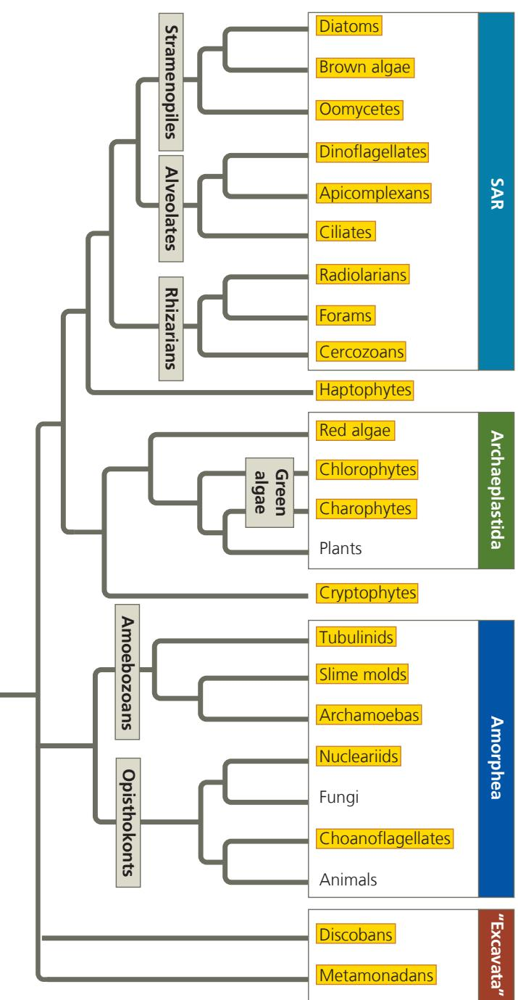

SAR  
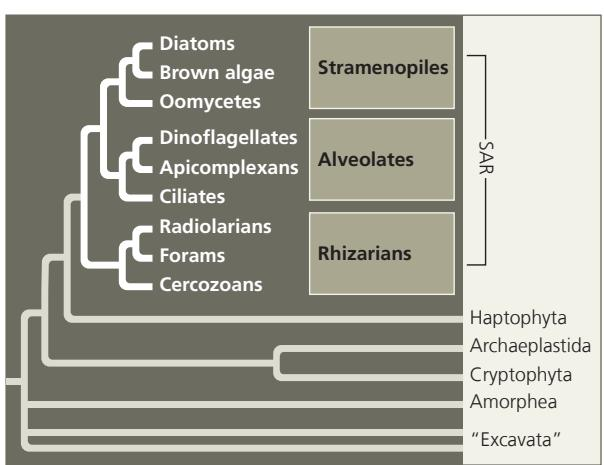

This supergroup contains (and is named after) three large and very diverse clades: Stramenopila, Alveolata, and Rhizaria. Stramenopiles include some of the most important photosynthetic organisms on Earth, such as the diatoms shown here as well as large seaweeds such as kelp (see Figures 28.9 and 28.10). Alveolates also include photosynthetic species, as well as important pathogens, such as Plasmodium, which causes malaria. According to one current hypothesis, stramenopiles and alveolates originated by secondary endosymbiosis when a heterotrophic protist engulfed a red alga.

50 μm  
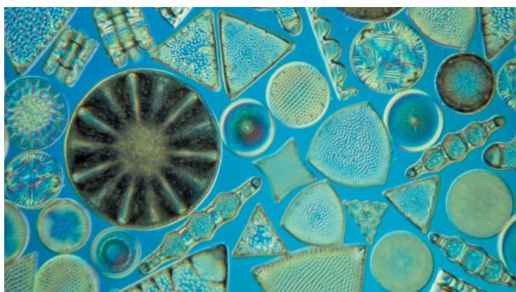  
Diatom diversity. These beautiful single-celled protists are important photosynthetic organisms in aquatic communities (LM).  
DRAW IT Draw a simplified version of this phylogenetic tree that shows only the Archaeplastida, SAR, Amorphea, Haptophyta, Cryptophyta, and Excavata.

## SAR (continued)

The rhizarian subgroup of SAR includes many species of amoebas, most of which have pseudopodia that are threadlike in shape. Pseudopodia are extensions that can bulge from any portion of the cell; they are used in movement and in the capture of prey.

Globigerina, a rhizarian in SAR.
This species is a foram, a group whose members have threadlike pseudopodia that extend through pores in the shell, or test (LM). The inset shows a foram test, which is hardened by calcium carbonate.

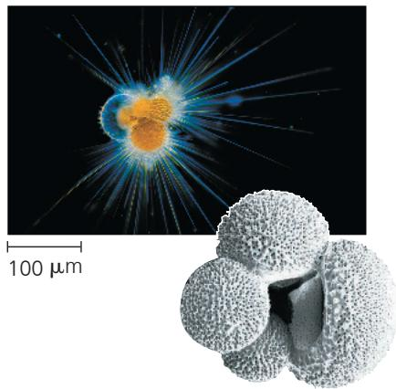

## Archaeplastida

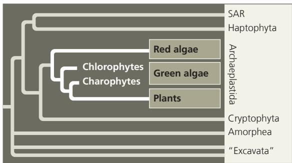

This supergroup of eukaryotes includes red algae and green algae, along with plants. Red algae and green algae include unicellular species, colonial species, and multicellular species (including the green alga Volvox). Many of the large algae known informally as “seaweeds” are multicellular red or green algae. Protists in Archaeplastida include key photosynthetic species that form the base of the food web in many aquatic communities.

## Amorphea

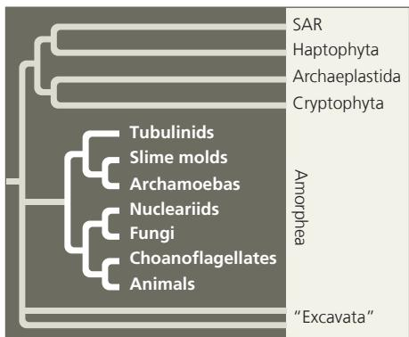

Volvox, a multicellular freshwater green alga. This alga has two types of differentiated cells, and so it is considered multicellular rather than colonial. It resembles a hollow ball whose wall is composed of hundreds of biflagellated cells (see inset LM) embedded in a gelatinous

extracellular matrix; if isolated, these cells cannot reproduce. However, the alga also contains cells that are specialized for either sexual or asexual reproduction. The large algae shown here will eventually release the small “daughter” algae that can be seen within them (LM).

  
25 μm

This supergroup of eukaryotes, formerly called Unikonta, is entirely heterotrophic. Amorphea includes amoebas that have lobe or tube-shaped pseudopodia, as well as animals, fungi, and non-amoeba protists that are closely related to animals or fungi. Most amorpheans are free-living, but some are parasitic.

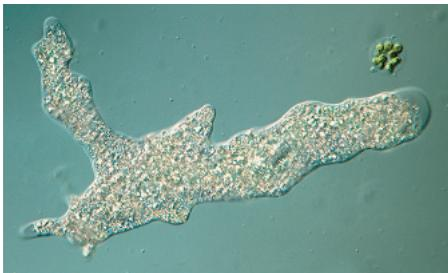  
An amoeba. This amoeba, the tubulinid Amoeba proteus, is using its pseudopodia to move.

## "Excavata"

One feature of the organisms formerly grouped in Excavata is an “excavated” groove on the side of the cell body. However, recent studies suggest that Excavata is not monophyletic; rather, the organisms belong to multiple distinct clades, including Metamonada (parabasalids, diplomonads, and related groups), which are anaerobic flagellated protists with highly reduced mitochondria, and Discoba, a diverse group that includes euglenozoans, which have a unique flagellar structure.

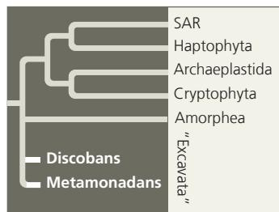

Giardia intestinalis, a diplomonad parasite. This diplomonad (colorized SEM), which lacks the characteristic surface groove of the Excavata, inhabits the intestines of mammals. It can infect people when they drink water contaminated with feces containing Giardia cysts. Drinking such water—even from a seemingly pristine stream—can cause severe diarrhea. Boiling the water kills the parasite.

  
5 μm

## Concept Check 28.1

1. Cite at least four examples of structural and functional diversity among protists.

2. Summarize the role of endosymbiosis in eukaryotic evolution.

3. DRAW IT Draw basic diagrams of a gametic life cycle, a life cycle with alternation of generations, and a zygotic life cycle. Identify which part of each life cycle is haploid, which is diploid, and where fertilization, meiosis, and mitosis occur.

4. MAKE CONNECTIONS After studying Figure 28.4, predict how many distinct genomes are contained within the cell of a chlorarachniophyte. Explain. (See Figures 6.17 and 6.18.)

For suggested answers, see Appendix A.

## Concept 28.2: SAR is a highly diverse group of protists defined by DNA similarities

Now that we have examined some of the broad patterns in eukaryotic evolution, we will look more closely at some of the main groups of protists shown in Figure 28.6. We begin with SAR, a supergroup recognized in 2007, early in the era of whole-genome DNA sequence analyses. These studies found that three major clades of protists—the stramenopiles, alveolates, and rhizarians—form a monophyletic supergroup. This supergroup contains a large, extremely diverse collection of protists. To date, this supergroup has not received a formal name but is instead known by the first letters of its major clades: SAR.

Some morphological and DNA sequence data suggest that two of these groups, the stramenopiles and alveolates, originated more than a billion years ago, when a common ancestor of these two clades engulfed a single-celled, photosynthetic red alga. Because red algae are thought to have originated by primary endosymbiosis (see Figure 28.3), such an origin for the stramenopiles and alveolates is referred to as secondary endosymbiosis. Others question this idea, noting that some species in these groups lack plastids or their remnants (including any trace of plastid genes in their nuclear DNA).

Despite its lack of a formal name, the SAR supergroup represents the best current hypothesis for the phylogeny of the three large protist clades to which we now turn.

Figure 28.7 Stramenopile flagella.

Most stramenopiles, such as Synura petersenii, have two flagella: one covered with fine, stiff hairs and a shorter one that is smooth.

## Stramenopiles

One major subgroup of SAR, the stramenopiles, includes some of the most important photosynthetic organisms on the planet. Their name (from the Latin stramen, straw, and pilos, hair) refers to their characteristic flagellum, which has numerous fine, hairlike projections. In most stramenopiles, this “hairy” flagellum is paired with a shorter “smooth” (nonhairy) flagellum (Figure 28.7). Here we’ll focus on three groups of stramenopiles: diatoms, oomycetes, and brown algae.

## Diatoms

A key group of photosynthetic protists, diatoms are unicellular algae that have a unique glass-like wall made of silicon dioxide embedded in an organic matrix (Figure 28.8). The wall consists of two parts that overlap like a petri dish. These walls provide effective protection from the crushing jaws of predators: Live diatoms can withstand pressures as great as 1.4 million kg/m $^{2}$ , equal to the pressure under each leg of a table supporting an elephant!

With an estimated 100,000 living species, diatoms are a highly diverse group of protists (see Figure 28.6). They are among the most abundant photosynthetic organisms both in the ocean and in lakes: One bucket of water scooped from the surface of the sea may contain

millions of these microscopic algae. The abundance of diatoms in the past is also evident in the fossil record, where massive accumulations of fossilized diatom walls are major constituents of sediments known as diatomaceous earth. These sediments are mined for their quality as a filtering medium and for many other uses.

Figure 28.8 The diatom Triceratium morlandii.
(colorized SEM)

Diatoms are so widespread and abundant that their photosynthetic activity affects global carbon dioxide ( $CO_{2}$ ) levels. Diatoms have this effect in part because of events that occur

during episodes of rapid population growth, or blooms, when ample nutrients are available. Typically, diatoms are eaten by a variety of protists and invertebrates, but during a bloom, many escape this fate. When these uneaten diatoms die, their bodies sink to the ocean floor. It takes decades, or even centuries, for dead diatoms that sink to the ocean floor to be broken down by bacteria and other decomposers. As a result, the carbon in their bodies remains there for some time, rather than being released immediately as $CO_{2}$ as the decomposers respire. The overall effect of these events is that $CO_{2}$ absorbed by diatoms during photosynthesis is transported, or “pumped,” to the ocean floor.

With an eye toward reducing global warming by lowering atmospheric $CO_{2}$ levels, some scientists advocate promoting diatom blooms by fertilizing the ocean with essential nutrients such as iron. In one study testing this idea, researchers found that $CO_{2}$ was indeed pumped to the ocean floor after iron was added to a small region of the ocean, causing a diatom bloom. Other scientists have cautioned that the small area and short duration of such studies makes it difficult to predict what would happen if large-scale iron fertilization experiments were performed. Indeed, the possibility that iron fertilization could have undesirable side effects (such as oxygen depletion or the production of nitrous oxide, a more potent greenhouse gas than $CO_{2}$ ) led the 2008 United Nations Convention on Biological Diversity to issue a moratorium against such experiments.

## Brown Algae

The largest and most complex algae are brown algae. All are multicellular, and most are marine. Brown algae are especially common along temperate coasts that have cold-water currents. They owe their characteristic brown or olive color to the carotenoids in their plastids.

Many of the species commonly called “seaweeds” are brown algae, though the term seaweed is also used for large multicellular green and red algae (see Concept 28.3). Some brown algal seaweeds have specialized structures that resemble organs in plants, such as a rootlike holdfast, which anchors the alga, and a stemlike stipe, which supports the leaflike blades (Figure 28.9). Unlike plants, however, brown algae lack true tissues and organs. Moreover, morphological and DNA data show that these similarities evolved independently in the algal and plant lineages and are thus analogous, not homologous. In addition, while plants have adaptations (such as rigid stems) that provide support against gravity, brown algae have adaptations that enable their main photosynthetic surfaces (the leaflike blades) to be near the water surface. Some brown algae accomplish this task with gas-filled, bubble-shaped floats. Giant brown algae known as kelps that live in deep waters have such floats in their blades, which are attached to stipes that can rise as much as 60 m from the seafloor—more than half the length of a football field.

Brown algae are important commodities for humans. Some species are eaten, such as Laminaria, which is commonly used as food in Japan (kombu) and Chile (cochayuyo), and is growing in popularity in the United States. In addition, the cell walls of brown algae contain a gel-forming substance, called algin, which is used to thicken many processed foods, including pudding and salad dressing. Finally, some brown algae, including kelp, are strong candidates to become widespread biofuels.

Figure 28.9 Seaweeds: adapted to life at the ocean's margins. The sea palm (Postelsia) lives on rocks along the coast of the northwestern United States and western Canada. The body of this brown alga is well adapted to maintaining a firm foothold despite the crashing surf.  

## Alternation of Generations

A variety of life cycles have evolved among the multicellular algae. The most complex life cycles include an alternation of generations, the alternation of multicellular haploid and diploid forms, as shown in Figure 28.10 for the brown alga Laminaria. Although haploid and diploid conditions alternate in all sexual life cycles—human gametes, for example, are haploid—the term alternation of generations applies only to life cycles in which mitosis leading to multicellular structures occurs in both haploid and diploid stages (see Figure 28.3). As you will read in Concept 29.1, alternation of generations also evolved in plants.

As detailed in Figure 28.14, the diploid individual in this complex algal life cycle is called the sporophyte because it produces spores. The spores are haploid and move by means of flagella; they are called zoospores. The zoospores divide by mitosis and develop into haploid, multicellular male and female gametophytes, which produce gametes. The union of two gametes (fertilization) results in a diploid zygote, which matures and gives rise to a new multicellular sporophyte.

In Laminaria, the two generations are heteromorphic, meaning that the sporophytes and gametophytes are structurally different. Other algal life cycles have an alternation of isomorphic generations, in which the sporophytes and gametophytes look similar to each other, although they differ in chromosome number.

## Oomycetes (Water Molds and Their Relatives)

Oomycetes include the water molds, the white rusts, and the downy mildews. Based on their morphology, these organisms were previously classified as fungi (in fact, oomycete means “egg fungus”).

Figure 28.10 The life cycle of the brown alga Laminaria: an example of alternation of generations.

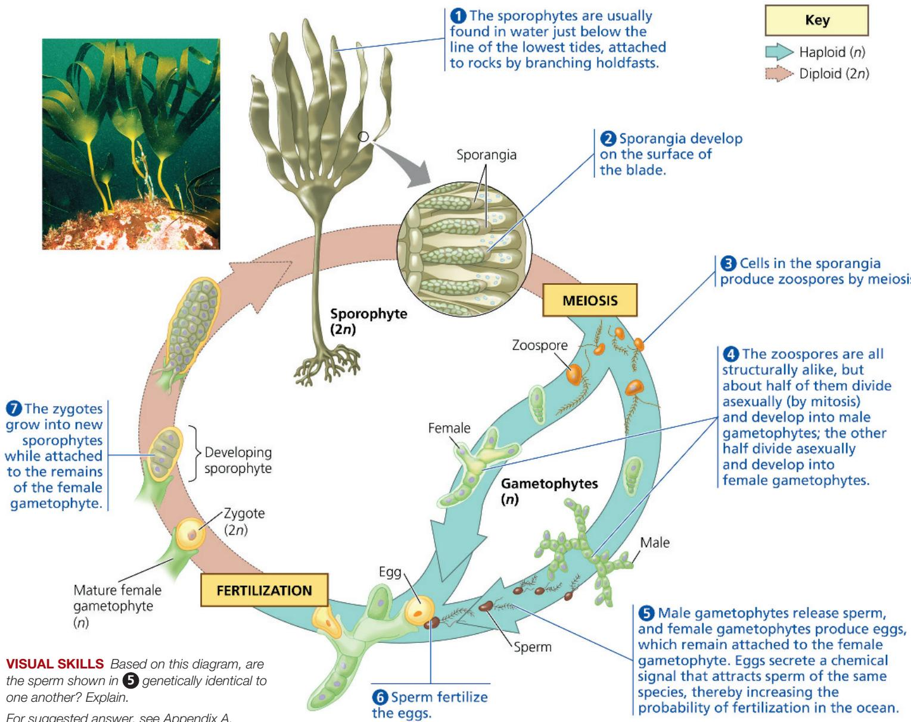

For example, many oomycetes have multinucleate filaments (hyphae) that resemble fungal hyphae (Figure 28.11a). However, there are key differences between oomycetes and fungi. Among them, oomycetes typically have cell walls made of cellulose, whereas the walls of fungi consist mainly of another polysaccharide, chitin. Data from molecular systematics have confirmed that oomycetes are not closely related to fungi. In both oomycetes and fungi, the high surface-to-volume ratio of filamentous structures enhances the uptake of nutrients from the environment.

Although oomycetes descended from plastid-bearing ancestors, they no longer have plastids and do not perform photosynthesis. Instead, they typically acquire organic molecules as decomposers or parasites. Most water molds are decomposers that grow as cottony masses on dead algae and animals, mainly in freshwater habitats (Figure 28.11b). White rusts and downy mildews generally live on land as plant parasites.

The ecological impact of oomycetes can be significant. For example, the oomycete Phytophthora infestans causes potato late blight, which turns the stalks and stems of potato (and tomato) plants into black slime. Late blight contributed to the devastating Irish famine of the 19th century, in which a million people died and at least that many were forced to leave Ireland. The disease remains a major problem today, causing crop losses as high as 70% in some regions. Globally, about \$1 billion is spent each year on pesticides to control the parasite.

## Alveolates

Members of the next subgroup of SAR, the alveolates, are unicellular organisms that have membrane-enclosed sacs (alveoli) just under the plasma membrane (Figure 28.12). Alveolates are abundant in many habitats and include a wide range of photosynthetic and heterotrophic protists. We'll discuss three alveolate clades here: a group of flagellates (the dinoflagellates), a group of parasites (the apicomplexans), and a group of protists that move using cilia (the ciliates).

Figure 28.11 Oomycetes.

(a) Closeup of oomycete hyphae (LM)

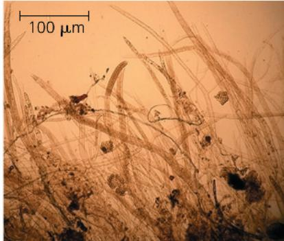  
(b) Water mold hyphae growing on a goldfish

  
Figure 28.12 Alveoli.  
These sacs under the plasma membrane are a characteristic that distinguishes alveolates from other eukaryotes (TEM).

## Dinoflagellates

The cells of many dinoflagellates are reinforced by cellulose plates. Grooves in this “armor” house two flagella, one of which causes dinoflagellates (from the Greek dinos, whirling) to spin as they move through the waters of their marine and freshwater communities (Figure 28.13a).

Although their ancestors may have originated by secondary endosymbiosis (see Figure 28.3), roughly half of all dinoflagellate species are now purely heterotrophic. Others are important species of phytoplankton (photosynthetic plankton, which include photosynthetic bacteria as well as algae); many photosynthetic dinoflagellates are mixotrophic.

## Figure 28.13 Dinoflagellates.

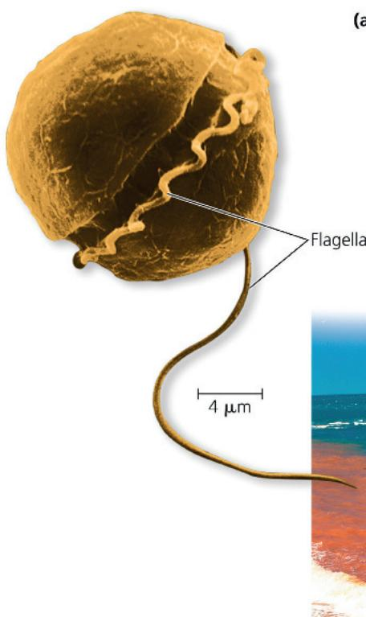  
(a) Dinoflagellate flagella. Beating of the spiral flagellum, which lies in a groove that encircles the cell, makes this specimen of Pfiesteria shumwayae spin (colorized SEM).

(b) Red tide in the Gulf of Carpentaria in northern Australia. The red color is due to high concentrations of a carotenoid-containing dinoflagellate.  
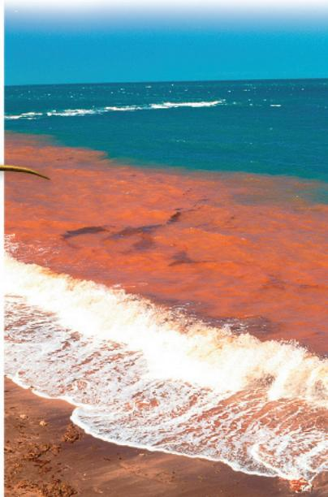

Periods of explosive population growth (blooms) in dinoflagellates sometimes cause a phenomenon called “red tide” (Figure 28.13b). The blooms make coastal waters appear brownish red or pink because of the presence of carotenoids, the most common pigments in dinoflagellate plastids. When blooms occur, toxins produced by certain dinoflagellates have caused massive kills of invertebrates and fishes. Humans who eat molluscs that have accumulated the toxins are affected as well, sometimes fatally. Based on data from 1982–2016, researchers at Stony Brook University found that ocean warming (caused by ongoing climate change) has expanded the potential for algal blooms in two species of toxic dinoflagellates, making them a growing threat to human health.

## Apicomplexans

Nearly all apicomplexans are parasites of animals—and virtually all animal species examined so far are attacked by these parasites. The parasites spread through their host as tiny infectious cells called sporozoites. Apicomplexans are so named because one end (the apex) of the sporozoite cell contains a complex of organelles specialized for penetrating host cells and tissues. Although apicomplexans are not photosynthetic, recent data show that they retain a modified plastid (apicoplast), most likely of red algal origin.

Most apicomplexans have intricate life cycles with both sexual and asexual stages. Those life cycles often require two or more host species for completion. For example, Plasmodium, the parasite that causes malaria, lives in both mosquitoes and humans (Figure 28.14).

Historically, malaria has rivaled tuberculosis as the leading cause of human death by infectious disease. The incidence of malaria was diminished in the 1960s by insecticides that reduced carrier populations of Anopheles mosquitoes and by drugs that killed Plasmodium in humans. But the emergence of resistant varieties of both Anopheles and Plasmodium has led to a resurgence of malaria. According to the World Health Organization, there were an estimated 263 million malaria cases and 597,000 malaria deaths worldwide in 2023. In regions where malaria is common, the lethal effects of this disease have resulted in the evolution of high frequencies of the sickle-cell allele; for an explanation of this connection, see Figure 23.18.

The search for malarial vaccines has been hampered by the fact that Plasmodium lives mainly inside cells, hidden from the host's immune system. And, like trypanosomes, Plasmodium continually changes its surface proteins. Even so, significant progress was made when European regulators recently approved the world's first licensed malarial vaccines (RTS,S or Mosquirix, and R21). By 2019, selected regions of Africa began routine use of RTS,S, and in 2023 the World Health Organization recommended these vaccines for broad use in children in areas where malaria is prevalent. Pilot studies showed the vaccines were substantially reducing child deaths, hospitalizations, and cases of malaria. By early 2025, 19 African countries were offering malaria vaccines as part of their childhood immunization programs. However, these vaccines, which target a protein on the surface of sporozoites,

Figure 28.14 The two-host life cycle of Plasmodium, the apicomplexan that causes malaria.  
  
Are morphological differences between sporozoites, merozoites, and gametocytes caused by different genomes or by differences in gene expression? Explain.
For suggested answer, see Appendix A.

provide only partial protection against malaria. As a result, researchers continue to study other potential vaccine targets, including the apicoplast. This approach may be effective because the apicoplast is a modified plastid; as such, it descended from a cyanobacterium and hence has different metabolic pathways from those in human patients.

## Ciliates

The ciliates are a large and varied group of protists named for their use of cilia to move and feed (Figure 28.15a). Most ciliates are predators, typically of bacteria or of other protists. Their cilia may completely cover the cell surface or may be clustered in a few rows or tufts. In certain species, rows of tightly packed cilia function collectively in locomotion. Other ciliates scurry about on leg-like structures constructed from many cilia bonded together.

Figure 28.15 Structure and function in the ciliate Paramecium caudatum.  
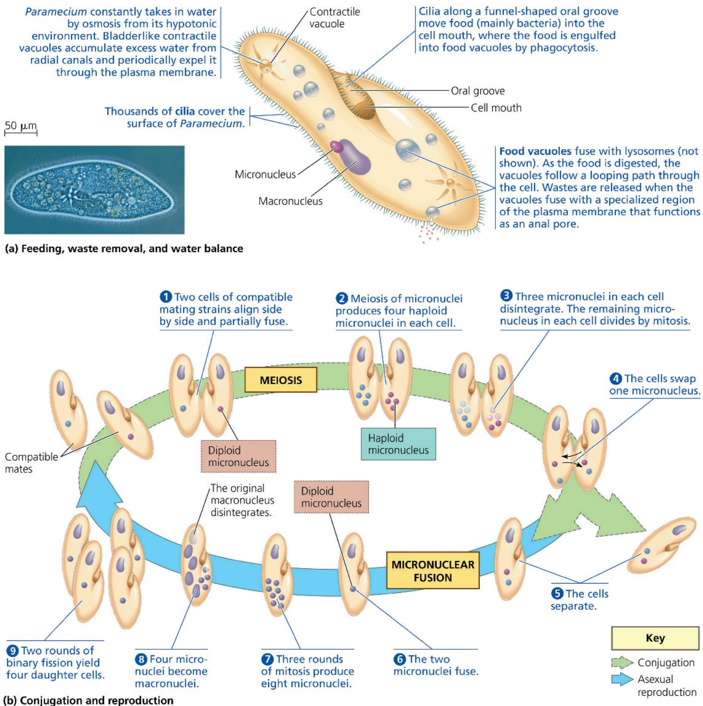  
MAKE CONNECTIONS The events shown in steps 4 through 6 of this diagram have a similar overall effect to what event in the human life cycle (see Figure 13.5)? Explain.

A distinctive feature of ciliates is the presence of two types of nuclei: tiny micronuclei and large macronuclei. A cell has one or more nuclei of each type. Genetic variation results from conjugation, a sexual process in which two individuals exchange haploid micronuclei but do not reproduce (Figure 28.15b). Ciliates generally reproduce asexually by binary fission, during which the existing macronucleus disintegrates and a new one is formed from the cell's micronuclei. Each macronucleus typically contains multiple copies of the ciliate's genome. Genes in the macronucleus control the everyday functions of the cell, such as feeding, waste removal, and maintaining water balance.

## Rhizarians

Our next subgroup of SAR is the rhizarians. Many species in this group are amoebas, protists that move and feed by means of pseudopodia, extensions of the cytoplasm that may bulge from almost anywhere on the cell surface. An amoeba moves by extending a pseudopodium and anchoring its tip; more cytoplasm then streams into the pseudopodium. Amoebas do not constitute a monophyletic group; instead, they are dispersed across many distantly related eukaryotic taxa. Most amoebas that are rhizarians differ morphologically from other amoebas by having long and very thin, or threadlike, pseudopodia. Rhizarians also include flagellated protists that move with flagella and use their threadlike pseudopodia mostly for feeding.

We'll examine three groups of rhizarians here: radiolarians, forams, and cercozoans.

## Radiolarians

The protists called radiolarians have delicate, intricately symmetrical internal skeletons that are generally made of silica. The pseudopodia of these mostly marine protists radiate from the central body (Figure 28.16) and are reinforced by bundles of microtubules. The microtubules are covered by a thin layer of cytoplasm, which engulfs smaller microorganisms that become attached to the pseudopodia. Cytoplasmic streaming then carries the captured prey into the main part of the cell. After radiolarians die, their skeletons settle to the seafloor, where they accumulated as a type of sediment called siliceous ooze that can be hundreds of meters thick in some locations.

## Forams

The protists called foraminiferans (from the Latin foramen, little hole, and ferre, to bear), or forams, are named for their porous shells, called tests (see Figure 28.6). Foram tests consist of a single piece of organic material that typically is hardened with calcium carbonate. The pseudopodia that extend through the pores function in swimming, test formation, and feeding. Many forams also derive nourishment from the photosynthesis of symbiotic algae that live within the tests.

Figure 28.16 A radiolarian.

Numerous threadlike pseudopodia radiate from the central body of this radiolarian (LM).

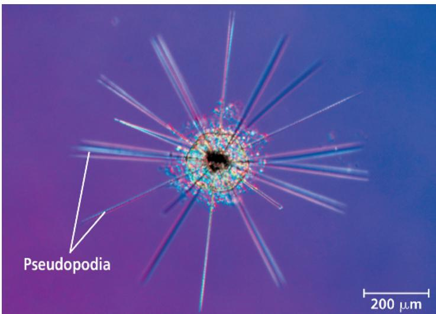

Forams are found in both the ocean and fresh water. Most species live in sand or attach themselves to rocks or algae, but some live as plankton. The largest forams, though single-celled, have tests several centimeters in diameter.

Ninety percent of all identified species of forams are known from fossils. Along with the calcium-containing remains of other protists, the fossilized tests of forams are part of marine sediments, including sedimentary rocks that are now land formations. Foram fossils are excellent markers for correlating the ages of sedimentary rocks in different parts of the world. Researchers are also studying these fossils to obtain information about climate change and its effects on the oceans and their life (Figure 28.17).

Figure 28.17 Fossil forams.

By measuring the magnesium content in fossilized forams like these, researchers seek to learn how ocean temperatures have changed over time. Forams take up more magnesium in warmer water than in colder water.

Figure 28.18 A second case of primary endosymbiosis?

The cercozoan Paulinella conducts photosynthesis in a unique sausage-shaped structure called a chromatophore (LM). Chromatophore membranes include a peptidoglycan layer, indicating that they are derived from a bacterium. DNA evidence shows that chromatophores are derived from a different cyanobacterium than that from which plastids are derived.

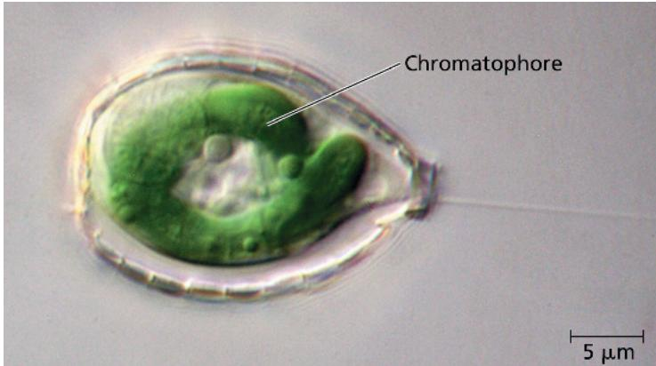

## Cercozoans

First identified in molecular phylogenies, the cercozoans are a large group of amoeboid and flagellated protists that feed using threadlike pseudopodia. Cercozoan protists are common inhabitants of marine, freshwater, and soil ecosystems.

Most cercozoans are heterotrophs. Many are parasites of plants, animals, or other protists; many others are predators. The predators include the most important consumers of bacteria in aquatic and soil ecosystems, along with species that eat other protists, fungi, and even small animals. One small group of cercozoans, the chlorarachniophytes (mentioned earlier in the discussion of secondary endosymbiosis), are mixotrophic: These organisms ingest smaller protists and bacteria as well as perform photosynthesis. At least one other cercozoan, Paulinella chromatophora, is an autotroph, deriving its energy from light and its carbon from $CO_{2}$ . Paulinella (Figure 28.18) appears to represent an intriguing additional evolutionary example of a eukaryotic lineage that obtained its photosynthetic apparatus directly from a cyanobacterium.

## Concept Check 28.2

1. Explain why forams have such a well-preserved fossil record.

2. WHAT IF? Would you expect the plastid DNA of photosynthetic dinoflagellates and diatoms to be more similar to the nuclear DNA of plants (which belong to the Eukarya) or to the chromosomal DNA of cyanobacteria (which belong to the Bacteria)? Explain.

3. MAKE CONNECTIONS Which of the three life cycles in Figure 13.6 exhibits alternation of generations? How does it differ from the other two?

4. MAKE CONNECTIONS Review Figures 9.2 and 10.5, and then summarize how $CO_{2}$ and $O_{2}$ are both used and produced by chlorarachniophytes and other aerobic algae.

## Concept 28.3: Red algae and green algae are the closest relatives of plants

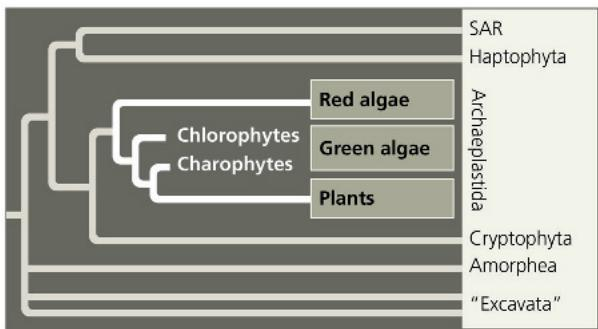

As described earlier, morphological and molecular evidence indicates that plastids arose when a heterotrophic protist acquired a cyanobacterial endosymbiont. Later, photosynthetic descendants of this ancient protist evolved into red algae and green algae (see Figure 28.4), and the lineage that produced green algae then gave rise to plants. Together, red algae, green algae, and plants make up our third eukaryotic supergroup, which is called Archaeplastida. Archaeplastida is a monophyletic group that descended from the ancient protist that engulfed a cyanobacterium. We will examine plants in Chapters 29 and 30; here we will look at the diversity of their closest algal relatives, red algae and green algae.

## Red Algae

Many of the 6,000 known species of red algae (rhodophytes, from the Greek rhodos, red) are reddish, owing to the photosynthetic pigment phycoerythrin, which masks the green of chlorophyll (Figure 28.19). However, other species (those adapted to shallow water) have less phycoerythrin. As a result, red algal species may be greenish red in very shallow water, bright red at moderate depths, and almost black in deep water. Some species lack pigmentation altogether and live as heterotrophic parasites on other red algae.

Red algae are abundant in many coastal ecosystems. Some of their photosynthetic pigments, including phycoerythrin, allow them to absorb blue and green light, which penetrate relatively deep into the water. A species of red alga has been discovered near the Bahamas at a depth of more than 260 m. There are also a small number of freshwater and terrestrial species.

Most red algae are multicellular. Although none are as big as the giant brown kelps, the largest multicellular red algae are included in the informal designation “seaweeds.” You may have eaten one of these multicellular red algae, Porphyra (Japanese “nori”), as crispy sheets or as a wrap for sushi (see Figure 28.19). Red algae reproduce sexually and have diverse life cycles in which alternation of generations is common. However, unlike other algae, red algae do not have flagellated gametes, so they depend on water currents to bring gametes together for fertilization.

8 mm

Figure 28.19 Red algae.

Bonnemaisonia hamifera. This red alga has a filamentous form.

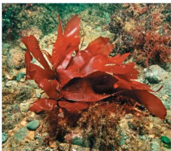  
Dulse (Palmaria palmata). This edible species has a "leafy" form.  
▼ Nori. The red alga Porphyra is the source of a traditional Japanese food.

  
- The seaweed is grown on nets in shallow coastal waters.  
-Paper-thin, glossy sheets of dried nori make a mineral-rich wrap for rice, seafood, and vegetables in sushi.

## Green Algae

The grass-green chloroplasts of green algae have a structure and pigment composition much like the chloroplasts of plants. Molecular systematics and cellular morphology leave little doubt that green algae and plants are closely related. In fact, some systematists now advocate including green algae in an expanded “plant” kingdom, Viridiplantae (from the Latin viridis, green). Phylogenetically, this change makes sense, since otherwise the green algae are a paraphyletic group.

Green algae can be divided into two main groups, the charophytes and the chlorophytes. The charophytes include the algae most closely related to plants, and we will discuss them along with plants in Chapter 29.

The second group, the chlorophytes (from the Greek chloros, green), includes more than 7,000 species. Most live in fresh water,

Figure 28.20 Examples of large chlorophytes.

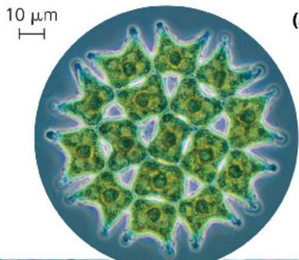  
(a) Pediastrum, a pond alga. Chlorophytes in this genus form daughter colonies with the same number and arrangement of cells as the parent colony.

  
(b) Ulva, or sea lettuce. This multicellular, edible chlorophyte has differentiated structures, such as its leaflike blades and a rootlike holdfast that anchors the alga.  
(c) Caulerpa, an intertidal chlorophyte. The branched filaments lack cross-walls and thus are multinucleate. In effect, the body of this alga is one huge "supercell."

but there are also many marine and some terrestrial species. The simplest chlorophytes are unicellular organisms such as Chlamydomonas, which resemble gametes of more complex chlorophytes. Various species of unicellular chlorophytes live independently in aquatic habitats as phytoplankton or inhabit damp soil. Some live symbiotically within other eukaryotes, contributing part of their photosynthetic output to the food supply of their hosts. Still other chlorophytes live in environments exposed to intense visible and ultraviolet radiation; these species are protected by radiation-blocking compounds in their cytoplasm, cell wall, or zygote coat.

Larger size and greater complexity evolved in green algae by three different mechanisms:

1. The formation of colonies of individual cells, as seen in Pediastrum (Figure 28.20a) and other species that contribute to the stringy masses known as pond scum.

2. The formation of true multicellular bodies by cell division and differentiation, as in Volvox (see Figure 28.6) and Ulva (Figure 28.20b).

3. The repeated division of nuclei with no cytoplasmic division, as in Caulerpa (Figure 28.20c).

Figure 28.21 The life cycle of Chlamydomonas, a unicellular chlorophyte.  
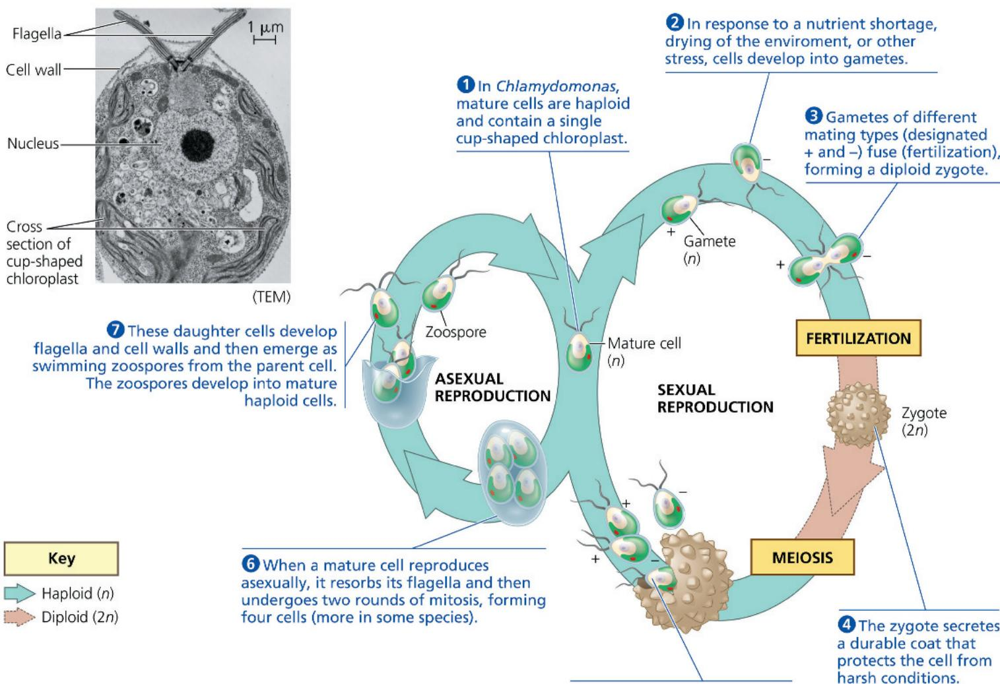  
⑦ These daughter cells develop flagella and cell walls and then emerge as swimming zoospores from the parent cell. The zoospores develop into mature haploid cells.  
6 When a mature cell reproduces asexually, it resorbs its flagella and then undergoes two rounds of mitosis, forming four cells (more in some species).

VISUAL SKILLS Circle the stage(s) in the diagram in which clones are formed, producing additional new daughter cells that are genetically identical to the parent cell(s).

For suggested answer, see Appendix A.

Most chlorophytes have complex life cycles, with both sexual and asexual reproductive stages. Nearly all species of chlorophytes reproduce sexually by means of biflagellated gametes that have cup-shaped chloroplasts (Figure 28.21). Alternation of generations has evolved in some chlorophytes, including Ulva.

## Concept Check 28.3

1. Contrast red algae and brown algae.

2. Why is it accurate to say that Ulva is truly multicellular but Caulerpa is not?

3. WHAT IF? Suggest a possible reason why species in the green algal lineage may have been more likely to colonize land than species in the red algal lineage.

For suggested answers, see Appendix A.

⑤ After a dormant period, meiosis produces four haploid individuals (two of each mating type) that emerge and mature.

## Concept 28.4: Amorpheans include protists that are closely related to fungi and animals

Amorphea (formerly called Unikonta) is an extremely diverse supergroup of eukaryotes that includes animals, fungi, and some protists. There are two major clades of amorphea, the amoebozoans (tubulinids and close protist relatives) and the opisthokonts (animals, fungi, and closely related protist groups). Each of these two major clades is strongly supported by molecular systematics. Support for the close relationship between amoebozoans and opisthokonts is provided by comparisons of myosin proteins and by studies based on multiple genes or whole genomes.

## Amoebozoans

The amoebozoan clade includes many species of amoebas that have lobe- or tube-shaped pseudopodia rather than the threadlike pseudopodia found in rhizarians. Amoebozoans include tubulinids, slime molds, and archamoebas.

## Tubulinids

Tubulinids constitute a large and varied group of amoebozoans that have lobe- or tube-shaped pseudopodia. These unicellular protists are ubiquitous in soil as well as freshwater and marine environments. Most are heterotrophs that actively seek and consume bacteria and other protists; one such tubulinid species, Amoeba proteus, is shown in Figure 28.6. Some tubulinids also feed on detritus (nonliving organic matter).

## Slime Molds

Slime molds, or mycetozoans (from the Latin, meaning “fungus animals”), once were thought to be fungi because, like fungi, they produce fruiting bodies that aid in spore dispersal. However, DNA sequence analyses indicate that the resemblance between slime molds and fungi is a case of evolutionary convergence. Slime molds have diverged into two main branches, plasmodial slime molds and cellular slime molds. We’ll compare their characteristics and life cycles.

## Plasmodial Slime Molds

Many plasmodial slime molds are brightly colored, often yellow or orange (Figure 28.22). As they grow, they form a mass called a plasmodium, which can be many centimeters in diameter. (Don't confuse a slime mold's plasmodium with the genus Plasmodium, which includes the parasitic apicomplexan that causes malaria.) Despite its size, the plasmodium is not multicellular; it is a single mass of cytoplasm that is undivided by plasma membranes and

Figure 28.22
A mature
plasmodium, the
feeding stage in
the life cycle of a
plasmodial slime
mold.

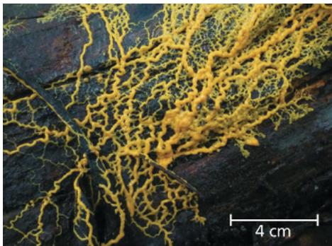

that contains many nuclei. This “supercell” is the product of mitotic nuclear divisions that are not followed by cytokinesis. The plasmodium extends pseudopodia through moist soil, leaf mulch, or rotting logs, engulfing food particles by phagocytosis as it grows. If the habitat begins to dry up or there is no food left, the plasmodium stops growing and differentiates into fruiting bodies that function in sexual reproduction.

## Cellular Slime Molds

The life cycle of the protists called cellular slime molds can prompt us to question what it means to be an individual organism. The feeding stage of these organisms consists of solitary cells that function individually, but when food is depleted, the cells form a slug-like aggregate that functions as a unit (Figure 28.23). Unlike the feeding stage (plasmodium) of a plasmodial slime mold, these aggregated cells remain separated by their individual plasma membranes. Ultimately, the aggregated cells form an asexual fruiting body.

Dictyostelium discoideum, a cellular slime mold commonly found on forest floors, has become a model organism for studying the evolution of multicellularity. One line of research has focused on the slime mold's fruiting body stage. During this stage, the cells that form the stalk die as they dry out, while the spore cells at the top survive and have the potential to reproduce (see Figure 28.28). Scientists have found that mutations in a single gene can turn individual Dictyostelium cells into “cheaters” that never become part of the stalk. Because these mutants gain a strong reproductive advantage over noncheaters, why don’t all Dictyostelium cells cheat?

Recent discoveries suggest an answer to this question. Cheating cells lack a specific surface protein, and noncheating cells can recognize this difference. Noncheaters preferentially aggregate with other noncheaters, thus depriving cheaters of the chance to exploit them. Such a recognition system may have been important in the evolution of other multicellular eukaryotes, such as animals and plants.

## Archamoebas

Archamoebas are a diverse group of protists that includes free-living forms that live in fresh water, oceans, and soil, as well as some parasitic and commensalistic species. Those that belong to the genus Entamoeba are symbiotic parasites. They infect all classes of vertebrate animals as well as some invertebrates. Humans are host to at least six species of Entamoeba, but only one, E. histolytica, is known to be pathogenic. E. histolytica causes amoebic dysentery and is spread via contaminated drinking water, food, or eating utensils. Responsible for up to 110,000 deaths worldwide every year, the disease is the third-leading cause of death due to eukaryotic parasites, after malaria (see Figure 28.14) and schistosomiasis (see Figure 33.10).

## Opisthokonts

Opisthokonts are an extremely diverse group of eukaryotes that includes animals, fungi, and several groups of protists. We will discuss the evolutionary history of fungi and animals in Chapters 31–34. Of the opisthokont protists, we will discuss the nucleariids in Chapter 31 because they are more closely related to fungi than they are to other protists. Similarly, we will discuss choanoflagellates in Chapter 32, since they are more closely related to animals than they are to other protists. The nucleariids and choanoflagellates illustrate why scientists have abandoned the former kingdom Protista: A monophyletic group that includes these single-celled eukaryotes would also have to include the multicellular animals and fungi that are closely related to them.

Figure 28.23 The life cycle of Dictyostelium, a cellular slime mold.  
  
VISUAL SKILLS Suppose cells were removed from the slug-like aggregate shown in the photo. Use the information in the life cycle to infer whether these cells would be haploid or diploid. Explain.
For suggested answer, see Appendix A.

## Concept Check 28.4

1. Contrast the pseudopodia of amoebozoans and forams.

2. In what sense is "fungus animal" a fitting description of a slime mold? In what sense is it not fitting?

3. VISUAL SKILLS What kind of life cycle is depicted in the sexual part of the life cycle in Figure 28.23? Hint: Look for where mitosis occurs in the life cycle (haploid cells, diploid cells, or both?).

# Concept 28.5: Phylogenomic research has identified new supergroups and led to the rearrangement of the eukaryotic tree of life

Research over the last two decades has led to a large change in our understanding of the eukaryotic tree of life and has helped resolve some of its deep roots. Some entirely new eukaryotic organisms have been discovered and found to be so different from known eukaryotic organisms that they have been placed in a new supergroup. Other clades have been identified for some time, but molecular phylogenetics have helped clarify their placement on the eukaryotic tree. Finally, some groups that were thought to be clades have been shown to be polyphyletic as more molecular data have become available.

Figure 28.24 The parabasalid parasite Trichomonas vaginalis. (colorized SEM)  

Excavata (the excavates) was a eukaryotic supergroup originally proposed based on morphological studies of the cytoskeleton. Some members of this diverse group also have an “excavated” feeding groove on one side of the cell body. However, most recent phylogenomic studies do not support the monophyly of the excavates as a whole, and instead identify two separate lineages: Metamonada and Discoba. Metamonada is a group of anaerobic, heterotrophic flagellated protists that are free-living or parasitic. This group includes well-known parasites, including Giardia intestinalis (see Figure 28.6), which inhabits the intestines of humans and other mammals, and Trichomonas vaginalis (Figure 28.24), a sexually transmitted parasite that infects about 140 million people each year worldwide.

Discoba is a diverse clade that includes predatory heterotrophs, photosynthetic autotrophs, and mixotrophs found in marine, freshwater, and moist terrestrial ecosystems, as well as parasites—some of which affect humans. Photosynthesis arose in one lineage, the euglenids (Figure 28.25), via secondary endosymbiosis with green algae (see Figure 28.4). Some euglenids are mixotrophs: They perform photosynthesis when sunlight is available, but when it is not, they can become heterotrophic, absorbing organic molecules from their environment. Many other euglenids engulf prey by phagocytosis. A well-known group of parasites in the clade Discoba belong to the genus Trypanosoma (Figure 28.26), which cause sleeping sickness and Chagas disease in humans.

Haptophytes are single-celled algae that have been known to form a clade for quite some time, but the placement of this supergroup in relation to other eukaryotes has proved challenging. They are now thought to be closely related to the SAR clade. Haptophytes include a group of phytoplankton called coccolithophores that have unique calcified scales called coccoliths around their cells (Figure 28.27). They are important phytoplankton in many marine ecosystems and play an important role in global biogeochemical cycles.

Cryptophytes are phytoplankton with two flagella (Figure 28.28) that are found in freshwater and marine environments. Like haptophytes, they were recognized as a clade based on molecular data but were difficult to place on the eukaryotic tree of life. The latest research suggests they are most closely related to Archaeplastida.

A number of additional new supergroups have been recently described based on phylogenomic analyses. Some, like CRuMs, combine previously “orphan” taxa that have very different characteristics and were not yet placed in existing supergroup. Others, like Hemimastigophora, were identified as a clade and were elevated to the supergroup level when their molecular data uncovered the extent of their evolutionary distinctiveness. Finally, some entirely new, previously unknown species were recently described and immediately assigned to a new supergroup of unique predators called Provora (see Figure 28.1). One thing is

Figure 28.25 Euglena, a euglenid commonly found in pond water.  

8 μm

clear: The vast majority of eukaryotic diversity falls outside of the three kingdoms we cover in the new few chapters (plants, fungi, and animals). Ongoing research will continue to improve our understanding of the eukaryotic tree of life.

Figure 28.26 Trypanosoma, the kinetoplastid that causes sleeping sickness.

(colorized SEM)

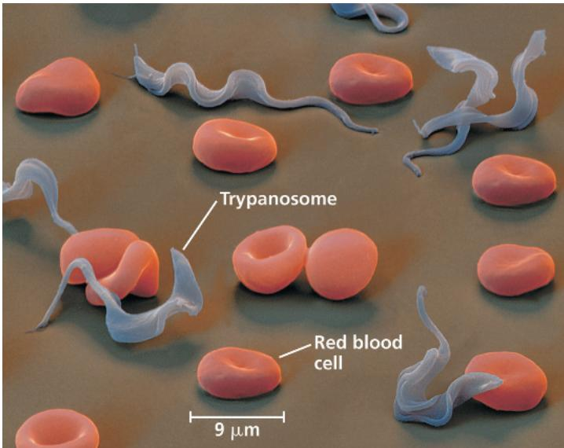  
Figure 28.27
A haptophyte.
Emiliania huxleyi is a type of coccolithophore and a key producer in the ocean. Its cell is covered in calcareous plates called coccoliths. (SEM)

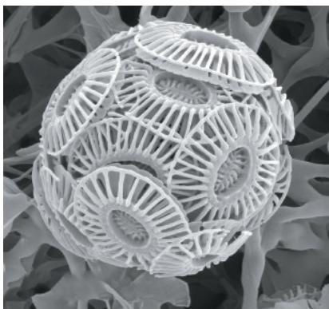  
2 μm  
Figure 28.28
Cryptophytes.
Photosynthetic cryptophytes like these typically have two flagella and are found in all aquatic ecosystems. (SEM)

## Concept Check 28.5

1. The White Cliffs of Dover on the southeast coast of England are largely made of calcium carbonate. Which group of phytoplankton could have produced the calcium carbonate that accumulated on the seafloor and was eventually pushed above sea level to form these cliffs?

2. Why would a newly described group such as Provora be immediately assigned to a new eukaryotic supergroup? Explain what that means in terms of when this group diverged from other eukaryotic organisms.

For suggested answers, see Appendix A.

# Concept 28.6: Protists play key roles in ecological communities

Most protists are aquatic, and they are found almost anywhere there is water, including moist terrestrial habitats such as damp soil and leaf litter. In oceans, ponds, and lakes, many protists are bottom-dwellers that attach to rocks and other substrates or creep through the sand and silt. Other protists are important constituents of plankton. We'll focus here on two key roles that protists play in the varied habitats in which they live: that of symbiont and that of producer.

## Symbiotic Protists

Many protists form symbiotic associations with other species. For example, photosynthetic dinoflagellates are food-providing symbiotic partners of the animals (coral polyps) that build coral reefs. Coral reefs are highly diverse ecological communities. That diversity ultimately depends on corals—and on the mutualistic protists that nourish them. Corals support reef diversity by providing food to some species and habitat to many others.

Another example is the wood-digesting protists that inhabit the gut of many termite species (Figure 28.29). Unaided, termites cannot digest wood, and they rely on protistan or prokaryotic symbionts to do so. Termites cause over \$3.5 billion in damage annually to wooden homes in the United States.

Symbiotic protists also include parasites that have compromised the economies of entire countries. Consider the malaria-causing protist Plasmodium: Income levels in countries hard hit by malaria are 33% lower than in similar countries free of the disease. Protists can have devastating effects on other species too. Massive fish kills have been attributed to Pfiesteria shumwayae (see Figure 28.13), a dinoflagellate parasite that attaches to its victims and eats their skin. Among species that parasitize plants, the stramenopile Phytophthora ramorum (an oomycete) has emerged as a major new forest pathogen. This species causes sudden oak death (SOD), a disease that has

This organism is a hypermastigote, a member of a group of parabasalids that live in the gut of termites and certain cockroaches and enable the hosts to digest wood (SEM).

Figure 28.29 A symbiotic protist.  

Figure 28.30 Sudden oak death.  
Many dead oak trees are visible in this Monterey County, California landscape. Infected trees lose their ability to adjust to cycles of wet and dry weather.  

killed millions of oaks and other trees in the United States and Great Britain (Figure 28.30; also see Concept 54.5).

## Photosynthetic Protists

Many protists are important producers, organisms that use energy from light (or in some prokaryotes, inorganic chemicals) to convert $\mathrm{CO}_{2}$ to organic compounds. Producers form the base of ecological food webs. In aquatic communities, the main producers are photosynthetic protists and prokaryotes (Figure 28.31). All other organisms in the community are consumers that depend on producers for food, either directly (by eating them) or indirectly (by eating an organism that ate a producer). Scientists estimate that roughly $30\%$ of the world's photosynthesis is performed by diatoms, dinoflagellates, multicellular algae, and other aquatic protists. Photosynthetic prokaryotes contribute another $20\%$ , and plants are responsible for the remaining $50\%$ .

Figure 28.31 Protists: key producers in aquatic communities. Arrows in this simplified food web lead from food sources to the organisms that eat them.  

Because producers form the foundation of food webs, factors that affect producers can dramatically affect their entire community. In aquatic environments, photosynthetic protists are often held in check by low concentrations of nitrogen, phosphorus, or iron. Various human actions can increase the concentrations of these elements in aquatic communities. For example, when fertilizer is applied to a field, some of the fertilizer may be washed by rainfall into a river that drains into a lake or ocean. When people add nutrients to aquatic communities in this or other ways, the abundance of photosynthetic protists can increase spectacularly. Such increases can have major ecological consequences, including the formation of large “dead zones” in marine ecosystems (see Figure 56.23).

A pressing question is how global warming will affect photosynthetic protists and other producers. As shown in Figure 28.32, the growth and biomass of photosynthetic protists and prokaryotes have declined in many ocean regions as sea surface temperatures have increased. By what mechanism do rising sea surface temperatures reduce the growth of marine producers? One hypothesis relates to the rise or upwelling of cold, nutrient-rich waters from below. Many marine producers rely on nutrients brought to the surface in this way. However, rising sea surface temperatures can cause the formation of a layer of less dense, warmer water that acts as a barrier to nutrient upwelling from deeper water—thus reducing the growth of marine producers. If sustained, the changes shown in Figure 28.32 would likely have far-reaching effects on marine ecosystems, fishery yields, and the global carbon cycle (see Figure 55.14). Global warming can also affect producers on land, but there the base of food webs is occupied not by protists but by plants, which we will discuss in Chapters 29 and 30.

Figure 28.32 Effects of climate change on marine producers.  
  
(a) Researchers studied 10 ocean regions, identified with letters on the map [see (b) for the corresponding names]. SSTs have increased since 1950 in most areas of these regions.

## Concept Check 28.6

1. Justify the claim that photosynthetic protists are among the biosphere's most important organisms.

2. Describe three symbioses that include protists.

3. WHAT IF? High water temperatures and pollution can cause corals to expel their dinoflagellate symbionts. How might such "coral bleaching" affect corals and other species?

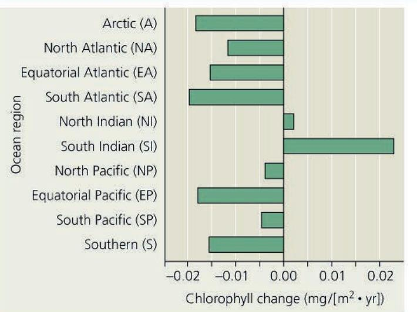  
(b) The concentration of chlorophyll, an index for the biomass and growth of marine producers, has decreased over the same time period in most ocean regions.

4. MAKE CONNECTIONS The bacterium Wolbachia is a symbiont that lives in mosquito cells and spreads rapidly through mosquito populations. Wolbachia can make mosquitoes resistant to infection by Plasmodium; researchers are seeking a strain that confers resistance and does not harm mosquitoes. Compare evolutionary changes that could occur if malaria control is attempted using such a Wolbachia strain versus using insecticides to kill mosquitoes. (Review Figure 28.18 and Concept 23.4.)

For suggested answers, see Appendix A.

## Chapter 28 Review

## Summary of Key Concepts

To review key terms, go to the Vocabulary Self-Quiz (eTextbook only).

## Concept 28.1: Most eukaryotes are single-celled organisms

\- Eukarya includes many groups of protists, along with plants, animals, and fungi. Unlike prokaryotic organisms, protists and other eukaryotes have a nucleus and other membrane-enclosed organelles, as well as a cytoskeleton that enables them to have asymmetric forms and to change shape as they feed, move, or grow.

\- Protists are structurally and functionally diverse and have a wide variety of life cycles. Most are unicellular. Protists include photoautotrophs, heterotrophs, and mixotrophs.

\- Current evidence indicates that eukaryotes originated by endosymbiosis when an archaeal host cell engulfed an alpha proteobacterium that would evolve into an organelle found in all eukaryotes, the mitochondrion.

\- Plastids are thought to be descendants of cyanobacteria that were engulfed by early eukaryotic cells. The plastid-bearing lineage eventually evolved into red algae and green algae. Other protist groups evolved from secondary endosymbiotic events in which red algae or green algae were themselves engulfed.

\- Eukaryotes are currently grouped into 8–10 supergroups. Three well-established supergroups are SAR, Archaeplastida, and Amorphea. Our understanding of the eukaryotic tree of life has changed substantially with molecular data, and will continue to shift in the coming years as new data become available.

Describe similarities and differences between protists and other eukaryotes.

<table><tr><td>Key Concept/Eukaryote Supergroup</td><td>Major Groups</td><td>Key Morphological Characteristics</td><td>Specific Examples</td></tr><tr><td>CONCEPT 28.2SAR is a highly diverse group of protists defined by DNA similarities? Although they are not photosynthetic, apicomplexan parasites such as Plasmodium have modified plastids. Describe a current hypothesis that explains this observation.</td><td>StramenopilesDiatomsOomycetesBrown algaeAlveolatesDinoflagellatesApicomplexansCiliatesRhizariansRadiolariansForamsCercozoans</td><td>Hairy and smooth flagellaMembrane-enclosed sacs (alveoli) beneath plasma membraneAmoebas with threadlike pseudopodia</td><td>PhytophthoiLaminariaPfiesteria,Plasmodium, 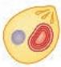ParameciumGlobigerina[IMAGE]</td></tr><tr><td>CONCEPT 28.3Red algae and green algae are the closest relatives of plants? On what basis do systematists place plants in the same supergroup (Archaeplastida) as red and green algae?</td><td>Red algaeGreen algaePlants</td><td>Phycoerythrin (photosynthetic pigment)Plant-type chloroplasts(See Chapters 29 and 30.)</td><td>Porphyridium, PalmariaChlamydomonas, UlvaMosses, ferns, conifers, flowering plants</td></tr><tr><td>CONCEPT 28.4Amorpheans include protists that are closely related to fungi and animals? Describe a key feature for each of the main protist subgroups of Amorphea.</td><td>AmoebozoansTubulinidsSlime moldsArchamoebasOpisthokonts</td><td>Amoebas with lobe-shaped or tube-shaped pseudopodia(Highly variable; see Chapters 31–34.)</td><td>Amoeba, DictyosteliumChoanoflagellates, nucleariids, animals, fungi[IMAGE]</td></tr><tr><td>CONCEPT 28.5Phylogenomic research has identified new supergroups and led to the rearrangement of the eukaryotic tree of life</td><td>MetamonodaDiscobaHaptophytaCryptophyta</td><td>Anaerobic flagellated VariedCalcareous coccoliths on surfaceUnicellular algae with two flagella</td><td>GiardiaEuglena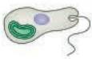EmilianiaCryptomona</td></tr></table>

## Concept 28.6: Protists play key roles in ecological communities

\- Protists form mutualistic and parasitic relationships that affect their symbiotic partners and many other members of the community.

\- Photosynthetic protists are among the most important producers in aquatic communities. Because they are at the base of the food web, factors that affect photosynthetic protists affect many other species in the community.

Describe several protists that are ecologically important.

For suggested answer, see Appendix A.

## Test Your Understanding

For more multiple-choice questions, go to the Practice Test (eTextbook only).

## Levels 1-2: Remembering/Understanding

1. Plastids that are surrounded by more than two membranes are evidence of

(A) evolution from mitochondria.

(B) fusion of plastids.

(C) origin of the plastids from archaea.

(D) secondary endosymbiosis.

2. Biologists think that endosymbiosis gave rise to mitochondria before plastids partly because

(A) the products of photosynthesis could not be metabolized without mitochondrial enzymes.

(B) all eukaryotes have mitochondria (or their remnants), whereas many eukaryotes do not have plastids.

(C) mitochondrial DNA is less similar to prokaryotic DNA than is plastid DNA.

(D) without mitochondrial $CO_{2}$ production, photosynthesis could not occur.

3. Which group is correctly paired with its description?

(A) diatoms—important consumers in aquatic communities

(B) kelp and other seaweeds—plants that carry out chemosynthesis

(C) apicomplexans—producers with intricate life cycles

(D) red algae—acquired plastids by secondary endosymbiosis

4. According to the phylogeny presented in this chapter, which protists are in the same eukaryotic supergroup as plants?

(A) green algae

(B) dinoflagellates

(C) red algae

(D) both A and C

5. In a life cycle with alternation of generations, multicellular haploid forms alternate with

(A) unicellular haploid forms.

(B) unicellular diploid forms.

(C) multicellular haploid forms.

(D) multicellular diploid forms.

## Levels 3-4: Applying/Analyzing

6. Based on the phylogenetic tree in Figure 28.6, which of the following statements is correct?

(A) Excavata and SAR form a sister group.

(B) The most recent common ancestor of SAR is older than that of Amorphea.

(C) The first eukaryotic supergroup to diverge from other eukaryotes cannot be determined with available data.

(D) Excavata is a clear monophyletic group supported by molecular data.

7. EVOLUTION CONNECTION • DRAW IT Medical researchers seek to develop drugs that can kill or restrict the growth of human pathogens yet have few harmful effects on patients. These drugs often work by disrupting the metabolism of the pathogen or by targeting its structural features.

Draw and label a phylogenetic tree that includes an ancestral prokaryote and the following groups of organisms: Excavata, SAR, Archaeplastida, Amorphea, Haptophyta,

Cryptophyta, and, within Amorphea, amoebozoans, animals, choanoflagellates, fungi, and nucleariids. Based on this tree, hypothesize whether it would be most difficult to develop drugs to combat human pathogens that are prokaryotic organisms, protists, animals, or fungi. (You do not need to consider the evolution of drug resistance by the pathogen.)

## Levels 5-6: Evaluating/Creating

8. SCIENTIFIC INQUIRY Applying the "If... then" logic of deductive reasoning (see Concept 1.3), what are a few of the predictions that arise from the hypothesis that plants evolved from green algae? Put another way, how could you test this hypothesis?

9. WRITE ABOUT A THEME: INTERACTIONS Organisms interact with each other and the physical environment. In a short essay (100–150 words), explain how the response of diatom populations to a drop in nutrient availability can affect both other organisms and aspects of the physical environment (such as carbon dioxide concentrations).

## 10. SYNTHESIZE YOUR KNOWLEDGE

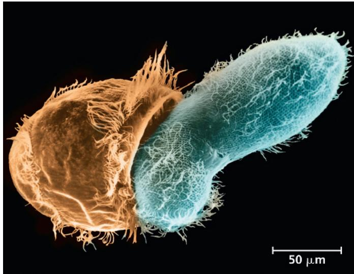

This micrograph shows a single-celled eukaryote, the ciliate Didinium (left), about to engulf its Paramecium prey, which is also a ciliate. Identify the eukaryotic supergroup to which ciliates belong and describe the role of endosymbiosis in the evolutionary history of that supergroup. Are these ciliates more closely related to all other protists than they are to plants, fungi, or animals? Explain.

For selected answers, see Appendix A.

Seedless vascular plants (such as ferns)

Seed plants (cone-bearing plants and flowering plants)

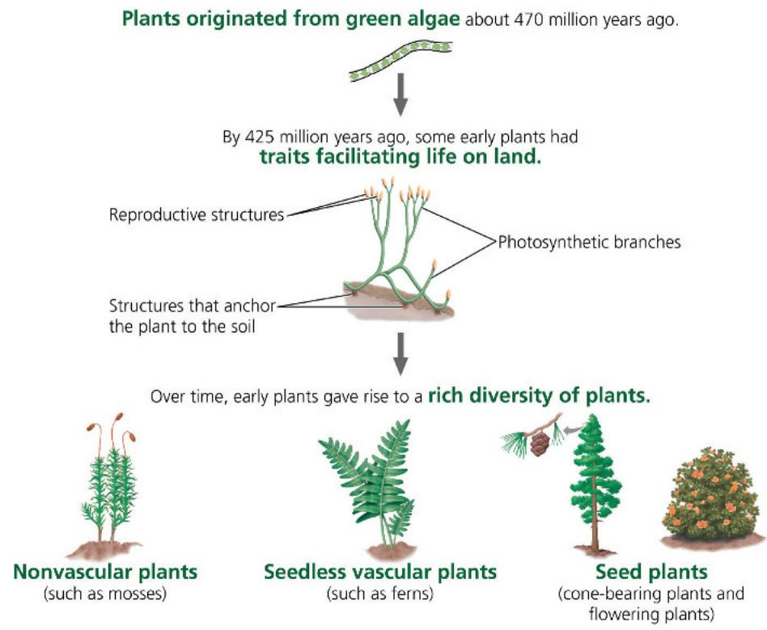

