# 第29章 Plant Diversity I How Plants Colonized Land

<!-- 章节边界按正文内容恢复；原始 MinerU 内容保留如下。 -->

# Plant Diversity I: How Plants Colonized Land

## Key Concepts

29.1 Plants evolved from green algae

29.2 Mosses and other nonvascular plants have life cycles dominated by gametophytes

29.3 Ferns and other seedless vascular plants were the first plants to grow tall

  
Figure 29.1 For much of Earth's history, the land surface was largely lifeless. Some prokaryotes lived on land 3.2 billion years ago, but it was only within the last 500 million years that small plants, fungi, and animals joined them ashore. Finally, by 385 million years ago, the first forests appeared (but with different species than those of today).

## Study Tip

What were the major developments in the evolution of plants?

Make a table: As you read the chapter, make a table of adaptations for life on land that evolved in plants after they diverged from their close aquatic relatives, a group of charophyte algae.

<table><tr><td>Adaptation</td><td>Description</td><td>How it facilitates life on land</td></tr><tr><td>Cuticle</td><td>Waxy covering on outer body surface</td><td>Reduces dessication</td></tr><tr><td></td><td></td><td></td></tr></table>

Plants originated from green algae about 470 million years ago.

By 425 million years ago, some early plants had traits facilitating life on land.

Over time, early plants gave rise to a rich diversity of plants.

## Concept 29.1: Plants evolved from green algae

Today, there are more than 325,000 known plant species. Although a few plant species returned to aquatic habitats during their evolution, most present-day plants live on land. In this text, we distinguish plants from algae, which are photosynthetic protists.

Plants enabled other life-forms to survive on land. For example, plants supply oxygen and are a key source of food for terrestrial animals. Also, by their very presence, plants such as the trees of a forest physically create the habitats required by animals and many other organisms.

As you read in Concept 28.4, green algae called charophytes are the closest relatives of plants. We'll begin with a closer look at the evidence for this relationship.

## Evidence of Algal Ancestry

Many key traits of plants are found in some algae. For example, plants are multicellular, eukaryotic, photosynthetic autotrophs, as are brown, red, and certain green algae. Plants have cell walls made of cellulose, and so do green algae, dinoflagellates, and brown algae. And chloroplasts with chlorophylls a and b are present in green algae, euglenids, and a few dinoflagellates, as well as in plants.

However, the charophytes are the only present-day algae that share certain distinctive traits with plants, suggesting that they are the closest living relatives of plants. For example, the cells of both plants and charophytes have distinctive circular rings of proteins embedded in the plasma membrane (Figure 29.2); these protein rings synthesize the cellulose found in the cell wall. In contrast, noncharophyte algae have linear sets of proteins that synthesize cellulose. Likewise, in species of plants that have flagellated sperm, the structure of the sperm closely resembles that of charophyte sperm. Analyses of

Figure 29.2 Rings of cellulose-synthesizing proteins. (inverted-contrast TEM)  
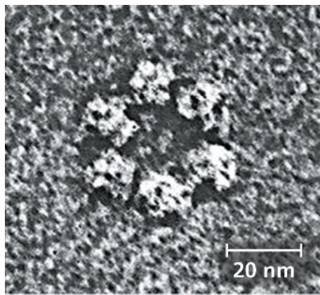

Figure 29.3 Zygnema, an alga closely related to plants.
Zygnema is a filamentous pond alga in the Zygnematophyceae, the group of charophytes that is most closely related to plants.  

nuclear, chloroplast, and mitochondrial DNA also support the close relationship between plants and charophytes.

More specifically, a recent analysis of nearly 900 protein-coding nuclear genes found that charophytes in the clade Zygnematophyceae—such as Zygnema—are the closest living relatives of plants (Figure 29.3). Although this evidence shows that plants arose from within a group of charophyte algae, it does not mean that plants are descended from these living algae. Even so, present-day charophytes may tell us something about the algal ancestors of plants.

## Adaptations Enabling the Move to Land

Many species of charophyte algae inhabit shallow waters around the edges of ponds and lakes, where they are subject to occasional drying. In such environments, natural selection favors individual algae that can survive periods when they are not submerged. In charophytes, a layer of a durable polymer called sporopollenin prevents exposed zygotes from drying out. A similar chemical adaptation is found in the tough sporopollenin walls that encase plant spores. (Note that a plant spore—unlike a seed—is a haploid reproductive cell that can develop into a new haploid organism, as you'll read more about shortly.)

The accumulation of such traits by at least one population of charophyte algae (now extinct) enabled their descendants—the first plants—to live permanently above the waterline. This ability opened a new frontier: a terrestrial habitat that offered enormous benefits. The bright sunlight was unfiltered by water and plankton; the atmosphere offered more plentiful carbon dioxide than did water; and the soil by the water's edge was rich in some mineral nutrients. But these benefits were accompanied by challenges: a relative scarcity of water and a lack of structural support against gravity. (To appreciate why such support is important, picture how the soft body of a jellyfish (jelly) collapses when waves strand it on a beach.) Plants diversified as new adaptations arose that enabled them to thrive despite these challenges.

Figure 29.4 Three possible “plant” kingdoms, the clades Viridiplantae, Streptophyta, and Plantae.  
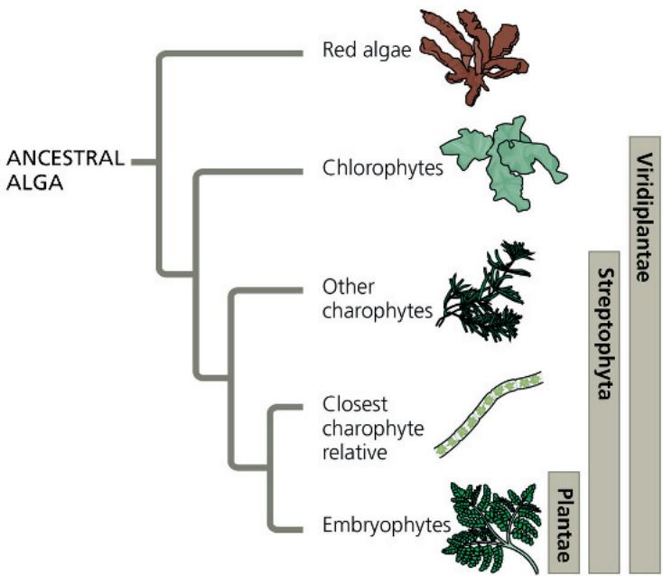  
Figure 29.6 Sporophytes and sporangia of a moss in the genus Mnium.

Today, what adaptations are unique to plants? The answer depends on where you draw the boundary dividing plants from algae (Figure 29.4). Since the placement of this boundary is the subject of ongoing debate, this text uses a traditional definition that equates the kingdom Plantae with embryophytes (plants with embryos). In this context, let's now examine the derived traits that separate plants from their closest algal relatives.

## Derived Traits of Plants

Several adaptations that facilitate survival and reproduction on dry land emerged after plants diverged from their algal relatives. Examples of such traits that are found in plants but not in charophyte algae include the following:

\- Alternation of generations. This type of life cycle, consisting of multicellular forms that give rise to each other in turn, is described in Figure 29.5 on the facing page.

\- Walled spores produced in sporangia. The sporophyte stage of the plant life cycle has multicellular organs called sporangia (singular, sporangium) that produce spores (Figure 29.6). The polymer sporopollenin makes the walls of these spores resistant to harsh environments, enabling plant spores to be dispersed through dry air without harm.

\- Apical meristems. Plants also differ from their algal relatives in having apical meristems, localized regions of cell division at the tips of roots and shoots (Figure 29.7). Apical meristem cells can divide throughout the plant's life, enabling its roots and shoots to elongate, thus increasing the plant's exposure to environmental resources.

Additional derived traits that relate to terrestrial life have evolved in many plant species. For example, the epidermis in many species has a covering, the cuticle, which consists of wax and other polymers. Permanently exposed to the air, plants run a far greater risk of desiccation (drying out) than do their algal

Each of the many spores produced by a sporangium is encased by a durable, sporopollenin-enriched wall.

  
Figure 29.7 Apical meristem of a plant shoot.  
Cells produced by apical meristems differentiate into the outer epidermis, which protects the body, and various types of internal tissues, such as those in leaves (LM).

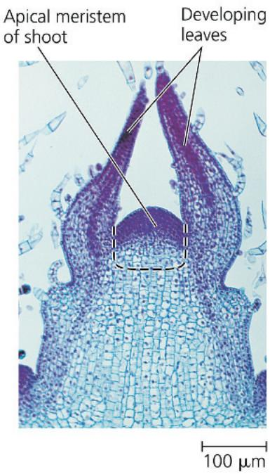

relatives. The cuticle acts as waterproofing, helping prevent excessive water loss from the aboveground plant organs, while also providing some protection from microbial attack. Most plants also have specialized pores called stomata (singular, stoma), which support photosynthesis by allowing the exchange of $CO_{2}$ and $O_{2}$ between the outside air and the plant (see Figure 10.3). Stomata are also the main avenues by which water evaporates from the plant; in hot, dry conditions, the stomata close, minimizing water loss.

The earliest plants lacked true roots and leaves. Without roots, how did these plants absorb nutrients from the soil? Fossils

## Exploring Alternation of Generations

## Figure 29.5

Charophyte algae lack the key traits of plants described in this figure: alternation of generations and the associated trait of multicellular, dependent embryos. As described in the main text, charophyte algae also lack walled spores produced in sporangia and apical meristems. This suggests that these four traits were absent in the ancestor common to plants and charophytes but instead evolved as derived traits of plants. Not every plant exhibits all of these traits: Certain lineages of plants have lost some traits over time.

## Alternation of Generations

The life cycles of all plants alternate between two generations of distinct multicellular organisms: gametophytes and sporophytes. As shown in the diagram below (using a fern as an example), each generation gives rise to the other, a process that is called alternation of generations. This type of reproductive cycle evolved in various groups of algae but does not occur in the charophytes, the algae most closely related to plants. Take care not to confuse the

includes both multicellular haploid organisms and multicellular diploid organisms. The multicellular haploid gametophyte (“gamete-producing plant”) is named for its production by mitosis of haploid gametes—eggs and sperm—that fuse during fertilization, forming diploid zygotes. Mitotic division of the zygote produces a multicel-

alternation of generations in plants with the haploid and diploid stages in the life cycles of other sexually reproducing organisms. Alternation of generations is distinguished by the fact that the life cycle

lular diploid sporophyte (“spore-producing plant”). Meiosis in a mature sporophyte produces haploid spores,

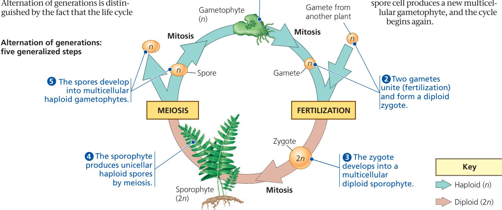

## Multicellular, Dependent Embryos

As part of a life cycle with alternation of generations, multicellular plant embryos develop from zygotes that are retained within the tissues of the female parent (a gametophyte). The parental tissues protect the developing embryo from harsh environmental conditions and provide nutrients such as sugars and amino acids. The embryo has specialized placental transfer cells that enhance the transfer of nutrients to the embryo through elaborate ingrowths of the wall surface (plasma membrane and cell wall). The multicellular, dependent embryo of plants is such a significant derived trait that plants are also known as embryophytes.

dating from 405 million years ago reveal an adaptation that may have aided early plants in nutrient uptake: They formed symbiotic associations with fungi. We'll explore these associations, called mycorrhizae, and their benefits to both plants and fungi in more detail in Concept 31.1. For now, the main point is that mycorrhizal fungi form extensive networks of filaments through the soil and transfer nutrients to their symbiotic plant partner. This benefit may have helped plants without roots to colonize land.

## The Origin and Diversification of Plants

The algae most closely related to plants include many unicellular species and small colonial species. Since it is likely that the first plants were similarly small, the search for the earliest fossils of plants has focused on the microscopic world. As mentioned earlier, microorganisms colonized land as early as 3.2 billion years ago. But the microscopic fossils that document life on land changed dramatically 470 million years ago with the appearance of spores from early plants.

What distinguishes these spores from those of algae or fungi? One clue comes from their chemical composition, which matches the composition of plant spores today but differs from that of the spores of other organisms. In addition, the walls of these ancient spores have structural features that today are found only in the spores of certain plants (liverworts). And in rocks dating to 450 million years ago, researchers have discovered similar spores embedded in plant cuticle material that resembles spore-bearing tissue in living plants (Figure 29.8).

Fossils of larger plant structures, such as the Cooksonia sporangium in Figure 29.9, date to at least 425 million years ago, which is 45 million years after the appearance of plant spores in the fossil record. While the precise age (and form) of the first plants has yet to be discovered, those ancestral species gave rise to the vast diversity of living plants. Table 29.1 provides basic information about the ten extant phyla. (Extant lineages are those that have surviving members.) As you read the rest of this section, look at Table 29.1 together with Figure 29.10, which reflects a view of plant phylogeny that is based on plant anatomy, biochemistry, and genetics.

One way to distinguish groups of plants is whether or not they have an extensive system of vascular tissue, cells joined into tubes that transport water and nutrients throughout the plant body. Most present-day plants have a complex vascular tissue system and are therefore called vascular plants. Plants that do not have an extensive transport system—liverworts, mosses, and hornworts—are described as “nonvascular” plants, even though some mosses do have simple vascular tissue. Nonvascular plants are often called bryophytes (from the Greek bryon, moss, and phyton, plant). While the early branching of the plant phylogenetic tree is an active area of research, many recent studies based on molecular data indicate that the bryophytes likely form a monophyletic group (clade).

Vascular plants, which form a clade that comprises about 93% of all extant plant species, can be categorized further into

Figure 29.8 Ancient plant spores and tissue.
(colorized SEMs)

(a) Fossilized spores. The chemical composition and the physical structure of the walls of these 450-million-year-old spores match those found in certain plants today.

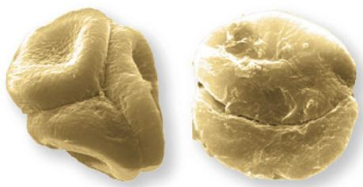

(b) Fossilized sporophyte tissue. The spores in (a) were embedded in tissue that appears to be from plants.

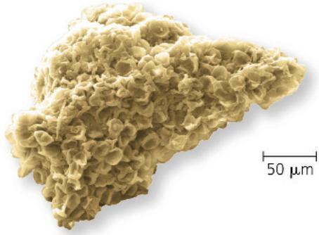

Figure 29.9 Cooksonia sporangium fossil.

With the exception of the shape of its sporangia, Cooksonia's overall form was very similar to the early plant shown in Figures 29.1 and 29.16.

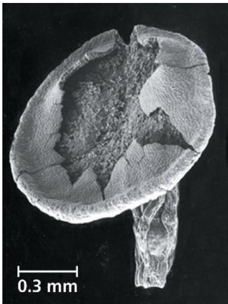

smaller clades. Two of these clades are the lycophytes (the club mosses and their relatives) and the monilophytes (ferns and their relatives). The plants in each of these clades lack seeds, which is why collectively the two clades are informally called seedless vascular plants. However, notice in Figure 29.10 that, seedless vascular plants do not form a clade.

A group such as the seedless vascular plants represents a collection of organisms that share key biological features. It can be informative to group organisms according to their features, such as having a vascular system but lacking seeds. But members of such a group, unlike members of a clade, do not necessarily share the same ancestry. For example, even though monilophytes and lycophytes are all seedless vascular plants, monilophytes share a more recent common ancestor with seed plants. As a result, we would expect monilophytes and seed plants to share key traits not found in lycophytes—and they do, as you'll read in Concept 29.3.

Table 29.1 Ten Phyla of Extant Plants

<table><tr><td></td><td>Common Name</td><td>Number of Known Species</td></tr><tr><td colspan="3">Nonvascular Plants (Bryophytes)</td></tr><tr><td>Phylum Hepatophyta</td><td>Liverworts</td><td>9,000</td></tr><tr><td>Phylum Bryophyta</td><td>Mosses</td><td>13,000</td></tr><tr><td>Phylum Anthocerophyta</td><td>Hornworts</td><td>225</td></tr><tr><td colspan="3">Vascular Plants</td></tr><tr><td colspan="3">Seedless Vascular Plants</td></tr><tr><td>Phylum Lycophyta</td><td>Lycophytes</td><td>1,200</td></tr><tr><td>Phylum Monilophyta</td><td>Monilophytes</td><td>12,000</td></tr><tr><td colspan="3">Seed Plants</td></tr><tr><td colspan="3">Gymnosperms</td></tr><tr><td>Phylum Ginkgophyta</td><td>Ginkgo</td><td>1</td></tr><tr><td>Phylum Cycadophyta</td><td>Cycads</td><td>350</td></tr><tr><td>Phylum Gnetophyta</td><td>Gnetophytes</td><td>75</td></tr><tr><td>Phylum Coniferophyta</td><td>Conifers</td><td>600</td></tr><tr><td colspan="3">Angiosperms</td></tr><tr><td>Phylum Anthophyta</td><td>Flowering plants</td><td>290,000</td></tr></table>

A third clade of vascular plants consists of seed plants, which represent the vast majority of living plant species. A seed is a diploid embryo packaged with a supply of nutrients inside a protective coat. Seed plants can be divided into two groups, gymnosperms and angiosperms, based on the absence or presence of enclosed chambers in which seeds mature. Gymnosperms (from the Greek gymnos, naked, and sperm, seed) are known as “naked seed” plants because their seeds are not enclosed in chambers. Living gymnosperm species, the most familiar of which are the conifers, form a clade. Angiosperms (from the Greek angion, container) are a huge clade consisting of all flowering plants; their seeds develop inside chambers that originate within flowers. Nearly 90% of living plant species are angiosperms.

Note that the phylogeny depicted in Figure 29.10 focuses only on the relationships between extant plant lineages. Paleobotanists have also discovered fossils belonging to extinct plant lineages. As you'll read later in the chapter, these fossils can reveal intermediate steps in the emergence of plant groups found on Earth today.

## Concept Check 29.1

1. Why do researchers identify the charophytes rather than another group of algae as the closest living relatives of plants?

2. Identify four derived traits that distinguish plants from charophyte green algae and facilitate life on land. Explain.

3. WHAT IF? What would the human life cycle be like if we had alternation of generations? Assume that the multicellular diploid stage would be similar in form to an adult human.

For suggested answers, see Appendix A.

Figure 29.10 Highlights of plant evolution.

The phylogeny shown here illustrates a leading hypothesis about the relationships between plant groups.

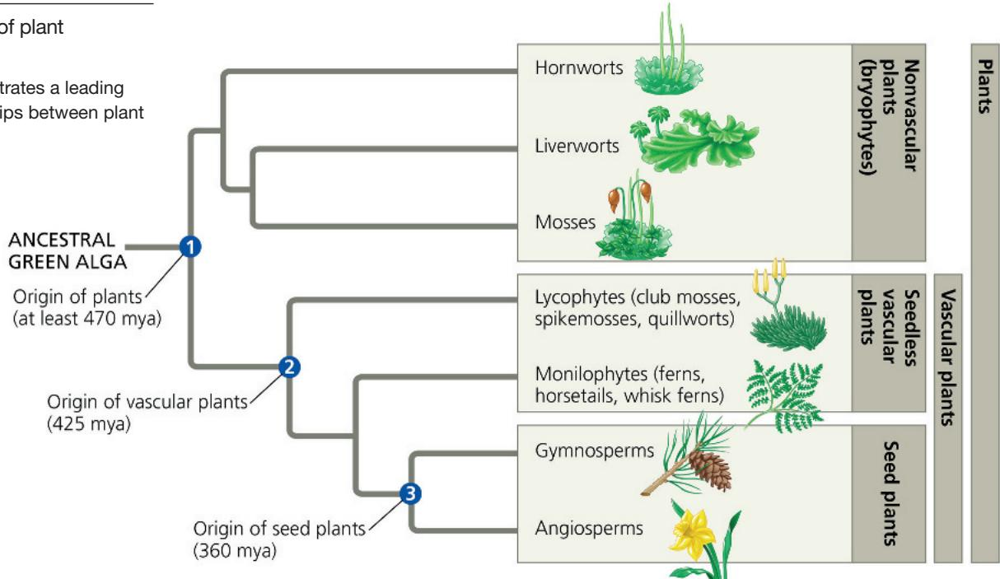  
MAKE CONNECTIONS The figure identifies which lineages are plants, nonvascular plants, vascular plants, seedless vascular plants, and seed plants. According to this phylogenetic tree, which of these categories are monophyletic, and which are paraphyletic? Explain. (See Figure 26.10 to review these terms.) For suggested answer, see Appendix A.

# Concept 29.2: Mosses and other nonvascular plants have life cycles dominated by gametophytes

Nonvascular plants (bryophytes)  
Seedless vascular plants  
Gymnosperms  
Angiosperms

The nonvascular plants (bryophytes) are represented today by three phyla of small, herbaceous (nonwoody)

plants: liverworts (phylum Hepatophyta), mosses (phylum Bryophyta), and hornworts (phylum Anthocerophyta). Liverworts and hornworts are named for their shapes, plus the suffix wort (from the Anglo-Saxon for “herb”). Mosses are familiar to many people, although some plants commonly called “mosses” are not really mosses at all. These include Irish moss (a red seaweed), reindeer moss (a lichen), club mosses (seedless vascular plants), and Spanish mosses (lichens in some regions and flowering plants in others).

Phylogenetic analyses indicate that liverworts, mosses, and hornworts diverged from other plant lineages early in the history of plant evolution (see Figure 29.10). Fossil evidence provides some support for this idea: The earliest spores of plants (dating from 450 to 470 million years ago) have structural features found only in the spores of liverworts, and by 430 million years ago spores similar to those of mosses and hornworts also occur in the fossil record. The earliest fossils of vascular plants date to about 425 million years ago.

Over the long course of their evolution, liverworts, mosses, and hornworts have acquired many unique adaptations. Next, we'll examine some of those features.

## Bryophyte Gametophytes

Unlike in vascular plants, in all three bryophyte phyla the haploid gametophyte is the dominant stage of the life cycle: The gametophytes are usually larger and longer-living than the sporophytes, as shown in the moss life cycle in Figure 29.11 on the facing page. The sporophytes are typically present only part of the time.

When bryophyte spores are dispersed to a favorable habitat, such as moist soil or tree bark, they may germinate and grow into gametophytes. Germinating moss spores, for example, characteristically produce a mass of green, branched, one-cell-thick filaments known as a protonema (plural, protonemata). A protonema has a large surface area that enhances absorption of water and minerals. In favorable conditions, a protonema produces one or more “buds,” each of which develops into a moss gametophyte. (Note that when referring to nonvascular plants, we often use quotation marks for structures similar to the buds, stems, and leaves of vascular plants because the definitions of these terms are based on vascular plant organs.)

Bryophyte gametophytes generally form ground-hugging carpets, partly because their body parts are too thin to support a tall plant. A second constraint on the height of many bryophytes is the absence of vascular tissue, which would enable long-distance transport of water and nutrients. (The thin structure of bryophyte organs makes it possible to distribute materials for short distances without specialized vascular tissue.) However, some mosses have conducting tissues in the center of their “stems.” A few of these mosses can grow as tall as 60 cm (2 feet) as a result. Phylogenetic analyses suggest that conducting tissues similar to those of vascular plants arose independently in these mosses by convergent evolution.

The gametophytes are anchored to the ground by delicate rhizoids, which are long, tubular single cells (in liverworts and hornworts) or filaments of cells (in mosses). Unlike roots, which are found in vascular plant sporophytes, rhizoids lack specialized conducting cells and do not play a primary role in water and mineral absorption.

Gametophytes can form multiple gametangia, multicellular structures that produce gametes and are covered by protective tissue. Female gametangia are called archegonia, and male gametangia are called antheridia. Each archegonium produces one egg, whereas each antheridium produces many sperm. Some bryophyte gametophytes are bisexual, but in mosses the archegonia and antheridia are typically carried on separate female and male gametophytes. Flagellated sperm swim through a film of water toward eggs, entering the archegonia in response to chemical attractants. Eggs are not released but instead remain within the bases of archegonia. After fertilization, embryos are retained within the archegonia. Layers of placental transfer cells help transport nutrients to the embryos as they develop into sporophytes.

Bryophyte sperm typically require a film of water to reach the eggs. Given this requirement, it is not surprising that many

bryophyte species are found in moist habitats. The fact that sperm swim through water to reach the egg also means that in species with separate male and female gametophytes (most species of mosses), sexual reproduction is likely to be more successful when individuals are located close to one another.

Figure 29.12 A moss brood body.

Many bryophyte species can increase the number of individuals in a local area through various methods of asexual reproduction. For example, some mosses reproduce asexually by forming brood bodies, small plantlets that detach from the parent plant and grow into new, genetically identical copies of their parent (Figure 29.12).

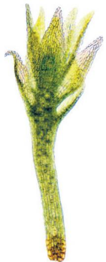

## Bryophyte Sporophytes

The cells of bryophyte sporophytes contain plastids that are usually green and photosynthetic when the sporophytes are young. Even so, bryophyte sporophytes cannot live independently. A bryophyte sporophyte remains attached to its parental gametophyte throughout the sporophyte's lifetime, dependent on the gametophyte for supplies of sugars, amino acids, minerals, and water.

  
VISUAL SKILLS In this diagram, does the sperm cell that fertilizes the egg cell differ genetically from the egg? Explain. For suggested answer, see Appendix A.

Bryophytes have the smallest sporophytes of all extant plant groups. A typical bryophyte sporophyte consists of a foot, a seta, and a sporangium. Embedded in the archegonium, the foot absorbs nutrients from the gametophyte. The seta (plural, setae), or stalk, conducts these materials to the sporangium, also called a capsule, which produces spores by meiosis.

Bryophyte sporophytes can produce enormous numbers of spores. A single moss capsule, for example, can generate over 5 million spores. In most mosses, the seta becomes elongated, enhancing spore dispersal by elevating the capsule. Typically, the upper part of the capsule features a ring of interlocking, tooth-like structures known as the peristome (see Figure 29.11). These “teeth” open under dry conditions and close again when it is moist. This allows moss spores to be discharged gradually, via periodic gusts of wind that can carry them long distances.

Moss and hornwort sporophytes are often larger and more complex than those of liverworts. For example, hornwort sporophytes, which superficially resemble grass blades, have a cuticle. Moss and hornwort sporophytes also have stomata, as do all vascular plants (but not liverworts).

Figure 29.13 shows some examples of gametophytes and sporophytes in the bryophyte phyla.

An Anthoceros hornwort species

500 μm

## Exploring Bryophyte Diversity

## Figure 29.13

## Liverworts (Phylum Hepatophyta)

The liver-shaped gametophytes of its members give this phylum its common and scientific names (from the Latin hepaticus, liver). In medieval times, their shape was thought to be a sign that the plants could help treat liver diseases. Some liverworts, including

Thallus

Female gametangia (elevated on stalks)

  
Gametophytes of Marchantia polymorpha, a "thalloid" liverwort

  
Sporophyte  
-Foot
-Seta  
Marchantia sporophyte (LM)  
-Capsule (sporangium)

Marchantia, shown here, are described as “thalloid” because of the flattened shape of their gametophytes. Marchantia gametangia are elevated on stalks that look like miniature trees. You would need a magnifying glass to see the sporophytes, which have a short seta (stalk) with an oval or round capsule. Other liverworts, such as Plagiochila, below, are called “leafy” because their stemlike gametophytes have many leaflike appendages. There are many more species of leafy liverworts than thalloid liverworts.

  
Plagiochila deltoidea, a "leafy" liverwort

## Hornworts (Phylum Anthocerophyta)

In hornworts, the gametophytes are reduced (usually 1–2 cm in diameter) and mostly leafy-looking, while the sporophyte has a long, tapered shape that gives the phylum its common and scientific names (from the Greek keras, horn). A typical sporophyte can grow to about 5 cm high. Unlike a liver-wort or moss sporophyte, a hornwort sporophyte lacks a seta and consists only of a sporangium. The sporangium releases mature spores by splitting open, starting at the tip of the horn. The gametophytes grow mostly horizontally and often have multiple sporophytes attached. Hornworts are frequently among the first species to colonize open areas with moist soils; a symbiotic relationship with nitrogen-fixing cyanobacteria contributes to their ability to do this (nitrogen is often in short supply in such areas).

Sporophyte

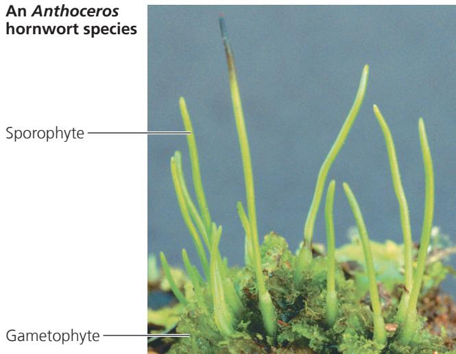  
Gametophyte

## Mosses (Phylum Bryophyta)

Moss gametophytes, which range in height from less than 1 mm to 60 cm, are less than 15 cm tall in most species. The familiar carpet of moss you observe consists mainly of gametophytes. The blades of their “leaves” are usually only one cell thick, but more complex “leaves” that have ridges coated with cuticle can be found on the common hairy-cap moss (Polytrichum, below) and its close relatives. Moss sporophytes are typically elongated and visible to the naked eye, with heights ranging up to about 20 cm. Though green and photosynthetic when young, they turn tan or brownish red when ready to release spores.

  
Polytrichum commune, hairy-cap moss

Capsule

Sporophyte

Gametophyte

## The Ecological and Economic Importance of Mosses

Wind dispersal of lightweight spores has distributed mosses throughout the world. These plants are particularly common and diverse in moist forests and wetlands. Some mosses colonize bare,

## Figure 29.14

## Inquiry: Can bryophytes reduce the rate at which key nutrients are lost from soils? Experiment

Soils in terrestrial ecosystems are often low in nitrogen, a nutrient required for normal plant growth. Richard Bowden, of Allegheny College, measured annual inputs (gains) and outputs (losses) of nitrogen in a sandy soil ecosystem dominated by the moss Polytrichum. Nitrogen inputs were measured from rainfall (dissolved ions, such as nitrate, $NO_{3}^{-}$ ), biological $N_{2}$ fixation, and wind deposition. Nitrogen losses were measured in leached water (dissolved ions, such as $NO_{3}^{-}$ ) and gaseous emissions (such as $N_{2}O$ emitted by bacteria). Bowden measured losses for soils with Polytrichum and for soils where the moss was removed two months before the experiment began.

## Results

A total of 10.5 kg of nitrogen per hectare (kg/ha) entered the ecosystem each year. Little nitrogen was lost by gaseous emissions [0.10 kg/(ha·yr)]. The results of comparing nitrogen losses by leaching are shown below.

## Conclusion

The moss Polytrichum greatly reduced the loss of nitrogen by leaching in this ecosystem. Each year, the moss ecosystem retained over 95% of the 10.5 kg /ha of total nitrogen inputs (only 0.1 kg /ha and 0.3 kg /ha were lost to gaseous emissions and leaching, respectively).

Data from R. D. Bowden, Inputs, outputs, and accumulation of nitrogen in an early successional moss (Polytrichum) ecosystem, Ecological Monographs 61:207–223 (1991).

WHAT IF? How might the presence of Polytrichum affect plant species that typically colonize the sandy soils after the moss?
For suggested answer, see Appendix A.

sandy soil, where, researchers have found, they help retain nitrogen in the soil (Figure 29.14). In northern coniferous forests, species such as the feather moss Pleurozium harbor nitrogen-fixing cyano-bacteria that increase the availability of nitrogen in the ecosystem. Other mosses inhabit such extreme environments as mountaintops, tundra, and deserts. Many mosses are able to live in very cold or dry habitats because they can survive the loss of most of their body water, then rehydrate when moisture is available. Few vascular plants can survive the same degree of desiccation. Moreover, phenolic compounds in moss cell walls absorb damaging levels of UV radiation present in deserts or at high altitudes.

One wetland moss genus, Sphagnum, or peat moss, is often a major component of deposits of partially decayed organic material known as peat (Figure 29.15a). Boggy regions with thick layers of peat are called peatlands. Sphagnum does not decay readily, in part because of phenolic compounds embedded in its cell walls. The low temperature, pH, and oxygen level of peatlands also inhibit decay of moss and other organisms in these boggy wetlands. As a result, some peatlands have preserved corpses for thousands of years (Figure 29.15b).

Peat has long been a fuel source in Europe and Asia, and it is still harvested for fuel today, notably in Ireland and Canada.

Figure 29.15 Sphagnum, or peat moss: a bryophyte with economic, ecological, and archaeological significance.  
  
(a) Peat being harvested from a peatland

  
(b) "Tollund Man," a bog mummy dating from 405–100 BCE. The acidic, oxygen-poor conditions produced by Sphagnum can preserve human or other animal bodies for thousands of years.

Peat moss is also useful as a soil conditioner and for packing plant roots during shipment because it has large dead cells that can absorb roughly 20 times the moss's weight in water.

Peatlands cover just $3\%$ of Earth's land surface but contain one-third of the world's soil carbon: Globally, an estimated 500 billion tons of organic carbon is stored as peat. Current overharvesting of Sphagnum—primarily for use in peat-fired power stations—contributes to global warming by releasing stored $\mathrm{CO}_{2}$ . In addition, if global temperatures continue to rise, the water levels of some peatlands are expected to drop.

Such a change would expose peat to air and cause it to decompose, thereby releasing additional stored $CO_{2}$ and contributing further to global warming. The historical and expected future effects of Sphagnum on the global climate underscore the importance of preserving and managing peatlands.

Mosses may have a long history of affecting climate change. In the Scientific Skills Exercise, you will explore the question of whether they did so during the Ordovician period by contributing to the weathering of rocks.

## Scientific Skills Exercise Making Bar Graphs and Interpreting Data

Could Nonvascular Plants Have Caused Weathering of Rocks and Contributed to Climate Change During the Ordovician Period? The oldest traces of terrestrial plants are fossilized spores formed 470 million years ago. Between that time and the end of the Ordovician period 444 million years ago, the atmospheric $CO_{2}$ level dropped by half, and the climate cooled dramatically.

One possible cause of the drop in $CO_{2}$ during the Ordovician period is the breakdown, or weathering, of rock. As rock weathers, calcium silicate ( $Ca_{2}SiCO_{3}$ ) is released and combines with $CO_{2}$ from the air, producing calcium carbonate ( $CaCO_{3}$ ). Today, the roots of vascular plants increase rock weathering and mineral release by producing acids that break down rock and soil. Although nonvascular plants lack roots, they require the same mineral nutrients as vascular plants. Could nonvascular plants also increase the chemical weathering of rock? If so, they could have contributed to the decline in atmospheric $CO_{2}$ during the Ordovician. In this exercise, you will interpret data from a study of the effects of moss on releasing minerals from two types of rock.

How the Experiment Was Done The researchers set up experimental and control microcosms, or small artificial ecosystems, to measure mineral release from rocks. First, they placed rock fragments of volcanic origin, either granite or andesite, into small glass containers. Then, they mixed water and macerated (chopped and crushed) moss of the species Physcomitrella patens. They added this mixture to the experimental microcosms (72 granite and 41 andesite). For the control microcosms (77 granite and 37 andesite), they filtered out the moss and just added the water. After 130 days, they measured the amounts of

various minerals found in the water in the control microcosms and in the water and moss in the experimental microcosms.

Data from the Experiment The moss grew (increased its biomass) in the experimental microcosms. The table shows the mean amounts in micromoles ( $\mu$ mol) of several minerals measured in the water and the moss in the microcosms.

## INTERPRET THE DATA

1. Why did the researchers add filtrate from which macerated moss had been removed to the control microcosms?

2. Make two bar graphs (for granite and andesite) comparing the mean

amounts of each element weathered from rocks in the control and experimental microcosms. (Hint: For an experimental microcosm, what sum represents the total amount weathered from rocks?) (For additional information on bar graphs, see the Scientific Skills Review in Appendix D.)

3. Overall, what is the effect of moss on chemical weathering of rock? Are the results similar or different for granite and andesite?

4. Based on their experimental results, the researchers added weathering of rock by nonvascular plants to simulation models of the Ordovician climate. The new models predicted decreased $CO_{2}$ levels and global cooling sufficient to produce the glaciations in the late Ordovician period. What assumptions did the researchers make in using results from their experiments in climate simulation models?

5. "Life has profoundly changed the Earth." Explain whether or not these experimental results support this statement.

Instructors: A version of this Scientific Skills Exercise can be assigned in Mastering Biology.

<table><tr><td></td><td colspan="2"> $Ca^{2+}$  (μmol)</td><td colspan="2"> $Mg^{2+}$  (μmol)</td><td colspan="2"> $K^{+}$  (μmol)</td></tr><tr><td></td><td>Granite</td><td>Andesite</td><td>Granite</td><td>Andesite</td><td>Granite</td><td>Andesite</td></tr><tr><td>Mean weathered amount released in water in the control microcosms</td><td>1.68</td><td>1.54</td><td>0.42</td><td>0.13</td><td>0.68</td><td>0.60</td></tr><tr><td>Mean weathered amount released in water in the experimental microcosms</td><td>1.27</td><td>1.84</td><td>0.34</td><td>0.13</td><td>0.65</td><td>0.64</td></tr><tr><td>Mean weathered amount taken up by moss in the experimental microcosms</td><td>1.09</td><td>3.62</td><td>0.31</td><td>0.56</td><td>1.07</td><td>0.28</td></tr></table>

Data from T. M. Lenton et al., First plants cooled the Ordovician, Nature Geoscience 5:86–89 (2012).

## Concept Check 29.2

1. How do bryophytes differ from other plants?

2. Give three examples of how structure fits function in bryophytes.

3. MAKE CONNECTIONS Review the discussion of feedback regulation in Concept 1.1. Could effects of global warming on peatlands alter $CO_{2}$ concentrations in ways that result in negative or positive feedback? Explain.

For suggested answers, see Appendix A.

## Concept 29.3: Ferns and other seedless vascular plants were the first plants to grow tall

Nonvascular plants (bryophytes)
Seedless vascular plants
Gymnosperms
Angiosperms

During the first 100 million years of plant evolution, bryophytes were prominent types of vegetation. But it is vascular plants that dominate

most landscapes today. The earliest fossils of vascular plants date to 425 million years ago. These plants lacked seeds but had well-developed vascular systems, an evolutionary novelty that set the stage for vascular plants to grow taller than their bryophyte counterparts. As in bryophytes, however, the sperm of ferns and all other seedless vascular plants are flagellated and swim through a film of water to reach eggs. In part because of these swimming sperm, seedless vascular plants today are most common in damp environments.

## Origins and Traits of Vascular Plants

Unlike the nonvascular plants, ancient relatives of vascular plants had branched sporophytes that were not dependent on gametophytes for nutrition (Figure 29.16). Although these early plants were less than $20\mathrm{cm}$ tall, their branching enabled their bodies to become more complex and to have multiple sporangia. As plant bodies became more complex over time, competition for space and sunlight probably increased. As we'll see, that competition may have stimulated still more evolution in vascular plants, eventually leading to the formation of the first forests.

Early vascular plants had some derived traits of today's vascular plants, but they lacked roots and some other adaptations that evolved later. The main traits that characterize living vascular plants are life cycles with dominant sporophytes, transport in vascular tissues called xylem and phloem, and well-developed roots and leaves, including spore-bearing leaves called sporophylls.

## Life Cycles with Dominant Sporophytes

As mentioned earlier, mosses and other bryophytes have life cycles dominated by gametophytes (see Figure 29.11). Fossil

Figure 29.16 Sporophytes of Aglaophyton major, an ancient relative of living vascular plants.

This reconstruction from 405-million-year-old fossils exhibits dichotomous (Y-shaped) branching with sporangia at the ends of branches. Sporophyte branching characterizes living vascular plants but is lacking in living nonvascular plants (bryophytes). Aglaophyton had structures called rhizoids that anchored it to the ground. The inset shows a fossilized stoma of A. major (colorized LM).

evidence suggests that a change began to develop in some of the earliest vascular plants, whose gametophytes and sporophytes were about equal in size. Further reductions in gametophyte size occurred among extant vascular plants; in these groups, the sporophyte generation is the larger and more complex form in the alternation of generations (Figure 29.17, on the next page). In ferns, for example, the familiar leafy plants are the sporophytes. You would have to get down on your hands and knees and search the ground carefully to find fern gametophytes, which are tiny structures that often grow on or just below the soil surface.

## Transport in Xylem and Phloem

Vascular plants have two types of vascular tissue: xylem and phloem (see Figure 35.10). Xylem conducts most of the water and minerals. The xylem of all vascular plants includes tracheids, tube-shaped cells that carry water and minerals up from the roots. The water-conducting cells of the xylem are dead at functional maturity and are lignified; that is, their cell walls are strengthened by the polymer lignin. The tissue called phloem has cells arranged into tubes that distribute sugars, amino acids, and other organic products; these cells are alive at functional maturity.

Lignified vascular tissue helped enable vascular plants to grow tall. Their stems became strong enough to provide support against gravity, and they could transport water and mineral nutrients high above the ground. Tall plants could also outcompete short plants for access to the sunlight needed for photosynthesis. In addition, the spores of tall plants could disperse farther than those of short plants, enabling tall species to colonize new environments more rapidly. Overall, the ability to grow tall gave

Figure 29.17 The life cycle of a fern.  
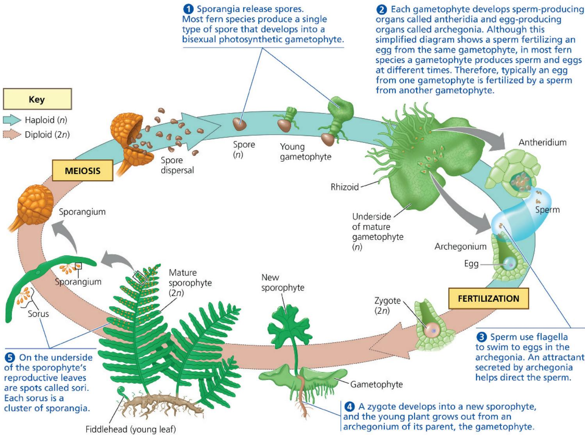  
WHAT IF? If the ability to disperse sperm by wind evolved in a fern, how might its life cycle be affected? For suggested answer, see Appendix A.

vascular plants a competitive edge over nonvascular plants, which typically are less than 5 cm in height. Over time, competition among vascular plants also would have increased, leading to selection for taller growth forms—a process that eventually gave rise to the trees that formed the first forests 385 million years ago.

## Evolution of Roots

Vascular tissue also provides benefits below ground. Instead of the rhizoids seen in bryophytes, roots evolved in the sporophytes of almost all vascular plants. Roots are organs that absorb water and nutrients from the soil. Roots also anchor vascular plants to the ground, hence allowing the shoot system to grow taller.

Root tissues of living plants closely resemble stem tissues of early vascular plants preserved in fossils. This suggests that roots may have evolved from the lowest belowground portions of stems in ancient vascular plants. It is unclear whether roots evolved only once in the common ancestor of all vascular plants or independently in

different lineages. Although the roots of living members of these lineages of vascular plants share many similarities, fossil evidence hints at convergent evolution. The oldest fossils of lycophytes, for example, already displayed simple roots 400 million years ago, when the ancestors of ferns and seed plants still had none. Studying genes that control root development in different vascular plant species may help resolve this question.

## Evolution of Leaves

Leaves are structures that serve as the primary photosynthetic organ of vascular plants. In terms of size and complexity, leaves can be classified as either microphylls or megaphylls (Figure 29.18). All of the lycophytes—and only the lycophytes—have microphylls, which are small, often spine-shaped leaves supported by a single strand of vascular tissue. Almost all other vascular plants have megaphylls, leaves with a highly branched vascular system; a few species have reduced leaves that appear to have evolved from megaphylls. Megaphylls are typically larger than microphylls and therefore support greater photosynthetic productivity than microphylls. Microphylls first appear in the fossil record 410 million years ago, but megaphylls do not emerge until 370 million years ago, toward the end of the Devonian period.

Figure 29.18 Microphyll and megaphyll leaves.  

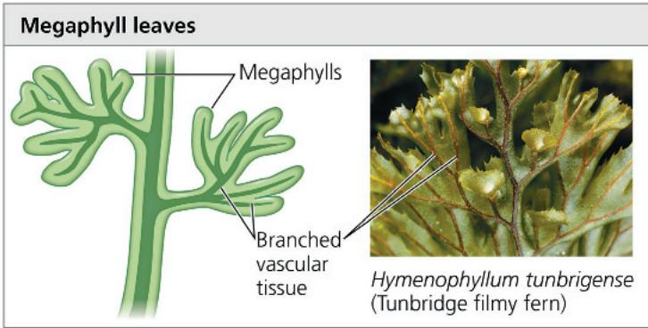

## Sporophylls and Spore Variations

One milestone in the evolution of plants was the emergence of sporophylls, modified leaves that bear sporangia. Sporophylls vary greatly in structure. For example, fern sporophylls produce clusters of sporangia known as sori (singular, sorus), usually on the undersides of the sporophylls (see Figure 29.17). In many lycophytes and in most gymnosperms, groups of sporophylls form cone-like structures called strobili (singular, strobilus). The sporophylls of angiosperms are called carpels and stamens (see Figure 30.8).

Most seedless vascular plant species are homosporous: They have one type of sporophyll bearing one type of sporangium that produces one type of spore, which typically develops into a bisexual gametophyte, as in most ferns. In contrast, a heterosporous species has two types of sporophylls, called megasporophylls and microsporophylls. Megasporophylls have megasporangia, which produce megaspores, spores that develop into female gametophytes. Microsporophylls have microsporangia, which produce microspores, smaller spores that develop into male gametophytes. All seed plants and a few seedless vascular plants are heterosporous. The following diagram compares the two conditions.

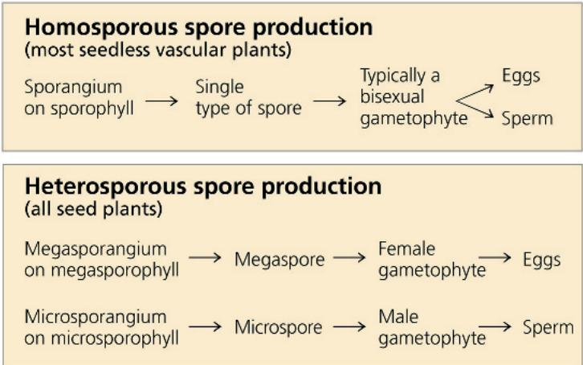

Megasporangium on megasporophyll → Megaspore → Female gametophyte → Eggs

## Classification of Seedless Vascular Plants

As we noted earlier, biologists recognize two clades of living seedless vascular plants: the lycophytes (phylum Lycophyta) and the monilophytes (phylum Monilophyta). The lycophytes include the club mosses, the spikemosses, and the quillworts. The monilophytes include the ferns, the horsetails, and the whisk ferns and their relatives. Although ferns, horsetails, and whisk ferns differ greatly in appearance, recent anatomical and molecular comparisons provide convincing evidence that these three groups make up a clade. Accordingly, many systematists now classify them together as the phylum Monilophyta, as we do in this chapter. Others refer to these groups as three separate phyla within a clade. Figure 29.19, on the next page, describes the two main groups of seedless vascular plants.

## Phylum Lycophyta: Club Mosses, Spikemosses, and Quillworts

Present-day species of lycophytes are relicts of a far more impressive past. By the Carboniferous period (359–299 million years ago), the lycophyte evolutionary lineage included small herbaceous plants and giant trees with diameters of more than 2 m and heights of more than 40 m. The giant lycophyte trees thrived for millions of years in moist swamps, but their diversity declined when Earth's climate became drier during the Permian period (299–252 million years ago). The small lycophytes survived, represented today by about 1,200 species. Though some are commonly called club mosses and spikemosses, they are not true mosses (which, as discussed earlier, are nonvascular plants).

## Phylum Monilophyta: Ferns, Horsetails, and Whisk Ferns and Relatives

Ferns radiated extensively from their Devonian origins and grew alongside lycophyte trees and horsetails in the great Carboniferous swamp forests. Today, ferns are by far the most widespread seedless vascular plants, numbering more than 12,000 species. Though most diverse in the tropics, many ferns thrive in temperate forests, and some species are even adapted to arid habitats.

## Exploring Seedless Vascular Plant Diversity

## Figure 29.19

## Lycophytes (Phylum Lycophyta)

Many lycophytes grow on tropical trees as epiphytes, plants that use other plants as a substrate but are not parasites. Other species grow on temperate forest floors. In some species, the tiny gametophytes live above ground and are photosynthetic. Others live below ground, nurtured by symbiotic fungi.

The sporophytes that dominate the lycophyte life cycle have upright stems with many small leaves, as well as ground-hugging stems that produce dichotomously branching roots. Spikemosses are usually relatively small and often grow horizontally. In many club mosses and spikemosses, sporophylls are clustered into club-shaped cones (strobili). Quillworts, named for their leaf shape, form a single genus whose members live in marshy areas or as submerged aquatic plants. Club mosses are all homosporous, whereas spikemosses and quillworts are all heterosporous. The spores of club mosses are released in clouds and are so rich in oil that magicians and photographers once ignited them to create smoke or flashes of light.

Selaginella moellendorffii, a spikemoss

2.5 cm

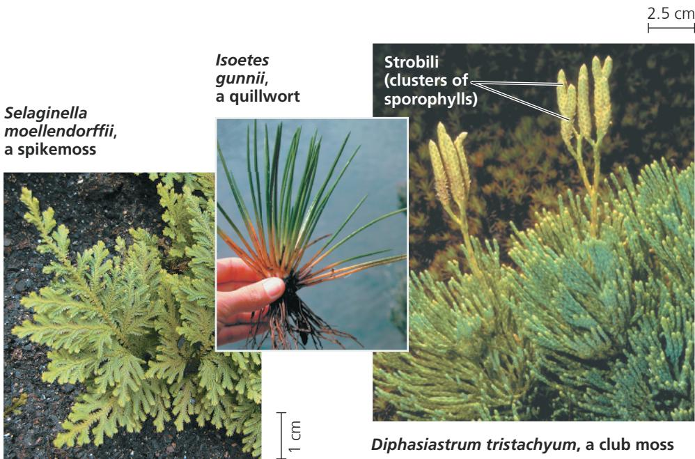  
1 cm  
Diphasiastrum tristachyum, a club moss

## Monilophytes (Phylum Monilophyta)

  
Matteuccia struthiopteris (ostrich fern)  
2.5 cm

  
Equisetum telmateia, giant horsetail  
Strobilus on fertile stem  
— Vegetative stem

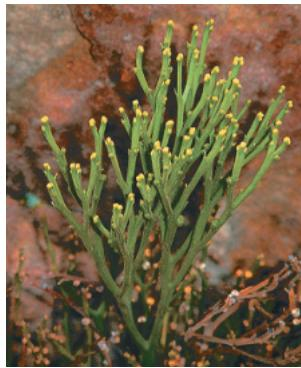  
Psilotum nudum, a whisk fern  
4 cm

## Ferns

Unlike the lycophytes, ferns have megaphylls (see Figure 29.18). The sporophytes typically have horizontal stems that give rise to large leaves called fronds, often divided into leaflets. A frond grows as its coiled tip, the fiddlehead, unfurls.

Almost all species are homosporous. The gametophyte in some species shrivels and dies after the young sporophyte detaches itself. In most species, sporophytes have stalked sporangia with springlike devices that catapult spores several meters. Airborne spores can be carried far from their origin. Some species produce more than a trillion spores in a plant's lifetime.

## Horsetails

The group's name refers to the brushy appearance of the stems, which have a gritty texture that made them historically useful as “scouring rushes” for pots and pans. Some species have separate fertile (cone-bearing) and vegetative stems. Present-day horsetail species are homosporous, with cones releasing spores that typically give rise to bisexual gametophytes.

Horsetails are also called arthrophytes (“jointed plants”) because their stems have joints. Rings of small leaves or branches emerge from each joint, but the stem is the main photosynthetic organ. Large air canals carry oxygen to the roots, which often grow in waterlogged soil.

## Whisk Ferns and Relatives

The sporophytes of whisk ferns (genus Psilotum) have dichotomously branching stems but no roots, similar in appearance to fossils of early vascular plans. Whisk fern stems have scalelike outgrowths that lack vascular tissue and may have resulted from the evolutionary reduction of leaves. Each yellow knob on a stem consists of three fused sporangia. Species of the genus Tmesipteris, closely related to whisk ferns and found only in the South Pacific, also lack roots but have small, leaflike outgrowths in their stems, giving them a vine-like appearance. Both genera are homosporous, with spores giving rise to bisexual gametophytes that grow underground and are only about a centimeter long.

As mentioned earlier, ferns and other monilophytes are more closely related to seed plants than to lycophytes. As a result, monilophytes and seed plants share traits that are not found in lycophytes, including megaphyll leaves and roots that can branch at various points along the length of an existing root. In lycophytes, by contrast, roots branch only at the growing tip of the root, forming a Y-shaped structure.

The monilophytes called horsetails were very diverse during the Carboniferous period, some growing as tall as 15 m. Today, only 15 species survive as a single, widely distributed genus, Equisetum, often found in marshy places and along streams.

Psilotum (whisk ferns) and a closely related genus, Tmesipteris, form a clade consisting mainly of tropical epiphytes. Plants in these two genera, the only vascular plants lacking true roots, once were called “living fossils” because of their resemblance to fossils of ancient relatives of living vascular plants (see Figures 29.16 and 29.19). However, much evidence, including analyses of DNA sequences and sperm structure, indicates that the genera Psilotum and Tmesipteris are closely related to ferns. This

hypothesis suggests that their ancestor's true roots were lost during evolution. Today, plants in these two genera absorb water and nutrients through numerous absorptive rhizoids.

Lycophyte trees

## The Significance of Seedless Vascular Plants

The ancestors of living lycophytes, horsetails, and ferns, along with their extinct seedless vascular relatives, grew to great heights during the Devonian and early Carboniferous, forming the first forests (Figure 29.20). How did their dramatic growth affect Earth and its other life?

One major effect was that early forests contributed to a large drop in $CO_{2}$ levels during the Carboniferous period, causing global cooling that resulted in widespread glacier formation. The trees of early forests contributed to this drop in $CO_{2}$ levels in part by the actions of their roots. The roots of vascular plants secrete acids that break down rocks, thereby increasing the rate at which calcium and magnesium are released from rocks into the soil. These chemicals react with carbon dioxide dissolved in rain water, forming compounds that ultimately wash into the oceans, where they are incorporated into rocks (calcium or magnesium carbonates). The net effect of these processes—which were accelerated by plants—is that $CO_{2}$ removed from the air is stored in marine rocks. Although carbon stored in these rocks can be returned to the atmosphere, it typically takes millions of years for this to occur (as when geological uplift brings the rocks to the surface, exposing them to erosion).

In addition, the seedless vascular plants that formed the first forests eventually became coal, again removing $CO_{2}$ from the atmosphere for long periods of time. In the stagnant waters of

Figure 29.20 Artist's conception of a Carboniferous forest based on fossil evidence.

Lycophyte trees, with trunks covered with small leaves, thrived in the “coal forests” of the Carboniferous, along with giant ferns and horsetails.

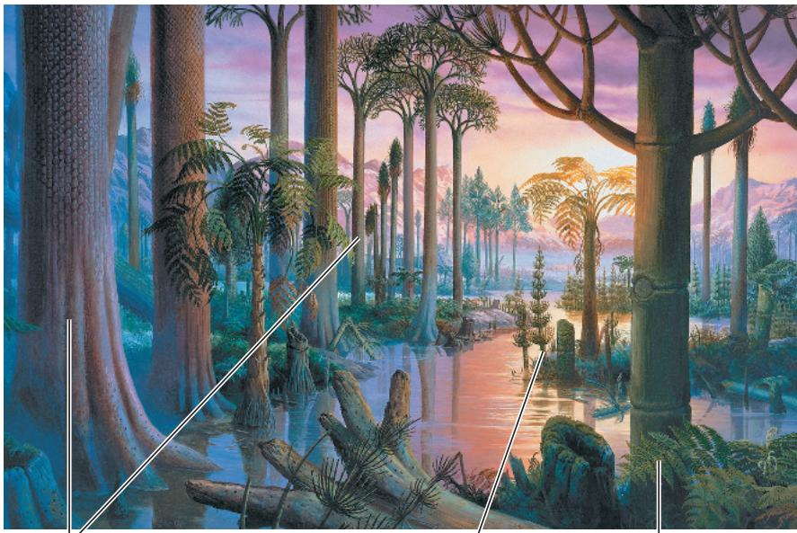  
Fern  
Horsetail

Carboniferous swamps, the dead bodies of early trees did not completely decay. This organic material turned to thick layers of peat, later covered by the sea. Marine sediments piled on top, and over millions of years, heat and pressure converted the peat to coal. In fact, Carboniferous coal deposits are the most extensive ever formed. Coal was crucial to the Industrial Revolution, and people worldwide still burn 6 billion tons a year. It is ironic that coal, formed from plants that contributed to a global cooling, now contributes to global warming by returning carbon to the atmosphere (see Figure 56.29).

Growing along with the seedless plants in Carboniferous swamps were primitive seed plants. Though seed plants were not dominant at that time, they rose to prominence after the swamps began to dry up at the end of the Carboniferous period. The next chapter traces the origin and diversification of seed plants, continuing our story of adaptation to life on land.

## Concept Check 29.3

1. List the key derived traits found in monilophytes and seed plants, but not in lycophytes.

2. How do the main similarities and differences between seedless vascular plants and nonvascular plants affect function in these plants?

3. MAKE CONNECTIONS In Figure 29.17, if fertilization occurred between gametes from one gametophyte, how would this affect the production of genetic variation from sexual reproduction? See Concept 13.4.

## Summary of Key Concepts

To review key terms, go to the Vocabulary Self-Quiz (eTextbook only).

## Concept 29.1: Plants evolved from green algae

\- Morphological and biochemical traits, as well as similarities in nuclear and chloroplast genes, indicate that certain charophyte algae are the closest living relatives of plants.

\- A protective layer of sporopollenin and other traits allow charophytes to tolerate occasional drying along the edges of ponds and lakes. Such traits may have enabled the algal ancestors of plants to survive in terrestrial conditions, opening the way to the colonization of dry land.

\- Derived traits that distinguish plants from charophytes, their closest algal relatives, include cuticles, stomata, multicellular dependent embryos, walled spores produced in sporangia, and the two shown here:

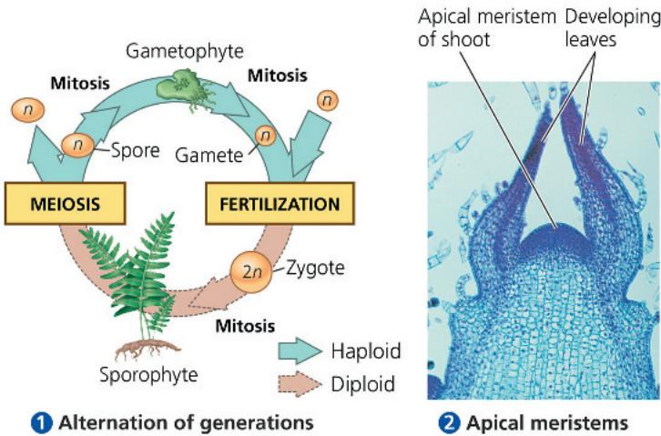

\- Fossils show that plants arose more than 470 million years ago. Subsequently, plants diverged into several major groups, including nonvascular plants (bryophytes); seedless vascular plants, such as lycophytes and ferns; and the two groups of seed plants: gymnosperms and angiosperms.

Draw a phylogenetic tree illustrating our current understanding of plant phylogeny; label the common ancestor of plants and the origins of vascular tissue, apical meristems, and seeds.

## Concept 29.2: Mosses and other nonvascular plants have life cycles dominated by gametophytes

\- Lineages leading to the three extant clades of nonvascular plants, or bryophytes—liverworts, mosses, and hornworts—diverged from other plants early in plant evolution.

\- In bryophytes, the dominant generation consists of haploid gametophytes, such as those that make up a carpet of moss. Rhizoids anchor gametophytes to the substrate on which they grow. The flagellated sperm produced by antheridia require a film of water to travel to the eggs in the archegonia.

\- The diploid stage of the life cycle—the sporophytes—grow out of archegonia and are attached to the gametophytes and dependent on them for nourishment. Smaller and simpler than vascular plant sporophytes, they typically consist of a foot, seta (stalk), and sporangium.

\- Sphagnum, or peat moss, is common in large regions known as peatlands and has many practical uses, including as a fuel.

Summarize the ecological importance of mosses.

## Concept 29.3: Ferns and other seedless vascular plants were the first plants to grow tall

\- Fossils of the forerunners of today's vascular plants date back about 425 million years and show that these small plants had independent, branching sporophytes and a vascular system.

\- Over time, other derived traits of living vascular plants arose, such as a life cycle with dominant sporophytes, lignified vascular tissue, well-developed roots and leaves, and sporophylls.

\- Seedless vascular plants include the lycophytes (phylum Lycophyta: club mosses, spikemosses, and quillworts) and the monilophytes (phylum Monilophyta: ferns, horsetails, and whisk ferns and relatives).

\- Ancient lineages of lycophytes included both small herbaceous plants and large trees. Present-day lycophytes are small herbaceous plants.

\- Seedless vascular plants formed the earliest forests 385 million years ago. Their growth may have contributed to a major global cooling that took place during the Carboniferous period. The decaying remnants of the first forests eventually became coal.

What trait(s) allowed vascular plants to grow tall, and why might increased height have been advantageous?

For suggested answers, see Appendix A.

## Test Your Understanding

For more multiple-choice questions, go to the Practice Test (eTextbook only).

## Levels 1-2: Remembering/Understanding

1. Three of the following are evidence that charophytes are the closest algal relatives of plants. Select the exception.

(A) similar sperm structure

(B) the presence of chloroplasts

(C) similarities in cell wall formation during cell division

(D) genetic similarities in chloroplasts

2. Which of the following characteristics of plants is absent in their closest relatives, the charophyte algae?

(A) chlorophyll b

(B) cellulose in cell walls

(C) sexual reproduction

(D) alternation of multicellular generations

3. In plants, which of the following are produced by meiosis? (A) haploid gametes

(B) diploid gametes

(C) haploid spores

(D) diploid spores

4. Microphylls are found in which plant group?

(A) lycophytes

(B) liverworts

(C) ferns

(D) hornworts

## Levels 3-4: Applying/Analyzing

5. Suppose an efficient conducting system evolved in a moss that could transport water and other materials as high as a tall tree. Which of the following statements about “trees” of such a species would be true?

(A) Spore dispersal distances would probably decrease.

(B) Females could produce only one archegonium.

(C) Unless its body parts were strengthened, such a "tree" would probably flop over.

(D) Individuals would probably compete less effectively for access to light.

6. Identify each of the following structures as haploid or diploid.

(A) sporophyte

(B) spore

(C) gametophyte

(D) zygote

7. EVOLUTION CONNECTION • DRAW IT Draw a phylogenetic tree that represents our current understanding of evolutionary relationships between a moss, a gymnosperm, a lycophyte, and a fern. Use a charophyte alga as the outgroup. (See Figure 26.5 to review phylogenetic trees.) Label each branch point of the phylogeny with at least one derived character unique to the clade descended from the common ancestor represented by the branch point.

## Levels 5-6: Evaluating/Creating

## 8. SCIENTIFIC INQUIRY • INTERPRET THE DATA The

feather moss Pleurozium schreberi harbors species of symbiotic nitrogen-fixing bacteria. Scientists studying this moss in northern forests found that the percentage of the ground surface “covered” by the moss increased from about 5% in forests that burned 35 to 41 years ago to about 70% in forests that burned 170 or more years ago. From mosses growing in these forests, they also obtained the following data on nitrogen fixation:

<table><tr><td>Age (years after fire)</td><td>N fixation rate [kg N/(ha · yr)]</td></tr><tr><td>35</td><td>0.001</td></tr><tr><td>41</td><td>0.005</td></tr><tr><td>78</td><td>0.08</td></tr><tr><td>101</td><td>0.3</td></tr><tr><td>124</td><td>0.9</td></tr><tr><td>170</td><td>2.0</td></tr><tr><td>220</td><td>1.3</td></tr><tr><td>244</td><td>2.1</td></tr><tr><td>270</td><td>1.6</td></tr><tr><td>300</td><td>3.0</td></tr><tr><td>355</td><td>2.3</td></tr></table>

Data from O. Zackrisson et al., Nitrogen fixation increases with successional age in boreal forests, Ecology 85:3327–3334 (2006).

a. Use the data to draw a line graph, with age on the x-axis and the nitrogen fixation rate on the y-axis.

b. Along with the nitrogen added by nitrogen fixation, about 1 kg of nitrogen per hectare per year is deposited into northern forests from the atmosphere as rain and small particles. Evaluate the extent to which Pleurozium affects nitrogen availability in northern forests of different ages.

9. WRITE ABOUT A THEME: INTERACTIONS Giant lycophyte trees had microphylls, whereas ferns and seed plants have megaphylls. Write a short essay (100–150 words) describing how a forest of lycophyte trees may have differed from a forest of large ferns or seed plants. In your answer, consider how the type of forest may have affected interactions among small plants growing beneath the tall ones.

10. SYNTHESIZE YOUR KNOWLEDGE

  
These stomata are from the leaf of a common horsetail. Describe how stomata and other adaptations facilitated life on land and ultimately led to the formation of the first forests.  
For selected answers, see Appendix A.

