# 第30章 Plant Diversity II The Evolution of Seed Plants

<!-- 章节边界按正文内容恢复；原始 MinerU 内容保留如下。 -->

# Plant Diversity II: The Evolution of Seed Plants

## Key Concepts

30.1 Seeds and pollen grains are key adaptations for life on land

30.2 Gymnosperms bear "naked" seeds, typically on cones

30.3 The reproductive adaptations of angiosperms include flowers and fruits

30.4 Human welfare depends on seed plants

  
Figure 30.1 In 1980, Mount St. Helens in Washington state erupted, leaving the region covered in ash and devoid of visible life. Just a few years later, seed plants such as fireweed (Chamerion angustifolium) had already colonized the barren landscape—an example of seed plants' versatility and success as the dominant producers on land.

  
Fireweed seed

## Study Tip

Make flowcharts: Make simple flowcharts showing the main events in the life cycles of a pine and flowering plant. The example shown is the beginning of a flowchart summarizing the pine life cycle.

Pollen grain is released from a pollen cone

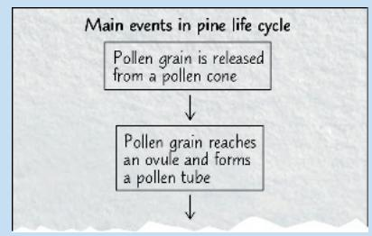

Pollen grain reaches an ovule and forms a pollen tube

## What adaptations have enabled seed plants to make up the vast majority of plant biodiversity?

Reduced male and female gametophytes develop within parental sporophytes, protected from environmental stresses.

Pollen protects male gametophytes (which produce sperm) and can be transported by wind or animals.

In gymnosperms, the gametophytes develop within cones.

Ovules protect female gametophytes (which produce eggs).

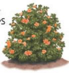

In angiosperms, the gametophytes develop within flowers.

Pollen-producing structures

Pollen-producing structures

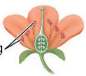

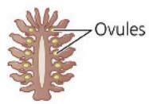

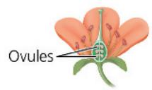  
An ovule fertilized by pollen develops into a seed.

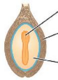

## Embryo

\- Seed coat (protects embryo)
- Food supply (nourishes embryo)

# Concept 30.1: Seeds and pollen grains are key adaptations for life on land

Fireweed and other early arrivals reached the blast zone in Figure 30.1 as seeds. A seed consists of an embryo and its food supply, surrounded by a protective coat. When mature, seeds are dispersed from their parent by wind or other means, enabling them to colonize distant locations.

Plants not only have affected the recovery of regions such as Mount St. Helens but also have transformed Earth. Continuing the saga of how this occurred, this chapter follows the emergence and diversification of the group to which fireweed belongs, the seed plants. We begin with an overview of terrestrial adaptations that seed plants added to those already present in nonvascular plants (bryophytes) and seedless vascular plants (see Concept 29.1). In addition to seeds, all seed plants have reduced gametophytes, heterospory, ovules, and pollen. As we'll see, these adaptations helped seed plants cope with conditions such as drought and exposure to ultraviolet (UV) radiation in sunlight. They also freed seed plants from requiring water for fertilization, enabling reproduction under a broader range of conditions than in seedless plants.

## Advantages of Reduced Gametophytes

Mosses and other bryophytes have life cycles dominated by gametophytes, whereas ferns and other seedless vascular plants have sporophyte-dominated life cycles. The evolutionary trend of gametophyte reduction continued further in the vascular plant lineage that led to seed plants (Figure 30.2). While the gametophytes of seedless vascular plants are visible to the naked eye, the gametophytes of most seed plants are microscopic.

This miniaturization allowed for an important evolutionary innovation in seed plants: Their tiny gametophytes can develop from spores retained within the sporangia of the parental sporophyte. This arrangement can protect the gametophytes from environmental stresses.

Figure 30.2 Gametophyte–sporophyte relationships in different plant groups.  
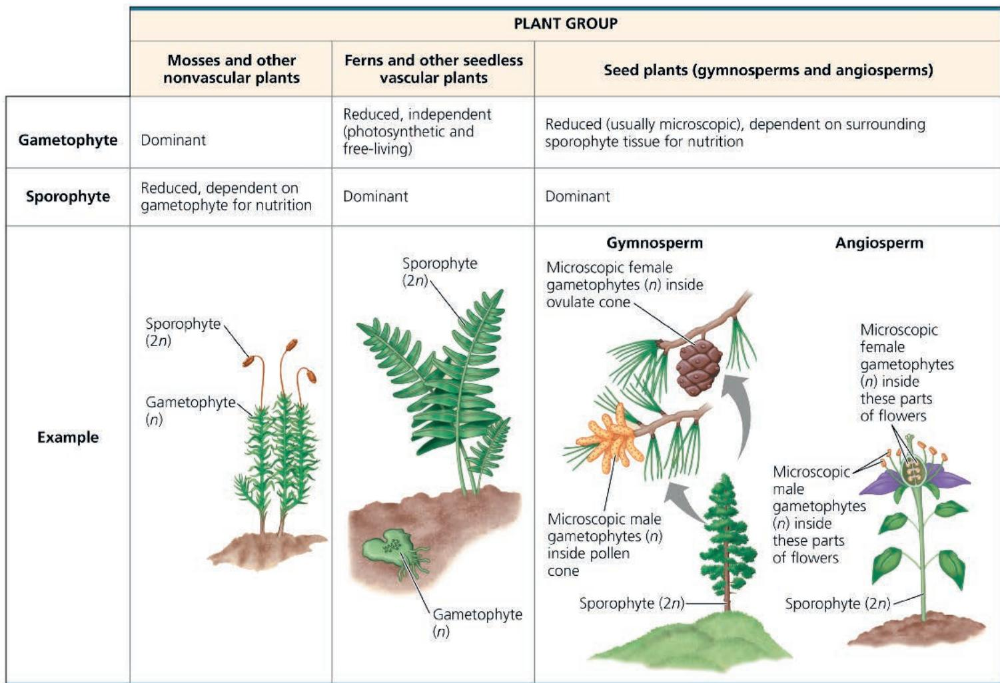  
MAKE CONNECTIONS In seed plants, how might retaining the gametophyte within the sporophyte affect embryo fitness? (See Concepts 17.5, 23.1, and 23.4 to review mutagens, mutations, and fitness.) For suggested answer, see Appendix A.

For example, the moist reproductive tissues of the sporophyte shield the gametophytes from UV radiation and protect them from drying out. This relationship also enables the developing gametophytes to obtain nutrients from the parental sporophyte. In contrast, the free-living gametophytes of seedless vascular plants must fend for themselves.

## Heterospory: The Rule Among Seed Plants

You read in Concept 29.3 that most seedless plants are homosporous—they produce one kind of spore, which usually gives rise to a bisexual gametophyte. Ferns and other close relatives of seed plants are homosporous, suggesting that seed plants had homosporous ancestors. At some point, seed plants or their ancestors became heterosporous, producing two kinds of spores: Megasporangia on modified leaves called megasporophylls produce megaspores that give rise to female gametophytes, and microsporangia on modified leaves called microsporophylls produce microspores that give rise to male gametophytes. Each megasporangium has one megaspore, whereas each microsporangium has many microspores.

As noted previously, the miniaturization of seed plant gametophytes probably contributed to the great success of this clade. Next, we'll look at the development of the female gametophyte within an ovule and the development of the male gametophyte in a pollen grain. Then, we'll follow the transformation of a fertilized ovule into a seed.

## Ovules and Production of Eggs

Although a few species of seedless plants are heterosporous, seed plants are unique in retaining the megasporangium within the parent sporophyte. A layer of sporophyte tissue called

integument envelops and protects the megasporangium. Gymnosperm megasporangia are surrounded by one integument, whereas those in angiosperms usually have two integuments. The whole structure—megasporangium, megaspore, and their integument(s)—is called an ovule (Figure 30.3a). Inside each ovule (from the Latin ovulum, little egg), a female gametophyte develops from a megaspore and produces one or more eggs.

## Pollen and Production of Sperm

A microspore develops into a pollen grain that consists of a male gametophyte enclosed within the pollen wall. (The wall's outer layer is made of molecules secreted by sporophyte cells, so we refer to the male gametophyte as being in the pollen grain, not equivalent to the pollen grain.) Sporopollenin in the pollen wall protects the pollen grain as it is transported by wind or by hitchhiking on an animal. The transfer of pollen to the part of a seed plant that contains the ovules is called pollination. If a pollen grain germinates (begins growing), it gives rise to a pollen tube that discharges sperm into the female gametophyte within the ovule, as shown in Figure 30.3b.

In nonvascular plants and seedless vascular plants such as ferns, free-living gametophytes release flagellated sperm that swim through a film of water to reach eggs. Given this requirement, it is not surprising that many of these species live in moist habitats. But a pollen grain can be carried by wind or animals, eliminating the dependence on water for sperm transport. The ability of seed plants to transfer sperm without water likely contributed to their colonization of dry habitats. The sperm of seed plants also do not require motility because they are carried to the eggs by pollen tubes. The sperm of some gymnosperm species (such as cycads and ginkgos, shown in Figure 30.7) retain the ancient flagellated condition, but flagella have been lost in the sperm of most gymnosperms and all angiosperms.

Figure 30.3 From ovule to seed in a gymnosperm.  
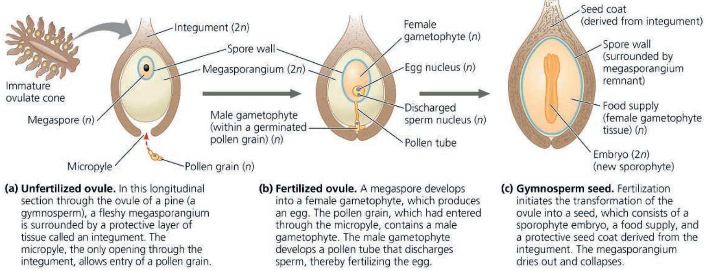  
(c) Gymnosperm seed. Fertilization initiates the transformation of the ovule into a seed, which consists of a sporophyte embryo, a food supply, and a protective seed coat derived from the integument. The megasporangium dries out and collapses.  
VISUAL SKILLS Based on this figure, a gymnosperm seed contains cells from how many different plant generations? Identify the cells and whether each is haploid or diploid.

# Scientific Skills Exercise Using Natural Logarithms to Interpret Data

How Long Can Seeds Remain Viable in Dormancy?

Environmental conditions can vary greatly over time, and they may not be favorable for germination when seeds are produced. One way that plants cope with such variation is through seed dormancy. Under favorable conditions, seeds of some species can germinate after many years of dormancy.

One unusual opportunity to test how long seeds can remain viable occurred when seeds from date palm trees (Phoenix dactylifera) were discovered under the rubble of a 2,000-year-old fortress near the Dead Sea. As you saw in the Chapter 2 Scientific Skills Exercise and Concept 25.2, scientists use radiometric dating to estimate the ages of fossils and other old objects. In this exercise, you will estimate the ages of three of these ancient seeds by using natural logarithms.

How the Experiment Was Done Scientists measured the fraction of carbon-14 that remained in three ancient date palm seeds: two that were not planted and one that was planted and germinated. For the germinated seed, the scientists used a seed coat fragment found clinging to a root of the seedling. (The seedling grew into the plant in the photo.)

Data from the Experiment This table shows the fraction of carbon-14 remaining from the three ancient date palm seeds.

<table><tr><td></td><td>Fraction of Carbon-14 Remaining</td></tr><tr><td>Seed 1 (not planted)</td><td>0.7656</td></tr><tr><td>Seed 2 (not planted)</td><td>0.7752</td></tr><tr><td>Seed 3 (germinated)</td><td>0.7977</td></tr></table>

Data from S. Sallon et al., Germination, genetics, and growth of an ancient date seed, Science 320:1464 (2008).

## The Evolutionary Advantage of Seeds

If a sperm fertilizes an egg of a seed plant, the zygote grows into a sporophyte embryo. As shown in Figure 30.3c, the ovule develops into a seed: the embryo, with a food supply, packaged in a protective coat derived from the integument(s).

Seeds provide protection from harsh conditions and facilitate dispersal to new habitats—as do the spores of seedless plants. Moss spores, for example, may survive even if the local environment becomes too cold, too hot, or too dry for the mosses themselves to live. Their tiny size enables the spores to be dispersed in a dormant state to a new area, where they can germinate and give rise to new moss gametophytes if and when conditions are favorable enough for them to break dormancy. Spores were the main way that mosses, ferns, and other seedless plants spread over Earth for the first 100 million years of plant life on land.

Although mosses and other seedless plants continue to be very successful today, seeds represent a major evolutionary innovation that contributed to the opening of new ways of life for seed plants. What advantages do seeds provide over spores? Spores are usually single-celled, whereas seeds are multicellular, consisting of an

## INTERPRET THE DATA

A logarithm is the power to which a base is raised to produce a given number x. For example, if the base is 10 and x = 100, the logarithm of 100 equals 2 (because $10^{2} = 100$ ). A natural logarithm (ln) is the logarithm of a number x to the base e, where e is about 2.718. Natural logarithms are useful in calculating rates of some natural processes, such as radioactive decay.

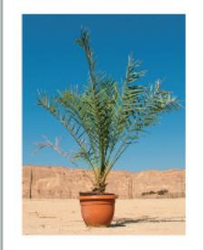

The equation $F = e^{-kt}$ describes the fraction F of an original isotope remaining after a period of t years; the exponent is negative because it refers to a decrease over time. The constant k provides a measure of how rapidly the original isotope decays. For the decay of carbon-14 to nitrogen-14, k = 0.00012097.

To estimate t, the age of the three seeds, we rearrange the equation $F = e^{-kt}$ to find an equation for t:

$$
t = - \left(\frac {\ln F}{k}\right)
$$

1. Using the equation for t, the data from the table, and a calculator, estimate the ages of seed 1, seed 2, and seed 3.

2. Why do you think there was more carbon-14 in the germinated seed?

Instructors: A version of this Scientific Skills Exercise can be assigned in Mastering Biology.

embryo protected by a layer of tissue, the seed coat. A seed can remain dormant for days, months, or even years after being released from the parent plant, whereas most spores have shorter lifetimes. Also, unlike spores, seeds have a supply of stored food. Most seeds land close to their parent sporophyte plant, but some are carried long distances (up to hundreds of kilometers) by wind or animals. If conditions are favorable where it lands, the seed can emerge from dormancy and germinate, with its stored food providing critical support for growth as the sporophyte embryo emerges as a seedling. As we explore in the Scientific Skills Exercise, some seeds have germinated after more than 1,000 years.

## Concept Check 30.1

1. Contrast how sperm reach the eggs of seedless plants with how sperm reach the eggs of seed plants.

2. What features not present in seedless plants have contributed to the success of seed plants on land?

3. WHAT IF? If a seed could not enter dormancy, how might that affect the embryo's transport or survival?

# Concept 30.2: Gymnosperms bear “naked” seeds, typically on cones

Nonvascular plants (bryophytes)  
Seedless vascular plants  
Gymnosperms  
Angiosperms

Extant seed plants form two sister clades: gymnosperms and angiosperms. Recall that gymnosperms have "naked" seeds exposed

on sporophylls that usually form cones. (Angiosperm seeds are enclosed in chambers that mature into fruits.) Most gymnosperms are cone-bearing plants called conifers, such as pines, firs, and redwoods.

## The Life Cycle of a Pine

As you read earlier, seed plant evolution has included three key reproductive adaptations: the miniaturization of their gametophytes; the advent of the seed as a resistant, dispersible stage in the life cycle; and the appearance of pollen as an airborne agent that brings gametes together. Figure 30.4 shows how these adaptations come into play during the life cycle of a pine, a familiar conifer.

Figure 30.4 The life cycle of a pine.  

The pine tree is the sporophyte; its sporangia are located on scalelike structures packed densely in cones. Like all seed plants, conifers are heterosporous. As such, they have two types of sporangia that produce two types of spores: microsporangia that produce microspores and megasporangia that produce megaspores. In conifers, the two types of spores are produced by separate cones: small pollen cones and large ovulate cones.

Pollen cones have a relatively simple structure: Their scales are modified leaves (microsporophylls) that bear microsporangia. Within each microsporangium, cells called microsporocytes undergo meiosis, producing haploid microspores. Each microspore develops into a pollen grain containing a male gametophyte. In conifers, the yellow pollen is released in large amounts and carried by the wind, dusting everything in its path.

Ovulate cones are more complex: Their scales are compound structures composed of both modified leaves (megasporophylls bearing megasporangia) and modified stem tissue. Within each megasporangium, megasporocytes undergo meiosis and produce haploid megaspores inside the ovule. Surviving megaspores develop into female gametophytes, which are retained within the sporangia.

In most pine species, each tree has both types of cones. From the time pollen and ovulate cones appear on the tree, it takes nearly three years for the male and female gametophytes to be produced and brought together and for mature seeds to form from fertilized ovules. The scales of each ovulate cone then separate, and seeds are dispersed by the wind. A seed that lands in a suitable environment germinates, its embryo emerging as a pine seedling.

Figure 30.6 An ancient pollinator.

This 110-million-year-old fossil shows pollen on an insect, the thrip Gymnopollisthrips minor. Structural features of the pollen suggest that it was produced by gymnosperms (most likely by species related to extant ginkgos or cycads). Although most gymnosperms today are wind-pollinated, many cycads are insect-pollinated.

and other seedless vascular plants, as well as in drier habitats outside the swamps. As the Carboniferous period gave way to the Permian (299 to 252 million years ago), the climate became drier, especially in the tropics. As a result, the lycophytes, horsetails, and ferns that dominated Carboniferous swamps were largely replaced in many areas by gymnosperms, which were better suited to the drier climate.

Gymnosperms thrived as the climate dried, in part because they have the key terrestrial adaptations found in all seed plants, such as seeds and pollen. In addition, some gymnosperms were particularly well suited to arid conditions because of the thick cuticles and relatively small surface areas of their needle-shaped leaves.

Gymnosperms dominated terrestrial ecosystems throughout much of the Mesozoic era, which lasted from 252 to 66 million years

## Early Seed Plants and the Rise of Gymnosperms

The origins of characteristics found in pines and other living seed plants date back to the Devonian period (390 million years ago). Fossils from that time reveal that some plants had acquired features that are also present in seed plants, such as megaspores and microspores. For example, Archaeopteris was a heterosporous tree with a woody stem. It grew up to 20 m tall and had fernlike leaves. But it did not bear seeds and therefore is not classified as a seed plant.

The earliest evidence of seed plants comes from 360-million-year-old fossils of plants in the genus Elkinsia (Figure 30.5), which became extinct along with other early seed plants. The oldest fossils of species from an extant lineage of gymnosperms (early conifers) are 315–307 million years old. These early gymnosperms lived in moist Carboniferous ecosystems that were dominated by lycophytes, horsetails, ferns,

Figure 30.5 A fossil of the early seed plant Elkinsia.

ago. In addition to serving as the food supply for giant herbivorous dinosaurs, these gymnosperms were involved in many other interactions with animals. Recent fossil discoveries, for example, show that some gymnosperms were pollinated by insects more than 100 million years ago (Figure 30.6). Late in the Mesozoic, angiosperms began to replace gymnosperms in some ecosystems.

## Gymnosperm Diversity

Although angiosperms now dominate most terrestrial ecosystems, gymnosperms remain an important part of Earth's flora. For example, vast regions in northern latitudes are covered by forests of conifers (see Figure 52.13).

Of the ten extant (living) plant phyla (see Table 29.1), four are gymnosperms: Cycadophyta, Ginkgophyta, Gnetophyta, and Coniferophyta. Figure 30.7 surveys the diversity of extant gymnosperms.

## Exploring Gymnosperm Diversity

## Figure 30.7

## Phylum Cycadophyta

The 350 species of living cycads have large cones and palmlike leaves (true palm species are angiosperms). Unlike most seed plants, cycads have flagellated sperm, indicating their descent from seedless vascular plants that had motile sperm. Cycads thrived during the Mesozoic era, known as the age of cycads as well as the age of dinosaurs. Today, however, cycads are the most endangered of all plant groups: 75% of their species are threatened by habitat destruction and other human actions.

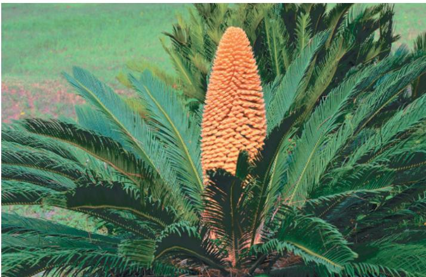  
Cycas revoluta

## Phylum Ginkgophyta

Phylum Gnetophyta includes plants in three genera: Gnetum, Ephedra, and Welwitschia. Some species are tropical, whereas others live in deserts. Although very different in appearance, the genera are grouped together based on molecular data.

Ginkgo biloba is the only surviving species of this phylum; like cycads, ginkgos have flagellated sperm. Also known as the maiden-hair tree, Ginkgo biloba has deciduous fanlike leaves that turn gold in autumn. It is a popular ornamental tree in cities because it tolerates air pollution well. Landscapers often plant only pollen-producing trees because the fleshy seeds smell rancid as they decay.

## Phylum Gnetophyta

Welwitschia (also below). This genus consists of one species, Welwitschia mirabilis, a plant that can live for thousands of years and is found only in the deserts of southwestern Africa. Its straplike leaves are among the largest leaves known.

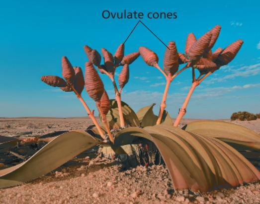

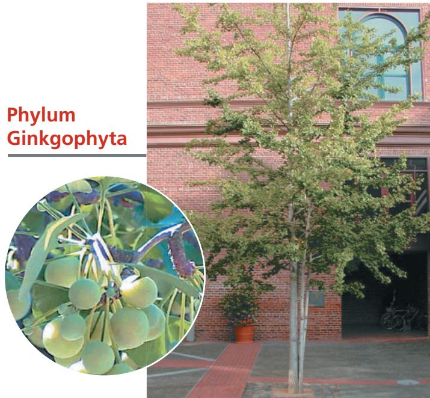  
Ephedra. This genus includes about 40 species that inhabit arid regions worldwide. These desert shrubs produce the compound ephedrine, which is used medicinally as a decongestant.

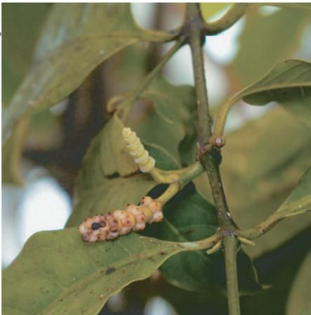  
Gnetum. This genus includes about 35 species of tropical trees, shrubs, and vines, mainly native to Africa and Asia. Their leaves look similar to those of flowering plants, and their seeds look somewhat like fruits.

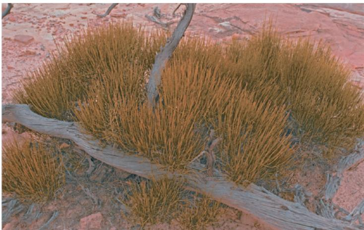

## Phylum Coniferophyta

Phylum Coniferophyta, the largest gymnosperm phyla, consists of about 600 species of conifers (from the Latin conus, cone, and ferre, to carry), including many large trees. Many species have woody cones, while others have fleshy cones. Some, such as pines, have needlelike leaves. Others, such as redwoods, have scalelike leaves. Some species dominate vast northern forests, whereas others are native to the Southern Hemisphere.

Douglas fir. This evergreen tree (Pseudotsuga menziesii) provides more timber than any other North American tree species. Some uses include house framing, plywood, pulpwood for paper, railroad ties, and boxes and crates.

Most conifers are evergreens; they retain their leaves throughout the year. Even during winter, a limited amount of photosynthesis occurs on sunny days. When spring comes, conifers already have fully developed leaves that can take advantage of the sunnier, warmer days. Some conifers, such as the dawn redwood, tamarack, and larch, are deciduous trees that lose leaves each autumn.

Common juniper. The "berries" of the common juniper (Juniperus communis) are actually ovule-producing cones consisting of fleshy sporophylls.

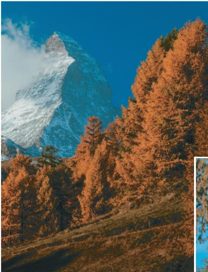

Sequoia. This giant sequoia (Sequoiadendron giganteum) in California's Sequoia National Park weighs about 2,500 metric tons, equivalent to about 24 blue whales (the largest animals) or 40,000 people. The giant sequoia is one of the largest living organisms and also among the most ancient, with some individuals estimated to be between 1,800 and 2,700 years old. Their cousins, the coast redwoods (Sequoia sempervirens), grow to heights of more than 110 m (taller than the Statue of Liberty) and are found only in a narrow coastal strip of northern California and southern Oregon.

European larch. The needlelike leaves of this deciduous conifer (Larix decidua) turn yellow before they are shed in autumn. Native to the mountains of central Europe, including Switzerland's Matterhorn, depicted here, this species is extremely cold-tolerant, able to survive winter temperatures that plunge to $-50^{\circ}\mathrm{C}$ .

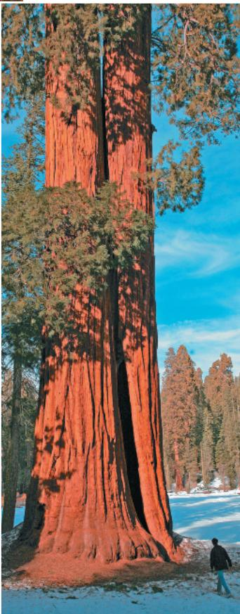

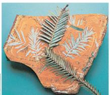

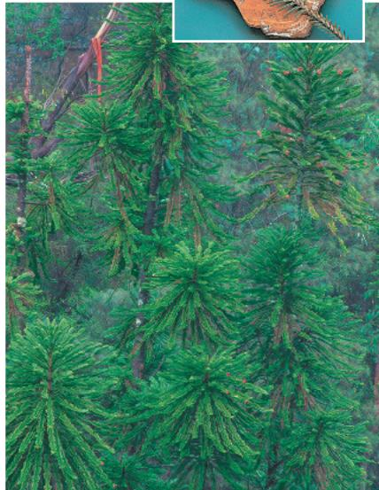

Bristlecone pine. This species (Pinus longaeva), which is found in the White Mountains of California, includes some of the world's oldest living organisms. One bristlecone pine was recently found to be more than 5,000 years old, and some may be even older.

Wollemi pine. Survivors of a conifer group once known only from fossils, living Wollemi pines (Wollemia nobilis) were discovered in 1994 in a national park near Sydney, Australia. At that time, the species consisted of 40 known trees. As a result of conservation efforts, it is now widely propagated. The inset photo compares the leaves of this “living fossil” with actual fossils.

## Concept Check 30.2

1. Explain how the pine life cycle in Figure 30.4 reflects the five adaptations common to all seed plants.

2. VISUAL SKILLS Based on Figure 30.4, compare and contrast the function of pollination and fertilization in sexual reproduction in pines.

3. MAKE CONNECTIONS Early seed plants in genus Elkinsia are a sister group to a clade consisting of gymnosperms and angiosperms. Draw a phylogenetic tree of seed plants that shows Elkinsia, gymnosperms, and angiosperms; date the branch points on this tree using fossil evidence. (See Figure 26.5.)

For suggested answers, see Appendix A.

# Concept 30.3: The reproductive adaptations of angiosperms include flowers and fruits

Nonvascular plants (bryophytes)
Seedless vascular plants
Gymnosperms
Angiosperms

Commonly known as flowering plants, angiosperms are seed plants with the reproductive structures called flowers and fruits.

The name angiosperm (from the Greek angion, container) refers to seeds contained in fruits. Angiosperms are the most diverse and widespread of all plants, with more than 290,000 species (about 90% of all plant species).

## Characteristics of Angiosperms

All angiosperms are classified in a single phylum, Anthophyta. Before considering the evolution of angiosperms, we will examine two of their key adaptations—flowers and fruits—and the roles of these structures in the angiosperm life cycle.

## Flowers

The flower is a unique angiosperm structure that is specialized for sexual reproduction. In many angiosperm species, insects or other animals transfer pollen from one flower to the sex organs on another flower, which makes pollination more directed than the wind-dependent pollination of most species of gymnosperms. However, some angiosperms are wind-pollinated, particularly those species that occur in dense populations, such as grasses and tree species in temperate forests.

A flower is a specialized shoot that can have up to four types of modified leaves called floral organs: sepals, petals, stamens, and carpels (Figure 30.8). Starting at the base of the flower are the sepals, which are usually green and enclose the flower before it opens (think of a rosebud). Interior to the sepals are the petals, which are brightly colored in most flowers and can aid in attracting pollinators. Flowers that are wind-pollinated, such as grasses, generally lack brightly colored parts. In all angiosperms, the sepals and petals are sterile floral organs, meaning that they do not produce sperm or eggs.

Figure 30.8 The structure of an idealized flower.

Within the petals are two types of fertile floral organs that produce spores, the stamens and carpels. Stamens and carpels are sporophylls, modified leaves that are specialized for reproduction. Stamens are microsporophylls: They produce microspores that develop into pollen grains containing male gametophytes. A stamen consists of a stalk called the filament and a terminal sac, the anther, where pollen is produced. Carpels are megasporophylls: They produce megaspores that give rise to female gametophytes. The carpel is the “container” mentioned earlier in which seeds are enclosed; as such, it is a key structure that distinguishes angiosperms from gymnosperms. At the tip of the carpel is a sticky stigma that receives pollen. A style leads from the stigma to a structure at the base of the carpel, the ovary; the ovary contains one or more ovules. As in gymnosperms, each angiosperm ovule contains a female gametophyte. If fertilized, an ovule develops into a seed.

A flower may have one or more carpels. In many species, multiple carpels are fused into one structure. The term pistil is sometimes used to refer to a single carpel (a simple pistil) or two or more fused carpels (a compound pistil). Flowers also vary in symmetry (Figure 30.9) and other aspects of shape, as well as size, color, and odor. Much of this diversity results from adaptation to specific pollinators (see Figures 38.4 and 38.5).

## Fruits

As seeds develop from ovules after fertilization, the ovary wall thickens and the ovary matures into a fruit. A pea pod is an example of a fruit, with seeds (mature ovules, the peas) encased in the ripened ovary (the pod).

Fruits protect seeds and aid in their dispersal. Mature fruits can be either fleshy or dry (Figure 30.10). Tomatoes, plums, and grapes are examples of fleshy fruits, in which the wall (pericarp) of the ovary becomes soft during ripening. Dry fruits include beans, nuts, and grains. Some dry fruits split open at maturity to release seeds, whereas others remain closed. The dry, wind-dispersed fruits

Figure 30.11 Fruit adaptations that enhance seed dispersal.

Bilateral symmetry (orchid)

## Figure 30.9 Flower symmetry.

In radial symmetry, the sepals, petals, stamens, and carpels radiate out from a center. Any line through the central axis divides the flower into two equal parts.

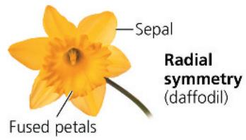  
Fused petals  
Radial symmetry (daffodil)

In bilateral symmetry, the flower can only be divided into two equal parts by a single line.

  
DRAW IT Draw the single line that can divide the bilaterally symmetrical flower into two equal parts.
For suggested answer, see Appendix A.

## Figure 30.10 Some variations in fruit structure.

▼ Tomato, a fleshy fruit with soft outer and inner layers of pericarp (fruit wall)

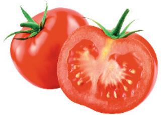  
Nectarine, a fleshy fruit with a soft outer layer and hard inner layer (pit) of pericarp  
▼ Ruby grapefruit, a fleshy fruit with a firm outer layer and soft inner layer of pericarp

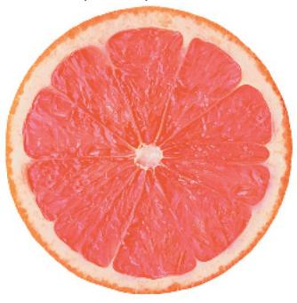  
▼ Hazelnut, a dry fruit that remains closed at maturity

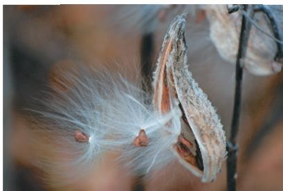

  
Milkweed, a dry fruit that splits open at maturity

of grasses, harvested while on the plant, are major staple foods for humans. The cereal grains of maize, rice, wheat, and other grasses, though easily mistaken for seeds, are each actually a fruit with a dry outer covering (the former wall of the ovary) that adheres to the seed coat of the seed within.

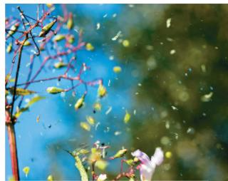  
Some plants have mechanisms that disperse seeds by explosive action.  
Wings enable maple fruits to be carried by the wind.

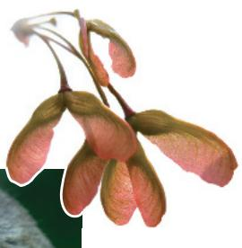

  
Seeds within berries and other edible fruits are often dispersed in animal feces.  
The barbs of cockleburs facilitate seed dispersal by allowing the fruits to "hitchhike" on animals.

As shown in Figure 30.11, various adaptations of fruits and seeds help to disperse seeds (see also Figure 38.12). The seeds of some flowering plants, such as dandelions and maples, are contained within fruits that function like parachutes or propellers, adaptations that enhance dispersal by wind. Some fruits, such as coconuts, are adapted to dispersal by water. And the seeds of many angiosperms are carried by animals. Some angiosperms have fruits modified as burrs that cling to animal fur (or the clothes of humans). Others produce edible fruits, which are usually nutritious, sweet tasting, and vividly colored, advertising their ripeness. When an animal eats the fruit, it digests the fruit's fleshy part, but the tough seeds usually pass unharmed through the animal's digestive tract. When the animal defecates, it may deposit the seeds, along with a supply of natural fertilizer, many kilometers from where the fruit was eaten.

## The Angiosperm Life Cycle

You can follow a typical angiosperm life cycle in Figure 30.12. The flower of the sporophyte produces microspores that form male gametophytes and megaspores that form female gametophytes. The male gametophytes are in the pollen grains, which develop within microsporangia in the anthers. Each male gametophyte has two haploid cells: a generative cell that divides, forming two sperm, and a tube cell that produces a pollen tube. Each ovule, which develops in the ovary, contains a female gametophyte, also known as an embryo sac. The embryo sac consists of only a few cells, one of which is the egg.

After its release from the anther, the pollen is carried to the sticky stigma at the tip of a carpel. Although some flowers self-pollinate, most have mechanisms that ensure cross-pollination, which in angiosperms is the transfer of pollen from an anther of a flower on one plant to the stigma of a flower on another plant of the same species. Cross-pollination enhances genetic variability. In some

species, stamens and carpels of a single flower may mature at different times, or they may be so arranged that self-pollination is unlikely.

The pollen grain absorbs water and germinates after it adheres to the stigma of a carpel. The tube cell produces a pollen tube that grows down within the style of the carpel. After reaching the ovary, the pollen tube penetrates through the micropyle, a pore in the integuments of the ovule, and discharges two sperm cells into the female gametophyte (embryo sac). One sperm fertilizes the egg, forming a diploid zygote. The other sperm fuses with the two nuclei in the large central cell of the female gametophyte, producing a triploid cell (3n). This type of double fertilization, in which one fertilization event produces a zygote and the other produces a triploid cell, is unique to angiosperms.

Figure 30.12 The life cycle of an angiosperm.  
  
VISUAL SKILLS Based on this figure, what is the maximum number of seeds this flower could produce? To produce that number of seeds, at least how many pollen grains would have to germinate? For suggested answer, see Appendix A.

After double fertilization, the ovule matures into a seed. The zygote develops into a sporophyte embryo with a rudimentary root and one or two seed leaves called cotyledons. The triploid central cell of the female gametophyte develops into endosperm, tissue rich in starch and other food reserves that nourish the developing embryo.

What is the function of double fertilization in angiosperms? One hypothesis is that double fertilization synchronizes the development of food storage in the seed with the development of the embryo. If a particular flower is not pollinated or sperm cells are not discharged into the embryo sac, fertilization does not occur, and neither endosperm nor embryo forms. So perhaps double fertilization is an adaptation that prevents flowering plants from squandering nutrients on infertile ovules.

Another type of double fertilization occurs in some gymnosperm species belonging to the phylum Gnetophyta. However, double fertilization in these species gives rise to two embryos rather than to an embryo and endosperm.

As you read earlier, the seed consists of the embryo, the endosperm, and a seed coat derived from the integuments. An ovary develops into a fruit as its ovules become seeds. After being dispersed, a seed may germinate if environmental conditions are favorable. The coat ruptures and the embryo emerges as a seedling, using food stored in the endosperm and cotyledons until it can produce its own food by photosynthesis.

and with further increases in the diversity and importance of angiosperms.

What evidence suggests that angiosperms arose 140 million years ago? First, although pollen grains are common in rocks from the Jurassic period (201 to 145 million years ago) and even earlier, none of these pollen fossils have features characteristic of angiosperms, suggesting that angiosperms may have originated after the Jurassic. Indeed, the earliest fossils with distinctive angiosperm features are of 130-million-year-old pollen grains discovered in China, Israel, and England. Early fossils of larger flowering plant structures include those of Archaefructus (Figure 30.13) and Leefructus, both of which were discovered in China in rocks that are 125 million years old. Overall, early angiosperm fossils indicate that the group arose and began to diversify over a 20- to 30-million-year period—a less sudden event than was suggested by the fossils known during Darwin's lifetime.

Can we infer traits of the angiosperm common ancestor from traits found in early fossil angiosperms? Archaefructus, for example, was herbaceous and had bulbous structures that may have served as floats, suggesting it was aquatic. But investigating whether the angiosperm common ancestor was herbaceous and aquatic also requires examining fossils of other seed plants thought to have been closely related to angiosperms. All of those plants were woody, indicating that the common ancestor was probably woody and probably not aquatic. As we'll see, this conclusion has been supported by recent phylogenetic analyses. Regardless, this example shows the challenge of using fossils to date the branches of a phylogenetic tree, when it is difficult to place a fossil in the phylogenetic tree based on its combination of traits.

## Angiosperm Evolution

Charles Darwin once referred to the origin of angiosperms as an “abominable mystery.” He was particularly troubled by the relatively sudden and geographically widespread appearance of angiosperms in the fossil record (about 100 million years ago, based on fossils known to Darwin). Recent fossil evidence and phylogenetic analyses have led to progress in solving Darwin’s mystery, but we still do not fully understand how angiosperms arose from earlier seed plants.

## Fossil Angiosperms

Angiosperms are now thought to have originated in the early Cretaceous period, about 140 million years ago. By the mid-Cretaceous (100 million years ago), angiosperms began to dominate some terrestrial ecosystems. Landscapes changed dramatically as conifers and other gymnosperms gave way to flowering plants in many parts of the world. The Cretaceous ended 66 million years ago with mass extinctions of dinosaurs and many other animal groups

Figure 30.13 An early flowering plant.  
  
(a) Archaefructus sinensis, a 125-million-year-old fossil. This herbaceous species had simple flowers and bulbous structures that may have served as floats, suggesting it was aquatic. Recent phylogenetic analyses indicate that Archaefructus may belong to the water lily group.

  
(b) Artist's reconstruction of Archaefructus sinensis

## Angiosperm Phylogeny

Molecular and morphological evidence suggests that extant gymnosperm lineages had diverged from the lineage leading to angiosperms by 305 million years ago. Note that this does not imply that angiosperms originated 305 million years ago, but that the most recent common ancestor of extant gymnosperms and angiosperms lived at that time. Indeed, angiosperms may be more closely related to several extinct lineages of woody seed plants than they are to gymnosperms. One possible such lineage is the Bennettitales, an extinct group with flowerlike structures that may have been pollinated by insects (Figure 30.14a). However, the Bennettitales and other similar lineages of extinct woody seed plants did not have carpels or certain other characteristics of angiosperm flowers and hence were not angiosperms.

Making sense of the origin of angiosperms also depends on working out the order in which angiosperm clades diverged from one another. Here, dramatic progress has been made in recent years. Molecular and morphological evidence suggests that the shrub Amborella trichopoda, water lilies, and star anise are living representatives of lineages that diverged from other angiosperms early in the history of the group (Figure 30.14b). Amborella is woody, supporting the conclusion mentioned earlier that the angiosperm common ancestor was probably woody. Like the Bennettitales, Amborella, water lilies, and star anise lack vessel elements, efficient water-conducting cells that are found in most

present-day angiosperms. Overall, based on the features of ancestral species and angiosperms like Amborella, researchers have hypothesized that early angiosperms were woody shrubs that had small flowers and relatively simple water-conducting cells.

## Evolutionary Links with Animals

Plants and animals have interacted for hundreds of millions of years, and those interactions have led to evolutionary change. For example, herbivores can reduce a plant's reproductive success by eating its roots, leaves, or seeds. As a result, if an effective defense against herbivores originates in a group of plants, those plants may be favored by natural selection—as will herbivores that overcome this new defense. Plant-pollinator and other mutually beneficial interactions also can have such reciprocal evolutionary effects.

Plant-pollinator interactions also may have affected the rates at which new species form. Consider the impact of a flower's symmetry (see Figure 30.9). On a flower with bilateral symmetry, an insect pollinator can obtain nectar (a sugary solution secreted by flower glands) only when landing in a certain position (Figure 30.15). This constraint makes it more likely that pollen is placed on a part of the insect's body that will come into contact with the stigma of a flower of the same species. Such specificity of pollen transfer reduces gene flow between diverging populations and could lead to increased

Figure 30.14 Angiosperm evolutionary history.  
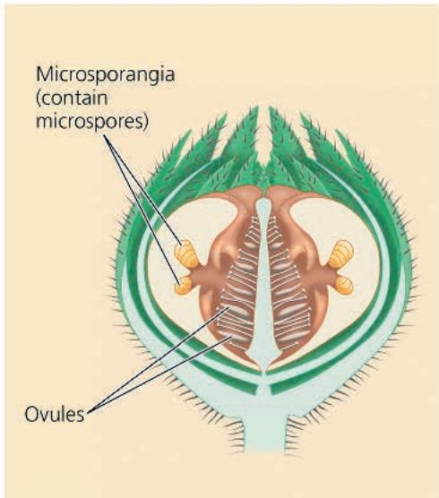  
(a) A close relative of the angiosperms? This reconstruction shows a longitudinal section through the flowerlike structures found in the Bennettitales, an extinct group of woody seed plants that some researchers have hypothesized are more closely related to extant angiosperms than to extant gymnosperms.

  
(b) Angiosperm phylogeny. This tree represents a current hypothesis of angiosperm evolutionary relationships, based on morphological and molecular evidence. Angiosperms originated about 140 million years ago. The dotted line indicates the uncertain position of the Bennettales; other extinct lineages have also been proposed as the sister group to angiosperms.  
VISUAL SKILLS Would the branching order of the phylogeny in (b) necessarily have to be redrawn if a 150-million-year-old fossil monocot were discovered? Explain.

Figure 30.15 A bee pollinating a bilaterally symmetrical flower. To harvest nectar from this Scottish broom flower, a honeybee must land as shown. This releases a tripping mechanism that arches the flower's stamens over the bee and dusts it with pollen. Later, some of this pollen may rub off onto the stigma of the next flower the bee visits.

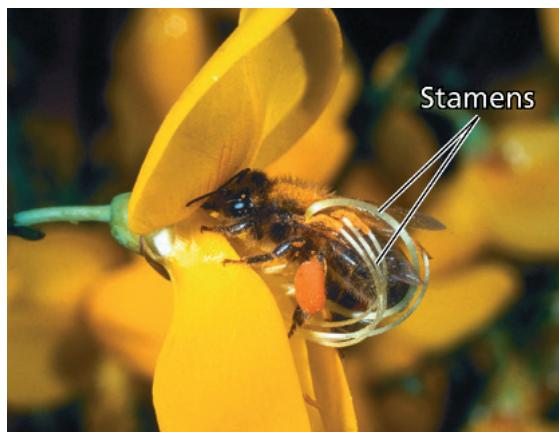

rates of speciation in plants with bilateral symmetry. This hypothesis can be tested using the approach illustrated in this diagram:

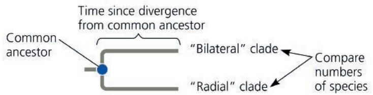

A key step in this approach is to identify cases in which a clade with bilaterally symmetric flowers shares an immediate common ancestor with a clade whose members have radially symmetric flowers. One recent study identified 19 pairs of closely related “bilateral” and “radial” clades. On average, the clade with bilaterally symmetric flowers had nearly 2,400 more species than did the related clade with radial symmetry. This result suggests that flower shape can affect the rate at which new species form,

perhaps by affecting the behavior of insect pollinators. Overall, plant-pollinator interactions may have contributed to the increasing dominance of flowering plants in the Cretaceous period, making angiosperms centrally important to ecological communities.

## Angiosperm Diversity

From their humble beginnings in the Cretaceous period, angiosperms have diversified into more than 290,000 living species. Until the late 1990s, most systematists divided flowering plants into two groups, based partly on the number of cotyledons, or seed leaves, in the embryo. Species with one cotyledon were called monocots, and those with two were called dicots. Other features, such as flower and leaf structure, were also used to define the two groups. Recent DNA studies, however, indicate that the species traditionally called dicots are paraphyletic. The vast majority of species once categorized as dicots form a large clade, now known as eudicots (“true” dicots). Figure 30.16 compares the main characteristics of monocots and eudicots. The rest of the former dicots are now grouped into four small lineages. Three of these lineages—Amborella, water lilies, and star anise and relatives—diverged from all other angiosperms early in the history of the group (see Figure 30.14b). A fourth lineage, the magnoliids, evolved later. Figure 30.17, on the next page, provides an overview of angiosperm diversity.

## Concept Check 30.3

1. It is said that an oak is an acorn's way of making more acorns. Write an explanation that includes these terms: sporophyte, gametophyte, ovule, seed, ovary, and fruit.

2. Compare and contrast a pine cone and a flower in terms of structure and function.

3. WHAT IF? Do speciation rates in closely related clades of flowering plants show that flower shape is correlated with the rate at which new species form or that flower shape is responsible for this rate? Explain.

For suggested answers, see Appendix A.

Figure 30.16 Characteristics of monocots and eudicots.  

## Exploring Angiosperm Diversity

## Figure 30.17

## Early-Diverging Angiosperm Lineages

The first lineage to have diverged from other angiosperms is represented today by a single species, Amborella trichopoda (right). The other surviving lineages diverged later: a clade that includes water lilies and a clade consisting of the star anise and its relatives. Together, these two lineages today comprise about 100 species.

  
Water lily (Nymphaea "Rene Gerard"). Species of water lilies are found in aquatic habitats throughout the world. Water lilies belong to a clade that diverged from other angiosperms early in the group's history.

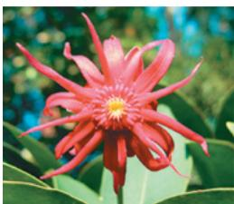

## Amborella trichopoda.

This small shrub, found only on the South Pacific island of New Caledonia, may be the sole survivor of a branch at the base of the angiosperm tree.

## Star anise (Illicium). This genus belongs to a

third surviving lineage of angiosperms that diverged from other lineages early in the history of angiosperms.

## Magnoliids

Magnoliids consist of about 8,500 species, most notably magnolias, laurels, and black pepper plants. They include both woody and herbaceous species. Although they share some traits with basal angiosperms, such as a typically spiral rather than whorled arrangement of floral organs, magnoliids are more closely related to eudicots and monocots.

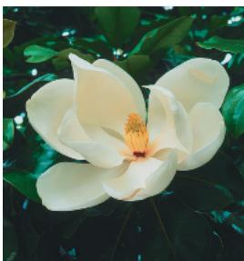

## Southern magnolia (Magnolia grandiflora). This member of the

## Monocots

grandiflora). This member of the magnolia family is a large tree. The variety of southern magnolia shown here, called "Goliath," has flowers that measure up to about a foot across.

About one-quarter of angiosperm species are monocots — about 72,000 species. Some of the largest groups are the orchids, grasses, and palms. Grasses include some of the most agriculturally important crops, such as maize, rice, and wheat.

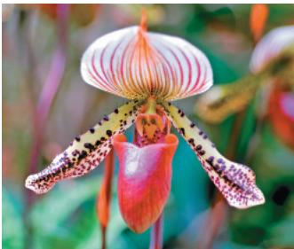  
Orchid (Paphiopedilum callosum)  
Barley (Hordeum vulgare), a grass

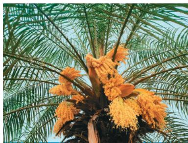  
▲ Miniature date palm (Phoenix roebelenii)

## Eudicots

More than two-thirds of angiosperm species are eudicots—roughly 210,000 species. The largest group is the legume family, which includes such crops as peas and beans. Also important economically is the rose family, which includes many plants with ornamental flowers as well as some species with edible fruits, such as strawberry plants and apple and pear trees. Most of the familiar flowering trees are eudicots, such as oak, walnut, maple, willow, and birch.

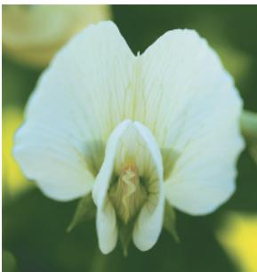  
Snow pea (Pisum sativum), a legume  
Dog rose (Rosa canina), a wild rose

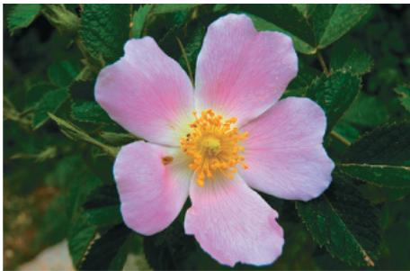

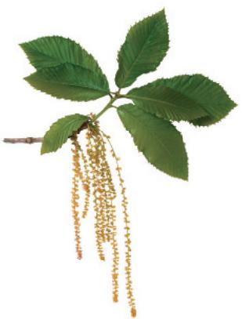  
▲ Armenian oak (Quercus pontica)

# Concept 30.4: Human welfare depends on seed plants

In forests and on farms, seed plants are key sources of food, fuel, wood products, and medicine. Our reliance on them makes the preservation of plant diversity critical.

## Products from Seed Plants

Most of our food comes from angiosperms. Just six crops—maize, rice, wheat, potatoes, cassava, and sweet potatoes—yield 80% of all the calories consumed by humans. We also depend on angiosperms to feed livestock: It takes 5–7 kg of grain to produce 1 kg of grain-fed beef.

Today's crops are the products of artificial selection—the result of plant domestication that began about 12,000 years ago. To appreciate the scale of this transformation, note how the number and size of seeds in domesticated plants are greater than those of their wild relatives, as in the case of maize and the grass teosinte (see Figure 38.16). Scientists can glean information about domestication by comparing the genes of crops with those of wild relatives. With maize, dramatic changes such as increased cob size and loss of the hard coating around teosinte kernels may have been initiated by as few as five mutations.

Flowering plants also provide other edible products. Two popular beverages come from tea leaves and coffee beans, and you can thank the cacao tree for cocoa and chocolate. Spices are derived from various plant parts, such as flowers (cloves, saffron), fruits and seeds (vanilla, black pepper, mustard), leaves (basil, mint, sage), and even bark (cinnamon).

Many seed plants are sources of wood, which is absent in all living seedless plants. Wood consists of tough-walled xylem cells (see Figure 35.22). It is the primary source of fuel for much of the world, and wood pulp, typically derived from conifers such as fir and pine, is used to make paper. Wood remains the most widely used construction material.

For centuries, humans have also depended on seed plants for medicines. Many cultures use herbal remedies, and scientists have extracted and identified medicinally active compounds from many of these plants and later synthesized them. Willow leaves and bark have long been used in pain-relieving remedies, including prescriptions by the Greek physician Hippocrates. In the 1800s, scientists traced the willow's medicinal property to the chemical salicin. A synthesized derivative, acetylsalicylic acid, is what we call aspirin. Plants are also a direct source of medicinal compounds (Table 30.1). In the United States, about $25\%$ of prescription drugs contain an active ingredient from plants, usually seed plants.

Table 30.1 Examples of Plant-Derived Medicines

<table><tr><td>Compound</td><td>Source</td><td>Use</td></tr><tr><td>Atropine</td><td>Belladonna plant</td><td>Eye pupil dilator</td></tr><tr><td>Digitalin</td><td>Foxglove</td><td>Heart medication</td></tr><tr><td>Menthol</td><td>Eucalyptus tree</td><td>Throat soother</td></tr><tr><td>Quinine</td><td>Cinchona tree</td><td>Malaria preventive</td></tr><tr><td>Taxol</td><td>Pacific yew</td><td>Ovarian cancer drug</td></tr><tr><td>Tubocurarine</td><td>Curare tree</td><td>Muscle relaxant</td></tr><tr><td>Vinblastine</td><td>Periwinkle</td><td>Leukemia drug</td></tr></table>

Figure 30.18 Clear-cutting of tropical forests.

Over the past several hundred years, nearly half of Earth's tropical forests have been cut down and converted to farmland and other uses. A satellite image from 1975 (left) shows a dense forest in Brazil. By 2012 (right image), much of this forest had been cut down. Deforested and urban areas are shown as light purple.

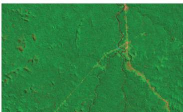

## Threats to Plant Diversity

Although plants may be a renewable resource, plant diversity is not. The exploding human population and its demand for space and resources are threatening plant species across the globe. The problem is especially severe in the tropics, where more than two-thirds of the human population live and where population growth is fastest. About 63,000 km $^{2}$ (15 million acres) of tropical rain forest are cleared each year (Figure 30.18), a rate that would completely eliminate the remaining 11 million km $^{2}$ of tropical forests in 175 years. The loss of forests reduces the absorption of atmospheric carbon dioxide (CO $_{2}$ ) that occurs during photosynthesis, potentially contributing to global warming. Also, as forests disappear, so do large numbers of plant species. Of course, once a species becomes extinct, it can never return.

The loss of plant species is often accompanied by the loss of insects and other rain forest animals. Scientists estimate that if current rates of loss in the tropics and elsewhere continue, 50% or more of Earth's species will become extinct within the next few centuries. Such losses would constitute a global mass extinction, rivaling the Permian and Cretaceous mass extinctions and forever changing the evolutionary history of plants (and many other organisms).

Many people have ethical concerns about contributing to the extinction of species. In addition, there are practical reasons to be concerned about the loss of plant diversity. So far, we have explored the potential uses of only a tiny fraction of the more than 325,000 known plant species. For example, almost all our food is based on the cultivation of only about two dozen species of seed plants. And fewer than 5,000 plant species have been studied as potential sources of medicines. The tropical rain forest may be a medicine chest of healing plants that could be extinct before we even know they exist. If we begin to view rain forests and other ecosystems as living treasures that can regenerate only slowly, we may learn to harvest their products at sustainable rates.

## Concept Check 30.4

1. Explain why plant diversity can be considered a nonrenewable resource.

2. WHAT IF? How could phylogenies be used to help researchers search more efficiently for novel medicines derived from seed plants?

## Summary of Key Concepts

To review key terms, go to the Vocabulary Self-Quiz (eTextbook only).

Concept 30.1: Seeds and pollen grains are key adaptations for life on land

<table><tr><td colspan="2">Five Derived Traits of Seed Plants</td></tr><tr><td>Reduced gametophytes</td><td>Microscopic male and female gametophytes (n) are nourished and protected by the sporophyte (2n)Male gametophyteFemale gametophyte</td></tr><tr><td>Heterospory</td><td>Microspore (gives rise to a male gametophyte)Megaspore (gives rise to a female gametophyte)</td></tr><tr><td>Ovules</td><td>Ovule (gymnosperm)Integument (2n)Megaspore (n)Megasporangium (2n)</td></tr><tr><td>Pollen</td><td>Pollen grains make water unnecessary for fertilization</td></tr><tr><td>Seeds</td><td>Seeds: survive better than unprotected spores, can be transported long distancesSeed coatFood supplyEmbryo</td></tr></table>

Describe how the parts of an ovule (integument, megaspore, megasporangium) correspond to the parts of a seed.

## Concept 30.2: Gymnosperms bear “naked” seeds, typically on cones

\- Dominance of the sporophyte generation, the development of seeds from fertilized ovules, and the role of pollen in transferring sperm to ovules are key features of a typical gymnosperm life cycle.

\- Gymnosperms appear early in the plant fossil record and dominated many Mesozoic terrestrial ecosystems. Living seed plants can be divided into two monophyletic groups: gymnosperms and angiosperms. Extant gymnosperms include cycads, Ginkgo biloba, gnetophytes, and conifers.

Although there are just over 1,000 species of gymnosperms, the group is still very successful in terms of its evolutionary longevity, adaptations, and geographic distribution. Explain.

## Concept 30.3: The reproductive adaptations of angiosperms include flowers and fruits

\- Flowers generally consist of four types of modified leaves: sepals, petals, stamens (which produce pollen), and carpels (which produce ovules). Ovaries ripen into fruits, which often carry seeds by wind, water, or animals to new locations.

\- Flowering plants originated about 140 million years ago, and by the mid-Cretaceous (100 mya) had begun to dominate some terrestrial ecosystems. Fossils and phylogenetic analyses offer insights into the origin of flowers.

\- Several groups of early-diverging angiosperms have been identified. Other major clades of angiosperms include magnoliids, monocots, and eudicots.

\- Pollination and other interactions between angiosperms and animals may have contributed to the success of flowering plants during the last 100 million years.

Explain why Darwin called the origin of angiosperms an “abominable mystery,” and describe what has been learned from fossil evidence and phylogenetic analyses.

## Concept 30.4: Human welfare depends on seed plants

\- Humans depend on seed plants for products such as food, wood, and many medicines.

\- Destruction of habitat threatens the extinction of many plant species and the animal species they support.

Explain why destroying the remaining tropical forests might harm humans and lead to a mass extinction.

For suggested answer, see Appendix A.

## Test Your Understanding

For more multiple-choice questions, go to the Practice Test (eTextbook only).

## Levels 1-2: Remembering/Understanding

1. Where in an angiosperm would you find a megasporangium?

(A) in the style of a flower

(B) enclosed in the stigma of a flower

(C) within an ovule contained within an ovary of a flower

(D) packed into pollen sacs within the anthers found on a stamen

2. Which of the following is a key feature of seed plants facilitating life on land?

(A) homospory

(B) pollen

(C) reduced sporophytes

(D) spores

3. In angiosperms, which of the following is correctly paired with its chromosome count?

(A) microspore—n

(B) zygote—n

(C) egg—2n

(D) megaspore—2n

4. Which of the following is a characteristic that distinguishes gymnosperms and angiosperms from other plants?
(A) alternation of generations
(B) independent gametophytes
(C) vascular tissue
(D) ovules

5. Which of the following are present in angiosperms but not in gymnosperms?
(A) seeds (C) ovaries
(B) pollen (D) ovules

## Levels 3-4: Applying/Analyzing

6. DRAW IT Use the letters a–d to label where on the phylogenetic tree each of the following derived characters appears.
a. flowers
b. embryos
c. seeds
d. vascular tissue

7. EVOLUTION CONNECTION The history of life has been punctuated by several mass extinctions. For example, the impact of a meteorite may have wiped out most of the dinosaurs and many forms of marine life at the end of the Cretaceous period (see Concept 25.4). Fossils indicate that plants were less severely affected by this mass extinction. What adaptations may have enabled plants to withstand this disaster better than animals?

## Levels 5-6: Evaluating/Creating

8. SCIENTIFIC INQUIRY • DRAW IT As will be described in detail in Concept 38.1, the female gametophyte of angiosperms typically has seven cells, one of which, the central cell, contains two haploid nuclei. After double fertilization, the central cell develops into endosperm, which is triploid. Because magnoliids, monocots, and eudicots typically have female gametophytes with seven cells and triploid endosperm, scientists assumed that this was the ancestral state for angiosperms. Consider, however, the following recent discoveries:

\- Our understanding of angiosperm phylogeny has changed to that shown in Figure 30.14b.

\- Amborella trichopoda has eight-celled female gametophytes and triploid endosperm.

\- Water lilies and star anise have four-celled female gametophytes and diploid endosperm.

a. Draw a phylogeny of the angiosperms (see Figure 30.14b), incorporating the data given above about the number of cells in female gametophytes and the ploidy of the endosperm. Assume that all of the star anise relatives have four-celled female gametophytes and diploid endosperm.

b. What does your labeled phylogeny suggest about the evolution of the female gametophyte and endosperm in angiosperms?

9. WRITE ABOUT A THEME: ORGANIZATION Cells are the basic units of structure and function in all organisms. A key feature in the life cycle of plants is the alternation of multicellular haploid and diploid generations. Imagine a lineage of flowering plants in which mitotic cell division did not occur between the events of meiosis and fertilization (see Figure 30.12). In a short essay (100–150 words), describe how this change in the timing of cell division would affect the structure and life cycle of plants in this lineage.

## 10. SYNTHESIZE YOUR KNOWLEDGE

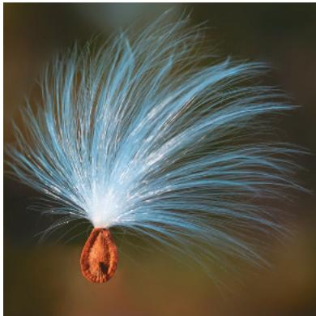  
This photograph shows a milkweed seed in flight. Describe how seeds and other adaptations in seed plants contributed to the rise of seed plants and their dominant role in plant communities today.  
For selected answers, see Appendix A.

## Explore Scientific Papers with Science in the Classroom | AAAS

How have Earth's forests changed over time? Go to “Seeing the Forest for the Trees” at www.scienceintheclassroom.org.

Instructors: Questions can be assigned in Mastering Biology.

<!-- END OFFICIAL MINERU API RESULT part_07 -->

<!-- BEGIN OFFICIAL MINERU API RESULT part_08 -->

