# 第31章 Fungi

<!-- 章节边界按正文内容恢复；原始 MinerU 内容保留如下。 -->

## Fungi

## Key Concepts

31.1 Fungi are heterotrophs that feed by absorption

31.2 Fungi produce spores through sexual or asexual life cycles

31.3 The ancestor of fungi was an aquatic, single-celled, flagellated protist

31.4 Fungi have radiated into a diverse set of lineages

31.5 Fungi play key roles in nutrient cycling, ecological interactions, and human welfare

## Study Tip

Draw a diagram: To help you recognize key differences between the life cycles of fungi and humans, draw and label simple diagrams like the partial example shown here depicting the life stages at which meiosis, mitosis, gamete formation, a multicellular organism, and fertilization occur in humans and in fungi.

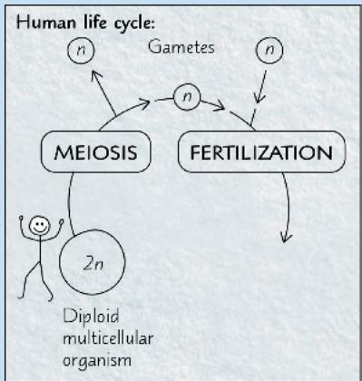

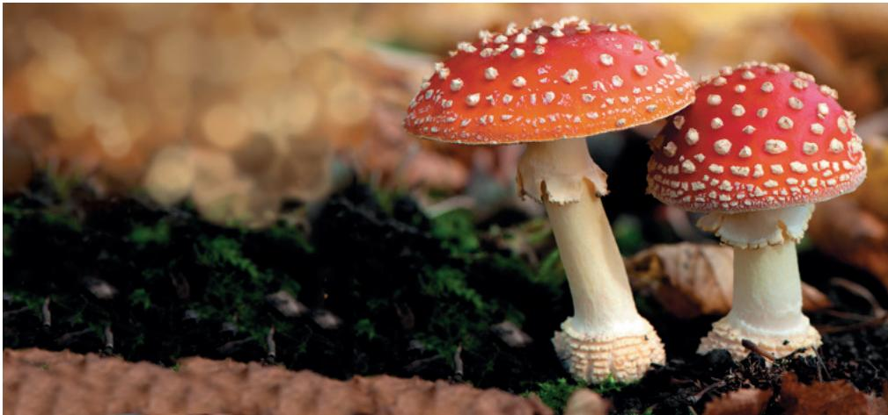  
Figure 31.1 These little mushrooms are just the small aboveground extension of a vast network of filaments located below the forest floor. Such underground fungal networks, called mycelia, in some cases link mushrooms that are hundreds of meters apart. In fact, the largest known mycelium spreads beneath 965 hectares of forest—more than the area of 1,800 football fields.

## How do structure and function in fungi relate to their role in ecosystems?

Spores enable fungi to colonize new environments. The spores germinate and grow when conditions are favorable.

As they grow, multicellular fungi extend filaments called hyphae into their surroundings.

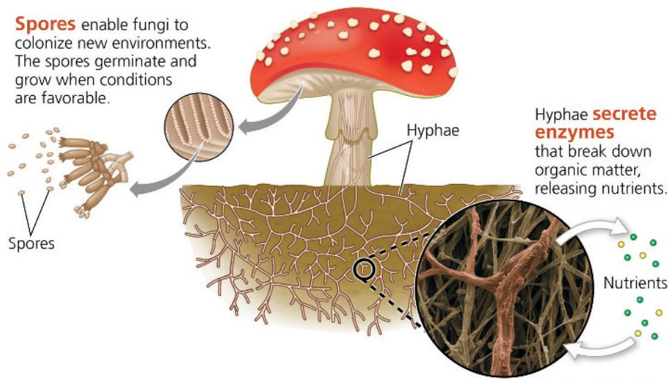  
Hyphae secrete enzymes that break down organic matter, releasing nutrients.  
Almost any organic molecule can be digested by at least some fungi, making them highly effective decomposers in ecosystems.  
Hyphae absorb the released nutrients.

Reproductive structure. Tiny haploid cells called spores are produced inside the mushroom.

# Concept 31.1: Fungi are heterotrophs that feed by absorption

The hidden network of fungal filaments in Figure 31.1 is a fitting symbol of the neglected grandeur of the kingdom Fungi. Most of us are barely aware of these eukaryotes beyond the mushrooms we eat or the occasional brush with athlete's foot. Yet fungi are a huge and important component of the biosphere. Some fungi are exclusively single-celled, though most have complex multicellular bodies. Found in just about every imaginable terrestrial and aquatic habitat, these diverse organisms are also essential for the well-being of most ecosystems. They break down organic material and recycle nutrients, allowing other organisms to assimilate essential chemical elements.

Despite their vast diversity, all fungi share some key traits—most importantly, the way they derive nutrition. Another key characteristic of many fungi is that they grow by forming multicellular filaments, a body structure that plays an important role in how they obtain food.

## Nutrition and Ecology

Like animals, fungi are heterotrophs: They cannot make their own food as plants and algae can. But unlike animals, fungi do not ingest (eat) their food. Instead, a fungus absorbs nutrients from the environment outside of its body. Many fungi do this by secreting hydrolytic enzymes into their surroundings. These enzymes break down complex molecules to smaller organic compounds that the fungi can absorb into their cells and use. Other fungi use enzymes to penetrate the walls of cells, enabling the fungi to absorb nutrients from the cells. Collectively, the different enzymes found in various fungal species can digest compounds from a wide range of sources, living or dead.

This diversity of food sources corresponds to the varied roles of fungi in ecological communities: Different species live as decomposers, parasites, or mutualists. Fungi that are decomposers break down and absorb nutrients from nonliving organic material, such as fallen logs, animal corpses, and the wastes of organisms. Parasitic fungi absorb

nutrients from the cells of living hosts. Some parasitic fungi are pathogenic, including many species that cause diseases in plants and others that cause diseases in animals. Mutualistic fungi also absorb nutrients from a host, but they reciprocate with actions that benefit the host. For example, mutualistic fungi that live within the digestive tracts of certain termite species use their enzymes to break down wood, as do mutualistic protists in other termites (see Figure 28.29).

The versatile enzymes that enable fungi to digest a wide range of food sources are not the only reason for their ecological success. Another important factor is how their body structure increases the efficiency of nutrient absorption.

## Body Structure

The most common fungal body structures are multicellular filaments and single cells (yeasts). Many fungal species can grow as both filaments and yeasts, but even more grow only as filaments; relatively few species grow only as single-celled yeasts. Yeasts often inhabit moist environments, including plant sap and animal tissues, where there is a ready supply of soluble nutrients, such as sugars and amino acids.

The morphology of multicellular fungi enhances their ability to grow into and absorb nutrients from their surroundings (Figure 31.2). The bodies of these fungi typically form a network

Figure 31.2 Structure of a multicellular fungus.

The top photograph shows the sexual structures, in this case called mushrooms, of the penny bun fungus (Boletus edulis). The bottom photograph shows a mycelium growing on fallen conifer needles. The inset SEM shows hyphae.

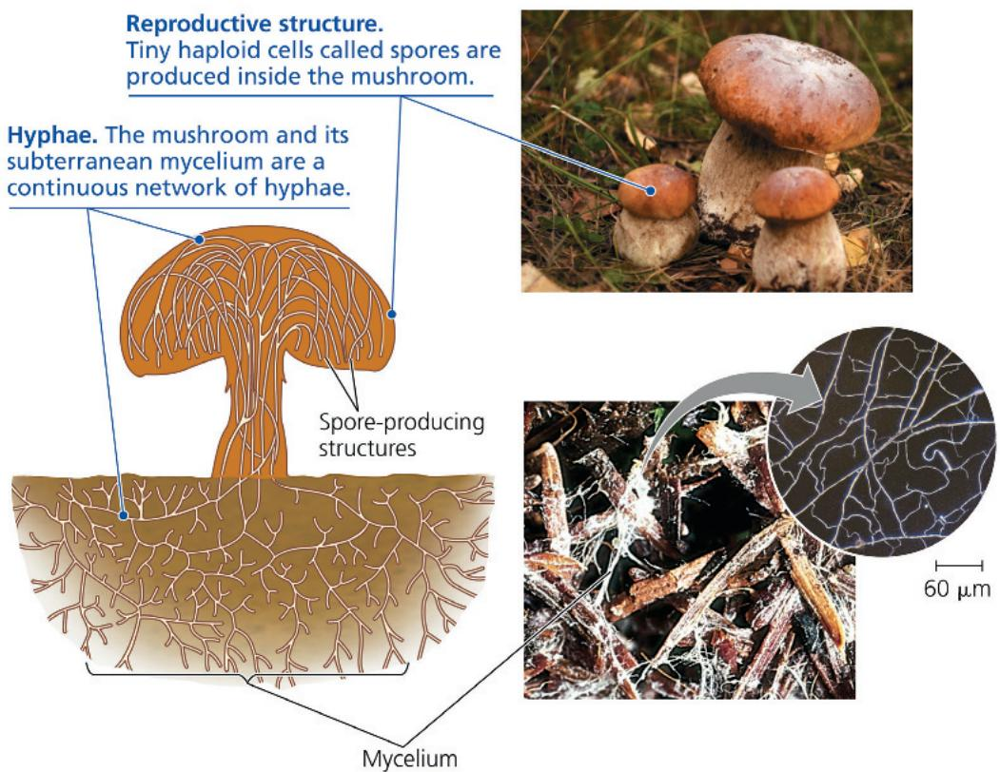  
Although the mushrooms in the top photograph appear to be different individuals, could their DNA be identical? Explain. For suggested answer, see Appendix A.

Figure 31.3 Two forms of hyphae.  
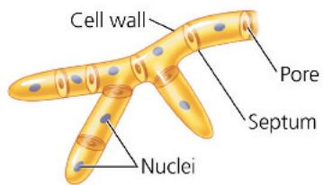

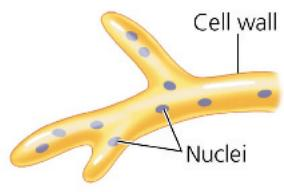  
(a) Septate hypha  
(b) Coenocytic hypha

of tiny filaments called hyphae (singular, hypha). Hyphae consist of tubular cell walls surrounding the plasma membrane and cytoplasm of the cells. The cell walls are strengthened by chitin, a strong but flexible polysaccharide. Chitin-rich walls can enhance feeding by absorption. As a fungus absorbs nutrients from its environment, the concentrations of those nutrients in its cells increases, causing water to move into the cells by osmosis. The movement of water into fungal cells creates pressure that could cause their cells to burst if they were not surrounded by a chitin-strengthened, rigid cell wall.

Another important structural feature of most fungi is that their hyphae are divided into cells by cross-walls, or septa (singular, septum) (Figure 31.3a). Septa generally have pores large enough to allow ribosomes, mitochondria, and even nuclei to flow from cell to cell. Some fungi lack septa (Figure 31.3b). Known as coenocytic fungi, these organisms consist of a continuous cytoplasmic mass having hundreds or thousands of nuclei. The coenocytic condition results from the repeated division of nuclei without cytokinesis.

Fungal hyphae form an interwoven mass called a mycelium (plural, mycelia) that infiltrates the material on which the fungus feeds (see Figure 31.2). The structure of a mycelium maximizes its surface-to-volume ratio, making feeding very efficient. Just 1 cm $^{3}$ of rich soil may contain as much as 1 km of hyphae with a total surface area of 300 cm $^{2}$ in contact with the soil. A fungal mycelium grows rapidly, as proteins and other materials synthesized by the fungus move through cytoplasmic streaming to the tips of the extending hyphae. The fungus concentrates its energy and resources on adding hyphal length and thus overall absorptive surface area, rather than on increasing hyphal girth. Multicellular fungi are not motile in the typical sense—they cannot run, swim, or fly in search of food or mates. However, as they grow, such fungi can move into new territory, swiftly extending the tips of their hyphae.

## Specialized Hyphae in Mycorrhizal Fungi

Some fungi have specialized hyphae that allow them to feed on living animals (Figure 31.4a), while others have modified hyphae called haustoria that enable them to extract nutrients from plants. Our focus here, however, will be on fungi that have specialized branching hyphae such as arbuscules (Figure 31.4b) through which fungi exchange nutrients with their plant hosts. Such mutually beneficial relationships between fungi and plant roots are called mycorrhizae (the term means “fungus roots”).

Figure 31.4 Specialized hyphae.  
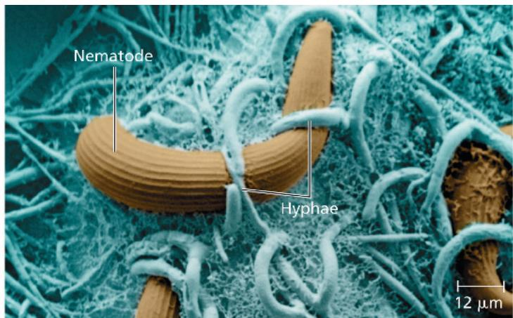  
(a) Hyphae adapted for trapping and killing prey. In Arthrobotrys, a soil fungus, portions of the hyphae are modified as hoops that can constrict around a nematode (roundworm) in less than a second. The growing hyphae then penetrate the worm's body, and the fungus digests its prey's inner tissues (SEM).

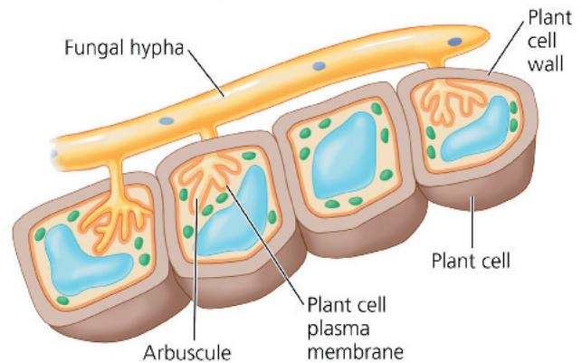  
(b) Arbuscules. Some mutualistic fungi have specialized hyphae called arbuscules that can exchange nutrients with living plant cells. Arbuscules remain separated from a plant cell's cytoplasm by the plasma membrane of the plant cell (orange).

Mycorrhizal fungi (fungi that form mycorrhizae) can improve delivery of phosphate ions and other minerals to plants because the vast mycelial networks of the fungi are more efficient than the plants' roots at acquiring these minerals from the soil. In exchange, the plants supply the fungi with organic nutrients such as carbohydrates.

There are two main types of mycorrhizal fungi (see Figure 37.14). Ectomycorrhizal fungi (from the Greek ektos, out) form sheaths of hyphae over the surface of a root and typically grow into the extracellular spaces of the root cortex. Arbuscular mycorrhizal fungi extend arbuscules through the root cell wall and into tubes formed by invagination

# Scientific Skills Exercise Interpreting Genomic Data and Generating Hypotheses

What Can Genomic Analysis of a Mycorrhizal Fungus Reveal About Mycorrhizal Interactions? The first genome of a mycorrhizal fungus to be sequenced was that of the basidiomycete Laccaria bicolor (see photo). In nature, L. bicolor is a common ectomycorrhizal fungus of trees such as poplar and fir, as well as a free-living

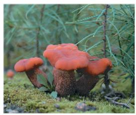

soil organism. In forest nurseries, it is often added to soil to enhance seedling growth. The fungus can easily be grown alone in culture and can establish mycorrhizae with tree roots in the laboratory. Researchers hope that studying the genome of Laccaria will yield clues to the processes by which it interacts with its mycorrhizal partners—and by extension, to mycorrhizal interactions involving other fungi.

How the Study Was Done Using the whole-genome shotgun method (see Figure 21.2) and bioinformatics, researchers sequenced the genome of L. bicolor and compared it with the genomes of some nonmycorrhizal basidiomycete fungi. The team used microarrays to compare gene expression levels for different protein-coding genes and for the same genes in a mycorrhizal mycelium and a free-living mycelium. They could thus identify the genes for fungal proteins that are made specifically in mycorrhizae.

## Data from the Study

Table 1 Numbers of Genes in L. bicolor and Four Nonmycorrhizal Fungal Species

<table><tr><td></td><td>L. bicolor</td><td>1</td><td>2</td><td>3</td><td>4</td></tr><tr><td>Protein-coding genes</td><td>20,614</td><td>13,544</td><td>10,048</td><td>7,302</td><td>6,522</td></tr><tr><td>Genes for membrane transporters</td><td>505</td><td>412</td><td>471</td><td>457</td><td>386</td></tr><tr><td>Genes for small secreted proteins (SSPs)</td><td>2,191</td><td>838</td><td>163</td><td>313</td><td>58</td></tr></table>

(pushing inward, as in Figure 31.4b) of the root cell plasma membrane. In the Scientific Skills Exercise, you'll compare genomic data from fungi that form mycorrhizae and fungi that do not.

Mycorrhizae are enormously important both in natural ecosystems and in agriculture. Almost all vascular plants have mycorrhizae and rely on their fungal partners for essential nutrients. Foresters commonly inoculate pine seedlings with mycorrhizal fungi to promote growth. In the absence of human intervention, mycorrhizal fungi colonize soils by dispersing haploid cells called spores that form new mycelia after germinating. Spore dispersal is a key component of how fungi reproduce and spread to new areas, as we discuss next.

Table 2 L. bicolor Genes Most Highly Upregulated in Ectomycorrhizal Mycelium (ECM) of Douglas Fir or Poplar Versus Free-Living Mycelium (FLM)

<table><tr><td>Protein ID</td><td>Protein Feature or Function</td><td>Douglas Fir ECM/FLM Ratio</td><td>Poplar ECM/FLM Ratio</td></tr><tr><td>298599</td><td>SSP</td><td>22,877</td><td>12,913</td></tr><tr><td>293826</td><td>Enzyme inhibitor</td><td>14,750</td><td>17,069</td></tr><tr><td>333839</td><td>SSP</td><td>7,844</td><td>1,931</td></tr><tr><td>316764</td><td>Enzyme</td><td>2,760</td><td>1,478</td></tr></table>

Data from F. Martin et al., The genome of Laccaria bicolor provides insights into mycorrhizal symbiosis, Nature 452:88–93 (2008).

## INTERPRET THE DATA

1. (a) In Table 1, which fungal species has the most genes encoding membrane transporters (membrane transport proteins; see Concept 7.2)? (b) Why might these genes be of particular importance to L. bicolor?

2. The phrase “small secreted proteins” (SSPs) refers to proteins less than 100 amino acids in length that the fungi secrete; their function is not yet known. (a) Describe the Table 1 data on SSPs. (b) The researchers found that the SSP genes shared a common feature that indicated the encoded proteins were destined for secretion. Based on Figure 17.22 and the text discussion of that figure, predict what this common feature of the SSP genes was. (c) Suggest a hypothesis for the roles of SSPs in mycorrhizae.

3. Table 2 shows data from gene expression studies for the four L. bicolor genes whose transcription was most increased (“upregulated”) in mycorrhizae. (a) For the gene encoding the first protein listed, what does the number 22,877 indicate? (b) Do the data in Table 2 support your hypothesis in question 2(c)? Explain. (c) Compare the data for poplar mycorrhizae with those for Douglas fir and hypothesize what might account for any differences.

Instructors: A version of this Scientific Skills Exercise can be assigned in Mastering Biology.

## Concept Check 31.1

1. Compare and contrast the nutritional mode of a fungus with your own nutritional mode.

2. WHAT IF? Suppose a certain fungus is a mutualist that lives within an insect host, yet its ancestors were parasites that grew in and on the insect's body. What derived traits might you find in this mutualistic fungus?

3. MAKE CONNECTIONS Review Figure 10.3 and Figure 10.5. If a plant has mycorrhizae, where might carbon that enters the plant's stomata as $\mathrm{CO}_{2}$ eventually be deposited: in the plant, in the fungus, or both? Explain.

# Concept 31.2: Fungi produce spores through sexual or asexual life cycles

Most fungi propagate themselves by producing vast numbers of spores, either sexually or asexually. For example, puffballs, the reproductive structures of certain fungal species, may release trillions of spores (see Figure 31.17). Spores can be carried long distances by wind or water. If they land in a moist place where there is food, they germinate, producing a new mycelium. To appreciate how effective spores are at dispersing, leave a slice of melon exposed to the air. Even without a visible source of spores nearby, within a week, you will likely observe fuzzy mycelia growing from microscopic spores that have fallen onto the melon.

Figure 31.5 generalizes the many different life cycles that can produce fungal spores. In this section, we will survey the main aspects of sexual and asexual reproduction in fungi.

## Sexual Reproduction

Sexual reproduction in fungi follows a modified zygotic life cycle (see Figure 28.3), in which the only true diploid cell is the zygote. Sexual reproduction often begins when hyphae from two haploid mycelia release signaling molecules called pheromones. If the mycelia are of different mating types, the pheromones from each partner bind to receptors on the other, and the hyphae extend toward the source of the pheromones. When the hyphae meet, they fuse. In species with such a “compatibility test,” this process contributes to genetic variation by preventing hyphae from fusing with other hyphae from the same mycelium or another genetically identical mycelium.

The union of the cytoplasms of two parent mycelia is known as plasmogamy (see Figure 31.5). In most fungi, the haploid nuclei contributed by each parent do not fuse right away. Instead, parts of the fused mycelium contain coexisting, genetically different nuclei. Such a mycelium is said to be a heterokaryon (meaning “different nuclei”). In some species, the haploid nuclei pair off two to a cell, one from each parent. Such a mycelium is dikaryotic (meaning “two nuclei”). As a dikaryotic mycelium grows, the two nuclei in each cell divide in tandem without fusing. Because these cells retain two separate haploid nuclei, they differ from diploid cells, which have pairs of homologous chromosomes within a single nucleus.

Hours, days, or (in some fungi) even centuries may pass between plasmogamy and the next stage in the sexual cycle, karyogamy. During karyogamy, the haploid nuclei contributed by the two parents fuse, producing diploid cells. Zygotes and other transient structures form during karyogamy, the only diploid stage in most fungi. Meiosis then restores the haploid condition, ultimately leading to the formation of genetically diverse spores. Meiosis is a key step in sexual reproduction, so spores produced in this way are sometimes referred to as “sexual spores.”

The sexual processes of karyogamy and meiosis generate extensive genetic variation, a prerequisite for natural selection. (See Concepts 13.2 and 23.1 to review how sex can increase genetic

Figure 31.5 Generalized life cycle of fungi.

Many fungi reproduce both sexually and asexually, as shown here; others, however, reproduce only sexually or asexually. Most fungal life cycles are an example of a zygotic life cycle, in which the zygote is the only true diploid (2n) cell (see Figure 28.3).

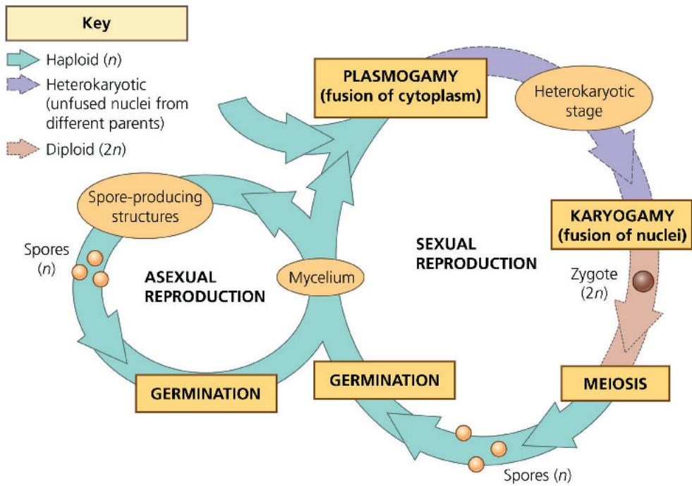  
Compare the genetic variation found in spores produced in the sexual and asexual portions of the life cycle. Why do these differences occur?
For suggested answer, see Appendix A.

diversity.) The heterokaryotic condition also offers some of the advantages of diploidy in that one haploid genome may compensate for harmful mutations in the other.

## Asexual Reproduction

Many fungi reproduce both sexually and asexually, as shown in Figure 31.5; others, however, reproduce only sexually or only asexually. As with sexual reproduction, the processes of asexual reproduction vary widely among fungi.

Many fungi reproduce asexually by growing as filamentous fungi that produce (haploid) spores by mitosis; such species are informally referred to as molds if they form visible mycelia. Depending on your housekeeping habits, you may have observed molds in your kitchen, forming furry carpets on bread or fruit (Figure 31.6). Molds typically grow rapidly and produce many spores asexually, enabling the fungi to colonize new sources of food. Many species that produce such spores can also reproduce sexually if they happen to contact a member of their species of a different mating type.

Other fungi reproduce asexually by growing as single-celled yeasts. Instead of

Figure 31.6 Penicillium, a mold commonly encountered as a decomposer of food.

The bead-like clusters in the colorized SEM are conidia, structures involved in asexual reproduction.

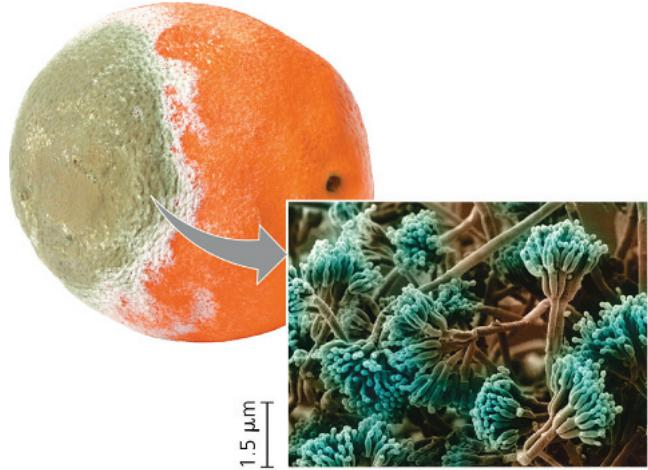

producing spores, asexual reproduction in yeasts occurs by ordinary cell division or by the pinching of small “bud cells” off a parent cell (Figure 31.7). As already mentioned, some fungi that grow as yeasts can also grow as filamentous mycelia.

Many yeasts and filamentous fungi have no known sexual stage in their life cycle. Since early mycologists (biologists who study fungi) classified fungi based mainly on their type of sexual structure, this posed a problem. Mycologists have

Figure 31.7 The yeast Saccharomyces cerevisiae in stages of budding.
(SEM)

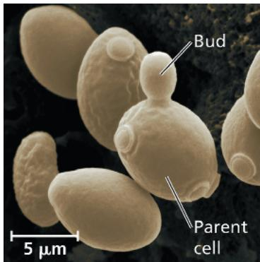

traditionally lumped all fungi lacking sexual reproduction into a group called deuteromycetes (from the Greek deutero, second, and mycete, fungus). Whenever a sexual stage is discovered for a so-called deuteromycete, the species is reclassified in a particular phylum, depending on the type of sexual structures it forms. In addition to searching for sexual stages of such unassigned fungi, mycologists can now use genomic techniques to classify them.

## Concept Check 31.2

1. MAKE CONNECTIONS Compare Figure 31.5 with Figure 13.6. In terms of haploidy versus diploidy, how do the life cycles of fungi and humans differ?

2. WHAT IF? Suppose that you sample the DNA of two mushrooms on opposite sides of your yard and find that they are identical. Propose two hypotheses that could reasonably account for this result.

For suggested answers, see Appendix A.

# Concept 31.3: The ancestor of fungi was an aquatic, single-celled, flagellated protist

Data from molecular systematics offer insights into the early evolution of fungi. As a result, systematists now recognize that fungi and animals are more closely related to each other than either group is to plants or to most other eukaryotes.

## The Origin of Fungi

Phylogenetic analyses suggest that fungi evolved from a flagellated ancestor. While the majority of fungi lack flagella, two lineages of fungi (the cryptomycetes and the chytrids, as we'll discuss shortly) do have flagella. Moreover, most of the protists that share a close common ancestor with animals and fungi also have flagella. DNA sequence data indicate that these three groups of eukaryotes—the fungi, the animals, and their protistan relatives—form a monophyletic group, or clade (Figure 31.8). As discussed in Concept 28.5, members of this clade are called opisthokonts, a name that refers to the posterior (opistho-) location of the flagellum in these organisms.

Within the opisthokont clade, fungi are more closely related to several groups of single-celled protists than they are to animals, suggesting that the ancestor of fungi was unicellular. One such group of unicellular protists, the nucleariids, consists of amoebas that feed on algae and bacteria. DNA evidence further indicates that animals are more closely related to a different group of protists (the choanoflagellates) than they are to either fungi or nucleariids. Together, these results suggest that multicellularity evolved in animals and fungi independently, from different single-celled ancestors.

Using molecular clock analyses, scientists have estimated that the ancestors of animals and fungi diverged into separate lineages more than a billion years ago. Fossils of certain multicellular, marine eukaryotes that lived 1 billion years ago have been interpreted as fungi, but some scientists have questioned this conclusion. Furthermore, although fungi probably originated in aquatic environments, the oldest fossils that are widely accepted as fungi are of terrestrial species that

Figure 31.8 Fungi and their close relatives.

Molecular evidence indicates that the nucleariids, a group of single-celled protists, are the closest living relatives of fungi.

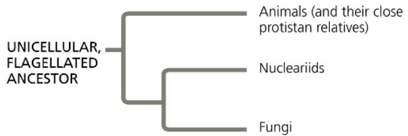

lived 440 million years ago (Figure 31.9). Fungi may have colonized land as early as 635 million years ago: Terrestrial fossils of that age were interpreted as “probable fungi” in a 2021 study. Overall, more fossils are needed to help clarify when fungi originated, what features were present in their earliest lineages, and when they first colonized land.

## The Move to Land

Plants colonized land about 470 million years ago (see Concept 29.1), and fungi may well have colonized land before plants. Indeed, some researchers have described life on land before the arrival of plants as a “green slime” that consisted of cyanobacteria, algae, and a variety of small, heterotrophic species, including fungi. With their capacity for extracellular digestion, fungi would have been well suited for feeding on other early terrestrial organisms (or their remains).

Once on land, some fungi formed symbiotic associations with early plants. For example, 405-million-year-old fossils of the early plant Aglaophyton contain evidence of mycorrhizal relationships between plants and fungi (see Figure 25.13). This evidence includes fossils of hyphae that have penetrated within plant cells and formed structures that resemble the arbuscules formed today by arbuscular mycorrhizae. Similar structures have been found in a variety of other

Figure 31.9 Fossil hyphae from the fungus Tortotubus (440 million years ago).

The central filament is surrounded by two partially overlapping filaments (LM).

early plants, suggesting that plants probably existed in beneficial relationships with fungi from the earliest periods of colonization of land. The earliest plants lacked roots, limiting their ability to extract nutrients from the soil. As occurs in mycorrhizal associations today, it is likely that soil nutrients were transferred to early plants via the extensive mycelia formed by their symbiotic fungal partners.

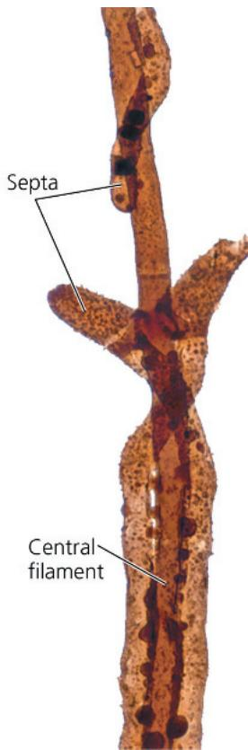

Support for the antiquity of mycorrhizal associations has also come from molecular studies. For a mycorrhizal fungus and its plant partner to establish a symbiotic relationship, certain genes must be expressed by the fungus and other genes must be expressed by the plant. Researchers focused on three plant genes (called sym genes) whose expression is required for the formation of mycorrhizae in flowering plants. They found these genes were present in all major plant lineages. Furthermore, after they transferred a liverwort sym gene to a flowering plant mutant that could not form mycorrhizae, the mutant recovered its ability to form mycorrhizae. These results suggest that mycorrhizal sym genes were present in early plants—and that the function of these genes has been conserved for hundreds of millions of years as plants adapted to life on land.

## Concept Check 31.3

1. Why are fungi classified as opisthokonts despite the fact that most fungi lack flagella?

2. Describe the importance of mycorrhizae, both today and in the colonization of land. What evidence supports the antiquity of mycorrhizal associations?

3. WHAT IF? If fungi colonized land before plants, where might the fungi have lived? How would their food sources have differed from what they feed on today?

For suggested answers, see Appendix A.

## Concept 31.4: Fungi have radiated into a diverse set of lineages

In the past decade, molecular analyses have reshaped our understanding of the evolutionary relationships between fungal groups. In addition, metagenomic studies have led to the discovery of entirely new groups of fungi. As a result, the phylogeny of fungi is undergoing dramatic change. For example, one traditional group, the Zygomycota, has been abandoned because it was paraphyletic, and its members have been reassigned to other groups. Recent studies also indicate that the microsporidians, an enigmatic group of unicellular parasites, should be classified as fungi and may belong to a lineage that diverged from all other fungi early in the history of the group.

Figure 31.10 presents a current hypothesis of the relationships among fungal groups. In this section, we'll survey the groups

Figure 31.10 A current hypothesis of the phylogeny of fungi. This phylogenetic hypothesis shows major clades of extant fungi. While many molecular studies support the early divergence of the lineage leading to cryptomycetes and microsporidians from other fungal groups, more data are needed to clarify these relationships.  
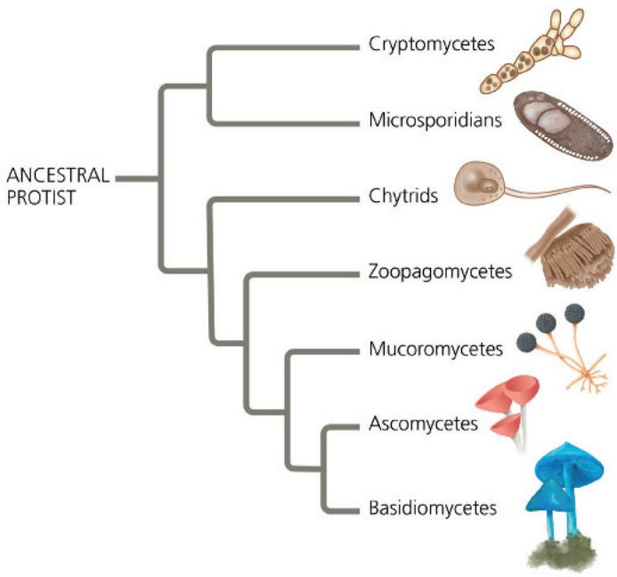

identified in this phylogenetic tree. However, the groups shown in Figure 31.10 may represent only a small fraction of the diversity of extant fungal groups. (Extant lineages are those that have surviving members.) While there are about 145,000 known species of fungi, in recent years more than 2,000 new species have been discovered annually. By some estimates the actual number of fungal species lies between 2.2 and 3.8 million—more than all of the 1.9 million species of organisms (of every type) that biologists have currently identified and named.

## Cryptomycetes and Microsporidians

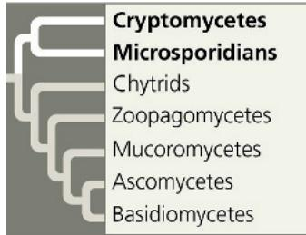

Genomic studies indicate that cryptomycetes (fungi in the phylum Cryptomycota) and microsporidians (fungi in the phylum Microsporidia) form a sister group (see Figure 31.10). While most molecular comparisons support the cryptomycete-

microsporidian lineage branching from the base of the fungal tree, more data are needed to help resolve this phylogeny.

## Cryptomycetes

Although only 30 species have been identified to date, genetic data suggest that the cryptomycetes are a large and diverse group. DNA sequences from members of this group have been found in marine and freshwater communities, as well as soils. Cryptomycetes also have been found in aerobic and anaerobic environments, and in geographical locations across the globe. Like the species shown in Figure 31.11, Rozella allomycis, many of the cryptomycetes identified to date are parasites of protists and other fungi.

Cryptomycetes are unicellular and have flagellated spores. Cryptomycetes also can synthesize a chitin-rich cell wall, a key structural feature of the fungi (see Concept 31.1).

Figure 31.11 The cryptomycete Rozella allomycis parasitizing another fungus.  
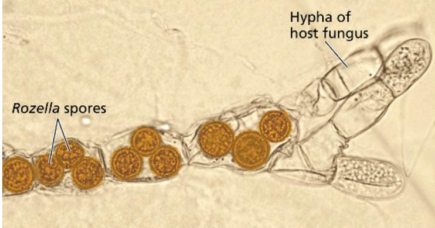

Figure 31.12 A spore of the microsporidian Fibrillanosema crangonycis.

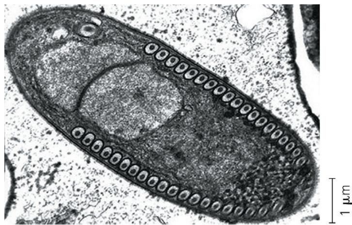

## Microsporidians

The 1,300 species of microsporidians are unicellular parasites of protists and animals, including humans (Figure 31.12). Infections in humans can cause reduced longevity and weight loss. The microsporidian Nosema ceranae is a parasite of honeybees and may contribute to Colony Collapse Disorder, a devastating outbreak that has led to the loss of honeybee colonies throughout the world.

Like all fungi, microsporidians can synthesize a chitin-rich cell wall. Other aspects of their biology are unusual. For example, microsporidians have highly reduced mitochondria and small genomes, with only 2,000 genes in some species. The genome of one microsporidian, Encephalitozoon intestinalis, has just 2.3 Mb of DNA—the smallest genome of any eukaryote sequenced to date. Unlike cryptomycetes and chytrids, microsporidians lack flagellated spores; instead, they produce unique spores that infect host cells via a harpoon-like organelle.

## Chytrids

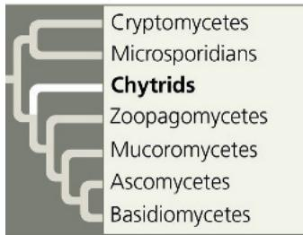

The fungi classified in phylum Chytridiomycota, called chytrids, are ubiquitous in lakes and soil; recent metagenomic studies have uncovered new clades of chytrids in hydrothermal vent and other marine communities. Some of the

approximately 1,000 chytrid species are decomposers, while others are parasites of protists, other fungi, plants, or animals; as we'll see later in the chapter, two chytrid parasites have contributed to the global decline of amphibian populations. Still other chytrids are important mutualists. For example, anaerobic chytrids that live in the digestive tracts of sheep and cattle help to break down plant matter, thereby contributing significantly to the animal's growth.

Nearly all chytrids have flagellated spores, called zoospores (Figure 31.13). Like other fungi, chytrids have

Figure 31.13 Flagellated chytrid zoospore.
(TEM)  
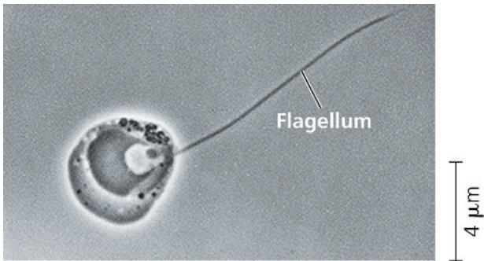  
cell walls made of chitin, and they also share certain key enzymes and metabolic pathways with other fungal groups. Some chytrids form colonies with hyphae, while others exist as single spherical cells.

## Zoopagomycetes

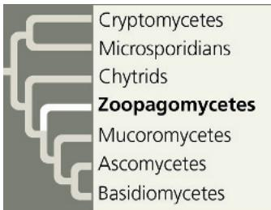

Most of the 900 species of zoopagomycetes, fungi in the phylum Zoopagomycota, live as parasites or as commensal (neutral) symbionts of animals; some are parasites of other fungi or protists. Zoopagomycetes form filamentous hyphae and reproduce asexually by producing nonflagellated spores. Some zoopagomycetes induce insects that they parasitize to perch near the top of plants; the insects subsequently die and fungal spores are released to infect new victims (Figure 31.14). Sexual reproduction, where known, involves the formation of a durable structure called a zygosporangium, which houses and protects the zygote.

The loss of flagellated spores in the zoopagomycetes and other fungal lineages may have been associated with a transition to life on land. Fungi in the cryptomycete and chytrid lineages have flagellated spores, enabling dispersal through water. In contrast, zoopagomycetes and all of their closest fungal relatives (the clade consisting of the mucoromycetes, ascomycetes, and basidiomycetes; see Figure 31.10) have nonflagellated spores, which are dispersed by wind in terrestrial fungi.

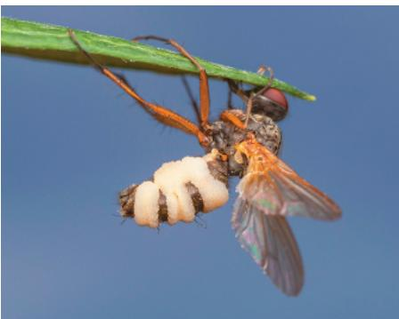  
Figure 31.14 A fly covered with fungal hyphae.  
This fly was killed by the zoopagomycete Entomophthora muscae, also known as the “fly death fungus,” for obvious reasons.  
Cryptomycetes
Microsporidians
Chytrids
Zoopagomycetes
Mucoromycetes
Ascomycetes
Basidiomycetes

## Mucoromycetes

There are approximately 750 known species of mucoromycetes, fungi in the phylum Mucoromycota. This phylum includes species of fast-growing molds responsible for causing foods such as bread, peaches, strawberries, and sweet potatoes to rot during

storage. Although some mucoromycetes are decomposers, most are associated with plants. Many mucoromycetes live as parasites or pathogens of plants, while others live as mutualists (including some mycorrhizae).

The life cycle of Rhizopus stolonifer (black bread mold) is fairly typical of mucoromycete species (Figure 31.15). Its hyphae spread out over the food surface, penetrate it, and absorb nutrients. The hyphae are coenocytic, with septa found only where reproductive cells are formed. In the asexual phase, bulbous black sporangia develop at the tips of upright hyphae. Within each sporangium, hundreds of genetically identical haploid spores develop and are dispersed through the air. Spores that happen to land on moist food germinate, growing into new mycelia.

If environmental conditions deteriorate—for instance, if the mold consumes all its food—Rhizopus may reproduce sexually. The parents in a sexual union are mycelia of different mating types, which possess different chemical markers but may appear identical. Plasmogamy produces a sturdy structure called a zygosporangium (plural, zygosporangia), in which karyogamy and then meiosis occur. Note that while a zygosporangium represents the zygote (2n) stage in the life cycle, it is not a zygote in the usual sense (that is, a cell with one diploid nucleus). Rather, a zygosporangium is a multinucleate structure, first heterokaryotic with many haploid nuclei from the two parents, then with many diploid nuclei after karyogamy.

Zygosporangia are resistant to freezing and drying and are metabolically inactive. When conditions improve, the nuclei of the zygosporangium undergo meiosis, the zygosporangium germinates into a sporangium, and the sporangium releases genetically diverse haploid spores that may colonize a new substrate. Some mucoromycetes can actually “aim” and then shoot their sporangia toward bright light. Figure 31.16 shows one example, Pilobolus, which decomposes animal dung. Its sporebearing hyphae bend toward light, where there are likely to be openings in the vegetation through which spores may reach fresh grass. The fungus then launches its sporangia in a jet of water that can travel up to 2.5 m. Grazing animals ingest the fungi with the grass and then scatter the spores in feces, thereby enabling the next generation of fungi to grow.

Finally, the phylum Mucoromycota also includes the glomeromycete fungi, a clade of fungi that form arbuscular mycorrhizae (see Figure 31.4b and Figure 37.14). The tips of the hyphae that push into plant root cells branch into tiny treelike arbuscules. About 85% of all plant species have mutualistic partnerships with arbuscular mycorrhizae.

Figure 31.15 The life cycle of the mucoromycete Rhizopus stolonifer (black bread mold).  
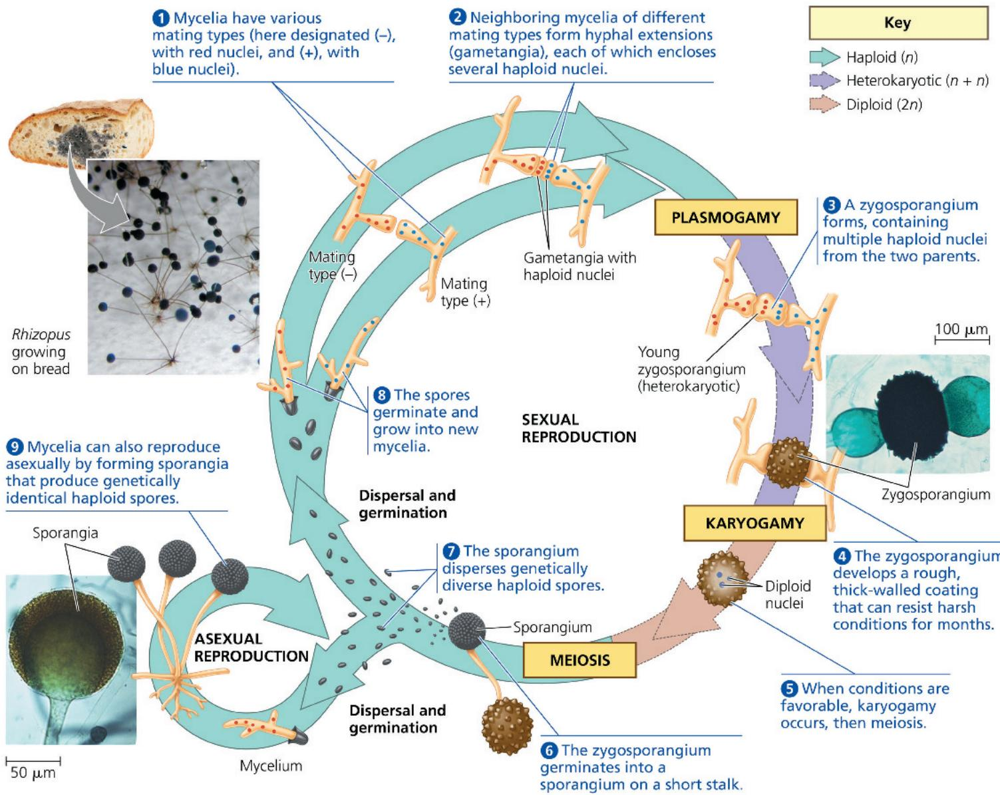

Figure 31.16 Pilobolus aiming its sporangia.  
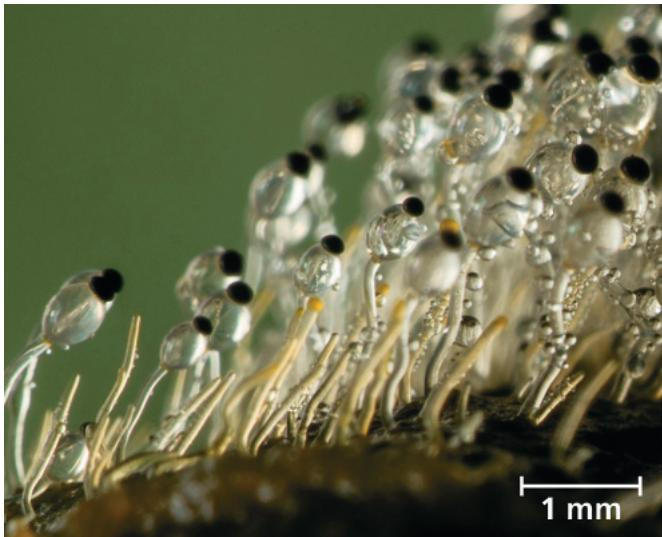

## Ascomycetes

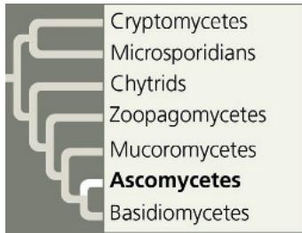

Mycologists have described 90,000 species of ascomycetes, fungi in the phylum Ascomycota, from a wide variety of marine, freshwater, and terrestrial habitats. The defining feature of ascomycetes is the production of spores (called ascospores) in saclike asci (singular, ascus);

thus, they are commonly called sac fungi. During their sexual stage, most ascomycetes develop fruiting bodies, called ascocarps, which range in size from microscopic to macroscopic (Figure 31.17). The ascocarps contain the spore-forming asci.

Ascomycetes vary in size and complexity from unicellular yeasts to elaborate cup fungi and morels (see Figure 31.17). They include some of the most devastating plant pathogens,

Figure 31.17 Ascomycetes (sac fungi).  
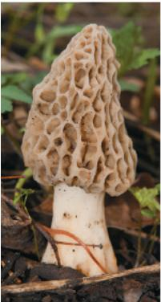

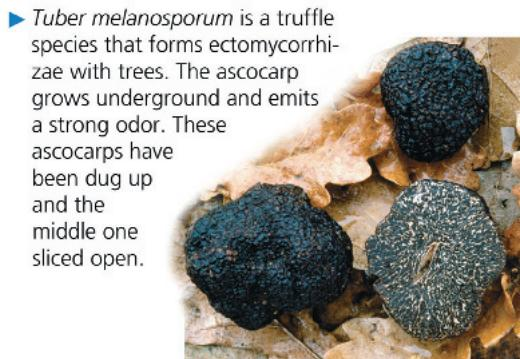

The edible ascocarp of Morchella esculenta, the tasty morel, is often found under trees in orchards.

Ascomycetes vary greatly in morphology (see also Figure 31.10). How could you confirm that a fungus is an ascomycete?
For suggested answer, see Appendix A.

which we will discuss later. However, many ascomycetes are important decomposers, particularly of plant material. More than 25% of all ascomycete species live with green algae or cyanobacteria in beneficial symbiotic associations called lichens. Some ascomycetes form mycorrhizae with plants. Many others live between mesophyll cells in leaves; some of these species release toxic compounds that help protect the plant from insects.

Although the life cycles of various ascomycete groups differ in the details of their reproductive structures and processes, we'll illustrate some common elements using the bread mold Neurospora crassa (Figure 31.18). Ascomycetes reproduce asexually by producing enormous numbers of asexual spores called conidia (singular, conidium). Unlike the asexual spores of most mucoromycetes, in most ascomycetes, conidia are not formed inside sporangia. Rather, they are produced externally at the tips of specialized hyphae called conidiophores, often in clusters or long chains, from which they may be dispersed by the wind.

Figure 31.18 The life cycle of Neurospora crassa, an ascomycete.

Neurospora is a bread mold and research organism that also grows in the wild on burned vegetation.

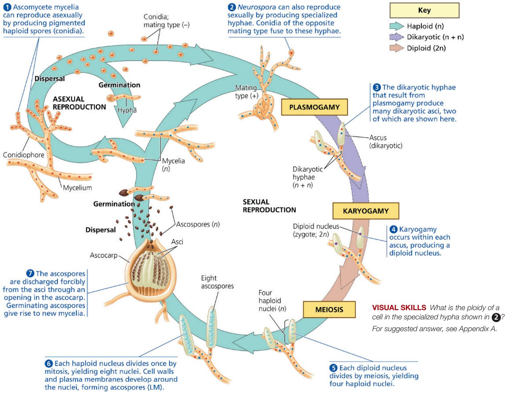

Table 31.1 Comparison of Gene Density in Neurospora, Drosophila, and Homo sapiens

<table><tr><td></td><td>Genome Size (million base pairs)</td><td>Number of Genes</td><td>Gene Density (genes per million base pairs)</td></tr><tr><td>Neurospora crassa (ascomycete fungus)</td><td>41</td><td>9,700</td><td>236</td></tr><tr><td>Drosophila melanogaster (fruit fly)</td><td>165</td><td>14,000</td><td>85</td></tr><tr><td>Homo sapiens (human)</td><td>3,000</td><td>~20,000</td><td>7</td></tr></table>

Figure 31.19 Basidiomycetes (club fungi).

Conidia may also be involved in sexual reproduction, fusing with hyphae from a mycelium of a different mating type, as occurs in Neurospora. Fusion of two different mating types is followed by plasmogamy, resulting in the formation of dikaryotic cells, each with two haploid nuclei representing the two parents. The cells at the tips of these dikaryotic hyphae develop into many asci. Within each ascus, karyogamy combines the two parental genomes, and then meiosis forms four genetically different nuclei. This is usually followed by a mitotic division, forming eight ascospores. The ascospores develop in and are eventually discharged from the ascocarp.

Compared to the life cycle of mucoromycetes, the extended dikaryotic stage of ascomycetes (and also basidiomycetes) provides additional opportunities for genetic recombination. In Neurospora, for example, many dikaryotic cells can develop into asci. The haploid nuclei in these asci fuse, and their genomes then recombine during meiosis, resulting in a multitude of genetically different offspring from one mating event (see steps 3–5 in Figure 31.18).

As described in Figure 17.2, biologists in the 1930s used Neurospora in research that led to the one gene–one enzyme hypothesis. Today, this ascomycete continues to serve as a model research organism. In 2003, its entire genome was published. This tiny fungus has about three-fourths as many genes as the fruit fly Drosophila and about half as many as a human (Table 31.1). The Neurospora genome is relatively compact, having few of the stretches of noncoding DNA that occupy so much space in the genomes of humans and many other eukaryotes. In fact, there is evidence that Neurospora has a genomic defense system that prevents noncoding DNA such as transposons from accumulating.

## Basidiomycetes

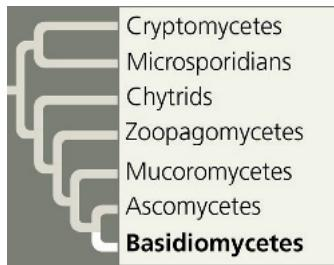

About 50,000 species, including mushrooms, puffballs, and shelf fungi, are called basidiomycetes and are classified in the phylum Basidiomycota (Figure 31.19). This phylum also includes mutualists that form mycorrhizae and two groups of destructive plant parasites: rusts and smuts. The

name of the phylum derives from the basidium (plural, basidia; Latin for “little pedestals”), a cell in which karyogamy occurs, followed

▶ Shelf fungi, important decomposers of wood

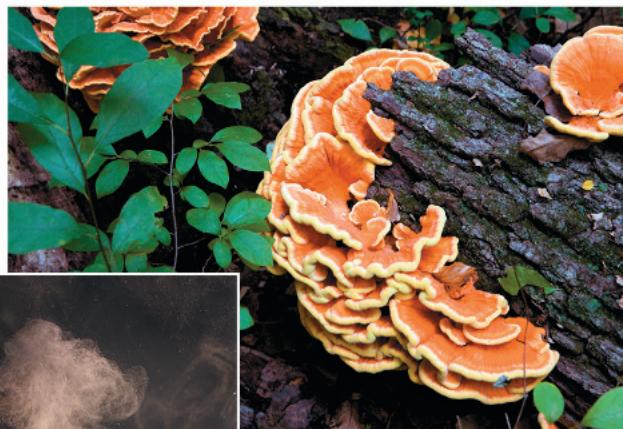

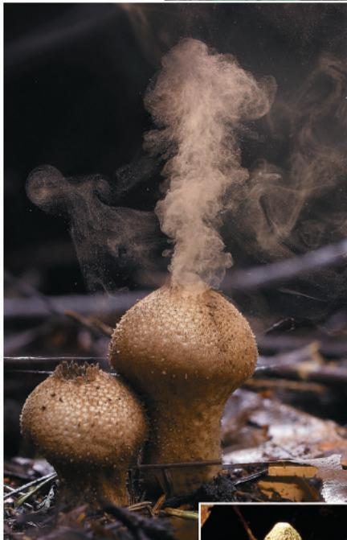  
Puffballs emitting spores

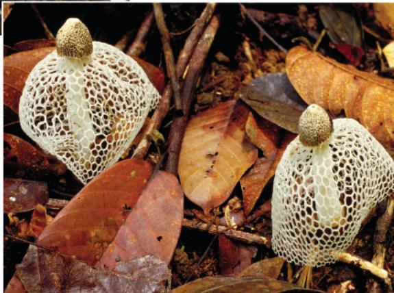  
▶ Maiden veil fungus (Dictyphora), a fungus with an odor like rotting meat

immediately by meiosis. The club-like shape of the basidium also gives rise to the common name club fungus.

Basidiomycetes are important decomposers of wood and other plant material. Of all the fungi, certain basidiomycetes are the best at decomposing the complex polymer lignin, an abundant component of wood. Many shelf fungi break down the wood of weak or damaged trees and continue to decompose the wood after the tree dies.

The life cycle of a basidiomycete usually includes a long-lived dikaryotic mycelium. As in ascomycetes, this extended dikaryotic stage provides many opportunities for genetic recombination events, in effect multiplying the result of a single mating. Periodically, in response to environmental stimuli, the mycelium reproduces sexually by producing elaborate fruiting bodies called basidiocarps (Figure 31.20). The common white mushrooms in the supermarket are familiar examples of a basidiocarp.

Figure 31.20 The life cycle of a mushroom-forming basidiomycete.  
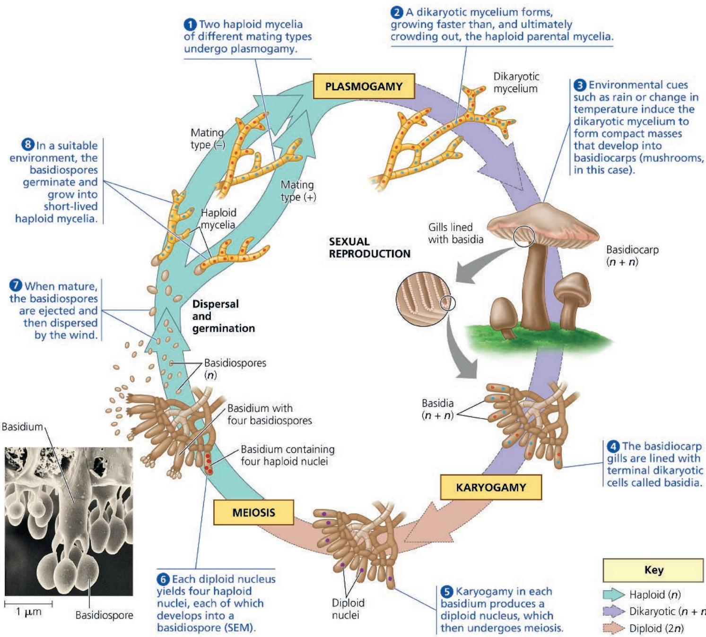  
VISUAL SKILLS Use the diagram to determine the ploidy of a cell in the aboveground stalk of a mushroom. For suggested answer, see Appendix A.

By concentrating growth in the hyphae of mushrooms, a basidiomycete mycelium can erect its fruiting structures in just a few hours; a mushroom pops up as it absorbs water and as cytoplasm streams in from the dikaryotic mycelium. By this process, in some species a ring of mushrooms, popularly called a "fairy ring," may appear literally overnight (Figure 31.21). The mycelium below the fairy ring expands outward at a rate of about $30~\mathrm{cm}$ per year, decomposing organic matter in the soil as it grows. Some giant fairy rings are produced by mycelia that are centuries old.

After a mushroom forms, its cap supports and protects a large surface area of dikaryotic basidia on gills. During karyogamy, the two nuclei in each basidium fuse, producing a diploid nucleus (see Figure 31.20). This nucleus then undergoes meiosis, yielding four haploid nuclei, each of which ultimately develops into a basidiospore. Large numbers of basidiospores are produced: The gills of a common white mushroom have a surface area of about $200 \, cm^2$ and may drop a billion basidiospores, which blow away.

## Figure 31.21 A fairy ring.

According to legend, mushroom rings spring up where fairies have danced on a moonlit night. The text provides a biological explanation of how these rings form.

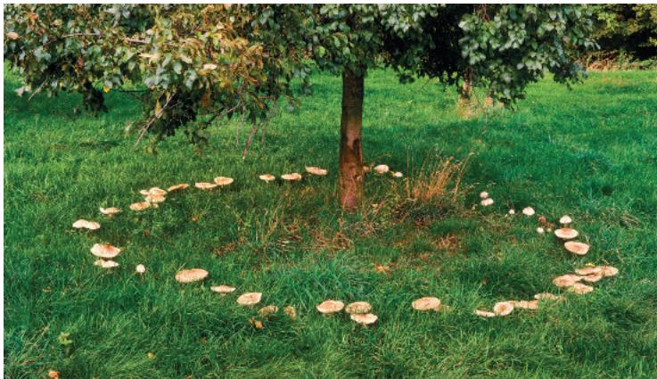

## Concept Check 31.4

1. Based on the phylogenetic tree shown in Figure 31.10, how might you explain that cryptomycetes and chytrids have flagellated spores, but microsporidians do not?

2. Give examples of how form fits function in mucoromycetes, ascomycetes, and basidiomycetes.

3. WHAT IF? Suppose that the mutation of an ascomycete changed its life cycle so that plasmogamy, karyogamy, and meiosis occurred in quick succession. How might this affect the ascospores and ascocarps?

For suggested answers, see Appendix A.

## Concept 31.5: Fungi play key roles in nutrient cycling, ecological interactions, and human welfare

In our survey of fungal classification, we've touched on some of the ways fungi influence other organisms. We will now look more closely at these impacts, focusing on how fungi act as decomposers, mutualists, and pathogens.

## Fungi as Decomposers

Fungi are well adapted as decomposers of organic material, including the cellulose and lignin of plant cell walls. In fact, almost any carbon-containing substrate—even jet fuel and house paint—can be consumed by at least some fungi. The same is true of bacteria. As a result, fungi and bacteria are primarily responsible for keeping ecosystems stocked with the inorganic nutrients essential for plant growth. Without these decomposers, carbon, nitrogen, and other elements would remain tied up in organic matter. If that were to happen, plants and the animals that eat them could not exist because elements taken from the soil would not be returned. Without decomposers, life as we know it would cease.

## Fungi as Mutualists

Fungi may form mutualistic relationships with plants, algae, cyanobacteria, and animals. Mutualistic fungi absorb nutrients from a host organism, but they reciprocate with actions that benefit the host—as we already saw for the key mycorrhizal associations that fungi form with most vascular plants. We turn now to other examples of mutualistic fungi.

## Fungus-Plant Mutualisms

All plant species studied to date appear to harbor symbiotic endophytes, fungi (or bacteria) that live inside leaves or other plant parts without causing harm. Most fungal endophytes identified to date are ascomycetes but some are mucoromycetes. Fungal endophytes benefit certain grasses and other nonwoody plants by making toxins that deter herbivores or by increasing host plant tolerance of heat, drought, or heavy metals. As described in Figure 31.22, on the next page, researchers studying how fungal endophytes affect a woody plant tested whether leaf endophytes benefit seedlings of the cacao tree, Theobroma cacao. Their findings show that the fungal endophytes of woody flowering plants can play an important role in defending against pathogens.

## Fungus-Animal Mutualisms

As mentioned earlier, some fungi share their digestive services with animals, helping break down plant material in the guts of cattle and other grazing mammals. Many species of ants take advantage of the digestive power of fungi by raising them in “farms.” Leaf-cutter ants, for example, scour tropical forests in search of leaves, which they cannot digest on their own but carry back to their nests and feed to the fungi (Figure 31.23). As the fungi grow, their hyphae develop specialized swollen tips that are rich in proteins and carbohydrates. The ants feed primarily

## Figure 31.23 Fungus-gardening insects.

These leaf-cutting ants depend on fungi to convert plant material to a form the insects can digest. The fungi, in turn, depend on the nutrients from the leaves the ants feed them.

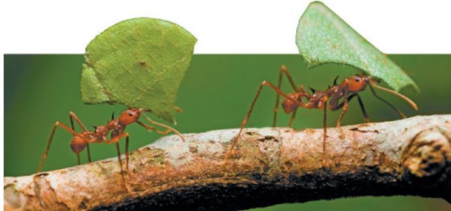

## Figure 31.22

## Inquiry: Do fungal endophytes benefit a woody plant?

Experiment

Fungal endophytes are symbiotic fungi found within the bodies of all plants examined to date. Researchers tested whether fungal endophytes benefit the cacao tree (Theobroma cacao). This tree, whose name means “food of the gods” in Greek, is the source of the beans used to make chocolate, and it is cultivated throughout the tropics. A particular mixture of fungal endophytes was added to the leaves of some cacao seedlings, but not others. (In cacao, fungal endophytes colonize leaves after the seedling germinates.) The seedlings were then inoculated with a virulent pathogen, the protist Phytophthora.

## Results

Fewer leaves were killed by the pathogen in seedlings with fungal endophytes than in seedlings without endophytes. Among leaves that survived, pathogens damaged less of the leaf surface area in seedlings with endophytes than in seedlings without endophytes.

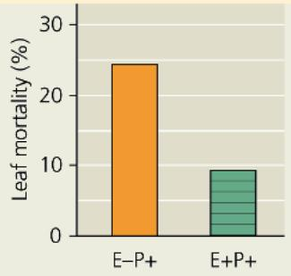

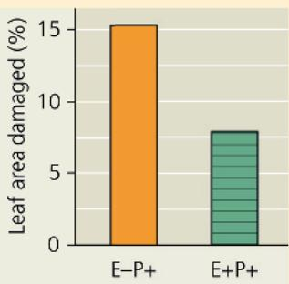

## Conclusion

The presence of endophytes appears to benefit cacao trees by reducing the leaf mortality and damage caused by Phytophthora.

Data from A. E. Arnold et al., Fungal endophytes limit pathogen damage in a tropical tree, Proceedings of the National Academy of Sciences USA 100:15649–15654 (2003).

WHAT IF? The researchers also performed control treatments. Suggest two controls they might have used, and explain how each would be helpful in interpreting the results described here.

For suggested answer, see Appendix A.

on these nutrient-rich tips. Not only do the fungi break down plant leaves into substances the insects can digest, but they also detoxify plant defensive compounds that would otherwise kill or harm the ants. In some tropical forests, the fungi have helped these insects become the major consumers of leaves.

Figure 31.24 Variation in lichen growth forms.  
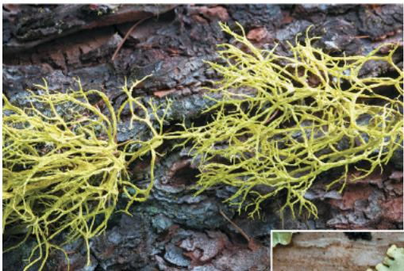  
A fruticose (shrublike) lichen  
▶ A foliose (leaflike) lichen

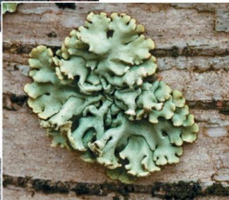

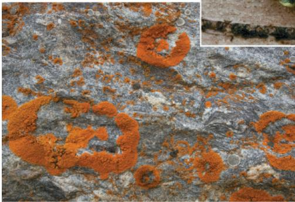  
Crustose (encrusting) lichens

The evolution of such farmer ants and that of their fungal “crops” have been tightly linked for over 50 million years. The fungi have become so dependent on their caretakers that in many cases they can no longer survive without the ants, and vice versa.

## Lichens

A lichen is a symbiotic association between a photosynthetic micro-organism and a fungus in which millions of photosynthetic cells are held in a mass of fungal hyphae. Lichens grow on the surfaces of rocks, rotting logs, trees, and roofs in various forms (Figure 31.24). The photosynthetic partners are unicellular or filamentous green algae or cyanobacteria. The fungal component is most often an ascomycete, but some glomeromycete and basidiomycete lichens are known. Recent studies have found that many lichens also have a basidiomycete yeast as a second fungal component. As the role of these yeasts remains unknown, our discussion will focus on the primary fungal partner.

The fungus usually gives a lichen its overall shape and overall shape and structure, and tissues formed by hyphae account for most of the lichen's mass. The cells of the alga or cyanobacterium generally occupy an inner layer below the lichen surface (Figure 31.25). The merger of fungus and alga or cyanobacterium is so complete that lichens are given scientific names as though they were single organisms. As might be expected of such “dual organisms,” asexual reproduction as a symbiotic unit is common.

Figure 31.25 Anatomy of an ascomycete lichen.
(colorized SEM) Ascocarp o  
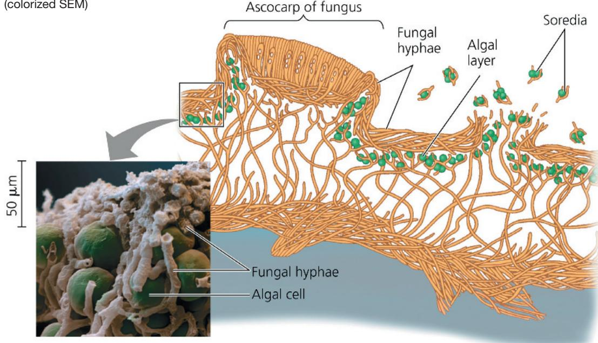

This can occur either by fragmentation of the parental lichen or by the formation of soredia (singular, soredium), small clusters of hyphae with embedded algae (see Figure 31.25). The fungi of many lichens also reproduce sexually.

In most lichens, each partner provides something the other could not obtain on its own. The alga or cyanobacterium provides carbon compounds; a cyanobacterium also fixes nitrogen (see Concept 27.3) and provides organic nitrogen compounds. The fungus provides its photosynthetic partner with a suitable environment for growth. The physical arrangement of hyphae allows for gas exchange, protects the photosynthetic partner, and retains water and minerals, most of which are absorbed from airborne dust or from rain. The fungus also secretes acids, which aid in the uptake of minerals.

Lichens are important pioneers on cleared rock and soil surfaces, such as volcanic flows and burned forests. They break down the surface by physically penetrating and chemically attacking it, and they trap windblown soil. Nitrogen-fixing lichens also add organic nitrogen to some ecosystems. These processes make it possible for a succession of plants to grow. Fossils show that lichens were on land 420 million years ago. These early lichens may have modified rocks and soil much as they do today, helping pave the way for plants.

## Fungi as Parasites

Like mutualistic fungi, parasitic fungi absorb nutrients from the cells of living hosts, but they provide no benefits in return. About 30% of the 145,000 known species of fungi make a living as parasites or pathogens, mostly of plants (Figure 31.26). An example of a plant pathogen is Cryphonectria parasitica, the ascomycete fungus that causes chestnut blight, which dramatically changed the landscape of the northeastern United States. Accidentally introduced via trees imported from Asia in the early 1900s, spores of the fungus entered cracks in the bark

of American chestnut trees and produced hyphae, killing many trees. The once-common chestnuts now survive mainly as sprouts from the stumps of former trees. Another ascomycete, Fusarium circinatum, causes pine pitch canker, a disease that threatens pines throughout the world. In addition, between 10% and 50% of the world's fruit harvest is lost annually due to fungi, and grain crops also suffer major losses each year.

Some fungi that attack food crops produce compounds that are toxic to humans. One example is the ascomycete Claviceps purpurea, which grows on rye plants, forming purple structures called ergots (see Figure 31.26c). If infected rye is milled into flour, toxins from

the ergots can cause ergotism, characterized by gangrene, nervous spasms, burning sensations, hallucinations, and temporary insanity. An epidemic of ergotism around 944 CE killed up to 40,000 people in France. One compound that has been isolated from ergots is lysergic acid, the raw material from which the hallucinogen LSD is made.

Although animals are less susceptible to parasitic fungi than are plants, about 1,000 fungi are known to parasitize animals. Two such parasites, the chytrids Batrachochytrium dendrobatidis (discovered in 1998) and B. salamandrivorans (discovered in 2013; this species primarily attacks salamanders), have been implicated

Figure 31.26 Examples of fungal diseases of plants.  
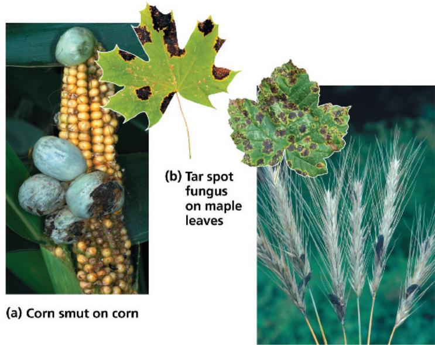  
(b) Tar spot fungus on maple leaves  
(a) Corn smut on corn  
(c) Ergots on rye

## Figure 31.27 Amphibians under attack.

The number of yellow-legged frogs (Rana muscosa) plummeted after the chytrid Batrachochytrium dendrobatidis reached the Sixty Lake Basin area of California. In the years leading up to the chytrid's 2004 arrival, there had been more than 2,300 frogs in these lakes. By 2009, only 38 frogs remained; all the survivors were in two lakes (yellow) where frogs had been treated with a fungicide to reduce the chytrid's impact.

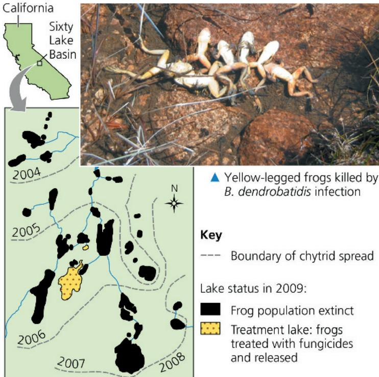  
INTERPRET THE DATA Do the data depicted indicate that the chytrid caused or is correlated to the drop in frog numbers? Explain.

in the recent decline or extinction of 500 species of frogs and other amphibians. These chytrids can cause severe skin infections, leading to massive die-offs (Figure 31.27). Field observations and studies of museum specimens show that B. dendrobatidis and B. salamandrivorans first appeared in amphibian populations shortly before their declines in Australia, Costa Rica, Germany, the United States, and other countries. Genetic analyses indicate that both B. dendrobatidis and B. salamandrivorans originated in Asia and spread from there via the commercial trade of frogs and salamanders.

The general term for an infection in an animal by a fungal parasite is mycosis. In humans, skin mycoses include the disease ringworm, so named because it appears as circular red areas on the skin. Most commonly, the ascomycetes that cause ringworm grow on the feet, causing the intense itching and blisters known as athlete's foot. Though highly contagious, athlete's foot and other ringworm infections can be treated with fungicidal lotions and powders.

Systemic mycoses, by contrast, spread through the body and usually cause very serious illnesses. They are typically caused by inhaled spores. For example, coccidioidomycosis is a systemic mycosis that produces tuberculosis-like symptoms in the lungs. Each year, hundreds of cases in North America require treatment with antifungal drugs, without which the disease could be fatal.

Some mycoses are opportunistic, occurring only when a change in the body's microorganisms, chemical environment, or immune system allows fungi to grow unchecked. Candida albicans, for example, is one of the normal inhabitants of moist epithelia, such as the vaginal lining. Under certain circumstances, C. albicans can grow too rapidly and become pathogenic, leading to so-called “yeast infections.” A related species, C. auris, has emerged as a global threat, often in healthcare facilities. Resistant to multiple antifungal drugs, this species can infect the bloodstream and cause life-threatening infections.

## Practical Uses of Fungi

The dangers posed by fungi should not overshadow their immense benefits. We depend on their ecological services as decomposers and recyclers of organic matter. In addition, mushrooms are not the only fungi of interest for human consumption. Fungi are used to ripen Roquefort and other blue cheeses. Morels and truffles, the edible fruiting bodies of various ascomycetes, are highly prized for their complex flavors (see Figure 31.17). These fungi can sell for hundreds to thousands of dollars a pound. Truffles release strong odors that attract mammals and insects, which in nature feed on them and disperse their spores. In some cases, the odors mimic the pheromones (sex attractants) of certain mammals. For example, the odors of several European truffles mimic the pheromones released by male pigs, which explains why truffle hunters sometimes use female pigs to help find these delicacies.

Humans have used yeasts to produce alcoholic beverages and bread for thousands of years. Under anaerobic conditions, yeasts ferment sugars to alcohol and $\mathrm{CO}_{2}$ , which causes dough to rise. Only relatively recently have the yeasts involved been separated into pure cultures for more controlled use. The yeast Saccharomyces cerevisiae is the most important of all cultured fungi (see Figure 31.7). It is available as many strains of baker's yeast and brewer's yeast.

Many fungi have great medical value as well. For example, a compound extracted from ergots is used to reduce high blood pressure and to stop maternal bleeding after childbirth. Some fungi produce antibiotics that are effective in treating bacterial infections. In fact, the first antibiotic discovered was penicillin, made by the ascomycete mold Penicillium. Other examples of pharmaceuticals derived from fungi include cholesterol-lowering drugs and cyclosporine, a drug used to suppress the immune system after organ transplants.

Fungi also figure prominently in basic research. For example, the yeast Saccharomyces cerevisiae is used to study the molecular genetics of eukaryotes because its cells are easy to culture and manipulate. Scientists are gaining insight into the genes involved in Parkinson's disease by examining the functions of homologous genes in S. cerevisiae.

Genetically modified fungi also hold much promise. For example, scientists have succeeded in engineering a strain of S. cerevisiae that produces human glycoproteins, including insulin-like growth factor. Such fungus-produced glycoproteins have the potential to treat people with medical conditions that prevent them from producing these compounds. Meanwhile, other researchers are sequencing the genome of

Figure 31.28 Can this fungus be used to produce biofuels? The ascomycete Gliocladium roseum can produce hydrocarbons similar to those in diesel fuel (colorized SEM).  
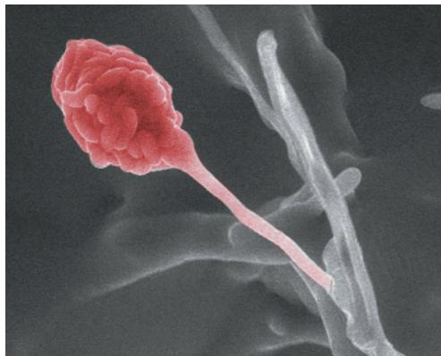

Gliocladium roseum, an ascomycete that can grow on wood or agricultural waste and that naturally produces hydrocarbons similar to those in diesel fuel (Figure 31.28). They hope to decipher the metabolic pathways by which G. roseum synthesizes hydrocarbons, with the goal of harnessing those pathways to produce biofuels without reducing land area for growing food crops (as occurs when ethanol is produced from corn).

Having now completed our survey of the kingdom Fungi, we will turn in the rest of this unit to the closely related kingdom Animalia, to which we humans belong.

## Concept Check 31.5

1. What are some of the benefits that lichen algae can derive from their relationship with fungi?

2. What characteristics of pathogenic fungi result in their being efficiently transmitted?

3. WHAT IF? How might life on Earth differ from what we know today if no mutualistic relationships between fungi and other organisms had ever evolved?

For suggested answers, see Appendix A.

## Chapter 31 Review

## Summary of Key Concepts

To review key terms, go to the Vocabulary Self-Quiz (eTextbook only).

## Concept 31.1: Fungi are heterotrophs that feed by absorption

\- All fungi (including decomposers and symbionts) are heterotrophs that acquire nutrients by absorption. Many fungi secrete enzymes that break down complex molecules.

\- Most fungi grow as thin, multicellular filaments called hyphae; relatively few species grow only as single-celled yeasts. In their multicellular form, fungi consist of mycelia, networks of branched hyphae adapted for absorption. Mycorrhizal fungi have specialized hyphae that enable them to form a mutually beneficial relationship with plants.

How does the morphology of multicellular fungi affect the efficiency of nutrient absorption?

## Concept 31.2: Fungi produce spores through sexual or asexual life cycles

\- In fungi, the sexual life cycle involves cytoplasmic fusion (plasmogamy) and nuclear fusion (karyogamy), with an intervening heterokaryotic stage in which cells have haploid nuclei from two parents. The diploid cells resulting from karyogamy are short-lived and undergo meiosis, producing genetically diverse haploid spores.

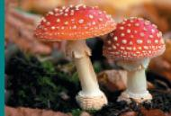

\- Many fungi can reproduce asexually as filamentous fungi or yeasts.

DRAW IT Draw a generalized fungal life cycle, labeling asexual and sexual reproduction, meiosis, plasmogamy, karyogamy, and the points in the cycle when spores and the zygote are produced.

## Concept 31.3: The ancestor of fungi was an aquatic, single-celled, flagellated protist

\- Molecular evidence indicates that fungi and animals diverged over a billion years ago from a common unicellular ancestor that had a flagellum. However, the oldest fossils that are widely accepted as fungi are 440 million years old.

\- Chytrids and cryptomycetes have flagellated spores.

\- Fungi were among the earliest colonizers of land; fossil evidence indicates that these colonizers included species that were symbionts with early plants.

Did multicellularity originate independently in fungi and animals? Explain.

Concept 31.4: Fungi have radiated into a diverse set of lineages

<table><tr><td>Fungal Phylum</td><td colspan="2">Distinguishing Features</td></tr><tr><td>Cryptomycota (cryptomycetes)</td><td>Parasites with flagellated spores</td><td>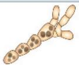</td></tr><tr><td>Microsporidia (microsporidians)</td><td>Parasitic cells that form resistant spores</td><td>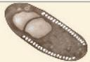</td></tr><tr><td>Chytridiomycota (chytrids)</td><td>Flagellated spores</td><td>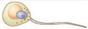</td></tr><tr><td>Zoopagomycota (zoopagomycetes)</td><td>Resistant zygosporangium as sexual stage</td><td>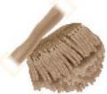</td></tr><tr><td>Mucoromycota (mucoromycetes)</td><td>Include fungi that form arbuscular mycorrhizae with plants</td><td>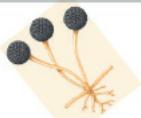</td></tr><tr><td>Ascomycota (ascomycetes)</td><td>Sexual spores (ascospores) borne internally in sacs called asci; vast numbers of asexual spores (conidia) produced</td><td>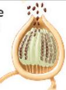</td></tr><tr><td>Basidiomycota (basidiomycetes)</td><td>Elaborate fruiting body (basidiocarp) containing many basidia that produce sexual spores (basidiospores)</td><td>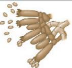</td></tr></table>

DRAW IT Draw a phylogenetic tree of the major groups of fungi.

## Concept 31.5: Fungi play key roles in nutrient cycling, ecological interactions, and human welfare

\- Fungi perform essential recycling of chemical elements between the living and nonliving world.

\- Lichens are highly integrated symbiotic associations of fungi and algae or cyanobacteria.

\- Many fungi are parasites, mostly of plants.

• Humans use fungi for food and to make antibiotics.

How are fungi important as decomposers, mutualists, and pathogens?

For suggested answers, see Appendix A.

## Test Your Understanding

For more multiple-choice questions, go to the Practice Test (eTextbook only).

## Levels 1-2: Remembering/Understanding

1. All fungi are
(A) symbiotic.
(B) heterotrophic.
(C) flagellated.
(D) decomposers.

2. Which of the following cells or structures are associated with asexual reproduction in fungi?
(A) ascospores (C) zygosporangia
(B) basidiospores (D) conidiophores

3. Which of the following groups of organisms are most closely related to fungi?
(A) animals (C) mosses
(B) vascular plants (D) slime molds

## Levels 3-4: Applying/Analyzing

4. The most important adaptive advantage associated with the filamentous nature of fungal mycelia is

(A) the ability to form haustoria and parasitize other organisms.

(B) the potential to inhabit almost all terrestrial habitats.

(C) the increased chance of contact between mating types.

(D) an extensive surface area well suited for invasive growth and absorptive nutrition.

5. SCIENTIFIC INQUIRY • INTERPRET THE DATA The grass Dichanthelium lanuginosum lives in hot soils and houses fungi of the genus Curvularia as endophytes. Researchers tested the impact of Curvularia on the heat tolerance of this grass. They grew plants without (E−) and with (E+) Curvularia endophytes at different temperatures and measured plant mass and the number of new shoots the plants produced. Draw a bar graph for plant mass versus temperature and interpret it.

<table><tr><td>Soil Temp.</td><td>Curvularia + or -</td><td>Plant Mass (g)</td><td>No. of New Shoots</td></tr><tr><td>30°C</td><td>E-</td><td>16.2</td><td>32</td></tr><tr><td></td><td>E+</td><td>22.8</td><td>60</td></tr><tr><td>35°C</td><td>E-</td><td>21.7</td><td>43</td></tr><tr><td></td><td>E+</td><td>28.4</td><td>60</td></tr><tr><td>40°C</td><td>E-</td><td>8.8</td><td>10</td></tr><tr><td></td><td>E+</td><td>22.2</td><td>37</td></tr><tr><td>45°C</td><td>E-</td><td>0</td><td>0</td></tr><tr><td></td><td>E+</td><td>15.1</td><td>24</td></tr></table>

Data from R. S. Redman et al., Thermotolerance generated by plant/fungal symbiosis, Science 298:1581 (2002).

## Levels 5-6: Evaluating/Creating

6. EVOLUTION CONNECTION The fungus–alga symbiosis that makes up a lichen is thought to have evolved multiple times independently in different fungal groups. However, lichens fall into three well-defined growth forms (see Figure 31.24). How could you test the following hypotheses? Hypothesis 1: Crustose, foliose, and fruticose lichens each represent a monophyletic group. Hypothesis 2: Each lichen growth form represents convergent evolution by diverse fungal groups.

7. WRITE ABOUT A THEME: ORGANIZATION As you read in this chapter, fungi have long formed symbiotic associations with plants and with algae. In a short essay (100–150 words), describe how these two types of associations may lead to emergent properties in biological communities.

## 8. SYNTHESIZE YOUR KNOWLEDGE

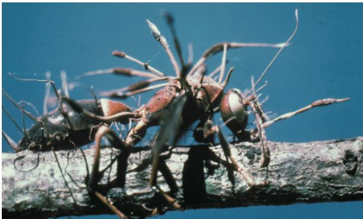  
This wasp is the unfortunate victim of an entomopathogenic fungus (a parasitic fungus of insects). Write a paragraph describing what this image illustrates about the nutritional mode, body structure, and ecological role of the fungus.
For selected answers, see Appendix A.

