# 第32章 An Overview of Animal Diversity

<!-- 章节边界按正文内容恢复；原始 MinerU 内容保留如下。 -->

# An Overview of Animal Diversity

## Key Concepts

32.1 Animals are multicellular, heterotrophic eukaryotes with tissues that develop from embryonic layers

32.2 The history of animals spans more than half a billion years

32.3 Animals can be characterized by body plans

32.4 Views of animal phylogeny continue to be shaped by new molecular and morphological data

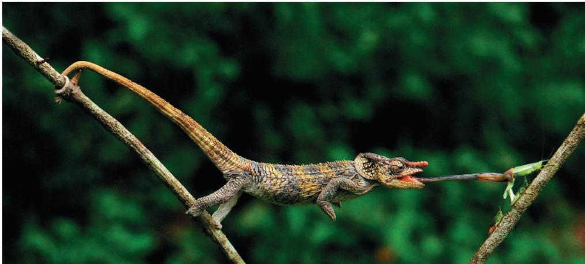  
Figure 32.1 This chameleon can wield its long, sticky tongue with blinding speed to capture its prey. Other predatory animals use strength, concealed traps, or toxins to capture prey. Likewise, herbivorous animals can strip plants bare of leaves or seeds, while parasitic animals weaken their hosts by consuming their tissues or body fluids. Overall, we can think of animals as a kingdom of consumers.

## Study Tip

Draw a time line: Create a time line like the one shown here, and mark when the following occurred: first biochemical evidence of animals, Edicaran biota, Cambrian explosion, colonization of land by vertebrates, and extinction of non-avian dinosaurs. Briefly describe the significance of each event.

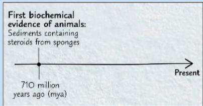

## What key characteristics of animals make them such efficient consumers?

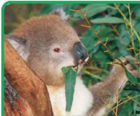  
Animals are heterotrophs: They obtain energy and nutrients by eating other organisms.

Animals process their food inside their bodies. Many animals have an efficient digestive system that has a mouth at one end and an anus at the other.

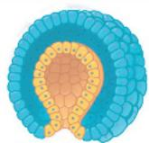  
Animal embryo (cross section)

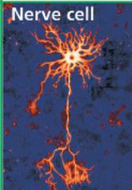

Animals have tissues, collections of specialized cells that function as a unit. Tissues form from layers of embryonic cells.

The tissues of animals include those composed of unique nerve and muscle cells.

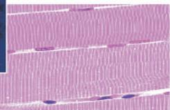

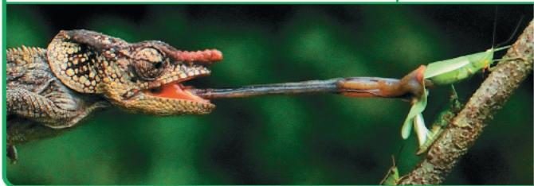  
Muscle cells  
Their nerve and muscle cells enable animals to move as well as to detect and capture potential prey.

# Concept 32.1: Animals are multicellular, heterotrophic eukaryotes with tissues that develop from embryonic layers

Listing features shared by all animals is challenging, as there are exceptions to nearly every criterion we might select. When taken together, however, several characteristics of animals sufficiently describe the group for our discussion.

## Nutritional Mode

Animals differ from both plants and fungi in their mode of nutrition. Plants are autotrophic eukaryotes capable of generating organic molecules through photosynthesis. Fungi are heterotrophs that grow on or near their food and that feed by absorption (often after they have released enzymes that digest the food outside their bodies). Unlike plants, animals cannot construct all of their own organic molecules, and so, in most cases, they ingest them—either by eating other living organisms or by eating nonliving organic material. But unlike fungi, most animals feed by ingesting their food and then using enzymes to digest it within their bodies.

## Cell Structure and Specialization

Animals are eukaryotes, and like plants and most fungi, animals are multicellular. In contrast to plants and fungi, however, animals lack the structural support of cell walls. Instead, proteins external to the cell membrane provide structural support to animal cells and connect them to one another (see Figure 6.28). The most abundant of these proteins is collagen, which is not found in plants or fungi.

The cells of most animals are organized into tissues, groups of similar cells that act as a functional unit. For example, muscle tissue and nervous tissue are responsible for moving the body and conducting nerve impulses, respectively. The ability to move and conduct nerve impulses underlies many of the adaptations that differentiate animals from plants and fungi (which lack muscle and nerve cells). For this reason, muscle and nerve cells are central to the animal lifestyle.

## Reproduction and Development

Most animals reproduce sexually and have a gametic life cycle (see Figure 28.3), in which the diploid stage dominates. Haploid sperm and egg are produced directly by meiotic division of certain diploid cells in the diploid, multicellular animal, unlike what occurs in plants and fungi. In most animal species, a small, flagellated sperm fertilizes a larger, nonmotile egg, forming a diploid zygote. The zygote then undergoes cleavage, a succession of mitotic cell divisions without cell growth between the divisions. During the development of

most animals, cleavage leads to the formation of a multicellular embryonic stage called a blastula, which in many animals takes the form of a hollow ball (Figure 32.2). Following this stage is the process of gastrulation, during which the layers of embryonic tissues that will develop into adult body parts are produced (see also Figure 47.8). The resulting developmental stage is called a gastrula.

Although some animals, including humans, develop directly into a body that somewhat resembles the adult form, the life cycles of most animals include at least one larval stage. A larva is a sexually immature form of an animal that is morphologically

Figure 32.2 Early embryonic development in animals.

1 The zygote of an animal undergoes a series of mitotic cell divisions called cleavage.

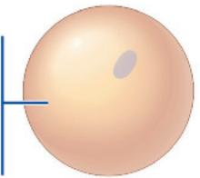  
Zygote
↓ Cleavage  
② An eight-cell embryo is formed by three rounds of cell division.

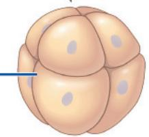  
Eight-cell stage  
3 In most animals, cleavage produces a multicellular stage called a blastula. The blastula is typically a hollow ball of cells that surround a cavity called the blastocoel.

distinct from the adult, usually eats different food, and may even have a different habitat than the adult, as in the case of the aquatic larva of a mosquito or dragonfly. Animal larvae eventually undergo metamorphosis, a developmental transformation that turns the animal into a juvenile that resembles an adult but is not yet sexually mature.

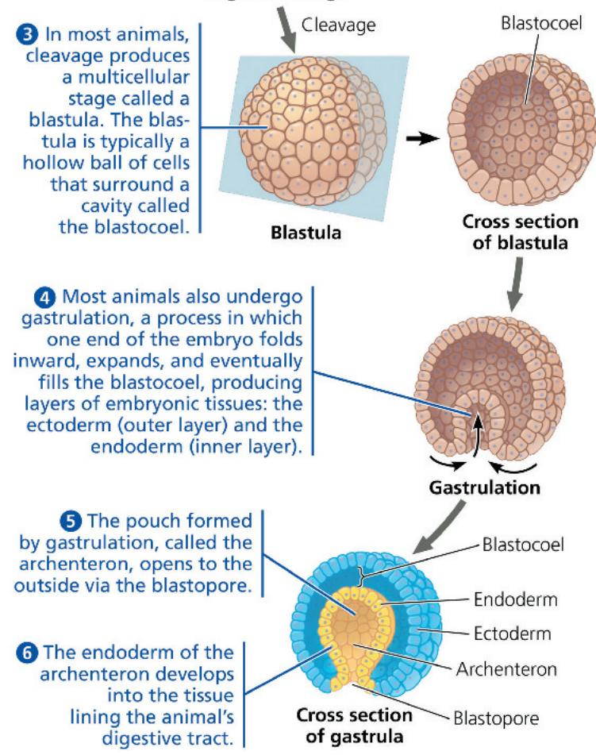

④ Most animals also undergo gastrulation, a process in which one end of the embryo folds inward, expands, and eventually fills the blastocoel, producing layers of embryonic tissues: the ectoderm (outer layer) and the endoderm (inner layer).

⑤ The pouch formed by gastrulation, called the archenteron, opens to the outside via the blastopore.

6 The endoderm of the archenteron develops into the tissue lining the animal's digestive tract.

Though adult animals vary widely in morphology, the genes that control animal development are similar across a broad range of taxa. All animals have developmental genes that regulate the expression of other genes, and many of these regulatory genes contain sets of DNA sequences called homeoboxes (see Concept 21.6). In particular, most animals share a unique homeobox-containing family of genes, known as Hox genes. Hox genes play important roles in the development of animal embryos, controlling the expression of many other genes that influence morphology.

## Concept Check 32.1

1. Summarize the main stages of animal development. What family of control genes plays a major role?

2. WHAT IF? What animal characteristics would be needed by an imaginary plant that could chase, capture, and digest its prey—yet could also extract inorganic nutrients from soil and conduct photosynthesis?

For suggested answers, see Appendix A.

# Concept 32.2: The history of animals spans more than half a billion years

To date, biologists have identified more than 1.3 million extant species of animals, and estimates of the actual number run far higher. This vast diversity encompasses a spectacular range of morphological variation, from corals to cockroaches to crocodiles. Various studies suggest that this great diversity originated during the last billion years. For example, researchers have unearthed 710-million-year-old sediments containing chemical evidence of steroids that today are primarily produced by a particular group of sponges. Since sponges are animals, these “fossil steroids” suggest that animals had arisen by 710 million years ago.

DNA analyses generally agree with this fossil biochemical evidence; for example, one recent molecular clock study estimated that sponges originated about 700 million years ago. These findings are also consistent with molecular analyses suggesting that the common ancestor of all extant animal species lived about 770 million years ago. What was this common ancestor like, and how did animals arise from their single-celled ancestors?

## Steps in the Origin of Multicellular Animals

One way to gather information about the origin of animals is to identify protist groups that are closely related to animals. As shown in Figure 32.3, morphological and molecular evidence point to choanoflagellates as the closest living relatives of animals. Based on such evidence, researchers have hypothesized that the common ancestor of choanoflagellates and living animals may have been a suspension feeder similar to present-day choanoflagellates.

Scientists exploring how animals may have arisen from their single-celled ancestors have noted that the origin of multicellularity requires the evolution of new ways for cells to adhere (attach) and signal (communicate) to each other. To learn more about such mechanisms, researchers compared the

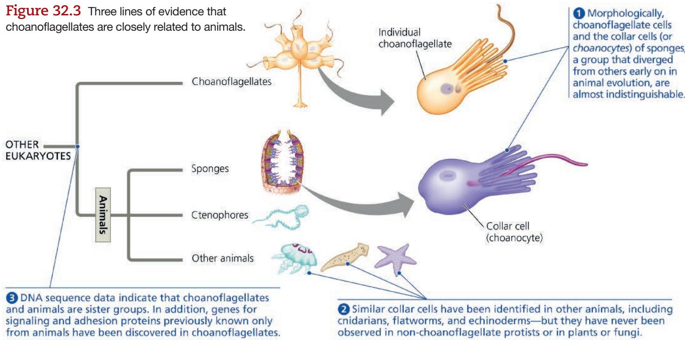

3 DNA sequence data indicate that choanoflagellates and animals are sister groups. In addition, genes for signaling and adhesion proteins previously known only from animals have been discovered in choanoflagellates.

② Similar collar cells have been identified in other animals, including cnidarians, flatworms, and echinoderms—but they have never been observed in non-choanoflagellate protists or in plants or fungi.

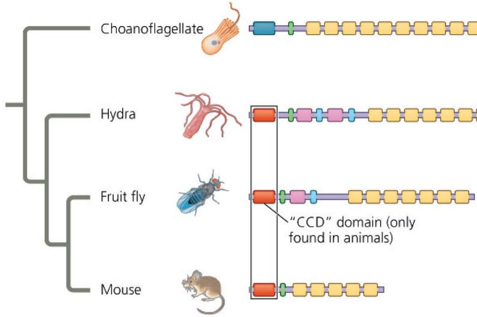

genome of the unicellular choanoflagellate Monosiga brevicollis with those of representative animals. This analysis uncovered 78 protein domains in M. brevicollis that were otherwise only known to occur in animals. (A domain is a key structural or functional region of a protein.) For example, M. brevicollis has genes that encode domains of certain proteins (known as cadherins) that play key roles in how animal cells attach to one another, as well as genes that encode protein domains that animals (and only animals) use in cell-signaling pathways.

Let's take a closer look at the cadherin attachment proteins we just mentioned. DNA sequence analyses show that animal cadherin proteins are composed primarily of domains that are also found in a cadherin-like protein of choanoflagellates (Figure 32.4). However, animal cadherin proteins also contain a highly conserved region not found in the choanoflagellate protein (the "CCD" domain labeled in Figure 32.4). These data suggest that the cadherin attachment protein originated by the rearrangement of protein domains found in choanoflagellates plus the incorporation of a novel domain, the conserved CCD region. Overall, comparisons of choanoflagellate and animal genomes suggest that key steps in the transition to multicellularity in animals involved new ways of using proteins or parts of proteins that were encoded by genes found in choanoflagellates.

Next, we'll survey the fossil evidence for how animals evolved from their distant common ancestor over four geologic eras (see Table 25.1 to review the geologic time scale).

## Interview

Interview with Nicole King: Investigating the ancestry of choanoflagellates (eTextbook only)

## Neoproterozoic Era (1 Billion–541 Million Years Ago)

Although data from fossil steroids and molecular clocks indicate an earlier origin, the first generally accepted macroscopic fossils of animals date from about 560 million years ago.

## Figure 32.4 Cadherin proteins in choanoflagellates and animals.

The ancestral cadherin-like protein of choanoflagellates has seven kinds of domains (regions), each represented here by a particular symbol. With the exception of the “CCD” domain, which is found only in animals, the domains of animal cadherin proteins are present in the choanoflagellate cadherin-like protein. The cadherin protein domains shown here were identified from whole-genome sequence data; evolutionary relationships are based on morphological and DNA sequence data.

These fossils are members of an early group of mostly soft-bodied multicellular eukaryotes, known collectively as the Ediacaran biota. The name comes from the Ediacara Hills of Australia, where fossils of these organisms were first discovered (Figure 32.5). Similar fossils have since been found on other continents. Among the oldest Ediacaran fossils that resemble animals, some have been classified as molluscs (snails and their relatives) or close relatives of the molluscs, while others are thought to be sponges or cnidarians (sea anemones and their relatives). Still others have proved difficult to classify, as they do not seem to be closely related to any living animal or algal groups. In addition to these macroscopic fossils, Neoproterozoic rocks have also yielded what may be microscopic fossils of early animal embryos. Although these microfossils appear to exhibit the basic structural organization of present-day animal embryos, debate continues about whether these fossils are indeed of animals.

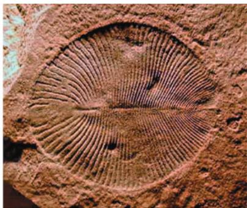  
(a) Dickinsonia costata (animal phylum unknown)  
2.5 cm

## Figure 32.5 Ediacaran fossil animals.

Fossils dating to 560 million years ago document the earliest known macroscopic animals, including these two species.

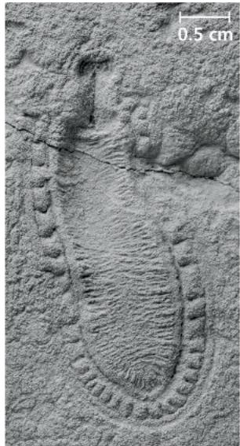  
(b) Kimberella, a mollusc (or close relative)

Figure 32.6 Early evidence of predation.

This 550-million-year-old fossil of the animal Cloudina shows evidence of having been attacked by a predator that bored through its shell.

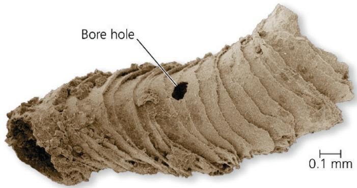

The fossil record from the Ediacaran period (635–541 million years ago) also provides early evidence of predation. Consider Cloudina, a small animal whose body was protected by a shell resembling a series of nested cones (Figure 32.6). Some Cloudina fossils show signs of attack: round “bore holes” that resemble those formed today by predators that drill through the shells of their prey to gain access to the soft-bodied organisms lying within. Like Cloudina, some other small Ediacaran animals had shells or other defensive structures that may have been selected for by predators. Overall, the fossil evidence indicates that the Ediacaran was a time of increasing animal diversity—a trend that continued in the Paleozoic.

(unlike sponges, ctenophores, and cnidarians) typically have a two-sided or bilaterally symmetric form and a complete digestive tract, an efficient digestive system that has a mouth at one end and an anus at the other. As we'll discuss later in the chapter, bilaterians include molluscs, arthropods, chordates, and most other living animal phyla.

As the diversity of animal phyla increased during the Cambrian, the diversity of Ediacaran life-forms declined. What caused these trends? Fossil evidence suggests that during the early Cambrian period, as predators acquired novel adaptations for catching prey, such as claws, prey species acquired new defenses, such as protective shells. As new predator-prey relationships emerged, natural selection may have led to the decline of the soft-bodied Ediacaran species and the rise of various bilaterian phyla. Another hypothesis focuses on an increase in atmospheric oxygen that preceded the Cambrian explosion. More plentiful oxygen would have enabled animals with higher metabolic rates and larger body sizes to thrive, while potentially harming other species. A third hypothesis proposes that genetic changes affecting development, such as the origin of Hox genes and the addition of new microRNAs (small RNAs involved in gene regulation), facilitated the evolution of new body forms. In the Scientific Skills Exercise, you can investigate whether there is a correlation between microRNAs (miRNAs; see Figure 18.15) and body complexity in various animal phyla. These various hypotheses are not mutually exclusive; predator-prey relationships, atmospheric changes, and changes in development may each have played a role.

## Paleozoic Era (541–252 Million Years Ago)

Another wave of animal diversification occurred 535–525 million years ago, early in the Cambrian period of the Paleozoic era—a phenomenon referred to as the Cambrian explosion (see Concept 25.3). In strata formed before the Cambrian explosion, only a few animal phyla have been observed. But in strata that

are 535–525 million years old, paleontologists have found the oldest fossils of about half of all extant animal phyla, including the first arthropods, chordates, and echinoderms. Many of these fossils, which include the first large animals with hard, mineralized skeletons, look very different from most living animals (Figure 32.7). Even so, paleontologists have established that these Cambrian fossils are members of extant animal phyla, or at least are close relatives. In particular, most of the fossils from the Cambrian explosion are of bilaterians, an enormous clade whose members

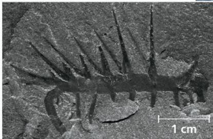  
508-million-year-old fossil of Hallucigenia

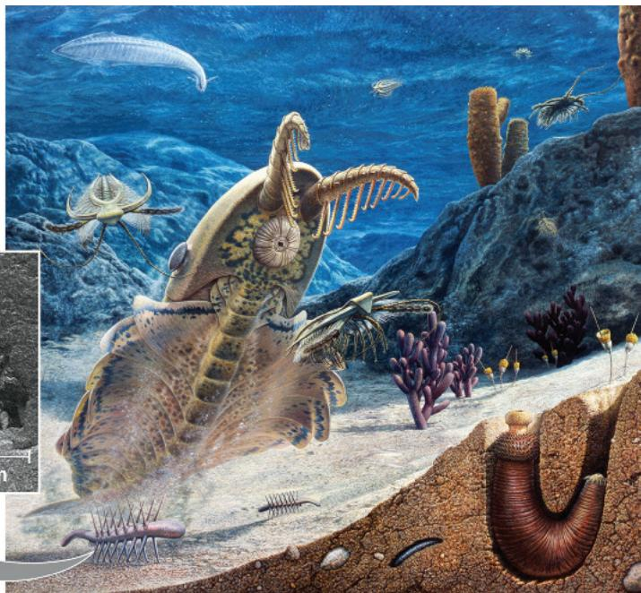  
Figure 32.7 A Cambrian seascape.  
This artist's reconstruction depicts a diverse array of organisms found in fossils from the Burgess Shale site in British Columbia, Canada. The animals include Pikaia (eel-like chordate at top left), Marella (small arthropod swimming at left), Anomalocaris (large animal with grasping limbs near a circular mouth), and Hallucigenia (animals with toothpick-like spikes on the seafloor and in inset).

# Scientific Skills Exercise

## Calculating and Interpreting Correlation Coefficients

## Data from the Study

Is Animal Complexity Correlated with miRNA Diversity? Animal phyla vary greatly in morphology, from simple sponges that lack tissues and symmetry to complex vertebrates. Members of different animal phyla have similar developmental genes, but the number of miRNAs varies considerably. In this exercise, you will explore whether miRNA diversity is correlated to morphological complexity.

How the Study Was Done In the analysis, miRNA diversity is represented by the average number of miRNAs in a phylum $(x)$ , while morphological complexity is represented by the average number of cell types $(y)$ . Researchers examined the relationship between these two variables by

calculating the correlation coefficient $(r)$ . The correlation coefficient indicates the extent and direction of a linear relationship between two variables $(x \text{ and } y)$ and ranges in value between -1 and 1. When r < 0, x and y are negatively correlated, meaning that in a plot of the data points, values of y become smaller as values of x become larger. When r > 0, x and y are positively correlated (y becomes larger as x becomes larger). When r = 0, the variables are not correlated.

The formula for the correlation coefficient r is the following:

$$
r = \frac {\sum (x _ {i} - \bar {x}) (y _ {i} - \bar {y})}{(n - 1) (s _ {x} s _ {y})}
$$

In this formula, n is the number of observations, $x_{i}$ is the value of the $i^{th}$ observation of variable x, and $y_{i}$ is the value of the $i^{th}$ observation of variable y. $\overline{x}$ and $\overline{y}$ are the means of variables x and y, and $s_{x}$ and $s_{y}$ are the standard deviations of variables x and y. The $\Sigma$ symbol indicates that the n values of the product $(x_{i}-\overline{x})(y_{i}-\overline{y})$ are to be added together.

## INTERPRET THE DATA

1. First, practice reading the data table. For the eighth observation $(i = 8)$ , what are $x_{i}$ and $y_{i}$ ? For which phylum are these data?

2. Next, we'll calculate the mean and standard deviation for each variable (to review these topics, see the Scientific Skills Review in Appendix D). (a) The mean $(\overline{x})$ is the sum of the data values divided by $n$ , the number of observations: $\overline{x} = \frac{\sum x_i}{n}$ . Calculate the mean number of miRNAs $(\overline{x})$ and the mean number of

The Cambrian period was followed by the Ordovician, Silurian, and Devonian periods, when animal diversity continued to increase, although punctuated by episodes of mass extinction (see Figure 25.18). Vertebrates (fishes) emerged as the top predators of the marine food web. By 450 million years ago, groups that diversified in oceans during the Cambrian period began to make an impact on land. Arthropods were the first animals to adapt to terrestrial

<table><tr><td>Animal Phylum</td><td> $i$ </td><td>No. of miRNAs  $\left( {x}_{i}\right)$ </td><td> ${\left( {x}_{i} - \bar{x}\right) }^{2}$ </td><td> ${\left( x - \bar{x}\right) }^{2}$ </td><td>No. of Cell Types  $\left( {y}_{i}\right)$ </td><td> ${\left( {y}_{i} - \bar{y}\right) }^{2}$ </td><td> ${\left( {y}_{i} - \bar{y}\right) }^{2}$ </td><td> ${\left( {x}_{i} - \bar{x}\right) }^{\prime }\left( {{y}_{i} - \bar{y}}\right)$ </td></tr><tr><td>Porifera</td><td>1</td><td>5.8</td><td></td><td></td><td>25</td><td></td><td></td><td></td></tr><tr><td>Platyhelminthes</td><td>2</td><td>35</td><td></td><td></td><td>30</td><td></td><td></td><td></td></tr><tr><td>Cnidaria</td><td>3</td><td>2.5</td><td></td><td></td><td>34</td><td></td><td></td><td></td></tr><tr><td>Nematoda</td><td>4</td><td>26</td><td></td><td></td><td>38</td><td></td><td></td><td></td></tr><tr><td>Echinodermata</td><td>5</td><td>38.6</td><td></td><td></td><td>45</td><td></td><td></td><td></td></tr><tr><td>Cephalochordata</td><td>6</td><td>33</td><td></td><td></td><td>68</td><td></td><td></td><td></td></tr><tr><td>Arthropoda</td><td>7</td><td>59.1</td><td></td><td></td><td>73</td><td></td><td></td><td></td></tr><tr><td>Urochordata</td><td>8</td><td>25</td><td></td><td></td><td>77</td><td></td><td></td><td></td></tr><tr><td>Mollusca</td><td>9</td><td>50.8</td><td></td><td></td><td>83</td><td></td><td></td><td></td></tr><tr><td>Annelida</td><td>10</td><td>58</td><td></td><td></td><td>94</td><td></td><td></td><td></td></tr><tr><td>Vertebrata</td><td>11</td><td>147.5</td><td></td><td></td><td>172.5</td><td></td><td></td><td></td></tr><tr><td></td><td></td><td> $\bar{x} =$   ${s}_{x} =$ </td><td></td><td> $\sum  =$ </td><td> $\bar{y} =$   ${s}_{y} =$ </td><td></td><td> $\sum  =$ </td><td> $\sum  =$ </td></tr></table>

Data from B. Deline et al., Evolution of metazoan morphological disparity, Proceedings of the National Academy of Sciences USA 115:E8909–E8918 (2018).

cell types $(\overline{y})$ and enter them in the data table (to calculate $\overline{y}$ , replace each $x$ in the formula with a $y$ ). (b) Next, calculate $(x_{i} - \overline{x})$ and $(y_{i} - \overline{y})$ for each observation, recording your results in the appropriate column. Square each of those results to complete the $(x_{i} - \overline{x})^{2}$ and $(y_{i} - \overline{y})^{2}$ columns; sum the results for those columns. (c) Next, we'll calculate the standard deviation, $s$ , which describes the variation found in a data set. Calculate $s_x$ , the standard deviation of the miRNA data, using the following formula, where $n =$ the number of observations. [Use the sum of $(x_{i} - \overline{x})^{2}$ you found in part (b).]

$$
s _ {x} = \sqrt {\frac {\Sigma (x _ {i} - \bar {x}) ^ {2}}{n - 1}}
$$

Repeat to find $s_{y}$ by substituting y for x in this equation.

3. Next, we'll calculate the correlation coefficient $r$ for the variables $x$ and $y$ . (a) First, use the results from question 2(b) to complete the $(x_{i} - \overline{x})(y_{i} - \overline{y})$ column; sum the results in that column. (b) Now find the product of $s_x s_y$ using your results from 2(c) above. Plug these values into the formula for $r$ .

4. Do these data indicate that miRNA diversity and animal complexity are negatively correlated, positively correlated, or uncorrelated? Explain.

5. What does your analysis suggest about the role of miRNA diversity in the evolution of animal complexity?

Instructors: A version of this Scientific Skills Exercise can be assigned in Mastering Biology.

habitats, as indicated by fragments of arthropod remains and by well-preserved fossils from several continents of millipedes, centipedes, and spiders. Another clue is seen in fossilized fern galls—enlarged cavities that fern plants form in response to stimulation by resident insects, which then use the galls for protection. Fossils indicate that fern galls date back at least 302 million years, suggesting that insects and plants were influencing each other's evolution by that time.

Vertebrates colonized land around 365 million years ago and diversified into numerous terrestrial groups. Two of these survive today: the amphibians (such as frogs and salamanders) and the amniotes (reptiles, including birds, and mammals). We will explore these groups, known collectively as the tetrapods, in more detail in Chapter 34.

## Mesozoic Era (252–66 Million Years Ago)

The animal phyla that had evolved during the Paleozoic began to spread into new habitats. In the oceans, the first coral reefs formed, providing other marine animals with new places to live. Some reptiles returned to the water, leaving plesiosaurs (see Figure 34.25) and other large aquatic predators as their descendants. On land, descent with modification in some tetrapods led to the origin of wings and other flight adaptations in pterosaurs and birds. Large and small dinosaurs emerged, as both predators and herbivores. At the same time, the first mammals—tiny nocturnal insect-eaters—appeared on the scene. In addition, as you read in Concept 30.3, flowering plants (angiosperms) and insects both underwent dramatic diversifications during the late Mesozoic.

## Cenozoic Era (66 Million Years Ago to the Present)

Mass extinctions of both terrestrial and marine animals ushered in a new era, the Cenozoic. Among the groups of species that disappeared were the large, non-avian dinosaurs and the marine reptiles of that time. The fossil record of the early Cenozoic documents the rise of large mammalian herbivores and predators as mammals began to exploit the vacated ecological niches. The global climate gradually cooled throughout the Cenozoic, triggering significant shifts in many animal lineages. Among primates, for example, some species in Africa adapted to the open woodlands and savannas that replaced many of the former dense forests. The ancestors of our own species were among those grassland apes.

## Concept Check 32.2

1. Put the following milestones in animal evolution in order from oldest to most recent: (a) origin of mammals, (b) earliest evidence of terrestrial arthropods, (c) Ediacaran fauna, (d) extinction of large, non-avian dinosaurs.

2. VISUAL SKILLS Label the phylogenetic tree shown with the group of eukaryotes most closely related to animals, and explain the lines of evidence supporting their relationship.

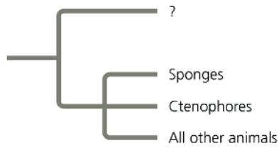

3. MAKE CONNECTIONS Evaluate whether the origin of cell-to-cell attachment proteins in animals illustrates descent with modification. (See Concept 22.2.)

# Concept 32.3: Animals can be characterized by body plans

Animal species vary tremendously in morphology, but their great diversity in form can be described by a relatively small number of major “body plans.” A body plan is a particular set of morphological and developmental traits that are integrated into a functional whole—the living animal. The term plan here does not imply that animal forms are the result of conscious planning or invention. But body plans do provide a succinct way to compare and contrast key animal features. They also are of interest in the study of evo-devo, the interface between evolution and development.

Like all features of organisms, animal body plans have evolved over time. In some cases, including key stages in gastrulation, novel body plans emerged early in the history of animal life and have not changed since. As we'll discuss, however, other aspects of animal body plans have changed multiple times over the course of evolution. As we explore the major features of animal body plans, bear in mind that similar body forms may have evolved independently in different lineages. In addition, body features can be lost over the course of evolution, causing some closely related species to look very different from one another.

## Symmetry

A basic feature of animal bodies is their type of symmetry—radial or bilateral—or absence of symmetry. (Many sponges, for example, lack symmetry altogether.) Use Figure 32.8, on the next page, to help you visualize radial and bilateral symmetry and how axes of orientation are used to describe the position of different parts of an animal's body.

The symmetry of an animal generally fits its lifestyle. Many radial animals are sessile (living attached to a substrate) or planktonic (drifting or weakly swimming, such as jellies, commonly called jellyfishes). Their symmetry equips them to meet the environment equally well from all sides. In contrast, bilateral animals typically move actively from place to place. Nearly all animals with a bilaterally symmetric body plan (such as arthropods and mammals) have sensory equipment concentrated at the head end of their body, including a central nervous system (“brain”). This central nervous system enables them to coordinate the complex movements involved in crawling, burrowing, flying, or swimming. Fossil evidence indicates that these two fundamentally different kinds of symmetry have existed for at least 550 million years.

## Tissues

Animal body plans also vary with regard to tissue organization. Recall that tissues are collections of specialized cells that act as a functional unit. Sponges and a few other groups lack tissues. In all other animals, the embryo becomes layered during gastrulation (see Figure 47.8, "Visualizing Gastrulation," which will help you understand this

## Visualizing Animal Body Symmetry and Axes

## Figure 32.8

## Radial Symmetry

## Bilateral Symmetry and Body Axes

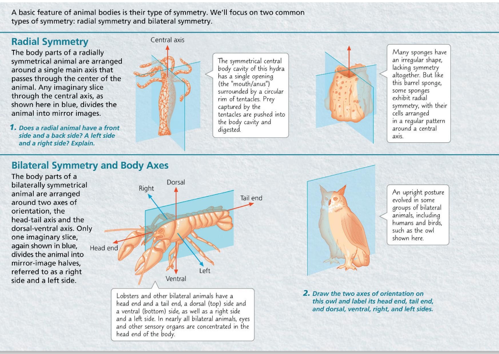  
Instructors: Additional questions related to this Visualizing Figure can be assigned in Mastering Biology.

For suggested answers, see Appendix A.

three-dimensional folding process). As development progresses, these layers, called germ layers, form the various tissues and organs of the body. Ectoderm, the germ layer covering the surface of the embryo, gives rise to the outer covering of the animal and, in some phyla, to the central nervous system. Endoderm, the innermost germ layer, lines the pouch that forms during gastrulation (the archenteron) and gives rise to the lining of the digestive tract (or cavity) and to the lining of organs such as the liver and lungs of vertebrates.

Cnidarians and a few other animal groups that have only these two germ layers are said to be diploblastic. All bilaterally symmetrical animals have a third germ layer, called the mesoderm, which fills much of the space between the ectoderm and endoderm. Thus, animals with bilateral symmetry are also said to be triploblastic (having three germ layers). In triploblasts, the mesoderm forms the muscles and most other organs between the digestive tract and the outer covering of the animal. Triploblasts include a broad range of animals, from flatworms to arthropods to vertebrates. (Although some diploblasts actually do have a third germ layer, it is not nearly as well developed as the mesoderm of animals considered to be triploblastic.)

## Body Cavities

Nearly all animals have a body cavity, a fluid-filled space located between the digestive tract (endoderm) and the outer body wall (ectoderm). Body cavities have diverse functions, such as to

provide structural support and to facilitate the internal transport of nutrients, gases, and wastes.

Most triploblastic animals have a coelom (from the Greek koilos, hollow), a body cavity that forms from tissue derived from mesoderm. The inner and outer layers of mesoderm that surround the cavity connect and form structures that suspend the internal organs (Figure 32.9a). A coelom's fluid cushions the suspended organs, helping to prevent internal injury. In soft-bodied animals, such as earthworms, the fluid in the coelom acts like a skeleton against which muscles can work. A coelom also enables the internal organs to grow and move independently of the outer body wall. If it were not for your coelom, for example, every beat of your heart or ripple of your intestine would warp your body's surface. Animals possessing coeloms are sometimes called coelomates.

Figure 32.9 Body cavities of triploblastic animals.
The organ systems develop from the three embryonic germ layers.  
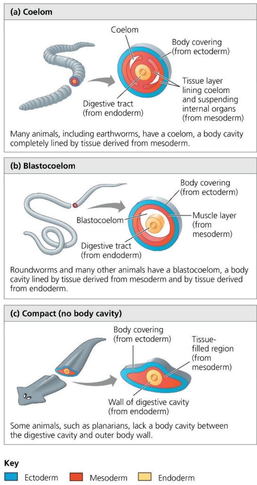

Other triploblastic animals such as rotifers and nematodes (see Figure 33.13 and Figure 33.27) have a blastocoelom, a body cavity that forms between the mesoderm and endoderm (Figure 32.9b). The blastocoelom gets its name from the fact that it is a remnant of the embryonic blastocoel (see Figure 32.2). Animals with only a blastocoelom once were called pseudocoelomates (from the Greek pseudo, false) and the cavity was called a pseudocoelom.

Some animals have both a blastocoelom and a coelom. Molluscs, for instance, have a blastocoelom, which becomes the hemocoel that functions in the internal transport of nutrients, gases, and wastes, but they also have a reduced coelom that surrounds the heart and reproductive structures (see Figure 33.16). Blastocoeloms and coeloms have been independently gained or lost multiple times in the course of animal evolution; hence, their presence or absence is not a good indicator of phylogenetic relationships.

Finally, some triploblastic animals lack a body cavity altogether (Figure 32.9c). These compact animals tend to have thin, flat bodies. Such animals don't require an internal transport system: With bodies that are only a few cells thick, the exchange of nutrients, gases, and wastes can occur across the entire body surface. These animals are sometimes called acoelomates (from the Greek $a$ -, without).

## Protostome and Deuterostome Development

Many animals can be described as having one of two developmental modes: protostome development or deuterostome development. These modes can generally be distinguished by differences in cleavage, coelom formation (when one is present), and fate of the blastopore.

## Cleavage

Many animals with protostome development undergo spiral cleavage, in which the planes of cell division are diagonal to the vertical axis of the embryo; as seen in the eight-cell stage of the embryo, smaller cells are centered over the grooves between larger, underlying cells (Figure 32.10a, left). Furthermore, the so-called determinate cleavage of some animals with protostome development rigidly casts (“determines”) the developmental fate of each embryonic cell very early. A cell isolated from a snail at the four-cell stage, for example, cannot develop into a whole animal. Instead, after repeated divisions, such a cell will form an inviable embryo that lacks many parts.

In contrast to the spiral cleavage pattern, deuterostome development is predominantly characterized by radial cleavage. The cleavage planes are either parallel or perpendicular to the vertical axis of the embryo; as seen at the eight-cell stage, the tiers of cells are aligned, one directly above the other (see Figure 32.10a, right). Most animals with deuterostome development also have indeterminate cleavage, meaning that

each cell produced by early cleavage divisions retains the capacity to develop into a complete embryo. For example, if the cells of a sea urchin embryo are separated at the four-cell stage, each can form a complete larva. Similarly, it is the indeterminate cleavage of the human zygote that makes identical twins possible.

## Coelom Formation

During gastrulation, an embryo's developing digestive tube initially forms as a blind pouch, the archenteron, which becomes the gut (Figure 32.10b). As the archenteron forms in protostome development, initially solid masses of mesoderm split and form the coelom. In contrast, in deuterostome development, the mesoderm buds from the wall of the archenteron, and its cavity becomes the coelom.

Figure 32.10 Protostome and deuterostome development.
The patterns shown here are useful general distinctions, though there are many variations and exceptions to them.  
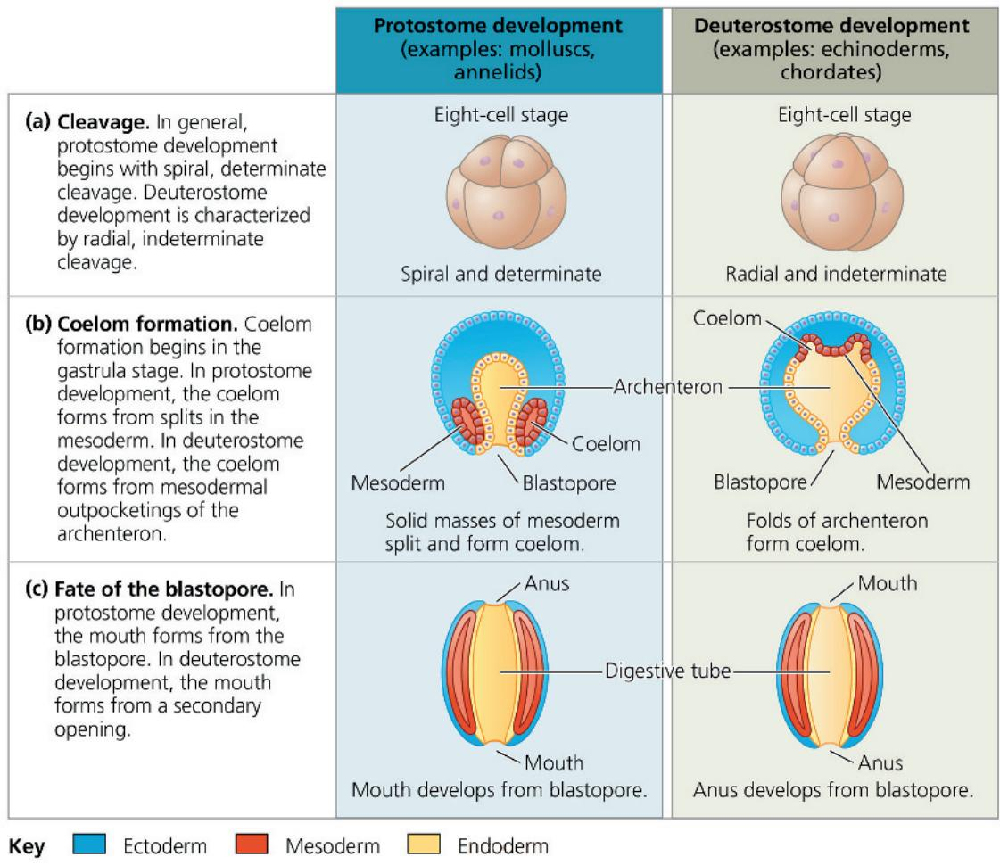

## Fate of the Blastopore

Protostome and deuterostome development often differ in the fate of the blastopore, the indentation that during gastru-

lation leads to the formation of the archenteron (Figure 32.10c). After the archenteron develops, in most animals a second opening forms at the opposite end of the gastrula. In many species, the blastopore and this second opening become the two openings of the digestive tube: the mouth and the anus. In protostome development, the mouth generally develops from the first opening, the blastopore, and it is for this characteristic that the term protostome derives (from the Greek protos, first, and stoma, mouth). In deuterostome development (from the Greek deuteros, second), the mouth is derived from the secondary opening, and the blastopore usually forms the anus.

## Concept Check 32.3

1. Compare three aspects of the early development of a snail (a mollusc) and a human (a chordate).

2. Describe how animals that lack a body cavity exchange materials without an internal transport system.

3. WHAT IF? Evaluate this claim: Ignoring the details of their specific anatomy, worms, humans, and most other triploblasts have a shape analogous to that of a doughnut.

For suggested answers, see Appendix A.

## Concept 32.4: Views of animal phylogeny continue to be shaped by new molecular and morphological data

As animals with diverse body plans radiated during the early Cambrian, some lineages arose, thrived for a period of time, and then became extinct, leaving no descendants. However, by 500 million years ago, most animal phyla with members alive today were established. Next, we'll examine relationships among these taxa along with some remaining questions that are currently being addressed using genomic data.

## The Diversification of Animals

Zoologists currently recognize about 30 phyla of extant animals, 15 of which are shown in Figure 32.11. Researchers infer evolutionary relationships among these phyla by analyzing whole genomes, as well as morphological traits, ribosomal RNA (rRNA) genes,

Figure 32.11 A phylogeny of living animals.

This phylogeny shows a leading hypothesis about the relationships among selected animal phyla. The bilaterians are divided into three main lineages: deuterostomes, lophotrochozoans, and ecdysozoans. The dates of origin identified here are based on the results of a recent molecular clock study.

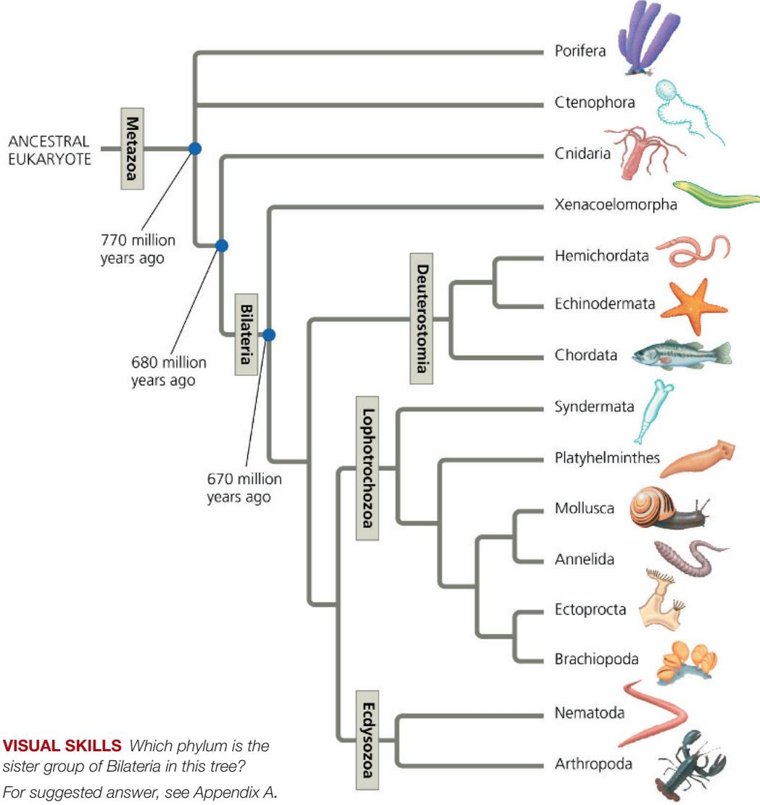  
VISUAL SKILLS Which phylum is the sister group of Bilateria in this tree? For suggested answer, see Appendix A.

Hox genes, protein-coding nuclear genes, and mitochondrial genes. Notice how the following points are reflected in Figure 32.11:

1. All animals share a common ancestor. Current evidence indicates that animals are monophyletic, forming a clade called Metazoa. All extant and extinct animal lineages have descended from a common ancestor.

2. There is uncertainty about which phylum is the sister clade to all others. Sponges (phylum Porifera) have historically been thought to be the group that diverged first from all other animals. This is largely due to their morphological simplicity, including lack of true tissues, and the morphological similarity between their choanocytes (collar cells) and choanoflagellates (see Figure 32.3). However, research over the last two decades has challenged this idea, and there is growing evidence suggesting that in fact, ctenophores might be the sister clade to all other Metazoa. Because of this uncertainty, we represent here the divergence between sponges, ctenophores, and all other animals as a polytomy.

3. Cnidarians are closely related to bilaterians. Cnidarians are diploblastic, generally have radial symmetry, and have muscle and nervous tissue. In superficial ways, they resemble ctenophores. However, there is strong evidence that the phylum Cnidaria is more closely related to Bilateria than it is to Ctenophores or Sponges.

4. Most animal phyla belong to the clade Bilateria. Bilateral symmetry and the presence of three prominent germ layers are shared derived characters that help define the clade Bilateria. This clade contains the majority of animal phyla, and its members are known as bilaterians. The Cambrian explosion was primarily a rapid diversification of bilaterians.

5. There are three major clades of bilaterian animals. Bilaterians have diversified into three main lineages: Deuterostomia, Lophotrochozoa, and Ecdysozoa. With one exception, the phyla in these clades consist entirely of invertebrates, animals that lack a backbone; Chordata is the only phylum that also includes vertebrates, animals with a backbone.

As depicted in Figure 32.11, hemichordates (acorn worms), echinoderms (sea stars and relatives), and chordates are members of the bilaterian clade Deuterostomia; thus, the term deuterostome refers not only to a mode of animal development, but also to the members of this clade. (The dual meaning of this term can be confusing since some organisms with a deuterostome developmental pattern are not members of clade

Deuterostomia.) Hemichordates share some characteristics with chordates, such as gill slits and a dorsal nerve cord; echinoderms lack these characteristics. These shared traits may have been present in the common ancestor of the deuterostome clade (and lost in the echinoderm lineage). As mentioned above, phylum Chordata, the only phylum with vertebrate members, also includes invertebrates.

Bilaterians also diversified in two major clades that are composed entirely of invertebrates: the lophotrochozoans and the ecdysozoans. The name Lophotrochozoa refers to two different features observed in some animals belonging to this clade (Figure 32.12). Some lophotrochozoans, such as ectoprocts, develop a unique structure called a lophophore (from the Greek lophos, crest, and pherein, to carry), a crown of ciliated tentacles that function in feeding (see Figure 32.12a). Individuals in other phyla, including molluscs and annelids, go through a distinctive developmental stage called the trochophore larva (see Figure 32.12b)—hence the name lophotrochozoan.

The clade name Ecdysozoa refers to a characteristic shared by nematodes, arthropods, and some of the other ecdysozoan phyla that are not included in our survey. These animals secrete external skeletons (exoskeletons); the stiff covering of a cricket and the flexible cuticle of a nematode are examples. As the animal grows, it molts, squirming out of its old exoskeleton and secreting a larger one. The process of shedding the old exoskeleton is called ecdysis. Though named for this shared derived characteristic, the clade was proposed mainly on the basis of molecular data that support the common ancestry of its members. Furthermore, some taxa excluded from this clade by their molecular data, such as certain species of leeches, do in fact molt.

Figure 32.12 Morphological characteristics of lophotrochozoans.  
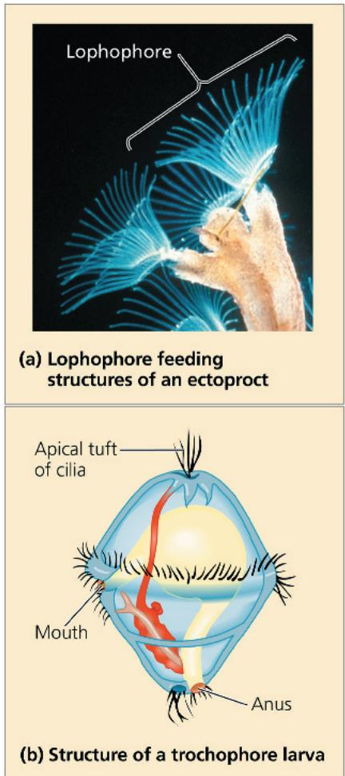

## Future Directions in Animal Systematics

The very base of the animal phylogenetic tree in Figure 32.11 shows a polytomy, highlighting the uncertainty in the evolutionary relationships between major clades of animals. Many other aspects of animal phylogeny continue to be debated. Although it can be frustrating that the phylogenies in textbooks are not set-in-stone truths, the uncertainty inherent in these diagrams is a healthy reminder that science is an ongoing, dynamic process of inquiry.

We'll conclude with two questions that are the focus of ongoing research.

1. Which phylum is the sister group to all other Metazoa? This question may seem unexpected, since textbooks have historically placed sponges as the first lineage to diverge from all other animals. Indeed, morphological comparisons—such as the similarity of sponge collar cells to the cells of choanoflagellates (see Figure 32.3) and the fact that sponges are one of the few animal groups that lack tissues—support this hypothesis. Early phylogenetic studies based on molecular data, which examined limited DNA sequences, also supported this conclusion. However, with the advent of phylogenomics (phylogenetics based on whole genomes or large fractions of genomes), several studies have suggested that ctenophores are the earliest diverging clade, while other phylogenomic studies still found support for sponges as the earliest diverging clade.

Why the contradictory results? One limitation of these phylogenomic studies is that they typically rely on just a few species for each taxon. True patterns of ancestry between these species can be masked by certain biological processes (including molecular convergent evolution) or analytical errors (such as mistakes in identifying orthologous genes; see Figure 26.18). Recently, some researchers began studying rare genomic changes, such as fusion and mixing of whole chromosomes, to help resolve ancient phylogenetic relationships. Perhaps this promising new approach, along with the inclusion of more species in phylogenomic studies, will help resolve the root of the animal phylogenetic tree. Understanding these evolutionary relationships will help biologists better understand the sequence of evolution of various animal traits. For example, under the long-held view that sponges diverged first from other animals, one would expect that true tissues and nerve cells first appeared in the common ancestor of animals other than sponges. On the other hand, if ctenophores were the first group to diverge from other animals, then either the common ancestor of all Metazoa had true tissue and nerve cells and those traits were lost in the sponge lineage, or those traits are a case of convergent evolution and appeared independently in the ctenophores and in the common ancestor of the Cnidaria and Bilateria.

2. Were the Xenacoelomorpha the first lineage to diverge from other bilaterians? A series of recent papers have indicated the phylum Xenacoelomorpha, which includes flatworms in class Acoela, is the sister group to other bilaterians as shown in Figure 32.11. A different conclusion was supported by other recent analyses, which placed members of the Xenacoelomorpha within Deuterostomia. Researchers are sequencing the genomes of additional species in this clade to provide a more definitive test of the hypothesis that the Xenacoelomorpha are the sister group to other bilaterians.

As we contemplate the elements that are uncertain about animal evolution, including many more than the two highlighted above, it is important to note a common misconception: that the most recent common ancestor of a group looked like representatives of the sister clade to all others in the group. It is important to remember that evolution is continually occurring in all lineages, and extant species may be quite different from what their ancestors looked like when a clade diverged hundreds of millions of years ago. In other words, the hypothesis of sponges as sister groups to all other animals does not necessarily indicate that the common ancestor of animals was sponge-like, just like hypothesis that ctenophores diverged first does not mean the common ancestor of animals looked like modern-day ctenophores. Similarly, if Xenacoelomorpha are the sister group to other bilaterians, it does not mean that the earliest bilaterians looked like extant xenacoelomorphan worms. Inferring morphology of past animals is especially difficult for those groups that have not left a robust fossil record.

## Interview

Interview with Casey Dunn: Working to resolve the earliest branches of the animal phylogenetic tree (at the start of Unit 5, before Chapter 26)

## Concept Check 32.4

## Chapter 32 Review

2. WHAT IF? Suppose that ctenophores are in fact the earliest-diverging metazoans and sponges are the sister group of all other animals. Redraw the phylogenetic tree in Figure 32.11 to be consistent with this hypothesis. In this scenario, would animals with tissues form a clade? Explain.

## Summary of Key Concepts

3. MAKE CONNECTIONS Based on the phylogeny in Figure 32.11 and the information in Figure 25.11, evaluate this statement: "The Cambrian explosion actually consists of three explosions, not one."

To review key terms, go to the Vocabulary Self-Quiz (eTextbook only).

Concept 32.1: Animals are multicellular, heterotrophic eukaryotes with tissues that develop from embryonic layers

1. Describe the evidence that cnidarians share a more recent common ancestor with other animals than with sponges.

• Animals are heterotrophs that ingest their food.

\- In most animals, gastrulation follows the formation of the blastula and leads to the formation of embryonic tissue layers. Most animals have Hox genes that regulate the development of body form. Although Hox genes have been highly conserved over the course of evolution, they can produce a wide diversity of animal morphology.

\- Animals are multicellular eukaryotes. Their cells are supported and connected to one another by collagen and other structural proteins located outside the cell membrane. Nervous tissue and muscle tissue are key animal features.

## Concept 32.2: The history of animals spans more than half a billion years

Describe key ways that animals differ from plants and fungi.

\- Genomic analyses suggest that key steps in the origin of animals involved new ways of using proteins that were encoded by genes found in choanoflagellates.

For suggested answers, see Appendix A.

\- Fossil biochemical evidence and molecular clock analyses indicate that animals arose over 700 million years ago.

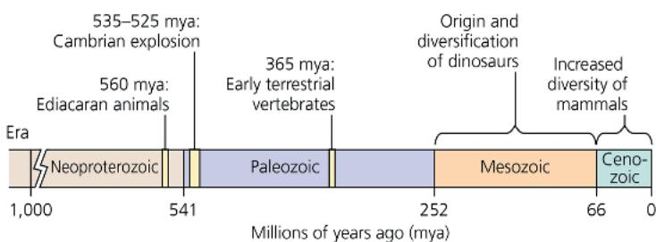  
What caused the Cambrian explosion? Describe current hypotheses.

## Concept 32.3: Animals can be characterized by body plans

\- Animals may lack symmetry or may have radial or bilateral symmetry. Bilaterally symmetrical animals have dorsal and ventral sides, as well as head and tail ends.

\- Eumetazoan embryos may be diploblastic (two germ layers) or triploblastic (three germ layers). Triploblastic animals with a body cavity may have a coelom or a blastocoelom (or both).

\- Protostome and deuterostome development often differ in patterns of cleavage, coelom formation, and blastopore fate.

Describe how body plans provide useful information yet should be interpreted cautiously as evidence of evolutionary relationships.

Concept 32.4: Views of animal phylogeny continue to be shaped by new molecular and morphological data

\- This phylogenetic tree shows key steps in animal evolution:

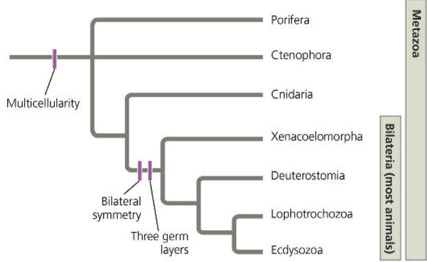  
Consider clades Bilateria, Lophotrochozoa, Metazoa, Chordata, Ecdysozoa, and Deuterostomia. List the clades to which humans belong in order from the most to the least inclusive clade.  
For suggested answers, see Appendix A.

## Test Your Understanding

For more multiple-choice questions, go to the Practice Test (eTextbook only).

## Levels 1-2: Remembering/Understanding

1. One of the characteristics unique to animals is
(A) gastrulation.
(B) multicellularity.
(C) sexual reproduction.
(D) flagellated sperm.

2. The distinction between sponges and other animal phyla is based mainly on the absence versus the presence of

(A) a body cavity.

(B) a complete digestive tract.

(C) mesoderm.

(D) tissues.

3. Which of the following was probably an important factor in bringing about the Cambrian explosion?

(A) the movement of animals onto land

(B) an increase in the concentration of atmospheric nitrogen

(C) the emergence of predator–prey relationships

(D) the origin of bilaterian animals

## Levels 3-4: Applying/Analyzing

4. Based on the tree in Figure 32.11, which statement is true? (A) The animal kingdom is not monophyletic.

(B) The Xenacoelomorpha are more closely related to echinoderms than to annelids.

(C) Sponges or ctenophores are the first lineage to have diverged from other animals.

(D) Bilaterians do not form a clade.

## Levels 5-6: Evaluating/Creating

## 5. WRITE ABOUT A THEME: INTERACTIONS Animal life

changed greatly during the Cambrian explosion, with some groups expanding in diversity and others declining. Write a short essay (100–150 words) interpreting these events as feedback regulation at the level of the biological community.

## 6. SYNTHESIZE YOUR KNOWLEDGE

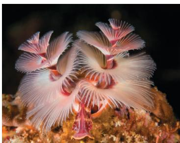

This organism is an animal. What can you infer about its body structure and lifestyle (that might not be obvious from its appearance)? This animal has a protostome developmental pattern and a trochophore larva. Identify the major clades that this animal belongs to. Explain

your selection, and describe when these clades originated and how they are related to one another.

## Practice Applying Your Learning

7. This question assesses your ability to apply your understanding of developmental patterns in animals.

Looking at samples from the shallow coastal waters off Oregon under a microscope, you observe what appears to be a developing animal embryo. At the eight-cell stage, the four cells at the top of the embryo are directly lined up above the cells at the bottom of the embryo, as shown in the diagram. You continue watching the embryo as it develops through gastrulation, after which the embryo displays three tissue layers.

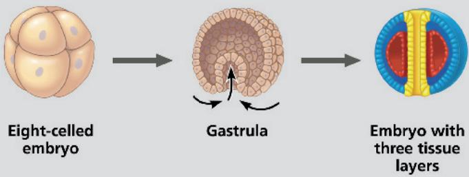

Based on this information, evaluate each statement as more likely to be TRUE or more likely to be FALSE.

a. This animal is exhibiting protostome development.

b. The blastopore will eventually become the mouth of this animal. \_\_\_\_

c. This organism has the potential to eventually have offspring that are identical twins. \_\_\_\_

d. If this animal has a coelom, it is formed from folds of mesodermal tissue that pinch off from the archenteron. \_\_\_\_

e. As this organism continues to develop, you would expect the larva to display bilateral symmetry. \_\_\_\_

