# 第33章 An Introduction to Invertebrates

<!-- 章节边界按正文内容恢复；原始 MinerU 内容保留如下。 -->

# An Introduction to Invertebrates

## Key Concepts

33.1 Sponges and ctenophores belong to lineages that diverged early on from other animals

33.2 Cnidarians are radially symmetric animals that are closely related to bilaterians

33.3 Lophotrochozoans have the widest range of animal body forms

33.4 Ecdysozoans are the most species-rich animal group

33.5 Echinoderms and chordates are deuterostomes

## Study Tip

Make a table: Invertebrates differ in how they obtain food, remove wastes, reproduce, and move throughout their habitat. As you read, summarize how members of the 11 phyla of invertebrates described in detail in this chapter solve these shared challenges of life.

<table><tr><td>Phylum</td><td>Feeding method</td><td>Waste removal</td><td>Reproduction</td><td>Movement</td></tr><tr><td>Porifera</td><td>Filter feeders</td><td>Diffusion</td><td>Herma-phrodites</td><td>Sessile</td></tr><tr><td></td><td></td><td></td><td></td><td></td></tr></table>

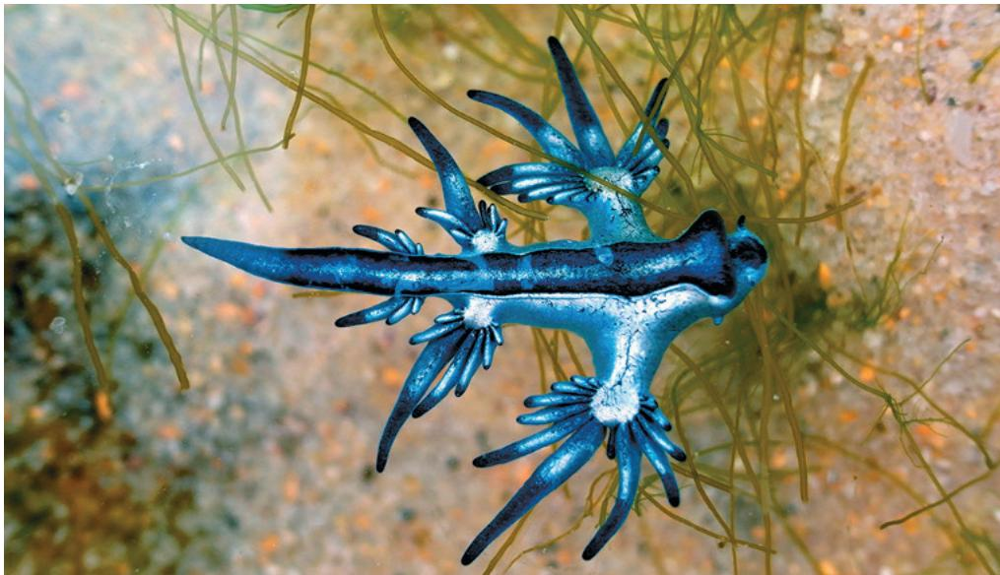  
Figure 33.1 The blue dragon (Glaucus atlanticus) has thin, finger-like structures that help it to float (upside down) on the sea's surface. It eats Portuguese men-of-war and absorbs their stinging cells, which it then uses to deliver a deadly sting of its own. The blue dragon is just one of more than a million species of invertebrates (animals without a backbone), which account for over $95\%$ of animal species.

## How can we make sense of the great number and morphological diversity of invertebrates?

This simplified phylogeny of all animals helps us understand evolutionary relationships between major groups of invertebrates, and therefore when certain morphological traits have appeared. Remember that phylogenetic trees are hypotheses that are revised as new evidence emerges.

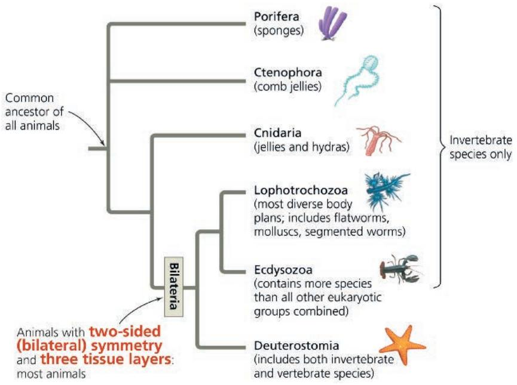

# Concept 33.1: Sponges and ctenophores belong to lineages that diverged early on from other animals

## Exploring Invertebrate Diversity

Invertebrates are animals that lack a backbone. They occupy almost every habitat on Earth, from the scalding water released by deep-sea hydrothermal vents to the frozen ground of Antarctica. Evolution in these varied environments has produced an immense diversity of forms, including species that are microscopic and others whose members can grow to 18 m long (1.5 times the length of a school bus). Figure 33.2 surveys 23 phyla as representatives of this vast invertebrate diversity.

## Figure 33.2

Kingdom Animalia encompasses 1.3 million known species, and estimates of the total number of species range as high as 10–20 million. Of the 23 phyla surveyed here, 13 are discussed more fully in this chapter, Chapter 32, or Chapter 34; cross-references are given at the end of their descriptions.

## Porifera (9,000 species)

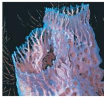  
A sponge

Animals in this phylum are informally called sponges. Sponges are sessile animals that lack tissues. They live as filter feeders, trapping particles that pass through the internal channels of their body (see Concept 33.1).

## Cnidaria (13,000 species)

Cnidarians include corals, jellies, and hydras. These animals have a diploblastic, radially symmetrical body plan that includes a gastrovascular cavity with a single opening that serves as both mouth and anus (see Concept 33.2).

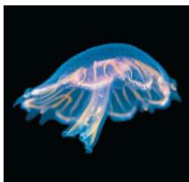

## Xenacoelomorpha (425 species)

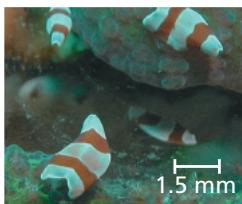  
Xenacoelomorpha  
A jelly

Flatworms in this phylum have a simple nervous system and a saclike gut, and thus were once placed in phylum Platyhelminthes. Recent molecular analyses, however, indicate that Xenacoelomorpha is a separate lineage that diverged before the three main bilaterian clades (see Concept 32.4).

## Placozoa (3 species)

Trichoplax adhaerens was discovered in 1883, and for over 100 years, it was the only known species in this phylum; two additional placozoan species were recently described. Placozoans do not resemble a typical animal—they consist of a simple bilayer of a few thousand cells and reproduce by dividing into two individuals or by budding off many multicellular individuals. Placozoa is thought to be either a sister group to cnidarians or the sister group of Cnidaria and Bilateria.

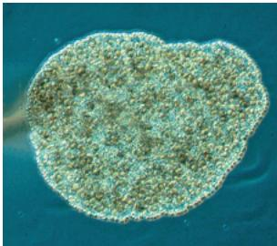  
A placozoan (LM)  
0.5 mm

## Ctenophora (130 species)

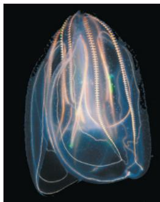  
A ctenophore, or comb jelly

Ctenophores (comb jellies) are diploblastic and radially symmetric. Comb jellies make up much of the ocean's plankton. They have eight "combs" of cilia that propel the animals through the water (see Concept 33.1).

## Platyhelminthes (30,000 species)

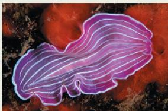  
A marine flatworm

## Lophotrochozoa

Flatworms in this phylum (including tapeworms, planarians, and flukes) have bilateral symmetry and a central nervous system that processes information from sensory structures. They have no body cavity or specialized organs for circulation (see Concept 33.3).

## Syndermata (3,350 species)

This recently established phylum includes two groups formerly classified as separate phyla: the rotifers, microscopic animals with complex organ systems, and the acanthocephalans, highly modified parasites of vertebrates (see Concept 33.3).

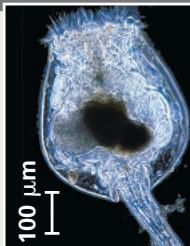  
A rotifer (LM)

## Ectoprocta (6,300 species)

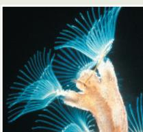  
Ectoprocts (also known as bryozoans) live as sessile colonies and are covered by a tough exoskeleton (see Concept 33.3).  
Ectoprocts

## Brachiopoda (440 species)

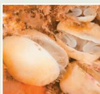  
Brachiopods, or lamp shells, may be easily mistaken for clams or other molluscs. However, most brachiopods have a unique stalk that anchors them to their substrate, as well as a crown of cilia called a lophophore (see Concept 33.3).  
A brachiopod

## Gastrotricha (860 species)

Gastrotrichs are tiny worms whose ventral surface is covered with cilia, giving them their name, which means "hairy bellies." Most species live on the bottoms of lakes or oceans, where they feed on small organisms and partially decayed organic matter. This individual has consumed algae, visible as the greenish material inside its gut.

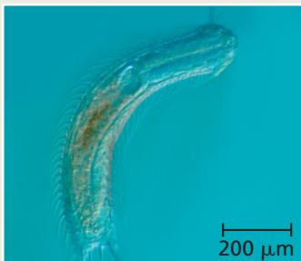  
A gastrotrich (differential interference contrast LM)

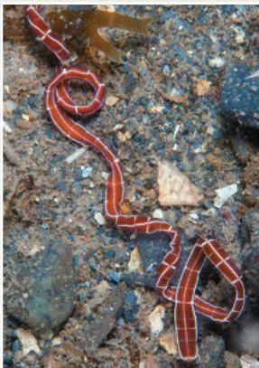  
A ribbon worm

## Cycliophora (2 species)

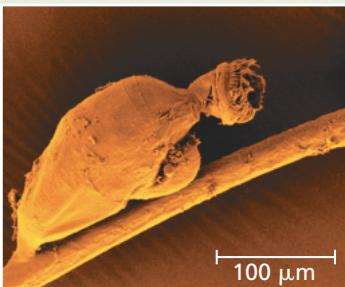  
A cycliophoran (colorized SEM)

The only two known species of cycliophorans, Symbion pandora and Symbion americanus, live on the mouthparts of lobsters. These tiny creatures have a unique body plan and a bizarre life cycle: Males impregnate females that are still developing in their mothers' bodies. The fertilized females escape, settle elsewhere on the lobster, and release their offspring.

## Nemertea (1,300 species)

Also called ribbon worms, nemerteans swim through water or burrow in sand, extending a unique proboscis to capture prey. Nemerteans have a reduced coelom, so their bodies are relatively solid. They also have an alimentary canal and a closed circulatory system in which the blood is contained in vessels and hence is distinct from fluid in the body cavity.

## Annelida (20,000 species)

Annelids, or segmented worms, are distinguished by their body segmentation. Earthworms are the most familiar annelids, but most annelids live in marine or freshwater habitats (see Concept 33.3).

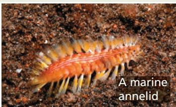

## Mollusca (73,000 species)

Molluscs (including snails, clams, squids, and octopuses) have a soft body that in many species is protected by a hard shell (see Concept 33.3).

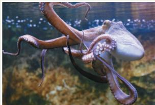  
An octopus

## Loricifera (38 species)

Loriciferans (from the Latin lorica, corset, and ferre, to bear) are tiny animals that inhabit sediments on the seafloor. A loriciferan can telescope its head, neck, and thorax in and out of the lorica, a pocket formed by six plates surrounding the abdomen. Though the natural history of loriciferans is mostly a mystery, at least some species likely eat bacteria.

## Ecdysozoa

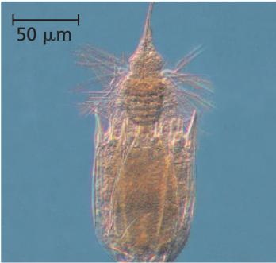  
A loriciferan (LM)

## Priapula (22 species)

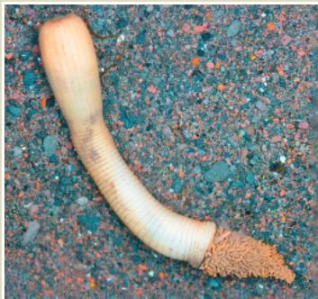  
A priapulan

Priapulans are worms with a large, rounded proboscis at the anterior end. (They are named after Priapos, the Greek god of fertility, who was symbolized by a giant penis.) Ranging from 0.5 mm to 20 cm in length, most species burrow through seafloor sediments. Fossil evidence suggests that priapulans were among the major predators during the Cambrian period.

## Figure 33.2 (Continued)

## Onychophora (200 species)

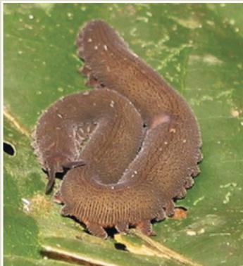  
An onychophoran

Onychophorans, also called velvet worms, originated during the Cambrian explosion (see Concept 25.3). Originally, they thrived in the ocean, but at some point they succeeded in colonizing land. Today they live only in humid forests. Onychophorans have fleshy antennae and several dozen pairs of saclike legs.

## Tardigrada (1,200 species)

Tardigrades (from the Latin tardus, slow, and gradus, step) are sometimes called water bears for their overall shape and lumbering, bearlike gait. Most tardigrades are less than 0.5 mm in length. Some live in oceans or fresh water, while others live on plants or animals. Harsh conditions may cause tardigrades to enter a state of dormancy; while dormant, they can survive for days at temperatures as low as $-200^{\circ}$ C! A recent phylogenomic study found that over 15% of tardigrade genes entered their genome by horizontal gene transfer, the largest fraction known for any animal.

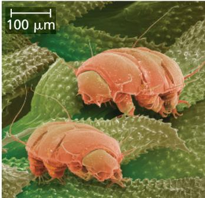  
Tardigrades (colorized SEM)

## Nematoda (27,000 species)

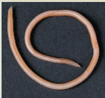  
A roundworm

Also called roundworms, nematodes are enormously abundant and diverse in the soil and in aquatic habitats; many species parasitize plants and animals. Their most distinctive feature is a tough cuticle that coats their body (see Concept 33.4).

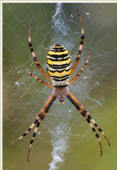

## Arthropoda (1,100,000 species)

The vast majority of known animal species, including insects, crustaceans, and arachnids, are arthropods. All arthropods have a segmented exoskeleton and jointed appendages (see Concept 33.4).

A spider (an arachnid)

## Hemichordata (140 species)

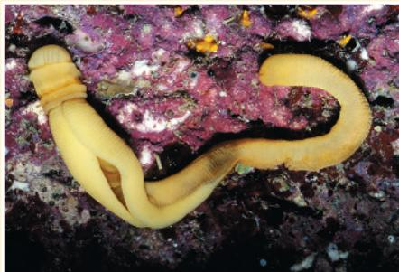  
An acorn worm

## Deuterostomia

Like echinoderms and chordates, hemichordates are members of the deuterostome clade (see Figure 32.11). Hemichordates share some traits with chordates, such as gill slits and a dorsal nerve cord. The largest group of hemichordates is the enteropneusts,

or acorn worms. Acorn worms are marine and generally live buried in mud or under rocks; they may grow to more than 2 m in length.

## Chordata (61,000 species)

More than 90% of all known chordate species have backbones (and thus are vertebrates). However, the phylum Chordata also includes two groups of invertebrates: lancelets and tunicates. See Chapter 34 for a full discussion of this phylum.

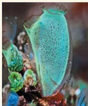  
A tunicate

## Echinodermata (7,200 species)

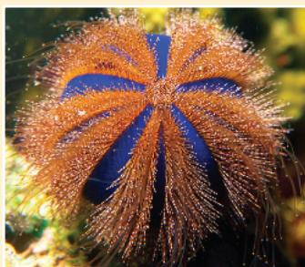  
A sea urchin

Echinoderms, such as sand dollars, sea stars, and sea urchins, are marine animals in the deuterostome clade that are bilaterally symmetric as larvae but not as adults. They move and feed by using a network of internal canals to pump water to different parts of their body (see Concept 33.5).

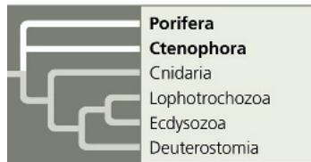

In this chapter, we'll take a tour of the invertebrates, using the phylogenetic tree in Figure 33.1 as a guide. We will start with two groups that diverged early on from all other animals: the sponges and the ctenophores.

Which of these lineages might represent the deepest root of the animal tree of life is an area of much active research, and so this uncertainty is represented as a polytomy in Figure 33.1 (see Figure 26.5 to review reading phylogenetic tree diagrams).

Animals in the phylum Porifera are known informally as sponges. Among the simplest of animals, sponges are sedentary and were mistaken for plants by the ancient Greeks. Most species are marine, and they range in size from a few millimeters to a few meters. Sponges are filter feeders: They filter out food particles suspended in the surrounding water as they draw it through their body, which in some species resembles a sac perforated with pores. Water is drawn through the pores into a central cavity, the spongocoel, and then flows out of the sponge through a larger opening called the osculum (Figure 33.3). More complex sponges have folded body walls, and many contain branched water canals and several oscula.

Unlike nearly all other animals, sponges lack tissues, groups of similar cells that act as a functional unit as in muscle tissue and nervous tissue. However, the sponge body does contain several different cell types. For example, lining the interior of the spongocoel are flagellated

choanocytes, or collar cells (named for the finger-like projections that form a “collar” around the flagellum). These cells engulf bacteria and other food particles by phagocytosis. The similarity between choanocytes and the cells of choano-flagellates supports molecular evidence indicating that animals and choanoflagellates are sister groups (see Figure 32.3).

The body of a sponge consists of two layers of cells separated by a gelatinous region called the mesohyl. Because both cell layers are in contact with water, processes such as gas exchange and waste removal can occur by diffusion across the membranes of these cells. Other tasks are performed by cells called amoebocytes, named for their use of pseudopodia. These cells move through the mesohyl and have many functions. For example, they take up food from the surrounding water and from choanocytes, digest it, and carry nutrients to other cells. Amoebocytes also manufacture tough skeletal fibers within the mesohyl. In some sponges, these fibers are sharp spicules made from calcium carbonate or silica. Other sponges produce more flexible fibers composed of a protein called spongin; you may have seen these pliant skeletons being sold as brown bath sponges. Finally, and perhaps most importantly, amoebocytes are totipotent (capable of becoming other types of sponge cells). This gives the sponge body remarkable flexibility, enabling it to adjust its shape in response to changes in its physical environment (such as the direction of water currents).

Most sponges are hermaphrodites, meaning that each individual functions as both male and female in sexual reproduction by

Figure 33.3 Anatomy of a sponge.

In the main diagram, portions of the front and back wall are cut away to show the sponge's internal structure.

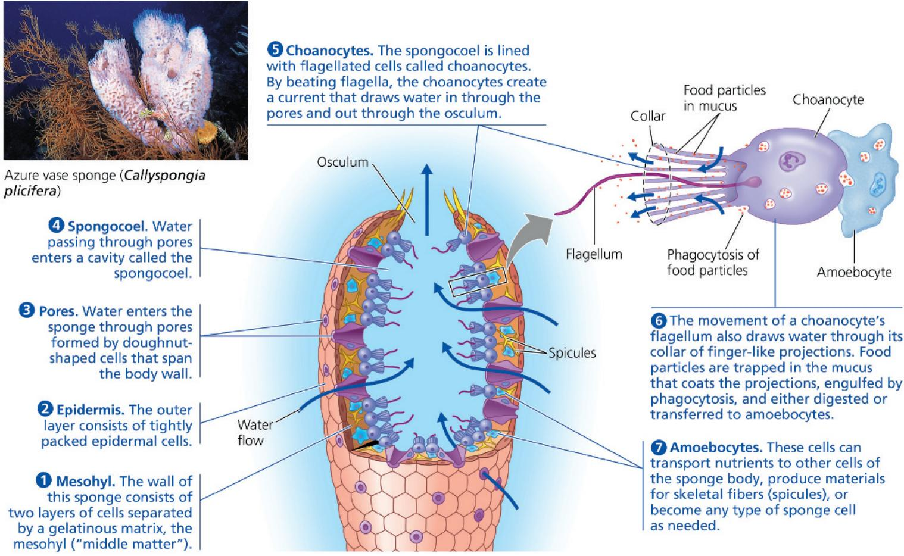

producing sperm and eggs. Almost all sponges exhibit sequential hermaphroditism: They function first as one sex and then as the other. Cross-fertilization can result when sperm released into the water current by an individual functioning as a male is drawn into a neighboring individual that is functioning as a female. The resulting zygotes develop into flagellated, swimming larvae that disperse from the parent sponge. After settling on a suitable substrate, a larva develops into a sessile adult.

Sponges produce a variety of antibiotics and other defensive compounds, which hold promise for fighting human diseases. For example, a compound called cribrostatin isolated from marine sponges can kill both cancer cells and penicillin-resistant strains of the bacterium Streptococcus. Other sponge-derived compounds are also being tested as possible anticancer agents.

Ctenophores, also called comb jellies, are unique marine animals with a number of traits not found in other phyla. Most ctenophores are gelatinous, translucent planktonic predators that are spherical or oval-shaped (Figure 33.4). They have the beginnings of a digestive tract: Food is taken in by the mouth and then travels to the pharynx, stomach, and associated canals, where extracellular digestion takes place before the resulting molecules are taken into the cells lining the digestive tract. The digestive tract eventually splits into two canals, each of which ends in an anal pore. Undigested waste is either ejected out of the anal pores or back out of the mouth. In some species, the anal pores close and disappear when the animal is not using them.

Figure 33.4 Anatomy of a sea gooseberry (Pleurobrachia spp.), a ctenophore.

The tentacles of this ctenophore have cells that secrete a sticky substance used to catch planktonic prey. The animal moves through the water by beating the comb plates. Note the complete digestive tract: Food is ingested in the mouth and moves to the pharynx, where extracellular digestion occurs. Undigested wastes can be expelled through the anal pores or back out of the mouth.

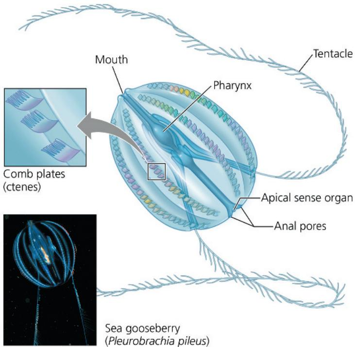

Two characteristic and unique features of the phylum Ctenophora are their ctenes and colloblasts. Ctenes, also called comb plates, are plates of partially fused cilia that are arranged in eight rows. Beating of the ctenes helps propel comb jellies mouth-first in the water column. However, their swimming abilities are limited, and their movements are largely determined by ocean currents. As ctenophores swim, the ctenes often diffract light which produces a rainbow effect (see Figure 33.4). Colloblasts are structures with sticky cells located on the ctenophore's tentacles. Upon contact with prey, the colloblasts discharge a strong adhesive that captures zooplankton. Maneuvering the ctenes can then lead to somersault-type movement that brings the ctenophore's tentacles in contact with its mouth for ingesting the prey items. Some ctenophores do not have tentacles and instead ingest relatively large prey (often other ctenophores) by opening their mouths and swimming toward them.

Ctenophores have simple muscles and a diffuse nerve net that allows for their simple movements. The nerve net consists of a series of neurons whose plasma membranes are fused together, meaning that they have a continuous, shared cytoplasm. This arrangement is very different from the nervous system found in cnidarians and bilaterians. Information about the ctenophore's environment comes from the apical sense organ and sensory cells found throughout the body.

The body plan of ctenophores is diploblastic, with a clear ectoderm and endoderm but no clear mesoderm. Between these tissue layers is the gelatinous mesoglea, a matrix of proteins and carbohydrates that also contain some muscle and nerve cells. Ctenophores have modified radial symmetry: There is a distinct axis from the mouth to the apical sense organ, and many species display mostly radial symmetry around it. However, the arrangement of the comb rows and anal pores is inconsistent with radial symmetry, and some species are flattened on either side of the oral/aboral axis.

Most ctenophores are hermaphrodites. Some species release both eggs and sperm for fertilization and subsequent larval development in the water column. Others release sperm in the water column but retain the egg until fertilization, then brood the larvae for part of their development.

## Concept Check 33.1

1. Describe how sponges feed.

2. Describe the body plan of ctenophores and highlight structures that are unique to this phylum.

3. MAKE CONNECTIONS The phylogeny in Figure 33.1 shows a polytomy (see Concept 26.2) at the base of the animal tree of life, highlighting the uncertainty surrounding the earliest-diverging lineage of animals. Redraw this phylogenetic tree with the two alternative hypotheses (sponges diverged first or ctenophores diverged first), and on each tree, mark the most likely branch where muscles and neurons were gained and/or lost.

# Concept 33.2: Cnidarians are radially symmetric animals that are closely related to bilaterians

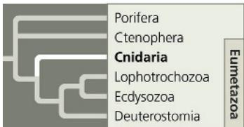

Cnidarians were once thought to be closely related to ctenophores but are now thought to share a more recent common ancestor with the bilaterians: The cnidarian lineage diverged from the

bilaterian clade about 680 million years ago, according to DNA analyses. Cnidarians have diversified into a wide range of sessile and motile forms, including hydras, corals, and jellies (commonly called “jellyfish”). Yet most cnidarians still exhibit the relatively simple, diploblastic, radial body plan that existed in early members of the group some 560 million years ago.

The basic body plan of a cnidarian is a sac with a central digestive compartment, the gastrovascular cavity. A single opening to this cavity functions as both mouth and anus. There are two variations on this body plan: the largely sessile polyp and the more motile medusa (Figure 33.5). Polyps are cylindrical forms that adhere to the substrate by the aboral end of their body (the end opposite the mouth) and extend their tentacles, waiting for prey. Examples of the polyp form include hydras and sea anemones. Although they are primarily sedentary, many polyps can move slowly across their substrate using muscles at the aboral end of their body. When threatened by a predator, some sea anemones can detach from the substrate and “swim” by bending their body column back and forth, or thrashing their tentacles. A medusa (plural, medusae) resembles a flattened, mouth-down version of the polyp. It moves freely in the water by a combination of passive drifting and contractions of its bell-shaped body. Medusae include free-swimming jellies.

The body wall of a cnidarian has two layers of cells: an outer layer of epidermis (darker blue; derived from ectoderm) and an inner layer of gastrodermis (yellow; derived from endoderm). Digestion begins in the gastrovascular cavity and is completed inside food vacuoles in the gastrodermal cells. Sandwiched between the epidermis and gastrodermis is a gelatinous layer, the mesoglea.

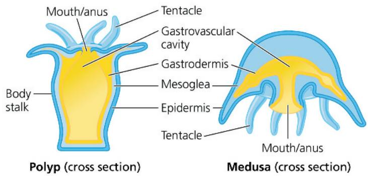  
Figure 33.6 A cnidocyte of a hydra.

This type of cnidocyte contains a stinging capsule, the nematocyst, which contains a coiled thread. When a “trigger” is stimulated by touch or by certain chemicals, the thread shoots out, puncturing and injecting poison into prey.

Figure 33.5 Polyp and medusa forms of cnidarians.  
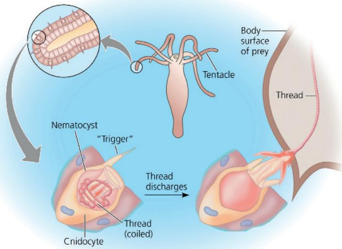

The tentacles of a jelly dangle from the oral surface, which points downward. Some cnidarians exist only as polyps or only as medusae; others have both a polyp stage and a medusa stage in their life cycle.

Cnidarians are predators that often use tentacles arranged in a ring around their mouth to capture prey and push the food into their gastrovascular cavity, where digestion begins. Enzymes are secreted into the cavity, thus breaking down the prey into a nutrient-rich broth. Cells lining the cavity then absorb these nutrients and complete the digestive process; any undigested remains are expelled through the cnidarian's mouth/anus. The tentacles are armed with batteries of cnidocytes, cells unique to cnidarians that function in defense and prey capture. Cnidocytes contain cnidae (from the Greek cnide, nettle), capsule-like organelles that are capable of exploding outward and that give phylum Cnidaria its name (Figure 33.6). Specialized cnidae called nematocysts contain a stinging thread that can penetrate the body surface of the cnidarian's prey. Other kinds of cnidae have long threads that stick to or entangle small prey that bump into the cnidarian's tentacles.

Contractile tissues and nerves occur in their simplest forms in cnidarians. Cells of the epidermis (outer layer) and gastrodermis (inner layer) have bundles of microfilaments arranged into contractile fibers. The gastrovascular cavity acts as a hydrostatic skeleton (see Concept 50.6) against which the contractile cells can work. When a cnidarian closes its mouth, the volume of the cavity is fixed, and contraction of selected cells causes the animal to change shape. Like ctenophores, cnidarians have no brain. Instead, movements are coordinated by a noncentralized nerve net that is associated with sensory structures distributed around the body. Thus, even though it lacks a brain, the animal can detect and respond to stimuli from all directions.

Fossil and molecular evidence suggests that early in its evolutionary history, the phylum Cnidaria diverged into two major clades, Medusozoa and Anthozoa (Figure 33.7).

Figure 33.7 Cnidarians.

(a) Medusozoans

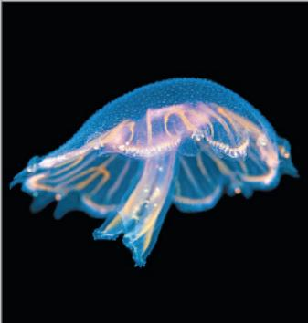  
Many scyphozoans (jellies) are bioluminescent. Food captured by nematocyst-bearing tentacles is transferred to specialized oral arms for transport to the mouth.

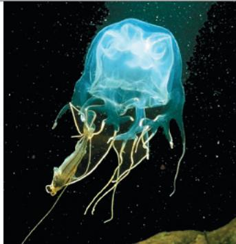  
This cubozoan, a sea wasp, produces a poison that can subdue fish (as seen here), crustaceans, and other large prey. The poison is more potent than cobra venom.  
(b) Anthozoans

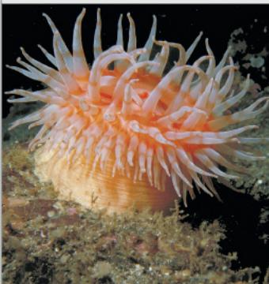  
Sea anemones and other anthozoans exist only as polyps. Many anthozoans form symbiotic relationships with photosynthetic algae.

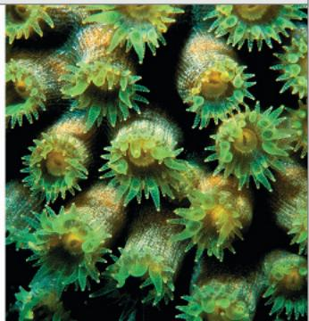  
These star corals live as colonies of polyps. Their soft bodies are enclosed at the base by a hard exoskeleton.

## Medusozoans

All cnidarians that produce a medusa are members of clade Medusozoa, a group that includes the scyphozoans (jellies) and cubozoans (box jellies) shown in Figure 33.7a, along with the hydrozoans. Most hydrozoans alternate between the polyp and medusa forms, as seen in the life cycle of Obelia (Figure 33.8). The polyp stage, a colony of interconnected polyps in the case of Obelia, is more conspicuous than the medusa. Hydras, among the few cnidarians found in fresh water, are also unusual hydrozoans in that they exist only in polyp form.

Unlike hydrozoans, most scyphozoans and cubozoans spend the majority of their life cycles in the medusa stage. Coastal scyphozoans, for example, often have a brief polyp stage during their life cycle, whereas those that live in the open ocean generally lack the polyp stage altogether. As their name (which means “cube animals”) suggests, cubozoans have a box-shaped medusa stage. Most cubozoans live in tropical oceans and are equipped with highly toxic cnidocytes. For example, the sea wasp (Chironex fleckeri), a cubozoan that lives off the coast of northern Australia, is one of the

deadliest organisms known: Its sting causes intense pain and can lead to respiratory failure, cardiac arrest, and death within minutes.

## Anthozoans

Sea anemones and corals belong to the clade Anthozoa (see Figure 33.7b). These cnidarians occur only as polyps. Corals live as solitary or colonial forms, often forming symbioses with algae. Many species secrete a hard exoskeleton (external skeleton) of calcium carbonate. Each polyp generation builds on the skeletal remains of earlier generations, constructing rocklike reefs with shapes characteristic of their species. These skeletons are what we usually think of as coral.

Coral reefs are to tropical seas what rain forests are to tropical land areas: They provide habitat for many other species. Unfortunately, these reefs are being destroyed at an alarming rate. Pollution, overharvesting, and ocean acidification (see Figure 3.12) are major threats. Climate change is also contributing to their demise by raising seawater temperatures above the range in which corals thrive (see Concept 56.4).

## Concept Check 33.2

1. Compare and contrast the polyp and medusa forms of cnidarians.

2. VISUAL SKILLS Use the cnidarian life cycle diagram in Figure 33.8 to determine the ploidy of a feeding polyp and of a medusa. What category of life cycle is this?

3. MAKE CONNECTIONS Many new animal body plans emerged during and after the Cambrian explosion. In contrast, cnidarians today retain the same diploblastic, radial body plan found in cnidarians 560 million years ago. Are cnidarians therefore less successful or less “highly evolved” than other animal groups? Explain. (See Concepts 25.3 and 25.6.)

For suggested answers, see Appendix A.

# Concept 33.3: Lophotrochozoans have the widest range of animal body forms

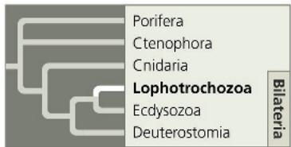

The vast majority of animal species belong to the clade Bilateria, whose members exhibit bilateral symmetry and are triploblastic (see Concept 32.3). Most bilaterians also have a digestive tract with

two openings (a mouth and an anus) and a body cavity (a coelom or blastocoelom; see Figure 32.9). Recent DNA analyses suggest that the common ancestor of living bilaterians lived about 670 million years ago. To date, however, the oldest fossil that is widely accepted as a bilaterian is of Kimberella, a mollusc (or close relative) that lived 560 million years ago (see Figure 32.5b). Many other bilaterian groups first appeared in the fossil record during the Cambrian explosion (535 to 525 million years ago).

Figure 33.8 The life cycle of the hydrozoan Obelia.  
The polyp is asexual, and the medusa is sexual, releasing eggs and sperm. These two stages alternate, one producing the other.  
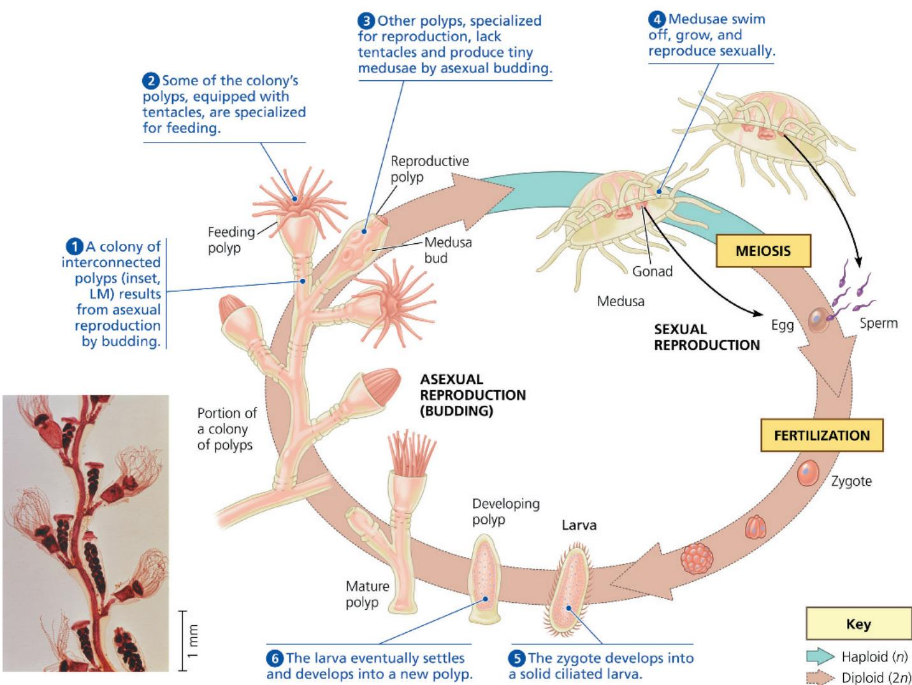  
MAKE CONNECTIONS Compare and contrast the Obelia life cycle to the life cycles in Figure 13.6. Which life cycle in that figure is most similar to that of Obelia? Explain. (See also Figure 29.5.) For suggested answer, see Appendix A.

Molecular evidence suggests that today there are three major clades of bilaterally symmetric animals: Lophotrochozoa, Ecdysozoa, and Deuterostomia. This section will focus on the first of these clades, the lophotrochozoans. Concepts 33.4 and 33.5 will explore the other two clades.

Although the clade Lophotrochozoa was identified by molecular data, its name comes from features found in some of its members. Some lophotrochozoans develop a structure called a lophophore, a crown of ciliated tentacles that functions in feeding, while others go through a distinctive stage called the trochophore larva (see Figure 32.12). Other members of the group have neither of these features. Few other unique morphological features are widely shared within the group—in fact, the lophotrochozoans are the most diverse bilaterian clade in terms of body plan. This diversity in form is reflected in the number of phyla classified in the group: Lophotrochozoa includes 18 phyla, more than twice the number in any other clade of bilaterians.

We'll now introduce six of the diverse lophotrochozoan phyla: the flatworms, rotifers and acanthocephalans, ectoprocts, brachiopods, molluscs, and annelids.

## Flatworms

Flatworms (phylum Platyhelminthes) live in marine, freshwater, and damp terrestrial habitats. In addition to free-living species, flatworms include many parasitic species, such as flukes and tapeworms. Flatworms are so named because they have thin bodies that are flattened dorsoventrally (between the dorsal and ventral surfaces); the word platyhelminth means “flat worm.” (Note that worm is not a formal scientific name but rather refers to animals with long, soft bodies.) The smallest flatworms are nearly microscopic free-living species, while some tapeworms are more than 20 m long.

Although flatworms are triploblastic, they lack a body cavity. Their flat shape increases their surface area, placing all their cells close to water in the surrounding environment or in their gut. Because of this proximity to water, gas exchange and the elimination of nitrogenous waste (ammonia) can occur by diffusion across the body surface. As shown in Figure 33.9, a flat shape is one of several structural features that maximize surface

## Make Connections: Maximizing Surface Area

## Figure 33.9

In general, the amount of metabolic or chemical activity a cell or organism can carry out is proportional to its mass or volume. Maximizing metabolic rate, however, requires the efficient uptake of energy and raw materials, such as nutrients and oxygen, as well as the effective disposal of waste products. For large cells, plants, and animals, these exchange processes have the potential to be limiting due to simple geometry. When a cell or organism grows without changing shape, its volume increases more rapidly than its surface area (see Figure 6.7). As a result, there is proportionately less surface area over which exchange processes can occur. The challenge posed by the relationship between surface area and volume occurs in diverse contexts and organisms, but the evolutionary adaptations that meet challenge are similar. Structures that maximize surface area through flattening, folding, and projections have an essential role in biologic

These diagrams compare surface area (SA) for two different shapes with the same volume (V). Note which shape has the greater surface area.

SA: $6 \, (3 \, \text{cm} \times 3 \, \text{cm}) = 54 \, \text{cm}^{2}$ V: $3 \, cm \times 3 \, cm \times 3 \, cm = 27 \, cm^{3}$

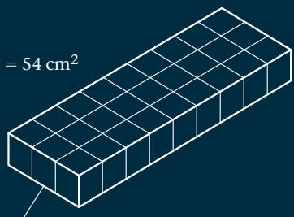

SA: $2(3\ \text{cm} \times 1\ \text{cm}) + 2(9\ \text{cm} \times 1\ \text{cm}) + 2(3\ \text{cm} \times 9\ \text{cm}) = 78\ \text{cm}^{2}$ V: $1\ cm \times 3\ cm \times 9\ cm = 27\ cm^{3}$

## Branching

Water uptake relies on passive diffusion. The highly branched filaments of a fungal mycelium increase the surface area across which water and minerals can be absorbed from the environment. (See Figure 31.2.)

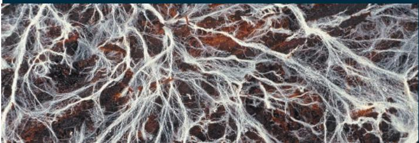

## Folding

This TEM shows portions of two chloroplasts in a plant leaf. Photosynthesis occurs in chloroplasts, which have a flattened and interconnected set of internal membranes called thylakoid membranes. The foldings of the thylakoid membranes increase their surface area, enhancing the exposure to light and thus increasing the rate of photosynthesis. (See Figure 10.4.)

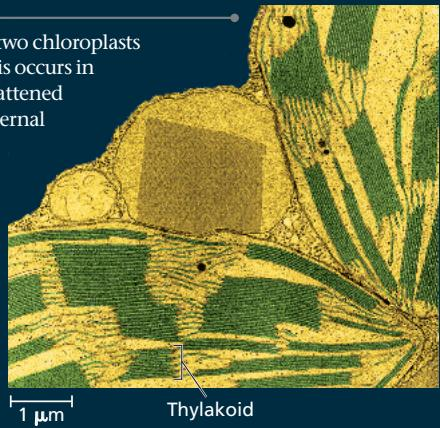  
Thylakoid

## Flattening

By having a body that is only a few cells thick, an organism such as this flatworm can use its entire body surface for exchange. (See Figure 40.3.)

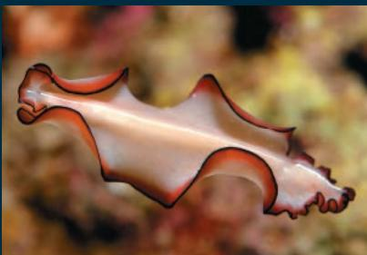

## Projections

In vertebrates, the small intestine is lined with finger-like projections called villi that absorb nutrients released by the digestion of food. Each of the villi shown here is covered with large numbers of microscopic projections called microvilli, resulting in a total surface area of about $300 \, m^{2}$ in a human, as large as a tennis court.
(See Figure 41.12.)

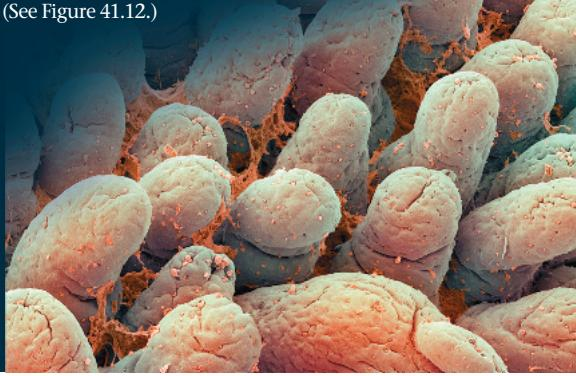

MAKE CONNECTIONS Find other examples of flattening, folding, branching, and projections (see Chapters 6, 9, 35, and 42). How is maximizing surface area important to the structure's function in each example?

area and have arisen (by convergent evolution) in different groups of animals and other organisms.

As you might expect since all their cells are close to water, flatworms have no organs specialized for gas exchange, and their relatively simple excretory apparatus functions mainly to maintain osmotic balance with their surroundings. This apparatus consists of protonephridia, networks of tubules with ciliated structures called flame bulbs that pull fluid through branched ducts opening to the outside (see Figure 44.8). Most flatworms have a gastrovascular cavity with only one opening. Though flatworms lack a circulatory system, the fine branches of the gastrovascular cavity distribute food directly to the animal's cells.

Early in their evolutionary history, flatworms separated into two lineages, Catenulida and Rhabditophora. Catenulida is a small clade of about 100 flatworm species, most of which live in freshwater habitats. Catenulids typically reproduce asexually by budding at their posterior end. The offspring often produce their own buds before detaching from the parent, thereby forming a chain of two to four genetically identical individuals—hence their informal name, “chain worms.”

The other ancient flatworm lineage, Rhabditophora, is a diverse clade of about 20,000 freshwater and marine species, one example of which is shown in Figure 33.9. We'll explore the rhabditophorans in more detail, focusing on free-living and parasitic members of this clade.

## Free-Living Species

Free-living rhabditophorans are important as predators and scavengers in a wide range of freshwater and marine habitats. The best-known members of this group are freshwater species in the genus Dugesia, commonly called planarians (Figure 33.10). Abundant in unpolluted ponds and streams, planarians prey on smaller animals or feed on dead animals. They move by using cilia on their ventral surface, gliding along

Figure 33.10 Anatomy of a planarian.

Digestion is completed within the cells lining the gastrovascular cavity, which has many fine subbranches that provide an extensive surface area.

Pharynx. A muscular pharynx can be extended through the mouth. Digestive juices are spilled onto prey, and the pharynx sucks small pieces of food into the gastrovascular cavity, where digestion continues.

Undigested wastes are eliminated through an opening at the tip of the pharynx.

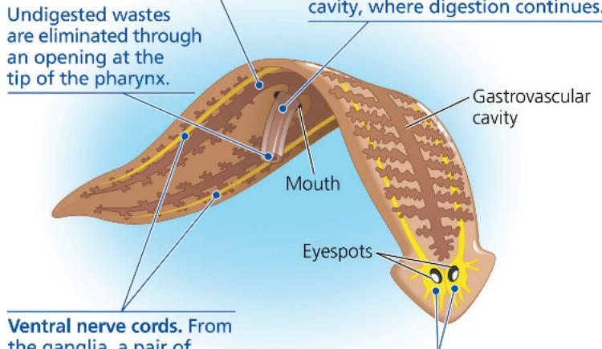  
Ventral nerve cords. From the ganglia, a pair of ventral nerve cords runs the length of the body.  
Ganglia. At the anterior end of the worm, near the main sources of sensory input, is a pair of ganglia, dense clusters of nerve cells.

a film of mucus they secrete. Some other rhabditophorans also use their muscles to swim through water with an undulating motion.

A planarian's head features a pair of light-sensitive eyespots as well as lateral flaps that function mainly to detect specific chemicals. The planarian nervous system is more complex and centralized than the nerve nets of cnidarians. Experiments have shown that planarians can learn to modify their responses to stimuli.

Some planarians can reproduce asexually through fission. The parent constricts roughly in the middle of its body, separating into a head end and a tail end; each end then regenerates the missing parts. Sexual reproduction also occurs. Planarians are hermaphrodites, and copulating mates typically cross-fertilize each other.

## Parasitic Species

More than half of the known species of rhabditophorans live as parasites in or on other animals. Many have suckers that attach to the internal organs or outer surfaces of the host animal. In most species, a tough covering helps protect the parasites within their hosts. We'll discuss two ecologically and economically important subgroups of parasitic rhabditophorans, the trematodes and the tapeworms.

## Trematodes

As a group, trematodes parasitize a wide range of hosts, and most species have complex life cycles with alternating sexual and asexual stages. Many trematodes require an intermediate host in which larvae develop before infecting the final host (usually a vertebrate), where the adult worms live. For example, various trematodes that parasitize humans spend part of their lives in snail hosts (Figure 33.11, on the next page). Around the world, about 200 million people are infected with trematodes called blood flukes (Schistosoma) and suffer from schistosomiasis, a disease whose symptoms include pain, anemia, and diarrhea.

Living within more than one kind of host puts demands on trematodes that free-living animals don't face. A blood fluke, for instance, must evade the immune systems of both snails and humans. By mimicking the surface proteins of its hosts, the blood fluke creates a partial immunological camouflage for itself. It also releases molecules that manipulate the hosts' immune systems into tolerating the parasite's existence. These defenses are so effective that individual blood flukes can survive in humans for more than 40 years.

## Tapeworms

The tapeworms are a second large and diverse group of parasitic rhabditophorans (Figure 33.12). The adults live mostly inside vertebrates, including humans. In many tapeworms, the anterior end, or scolex, is armed with suckers and often hooks that the worm uses to attach itself to the intestinal lining of its host. Tapeworms lack a mouth and gastrovascular cavity; they simply absorb nutrients released by digestion in the host's intestine. Absorption occurs across the tapeworm's body surface.

Posterior to the scolex is a long ribbon of units called proglottids, which are little more than sacs of sex organs. After sexual reproduction, proglottids loaded with thousands of fertilized eggs are released from the posterior end of a tapeworm and leave the host's body in feces. In one type of life cycle, feces carrying the eggs contaminate the food or water of intermediate hosts, such as pigs or cattle, and the tapeworm eggs develop into larvae that encyst in muscles of these animals. A human acquires

Figure 33.11 The life cycle of a blood fluke (Schistosoma mansoni), a trematode.

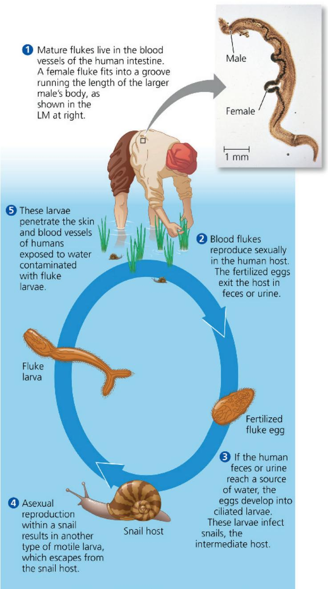  
WHAT IF? Snails eat algae, whose growth is stimulated by nutrients found in fertilizer. How would the contamination of irrigation water with fertilizer likely affect the occurrence of schistosomiasis? Explain.  
For suggested answer, see Appendix A.

the larvae by eating undercooked meat containing the cysts, and the worms develop into mature adults within the human. Large tapeworms can block the intestines and rob enough nutrients from the human host to cause nutritional deficiencies. Several different oral medications can kill the adult worms.

## Rotifers and Acanthocephalans

Recent phylogenetic analyses have shown that two traditional animal phyla, the rotifers (former phylum Rotifera) and the acanthocephalans (former phylum Acanthocephala), should be combined into a single phylum, Syndermata. Each of the two groups has distinctive characteristics.

## Rotifers

There are roughly 1,800 species of rotifers, tiny animals that inhabit freshwater, marine, and damp soil habitats. Ranging in size from about 50 $\mu$ m to 2 mm, rotifers are smaller than many protists but nevertheless are multicellular and have specialized organ systems (Figure 33.13). In contrast to cnidarians and flatworms, which have a gastrovascular cavity, rotifers have an alimentary canal, also known as a complete digestive tract: a digestive tube with two openings, a mouth and an anus. Internal organs lie within the blastocoelom (see Figure 32.9b). Fluid in the blastocoelom serves as a hydrostatic skeleton. Movement of a rotifer's body distributes the fluid throughout the body, circulating nutrients.

The word rotifer is derived from the Latin meaning “wheel-bearer,” a reference to the crown of cilia that draws a vortex of water into the mouth. Posterior to the mouth, rotifers have jaws called trophi that grind up food, mostly microorganisms suspended in the water. Digestion is then completed farther along the alimentary

Figure 33.12 Anatomy of a tapeworm.
The inset shows a close-up of the scolex (colorized SEM).  
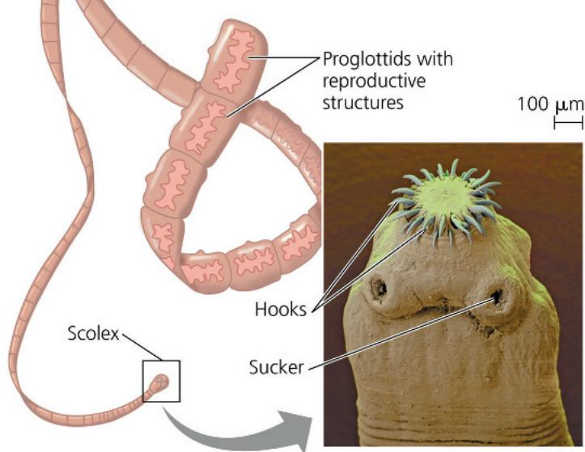

canal. Most other bilaterians also have an alimentary canal, which enables the stepwise digestion of a wide range of food particles.

Rotifers exhibit some unusual forms of reproduction. Some species consist only of females that produce more females from unfertilized eggs, a type of asexual reproduction called parthenogenesis. Some other invertebrates (for example, aphids and some bees) and even some vertebrates (for example, some lizards and some fishes) can also reproduce in this way. In addition to being able to produce females by parthenogenesis, some rotifers can also reproduce sexually under certain conditions, such as high levels of crowding. The resulting embryos can remain dormant for years. Once they break dormancy, the embryos develop into another generation of females that reproduce asexually.

Figure 33.13 A rotifer.  
Although smaller than many unicellular protists, rotifers are multicellular and have specialized organ systems (LM).  
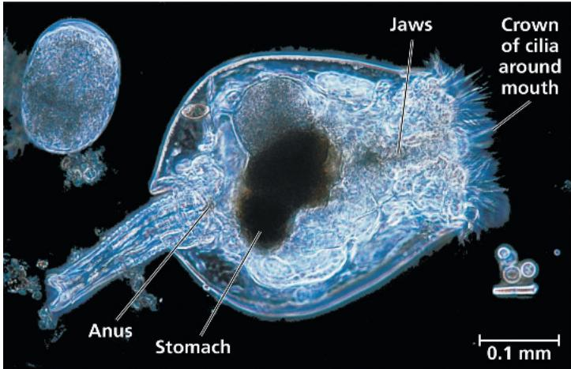

It is puzzling that many rotifer species persist without males. The vast majority of animals and plants reproduce sexually at least some of the time, and sexual reproduction has certain advantages over asexual reproduction (see Concept 46.1). For example, species that reproduce asexually tend to accumulate harmful mutations in their genomes faster than sexually reproducing species. As a result, asexual species should experience higher rates of extinction.

Seeking to understand how they persist without males, researchers have been studying a clade of asexual rotifers named Bdelloidea. Some 360 species of bdelloid rotifers are known, and all of them reproduce by parthenogenesis without any males. Paleontologists have discovered bdelloid rotifers preserved in 35-million-year-old amber, and the morphology of these fossils resembles only the female form, with no evidence of males. Molecular clock analyses indicate that bdelloids have been asexual for over 50 million years. While it appears that they do not reproduce sexually, bdelloid rotifers may be able to generate genetic diversity in other ways. For example, bdelloids can tolerate very high levels of desiccation. When conditions improve and their cells rehydrate, DNA from other species enters their cells through cracks in the plasma membrane. Recent evidence suggests that this foreign DNA can be incorporated into the bdelloids' genome, thereby leading to increased genetic diversity.

## Acanthocephalans

Acanthocephalans (1,100 species) are sexually reproducing parasites of vertebrates that lack a digestive tract and usually are less than 20 cm long. They are commonly called spiny-headed worms because of the curved hooks on the proboscis at the anterior end of their body (Figure 33.14). Acanthocephalans are triploblastic and, like rotifers, they have a blastocoelom. Recent studies have shown that acanthocephalans originated from within the group traditionally known as Rotifera. In particular, rotifers in the genus Seison share a more recent common ancestor with acanthocephalans than they do with other rotifers, making the acanthocephalans a group of highly modified “rotifers.”

Figure 33.14 Paratenuisentis ambiguus, an acanthocephalan. The inset photograph shows the curved hooks that give the spiny-headed worms their name.  
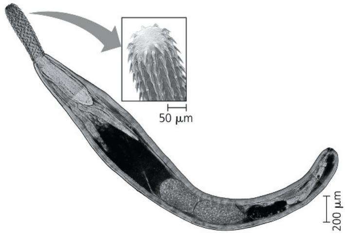

All acanthocephalans are parasites that have complex life cycles with two or more hosts. Some species manipulate the behavior of their intermediate hosts (generally arthropods) in ways that increase their chances of reaching their final hosts (generally vertebrates). For example, acanthocephalans that infect New Zealand mud crabs cause their hosts to move to more visible areas on the beach, where the crabs are more likely to be eaten by birds, the worms' final hosts.

## Ectoprocts and Brachiopods

Bilaterians in the phyla Ectoprocta and Brachiopoda have a lophophore, a crown of ciliated tentacles around their mouth (Figure 33.15a). As the cilia draw water toward the mouth, the tentacles trap suspended food particles. Other similarities, such as a U-shaped alimentary canal and the absence of a distinct head, reflect these organisms' sessile existence. In contrast to flatworms, which lack a body cavity, and rotifers, which have a blastocoelom, ectoprocts and brachiopods have a coelom (see Figure 32.9a).

Figure 33.15 Ectoprocts and brachiopods.  
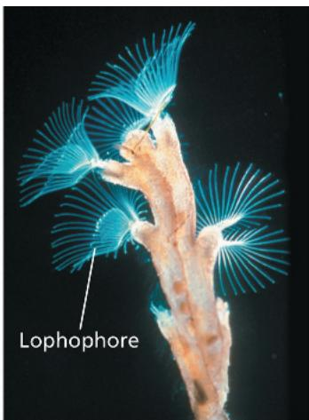  
(a) Ectoprocts, such as this creeping bryozoan (Plumatella repens), are colonial.

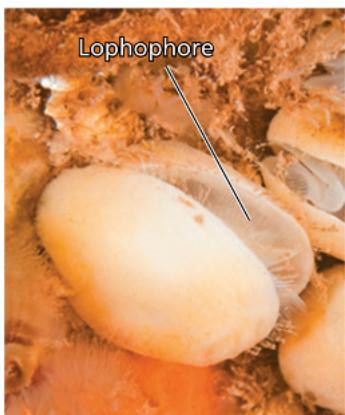  
(b) Brachiopods, such as this northern lamp shell (Terebratulina septentrionalis), have a hinged shell. The two parts of the shell are dorsal and ventral.

Ectoprocts (from the Greek ecto, outside, and procta, anus) are colonial animals that superficially resemble clumps of moss. (In fact, their common name, bryozoans, means “moss animals.”) In most species, the colony is encased in a hard exoskeleton studded with pores through which the lophophores extend. Most ectoproct species live in the sea, where they are among the most widespread and numerous sessile animals. Several species are important reef builders. Ectoprocts also live in lakes and rivers. Colonies of the freshwater ectoproct Pectinatella magnifica grow on submerged sticks or rocks and can grow into a gelatinous, ball-shaped mass more than 10 cm across.

Brachiopods, or lamp shells, superficially resemble clams and other hinge-shelled molluscs, but the two halves of the brachiopod shell are dorsal and ventral rather than lateral, as in clams (Figure 33.15b). All brachiopods are marine. Most live attached to the seafloor by a stalk, opening their shell slightly to allow water to flow through the lophophore. The living brachiopods are remnants of a much richer past that included 30,000 species in the Paleozoic and Mesozoic eras. Some living brachiopods, such as those in the genus Lingula, appear nearly identical to fossils of species that lived 400 million years ago.

## Molluscs

Snails and slugs, oysters and clams, and octopuses and squids are all molluscs (phylum Mollusca). There are over 100,000 known species, making them the second-most diverse phylum of animals (after the arthropods, discussed later). Although the majority of molluscs are marine, roughly 8,000 species inhabit fresh water, and 28,000 species of snails and slugs live on land. All molluscs are soft-bodied, and most secrete a hard protective shell made of calcium carbonate. Slugs, squids, and octopuses have a reduced internal shell or have lost their shell completely during their evolution.

Despite their apparent differences, all molluscs have a similar body plan (Figure 33.16). Most molluscs have an open circulatory system (see Figure 42.3a), and the main body cavity is a hemocoel that develops from the blastocoelom and functions to circulate hemolymph around the body. A small additional coelom surrounds the heart and gonads. The body of a mollusc has three main parts: a muscular foot, usually used for movement; a visceral mass containing most of the internal organs; and a mantle, a fold of tissue that drapes over the visceral mass and secretes a shell (if one is present). In many molluscs, the mantle extends beyond the visceral mass, producing a water-filled chamber, the mantle cavity, which houses the gills, anus, and excretory pores. Many molluscs feed by using a straplike organ called a radula to scrape up food.

Most molluscs have separate sexes, and their gonads (ovaries or testes) are located in the visceral mass. Many snails, however, are hermaphrodites. The life cycle of many marine molluscs includes a ciliated larval stage, the trochophore (see Figure 32.12b), which is also characteristic of marine annelids (segmented worms) and some other lophotrochozoans.

The basic body plan of molluscs has evolved in various ways in the phylum's eight major clades. We'll examine four of those clades here: Polyplacophora (chitons), Gastropoda (snails and slugs), Bivalvia (clams, oysters, and other bivalves), and Cephalopoda (squids, octopuses, cuttlefishes, and chambered nautiluses). We will then focus on threats facing some groups of molluscs.

## Chitons

Chitons have an oval-shaped body and a shell composed of eight dorsal plates (Figure 33.17). The chiton's body itself, however, is unsegmented. You can find these marine animals clinging to rocks along the shore during low tide. If you try to dislodge a chiton by hand, you will be surprised at how well its foot, acting as a suction cup, grips the rock. A chiton can also use its foot to creep slowly over the rock surface. Chitons use their radula to scrape algae off the rock surface.

## Gastropods

About three-quarters of all living species of molluscs are gastropods (Figure 33.18). Most gastropods are marine, but there are also freshwater

Figure 33.16 The basic body plan of a mollusc.  
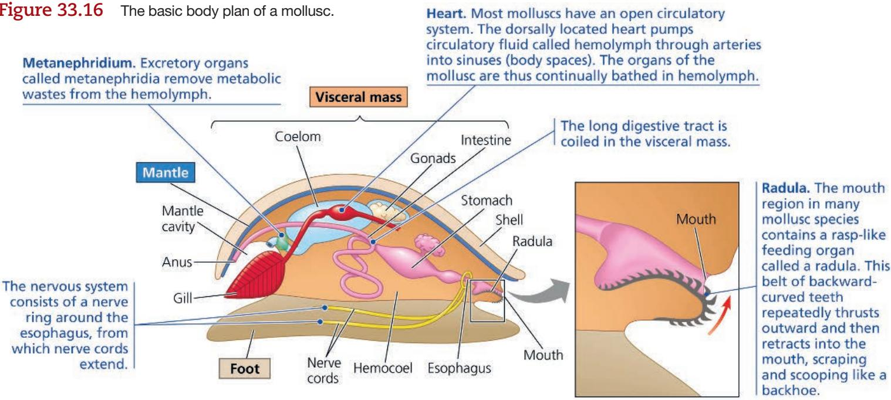

Figure 33.18 Gastropods.

Figure 33.17 A chiton.

Note the eight-plate shell characteristic of molluscs in the clade Polyplacophora.

  
(a) A land snail  
The many species of gastropods have colonized terrestrial as well as aquatic environments.

  
(b) A sea slug. Nudibranchs, or sea slugs, lost their shell during their evolution.

# Scientific Skills Exercise

# Understanding Experimental Design and Interpreting Data

Is There Evidence of Selection for Defensive Adaptations in Mollusc Populations Exposed to Predators? The fossil record shows that historically, increased risk to prey species from predators is often accompanied by increased incidence and expression of prey defenses. Researchers tested whether populations of the predatory European green crab

## A periwinkle

(Carcinus maenas) have exerted similar selective pressures on its gastropod prey, the flat periwinkle (Littorina obtusata). Periwinkles from southern sites in the Gulf of Maine have experienced predation by European green crabs for over 100 generations, at about one generation per year. Periwinkles from northern sites in the Gulf have been interacting with the invasive green crabs for relatively few generations, as the invasive crabs spread to the northern Gulf comparatively recently.

Previous research shows that (1) periwinkle shells recently collected from the Gulf are thicker than those collected in the late 1800s and (2) periwinkle populations from southern sites have thicker shells than periwinkle populations from northern sites. In this exercise, you'll interpret the design and results of the researchers' experiment studying the rates of predation by crabs on periwinkles from northern and southern populations.

How the Experiment Was Done The researchers collected peri-winkles and crabs from sites in the northern and southern Gulf of Maine, separated by 450 km of coastline. A single crab was placed in a cage with eight periwinkles of different sizes. After three days, researchers assessed the fate of the eight periwinkles. Four different treatments were set up, with crabs from northern or southern populations offered periwinkles from northern and southern populations. All crabs were of similar size and included equal numbers of males and females. Each experimental treatment was tested 12 to 14 times.

In a second part of the experiment, the bodies of periwinkles from northern and southern populations were removed from their shells and presented to crabs from northern and southern populations.

## Data from the Experiment

  
Data from R. Rochette et al., Interaction between an invasive decapod and a native gastropod: Predator foraging tactics and prey architectural defenses, Marine Ecology Progress Series 330:179–188 (2007).

When the researchers presented the crabs with unshelled periwinkles, all the unshelled periwinkles were consumed in less than an hour.

## INTERPRET THE DATA

1. What hypotheses were the researchers testing in this study? What are the independent variables? What are the dependent variables?

2. Why did the research team set up four different treatments?

3. Why did researchers present unshelled periwinkles to the crabs? What do the results of this part of the experiment indicate?

4. Summarize the results of the experiment. Do these results support the hypothesis you identified in question 1? Explain.

5. Suggest how natural selection may have affected populations of flat periwinkles in the southern Gulf of Maine over the last 100 years.

Instructors: A version of this Scientific Skills Exercise can be assigned in Mastering Biology.

species. Still other gastropods have adapted to life on land, where snails and slugs thrive in habitats ranging from deserts to rain forests.

Gastropods move literally at a snail's pace by a rippling motion of their foot or by means of cilia—a slow process that can leave them vulnerable to attack. Most gastropods have a single, spiraled shell into which the animal can retreat when threatened. The shell, which is secreted by glands at the edge of the mantle, has several functions, including protecting the animal's soft body from injury and dehydration. One of its most important roles is as a defense against predators, as is demonstrated by comparing populations with different histories of predation (see the Scientific Skills Exercise). As they move slowly about, most gastropods use their radula to graze on algae or plants. Several groups, however, are predators, and their radula has become modified for boring holes in the shells of other molluscs or for tearing apart prey. In the cone snails, the teeth of the radula act as poison darts that are used to subdue prey.

Many gastropods have a head with eyes at the tips of tentacles. Terrestrial snails lack the gills typical of most aquatic gastropods. Instead, the lining of their mantle cavity functions as a lung, exchanging respiratory gases with the air.

## Bivalves

The molluscs of the clade Bivalvia are all aquatic and include many species of clams, oysters, mussels, and scallops. Bivalves have a shell divided into two halves (Figure 33.19). The halves are hinged, and powerful adductor muscles draw them tightly together to protect the animal's soft body. Bivalves have no distinct head, and the radula has been lost. Some bivalves have eyes and sensory tentacles along the outer edge of their mantle.

The gills of bivalves are used for feeding as well as gas exchange in most species (Figure 33.20). Most bivalves are suspension feeders. They trap small food particles in mucus that coats their gills, and cilia then convey those particles to the mouth. Water enters the mantle cavity through an incurrent siphon, passes over the gills, and then exits the mantle cavity through an excurrent siphon.

Most bivalves lead sedentary lives, a characteristic suited to suspension feeding. Mussels secrete strong threads that tether them to rocks, docks, boats, and the shells of other animals. However, clams can pull themselves into the sand or mud, using

## Figure 33.19 A bivalve.

This scallop has many eyes (dark blue spots) lining each half of its hinged shell.

## Figure 33.20 Anatomy of a clam.

Food particles suspended in water that enters through the incurrent siphon are collected by the gills and passed via cilia and the palps to the mouth.

their muscular foot for an anchor, and scallops can skitter along the seafloor by flapping their shells, rather like the mechanical false teeth sold in novelty shops.

## Cephalopods

Cephalopods are active marine predators (Figure 33.21). They use their tentacles to grasp prey, which they then bite with beak-like jaws and immobilize with a poison present in their saliva. The foot of a cephalopod has become modified into a muscular excurrent siphon and part of the tentacles. Squids dart about by drawing water into their mantle cavity and then firing a jet of water through the excurrent siphon; they steer by pointing the siphon in different directions. Octopuses use a similar mechanism to escape predators.

The mantle covers the visceral mass of cephalopods, but the shell is generally reduced and internal (in most species) or missing altogether (in some cuttlefishes and some octopuses). One small group of cephalopods with external shells, the chambered nautiluses, survives today.

Cephalopods are the only molluscs with a closed circulatory system, in which the blood remains separate from fluid in the body cavity (see Figure 42.3). They also have well-developed sense organs and a complex brain. The ability to learn and behave in a complex manner is probably more critical to fast-moving predators than to sedentary animals such as clams.

The ancestors of octopuses and squids were probably shelled molluscs that took up a predatory lifestyle; the shell was lost in later evolution. Shelled cephalopods called ammonites, some of them as large as truck tires, were the dominant invertebrate predators of the seas for hundreds of millions of years until their disappearance during the mass extinction at the end of the Cretaceous period, 66 million years ago.

Figure 33.21 Cephalopods.

▶ Squids are speedy carnivores with beak-like jaws and well-developed eyes.

  
Octopuses are considered among the most intelligent invertebrates.

▶ Chambered nautiluses are the only living cephalopods with an external shell.

Most species of squid are less than 75 cm long, but some are much larger. The giant squid (Architeuthis dux), for example, has an estimated maximum length of 13 m for females and 10 m for males. The colossal squid (Mesonychoteuthis hamiltoni), is even larger, with an estimated maximum length of 14 m. Unlike A. dux, which has large suckers and small teeth on its tentacles, M. hamiltoni has two rows of sharp hooks at the ends of its tentacles that can inflict deadly lacerations.

It is likely that A. dux and M. hamiltoni spend most of their time in the deep ocean, where they may feed on large fishes. Remains of both giant squid species have been found in the stomachs of sperm whales, which are probably their only natural predator. Scientists first photographed A. dux in the wild in 2005 while it was attacking baited hooks at a depth of 900 m. M. hamiltoni has yet to be observed alive in its deep-water natural habitat. Overall, much remains to be learned about these marine giants.

## Protecting Freshwater and Terrestrial Molluscs

Species extinction rates have increased dramatically in the last 400 years, raising concern that a sixth, human-caused mass extinction may be under way (see Concept 25.4). Among the many taxa under threat, molluscs have the dubious distinction of being the animal group with the largest number of documented extinctions (Figure 33.22).

Threats to molluscs are especially severe in two groups: freshwater bivalves and terrestrial gastropods. For example, the pearl mussels, a group of freshwater bivalves that can make natural pearls (gems that form when a mussel or oyster secretes

Figure 33.22 The silent extinction.

Molluscs account for a largely unheralded but sobering 40% of all documented extinctions of animal species. These extinctions have resulted from human actions such as habitat loss and overharvesting. Many pearl mussel populations, for example, were driven to extinction by overharvesting for their shells, which were used to make buttons and other goods. Land snails are highly vulnerable to the same threats; like pearl mussels, they are among the world's most imperiled animal groups.

  
▲ Recorded extinctions of animal species

  
▲ Workers on a mound of pearl mussels killed to make buttons (ca. 1919)  
MAKE CONNECTIONS Freshwater bivalves feed on and can reduce the abundance of photosynthetic protists and bacteria. As such, what types of effects would the extinction of freshwater bivalves likely have on aquatic communities (see Concept 28.6)?

layers of a lustrous coating around a grain of sand or other small irritant), are among the world's most endangered animals. Roughly $10\%$ of the 300 pearl mussel species that once lived in North America have become extinct in the last 100 years, and over two-thirds of those that remain are threatened by extinction. Terrestrial gastropods, such as the snail in Figure 33.22, are faring no better. Hundreds of Pacific island land snails have disappeared since 1800. Overall, more than $50\%$ of the Pacific island land snails are extinct or under imminent threat of extinction.

Threats faced by freshwater and terrestrial molluscs include habitat loss, pollution, competition or predation by non-native species, and overharvesting by humans. Is it too late to protect these molluscs? In some locations, reducing water pollution and changing how water is released from dams have led to dramatic rebounds in pearl mussel populations. Such results provide hope that with corrective measures, other endangered mollusc species can be revived.

## Annelids

Annelida means “little rings,” referring to the annelid body’s resemblance to a series of fused rings. Annelids are segmented worms that live in the sea, in most freshwater habitats, and in damp soil. Annelids, which have a coelom (and no blastocoelom), range in length from less than 1 mm to more than 3 m.

Traditionally, the phylum Annelida was divided into three main groups, Polychaeta (the polychaetes), Oligochaeta (the oligochaetes), and Hirudinea (the leeches). The names of the first two of these groups reflected the relative number of chaetae, bristles made of chitin, on their bodies: polychaetes (from the Greek poly, many, and chaitē, long hair) have many more chaetae per segment than do oligochaetes.

However, a 2011 phylogenomic study and other recent molecular analyses have indicated that the oligochaetes are a subgroup of the polychaetes, making the polychaetes (as defined morphologically) a paraphyletic group. Likewise, the leeches have been shown to be a subgroup of the oligochaetes. As a result, these traditional names are no longer used to describe the evolutionary history of the annelids. Instead, current evidence indicates that the annelids can be divided into two major clades, Errantia and Sedentaria—a grouping that reflects broad differences in lifestyle.

## Errantians

Clade Errantia (from the Old French errant, traveling) is a large and diverse group, most of whose members are marine (Figure 33.23). As their name suggests, many errantians are mobile; some swim among the plankton (small, drifting organisms), while many others crawl on or burrow in the seafloor. Many are predators, while others are grazers that feed on large, multicellular algae. The group also includes some relatively immobile species, such as the tube-dwelling Platynereis, a marine species that recently has become a model organism for studying neurobiology and development.

In many errantians, each body segment has a pair of prominent paddle-like or ridge-like structures called parapodia (“beside feet”) that function in locomotion (see Figure 33.23). Each parapodium has numerous chaetae. (Possession of parapodia with numerous chaetae is not unique to Errantia, however, as some members of the other major clade of annelids, Sedentaria, also have these features.) In

Figure 33.23 An errantian, the predator Nereimyra punctata. This marine annelid ambushes prey from burrows it has constructed on the seafloor. N. punctata hunts by touch, detecting its prey with long sensory organs called cirri that extend from the burrow.  

many species, the parapodia are richly supplied with blood vessels and also function as gills. Errantians also tend to have well-developed jaws and sensory organs, as might be expected of predators or grazers that move about in search of food.

## Sedentarians

Species in the other major clade of annelids, Sedentaria (from the Latin sedere, sit), tend to be less mobile than those in Errantia. Some species burrow slowly through marine sediments or soil, while others live within tubes that protect and support their soft bodies. Tube-dwelling sedentarians often have elaborate gills or tentacles used for filter feeding (Figure 33.24).

## Figure 33.24 The Christmas tree worm, Spirobranchus giganteus.

This sedentarian's two tree-shaped whorls are tentacles, which it uses in gas exchange and to collect food particles from the water. The tentacles emerge from a calcium carbonate tube secreted by the worm that protects and supports its soft body.

Figure 33.25 A leech.  
A nurse applied this medicinal leech (Hirudo medicinalis) to a patient's sore thumb to drain blood from a hematoma (an abnormal accumulation of blood around an internal injury).

Although the Christmas tree worm shown in Figure 33.24 once was classified as a “polychaete,” current evidence indicates it is a sedentarian. The clade Sedentaria also contains former “oligochaetes,” including the leeches and the earthworms.

## Leeches

Some leeches are parasites that suck blood by attaching temporarily to other animals, including humans (Figure 33.25), but most are predators that feed on other invertebrates. Leeches range in length from 1 to 30 cm. Most leeches inhabit fresh water, but there are also marine species and terrestrial leeches, which live in moist vegetation. Some parasitic species use bladelike jaws to slit the skin of their host. The host is usually oblivious to this attack because the leech secretes an anesthetic. After making the incision, the leech secretes a chemical, hirudin, which keeps the blood of the host from coagulating near the incision. The parasite then sucks as much blood as it can hold, often more than ten times its own weight. After this gorging, a leech can last for months without another meal.

Until the 20th century, leeches were frequently used for bloodletting. Today they are used to drain blood that accumulates in tissues following certain injuries or surgeries. In addition, forms of hirudin produced with recombinant DNA techniques can be used to dissolve unwanted blood clots that form during surgery or as a result of heart disease.

## Earthworms

Earthworms eat their way through the soil, extracting nutrients as the soil passes through the alimentary canal. Undigested material, mixed with mucus secreted into the canal, is eliminated as fecal castings through the anus. Farmers value earthworms because the animals till and aerate the earth, and their castings improve the texture of the soil. (Charles Darwin estimated that one acre of farmland contains about 50,000 earthworms, producing 18 tons of castings per year.)

A guided tour of the anatomy of an earthworm, which is representative of annelids, is shown in Figure 33.26, on the next page. Earthworms are hermaphrodites, but they do cross-fertilize. Two earthworms mate by aligning themselves in opposite directions in such a way that they exchange sperm, and then they separate. Some earthworms can also reproduce asexually by fragmentation followed by regeneration.

As a group, Lophotrochozoa encompasses a remarkable range of body plans. Next we'll explore the diversity of Ecdysozoa, a dominant presence on Earth in terms of sheer number of species.

## Concept Check 33.3

1. Explain how tapeworms can survive without a body cavity, a mouth, a digestive system, or an excretory system.

2. Annelid anatomy can be described as "a tube within a tube." Explain.

3. MAKE CONNECTIONS Explain how the molluscan foot in gastropods and the excurrent siphon in cephalopods represent examples of descent with modification (see Concept 22.2).

For suggested answers, see Appendix A.

# Concept 33.4: Ecdysozoans are the most species-rich animal group

Although defined primarily by molecular evidence, the clade Ecdysozoa includes animals that shed a cuticle (a tough external coat) as they grow. In fact, the group derives its name from this

process, which is called ecdysis, or molting. Ecdysozoa includes about eight animal phyla and contains more known species than all other animal, protist, fungus, and plant groups combined. Here we'll focus on the two largest ecdysozoan phyla, the nematodes and arthropods, which are among the most successful and abundant of all animal groups.

## Nematodes

Among the most ubiquitous of animals, nematodes (phylum Nematoda), or roundworms, are found in most aquatic habitats, in the soil, in the moist tissues of plants, and in the body fluids and tissues of animals. The cylindrical bodies of nematodes range from less than 1 mm to more than 1 m long, often tapering to a fine tip at the posterior end and to a blunter tip at the anterior end (Figure 33.27). A nematode's body is covered by a tough cuticle (a type of exoskeleton); as the worm grows, it periodically sheds its old cuticle and secretes a new, larger one. Nematodes have an alimentary canal with a mouth and anus. They lack a heart and circulatory system; nutrients and gases are instead transported throughout the body via fluid in the blastocoelom, aided by the movement of the worm. The body wall muscles are all longitudinal, and their contraction produces a thrashing motion.

Multitudes of nematodes live in moist soil and in decomposing organic matter on the bottoms of lakes and oceans. While 25,000 species are known, perhaps 20 times that number actually exist. These free-living worms play an important role in decomposition and nutrient cycling, but little is known about most species. One species of soil nematode, Caenorhabditis elegans, however, is very well studied and has become a model research organism in biology (see Concept 47.3). Ongoing studies of C. elegans are providing insight into mechanisms involved in aging in humans, as well as many other topics.

Figure 33.26 Anatomy of an earthworm, a sedentarian.  
  
Giant Australian earthworm  
The circulatory system, a network of vessels, is closed. The dorsal and ventral vessels are linked by segmental pairs of vessels, some of which are muscular and pump blood through the circulatory system.

Figure 33.27 A free-living nematode.
(colorized SEM)  

Phylum Nematoda includes many species that parasitize plants, and some are major agricultural pests that attack the roots of crops. Other nematodes parasitize animals. Some of these species benefit humans by attacking insects such as cutworms that feed on the roots of crop plants. On the other hand, humans are hosts to at least 50 nematode species, including various pinworms and hookworms. One notorious nematode is Trichinella spiralis, the worm that causes trichinosis (Figure 33.28). Humans acquire this nematode by eating raw or undercooked pork or other meat (including wild game such as bear or walrus) that has juvenile worms encysted in the muscle tissue. Within the human intestines, the juveniles develop into sexually mature

50 μm

Figure 33.28 Juveniles of the parasitic nematode Trichinella spiralis encysted in human muscle tissue.  

adults. Females burrow into the intestinal muscles and produce more juveniles, which bore through the body or travel in lymphatic vessels to other organs, including skeletal muscles, where they encyst.

Parasitic nematodes have an extraordinary molecular toolkit that enables them to redirect some of the cellular functions of their hosts. Some species inject their plant hosts with molecules that induce the development of root cells, which then supply nutrients to the parasites. When Trichinella parasitizes animals, it regulates the expression of specific muscle cell genes encoding proteins that make the cell elastic enough to house the nematode. Additionally, the infected muscle cell releases signals that promote the growth of new blood vessels, which then supply the nematode with nutrients.

## Arthropods

Zoologists estimate that there are about a billion billion ( $10^{18}$ ) arthropods living on Earth. More than 1 million arthropod species have been described, most of which are insects. In fact, two out of every three known species are arthropods, and members of the phylum Arthropoda can be found in nearly all habitats of the biosphere. By the criteria of species diversity, distribution, and sheer numbers, arthropods must be regarded as the most successful of all animal phyla.

## Arthropod Origins

Biologists hypothesize that the diversity and success of arthropods are related to their body plan—their segmented body, hard exoskeleton, and jointed appendages. How did this body plan arise and what advantages did it provide?

The earliest fossils of arthropods are from the Cambrian explosion (535–525 million years ago), indicating that the arthropods are at least that old. The fossil record of the Cambrian explosion also contains many species of lobopods, a group from which arthropods may have evolved. Lobopods such as Hallucigenia (see Figure 32.7) had segmented bodies, but most of their body

## Figure 33.29 A trilobite fossil.

Trilobites were common denizens of the shallow seas throughout the Paleozoic era but disappeared with the great Permian extinctions about 250 million years ago. Paleontologists have described about 4,000 trilobite species.

segments were identical to one another. Early arthropods, such as the trilobites, also showed little variation from segment to segment (Figure 33.29). As arthropods continued to evolve, groups of segments tended to become functionally united into “body regions” specialized for tasks such as feeding, walking, or swimming. These evolutionary changes resulted not only in great diversification but also in efficient body plans that permit the division of labor among different body regions.

What genetic changes led to the increasing complexity of the arthropod body plan? Arthropods today have two unusual Hox genes, both of which influence segmentation. To test whether these genes could have driven the evolution of increased body segment diversity in arthropods, researchers studied Hox genes in onychophorans (see Figure 33.2), close relatives of arthropods (Figure 33.30, on the next page). Their results indicate that the diversity of arthropod body plans did not arise from the acquisition of new Hox genes. Instead, the evolution of body segment diversity in arthropods was probably driven by changes in the sequence or regulation of existing Hox genes (see Concept 25.5).

## General Characteristics of Arthropods

Over the course of evolution, the appendages of some arthropods have become modified, specializing in functions such as walking, feeding, sensory reception, reproduction, and defense. Like the appendages from which they were derived, these modified structures are jointed and come in pairs.

The body of an arthropod is completely covered by the cuticle, an exoskeleton constructed from layers of protein and the polysaccharide chitin. As you know if you've ever eaten a crab or lobster, the cuticle can be thick and hard over some parts of the body and thin and flexible over others, such as the joints. The rigid exoskeleton protects the animal and provides points of attachment for the muscles that move the appendages. But it also prevents the arthropod from growing, unless it occasionally sheds its exoskeleton and produces a larger one. This molting process is energetically expensive, and it leaves the arthropod vulnerable to predation and other dangers until its new, soft exoskeleton hardens.

When the arthropod exoskeleton first evolved in the sea, its main functions were probably protection and anchorage for muscles, but it later enabled certain arthropods to live on land. The exoskeleton's relative impermeability to water helped prevent desiccation, and its strength provided support when

## Figure 33.30

## Inquiry: Did the arthropod body plan result from new Hox genes?

## Experiment

One hypothesis suggests that the arthropod body plan resulted from the origin (by gene duplication and subsequent mutations) of two unusual Hox genes found in arthropods: Ultrabithorax (Ubx) and abdominal-A (abd-A). Researchers tested this hypothesis using onychophorans, a group of invertebrates closely related to arthropods. Unlike many living arthropods, onychophorans have a body plan in which most body segments are identical to one another. If the origin of the Ubx and abd-A Hox genes drove the evolution of body segment diversity in arthropods, these genes probably arose on the arthropod branch of the evolutionary tree:

According to this hypothesis, Ubx and abd-A would not have been present in the common ancestor of arthropods and onychophorans; hence, onychophorans should not have these genes. The researchers examined the Hox genes of the onychophoran Acanthokara kaputensis.

## Results

The onychophoran A. kaputensis has all arthropod Hox genes, including Ubx and abd-A.

  
- Red indicates the body regions of this onychophoran embryo in which Ubx or abd-A genes were expressed. (The inset shows this area enlarged.)  
Ant = antenna
J = jaws
L1–L15 = body segments

## Conclusion

The evolution of increased body segment diversity in arthropods was not related to the origin of new Hox genes.

Data from J. K. Grenier et al., Evolution of the entire arthropod Hox gene set predated the origin and radiation of the onychophoran/arthropod clade, Current Biology 7:547–553 (1997).

WHAT IF? Suppose A. kaputensis did not have the Ubx and abd-A Hox genes. How would the conclusions of this study have been affected? Explain.

For suggested answer, see Appendix A.

arthropods left the buoyancy of water. Fossil evidence suggests that arthropods were among the first animals to colonize land, roughly 450 million years ago. These fossils include fragments of arthropod remains, as well as possible millipede burrows. Arthropod fossils from several continents indicate that by 410 million years ago, millipedes, centipedes, spiders, and a variety of wingless insects all had colonized land.

Figure 33.31 illustrates the diverse appendages and other arthropod characteristics of a lobster. Arthropods have well-developed sensory organs, including eyes, olfactory (smell) receptors, and antennae that function in both touch and smell. Most sensory organs are concentrated at the anterior end of the animal, although there are interesting exceptions. Female butterflies, for example, “taste” plants using sensory organs on their feet.

Like many molluscs, arthropods have an open circulatory system, in which fluid called hemolymph is propelled by a heart through short arteries and then into the hemocoel—the body cavity surrounding the tissues and organs. (The term blood is generally reserved for fluid in a closed circulatory system.) Hemolymph reenters the arthropod heart through pores that are usually equipped with valves. In most arthropods, the coelom that forms in the embryo becomes much reduced as development progresses, and the hemocoel, which arises from the blastocoelom, becomes the main body cavity in adults.

A variety of specialized gas exchange organs have evolved in arthropods. These organs allow the diffusion of respiratory gases in spite of the exoskeleton. Most aquatic species have gills with thin, feathery extensions that expose a large surface area to the surrounding water. Terrestrial arthropods generally have internal surfaces specialized for gas exchange. For example, most insects have tracheal systems, branched air ducts leading into the interior of the body from pores in the cuticle.

Morphological and molecular data suggest that living arthropods consist of three major lineages that diverged early in the phylum's evolution: chelicerates (sea spiders, horseshoe crabs, scorpions, ticks, mites, and spiders); myriapods (centipedes and millipedes); and pancrustaceans (a recently defined, diverse group that includes insects as well as lobsters, shrimp, barnacles, and other crustaceans).

## Chelicerates

Chelicerates (clade Chelicerata) are named for clawlike feeding appendages called chelicerae, which serve as pincers or fangs. Chelicerates lack antennae, and most have simple eyes (eyes with a single lens).

The earliest chelicerates were eurypterids, or water scorpions. These marine and freshwater predators grew up to 3 m long; it is thought that some species could have walked on land, much as land crabs do today. Most of the marine chelicerates, including all of the eurypterids, are extinct. Among the marine chelicerates that survive today are the sea spiders (pycnogonids) and horseshoe crabs (Figure 33.32).

The bulk of modern chelicerates are arachnids, a group that includes scorpions, spiders, ticks, and mites (Figure 33.33). Nearly all ticks are bloodsucking parasites that live on the body surfaces of reptiles or mammals. Parasitic mites live on or in a wide variety of vertebrates, invertebrates, and plants.

Arachnids have six pairs of appendages: the chelicerae; a pair of appendages called pedipalps that function in sensing, feeding, defense, or reproduction; and four pairs of walking legs. Spiders use their fang-like chelicerae, which are equipped with

Figure 33.31 External anatomy of an arthropod.

Many of the distinctive features of arthropods are apparent in this dorsal view of a lobster. The body is segmented, but this character is obvious only in the post-genital region or “tail,” located behind the genitals. The appendages (including antennae, pincers, mouthparts, walking legs, and swimming appendages) are jointed. The head bears a pair of compound (multilens) eyes. The whole body, including appendages, is covered by an exoskeleton.

  
Figure 33.32 Horseshoe crabs (Limulus polyphemus).  
Common on the Atlantic and Gulf coasts of the United States, these “living fossils” have changed little in hundreds of millions of years. They are surviving members of a rich diversity of chelicerates that once filled the seas.

poison glands, to attack prey. As the chelicerae pierce the prey, the spider secretes digestive juices onto the prey's torn tissues. The food softens, and the spider sucks up the liquid meal. In most spiders, gas exchange is carried out by book lungs, stacked platelike structures contained in an internal chamber (Figure 33.34). The extensive surface area of these respiratory organs enhances the exchange of $\mathrm{O}_2$ and $\mathrm{CO}_2$ between the hemolymph and air.

Figure 33.33 Arachnids.  
  
▲ Scorpions have pedipalps that are pincers specialized for defense and the capture of food. The tip of the tail bears a poisonous stinger.

  
▲ Dust mites are ubiquitous scavengers in human dwellings but are harmless except to those people who are allergic to them (colorized SEM).  
Web-building spiders are generally most active during the daytime.

Figure 33.34 Book lungs.  

(b) Centipede

A unique adaptation of many spiders is the ability to catch insects by constructing webs of silk, a liquid protein produced by specialized abdominal glands. The silk is spun by organs called spinnerets into fibers that then solidify. Each spider engineers a web characteristic of its species and builds it perfectly on the first try, indicating that this complex behavior is inherited. Various spiders also use silk in other ways: as droplines for rapid escape, as a cover for eggs, and even as “gift wrap” for food that males offer females during courtship. Many small spiders also extrude silk into the air and let themselves be transported by wind, a behavior known as “ballooning.”

## Myriapods

Millipedes and centipedes belong to the clade Myriapoda (Figure 33.35). All living myriapods are terrestrial. The myriapod head has a pair of antennae and three pairs of appendages modified as mouthparts, including the jaw-like mandibles.

Millipedes have a large number of legs, though fewer than the thousand their name implies. Each trunk segment is formed from two fused segments and bears two pairs of legs (see Figure 33.35a). Millipedes eat decaying leaves and other plant matter. They may have been among the earliest animals on land, living on mosses and early vascular plants.

Unlike millipedes, centipedes are carnivores. Each segment of a centipede's trunk region has one pair of legs (see Figure 33.35b). Centipedes have poison claws on their foremost trunk segment that paralyze prey and aid in defense.

## Pancrustaceans

A series of recent papers present evidence that terrestrial insects are more closely related to lobsters and other crustaceans than they are to the myriapods or chelicerates. These studies also suggest that the diverse group of organisms referred to as crustaceans are paraphyletic: Some lineages of crustaceans are more closely

Figure 33.35 Myriapods.  
  
(a) Millipede

Figure 33.36 The phylogenetic position of the insects.  
Recent results have shown that the insects are nested within lineages of aquatic crustaceans. The remipedians are one of several groups of aquatic crustaceans that may be the sister group to the insects.  
  
DRAW IT Circle the portions of this tree that comprise the clade Pancrustacea.  
For suggested answer, see Appendix A.

related to insects than they are to other crustaceans (Figure 33.36). However, together the insects and crustaceans form a clade, which systematists have named Pancrustacea (from the Greek pan, all). We turn next to a description of the members of Pancrustacea, focusing first on crustaceans and then on the insects.

## Crustaceans

Crustaceans (crabs, lobsters, shrimps, barnacles, and many others) thrive in a broad range of marine, freshwater, and terrestrial environments. Many crustaceans have highly specialized appendages. Lobsters and crayfishes, for instance, have a toolkit of 19 pairs of appendages (see Figure 33.31). The anterior-most appendages form two pairs of antennae; crustaceans are the only arthropods with two pairs. Three or more pairs of appendages are modified as mouthparts, including the hard mandibles. Walking legs are present on the thorax, and, unlike their terrestrial relatives, the insects, crustaceans also have appendages on their post-genital region, or “tail.”

Small crustaceans exchange gases across thin areas of the cuticle; larger species have gills. Nitrogenous wastes also diffuse through thin areas of the cuticle, but a pair of glands regulates the salt balance of the hemolymph.

Sexes are separate in most crustaceans. In the case of lobsters and crayfishes, the male uses a specialized pair of abdominal appendages to transfer sperm to the reproductive pore of the female during copulation. Most aquatic crustaceans go through one or more swimming larval stages.

One of the largest groups of crustaceans (numbering over 11,000 species) is the isopods, which include terrestrial, freshwater, and marine species. Some isopod species are abundant in habitats at the bottom of the deep ocean. Among the terrestrial isopods are the pill bugs, or wood lice, common on the undersides of moist logs and leaves.

Lobsters, crayfishes, crabs, and shrimps are all relatively large crustaceans called decapods (Figure 33.37). The cuticle of decapods is hardened by calcium carbonate. Most decapod species are

Figure 33.37 A ghost crab, an example of a decapod.  
Ghost crabs live on sandy ocean beaches worldwide. Primarily nocturnal, they take shelter in burrows during the day.  

marine. Crayfishes, however, live in fresh water, and some tropical crabs live on land.

Many small crustaceans are important members of marine and freshwater plankton communities. Planktonic crustaceans include many species of copepods, which are among the most numerous of all animals. Some copepods are grazers that feed upon algae, while others are predators that eat small animals (including

Figure 33.38 Krill.
These planktonic crustaceans are consumed in vast quantities by some whales.

smaller copepods!). Copepods are rivaled in abundance by the shrimplike krill, which grow to about 5 cm long (Figure 33.38). A major food source for baleen whales (including blue whales, humpbacks, and right whales), krill are now being harvested in great numbers by humans for food and agricultural fertilizer. The larvae of many larger-bodied crustaceans are also planktonic.

With the exception of a few parasitic species, barnacles are a

With the exception of a few group of sessile crustaceans whose cuticle is hardened into a shell containing calcium carbonate (Figure 33.39). Most barnacles anchor themselves to rocks, boat hulls, pilings, and other submerged surfaces. Their natural adhesive is as strong as synthetic glues. These barnacles feed by extending appendages from their shell to strain food from the water. Barnacles were not recognized as crustaceans until the 1800s, when naturalists discovered that barnacle larvae resemble the larvae of other crustaceans. The remarkable

Figure 33.39 Barnacles.

The jointed appendages projecting from the barnacles' shells capture organisms and organic particles suspended in the water.

mix of unique traits and crustacean homologies found in barnacles was a major inspiration to Charles Darwin as he developed his theory of evolution.

We turn now to a group nested within the paraphyletic crustaceans, the insects.

## Insects

Insects and their six-legged terrestrial relatives form an enormous clade, Hexapoda; we'll focus here on the insects, since as a group they have more described species than all other eukaryotic groups combined. Insects live in almost every terrestrial habitat and in fresh water, and flying insects fill the air. Insects are rare, though not absent, in marine habitats. The internal anatomy of an insect includes several complex organ systems, which are highlighted in Figure 33.40, on the next page.

The oldest insect fossils date to about 415 million years ago. Later, an explosion in insect diversity took place when insect flight evolved during the Carboniferous and Permian periods (359–252 million years ago). An animal that can fly can escape predators, find food and mates, and disperse to new habitats more effectively than an animal that must crawl about on the ground. Many insects have one or two pairs of wings that emerge from the dorsal side of the thorax. Because the wings are extensions of the cuticle, insects can fly without sacrificing any walking legs (Figure 33.41). By contrast, the flying vertebrates—birds and bats—have one of their two pairs of walking legs modified into wings, making some of these species clumsy on the ground.

Insects also radiated in response to the origin of new plant species, which provided new sources of food. By the speciation mechanisms described in Concept 24.2, an insect population feeding on a new plant species can diverge from other populations, eventually forming a new species of insect. A fossil record of diverse insect mouthparts, for example, suggests that specialized modes of feeding on gymnosperms and other Carboniferous plants contributed to early adaptive radiations of insects. Later, a major increase in insect diversity appears to have been stimulated by the evolutionary expansion of flowering plants during the mid-Cretaceous period (about 100 million years ago). Although insect and plant diversity decreased during the Cretaceous mass extinction, both groups have rebounded over the past

Figure 33.41 Ladybird beetle in flight.  

Figure 33.40 Anatomy of a grasshopper, an insect.  
The insect body has three regions: the head, the thorax, and the post-genital region. The segmentation of the thorax and post-genital region is obvious, but the segments that form the head are fused.  
  
Nerve cords. The insect nervous system consists of a pair of ventral nerve cords with several segmental ganglia.  
Insect mouthparts are formed from several pairs of modified appendages. The mouthparts include mandibles, which grasshoppers use for chewing. In other insects, mouthparts are specialized for lapping, piercing, or sucking.

66 million years. Increases in the diversity of particular insect groups have often been associated with radiations of the flowering plants on which they fed.

Many insects undergo metamorphosis during their development. In the incomplete metamorphosis of grasshoppers and some other insect groups, the young (called nymphs) resemble adults but are smaller, have different body proportions, and lack wings. The nymph undergoes a series of molts, each time looking more like an adult. With the final molt, the insect reaches full size, acquires wings, and becomes sexually mature. Insects with complete metamorphosis have larval stages specialized for eating and growing that are known by such names as caterpillar, maggot, or grub. The larval stage looks entirely different from the adult stage, which is specialized for dispersal and reproduction. Metamorphosis from the larval stage to the adult occurs during a pupal stage (Figure 33.42).

Reproduction in insects is usually sexual, with separate male and female individuals. Adults come together and recognize each other as members of the same species by advertising with bright colors (as in butterflies), sounds (as in crickets), or odors (as in moths). Fertilization is generally internal. In most species, sperm are deposited directly into the female's vagina at the time of copulation, though in some species the male deposits a sperm packet outside the female, and the female picks it up. An internal structure in the female called the spermatheca stores the sperm, usually enough to fertilize more than one batch of eggs. Many

insects mate only once in a lifetime. After mating, a female often lays her eggs on an appropriate food source where the next generation can begin eating as soon as it hatches.

Insects are classified in more than 30 orders, 8 of which are introduced in Figure 33.43, after you turn the next page.

Animals as numerous, diverse, and widespread as insects are bound to affect the lives of most other terrestrial organisms, including humans. Insects consume enormous quantities of plant matter; play key roles as predators, parasites, and decomposers; and are an essential source of food for larger animals such as lizards, rodents, and birds. Humans depend on bees, flies, and many other insects to pollinate crops and orchards. In addition, people in many parts of the world eat insects as an important source of protein. On the other hand, insects are carriers for many diseases, including African sleeping sickness (spread by tsetse flies that carry the protist Trypanosoma; see Figure 28.9) and malaria (spread by mosquitoes that carry the protist Plasmodium; see Figure 23.18 and Figure 28.18).

Insects also compete with humans for food. In parts of Africa, for instance, insects claim about 75% of the crops. In the United States, billions of dollars are spent each year on pesticides. But insect populations often evolve pesticide resistance after short periods of time. Try as we may, not even humans have challenged the preeminence of insects and their arthropod kin. As one prominent entomologist put it: “Bugs are not going to inherit the Earth. They own it now. So we might as well make peace with the landlord.”

  
Figure 33.42 Complete metamorphosis of a butterfly.

(a) The larva (caterpillar) spends its time eating and growing, molting as it grows. (b) After several molts, the larva develops into a pupa. (c) Within the pupa, the larval tissues are broken down, and the adult is built by the division and differentiation of cells that were quiescent in the larva. (d) Eventually, the adult begins to emerge from the pupal cuticle. (e) Hemolymph is pumped into veins of the wings and then withdrawn, leaving the hardened veins as struts supporting the wings. The insect will fly off and reproduce, deriving much of its nourishment from the food reserves stored by the feeding larva.

## Concept Check 33.4

1. How do nematode and annelid body plans differ?

2. Describe two adaptations that have enabled insects to thrive on land.

3. MAKE CONNECTIONS Historically, annelids and arthropods were viewed as closely related because both have body segmentation. Yet DNA sequence data indicate that annelids belong to one clade (Lophotrochozoa) and arthropods to another (Ecdysozoa). Could traditional and molecular hypotheses be tested by studying the Hox genes that control body segmentation (see Concept 21.6)? Explain.

For suggested answers, see Appendix A.

## Concept 33.5: Echinoderms and chordates are deuterostomes

Sea stars, sea urchins, and other echinoderms (phylum Echinodermata) may seem to have little in common with vertebrates (animals that have a backbone) and other members

of phylum Chordata. Nevertheless, DNA evidence indicates that echinoderms and chordates are closely related, with both phyla belonging to the Deuterostomia clade of bilaterian animals. Echinoderms and chordates also share features characteristic

of a deuterostome mode of development, such as radial cleavage and formation of the anus from the blastopore (see Figure 32.10). As discussed in Concept 32.4, however, some animal phyla with members that have deuterostome developmental features, including ectoprocts and brachiopods, are not in the deuterostome clade. Hence, despite its name, the clade Deuterostomia is defined primarily by DNA similarities, not developmental similarities.

## Echinoderms

Sea stars (commonly called starfish) and most other groups of echinoderms (from the Greek echin, spiny, and derma, skin) are slow-moving or sessile marine animals. Echinoderms have a coelom. A thin epidermis covers an endoskeleton of hard calcareous plates, and most species are prickly from skeletal bumps and spines. Unique to echinoderms is the water vascular system, a network of hydraulic canals branching into extensions called tube feet that function in locomotion, gas exchange, and feeding (Figure 33.44). Sexual reproduction of echinoderms usually involves separate male and female individuals that release their gametes into the water.

Echinoderms descended from bilaterally symmetric ancestors, yet on first inspection most species seem to have a radially symmetric form. The internal and external parts of most adult echinoderms radiate from the center, often as five spokes. However, echinoderm larvae have bilateral symmetry. Furthermore, the symmetry of adult echinoderms is not truly radial. For example, the opening (madreporite) of a sea star's water vascular system is not central but shifted to one side.

Living echinoderms are divided into five clades.

## Exploring Insect Diversity

## Figure 33.43

Although there are more than 30 orders of insects, we'll focus on just 8 here. Two orders of wingless insects, the bristletails (Archaeognatha) and silverfish (Zygentoma), diverged from other insects early in insect evolution. Evolutionary relationships among the other groups discussed here are under debate and so are not depicted on the tree.

## Archaeognatha (bristletails; 350 species)

These wingless insects are found under bark and in other moist, dark habitats such as leaf litter, compost piles, and rock crevices. They feed on algae, plant debris, and lichens.

## Zygentoma (silverfish; 450 species)

These small, wingless insects have a flattened body and reduced eyes. They live in leaf litter or under bark. They can also infest buildings, where they can become pests.

## Winged insects (many orders; six are shown below)

## Complete metamorphosis

## Coleoptera (beetles; 350,000 species)

Beetles, such as this weevil in the genus Rhinastus, constitute the most species-rich order of insects. They have two pairs of wings, one of which is thick and stiff, the other membranous. They have an armored exoskeleton and mouthparts adapted for biting and chewing.

## Diptera (151,000 species)

Dipterans have one pair of wings; the second pair has become modified into balancing organs called halteres. Their mouthparts are adapted for sucking, piercing, or lapping. Flies and mosquitoes are among the best-known dipterans, which live as scavengers, predators, and parasites. Like many other insects, flies such as this red tachinid (Adejeania vexatrix) have well-developed compound eyes that provide a wide-angle view and excel at detecting fast movements.

## Hymenoptera (125,000 species)

Most hymenopterans, which include ants, bees, and wasps, are highly social insects. They have two pairs of membranous wings, a mobile head, and chewing or sucking mouthparts. The females of many species have a posterior stinging organ. Many species, such as this European paper wasp (Polistes dominulus), build elaborate nests.

## Lepidoptera (120,000 species)

Butterflies and moths have two pairs of wings covered with tiny scales. To feed, they uncoil a long proboscis, visible in this photograph of a hummingbird hawkmoth (Macroglossum stellatarum). This moth's name refers to its ability to hover in the air while feeding from a flower. Most lepidopterans feed on nectar, but some species feed on other substances, including animal blood or tears.

## Incomplete metamorphosis

## Hemiptera (85,000 species)

Hemipterans include so-called "true bugs," such as stink bugs, bed bugs, and assassin bugs. (Insects in other orders are sometimes erroneously called bugs.) Hemipterans have two pairs of wings, one pair partly leathery, the other pair membranous. They have piercing or sucking mouthparts and undergo incomplete metamorphosis, as shown in this image of an adult stink bug guarding its offspring (nymphs).

## Orthoptera (13,000 species)

Grasshoppers, crickets, and their relatives are mostly herbivorous. They have large hind legs adapted for jumping, two pairs of wings (one leathery, one membranous), and biting or chewing mouthparts. This aptly named spiny devil katydid (Panacanthus cuspidatus) has a face and legs specialized for making a threatening display. Male orthopterans commonly make courtship sounds by rubbing together body parts, such as ridges on their hind legs.

Figure 33.44 Anatomy of a sea star, an echinoderm (top view).  
In the diagram, the digestive glands, radial canal, and gonads are illustrated in separate arms for clarity, but each is present in every arm. The photograph shows a sea star surrounded by sea urchins, which are also echinoderms.  
  
Central disk. The central disk has a nerve ring and nerve cords radiating from the ring into the arms.  
Madreporite. Water can flow in or out of the water vascular system into the surrounding water through the madreporite.  
Radial canal. The water vascular system consists of a ring canal in the central disk and five radial canals, each running in a groove down the entire length of an arm. Branching from each radial canal are hundreds of hollow, muscular tube feet filled with fluid.  
Each tube foot consists of a bulb-like ampulla and a podium (foot portion). When the ampulla squeezes, water is forced into the podium, which expands and contacts the substrate. Adhesive chemicals are then secreted from the base of the podium, attaching it to the substrate. To detach the tube foot, de-adhesive chemicals are secreted and muscles in the podium contract, forcing water back into the ampulla and shortening the podium. As it moves, a sea star leaves an observable "footprint" of adhesive material on the substrate.

## Asteroidea: Sea Stars and Sea Daisies

Sea stars have arms radiating from a central disk; the undersurfaces of the arms bear tube feet. By a combination of muscular and chemical actions, the tube feet can attach to or detach from a substrate. The sea star adheres firmly to rocks or creeps along slowly as its tube feet extend, grip, release, extend, and grip again. Although the base of the tube foot has a flattened disk that resembles a suction cup, the gripping action results from adhesive chemicals, not suction (see Figure 33.44).

Sea stars also use their tube feet to grasp prey, such as clams and oysters. The arms of the sea star embrace the closed bivalve, clinging tightly with their tube feet. The sea star then turns part of its stomach inside out, everting it through its mouth and into the narrow opening between the halves of the bivalve's shell. Next, the digestive system of the sea star secretes juices that begin digesting the mollusc within its own shell. The sea star then brings its stomach back inside its body, where digestion of the mollusc's (now liquefied) body is completed. The ability to begin the digestive process outside of its body allows a sea star to consume bivalves and other prey species that are much larger than its mouth.

Sea stars and some other echinoderms have considerable powers of regeneration. Sea stars can regrow lost arms, and members of one genus can even regrow an entire body from a

single arm if part of the central disk remains attached.

The clade Asteroidea, to which sea stars belong, also includes a small group of armless species, the sea daisies. Only three species of sea daisies are known, all of which live on submerged wood. A sea daisy's body is typically disk-shaped; it has a five-sided organization and measures less than a centimeter in diameter

Figure 33.45 A sea daisy (clade Asteroidea).  

(Figure 33.45). The edge of the body is ringed with small spines. Sea daisies absorb nutrients through a membrane that surrounds their body.

## Ophiuroidea: Brittle Stars

Brittle stars have a distinct central disk and long, flexible arms (Figure 33.46). They move primarily by lashing their arms in serpentine movements. Tube feet are either reduced or absent. When present, they lack the flattened disk found in sea stars. Some species are suspension feeders; others are predators or scavengers.

Figure 33.46 A brittle star (clade Ophiuroidea).  

Figure 33.47 A sea urchin (clade Echinoidea).  

## Echinoidea: Sea Urchins and Sand Dollars

Sea urchins and sand dollars have no arms, but they do have five radially arranged groups of tube feet that function in slow movement and in gas exchange. Sea urchins also have muscles that pivot their long spines, which aid in locomotion as well as protection (Figure 33.47). A sea urchin's mouth, located on its underside, is ringed by highly complex, jaw-like structures that are well adapted to eating seaweed. Sea urchins are roughly spherical, whereas sand dollars are flat disks.

## Crinoidea: Sea Lilies and Feather Stars

Sea lilies live attached to the substrate by a stalk; feather stars crawl about by using their long, flexible arms. Both use their arms in suspension feeding. The arms encircle the mouth, which is directed upward, away from the substrate (Figure 33.48). Crinoidea is an ancient group whose morphology has changed little over the course of evolution; fossilized sea lilies some 500 million years old are extremely similar to present-day members of the clade.

## Holothuroidea: Sea Cucumbers

On casual inspection, sea cucumbers do not look much like other echinoderms. They lack spines, and their endoskeleton is much reduced. They are also elongated in their oral-aboral axis, giving them the shape for which they are named and further disguising their relationship to sea stars and sea urchins (Figure 33.49). Closer examination, however, reveals that sea cucumbers have five radially arranged sections of tube feet, as in other echinoderms. Some of the tube feet around the mouth are developed as feeding tentacles.

Figure 33.48 A feather star (clade Crinoidea).  

Figure 33.49 A sea cucumber (clade Holothuroidea).  

## Chordates

Phylum Chordata consists of two groups of invertebrates, the lancelets and the tunicates, as well as the vertebrates. Chordates are bilaterally symmetric animals with a coelom and segmented bodies. The close relationship between echinoderms and chordates does not mean that one phylum evolved from the other. In fact, echinoderms and chordates have evolved independently of one another for over 500 million years. We will trace the phylogeny of chordates in Chapter 34, focusing on the history of vertebrates.

## Concept Check 33.5

1. How do sea star tube feet attach to substrates?

2. WHAT IF? The insect Drosophila melanogaster and the nematode Caenorhabditis elegans are prominent model organisms. Are these species the most appropriate invertebrates for making inferences about humans and other vertebrates? Explain.

3. MAKE CONNECTIONS Describe how the features and diversity of echinoderms illustrate the unity of life, the diversity of life, and the match between organisms and their environments (see Concept 22.2).

# Chapter 33 Review

## Summary of Key Concepts

To review key terms, go to the Vocabulary Self-Quiz (eTextbook only).

This table recaps the animal groups surveyed in this chapter.

<table><tr><td colspan="3">Key Concept</td><td>Phylum</td><td colspan="2">Description</td></tr><tr><td rowspan="2">CONCEPT 33.1Sponges and ctenophores belong to lineages that diverged early on from other animals? Lacking tissues and organs, how do sponges accomplish tasks such as gas exchange, nutrient transport, and waste disposal?</td><td rowspan="2" colspan="2"></td><td>Porifera (sponges)</td><td></td><td>Lack tissues; have choanocytes (collar cells—flagellated cells that ingest bacteria and tiny food particles)</td></tr><tr><td>Ctenophora (comb jellies)</td><td></td><td>Unique sticky structures called collo-blasts and eight rows of comb plates; beginnings of complete digestive tract, with undigested wastes elimi-nated via anal pores or mouth</td></tr><tr><td>CONCEPT 33.2Cnidarians are radially symmetric animals that are closely related to bilaterians? Describe the cnidarian body plan and its two major variations.</td><td colspan="2"></td><td>Cnidaria (hydras, jellies, sea anem-ones, corals)</td><td></td><td>Unique stinging structures (nema-tocysts) housed in specialized cells (cnidocytes); diploblastic; radially symmetric; gastrovascular cavity (di-gestive compartment with a single opening)</td></tr><tr><td rowspan="5">CONCEPT 33.3Lophotrochozoans have the widest range of animal body forms? Is the lophotrochozoan clade united by unique morphological features shared by all of its members? Explain.</td><td rowspan="5"></td><td rowspan="5">Lophotrochozoa</td><td>Platyhelminthes (flatworms)</td><td></td><td>No body cavity; dorsoventrally flattened; gastrovascular cavity or no digestive tract</td></tr><tr><td>Syndermata (roti-fers and acantho-cephalans)</td><td></td><td>Blastocoelom; rotifers have alimen-tary canal (digestive tube with mouth and anus) and jaws (trophi); acantho-cephalans are parasites of vertebrates</td></tr><tr><td>Ectoprocta and Brachiopoda</td><td></td><td>Coelom; have lophophores (feeding structures bearing ciliated tentacles)</td></tr><tr><td>Mollusca (clams, snails, squids)</td><td></td><td>Reduced coelom; blastocoelom develops into hemocoel of the open circulatory system; three main body parts (muscular foot, visceral mass, mantle); most have hard shell made of calcium carbonate</td></tr><tr><td>Annelida (segmented worms)</td><td></td><td>Coelom; body wall and internal organs are segmented (except digestive tract, which is unsegmented)</td></tr><tr><td rowspan="2">CONCEPT 33.4Ecdysozoans are the most species-rich animal group? Describe some ecological roles of nematodes and arthropods.</td><td rowspan="2">Bilateria</td><td rowspan="2">Ecdysozoa</td><td>Nematoda (roundworms)</td><td></td><td>Blastocoelom; cylindrical body with tapered ends; no circulatory system; undergo ecdysis</td></tr><tr><td>Arthropoda (spi-ders, centipedes, crustaceans, and insects)</td><td></td><td>Reduced coelom; blastocoelom de-velops into hemocoel of the open circulatory system; Have segmented body, jointed appendages, and exo-skeleton made of protein and chitin</td></tr><tr><td rowspan="2">CONCEPT 33.5Echinoderms and chordates are deuterostomes? You&#x27;ve read that echinoderms and chordates are closely related and have evolved independently for over 500 million years. Explain how both of these statements can be correct.</td><td rowspan="2"></td><td rowspan="2">Deuterostomia</td><td>Echinodermata (sea stars, sea urchins)</td><td></td><td>Coelom; bilaterally symmetric larvae and five-part body organization as adults; unique water vascular system with tube feet; endoskeleton</td></tr><tr><td>Chordata (lance-lets, tunicates, vertebrates)</td><td></td><td>Coelom; have notochord; dorsal, hollow nerve cord; pharyngeal slits; post-anal tail (see Figure 34.3)</td></tr></table>

For suggested answers, see Appendix A.

## Test Your Understanding

For more multiple-choice questions, go to the Practice Test (eTextbook only).

## Levels 1-2: Remembering/Understanding

1. A land snail, a clam, and an octopus all share
(A) a mantle.
(C) gills.
(B) a radula.
(D) distinct cephalization.

2. Which phylum is characterized by animals that have a segmented body?
(A) Cnidaria (C) Arthropoda
(B) Platyhelminthes (D) Mollusca

3. The water vascular system of echinoderms
(A) functions as a circulatory system that distributes nutrients to body cells.

(B) functions in locomotion and feeding.

(C) is bilateral in organization, even though the adult animal is not bilaterally symmetric.

(D) moves water through the animal's body during filter feeding.

4. Which of the following combinations of phylum and description is correct?

(A) Echinodermata—radial symmetry as a larva, coelom

(B) Nematoda—roundworms, internal skeleton

(C) Platyhelminthes—flatworms, gastrovascular cavity, no body cavity

(D) Porifera—gastrovascular cavity, coelom

## Levels 3-4: Applying/Analyzing

5. Based on Figure 33.1, which of the following clades is most closely related to the Cnidaria?

(A) Porifera

(B) Ctenophora

(C) Bilateria

(D) All of these clades are equally closely related to the Cnidaria

6. MAKE CONNECTIONS In Figure 33.8, assume that the two medusae shown at step 4 were produced by one polyp colony. Review Concept 12.1 and Concept 13.3, and then use your understanding of mitosis and meiosis to select which of the following is true.

(A) Both the medusae and the gametes are genetically identical.

(B) Neither the medusae nor the gametes are genetically identical.

(C) The medusae are not genetically identical but the gametes are genetically identical.

(D) The medusae are genetically identical but the gametes differ genetically.

## Levels 5-6: Evaluating/Creating

7. EVOLUTION CONNECTION • INTERPRET THE DATA Based on Figure 32.11, draw a phylogenetic tree of Bilateria that includes the ten phyla of bilaterians discussed in detail in this chapter. Label each branch that leads to a phylum with a C, BC, or N, depending on whether members of the phylum have a coelom only (C), blastocoelom only (B), blastocoelom and reduced coelom (BC), or no body cavity (N). Use your labeled tree to answer the following questions. (a) For each of the three major clades of bilaterians, what (if anything) can you infer about whether the common ancestor of the clade had a coelom? (b) To what extent has the presence of a coelom in animals changed over the course of evolution? Explain.

8. SCIENTIFIC INQUIRY Bats emit ultrasonic sounds and then use the returning echoes of those sounds to locate and capture flying insects, such as moths, in the dark. In response to bat attacks, some tiger moths make ultrasonic clicks of their own. Researchers hypothesize that tiger moth clicks likely either (1) jam the bat's sonar or (2) warn the bat about the moth's toxic chemical defenses. The graph below shows two patterns observed in studies of moth capture rates over time.

Bats in these experiments were “naive,” meaning that prior to the study the bats had not previously hunted tiger moths. Indicate whether the results support hypothesis (1), hypothesis (2), or both. Explain why the researchers used naive bats in this study.

9. WRITE ABOUT A THEME: ORGANIZATION In a short essay (100–150 words), explain how the structure of the digestive tract in different invertebrate groups affects the size of the organisms that they can eat.

## 10. SYNTHESIZE YOUR KNOWLEDGE

Collectively, do these beetles and all other invertebrate species combined form a monophyletic group? Explain your reasoning and provide an overview of the evolutionary history of invertebrate life.

For selected answers, see Appendix A.

