# 第34章 The Origin and Evolution of Vertebrates

<!-- 章节边界按正文内容恢复；原始 MinerU 内容保留如下。 -->

# The Origin and Evolution of Vertebrates

## Key Concepts

34.1 Chordates have a notochord and a dorsal, hollow nerve cord

34.2 Vertebrates are chordates that have a backbone

34.3 Gnathostomes are vertebrates that have jaws

34.4 Tetrapods are gnathostomes that have four limbs

34.5 Amniotes are tetrapods that have a terrestrially adapted egg

34.6 Mammals are amniotes that have hair and produce milk

34.7 Humans are mammals that have a large brain and bipedal locomotion

## Study Tip

Make a table: Humans are mammals—and we are also amniotes, tetrapods, lobe-fins, osteichthyans, gnathostomes, vertebrates, and chordates (see Figure 34.2). As you read the chapter, list derived characters for these clades and describe whether these traits have been retained, modified, or lost in the human lineage.

<table><tr><td>Clade</td><td>Derived characters</td><td>Found in humans?</td></tr><tr><td rowspan="2">Chordates</td><td>Notochord</td><td>Modified (gelatinous disks between vertebrae)</td></tr><tr><td>Post-anal tail</td><td>Lost</td></tr><tr><td></td><td></td><td></td></tr></table>

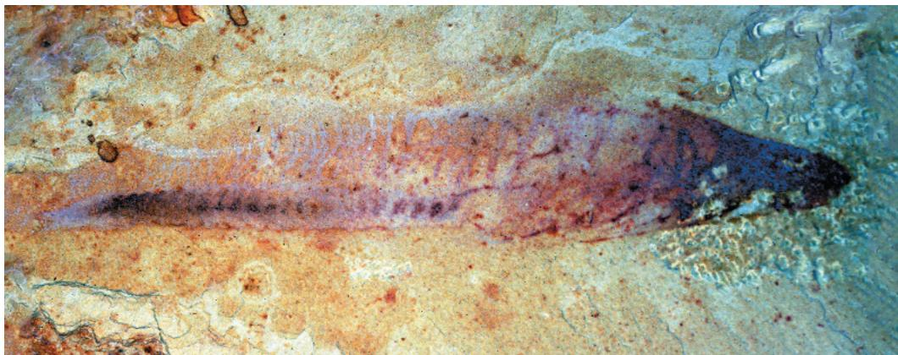  
Figure 34.1 Small and slender, this inconspicuous species (Myllokunmingia fengjiao) lived in the ocean 530 million years ago, along with an immense variety of dangerous and well-defended invertebrate animals. Although lacking claws or armor, this ancient species was closely related to one of the most successful groups of animals on Earth: the vertebrates, animals with a backbone.

What are some key characteristics that have appeared during vertebrate evolution?  
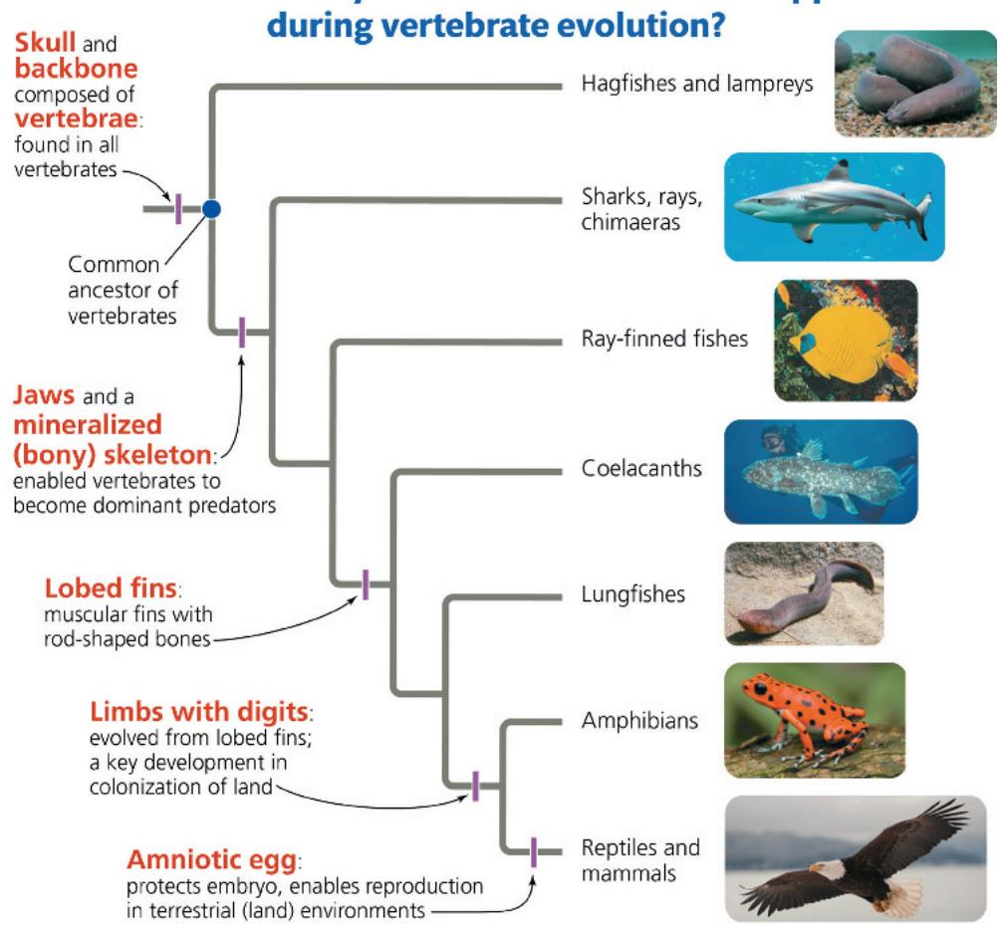

## Concept 34.1: Chordates have a notochord and a dorsal, hollow nerve cord

There are more than 60,000 species of vertebrates, animals with a backbone. This is a relatively small number compared to, say, the 1 million insect species on Earth. But what vertebrates lack in number of species, they make up for in disparity, varying enormously in characteristics such as body mass. Vertebrates include the heaviest animals ever to walk on land, plant-eating dinosaurs that were as massive as 40,000 kg (heavier than 13 pickup trucks). The biggest animal ever to exist on Earth is also a vertebrate—the blue whale, which can exceed 100,000 kg. On the other end of the spectrum, the fish Schindleria brevipinguis is just 8.4 mm long and has a mass roughly 100 billion times smaller than that of a blue whale.

Vertebrates are members of the phylum Chordata, the chordates. Chordates are bilaterian (bilaterally symmetrical) animals, and within Bilateria, they belong to the clade of animals known as Deuterostomia (see Figure 32.11). As shown in Figure 34.2, there are two groups of invertebrate deuterostomes that are more closely related to vertebrates than they are to other invertebrates: the cephalochordates and the urochordates. Thus, along with the vertebrates, these two invertebrate groups are classified within the chordates.

## Derived Characters of Chordates

All chordates share a set of derived characters, though many species possess some of these traits only during embryonic development. Figure 34.3 illustrates four key characters of chordates: a notochord; a dorsal, hollow nerve cord; pharyngeal slits or clefts; and a muscular, post-anal tail.

Figure 34.2 Phylogeny of living chordates.

This phylogenetic hypothesis shows the major clades of chordates in relation to the other main deuterostome clade, Echinodermata (see Concept 33.5). Derived characters are listed for selected clades; for example, only gnathostomes have a jaw. In some lineages, derived traits have been lost over time or occur in reduced form; hagfishes and lampreys, for example, are vertebrates with reduced vertebrae.

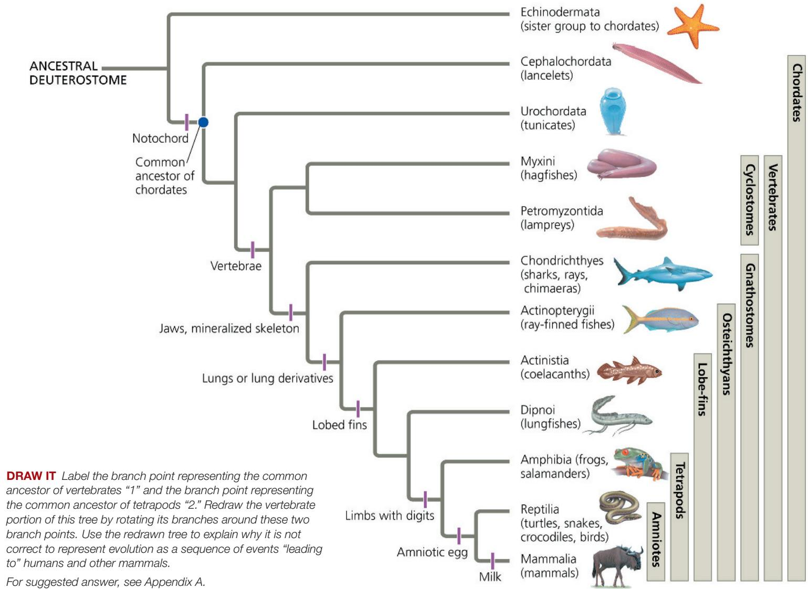

Figure 34.3 Chordate characteristics.

All chordates possess the four highlighted structural trademarks at some point during their development.

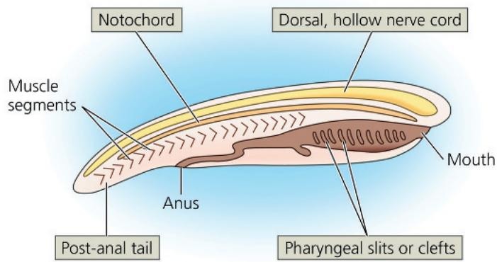

## Notochord

Chordates are named for a skeletal structure, the notochord, present in all chordate embryos as well as in some adult chordates. The notochord is a longitudinal, flexible rod located between the digestive tube and the nerve cord. It is composed of large, fluid-filled cells encased in fairly stiff, fibrous tissue. The notochord provides skeletal support throughout most of the length of a chordate, and in larvae or adults that retain it, it also provides a firm but flexible structure against which muscles can work during swimming. In most vertebrates, a more complex, jointed skeleton develops around the ancestral notochord, and the adult retains only remnants of the embryonic notochord. In humans, for example, the notochord is reduced and forms part of the gelatinous disks sandwiched between the vertebrae.

## Dorsal, Hollow Nerve Cord

The nerve cord of a chordate embryo develops from a plate of ectoderm that rolls into a neural tube located dorsal to the notochord. The resulting dorsal, hollow nerve cord is unique to chordates. Other animal phyla have solid nerve cords, and in most cases they are ventrally located. The nerve cord of a chordate embryo develops into the central nervous system: the brain and spinal cord.

## Pharyngeal Slits or Clefts

The digestive tube of chordates extends from the mouth to the anus. The region just posterior to the mouth is the pharynx. In all chordate embryos, a series of arches separated by grooves forms along the outer surface of the pharynx. In most chordates, these grooves (known as pharyngeal clefts) develop into slits that open into the pharynx. These pharyngeal slits allow water entering the mouth to exit the body without passing through the entire digestive tract. Pharyngeal slits function as suspension-feeding devices in many invertebrate chordates. In vertebrates (with the exception of vertebrates with limbs, the tetrapods), these slits and the pharyngeal arches that support them have been modified for gas exchange and are called gills. In adult tetrapods, the pharyngeal arches that surround the clefts develop into parts of the ear and other structures in the head and neck.

## Muscular, Post-Anal Tail

Chordates have a tail that extends posterior to the anus, although in many species it is greatly reduced during embryonic development. In contrast, most nonchordates have a digestive tract that extends nearly the whole length of the body. The chordate tail contains skeletal elements and muscles, and it helps propel many aquatic species in the water.

## Lancelets

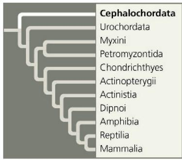

The sister group to all other living chordates is the group of animals called lancelets (Cephalochordata), which get their name from their bladelike shape (Figure 34.4). As larvae, lancelets develop a notochord; a dorsal, hollow nerve cord; numerous pharyngeal slits; and a

post-anal tail. The larvae feed on plankton in the water column, alternating between upward swimming and passive sinking. As

Figure 34.4 The lancelet Branchiostoma, a cephalochordate.

This small invertebrate displays all four main chordate characters. Water enters the mouth and passes through the pharyngeal slits into the atrium, a chamber that vents to the outside via the atriopore; large particles are blocked from entering the mouth by tentacle-like cirri. The serially arranged segmental muscles produce the lancelet's wavelike swimming movements.

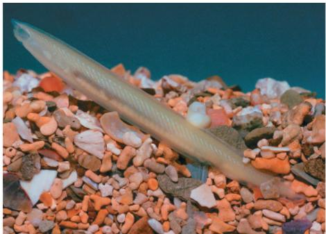

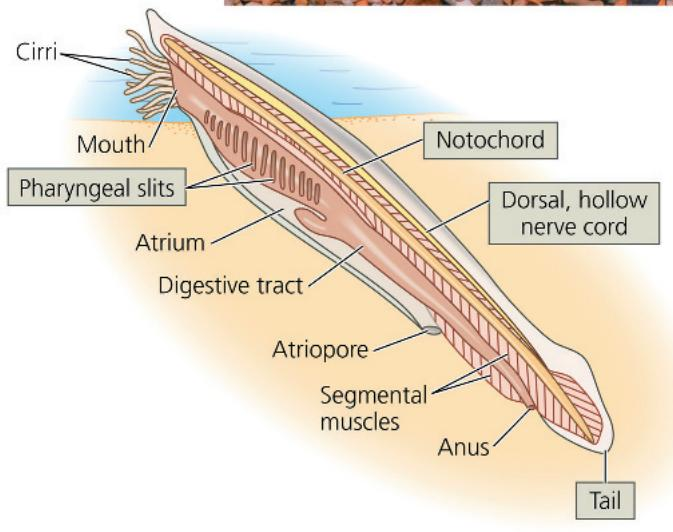

the larvae sink, they trap plankton and other suspended particles in their pharynx.

Adult lancelets can reach 6 cm in length. They retain key chordate traits, closely resembling the generalized chordate shown in Figure 34.3. Following metamorphosis, an adult lancelet swims down to the seafloor and wriggles backward into the sand, leaving only its anterior end exposed. Cilia draw seawater into the lancelet's mouth. A net of mucus secreted across the pharyngeal slits removes tiny food particles as the water passes through the slits, and the trapped food enters the intestine. The pharynx and pharyngeal slits play a minor role in gas exchange, which occurs mainly across the external body surface.

A lancelet frequently leaves its burrow to swim to a new location. Though feeble swimmers, these invertebrate chordates display, in a simple form, the swimming mechanism of fishes. Coordinated contraction of muscles arranged like rows of chevrons (>>>) along the sides of the notochord flexes the notochord, producing side-to-side undulations that thrust the body forward. This serial arrangement of muscles is evidence of the lancelet's segmentation. The muscle segments develop from blocks of mesoderm called somites, which are found along each side of the notochord in all chordate embryos.

Globally, lancelets are rare, but in a few areas (such as Tampa Bay, on the Florida coast), they may reach densities of more than 5,000 individuals per square meter.

(Figure 34.5a). In many species, the larva uses its tail muscles and notochord to swim through water in search of a suitable substrate on which it can settle, guided by cues it receives from light- and gravity-sensitive cells.

Once a tunicate has settled on a substrate, it undergoes a radical metamorphosis in which many of its chordate characters disappear. Its tail and notochord are resorbed; its nervous system degenerates; and its remaining organs rotate $90^{\circ}$ . As an adult, a tunicate draws in water through an incurrent siphon; the water then passes through the pharyngeal slits into a chamber called the atrium and exits through an excurrent siphon (Figure 34.5b and c). Food particles are filtered from the water by a mucous net and transported by cilia to the esophagus. The anus empties into the excurrent siphon. Some tunicate species shoot a jet of water through their excurrent siphon when attacked, earning them the informal name of “sea squirts.”

The loss of chordate characters in the adult stage of tunicates appears to have occurred after the tunicate lineage branched off from other chordates. Even the tunicate larva appears to be highly derived. For example, tunicates have nine Hox genes, whereas all other chordates studied to date—including the early-diverging lancelets—share a set of 13 Hox genes. The apparent loss of four Hox genes indicates that the chordate body plan of a tunicate larva is built using a different set of genetic controls than other chordates.

## Tunicates

The tunicates (Urochordata) are more closely related to other chordates than are lancelets. The chordate characters of tunicates are most apparent during their larval stage, which may be as brief as a few minutes

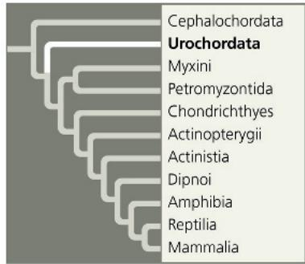

## Early Chordate Evolution

Although lancelets and tunicates are relatively obscure animals, they occupy key positions in the history of life and can provide clues about the evolutionary origin of vertebrates. For example, as you have read, lancelets display key chordate characters as adults, and their lineage branches from the base of the chordate phylogenetic tree. These findings suggest that the ancestral chordate likely had an anterior end with a mouth; a notochord; a dorsal, hollow nerve cord; pharyngeal slits; and a post-anal tail.

Figure 34.5 A tunicate, a urochordate.  
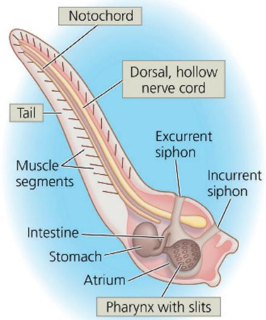  
(a) A tunicate larva is a free-swimming but nonfeeding "tadpole" in which all four main characters of chordates are evident.

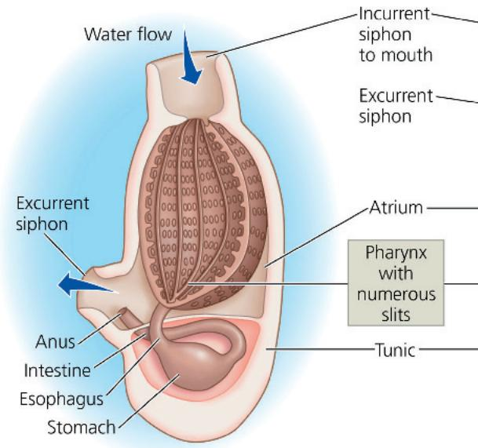  
(b) In the adult, prominent pharyngeal slits function in suspension feeding, but other chordate characters are not obvious.

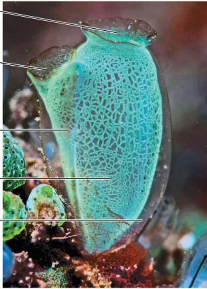  
(c) An adult tunicate, or sea squirt, is a sessile animal (photo is approximately life-sized).

# Concept 34.2: Vertebrates are chordates that have a backbone

Figure 34.6 Expression of developmental genes in lancelets and vertebrates.

Hox genes (including BF1, Otx, and Hox3) control the development of major regions of the vertebrate brain. These genes are expressed in the same anterior-to-posterior order in lancelets and vertebrates. Each colored bar is positioned above the portion of the brain whose development that gene controls.

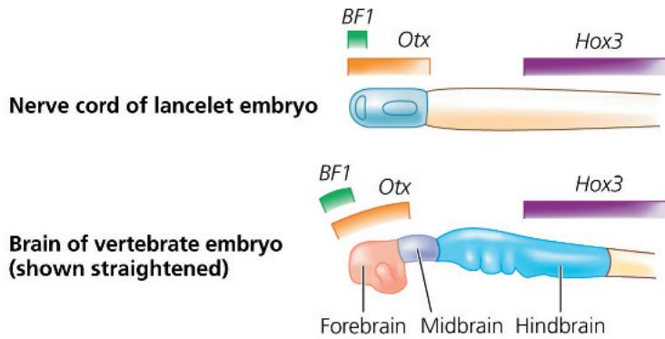  
MAKE CONNECTIONS What do these expression patterns and those in Figure 21.19 indicate about Hox genes and their evolution? For suggested answer, see Appendix A.

Research on lancelets has also revealed important clues about the evolution of the chordate brain. Rather than a full-fledged brain, lancelets have only a slightly swollen tip on the anterior end of their dorsal nerve cord (Figure 34.6). But the same Hox genes that organize major regions of the forebrain, midbrain, and hindbrain of vertebrates express themselves in a corresponding pattern in this small cluster of cells in the lancelet's nerve cord. This finding helps explain the mechanisms that could have led to a change from a simple nerve cord tip to a more complex brain like those seen in present-day vertebrates.

As for tunicates, several of their genomes have been completely sequenced and can be used to identify genes likely to have been present in early chordates. Researchers have suggested that ancestral chordates had genes associated with vertebrate organs such as the heart and thyroid gland. These genes are found in tunicates and vertebrates but are absent from nonchordate invertebrates. Another recent study found that tunicates (but not lancelets) have embryonic cells that have some of the characteristics of the neural crest, a derived trait found in all vertebrates (see Figure 34.7). This suggests that embryonic cells similar to those in tunicates may represent an intermediate cell population from which the vertebrate neural crest evolved.

During the Cambrian period, half a billion years ago, a lineage of chordates gave rise to vertebrates. With a skeletal system and a more complex nervous system than that of their ancestors, vertebrates became more efficient at two essential tasks: capturing food and avoiding being eaten.

## Derived Characters of Vertebrates

Living vertebrates share a set of derived characters that distinguish them from other chordates. For example, as a result of gene duplication, vertebrates possess two or more sets of Hox genes (lancelets and tunicates have only one). Other important families of genes that produce transcription factors and signaling molecules are also duplicated in vertebrates. The resulting additional genetic complexity may be associated with innovations in the vertebrate nervous system and skeleton, including the development of a skull and a backbone composed of vertebrae. In some vertebrates, the vertebrae are little more than small prongs of cartilage arrayed dorsally along the notochord. In the majority of vertebrates, however, the vertebrae enclose the spinal cord and have taken over the mechanical roles of the notochord.

Another feature unique to vertebrates is the neural crest, a collection of cells that appears along the edges of the closing neural tube of an embryo (Figure 34.7). Neural crest cells disperse throughout the embryo, where they give rise to a variety

## Concept Check 34.1

Figure 34.7 The neural crest, embryonic source of many unique vertebrate traits.  
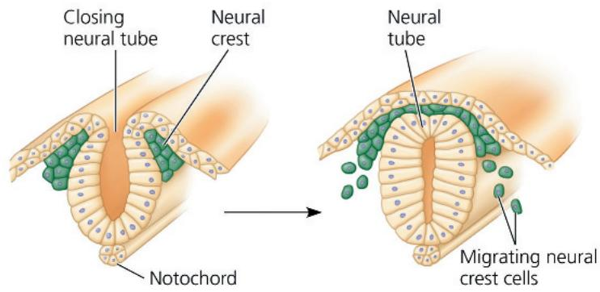  
(a) The neural crest consists of bilateral bands of cells near the margins of the embryonic folds that form the neural tube.

1. Identify the four derived characters that all chordates have at some point during their life.

2. You are a chordate, yet you lack most of the main derived characters of chordates. Explain.

3. VISUAL SKILLS Based on the phylogenetic tree in Figure 34.2, predict which vertebrate groups should have lungs or lung derivatives. Explain.

(c) The migrating neural crest cells give rise to some of the anatomical structures unique to vertebrates, including some of the bones and cartilage of the skull. (A fetal human skull is depicted here.)

(b) Neural crest cells migrate to distant sites in the embryo.

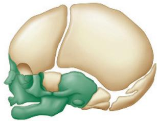

of structures, including teeth, some of the bones and cartilage of the skull, several types of neurons, and the sensory capsules in which eyes and other sense organs develop.

## Hagfishes and Lampreys

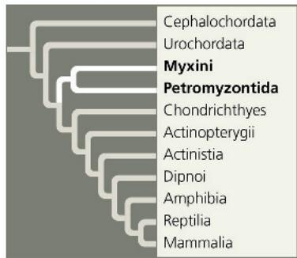

The hagfishes (Myxini) and the lampreys

(Petromyzontida) are the only lineages of living vertebrates whose members lack jaws. Unlike most vertebrates, lampreys and hagfishes also do not have a well-developed backbone. Even so, they are classified as vertebrates because they

have rudimentary vertebrae (composed of cartilage, not bone).

Molecular analyses indicate that hagfishes and lampreys are sister groups, as shown in Figure 34.2. Together, the hagfishes and lampreys form a clade of living jawless vertebrates, the cyclostomes. (All other living vertebrates have jaws and make up a much larger clade, the gnathostomes, which we will discuss in Concept 34.3.)

## Hagfishes

The hagfishes are jawless vertebrates that have highly reduced vertebrae and a skull that is made of cartilage. They swim in a snakelike fashion by using their segmental muscles to exert force against their notochord, which they retain in adulthood as a strong, flexible rod of cartilage. Hagfishes have a small brain, eyes, ears, and a nasal opening that connects with the pharynx. Their mouths contain tooth-like formations made of the protein keratin.

All of the 76 living species of hagfishes are marine. Measuring up to 60 cm in length, most are bottom-dwelling scavengers (Figure 34.8) that feed on worms and sick or dead fish. Rows of slime glands on a hagfish's flanks secrete a substance that absorbs water, forming a slime that may repel other scavengers when a hagfish is feeding. When attacked by a predator, a hagfish can produce several liters of slime in less than a minute. The slime coats the gills of the attacking fish, sending it into retreat or even

Figure 34.8 A hagfish.  
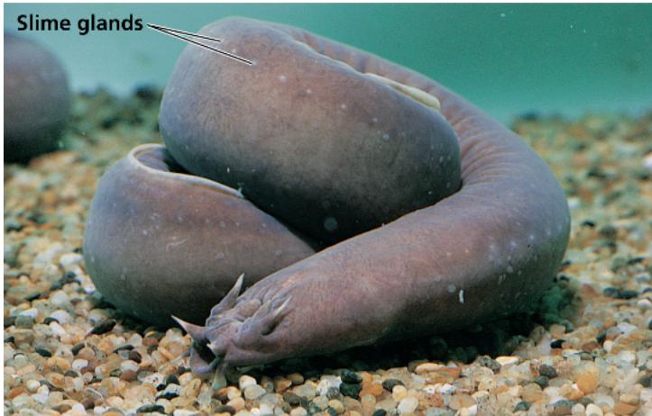  
Figure 34.9 A sea lamprey.

Parasitic lampreys use their mouth (inset) and tongue to bore a hole in the side of a fish. The lamprey then ingests the blood and other tissues of its host.

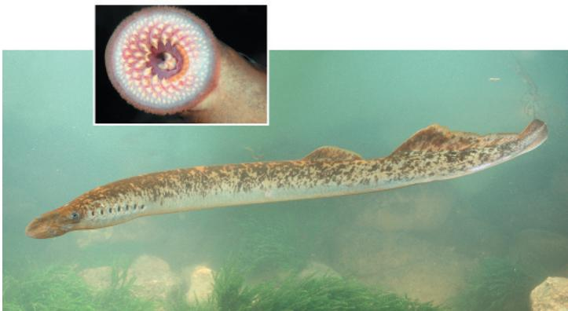  
suffocating it. Biologists and engineers are investigating the properties of hagfish slime as a model for developing a space-filling gel that could be used, for instance, to stop bleeding during surgery.

## Lampreys

The second group of living jawless vertebrates, the lampreys, consists of about 38 species inhabiting various marine and freshwater environments (Figure 34.9). Some are parasites that feed by clamping their round, jawless mouth onto the flank of a live fish, their “host.” Parasitic lampreys use their rasping mouth and tongue to penetrate the skin of the fish and ingest the fish’s blood and other tissues.

As larvae, lampreys live in freshwater streams. The larva is a suspension feeder that resembles a lancelet and spends much of its time partially buried in sediment. About 20 species of lampreys are not parasitic. These species feed only as larvae; following several years in streams, they mature sexually, reproduce, and die within a few days. In contrast, parasitic species of lampreys migrate to the sea or lakes as they mature into adults. One such parasite, the sea lamprey (Petromyzon marinus), has invaded the Great Lakes over the past 170 years and devastated a number of fisheries there.

The skeleton of lampreys is made of cartilage. Unlike the cartilage found in most vertebrates, lamprey cartilage contains no collagen. Instead, it is a stiff matrix of other proteins. The notochord of lampreys persists as the main axial skeleton in the adult, as it does in hagfishes. However, lampreys also have a flexible sheath around their rodlike notochord. Along the length of this sheath, pairs of cartilaginous projections related to vertebrae extend dorsally, partially enclosing the nerve cord.

## Early Vertebrate Evolution

In the late 1990s, paleontologists working in China discovered a vast collection of fossils of early chordates that appear to straddle the transition to vertebrates. The fossils were formed 530 million years ago during the Cambrian explosion, when many animal groups were undergoing rapid diversification (see Concept 32.2).

Figure 34.10 Fossil of an early chordate.

Discovered in 1999 in southern China, Haikouella had eyes and a brain but lacked a skull, a trait found in vertebrates. The organism's color in the drawing is fanciful.

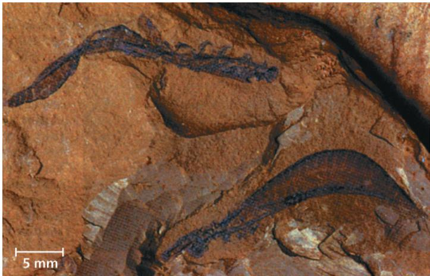

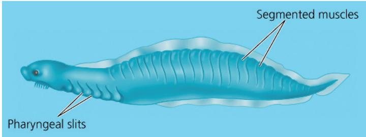  
which they used for either predation or scavenging.

The most primitive of the fossils are the 3-cm-long Haikouella (Figure 34.10). In many ways, Haikouella resembled a lancelet. Its mouth structure indicates that, like lancelets, it probably was a suspension feeder. However, Haikouella also had some of the characters of vertebrates. For example, it had a well-formed brain, small eyes, and muscle segments along the body, as do the vertebrate fishes. Unlike the vertebrates, however, Haikouella did not have a skull or ear organs, suggesting that these characters emerged with further innovations to the chordate nervous system. (The earliest “ears” were organs for maintaining balance, a function still performed by the ears of humans and other living vertebrates.)

Early signs of a skull can be seen in Myllokunmingia (see Figure 34.1). About the same size as Haikouella, Myllokunmingia had ear capsules and eye capsules, parts of the skull that surround these organs. Based on these and other characters, Myllokunmingia is considered the first chordate to have a head. The origin of a head—consisting of a brain at the anterior end of the dorsal nerve cord, eyes and other sensory organs, and a skull—enabled chordates to coordinate more complex movement and feeding behaviors. Although it had a head, Myllokunmingia lacked vertebrae and hence is not classified as a vertebrate.

After the divergence of cyclostomes from other vertebrates around 500 million years ago, we see the divergence of conodonts (Figure 34.11) around 480 million years ago. Conodonts are a group of slender, soft-bodied vertebrates that lacked jaws and whose internal skeleton was composed of cartilage. Conodonts had large eyes, which they may have used in locating prey that were then impaled on a set of barbed hooks at the anterior end of their mouth (see Figure 34.11). These hooks

## Figure 34.11 A conodont.

Conodonts were early jawless vertebrates that lived from 500 million to 200 million years ago. Unlike hagfishes and lampreys, conodonts had mineralized mouthparts,

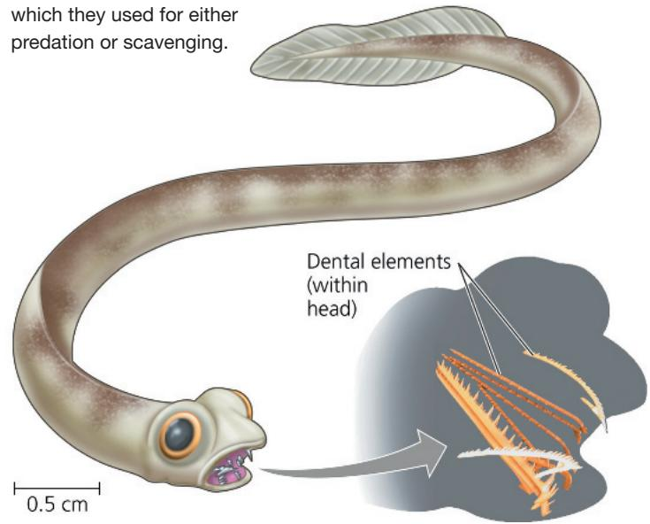

were made of dental tissues that were mineralized—hardened by the incorporation of minerals such as calcium. The food was then passed back to the pharynx, where a different set of dental elements sliced and crushed the food.

Conodonts were extremely abundant for 300 million years. Their fossilized dental elements are so plentiful that they have been used for decades by petroleum geologists as guides to the age of rock layers in which they search for oil.

Vertebrates with additional innovations emerged during the Ordovician, Silurian, and Devonian periods (485–359 million years ago). These vertebrates had paired fins, which helped with swimming maneuverability. Like conodonts and cyclostomes, these vertebrates lacked jaws, but they had a muscular pharynx, which they may have used to suck in bottom-dwelling organisms or detritus. They were also armored with mineralized bone, which covered varying amounts of their body and may have offered protection from predators (Figure 34.12).

## Figure 34.12 Jawless armored vertebrates.

Pteraspis and Pharyngolepis were two of many genera of jawless vertebrates that emerged during the Ordovician, Silurian, and Devonian periods.

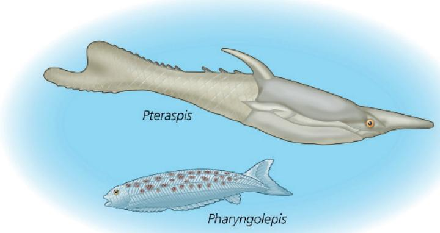

There were many species of these jawless, armored swimming vertebrates, but they all became extinct by the end of the Devonian.

Finally, note that the human skeleton is heavily mineralized bone, whereas cartilage plays a fairly minor role. But a bony internal skeleton was a relatively late development in the history of vertebrates. Instead, the vertebrate skeleton evolved initially as a structure made of unmineralized cartilage. Steps toward a bony skeleton began 470 million years ago, with the appearance of mineralized bone on the outer surface of the skull in some jawless vertebrates. Shortly after that time, the internal skeleton began to mineralize, first as calcified cartilage. By 430 million years ago, some vertebrates had a thin layer of bone lining the cartilage of their internal skeleton. The bones of vertebrates underwent even more mineralization in the group we turn to next, the jawed vertebrates.

## Concept Check 34.2

1. How are differences in the anatomy of lampreys and conodonts reflected in each animal's feeding method?

2. WHAT IF? In several different animal lineages, organisms with a head first appeared around 530 million years ago. Does this finding constitute proof that having a head is favored by natural selection? Explain.

3. WHAT IF? Suggest key roles that mineralized bone might have played in early vertebrates.

For suggested answers, see Appendix A.

## Concept 34.3: Gnathostomes are vertebrates that have jaws

Hagfishes and lampreys arose in the early Paleozoic era, when jawless vertebrates were common. Since then, jawless vertebrates have been far outnumbered by the jawed vertebrates, the gnathostomes. Living gnathostomes are a diverse group that includes sharks and their relatives, ray-finned fishes, lobe-finned fishes, amphibians, reptiles (including birds), and mammals.

## Derived Characters of Gnathostomes

Gnathostomes (“jaw mouth”) are named for their jaws, hinged structures that, especially with the help of teeth, enable gnathostomes to grip food items firmly and slice them. According to one hypothesis, gnathostome jaws evolved by modification of the skeletal rods that had previously supported the anterior pharyngeal (gill) slits. Figure 34.13 shows a stage in this evolutionary process in which several of these skeletal rods have been modified into precursors of jaws (green) and their structural supports (red). The remaining gill slits, no longer required

Figure 34.13 Possible step in the evolution of jawbones.

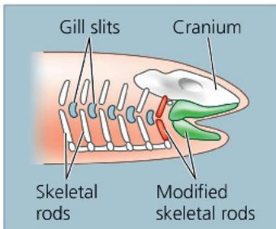

for suspension feeding, remained as the major sites of respiratory gas exchange with the external environment.

Gnathostomes share other derived characters besides jaws. The common ancestors of all gnathostomes underwent an additional duplication of Hox genes, such that the single set present in early chordates became four. In fact, the entire genome appears to have duplicated, and together these genetic changes likely enabled the origin of jaws and other novel features in gnathostomes. The gnathostome forebrain is enlarged compared to that of other vertebrates, and it is associated with enhanced senses of smell and vision. Another characteristic of aquatic gnathostomes is the lateral line system, organs that form a row along each side of the body and are sensitive to vibrations in the surrounding water. Precursors of these organs were present in the head shields of some jawless vertebrates.

## Fossil Gnathostomes

Gnathostomes appeared in the fossil record about 440 million years ago and steadily became more diverse. Their success probably resulted from a combination of anatomical features: Their paired pectoral and pelvic fins (which were also found in some jawless vertebrates but not cyclostomes) allowed them to swim efficiently after prey, and their jaws enabled them to grab prey or simply bite off chunks of flesh. Over time, dorsal, ventral, and anal fins (not paired) stiffened by bony structures called fin rays also evolved in some early gnathostomes. Fin rays provide thrust and steering control when aquatic vertebrates swim after prey or away from predators. Faster swimming was supported by other adaptations, including a more efficient gas exchange system in the gills.

The earliest gnathostomes include extinct lineages of armored vertebrates known collectively as placoderms, which means "plate-skinned." Most placoderms were less than a meter long, though some giants measured more than 10 m (Figure 34.14). Other jawed vertebrates which had a body shape similar to present-day sharks, called acanthodians, emerged at roughly the same time and radiated during the Silurian and Devonian periods (444–359 million years ago). Placoderms had disappeared by 359 million years ago, and acanthodians became extinct about 70 million years later.

Overall, a series of recent fossil discoveries have revealed that 440–420 million years ago was a period of tumultuous evolutionary change. Gnathostomes that lived during this period had highly variable forms, and by 420 million years ago, the three lineages of jawed vertebrates that survive today—chondrichthyans, ray-finned fishes, and lobe-fins—had diverged.

Figure 34.14 Fossil of an early gnathostome.  
A formidable predator, the placoderm Dunkleosteus grew up to 10 m in length. Its jaw structure indicates that Dunkleosteus could exert a force of 560 kg/cm $^{2}$ (8,000 pounds per square inch) at the tip of its jaws.  
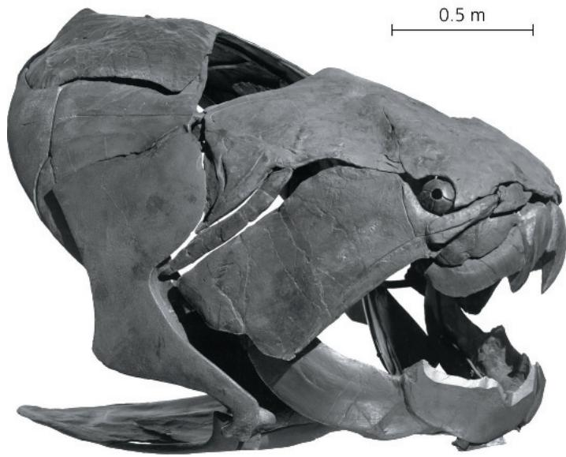

Chondrichthyans (Sharks, Rays, and Their Relatives)  
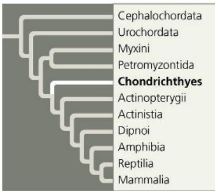

Sharks, rays, and their relatives include some of the biggest and most successful vertebrate predators in the oceans. They belong to the clade Chondrichthyes, which means “cartilage fish.” As their name indicates, the chondrichthyans have a skeleton composed

predominantly of cartilage, though often impregnated with calcium.

When the name Chondrichthyes was first coined, in the 1800s, scientists thought that chondrichthyans represented an early stage in the evolution of the vertebrate skeleton and that mineralization had evolved only after the divergence of chondrichthyans (in the common ancestor of the Osteichthyans). However, as armored jawless vertebrates demonstrate, the mineralization of the vertebrate skeleton had already begun before the chondrichthyan lineage branched off from other vertebrates. Moreover, bone-like tissues have been found in early chondrichthyans, such as the fin skeleton of a shark that lived in the Carboniferous period. Traces of bone can also be found in living chondrichthyans—in their scales, at the base of their teeth, and, in some sharks, in a thin layer on the surface of their vertebrae. Such findings indicate that the restricted distribution of bone in the chondrichthyan body is a derived condition, emerging after chondrichthyans diverged from other gnathostomes.

There are about 1,250 species of living chondrichthyans. The largest and most diverse group consists of the sharks, rays, and skates (Figure 34.15a and b). A second group is composed of a few dozen species of ratfishes, also called chimaeras (Figure 34.15c).

Figure 34.15 Chondrichthyans.  
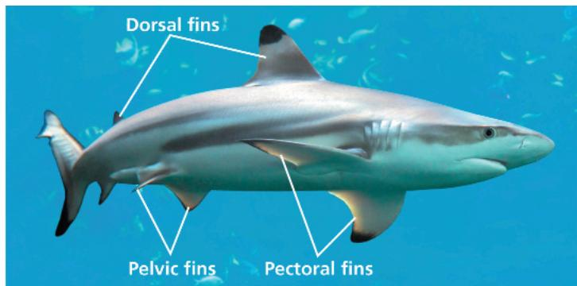  
(a) Blacktip reef shark (Carcharhinus melanopterus). Sharks are fast swimmers with acute senses. Like all gnathostomes, they have paired pectoral and pelvic fins.

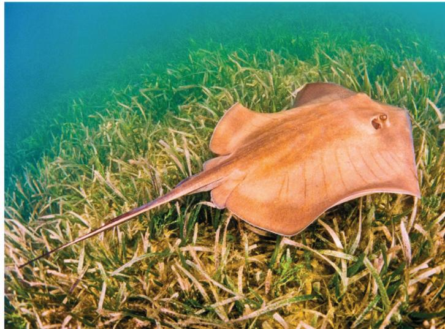

(b) Southern stingray (Dasyatis americana). Most rays are bottom-dwellers that feed on molluscs and crustaceans. Some rays cruise in open water and scoop food into their gaping mouths.  
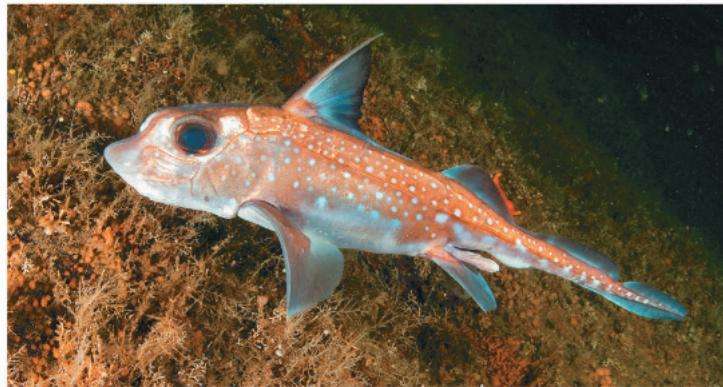  
(c) Spotted ratfish (Hydrolagus colliei). Ratfishes, or chimaeras, typically live at depths greater than 80 m and feed on shrimp, molluscs, and sea urchins. Some species have a venomous spine at the front of their first dorsal fin.

Most sharks have a streamlined body and are swift swimmers, but they do not maneuver very well. Powerful movements of the trunk and the tail fin propel them forward. The dorsal fins function mainly as stabilizers, and the paired pectoral (fore) and pelvic (hind) fins are important for maneuvering. Although a shark gains buoyancy by storing a large amount of oil in its huge liver, the animal is still more dense than water, and if it stops swimming it sinks. Continual swimming also ensures that water flows into the shark's mouth and out through the gills, where gas exchange occurs. However, some sharks and many skates and rays spend a good deal of time resting on the seafloor. When resting, they use muscles of their jaws and pharynx to pump water over the gills.

The largest sharks and rays are suspension feeders that consume plankton. Most sharks, however, are carnivores that swallow their prey whole or use their powerful jaws and sharp teeth to tear flesh from animals too large to swallow in one piece. Sharks have several rows of teeth that gradually move to the front of the mouth as old teeth are lost. The digestive tract of many sharks is proportionately shorter than that of many other vertebrates. Within the shark intestine is a spiral valve, a corkscrew-shaped ridge that increases surface area and prolongs the passage of food through the digestive tract.

Acute senses are adaptations that go along with the active, carnivorous lifestyle of sharks. Sharks have sharp vision but cannot distinguish colors. The nostrils of sharks, like those of most aquatic vertebrates, open into dead-end cups. They function only for olfaction (smelling), not for breathing. Like some other vertebrates, sharks have a pair of regions in the skin of their head that can detect electric fields generated by the muscle contractions of nearby animals. Like all nonmammalian aquatic vertebrates, sharks have no eardrums, structures that terrestrial vertebrates use to transmit sound waves in air to the auditory organs. Sound reaches a shark through water, and the animal's entire body transmits the sound to the hearing organs of the inner ear.

Shark eggs are fertilized internally. The male has a pair of claspers on its pelvic fins that transfer sperm into the female's reproductive tract. Some species of sharks are oviparous; they lay eggs that hatch outside the mother's body. These sharks release their fertilized eggs after encasing them in protective coats. Other species are ovoviviparous; they retain the fertilized eggs in the oviduct. Nourished by the egg yolk, the embryos develop into young that are born after hatching within the uterus. A few species are viviparous; the young develop within the uterus and obtain nourishment prior to birth by receiving nutrients from the mother's blood through a yolk sac placenta, by absorbing a nutritious fluid produced by the uterus, or by eating other eggs. The reproductive tract of the shark empties along with the excretory system and digestive tract into the cloaca, a common chamber that has a single opening to the outside.

Although rays are closely related to sharks, they have adopted a very different lifestyle. Most rays are bottom-dwellers that feed by using their jaws to crush molluscs and crustaceans. They have a flattened shape and use their greatly enlarged pectoral fins like water wings to propel themselves through the water. The tail of many rays is whiplike and, in some species, bears venomous barbs that function in defense.

Chondrichthyans have thrived for over 400 million years. Today, however, they are severely threatened by overfishing. For example, a recent report indicated that shark populations in the Pacific have plummeted by up to 95%, and shark populations that live closest to people have declined the most.

## Ray-Finned Fishes and Lobe-Fins

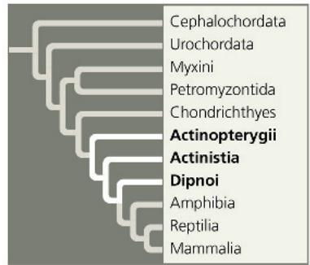

The vast majority of vertebrates belong to the clade of gnathostomes called Osteichthyes. Unlike chondrichthyans, nearly all living osteichthyans have an ossified (bony) endoskeleton with a hard matrix of calcium phosphate. The name Osteichthyes ("bony fish") was coined

long before the advent of phylogenetic systematics. When it was originally defined, the group excluded tetrapods, but we now know that such a taxon would be paraphyletic (see Figure 34.2). Therefore, systematists today include tetrapods along with bony fishes in the clade Osteichthyes. Clearly, the name of the group does not accurately describe all of its members.

This section discusses the aquatic osteichthyans known informally as bony fishes. Most bony fishes breathe by drawing water over four or five pairs of gills located in chambers covered by a protective bony flap called the operculum (Figure 34.16). Water is drawn into the mouth, through the pharynx, and out between the gills by movement of the operculum and contraction of muscles surrounding the gill chambers.

Most bony fishes can maintain a buoyancy equal to the surrounding water by filling an air sac known as a swim bladder. (If a fish swims to greater depths or toward the surface, where water pressure differs, the fish shuttles gas between its blood and swim bladder, keeping the volume of gas in the bladder constant.) Charles Darwin proposed that the lungs of tetrapods evolved from swim bladders, but strange as it may sound, the opposite seems to be true: Swim bladders arose from lungs. Osteichthyans in many early-branching lineages have lungs, which they use to breathe air as a supplement to gas exchange in their gills. This suggests that lungs arose in early osteichthyans; later, swim bladders evolved from lungs in some lineages.

In nearly all bony fishes, the skin is covered by flattened, bony scales that differ in structure from the tooth-like scales of sharks. Glands in the skin secrete a slimy mucus over the skin, an adaptation that reduces drag during swimming. Like the ancient aquatic gnathostomes mentioned earlier and the chondrichthyans, bony fishes have a lateral line system, which is evident as a row of tiny pits in the skin on either side of the body.

The details of bony fish reproduction vary extensively. Most species are oviparous, reproducing by external fertilization after the female sheds large numbers of small eggs. However, internal fertilization and birthing characterize other species.

Figure 34.16 Anatomy of a trout, a ray-finned fish.  
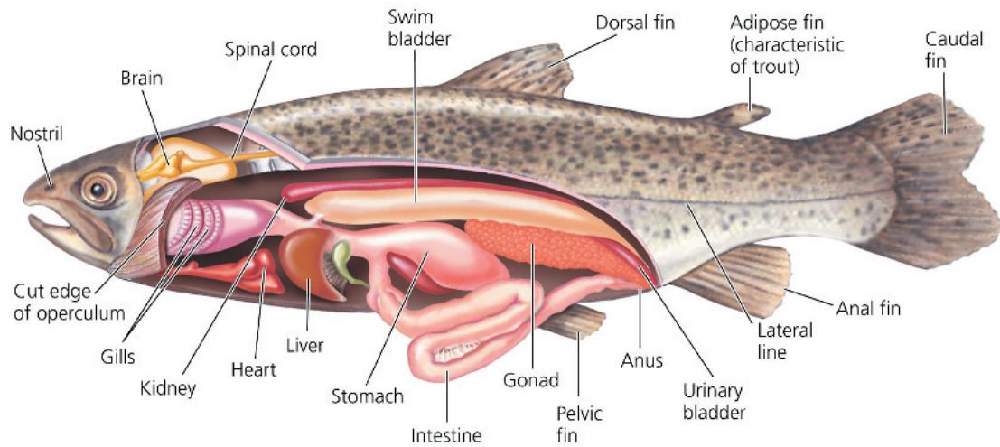

## Ray-Finned Fishes

Nearly all the aquatic osteichthyans familiar to us are among the over 27,000 species of ray-finned fishes (Actinopterygii) (Figure 34.17). Named for the bony rays that support their fins, the ray-finned fishes originated during the Silurian period (444–419 million years ago). The group has diversified greatly since that time, resulting in numerous species and many modifications in body form and fin structure that affect maneuvering, defense, and other functions.

Ray-finned fishes serve as a major source of protein for humans, who have harvested them for thousands of years. However, industrial-scale fishing operations have driven some of the world's biggest fisheries to collapse. For example, after decades of unsustainable harvests, in the 1990s the biomass of the Northern cod population (Gadus morhua) off Newfoundland plummeted to just $1\%$ of its historic maximum, bringing cod fishing there to a near halt. Despite ongoing restrictions on the fishery, this cod population remained very small for over two decades. The population started to show modest signs of recovery in 2015, and the fishery was reopened to commercial fishing in 2024, with much lower quotas than what had been allowed before the collapse. Ray-finned fishes also face other pressures from humans, such as the diversion of rivers by dams. Changing water flow patterns can hamper the fishes' ability to obtain food and interferes with migratory pathways and spawning grounds.

## Lobe-Fins

Like the ray-finned fishes, the other major lineage of osteichthyans, the lobe-fins (Sarcopterygii), also originated during the Silurian period (Figure 34.18, on the next page). The key derived character of lobe-fins is the presence of rod-shaped bones surrounded by a thick layer of muscle in their pectoral and pelvic fins. During the Devonian (419–359 million years ago), many lobe-fins lived in brackish waters, such as in coastal wetlands. There they may have used their lobed fins to help them move across logs or the muddy bottom (as do some living lobe-fins). Some Devonian lobe-fins were gigantic predators. It is not uncommon to find spike-shaped fossils of Devonian lobe-fin teeth as big as your thumb.

Figure 34.17 Ray-finned fishes (Actinopterygii).  
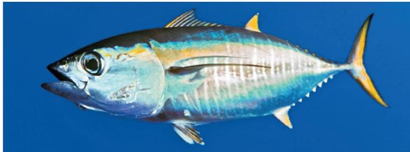  
▲ Yellowfin tuna (Thunnus albacares) is a fast-swimming schooling fish that is commercially important worldwide.

Native to coral reefs of the Pacific Ocean, the brightly colored red lionfish (Pterois volitans) can inject venom through its spines, causing a severe and painful reaction in humans.

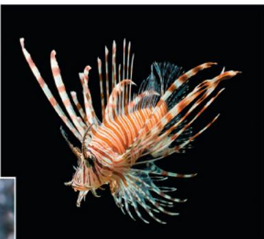

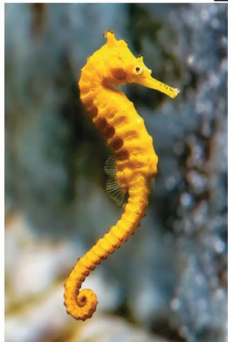  
A sea horse (Hippocampus spp.) has a highly modified body form. Sea horses are unusual among animals in that the male carries the young during their embryonic development.

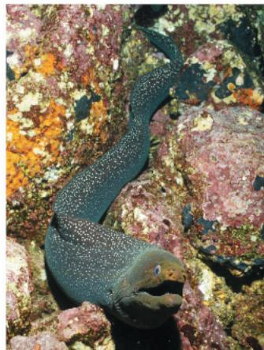  
The fine-spotted moray eel (Gymnothorax dovii) is a predator that ambushes prey from crevices in its coral reef habitat.

Figure 34.18 A reconstruction of an ancient lobe-fin.

Discovered in 2009, Guiyu oneiros is the earliest known lobe-fin, dating to 420 million years ago. The fossil of this species was nearly complete, allowing for an accurate reconstruction; regions shown in gray were missing from the fossil.

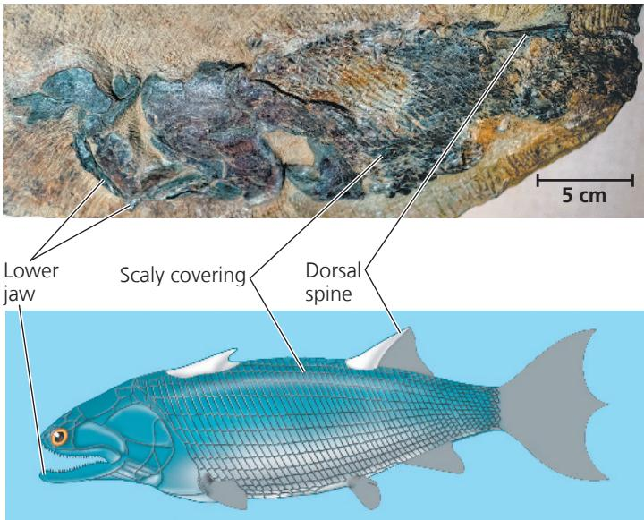

Figure 34.19 A coelacanth (Latimeria).  
These lobe-fins were found living off the coasts of southern Africa and Indonesia.  
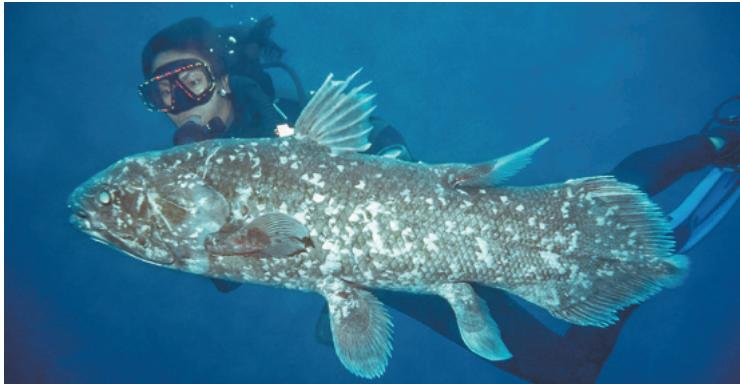

By the end of the Devonian period, lobe-fin diversity was dwindling, and today only three lineages survive. One lineage, the coelacanths (Actinistia), was thought to have become extinct 75 million years ago. However, in 1938, fishermen caught a living coelacanth off the east coast of South Africa (Figure 34.19). Until the 1990s, all subsequent discoveries were also in the western Indian Ocean. Since 1997, coelacanths have also been found in the eastern Indian Ocean near Indonesia, and these individuals are now known to represent a second species.

The second lineage of living lobe-fins, the lungfishes (Dipnoi), is represented today by six species in three genera, all of which are found in the Southern Hemisphere. Lungfishes arose in the ocean but today are found only in fresh water, generally in stagnant ponds and swamps. They surface to gulp air into lungs connected to their pharynx. Lungfishes also have gills, which are the main organs for gas exchange in Australian lungfishes. When ponds shrink during the dry season, some lungfishes can burrow into the mud and estivate (wait in a state of torpor; see Concept 40.4).

The third lineage of lobe-fins that survives today is far more diverse than the coelacanths or the lungfishes. During the mid-Devonian, these organisms adapted to life on land and gave rise to vertebrates with limbs and feet, called tetrapods—a lineage that includes humans.

## Concept Check 34.3

1. What derived characters do sharks and tuna share? What features distinguish tuna from sharks?

2. Describe key adaptations of aquatic gnathostomes.

3. DRAW IT Redraw Figure 34.2 to show four lineages: cyclostomes, lancelets, gnathostomes, and tunicates. Label the vertebrate common ancestor and circle the lineage that includes humans.

4. WHAT IF? Imagine that we could replay the history of life. Is it possible that a group of vertebrates that colonized land could have arisen from aquatic gnathostomes other than the lobe-fins? Explain.

For suggested answers, see Appendix A.

## Concept 34.4: Tetrapods are gnathostomes that have four limbs

One of the most significant events in vertebrate history took place by 365 million years ago, as the fins of a lineage of lobe-fins gradually evolved into the limbs and feet of tetrapods. Until then, all vertebrates had shared the same basic fishlike anatomy. After the colonization of land, tetrapods diversified greatly and gave rise to many new forms, from leaping frogs to flying eagles to bipedal humans.

## Derived Characters of Tetrapods

The most significant character of tetrapods gives the group its name, which means “four feet” in Greek. In place of pectoral and pelvic fins, tetrapods have limbs with digits. Limbs support a tetrapod’s weight on land, while feet with digits efficiently transmit muscle-generated forces to the ground when it walks.

Life on land selected for numerous other changes to the tetrapod body plan. In tetrapods, the head is separated from the body by a neck that originally had one vertebra on which the skull could move up and down. Later, with the origin of a second vertebra in the neck, the head could also swing from side to side. The bones of the pelvic girdle, to which the hind legs are attached, are fused to the backbone, permitting forces generated by the hind legs against the ground to be transferred to the rest of the body. Except for some fully aquatic species (such as the axolotl; see

Figure 42.1), the adults of living tetrapods do not have gills; during embryonic development, the pharyngeal clefts instead give rise to parts of the ears, certain glands, and other structures.

We'll discuss later how some of these characters were dramatically altered or lost in various lineages of tetrapods. In birds, for example, the pectoral limbs became wings, and in whales, the entire body converged toward a fishlike shape.

## The Origin of Tetrapods

As you have read, the Devonian coastal wetlands were home to a wide range of lobe-fins. Those that entered shallow, oxygen-poor water could have used their lungs to breathe air. Some species probably used their stout fins to swim and “walk” underwater across the bottom (moving their fins in an alternating gait, as do some living lobe-fins). This suggests that the tetrapod body plan did not evolve “out of nowhere” but was simply a modification of a preexisting body plan.

The discovery in 2004 of a fossil researchers called Tiktaalik provided new details on how this process of modification occurred (Figure 34.20). Like a fish, this species had fins, gills, and lungs, and its body was covered in scales. But unlike a fish,

Tiktaalik had a full set of ribs that would have helped it breathe air and support its body. Also unlike a fish, Tiktaalik had a neck, allowing it to move its head about. In addition, the bones of Tiktaalik's front fin have the same basic pattern found in all limbed animals: one bone (the humerus), followed by two bones (the radius and ulna), followed by a group of small bones that comprise the wrist. Finally, Tiktaalik's pelvis and rear fin were larger and more robust than those of a fish; the pelvis is the bony structure to which hind limbs are attached in tetrapods. Although it is unlikely that Tiktaalik could walk on land, the skeletal structure of its fins and pelvis suggests that it could prop itself up and walk in water on its fins. Since Tiktaalik predates the oldest known tetrapod, its features suggest that key "tetrapod" traits, such as a wrist, ribs, and a neck, were in fact ancestral to the tetrapod lineage.

Tiktaalik and other extraordinary fossil discoveries have allowed paleontologists to reconstruct how fins became progressively more limb-like over time, culminating in the appearance in the fossil record of the first tetrapods 365 million years ago (Figure 34.21). Over the next 60 million years, a great diversity of tetrapods arose. Some of these species retained functional gills and had weak limbs, while

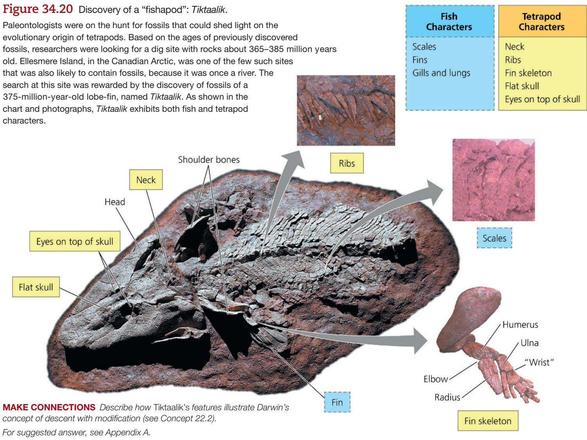  
MAKE CONNECTIONS Describe how Tiktaalik's features illustrate Darwin's concept of descent with modification (see Concept 22.2). For suggested answer, see Appendix A.

Figure 34.21 Steps in the origin of limbs with digits.  
The white bars on the branches of this diagram place known fossils in time; arrowheads indicate lineages that extend to today. The drawings of extinct organisms are based on fossilized skeletons, but the colors are fanciful.  
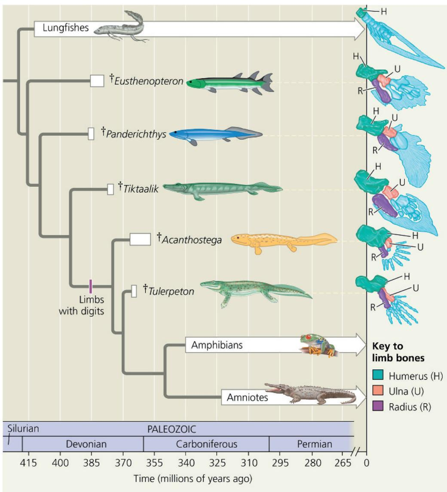  
VISUAL SKILLS Assuming the branch point dates shown in this diagram are accurate, what range of dates would include the origin of amphibians?  
For suggested answer, see Appendix A.

others lost their gills and had stronger limbs that facilitated walking on land. Overall, judging from the morphology and locations of their fossils, most of these early tetrapods probably remained tied to water, a characteristic they share with some members of the amphibians, the first sister group to all other tetrapods.

## Interview

Interview with Neil Shubin: Reconstructing major evolutionary events in the history of life (at the start of Unit 4, before Chapter 22)

## Amphibians

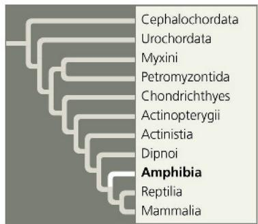

The amphibians are represented today by more than 8,000 species in three clades: salamanders (clade Urodela, “tailed ones”), frogs (clade Anura, “tailless ones”), and caecilians (clade Apoda, “legless ones”).

## Salamanders

There are about 750 known species of urodeles, or salamanders. Some are entirely aquatic, but others live on land as adults or throughout life. Most salamanders that live on land walk with a side-to-side bending of the body, a trait also found in early terrestrial tetrapods (Figure 34.22a). Paedomorphosis is common among aquatic salamanders; the axolotl, for instance, retains larval features even when sexually mature (see Figure 25.25).

## Frogs

Numbering more than 7,000 species, anurans, or frogs, are better suited than salamanders to locomotion on land (Figure 34.22b). Adult frogs use their powerful hind legs to hop along the terrain. Although often distinctive in appearance, the animals known as “toads” are simply frogs that have leathery skin or other adaptations for life on land. A frog nabs insects and other prey by flicking out its long, sticky tongue, which is attached to the front of the mouth. Frogs display a great variety of adaptations that help them avoid being eaten by larger predators. Their skin glands secrete distasteful or even poisonous mucus. Many poisonous species have color patterns that camouflage them or have bright coloration, which predators appear to associate with danger (see Figure 54.6).

## Caecilians

The approximately 200 species of apodans, or caecilians, are legless and nearly blind, and superficially they resemble earthworms

Figure 34.22 Amphibians.

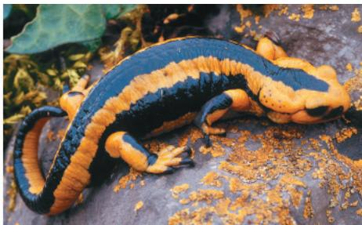  
(a) Order Urodela.
Urodeles (salamanders) retain their tail as adults.  
(b) Order Anura.
Anurans (toads and frogs) lack a tail as adults.

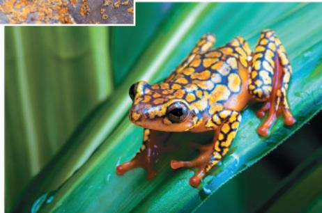  
(c) Order Apoda. Apodans, or caecilians, are legless, mainly burrowing amphibians.

(Figure 34.22c). Their absence of legs is a secondary adaptation, as they evolved from a legged ancestor. Caecilians inhabit tropical areas, where most species burrow in moist forest soil.

## Lifestyle and Ecology of Amphibians

The term amphibian (derived from amphibious, meaning “both ways of life”) refers to the life stages of many frog species that live first in water and then on land (Figure 34.23). The larval stage of a frog, called a tadpole, is usually an aquatic herbivore with gills, a lateral line system resembling that of aquatic vertebrates, and a long, finned tail. The tadpole initially lacks legs; it swims by undulating its tail. During the metamorphosis that leads to the “second life,” the tadpole develops legs, lungs, a pair of external eardrums, and a digestive system adapted to a carnivorous diet. At the same time, the gills disappear; the lateral line system also disappears in most species. The young frog crawls onto shore and becomes a terrestrial hunter. In spite of their name, however, many amphibians do not live a dual—aquatic and terrestrial—life. There are some strictly aquatic or strictly terrestrial frogs, salamanders, and caecilians. Moreover, salamander and caecilian larvae look much like the adults, and typically both the larvae and the adults are carnivorous.

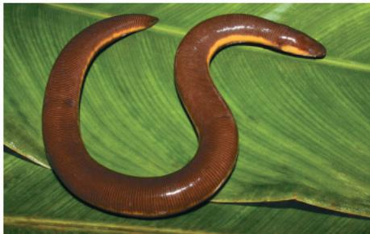

Most amphibians are found in damp habitats such as swamps and rain forests. Even those adapted to drier habitats spend much of their time in burrows or under moist leaves, where humidity is high. One reason amphibians require relatively wet habitats is that they rely heavily on their moist skin for gas exchange—if their skin dries out, they cannot get enough oxygen. In addition, amphibians typically lay their eggs in water or in moist environments on land; their eggs lack a shell and dehydrate quickly in dry air.

Figure 34.23 The "dual life" of a frog.  
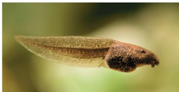  
(a) The tadpole is an aquatic herbivore with a fishlike tail and internal gills.

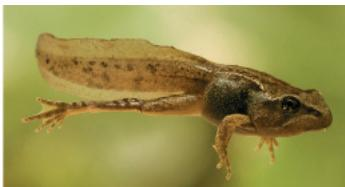  
(b) During metamorphosis, the gills and tail are resorbed, and walking legs develop. The adult frog will live on land.

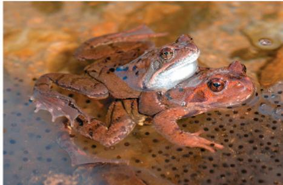  
(c) The adults return to water to mate. The male grasps the female, stimulating her to release eggs. The eggs are laid and fertilized in water. They have a jelly coat but lack a shell and would desiccate in air.

Fertilization is external in most amphibians; the male grasps the female and spills his sperm over the eggs as the female sheds them (see Figure 34.23c). Some amphibian species lay vast numbers of eggs in temporary pools, and egg mortality is high. In contrast, other species lay relatively few eggs and display various types of parental care. Depending on the species, either males or females may house eggs on their back (Figure 34.24), in their mouth, or even in their stomach. Certain tropical tree frogs stir their egg masses into moist, foamy nests that resist drying.

Many amphibians exhibit complex and diverse social behaviors, especially during breeding seasons. Frogs are usually quiet, but the males of many species vocalize to defend their breeding territory or to attract females. In some species, migrations to specific breeding sites may involve

## Figure 34.24 A mobile nursery.

A female marsupial frog (Flectonotus fitzgeraldi) incubates her eggs in pouches of skin on her back.

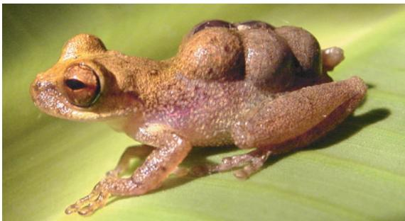

vocal communication, celestial navigation, or chemical signaling.

Over the past several decades, zoologists have documented a rapid and alarming decline in amphibian populations in locations throughout the world. There appear to be several causes, including the spread of a disease-causing chytrid fungus (see Figure 31.25), habitat loss, climate change, and pollution. In some cases, declines have become extinctions. Recent studies have documented the extinction of 14 amphibian species within the last four decades; around 200 other species have not been observed in that time and are considered possibly extinct. In the Problem-Solving Exercise, you can explore one possible strategy to prevent amphibian deaths from fungal infections.

## Concept Check 34.4

1. Describe the origin of tetrapods and identify some of their key derived traits.

2. Some amphibians never leave the water, whereas others can survive in relatively dry terrestrial environments. Contrast the adaptations that facilitate these two lifestyles.

3. WHAT IF? Scientists think that amphibian populations may provide an early warning system of environmental problems. What features of amphibians might make them particularly sensitive to environmental problems?

For suggested answers, see Appendix A.

## Problem-Solving Exercise

## Can declining amphibian populations be saved by a vaccine?

Amphibian populations are declining rapidly worldwide. The fungus Batrachochytrium dendrobatidis (Bd) has contributed to this decline: This pathogen causes severe skin infections in many amphibian species, leading to massive die-offs. Efforts to save amphibians from Bd have had limited success, and there is little evidence that frogs and other amphibians have acquired resistance to Bd on their own.

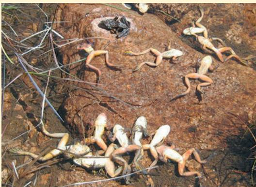  
Yellow-legged frogs (Rana muscosa) in California killed by Bd infection

In this exercise, you will investigate whether amphibians can acquire resistance to the fungal pathogen Bd.

## Your Approach

The principle guiding your investigation is that prior exposure to a pathogen can enable amphibians to acquire immunological resistance to that pathogen. To see whether this occurs after exposure to Bd, you will analyze data on acquired resistance in Cuban tree frogs (Osteopilus septentrionalis).

## Your Data

To create variation in number of prior exposures to Bd, Cuban tree frogs were exposed to Bd and cleared of their infection (using heat treatments) from zero to three times; frogs with no prior exposures are referred to as “naive.” Researchers then exposed frogs to Bd and measured mean abundance of Bd on the frog’s skin, frog survival, and abundance of lymphocytes (a type of white blood cell involved in the vertebrate immune response).

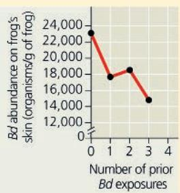

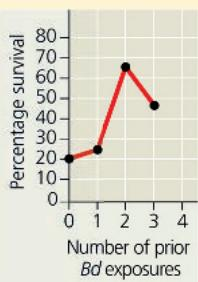

<table><tr><td>Number of prior Bd exposures</td><td>Thousands of lymphocytes per g of frog</td></tr><tr><td>0</td><td>134</td></tr><tr><td>1</td><td>240</td></tr><tr><td>2</td><td>244</td></tr><tr><td>3</td><td>227</td></tr></table>

## Your Analysis

1. Describe and interpret the results shown in the figure.

2. (a) Graph the data in the table. (b) Based on these data, develop a hypothesis that explains the results discussed in question 1.

3. Breeding populations of amphibian species threatened by Bd have been established in captivity. In addition, evidence suggests that Cuban tree frogs can acquire resistance after exposure to dead Bd. Based on this information and your answers to questions 1 and 2, suggest a strategy for repopulating regions decimated by Bd.

Instructors: A version of this Problem-Solving Exercise can be assigned in Mastering Biology.

## Concept 34.5: Amniotes are tetrapods that have a terrestrially adapted egg

The amniotes are a group of tetrapods whose extant members are the reptiles (including birds, as we'll discuss in this section) and mammals (Figure 34.25). During their evolution, amniotes acquired a number of new adaptations to life on land.

## Derived Characters of Amniotes

Amniotes are named for the major derived character of the clade, the amniotic egg, which contains four specialized membranes: the amnion, the chorion, the yolk sac, and the allantois (Figure 34.26, on the next page). Called extraembryonic membranes because they are not part of the body of the embryo itself, these membranes develop from tissue layers that grow out from the embryo. The amniotic egg is named for the amnion, which encloses a compartment of fluid that bathes the embryo and acts as a hydraulic shock absorber. The other membranes in the egg function in gas exchange, the transfer of stored nutrients to the embryo, and waste storage. The amniotic egg was a key evolutionary innovation for terrestrial life: It allowed the embryo to develop on land in its own private “pond,” hence reducing the dependence of tetrapods on an aqueous environment for reproduction.

In contrast to the shell-less eggs of amphibians, the amniotic eggs of most reptiles and some mammals have a shell. A shell slows dehydration of the egg in air, an adaptation that helped amniotes to occupy a wider range of terrestrial habitats than amphibians, their closest living relatives. (Seeds played a similar role in the evolution of plants, as discussed in Concept 30.1.) Most mammals have lost the eggshell over the course of their evolution, and the embryo avoids desiccation by developing within the amnion inside the mother's body.

Amniotes have acquired other key adaptations to life on land. For example, amniotes use their rib cage to ventilate their lungs. This method is more efficient than throat-based ventilation, which amphibians use as a supplement to breathing through their skin. The increased efficiency of rib cage ventilation may have allowed amniotes to abandon breathing through their skin and develop less permeable skin, thereby conserving water.

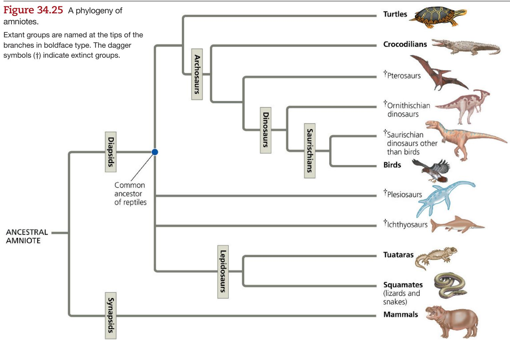  
VISUAL SKILLS Based on this phylogeny, are pterosaurs dinosaurs? Are birds? Explain.  
For suggested answer, see Appendix A.

## Figure 34.26 The amniotic egg.

The embryos of reptiles and mammals form four extraembryonic membranes: the allantois, chorion, amnion, and yolk sac. This diagram shows these membranes in the shelled egg of a reptile.

Extraembryonic membranes

Allantois. The allantois is a disposal sac for certain metabolic wastes produced by the embryo.

Chorion. The chorion and the membrane of the allantois exchange gases between the embryo and the air.

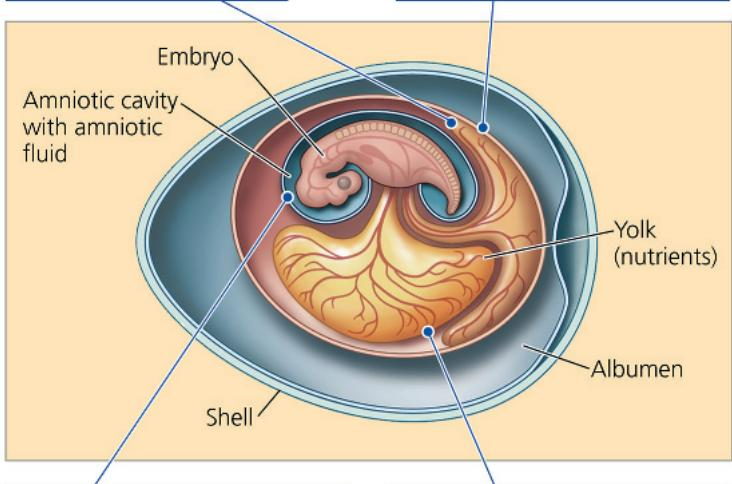  
Amnion. The amnion protects the embryo in a fluid-filled cavity that cushions against mechanical shock.  
Yolk sac. The yolk sac contains the yolk, a stockpile of nutrients. Other nutrients are stored in the albumen ("egg white").  
Extraembryonic membranes

## Early Amniotes

The most recent common ancestor of living amphibians and amniotes lived 350 million years ago. Based on where their fossils have been found, the earliest amniotes lived in warm, moist areas, as did the first tetrapods. Over time, early amniotes expanded into a wide range of new environments, including dry and high-latitude regions. Fossil evidence shows that the earliest amniotes resembled small lizards with sharp teeth, a sign that they were predators (Figure 34.27). Later groups of amniotes also included herbivores, as evidenced by their grinding teeth and other features.

## Figure 34.27 Artist's reconstruction of Hylonomus, an early amniote.

About 25 cm long, this species lived 310 million years ago and probably ate insects and other small invertebrates.

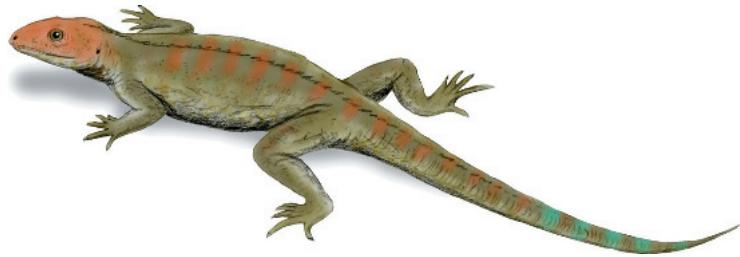

Present-day amniotes include two large clades of terrestrial vertebrates: reptiles and mammals.

## Reptiles

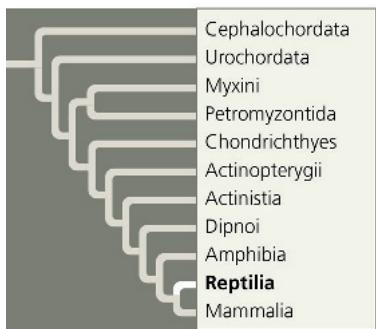

Living members of the reptile clade include turtles, tuataras, lizards and snakes, crocodilians, and birds (see Figure 34.25). There are about 21,500 species of reptiles, the majority of which are squamates (lizards and snakes; 10,000 species) or birds (11,000 species).

As a group, the reptiles share several derived characters that distinguish them from other tetrapods. For example, unlike amphibians, reptiles have scales that contain the protein keratin (as does a human nail). Scales help protect the animal's skin from desiccation and abrasion. In addition, most reptiles lay their shelled eggs on land; the shell protects the egg from drying out (Figure 34.28). Fertilization occurs internally, before the eggshell is secreted.

Reptiles such as lizards and snakes are sometimes described as “cold-blooded” because they do not use their metabolism extensively to control their body temperature. However, they do regulate their body temperature by using behavioral adaptations. For example, many lizards bask in the sun when the air is cool and seek shade when the air is too warm. A more accurate description of these reptiles is to say that they are ectothermic, which means that they absorb external heat as their main source of body heat. By warming themselves directly with solar energy rather than through the metabolic breakdown of food, an ectothermic reptile can survive on less than 10% of the food energy required by a mammal of the same size. But the reptile clade is not entirely ectothermic; birds are endothermic, capable of maintaining body temperature through metabolic activity.

## Figure 34.28 Hatching reptiles.

These baby panther chameleons (Furcifer pardalis) are breaking out of their parchment-like shells, a common type of shell among living reptiles other than birds.

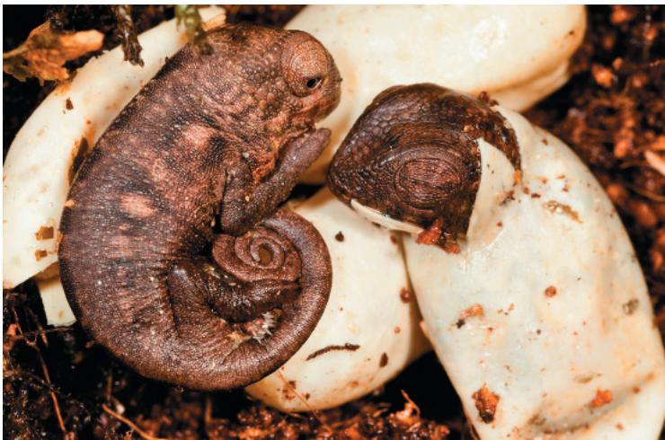

## The Origin and Evolutionary Radiation of Reptiles

Fossil evidence indicates that the earliest reptiles lived about 310 million years ago and resembled lizards. Like all reptiles today, these early reptiles were diapsids. A key derived character of diapsids is a pair of holes on each side of the skull, behind the eye sockets; muscles pass through these holes and attach to the jaw, controlling jaw movement.

The diapsids are composed of three main lineages. The first lineage includes the turtles. A second lineage gave rise to the lepidosaurs, which include tuataras, lizards, and snakes. This lineage also includes extinct lineages of entirely marine species such as the giant mososaurs. The third diapsid lineage, the archosaurs, produced the crocodilians, pterosaurs, and dinosaurs. Our focus here will be on extinct lineages of archosaurs; we'll discuss living reptiles shortly.

Pterosaurs, which originated in the late Triassic, were the first tetrapods to exhibit flapping flight. The pterosaur wing was completely different from the wings of birds and bats. It consisted of a collagen-strengthened membrane that stretched between the trunk or hind leg and a very long digit on the foreleg. The smallest pterosaurs were no bigger than a sparrow, and the largest had a wingspan of nearly 11 m. They appear to have converged on many of the ecological roles later played by birds; some were insect-eaters, others grabbed fish out of the ocean, and still others filtered small animals through thousands of fine needlelike teeth. But by 66 million years ago, pterosaurs had become extinct.

On land, the dinosaurs diversified into a vast range of shapes and sizes, from bipeds the size of a pigeon to 45-m-long quadrupeds with necks long enough to let them browse the tops of trees. One lineage of dinosaurs, the ornithischians, were herbivores; they included many species with elaborate defenses against predators, such as tail clubs and horned crests. The other main lineage of dinosaurs, the saurischians, included the long-necked giants and a group called the theropods, which were bipedal carnivores. Theropods included the famous Tyrannosaurus rex as well as the ancestors of birds.

Dinosaurs once were considered slow, sluggish creatures. Since the 1970s, however, fossil discoveries and research have led to the conclusion that many dinosaurs were agile and fast moving. Dinosaurs had a limb structure that enabled them to walk and run more efficiently than could earlier tetrapods, which had a sprawling gait. Fossilized footprints and other evidence suggest that some species were social—they lived and traveled in groups, much as many mammals do today. Paleontologists have also discovered evidence that some dinosaurs built nests and protected their eggs, as birds do today (see Figure 26.17). Finally, some anatomical evidence supports the hypothesis that at least some dinosaurs were endotherms.

All dinosaurs except birds became extinct by the end of the Cretaceous period (66 million years ago). Their extinction may have been caused at least in part by the asteroid or comet impact described in Concept 25.4. Some analyses of the fossil record are consistent with this idea in that they show a sudden decline in dinosaur diversity at the end of the Cretaceous. However, other analyses indicate that the number of dinosaur species had begun to decline several million years before the Cretaceous ended. Further fossil discoveries and new analyses will be needed to resolve this debate.

Next, we'll discuss the three extant lineages of reptiles: the turtles, lepidosaurs (tuataras, lizards, and snakes), and archosaurs (crocodilians and birds).

Interview

Interview with Paul Sereno: Adventures hunting dinosaurs (eTextbook only)

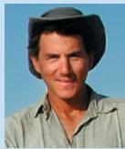

## Turtles

Turtles are one of the most distinctive groups of reptiles alive today. For example, turtles do not have any holes in their skull behind the eye sockets, whereas other reptiles have two holes behind each eye socket. Recall that such skull holes are a key derived trait of the diapsids. Thus, until recently it was not clear whether turtles—like all other living reptiles—should be classified within the diapsid clade. However, in 2015, new fossil discoveries showed that early turtles had the skull openings found in other diapsids. This suggests that turtles are diapsids that have lost the holes in their skull over the course of evolution. Moreover, recent phylogenomic studies indicate that turtles are nested within the diapsid clade and are more closely related to crocodilians and birds than to lepidosaurs (see Figure 34.25).

All turtles have a boxlike shell made of upper and lower shields that are fused to the vertebrae, clavicles (collarbones), and ribs (Figure 34.29a, on the next page). Most of the 272 known species of turtles have a hard shell, providing excellent defense against predators. Fossil evidence shows that Pappochelys, a turtle that lived 240 million years ago, had a series of hard, shell-like bones along its belly. By 220 million years ago, another early turtle had a complete lower shell but an incomplete upper shell, suggesting that turtles acquired full shells in stages.

The earliest turtles could not retract their head into their shell, but mechanisms for doing so evolved independently in two separate branches of turtles. The side-necked turtles retract their neck horizontally, while the vertical-necked turtles retract their neck vertically.

Some turtles have adapted to deserts, and others live almost entirely in ponds and rivers. Still others live in the sea. Sea turtles have a reduced shell and enlarged forelimbs that function as flippers. They include the largest living turtles, the deep-diving leatherbacks, which can exceed a mass of 1,500 kg and feed on jellies. Leatherbacks and other sea turtles are endangered by being caught in fishing nets, as well as by the residential and commercial development of the beaches where the turtles lay their eggs.

## Lepidosaurs

One surviving lineage of lepidosaurs is represented by a single species, a lizard-like reptile called the tuatara (Figure 34.29b). Fossil evidence indicates that tuatara ancestors lived at least

Figure 34.29 Extant reptiles (other than birds).  
(a) Black-breasted hill turtle (Geoemyda spengleri)  
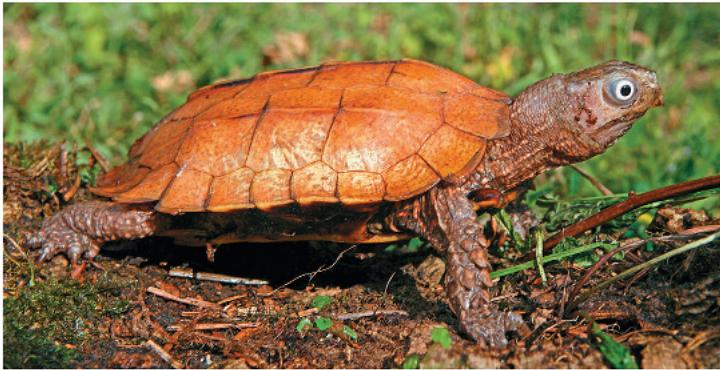

(b) Tuatara (Sphenodon punctatus)  
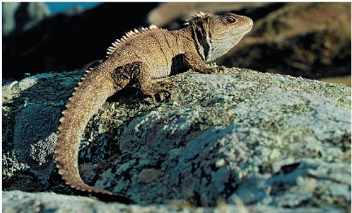

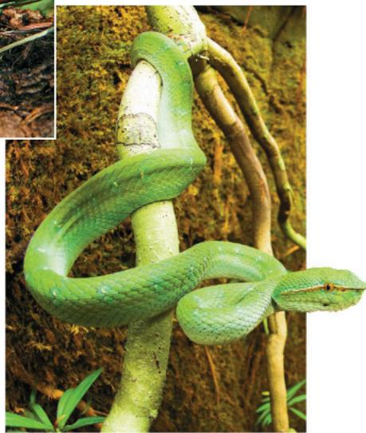  
(d) Wagler's pit viper (Tropidolaemus wagleri)

(e) American alligator (Alligator mississippiensis)  
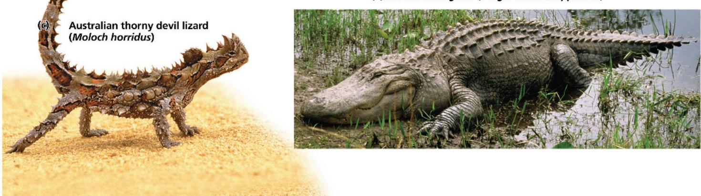

220 million years ago. These organisms thrived on many continents well into the Cretaceous period and reached up to a meter in length. Today, however, tuataras are found only on 30 islands off the coast of New Zealand. When humans arrived in New Zealand around 1250 CE, the rats that accompanied them devoured tuatara eggs, eventually eliminating the reptiles on the main islands. The tuataras that remain on the outlying islands are about 50 cm long and feed on insects, small lizards, and bird eggs and chicks. They can live to be over 100 years old. Their future survival depends on whether their remaining habitats are kept rat-free.

The other major living lineage of lepidosaurs consists of the lizards and snakes, or squamates, which number 10,015 species (Figure 34.29c and d). Many squamates are small; the Jaragua lizard, discovered recently in the Dominican Republic, is only

16 mm long—small enough to fit comfortably on a dime. In contrast, the Komodo dragon of Indonesia is a lizard that can reach a length of 3 m. It hunts deer and other large prey, delivering venom with its bite.

Snakes descended from lizards with legs (see Figure 26.1); thus they are classified as legless lizards. Today, some species of snakes retain vestigial pelvic and limb bones, providing evidence of their ancestry. Despite their lack of legs, snakes are quite proficient at moving on land, most often by producing waves of lateral bending that pass from head to tail. Force exerted by the bends against solid objects pushes the snake forward. Snakes can also move by gripping the ground with their belly scales at several points along the body while the scales at intervening points are lifted slightly off the ground and pulled forward.

Snakes are carnivorous, and a number of adaptations aid them in hunting and eating prey. They have acute chemical sensors, and though they lack eardrums, they are sensitive to ground vibrations, which helps them detect the movements of prey. Heat-detecting organs between the eyes and nostrils of pit vipers, including rattlesnakes, are sensitive to minute temperature changes, enabling these night hunters to locate warm animals. Venomous snakes inject their toxin through a pair of sharp teeth that may be hollow or grooved. The flicking tongue is not venomous but helps fan odors toward olfactory (smell) organs on the roof of the mouth. Loosely articulated jawbones and elastic skin enable most snakes to swallow prey larger than the diameter of the snake's head (see Figure 23.14).

Next, we'll turn to the third (and final) clade of reptiles with living members, the archosaurs. There are two extant groups of archosaurs: the crocodilians and the birds.

## Crocodilians

Alligators and crocodiles (collectively called crocodilians) belong to a lineage that reaches back to the late Triassic. The earliest members of this lineage were small terrestrial quadrupeds with long, slender legs. Later species became larger and adapted to aquatic habitats, breathing air through their upturned nostrils. Some Mesozoic crocodilians grew as long as 12 m and may have attacked dinosaurs and other prey at the water's edge.

The 24 known species of living crocodilians are confined to warm regions of the globe. In the southeastern United States, the American alligator (Figure 34.29e) has made a comeback after spending years on the endangered species list.

## Birds

There are about 11,000 species of birds in the world. Like crocodilians, birds are archosaurs, but almost every feature of their anatomy has been modified in their adaptation to flight (Figure 34.30).

## Derived Characters of Birds

Many of the characters of birds are adaptations that facilitate flight, including weight-saving modifications that make flying more efficient. For example, birds lack a urinary bladder, and the females of most species have only one ovary. The gonads of both females and males are usually small, except during the breeding season, when they increase in size. Living birds are also toothless, an adaptation that trims the weight of the head.

A bird's most obvious adaptations for flight are its wings and feathers (see Figure 34.30). Feathers are made of the protein $\beta$ -keratin, which is also found in the scales of other reptiles. The shape and arrangement of the feathers form the wings into airfoils, and they illustrate some of the same principles of aerodynamics as the wings of an airplane. Power for flapping

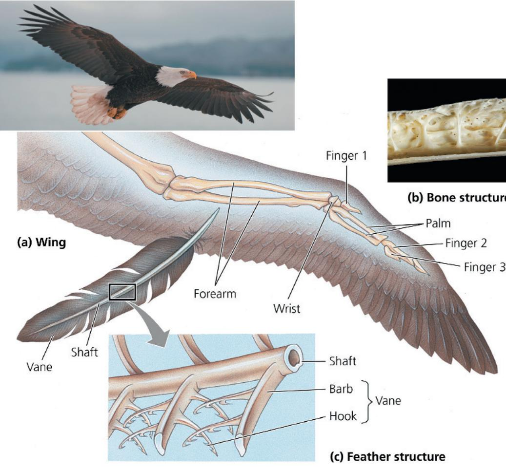

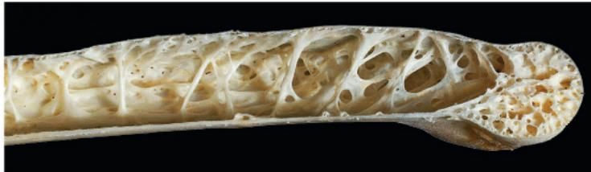

## Figure 34.30 Form fits function: the avian wing and feather.

(a) A wing is a remodeled version of the tetrapod forelimb. (b) The bones of many birds have a honeycombed internal structure and are filled with air. (c) A feather consists of a central air-filled shaft, from which radiate the vanes. The vanes are made up of barbs, which bear small branches called barbules. Birds have contour feathers and downy feathers. Contour feathers are stiff and contribute to the aerodynamic shapes of the wings and body. Their barbules have hooks that cling to barbules on neighboring barbs. When a bird preens, it runs the length of each contour feather through its beak, engaging the hooks and uniting the barbs into a precise shape. Downy feathers lack hooks, and the free-form arrangement of their barbs produces a fluffiness that provides insulation by trapping air.

the wings comes from contractions of large pectoral (breast) muscles anchored to a keel on the sternum (breastbone). Some birds, such as eagles and hawks, have wings adapted for soaring on air currents and flap their wings only occasionally; other birds, including hummingbirds, must flap continuously to stay aloft (see Figure 34.34). Among the fastest birds are the appropriately named swifts, which can fly at speeds up to 170 km/hour.

Flight provides numerous benefits. It enhances scavenging and hunting, including enabling many birds to feed on flying insects, an abundant, nutritious food resource. Flight also provides ready escape from earthbound predators and enables some birds to migrate great distances to exploit different food resources and seasonal breeding areas.

Flying requires a great expenditure of energy from an active metabolism. Birds are endothermic; they use their own metabolic heat to maintain a high, constant body temperature. Feathers and in some species a layer of fat provide insulation that enables birds to retain body heat. The lungs have tiny tubes leading to and from elastic air sacs that improve airflow and oxygen uptake. In this system, air flows continuously in one direction over the lungs, passing over the gas exchange surfaces during both inhalation and exhalation (see Figure 42.26). This efficient respiratory system and a circulatory system with a four-chambered heart (see Figure 42.4c) keep tissues well supplied with oxygen and nutrients, supporting a high rate of metabolism.

Flight also requires both acute vision and fine muscle control. Birds have color vision and excellent eyesight. The visual and motor areas of the brain are well developed, and the brain is proportionately larger than those of amphibians and nonbird reptiles.

Birds generally display very complex behaviors, particularly during breeding season, when they engage in elaborate courtship rituals. Because eggs have shells by the time they are laid, fertilization must be internal. Copulation usually involves contact between the openings to the birds' cloacas. After eggs are laid, the avian embryo must be kept warm through brooding by the mother, the father, or both, depending on the species.

## The Origin of Birds

Cladistic analyses of birds and reptilian fossils indicate that birds belong to the group of bipedal saurischian dinosaurs called theropods. Since the late 1990s, Chinese paleontologists have unearthed a spectacular trove of feathered theropod fossils that are shedding light on the origin of birds. Several species of dinosaurs closely related to birds had feathers with vanes, and a wider range of species had filamentous feathers. Such findings imply that feathers evolved long before powered flight. Among the possible functions of these early feathers were insulation, camouflage, and courtship display.

By about 160 million years ago, a lineage of feathered theropods had evolved into birds. Many researchers consider Archaeopteryx, which was discovered in a German limestone quarry in 1861, to be the earliest known bird (Figure 34.31). It had feathered wings but retained ancestral characters such as teeth, clawed digits in its wings, and a long tail. Archaeopteryx flew well at high speeds, but unlike a present-day bird, it could not take off from a standing position. Fossils of later birds from the Cretaceous

Figure 34.31 Artist's reconstruction of the early bird Archaeopteryx.

Fossil evidence indicates that Archaeopteryx was capable of powered flight but retained many characters of nonbird dinosaurs. Colors in this drawing were based on pigments extracted from fossilized Archaeopteryx feathers.

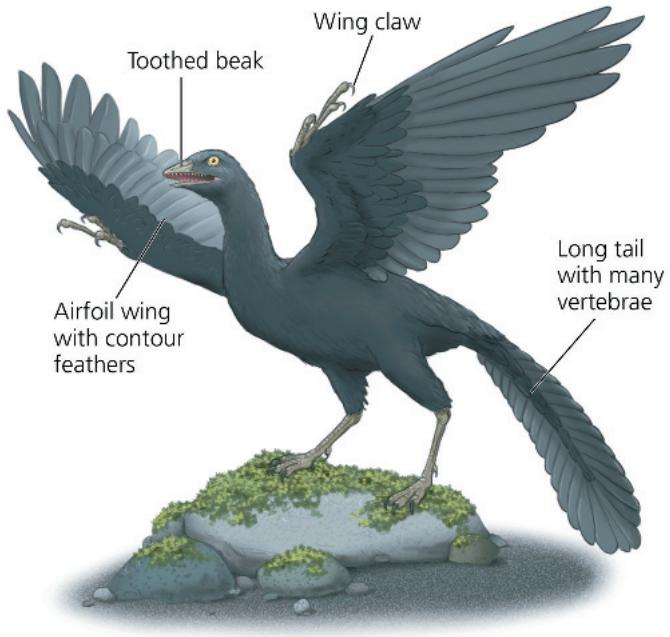

show a gradual loss of certain ancestral dinosaur features, such as teeth and clawed forelimbs, as well as the acquisition of innovations found in extant birds, including a short tail covered by a fan of feathers.

## Living Birds

Clear evidence of Neornithes, the clade that includes the 28 orders of living birds, can be found before the Cretaceous-Paleogene boundary 66 million years ago. Several groups of living and extinct birds include one or more flightless species. The ratites, an order of birds that includes the ostrich, rhea, kiwi, cassowary, and emu, are all flightless (Figure 34.32). In ratites, the sternal keel is absent, and the pectoral muscles are small relative to those of birds that can fly.

Figure 34.32 An emu (Dromaius novaehollandiae), a flightless bird native to Australia.  
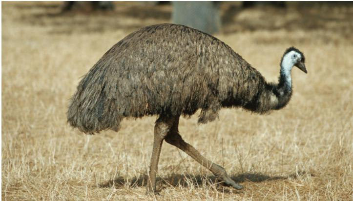

Figure 34.33 A king penguin (Aptenodytes patagonicus) "flying" underwater.

With their streamlined shape and powerful pectoral muscles, penguins are fast and agile swimmers.

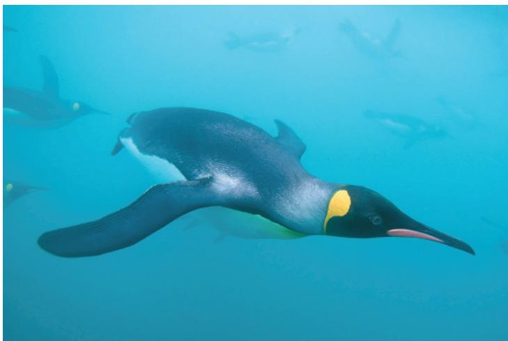  
Figure 34.34 Hummingbird feeding while hovering.  
A hummingbird can rotate its wings in all directions, enabling it to hover and fly backward.

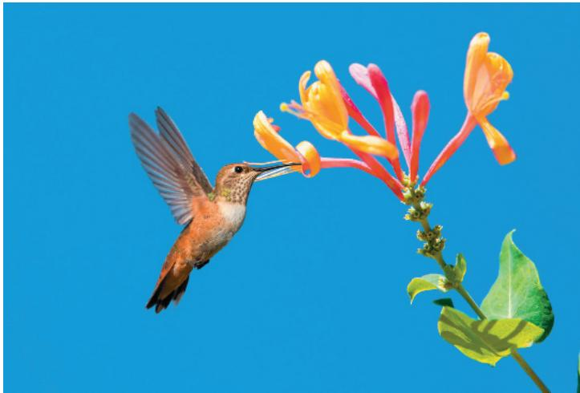  
Figure 34.35 A specialized beak.  
This greater flamingo (Phoenicopterus roseus) dips its beak into the water and strains out the food.

Penguins make up another flightless order of birds, but, like flying birds, they have powerful pectoral muscles. They use these muscles to “fly” in the water: As they swim, they flap their flipper-like wings in a manner that resembles the flight stroke of a more typical bird (Figure 34.33). Certain species of rails, ducks, and pigeons are also flightless.

Although the demands of flight have rendered the general body forms of many flying birds similar to one another, experienced bird-watchers can distinguish species by their profile, colors, flying style, behavior, and beak shape. The skeleton of a hummingbird's wing is unique, making it the only bird that can hover and fly backward (Figure 34.34). Adult birds lack teeth, but during the course of avian evolution their beaks have taken on a variety of shapes suited to different diets. Some birds, such as parrots, have crushing beaks with which they can crack open hard nuts and seeds. Other birds, such as

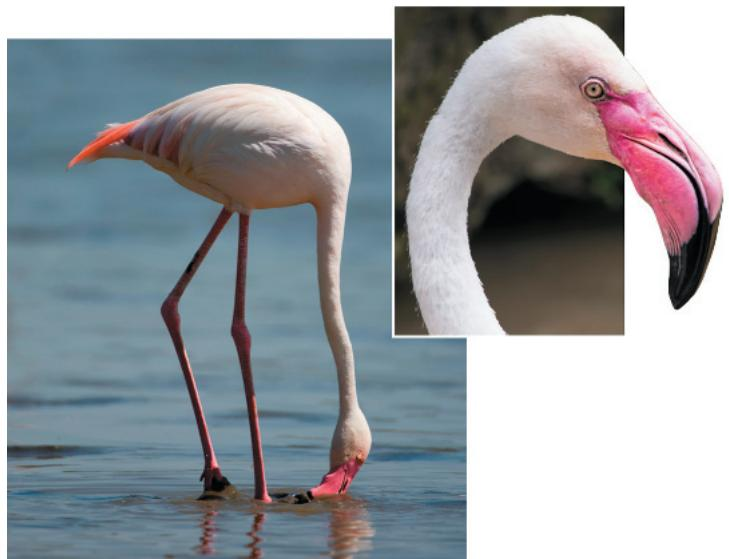  
Figure 34.36 Feet adapted to perching.  
This great tit (Parus major) is a member of the Passeriformes, the perching birds. The toes of these birds can lock around a branch or wire, enabling the bird to rest for long periods.

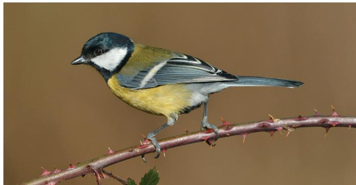

flamingoes, are filter feeders. Their beaks have “strainers” that enable them to capture food particles from the water (Figure 34.35). Foot structure, too, shows considerable variation. Various birds use their feet for perching on branches (Figure 34.36), grasping food, defense, swimming or walking, and even courtship (see Figure 24.3e).

## Concept Check 34.5

1. Describe three key amniote adaptations for life on land.

2. Are snakes tetrapods? Explain.

3. Identify four avian adaptations for flight.

4. VISUAL SKILLS Based on the phylogeny shown in Figure 34.25, identify the sister group for (a) reptiles, (b) squamates, and (c) the clade that includes crocodilians and birds.

# Concept 34.6: Mammals are amniotes that have hair and produce milk

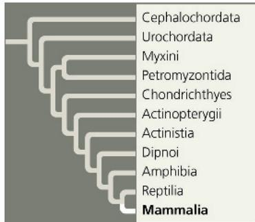

The reptiles we have been discussing represent one of the two living lineages of amniotes. The other amniote lineage is our own, the mammals. Today, there are about 6,600 known species of mammals on Earth.

## Derived Characters of Mammals

Mammals are named for their distinctive mammary glands, which produce milk for offspring. All mammalian mothers nourish their young with milk, a balanced diet rich in fats, sugars, proteins, minerals, and vitamins. Hair, another mammalian character, and a fat layer under the skin provide insulation that can conserve water and protect the body against extremes of heat or cold. Another mammalian adaptation for life on land is the kidney (see Figure 44.13), which is efficient at conserving water when removing wastes from the body. Some mammals, such as kangaroo rats, are so adept at conserving water that they can survive in arid environments while drinking little or no water at all (Figure 34.37).

Like birds, mammals are endothermic, and most have a high metabolic rate. Efficient respiratory and circulatory systems

Figure 34.37 Adaptations of the kangaroo rat to its extremely dry habitat.

② The animal stays in its cool, relatively humid burrow during the heat of the day, emerging at night to forage.

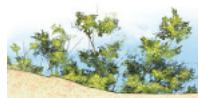  
1 The kangaroo rat's thick, oily skin limits evaporative water loss.

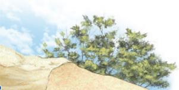

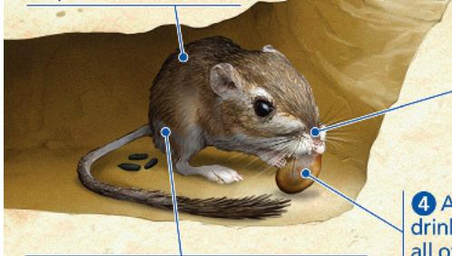  
3 The large surface area of its nasal passages increases the efficiency of water reabsorption when the animal exhales.  
5 The large intestine and kidney absorb water so effectively that little water is lost in feces and urine.  
4 A kangaroo rat rarely drinks: It obtains nearly all of the water it needs from catabolic pathways and from moisture in food.  
MAKE CONNECTIONS Explain how the catabolic pathways mentioned in 4 could provide a kangaroo rat with water. (See Concept 9.1.) For suggested answer, see Appendix A.

(including a four-chambered heart) support a mammal's metabolism. Also as in birds, mammals generally have a larger brain than other vertebrates of equivalent size, and many species are capable learners. The relatively long duration of parental care extends the time for offspring to learn important survival skills by observing their parents. In addition, whereas the teeth of reptiles are generally uniform in size and shape, the jaws of mammals typically bear a variety of teeth with sizes and shapes adapted for chewing many kinds of foods. Humans, like most mammals, have teeth modified for shearing (incisors and canine teeth) and for crushing and grinding (premolars and molars).

## Early Evolution of Mammals

Mammals belong to a group of amniotes known as synapsids. Early nonmammalian synapsids lacked hair, had a sprawling gait, and laid eggs. A distinctive characteristic of synapsids is the single temporal fenestra, a hole behind the eye socket on each side of the skull. Humans retain this feature; your jaw muscles pass through the temporal fenestra and anchor on your temple. Fossil evidence shows that the jaw was remodeled as mammalian features arose gradually in successive lineages of earlier synapsids (see Figure 25.7); in all, these changes took more than 100 million years. In addition, two of the bones that formerly made up the jaw joint (the quadrate and the articular) were incorporated into the mammalian middle ear (Figure 34.38). This evolutionary change is reflected in changes that occur during development. For example, as a mammalian embryo grows, the posterior region of its jaw—which in a reptile forms the articular bone—can be observed to detach from the jaw and migrate to the ear, where it forms the malleus.

Synapsids evolved into large herbivores and carnivores during the Permian period (299–252 million years ago), and for a time they were the dominant tetrapods. However, the Permian–Triassic extinctions took a heavy toll on them, and their diversity fell during the Triassic (252–201 million years ago). Increasingly mammal-like synapsids emerged by the end of the Triassic. While not true mammals, these synapsids had acquired a number of the derived characters that distinguish mammals from other amniotes. They were small and probably hairy, and they likely fed on insects at night. Their bones show that they grew faster than other synapsids, suggesting that they probably had a relatively high metabolic rate; however, they still laid eggs.

During the Jurassic (201–145 million years ago), the first true mammals arose and diversified into many short-lived lineages. A diverse set of mammal species coexisted with dinosaurs in the Jurassic and Cretaceous periods, but most of these species were small, measuring less than 1 m in length. One factor that may have contributed to their small size is that dinosaurs already occupied many ecological niches of large-bodied animals.

Fossil and molecular evidence indicate that by 160 million years ago, the three major lineages of mammals had emerged: those leading to monotremes (egg-laying mammals), marsupials (mammals with a pouch), and eutherians (placental mammals). After the extinction of large dinosaurs, pterosaurs, and most marine reptiles during the late Cretaceous period, mammals underwent an adaptive radiation, giving rise to large predators and herbivores as well as flying and aquatic species.

Figure 34.38 The evolution of the mammalian ear bones.

Biarmosuchus was a synapsid, a lineage that eventually gave rise to the mammals. Bones that transmit sound in the ear of mammals arose from the modification of bones in the jaw of nonmammalian synapsids.

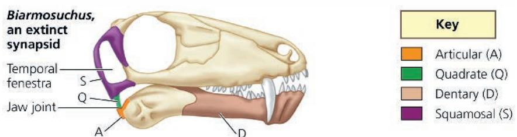  
(a) In Biarmosuchus, the meeting of the articular and quadrate bones formed the jaw joint.

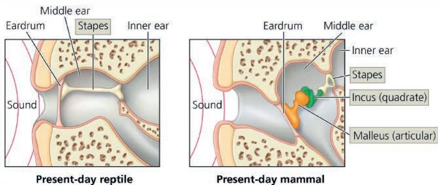  
(b) During the evolutionary remodeling of the mammalian skull, a new jaw joint formed between the dentary and squamosal bones (see Figure 25.7). No longer used in the jaw, the quadrate and articular bones became incorporated into the middle ear as two of the three bones that transmit sound from the eardrum to the inner ear.

MAKE CONNECTIONS Review the definition of exaptation in Concept 25.6. Summarize the process by which exaptation occurs and explain how the incorporation of the articular and quadrate bones into the mammalian inner ear is an example.

For suggested answer, see Appendix A.

## Monotremes

Monotremes are found only in Australia and New Guinea and are represented by one species of platypus and four species of echidnas (spiny anteaters; Figure 34.39). Monotremes lay eggs, a character that is ancestral for amniotes and retained in most reptiles. Like all mammals, monotremes have hair and produce milk, but they lack nipples. Milk is secreted by glands on the belly of the mother. After hatching, the baby sucks the milk from the mother's fur.

## Marsupials

Opossums, kangaroos, and koalas are examples of the group called marsupials. Both marsupials and eutherians share derived characters not found among monotremes. They have higher metabolic rates and nipples that provide milk, and they give birth to live young. The embryo begins development inside the uterus of the female's reproductive tract. The lining of the uterus and the extraembryonic membranes that arise from the embryo form a placenta, a structure in which nutrients diffuse into the embryo from the mother's blood.

A marsupial is born very early in its development and completes its embryonic development while nursing (Figure 34.40a). In most species, the nursing young are held within a maternal pouch called a marsupium. A red kangaroo, for instance, is about the size of a honeybee at its birth, just 33 days after fertilization. Its back legs are merely buds, but its front legs are strong enough for it to crawl from the exit of its mother's reproductive tract to a pouch that opens to the front of her body, a journey that lasts a few minutes. In other species, the marsupium opens to the rear of the mother's body; in greater bilbies, this protects the young as their mother burrows in the dirt (Figure 34.40b).

Marsupials existed worldwide during the Mesozoic era, but today they are found only in the Australian region and in the Americas (Figure 34.40c). The biogeography of marsupials illustrates the interplay between biological and geologic evolution (see Concept 25.4). After the breakup of the supercontinent Pangaea, South America and Australia became island continents, and their marsupials diversified in isolation from the eutherians that began an adaptive radiation on the northern continents. Australia has not been in contact with another continent since early in the Cenozoic era, 66 million years ago. In Australia, convergent evolution has resulted in a diversity of marsupials that resemble eutherians in similar ecological roles in other parts of the world (Figure 34.41). In contrast, although South America had a diverse marsupial fauna throughout the Paleogene, it has experienced several immigrations of eutherians. One of the most important occurred about 3 million years ago, when

North and South America joined at the Panamanian isthmus and extensive two-way traffic of animals took place over the land bridge. Today, only three families of marsupials live outside the Australian region, and the only marsupial found in the wild in North America is one species of opossum.

## Figure 34.39 Short-beaked echidna (Tachyglossus aculeatus), an Australian monotreme.

Monotremes have hair and produce milk, but they lack nipples. Monotremes are the only mammals that lay eggs (inset).

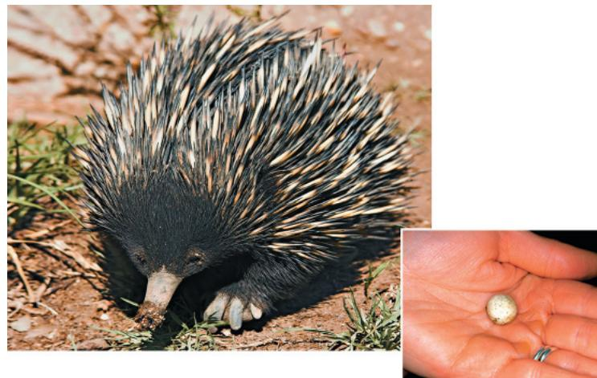

Figure 34.40 Marsupials in Australia and North America.  
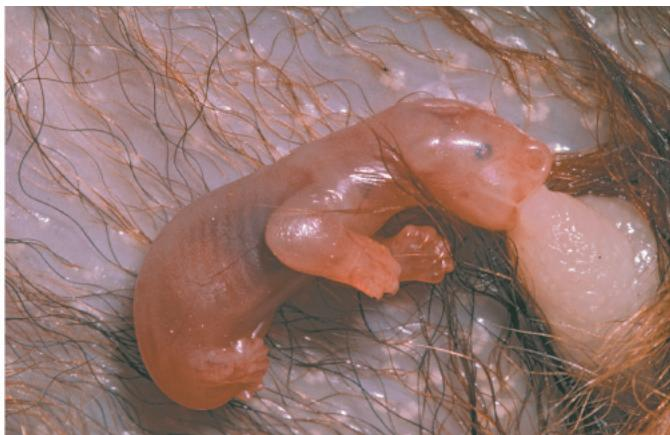  
(a) A young brushtail possum (Australia). The offspring of marsupials are born very early in their development. They finish their growth while nursing from a nipple (in their mother's pouch in most species).

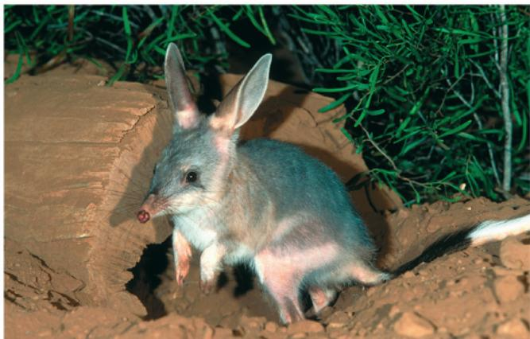  
(b) A greater bilby (Australia). The greater bilby is a digger and burrower that eats termites and other insects, along with the seeds, roots, and bulbs of various plants. The female's rear-opening pouch helps protect the young from dirt as the mother digs. Other marsupials, such as kangaroos, have a pouch that opens to the front.

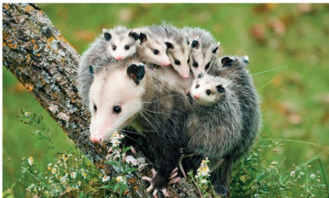  
(c) Virginia opossum (Central and North America). This species is the only marsupial found north of Mexico. After the young complete development in the mother's pouch, they spend another four to five months riding on her back before living independently.

## Eutherians (Placental Mammals)

Eutherians are commonly called placental mammals because their placentas are more complex than those of marsupials. Eutherians have a longer pregnancy than marsupials. Young eutherians

Figure 34.41 Convergent evolution of marsupials and eutherians (placental mammals).  
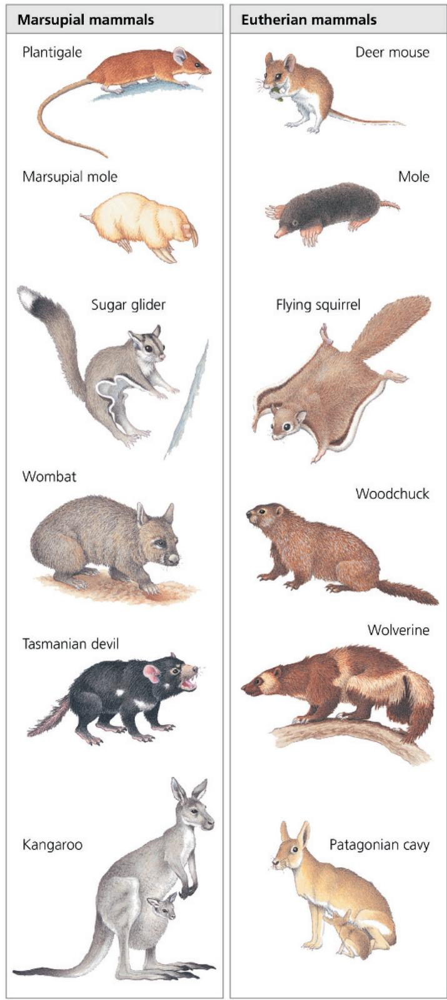

complete their embryonic development within the uterus, joined to their mother by the placenta. The eutherian placenta provides an intimate and long-lasting association between the mother and her developing young.

The major groups of living eutherians are thought to have diverged from one another in a burst of evolutionary change (Figure 34.42). The

Anteater

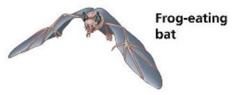

## Exploring Mammalian Diversity

## Figure 34.42

One hypothesis for the evolutionary relationships of mammals, represented by the tree shown here, clusters the eutherian orders into four main clades. All 20 extant orders of mammals are listed; the orders in bold type are surveyed in more detail around the tree.

Monotremes (5 species)

Monotremata

ANCESTRAL SYNAPSID

180 million years ago (mya)

Marsupials (366 species)

160 mya

Marsupialia

Eutherians (6,028 species)

Proboscidea
Sirenia
Hyracoidea
Tubulidentata
Afrosoricida (golden moles and tenrecs)
Macroscelidea (elephant shrews)

Xenarthra

Rodentia
Lagomorpha
Primates
Dermoptera (flying lemurs)
Scandentia (tree shrews)

Carnivora
Perissodactyla
Cetartiodactyla
Chiroptera
Eulipotyphla
Pholidota (pangolins)

Monotremata
(platypuses, echidnas)
Lay eggs; no nipples; young suck milk from fur of mother

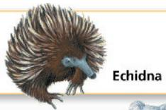

## Marsupialia

(kangaroos, opossums, koalas)
Complete embryonic development in pouch on mother's body

Proboscidea (elephants)
Long, muscular trunk; thick,
loose skin; upper incisors
elongated as tusks

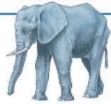

Sirenia (manatees, dugongs)
Aquatic; finlike forelimbs and no hind limbs; herbivorous

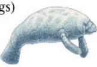

Hyracoidea (hyraxes)
Short legs; stumpy tail; herbivorous; complex, multi-chambered stomach

Echidna

## African elephant

Xenarthra (sloths, anteaters, armadillos)
Reduced teeth or no teeth;
herbivorous (sloths)
or carnivorous (anteaters, armadillos)

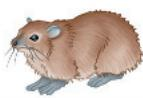

Manatee

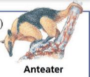

Rock hyrax

## Rodentia (squirrels, beavers, rats, porcupines, mice)

porcupines, mice)
Chisel-like, continuously growing
incisors worn down by gnawing;
herbivorous

Lagomorpha (rabbits, hares, pikas)
Chisel-like incisors; hind legs longer than forelegs and adapted for running and jumping; herbivorous

## Red squirrel

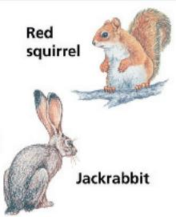

Primates (lemurs, monkeys, chimpanzees, gorillas, humans) Golden lion tamarin Opposable thumbs; forward-facing eyes; well-developed cerebral cortex; omnivorous

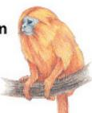

Carnivora (dogs, wolves, bears, cats, weasels, otters, seals, walruses)
Sharp, pointed canine teeth and molars for grasping and cutting; carnivorous

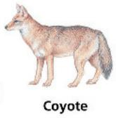

## Coyote

Perissodactyla (horses, zebras, tapirs, rhinoceroses)
Hooves with an odd number of toes on each foot; herbivorous

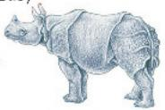

Indian rhinoceros

## Cetartiodactyla • Artiodactyls

(sheep, pigs, cattle, deer, giraffes)
Hooves with an even number of toes on each foot; herbivorous

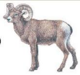

## Bighorn sheep

•Cetaceans
(whales, dolphins, porpoises)
Aquatic; streamlined body; paddle-like forelimbs and no hind limbs; thick layer of insulating blubber; carnivorous

Chiroptera (bats)
Adapted for flight; broad skinfold that extends from elongated fingers to body and legs; carnivorous or herbivorous

Pacific white-sided porpoise

Frog-eating bat

timing of this burst is uncertain: Molecular data suggest it occurred about 100 million years ago, while the fossil record suggests it was about 60 million years ago. Figure 34.42 explores several major eutherian orders and their phylogenetic relationships with each other as well as with the monotremes and marsupials.

## Primates

The mammalian order Primates includes the lemurs, tarsiers, monkeys, and apes. Humans are members of the ape group.

## Derived Characters of Primates

Most primates have hands and feet adapted for grasping, and their digits have flat nails instead of the narrow claws of other mammals. There are other characteristic features of the hands and feet, too, such as skin ridges on the fingers (which account for human fingerprints). Relative to other mammals, primates have a large brain and short jaws, giving them a flat face. Their forward-looking eyes are close together on the front of the

face. Primates also exhibit relatively well-developed parental care and complex social behavior.

The earliest known primates were tree-dwellers, and many of the characteristics of primates are adaptations to the demands of living in the trees. Grasping hands and feet allow primates to hang onto tree branches. All living primates except humans have a big toe that is widely separated from the other toes, enabling them to grasp branches with their feet. All primates also have a thumb that is relatively movable and separate from the fingers, but monkeys and apes have a fully opposable thumb; that is, they can touch the ventral surface (fingerprint side) of the tip of all four fingers with the ventral surface of the thumb of the same hand. In monkeys and apes other than humans, the opposable thumb functions in a grasping “power grip.” In humans, a distinctive bone structure at the base of the thumb allows it to be used for more precise manipulation. The unique dexterity of humans represents descent with modification from our tree-dwelling ancestors. Arboreal maneuvering also requires excellent eye-hand coordination. The overlapping visual fields of the two forward-facing eyes enhance depth perception, an obvious advantage when brachiating (traveling by swinging from branch to branch in trees).

## Living Primates

There are three main groups of living primates: (1) the lemurs of Madagascar (Figure 34.43) and the lorises and bush babies of tropical Africa and southern Asia; (2) the tarsiers, which live in southeastern Asia; and (3) the anthropoids, which include monkeys and apes and are found worldwide. The first group—lemurs, lorises, and bush babies—probably resemble early arboreal primates. The oldest known tarsier fossils date to 55 million years ago; along with DNA evidence, these fossils indicate that tarsiers are more closely related to anthropoids than to the lemur group (Figure 34.44).

Figure 34.43 Verreaux's sifakas (Propithecus verreauxi), a type of lemur.

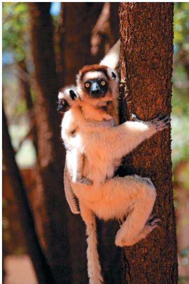  
Figure 34.44 A phylogenetic tree of primates.  
The fossil record indicates that the lineage leading to monkeys and apes diverged from other primates 55 million years ago. The lineage leading to humans and Australopithecus branched off from other apes 7–8 million years ago; the dagger symbol (†) denotes an extinct group.

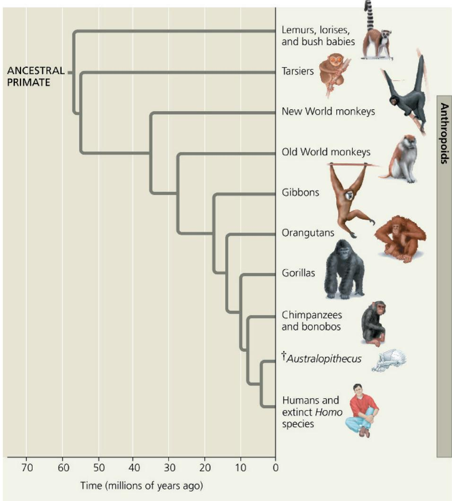  
VISUAL SKILLS Is the phylogeny shown here consistent with the idea that humans evolved from chimpanzees? Explain.
For suggested answer, see Appendix A.

You can see in Figure 34.44 that monkeys do not form a clade but rather consist of two groups, the so-called “New” and “Old” World monkeys. Both of these groups are thought to have originated in Africa or Asia. The fossil record indicates that New World monkeys first colonized South America roughly 25 million years ago. By that time, South America and Africa had drifted apart, and monkeys may have reached South America from Africa by rafting on logs or other debris. What is certain is that New World monkeys and Old World monkeys underwent separate adaptive radiations during their many millions of years of separation (Figure 34.45). All species of New World monkeys are arboreal, whereas Old World monkeys include ground-dwelling as well as arboreal species. Most monkeys in both groups are diurnal (active during the day) and usually live in bands held together by social behavior.

The other group of anthropoids consists of primates informally called apes (Figure 34.46). The ape group includes four genera of gibbons, along with the so-called “great apes,” the genera Pongo (orangutans), Gorilla (gorillas), Pan (chimpanzees and bonobos), and Homo (humans). The apes diverged from Old World monkeys about 25–30 million years ago. Today, nonhuman apes are found exclusively in tropical regions of the Eastern Hemisphere. With the exception of gibbons, living apes are larger than either New or Old World monkeys. All living apes have relatively long arms, short legs, and no tail. Although all nonhuman apes spend time in trees, only gibbons and orangutans are primarily arboreal. Social organization varies among the apes; gorillas and chimpanzees are highly social. Finally, compared to

Figure 34.45 New World monkeys and Old World monkeys.

(a) New World monkeys, such as spider monkeys (shown here), squirrel monkeys, and capuchins, have a prehensile tail (one adapted for grasping) and nostrils that open to the sides.

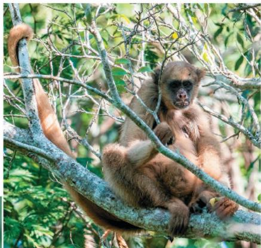

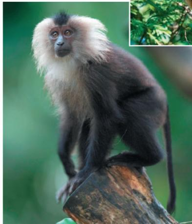  
(b) Old World monkeys lack a prehensile tail, and their nostrils open downward. This group includes macaques (shown here), mandrils, baboons, and rhesus monkeys.  
(a) Gibbons (18 species), such as this Muller's gibbon, are found only in south-eastern Asia. Their very long arms and fingers are adaptations for brachiating (swinging by the arms from branch to branch).

Figure 34.46 Nonhuman apes.

(b) Orangutans (3 species) are shy apes that live in the rain forests of Sumatra and Borneo. Named in 2017, this species (Pongo tapanuliensis) is the first great ape discovered in nearly 100 years.

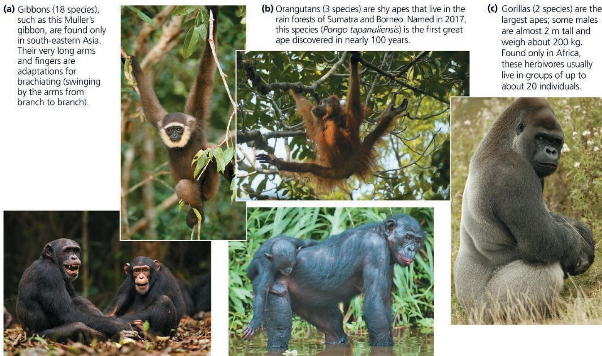

(c) Gorillas (2 species) are the largest apes; some males are almost 2 m tall and weigh about 200 kg. Found only in Africa, these herbivores usually live in groups of up to about 20 individuals.

(d) Chimpanzees live in tropical Africa. They feed and sleep in trees but also spend a great deal of time on the ground. Chimpanzees are intelligent, communicative, and social.

(e) Bonobos are in the same genus (Pan) as chimpanzees but are smaller. They survive today only in the African nation of Congo.

other primates, apes have a larger brain in proportion to their body size, and their behavior is more flexible. These two characteristics are especially prominent in our next group, the hominins.

## Concept Check 34.6

1. Contrast monotremes, marsupials, and eutherians in terms of how they bear young.

2. Identify at least five derived traits of primates.

3. MAKE CONNECTIONS Develop a hypothesis to explain why the diversity of mammals increased in the Cenozoic. Your explanation should consider mammalian adaptations as well as factors such as mass extinctions and continental drift (review Concept 25.4).

For suggested answers, see Appendix A.

## Concept 34.7: Humans are mammals that have a large brain and bipedal locomotion

In our tour of Earth's biodiversity, we turn now to our own species, Homo sapiens, which is about 200,000 years old. When you consider that life has existed on Earth for at least 3.5 billion years, we are clearly evolutionary newcomers.

## Derived Characters of Humans

Many characters distinguish humans from other apes. Most obviously, humans stand upright and are bipedal (walk on two legs). Humans have a much larger brain and are capable of language, symbolic thought, artistic expression, and the manufacture and use of complex tools. Humans also have reduced jawbones and jaw muscles, along with a shorter digestive tract.

At the molecular level, the list of derived characters of humans is growing as scientists compare the human and chimpanzee genomes. Although the two genomes are 99% identical, a difference of 1% can represent many changes in a genome with 3 billion base pairs. Furthermore, changes in a small number of genes can have large effects. This point was highlighted by recent results showing that humans and chimpanzees differ in the expression of 19 regulatory genes. These genes turn other genes on and off and hence may account for many differences between humans and chimpanzees.

Bear in mind that such genomic differences—and whatever derived phenotypic traits they encode—separate humans from other living apes. But many of these new characters first emerged in our ancestors, long before our own species appeared. We will consider some of these ancestors to see how these characters originated.

## The Earliest Hominins

The study of human origins is known as paleoanthropology. Paleoanthropologists have unearthed fossils of approximately 25 extinct species that are more closely related to humans than to

chimpanzees. These species are known as hominins (Figure 34.47, on the facing page). Since 1994, fossils of four hominin species dating to more than 4 million years ago have been discovered. The oldest of these hominins, Sahelanthropus tchadensis, lived about 6.5 million years ago.

Sahelanthropus and other early hominins shared some of the derived characters of humans. For example, they had reduced canine teeth, and some fossils suggest that they had relatively flat faces. They also show signs of having been more upright and bipedal than other apes. One clue to their upright stance can be found in the foramen magnum, the hole at the base of the skull through which the spinal cord passes. In chimpanzees, the foramen magnum is relatively far back on the skull, while in early hominins (and in humans), it is located underneath the skull. This position allows us to hold our head directly over our body, as early hominins apparently did as well. The pelvis, leg bones, and feet of the 4.4-million-year-old Ardipithecus ramidus also suggest that early hominins were increasingly bipedal (Figure 34.48). (We will return to the subject of bipedalism later in the chapter.)

Figure 34.48 “Ardi,” a 4.4-million-year-old fossil of Ardipithecus ramidus.

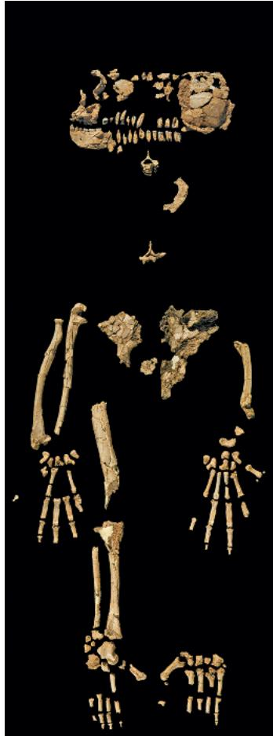

Note that the characters that distinguish humans from other living apes did not all evolve in tight unison. While early hominins were showing signs of bipedalism, their brains remained small—about 300–450 cm $^{3}$ in volume, compared with an average of 1,300 cm $^{3}$ for Homo sapiens. The earliest hominins were also small overall. A. ramidus, for example, is estimated to have been about 1.2 m tall, with relatively large teeth and a jaw that projected beyond the upper part of the face. Humans, in contrast, average about 1.7 m in height and have a relatively flat face.

It's important to avoid two common misconceptions about early hominins. One is to think of them either as chimpanzees or as having evolved from chimpanzees. Chimpanzees represent the tip of a separate branch of evolution, and they acquired derived characters of their own after they diverged from their common ancestor with humans.

Another misconception is to think of human evolution as a ladder leading directly from an ancestral ape to Homo sapiens. This error is often illustrated as a parade of fossil species that become progressively more like ourselves as they march across the page. If human evolution is a parade, it is a very disorderly one, with many groups breaking away to wander other

Figure 34.47 A hypothesis of evolutionary relationships between hominins and their close relatives. The wide white bar indicates the period of time for which fossils of a given species have been found. Note that at most times in hominin history, two or more hominin species were contemporaries. All hominins except Homo sapiens are now extinct.  
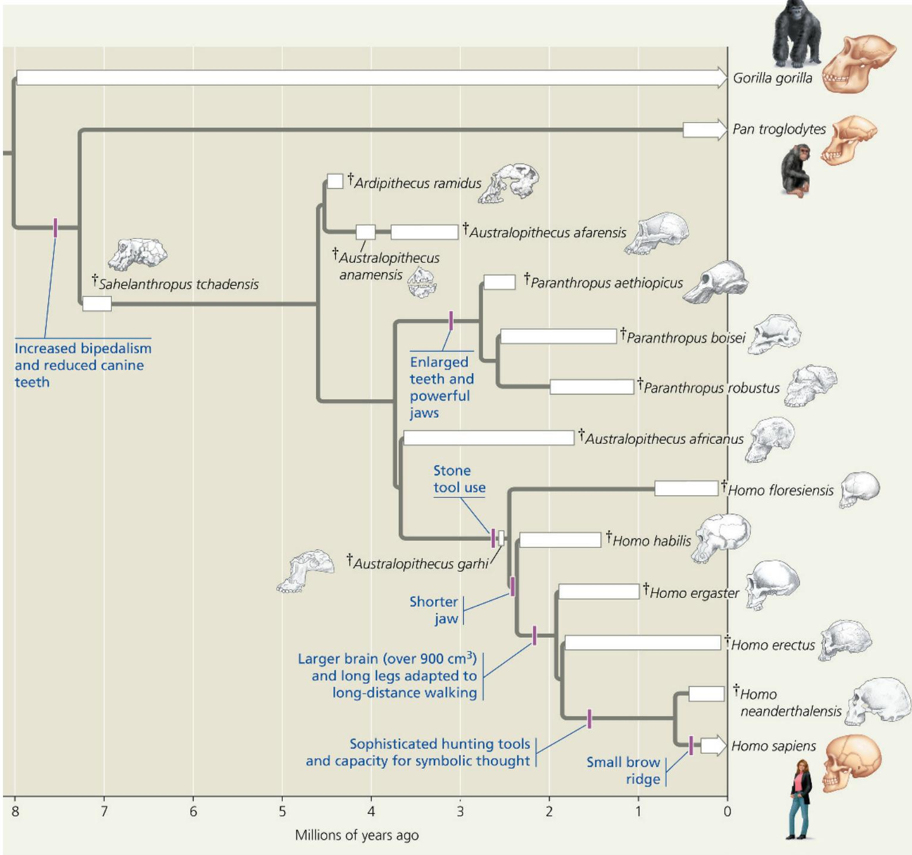

evolutionary paths. At times, several hominin species coexisted. These species often differed in skull shape, body size, and diet (as inferred from their teeth). Ultimately, all but one lineage—the one that gave rise to Homo sapiens—ended in extinction. Overall, considering the characteristics of all hominins that lived over the past 6.5 million years, H. sapiens appears not as the end result of a straight evolutionary path, but rather as the only surviving member of a highly branched evolutionary tree.

## Australopiths

The fossil record indicates that hominin diversity increased dramatically between 4 and 2 million years ago. Many of the hominins from this period are collectively called australopiths. Their phylogeny remains unresolved on many points, but as a group, they are almost certainly paraphyletic (see Figure 34.47). The earliest member of the group, Australopithecus anamensis, lived 4.2–3.9 million years ago, close in time to older hominins such as Ardipithecus ramidus.

Australopiths got their name from the 1924 discovery in South Africa of Australopithecus africanus (“southern ape of Africa”), which lived between 3 and 2.4 million years ago. With the discovery of more fossils, it became clear that A. africanus walked fully erect (was bipedal) and had human-like hands and teeth. However, its brain was only about one-third the size of the brain of a present-day human.

In 1974, in the Afar region of Ethiopia, scientists discovered a 3.2-million-year-old Australopithecus skeleton that was 40% complete. “Lucy,” as the fossil was named, was short—only about 1 m tall. Lucy and similar fossils have been given the species name Australopithecus afarensis (for the Afar region). Fossil evidence shows that A. afarensis existed as a species for at least 1 million years.

At the risk of oversimplifying, we could say that A. afarensis had fewer of the derived characters of humans above the neck than below. Lucy's brain was the size of a softball, a size similar to that expected for a chimpanzee of Lucy's body size. A. afarensis skulls also have a long lower jaw. Skeletons of A. afarensis suggest that these hominins were capable of arboreal locomotion, with arms that were relatively long in proportion to body size (compared to the proportions in humans). However, fragments of pelvic and skull bones indicate that A. afarensis walked on two legs. Fossilized footprints in Laetoli, Tanzania, corroborate the skeletal evidence that hominins living at the time of A. afarensis were bipedal (Figure 34.49).

Another lineage of australopiths consisted of the “robust” australopiths. These hominins, which included species such as Paranthropus boisei, had sturdy skulls with powerful jaws and large teeth, adapted for grinding and chewing hard, tough foods. They contrast with the “gracile” (slender) australopiths, including A. afarensis and A. africanus, which had lighter feeding equipment adapted for softer foods.

Combining evidence from the earliest hominins with the much richer fossil record of later australopiths makes it possible to formulate hypotheses about significant trends in hominin evolution. In the Scientific Skills Exercise, you'll examine one such trend: how hominin brain volume has changed over time. Here we'll consider two other trends: the emergence of bipedalism and tool use.

## Bipedalism

Our anthropoid ancestors of 30–35 million years ago were still tree-dwellers. By about 10 million years ago, the Himalayan mountain range had formed, thrust up in the aftermath of the Indian plate's collision with the Eurasian plate (see Figure 25.16). The climate became drier, and the forests of what are now Africa and Asia contracted. The result was an increased area of savanna (grassland) habitat, with fewer trees. Researchers have hypothesized that as the habitat changed, natural selection may have favored adaptations that made moving over open ground more efficient. Underlying this idea is the fact that while nonhuman apes are superbly adapted for climbing trees, they are less well suited for ground travel. For example, as a chimpanzee walks, it uses four times the amount of energy used by a human.

Figure 34.49 Evidence that hominins walked upright 3.5 million years ago.

(a) The Laetoli footprints, more than 3.5 million years old, confirm that upright posture evolved quite early in hominin history.

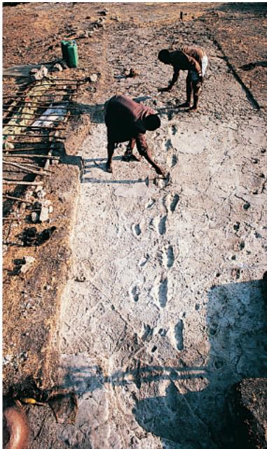  
(b) An artist's reconstruction of A. afarensis, a hominin alive at the time of the Laetoli footprints.

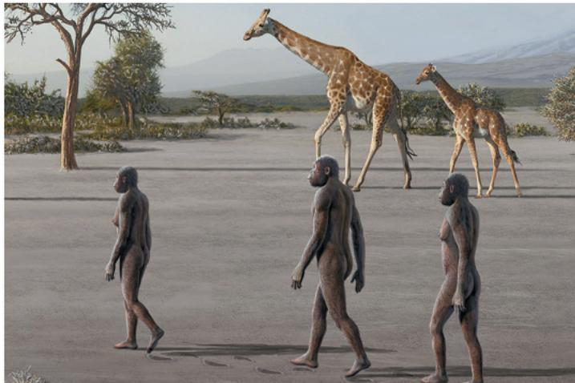

Although elements of this hypothesis survive, the picture now appears more complex. Even though all fossils of early hominins show indications of bipedalism, none of these hominins lived in savannas. Instead, they lived in mixed habitats ranging from forests to open woodlands. Furthermore, whatever the selective pressure that led to bipedalism, hominins did not become more bipedal in a simple, linear fashion. Ardipithecus had skeletal elements indicating that it could switch to upright walking but also was well suited for climbing trees. Australopiths seem to have had various locomotor styles, and some species spent more time on the ground than others. Only about 1.9 million years ago did hominins begin to walk long distances on two legs. These hominins lived in more arid environments, where bipedal walking requires less energy than walking on all fours.

## Tool Use

As you read earlier, the manufacture and use of complex tools are derived behavioral characters of humans. Determining the

# Scientific Skills Exercise Determining the Equation of a Regression Line

How Has Brain Volume Changed Over Time in the Hominin Lineage? The hominin taxon includes Homo sapiens and about 20 extinct species that are thought to represent early relatives of humans. Researchers have found that the brain volume of the earliest hominins ranged between 300

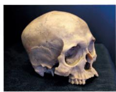

and 450 cm $^{3}$ , similar to the brain volume of chimpanzees. The brain volumes of modern humans range between 1,200 and 1,800 cm $^{3}$ . In this exercise, you'll examine how mean brain volume changed over time and across various hominin species.

How the Study Was Done In this table, $x_{i}$ is the mean age of each hominin species, and $y_{i}$ is the mean brain volume (cm $^{3}$ ). Ages with negative values represent millions of years before the present (which has an age of 0.0).

<table><tr><td>Hominin Species</td><td>Mean age (millions of years;  ${x}_{i}$ )</td><td> ${x}_{i} - \bar{x}$ </td><td>Mean Brain Volume  $\left( {{cm}^{3};{y}_{i}}\right)$ </td><td> ${y}_{i} - \bar{y}$ </td><td> $\left( {{x}_{i} - \bar{x}}\right) \times \left( {{y}_{i} - \bar{y}}\right)$ </td></tr><tr><td>Ardipithecus ramidus</td><td>-4.4</td><td></td><td>325</td><td></td><td></td></tr><tr><td>Australopithecus afarensis</td><td>-3.4</td><td></td><td>375</td><td></td><td></td></tr><tr><td>Homo habilis</td><td>-1.9</td><td></td><td>550</td><td></td><td></td></tr><tr><td>Homo ergaster</td><td>-1.6</td><td></td><td>850</td><td></td><td></td></tr><tr><td>Homo erectus</td><td>-1.2</td><td></td><td>1,000</td><td></td><td></td></tr><tr><td>Homo heidelbergensis</td><td>-0.5</td><td></td><td>1,200</td><td></td><td></td></tr><tr><td>Homo neanderthalensis</td><td>-0.1</td><td></td><td>1,400</td><td></td><td></td></tr><tr><td>Homo sapiens</td><td>0.0</td><td></td><td>1,350</td><td></td><td></td></tr></table>

Data from Dean Falk, Florida State University, 2013.

## INTERPRET THE DATA

How did the brain volume of hominin species change over time? In particular, is there a linear (straight-line) relationship between brain volume and time?

To find out, we'll perform a linear regression, a technique for determining the equation for the straight line that provides a "best fit" to a set of data. Recall that the equation for a straight line between two variables, $x$ and $y$ , is

$$
y = m x + b
$$

In this equation, m represents the slope of the line, while b represents the y-intercept (the point at which the straight line crosses the y-axis). When m < 0, the line has a negative slope, indicating that the values of y become smaller as values of x become larger. When m > 0, the line has a positive slope, meaning that the values of y become larger as values of x become larger. When m = 0, y has a constant value (b).

The correlation coefficient, r, can be used to calculate the values of m and b in a linear regression

$$
m = r \frac {s _ {y}}{s _ {x}} \text {   and   } b = \bar {y} - m \bar {x}.
$$

In these equations, $s_{x}$ and $s_{y}$ are the standard deviations of variables x and y, respectively, while $\overline{x}$ and $\overline{y}$ are the means of those two variables. (See the Scientific Skills Exercise for Chapter 32 for more information about the correlation coefficient, mean, and standard deviation.)

1. Calculate the means $(\bar{x}$ and $\bar{y})$ from the n = 8 data points in the table. Next, fill in the $(x_{i} - \bar{x})$ and $(y_{i} - \bar{y})$ columns in the data table, and use those results to calculate the standard deviations $s_{x}$ and $s_{y}$ .

2. As described in the Scientific Skills Exercise for Chapter 32, the formula for a correlation coefficient is

$$
r = \frac {\sum (x _ {i} - \bar {x}) (y _ {i} - \bar {y})}{(n - 1) (s _ {x} s _ {y})}
$$

Fill in the column in the data table for the product $(x_{i} - \bar{x}) \times (y_{i} - \bar{y})$ . Use these values and the standard deviations calculated in question 1 to calculate the correlation coefficient r between the brain volume of hominin species (y) and the ages of those species (x).

3. Based on the value of r that you calculated in question 2, describe in words the correlation between mean brain volume of hominin species and the mean age of the species.

4. (a) Use your calculated value of r to calculate the slope $(m)$ and the y-intercept $(b)$ of a regression line for this data set.
(b) Graph the regression line for the mean brain volume of hominin species versus the mean age of the species. Be careful to select and label your axes correctly. (c) Plot the data from the table on the same graph that shows the regression line. Does the regression line appear to provide a reasonable fit to the data?

5. The equation for a regression line can be used to calculate the value of y expected for any particular value of x. For example, suppose that a linear regression indicated that m = 2 and b = 4. In this case, when x = 5, we expect that $y = 2x + 4 = (2 \times 5) + 4 = 14$ . Based on the values of m and b that you determined in question 4, use this approach to determine the expected mean brain volume for a hominin that lived 4 million years ago (that is, x = -4).

6. The slope of a line can be defined as $m = \frac{y_{2} - y_{1}}{x_{2} - x_{1}}$ , where $(x_{1}, y_{1})$ and $(x_{2}, y_{2})$ are the coordinates of two points on the line. As such, the slope represents the ratio of the rise of a line (how much the line rises vertically) to the run of the line (how much the line changes horizontally). Use the definition of the slope to estimate how long it took for mean brain volume to increase by $100 \, cm^{3}$ over the course of hominin evolution.

Instructors: A version of this Scientific Skills Exercise can be assigned in Mastering Biology.

origin of tool use in hominin evolution is very difficult. Other apes are capable of surprisingly sophisticated tool use. Orangutans, for example, can fashion sticks into probes for retrieving insects from their nests. Chimpanzees are even more adept, using rocks to smash open food and putting leaves on their feet to walk over thorns. It's likely that early hominins were capable of this sort of simple tool use, but finding fossils of modified sticks or leaves that were used as shoes is practically impossible.

The oldest generally accepted evidence of tool use by hominins is 2.5-million-year-old cut marks on animal bones found in Ethiopia. These marks suggest that hominins cut flesh from the bones of animals using stone tools. Interestingly, the hominins whose fossils were found near the site where the bones were discovered had a relatively small brain. If these hominins, which have been named Australopithecus garhi, were in fact the creators of the stone tools used on the bones, that would suggest that stone tool use originated before the evolution of large brains in hominins.

## Figure 34.50 Fossil of Homo ergaster.

This 1.7-million-year-old fossil from Kenya belongs to a young Homo ergaster male. This individual was tall, slender, and fully bipedal, and he had a relatively large brain.

## Early Homo

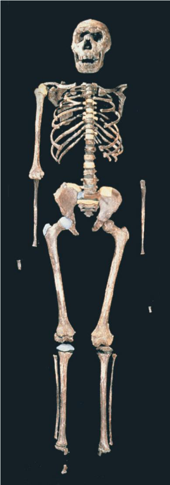

Some of the earliest fossils that paleoanthropologists place in our genus, Homo, include those of the species Homo habilis. These fossils, ranging in age from about 2.4 to 1.6 million years, show clear signs of certain derived hominin characters above the neck. Compared to the australopiths, H. habilis had a shorter jaw and a larger brain volume, about 550–750 cm $^{3}$ . Sharp stone tools have also been found with some fossils of H. habilis (the name means “handy man”).

Homo ergaster (from about 1.9 to 1 million years ago) had a substantially larger brain than H. habilis (over 900 cm $^{3}$ ), as well as long, slender legs with hip joints well adapted for long-distance walking (Figure 34.50). The fingers were relatively short and straight, suggesting that H. ergaster did not climb trees like earlier hominins. Homo ergaster fossils have been discovered in far more arid environments than earlier hominins and have been associated with more sophisticated stone tools. Its smaller teeth also suggest that H. ergaster either ate

different foods than australopiths (more meat and less plant material) or prepared some of its food before chewing, perhaps by cooking or mashing the food.

Homo ergaster marks an important shift in the relative sizes of the sexes. In primates, a size difference between males and females is a major component of sexual dimorphism (see Concept 23.4). On average, male gorillas and orangutans weigh about twice as much as females of their species. In Australopithecus afarensis, males were 1.5 times as heavy as females. The extent of sexual dimorphism decreased further in early Homo, a trend that continues through our own species: Human males weigh only about 1.2 times as much as females.

The reduced sexual dimorphism may offer some clues to the social systems of extinct hominins. In extant primates, extreme sexual dimorphism is associated with intense male–male competition for multiple females. In species that undergo more pair-bonding (including our own), sexual dimorphism is less dramatic. In H. ergaster, therefore, males and females may have engaged in more pair-bonding than earlier hominins did.

Fossils now generally recognized as H. ergaster once were considered early members of another species, Homo erectus, and some paleoanthropologists still hold this position. Homo erectus originated in Africa and was the first hominin to migrate out of Africa. The oldest fossils of hominins outside Africa, dating back 1.8 million years, were discovered in the present-day country of Georgia. Homo erectus eventually migrated as far as the Indonesian archipelago. Fossil evidence indicates that H. erectus became extinct between 200,000 and 70,000 years ago.

## Neanderthals

In 1856, miners discovered some mysterious human fossils in a cave in the Neander Valley in Germany. The 40,000-year-old fossils belonged to a thick-boned hominin with a prominent brow. The hominin was named Homo neanderthalensis and is commonly called a Neanderthal. Neanderthals were living in Europe by 350,000 years ago and later spread to the Near East, central Asia, and southern Siberia. They had a brain larger than that of present-day humans, buried their dead, and made hunting tools from stone and wood. But despite their adaptations and culture, Neanderthals became extinct at some point between 28,000 and 40,000 years ago.

What is the evolutionary relationship of Neanderthals to Homo sapiens? Genetic data indicate that the lineages leading to H. sapiens and to Neanderthals diverged about 600,000 years ago (Figure 34.51). This indicates that while Neanderthals and humans share a relatively recent common ancestor, humans did not descend directly from Neanderthals (as was once thought). Neanderthals were, in fact, more closely related to the “Denisovans,” a hominin whose fossils have been discovered in Siberia and Tibet, than to humans. (Such studies are possible because scientists have been able to extract DNA from Neanderthal and Denisovan fossils and sequence their genomes. In 2022, Swedish evolutionary geneticist Svante Pääbo was awarded the Nobel Prize in Physiology or Medicine for his research on the genomes of extinct hominins and findings about human evolution.) Denisovans have only been described from a few fossils and have not yet been assigned a scientific name.

Another long-standing question is whether mating occurred between humans and their closest contemporary relatives, leading

Figure 34.51 Evolutionary relationships and interbreeding among humans, Neanderthals, and Denisovans.

Genomic data and fossil evidence (see Figure 34.52) document multiple examples of interbreeding among humans, Neanderthals, and Denisovans. (Later migrations of H. sapiens individuals and mating between human populations (not shown in this figure) have resulted in further distribution of Neanderthal and Denisovan DNA among H. sapiens globally.)

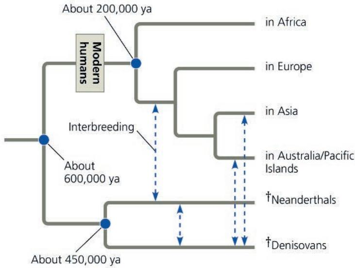

to interspecific gene flow. Some researchers have argued that evidence of gene flow can be found in fossils that show a mixture of human and Neanderthal characteristics. Recent analyses of the DNA sequence of the Neanderthal genome indicated that limited gene flow did occur between the two species. In 2015, the most extensive evidence yet of such gene flow was reported: DNA extracted from the fossil of a human jawbone was found to contain long stretches of Neanderthal DNA (Figure 34.52a). In fact, the

Figure 34.52 Fossil evidence of interbreeding among hominin species.

(a) This jawbone belonged to a human who lived 40,000 years ago and had a relatively recent Neanderthal ancestor. (b) This bone fragment came from a female whose parents were a Neanderthal female and a Denisovan male.

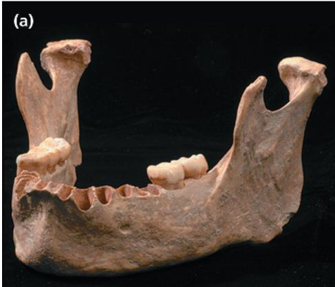

(b)  
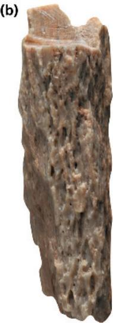

amount of Neanderthal DNA in this fossil indicated that this individual's great-great-great-grandparent was a Neanderthal.

Other recent genomic studies have shown that gene flow also occurred between Neanderthals and the Denisovans. In 2018, for example, DNA analyses revealed that the 90,000-year-old bone fragment shown in Figure 34.52b came from a female whose parents were a Neanderthal female and a Denisovan male—a remarkable discovery documenting the direct offspring of two different species of hominins. Genomic analyses also indicate that gene flow occurred between the Denisovans and our own species, H. sapiens.

## Homo sapiens

Evidence from fossils, archaeology, and DNA studies has improved our understanding about how our own species, Homo sapiens, emerged and spread around the world.

Fossil evidence indicates that the ancestors of humans originated in Africa. Older species gave rise to later species, ultimately including H. sapiens. A 2017 study indicates that by 315,000 years ago, some hominin populations in Morocco had facial features like those of our species, while the back of the skull remained elongated, as in earlier species. The oldest known fossils of our species include specimens from Ethiopia that are 195,000 and 160,000 years old (Figure 34.53). These early humans had less pronounced browridges than those found in

Figure 34.53 A
160,000-year-old-fossil of Homo sapiens.

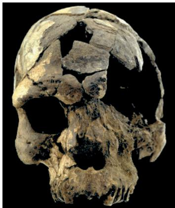

H. erectus and Neanderthals, and they were more slender than other recent hominins. The Ethiopian fossils support inferences about the origin of humans from molecular evidence. DNA analyses show that Europeans and Asians share a relatively recent common ancestor and that many African lineages branched off earlier on the human family tree. These findings suggest that all living humans have ancestors that originated as H. sapiens in Africa.

The oldest fossils of H. sapiens outside Africa are from the Middle East and date back about 180,000 years. Fossil evidence and genetic analyses suggest that humans spread beyond Africa in one or more waves, first into Asia and then to Europe and Australia. The date of the first arrival of humans in the Americas is uncertain. Recent archaeological discoveries—including 22,000-year-old human footprints found at White Sands National Park in New Mexico—indicate that humans had reached the Americas by about 25,000 years ago. However, other scientists are skeptical of these findings and put that date at 16,000 years ago.

New findings continually update our understanding of the human evolutionary lineage. For example, in 2015, the human family gained a new member, Homo naledi. The structure of its foot indicates that H. naledi was fully bipedal, and the shape of its hand suggests that H. naledi had fine motor skills (Figure 34.54), as in H. sapiens, Neanderthals, and other species that used tools extensively. But

<!-- END OFFICIAL MINERU API RESULT part_08 -->

<!-- BEGIN OFFICIAL MINERU API RESULT part_09 -->

Figure 34.54 Fossils of hand bones and foot bones (top and side views) of Homo naledi.

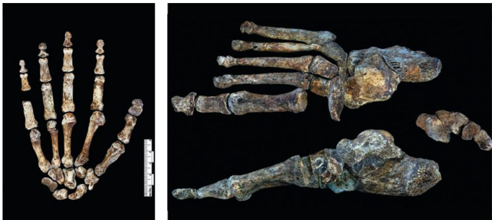

H. naledi also had a small brain, a broadly flared upper pelvis, and other features that have led researchers to conclude that it was an early member of our genus.

As an early member of our genus, it is likely that H. naledi originated more than 1.5 million years ago—yet initial estimates of the age of the H. naledi fossils ranged from 3 million years old to just 100,000 years old. Scientists didn’t know how old the fossils are because they were found on the floor of a deep cave, not encased in rocks that could be dated using radioactive isotopes. In 2017, however, teeth from a newly discovered H. naledi skull were dated using radioactive isotopes and found to be 300,000 years old. Overall, fossil evidence suggests that H. naledi arose 1–2 million years ago (like other early members of our genus) and then persisted almost until the present. The evolutionary relationships between H. naledi and other species in the Homo genus is not clear.

About ten years before the discovery of H. naledi, researchers reported another astonishing find: skeletal remains of adult hominins dating from 100,000 to 60,000 years ago and representing a previously unknown species, Homo floresiensis. First discovered in a limestone cave on the Indonesian island of Flores, the individuals were much shorter and had a much smaller brain volume than H. sapiens—more similar, in fact, to an australopith. The researchers who discovered these fossils argue that certain features of the skeletons, such as the shape of the teeth and the thickness and proportions of the skull, suggest that H. floresiensis descended from the larger H. erectus. Not convinced, some researchers have argued that the fossils represent small H. sapiens individuals with a disorder such as Down syndrome or microcephaly (a condition in which a person has a deformed, miniature brain).

Over the past few years, most studies have supported the designation of H. floresiensis as a new hominin. One such study found that the wrist bones of the Flores fossils are similar in shape to those of nonhuman apes and early hominins, but different from those of Neanderthals and H. sapiens. These researchers concluded that the Flores fossils represent a species whose lineage branched off before the origin of the clade that includes Neanderthals and humans. A different study comparing the foot bones of the Flores fossils with those of other hominins also concluded that H. floresiensis arose before H. sapiens. Finally, in 2016, H. floresiensis-like fossils dating to 700,000 years ago were discovered at a second location on Flores—again indicating that the H. floresiensis lineage branched off long before the origin of H. sapiens. Open questions

that may yet be answered by new discoveries include how H. floresiensis originated and whether it survived long enough to encounter H. sapiens, which was living in Indonesia by 50,000 years ago.

The rapid expansion of our species may have been spurred by changes in human cognition as H. sapiens evolved in Africa. Evidence of sophisticated thought in H. sapiens includes the recent discovery in South Africa of 77,000-year-old art—geometric markings made on pieces of ochre (Figure 34.55). Similarly, archaeologists working in southern and eastern Africa recently found 75,000-year-old ostrich eggs and snail shells with holes neatly drilled through them. By 30,000 years ago, humans were producing spectacular cave paintings.

While these developments can help us understand the spread of H. sapiens, it is not clear whether they played a role in the extinction of other hominins. Neanderthals, for example, also made complex tools and showed a capacity for symbolic thought. As a result, while some scientists have suggested that Neanderthals were driven to extinction by competition with H. sapiens, others question that idea.

Our discussion of humans brings this unit on biological diversity to an end. But keep in mind that our sequence of topics isn't meant to imply that life consists of a ladder leading from lowly microorganisms to lofty humanity. Biological diversity is the product of branching phylogeny, not ladderlike “progress.” The fact that there are almost as many species of ray-finned fishes alive today as in all other vertebrate groups combined shows that our finned relatives are not outmoded underachievers that failed to leave the water. The tetrapods—amphibians, reptiles, and mammals—are derived from one lineage of lobe-finned vertebrates. As tetrapods diversified on land, fishes continued their branching evolution in the greatest portion of the biosphere’s volume. Similarly, the ubiquity of diverse prokaryotes throughout the biosphere today is a reminder of the enduring ability of these relatively simple organisms to keep up with the times through adaptive evolution. Biology exalts life’s diversity, past and present.

## Figure 34.55 Art, a human hallmark.

The engravings on this 77,000-year-old piece of ochre, discovered in South Africa's Blombos Cave, are among the earliest signs of symbolic thought in humans.

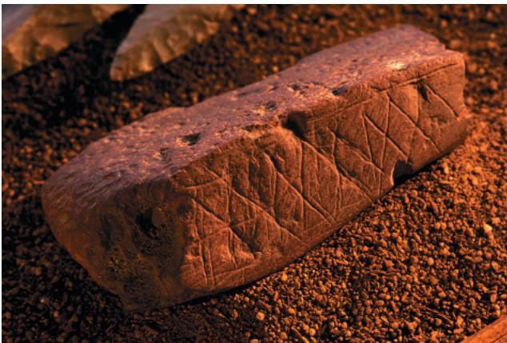

## Concept Check 34.7

1. Identify some characters that distinguish hominins from other apes.

2. Provide an example in which different features of organisms in the hominin evolutionary lineage evolved at different rates.

3. WHAT IF? Some genetic studies suggest that the most recent common ancestor of Homo sapiens that lived outside of Africa left Africa about 50,000 years ago. Compare this date with the dates of fossils given in the text. Can both the genetic results and the dates ascribed to the fossils be correct? Explain.

For suggested answers, see Appendix A.

## Chapter 34 Review

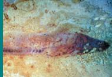

## Summary of Key Concepts

To review key terms, go to the Vocabulary Self-Quiz (eTextbook only).

<table><tr><td colspan="5">Key Concept</td><td>Clade</td><td>Description</td></tr><tr><td rowspan="2">CONCEPT 34.1Chordates have a notochord and a dorsal, hollow nerve cord?Describe likely features of the common ancestor of chordates. Explain your answer.</td><td rowspan="2">Chordates: notochord; dorsal, hollow nerve cord; pharyngeal slits; post-anal tail</td><td rowspan="2" colspan="3"></td><td>Cephalochordata(lancelets)</td><td>Earliest-diverging chordates; marine suspension feeders that exhibit four key derived characters of chordates</td></tr><tr><td>Urochordata(tunicates)</td><td>Marine suspension feeders; larvae display the derived traits of chordates</td></tr><tr><td>CONCEPT 34.2Vertebrates are chordates that have a backbone?Identify the shared features of early fossil vertebrates.</td><td>Chordates: notochord; dorsal, hollow nerve cord; pharyngeal slits; post-anal tail</td><td>Cyclostomes: jawless vertebrates</td><td colspan="2"></td><td>Myxini (hagfishes) and Petromyzontida (lampreys)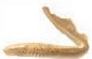</td><td>Jawless aquatic vertebrates with reduced vertebrae; hagfishes have a head with a skull and brain, eyes, and other sensory organs; some lampreys feed by attaching to a live fish and ingesting its blood</td></tr><tr><td rowspan="4">CONCEPT 34.3Gnathostomes are vertebrates that have jaws?How would the appearance of organisms with jaws have altered ecological interactions? Provide supporting evidence.</td><td rowspan="4">Chordates: notochord; dorsal, hollow nerve cord; pharyngeal slits; post-anal tail</td><td rowspan="4">Vertebrates: Hox genes duplication, backbone of vertebrae</td><td rowspan="4">Cyclostomes: jawless vertebrates</td><td rowspan="4"></td><td>Chondrichthyes (sharks, rays,skates,ratfishes)</td><td>Aquatic gnathostomes; have a cartilaginous skeleton, a derived trait formed by the reduction of an ancestral mineralized skeleton</td></tr><tr><td>Actinopterygi (ray-finned fishes)</td><td>Aquatic gnathostomes; have a bony skeleton and maneuverable fins supported by rays</td></tr><tr><td>Actinistia (coelacanths)</td><td>Ancient lineage of aquatic lobe-fins still surviving in Indian Ocean</td></tr><tr><td>Dipnoi (lungfishes)</td><td>Freshwater lobe-fins with both lungs and gills; sister group of tetrapods</td></tr><tr><td>CONCEPT 34.4Tetrapods are gnathostomes that have four limbs?Which features of amphibians restrict most species to living in aquatic or moist terrestrial habitats?</td><td></td><td>Gnathostomes: hinged jaws, four sets of Hox genes</td><td>Osteichthyans: bony skeleton</td><td>Lobe-fins: muscular fins or limbs</td><td>Amphibia (salamanders,frogs, caecilians)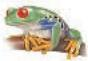</td><td>Have four limbs descended from modified fins; most have moist skin that functions in gas exchange; many live both in water (as larvae) and on land (as adults)</td></tr><tr><td>CONCEPT 34.5Amniotes are tetrapods that have a terrestrially adapted egg?Explain why birds are considered reptiles.</td><td></td><td></td><td>Osteichthyans: bony skeleton</td><td>Tetrapods: four limbs, neck, fused pelvic girdle</td><td>Reptilia (tuataras,lizards and snakes,turtles, crocodilians,birds)</td><td>One of two groups of living amniotes; have amniotic eggs and rib cage ventilation, key adaptations for life on land</td></tr><tr><td>CONCEPT 34.6Mammals are amniotes that have hair and produce milk?Describe the origin and early evolution of mammals.</td><td></td><td></td><td>Tetrapods: four limbs, neck, fused pelvic girdle</td><td>Amniotes: amniotic egg, rib cage ventilation</td><td>Mammalia (monotrem marsupials,eutherians)</td><td>Evolved from synapsid ancestors; include egg-laying monotremes (echidnas, platypus); pouched marsupials (such as kangaroos, opossums); and eutherians (placental mammals, such as rodents, primates)</td></tr></table>

## Concept 34.7: Humans are mammals that have a large brain and bipedal locomotion

\- Derived characters of humans include bipedalism and a larger brain and reduced jaw compared with other apes.

\- Hominins—humans and species that are more closely related to humans than to chimpanzees—originated in Africa 7–8 million years ago. Early hominins had a small brain but probably walked upright.

\- The oldest evidence of tool use is 2.5 million years old.

\- Homo ergaster was the first fully bipedal, large-brained hominin. Homo erectus was the first hominin to leave Africa.

\- Neanderthals lived in Europe and the Near East from about 350,000 to 28,000 years ago.

\- Homo sapiens originated in Africa about 195,000 years ago and began to spread to other continents about 180,000 years ago.

Based on fossil evidence, summarize how key hominin features have changed over time.

For suggested answers, see Appendix A.

## Test Your Understanding

For more multiple-choice questions, go to the Practice Test (eTextbook only).

## Levels 1-2: Remembering/Understanding

1. Vertebrates and tunicates share
(A) jaws adapted for feeding.
(B) a high degree of cephalization.
(C) an endoskeleton that includes a skull.
(D) a notochord and a dorsal, hollow nerve cord.

2. Living vertebrates can be divided into two major clades. Select the appropriate pair.
(A) the chordates and the tetrapods
(B) the urochordates and the cephalochordates
(C) the cyclostomes and the gnathostomes
(D) the marsupials and the eutherians

3. Unlike eutherians, both monotremes and marsupials
(A) lack nipples.
(B) have some embryonic development outside the uterus.
(C) lay eggs.
(D) are found in Australia and Africa.

4. In Figure 34.25, which of the following is the sister taxon to the archosaurs?
(A) synapsids (C) turtles
(B) crocodilians (D) lepidosaurs

5. As hominins diverged from other primates, which of the following appeared first?
(A) reduced jawbones (C) the making of stone tools
(B) an enlarged brain (D) bipedal locomotion

## Levels 3-4: Applying/Analyzing

6. Which of the following could be considered the most recent common ancestor of living tetrapods?

(A) a sturdy-finned, shallow-water lobe-fin whose appendages had skeletal supports similar to those of terrestrial vertebrates

(B) an armored, jawed placoderm with two pairs of appendages

(C) an early ray-finned fish that developed bony skeletal supports in its paired fins

(D) a salamander that had legs supported by a bony skeleton but moved with the side-to-side bending typical of fishes

7. EVOLUTION CONNECTION Living members of a vertebrate lineage can be very different from early members of the lineage, and evolutionary reversals (character losses) are common. Give examples that illustrate these observations, and explain their evolutionary causes.

## Levels 5-6: Evaluating/Creating

8. SCIENTIFIC INQUIRY • DRAW IT As a consequence of size alone, larger organisms tend to have larger brains than smaller organisms. However, some organisms have brains that are considerably larger than expected for their size. There are high energetic costs associated with the development and maintenance of brains that are large relative to body size.

(a) The fossil record documents trends in which brains that are large relative to body size evolved in certain lineages, including hominins. In such lineages, what can you infer about the costs and benefits of large brains?

(b) Hypothesize how natural selection might favor the evolution of large brains despite their high maintenance costs.

(c) Data for 14 bird species are listed below. Graph the data, placing deviation from expected brain size on the x-axis and mortality rate on the y-axis. What can you conclude about the relationship between brain size and mortality?

<table><tr><td>Deviation from Expected Brain Size*</td><td>-2.4</td><td>-2.1</td><td>-2.0</td><td>-1.8</td><td>-1.0</td><td>0.0</td><td>0.3</td><td>0.7</td><td>1.2</td><td>1.3</td><td>2.0</td><td>2.3</td><td>3.0</td><td>3.2</td></tr><tr><td>Mortality Rate</td><td>0.9</td><td>0.7</td><td>0.5</td><td>0.9</td><td>0.4</td><td>0.7</td><td>0.8</td><td>0.4</td><td>0.8</td><td>0.3</td><td>0.6</td><td>0.6</td><td>0.3</td><td>0.6</td></tr></table>

Data from D. Sol et al., Big-brained birds survive better in nature, Proceedings of the Royal Society B 274:763–769 (2007).  
\*Values < 0 indicate brain sizes smaller than expected; values > 0 indicate sizes larger than expected.

9. WRITE ABOUT A THEME: ORGANIZATION Early tetrapods had a sprawling gait (like that of a lizard): As the right front foot moved forward, the body twisted to the left and the left rib cage and lung were compressed; the reverse occurred with the next step. Normal breathing, in which both lungs expand equally with each breath, was hindered during walking and prevented during running. In a short essay (100–150 words), explain how the origin of organisms such as dinosaurs, whose gait allowed them to move without compressing their lungs, could have led to emergent properties.

## 10. SYNTHESIZE YOUR KNOWLEDGE

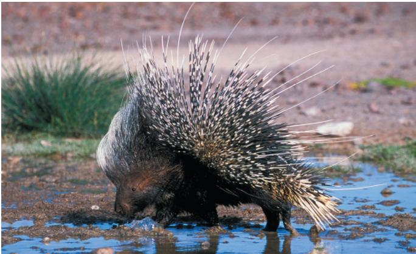  
This animal is a vertebrate with hair. What can you infer about its phylogeny? Identify as many key derived characters as you can that distinguish this animal from invertebrate chordates.
For selected answers, see Appendix A.

# Unit 6 Plant Form and Function

An Interview with Ernesto Gianoli

Dr. Ernesto Gianoli was born in Lima, Perú. He obtained a BS in Biology at Universidad Cayetano Heredia in Lima, an MS in Ecology at Universidad de Chile, and a PhD in Entomology at the Swedish University of Agricultural Sciences. After a 25-year academic career in Chile, he was appointed full professor in the Department of Biological Sciences at Tarleton State University, Texas. Most of his recent research concerns the ecology of plants. In 2014, he discovered an astounding case of leaf mimicry by Boquila trifoliolata, a vine that grows in the temperate rainforest of southern Chile. Boquila leaves have the unique and as yet unexplained ability to mimic many characteristics of the host plants on which they grow, including shape, color, leaf orientation, petiole length, and vein conspicuousness.

## How did you become interested in biology, and in plants in particular?

When I was about 12, I read a magazine article about evolution and Darwin's explorations of the Galápagos Islands. The idea that great scientific discoveries could be made just by observing nature closely, as Darwin had done, filled me with excitement. It was then that I decided that I wanted to study nature. Eventually, after being trained as an ecologist and studying plant-insect interactions, I became more and more intrigued by the faculties of plants. Some people view plants as "lesser" beings, but plants do amazing things even without a brain. It's incredible how much they can achieve without being able to move or communicate in the ways that animals do.

## How did you discover Boquila's "chameleon-like" properties?

My research team and I travelled to a beautiful national park to collect data on the distribution of climbing plant species across the light gradient in the forest. Field trips like these are not for those who like to lounge—almost every minute of daylight is devoted to collecting data. After several long, intense days of work, I needed a break, and so I went for a meditative walk

in the serene forest, observing plants along the path. Suddenly, I came across what I interpreted initially to be a very unusual specimen of a myrtle-like plant known locally as arrayán (Luma apiculate). Although the leaves of this particular specimen looked like arrayán, its stems were unusually thin. I thought, "Oh, this is strange. Why are these stems so different?" And then, on closer inspection, I realized that this plant was in fact a specimen of Boquila that was mimicking the appearance of arrayán! But of course, this finding needed to be verified. So, I looked for more Boquila, and I found the same phenomenon in about three quarters of the cases. I realized then that my aspirations as a 12-year-old boy had been fulfilled: I had made an important discovery.

## What advantages does Boquila gain by this form of mimicry?

Boquila is a climbing plant. When it is not climbing, or if it is climbing a leafless host trunk, its leaves have their normal default appearance. However, when it grows on a host plant that is bearing leaves, Boquila's leaves mimic those of the host plant. By comparing the respective amount of herbivore damage evident in the normal-looking leaves of Boquila climbing a leafless trunk versus the mimicry-altered leaves of Boquila climbing a host trunk in full leaf, we found that the normal-looking leaves had greater amounts of herbivore damage. Thus, mimicry in this case appears to be an anti-herbivory mechanism. We do not know how mimicry occurs in Boquila, but it does not require direct contact with the host: This suggests some sort of airborne communication between the host and Boquila. Boquila may be able to identify the presence of the host plants either by way of volatile organic

  
Dr. Ernesto Gianoli

When an individual Boquila vine (labeled B in the photos) traverses the canopies of various host plants (labeled H), it mimics each of them in their respective areas. (a) The “standard” appearance of Boquila’s leaves when there are no hosts nearby. (b) A Boquila vine mimicking a host plant (Fuchsia magellanica) with light green leaves. (c) A Boquila vine produced leaves 10 times longer than usual when growing in the vicinity of the long-leaved species Aextoxicon punctatum. (d) The same Boquila plant produced leaves that were darker and thicker when growing in proximity to Rhaphithamnus spinosus.

compounds released by the host or by the airborne spread of species-specific microbes inhabiting the host plant. We are currently testing the latter hypothesis.

## What is your advice to an undergraduate considering a career in biology?

Passion and determination provide the fuel needed for young biologists to travel successfully down the long, winding, and branching road ahead of them. There will inevitably be many roadblocks and obstacles along the way, even from loved ones. My well-meaning parents, for example, tried to steer me away from a career studying nature, and towards a career in medicine. Aspiring biologists should follow their own path within science. Observing nature comes first, then questions and hypotheses relating to those observations, and finally what techniques should be used to test those hypotheses.

Passion and determination provide the fuel needed for young biologists to travel successfully down the long, winding, and branching road ahead of them.

