# 第36章 Resource Acquisition and Transport in Vascular Plants

<!-- 章节边界按正文内容恢复；原始 MinerU 内容保留如下。 -->

# Resource Acquisition and Transport in Vascular Plants

## Key Concepts

36.1 Adaptations for acquiring resources were key steps in the evolution of vascular plants

36.2 Different mechanisms transport substances over short or long distances

36.3 Transpiration drives the transport of water and minerals from roots to shoots via the xylem

36.4 The rate of transpiration is regulated by stomata

36.5 Sugars are transported from sources to sinks via the phloem

36.6 The symplast is highly dynamic

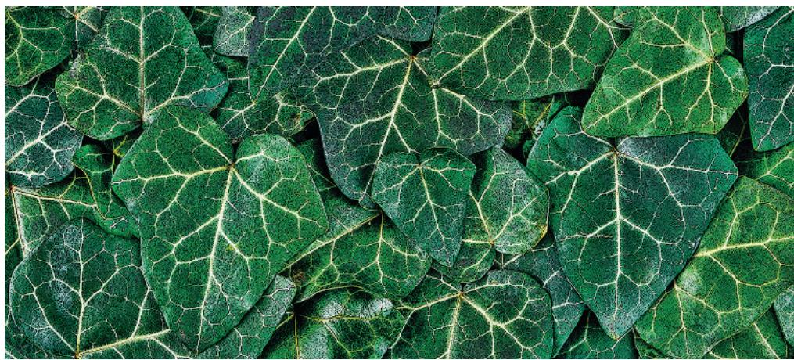  
Figure 36.1 This English ivy has covered every square centimeter of a wall with foliage, an effective way to acquire light energy for photosynthesis. The sugars produced by the leaves and the water and minerals absorbed by the roots have to be transported throughout the plant.

## Study Tip

Make a flowchart: Make a simple flowchart of the movement of water molecules from the soil through the tissues of a plant to the outside air.

Water in soil

is absorbed by

Root hairs

## What causes the movement of water, minerals, and sugars in most vascular plants?

Water and minerals are pulled up from the roots by negative pressure (tension) generated by evaporation from the leaves.

Sugars are pushed by positive pressure from where they are produced or stored to where they are needed. They can move both ways between leaves and roots.

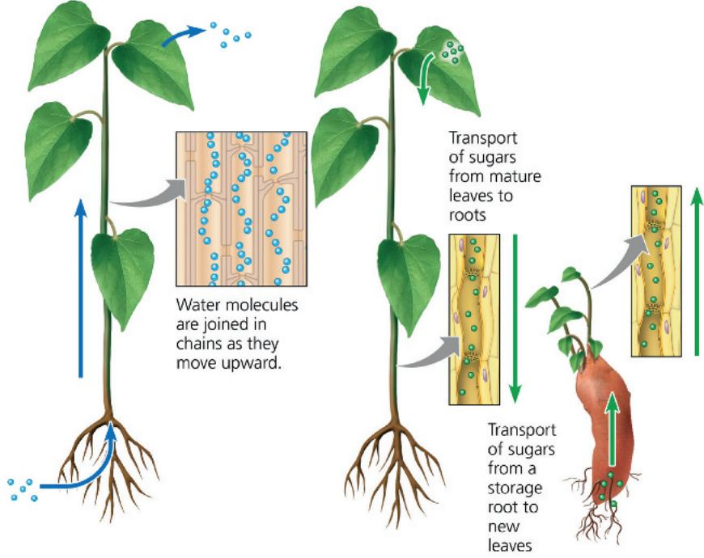

## Concept 36.1: Adaptations for acquiring resources were key steps in the evolution of vascular plants

EVOLUTION Most plants grow in soil and therefore inhabit two worlds—above ground, where shoots acquire sunlight and $CO_{2}$ , and below ground, where roots acquire water and mineral nutrients. The successful colonization of the land by plants depended on adaptations that allowed early plants to acquire resources from these two different settings.

The algal ancestors of plants absorbed water, minerals, and $CO_{2}$ directly from the water in which they lived. Transport in these algae was relatively simple because every cell was close to the source of these substances. The earliest plants were nonvascular and produced photosynthetic shoots above the shallow fresh water in which they lived. These leafless shoots typically had waxy cuticles and few stomata, which allowed them to avoid excessive water loss while still permitting some exchange of $CO_{2}$ and $O_{2}$ for photosynthesis. The anchoring and absorbing functions of early plants were assumed by the base of the stem or by threadlike rhizoids (see Figure 29.16).

As plants evolved and increased in number, competition for light, water, and minerals intensified. Taller plants with broad, flat appendages had an advantage in absorbing light. This increase in surface area, however, resulted in more evaporation and therefore a greater need for water. Larger shoots also required stronger anchorage. These needs favored the production of multicellular, branching roots. Meanwhile, as greater shoot heights further separated the top of the photosynthetic shoot from the nonphotosynthetic parts below ground, natural selection favored plants capable of efficient long-distance transport of water, minerals, and products of photosynthesis.

The evolution of vascular tissue consisting of xylem and phloem made possible the development of extensive root and shoot systems that carry out long-distance transport (see Figure 35.10). The xylem transports water and minerals from roots to shoots. The phloem transports products of photosynthesis from where they are made or stored to where they are needed. Figure 36.2 provides an overview of resource acquisition and transport in an actively photosynthesizing plant.

## Shoot Architecture and Light Capture

Because most plants are photoautotrophs, their success depends ultimately on their ability to photosynthesize. Over the course of evolution, plants have developed a wide variety of shoot

Figure 36.2 An overview of resource acquisition and transport in a vascular plant during the day.  
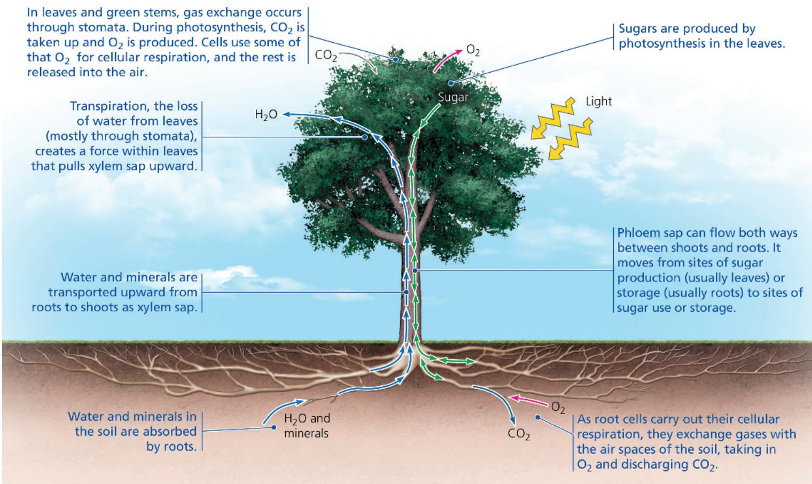  
MAKE CONNECTIONS How would you change the figure in order to show gas exchanges at night? (See Figure 10.22.)
For suggested answer, see Appendix A.

Would a higher leaf area index always increase the amount of photosynthesis? Explain. For suggested answer, see Appendix A.

architectures that enable each species to compete successfully for light absorption in the ecological niche it occupies. For example, the lengths and widths of stems, as well as the branching pattern of shoots, are all architectural features affecting light capture.

Stems serve as supporting structures for leaves and as conduits for the transport of water and nutrients. Plants that grow tall avoid shading from neighboring plants. Most tall plants require thick stems, which enable greater vascular flow to and from the leaves and stronger mechanical support for them. Vines are an exception, relying on other objects (usually other plants) to support their stems. In woody plants, stems become thicker through secondary growth (see Figure 35.11). Branching generally enables plants to harvest sunlight for photosynthesis more effectively. However, some species, such as the coconut palm, do not branch at all. Why is there so much variation in branching patterns? Plants have only a finite amount of energy to devote to shoot growth. If most of that energy goes into branching, there is less available for growing tall, and the risk of being shaded by taller plants increases. Conversely, if most of the energy goes into growing tall, the plants are not optimally harvesting sunlight.

Leaf size and structure account for much of the outward diversity in plant form. Leaves range in length from 1.3 mm in the pygmyweed (Crassula connata), a native of dry, sandy regions in the western United States, to 20 m in the palm Raphia regalis, a native of African rain forests. These species represent extreme examples of a general correlation observed between water availability and leaf size. The largest leaves are typically found in species from tropical rain forests, whereas the smallest are usually found in species from dry or very cold environments, where liquid water is scarce and evaporative loss is more problematic.

The arrangement of leaves on a stem, known as phyllotaxy, is an architectural feature important in light capture. Phyllotaxy is determined by the shoot apical meristem (see Figure 35.16) and is specific to each species (Figure 36.3). A species may have one leaf per node (alternate, or spiral, phyllotaxy), two leaves per node (opposite phyllotaxy), or more (whorled phyllotaxy). Most angiosperms have alternate phyllotaxy, with leaves arranged in an ascending spiral around the stem, each successive leaf emerging about $137.5^{\circ}$ from the site of the previous one. Why $137.5^{\circ}$ ? One hypothesis is that this angle minimizes shading of the lower leaves by those above. In environments where intense sunlight can harm leaves, the greater shading provided by oppositely arranged leaves may be advantageous.

The total area of the leafy portions of all the plants in a community, from the top layer of vegetation to the bottom layer, affects the productivity of each plant. When there are many layers of vegetation, the shading of the lower leaves is so great that they photosynthesize less than they respire. When this happens, the nonproductive leaves or branches undergo programmed cell death and are eventually shed, a process called self-pruning.

Plant features that reduce self-shading increase light capture. A useful measurement in this regard is the leaf area index, the ratio of the total upper leaf surface of a single plant or an entire crop divided by the surface area of the land on which the plant or crop grows (Figure 36.4). Leaf area index values of up to 7 are common for many mature crops, and there is little agricultural benefit to leaf area indexes higher than this value. Adding more

Figure 36.3 Emerging phyllotaxy of Norway spruce.
This SEM, taken from above a shoot tip, shows the pattern of emergence of leaves. The leaves are numbered, with 1 being the youngest. (Some numbered leaves are not visible in the close-up.)  
  
VISUAL SKILLS With your finger, trace the progression of leaf emergence, moving from leaf number 29 to 28 and so on. What is the pattern? Based on this pattern of phyllotaxy, predict between which two developing leaf primordia the next primordium will emerge.
For suggested answer, see Appendix A.

Figure 36.4 Leaf area index.

The leaf area index of a single plant is the ratio of the total area of the top surfaces of the leaves to the area of ground covered by the plant, as shown in this illustration of two plants viewed from the top. With many layers of leaves, a leaf area index value can easily exceed 1.

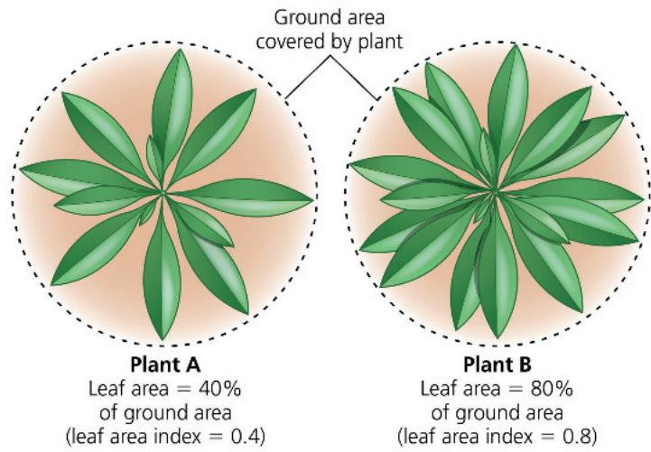

leaves increases shading of lower leaves to the point that self-pruning occurs.

Another factor affecting light capture is leaf orientation. Some plants have horizontally oriented leaves; others, such as grasses, have leaves that are vertically oriented. In low-light conditions, horizontal leaves capture sunlight much more effectively than vertical leaves. In grasslands or other sunny regions, however, horizontal orientation may expose upper leaves to overly intense light, injuring leaves and reducing photosynthesis. But if a plant's leaves are nearly vertical, light rays are essentially parallel to the leaf surfaces, so no leaf receives too much light, and light penetrates more deeply to the lower leaves.

## The Photosynthesis–Water Loss Compromise

The broad surface of most leaves favors light capture, while open stomatal pores allow for the diffusion of $CO_{2}$ into the photosynthetic tissues. Open stomatal pores, however, also promote evaporation of water from the plant. Over 90% of the water lost by plants is by evaporation from stomatal pores. Consequently, shoot adaptations represent compromises between enhancing photosynthesis and minimizing water loss, particularly in environments where water is scarce. Later in the chapter, we’ll discuss the mechanisms by which plants enhance $CO_{2}$ uptake and minimize water loss by regulating the opening of stomatal pores.

## Root Architecture and Acquisition of Water and Minerals

Just as carbon dioxide and sunlight are resources exploited by the shoot system, soil contains resources mined by the root system. Plants rapidly adjust the architecture and physiology of their roots to exploit patches of available mineral nutrients in the soil. The roots of many plants, for example, respond to pockets of low nitrate availability in soils by extending straight through the pockets instead of branching within them. Conversely, when encountering a pocket rich in nitrate, a root will often branch extensively there. Root cells also respond to high soil nitrate levels by synthesizing more proteins involved in nitrate transport and assimilation. Thus, not only does the plant devote more of its mass to exploiting a nitrate-rich patch, but the cells also absorb nitrate more efficiently.

The efficient absorption of limited nutrients is also enhanced by reduced competition within the root system. For example, cuttings taken from stolons of buffalo grass (Bouteloua dactyloides) develop fewer and shorter roots in the presence of cuttings from the same plant than they do in the presence of cuttings from another buffalo grass plant. Researchers are trying to uncover how the plant distinguishes self from nonself.

Plant roots also form mutually beneficial relationships with microorganisms that enable the plant to exploit soil resources more efficiently. For example, the evolution of mutualistic associations between roots and fungi called mycorrhizae was a critical step in the successful colonization of land by plants.

Mycorrhizal hyphae indirectly endow the root systems of many plants with an enormous surface area for absorbing water and minerals, particularly phosphate. The role of mycorrhizae in plant nutrition will be examined in Concept 37.3.

Once acquired, resources must be transported to other parts of the plant that need them. In the next section, we examine the processes and pathways that enable resources such as water, minerals, and sugars to be transported throughout the plant.

## Concept Check 36.1

1. Why is long-distance transport important for vascular plants?

2. Some plants can detect increased levels of light reflected from leaves of encroaching neighbors. This detection elicits stem elongation, production of erect leaves, and reduced lateral branching. How do these responses help the plant compete?

3. WHAT IF? If you prune a plant's shoot tips, what will be the short-term effect on the plant's branching and leaf area index?

For suggested answers, see Appendix A.

## Concept 36.2: Different mechanisms transport substances over short or long distances

Given the diversity of substances that move through plants and the great range of distances and barriers over which such substances must be transported, it is not surprising that plants employ a variety of transport processes. Before examining these processes, however, we'll look at the two major pathways of transport: the apoplast and the symplast.

## The Apoplast and Symplast: Transport Continuums

Plant tissues have two major compartments—the apoplast and the symplast. The apoplast consists of everything external to the plasma membranes of living cells and includes cell walls, extracellular spaces, and the interior of dead cells such as vessel elements and tracheids (see Figure 35.10). The symplast consists of the entire mass of cytosol of all the living cells in a plant, as well as the plasmodesmata, the cytoplasmic channels that interconnect them.

The compartmental structure of plants provides three routes for transport within a plant tissue or organ: the apoplastic, symplastic, and transmembrane routes (Figure 36.5). In the apoplastic route, water and solutes (dissolved chemicals) move along the continuum of cell walls and extracellular spaces. In the symplastic route, water and solutes move along the continuum of cytosol. This route requires substances to cross a

Figure 36.5 Cell compartments and routes for short-distance transport.
Some substances may use more than one transport route.

plasma membrane once, when they first enter the plant. After entering one cell, substances can move from cell to cell via plasmodesmata. In the transmembrane route, water and solutes move out of one cell, across the cell wall, and into the neighboring cell, which may pass them to the next cell in the same way. The transmembrane route requires repeated crossings of plasma membranes as substances exit one cell and enter the next. These three routes are not mutually exclusive, and some substances may use more than one route to varying degrees.

## Short-Distance Transport of Solutes Across Plasma Membranes

In plants, as in any organism, the selective permeability of the plasma membrane controls the short-distance movement of substances into and out of cells (see Concept 7.2). Both active and passive transport mechanisms occur in plants, and plant cell membranes are equipped with the same general types of pumps and transport proteins (channel proteins, carrier proteins, and cotransporters) that function in other cells. There are, however, specific differences between the membrane transport processes of plant and animal cells. In this section, we'll focus on some of those differences.

Unlike in animal cells, hydrogen ions ( $H^{+}$ ) rather than sodium ions ( $Na^{+}$ ) play the primary role in basic transport processes in plant cells. For example, in plant cells the membrane potential (the voltage across the membrane) is established mainly through the pumping of $H^{+}$ by proton pumps (Figure 36.6a) rather than the pumping of $Na^{+}$ by sodium-potassium pumps. Also, $H^{+}$ is most often cotransported in plants, whereas $Na^{+}$ is typically cotransported in animals. During cotransport, plant cells use the energy in the $H^{+}$ gradient and membrane potential to drive the active transport of many different solutes. For instance, cotransport with $H^{+}$ is responsible for absorption of neutral solutes, such as the sugar sucrose, by phloem cells and other plant cells. An $H^{+}/sucrose$ cotransporter couples movement of sucrose against its concentration gradient with movement of $H^{+}$ down its electrochemical gradient (Figure 36.6b). Cotransport with $H^{+}$ also facilitates movement of ions, as in the uptake of nitrate $\left(\mathrm{NO}_{3}^{-}\right)$ by root cells (Figure 36.6c).

The membranes of plant cells also have ion channels that allow only certain ions to pass (Figure 36.6d). As in animal cells, most channels are gated, opening or closing in response to stimuli such as chemicals, pressure, or voltage. Later in this chapter, we'll discuss how potassium ion channels in guard cells function in opening and closing stomata. Ion channels are also involved in producing electrical signals analogous to the action potentials of animals (see Concept 48.2). However, these signals are 1,000 times slower and employ $\mathrm{Ca^{2+}}$ -activated anion channels rather than the sodium ion channels used by animal cells.

## Short-Distance Transport of Water Across Plasma Membranes

The absorption or loss of water by a cell occurs by osmosis, the diffusion of free water—water that is not bound to solutes or surfaces—across a membrane (see Figure 7.12). The physical property that predicts the direction in which water will flow is called water potential, a quantity that includes the effects of solute concentration and physical pressure. Free water moves from regions of higher water potential to regions of lower water potential if there is no barrier to its flow. The word potential in the term water potential refers to water's potential energy—water's capacity to perform work when it moves from a region of higher water potential to a region of lower water potential. For example, if a plant cell or seed is immersed in a solution that has a higher water potential, water will move into the cell or seed, causing it to expand. The expansion of plant cells and seeds can be a powerful force: The expansion of cells in tree roots can break concrete sidewalks, and the swelling of wet grain seeds within the holds of damaged ships can produce catastrophic hull failure and sink the ships. Given the strong forces generated by swelling seeds, it is interesting to consider whether water uptake by seeds is an active process. This question is

Figure 36.6 Solute transport across plant cell plasma membranes.  
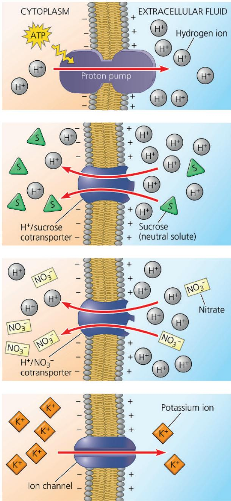  
Assume that a plant cell has all four of the plasma membrane transport proteins shown above and that you have a specific inhibitor for each protein. Predict the effect of each inhibitor on the cell's membrane potential. For suggested answer, see Appendix A.

(a) H $^{+}$ and membrane potential. The plasma membranes of plant cells use ATP-dependent proton pumps to pump H $^{+}$ out of the cell. These pumps contribute to the membrane potential and the establishment of a pH gradient across the membrane. These two forms of potential energy can drive the transport of solutes.

(b) $\mathrm{H^{+}}$ and cotransport of neutral solutes. Neutral solutes such as sugars can be loaded into plant cells by cotransport with $\mathrm{H^{+}}$ ions. $\mathrm{H^{+}}/$ sucrose cotransporters, for example, play a key role in loading sugar into the phloem prior to sugar transport throughout the plant.

(c) $\mathsf{H}^+$ and cotransport of ions. Cotransport mechanisms involving $\mathsf{H}^+$ also participate in regulating ion fluxes into and out of cells. For example, $\mathsf{H}^+ / \mathsf{NO}_3^-$ cotransporters in the plasma membranes of root cells are important for the uptake of $\mathsf{NO}_3^-$ by plant roots.

(d) Ion channels. Plant ion channels open and close in response to voltage, stretching of the membrane, and chemical factors. When open, ion channels allow specific ions to diffuse across membranes. For example, a $K^{+}$ ion channel is involved in the release of $K^{+}$ from guard cells when stomata close.

examined in the Scientific Skills Exercise, on the next page, which explores the effect of temperature on this process.

Water potential is abbreviated by the Greek letter $\Psi$ (psi, pronounced “sigh”). Plant biologists measure $\Psi$ in a unit of pressure called a megapascal (abbreviated MPa). By definition, the $\Psi$ of pure water in a container open to the atmosphere under standard conditions (at sea level and at room temperature) is 0 MPa. One MPa is equal to about 10 times atmospheric pressure at sea level. The internal pressure of a living plant cell due to the osmotic uptake of water is approximately 0.5 MPa, about twice the air pressure inside an inflated car tire.

## How Solutes and Pressure Affect Water Potential

Solute concentration and physical pressure are the major determinants of water potential in hydrated plants, as expressed in the water potential equation:

$$
\Psi = \Psi_ {\mathrm{S}} + \Psi_ {\mathrm{P}}
$$

where $\Psi$ is the water potential, $\Psi_{S}$ is the solute potential (osmotic potential), and $\Psi_{P}$ is the pressure potential. The solute potential ( $\Psi_{S}$ ) of a solution is directly proportional to its molarity. Solute potential is also called osmotic potential because solutes affect the direction of osmosis. The solutes in plants are typically mineral ions and sugars. By definition, the $\Psi_{S}$ of pure water is 0. When solutes are added, they bind water molecules. As a result, there are fewer free water molecules, reducing the capacity of the water to move and do work. In this way, an increase in solute concentration has a negative effect on water potential, which is why the $\Psi_{S}$ of a solution is always expressed as a negative number. For example, a 0.1 M solution of a sugar has a $\Psi_{S}$ of -0.23 MPa. As the solute concentration increases, $\Psi_{S}$ will become more negative.

Pressure potential ( $\Psi_{P}$ ) is the physical pressure on a solution. Unlike $\Psi_{S}$ , $\Psi_{P}$ can be positive or negative relative to atmospheric pressure. For example, when a solution is being withdrawn by a syringe, it is under negative pressure; when it is being expelled from a syringe, it is under positive pressure. The water in living cells is usually under positive pressure due to the osmotic uptake of water. Specifically, the protoplast (the living part of the cell, which also includes the

plasma membrane) presses against the cell wall, creating what is known as turgor pressure. This pushing effect of internal pressure, much like the air in an inflated tire, is critical for plant function because it helps maintain the stiffness of plant tissues and also serves as the driving force for cell elongation. Conversely, the water in the hollow nonliving xylem cells (tracheids and vessel elements) of a plant is often under a negative pressure potential (tension) of less than -2 MPa.

As you learn to apply the water potential equation, keep in mind the key point: Water moves from regions of higher water potential to regions of lower water potential.

# Scientific Skills Exercise Calculating and Interpreting Temperature Coefficients

Does the Initial Uptake of Water by Seeds Depend on Temperature? One way to answer this question is to soak seeds in water at different temperatures and measure the rate of water uptake at each temperature. The data can be used to calculate the temperature coefficient, $Q_{10}$ , the factor by which a physiological reaction (or process) rate increases when the temperature is raised by $10^{\circ}C$ :

$$
Q _ {1 0} = \left(\frac {k _ {2}}{k _ {1}}\right) ^ {\frac {1 0}{t _ {2} - t _ {1}}}
$$

where $t_{2}$ is the higher temperature ( $^{\circ}$ C), $t_{1}$ is the lower temperature, $k_{2}$ is the reaction (or process) rate at $t_{2}$ , and $k_{1}$ is the reaction (or process) rate at $t_{1}$ . (If $t_{2} - t_{1} = 10$ , as here, the math is simplified.)

$Q_{10}$ values may be used to make inferences about the physiological process under investigation. Chemical (metabolic) processes involving large-scale protein shape changes are highly dependent on temperature and have higher $Q_{10}$ values, closer to 2 or 3. In contrast, many, but not all, physical parameters are relatively independent of temperature and have $Q_{10}$ values closer to 1. For example, the $Q_{10}$ of the change in the viscosity of water is 1.2–1.3. In this exercise, you will calculate $Q_{10}$ using data from radish seeds (Raphanus sativum) to assess whether the initial uptake of water by seeds is more likely to be a physical or a chemical process.

How the Experiment Was Done Samples of radish seeds were weighed and placed in water at four different temperatures. After 30 minutes, the seeds were removed, blotted dry, and reweighed. The researchers then calculated the percent increase in mass due to water uptake for each sample.

## Water Movement Across Plant Cell Membranes

Now let's consider how water potential affects absorption and loss of water by a living plant cell. First, imagine a cell that is flaccid (limp) as a result of losing water. The cell has a $\Psi_{\mathrm{P}}$ of $0\mathrm{MPa}$ . Suppose this flaccid cell is bathed in a solution of higher solute concentration (more negative solute potential) than the cell itself (Figure 36.7a). Since the external solution has the lower (more negative) water potential, water diffuses out of the cell. The cell's protoplast undergoes plasmolysis—that is, it shrinks and pulls away from the cell wall. If we place the same flaccid cell in pure water ( $\Psi = 0\mathrm{MPa}$ ) (Figure 36.7b), the cell, because it contains solutes, has a lower water potential than the water, and water enters the cell by osmosis. The contents of the cell begin to swell and press the plasma membrane against the cell wall. The partially elastic wall, exerting turgor pressure, confines the pressurized protoplast. When this pressure is enough to offset the tendency for water to enter because of the solutes in the cell, then $\Psi_{\mathrm{P}}$ and $\Psi_{\mathrm{S}}$ are equal,

## Data from the Experiment

<table><tr><td>Temperature</td><td>% Increase in Mass Due to Water Uptake After 30 Minutes</td></tr><tr><td>5°C</td><td>18.5</td></tr><tr><td>15°C</td><td>26.0</td></tr><tr><td>25°C</td><td>31.0</td></tr><tr><td>35°C</td><td>36.2</td></tr></table>

Data from J. D. Murphy and D. L. Noland, Temperature effects on seed imbibition and leakage mediated by viscosity and membranes, Plant Physiology 69:428–431 (1982).

## INTERPRET THE DATA

1. Based on the data, does the initial uptake of water by radish seeds vary with temperature? What is the relationship between temperature and water uptake?

2. (a) Using the data for $35^{\circ}$ C and $25^{\circ}$ C, calculate $Q_{10}$ for water uptake by radish seeds. Repeat the calculation using the data for $25^{\circ}$ C and $15^{\circ}$ C and the data for $15^{\circ}$ C and $5^{\circ}$ C. (b) What is the average $Q_{10}$ ? (c) Do your results imply that the uptake of water by radish seeds is mainly a physical process or a chemical (metabolic) process? (d) Given that the $Q_{10}$ for the change in the viscosity of water is 1.2–1.3, could the slight temperature dependence of water uptake by seeds be a reflection of the slight temperature dependence of the viscosity of water?

3. Besides temperature, what other independent variables could you alter to test whether radish seed swelling is essentially a physical process or a chemical process?

4. Would you expect plant growth to have a $Q_{10}$ closer to 1 or 3? Why?

Instructors: A version of this Scientific Skills Exercise can be assigned in Mastering Biology.

and $\Psi = 0$ . This matches the water potential of the extracellular environment—in this example, 0 MPa. A dynamic equilibrium has been reached, and there is no further net movement of water.

In contrast to a flaccid cell, a walled cell with a greater solute concentration than its surroundings is turgid, or very firm. When turgid cells in a nonwoody tissue push against each other, the tissue is stiffened. The effects of turgor loss are seen during wilting, when leaves and stems droop as a result of cells losing water.

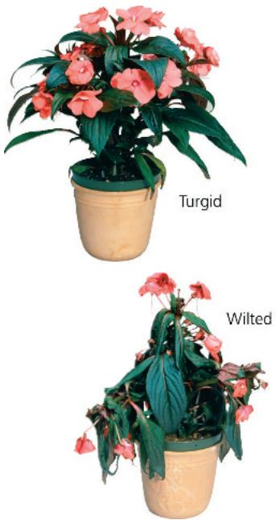

Figure 36.7 Water relations in plant cells.

In these experiments, flaccid cells (cells in which the protoplast contacts the cell wall but lacks turgor pressure) are placed in two environments. The blue arrows indicate initial net water movement.

  
(a) Initial conditions: cellular $\Psi > environmental \Psi$ . The protoplast loses water, and the cell plasmolyzes. After plasmolysis is complete, the water potentials of the cell and its surroundings are the same.  
(b) Initial conditions: cellular $\Psi < environmental \Psi$ . Net uptake of water by osmosis makes the cell turgid. When this tendency for water to enter is offset by the back pressure of the elastic wall, water potentials are equal for the cell and its surroundings.

## Aquaporins: Facilitating Diffusion of Water

A difference in water potential determines the direction of water movement across membranes, but how do water molecules actually cross the membranes? Water molecules are small enough to diffuse across the phospholipid bilayer, even though the bilayer's interior is hydrophobic. However, their movement across biological membranes is too rapid to be explained by unaided diffusion. Transport proteins called aquaporins (see Figure 7.10 and Concept 7.2) facilitate the transport of water molecules across plant cell plasma membranes. Aquaporin channels, which can open and close, affect the rate at which water moves osmotically across the membrane. Some aquaporins, for example, close in response to high $\mathrm{Ca^{2+}}$ or low pH in the cytosol.

## Long-Distance Transport: The Role of Bulk Flow

Diffusion is an effective transport mechanism over the spatial scales typically found at the cellular level. However, diffusion is much too slow to function in long-distance transport within a plant. Although diffusion from one end of a cell to the other takes just seconds, diffusion from the roots to the top of a giant redwood would take several centuries. Instead, long-distance transport occurs through bulk flow, the movement of liquid in response to a pressure gradient. The bulk flow of material always occurs from higher to lower pressure. Unlike osmosis, bulk flow is independent of solute concentration.

Long-distance bulk flow occurs within specialized cells in the vascular tissue, namely, the tracheids and vessel elements of the xylem and the sieve tube elements of the phloem. In leaves, the branching of veins ensures that no cell is more than a few cells away from the vascular tissue (Figure 36.8).

The structures of the conducting cells of the xylem and phloem facilitate bulk flow. Mature tracheids and vessel elements are dead cells and therefore have no cytoplasm, and the cytoplasm of sieve tube elements (also called sieve tube members) is almost devoid of organelles (see Figure 35.10). If you have dealt with a partially clogged drain, you know that the volume of flow depends on the pipe's diameter. Clogs reduce the effective diameter of the drainpipe. Such experiences help us understand how the structures of plant cells specialized for bulk flow fit their function. Like unclogging a drain, the absence or reduction of cytoplasm in a plant's "plumbing" facilitates bulk flow through the xylem and phloem. Bulk flow is also enhanced by the perforation plates at the ends of vessel elements and the porous sieve plates connecting sieve tube elements.

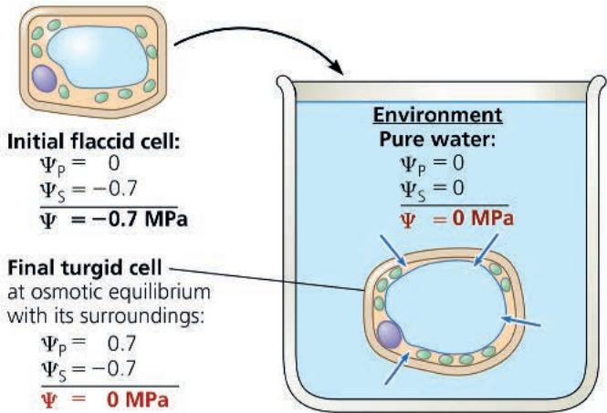

Diffusion, active transport, and bulk flow act in concert to transport resources throughout the whole plant. For example, bulk flow due to a pressure difference is the mechanism of long-distance transport of sugars in the phloem, but active transport of sugar at the cellular level maintains this pressure difference. In the next three sections, we'll examine in more detail the transport of water and minerals from roots to shoots, the control of evaporation, and the transport of sugars.

Figure 36.8 Venation in an aspen leaf.  
The finer and finer branching of leaf veins in eudicot leaves ensures that no leaf cell is far removed from the vascular system.  
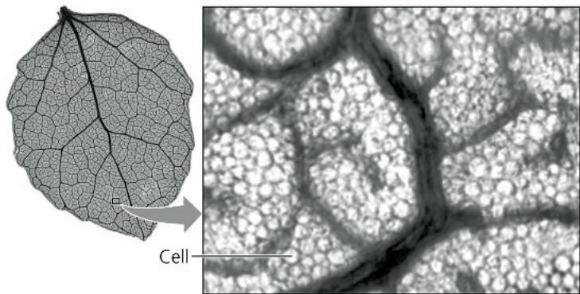  
VISUAL SKILLS In this leaf, what is the maximum number of cells any mesophyll cell is from a vein?
For suggested answer, see Appendix A.

## Concept Check 36.2

1. If a plant cell immersed in distilled water has a $\Psi_{\mathrm{S}}$ of $-0.7\mathrm{MPa}$ and a $\Psi$ of $0\mathrm{MPa}$ , what is the cell's $\Psi_{\mathrm{P}}$ ? If you put it in an open beaker of solution that has a $\Psi$ of $-0.4\mathrm{MPa}$ what would be its $\Psi_{\mathrm{P}}$ at equilibrium?

2. How would a reduction in the number of aquaporin channels affect a plant cell's ability to adjust to new osmotic conditions?

3. How would the long-distance transport of water be affected if tracheids and vessel elements were alive at maturity? Explain.

4. WHAT IF? What would happen if you put plant protoplasts in pure water? Explain.

For suggested answers, see Appendix A.

## Concept 36.3: Transpiration drives the transport of water and minerals from roots to shoots via the xylem

Picture yourself struggling to carry a 19-liter (5-gallon) container of water weighing 19 kilograms (42 pounds) up several flights of stairs. Now imagine doing this 40 times a day. Then, consider the fact that an average-sized tree, despite having neither heart nor muscle, transports a similar volume of water effortlessly on a daily basis. How do trees accomplish this feat? To answer this question, we'll follow each step in the journey of water and minerals from roots to leaves.

## Absorption of Water and Minerals by Root Cells

Although all living plant cells absorb nutrients across their plasma membranes, the cells near the tips of roots are particularly important because most of the absorption of water and minerals occurs there. In this region, the epidermal cells are permeable to water, and many are differentiated into root hairs, modified cells that account for much of the absorption of water by roots (see Figure 35.3). The root hairs absorb the soil solution, which consists of water molecules and dissolved mineral ions that are not bound tightly to soil particles. The soil solution is drawn into the hydrophilic walls of epidermal cells and passes freely along the cell walls and the extracellular spaces into the root cortex. This flow enhances the exposure of the cells of the cortex to the soil solution, providing a much greater membrane surface area for absorption than the surface area of the epidermis alone. Although the soil solution usually has a low mineral concentration, active transport enables roots to accumulate essential minerals, such as $K^{+}$ , to concentrations hundreds of times greater than in the soil.

## Transport of Water and Minerals into the Xylem

Water and minerals that pass from the soil into the root cortex cannot be transported to the rest of the plant until they enter the xylem of the vascular cylinder, or stele. The endodermis, the innermost layer of cells in the root cortex, functions as a last checkpoint for the selective passage of minerals from the cortex into the vascular cylinder (Figure 36.9). Minerals already in the symplast when they reach the endodermis continue through the plasmodesmata of endodermal cells and pass into the vascular cylinder. These minerals were already screened by the plasma membrane they had to cross to enter the symplast in the epidermis or cortex.

Minerals that reach the endodermis via the apoplast encounter a dead end that blocks their passage into the vascular cylinder. This barrier, located in the transverse and radial walls of each endodermal cell, is the Casparian strip, a belt made of suberin, a waxy material impervious to water and dissolved minerals (see Figure 36.9). Because of the Casparian strip, water and minerals cannot cross the endodermis and enter the vascular cylinder via the apoplast. Instead, water and minerals that are passively moving through the apoplast must cross the selectively permeable plasma membrane of an endodermal cell before they can enter the vascular cylinder. In this way, the endodermis transports needed minerals from the soil into the xylem and keeps many unneeded or toxic substances out. The endodermis also prevents solutes that have accumulated in the xylem from leaking back into the soil solution.

The last segment in the soil-to-xylem pathway is the passage of water and minerals into the tracheids and vessel elements of the xylem. These water-conducting cells lack protoplasts when mature and are therefore parts of the apoplast. Endodermal cells, as well as living cells within the vascular cylinder, discharge minerals from their protoplasts into their own cell walls. Both diffusion and active transport are involved in this transfer of solutes from the symplast to the apoplast, and the water and minerals can now enter the tracheids and vessel elements, where they are transported to the shoot system by bulk flow.

## Bulk Flow Transport via the Xylem

Water and minerals from the soil enter the plant through the epidermis of roots, cross the root cortex, and pass into the vascular cylinder. From there the xylem sap, the water and dissolved minerals in the xylem, is transported long distances by bulk flow to the veins that branch throughout each leaf. As noted earlier, bulk flow is much faster than diffusion or active transport. Peak velocities in the transport of xylem sap can range from 15 to 45 m/hr for trees with wide vessel elements. The stems and leaves depend on this rapid delivery system for their supply of water and minerals.

The process of transporting xylem sap involves the loss of an astonishing amount of water by transpiration, the loss of water vapor from leaves and other aerial parts of the plant. A single maize plant, for example, transpires 60 L of water (the equivalent of 170 12-ounce bottles) during a growing season. A maize crop growing at a typical density of 60,000 plants per hectare

Figure 36.9 Transport of water and minerals from root hairs to the xylem.

VISUAL SKILLS After studying the figure, explain how the Casparian strip forces water and minerals to pass through the plasma membranes of endodermal cells.

For suggested answer, see Appendix A.

1 Apoplastic route. Uptake of soil solution by the hydrophilic walls of root hairs provides access to the apoplast. Water and minerals can then diffuse into the cortex along this matrix of walls and extracellular spaces.

2 Symplastic route. Minerals and water that cross the plasma membranes of root hairs can enter the symplast.

3 Transmembrane route. As soil solution moves along the apoplast, some water and minerals are transported into the protoplasts of cells of the epidermis and cortex and then move inward via the symplast.

4 The endodermis: controlled entry to the vascular cylinder (stele). Within the transverse and radial walls of each endodermal cell is the Casparian strip, a belt of waxy material (purple band) that blocks the passage of water and dissolved minerals. Only minerals already in the symplast or entering that pathway by crossing the plasma membrane of an endodermal cell can detour around the Casparian strip and pass into the vascular cylinder (stele).

transpires almost 4 million L of water per hectare (about 400,000 gallons of water per acre) every growing season. If the transpired water is not replaced by water transported up from the roots, the leaves will wilt, and the plants will eventually die.

5 Transport in the xylem. Endodermal cells and also living cells within the vascular cylinder discharge water and minerals into their walls (apoplast). The xylem vessels then transport the water and minerals by bulk flow upward into the shoot system.

Xylem sap rises to heights of more than 120 m in the tallest trees. Is the sap mainly pushed upward from the roots, or is it mainly pulled upward? Let's evaluate the relative contributions of these two mechanisms.

sometimes causes more water to enter the leaves than is transpired, resulting in guttation, the exudation of water droplets that can be seen in the morning on the tips or edges of some plant leaves (Figure 36.10). Guttation fluid should not be confused with dew, which is condensed atmospheric moisture.

## Pushing Xylem Sap: Root Pressure

At night, when there is almost no transpiration, root cells continue actively pumping mineral ions into the xylem of the vascular cylinder. Meanwhile, the Casparian strip of the endodermis prevents the ions from leaking back out into the cortex and soil. The resulting accumulation of minerals lowers the water potential within the vascular cylinder. Water flows in from the root cortex, generating root pressure, a push of xylem sap. The root pressure

Figure 36.10
Guttation.

Root pressure is forcing excess water from this strawberry leaf.

In most plants, root pressure is a minor mechanism driving the ascent of xylem sap, pushing water only a few meters at most. The positive pressures produced are simply too weak to overcome the gravitational force of the water column in the xylem, particularly in tall plants. Many plants do not generate any root pressure or do so only during part of the growing season. Even in plants that display guttation, root pressure cannot keep pace with transpiration after sunrise. For the most part, xylem sap is not pushed from below by root pressure but is pulled up.

## Pulling Xylem Sap: The Cohesion-Tension Hypothesis

As we have seen, root pressure, which depends on the active transport of solutes by plants, is only a minor force in the ascent of xylem sap. Far from depending on the metabolic activity of cells, most of the xylem sap that rises through a tree does not even require living cells to do so. As demonstrated by Eduard Strasburger in 1891, leafy stems with their lower end immersed in toxic solutions of copper sulfate or acid will readily draw these poisons up if the stem is cut below the surface of the liquid. As the toxic solutions ascend, they kill all living cells in their path, eventually arriving in the transpiring leaves and killing the leaf cells as well. Nevertheless, as Strasburger noted, the uptake of the toxic solutions and the loss of water from the dead leaves can continue for weeks.

In 1894, a few years after Strasburger's findings, two Irish scientists, John Joly and Henry Dixon, put forward a hypothesis that remains the leading explanation of the ascent of xylem sap. According to their cohesion-tension hypothesis, transpiration provides the pull for the ascent of xylem sap, and the cohesion of water molecules transmits this pull along the entire length of the xylem from shoots to roots. Hence, xylem sap is normally under negative pressure, or tension. Since transpiration is a “pulling” process, our exploration of the rise of xylem sap by the cohesion-tension mechanism begins not with the roots but with the leaves, where the driving force for transpirational pull begins.

## Transpirational Pull

Stomata on a leaf's surface lead to a maze of internal air spaces that expose the mesophyll cells to the $\mathrm{CO}_{2}$ they need for photosynthesis. The air in these spaces is saturated with water vapor because it is in contact with the moist walls of the cells. On most days, the air outside the leaf is drier; that is, it has lower water potential than the air inside the leaf. Therefore, water vapor in the air spaces of a leaf diffuses down its water potential gradient and exits the leaf via the stomata. It is this loss of water vapor by diffusion and evaporation that we call transpiration.

But how does loss of water vapor from the leaf translate into a pulling force for upward movement of water through a plant? The negative pressure potential that causes water to move up through the xylem develops at the surface of mesophyll cell walls in the leaf (Figure 36.11). The cell wall acts like a very thin capillary network. Water adheres to the cellulose microfibrils and other hydrophilic components of the cell wall. As water evaporates from the water film that covers the cell walls of mesophyll cells, the air-water interface retreats farther into the cell wall. Because of the high surface tension of water, the curvature of the interface induces a tension, or negative pressure potential, in the water. As more water evaporates from the cell wall, the curvature of the air-water interface increases and the pressure of the water

Figure 36.11 Generation of transpirational pull.

Negative pressure (tension) at the air-water interface in the leaf is the basis of transpirational pull, which draws water out of the xylem.

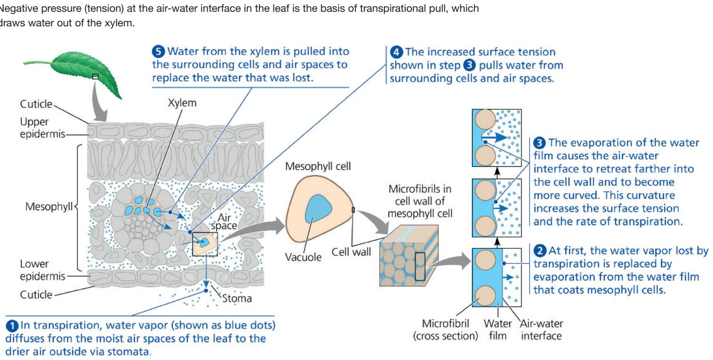

## Figure 36.12 Ascent of xylem sap.

Hydrogen bonding forms an unbroken chain of water molecules extending from leaves to the soil. The force driving the ascent of xylem sap is a gradient of water potential ( $\Psi$ ). For bulk flow over long distance, the $\Psi$ gradient is due mainly to a gradient of the pressure potential ( $\Psi_{P}$ ). Transpiration results in the $\Psi_{P}$ at the leaf end of the xylem being lower than the $\Psi_{P}$ at the root end. The $\Psi$ values shown at the left are a “snapshot.” They may vary during daylight, but the direction of the $\Psi$ gradient remains the same.

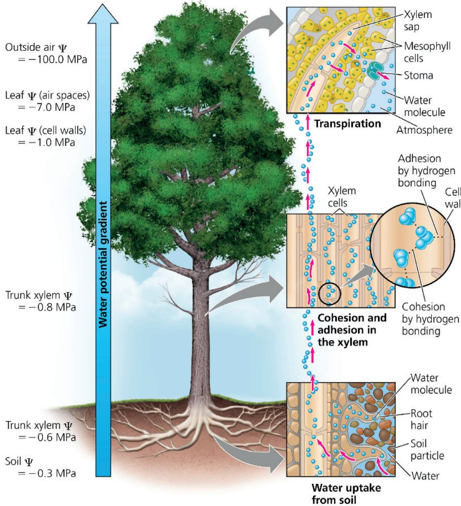

becomes more negative. Water molecules from the more hydrated parts of the leaf are then pulled toward this area, reducing the tension. These pulling forces are transferred to the xylem because each water molecule is cohesively bound to the next by hydrogen bonds. Thus, transpirational pull depends on several of the properties of water discussed in Concept 3.2: adhesion, cohesion, and surface tension.

The role of negative pressure potential in transpiration is consistent with the water potential equation because negative pressure potential (tension) lowers water potential. Because water moves from areas of higher water potential to areas of lower water potential, the more negative pressure potential at the air-water interface causes water in xylem cells to be “pulled”

into mesophyll cells, which lose water to the air spaces, the water diffusing out through stomata. In this way, the negative water potential of leaves provides the “pull” in transpirational pull. The transpirational pull on xylem sap is transmitted all the way from the leaves to the young roots and even into the soil solution (Figure 36.12).

## Cohesion and Adhesion in the Ascent of Xylem Sap

Cohesion and adhesion facilitate the transport of water by bulk flow. Cohesion is the attractive force between molecules of the same substance. Water has an unusually high cohesive force

due to the hydrogen bonds each water molecule can potentially make with other water molecules. Water's cohesive force within the xylem gives it a tensile strength equivalent to that of a steel wire of similar diameter. The cohesion of water makes it possible to pull a column of xylem sap from above without the water molecules separating. Water molecules exiting the xylem in the leaf tug on adjacent water molecules, and this pull is relayed, molecule by molecule, down the entire column of water in the xylem. Meanwhile, the strong adhesion of water molecules (again by hydrogen bonds) to the hydrophilic walls of xylem cells helps offset the downward force of gravity.

The upward pull on the sap creates tension within the vessel elements and tracheids, which are like elastic pipes. Positive pressure causes an elastic pipe to swell, whereas tension pulls the walls of the pipe inward. On a warm day, a decrease in the diameter of a tree trunk can even be measured. As transpirational pull puts the vessel elements and tracheids under tension, their thick secondary walls prevent them from collapsing, much as wire rings maintain the shape of a vacuum-cleaner hose. The tension produced by transpirational pull lowers water potential in the root xylem to such an extent that water flows passively from the soil, across the root cortex, and into the vascular cylinder.

Transpirational pull can extend down to the roots only through an unbroken chain of water molecules. Cavitation, the formation of a water vapor pocket, breaks the chain. It is more common in wide vessel elements than in tracheids and can occur during drought stress or when xylem sap freezes in winter. The air bubbles resulting from cavitation expand and block water channels of the xylem. The rapid expansion of air bubbles produces clicking noises that can be heard by placing sensitive microphones at the surface of the stem.

The interruption of xylem sap transport by cavitation is not always permanent. The chain of water molecules can detour around the air bubbles through pits between adjacent tracheids or vessel elements (see Figure 35.10). Moreover, root pressure enables small plants to refill blocked vessel elements. Recent evidence suggests that cavitation may even be repaired when the xylem sap is under negative pressure, although the mechanism by which this occurs is uncertain. In addition, secondary growth adds a layer of new xylem each year. Only the youngest, outermost secondary xylem layers transport water. Although the older secondary xylem no longer transports water, it does provide support for the tree (see Figure 35.22).

## Xylem Sap Ascent by Bulk Flow: A Review

The cohesion-tension mechanism that transports xylem sap against gravity is an excellent example of how physical principles apply to biological processes. In the long-distance transport of water from roots to leaves by bulk flow, the movement of fluid is driven by a water potential difference at opposite ends of xylem tissue. The water potential difference is created at the leaf end of the xylem by the evaporation of water from leaf cells. Evaporation lowers the water potential at the air-water interface, thereby generating the negative pressure (tension) that pulls water through the xylem.

Bulk flow in the xylem differs from diffusion in some key ways. First, it is driven by differences in pressure potential ( $\Psi_{P}$ ); solute potential ( $\Psi_{S}$ ) is not a factor. Therefore, the water potential gradient within the xylem is essentially a pressure gradient. Also, the flow does not occur across plasma membranes of living cells, but instead within hollow, dead cells. Furthermore, it moves the entire solution together—not just water or solutes—and at much greater speed than diffusion.

The plant expends no energy to lift xylem sap by bulk flow. Instead, the absorption of sunlight drives most of transpiration by causing water to evaporate from the moist walls of mesophyll cells and by lowering the water potential in the air spaces within a leaf. Thus, the ascent of xylem sap, like the process of photosynthesis, is ultimately solar powered.

## Concept Check 36.3

1. A horticulturalist notices that when Zinnia flowers are cut at dawn, a small drop of water collects at the surface of the rooted stump. However, when the flowers are cut at noon, no drop is observed. Suggest an explanation.

2. WHAT IF? Suppose an Arabidopsis mutant lacking functional aquaporin proteins has a root mass three times greater than that of wild-type plants. Suggest an explanation.

3. MAKE CONNECTIONS How are the Casparian strip and tight junctions analogous (see Figure 6.30)?

For suggested answers, see Appendix A.

## Concept 36.4: The rate of transpiration is regulated by stomata

Leaves generally have large surface areas and high surface-to-volume ratios. The large surface area enhances light absorption for photosynthesis. The high surface-to-volume ratio aids in $CO_{2}$ absorption during photosynthesis as well as in the release of $O_{2}$ , a by-product of photosynthesis. Upon diffusing through the stomata, $CO_{2}$ enters a honeycomb of air spaces formed by the spongy mesophyll cells (see Figure 35.18). Because of the irregular shapes of these cells, the leaf's internal surface area may be 10 to 30 times greater than the external surface area.

Although large surface areas and high surface-to-volume ratios increase the rate of photosynthesis, they also increase water loss by way of the stomata. Thus, a plant's tremendous requirement for water is largely a consequence of the shoot system's need for ample exchange of $\mathrm{CO}_{2}$ and $\mathrm{O}_2$ for photosynthesis. By opening and closing the stomata, guard cells help balance the plant's requirement to conserve water with its requirement for photosynthesis.

Figure 36.13 Partially open stomata in the epidermis of a bean (Phaseolus) leaf.  
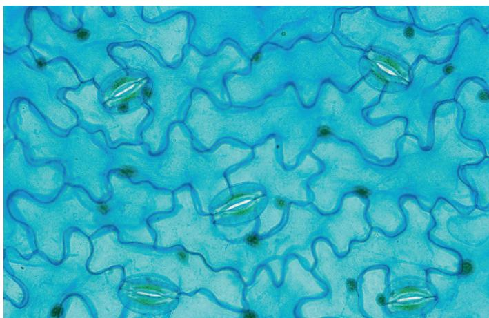  
VISUAL SKILLS If the micrograph above is of a section of epidermis 500 $\mu$ m by 300 $\mu$ m, what is the stomatal density of this bean leaf? Give your answer in number of stomata per square centimeter.  
For suggested answer, see Appendix A.

## Stomata: Major Pathways for Water Loss

About 95% of the water a plant loses escapes through stomata, although these pores account for only 1–2% of the external leaf surface. The waxy cuticle limits water loss through the remaining surface of the leaf. Each stoma is flanked by a pair of guard cells. Guard cells control the diameter of the stoma by changing shape, thereby widening or narrowing the gap between the guard cell pair. Under the same environmental conditions, the amount of water lost per leaf depends largely on stomatal density (Figure 36.13) and the average size of the stomatal pores.

Stomatal density can be under both genetic and environmental control. As a result of evolution by natural selection, shade-tolerant species tend to have lower stomatal densities than shade-intolerant species because $\mathrm{CO}_{2}$ uptake doesn't limit photosynthesis under shady conditions. Stomatal density, however, can also be regulated by environmental changes. Low $\mathrm{CO}_{2}$ levels during leaf development, for example, lead to increased stomatal densities in many species, an adaptation that facilitates $\mathrm{CO}_{2}$ uptake under these conditions. By measuring the stomatal density of leaf fossils, scientists have gained insight into the levels of atmospheric $\mathrm{CO}_{2}$ in past climates. A recent British survey found that stomatal density of many woodland species has decreased since 1927, when a similar survey was made. This observation is consistent with other findings that atmospheric $\mathrm{CO}_{2}$ levels increased dramatically during the late 1900s.

## Mechanisms of Stomatal Opening and Closing

When guard cells take in water from neighboring cells by osmosis, they become more turgid. In most angiosperm guard cells, the cell walls facing the stomatal pore are thicker, and the cellulose microfibrils are oriented in a direction that causes the guard cells to bow outward when turgid (Figure 36.14a). This bowing outward increases the size of the pore between the guard cells. When the cells lose water and become flaccid, they become less bowed, and the pore closes.

Figure 36.14 Mechanisms of stomatal opening and closing.  
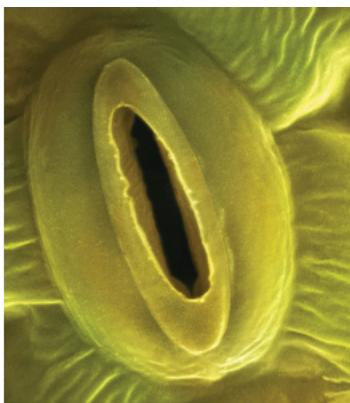

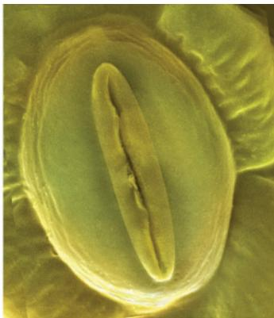  
Guard cells turgid/Stoma open

Guard cells flaccid/Stoma closed  
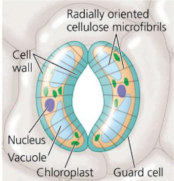

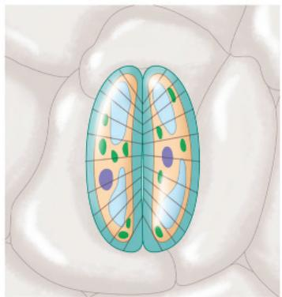

(a) Changes in guard cell shape and stomatal opening and closing (surface view). Guard cells of a typical angiosperm are illustrated in their turgid (stoma open) and flaccid (stoma closed) states. The radial orientation of cellulose microfibrils in the cell walls causes the guard cells to increase more in length than width when turgor increases. Since the two guard cells are tightly joined at their tips, they bow outward when turgid, causing the stomatal pore to open.  
  
(b) Role of potassium ions ( $K^{+}$ ) in stomatal opening and closing. The transport of $K^{+}$ (symbolized here as red dots) across the plasma membrane and vacuolar membrane causes the turgor changes of guard cells. The uptake of anions, such as malate and chloride ions (not shown), also contributes to guard cell swelling.

The changes in turgor pressure in guard cells result primarily from the reversible absorption and loss of $K^{+}$ . Stomata open when guard cells actively accumulate $K^{+}$ from neighboring epidermal cells (Figure 36.14b). The flow of $K^{+}$ across the plasma membrane of the guard cell is coupled to the generation of a membrane potential by proton pumps (see Figure 36.6a). Stomatal opening correlates with active transport of $H^{+}$ out of the guard cell. The resulting voltage (membrane potential) drives $K^{+}$ into the cell through specific membrane channels. The absorption of $K^{+}$ causes the water potential to become more negative within the guard cells, and the cells become more turgid as water enters by osmosis. Because most of the $K^{+}$ and water are stored in the vacuole, the vacuolar membrane also plays a role in regulating guard cell dynamics. Stomatal closing results from a loss of $K^{+}$ from guard cells to neighboring cells, which leads to an osmotic loss of water. Aquaporins also help regulate the osmotic swelling and shrinking of guard cells.

## Stimuli for Stomatal Opening and Closing

In general, stomata are open during the day and mostly closed at night, preventing the plant from losing water under conditions when photosynthesis cannot occur. At least three cues contribute to stomatal opening at dawn: light, $CO_{2}$ depletion, and an internal “clock” in guard cells.

Light stimulates guard cells to accumulate $K^{+}$ and become turgid. This response is triggered by illumination of blue-light receptors in the plasma membrane of guard cells. Activation of these receptors stimulates the activity of proton pumps in the plasma membrane of the guard cells, in turn promoting absorption of $K^{+}$ .

Stomata also open in response to depletion of $\mathrm{CO}_{2}$ within the leaf's air spaces as a result of photosynthesis. As $\mathrm{CO}_{2}$ concentrations decrease during the day, the stomata progressively open if sufficient water is supplied to the leaf.

An internal “clock” in the guard cells ensures that stomata continue their daily rhythm of opening and closing. This rhythm occurs even if a plant is kept in a dark location. All eukaryotic organisms have internal clocks that regulate cyclic processes. Cycles with intervals of approximately 24 hours are called circadian rhythms (which you’ll learn more about in Concept 39.3).

Drought stress can also cause stomata to close. A hormone called abscisic acid (ABA), which is produced in roots and leaves in response to water deficiency, signals guard cells to close stomata. This response reduces wilting but also restricts $CO_{2}$ absorption, thereby slowing photosynthesis. ABA also directly inhibits photosynthesis. Water availability is closely tied to plant productivity not because water is needed as a substrate in photosynthesis, but because freely available water allows plants to keep stomata open and take up more $CO_{2}$ .

Guard cells control the photosynthesis-transpiration compromise on a moment-to-moment basis by integrating a variety of internal and external stimuli. Even the passage of a cloud or a transient shaft of sunlight through a forest can affect the rate of transpiration.

## Effects of Transpiration on Wilting and Leaf Temperature

As long as most stomata remain open, transpiration is greatest on a day that is sunny, warm, dry, and windy because these environmental factors increase evaporation. If transpiration cannot pull sufficient water to the leaves, the shoot becomes slightly wilted as cells lose turgor pressure. Although plants respond to such mild drought stress by rapidly closing stomata, some evaporative water loss still occurs through the cuticle. Under prolonged drought conditions, leaves can become severely wilted and irreversibly injured.

Transpiration also results in evaporative cooling, which can lower a leaf's temperature by as much as $10^{\circ}\mathrm{C}$ compared with the surrounding air. This cooling prevents the leaf from reaching temperatures that could denature enzymes involved in photosynthesis and other metabolic processes.

## Adaptations That Reduce Evaporative Water Loss

Water availability is a major determinant of plant productivity. The main reason water availability is tied to plant productivity is not related to photosynthesis's direct need for water as a substrate but rather because freely available water allows plants to keep stomata open and take up more $\mathrm{CO}_{2}$ . The problem of reducing water loss is especially acute for desert plants. Plants adapted to arid environments are called xerophytes (from the Greek xero, dry).

Many species of desert plants avoid drying out by completing their short life cycles during the brief rainy seasons. Rain comes infrequently in deserts, but when it arrives, the vegetation is transformed as dormant seeds of annual species quickly germinate and bloom, completing their life cycle before dry conditions return.

Other xerophytes have unusual physiological or morphological adaptations that enable them to withstand harsh desert conditions. The stems of many xerophytes are fleshy because they store water for use during long dry periods. Cacti have highly reduced leaves that resist excessive water loss; photosynthesis is carried out mainly in their stems. Another adaptation common in arid habitats is crassulacean acid metabolism (CAM), a specialized form of photosynthesis found in succulents of the family Crassulaceae and several other families (see Figure 10.20). Because the leaves of CAM plants take in $CO_{2}$ at night, the stomata can remain closed during the day, when evaporative stresses are greatest. Other examples of xerophytic adaptations are discussed in Figure 36.15.

## Concept Check 36.4

1. What are the stimuli that control the opening and closing of stomata?

2. The pathogenic fungus Fusicoccum amygdali secretes a toxin called fusicoccin that activates the plasma membrane proton pumps of plant cells and leads to uncontrolled water loss. Suggest a mechanism by which the activation of proton pumps could lead to severe wilting.

3. WHAT IF? If you buy cut flowers, why might the florist recommend cutting the stems underwater and then transferring the flowers to a vase while the cut ends are still wet?

4. MAKE CONNECTIONS Explain why the evaporation of water from leaves lowers their temperature (see Concept 3.2).

For suggested answers, see Appendix A.

Ocotillo (Fouquieria splendens) is common in the southwestern region of the United States and northern Mexico. It is leafless during most of the year, thereby avoiding excessive water loss (right). Immediately after a heavy rainfall, it produces small leaves (below and inset). As the soil dries, the leaves quickly shrivel and die.

Figure 36.15 Some xerophytic adaptations.  

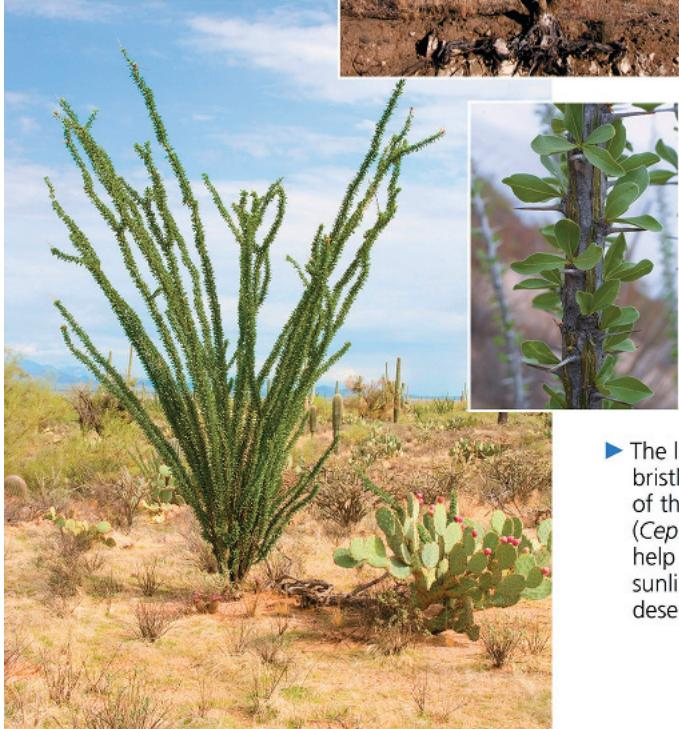  
The long, white hairlike bristles along the stem of the old man cactus (Cephalocereus senilis) help reflect the intense sunlight of the Mexican desert.

Oleander (Nerium oleander), shown in the inset, is commonly found in arid climates. Its leaves have a thick cuticle and multiple-layered epidermal tissue that reduce water loss. Stomata are recessed in cavities called “crypts,” an adaptation that reduces the rate of transpiration by protecting the stomata from hot, dry wind. Trichomes help minimize transpiration by breaking up the flow of air, allowing the chamber of the crypt to have a higher humidity than the surrounding atmosphere (LM).

# Concept 36.5: Sugars are transported from sources to sinks via the phloem

The unidirectional flow of water and minerals from soil to roots to leaves through the xylem is largely in an upward direction. In contrast, the movement of photosynthates often runs in the opposite direction, transporting sugars from mature leaves to lower parts of the plant, such as root tips that require large amounts of sugars for energy and growth. The transport of the products of photosynthesis, known as translocation, is carried out by another tissue, the phloem.

## Movement from Sugar Sources to Sugar Sinks

Sieve tube elements are specialized cells in angiosperms that serve as conduits for translocation. Arranged end to end, they form long sieve tubes (see Figure 35.10). Between these cells are sieve plates, structures that allow the flow of sap along the sieve tube. Phloem sap, the aqueous solution that flows through sieve tubes, differs markedly from the xylem sap that is transported by tracheids and vessel elements. By far the most prevalent solute in phloem sap is sugar, typically sucrose in most species. The sucrose concentration may be as high as 30% by weight, giving the sap a syrupy thickness. Phloem sap may also contain amino acids, hormones, and minerals.

In contrast to the unidirectional transport of xylem sap from roots to leaves, phloem sap moves from sites of sugar production to sites of sugar use or storage (see Figure 36.2). A sugar source is a plant organ that is a net producer of sugar, by photosynthesis or by breakdown of starch. In contrast, a sugar sink is an organ that is a net consumer or depository of sugar. Growing roots, buds, stems, and fruits are sugar sinks. Although expanding leaves are sugar sinks, mature leaves, if well illuminated, are sugar sources. A storage organ, such as a tuber or a bulb, may be a source or a sink, depending on the season. When stockpiling carbohydrates in the summer, it is a sugar sink. After breaking dormancy in the spring, it is a sugar source because its starch is broken down to sugar, which is carried to the growing shoot tips.

Sinks usually receive sugar from the nearest sugar sources. The upper leaves on a branch, for example, may export sugar to the growing shoot tip, whereas the lower leaves may export sugar to the roots. A growing fruit may monopolize the sugar sources that surround it. For each sieve tube, the direction of transport depends on the locations of the sugar source and sugar sink that are connected by that tube. Therefore, neighboring sieve tubes may carry sap in opposite directions if they originate and end in different locations.

Sugar must be transported, or loaded, into sieve tube elements before being exported to sugar sinks. In some species, it moves from mesophyll cells to sieve tube elements via the symplast, passing through plasmodesmata. In other species, it moves by symplastic and apoplastic pathways. In maize leaves, for example, sucrose diffuses through the symplast from photosynthetic mesophyll cells into small veins. Much of it then moves into the apoplast and is accumulated by nearby sieve tube elements, either directly or, as shown in Figure 36.16a, through companion cells. In some plants, the walls of the companion cells feature many ingrowths, enhancing solute transfer between apoplast and symplast.

In many plants, sugar movement into the phloem requires active transport because sucrose is more concentrated in sieve tube elements and companion cells than in mesophyll. Proton pumping and $H^{+}/$ sucrose cotransport enable sucrose to move from mesophyll cells to sieve tube elements or companion cells (Figure 36.16b).

Sucrose is unloaded at the sink end of a sieve tube. The process varies by species and organ. However, the concentration of free sugar in the sink is always lower than in the sieve tube because the unloaded sugar is consumed during growth and metabolism of the cells of the sink or converted to insoluble polymers such as starch. As a result of this sugar concentration gradient, sugar molecules diffuse from the phloem into the sink tissues, and water follows by osmosis.

## Bulk Flow by Positive Pressure: The Mechanism of Translocation in Angiosperms

Phloem sap flows from source to sink at rates that are as great as 1 m/hr, which is much faster than diffusion or cytoplasmic streaming. Researchers concluded that it moves through the sieve tubes of angiosperms by bulk flow driven by positive pressure, known as pressure flow (Figure 36.17). The building of pressure at the source and reduction of that pressure at the sink cause sap to flow from source to sink.

The pressure-flow hypothesis explains why phloem sap flows from source to sink, and experiments build a strong case for pressure flow as the mechanism of translocation in

Figure 36.16 Loading of sucrose into phloem.  
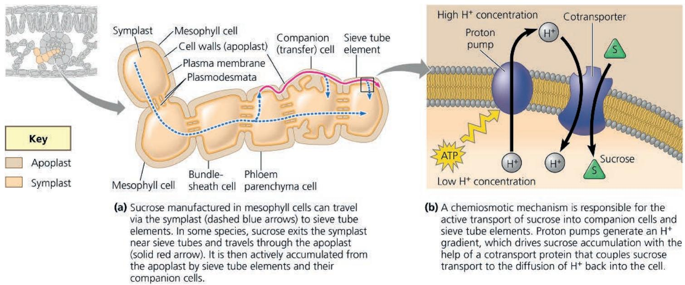  
(a) Sucrose manufactured in mesophyll cells can travel via the symplast (dashed blue arrows) to sieve tube elements. In some species, sucrose exits the symplast near sieve tubes and travels through the apoplast (solid red arrow). It is then actively accumulated from the apoplast by sieve tube elements and their companion cells.  
(b) A chemiosmotic mechanism is responsible for the active transport of sucrose into companion cells and sieve tube elements. Proton pumps generate an $H^{+}$ gradient, which drives sucrose accumulation with the help of a cotransport protein that couples sucrose transport to the diffusion of $H^{+}$ back into the cell.

Figure 36.17 Bulk flow by positive pressure (pressure flow) in a sieve tube.

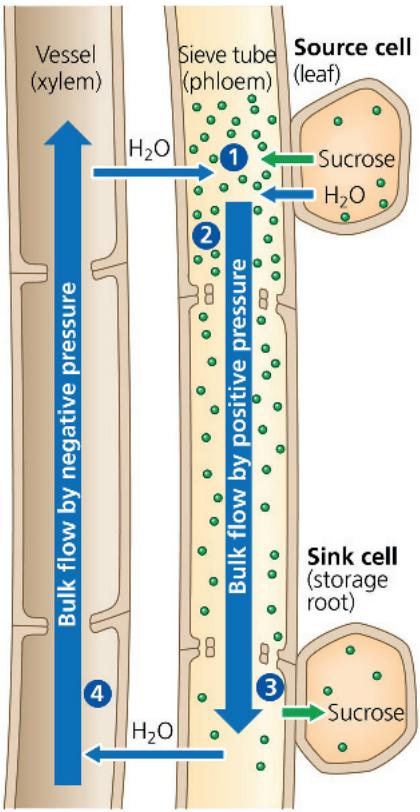

1 Loading of sugar (green dots) into the sieve tube at the source (in this example, a mesophyll cell in a leaf) reduces water potential inside the sieve tube elements. This causes the tube to take up water by osmosis.

2 This uptake of water generates a positive pressure that forces the sap to flow along the tube.

3 The pressure is relieved by the unloading of sugar and the consequent loss of water at the sink.

4 In leaf-to-root translocation, xylem recycles water from sink to source.

angiosperms (Figure 36.18). However, studies using electron microscopes suggest that in nonflowering vascular plants, the pores between phloem cells may be too small or obstructed to permit pressure flow.

Sinks vary in energy demands and capacity to unload sugars. Sometimes there are more sinks than can be supported by sources. In such cases, a plant might abort some flowers, seeds, or fruits—a phenomenon called self-thinning. Removing sinks can also be a horticulturally useful practice. For example, since large apples command a much better price than small ones, growers sometimes remove flowers or young fruits so that their trees produce fewer but larger apples.

## Concept Check 36.5

1. Compare and contrast the forces that move phloem sap and xylem sap over long distances.

2. Identify plant organs that are sugar sources, organs that are sugar sinks, and organs that might be either. Explain.

3. Why can xylem transport water and minerals using dead cells, whereas phloem requires living cells?

4. WHAT IF? Apple growers in Japan sometimes make a nonlethal spiral slash around the bark of trees that are destined for removal after the growing season. This practice makes the apples sweeter. Why?

For suggested answers, see Appendix A.

## Figure 36.18

## Inquiry: Does phloem sap contain more sugar near sources than near sinks?

## Experiment

The pressure-flow hypothesis predicts that phloem sap near sources should have a higher sugar content than phloem sap near sinks. To test this idea, researchers used aphids that feed on phloem sap. An aphid probes with a hypodermic-like mouthpart called a stylet that penetrates a sieve tube element. As sieve tube pressure forced out phloem sap into the stylets, the researchers separated the aphids from the stylets, which then acted as taps exuding sap for hours. Researchers measured the sugar concentration of sap from stylets at different points between a source and sink.

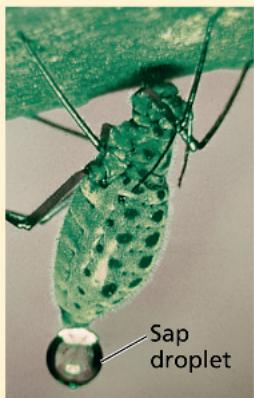  
Aphid feeding

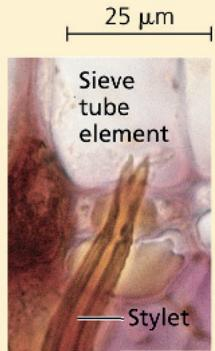  
Stylet in sieve tube element

  
Separated stylet exuding sap

## Results

The closer the stylet was to a sugar source, the higher its sugar concentration was.

## Conclusion

The results of such experiments support the pressure-flow hypothesis, which predicts that sugar concentrations should be higher in sieve tubes closer to sugar sources.

Data from S. Rogers and A. J. Peel, Some evidence for the existence of turgor pressure in the sieve tubes of willow (Salix), Planta 126:259–267 (1975).

WHAT IF? Spittlebugs (Clastophora sp.) are xylem sap feeders that use strong muscles to pump xylem sap through their guts. Could you isolate xylem sap from the excised stylets of spittlebugs?
For suggested answer, see Appendix A.

# Concept 36.6: The symplast is highly dynamic

Although we have been discussing transport in mostly physical terms, almost like the flow of solutions through pipes, plant transport is a dynamic and finely tuned process that changes during

development. A leaf, for example, may begin as a sugar sink but spend most of its life as a sugar source. Also, environmental changes may trigger responses in plant transport processes. Water stress may activate signal transduction pathways that greatly alter the membrane transport proteins governing the overall transport of water and minerals. Because the symplast is living tissue, it is largely responsible for the dynamic changes in plant transport processes. We'll look now at some other examples: changes in plas-modesmata, chemical signaling, and electrical signaling.

## Changes in Plasmodesmatal Number and Pore Size

Based mostly on the static images provided by electron microscopy, biologists formerly considered plasmodesmata to be unchanging, pore-like structures. More recent studies, however, have revealed that plasmodesmata are highly dynamic. They can open or close rapidly in response to changes in turgor pressure, cytosolic $Ca^{2+}$ level, or cytosolic pH. Although some plasmodesmata form during cytokinesis, they can also form much later. Moreover, loss of function is common during differentiation. For example, as a leaf matures from a sink to a source, its plasmodesmata either close or are eliminated, causing phloem unloading to cease.

Early studies by plant physiologists and pathologists came to differing conclusions regarding pore sizes of plasmodesmata. Physiologists injected fluorescent probes of different molecular sizes into cells and recorded whether the molecules passed into adjacent cells. Based on these observations, they concluded that the pore sizes were approximately 2.5 nm—too small for macromolecules such as proteins to pass. In contrast, pathologists provided electron micrographs showing evidence of the passage of virus particles with diameters of 10 nm or greater (Figure 36.19).

Subsequently, it was learned that plant viruses produce viral movement proteins that cause the plasmodesmata to dilate, enabling the viral RNA to pass between cells. More recent evidence shows that plant cells themselves regulate plasmodesmata as part of a

Figure 36.19 Virus particles moving cell to cell through plasmodesma connecting turnip leaf cells. (TEM)  

## Interview

Interview with Patricia Zambryski: Exploring the dynamics of plasmodesmata (eTextbook only)

communication network. The viruses can subvert this network by mimicking the cell's regulators of plasmodesmata.

A high degree of cytosolic interconnectedness exists only within certain groups of cells and tissues, which are known as symplastic domains. Informational molecules, such as proteins and RNAs, coordinate development between cells within each symplastic domain. If symplastic communication is disrupted, development can be grossly affected.

## Phloem: An Information Superhighway

In addition to transporting sugars, the phloem is a “superhighway” for the transport of macromolecules and viruses. This transport is systemic (throughout the body), affecting many or all of the plant’s systems or organs. Macromolecules translocated through the phloem include proteins and various types of RNA that enter the sieve tubes through plasmodesmata. Although they are often likened to the gap junctions between animal cells, plasmodesmata are unique in their ability to traffic proteins and RNA.

Systemic communication through the phloem helps integrate the functions of the whole plant. One classic example is the delivery of a flower-inducing chemical signal from leaves to vegetative meristems. Another is a defensive response to localized infection, in which chemical signals traveling through the phloem activate defense genes in noninfected tissues.

## Electrical Signaling in the Phloem

Rapid, long-distance electrical signaling through the phloem is another dynamic feature of the symplast. Electrical signaling has been studied extensively in plants that have rapid leaf movements, such as the sensitive plant (Mimosa pudica) and Venus flytrap (Dionaea muscipula). However, its role in other species is less clear. Some studies have revealed that a stimulus in one part of a plant can trigger an electrical signal in the phloem that travels to other parts where it may elicit changes in gene transcription, respiration, photosynthesis, phloem unloading, or hormonal levels. Thus, the phloem can serve a nerve-like function, allowing for swift electrical communication between widely separated organs.

The coordinated transport of materials and information is central to plant survival. Plants can acquire only so many resources in the course of their lifetimes. Ultimately, the successful acquisition of these resources and their optimal distribution are the most critical determinants of whether the plant will compete successfully.

## Concept Check 36.6

1. How do plasmodesmata differ from gap junctions?

2. Nerve-like signals in animals are thousands of times faster than their plant counterparts. Suggest a behavioral reason for the difference.

3. WHAT IF? Suppose plants were genetically modified to be unresponsive to viral movement proteins. Would this be a good way to prevent the spread of infection? Explain.

## Summary of Key Concepts

To review key terms, go to the Vocabulary Self-Quiz (eTextbook only).

Concept 36.1: Adaptations for acquiring resources were key steps in the evolution of vascular plants

\- Leaves typically function in gathering sunlight and $CO_{2}$ . Stems serve as supporting structures for leaves and as conduits for the long-distance transport of water and nutrients. Roots mine the soil for water and minerals and anchor the whole plant.

\- Natural selection has produced plant architectures that optimize resource acquisition in the ecological niche in which the plant species naturally exists.

How did the evolution of xylem and phloem contribute to the successful colonization of land by vascular plants?

## Concept 36.2: Different mechanisms transport substances over short or long distances

\- The selective permeability of the plasma membrane controls the movement of substances into and out of cells. Both active and passive transport mechanisms occur in plants.

\- Plant tissues have two major compartments: the apoplast (everything outside the cells' plasma membranes) and the symplast (the cytosol and connecting plasmodesmata).

\- Direction of water movement depends on the water potential, a quantity that incorporates solute concentration and physical pressure. The osmotic uptake of water by plant cells and the resulting internal pressure that builds up make plant cells turgid.

\- Long-distance transport occurs through bulk flow, the movement of liquid in response to a pressure gradient. Bulk flow occurs within the tracheids and vessel elements of the xylem and within the sieve tube elements of the phloem.

Is xylem sap usually pulled or pushed up the plant?

## Concept 36.3: Transpiration drives the transport of water and minerals from roots to shoots via the xylem

\- Water and minerals from the soil enter the plant through the epidermis of roots, cross the root cortex, and then pass into the vascular cylinder by way of the selectively permeable cells of the endodermis. From the vascular cylinder, the xylem sap is transported long distances by bulk flow to the veins that branch throughout each leaf.

\- The cohesion-tension hypothesis proposes that the movement of xylem sap is driven by a water potential difference created at the leaf end of the xylem by the evaporation of water from leaf cells. Evaporation lowers the water potential at the air-water interface, thereby generating the negative pressure that pulls water through the xylem.

Why is the ability of water molecules to form hydrogen bonds important for the movement of xylem sap?

## Concept 36.4: The rate of transpiration is regulated by stomata

\- Transpiration is the loss of water vapor from plants. Wilting occurs when the water lost by transpiration is not replaced by absorption from roots. Plants respond to water deficits by closing their stomata. Under prolonged drought conditions, plants can become irreversibly injured.

\- Stomata are the major pathway for water loss from plants. A stoma opens when guard cells bordering the stomatal pore take up $K^{+}$ . The opening and closing of stomata are controlled by light, $CO_{2}$ , the drought hormone abscisic acid, and a circadian rhythm.

\- Xerophytes are plants that are adapted to arid environments. Reduced leaves and CAM photosynthesis are examples of adaptations to arid environments.

Why are stomata necessary?

## Concept 36.5: Sugars are transported from sources to sinks via the phloem

\- Mature leaves are the main sugar sources, although storage organs can be seasonal sources. Growing organs such as roots, stems, and fruits are the main sugar sinks. The direction of phloem transport is always from sugar source to sugar sink.

\- Phloem loading depends on the active transport of sucrose. Sucrose is cotransported with $H^{+}$ , which diffuses down a gradient generated by proton pumps. Loading of sugar at the source and unloading at the sink maintain a pressure difference that keeps phloem sap flowing through a sieve tube.

Why is phloem transport considered an active process?

## Concept 36.6: The symplast is highly dynamic

\- Plasmodesmata can change in permeability and number. When dilated, they provide a passageway for the symplastic transport of proteins, RNAs, and other macromolecules over long distances. The phloem also conducts nerve-like electrical signals that help integrate whole-plant function.

By what mechanisms is symplastic communication regulated?

For suggested answers, see Appendix A.

## Test Your Understanding

For more multiple-choice questions, go to the Practice Test (eTextbook only).

## Levels 1-2: Remembering/Understanding

1. Which of the following is an adaptation that enhances the uptake of water and minerals by roots?

(A) mycorrhizae

(B) pumping through plasmodesmata

(C) active uptake by vessel elements

(D) rhythmic contractions by cells in the root cortex

2. Which structure or compartment is part of the symplast? (A) the interior of a vessel element (B) the interior of a sieve tube (C) the cell wall of a mesophyll cell (D) an extracellular air space

3. Movement of phloem sap from a source to a sink

(A) occurs through the apoplast of sieve tube elements.

(B) depends ultimately on the activity of proton pumps.

(C) depends on tension, or negative pressure potential.

(D) results mainly from diffusion.

## Levels 3-4: Applying/Analyzing

4. Photosynthesis ceases when leaves wilt, mainly because

(A) the chlorophyll in wilting leaves is degraded.

(B) accumulation of $CO_{2}$ in the leaf inhibits enzymes.

(C) stomata close, preventing $CO_{2}$ from entering the leaf.

(D) photolysis, the water-splitting step of photosynthesis, cannot occur when there is a water deficiency.

5. What would enhance water uptake by a plant cell?
(A) decreasing the $\Psi$ of the surrounding solution
(B) positive pressure on the surrounding solution
(C) the loss of solutes from the cell
(D) increasing the $\Psi$ of the cytoplasm

6. A plant cell with a $\Psi_{S}$ of -0.65 MPa maintains a constant volume when bathed in a solution that has a $\Psi_{S}$ of -0.30 MPa and is in an open container. The cell has a

(A) $\Psi_{P}$ of +0.65 MPa.

(B) $\Psi$ of -0.65 MPa.

(C) $\Psi_{P}$ of +0.35 MPa.

(D) $\Psi_{P}$ of 0 MPa.

7. Compared with a cell with few aquaporin proteins in its membrane, a cell containing many aquaporin proteins will (A) have a faster rate of osmosis.
(B) have a lower water potential.
(C) have a higher water potential.
(D) accumulate water by active transport.

8. Which of the following would tend to increase transpiration?

(A) spiny leaves

(B) sunken stomata

(C) a thicker cuticle

(D) higher stomatal density

## Levels 5-6: Evaluating/Creating

9. EVOLUTION CONNECTION Large brown algae called kelps can grow as tall as 25 m. Kelps consist of a holdfast anchored to the ocean floor, blades that float at the surface and collect light, and a long stalk connecting the blades to the holdfast (see Figure 28.13). Specialized cells in the stalk, although nonvascular, can transport sugar. Suggest a reason why these structures analogous to sieve tube elements might have evolved in kelps.

10. SCIENTIFIC INQUIRY • INTERPRET THE DATA A Minnesota gardener notes that the plants immediately bordering a walkway are stunted compared with those farther away. Suspecting that the soil near the walkway may be contaminated from salt added to the walkway in winter, the gardener tests the soil. The composition of the soil near the walkway is identical to that farther away except that it contains an additional 50 mM NaCl. Assuming that the NaCl is completely ionized, calculate how much it will lower the solute potential of the soil at 20°C using the solute potential equation:

$$
\Psi_ {S} = - i C R T
$$

where i is the ionization constant (2 for NaCl), C is the molar concentration (in mol/L), R is the pressure constant $[R = 0 \cdot 00831 (\text{L} \cdot \text{MPa}) / (\text{mol} \cdot \text{K})]$ , and T is the temperature in Kelvin (273 + °C).

How would this change in the solute potential of the soil affect the water potential of the soil? Explain in what way the change in the water potential of the soil would affect the movement of water in or out of the roots.

11. SCIENTIFIC INQUIRY Cotton plants wilt within a few hours of flooding of their roots. The flooding leads to low-oxygen conditions, increases in cytosolic $Ca^{2+}$ concentration, and decreases in cytosolic pH. Suggest a hypothesis to explain how flooding leads to wilting.

12. WRITE ABOUT A THEME: ORGANIZATION Natural selection has led to changes in the architecture of plants that enable them to photosynthesize more efficiently in the ecological niches they occupy. In a short essay (100–150 words), explain how shoot architecture enhances photosynthesis.

## 13. SYNTHESIZE YOUR KNOWLEDGE

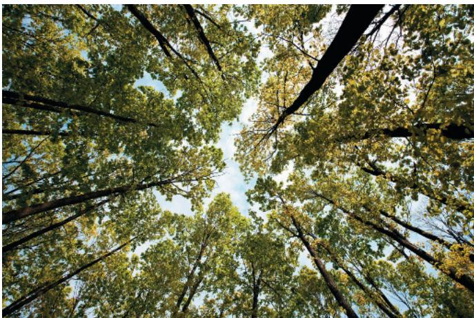  
Imagine yourself as a water molecule in the soil solution of a forest. In a short essay (100–150 words), explain what pathways and what forces would be necessary to carry you to the leaves of these trees.

For selected answers, see Appendix A.

