# 第37章 Soil and Plant Nutrition

<!-- 章节边界按正文内容恢复；原始 MinerU 内容保留如下。 -->

# Soil and Plant Nutrition

## Key Concepts

37.1 Soil contains a living, complex ecosystem

37.2 Plant roots absorb many types of essential elements from the soil

37.3 Plant nutrition often involves relationships with other organisms

  
Figure 37.1 This farmer in India is applying chemical fertilizers to a field of rice. Nitrogen (N), phosphorus (P), and potassium (K) are commonly depleted from soils to such an extent as to limit crop productivity. That is why they are the major ingredients of most chemical fertilizers.

## Study Tip

Use mnemonics: Mnemonics are memory tools to help remember facts. For example, “See Hopkins, California—Mighty good” (CHOPKNSCaMg) is a mnemonic for remembering the nine plant macronutrients, as shown here. Make your own mnemonics for remembering some functions of plant macronutrients (see Table 37.1).

See Hopkins, California—Mighty good

See = C = carbon

H = H = hydrogen

o = O = oxygen

## Why do plants need minerals from the soil?

## Phosphorus is a component of

• DNA and RNA (throughout the cell)

• ATP produced by mitochondria

• phospholipids in cell membranes

Nitrogen, phosphorus, potassium, and other minerals are essential for plant growth because of their roles in the structure and function of plant cells.

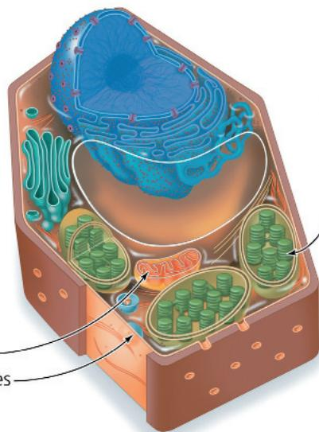  
Potassium is a cofactor for enzymes used throughout the cell; plays a major role in maintaining turgor

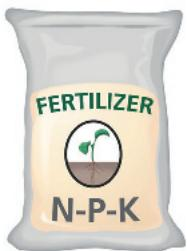

Nitrogen is a component of

• DNA and RNA (throughout the cell)

• proteins
(throughout the cell)
• chlorophyll

# Concept 37.1: Soil contains a living, complex ecosystem

The upper layers of the soil, from which plants absorb nearly all of the water and minerals they require, contain a wide range of living organisms that interact with each other and with the physical environment. This complex ecosystem may take centuries to form but can be destroyed by human mismanagement in just a few years. To understand why soil must be conserved and why particular plants grow where they do, we must first consider the basic physical properties of soil: its texture and composition.

## Soil Texture

The texture of soil depends on the sizes of its particles. Soil particles can range from coarse sand (0.02–2 mm in diameter) to silt (0.002–0.02 mm) to microscopic clay particles (less than 0.002 mm). These different-sized particles arise ultimately from the weathering of rock. Water freezing in crevices of rocks causes mechanical fracturing, and weak acids in the soil break rocks down chemically. When organisms penetrate the rock, they accelerate breakdown by chemical and mechanical means. Roots, for example, secrete acids that dissolve the rock, and their growth in fissures leads to mechanical fracturing. Mineral particles released by weathering become mixed with living organisms and humus, the remains of dead organisms and other organic matter, forming topsoil. The topsoil and other soil layers are called soil horizons (Figure 37.2). The topsoil, or A horizon, can range in depth from millimeters to meters. We focus mostly on properties of topsoil because it is generally the most important soil layer for plant growth.

Figure 37.2 Soil horizons.  
  
The A horizon is the topsoil, a mixture of broken-down rock of various textures, living organisms, and decaying organic matter.  
The B horizon contains much less organic matter than the A horizon and is less weathered.

The C horizon is composed mainly of partially broken-down rock. Some of the rock served as "parent" material for minerals that later helped form the upper horizons.

The topsoils that are the most fertile—supporting the most abundant growth—are loams, which are composed of roughly equal amounts of sand, silt, and clay. Loamy soils have enough small silt and clay particles to provide ample surface area for the adhesion and retention of minerals and water.

Plants are actually nourished by the soil solution, which consists of the water and dissolved minerals in the pores between soil particles. After a heavy rain, water drains from the larger spaces in the soil, but smaller spaces retain water because water molecules are attracted to the negatively charged surfaces of clay and other particles. The large spaces between soil particles in sandy soils generally don't retain enough water to support vigorous plant growth, but they do enable efficient diffusion of oxygen to the roots. Soils with large amounts of clay tend to retain too much water, and when soil does not drain adequately, the air is replaced by water, and the roots suffocate from lack of oxygen. Typically, the most fertile topsoils have pores containing about half water and half air, providing a good balance between aeration, drainage, and water storage capacity. The physical properties of soils can be adjusted by adding soil amendments, such as peat moss, compost, manure, or sand.

## Topsoil Composition

In addition to water and air, topsoil contains inorganic (mineral) and organic chemical components. The organic components include the many life-forms that inhabit the soil.

## Inorganic Components

The surface charges of soil particles determine their ability to bind many nutrients. Most of the soil particles in productive soils are negatively charged and therefore do not bind negatively charged ions (anions), such as the plant nutrients nitrate $\left(\mathrm{NO}_{3}^{-}\right)$ , phosphate $\left(\mathrm{H}_{2}\mathrm{PO}_{4}^{-}\right)$ , and sulfate $\left(\mathrm{SO}_{4}^{2-}\right)$ . As a result, these nutrients are easily lost by leaching, percolation of water through the soil. Positively charged ions (cations)—such as potassium $\left(\mathrm{K}^{+}\right)$ , calcium $\left(\mathrm{Ca}^{2+}\right)$ , and magnesium $\left(\mathrm{Mg}^{2+}\right)$ —adhere to negatively charged soil particles, so are less easily lost by leaching.

Roots, however, do not absorb mineral cations directly from soil particles; they absorb them from the soil solution. Mineral cations enter the soil solution by cation exchange, a process in which cations are displaced from soil particles by other cations, particularly $\mathrm{H^{+}}$ (Figure 37.3). Therefore, a soil's capacity to exchange cations is determined by the number of cation adhesion sites and by the soil's pH. In general, the more clay and organic matter in the soil, the higher the cation exchange capacity. The clay content is important because these small particles have a high ratio of surface area to volume, allowing for the ample binding of cations.

## Organic Components

The major organic component of topsoil is humus, which consists of organic material produced by the decomposition of fallen leaves, dead organisms, feces, and other organic matter by bacteria and fungi. Humus prevents clay particles from packing together

Figure 37.3 Cation exchange in soil.

③ H+ ions in the soil solution neutralize the negative charge of soil particles, causing release of mineral cations into the soil solution.

  
VISUAL SKILLS Which are more likely to be leached from the soil by decreasing pH—cations or anions? Explain.
For suggested answer, see Appendix A.

and forms a crumbly soil that retains water but is still porous enough to aerate roots. Humus also increases the soil's capacity to exchange cations and is a reservoir of mineral nutrients that return gradually to the soil as microorganisms decompose the organic matter.

Topsoil is home to an astonishing number and variety of organisms. A teaspoon of topsoil has about 5 billion bacteria, which cohabit with fungi, algae and other protists, insects, earthworms, nematodes, and plant roots. The activities of all these organisms affect the soil's physical and chemical properties. Earthworms, for example, consume organic matter and derive their nutrition from the bacteria and fungi growing on this material. They excrete wastes and move large amounts of material to the soil surface. In addition, they move organic matter into deeper layers. Earthworms mix and clump the soil particles, allowing for better gaseous diffusion and water retention. Roots also affect soil texture and composition. For example, they reduce erosion by binding the soil, and they lower soil pH by excreting acids.

## Soil Conservation and Sustainable Agriculture

Ancient farmers recognized that crop yields on a particular plot of land decreased over the years. Moving to uncultivated areas, they observed the same pattern of reduced yields over time. Eventually, they realized that fertilization, the addition of mineral nutrients to the soil, could make soil a renewable resource that enabled crops to be cultivated season after season at a fixed location. This sedentary agriculture facilitated a new way of life. Humans began to build permanent dwellings—the first villages. They also stored food for use between harvests, and food surpluses enabled some people to specialize in nonfarming occupations. In short, soil management, by fertilization and other practices, helped prepare the way for modern societies.

Unfortunately, soil mismanagement has been a recurrent problem throughout human history. A dramatic example is the American Dust Bowl, an ecological and human disaster that ravaged the southwestern Great Plains of the United States in the 1930s. This region suffered through devastating dust storms that resulted from a prolonged drought and decades of inappropriate farming techniques. Before farmers arrived, the Great Plains had been covered by hardy grasses that held the soil in place in spite of recurring droughts and torrential rains. But in the late 1800s and early 1900s, many settlers planted wheat and raised cattle. These land uses left the soil exposed to erosion by winds. A few years of drought made the problem worse. During the 1930s, huge quantities of fertile soil were blown away in “black blizzards,” rendering millions of hectares of farmland useless (Figure 37.4). In one of the worst dust storms, clouds of dust blew eastward to Chicago, where soil fell like snow, and even reached the Atlantic coast. Hundreds of thousands of people in the Dust Bowl region were forced to abandon their homes and land, a plight immortalized in John Steinbeck’s novel The Grapes of Wrath.

Soil mismanagement continues to be a major problem to this day. More than $30\%$ of the world's farmland has reduced productivity caused by poor soil conditions, such as chemical contamination, mineral deficiencies, acidity, salinity, and poor drainage. As the world's population grows, the demand for food increases. Because soil quality greatly affects crop yield, soil resources must be managed prudently. Today, the most productive lands are already being used for agriculture, so there are no more frontiers for farmers to clear. Thus, it is critical that farmers embrace sustainable agriculture, a commitment to farming practices that are conservation minded, environmentally safe, and profitable. Sustainable agriculture includes the prudent use of irrigation and soil amendments, the protection of topsoil from salinization and erosion, and the restoration of degraded lands.

Figure 37.4 A massive dust storm in the American Dust Bowl during the 1930s.  
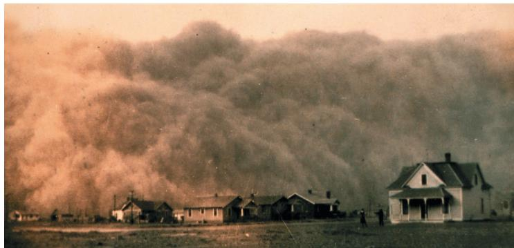  
Which soil horizon contributed to these dust clouds? For suggested answer, see Appendix A.

Figure 37.5 Sudden land subsidence.

Overuse of groundwater for irrigation triggered formation of this sinkhole in Florida.

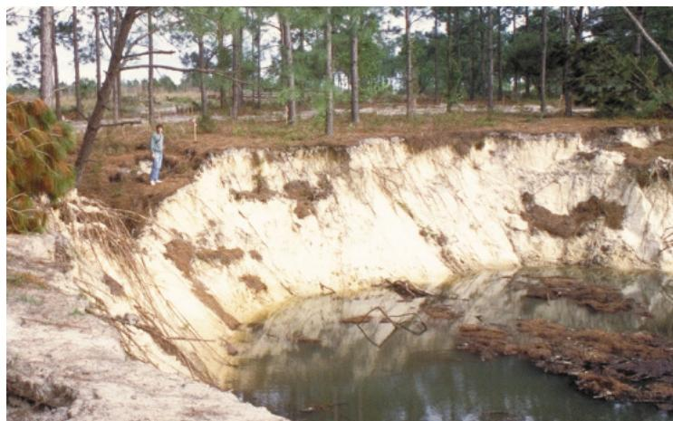

## Irrigation

Because water shortage often limits plant growth, perhaps no technology has increased crop yield as much as irrigation. However, irrigation drains freshwater resources. Globally, about 75% of all freshwater use is devoted to agriculture. Many rivers in arid regions have been reduced to trickles by diverting water for irrigation. The primary source of irrigation water, however, is not surface waters, such as rivers and lakes, but underground water reserves called aquifers. In some regions, the rate of water removal is exceeding the natural refilling of the aquifers, making this practice unsustainable. A further consequence of aquifer depletion is land subsidence, a gradual settling or sudden sinking of the ground surface directly above the aquifer (Figure 37.5). Land subsidence can destroy property and negatively impact agriculture.

Irrigation, particularly from groundwater, can also lead to soil salinization—the addition of salts to the soil that make it too salty for cultivating plants. Salts dissolved in irrigation water accumulate in the soil as the water evaporates, making the water potential of the soil solution more negative. The water potential gradient from soil to roots is reduced, diminishing water uptake (see Figure 36.12).

Many forms of irrigation, such as the flooding of fields, are wasteful because much of the water evaporates. To use water efficiently, farmers must understand the water-holding capacity of their soil, the water needs of their crops, and the appropriate irrigation technology. One popular technology is drip irrigation, the slow release of water to soil and plants from perforated plastic tubing placed directly at the root zone. Because drip irrigation requires less water and reduces salinization, it is used mainly in arid agricultural regions.

## Fertilization

In natural ecosystems, mineral nutrients are usually recycled by the excretion of animal wastes and the decomposition of humus. Agriculture, however, can interfere with this recycling. The lettuce you eat, for example, contains minerals extracted from a farmer's field. As you excrete wastes, these minerals are deposited far from their original source. Over many harvests, the farmer's field eventually becomes depleted of nutrients. Nutrient depletion is a major cause of global soil degradation. Farmers must reverse nutrient depletion by means of fertilization.

Today, most farmers in industrialized nations use fertilizers containing minerals that are either mined or prepared by energy-intensive processes. These fertilizers are usually enriched in nitrogen (N), phosphorus (P), and potassium (K)—the nutrients most commonly deficient in depleted soils. You may have seen fertilizers labeled with a three-number code, called the N–P–K ratio. A fertilizer marked “15–10–5,” for instance, is by weight 15% N (as ammonium or nitrate), 10% P (as phosphate), and 5% K (as the mineral potash).

Manure, fishmeal, and compost are called “organic” fertilizers because they contain organic material. Before plants can use organic material, however, it must be decomposed into the inorganic nutrients that roots can absorb. Whether from organic fertilizer or a chemical factory, the minerals a plant extracts are in the same form. However, organic fertilizers release them gradually, whereas minerals in commercial fertilizers are immediately available but may not be retained by the soil for long. Minerals not absorbed by roots are often leached from the soil by rainwater or irrigation. Mineral runoff into lakes may lead to explosions in algal populations that can deplete oxygen levels and reduce fish populations.

## Adjusting Soil pH

Soil pH is an important factor that influences mineral availability by its effect on cation exchange and the chemical form of minerals. Depending on the soil pH, a particular mineral may be bound too tightly to clay particles or may be in a chemical form that the plant cannot absorb. Most plants prefer slightly acidic soil because the high $H^{+}$ concentrations can displace positively charged minerals from soil particles, making them more available for absorption. Adjusting soil pH is tricky because a change in $H^{+}$ concentration may make one mineral more available but another less available. At pH 8, for instance, plants can absorb calcium, but iron is almost unavailable. The soil pH should be matched to a crop's mineral needs. If the soil is too alkaline, adding sulfate will lower the pH. Soil that is too acidic can be adjusted by adding lime (calcium carbonate or calcium hydroxide).

When the soil pH dips to 5 or lower, toxic aluminum ions ( $Al^{3+}$ ) become more soluble and are absorbed by roots, stunting root growth and preventing the uptake of calcium, a needed plant nutrient. Low soil pH and $Al^{3+}$ toxicity are especially serious problems in tropical regions, where the pressure of producing food for a growing population is often most acute. Some plants can cope with high $Al^{3+}$ levels by secreting organic anions that bind $Al^{3+}$ and render it harmless. Scientists have altered tobacco and papaya plants by introducing a citrate synthase gene from a bacterium into the plants' genomes. The resulting overproduction of citric acid increased aluminum resistance.

Figure 37.6 Contour tillage.

These crops are planted in rows that go around, rather than up and down, the hillside. Contour tillage helps slow water runoff and topsoil erosion after heavy rains.

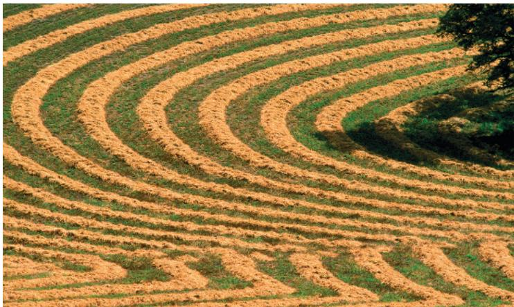

## Controlling Erosion

As happened most dramatically in the Dust Bowl, water and wind erosion can remove large amounts of topsoil. Erosion is a major cause of soil degradation because nutrients are carried away by wind and streams. To limit erosion, farmers can plant rows of trees as windbreaks, terrace hillside crops, and cultivate crops in a contour pattern (Figure 37.6). Crops such as alfalfa and wheat provide good ground cover and protect the soil better than maize and other crops that are usually planted in more widely spaced rows.

Erosion can also be reduced by a plowing technique called no-till agriculture. In traditional plowing, the entire field is tilled, or turned over. This practice helps control weeds but disrupts the meshwork of roots that holds the soil in place, leading to increased surface runoff and erosion. In no-till agriculture, a specialized plow creates narrow furrows for seeds and fertilizer. In this way, the field is seeded with minimal disturbance to the soil, while also using less fertilizer.

## Phytoremediation

Some land areas are unfit for cultivation because toxic metals or organic pollutants have contaminated the soil or groundwater. Traditionally, soil remediation, the detoxification of contaminated soils, has focused on nonbiological technologies, such as removing and storing contaminated soil in landfills, but these techniques are costly and often disrupt the landscape.

Phytoremediation is a nondestructive biotechnology that harnesses the ability of some plants to extract soil pollutants and concentrate them in portions of the plant that can be easily removed for safe disposal. For example, alpine pennycress (Thlaspi caerulescens) can accumulate zinc in its shoots at concentrations 300 times higher than most plants can tolerate. The shoots can be harvested and the zinc removed. Such plants show promise for cleaning up areas contaminated by smelters, mines, or nuclear tests. Phytoremediation is an example of bioremediation, the use of organisms to detoxify polluted sites. In addition to plants, certain prokaryotic and unicellular eukaryotic organisms are also used in bioremediation (see Concepts 27.6 and 55.5).

We have examined the importance of soil conservation for sustainable agriculture. Mineral nutrients contribute greatly to soil fertility, but which minerals are most important, and why do plants need them? These are the topics of the next section.

## Concept Check 37.1

1. Explain how the phrase "too much of a good thing" can apply to watering and fertilizing plants.

2. Some lawn mowers collect clippings. What is a drawback of this practice with respect to plant nutrition?

3. WHAT IF? How would adding clay to loamy soil affect the soil's capacity to exchange cations and retain water? Explain.

4. MAKE CONNECTIONS Note three ways the properties of water contribute to soil formation. See Concept 3.2.

For suggested answers, see Appendix A.

## Concept 37.2: Plant roots absorb many types of essential elements from the soil

Water, air, and soil minerals all contribute to plant growth. A plant's water content can be measured by comparing the mass before and after drying. Typically, 80–90% of a plant's fresh mass is water. About 96% of the remaining dry mass consists of carbohydrates such as cellulose and starch that are produced by photosynthesis. Thus, the components of carbohydrates—carbon, oxygen, and hydrogen—are the most abundant elements in dried plant residue. Inorganic substances from the soil, although essential for plant survival, account for only about 4% of a plant's dry mass.

## Essential Elements

The inorganic substances in plants contain more than 50 chemical elements. In studying the chemical composition of plants, we must distinguish elements that are essential from those that are merely present in the plant. A chemical element is considered an essential element only if it is required for a plant to complete its life cycle and reproduce.

To determine which chemical elements are essential, researchers use hydroponic culture, in which plants are grown in mineral solutions instead of soil (Figure 37.7). Such studies have helped identify 17 essential elements needed by all plants. Hydroponic culture is also used on a small scale to grow some greenhouse crops.

## Figure 37.7

## Research Method: Hydroponic Culture Application

In hydroponic culture, plants are grown in mineral solutions without soil. One use of hydroponic culture is to identify essential elements in plants.

## Technique

Plant roots are bathed in aerated solutions of known mineral composition. Aerating the water provides the roots with oxygen for cellular respiration. (Note: The flasks would normally be opaque to prevent algal growth.) A mineral, such as iron, can be omitted to test whether it is essential.

  
Control: Solution containing all minerals  
Experimental: Solution without iron

## Results

If the omitted mineral is essential, mineral deficiency symptoms occur, such as stunted growth and discolored leaves. By definition, the plant would not be able to complete its life cycle. Deficiencies of different elements may have different symptoms, which can aid in diagnosing mineral deficiencies in soil.

## Interview

Interview with Gloria Coruzzi: Assimilating more nitrogen into plants (eTextbook only)

Table 37.1 lists the 17 essential elements needed by plants and their functions. Nine of the essential elements are called macronutrients because plants require them in relatively large amounts. Six of these are the major components of organic compounds forming a plant's structure: carbon, oxygen, hydrogen, nitrogen, phosphorus, and sulfur. The other three macronutrients are potassium, calcium, and magnesium. Of all the mineral nutrients, nitrogen contributes the most to plant growth and crop yields. Plants require nitrogen as a component of proteins, nucleic acids, chlorophyll, and other important organic molecules.

The other essential elements are called micronutrients because plants need them in only tiny quantities. They are chlorine, iron, manganese, boron, zinc, copper, nickel, and molybdenum. Sodium is a ninth essential micronutrient for plants that use the $C_{4}$ or CAM pathways of photosynthesis (see Concept 10.5) because it is needed for the regeneration of phosphoenolpyruvate, the $CO_{2}$ acceptor used in these two types of carbon fixation.

Micronutrients function in plants mainly as enzyme cofactors (see Concept 8.4). Iron, for example, is a metallic component of cytochromes, the proteins in the electron transport chains of chloroplasts and mitochondria. It is because micronutrients generally just aid enzymes that plants need only tiny quantities. The requirement for molybdenum, for instance, is so modest that there is only one atom of this rare element for every 60 million atoms of hydrogen in dried plant material. Yet a deficiency of molybdenum or any other micronutrient can weaken or kill a plant.

Many animals, including humans, get much of their essential mineral nutrients from plants. Low dietary concentrations of essential micronutrients, such as iron (Fe), iodine (I), and zinc (Zn), contribute to the problem of micronutrient malnutrition (“hidden hunger”). Human malnourishment, as opposed to undernourishment, results when people receive enough calories from their ingestion of carbohydrates but lack other dietary factors (such as essential minerals, vitamins, or amino acids) required for good health.

## Symptoms of Mineral Deficiency

The symptoms of a deficiency depend partly on the mineral's function as a nutrient. For example, a deficiency of magnesium, a component of chlorophyll, causes chlorosis, yellowing of leaves. In some cases, the relationship between a deficiency and its symptoms is less direct. For instance, iron deficiency can cause chlorosis even though chlorophyll contains no iron because iron ions are required as a cofactor in an enzymatic step of chlorophyll synthesis.

Mineral deficiency symptoms depend not only on the role of the nutrient but also on its mobility within the plant. If a nutrient moves about freely, symptoms appear first in older organs because young, growing tissues are a greater sink for nutrients in short supply. For example, a plant deficient in magnesium, a relatively mobile ion, first shows signs of chlorosis in its older leaves. In contrast, a deficiency of a relatively immobile mineral, such as iron, affects young parts of the plant first. The older tissues have adequate amounts of iron that they retain during periods of short supply. The mineral requirements of a plant also change with the age of the plant. Young seedlings, for example, rarely show mineral deficiency symptoms because their mineral needs are met largely by the mineral reserves stored in the seeds themselves.

The symptoms of a mineral deficiency may vary between species but in a given plant are often distinctive enough to aid in diagnosis. Deficiencies of phosphorus, potassium, and nitrogen are most common, as in the example of maize leaves in Figure 37.8, on the next page.

Table 37.1 Essential Elements in Plants

<table><tr><td>Element(Form Primarily Absorbed by Plants)</td><td>% Mass in Dry Tissue</td><td>Major Function(s)</td><td>Early Visual Symptom(s) of Nutrient Deficiencies</td></tr><tr><td colspan="4">Macronutrients</td></tr><tr><td>Carbon ( $CO_2$ )</td><td>45%</td><td>Major component of organic compounds</td><td>Poor growth</td></tr><tr><td>Oxygen ( $CO_2$ )</td><td>45%</td><td>Major component of organic compounds</td><td>Poor growth</td></tr><tr><td>Hydrogen ( $H_2O$ )</td><td>6%</td><td>Major component of organic compounds</td><td>Wilting, poor growth</td></tr><tr><td>Nitrogen( $NO_3^-$ ,  $NH_4^+$ )</td><td>1.5%</td><td>Component of nucleic acids, proteins, and chlorophyll</td><td>Chlorosis at tips of older leaves (common in heavily cultivated soils or soils low in organic material)</td></tr><tr><td>Potassium ( $K^+$ )</td><td>1.0%</td><td>Enzyme cofactor; major solute functioning in water balance; operation of stomata</td><td>Mottling of older leaves, drying of leaf edges; weak stems; roots poorly developed (common in acidic or sandy soils)</td></tr><tr><td>Calcium ( $Ca^{2+}$ )</td><td>0.5%</td><td>Important component of middle lamella and cell walls; maintains membrane function; signal transduction</td><td>Crinkling of young leaves; death of terminal buds (common in acidic or sandy soils)</td></tr><tr><td>Magnesium ( $Mg^{2+}$ )</td><td>0.2%</td><td>Component of chlorophyll; cofactor of many enzymes</td><td>Chlorosis between veins, found in older leaves (common in acidic or sandy soils)</td></tr><tr><td>Phosphorus( $H_2PO_4^-$ ,  $HPO_4^{2-}$ )</td><td>0.2%</td><td>Component of nucleic acids, phospholipids, ATP</td><td>Healthy appearance but very slow development; thin stems; purpling of veins; poor flowering and fruiting (common in acidic, wet, or cold soils)</td></tr><tr><td>Sulfur ( $SO_4^{2-}$ )</td><td>0.1%</td><td>Component of proteins</td><td>General chlorosis in young leaves (common in sandy or very wet soils)</td></tr><tr><td colspan="4">Micronutrients</td></tr><tr><td>Chlorine ( $Cl^-$ )</td><td>0.01%</td><td>Photosynthesis (water-splitting); functions in water balance</td><td>Wilting; stubby roots; leaf mottling (uncommon)</td></tr><tr><td>Iron ( $Fe^{3+}$ , $Fe^{2+}$ )</td><td>0.01%</td><td>Respiration; photosynthesis: chlorophyll synthesis;  $N_2$  fixation</td><td>Chlorosis between veins, found in young leaves (common in basic soils)</td></tr><tr><td>Manganese ( $Mn^{2+}$ )</td><td>0.005%</td><td>Active in formation of amino acids; activates some enzymes; required for water-splitting step of photosynthesis</td><td>Chlorosis between veins, found in young leaves (common in basic soils rich in humus)</td></tr><tr><td>Boron ( $H_2BO_3^-$ )</td><td>0.002%</td><td>Cofactor in chlorophyll synthesis; role in cell wall function; pollen tube growth</td><td>Death of meristems; thick, leathery, and discolored leaves (occurs in any soil; most common micronutrient deficiency)</td></tr><tr><td>Zinc ( $Zn^{2+}$ )</td><td>0.002%</td><td>Active in formation of chlorophyll; cofactor of some enzymes; needed for DNA transcription</td><td>Reduced internode length; crinkled leaves (common in some geographic regions)</td></tr><tr><td>Copper ( $Cu^+,Cu^{2+}$ )</td><td>0.001%</td><td>Component of many redox and lignin-biosynthetic enzymes</td><td>Light green color throughout young leaves, with drying of leaf tips; roots stunted and excessively branched (common in some geographic regions)</td></tr><tr><td>Nickel ( $Ni^{2+}$ )</td><td>0.001%</td><td>Nitrogen metabolism</td><td>General chlorosis in all leaves; death of leaf tips (common in acidic or sandy soils)</td></tr><tr><td>Molybdenum( $MoO_4^{2-}$ )</td><td>0.0001%</td><td>Nitrogen metabolism</td><td>Death of root and shoot tips; chlorosis in older leaves (common in acidic soils in some geographic areas)</td></tr></table>

MAKE CONNECTIONS Explain why $CO_{2}$ , rather than $O_{2}$ , is the source of much of the dry mass oxygen in plants. See Concept 10.1.  
For suggested answer, see Appendix A.

In the Scientific Skills Exercise, you can diagnose a mineral deficiency in the leaves of a raspberry plant. Micronutrient shortages are less common than macronutrient shortages and tend to occur in certain geographic regions because of differences in soil composition. One way to confirm a diagnosis is to analyze the

mineral content of the plant or soil. The amount of a micronutrient needed to correct a deficiency is usually small. For example, a zinc deficiency in fruit trees can usually be cured by hammering a few zinc nails into each tree trunk. Moderation is important because overdoses of a micronutrient or macronutrient can be detrimental or toxic. Too much nitrogen, for example, can lead to excessive vine growth in tomato plants at the expense of good fruit production.

Figure 37.8 The most common mineral deficiencies, as seen in maize leaves.

Mineral deficiency symptoms may vary in different species. In maize, nitrogen deficiency is evident in a yellowing that starts at the tip and moves along the center (midrib) of older leaves. Phosphorus-deficient maize plants have reddish purple margins, particularly in young leaves. Potassium-deficient maize plants exhibit “firing,” or drying, along tips and margins of older leaves.

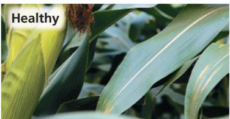

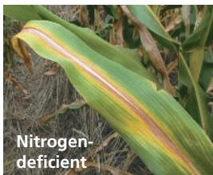

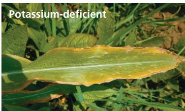

## Global Climate Change and Food Quality

Since plant growth is generally enhanced by increases in atmospheric $CO_{2}$ and by warming temperatures, global food production, as measured by plant biomass, is expected to increase in response to global climate change in certain parts of the world. But food production must also be judged by its quality. Unfortunately, there are indications that plants today, compared with plants in preindustrial times, are not taking up nutrients sufficiently to keep pace with their increased fixation of $CO_{2}$ into carbohydrates. For example, a study of 43 crops found significant declines in protein and several mineral nutrients and vitamins from 1950 to 1999. Although this decline in food quality might be caused by a shift toward higher-yielding crops, studies of wild plants suggest that global climate change is the culprit. For example, a study revealed that the protein content of goldenrod (Solidago canadensis) pollen has declined by one third since the Industrial Revolution, and the change closely correlates with the rise in $CO_{2}$ that has occurred. Declines in the qualities of pollen as a food source might play a role in the widespread decline of honeybees, important pollinators whose decreasing population threatens crop production.

## Concept Check 37.2

1. Are some essential elements more important than others? Explain.

2. WHAT IF? If an element increases the growth rate of a plant, can it be defined as an essential element?

3. MAKE CONNECTIONS Based on Figure 9.17, explain why hydroponically grown plants would grow much more slowly if they were not sufficiently aerated.

## Scientific Skills Exercise Making Observations

What Mineral Deficiency Is This Plant Exhibiting? Plant growers often diagnose deficiencies in their crops by examining changes to the foliage, such as chlorosis (yellowing), death of some leaves, discoloring, mottling, scorching, or changes in size or texture. In this exercise, you will diagnose a mineral deficiency by observing a plant's leaves and applying what you have learned about symptoms from the text and Table 37.1.

Data The data for this exercise come from the photograph below of leaves of a raspberry plant exhibiting a mineral deficiency.

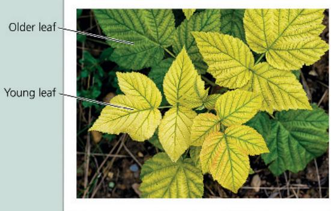

INTERPRET THE DATA

1. How do the young leaves differ in appearance from the older leaves?

2. What change do you observe in the leaves, and where in the leaves does it appear? List the three nutrients whose deficiencies give rise to this symptom. Based on the symptom's location, which one of these three nutrients can be ruled out, and why? What does the location suggest about the other two nutrients?

3. How would your hypothesis about the cause of this deficiency be influenced if tests showed that the soil was low in humus?

Instructors: A version of this Scientific Skills Exercise can be assigned in Mastering Biology.

## Concept 37.3: Plant nutrition often involves relationships with other organisms

To this point, we have looked at plants as exploiters of soil resources, but plants and soil have a two-way relationship. Dead plants provide much of the energy needed by soil-dwelling bacteria and fungi. Many of these organisms also benefit from sugar-rich secretions produced by living roots. Meanwhile, plants derive benefits from their associations with soil bacteria and fungi. As shown in Figure 37.9, mutually beneficial relationships across kingdoms and domains are not rare in nature. However, they are of particular importance to plants. We'll explore some important mutualisms between plants and soil bacteria and fungi, as well as some unusual, nonmutualistic forms of plant nutrition.

## Make Connections: Mutualism Across Kingdoms and Domains

## Figure 37.9

Some toxic species of fish don't make their own poison. How is that possible? Some species of ants chew leaves but don't eat them. Why? The answers lie in some amazing mutualisms, relationships between different species in which each species provides a substance or service that benefits the other (see Concept 54.1). Sometimes mutualisms occur within the same kingdom, such as between two species of animals. Many mutualisms, however, involve species from different kingdoms or domains, as in these examples.

## Fungus-Bacterium

A lichen is a mutualistic association between a fungus and a photosynthetic partner. In the lichen Peltigera, the photosynthetic partner is a species of cyanobacterium. The cyanobacterium supplies carbohydrates, while the fungus

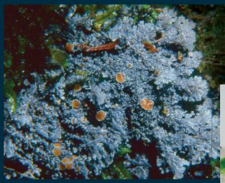

provides anchorage, protection, minerals, and water. (See Figure 31.25.)

## The lichen Peltigera

A longitudinal section of the lichen Peltigera showing green photosynthetic bacteria sandwiched between layers of fungus

## Animal–Bacterium

Fugu is the Japanese name for puffer fish and the delicacy made from it, which can be deadly. Most species of puffer fish contain lethal amounts of the nerve toxin tetrodotoxin in their organs, especially the liver, ovaries, and intestines. Therefore, a specially trained chef must remove the poisonous parts. The tetrodotoxin is synthesized by mutualistic bacteria (various Vibrio species) associated with the fish. The fish gains a potent chemical defense, while the bacteria live in a high-nutrient, low-competition environment.

## Animal-Fungus

Leaf-cutter ants harvest leaves that they carry back to their nest, but the ants do not eat the leaves. Instead, a fungus grows by absorbing nutrients from the leaves, and the ants eat part of the fungus that they have cultivated.

  
Leaf-cutter
ant bringing
a cut leaf
to a nest

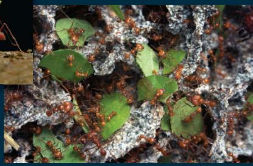  
Ants tending a fungal garden in a nest

## Plant-Fungus

Most plant species have mycorrhizae, mutualistic associations between roots and fungi. The fungus absorbs carbohydrates from the roots. In return, the fungus's mycelium, a dense network of filaments called hyphae, increases the surface area for the uptake of water and minerals by the roots. (See Figure 31.4.)

  
A fungus growing on the root of a sorghum plant (SEM)

## Plant-Animal

Some species of plants are aggressively defended from predators and competitors by ants. The plant provides nourishment for the ants in the form of carbohydrate-rich nectar from glands called

nectaries. (See Figure 54.9 for another example of a mutualism between a plant and ants.)

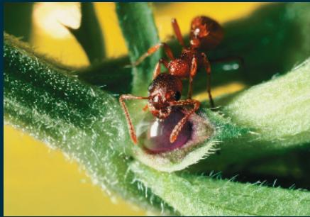

## Bacteria and Plant Nutrition

A variety of soil bacteria play roles in plant nutrition. Some engage in mutually beneficial chemical exchanges with plant roots. Others enhance the decomposition of organic materials and increase nutrient availability.

## Rhizobacteria

Rhizobacteria are bacteria that live either in close association with plant roots or in the rhizosphere, the soil closely surrounding plant roots. Many rhizobacteria form mutually beneficial associations with plant roots. Rhizobacteria depend on nutrients such as sugars, amino acids, and organic acids that are secreted by plant cells. Up to 20% of a plant's photosynthetic production may be used to fuel these complex bacterial communities. In return,

plants reap many benefits from these mutualistic associations. Some rhizobacteria produce antibiotics that protect roots from disease. Others absorb toxic metals or make nutrients more available to roots. Still others convert gaseous nitrogen into forms usable by the plant or produce chemicals that stimulate plant growth. Inoculation of seeds with plant-growth-promoting rhizobacteria can increase crop yield and reduce the need for fertilizers and pesticides.

Some rhizobacteria are free-living in the rhizosphere, whereas others are endophytes that live between cells within the plant. Both the intercellular spaces occupied by endophytic bacteria and the rhizosphere associated with each plant root system contain a unique and complex cocktail of root secretions and microbial products that differ from those of the surrounding soil. A recent study revealed that the compositions of bacterial communities living endophytically and in the rhizosphere are not identical (Figure 37.10).

## Figure 37.10

# Inquiry: How variable are the compositions of bacterial communities inside and outside of roots?

## Experiment

The bacterial communities found within and immediately outside of root systems are known to improve plant growth. In order to devise agricultural strategies to increase the benefits of these bacterial communities, it is necessary to determine how complex they are and what factors affect their composition. A problem with studying these bacterial communities is that a handful of soil contains as many as 10,000

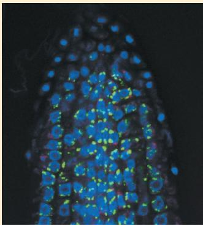  
Bacteria (green) on surface of root (fluorescent LM)

types of bacteria, more than all the bacterial species that have been described. Researchers cannot simply culture each species and use a taxonomic key to identify them; a molecular approach is needed.

Jeffery Dangl and his colleagues estimated the number of bacterial “species” in samples using a technique called metagenomics (see Concept 21.1). The bacterial community samples differed in location (endophytic, inside the rhizosphere, or outside the rhizosphere), soil type (having large amounts of clay or porous), and the developmental stage of the root system with which they were associated (old or young). The DNA from each sample was purified, and the polymerase chain reaction (PCR) was used to amplify the DNA that codes for the 16S ribosomal RNA subunits. Many thousands of DNA sequence variations were found in each sample. The researchers lumped the sequences that were more than 97% identical into “taxonomic units” or “species.” (The word species is in quotation marks because “two organisms having a single gene that is more than 97% identical” is not explicit in any definition of species.) Having established the types of “species” in each community, the researchers made a tree diagram showing the percent of bacterial “species” found in common in each community.

## Results

This tree diagram breaks down the relatedness of bacterial communities into finer and finer levels of detail. The two explanatory labels give examples of how to interpret the diagram.

  
Data from D. S. Lundberg et al., Defining the core Arabidopsis thaliana root microbiome, Nature 488:86–94 (2012).

## Conclusion

The “species” composition of the bacterial communities varied markedly according to the location inside the root versus outside the root and according to soil type.

## INTERPRET THE DATA

(a) Which of the three community locations was least like the other two?

(b) Rank the three variables (community location, developmental stage of roots, and soil type) in terms of how strongly they affect the “species” composition of the bacterial communities.

Figure 37.11 The roles of soil bacteria in the nitrogen nutrition of plants.

Ammonium $\left(\mathrm{NH}_{4}^{+}\right)$ is made available to plants by two types of soil bacteria: those that fix atmospheric $N_{2}$ (nitrogen-fixing bacteria) and those that decompose organic material (ammonifying bacteria). Although plants absorb some ammonium from the soil, they absorb mainly nitrate, which is produced from ammonium by nitrifying bacteria. Plants reduce nitrate back to ammonium before incorporating the nitrogen into organic compounds.

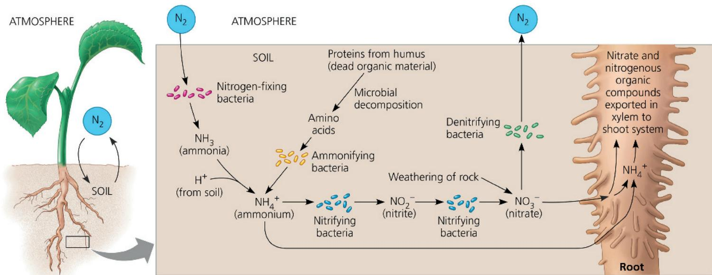  
VISUAL SKILLS If an animal died near a root, would the plant have greater access to ammonium, nitrate, or both?  
For suggested answer, see Appendix A.

A better understanding of the types of bacteria within and around roots could potentially have profound agricultural benefits.

## Bacteria in the Nitrogen Cycle

Because nitrogen leaches easily from soils but is required in large amounts by plants, no mineral deficiency is more limiting to plant growth than a lack of nitrogen. The forms of nitrogen that plants can use include $NO_{3}^{-}$ and $NH_{4}^{+}$ . Some soil nitrogen derives from the weathering of rocks, and lightning produces small amounts of $NO_{3}^{-}$ that get carried to the soil in rain. However, most of the nitrogen available to plants comes from the activity of bacteria (Figure 37.11). This activity is part of the nitrogen cycle, a series of natural processes by which certain nitrogen-containing substances from the air and soil are made available to living things, are used by them, and are returned to the air and soil (see Figure 55.14).

Plants commonly acquire nitrogen in the form of $NO_{3}^{-}$ (nitrate). Soil $NO_{3}^{-}$ is largely formed by a two-step process called nitrification, which consists of the oxidation of ammonia ( $NH_{3}$ ) to nitrite ( $NO_{2}^{-}$ ), followed by oxidation of $NO_{2}^{-}$ to $NO_{3}^{-}$ . Different types of nitrifying bacteria mediate each step, as shown at the bottom of Figure 37.11. After the roots absorb $NO_{3}^{-}$ , a plant enzyme reduces it back to $NH_{4}^{+}$ , which other enzymes incorporate into amino acids and other organic compounds. Most plant species transport nitrogen from roots to shoots via the xylem as $NO_{3}^{-}$ or as organic compounds synthesized in the roots. Some soil nitrogen is lost, particularly in anaerobic soils, when denitrifying bacteria convert $NO_{3}^{-}$ to $N_{2}$ , which diffuses into the atmosphere.

In addition to $NO_{3}^{-}$ , plants can acquire nitrogen in the form of $NH_{4}^{+}$ (ammonium) through two processes, as shown on the left in Figure 37.11. In one process, nitrogen-fixing bacteria convert gaseous nitrogen ( $N_{2}$ ) to $NH_{3}$ , which then picks up another $H^{+}$ in the soil solution, forming $NH_{4}^{+}$ . In the other process, called ammonification, decomposers convert the organic nitrogen from dead organic material into $NH_{4}^{+}$ .

## Bacteria and Nitrogen Fixation

Although Earth's atmosphere is $79\%$ nitrogen, plants cannot use free gaseous nitrogen $(\mathrm{N}_2)$ because there is a triple bond between the two nitrogen atoms, making the molecule almost inert. For atmospheric $\mathrm{N}_2$ to be of use to plants, it must be reduced to $\mathrm{NH}_3$ by a process known as nitrogen fixation. All nitrogen-fixing organisms are bacteria. Some nitrogen-fixing bacteria are free-living in the soil (see Figure 37.11), whereas others live in the rhizosphere. Among this latter group, members of the genus Rhizobium form efficient and intimate associations with the roots of legumes (such as beans, alfalfa, and peanuts), altering the structure of the hosts' roots markedly, as will be discussed shortly.

The multistep conversion of $N_{2}$ to $NH_{3}$ by nitrogen fixation can be summarized as follows:

$$
\begin{array}{l}\mathrm{N} _ {2} + 8 e ^ {-} + 8 \mathrm{H} ^ {+} + 1 6 \mathrm{ATP} \rightarrow\\2 \mathrm{NH} _ {3} + \mathrm{H} _ {2} + 1 6 \mathrm{ADP} + 1 6 Ⓟ _ {\mathrm{i}}\end{array}
$$

The reaction is driven by the enzyme complex nitrogenase. Because the process of nitrogen fixation requires 16 ATP molecules for every 2 NH $_{3}$ molecules synthesized, nitrogen-fixing bacteria require a rich supply of carbohydrates from decaying material, root secretions, or (in the case of the Rhizobium bacteria) the vascular tissue of roots.

The mutualism between Rhizobium (“root-living”) bacteria and legume roots involves dramatic changes in root structure. Along a legume’s roots are swellings called nodules, composed of plant cells “infected” by Rhizobium bacteria (Figure 37.12). Inside each nodule, Rhizobium bacteria assume a form called bacteroids, which are contained within vesicles formed in the root cells. Legume–Rhizobium relationships generate more usable nitrogen for plants than all industrial fertilizers used today—and at virtually no cost to the farmer.

## Figure 37.12 Root nodules on a legume.

The spherical structures along this soybean root system are nodules containing Rhizobium bacteria. The bacteria fix nitrogen and obtain photosynthetic products supplied by the plant.

How is the relationship between legume plants and Rhizobium bacteria mutualistic?

For suggested answer, see Appendix A.

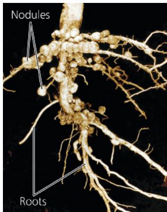

Nitrogen fixation by Rhizobium requires an anaerobic environment, a condition facilitated by the location of the bacteroids inside living cells in the root cortex. The woody external layers of root nodules also help to limit gas exchange. Some root nodules appear reddish because of a molecule called leghemoglobin (leg- for “legume”), an iron-containing protein that binds reversibly to oxygen (similar to the hemoglobin in human red blood cells). This protein is an oxygen “buffer,” reducing the concentration of free oxygen and thereby providing an anaerobic environment for nitrogen fixation while regulating the oxygen supply for the intense cellular respiration required to produce ATP for nitrogen fixation.

Each legume species is associated with a strain of Rhizobium bacteria. Figure 37.13 describes how a root nodule develops after bacteria enter through an “infection thread” in a root hair. The symbiotic relationship between a legume and nitrogen-fixing bacteria is mutualistic. The bacteria supply the host plant with fixed nitrogen while the plant provides the bacteria with carbohydrates and other organic compounds. The root nodules use most of the ammonium produced to make amino acids, which are then transported up to the shoot through the xylem.

How does a legume species recognize a certain strain of Rhizobium? And how does an encounter with that specific Rhizobium strain lead to development of a nodule? Each partner responds to chemical signals from the other by expressing certain genes whose products contribute to nodule formation. By understanding the formation of root nodules, researchers hope to learn how to induce Rhizobium uptake and nodule formation in crop plants that do not normally form such nitrogen-fixing mutualistic relationships.

Figure 37.13 Development of a soybean root nodule.  

## Nitrogen Fixation and Agriculture

The benefits of nitrogen fixation underlie most types of crop rotation. In this practice, a nonlegume such as maize is planted one year, and the following year alfalfa or some other legume is planted to restore the concentration of fixed nitrogen in the soil. To ensure that the legume encounters its specific Rhizobium strain, the seeds are exposed to bacteria before sowing. Instead of being harvested, the legume crop is often plowed under so that it will decompose as “green manure,” reducing the need for manufactured fertilizers.

Many plant families besides legumes include species that benefit from mutualistic nitrogen fixation. For example, red alder (Alnus rubra) trees host nitrogen-fixing actinomycete bacteria. Rice, a crop of great commercial importance, benefits indirectly from mutualistic nitrogen fixation. Rice farmers culture a free-floating aquatic fern, Azolla, which has mutualistic cyanobacteria that fix nitrogen (see the bottom of Figure 37.9). The growing rice eventually shades and kills the Azolla, and decomposition of this nitrogen-rich organic material increases the rice paddy's fertility. Ducks also eat the Azolla, providing the rice paddy with an extra source of manure and providing the rice farmers with a source of meat.

## Fungi and Plant Nutrition

Certain species of soil fungi also form mutualistic relationships with roots and play a major role in plant nutrition. Some of these fungi are endophytic, but the most important relationships are mycorrhizae (“fungus roots”), the intimate mutualistic associations of roots and fungi (see Figure 31.4b). The host plant provides the fungus with a steady supply of sugar. Meanwhile, the fungus increases the surface area for water uptake and also supplies the plant with phosphorus and other minerals absorbed from the soil. The fungi of mycorrhizae also secrete growth factors that stimulate roots to grow and branch, as well as antibiotics that help protect the plant from soil pathogens.

## Mycorrhizae and Plant Evolution

EVOLUTION Mycorrhizae are not oddities; they are formed by most plant species. In fact, this plant–fungus mutualism might have been one of the evolutionary adaptations that helped plants initially colonize land (see Concept 29.1). When the earliest plants, which evolved from green algae, began to invade the land 400 to 500 million years ago, they encountered a harsh environment. Although the soil contained mineral nutrients, it lacked organic matter. Therefore, rain probably quickly leached away many of the soluble mineral nutrients. The barren land, however, was also a place of opportunities because light and carbon dioxide were abundant, and there was little competition or herbivory.

Neither the early land plants nor early land fungi were fully equipped to exploit the terrestrial environment. The early plants lacked the ability to extract essential nutrients from the soil, while the fungi were unable to manufacture carbohydrates. Instead of the fungi becoming parasitic on the rhizoids of the evolving plants (roots or root hairs had not yet evolved), the two organisms formed mycorrhizal associations, a mutualistic symbiosis that allowed both of them to exploit the terrestrial environment. Fossil evidence supports the idea that mycorrhizal associations occurred in the earliest land plants. The small minority of extant angiosperms that are non-mycorrhizal probably lost this ability through gene loss.

## Types of Mycorrhizae

Mycorrhizae come in two forms called ectomycorrhizae and arbuscular mycorrhizae. Ectomycorrhizae form a dense sheath, or mantle, of mycelia (mass of branching hyphae) over the surface of the root. Fungal hyphae extend from the mantle into the soil, greatly increasing the surface area for water and mineral absorption. Hyphae also grow into the root cortex. These hyphae do not penetrate the root cells but form a network in the apoplast, or extracellular space, which facilitates nutrient exchange between the fungus and the plant. Compared with “uninfected” roots, the roots of ectomycorrhizae are generally thicker, shorter, and more branched. They typically do not form root hairs, which would be superfluous given the extensive surface area of the fungal mycelium. Only about 10% of plant families have species that form ectomycorrhizae. The vast majority of these species are woody, including members of the pine, oak, birch, and eucalyptus families.

Unlike ectomycorrhizae, arbuscular mycorrhizae (also called endomycorrhizae) do not ensheath the root but are embedded within it. They start when microscopic soil hyphae respond to the presence of a root by growing toward it, establishing contact, and growing along its surface. The hyphae penetrate between epidermal cells and then enter the root cortex, where they digest small patches of the cell walls but don't pierce the plasma membrane. Instead of entering the cytoplasm, a hypha grows into a tube formed by invagination of the root cell's membrane. This invagination is like poking a finger gently into a balloon without popping it; your finger is like the fungal hypha, and the balloon skin is like the root cell's membrane. After the hyphae have penetrated in this way, some of them branch densely, forming structures called arbuscules ("little trees"), which are important sites of nutrient transfer between the fungus and the plant. Within the hyphae themselves, oval vesicles may form, possibly serving as food storage sites for the fungus. Arbuscular mycorrhizae are far more common than ectomycorrhizae, being found in over 85% of plant species, including most crops. About 5% of plant species don't form mycorrhizal associations. Figure 37.14 provides an overview of mycorrhizae.

## Agricultural and Ecological Importance of Mycorrhizae

Good crop yields often depend on the formation of mycorrhizae. Roots can form mycorrhizal symbioses only if exposed to the appropriate species of fungus. In most ecosystems, these fungi

## Figure 37.14 Mycorrhizae.

Ectomycorrhizae. The mantle of the fungal mycelium ensheathes the root. Fungal hyphae extend from the mantle into the soil, absorbing water and minerals, especially phosphorus. Hyphae also extend into the extracellular spaces of the root cortex, providing extensive surface area for nutrient exchange between the fungus and its host plant.

Mantle (fungal sheath)

(Colorized SEM)

Arbuscular mycorrhizae (endomycorrhizae). No mantle forms around the root, but microscopic fungal hyphae extend into the root. Within the root cortex, the fungus makes extensive contact with the plant through branching of hyphae that form arbuscules, providing an enormous surface area for nutrient swapping. The hyphae penetrate the cell walls, but not the plasma membranes, of cells within the cortex.

are present in the soil, and seedlings develop mycorrhizae. But if crop seeds are collected in one environment and planted in foreign soil, the plants may show signs of malnutrition (particularly phosphorus deficiency) resulting from the absence of fungal partners. Treating seeds with spores of mycorrhizal fungi can help seedlings form mycorrhizae, facilitating recovery of damaged natural ecosystems (see Concept 55.5) and improving crop yield.

Mycorrhizal associations are also important in understanding ecological relationships. Arbuscular mycorrhizae fungi exhibit little host specificity; a single fungus may form a shared mycorrhizal network with several plants, even plants of different species. Mycorrhizal networks in a plant community may benefit one plant species more than another. Other examples of how mycorrhizae may affect the structures of plant communities come from studies of introduced plant species. For instance, garlic mustard (Alliaria petiolata), a European species that has been introduced into the forests of the eastern half of the United States, does not form mycorrhizae but hinders the growth of other plant species by preventing the growth of arbuscular mycorrhizal fungi.

## Epiphytes, Parasitic Plants, and Carnivorous Plants

Almost all plant species have mutualistic relationships with soil fungi, bacteria, or both. Some plant species, including epiphytes, parasites, and carnivores, have unusual adaptations that facilitate exploiting other organisms (Figure 37.15).

A recent study suggests that exploiting other organisms may be the norm. Chanyarat Paungfoo-Lonhienne and her colleagues at the University of Queensland in Australia have provided evidence that Arabidopsis and tomato can take up bacteria and yeast into their roots and digest them. Due to the small pore size of the cell wall (less than 10 nm) relative to the size of bacterial cells (about 1,000 nm), taking in microorganisms may depend on digestion of the cell wall. A study with wheat suggests that microorganisms provide only a tiny fraction of the plant's nitrogen needs, but this may not be true for all plants. These findings suggest that many plant species might engage in a limited amount of carnivory.

## Concept Check 37.3

1. Why is the study of the rhizosphere critical to understanding plant nutrition?

2. How do soil bacteria and mycorrhizae contribute to plant nutrition?

3. MAKE CONNECTIONS What is a general term that is used to describe the strategy of using photosynthesis and heterotrophy for nutrition (see Concept 28.1)? What is a well-known class of protists that uses this strategy?

4. WHAT IF? A peanut farmer finds that the older leaves of his plants are turning yellow following a long period of wet weather. Suggest a reason why.

# Exploring Unusual Nutritional Adaptations in Plants

Figure 37.15

## Epiphytes

An epiphyte (from the Greek epi, upon, and phyton, plant) is a plant that grows on another plant without tapping into its host for sustenance. Usually attached to the branches or trunks of living trees, epiphytes absorb water and minerals from rain, mostly through their leaves rather than their roots. Common examples include many types of orchids and bromeliads. Staghorn ferns (Platycerium bifurcatum) are epiphytic colonial assemblages in which some individuals form disc-shaped fronds for water storage, while others form strap-shaped fronds for reproduction.

  
▶ Staghorn fern, an epiphyte

## Parasitic Plants

Unlike epiphytes, parasitic plants absorb water, minerals, and sometimes products of photosynthesis from their living hosts. Many species have roots that function as haustoria, nutrient-absorbing projections that tap into the host plant. Some parasitic species, such as orange-colored, spaghetti-like dodder (genus Cuscuta), lack chlorophyll entirely, whereas others, such as mistletoe (genus Phoradendron), are photosynthetic. Still others, such as ghost pipe (Monotropa uniflora), absorb nutrients from the hyphae of mycorrhizae associated with other plants.

◀ Mistletoe, a photosynthetic parasite

  
▲ Dodder, a nonphoto-synthetic parasite (orange)

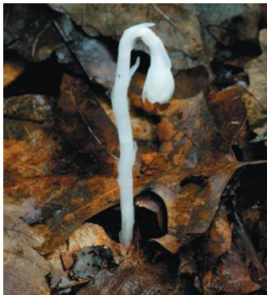  
▲ Ghost pipe, a nonphoto-synthetic parasite of mycorrhizae

## Carnivorous Plants

Carnivorous plants are photosynthetic but supplement their mineral diet by capturing insects and other small animals. They live in acid bogs and other habitats where soils are poor in nitrogen and other minerals. Pitcher plants such as Nepenthes and Sarracenia have modified leaves that form water-filled funnels into which prey slip and drown, eventually to be digested by enzymes. Sundews (genus Drosera) exude a sticky fluid from tentacle-like glands on highly modified leaves. Stalked glands secrete sweet mucilage that attracts and ensnares insects, and they also release digestive enzymes. Other glands then absorb the nutrient “soup.” The highly modified leaves of Venus flytrap (Dionaea muscipula) close quickly but partially when a prey hits two trigger hairs in rapid enough succession. Smaller insects can escape, but larger ones are trapped by the teeth lining the margins of the lobes. Excitation by the prey causes the trap to narrow more and digestive enzymes to be released.

  
▲Sundew

## ◀ Pitcher plants

Venus flytraps

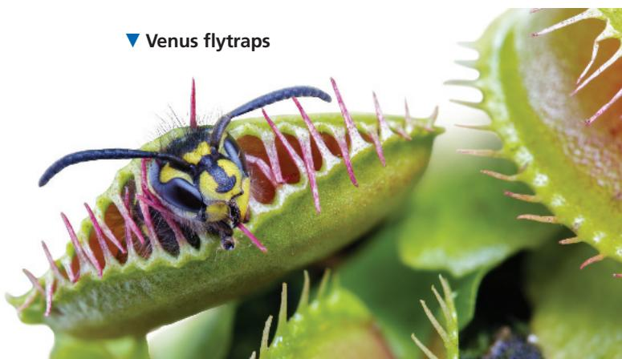

## Summary of Key Concepts

To review key terms, go to the Vocabulary Self-Quiz (eTextbook only).

## Concept 37.1: Soil contains a living, complex ecosystem

\- Soil particles of various sizes derived from the breakdown of rock are found in soil. Soil particle size affects the availability of water, oxygen, and minerals in the soil.

\- A soil's composition encompasses its inorganic and organic components. Topsoil is a complex ecosystem teeming with bacteria, fungi, protists, animals, and the roots of plants.

\- Some agricultural practices can deplete the mineral content of soil, tax water reserves, and promote erosion. The goal of soil conservation is to minimize this damage.

How is soil a complex ecosystem?

\- Nitrogen-fixing bacteria convert atmospheric $N_{2}$ to nitrogenous minerals that plants can absorb as a nitrogen source for organic synthesis. The most efficient mutualism between plants and nitrogen-fixing bacteria occurs in the nodules that are formed by Rhizobium bacteria growing in the roots of legumes. These bacteria obtain sugar from the plant and supply the plant with fixed nitrogen. In agriculture, legume crops are rotated with other crops to restore nitrogen to the soil.

\- Mycorrhizae are mutualistic associations of fungi and roots. The fungal hyphae of mycorrhizae absorb water and minerals, which they supply to their plant hosts.

\- Epiphytes grow on the surfaces of other plants but acquire water and minerals from rain. Parasitic plants absorb nutrients from host plants. Carnivorous plants supplement their mineral nutrition by digesting animals.

Do all plants gain energy directly from photosynthesis? Explain.

For suggested answers, see Appendix A.

## Concept 37.2: Plant roots absorb many types of essential elements from the soil

\- Macronutrients, elements required in relatively large amounts, include carbon, oxygen, hydrogen, nitrogen, and other major ingredients of organic compounds. Micronutrients, elements required in very small amounts, typically have catalytic functions as cofactors of enzymes.

\- Deficiency of a mobile nutrient usually affects older organs more than younger ones; the reverse is true for nutrients that are less mobile within a plant. Macronutrient deficiencies are most common, particularly deficiencies of nitrogen, phosphorus, and potassium.

\- Rather than tailoring the soil to match the plant, genetic engineers are tailoring the plant to match the soil.

Do plants need soil to grow? Explain.

## Concept 37.3: Plant nutrition often involves relationships with other organisms

\- Rhizobacteria derive their energy from the rhizosphere, a microorganism-enriched ecosystem intimately associated with roots. Plant secretions support the energy needs of the rhizosphere. Some rhizobacteria produce antibiotics, whereas others make nutrients more available for plants. Most are free-living, but some live inside plants. Plants satisfy most of their huge need for nitrogen from the bacterial decomposition of humus and the fixation of gaseous nitrogen.

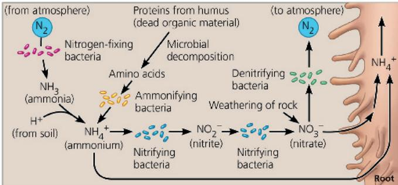

## Test Your Understanding

For more multiple-choice questions, go to the Practice Test (eTextbook only).

## Levels 1-2: Remembering/Understanding

1. The inorganic nutrient most often lacking in crops is
(A) carbon.
(C) phosphorus.
(B) nitrogen.
(D) potassium.

2. Micronutrients are needed in very small amounts because (A) most of them are mobile in the plant.

(B) most serve mainly as cofactors of enzymes.

(C) most are supplied in large enough quantities in seeds.

(D) they play only a minor role in the growth and health of the plant.

3. Mycorrhizae enhance plant nutrition mainly by

(A) absorbing water and minerals through the fungal hyphae.

(B) providing sugar to root cells, which have no chloroplasts.

(C) converting atmospheric nitrogen to ammonia.

(D) enabling the roots to parasitize neighboring plants.

## 4. What are epiphytes?

(A) fungi that attack plants

(B) fungi that form mutualistic associations with roots

(C) nonphotosynthetic parasitic plants

(D) plants that grow on other plants

5. A problem with intensive irrigation is

(A) overfertilization.

(B) aquifer depletion.

(C) the long-term depletion of soil oxygen.

(D) the clogging of waterways by vegetation debris.

## Levels 3-4: Applying/Analyzing

6. A mineral deficiency is likely to affect older leaves more than younger leaves if

(A) the mineral is a micronutrient.

(B) the mineral is very mobile within the plant.

(C) the mineral is required for chlorophyll synthesis.

(D) the mineral is a macronutrient.

7. The greatest difference in health between two groups of plants of the same species, one group with mycorrhizae and one group without mycorrhizae, would be in an environment

(A) where nitrogen-fixing bacteria are abundant.

(B) that has soil with poor drainage.

(C) that has hot summers and cold winters.

(D) in which the soil is relatively deficient in mineral nutrients.

8. Two groups of tomatoes were grown under laboratory conditions, one with humus added to the soil and one a control without humus. The leaves of the plants grown without humus were yellowish (less green) compared with those of the plants grown in humus-enriched soil. The best explanation is that

(A) the healthy plants used the food in the decomposing leaves of the humus for energy to make chlorophyll.

(B) the humus made the soil more loosely packed, so water penetrated more easily to the roots.

(C) the humus contained minerals such as magnesium and iron needed for the synthesis of chlorophyll.

(D) the heat released by the decomposing leaves of the humus caused more rapid growth and chlorophyll synthesis.

9. The specific relationship between a legume and its mutualistic Rhizobium strain probably depends on

(A) each legume having a chemical dialogue with a fungus.

(B) each Rhizobium strain having a form of nitrogenase that works only in the appropriate legume host.

(C) each legume being found where the soil has only the Rhizobium specific to that legume.

(D) specific recognition between chemical signals and signal receptors of the Rhizobium strain and legume species.

10. DRAW IT Draw a simple sketch of cation exchange, showing a root hair, a soil particle with anions, and a hydrogen ion displacing a mineral cation.

## Levels 5-6: Evaluating/Creating

11. EVOLUTION CONNECTION Imagine taking the plant out of the picture in Figure 37.11. Write a paragraph explaining how soil bacteria could sustain the recycling of nitrogen before land plants evolved.

12. SCIENTIFIC INQUIRY Acid precipitation has an abnormally high concentration of hydrogen ions ( $H^{+}$ ). One effect of acid precipitation is to deplete the soil of nutrients such as calcium ( $Ca^{2+}$ ), potassium ( $K^{+}$ ), and magnesium ( $Mg^{2+}$ ). Propose a hypothesis to explain how acid precipitation washes these nutrients from the soil. How might you test your hypothesis?

13. SCIENCE, TECHNOLOGY, AND SOCIETY In many countries, irrigation is depleting aquifers to such an extent that land is subsiding, harvests are decreasing, and it is becoming necessary to drill wells deeper. In many cases, the withdrawal of groundwater has now greatly surpassed the aquifers' rates of natural recharge. Discuss the possible consequences of this trend. What can society and science do to help alleviate this growing problem?

14. WRITE ABOUT A THEME: INTERACTIONS The soil in which plants grow teems with organisms from every taxonomic kingdom. In a short essay (100–150 words), discuss examples of how the mutualistic interactions of plants with bacteria, fungi, and animals improve plant nutrition.

## 15. SYNTHESIZE YOUR KNOWLEDGE

Making a footprint in the soil seems like an insignificant event. In a short essay (100–150 words), explain how a footprint would affect the properties of the soil and how these changes would affect soil organisms and the emergence of seedlings.

For selected answers, see Appendix A.

## Explore Scientific Papers with Science in the Classroom | AAAS

How do parasitic plants communicate with their hosts? Go to “Getting to Know Your Neighbors” at www.scienceintheclassroom.org.

Instructors: Questions can be assigned in Mastering Biology.

