# 第38章 Angiosperm Reproduction and Biotechnology

<!-- 章节边界按正文内容恢复；原始 MinerU 内容保留如下。 -->

# Angiosperm Reproduction and Biotechnology

## Key Concepts

38.1 Flowers, double fertilization, and fruits are key features of the angiosperm life cycle

38.2 Flowering plants reproduce sexually, asexually, or both

38.3 People modify crops by breeding and genetic engineering

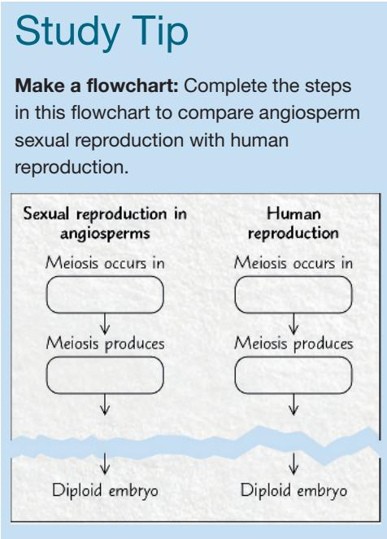

Figure 38.1 The orchid Ophrys speculum, shown above, is pollinated only by male wasps of the species Dasyscolia ciliata. The flowers resemble the female wasps visually and tactilely, and even release a similar scent. Male wasps who attempt to mate with the flowers (inset) get dusted with pollen. After the males fly off, they often transfer pollen to other Ophrys flowers. Pollination is critical to sexual reproduction in angiosperms.  
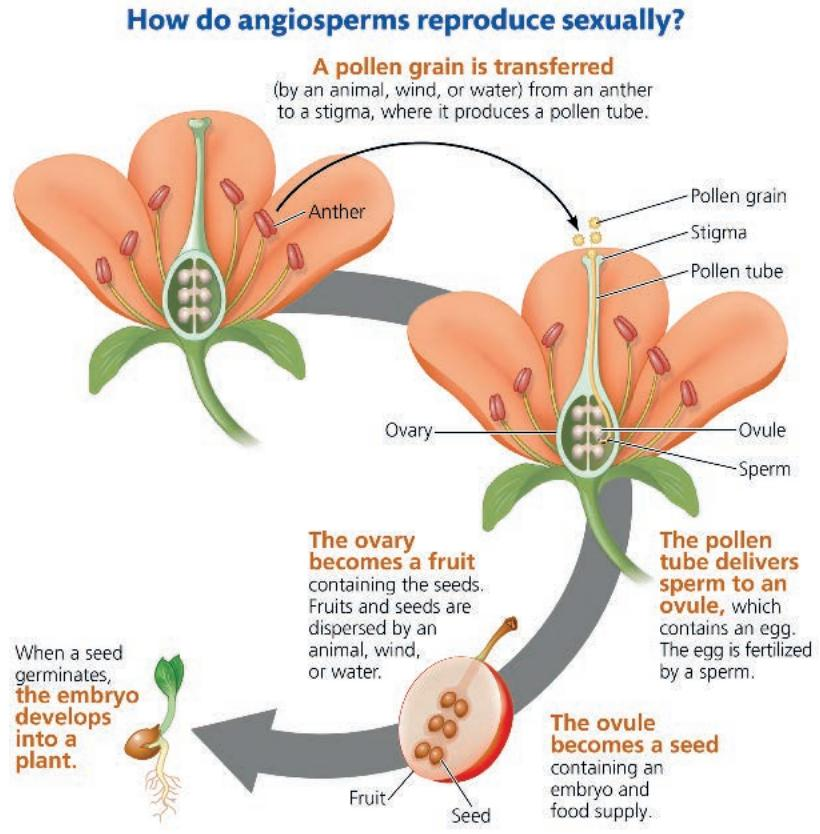

# Concept 38.1: Flowers, double fertilization, and fruits are key features of the angiosperm life cycle

In Chapters 29 and 30, we approached plant reproduction from an evolutionary perspective, tracing the descent of plants from algal ancestors. Angiosperms are the most important group of plants in most terrestrial ecosystems, but the importance of angiosperm reproduction is limited not just to natural ecosystems: The cultivation of angiosperms forms the basis for much of agriculture. For more than 10,000 years, plant breeders have genetically manipulated the traits of a few hundred wild angiosperm species by artificial selection, transforming them into the crops we grow today. In recent decades, genetic engineering has dramatically increased the variety of ways and the speed with which we can modify plants, but many controversies have followed in the wake of this new biotechnology. Here, we examine the reproduction of angiosperms, both sexual and asexual, in detail.

The life cycles of all plants are characterized by an alternation of generations, in which multicellular haploid $(n)$ and multicellular diploid $(2n)$ generations alternately produce each other (see Figure 13.6b). The diploid plant, the sporophyte, produces haploid spores by meiosis. These spores divide by mitosis, giving rise to multicellular gametophytes, the male and female haploid plants that produce gametes (sperm and eggs). Fertilization, the fusion of gametes, results in a diploid zygote, which divides by mitosis and forms a new sporophyte. In angiosperms, the sporophyte is the dominant generation: It is larger, more conspicuous, and longer-lived than the gametophyte. The key traits of the angiosperm life cycle can be remembered as the “three Fs”—flowers, double fertilization, and fruits. We’ll begin with flowers.

## Flower Structure and Function

In angiosperms, the flower is the sporophytic structure specialized for sexual reproduction. A flower is typically composed of four types of floral organs: carpels, stamens, petals, and sepals (Figure 38.2). When viewed from above, these organs take the form of concentric whorls. Carpels form the first (innermost) whorl, stamens the second, petals the third, and sepals the fourth (outermost) whorl. All are attached to a part of the stem called the receptacle. Flowers are determinate shoots; they cease growing after the flower and fruit are formed.

Carpels and stamens are sporophylls—modified leaves specialized for reproduction (see Concept 30.1); sepals and petals are sterile modified leaves. A carpel (megasporophyll) has an ovary at its base and a long, slender neck called the style. At the top of the style is a sticky structure called the stigma that captures pollen. Within the ovary are one or more ovules, which become seeds if fertilized; the number of ovules depends on the species. The flower in Figure 38.2 has a single carpel, but many species have multiple carpels. In most species, the carpels are fused, resulting in a compound ovary with two or more chambers, each containing one or more ovules. The term pistil is sometimes used to refer to a single carpel or two or more fused carpels (Figure 38.3). A stamen (microsporophyll) consists of a stalk called the filament and a terminal structure called the anther;

Figure 38.2 The structure of an idealized flower.  

within the anther are chambers called microsporangia (pollen sacs) that produce pollen. Petals are typically more brightly colored than sepals and advertise the flower to insects and other animal pollinators. Sepals, which enclose and protect unopened floral buds, usually resemble leaves more than the other floral organs do.

Complete flowers have all four basic floral organs (see Figure 38.2). Some species have incomplete flowers, lacking sepals, petals, stamens, or carpels. For example, most grass flowers lack petals. Some incomplete flowers are sterile, lacking functional stamens and carpels; others are unisexual (sometimes called imperfect), lacking either stamens or carpels. Flowers also vary in size, shape, color, odor, organ arrangement, and time of

Figure 38.3 The relationship between the terms carpel and pistil. A simple pistil consists of a single, unfused carpel. A compound pistil consists of two or more fused carpels. Some types of flowers have only a single pistil, while other types have many pistils. In either case, the pistils may be simple or compound.

opening. Some are borne singly, while others are arranged in showy clusters called inflorescences. For example, a sunflower consists of a central disk composed of hundreds of tiny incomplete flowers, surrounded by sterile, incomplete flowers that look like yellow petals (see Figure 40.23). Much of floral diversity represents adaptation to specific pollinators.

## Methods of Pollination

Pollination is the transfer of pollen to the ovule-bearing structure of a seed plant. In angiosperms, this transfer is from an anther to a stigma. Pollination can occur by wind, water, or animals (Figure 38.4). In wind-pollinated species, including grasses and

## Exploring Flower Pollination

## Figure 38.4

Most angiosperm species rely on a living (biotic) or nonliving (abiotic) pollinating agent that can move pollen from the anther of a flower on one plant to the stigma of a flower on another plant. Approximately 80% of all angiosperm pollination is biotic, employing animal go-betweens. Among abiotically pollinated species, 98% rely on wind and 2% on water. (Some angiosperm species can self-pollinate, but such species are limited to inbreeding in nature.)

## Abiotic Pollination by Wind

About 20% of all angiosperm species are wind-pollinated. Since their reproductive success does not depend on attracting pollinators, there has been no selective pressure favoring colorful or scented flowers. Accordingly, the flowers of wind-pollinated species are often small, green, and inconspicuous, and they produce neither scent nor the sugary solution called nectar. Most temperate trees and grasses are wind-pollinated. The flowers of hazel (Corylus avellana) and many other temperate, wind-pollinated trees appear in the early spring, when there are no leaves to interfere with pollen movement. The relative inefficiency of wind pollination is compensated for by production of copious amounts of pollen grains. Wind tunnel studies reveal that wind pollination is often more efficient than it appears because floral structures can create eddy currents that aid in pollen capture.

  
▲ Hazel carpellate flower (carpels only)

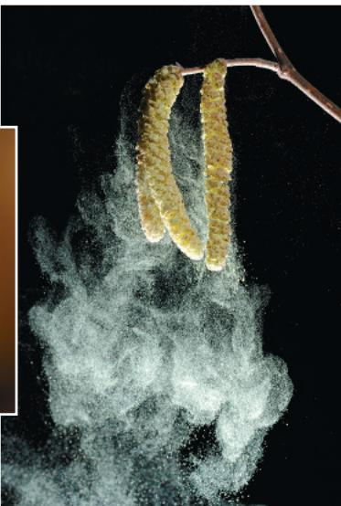  
▲ Hazel staminate flowers (stamens only) releasing clouds of pollen

## Pollination by Bees

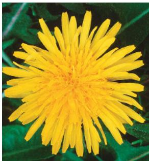  
▲ Common dandelion under normal light

  
▲ Common dandelion under ultraviolet light

About 65% of all flowering plants require insects for pollination; the percentage is even greater for major crops. Bees are the most important insect pollinators, and there is great concern in Europe and North America that honeybee populations have shrunk. Pollinating bees depend on nectar and pollen for food. Typically, bee-pollinated flowers have a delicate, sweet

fragrance. Bees are attracted to bright colors, primarily yellow and blue. Red appears dull to them, but they can see ultraviolet radiation. Many species of bee-pollinated flowers, such as the common dandelion (Taraxacum vulgare), have ultraviolet markings called “nectar guides” that help insects locate the nectaries (nectar-producing glands) but are only visible to human eyes under ultraviolet light.

## Pollination by Moths and Butterflies

Moths and butterflies detect odors, and the flowers they pollinate are often sweetly fragrant. Butterflies perceive many bright colors, but moth-pollinated flowers are usually white or yellow, which stand out at night when moths are active. A yucca plant (shown here) is typically pollinated by a single species of moth with appendages that pack pollen onto the stigma. The moth then deposits eggs directly into the ovary. The larvae eat some developing seeds, but this cost is outweighed by the benefit of an efficient and reliable pollinator. If a moth deposits too many eggs, the flower stops developing and drops off, selecting against individuals that overexploit the plant.

  
▲ Moth on yucca flower

many trees, the release of clouds of typically small-sized pollen compensates for the randomness of dispersal by the wind. At certain times of the year, the air is loaded with pollen grains, as anyone plagued with pollen allergies can attest. Some species of aquatic plants rely on water to disperse pollen. Most angiosperm species, however, depend on insects, birds, or other animal pollinators to transfer pollen directly from one flower to another.

## Pollination by Flies

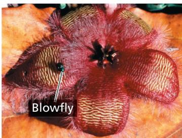  
▲ Blowfly on carrion flower

Many fly-pollinated flowers are reddish and fleshy, with an odor like rotten meat. Blowflies visiting carrion flowers (Stapelia species) mistake the flower for a rotting corpse and lay their eggs on it. In the process, the blowflies become dusted with pollen that they carry to other flowers. When the eggs hatch, the larvae find no carrion to eat and die.

## Pollination by Bats

Bat-pollinated flowers, like moth-pollinated flowers, are light-colored and aromatic, attracting their nocturnal

pollinators. The lesser long-nosed bat (Leptonycteris curasoae yerbabue- nae) feeds on the nectar and pollen of agave and cactus flowers in the southwestern United States and Mexico. In feeding, the bats transfer pollen from plant to plant. Long-nosed bats are an endangered species.

  
▲ Long-nosed bat feeding on agave flowers at night

## Pollination by Birds

Bird-pollinated flowers are usually bright red and have little odor since birds typically lack a well-developed sense of smell. As a lure to attract their avian pollinators, hummingbird-pollinated flowers produce a sugary nectar that helps meet the high energy demands of these birds. The petals of such flowers are often fused, forming a bent tapering floral tube with nectar-producing glands (nectaries) located at the internal termini of the tubes. Hummingbirds collect the nectar by rapidly inserting their long flexible tongues into the floral tubes at rates of more than 10 times per second.

EVOLUTION Animal pollinators are drawn to flowers for the food they provide in the form of pollen and nectar. Attracting pollinators that are loyal to a given plant species is an efficient way to ensure that pollen is transferred to another flower of the same species. Natural selection, therefore, favors deviations in floral structure or physiology that make it more likely for a flower to be pollinated regularly by an effective animal species. If a plant species develops traits that make its flowers more prized by pollinators, there is a selective pressure for pollinators to become adept at harvesting food from these flowers. The joint evolution of two interacting species, each in response to selection imposed by the other, is called coevolution. For example, some species have fused flower petals that form long, tubelike structures bearing nectaries tucked deep inside. Charles Darwin suggested that coadaptations between flower and insect might lead to correspondences between the length of a floral tube and the length of an insect's proboscis, a straw-like mouthpart. Based on the length of a long, tubular flower endemic to Madagascar, Darwin predicted the existence of a pollinating moth with a 28-cm-long proboscis. Such a moth was discovered two decades after Darwin's death (Figure 38.5).

Climate change may be affecting long-standing relationships between plants and animal pollinators. For example, flowers that require long-tongued pollinators have declined under the warmer conditions in the Rocky Mountains. As a result, there has been selective pressure favoring bumblebees with shorter tongues. Two species of Rocky Mountain bumblebees now have tongues that are about one-quarter shorter than those of bees of the same species 50 years ago.

Figure 38.5 Coevolution of a flower and an insect pollinator.  
The long floral tube of the Madagascar orchid Angraecum sesquipedale has coevolved with the 28-cm-long proboscis of its pollinator, the hawk moth Xanthopan morganii praedicta. The moth is named in honor of Darwin's prediction of its existence.  
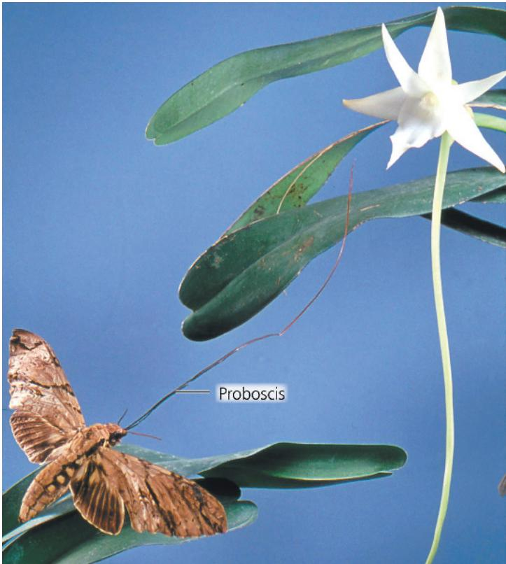

## The Angiosperm Life Cycle: An Overview

Pollination is one step in the angiosperm life cycle. Figure 38.6 provides a complete overview of the life cycle, focusing on gametophyte development, sperm delivery by pollen tubes, double fertilization, and seed development.

Over the course of seed plant evolution, gametophytes became reduced in size and wholly dependent on the sporophyte for nutrients (see Figure 30.2). The gametophytes of angiosperms are the most reduced of all plants, consisting of only a few cells: They are microscopic, and their development is obscured by protective tissues.

## Development of Female Gametophytes (Embryo Sacs)

As a carpel develops, one or more ovules form deep within its ovary, its swollen base. A female gametophyte, also known as an embryo sac, develops inside each ovule. The process of embryo sac formation occurs in a tissue called the megasporangium ① within each ovule. Two integuments (layers of protective sporophytic tissue that will develop into the seed coat) surround each megasporangium, except at a gap called the micropyle. Female gametophyte development begins when one cell in the megasporangium of each ovule, the megasporocyte, enlarges and undergoes meiosis, producing four haploid megaspores. Usually only one megaspore survives; the other three degenerate.

The nucleus of the surviving megaspore divides by mitosis three times without cytokinesis, resulting in one large cell with eight haploid nuclei. The multinucleate mass is then divided by membranes to form the embryo sac. Near the micropyle of the embryo sac, two synergid cells flank the egg and help attract and guide the pollen tube to the embryo sac. At the opposite end of the embryo sac are three antipodal cells of unknown function. The other two nuclei, called polar nuclei, are not partitioned into separate cells but share the cytoplasm of the large central cell of the embryo sac. The mature embryo sac thus consists of eight nuclei contained within seven cells. The ovule, which will become a seed if fertilized, now consists of the embryo sac, enclosed by the megasporangium (which eventually withers) and two surrounding integuments.

## Development of Male Gametophytes in Pollen Grains

As the stamens are produced, each anther ② develops four microsporangia, also called pollen sacs. Within the microsporangia are many diploid cells called microsporocytes. Each microsporocyte undergoes meiosis, forming four haploid microspores, ③ each of which eventually gives rise to a haploid male gametophyte. Each microspore then undergoes mitosis, producing a haploid male gametophyte consisting of only two

cells: the generative cell and the tube cell. Together, these two cells and the spore wall constitute a pollen grain. The spore wall, which consists of material produced by both the microspore and the anther, usually exhibits an elaborate pattern unique to the species. During maturation of the male gametophyte, the generative cell passes into the tube cell: The tube cell now has a completely free-standing cell inside it.

## Sperm Delivery by Pollen Tubes

After the microsporangium breaks open and releases pollen, a pollen grain may be transferred to a receptive surface of a stigma—the act of pollination. There, it absorbs water and germinates by producing a pollen tube, a long cellular protuberance that delivers sperm to the female gametophyte.

A pollen grain typically consists of the spore wall and two cells: a tube cell and a second cell, the generative cell, contained within the tube cell. As the pollen tube elongates through the style, the nucleus of the generative cell divides by mitosis and produces two sperm, which remain inside the tube cell. The tube nucleus leads ahead of the two sperm as the pollen tube grows toward the micropyle in response to chemical attractants produced by the synergid cells. The arrival of the pollen tube initiates the death of one of the two synergids, thereby providing a passageway into the embryo sac. The two sperm are then released from the pollen tube ④ in the vicinity of the female gametophyte.

## Double Fertilization

Fertilization, the fusion of gametes, occurs after the two sperm reach the female gametophyte. One sperm fertilizes the egg, forming the zygote. The other sperm combines with the two polar nuclei, forming a triploid (3n) nucleus in the center of the large central cell of the female gametophyte. This cell will give rise to the endosperm, a multicellular, food-storing tissue of the seed.

⑤ The union of the two sperm cells with different nuclei of the female gametophyte is called double fertilization. Double fertilization ensures that endosperm develops only in ovules where the egg has been fertilized, thereby preventing angiosperms from squandering nutrients on infertile ovules. Near the time of double fertilization, the tube nucleus, the other synergid cell, and the antipodal cells degenerate.

## Seed Development

⑥ After double fertilization, each ovule develops into a seed. Meanwhile, the ovary develops into a fruit, which encloses the seeds and aids in their dispersal by wind or animals. As the sporophyte embryo develops from the zygote, the seed stock-piles proteins, oils, and starch to varying degrees, depending on the species. This is why seeds are such a major nutrient drain. Initially, carbohydrates and other nutrients are stored in the seed's endosperm, but later, depending on the species, the swelling cotyledons (seed leaves) of the embryo may take over this function. When a seed germinates, ⑦ the embryo develops into a new sporophyte. The mature sporophyte produces its own flowers and fruits: The life cycle is now complete, but it is necessary to examine more closely how an ovule develops into a mature seed.

Figure 38.6 The life cycle of an angiosperm.

For simplicity, a flower with a single carpel (simple pistil) is shown. Many species have multiple carpels, either separate or fused.

  
VISUAL SKILLS Mitosis continues throughout the life cycle. Where in the cycle would the most mitotic divisions occur?

## Seed Development and Structure

After successful pollination and double fertilization, a seed begins to form. During this process, both the endosperm and the embryo develop. When mature, a seed consists of a dormant embryo surrounded by stored food and protective layers.

## Endosperm Development

Endosperm usually begins development before the embryo does. After double fertilization, the triploid nucleus of the ovule's central cell divides mitotically, forming a multinucleate "supercell" that has a milky consistency. This liquid mass, the endosperm, becomes multicellular when cytokinesis partitions the cytoplasm by forming membranes between the nuclei. Eventually, these "naked" cells produce cell walls, and the endosperm becomes solid. Coconut "milk" and "meat" are examples of liquid and solid endosperm. The white fluffy part of popcorn is another example of endosperm. The endosperms of just three grains—wheat, maize, and rice—provide much of the food energy for human sustenance.

In grains and most other species of monocots, as well as many eudicots, the endosperm stores nutrients that can be used by the seedling after germination. In other eudicot seeds, the food reserves of the endosperm are completely exported to the cotyledons before the seed completes its development; consequently, the mature seed lacks endosperm.

## Embryo Development

The first mitotic division of the zygote is asymmetrical and splits the fertilized egg into a basal cell and a terminal cell (Figure 38.7). The terminal cell eventually gives rise to most of the embryo. The basal cell continues to divide, producing a thread of cells called the suspensor, which anchors the embryo to the parent plant. The suspensor helps in transferring nutrients to the embryo from the parent plant and, in some species, from the endosperm. As the suspensor elongates, it pushes the embryo deeper into the nutritive and protective tissues. Meanwhile, the terminal cell divides several times and then forms a spherical proembryo (early embryo) that is attached to the suspensor. The cotyledons begin to form as bumps on the proembryo. A eudicot embryo, with its two cotyledons, is heart-shaped at this stage of development.

Soon after the rudimentary cotyledons appear, the embryo elongates. Cradled between the two cotyledons is the embryonic shoot apex. At the opposite end of the embryo's axis, where the suspensor attaches, an embryonic root apex forms. After the seed germinates—indeed, for the rest of the plant's life—the apical meristems at the apices of shoots and roots sustain primary growth (see Figure 35.11).

## Structure of the Mature Seed

During the last stages of its maturation, the seed dehydrates until its water content is only about 5–15% of its weight. The embryo, which is surrounded by a food supply (cotyledons, endosperm, or both), enters dormancy; that is, it stops growing and its metabolism nearly ceases. The embryo and its food supply are enclosed by a hard, protective seed coat formed from the integuments of the ovule. In some species, dormancy is imposed by the presence of an intact seed coat rather than by the embryo itself.

Figure 38.7 The development of a eudicot plant embryo. By the time the ovule becomes a mature seed and the integuments harden and thicken into the seed coat, the zygote has given rise to an embryonic plant with rudimentary organs.  

If you split apart a seed of the garden bean, a type of eudicot, you can see that the embryo consists of an elongate structure, the embryonic axis, attached to two thick, fleshy cotyledons (Figure 38.8a). Below where the cotyledons are attached, the embryonic axis is called the hypocotyl (from the Greek hypo, under). The hypocotyl terminates in the radicle, or embryonic root. The portion of the embryonic axis above where the cotyledons are attached and below the first pair of miniature leaves is the epicotyl (from the Greek epi, on, over). The epicotyl, young leaves, and shoot apical meristem are collectively called the plumule.

The cotyledons of the common garden bean are packed with starch before the seed germinates because they absorbed carbohydrates from the endosperm when the seed was developing. However, the seeds of some eudicot species, such as castor beans (Ricinus communis), retain their food supply in the endosperm and have very thin cotyledons. The cotyledons absorb nutrients from the endosperm and transfer them to the rest of the embryo when the seed germinates.

Figure 38.8 Seed structure.

  
(a) Common garden bean, a eudicot with thick cotyledons. The fleshy cotyledons store food absorbed from the endosperm before the seed germinates.

(b) Maize, a monocot. Like all monocots, maize has only one cotyledon. Maize and other grasses have a large cotyledon called a scutellum. The rudimentary shoot is sheathed in a structure called the coleoptile, and the coleorhiza covers the young root.

MAKE CONNECTIONS In addition to cotyledon number, how do the structures of monocots and eudicots differ? (See Figure 30.16.) VISUAL SKILLS Which mature seed lacks an endosperm? What happened to it?

For suggested answers, see Appendix A.

The embryos of monocots possess only a single cotyledon (Figure 38.8b). Grasses, including maize and wheat, have a specialized cotyledon called a scutellum (from the Latin scutella, small shield, a reference to its shape). The scutellum, which has a large surface area, is pressed against the endosperm, from which it absorbs nutrients during germination. The embryo of a grass seed is enclosed within two protective sheaths: a coleoptile, which covers the young shoot, and a coleorhiza, which covers the young root. Both structures aid in soil penetration during early germination.

## Seed Dormancy: An Adaptation for Tough Times

The environmental conditions required to break seed dormancy vary among species. Some seed types germinate as soon as they are in a suitable environment. Others remain dormant, even if sown in a favorable place, until a specific environmental cue causes them to break dormancy.

The requirement for specific cues to break seed dormancy increases the chances that germination will occur at a time and place most advantageous to the seedling. The seeds of many desert plants, for instance, germinate only after a substantial rainfall. If they were to germinate after a mild drizzle, the soil might soon become too dry to support the seedlings. Where natural fires are common, many seeds require intense heat or smoke to break dormancy; seedlings are therefore most abundant after fire has cleared away competing vegetation. Where winters are harsh, seeds may require extended exposure to cold before they germinate; seeds sown during summer or fall will therefore not germinate until the following spring,

ensuring a long growth season before the next winter. Many small seeds require light for germination, an adaptation that prevents them from germinating when they are buried so deeply in the soil that their energy reserves would be exhausted before their plumules could reach sunlight. Some seeds have coats that must be weakened by chemical attack as they pass through an animal's digestive tract and thus are usually carried a long distance before germinating from feces.

The length of time a dormant seed remains viable and capable of germinating varies from a few days to decades or even longer, depending on the plant species and environmental conditions. The oldest carbon-14-dated seed that has grown into a viable plant was a 2,000-year-old date palm seed from Israel. Most seeds are durable enough to last a year or two until conditions are favorable for germinating. Thus, the soil has a bank of ungerminated seeds that may have accumulated for several years. This is one reason vegetation reappears so rapidly after an environmental disruption such as fire.

## Sporophyte Development from Seed to Mature Plant

When environmental conditions are conducive for growth, seed dormancy is lost and germination proceeds. Germination is followed by growth of stems, leaves, and roots, and eventually by flowering.

## Seed Germination

Seed germination is initiated by imbibition, the uptake of water due to the low water potential of the dry seed. Imbibition causes the seed to expand and rupture its coat and triggers changes in the embryo that enable it to resume growth. Following hydration, enzymes digest the storage materials of the endosperm or cotyledons, and the nutrients are transferred to the growing regions of the embryo.

The first organ to emerge from the germinating seed is the radicle, the embryonic root. The development of a root system anchors the seedling in the soil and supplies it with water necessary for cell expansion. A ready supply of water is a prerequisite for the next step, the emergence of the shoot tip into the drier conditions encountered above ground. In garden beans, for example, a hook forms in the hypocotyl, and growth pushes the hook above ground (Figure 38.9a, on the next page). In response to light, the hypocotyl straightens, the cotyledons separate, and the delicate epicotyl, now exposed, spreads its first true leaves (as distinct from the cotyledons, or seed leaves). These leaves expand, become green, and begin making food by photosynthesis. The shriveled, energy-depleted cotyledons that supplied food for the developing embryo are shed.

Some monocots, such as maize and other grasses, use a different method for breaking ground as they germinate (Figure 38.9b). The coleoptile pushes up through the soil and into the air. The shoot tip grows through the tunnel provided by the coleoptile and breaks through the coleoptile's tip upon emergence.

## Growth and Flowering

Once a seed has germinated and started to photosynthesize, most of the plant's resources are devoted to primary and secondary growth of stems, leaves, and roots (also known as vegetative growth). This growth arises from the activity of meristematic cells (see

Figure 38.9 Two common types of seed germination.  
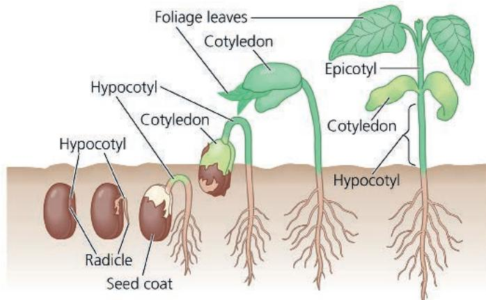  
(a) Common garden bean. In common garden beans, straightening of a hook in the hypocotyl pulls the cotyledons from the soil.

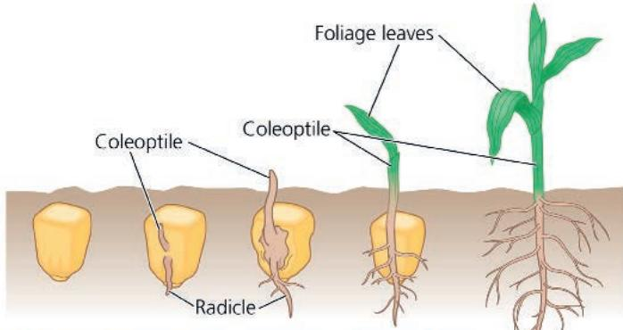  
(b) Maize. In maize and other grasses, the shoot grows straight up through the tube of the coleoptile.  
Figure 38.10 The flower-to-fruit transition.

VISUAL SKILLS How do bean and maize seedlings protect their shoot systems as they push through the soil?

For suggested answer, see Appendix A.

Concept 35.2). During this stage, plants usually photosynthesize and grow as much as possible before flowering, the reproductive phase.

The flowers of a given plant species typically appear suddenly and simultaneously at a specific time of year. Such timing promotes outbreeding, the main advantage of sexual reproduction. Flower formation involves a developmental switch in the shoot apical meristem from a vegetative to a reproductive growth mode. This transition into a floral meristem is triggered by a combination of environmental cues (such as day length) and internal signals, as you'll learn in Concept 39.3. Once the transition to flowering has begun, the order of each organ's emergence from the floral meristem determines whether it will develop into a sepal, petal, stamen, or carpel (see Figure 35.33).

## Fruit Structure and Function

Before a seed can germinate and develop into a mature plant, it must be deposited in suitable soil. Fruits play a key role in this process. A fruit is the mature ovary of a flower. While the seeds are developing from ovules, the flower develops into a fruit (Figure 38.10). The fruit protects the enclosed seeds and, when

After flowers are fertilized, stamens and petals fall off, stigmas and styles wither, and the ovary walls that house the developing seeds swell to form fruits. Developing seeds and fruits are major sinks for sugars and other carbohydrates. Phytolacca americana (American pokeweed) flowers and fruits are shown here.

mature, aids in their dispersal by wind or animals. Fertilization triggers hormonal changes that cause the ovary to begin its transformation into a fruit. If a flower has not been pollinated, fruit typically does not develop, and the flower usually withers and dies.

During fruit development, the ovary wall becomes the pericarp, the thickened wall of the fruit. In some fruits, such as soybean pods, the ovary wall dries out completely at maturity, whereas in other fruits, such as grapes, it remains fleshy. In still others, such as peaches, the inner part of the ovary becomes stony (the pit) while the outer parts stay fleshy. As the ovary grows, the other parts of the flower usually wither and are shed.

Fruits are classified into several types, depending on their developmental origin. In most species, a fruit is derived from a single carpel or several fused carpels and is called a simple fruit (Figure 38.11a). An aggregate fruit results from a single flower that has more than one separate carpel, each forming a small fruit (Figure 38.11b). These “fruitlets” are clustered together on a single receptacle, as in a raspberry. A multiple fruit develops from an inflorescence, a group of flowers tightly clustered together. When the walls of the many ovaries start to thicken, they fuse together and become incorporated into one fruit, as in a pineapple (Figure 38.11c).

In some angiosperms, other floral parts contribute to what we commonly call the fruit. Such a fruit is called an accessory fruit. In apple flowers, the ovary is embedded in the receptacle, and the fleshy part of this simple fruit is derived mainly from the enlarged receptacle; only the apple core develops from the ovary (Figure 38.11d). Another example is the strawberry, an aggregate fruit consisting of an enlarged receptacle studded with tiny, partially embedded fruits, each bearing a single seed.

A fruit usually ripens about the same time that its seeds complete their development. Whereas the ripening of a dry fruit, such as a soybean pod, involves the aging and drying out of fruit tissues, the process in a fleshy fruit is more elaborate. Complex interactions of hormones result in an edible fruit that entices animals that disperse the seeds. The fruit's "pulp" becomes softer as enzymes digest components of cell walls. The color usually changes from green to another color, making the fruit more visible among the leaves. The fruit becomes sweeter as organic acids or starch molecules are converted to sugar, which may reach a concentration of 20% in a ripe fruit.

Figure 38.11 Developmental origin of different classes of fruits.  
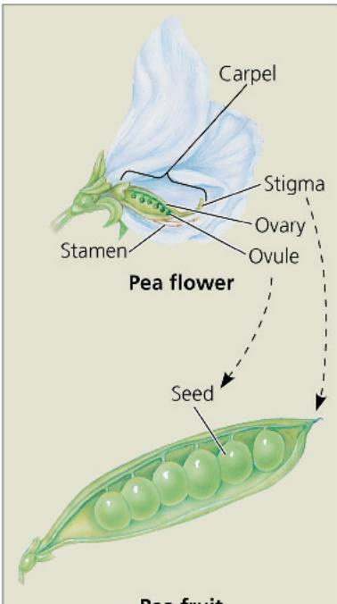  
(a) Simple fruit. A simple fruit develops from a single carpel (or several fused carpels) of one flower (examples: pea, lemon, peanut).

  
(b) Aggregate fruit. An aggregate fruit develops from many separate carpels of one flower (examples: raspberry, blackberry, strawberry).

In this section, you have learned about the key features of sexual reproduction in angiosperms—flowers, double fertilization, and fruits. Next, we'll examine asexual reproduction.

1. Distinguish between pollination and fertilization.

## Concept Check 38.1

2. WHAT IF? If flowers had shorter styles, pollen tubes would more easily reach the embryo sac. Suggest an explanation for why very long styles have evolved in most species of flowering plants.

3. MAKE CONNECTIONS Does the life cycle of humans have any structures analogous to plant gametophytes? Explain your answer. (See Figures 13.5 and 13.6.)

For suggested answers, see Appendix A.

Figure 38.12, on the next page, examines some mechanisms of seed and fruit dispersal in more detail.  
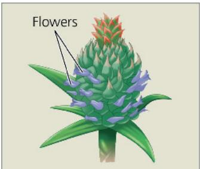  
(c) Multiple fruit. A multiple fruit develops from many carpels of the many flowers that form an inflorescence (examples: pineapple, fig).  
Pineapple inflorescence

# Concept 38.2: Flowering plants reproduce sexually, asexually, or both

During asexual reproduction, offspring are derived from a single parent without any fusion of egg and sperm. The result is a clone, an individual genetically identical to its parent. Asexual reproduction is common in angiosperms, as well as in other plants, and for some species it is the main mode of reproduction.

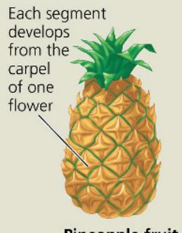  
Pineapple fruit

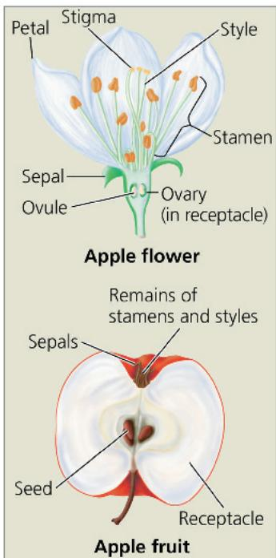  
(d) Accessory fruit. An accessory fruit develops largely from tissues other than the ovary. In the apple fruit, the ovary is embedded in a fleshy receptacle.

## Mechanisms of Asexual Reproduction

Asexual reproduction in plants is typically an extension of the capacity for indeterminate growth. Plant growth can be sustained or renewed indefinitely by meristems, regions of undifferentiated, dividing cells (see Concept 35.2). In addition, parenchyma cells throughout the plant can divide and differentiate into more specialized types of cells, enabling plants to regenerate lost parts. Detached root or stem fragments of some plants can develop into whole offspring; for example, pieces of a potato with an “eye” (bud) can each regenerate a whole plant. Such fragmentation, the separation of a parent plant into parts that develop into whole plants, is one of the most common modes of asexual reproduction. The plantlets on Kalanchoë leaves exemplify an unusual type of fragmentation (see Figure 35.7). In other cases, the root system of a single parent, such as an aspen tree, can give rise to many shoots that become separate shoot systems (Figure 38.13, after you turn the page). One aspen clone in Utah has been estimated to be composed of 47,000 stems of genetically identical trees. Although it is likely that some of the root system connections have been severed, making some of the trees isolated from the rest of the clone, each tree still shares a common genome.

A different mechanism of asexual reproduction has evolved in dandelions and some other plants. These plants can sometimes produce seeds without pollination or fertilization. This asexual production of seeds is called apomixis (from the Greek words meaning “away from the act of mixing”) because there is no joining or, indeed, production of sperm and egg. Instead, a diploid cell in the ovule gives rise to the embryo, and the ovules mature into seeds, which in the dandelion are dispersed

## Exploring Fruit and Seed Dispersal

## Figure 38.12

A plant's life depends on finding fertile ground. But a seed that falls and sprouts beneath the parent plant will stand little chance of competing successfully for nutrients. To prosper, seeds must be widely dispersed. Plants use biotic dispersal agents as well as abiotic agents such as water and wind.

## Dispersal by Water

Some buoyant seeds and fruits can survive months or years at sea. In coconut, the seed embryo and fleshy white “meat” (endosperm) are within a hard layer (endocarp) surrounded by a thick and buoyant fibrous husk.

## Dispersal by Wind

▶ With a wingspan of 12 cm, the giant seed of the tropical Asian climbing gourd Alsomitra macrocarpa glides through the air of the rain forest in wide circles when released.

The winged fruit of a maple spins like a helicopter blade, slowing descent and increasing the chance of being carried farther by horizontal winds.

  
▶ Tumbleweeds break off at the ground and tumble across the terrain, scattering their seeds.

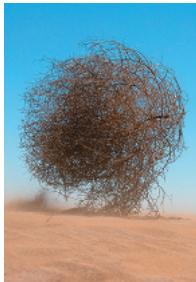  
▲ Some seeds and fruits are attached to umbrella-like "parachutes" that are made of intricately branched hairs and often produced in puffy clusters. These dandelion "seeds" (actually one-seeded fruits) are carried aloft by the slightest gust of wind.

## Dispersal by Animals

The sharp, tack-like spines on the fruits of puncture vine (Tribulus terrestris) can pierce bicycle tires and injure animals, including humans. When these painful "tacks" are removed and discarded, the seeds are dispersed.

  
Some animals, such as squirrels, hoard seeds or fruits in underground caches. If the animal dies or forgets the cache's location, the buried seeds are well positioned to germinate.  
▶ Seeds in edible fruits are often dispersed in feces, such as the black bear feces shown here. Such dispersal may carry seeds far from the parent plant.

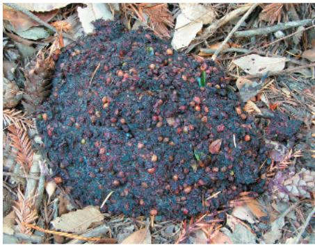

Ants are chemically attracted to seeds with “food bodies” rich in fatty acids, amino acids, and sugars. The ants carry the seed to their underground nest, where the food body (the lighter-colored attachment in the photograph) is removed and fed to larvae. Due to the seed’s size, unwieldy shape, or hard coating, the remainder is usually left intact in the nest, where it germinates.

Figure 38.13 Asexual reproduction in aspen trees.

Some aspen groves, such as those shown here, consist of thousands of trees descended by asexual reproduction. Each grove of trees derives from the root system of one parent. Thus, the grove is a clone. Notice that genetic differences between groves descended from different parents result in different timing for the development of fall color.

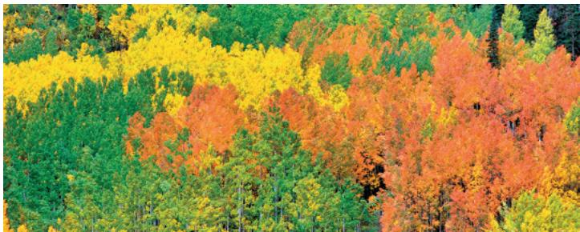

by windblown fruits. Thus, these plants clone themselves by an asexual process but have the advantage of seed dispersal, usually associated with sexual reproduction. Plant breeders are interested in introducing apomixis into hybrid crops because it would allow hybrid plants to pass desirable genomes intact to offspring.

## Advantages and Disadvantages of Asexual and Sexual Reproduction

EVOLUTION An advantage of asexual reproduction in some cases is that there is no need for pollination. This may be beneficial in situations where plants of the same species are sparsely distributed and unlikely to be successfully pollinated. Asexual reproduction also allows the plant to pass on all its genetic legacy intact to its progeny. In contrast, when reproducing sexually, a plant passes on only half of its alleles. If a plant is superbly suited to its environment, asexual reproduction can be advantageous. A vigorous plant can potentially clone many copies of itself, and if the environmental circumstances remain stable, these offspring will also be genetically well adapted to the same environmental conditions under which the parent flourished.

Asexual plant reproduction based on the vegetative growth of stems, leaves, or roots is known as vegetative reproduction. Generally, the progeny produced by vegetative reproduction are stronger than seedlings produced by sexual reproduction. In contrast, seed germination is a precarious stage in a plant's life. The tough seed gives rise to a fragile seedling that may face exposure to predators, parasites, wind, and other hazards. In the wild, few seedlings survive to become parents themselves. Production of enormous numbers of seeds compensates for the odds against individual survival and gives natural selection ample genetic variations to screen. However, this is an expensive means of reproduction in terms of the resources consumed in flowering and fruiting.

Because sexual reproduction generates variation in offspring and populations, it can be advantageous in unstable environments where evolving pathogens and other fluctuating conditions affect survival and reproductive success. In contrast, the genotypic uniformity of asexually produced plants puts them at great risk of local extinction if there is a catastrophic environmental change, such as a new strain of disease. Moreover, seeds (which are almost always produced sexually) facilitate the dispersal of offspring to more distant locations. Finally, seed dormancy allows growth to be suspended until environmental conditions become more favorable. In the Scientific Skills Exercise on the next page, you can use data to determine which species of monkey flower are mainly asexual reproducers and which are mainly sexual reproducers.

Although sexual reproduction involving two genetically different plants produces the most genetically diverse offspring, some plants, such as garden peas, usually self-fertilize. This process, called “selfing,” is a desirable attribute in some crop plants because it heightens the probability that every ovule will develop into a seed. In many angiosperm species, however, mechanisms have evolved that make it difficult or impossible for a flower to fertilize itself, as we’ll see next.

## Mechanisms That Prevent Self-Fertilization

The various mechanisms that prevent self-fertilization contribute to genetic variety by ensuring that the sperm and egg come from different parents. Some species of plants cannot self-fertilize because different individuals have either staminate flowers (lacking carpels) or carpellate flowers (lacking stamens) (Figure 38.14a). Other plants have flowers with functional stamens and carpels that mature at different times or are structurally arranged in such a way that it is unlikely

Figure 38.14 Some floral adaptations that prevent self-fertilization.  
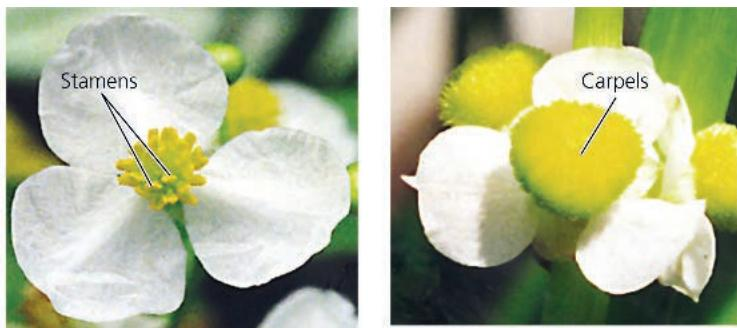

(a) Some species, such as Sagittaria latifolia (common arrowhead), have plants that produce only staminate flowers (left) or carpellate flowers (right).  
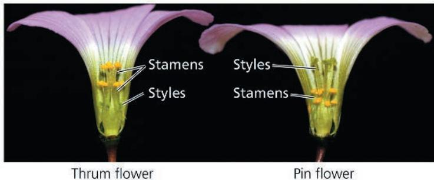  
(b) Some species, such as Oxalis alpina (alpine wood sorrel), produce two types of flowers on different individuals: "thrums," which have short styles and long stamens, and "pins," which have long styles and short stamens. An insect foraging for nectar would collect pollen on different parts of its body; thrum pollen would be deposited on pin stigmas, and vice versa.

# Scientific Skills Exercise Using Positive and Negative Correlations to Interpret Data

Do Monkey Flower Species Differ in Allocating Their Energy to Sexual Versus Asexual Reproduction? Over the course of its life span, a plant captures only a finite amount of resources and energy, which must be allocated to best meet the plant's individual requirements for maintenance, growth, defense, and reproduction. Researchers examined how five species of monkey flower (genus Mimulus) use their resources for sexual and asexual reproduction.

How the Experiment Was Done After growing specimens of each species in separate pots in the open, the researchers determined averages for nectar volume, nectar concentration, seeds produced per flower, and the number of times the plants were visited by broad-tailed hummingbirds (Selasphorus platycercus, shown here). Using greenhouse-grown specimens,

average number of rooted branches per gram fresh shoot weight for each of the species. The phrase rooted branches refers to asexual reproduction through horizontal shoots that develop roots.

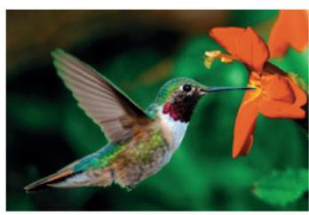

## INTERPRET THE DATA

1. A correlation is a way to describe the relationship between two variables. In a positive correlation, as the values of one of the variables increase, the values of the second variable also increase. In a negative correlation, as the values of one of the variables increase, the values of the second variable decrease. Or there may be no correlation between two variables. If researchers know how two variables are correlated, they can make a prediction about one variable based on what they know about the other variable. (a) Which variable(s) is/are positively correlated with the volume of nectar production in this genus? (b) Which is/are negatively correlated? (c) Which show(s) no clear relationship?

2. (a) Which Mimulus species would you categorize as mainly asexual reproducers? Why? (b) Which species would you categorize as mainly sexual reproducers? Why?

3. (a) Which species would probably fare better in response to a pathogen that infects all Mimulus species? (b) Which species would fare better if a pathogen caused hummingbird populations to dwindle?

Instructors: A version of this Scientific Skills Exercise can be assigned in Mastering Biology.

Data from the Experiment

<table><tr><td>Species</td><td>Nectar Volume (μL)</td><td>Nectar Concentration (% weight of sucrose/total weight)</td><td>Seeds per Flower</td><td>Visits per Flower</td><td>Rooted Branches per Gram Shoot Weight</td></tr><tr><td>M. rupestris</td><td>4.93</td><td>16.6</td><td>2.2</td><td>0.22</td><td>0.673</td></tr><tr><td>M. eastwoodiae</td><td>4.94</td><td>19.8</td><td>25</td><td>0.74</td><td>0.488</td></tr><tr><td>M. nelsonii</td><td>20.25</td><td>17.1</td><td>102.5</td><td>1.08</td><td>0.139</td></tr><tr><td>M. verbenaceus</td><td>38.96</td><td>16.9</td><td>155.1</td><td>1.26</td><td>0.091</td></tr><tr><td>M. cardinalis</td><td>50.00</td><td>19.9</td><td>283.7</td><td>1.75</td><td>0.069</td></tr></table>

Data from S. Sutherland and R. K. Vickery, Jr., Trade-offs between sexual and asexual reproduction in the genus Mimulus, Oecologia 76:330–335 (1998).

that an animal pollinator could transfer pollen from an anther to a stigma of the same flower (Figure 38.14b). However, the most common anti-selfing mechanism in flowering plants is self-incompatibility, the ability of a plant to reject its own pollen and the pollen of closely related individuals. If a pollen grain lands on a stigma of a flower of the same plant or a closely related plant, a biochemical block prevents the pollen from completing its development and fertilizing an egg. This plant response is analogous to the immune response of animals because both are based on the ability to distinguish the cells of “self” from those of “nonself.” The key difference is that the animal immune system rejects nonself, as when

the immune system mounts a defense against a pathogen or rejects a transplanted organ (see Concept 43.3). In contrast, self-incompatibility in plants is a rejection of self.

Researchers are unraveling the molecular mechanisms of self-incompatibility. Recognition of “self” pollen is based on genes called S-genes. In the gene pool of a population, there can be dozens of alleles of an S-gene. If a pollen grain has an allele that matches an allele of the stigma on which it lands, the pollen tube either fails to germinate or fails to grow through the style to the ovary. There are two types of self-incompatibility: gametophytic and sporophytic.

In gametophytic self-incompatibility, the S-allele in the pollen genome governs the blocking of fertilization. For example, an $S_{1}$ pollen grain from an $S_{1}S_{2}$ parental sporophyte cannot fertilize eggs of an $S_{1}S_{2}$ flower but can fertilize an $S_{2}S_{3}$ flower. An $S_{2}$ pollen grain cannot fertilize either flower. In some plants, this self-recognition involves the enzymatic destruction of RNA within a pollen tube. RNA-hydrolyzing enzymes are produced by the style and enter the pollen tube. If the pollen tube is a “self” type, they destroy its RNA.

In sporophytic self-incompatibility, fertilization is blocked by incompatibilities between S-allele gene products present in the sporophytic parental tissue adhering to the pollen wall and S-allele gene products secreted by the stigma of the receptive flower. For example, both the $S_{1}$ and $S_{2}$ pollen grains derived from an $S_{1}S_{2}$ parental sporophyte contain $S_{1}$ -allele and $S_{2}$ -allele gene products in the sporophytic tissue adhering to their pollen walls. The $S_{2}$ -allele gene product in the pollen walls of these two pollen types would prevent either type from germinating on the stigma of a flower whose genotype includes either the $S_{1}$ or the $S_{2}$ allele. For example, an $S_{1}$ pollen grain, derived from an $S_{1}S_{2}$ parent, cannot germinate on the stigma of an $S_{2}S_{3}$ flower.

Research on self-incompatibility may have agricultural applications. Breeders often hybridize different genetic strains of a crop to combine the best traits of the two strains and to counter the loss of vigor that can result from excessive inbreeding. To prevent self-fertilization within the two strains, breeders must either laboriously remove the anthers from the parent plants that provide the seeds or use male-sterile strains of the crop plant, if they exist. If self-compatibility can be genetically engineered back into domesticated plant varieties, these limitations to the commercial hybridization of crop seeds could be overcome.

## Totipotency, Vegetative Reproduction, and Tissue Culture

In a multicellular organism, any cell that can divide and asexually generate a clone of the original organism is said to be totipotent. Totipotency is found in many plants, particularly but not exclusively in their meristematic tissues. Plant totipotency underlies most of the techniques used by humans to clone plants.

## Vegetative Propagation and Grafting

Vegetative reproduction occurs naturally in many plants, but it can often be facilitated or induced by humans, in which case it is called vegetative propagation. Most houseplants, landscape shrubs and bushes, and orchard trees are asexually reproduced from plant fragments called cuttings. In most cases, shoot cuttings are used. At the wounded end of the shoot, a mass of dividing, undifferentiated totipotent cells called a callus forms, and roots develop from the callus. If the shoot fragment includes a node, then roots form without a callus stage.

In grafting, a severed shoot from one plant is permanently joined to the truncated stem of another. This process, usually limited to closely related individuals, can combine the best qualities of different species or varieties into one plant. The plant that provides the roots is called the stock; the twig grafted onto the stock is known as the scion. For example, scions from varieties of vines that produce superior wine grapes are grafted onto rootstocks of varieties that produce inferior grapes but are more resistant to certain soil pathogens. The genes of the scion determine the quality of the fruit. During grafting, a callus first forms between the adjoining cut ends of the scion and stock; cell differentiation then completes the functional unification of the grafted individuals.

## Test-Tube Cloning and Related Techniques

Plant biologists have adopted in vitro methods to clone plants for research or horticulture. Whole plants can be obtained by culturing small pieces of tissue from the parent plant on an artificial medium containing nutrients and hormones. The cells or tissues can come from any part of a plant, but growth may vary depending on the plant part, species, and artificial medium. In some media, the cultured cells divide and form a callus of undifferentiated totipotent cells (Figure 38.15a). When the concentrations of hormones and nutrients are manipulated appropriately, a callus can sprout shoots and roots with fully differentiated cells (Figure 38.15b and c). If desired, the cloned plantlets can then be transferred to soil, where they continue their growth.

Plant tissue culture is important in eliminating weakly pathogenic viruses from vegetatively propagated varieties. Although the presence of weak viruses may not be obvious, yield or quality may be substantially reduced as a result of infection. Strawberry plants, for example, are susceptible to more than 60 viruses, and typically the plants must be replaced each year because of viral infection. However, since the apical meristems are often virus-free, they can be excised and used to produce virus-free material for tissue culture.

Plant tissue culture also facilitates genetic engineering, the deliberate modification of the characteristics of an organism by manipulating its genetic material (see Concept 20.1). Many genetic

## Figure 38.15 Cloning a garlic plant.

(a) A root from a garlic clove gave rise to this callus culture, a mass of undifferentiated totipotent cells. (b and c) The differentiation of a callus into a plantlet depends on the nutrient levels and hormone concentrations in the artificial medium, as can be seen in these cultures grown for different lengths of time.

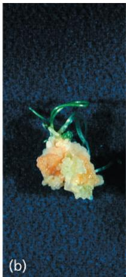

  
(c) Developing root

engineering techniques require single plant cells as the starting material. Test-tube culture makes it possible to regenerate plants from a single genetically engineered plant cell. In the next section, we'll take a closer look at some of the promises and challenges surrounding the use of genetically modified plants in agriculture.

## Concept Check 38.2

1. What are three ways that flowering plants avoid self-fertilization?

2. The seedless banana, the world's most popular fruit, is losing the battle against two fungal epidemics. Why do such epidemics generally pose a greater risk to asexually propagated crops?

3. Self-fertilization, or selfing, seems to have obvious disadvantages as a reproductive “strategy” in nature, and it has even been called an “evolutionary dead end.” So it is surprising that about 20% of angiosperm species primarily rely on selfing. Suggest a reason why selfing might be advantageous and yet still be an evolutionary dead end.

For suggested answers, see Appendix A.

## Concept 38.3: People modify crops by breeding and genetic engineering

People have intervened in the reproduction and genetic makeup of plants since the dawn of agriculture. Maize, for example, owes its existence to humans. Left on its own in nature, maize would soon become extinct for the simple reason that it cannot spread its seeds. Maize kernels are not only permanently attached to the central axis (the "cob") but also permanently protected by tough, overlapping leaf sheathes (the "husk") (Figure 38.16). These attributes arose by artificial selection by humans. Despite having no understanding of the scientific principles underlying plant breeding, early farmers domesticated most of our crop species over a relatively short period about 10,000 years ago.

## Plant Breeding

Plant breeding is the art and science of changing the traits of plants in order to produce desired characteristics. Breeders scrutinize their fields carefully and travel far and wide searching for domesticated varieties or wild relatives with desirable traits. Such traits occasionally arise spontaneously through mutation, but the natural rate of mutation is too slow and unreliable to produce all the mutations that breeders would like to study. Breeders sometimes hasten mutations by treating large batches of seeds or seedlings with radiation or chemicals.

In traditional plant breeding, when a desirable trait is identified in a wild species, the wild species is crossed with a domesticated variety. Generally, those progeny that have inherited the desirable trait from the wild parent have also inherited many

Figure 38.16 Maize: a product of artificial selection.

Modern maize (bottom) was derived from teosinte (top). Teosinte kernels are tiny, and each row has a husk that must be removed to get at the kernel. The seeds are loose at maturity, allowing dispersal, which probably made harvesting difficult for early farmers. Neolithic farmers selected seeds from plants with larger cob and kernel size as well as the permanent attachment of seeds to the cob and the encasing of the entire cob by a tough husk.

traits that are not desirable for agriculture, such as small fruits or low yields. The progeny that express the desired trait are again crossed with members of the domesticated species and their progeny examined for the desired trait. This process is continued until the progeny with the desired wild trait resemble the original domesticated parent in their other agricultural attributes.

While most breeders cross-pollinate plants of a single species, some breeding methods rely on hybridization between two distant species of the same genus. Such crosses sometimes result in the abortion of the hybrid seed during development. Often in these cases the embryo begins to develop, but the endosperm does not. Hybrid embryos are sometimes rescued by surgically removing them from the ovule and culturing them in vitro.

It is important to note that the natural genetic modification of plants began long before humans started altering crops by artificial selection. For example, the wheat species we rely on for much of our food evolved by natural hybridization between different species of grasses. Such hybridization is common in plants and has long been exploited by breeders to introduce genetic variation for artificial selection and crop improvement. Another instance of natural genetic modification has been revealed by the genomic sequencing of sweet potato (Ipomoea batatas). Apparently an early ancestor of the modern sweet potato came into contact with the soil bacterium Agrobacterium, and a horizontal gene transfer event (see Concept 26.6) occurred. Thus, the introduction of a transgene, a gene that has been transferred from one organism into another, can occur in nature as well as in a genetic engineering laboratory.

## Plant Biotechnology and Genetic Engineering

Plant biotechnology has two meanings. In the general sense, it refers to innovations in the use of plants (or substances obtained from plants) to make products of use to humans—an endeavor that began in prehistory. In a more specific sense, biotechnology refers to the use of genetically modified (GM) organisms in agriculture and industry. Indeed, in the last few decades, genetic engineering has become such a powerful force that the terms genetic engineering and biotechnology have become synonymous in the media. The revolutionary CRISPR-Cas9 gene-editing technology (see Figure 20.14) is changing plant biology as fast as it is breaking ground in other fields.

Unlike traditional plant breeders, modern plant biotechnologists, using techniques of genetic engineering, are not limited to the transfer of genes between closely related species or genera. For example, traditional breeding techniques could not be used to insert a desired gene from daffodil into rice because the many intermediate species between rice and daffodil and their common ancestor are extinct. In theory, if breeders had the intermediate species, over the course of several centuries they could probably introduce a daffodil gene into rice by traditional hybridization and breeding methods. With genetic engineering, however, such gene transfers can be done more quickly, more specifically, and without the need for intermediate species.

In the remainder of this chapter, we explore the prospects and controversies surrounding the agricultural use of crops that are genetically modified organisms (GMOs). Advocates for plant biotechnology believe that the genetic engineering of crop plants is the key to overcoming some of the most pressing problems of the 21st century, including world hunger and fossil fuel dependency.

## Interview

Interview with Luis Herrera-Estrella: Using GMOs to help farmers (eTextbook only)

## Reducing World Hunger and Malnutrition

Although global hunger affects nearly a billion people, there is much disagreement about its causes. Some argue that food shortages arise from inequities in distribution and that the most poverty-stricken simply cannot afford food. Others regard food shortages as evidence that the world is overpopulated—that the human species has exceeded the carrying capacity of the planet (see Concept 53.3). Whatever the causes of malnutrition, increasing food production is a humane objective. Because land and water are the most limiting resources, the best option is to increase yields on already existing farmland. Indeed, there is very little “extra” land that can be farmed, especially if the few remaining pockets of wilderness are to be preserved. Plant biotechnology can help make these crop yields possible.

Crops that have been genetically modified to express transgenes from Bacillus thuringiensis, a soil bacterium, require less pesticide. The transgenes involved encode a protein (Bt toxin) that is toxic to many insect pests (Figure 38.17). The Bt toxin used in crops is produced in the plant as a harmless protoxin that only becomes toxic if activated by alkaline conditions, such as in the guts of most insects. Because vertebrates have highly acidic stomachs, protoxin consumed by humans or livestock is rendered harmless by denaturation.

## Figure 38.17 Non-Bt versus Bt maize.

Field trials reveal that non-Bt maize (left) is heavily damaged by insect feeding and Fusarium mold infection, whereas Bt maize (right) suffers little or no damage.

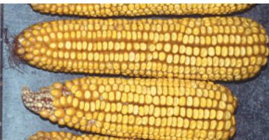  
Non-Bt maize  
Bt maize

Biofortification, improving the nutritional quality of plants, is another strategy in the war on world hunger. For example, tens of thousands of children lose their sight each year because of vitamin A deficiencies. More than half of these children die within a year of becoming blind. In response to this crisis, genetic engineers created “Golden Rice,” a transgenic variety supplemented with transgenes that enable it to produce grain with increased levels of beta-carotene, a precursor of vitamin A. In 2021, after decades of safety testing and legal challenges, Golden Rice was finally approved for cultivation by the Philippines: massive production, focusing on provinces with high vitamin A deficiency, commenced in 2022.

Another major target for biofortification improvement is cassava (Manihot esculenta), a starchy root crop that provides carbohydrates for 800 million of the world's most impoverished people (Figure 38.18). Researchers are also engineering plants with enhanced resistance to disease. In one case, a transgenic papaya that is resistant to a ringspot virus was introduced into Hawaii, thereby saving its papaya industry.

Considerable controversy has arisen concerning transgenic crops that are resistant to the herbicide glyphosate. Glyphosate is lethal to a wide variety of plants because it inhibits a key enzyme

## Figure 38.18 Engineering the perfect food?

Cassava grows well in poor dry soils but must be supplemented by consumption of other crops. If those crops fail, people suffer malnutrition. What if cassava alone could supply a balanced diet? Transgenic, biofortified cassava plants have been developed with greatly increased levels of iron and beta-carotene (a vitamin A precursor). Other improvements have been made in the size of its storage roots, its ease of processing (less cyanide-producing chemicals), and its resistance to cassava mosaic virus disease.

Interview

Interview with Dennis Gonsalves: Saving the papaya industry (eTextbook only)

in a biochemical pathway that is found in plants (and most bacteria) but not in animals. Researchers discovered a bacterial strain that had undergone a mutation in the gene encoding this enzyme that rendered it glyphosate resistant. When this mutated bacterial gene was spliced into the genome of various crops, these crops also became glyphosate resistant. Farmers achieved almost total weed control by spraying glyphosate over their fields of glyphosate-resistant crops. Unfortunately, the overuse of glyphosate created a huge selective pressure on weed species, with the result that resistance to glyphosate has evolved in many of them. There has also been a growing appreciation in recent decades of the role that gut bacteria play in animal and human health, and claims have been made that glyphosate may be having negative effects on the health of humans and livestock by interfering with beneficial gut bacteria. Glyphosate has also been the subject of many studies and legal challenges regarding its potential to cause cancer. Although billions of dollars in damages have been awarded in court cases alleging links between glyphosate-based weed killers and cancer, the research is conflicting.

## Reducing Fossil Fuel Dependency

Global sources of inexpensive fossil fuels, particularly oil, are rapidly being depleted. Moreover, most climatologists attribute global warming mainly to the rampant burning of fossil fuels, such as coal and oil, and the resulting release of the greenhouse gas $\mathrm{CO}_{2}$ . How can the world meet its energy demands in the 21st century in an economical and nonpolluting way? In certain localities, wind or solar power may become economically viable, but such alternative energy sources are unlikely to fill the global energy demands completely. Many scientists predict that biofuels—fuels derived from living biomass—could produce a sizable fraction of the world's energy needs in the not-too-distant future. Biomass is the total mass of organic matter in a group of organisms in a particular habitat. The use of biofuels from plant biomass would reduce the net emission of $\mathrm{CO}_{2}$ . Whereas burning fossil fuels increases atmospheric $\mathrm{CO}_{2}$ concentrations, biofuel crops reabsorb by photosynthesis the $\mathrm{CO}_{2}$ emitted when biofuels are burned, creating a cycle that is carbon neutral.

In working to create biofuel crops from wild precursors, scientists are focusing their domestication efforts on fast-growing plants, such as switchgrass (Panicum virgatum) and poplar (Populus trichocarpa), that can grow on soil that is too poor for food production. Scientists do not expect the plant biomass to be burned directly. Instead, the polymers in cell walls, such as cellulose and hemicellulose, which constitute the most abundant organic compounds on Earth, would be broken down into sugars by enzymatic reactions. These sugars, in turn, would be fermented into alcohol and distilled to yield biofuels. In addition to increasing plant polysaccharide content and overall biomass, researchers are trying to genetically engineer the cell walls of plants to increase the efficiency of the enzymatic conversion process.

## The Debate over Plant Biotechnology

Much of the debate about GMOs in agriculture is political, social, economic, or ethical and therefore outside the scope of this book. But we should consider the biological concerns about GM crops.

Some biologists, particularly ecologists, are concerned about the unknown risks associated with the release of GMOs into the environment. The debate centers on the extent to which GMOs could harm the environment or human health. Those who want to proceed more slowly with agricultural biotechnology (or end it) are concerned about the unstoppable nature of the “experiment.” If a drug trial produces unanticipated harmful results, the trial is stopped. But we may not be able to stop the “trial” of introducing novel organisms into the biosphere. Here we examine some criticisms that have been leveled by opponents of GMOs, including the alleged effects on human health and nontarget organisms and the potential for transgene escape.

## Issues of Human Health

Many GMO opponents worry that genetic engineering may inadvertently transfer allergens, molecules to which some people are allergic, from a species that produces an allergen to a plant used for food. However, biotechnologists are already removing genes that encode allergenic proteins from soybeans and other crops. So far, there is no credible evidence that GM plants designed for human consumption have allergenic effects on human health. In fact, some GM foods are potentially healthier than non-GM foods. For example, Bt maize (the transgenic variety with the Bt toxin) contains 90% less of a fungal toxin that causes cancer and birth defects than non-Bt maize. Called fumonisin, this toxin is highly resistant to degradation and has been found in alarmingly high concentrations in some batches of processed maize products, ranging from cornflakes to beer. Fumonisin is produced by a fungus (Fusarium) that infects insect-damaged maize. Because Bt maize generally suffers less insect damage than non-GM maize, it contains much less fumonisin.

Assessing the impact of GMOs on human health also involves considering the health of farmworkers, many of whom were commonly exposed to high levels of chemical insecticides prior to the adoption of Bt crops. In India, for example, the widespread adoption of Bt cotton has led to a 41% decrease in insecticide use and an 80% reduction in the number of acute poisoning cases involving farmers.

## Possible Effects on Nontarget Organisms

Many ecologists are concerned that GM crops may have unforeseen effects on nontarget organisms. One laboratory study indicated that the larvae (caterpillars) of monarch butterflies responded adversely and even died after eating milkweed leaves (their preferred food) heavily dusted with pollen from transgenic Bt maize. This study has since been discredited, affording a good example of the self-correcting nature of science. As it turns out, when the original researcher shook the male maize inflorescences onto the milkweed leaves in the laboratory, the filaments of stamens, opened microsporangia, and other floral parts also rained onto the leaves. Subsequent research found that it was these other floral parts, not the pollen, that contained Bt toxin in high concentrations. Unlike pollen, these floral parts would not be carried by the wind to neighboring milkweed plants when shed under natural field conditions. Only one Bt maize line, accounting for less than 2% of commercial Bt maize production (and now discontinued), produced pollen with high Bt toxin concentrations.

In considering the negative effects of Bt pollen on monarch butterflies, one must also weigh the effects of an alternative to the cultivation of Bt maize—the spraying of non-Bt maize with chemical pesticides. Subsequent studies have shown that such spraying is much more harmful to nearby monarch populations than is Bt maize production. Although the effects of Bt maize pollen on monarch butterfly larvae appear to be minor, the controversy has emphasized the need for accurate field testing of all GM crops and the importance of targeting gene expression to specific tissues to improve safety.

## Addressing the Problem of Transgene Escape

Perhaps the most serious concern raised about GM crops is the possibility of the introduced genes escaping from a transgenic crop into related weeds through crop-to-weed hybridization. The fear is that the spontaneous hybridization between a crop engineered for herbicide resistance and a wild relative might give rise to a “superweed” that would have a selective advantage over other weeds in the wild and would be much more difficult to control in the field. GMO advocates point out that the likelihood of transgene escape depends on the ability of the crop and weed to hybridize and on how the transgenes affect the overall fitness of the hybrids. A desirable crop trait—a dwarf phenotype, for example—might be disadvantageous to a weed growing in the wild. In other instances, there are no weedy relatives nearby with which to hybridize; soybean, for example, has no wild relatives in the United States. However, canola, sorghum, and many other crops do hybridize readily with weeds, and crop-to-weed transgene escape in a turfgrass has occurred. In 2003, a transgenic variety of creeping bentgrass (Agrostis stolonifera) genetically engineered to resist the herbicide glyphosate escaped from an experimental plot in Oregon following a windstorm. Despite efforts to eradicate the escapee, 62% of the Agrostis plants found in the vicinity three years later were glyphosate resistant. So far, the ecological impact of this event appears to be minor, but that may not be the case with future transgenic escapes.

Many strategies are being pursued with the goal of preventing transgene escape. For example, if male sterility could be engineered into plants, these plants would still produce seeds and fruit if pollinated by nearby nontransgenic plants, but they would produce no viable pollen. A second approach involves genetically engineering apomixis into transgenic crops. When a seed is produced by apomixis, the embryo and endosperm develop without fertilization. The transfer of this trait to transgenic crops would therefore minimize the possibility of transgene escape via pollen because plants could be male-sterile without compromising seed or fruit production. A third approach is to engineer the transgene into the chloroplast DNA of the crop. Chloroplast DNA in many plant species is inherited strictly from the egg, so transgenes in the chloroplast cannot be transferred by pollen. A fourth approach for preventing transgene escape is to genetically engineer flowers that develop normally but fail to open. Consequently, self-pollination would occur, but pollen would be unlikely to escape from the flower. This solution would require modifications to flower design. Several floral genes have been identified that could be manipulated to this end.

The continuing debate about GMOs in agriculture exemplifies one of this textbook's recurring ideas: the relationship of science and technology to society. Technological advances almost always involve some risk of unintended outcomes. In the case of genetically engineered crops, zero risk is probably unattainable. Therefore, scientists and the public must assess on a case-by-case basis the possible benefits of transgenic products versus the risks that society is willing to take. The best scenario is for these discussions and decisions to be based on sound scientific information and rigorous testing rather than on reflexive fear or blind optimism.

## Concept Check 38.3

1. Compare traditional plant-breeding methods with genetic engineering.

2. Why does Bt maize have less fumonisin than non-GM maize?

3. WHAT IF? In a few species, chloroplast genes are inherited only from sperm. How might this influence efforts to prevent transgene escape?

For suggested answers, see Appendix A.

## Chapter 38 Review

## Summary of Key Concepts

To review key terms, go to the Vocabulary Self-Quiz (eTextbook only).

Concept 38.1: Flowers, double fertilization, and fruits are key features of the angiosperm life cycle

\- Angiosperm reproduction involves an alternation of generations between a multicellular diploid sporophyte generation and a multicellular haploid gametophyte generation. Flowers, produced by the sporophyte, function in sexual reproduction.

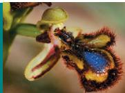

\- The four floral organs are sepals, petals, stamens, and carpels. Sepals protect the floral bud. Petals help attract pollinators. Stamens bear anthers in which haploid microspores develop into pollen grains containing a male gametophyte. Carpels contain ovules (immature seeds) in their swollen bases. Within the ovules, embryo sacs (female gametophytes) develop from megaspores.

\- Pollination, which precedes fertilization, is the placing of pollen on the stigma of a carpel. After pollination, the pollen tube discharges two sperm into the female gametophyte. Two sperm are needed for double fertilization, a process in which

one sperm fertilizes the egg, forming a zygote and eventually an embryo, while the other sperm combines with the polar nuclei, giving rise to the food-storing endosperm.

\- A seed consists of a dormant embryo along with a food supply stocked in either the endosperm or the cotyledons. Seed dormancy ensures that seeds germinate only

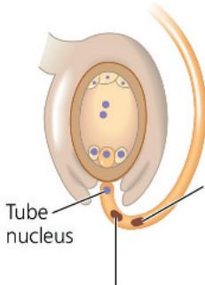  
One sperm will fuse with the egg, forming a zygote (2n).

One sperm cell will fuse with the two polar nuclei, forming an endosperm nucleus (3n).

when conditions for seedling survival are optimal. The breaking of dormancy often requires environmental cues, such as temperature or lighting changes.

\- The fruit protects the enclosed seeds and aids in wind dispersal or in the attraction of seed-dispersing animals.

What changes occur to the four types of floral parts as a flower changes into a fruit?

## Concept 38.2: Flowering plants reproduce sexually, asexually, or both

\- Asexual reproduction, also known as vegetative reproduction, enables successful plants to proliferate quickly. Sexual reproduction generates most of the genetic variation that makes evolutionary adaptation possible.

\- Plants have evolved many mechanisms to avoid self-fertilization, including having male and female flowers on different individuals, nonsynchronous production of male and female parts within a single flower, and self-incompatibility reactions in which pollen grains that bear an allele identical to one in the female are rejected.

\- Plants can be cloned from single cells, which can be genetically manipulated before being allowed to develop into a plant.

What are the advantages of asexual and sexual reproduction?

## Concept 38.3: People modify crops by breeding and genetic engineering

\- Hybridization of different varieties and even species of plants is common in nature and has been used by breeders, ancient and modern, to introduce new genes into crops. After two plants are successfully hybridized, plant breeders select those progeny that have the desired traits.

\- In genetic engineering, genes from unrelated organisms are incorporated into plants. Genetically modified (GM) plants can increase the quality and quantity of food worldwide and may also become increasingly important as biofuels.

\- There are concerns about the unknown risks of releasing GM organisms into the environment, but the potential benefits of crops that express transgenes will need to be considered.

Give two examples of how genetic engineering has improved or might potentially improve food quality.

For suggested answers, see Appendix A.

## Test Your Understanding

For more multiple-choice questions, go to the Practice Test (eTextbook only).

## Levels 1-2: Remembering/Understanding

## 1. A fruit is

(A) a mature ovary.

(B) a mature ovule.

(C) a seed plus its integuments.

(D) an enlarged embryo sac.

## 2. Bt maize

(A) is resistant to various herbicides, making it practical to weed maize fields with those herbicides.

(B) contains transgenes that increase vitamin A content.

(C) includes bacterial genes that produce a toxin that reduces damage from insect pests.

(D) is a “boron (B)-tolerant” transgenic variety of maize.

3. Which statement concerning grafting is correct?

(A) Stocks and scions refer to twigs of different species.

(B) Stocks and scions must come from unrelated species.

(C) Stocks provide root systems for grafting.

(D) Grafting creates new species.

## Levels 3-4: Applying/Analyzing

4. In a species showing sporophytic incompatibility, which type(s) of pollen could successfully fertilize an $S_{2}S_{3}$ flower?
(A) $S_{1}$ pollen from an $S_{1}S_{3}$ flower
(B) $S_{2}$ or $S_{3}$ pollen from an $S_{2}S_{3}$ flower
(C) $S_{3}$ pollen from an $S_{1}S_{1}$ flower
(D) $S_{1}$ pollen from an $S_{1}S_{1}$ flower

5. The black dots that cover strawberries are actually fruits formed from the separate carpels of a single flower. The fleshy and tasty portion of a strawberry derives from the receptacle of a flower with many separate carpels. Therefore, a strawberry is

(A) a simple fruit with many seeds.

(B) both a multiple fruit and an accessory fruit.

(C) both a simple fruit and an aggregate fruit.

(D) both an aggregate fruit and an accessory fruit.

6. DRAW IT Draw and label the parts of a flower.

## Levels 5-6: Evaluating/Creating

7. EVOLUTION CONNECTION With respect to sexual reproduction, some plant species are fully self-fertile, others are fully self-incompatible, and some exhibit a “mixed strategy” with partial self-incompatibility. These reproductive strategies differ in their implications for evolutionary potential. Predict how a self-incompatible species might fare as a small founder population or remnant population in a severe population bottleneck (see Concept 23.3), as compared with a self-fertile species.

8. SCIENTIFIC INQUIRY Critics of GM foods have argued that transgenes may disturb cellular functioning, causing unexpected and potentially harmful substances to appear inside cells. Toxic intermediary substances that normally occur in very small amounts may arise in larger amounts, or new substances may appear. The disruption may also lead to loss of substances that help maintain normal metabolism. If you were your nation's chief scientific advisor, how would you respond to these criticisms? State your case.

9. WRITE ABOUT A THEME. ORGANIZATION in a short essay (100–50 words), discuss how a flower's ability to reproduce with other flowers of the same species is an emergent property arising from floral parts and their organization.

## 10. SYNTHESIZE YOUR KNOWLEDGE

  
This colorized SEM shows pollen grains from six plant species. Explain how a pollen grain forms, how it functions, and how pollen grains contributed to the dominance of angiosperms and other seed plants.

## Practice Applying Your Learning

11. This question assesses your ability to apply your understanding of double fertilization in general and to some specific examples.

A few plant species, including papaya (Carica papaya), produce separate male and female individuals (sporophytes) in which the males have an XY (2n) genotype, and the females have an XX (2n) genotype. The following questions assess your ability to apply your understanding of double fertilization in angiosperms, both in general and in this special case.

Use this information as well as your general knowledge of angiosperm reproduction to evaluate each statement as more likely to be TRUE or more likely to be FALSE.

a. In general, during double fertilization in angiosperms, two sperm (n) fertilize the egg (n). \_\_\_\_

b. Prior to double fertilization, the sperm (n) divides, forming two identical sperm cells (n). \_\_\_\_

c. The generative cell $(n)$ divides by mitosis to form two sperm $(n)$ .

d. A pollen grain (n) is a microspore (n).

e. Male gametophytes are diploid (2n), and sperm cells are haploid (n). \_\_\_\_

f. CHALLENGE In the case of species such as papaya that have XX (2n) and XY (2n) individuals, one possible outcome following double fertilization is an XY (2n) embryo and a XYY (3n) endosperm. \_\_\_\_

g. CHALLENGE Hypothetically, if the microsporocyte of an XX (2n) individual did not undergo meiosis but instead produced microspores by mitosis, the result would be a seed with an XXX (3n) embryo and an XXXX (4n) endosperm. \_\_\_\_

