# 第40章 Basic Principles of Animal Form and Function

<!-- 章节边界按正文内容恢复；原始 MinerU 内容保留如下。 -->

# Basic Principles of Animal Form and Function

## Key Concepts

40.1 Animal form and function are correlated at all levels of organization

40.2 Feedback control maintains the internal environment in many animals

40.3 Homeostatic processes for thermoregulation involve form, function, and behavior

40.4 Energy requirements are related to animal size, activity, and environment

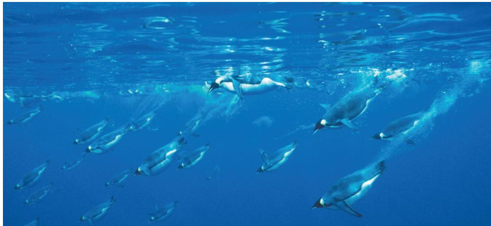  
Figure 40.1 Emperor penguins (Aptenodytes forsteri) live in Antarctica, Earth's coldest and windiest continent. In summer, these birds catch fish by diving down 500 m in water only 2°C above freezing. In winter, the females forage and the males incubate eggs while temperatures drop to -40°C and winds gust to 200 km/hr.

## Study Tip

Draw a diagram: When you read in the chapter about a mechanism that helps an animal maintain a stable internal environment, draw a simple cause-and-effect diagram (see example—illustrations are optional!). Label the regulated variable, the stimulus that affects the variable, and the response that counteracts the stimulus and returns the variable toward its optimal level.

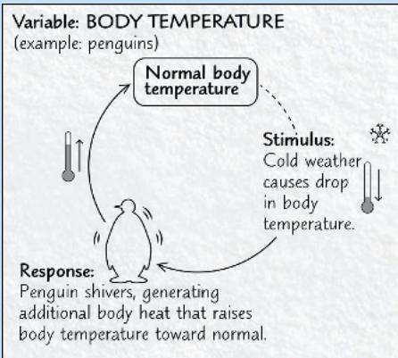  
Form (anatomy): An insulating layer of fat (blubber) reduces heat loss from most of the penguin's body (blue body areas in this thermal image).

## How do animals regulate their internal state even in changing or harsh environments?

Adaptations in form, function, and behavior help maintain an animal's internal environment. Adaptations that limit variation in temperature and other internal variables are widespread and diverse. Consider, for example, three adaptations that help an Emperor penguin stay warm:

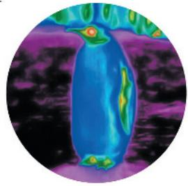  
Function (physiology): Rapid cycles of muscle contraction and relaxation during shivering produce heat at a cellular level.

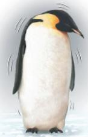

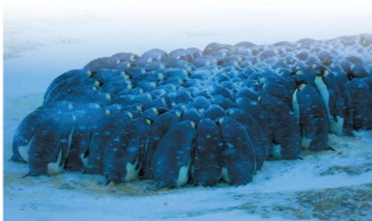  
Behavior: By packing together in groups of up to several thousand, Emperor penguins greatly reduce their exposure to wind and cold.

Figure 40.2 Convergent evolution in fast swimmers.

# Concept 40.1: Animal form and function are correlated at all levels of organization

Over the course of its life, an Emperor penguin faces the same fundamental challenges as any other animal, whether hydra, hawk, or human. All animals must obtain nutrients and oxygen, fight off infection, and survive to produce offspring. Given that all animal species share these and other basic requirements, why does their form, including anatomy—biological structure—vary so widely? The answer lies in natural selection and adaptation. Natural selection favors those variations in a population that increase relative fitness (see Concept 23.4). The evolutionary adaptations that enable survival vary among environments and species but frequently result in a close match of form to function, as illustrated for the Emperor penguins in Figure 40.1. Because structure and function are correlated, examining anatomy often provides clues to physiology—biological function.

An animal's size and shape are fundamental aspects of form that significantly affect the way the animal interacts with its environment. Although we may refer to size and shape as elements of a “body plan” or “design,” this does not imply a process of conscious invention. The body plan of an animal is the result of a pattern of development programmed by the genome, itself the product of millions of years of evolution.

## Evolution of Animal Size and Shape

EVOLUTION Many different body plans have arisen during the course of evolution, but these variations fall within certain bounds. Physical laws that govern strength, diffusion, movement, and heat exchange limit the range of animal forms.

As an example of how physical laws constrain evolution, let's consider how some properties of water limit the possible shapes for animals that are fast swimmers. Water is about 1,000 times

denser than air and also far more viscous. Therefore, any bump on an animal's body surface that causes drag impedes a swimmer more than it would a runner or flyer. Tuna and other fast ray-finned fishes can swim at speeds up to 80 km/hr (50 miles/hour). Sharks, penguins, dolphins, and seals are also relatively fast swimmers. As illustrated by the three examples in Figure 40.2, these animals all have a shape that is fusiform, meaning tapered on both ends. The similar streamlined shape found in these speedy vertebrates is an example of

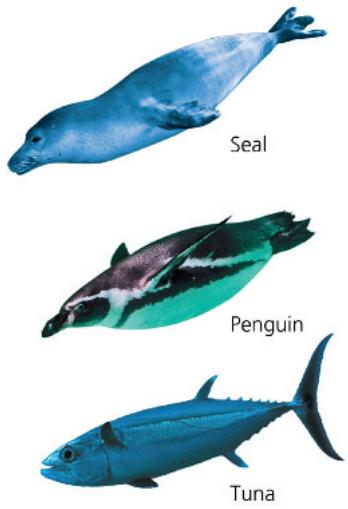

convergent evolution (see Concept 22.3). Natural selection often results in similar adaptations when diverse organisms face the same environmental challenge, such as overcoming drag during swimming.

Physical laws also influence animal body plans with regard to maximum size. As body dimensions increase, thicker skeletons are required to maintain adequate support. This limitation affects internal skeletons, such as those of vertebrates, as well as external skeletons, such as those of insects and other arthropods. In addition, as bodies increase in size, the muscles required for locomotion must represent an ever-larger fraction of the total body mass. At some point, mobility becomes limited. By considering the fraction of body mass in leg muscles and the effective force such muscles generate, scientists can estimate maximum speed for a wide range of body plans. In the case of the 6-meter-tall dinosaur Tyrannosaurus rex, there is controversy, with some scientists calculating a top running speed as fast as that of an Olympic sprinter—30 km/hr (19 miles/hour), but others inferring that T. rex was at best a fast walker.

## Exchange with the Environment

Animals must exchange nutrients, waste products, and gases with their environment, and this requirement imposes an additional limitation on body plans. Exchange occurs as substances dissolved in an aqueous solution move across the plasma membrane of each cell. A single-celled organism, such as the amoeba in Figure 40.3a, has a sufficient membrane surface area in contact with its environment to carry out all necessary exchange. In contrast, an animal is composed of many cells, each with its own plasma membrane across which exchange must occur. The rate of exchange is proportional to the membrane surface area involved in exchange, whereas the amount of material that must be exchanged is proportional to the total body volume. A multicellular organization therefore works only if every cell has access to a suitable aqueous environment, either inside or outside the animal's body.

Many animals with a simple internal organization have body plans that enable direct exchange between almost all their cells and the external environment. For example, a pond-dwelling hydra has a saclike body plan and a body wall only two cell layers thick (Figure 40.3b). Because its gastrovascular cavity opens to the external environment, both the outer and inner layers of cells are constantly bathed by pond water. Another common body plan that maximizes exposure to the surrounding medium is a flat shape. Consider, for instance, a parasitic tapeworm, which can reach several meters in length (see Figure 33.11). A thin, flat shape places most cells of the worm in direct contact with its particular environment—the nutrient-rich intestinal fluid of a vertebrate host.

Our bodies and those of most other animals are composed of compact masses of cells, with an internal organization much more complex than that of a hydra or a tapeworm. For such a body plan, increasing the number of cells decreases the ratio of outer surface area to total volume. As an extreme comparison, the ratio of outer surface area to volume for a

A microscopic view of the lung reveals that it is much more sponge-like than balloon-like. This construction provides an expansive wet surface for gas exchange with the environment (SEM).

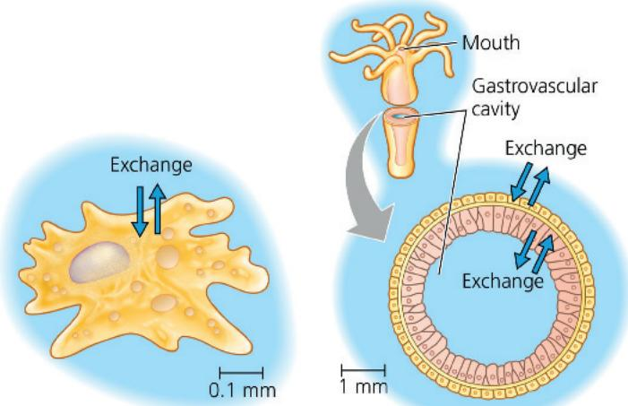  
Figure 40.3 Direct exchange with the environment.  
(a) An amoeba, a single-celled organism  
(b) A hydra, an animal with two layers of cells

whale is hundreds of thousands of times smaller than that for a water flea. Nevertheless, every cell in the whale has access to oxygen, nutrients, and other resources. How is this accomplished?

In whales and most other animals, the evolutionary adaptations that enable sufficient exchange with the environment are specialized surfaces that are extensively branched or folded (Figure 40.4). In almost all cases, these exchange surfaces lie within the body, an arrangement that protects their delicate tissues from abrasion or dehydration and allows for streamlined body contours. The branching or folding greatly increases surface area (see Figure 33.8). In humans, for example, the exchange surfaces for digestion, respiration, and circulation each have an area more than 25 times larger than that of the skin.

Internal body fluids link exchange surfaces to body cells. The spaces between cells are filled with fluid, known in many animals as interstitial fluid (from the Latin for “stand between”). Complex body plans also include a circulatory fluid, such as blood. Exchange between the interstitial fluid and the circulatory fluid enables cells throughout the body to obtain nutrients and get rid of wastes (see Figure 40.4).

Complex body plans offer numerous benefits. For example, an external skeleton can protect against predators, and sensory organs can provide detailed information on the animal's surroundings. Internal digestive organs can break down food gradually, controlling the release of stored energy. In addition, specialized filtration systems can adjust the composition of the internal fluid that bathes the animal's body cells. In this way, an animal can maintain a relatively stable internal environment despite the fact that it is living in a changeable external environment. A complex body plan is especially advantageous for animals living on land, where the external environment may be highly variable.

Figure 40.4 Internal exchange surfaces of complex animals.  
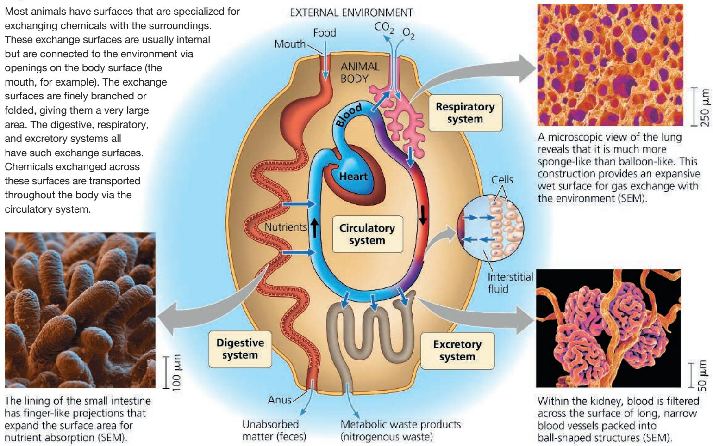  
The lining of the small intestine has finger-like projections that expand the surface area for nutrient absorption (SEM).  
VISUAL SKILLS Using this diagram, explain how exchange carried out by animals can be described as both internal and external.  
Within the kidney, blood is filtered across the surface of long, narrow blood vessels packed into ball-shaped structures (SEM).

## Hierarchical Organization of Body Plans

Cells form a working animal body through their emergent properties, which arise from successive levels of structural and functional organization (see Concept 1.1). Cells are organized into tissues, groups of cells with a similar appearance and a common function. Different types of tissues are further organized into functional units called organs. (The simplest animals, such as sponges, lack organs or even true tissues.) Groups of organs that work together, providing an additional level of organization and coordination, make up an organ system (Table 40.1). Thus, for example, the skin is an organ of the integumentary system, which protects against infection and helps regulate body temperature.

Many organs have more than one physiological role. If the roles are distinct enough, we consider the organ to belong to more than one organ system. The pancreas, for instance, produces enzymes critical to the function of the digestive system but also regulates the level of sugar in the blood as a vital part of the endocrine system.

Just as viewing the body's organization from the “bottom up” (from cells to organ systems) reveals emergent properties, a “top-down” view of the hierarchy reveals the multilayered basis of specialization. Organ systems include specialized organs made up of specialized tissues and cells. Consider the human digestive system: Each organ has specific roles. In the case of the stomach, one role is to initiate protein breakdown. This process requires a churning motion powered by stomach muscles, as well as digestive juices secreted by the stomach lining. Producing digestive juices, in turn, requires highly specialized cell types: One cell type secretes a protein-digesting enzyme, a second generates concentrated hydrochloric acid, and a third produces mucus, which protects the stomach lining.

The specialized and complex organ systems of animals are built from a limited set of cell and tissue types. For example, lungs and blood vessels have different functions but are lined by tissues that are of the same basic type and therefore share many properties.

There are four main tissue types: epithelial tissue, connective tissue, muscle tissue, and nervous tissue. Figure 40.5 explores the structure and function of each type. In later chapters, we'll discuss how these tissue types contribute to the functions of particular organ systems.

Table 40.1 Organ Systems in Mammals

<table><tr><td>Organ System</td><td>Main Components</td><td>Main Functions</td></tr><tr><td>Digestive</td><td>Mouth, pharynx, esophagus, stomach, intestines, liver, pancreas, anus (See Figure 41.8.)</td><td>Food processing (ingestion, digestion, absorption, elimination)</td></tr><tr><td>Circulatory</td><td>Heart, blood vessels, blood (See Figure 42.5.)</td><td>Internal distribution of materials</td></tr><tr><td>Respiratory</td><td>Lungs, trachea, other breathing tubes (See Figure 42.24.)</td><td>Gas exchange (uptake of oxygen; disposal of carbon dioxide)</td></tr><tr><td>Immune and lymphatic</td><td>Bone marrow, lymph nodes, thymus, spleen, lymph vessels (See Figure 43.6.)</td><td>Body defense (fighting infections and virally induced cancers)</td></tr><tr><td>Excretory</td><td>Kidneys, ureters, urinary bladder, urethra (See Figure 44.12.)</td><td>Disposal of metabolic wastes; regulation of osmotic balance of blood</td></tr><tr><td>Endocrine</td><td>Pituitary, thyroid, pancreas, adrenal, and other hormone-secreting glands (See Figure 45.8.)</td><td>Coordination of body activities (such as digestion and metabolism)</td></tr><tr><td>Reproductive</td><td>Ovaries or testes and associated organs (See Figures 46.9 and 46.10.)</td><td>Gamete production; promotion of fertilization; support of developing embryo</td></tr><tr><td>Nervous</td><td>Brain, spinal cord, nerves, sensory organs (See Figure 49.6.)</td><td>Coordination of body activities; detection of stimuli and formulation of responses to them</td></tr><tr><td>Integumentary</td><td>Skin and its derivatives (such as hair, claws, sweat glands) (See Figure 50.5.)</td><td>Protection against mechanical injury, infection, dehydration; thermoregulation</td></tr><tr><td>Skeletal</td><td>Skeleton (bones, tendons, ligaments, cartilage) (See Figure 50.37.)</td><td>Body support, protection of internal organs, movement</td></tr><tr><td>Muscular</td><td>Skeletal muscles (See Figure 50.26.)</td><td>Locomotion and other movement</td></tr></table>

# Exploring Structure and Function in Animal Tissues

## Figure 40.5

Epithelial Tissue

Occurring as sheets of cells, epithelial tissues, or epithelia (singular, epithelium), cover the outside of the body and line organs and cavities within the body. Because epithelial cells are closely packed, often with tight junctions, they function as a barrier against mechanical injury, pathogens, and fluid loss. Epithelia also form active interfaces with the environment. For example, the epithelium that lines the nasal passages is crucial for

olfaction, the sense of smell. Note how different cell shapes and arrangements correlate with distinct functions.

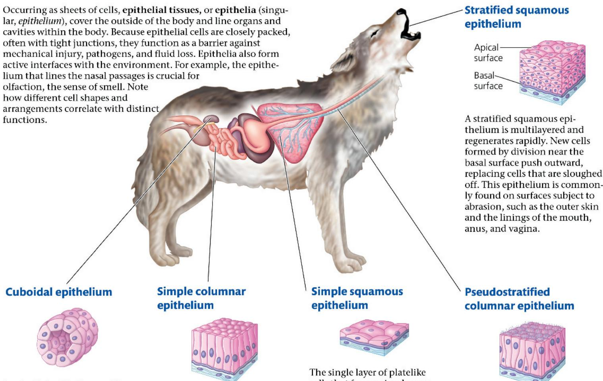

A stratified squamous epithelium is multilayered and regenerates rapidly. New cells formed by division near the basal surface push outward, replacing cells that are sloughed off. This epithelium is commonly found on surfaces subject to abrasion, such as the outer skin and the linings of the mouth, anus, and vagina.

A cuboidal epithelium, with dice-shaped cells specialized for secretion, makes up the epithelium of kidney tubules and many glands, including the thyroid gland and salivary glands.

## Pseudostratified columnar epithelium

The large, brick-shaped cells of simple columnar epithelia are often found where secretion or active absorption is important. For example, a simple columnar epithelium lines the intestines, secreting digestive juices and absorbing nutrients.

The single layer of platelike cells that form a simple squamous epithelium functions in the exchange of material by diffusion. This type of epithelium, which is thin and leaky, lines blood vessels and the air sacs of the lungs, where diffusion of nutrients and gases is essential.

A pseudostratified epithelium consists of a single layer of cells varying in height and the position of their nuclei. In many vertebrates, a pseudostratified epithelium of ciliated cells forms a mucous membrane that lines portions of the respiratory tract. The beating cilia sweep the film of mucus along the surface.

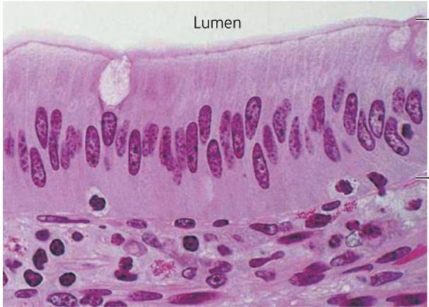

Apical surface

Basal surface

10 μm

## Polarity of epithelia

All epithelia are polarized, meaning that they have two different sides. The apical surface faces the lumen (cavity) or outside of the organ and is therefore exposed to fluid or air. Specialized projections often cover this surface. For example, the apical surface of the epithelium lining the small intestine is covered with microvilli, projections that increase the surface area available for absorbing nutrients. Opposite the apical surface of each epithelium is the basal surface.

Central canal

Red blood cells

## Figure 40.5 (Continued)

Connective tissue, consisting of a sparse population of cells scattered through an extracellular matrix, holds many tissues and

organs together and in place. The matrix generally consists of a web of fibers embedded in a liquid, jellylike, or solid foundation. Within the matrix are numerous cells called fibroblasts, which secrete fiber proteins, and macrophages, which engulf foreign particles and any cell debris by phagocytosis.

Connective tissue fibers are of three kinds: Collagenous fibers provide strength and flexibility,

## Loose connective tissue

The most widespread connective tissue in the vertebrate body is loose connective tissue, which binds epithelia to underlying tissues and holds organs in place. Loose connective tissue gets its name from the loose weave of its fibers, which include all three types. It is found in the skin and throughout the body.

120 μm

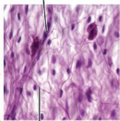  
Elastic fiber

## Fibrous connective tissue

Fibrous connective tissue is dense with collagenous fibers. It is found in tendons, which attach muscles to bones, and in ligaments, which connect bones at joints.

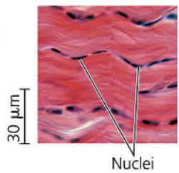

## Bone

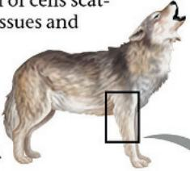

The skeleton of most vertebrates is made of bone, a mineralized connective tissue. Bone-forming cells called osteoblasts deposit a matrix of collagen. Calcium, magnesium, and phosphate ions combine into a hard mineral within the matrix. The microscopic structure of hard mammalian bone consists of repeating units called osteons. Each osteon has concentric layers of the mineralized matrix, which are deposited around a central canal containing blood vessels and nerves.

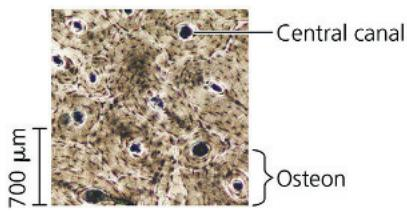

## Connective Tissue

reticular fibers join connective tissue to adjacent tissues, and elastic fibers make tissues elastic. If you pinch a fold of tissue on the back of your hand, the collagenous and reticular fibers prevent the skin from being pulled far from the bone, whereas the elastic fibers restore the skin to its original shape when you release your grip. Different mixtures of fibers and foundation form the major types of connective tissue shown below.

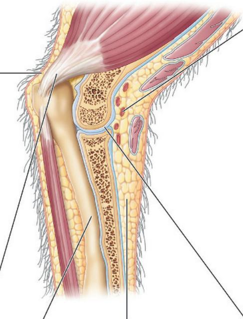

## Blood

Blood has a liquid extracellular matrix called plasma, which consists of water, salts, and dissolved proteins. Suspended in plasma are erythrocytes (red blood cells), leukocytes (white blood cells), and cell fragments called platelets. Red cells carry oxygen, white cells function in defense, and platelets aid in blood clotting.

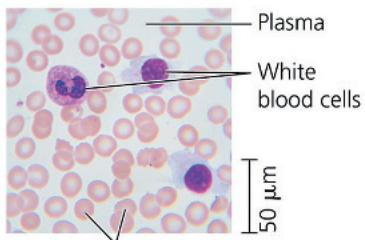

## Adipose tissue

Adipose tissue is a specialized loose connective tissue that stores fat in adipose cells distributed throughout its matrix. Adipose tissue pads and insulates the body and stores fuel as fat molecules. Each adipose cell contains a large fat droplet that swells when fat is stored and shrinks when the body uses that fat as fuel.

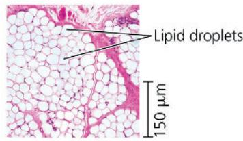

## Cartilage

Cartilage contains collagenous fibers embedded in a rubbery protein-carbohydrate complex called chondroitin sulfate. Cells called chondrocytes secrete the collagen and chondroitin sulfate, which together make cartilage a strong yet flexible support material. The skeletons of many vertebrate embryos contain cartilage that is replaced by bone as the embryo matures. Cartilage remains in some locations, such as the disks that act as cushions between vertebrae.

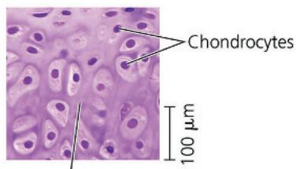  
Chondroitin sulfate

## Muscle Tissue

The tissue responsible for nearly all types of body movement is muscle tissue. All muscle cells consist of filaments containing the proteins actin and myosin, which together enable muscles to contract. There are three types of muscle tissue in the vertebrate body: skeletal, smooth, and cardiac.

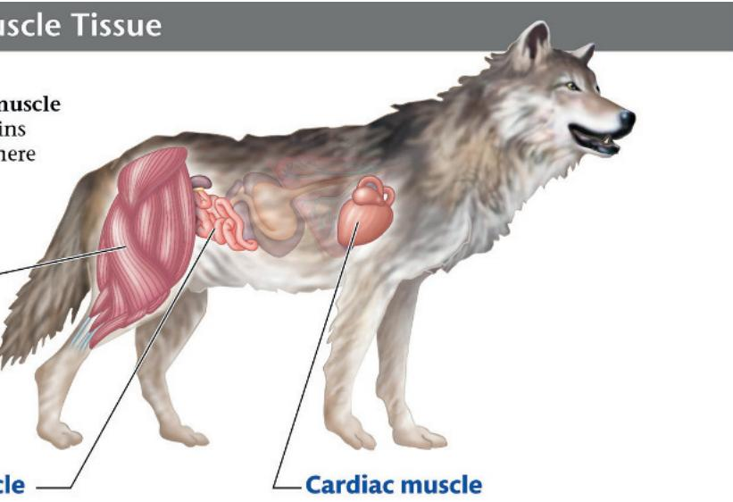

## Skeletal muscle

Attached to bones by tendons, skeletal muscle, or striated muscle, is responsible for voluntary movements. Skeletal muscle consists of bundles of long cells that are called muscle fibers. During development, skeletal muscle fibers form by the fusion of many cells, resulting in multiple nuclei in each muscle fiber. The arrangement of contractile units, or sarcomeres, along the fibers gives the cells a striped (striated) appearance. In adult mammals, building muscle increases the size but not the number of muscle fibers.

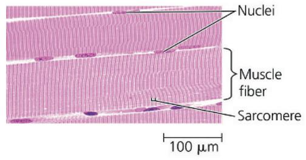

## Smooth muscle

Smooth muscle, which lacks striations, is found in the walls of the digestive tract, urinary bladder, arteries, and other internal organs. The cells are spindle-shaped. Smooth muscles are responsible for involuntary body activities, such as churning of the stomach and constriction of arteries.

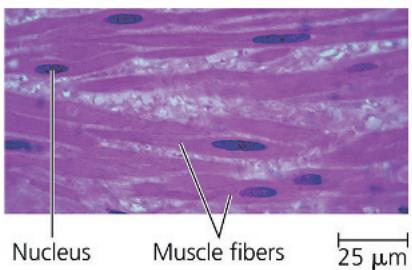

## Cardiac muscle

Cardiac muscle forms the contractile wall of the heart. It is striated like skeletal muscle and has similar contractile properties. Unlike skeletal muscle, however, cardiac muscle has branched fibers that interconnect via intercalated disks, which relay signals from cell to cell and help synchronize heart contraction.

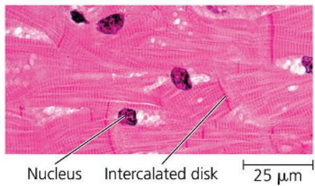  
Nervous Tissue

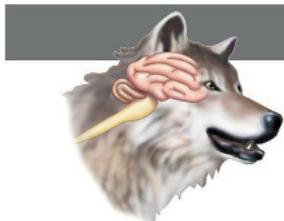

Nervous tissue functions in the receipt, processing, and transmission of information. Nervous tissue contains neurons, or nerve cells, which transmit nerve impulses, as well as support cells called glial cells, or simply glia. In many animals, a concentration of nervous tissue forms a brain, an information-processing center.

## Neurons

Neurons are the basic units of the nervous system. A neuron receives nerve impulses from other neurons via its cell body and multiple extensions called dendrites. Neurons transmit impulses to neurons, muscles, or other cells via extensions called axons, which are often bundled together into nerves.

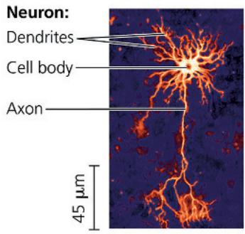  
Glia  
The various types of glia help nourish, insulate, and replenish neurons, and in some cases, modulate neuron function.

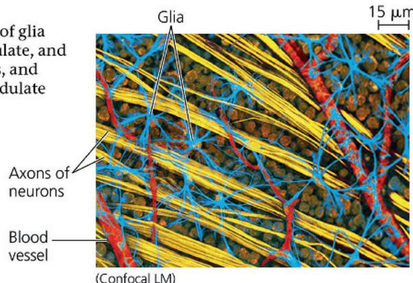

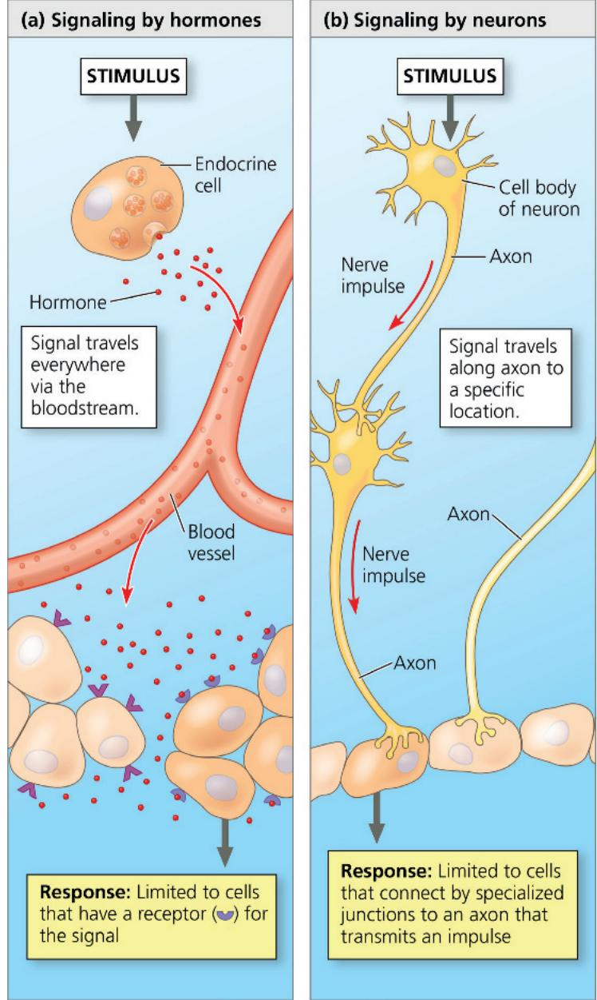  
VISUAL SKILLS After comparing the two diagrams, explain why a particular nerve impulse signal has only one physical pathway but a particular hormone molecule can have multiple physical pathways.
For suggested answer, see Appendix A.  
Figure 40.6 Signaling in the endocrine and nervous systems.

## Coordination and Control

An animal's cells, tissues, and organ systems act in concert with one another to respond to a stimulus—an external or internal factor that triggers a change in a specific activity within the body. This change in activity is known as the response. For example, when the wolf depicted in Figure 40.5 hunts, the smell of prey acts as a stimulus. In response, the brain initiates a coordinated increase in the wolf's breathing and heart rates, and the wolf runs faster. What signals coordinate activity? How do the signals move within the body?

Animals have two major systems for coordinating and controlling responses to stimuli: the endocrine and nervous systems (Figure 40.6). In the endocrine system, signaling molecules released into the bloodstream by endocrine cells are carried to all locations in the body. In the nervous system, neurons transmit signals along dedicated routes connecting specific locations in the body.

The signaling molecules that are broadcast throughout the body by the endocrine system are called hormones. It takes seconds for hormones to be released into the bloodstream and carried throughout the body. The effects are often long-lasting, however, because hormones can remain in the bloodstream for minutes or even hours.

Different hormones cause distinct effects, and only cells that have receptors for a particular hormone respond (Figure 40.6a). Depending on which cells have receptors for that hormone, the hormone may have an effect in just a single location or in sites throughout the body. For example, thyroid-stimulating hormone (TSH) acts solely on cells in the thyroid gland. They in turn release thyroid hormone, which acts on nearly every body tissue to increase oxygen consumption and heat production.

In the nervous system, signals called nerve impulses travel to specific target cells along communication lines consisting mainly of axons (Figure 40.6b). Transmission in the nervous system is extremely fast; nerve impulses take only a fraction of a second to reach the target and last only a fraction of a second.

Nerve impulses can change the activity of other neurons, initiate muscle contractions, alter the secretion of digestive juices, or control hormone release. Unlike the endocrine system, the nervous system conveys information by the pathway the signal takes. For example, a person can distinguish different musical notes because each note's frequency activates neurons in the ear that connect to slightly different locations in the brain.

Communication in the nervous system usually involves more than one type of signal. Nerve impulses travel along axons, sometimes over long distances, as changes in voltage. In contrast, passing information from one neuron to another often involves very short-range chemical signals. These chemical signals, like hormones, use receptors to change the activity of the target cell.

Because the two major communication systems of the body differ in signal type, transmission, speed, and duration, it is not surprising that they are adapted to different functions. The endocrine system is especially well adapted for coordinating gradual changes that affect the entire body, such as growth, development, reproduction, metabolic processes, and digestion. The nervous system is well suited for directing immediate and rapid responses to the environment, such as reflexes and other rapid movements. Nevertheless, the two systems often work in close coordination. Both help maintain a stable internal environment, our next topic of discussion.

## Concept Check 40.1

1. What properties do all types of epithelia share?

2. VISUAL SKILLS Consider the idealized animal in Figure 40.4. At which sites must oxygen cross a plasma membrane in traveling from the external environment to the cytoplasm of a body cell?

3. WHAT IF? Growth hormone is required for normal growth in humans. If an individual had a mutation in the growth hormone receptor so that it could not bind growth hormone, how would you predict that the individual would be affected? Explain.

# Concept 40.2: Feedback control maintains the internal environment in many animals

Many organ systems play a role in managing an animal's internal environment, a task that can present a major challenge. Imagine if your body temperature soared every time you took a hot shower or slurped a steaming bowl of soup. Faced with environmental fluctuations, animals manage their internal environment by either regulating or conforming.

## Regulating and Conforming

Compare the two sets of data in Figure 40.7. The river otter's body temperature is largely independent of that of the surrounding water, whereas the largemouth bass's body warms or cools when the water temperature changes. We can convey these two trends by labeling the otter a regulator and the bass a conformer with regard to body temperature. An animal is a regulator for an environmental variable if it uses internal mechanisms to control internal change in the face of external fluctuation. In contrast, an animal is a conformer if it allows its internal condition to change in accordance with external changes in the particular variable.

An animal may allow some internal conditions to conform to the environment but regulate others. For instance, the bass conforms to the temperature of the water in which it lives, but regulates the solute concentration in its blood and interstitial fluid. In addition, conforming need not involve changes in an internal variable: Many marine invertebrates, such as spider crabs (genus

Libinia), let their internal solute concentration conform to the relatively stable salinity of their ocean environment.

## Homeostasis

The steady body temperature of a river otter and the stable concentration of solutes in a freshwater bass are examples of homeostasis, which means the maintenance of internal balance. In achieving homeostasis, animals maintain a “steady state”—a relatively constant internal environment—even when the external environment changes significantly.

Many animals exhibit homeostasis for a range of physical and chemical properties. For example, humans maintain a fairly constant body temperature of between approximately $36^{\circ}$ and $38^{\circ}$ C ( $97^{\circ}-99^{\circ}$ F), a blood pH within 0.1 pH unit of 7.4, and a blood glucose concentration that is predominantly in the range of 70–110 mg of glucose per 100 mL of blood.

## Interview

Interview with Adrienne Bratcher: Explaining the relevance of homeostasis to physiology and life (at the start of Unit 7, before Chapter 40)

## Mechanisms of Homeostasis

Homeostasis requires a control system. Before exploring homeostasis in animals, let's get a basic picture of how a control system works by considering a nonliving example: the regulation of room temperature. Let's assume you want to keep a room at $20^{\circ}$ C ( $68^{\circ}$ F). You set a control device—the thermostat—to

Figure 40.7 The relationship between body and environmental temperatures in an aquatic temperature regulator and an aquatic temperature conformer.

The river otter regulates its body temperature, keeping it stable across a wide range of environmental temperatures. The largemouth bass, meanwhile, allows its internal environment to conform to the water temperature.

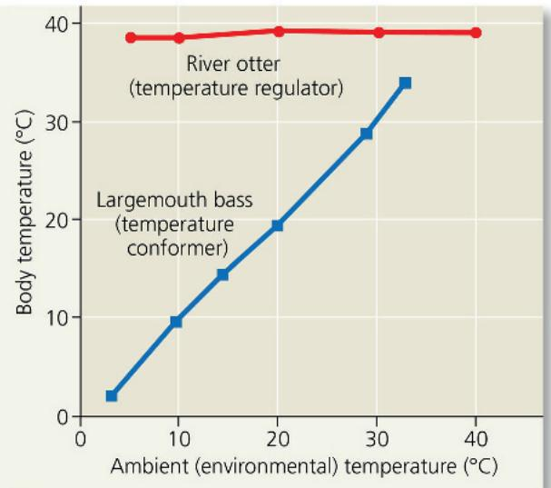

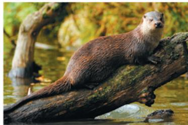

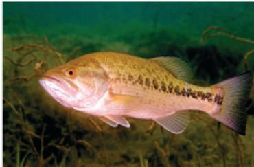

20°C. A thermometer in the thermostat monitors the room temperature. If the temperature falls below a certain value (say, 19.5°C, or 66°F), the thermostat turns on a heater (Figure 40.8a). Once the room temperature reaches 20°C, the thermostat switches off the heater. If the temperature instead rises above a certain value (for instance, 20.5°C), the thermostat activates a cooling mechanism, such as by turning on an air conditioner.

Like a home heating system, the homeostatic control system in animals maintains a variable, such as body temperature or solute concentration, within a specific range of values, or set point. A factor that causes a change in the level of the regulated variable away from its set point is a stimulus, and the physiological activity that returns the level of the variable closer to its set point is the response. Three components enable the body to respond to a stimulus: a sensor, a control center, and an effector

(b) Positive feedback

Figure 40.8 Negative feedback loops and homeostasis.  
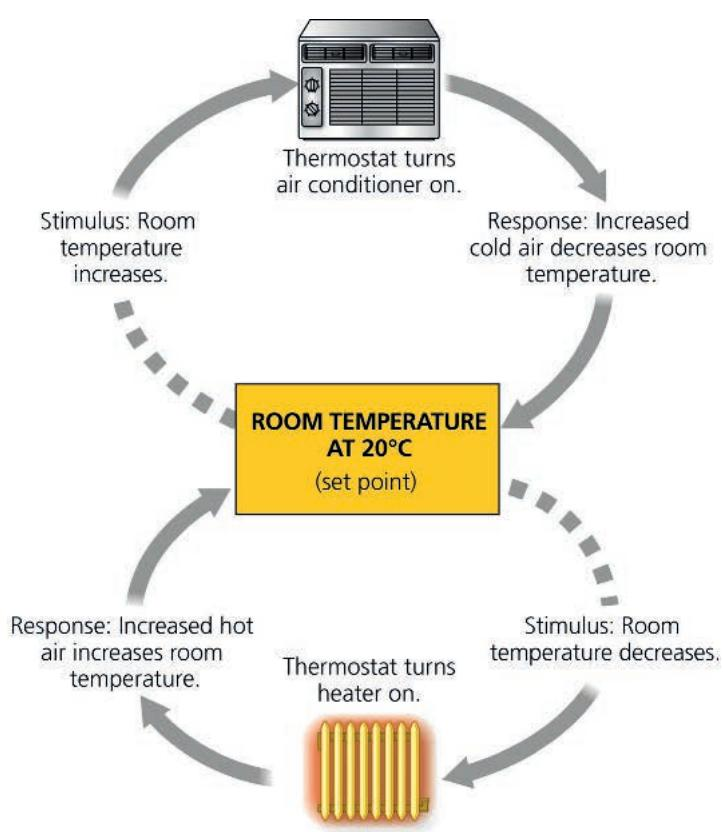

(a) A nonliving example of temperature regulation. Thermostat components monitor room temperature and compare it with the set point. If the room temperature changes away from the set point, the thermostat activates the heater or the air conditioner to reverse the change.  
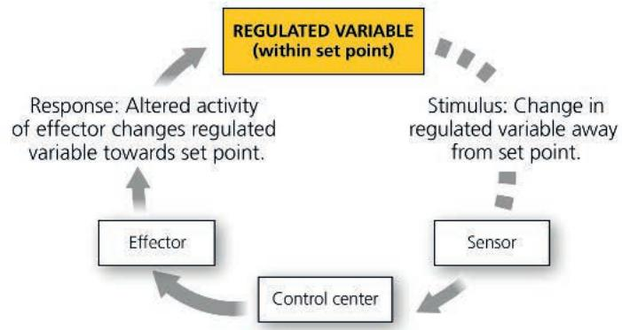  
(b) Components of a generalized negative feedback loop.

DRAW IT Using Figure 40.8b as a model and the information in the text, diagram how the body responds to the increased body temperature during vigorous exercise. Note that the same structure acts as both sensor and the control center.

For suggested answer, see Appendix A.

(Figure 40.8b). A sensor continuously monitors the regulated variable, and sends this information to a control center. The control center compares the sensor inputs with the set point, and, if necessary, alters the activity of an effector (such as a muscle, gland, or specific body cell) in a way that brings the level of the variable closer to set point. Signals, such as hormones or nerve impulses, convey information between these three components.

Figure 40.9 Overview of negative and positive feedback.  
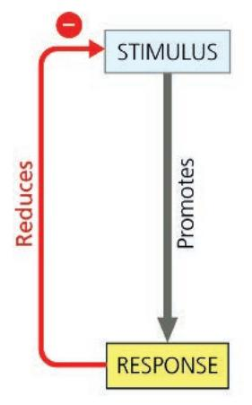

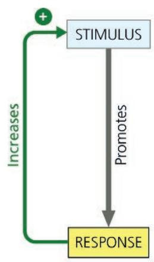

## Feedback Control in Homeostasis

Examining the circuit in Figure 40.8 reveals that either response (heating or cooling) reduces the stimulus (the change in temperature) that triggered that response. The circuit thus displays negative feedback, a control mechanism that reduces or opposes its stimulus (Figure 40.9a). This type of feedback regulation plays a major role in homeostasis in animals. For example, when you exercise vigorously, you produce heat, which increases your body temperature. Specialized neurons detect this increase and stimulate the activity of sweat glands. The evaporation of sweat from your skin then cools your body, helping return body temperature to its set point. In this example, different parts of the nervous system act as the sensor and control center. Sweat glands act as effectors, and signals travel between the components as nerve impulses.

Homeostasis is a dynamic equilibrium, an interplay between external factors that tend to change the internal environment and internal control mechanisms that oppose such changes. Note that physiological responses to stimuli are not instantaneous, just as switching on a furnace does not immediately warm a room. As a result, homeostasis moderates but doesn't eliminate changes in the internal environment. Homeostasis is enhanced by adaptations that reduce fluctuations, such as insulation in the case of temperature and physiological buffers in the case of pH.

Unlike negative feedback, positive feedback is a control mechanism that amplifies the stimulus (Figure 40.9b). In animals, positive-feedback loops do not play a major role in homeostasis, but instead help drive processes to completion. During childbirth, for instance, the pressure of the baby's head against sensors near the opening of the mother's uterus stimulates the uterus to contract. These contractions result in greater pressure against the opening of the uterus, heightening the contractions and thereby causing even greater pressure, ultimately causing the baby to be born.

## Alterations in Homeostasis

The set points for certain variables can change under various circumstances. In fact, regulated changes in the internal environment are essential to normal body functions. Some regulated changes occur during a particular stage in life, such as the radical shift in hormone balance that occurs during puberty.

Other regulated changes reflect a circadian rhythm, a set of physiological changes that occur roughly every 24 hours (Figure 40.10). One way to observe this rhythm is to monitor body temperature, which in humans typically undergoes a cyclic rise and fall of more than $0.6^{\circ}$ C ( $1^{\circ}$ F) in every 24-hour period. Remarkably, a biological clock maintains this rhythm even when variations in human activity, room temperature, and light levels are minimized (see Figure 40.10a). A circadian rhythm is thus intrinsic to the body, although the biological clock is normally coordinated with the cycle of light and darkness in the environment (see Figure 40.10b). For example, the hormone melatonin is secreted at night, and more is released during the longer nights of winter. External stimuli can reset the biological clock, but the effect is not immediate. That is why flying across several time zones results in jet lag, a mismatch between the circadian rhythm and local environment that persists until the clock fully resets.

Figure 40.10 Human circadian rhythm.  
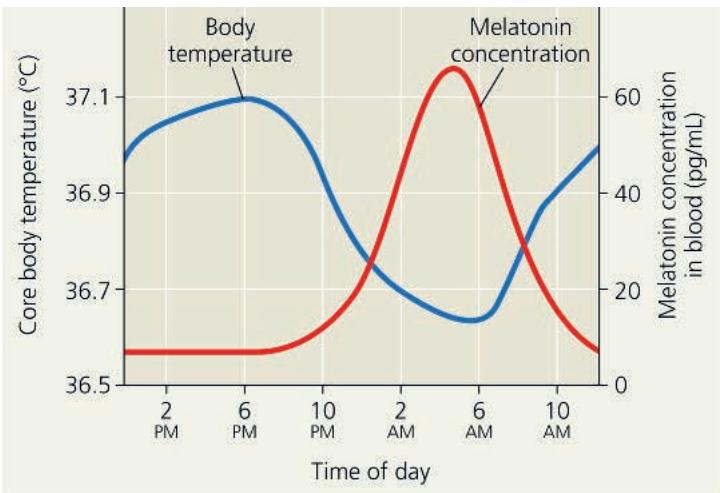  
(a) Variation in core body temperature and melatonin concentration in blood. Researchers studied resting but awake volunteers in an isolation chamber with constant temperature and low light. (Melatonin is a hormone secreted by the pineal gland.)

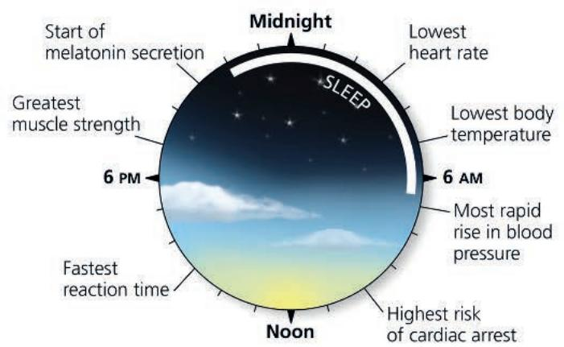  
(b) The human circadian clock. Metabolic activities undergo daily cycles in response to the circadian clock. As illustrated for a typical individual who rises early in the morning, eats lunch around noon, and sleeps at night, these cyclic changes occur throughout a 24-hour day.

Noting the importance of biological clocks to human health and disease, the Nobel Prize Committee awarded the 2017 Nobel Prize in Physiology or Medicine to Americans Jeffrey Hall, Michael Rosbash, and Michael Young, who studied the fruit fly Drosophila to map out the molecular mechanisms that underlie circadian rhythms.

Homeostasis is sometimes altered by acclimatization, an animal's physiological adjustment to changes in its external environment. For instance, when an elk moves up into the mountains from sea level, the lower oxygen concentration in the high mountain air stimulates the animal to breathe more rapidly and deeply. As a result, more $\mathrm{CO}_{2}$ is lost through exhalation, raising blood pH above its normal range. As the animal acclimatizes over several days, changes in kidney function cause it to excrete urine that is more alkaline, returning blood pH to its normal range. Other mammals, including humans, are also capable of acclimatizing to dramatic altitude changes (Figure 40.11), although health risks remain.

## Figure 40.11 Acclimatization by mountain climbers in the Himalayas.

To lessen the risk of altitude sickness when ascending a high peak, climbers acclimatize by camping partway up the mountain. Spending time at an intermediate altitude allows the circulatory and respiratory systems to become more efficient in capturing and distributing oxygen at a lower concentration.

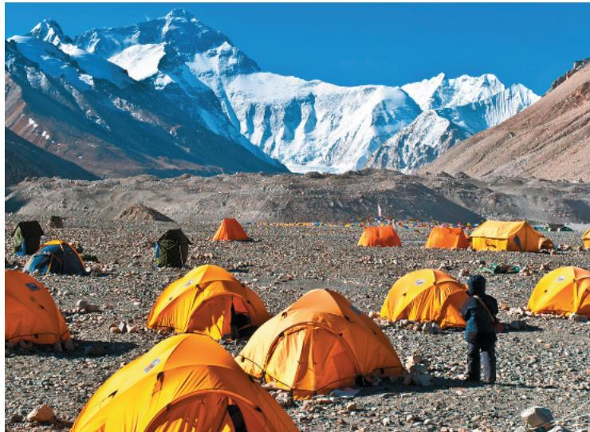

## Concept Check 40.2

1. MAKE CONNECTIONS How does negative feedback in thermoregulation differ from feedback inhibition in an enzyme-catalyzed biosynthetic process (see Figure 8.21)?

2. If you were deciding where to put the thermostat in a house, what factors would govern your decision? How do these factors relate to the fact that many homeostatic control sensors in humans are located in the brain?

3. MAKE CONNECTIONS Like animals, cyanobacteria have a circadian rhythm. By analyzing the genes that maintain biological clocks, scientists concluded that the 24-hour rhythms of humans and cyanobacteria reflect convergent evolution (see Concept 26.2). What evidence would have supported this conclusion? Explain.

# Concept 40.3: Homeostatic processes for thermoregulation involve form, function, and behavior

In this section, we'll examine the regulation of body temperature as an example of how form and function work together in regulating an animal's internal environment. Later chapters in this unit will discuss other physiological systems involved in maintaining homeostasis.

Thermoregulation is the process by which animals maintain their body temperature within the upper and lower limits of the set point. Body temperatures outside the limits of the set point can reduce the efficiency of enzymatic reactions, alter the fluidity of cellular membranes, and affect other temperature-sensitive biochemical processes, potentially with fatal results.

In talking about thermoregulation, we will need to talk about heat. Formally, heat is defined as thermal energy in transfer from one body of matter to another (see Concept 8.1). Here, however, we will use the term heat to refer simply to thermal energy.

## Endothermy and Ectothermy

Heat for thermoregulation can come from either internal metabolism or the external environment. Humans and other mammals, as well as birds, are endothermic, meaning that they are warmed mostly by heat generated by metabolism. Some fishes and insect species and a few nonavian reptiles are also mainly endothermic. In contrast, amphibians, many nonavian reptiles and fishes, and most invertebrates are ectothermic, meaning that they gain most of their heat from external sources. Endothermy and ectothermy are not mutually exclusive, however. For example, a bird is mainly endothermic but may warm itself in the sun on a cold morning, much as an ectothermic lizard does.

Endotherms can maintain a stable body temperature even in the face of large fluctuations in the environmental temperature. In a cold environment, an endotherm generates enough heat to keep its body substantially warmer than its surroundings (Figure 40.12a). In a hot environment, endothermic vertebrates have mechanisms for cooling their bodies, enabling them to withstand temperatures that are intolerable for most ectotherms.

Many ectotherms adjust their body temperature by behavioral means, such as seeking out shade or basking in the sun (Figure 40.12b). Because their heat source is largely environmental, ectotherms generally need to consume much less food than endotherms of equivalent size—an advantage if food supplies are limited. Ectotherms also usually tolerate larger fluctuations in their internal temperature.

Figure 40.12 Thermoregulation by internal or external sources of heat.

Endotherms obtain heat from their internal metabolism, whereas ectotherms rely on heat from their external environment.

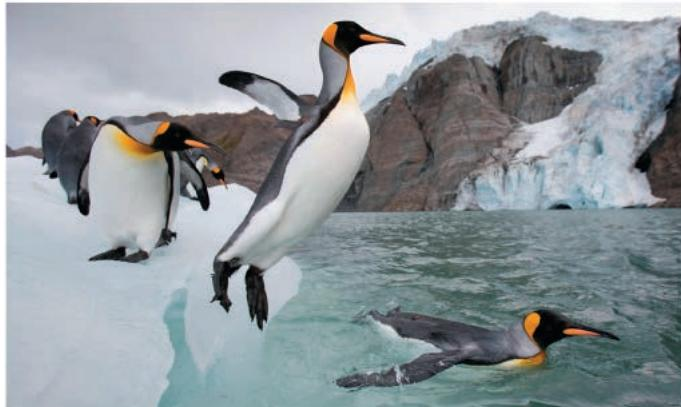  
(a) King penguins (Aptenodytes patagonicus), endotherms

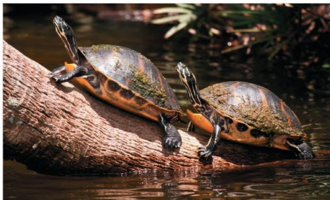  
(b) Florida red-bellied turtles (Pseudemys nelsoni), ectotherms

## Variation in Body Temperature

Animals also differ in whether their body temperature is variable or constant. An animal whose body temperature varies with its environment is called a poikilotherm (from the Greek poikilos, varied). In contrast, a homeotherm has a relatively constant body temperature. For example, the largemouth bass is a poikilotherm, and the river otter is a homeotherm (see Figure 40.7).

From the descriptions of ectotherms and endotherms, it might seem that all ectotherms are poikilothermic and all endotherms are homeothermic. In fact, there is no fixed relationship between the source of heat and the stability of body temperature. Many ectothermic marine fishes and invertebrates inhabit waters with such stable temperatures that their body temperature varies less than that of mammals and other endotherms. Conversely, the body temperature of a few endotherms varies considerably. For example, the body temperature of some bats drops from $40^{\circ}$ C to a few degrees above zero when they enter hibernation.

It is a common misconception that ectotherms are “cold-blooded” and endotherms are “warm-blooded.” Ectotherms do not necessarily have low body temperatures. On the contrary, when sitting in the sun, many ectothermic lizards have higher body temperatures than mammals. Thus, the terms cold-blooded and warm-blooded are misleading and are avoided in scientific communication.

## Balancing Heat Loss and Gain

Thermoregulation depends on an animal's ability to control the exchange of heat with its environment. That exchange can occur by any of four processes: radiation, evaporation, convection, and conduction (Figure 40.13). In each, heat is transferred from an object of higher temperature to one of lower temperature. In other words, heat moves down a gradient, a difference in a particular quality between two regions.

The essence of thermoregulation is maintaining a rate of heat gain that equals the rate of heat loss. Animals do this through mechanisms that either reduce heat exchange overall or favor heat

Figure 40.13 Heat exchange between an organism and its environment.

Radiation is the emission of electromagnetic waves by all objects warmer than absolute zero. Here, a lizard absorbs heat radiating from the distant sun and radiates a smaller amount of energy to the surrounding air.

Evaporation is the removal of heat from the surface of a liquid that is losing some of its molecules as gas. Evaporation of water from a lizard's moist surfaces that are exposed to the environment has a strong cooling effect.

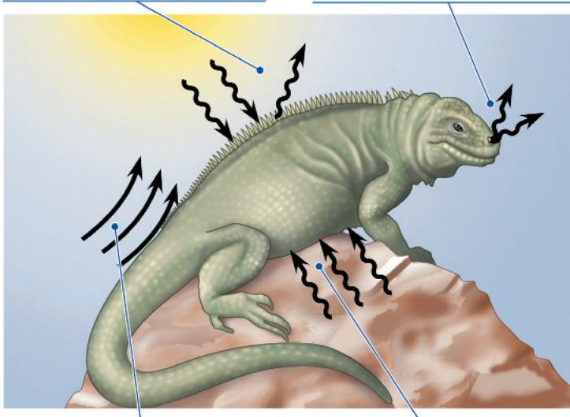

Convection is the transfer of heat by the movement of air or liquid past a surface, as when a breeze contributes to heat loss from a lizard's dry skin or when blood moves heat from the body core to the extremities.

Conduction is the transfer of heat between molecules of objects in contact with each other, as when a lizard sits on a hot rock.

VISUAL SKILLS If this figure showed a penguin (an endotherm) on an ice floe rather than an iguana (an ectotherm) on a rock, would any of the arrows point in a different direction? Explain.

For suggested answer, see Appendix A.

exchange in a particular direction. In mammals, several of these mechanisms involve the integumentary system, the outer covering of the body, consisting of the skin, hair, and nails (claws or hooves in some species).

## Insulation

Insulation, which reduces the flow of heat between an animal's body and its environment, is a major adaptation for thermoregulation in both mammals and birds. Insulation is found both at the body surface—hair and feathers—and beneath—layers of fat formed by adipose tissue. In addition, some animals secrete oily substances that repel water, protecting the insulating capacity of feathers or fur. Birds, for example, secrete oils that they apply to their feathers during preening.

Often, animals can adjust their insulating layers to further regulate body temperature. Most land mammals and birds, for example, react to cold by raising their fur or feathers. This action traps a thicker layer of air, thereby increasing the effectiveness of the insulation. Lacking feathers or fur, humans must rely primarily on fat for insulation. We do, however, get “goose bumps,” a vestige of hair raising inherited from our furry ancestors.

Insulation is particularly important for marine mammals, such as whales and walruses. These animals swim in water colder than their body core, and many species spend at least part of the year in nearly freezing polar seas. Furthermore, the transfer of heat to water occurs 50 to 100 times more rapidly than heat transfer to air. Survival under these conditions is made possible by an evolutionary adaptation called blubber, a very thick layer of insulating fat just under the skin. The insulation that blubber provides is so effective that marine mammals can maintain body core temperatures of about 36–38°C (97–100°F) without requiring much more energy from food than land mammals of similar size.

## Circulatory Adaptations

Circulatory systems provide a major route for heat flow between different body regions. Adaptations that regulate the extent of blood flow near the body surface play a significant role in thermoregulation.

In response to changes in the temperature of their surroundings, many animals alter the amount of blood (and hence heat) flowing between their body core and their skin. Nerve signals that relax the muscles of the vessel walls result in vasodilation, a widening of superficial blood vessels (those near the body surface). As a consequence of the increase in vessel diameter, blood flow in the skin increases. In endotherms, vasodilation usually increases the transfer of body heat to the environment by radiation, conduction, and convection (see Figure 40.13). The reverse process, vasoconstriction, reduces blood flow and heat transfer by decreasing the diameter of superficial vessels.

Like endotherms, some ectotherms control heat exchange by regulating blood flow. For example, when the marine iguana of the Galápagos Islands swims in the cold ocean, its superficial

## Figure 40.14 Countercurrent heat exchangers.

A countercurrent exchange system traps heat in the body core, thus reducing heat loss from the extremities, particularly when they are immersed in cold water or in contact with ice or snow. In essence, heat in the arterial blood emerging from the body core is transferred directly to the returning venous blood instead of being lost to the environment.

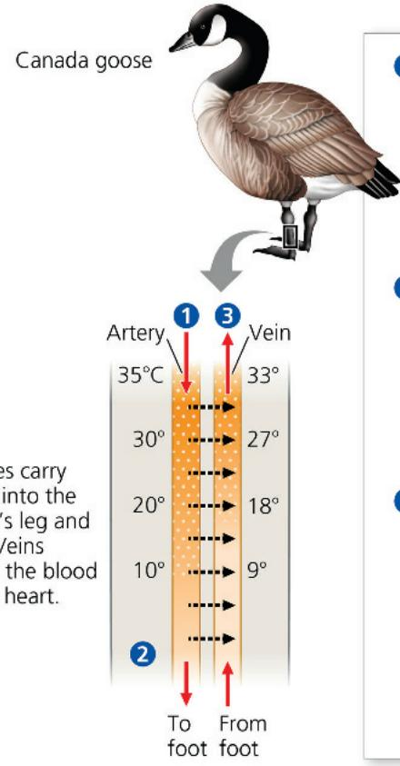  
Arteries carry blood into the goose's leg and foot. Veins return the blood to the heart.

1 Arteries carrying warm blood to the animal's extremities are in close contact with veins conveying cool blood in the opposite direction, back toward the trunk of the body. This arrangement facilitates heat transfer from arteries to veins along the entire length of the blood vessels.

2 Near the end of the leg or flipper, where arterial blood has been cooled to far below the animal's core temperature, the artery can still transfer heat to the even colder blood in an adjacent vein. The blood in the veins continues to absorb heat as it passes warmer and warmer blood traveling in the opposite direction in the arteries.

3 As the blood in the veins approaches the center of the body, it is almost as warm as the body core, minimizing the heat loss that results from supplying blood to body parts immersed in cold water.

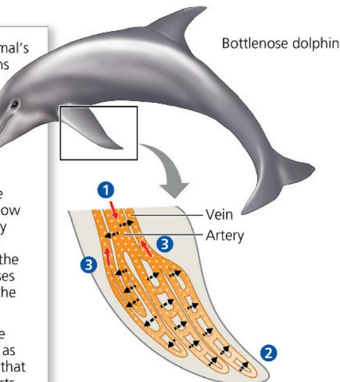  
In the flippers of a dolphin, each artery is surrounded by several veins in a counter-current arrangement, allowing efficient heat exchange between blood in the arteries and veins.

Key

Warm blood → Blood flow

Cool blood ....→ Heat transfer

blood vessels undergo vasoconstriction. This process routes more blood to the body core, conserving body heat. If the environmental temperature is higher than the animal's body temperature, vasodilation can facilitate heat gain.

In many birds and mammals, reducing heat loss from the body relies on countercurrent exchange, the transfer of heat (or solutes) between fluids that are flowing in opposite directions. In a countercurrent heat exchanger, arteries and veins are located adjacent to each other (Figure 40.14). Because blood flows through the arteries and veins in opposite directions, this arrangement allows heat exchange to be remarkably efficient. As warm blood in the arteries moves outward from the body core, it transfers heat to the colder blood in the veins returning from the extremities. Most importantly, heat is transferred along the entire length of the exchanger, maximizing the rate of heat exchange and minimizing heat loss to the environment.

Although most sharks and fishes are temperature conformers, countercurrent heat exchangers are found in some large, powerful swimmers, including great white sharks, bluefin tuna, and swordfish. By keeping the main swimming muscles warm, this adaptation enables vigorous, sustained activity. Similarly, many endothermic insects (bumblebees, honeybees,

and some moths) have a countercurrent exchanger that helps maintain a high temperature in their thorax, where flight muscles are located.

## Cooling by Evaporative Heat Loss

Many mammals and birds live in places where regulating body temperature requires cooling at some times and warming at others. If environmental temperature is above body temperature, only evaporation can keep body temperature from rising. Water absorbs considerable heat when it evaporates (see Concept 3.2); this heat is carried away from the skin and respiratory surfaces with water vapor.

Some animals exhibit adaptations that greatly facilitate evaporative cooling. A few mammals, including horses and humans, have sweat glands. In many other mammals, as well as in birds, panting is important. Some birds have a pouch richly supplied with blood vessels in the floor of the mouth; fluttering the pouch increases evaporation. Pigeons can use this adaptation to keep their body temperature close to $40^{\circ}$ C ( $104^{\circ}$ F) in air temperatures as high as $60^{\circ}$ C ( $140^{\circ}$ F), as long as they have sufficient water.

Figure 40.15
Thermoregulatory behavior in a dragonfly.
By orienting its body so that the narrow tip of its abdomen faces the sun, the dragonfly minimizes heating by solar radiation.

## Behavioral Responses

Ectotherms, and sometimes endotherms, control body temperature through behavioral responses to changes in the environment. When cold, they seek warm places, orienting themselves toward heat sources and expanding the portion of their body surface exposed to the heat source (see Figure 40.12b). When hot, they bathe, move to cool areas, or turn in another direction, minimizing their absorption of heat from the sun. For example, a dragonfly's "obelisk" posture is an adaptation that minimizes the amount of body surface exposed to the sun and thus to heating (Figure 40.15). Although these behaviors are relatively simple, they enable many ectotherms to maintain a nearly constant body temperature.

Social behavior contributes to thermoregulation in both endotherms and ectotherms. Among endotherms, for example, behavior contributes significantly to the winter survival of Emperor penguins (see Figure 40.1). Among ectotherms, honeybees are notable for their use of behavior in achieving homeostasis for temperature. In cold weather, they increase heat production and huddle together, thereby retaining heat. Individuals move between the cooler outer edges of the huddle and the warmer center, thus circulating and distributing the heat. In hot weather, honeybees cool the hive by transporting water to the hive and fanning with their wings, promoting evaporation and convection. Thus, a honeybee colony uses many of the mechanisms of thermoregulation characteristic of individual animals.

## Adjusting Metabolic Heat Production

Because endotherms generally maintain a body temperature considerably higher than that of the environment, they must counteract continual heat loss. Endotherms can vary heat production—thermogenesis—to match changing rates of heat loss.

Thermogenesis is increased by such muscle activity as moving or shivering. For example, shivering helps chickadees, birds with a body mass of only 20 g, remain active and hold their body temperature nearly constant at $40^{\circ}$ C ( $104^{\circ}$ F) in environmental temperatures as low as $-40^{\circ}$ C ( $-40^{\circ}$ F).

Flying insects such as bees and moths can also vary heat production. Many such endothermic insects warm up by shivering before taking off. As they contract their flight muscles in synchrony, only slight wing movements occur, but considerable heat is produced. Chemical reactions, and hence cellular respiration, accelerate in the warmed-up flight “motors,” enabling flight even in cold air.

In some mammals, endocrine signals released in response to cold cause mitochondria to increase their metabolic activity and produce heat instead of ATP. This process, called nonshivering thermogenesis, takes place throughout the body. Some mammals also have a tissue called brown fat in their neck and between their shoulders that is specialized for rapid heat production. (The presence of extra mitochondria is what gives brown fat its characteristic color.) Brown fat is found in the infants of many mammals, representing about 5% of total body weight in human infants. Long known to be present in adult mammals that hibernate, brown fat has also recently been detected in human adults (Figure 40.16). There, the amount has been found to vary, with individuals exposed to a cool environment for a month having increased amounts of brown fat.

Among the nonavian reptiles, endothermy has been observed in some large species in certain circumstances. For example, researchers found that a female Burmese python (Python molurus bivittatus) incubating eggs maintained a body temperature roughly $6^{\circ}$ C ( $11^{\circ}$ F) above that of the surrounding air. Where did the heat come from? Further studies showed that such pythons, like birds, can raise their body temperature through shivering (Figure 40.17). Whether certain groups of Mesozoic dinosaurs were similarly endothermic is a matter of active debate.

## Figure 40.16 Brown fat activity during cold stress.

This PET scan shows metabolically active brown fat deposits (indicated by the arrows) surrounding the neck.

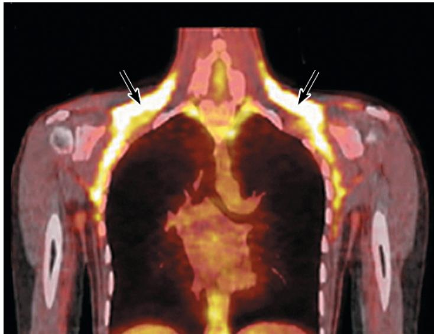

## Figure 40.17

## Inquiry: How does a Burmese python generate heat while incubating eggs?

## Experiment

Herndon Dowling and colleagues at the Bronx Zoo in New York observed that when a female Burmese python incubated eggs by wrapping her body around them, she raised her body temperature and frequently contracted the muscles in her coils. To learn if the contractions were elevating her body temperature, they placed the python and her eggs in a chamber. As they varied the chamber's temperature, they monitored the python's muscle contractions as well as her oxygen uptake, a measure of her rate of cellular respiration.

## Results

The python's oxygen consumption increased when the temperature in the chamber decreased. As shown in the graph, this increase in oxygen consumption paralleled an increase in the rate of muscle contraction.

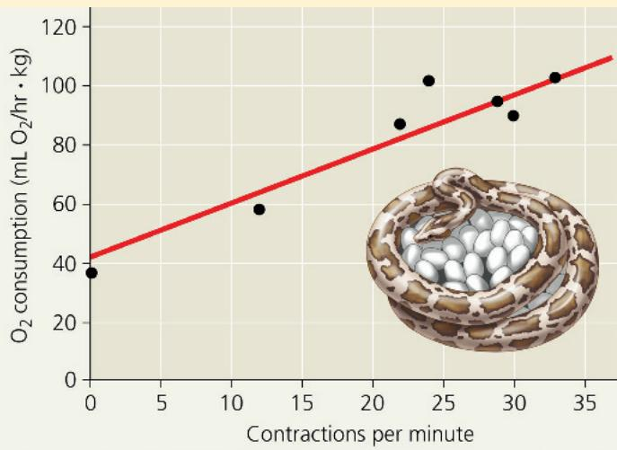

## Conclusion

Because oxygen consumption, which generates heat through cellular respiration, was correlated with the rate of muscle contraction, the researchers concluded that the muscle contractions, a form of shivering, were the source of the Burmese python's elevated body temperature.

Data from V. H. Hutchison, H. G. Dowling, and A. Vinegar, Thermoregulation in a brooding female Indian python, Python molurus bivittatus, Science 151:694–696 (1966).

WHAT IF? Suppose you varied air temperature and measured oxygen consumption for a female Burmese python without a clutch of eggs. Since she would not show shivering behavior, how would you expect the snake's oxygen consumption to vary with environmental temperature?

For suggested answer, see Appendix A.

## Acclimatization in Thermoregulation

Acclimatization contributes to thermoregulation in many animal species. In birds and mammals, acclimatization to seasonal temperature changes often includes adjusting insulation—growing a thicker coat of fur in the winter and shedding it in the summer, for example.

Acclimatization in ectotherms often includes adjustments at the cellular level. Cells may produce variants of enzymes that have the same function but different optimal temperatures. Also, the proportions of saturated and unsaturated lipids in membranes may change; unsaturated lipids help keep membranes fluid at lower temperatures (see Figure 7.5).

Remarkably, some ectotherms can survive subzero temperatures, producing “antifreeze” proteins that prevent ice formation in their cells. In the Arctic and Southern (Antarctic) Oceans, these proteins enable certain fishes to survive in water as cold as $-2^{\circ}C$ ( $28^{\circ}F$ ), a full degree Celsius below the freezing point of body fluids in other species.

## Thermoregulatory Feedback Loops

In humans and other mammals, the sensors responsible for thermoregulation are concentrated in the hypothalamus, the brain region that also controls the circadian clock. Within the hypothalamus, a group of nerve cells functions like the thermostat in Figure 40.8. Acting as both a sensor and a thermoregulatory control center, this brain region responds to body temperatures outside the set point by activating mechanisms that promote heat loss or gain (Figure 40.18).

At body temperatures above the set point, the hypothalamic control center promotes cooling of the body by dilation of vessels in the skin, sweating, or panting. When body temperatures instead drop below the set point, the control center inhibits heat loss mechanisms and activates mechanisms that either save heat, such as constricting vessels in the skin, or generate heat, such as shivering.

In the course of certain bacterial and viral infections, mammals and birds develop fever, an elevated body temperature. A variety of experiments have shown that fever reflects an increase in the set point for body temperature. For example, artificially raising the temperature of the hypothalamus in an infected animal reduces body temperature in the rest of the body.

Among certain ectotherms, an increase in body temperature upon infection reflects what is called a behavioral fever. For example, the desert iguana (Dipsosaurus dorsalis) responds to infection with certain bacteria by seeking a warmer environment and then maintaining a body temperature that is elevated by 2–4°C (4–7°F). Similar observations in fishes, amphibians, and even cockroaches indicate that fever is common to both endotherms and ectotherms.

Now that we have explored thermoregulation, we'll conclude our introduction to animal form and function by considering the different ways that animals allocate, use, and conserve energy.

Figure 40.18 The thermostatic function of the hypothalamus in human thermoregulation.

WHAT IF? Identify all of the effectors in Figure 40.18.
For suggested answer, see Appendix A.

Sensors in hypothalamus detect the change; control center activates cooling mechanisms.

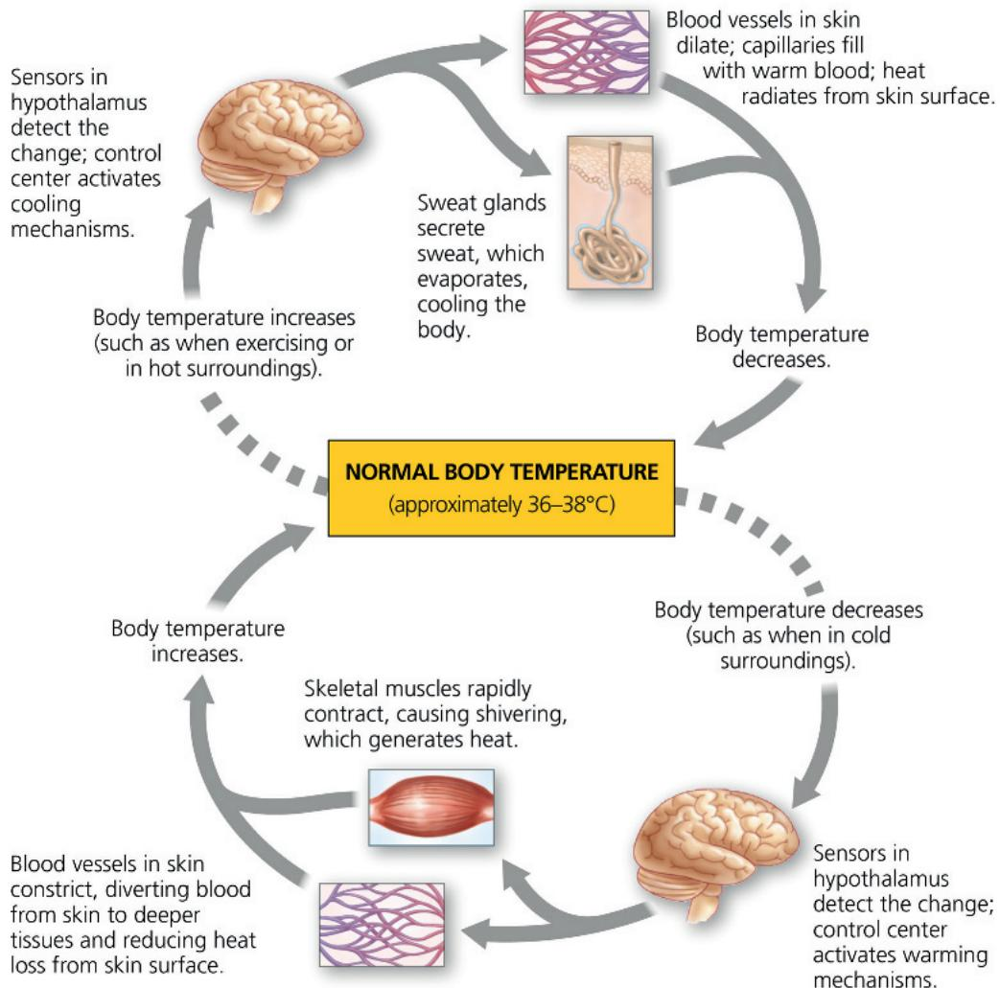  
Blood vessels in skin constrict, diverting blood from skin to deeper tissues and reducing heat loss from skin surface.  
Sensors in hypothalamus detect the change; control center activates warming mechanisms.

## Concept Check 40.3

1. Flowers differ in how much sunlight they absorb. Why might this matter to a hummingbird seeking nectar on a cool morning?

2. WHAT IF? Suppose a person begins sweating more heavily, increasing from a rate of 1 mL of sweat/hr to 10 mL/hr. Is it possible that the person is still in a state of homeostasis? Explain.

3. Why is shivering likely during the onset of a fever?

For suggested answers, see Appendix A.

## Concept 40.4: Energy requirements are related to animal size, activity, and environment

One of the unifying themes of biology, introduced in Concept 1.1, is that life requires energy transfer and transformation. Like other organisms, animals use chemical energy for growth, repair, activity, and reproduction. The overall flow and transformation of energy in an animal—its bioenergetics—determines

nutritional needs and is related to the animal's size, activity, and environment.

## Energy Allocation and Use

Organisms can be classified by how they obtain chemical energy. Most autotrophs, such as plants, harness light energy to build energy-rich organic molecules and then use those molecules for fuel. Most heterotrophs, such as animals, obtain their chemical energy from food, which contains organic molecules synthesized by other organisms.

Animals use chemical energy harvested from the food they eat to fuel metabolism and activity. Food is digested by enzymatic hydrolysis (see Figure 5.2b), and nutrients are absorbed by body cells. The ATP (adenosine triphosphate) produced by cellular respiration and fermentation powers cellular work, enabling cells, organs, and organ systems to perform the functions that keep an animal alive. Other uses of energy in the form of ATP include biosynthesis, which is needed for body growth and repair, synthesis of storage material such as fat, and production of gametes. The production and use of ATP generate heat, which the animal eventually gives off to its surroundings (Figure 40.19).

Figure 40.19 Bioenergetics of an animal: an overview.  
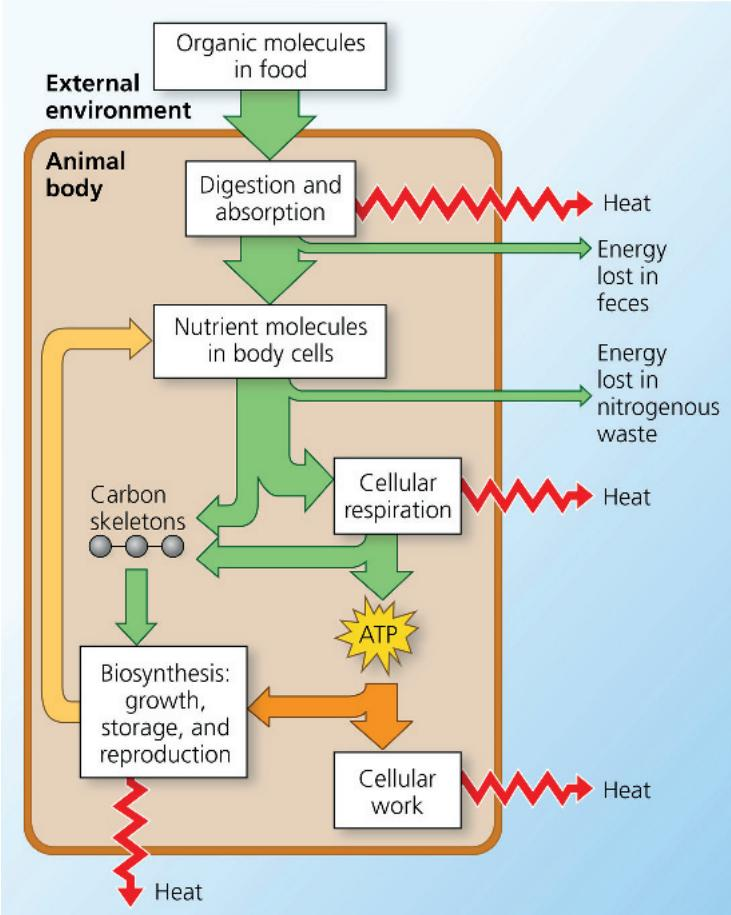  
MAKE CONNECTIONS Use the idea of energy coupling to explain why heat is produced in the absorption of nutrients, in cellular respiration, and in the synthesis of biopolymers (see Concept 8.3).
For suggested answer, see Appendix A.

## Quantifying Energy Use

How much of the total energy an animal obtains from food does it need just to stay alive? How much energy must be expended to walk, run, swim, or fly from one place to another? What fraction of the energy intake is used for reproduction? Physiologists answer such questions by measuring the rate at which an animal uses chemical energy and how this rate changes in different circumstances.

The sum of all the energy an animal uses in a given time interval is called its metabolic rate. Energy is measured in joules (J) or in calories (cal) and kilocalories (kcal). A kilocalorie equals 1,000 calories, or 4,184 joules. (The unit Calorie, with a capital C, as used by many nutritionists, is actually a kilocalorie.)

Metabolic rate can be determined in several ways. Because nearly all of the chemical energy used in cellular respiration eventually appears as heat, metabolic rate can be measured by monitoring an animal's rate of heat loss. For this approach, researchers use a calorimeter, which is a closed, insulated chamber equipped with a device that records the heat an animal gives off to its environment. Metabolic rate can also be determined from the amount of oxygen consumed or carbon dioxide produced by an animal's cellular respiration (Figure 40.20). To calculate metabolic rate over longer periods, researchers record the rate of food consumption, the energy content of the food (about 4.5–5 kcal per gram of protein or carbohydrate and about 9 kcal per gram of fat), and the chemical energy lost in waste products (feces and urine or other nitrogenous wastes).

## Minimum Metabolic Rate and Thermoregulation

Animals must maintain a minimum metabolic rate for basic functions such as cell maintenance, breathing, and circulation. Researchers measure this minimum metabolic rate differently for endotherms and ectotherms. The minimum metabolic rate of a nongrowing endotherm that is at rest, has an empty stomach, and is not experiencing stress is called the basal metabolic rate (BMR). BMR is measured under a “comfortable” temperature range—a range that requires only the minimum generation or shedding of heat. The minimum metabolic rate of ectotherms is determined at a specific temperature because changes in the environmental temperature alter body temperature and therefore metabolic rate. The metabolic rate of a fasting, nonstressed ecto-therm at rest at a particular temperature is called its standard metabolic rate (SMR).

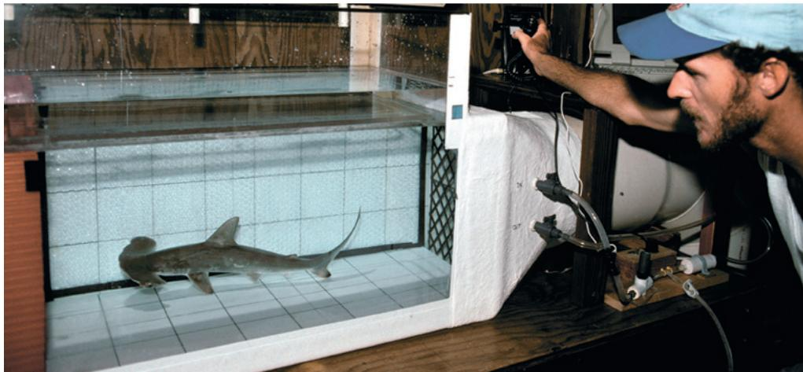

Comparisons of minimum metabolic rates reveal the different energy costs of endothermy and ectothermy. The BMR for humans averages 1,600–1,800 kcal per day for adult males and 1,300–1,500 kcal per day for adult females. These BMRs are about equivalent to the rate of energy use by a 75-watt lightbulb. In contrast, the SMR of an American alligator is only about 60 kcal per day at 20°C (68°F). As this represents less than $\frac{1}{20}$ the energy used by a comparably sized adult human, it is clear that ectothermy has a markedly lower energetic requirement than endothermy.

## Influences on Metabolic Rate

Metabolic rate is affected by many factors other than an animal being an endotherm or an ectotherm. Some key factors are age, sex, size, activity, temperature, and nutrition. Here we'll examine the effects of size and activity.

## Size and Metabolic Rate

Larger animals have more body mass and therefore require more chemical energy. Remarkably, the relationship between overall metabolic rate and body mass is constant across a wide range of sizes and forms, as illustrated for various mammals in Figure 40.21a. In fact, for even more varied organisms ranging in size from bacteria to blue whales, metabolic rate remains roughly proportional to body mass to the three-quarter power ( $m^{3/4}$ ). Scientists are still researching the basis of this relationship, which applies to ectotherms as well as endotherms.

The relationship of metabolic rate to size profoundly affects energy consumption by body cells and tissues. As shown in Figure 40.21b, the energy it takes to maintain each gram of body mass is inversely related to body size. Each gram of a mouse, for instance, requires about 20 times as many calories as a gram of an elephant, even though the whole elephant uses far more calories than the whole mouse. The smaller animal's higher metabolic rate per gram demands a higher rate of oxygen delivery. To meet this demand, the smaller animal must have a higher breathing rate, blood volume (relative to its size), and heart rate.

Thinking about body size in bioenergetic terms reveals how trade-offs shape the evolution of body plans. As body size decreases, each gram of tissue increases in energy cost. As body size increases, energy costs per gram of tissue decrease, but an ever-larger fraction of body tissue is required for exchange, support, and locomotion.

## Activity and Metabolic Rate

For both ectotherms and endotherms, activity greatly affects metabolic rate. Even a person reading quietly at a desk or an insect twitching its wings consumes energy beyond the BMR or SMR. Maximum metabolic rates (the highest rates of ATP use) occur during peak activity, such as lifting a heavy object, sprinting, or swimming at high speed. In general, the maximum metabolic rate an animal can sustain is inversely related to the duration of activity.

Figure 40.21 The relationship of metabolic rate to body size.  
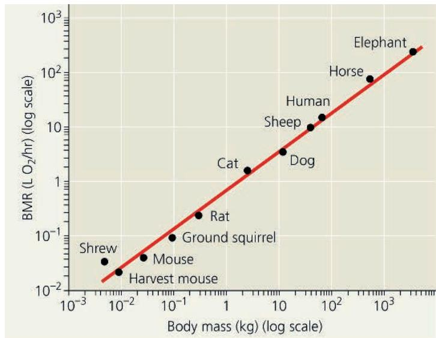

(a) Relationship of basal metabolic rate (BMR) to body size for various mammals. From shrew to elephant, size increases 1 millionfold.  
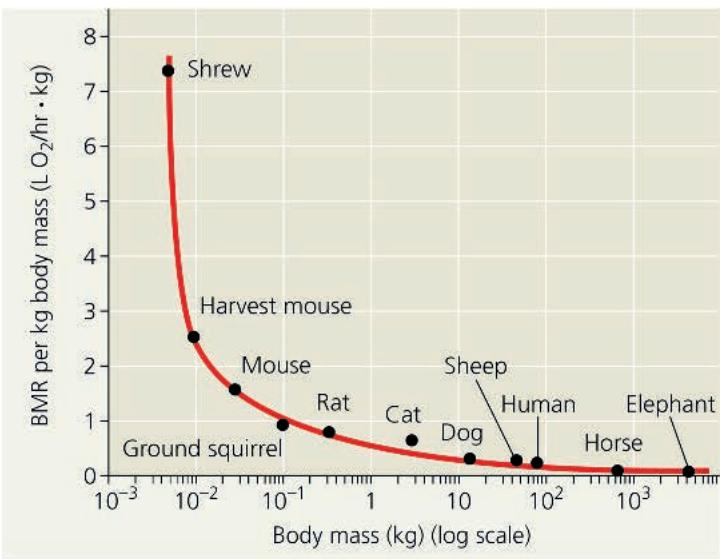  
(b) Relationship of BMR per kilogram of body mass to body size for the same mammals as in (a).  
INTERPRET THE DATA Based on the graph in (a), one observer suggests that a group of 100 ground squirrels has the same basal metabolic rate as 1 dog. A second observer looking at the graph disagrees. Who is correct and why?

For most terrestrial animals, the average daily rate of energy consumption is two to four times BMR (for endotherms) or SMR (for ectotherms). Humans in most developed countries have an unusually low average daily metabolic rate of about 1.5 times BMR—an indication of a relatively sedentary lifestyle.

The fraction of an animal's energy “budget” that is devoted to activity depends on many factors, including its environment, behavior, size, and thermoregulation. In the Scientific Skills Exercise, you'll interpret data on the annual energy budgets of three terrestrial vertebrates.

## Scientific Skills Exercise Interpreting Pie Charts

How Do Energy Budgets Differ for Three Terrestrial Vertebrates? To explore bioenergetics in animal bodies, let's consider typical annual energy budgets for three terrestrial vertebrates that vary in size and thermoregulatory strategy: a 4-kg male Adélie penguin, a 25-g (0.025-kg) female deer mouse, and a 4-kg female ball python. The penguin is well-insulated against his Antarctic environment but must expend energy in swimming to catch food, incubating eggs laid by his partner, and bringing food to his chicks. The tiny deer mouse lives in a temperate environment where food may be readily available, but her small size causes rapid loss of body heat. Unlike the penguin and mouse, the python is ectothermic and keeps growing throughout her life. She produces eggs but does not incubate them. In this exercise, we'll compare the energy expenditures of these animals for five important functions: basal (standard) metabolism, reproduction, thermoregulation, activity, and growth.

How the Data Were Obtained Energy budgets were calculated for each of the animals based on measurements from field and laboratory studies.

Data from the Experiments Pie charts are a good way to compare relative differences in a set of variables. In the pie charts here, the sizes of the wedges represent the relative annual energy expenditures for the functions shown in the key. The total annual expenditure for each animal is given below its pie chart.

## INTERPRET THE DATA

1. You can estimate the contribution of each wedge in a pie chart by remembering that the entire circle represents 100%, half is 50%, and so on. What percent of the mouse's energy budget goes to basal metabolism? What percent of the penguin's budget is for activity?

2. Without considering the sizes of the wedges, how do the three pie charts differ in which functions they include? Explain these differences.

3. Does the penguin or the mouse expend a greater proportion of its energy budget on thermoregulation? Why?

## Torpor and Energy Conservation

Despite their many adaptations for homeostasis, animals may encounter conditions that severely challenge their abilities to balance their heat, energy, and materials budgets. For example, at certain times of the day or year, their surroundings may be extremely hot or cold, or food may be unavailable. A major adaptation that enables animals to save energy in the face of such difficult conditions is torpor, a physiological state of decreased activity and metabolism.

Many birds and small mammals exhibit a daily torpor that is well adapted to feeding patterns. For instance, some bats feed at night and go into torpor in daylight. Similarly, chickadees and hummingbirds, which feed during the day, often go into torpor on cold nights.

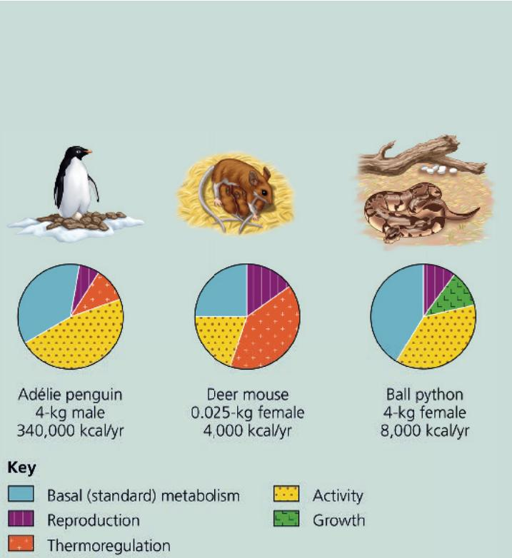

Data from M. A. Chappell et al., Energetics of foraging in breeding Adélie penguins, Ecology 74:2450–2461 (1993); M. A. Chappell et al., Voluntary running in deer mice: speed, distance, energy costs, and temperature effects, Journal of Experimental Biology 207:3839–3854 (2004); T. M. Ellis and M. A. Chappell, Metabolism, temperature relations, maternal behavior, and reproductive energetics in the ball python (Python regius), Journal of Comparative Physiology B 157:393–402 (1987).

4. Now look at the total annual energy expenditures for each animal. How much more energy does the penguin expend each year compared to the similarly sized python?

5. Which animal expends the most kilocalories per year on thermoregulation?

6. If you monitored energy allocation in the penguin for just a few months instead of an entire year, you might find the growth category to be a significant part of the pie chart. Given that adult penguins don't grow from year to year, how would you explain this finding?

Instructors: A version of this Scientific Skills Exercise can be assigned in Mastering Biology.

All endotherms that exhibit daily torpor are relatively small; when active, they have high metabolic rates and thus very high rates of energy consumption. The changes in body temperature, and thus the energy savings, are often considerable: the body temperature of chickadees drops as much as $10^{\circ}$ C ( $18^{\circ}$ F) at night, and the core body temperature of a hummingbird can fall $25^{\circ}$ C ( $45^{\circ}$ F) or more.

Hibernation is long-term torpor that is an adaptation to winter cold and food scarcity. When a mammal enters hibernation, its temperature set point decreases so its body temperature declines (Figure 40.22). Some hibernating mammals cool to as low as 1–2°C (34–36°F), and at least one, the Arctic ground squirrel (Spermophilus parryii), can enter a supercooled (unfrozen) state in which its body temperature dips below 0°C (32°F). Periodically, perhaps every two weeks or so, hibernating animals undergo

arousal, raising their body temperature and becoming active briefly before resuming hibernation. Metabolic rates during hibernation can be 20 times lower than if the animal attempted to maintain normal body temperatures of 36–38°C (97–100°F). As a result, hibernators such as the ground squirrel can survive through the winter on limited supplies of energy stored in the body tissues or as food cached in a burrow. Similarly, the slow

Figure 40.22 A hazel dormouse (Muscardinus avellanarius) hibernating.

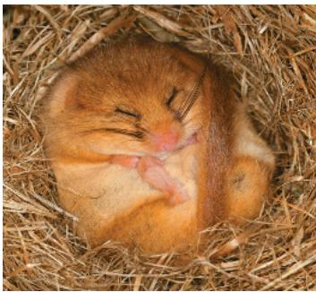

metabolism and inactivity of estivation, or summer torpor, enable animals to survive long periods of high temperatures and scarce water.

What happens to the circadian rhythm in hibernating animals? In the past, researchers reported detecting daily biological rhythms in hibernating animals. However, in some cases the animals were probably in a state of torpor from which they could readily arouse, rather than “deep” hibernation. More recently, a group of researchers in France addressed this question in a different way, examining the machinery of the biological clock rather than the rhythms it controls (Figure 40.23). Working with the European hamster, they found that molecular components of the clock stopped oscillating during hibernation. These findings support the hypothesis that the circadian clock ceases operation during hibernation, at least in this species.

From tissue types to homeostasis, this chapter has focused on the whole animal. We also investigated how animals exchange materials with the environment and how size and activity affect metabolic rate. For much of the rest of this unit, we'll explore how specialized organs and organ systems enable animals to meet the basic challenges of life. In Unit 6, we investigated how plants meet the same challenges. Figure 40.24, on the next two pages, highlights some fundamental similarities and differences in the evolutionary adaptations of plants and animals. This figure is thus a review of Unit 6, an introduction to Unit 7, and, most importantly, an illustration of the connections that unify the myriad forms of life.

## Interview

Interview with George Bartholomew: Exploring connections between animal physiology and the environment (eTextbook only)

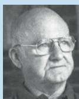

## Concept Check 40.4

1. If a mouse and a small lizard of the same mass (both at rest) were placed in experimental chambers under identical environmental conditions, which animal would consume oxygen at a higher rate? Explain.

2. Which animal must eat a larger proportion of its weight in food each day: a house cat or an African lion caged in a zoo? Explain.

## Figure 40.23

# Inquiry: What happens to the circadian clock during hibernation?

Experiment

To determine whether the 24-hour biological clock continues to run during hibernation, Paul Pévet and colleagues at the University of Louis Pasteur in Strasbourg, France, studied molecular components of the circadian clock in the European hamster (Cricetus cricetus). The researchers measured RNA levels for two clock genes—Per2 and Bmal1—during normal activity (euthermia) and during hibernation in constant darkness. The RNA samples were obtained from the suprachiasmatic nuclei (SCN), a pair of structures in the mammalian brain that control circadian rhythms.

## Results

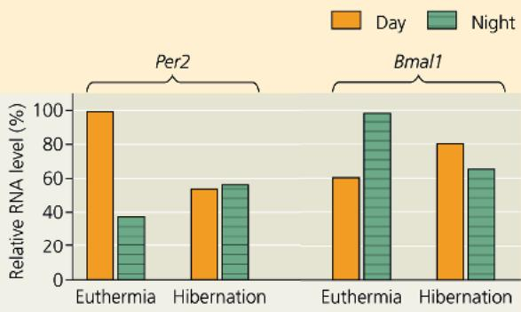

## Conclusion

Hibernation disrupted circadian variation in the hamster's clock gene RNA levels. Further experiments demonstrated that this disruption was not simply due to the dark environment during hibernation, since for nonhibernating animals RNA levels during a darkened daytime were the same as in daylight. The researchers concluded that the biological clock stops running in hibernating European hamsters and, perhaps, in other hibernators as well.

Data from F. G. Revel et al., The circadian clock stops ticking during deep hibernation in the European hamster, Proceedings of the National Academy of Sciences USA 104:13816–13820 (2007).

WHAT IF? Suppose you discovered a new hamster gene and found that the levels of RNA for this gene were constant during hibernation. What could you conclude about the day and night RNA levels for this gene during euthermia?

For suggested answer, see Appendix A.

3. WHAT IF? Suppose the animals at a zoo were resting comfortably and remained at rest while the nighttime air temperature dropped. If the temperature change were sufficient to cause a change in metabolic rate, what changes would you expect for an alligator and a lion?

For suggested answers, see Appendix A.

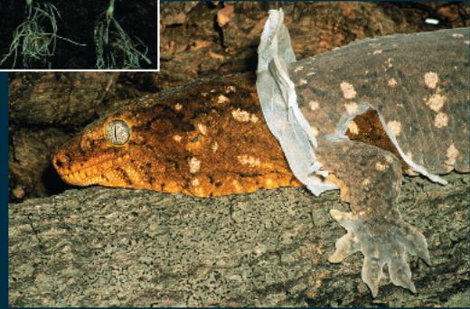

## Make Connections: Life Challenges and Solutions in Plants and Animals

## Figure 40.24

Multicellular organisms face a common set of challenges. Comparing the solutions that have evolved in plants and animals reveals both unity (shared elements) and diversity (distinct features) across these two lineages.

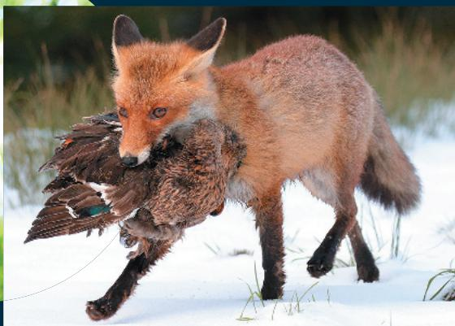

## Nutritional Mode

All living things must obtain energy and carbon from the environment to grow, survive, and reproduce. Plants are autotrophs, obtaining their energy through photosynthesis and their carbon from inorganic sources, whereas animals are heterotrophs, obtaining their energy and carbon from food. Evolutionary adaptations in plants and animals support these different nutritional modes. The broad surface of many leaves enhances light capture for photosynthesis. When hunting, a fox relies on its exceptional sense of smell, stealth, and sharp teeth. (See Figure 36.2 and Figure 41.15.)

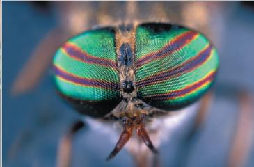

## Growth and Regulation

The growth and physiology of both plants and animals are regulated by hormones. In plants, hormones may act in a local area or be transported in the body. They control growth patterns, flowering, fruit development, and more. In animals, hormones circulate throughout the body and act in specific target tissues, controlling homeostatic processes and developmental events such as molting. (See Figure 39.10 and Figure 45.12.)

## Environmental Response

All forms of life must detect and respond appropriately to conditions in their environment. Specialized organs sense environmental signals. For example, the floral head of a sunflower and an insect's eyes both contain photoreceptors that detect light. Environmental signals activate specific receptor proteins, triggering signal transduction pathways that initiate cellular responses coordinated by chemical and electrical communication. (See Figure 39.19 and Figure 50.15.)

## Transport

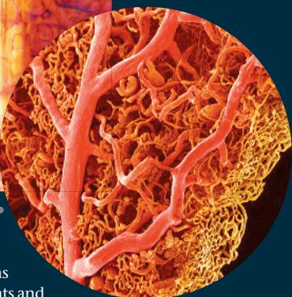

Must transport nutrients and waste products between locations in the body. A system of tubelike vessels is the common evolutionary solution, while the mechanism of circulation varies. Plants harness solar energy to transport water, minerals, and sugars through specialized tubes (left). In animals, a pump (heart) moves circulatory fluid through vessels (right). (See Figure 35.10 and Figure 42.9.)

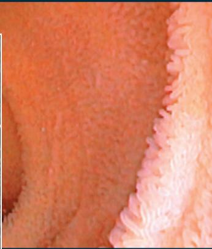

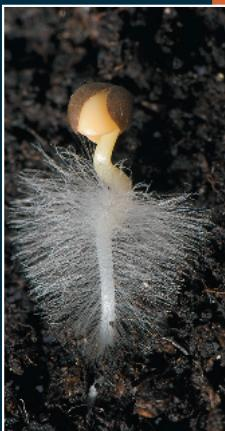

## Reproduction

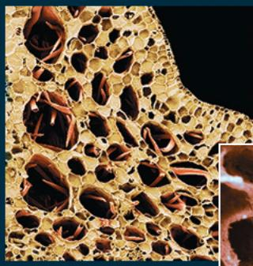

food reserves that supply energy to the young seedling, while milk provides sustenance for juvenile mammals. (See Figure 38.8 and Figure 34.40.)

Organisms need to absorb nutrients. The root hairs of plants (left) and the villi (projections) that line the intestines of vertebrates (right) increase the surface area available for absorption. (See Figure 35.3 and Figure 41.12.)

## Gas Exchange

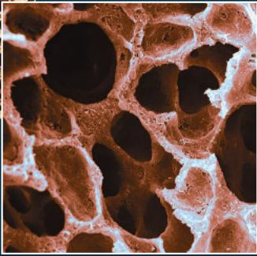

## Absorption

oxygen ( $O_{2}$ ) and releasing carbon dioxide ( $CO_{2}$ ). In photosynthesis, net exchange occurs in the opposite direction: $CO_{2}$ uptake and $O_{2}$ release. In both plants and animals, highly convoluted surfaces that increase the area available for gas exchange have evolved, such as the spongy mesophyll of leaves (left) and the alveoli of lungs (right). (See Figure 35.18 and Figure 42.24.)

The exchange of certain gases with the environment is essential for life. Respiration by plants and animals requires taking up

# Chapter 40 Review

## Summary of Key Concepts

To review key terms, go to the Vocabulary Self-Quiz (eTextbook only).

## Concept 40.1: Animal form and function are correlated at all levels of organization

\- Physical laws constrain the evolution of an animal's size and shape. These constraints contribute to convergent evolution in animal body forms.

\- Each animal cell must have access to an aqueous environment. Simple two-layered sacs and flat shapes maximize exposure to the surrounding medium. More complex body plans have highly folded internal surfaces specialized for exchanging materials.

\- Animal bodies are based on a hierarchy of cells, tissues, organs, and organ systems. Epithelial tissue forms active interfaces on external and internal surfaces; connective tissue binds and supports other tissues; muscle tissue contracts, moving body parts; and nervous tissue transmits nerve impulses throughout the body.

\- The endocrine and nervous systems are the two means of communication between different locations in the body. The endocrine system broadcasts signaling molecules called hormones everywhere via the bloodstream, but only certain cells are responsive to each hormone. The nervous system uses dedicated cellular circuits involving electrical and chemical signals to send information to specific locations.

For a large animal, what challenges would a spherical shape pose for carrying out exchange with the environment?

## Concept 40.2: Feedback control maintains the internal environment in many animals

\- An animal is a regulator if it controls an internal variable and a conformer if it allows an internal variable to vary with external changes. Homeostasis is the maintenance of a steady state despite internal and external changes.

\- Homeostatic mechanisms are usually based on negative feedback, in which the response reduces the stimulus. In contrast, positive feedback involves amplification of a stimulus by the response and often brings about a change in state, such as the transition from pregnancy to childbirth.

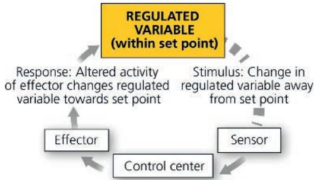

\- Regulated change in the internal environment is essential to normal function. Circadian rhythms are daily fluctuations in metabolism and behavior tuned to the cycles of light and dark in the environment. Other environmental changes may trigger acclimatization, a temporary shift in the steady state.

Is it accurate to define homeostasis as a constant internal environment? Explain.

## Concept 40.3: Homeostatic processes for thermoregulation involve form, function, and behavior

\- An animal maintains its internal temperature within a tolerable range by thermoregulation. Endothermic animals are warmed mostly by heat generated by metabolism. Ectothermic animals get most of their heat from external sources. Endothermy requires a greater expenditure of energy. Body temperature may vary with environmental temperature, as in poikilotherms, or be relatively constant, as in homeotherms.

\- In thermoregulation, physiological and behavioral adjustments balance heat gain and loss, which occur through radiation, evaporation, convection, and conduction. Insulation and counter-current exchange reduce heat loss, whereas panting, sweating, and bathing increase evaporation, cooling the body. Many ectotherms and endotherms adjust their rate of heat exchange with their surroundings by vasodilation or vasoconstriction and by behavioral responses.

\- Many mammals and birds adjust their amount of body insulation in response to changes in environmental temperature. Ectotherms undergo a variety of changes at the cellular level to acclimatize to shifts in temperature.

\- The hypothalamus acts as the control center in mammalian regulation of body temperature. Fever reflects an increase in the set point for body temperature in response to infection.

Given that humans thermoregulate, explain why your skin is cooler than your body core.

## Concept 40.4: Energy requirements are related to animal size, activity, and environment

\- Animals obtain chemical energy from food, storing it for short-term use in ATP. The total amount of energy used in a unit of time defines an animal's metabolic rate.

\- Under similar conditions and for animals of the same size, the basal metabolic rate of endotherms is substantially higher than the standard metabolic rate of ectotherms. Minimum metabolic rate per gram is inversely related to body size among similar animals. Animals allocate energy for basal (or standard) metabolism, activity, homeostasis, growth, and reproduction.

\- Torpor, a state of decreased activity and metabolism, conserves energy during environmental extremes. Animals may enter torpor according to a circadian rhythm (daily torpor), in winter (hibernation), or in summer (estivation).

Why do small animals breathe more rapidly than large animals? For suggested answers, see Appendix A.

## Test Your Understanding

For more multiple-choice questions, go to the Practice Test (eTextbook only).

## Levels 1-2: Remembering/Understanding

1. The body tissue that consists largely of material located outside of cells is

(A) epithelial tissue.

(C) muscle tissue.

(B) connective tissue.

(D) nervous tissue.

2. Which of the following would increase the rate of heat exchange between an animal and its environment?
(A) feathers or fur
(B) vasoconstriction
(C) wind blowing across the body surface
(D) countercurrent heat exchanger

3. Consider the energy budgets for a human, an elephant, a penguin, a mouse, and a snake. The \_\_\_\_ would have the highest total annual energy expenditure, and the \_\_\_\_ would have the highest energy expenditure per unit mass.
(A) elephant; mouse (C) mouse; snake
(B) elephant; human (D) penguin; mouse

## Levels 3-4: Applying/Analyzing

4. Compared with a smaller cell, a larger cell of the same shape has (A) less surface area.

(B) less surface area per unit of volume.

(C) the same surface-area-to-volume ratio.

(D) a smaller cytoplasm-to-nucleus ratio.

5. An animal's inputs of energy and materials would exceed its outputs (A) if the animal is an endotherm, which must always take in more energy because of its high metabolic rate.

(B) if it is actively foraging for food.

(C) if it is growing and increasing its mass.

(D) never; due to homeostasis, these energy and material budgets always balance.

6. You are studying a large tropical reptile that has a high and relatively stable body temperature. How do you determine whether this animal is an endotherm or an ectotherm?

(A) You know from its high and stable body temperature that it must be an endotherm.

(B) You subject this reptile to various temperatures in the lab and find that its body temperature and metabolic rate change with the ambient temperature. You conclude that it is an ectotherm.

(C) You note that its environment has a high and stable temperature. Because its body temperature matches the environmental temperature, you conclude that it is an ectotherm.

(D) You measure the metabolic rate of the reptile, and because it is higher than that of a related species that lives in temperate forests, you conclude that this reptile is an endotherm and its relative is an ectotherm.

7. Which of the following animals uses the largest percentage of its energy budget for homeostatic regulation?

(A) marine jelly (an invertebrate)

(B) snake in a temperate forest

(C) desert insect

(D) desert bird

8. MAKE CONNECTIONS In flowering plants, fruit ripening is controlled by a positive feedback loop. The production of ethylene increases in fruit as it matures. Would you expect ethylene to stimulate or inhibit fruit ripening? Explain.

## Levels 5-6: Evaluating/Creating

9. EVOLUTION CONNECTION In 1847, the German biologist Christian Bergmann noted that mammals and birds living at higher latitudes (farther from the equator) are on average larger and bulkier than related species found at lower latitudes. Suggest an evolutionary hypothesis to explain this observation.

10. SCIENTIFIC INQUIRY Eastern tent caterpillars (Malacosoma americanum) live in large groups in silk nests resembling tents, which they build in trees. They are among the first insects to be active in early spring, when daily temperature fluctuates from freezing to very hot. Over the course of a day, they display striking differences in behavior: Early in the morning, they rest in a tightly packed group on the tent's east-facing surface. In midafternoon, they are on its undersurface, each caterpillar hanging by a few of its legs. Propose a hypothesis to explain this behavior. How could you test it?

11. SCIENCE, TECHNOLOGY, AND SOCIETY Medical researchers are investigating artificial substitutes for various human tissues. Why might artificial blood or skin be useful? What characteristics would these substitutes need in order to function well in the body? Why do real tissues work better? Why not use the real tissues if they work better? What other artificial tissues might be useful? What problems do you anticipate in developing and applying them?

12. WRITE ABOUT A THEME: ENERGY AND MATTER In a short essay (about 100–150 words) focusing on energy transfer and transformation, discuss the advantages and disadvantages of hibernation.

## 13. SYNTHESIZE YOUR KNOWLEDGE

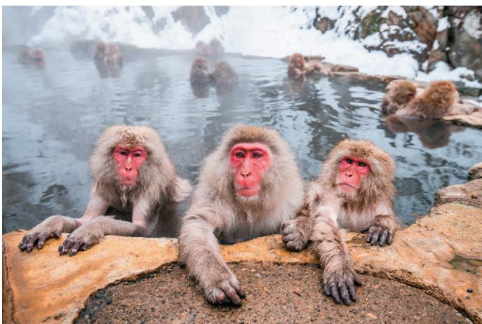  
These macaques (Macaca fuscata) are partially immersed in a hot spring in a snowy region of Japan. What are some ways that form, function, and behavior contribute to homeostasis for these animals?

For selected answers, see Appendix A.

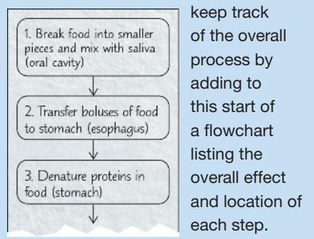

