# 第41章 Animal Nutrition

<!-- 章节边界按正文内容恢复；原始 MinerU 内容保留如下。 -->

## Animal Nutrition

## Key Concepts

41.1 An animal's diet must supply chemical energy, organic building blocks, and essential nutrients

41.2 Food processing involves ingestion, digestion, absorption, and elimination

41.3 Organs specialized for sequential stages of food processing form the mammalian digestive system

41.4 Evolutionary adaptations of vertebrate digestive systems correlate with diet

41.5 Feedback circuits regulate digestion, energy storage, and appetite

Make a flowchart: Digestion occurs stepwise in the human alimentary canal. As you study the molecular details,

## Study Tip

1. Break food into smaller pieces and mix with saliva (oral cavity)

2. Transfer boluses of food to stomach (esophagus)

3. Denature proteins in food (stomach)

keep track of the overall process by adding to this start of a flowchart listing the overall effect and location of each step.

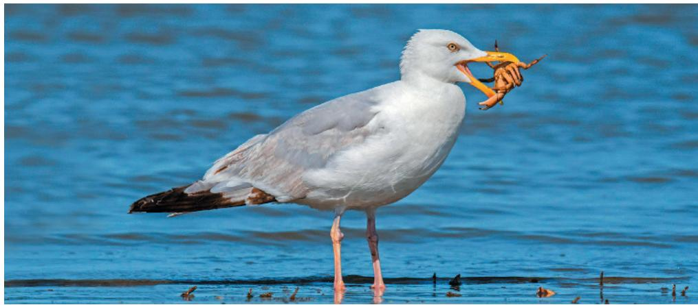  
Figure 41.1 For this herring gull, dinnertime has arrived. Once this meal has been taken in, the tissues of the crab will be taken apart and its nutrients taken up. Paradoxically, the classes of nutrients in the crab—largely proteins, fats, and carbohydrates—also make up the tissues of the gull.

# How can animals extract the nutrients they need from food while not digesting their own tissues?

An animal digests food using compartmentalized processing in a tube-like system. Compartmentalization protects body tissues while allowing enzymes and acids to break down nutrients.

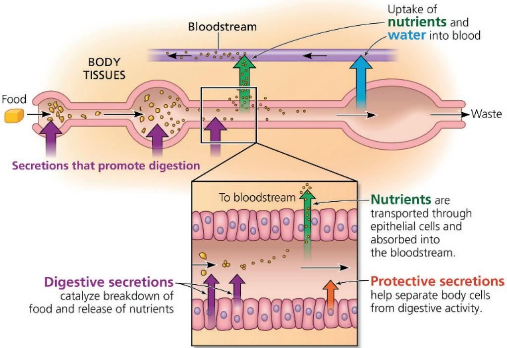

# Concept 41.1: An animal's diet must supply chemical energy, organic building blocks, and essential nutrients

Although dining on sea stars, crabs, and fish is the herring gull's specialty, all animals eat other organisms—dead or alive, piecemeal or whole. Unlike plants, animals must consume food for both energy and the organic molecules used to assemble new molecules, cells, and tissues. Overall, an adequate diet must satisfy three needs: chemical energy for cellular processes, organic building blocks for macromolecules, and essential nutrients. The process by which an animal takes in and makes use of food to meet these needs constitutes nutrition.

All of an animal's activities depend on sources of chemical energy in the diet: carbohydrates, proteins, and lipids. The chemical reactions of cellular respiration use this energy to produce ATP, which powers processes ranging from DNA replication and cell division to vision and flight (see Concept 8.3). Ingested and digested nutrients can be broken down immediately or stored for future use.

In addition to fuel for ATP production, an animal requires raw materials for biosynthesis. To build the complex molecules it needs to grow, maintain itself, and reproduce, an animal's food must provide a source of organic carbon (such as sugar) and a source of organic nitrogen (such as protein).

The third requirement of an animal's diet is to provide essential nutrients, substances that an animal requires but cannot assemble itself.

microorganisms normally can produce all 20. Most animals have the enzymes to synthesize about half of these amino acids, as long as their diet includes sulfur and organic nitrogen. The remaining amino acids must be obtained from the animal's food in prefabricated form and are therefore called essential amino acids. Many animals, including adult humans, require eight amino acids in their diet: isoleucine, leucine, lysine, methionine, phenylalanine, threonine, tryptophan, and valine. (Human infants also need a ninth, histidine.)

The proteins in animal products such as meat, eggs, and cheese are “complete,” providing all the essential amino acids. In contrast, most plant proteins are “incomplete,” being deficient in one or more essential amino acids. Corn (maize), for example, is deficient in tryptophan and lysine, whereas beans are lacking in methionine. However, vegetarians can easily obtain all of the essential amino acids by eating a varied diet of plant proteins.

## Essential Fatty Acids

Animals require fatty acids to synthesize a variety of cellular components, including membrane phospholipids, signaling molecules, and storage fats. Although animals can synthesize many fatty acids, they lack the enzymes to form the double bonds found in certain required fatty acids. Instead, these molecules must be obtained from the diet and are considered essential fatty acids. In mammals, they include linoleic acid (see Figure 41.2). Animals typically obtain ample quantities of essential fatty acids from seeds, grains, and vegetables in their diet.

## Vitamins

As Albert Szent-Györgyi, the discoverer of vitamin C, once quipped, "A vitamin is a substance that makes you ill if you don't eat it." Vitamins are organic molecules that are required in the diet in very small amounts (0.01–100 mg per day, depending on the vitamin).

## Essential Nutrients

Essential nutrients in the diet include certain amino acids and fatty acids, as well as vitamins and minerals. The key functions of essential nutrients include serving as substrates of enzymes, as coenzymes, and as cofactors in biosynthetic reactions (Figure 41.2).

In general, an animal can obtain all essential amino acids and fatty acids, as well as vitamins and minerals, by feeding on plants or other animals. Needs for particular nutrients vary among species. For instance, some animals (including humans) must get ascorbic acid (vitamin C) from their diet, whereas most animals can synthesize it from other nutrients.

## Essential Amino Acids

All organisms require a standard set of 20 amino acids to make a complete set of proteins (see Figure 5.14). Plants and

Figure 41.2 Roles of essential nutrients.

This example of a biosynthetic reaction illustrates some common functions for essential nutrients. The conversion of linoleic acid to $\gamma$ -linoleic acid by the enzyme fatty acid desaturase involves all four classes of essential nutrients, as labeled in blue. Note that almost all enzymes and other proteins in animals contain some essential amino acids, as indicated in the partial sequence shown for fatty acid desaturase.

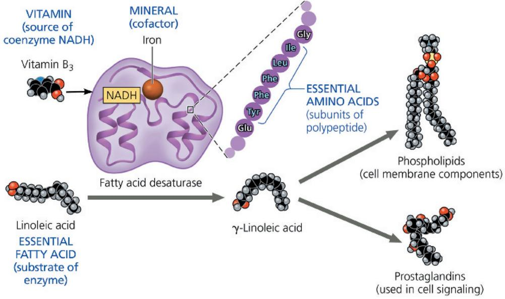

The 13 vitamins required by humans vary in both chemical properties and function (Table 41.1). Vitamin B $_{2}$ , for example, is a water-soluble vitamin that is converted in the body to FAD, a coenzyme used in many metabolic processes, including cellular respiration (see Figure 9.12). Vitamin C, which is required for the production of connective tissue, is also water-soluble.

Fat-soluble vitamins include vitamin A, which is incorporated into visual pigments of the eye, and vitamin D, which aids in calcium absorption. Our dietary requirement for vitamin D, unlike other vitamins, turns out to be variable. Why? When our skin is exposed to sunlight, our bodies synthesize vitamin D, reducing our dietary need.

## Minerals

Dietary minerals are inorganic nutrients, such as iron and sulfur, that are usually required in small amounts—from less than 1 mg to about 2,500 mg per day. As shown in Table 41.2, minerals have diverse functions in animal physiology. Some are assembled into the structure of proteins; iron, for example, is incorporated into the oxygen carrier hemoglobin as well as some enzymes (see Figure 41.2). Others, such as sodium, potassium, and chloride, are important in the functioning of nerves and muscles and in

maintaining osmotic balance between cells and the surrounding body fluid. In vertebrates, the mineral iodine is incorporated into thyroid hormone, which regulates metabolic rate. Vertebrates also require relatively large quantities of calcium and phosphorus for building and maintaining bone.

Ingesting too much of some minerals can cause health problems. For example, excess sodium can contribute to high blood pressure. This is a particular problem in the United States, where the typical person consumes enough salt (sodium chloride) to provide about 20 times the required amount of sodium. Processed foods often contain large amounts of sodium chloride, even if they do not taste salty.

## Variation in Diet

Despite many shared nutritional needs, animals have diverse diets. Herbivores, such as cattle, sea slugs, and caterpillars, dine mainly on plants or algae. Carnivores, such as sea otters, hawks, and spiders, mostly eat other animals. Bears, crows, cockroaches, and other omnivores (from the Latin omnis, all) don't in fact eat everything, but they do regularly consume animals as well as plants or algae. Humans are typically omnivores or herbivores.

Table 41.1 Vitamin Requirements of Humans

<table><tr><td>Vitamin</td><td>Major Dietary Sources</td><td>Major Functions in the Body</td><td>Symptoms of Deficiency</td></tr><tr><td colspan="4">Water-Soluble Vitamins</td></tr><tr><td> $B_1$  (thiamine)</td><td>Pork, legumes, peanuts, whole grains</td><td>Coenzyme used in removing  $CO_2$  from organic compounds</td><td>Beriberi (tingling, poor coordination, reduced heart function)</td></tr><tr><td> $B_2$  (riboflavin)</td><td>Dairy products, meats, enriched grains, vegetables</td><td>Component of coenzymes FAD and FMN</td><td>Skin lesions, such as cracks at corners of mouth</td></tr><tr><td> $B_3$  (niacin)</td><td>Nuts, meats, grains</td><td>Component of coenzymes NAD+ and NADP+</td><td>Skin and gastrointestinal lesions, delusions, confusion</td></tr><tr><td> $B_5$  (pantothenic acid)</td><td>Meats, dairy products, whole grains, fruits, vegetables</td><td>Component of coenzyme A</td><td>Fatigue, numbness, tingling of hands and feet</td></tr><tr><td> $B_6$  (pyridoxine)</td><td>Meats, vegetables, whole grains</td><td>Coenzyme used in amino acid metabolism</td><td>Irritability, convulsions, muscular twitching, anemia</td></tr><tr><td> $B_7$  (biotin)</td><td>Legumes, other vegetables, meats</td><td>Coenzyme in synthesis of fat, glyco-gen, and amino acids</td><td>Scaly skin inflammation, neuromuscular disorders</td></tr><tr><td> $B_9$  (folic acid)</td><td>Green vegetables, oranges, nuts, legumes, whole grains</td><td>Coenzyme in nucleic acid and amino acid metabolism</td><td>Anemia, neural tube malformation in fetus</td></tr><tr><td> $B_{12}$  (cobalamin)</td><td>Meats, eggs, dairy products</td><td>Production of nucleic acids and red blood cells</td><td>Anemia, numbness, loss of balance</td></tr><tr><td>C (ascorbic acid)</td><td>Citrus fruits, broccoli, tomatoes</td><td>Used in collagen synthesis; antioxidant</td><td>Scurvy (degeneration of skin and teeth), delayed wound healing</td></tr><tr><td colspan="4">Fat-Soluble Vitamins</td></tr><tr><td>A (retinol)</td><td>Dark green and orange vegetables and fruits, dairy products</td><td>Component of visual pigments; maintenance of epithelial tissues</td><td>Blindness, skin disorders, impaired immunity</td></tr><tr><td>D</td><td>Dairy products, egg yolk</td><td>Aids in absorption and use of calcium and phosphorus</td><td>Rickets (bone deformities) in children, bone softening in adults</td></tr><tr><td>E (tocopherol)</td><td>Vegetable oils, nuts, seeds</td><td>Antioxidant; helps prevent damage to cell membranes</td><td>Nervous system degeneration</td></tr><tr><td>K (phylloquinone)</td><td>Green vegetables, tea; also made by colon bacteria</td><td>Important in blood clotting</td><td>Defective blood clotting</td></tr></table>

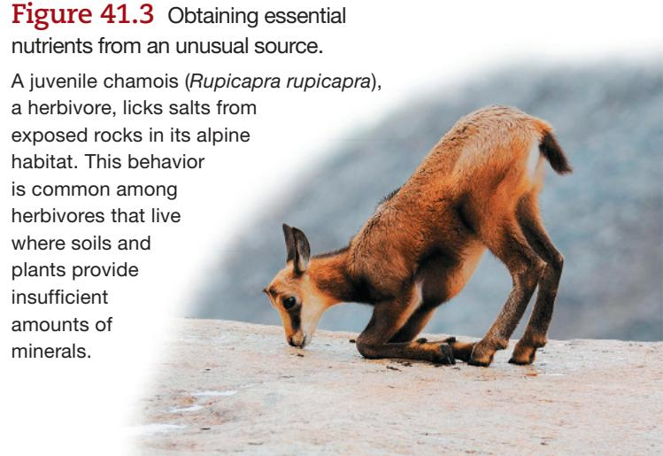

Table 41.2 Mineral Requirements of Humans\*

<table><tr><td colspan="2">Mineral</td><td>Major Dietary Sources</td><td>Major Functions in the Body</td><td>Symptoms of Deficiency</td></tr><tr><td rowspan="7">More than 200 mg per day required</td><td>Calcium (Ca)</td><td>Dairy products, dark green vegeta-bles, legumes</td><td>Bone and tooth formation, blood clotting, nerve and muscle function</td><td>Impaired growth, loss of bone mass</td></tr><tr><td>Phosphorus (P)</td><td>Dairy products, meats, grains</td><td>Bone and tooth formation, acid-base balance, nucleotide synthesis</td><td>Weakness, loss of minerals from bone, calcium loss</td></tr><tr><td>Sulfur (S)</td><td>Proteins from many sources</td><td>Component of certain amino acids</td><td>Impaired growth, fatigue, swelling</td></tr><tr><td>Potassium (K)</td><td>Meats, dairy products, many fruits and vegetables, grains</td><td>Acid-base balance, water balance, nerve function</td><td>Muscular weakness, paralysis, nausea, heart failure</td></tr><tr><td>Chlorine (Cl)</td><td>Table salt</td><td>Acid-base balance, formation of gastric juice, nerve function, osmotic balance</td><td>Muscle cramps, reduced appetite</td></tr><tr><td>Sodium (Na)</td><td>Table salt</td><td>Acid-base balance, water balance, nerve function</td><td>Muscle cramps, reduced appetite</td></tr><tr><td>Magnesium (Mg)</td><td>Whole grains, green leafy vegetables</td><td>Enzyme cofactor; ATP bioenergetics</td><td>Nervous system disturbances</td></tr><tr><td colspan="2">Iron (Fe)</td><td>Meats, eggs, legumes, whole grains, green leafy vegetables</td><td>Component of hemoglobin and of electron carriers; enzyme cofactor</td><td>Iron-deficiency anemia, weakness, impaired immunity</td></tr><tr><td colspan="2">Fluorine (F)</td><td>Drinking water, tea, seafood</td><td>Maintenance of tooth structure</td><td>Higher frequency of tooth decay</td></tr><tr><td colspan="2">Iodine (I)</td><td>Seafood, iodized salt</td><td>Component of thyroid hormones</td><td>Goiter (enlarged thyroid gland)</td></tr><tr><td colspan="5">*Additional minerals required in trace amounts include cobalt (Co), copper (Cu), manganese (Mn), molybdenum (Mo), selenium (Se), and zinc (Zn). All of these minerals, as well as those in the table, can be harmful in excess.</td></tr></table>

The terms herbivore, carnivore, and omnivore represent the kinds of food an animal usually eats. However, most animals are opportunistic feeders, broadening their diet when their usual foods aren't available. For example, deer are herbivores, but occasionally eat insects, worms, or bird eggs. Similarly, herring gulls eat marine invertebrates, insects, and small fishes, but also human refuse. Note that microorganisms are an unavoidable "supplement" in every animal's diet.

## Malnutrition

A healthy diet matches dietary intake of both chemical energy and specific nutrients with the body's requirements. Ingesting too much or too little of an essential nutrient, or of all nutrients, over an extended period of time results in malnutrition. Malnutrition affects one out of four children worldwide, impairing health and often survival.

## Deficiencies in Essential Nutrients

Insufficient intake of essential nutrients can cause deformities, disease, and even death. For example, deer and other herbivores can develop fragile bones if the plants they consume grew in phosphorus-deficient soil. In such environments, some grazing animals obtain missing nutrients by consuming concentrated sources of salt or other minerals (Figure 41.3). Similarly, some birds supplement their diet with snail shells, and certain tortoises obtain minerals from stones they ingest.

Like other animals, humans sometimes have diets lacking in essential nutrients. A diet with insufficient amounts of one or more

## Figure 41.3 Obtaining essential nutrients from an unusual source.

A juvenile chamois (Rupicapra rupicapra a herbivore, licks salts from exposed rocks in its alpine habitat. This behavior is common among herbivores that live where soils and plants provide insufficient amounts of minerals.

essential amino acids causes protein deficiency, the most common type of malnutrition among humans. In children, protein deficiency may arise if their diet shifts entirely from breast milk to foods that contain relatively little protein, such as rice. Such children, if they survive infancy, often have impaired physical and mental development.

For people with imbalanced diets or special needs, taking a nutritional supplement that meets recommended daily requirements for essential nutrients is reasonable. For example, iron and vitamin $B_{12}$ (folic acid) supplementation can be beneficial during pregnancy, and essential fatty acid (omega-three) supplements have been shown to improve heart health. It is far less clear whether massive doses of vitamins and minerals confer health benefits or are even safe: Excesses of fat-soluble vitamins deposited in body fat can accumulate to toxic levels.

## Undernourishment

As mentioned earlier, malnutrition can also be caused by a diet that fails to provide enough chemical energy. In this situation, the body first uses up stored carbohydrates and fat. It then begins breaking down its own proteins for fuel: Muscles shrink, and the brain may become protein-deficient. If energy intake remains less than energy expenditures, the animal will eventually die. Even if a seriously undernourished animal survives, some of the damage may be irreversible.

Inadequate nourishment in humans is most common when drought, war, or other crisis severely disrupts the food supply. The United Nations reported in 2024 that nearly 282 million people faced acute food insecurity; that is, undernourishment put their lives or livelihoods in immediate danger. This number includes nearly all of the people living in Gaza and 50–80% of people living in South Sudan, Yemen, the Syrian Arab Republic, and Haiti. Large numbers of people in the Democratic Republic of the Congo, Nigeria, the Sudan, Afghanistan, and Ethiopia continue to face acute food shortages.

Sometimes undernourishment occurs within well-fed human populations as a result of eating disorders. For example, anorexia nervosa involves weight loss to a level that is unhealthy for the individual's age and height and may be related to a distorted body image.

## Overnourishment

Consuming more chemical energy than the body needs can lead to excessive accumulation of fat. Obesity, in turn, is a risk factor in a number of health problems, including type 2 diabetes, cancer of the colon and breast, and cardiovascular disease that can result in heart attacks and strokes. During the COVID-19 pandemic, obesity was identified as a major risk factor for COVID-19-associated hospitalization and death, particularly during the early waves of infection.

## Assessing Nutritional Needs

Determining the ideal diet for the human population is an important but difficult problem for scientists. As objects of study, people present many challenges. Unlike laboratory animals, humans are genetically diverse. They also live in settings far more varied than the stable and uniform environment that scientists use in laboratory experiments. Ethical concerns present an additional barrier. For example, it is not acceptable to investigate the nutritional needs of children in a way that might harm a child's growth or development.

Many insights into human nutrition have come from epidemiology, the study of human health and disease at the population level. In the 1970s, for instance, researchers discovered that children born to women of low socioeconomic status were more likely to have neural tube defects, which occur when tissue fails to enclose the developing brain and spinal cord (see

Concept 47.2). The English scientist Richard Smithells thought that malnutrition among these women might be responsible. As described in Figure 41.4, he found that vitamin supplementation greatly reduced the risk of neural tube defects. In other studies, he obtained evidence that folic acid (vitamin B $_{9}$ ) was the specific vitamin responsible, a finding confirmed by other researchers. Based on this evidence, the United States in 1998 began to require that folic acid be added to enriched grain products used to make bread, cereals, and other foods. Follow-up studies have documented the effectiveness of this program in reducing the frequency of neural tube defects. Thus, at a time when microsurgery and sophisticated diagnostic imaging dominate the headlines, a simple dietary change such as folic acid supplementation may be among the greatest contributors to human health.

## Figure 41.4

## Inquiry: Can diet influence the frequency of neural tube defects?

Experiment

Richard Smithells, of the University of Leeds, in England, examined the effect of vitamin supplementation on the risk of neural tube defects. People who had given birth to one or more babies with such a condition were put into two study groups. The experimental group consisted of those who were planning a pregnancy and began taking a multivitamin at least four weeks before attempting conception. The control group, who were not given vitamins, included those individuals who declined them and those who were already pregnant. The numbers of neural tube defects resulting from the pregnancies were recorded for each group.

## Results

<table><tr><td>Group</td><td>Number of Infants/Fetuses Studied</td><td>Infants/Fetuses with a Neural Tube Defect</td></tr><tr><td>Vitamin supplements (experimental group)</td><td>141</td><td>1</td></tr><tr><td>No vitamin supplements (control group)</td><td>204</td><td>12</td></tr></table>

Data from R. W. Smithells et al., Possible prevention of neural-tube defects by periconceptional vitamin supplementation, Lancet 315:339–340 (1980).

## Conclusion

This controlled study provided evidence that vitamin supplementation protects against neural tube defects, at least after the first pregnancy. Follow-up trials demonstrated that folic acid alone provided an equivalent protective effect.

INTERPRET THE DATA After folic acid supplementation became standard in the United States, the frequency of neural tube defects dropped to an average of just one in 5,000 live births. Propose two explanations of why the observed frequency was much higher in the experimental group of the Smithells study.

INQUIRY IN ACTION Read and analyze the original paper in Inquiry in Action: Interpreting Scientific Papers.

## Concept Check 41.1

1. An animal requires 20 amino acids to make proteins. Why aren't all 20 essential to animal diets?

2. MAKE CONNECTIONS Considering how enzymes function (see Concept 8.4), explain why vitamins are required in very small amounts.

3. WHAT IF? If a zoo animal eating ample food shows signs of malnutrition, how might a researcher determine which nutrient is lacking in its diet?

For suggested answers, see Appendix A.

## Concept 41.2: Food processing involves ingestion, digestion, absorption, and elimination

Whatever their diet, animals need to process food. We can divide food processing into ingestion, digestion, absorption, and elimination. The first stage—ingestion—is the act of eating or feeding. As shown in Figure 41.5, on the next page, four quite different categories describe the feeding mechanisms of most animal species.

During digestion, the second stage of food processing, food is broken down into molecules small enough for the body to absorb. Both mechanical and chemical processes are typically required. Mechanical digestion, such as chewing or grinding, breaks food into smaller pieces, increasing surface area. The food particles then undergo chemical digestion, which cleaves large molecules into smaller components.

Chemical digestion is necessary because animals cannot directly use the nucleic acids, fats, phospholipids, and most carbohydrates in food. These molecules are too large to pass through cell membranes and also are not all identical to those the animal needs for its particular tissues and functions. But when large molecules in food are broken down into their smaller components, the animal can use these products of digestion to assemble the large molecules it needs. For example, although the humpback whale and the tsetse fly in Figure 41.5 have very different diets, both break down proteins in their food to the same 20 amino acids from which they assemble all of the specific proteins in their bodies.

Enzyme-catalyzed synthesis of a fat or macromolecule links together smaller components, releasing a molecule of water for each new covalent bond formed. Chemical breakdown by digestive enzymes reverses this process, breaking bonds through the addition of water. This splitting process is called enzymatic hydrolysis. Polysaccharides and disaccharides are

split into simple sugars, as shown here for sucrose and the enzyme sucrase:

Enzymatic hydrolysis of a disaccharide

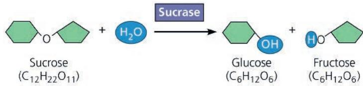

Similarly, proteins are broken down into small peptides and amino acids, and nucleic acids are cleaved into nucleotides and their components. Enzymatic hydrolysis also releases fatty acids and other components from fats and phospholipids. In many animals, bacteria living in the digestive system carry out some chemical digestion.

The last two stages of food processing occur after the food is digested. In the third stage, absorption, the animal's cells take up (absorb) small molecules such as amino acids and simple sugars. Elimination, in which undigested material passes out of the digestive system, completes the process.

## Digestive Compartments

You have just read that digestive enzymes hydrolyze the same biological materials (such as proteins, fats, and carbohydrates) that make up the bodies of the animals themselves. How, then, are animals able to digest food without digesting their own cells and tissues? The evolutionary adaptation that allows animals to avoid self-digestion is the processing of food within specialized intracellular or extracellular compartments.

## Intracellular Digestion

Food vacuoles—cellular organelles in which hydrolytic enzymes break down food—are the simplest digestive compartments. The hydrolysis of food inside vacuoles, called intracellular digestion, begins after a cell engulfs solid food by phagocytosis or liquid food by pinocytosis (see Figure 7.21). Newly formed food vacuoles fuse with lysosomes, organelles containing hydrolytic enzymes. This fusion of organelles brings food in contact with these enzymes, allowing digestion to occur safely within a compartment enclosed by a protective membrane. A few animals, such as sponges, digest all their food in this way (see Figure 33.4).

## Extracellular Digestion

In most animal species, hydrolysis occurs largely by extracellular digestion, the breakdown of food in compartments that are continuous with the outside of the animal's body. Having one or more extracellular compartments for digestion enables an animal to devour much larger pieces of food than can be ingested by phagocytosis.

# Exploring Four Main Feeding Mechanisms of Animals

Figure 41.5

Filter Feeding

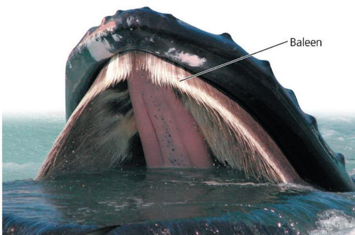

Many aquatic animals are filter feeders, which strain small organisms or food particles from the surrounding medium. The humpback whale, shown above, is one example. Attached to the whale's upper jaw are comblike plates called baleen, which remove small invertebrates and fish from enormous volumes of water and sometimes mud. Filter feeding in water is a type of suspension feeding, which also includes removing suspended food particles from the surrounding medium by capture or trapping mechanisms.

## Bulk Feeding

Most animals, including humans, are bulk feeders, which eat relatively large pieces of food. Their adaptations include tentacles, pincers, claws, venomous fangs, jaws, and teeth that kill their prey or tear off pieces of meat or vegetation. In this amazing scene, a rock python is beginning to ingest a gazelle it has captured and killed. Snakes cannot chew their food into pieces and must swallow

## Substrate Feeding

Substrate feeders are animals that live in or on their food source. This leaf miner caterpillar, the larva of a moth, is eating through the soft tissue of an oak leaf, leaving a dark trail of feces in its wake. Other substrate feeders include maggots (fly larvae), which burrow into animal carcasses.

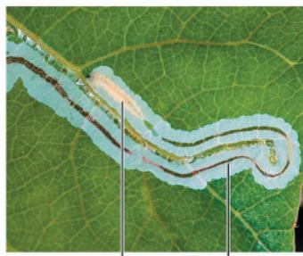  
Caterpillar Feces

## Fluid Feeding

Fluid feeders suck nutrient-rich fluid from a living host. This tsetse fly has pierced the skin of its human host with hollow, needlelike mouthparts and is consuming a blood meal. Similarly, aphids are fluid feeders that tap the phloem sap of plants. In contrast to such parasites, some fluid feeders actually benefit their hosts. For example, humming-

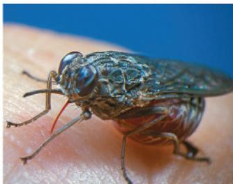

birds and bees move pollen between flowers as they fluid-feed on nectar.

it whole—even if the prey is much bigger than the diameter of the snake. They can do so because the lower jaw is loosely hinged to the skull by an elastic ligament that permits the mouth and throat to open very wide. After swallowing its prey, which may take more than an hour, the python will spend two weeks or longer digesting its meal.

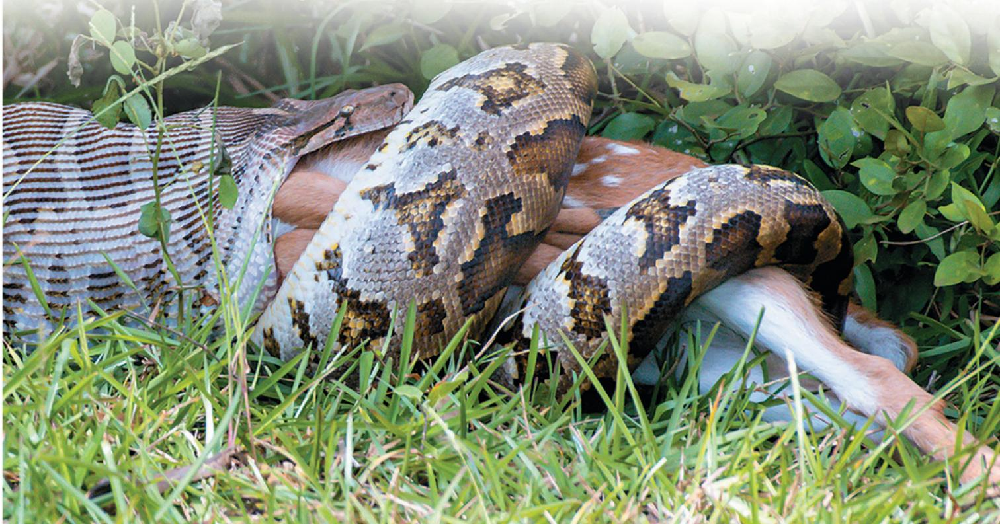

Figure 41.6 Digestion in a hydra.  
Digestion begins in the gastrovascular cavity and is completed intracellularly after small food particles are engulfed by specialized cells of the gastrodermis.  
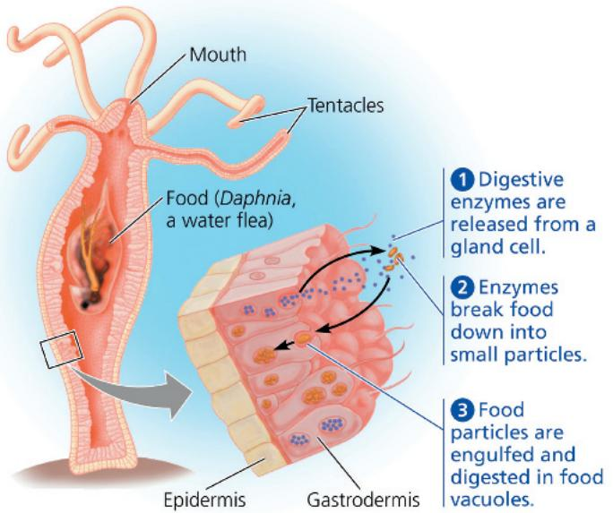  
DRAW IT Draw and label a simple diagram showing the pathway that nutrients follow from when food enters the hydra's mouth to when nutrients reach a cell on the outside of the tip of one of its tentacles.  
For suggested answer, see Appendix A.

Animals with relatively simple body plans typically have a digestive compartment with a single opening. This pouch, called a gastrovascular cavity, functions in digestion as well as in the distribution of nutrients throughout the body (hence the vascular part of the term). Small freshwater cnidarians called hydras provide a good example (Figure 41.6). The hydra—a carnivore—uses its tentacles to stuff captured prey through its mouth into its gastrovascular cavity. Specialized gland cells of the hydra's gastrodermis, the tissue layer that lines the cavity, then secrete digestive enzymes that break the soft tissues of the prey into tiny pieces. Other cells of the gastrodermis engulf these food particles, and most of the hydrolysis of macromolecules occurs intracellularly. After the hydra has digested its meal, undigested materials that remain in its gastrovascular cavity, such as exoskeletons of small crustaceans, are eliminated through its mouth. Many flatworms also have a gastrovascular cavity (see Figure 33.9).

Since there is only one opening to a gastrovascular cavity, it is referred to as an incomplete digestive tract. In contrast, animals with complex body plans have a digestive tube with two openings, a mouth and an anus (Figure 41.7). Such a tube is called a complete digestive tract or an alimentary canal. Food moves along the alimentary canal in a single direction, encountering a series of specialized compartments that carry out stepwise digestion and nutrient absorption. An animal with an alimentary canal can ingest food while earlier meals are still being digested, a feat that is likely to be difficult or inefficient for an animal with a gastrovascular cavity.

Because most animals have an alimentary canal, we'll use the complete digestive system of mammals in the next section to illustrate the general principles of food processing.

Figure 41.7 Variation in alimentary canals.  
These examples illustrate how the organization and structure of compartments for digestion, storage, and absorption differ among animals.  
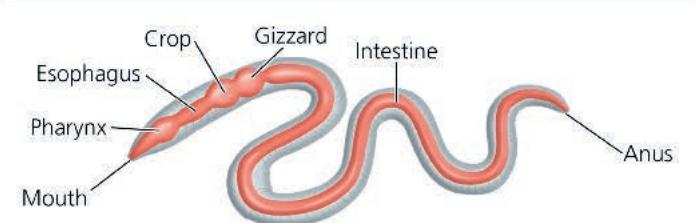  
(a) Earthworm. The muscular pharynx of an earthworm sucks food in through the mouth. Food passes through the esophagus and is stored and moistened in the crop. Mechanical digestion occurs in the muscular gizzard, which pulverizes food with the aid of small bits of sand and gravel. Chemical digestion and absorption occur in the intestine before wastes are eliminated through the anus.

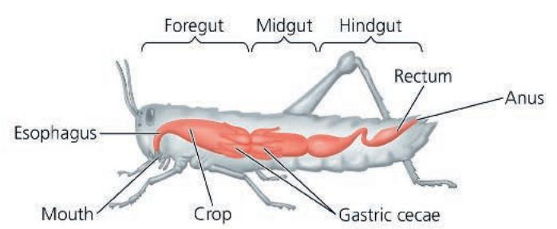  
(b) Grasshopper. A grasshopper has several digestive chambers grouped into three main regions: a foregut, with an esophagus and crop; a midgut; and a hindgut. Most digestion occurs in the midgut. Pouches called gastric cecae (singular, ceca) extend from the beginning of the midgut and function in digestion and absorption.

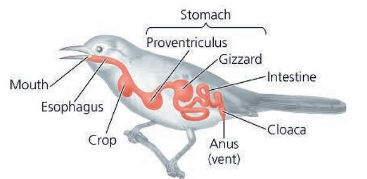  
(c) Bird. Many birds have a crop, where food is stored, and a gizzard, where mechanical digestion occurs. Protein digestion begins in the proventriculus, but most chemical digestion and absorption of nutrients occur in the intestine.

## Concept Check 41.2

1. Distinguish the overall structure of a gastrovascular cavity from that of an alimentary canal.

2. The digestive tracts of different birds show numerous adaptations that reflect their diets. Predict how the gizzard and crop (see Figure 41.7c) might differ between a nectar-drinking hummingbird and a seed-eating songbird.

3. WHAT IF? Thinking in broad terms, what similarities can you identify between digestion in an animal body and the breakdown of gasoline in an automobile engine? (You don't have to know about auto mechanics.)

# Concept 41.3: Organs specialized for sequential stages of food processing form the mammalian digestive system

In mammals, a number of accessory organs support food processing. The teeth and tongue physically manipulate food, and the salivary glands, pancreas, liver, and gallbladder secrete digestive juices through ducts into the alimentary canal. To explore the coordinated function of the accessory organs and alimentary canal, we'll consider the steps in food processing as a meal travels along the canal in a human.

## The Oral Cavity, Pharynx, and Esophagus

As soon as food enters the mouth, or oral cavity, food processing begins (Figure 41.8). Teeth with specialized shapes cut, mash, and grind, breaking the food into smaller pieces. This mechanical breakdown not only increases the surface area available for chemical breakdown but also facilitates swallowing. Meanwhile, the anticipation or arrival of food in the oral cavity triggers the release of saliva by the salivary glands.

Saliva is a complex mixture of materials with a number of vital functions. One major component is mucus, a viscous mixture of water, salts, cells, and slippery glycoproteins (carbohydrate–protein

Figure 41.8 The human digestive system.

After food is chewed and swallowed, it takes 5–10 seconds for it to pass down the esophagus and into the stomach, where it is stored for 2–6 hours during the first stages of processing. Complete digestion and nutrient absorption occur in the small intestine over a period of 5–6 hours. Processing is completed in the large intestine, and undigested material is expelled through the anus as feces.

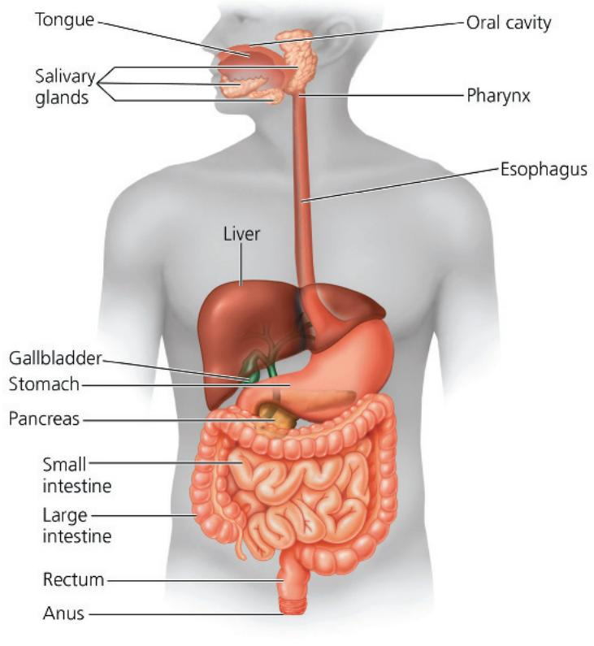

complexes). Mucus lubricates food for easier swallowing, protects the gums against abrasion, and facilitates taste and smell. Saliva also contains buffers, which help prevent tooth decay by neutralizing acid, and antimicrobial agents (such as lysozyme; see Figure 5.16), which protect against bacteria that enter the mouth with food.

The most abundant enzyme in saliva is amylase, which breaks down starch (a glucose polymer from plants) and glycogen (a glucose polymer from animals). While very little digestion occurs in the mouth, the action of chewing mixes amylase throughout the food where it can continue its digestive actions farther along the alimentary canal.

The tongue also has important roles in food processing. Taste buds on the tongue help evaluate ingested material, selecting which foods should be processed further and then enabling their passage. (See Concept 50.4 for a discussion of the sense of taste.) Once chewing begins, tongue movements manipulate the mixture of saliva and food, helping shape it into a ball called a bolus (Figure 41.9).

Figure 41.9 Intersection of the human airway and digestive tract.

In humans, the pharynx connects to the trachea and the esophagus. (a) At most times, a contracted sphincter seals off the esophagus while the trachea remains open. (b) When a food bolus arrives at the pharynx, the swallowing reflex is triggered. Movement of the larynx, the upper part of the airway, tips a flap of tissue called the epiglottis down, preventing food from entering the trachea. At the same time, the esophageal sphincter relaxes, allowing the bolus to pass into the esophagus. The trachea then reopens, and peristaltic contractions of the esophagus move the bolus to the stomach.

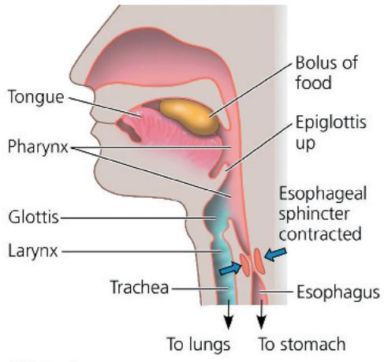

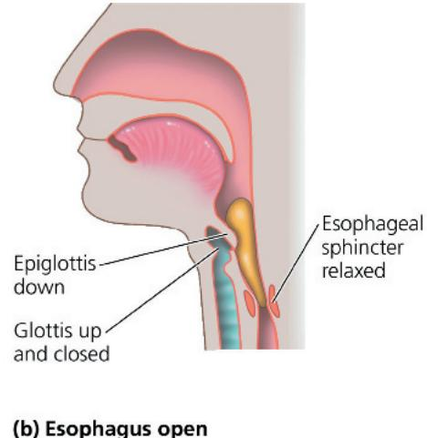  
VISUAL SKILLS If you laugh while drinking water, the liquid may be ejected from your nostrils. Use this diagram to explain why this happens, taking into account that laughing involves exhaling.
For suggested answer, see Appendix A.

During swallowing, the tongue provides further assistance, pushing the bolus to the back of the oral cavity and into the pharynx.

Each bolus of food is received by the pharynx, or throat region, which leads to two passageways: the esophagus and the trachea. The esophagus is a muscular tube that connects to the stomach; the trachea (windpipe) leads to the lungs. Swallowing must therefore be carefully choreographed to keep food and liquids from entering the trachea and causing choking, a blockage of the trachea. The resulting lack of airflow into the lungs can be fatal if the material is not dislodged by vigorous coughing, a series of back slaps, or a forced upward thrust of the diaphragm (the Heimlich maneuver).

Within the esophagus, food is pushed along by peristalsis, alternating waves of smooth muscle contraction and relaxation. Upon reaching the end of the esophagus, the bolus encounters a sphincter, a ringlike valve of muscle. Acting like a drawstring, the sphincter regulates passage of the ingested food into the next compartment, the stomach.

## Digestion in the Stomach

The stomach, which is located just below the diaphragm, has two major roles in digestion (Figure 41.10). The first is storage. With a very elastic wall and accordion-like folds, the stomach can stretch to accommodate about 2 L of food and fluid. The second major function is to process food into a liquid suspension. The stomach secretes a digestive fluid called gastric juice and mixes it with the food through a churning action. This mixture of ingested food and gastric juice is called chyme.

## Chemical Digestion in the Stomach

Two components of gastric juice help liquefy food in the stomach. First, hydrochloric acid (HCl) disrupts the extracellular matrix that binds cells together in meat and plant material. The concentration of HCl is so high that the pH of gastric juice is about 2, acidic enough to dissolve iron nails (and to kill most bacteria). This low pH denatures (unfolds) proteins in food, increasing exposure of their peptide bonds. The exposed bonds are then attacked by the second component of gastric juice—a protease, or protein-digesting enzyme, called pepsin. Unlike most enzymes, pepsin is adapted to work best in a very acidic environment. By breaking peptide bonds, it cleaves proteins into smaller polypeptides and further exposes the contents of ingested tissues.

Two types of cells in the gastric glands of the stomach produce the components of gastric juice (see Figure 41.10). Parietal cells use an ATP-driven pump to expel hydrogen ions into the lumen. At the same time, chloride ions diffuse into the lumen through specific membrane channels of the parietal cells. Meanwhile, chief cells release pepsin into the lumen in an inactive form called pepsinogen. HCl converts pepsinogen to active pepsin by clipping off a small portion of the molecule and exposing its active site. Through these processes, pepsin forms in the lumen (cavity) of the stomach, not within the cells of the gastric glands. As a result, the chief cells are not digested from within by gastric juice.

Figure 41.10 The stomach and its secretions.  
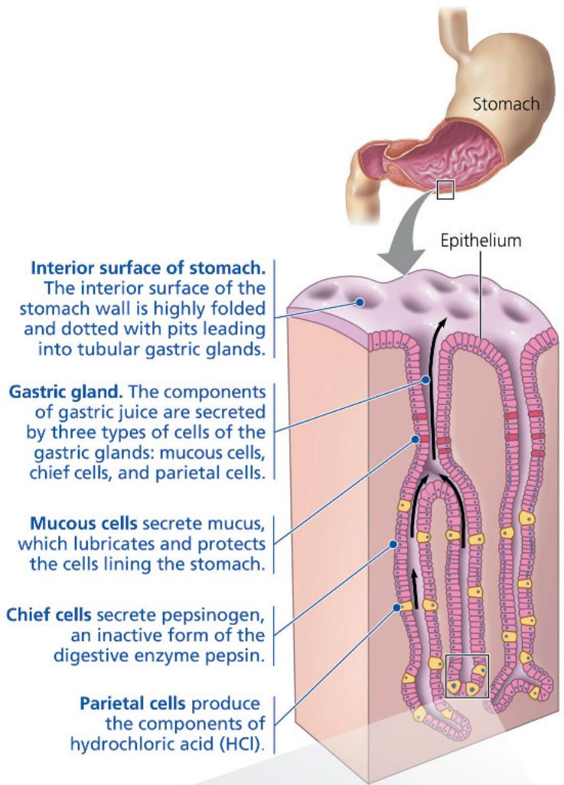

Interior surface of stomach. The interior surface of the stomach wall is highly folded and dotted with pits leading into tubular gastric glands.

Gastric gland. The components of gastric juice are secreted by three types of cells of the gastric glands: mucous cells, chief cells, and parietal cells.

Mucous cells secrete mucus, which lubricates and protects the cells lining the stomach.

Chief cells secrete pepsinogen, an inactive form of the digestive enzyme pepsin.

Parietal cells produce the components of hydrochloric acid (HCI).

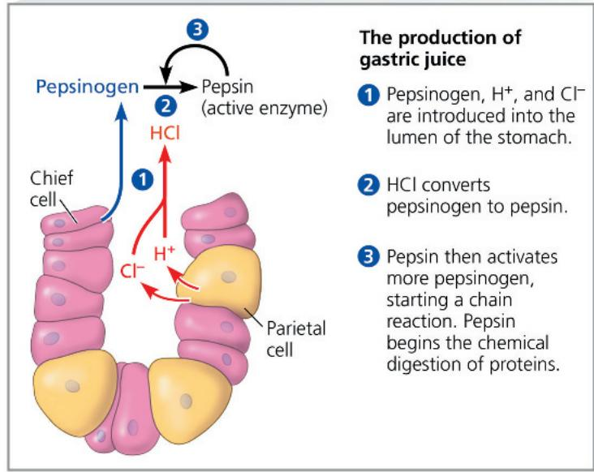

## The production of gastric juice

1 Pepsinogen, $\mathsf{H}^+$ , and $\mathsf{Cl^-}$ are introduced into the lumen of the stomach.

② HCI converts pepsinogen to pepsin.

3 Pepsin then activates more pepsinogen, starting a chain reaction. Pepsin begins the chemical digestion of proteins.

After hydrochloric acid converts a small amount of pepsinogen to pepsin, pepsin itself helps activate the remaining pepsinogen. Pepsin, like HCl, can clip pepsinogen to expose the enzyme's active site. This generates more pepsin, which activates more pepsinogen. This series of events is an example of positive feedback (see Concept 40.2).

Why don't HCl and pepsin eat through the lining of the stomach? For one thing, mucus secreted by cells in gastric glands protects against self-digestion (see Figure 41.10). In addition, cell division adds a new epithelial layer every three days on average, replacing cells before the lining is fully eroded by digestive juices.

## Stomach Dynamics

The breakdown of food by gastric juices is enhanced by muscular activity of the stomach. The coordinated series of muscle contractions and relaxations that we call “churning” mixes the stomach contents about every 20 seconds. Churning facilitates the action of HCl and pepsin by bringing all of the food into contact with the gastric juices secreted by the lining of the stomach. As a result, what began as a recently swallowed meal becomes the acidic, nutrient-rich broth known as chyme.

Contractions of stomach muscles also help move material through the alimentary canal. In particular, peristaltic contractions typically move the contents of the stomach into the small intestine within 2–6 hours after a meal. The sphincter located where the stomach opens to the small intestine helps regulate passage into the small intestine, allowing only one squirt of chyme to enter at a time.

Occasionally, the sphincter at the top of the stomach allows a movement, or flux, of chyme from the stomach back into the lower end of the esophagus. The painful irritation of the esophagus that results from this process of acid reflux is commonly called "heartburn."

## Digestion in the Small Intestine

Although there is some chemical digestion in the oral cavity and stomach, most enzymatic hydrolysis of macromolecules from food occurs in the small intestine (Figure 41.11). This organ's

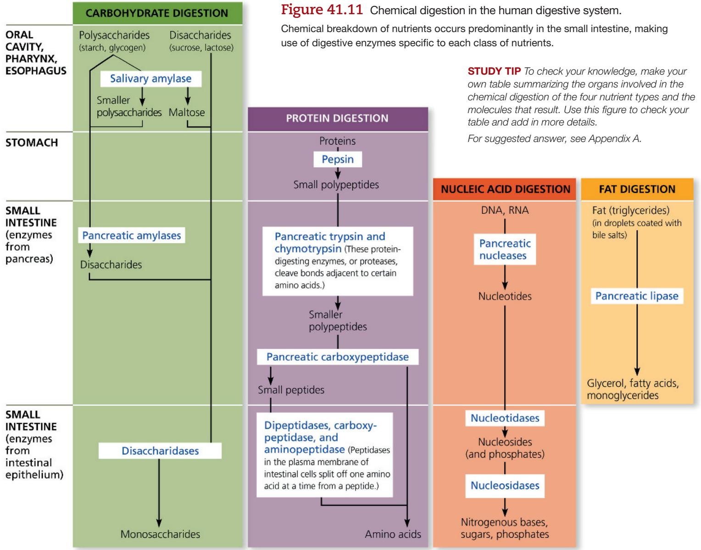

name refers to its small diameter compared to the large intestine, not to its length. The small intestine is in fact the alimentary canal's longest compartment—over 6 m (20 feet) long in humans. The first 25 cm (10 inches) or so of the small intestine forms the duodenum. It is here that chyme from the stomach mixes with digestive juices from the pancreas, liver, and gallbladder, as well as from gland cells of the intestinal wall itself. As you will read in Concept 41.5, hormones released by the stomach and duodenum control the digestive secretions into the alimentary canal.

The arrival of chyme in the duodenum triggers release of the hormone secretin, which stimulates the pancreas to secrete bicarbonate. Bicarbonate neutralizes the acidity of chyme and acts as a buffer for chemical digestion in the small intestine. The pancreas also secretes numerous digestive enzymes into the small intestine. These include the proteases trypsin and chymotrypsin, which are produced in inactive forms. In a chain reaction similar to that for pepsinogen, they are activated when safely located in the lumen of the duodenum.

The epithelial lining of the duodenum is the source of additional digestive enzymes. Some are secreted into the lumen of the duodenum, whereas others are bound to the surface of epithelial cells. Together with the enzymes from the pancreas, they complete most digestion in the duodenum.

Fats present a particular challenge for digestion. Insoluble in water, they form large globules that cannot be attacked efficiently by digestive enzymes. In humans and other vertebrates, fat digestion is facilitated by bile salts, which act as emulsifiers (detergents) that break apart these globules into smaller droplets. Bile salts are a major component of bile, a secretion of the liver that is stored and concentrated in the gallbladder.

Bile production is metabolically linked to another vital liver function: the destruction of red blood cells that are no longer fully functional. Pigments released during red blood cell disassembly are incorporated into bile pigments, which are eliminated from the body with the feces. In some liver and blood disorders, bile pigments accumulate in the skin, resulting in a yellowing called jaundice.

## Absorption in the Small Intestine

With digestion largely complete, the contents of the duodenum move into the jejunum and ileum, the remaining regions of the small intestine. There, nutrient absorption occurs across the lining of the intestine (Figure 41.12). Large folds in the lining encircle the intestine and are studded with finger-shaped projections called villi (singular, villus). Within the villi, each epithelial cell has many microscopic projections, or microvilli, that face the intestinal lumen. These epithelial microvilli have a brush-like appearance that is reflected in the name brush border. Together, the folds, villi, and microvilli have a surface area of 200–300 m $^{2}$ , roughly the size of a tennis court. This enormous surface area is an evolutionary adaptation that greatly increases the rate of nutrient absorption (see Figure 33.9 for more discussion and examples of maximizing surface area in diverse organisms).

Depending on the nutrient, transport across the epithelial cells can be passive or active (see Concepts 7.3 and 7.4). The sugar fructose, for example, moves by facilitated diffusion down its concentration gradient from the lumen of the small intestine into the epithelial cells. From there, fructose exits the basal surface and is absorbed into microscopic blood vessels, or

Figure 41.12 Nutrient absorption in the small intestine.

Water-soluble nutrients, such as amino acids and sugars, enter the bloodstream, whereas fats are transported to the lymphatic system.

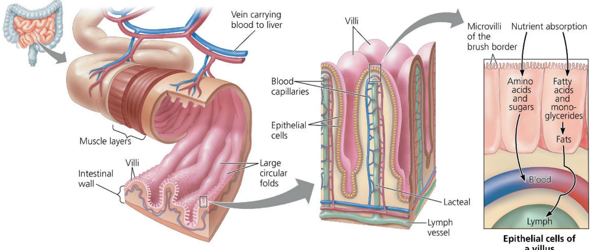  
Rank the following structures from largest to smallest: microvillus, circular fold, epithelial cell, villus. For suggested answer, see Appendix A.

② During enzymatic hydrolysis, the enzyme lipase breaks the exposed triglycerides down to fatty acids and monoglycerides.

Fats, which are insoluble in water, are broken down in the lumen of the small intestine, reassembled in epithelial cells, and then transported in water-soluble globules called chylomicrons.

In the lumen of the small intestine, bile salts break up large fat globules into fat droplets, increasing exposure of triglycerides (fat molecules) on the surface to hydrolysis (step 2).

capillaries, at the core of each villus. Other nutrients, including amino acids, small peptides, vitamins, and glucose enter the epithelial cells of the villus by being pumped against concentration gradients. This active transport allows much more absorption of those nutrients than would be possible with passive diffusion alone.

The capillaries and veins that carry nutrient-rich blood away from the villi converge into the hepatic portal vein, a blood vessel that leads directly to the liver. From the liver, blood travels to the heart and then to other tissues and organs. This arrangement serves two major functions. First, it allows the liver to regulate the distribution of nutrients to the rest of the body. Because the liver converts many organic nutrients to different forms for use elsewhere, blood leaving the liver may have a very different nutrient balance than the blood that entered. Second, the arrangement allows the liver to remove toxic substances before they can circulate broadly. The liver is the primary site for detoxifying many organic molecules foreign to the body, such as drugs, and certain metabolic waste products.

Although many nutrients leave the small intestine through the bloodstream and pass through the liver for processing, some products of fat (triglyceride, also known as triacylglycerol) digestion take a different path (Figure 41.13). Hydrolysis of a fat by lipase in the small intestine generates fatty acids and a monoglyceride (glycerol joined to a fatty acid). These products are absorbed by epithelial cells and recombined into triglycerides. They are then coated with phospholipids, cholesterol, and proteins, forming globules called chylomicrons that are too large to enter blood vessels.

In exiting the small intestine, chylomicrons first enter a lacteal, a vessel at the core of each villus that has large gaps between adjacent cells (see Figure 41.13, step 5). Lacteals are part of the vertebrate lymphatic system, which is a network of vessels filled with a clear fluid called lymph. Starting at the lacteals, lymph containing the chylomicrons passes into the larger vessels of the lymphatic system and eventually into large veins that return the blood directly to the heart.

In addition to absorbing nutrients, the small intestine recovers water and ions. Each day a person consumes about 2 L of water and secretes another 7 L in digestive juices into the alimentary canal. Typically all but 0.1 L of the water is reabsorbed, mostly in the small intestine. There is no mechanism for active transport of water. Instead, water is reabsorbed by osmosis when sodium ions, glucose, and other solutes are actively transported out of the lumen of the small intestine. The discovery of this mechanism was the foundation for one of the most influential medical discoveries of the 20th century: oral rehydration therapy (ORT). Adding glucose and ions to fluids that are used to rehydrate children and adults with diarrhea saves millions of lives every year (also see Concept 7.4).

## Processing in the Large Intestine

The alimentary canal ends with the large intestine, which includes the colon, cecum, and rectum. The small intestine connects to the large intestine at a T-shaped junction (Figure 41.14). One arm of the T is the 1.5-m-long colon, which leads to the rectum and anus. The other arm is a pouch called the cecum. In animals that eat large amounts of plant material, the cecum has an important role in fermenting ingested material. In humans, the cecum is small and has an appendix, a finger-shaped extension that acts as a reservoir for symbiotic microorganisms, which are discussed in Concept 41.4.

Figure 41.13 Digestion and absorption of fats.  
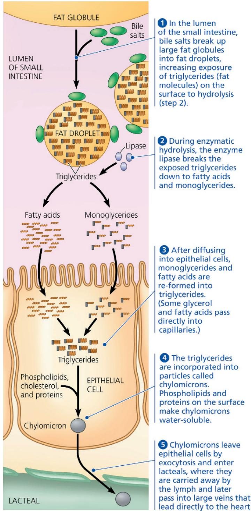  
VISUAL SKILLS Arrows in this figure represent four different processes: membrane transport, mechanical assembly, mechanical digestion, and chemical reaction. Label as many arrows as you can with the name of the process each represents.
For suggested answer, see Appendix A.

Figure 41.14 Junction of the small and large intestines.  
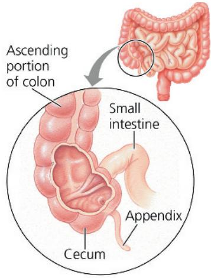

The colon completes the recovery of water that began in the small intestine. What remain are the feces, the wastes of the digestive system, which become increasingly solid as they are moved along the colon by peristalsis. It takes approximately 12–24 hours for material to travel the length of the colon. The undigested material in feces includes cellulose fiber. Although it provides no caloric value (energy) to humans, it helps move food along the alimentary canal.

If the lining of the colon is irritated—by a viral or bacterial infection, for instance—less water than normal may be reabsorbed, resulting in diarrhea. The opposite problem, constipation, occurs when the feces move along the colon too slowly. Too much water is reabsorbed, and the feces become compacted.

The community of bacteria living on unabsorbed organic material in the human colon contributes about one-third of the dry weight of feces. As by-products of their metabolism, many colon bacteria generate gases, including methane and hydrogen sulfide, the latter of which has an offensive odor. These gases and ingested air are expelled through the anus.

The terminal portion of the large intestine is the rectum, where the feces are stored before elimination. Two sphincters separate the rectum and the anus; the inner one is involuntary and the outer one is voluntary. Periodically, strong contractions of the colon create an urge to defecate. Because filling of the stomach triggers a reflex that increases the rate of contractions in the colon, the urge to defecate often follows a meal.

Having followed a meal through the alimentary canal, we'll look next at some adaptations of this general digestive plan in different animals.

## Concept Check 41.3

1. Explain why a proton pump inhibitor, such as the drug Prilosec, can relieve the symptoms of acid reflux.

2. The acids in bile salts have both lipid-soluble (hydrophobic) and water-soluble (hydrophilic) surfaces. How is such an organization beneficial for the role of bile salts in digestion?

3. WHAT IF? Predict what would happen if you mixed gastric juice with crushed food in a test tube.

For suggested answers, see Appendix A.

## Concept 41.4: Evolutionary adaptations of vertebrate digestive systems correlate with diet

EVOLUTION The digestive systems of vertebrates are varied, with many adaptations linked to an animal's diet. To highlight how form fits function, we'll examine a few of them.

## Dental Adaptations

Dentition, an animal's assortment of teeth, is one example of structural variation reflecting diet (Figure 41.15). The evolutionary adaptation of teeth for processing different kinds of food is one of the major reasons that mammals have been so successful. For example, a sea otter uses its sharp canine teeth to tear apart prey such as crabs and its slightly rounded molars to crush their shells. Nonmammalian vertebrates generally have less specialized dentition, but there are interesting exceptions. Venomous snakes, such as rattlesnakes, have fangs, modified teeth that inject venom into prey. Some fangs are hollow, like syringes, whereas others drip the toxin along grooves on the surfaces of the teeth.

Figure 41.15 Dentition and diet.  
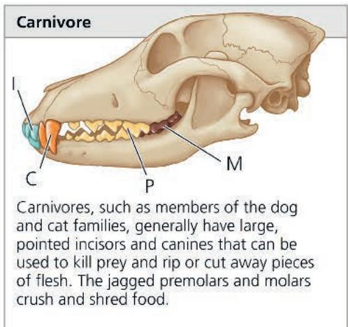

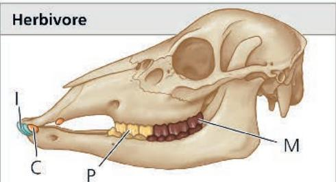  
Herbivores, such as horses and deer, usually have premolars and molars with broad, ridged surfaces that grind tough plant material. The incisors and canines are generally modified for biting off pieces of vegetation. In some herbivores, canines are absent.

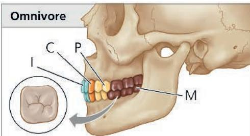  
As omnivores, humans are adapted to eating both plants and meat. Adults have 32 teeth. From front to back along either side of the mouth are four bladelike incisors for biting, a pair of pointed canines for tearing, four premolars for grinding, and six molars for crushing (see inset, top view).

## Stomach and Intestinal Adaptations

Evolutionary adaptations to differences in diet are sometimes apparent as variations in the dimensions of digestive organs. For example, large, expandable stomachs are common in carnivorous vertebrates, which may wait a long time between meals and must eat as much as they can when they do catch prey. An expandable stomach enables a rock python to ingest a whole gazelle (see Figure 41.5) and a 200-kg African lion to consume 40 kg of meat in one meal!

Adaptation is also apparent in the length of the digestive system in different vertebrates. In general, herbivores and omnivores have longer alimentary canals relative to their body size than do carnivores. Plant matter is more difficult to digest than meat because it contains cell walls. A longer digestive tract furnishes more time for digestion and more surface area for nutrient absorption. As an example, consider the lion and koala

## Figure 41.16 The alimentary canals of a carnivore (lion) and herbivore (koala).

The relatively short digestive tract of the lion is sufficient for digesting meat and absorbing its nutrients. In contrast, the koala's long alimentary canal is specialized for digesting eucalyptus leaves. Extensive chewing chops the leaves into tiny pieces, increasing exposure to digestive juices. In the long cecum and the upper portion of the colon, symbiotic bacteria further digest the shredded leaves, releasing nutrients that the koala can absorb.

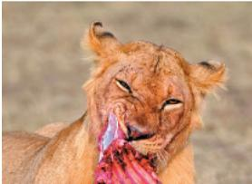

  
Small intestine

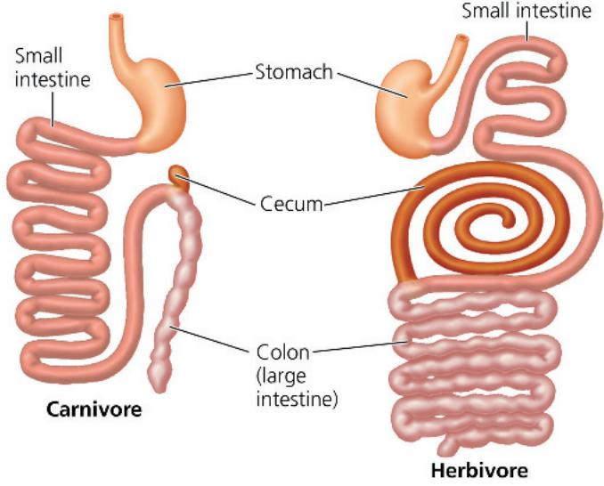

in Figure 41.16. The koala has much longer intestines, relative to its size, enhancing the processing of fibrous, protein-poor eucalyptus leaves from which it obtains nearly all of its nutrients and water.

## Mutualistic Adaptations

An estimated 10–100 trillion bacteria live in the human digestive system. The coexistence of humans and many intestinal bacteria is an example of mutualism, an interaction between two species that benefits both of them (see Concept 54.1). For example, some intestinal bacteria produce vitamins, such as vitamin K, biotin, and folic acid, which are absorbed into the blood, supplementing our dietary intake. Intestinal bacteria also regulate the development of the intestinal epithelium and the function of the innate immune system. The bacteria in turn receive a steady supply of nutrients and a stable host environment. By fully occupying the ecological niche of the large intestine, a diverse population of resident bacteria also protects against infection by disease-causing bacteria.

Recently, we have greatly expanded our knowledge of the microbiome, the collection of microorganisms living in and on the body, along with their genetic material. To study the microbiome, scientists are using a DNA sequencing approach based on the polymerase chain reaction (PCR, see Figure 20.8). To date they have found more than 400 bacterial species in the human digestive tract, a far greater number than had been identified through approaches relying on laboratory culture and characterization. Furthermore, researchers have found significant differences in the microbiome associated with diet, disease, and age (Figure 41.17).

One example of the power of microbiome studies comes from research on gastric ulcers, a disease that damages the stomach lining. Experiments demonstrating that ulcers are caused by infection with the acid-tolerant bacterium Helicobacter pylori and can be cured with antibiotics earned Australian researchers Barry Marshall and Robin Warren a Nobel Prize in 2005.

More recently, scientists analyzed the microbiome in samples from human stomachs to learn how H. pylori infection leads to ulcers. Their findings were dramatic: H. pylori infection led to the near-complete elimination of all other bacterial species commonly found in the stomach (Figure 41.18).

Studies on the microbiome have already led to therapies for intestinal infections by antibiotic-resistant pathogens, a major public health problem. One such therapy is fecal microbial transplantation, in which the microbiome of a healthy individual is introduced into the patient's intestine. This approach has been used for otherwise untreatable diarrhea caused by the bacterium Clostridium difficile (Figure 41.19). Such infections are most common after antibiotic treatment has killed off the resident microbiome. An oral fecal microbiota treatment to prevent C. difficile recurrence was approved in 2023.

Another treatment against antibiotic-resistant pathogens makes use of bacteriophages, viruses that infect bacteria but not human cells (see Concept 19.1). In 2017, bacteriophages engineered to kill a multidrug-resistant bacterial pathogen, Acinetobacter baumannii, were successfully used to restore health to a severely affected patient.

## Figure 41.17 Variation in human gut microbiome at different life stages.

By copying and sequencing bacterial DNA in samples obtained from intestinal tracts of humans of different ages, researchers characterized the bacterial community that makes up the human gut and how it changes with age.

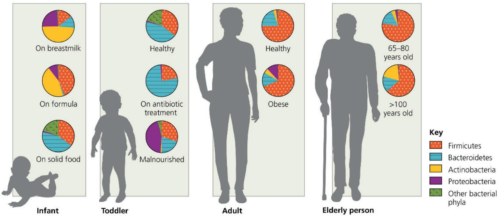  
INTERPRET THE DATA Using data displayed in Figures 41.17 and 41.18, compare the relative abundance of Actinobacteria in the microbiome of a healthy adult's intestinal tract to that in a healthy stomach. Suggest a possible explanation for why the microbiome composition in the two organs is different even though the intestine and stomach are directly connected.

Figure 41.18 The stomach microbiome and stomach health.  
In samples from individuals infected with Helicobacter pylori, more than 95% of the sequences were from that species, which belongs to the phylum Proteobacteria. The stomach microbiome in uninfected individuals was much more diverse.  
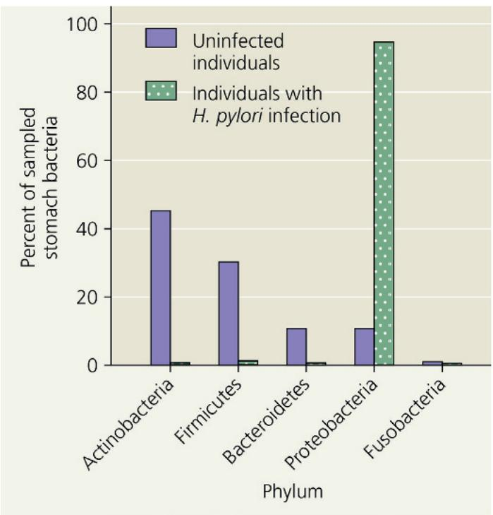

Figure 41.19 Clostridium difficile.  
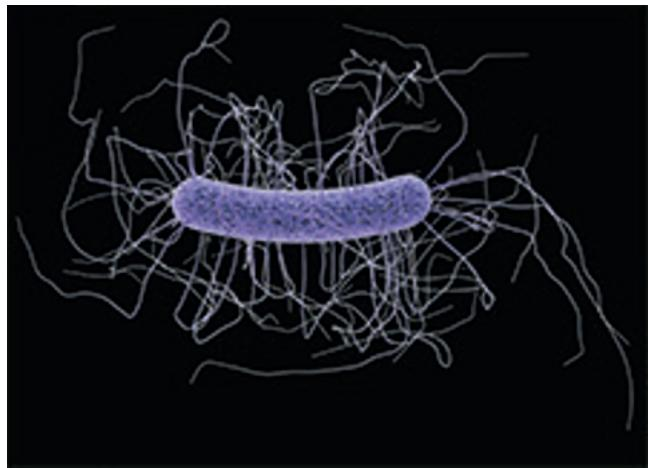

## Interview

Interview with Steffanie Strathdee: Harnessing phages to fight deadly infections (eTextbook only)

## Figure 41.20 Ruminant digestion.

The stomach of a cow, a ruminant, has four chambers. ① Chewed food first enters the rumen and reticulum, where mutualistic microorganisms digest cellulose in the plant material. ② Periodically, the cow regurgitates and rechews “cud” from the reticulum, further breaking down fibers and thereby enhancing microbial action. ③ The reswallowed cud passes to the omasum, where some water is removed. ④ It then passes to the abomasum for digestion by the cow’s enzymes. In this way, the cow obtains significant nutrients from both the grass and the mutualistic microorganisms, which maintain a stable population in the rumen.

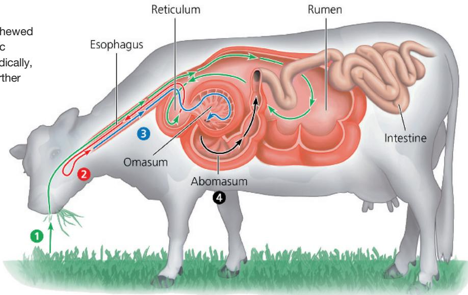

## Mutualistic Adaptations in Herbivores

Mutualistic relationships with microorganisms are also very important in herbivores. Herbivores get much of the chemical energy they need from the cellulose of plant cell walls, but, like other animals, herbivores do not produce enzymes that hydrolyze cellulose. Instead, they host mutualistic bacteria and protists in fermentation chambers within their alimentary canals. These symbiotic microorganisms digest cellulose into simple sugars that can be used as an energy source. In turn, the microorganisms produce a form of fatty acids that the animal can absorb directly from the fermentation chamber, as well as certain vitamins. In some cases, the microorganisms themselves act as a digestible food source for the animal.

In some animals, the fermentation chamber is positioned before the small intestine, allowing the microorganisms to be digested and the resulting amino acids absorbed. For instance, the hoatzin, an herbivorous bird found in South American rain forests, uses a large, muscular crop (an esophageal pouch; see Figure 41.7) as its fermentation chamber. Hard ridges in the wall of the crop grind plant leaves into small fragments, and the microorganisms break down cellulose. Additional stomach chambers house microorganisms in ruminants, the cud-chewing animals that include deer, sheep, and cattle (Figure 41.20).

Non-ruminant herbivores, such as horses, koalas, and rodents, house their microorganisms in an enlarged cecum and large intestine (see Figure 41.16). As in ruminants, the microorganisms produce fatty acids that can be directly absorbed from these fermentation chambers. However, unlike in ruminants and the hoatzin, other products and the microorganisms themselves do not pass through the small intestine and are initially lost with the feces. Rabbits and rodents routinely recover these nutrients by coprophagy (from the Greek, meaning “dung eating”), feeding on some of their feces and then passing the food through the alimentary canal a second time. Rabbit “pellets,” which are not reingested, are the feces eliminated after food has passed through the digestive tract twice.

Although we have focused our discussion on vertebrates, adaptations related to digestion are also widespread among other animals. Some of the most remarkable examples are the over 3-m-long giant tubeworms (Figure 41.21) that live at pressures as high as 260 atmospheres around deep-sea hydrothermal vents (see Figure 52.16). These worms have no mouth or digestive system. Instead, they obtain all of their energy and nutrients from mutualistic bacteria that live within their bodies. The bacteria carry out chemoautotrophy (see Concept 27.3) using the carbon dioxide, oxygen, hydrogen sulfide, and nitrate available at the vents. Thus, for invertebrates and vertebrates alike, the evolution of mutualistic relationships with

Figure 41.21 Giant tubeworm, an animal without a digestive system.

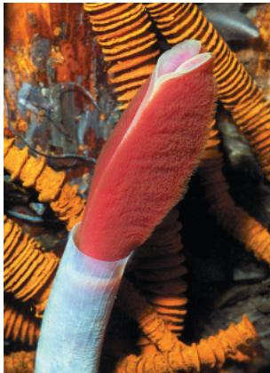

symbiotic microorganisms is an adaptation that expands the sources of nutrition available to animals.

Having examined how animals optimize their extraction of nutrients from food, we'll next turn to the challenge of balancing the use of these nutrients.

## Concept Check 41.4

1. What are two advantages of a longer alimentary canal for processing plant material that is difficult to digest?

2. What features of a mammal's digestive system make it an attractive habitat for mutualistic microorganisms?

3. WHAT IF? People who have lactose intolerance have a shortage of lactase, the enzyme that breaks down lactose in milk. As a result, they sometimes develop cramps, bloating, or diarrhea after consuming dairy products. Suppose such a person ate yogurt that contains bacteria that produce lactase. Why would eating yogurt likely provide at best only temporary relief of the symptoms?

# Concept 41.5: Feedback circuits regulate digestion, energy storage, and appetite

To complete our consideration of animal nutrition, we'll explore the ways that obtaining and using nutrients are matched to an animal's circumstances and need for energy.

## Regulation of Digestion

Many animals face long gaps between meals. Under such circumstances, there is no need for their digestive systems to be active continuously. Instead, processing is activated stepwise. As food reaches each new compartment, it triggers the secretion of digestive juices for the next stage of processing. Muscular contractions then move the contents farther along the canal. For example, you learned earlier that nervous reflexes stimulate the release of saliva when food enters the oral cavity and orchestrate swallowing when a bolus of food reaches the pharynx. Similarly, the arrival of food in the stomach triggers churning and the release of gastric juices. These events, as well as movement through the small and large intestines, are regulated by the enteric nervous system, a network of neurons dedicated to the digestive organs.

The endocrine system also plays a critical role in controlling digestion. As described in Figure 41.22, a series of hormones released by the stomach and duodenum help ensure that digestive secretions are present only when needed. Like all hormones, they are transported through the bloodstream. This is true even for the hormone gastrin, which is secreted by the stomach and targets that same organ.

## Regulation of Energy Storage

When an animal takes in more energy-rich molecules than it needs for metabolism and activity, it stores the excess energy (see Concept 40.4). In humans, energy can be stored in liver and muscle as glycogen, a polysaccharide made up of many glucose units (see Figure 5.6b), or in adipose cells as triglycerides (fat). Glycogen stores are limited, but fat stores are not. A large grizzly bear can easily gain 75 kg (165 lb) of fat as it prepares for hibernation.

At times when fewer calories are taken in than are expended—perhaps because of sustained heavy exercise or lack of food—muscle cells draw on their stored glycogen, and liver and adipose cells release glucose and fatty acids into the blood for use by other body cells. Fats are especially rich in energy; oxidizing a gram of fat liberates about twice the energy liberated from a gram of carbohydrate or protein. For this reason, adipose tissue provides the most space-efficient way for the body to store large amounts of energy. Most healthy people have enough stored fat to sustain them through several weeks without food.

Figure 41.22 Hormonal control of digestion.  
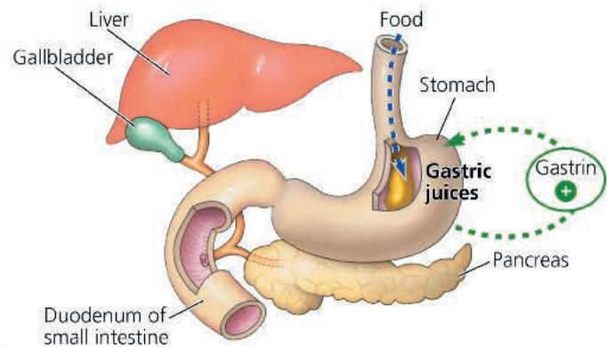  
As food arrives at the stomach, it stretches the stomach walls, triggering release of the hormone gastrin. Gastrin circulates via the bloodstream back to the stomach, where it stimulates production of gastric juices.

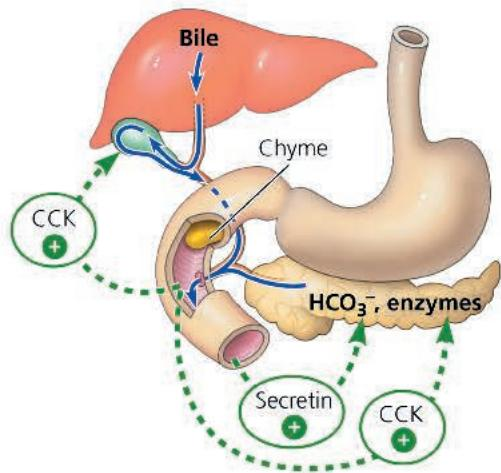  
2 Chyme—an acidic mixture of partially digested food—eventually passes from the stomach to the duodenum. The duodenum responds by releasing the digestive hormones cholecystokinin and secretin. Cholecystokinin (CCK) stimulates the release of digestive enzymes from the pancreas and of bile from the gallbladder. Secretin stimulates the pancreas to release bicarbonate $\left(\mathrm{HCO}_{3}^{-}\right)$ , which neutralizes chyme.

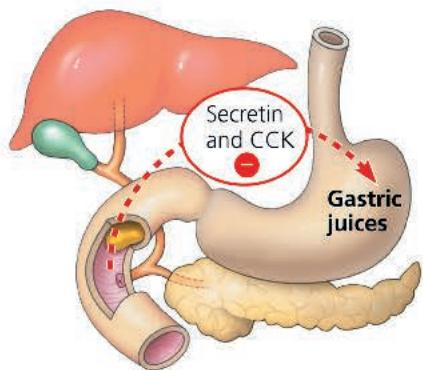

3 Secretin and CCK also inhibit both gastric juice production and peristalsis in the stomach, slowing the delivery of chyme to the small intestine.

## Key + Stimulation - Inhibition

DRAW IT Using the information in parts 2 and 3 of this figure, draw a flowchart summarizing the regulation and actions of secretin and CCK.

## Glucose Homeostasis

The synthesis and breakdown of glycogen are central not only to energy storage, but also to maintaining metabolic balance through glucose homeostasis. In humans, the set point for the concentration of glucose in the blood is 70–110 mg/100 mL. Because glucose is a major fuel for cellular respiration and a key source of carbon skeletons for biosynthesis, maintaining blood glucose concentrations near this set point is essential.

Glucose homeostasis relies predominantly on the antagonistic (opposing) effects of two hormones, insulin and glucagon (Figure 41.23). When the blood glucose level rises above the set point, increased secretion of insulin triggers the uptake of glucose from the blood into body cells, decreasing the blood glucose concentration. When the blood glucose level drops below the set point, increased secretion of glucagon promotes the release of glucose into the blood from energy stores, such as liver glycogen, increasing the blood glucose concentration.

The liver is a key site of action for insulin and glucagon. After a carbohydrate-rich meal, for example, insulin promotes biosynthesis of glycogen from glucose that enters the liver in the hepatic portal vein. Between meals, when the blood glucose concentration decreases, glucagon stimulates the liver to break down glycogen, convert amino acids and glycerol to glucose, and release glucose into the blood. Together, these opposing effects of insulin and glucagon ensure that arterial blood has a glucose concentration within the set point at nearly all times.

Figure 41.23 Homeostatic regulation of cellular fuel.
After a meal is digested, glucose and other monomers are absorbed into the blood from the digestive tract. The human body regulates the use and storage of glucose, a major cellular fuel.

MAKE CONNECTIONS What form of feedback control do these regulatory circuits reflect (see Concept 40.2)? For suggested answer, see Appendix A.

Insulin also acts on nearly all body cells to stimulate glucose uptake from blood. A major exception is brain cells, which can take up glucose whether or not insulin is present. This evolutionary adaptation ensures that the brain almost always has access to circulating fuel, even if supplies are low.

Glucagon and insulin are both produced in the pancreas. Clusters of endocrine cells called pancreatic islets are scattered throughout this organ. Each islet has alpha cells, which make glucagon, and beta cells, which make insulin. Like other hormones, insulin and glucagon enter the interstitial fluid and then the circulatory system.

Overall, hormone-secreting cells make up only 1–2% of the mass of the pancreas. Other cells in the pancreas produce and secrete bicarbonate ions and the digestive enzymes active in the small intestine (see Figure 41.11). These secretions are released into small ducts that empty into the pancreatic duct, which leads to the small intestine. Thus, the pancreas has functions in both the endocrine and digestive systems.

## Diabetes Mellitus

In discussing the role of insulin and glucagon in glucose homeostasis, we have focused exclusively on a healthy metabolic state. However, a number of disorders can disrupt glucose homeostasis with potentially serious consequences, especially for the heart, blood vessels, eyes, and kidneys. The best known and most prevalent of these disorders is diabetes mellitus.

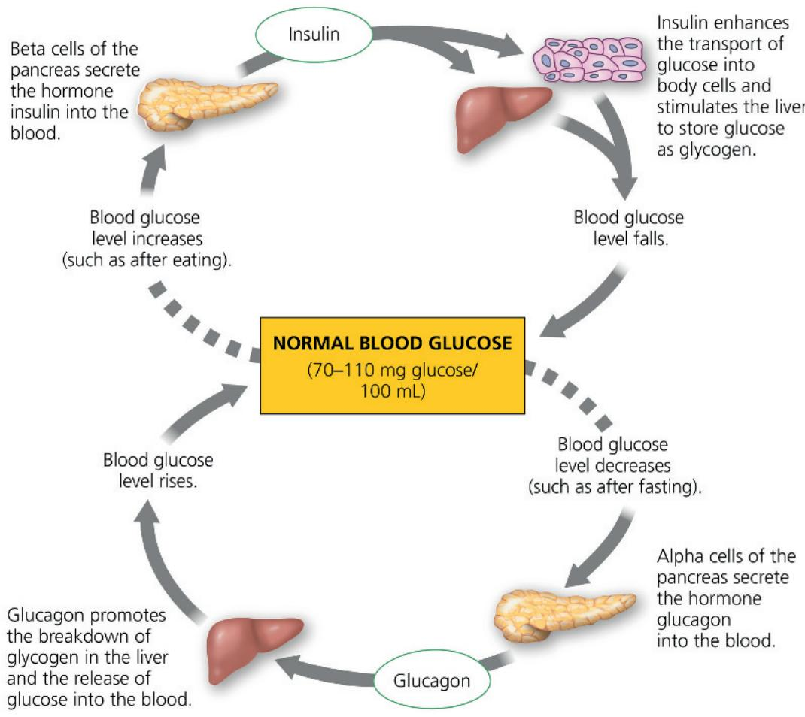

The disease diabetes mellitus is caused by a deficiency of insulin or a decreased response to insulin in target tissues. The blood glucose level rises, but cells are unable to take up enough glucose to meet metabolic needs. Instead, fat becomes the main substrate for cellular respiration. In severe cases, acidic metabolites formed during fat breakdown accumulate in the blood, threatening life by lowering blood pH and depleting sodium and potassium ions from the body.

In people with diabetes mellitus, the level of glucose in the blood may exceed the capacity of the kidneys to reabsorb this nutrient. Glucose that remains in the kidney filtrate is excreted. For this reason, the presence of sugar in urine is one test for this disorder. The presence of excess sugar in both urine and blood is the basis for the name diabetes mellitus (from the Greek diabainein, to pass through, and meli, honey).

There are two main types of diabetes mellitus: type 1 and type 2. Each is marked by high blood glucose levels, but with very different causes.

## Type 1 Diabetes

Also called insulin-dependent diabetes, type 1 diabetes is an autoimmune disorder in which the immune system destroys the beta cells of the pancreas. Type 1 diabetes, which usually appears during childhood, destroys the person's ability to produce insulin. Treatment typically consists of multiple daily insulin injections. More recently, insulin pumps have been developed that monitor blood glucose and secrete insulin into the blood. In the past, insulin was extracted from animal pancreases, but now human insulin can be readily obtained at reasonable cost from genetically engineered bacteria (see Figure 20.4). Clinical trials are underway for a treatment to cure type 1 diabetes using stem cell therapy.

## Type 2 Diabetes

Non-insulin-dependent diabetes, or type 2 diabetes, is characterized by a failure of target cells to respond normally to insulin. Insulin is produced, but target cells fail to take up glucose from the blood, and the blood glucose level remains elevated. Although heredity can play a role in type 2 diabetes, excess body weight and lack of exercise significantly increase the risk of developing this disorder. This form of diabetes generally appears after age 40, but even children can develop the disease, particularly if they are overweight and sedentary. More than 90% of people with diabetes have type 2. Many can control their blood glucose levels with regular exercise and a healthy diet; some require medications. Nevertheless, type 2 diabetes is a leading cause of death in the United States and a growing public health problem worldwide.

The resistance to insulin signaling in type 2 diabetes is sometimes due to a genetic defect in the insulin receptor or the insulin response pathway. In many cases, however, events in target cells suppress activity of an otherwise functional response pathway. One source of this suppression appears to be inflammatory signals generated by the innate immune system (see Concept 43.1). How obesity and inactivity relate to this suppression is being studied in both humans and laboratory animals.

## Regulation of Appetite

As you read in Concept 41.1, consuming more calories than the body needs results in the accumulation of fat. Researchers have discovered several homeostatic mechanisms that operate as feedback circuits controlling the storage and metabolism of fat. A network of neurons relays and integrates information from the digestive system to regulate secretion of hormones that regulate long-term and short-term appetite. The target for these hormones is a “satiety center” in the brain (Figure 41.24). For example, ghrelin, a hormone secreted by the stomach wall, triggers feelings of hunger before meals. In contrast, PYY, GLP-1, and other hormones secreted by the small intestine after meals suppress appetite, as does insulin. Medications known as semiglutides or GLP-1 agonists

Figure 41.24 A few of the appetite-regulating hormones.

Secreted by various organs and tissues, the hormones reach the brain via the bloodstream. These signals act on a region of the brain that in turn controls the “satiety center,” which generates the nervous impulses that make us feel either hungry or satiated (“full”). The hormone ghrelin is an appetite stimulant; the other three hormones shown here are appetite suppressants.

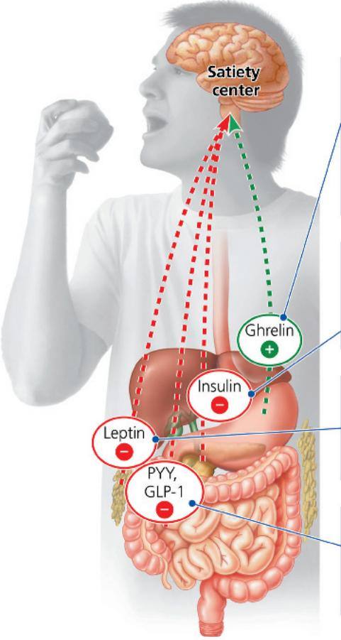

Secreted by the stomach wall, ghrelin is one of the signals that triggers feelings of hunger as mealtimes approach. In dieters who lose weight, ghrelin levels increase, which may be one reason it's so hard to stay on a diet.

A rise in blood sugar level after a meal stimulates the pancreas to secrete more insulin. In addition to its other functions, insulin suppresses appetite by acting on the brain.

Produced by adipose (fat) tissue, leptin suppresses appetite. When the amount of body fat decreases, leptin levels fall, and appetite increases.

Produced by the small intestine, PYY, GLP-1, and other hormones act as appetite suppressants that counter the appetite stimulant ghrelin.

# Scientific Skills Exercise

# Interpreting Data from an Experiment with Genetic Mutants

What Are the Roles of the ob and db Genes in Appetite Regulation? A mutation that disrupts a physiological process is often used to study the normal function of the mutated gene. Ideally, researchers use a standard set of conditions and compare animals that differ genetically only in whether a particular gene is mutant (nonfunctional)

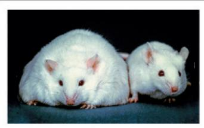  
The mouse on the right is wild type, whereas the obese mouse on the left has an inactivating mutation in both copies of the ob gene.

or wild type (normal). In this way, a difference in phenotype, the physiological property being measured, can be attributed to a difference in genotype, the presence or absence of the mutation. To study the role of specific genes in regulating appetite, researchers used laboratory animals with known mutations in those genes.

Mice in which recessive mutations inactivate both copies of either the ob gene or the db gene eat voraciously and grow much more massive than wild-type mice.

One hypothesis for the normal role of the ob and db genes is that they participate in a hormone pathway that suppresses appetite when caloric intake is sufficient. Before setting out to isolate the potential hormone, researchers explored this hypothesis genetically.

How the Experiment Was Done The researchers measured the mass of young mice of various genotypes (the “subjects”) and surgically linked the circulatory system of each one to that of another mouse. This procedure ensured that any factor circulating in the bloodstream of either mouse would be transferred to the other in the pair. After eight weeks, they again measured the mass of each subject mouse.

(such as Ozempic, Wegovy, and others) act by binding GLP-1 receptors in the brain, which can reduce food cravings and promote weight loss. These medications were originally marketed as treatments for type 2 diabetes mellitus, since they also stimulate insulin release. Leptin, a hormone produced by adipose (fat) tissue, also suppresses appetite and appears to play a major role in regulating body fat levels. In the Scientific Skills Exercise, you'll interpret data from an experiment studying genes that affect leptin production and function in mice.

Obtaining food, digesting it, and absorbing nutrients are part of the larger story of how animals fuel their activities. Provisioning the body also involves circulating nutrients, and using nutrients for metabolism requires exchanging respiratory gases with the environment. These processes and the adaptations that facilitate such distribution and exchange are the focus of Chapter 42.

Data from the Experiment

<table><tr><td colspan="3">Genotype Pairing (bold red type indicates mutant genes)</td><td rowspan="2">Average Change in Body Mass of Subject (g)</td></tr><tr><td></td><td>Subject</td><td>Paired with</td></tr><tr><td>(a)</td><td>ob+/ob+, db+/db+</td><td>ob+/ob+, db-/db+</td><td>8.3</td></tr><tr><td>(b)</td><td>ob/ob, db+/db+</td><td>ob/ob, db-/db+</td><td>38.7</td></tr><tr><td>(c)</td><td>ob/ob, db+/db+</td><td>ob+/ob+, db-/db+</td><td>8.2</td></tr><tr><td>(d)</td><td>ob/ob, db+/db+</td><td>ob+/ob+, db/db</td><td>-14.9*</td></tr></table>

\*Due to pronounced weight loss and weakening, subjects in this pairing were remeasured after less than eight weeks.

Data from D. L. Coleman, Effects of parabiosis of obese mice with diabetes and normal mice, Diabetologia 9:294–298 (1973).

## INTERPRET THE DATA

1. First, practice reading the genotype information given in the data table. For example, pairing (a) joined two mice that each had the wild-type version of both genes. Describe the two mice in pairing (b), pairing (c), and pairing (d). Explain how each pairing contributed to the experimental design.

2. Compare the results observed for pairing (a) and pairing (b) in terms of phenotype. If the results had been identical for these two pairings, what would that outcome have implied about the experimental design?

3. Compare the results observed for pairing (c) to those observed for pairing (b). Based on these results, does the $ob^{+}$ gene product appear to promote or suppress appetite? Explain your answer.

4. Describe the results observed for pairing (d). Note how these results differ from those for pairing (b). Suggest a hypothesis to explain this difference. How could you test your hypothesis using the kinds of mice in this study?

Instructors: A version of this Scientific Skills Exercise can be assigned in Mastering Biology.

## Concept Check 41.5

1. Explain how people can have excess body fat even if their intake of dietary fat is relatively low compared with carbohydrate intake.

2. WHAT IF? Suppose you were studying two groups of people who have excess body fat and have genetic abnormalities in the leptin pathway. In one group, the leptin levels are abnormally high; in the other group, they are abnormally low. How would each group's leptin levels change if they ate a low-calorie diet for an extended period? Explain.

3. WHAT IF? An insulinoma is a cancerous mass of pancreatic beta cells that secrete insulin but do not respond to feedback mechanisms. How you would expect an insulinoma to affect blood glucose levels and liver activity?

Gastrovascular cavity (jelly)

# Chapter 41 Review

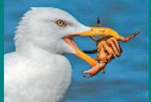

## Summary of Key Concepts

To review key terms, go to the Vocabulary Self-Quiz (eTextbook only).

## Concept 41.1: An animal's diet must supply chemical energy, organic building blocks, and essential nutrients

\- Food provides animals with energy for ATP production, carbon skeletons for biosynthesis, and essential nutrients—nutrients that must be supplied in preassembled form. Essential nutrients include certain amino acids and fatty acids that animals cannot synthesize; vitamins, which are organic molecules; and minerals, which are inorganic substances.

\- Animals have diverse diets. Herbivores mainly eat plants; carnivores mainly eat other animals; and omnivores eat both. Animals must balance consumption, storage, and use of food.

\- A healthy diet matches dietary intake of both chemical energy and specific nutrients with the body's requirements. Ingesting too much or too little of an essential nutrient, or of all nutrients, over an extended period of time results in malnutrition.

How can an enzyme cofactor needed for an essential process be an essential nutrient for only some animals?

## Concept 41.2: Food processing involves ingestion, digestion, absorption, and elimination

\- Animals differ in the ways they obtain and ingest food. Many animals are bulk feeders, eating large pieces of food. Other strategies include filter feeding, substrate feeding, and fluid feeding.

\- Compartmentalization is necessary to avoid self-digestion. In intracellular digestion, food particles are engulfed by phagocytosis and digested within food vacuoles that have fused with lysosomes. In extracellular digestion, which is used by most animals, enzymatic hydrolysis occurs outside cells in a gastrovascular cavity or alimentary canal.

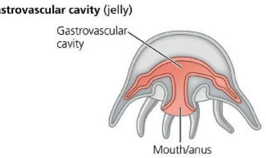  
Alimentary canal (earthworm)

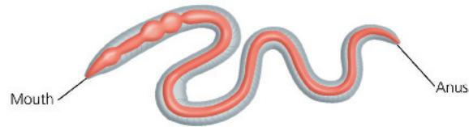  
Propose an artificial diet that would eliminate the need for one of the first three steps in food processing.

## Concept 41.3: Organs specialized for sequential stages of food processing form the mammalian digestive system

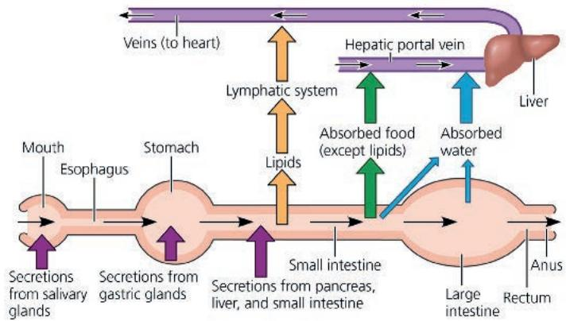  
What structural feature of the small intestine makes it better suited for absorption of nutrients than the stomach?

## Concept 41.4: Evolutionary adaptations of vertebrate digestive systems correlate with diet

\- Vertebrate digestive systems display many evolutionary adaptations associated with diet. For example, the assortment of teeth (dentition) generally correlates with diet. Also, many herbivores have fermentation chambers where mutualistic microorganisms digest cellulose. In addition, herbivores usually have longer alimentary canals than carnivores, reflecting the longer time needed to digest vegetation.

How does human anatomy indicate that our primate ancestors were not strict vegetarians?

## Concept 41.5: Feedback circuits regulate digestion, energy storage, and appetite

\- Nutrition is regulated at multiple levels. Food intake triggers nervous and hormonal responses that cause secretion of digestive juices and promote movement of ingested material through the canal. The hormones insulin and glucagon control the synthesis and breakdown of glycogen, thereby regulating glucose availability.

\- Vertebrates store excess calories in glycogen (in liver and muscle cells) and in fat (in adipose cells). These energy stores can be tapped when an animal expends more calories than it consumes. If, however, an animal consumes more calories than it needs for normal metabolism, the resulting overnourishment can cause obesity.

\- Several hormones, including leptin, insulin, GLP-1, and PYY, regulate appetite by affecting the brain's satiety center.

Explain why your stomach might make growling noises when you skip a meal. For suggested answers, see Appendix A.

## Test Your Understanding

For more multiple-choice questions, go to the Practice Test (eTextbook only).

## Levels 1-2: Remembering/Understanding

1. Fat digestion yields fatty acids and glycerol. Protein digestion yields amino acids. Both digestive processes
(A) occur inside cells in most animals.
(B) add a water molecule to break bonds.
(C) require a low pH resulting from HCl production.
(D) consume ATP.

2. The mammalian trachea and esophagus both connect to the (A) pharynx.
(C) large intestine.
(B) stomach.
(D) rectum.

3. In which organ does almost all enzymatic digestion of food occur?
(A) stomach (C) large intestine
(B) small intestine (D) pancreas

4. In which digestive system organ does nearly all nutrient absorption occur?
(A) stomach (C) large intestine
(B) small intestine (D) pancreas

## Levels 3-4: Applying/Analyzing

5. If you put the following events in the order they occur in the human digestive system, which would be the third event in the series?
(A) Cells in gastric pits secrete protons.
(B) Pepsin activates pepsinogen.
(C) HCl activates pepsinogen.
(D) Partially digested food enters the small intestine.

6. After surgical removal of the gallbladder, a person might need to limit his or her dietary intake of
(A) starch.
(B) protein.
(C) sugar.
(D) fat.

7. If a person jogs 1 km a few hours after lunch, which stored fuel would their body use first?
(A) muscle proteins
(B) muscle and liver glycogen
(C) fat in the liver
(D) fat in adipose tissue

## Levels 5-6: Evaluating/Creating

8. DRAW IT Create a flowchart to summarize the events that occur after partially digested food leaves the stomach in a human. Use the following terms: bicarbonate secretion, circulation, decrease in acidity, increase in acidity, secretin secretion, signal detection. Next to each term, indicate the compartment(s) involved. You may use terms more than once.

9. EVOLUTION CONNECTION Lizards and snakes cannot breathe while chewing food because the connection between their external nostrils and their esophagus is in the mouth. In contrast, mammals can continue breathing through the nostrils while chewing food in the mouth. However, choking sometimes occurs when the paths of air and food cross each other. Thinking about the high oxygen demand of active endotherms, explain how the concept of descent with modification explains this “imperfect” anatomy of some amniotes (see Figure 34.2 to review vertebrate phylogeny).

10. WRITE ABOUT A THEME: ORGANIZATION Hair is largely made up of the protein keratin. In a short essay (100–150 words), explain why a shampoo containing protein cannot replace the protein in damaged hair.

11. SYNTHESIZE YOUR KNOWLEDGE

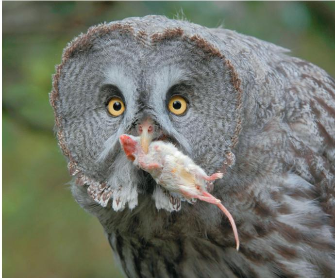

Owls, which have a varied diet, periodically cough up pellets composed of indigestible material, such as bones, feathers, and fur. (a) Compare this aspect of the owl's digestive process to those of the hydra, the rabbit, and the cow. (b) In which digestive compartment do you predict owl pellets form (see Figure 41.7c)? Explain.

For selected answers, see Appendix A.

# Explore Scientific Papers with Science in the Classroom | AAAS

How does the microbiome affect the nervous system? Go to "You Are What You Eat... At Least, Your Brain Is" at www.scienceintheclassroom.org.

Instructors: Questions can be assigned in Mastering Biology.

