# 第42章 Circulation and Gas Exchange

<!-- 章节边界按正文内容恢复；原始 MinerU 内容保留如下。 -->

# Circulation and Gas Exchange

## Key Concepts

42.1 Circulatory systems link exchange surfaces with cells throughout the body

42.2 Coordinated cycles of heart contraction drive double circulation in mammals

42.3 Patterns of blood pressure and flow reflect the structure and arrangement of blood vessels

42.4 Blood components function in exchange, transport, and defense

42.5 Gas exchange occurs across specialized respiratory surfaces  
42.6 Breathing ventilates the lungs

42.7 Adaptations for gas exchange include pigments that bind and transport gases

## Study Tip

Draw and annotate a diagram: Sketch a simplified double circulation system like the idealized one in Figure 42.1. Label where each of the following is highest: blood pressure, $CO_{2}$ concentration, $O_{2}$ concentration, and total cross-sectional area of the blood vessels. Note that the left side of your diagram represents the right side of the heart in the body, and remember “ReViTaLize” to help remind you of the path of blood from the Right Ventricle to the Lungs.

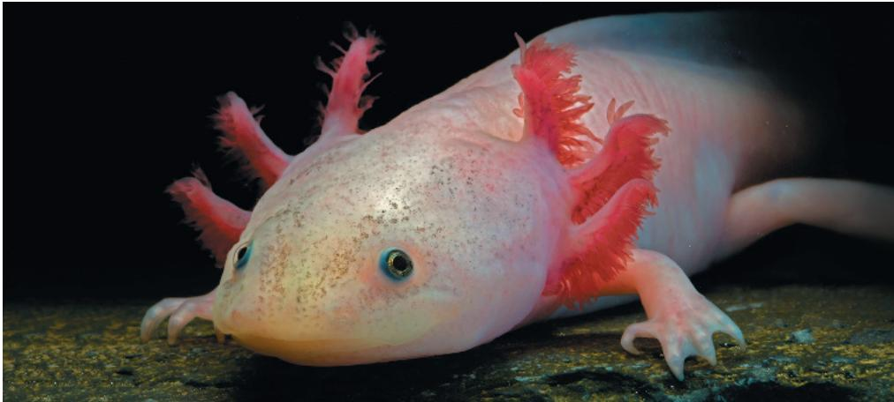  
Figure 42.1 This animal may look like a creature from a science fiction film, but it's actually an axolotl, a salamander native to shallow ponds in central Mexico. The feathery red appendages jutting out from its head are gills. External gills, although uncommon in other adult animals, help axolotls carry out a process common to all organisms: the exchange of substances between body cells and the environment.

## How are structure and function related in the exchange and circulation of oxygen and carbon dioxide?

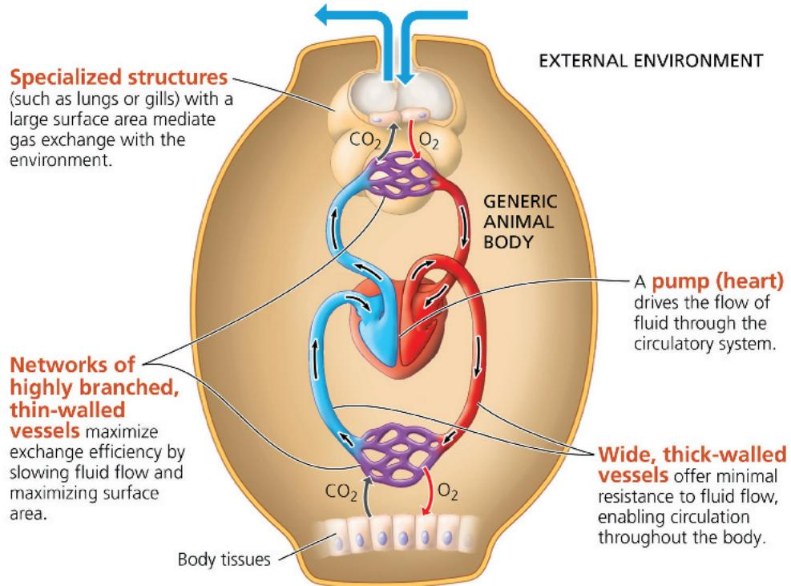

# Concept 42.1: Circulatory systems link exchange surfaces with cells throughout the body

The molecular trade that an animal carries out with its environment must ultimately involve every cell in the body. Required resources, such as nutrients and oxygen ( $O_{2}$ ), enter the cytoplasm by crossing the plasma membrane. Waste products, such as carbon dioxide ( $CO_{2}$ ), exit the cell by crossing the same membrane.

Small molecules in and around cells, including $O_{2}$ and $CO_{2}$ , undergo diffusion, which is random thermal motion (see Concept 7.3). When there is a difference in the concentration of a gas or other substance, such as between a cell and its immediate surroundings, diffusion can result in net movement from the area of higher concentration to the area of lower concentration.

Unicellular organisms exchange materials directly with the external environment via diffusion across the plasma membrane. For most multicellular organisms, however, direct exchange between every cell and the environment is not possible. Furthermore, net movement by diffusion is very slow for distances of more than a few millimeters. That's because the time it takes for a substance to diffuse from one place to another is proportional to the square of the distance. For example, a quantity of glucose that takes 1 second to diffuse $100\mu \mathrm{m}$ will take 100 seconds to diffuse $1\mathrm{mm}$ and almost 3 hours to diffuse $1\mathrm{cm}$ .

Given that net movement by diffusion is rapid only over very small distances, how does each cell of an animal participate in exchange? Natural selection has resulted in two basic adaptations that permit efficient exchange for all of an animal's cells.

One adaptation for efficient exchange is a simple body plan that places many or all cells in direct contact with the environment. Each cell can thus exchange materials directly with the surrounding medium. Such an arrangement is characteristic of certain invertebrates, including cnidarians and flatworms. Animals that lack a simple body plan display an alternative adaptation for efficient exchange: a circulatory system. Such systems move fluid between each cell's immediate surroundings and the body tissues. As a result, exchange with the environment and exchange with body tissues both occur over very short distances.

In most animals, the circulatory system is functionally linked to the exchange of gases with the environment and with body cells. For this reason, we'll discuss systems for circulation and gas exchange together in this chapter. By considering examples of these systems from a range of species, we'll explore their common elements as well as their extensive variation.

## Gastrovascular Cavities

Let's begin by looking at some animals whose body shapes put many of their cells into contact with their environment, enabling them to live without a distinct circulatory system. In hydras, jellies, and other cnidarians, a central $gastrovascular\ cavity$ functions in the distribution of substances throughout the body, as well as in digestion (see Figure 41.6). An opening at one end connects the cavity to the surrounding water. In a hydra, thin branches of

the gastrovascular cavity extend into the animal's tentacles. In jellies and some other cnidarians, the gastrovascular cavity has a much more elaborate branching pattern (Figure 42.2a).

In animals with a gastrovascular cavity, fluid bathes both the inner and outer tissue layers, facilitating exchange of gases and cellular waste. Only the cells lining the cavity have direct access to nutrients released by digestion. However, because the body wall is a mere two cells thick, nutrients only need to diffuse a short distance to reach the cells of the outer tissue layer.

Planarians and most other flatworms also survive without a circulatory system. Their combination of a gastrovascular cavity and a flat body is well suited for exchange with the environment (Figure 42.2b). A flat body optimizes exchange by increasing surface area and minimizing diffusion distances.

Figure 42.2 Diversity of gastrovascular cavities.  
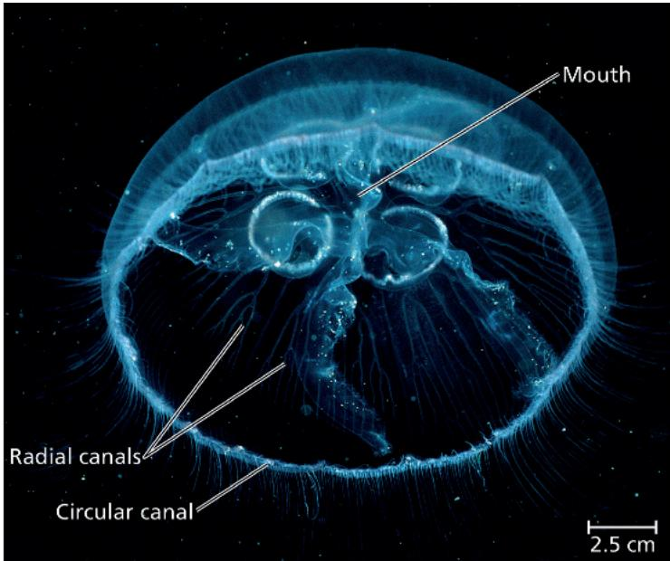  
(a) The moon jelly Aurelia, a cnidarian. The jelly is viewed here from its underside (oral surface). The mouth leads to an elaborate gastrovascular cavity that consists of radial canals leading to and from a circular canal. Ciliated cells lining the canals circulate fluid within the cavity.

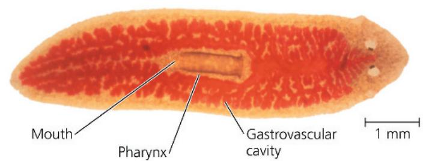  
(b) The planarian Dugesia, a flatworm. The mouth and pharynx on the ventral side lead to the highly branched gastrovascular cavity, stained dark red in this specimen (LM).  
WHAT IF? Suppose a gastrovascular cavity were open at two ends, with fluid entering one end and leaving the other. How would this affect the cavity's functions in gas exchange and digestion?
For suggested answer, see Appendix A.

Sea spider

## Open and Closed Circulatory Systems

A circulatory system has three basic components: a circulatory fluid, a set of interconnecting vessels, and a muscular pump, the heart. The heart powers circulation by using metabolic energy to elevate the circulatory fluid's hydrostatic pressure, the pressure exerted by a fluid in an enclosed space. The fluid then flows through the vessels and back to the heart.

By transporting fluid throughout the body, the circulatory system functionally connects the aqueous environment of the body cells to the organs that exchange gases, absorb nutrients, and dispose of wastes. In mammals, for example, $O_{2}$ from inhaled air diffuses across only two layers of cells in the lungs before reaching the blood. The circulatory system then carries the oxygen-rich blood to all parts of the body. As the blood passes throughout the body tissues in tiny blood vessels, $O_{2}$ in the blood diffuses only a short distance before entering the fluid that directly bathes the cells.

Circulatory systems are either open or closed. In an open circulatory system, the circulatory fluid, called hemolymph, is also the interstitial fluid that bathes body cells. Arthropods, such as grasshoppers, and some molluscs, including clams, have open circulatory systems. Contraction of the heart pumps the hemolymph through the circulatory vessels into interconnected sinuses, spaces surrounding the organs (Figure 42.3a). Within the sinuses, the hemolymph and body cells exchange gases and other chemicals. Relaxation of the heart draws hemolymph back in through pores, which have valves that close when the heart contracts. Body movements periodically squeeze the sinuses, helping circulate the hemolymph. The open circulatory system of larger crustaceans, such as lobsters and crabs, includes a more extensive system of vessels, as well as an accessory pump.

A unique method of hemolymph propulsion has evolved in sea spiders (arthropods in the class Pycnogonida). They have a very small torso and a weakly beating heart, but very long legs that contain extensions of their digestive tract. Gas exchange occurs between the water and the hemolymph in their legs, and contractions of their gut muscles propel hemolymph into the torso.

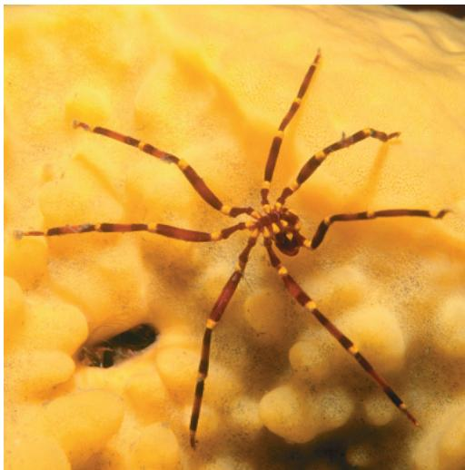

Figure 42.3 Open and closed circulatory systems.  
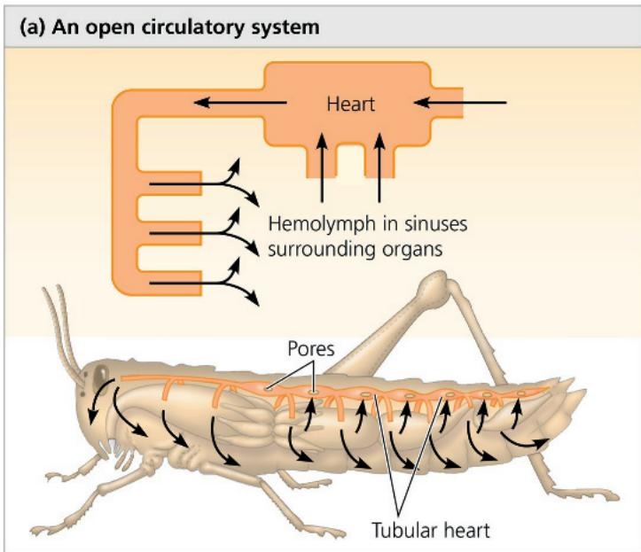

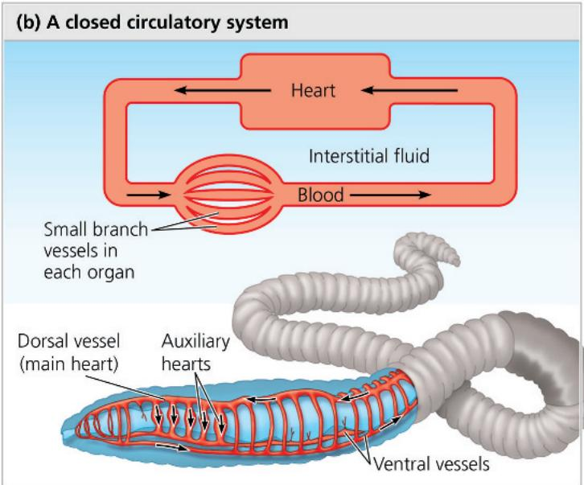

In a closed circulatory system, a circulatory fluid called blood is confined to vessels and is distinct from the interstitial fluid (Figure 42.3b). One or more hearts pump blood into large vessels that branch into smaller ones, which infiltrate the tissues and organs. Chemical exchange occurs between the blood and the interstitial fluid, as well as between the interstitial fluid and body cells. Annelids (including earthworms), cephalopods (including squids and octopuses), and all vertebrates have closed circulatory systems.

The fact that both open and closed circulatory systems are widespread among animals suggests that each system offers evolutionary advantages. The lower hydrostatic pressures typically associated with open circulatory systems allow them to use less energy than closed systems. In some invertebrates, open circulatory systems serve additional functions. For example, spiders use the hydrostatic pressure of their open circulatory

system to extend their legs. The benefits of closed circulatory systems include blood pressure high enough to enable the effective delivery of $O_{2}$ and nutrients in larger and more active animals. Among molluscs, for instance, closed circulatory systems are found in the largest and most active species, the squids and octopuses. Closed systems are also particularly well suited to regulating the distribution of blood to different organs, as you'll learn later in this chapter. We'll now examine closed circulatory systems in more detail, focusing on vertebrates.

## Organization of Vertebrate Circulatory Systems

The term cardiovascular system is often used to describe the heart and blood vessels in vertebrates. Blood circulates to and from the heart through an amazingly extensive network of vessels: The total length of blood vessels in an average human adult is twice Earth's circumference at the equator!

Arteries, veins, and capillaries are the three main types of blood vessels. Within each type, blood flows in only one direction. Arteries carry blood from the heart to organs throughout the body. Within organs, arteries branch into arterioles. These small vessels convey blood to capillaries, microscopic vessels with very thin, porous walls. Networks of capillaries, called capillary beds, infiltrate tissues, passing within a few cell diameters of every cell in the body. Across the thin walls of capillaries, dissolved gases and other chemicals are exchanged by diffusion between the blood and the interstitial fluid around the tissue cells. At their

“downstream” end, capillaries converge into venules, and venules converge into veins, the vessels that carry blood back to the heart.

Note that arteries and veins are distinguished by the direction in which they carry blood, not by the $O_{2}$ content or other characteristics of the blood they contain. Arteries carry blood away from the heart toward capillaries, and veins return blood toward the heart from capillaries. The only exceptions are the portal veins, which carry blood between pairs of capillary beds. The hepatic portal vein, for example, carries blood from capillary beds in the digestive system to capillary beds in the liver.

The hearts of all vertebrates contain two or more muscular chambers. The chambers that receive blood entering the heart are called atria (singular, atrium). The chambers responsible for pumping blood out of the heart are called ventricles. The number of chambers and the extent to which they are separated from one another differ substantially among groups of vertebrates, as we'll discuss next. These important differences reflect the close fit of form to function that arises from natural selection.

## Single Circulation

In sharks, rays, and bony fishes, blood travels through the body and returns to its starting point in a single circuit (loop), an arrangement called single circulation (Figure 42.4a). These animals have a heart that consists of two chambers: an atrium and a ventricle. Blood entering the heart collects in the atrium before transfer to the ventricle. Contraction of the ventricle pumps blood to a capillary bed in the gills, where there is a net diffusion of $O_{2}$ into the blood and of

Figure 42.4 Examples of vertebrate circulatory system organization.  
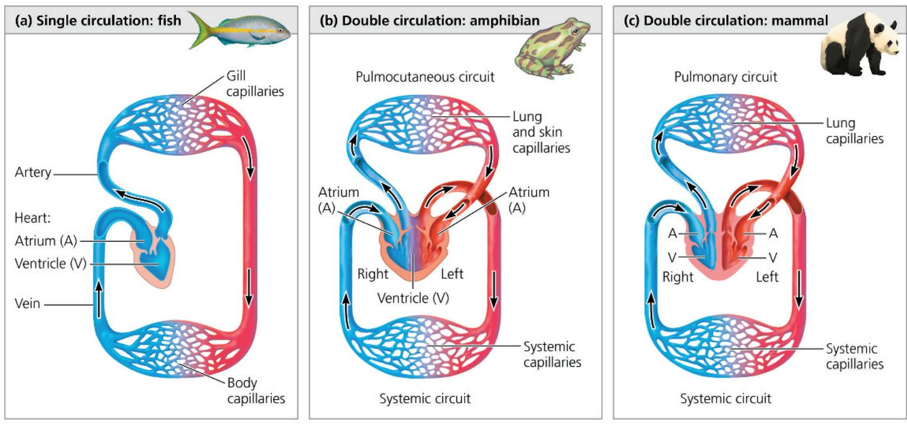  
(Note that circulatory systems are shown as if the body were facing you: The right side of the heart is shown on the left, and vice versa.)

CO $_{2}$ out of the blood. As blood leaves the gills, the capillaries converge into a vessel that carries oxygen-rich blood to capillary beds throughout the body. Following gas exchange in the capillary beds, blood enters veins and returns to the heart.

In single circulation, blood that leaves the heart passes through two capillary beds before returning to the heart. When blood flows through a capillary bed, blood pressure drops substantially, for reasons we'll explain later in the chapter. The blood pressure drop in the gills limits the rate of blood flow in the rest of the animal's body. As the animal swims, however, the contraction and relaxation of its muscles help accelerate the relatively sluggish pace of circulation.

## Double Circulation

The circulatory systems of amphibians, reptiles, and mammals have two circuits of blood flow, an arrangement called double circulation (Figure 42.4b and c). In animals with double circulation, the pumps for the two circuits are combined into a single organ, the heart. Having both pumps within a single heart simplifies coordination of the pumping cycles.

In one circuit, the right side of the heart pumps oxygen-poor blood to the capillary beds of the gas exchange tissues, where there is a net movement of $O_{2}$ into the blood and of $CO_{2}$ out of the blood. In most vertebrates, including reptiles and mammals, this is called the pulmonary circuit (from the Latin pulmo, lung) because gas exchange takes place in the lungs. For many amphibians, it is called the pulmocutaneous circuit because gas exchange takes place in capillaries in both the lungs and the skin.

The other circuit, called the systemic circuit, begins with the left side of the heart pumping oxygen-enriched blood from the gas exchange tissues to capillary beds in organs and tissues throughout the body. Following the exchange of $O_{2}$ and $CO_{2}$ , as well as nutrients and waste products, the now oxygen-poor blood returns to the heart, completing the circuit.

Double circulation provides a vigorous flow of blood to the brain, muscles, and other organs because the heart repressurizes the blood after it passes through the capillary beds of the lungs or skin. Indeed, blood pressure is often much higher in the systemic circuit than in the gas exchange circuit. By contrast, in single circulation the blood flows under reduced pressure directly from the gas exchange organs to other organs.

## Evolutionary Variation in Double Circulation

EVOLUTION Some vertebrates with double circulation are intermittent breathers. For example, amphibians and many reptiles fill their lungs with air periodically, passing long periods either without gas exchange or by relying on another gas exchange tissue, typically the skin. A variety of adaptations found among intermittent breathers enable their circulatory systems to temporarily bypass the lungs in part or in whole:

\- Frogs and other amphibians have a heart with three chambers—two atria and one ventricle (see Figure 42.4b). A ridge within the ventricle diverts most (about $90\%$ ) of the oxygen-rich blood from the left atrium into the systemic circuit and most of the oxygen-poor blood from the right atrium into the pulmocutaneous circuit. When a frog is underwater, it constricts the artery supplying the lungs, which shunts most of the blood into the artery supplying the skin. The skin acts as the sole site of gas exchange while the frog is submerged.

\- In the three-chambered heart of turtles, snakes, and lizards, an incomplete septum partially divides the single ventricle into right and left chambers. Two major arteries, called aortas, lead to the systemic circulation. As with amphibians, the circulatory system enables control of the relative amount of blood flowing to the lungs and the rest of the body.

\- In alligators, caimans, and other crocodilians, the ventricles are divided by a complete septum, but the pulmonary and systemic circuits connect where the arteries exit the heart. This connection allows arterial valves to shunt blood flow away from the lungs temporarily, such as when the animal is underwater.

Double circulation in birds and mammals, which for the most part breathe continuously, differs from double circulation in other vertebrates. As shown for a panda in Figure 42.4c, the heart has two atria and two completely divided ventricles. The left side of the heart receives and pumps only oxygen-rich blood, while the right side receives and pumps only oxygen-poor blood. Unlike amphibians and many reptiles, birds and mammals cannot vary blood flow to the lungs without varying blood flow throughout the body in parallel.

How has natural selection shaped the double circulation of birds and mammals? As endotherms, they use about ten times as much energy as equal-sized ectotherms (see Concept 40.4). Their circulatory systems are capable of delivering about ten times as much fuel and $O_{2}$ to their tissues and remove ten times as much $CO_{2}$ and other wastes. This large-scale traffic of substances is made possible by the separate and independently powered systemic and pulmonary circuits and by large hearts. A powerful four-chambered heart arose independently in the distinct ancestors of birds and mammals and thus reflects convergent evolution (see Concept 22.3).

In the next section, we'll restrict our focus to circulation in mammals and to the anatomy and physiology of the key circulatory organ—the heart.

## Concept Check 42.1

1. Three-chambered hearts with incomplete septa were once viewed as being less adapted to circulatory function than mammalian hearts. What advantage of such hearts did this viewpoint overlook?

2. WHAT IF? The systemic circulation includes capillaries located in the lungs. What would be the problem if all the capillaries in the lungs only belonged to the pulmonary circuit?

3. WHAT IF? The heart of a human fetus has a hole between the left and right atria. In some cases, this hole does not close completely before birth. If the hole weren't surgically corrected, how would it affect the $\mathrm{O}_2$ content of the blood entering the systemic circuit?

# Concept 42.2: Coordinated cycles of heart contraction drive double circulation in mammals

The timely delivery of $\mathrm{O}_2$ to the body's organs is critical. Some brain cells, for example, die if their $\mathrm{O}_2$ supply is interrupted for even a few minutes. How does the mammalian cardiovascular system coordinate $\mathrm{O}_2$ delivery with the continuous (although variable) demand for $\mathrm{O}_2$ by body tissues? To answer this question, we must consider how the parts of the system are arranged and how each of these parts functions.

## Mammalian Circulation

Let's first examine the overall organization of the mammalian cardiovascular system, beginning with the pulmonary circuit. (The circled numbers refer to labeled structures in Figure 42.5.)

Figure 42.5 The mammalian cardiovascular system: an overview. Note that the dual circuits operate simultaneously, not in the serial fashion that the numbering in the diagram suggests. The two ventricles contract almost in unison and pump the same volume of blood. However, the total volume of blood in the systemic circuit is much greater than that in the pulmonary circuit.  
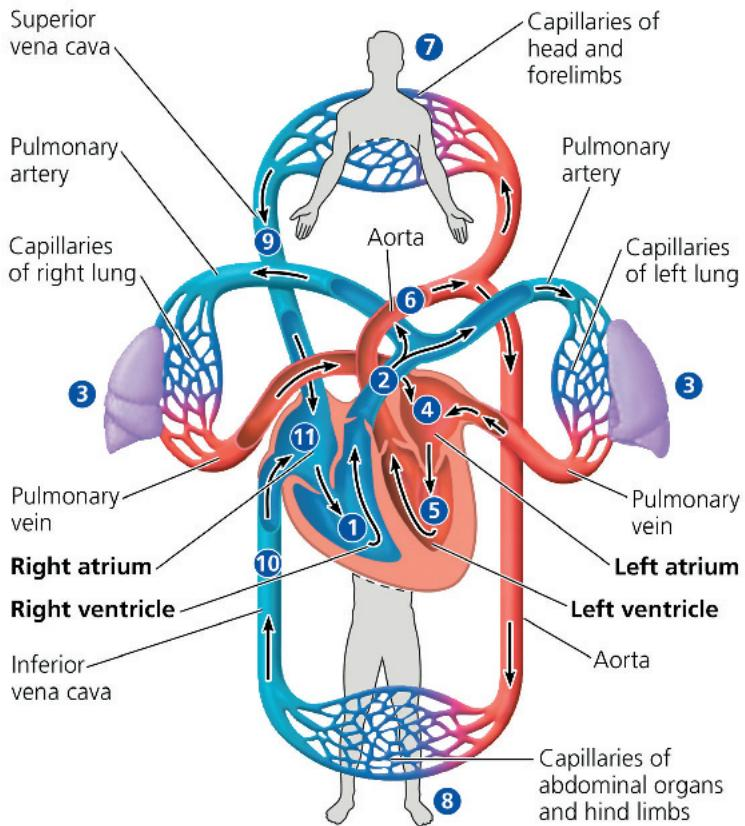  
VISUAL SKILLS If you trace the path of a molecule of carbon dioxide that starts in an arteriole in the right thumb and leaves the body in exhaled air, what is the minimum number of capillary beds the molecule encounters? Explain. For suggested answer, see Appendix A.

Contraction of ① the right ventricle pumps blood to the lungs via ② the pulmonary arteries. As the blood flows through ③ capillary beds in the left and right lungs, it loads O₂ and unloads CO₂. Oxygen-rich blood returns from the lungs via the pulmonary veins to ④ the left atrium of the heart. Next, the oxygen-rich blood flows into ⑤ the heart's left ventricle, which pumps the oxygen-rich blood out to body tissues through the systemic circuit. Blood leaves the left ventricle via ⑥ the aorta, which conveys blood to arteries leading throughout the body. The first branches leading from the aorta are the coronary arteries (not shown), which supply blood to the heart muscle itself. Branches further along the aorta lead to ⑦ capillary beds in the head and arms (forelimbs). The aorta then descends into the abdomen, supplying oxygen-rich blood to arteries leading to ⑧ capillary beds in the abdominal organs and legs (hind limbs). Within the capillary beds, there is a net diffusion of O₂ from the blood to the tissues and of CO₂ (produced by cellular respiration) into the blood. Capillaries rejoin, forming venules, which convey blood to veins. Oxygen-poor blood from the head, neck, and forelimbs is channeled into a large vein, ⑨ the superior vena cava. Another large vein, ⑩ the inferior vena cava, drains blood from the trunk and hind limbs. The two venae cavae empty their blood into ⑪ the right atrium, from which the oxygen-poor blood flows into the right ventricle.

## The Mammalian Heart: A Closer Look

Using the human heart as an example, let's now take a closer look at how the mammalian heart works (Figure 42.6). Located behind the sternum (breastbone), the human heart is about the size of a clenched fist and consists mostly of cardiac muscle (see Figure 40.5). The two atria have relatively thin walls and serve as collection chambers for blood returning to the heart from the lungs or other body tissues. Much of the blood that enters the atria flows into the ventricles while all four heart chambers are relaxed. The remainder is transferred by contraction of the atria before the ventricles begin to contract. Compared with the atria, the ventricles have thicker walls and contract much more forcefully—especially the left ventricle, which pumps blood throughout the body via the systemic circuit. The right ventricle generates less force as it pumps blood through the shorter pulmonary circuit, but it still pumps the same volume of blood as the left ventricle during each contraction.

Figure 42.6 The mammalian heart: a closer look.
Notice the locations of the valves, which prevent backflow of blood within the heart. Also notice how the atria and left and right ventricles differ in the thickness of their muscular walls.  
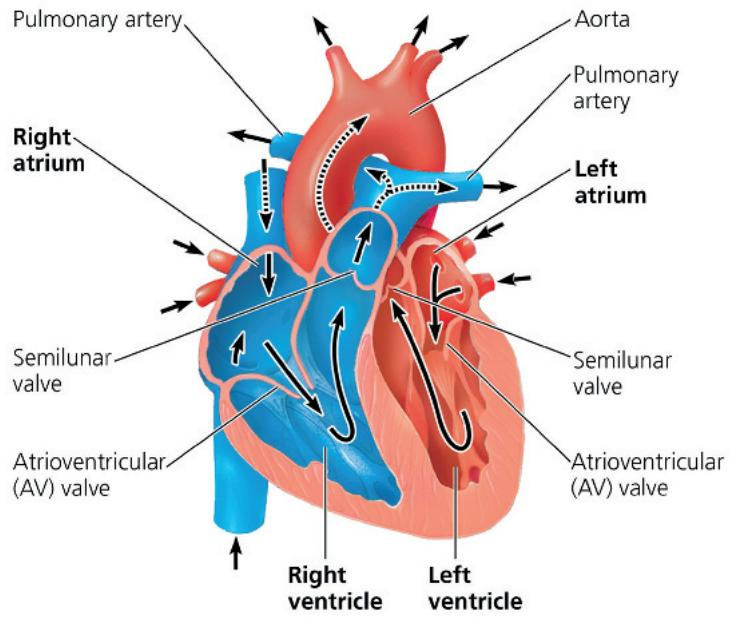

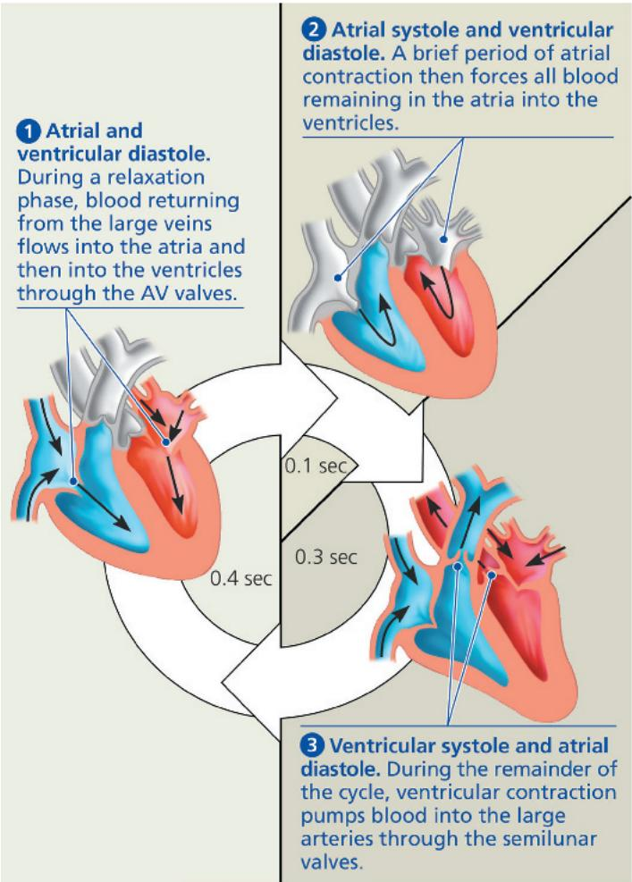  
Figure 42.7 The cardiac cycle.

The chambers of the heart contract and relax in a rhythmic cycle. When a chamber contracts, it pumps blood; when it relaxes, it fills with blood. One complete sequence of pumping and filling is referred to as the cardiac cycle. The contraction phase for each chamber is called systole, and the relaxation phase is called diastole (Figure 42.7).

The volume of blood each ventricle pumps per minute is the cardiac output. Two factors determine cardiac output: the rate of contraction, or heart rate (number of beats per minute), and the stroke volume, the amount of blood pumped by a

For an adult human at rest with a heart rate of about 72 beats per minute, one complete cardiac cycle takes about 0.8 second. Note that during all but 0.1 second of the cardiac cycle, the atria are relaxed and are filling with blood returning via the veins.

② Atrial systole and ventricular diastole. A brief period of atrial contraction then forces all blood remaining in the atria into the ventricles.

1 Atrial and ventricular diastole. During a relaxation phase, blood returning from the large veins flows into the atria and then into the ventricles through the AV valves.

3 Ventricular systole and atrial diastole. During the remainder of the cycle, ventricular contraction pumps blood into the large arteries through the semilunar valves.

ventricle in a single contraction. The average stroke volume in humans is about 70 mL. Multiplying this stroke volume by a typical resting heart rate of 72 beats per minute yields a cardiac output of 5 L/min—about equal to the total volume of blood in the human body. During heavy exercise, the increased consumption of $O_{2}$ is met by an increase in cardiac output that can be as much as fivefold.

Four valves in the heart prevent backflow and keep blood moving in the correct direction (see Figures 42.6 and 42.7). Made of flaps of connective tissue, the valves open when pushed from one side and close when pushed from the other. An atrioventricular valve (AV) lies between each atrium and ventricle. The AV valves are anchored by strong fibers that prevent them from turning inside out during ventricular systole. Pressure generated by the powerful contraction of the ventricles closes the AV valves, keeping blood from flowing back into the atria. A semilunar valve is located at each of the two exits of the heart: where the pulmonary artery leaves the right ventricle and where the aorta leaves the left ventricle. These valves are pushed open by the pressure generated during contraction of the ventricles. When the ventricles relax, blood pressure built up in the pulmonary artery and aorta closes the semilunar valves and prevents significant backflow.

You can follow the closing of the two sets of heart valves either with a stethoscope or by pressing your ear tightly against the chest of a friend (or a friendly dog). The sound pattern is "lub-dup, lub-dup, lub-dup." The first heart sound ("lub") is created by the recoil of blood against the closed AV valves. The second sound ("dup") is due to the vibrations caused by closing of the semilunar valves.

Turbulent flow through the heart may result in a whooshing sound known as a heart murmur. Many heart murmurs are harmless, but some result from blood squirting backward through a defective valve. Valve defects can be present at birth or result from heart disease. In others, the valves may be damaged as a result of infection (for instance, from endocarditis, an inflammation of the heart's lining caused by infection with certain bacteria). When a valve defect is severe enough to endanger health, surgeons may implant a mechanical replacement valve.

## Maintaining the Heart's Rhythmic Beat

In vertebrates, the heartbeat originates in the heart itself. Some cardiac muscle cells are autorhythmic, meaning they can contract and relax repeatedly without any signal from the nervous system. In fact, these rhythmic contractions continue in tissue removed from the heart and placed in a dish in the laboratory! Given that each of these cells has its own intrinsic contraction rhythm, how are their contractions coordinated in the intact heart? The answer lies in a group of autorhythmic cells located in the wall of the right atrium, near where the superior vena cava enters the heart. This cluster of cells, called the sinoatrial node (SA), acts as a pacemaker, setting the rate and timing at which all cardiac muscle cells contract. (In contrast, some arthropods have pacemakers located in the nervous system, outside the heart.)

The SA node produces electrical impulses much like those produced by nerve cells. Because cardiac muscle cells are electrically coupled through gap junctions (see Figure 6.30), impulses from the SA node spread rapidly within heart tissue. These impulses generate currents that can be measured when they reach the skin via body fluids. In an electrocardiogram (ECG or EKG, from the German spelling), electrodes placed on the skin record the currents, thus measuring electrical activity of the heart. The graph of current against time has a shape that represents the stages in the cardiac cycle (Figure 42.8).

Impulses from the SA node first spread rapidly through the walls of the atria, causing both atria to contract in unison. During atrial contraction, the impulses originating at the SA node reach other autorhythmic cells located in the wall between the left and right atria. These cells form a relay point called the atrioventricular node (AV). Here the impulses are delayed for about 0.1 second before spreading to the heart apex. This

Figure 42.8 The control of heart rhythm.

Electrical signals follow a set path through the heart in establishing the heart rhythm. The diagrams at the top trace the movement of these signals (yellow) during the cardiac cycle; specialized muscle cells involved in controlling of the rhythm are indicated in orange. Under each step, the corresponding portion of an electrocardiogram (ECG) is highlighted (yellow). In step 4, the portion of the ECG to the right of the “spike” represents electrical activity that reprimes the ventricles for the next round of contraction.

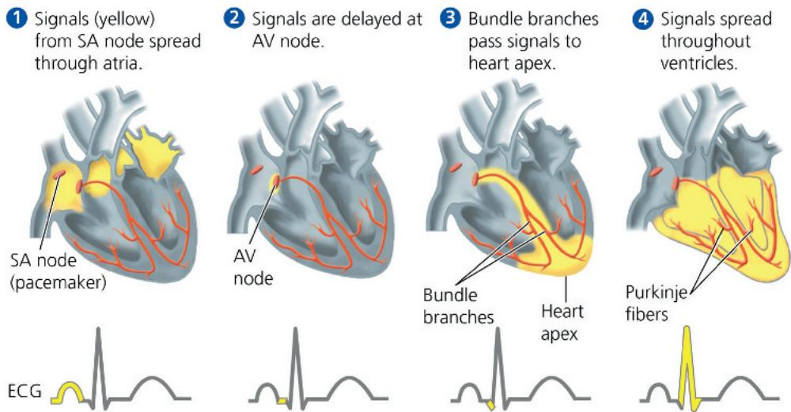  
WHAT IF? If your doctor gave you a copy of your ECG recording, how could you determine what your heart rate had been during the test?  
For suggested answer, see Appendix A.

delay allows the atria to empty completely before the ventricles contract. Then, the signals from the AV node are conducted to the heart apex and throughout the ventricular walls by specialized structures called bundle branches and Purkinje fibers.

Changes in heart rate help maintain blood pressure at its set point, as discussed in Concept 42.3. The heart rate speeds up under the influence of the sympathetic division of the nervous system, which is responsible for the stress response (also known as the “flight-or-fight” response; see Concept 49.1). Activation of the sympathetic nervous system also increases the release of epinephrine, a hormone secreted by the adrenal glands. The parasympathetic nervous system coordinates the “rest-and-digest” response. It has the opposite effect, slowing the heart rate.

Having examined the operation of the circulatory pump, we turn in the next section to the forces and structures that influence blood flow in the vessels of each circuit.

## Concept Check 42.2

1. Explain why blood has a higher $O_{2}$ concentration in the pulmonary veins than in the venae cavae, which are also veins.

2. Why is it important that the AV node delay the electrical impulse moving from the SA node and atria to the ventricles?

3. WHAT IF? Suppose that after you exercise regularly for several months, your resting heart rate decreases, but your cardiac output at rest is unchanged. Based on these observations, what other change in the function of your heart at rest likely occurred?

## Concept 42.3: Patterns of blood pressure and flow reflect the structure and arrangement of blood vessels

To deliver oxygen and nutrients and remove wastes throughout the body, the vertebrate circulatory system relies on blood vessels that exhibit a close match of structure and function.

## Blood Vessel Structure and Function

All blood vessels contain a central lumen (cavity) lined with an endothelium, a single layer of flattened epithelial cells. Like the polished surface of a copper pipe, the smooth endothelial layer minimizes resistance to fluid flow. Surrounding the endothelium are tissue layers that differ among capillaries, arteries, and veins, reflecting distinct adaptations to the particular functions of these vessels (Figure 42.9).

Capillaries are the smallest blood vessels, having a diameter only slightly greater than that of a red blood cell. Capillaries also have very thin walls, which consist of just an endothelium and a surrounding extracellular layer called the basal lamina. The exchange of substances between the blood and interstitial fluid occurs only in capillaries because only there are the vessel walls thin enough to permit this exchange.

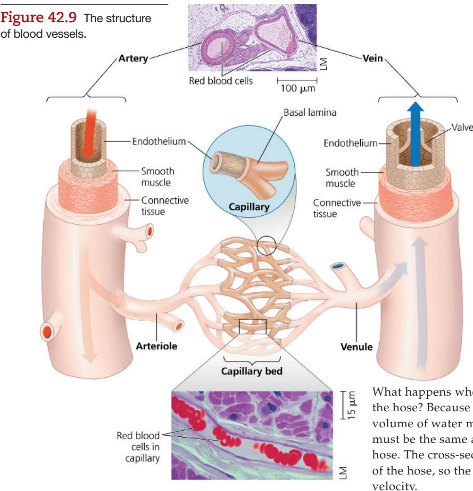

In contrast to capillaries, both arteries and veins have walls that consist of two layers of tissue surrounding the endothelium. The outer layer is formed by connective tissue that contains elastic fibers, which allow the vessel to stretch and recoil, and collagen, which provides strength. The layer next to the endothelium contains smooth muscle and more elastic fibers.

Arterial walls are thick, strong, and elastic. They can thus accommodate blood pumped at high pressure by the heart, bulging outward as blood enters and recoiling as the heart relaxes between contractions. As we'll discuss shortly, this behavior of arterial walls has an essential role in maintaining blood pressure and flow to capillaries.

Arterioles (and to a lesser extent, arteries) change in diameter when the smooth muscle in the vessel wall contracts or relaxes. Contraction narrows the arteriole, a process called vasoconstriction. Smooth muscle relaxation results in vasodilation, an increase in vessel diameter. Whereas diameter changes in many arterioles at once alters blood pressure, as discussed later, changes in a few arterioles determine blood distribution. Vasoconstriction reduces blood flow to the specific body region downstream of the vessel, while vasodilation increases it. For instance, an exercising muscle produces large amounts of carbon dioxide, which stimulates vasodilation of nearby arterioles and increases blood flow to that muscle. This mechanism coordinates blood supply to various areas of the body with regional differences in metabolic activity.

Because veins convey blood back to the heart at a lower pressure, they do not require thick walls. For a given blood vessel diameter, a vein has a wall only about a third as thick as that of an artery. Unlike arteries, veins contain valves, which maintain a unidirectional flow of blood despite the low blood pressure in these vessels.

We consider next how blood vessel diameter, vessel number, and blood pressure influence the speed at which blood flows in different locations within the body.

## Blood Flow Velocity

To understand how blood vessel diameter influences blood flow, consider how water flows through a thick-walled hose connected to a faucet. When the faucet is turned on, water flows at the same velocity at each point along the hose.

What happens when a narrow nozzle is attached to the end of the hose? Because water doesn't compress under pressure, the volume of water moving through the nozzle in a given time must be the same as the volume moving through the rest of the hose. The cross-sectional area of the nozzle is smaller than that of the hose, so the water speeds up, exiting the nozzle at high velocity.

An analogous situation exists in the circulatory system, but blood slows as it moves from arteries to arterioles to the much narrower capillaries. Why? The number of capillaries is enormous, roughly 7 billion in a human body. Each artery conveys blood to so many capillaries that the total cross-sectional area is much greater in capillary beds than in the arteries or any other part of the circulatory system (Figure 42.10, on the next page). This enormous increase in cross-sectional area results in a dramatic decrease in velocity from the arteries to the capillaries: Blood travels 500 times more slowly in the capillaries (about 0.1 cm/sec) than in the aorta (about 48 cm/sec). After passing through the capillaries, the blood speeds up as it enters the venules and veins and total cross-sectional areas decreases.

## Blood Pressure

Blood, like all fluids, flows from areas of higher pressure to areas of lower pressure. Contraction of a heart ventricle generates blood pressure, which exerts a force in all directions. The part of the force directed lengthwise in an artery causes the blood to flow away from the heart, the site of highest pressure. The part of the force exerted sideways stretches the wall of the artery. Following ventricular contraction, the recoil of the elastic arterial walls plays a critical role in maintaining blood pressure, and hence blood flow, throughout the cardiac cycle. Once the blood enters the millions of tiny arterioles and capillaries, each vessel's narrow diameter

Figure 42.10 The interrelationship of cross-sectional area of blood vessels, blood flow velocity, and blood pressure.

As a result of an increase in total cross-sectional area, blood flow velocity decreases markedly in the arterioles and is lowest in the capillaries. Blood pressure, the main force driving blood from the heart to the capillaries, is highest in the aorta and other arteries.

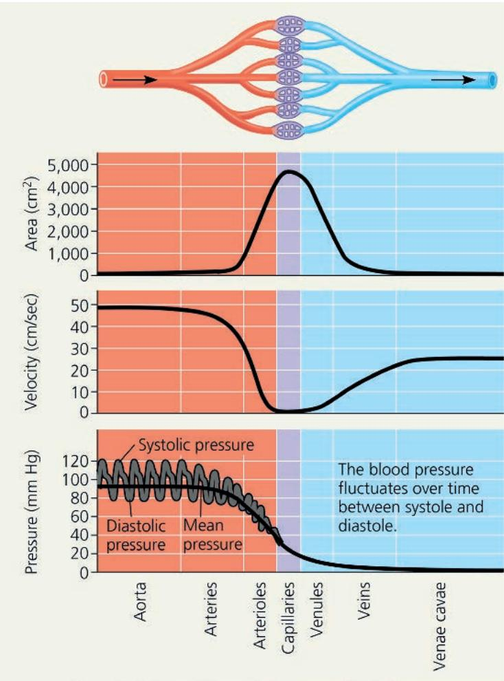

results in more friction between the blood and the vessel wall for a given volume of blood. By the time the blood enters the veins, this resistance has dissipated much of the pressure generated by the pumping heart (see Figure 42.10).

## Changes in Blood Pressure During the Cardiac Cycle

Arterial blood pressure is highest when the heart contracts during ventricular systole. The pressure at this time is called systolic pressure (see Figure 42.10). Each ventricular contraction causes a spike in blood pressure that stretches the walls of the arteries. You can feel this pulse—the rhythmic bulging of the artery walls with each heartbeat—by placing the tips of your fingers on the inside of the opposite wrist. The pressure surge is partly due to the narrow openings of arterioles impeding the exit of blood from the arteries. When the heart contracts, blood enters the arteries faster than it can leave, and the vessels stretch to a wider diameter from the rise in pressure.

During diastole, the elastic walls of the arteries snap back. As a consequence, there is a lower but still substantial blood pressure when the ventricles are relaxed (diastolic pressure). Before enough blood has flowed into the arterioles to completely relieve pressure in the arteries, the heart contracts again. Because the arteries remain pressurized throughout the cardiac cycle (see Figure 42.10), blood continuously flows into arterioles and capillaries.

## Regulation of Blood Pressure

Blood pressure is the driving force for blood flow throughout the body. Low blood pressure can compromise flow to vital organs, and high blood pressure can damage fragile vessels. Humans (and other animals) generally maintain blood pressure within the upper and lower limits of the set point. This set point can be increased under conditions such as the physical stress of exercise or the emotional stress of excitement or anxiety.

Sensors in large arteries measure blood pressure and send this information to a control center in the brain. If blood pressure rises above or falls below the set point, the control center counteracts the change by altering the activity of two effectors: the heart and the blood vessels. For instance, the body responds to a drop in blood pressure by increasing heart rate and stroke volume, which increases cardiac output. The control center also stimulates vasoconstriction of many arterioles at once. These changes increase blood pressure in the arteries toward the set point.

Signals travel between the sensors, the control center, and the effectors through the nervous system. At the blood vessels, these neural signals alter the production of chemical signals that control the contraction of the smooth muscle in the blood vessel wall.

Researchers have identified nitric oxide (NO), a gas, as a major inducer of vasodilation and endothelin, a peptide, as the most potent inducer of vasoconstriction.

## Interview

Interview with Masashi Yanagisawa: Discovering the key inducer of vasoconstriction (eTextbook only)

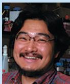

## Blood Pressure and Gravity

Blood pressure is generally measured for an artery in the arm at the same height as the heart (Figure 42.11). For a healthy 20-year-old human at rest, arterial blood pressure in the systemic circuit is typically about 120 millimeters of mercury (mm Hg) at systole and 70 mm Hg at diastole, expressed as 120/70 (Arterial blood pressure in the pulmonary circuit is six to ten times lower.)

Gravity has a significant effect on blood pressure. When you are standing, for example, your head is roughly 0.35 m higher than your chest, and the arterial blood pressure in your brain is about 27 mm Hg less than that near your heart. This relationship of blood pressure and gravity is the key to understanding fainting. The fainting response is triggered when the nervous system detects that the blood pressure in your brain is below the level needed to provide adequate blood flow. By causing your body to collapse to the ground, fainting effectively places your head at the level of your heart, quickly increasing blood flow to your brain.

For animals with very long necks, the blood pressure required to overcome gravity is particularly high. A giraffe, for example, requires a systolic pressure of more than 250 mm Hg near the heart to get blood to its head. When a giraffe lowers its head to drink, one-way valves and sinuses, along with feedback mechanisms that reduce cardiac output, reduce blood pressure in the head, preventing brain damage. A dinosaur with a neck nearly 10 m long would have required even greater systolic pressure—nearly 760 mm Hg—to pump blood to its brain when its head was fully raised. However, calculations based on anatomy and inferred metabolic rate suggest that dinosaurs did not have a heart powerful enough to generate such high pressure. Based on this evidence as well as studies of neck bone structure, some biologists have concluded that the long-necked dinosaurs fed close to the ground rather than on high foliage.

Figure 42.11 Regulation of blood pressure in the body and blood pressure measurement using a cuff.  
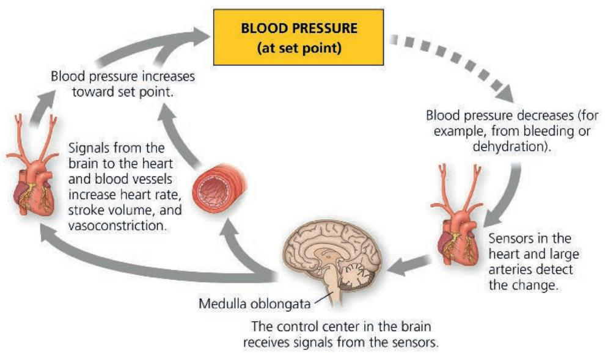  
(a) Regulation of blood pressure.

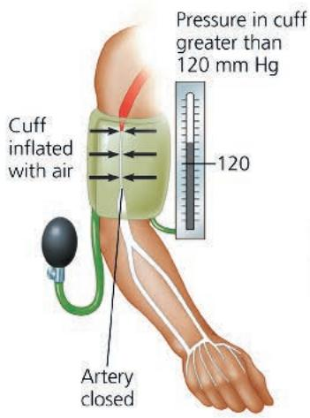

1 A sphygmomanometer, an inflatable cuff attached to a pressure gauge, measures blood pressure in an artery. The cuff is inflated until the pressure closes the artery, so that no blood flows past the cuff. When this occurs, the pressure exerted by the cuff exceeds the pressure in the artery.

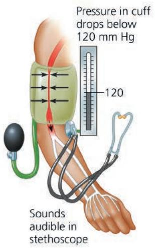

2 The cuff is allowed to deflate gradually. When the pressure exerted by the cuff falls just below that in the artery, blood pulses into the forearm, generating sounds that can be heard with the stethoscope. The pressure measured at this point is the systolic pressure (120 mm Hg in this example).

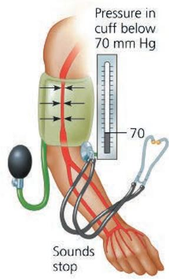

3 The cuff is allowed to deflate further, just until the blood flows freely through the artery and the sounds below the cuff disappear. The pressure at this point is the diastolic pressure (70 mm Hg in this example).

(b) Cuff method of measuring blood pressure. Blood pressure is recorded as two numbers separated by a slash. The first number is the systolic pressure; the second is the diastolic pressure.

Gravity is also a consideration for blood flow in veins, especially those in the legs. When you stand or sit, gravity draws blood downward to your feet and impedes its upward return to the heart. Because blood pressure in veins is relatively low, valves inside the veins have an important function in maintaining the unidirectional flow of blood within these vessels. The return of blood to the heart is further enhanced by the contraction of skeletal muscles during exercise (Figure 42.12).

## Capillary Function

At any given time, blood is flowing through only 5–10% of the body's capillaries. However, each tissue has many capillaries, so every part of the body is supplied with blood at all times. Capillaries in the brain, heart, kidneys, and liver usually remain at capacity, but at many other sites the

Figure 42.12 Blood flow in veins.

Skeletal muscle contraction squeezes and constricts veins. Flaps of tissue within the veins act as one-way valves that keep blood moving only toward the heart. If you sit or stand too long, the lack of muscular activity may cause your feet to swell as blood pools in your veins.

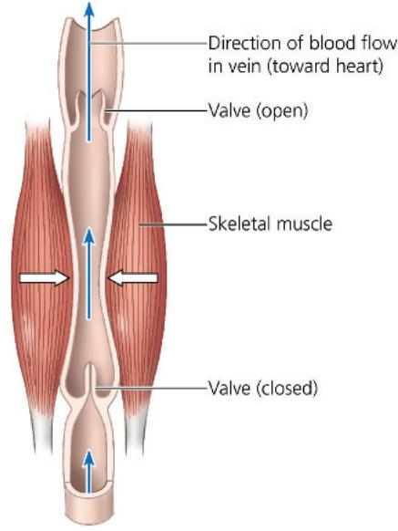

Precapillary sphincters regulate the passage of blood into capillary beds. Some blood flows directly from arterioles to venules through capillaries called thoroughfare channels, which are always open.  
Figure 42.13 Blood flow in capillary beds.  
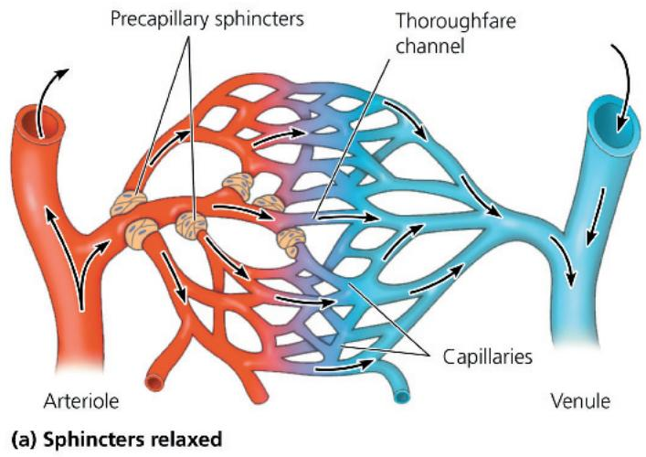

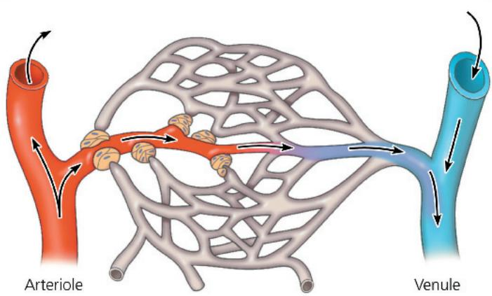  
(b) Sphincters contracted  
Figure 42.14 Fluid exchange between capillaries and the interstitial fluid.

blood supply varies over time as blood is diverted from one destination to another. For example, blood supply to the digestive tract increases after a meal. In contrast, blood is diverted from the digestive tract and supplied more generously to skeletal muscles during strenuous exercise.

Given that capillaries lack smooth muscle, how is blood flow in capillary beds altered? One mechanism is constriction or dilation of the arterioles that supply capillary beds. A second mechanism involves precapillary sphincters, rings of smooth muscle located at the entrance to capillary beds (Figure 42.13). The opening and closing of these muscular rings regulate the passage of blood into particular sets of capillaries. The signals regulating blood flow by these mechanisms include nerve impulses, hormones traveling throughout the bloodstream, and chemicals produced locally. For example, the chemical histamine released by cells at a wound site causes vasodilation. The result is increased blood flow and increased access of disease-fighting white blood cells to invading microorganisms.

As you have read, the critical exchange of substances between the blood and interstitial fluid takes place across the thin endothelial walls of the capillaries. How does exchange occur? A few macromolecules are carried across the endothelium in vesicles that form on one side by endocytosis and release their

This diagram shows a hypothetical capillary in which blood pressure exceeds osmotic pressure throughout the entire length of the capillary. In other capillaries, blood pressure may be lower than osmotic pressure along all or part of the capillary.

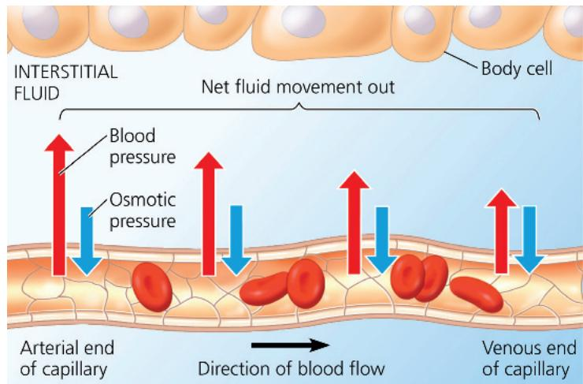

contents on the opposite side by exocytosis. Small molecules, such as $O_{2}$ and $CO_{2}$ , simply diffuse across the endothelial cells or, in some tissues, through microscopic pores in the capillary wall. These openings also provide the route for diffusion of small solutes such as sugars, salts, and urea, as well as for bulk flow of fluid into tissues driven by blood pressure within the capillary.

Two opposing forces control the movement of fluid between the capillaries and the surrounding tissues: Blood pressure tends to drive fluid out of the capillaries, and the presence of blood proteins tends to pull fluid back (Figure 42.14). Many blood proteins (and all blood cells) are too large to pass readily through the endothelium, so they remain in the capillaries. These dissolved proteins are responsible for much of the blood's osmotic pressure (the pressure produced by the difference in solute concentration across a membrane). The difference in osmotic pressure between the blood and the interstitial fluid opposes fluid movement out of the capillaries. On average, blood pressure is greater than the opposing forces, leading to a net loss of fluid from capillaries.

## Fluid Return by the Lymphatic System

Each day the adult human body loses approximately 4–8 L of fluid from capillaries to the surrounding tissues. There is also some leakage of blood proteins, even though the capillary wall is not very permeable to large molecules. The lost fluid and the proteins within it are recovered and returned to the blood via the lymphatic system.

As shown in Figure 42.15, fluid enters the lymphatic system via a network of tiny vessels intermingled with capillaries. The recovered fluid, called lymph, circulates within the lymphatic system before draining into a pair of large veins of the cardiovascular system at the base of the neck. This joining of the lymphatic and cardiovascular systems completes

Figure 42.15 The close association of lymphatic vessels and blood capillaries.

The lymphatic system, shown in green, extends throughout the body, terminating in narrow vessels intermingled with blood capillaries. The terminal lymphatic vessels have closed ends, but are permeable to interstitial liquid flowing in from surrounding tissue. Before reaching the heart, fluid in the lymphatic system undergoes filtering and monitoring by the immune system at small, bean-shaped structures called lymph nodes.

the recovery of fluid lost from capillaries as well as the transfer of lipids from the small intestine to the blood (see Figure 41.13).

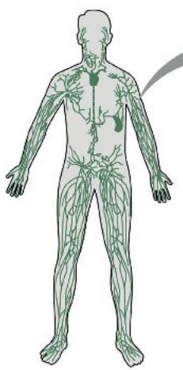

The movement of lymph from peripheral tissues to the heart relies on many of the same mechanisms that assist blood flow in veins. Lymph vessels, like veins, have valves that prevent the backflow of fluid. Rhythmic contractions of the vessel walls help draw fluid into the small lymphatic vessels. In addition, skeletal muscle contractions play a role in moving lymph.

Disruptions in the movement of lymph often result in fluid accumulation, or edema, in affected tissues. In some circumstances, the consequence is severe. For example, certain species of parasitic worms that lodge in lymph vessels and thereby block lymph movement cause elephantiasis, a condition marked by extreme swelling in limbs or other body parts.

Along a lymph vessel are small, lymph-filtering organs called lymph nodes, which play an important role in the body's defense. Inside each lymph node is a honeycomb of connective tissue with spaces filled by white blood cells, which function in defense. When the body is fighting an infection, the white blood cells multiply rapidly, and the lymph nodes become swollen and tender. This is why your doctor may check for swollen lymph nodes in your neck, armpits, or groin when you feel sick. Because lymph nodes may also trap circulating cancer cells, examining the lymph nodes of patients with cancer may reveal the spread of the disease.

In recent years, evidence has surfaced demonstrating that the lymphatic system plays a role in harmful immune responses, such as those responsible for multiple sclerosis. Because of these and other findings, the lymphatic system has become a very active area of biomedical research.

## Concept Check 42.3

1. What is the primary cause of the low velocity of blood flow in capillaries?

2. DRAW IT Heavy bleeding is a common cause of low blood pressure. Draw a diagram of the negative feedback loop regulating blood pressure in response to this challenge. Include the regulated variable, stimulus, sensors, a control center, effectors, and response in your diagram. (You can use Figure 40.8b as a guide.)

3. WHAT IF? If you had additional hearts distributed throughout your body, what would be one likely advantage and one likely disadvantage?

Lymphatic vessels recover leaked fluid and proteins, carrying them to large veins at the base of the neck.

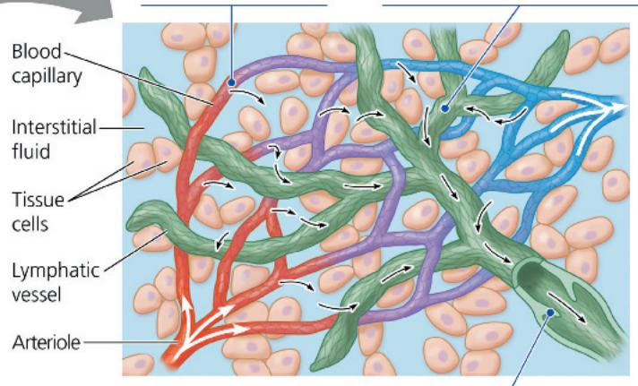  
Valves in larger lymphatic vessels prevent the backflow of fluid.

# Concept 42.4: Blood components function in exchange, transport, and defense

As you read in Concept 42.1, the fluid transported by an open circulatory system is continuous with the fluid that surrounds all of the body cells and thus has the same composition. In contrast, the fluid in a closed circulatory system can be much more specialized, as is the case for the blood of vertebrates.

## Blood Composition and Function

Vertebrate blood is a connective tissue consisting of cells suspended in a liquid matrix called plasma. Separating the components of blood using a centrifuge reveals that cellular elements (cells and cell fragments) occupy about 45% of the volume of blood (Figure 42.16, on the next page). The remainder is plasma.

## Plasma

Dissolved in the plasma are ions and proteins that, together with the blood cells, function in osmotic regulation, transport, and defense. Inorganic salts in the form of dissolved ions are an essential component of the blood. Some buffer the blood, while others help maintain osmotic balance. In addition, the concentration of ions in plasma directly affects the composition of the interstitial fluid, where many of these ions have a vital role in muscle and nerve activity. For plasma to serve all of these functions, the concentrations of plasma electrolytes must remain within specific set points.

Like dissolved ions, plasma proteins such as albumins act as buffers against pH changes and help maintain the osmotic balance between blood and interstitial fluid. A number of plasma proteins have additional functions. Immunoglobulins, or antibodies, combat viruses and other foreign agents that invade the body

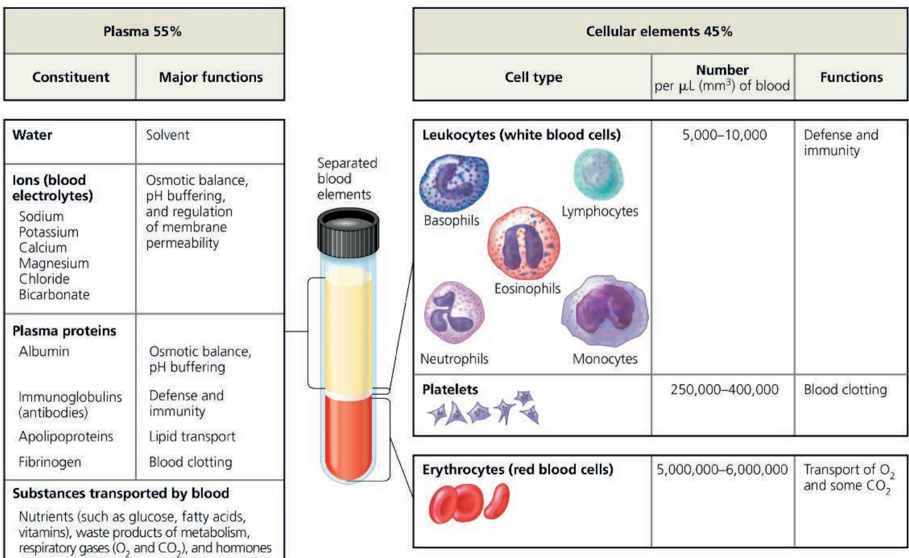

Figure 42.16 The composition of mammalian blood.  
Centrifuged blood separates into three layers: plasma, leukocytes and platelets, and erythrocytes.

<table><tr><td colspan="2">Plasma 55%</td></tr><tr><td>Constituent</td><td>Major functions</td></tr></table>

<table><tr><td>Water</td><td>Solvent</td></tr><tr><td>Ions (blood electrolytes)SodiumPotassiumCalciumMagnesiumChlorideBicarbonate</td><td>Osmotic balance,pH buffering,and regulationof membranepermeability</td></tr><tr><td>Plasma proteinsAlbuminImmunoglobulins(antibodies)ApolipoproteinsFibrinogen</td><td>Osmotic balance,pH bufferingDefense andimmunityLipid transportBlood clotting</td></tr><tr><td colspan="2">Substances transported by bloodNutrients (such as glucose, fatty acids,vitamins), waste products of metabolism,respiratory gases ( $O_{2}$ and  $CO_{2}$ ), and hormones</td></tr></table>

(see Figure 43.10). Apolipoproteins escort lipids, which are insoluble in water and can travel in blood only when bound to proteins. Fibrinogens act as clotting factors that help plug leaks when blood vessels are injured. (The term serum refers to blood plasma from which these clotting factors have been removed.)

Plasma also contains many other substances in transit, including nutrients, metabolic wastes, respiratory gases, and hormones. Plasma has a much higher protein concentration than interstitial fluid, although the two fluids are otherwise similar. (Capillary walls, remember, are not very permeable to proteins.)

## Cellular Elements

Blood contains two classes of cells: red blood cells, which transport $O_{2}$ , and white blood cells, which function in defense (see Figure 42.16). Also suspended in blood plasma are platelets, cell fragments that are involved in the clotting process.

## Erythrocytes

Red blood cells, or erythrocytes, are by far the most numerous blood cells. Their main function is $O_{2}$ transport, and their structure is closely related to this function. Human erythrocytes are small disks (7–8 $\mu$ m in diameter) that are biconcave—thinner in the center than at the edges. This shape increases surface area, enhancing the rate of diffusion of $O_{2}$ across the plasma membrane. Mature mammalian erythrocytes lack nuclei. This unusual characteristic leaves more space in these tiny cells for hemoglobin, the iron-containing protein that transports $O_{2}$ (see Figure 5.18). Erythrocytes also lack mitochondria and generate their ATP exclusively by anaerobic metabolism. Oxygen transport would be less efficient if erythrocytes were aerobic and consumed some of the $O_{2}$ they carry.

<table><tr><td colspan="3">Cellular elements 45%</td></tr><tr><td>Cell type</td><td>Number per μL (mm3) of blood</td><td>Functions</td></tr><tr><td colspan="3"></td></tr><tr><td>Leukocytes (white blood cells)Basophils LymphocytesEosinophilsNeutrophils Monocytes</td><td>5,000–10,000</td><td>Defense and immunity</td></tr><tr><td>Platelets</td><td>250,000–400,000</td><td>Blood clotting</td></tr><tr><td colspan="3"></td></tr><tr><td>Erythrocytes (red blood cells)</td><td>5,000,000–6,000,000</td><td>Transport of  $O_2$ and some  $CO_2$ </td></tr></table>

Despite its small size, an erythrocyte contains about 250 million molecules of hemoglobin (Hb). Because each molecule of hemoglobin binds up to four molecules of $O_{2}$ , one erythrocyte can transport about 1 billion $O_{2}$ molecules. As erythrocytes pass through the capillary beds of lungs, gills, or other respiratory organs, $O_{2}$ diffuses into the erythrocytes and binds to hemoglobin. In the systemic capillaries, $O_{2}$ dissociates from hemoglobin and diffuses into body cells.

In sickle-cell disease, an abnormal form of hemoglobin (Hb $^{S}$ ) polymerizes into aggregates. Because the concentration of hemoglobin in erythrocytes is so high, these aggregates are large enough to distort the erythrocyte into an elongated, curved shape that resembles a sickle. This abnormality results from an alteration in the amino acid sequence of hemoglobin at a single position (see Figure 5.19).

Sickle-cell disease significantly impairs the function of the circulatory system. Sickled cells often lodge in arterioles and capillaries, preventing delivery of $O_{2}$ and nutrients and removal of $CO_{2}$ and wastes. Blood vessel blockage and resulting organ swelling can result in severe pain. In addition, sickled cells are often destroyed by the spleen, reducing the number of red blood cells available for transporting $O_{2}$ . The average life span of a sickled erythrocyte is only 20 days—one-sixth that of a normal erythrocyte. The rate of

erythrocyte loss outstrips their production rate. Short-term therapy includes replacement of erythrocytes by blood transfusion; long-term treatments are generally aimed at inhibiting aggregation of $Hb^{S}$ .

## Leukocytes

The blood contains five major types of white blood cells, or leukocytes. Their function is to fight infections. Some are phagocytic, engulfing and digesting microorganisms and debris from the body's own dead cells. As we will discuss in Chapter 43, these cells fight infections, help protect against cancer, and participate in tissue repair. Normally, 1 $\mu$ L of human blood contains about 5,000–10,000 leukocytes; their numbers increase temporarily whenever the body is fighting an infection. Unlike erythrocytes, leukocytes are also found outside the circulatory system, patrolling interstitial fluid and the lymphatic system.

## Platelets

Platelets are pinched-off cytoplasmic fragments of specialized bone marrow cells. They are about 2–3 $\mu$ m in diameter and have no nuclei. Platelets serve both structural and signaling functions in blood clotting.

## Stem Cells and the Replacement of Cellular Elements

Erythrocytes, leukocytes, and platelets all develop from stem cells that are dedicated to replenishing the body's blood cell populations. As described in Concept 20.3, a stem cell can reproduce indefinitely, dividing mitotically to produce one daughter cell that remains a stem cell and another that adopts a specialized function. The stem cells that produce the cellular elements of blood cells are located in the red marrow inside bones, particularly the ribs, vertebrae, sternum, and pelvis. As they divide and self-renew, these stem cells give rise to two sets of progenitor cells with a more limited capacity for self-renewal (Figure 42.17). One set, the lymphoid progenitors, produces lymphocytes. The other set, the myeloid progenitors, produces all other white blood cells, red blood cells, and platelets.

Throughout a person's life, stem cells replace the worn-out cellular elements of blood. Erythrocytes are the shortest-lived, circulating for only 120 days on average before being replaced. A feedback mechanism sensitive to $\mathrm{O}_2$ level controls erythrocyte production. If the $\mathrm{O}_2$ level falls, the kidneys increase the production of a hormone called erythropoietin (EPO) that stimulates the generation of more erythrocytes.

Today, EPO produced by recombinant DNA technology is used to treat disorders such as anemia, a condition of lower-than-normal erythrocyte or hemoglobin level that decreases the oxygen-carrying capacity of the blood. Some athletes inject themselves with EPO to increase their erythrocyte level. Because this practice is banned by most major sports organizations, runners, cyclists, and other athletes caught using EPO-related drugs have forfeited their records and been banned from future competitions.

## Blood Clotting

When blood vessels are broken by an injury such as a small cut or scrape, a chain of events ensues that quickly seals the break, halting blood loss and exposure to infection. The key mechanical

Figure 42.17 Differentiation of blood cells.

Cell divisions of stem cells in bone marrow give rise to two specialized sets of cells.

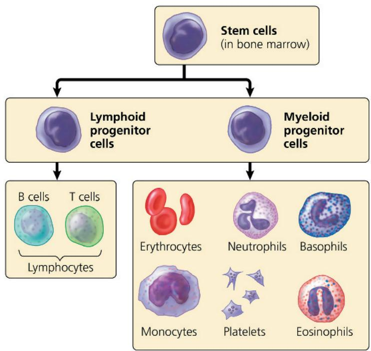

event in this response is coagulation, the conversion of the liquid components of blood into a solid—a blood clot.

In the absence of injury, the coagulant, or sealant, circulates in an inactive form called fibrinogen. Blood clotting begins when injury exposes the proteins in a broken blood vessel wall to blood constituents. The exposed proteins attract platelets, which gather at the site of injury and release clotting factors. These clotting factors trigger a cascade of reactions leading to the formation of an active enzyme, thrombin, from an inactive form, prothrombin (Figure 42.18, on the next page). Thrombin in turn converts fibrinogen to fibrin, which aggregates into threads that form the framework of the clot. Any mutation that blocks a step in the clotting process can cause hemophilia, a life-threatening disease characterized by excessive bleeding and bruising from even minor cuts and bumps (see Concept 15.2).

As shown in Figure 42.18, clotting involves a positive feedback loop. Initially, the clotting reactions convert only some of the prothrombin at the clot site to thrombin. However, thrombin itself stimulates the enzymatic cascade, leading to more conversion of prothrombin to thrombin and thus driving clotting to completion.

Anticlotting factors in the blood normally prevent spontaneous clotting in the absence of injury. Sometimes, however, clots form within a blood vessel, blocking the flow of blood. Such a clot is called a thrombus (plural, thrombi). We'll explore shortly how thrombi form and the dangers they pose.

## Cardiovascular Disease

Each year, cardiovascular diseases—disorders of the heart and blood vessels—kill more than 750,000 people in the United States. These diseases range from minor disturbances of vein or heart valve function to life-threatening disruptions of blood flow to the heart or brain.

## Figure 42.18 Blood clotting.

1 The clotting process begins when the endothelium of a vessel is damaged, exposing connective tissue in the vessel wall to blood. Platelets adhere to collagen fibers in the connective tissue and release a substance that makes nearby platelets sticky.

2 The platelets form a plug that provides immediate protection against blood loss.

3 Unless the break is very small, this plug is reinforced by a fibrin clot.

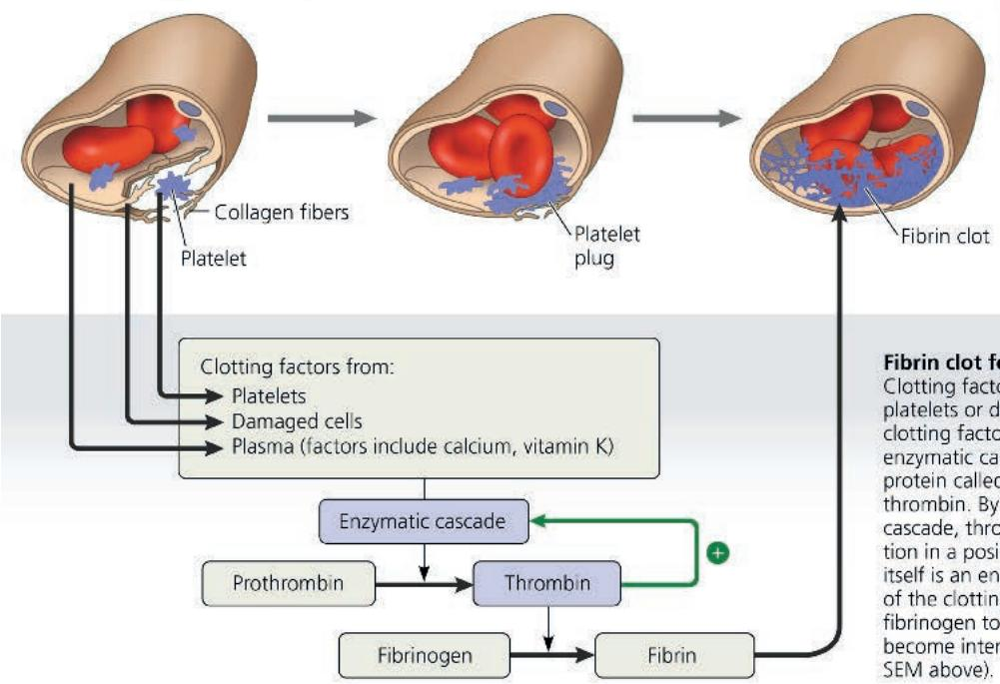

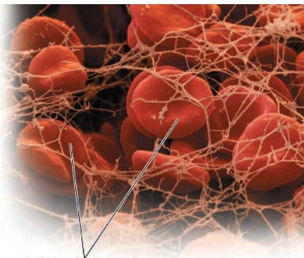  
Red blood cells caught in threads of fibrin  
5μm

## Fibrin clot formation

Clotting factors released from the clumped platelets or damaged cells interact with clotting factors in the plasma, initiating an enzymatic cascade that converts a plasma protein called prothrombin to its active form, thrombin. By promoting the activity of this cascade, thrombin increases its own production in a positive feedback loop. Thrombin itself is an enzyme that catalyzes the final step of the clotting process, the conversion of fibrinogen to fibrin. The threads of fibrin become interwoven into a clot (see colorized SEM above).

## Atherosclerosis, Heart Attacks, and Stroke

Healthy arteries have a smooth inner lining that reduces resistance to blood flow. However, damage can roughen the lining and lead to atherosclerosis, the hardening of the arteries by accumulation of fatty deposits. A key player in the development of atherosclerosis is cholesterol, a steroid that is important for maintaining normal membrane fluidity in animal cells (see Figure 7.5).

In atherosclerosis, damage to the arterial lining results in inflammation, the body's reaction to injury. Leukocytes are attracted to the inflamed area and begin to take up lipids, including cholesterol. A fatty deposit, called a plaque, grows steadily, incorporating fibrous connective tissue and additional cholesterol. As the plaque grows, the walls of the artery become thick and stiff, and the obstruction of the artery increases. If the plaque ruptures, the exposed lipid core may initiate the formation of a thrombus that further restricts blood flow (Figure 42.19). Plaque fragments or thrombi can also travel via the bloodstream and become lodged in other arteries.

A heart attack, also called a myocardial infarction, is the damage or death of cardiac muscle tissue resulting from blockage of one or more coronary arteries, which supply oxygen-rich blood to the heart muscle. The coronary arteries are small in diameter and therefore especially vulnerable to obstruction by atherosclerotic plaques or thrombi. Such blockage can destroy cardiac muscle quickly because the constantly beating heart muscle requires a steady supply of $O_{2}$ . If a large enough portion of the heart is affected, the heart will stop beating. Such cardiac arrest causes death if a heartbeat is not restored within minutes by cardiopulmonary resuscitation (CPR) or some other emergency procedure.

## Figure 42.19 Atherosclerosis.

In atherosclerosis, thickening of an arterial wall by plaque formation can restrict blood flow through the artery. If a plaque ruptures, a thrombus can form, further restricting blood flow.

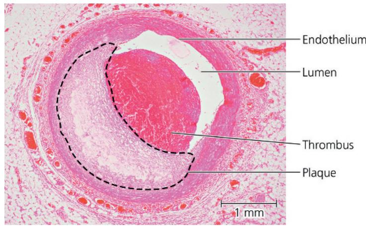

A stroke is the death of nervous tissue in the brain due to a lack of $\mathrm{O}_2$ . Strokes usually result from rupture or blockage of arteries in the neck or head. The effects of a stroke and the individual's chance of survival depend on the extent and location of the damaged brain tissue. If a stroke results from arterial blockage by a thrombus, rapid administration of a clot-dissolving drug may help limit the damage.

# Scientific Skills Exercise Making and Interpreting Histograms

Does Inactivating the PCSK9 Enzyme Lower LDL Levels? Researchers interested in genetic factors affecting susceptibility to cardiovascular disease examined the DNA of 15,000 individuals. They found that $3\%$ of the individuals had a mutation that inactivates one copy of the gene for PCSK9, a liver enzyme. Because mutations that increase the activity of PCSK9 are known to increase the level of LDL cholesterol in the blood, the researchers hypothesized that inactivating mutations in this gene would lower the LDL level. In this exercise, you will interpret the results of an experiment they carried out to test this hypothesis.

How the Experiment Was Done Researchers measured the LDL cholesterol level in blood plasma from 85 individuals with one copy of the PCSK9 gene inactivated (the study group) and from 3,278 individuals with two functional copies of the gene (the control group).

## Data from the Experiment

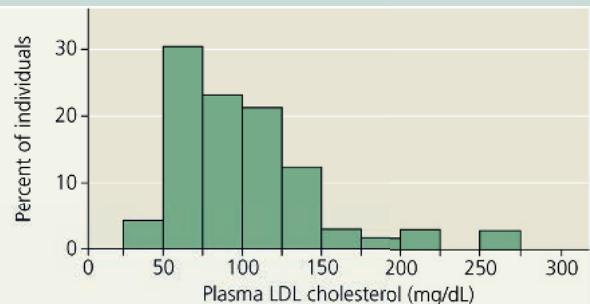  
Individuals with an inactivating mutation in one copy of PCSK9 gene (study group)

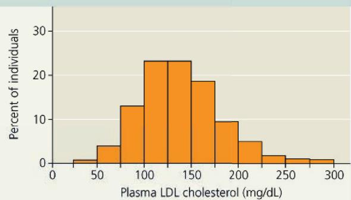  
Individuals with two functional copies of PCSK9 gene (control group)  
Data from J. C. Cohen et al., Sequence variations in PCSK9, low LDL, and protection against coronary heart disease, New England Journal of Medicine 354:1264–1272 (2006).

Although atherosclerosis often isn't detected until critical blood flow is disrupted, there can be warning signs. Partial blockage of the coronary arteries may cause occasional chest pain, a condition known as angina pectoris. The pain is most likely to be felt when the heart is laboring under stress, and it signals that part of the heart is not receiving enough $\mathrm{O}_2$ . An obstructed artery may be treated surgically, either by inserting a mesh tube called a stent to expand the artery (Figure 42.20, on

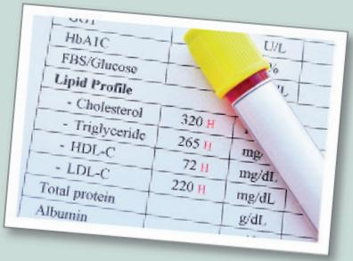

## INTERPRET THE DATA

1. The results are presented using a variant of a bar graph called a histogram. In a histogram, the variable on the x-axis is grouped into ranges. The height of each bar in this histogram reflects the percentage of samples that fall into the range specified on the x-axis for that bar. For example, in the top histogram, about 4% of individuals studied had plasma LDL cholesterol levels in the 25–50 mg/dL (milligrams per deciliter) range. Add the percentages for the relevant bars to calculate the percentage of individuals in the study and control groups that had an LDL level of 100 mg/dL or less. (For additional information about histograms, see the Scientific Skills Review in Appendix D.)

2. Compare the two histograms. Do you find support for the researchers' hypothesis? Explain.

3. What if instead of graphing the data, the researchers had compared the range of concentrations for plasma LDL cholesterol (low to high) in the control and study groups? How would their conclusions have differed?

4. What does the fact that the two histograms overlap as much as they do indicate about the extent to which PCSK9 determines plasma LDL cholesterol level?

5. Comparing these two histograms allowed researchers to draw a conclusion regarding the effect of PCSK9 mutations on LDL cholesterol levels in blood. Consider two individuals with a plasma LDL level cholesterol of 160 mg/dL, one from the study group and one from the control group. (a) What do you predict regarding their relative risk of developing cardiovascular disease? (b) Explain how you arrived at your prediction. What role did the histograms play in making your prediction?

Instructors: A version of this Scientific Skills Exercise can be assigned in Mastering Biology.

the next page) or by transplanting a healthy blood vessel from the chest or a limb to bypass the blockage.

## Risk Factors and Treatment of Cardiovascular Disease

Cholesterol travels in blood plasma mainly in particles that consist of thousands of cholesterol molecules and

Figure 42.20 Inserting a stent to widen an obstructed artery.

1 A stent and a balloon are inserted into an obstructed artery.

2 Inflating the balloon expands the stent, widening the artery.

3 The balloon is removed, leaving the stent in place.

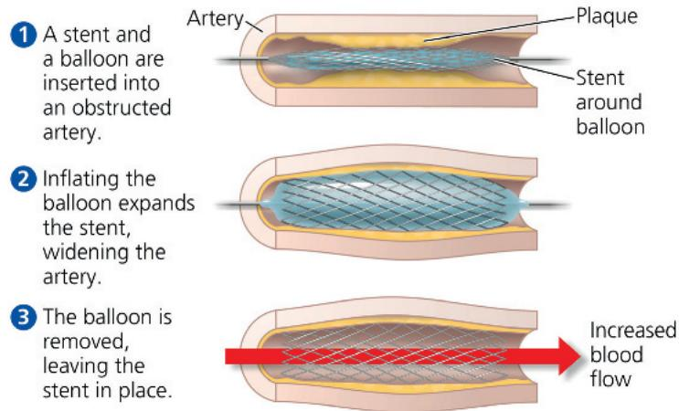

other lipids bound to a protein. One type of particle—low-density lipoprotein (LDL)—delivers cholesterol to cells for membrane production. Another type—high-density lipoprotein (HDL)—scavenges excess cholesterol for return to the liver. Individuals with a high ratio of LDL to HDL are at substantially increased risk for atherosclerosis.

Although the tendency to develop particular cardiovascular diseases is inherited, it is also strongly influenced by lifestyle. For example, exercise decreases the LDL/HDL ratio, reducing the risk of cardiovascular disease. In contrast, consumption of certain processed vegetable oils called trans fats and smoking increase the LDL/HDL ratio. For many individuals at high risk, treatment with drugs called statins can lower LDL levels and thereby reduce the risk of heart attacks. In the Scientific Skills Exercise, you can interpret the effect of a genetic mutation on blood LDL level.

Hypertension (high blood pressure) is yet another contributor to heart attack and stroke. According to one hypothesis, chronic high blood pressure damages the endothelium that lines the arteries, promoting plaque formation. The usual definition of hypertension in adults is a systolic pressure above 130 mm Hg or a diastolic pressure above 80 mm Hg. Fortunately, hypertension can often be prevented and controlled by quitting any use of tobacco products, changing the diet, increasing exercise, taking medication, or a combination of these approaches.

## Concept Check 42.4

1. Explain why a physician might order a white cell count for a patient with symptoms of an infection.

2. WHAT IF? Nitroglycerin (the key ingredient in dynamite) is sometimes prescribed for heart disease patients. Within the body, nitroglycerin is converted to nitric oxide (see Concept 42.3). Why would you expect nitroglycerin to relieve chest pain caused by narrowing of the cardiac arteries?

3. MAKE CONNECTIONS How do stem cells from the bone marrow of an adult differ from embryonic stem cells (see Concept 20.3)?

## Concept 42.5: Gas exchange occurs across specialized respiratory surfaces

In the remainder of this chapter, we will focus on the process of gas exchange. Although this process is often called respiratory exchange or respiration, it should not be confused with the energy transformations of cellular respiration. Gas exchange is the uptake of molecular $O_{2}$ from the environment and the discharge of $CO_{2}$ to the environment.

## Partial Pressure Gradients in Gas Exchange

To understand the driving forces for gas exchange, we must consider partial pressure, which is simply the pressure exerted by a particular gas in a mixture of gases. Determining partial pressures enables us to predict the net movement of a gas at an exchange surface: A gas always undergoes net diffusion from a region of higher partial pressure to a region of lower partial pressure, down the pressure gradient. The rate of diffusion is proportional to the size of the gradient. In other words, an increase in the higher partial pressure or a decrease in the lower partial pressure will increase diffusion.

To calculate partial pressures, we need to know the pressure that a gas mixture exerts and the fraction of the mixture represented by a particular gas. Let's consider $O_{2}$ as an example. At sea level, the atmosphere exerts a downward force equal to that of a column of mercury (Hg) 760 mm high. Atmospheric pressure at sea level is thus 760 mm Hg. Since the atmosphere is 21% $O_{2}$ by volume, the partial pressure of $O_{2}$ is $0.21 \times 760$ , or about 160 mm Hg. This value is called the partial pressure of $O_{2}$ (abbreviated $P_{O_{2}}$ ) because it is the part of atmospheric pressure contributed by $O_{2}$ . The partial pressure of $CO_{2}$ (abbreviated $P_{CO_{2}}$ ) is much, much less, only 0.29 mm Hg at sea level.

Partial pressures also apply to gases dissolved in a liquid, as water. When water is exposed to air, an equilibrium state is reached such that the partial pressure of each gas in the water equals the partial pressure of that gas in the air. Thus, water exposed to air at sea level has a $P_{O_{2}}$ of 160 mm Hg, the same as in the atmosphere. However, the concentrations of $O_{2}$ in the air and water differ substantially because $O_{2}$ is much less soluble in water than in air (Table 42.1). Furthermore, the warmer and saltier the water is, the less dissolved $O_{2}$ it can hold.

Table 42.1 Comparing Air and Water as Respiratory Media

<table><tr><td></td><td>Air (Sea Level)</td><td>Water (20°C)</td><td>Air-to-Water Ratio</td></tr><tr><td> $O_{2}$  partial pressure</td><td>160 mm</td><td>160 mm</td><td>1:1</td></tr><tr><td> $O_{2}$  concentration</td><td>210 mL/L</td><td>7 mL/L</td><td>30:1</td></tr><tr><td>Density</td><td>0.0013 kg/L</td><td>1 kg/L</td><td>1:770</td></tr><tr><td>Viscosity</td><td>0.02 cP</td><td>1 cP</td><td>1:50</td></tr></table>

## Respiratory Media

The conditions for gas exchange vary considerably, depending on whether the respiratory medium—the source of $O_{2}$ —is air or water. As already noted, $O_{2}$ is plentiful in air, making up about 21% of Earth’s atmosphere by volume. As shown in Table 42.1, air is much less dense and less viscous than water, so it is easier to move and to force through small passageways. As a result, breathing air is relatively easy and the exchange does not need to not be particularly efficient. Humans, for example, extract only about 25% of the $O_{2}$ in inhaled air.

Water is a much more demanding gas exchange medium than air. The amount of $O_{2}$ dissolved in a given volume of water varies but is always less than in an equivalent volume of air. Water in many marine and freshwater habitats contains only about 7 mL of dissolved $O_{2}$ per liter, a concentration roughly 30 times less than in air. Water's lower $O_{2}$ content, greater density, and greater viscosity mean that aquatic animals such as fishes and lobsters must expend considerable energy to carry out gas exchange. In the context of these challenges, adaptations have evolved that enable most aquatic animals to be very efficient in gas exchange. Many of these adaptations involve the organization of the surfaces dedicated to exchange.

## Respiratory Surfaces

Specialization for gas exchange is apparent in the structure of the respiratory surface, the part of an animal's body where gas exchange occurs. Like all living cells, the cells that carry out gas exchange have a plasma membrane that must be in contact with an aqueous solution. Respiratory surfaces are therefore always moist.

The movement of $O_{2}$ and $CO_{2}$ across respiratory surfaces takes place by diffusion. The rate of net diffusion is proportional to the surface area across which it occurs and inversely proportional to the square of the distance through which molecules must move. In other words, gas exchange is fast when the area for diffusion is large and the path for diffusion is short. As a result, respiratory surfaces tend to be large and thin.

In some animals with relatively simple body structures, such as sponges, cnidarians, and flatworms, every cell in the body is close enough to the external environment that gases can diffuse quickly between any cell and the environment. In many animals, however, the bulk of the body's cells lack immediate access to the environment. The respiratory surface in these animals is a thin, moist epithelium that constitutes a respiratory organ.

For earthworms, as well as some amphibians and other animals, the skin serves as a respiratory organ. A dense network of capillaries just below the skin facilitates the exchange of gases between the circulatory system and the environment. For most animals, however, the general body surface lacks sufficient area to exchange gases for the whole organism. The evolutionary solution to this limitation is a respiratory organ that is extensively folded or branched, thereby enlarging the available surface area for gas exchange. Gills, tracheae, and lungs are three such organs.

## Gills in Aquatic Animals

Gills are outfoldings of the body surface that are suspended in the water. As illustrated in Figure 42.21 (and in Figure 42.1), the distribution of gills over the body can vary considerably. Regardless of their distribution, gills often have a total surface area much greater than that of the rest of the body's exterior.

Figure 42.21 Diversity in the structure of gills, external body surfaces that function in gas exchange.  
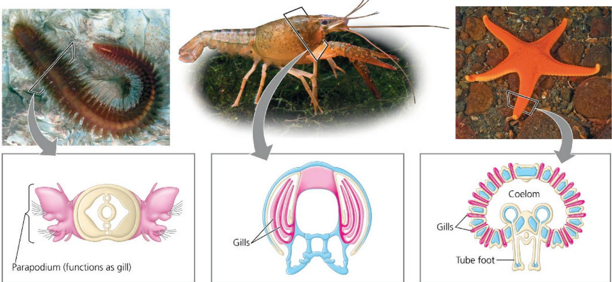  
(a) Marine worm. Many polychaetes (marine worms of the phylum Annelida) have a pair of flattened appendages called parapodia (singular, parapodium) on each body segment. The parapodia serve as gills and also function in crawling and swimming.  
(b) Crayfish. Crayfish and other crustaceans have long, feathery gills covered by the exoskeleton. Specialized body appendages drive water over the gill surfaces.  
(c) Sea star. The gills of a sea star are simple tubular projections of the skin. The hollow core of each gill is an extension of the coelom (body cavity). Gas exchange occurs by diffusion across the gill surfaces, and fluid in the coelom circulates in and out of the gills, aiding gas transport. The tube feet surfaces also function in gas exchange.

Movement of the respiratory medium over the respiratory surface, a process called ventilation, maintains the partial pressure gradients of $O_{2}$ and $CO_{2}$ across the gill that are necessary for gas exchange. To promote ventilation, most gill-bearing animals either move their gills through the water or move water over their gills. For example, crayfish and lobsters have paddle-like appendages that drive a current of water over the gills, whereas mussels and clams move water with cilia. Octopuses and squids ventilate their gills by taking in and ejecting water, with the significant side benefit of getting about by jet propulsion. Fishes use the motion of swimming or coordinated movements of the mouth and gill covers to ventilate their gills. In both cases, a current of water enters the mouth of the fish, passes through slits in the pharynx, flows over the gills, and then exits the body (Figure 42.22).

In fishes, the efficiency of gas exchange is maximized by countercurrent exchange, the exchange of a substance or heat between two fluids flowing in opposite directions. In a fish gill, the two fluids are blood and water. Because blood flows in the direction opposite to that of water passing over the gills, at each point in its travel blood is less saturated with $O_{2}$ than the water it meets (see Figure 42.22). As blood enters a gill capillary, it encounters water that is completing its passage through the gill. Depleted of much of its dissolved $O_{2}$ , this water nevertheless has a

Figure 42.22 The structure and function of fish gills.

A fish continuously pumps water through its mouth and over gill arches, using coordinated movements of the jaws and operculum (gill cover) for this ventilation. (A swimming fish can simply open its mouth and let water flow past its gills.) Each gill arch has two rows of gill filaments, composed of flattened plates called lamellae. Blood flowing through capillaries within the lamellae picks up $O_{2}$ from the water. Notice that the countercurrent flow of water and blood maintains a partial pressure gradient that drives the net diffusion of $O_{2}$ from the water into the blood over the entire length of a capillary.

higher $\mathrm{P_{O_2}}$ than the incoming blood, and $\mathrm{O}_2$ transfer takes place. As the blood continues its passage, its $\mathrm{P_{O_2}}$ steadily increases, but so does that of the water it encounters, since each successive position in the blood's travel corresponds to an earlier position in the water's passage over the gills. The result is a partial pressure gradient that favors the diffusion of $\mathrm{O}_2$ from water to blood along the entire length of the capillary.

Countercurrent exchange mechanisms are remarkably efficient. In the fish gill, more than 80% of the $O_{2}$ dissolved in the water is removed as the water passes over the respiratory surface. In other settings, countercurrent mechanisms contribute to temperature regulation and to the functioning of the mammalian kidney (see Concept 40.3).

## Tracheal Systems in Insects

In most terrestrial animals, respiratory surfaces are enclosed within the body, exposed to the atmosphere only through narrow tubes. Although the most familiar example of such an arrangement is the lung, the most common is the insect tracheal system, a network of air tubes that branch throughout the body. The largest tubes, called tracheae, open to the outside (Figure 42.23). At the tips of the finest branches, a moist epithelial lining enables gas exchange by diffusion. Because the tracheal system brings air within a very short distance of virtually every body cell in an insect, the efficient exchange of $O_{2}$ and $\mathrm{CO}_{2}$ does not require the participation of the animal's open circulatory system.

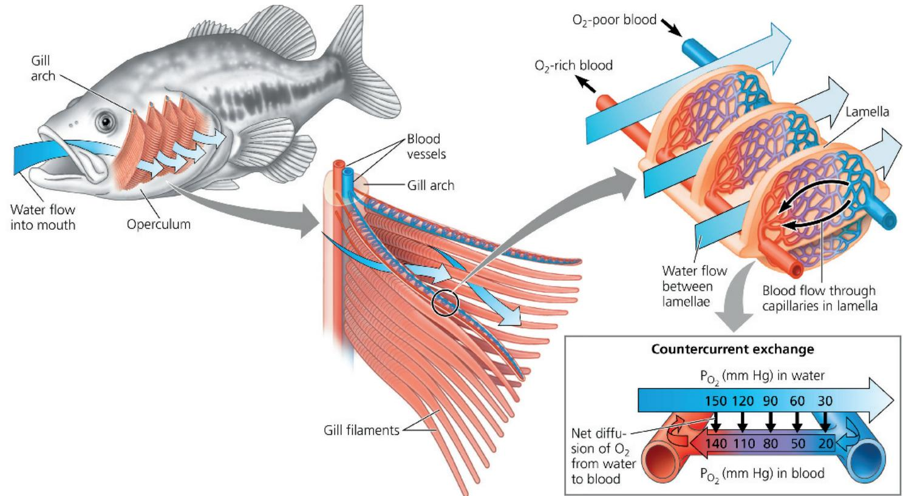

Figure 42.23 A tracheal system.  
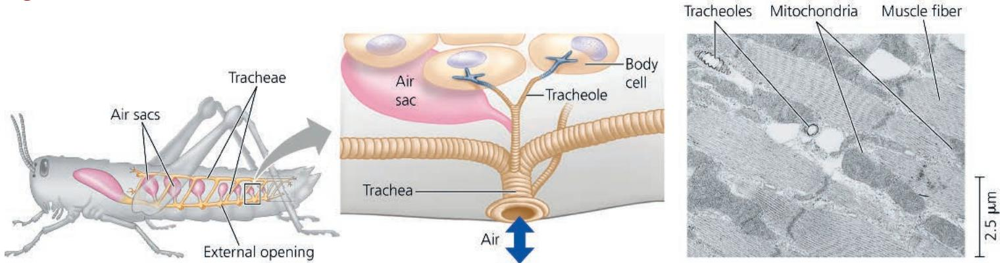  
(a) The respiratory system of an insect consists of branched internal tubes. The largest tubes, called tracheae, connect to external openings spaced along the insect's body surface. Air sacs formed from enlarged portions of the tracheae are found near organs that require a large supply of oxygen.  
(b) Rings of chitin keep the tracheae open, allowing air to enter and pass into smaller tubes called tracheoles. The branched tracheoles deliver air directly to cells throughout the body. Tracheoles have closed ends filled with fluid (located within the body cells, shaded blue-gray). When the animal is active and using more $O_{2}$ , most of the fluid is withdrawn into the body. This increases the surface area of air-filled tracheoles in contact with cells.  
(c) This micrograph above (TEM) shows cross sections of tracheoles in a tiny piece of insect flight muscle. Each of the numerous mitochondria in the muscle cells lies within about 5 $\mu$ m of a tracheole.

Tracheal systems often exhibit adaptations directly related to bioenergetics. Consider, for example, a flying insect, which consumes 10 to 200 times more $O_{2}$ when in flight than it does at rest. In many flying insects, cycles of flight muscle contraction and relaxation pump air rapidly through the tracheal system. This pumping improves ventilation, bringing ample $O_{2}$ to the densely packed mitochondria that support the high metabolic rate of flight muscle (see Figure 42.23).

## Lungs

Unlike tracheal systems, which branch throughout the insect body, lungs are localized respiratory organs. Representing an infolding of the body surface, they are typically subdivided into numerous pockets. Because the respiratory surface of a lung is not in direct contact with all other parts of the body, the gap must be bridged by the circulatory system, which transports gases between the lungs and the rest of the body. Lungs have evolved both in organisms with open circulatory systems, such as spiders and land snails, and in vertebrates.

Among vertebrates that lack gills, the use of lungs for gas exchange varies. Amphibians rely heavily on diffusion across external body surfaces, such as the skin, to carry out gas exchange; lungs, if present, are relatively small. In contrast, most reptiles (including all birds) and all mammals depend entirely on lungs for gas exchange. Turtles are an exception; they supplement lung breathing with gas exchange across moist epithelial surfaces continuous with their mouth or anus. Lungs and air breathing also evolved in a few aquatic vertebrates as adaptations to living in oxygen-poor water or to spending part of their time exposed to air (for instance, when the water level of a pond recedes).

## Mammalian Respiratory Systems: A Closer Look

In mammals, branching ducts convey air to the lungs, which are located in the thoracic cavity, enclosed by the ribs and diaphragm. Air enters through the nostrils and is then filtered by hairs, warmed, humidified, and sampled for odors as it flows through a maze of spaces in the nasal cavity. The nasal cavity leads to the pharynx, an intersection where the paths for air and food cross (Figure 42.24). When food is swallowed, the larynx (the upper part of the respiratory tract) moves upward and tips the epiglottis over the glottis, which is the opening of the trachea, or windpipe. This allows food to go down the esophagus to the stomach (see Figure 41.9). The rest of the time, the glottis is open, enabling breathing.

From the larynx, air passes into the trachea. The cartilage that reinforces the walls of both the larynx and the trachea keeps this part of the airway open. Within the larynx of most mammals, the exhaled air rushes by a pair of elastic bands of muscle called vocal folds or, in humans, vocal cords. Sounds are produced when muscles in the larynx are tensed, stretching the cords so that they vibrate. High-pitched sounds result from tightly stretched cords vibrating rapidly; low-pitched sounds come from looser cords vibrating slowly.

The trachea branches into two bronchi (singular, bronchus), one leading to each lung. Within the lung, the bronchi branch repeatedly into finer and finer tubes called bronchioles. The entire system of air ducts has the appearance of an inverted tree, the trunk being the trachea. The epithelium lining the major branches of this respiratory tree is covered by cilia and a thin film of mucus. The mucus traps dust, pollen, and other particulate contaminants, and the beating cilia move the mucus upward to the pharynx, where it can be swallowed into the esophagus. This process, sometimes referred to as the “mucus escalator,” plays a crucial role in cleansing the respiratory system.

## Figure 42.24 The mammalian respiratory system.

From the nasal cavity and pharynx, inhaled air passes through the larynx, trachea, and bronchi to the bronchioles, which end in microscopic alveoli lined by a thin, moist epithelium.

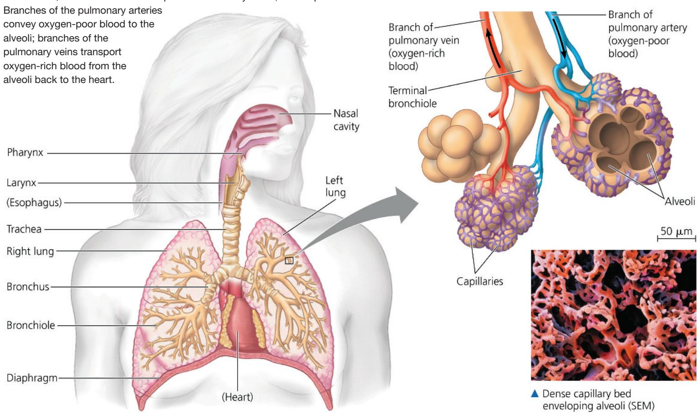

Gas exchange in mammals occurs in alveoli (singular, alveolus; see Figure 42.24), air sacs clustered at the tips of the tiniest bronchioles. Human lungs contain millions of alveoli, which together have a surface area of about $100 \, m^{2}$ , 50 times that of the skin. Oxygen in the air entering the alveoli dissolves in the moist film lining their inner surfaces and rapidly diffuses across the epithelium into a web of capillaries that surrounds each alveolus. Net diffusion of carbon dioxide occurs in the opposite direction, from the capillaries across the epithelium of the alveolus and into the air space.

Lacking cilia or significant air currents to remove particles from their surface, alveoli are highly susceptible to contamination. White blood cells patrol the alveoli, engulfing foreign particles. However, if too much particulate matter reaches the alveoli, the defenses can be overwhelmed, leading to inflammation and irreversible damage. For example, particulates from smoking or vaping enter the alveoli and can cause a permanent reduction in lung capacity. For coal miners, inhalation of large amounts of coal dust can lead to silicosis, a disabling, irreversible, and sometimes fatal lung disease.

The film of liquid that lines alveoli is subject to surface tension, an attractive force that has the effect of minimizing a liquid's surface area (see Concept 3.2). Given their tiny diameter (about $0.25\mathrm{mm}$ ), alveoli would be expected to collapse under high surface tension. It turns out, however, that these air sacs produce a mixture of phospholipids and proteins called surfactant, for surface-active agent, which coats the alveoli and reduces surface tension.

In the 1950s, Mary Ellen Avery did the first experiment linking surfactant deficiency to respiratory distress syndrome (RDS), a life-threatening disease of newborns that at the time killed 10,000 infants annually in the United States (Figure 42.25). RDS is most common among infants born before 32 weeks of gestation in the uterus. (The average full-term human pregnancy is 38 weeks.) Later studies revealed that surfactant typically appears in the fetal lungs after 33 weeks of gestation. Artificial surfactants are now used to treat early preterm infants, and treated babies with a body mass over 900 g (2 pounds) at birth usually survive without long-term health problems. For her contributions, Avery received the National Medal of Science.

Having surveyed the route that air follows when we breathe, we'll turn next to the process of breathing itself.

## Concept Check 42.5

1. Why is an internal location for gas exchange tissues advantageous for terrestrial animals?

2. After a heavy rain, earthworms come to the surface. How would you explain this behavior in terms of an earthworm's requirements for gas exchange?

3. MAKE CONNECTIONS Describe similarities in the countercurrent exchange that facilitates respiration in fish and thermoregulation in geese (see Concept 40.3).

## Figure 42.25

## Inquiry: What causes respiratory distress syndrome?

Experiment

Mary Ellen Avery, a research fellow at Harvard University, hypothesized that respiratory distress syndrome (RDS) in preterm infants is caused by the lack of a substance that reduces surface tension in the alveoli. To test this idea, she obtained autopsy samples of lungs from infants who had died of RDS or from other causes. She extracted material from each sample and let it form a film on water. Avery then measured the tension (in dynes per centimeter) across the water surface for each sample.

## Results

Avery noted a pattern when she separated out samples from infants with body mass less than 1,200 g, the average mass of a fetus at 29–30 weeks of pregnancy.

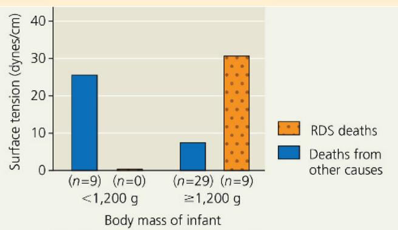  
Data from M. E. Avery and J. Mead, Surface properties in relation to atelectasis and hyaline membrane disease, American Journal of Diseases of Children 97:517–523 (1959).

## Conclusion

For infants with a body mass of 1,200 g or greater, samples from those who had died of RDS exhibited much higher surface tension than samples from those who had died from other causes. Avery inferred that infants' lungs normally contain a surface-tension-reducing substance (now called surfactant) and that RDS occurs when this substance is lacking. The results from infants with a body mass less than 1,200 g were similar to those from infants who had died from RDS, suggesting that surfactant is not normally produced until a fetus reaches this size.

WHAT IF? If the researchers had measured the amount of surfactant in lung samples from the infants, what relationship would you expect between the amount of surfactant and infant body mass?

For suggested answer, see Appendix A.

# Concept 42.6: Breathing ventilates the lungs

Like fishes, terrestrial vertebrates rely on ventilation to maintain high $O_{2}$ and low $CO_{2}$ concentrations at the gas exchange surface. The process that ventilates lungs is breathing, the alternating inhalation and exhalation of air. A variety of mechanisms for moving air in and out of lungs have evolved, as we will see by considering breathing in amphibians, mammals, and birds.

## How an Amphibian Breathes

An amphibian such as a frog ventilates its lungs by positive pressure breathing, inflating the lungs with forced airflow. Inhalation begins when muscles lower the floor of an amphibian's oral cavity, drawing in air through its nostrils. Next, with the nostrils and mouth closed, the floor of the oral cavity rises, forcing air down the trachea. Exhalation follows as air is expelled by the elastic recoil of the lungs and by compression of the muscular body wall. When male frogs puff themselves up in aggressive or courtship displays, they disrupt this breathing cycle, taking in air several times without allowing any release.

## How a Mammal Breathes

To understand how a mammal breathes, think about filling a syringe. By pulling back on the plunger, you increase the volume and thus lower the pressure in the syringe, drawing gas or fluid through the needle into the syringe chamber. Similarly, mammals employ negative pressure breathing—pulling, rather than pushing, air into their lungs (Figure 42.26, on the next page). Using muscle contraction to actively expand the thoracic cavity, mammals lower air pressure in their lungs below that of the air outside their body. Because gas flows from a region of higher pressure to a region of lower pressure, the lowered air pressure in the lungs causes air to rush through the nostrils and mouth and down the breathing tubes to the alveoli.

Expanding the thoracic cavity during inhalation involves the animal's rib muscles and the diaphragm, a sheet of skeletal muscle that forms the bottom wall of the cavity. Contracting the rib muscles pulls the ribs upward and the sternum outward, expanding the rib cage, the front wall of the thoracic cavity. At the same time, the diaphragm contracts, expanding the thoracic cavity downward.

Whereas inhalation is always active and requires work, exhalation is usually passive. During exhalation, the diaphragm and rib muscles relax, and the volume of the cavity is reduced. The increased air pressure in the alveoli forces air up the breathing tubes and out of the body. Sometimes deeper or faster exhalations are required, such as during laughing, shouting, or coughing. These active exhalations involve contractions of the abdominal muscles that compress the contents of the abdomen and push the diaphragm upwards. A specific set of ribcage muscles can also assist in rapidly compressing the thoracic cavity.

Within the thoracic cavity, a double membrane surrounds the lungs. The inner layer of this membrane adheres to the outside of

Figure 42.26 Negative pressure breathing.

A mammal breathes by changing the air pressure within its lungs relative to the pressure of the outside atmosphere.

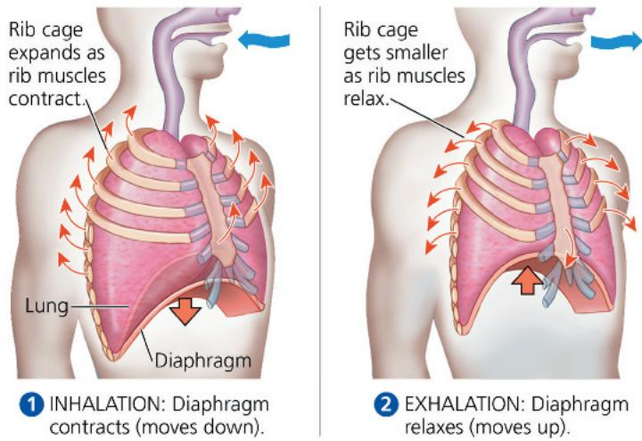  
WHAT IF? The walls of alveoli contain elastic fibers that allow the alveoli to expand and contract with each breath. If the alveoli lost their elasticity, how would that affect gas exchange in the lungs?  
For suggested answer, see Appendix A.  
Figure 42.27 The avian respiratory system.

the lungs, and the outer layer adheres to the wall of the thoracic cavity. A thin space filled with fluid separates the two layers. Surface tension in the fluid causes the two layers to stick together like two plates of glass separated by a film of water: The layers can slide smoothly past each other, but they cannot be pulled apart easily. Consequently, the volume of the thoracic cavity and the volume of the lungs change in unison.

The rib muscles and diaphragm are sufficient to change lung volume when a mammal is at rest. During exercise, other muscles of the neck, back, and chest increase the volume of the thoracic cavity by raising the rib cage. In kangaroos and some other mammals, locomotion causes a rhythmic movement of organs in the abdomen, including the stomach and liver. The result is a piston-like pumping motion that pushes and pulls on the diaphragm, further increasing the volume of air moved in and out of the lungs.

The volume of air inhaled and exhaled with each breath, called tidal volume, averages about 500 mL in resting humans. The tidal volume during maximal inhalation and exhalation is the vital capacity, about 3.4 L and 4.8 L for college-age women and men, respectively. The air that remains after a forced exhalation is called the residual volume. With age, the lungs lose their resilience, and residual volume increases at the expense of vital capacity.

Because the lungs in mammals do not completely empty with each breath, and because inhalation occurs through the same airways as exhalation, each inhalation mixes fresh air with oxygen-depleted residual air. As a result, the maximum $P_{O_{2}}$ in alveoli is always considerably less than in the atmosphere.

## How a Bird Breathes

Birds, like humans, use negative pressure breathing. When a bird breathes, it passes air over the gas exchange surface in only one

This diagram traces a breath of air through the respiratory system of a bird.

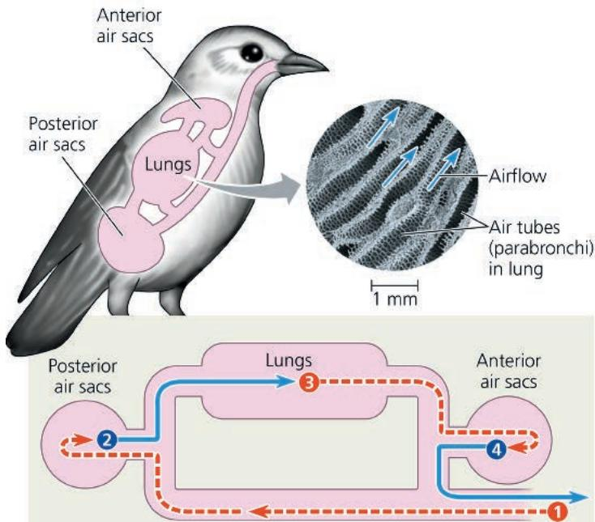

Two cycles of inhalation and exhalation are required to pass one breath through the system:

1 First inhalation: Air fills the posterior air sacs.

2 First exhalation: Posterior air sacs contract, pushing air into lungs.

3 Second inhalation: Air passes through lungs and fills anterior air sacs.

4 Second exhalation: As anterior air sacs contract, air that entered body at first inhalation is pushed out of body.

direction. Air sacs situated on either side of the lungs act as bellows that direct air flow through the respiratory system. Muscles in the bird's chest wall expand the thoracic cavity, causing the air sacs to expand and fill with air. Contraction of a different set of muscles has the opposite effect, compressing the thoracic cavity and air sacs and expelling air from the sacs. Within the lungs, tiny channels called parabronchi serve as the sites of gas exchange. Passage of air through the entire system—air sacs and lungs—requires two cycles of inhalation and exhalation (Figure 42.27).

Ventilation in birds is highly efficient. One reason is that incoming fresh air does not mix with air that has already carried out gas exchange, so the maximum $P_{O_{2}}$ can be close to that in the atmosphere. In addition, a countercurrent exchange system like that in fish gills allows for effective gas exchange over the entire length of the parabronchi. These modifications provide certain advantages. For example, humans have great difficulty obtaining enough $O_{2}$ when climbing at high elevations, such as those in the Himalayas. However, barheaded geese and several other bird species easily fly through high Himalayan passes during their migrations.

## Control of Breathing in Humans

In humans, the neurons responsible for regulating breathing are in the medulla oblongata, near the base of the brain (Figure 42.28).

Figure 42.28 Homeostatic regulation of the $CO_{2}$ concentration and pH of arterial blood.  
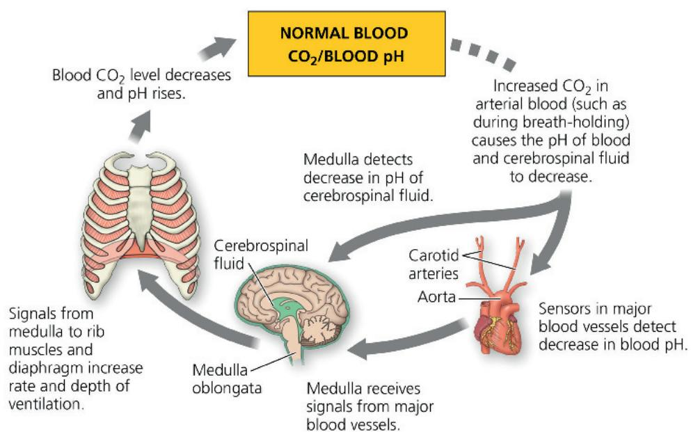  
VISUAL SKILLS Suppose a person begins breathing very deeply and rapidly while resting. Tracing a path along this negative-feedback control circuit, describe the effect on the $CO_{2}$ level in the blood and the steps by which homeostasis would be restored.  
For suggested answer, see Appendix A.

Neural circuits in the medulla form a pair of breathing control centers that establish the breathing rhythm. Although you can voluntarily alter this rhythm by holding your breath or breathing faster and deeper, most of the time your breathing is regulated by involuntary mechanisms. These control mechanisms ensure that gas exchange is coordinated with blood circulation and with metabolic demand.

The concentration of $CO_{2}$ in arterial blood is the best indicator of the success of this coordination. In regulating breathing, the medulla uses the pH of the fluid in which it is bathed as an indicator of blood $CO_{2}$ concentration. The pH can be used in this way because blood $CO_{2}$ is the main determinant of the pH of cerebrospinal fluid, the fluid surrounding the brain and spinal cord. Carbon dioxide diffuses from the blood to the cerebrospinal fluid, where it reacts with water and forms carbonic acid ( $H_{2}CO_{3}$ ). The $H_{2}CO_{3}$ can then dissociate into a bicarbonate ion ( $HCO_{3}^{-}$ ) and a hydrogen ion ( $H^{+}$ ):

$$
\mathrm{CO} _ {2} + \mathrm{H} _ {2} \mathrm{O} \rightleftharpoons \mathrm{H} _ {2} \mathrm{CO} _ {3} \rightleftharpoons \mathrm{HCO} _ {3} ^ {-} + \mathrm{H} ^ {+}
$$

Consider what happens when you hold your breath, and $\mathrm{CO}_{2}$ accumulates in your blood and cerebrospinal fluid. Through the reactions shown above, the higher $\mathrm{CO}_{2}$ concentration leads to an increase in the concentration of $\mathrm{H}^{+}$ , lowering pH below its set point of approximately 7.4. Sensors in the medulla as well as in major blood vessels detect this pH change. In response, the medulla's control circuits increase the depth and rate of breathing (see Figure 42.28). Both remain high until the excess $\mathrm{CO}_{2}$ is eliminated in exhaled air and pH returns to a normal value.

The blood $O_{2}$ level usually has little effect on the breathing control centers. However, when the $O_{2}$ level drops very low (at high altitudes, for instance), $O_{2}$ sensors in the aorta and the carotid arteries in the neck send signals to the breathing control centers, which respond by increasing the breathing rate and depth. The regulation of breathing is modulated by additional neural circuits, primarily in the pons, a part of the brain next to the medulla.

Breathing control is effective only if ventilation is matched to blood flow through alveolar capillaries. During exercise, for instance, such coordination couples an increased breathing rate and depth, which enhance $O_{2}$ uptake and $CO_{2}$ removal, with an increase in cardiac output. When you breathe deeply, a negative-feedback mechanism prevents the lungs from overexpanding: During inhalation, sensors that detect stretching of the lung tissue send nerve impulses to the control circuits in the medulla, inhibiting further inhalation.

## Concept Check 42.6

1. How does an increase in the $\mathrm{CO}_{2}$ concentration in arterial blood affect the pH of cerebrospinal fluid?

2. A drop in blood pH causes an increase in heart rate. What is the function of this control mechanism?

3. WHAT IF? If an injury tore a small hole in the membranes surrounding your lungs, what effect on lung function would you expect?

For suggested answers, see Appendix A.

## Concept 42.7: Adaptations for gas exchange include pigments that bind and transport gases

The high metabolic demands of many animals necessitate the exchange of large quantities of $O_{2}$ and $CO_{2}$ . Here we'll examine how blood molecules called respiratory pigments facilitate this exchange through their interaction with $O_{2}$ and $CO_{2}$ . We'll also investigate physiological adaptations that enable animals to be active under conditions of high metabolic load or very limiting $P_{O_{2}}$ . As a basis for exploring these topics, let's summarize the basic gas exchange circuit in humans.

## Coordination of Circulation and Gas Exchange

To appreciate how the gas exchange and circulatory systems function together, let's track the variation in partial pressure for $O_{2}$ and $CO_{2}$ across these systems (Figure 42.29). ① During inhalation, fresh air mixes with air remaining in the lungs. ② The resulting mixture formed in the alveoli has a higher $P_{O_{2}}$ than the

Figure 42.29 Loading and unloading of respiratory gases. The partial pressures of $O_{2}$ and $CO_{2}$ are given in mm Hg.

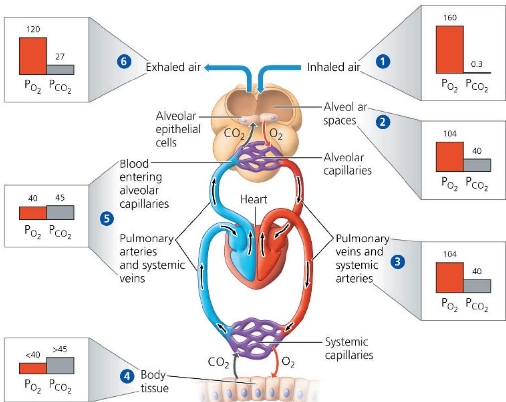  
WHAT IF? If you consciously forced more air out of your lungs each time you exhaled, how would that affect the values shown in the figure?  
For suggested answer, see Appendix A.

blood flowing through the alveolar capillaries. Consequently, there is a net diffusion of $O_{2}$ down its partial pressure gradient from the air in the alveoli to the blood. Meanwhile, the presence of a $P_{CO_{2}}$ in the alveoli that is higher in the capillaries than in the air drives the net diffusion of $CO_{2}$ from blood to air. ③ By the time the blood leaves the lungs in the pulmonary veins, its $P_{O_{2}}$ and $P_{CO_{2}}$ match the values for the air in alveoli. After returning to the heart, this blood is pumped through the systemic circuit.

④ In the systemic capillaries, gradients of partial pressure favor the net diffusion of $O_{2}$ out of the blood and $CO_{2}$ into the blood. These gradients exist because cellular respiration in the mitochondria of cells near each capillary removes $O_{2}$ from and adds $CO_{2}$ to the surrounding interstitial fluid. ⑤ Having unloaded $O_{2}$ and loaded $CO_{2}$ , the blood is returned to the heart and pumped to the lungs again. ⑥ There, exchange occurs across the alveolar capillaries, resulting in exhaled air enriched in $CO_{2}$ and partially depleted of $O_{2}$ .

## Respiratory Pigments

The low solubility of $O_{2}$ in water (and thus in blood) poses a problem for animals that rely on the circulatory system to deliver $O_{2}$ . For example, a person requires almost 2 L of $O_{2}$ per minute during intense exercise, and all of it must be carried in the blood from the lungs to the active tissues. At normal body temperature and air pressure, however, only 4.5 mL of $O_{2}$ can dissolve into a liter of blood in the lungs. Even if 80% of the dissolved $O_{2}$ were delivered to the tissues, the heart would still need to pump 555 L of blood per minute!

In fact, animals transport most of their $O_{2}$ bound to proteins called respiratory pigments. Respiratory pigments circulate with the blood or hemolymph and are often contained within specialized cells. The pigments greatly increase the amount of $O_{2}$ that can be carried in the circulatory fluid (from 4.5 to about 200 mL of $O_{2}$ per liter in mammalian blood). In our example of an exercising human with an $O_{2}$ delivery rate of 80%, the presence of a respiratory pigment reduces the cardiac output necessary for $O_{2}$ transport to a manageable 12.5 L of blood per minute.

A variety of respiratory pigments have evolved in animals. With a few exceptions, these molecules have a distinctive color (hence the term pigment) and consist of a metal bound to a protein. One example is the blue pigment hemocyanin, which has copper as its oxygen-binding component and is found in arthropods and many molluscs.

The respiratory pigment of many invertebrate species and almost all species of vertebrates

is hemoglobin (see Concept 42.4). In vertebrates, it is contained in erythrocytes and has four subunits. Each consists of a polypeptide and a heme group, a cofactor that has an iron atom at its center (Figure 42.30). Each iron atom binds one molecule of $O_{2}$ , so a hemoglobin molecule can carry four $O_{2}$ molecules. Like all respiratory pigments, hemoglobin binds $O_{2}$ reversibly, loading $O_{2}$ in the lungs or gills and unloading it elsewhere in the body. This process is enhanced by cooperativity between the hemoglobin subunits (see Concept 8.5). When $O_{2}$ binds to one subunit, the others change shape slightly, increasing affinity for $O_{2}$ . When four $O_{2}$ molecules are bound

and one subunit unloads its $O_{2}$ , the other three subunits more readily unload $O_{2}$ , as an associated change in shape lowers their affinity for $O_{2}$ .

Figure 42.30 Ribbon model of hemoglobin.

Cooperativity in $O_{2}$ binding and release is evident in the dissociation curve for hemoglobin (Figure 42.31a). Over the range of $P_{O_{2}}$ where the dissociation curve has a steep slope, even a slight change in $P_{O_{2}}$ causes hemoglobin to load or unload a substantial amount of $O_{2}$ . The

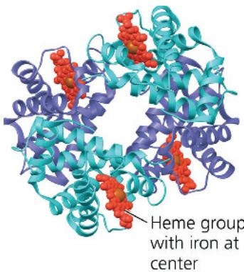  
Heme group with iron at center

steep part of the curve corresponds to the range of $P_{O_{2}}$ found in body tissues. When cells in a particular location begin working harder—during exercise, for instance— $P_{O_{2}}$ dips in their vicinity as the $O_{2}$ is consumed in cellular respiration. Because of subunit cooperativity, a slight drop in $P_{O_{2}}$ causes a relatively large increase in the amount of $O_{2}$ the blood unloads.

Hemoglobin is especially efficient at delivering $O_{2}$ to tissues actively consuming $O_{2}$ . However, this increased efficiency results not only from $O_{2}$ consumption, but also from $CO_{2}$ production. As tissues consume $O_{2}$ in cell respiration, they also produce $CO_{2}$ . As we have seen, $CO_{2}$ reacts with water, forming carbonic acid, which lowers the pH of its surroundings. Low pH decreases the affinity of hemoglobin for $O_{2}$ , an effect called the Bohr shift (Figure 42.31b). Thus, where $CO_{2}$ production is greater, hemoglobin releases more $O_{2}$ , which can then be used to support more cellular respiration.

Hemoglobin also assists in buffering the blood—that is, preventing harmful changes in pH. In addition, it has a minor role in $CO_{2}$ transport, the topic we'll explore next.

## Carbon Dioxide Transport

Only about 7% of the $CO_{2}$ released by body cells is transported in solution in blood plasma. The rest diffuses from plasma into erythrocytes, where about 5–10% of total blood $CO_{2}$ binds to hemoglobin. The rest reacts with water (assisted by the enzyme carbonic anhydrase), forming $H_{2}CO_{3}$ . The $H_{2}CO_{3}$ readily dissociates into $H^{+}$ and $HCO_{3}^{-}$ . Most $H^{+}$ binds to hemoglobin and other proteins, minimizing change in blood pH. Most $HCO_{3}^{-}$ diffuses out of the erythrocytes and is transported to the lungs in the plasma.

When blood flows through the lungs, the relative partial pressures of $CO_{2}$ favor the net diffusion of $CO_{2}$ out of the blood. As $CO_{2}$ diffuses into alveoli, the amount of $CO_{2}$ in the blood decreases. This decrease shifts the chemical equilibrium in favor of the conversion of $HCO_{3}^{-}$ to $CO_{2}$ , enabling further net diffusion of $CO_{2}$ into alveoli. Overall, the $P_{CO_{2}}$ gradient is sufficient to drive a 10–15% reduction in $P_{CO_{2}}$ during passage of blood through the lungs (see Figure 42.29).

## Respiratory Adaptations of Diving Mammals

EVOLUTION Animals vary greatly in their ability to spend time in environments in which there is no access to their normal respiratory medium—for example, when an air-breathing mammal swims underwater. Whereas most humans cannot swim deeper than 20 m or hold their breath longer than 2–3 minutes, the Weddell seal of Antarctica routinely plunges to 200–500 m and remains there for a period ranging from 20 minutes to more than an hour (Figure 42.32). Another diving mammal, the Cuvier's beaked whale, can reach depths of 2,900 m—nearly 2 miles—and stay submerged for more than 2 hours! What enables these amazing feats?

One evolutionary adaptation of diving mammals to prolonged stays underwater is a capacity to store large amounts of $O_{2}$ in their bodies. The volume of blood per kilogram of body mass in a Weddell seal is about twice that in a human. Furthermore, the

Figure 42.31 Dissociation curves for hemoglobin at $37^{\circ}$ C.  
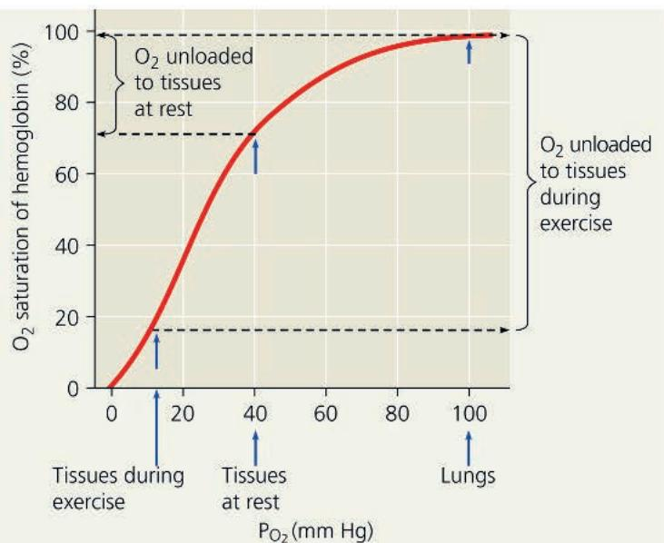  
(a) $P_{O_{2}}$ and hemoglobin dissociation at pH 7.4. The curve shows the relative amounts of $O_{2}$ bound to hemoglobin exposed to solutions with different $P_{O_{2}}$ . At a $P_{O_{2}}$ of 100 mm Hg, typical in the lungs, hemoglobin is about 98% saturated with $O_{2}$ . At a $P_{O_{2}}$ of 40 mm Hg, common in resting tissues, hemoglobin is about 70% saturated, having unloaded nearly a third of its $O_{2}$ . As shown in the above graph, hemoglobin can release much more $O_{2}$ to metabolically very active tissues, such as muscle tissue during exercise.

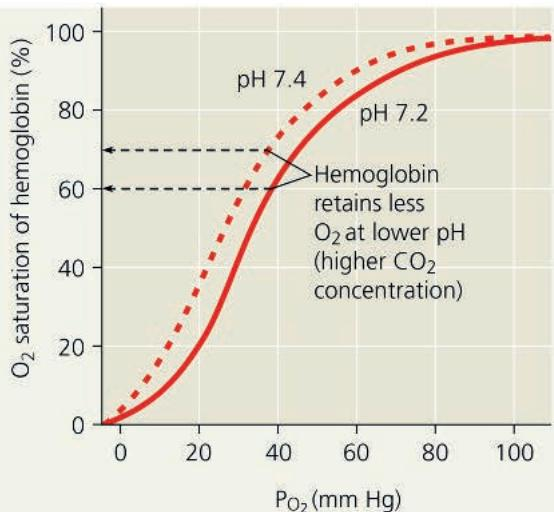  
(b) pH and hemoglobin dissociation. In very active tissues, $CO_{2}$ from cellular respiration reacts with water to form carbonic acid, decreasing pH. Because hydrogen ions affect hemoglobin shape, a drop in pH shifts the $O_{2}$ dissociation curve toward the right (the Bohr shift). For a given $P_{O_{2}}$ , hemoglobin releases more $O_{2}$ at a lower pH, supporting increased cellular respiration.

VISUAL SKILLS A person with severe lung disease might have a $P_{O_{2}}$ of 80 mm Hg in the lungs, compared to the normal level of 100 mm Hg (a 20% decrease). Will the amount of oxygen available to tissues be reduced by 20%? Explain why or why not.

muscles of seals and other diving mammals contain a high concentration of an oxygen-storing protein called myoglobin in their muscles. As a result, the Weddell seal can store about twice as much $O_{2}$ per kilogram of body mass as can a human.

Figure 42.32 A Weddell seal, adapted to deep, long dives.

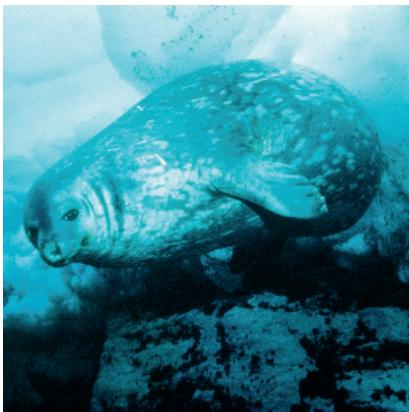

Diving mammals not only have a relatively large $\mathrm{O}_2$ stockpile but also have adaptations that conserve $\mathrm{O}_2$ . They swim with little muscular effort and glide passively for prolonged periods. During a dive, their heart rate and $\mathrm{O}_2$ consumption rate decrease, and most blood is routed to vital tissues: the brain, spinal cord, eyes, adrenal glands, and, in pregnant seals, the placenta. Blood supply to the muscles is restricted or, during extended dives, shut off altogether. During these dives, a Weddell seal's muscles deplete the $\mathrm{O}_2$ stored in myoglobin and derive most of their ATP from anaerobic respiration (see Concept 9.5).

How might such adaptations have arisen over the course of evolution? All mammals, including humans, have a diving reflex triggered by a plunge or fall into water: When the face contacts cold water, the heart rate immediately decreases and blood flow to body extremities is reduced. Genetic changes that strengthened this reflex would have provided a selective advantage to seal ancestors foraging underwater. Also, genetic variations that increased traits such as blood volume or myoglobin concentration would have improved diving ability and therefore been favored during selection over many generations.

## Concept Check 42.7

1. What determines whether $O_{2}$ and $CO_{2}$ undergo net diffusion into or out of capillaries? Explain.

2. How does the Bohr shift help deliver $O_{2}$ to very active tissues?

3. WHAT IF? A doctor might give bicarbonate $(\mathrm{HCO}_3^-)$ to a patient who is breathing very rapidly. What is the doctor assuming about the patient's blood chemistry?

For suggested answers, see Appendix A.

## Chapter 42 Review

## Summary of Key Concepts

To review key terms, go to the Vocabulary Self-Quiz (eTextbook only).

## Concept 42.1: Circulatory systems link exchange surfaces with cells throughout the body

\- In animals with simple body plans, a gastrovascular cavity mediates exchange between the environment and cells that can be reached by diffusion. Because diffusion is slow over long distances, most complex animals have a circulatory system that moves fluid between cells and the organs that carry out exchange with the environment. Arthropods and most molluscs have an open circulatory system, in which hemolymph bathes organs directly. Vertebrates have a closed circulatory system, in which blood circulates in a closed network of pumps and vessels.

\- The closed circulatory system of vertebrates consists of blood, blood vessels, and a two- to four-chambered heart. Blood pumped by a heart ventricle passes to arteries and then to the capillaries, sites of chemical exchange between blood and interstitial fluid. Veins return blood from capillaries to an atrium, which passes blood to a ventricle. Fishes, rays, and sharks have a single pump in their circulation. Air-breathing vertebrates have two pumps combined in a single heart. One pump sends blood to all the body cells in the systemic circuit. The other sends blood to the lungs in the pulmonary circuit. Variations in ventricle number and separation reflect adaptations to different environments and metabolic needs.

How does the flow of a fluid in a closed circulatory system differ from the movement of molecules between cells and their environment with regard to distance traveled, direction traveled, and driving force?

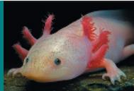

## Concept 42.2: Coordinated cycles of heart contraction drive double circulation in mammals

\- The right ventricle pumps blood to the lungs, where it loads $O_{2}$ and unloads $CO_{2}$ . Oxygen-rich blood from the lungs entering the heart at the left atrium is pumped to the body tissues by the left ventricle. Blood then returns to the heart through the right atrium.

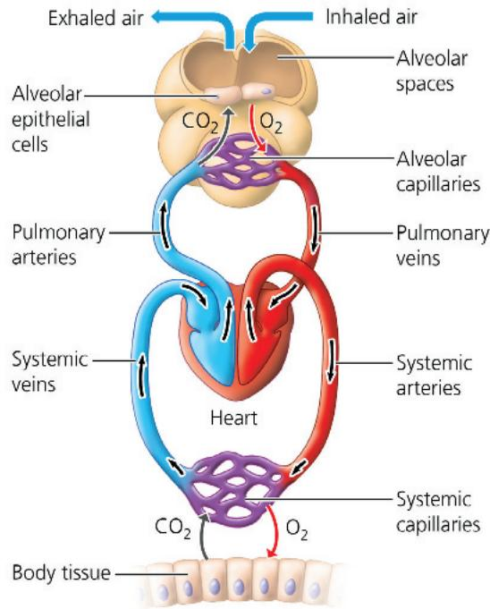

\- During each cardiac cycle, a complete sequence of the heart's pumping and filling, there is a period of ventricular contraction, called systole, and a period of ventricular relaxation, called diastole. Heart function can be assessed by measuring the pulse (number of times the heart beats each minute) and cardiac output (volume of blood pumped by each ventricle per minute).

\- The heartbeat originates with impulses at the sinoatrial node (SA) (pacemaker) of the right atrium. They trigger atrial contraction, are delayed at the atrioventricular node (AV), and are then conducted along the bundle branches and Purkinje fibers, triggering ventricular contraction. The nervous system, hormones, and body temperature affect pacemaker activity.

What changes in cardiac function might you expect after surgical replacement of a defective heart valve?

## Concept 42.3: Patterns of blood pressure and flow reflect the structure and arrangement of blood vessels

\- Blood vessels have structures well adapted to function. Capillaries have narrow diameters and thin walls that facilitate exchange. Arteries contain thick elastic walls that maintain blood pressure. Veins contain one-way valves that contribute to the return of blood to the heart.

\- The velocity of blood flow is lowest in the capillary beds as a result of their large total cross-sectional area. Blood pressure is altered by changes in cardiac output and by variable constriction of arterioles.

\- Fluid leaks out of capillaries and is returned to blood by the lymphatic system, which also defends against infection.

If while standing you placed your forearm on your head, how, if at all, would the blood pressure in that arm change? Explain.

## Concept 42.4: Blood components function in exchange, transport, and defense

\- Whole blood consists of cells and cell fragments (platelets) suspended in a liquid matrix called plasma. Plasma proteins influence blood pH, osmotic pressure, and viscosity, and they function in lipid transport, immunity (antibodies), and blood clotting (fibrinogen). Red blood cells, or erythrocytes, transport $\mathrm{O}_2$ . Five types of white blood cells, or leukocytes, function in defense against microorganisms and foreign substances in the blood. Platelets function in blood clotting, a cascade of reactions that converts plasma fibrinogen to fibrin.

\- A variety of diseases impair function of the circulatory system. In sickle-cell disease, an aberrant form of hemoglobin disrupts erythrocyte shape and function, leading to blockage of small blood vessels and a decrease in the oxygen-carrying capacity of the blood. In cardiovascular disease, inflammation of the arterial lining enhances deposition of lipids and cells, resulting in the potential for life-threatening damage to the heart or brain.

In the absence of infection, what percentage of cells in human blood are leukocytes?

## Concept 42.5: Gas exchange occurs across specialized respiratory surfaces

\- At all sites of gas exchange, a gas undergoes net diffusion from where its partial pressure is higher to where it is lower. Air is more conducive to gas exchange than water because air has a higher $O_{2}$ content, lower density, and lower viscosity.

\- The structure and organization of respiratory surfaces differ among animal species. Gills are outfoldings of the body surface specialized for gas exchange in water. The effectiveness of gas exchange in some gills, including those of fishes, is increased by ventilation and countercurrent exchange between blood and water. Gas exchange in insects relies on a tracheal system, a branched network of tubes that bring $O_{2}$ directly to cells. Spiders, land snails, and most terrestrial vertebrates have internal lungs. In mammals, air inhaled through the nostrils passes through the pharynx into the trachea, bronchi, bronchioles, and dead-end alveoli, where gas exchange occurs.

Why does altitude have almost no effect on an animal's ability to rid itself of $\mathrm{CO}_{2}$ through gas exchange?

## Concept 42.6: Breathing ventilates the lungs

\- Breathing mechanisms vary substantially among vertebrates. An amphibian ventilates its lungs by positive pressure breathing, which forces air down the trachea. Mammals ventilate their lungs by negative pressure breathing, which pulls air into the lungs when the rib muscles and diaphragm contract. Incoming and outgoing air mix, decreasing the efficiency of ventilation. Birds use a system of air sacs as bellows to keep air flowing through the lungs in one direction only, preventing the mixing of incoming and outgoing air.

\- In humans, sensors detect the pH of cerebrospinal fluid (reflecting $CO_{2}$ concentration in the blood), and a control center in the brain adjusts breathing rate and depth accordingly. Additional input to the control center is provided by sensors in the aorta and carotid arteries that monitor blood levels of $O_{2}$ as well as $CO_{2}$ (via blood pH).

How does air in the lungs differ from the fresh air that enters the body during inspiration?

## Concept 42.7: Adaptations for gas exchange include pigments that bind and transport gases

\- In the lungs, gradients of partial pressure favor the net diffusion of $O_{2}$ into the blood and $CO_{2}$ out of the blood. The opposite situation exists in the rest of the body. Respiratory pigments such as hemocyanin and hemoglobin bind $O_{2}$ , greatly increasing the amount of $O_{2}$ transported by the circulatory system.

\- Evolutionary adaptations enable some animals to satisfy extraordinary $O_{2}$ demands. Deep-diving mammals stockpile $O_{2}$ in blood and other tissues and deplete it slowly.

How are the roles of a respiratory pigment and an enzyme similar? For suggested answers, see Appendix A.

## Test Your Understanding

For more multiple-choice questions, go to the Practice Test (eTextbook only).

## Levels 1-2: Remembering/Understanding

1. Which of the following respiratory systems is independent from a fluid-based circulatory system?

(A) the lungs of a vertebrate

(B) the gills of a fish

(C) the tracheal system of an insect

(D) the skin of an earthworm

2. Pulse is a direct measure of

(A) blood pressure. (C) cardiac output.

(B) stroke volume. (D) heart rate.

3. When you hold your breath, which of the following blood gas changes first leads to the urge to breathe?
(A) rising $O_{2}$ (C) rising $CO_{2}$ (B) falling $O_{2}$ (D) falling $CO_{2}$

4. One feature that amphibians and humans have in common is (A) the number of heart chambers.  
(B) a complete separation of circuits for circulation.  
(C) the number of circuits for circulation.  
(D) a low blood pressure in the systemic circuit.

## Levels 3-4: Applying/Analyzing

5. A molecule of $CO_{2}$ released into the blood in your left toe can be exhaled from your nose without passing through which of the following structures?
(A) the pulmonary vein. (C) the right atrium.
(B) the trachea. (D) the right ventricle.

6. Compared with the interstitial fluid that bathes active muscle cells, blood reaching these cells in capillaries has a
(A) higher $P_{O_{2}}$ .
(B) higher $P_{CO_{2}}$ .
(C) greater bicarbonate concentration.
(D) lower pH.

## Levels 5-6: Evaluating/Creating

7. EVOLUTION CONNECTION One opponent of the movie monster Godzilla is Mothra, a mothlike creature with a wingspan of several dozen meters. The largest known insects were Paleozoic dragonflies with half-meter wingspans. Focusing on respiration and gas exchange, explain why giant insects are improbable.

8. SCIENTIFIC INQUIRY • INTERPRET THE DATA The hemoglobin of a human fetus differs from adult hemoglobin. Compare the dissociation curves of the two hemoglobins in the graph at right. Describe how they differ, and propose a hypothesis to explain the benefit of this difference.

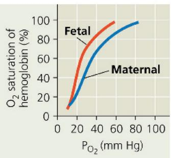

9. WRITE ABOUT A THEME: INTERACTIONS Some athletes prepare for competition at sea level by sleeping in a tent in which $P_{O_{2}}$ is kept low. When climbing high peaks, some mountaineers breathe from bottles of pure $O_{2}$ . In a short essay (100–150 words), relate these behaviors to the mechanism of $O_{2}$ transport in the human body and to physiological interactions with our gaseous environment.

## 10. SYNTHESIZE YOUR KNOWLEDGE

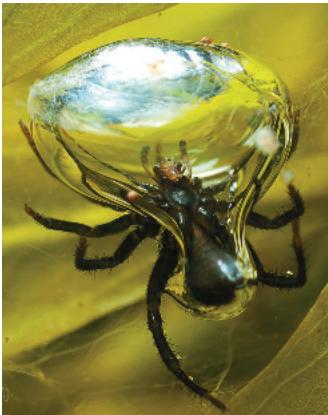

The diving bell spider (Argyroneta aquatica) stores air underwater in a net of silk. Explain why this adaptation could be more advantageous than having gills, taking into account differences in gas exchange media and gas exchange organs among animals.

## Practice Applying Your Learning

11. This question assesses your ability to apply your understanding of hemoglobin saturation curves to a new scenario.

Scientists obtained DNA from the extinct woolly mammoth. Based on the sequence of the hemoglobin gene, they were able to predict a hemoglobin saturation curve for the mammoth, as shown in the graph. The curve of an Asian elephant is shown for comparison.

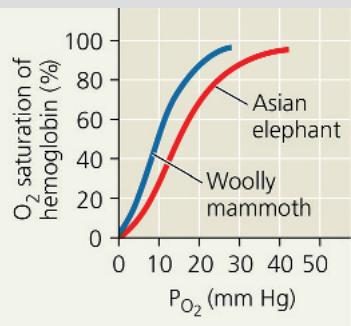

Data from Campbell, K., Roberts, J., Watson, L. et al. Substitutions in woolly mammoth hemoglobin confer biochemical properties adaptive for cold tolerance. Nat Genet 42, 536–540 (2010). https://doi.org/10.1038/ng.574

Based on this graph and your knowledge of oxygen transport, evaluate each statement as more likely to be TRUE or more likely to be FALSE.

a. At a partial oxygen pressure ( $P_{O_{2}}$ ) of 10 mm Hg, the hemoglobin of a woolly mammoth will be more than 40% saturated with oxygen. \_\_\_\_

b. At any given $P_{O_{2}}$ level, the oxygen saturation of mammoth red blood cells is lower than that of elephant red blood cells. \_\_\_\_

c. The hemoglobin of the mammoth has a lower affinity for oxygen than the hemoglobin of the elephant.

d. The mammoth's blood cells are more efficient than the elephant's blood cells at picking up oxygen in the lungs.

e. Assuming that the muscle $P_{O_{2}}$ is the same in both species, the mammoth's blood cells are more efficient than the elephant's blood cells at delivering oxygen to exercising muscle cells. \_\_\_\_

f. CHALLENGE Suppose that the oxygen partial pressure in the mammoth's lungs is 20 mm Hg and the oxygen partial pressure in a muscle tissue is 10 mm Hg. Under these conditions, out of every 100 oxygen molecules, about 10 molecules (10%) will be dropped off at the tissues.

