# 第43章 The Immune System

<!-- 章节边界按正文内容恢复；原始 MinerU 内容保留如下。 -->

# The Immune System

## Key Concepts

43.1 In innate immunity, recognition and response rely on traits common to groups of pathogens

43.2 In adaptive immunity, receptors provide pathogen-specific recognition

43.3 Adaptive immunity defends against infection of body fluids and body cells

43.4 Disruptions in immune system function can elicit or exacerbate disease

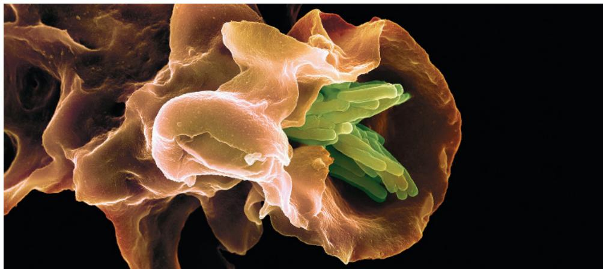  
Figure 43.1 Dedicated immune cells in most animals specifically interact with and attack pathogens, disease-causing agents such as bacteria or viruses. Here, an immune cell called a macrophage (brown) is engulfing rod-shaped bacteria (green).

## Study Tip

Make a table: As you study innate and adaptive immunity, compare and contrast these two forms of immune defense by continuing to fill in a copy of this table.

<table><tr><td>Defense mechanism</td><td>Key role in innate defense?</td><td>Key role in adaptive defense?</td><td>Effect on pathogen</td><td>Example of cell involved</td></tr><tr><td>Barrier</td><td>Yes</td><td>No</td><td>Entry into host tissues prevented</td><td>Epithelial cell</td></tr><tr><td>Phagocytosis</td><td></td><td></td><td></td><td></td></tr><tr><td>Secreted molecules</td><td></td><td></td><td></td><td></td></tr><tr><td>Destruction of infected host cells</td><td></td><td></td><td></td><td></td></tr></table>

Pathogen

## How do immune cells recognize pathogens?

Innate recognition Each of a small set of receptors recognizes a molecule absent from animals, but common to a type of pathogen, as shown by these examples.

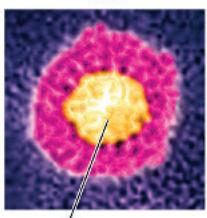  
Example of recognized molecule  
Bacterium  
dsRNA (nucleic acid in genome)

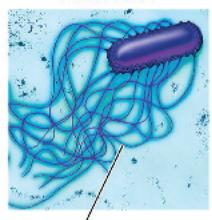  
Flagellin (protein in flagella)

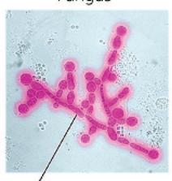  
Mannan (oligosaccharide in cell wall)

Adaptive recognition Each of a vast number of receptors is specific for a particular part of a protein in one pathogen, such as a surface protein of the influenza (flu) virus. In this example, a different adaptive immune receptor would recognize each of the flu strains based on the proteins' amino acid sequences, which differ at the positions colored orange.

Influenza virus strain 1

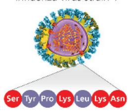  
Influenza virus strain 2

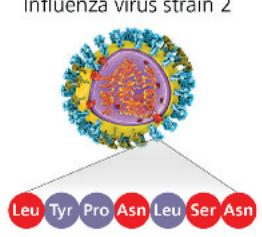

Influenza virus strain 3

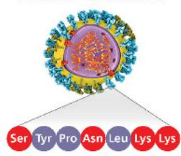  
Recognition by either type of immunity triggers a response that can eliminate or inactivate the pathogen, protecting the infected animal.

# Concept 43.1: In innate immunity, recognition and response rely on traits common to groups of pathogens

For a pathogen—a bacterium, fungus, virus, or other disease-causing agent—the internal environment of an animal offers a source of nutrients, a protected setting, and a means of transport to new environments. From the animal’s vantage point, the situation is not so ideal. Fortunately, adaptations have arisen over the course of evolution that protect animals against many pathogens. The body’s defenses make up the immune system, which enables an animal to avoid or limit many infections. (Note that a foreign molecule or cell doesn’t have to be pathogenic to elicit an immune response, but we’ll focus on the immune system’s role in defending against pathogens.)

The first lines of defense offered by immune systems help prevent pathogens from gaining entrance to the body. For example, an outer covering, such as skin or a shell, blocks entry by many pathogens. Sealing off the entire body surface is impossible, however, because gas exchange, nutrition, and reproduction require openings to the environment. Secretions that trap or kill pathogens guard the body's entrances and exits, while the linings of the digestive tract, airway, and other exchange surfaces provide additional barriers to infection.

If a pathogen breaches barrier defenses and enters the body, the problem of how to fend off attack changes substantially. Housed within body fluids and tissues, the invader is no longer an outsider. To fight infections, an animal's immune system must detect foreign particles and cells within the body. In other words, a properly functioning immune system distinguishes nonself from self. How is this accomplished? Immune cells produce receptor molecules that bind specifically to molecules from foreign cells or viruses and activate defense responses. The specific binding of immune receptors to foreign molecules is a type of molecular recognition and is the central event in identifying nonself molecules, particles, and cells.

Two types of immune defenses are found among animals. This concept focuses on innate immunity, the set of immune defenses common to all animals. The remainder of the chapter explores adaptive immunity, a set of molecular and cellular defense found only among vertebrates.

## Innate Immunity of Invertebrates

The great success of insects in terrestrial and freshwater habitats teeming with diverse pathogens highlights the effectiveness of invertebrate innate immunity. One part of this defense system is a set of barrier defenses, including the insect exoskeleton. Composed largely of the polysaccharide chitin, the exoskeleton provides a physical barrier against most pathogens. Chitin also lines the insect intestine, where it blocks infection by many pathogens. In the digestive system, lysozyme, an enzyme that breaks down bacterial cell walls, acts as a chemical barrier against any pathogens ingested with food.

Any pathogen that breaches an insect's barrier defenses encounters internal immune defenses. Insect immune cells produce a set of recognition proteins, each of which binds to a molecule common to a broad class of pathogens. Many of these molecules are components of fungal or bacterial cell walls. Because such molecules are not normally found in animal cells, they function as "identity tags" for pathogen recognition. Once bound to a pathogen molecule, a recognition protein triggers an innate immune response.

In insects, the major immune cells are called hemocytes. Like amoebas, some hemocytes are phagocytic cells: They ingest and break down microorganisms by a process known as phagocytosis (Figure 43.2). One class of hemocytes produces a type of defense molecule that helps entrap larger pathogens, such as Plasmodium, the single-celled parasite of mosquitoes that causes malaria in humans. Many other hemocytes release antimicrobial peptides, which circulate throughout the body of the insect and inactivate or kill bacteria or fungi by disrupting their plasma membranes.

The innate immune response of insects is specific for particular classes of pathogens. For example, if a fungus infects an insect, binding of recognition proteins to fungal cell wall molecules activates a transmembrane receptor called Toll. Toll in turn activates production and secretion of antimicrobial peptides that specifically kill fungal cells. Remarkably, phagocytic mammalian cells use receptor proteins very similar to the Toll receptor to recognize viral, fungal, and bacterial components, a discovery that was recognized with the Nobel Prize in Physiology or Medicine in 2011.

Figure 43.2 Phagocytosis.

This diagram depicts events in the ingestion and destruction of pathogens by a typical phagocytic cell.

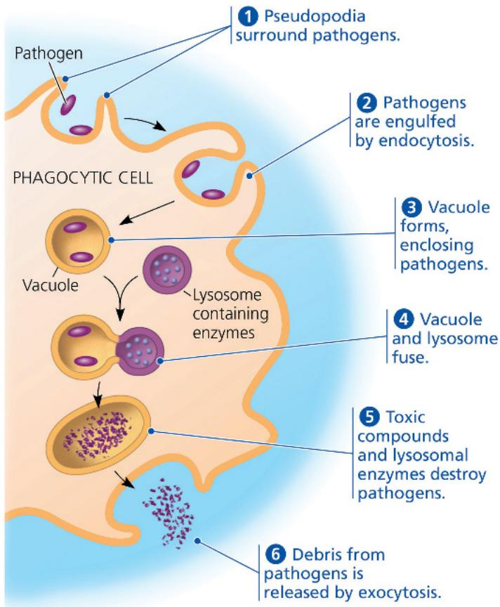

Figure 43.3 Antiviral defense in insects.

In defending against an infecting RNA virus, an insect cell turns the viral genome against itself, cutting the viral genome into small fragments that it then uses as guide molecules to find and destroy viral messenger RNAs (mRNAs).

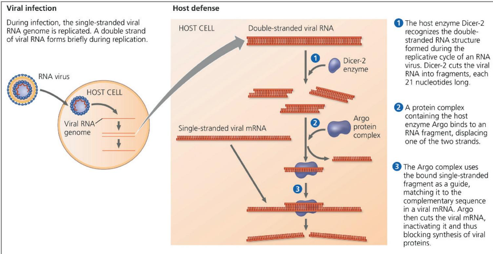  
VISUAL SKILLS Compare and contrast the specificity of the Dicer-2 and Argo enzymes in terms of the size, number of strands, and sequence of the RNA molecules they each bind or act upon.  
For suggested answer, see Appendix A.

1 The host enzyme Dicer-2 recognizes the double-stranded RNA structure formed during the replicative cycle of an RNA virus. Dicer-2 cuts the viral RNA into fragments, each 21 nucleotides long.

2 A protein complex containing the host enzyme Argo binds to an RNA fragment, displacing one of the two strands.

3 The Argo complex uses the bound single-stranded fragment as a guide, matching it to the complementary sequence in a viral mRNA. Argo then cuts the viral mRNA, inactivating it and thus blocking synthesis of viral proteins.

Insects also have specific defenses that protect against infection by viruses. Many viruses that infect insects have a genome consisting of a single strand of RNA. When the virus replicates in the host cell, this RNA strand is the template for the synthesis of double-stranded RNA. Because animals do not produce double-stranded RNA, its presence can trigger a specific defense against the invading virus, as illustrated in Figure 43.3.

## Innate Immunity of Vertebrates

In jawed vertebrates, innate immune defenses coexist with the more recently evolved system of adaptive immunity. Because most of the recent discoveries regarding vertebrate innate immunity have come from studies of mice and humans, we'll focus here on mammals. In this section, we'll consider the innate defenses that are similar to those found among invertebrates—barrier defenses, phagocytosis, and antimicrobial peptides—as well as some that are unique to vertebrates, such as natural killer cells, interferons, and the inflammatory response.

## Barrier Defenses

The barrier defenses of mammals, which block the entry of many pathogens, include the mucous membranes and the skin. The mucous membranes that line the digestive, respiratory, urinary, and reproductive tracts produce mucus, a viscous fluid that traps pathogens and other particles. In the airway, ciliated epithelial cells sweep mucus and any entrapped material upward, helping prevent infection of the lungs. Saliva, tears, and mucous secretions that bathe various exposed epithelia provide a washing action that also inhibits colonization by fungi and bacteria.

Beyond their physical role in inhibiting microbial entry, body secretions create an environment that is hostile to many pathogens. Lysozyme in tears, saliva, and mucous secretions destroys the cell walls of susceptible bacteria as they enter the openings around the eyes or the upper respiratory tract. Pathogens in food or water and those in swallowed mucus must also contend with the acidic environment of the stomach (pH 2), which kills most of them before they can enter the intestines. Similarly, secretions from oil and sweat glands give human skin a pH ranging from 3 to 5, acidic enough to prevent the growth of many bacteria.

## Cellular Innate Defenses

In mammals, as in insects, there are phagocytic innate immune cells dedicated to detecting, devouring, and destroying pathogens. In recognizing viral, fungal, or bacterial components, phagocytic mammalian cells rely on several types of receptors. As mentioned above, some are very similar to the insect innate immune receptor Toll. Each mammalian Toll-like receptor (TLR)

<!-- END OFFICIAL MINERU API RESULT part_10 -->

<!-- BEGIN OFFICIAL MINERU API RESULT part_11 -->

## Figure 43.4 TLR signaling.

Each mammalian Toll-like receptor (TLR) recognizes molecules shared by a group of pathogens, called a pathogen-associated molecular pattern (PAMP). Lipopolysaccharide, flagellin, CpG DNA (DNA containing unmethylated CG sequences), and double-stranded (ds) RNA are found in bacteria, fungi, or viruses but not in animal cells. Once bound to a pathogen molecule, TLR proteins trigger innate immune defenses.

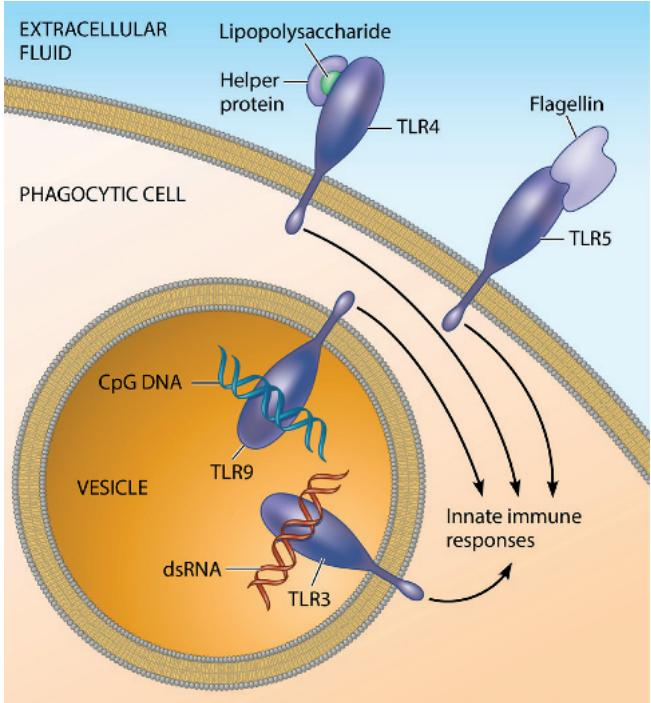  
VISUAL SKILLS Observe the locations of the TLR proteins, and then suggest a possible benefit of their distribution.
For suggested answer, see Appendix A.

binds to molecules characteristic of a set of pathogens, called a pathogen-associated molecular pattern (PAMP) (Figure 43.4). For example, TLR3 binds to double-stranded RNA, a form of nucleic acid produced by certain viruses. Similarly, TLR4, located on immune cell plasma membranes, recognizes lipopolysaccharide, a type of molecule found on the surface of many bacteria, and TLR5 recognizes flagellin, the main protein of bacterial flagella.

Certain TLRs can also be activated by damage-associated molecular patterns (DAMPs), which are substances released from stressed body cells. For instance, TLR4 recognizes histones, DNA-binding proteins normally confined to the nucleus. Damaged cells release histones into the extracellular fluid, where they bind and activate TLR4. Causes of cell damage include mechanical injury or cancer as well as infection. Thus, the innate immune system can be activated even in the absence of a pathogen.

The two main types of phagocytic cells in the mammalian body are neutrophils and macrophages. Neutrophils, which circulate in the blood, are attracted by signals from infected tissues and then engulf and destroy the infecting pathogens. Macrophages (“big eaters”), like the one shown in Figure 43.1, are larger phagocytic cells. Some migrate throughout the body, whereas others reside permanently in organs and tissues where they are likely to encounter pathogens. For example, some macrophages are located in the spleen, where pathogens in the blood are often trapped. Macrophages and neutrophils are both key components of the inflammatory response, as discussed shortly. In addition to these cells, a number of more specialized cell types also contribute to innate immune defenses:

\- Dendritic cells stimulate adaptive immunity against pathogens that they engulf.

\- Eosinophils are important in defending against multicellular invaders, such as parasitic worms. Upon encountering such parasites, eosinophils discharge destructive enzymes.

Figure 43.5 Major events in a local inflammatory response.  
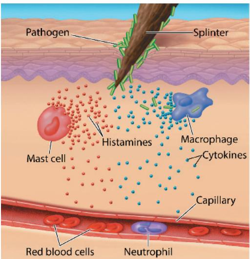  
At the injury site, mast cells release histamines, and macrophages secrete cytokines. Some of these signaling molecules cause nearby capillaries to dilate, while others attract neutrophils.

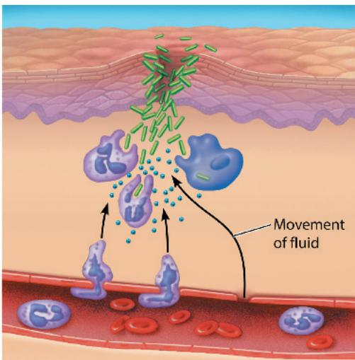  
2 Capillaries widen and become more permeable, allowing fluid containing antimicrobial peptides, as well as neutrophils, to enter the tissue. These immune cells digest pathogens and cell debris, allowing the tissue to heal.  
From your experience with splinters, deduce whether the signals mediating an inflammatory response are short- or long-lived. Explain your answer.
For suggested answer, see Appendix A.

\- Natural killer cells detect the abnormal surface proteins found on some virus-infected and cancerous cells. Natural killer cells do not engulf stricken cells. Instead, they release chemicals that lead to cell death, inhibiting spread of the virus or cancer.

\- Mast cells make key contributions to the inflammatory response, described next, as well as to allergies, discussed later.

## Local Inflammatory Response

When a splinter lodges under your skin, the surrounding area becomes swollen and warm. As Figure 43.5 depicts, both changes reflect a local inflammatory response, a set of events triggered by signaling molecules released upon injury or infection.

A local inflammatory response begins when macrophages are activated by PAMPs present on pathogens or by DAMPs released from damaged tissues. Activated macrophages discharge

cytokines, small peptides that act as signaling molecules. Some of these cytokines recruit neutrophils to the site of injury or infection. In addition, DAMPs and PAMPs activate mast cells, which release the signaling molecule histamine at sites of damage. Histamine triggers nearby blood vessels to dilate and become more permeable. The resulting increase in local blood supply and fluid movement into tissues produces the redness, swelling, and increased skin temperature typical of the inflammatory response (from the Latin inflammare, to set on fire).

Cycles of signaling and response continue the process of inflammation. Activated complement proteins promote further histamine release, attracting more phagocytic cells to the site of injury and infection. At the same time, enhanced blood flow to the site helps deliver antimicrobial peptides, which, as in insects, typically kill or inactivate pathogens by disrupting membrane integrity. The result is an accumulation of pus, a fluid rich in white blood cells, dead pathogens, and debris from damaged tissue.

At the end of the local inflammatory response, pus and excess fluid are taken up as lymph, the fluid transported in the network of vessels known as the lymphatic system (Figure 43.6). Small organs called lymph nodes scattered within the lymphatic system contain macrophages, which engulf pathogens that enter the lymph from the interstitial fluid. Dendritic cells reside outside the lymphatic system but migrate to the lymph nodes after interacting with pathogens. Within the lymph nodes, dendritic cells interact with other immune cells, stimulating adaptive immunity.

## Systemic and Chronic Inflammation

A minor injury or infection causes a local inflammatory response, but more extensive tissue damage or infection may lead to a response that is systemic (throughout the body). Cells in injured or infected tissue often secrete molecules that stimulate the release of additional neutrophils from the bone marrow. In the case of a severe infection, such as meningitis or appendicitis, the number of white blood cells in the bloodstream may increase severalfold within only a few hours.

A systemic inflammatory response sometimes involves fever. In response to certain pathogens, substances released by activated macrophages cause the body's thermostat to reset to a higher temperature (see Concept 40.3). The benefits of the resulting fever are still a subject of debate. One hypothesis is that an elevated body temperature may enhance phagocytosis and, by speeding up chemical reactions, accelerate tissue repair.

Certain viral, bacterial, or fungal infections can induce sepsis, an overwhelming inflammatory response that causes organ damage. For instance, sepsis associated with COVID-19 (the disease caused by the coronavirus called SARS-CoV-2) can injure blood vessels, resulting in abnormal clotting, and damage lung tissue, resulting in respiratory failure. The increased blood vessel leakiness common to

Figure 43.6 The human lymphatic system.

The lymphatic system consists of lymphatic vessels (shown in green), through which lymph travels, and structures that trap foreign substances. These structures include lymph nodes (orange) and lymphoid organs (yellow): the adenoids, tonsils, thymus, spleen, Peyer's patches, and appendix. Steps 1 – 4 trace the flow of lymph and illustrate the role of lymph nodes in activating adaptive immunity. (Concept 42.3 describes the relationship between the lymphatic and circulatory systems.)

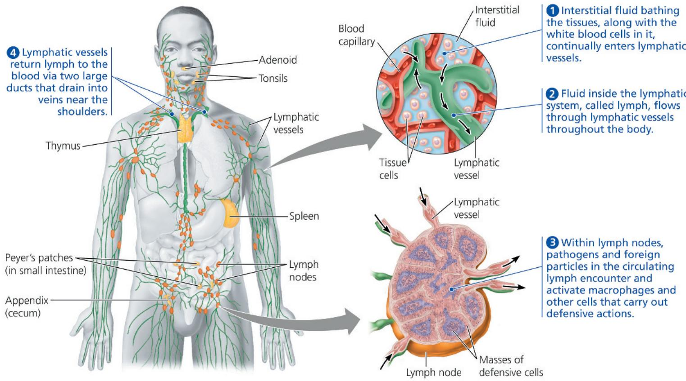

all forms of sepsis allows fluid to leak out of blood into tissues, resulting in both swelling and low blood pressure. If not controlled, sepsis can progress to septic shock, in which blood pressure drops precipitously and the blood supply to organs is significantly reduced. The mortality rate for septic shock is above 40%.

Chronic (ongoing) inflammation can also threaten human health. For example, millions of individuals worldwide are affected by Crohn's disease and ulcerative colitis, often debilitating disorders in which an unregulated inflammatory response disrupts intestinal function.

## Antimicrobial Peptides and Proteins

In mammals, pathogen recognition triggers the production and release of a variety of peptides and proteins that attack pathogens or impede their reproduction. A number of these, including the interferons and complement proteins, are unique to vertebrate immune systems.

Interferons are proteins that provide innate defense by interfering with viral infections. Virus-infected body cells secrete interferon proteins that induce nearby uninfected cells to produce substances that inhibit viral replication. In this way, these interferons limit the cell-to-cell spread of viruses in the body, helping control viral infections such as colds and influenza. Some white blood cells secrete a different type of interferon that helps activate macrophages, enhancing their phagocytic ability. Pharmaceutical companies now use recombinant DNA technology to mass-produce interferons to help treat certain viral infections, such as hepatitis C.

The infection-fighting complement system consists of roughly 30 proteins in blood plasma. These proteins circulate in an inactive state and are activated by substances on the surface of many pathogens. Activation results in a cascade of biochemical reactions that can lead to lysis (bursting) of invading cells. The complement system also functions in the inflammatory response as well as in the adaptive defenses discussed later in the chapter.

## Evasion of Innate Immunity by Pathogens

Adaptations have evolved in some pathogens that enable them to avoid destruction by phagocytic cells. For example, the outer capsule that surrounds certain bacteria interferes with molecular recognition and phagocytosis. One such bacterium, Streptococcus pneumoniae, is a major cause of pneumonia and meningitis in humans (see Concept 16.1).

Some bacteria are recognized but resist breakdown after being engulfed by a host cell. One example is Mycobacterium tuberculosis, the bacterium shown in Figure 43.1. Rather than being destroyed, this bacterium grows and reproduces within host cells, effectively hidden from the body's immune defenses. The result of this infection is tuberculosis (TB), a disease that attacks the lungs and other tissues. Worldwide, TB kills more than 1 million people a year.

Many viruses act at the cellular level in blocking the innate immune response. For instance, viral genomes often encode proteins that generally suppress protein synthesis by the host cell, or specifically suppress the synthesis of defensive proteins such as interferons. These mechanisms allow the viral infection to become well established before the host can mount an effective immune response.

## Concept Check 43.1

1. Pus is both a sign of infection and an indicator of immune defenses in action. Explain.

2. MAKE CONNECTIONS How do the molecules that activate the vertebrate TLR signal transduction pathway differ from the ligands in most other signaling pathways (see Concept 11.2)?

3. WHAT IF? Parasitic wasps inject their eggs into host larvae of other insects. If the host immune system doesn't kill the wasp egg, the egg hatches and the wasp larva devours the host larva as food. Suggest an explanation for why some insect species initiate an innate immune response to a wasp egg, but others cannot.

For suggested answers, see Appendix A.

# Concept 43.2: In adaptive immunity, receptors provide pathogen-specific recognition

Vertebrates are unique in having adaptive as well as innate immunity. In adaptive immunity, molecular recognition relies on a vast arsenal of receptors, each of which recognizes a feature typically found only on a particular part of a particular molecule in a particular pathogen. As a result, recognition and response in adaptive immunity occur with remarkable specificity.

The adaptive immune response, also known as the acquired immune response, is activated after the innate immune response and develops more slowly. Unlike innate immunity, the adaptive response is enhanced by previous exposure to the infecting pathogen. Figure 43.7 highlights these and other fundamental similarities and differences between adaptive and innate immunity.

<table><tr><td rowspan="2">INNATE IMMUNITY(all animals)Recognition of traits shared by broad ranges of pathogens, using a small set of receptorsRapid response</td><td>Barrier defenses:SkinMucous membranesSecretions</td></tr><tr><td>Internal defenses:Phagocytic cellsNatural killer cellsAntimicrobial proteinsInflammatory response</td></tr><tr><td rowspan="2">ADAPTIVE IMMUNITY(vertebrates only)Recognition of traits specific to particular pathogens, using a vast array of receptorsSlower response</td><td>Humoral response:Antibodies defend against infection in body fluids.</td></tr><tr><td>Cell-mediated response:Cytotoxic cells defend against infection in body cells.</td></tr></table>

Adaptive immunity relies on T cells and B cells, which are types of white blood cells called lymphocytes (Figure 43.8). Like all blood cells, lymphocytes originate from stem cells in the bone marrow. Some migrate from the bone marrow to the thymus, an organ in the thoracic cavity above the heart (see Figure 43.6). These lymphocytes

Figure 43.8 B and T lymphocytes.

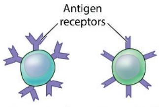

mature into T cells. Lymphocytes that remain and mature in the bone marrow develop as B cells. (Lymphocytes of a third type also mature in bone marrow to become the natural killer cells active in innate immunity.)

Lymphocytes participate in two types of adaptive immunity. The humoral immune response protects blood and lymph, fluids that were once called humors. In this response, antibodies help neutralize or eliminate toxins and pathogens in body fluids. In the cell-mediated immune response, specialized T cells called cytotoxic T cells destroy infected or cancerous host cells. Before investigating the details of lymphocyte activities, we next discuss how they arise.

## Antigens as the Trigger for Adaptive Immunity

Any substance that elicits a B or T cell response is an antigen. In adaptive immunity, recognition occurs when a B cell or T cell binds to an antigen, such as a bacterial or viral protein, via a protein called an antigen receptor. Each antigen receptor binds to just one part of one molecule from a particular pathogen, such as a species of bacteria or strain of virus.

The cells of the immune system produce millions of different antigen receptors. A given lymphocyte, however, produces just one variety; all of the antigen receptors made by a single B or T cell are identical. Infection by a virus, bacterium, or other pathogen triggers activation of B and T cells with antigen receptors specific for parts of that pathogen. Although drawings of B and T cells typically include just a few antigen receptors, a single B or T cell actually has about 100,100 antigen receptors on its surface.

Antigens are usually foreign and are typically large molecules, either proteins or polysaccharides. Many antigens protrude from the surface of foreign cells or viruses. Other antigens, such as toxins secreted by bacteria, are released into the extracellular fluid.

The small, accessible portion of an antigen that binds to an antigen receptor is called an epitope. An example is a group of amino acids in a particular protein. A single antigen usually has several epitopes, each binding a receptor with a different specificity. Because all antigen receptors produced by a single B cell or T cell are identical, they bind to the same epitope. Each B or T cell thus displays specificity for a particular epitope, enabling it to respond to any pathogen that produces molecules containing that epitope.

The antigen receptors of B cells and T cells have similar components, but they encounter antigens in different ways. We'll consider the two processes in turn.

Figure 43.9 The structure of a B cell antigen receptor.  
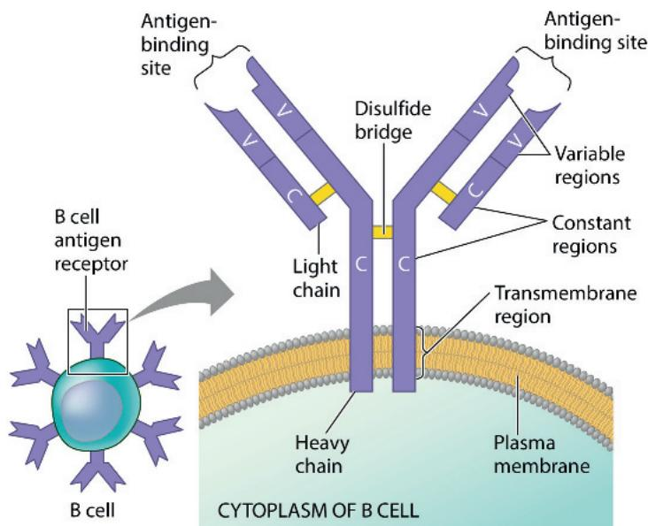

## Antigen Recognition by B Cells and Antibodies

Each B cell antigen receptor is a Y-shaped protein consisting of four polypeptide chains: two identical heavy chains and two identical light chains (Figure 43.9). Disulfide bridges link the chains together.

Each light chain or heavy chain has a constant (C) region, where amino acid sequences vary little among the receptors on different B cells. The constant region of heavy chains contains a transmembrane region, which anchors the receptor in the cell's plasma membrane. As shown in Figure 43.9, each light or heavy chain also has a variable (V) region, so named because its amino acid sequence varies extensively from one B cell to another. Together, parts of a heavy-chain V region and a light-chain V region form an asymmetric binding site for an antigen. Therefore, each B cell antigen receptor has two identical antigen-binding sites.

Binding of a B cell antigen receptor to an antigen is an early step in B cell activation, leading eventually to formation of cells that secrete a soluble form of the receptor (Figure 43.10a). This secreted protein is called an antibody, also known as an immunoglobulin (Ig). Antibodies have the same Y-shaped structure as B cell antigen receptors but lack a membrane anchor. As you'll see later, antibodies provide a direct defense against pathogens in body fluids.

The antigen-binding site of a membrane-bound receptor or antibody has a unique shape that provides a lock-and-key fit for a particular epitope. This stable interaction involves many noncovalent bonds between an epitope and the surface of the binding site. Differences in the amino acid sequences of variable regions provide the variation in binding surfaces that enables binding to be highly specific.

B cell antigen receptors and antibodies bind to intact antigens in the blood and lymph. As illustrated in Figure 43.10b for antibodies, they can bind to antigens on the surface of pathogens or free in body fluids.

MAKE CONNECTIONS The interactions depicted here involve a highly specific binding between antigen and receptor (see also Figure 5.17). How is this type of interaction similar to an enzyme-substrate interaction (see Figure 8.15)?  
Figure 43.10 Antigen recognition by B cells and antibodies.  
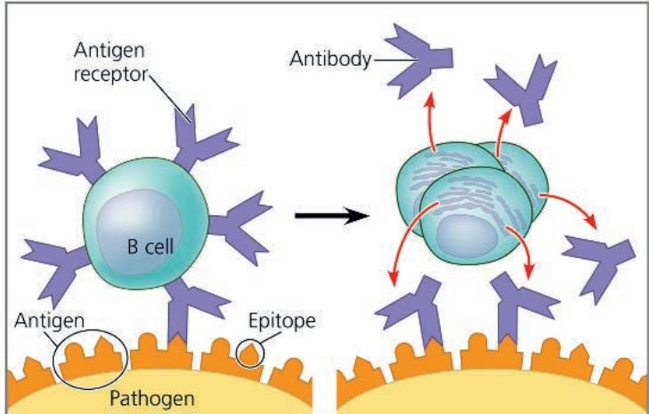  
(a) B cell antigen receptors and antibodies. An antigen receptor of a B cell binds to an epitope, a particular part of an antigen. Following binding, the B cell gives rise to cells that secrete an antibody: a soluble form of the receptor that is specific for the same epitope as the original antigen receptor.

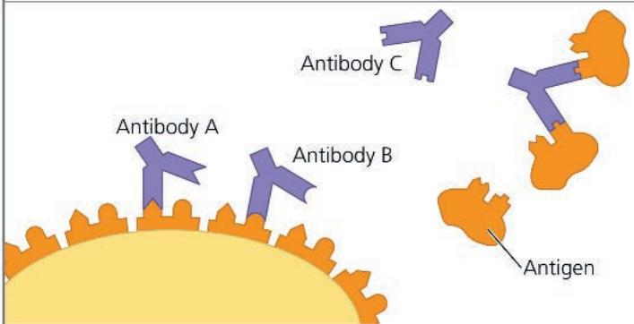  
(b) Antigen receptor specificity. Different antibodies can recognize distinct epitopes on the same antigen. Furthermore, antibodies can recognize free antigens as well as antigens on a pathogen's surface.  
For suggested answer, see Appendix A.

## Antigen Recognition by T Cells

For a T cell, the antigen receptor consists of two different polypeptide chains, an $\alpha$ chain and a $\beta$ chain, linked by a disulfide bridge (Figure 43.11). Near the base of the T cell antigen receptor (often called simply a T cell receptor) is a transmembrane region that anchors the molecule in the cell's plasma membrane. At the outer tip of the molecule, the variable (V) regions of the $\alpha$ and $\beta$ chains together form a single antigen-binding site. The remainder of the molecule is made up of the constant (C) regions.

Whereas the antigen receptors of B cells bind to epitopes of intact antigens protruding from pathogens or circulating free in body fluids, antigen receptors of T cells bind only to fragments of antigens that are displayed, or presented, on the surface of host cells. The host protein that displays the antigen fragment on the cell surface is called a major histocompatibility complex

Figure 43.11 The structure of a T cell antigen receptor.  
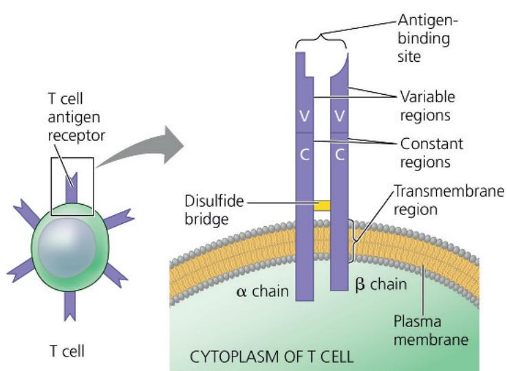

molecule (MHC). By displaying antigen fragments, MHC molecules are essential for antigen recognition by T cells.

The display of protein antigens occurs when a pathogen infects a cell of the animal host or when an immune cell engulfs pathogen proteins or a whole pathogen (Figure 43.12). Inside the animal cell, enzymes cleave each antigen into antigen fragments, which are small peptides. Each antigen fragment binds to an MHC molecule, which transports the bound peptide to the cell surface. The result is antigen presentation, the display of the antigen fragment in an exposed groove of the MHC protein.

Figure 43.13 shows a close-up view of antigen presentation. In effect, antigen presentations advertise the fact that a host cell contains a foreign substance. If the cell displaying an antigen fragment encounters a T cell with the right specificity, the antigen receptor on the T cell can bind to both the antigen fragment and

Figure 43.12 Antigen recognition by T cells.

Inside the host cell, an antigen fragment from a pathogen binds to an MHC molecule and is brought up to the cell surface, where it is displayed. The combination of MHC molecule and antigen fragment is recognized by a T cell.

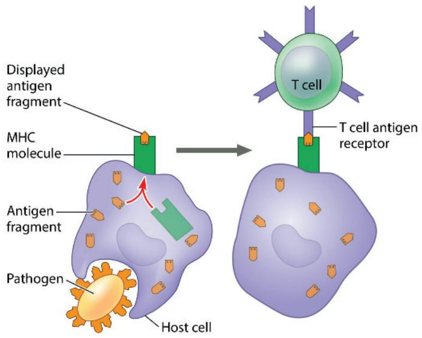

Figure 43.13 A closer look at antigen presentation.

As shown in this ribbon model, the top of the MHC molecule cradles an antigen fragment, like a bun holding a hot dog. An MHC molecule can display many different antigen fragments, but the antigen receptor of a T cell is specific for a single antigen fragment.

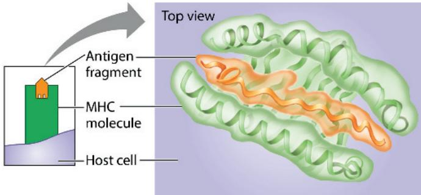

the MHC molecule. This interaction of an MHC molecule, an antigen fragment, and an antigen receptor triggers an adaptive immune response, as we'll explore in Concept 43.3.

## B Cell and T Cell Development

Now that you know how B cells and T cells recognize antigens, let's consider four major characteristics of adaptive immunity. First, the immense repertoire of lymphocytes and receptors enables detection of antigens and pathogens never before encountered. Second, adaptive immunity normally has self-tolerance, the lack of reactivity against an animal's own molecules and cells. Third, cell proliferation triggered by activation greatly increases the number of B and T cells specific for an antigen. Fourth, there is a stronger and more rapid response to an antigen encountered previously, due to a feature known as immunological memory, which we'll explore later in the chapter.

Receptor diversity and self-tolerance arise as a lymphocyte matures. Cell proliferation and the formation of immunological memory occur later, after a mature lymphocyte encounters and binds to a specific antigen. We'll consider these four characteristics in the order in which they develop.

## The Basis of B Cell and T Cell Diversity

Each person makes more than 1 million different B cell antigen receptors and 10 million different T cell antigen receptors. Yet there are only about 20,000 protein-coding genes in the human genome. How, then, do we generate so many different antigen receptors? The answer lies in combinations. Think of selecting a cell phone model that comes in three sizes and six colors. There are $18 (3 \times 6)$ combinations to consider. Similarly, by combining variable elements, the immune system assembles millions of different receptors from a very small collection of parts.

To understand the origin of receptor diversity, let's consider an immunoglobulin (Ig) gene that encodes the light chain of both membrane-bound B cell antigen receptors and secreted antibodies (immunoglobulins). Although we'll analyze only a single Ig light-chain gene, all B and T cell antigen receptor genes undergo very similar transformations.

The capacity to generate diversity is built into the structure of Ig genes. A receptor light chain is encoded by three gene segments: a

variable (V) segment, a joining (J) segment, and a constant (C) segment. The V and J segments together encode the variable region of the receptor chain, while the C segment encodes the constant region. The light-chain gene contains a single C segment, 40 different V segments, and 5 different J segments. The alternative copies of the V and J segments are arrayed along the gene in a series (Figure 43.14). Because a functional gene is built from one copy of each type of segment, the pieces can be combined in 200 different ways ( $40\ V \times 5\ J \times 1\ C$ ). The number of different heavy-chain combinations is even greater, resulting in even more diversity.

## Antigen Receptor Gene Rearrangement

Assembling a functional Ig gene requires rearranging the DNA. Early in B cell development, an enzyme complex called recombinase links one light-chain V gene segment to one J gene segment. This recombination event eliminates the long stretch of DNA between the segments, forming a single exon that is part V and part J.

Recombinase acts randomly, linking any one of the 40 V gene segments to any one of the 5 J gene segments. Heavy-chain genes undergo a similar rearrangement. In any given cell, however, only one allele of a light-chain gene and one allele of a heavy-chain gene are rearranged. Furthermore, the rearrangements are permanent and are passed on to the daughter cells when the lymphocyte divides.

After both a light-chain and a heavy-chain gene have been rearranged, antigen receptors can be synthesized. The rearranged genes are transcribed, and the transcripts are processed for translation. Following translation, the light chain and heavy chain assemble together, forming an antigen receptor (see Figure 43.14). Each pair of randomly rearranged heavy and light chains results in a different antigen-binding site. For the total population of B cells in a human body, the number of such combinations has been calculated as $3.5 \times 10^{6}$ . Furthermore, mutations introduced during VJ recombination add additional variation, making the number of antigen-binding specificities even greater.

## Origin of Self-Tolerance

In adaptive immunity, how does the body distinguish self from nonself? Because antigen receptor genes are randomly rearranged, some immature lymphocytes produce receptors specific for epitopes on the organism's own molecules. If these self-reactive lymphocytes were not eliminated or inactivated, the immune system could not distinguish self from nonself and would attack body proteins, cells, and tissues. Instead, as lymphocytes mature in the bone marrow or thymus, their antigen receptors are tested for self-reactivity. Some B and T cells with receptors specific for the body's own molecules are destroyed by apoptosis, which is a programmed cell death (see Concept 11.5). The remaining self-reactive lymphocytes are typically rendered nonfunctional, leaving only those lymphocytes that react to foreign molecules. Since the body normally lacks mature lymphocytes that can react against its own components, the immune system is said to exhibit self-tolerance.

## Proliferation of B Cells and T Cells

Despite the enormous variety of antigen receptors, only a tiny fraction are specific for a given epitope. How then does an effective adaptive response develop? To begin with, an antigen is

## Figure 43.14 Immunoglobulin (antibody) gene rearrangement.

The joining of randomly selected V and J gene segments ( $V_{39}$ and $J_{5}$ in the example shown) results in a functional gene that encodes the light-chain polypeptide of a B cell antigen receptor. Transcription, splicing, and translation result in a light chain that combines with a polypeptide produced from an independently rearranged heavy-chain gene to form a functional receptor. Mature B cells (and T cells) are exceptions to the generalization that all diploid cells in the body have exactly the same DNA.

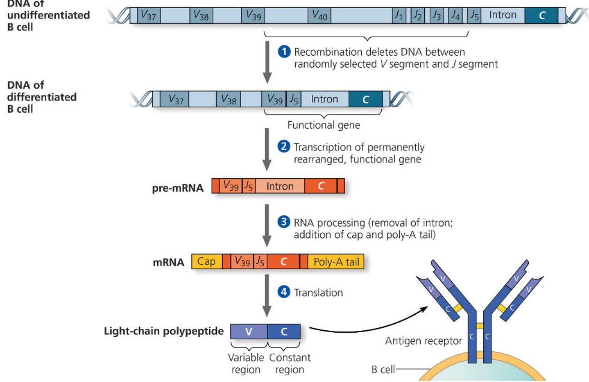  
MAKE CONNECTIONS Both alternative splicing and joining of V and J segments by recombination generate diverse gene products from a limited set of gene segments (see Figure 18.14). How do these processes differ? For suggested answer, see Appendix A.

presented to a steady stream of lymphocytes in the lymph nodes (see Figure 43.6) until a match is made. A successful match between an antigen receptor and an epitope initiates events that activate the lymphocyte bearing the receptor.

Once activated, a B cell or T cell undergoes multiple cell divisions. For each activated cell, the result of this proliferation is a clone, a population of cells that are identical to the original

cell. Some cells from this clone become effector cells, mostly short-lived cells that take effect immediately against the antigen and any pathogens producing that antigen.

For B cells, the effector forms are plasma cells (Figure 43.15), which secrete antibodies. For T cells, the effector forms are helper T cells and cytotoxic T cells, whose roles we'll explore in Concept 43.3. The

Figure 43.15 A plasma cell.

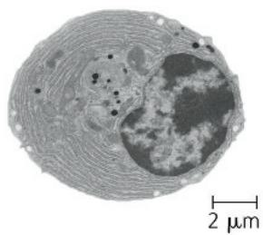

remaining cells in the clone become memory cells, long-lived cells that can give rise to effector cells if the same antigen is encountered later in the animal's life.

Figure 43.16 summarizes the proliferation of lymphocyte into a clone of cells occurs in response to binding to an antigen, using B cells as an example. The process is called clonal selection because an encounter with an antigen selects which lymphocyte will divide to produce a clonal population of thousands of cells specific for a particular epitope.

## Immunological Memory

Immunological memory is responsible for the long-term protection that a prior infection provides against many diseases, such as chicken pox. This type of protection was noted almost 2,400 years ago by the Greek historian Thucydides. He observed that individuals who had recovered from the plague could safely care for those who were sick or dying, “for the same man was never attacked twice—never at least fatally.”

Figure 43.16 Clonal selection of B cells.  
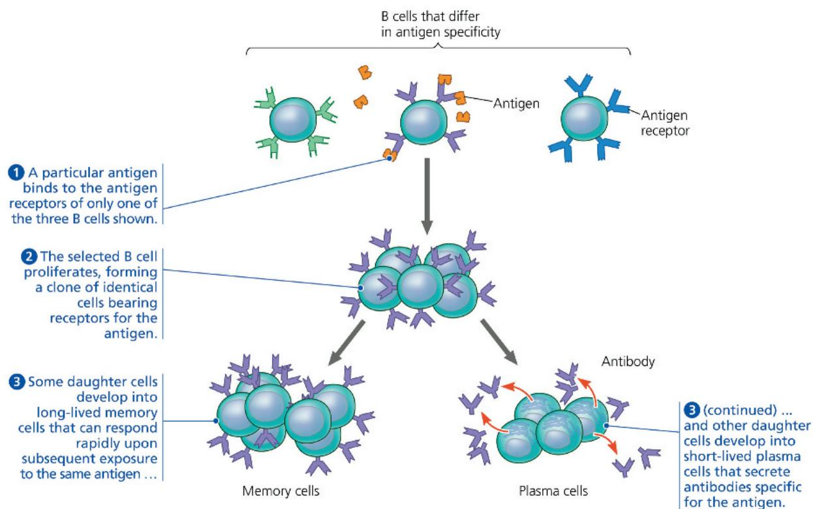  
VISUAL SKILLS For the purpose of illustration, this figure shows only a few of each type of cell or molecule. Based on what you have read in Concept 43.2, provide estimates of the number of different B cells and number of antigen receptors on each B cell.  
For suggested answer, see Appendix A.

Prior exposure to an antigen alters the speed, strength, and duration of the immune response. The effector cells formed by clones of lymphocytes after an initial exposure to an antigen produce a primary immune response. The primary response peaks about 10–17 days after the initial exposure. If the same antigen is encountered again later, there is a secondary immune response, a response that is faster (typically peaking only 2–7 days after exposure), of greater magnitude, and more prolonged. These differences between primary and secondary immune responses are readily apparent in a graph of the concentrations of specific antibodies in blood over time (Figure 43.17).

The secondary immune response relies on the reservoir of T and B memory cells generated upon initial exposure to an antigen. Because these cells are long-lived, they provide the basis for immunological memory, which can span many decades. (Most effector cells have much shorter life spans, which is why the immune response diminishes after an infection is overcome.) If an antigen is encountered again, memory cells specific for that antigen enable the rapid formation of clones of thousands of effector cells that are also specific for that antigen, thus generating a greatly enhanced immune defense.

Although the processes for antigen recognition, clonal selection, and immunological memory are similar for B cells and T cells, these two classes of lymphocytes fight infection in different ways and in different settings, as we'll explore in Concept 43.3.

## Figure 43.17 The specificity of immunological memory.

Long-lived memory cells that are generated in the primary response to antigen A give rise to a heightened secondary response to the same antigen but don't affect the primary response to another antigen (B).

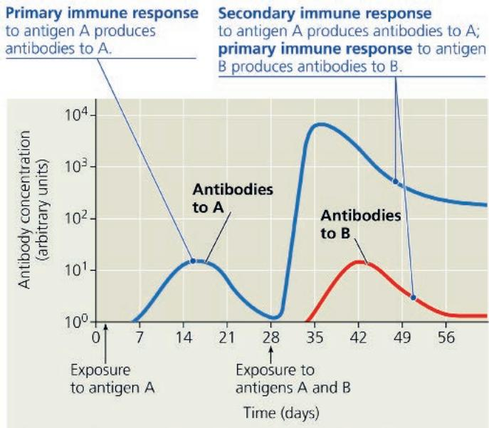  
INTERPRET THE DATA Assume that on average one out of every $10^{5}$ B cells in the body is specific for antigen A on day 16 and that the number of B cells producing a specific antibody is proportional to the concentration of that antibody. What would you predict is the frequency of B cells specific for antigen A on day 36?

## Concept Check 43.2

1. DRAW IT Sketch a B cell antigen receptor. Label the V and C regions of the light and heavy chains. Where are the antigen-binding sites, disulfide bridges, and transmembrane region located relative to these regions?

2. Explain how memory cells strengthen the immune response when a pathogen is encountered for a second time.

3. WHAT IF? If both copies of a light-chain gene and a heavy-chain gene recombined in each (diploid) B cell, how would this affect B cell development and function?

For suggested answers, see Appendix A.

## Concept 43.3: Adaptive immunity defends against infection of body fluids and body cells

Having considered how clones of lymphocytes arise, we now explore how the humoral immune response protects body fluids, and the cell-mediated response destroys infected or cancerous body cells. Both humoral and cellular immunity can include

a primary and a secondary immune response, with memory cells enabling the secondary response.

## Helper T Cells: Activating Adaptive Immunity

A type of T cell called a helper T cell activates humoral and cell-mediated immune responses. Before this can happen, however, two conditions must be met. First, a foreign molecule must be present that can bind specifically to the antigen receptor of the helper T cell. Second, this antigen must be displayed on the surface of an antigen-presenting cell. An antigen-presenting cell can be a dendritic cell, macrophage, or B cell.

Like immune cells, infected cells can display foreign antigens on their surface. What then distinguishes antigen-presenting cells from infected cells? The answer lies in two distinct types, or classes, of MHC molecules. Most body cells have only the class I MHC molecules, but antigen-presenting cells have both class I and class II MHC molecules. The class II molecules provide a molecular signature by which an antigen-presenting cell is recognized.

A helper T cell and the antigen-presenting cell displaying its specific epitope have a complex interaction. The antigen receptors on the surface of the helper T cell bind to the antigen fragment and to the class II MHC molecule displaying that fragment on the antigen-presenting cell (Figure 43.18). At the same time, an

Figure 43.18 The central role of helper T cells in humoral and cell-mediated immune responses. Here, a helper T cell responds to a dendritic cell displaying an antigen.  
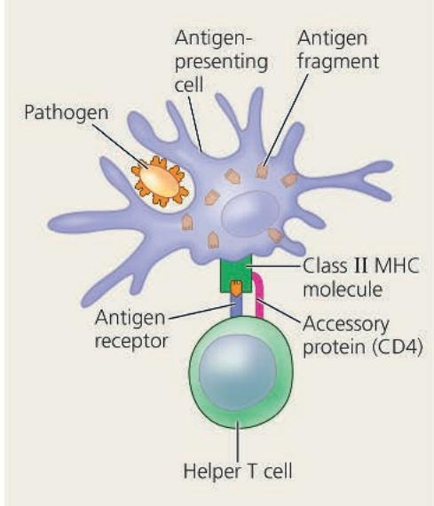  
1 An antigen-presenting cell engulfs a pathogen, degrades it, and displays antigen fragments complexed with class II MHC molecules on the cell surface. A specific helper T cell binds to this complex via its antigen receptor and an accessory protein called CD4.

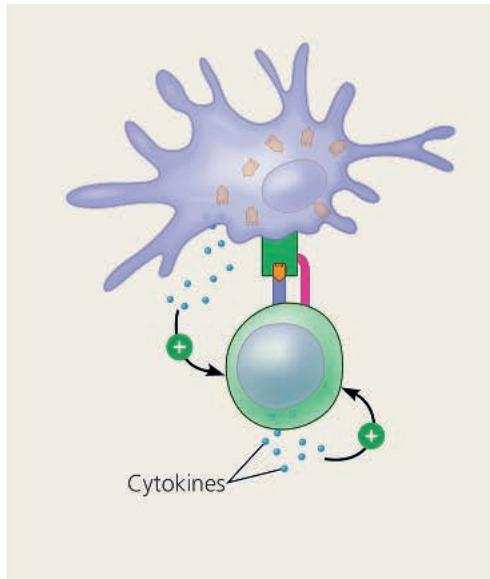  
2 Binding of the helper T cell promotes secretion of cytokines by the antigen-presenting dendritic cell. These cytokines, along with cytokines from the helper T cell itself, activate the helper T cell and stimulate its proliferation.

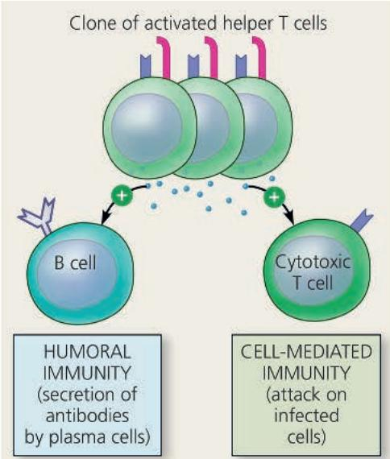  
3 Cell proliferation produces a clone of activated helper T cells. All cells in the clone have receptors for the same antigen. These cells secrete other cytokines, which help activate B cells and cytotoxic T cells with the same antigen specificity.

2 When a B cell with receptors for the same epitope internalizes the antigen, it displays an antigen fragment on the cell surface in a complex with a class II MHC molecule. An activated helper T cell bearing receptors specific for the displayed fragment binds to and activates the B cell.

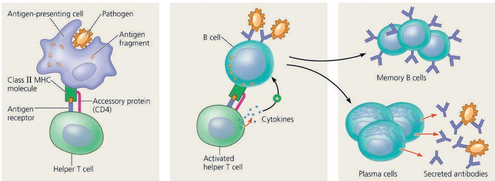  
Figure 43.19 Activation of a B cell in the humoral immune response.  
1 After an antigen-presenting cell engulfs and degrades a pathogen, it displays an antigen fragment complexed with a class II MHC molecule. A helper T cell that recognizes the complex is activated with the aid of cytokines secreted from the antigen-presenting cell.  
3 The activated B cell proliferates and differentiates into memory B cells and antibody-secreting plasma cells. The secreted antibodies are specific for the same antigen that initiated the response.  
Looking at the steps in this figure, propose a function for the cell-surface antigen receptors of memory B cells.

accessory protein called CD4 on the helper T cell surface binds to the class II MHC molecule, helping keep the cells joined. As the two cells interact, signals are exchanged in the form of cytokines. For example, the cytokines secreted from a dendritic cell act in combination with the antigen to stimulate the helper T cell, causing it to produce its own set of cytokines. Also, extensive contact between the cell surfaces enables further information exchange.

Antigen-presenting cells interact with helper T cells in several different contexts. Antigen presentation by a dendritic cell or macrophage activates a helper T cell, which then proliferates, forming a clone of activated cells. In contrast, B cells present antigens to already activated helper T cells, which in turn activate the B cells. Activated helper T cells also help stimulate cytotoxic T cells, as we'll discuss shortly.

## B Cells and Antibodies: A Response to Extracellular Pathogens

Secretion of antibodies by clonally selected B cells is the hallmark of the humoral immune response. It begins with activation of the B cells.

## Activation of B Cells

As illustrated in Figure 43.19, activation of B cells involves both helper T cells and proteins on the surface of pathogens. Stimulated by both an antigen and cytokines, the B cell proliferates and differentiates into memory B cells and antibody-secreting plasma cells.

The pathway for antigen processing and display in B cells differs from that in other antigen-presenting cells. A macrophage or dendritic cell can present fragments from a wide variety of protein antigens, whereas a B cell presents only the antigen to which it specifically binds. When an antigen first binds to receptors on the surface of a B cell, the cell takes in a few foreign molecules by receptor-mediated endocytosis (see Figure 7.19). The class II MHC protein of the B cell then presents an antigen fragment to a helper T cell. This direct cell-to-cell contact is usually critical to B cell activation (see step 2 in Figure 43.19).

B cell activation leads to a robust humoral immune response: A single activated B cell gives rise to thousands of identical plasma cells. These plasma cells stop expressing a membrane-bound antigen receptor and begin producing and secreting antibodies (see step 3 in Figure 43.19). Each plasma cell secretes approximately 2,000 antibodies every second during its four- to five-day life span, nearly a trillion antibody molecules in total. Furthermore, most antigens recognized by B cells contain multiple epitopes. An exposure to a single antigen therefore normally activates a variety

Most protein antigens require activated helper T cells to trigger a humoral response. A macrophage (shown here) or a dendritic cell can activate a helper T cell, which in turn can activate a B cell to give rise to antibody-secreting plasma cells.

of B cells, which give rise to different plasma cells producing antibodies directed against different epitopes on the common antigen.

## Antibody Function

Antibodies do not directly kill pathogens, but by binding to antigens, they interfere with pathogen activity or mark pathogens in various ways for inactivation or destruction. Consider, for example, neutralization, a process in which antibodies bind to proteins on the surface of a virus (Figure 43.20a). The bound antibodies prevent viral infection of a host cell, thus neutralizing the virus. Similarly, antibodies sometimes bind to toxins released in body fluids, preventing the toxins from entering body cells.

In opsonization, antibodies that are bound to antigens on bacteria do not block infection, but instead present a readily recognized structure for macrophages or neutrophils, thereby promoting phagocytosis (Figure 43.20b). Because each antibody has two antigen-binding sites, antibodies can also facilitate phagocytosis by linking bacterial cells, viruses, or other foreign substances into aggregates.

When antibodies facilitate phagocytosis, as in opsonization, they also help fine-tune the humoral immune response. Recall that phagocytosis enables macrophages and dendritic cells to

Figure 43.20 Two mechanisms of antibody function.  
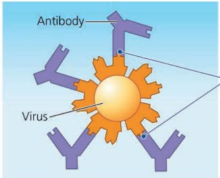  
Antibodies bound to antigens on the surface of a virus neutralize it by blocking its ability to bind to a host cell.  
(a) Neutralization

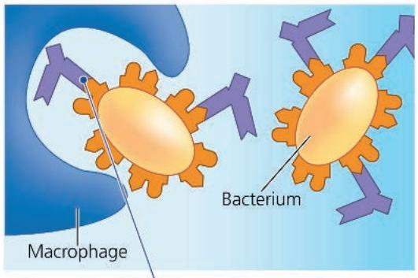  
Binding of antibodies to antigens on the surface of bacteria promotes phagocytosis by macrophages and neutrophils.
(b) Opsonization

present antigens to and stimulate helper T cells, which in turn stimulate the very B cells whose antibodies contribute to phagocytosis. This positive feedback between innate and adaptive immunity contributes to a coordinated, effective response to infection.

Antibodies sometimes work together with the proteins of the complement system (Figure 43.21). (The name complement reflects the fact that these proteins add to the effectiveness of antibody-directed attacks on bacteria.) Binding of a complement protein to an antigen-antibody complex on a foreign cell triggers events leading to formation of a pore in the membrane of the cell. Ions and water rush into the cell, causing it to swell and lyse.

Although antibodies are the cornerstones of the response in body fluids, there is also a mechanism by which they can bring about the death of infected body cells. When a virus uses a cell's biosynthetic machinery to produce viral proteins, these viral products can appear on the cell surface. If antibodies specific for epitopes on these viral proteins bind to the exposed proteins, the presence of bound antibody at the cell surface can recruit a natural killer cell. The natural killer cell then releases proteins that cause the infected cell to undergo apoptosis. Thus the activities of the innate and adaptive immune systems are once again closely linked.

B cells can express five different types, or classes, of immunoglobulin (IgA, IgD, IgE, IgG, and IgM). For a given B cell, each class has an identical antigen-binding specificity but a distinct heavy-chain C region. The B cell antigen receptor, known as IgD, is exclusively membrane bound. The other four classes of Ig have soluble forms, such as the antibodies found in blood, tears, saliva, and breast milk.

Figure 43.21 Activation of complement system and pore formation.  
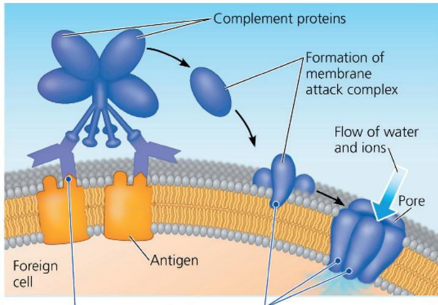  
Binding of antibodies to antigens on the surface of a foreign cell activates the complement system.  
After activation of the complement system, the membrane attack complex forms pores in the cell's membrane, allowing water and ions to rush in. The cell swells and lyses.

Figure 43.22 The killing action of cytotoxic T cells on an infected host cell. An activated cytotoxic T cell releases molecules that make pores in an infected cell's membrane and enzymes that break down proteins, promoting the cell's death.  
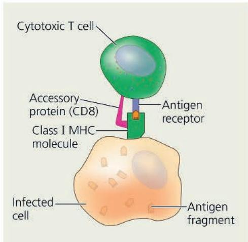  
1 An activated cytotoxic T cell binds to a class I MHC-antigen fragment complex on an infected cell via the T cell's antigen receptor and an accessory protein called CD8.

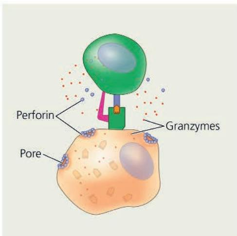  
2 The T cell releases perforin molecules, which form pores in the infected cell membrane, and granzymes, enzymes that break down proteins. Granzymes enter the infected cell via the perforin pores.

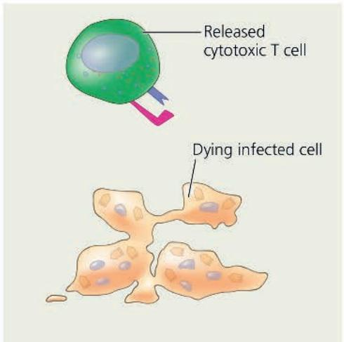  
3 The granzymes initiate apoptosis within the infected cell, leading to fragmentation of the nucleus and cytoplasm and eventual cell death. Once released, the cytotoxic T cell can attack other infected cells.

## Cytotoxic T Cells: A Response to Infected Host Cells

In the absence of an immune response, pathogens can reproduce in and kill infected cells. In the cell-mediated immune response, cytotoxic T cells use toxic proteins to kill cells infected by viruses or other intracellular pathogens before pathogens fully mature (Figure 43.22). To become active, cytotoxic T cells require signals from helper T cells and interaction with an antigen-presenting cell. Fragments of foreign proteins produced in infected host cells associate with class I MHC molecules and are displayed on the cell surface, where they can be recognized by activated cytotoxic T cells. Like helper T cells, cytotoxic T cells have an accessory protein that can bind to an MHC molecule. The interaction of this accessory protein, called CD8, with a class I MHC molecule displaying antigen targets the infected cell for cytotoxic T cell activity.

The targeted destruction of an infected host cell by a cytotoxic T cell involves the secretion of proteins that disrupt membrane integrity and trigger cell death (apoptosis; see Figure 43.22). The death of the infected cell not only deprives the pathogen of a place to multiply but also exposes cell contents to circulating antibodies, which mark released antigens for disposal.

## Summary of the Humoral and Cell-Mediated Immune Responses

As noted earlier, both humoral and cell-mediated immunity can include primary as well as secondary immune responses. Memory cells of each type—helper T cell, B cell, and cytotoxic T cell—enable the secondary response. For example, when body fluids are reinfected by a pathogen encountered previously, memory B cells and memory helper T cells initiate a secondary humoral response. Figure 43.23, on the next page, summarizes adaptive immunity, reviews the events that initiate humoral and cell-mediated immune responses, highlights the difference in response to pathogens in body fluids versus in body cells, and emphasizes the central role of the helper T cell.

## Immunization

The protection provided by a second immune response provides the basis for immunization, the use of antigens artificially introduced into the body to generate an adaptive immune response and memory cell formation. In 1796, Edward Jenner noted that milkmaids who had cowpox, a mild disease usually seen only in cows, did not contract smallpox, a far more dangerous disease. In the first documented immunization (or vaccination, from the Latin vacca, cow), Jenner used the cowpox virus to induce adaptive immunity against the closely related smallpox virus. The vaccines used today for immunizations may be made from inactivated bacterial toxins, killed or weakened pathogens, or the mRNA or DNA encoding these proteins. The adaptive immune response depends on the cells and chemicals of innate immunity. Some vaccines contain adjuvants, substances that include or act like PAMPs (pathogen-associated molecular patterns; see Concept 43.1), promoting a stronger innate immune response. Figure 43.24 illustrates how the mRNA vaccines developed in 2020 stimulate an immune response against the SARS-CoV-2 virus. They contain the mRNA for the Spike glycoprotein on the surface of the virus (see Figure 17.2) that enables it to gain access to human cells. The recipient's own cells use this genetic material to make Spike proteins, which then stimulate an immune response in the body. Since it is much easier to make an mRNA

Figure 43.23 An overview of the adaptive immune response.  
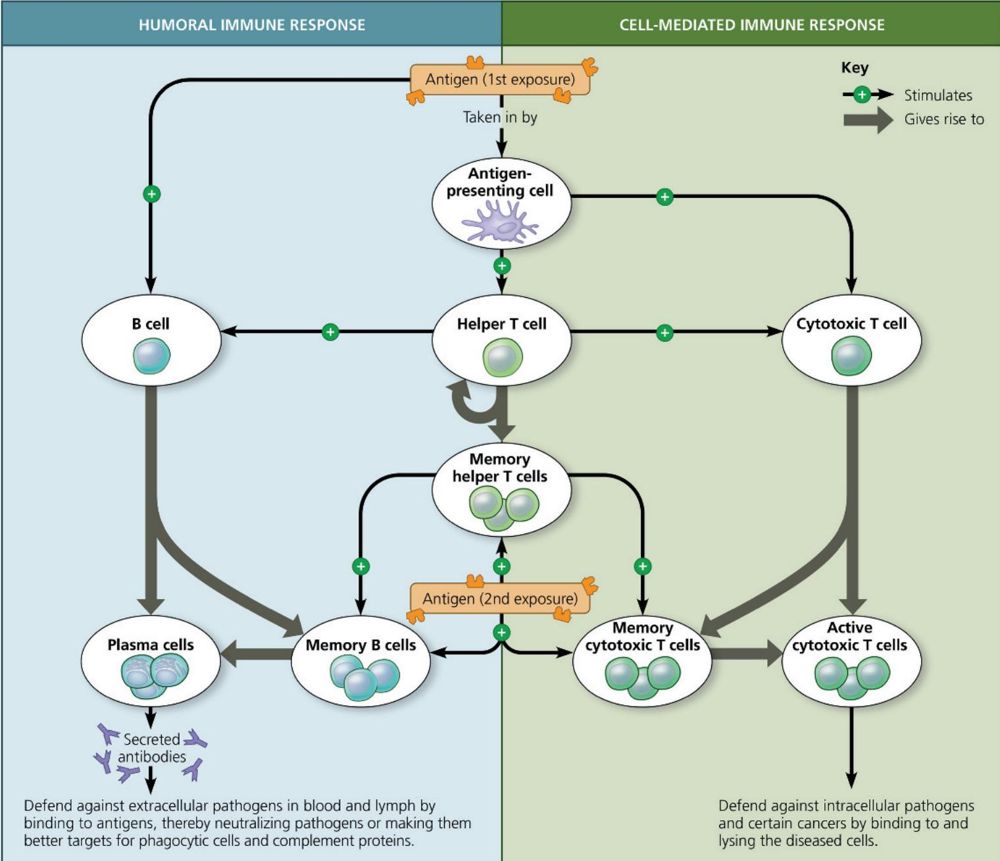  
VISUAL SKILLS Identify each arrow as representing part of the primary response or secondary response. For suggested answer, see Appendix A.

molecule than a protein molecule in the laboratory, these genetic vaccines can be readily modified to target new viral strains as they emerge. As with most vaccines, maintaining immunity against SARS-CoV-2 requires the administration of booster vaccine doses. These boosters trigger a secondary immune response, replenishing stores of memory cells (see Figure 43.17).

Vaccination programs have been successful against many infectious diseases that once killed or incapacitated large numbers of people. A worldwide vaccination campaign led to eradication of smallpox in the late 1970s. In industrialized nations, routine immunization of infants and children has dramatically reduced the incidence of sometimes devastating diseases, such as polio and measles (Figure 43.25, after you turn the next page). The

COVID-19 vaccine campaign was an important measure in fighting the pandemic. However, this massive effort was hampered by vaccine hesitancy and by global inequities in vaccine distribution. Ensuring global vaccine availability for viral diseases is not only a humanitarian initiative. The more infections, the higher the likelihood that concerning variants will develop, as occurred during the COVID-19 pandemic. Therefore, widespread vaccination is crucial to prevent the rise and spread of viral variants that could evade existing vaccines and thus spark new outbreaks.

Vaccine hesitancy is fueled by misinformation about safety and disease risk. Consider measles as just one example. The vaccine is highly effective and very safe—fewer than one in a

million children experience a significant allergic reaction. Indeed, a vaccination campaign had effectively eliminated the disease in the United States by 2000. However, the disease remains quite dangerous to this day, killing more than 100,000 people worldwide each year. Recently, a decline in vaccination rates in the United States has led to multiple outbreaks since 2010. Multi-state outbreaks in 2019 and 2025 each included more than 1,000 cases, and in 2025 the first deaths from measles in a decade were recorded. Worldwide, interruptions in childhood immunization protocols during the COVID-19 pandemic resulted in a 43% increase in measles-related deaths between 2021 and 2022.

## Active and Passive Immunity

Our discussion of adaptive immunity has to this point focused on active immunity, the defenses that arise when a pathogen infection or immunization prompts an immune response. A different type of immunity results when, for example, the IgG antibodies in the blood of a pregnant female cross the placenta to her fetus. This protection is called passive immunity because the antibodies in the recipient (in this case, the fetus) are produced by another individual (the mother). IgA antibodies present in breast milk provide additional passive immunity to the infant's digestive tract while the infant's immune system develops. Passive immunity persists

Figure 43.24 mRNA vaccines stimulate both innate and adaptive immune responses. COVID-19 mRNA vaccines consist of an mRNA molecule encoding the viral Spike (S) protein contained within a tiny lipid sphere.  
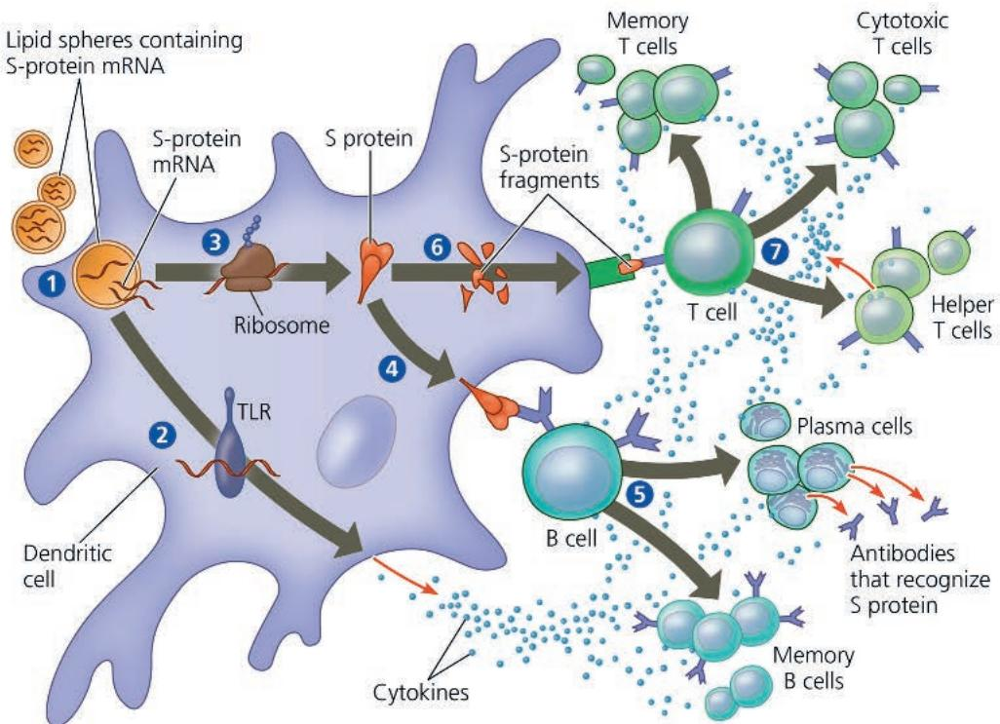

1 When a dendritic cell takes up the lipid sphere, the mRNA is released into the cytosol.

2 The mRNA and other vaccine components act as PAMPs (pathogen-associated molecular patterns), binding cytosolic Toll-like receptors (TLRs) and stimulating the production of interferons and other cytokines of the innate immune response. These chemicals stimulate the proliferation and activity of all types of lymphocytes. They also stimulate the inflammatory responses that are experienced as side effects, such as shoulder pain, fever, and general malaise.

3 Dendritic cell ribosomes translate the mRNA into S proteins, some of which are inserted into the plasma membrane 4 and bind to B cells with the matching receptor.

5 These B cells proliferate and differentiate into plasma cells that produce antibodies that recognize S proteins or into memory B cells. (Note that full activation of the B cells also requires binding by S-protein-specific helper T cells, a process not shown here.)

6 Other S proteins are broken down into smaller fragments and presented on the cell surface bound to MHC class II receptors, which bind T cells with the matching receptor.

7 These activated T cells proliferate and differentiate into helper T cells, cytotoxic T cells, and memory cells. A second (booster) shot activates the memory B and T cells, resulting in the rapid production of all lymphocyte types, including more memory cells. As a result, the booster provides a more robust and long-lasting immunity.

only as long as the transferred antibodies last (up to a few months).

In artificial passive immunization, antibodies from an immune animal are injected into a nonimmune animal. For example, humans bitten by venomous snakes are sometimes treated with antivenin, serum from sheep or horses that have been immunized against a snake venom. When injected immediately after a snakebite, the antibodies in antivenin can neutralize toxins in the venom before the toxins do massive damage.

## Antibodies as Tools

Antibodies that an animal produces after exposure to an antigen are the products of many different clones of plasma cells, each specific for a different epitope. However, antibodies can also be prepared from a single clone of B cells grown in culture. The monoclonal antibodies produced by such a culture are identical and specific for the same epitope on an antigen.

Monoclonal antibodies have provided the basis for many recent advances in medical diagnosis and treatment. For example, home pregnancy test kits use monoclonal antibodies to detect human chorionic gonadotropin (hCG). Because hCG is produced as soon as an embryo implants in the uterus (see Concept 46.5), the presence of this hormone in a woman's urine is a reliable indicator for a very early stage of pregnancy. Monoclonal antibodies are also being used as therapies for a growing number of human diseases, including many cancers and COVID-19.

One antibody tool uses a single drop of blood to identify every virus that a person has encountered through infection or vaccination (Figure 43.26). To detect the antibodies formed against these viruses, researchers generated a set of nearly 100,000 bacteriophages, each of which displays a different peptide from one of the roughly 200 species of viruses that infect humans.

Figure 43.25 Vaccine-based protection against two life-threatening communicable diseases. The graphs show deaths by year in the United States caused by polio and measles. The maps show examples of the global progress against these two diseases.  
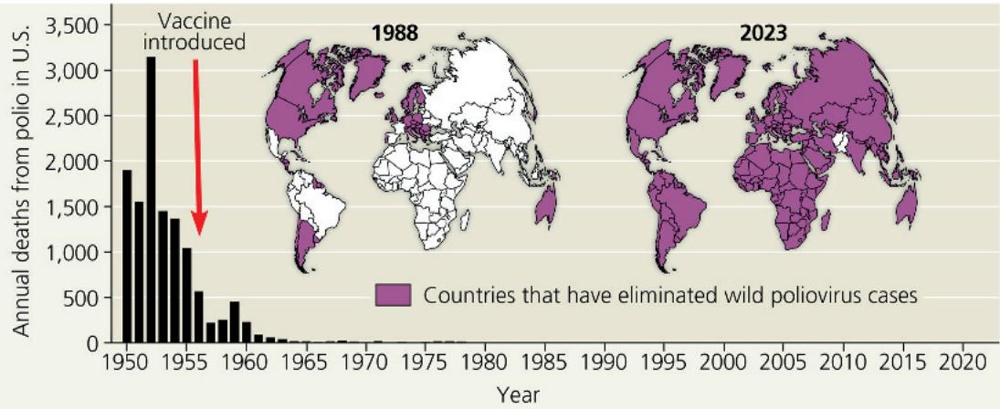

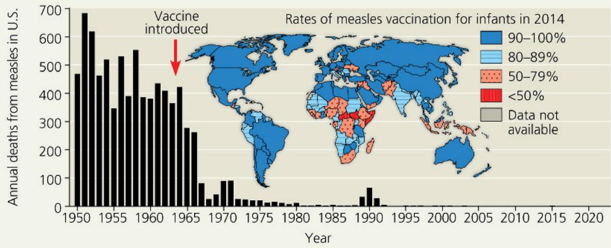

## Immune Rejection

Like pathogens, cells from another person can be recognized as foreign and attacked by immune defenses. For example, skin transplanted from one person to a genetically nonidentical person will look healthy for a week or so but will then be destroyed (rejected) by the recipient's immune response. It turns out that MHC molecules are a primary cause of rejection. Why? Each of us expresses MHC proteins from more than a dozen different MHC genes. Furthermore, there are more than 100 different versions, or alleles, of human MHC genes. As a consequence, the sets of MHC proteins on cell surfaces are likely to differ between any two people, except identical twins. Such differences can stimulate an immune response in the recipient of a transplant or graft, causing rejection. To minimize rejection of a transplant or graft, surgeons use donor tissue bearing MHC molecules that match those of the recipient as closely as possible. In addition, the recipient takes medicines that suppress immune responses (but as a result leave the recipient more susceptible to infections).

## Blood Groups

In the case of blood transfusions, the recipient's immune system can recognize glycoproteins on the surface of blood cells as foreign, triggering an immediate and devastating reaction. To avoid this danger, the so-called ABO blood groups of the donor and recipient must be taken into account. Red blood cells are designated as type A if they have the A carbohydrate on their surface. Similarly, the B carbohydrate is found on the surface of type B red blood cells; both A and B carbohydrates are found on type AB red blood cells; and neither carbohydrate is found on type O red blood cells (see Figure 14.11).

system recognize particular sugars on red blood cells? It turns out that we are frequently exposed to certain bacteria that have epitopes very similar to the carbohydrates on blood cells. A person with type A blood will respond to the bacterial epitope similar to the B carbohydrate and make antibodies that will react with any B carbohydrate encountered upon a transfusion. However, that same person doesn't make antibodies against the bacterial epitope similar to the A carbohydrate because lymphocytes that would be reactive with the body's own cells and molecules were inactivated or eliminated during development.

Why does the immune

To understand how ABO blood groups affect transfusions, let's consider further the example of a person with type A blood receiving a transfusion of type B blood. The person's anti-B antibodies would cause the transfused red blood cells to undergo lysis, triggering chills, fever, shock, and perhaps kidney malfunction. At the same time, anti-A antibodies in the donated type B blood would act against the recipient's red blood cells. Applying the same logic to a type O person, we can see that such interactions would cause a problem upon transfusion of any other blood type. Fortunately, the discovery of enzymes that can cleave the A and B carbohydrates from red blood cells may eliminate this problem in the future.

Figure 43.26 A comprehensive test for past viral encounters.

By combining the power of DNA sequencing with the specificity of antigen recognition by antibodies, researchers can identify every virus that a person's immune system has encountered during the person's lifetime.

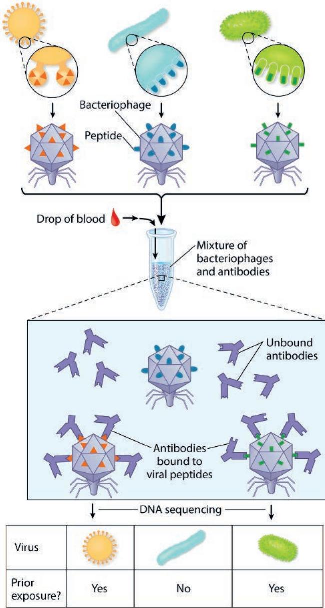

Viruses that infect humans have unique peptides on their surface (insets). By introducing short DNA sequences from all known human viruses into copies of a bacteriophage genome, researchers generated a collection of 100,000 bacteriophages, each displaying many copies of one viral peptide.

2 The bacteriophages are combined with serum from a drop of a person's blood. The serum contains antibodies, some of which were produced in response to exposure to viruses. Any antibody that is specific for a viral peptide binds to a bacteriophage displaying that peptide. Bacteriophages displaying peptides from viruses never encountered are not recognized.

3 DNA sequencing of bacteriophages to which antibodies are bound identifies the complete set of viruses to which a person has been exposed.

WHAT IF? All of the antibodies are shown with just one antigen-binding site occupied. If a single antibody is bound to two bacteriophages, how would this affect the results?
For suggested answer, see Appendix A.

## Concept Check 43.3

1. If a child were born without a thymus gland, what cells and functions of the immune system would be deficient? Explain.

2. Treatment of antibodies with a particular protease clips the heavy chains in half, releasing the two arms of the Y-shaped molecule. How might the antibodies continue to function?

3. WHAT IF? Suppose that a snake handler bitten by a particular venomous snake species was treated with antivenin. Why might the same treatment for a second such bite have a harmful side effect?

# Concept 43.4: Disruptions in immune system function can elicit or exacerbate disease

Although adaptive immunity protects against many pathogens, it is not fail-safe. Here, we'll first examine the disorders and diseases that arise when adaptive immunity is blocked or misregulated. We'll then turn to some of the evolutionary adaptations of pathogens that diminish the effectiveness of adaptive immune responses in the host.

## Exaggerated, Self-Directed, and Diminished Immune Responses

The highly regulated interplay among lymphocytes, other body cells, and foreign substances generates an immune response that provides extraordinary protection against many pathogens. When allergic, autoimmune, or immunodeficiency disorders disrupt this delicate balance, the effects are frequently severe.

## Allergies

Allergies are exaggerated (hypersensitive) responses to certain antigens called allergens. The most common allergies involve antibodies of the IgE class. Hay fever, for instance, occurs when plasma cells secrete IgE antibodies specific for antigens on the surface of pollen grains

(Figure 43.27). Some IgE antibodies attach by their base to mast cells in connective tissues. Pollen grains that enter the body later attach to the antigen-binding sites of these IgE antibodies. Such attachment cross-links adjacent IgE molecules, inducing the mast cell to release histamine and other inflammatory chemicals. Acting on a variety of cell types, these chemicals bring about the typical allergy symptoms: sneezing, runny nose, teary eyes, and smooth muscle contractions in the lungs that can inhibit effective breathing. Drugs known as antihistamines block receptors for histamine, diminishing allergy symptoms (and inflammation).

Figure 43.28 X-ray of hands that are deformed by rheumatoid arthritis.

Figure 43.27 Mast cells, IgE, and the allergic response. In this example, pollen grains act as the allergen.

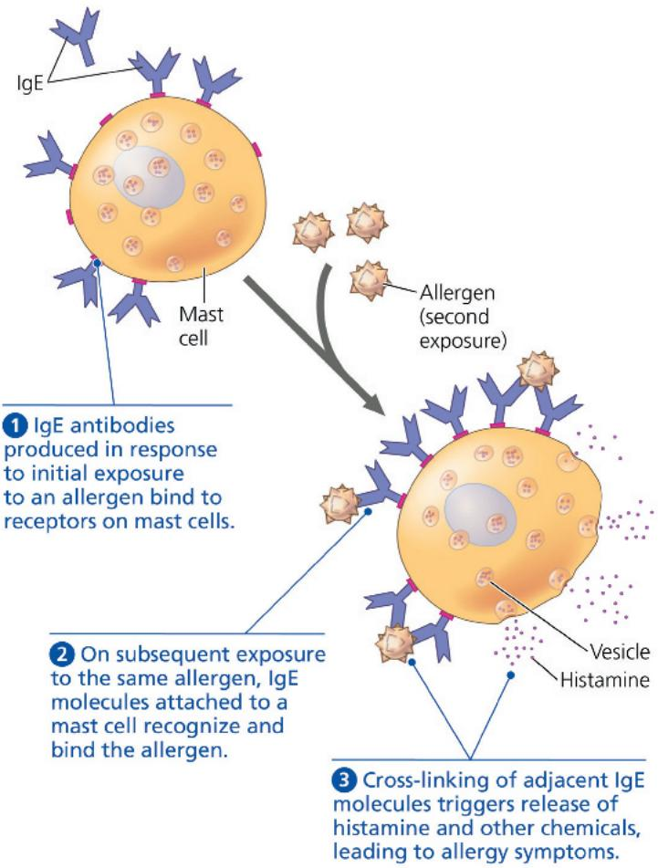

An acute allergic response sometimes leads to a life-threatening reaction called anaphylactic shock. Inflammatory chemicals released from immune cells trigger constriction of bronchioles and sudden dilation of peripheral blood vessels, which causes a precipitous drop in blood pressure. Death may occur within minutes due to the inability to breathe and lack of blood flow. Substances that can cause anaphylactic shock in allergic individuals include bee venom, penicillin, peanuts, and shellfish. People with severe hypersensitivities often carry an autoinjector containing the hormone epinephrine. An injection of epinephrine rapidly counteracts this allergic response, constricting peripheral blood vessels, reducing swelling in the throat, and relaxing muscles in the lungs to help breathing (see Figure 45.20b).

## Autoimmune Diseases

In some people, the immune system is active against particular molecules of the body, causing an autoimmune disease. Such a loss of self-tolerance has many forms. In systemic lupus erythematosus, commonly called lupus, the immune system generates antibodies against histones and DNA released by the normal breakdown of body cells. These self-reactive antibodies cause skin rashes, fever, arthritis, and kidney dysfunction. Other targets of autoimmunity include the insulin-producing beta cells of the pancreas (in type 1

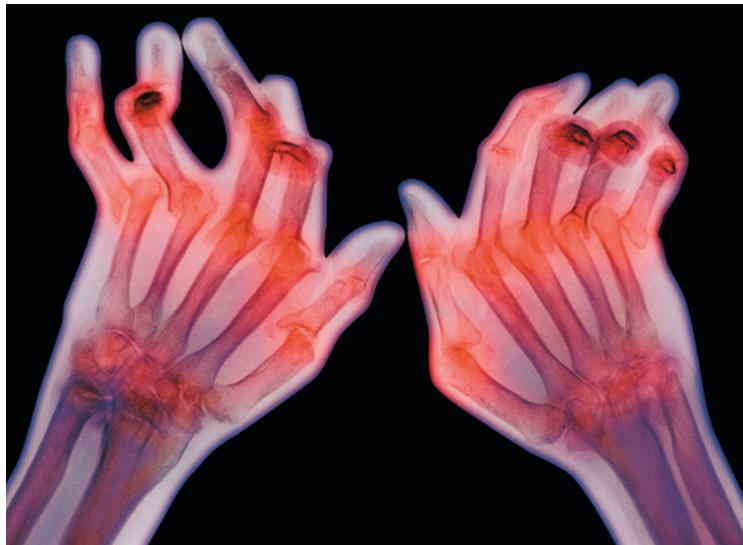

diabetes) and the myelin sheaths that encase many neurons (in multiple sclerosis).

Heredity, sex, and environment all influence susceptibility to autoimmune disorders. For example, members of certain families show an increased susceptibility to particular autoimmune disorders. In addition, many autoimmune diseases affect females more often than males. Females are nine times as likely as males to have lupus and two to three times as likely to develop rheumatoid arthritis, a damaging and painful inflammation of the cartilage and bone in joints (Figure 43.28). The causes of this sex difference, as well as the rise in autoimmune disease frequency in industrialized countries, are areas of active research and debate.

An additional focus of current research on autoimmune disorders is the activity of regulatory T cells, nicknamed Tregs. These specialized T cells help modulate immune system activity and prevent response to self-antigens.

## Exertion, Stress, and the Immune System

Many forms of exertion and stress influence immune system function. For example, moderate exercise improves immune system function and significantly reduces susceptibility to the common cold and other infections of the upper respiratory tract. In contrast, exercise to the point of exhaustion leads to more frequent infections and more severe symptoms. Psychological stress likewise disrupts immune system regulation, altering the interplay of the hormonal, nervous, and immune systems (see Figure 45.20). Research has also shown that rest is important for immunity: Adults who averaged fewer than 7 hours of sleep got sick three times as often when exposed to a cold virus as those who averaged at least 8 hours.

## Immunodeficiency Diseases

A disorder in which an immune system response to antigens is defective or absent is called an immunodeficiency. Whatever its cause and nature, an immunodeficiency can lead to frequent and recurrent infections and increased susceptibility to certain cancers.

An inborn immunodeficiency results from a genetic or developmental defect in the production of immune system cells or of specific proteins, such as antibodies or the proteins of the complement system. Depending on the specific defect, either innate or adaptive defenses—or both—may be impaired. In severe combined immunodeficiency (SCID), functional lymphocytes are rare or absent. Lacking an adaptive immune response, people with SCID are susceptible to infections that can cause death in infancy, such as pneumonia and meningitis. Treatments include bone marrow and stem cell transplantation.

Later in life, exposure to chemicals or biological agents can cause an acquired immunodeficiency. Drugs used to fight autoimmune diseases or prevent transplant rejection suppress the immune system, leading to an immunodeficient state. Certain cancers also suppress the immune system, especially Hodgkin's disease, which damages the lymphatic system. Acquired immunodeficiencies range from temporary states that may arise from physiological stress to the devastating disease AIDS (acquired immune deficiency syndrome), which we'll explore in the next section.

## Evolutionary Adaptations of Pathogens That Underlie Immune System Avoidance

EVOLUTION Just as immune systems that ward off pathogens have evolved in animals, mechanisms that thwart immune responses have evolved in pathogens. Using human pathogens as examples, we'll examine some common mechanisms: antigenic variation, latency, and direct attack on the immune system.

## Antigenic Variation

One mechanism for escaping the body's defenses involves a pathogen altering how it appears to the immune system. If a pathogen changes the epitopes that it expresses to ones that a host has not previously encountered, it can reinfect or remain in the host without triggering the rapid and robust response mediated by memory cells. Such changes in epitope expression are called antigenic variation. The parasite that causes sleeping sickness (trypanosomiasis) provides an extreme example, periodically switching at random among 1,000 versions of the protein found over its entire surface. In the Scientific Skills Exercise, you will interpret data on this form of antigenic variation and the body's response.

Antigenic variation is the main reason the influenza, or "flu," virus remains a major public health problem. As it replicates in one human host after another, the human flu virus undergoes frequent mutations. As a result, a new flu vaccine must be developed, produced, and distributed each year. In addition, the human flu virus occasionally forms new strains by exchanging genes with influenza viruses that infect

domesticated animals, such as pigs or chickens. When this exchange of genes occurs, the new strain may not be recognized by any of the memory cells in the human population. The resulting outbreak can be deadly: The 1918–1919 influenza outbreak killed more than 20 million people. Similarly, the emergence of new variants of SARS-CoV-2 is of continuing concern.

## Latency

Some viruses avoid an immune response by infecting cells and then entering a largely inactive state called latency. In latency, the production of most viral proteins and free viruses ceases; as a result, latent viruses do not trigger an adaptive immune response. Nevertheless, the viral genome persists in the nuclei of infected cells, either as a separate DNA molecule or as a copy integrated into the host genome. Latency typically persists until conditions arise that are favorable for viral transmission or unfavorable for host survival, such as when the host is infected by another pathogen. Such circumstances trigger the synthesis and release of free viruses that can infect new hosts.

Herpes simplex viruses provide a good example of latency. A number of these herpesviruses infect only humans and cause symptoms ranging from mild to life-threatening (Table 43.1). The type 1 herpesvirus causes most oral herpes infections (often inaccurately called “cold” sores), whereas the sexually transmitted type 2 herpesvirus is responsible for most cases of genital herpes. People infected with either the type 1 or type 2 herpesvirus often have no symptoms. Instead, these viruses remain latent in certain neurons until a stimulus such as fever, emotional stress, or a hormonal change associated with the menstrual cycle reactivates the virus. Activation of the type 1 herpesvirus can result in the appearance of blisters around the mouth. Infections of the type 2 herpesvirus pose a serious threat to babies in utero during pregnancy and can increase transmission of HIV.

Table 43.1 Latency as a Shared Characteristic of Human Herpesviruses

<table><tr><td>Human Herpesvirus</td><td>Main Sites of Latency</td><td>Associated Diseases or Disorders</td></tr><tr><td>Herpes simplex virus-1 (HSV-1)</td><td>Clusters of neurons in spinal nerves</td><td>Cold sores</td></tr><tr><td>Herpes simplex virus-2 (HSV-2)</td><td>Clusters of neurons in spinal nerves</td><td>Genital ulcers</td></tr><tr><td>Varicella-zoster virus (VZV)</td><td>Clusters of neurons in spinal nerves</td><td>Chicken pox, shingles</td></tr><tr><td>Epstein-Barr virus (EBV)</td><td>Memory B cells</td><td>Some lymphoma, mononucleosis</td></tr><tr><td>Cytomegalovirus (CMV)</td><td>Monocytes and lymphocytes</td><td>Abnormal fetal development</td></tr><tr><td>Human herpesvirus 8 (HHV-8)</td><td>B cells</td><td>Kaposi&#x27;s sarcoma</td></tr></table>

# Scientific Skills Exercise Comparing Two Variables on a Common x-Axis

How Does the Immune System Respond to a Changing Pathogen? Natural selection favors parasites that are able to maintain a low-level infection in a host for a long time. Trypanosoma, the unicellular parasite that causes sleeping sickness, is one example. The glycoproteins covering a trypanosome's surface are encoded by a gene that is duplicated more than 1,000 times in the organism's genome. Each copy is slightly different. By periodically switching among these genes, the trypanosome can display a series of surface glycoproteins with different molecular structures. In this exercise, you will interpret two data sets to explore hypotheses about the benefits to the trypanosome of its ever-shifting surface glycoproteins in avoiding the host's immune response.

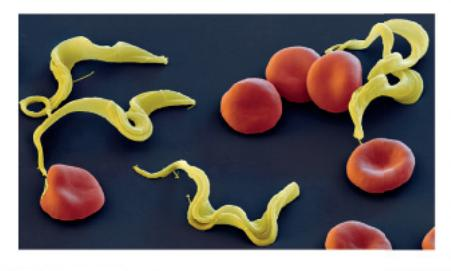

Data from the Studies Study A measured the abundance of parasites in the blood of one human patient during the first few weeks of a chronic infection. The results are shown in the second column of the data table. Many decades after scientists first observed the pattern of Trypanosoma abundance over the course of infection, researchers identified antibodies specific to different forms of the parasite's surface glycoprotein. The third and fourth columns of the table list the relative abundance of two such antibodies during the early period of chronic infection, using an index ranging from 0 (absent) to 1.

## Part A: INTERPRET THE DATA

1. Which of the first two columns represents the independent variable and which the dependent variable? Plot the data from Study A as a line graph, putting the independent variable on the x-axis. (For additional information about graphs, see the Scientific Skills Review in Appendix D.)

2. Visually displaying data in a graph can help make patterns in the data more noticeable. Describe any patterns revealed by your graph.

3. Assume that a drop in parasite abundance reflects an effective immune response by the host. Formulate a hypothesis to explain the pattern you described in question 2.

## Attack on the Immune System: HIV

The human immunodeficiency virus (HIV), the pathogen that causes AIDS, both escapes and attacks the adaptive immune response. HIV infects helper T cells with high efficiency by binding specifically to the CD4 protein. Inside cells, the HIV RNA

<table><tr><td>Day of infection</td><td>Study A: Millions of parasites/mL blood</td><td>Study B: Antibody specific to Variant A</td><td>Study B: Antibody specific to Variant B</td></tr><tr><td>4</td><td>0.1</td><td>0</td><td>0</td></tr><tr><td>6</td><td>0.3</td><td>0</td><td>0</td></tr><tr><td>8</td><td>1.2</td><td>0.2</td><td>0</td></tr><tr><td>10</td><td>0.2</td><td>0.5</td><td>0</td></tr><tr><td>12</td><td>0.2</td><td>1</td><td>0</td></tr><tr><td>14</td><td>0.9</td><td>1</td><td>0.1</td></tr><tr><td>16</td><td>0.6</td><td>1</td><td>0.3</td></tr><tr><td>18</td><td>0.1</td><td>1</td><td>0.9</td></tr><tr><td>20</td><td>0.7</td><td>1</td><td>1</td></tr><tr><td>22</td><td>1.2</td><td>1</td><td>1</td></tr><tr><td>24</td><td>0.2</td><td>1</td><td>1</td></tr></table>

Data from L. J. Morrison et al., Probabilistic order in antigenic variation of Trypanosoma brucei, International Journal for Parasitology 35:961–972 (2005); and L. J. Morrison et al., Antigenic variation in the African trypanosome: molecular mechanisms and phenotypic complexity, Cellular Microbiology 1:1724–1734 (2009).

## Part B: INTERPRET THE DATA

4. Note that the data for Study B were collected over the same period of infection (days 4–24) as the parasite abundance data in Study A. Therefore, you can incorporate these new data into your first graph, using the same x-axis. However, since the antibody level data are measured in a different way than the parasite abundance data, add a second set of y-axis labels on the right side of your graph. Then, using different colors or sets of symbols, add the data for the two antibody types. Labeling the y-axis two different ways enables you to compare how two dependent variables change relative to a shared independent variable.

5. Describe any patterns you observe by comparing the two data sets over the same period. Do these patterns support your hypothesis from question 3? Do they prove it? Explain.

6. Scientists can now also distinguish the abundance of trypanosomes recognized specifically by antibodies type A and type B. How would incorporating such information change your graph?

Instructors: A version of this Scientific Skills Exercise can be assigned in Mastering Biology.

genome is reverse-transcribed, and the product DNA is integrated into the host cell's genome (see Figure 19.8). In this form, the viral genome can direct the production of new viruses.

Although the body responds to HIV with an immune response sufficient to eliminate most viral infections, some HIV invariably escapes. One reason HIV persists is that it has a very high mutation rate. Altered proteins on the surface of some mutated viruses reduce interaction with antibodies and cytotoxic T cells. Such viruses replicate and mutate further. HIV thus evolves within the body.

Figure 43.29 The progress of an untreated HIV infection.  
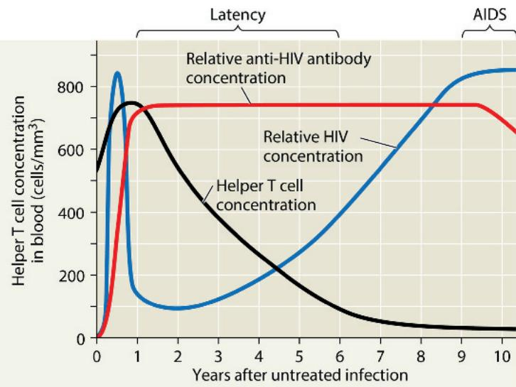

Over time, an untreated HIV infection not only avoids the adaptive immune response but also abolishes it (Figure 43.29). Viral replication and cell death triggered by the virus lead to loss of helper T cells, impairing both humoral and cell-mediated immune responses. Without treatment, the eventual result is acquired immunodeficiency syndrome (AIDS), an impairment in immune responses that leaves the body susceptible to infections and cancers that a healthy immune system would usually defeat. For example, Pneumocystis jirovecii, a common fungus that does not cause disease in healthy individuals, can result in severe pneumonia in people with AIDS. Such opportunistic diseases, as well as nerve damage and body wasting, are the primary causes of death from AIDS, rather than HIV itself.

## Cancer and Immunity

When immunity is impaired, the frequency of certain cancers increases dramatically. For example, the risk of developing Kaposi's sarcoma is 20,000 times greater for patients with untreated HIV disease than for people who are healthy. This observation was initially puzzling. If the immune system recognizes only nonself, it should fail to recognize the uncontrolled growth of self cells that is the hallmark of cancer. We now know that the immune system plays a major role in preventing cancer. Cancerous cells accumulate mutations as they multiply, becoming increasingly “non-self” and thus vulnerable to immune attack. Cancerous cells also release DAMPs (damage-associated molecular patterns; see Concept 43.1) that bind TLRs and activate the innate immune response. Immunotherapy is a promising new approach to cancer treatment that harnesses the power of the immune system to destroy cancerous cells while sparing healthy cells.

The immune system also prevents infections with viruses that cause cancer. The Kaposi's sarcoma herpesvirus is one such virus (see Table 43.1). Hepatitis B virus, which can trigger liver cancer, is another. A vaccine introduced in 1986 for hepatitis B virus was the first vaccine shown to help prevent a specific human cancer. Rapid

progress on developing vaccines for virus-induced cancers continues. In 2006, the release of a vaccine specific for human papillomavirus (HPV) marked a major victory against cervical cancer, as well as oral cancers that are becoming increasingly common among men. The computer graphic image of an HPV particle in Figure 43.30 illustrates the abundant copies of the capsid protein (yellow) that is used as the antigen in vaccination.

Figure 43.30 Human papillomavirus.

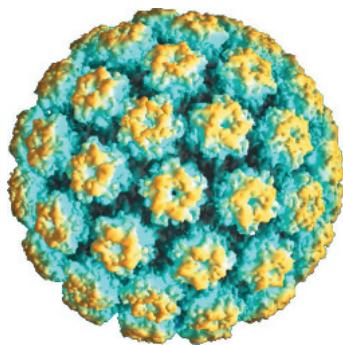

## Interview

Interview with Flossie Wong-Staal: Characterizing HIV (eTextbook only)

Transmission of HIV requires the transfer of virus particles or infected cells from person to person via body fluids such as semen, blood, or breast milk. Public health measures shown to reduce transmission include promoting the use of condoms during sex and supplying clean needles for intravenous drug users. Although no cure has been identified for HIV infection, drugs that inhibit HIV replication (known as anti-retroviral therapy, or ART) can reduce a person's viral load to an undetectable level. Once this treatment milestone has been reached, the person is not at risk of transmitting HIV to another person as long as they continue treatment.

## Interview

Interview with Harald zur Hausen: Discovering the cause of cervical cancer (eTextbook only)

## Concept Check 43.4

1. In the condition known as myasthenia gravis, antibodies bind to and block certain receptors on muscle cells, preventing muscle contraction. What type of disorder is myasthenia gravis?

2. People with herpes simplex type 1 viruses often get mouth sores when they have a cold or similar infection. How might this location benefit the virus?

3. WHAT IF? How would a macrophage deficiency likely affect a person's innate and adaptive defenses?

## Summary of Key Concepts

To review key terms, go to the Vocabulary Self-Quiz (eTextbook only).

## Concept 43.1: In innate immunity, recognition and response rely on traits common to groups of pathogens

\- Innate immunity is mediated by physical and chemical barriers as well as cell-based defenses. Recognition proteins in innate immunity are specific for broad classes of pathogens. Pathogens that penetrate barrier defenses are ingested by phagocytic cells, which in vertebrates include macrophages and dendritic cells. Additional cellular defenses include natural killer cells, which can induce the death of virus-infected cells. Complement system proteins, interferons, and other antimicrobial peptides also act against pathogens. In the inflammatory response, histamine and other chemicals that are released at the injury site promote changes in blood vessels that enhance immune cell access and action.

\- Pathogens sometimes evade innate immune defenses. For example, some bacteria have an outer capsule that prevents recognition, while others are resistant to breakdown within lysosomes.

In what ways does innate immunity protect the mammalian digestive tract?

## Concept 43.2: In adaptive immunity, receptors provide pathogen-specific recognition

\- Adaptive immunity relies on two types of lymphocytes: B cells and T cells. Lymphocytes have cell-surface antigen receptors for foreign molecules (antigens). All receptor proteins on a single B or T cell are the same, but there are millions of B and T cells in the body that differ in the foreign molecules that their receptors recognize. Upon infection, B and T cells specific for the pathogen are activated. Some T cells help other lymphocytes; others kill infected host cells. B cells called plasma cells produce soluble proteins called antibodies,

which bind to foreign molecules and cells. B and T memory cells defend against future infections by the same pathogen.

\- Recognition of foreign molecules by B cells and T cells involves the binding of variable regions of receptors to an epitope, a small region of an antigen. B cells and antibodies recognize epitopes on the surface of antigens circulating in the blood or lymph. T cells recognize protein epitopes in small antigen fragments (peptides) that are presented on the surface of host cells by major histocompatibility complex (MHC) molecules. This interaction activates a T cell, enabling it to participate in adaptive immunity.

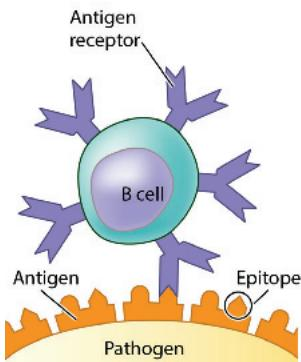

\- The four major characteristics of B and T cell development are the generation of cell diversity, self-tolerance, proliferation, and immunological memory. Proliferation and memory are both based on clonal selection, illustrated here for B cells:

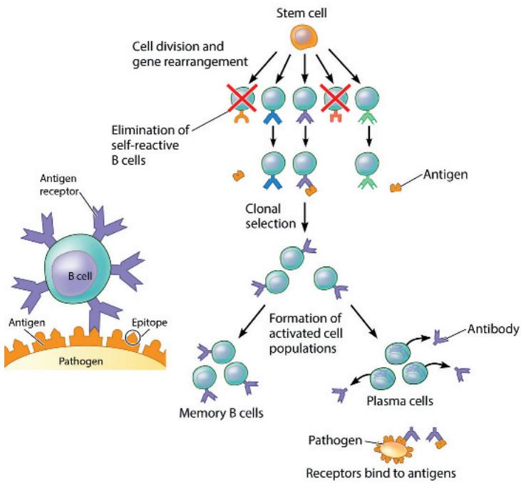  
Why is the adaptive immune response to an initial infection slower than the innate response?

## Concept 43.3: Adaptive immunity defends against infection of body fluids and body cells

\- Helper T cells interact with antigen fragments displayed by class II MHC molecules on the surface of antigen-presenting cells: dendritic cells, macrophages, and B cells. Activated helper T cells secrete cytokines that stimulate other lymphocytes. In the humoral immune response, antibodies help eliminate antigens by facilitating phagocytosis and complement-mediated lysis. In the cell-mediated immune response, activated cytotoxic T cells trigger destruction of infected cells.

\- Active immunity develops in response to infection or to immunization. The transfer of antibodies in passive immunity provides immediate, short-term protection.

\- Tissues or cells transferred from one person to another are subject to immune rejection. In tissue grafts and organ transplants, MHC molecules stimulate rejection. Lymphocytes in bone marrow transplants may cause a graft-versus-host reaction.

Is immunological memory after a natural infection fundamentally different from immunological memory after vaccination? Explain.

## Concept 43.4: Disruptions in immune system function can elicit or exacerbate disease

\- In allergies, such as hay fever, the interaction of antibodies and allergens triggers immune cells to release histamine and other mediators that cause vascular changes and allergic symptoms. Loss of self-tolerance can lead to autoimmune diseases, such as multiple sclerosis. Inborn immunodeficiencies result from defects that interfere with innate, humoral, or cell-mediated defenses. AIDS is an acquired immunodeficiency caused by HIV.

\- Antigenic variation, latency, and direct assault on the immune system allow some pathogens to thwart immune responses.

Is being infected with HIV the same as having AIDS? Explain.

For suggested answers, see Appendix A.

## Test Your Understanding

For more multiple-choice questions, go to the Practice Test (eTextbook only).

## Levels 1-2: Remembering/Understanding

1. Which of these is absent from insect immunity?

(A) antibacterial digestive enzymes

(B) activation of natural killer cells

(C) phagocytosis by hemocytes

(D) production of antimicrobial peptides

2. An epitope associates with which part of an antigen receptor or antibody?

(A) the tail

(B) the heavy-chain constant regions only

(C) variable regions of a heavy chain and light chain combined

(D) the light-chain constant regions only

3. Which statement best describes the difference between responses of effector B cells (plasma cells) and those of cytotoxic T cells?

(A) B cells confer active immunity; cytotoxic T cells confer passive immunity.

(B) B cells respond the first time a pathogen is present; cytotoxic T cells respond subsequent times.

(C) B cells secrete antibodies against a pathogen; cytotoxic T cells kill pathogen-infected host cells.

(D) B cells carry out the cell-mediated response; cytotoxic T cells carry out the humoral response.

## Levels 3-4: Applying/Analyzing

4. Which of the following statements is true?

(A) An antibody has one antigen-binding site.

(B) A lymphocyte has receptors for a single antigen.

(C) Every antigen has a single epitope.

(D) A liver or muscle cell makes two classes of MHC molecule.

5. Which of the following should be the same in identical twins?

(A) the set of antibodies produced

(B) the set of MHC molecules produced

(C) the set of T cell antigen receptors produced

(D) the set of immune cells eliminated as self-reactive

## Levels 5-6: Evaluating/Creating

6. Vaccination increases the number of

(A) different receptors that recognize a pathogen.

(B) lymphocytes with receptors that can bind to the pathogen.

(C) epitopes that the immune system can recognize.

(D) MHC molecules that can present an antigen.

7. Which of the following is least likely to help a virus avoid triggering an adaptive immune response?

(A) having frequent mutations in genes for surface proteins

(B) infecting cells that produce very few MHC molecules

(C) producing proteins very similar to those of other viruses

(D) infecting and killing helper T cells

8. DRAW IT Consider a pencil-shaped protein with two epitopes, Y (the "eraser" end) and Z (the "point" end). They are recognized by antibodies A1 and A2, respectively. Draw and label a picture showing the antibodies linking proteins into a complex that could trigger endocytosis by a macrophage.

9. MAKE CONNECTIONS Contrast clonal selection with Lamarck's idea for the inheritance of acquired characteristics (see Concept 22.1).

10. EVOLUTION CONNECTION Describe one invertebrate mechanism of defense against pathogens and discuss how it is an evolutionary adaptation retained in vertebrates.

11. SCIENTIFIC INQUIRY A major cause of sepsis is the presence in blood of lipopolysaccharide (LPS) from bacteria. Suppose you have available purified LPS and several strains of mice, each with a mutation that inactivates a particular TLR gene. Explain how you might use these mice to test the feasibility of treating sepsis with a drug that blocks TLR signaling.

12. WRITE ABOUT A THEME: INFORMATION Among all nucleated body cells, only B and T cells lose DNA during their development and maturation. In a short essay (100–150 words), discuss the relationship between this loss and DNA as heritable biological information, focusing on similarities between cellular and organismal generations.

## 13. SYNTHESIZE YOUR KNOWLEDGE

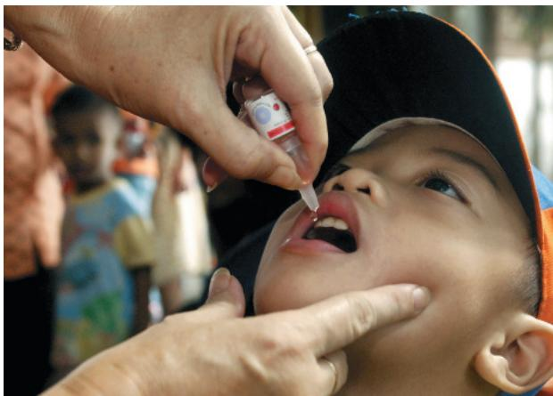

This child is receiving an oral vaccine against polio, a disease caused by a virus that infects neurons. Given that the body cannot replace most neurons, explain why a polio vaccine must stimulate both a cell-mediated and a humoral response.

For selected answers, see Appendix A.

# Explore Scientific Papers with Science in the Classroom | AAAS

How do immunizations affect deaths from infectious disease? Go to “One Vaccine to Rule Them All” at www.scienceintheclassroom.org.

Instructors: Questions can be assigned in Mastering Biology.

