# 第44章 Osmoregulation and Excretion

<!-- 章节边界按正文内容恢复；原始 MinerU 内容保留如下。 -->

# Osmoregulation and Excretion

## Key Concepts

44.1 Osmoregulation balances the uptake and loss of water and solutes

44.2 An animal's nitrogenous wastes reflect its phylogeny and habitat

44.3 Diverse excretory systems are variations on a tubular theme

44.4 The nephron is organized for stepwise processing of blood filtrate

44.5 Hormonal circuits link kidney function, water balance, and blood pressure

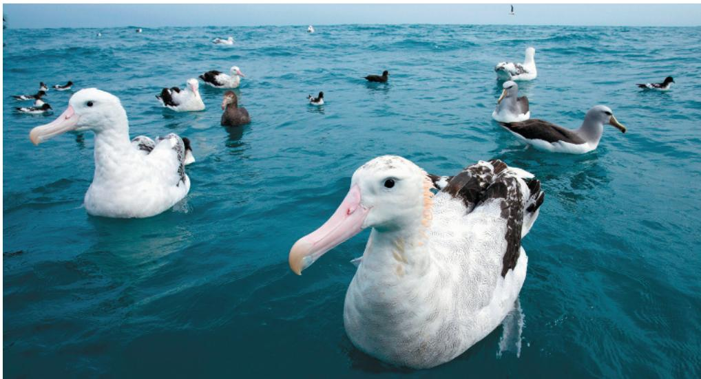  
Figure 44.1 At 3.5 m, the wingspan of a wandering albatross (Diomedea exulans) is the largest of any living bird. This massive bird remains at sea day and night throughout the year, returning to land only to reproduce. Despite drinking only seawater, the albatross keeps its body salts and water in balance.

## Study Tip

Make a table: As you read Concept 44.2, complete a table like the one shown to help organize information about the major forms of nitrogenous waste. In the first three rows, use the terms “high,” “medium,” or “low” to describe the relevant properties of these forms.

<table><tr><td rowspan="2">Waste attribute</td><td colspan="3">Waste product</td></tr><tr><td>Ammonia</td><td>Urea</td><td>Uric acid</td></tr><tr><td>Toxicity</td><td></td><td></td><td></td></tr><tr><td>Energy cost to produce</td><td></td><td></td><td></td></tr><tr><td>Water loss during excretion</td><td></td><td></td><td></td></tr><tr><td>Example of organism excreting this product</td><td></td><td></td><td></td></tr></table>

## How do animals regulate water and salt concentrations in their tissues?

Lacking a means to pump water across cell membranes, animals transport salts and thereby direct water movement into or out of cells by osmosis, in which water undergoes net diffusion from an area of higher free $H_{2}O$ concentration (lower solute concentration) to an area of lower free $H_{2}O$ concentration (higher solute concentration).

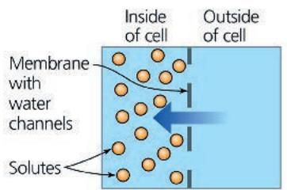  
Cell is hyperosmotic to surroundings; net flow of water into cell

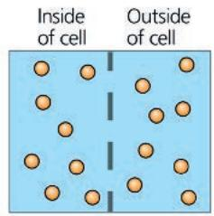

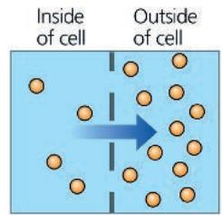

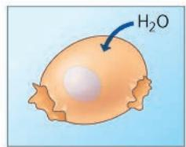  
Cell is isoosmotic to surroundings; no net water movement  
Cell is hypoosmotic to surroundings; net flow of water out of cell  
Cell lyses

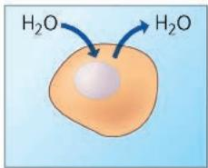  
Cell in osmotic balance

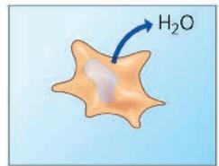  
Cell shrivels

As you'll read, excretory systems not only maintain salt and water balance, but also rid the body of nitrogen-containing wastes.

# Concept 44.1: Osmoregulation balances the uptake and loss of water and solutes

For both an albatross and a human, maintaining fluid balance requires that the relative concentrations of water and solutes be kept within narrow limits. In addition, ions such as sodium and calcium must be kept at concentrations that permit normal activity of muscles, neurons, and other body cells. Homeostasis thus requires osmoregulation, the general term for the processes by which animals control solute concentrations and balance water gain and loss.

Osmoregulation depends on controlled movement of water and solutes across the plasma membrane of cells. Ultimately, the driving force for the movement of both water and solutes is a concentration gradient of one or more solutes across the membrane.

## Osmosis and Osmolarity

Water enters and leaves cells by osmosis, which occurs when two solutions separated by a membrane differ in total solute concentration. The unit of measurement for solute concentration is osmolarity, the number of moles of solute per liter of solution. The osmolarity of human blood is about 300 milliosmoles per liter (mOsm/L), whereas that of seawater is about 1,000 mOsm/L.

Two solutions with the same osmolarity are said to be isoosmotic. If a selectively permeable membrane separates the solutions, water molecules will continually cross the membrane at equal rates in both directions. Thus, there is no net movement of water by osmosis between isoosmotic solutions. When two solutions differ in osmolarity, the solution with the higher concentration of solutes is said to be hyperosmotic, and the more dilute solution is said to be hypoosmotic. Water flows by osmosis from a hypoosmotic solution to a hyperosmotic one, thus reducing the concentration difference for both solutes and free water (see the diagram on the first page of the chapter).

In this chapter, we use the terms isoosmotic, hypoosmotic, and hyperosmotic, which refer specifically to osmolarity, instead of isotonic, hypotonic, and hypertonic. The latter set of terms applies to the response of animal cells—whether they swell or shrink—in solutions of known solute concentrations.

## Osmoregulatory Challenges and Mechanisms

An animal can maintain water balance in two ways. One is to be an osmoconformer: to be isoosmotic with its surroundings. All osmoconformers are marine animals. Because an osmoconformer's internal osmolarity is the same as that of its environment, there is no tendency to gain or lose water. Many osmoconformers live in water that has a stable composition and hence have a constant internal osmolarity.

The second way to maintain water balance is to be an osmoregulator: to control internal osmolarity independent of that of the external environment. In a hypoosmotic environment, an

Figure 44.2 Sockeye salmon (Oncorhynchus nerka), osmoregulators that migrate between rivers and the ocean.  
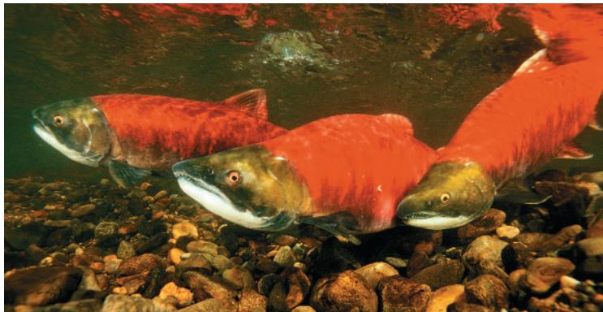

osmoregulator must discharge excess water. In a hyperosmotic environment, it must instead take in water to offset osmotic loss. Osmoregulation enables animals to live in environments that are uninhabitable for osmoconformers, such as freshwater and terrestrial habitats, or to move between marine and freshwater environments (Figure 44.2).

Whether osmoconformers or osmoregulators, most animals cannot tolerate substantial changes in external osmolarity and are said to be stenohaline (from the Greek stenos, narrow, and halos, salt). In contrast, euryhaline animals (from the Greek eurys, broad) can survive large fluctuations in external osmolarity. Euryhaline osmoconformers include barnacles and mussels in estuaries that are alternately exposed to fresh and salt water; euryhaline osmoregulators include striped bass and the various species of salmon (see Figure 44.2).

Salts are critical solutes for osmoregulation. Note that the word “salt” is often used to refer to NaCl, which (like all salts) dissociates into its component ions $\left(\mathrm{Na}^{+}\right.$ and $\left.\mathrm{Cl}^{-}\right)$ in aqueous solutions such as body fluids and seawater. Other salts include magnesium sulfate $\left(\mathrm{MgSO}_{4}\right)$ , which dissociates into magnesium ions $\left(\mathrm{Mg}^{2+}\right)$ and sulfate ions $\left(\mathrm{SO}_{4}^{2-}\right)$ , and calcium phosphate, which dissociates into calcium ions $\left(\mathrm{Ca}^{2+}\right)$ and phosphate ions $\left(\mathrm{PO}_{4}^{3-}\right)$ .

Next, we'll examine adaptations for osmoregulation that have evolved in marine, freshwater, and terrestrial animals.

## Marine Animals

Most marine invertebrates are osmoconformers. Their osmolarity is the same as that of seawater. Therefore, they face no substantial challenges in water balance. Nevertheless, they actively transport specific solutes that they maintain at levels different from those in the ocean. For example, homeostatic mechanisms in the Atlantic lobster (Homarus americanus) maintain a magnesium ion (Mg $^{2+}$ ) concentration in hemolymph (circulatory fluid) of less than 9 mM (millimolar, or 10 $^{-3}$ mol/L), far below the 50 mM concentration of Mg $^{2+}$ in their environment.

Two osmoregulatory strategies evolved among marine vertebrates that address the challenges of a strongly dehydrating environment. One is found among marine “bony fishes,” a group that includes ray-finned and lobe-finned fishes. The other is found in marine sharks and most other chondrichthyans (cartilaginous animals; see Concept 34.3).

Cod, shown in Figure 44.3a, and other marine bony fishes constantly lose water by osmosis. They balance water loss by drinking a lot of seawater. The excess salts ingested with seawater are eliminated through the gills and kidneys.

Figure 44.3 Osmoregulation in marine and freshwater bony fishes: a comparison.  
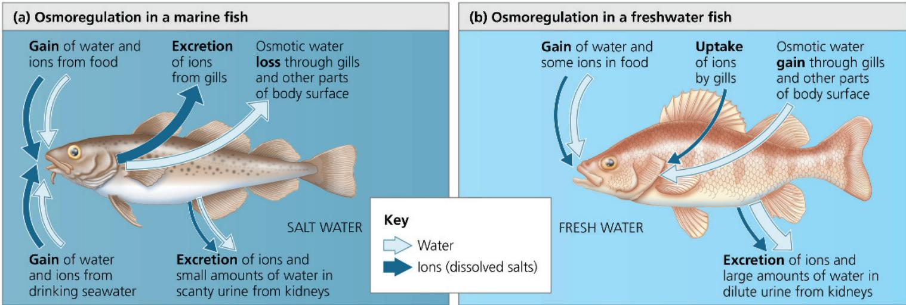

Like bony fishes, sharks have an internal salt concentration much lower than that of seawater. However, shark tissues have a high concentration of several other solutes, including urea and another organic molecule, trimethylamine oxide (TMAO). Because the total solute concentration is somewhat higher than 1,000 mOsm/L, water slowly enters the shark's body by osmosis and in food (sharks do not drink).

The small influx of water into the shark's body is disposed of in urine produced by the kidneys. The urine also removes some of the salt that diffuses into the shark's body; the rest is lost in feces or is secreted from a specialized gland.

## Freshwater Animals

The osmoregulatory problems of freshwater animals are the opposite of those of marine animals. The body fluids of freshwater animals must be hyperosmotic because animal cells cannot tolerate salt concentrations as low as that of lake or river water. Since freshwater animals have internal fluids with an osmolarity higher than that of their surroundings, they face the problem of gaining water by osmosis. For the perch and many other freshwater animals, water balance relies on excreting large amounts of very dilute urine and drinking almost no water (Figure 44.3b). In addition, salts lost by diffusion and in the urine are replenished by eating and by taking up salts (in ionic form) across their gills.

Salmon and other euryhaline fishes that migrate between fresh water and seawater undergo dramatic changes in osmoregulatory status. When living in rivers and streams, salmon osmoregulate like other freshwater fishes, producing large amounts of dilute urine and taking up salt from the dilute environment through their gills. When they migrate to the ocean, salmon acclimatize (see Concept 40.2). They produce more of the steroid hormone cortisol, which increases the number and size of specialized salt-secreting cells. These and other physiological changes enable salmon in salt water to excrete excess salt from their gills and produce only small

amounts of urine—just like bony fishes that spend their entire lives in salt water.

## Animals That Live in Temporary Waters

Extreme dehydration, or desiccation, is fatal for most animals. However, a few aquatic invertebrates that live in temporary ponds and in films of water around soil particles can lose almost all their body water and survive. These animals enter a dormant state when their habitats dry up, an adaptation called anhydrobiosis ("life without water"). Among the most striking examples are the tardigrades, or water bears, tiny invertebrates less than 1 mm long (Figure 44.4). In their active, hydrated state, they contain about 85% water by weight, but they can dehydrate to less than 2% water and survive in an inactive state, dry as dust, for a decade or more. Just add water, and within hours the rehydrated tardigrades are moving about and feeding.

Anhydrobiosis requires adaptations that keep cell membranes intact. Researchers are just beginning to learn how tardigrades survive drying out, but studies of anhydrobiotic roundworms (phylum Nematoda; see Concept 33.4) show that desiccated

## Figure 44.4 Anhydrobiosis.

When hydrated, tardigrades (SEM images) inhabit temporary ponds as well as droplets of water in soil and on moist plants.

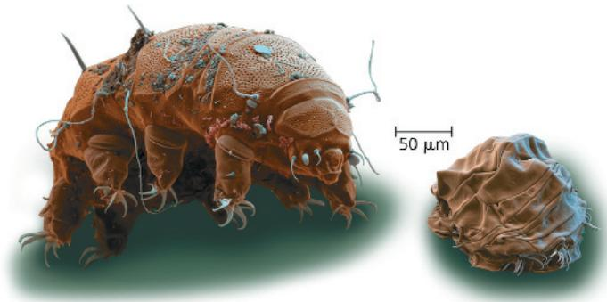  
Hydrated tardigrade  
Dehydrated tardigrade

individuals contain large amounts of sugars. In particular, a disaccharide called trehalose seems to protect the cells by replacing the water that is normally associated with proteins and membrane lipids. Many insects that survive freezing in the winter also use trehalose as a membrane protectant, as do some plants resistant to desiccation.

Recently, scientists began applying lessons learned from the study of anhydrobiosis to the preservation of biological materials. Traditionally, samples of protein, DNA, and cells have been kept in ultracold freezers ( $-80^{\circ}C$ ), consuming large amounts of energy. Today, the manufacture of materials modeled after the protectants of anhydrobiotic species has enabled room temperature storage of such samples.

## Land Animals

The threat of dehydration is a major regulatory problem for terrestrial plants and animals. Adaptations that reduce water loss are key to survival on land. Much as a waxy cuticle contributes to the success of land plants, the body coverings of most terrestrial animals help prevent dehydration. Examples are the waxy layers of insect exoskeletons, the shells of land snails, and the layers of dead, keratinized skin cells covering most terrestrial vertebrates, including humans. Many terrestrial animals, especially desert-dwellers, are nocturnal, which reduces evaporative water loss because of the lower temperature and higher humidity of night air.

Despite anatomical and behavioral adaptations that conserve water, most terrestrial animals lose water through a variety of routes: in urine and feces, across the skin, and from the epithelial surfaces of gas exchange organs and airways. Land animals maintain water balance by drinking and eating moist foods and by producing water metabolically through cellular respiration.

A number of desert animals are well enough adapted for minimizing water loss that they can survive for long periods of time without drinking. Camels, for example, tolerate a $7^{\circ}$ C rise in body temperature, greatly reducing the amount of water lost in sweat production. They can also lose 25% of their body water and survive. (In contrast, a human who loses half this fraction of body water will die from heart failure.) In the Scientific Skills Exercise, you can examine water balance in another desert species, the sandy inland mouse.

## Scientific Skills Exercise Describing and Interpreting Quantitative Data

How Do Desert Mice Maintain Osmotic Homeostasis? The sandy inland mouse (now known scientifically as Pseudomys hermannsburgensis) is an Australian desert mammal that can survive indefinitely on a diet of dried seeds without drinking water. To study this species' adaptations to its arid environment, researchers conducted a laboratory experiment in which they controlled access to water. In this exercise, you will analyze some of the data from the experiment.

How the Experiment Was Done Nine captured mice were kept in an environmentally controlled room and given birdseed (10% water by weight) to eat. In part A of the study, the mice had unlimited access to tap water for drinking; in part B of the study, the mice were not given any drinking water for 35 days, similar to conditions in their natural habitat. At the end of parts A and B, the researchers measured the osmolarity and urea concentration of the urine and blood of each mouse. The mice were also weighed three times a week.

## Data from the Experiment

<table><tr><td rowspan="2">Access to Water</td><td colspan="2">Mean Osmolarity (mOsm/L)</td><td colspan="2">Mean Urea Concentration (mM)</td></tr><tr><td>Urine</td><td>Blood</td><td>Urine</td><td>Blood</td></tr><tr><td>Part A: Unlimited</td><td>490</td><td>350</td><td>330</td><td>7.6</td></tr><tr><td>Part B: None</td><td>4,700</td><td>320</td><td>2,700</td><td>11</td></tr></table>

In part A, the mice drank about 33% of their body weight each day. The change in body weight during the study was negligible for all mice.

Data from R. E. MacMillen et al., Water economy and energy metabolism of the sandy inland mouse, Leggadina hermannsburgensis, Journal of Mammalogy 53:529–539 (1972).

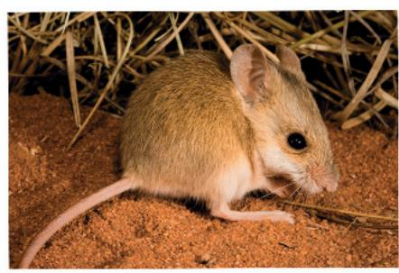

## INTERPRET THE DATA

1. In words, describe how the data differ between the unlimited water and no-water conditions for the following: (a) osmolarity of urine, (b) osmolarity of blood, (c) urea concentration in urine, (d) urea concentration in blood. (e) Does this data set provide evidence of homeostatic regulation? Explain.

2. (a) Calculate the ratio of urine osmolarity to blood osmolarity for mice with unlimited access to water. (b) Calculate this ratio for mice with no access to water. (c) What conclusion can you draw from these ratios?

3. If you learned that the amount of urine produced in part A were different from that in part B, how would that affect your calculation? Explain.

Instructors: A version of this Scientific Skills Exercise can be assigned in Mastering Biology.

## Energetics of Osmoregulation

Maintaining an osmolarity difference between an animal's body and its external environment carries an energy cost. Because diffusion tends to equalize concentrations in a system, osmoregulators must expend energy to maintain the osmotic gradients that cause water to move in or out. They do so by using active transport to manipulate solute concentrations in their body fluids.

The energy cost of osmoregulation depends on how different an animal's osmolarity is from its surroundings, how easily water and solutes can move across the animal's surface, and how much work is required to pump solutes across the membrane. Osmoregulation accounts for $5\%$ or more of the resting metabolic rate of many fishes. For brine shrimp, small crustaceans that live in extremely salty lakes, the gradient between internal and external osmolarity is very large, and the cost of osmoregulation is correspondingly high—as much as $30\%$ of the resting metabolic rate.

The energy cost to an animal of maintaining water and salt balance is minimized by having body fluids that are adapted to the salinity of the animal's habitat. Thus, the body fluids of most animals that live in fresh water (which has an osmolarity of 0.5–15 mOsm/L) have lower solute concentrations than the body fluids of their closest relatives that live in seawater (1,000 mOsm/L). For instance, whereas marine molluscs have body fluids with solute concentrations of approximately 1,000 mOsm/L, some freshwater molluscs maintain the osmolarity of their body fluids at just 40 mOsm/L. In each case, minimizing the osmotic difference between body fluids and the surrounding environment decreases the energy cost of osmoregulation.

## Transport Epithelia in Osmoregulation

Although the ultimate function of osmoregulation is to control solute concentrations in cells, most animals do this indirectly, managing instead the solute content of the body fluid that bathes the cells. In insects and other animals with an open circulatory system, the fluid surrounding cells is hemolymph. In vertebrates and other animals with a closed circulatory system, the cells are bathed in an interstitial fluid that contains a mixture of solutes controlled indirectly by the blood. Maintaining the composition of such fluids depends on structures ranging from individual cells that regulate solute movement to complex organs such as the vertebrate kidney.

In most animals, osmoregulation and metabolic waste disposal rely on transport epithelia—one or more layers of epithelial cells specialized for moving particular solutes in controlled amounts in specific directions. Transport epithelia are typically arranged into tubular networks with extensive surface areas. Some transport epithelia face the outside environment directly, whereas others line channels connected to the outside by an opening on the body surface.

The transport epithelium that enables the albatross and other marine birds to survive on seawater remained undiscovered for many years. To find it, researchers gave captive marine birds only seawater to drink. Although very little salt appeared in the birds' urine, tests revealed that fluid dripping from the tip of their beaks was a concentrated solution of salt (NaCl). The source of this solution turned out to be a pair of nasal salt glands packed with transport epithelia (Figure 44.5). Salt glands, which are also found in

Figure 44.5 Salt secretion in the nasal glands of a marine bird. A transport epithelium moves salt from the blood into secretory tubules, which drain into central ducts leading to the nostrils.

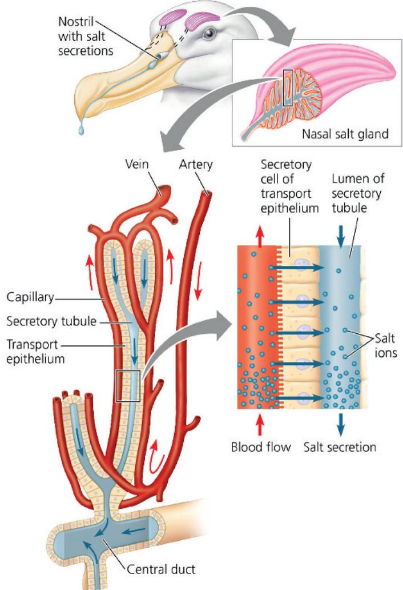

sea turtles and marine iguanas, use active transport of ions to secrete a fluid much saltier than the ocean. Even though drinking seawater brings in a lot of salt, the salt gland enables these marine vertebrates to achieve a net gain of water. By contrast, humans who drink a given volume of seawater must use a greater volume of water to excrete the salt load, with the result that they become dehydrated.

Transport epithelia that function in maintaining water balance also often function in disposal of metabolic wastes. We'll see examples of this coordinated function in our upcoming consideration of earthworm and insect excretory systems as well as the vertebrate kidney.

## Concept Check 44.1

1. The movement of salt from the surrounding water to the blood of a freshwater fish requires the expenditure of energy in the form of ATP. Why?

2. Why aren't any freshwater animals osmoconformers?

3. WHAT IF? Researchers found that a camel in the sun required much more water when its fur was shaved off, although its body temperature was the same. What can you conclude about the relationship between osmoregulation and the insulation provided by fur?

# Concept 44.2: An animal's nitrogenous wastes reflect its phylogeny and habitat

In regulating and safeguarding their internal fluids, animals must deal with ammonia, a toxic metabolite produced by the dismantling of nitrogenous (nitrogen-containing) molecules, chiefly proteins and nucleic acids. Several mechanisms have evolved for ridding the body of ammonia and other metabolic waste products, a process called excretion. Because most metabolic wastes must be dissolved in water to be excreted from the body, the type and quantity of an animal's waste products may have a large impact on its water balance.

## Forms of Nitrogenous Waste

Although some animal species excrete ammonia directly, others excrete alternative forms of nitrogenous waste, either urea or uric acid (Figure 44.6). These different forms vary significantly in their toxicity, their solubility, and the energy costs of producing them.

## Ammonia

Ammonia is very toxic, in part because its ion, ammonium $\left(\mathrm{NH}_{4}^{+}\right)$ , can interfere with oxidative phosphorylation. Because ammonia can be tolerated only at very low concentrations, animals that excrete ammonia need access to lots of water. Therefore, ammonia excretion is most common in aquatic species. The highly soluble ammonia molecules, which interconvert between $NH_{3}$ and $NH_{4}^{+}$ , easily pass through membranes and are readily lost by diffusion to the surrounding water. In many invertebrates, ammonia release occurs across the whole body surface.

Figure 44.6 Variations in forms of nitrogenous waste among animal species.  
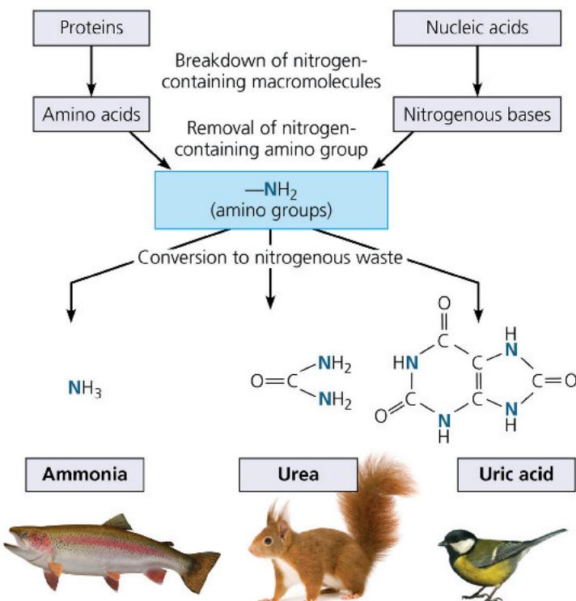  
Most aquatic animals, including most bony fishes  
Mammals, most amphibians, sharks, some bony fishes  
Birds and many other reptiles, insects, land snails

## Urea

Although ammonia excretion works well in many aquatic species, it is much less suitable for land animals. Ammonia is so toxic that it can be safely transported through and excreted from the body only in large volumes of very dilute solutions. Most terrestrial animals and many marine species simply do not have access to sufficient water to routinely excrete ammonia. Instead, they mainly excrete a different nitrogenous waste, urea. In vertebrates, urea is the product of an energy-consuming metabolic cycle that combines ammonia with carbon dioxide in the liver.

The main advantages of urea for nitrogenous waste excretion are its very low toxicity and its high solubility in water. The main disadvantage is its energy cost: Animals must expend energy to produce urea from ammonia. From a bioenergetic standpoint, we would predict that animals that spend part of their lives in water and part on land would switch between excreting ammonia (thereby saving energy) and excreting urea (reducing excretory water loss). Indeed, many amphibians excrete mainly ammonia when they are aquatic tadpoles and switch largely to urea excretion when they become land-dwelling adults.

## Uric Acid

Insects, land snails, and many reptiles, including birds, excrete uric acid as their primary nitrogenous waste (Figure 44.7). Uric acid is relatively nontoxic and does not readily dissolve in water. It therefore can be excreted as a semisolid paste with very little water loss. However, uric acid is even more energetically expensive than urea, requiring considerable ATP for synthesis from ammonia.

Although they are not primarily uric acid producers, humans and some other animals generate a small amount of uric acid from metabolism. Diseases that alter this process reflect problems that can arise when a metabolic product is insoluble. For example, a genetic defect predisposes Dalmatian dogs to form uric acid stones in their bladder. In humans, adult males are particularly susceptible to gout, a painful joint inflammation caused by deposits of uric acid crystals. Some dinosaurs appear to have been similarly affected: Fossilized bones of Tyrannosaurus rex exhibit joint damage characteristic of gout.

Figure 44.7 Guano (bird excrement) is rich in uric acid.  
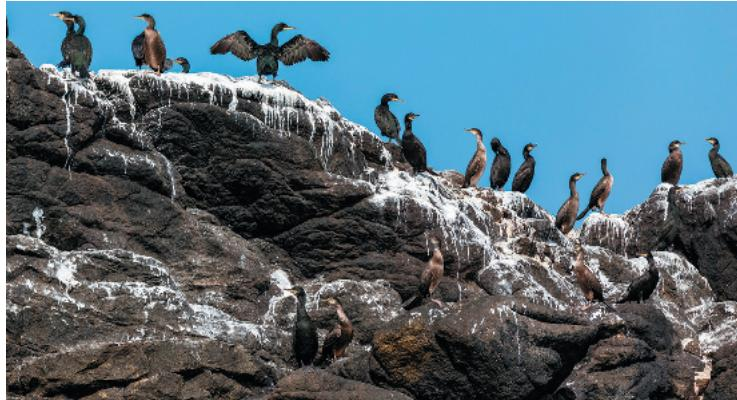

## The Influence of Evolution and Environment on Nitrogenous Wastes

EVOLUTION As a result of natural selection, the type and amount of nitrogenous waste a species produces are matched to its environment. One key factor in a habitat is the availability of water. For example, terrestrial turtles (which often live in dry areas) excrete mainly uric acid, whereas aquatic turtles excrete both urea and ammonia.

In some cases, an animal's egg is the immediate environment of relevance to the type of nitrogenous waste excreted. In an amphibian egg, which lacks a shell, ammonia or urea can simply diffuse out of the egg. Similarly, soluble wastes produced by a mammalian embryo can be carried away by the mother's blood. In the case of birds and other reptiles, however, the egg is surrounded by a shell that is permeable to gases but not to liquids. As a result, any soluble nitrogenous wastes released by the embryo would be trapped within the egg and could accumulate to dangerous levels. For this reason, using uric acid as an insoluble waste product conveys a selective advantage in reptiles. Stored within the egg as a harmless solid, the uric acid is left behind when the animal hatches.

Regardless of the type of nitrogenous waste, the amount produced is coupled to the animal's energy budget. Endotherms, which use energy at high rates, eat more food and produce more nitrogenous waste than ectotherms. The amount of nitrogenous waste is also linked to diet. Predators, which derive much of their energy from protein, excrete more nitrogen than animals that rely mainly on lipids or carbohydrates as energy sources.

Having surveyed the forms of nitrogenous waste and their interrelationship with habitat and energy consumption, we'll turn next to the processes and systems animals use to excrete these and other wastes.

## Concept Check 44.2

1. What advantage does uric acid offer as a nitrogenous waste in arid environments?

2. WHAT IF? Suppose a bird and a human both have gout. Why might reducing purine in their diets help the human much more than the bird?

For suggested answers, see Appendix A.

## Concept 44.3: Diverse excretory systems are variations on a tubular theme

By both disposing of metabolic wastes and controlling body fluid composition, excretory systems play a central role in homeostasis. Excretory processes begin when body fluid (blood, coelomic fluid, or hemolymph) is brought in contact with the selectively permeable membrane of a transport epithelium (Figure 44.8). In most cases, hydrostatic pressure (blood pressure in many animals) drives a process of filtration. Cells, as well as proteins and other large molecules, cannot cross the epithelial membrane and remain

Figure 44.8 Key steps of excretory system function: an overview. Most excretory systems produce a filtrate by pressure-filtering body fluids and then modify the filtrate's contents. This diagram is modeled after the vertebrate excretory system.

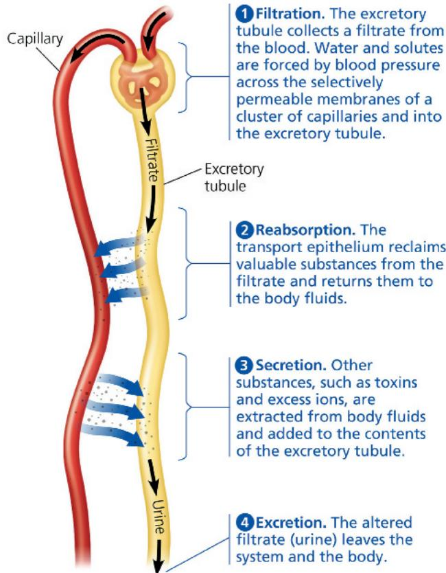

in the body fluid. In contrast, water and small solutes, such as salts, sugars, amino acids, and nitrogenous wastes, cross the membrane, forming a solution called the filtrate.

The filtrate is converted to a waste fluid by the specific transport of materials into or out of the filtrate. The process of selective reabsorption recovers useful molecules and water from the filtrate and returns them to the body fluid. Valuable solutes—including glucose, certain salts, vitamins, hormones, and amino acids—are reabsorbed by passive and active transport. Nonessential solutes and wastes are left in the filtrate or are added to it by selective secretion, which also occurs by active transport. The pumping of various solutes in turn determines whether water moves by osmosis into or out of the filtrate. In the last step—excretion—the processed filtrate containing nitrogenous wastes is released from the body as a fluid waste called urine.

## Survey of Excretory Systems

The systems that perform the basic excretory functions outlined in Figure 44.8 vary widely among animal groups. However, they are generally built on a complex network of tubules that provide a large surface area for the exchange of water and solutes, including nitrogenous wastes. We'll examine the excretory systems of flatworms, earthworms, insects, and vertebrates as examples of evolutionary variations on tubule networks.

## Protonephridia

As illustrated in Figure 44.9, flatworms (phylum Platyhelminthes), which lack a coelom or body cavity, have excretory systems called protonephridia (singular, protonephridium). Protonephridia consist of a network of dead-end tubules that branch throughout the body. Cellular units called flame bulbs cap each branch. Each flame bulb, consisting of a tubule cell and a cap cell, has a tuft of cilia projecting into the tubule.

Figure 44.9 Protonephridia in a planarian.  
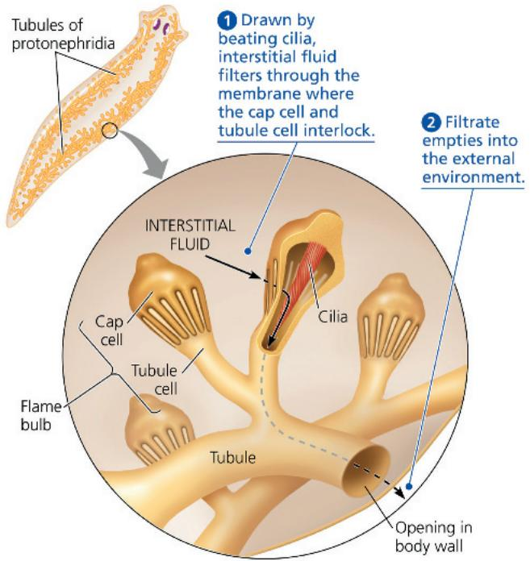  
Figure 44.10 Metanephridia of an earthworm.

During filtration, the beating of the cilia draws water and solutes from the interstitial fluid through the flame bulb, releasing filtrate into the tubule network. (The name flame bulb derives from the moving cilia's resemblance to a flickering flame.) The processed filtrate moves outward through the tubules and empties as urine via external openings. Because the urine excreted by freshwater flatworms is low in solutes, its production helps to balance the osmotic uptake of water from the environment.

Protonephridia are also found in rotifers, some annelids, mollusc larvae, and lancelets (see Figure 34.4). In the freshwater flatworms, protonephridia serve chiefly in osmoregulation. Most metabolic wastes diffuse out of the animal across the body surface or are excreted into the gastrovascular cavity and eliminated through the mouth (see Figure 33.9). In contrast, parasitic flatworms that are isoosmotic to the surrounding fluids of their host organisms have protonephridia that primarily function in the disposal of nitrogenous wastes. Natural selection has thus adapted protonephridia to different tasks in different environments.

## Metanephridia

Most annelids, such as earthworms, have metanephridia (singular, metanephridium), excretory organs that collect fluid directly from the coelom (Figure 44.10). A pair of metanephridia are found in each segment of an annelid, where they are immersed in coelomic fluid and enveloped by a capillary network. A ciliated funnel surrounds the internal opening of each metanephridium. As the cilia beat, fluid is drawn into a collecting tubule, which includes a storage bladder that opens to the outside.

Earthworms inhabit damp soil and therefore usually experience a net uptake of water by osmosis through their skin.

Each segment of the worm contains a pair of metanephridia, which collect coelomic fluid from the adjacent anterior segment. The region highlighted in yellow illustrates the organization of one metanephridium of a pair; the other would be behind it.

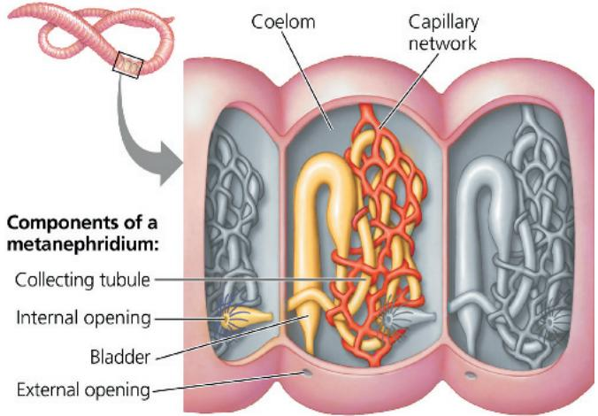

Their metanephridia balance the water influx by producing urine that is dilute (hypoosmotic to body fluids). In producing a hypoosmotic filtrate, the transport epithelium reabsorbs most solutes and returns them to the blood in the capillaries. Nitrogenous wastes, however, remain in the tubule and are excreted to the environment. The metanephridia of an earthworm thus serve both an excretory and an osmoregulatory function.

## Malpighian Tubules

Insects and other terrestrial arthropods have organs called Malpighian tubules that remove nitrogenous wastes and that also function in osmoregulation (Figure 44.11). The Malpighian

Figure 44.11 Malpighian tubules of insects.

Malpighian tubules are outpocketings of the digestive tract that remove nitrogenous wastes and function in osmoregulation.

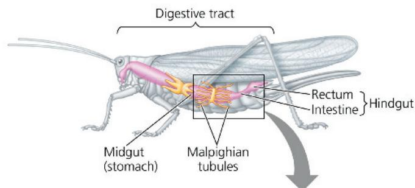

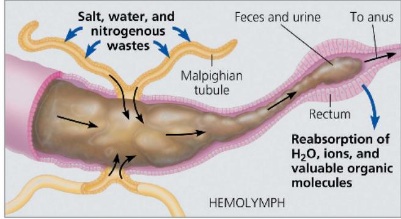

## Exploring the Mammalian Excretory System

Figure 44.12

Excretory Organs

Kidney Structure

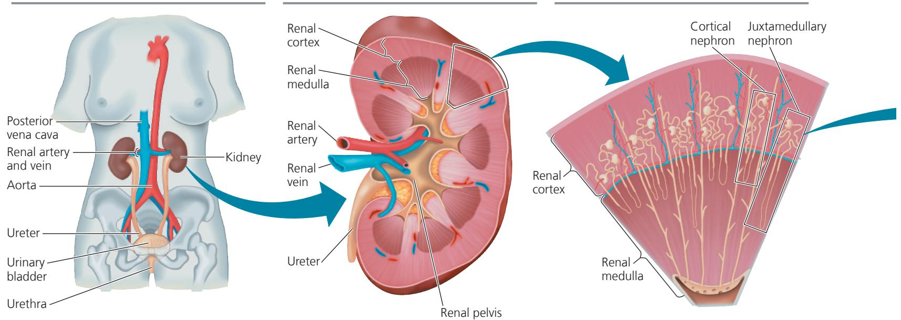  
Nephron Types

In humans, the excretory system consists of kidneys, a pair of organs each about 10 cm in length, as well as organs for transporting and storing urine. Urine produced by each kidney exits through a duct called the ureter; the two ureters drain into a common sac called the urinary bladder. During urination, urine is expelled from the bladder through a tube called the urethra, which empties to the outside near the vagina in females and through the penis in males. Sphincter muscles near the junction of the urethra and bladder regulate urination.

Each kidney has an outer renal cortex and an inner renal medulla. Both regions are supplied with blood by a renal artery and drained by a renal vein. Within the cortex and medulla lie tightly packed excretory tubules and associated blood vessels. The excretory tubules carry and process a filtrate produced from the blood entering the kidney. Nearly all of the fluid in the filtrate is reabsorbed into the surrounding blood vessels and exits the kidney in the renal vein. The remaining fluid leaves the excretory tubules as urine, is collected in the inner renal pelvis, and exits the kidney via the ureter.

Weaving back and forth across the renal cortex and medulla are the nephrons, the functional units of the vertebrate kidney. Most of these are cortical nephrons, which reach only a short distance into the medulla. The remainder, the juxtamedullary nephrons, extend deep into the medulla. Juxtamedullary nephrons are essential for production of urine that is hyperosmotic to body fluids, a key adaptation in mammals that enables water conservation.

tubules extend from dead-end tips immersed in hemolymph to openings into the digestive tract. The filtration step common to other excretory systems is absent. Instead, the transport epithelium that lines the tubules secretes certain solutes, including nitrogenous wastes, from the hemolymph into the lumen of the tubule. Water follows the solutes into the tubule by osmosis.

As fluid passes from the tubules into the rectum, most solutes are pumped back into the hemolymph; water reabsorption by osmosis follows. The nitrogenous wastes—mainly insoluble uric acid—are eliminated as nearly dry matter along with the feces. The insect excretory system is capable of conserving water very effectively, a key adaptation contributing to the tremendous success of insects on land.

## Kidneys

In vertebrates and some other chordates, a compact organ called the kidney functions in both osmoregulation and excretion. Like the excretory organs of most animal phyla, kidneys consist of tubules. The tubules of kidneys are arranged in a highly organized manner and are closely associated with a network of capillaries. The vertebrate excretory system also includes ducts and other structures that carry urine from the tubules out of the kidney and, eventually, the body.

Vertebrate kidneys are typically nonsegmented. However, hagfishes, which are jawless vertebrates (see Concept 34.2), have kidneys with segmentally arranged excretory tubules. Because hagfishes and other vertebrates share a common chordate ancestor, it is possible that the excretory structures of vertebrate ancestors were also segmented.

We conclude this introduction to excretory systems with an exploration of the anatomy of the mammalian kidney and associated structures (Figure 44.12). Familiarizing yourself with the terms and diagrams in this figure will provide you with a solid foundation for learning about filtrate processing in the kidney, the focus of the next section of this chapter.

Nephron Organization  
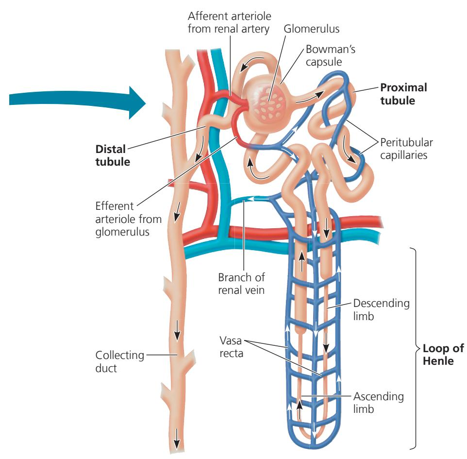

Each nephron consists of a single long tubule as well as a ball of capillaries called the glomerulus. The blind end of the tubule forms a cup-shaped swelling, called Bowman's capsule, which surrounds the glomerulus. Filtrate is formed when blood pressure forces fluid from the blood in the glomerulus into the lumen of Bowman's capsule. Processing occurs as the filtrate passes through three major regions of the nephron: the proximal tubule, the loop of Henle (a hairpin turn with a descending limb and an ascending limb), and the distal tubule. A collecting duct receives processed filtrate from many nephrons and transports it to the renal pelvis.

Each nephron is supplied with blood by an afferent arteriole, an offshoot of the renal artery that branches and forms the capillaries of the glomerulus. The capillaries converge as they leave the glomerulus, forming an efferent arteriole. Branches of this vessel form the peritubular capillaries, which surround the proximal and distal tubules. Other branches extend downward and form the vasa recta, hairpin-shaped capillaries that serve the renal medulla and surround the loop of Henle.

In this SEM of densely packed blood vessels from a human kidney, arterioles and peritubular capillaries appear pink; the glomeruli appear yellow.

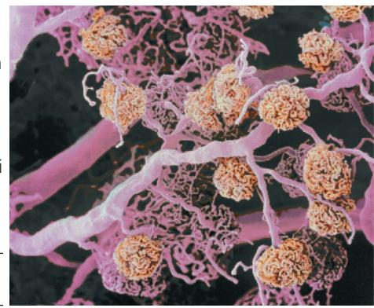

## Concept Check 44.3

1. Compare and contrast the ways that metabolic waste products enter the excretory systems of flatworms, earthworms, and insects.

2. Where and how does filtrate originate in the vertebrate kidney, and by what two routes do the components of the filtrate exit the kidney?

3. WHAT IF? Kidney failure is often treated by hemodialysis, in which blood diverted out of the body is filtered and then allowed to flow on one side of a semipermeable membrane. Fluid called dialysate flows in the opposite direction on the other side of the membrane. In replacing the reabsorption and secretion of solutes in a functional kidney, the makeup of the starting dialysate is critical. What initial solute composition would work well?

For suggested answers, see Appendix A.

## Concept 44.4: The nephron is organized for stepwise processing of blood filtrate

As illustrated in Figure 44.12, the basic unit of the mammalian kidney is the nephron. In the human kidney, filtrate forms when fluid passes from the bloodstream to the lumen of Bowman's capsule. The capillaries of the glomerulus and specialized cells of Bowman's capsule retain blood cells and large molecules, such as plasma proteins, but are permeable to water and small solutes. Thus, the filtrate contains ions (dissolved salts), glucose, amino acids, vitamins, nitrogenous wastes, and other small molecules. Because these solutes pass freely between glomerular capillaries and Bowman's capsule, their concentrations in the initial filtrate are the same as those in blood plasma.

Under normal conditions, roughly 1,600 L of blood flows through a pair of human kidneys each day, yielding about 180 L of initial filtrate. Both the volume and the composition of the filtrate are changed dramatically as processing occurs. (Because of these dramatic changes, some scientists prefer to describe the fluid traveling between the capsule and the renal pelvis as tubular fluid.) About 99% of the water and nearly all of the sugars, amino acids, vitamins, and other organic nutrients are reabsorbed into the blood, leaving only about 1.5 L of urine to be transported to the bladder.

## From Blood Filtrate to Urine: A Closer Look

To explore how filtrate is processed into urine, we'll follow the filtrate along its path in the nephron. Each circled number in the text and the figure refers to the processing in transport epithelia as the filtrate moves through the kidney cortex and medulla (Figure 44.13).

① Proximal tubule. Reabsorption in the proximal tubule is critical for the recapture of ions, water, and nutrients from the huge volume of initial filtrate. Na $^{+}$ in the filtrate enters the cells of the transport epithelium by facilitated diffusion and other mechanisms. There, Na $^{+}$ ions are transferred to the interstitial fluid by active transport (see Concept 7.4). This transfer of positive charge out of the tubule drives the passive transport of Cl $^{-}$ . Na $^{+}$ movement also creates a Na $^{+}$ gradient that can be used to actively cotransport amino acids, glucose, and other valuable solutes out of the tubule into the interstitial fluid.

As solutes move from the filtrate to the interstitial fluid by a variety of passive and active transport mechanisms, water follows by osmosis, reducing filtrate volume considerably. The solutes and water that exit the filtrate diffuse from the interstitial fluid into the peritubular capillaries.

Figure 44.13 The nephron and collecting duct: regional functions of the transport epithelium. The numbered regions in this diagram are keyed to the circled numbers in the text discussion of kidney function.  
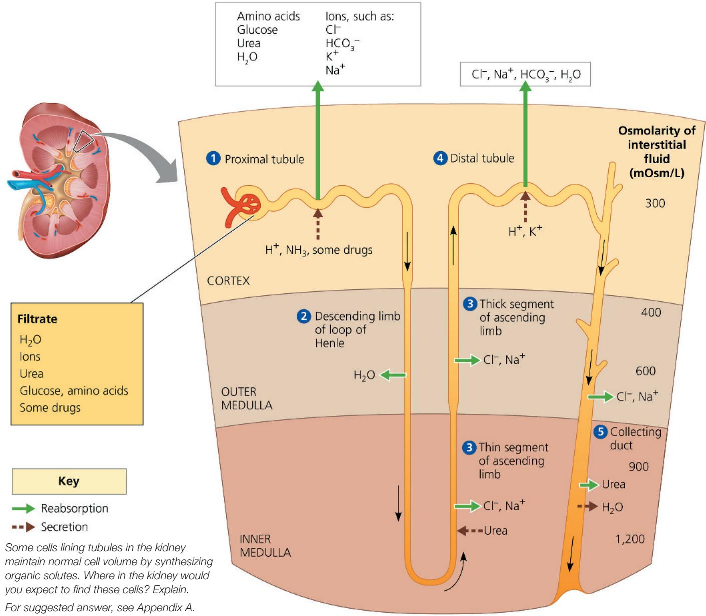

Some solutes are reabsorbed in the proximal tubule without using specific transporters. For example, the proximal tubule lacks urea transporters. But, as water moves by osmosis, urea becomes more concentrated in the filtrate than in the interstitial fluid. Urea then diffuses down this gradient, from the filtrate to the interstitial fluid, by passing through the space between neighboring epithelial cells (called the paracellular pathway). Reabsorption of $K^{+}$ in the proximal tubule also occurs via this mechanism.

Processing of filtrate in the proximal tubule helps maintain a relatively constant pH in body fluids. Cells of the transport epithelium secrete $H^{+}$ into the lumen of the tubule but also synthesize and secrete ammonia, which acts as a buffer to trap $H^{+}$ in the form of ammonium ions ( $NH_{4}^{+}$ ). The more acidic the filtrate is, the more ammonia the cells produce and secrete, and a mammal's urine usually contains some ammonia from this source (even though most nitrogenous waste is excreted as urea). The proximal tubules also reabsorb about 90% of the buffer bicarbonate ( $HCO_{3}^{-}$ ) from the filtrate, contributing further to pH balance in body fluids.

In addition, some materials are actively secreted into the filtrate from surrounding tissues. For example, drugs and toxins that have been processed in the liver pass from the peritubular capillaries into the interstitial fluid. These molecules are then actively secreted by the transport epithelium into the lumen of the proximal tubule.

② Descending limb of the loop of Henle. Upon leaving the proximal tubule, filtrate enters the loop of Henle, which further reduces filtrate volume via distinct stages of water and salt movement. In the first portion of the loop, the descending limb, numerous water channels formed by aquaporin proteins make the transport epithelium freely permeable to water. In contrast, there are almost no transporters for salt and other small solutes, resulting in very low permeability for these substances.

For water to move out of the tubule by osmosis, the interstitial fluid bathing the tubule must be hyperosmotic to the filtrate. This condition is met along the entire length of the descending limb because the osmolarity of the interstitial fluid increases progressively from the cortex through the medulla. As a result, the filtrate loses water and increases in solute concentration all along its journey down the descending limb. The highest osmolarity (about 1,200 mOsm/L in humans) occurs at the elbow of the loop of Henle.

③ Ascending limb of the loop of Henle. The filtrate reaches the tip of the loop and then returns to the renal cortex in the ascending limb. Unlike the descending limb, the ascending limb has a transport epithelium that lacks water channels. Consequently, the epithelial membrane that faces the filtrate in the ascending limb is impermeable to water.

The ascending limb has two specialized regions: a thin segment near the loop tip and a thick segment adjacent to the distal tubule. As filtrate ascends in the thin segment, $Na^{+}$ and $Cl^{-}$ , which became highly concentrated in the descending limb, diffuse out of the permeable tubule into the interstitial fluid.

In the thick segment of the ascending limb, the movement of $Na^{+}$ and $Cl^{-}$ out of the filtrate continues. Here, however, the epithelium actively transports $Na^{+}$ and $Cl^{-}$ into the interstitial fluid. As a result of losing solute but not water, the filtrate becomes progressively more dilute as it moves up to the cortex in the ascending limb of the loop.

Although the loop of Henle has a small net effect on filtrate composition, it is a major site for the recovery of water (descending loop), $Na^{+}$ , and $Cl^{-}$ (ascending loop) from the filtrate. It also contributes to the osmotic gradient in the renal medulla, as we will explore shortly.

④ Distal tubule. The distal tubule plays a key role in regulating the $K^{+}$ and $Na^{+}$ concentration of body fluids. This regulation involves variation in the amount of $K^{+}$ secreted into the filtrate as well as the amount of $Na^{+}$ reabsorbed from the filtrate. The distal tubule also contributes to pH regulation by the controlled secretion of $H^{+}$ and reabsorption of $HCO_{3}^{-}$ .

⑤ Collecting duct. The collecting duct processes the filtrate into urine, which it carries to the renal pelvis (see Figure 44.12). As filtrate passes along the transport epithelium of the collecting duct, hormonal control of permeability and transport determines the extent to which the urine becomes concentrated.

When the kidneys are conserving water, aquaporin channels in the collecting duct allow water molecules to cross the epithelium. At the same time, the epithelium remains impermeable to $Na^{+}$ and $Cl^{-}$ . As the collecting duct traverses the gradient of osmolarity in the kidney, the filtrate becomes increasingly concentrated because it loses more and more water by osmosis to the hyperosmotic interstitial fluid. The net result is urine that is hyperosmotic to the general body fluids.

When producing dilute rather than concentrated urine, the collecting duct is less permeable to water because fewer aquaporin channels are present in the epithelium. As we'll see, the presence of water channels in the collecting duct epithelium is controlled by hormones that regulate blood pressure, volume, and osmolarity.

## Solute Gradients and Water Conservation

The ability of the mammalian kidney to conserve water is a key adaptation for terrestrial habitats. In humans, the osmolarity of blood is about 300 mOsm/L, but the kidney can excrete urine up to four times as concentrated—about 1,200 mOsm/L. Some mammals can do even better: Australian hopping mice, small marsupials that live in dry desert regions, can produce urine with an osmolarity of 9,300 mOsm/L, 25 times as concentrated as the animal's blood.

## Concentrating Urine in the Mammalian Kidney

To better understand the physiology of the mammalian kidney as a water-conserving organ, let's retrace the flow of filtrate through the excretory tubule. This time, let's focus on how juxtamedullary nephrons maintain an osmolarity gradient in the tissues that surround the loop of Henle and how they use that gradient to excrete hyperosmotic urine (Figure 44.14). Filtrate passing from Bowman's capsule to the proximal tubule has about the same osmolarity as blood. A large amount of water and solute is reabsorbed from the filtrate as it flows through the proximal tubule in the renal cortex. As a result, the filtrate's volume decreases substantially, but its osmolarity remains about the same.

As the filtrate flows from cortex to medulla in the descending limb of the loop of Henle, water leaves the tubule by osmosis. Solutes, including $Na^{+}$ and $Cl^{-}$ , become more concentrated, increasing the osmolarity of the filtrate. As the fluid passes

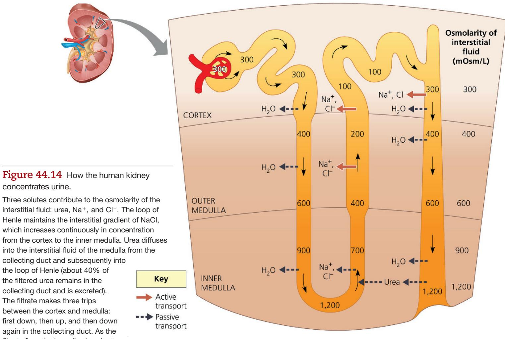

Three solutes contribute to the osmolarity of the interstitial fluid: urea, $Na^{+}$ , and $Cl^{-}$ . The loop of Henle maintains the interstitial gradient of NaCl, which increases continuously in concentration from the cortex to the inner medulla. Urea diffuses into the interstitial fluid of the medulla from the

collecting duct and subsequently into the loop of Henle (about 40% of the filtered urea remains in the collecting duct and is excreted). The filtrate makes three trips between the cortex and medulla: first down, then up, and then down again in the collecting duct. As the filtrate flows in the collecting duct past

interstitial fluid of increasing osmolarity, more water moves out of the duct by osmosis. The loss of water concentrates the solutes, including urea, that will be excreted in the urine.

WHAT IF? The drug furosemide blocks the cotransporters for $Na^{+}$ and $Cl^{-}$ in the ascending limb of the loop of Henle. What effect would you expect this drug to have on urine volume?

For suggested answer, see Appendix A.

through the thin segment of the ascending limb, diffusion of $Na^{+}$ and $Cl^{-}$ out of the tubule reduces the filtrate's osmolarity. As a result of active transport of $Na^{+}$ and $Cl^{-}$ out of the thick segment of the ascending limb, the filtrate is actually hypoosmotic to body fluids by the time it reaches the distal tubule. Next, the filtrate descends again toward the medulla, this time in the collecting duct, which is permeable to water (assuming ADH is present) but not to $Na^{+}$ or $Cl^{-}$ . Therefore, osmosis extracts water from the filtrate as it passes from cortex to medulla and encounters interstitial fluid of increasing osmolarity. This process concentrates salt, urea, and other solutes in the filtrate. Some urea passes out of the lower portion of the collecting duct and contributes to the high interstitial osmolarity of the inner medulla. (This urea is recycled by diffusion into the loop of Henle, but continual leakage from the collecting duct maintains a high interstitial urea concentration.) When the kidney concentrates urine maximally, the urine reaches 1,200 mOsm/L, the osmolarity of the interstitial fluid in the inner medulla. Although isoosmotic to the inner medulla's interstitial fluid, the urine is hyperosmotic to blood and interstitial fluid elsewhere in the body. This high

osmolarity allows the solutes remaining in the urine to be excreted from the body with minimal water loss when fluid intake is low.

The loop of Henle and surrounding capillaries act as a type of countercurrent system to generate the steep osmotic gradient between the medulla and cortex. Recall that some endotherms have a countercurrent heat exchanger that reduces heat loss and that countercurrent gas exchange in fish gills maximizes oxygen absorption (see Figures 40.13 and 42.21). In those cases, the countercurrent mechanisms involve passive movement along either an oxygen concentration gradient or a heat gradient. In contrast, the countercurrent system of the loop of Henle involves active transport and thus an expenditure of energy. The active transport of $\mathrm{Na^{+}}$ and $\mathrm{Cl^-}$ from the filtrate in the upper part of the ascending limb of the loop maintains a high salt concentration in the interior of the kidney, enabling the kidney to form concentrated urine. Such countercurrent systems, which expend energy to create concentration gradients, are called countercurrent multiplier systems. Urea also contributes to the high osmolarity in the renal medulla.

What prevents the capillaries of the vasa recta from dissipating the gradient by carrying away the high concentration of solutes in the medulla's interstitial fluid? As shown in Figure 44.12, the descending and ascending vessels of the vasa recta carry blood in opposite directions through the kidney's osmolarity gradient. As the descending vessel conveys blood toward the inner medulla, water is lost from the blood and solutes gained by diffusion. These net fluxes are reversed as blood flows back toward the cortex in the ascending vessel of the vasa recta, with water reentering the blood and solutes diffusing out. Thus, the vasa recta can exchange substances with the renal tubule without interfering with the osmolarity gradient in the inner and outer medulla.

## Adaptations of the Vertebrate Kidney to Diverse Environments

EVOLUTION Vertebrates occupy habitats ranging from rain forests to deserts and from some of the saltiest bodies of water to the nearly pure waters of high mountain lakes. Comparing vertebrates across environments reveals adaptive variations in nephron structure and function. In the case of mammals, for example, the presence of juxtamedullary nephrons is a key adaptation that enables these terrestrial animals to shed salts and nitrogenous wastes without squandering water. Differences among species in the length of the loop of Henle in the juxtamedullary nephrons and in the relative numbers of juxtamedullary and cortical nephrons help to fine-tune osmoregulation to particular habitats.

## Mammals

Mammals that excrete the most hyperosmotic urine, such as Australian hopping mice, North American kangaroo rats, and other desert mammals, have many juxtamedullary nephrons with loops of Henle that extend deep into the medulla. Long loops maintain steep osmotic gradients in the kidney, resulting in urine becoming very concentrated as it passes from cortex to medulla in the collecting ducts.

In contrast, beavers, muskrats, and other aquatic mammals that spend much of their time in fresh water and rarely face problems of dehydration have mostly cortical nephrons, resulting in a much lower ability to concentrate urine. Terrestrial mammals living in moist conditions have loops of Henle of intermediate length and the capacity to produce urine intermediate in concentration to that produced by freshwater and desert mammals.

## Case Study: Kidney Function in the Vampire Bat

The South American vampire bat in Figure 44.15 illustrates the versatility of the mammalian kidney. This species feeds at night on the blood of large birds and mammals. The bat uses its sharp teeth to make a small incision in the prey's skin and then laps up blood from the wound (the prey is typically not seriously harmed). Anticoagulants in the bat's saliva prevent the blood from clotting.

Figure 44.15 A vampire bat (Desmodus rotundus), a mammal with unique excretory challenges.

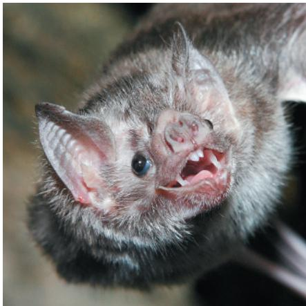

A vampire bat may search for hours and fly long distances to locate a suitable victim. When it does find prey, it benefits from consuming as much blood as possible. Often drinking more than half its body mass, the bat is at risk of becoming too heavy to fly. As the bat feeds, however, its kidneys excrete large volumes of dilute urine, up to 24% of body mass per hour. Having lost enough weight to take off, the bat can fly back to its roost in a cave or hollow tree, where it spends the day.

In the roost, the vampire bat faces a different regulatory problem. Most of the nutrition it derives from blood comes in the form of protein. Digesting proteins generates large quantities of urea, but roosting bats lack access to the drinking water necessary to dilute it. Instead, their kidneys shift to producing small quantities of highly concentrated urine (up to 4,600 mOsm/L), an adjustment that disposes of the urea load while conserving as much water as possible. The vampire bat's ability to alternate rapidly between producing large amounts of dilute urine and small amounts of very hyperosmotic urine is an essential part of its adaptation to an unusual food source.

## Birds and Other Reptiles

Most birds, including the albatross (see Figure 44.1) and the ostrich (Figure 44.16), live in environments that are dehydrating. Like mammals but no other species, birds have kidneys with juxtamedullary nephrons. However, the nephrons of birds have loops of Henle that extend less far into the medulla than those of mammals. Thus, bird kidneys cannot concentrate urine to the high osmolarities achieved by mammalian kidneys. Although birds can produce hyperosmotic urine, their main water conservation adaptation is having uric acid as the nitrogenous waste molecule.

The kidneys of other reptiles have only cortical nephrons, and they produce urine that is isoosmotic or hypoosmotic to body fluids. However, the epithelium of the cloaca, from which urine and feces leave the body, conserves fluid by reabsorbing water from these wastes. Like birds, most other reptiles excrete their nitrogenous wastes as uric acid.

## Freshwater Fishes and Amphibians

Hyperosmotic to their surroundings, freshwater fishes produce large volumes of very dilute urine. Their kidneys, which are packed with cortical nephrons, produce filtrate at a high rate.

Figure 44.16 An ostrich (Struthio camelus), an animal well adapted to its dry environment.

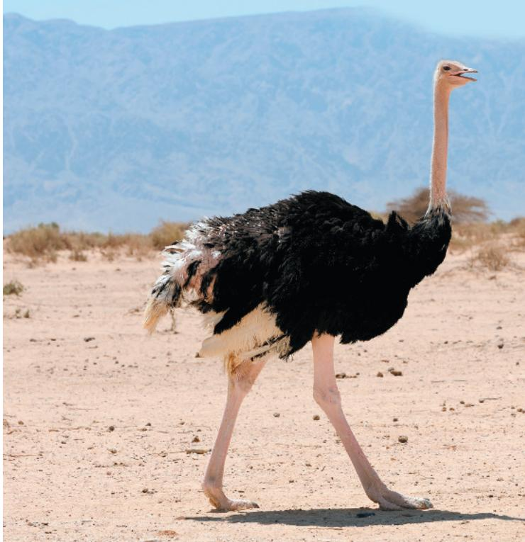

Salt conservation relies on the reabsorption of ions from the filtrate in the distal tubules.

Amphibian kidneys function much like those of freshwater fishes. When frogs are in fresh water, their kidneys excrete dilute urine while their skin accumulates certain salts from the water by active transport. On land, where dehydration is the most pressing problem of osmoregulation, frogs conserve body fluid by reabsorbing water across the epithelium of the urinary bladder.

## Marine Bony Fishes

Compared with freshwater fishes, marine fishes have fewer and smaller nephrons, and their nephrons lack a distal tubule. In addition, their kidneys have small glomeruli or lack glomeruli entirely. In keeping with these features, filtration rates are low and very little urine is excreted.

The main function of kidneys in marine bony fishes is to get rid of divalent ions (those with a charge of 2+ or 2−) such as calcium $\left(\mathrm{Ca}^{2+}\right)$ , magnesium $\left(\mathrm{Mg}^{2+}\right)$ , and sulfate $\left(\mathrm{SO}_{4}^{2-}\right)$ . Marine fishes take in divalent ions by incessantly drinking seawater. They rid themselves of these ions by secreting them into the proximal tubules of the nephrons and excreting them in urine. Osmoregulation in marine bony fishes also relies on specialized chloride cells in the gills. By establishing gradients that enable secretion of ions into seawater, the chloride cells maintain proper levels of monovalent ions (charge of 1+ or 1−) such as $Na^{+}$ and $Cl^{-}$ .

The generation of ion gradients and the movement of ions across membranes are central to salt and water balance in marine bony fishes. These events, however, are by no means unique to these organisms nor to homeostasis. As illustrated by the examples in Figure 44.17, osmoregulation by chloride cells is but one of many diverse physiological processes that are driven by the movement of ions across a membrane.

## Concept Check 44.4

1. What do the number and length of nephrons in a fish's kidney indicate about the fish's habitat? How do they correlate with urine production?

2. Many medications make the epithelium of the collecting duct less permeable to water. How would taking such a medication affect kidney output?

3. WHAT IF? If blood pressure in the afferent arteriole leading to a glomerulus decreased, how would the rate of blood filtration within Bowman's capsule be affected? Explain.

For suggested answers, see Appendix A.

## Concept 44.5: Hormonal circuits link kidney function, water balance, and blood pressure

In mammals, both the volume and osmolarity of urine are adjusted according to an animal's water and salt balance and its rate of urea production. In situations of high salt intake and low water availability, a mammal can excrete urea and salt in small volumes of hyperosmotic urine with minimal water loss. If salt is scarce and fluid intake is high, the kidney can instead eliminate the excess water with little salt loss by producing large volumes of hypoosmotic urine. At such times, the urine can be as dilute as 70 mOsm/L, less than one-fourth the osmolarity of human blood.

How are urine volume and osmolarity regulated so effectively? As we'll explore in this final portion of the chapter, two major control circuits that respond to different stimuli together restore and maintain normal water and salt balance.

## The Kidney and Homeostasis

In addition to its excretory function, the kidney is a key effector in negative feedback loops regulating blood pressure and osmolarity. By altering the osmolarity and amount of urine, the kidney changes the osmolarity and volume of the blood. Blood volume, in turn, determines blood pressure, as discussed in Concept 42.3.

## Make Connections: Ion Movement and Gradients

## Figure 44.17

The transport of ions across the plasma membrane of a cell is a fundamental activity of all animals, and indeed of all living things. By generating ion gradients, ion transport provides the potential energy that powers processes ranging from an organism's regulation of salts and gases in internal fluids to its perception of and locomotion through its environment.

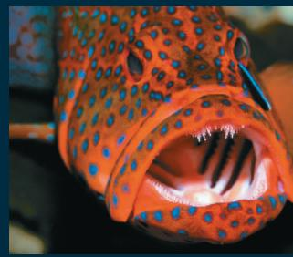

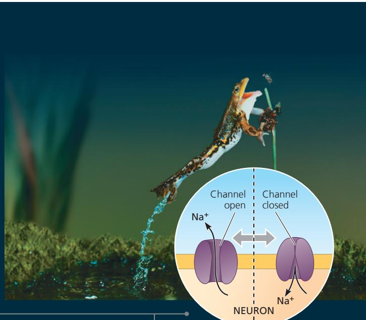

## Osmoregulation

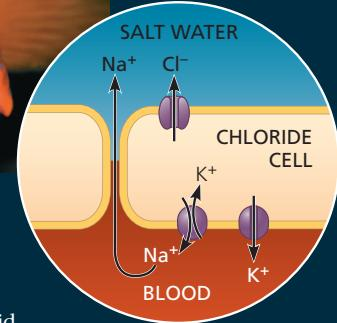

In marine bony fishes, ion gradients drive secretion of salt (NaCl), a process essential to avoid dehydration. Within gills, the pumps, cotransporters, and channels of specialized chloride cells function together to drive salt from the blood across the gill epithelium and into the surrounding salt water. (See Figure 44.3.)

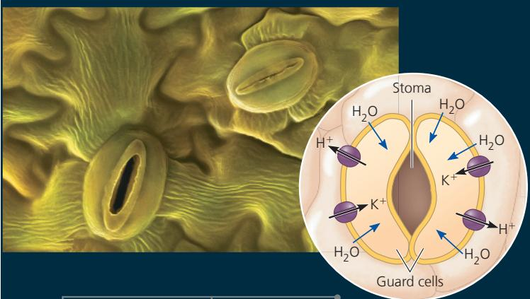

## Gas Exchange

## Information Processing

In neurons, transmission of information as nerve impulses is made possible by the opening and closing of channels selective for sodium or other ions. These signals enable nervous systems to receive and process input and to direct appropriate output, such as this leap of a frog capturing prey. (See Concept 48.3 and Concept 50.5.)

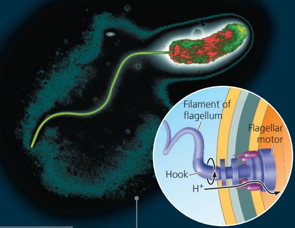

## Locomotion

A gradient of $H^{+}$ powers the bacterial flagellum. An electron transport chain generates this gradient, establishing a higher concentration of $H^{+}$ outside the bacterial cell. Protons reentering the cell provide a force that causes the flagellar motor to rotate. The rotating motor turns the curved hook, causing the attached filament to propel the cell. (See Concept 9.4 and Figure 27.7.)

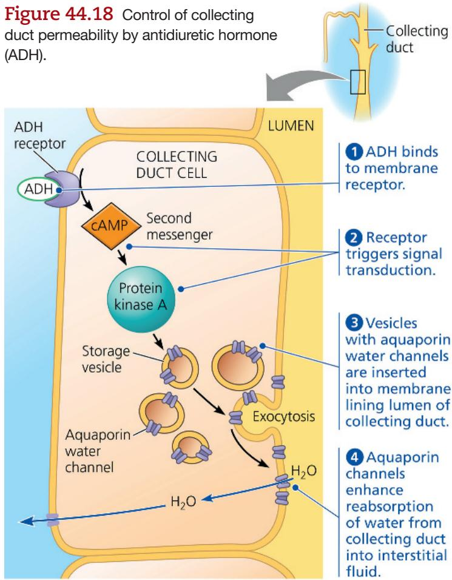

## Antidiuretic Hormone

One key hormone acting on the kidney is antidiuretic hormone (ADH), also called vasopressin. ADH molecules released from the posterior pituitary bind to and activate membrane receptors on the surface of collecting duct cells. The activated receptors initiate a signal transduction cascade that directs insertion of aquaporin proteins into the membrane lining the collecting duct (Figure 44.18). More aquaporin channels result in more water recapture, resulting in more dilute body fluids and more concentrated urine. (A high level of urine production is called diuresis; ADH is therefore called antidiuretic hormone.)

To understand the regulatory circuitry based on ADH, let's consider first what occurs when blood osmolarity rises, such as after eating salty food or losing water through sweating (Figure 44.19). When osmolarity rises above the set point (275–295 mOsm/L), osmoreceptor cells in the hypothalamus trigger increased release of ADH from the posterior pituitary. ADH stimulates water reabsorption from the collecting duct, resulting in the production of a smaller volume of concentrated urine. The reabsorbed water enters the bloodstream, lowering blood osmolarity back toward the set point.

What happens if, instead of ingesting salt or sweating profusely, you drink a large amount of water? Blood osmolarity falls below the set point, causing a drop in ADH secretion to a very low level. The resulting decrease in permeability of the collecting ducts reduces water reabsorption, resulting in discharge of large volumes of dilute urine.

Figure 44.19 Regulation of fluid retention in the kidney.

Osmoreceptors in the hypothalamus monitor blood osmolarity via its effect on the net diffusion of water into or out of the receptor cells. When blood osmolarity increases, signals from the osmoreceptors trigger a release of ADH from the posterior pituitary and generate thirst. Water reabsorption in the collecting duct and water intake restore normal blood osmolarity, inhibiting further ADH secretion.

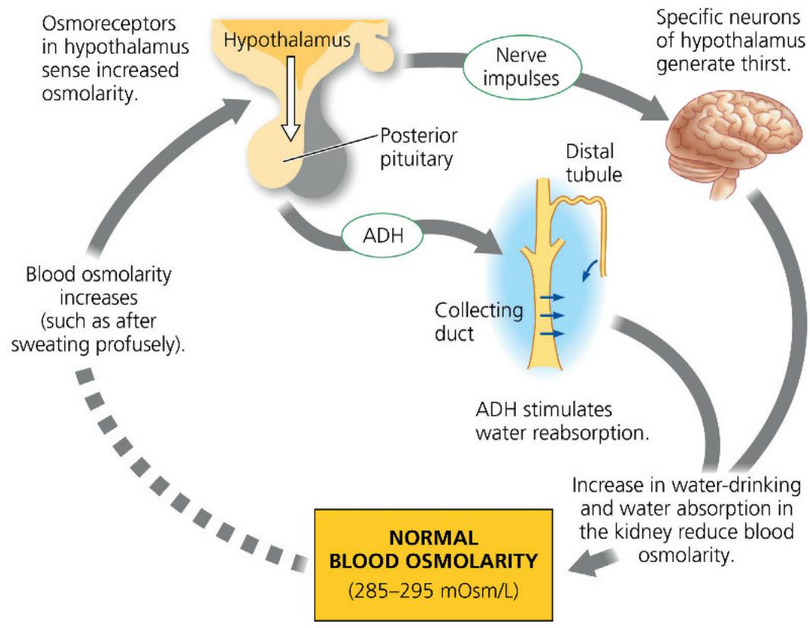

Contrary to common belief, caffeinated drinks increase urine production to no greater degree than water of comparable volume: Numerous studies of coffee and tea drinkers have found no diuretic effect for caffeine.

Blood osmolarity, ADH release, and water reabsorption in the kidney are normally linked in a feedback circuit that contributes to homeostasis. Anything that disrupts this circuit can interfere with water balance. For example, alcohol inhibits ADH release, leading to excessive urinary water loss and dehydration (which may cause some of the symptoms of a hangover).

Mutations that prevent ADH production or that inactivate the ADH receptor gene disrupt homeostasis by blocking the insertion of additional aquaporin channels in the collecting duct membrane. The resulting disorder can cause severe dehydration and solute imbalance due to production of copious dilute urine. These symptoms give the disorder its name: diabetes insipidus (from the Greek for “to pass through” and “having no flavor”). Could mutations in an aquaporin gene have a similar effect? Figure 44.20 describes an experimental approach that addressed this question.

## The Renin-Angiotensin-Aldosterone System

The release of ADH is a response to an increase in blood osmolarity, as when the body is dehydrated from excessive water loss or inadequate water intake. However, an excessive loss of both salt and body fluids—caused, for example, by a major wound or severe diarrhea—will reduce blood volume without increasing osmolarity. An endocrine circuit called the renin-angiotensin-aldosterone system (RAAS) can respond to changes in blood volume and pressure by modifying kidney activity. When this system detects low blood pressure, it increases reabsorption of $Na^{+}$ and water.

The RAAS involves the juxtaglomerular apparatus (JGA), a specialized tissue consisting of cells of and around the afferent arteriole, which supplies blood to the glomerulus. When pressure drops in the afferent arteriole (for instance, as a result of the decreased blood volume caused by dehydration), the JGA releases the enzyme renin. Renin initiates a sequence of steps that cleave a plasma protein called angiotensinogen, ultimately yielding a peptide hormone called angiotensin II (Figure 44.21).

Angiotensin II increases blood pressure by stimulating vasoconstriction in blood vessels in the kidney and elsewhere (See Concept 42.3). It also stimulates the adrenal glands to release a hormone called aldosterone. Aldosterone causes the nephrons' distal tubules and collecting duct to reabsorb more $\mathrm{Na^{+}}$ and water, increasing blood volume and pressure.

The RAAS serves as a series of signals in a negative feedback loop. A drop in blood volume and pressure triggers renin release. The resulting production of angiotensin II and release of aldosterone cause a rise in blood volume and pressure, reducing the release of renin from the JGA.

Because angiotensin II results in increased blood pressure, drugs that block angiotensin II production are widely used to treat hypertension (chronic high blood pressure). Many of these drugs are specific inhibitors of angiotensin converting enzyme (ACE), which catalyzes one of the steps in the production of angiotensin II.

Figure 44.20

# Inquiry: Can aquaporin mutations cause diabetes?

## Experiment

Researchers studied a patient with diabetes insipidus who had a normal ADH receptor gene but two mutant alleles (A and B) of the aquaporin-2 gene. The resulting changes are shown below in an alignment of protein sequences that includes other species.

<table><tr><td>Source of Aquaporin-2 Gene Sequence</td><td>Amino Acids 183–191* in Encoded Protein</td><td>Amino Acids 212–220* in Encoded Protein</td></tr><tr><td>Frog (Xenopus laevis)</td><td>MNPARSFAP</td><td>GIFASLIYN</td></tr><tr><td>Lizard (Anolis carolinensis)</td><td>MNPARSFGP</td><td>AVVASLLYN</td></tr><tr><td>Chicken (Gallus gallus)</td><td>MNPARSFAP</td><td>AAAASIIYN</td></tr><tr><td>Human (Homo sapiens)</td><td>MNPARSLAP</td><td>AILGSLLYN</td></tr><tr><td>Conserved residues</td><td>MNPARS--P</td><td>----S--YN</td></tr><tr><td>Patient&#x27;s gene: allele A</td><td>MNPACSLAP</td><td>AILGSLLYN</td></tr><tr><td>Patient&#x27;s gene: allele B</td><td>MNPARSLAP</td><td>AILGPLLYN</td></tr><tr><td colspan="3">*The numbering is based on the human aquaporin-2 protein sequence.</td></tr></table>

Each mutation changed the protein sequence at a highly conserved position. To test the hypothesis that the changes affect function, researchers used frog oocytes, cells that will express foreign messenger RNA and can be readily collected from adult female frogs.

1 Messenger RNA transcribed from wild-type and mutant aquaporin genes is injected into frog oocytes, where it directs the synthesis of aquaporin proteins.

2 The oocytes are transferred from a 200-mOsm to a 10-mOsm solution. The rate of oocyte swelling is measured as an indicator of water permeability.

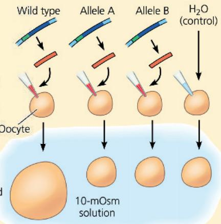

## Results

<table><tr><td>Source of Injected mRNA</td><td>Rate of Swelling (μm/sec)</td></tr><tr><td>Human wild type</td><td>196</td></tr><tr><td>Patient&#x27;s allele A</td><td>17</td></tr><tr><td>Patient&#x27;s allele B</td><td>18</td></tr><tr><td>None ( $H_2O$  control)</td><td>20</td></tr></table>

## Conclusion

Because each mutation renders aquaporin inactive as a water channel, researchers concluded that these mutations cause the disorder common to the patients.

Data from P. M. Deen et al., Requirement of human renal water channel aquaporin-2 for vasopressin-dependent concentration of urine, Science 264:92–95 (1994).

WHAT IF? If you measured ADH levels in patients with ADH receptor mutations and in patients with aquaporin mutations, what would you expect to find, compared with wild-type subjects?
For suggested answer, see Appendix A.

Figure 44.21 Regulation of blood volume and blood pressure by the renin-angiotensin-aldosterone system (RAAS).  
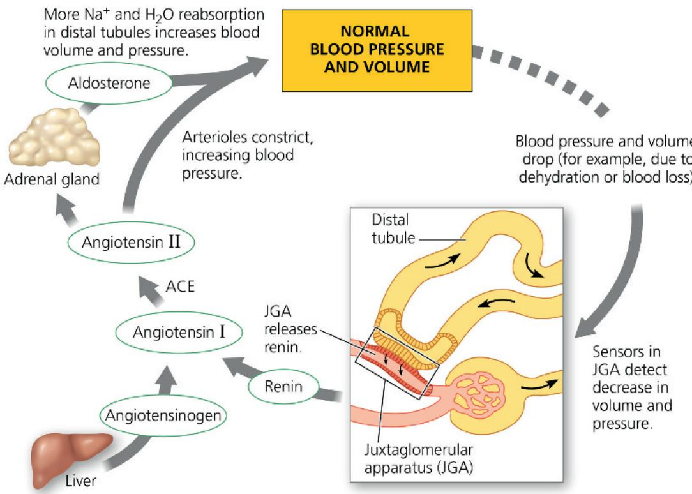  
VISUAL SKILLS Label each arrow that represents the secretion of a hormone. For suggested answer, see Appendix A.

## Coordinated Regulation of Salt and Water Balance

Both ADH and RAAS increase water reabsorption in the kidney. However, whereas ADH alone would lower blood $Na^{+}$ concentration via water reabsorption in the kidney, the RAAS helps maintain body fluid osmolarity within the normal range by stimulating $Na^{+}$ reabsorption.

Another hormone, atrial natriuretic peptide (ANP), opposes the RAAS. The walls of the atria of the heart release ANP in response to an increase in blood volume and pressure. ANP inhibits the release of renin from the JGA, inhibits NaCl reabsorption by the collecting ducts, and reduces aldosterone release from the adrenal glands. These actions lower blood volume and pressure. Thus, ADH, the RAAS, and ANP provide an elaborate system of checks and balances that regulate the kidney's ability to control blood osmolarity, salt concentration, volume, and pressure.

The kidney can minimize water loss in the urine, but only the consumption of liquids can restore lost volume. Both the RAAS and ADH promote liquid consumption by stimulating thirst (see Figures 44.19 and 44.21). Recently, researchers have identified

neurons in the hypothalamus dedicated to regulating thirst. Stimulating one set of neurons in mice causes intense drinking behavior, even if the animal is fully hydrated. Stimulating a second set causes an immediate halt in water consumption, even in dehydrated animals. Follow-up studies are focused on identifying the cellular and molecular pathways linking these neurons to the behavioral responses.

## Concept Check 44.5

1. Many medications act by making the epithelium of the collecting duct less permeable to water. How would taking such a drug affect urine output?

2. Why could it be dangerous to drink a very large amount of water in a short period of time?

3. WHAT IF? Conn's syndrome is a condition caused by tumors of the adrenal cortex that secrete high amounts of aldosterone in an unregulated manner. What would you expect to be the major symptom of this disorder?

For suggested answers, see Appendix A.

# Chapter 44 Review

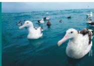

## Summary of Key Concepts

To review key terms, go to the Vocabulary Self-Quiz (eTextbook only).

## Concept 44.1: Osmoregulation balances the uptake and loss of water and solutes

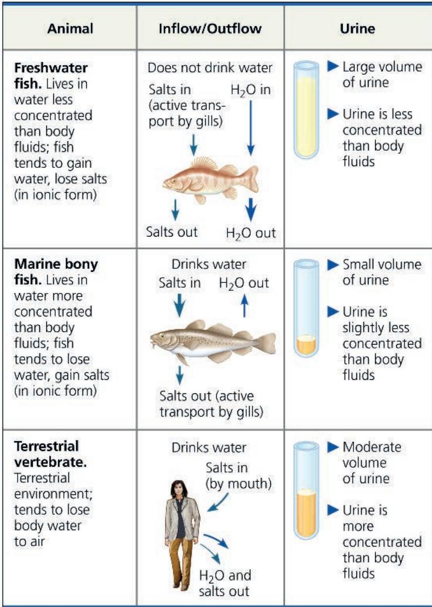

\- Cells balance water gain and loss through osmoregulation, a process based on the controlled movement of solutes between internal fluids and the external environment and on the movement of water, which follows by osmosis.

\- Osmoconformers are isoosmotic with their marine environment and do not regulate their osmolarity. In contrast, osmoregulators control water uptake and loss in a hypoosmotic or hyperosmotic environment, respectively. Water-conserving excretory organs help terrestrial animals avoid desiccation, which can be life-threatening. Animals that live in temporary waters may enter a dormant state called anhydrobiosis when their habitats dry up.

\- Transport epithelia contain specialized epithelial cells that control the solute movements required for waste disposal and osmoregulation.

Under what environmental conditions does water move into a cell by osmosis?

## Concept 44.2: An animal's nitrogenous wastes reflect its phylogeny and habitat

\- Protein and nucleic acid metabolism generates ammonia. Most aquatic animals excrete ammonia. Mammals and most adult amphibians convert ammonia to the less toxic urea, which is excreted with a minimal loss of water. Insects and many reptiles, including birds, convert ammonia to uric acid, a mostly insoluble waste excreted in a paste-like urine.

\- The kind of nitrogenous waste excreted depends on an animal's habitat, whereas the amount excreted is coupled to the animal's energy budget and dietary protein intake.

MAKE CONNECTIONS Metabolism of carbohydrates and fats requires several nitrogen-containing molecules, such as $NAD^{+}/NADH$ (see Figure 9.12), but is not a significant source of nitrogen-containing waste. Why?

## Concept 44.3: Diverse excretory systems are variations on a tubular theme

\- Most excretory systems carry out filtration, reabsorption, secretion, and excretion. Invertebrate excretory systems include the protonephridia of flatworms, the metanephridia of earthworms, and the Malpighian tubules of insects. Kidneys function in both excretion and osmoregulation in vertebrates.

\- Excretory tubules (consisting of nephrons and collecting ducts) and blood vessels pack the mammalian kidney. Blood pressure forces fluid from blood in the glomerulus into the lumen of Bowman's capsule. The composition of the filtrate is modified by reabsorption and secretion before flowing into a collecting duct. The ureter conveys urine from the renal pelvis to the urinary bladder.

What is the function of the filtration step in excretory systems?

## Concept 44.4: The nephron is organized for stepwise processing of blood filtrate

\- Within the nephron, selective secretion and reabsorption in the proximal tubule alter filtrate volume and composition. The descending limb of the loop of Henle is permeable to water but not salt; water moves by osmosis into the interstitial fluid. The ascending limb is permeable to salt but not water; salt leaves by diffusion and by active transport. The distal tubule and collecting duct regulate $K^{+}$ and NaCl levels in body fluids.

\- In mammals, a countercurrent multiplier system involving the loop of Henle maintains the gradient of salt concentration in the kidney interior. Urea exiting the collecting duct contributes to the osmotic gradient of the kidney.

\- Natural selection has shaped the form and function of nephrons in various vertebrates to the osmoregulatory challenges of the animals' habitats. For example, desert mammals, which excrete the most hyperosmotic urine, have loops of Henle that extend deep into the renal medulla, whereas mammals in moist habitats have shorter loops and excrete more dilute urine.

How do cortical and juxtamedullary nephrons differ with respect to reabsorbing nutrients and concentrating urine?

## Concept 44.5: Hormonal circuits link kidney function, water balance, and blood pressure

\- The posterior pituitary gland releases more antidiuretic hormone (ADH) when blood osmolarity rises above the set point such as when water intake is inadequate. ADH increases the permeability to water of the collecting ducts by increasing the number of epithelial aquaporin channels.

\- Decreased blood volume and pressure increase the production of renin from the juxtaglomerular apparatus. Angiotensin II formed in response to renin constricts arterioles and triggers release of the hormone aldosterone, raising blood pressure and reducing the release of renin. This renin-angiotensin-aldosterone system has functions that overlap with those of ADH and are opposed by atrial natriuretic peptide.

Why can only some individuals with diabetes insipidus be treated effectively with ADH?

For suggested answers, see Appendix A.

## Test Your Understanding

For more multiple-choice questions, go to the Practice Test (eTextbook only).

## Levels 1-2: Remembering/Understanding

1. Unlike an earthworm's metanephridia, a mammalian nephron (A) is intimately associated with a capillary network. (B) functions in both osmoregulation and excretion. (C) receives filtrate from blood instead of coelomic fluid. (D) has a transport epithelium.

2. Which process in the nephron is least selective?
(A) filtration (C) active transport
(B) reabsorption (D) secretion

3. Which of the following animals generally has the lowest volume of urine production?
(A) vampire bat (C) marine bony fish
(B) salmon in fresh water (D) freshwater flatworm

## Levels 3-4: Applying/Analyzing

4. The high osmolarity of the renal medulla is maintained by which of the following?

(A) active transport of $Na^{+}$ and $Cl^{-}$ from the upper region of the descending limb

(B) the loose packing of juxtamedullary nephrons

(C) diffusion of urea into the collecting duct

(D) diffusion of $Na^{+}$ and $Cl^{-}$ from the descending limb of the loop of Henle

5. In which of the following species should natural selection favor the highest proportion of juxtamedullary nephrons?

(A) a river otter

(B) a mouse species living in a temperate broadleaf forest

(C) a mouse species living in a desert

(D) a beaver

6. African lungfish, which are often found in small, stagnant pools of fresh water, produce urea as a nitrogenous waste. What is an advantage of this adaptation?

(A) Urea takes less energy to synthesize than ammonia.

(B) Small, stagnant pools do not provide enough water to dilute ammonia, which is toxic.

(C) Urea forms an insoluble precipitate.

(D) Urea makes lungfish tissue hypoosmotic to the pool.

## Levels 5-6: Evaluating/Creating

## 7. INTERPRET THE DATA

a. Use the data below to draw four pie charts for the average daily water gain and loss in a kangaroo rat and a human.

b. Which routes of water gain and loss make up a much larger share of the total in a kangaroo rat than in a human?

<table><tr><td></td><td>Kangaroo Rat</td><td>Human</td></tr><tr><td colspan="3">Average Water Gain (mL/day)</td></tr><tr><td>Ingested in food</td><td>0.2</td><td>750</td></tr><tr><td>Ingested in liquid</td><td>0</td><td>1,500</td></tr><tr><td>Derived from metabolism</td><td>1.8</td><td>250</td></tr><tr><td colspan="3">Average Water Loss (mL/day)</td></tr><tr><td>Urine</td><td>0.45</td><td>1,500</td></tr><tr><td>Feces</td><td>0.09</td><td>100</td></tr><tr><td>Evaporation</td><td>1.46</td><td>900</td></tr></table>

8. EVOLUTION CONNECTION Merriam's kangaroo rats (Dipodomys merriami) live in North American habitats ranging from moist, cool woodlands to hot deserts. Based on the hypothesis that there are adaptive differences in water conservation between D. merriami populations, predict how the rates of evaporative water loss would differ for populations that live in moist versus dry environments. Propose a test of your prediction, using a humidity sensor to detect evaporative water loss by kangaroo rats.

9. SCIENTIFIC INQUIRY You are exploring kidney function in kangaroo rats. You measure urine volume and osmolarity, as well as the amount of chloride (Cl $^{-}$ ) and urea in the urine. If the water source provided to the animals were switched from tap water to a 2% NaCl solution, indicate what change in urine osmolarity you would expect. How would you determine if this change was more likely due to a change in the excretion of Cl $^{-}$ or urea?

10. WRITE ABOUT A THEME: ORGANIZATION In a short essay (100–150 words), compare how membrane structures in the loop of Henle and collecting duct of the mammalian kidney enable water to be recovered from filtrate in the process of osmoregulation.

## 11. SYNTHESIZE YOUR KNOWLEDGE

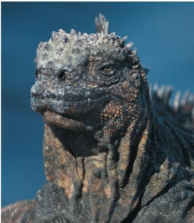  
The marine iguana (Amblyrhynchus cristatus), which spends long periods under water feeding on seaweed, relies on both salt glands and kidneys for homeostasis of its internal fluids. Describe how these organs together meet the particular osmoregulatory challenges of this animal's environment.  
For selected answers, see Appendix A.

