# 第46章 Animal Reproduction

<!-- 章节边界按正文内容恢复；原始 MinerU 内容保留如下。 -->

# Animal Reproduction

## Key Concepts

46.1 Both asexual and sexual reproduction occur in the animal kingdom

46.2 Fertilization depends on mechanisms that bring together sperm and eggs of the same species

46.3 Reproductive organs produce and transport gametes

46.4 The interplay of tropic and sex hormones regulates reproduction in mammals

46.5 In placental mammals, an embryo develops fully within the uterus

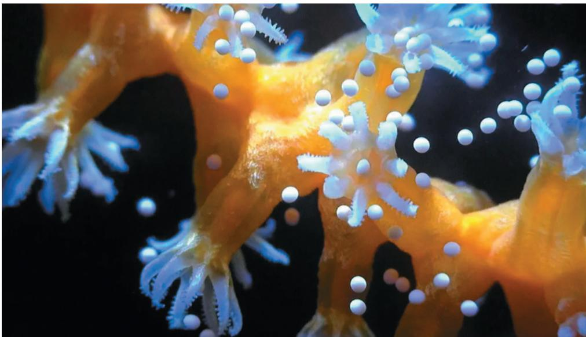  
Figure 46.1 This colony of coral polyps is reproducing. Tiny white orbs packed with eggs and sperm emerge from the polyps, rise to the sea surface, and burst. There, the eggs and sperm form embryos that become larvae, eventually drifting down and establishing new coral colonies.

## Study Tip

Make a table: To help you keep track of the roles of the tropic hormones in mammalian reproductive systems, make a table like the one shown here. Complete the last cell for GnRH, and fill in the rows for FSH and LH.

<table><tr><td>Hormone</td><td>Source</td><td>In males: Target/effect</td><td>In females: Target/effect</td></tr><tr><td>GNRH= gonado- tropin- releasing hormone</td><td>Hypo- thalamus</td><td>Anterior pituitary/ promote FSH and LH release</td><td></td></tr><tr><td>FSH=</td><td></td><td></td><td></td></tr><tr><td>LH=</td><td></td><td></td><td></td></tr></table>

## In what different ways do animals reproduce?

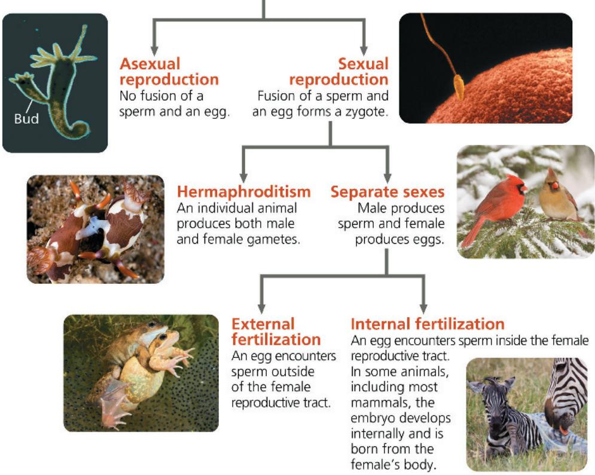

Hermaphroditism An individual animal produces both male and female gametes.

External fertilization
An egg encounters sperm outside of the female reproductive tract.

reproductive tract. In some animals, including most mammals, the embryo develops internally and is born from the female's body.

# Concept 46.1: Both asexual and sexual reproduction occur in the animal kingdom

There are two modes of animal reproduction—sexual and asexual. In sexual reproduction, the fusion of haploid gametes forms a diploid cell, the zygote. The animal that develops from a zygote can in turn give rise to gametes by meiosis (see Figure 13.8). The female gamete, the egg, is large and nonmotile, whereas the male gamete, the sperm, is generally much smaller and motile. In asexual reproduction, new individuals are generated without the fusion of egg and sperm. For most asexual animals, reproduction relies entirely on mitotic cell division. Asexual and sexual reproduction are both common among animals.

## Mechanisms of Asexual Reproduction

Among animals, several simple forms of asexual reproduction are found exclusively in invertebrates. One of these is budding, in which new individuals arise from outgrowths of existing ones (see Figure 13.2). In stony corals, for example, buds form and remain attached to the parent. The eventual result is a colony more than 1 m across, consisting of thousands of connected individuals. Also common among invertebrates is fission, the splitting and separation of a parent organism into two individuals of approximately equal size.

Invertebrate asexual reproduction can also occur by fragmentation, the breaking of the body into several pieces, followed by regeneration, regrowth of lost body parts. If more than one piece grows and develops into a complete animal, the effect is reproduction. For example, certain annelid worms can split into several fragments, each regenerating a complete worm. Numerous corals, sponges, cnidarians, and tunicates also reproduce by fragmentation and regeneration.

A wide range of animal species reproduce asexually by parthenogenesis, in which an egg develops without being fertilized. Among invertebrates, parthenogenesis occurs in certain species of bees, wasps, and ants. The offspring can be either haploid or diploid. In the case of honeybees, males (drones) are fertile haploid adults that arise by parthenogenesis. In contrast, female honeybees, including both the sterile workers and the fertile queens, are diploid adults that develop from fertilized eggs.

Among vertebrates, parthenogenesis is thought to be a rare response to low population density. For example, female Komodo dragons, California condors, hammerhead sharks, and zebra sharks have been observed to produce offspring when kept in captivity apart from males of their species. In 2015, DNA analysis of a group of female sawfish from a Florida river identified specimens that had two identical copies of all loci tested, providing evidence of vertebrate parthenogenesis in the wild.

Figure 46.2 Reproduction among hermaphrodites.
In this mating of sea slugs, or nudibranchs (Nembrotha chamberlaini), each hermaphrodite is providing sperm to fertilize the eggs of the other.

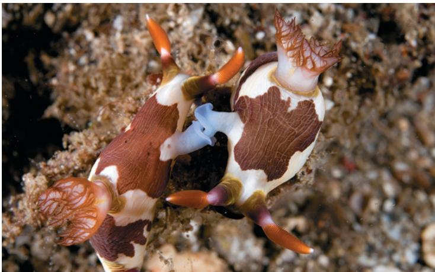

## Variation in Patterns of Sexual Reproduction

In many animal species, including humans, sexual reproduction involves the mating of a female and a male. In certain circumstances, however, finding a partner for reproduction can be challenging. Adaptations that arose during the evolution of some species meet this challenge by blurring the distinction between male and female. One such adaptation is particularly common among sessile (stationary) animals, such as barnacles, burrowing animals, such as clams, and some parasites, including tapeworms. That adaptation is hermaphroditism, in which each individual has both male and female reproductive systems (the term hermaphrodite merges the names of Hermes and Aphrodite, a Greek god and goddess). Sessile animals have a very limited opportunity to find a mate, but because each hermaphrodite reproduces as both a male and a female, any two individuals can mate. Each animal donates and receives sperm during mating, as shown for a pair of sea slugs in Figure 46.2. In some species, including many corals, hermaphrodites can also self-fertilize, allowing a form of sexual reproduction that doesn't require any partner.

The bluehead wrasse (Thalassoma bifasciatum) provides an example of a quite different variation in sexual reproduction. These coral reef fish live in harems, each consisting of a single male and several females. When the lone male dies, the opportunity for sexual reproduction would appear to be lost. Instead, within a week the largest female in the harem transforms into a male and begins to produce sperm instead of eggs. What selective pressure in the evolution of the bluehead wrasse resulted in sex reversal for the female with the largest body? Because it is the male wrasse that defends a harem against intruders, a larger size may be particularly important for a male in ensuring successful reproduction.

Certain oyster species also undergo sex reversal. In this case, individuals reproduce as males and then later as females, when their size is greatest. Since the number of gametes produced generally increases with size much more for females than for males, sex reversal in this direction maximizes gamete production. The result is enhanced reproductive success: Because oysters are sedentary animals and release their gametes into the surrounding water rather than mating directly, releasing more gametes tends to result in more offspring.

## Reproductive Cycles

Most animals, whether asexual or sexual, exhibit cycles in reproductive activity, often related to changing seasons. These cycles are controlled by hormones, whose secretion is in turn regulated by environmental cues. In this way, animals expend resources to reproduce only when sufficient energy sources are available and when environmental conditions favor the survival of offspring. For example, ewes (female sheep) have a reproductive cycle lasting 15–17 days. Ovulation, the release of mature eggs, occurs at the midpoint of each cycle. For ewes, reproductive cycles generally occur only during fall and early winter, and the length of any pregnancy is 5 months. Thus, most lambs are born in the early spring, when their chances of survival are optimal.

Because seasonal temperature is often an important cue for reproduction, climate change can decrease reproductive success. Researchers have discovered such an effect on caribou (wild reindeer) in Greenland. In spring, caribou migrate to calving grounds to eat sprouting plants, give birth, and care for their calves. Prior to 1993, the arrival of the caribou at the calving grounds coincided with the brief period during which the plants were nutritious and digestible. By 2006, however, average spring temperatures in the calving grounds had increased by more than 4°C, and the plants sprouted two weeks earlier. Because caribou migration is triggered by day length, not temperature, a mismatch arose between the timing of new plant growth and caribou birthing. Without adequate nutrition for the nursing females, production of caribou offspring has declined by more than 75% since 1993. To learn more about the effects of climate change on caribou and other organisms, see Make Connections Figure 56.31.

Reproductive cycles are also found among animals that can reproduce both sexually and asexually. Consider, for instance, the water flea (genus Daphnia). A female Daphnia can produce eggs of two types. One type of egg requires fertilization to develop, but the other type does not and develops instead by parthenogenesis. Daphnia reproduce asexually when environmental conditions are favorable and sexually during times of environmental stress. As a result, the switch between sexual and asexual reproduction is roughly linked to season.

For some asexual animal species, a cycle of reproductive behavior appears to reflect a sexual evolutionary past. In the parthenogenetic lizard species Aspidoscelis uniparens, reproduction is asexual, and all individuals are female. Nevertheless, these lizards have courtship and mating behaviors very similar to those of sexual species of Aspidoscelis. One member of each mating pair undergoes ovulation, the production and release of mature eggs. The other female mimics a male (Figure 46.3a). Over the course of the breeding season, the two lizards alternate roles two or three times. An individual adopts female behavior prior to ovulation, when the concentration of the hormone estradiol is high, and then switches to male-like behavior after ovulation, when the concentration of the hormone progesterone is high (Figure 46.3b). A female lizard is more likely to ovulate if she is mounted at a critical time of the hormone cycle; isolated lizards lay fewer eggs than those that go through the motions of sex. These findings support the hypothesis that these parthenogenetic lizards evolved from species having two sexes and still require certain sexual stimuli for maximum reproductive success.

Figure 46.3 Sexual behavior in parthenogenetic lizards. The desert grassland whiptail lizard (Aspidoscelis uniparens) is an all-female species. These reptiles reproduce by parthenogenesis, the development of an unfertilized egg, but ovulation is stimulated by mating behavior.  
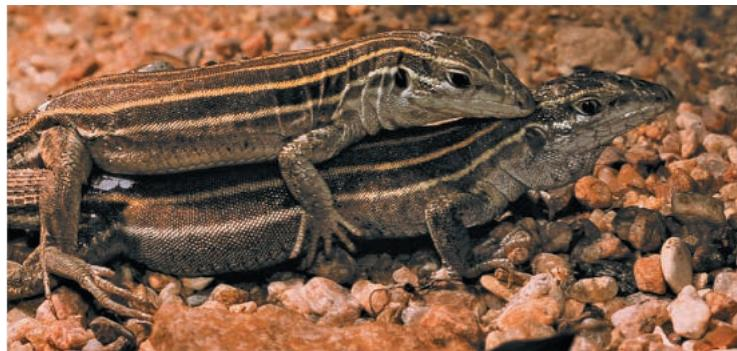  
(a) Both lizards in this photograph are A. uniparens females. The one on top is playing the role of a male. Individuals switch sex roles two or three times during the breeding season.

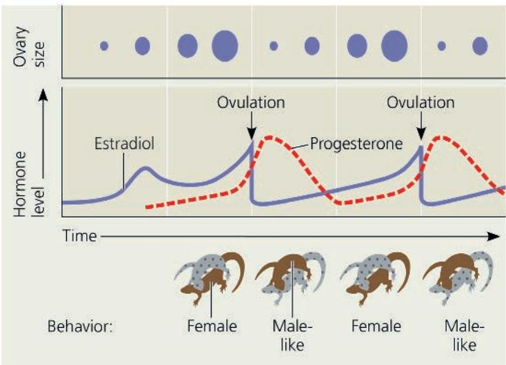  
(b) The changes in sexual behavior of A. uniparens individuals are correlated with the cycles of ovulation and changing levels of the sex hormones estradiol and progesterone. These drawings track the changes in ovary size, hormone levels, and sexual behavior of one female lizard (shown in brown).  
INTERPRET THE DATA If you plotted hormone levels for the speckled gray lizard in part (b) how would your graph differ from the graph shown?

## Sexual Reproduction: An Evolutionary Enigma

EVOLUTION Although our species and many others reproduce sexually, the existence of sexual reproduction is actually puzzling. To see why, imagine an animal population in which half the females reproduce sexually and half reproduce asexually. We'll assume that the number of offspring per female is a constant, two in this case. The two offspring of an asexual female will both be daughters that

Figure 46.4 The “reproductive handicap” of sex.

These diagrams contrast asexual versus sexual reproduction over four generations, assuming two surviving offspring per female.

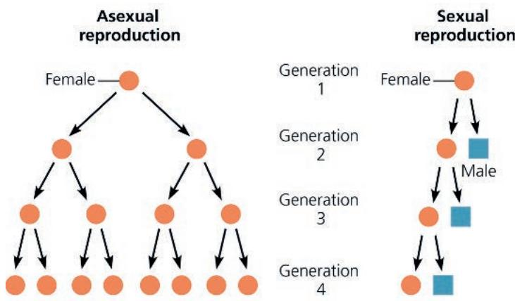

will each give birth to two more reproductive daughters. In contrast, half of a sexual female's offspring will be male (Figure 46.4). The number of sexual offspring will remain the same at each generation because both a male and a female are required to reproduce. Thus, the asexual condition will increase in frequency at each generation. Yet despite this “twofold cost,” sex is maintained, even in animal species that can also reproduce asexually.

What advantage does sexual reproduction provide that counteracts its twofold cost? The answer remains uncertain. Most hypotheses focus on the unique combinations of parental genes formed during meiotic recombination and fertilization. By producing offspring of varied genotypes, sexual reproduction may enhance the reproductive success of parents when environmental factors, such as pathogens, change relatively rapidly. In contrast, asexual reproduction is expected to be most advantageous in stable, favorable environments because it can perpetuate successful genotypes precisely.

There are a number of reasons why the unique gene combinations formed during sexual reproduction might be advantageous. One is that beneficial gene combinations arising through recombination might speed up adaptation. Although this idea appears straightforward, the theoretical advantage is significant only when the rate of beneficial mutations is high and population size is small. Another idea is that the shuffling of genes during sexual reproduction might allow a population to rid itself of sets of harmful genes more readily.

## Concept Check 46.1

1. Compare and contrast the outcomes of asexual and sexual reproduction.

2. Parthenogenesis is the most common form of asexual reproduction in animals that at other times reproduce sexually. What characteristic of parthenogenesis might explain this observation?

3. WHAT IF? If a hermaphrodite self-fertilizes, will the offspring be identical to the parent? Explain.

4. MAKE CONNECTIONS What examples of plant reproduction are most similar to asexual reproduction in animals? (See Concept 38.2.)

# Concept 46.2: Fertilization depends on mechanisms that bring together sperm and eggs of the same species

The union of sperm and egg—fertilization—can be external or internal. In species with external fertilization, the female releases eggs into the environment, where the male fertilizes them (Figure 46.5). In species with internal fertilization, sperm deposited in or near the female reproductive tract fertilize eggs within the tract. (We'll discuss cellular and molecular details of fertilization in Concept 47.1.)

A moist habitat is almost always required for external fertilization, both to prevent the gametes from drying out and to allow the sperm to swim to the eggs. Many aquatic invertebrates simply shed their eggs and sperm into the surroundings, and fertilization occurs without the parents making physical contact. However, timing is crucial to ensure that mature sperm and eggs encounter one another.

Among some species with external fertilization, individuals clustered in the same area release their gametes into the water at the same time, a process known as spawning. In some cases, chemical signals that one individual generates in releasing gametes trigger others to release gametes. In other cases, environmental cues, such as temperature or day length, cause a whole population to release gametes at one time. For example, the palolo worm of the South Pacific, like the coral in Figure 46.1, times its spawning to both the season and the lunar cycle. In spring, when the moon is in its last quarter, palolo worms break in half, releasing tail segments engorged with sperm or eggs. These packets rise to the ocean surface and burst in such vast numbers that the sea

## Figure 46.5 External fertilization.

Many species of amphibians reproduce by external fertilization. In most of these species, behavioral adaptations ensure that a male is present when the female releases eggs. Here, a female frog (on bottom) has released a mass of eggs in response to being clasped by a male. The male released sperm (not visible) at the same time, and external fertilization has already occurred in the water.

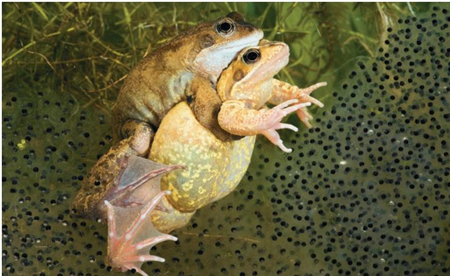

appears milky with gametes. The sperm quickly fertilize the floating eggs, and within hours the palolo's once-a-year reproductive frenzy is complete.

When external fertilization is not synchronous across a population, individuals may exhibit specific “courtship” behaviors leading to the fertilization of the eggs of one female by one male (see Figure 46.5). By triggering the release of both sperm and eggs, these behaviors increase the probability of successful fertilization.

Internal fertilization is an adaptation that enables sperm to reach an egg even when the external environment is dry. It typically requires sophisticated and compatible reproductive systems, as well as cooperative behavior that leads to copulation. The male copulatory organ delivers sperm, and the female reproductive tract often has receptacles for storage and delivery of sperm to mature eggs.

No matter how fertilization occurs, the mating animals may make use of pheromones, chemicals released by one organism that influence the physiology and behavior of other individuals of the same species. Pheromones are small, volatile or water-soluble molecules that disperse into the environment and are active at very low concentrations (see Concept 45.1). Many pheromones function as mate attractants. For example, pheromones allow some female insects to be detected by males more than a kilometer away.

Evidence for human pheromones is still being investigated. For example, it was formerly thought that female roommates produce pheromones that trigger synchrony in menstrual cycles, but further statistical analyses have failed to support this finding.

## Ensuring the Survival of Offspring

Typically, animals that fertilize eggs internally produce fewer gametes than species with external fertilization, but a higher fraction of their zygotes survive. Better zygote survival is due in part to the fact that eggs fertilized internally are sheltered from potential predators. However, internal fertilization is also more often associated with mechanisms that provide greater protection of the embryos and parental care of the young. For example, the internally fertilized eggs of birds and other reptiles have shells and internal membranes that protect against water loss and physical damage during the eggs' external development (see Figure 34.26). In contrast, the eggs of fishes and amphibians have only a gelatinous coat and lack internal membranes.

Rather than secreting a protective eggshell, some animals retain the embryo for a portion of its development within the female's reproductive tract. The offspring of marsupial mammals, such as kangaroos and opossums, spend only a short period in the uterus as embryos; they then crawl out and complete development attached to a mammary gland in the female's pouch. Embryos of eutherian (placental) mammals, such as zebras and humans, remain in the uterus throughout fetal development. There they are nourished by the parent's blood supply through a temporary organ, the placenta. The embryos of some fishes and sharks also complete development internally.

Figure 46.6 Parental care in an invertebrate.

Compared with many other insects, giant water bugs of the genus Belostoma produce relatively few offspring but offer much greater parental protection. Following internal fertilization, the female glues her fertilized eggs to the back of the male. The male (shown here) carries the eggs for days, frequently fanning water over them to keep them moist, aerated, and free of parasites.

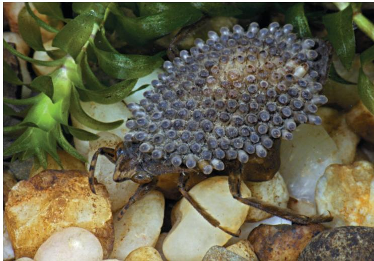

When a caribou or kangaroo is born or when a baby eagle hatches out of an egg, the newborn is not yet capable of independent existence. Instead, mammals nurse their offspring, and adult birds feed their young. Parental care of eggs or offspring is in fact widespread among animals, even including some invertebrates (Figure 46.6).

## Gamete Production and Delivery

Sexual reproduction in animals relies on sets of cells that are precursors for eggs and sperm. Cells dedicated to this function are often established early in the formation of the embryo and remain inactive while the body plan takes shape. Cycles of growth and mitosis then increase, or amplify, the number of cells available for making gametes—eggs or sperm.

In producing gametes from the precursor cells and making them available for fertilization, animals employ a variety of reproductive systems. Gonads, organs that produce gametes, are found in many but not all animals. Exceptions include the palolo, discussed above. The palolo and most other polychaete worms (phylum Annelida) have separate sexes but lack distinct gonads; rather, the eggs and sperm develop from undifferentiated cells lining the coelom (body cavity). As the gametes mature, they are released from the body wall and fill the coelom. Depending on the species, mature gametes in these worms may be shed through the excretory opening, or the swelling mass of eggs may split open a portion of the body, spilling the eggs into the environment.

More elaborate reproductive systems include sets of accessory tubes and glands that carry, nourish, and protect the gametes and sometimes the developing embryos. For example, fruit flies and most other insects have separate sexes with

Figure 46.7 An example of insect reproductive anatomy.  
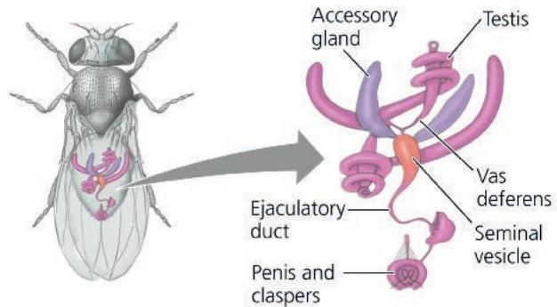

(a) Male fruit fly. Sperm form in the testes, pass through a sperm duct (vas deferens), and are stored in the seminal vesicles. The male ejaculates sperm along with fluid from the accessory glands. (Males of some species of insects and other arthropods have appendages called claspers that grasp the female during copulation.)

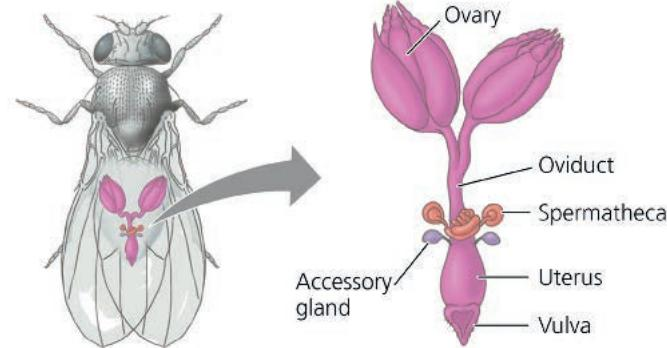

(b) Female fruit fly. Eggs develop in the ovaries and then travel through the oviducts to the uterus. After mating, sperm are stored in the spermathecae, which are connected to the uterus by short ducts. The female uses a stored sperm to fertilize each egg as it enters the uterus before she passes the egg out through the vulva.

VISUAL SKILLS Study the two drawings, and then describe the movement of fruit fly sperm from formation to fertilization.

For suggested answer, see Appendix A.

complex reproductive systems (Figure 46.7). In many insect species, the female reproductive system includes one or more spermathecae (singular, spermatheca), sacs in which sperm may be kept alive and stored for extended periods, a year or more in some cases. Because the female releases male gametes from the spermathecae and thus fertilizes her eggs only in response to the appropriate stimuli, fertilization occurs under conditions likely to be well suited to survival of offspring.

Vertebrate reproductive systems display limited but significant variations. In some vertebrates, the uterus is divided into two chambers; in others, including humans and birds, it is a single structure. In many nonmammalian vertebrates, the digestive, excretory, and reproductive systems have a common opening to the outside, the cloaca, a structure probably present in the ancestors of all vertebrates. Lacking a well-developed penis, males of these species instead release sperm by turning the cloaca inside out. In contrast, mammals generally lack a cloaca and have a separate opening for the digestive tract. In addition, most female mammals have separate openings for the excretory and reproductive systems.

Although fertilization involves the union of a single egg and sperm, animals often mate with more than one member of the other sex. Monogamy, the sustained sexual partnership of two individuals, is rare among animals, including most mammals. Mechanisms have evolved, however, that enhance the reproductive success of a male with a particular female and diminish the chance of that female mating successfully with another partner. For example, some male insects transfer secretions that make a female less receptive to courtship, reducing the likelihood of her mating again.

Can females also influence the relative reproductive success of their mates? This question intrigued two scientific collaborators working in Europe. Studying female fruit flies that copulated with one male and then another, the researchers traced the fate of sperm transferred in the first mating. As shown in Figure 46.8, females play a major role in determining

## Figure 46.8

## Inquiry: Why is sperm usage biased when female fruit flies mate twice?

## Experiment

When a female fruit fly mates twice, 80% of the offspring result from the second mating. Scientists had hypothesized that ejaculate from the second mating displaces sperm from the first mating. To test this hypothesis, Rhonda Snook, at the University of Sheffield, and David Hosken, at the University of Zurich, used mutant males with altered reproductive systems. “No-ejaculate” males mate but do not transfer sperm or fluid to females. “No-sperm” males mate and ejaculate but make no sperm. The researchers allowed females to mate first with wild-type males and then with wild-type males, no-sperm males, or no-ejaculate males. As a control, some females were mated only once (to wild-type males). The scientists then dissected each female under a microscope and recorded whether sperm were absent from the spermathecae, the major sperm storage organs.

## Results

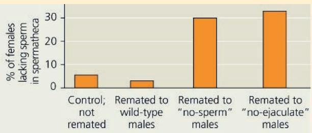

## Conclusion

Because remating reduces sperm storage when no sperm or fluids are transferred, the hypothesis that ejaculate from a second mating displaces stored sperm is incorrect. Instead, it appears females may get rid of stored sperm in response to remating, perhaps allowing for replacing stored sperm, possibly of diminished fitness, with fresh sperm.

Data from R. R. Snook and D. J. Hosken, Sperm death and dumping in Drosophila, Nature 428:939–941 (2004).

WHAT IF? Suppose males in the first mating had a mutant allele that resulted in smaller eyes as a dominant trait. What fraction of the females would produce some offspring with smaller eyes?
For suggested answer, see Appendix A.

the outcome of multiple matings. The processes by which gametes and individuals compete during reproduction remain a vibrant research area.

## Concept Check 46.2

1. How does internal fertilization facilitate life on land?

2. What mechanisms have evolved in animals with (a) external fertilization and (b) internal fertilization that help offspring survive to adulthood?

3. MAKE CONNECTIONS What are the shared and distinct functions of the uterus of an insect and the ovary of a flowering plant? (See Figure 38.6.)

For suggested answers, see Appendix A.

# Concept 46.3: Reproductive organs produce and transport gametes

Having surveyed some of the general features of animal reproduction, we'll focus in the rest of the chapter on humans, beginning with the reproductive anatomy of each sex.

## Human Male Reproductive Anatomy

The human male's external reproductive organs are the scrotum and penis. The internal reproductive organs consist of gonads that produce both sperm and reproductive hormones, accessory glands that secrete products essential to sperm movement, and ducts that carry the sperm and glandular secretions (Figure 46.9).

## Testes

The male gonads, or testes (singular, testis), produce sperm in highly coiled tubes called seminiferous tubules. Most mammals produce sperm properly only when the

testes are cooler than the rest of the body. In humans and many other mammals, testis temperature is maintained about $2^{\circ}$ C below the core body temperature by the scrotum, a fold of the body wall.

The testes develop in the abdominal cavity and descend into the scrotum just before birth (a testis within a scrotum is a testicle). In many rodents, the testes are drawn back into the cavity between breeding seasons, interrupting sperm maturation. Some mammals whose body temperature is low enough to allow sperm maturation—such as whales and elephants—retain the testes in the abdominal cavity at all times.

## Ducts

From the seminiferous tubules of a testis, the sperm pass into the coiled duct of an epididymis. In humans, it takes three weeks for sperm to travel the 6-m length of this duct, during which time the sperm complete maturation and become motile. During ejaculation, the sperm are propelled from each epididymis through a muscular duct, the vas deferens. Each vas deferens (one from each epididymis) extends around and behind the urinary bladder, where it joins a duct from the seminal vesicle, forming a short ejaculatory duct. The ejaculatory ducts open into

Figure 46.9 Reproductive anatomy of the human male.

Labels in parentheses identify nonreproductive structures shown for orientation purposes.

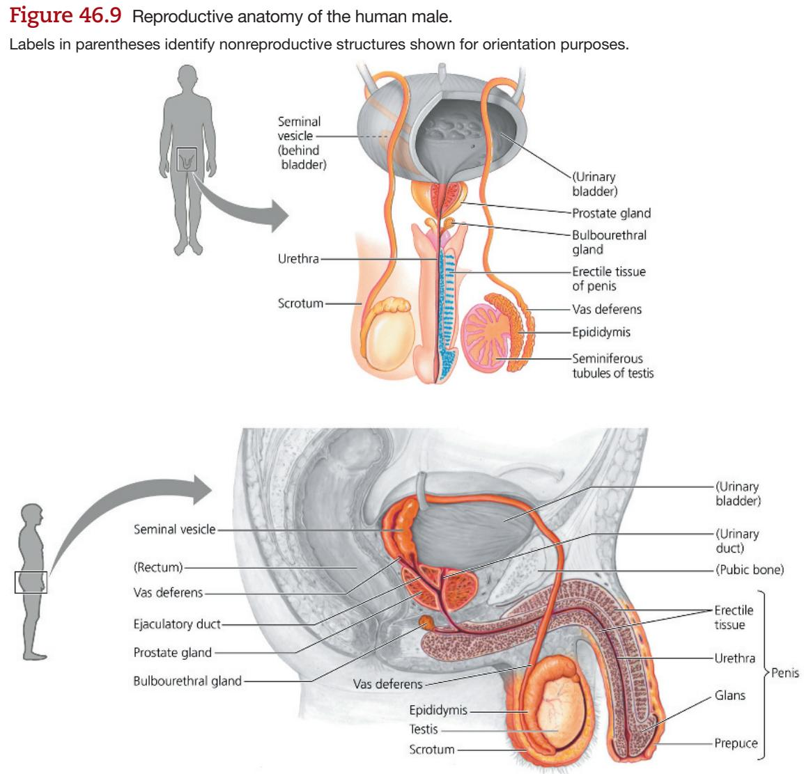

the urethra, the outlet tube for both the excretory system and the reproductive system. The urethra runs through the penis and opens to the outside at the tip of the penis.

## Accessory Glands

Three sets of accessory glands—the seminal vesicles, the prostate gland, and the bulbourethral glands—produce secretions that combine with sperm to form semen, the fluid that is ejaculated. Two seminal vesicles contribute about 60% of the volume of semen. The fluid from the seminal vesicles is thick, yellowish, and alkaline. It contains mucus, the sugar fructose (which provides most of the sperm's energy), a coagulating enzyme, ascorbic acid, and local regulators called prostaglandins (see Concept 45.1).

The prostate gland secretes its products directly into the urethra through small ducts. Thin and milky, the fluid from this gland contains anticoagulant enzymes and citrate (a sperm nutrient). The

bulbourethral glands are a pair of small glands along the urethra below the prostate. Before ejaculation, they secrete clear mucus that neutralizes any acidic urine remaining in the urethra. There is evidence that bulbourethral fluid carries some sperm released before ejaculation, which may contribute to the high failure rate of the withdrawal method of birth control (coitus interruptus).

## Penis

The human penis contains the urethra as well as three cylinders of spongy erectile tissue. During sexual arousal, the erectile tissue fills with blood from the arteries. As this tissue fills, the increasing pressure seals off the veins that drain the penis, causing it to engorge with blood and become erect. Alcohol consumption, certain drugs, emotional issues, and aging all can cause an inability to achieve an erection (erectile dysfunction). For individuals with long-term erectile dysfunction, drugs such as Viagra promote the vasodilating action of the local regulator nitric oxide (NO; see Concept 45.1); the resulting relaxation of smooth muscles in the blood vessels of the penis enhances blood flow into the erectile tissues. Although all mammals rely on penile erection for mating, the penis of dogs, raccoons, walruses, and several other mammals also contains a bone, the baculum, which is thought to further stiffen the penis for mating.

The main shaft of the penis is covered by relatively thick skin. The head of the penis, the male glans, has a much thinner outer layer and is much more sensitive to stimulation. A fold of skin called the prepuce covers the glans of humans. The male prepuce, or foreskin, is removed if a male is circumcised.

## Human Female Reproductive Anatomy

The human female's external reproductive structures are the clitoris and two sets of labia, which surround the clitoris and vaginal opening. The internal organs consist of gonads, which produce eggs and reproductive hormones, and a system of ducts and chambers, which receive and carry gametes and house the embryo and fetus (Figure 46.10).

## Ovaries

The female gonads are a pair of ovaries that flank the uterus and are held in place in the abdominal cavity by ligaments. The outer layer of each ovary is packed with follicles: Each follicle consists of an oocyte, a partially developed egg, surrounded by support cells. The surrounding cells nourish and protect the oocyte during much of its formation and development.

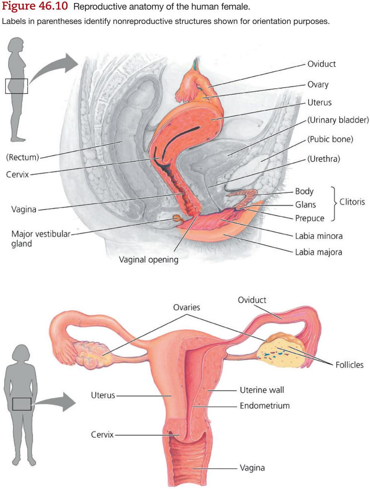

## Oviducts and Uterus

An oviduct, or fallopian tube, extends from the uterus toward a funnel-like opening at each ovary. The dimensions of this tube vary along its length, with the inside diameter near the uterus being as narrow as a human hair. Upon ovulation, cilia on the epithelial lining of the oviduct begin beating. This motion draws fluid from the body cavity into the oviduct, bringing along the egg. Further motion of the cilia, together with wavelike contractions of the oviduct, conveys the egg down the duct to the uterus.

The uterus, also known as the womb, is a thick, muscular organ that can expand during pregnancy to accommodate a 4-kg fetus. The inner lining of the uterus, the endometrium, is richly supplied with blood vessels. The neck of the uterus, called the cervix, opens into the vagina.

## Vagina, Clitoris, and Vulva

The vagina is a muscular but elastic chamber that is the site for insertion of the penis and deposition of sperm during copulation. The vagina, which also serves as the birth canal through which a baby is born, opens to the outside at the vulva, the collective term for the external female genitalia.

A pair of thick, padded ridges called the labia majora enclose and protect the rest of the vulva. The vaginal opening and the separate opening of the urethra are located within a cavity bordered by a pair of slender skin folds, the labia minora. A thin piece of tissue called the hymen partly covers the vaginal opening in humans at birth, but becomes thinner over time and typically wears away through physical activity. The clitoris consists a complex arrangement of spongy erectile tissue, much of it internal. The visible part, the glans (head), is situated at the top of the labia minora and covered by a small hood of skin, the prepuce. The head is supported by the clitoral body, which divides into multiple extensions that curve around the urethra and vagina. During sexual arousal, the clitoris, vagina, and labia minora all engorge with blood and enlarge. Richly supplied with nerve endings, the clitoris is one of the most sensitive points of sexual stimulation. Sexual arousal also induces the vestibular glands near the vaginal opening to secrete lubricating mucus, thereby facilitating sexual activity.

## Mammary Glands

The mammary glands are present in both sexes, but they normally produce milk only in females. Though not part of the reproductive system, the female mammary glands are important to reproduction. Within the glands, small sacs of epithelial tissue secrete milk, which drains into a series of ducts that open at the nipple. The breasts contain connective and fatty (adipose) tissue in addition to the mammary glands.

## Gametogenesis

We turn now to gametogenesis, the production of gametes. In both males and females, there is a close relationship between the gonads' structure and their function. As shown in Figure 46.11, on the next two pages, there are many parallels between spermatogenesis—the production of sperm—and oogenesis—the production of oocytes (eggs). Both processes generate haploid gametes via meiotic divisions of a set of dedicated diploid cells. In addition, support cells in the gonad play an essential role in both spermatogenesis and oogenesis. However, there are also several significant differences in gametogenesis between human males and females:

\- Spermatogenesis is continuous in adult males. In producing hundreds of millions of sperm each day, cell division and maturation occur throughout the seminiferous tubules. For a single sperm, the process takes about 7 weeks. In contrast, oogenesis is a prolonged process in the human female. Immature eggs form in the ovary of the female embryo but do not complete their development until years, and often decades, later.

\- In spermatogenesis, the four products of meiosis develop into mature gametes. In oogenesis, cytokinesis during meiosis is unequal, with almost all the cytoplasm segregated to a single daughter cell. This large cell is destined to become the egg; the other products of meiosis, smaller cells known as polar bodies, degenerate.

\- Spermatogenesis occurs throughout adolescence and adulthood. In contrast, the mitotic divisions that occur in oogenesis in human females are thought to be complete before birth, and the production of mature gametes ceases at about age 50.

\- Spermatogenesis produces mature sperm from precursor cells in a continuous sequence, whereas oogenesis has long interruptions.

## Concept Check 46.3

1. Why might frequent use of a hot tub make it harder for people to conceive a child?

2. The process of oogenesis is often described as the production of a haploid egg by meiosis, but in some animals, this description is not entirely accurate. Explain, referring to Figure 46.11.

3. WHAT IF? If each vas deferens in a male were surgically sealed off, what changes would you expect in sexual response and ejaculate composition?

For suggested answers, see Appendix A.

## Exploring Human Gametogenesis

## Figure 46.11

## Spermatogenesis

Stem cells that give rise to sperm are situated near the outer edge of the seminiferous tubules. Their progeny move inward as they pass through the spermatocyte and spermatid stages, and sperm are released into the lumen (fluid-filled cavity) of the tubule. The sperm travel along the tubule into the epididymis, where they become motile.

The stem cells arise from division and differentiation of primordial germ cells. In mature testes, the stem cells divide mitotically to form spermatogonia, which in turn generate spermatocytes by mitosis. Each spermatocyte gives rise to four spermatids through meiosis, reducing the chromosome number from diploid (2n = 46 in humans) to haploid (n = 23). Spermatids undergo extensive changes as they differentiate into sperm.

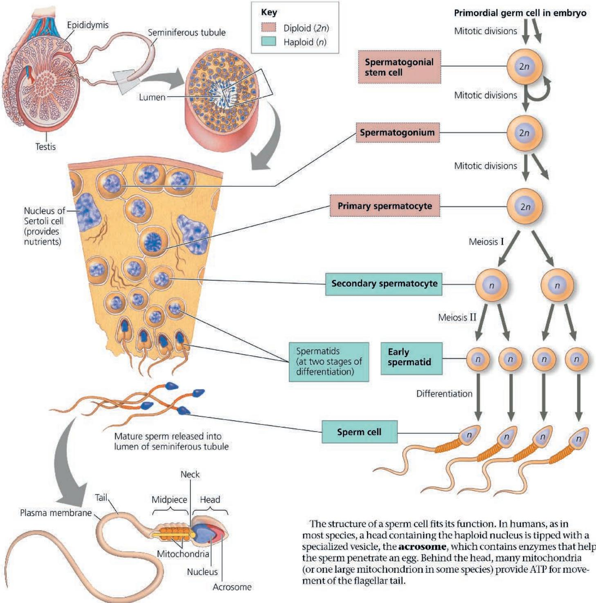

The structure of a sperm cell fits its function. In humans, as in most species, a head containing the haploid nucleus is tipped with a specialized vesicle, the acrosome, which contains enzymes that help the sperm penetrate an egg. Behind the head, many mitochondria (or one large mitochondrion in some species) provide ATP for movement of the flagellar tail.

## Oogenesis

Oogenesis begins in the female embryo with the production of oogonia from primordial germ cells. The oogonia divide by mitosis to form cells that begin meiosis, but stop the process at prophase I before birth. These developmentally arrested cells, which are primary oocytes, each reside within a small follicle, a cavity lined with protective cells. At birth, the ovaries together contain about 1–2 million primary oocytes, of which about 500 fully mature between puberty and menopause.

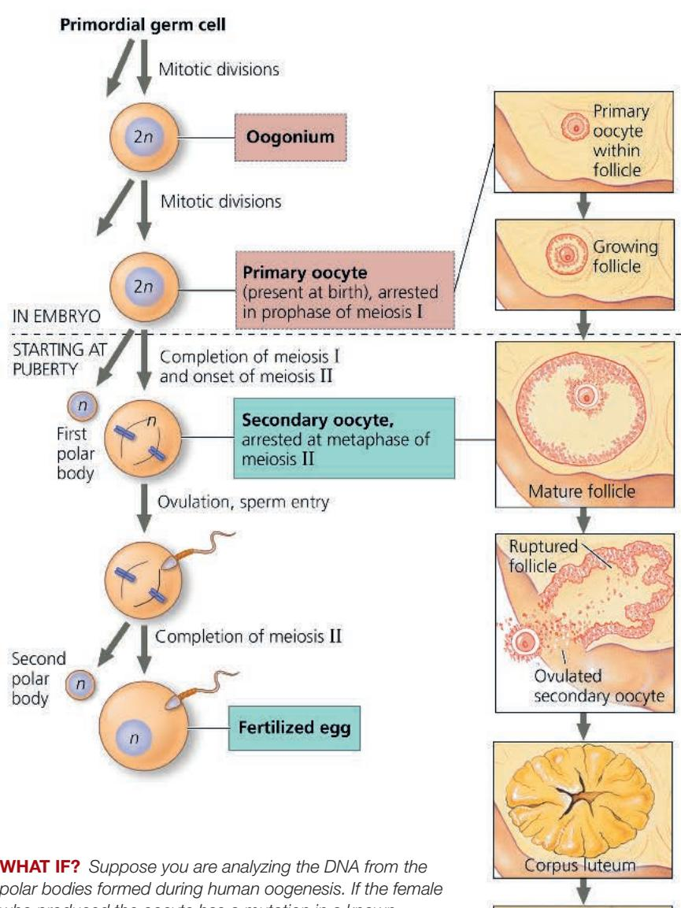

WHAT IF? Suppose you are analyzing the DNA from the polar bodies formed during human oogenesis. If the female who produced the oocyte has a mutation in a known disease gene, would analyze the polar body DNA allow you to infer whether the mutation is present in the mature oocyte? Explain.

For suggested answer, see Appendix A.

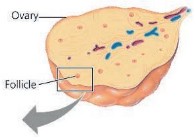

Beginning at puberty, follicle-stimulating hormone (FSH) periodically stimulates a small number of follicles to enter the final phase of growth and development. Typically, only one follicle fully matures each month, with its primary oocyte completing meiosis I. The second meiotic division begins, but stops at metaphase. Thus arrested in meiosis II, the secondary oocyte is released at ovulation, when its follicle breaks open. Only if a sperm penetrates the oocyte does meiosis II resume. (In some other animal species, the sperm enters the oocyte earlier or later.) Each of the two meiotic divisions involves unequal cytokinesis, with the smaller cells becoming polar bodies that eventually degenerate (the first polar body may or may not divide again). As a result, the functional product of complete oogenesis is a single mature egg containing a sperm head. Fertilization is defined strictly as the fusion of the haploid nuclei of the sperm and secondary oocyte, although the term is often used loosely to mean the entry of the sperm head into the egg.

The ruptured follicle left behind after ovulation develops into the corpus luteum. The corpus luteum secretes estradiol as well as progesterone, a hormone that helps maintain the uterine lining during pregnancy. If the egg is not fertilized, the corpus luteum degenerates, and a new follicle matures during the next cycle.

# Concept 46.4: The interplay of tropic and sex hormones regulates reproduction in mammals

Mammalian reproduction is governed by the coordinated actions of hormones from the hypothalamus, anterior pituitary, and gonads. Endocrine control of reproduction begins with the hypothalamus, which secretes gonadotropin-releasing hormone (GnRH). This hormone directs the anterior pituitary to secrete the gonadotropins follicle-stimulating hormone (FSH) and luteinizing hormone (LH) (see Figure 45.15). Both are tropic hormones, meaning that they regulate the activity of endocrine cells or glands. They are called gonadotropins because they act on the male and female gonads. FSH and LH support gametogenesis, in part by stimulating sex hormone production by the gonads.

The gonads produce and secrete three major types of steroid sex hormones: androgens, principally testosterone; estrogens, principally estradiol; and progesterone. All three hormones are found in both males and females, but at quite different concentrations. The concentration of testosterone in the blood is roughly ten times higher in males than in females. In contrast, the blood estradiol level is about ten times higher in females than in males; the peak blood progesterone level is also much higher in females. Although the gonads are the major source of sex hormones, the adrenal glands also secrete sex hormones in small amounts.

STUDY TIP Make a table summarizing the source and effects of reproductive hormones (GnRH, FSH, LH, estradiol, progesterone, testosterone) in males and females.

In mammals, sex hormone function in reproduction begins in the embryo. In particular, androgens produced in male embryos direct the appearance of the primary sex characteristics of males, the structures directly involved in reproduction. These include the seminal vesicles and associated ducts, as well as external reproductive structures. In the Scientific Skills Exercise, you can interpret the results of an experiment investigating the development of reproductive structures in mammals.

During sexual maturation, sex hormones in human males and females induce formation of secondary sex characteristics, the physical and behavioral differences between males and females that are not directly related to the reproductive system. Secondary sex characteristics often lead to sexual dimorphism,

## Scientific Skills Exercise Making Inferences and Designing an Experiment

What Role Do Hormones Play in Making a Mammal Male or Female? In non-egg-laying mammals, females have two X chromosomes, whereas males have one X chromosome and one Y chromosome. In the 1940s, French physiologist Alfred Jost wondered whether development of mammalian embryos as female or male in accord with their chromosome set requires instructions in the form of hormones produced by the gonads. In this exercise, you will interpret the results of an experiment that Jost performed to answer this question.

How the Experiment Was Done Working with rabbit embryos still in the uterus at a stage before sex differences are observable, Jost surgically removed the portion of each embryo that would form the ovaries or testes. When the baby rabbits were born, he made note of their chromosomal sex and whether their genital structures were male or female.

Data from the Experiment

<table><tr><td rowspan="2">Chromosome Set</td><td colspan="2">Appearance of Genitalia</td></tr><tr><td>No Surgery</td><td>Embryonic Gonad Removed</td></tr><tr><td>XY (male)</td><td>Male</td><td>Female</td></tr><tr><td>XX (female)</td><td>Female</td><td>Female</td></tr></table>

Data from A. Jost, Recherches sur la differenciation sexuelle de l'embryon de lapin (Studies on the sexual differentiation of the rabbit embryo), Archives d'Anatomie Microscopique et de Morphologie Experimentale 36:271–316 (1947).

INTERPRET THE DATA

1. This experiment is an example of a research approach in which scientists infer how something works normally based on what happens when the normal process is blocked. (a) What normal process was blocked in Jost's experiment? (b) From the results, what

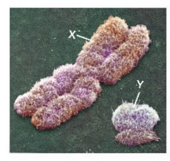  
Human sex chromosomes in metaphase (duplicated)

inference can you make about the role of the gonads in controlling the development of mammalian genitalia?

2. The data in Jost's experiment could be explained if some aspect of the surgery other than gonad removal caused female genitalia to develop. If you were to repeat Jost's experiment, how might you test the validity of such an explanation?

3. What result would Jost have obtained if female development also required a signal from the gonad?

4. Design another experiment to determine whether the signal that controls male development is a hormone. Make sure to identify your hypothesis, prediction, data collection plan, and controls.

Instructors: A version of this Scientific Skills Exercise can be assigned in Mastering Biology.

Figure 46.12 Androgen-dependent male anatomy and behavior in a moose.

The male and female in this mating pair of moose (Alces alces) differ in both anatomy and physiology. High levels of testosterone in the male are responsible for the appearance of secondary sex characteristics, such as antlers, and for male courtship and territorial behavior.

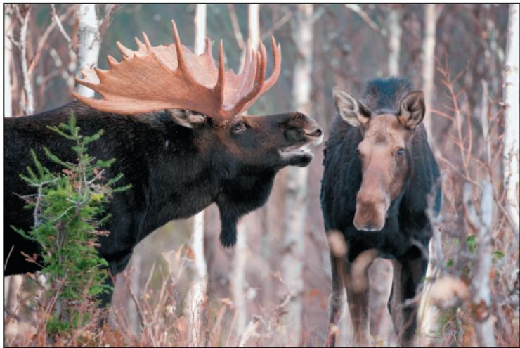

the difference in appearance between the male and female adults of a species (Figure 46.12). When human males enter puberty, androgens cause the voice to deepen, facial and pubic hair to develop, and muscles to grow (by stimulating protein synthesis). Androgens also promote specific sexual behaviors and sex drive, as well as an increase in general aggressiveness. Estrogens similarly have multiple effects in females. At puberty, estradiol stimulates breast and pubic hair development. Estradiol also influences female sexual behavior, induces fat deposition in the breasts and hips, increases water retention, and alters calcium metabolism.

## Biological Sex and Sexual Orientation in Human Sexuality

A baby is usually assigned a biological sex at birth that typically reflects the genitals present at birth and the child's chromosomes. In mammals, the Y chromosome carries a gene called SRY that directs development of the gonad into a testis. In XX embryos, which lack the Y and hence lack SRY, the gonad becomes an ovary. Although most individuals are born male or female, roughly one in 100 is intersex, having both male and female biological characteristics. For example, intersex individuals may have a nonstandard chromosome set (such as XXY) or may differ in the hormone-directed pathways that control sexual development.

Sexual orientation identifies the type of people to whom an individual is attracted romantically, emotionally, and sexually. Some of the terms currently in use to describe sexual orientation include heterosexual (straight), homosexual (lesbian or gay), bisexual, or asexual. As these descriptions make clear, human sexuality varies considerably.

Figure 46.13 Hormonal control of the testes.  
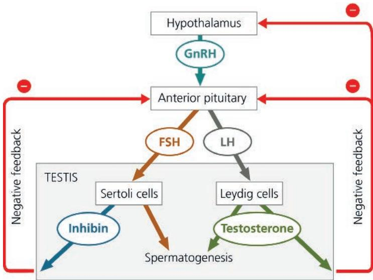

## Hormonal Control of the Male Reproductive System

When mammals reach sexual maturity, the sex hormones and gonadotropins have essential roles in gametogenesis. In exploring this hormonal control of reproduction, we'll begin with the relatively simple system found in males.

In directing spermatogenesis, FSH and LH act on two types of cells in the testis (Figure 46.13). FSH stimulates Sertoli cells, located within the seminiferous tubules, to nourish developing sperm (see Figure 46.11). LH causes Leydig cells, scattered in connective tissue between the tubules, to produce testosterone and other androgens, which promote spermatogenesis in the tubules.

Two negative-feedback mechanisms control sex hormone production in males (see Figure 46.13). Testosterone regulates the blood concentration of GnRH, FSH, and LH through inhibitory effects on the hypothalamus and anterior pituitary. In addition, inhibin, a hormone that in males is produced by Sertoli cells, acts on the anterior pituitary gland to reduce FSH secretion. Together, these negative-feedback circuits maintain the level of androgen in the normal range.

Leydig cells have other roles besides producing testosterone. They in fact secrete small quantities of many other hormones and local regulators, including oxytocin, renin, angiotensin, corticotropin-releasing factor, growth factors, and prostaglandins. These signals coordinate the activity of reproduction with growth, metabolism, homeostasis, and behavior.

## Hormonal Control of Female Reproductive Cycles

Whereas sperm are produced continuously in human males, there are two closely linked reproductive cycles in human females. Both are controlled by cyclic patterns of endocrine signaling.

Cyclic events in the ovaries define the ovarian cycle: Once per cycle a follicle matures and an oocyte is released. Changes in the uterus define the uterine cycle, which in humans and some other primates is a menstrual cycle. In each menstrual cycle, the endometrium (lining of the uterus) thickens and develops a rich blood supply before being shed through the cervix and vagina if pregnancy does not occur. By linking the ovarian and uterine cycles, hormone activity synchronizes ovulation with the establishment of a uterine lining that can support embryo implantation and development.

If an oocyte is not fertilized and pregnancy does not occur, the uterine lining is sloughed off, and another pair of ovarian and uterine cycles begins. The cyclic shedding of the blood-rich endometrium from the uterus, a process that occurs in a flow through the cervix and vagina, is called menstruation. Menstrual (and ovarian) cycles average 28 days but can range from about 20 to 40 days. Figure 46.14 uses the 28-day average to highlight the major events of these cycles for one ovarian and uterine cycle, illustrating the close coordination across different tissues of the reproductive system.

## The Ovarian Cycle

During the follicular phase (days 0–14), several follicles start to grow, but usually only one matures; the others disintegrate. As in males, GnRH released from the hypothalamus stimulates FSH and LH release from the anterior pituitary. At the beginning of the

follicular phase, rising levels of FSH stimulate rapid follicle growth. FSH and LH work together to stimulate estradiol production by the cells of the follicle. A larger follicle has more hormone-producing cells, so the estradiol concentration rises as the follicle grows. During this portion of the cycle, estradiol inhibits GnRH, FSH, and LH secretion. This effect is particularly obvious in the decrease in FSH production in the later part of the follicular phase.

When estradiol secretion by the follicle begins to rise steeply, the levels of FSH and LH increase markedly. Why? Whereas a low level of estradiol inhibits secretion of pituitary gonadotropins, a high concentration has the opposite effect: It stimulates gonadotropin

Figure 46.14 The reproductive cycles of the human female.
This figure shows how the ovarian cycle and the uterine (menstrual) cycle are regulated by changing hormone levels in the blood.  
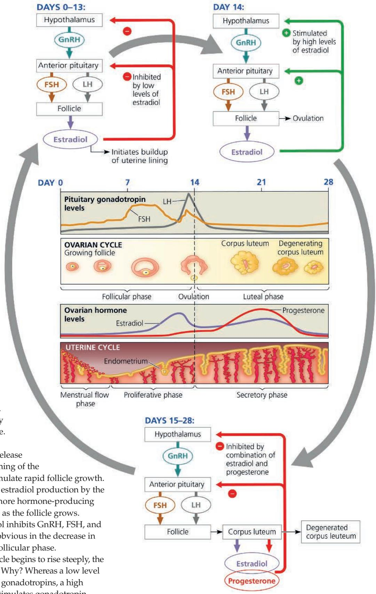

secretion by causing the hypothalamus to increase output of GnRH. A high estradiol concentration also increases the GnRH sensitivity of LH-releasing cells in the pituitary, further increasing the LH level.

The maturing follicle, containing a fluid-filled cavity, enlarges to form a bulge at the surface of the ovary. The follicular phase ends at ovulation (day 14), about a day after the LH surge. In response to the peak in LH level, the follicle and adjacent wall of the ovary rupture, releasing the secondary oocyte. At or near the time of ovulation, females may feel a pain in the lower abdomen, on the same side as the ovary that released the oocyte.

The luteal phase (days 15–28) of the ovarian cycle follows ovulation. LH stimulates the remaining follicular tissue to form the corpus luteum. Stimulated by LH, the corpus luteum secretes progesterone and estradiol, which in combination exert negative feedback on the hypothalamus and pituitary. This feedback greatly reduces LH and FSH secretion, preventing maturation of another egg when a pregnancy may be under way.

If pregnancy does not occur, the low gonadotropin concentration at the end of the luteal phase cause the corpus luteum to disintegrate, triggering a sharp decline in estradiol and progesterone concentrations. This decline liberates the hypothalamus and pituitary from negative feedback. The pituitary can then secrete enough FSH to stimulate the growth of new follicles, initiating the next ovarian cycle.

## The Uterine (Menstrual) Cycle

Prior to ovulation, ovarian steroid hormones stimulate the uterus to prepare for support of an embryo. Estradiol secreted in increasing amounts by growing follicles signals the endometrium to thicken. In this way, the follicular phase of the ovarian cycle is coordinated with the proliferative phase (days 6–14) of the uterine cycle. After ovulation, the estradiol and progesterone secreted by the corpus luteum stimulate maintenance and further development of the uterine lining, including enlargement of arteries and growth of endometrial glands. These glands secrete a nutrient fluid that can sustain an early embryo even before it implants in the uterine lining. Thus, the luteal phase of the ovarian cycle is coordinated with the secretory phase (days 15–28) of the uterine cycle.

Once the corpus luteum has disintegrated, the rapid drop in ovarian hormone concentration causes arteries in the endometrium to constrict. Deprived of its circulation, the uterine lining largely disintegrates, releasing blood that is shed along with endometrial tissue and fluid. The result is menstruation—the menstrual flow phase (days 1–5) of the uterine cycle. During this phase, which usually lasts a few days, a new set of ovarian follicles begin to grow. By convention, the first day of flow is designated day 1 of the new uterine (and ovarian) cycle.

About 7% of females of reproductive age suffer from a disorder called endometriosis, in which some cells of the uterine lining migrate to an abdominal location that is abnormal, or ectopic (from the Greek ektopos, away from a place). Having migrated to a location such as an oviduct, ovary, or large intestine, the ectopic tissue responds to hormones in the bloodstream. Like the uterine endometrium, the ectopic tissue swells and breaks down during each ovarian cycle, resulting in pelvic pain and

bleeding into the abdomen. Researchers have not yet determined why endometriosis occurs, but hormonal therapy or surgery can be used to lessen discomfort.

## Menopause

A female starts to run out of functional follicles after about 500 cycles. Menopause, the cessation of ovulation and menstruation, results. Menopause usually occurs between the ages of 46 and 54. Since the follicle and corpus luteum produce estradiol and progesterone, the production of these ovarian steroid hormones declines as reproductive cycles become less frequent and eventually stop altogether.

Menopause is an unusual phenomenon. In human males, reproductive function declines at the same rate as other body functions, and females of other species can reproduce throughout life. Is there an evolutionary explanation for menopause? One intriguing hypothesis proposes that during early human evolution, undergoing menopause after bearing several children allowed a female parent to provide better care for her children and grandchildren, thereby increasing the chances for survival of individuals who share much of her genetic makeup. An alternative hypothesis proposes that menopause itself does not serve an adaptive purpose, but simply reflects the sudden increase in human lifespans.

## Menstrual Versus Estrous Cycles

In all female mammals, the endometrium thickens before ovulation, but only humans and some other primates have menstrual cycles. In other mammals, both domesticated and wild, the uterus reabsorbs the endometrium in the absence of a pregnancy, and no extensive fluid flow occurs. For these animals, the cyclic changes in the uterus occur as part of an estrous cycle that also controls the sexual receptivity of females: Whereas human females may engage in sexual activity throughout the menstrual cycle, mammals with estrous cycles usually copulate only during the period surrounding ovulation. This period, called estrus (from the Latin oestrus, frenzy, passion), is the only time the female is receptive to mating. It is often called “heat,” and the female’s temperature does increase slightly.

The length, frequency, and nature of estrous cycles vary. Bears and wolves have one estrous cycle per year; elephants have several. Rats have estrous cycles throughout the year, each lasting just 5 days. The rat's nemesis, the household cat, ovulates only upon mating.

## Human Sexual Response

In humans, the arousal of sexual interest is complex, involving a variety of psychological as well as physical factors. Although reproductive structures in the male and female differ in appearance, a number serve similar functions in arousal, reflecting their shared developmental origin. For example, the same embryonic tissues give rise to the scrotum and the labia majora, to the skin on the penis shaft and the labia minora, and to the penis and the clitoris. Furthermore, the general pattern of human sexual response is similar in males and females. Two types of physiological reactions predominate in both sexes: vasocongestion, the filling of a tissue with blood, and myotonia, increased muscle tension.

The sexual response cycle can be divided into four phases: excitement, plateau, orgasm, and resolution. An important function of the excitement phase is to prepare the vagina and penis for sexual activity. During this phase, vasocongestion is particularly evident in erection of the penis and clitoris and in enlargement of the testicles, labia, and breasts. The vagina becomes lubricated, and myotonia may occur, as evident in nipple erection or tension of the limbs.

In the plateau phase, sexual responses continue as a result of direct stimulation of the genitalia. In females, the outer third of the vagina becomes vasocongested, while the inner two-thirds slightly expands. This change, coupled with the elevation of the uterus, forms a depression for receiving sperm at the back of the vagina. Breathing quickens and heart rate rises, sometimes to 150 beats per minute—not only in response to the physical effort of sexual activity, but also as an involuntary reaction to stimulation by the autonomic nervous system (see Figure 49.9).

Orgasm is characterized by rhythmic, involuntary contractions of the reproductive structures in both sexes. Male orgasm has two stages. The first, emission, occurs when the glands and ducts of the reproductive tract contract, forcing semen into the urethra. Expulsion, or ejaculation, occurs when the urethra contracts and the semen is expelled. During female orgasm, the uterus and outer vagina contract, but the inner two-thirds of the vagina does not. Orgasm is the shortest phase of the sexual response cycle, usually lasting only a few seconds. In both sexes, contractions occur at about 0.8-second intervals and may also involve the anal sphincter and several abdominal muscles.

The resolution phase completes the cycle and reverses the responses of the earlier stages. Vasocongested organs return to normal size and color, and muscles relax. Most of these changes are completed within 5 minutes, but some may take as long as an hour. Following orgasm, the male typically enters a refractory period, lasting from a few minutes to hours, when erection and orgasm cannot be achieved. The female refractory period is often shorter in duration and may not always occur, allowing for multiple orgasms within a short period of time.

## Concept Check 46.4

1. How are the functions of FSH and LH in females and males similar?

2. How does an estrous cycle differ from a menstrual cycle? In what animals are the two types of cycles found?

3. WHAT IF? If a human female begins taking estradiol and progesterone immediately after the start of a new menstrual cycle, how will ovulation be affected? Explain.

4. MAKE CONNECTIONS A coordination of events is characteristic of the reproductive cycle of a human female and the replicative cycle of an enveloped RNA virus (see Figure 19.8). What is the nature of the coordination in each of these cycles?

# Concept 46.5: In placental mammals, an embryo develops fully within the uterus

Having surveyed the ovarian and uterine cycles of human females, we turn now to reproduction itself, beginning with the events that transform an egg into a developing embryo.

## Conception, Embryonic Development, and Birth

During human copulation, hundreds of millions of sperm are transferred in 2–5 mL of semen. When first ejaculated, the semen coagulates, which likely keeps the ejaculate in place until sperm reach the cervix. Soon after, anticoagulants liquefy the semen, and the sperm swim through the cervix and oviducts. Fertilization—also called conception in humans—occurs when a sperm fuses with an egg (mature oocyte) in an oviduct (Figure 46.15).

The zygote begins a series of cell divisions called cleavage about 24 hours after fertilization and after an additional 4 days produces a blastocyst, a sphere of cells surrounding a central cavity. A few days later, the embryo implants into the endometrium of the uterus. The condition of carrying one or more embryos in the uterus is called pregnancy, or gestation. Human pregnancy averages 266 days (38 weeks) from fertilization of the egg, or 40 weeks from the start of the last menstrual cycle. In comparison, gestation averages 21 days in many rodents, 280 days in cows, and more than 600 days in elephants. The roughly 9 months of human gestation are divided into three trimesters of equal length. However, approximately 25% of human pregnancies end involuntarily, often as a result of chromosomal or developmental abnormalities. Early pregnancy loss (miscarriage) is the most common, occurring in the first 20 weeks of gestation. Miscarriages can happen before people are even aware they are pregnant. A stillbirth, or pregnancy loss after 20 weeks of gestation, occurs in approximately 1 of 175 births in the United States.

In an ectopic pregnancy, or tubal pregnancy, the embryo implants outside of the uterus. The most common site of an ectopic pregnancy is within the oviduct, where fertilization occurred. Such a pregnancy cannot be sustained, and terminating the pregnancy is the only way to prevent rupture of the oviduct and life-threatening bleeding. About 1–2% of pregnancies are ectopic, but early diagnosis and prompt medical treatment greatly increase maternal survival.

## First Trimester

During the first trimester, even before implantation occurs, the embryo secretes hormones that signal its presence and regulate the female parent's reproductive system. One embryonic hormone, human chorionic gonadotropin (hCG), acts like pituitary LH in maintaining secretion of progesterone and estrogens by the corpus luteum through the first few months of pregnancy. Some

Figure 46.15 Formation of a human zygote and early postfertilization events.  
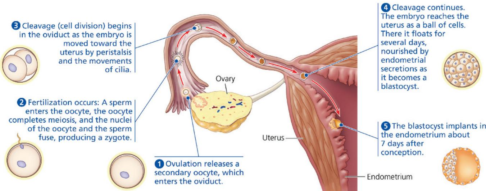  
VISUAL SKILLS If a female's eggs need to be fertilized in vitro, they can be readily introduced into the uterus but not the extremely narrow oviduct. Based on this drawing, propose conditions for culturing a fertilized egg that you predict will optimize the chance of a successful pregnancy.

For suggested answer, see Appendix A.

hCG passes from the maternal blood to the urine, where it can be detected by the most common early pregnancy tests.

During its first 2–4 weeks of development, the embryo obtains nutrients directly from the endometrium. Meanwhile, the outer layer of the blastocyst, which is called the trophoblast, grows outward and mingles with the endometrium, eventually

## Figure 46.16 Placental circulation.

Maternal blood enters the placenta in arteries, flows through blood pools in the endometrium, and leaves via veins. Embryonic or fetal blood, which remains in vessels, enters the placenta through arteries and passes through capillaries in finger-like chorionic villi, where oxygen and nutrients are acquired. Fetal blood leaves the placenta through veins leading back to the fetus.

WHAT IF? In a rare genetic disorder, the absence of a particular enzyme leads to increased testosterone production. When the fetus has this disorder, the female develops a male-like pattern of body hair during the pregnancy. Explain why.

For suggested answer, see Appendix A.

helping form the placenta (Figure 46.16). This disk-shaped organ contains both embryonic and maternal blood vessels. Exchange between the maternal and embryonic circulatory systems supplies nutrients, provides immune protection, exchanges respiratory gases, and disposes of metabolic wastes for the embryo. Blood from the embryo travels to the placenta through the arteries of the umbilical cord and returns via the umbilical vein.

Occasionally, an embryo splits during the first month of development, resulting in identical, or monozygotic (one-egg), twins. In contrast, fraternal, or dizygotic, twins arise when two follicles mature in a single cycle, followed by independent fertilization and implantation of two genetically distinct embryos.

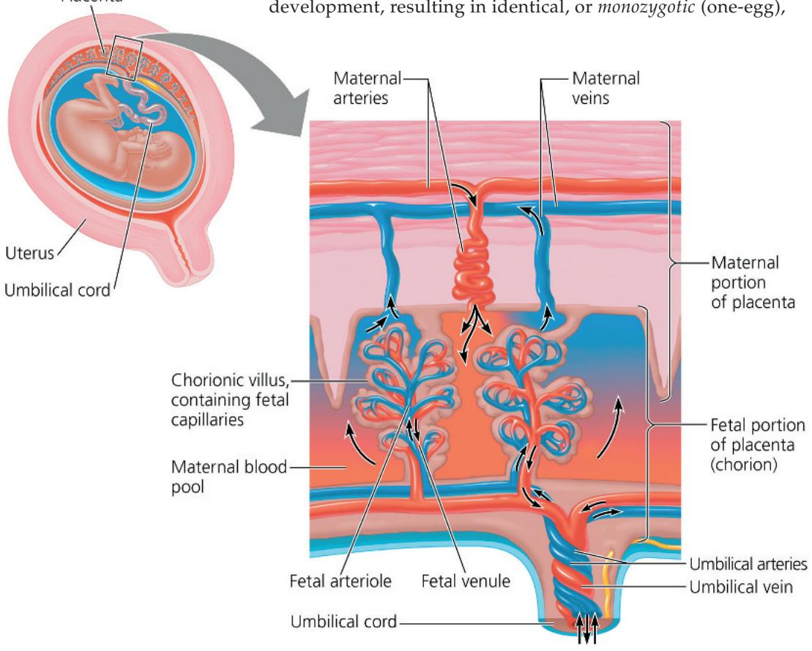

Figure 46.17 Some stages of human development during the first and second trimesters.  
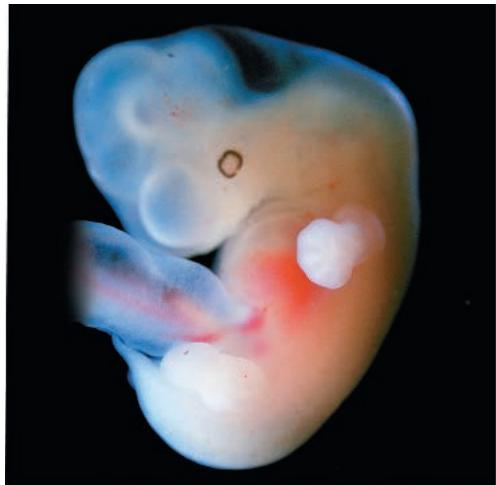  
(a) 5 weeks. Limb buds, eyes, the heart, the liver, and rudiments of all other organs have started to develop in the embryo, which is only about 1 cm long.

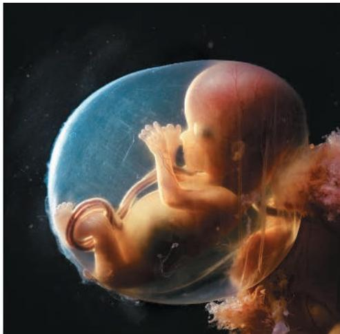  
(b) 14 weeks. Growth and development of the offspring, now called a fetus, continue during the second trimester. This fetus is about 6 cm long.

The first trimester is the main period of organogenesis, the development of the body organs (Figure 46.17a). During organogenesis, the embryo is particularly susceptible to damage. For example, alcohol that passes through the placenta and reaches the developing central nervous system of the embryo can cause developmental and intellectual disabilities and other serious conditions associated with fetal alcohol syndrome. The heart begins beating by the 4th week; a heartbeat can be detected at 8–10 weeks. At 8 weeks, all the major structures of the adult are present in rudimentary form, and the embryo is called a fetus.

At the end of the first trimester, the fetus is well differentiated, but only 5cm long. Meanwhile, a high progesterone level brings about rapid changes in the maternal body: Mucus in the cervix forms a plug that protects against infection, the maternal part of the placenta grows, the breasts and uterus get larger, and both ovulation and menstrual cycling stop. About three-fourths of all pregnant individuals experience nausea, misleadingly called “morning sickness,” during the first trimester.

## Second and Third Trimesters

During the second trimester, the fetus grows to about 30 cm in length. Development continues, including formation of fingernails, external sex organs, and outer ears (Figure 46.17b). Fetal movements may be perceived as early as one month into the second trimester, and fetal activity is typically visible through the abdominal wall one to two months later. Hormone concentrations stabilize as hCG secretion declines somewhat; the corpus luteum deteriorates; and the placenta completely takes over the production of progesterone, the hormone that maintains the pregnancy.

During the third trimester, the fetus grows to about 3–4 kg in weight and 50 cm in length. Fetal activity may decrease as the fetus fills the available space. As the fetus grows and the uterus expands around it, the maternal abdominal organs become compressed and displaced, leading to digestive issues and a need for frequent urination.

Childbirth begins with labor, a series of strong, rhythmic uterine contractions that push the fetus and placenta out of the body. Once labor begins, local regulators (prostaglandins) and hormones (chiefly estradiol and oxytocin) induce and regulate further contractions of the uterus (Figure 46.18). Central to this

Figure 46.18 Positive feedback in labor.  
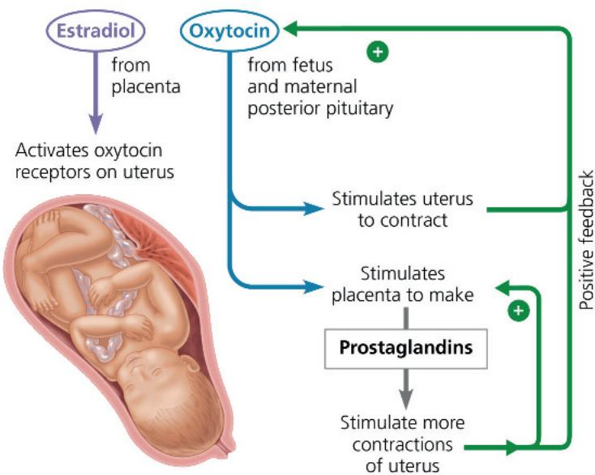  
VISUAL SKILLS Based on the feedback circuits shown, predict the effect of a single dose of oxytocin on a pregnant individual at the end of 39 weeks gestation.  
For suggested answer, see Appendix A.

Figure 46.19 The three stages of labor.  
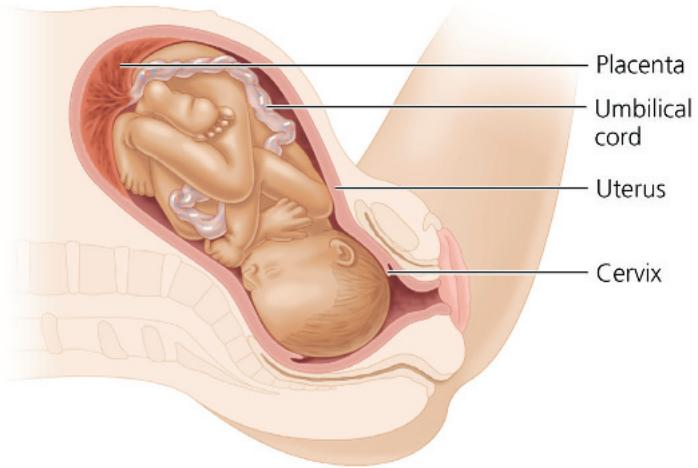  
1 Dilation of the cervix

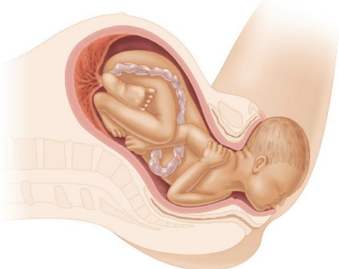  
② Expulsion: delivery of the infant

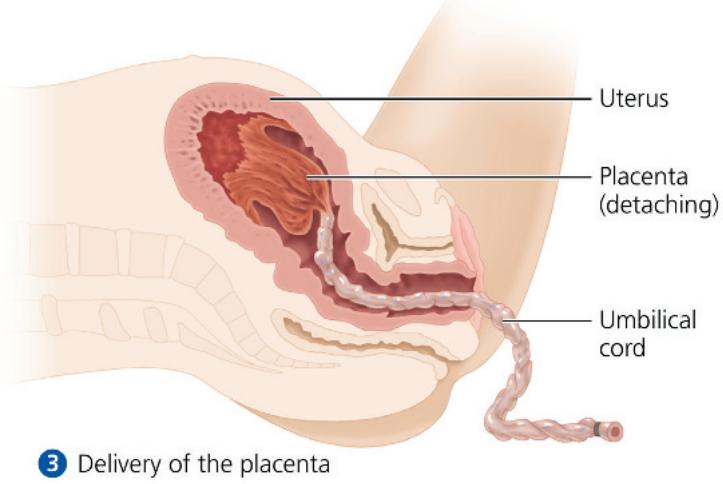

regulation is a positive-feedback loop (see Concept 45.2) in which uterine contractions stimulate secretion of oxytocin, which in turn stimulates further contractions.

Labor is typically described as having three stages (Figure 46.19). The first stage is the thinning and opening up (dilation) of the cervix. The second stage is the expulsion, or delivery, of the baby. Continuous strong contractions force the fetus out of the uterus and through the vagina. The final stage of labor is the delivery of the placenta.

The newborn human or other mammal receives nourishment in the form of milk. In response to suckling by the newborn, the hypothalamus signals the anterior pituitary to secrete prolactin, which stimulates the mammary glands to produce milk. Suckling also stimulates the secretion of oxytocin from the posterior pituitary, which triggers release of milk from the mammary glands (see Figure 45.15).

## Maternal Immune Tolerance of the Embryo and Fetus

Pregnancy is an immunological puzzle. Because half of the embryo's genes are inherited from the male parent, many of the chemical markers present on the surface of the embryo are foreign to the female parent. Why, then, does the body not reject the embryo as foreign matter, as it would a tissue or organ graft from another person? One intriguing clue comes from the relationship between certain autoimmune disorders and pregnancy. For example, the symptoms of rheumatoid arthritis, an autoimmune disease of the joints, become less severe during pregnancy. Such observations suggest that the overall regulation of the immune system changes during pregnancy. Sorting out these changes and how they might protect the developing fetus is an active area of research for immunologists.

## Contraception and Abortion

Contraception, the deliberate prevention of pregnancy, can be achieved in a number of ways. Some contraceptive methods prevent gamete development or release from female or male gonads; others prevent fertilization by keeping sperm and egg apart; and still others prevent implantation of an embryo. For complete information on contraceptive methods, you should consult a health-care provider. The following brief introduction to the biology of the most common methods and the corresponding diagram in Figure 46.20 (on the next page) make no pretense of being a contraception manual.

Fertilization can be prevented by abstinence from sexual intercourse or by any of several kinds of barriers that keep live sperm from contacting the egg. Temporary abstinence, sometimes called natural family planning, depends on refraining from intercourse when conception is most likely. Because the egg can survive in the oviduct for 24–48 hours and sperm for up to 5 days, people practicing temporary abstinence should not engage in inter-course for a number of days before and after ovulation. Furthermore, because the timing of ovulation can vary significantly, the female needs knowledge of physiological indicators associated with ovulation, such as changes in cervical mucus. Note also that a pregnancy rate of 10–20% is typical for people practicing natural family planning. (In this context, pregnancy rate is the percentage of females who become pregnant in one year while using a particular pregnancy prevention method.)

Figure 46.20 Mechanisms of several contraceptive methods. Red arrows indicate where these methods, devices, or products interfere with events from the production of sperm and primary oocytes to implantation of a developing embryo.  
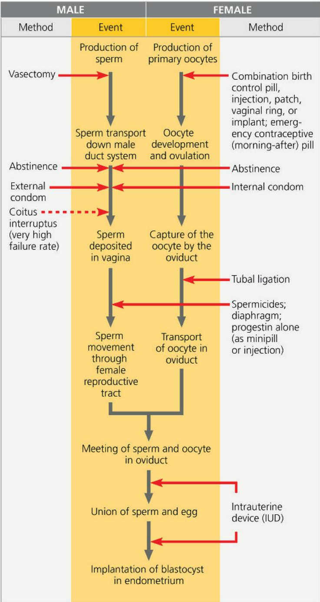

As a method of preventing fertilization, coitus interruptus, or withdrawal (removal of the penis from the vagina before ejaculation), is unreliable. Sperm from a previous ejaculate may be transferred in secretions that precede ejaculation. Furthermore, a split-second lapse in timing or willpower can result in tens of millions of sperm being transferred before withdrawal.

Used properly, several methods of contraception that block sperm from meeting the egg have pregnancy rates of less than 10%. The external condom is a thin, latex rubber or natural membrane sheath that fits over the penis to collect the semen. The internal

condom (sometimes referred to as a “female condom”) is a plastic pouch that can be placed inside the vagina or anus. For sexually active individuals, condoms are the only contraceptives that are highly effective in preventing the spread of sexually transmitted infections (STIs), also known as sexually transmitted diseases (STDs). Although rates have been declining since 2021, 2.4 million cases of chlamydia, gonorrhea, and syphilis were reported in the United States in 2023. This figure underestimates the prevalence of these common STIs, since many people with these infections have no symptoms and thus do not seek medical care.

Another common barrier device is the diaphragm, a dome-shaped rubber cap inserted into the upper portion of the vagina before intercourse. Both of these devices have lower pregnancy rates when used in conjunction with a spermicidal (sperm-killing) foam or jelly.

Except for complete abstinence from sexual intercourse or sterilization (discussed later), the most effective means of birth control are the intrauterine device (IUD) and hormonal contraceptives. The IUD has a pregnancy rate of 1% or less and is the most commonly used reversible method of birth control outside the United States. Placed in the uterus by a healthcare professional, the IUD interferes with fertilization and implantation. Hormonal contraceptives, in the form of birth control pills, injections, vaginal rings, implants, or skin patches, also have pregnancy rates of 1% or less.

Combination hormonal contraceptives contain a synthetic estrogen and a synthetic progesterone-like hormone called progestin. This combination mimics negative feedback in the ovarian cycle, stopping the release of GnRH by the hypothalamus and thus of FSH and LH by the pituitary. The prevention of LH release blocks ovulation. In addition, the inhibition of FSH secretion by the low dose of estrogens in the pills prevents follicles from developing.

Another hormonal contraceptive with a very low pregnancy rate contains only progestin. Progestin causes thickening of a female's cervical mucus so that it blocks sperm from entering the uterus. Progestin also decreases the frequency of ovulation and causes changes in the endometrium that may interfere with implantation if fertilization occurs. This contraceptive can be administered as injections that last for 3 months or as a tablet ("minipill") taken daily.

Hormonal contraceptives have both harmful and beneficial side effects. They increase the risk of some cardiovascular disorders slightly for nonsmokers and quite substantially (three- to tenfold) for females who smoke regularly. At the same time, oral contraceptives eliminate the dangers of pregnancy; females on birth control pills have mortality rates about one-half those of pregnant females. Birth control pills also decrease the risk of ovarian and endometrial cancers. Clinical trials of male hormonal contraceptives are underway.

Sterilization is the permanent prevention of gamete production or release. For females, the most common method is tubal ligation, the sealing shut or tying off (ligating) of a section of each oviduct to prevent eggs from traveling into the uterus. Similarly, vasectomy in males is the cutting and tying off of each vas deferens to prevent sperm from entering the urethra. Sex hormone secretion and sexual function are unaffected by both procedures, with no change in menstrual cycles in females or ejaculate volume in males. Although tubal ligation and vasectomy are considered permanent, both procedures can in many cases be reversed by microsurgery.

The deliberate termination of a pregnancy in progress is called abortion. (Note that many pregnancies end involuntarily, as discussed earlier.) In 2019, approximately 630,000 legal abortions were performed in the United States, according to the Centers for Disease Control and Prevention (CDC).

A drug called mifepristone, or RU486, can terminate a pregnancy nonsurgically within the first 7 weeks. RU486 blocks progesterone receptors in the uterus, thus preventing progesterone from maintaining the pregnancy. It is taken with a small amount of prostaglandin to induce uterine contractions.

## Modern Reproductive Technologies

Recent scientific and technological advances have made it possible to address many reproductive problems, including genetic diseases and infertility.

## Infertility and in Vitro Fertilization

Infertility is defined as the inability to conceive offspring after one year of frequent, unprotected sexual intercourse. It is quite common, affecting about 9% of males and 10% of females aged 15–44. For females, the risk of reproductive difficulties, as well as genetic abnormalities of the fetus, increases steadily past age 35. Evidence suggests that the prolonged period of time oocytes spend in meiosis is largely responsible for this increased risk.

Some forms of infertility are treatable. Hormone therapy can sometimes increase sperm or egg production, and surgery can often correct ducts that formed improperly or have become blocked. In some cases, doctors recommend in vitro fertilization (IVF), which involves combining oocytes and sperm in the laboratory. Fertilized eggs are incubated until they form eight or more cells and are then transferred to the uterus for implantation. If mature sperm are defective or low in number, a whole sperm or a

## Figure 46.21 In vitro fertilization (IVF).

In this form of IVF, a technician holds the egg in place with a pipette (left) and uses a very fine needle (right) to inject one sperm into the egg cytoplasm (colorized LM).

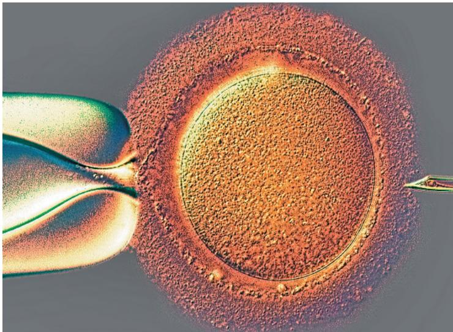

spermatid nucleus may be injected directly into an oocyte (Figure 46.21). Though costly and not always successful, IVF procedures have enabled more than 10 million people to conceive children.

## Detecting Disorders During Pregnancy

Many developmental problems and genetic diseases can now be diagnosed while the fetus is in the uterus. Ultrasound imaging, which generates images using sound frequencies above the normal hearing range, is commonly used to analyze the fetus's size and condition. In amniocentesis and chorionic villus sampling, a needle is used to obtain fetal cells from either fluid or tissue, respectively, surrounding the embryo; these cells then provide the basis for genetic analysis (see Figure 14.19).

A maternal blood test can also be used to analyze the genome of the fetus. As discussed in Concept 14.4, the maternal blood contains DNA from the growing embryo. How does it get there? The maternal blood reaches the embryo through the placenta. When cells produced by the embryo grow old, die, and break open within the placenta, the released DNA enters the maternal circulation. Although the blood also contains pieces of maternal DNA, about 10–15% of the DNA circulating in the blood is from the fetus. Both the polymerase chain reaction (PCR) and high-throughput sequencing can convert the bits of fetal DNA into useful information.

Unfortunately, almost all detectable disorders remain untreatable in the uterus, and many cannot be corrected even after birth. Genetic testing may leave parents faced with difficult decisions about whether to terminate a pregnancy or to raise a child who may have profound developmental abnormalities and a short life expectancy. These are complex issues that demand careful, informed thought and competent genetic counseling.

Parents will be receiving even more genetic information and confronting further questions in the near future. Indeed, in 2012 the first infant was born whose entire genome had been sequenced before the baby was born. Nevertheless, completing a genome sequence does not ensure complete information. Consider, for example, Klinefelter syndrome, in which males have an extra X chromosome. This disorder is quite common, affecting one in 1,000 males, and can cause reduced testosterone and infertility. However, while some males with an extra X chromosome have significant disabilities, others have symptoms so mild that they are unaware of the condition. For other disorders, such as diabetes, heart disease, or cancer, a genome sequence may only indicate the degree of risk. How parents will use this and other information in having and raising children is a question with no clear answers.

## Concept Check 46.5

1. Why does testing for hCG (human chorionic gonadotropin) work as a pregnancy test? What is the function of hCG in pregnancy?

2. In what ways are tubal ligation and vasectomy similar?

3. WHAT IF? If a sperm nucleus is injected into an oocyte, what steps of gametogenesis and conception are bypassed?

## Summary of Key Concepts

To review key terms, go to the Vocabulary Self-Quiz (eTextbook only).

## Concept 46.1: Both asexual and sexual reproduction occur in the animal kingdom

\- Sexual reproduction requires the fusion of male and female gametes, forming a diploid zygote. Examples of asexual reproduction—the production of offspring without gamete fusion—include budding, fission, and fragmentation with regeneration. Variations on the mode of reproduction are achieved through parthenogenesis, hermaphroditism, and sex reversal. Hormones and environmental cues control reproductive cycles.

Would a pair of haploid offspring produced by parthenogenesis be genetically identical? Explain.

## Concept 46.2: Fertilization depends on mechanisms that bring together sperm and eggs of the same species

\- Fertilization occurs externally, when sperm and eggs are both released outside the body, or internally, when sperm deposited by the male fertilize an egg in the female reproductive system. In either case, fertilization requires coordinated timing, which may be mediated by environmental cues, pheromones, or courtship behavior. Internal fertilization is often associated with relatively fewer offspring and greater protection of offspring by the parents.

\- Systems for gamete production and delivery range from undifferentiated cells in the body cavity to complex systems that include gonads, which produce gametes, and accessory tubes and glands that protect or transport gametes and embryos. Although sexual reproduction involves a partnership, it also provides an opportunity for competition between individuals and between gametes.

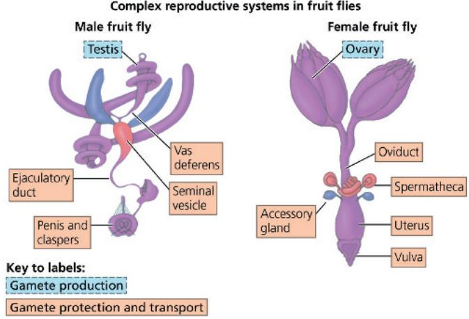

Identify which of the following, if any, are unique to mammals: a female uterus, a male vas deferens, extended internal development, and parental care of newborns.

## Concept 46.3: Reproductive organs produce and transport gametes

\- In human males, sperm are produced in testes, which are suspended outside the body in the scrotum. Ducts connect the testes to internal accessory glands and to the penis. The reproductive system of the human female consists principally of the labia and the glans of the clitoris externally and the vagina, uterus, oviducts, and ovaries internally. Eggs are produced in the ovaries and upon fertilization develop in the uterus.

\- Gametogenesis, or gamete production, consists of the processes of spermatogenesis in males and oogenesis in females. Human spermatogenesis is continuous and produces four sperm per meiosis. Human oogenesis is discontinuous and cyclic, generating one egg per meiosis.

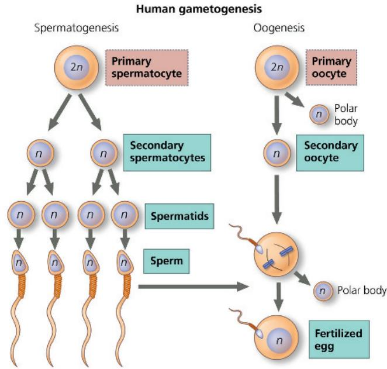  
How does the difference in size and cellular contents between sperm and eggs relate to their specific functions in reproduction?

## Concept 46.4: The interplay of tropic and sex hormones regulates reproduction in mammals

\- In mammals, GnRH from the hypothalamus regulates the release of two hormones, FSH and LH, from the anterior pituitary. In males, FSH and LH control the secretion of androgens (chiefly testosterone) and sperm production. In females, cyclic secretion of FSH and LH orchestrates the ovarian and uterine cycles via estrogens (primarily estradiol) and progesterone. The developing follicle and the corpus luteum produce estradiol and progesterone, which also coordinate the uterine and ovarian cycles through positive and negative feedback.

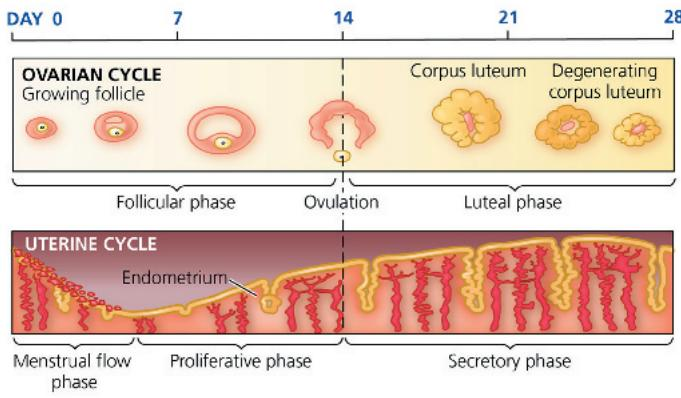

\- In estrous cycles, the lining of the endometrium is reabsorbed, and sexual receptivity is limited to a heat period. Reproductive structures with a shared origin in development underlie many features of human sexual arousal and orgasm common to males and females.

Why do anabolic steroids lead to reduced sperm counts?

## Concept 46.5: In placental mammals, an embryo develops fully within the uterus

\- After fertilization and the completion of meiosis in the oviduct, the zygote undergoes a series of cell divisions and develops into a blastocyst before implantation in the endometrium. All major organs start developing by 8 weeks. A pregnant female's acceptance of the "non-self" offspring likely reflects partial suppression of the maternal immune response. About $25\%$ of pregnancies end involuntarily. Early pregnancy loss (miscarriage) is the most common, occurring in the first 20 weeks of gestation.

\- Contraception may prevent release of mature gametes from the gonads, fertilization, or embryo implantation. Abortion is the deliberate termination of a pregnancy in progress.

\- Reproductive technologies can help detect problems before birth and can assist people with infertility. Infertility may be treated through hormone therapy or in vitro fertilization.

What route would oxygen in the parent's blood follow to arrive at a body cell of the fetus?

For suggested answers, see Appendix A.

## Test Your Understanding

For more multiple-choice questions, go to the Practice Test (eTextbook only).

## Levels 1-2: Remembering/Understanding

1. Which of the following characterizes parthenogenesis?
(A) An individual may change its sex during its lifetime.
(B) Specialized groups of cells grow into new individuals.
(C) An organism is first a male and then a female.
(D) An egg develops without being fertilized.

2. In male mammals, excretory and reproductive systems share (A) the vas deferens. (C) the seminal vesicle. (B) the urethra. (D) the prostate.

3. Which of the following is properly paired?
(A) seminiferous tubule—cervix
(B) vas deferens—oviduct
(C) corpus luteum—Sertoli cell
(D) scrotum—clitoris

4. Peaks of LH and FSH production occur during

(A) the menstrual flow phase of the uterine cycle.

(B) the beginning of the follicular phase of the ovarian cycle.

(C) the period just before ovulation.

(D) the secretory phase of the uterine cycle.

5. During human gestation, rudiments of all organs develop (A) in the first trimester.

(B) in the second trimester.

(C) in the third trimester.

(D) during the blastocyst stage.

## Levels 3-4: Applying/Analyzing

6. Which of the following is a true statement?

(A) All mammals have menstrual cycles.

(B) The endometrial lining is shed in menstrual cycles but reabsorbed in estrous cycles.

(C) Estrous cycles are more frequent than menstrual cycles.

(D) Ovulation occurs before the endometrium thickens in estrous cycles.

7. For which of the following is the number the same in human males and females?

(A) interruptions in meiotic divisions

(B) functional gametes produced by meiosis

(C) meiotic divisions required to produce each gamete

(D) different cell types produced by meiosis

8. Which statement about human reproduction is true?

(A) Fertilization occurs in the vagina.

(B) Spermatogenesis and oogenesis both require normal body temperature.

(C) An oocyte completes meiosis after a sperm penetrates it.

(D) The earliest stages of spermatogenesis occur closest to the lumen of the seminiferous tubules.

## Levels 5-6: Evaluating/Creating

9. DRAW IT In human spermatogenesis, mitosis of a stem cell gives rise to one cell that remains a stem cell and one cell that becomes a spermatogonium. (a) Draw four rounds of mitosis for a stem cell, and label the daughter cells. (b) For one spermatogonium, draw the cells it would produce from one round of mitosis followed by meiosis. Label the cells, and label mitosis and meiosis. (c) Explain what would happen if stem cells divided like spermatogonia.

10. EVOLUTION CONNECTION Hermaphroditism is often found in animals that are fixed to a surface. Motile species are less often hermaphroditic. Explain why.

11. SCIENTIFIC INQUIRY Suppose that you discover a new egg-laying worm species. You dissect four adults and find both oocytes and sperm in each. Cells outside the gonad contain five chromosome pairs. Lacking genetic variants, explain how you would determine whether the worms can self-fertilize.

12. WRITE ABOUT A THEME: ENERGY AND MATTER In a short essay (100–150 words), discuss how different types of energy investment by females contribute to the reproductive success of a frog, a chicken, and a human.

## 13. SYNTHESIZE YOUR KNOWLEDGE

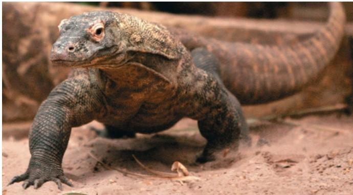

A female Komodo dragon (Varanus komodoensis) kept in isolation in a zoo had offspring. Each of the offspring had two identical copies of every gene in its genome. However, the offspring were not identical to one another. Based on your understanding of parthenogenesis and meiosis, propose a hypothesis to explain these observations.

For selected answers, see Appendix A.

