# 第48章 Neurons Synapses and Signaling

<!-- 章节边界按正文内容恢复；原始 MinerU 内容保留如下。 -->

# Neurons, Synapses, and Signaling

## Key Concepts

48.1 Neuron structure and organization reflect function in information transfer

48.2 Ion pumps and ion channels establish the resting potential of a neuron

48.3 Action potentials are the signals conducted by axons

48.4 Neurons communicate with other cells at synapses

## Study Tip

Make a table: Action potentials and graded potentials are two types of electrical signals. As you read, fill in a table like the one shown here to help you distinguish between action and graded potentials.

<table><tr><td></td><td>Graded Potential</td><td>Action Potential</td></tr><tr><td>Occurs in cell body?</td><td></td><td></td></tr><tr><td>Occurs in axon?</td><td></td><td></td></tr><tr><td>All or none?</td><td></td><td></td></tr><tr><td>Refractory period?</td><td></td><td></td></tr><tr><td>Summation?</td><td></td><td></td></tr><tr><td>Threshold?</td><td></td><td></td></tr><tr><td>How does membrane potential change?</td><td></td><td></td></tr><tr><td>Other differences?</td><td></td><td></td></tr></table>

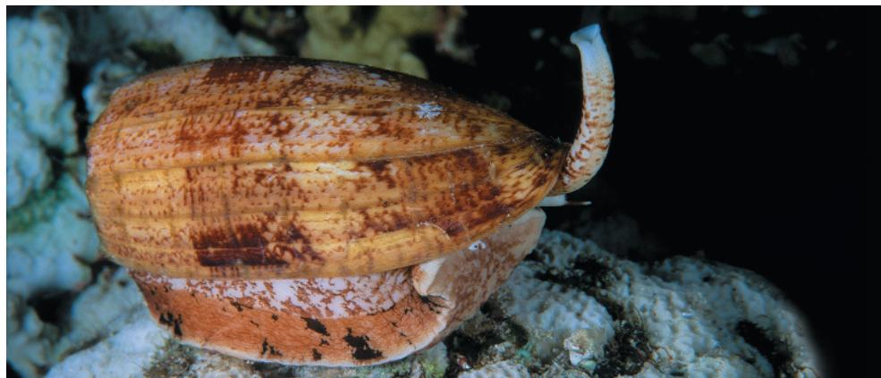  
Figure 48.1 This cone snail (Conus geographus) is slow-moving, but a dangerous hunter. Delivering venom with a hollow, harpoon-like tooth, it can paralyze a fish almost instantaneously. Scuba divers picking up a cone snail have died from a single injection. Underlying the fast-acting, lethal nature of the venom is an ability to block information transfer by neurons, specialized cells of the nervous system.

## How does a neuron transmit information?

A neuron receives information at dendrites and the cell body, transmits it down the axon, and conveys the information to other cells at a synapse.

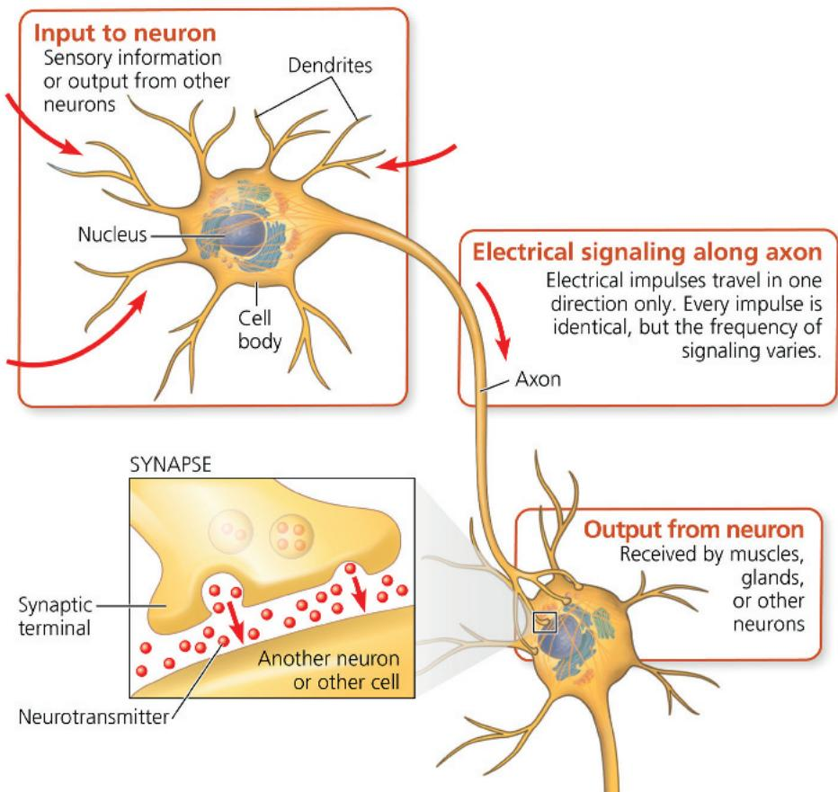

# Concept 48.1: Neuron structure and organization reflect function in information transfer

Our starting point for exploring the nervous system is the neuron, the type of nerve cell that uses electrical signals to transfer information within the body. It provides a good example of the close fit of form and function that often arises over the course of evolution.

## Neuron Structure and Function

The ability of a neuron to receive and transmit information is based on the highly specialized cellular organization shown in Figure 48.1. Most of a neuron's organelles, including its nucleus, are located in the cell body. In a typical neuron, the cell body is studded with numerous highly branched extensions called dendrites (from the Greek dendron, tree). Together with the cell body, the dendrites receive signals from other neurons.

A typical neuron has a single axon, the extension that transmits signals to other cells. Axons are often much longer than dendrites, and some, such as those that reach from the spinal cord of a giraffe to the muscle cells in its feet, are over a meter long. The specialized structure of axons allows them to use pulses of electrical current to transmit information, even over long distances. The cone-shaped base of an axon, called the axon hillock, is typically where signals that travel down the axon are generated. Near its other end, an axon usually divides into many branches.

Each branched end of an axon transmits information to another cell at a junction called a synapse (Figure 48.2). The part of each axon branch that forms this specialized junction is a synaptic terminal. At most synapses, chemical messengers called neurotransmitters pass information from the transmitting neuron to the receiving cell. Cone snail venom is particularly potent because it interferes not only with electrical signaling along axons but also with chemical signaling across synapses.

Figure 48.2 Synaptic terminals on the cell body of a postsynaptic neuron.  
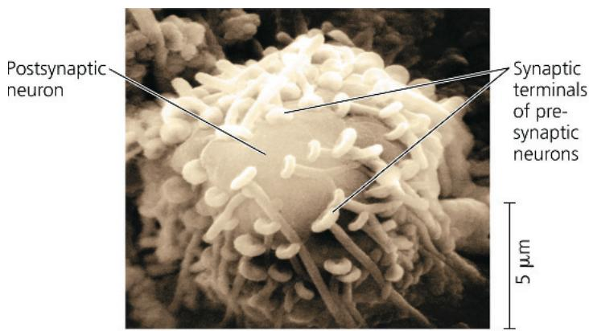  
Figure 48.3 Summary of information processing.

The cone snail's siphon acts as a sensor, transferring information to the neuronal circuits in the snail's head for processing. If prey is detected, these circuits issue motor commands—signals that control muscle activity. In this example, motor commands trigger release of a harpoon-like tooth from the proboscis, spearing the prey.

## Introduction to Information Processing

Information processing by a nervous system includes up to three stages: sensory input, integration, and motor output. As an example, let's consider the cone snail, focusing on the steps involved in identifying and attacking its prey. To generate sensory input to the nervous system, the snail surveys its environment with sensors in its tubelike siphon, sampling scents that might reveal a nearby fish (Figure 48.3). During the integration stage, networks of neurons in the snail brain process this information to determine if a fish is in fact present and, if so, where the fish is located. Motor output from the processing center then initiates attack, activating neurons that trigger release of the harpoon-like tooth toward the prey.

## Interview

## Interview with Baldomero Olivera: Developing drugs from research on cone snail venom (eTextbook only)

In all but the simplest animals, specialized populations of neurons handle each stage of information processing.

\- Sensory neurons, like those in the snail's siphon, transmit information about external stimuli (such as light, touch, or smell), and internal conditions (such as blood pressure or muscle tension).

\- Interneurons form the local circuits connecting neurons in the brain or ganglia. Interneurons are responsible for the integration (analysis and interpretation) of sensory input.

Figure 48.4 Structural diversity of neurons.

In these drawings of neurons, cell bodies and dendrites are black and axons are red. Note that the top diagram shows a peculiarity of some sensory neurons, in which the dendrites fuse with the axon during development. This axon carries information from the dendrites to the axon terminals, from right to left.

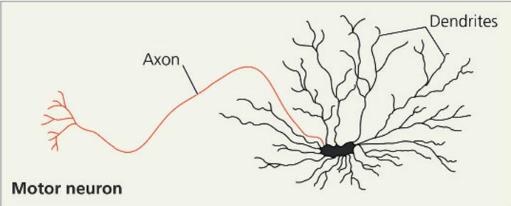  
Figure 48.5 Glia in the mammalian brain.

\- Motor neurons transmit signals to muscle cells, causing them to contract. Additional neurons that extend out of the processing centers trigger gland activity.

All neurons transmit electrical signals within the cell in an identical manner. Thus, a neuron that detects an odor transmits information along its length in the same way as a neuron that controls the movement of a body part. The particular connections made by the active neuron are what distinguish the type of information being transmitted. Interpreting nerve impulses therefore involves sorting neuronal paths and connections.

As shown in Figure 48.4, the shape of a neuron can vary from simple to quite complex, depending on its role in information processing. Neurons that have highly branched dendrites, such as some interneurons, can receive input through tens of thousands of synapses. Similarly, neurons that transmit information to many target cells do so through highly branched axons. When grouped together, the axons of neurons form a bundle called a nerve.

Not all networks involve motor neurons. When you see a friend, for instance, sensory neurons transmit visual information from your eye to your brain. Interneurons in the brain integrate this sensory information with other inputs (such as memories), enabling you to recognize the face of your friend.

In many animals, the neurons that carry out sorting, processing, and integration are organized in a central nervous system (CNS), which may include a brain or simpler clusters called ganglia. The neurons that carry information into and out of

This fluorescently labeled laser confocal micrograph shows a region of the rat brain packed with glia and interneurons. The glia are labeled red, the DNA in nuclei is labeled blue, and the dendrites of neurons are labeled green.

  
the CNS constitute the peripheral nervous system (PNS). Neurons of both the CNS and PNS require supporting cells called glial cells, or glia (from a Greek word meaning “glue”) (Figure 48.5).

## Concept Check 48.1

1. Compare and contrast the structure and function of axons and dendrites.

2. Describe the basic pathway of information flow through neurons that causes you to turn your head when someone calls your name.

3. WHAT IF? How might increased branching of an axon help coordinate responses to signals communicated by the nervous system?

For suggested answers, see Appendix A.

# Concept 48.2: Ion pumps and ion channels establish the resting potential of a neuron

We turn now to the essential role of ions in neuronal signaling. In neurons, as in other cells, ions are unequally distributed between the interior of cells and the surrounding fluid (see Concept 7.4). As a result, the inside of a cell is negatively charged relative to the outside. This charge difference, or voltage, across the plasma membrane is called the membrane potential, reflecting the fact that the attraction of opposite charges across the plasma membrane is a source of potential energy. For a resting neuron—one that is not sending a signal—the membrane potential is called the resting potential and is typically between -60 and -80 millivolts (mV).

Table 48.1 Ion Concentrations Inside and Outside of Mammalian Neurons

<table><tr><td>Ion</td><td>Intracellular Concentration (mM)</td><td>Extracellular Concentration (mM)</td></tr><tr><td>Potassium ( $K^{+}$ )</td><td>140</td><td>5</td></tr><tr><td>Sodium ( $Na^{+}$ )</td><td>15</td><td>150</td></tr><tr><td>Chloride ( $Cl^{-}$ )</td><td>10</td><td>120</td></tr><tr><td>Large anions ( $A^{-}$ ), such as proteins, inside cell</td><td>100</td><td>Not applicable</td></tr></table>

When a neuron receives a stimulus, the membrane potential changes. Rapid shifts in membrane potential are what enable us to see the intricate structure of a spiderweb, hear a song, or ride a bicycle. These changes, which are known as action potentials, will be discussed in Concept 48.3. To understand how they convey information, we need to explore the ways in which membrane potentials are formed, maintained, and altered.

## Formation of the Resting Potential

Potassium ions (K $^{+}$ ) and sodium ions (Na $^{+}$ ) play an essential role in the formation of the resting potential. These ions each have a concentration gradient across the plasma membrane of a neuron (Table 48.1). In most neurons, the concentration of K $^{+}$ is higher inside the cell, while the concentration of Na $^{+}$ is higher outside. The Na $^{+}$ and K $^{+}$ concentration gradients are maintained by the sodium-potassium pump. This pump uses the energy of ATP hydrolysis to actively transport Na $^{+}$ out of the cell and K $^{+}$ into the cell. (There are also concentration gradients for chloride ions (Cl $^{-}$ ) and other anions, as shown in Table 48.1, but we can ignore these for now.)

The sodium-potassium pump transports three $Na^{+}$ out of the cell for every two $K^{+}$ that it transports in (Figure 48.6). Although this pumping generates a net export of positive charge, the pump acts slowly. The resulting change in the membrane potential is therefore quite small—only a few millivolts. Why, then, is there a membrane potential of -60 to -80 mV in a resting neuron? The answer lies in ion movement through ion channels, pores formed by complex proteins that span the membrane. Ion channels allow ions to diffuse back and forth across the membrane. As ions diffuse through channels, they carry with them units of electrical charge. Furthermore, ions can move quite rapidly through ion channels. When this occurs, the resulting current—a net movement of positive or negative charge—generates a membrane potential, or voltage across the membrane.

Concentration gradients of ions across a plasma membrane represent a chemical form of potential energy that can be harnessed for cellular processes (see Figure 44.17). In neurons, the ion channels that convert this chemical potential energy to electrical potential energy can do so because they have selective permeability, allowing only certain ions to pass. For example, a potassium channel allows $K^{+}$ to diffuse freely across the membrane, but not other ions, such as $Na^{+}$ or $Cl^{-}$ .

Diffusion of $K^{+}$ through potassium channels that are always open (sometimes called leak channels) is critical for establishing the resting potential (Figure 48.7). The $K^{+}$ concentration is 140 millimolar (mM) inside the cell, but only 5 mM outside. The

Figure 48.6 Summary of active transport by the sodium-potassium pump.

You can find a step-by-step description of the pump's activity in Figure 7.16.

  
Figure 48.7 The basis of the membrane potential.

The sodium-potassium pump generates and maintains the concentration gradients of $Na^{+}$ and $K^{+}$ shown in Table 48.1. The $Na^{+}$ concentration gradient results in very little net diffusion of $Na^{+}$ in a resting neuron because very few channels are open. In contrast, the many open potassium channels allow a significant net outflow of $K^{+}$ . This outflow of $K^{+}$ results in a net negative charge inside the cell.  
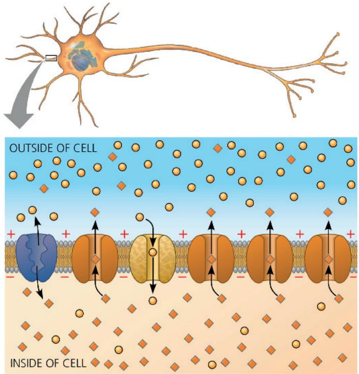

  
The potassium and sodium channels have the same rough overall structure, as shown. How must these proteins differ to allow passage of only a particular ion? For suggested answer, see Appendix A.

chemical concentration gradient thus favors a net outflow of $K^{+}$ . Furthermore, a resting neuron has many open potassium channels, but very few open sodium channels. Because very few $Na^{+}$ ions can cross the membrane, $K^{+}$ outflow leads to a net negative charge inside the cell. This buildup of negative charge within the neuron is the major source of the membrane potential.

What prevents the buildup of negative charge from increasing indefinitely? The excess negative charges inside the cell exert an attractive force that opposes the flow of additional positively charged potassium ions out of the cell. The separation of charge (voltage) thus results in an electrical gradient that counterbalances the chemical concentration gradient of $K^{+}$ .

## Modeling the Resting Potential

The net flow of $K^{+}$ out of a neuron proceeds until the chemical and electrical forces are in balance. We can model this process by considering a pair of chambers separated by an artificial membrane. To begin, imagine that the membrane contains many open ion channels, all of which allow only $K^{+}$ to diffuse across (Figure 48.8a). To produce a $K^{+}$ concentration gradient like that of a mammalian neuron, we place a solution of 140 mM potassium chloride (KCl) in the inner chamber and 5 mM KCl in the outer chamber. The $K^{+}$ will diffuse down its concentration gradient into the outer chamber. But because the chloride ions ( $Cl^{-}$ ) lack a means of crossing the membrane, there will be an excess of negative charge in the inner chamber.

When our model neuron reaches equilibrium, the electrical gradient will exactly balance the chemical gradient so that no further net diffusion of $K^{+}$ occurs across the membrane. The magnitude of the membrane voltage at equilibrium for a particular ion is called that ion's equilibrium potential ( $E_{ion}$ ). For a membrane permeable to a single type of ion, $E_{ion}$ can be calculated using a formula called the Nernst equation. At human body temperature (37°C) and for an ion with a net charge of 1+, such as $K^{+}$ or $Na^{+}$ , the Nernst equation is

$$
E _ {\mathrm{ion}} = 6 2 \mathrm{mV} \left(\log \frac {[ \mathrm{ion} ] _ {\mathrm{outside}}}{[ \mathrm{ion} ] _ {\mathrm{inside}}}\right)
$$

Plugging the $K^{+}$ concentrations into the Nernst equation reveals that the equilibrium potential for $\mathrm{K}^{+}\left(E_{\mathrm{K}}\right)$ is -90 mV (see Figure 48.8a).

## Figure 48.8 Modeling a mammalian neuron.

In this model of the membrane potential of a resting neuron, an artificial membrane divides each container into two chambers. Ion channels allow free diffusion for particular ions, resulting in the net ion flow represented by arrows. (a) The presence of open potassium channels makes the membrane selectively permeable to $K^{+}$ , and the inner chamber contains a 28-fold higher concentration of $K^{+}$ than the outer chamber; at equilibrium, the inside of the membrane is -90 mV relative to the outside. (b) The membrane is selectively permeable to $Na^{+}$ , and the inner chamber contains a tenfold lower concentration of $Na^{+}$ than the outer chamber; at equilibrium, the inside of the membrane is +62 mV relative to the outside.

WHAT IF? How would adding potassium or chloride channels to the membrane in (b) affect the membrane potential?

For suggested answer, see Appendix A.

The minus sign indicates that $K^{+}$ is at equilibrium when the inside of the membrane is 90 mV more negative than the outside.

Whereas the equilibrium potential for $K^{+}$ is -90 mV, the resting potential of a mammalian neuron is somewhat less negative. This difference reflects the small but steady movement of $Na^{+}$ across the few open sodium channels in a resting neuron. The concentration gradient of $Na^{+}$ has a direction opposite to that of $K^{+}$ (see Table 48.1). $Na^{+}$ therefore diffuses into the cell, making the inside of the cell less negative. If we model a membrane in which the only open channels are selectively permeable to $Na^{+}$ , we find that a tenfold higher concentration of $Na^{+}$ in the outer chamber results in an equilibrium potential ( $E_{Na}$ ) of +62 mV (Figure 48.8b). In an actual neuron, the resting potential (-60 to -80 mV) is much closer to $E_{K}$ than to $E_{Na}$ because there are many open potassium channels but only a small number of open sodium channels.

Because neither $K^{+}$ nor $Na^{+}$ is at equilibrium in a resting neuron, there is a net flow of each ion across the membrane. The resting potential remains steady, which means that these $K^{+}$ and $Na^{+}$ currents are equal and opposite. Ion concentrations on either side of the membrane also remain steady. Why? The resting potential arises from the net movement of far fewer ions than would be required to alter the concentration gradients.

If $Na^{+}$ is allowed to cross the membrane more readily, the membrane potential will move toward $E_{Na}$ and away from $E_{K}$ . As you'll see, this happens in generation of a nerve impulse.

## Concept Check 48.2

1. Under what circumstances could ions flow through an ion channel from a region of lower ion concentration to a region of higher ion concentration?

2. WHAT IF? Suppose a cell's membrane potential shifts from $-70\mathrm{mV}$ to $-50\mathrm{mV}$ . What changes in the cell's permeability to $\mathrm{K}^+$ or $\mathrm{Na}^+$ could cause such a shift?

3. MAKE CONNECTIONS Review Figure 7.11, which illustrates the diffusion of dye molecules across a membrane. Could diffusion eliminate the concentration gradient of a dye that has a net charge? Explain.

For suggested answers, see Appendix A.  
  
(a) Membrane selectively permeable to $K^{+}$ Nernst equation for $K^{+}$ equilibrium potential at 37°C:

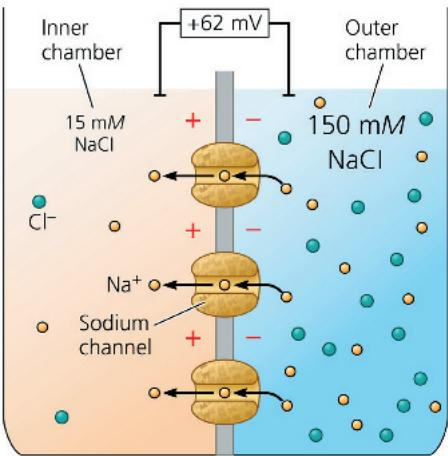

$$
E _ {K} = 6 2 \mathrm{mV} \left(\log \frac {5 \mathrm{mM}}{1 4 0 \mathrm{mM}}\right) = - 9 0 \mathrm{mV}
$$

(b) Membrane selectively permeable to $\mathrm{Na^{+}}$ Nernst equation for $\mathrm{Na^{+}}$ equilibrium potential at $37^{\circ}\mathrm{C}$ :

$$
E _ {\mathrm{Na}} = 6 2 \mathrm{mV} \left(\log \frac {1 5 0 \mathrm{mM}}{1 5 \mathrm{mM}}\right) = + 6 2 \mathrm{mV}
$$

## Concept 48.3: Action potentials are the signals conducted by axons

When a neuron responds to a stimulus, the membrane potential changes. Using intracellular recording, researchers can monitor these changes as a function of time (Figure 48.9). As you will see, such recordings have been central to the study of information transfer by neurons.

How does a stimulus alter the membrane potential? Certain ion channels in a neuron, called gated ion channels, open or close in response to stimuli. When a gated ion channel opens or closes, it alters the membrane's permeability to particular ions (Figure 48.10). The result of channel opening is a rapid flow of ions across the membrane, altering the membrane potential.

Particular types of gated channels respond to different stimuli. For example, Figure 48.10 illustrates a voltage-gated ion channel, a channel that opens or closes in response to a shift in the voltage across the plasma membrane of the neuron. Later in this chapter, we will discuss gated channels that are located in neurons and are regulated by chemical signals.

## Hyperpolarization and Depolarization

Let's consider now what happens in a neuron when a stimulus causes closed voltage-gated ion channels to open. If gated potassium channels in a resting neuron open, the membrane's

## Figure 48.9 Research Method: Intracellular Recording Application

Electrophysiologists use intracellular recording to measure the membrane potential of neurons and other cells.

## Technique

A microelectrode is made from a glass capillary tube filled with an electrically conductive salt solution. One end of the tube tapers to an extremely fine tip (diameter $<1\mu m$ ). While looking through a microscope, the experimenter uses a micropositioner to insert the tip of the microelectrode into a cell. A voltage recorder (usually an oscilloscope or a computer-based system) measures the voltage between the microelectrode tip inside the cell and a reference electrode placed in the solution outside the cell.

## Figure 48.10 Voltage-gated ion channel.

A change in the membrane potential in one direction (solid arrow) opens the voltage-gated channel. The opposite change (dashed arrow) closes the channel.

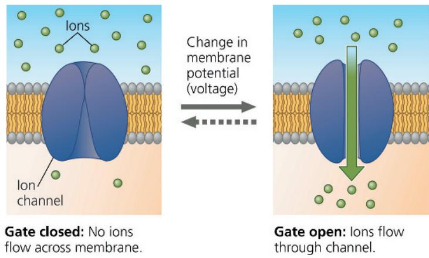  
VISUAL SKILLS Gated ion channels allow ion flow in either direction. Using visual information in this figure, explain why there is net ion movement when the channel opens.  
For suggested answer, see Appendix A.

permeability to $K^{+}$ increases. As a result, net diffusion of $K^{+}$ out of the neuron increases, shifting the membrane potential toward $E_{K}$ (-90 mV at 37°C). This increase in the magnitude of the membrane potential, called a hyperpolarization, makes the inside of the membrane more negative (Figure 48.11a). In a resting neuron, hyperpolarization results from any stimulus that increases the outflow of positive ions or the inflow of negative ions.

Although opening potassium channels in a resting neuron causes hyperpolarization, opening some other types of ion channels has an opposite effect, making the inside of the membrane less negative (Figure 48.11b). A reduction in the magnitude of the membrane potential is a depolarization. In neurons, depolarization often involves gated sodium channels. If a stimulus causes gated sodium channels to open, the membrane's permeability to $\mathrm{Na^{+}}$ increases. $\mathrm{Na^{+}}$ diffuses into the cell along its concentration gradient, causing a depolarization as the membrane potential shifts toward $E_{\mathrm{Na}}(+62\mathrm{mV}$ at $37^{\circ}\mathrm{C})$ .

## Graded Potentials and Action Potentials

Sometimes, the hyperpolarization or depolarization is simply a short-lived shift in the membrane potential. This shift, called a graded potential, has a magnitude that varies with the strength of the stimulus: A larger stimulus causes a greater change in the membrane potential (see Figure 48.11a and 48.11b). Graded potentials induce a small electrical current that dissipates as it flows along the membrane. Graded potentials thus decay with time and with distance from their source.

If a depolarization shifts the membrane potential sufficiently, the result is a massive change in membrane voltage called an action potential. Unlike graded potentials, action potentials have a constant magnitude and can regenerate in adjacent regions of the membrane. Action potentials can therefore spread along axons, making them well suited for transmitting a signal over long distances.

Figure 48.11 Graded potentials and an action potential in a neuron.

The graphs in (a) and (b) show changes in membrane potential over time during two separate trials involving stimuli of different strengths. The tracings (the red lines representing the results) of the two separate trials are superimposed.

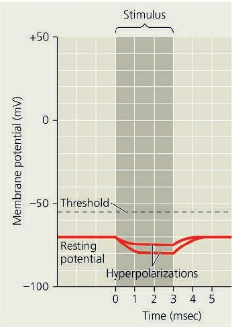  
(a) Graded hyperpolarizations produced by two stimuli that increase membrane permeability to $K^{+}$ . The larger stimulus produces a larger hyperpolarization.

  
(b) Graded depolarizations produced by two stimuli that increase membrane permeability to $Na^{+}$ . The larger stimulus produces a larger depolarization.

  
(c) Action potential triggered by a depolarization that reaches the threshold.  
DRAW IT Redraw the graph in (c), extending the y-axis. Then, label the positions of $E_{K}$ and $E_{Na}$ . For suggested answer, see Appendix A.

Action potentials arise because some of the ion channels in axons are voltage-gated (see Figure 48.10). If a depolarization increases the membrane potential to a level called threshold, the voltage-gated sodium channels open. The resulting flow of $Na^{+}$ into the neuron results in further depolarization. Because the sodium channels are voltage gated, the increased depolarization causes more sodium channels to open, leading to an even greater flow of current. The result is a process of positive feedback that triggers a very rapid opening of many voltage-gated sodium channels and the marked temporary change in membrane potential that defines an action potential (Figure 48.11c).

The positive-feedback loop of channel opening and depolarization triggers an action potential whenever the membrane potential reaches threshold, about -55 mV for many mammals. Once initiated, the action potential has a magnitude that is independent of the strength of the triggering stimulus. Because action potentials either occur fully or do not occur at all, they represent an all-or-none response to stimuli.

## Generation of Action Potentials: A Closer Look

The characteristic shape of the action potential graph in Figure 48.11c reflects changes in membrane potential resulting from ion movement through voltage-gated sodium and potassium channels. Depolarization opens both types of channels, but they respond independently and sequentially. Sodium channels open first, initiating the action potential. As the action potential proceeds, sodium channels remain open but become inactivated: A portion of the channel protein called an inactivation loop blocks ion flow through the open channel. Sodium channels remain inactivated until after the membrane returns to the resting potential and the channels close. Potassium channels open more slowly than sodium channels, but are not inactivated. They remain open until the membrane potential returns to its resting state.

To understand further how voltage-gated channels shape the action potential, consider the process as a series of stages, as depicted in Figure 48.12. ① When the membrane of the axon is at the resting potential, most voltage-gated sodium channels are closed. Ungated potassium channels involved in the resting membrane potential are open, but voltage-gated potassium channels are closed. ② When a stimulus depolarizes the membrane, some gated sodium channels open, allowing more $\mathrm{Na^{+}}$ to diffuse into the cell. If the stimulus is sufficiently strong, more $\mathrm{Na^{+}}$ channels open and the $\mathrm{Na^{+}}$ inflow persists, causing further depolarization, which opens more gated sodium channels, allowing even more $\mathrm{Na^{+}}$ to diffuse into the cell.

③ Once the threshold is crossed, the positive-feedback cycle then rapidly brings the membrane potential close to $E_{Na}$ . This stage of the action potential is called the rising phase. ④ Two events prevent the membrane potential from actually reaching $E_{Na}$ : Voltage-gated

Figure 48.12 The role of voltage-gated ion channels in the generation of an action potential. The circled numbers on the graph in the center and the colors of the action potential phases correspond to the five diagrams showing voltage-gated sodium and potassium channels in a neuron's plasma membrane.  
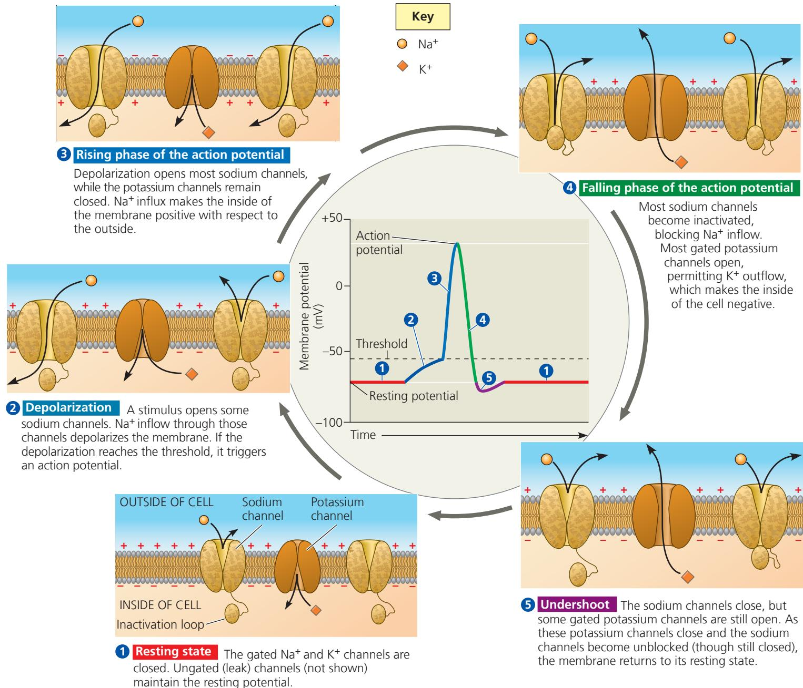  
DRAW IT Draw a simple diagram showing how positive feedback underlies the rising phase of the action potential. Your diagram should include these three events: (1) a change in membrane potential; (2) ion flow; and (3) opening, closing, or inactivation of a channel.

For suggested answer, see Appendix A.

sodium channels inactivate soon after opening, halting the flow of $Na^{+}$ into the cell, and most voltage-gated potassium channels open, causing a rapid outflow of $K^{+}$ . Both events quickly bring the membrane potential back toward $E_{K}$ . This stage is called the falling phase. $^{5}$ In the final phase of an action potential, called the undershoot, the membrane's permeability to $K^{+}$ is higher than at rest, so the membrane potential is closer to $E_{K}$ than it is at the resting potential. The gated potassium channels eventually close, and the membrane potential returns to the resting potential.

Why is inactivation of channels required during an action potential? Because they are voltage gated, the sodium channels open when the membrane potential reaches the threshold of $-55\mathrm{mV}$ and don't close until the resting potential is restored. They are therefore open throughout the action potential. However, the resting potential cannot be restored unless the flow of $\mathrm{Na^{+}}$ into the cell stops. This is accomplished by inactivation. The sodium channels remain in the "open" state, but sodium ions cease flowing once inactivation occurs. The end of $\mathrm{Na^{+}}$ inflow allows $\mathrm{K^{+}}$ outflow to repolarize the membrane.

The sodium channels remain inactivated during the falling phase and the early part of the undershoot. As a result, if a second depolarizing stimulus occurs during this period, it will be unable to trigger an action potential. The “downtime” when a second action potential cannot be initiated is called the refractory period. Note that the refractory period is due to the inactivation of sodium channels, not to a change in the ion concentration gradients across the plasma membrane. The flow of charged particles during an action potential involves far too few ions to change the concentration on either side of the membrane significantly.

## Conduction of Action Potentials

Having described the events of a single action potential, we'll explore next how a series of action potentials moves a signal along an axon. At the site where an action potential is initiated (usually the axon hillock), $\mathrm{Na^{+}}$ inflow during the rising phase creates an electrical current that depolarizes the neighboring region of the axon membrane (Figure 48.13). The depolarization is large enough to reach threshold, causing an action potential in the neighboring region. This process is repeated many times along the length of the axon. Because an action potential is an all-or-none event, the magnitude and duration of the action potential are the same at each position along the axon. The net result is the movement of a nerve impulse from the cell body to the synaptic terminals, much like the cascade of events triggered by knocking over the first domino in a line.

An action potential that starts at the axon hillock moves along the axon only toward the synaptic terminals. Why? Immediately behind the traveling zone of depolarization, the sodium channels remain inactivated, making the membrane temporarily refractory (not responsive) to further input. Consequently, the inward current that depolarizes the axon membrane ahead of the action potential cannot produce another action potential behind it. This is why action potentials do not travel back toward the cell body.

After the refractory period is complete, depolarization of the axon hillock to threshold will trigger a new action potential. In many neurons, action potentials last less than 2 milliseconds (msec), and the firing rate can thus reach hundreds of action potentials per second.

The frequency of action potentials conveys information: The rate at which action potentials are produced in a particular neuron is proportional to input signal strength. In hearing, for example, louder sounds result in more frequent action potentials in neurons connecting the ear to the brain. Similarly, increased frequency of action potentials in a neuron that stimulates skeletal muscle tissue will increase the tension in the contracting muscle. Differences in the number of action potentials in a given time are in fact the only variable in how information is encoded and transmitted along an axon.

Gated ion channels and action potentials have a central role in nervous system activity. As a consequence, mutations in genes that encode ion channel proteins can cause disorders affecting the nerves or brain—or the muscles or heart, depending largely on where in the body the gene for the ion channel protein is expressed. For example, mutations affecting voltage-gated sodium channels in skeletal muscle cells can cause myotonia, a periodic spasming of those muscles. Mutations affecting sodium channels in the brain can cause epilepsy, in which groups of nerve cells fire simultaneously and excessively, producing seizures.

Figure 48.13 Conduction of an action potential.

This figure shows events at three successive times as an action potential passes from left to right. At each point along the axon, voltage-gated ion channels go through the sequence of changes shown in Figure 48.9. Membrane colors correspond to the action potential phases in that figure.

  
1 An action potential is generated as Na $^{+}$ flows inward across the membrane in one region.

2 The depolarization of the action potential spreads to the neighboring region of the membrane, reinitiating the action potential there. To the left of this region, the membrane is repolarizing as $K^{+}$ flows outward.

3 The depolarization-repolarization process is repeated in the next region of the membrane. In this way, local currents of ions across the plasma membrane cause the action potential to be propagated along the length of the axon.

DRAW IT For the axon segment shown, consider a point at the left end, a point in the middle, and a point at the right end. Draw a graph for each point showing the change in membrane potential over time at that point as a single nerve impulse moves from left to right across the segment.

For suggested answer, see Appendix A.

## Evolutionary Adaptations of Axon Structure

EVOLUTION The rate at which the axons within nerves conduct action potentials governs how rapidly an animal can react to danger or opportunity. As a consequence, natural selection often results in anatomical adaptations that increase conduction speed. One such adaptation is a wider axon. In the same way that a wide hose offers less resistance to the flow of water than does a narrow hose, a wide axon provides less resistance to the current associated with an action potential than does a narrow axon.

Figure 48.14 Schwann cells and the myelin sheath.  
In the PNS, glia called Schwann cells wrap themselves around axons, forming layers of myelin. Gaps between adjacent Schwann cells are called nodes of Ranvier. The TEM shows a cross section through a myelinated axon.  
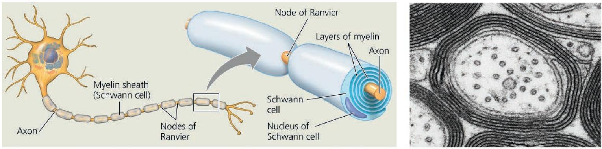

In invertebrates, conduction speed varies from several centimeters per second in very narrow axons to approximately 30 m/sec in the giant axons of some arthropods and molluscs. These giant axons (up to 1 mm in diameter) function in rapid behavioral responses, such as the muscle contraction that propels a hunting squid toward its prey.

Vertebrate axons have narrow diameters but can still conduct action potentials at high speed. How is this possible? The evolutionary adaptation that enables fast conduction in vertebrate axons is insulation, analogous to the plastic insulation that encases many electrical wires.

The insulation that surrounds vertebrate axons is called a myelin sheath (Figure 48.14). Myelin sheaths are produced by glia: oligodendrocytes in the CNS and Schwann cells in the PNS. During development, these specialized glia wrap axons in many layers of membrane. The membranes forming these layers are mostly lipid, which is a poor conductor of electrical current and thus a good insulator.

In myelinated axons, voltage-gated sodium channels are restricted to gaps in the myelin sheath called nodes of Ranvier (see Figure 48.14). Furthermore, the extracellular fluid is in contact with the axon membrane only at the nodes. As a result, action potentials are not generated in the regions between the nodes. Rather, the inward current produced during the rising phase of the action potential at a node travels within the axon all the way to the next node. There, the current depolarizes the membrane and regenerates the action potential (Figure 48.15).

Action potentials propagate more rapidly in myelinated axons because the time-consuming process of opening and closing of ion channels occurs at only a limited number of positions along the axon. This mechanism for propagating action potentials is called saltatory conduction (from the Latin saltare, to leap) because the action potential appears to jump from node to node along the axon.

The major selective advantage of myelination is its space efficiency. A myelinated axon 20 $\mu$ m in diameter has a conduction speed faster than that of a squid giant axon with a diameter 40 times greater. Consequently, more than 2,000 of those myelinated axons can be packed into the space occupied by just one giant axon.

For any axon, myelinated or not, the conduction of an action potential to the end of the axon sets the stage for the next step in neuronal signaling—the transfer of information to another cell. This information handoff occurs at synapses, our next topic.

Figure 48.15 Propagation of action potentials in myelinated axons.

In a myelinated axon, the depolarizing current during an action potential at one node of Ranvier spreads along the interior of the axon to the next node (blue arrows), where voltage-gated sodium channels enable reinitiation. Thus, the action potential appears to jump from node to node as it travels along the axon (red arrows).

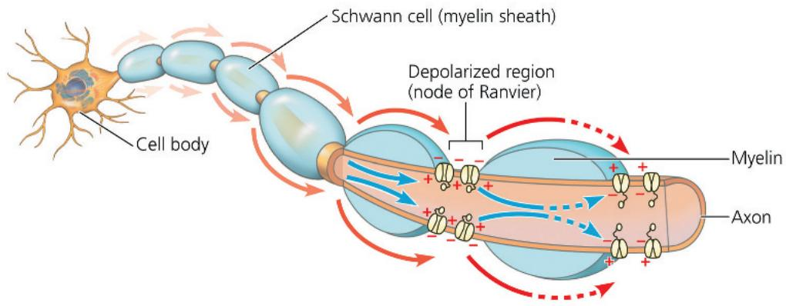

## Concept Check 48.3

1. How do action potentials and graded potentials differ?

2. In multiple sclerosis (from the Greek skleros, hard), a person's myelin sheaths harden and deteriorate. How would this affect nervous system function?

3. How do both negative and positive feedback contribute to the changes in membrane potential during an action potential?

4. WHAT IF? Suppose a mutation caused gated sodium channels to remain inactivated longer after an action potential. How would this affect the frequency at which action potentials could be generated? Explain.

For suggested answers, see Appendix A.

## Concept 48.4: Neurons communicate with other cells at synapses

Transmission of information from neurons to other cells occurs at synapses. Synapses are either electrical or chemical.

Electrical synapses contain gap junctions (see Figure 6.30) that allow electrical current to flow directly from one neuron to another. Such synapses often play a role in synchronizing the activity of neurons that direct rapid, unvarying behaviors. For example, electrical synapses associated with the giant axons of squids and lobsters facilitate swift escapes from danger. Electrical synapses are also found in the vertebrate heart and brain.

The majority of synapses are chemical synapses, which rely on the release of a chemical neurotransmitter by the presynaptic neuron to transfer information to the target cell. While at rest, the presynaptic neuron synthesizes the neurotransmitter at each synaptic terminal, packaging it in multiple membrane-enclosed compartments called synaptic vesicles. When an action potential arrives at a chemical synapse, it depolarizes the plasma membrane at the synaptic terminal, opening voltage-gated channels that allow $Ca^{2+}$ to diffuse in. The $Ca^{2+}$ concentration in the terminal rises, causing synaptic vesicles to fuse with the terminal membrane and release the neurotransmitter.

Neurotransmitter released from the synaptic terminus diffuses across the synaptic cleft, the gap that separates the presynaptic neuron from the postsynaptic cell. Diffusion time is very short because the gap is less than 50 nm across. Upon reaching the postsynaptic membrane, the neurotransmitter binds to and activates a specific receptor in the membrane. This series of events at the synapse is summarized in Figure 48.16, on the facing page.

Information transfer at chemical synapses can be modified by altering either the amount of neurotransmitter that is released or the responsiveness of the postsynaptic cell. Such modifications underlie an animal's ability to alter its behavior in response to change and also form the basis for learning and memory, as you will read in Concept 49.4.

## Generation of Postsynaptic Potentials

At many chemical synapses, the receptor protein that binds and responds to neurotransmitters is a ligand-gated ion channel, often called an ionotropic receptor. These receptors are clustered in the membrane of the postsynaptic cell, directly opposite the synaptic terminal. Binding of the neurotransmitter (the receptor's ligand) to a particular part of the receptor opens the channel and allows specific ions to diffuse across the postsynaptic membrane. The result is a postsynaptic potential, a graded potential in the postsynaptic cell.

At some chemical synapses, the ligand-gated ion channels are permeable to both $K^{+}$ and $Na^{+}$ (see Figure 48.16). When these channels open, the membrane potential depolarizes toward a value roughly midway between $E_{K}$ and $E_{Na}$ . Because such a depolarization brings the membrane potential toward threshold, it is an example of an excitatory postsynaptic potential (EPSP).

At other chemical synapses, the ligand-gated ion channels are selectively permeable for only $K^{+}$ or $Cl^{-}$ . When such channels open, the postsynaptic membrane hyperpolarizes. A hyperpolarization produced in this manner is an inhibitory postsynaptic potential (IPSP) because it moves the membrane potential farther from threshold.

## Summation of Postsynaptic Potentials

The interplay between multiple excitatory and inhibitory inputs is the essence of integration in the nervous system. The cell body and dendrites of a given postsynaptic neuron may receive inputs from chemical synapses formed with hundreds or even thousands of synaptic terminals (see Figure 48.2). How do so many synapses contribute to information transfer?

The input from an individual synapse is typically insufficient to trigger a response in a postsynaptic neuron. To see why, consider an EPSP arising at a single synapse. As a graded potential, the EPSP becomes smaller as it spreads from the synapse. Therefore, by the time a particular EPSP reaches the axon hillock, it is usually too small to trigger an action potential (Figure 48.17a, after you turn the page).

On some occasions, individual postsynaptic potentials combine to produce a larger postsynaptic potential, a process called summation. For instance, two EPSPs may occur at a single synapse in rapid succession. If the second EPSP arises before the postsynaptic membrane potential returns to its resting value, the EPSPs add together through temporal summation. If the summed postsynaptic potentials depolarize the membrane at the axon hillock to threshold, the result is an action potential (Figure 48.17b). Summation can also involve multiple synapses on the same postsynaptic neuron. If such synapses are active at the same time, the resulting EPSPs can add together through spatial summation (Figure 48.17c).

Summation applies as well to IPSPs: Two or more IPSPs occurring nearly simultaneously at synapses in the same region or in rapid succession at the same synapse have a larger hyperpolarizing effect than a single IPSP. Through summation, an IPSP can also counter the effect of an EPSP (Figure 48.17d).

The axon hillock is the neuron's integrating center, the region where the membrane potential at any instant represents the summed effect of all EPSPs and IPSPs. Whenever the membrane potential at the axon hillock reaches threshold, an action potential is generated and travels along the axon to its synaptic terminals. After the refractory period, the neuron may produce another action potential, provided the membrane potential at the axon hillock once again reaches threshold.

Figure 48.16 A chemical synapse.

This figure illustrates the sequence of events that transmits a signal across a chemical synapse. In response to binding of neurotransmitter, ligand-gated ion channels in the postsynaptic membrane open (as shown here) or, less commonly, close. Synaptic transmission ends when the neurotransmitter diffuses out of the synaptic cleft, is taken up by the synaptic terminal or by another cell, or is degraded by an enzyme.

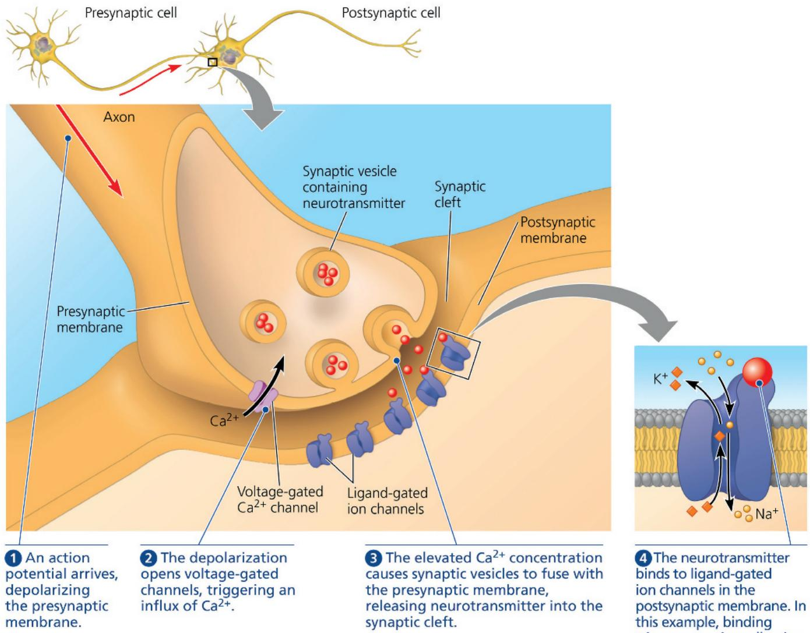  
WHAT IF? If all the $Ca^{2+}$ in the fluid surrounding a neuron were removed, how would this affect the transmission of information within and between neurons?  
4 The neurotransmitter binds to ligand-gated ion channels in the postsynaptic membrane. In this example, binding triggers opening, allowing $Na^{+}$ and $K^{+}$ to diffuse through.

## Termination of Neurotransmitter Signaling

After a response is triggered, the chemical synapse returns to its resting state. How does this happen? The key step is clearing the neurotransmitter molecules from the synaptic cleft. Some neurotransmitters are inactivated by enzymatic hydrolysis (Figure 48.18a, after you turn the page). Other neurotransmitters are recaptured into the presynaptic neuron (Figure 48.18b). After this reuptake occurs, neurotransmitters are repackaged in synaptic vesicles or transferred to glia for metabolism or recycling to neurons.

## Modulated Signaling at Synapses

So far, we have focused on synapses where a neurotransmitter binds directly to an ion channel, causing the channel to open.

However, there are also chemical synapses in which the receptor for the neurotransmitter is not part of an ion channel. At these synapses, the neurotransmitter binds to a G protein-coupled receptor, activating a signal transduction pathway in the postsynaptic cell involving a second messenger (see Concept 11.3). Because the resulting opening or closing of ion channels depends on one or more metabolic steps, these G protein-coupled receptors are also called metabotropic receptors.

For example, the binding of norepinephrine to its metabotropic receptor activates a G protein, which in turn activates adenylyl cyclase, the enzyme that converts ATP to cAMP (see Figure 11.11). Cyclic AMP activates protein kinase A, which phosphorylates specific ion channel proteins in the postsynaptic membrane, causing them to open or close. Because of the amplifying effect of the signal transduction pathway, the binding of one norepinephrine molecule can affect the opening or closing of many channels.

Figure 48.17 Summation of postsynaptic potentials.

These graphs trace changes in the membrane potential at a postsynaptic neuron's axon hillock. The red arrows indicate times when postsynaptic potentials occur at two excitatory synapses ( $E_{1}$ and $E_{2}$ , green in the diagrams above the graphs) and at one inhibitory synapse (I, purple). Like most EPSPs, those produced at $E_{1}$ or $E_{2}$ do not reach the threshold at the axon hillock without summation.

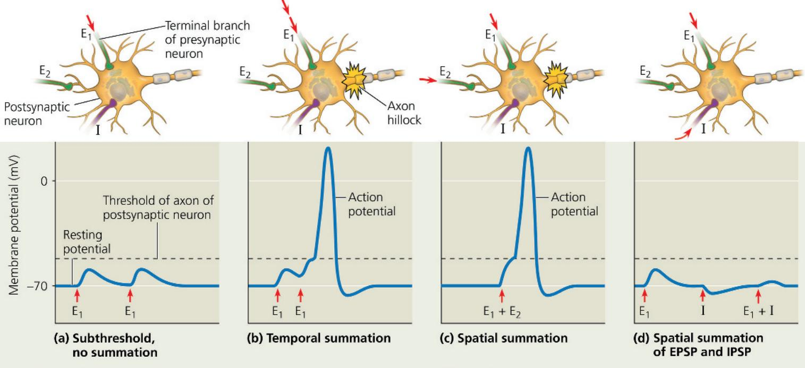  
VISUAL SKILLS Assuming that synapses $E_{1}$ and $E_{2}$ were identical aside from their location, which synapse would produce a stronger EPSP at the axon hillock?  
For suggested answer, see Appendix A.

Figure 48.18 Two mechanisms of terminating neurotransmission.  
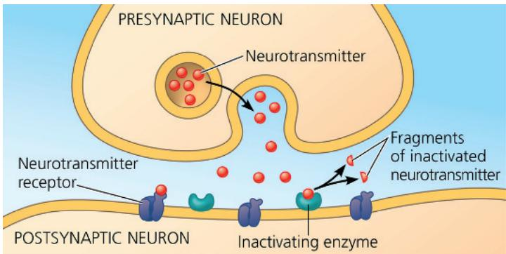

(a) Enzymatic breakdown of neurotransmitter in the synaptic cleft  
  
(b) Reuptake of neurotransmitter by presynaptic neuron

Many neurotransmitters have both ionotropic and metabotropic receptors. Compared with the postsynaptic potentials produced by ligand-gated channels, the effects of G protein pathways typically have a slower onset but last longer.

## Neurotransmitters

Signaling at a synapse brings about a response that depends on both the neurotransmitter released from the presynaptic membrane and the receptor produced at the postsynaptic membrane. A single neurotransmitter may bind specifically to more than a dozen different receptors. Indeed, a particular neurotransmitter can excite postsynaptic cells expressing one receptor and inhibit postsynaptic cells expressing a different receptor. As an example, let's examine acetylcholine, a common neurotransmitter in both invertebrates and vertebrates.

## Acetylcholine

In vertebrates, there are two major classes of acetylcholine receptor. One type is the muscarinic receptor, which is metabotropic. Muscarinic receptors have different effects in different locations. In heart muscle, these receptors activate G proteins that directly open potassium channels in the muscle cell membrane as well as inhibit adenylyl cyclase. Both effects reduce the rate at which the heart pumps.

The second type is the ligand-gated ion channel permeable to $Na^{+}$ and $K^{+}$ ions discussed earlier. These ionotropic receptors are called nicotinic receptors because they are also activated by the chemical nicotine that is found in tobacco. These receptors play a key role at the vertebrate neuromuscular junction, the site where a motor neuron forms a synapse with a skeletal muscle cell. When acetylcholine released by motor neurons binds this receptor, the net influx of positive charges causes an EPSP, resulting in action potentials that lead to muscle contraction. This excitatory activity is soon terminated by acetylcholinesterase, an enzyme in the synaptic cleft that hydrolyzes the neurotransmitter into an inactive form. Thus, acetylcholine is inhibitory in heart muscle but excitatory in skeletal muscle.

Several chemicals profoundly influence the nervous system by interfering with acetylcholine production or action. For instance, nicotine in tobacco acts as a stimulant by directly activating nicotinic receptors in the brain. The chemical weapon sarin inhibits acetylcholinesterase, causing uncontrolled skeletal muscle contractions. A third example is the bacterial product botulinum toxin, which causes paralysis of skeletal muscles by blocking acetylcholine release. Because skeletal muscles are required for breathing, untreated botulism is typically fatal. Today, injections of the botulinum toxin, known by the trade name Botox, are used cosmetically to minimize wrinkles around the eyes or mouth by inhibiting synaptic transmission to particular facial muscles.

Although acetylcholine has many roles, it is just one of more than 100 known neurotransmitters. As shown by the examples in Table 48.2, the rest fall into four classes: amino acids, biogenic amines, neuropeptides, and gases.

## Amino Acids

Glutamate is one of several amino acids that can act as a neurotransmitter. In invertebrates, glutamate, rather than acetylcholine, is the neurotransmitter at the neuromuscular junction. In vertebrates, glutamate is the most common neurotransmitter in the CNS. Synapses at which glutamate is the neurotransmitter have a key role in the formation of long-term memory, as you will see in Concept 49.4.

Two amino acids act as inhibitory neurotransmitters in the CNS. Glycine acts at inhibitory synapses in parts of the CNS that lie outside of the brain. Within the brain, the amino acid gamma-aminobutyric acid (GABA) is the neurotransmitter at most inhibitory synapses. Binding of GABA to receptors in postsynaptic cells increases membrane permeability to $Cl^{-}$ , resulting in an IPSP. The widely prescribed drug diazepam (Valium) reduces anxiety through binding to a site on a GABA receptor, increasing the response to GABA.

## Biogenic Amines

The neurotransmitters grouped as biogenic amines are synthesized from amino acids and include norepinephrine, which is made from tyrosine. Norepinephrine is an excitatory neurotransmitter in the autonomic nervous system, a branch of the PNS. Outside the nervous system, norepinephrine has distinct but related functions as a hormone, as does the chemically similar biogenic amine epinephrine (see Concept 45.3).

Table 48.2 Major Neurotransmitters

<table><tr><td>Neurotransmitter</td><td>Structure</td></tr><tr><td>Acetylcholine</td><td>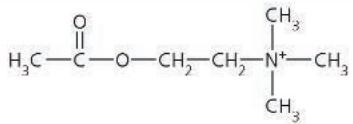</td></tr><tr><td>Amino AcidsGlutamateGABA (gamma-aminobutyric acid)Glycine</td><td> $H_2N—CH—CH_2—CH_2—COOH$  $\begin{array}{c} | \\ COOH \end{array}$  $H_2N—CH_2—CH_2—CH_2—COOH$  $H_2N—CH_2—COOH$ </td></tr><tr><td>Biogenic AminesNorepinephrineDopamineSerotonin</td><td>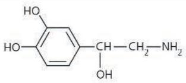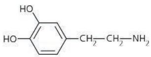</td></tr><tr><td colspan="2">Neuropeptides(a very diverse group, only two of which are shown)Substance PArg—Pro—Lys—Pro—Gln—Gln—Phe—Phe—Gly—Leu—MetMet-enkephalin (an endorphin)Tyr—Gly—Gly—Phe—Met</td></tr><tr><td>GasesNitric oxide</td><td>N=O</td></tr></table>

The biogenic amines dopamine (made from tyrosine) and serotonin (made from tryptophan) are released at many sites in the brain and affect sleep, mood, attention, and learning. Some psychoactive drugs, including LSD and mescaline, apparently produce their hallucinatory effects by binding to brain receptors for these neurotransmitters.

Biogenic amines have a central role in a number of nervous system disorders and treatments (see Concept 49.5). The degenerative illness Parkinson's disease is associated with a lack of dopamine in the brain. In addition, depression is often treated with drugs that increase the brain concentrations of biogenic amines. Prozac, for instance, enhances the effect of serotonin by inhibiting its reuptake after it is released by presynaptic neurons.

## Neuropeptides

Several neuropeptides, relatively short chains of amino acids, serve as neurotransmitters that operate via metabotropic receptors. Such peptides are typically produced by cleavage of much larger protein precursors. The neuropeptide substance P is a key excitatory neurotransmitter that mediates our perception of pain.

Other neuropeptides, called endorphins, function as natural analgesics, decreasing pain perception.

Endorphins are produced in the brain during times of physical or emotional stress, such as childbirth. In addition to relieving pain, they decrease respiration and produce euphoria, as well as other emotional effects. Because opioids (drugs such as morphine and heroin) bind to the same receptor proteins as endorphins, opioids mimic endorphins and produce many of the same physiological effects (see Figure 2.16). In the Scientific Skills Exercise, you can interpret data from an experiment designed to search for opioid receptors in the brain.

## Gases

Some vertebrate neurons release dissolved gases as neurotransmitters. In human males, for example, certain neurons release nitric oxide (NO) into the erectile tissue of the penis during sexual arousal. The resulting relaxation of smooth muscle in the blood vessel walls of the spongy erectile tissue allows the tissue to fill with blood, producing an erection. The erectile dysfunction drug Viagra works by inhibiting an enzyme that terminates the action of NO.

Unlike most neurotransmitters, NO is not stored in cytoplasmic vesicles but is instead synthesized on demand. NO diffuses into neighboring target cells, produces a change, and is broken down—all

## Scientific Skills Exercise Interpreting Data Values Expressed in Scientific Notation

Does the Brain Have Specific Protein Receptors for Opioids? Researchers were looking for opioid receptors in the mammalian brain. Knowing that the drug naloxone blocks the analgesic effect of opioids, they hypothesized that naloxone acts by binding tightly to brain opioid receptors without activating them. In this exercise, you will interpret the results of an experiment to test this hypothesis.

How the Experiment Was Done The researchers incubated radioactive naloxone with a protein mixture prepared from rodent brains. If the mixture contained opioid receptors or other proteins that could bind naloxone, the radioactivity would stably associate with the mixture. To determine whether the binding was due to specific opioid receptors, they tested other drugs, opioid and non-opioid, for their ability to block naloxone binding.

1 Radioactive naloxone and a test drug are added to a protein mixture.

Drug

2 Proteins are trapped on a filter. Bound naloxone is detected by measuring radioactivity.

within a few seconds. In many of its targets, including smooth muscle cells, NO stimulates an enzyme to synthesize a second messenger that directly affects cellular metabolism.

Although the gas carbon monoxide (CO) is a deadly poison if inhaled, vertebrates produce small amounts of CO as a neurotransmitter. For example, CO synthesized in the brain regulates the release of hormones from the hypothalamus.

In the next chapter, we'll consider how the cellular and biochemical mechanisms we have discussed contribute to nervous system function on the system level.

## Concept Check 48.4

1. How is it possible for a particular neurotransmitter to produce opposite effects in different tissues?

2. Some pesticides inhibit acetylcholinesterase, the enzyme that breaks down acetylcholine. Explain how these toxins would affect EPSPs produced by acetylcholine.

3. MAKE CONNECTIONS Name one or more membrane activities that occur both in fertilization of an egg and in neurotransmission across a synapse (see Figure 47.3).

For suggested answers, see Appendix A.

Data from the Experiment

<table><tr><td>Drug</td><td>Opioid</td><td>Lowest Concentration That Blocked Naloxone Binding</td></tr><tr><td>Morphine</td><td>Yes</td><td> $6 \times 10^{-9} M$ </td></tr><tr><td>Methadone</td><td>Yes</td><td> $2 \times 10^{-8} M$ </td></tr><tr><td>Levorphanol</td><td>Yes</td><td> $2 \times 10^{-9} M$ </td></tr><tr><td>Phenobarbital</td><td>No</td><td>No effect at  $10^{-4} M$ </td></tr><tr><td>Atropine</td><td>No</td><td>No effect at  $10^{-4} M$ </td></tr><tr><td>Serotonin</td><td>No</td><td>No effect at  $10^{-4} M$ </td></tr></table>

Data from C. B. Pert and S. H. Snyder, Opiate receptor: demonstration in nervous tissue, Science 179:1011–1014 (1973).

## INTERPRET THE DATA

1. The data above are expressed in scientific notation: a numerical factor times a power of 10. Remember that a negative power of 10 means a number less than 1. For example, $10^{-1}M$ (molar) can also be written as 0.1 M. Write the concentrations in the table for morphine and atropine in this alternative format.

2. Compare the concentrations listed in the table for methadone and phenobarbital. Which concentration is higher? By how much?

3. Would phenobarbital, atropine, or serotonin have blocked naloxone binding at a concentration of $10^{-5}$ M? Explain.

4. (a) Which drugs blocked naloxone binding in this experiment?
(b) What do these results indicate about the brain receptors for naloxone?

5. When the researchers instead used tissue from intestinal muscles rather than brains, they found no naloxone binding. What does that suggest about opioid receptors in mammalian muscle?

Instructors: A version of this Scientific Skills Exercise can be assigned in Mastering Biology.

# Chapter 48 Review

## Summary of Key Concepts

To review key terms, go to the Vocabulary Self-Quiz (eTextbook only).

Concept 48.1: Neuron structure and organization reflect function in information transfer

\- Most neurons have branched dendrites that receive signals from other neurons and an axon that transmits signals to other cells at synapses. Neurons rely on glia for functions that include nourishment, insulation, and regulation. Higher-order processing is carried out in ganglia or the brain.

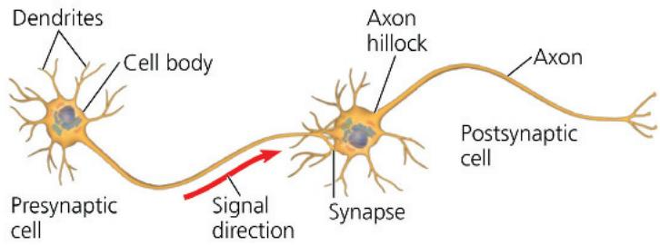

\- A central nervous system (CNS) and a peripheral nervous system (PNS) together process information in up to three stages: sensory input, integration, and motor output to effector cells.

How would severing an axon affect the flow of information in a neuron?

## Concept 48.2: Ion pumps and ion channels establish the resting potential of a neuron

\- The uneven distribution of positive and negative ions on either side of the plasma membrane generates a voltage difference, or membrane potential, across the plasma membrane of cells. The concentration of $Na^{+}$ is higher outside than inside; the reverse is true for $K^{+}$ . In resting neurons, the plasma membrane has many open potassium channels but few open sodium channels. Diffusion of ions, principally $K^{+}$ , through channels generates a resting potential, with the inside more negative than the outside.

Suppose you placed an isolated neuron in a solution similar to extracellular fluid and later transferred the neuron to a solution lacking any $Na^{+}$ . What change would you expect in the resting potential?

## Concept 48.3: Action potentials are the signals conducted by axons

\- Neurons have gated ion channels that open or close in response to stimuli, leading to changes in the membrane potential. An increase in the magnitude of the membrane potential is a hyperpolarization; a decrease is a depolarization. Changes in membrane potential that vary continuously with the strength of a stimulus are known as graded potentials.

\- An action potential is a brief, all-or-none reversal of membrane potential. When a graded depolarization brings the membrane potential to threshold, many voltage-gated sodium channels open, triggering an inflow of $Na^{+}$ that rapidly brings the membrane potential to a positive value. A negative membrane potential is restored by the inactivation of sodium

channels and by the opening of many voltage-gated potassium channels, which increases $K^{+}$ outflow. A refractory period follows, corresponding to the interval when the sodium channels are inactivated.

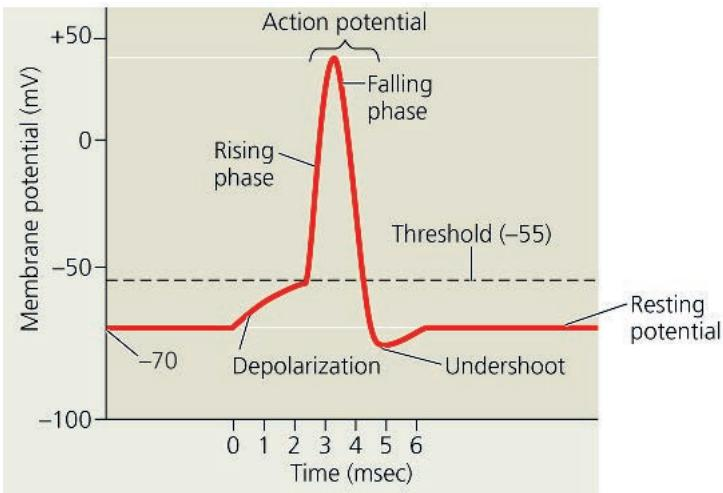

\- An action potential travels from the axon hillock to the synaptic terminals. The speed of conduction increases with the diameter of the axon and, in many vertebrate axons, with myelination. Action potentials in myelinated axons appear to jump from one node of Ranvier to the next, a process called saltatory conduction.

INTERPRET THE DATA Assuming a refractory period equal in length to the action potential (see graph above), what is the maximum frequency per unit time at which a neuron could fire action potentials?

## Concept 48.4: Neurons communicate with other cells at synapses

\- In an electrical synapse, electrical current flows directly from one cell to another. In a chemical synapse, depolarization causes synaptic vesicles to fuse with the terminal membrane and release neurotransmitter into the synaptic cleft.

\- At many synapses, the neurotransmitter binds to ligand-gated ion channels (ionotropic receptors) in the postsynaptic membrane, producing an excitatory or inhibitory postsynaptic potential (EPSP or IPSP). The neurotransmitter then diffuses out of the cleft, is taken up by surrounding cells, or is degraded by enzymes. A single neuron has many synapses on its dendrites and cell body. Temporal and spatial summation of EPSPs and IPSPs at the axon hillock determine whether a neuron generates an action potential.

\- Different receptors for the same neurotransmitter produce different effects. Metabotropic neurotransmitter receptors activate signal transduction pathways, which can produce long-lasting changes in postsynaptic cells. Major neurotransmitters include acetylcholine; the amino acids GABA, glutamate, and glycine; biogenic amines; neuropeptides; and gases such as NO.

## Test Your Understanding

For more multiple-choice questions, go to the Practice Test (eTextbook only).

## Levels 1-2: Remembering/Understanding

1. What happens when a resting neuron's membrane depolarizes? (A) There is a net diffusion of $\mathrm{Na}^{+}$ out of the cell.

(B) The equilibrium potential for $K^{+}(E_{K})$ becomes more positive.

(C) The neuron's membrane voltage becomes more positive.

(D) The cell's inside becomes more negative than the outside.

2. A common feature of action potentials is that they

(A) cause the membrane to hyperpolarize and then depolarize.

(B) can undergo temporal and spatial summation.

(C) are triggered by a depolarization that reaches threshold.

(D) move at the same speed along all axons.

3. Where are neurotransmitter receptors located?

(A) the nuclear membrane

(B) the nodes of Ranvier

(C) the postsynaptic membrane

(D) synaptic vesicle membranes

## Levels 3-4: Applying/Analyzing

4. Why are action potentials usually conducted in one direction? (A) Ions can flow along the axon in only one direction.

(B) The brief refractory period prevents reopening of voltage-gated $Na^{+}$ channels.

(C) The axon hillock has a higher membrane potential than the terminals of the axon.

(D) Voltage-gated channels for both $Na^{+}$ and $K^{+}$ open in only one direction.

5. Which of the following is the most direct result of depolarizing the presynaptic membrane of an axon terminal?

(A) Voltage-gated calcium channels in the membrane open.

(B) Synaptic vesicles fuse with the membrane.

(C) Ligand-gated channels open, allowing neurotransmitters to enter the synaptic cleft.

(D) An EPSP or IPSP is generated in the postsynaptic cell.

6. Suppose a particular neurotransmitter causes an IPSP in postsynaptic cell X and an EPSP in postsynaptic cell Y. A likely explanation is that

(A) the threshold value in the postsynaptic membrane for cell X is different from that for cell Y.

(B) the axon of cell X is myelinated, but that of cell Y is not.

(C) only cell Y produces an enzyme that terminates the activity of the neurotransmitter.

(D) cells X and Y express different receptor molecules for this particular neurotransmitter.

## Levels 5-6: Evaluating/Creating

7. WHAT IF? Ouabain, a plant substance used in some cultures to poison hunting arrows, disables the sodium-potassium pump. What change in the resting potential would you expect to see if you treated a neuron with ouabain? Explain.

8. WHAT IF? If a drug mimicked the activity of GABA in the CNS, what general effect on behavior might you expect? Explain.

9. DRAW IT Suppose a researcher inserts electrodes at two positions along the middle of an axon dissected out of a squid. By applying a depolarizing stimulus, the researcher brings the plasma membrane at both positions to threshold. Using the drawing below as a model, create one or more drawings that illustrate where each action potential would terminate.

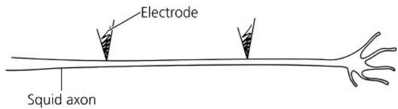  
Squid axon

10. EVOLUTION CONNECTION An action potential is an all-or-none event. This on/off signaling is an evolutionary adaptation of animals that must sense and act in a complex environment. Imagine a nervous system that only uses graded potentials, with the amplitude depending on the size of the stimulus. What type of channel would be absent from axons found in this nervous system? Describe what evolutionary advantage signaling via action potentials might have over this hypothetical mode of signaling relying exclusively on graded potentials.

11. SCIENTIFIC INQUIRY From what you know about action potentials and synapses, propose two hypotheses for how various anesthetics might block pain.

12. WRITE ABOUT A THEME: ORGANIZATION In a short essay (100–150 words), describe how the structure and electrical properties of vertebrate neurons reflect similarities and differences with other animal cells.

## 13. SYNTHESIZE YOUR KNOWLEDGE

This diamondback rattlesnake (Crotalus atrox) alerts enemies to its presence with a rattle—a set of modified scales at the tip of its tail. Describe the roles of gated ion channels in initiating and moving a signal along the nerve from the snake's head to its tail and then to the muscle that shakes the rattle.

For selected answers, see Appendix A.

