# 第49章 Nervous Systems

<!-- 章节边界按正文内容恢复；原始 MinerU 内容保留如下。 -->

# Nervous Systems

## Key Concepts

49.1 Nervous systems consist of circuits of neurons and supporting cells

49.2 The vertebrate brain is regionally specialized

49.3 The cerebral cortex controls voluntary movement and cognitive functions

49.4 Changes in synaptic connections underlie memory and learning

49.5 Many nervous system disorders can now be explained in molecular terms

## Study Tip

Think in pairs: Regional specialization involves many examples of paired structures or circuits. Fill in the complementary or reciprocal functions of these pairs to help you understand their roles in the brain or nervous system.

<table><tr><td>Structure A/Function</td><td>Structure B/Function</td></tr><tr><td>CNS (brain and spinal cord)Integration of information</td><td>PNS (ganglia and peripheral nerves)Transfer of information to/from CNS</td></tr><tr><td>Sympathetic division of autonomic nervous system</td><td>Parasympathetic division of autonomic nervous system</td></tr><tr><td>Left hemisphere of brain</td><td>Right hemisphere of brain</td></tr><tr><td>Hippocampus (role in memory)</td><td>Cerebral cortex (role in memory)</td></tr></table>

  
Figure 49.1 Neuroscientists engineered mice to express a random combination of four fluorescent proteins in each brain cell. The result, shown here, is a “brainbow,” with each neuron displaying one of 90 different color combinations. This rainbow technology holds promise for studying particular pathways within the mouse brain. Ultimately, however, we want to understand our own brains, which contain an estimated $10^{11}$ (100 billion) neurons and $10^{14}$ (100 trillion) connections.

## How are billions of neurons organized to perform complex tasks?

Regional specialization: Complex tasks, such as responding to a spoken question, involve the stepwise functions of different brain regions.

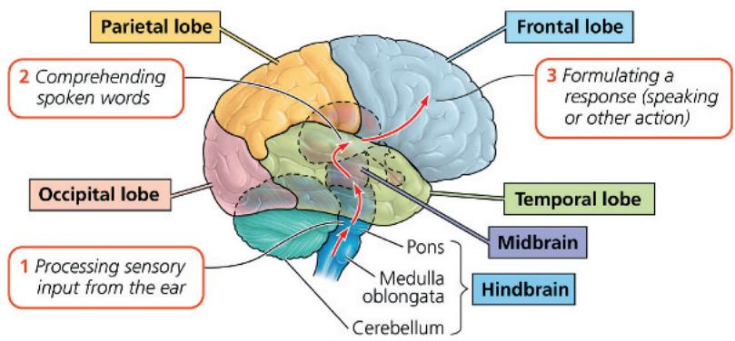

Memory formation: Information is stored by reinforcing patterns of active connections (synapses) among particular neurons.  
  
Synapses that are active in synchrony (A and B) are strengthened. Synapses that are not part of an active circuit (C) are weakened or lost.

(a) A hydra contains individual neurons (purple) organized in a diffuse nerve net. (b–h) Animals with more sophisticated nervous systems contain groups of neurons (blue) organized into nerves and often ganglia and a brain.

# Concept 49.1: Nervous systems consist of circuits of neurons and supporting cells

The ability to sense and react originated billions of years ago in prokaryotes, enhancing survival and reproductive success in changing environments. Later in evolution, modification of simple recognition and response processes provided a basis for communication between cells in an animal body. By the time of the Cambrian explosion, more than 500 million years ago (see Concept 32.2), specialized nervous systems had appeared that enable animals to sense their surroundings and respond rapidly.

Hydras, jellies, and other cnidarians are the simplest animals with nervous systems. In most cnidarians, interconnected neurons form a diffuse nerve net (Figure 49.2a), which controls the contraction and expansion of the gastrovascular cavity. In more complex animals, the axons of multiple neurons are often bundled together, forming nerves. These fibrous structures channel information flow along specific routes through the nervous system. For example, sea stars have a set of radial nerves connecting to a central nerve ring (Figure 49.2b). Within

each arm of a sea star, the radial nerve is linked to a nerve net from which it receives input and to which it sends signals that control muscle contraction.

Animals with elongated, bilaterally symmetrical bodies have even more specialized nervous systems. In particular, they exhibit cephalization, an evolutionary trend toward a clustering of sensory neurons and interneurons at the anterior (front) end of the body. Nerves that extend toward the posterior (rear) end enable these anterior neurons to communicate with cells elsewhere in the body.

In many animals, neurons that carry out integration form a central nervous system (CNS), and neurons that carry information into and out of the CNS form a peripheral nervous system (PNS). In nonsegmented worms, such as the planarian in Figure 49.2c, a small brain and longitudinal nerve cords constitute the simplest clearly defined CNS. In certain nonsegmented worms, the entire nervous system is constructed from only a small number of cells, as in the case of the nematode Caenorhabditis elegans. In this species, an adult worm (hermaphrodite) has exactly 302 neurons, no more and no fewer. More complex invertebrates, such as segmented worms (Figure 49.2d) and arthropods (Figure 49.2e), have many more neurons. Their behavior is regulated by more complicated brains and by ventral nerve cords containing ganglia, segmentally arranged clusters of neurons that act as relay points in transmitting information.

Within an animal group, nervous system organization often correlates with lifestyle. Among the molluscs, for example,

Figure 49.2 Nervous system organization.  

sessile and slow-moving species, such as clams and chitons, have relatively simple sense organs and little or no cephalization (Figure 49.2f). In contrast, active predatory molluscs, such as octopuses and squids (Figure 49.2g), have the most sophisticated nervous systems of any invertebrate. With their large, image-forming eyes and a brain containing millions of neurons, octopuses can learn to discriminate between visual patterns and to perform complex tasks, such as unscrewing a jar to feed on its contents.

In vertebrates such as a salamander (Figure 49.2h) or human (Figure 49.3), the brain and the spinal cord form the CNS; nerves and ganglia are the key elements of the PNS. Regional specialization is a hallmark of both systems, as we will see throughout this chapter.

## Organization of the Vertebrate Nervous System

During embryonic development in vertebrates, the central nervous system develops from the hollow dorsal nerve cord—a hallmark of chordates (see Figure 34.3). The cavity of the nerve cord gives rise to the narrow central canal of the spinal cord as well as the ventricles of the brain. Both the canal and ventricles fill with cerebrospinal fluid, which is formed in the brain by filtering

Figure 49.3 The vertebrate nervous system.

The central nervous system consists of the brain and spinal cord (yellow). Left-right pairs of cranial nerves, spinal nerves, and ganglia make up most of the peripheral nervous system (dark gold).

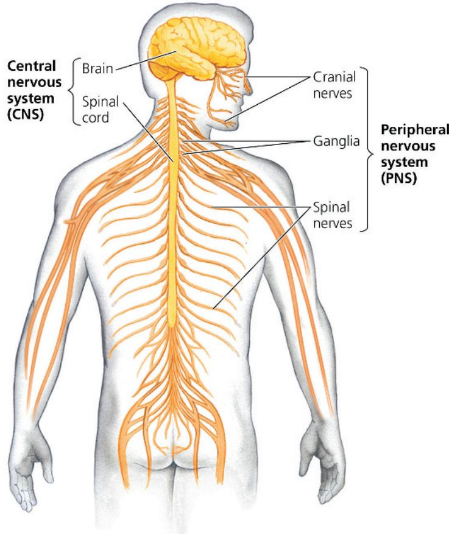

arterial blood (Figure 49.4). The cerebrospinal fluid supplies the CNS with nutrients and hormones and carries away wastes, circulating through the ventricles and central canal before draining into the veins.

In addition to fluid-filled spaces, the brain and spinal cord have gray and white matter. Gray matter is primarily made up of the dendrites, cell bodies, and axon endings of neurons. White matter consists of myelinated axons. In the spinal cord, gray matter forms the inner layer, where signals pass between CNS neurons and PNS sensory or motor neurons. In the brain, gray matter is predominantly located in the outer layer, where signaling between neurons functions in learning, feeling emotions, processing sensory information, and generating commands.

In vertebrates, the spinal cord runs lengthwise inside the vertebral column, known as the spine. The spinal cord conveys information to and from the brain and generates basic patterns of locomotion. It also acts independently of the brain as part of the simple nerve circuits that produce reflexes, the body's automatic responses to certain stimuli.

Reflexes protect the body by providing rapid, involuntary responses to particular stimuli. Reflexes are rapid because sensory information is used to activate motor neurons without the information first having to travel from the spinal cord to the brain and back. If you accidentally put your hand on a hot burner, a reflex jerks your hand back even before your brain processes pain. Similarly, the knee-jerk reflex provides an immediate protective response when you pick up an unexpectedly heavy object. If your legs buckle, the tension across your knees triggers contraction of your thigh muscle (quadriceps), helping you stay upright and support the load. During a physical exam, your doctor may trigger the knee-jerk reflex with a triangular mallet to help assess nervous system function (Figure 49.5).

Figure 49.4 Ventricles, gray matter, and white matter. Ventricles deep in the brain's interior contain cerebrospinal fluid. In the cerebrum, most of the gray matter is on the surface, surrounding the white matter.  

## Figure 49.5 The knee-jerk reflex.

Many neurons are involved in this reflex, but for simplicity only a few neurons are shown.

MAKE CONNECTIONS Using the nerve signals to the hamstring and quadriceps in this reflex as an example, propose a model for regulation of smooth muscle activity in the esophagus during the swallowing reflex (see Figure 41.9).

For suggested answer, see Appendix A.

② Sensors detect a sudden stretch in the quadriceps, and sensory neurons convey the information to the spinal cord.

3 In response to signals from the sensory neurons, motor neurons convey signals to the quadriceps, causing it to contract and jerking the lower leg forward.

## The Peripheral Nervous System

The PNS transmits information to and from the CNS and plays a large role in regulating an animal's movement and its internal environment (Figure 49.6). Sensory information reaches the CNS along PNS neurons designated as afferent (from the Latin, meaning "to carry toward"). Following information processing within the CNS, instructions then travel to muscles, glands, and endocrine cells along PNS neurons designated as efferent (from the Latin, meaning "to carry away"). Note that most nerves are bundles of both afferent and efferent neurons.

The PNS has two efferent components: the motor system and the autonomic nervous system (see Figure 49.8). The neurons of the motor system carry signals to skeletal muscles. Motor control can be voluntary, as when you raise your hand to ask a question, or involuntary, as in the knee-jerk reflex controlled by the spinal cord. In contrast, regulation of smooth muscles, cardiac muscles, and glands by the three divisions of the autonomic nervous system is generally involuntary. The sympathetic and parasympathetic divisions coordinate the activity of many body systems, as we will discuss shortly. The third division, the enteric nervous system, is a network of afferent and efferent neurons controlling the organs of the digestive system. While it is influenced by the sympathetic and parasympathetic divisions and sends sensory information to the brain, the enteric nervous system can also act independently of the CNS.

Figure 49.6 Functional hierarchy of the vertebrate peripheral nervous system.  
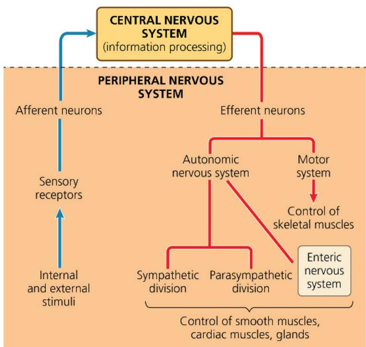

Figure 49.7 The parasympathetic and sympathetic divisions of the autonomic nervous system. Most pathways in each division involve two neurons connecting the CNS to target organs. The axon of the first neuron extends from a cell body in the CNS to a set of PNS neurons whose cell bodies are clustered into a ganglion (plural, ganglia). The axons of these PNS neurons transmit instructions to internal organs, where they form synapses with smooth muscle, cardiac muscle, or gland cells.

Homeostasis often relies on cooperation between the motor and autonomic nervous systems. In response to a drop in body temperature, for example, the hypothalamus signals the motor system to cause shivering, which increases heat production. At the same time, the hypothalamus signals the autonomic nervous system to constrict surface blood vessels, reducing heat loss.

The sympathetic and parasympathetic divisions of the autonomic nervous system have largely antagonistic (opposite) functions in regulating organ function (Figure 49.7). Activation of the sympathetic division prepares the animal for physical or mental challenges (“fight or flight”). For example, the heart beats faster, digestion is inhibited, the liver converts glycogen to glucose, and the adrenal medulla increases secretion of epinephrine (adrenaline). Activation of the parasympathetic division generally causes opposite responses that promote calming and a return to self-maintenance functions (“rest and digest”). Thus, heart rate decreases, digestion is enhanced, and glycogen production increases. However, in regulating reproductive activity, a function that is not homeostatic, the parasympathetic division complements rather than antagonizes the sympathetic division, as shown at the bottom of Figure 49.7.

The two divisions differ not only in overall function but also in organization and signals released. Parasympathetic nerves exit the

CNS at the base of the brain or spinal cord and form synapses in ganglia near or within an internal organ. In contrast, sympathetic nerves typically exit the CNS midway along the spinal cord and form synapses in ganglia located just outside of the spinal cord.

In both the sympathetic and parasympathetic divisions, the pathway for information flow typically involves a preganglionic and a postganglionic neuron. The preganglionic neurons have cell bodies in the CNS and release acetylcholine as a neurotransmitter (see Concept 48.4). In the case of the postganglionic neurons, those of the parasympathetic division release acetylcholine, whereas nearly all their counterparts in the sympathetic division release norepinephrine. It is this difference in neurotransmitters that enables the sympathetic and parasympathetic divisions to bring about opposite effects in organs such as the lungs, heart, intestines, and bladder. A comparison of these pathways in the autonomic nervous system, along with a motor system pathway, is shown in Figure 49.8, on the next page.

## Glia

The nervous systems of vertebrates and most invertebrates include not only neurons but also glial cells, or glia. The Schwann cells that myelinate axons in the PNS are an example of glia, as are

(b) Autonomic nervous system

Figure 49.8 Comparison of pathways in the motor and autonomic nervous systems.  
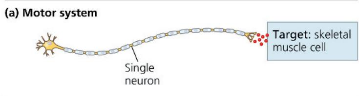

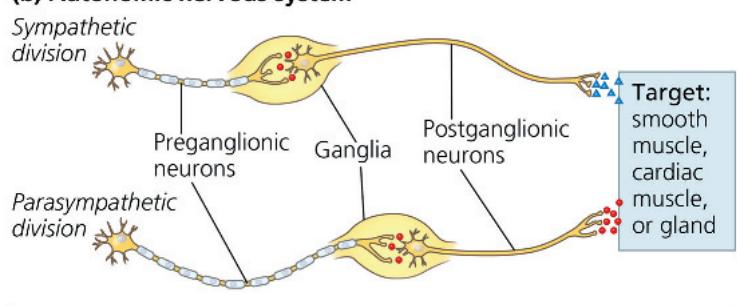  
Key to neurotransmitters • Acetylcholine ▲ Norepinephrine

oligodendrocytes, their counterparts in the CNS. Figure 49.9 provides an overview of the major types of glia in the adult vertebrate and the ways in which they nourish, support, and regulate the functioning of neurons.

In embryos, two types of glia play essential roles in the development of the nervous system: radial glia and astrocytes.

Radial glia form tracks along which newly formed neurons migrate from the neural tube, the structure that gives rise to the CNS (see Figure 47.14). Later, astrocytes that are adjacent to brain capillaries participate in the formation of the blood-brain barrier, a filtering mechanism that prevents many substances in the blood from entering the CNS. Both radial glia and astrocytes can also act as stem cells, which undergo unlimited cell divisions to self-renew and to form more specialized cells.

## Concept Check 49.1

1. Which division of the autonomic nervous system would likely be activated if a student learned that an exam she had forgotten about would start in 5 minutes? Explain your answer.

2. WHAT IF? Suppose a person had an accident that severed a small nerve required to move some of the fingers of the right hand. Would you also expect an effect on sensation from those fingers?

3. MAKE CONNECTIONS Most tissues regulated by the autonomic nervous system receive both sympathetic and parasympathetic input from postganglionic neurons. Responses are typically local. In contrast, the adrenal medulla receives input only from the sympathetic division and only from preganglionic neurons, yet responses are observed throughout the body. Explain why (see Figure 45.19).

For suggested answers, see Appendix A.

Figure 49.9 Glia in the vertebrate nervous system.  
  
Ependymal cells line the ventricles of the brain and have cilia that promote circulation of the cerebrospinal fluid that fills these compartments.  
Microglia are immune cells in the CNS that protect against pathogens.

Astrocytes (from the Greek astron, star) have numerous functions in the CNS. They facilitate information transfer, regulate extracellular ion concentrations, promote blood flow to neurons, help form the blood-brain barrier, and act as stem cells to replenish certain neurons.

Oligodendrocytes myelinate axons in the CNS. Myelination greatly increases the conduction speed of action potentials.

Schwann cells myelinate axons in the PNS.

# Concept 49.2: The vertebrate brain is regionally specialized

We turn now to the vertebrate brain, which has three major regions: the forebrain, midbrain, and hindbrain (shown here for a ray-finned fish).

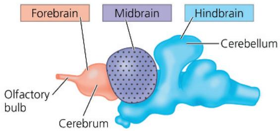

Each region is specialized in function. The forebrain, which contains the olfactory bulb and cerebrum, has activities that include processing of olfactory input (smells), regulation of sleep, learning, and any complex processing. The midbrain, located centrally in the brain, coordinates routing of sensory input. The hindbrain, part of which forms the cerebellum, controls involuntary activities, such as blood circulation, and coordinates motor activities, such as locomotion.

EVOLUTION Comparing vertebrates across a phylogenetic tree, we see that the relative sizes of particular brain regions vary (Figure 49.10). Furthermore, these size differences reflect

differences in the importance of particular brain functions. Consider, for example, ray-finned fishes, which explore their environment using olfaction, vision, and a lateral line system that detects water currents, electrical stimuli, and body position. The olfactory bulb, which detects scents in the water, is relatively large in these fishes. So is the midbrain, which processes input from the visual and lateral line systems. In contrast, the cerebrum, required for complex processing and learning, is relatively small.

The correlation between the size and function of brain regions can also be observed by considering the cerebellum. Free-swimming ray-finned fishes, such as the tuna, control movement in three dimensions in the open water and have a relatively large cerebellum. In comparison, the cerebellum is much smaller in species that don't swim actively, such as the lamprey. Evolution has thus resulted in a close match of structure to function, with the size of particular brain regions correlating with their importance for that species in nervous system function and, hence, species survival and reproduction.

If one compares birds and mammals with groups that diverged from the common vertebrate ancestor earlier in evolution, two trends are apparent. First, the forebrain of birds and mammals occupies a larger fraction of the brain than it does in amphibians, fishes, and other vertebrates. Second, birds and mammals have much larger brains relative to body size than do other groups. Indeed, the ratio of brain size to body weight for birds and mammals is ten times larger than that for their evolutionary ancestors. These differences in both overall brain size and the relative size of the forebrain reflect the greater capacity of birds and mammals for cognition and higher-order reasoning, traits we will return to later in this chapter.

Figure 49.10 Vertebrate brain structure and evolution.

These examples of vertebrate brains are drawn to the same overall dimensions to highlight differences in the relative size of major structures. These differences in relative size, which arose over the course of vertebrate evolution, correlate with the importance of particular brain functions for particular vertebrate groups.

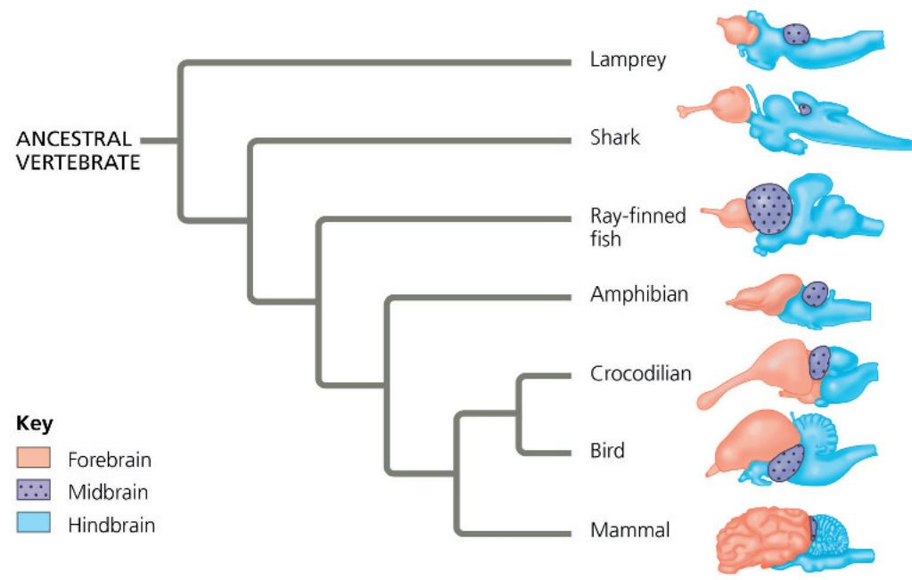

In the case of humans, the 100 billion neurons in the brain make 100 trillion connections. How are so many cells and links organized into circuits and networks that can perform highly sophisticated information processing, storage, and retrieval? In addressing this question, let's begin with Figure 49.11, on the next two pages, which explores the overall architecture of the human brain. This key figure describes the structure and function of the four main brain regions: the brainstem, consisting of the midbrain, pons, and medulla oblongata; the diencephalon, consisting of the hypothalamus and thalamus; the cerebellum; and the cerebrum. You can use this figure to trace how brain structures arise during embryonic development; as a reference for their size, shape, and location in the adult brain; and as an introduction to their best-understood functions.

## Exploring the Organization of the Human Brain

## Figure 49.11

The brain is the most complex organ in the human body. Surrounded by the thick bones of the skull, the brain is divided into a set of distinctive structures, some of which are visible in the magnetic resonance image (MRI) of an adult's head shown at right. The diagram below traces the development of these structures in the embryo. Their major functions are explained in the main text of the chapter.

## Human Brain Development

As a human embryo develops, the neural tube forms three anterior bulges—the forebrain, midbrain, and hindbrain—that together produce the adult brain. The midbrain and portions of the hindbrain give rise to the brainstem, a stalk that joins with the spinal cord at the base of the brain. The rest of the hindbrain gives rise to the cerebellum, which lies behind the brainstem. Meanwhile, the forebrain develops into the diencephalon, including the neuroendocrine tissues of the brain, and the telencephalon, which becomes the cerebrum. Rapid, expansive growth of the telencephalon during the second and third months causes the outer portion, or cortex, of the cerebrum to extend over and around much of the rest of the brain.

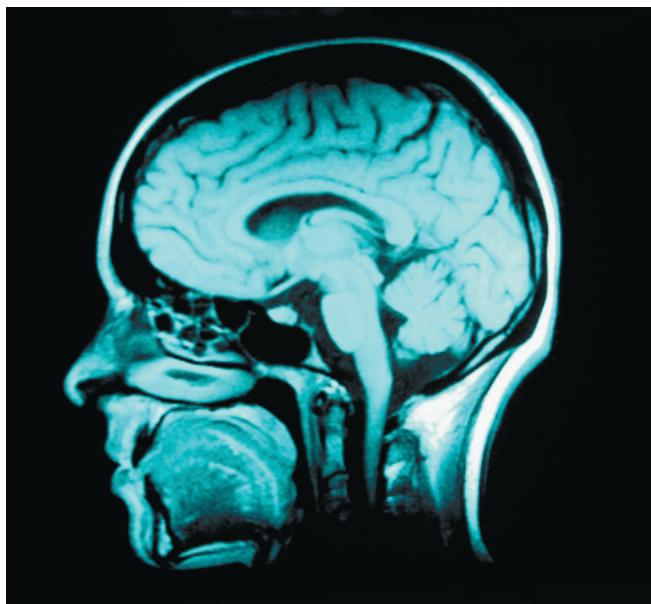

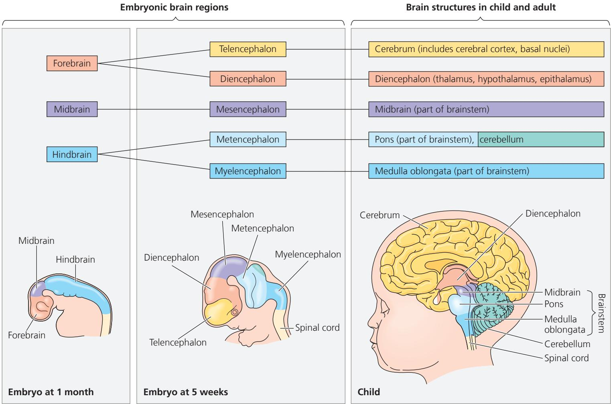

## The Cerebrum

The cerebrum controls skeletal muscle contraction and is the center for learning, emotion, memory, and perception. It is divided into right and left cerebral hemispheres. The outer layer of the cerebrum is called the cerebral cortex and is vital for

perception, voluntary movement, and learning
The left side of the cerebral cortex receives information from, and controls the movement of, the right side of the body, and vice versa. A thick band of axons known as the corpus callosum enables the right and left cerebral cortices to communicate. Deep within the white matter, clusters of neurons called basal nuclei serve as centers for planning and learning movement sequences. Damage to these sites during fetal development can result in cerebral palsy, a disorder resulting from a disruption in the transmission of motor commands to the muscles.

## The Cerebellum

Left cerebral hemisphere

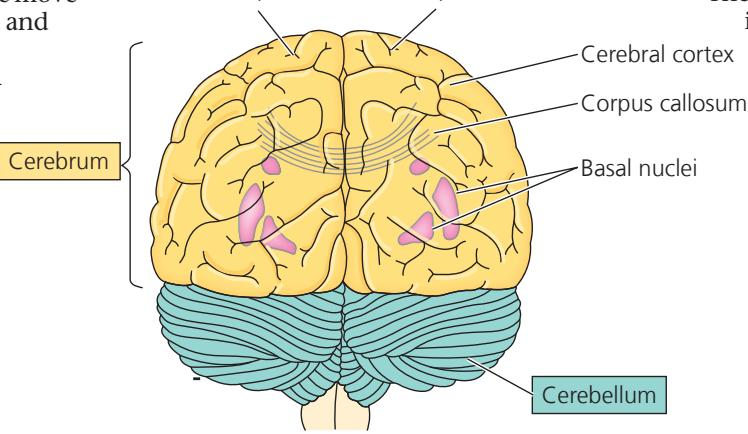  
Adult brain viewed from the rear

Right cerebral hemisphere

The cerebellum coordinates movement and balance and helps in learning and remembering motor skills. The cerebellum receives sensory information about the positions of the joints and the lengths of the muscles, as well as input from the auditory

(ing) and visual systems. It also monitors motor commands issued by the cerebrum.
The cerebellum integrates this information as it carries out
cral cortex coordination and error
s callosum checking during motor and perceptual functions.
nuclei Hand-eye coordination is an example of cerebellar control; if the cerebellum is damaged, the eyes can follow a moving object, but they will not stop at the same place as the object. Hand movement toward the object will also be erratic.

## The Diencephalon

The diencephalon gives rise to the thalamus, hypothalamus, and epithalamus. The thalamus is the main input center for sensory information going to the cerebrum. Incoming information from all the senses, as well as from the cerebral cortex, is

appropriate cerebral centers for further processing. The thalamus is formed by two masses, each roughly the size and shape of a walnut. A much smaller structure, the

hypothalamus, constitutes a control center that includes the body's thermostat as well as the central

## Diencephalon

Thalamus—
Pineal gland—
Hypothalamus-
Pituitary gland-

biological clock. The hypothalamus regulates hunger and thirst, plays a role in sexual and mating behaviors, and initiates the fight-or-flight response. The hypothalamus is also the source of posterior pituitary $\text{Spirin}$ hormones and of releasing hormones that act on the anterior pituitary. The epithalamus includes the pineal gland, the source of melatonin.

## The Brainstem

The brainstem consists of the midbrain, the pons, and the medulla oblongata (commonly called the medulla). The midbrain receives and integrates several types of sensory information and sends it to specific regions of the forebrain. All sensory axons involved in hearing

either terminate in the midbrain or pass through it on their way to the cerebrum. In addition, the midbrain coordinates visual reflexes, such as the peripheral vision reflex: The head turns toward an object approaching from the side without the brain having formed an image of the object.
Brainstem
Midbrain
Pons
Medulla oblongata
A major function of the pons and medulla is to transfer information between the PNS and the

midbrain and forebrain. The pons and medulla also help coordinate large-scale body movements, such as

Training and climbing. Most actions that carry instructions about these movements cross from one side of the CNS to the other as they pass through the medulla. As a result, the right side of the brain controls much of the movement of the left side of the body, and vice versa. An additional function of the medulla is the control of several automatic, homeostatic functions, including breathing, heart and blood vessel activity, swallowing, vomiting, and digestion. The pons also participates in some of these activities; for example, it regulates the breathing centers in the medulla.

To learn more about how particular brain structure and brain organization overall relate to brain function in humans, we'll first consider activity cycles of the brain and the physiological basis of emotion. Then, in Concept 49.3, we'll shift our attention to regional specialization within the cerebrum.

## Arousal and Sleep

If you've ever drifted off to sleep while listening to a lecture (or reading a book), you know that your attentiveness and mental alertness can change rapidly. Such transitions are regulated by the brainstem and cerebrum, which control arousal and sleep. Arousal is a state of awareness of the external world. Sleep is a state in which external stimuli are received but not consciously perceived.

Contrary to appearances, sleep is an active state, at least for the brain. By placing electrodes at multiple sites on the scalp, we can record patterns of electrical activity called brain waves in an electroencephalogram (EEG). These recordings reveal that brain wave frequencies change as the brain progresses through distinct stages of sleep.

Some animals have evolutionary adaptations that allow for substantial activity during sleep. Bottlenose dolphins, for example, swim while sleeping, rising to the surface to breathe air on a regular basis. How is this possible? As in other mammals, the forebrain is physically and functionally divided into two halves, the right and left hemispheres. Noting that dolphins sleep with one eye open and one closed, researchers hypothesized that only one side of the brain is asleep at a time. EEG recordings from each hemisphere of sleeping dolphins support this hypothesis (Figure 49.12).

Although sleep is essential for survival, we still know very little about its function. One hypothesis is that sleep and dreams are involved in consolidating learning and memory. Evidence supporting this hypothesis includes the finding that test subjects who are kept awake for 36 hours have a reduced ability to remember when particular events occurred, even if they first “perk up” with caffeine. Other experiments show that regions of

## Figure 49.12 Dolphins can be asleep and awake at the same time.

EEG recordings were made separately for the two sides of a dolphin's brain. At each time point, low-frequency activity characteristic of sleep was recorded in one hemisphere while higher-frequency activity typical of being awake was recorded in the other hemisphere.

<table><tr><td>Location</td><td>Time: 0 hours</td><td>Time: 1 hour</td></tr><tr><td>Left hemisphere</td><td></td><td></td></tr><tr><td>Right hemisphere</td><td></td><td></td></tr></table>

## Key

Low-frequency waves characteristic of sleep

High-frequency waves characteristic of wakefulness

## Figure 49.13 The reticular formation.

Once thought to consist of a single diffuse network of neurons, the reticular formation is now recognized as many distinct clusters of neurons. These clusters function in part to filter sensory input (solid blue arrows), blocking familiar and repetitive information that constantly enters the nervous system before sending the filtered input to the cerebral cortex (dashed green arrows).

  
Input from touch, — pain, and temperature receptors

the brain that are activated during a learning task can become active again during sleep.

Arousal and sleep are controlled in part by the reticular formation, a diffuse network formed primarily by neurons in the midbrain and pons (Figure 49.13). These neurons control the timing of sleep periods characterized by rapid eye movements (REMs) and by vivid dreams. Sleep is also regulated by the biological clock, discussed next, and by regions of the forebrain that regulate sleep intensity and duration.

## Biological Clock Regulation

Cycles of sleep and wakefulness are an example of a circadian rhythm, a daily cycle of biological activity. Such cycles, which occur in organisms ranging from bacteria to humans, rely on a biological clock, a molecular mechanism that directs periodic gene expression and cellular activity. Although biological clocks are typically synchronized to the cycles of light and dark in the environment, they can maintain a roughly 24-hour cycle even in the absence of environmental cues (see Figure 40.9). For example, in a constant environment humans exhibit a sleep/wake cycle of 24.2 hours, with very little variation among individuals.

What normally links the biological clock to environmental cycles of light and dark in an animal's surroundings? In mammals, circadian rhythms are coordinated by clustered neurons in the hypothalamus (see Figure 49.11). These neurons form a structure called the SCN, which stands for suprachiasmatic nucleus. (Certain clusters of neurons in the CNS are referred to as "nuclei.") In response to sensory information from the eyes, the SCN acts as a pacemaker, synchronizing the biological clock in cells throughout the body to the natural cycles of day length. In the Scientific Skills Exercise, you can interpret data from an experiment and propose experiments to test the role of the SCN in hamster circadian rhythms.

# Scientific Skills Exercise Designing an Experiment Using Genetic Mutants

Does the SCN Control the Circadian Rhythm in Hamsters? By surgically removing the SCN from laboratory mammals, scientists demonstrated that the SCN is required for circadian rhythms. Those experiments did not, however, reveal whether circadian rhythms originate in the SCN. To answer this question, researchers performed an SCN transplant experiment on wild-type and mutant hamsters (Mesocricetus auratus). Whereas wild-type hamsters have a circadian cycle lasting about 24 hours in the absence of external cues, hamsters that are homozygous for the $\tau(\text{tau})$ mutation have a cycle lasting only about 20 hours. In this exercise, you will evaluate the design of this experiment and propose additional experiments to gain further insight.

How the Experiment Was Done The researchers surgically removed the SCN from wild-type and $\tau$ hamsters. Several weeks later, each of these hamsters received a transplant of an SCN from a hamster of the opposite genotype. To determine the periodicity of rhythmic activity for the hamsters before the surgery and after the transplants, the researchers measured activity levels over a three-week period. They plotted the data collected for each day in the manner shown in Figure 40.9a and then calculated the circadian cycle period.

Data from the Experiment In 80% of the hamsters in which the SCN had been removed, transplanting an SCN from another hamster restored rhythmic activity. For hamsters in which an SCN transplant restored a circadian rhythm, the net effect of the two procedures (SCN removal and replacement) on the circadian cycle period is graphed at the upper right. Each red line connects the two data points for an individual hamster.

## INTERPRET THE DATA

1. In a controlled experiment, researchers manipulate one variable at a time. (a) What was the variable manipulated in this study? (b) Why did the researchers use more than one hamster for each procedure? (c) What traits of the individual hamsters would likely have been held constant among the treatment groups?

## Emotions

Whereas a single structure in the brain controls the biological clock, the generation and experience of emotions depend on many brain structures, including the amygdala, hippocampus, and parts of the thalamus. As shown in Figure 49.14, on the next page, these structures border the brainstem in mammals and are therefore called the limbic system (from the Latin limbus, border).

One way the limbic system contributes to our emotions is by storing emotional experiences as memories that can be recalled by similar circumstances. This is why, for example, a situation that causes you to remember a frightening event can trigger a faster heart rate, sweating, or fear, even if there is currently nothing scary or threatening in your surroundings. Such storage and recall of emotional memory are especially dependent on function of the

\- Wild-type hamster
- Wild-type hamster with SCN from τ hamster

\- τ hamster
- τ hamster with SCN from wild-type hamster

  
Data from M. R. Ralph et al., Transplanted suprachiasmatic nucleus determines circadian period, Science 247:975–978 (1990).

2. For the wild-type hamsters that received $\tau$ SCN transplants, what would have been an appropriate experimental control?

3. (a) What general trends does the graph above reveal about the circadian cycle period of the transplant recipients? (b) Do the trends differ for the wild-type and $\tau$ recipients? Based on these data, what can you conclude about the role of the SCN in determining the period of the circadian rhythm?

4. (a) In 20% of the hamsters, there was no restoration of rhythmic activity following the SCN transplant. What are some possible reasons for this finding? (b) How confident are you in your conclusion about the role of the SCN based on data from 80% of the hamsters?

5. Suppose that researchers identified a mutant hamster that lacked rhythmic activity; that is, its circadian activity cycle had no regular pattern. Propose SCN transplant experiments using such a mutant along with (a) wild-type and (b) $\tau$ hamsters. Predict the results of those experiments in light of your conclusion in question 3(b).

Instructors: A version of this Scientific Skills Exercise can be assigned in Mastering Biology.

amygdala, an almond-shaped brain structure near the base of the cerebrum.

Often, generating emotion and experiencing emotion require interactions between different regions of the brain. For example, both laughing and crying involve the limbic system interacting with sensory areas of the forebrain. Similarly, structures in the forebrain attach emotional “feelings” to survival-related functions controlled by the brainstem, including aggression, feeding, and sexuality.

To study the function of the human amygdala, researchers sometimes present adult subjects with an image followed by an unpleasant experience, such as a mild electrical shock. After several trials, study participants experience autonomic arousal—as measured by increased heart rate or sweating—if they see the image again. Subjects with brain damage confined to the

Figure 49.14 The limbic system of the human brain.
This diagram shows the brain and brainstem, with the left cerebral hemisphere of the brain removed.  
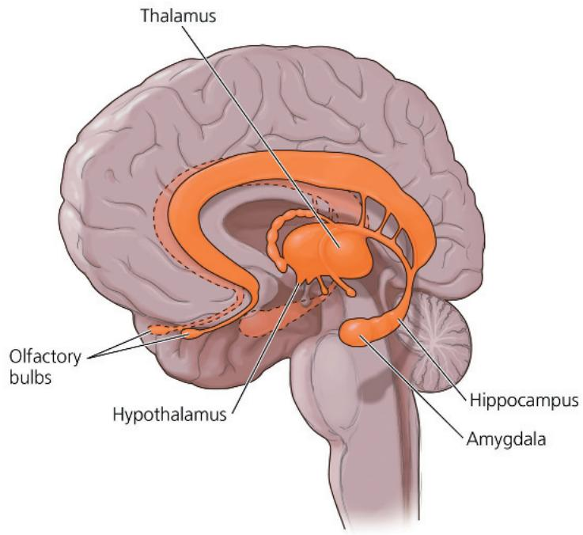

amygdala can recall the image because their explicit memory is intact. However, they do not exhibit autonomic arousal, indicating that damage to the amygdala has resulted in a reduced capacity for emotional memory.

## Functional Imaging of the Brain

In recent years, scientists have begun studying the amygdala and other brain structures with functional imaging techniques. By scanning the brain while the subject performs a particular function, such as forming a mental image of a person's face, researchers are able to match particular functions with activity in specific brain areas.

Several approaches are available for functional imaging. The first widely used technique was positron-emission tomography (PET), in which injection of radioactive glucose enables a display of metabolic activity. Today, the most commonly used approach is functional magnetic resonance imaging (fMRI). In fMRI, a subject lies with his or her head in the center of a large, doughnut-shaped magnet. Brain activity is detected by an increase in the flow of oxygen-rich blood into a particular region.

In one experiment using fMRI, researchers mapped brain activity while subjects listened to music that they described as sad or happy (Figure 49.15). The findings were striking: Different regions of the brain were associated with the experience of each of these contrasting emotions. Subjects who heard sad music had increased activity in the amygdala. In contrast, listening to happy music led to increased activity in the nucleus accumbens, a brain structure important for the perception of pleasure.

Functional imaging has an ever-increasing number of applications. Hospitals use fMRI to, for example, monitor recovery from stroke, map abnormalities in migraine headaches, and increase the effectiveness of brain surgery.

Figure 49.15 Functional imaging in the working brain.

These images resulted from using fMRI to reveal brain activity associated with music that listeners described as happy or sad. (Each view shows activity in a single plane of the brain, as seen from above.)

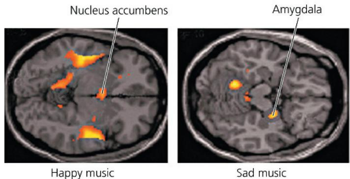  
VISUAL SKILLS The two images reveal activity in different horizontal planes through the brain. How can you tell this from the two photographs? What can you conclude about the location of the nucleus accumbens and the amygdala?  
For suggested answer, see Appendix A.

## Concept Check 49.2

1. When you wave your right hand, what part of your brain initiates the action?

2. People who are inebriated have difficulty touching their nose with their eyes closed. Which brain region does this observation indicate is one of those impaired by alcohol?

3. WHAT IF? Suppose you examine two individuals with CNS damage. In one individual, the damage has resulted in a coma (a prolonged state of unconsciousness). In the other individual, it has caused paralysis (a loss of skeletal muscle function throughout the body). Relative to the position of the midbrain and pons, where is the likely site of damage in each individual? Explain.

For suggested answers, see Appendix A.

## Concept 49.3: The cerebral cortex controls voluntary movement and cognitive functions

We turn now to the cerebrum, the part of the brain essential for language, cognition, memory, consciousness, and awareness of our surroundings. As shown in Figure 49.11, the cerebrum is the largest structure in the human brain. Like the brain overall, it exhibits regional specialization. For the most part, cognitive functions reside in the cerebral cortex, the outer layer of the cerebrum. Within this cortex, sensory areas receive and process sensory information, association areas integrate the information, and motor areas transmit instructions to other parts of the body.

In discussing the location of particular functions in the cerebral cortex, neurobiologists often use four regions, or lobes, as physical landmarks. Each lobe—frontal, temporal, occipital, and parietal—is named for a nearby bone of the skull, and each is the focus of specific brain activities (Figure 49.16).

## Information Processing

Broadly speaking, the human cerebral cortex receives sensory information from two sources. Some sensory input originates in individual receptors in the hands, scalp, and elsewhere in the body. These somatic sensory, or somatosensory, receptors (from the Greek soma, body) provide information about touch, pain, pressure, temperature, and the position of muscles and limbs. Other sensory input comes from groups of receptors clustered in dedicated sensory organs, such as the eyes and nose.

Most sensory information coming into the cortex is directed via the thalamus to primary sensory areas within the brain lobes. Information received at the primary sensory areas is passed along to nearby association areas, which process particular features in the sensory input. In the occipital lobe, for instance, some groups of neurons in the primary visual area are specifically sensitive to rays of light oriented in a particular direction. In the visual association area, information related to such features is combined in a region dedicated to recognizing complex images, such as faces.

Once processed, sensory information passes to the prefrontal cortex, which helps plan actions and movement. The cerebral cortex may then generate motor commands that cause particular behaviors—moving a limb or saying hello, for example. These commands consist of action potentials produced by neurons in the motor cortex, which lies at the rear of the frontal lobe (see Figure 49.16). The action potentials travel along axons to the brainstem and spinal cord, where they excite motor neurons, which in turn excite skeletal muscle cells.

In the somatosensory cortex and motor cortex, neurons are arranged according to the part of the body that generates the sensory input or receives the motor commands (Figure 49.17).

Figure 49.16 The human cerebral cortex.

Each of the four lobes of the cerebral cortex has specialized functions, some of which are listed here. Some areas on the left side of the brain (shown here) have different functions from those on the right side (not shown).

Figure 49.17 Body part representation in the primary motor and primary somatosensory cortices. In these cross-sectional maps of the cortices, the cortical surface area devoted to each body part is represented by the relative size of that part in the cartoons.  
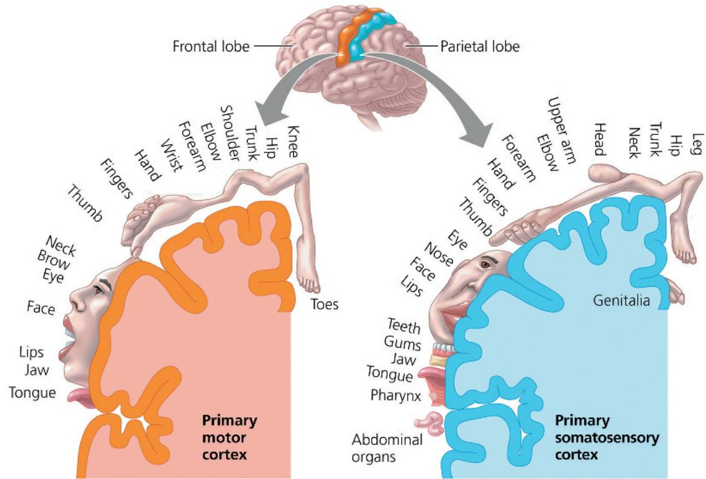  
VISUAL SKILLS What does it indicate that the hand is larger than the forearm in both parts of this figure? For suggested answer, see Appendix A.

For example, neurons that process sensory information from the legs and feet lie in the region of the somatosensory cortex closest to the midline. Neurons that control muscles in the legs and feet are located in the corresponding region of the motor cortex. Notice in Figure 49.17 that the cortical surface area devoted to each body part is not proportional to the size of the part. Instead, surface area correlates with the extent of neuronal control needed (for the motor cortex) or with the number of sensory neurons that extend axons to that part (for the somatosensory cortex). Thus, the surface area of the motor cortex devoted to the face is proportionately quite large, reflecting the extensive involvement of facial muscles in communication.

## Language and Speech

The mapping of cognitive functions within the cortex began in the 1800s when physicians studied the effects of damage to particular regions of the cortex by injuries, strokes, or tumors. Pierre Broca conducted postmortem (after death) examinations of patients who had been able to understand language but unable to speak. He discovered that many had defects in a small region of the left frontal lobe, now known as Broca's area. Karl Wernicke found that damage to a posterior portion of the left temporal lobe, now called Wernicke's area, abolished the ability to comprehend speech but not the ability to speak. PET studies have now confirmed activity in Broca's area during speech generation and Wernicke's area when speech is heard (Figure 49.18).

## Lateralization of Cortical Function

Both Broca's area and Wernicke's area are located in the left cerebral hemisphere of many (but not all) people, reflecting a greater role in language for the left side of the cerebrum than for the right side. The left hemisphere often plays a greater role than the right

Figure 49.18 Mapping language areas in the cerebral cortex.

These PET images show activity levels on the left side of one person's brain during four activities, all related to speech. Increases in activity are seen in Wernicke's area when hearing words, Broca's area when speaking words, the visual cortex when seeing words, and the prefrontal cortex when generating words (without reading them).

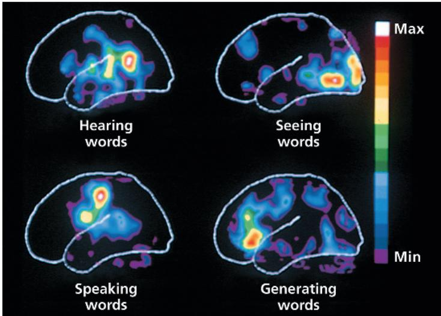

in math and logical operations. In contrast, the right hemisphere appears to dominate in the recognition of faces and patterns, spatial relations, and nonverbal thinking. This difference in function between the right and left hemispheres is called lateralization. Like many human differences, lateralization exists on a spectrum. For instance, the language processing center is found in the right hemisphere (or equally in both hemispheres) in 25% of left-handed people and in 5% of right-handed people.

The two cerebral hemispheres normally exchange information through the fibers of the corpus callosum (see Figure 49.11). Severing this connection (a treatment of last resort for the most extreme forms of epilepsy, a seizure disorder) results in a “split-brain” effect. In such patients, the two hemispheres function independently. For example, they cannot read even a familiar word that appears only in their left field of vision: The sensory information travels from the left field of vision to the right hemisphere, but cannot then reach the language centers in the left hemisphere.

## Frontal Lobe Function

In 1848, a horrific accident pointed to the role of the prefrontal cortex in temperament and decision making. Phineas Gage was the foreman of a railroad construction crew when an explosion drove an iron rod through his head. The rod, which was more than 3 cm in diameter at one end, entered his skull just below his left eye and exited through the top of his head, damaging large portions of his frontal lobe (Figure 49.19). Gage recovered, but his personality changed

Figure 49.19 Phineas Gage's skull injury.

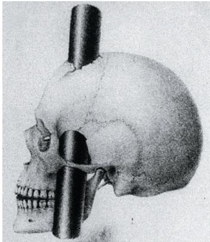

dramatically. He became emotionally detached, impatient, and erratic in his behavior, providing evidence of the role of the prefrontal cortex in temperament and decision making.

Two further sets of observations support the hypothesis that Gage's brain injury and personality change inform us about frontal lobe function. First, frontal lobe tumors cause similar symptoms: Intellect and memory seem intact, but decision making is flawed and emotional responses are diminished. Second, the same problems arise when the connection between the prefrontal cortex and the limbic system is surgically severed. (This procedure, called a frontal lobotomy, was once a common treatment for severe behavioral disorders but is no longer in use.) Together, these observations provide evidence that the frontal lobes have a substantial influence on what are called “executive functions.”

## Evolution of Cognition in Vertebrates

EVOLUTION In nearly all vertebrates, the brain has the same basic structures (see Figure 49.10). Given this uniform organization, how did a capacity for advanced cognition, the perception and reasoning that constitute knowledge, evolve in certain species? For many years researchers favored the hypothesis that higher-order reasoning in vertebrates required evolution of an extensively convoluted cerebral cortex, as is found in humans, other primates, and cetaceans (whales, dolphins, and porpoises). In humans, for example, the cerebral cortex accounts for about 80% of total brain mass.

Birds lack a convoluted cerebral cortex and were long thought to have much lower intellectual capacity than primates and cetaceans. However, recent experiments have refuted this idea: Western scrub jays (Aphelocoma californica) can remember which food items they hid first. New Caledonian crows (Corvus moneduloides) are highly skilled at making and using tools, an ability otherwise well documented only for humans and some other apes. African grey parrots (Psittacus erithacus) understand numerical and abstract concepts, such as “same” and “different” and “none.”

What brain structures enable some birds to have such sophisticated information processing? The answer appears to be a nuclear (clustered) organization of neurons within the pallium, the top or outer portion of the brain (Figure 49.20a). Note that this arrangement is different from that in the human cerebral cortex (Figure 49.20b), where six parallel layers of neurons are arranged tangential to the surface. Thus, vertebrate evolution has resulted in two different types of outer brain organization that can support complex and flexible function.

How did the bird pallium and human cerebral cortex arise during evolution? The current consensus is that the common ancestor of birds and mammals had a pallium in which neurons

Although structurally different, the (a) pallium of a songbird brain and the (b) cerebral cortex of the human brain play similar roles in higher cognitive activities and make many similar connections with other brain structures.

  
(a) Songbird brain (cross section)

  
(b) Human brain (cross section)

were organized into nuclei, as is still found in birds. Early in mammalian evolution, this clustered organization was transformed into a layered one. However, connectivity was maintained such that, for example, the thalamus relays sensory input relating to sights, sounds, and touch to the pallium in birds and to the cerebral cortex in mammals.

Sophisticated information processing depends not only on the overall organization of a brain but also on the very small-scale changes that enable learning and encode memory. We'll turn to these changes in the context of humans in the next section.

## Interview

Interview with Erich Jarvis: Studying how songbirds learn melodies (eTextbook only)

Figure 49.20 Comparison of regions for higher cognition in avian and human brains.  

## Concept Check 49.3

1. How can studying individuals with damage to a particular brain region provide insight into the normal function of that region?

2. How do the functions of Broca's area and Wernicke's area each relate to the activity of the surrounding cortex?

3. WHAT IF? If a woman with a severed corpus callosum viewed a photograph of a familiar face, first in her left field of vision and then in her right field, why would she find it difficult to put a name to the face?

For suggested answers, see Appendix A.

## Concept 49.4: Changes in synaptic connections underlie memory and learning

Formation of the nervous system occurs stepwise. First, regulated gene expression and signal transduction determine where neurons form in the developing embryo. Next, neurons compete for survival. Every neuron requires growth-supporting factors, which are produced in limited quantities by tissues that direct neuron growth. Neurons that don't reach the proper locations fail to receive such factors and undergo programmed cell death. The net effect is the preferential survival of neurons that are in a proper location. The competition is so severe that half of the neurons formed in the embryo are eliminated.

In the final phase of organizing the nervous system, synapse elimination takes place. During development, each neuron forms numerous synapses, more than are required for its proper function. Once a neuron begins to function, its activity stabilizes some synapses and destabilizes others. By the time the embryo completes development, more than half of all synapses have been eliminated. In humans, this elimination of unnecessary connections, a process called synaptic pruning, continues after birth and throughout childhood.

Together, neuron development, neuron death, and synapse elimination establish the basic network of cells and connections within the nervous system required throughout life.

## Neuronal Plasticity

Although the overall organization of the CNS is established during embryonic development, the connections between neurons can be modified. This capacity for the nervous system to be remodeled, especially in response to its own activity, is called neuronal plasticity.

Much of the reshaping of the nervous system occurs at synapses. Synapses belonging to circuits that link information in useful ways are maintained, whereas those that convey bits of information lacking any context may be lost. Specifically, when the activity of a synapse coincides with that of other synapses, changes may occur that reinforce that synaptic connection. Conversely, when the activity of a synapse fails to coincide with that of other synapses, the synaptic connection sometimes becomes weaker.

Figure 49.21a illustrates how activity-dependent events can trigger the gain or loss of a synapse. If you think of signals in the nervous system as traffic on a highway, such changes are comparable to adding or removing an entrance ramp. The net effect is to increase signaling between particular pairs of neurons and decrease signaling between other pairs. Signaling at a synapse can also be strengthen or weakened, as shown in Figure 49.21b. In our traffic analogy, this would be equivalent to widening or narrowing an entrance ramp.

Figure 49.21 Neuronal plasticity.  
Synaptic connections can change over time, strengthening or weakening in response to the level of activity at the synapse.  
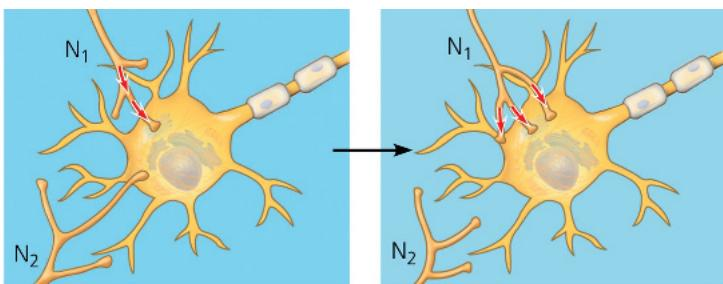  
(a) High-level activity at the synapse of neuron $N_{1}$ with the postsynaptic neuron leads to recruitment of additional axon terminals from that neuron. Lack of activity at the synapse with neuron $N_{2}$ leads to loss of functional connections with that neuron.

  
(b) If two synapses on a postsynaptic cell are often active at the same time, the strength of both responses may increase.

A defect in neuronal plasticity may underlie autism spectrum disorder. People with this condition experience challenges relating to communication and social interactions, and may exhibit repetitive or restrictive behaviors and interests. There is now growing evidence that autism spectrum disorder involves a disruption of activity-dependent remodeling at synapses. At the same time, no link has been found to vaccine preservatives, once proposed as a potential risk factor based on fraudulent data.

Although the underlying causes of autism are unknown, there is a strong genetic contribution to this and related disorders. Further understanding of the autism-associated disruption in synaptic plasticity may help efforts to better understand and treat this disorder.

## Memory and Learning

Neuronal plasticity is essential to the formation of memories. We are constantly checking what is happening against what just happened. We hold information for a time in short-term memory and then release it if it becomes irrelevant. If we wish to retain knowledge of a name, phone number, or other fact, the mechanisms of long-term memory are activated. If we later need to recall the name or number, we fetch it from long-term memory and return it to short-term memory.

Short-term and long-term memory both involve the storage of information in the cerebral cortex. In short-term memory, this information is accessed via temporary links formed in the hippocampus. When memories are made long-term, the links in the hippocampus are replaced by connections within the cerebral cortex itself. As discussed earlier, some of this consolidation of memory is thought to occur during sleep. Furthermore, the reactivation of the hippocampus that is required for memory consolidation likely forms the basis for at least some of our dreams.

According to our current understanding of memory, the hippocampus is essential for acquiring new long-term memories but not for maintaining them. This hypothesis readily explains the symptoms of some individuals who suffer damage to the hippocampus: They cannot form any new lasting memories but can freely recall events from before their injury. In effect, their lack of normal hippocampal function traps them in their past. Hippocampal damage and memory loss are common in the early stages of Alzheimer's disease (see Concept 49.5).

What evolutionary advantage might be offered by organizing short-term and long-term memories differently? One hypothesis is that the delay in forming connections in the cerebral cortex allows long-term memories to be integrated gradually into the existing store of knowledge and experience, providing a basis for more meaningful associations. Consistent with this hypothesis, the

transfer of information from short-term to long-term memory is enhanced by the association of new data with data previously learned and stored in long-term memory. For example, it's easier to learn a new card game if you already have “card sense” from playing other card games.

Motor skills, such as tying your shoes or writing, are usually learned by repetition. You can perform these skills without consciously recalling the individual steps required to do these tasks correctly. Learning skills and procedures, such as those required to ride a bicycle, appears to involve cellular mechanisms very similar to those responsible for brain growth and development. In such cases, neurons actually make new connections. In contrast, memorizing phone numbers, facts, and places—which can be very rapid and may require only one exposure to the relevant item—may rely mainly on changes in the strength of existing neuronal connections. Next, we will consider one way that such changes in strength can take place.

## Long-Term Potentiation

In searching for the physiological basis of memory, researchers have concentrated their attention on processes that can alter a synaptic connection, making the flow of communication either more efficient or less efficient. We will focus here on long-term potentiation (LTP), a lasting increase in the strength of synaptic transmission. Data indicate that LTP represents a fundamental process for memory storage and learning.

First characterized in tissue slices from the hippocampus, LTP involves a presynaptic neuron that releases the excitatory neurotransmitter glutamate. LTP involves two types of glutamate receptors, each named for a molecule—NMDA or AMPA—that can be used to artificially activate that particular receptor. As shown in Figure 49.22, the set of receptors present on the postsynaptic membrane changes when two conditions are met: a rapid series of action potentials at the presynaptic neuron and a depolarizing stimulus elsewhere on the postsynaptic cell. The result is LTP—a stable increase in the size of the postsynaptic potentials at a synapse whose activity coincides with that of another input.

## Concept Check 49.4

1. Outline two mechanisms by which information flow between two neurons in an adult can increase.

2. Individuals with localized brain damage have been very useful in the study of many brain functions. Why is this unlikely to be true for consciousness?

3. WHAT IF? Suppose that a person with damage to the hippocampus is unable to acquire new long-term memories. Why might the acquisition of short-term memories also be impaired?

For suggested answers, see Appendix A.

Figure 49.22 Long-term potentiation in the brain.  
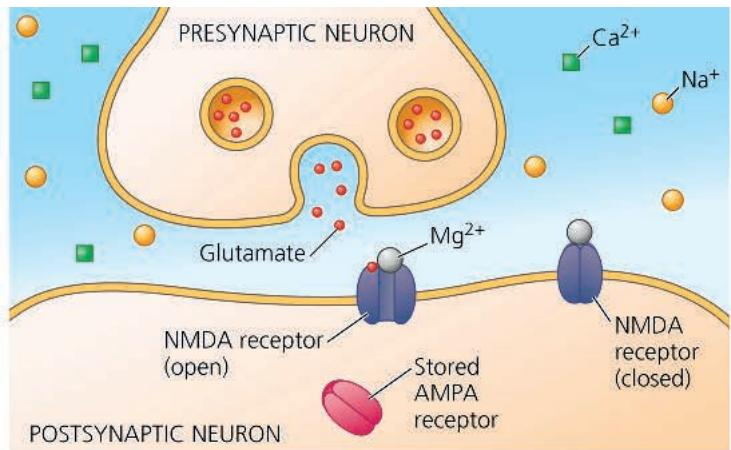

(a) Synapse prior to long-term potentiation (LTP). The NMDA glutamate receptors open in response to glutamate but are blocked by $Mg^{2+}$ .  

(b) Establishing LTP. Activity at nearby synapses (not shown) depolarizes the postsynaptic membrane, causing 1 Mg $^{2+}$ release from NMDA receptors. The unblocked receptors respond to glutamate by allowing 2 an influx of Na $^{+}$ and Ca $^{2+}$ . The Ca $^{2+}$ influx triggers 3 insertion of stored AMPA glutamate receptors into the postsynaptic membrane.  
  
(c) Synapse exhibiting LTP. Glutamate release activates 1 AMPA receptors that trigger 2 depolarization. The depolarization unblocks 3 NMDA receptors. Together, the AMPA and NMDA receptors trigger postsynaptic potentials strong enough to initiate 4 action potentials without input from other synapses. Additional mechanisms (not shown) contribute to LTP, including receptor modification by protein kinases.

# Concept 49.5: Many nervous system disorders can now be explained in molecular terms

Disorders of the nervous system, including schizophrenia, depression, drug addiction, Alzheimer's disease, and Parkinson's disease, are a major public health problem. Together, they result in more hospitalizations in the United States than do heart disease or cancer.

Major research efforts are under way to identify genes that cause or contribute to disorders of the nervous system. Identifying such genes offers hope for identifying causes, predicting outcomes, and developing effective treatments. Most nervous system disorders are multifactorial—that is, they are influenced by many genes as well as environmental factors. Unfortunately, such environmental contributions are typically very difficult to identify.

To distinguish between genetic and environmental variables, scientists often carry out family studies. In these studies, researchers track how family members are related genetically, which individuals are affected, and which family members grew up in the same household. These studies are especially informative when one of the affected individuals has either an adopted sibling who is genetically unrelated or an identical twin, as we'll see for the disorder schizophrenia, our next topic.

## Schizophrenia

Schizophrenia is a severe mental disturbance characterized by psychotic episodes in which patients have a distorted perception of reality. People with schizophrenia typically experience hallucinations (such as “voices” that only they can hear) and delusions (for example, the idea that others are plotting to harm them). Family and molecular studies have revealed a very strong genetic component: One recent study identified 287 genes that are expressed at higher levels in people with schizophrenia. However, as shown in Figure 49.23, the disease is also subject to environmental influences, since an individual who shares 100% of their genes with a twin with schizophrenia has only a 48% chance of developing the disorder.

One current hypothesis is that neuronal pathways that use dopamine as a neurotransmitter are disrupted in schizophrenia. Supporting evidence comes from the fact that many drugs that alleviate the symptoms of schizophrenia block dopamine receptors. In addition, the drug amphetamine (“speed”), which stimulates dopamine release, can produce the same set of symptoms as schizophrenia. Newer drugs with fewer side effects indirectly decrease dopamine activity by activating acetylcholine receptors. The immune system may also be an interesting target for future treatments, since

Figure 49.23 Genetic contribution to schizophrenia.
First cousins, uncles, and aunts of a person with schizophrenia have twice the risk of unrelated members of the population of developing the disease. The risks for closer relatives are many times greater.  
  
INTERPRET THE DATA What is the likelihood of a person developing schizophrenia if the disorder affects his or her fraternal twin? How would the likelihood change if DNA sequencing revealed that the twins shared the genetic variants that contribute to the disorder?

certain variants of the gene encoding the complement protein C4 are associated with schizophrenia.

## Depression

Depression is a disorder characterized by depressed mood, as well as abnormalities in sleep, appetite, and energy level. Individuals affected by major depressive disorder undergo periods—often lasting many months—during which once enjoyable activities provide no pleasure and provoke no interest. One of the most common nervous system disorders, major depression affects about one in every seven adults at some point, and twice as many females as males.

Bipolar disorder involves extreme swings of mood and affects about $1\%$ of the world's population. The manic phase is characterized by high self-esteem, increased energy, a flow of ideas, overtalkativeness, and increased risk taking. In its milder forms, this phase is sometimes associated with great creativity, and some well-known artists, musicians, and literary figures (Vincent van Gogh, Robert Schumann, Virginia Woolf, and Ernest Hemingway, to name a few) have had productive periods during manic phases. The depressive phase comes with lessened motivation, sense of worth, and ability to feel pleasure, as well as sleep disturbances. These symptoms can be so severe that affected individuals attempt suicide.

Major depressive and bipolar disorders can be treated with a class of drugs known as SSRIs (selective serotonin reuptake inhibitors). Fluoxetine (Prozac) and other SSRIs increase serotonin signaling by preventing serotonin uptake from the synaptic cleft. People who do not respond to traditional therapies are sometimes able to be treated with ketamine (an anesthetic) or other drugs that can induce more lasting changes in brain chemistry.

## The Brain's Reward System and Drug Addiction

Emotions are strongly influenced by a neuronal circuit in the brain called the reward system. The reward system provides motivation for activities that enhance survival and reproduction, such as eating in response to hunger, drinking when thirsty, and engaging in sexual activity when aroused. Inputs to the reward system are received by neurons in the ventral tegmental area (VTA), a region located within the midbrain (see Figure 49.11). When activated, these neurons release the neurotransmitter dopamine from their synaptic terminals (Figure 49.24). Targets of this dopamine signaling include the nucleus accumbens and the prefrontal cortex.

## Interview

Interview with Ulrike Heberlein: Research with drunk flies (eTextbook only)

The brain's reward system is dramatically affected by drug addiction, a disorder characterized by compulsive consumption of a drug and loss of control in limiting intake. Addictive drugs range from sedatives to stimulants and include alcohol, cocaine, and nicotine, as well as opioids, such as heroin, fentanyl and oxycodone. All enhance the activity of the dopamine pathway (see Figure 49.24). As addiction develops, there are also long-lasting changes in the reward circuitry. The result is a craving for the drug independent of any pleasure associated with consumption. In 2024, the Centers for Disease Control and Prevention reported more than 54,000 deaths from opioid overdose in the United States alone.

Laboratory animals are highly valuable in modeling and studying addiction. Rats, for example, will provide themselves with heroin, cocaine, or amphetamine when given a dispensing system linked to a lever in their cage. Furthermore, they exhibit addictive behavior, continuing to self-administer the drug rather than seek food, even to the point of starvation.

Figure 49.24 Effects of addictive drugs on the reward system of the mammalian brain.

Addictive drugs alter the transmission of signals in the pathway formed by neurons of the ventral tegmental area (VTA), a region located near the base of the brain.

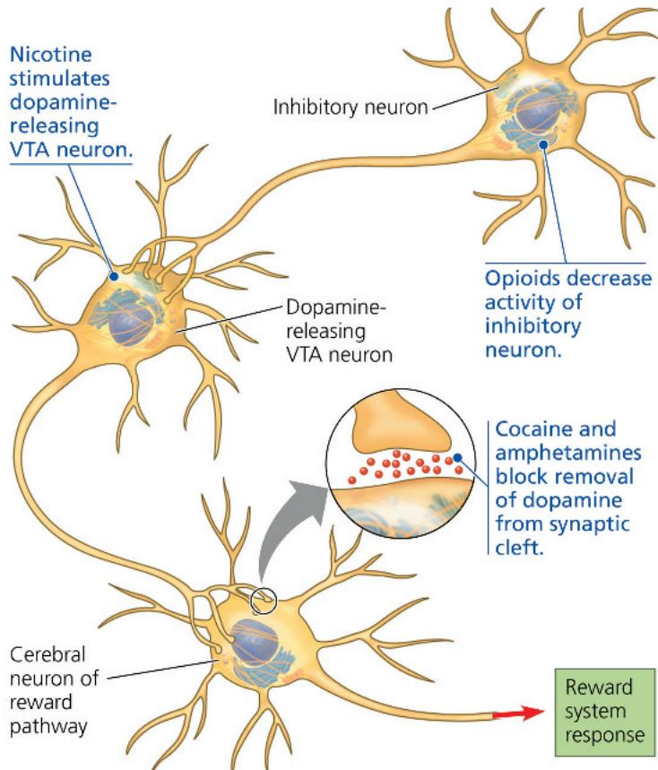  
MAKE CONNECTIONS Review depolarization in Concept 48.3. What effect would you expect if you depolarized the neurons in the VTA? Explain.
For suggested answer, see Appendix A.

As scientists expand their knowledge about the brain's reward system and the various forms of addiction, there is hope that the insights will lead to more effective prevention and treatment.

## Alzheimer's Disease

The condition now known as Alzheimer's disease is a mental deterioration, or dementia, characterized by confusion and memory loss. Its incidence is age related, rising from about $10\%$ at age 65 to about $35\%$ at age 85. Overall, Alzheimer's disease accounts for about two of every three cases of dementia. It is also the sixth most common cause of death among adults in the United States (excluding COVID-19), affecting individuals including former President Ronald Reagan, author E.B. White, and civil rights heroine Rosa Parks.

Alzheimer's disease is progressive; patients gradually become less able to function and eventually need to be dressed, bathed, and fed by others. Individuals with Alzheimer's disease often lose their ability to recognize people and may treat even immediate family members with suspicion and hostility.

Figure 49.25 Microscopic signs of Alzheimer's disease.

A hallmark of Alzheimer's disease is the presence of neurofibrillary tangles within neurons and $\beta$ -amyloid plaques between neurons (LM).

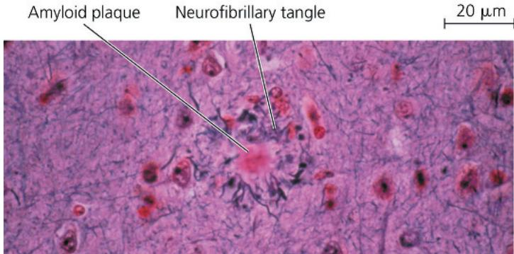

Examining the brains of individuals who have died of Alzheimer's disease reveals two characteristic features: amyloid plaques and neurofibrillary tangles, as shown in Figure 49.25. There is also often massive shrinkage of brain tissue, reflecting the death of neurons in many areas of the brain, including the hippocampus and cerebral cortex.

The plaques are aggregates of $\beta$ -amyloid, an insoluble peptide that is cleaved from the extracellular portion of a membrane protein found in neurons. Membrane enzymes, called secretases, catalyze the cleavage, causing $\beta$ -amyloid to accumulate in plaques outside the neurons. One hypothesis is that these plaques interfere with synaptic transmission.

The neurofibrillary tangles observed in Alzheimer's disease are primarily made up of the tau protein. (This protein is unrelated to the tau mutation that affects circadian rhythm in hamsters.) The tau protein normally helps assemble and maintain microtubules that transport nutrients along axons. In Alzheimer's disease, tau undergoes changes that cause it to bind to itself, resulting in neurofibrillary tangles.

The accumulation of tangles and plaques is thought to trigger neuron death. While there is presently no cure for Alzheimer's disease, monoclonal antibodies that target the amyloid protein have shown promise in slowing the disease progression.

Tau protein accumulation is also characteristic of a degenerative brain disease found in athletes, military veterans, and others with a history of repetitive brain trauma. Known as chronic traumatic encephalopathy (CTE), this disease was first observed in deceased professional football players with a history of concussions (symptomatic brain injuries caused by a blow to the head or a hit to the body that shakes the brain). CTE has since been diagnosed in football players as young as 17 years old. The biggest predictor of CTE risk is now thought to be the time spent playing contact sports rather than the number of symptomatic concussions.

## Parkinson's Disease

Symptoms of Parkinson's disease, a motor disorder, include muscle tremors, poor balance, a flexed posture, and a shuffling gait. Facial muscles become rigid, limiting the ability of patients to vary their expressions. Cognitive defects may also develop. Like Alzheimer's disease, Parkinson's disease is a progressive brain illness and is more common with advancing age. The incidence of Parkinson's disease is about $1\%$ at age 65 and about $5\%$ at age 85. In the United States population, approximately 1 million people have Parkinson's disease.

Parkinson's disease involves the death of neurons in the midbrain that normally release dopamine at synapses in the basal nuclei. A second diagnostic feature is neurons that contain Lewy bodies, which are aggregates of a protein called synuclein. Most cases of Parkinson's disease lack an identifiable cause; however, early-onset Parkinson's disease often reflects a mutation in the PRKN (Parkin) gene. The Parkin protein helps target dysfunctional proteins for destruction. Other genes that increase the risk of developing Parkinson's disease encode mitochondrial proteins and lysosomal enzymes.

At present, Parkinson's disease can be treated, but not cured. Approaches used to manage the symptoms include brain surgery, deep-brain stimulation, and a dopamine-related drug, L-dopa. Unlike dopamine, L-dopa crosses the blood-brain barrier. Within the brain, the enzyme dopa decarboxylase converts the drug to dopamine, reducing the severity of Parkinson's disease symptoms:

## Future Directions in Brain Research

In 2014, the United States government launched the BRAIN (Brain Research through Advancing Innovative Neurotechnologies) Initiative. This public-private partnership enables large-scale collaborations between ethicists, engineers, and scientists from diverse fields. Some of the many advances that have already resulted from this initiative include a map of all of the synapses in the fruitfly brain, a cell atlas of the mouse brain, and new treatments for Alzheimer's disease and depression. Now entering its second decade, current BRAIN goals include mapping the brain across the human lifespan, identifying the brain circuits underlying certain behaviors, and applying new approaches to understanding the human brain in health and disease.

## Concept Check 49.5

1. Compare Alzheimer's disease and Parkinson's disease.

2. How is dopamine activity related to schizophrenia, drug addiction, and Parkinson's disease?

3. WHAT IF? If you could detect early-stage Alzheimer's disease, would you expect to see brain changes that were similar to, although less extensive than, those seen in patients who have died of this disease? Explain.

For suggested answers, see Appendix A.

# Chapter 49 Review

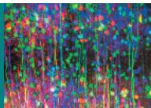

## Summary of Key Concepts

To review key terms, go to the Vocabulary Self-Quiz (eTextbook only).

## Concept 49.1: Nervous systems consist of circuits of neurons and supporting cells

\- Invertebrate nervous systems range in complexity from simple nerve nets to highly centralized nervous systems having complicated brains and ventral nerve cords.

\- In vertebrates, the central nervous system (CNS), consisting of the brain and the spinal cord, integrates information, while the nerves of the peripheral nervous system (PNS) transmit sensory and motor signals between the CNS and the rest of the body. The simplest circuits control reflex responses, in which sensory input is linked to motor output without involvement of the brain.

\- Afferent neurons carry sensory signals to the CNS. Efferent neurons function in either the motor system, which carries signals to skeletal muscles, or the autonomic nervous system, which regulates smooth and cardiac muscles. The sympathetic and parasympathetic divisions of the autonomic nervous system have antagonistic effects on a diverse set of target organs, while the enteric nervous system controls the activity of many digestive organs.

\- Vertebrate neurons are supported by glia, including astrocytes, oligodendrocytes, and Schwann cells. Some glia serve as stem cells that can differentiate into mature neurons.

  
How does the circuitry of a reflex facilitate a rapid response?

Concept 49.2: The vertebrate brain is regionally specialized  
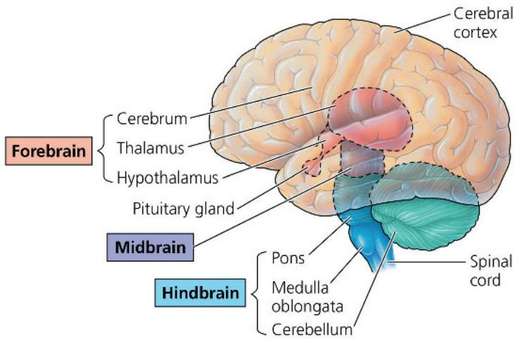

\- The cerebrum has two hemispheres, each of which consists of cortical gray matter overlying white matter and basal nuclei. The basal nuclei are important in planning and learning movements. The pons and medulla oblongata are relay stations for information traveling between the PNS and the cerebrum. The reticular formation, a network of neurons within the brainstem, regulates sleep and arousal. The cerebellum helps coordinate motor, perceptual, and cognitive functions. The thalamus is the main center through which sensory information passes to the cerebrum. The hypothalamus regulates homeostasis and basic survival behaviors. Within the hypothalamus, a group of neurons called the suprachiasmatic nucleus (SCN) acts as the pacemaker for circadian rhythms. The amygdala plays a key role in recognizing and recalling a number of emotions.

What roles do the midbrain, cerebellum, thalamus, and cerebrum play in vision and responses to visual input?

## Concept 49.3: The cerebral cortex controls voluntary movement and cognitive functions

\- Each side of the cerebral cortex has four lobes—frontal, temporal, occipital, and parietal—that contain primary sensory areas and association areas. Association areas integrate information from different sensory areas. Broca's area and Wernicke's area are essential for generating and understanding language. These functions are concentrated in the left cerebral hemisphere, as are math and logic operations. The right hemisphere appears to be stronger at pattern recognition and nonverbal thinking.

\- In the somatosensory cortex and the motor cortex, neurons are distributed according to the part of the body that generates sensory input or receives motor commands.

\- Primates and cetaceans, which are capable of higher cognition, have an extensively convoluted cerebral cortex. In birds, a brain region called the pallium contains clustered nuclei that carry out functions similar to those performed by the cerebral cortex of mammals. Some birds can solve problems and understand abstractions in a manner indicative of higher cognition.

A patient has trouble with language and has paralysis on one side of the body. Which side would you expect to be paralyzed? Why?

## Concept 49.4: Changes in synaptic connections underlie memory and learning

\- During development, more neurons and synapses form than will exist in the adult. The programmed death of neurons and elimination of synapses in embryos establish the basic structure of the nervous system. In the adult, reshaping of the nervous system can involve the loss or addition of synapses or the strengthening or weakening of signaling at synapses. This capacity for remodeling is termed neuronal plasticity. Our short-term memory relies on temporary links in the hippocampus. In long-term memory, these links are replaced by connections within the cerebral cortex.

Learning multiple languages is typically easier early in childhood than later in life. How does this fit with our understanding of neural development?

## Concept 49.5: Many nervous system disorders can now be explained in molecular terms

\- Schizophrenia, which is characterized by hallucinations, delusions, and other symptoms, affects neuronal pathways that use dopamine as a neurotransmitter. Drugs that increase the activity of biogenic amines in the brain can be used to treat bipolar disorder and major depressive disorder. The compulsive drug use that characterizes addiction reflects altered activity of the brain's reward system, which normally provides motivation for actions that enhance survival or reproduction.

\- Alzheimer's disease and Parkinson's disease are neurodegenerative and typically age related. Alzheimer's disease is a dementia in which neurofibrillary tangles and amyloid plaques form in the brain. Parkinson's disease is a motor disorder caused by the death of dopamine-secreting neurons and associated with the presence of protein aggregates.

The fact that both amphetamine and PCP (an illegal drug that is a glutamate receptor blocker) have effects similar to the symptoms of schizophrenia suggests a potentially complex basis for this disease. Explain.

For suggested answers, see Appendix A.

## Test Your Understanding

For more multiple-choice questions, go to the Practice Test (eTextbook only).

## Levels 1-2: Remembering/Understanding

1. Activation of the parasympathetic branch of the autonomic nervous system
(A) increases heart rate.
(B) enhances digestion.
(C) triggers release of epinephrine.
(D) causes conversion of glycogen to glucose.

2. Which of the following structures or regions is correctly paired with its function?
(A) limbic system—motor control of speech
(B) medulla oblongata—homeostatic control
(C) cerebrum—coordination of movement and balance
(D) amygdala—short-term memory

3. Patients with damage to Wernicke's area have difficulty
(A) coordinating limb (C) recognizing faces.
movement. (D) understanding
(B) generating speech. language.

4. The cerebral cortex plays a major role in
(A) emotional memory. (C) circadian rhythm.
(B) hand-eye coordination. (D) breath holding.

## Levels 3-4: Applying/Analyzing

5. After suffering a stroke, a patient can see objects anywhere in front of him but pays attention only to objects in his right field of vision. When asked to describe these objects, he has difficulty judging their size and distance. What part of the brain was likely damaged by the stroke?
(A) the left frontal lobe (C) the right parietal lobe
(B) the right frontal lobe (D) the corpus callosum

6. Injury localized to the hypothalamus would most likely disrupt (A) regulation of body temperature.

(B) short-term memory.

(C) executive functions, such as decision making.

(D) sorting of sensory information.

7. DRAW IT The reflex that pulls your hand away when you prick your finger on a sharp object relies on a neuronal circuit with two synapses in the spinal cord. (a) Using a circle to represent a cross section of the spinal cord, draw the circuit. Label the types of neurons, the direction of information flow in each, and the locations of synapses. (b) Draw a simple diagram of the brain indicating where pain would eventually be perceived.

## Levels 5-6: Evaluating/Creating

8. EVOLUTION CONNECTION Scientists often use measures of "higher-order thinking" to assess intelligence in other animals. For example, birds are judged to have sophisticated thought processes because they can use tools and make use of abstract concepts. Identify problems you see in defining intelligence in these ways.

9. SCIENTIFIC INQUIRY Consider an individual who had been fluent in American Sign Language before suffering an injury to his left cerebral hemisphere. After the injury, he could still understand that sign language but could not readily generate sign language that represented his thoughts. Propose two hypotheses that could explain this finding. How might you distinguish between them?

10. SCIENCE, TECHNOLOGY, AND SOCIETY With increasingly sophisticated methods for scanning brain activity, scientists are developing the ability to detect an individual's particular emotions and thought processes from outside the body. What benefits and problems do you envision when such technology becomes readily available? Explain.

11. WRITE ABOUT A THEME: INFORMATION In a short essay (100–150 words), explain how specification of the adult nervous system by the genome is incomplete.

12. SYNTHESIZE YOUR KNOWLEDGE

  
For selected answers, see Appendix A.

Imagine you are standing at a microphone in front of a crowd. Checking your notes, you begin speaking. Using the information in this chapter, describe the series of events in particular regions of the brain that enabled you to say the very first word.

## Explore Scientific Papers with Science in the Classroom | AAAS

How does a neuron develop different functions than those of similar neighboring neurons? Go to “New Neurons Stand Out from the Crowd” at www.scienceintheclassroom.org.

Instructors: Questions can be assigned in Mastering Biology.

