# 第51章 Animal Behavior

<!-- 章节边界按正文内容恢复；原始 MinerU 内容保留如下。 -->

# Animal Behavior

## Key Concepts

51.1 Discrete sensory inputs can stimulate both simple and complex behaviors

51.2 Learning establishes specific links between experience and behavior

51.3 Selection for individual survival and reproductive success can explain diverse behaviors

51.4 Genetic analyses and the concept of inclusive fitness provide a basis for studying the evolution of behavior

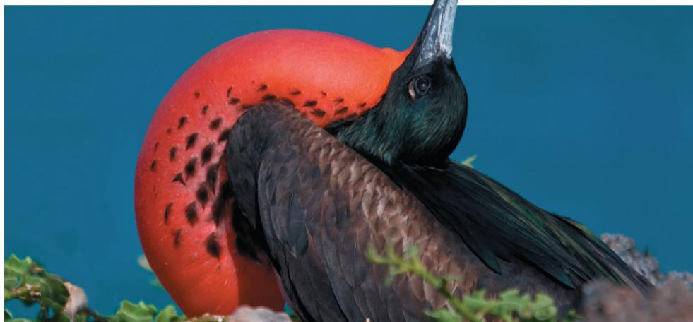  
Figure 51.1 A male magnificent frigatebird (Fregata magnificens) lives mostly at sea. He often feeds by piracy, harassing diving birds into coughing up their catch for his consumption. Periodically, however, he alights on an island, points his bill to the sky, and inflates an enormous red throat pouch. Clacking his beak, he produces a drumming sound that resonates in the pouch. If a curious female takes notice and lands nearby, a mating ritual ensues.

## Study Tip

## Identifying components of

experimental design: Animal behavior is studied in both the wild and the laboratory and involves approaches ranging from passive observation to active intervention. As you study this chapter, note how scientific methods are applied to answer questions in diverse contexts, such as foraging in honeybees (Figure 51.5; see example started here) and fruit flies (Figure 51.13).

1) Make observations—returning bees do a number of different but set dances

2) Form a hypothesis—the dances convey information about food location

3) Generate predictions

4) Gather and analyze data

5) Draw conclusions

## What questions do biologists seek to answer in studying animal behavior?

1. What event or signal triggers the behavior?

Males inflate their pouch only if females are nearby. The intensity of the display increases when a female circles overhead.

2. How does experience during growth and development influence the behavior?

Older males have larger pouches that produce lower drumming frequencies, which attract more females.

3. How does the behavior aid survival and reproduction?

After mating, males and females cooperate in nest building and feeding the chicks.

4. How has the behavior been shaped by natural selection?

The throat pouch can be inflated prominently for mating, and deflated to maximize flight efficiency.

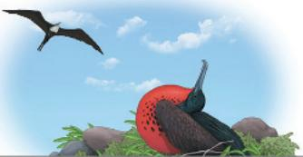

Answering these questions can provide fundamental insights into how behaviors occur and why they arise.

# Concept 51.1: Discrete sensory inputs can stimulate both simple and complex behaviors

Behavior is the sum of an organism's responses to external and internal stimuli. In animals, behaviors are typically actions carried out by muscles under control of the nervous system. Examples include an animal using its throat muscles to produce a song or releasing a scent to mark its territory. Behavior is an essential part of acquiring nutrients and finding a partner for sexual reproduction. Behavior also contributes to homeostasis, as when honeybees huddle to conserve heat (see Concept 40.3). In short, all of animal physiology contributes to behavior, and behavior influences all of physiology.

Many behaviors, especially those involved in recognition and communication, rely on specialized body structures or form. For instance, the throat pouch of a male frigatebird (see Figure 51.1) is essential for courtship. Inflating the pouch exposes its vibrantly colored surface and provides a resonating chamber that amplifies the male's drumming. As this example illustrates, the process of natural selection that shapes behaviors also influences the evolution of animal anatomy.

What approach do biologists use to determine how behaviors arise and what functions they serve? The Dutch scientist Niko Tinbergen, a pioneer in the study of animal behavior, suggested that understanding any behavior requires answering four questions, which were highlighted in Figure 51.1:

1. What stimulus triggers the behavior and how do the various body systems bring it about?

2. How does the animal's experience during growth and development influence the response to the stimulus?

3. How does the behavior aid survival and reproduction?

4. What is the behavior's evolutionary history?

The first two questions ask about proximate causation—how a behavior occurs or is modified. The last two questions ask about ultimate causation—why a behavior occurs in the context of natural selection.

Experiments on proximate causation by Tinbergen earned him a share of a Nobel Prize awarded in 1973. Such studies

defined the field of ethology, the study of animal behavior observed in a natural environment. We'll consider those and related experiments in the early part of the chapter. The concept of ultimate causation is central to behavioral ecology, the study of the ecological and evolutionary basis for animal behavior. We'll explore this vibrant area of modern biological research in the rest of the chapter.

## Fixed Action Patterns

In addressing Tinbergen's first question, the nature of the stimuli that trigger behavior, we'll begin with behavioral responses to well-defined stimuli, starting with an example from one of Tinbergen's own experiments.

As part of his research, Tinbergen kept fish tanks containing three-spined sticklebacks (Gasterosteus aculeatus), a species in which males, but not females, have red bellies. Male sticklebacks attack other males that invade their nesting territories (Figure 51.2). Tinbergen noticed that his male sticklebacks also behaved aggressively when a red truck passed within view of their tank. Inspired by this chance observation, he carried out experiments showing that the red color of an intruder's underside is the proximate cause of the attack behavior. A male stickleback will not attack a fish lacking red coloration, but will attack even unrealistic models if they contain areas of red color. The territorial response of male sticklebacks is an example of a fixed action pattern, a sequence of unlearned acts directly linked to a simple stimulus. The fixed action pattern of certain moths takes the form of evasive flight maneuvers—loops and spirals—performed instantaneously upon hearing the sounds of an echolocating bat or an ultrasonic whistle in the same frequency range. Fixed action patterns are essentially unchangeable and, once initiated, are usually carried to completion. The trigger for the behavior is an external cue called a sign stimulus, such as a red object that prompts a male stickleback's aggressive behavior.

## Migration

Environmental stimuli not only trigger behaviors but also provide cues that animals use to carry out those behaviors. For example, a wide variety of birds, fishes, and other animals use environmental cues to guide migration—a regular, long-distance change in

## Figure 51.2 Sign stimuli in a classic fixed action pattern.

(a) A male stickleback fish attacks other male sticklebacks that invade its nesting territory. (b) Models, whether realistic or not, can trigger the aggressive behavior, but only if the underside is red. Researchers concluded that the red belly of the intruding male is a sign stimulus that releases the aggressive behavior.
Suggest an explanation for why this behavior might have evolved (its ultimate causation).
For suggested answer, see Appendix A.

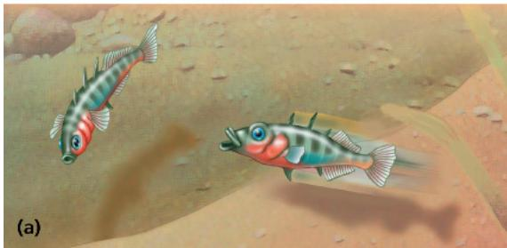

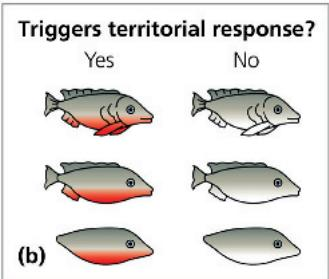

location. In the course of migration, many animals pass through environments they have not previously encountered. How, then, do they find their way in these foreign settings?

Some migrating animals track their position relative to the sun, even though the sun's position relative to Earth changes throughout the day. Animals can adjust for these changes by means of a circadian clock, an internal mechanism that has a 24-hour periodicity (see Concept 49.2). For example, experiments have shown that migrating birds orient differently relative to the sun at distinct times of the day. Nocturnal animals can instead use the North Star, which has a constant position in the night sky.

Although the sun and stars can provide useful clues for navigation, clouds can obscure these landmarks. How do migrating animals overcome this problem? A simple experiment with homing pigeons provided one answer. On an overcast day, placing a small magnet on the head of a homing pigeon prevented it from returning efficiently to its roost. Researchers concluded that pigeons sense their position relative to Earth's magnetic field and can thereby navigate without solar or celestial cues.

## Behavioral Rhythms

Although the circadian clock plays a small but significant role in navigation by some migrating species, it has a major role in the daily activity of all animals. As discussed in Concepts 40.2 and 49.2, the clock is responsible for a circadian rhythm, a daily cycle of rest and activity. The clock is normally synchronized with the light and dark cycles of the environment but can maintain rhythmic activity even under constant environmental conditions, such as during hibernation.

Some behaviors, such as migration and reproduction, reflect biological rhythms with a longer cycle, or period, than the circadian rhythm. Behavioral rhythms linked to the yearly cycle of seasons are called circannual rhythms. Although migration and reproduction typically correlate with food availability, these behaviors are not a direct response to changes in food intake. Instead, circannual rhythms, like circadian rhythms, are influenced by the periods of daylight and darkness in the environment. For example, studies with several bird species have shown that an artificial environment with extended daylight can induce out-of-season migratory behavior.

Not all biological rhythms are linked to the light and dark cycles in the environment. Consider, for instance, fiddler crab courtship behavior, which is linked to the lunar cycle. Possessed with front claws of very different size, the male fiddler crab (genus Uca) waves the larger claw in front of him to attract potential mates (Figure 51.3). Timing this claw-waving courtship behavior to the new or full moon helps the development of offspring. How? Fiddler crabs begin their lives as larvae settling in the mudflats. The tides disperse larvae to deeper waters, where they complete early development in relative safety before returning to the tidal flats. By courting at the time of the new or full moon, crabs link their reproduction to the times of greatest tidal movement.

Figure 51.3 Courtship display of male fiddler crab.  
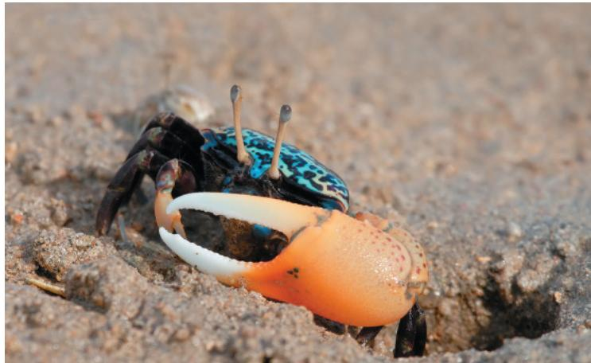

## Animal Signals and Communication

Claw waving by fiddler crabs during courtship is an example of one animal (the male crab) generating the stimulus that guides the behavior of another animal (the female crab). A stimulus transmitted from one organism to another is called a signal. The transmission and reception of signals between animals constitute communication, which often has a role in the proximate causation of behavior.

## Forms of Animal Communication

Let's consider the courtship behavior of the fruit fly, Drosophila melanogaster, as an introduction to the four common modes of animal communication: visual, chemical, tactile, and auditory.

Fruit fly courtship constitutes a stimulus-response chain, in which the response to each stimulus is itself a stimulus for the next behavior. In the first step, a male detects a female in his field

of vision and orients his body toward hers. To confirm she belongs to his species, he uses his olfactory system to detect chemicals she releases into the air. The male then approaches and touches the female with a foreleg (Figure 51.4). This touching, or tactile communication, alerts the female to the male's presence. In the third stage, the male extends and vibrates one wing, producing a courtship song. This auditory communication informs the female whether he is of the same species. Only if all of these forms of communication

Figure 51.4 Male fruit fly tapping female with foreleg.

are successful will the female allow the male to attempt copulation.

In general, the form of communication that evolves is closely related to an animal's lifestyle and environment. For example, most terrestrial mammals are nocturnal, which makes visual displays relatively ineffective. Instead, these species use olfactory and auditory signals, which work as well in the dark as in the light. In contrast, most birds are diurnal (active mainly in daytime) and communicate primarily by visual and auditory signals. Humans are also diurnal and, like birds, use primarily visual and auditory communication. We can thus detect and appreciate the songs and bright colors used by birds to communicate but miss many chemical cues on which other mammals base their behavior.

The information content of animal communication varies considerably. One of the most remarkable examples is the symbolic language of the European honeybee (Apis mellifera), discovered in the early 1900s by Austrian researcher Karl von Frisch. Using glass-walled observation hives, he and his students spent several decades observing honeybees.

they fly almost directly to the area indicated by the waggle dance. By using flower odor and other clues, they locate the source of nectar within this area.

If the food source is close to the hive (less than 50 m away), the waggle dance takes a slightly different form that primarily advertises the availability of nectar nearby. In this form of the waggle dance, which von Frisch called “round,” the returning bee moves in tight circles while moving its abdomen from side to side. In response, the follower bees leave the hive and search in all directions for nearby flowers rich in nectar.

## Pheromones

Animals that communicate through odors or tastes emit chemical substances called pheromones. Pheromones are especially common among mammals and insects and often relate to reproductive behavior. For example, pheromones are the basis for the chemical communication in fruit fly courtship (see Figure 51.4). Pheromones are not limited to short-distance

## Methodical recordings of bee

movements enabled von Frisch to decipher a “dance language” that returning foragers use to inform other bees about the distance and direction of travel to a source of nectar.

When a successful forager returns to the hive, its movements, as well as sounds and odors, quickly become the center of attention for other bees, called followers. Moving along the vertical wall of the honeycomb, the forager performs a “waggle dance” that communicates to the follower bees both the direction and distance of the food source in relation to the hive (Figure 51.5). In performing the dance, the bee follows a half-circle swing in one direction, a straight run during which it waggles its abdomen, and a half-circle swing in the other direction. What von Frisch and colleagues deduced was that the angle of the straight run relative to the hive’s vertical surface indicates the horizontal angle of the food in relation to the sun. Thus, if the returning bee runs at a $30^{\circ}$ angle to the right of vertical, the follower bees leaving the hive fly $30^{\circ}$ to the right of the horizontal direction of the sun.

How does the waggle dance communicate distance to the nectar source? It turns out that a dance with a longer straight run, and therefore more abdominal waggles per run, indicates a greater distance to the food found by the forager. As follower bees exit the hive,

Figure 51.5 Honeybee dance language.
Honeybees returning to the hive communicate the location of food sources through the symbolic language of a dance.  
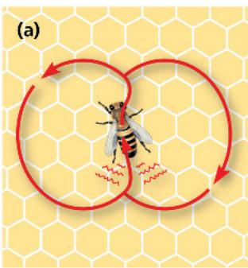

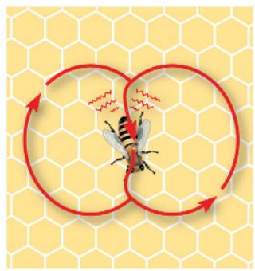

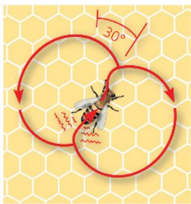  
Location A: Food source is in same direction as sun.  
Location B: Food source is in direction opposite sun.  
Location C: Food source is 30° to right of sun.  
The waggle dance, performed when food is distant, resembles a figure eight. Distance is indicated by the number of abdominal waggles performed in the straight-run part of the dance. Direction is indicated by the angle of the straight run relative to the vertical surface of the hive. The dance communicates this information to workers clustered around the dancing bee, directing them to food at a particular location.

  
VISUAL SKILLS What information, if any, might be conveyed by the portions of the waggle dance between the straight runs? Explain.
For suggested answer, see Appendix A.

signaling, however. Male silkworm moths have receptors that can detect the pheromone from a female moth from several kilometers away (see Figure 50.6).

In a honeybee colony, pheromones produced by the queen and her daughters, the workers, maintain the hive's complex social order. One pheromone (once called the queen substance) has a particularly wide range of effects. It attracts workers to the queen, inhibits development of ovaries in workers, and attracts males (drones) to the queen during her mating flights out of the hive.

Pheromones can also serve as alarm signals. For example, when a minnow is injured, a substance released from the fish's skin disperses in the water, inducing a fright response in other minnows in the area. These nearby fish become more vigilant and often form tightly packed schools near the river or lake bottom, where they are safer from attack (Figure 51.6). Pheromones can be very effective at remarkably low concentrations. For instance, just $1\mathrm{cm}^2$ of skin from a fathead minnow contains sufficient alarm substance to induce a reaction in $58,000\mathrm{L}$ of water.

So far in this chapter, we have explored the types of stimuli that elicit behaviors—the first part of Tinbergen's first question. The second part of that question—the physiological mechanisms that mediate responses—involves the nervous, muscular, and skeletal systems explored elsewhere in this unit: Stimuli activate sensory systems, are processed in the central nervous system, and may result in motor outputs that constitute behavior in animals. Thus, we are ready to focus on Tinbergen's second question—how experience influences behavior.

Figure 51.6 Fathead minnows (Pimephales promelas) responding to the presence of an alarm substance.  
  
1 Minnows are widely dispersed in an aquarium before an alarm substance is introduced.

  
2 Within seconds of the alarm substance being introduced, minnows aggregate near the bottom of the aquarium and reduce their movement.

## Concept Check 51.1

1. If an egg rolls out of a greylag goose's nest, the female will retrieve it by nudging it with her beak and head. If researchers remove the egg or substitute a ball during this process, the goose continues to bob her beak and head while she moves back to the nest. Provide proximate and ultimate explanations for this behavior.

2. WHAT IF? Suppose you exposed various fish species from the minnows' environment to the alarm substance from minnows. Thinking about natural selection, suggest why some species might respond like minnows, some might increase their activity, and some might show no change.

3. MAKE CONNECTIONS How is the lunar-linked rhythm of fiddler crab courtship similar in mechanism and function to the seasonal timing of plant flowering? (See Concept 39.3.)

For suggested answers, see Appendix A.

## Concept 51.2: Learning establishes specific links between experience and behavior

Some behaviors—such as a fixed action pattern, a courtship stimulus-response chain, or pheromone signaling—are performed by all individuals the same way each time. Behavior that is developmentally fixed in this way is known as innate behavior. Consider, for example, the construction of a spider's web. Although a spider's web is quite complex, web building is innate, not learned. Many other behaviors, however, vary considerably with experience.

A spider in family Araneidae spinning a web  
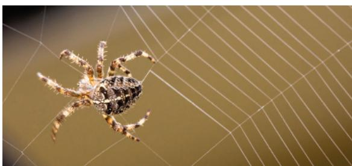

## Experience and Behavior

Tinbergen's second question asks how an animal's experiences during growth and development influence the response to stimuli. One informative approach to this question is a cross-fostering study, in which the young of one species are placed in the care of adults from another species in the same or a similar environment. The extent to which the offspring's behavior changes in such a situation provides a measure of how the social and physical environment influences behavior.

Table 51.1 Influence of Cross-Fostering on Male Mice\*

<table><tr><td>Species</td><td>Aggression Toward an Intruder</td><td>Aggression in Neutral Situation</td><td>Paternal Behavior</td></tr><tr><td>California mice fostered by white-footed mice</td><td>Reduced</td><td>No difference</td><td>Reduced</td></tr><tr><td>White-footed mice fostered by California mice</td><td>No difference</td><td>Increased</td><td>No difference</td></tr><tr><td colspan="4">*Comparisons are with mice raised by parents of their own species.</td></tr></table>

Certain mouse species have behaviors well suited for cross-fostering studies. Male California mice (Peromyscus californicus) are highly aggressive toward other mice and provide extensive parental care. In contrast, male white-footed mice (Peromyscus leucopus) are less aggressive and engage in little parental care. Cross-fostering—placing pups in the nests of the other species—altered some behaviors of both species (Table 51.1). For instance, male California mice raised by white-footed mice were less aggressive toward intruders. Thus, experience during development can strongly influence aggressive behavior in these rodents.

One of the most important findings of the cross-fostering experiments with mice was that the influence of experience on behavior can be passed on to progeny: When the cross-fostered California mice became parents, they spent less time retrieving offspring who wandered off than did California mice raised by their own species. Thus, experience during development can modify physiology in a way that alters parental behavior, extending the influence of environment to a subsequent generation. While experiences do not modify gene sequences (the genetic code), they can chemically modify DNA with the result that certain genes are more or less active. These DNA alterations, known as epigenetic changes, can be passed on to future generations (see Concept 18.2).

For humans, the influence of genetics and environment on behavior can be explored by a twin study, in which researchers compare the behavior of identical twins raised apart with the behavior of those raised in the same household. Twin studies have been instrumental in studying disorders that alter human

Identical twins who were raised separately  

behavior, such as anxiety disorders, schizophrenia, and alcohol-use disorder.

## Learning

One powerful way that an animal's environment can influence its behavior is through learning, the modification of behavior as a

result of specific experiences. The capacity for learning depends on nervous system organization established during development following instructions encoded in the genome. Learning itself involves the formation of memories by specific changes in neuronal connectivity (see Concept 49.4). Therefore, the essential challenge for research into learning is not to decide between nature and nurture, but rather to explore the contributions of both nature (genes) and nurture (environment) in shaping learning and, more generally, behavior.

## Imprinting

In some species, the ability of offspring to recognize and be recognized by a parent is essential for survival. In the young, this learning often takes the form of imprinting, the establishment of a long-lasting behavioral response to a particular individual or object. Imprinting can take place only during a specific time period in development, called the critical period. Among gulls, for instance, the critical period for a parent to bond with its young lasts one to two days. During the critical period, the young imprint on their parent and learn basic behaviors, while the parent learns to recognize its offspring. If bonding does not occur, the parent will not care for the offspring, leading to the death of the offspring and a decrease in the reproductive success of the parent.

How do the young know on whom—or what—to imprint? Experiments with many species of waterfowl indicate that young birds have no innate recognition of “parent.” Rather, they identify with the first object they encounter that has certain key characteristics. In the 1930s, experiments showed that the principal imprinting stimulus in greylag geese (Anser anser) is a nearby object that is moving. When incubator-hatched goslings spent their first few hours with a person rather than with a goose, they imprinted on the human and steadfastly followed that person from then on (Figure 51.7). Furthermore, they showed no recognition of their biological parent.

Imprinting has become an important component of efforts to save endangered species, such as the whooping crane (Grus americana). Scientists tried raising whooping cranes in captivity by using sandhill cranes (Grus canadensis) as foster parents. However, because the whooping cranes imprinted on their foster parents, none formed a pair-bond (strong attachment) with a whooping crane mate. To avoid such problems, captive breeding programs now isolate young cranes, exposing them to the sights and sounds of members of their own species.

Previously, scientists made further use of imprinting to teach cranes born in captivity to migrate along safe routes. Young whooping cranes were imprinted on humans in “crane suits” and then allowed to follow these “parents” as they flew ultralight aircraft along selected migration routes. More recently, efforts shifted to a focus on minimizing human intervention as part of an overall strategy aimed at fostering self-sustaining crane populations.

## Spatial Learning and Cognitive Maps

Every natural environment has spatial variation, as in locations of nest sites, hazards, food, and prospective mates. Therefore, an organism's fitness may be enhanced by the capacity for spatial learning, the establishment of a memory that reflects the environment's spatial structure.

Figure 51.7 Imprinting.  
  
WHAT IF? Suppose the geese were bred to each other. How might their imprinting on a human affect their offspring? Explain.  
For suggested answer, see Appendix A.

The idea of spatial learning intrigued Tinbergen while he was a graduate student in the Netherlands. At that time, he was studying females of a digger wasp species (Philanthus triangulum) that nests in small burrows dug into sand dunes. When a wasp leaves her nest to go hunting, she hides the entrance from potential intruders by covering it with sand. When she returns, however, she flies directly to her hidden nest, despite the presence of hundreds of other burrows in the area. How does she accomplish this feat? Tinbergen hypothesized that a wasp locates her nest by learning its position relative to visible landmarks. To test his hypothesis, he carried out an experiment in the wasps' natural habitat (Figure 51.8). By manipulating objects around nest entrances, he demonstrated that digger wasps engage in spatial learning. This experiment was so simple and informative that it could be summarized very concisely. In fact, at 32 pages, Tinbergen's Ph.D. thesis from 1932 is still the shortest ever approved at Leiden University.

In some animals, spatial learning involves formulating a cognitive map, a representation in an animal's nervous system

# Figure 51.8

# Inquiry: Does a digger wasp use landmarks to find her nest?

Experiment

A female digger wasp covers the entrance to her nest while foraging for food, but finds the correct wasp nest reliably upon her return 30 minutes or more later. Niko Tinbergen wanted to test the hypothesis that a wasp learns visual landmarks that mark her nest before she leaves on hunting trips. First, he marked one nest with a ring of pinecones while the wasp was in the burrow. After leaving the nest to forage, the wasp returned to the nest successfully.

  
Two days later, after the wasp had again left, Tinbergen shifted the ring of pinecones away from the nest. Then, he waited to observe the wasp's behavior.

## Results

When the wasp returned, she flew to the center of the pinecone circle instead of to the nearby nest. Repeating the experiment with many wasps, Tinbergen obtained the same results.

## Conclusion

The experiment supported the hypothesis that digger wasps use visual landmarks to keep track of their nests.

Data from N. Tinbergen, The Study of Instinct, Clarendon Press, Oxford (1951).

WHAT IF? Suppose the digger wasp had returned to her original nest site, despite the pinecones having been moved. What alternative hypotheses might you propose regarding how the wasp finds her nest and why the pinecones didn't misdirect the wasp?
For suggested answer, see Appendix A.

of the spatial relationships between objects in its surroundings. One striking example is found in the Clark's nutcracker (Nucifraga columbiana), a relative of ravens, crows, and jays. In the fall, nutcrackers hide pine seeds for retrieval during the winter. By experimentally varying the distance between landmarks in the birds' environment, researchers discovered that the birds kept track of the halfway point between landmarks, rather than a fixed distance, to find their hidden food stores.

## Associative Learning

Learning often involves making associations between experiences. Consider, for example, a blue jay (Cyanocitta cristata) that ingests a brightly colored monarch butterfly (Danaus plexippus). Substances that the monarch accumulates from milkweed plants cause the blue jay to vomit almost immediately (Figure 51.9). Following such experiences, blue jays avoid attacking monarchs and similar-looking butterflies. The ability to associate one environmental feature (such as a color) with another (such as a foul taste) is called associative learning.

Associative learning is well suited to study in the laboratory. In the 1890s, Russian physiologist Ivan Pavlov demonstrated that if he always rang a bell just before feeding a dog, the dog would eventually salivate when the bell sounded, anticipating food. This form of learning, in which an arbitrary stimulus becomes associated with a particular outcome, is known as classical conditioning. Four decades later, the American researcher B. F. Skinner explored how a rat learns through trial and error to obtain food by pressing a lever. Such learning, in which a behavior becomes associated with a reward or punishment, is known as trial-and-error learning or operant conditioning (see Figure 51.9).

Studies reveal that animals can learn to link many pairs of features of their environment, but not all. For example, pigeons can learn to associate danger with a sound but not with a color. However, they can learn to associate a color with food. What does this mean? The development and

Figure 51.9 Associative learning.

Having ingested and vomited a monarch butterfly, a blue jay has probably learned to avoid this species.

organization of the pigeon's nervous system apparently restrict the associations that can be formed. Moreover, such restrictions are not limited to birds. Rats, for example, can learn to avoid illness-inducing foods on the basis of smells, but not on the basis of sights or sounds.

If we consider how behavior evolves, the fact that some animals can't learn to make particular associations appears logical. The associations an animal can readily form typically reflect relationships likely to occur in nature. Conversely, associations that can't be formed are those unlikely to be of selective advantage in a native environment. In the case of a rat's diet in the wild, for example, a harmful food is far more likely to have a certain odor than to be associated with a particular sound.

## Cognition and Problem Solving

The most complex forms of learning involve cognition—the process of knowing that involves awareness, reasoning, recollection, and judgment. Although it was once argued that only primates and certain marine mammals have high-level thought processes, many other groups of animals, including insects, appear to exhibit cognition in controlled laboratory studies. For example, an experiment using Y-shaped mazes provided evidence for abstract thinking in honeybees. One maze had different colors, and one had different black-and-white striped patterns, either vertical or horizontal bars. Two groups of honeybees were trained in the color maze. Upon entering, a bee would see a sample color and could then choose between an arm of the maze with the same color or an arm with a different color. Only one arm contained a food reward. The first group of bees were rewarded for flying into the arm with the same color as the sample (Figure 51.10, ①); the second group were rewarded for choosing the arm with the different color. Next, bees from each group were tested in the bar maze, which had no food reward. After encountering a sample black-and-white pattern of bars, a bee could choose an arm with the same pattern or an arm with a different pattern. The bees in the first group most often chose the arm with the same pattern (Figure 51.10, ②), whereas those in the second group typically chose the arm with the different pattern.

The maze experiments provide strong experimental support for the hypothesis that honeybees can distinguish on the basis of “same” and “different.” Remarkably, research published in 2010 indicates that honeybees can also learn to distinguish human faces.

The information-processing ability of a nervous system can also be revealed in problem solving, the cognitive activity of devising a method to proceed from one condition to another in the face of real or apparent obstacles. For example, if a chimpanzee is placed in a room with several boxes on the floor and a banana hung high out of reach, the chimpanzee can assess the situation and stack the boxes, enabling it to reach the food. Problem-solving behavior is highly developed in some mammals, especially primates and dolphins, and in cephalopods such as octopuses. Notable examples have also been observed in some bird species. In one study, ravens were confronted with food hanging from a branch by a string. After failing to grab the food in flight, one raven flew to the branch and alternately pulled up and stepped on the string until the food was within reach. A number of other

Figure 51.10 A maze test of abstract thinking by honeybees. These mazes are designed to test whether honeybees can distinguish “same” from “different.”

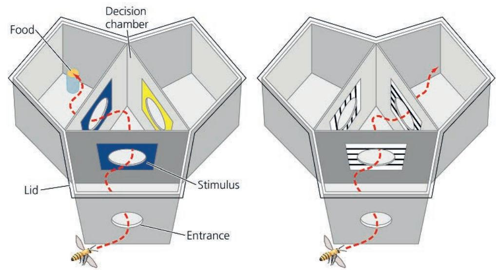  
VISUAL SKILLS Describe how you would set up the pattern maze to control for an inherent preference for or against a particular orientation of the black bars. For suggested answer, see Appendix A.  
1 Bees were trained in a color maze. As shown here, one group was rewarded for choosing the same color as the stimulus.  
2 Bees were tested in a pattern maze. If previously rewarded for choosing the same color, bees most often chose lines oriented the same way as the stimulus.

ravens eventually arrived at similar solutions. Nevertheless, some ravens failed to solve the problem, indicating that problem-solving success in this species, as in others, varies with individual experience and abilities.

## Development of Learned Behaviors

Most of the learned behaviors we have discussed develop over a relatively short time. Some behaviors develop more gradually. For example, some bird species learn songs in stages. In the case of the white-crowned sparrow (Zonotrichia leucophrys), the first stage of song learning takes place early in life, when the fledgling sparrow first hears the song. If a fledgling is prevented from hearing real sparrows or recordings of sparrow songs during the first 50 days of its life, it fails to develop the adult song of its species.

Although a young sparrow does not sing during the critical period, it memorizes the song of its species by listening to other white-crowned sparrows sing. During the critical period, fledglings chirp more in response to songs of their own species than to songs of other species. Thus, when young white-crowned sparrows learn the songs they will sing later on, that learning appears to be bounded by genetically controlled preferences.

The critical period when a white-crowned sparrow memorizes its species' song is followed by a second learning phase when the juvenile bird sings tentative notes called a subsong. The juvenile bird hears its own singing and compares it with the song memorized during the critical period. Once a sparrow's own song matches the one it memorized, the song "crystallizes" as the final song, and the bird sings only this adult song for the rest of its life.

Song learning is one of many examples of how animals learn from other members of their species. In finishing our exploration of learning, we'll look at several more examples that reflect the more general phenomenon of social learning.

## Social Learning

Many animals learn to solve problems by observing the behavior of other individuals. Learning through observing and interpreting behaviors and their consequences is called social learning. Young wild chimpanzees, for example, learn how to crack open oil palm nuts with two stones by copying experienced chimpanzees (Figure 51.11).

Figure 51.11 A young chimpanzee (Pan troglodytes) learning to crack oil palm nuts by observing an elder.  

Another example of how social learning can modify behavior comes from studies of the vervet monkeys (Chlorocebus pygerythrus) in Amboseli National Park, Kenya. Vervet monkeys, which are about the size of a domestic cat, produce a complex set of alarm calls. Amboseli vervets give distinct alarm calls for leopards, eagles, and snakes. When a vervet sees a leopard, it gives a loud barking sound; when it sees an eagle, it gives a short double-syllable cough; and the snake alarm call is a “chutter.” Upon hearing a particular alarm call, other vervets in the group behave in an appropriate way: They run up a tree on hearing the alarm for a leopard (vervets are nimbler than leopards in the trees); look up on hearing the alarm for an eagle; and look down on hearing the alarm for a snake (Figure 51.12).

Infant vervet monkeys give alarm calls, but in a relatively undiscriminating way. For example, they give the “eagle” alarm on seeing any bird, including harmless birds such as bee-eaters. With age, the monkeys improve their accuracy. In fact, adult vervet monkeys give the eagle alarm only on seeing an eagle belonging to either of the two species that eat vervets. Infants probably learn how to give the right call by observing other members of the group and receiving social confirmation. For instance, if the infant gives the call on the right occasion—say, an eagle alarm when there is an eagle overhead—another member of the group will also give the eagle call. But if the infant gives the call when a bee-eater flies by, the adults in the group are silent. Thus, vervet monkeys have an initial, unlearned tendency to give calls upon seeing

## Figure 51.12 Vervet monkeys learning correct use of alarm calls.

On seeing a python (foreground), vervet monkeys give a distinct “snake” alarm call (inset), and the members of the group stand upright and look down.

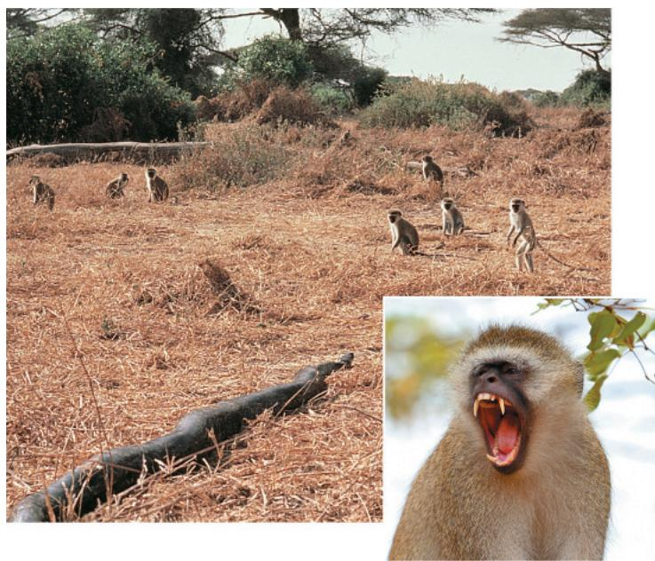

potentially threatening objects in the environment. Learning fine-tunes the call so that adult vervets give calls only in response to genuine danger and can fine-tune the alarm calls of the next generation.

Social learning forms the roots of culture, a system of information transfer through social learning or teaching that influences the behavior of individuals in a population. Cultural transfer of information can alter behavioral phenotypes and thereby influence the fitness of individuals.

Changes in behavior that result from natural selection occur on a much longer time scale than does learning. In Concept 51.3, we'll examine the relationship between particular behaviors and the processes of selection related to survival and reproduction.

## Concept Check 51.2

1. How might associative learning explain why different species of distasteful or stinging insects have similar colors?

2. WHAT IF? How might you position and manipulate a few objects in a lab to test whether an animal can use a cognitive map to remember the location of a food source?

3. MAKE CONNECTIONS How might a learned behavior contribute to speciation? (See Concept 24.1.)

For suggested answers, see Appendix A.

## Concept 51.3: Selection for individual survival and reproductive success can explain diverse behaviors

EVOLUTION We turn now to Tinbergen's third question—how behavior enhances survival and reproduction in a population. The focus thus shifts from proximate causation—the "how" questions—to ultimate causation—the "why" questions. We'll begin by considering the activity of gathering food. Food-obtaining behavior, or foraging, includes not only eating but also any activities an animal uses to search for, recognize, and capture food items.

## Evolution of Foraging Behavior

The fruit fly allows us to examine one way that foraging behavior might have evolved. Variation in a gene called forager (for) dictates how far Drosophila larvae travel when foraging. On average, larvae carrying the $for^{R}$ (“Rover”) allele travel nearly twice as far while foraging as do larvae with the $for^{s}$ (“sitter”) allele.

Both the $for^{R}$ and $for^{s}$ alleles are present in natural populations. What circumstances might favor one or the other allele? An answer became apparent in experiments that maintained flies at either low or high population densities for many generations. Larvae in populations kept at a low density foraged over shorter distances than those in populations kept at high density (Figure 51.13). Furthermore, the $for^s$ allele increased in frequency in the low-density populations, whereas the $for^R$ allele increased in frequency in the high-density group. These changes make sense. At a low population density, short-distance foraging yields sufficient food, while long-distance foraging would result in unnecessary energy expenditure. Under crowded conditions, long-distance foraging could enable larvae to move beyond areas depleted of food. Thus, an interpretable evolutionary change in behavior occurred in the course of the experiment.

Figure 51.13 Evolution of foraging behavior by laboratory populations of Drosophila melanogaster.  
After 74 generations of living at low population density, Drosophila larvae (populations R1–R3) followed foraging paths significantly shorter than those of Drosophila larvae that had lived at high density (populations K1–K3).  
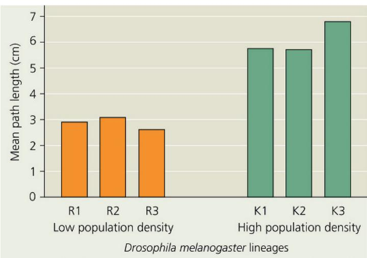  
INTERPRET THE DATA What alternative hypothesis is made far less likely by having three R and K lines, rather than one of each?

## Optimal Foraging Model

To study the ultimate causation of foraging strategies, biologists sometimes apply a type of cost-benefit analysis used in economics. This idea proposes that foraging behavior is a compromise between the benefits of nutrition and the costs of obtaining food. These costs might include the energy expenditure of foraging as well as the risk of being eaten while foraging. According to this optimal foraging model, natural selection should favor a foraging behavior that minimizes the costs of foraging and maximizes the benefits. The Scientific Skills Exercise provides an example of how this model can be applied to animals in the wild.

## Balancing Risk and Reward

One of the most significant potential costs to a forager is risk of predation. Maximizing energy gain and minimizing energy costs are of little benefit if the behavior makes the forager a likely meal for a predator. It seems logical, therefore, that predation risk would influence foraging behavior. Such appears to be the case for the mule deer (Odocoileus hemionus), which lives in the mountains of western North America. Researchers found that the food available for mule deer was fairly uniform across the potential foraging areas, although somewhat lower in open, nonforested areas. In contrast, the risk of predation differed greatly; mountain lions (Puma concolor), the major predator, killed large numbers of mule deer at forest edges and only a small number in open areas and forest interiors.

How does mule deer foraging behavior reflect the differences in predation risk in particular areas? Mule deer feed predominantly in open areas. Thus, it appears that mule deer foraging behavior reflects the large variation in predation risk and not the smaller variation in food availability. This result underscores the point that behavior typically reflects a compromise between competing selective pressures.

## Mating Behavior and Mate Choice

Just as foraging is crucial for individual survival, mating behavior and mate choice play a major role in determining reproductive success. These behaviors include seeking or attracting mates, choosing among potential mates, competing for mates, and caring for offspring.

## Mating Systems and Sexual Dimorphism

There is considerable variation in patterns of sexual contact. In the context of reproduction, biologists describe differences in mating systems, the length and number of relationships between males and females. In some animal species, mating is promiscuous, with no strong pair-bonds. In others, mates form a relationship of some duration that is monogamous (one male mating with one female) or polygamous (an individual of one sex mating with several of the other). Polygamous relationships involve either polygyny, a single male and many females, or polyandry, a single female and multiple males. (Note that same-sex sexual behavior is also very common in many species.)

The extent to which males and females differ in appearance, a characteristic known as sexual dimorphism, typically varies with the type of mating system. Among monogamous species, males and females often look very similar. In contrast, among polygamous species, the sex that attracts multiple mating partners is typically showier and

# Scientific Skills Exercise

# Testing a Hypothesis with a Quantitative Model

Do Crows Display Optimal Foraging Behavior? On islands off British Columbia, Canada, Northwestern crows (Corvus caurinus) search rocky tide pools for sea snails called whelks. After spotting a whelk, the crow picks it up in its beak, flies upward, and drops the whelk onto the rocks. If the drop is successful, the shell breaks and the crow can dine on the whelk's soft parts. If not, the crow flies up and drops the whelk again and again until the shell breaks. What determines how high the crow flies? If energetic considerations dominated selection for the crow's foraging behavior, the average drop height might reflect a trade-off between the cost of flying higher and the benefit of more frequent success. In this exercise, you'll test how well this optimal foraging model predicts the average drop height observed in nature.

How the Experiments Were Done There were two parts to the experiment. First, the researcher measured the height of drops made by crows in the wild by referring to a marked pole erected nearby. Second, the researcher built a device that dropped a whelk onto the rocks from a fixed platform. For each whelk, he kept track of the number of drops carried out before the whelk broke open. Averaging over many trials with the device and combining the data for each platform height, he calculated a predicted total “flight” height: the height of the platform times the average number of drops required to break open the whelk.

Data from the Experiment The graph summarizes the results of the experiment, comparing the behavior of crows in the wild with the measurements using the whelk-dropping device.

Data from R. Zach, Shell-dropping: Decision-making and optimal foraging in northwestern crows, Behavior 68:106–117 (1979).

## INTERPRET THE DATA

1. How does the average number of drops required to break open a whelk depend on platform height for a drop of 5 m or less? For drops of more than 5 m?

2. Total flight height can be considered to be a measure of the total energy required to break open a whelk. Why is this value lower for a platform set at 5 m than for one at 2 or 15 m?

larger than the opposite sex (Figure 51.14). We'll discuss the evolutionary basis of these differences shortly.

## Mating Systems and Parental Care

The needs of the young are an important factor constraining the evolution of mating systems. Most newly hatched birds, for instance, cannot care for themselves. Rather, they require a large, continuous food supply, a need that is difficult for a single parent to meet. In such cases, a male that stays with and helps a single mate may ultimately have more viable offspring than it would by going off to seek additional mates. This may explain why many bird species are monogamous. In contrast, for birds with young

3. Compare the drop height preferred by crows with the graph of total flight height for the platform drops. Are the data consistent with the hypothesis of optimal foraging? Explain.

4. In testing the optimal foraging model, it was assumed that changing the height of the drop only changed the total energy required. Do you think this is a realistic limitation, or might other factors than total energy be affected by height?

5. Researchers observed that the crows only gather and drop the largest whelks. What are some reasons crows might favor larger whelks?

6. It turned out that the probability of a whelk breaking was the same for a whelk dropped for the first time as for an unbroken whelk dropped several times previously. If the probability of breaking instead increased, what change might you predict in the crow's behavior?

Instructors: A version of this Scientific Skills Exercise can be assigned in Mastering Biology.

that can feed and care for themselves almost immediately after hatching, the males derive less benefit from staying with their partner. Males of these species, such as pheasants and quail, can maximize their reproductive success by seeking other mates, and polygyny is relatively common in such birds. In the case of mammals, the lactating female is often the only food source for the young, and males usually play no role in raising the young. In mammalian species where males protect the females and young, such as lions, a male or small group of males typically cares for a harem of many females.

Another factor influencing mating behavior and parental care is certainty of paternity. Young born to or eggs laid by a female definitely contain that female's genes. However, even if there is a

Figure 51.14 Relationship between mating system and male and female forms.

(a) Monogamy (one male, one female)

  
In monogamous species, such as these western gulls (Larus occidentalis), males and females are difficult to distinguish using external characteristics only.

(b) Polygyny (one male, multiple females)  
  
Among polygynous species, such as elk (Cervus canadensis), the male (right) is often highly ornamented.

(c) Polyandry (one female, multiple males)  
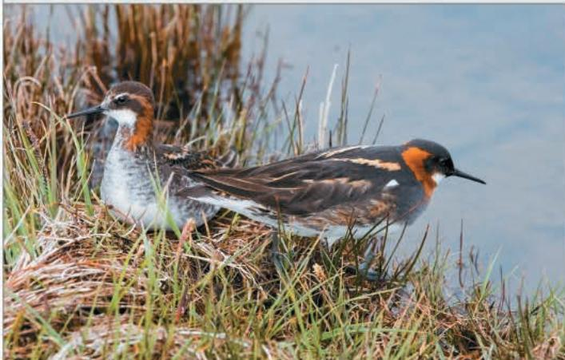  
In polyandrous species, such as these red-necked phalaropes (Phalaropus lobatus), females (right) are generally more ornamented than males.

strong pair-bond, a male other than the female's usual mate may on occasion produce offspring with that female. The certainty of paternity is relatively low in most species with internal fertilization because the acts of mating and birth (or mating and egg laying) are separated over time. This could be one reason that exclusively male parental care is rare in bird and mammal species. However, the males of many species with internal fertilization engage in behaviors that appear to increase their certainty of paternity. These behaviors include guarding females, removing any sperm from the female reproductive tract before copulation, and introducing large quantities of sperm that displace the sperm of other males.

Certainty of paternity is high when egg laying and mating occur together, as in external fertilization. This may explain why parental care in aquatic invertebrates, fishes, and amphibians, when it occurs at all, is at least as likely to be by males as by females (Figure 51.15; see also Figure 46.6). Among fishes and amphibians, parental care occurs in fewer than 10% of species with internal fertilization but in more than half of species with external fertilization.

It is important to point out that certainty of paternity does not mean that animals are aware of those factors when they behave a certain way. Parental behavior correlated with certainty of paternity exists because it has been reinforced over generations by natural selection. The intriguing relationship between certainty of paternity and male parental care remains an area of active research.

## Sexual Selection and Mate Choice

Sexual dimorphism results from sexual selection, a form of natural selection in which differences in reproductive success among individuals are a consequence of differences in mating success (see Concept 23.4). Sexual selection can take the form of intersexual

## Figure 51.15 Paternal care by a male yellowhead jawfish (Opistognathus aurifrons).

The male jawfish, which lives in tropical marine environments, holds the eggs it has fertilized in its mouth, keeping them aerated and protecting them from predators until the young fish hatch.

selection, in which members of one sex choose mates on the basis of characteristics of the other sex, such as courtship songs, or intra-sexual selection, which involves competition between members of one sex for mates.

## Mate Choice by Females

Mate preferences of females may play a central role in the evolution of male behavior and anatomy through intersexual selection. Consider, for example, the courtship behavior of stalk-eyed flies. The eyes of these insects are at the tips of stalks, which are longer in males than in females. During courtship, a male approaches the female headfirst. Researchers have shown that females are more likely to mate with males that have relatively long eyestalks. Why would females favor this seemingly arbitrary trait? Ornaments such as long eyestalks in these flies and bright coloration in birds correlate in general with health and vitality. A female whose mate choice is a healthy male is likely to produce more offspring that survive to reproduce. As a result, males may compete with each other in ritualized contests to attract female attention (Figure 51.16). In face-offs between male stalk-eyed flies, the male whose eyestalk length is smaller usually retreats peacefully.

Mate choice can also be influenced by imprinting, as revealed by experiments carried out with zebra finches

(Taeniopygia guttata). Both male and female zebra finches normally lack any feather crest on their head (Figure 51.17). To explore whether parental appearance affects mate preference in offspring independent of any genetic influence, researchers provided zebra finches with artificial ornamentation. A 2.5-cm-long red feather was taped to the forehead feathers of either or both zebra finch parents when their chicks were 8 days old, approximately 2 days before they opened their eyes. A control group of zebra finches was raised by unadorned parents. When the chicks matured, they were presented with prospective mates that were either artificially ornamented with a red feather or non-ornamented (Figure 51.18). Males showed no preference. Females raised by a male parent that was not ornamented also showed no preference. However, females raised by an ornamented male parent preferred ornamented males as their own mates. Thus, female finches apparently take cues from their male parents in choosing mates.

Mate-choice copying, a behavior in which individuals in a population copy the mate choice of others, has

been studied in the guppy, Poecilia reticulata. When a female guppy chooses between males with no other females present, the female almost always chooses the male with more orange

Figure 51.16 A face-off between male stalk-eyed flies (Cyrtodiopsis whitei) competing for female attention.

Figure 51.17
Appearance of zebra finches in nature.

The male zebra finch (right) is more highly patterned and colorful than the female zebra finch (left).

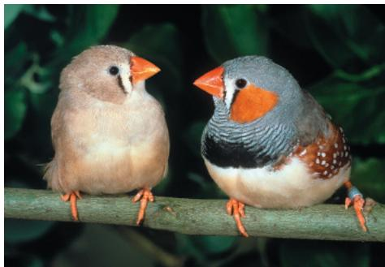  
Figure 51.18 Sexual selection influenced by imprinting.

Experiments demonstrated that female zebra finch chicks that had imprinted on artificially ornamented male parents preferred ornamented males as adult mates. For all experimental groups, male offspring showed no preference for either ornamented or non-ornamented female mates.

## Figure 51.19 Mate choice copying by female guppies (Poecilia reticulata).

In the absence of other females (control group), female guppies generally choose males with more orange coloration. However, when a female model is placed near one of the males (experimental group), female guppies often copy the apparent mate choice of the model, even if the male is less colorful than others. Guppy females ignored the mate choice of the model only if an alternative male had much more orange coloration.

coloration. To explore if the behavior of other females could influence this preference, an experiment was set up using both living females and artificial model females (Figure 51.19). If a female guppy observed the model “courting” a male with less extensive orange markings, she often copied the preference of the model female. That is, the female chose the male that had been presented in association with a model female rather than a more orange alternative. The exceptions were also informative. Mate-choice copying typically did not change when the difference in coloration was particularly large; that is, the female guppy chose the male with the much stronger coloration even if a model female was associated with the less orange male. Mate-choice copying can thus mask genetically controlled female preference below a certain threshold of difference, in this case for male color.

Mate-choice copying, a form of social learning, has also been observed in several other fish and bird species. What is the selective pressure for such a mechanism? One possibility is that a female that mates with males that are attractive to other females

## Figure 51.20 Agonistic interaction.

Male eastern grey kangaroos (Macropus giganteus) often “box” in contests that determine which male is most likely to mate with an available female. Typically, one male snorts loudly and strikes the other with his forelimbs. If the male under attack does not retreat, the fight may escalate into grappling or the two males balancing on their tails while attempting to kick each other with the sharp toenails of their hind feet.

increases the probability that her male offspring will also be attractive and have high reproductive success.

## Male Competition for Mates

The previous examples show how female choice can select for one best type of male in a given situation, resulting in low variation among males. Similarly, male competition for mates can reduce variation among males. Such competition may involve agonistic behavior, a contest, typically ritualized, that determines which competitor gains access to a resource, such as food or a mate (Figure 51.20; see also Figure 51.16).

Despite the potential for male competition to select for reduced variation, behavioral and morphological variation in males is extremely high in some vertebrate species, including species of fish and deer, as well as in a wide variety of invertebrates. In some species, sexual selection has led to the evolution of alternative male mating behavior and morphology. How do scientists analyze situations where more than one mating behavior can result in successful reproduction? One approach relies on the rules that govern games.

## Applying Game Theory

Often, the fitness of a particular behavioral phenotype is influenced by other behavioral phenotypes in the population. In studying such situations, behavioral ecologists use a range of

Figure 51.21 Male polymorphism in the common side-blotched lizard (Uta stansburiana).

An orange-throat male, left; a blue-throat male, center; a yellow-throat male, right.

tools, including game theory. Developed by American mathematician John Nash and others to model human economic behavior, game theory evaluates alternative strategies in situations where the outcome depends on the strategies of all the individuals involved.

As an example of applying game theory to mating behavior, let's consider the common side-blotched lizard (Uta stansburiana) of California. Genetic variations give rise to males with orange, blue, or yellow throats (Figure 51.21). One would expect that natural selection would favor one of the three color types, yet all three persist. Why? The answer appears to lie in the fact that each throat color is associated with a different pattern of behavior: Orange-throat males are the most aggressive and defend large territories that contain many females. Blue-throat males are also territorial but defend smaller territories and fewer females. Yellow-throats are nonterritorial males that mimic females and use “sneaky” tactics to gain the chance to mate.

Evidence indicates that the mating success of each male lizard type is influenced by the relative abundance of the other types, an example of frequency-dependent selection. In one study population, the most frequent throat coloration changed over a period of several years from blue to orange to yellow and back to blue.

By comparing the competition between common side-blotched lizard males to the children's game of rock-paper-scissors, scientists devised an explanation for the cycles of variation in the lizard population. In the game, paper defeats rock, rock defeats scissors, and scissors defeats paper. Each hand symbol thus wins one matchup but loses the other. Similarly, each type of male lizard has an advantage over one of the other two types:

\- When blue-throats are abundant, they can defend the few females in their territories from the advances of the

sneaky yellow-throat males. However, blue-throats cannot defend their territories against the hyperaggressive orange-throats.

\- Once the orange-throats become the most abundant, the larger number of females in each territory provides the opportunity for the yellow-throats to have greater mating success.

\- The yellow-throats become more frequent, but then give way to the blue-throats, whose tactic of guarding small territories once again allows them the most success.

Thus, following the population over time, one sees a persistence of all three color types and a periodic shift in which type is most prevalent.

Game theory provides a way to think about complex evolutionary problems in which relative performance (reproductive success relative to other phenotypes), not absolute performance, is the key to understanding the evolution of behavior. This makes game theory an important tool because the relative performance of one phenotype compared with others is a measure of Darwinian fitness.

## Concept Check 51.3

1. Provide an ultimate explanation for the correlation between the mode of fertilization in a species and the presence or absence of male parental care.

2. MAKE CONNECTIONS Balancing selection can maintain variation at a locus (see Concept 23.4). Based on the foraging experiments described in this chapter, devise a simple hypothesis to explain the presence of both $for^R$ and $for^s$ alleles in natural fly populations.

3. WHAT IF? Suppose an infection in a common side-blotched lizard population killed many more males than females. What would be the immediate effect on male competition for reproductive success?

For suggested answers, see Appendix A.

## Concept 51.4: Genetic analyses and the concept of inclusive fitness provide a basis for studying the evolution of behavior

EVOLUTION We'll now explore issues related to Tinbergen's fourth question—the evolutionary history of behaviors. We will first look at the genetic control of a behavior. Next, we will examine the genetic variation underlying the evolution of particular behaviors. Finally, we will see how expanding the definition of fitness beyond individual survival can help explain “selfless” behavior.

## Genetic Basis of Behavior

In exploring the genetic basis of behavior, we'll begin with the courtship behavior of the male fruit fly (see Figure 51.4). During courtship, the male fly carries out a complex series of actions in response to multiple sensory stimuli. Genetic studies have revealed that a single gene called fru controls this entire courtship ritual. If the fru gene is mutated to an inactive form, males do not court or mate with females. (The name fru is short for fruitless, reflecting the absence of offspring from the mutant males.) Normal male and female flies express distinct forms of the fru gene. When females are genetically manipulated to express the male form of fru, they court other females, performing the role normally played by the male.

How does the fru gene control so many different actions? Experiments carried out cooperatively in several laboratories demonstrated that fru is a master regulatory gene that directs the expression and activity of many genes with narrower functions. Together, genes that are controlled by the fru gene bring about sex-specific development of the fly nervous system. In effect, fru programs the fly for male courtship behavior by overseeing a male-specific wiring of the central nervous system.

In many cases, differences in behavior arise not from gene inactivation, but from variation in the activity or amount of a gene product. One striking example comes from the study of two related species of voles, which are small, mouse-like rodents. Male meadow voles (Microtus pennsylvanicus) are solitary and do not form lasting relationships with mates. Following mating, they pay little attention to their pups. In contrast, male prairie voles (Microtus ochrogaster) form a pair-bond with a single female after they mate (Figure 51.22). Male prairie voles provide care for their young pups, hovering over them, licking them, and carrying them, while acting aggressively toward intruders.

A neurotransmitter released during mating is critical for the partnering and parental behavior of male voles. Known as antidiuretic hormone (ADH) or vasopressin (see Concept 44.5), this peptide is released during mating and binds to a specific receptor in the central nervous system. When male prairie voles are given a drug that inhibits the receptor in the brain that detects vasopressin, the male voles fail to form pair-bonds after mating.

The vasopressin receptor gene is much more highly expressed in the brain of prairie voles than in the brain of meadow voles. Testing the hypothesis that the level of vasopressin receptor in the brain regulates postmating behavior, researchers inserted the vasopressin receptor gene from prairie voles into the genome of meadow voles. The male meadow voles carrying this gene not only developed brains with higher levels of the vasopressin receptor but also showed many of the same mating behaviors as male prairie voles, such as pair-bonding. Thus, although many genes influence pair-bonding and parenting in male voles, a change in the level of expression of the vasopressin receptor is sufficient to alter the development of these behaviors.

Figure 51.22 A pair of prairie voles (Microtus ochrogaster) huddling.

Among North American prairie voles, males associate closely with their mates, as shown here, and contribute substantially to the care of young.

## Genetic Variation and the Evolution of Behavior

Behavioral differences between closely related species, such as meadow and prairie voles, are common. Significant differences in behavior can also be found within a species but are often less obvious. When behavioral variation between populations of a species correlates with variation in environmental conditions, it may reflect natural selection.

## Case Study: Variation in Prey Selection

An example of genetically based behavioral variation within a species involves prey selection by the western garter snake (Thamnophis elegans). The natural diet of this species differs widely across its range in California. Coastal populations feed predominantly on banana slugs (Ariolimax californicus). Inland populations feed on frogs, leeches, and fish, but not banana slugs. In fact, banana slugs are rare or absent in the inland habitats.

When researchers offered banana slugs to snakes collected from each wild population, most coastal snakes readily ate them (Figure 51.23). In contrast, inland snakes tended to refuse. To what extent does genetic variation among snake species contribute to a fondness for banana slugs? To answer this question, researchers collected pregnant snakes from the wild coastal and inland populations and then housed these females in separate cages in the laboratory. While the offspring were still very young, they were each offered a small piece of banana slug on ten successive days. More than 60% of the young snakes from coastal females ate banana slugs on eight or more of the ten days. In contrast, fewer

Figure 51.23 Western garter snake from a coastal habitat eating a banana slug.

Experiments indicate that the preference of these snakes for banana slugs may be influenced more by genetics than by environment.

than 20% of the young snakes from inland females ate a piece of banana slug even once. Perhaps not surprisingly, banana slugs thus appear to be a genetically acquired taste.

How did a genetically determined difference in feeding preference come to match the snakes' habitats so well? It turns out that the two populations also vary with respect to their ability to recognize and respond to odor molecules produced by banana slugs. Researchers hypothesize that when inland snakes colonized coastal habitats more than 10,000 years ago, some of them could recognize banana slugs by scent. Because these snakes took advantage of this food source, they had higher fitness than snakes in the population that ignored the slugs. Over hundreds or thousands of generations, the capacity to recognize the slugs as prey increased in frequency in the coastal population. The marked variation in behavior observed today between the coastal and inland populations may be evidence of this past evolutionary change.

## Case Study: Variation in Migratory Patterns

Another species suited to the study of behavioral variation is the blackcap (Sylvia atricapilla), a small migratory warbler. Blackcaps that breed in Germany generally migrate southwest to Spain and then south to Africa for the winter. In the 1950s, a few blackcaps began to spend their winters in Britain, and over time the population of blackcaps wintering in Britain grew to many thousands. Leg bands showed that some of these birds had migrated westward from central Germany. Was this change in the pattern of migration the outcome of natural selection? If so, the birds wintering in Britain must have a heritable difference in migratory behavior. To test this hypothesis, researchers at the Max Planck Institute for Ornithology in Radolfzell, Germany, devised a strategy to study migratory orientation in the laboratory (Figure 51.24). The results demonstrated

that the two patterns of migration—to the west and to the southwest—do in fact reflect genetic differences between the two populations.

The study of western European blackcaps indicated that the change in their migratory behavior occurred both recently and rapidly. Before the year 1950, there were no known westward-migrating blackcaps in Germany. By the 1990s, westward migrants made up 7–11% of the blackcap populations of Germany. Once westward migration began, it persisted and increased in frequency, perhaps due to the widespread use of winter bird feeders in Britain, as well as shorter migration distances.

## Altruism

We typically assume that behaviors are selfish; that is, they benefit the individual at the expense of others, especially competitors. For example, superior foraging ability by one individual may leave less food for others. The problem comes with “unselfish” behaviors. How can such behaviors arise through natural selection? To answer this question, let’s look more closely at some examples of unselfish behavior and consider how they might arise.

In discussing selflessness, we will use the term altruism to describe a behavior that reduces an animal's individual fitness but increases the fitness of other individuals in the population. Consider, for example, the Belding's ground squirrel (Urocitellus beldingi), which lives in the western United States and is vulnerable to predators such as coyotes and hawks. A squirrel that sees a predator approach often gives a high-pitched alarm call that alerts unaware individuals to retreat to their burrows. In warning others, however, this squirrel brings attention to its location and thus increases its own risk of being killed.

Another example of altruistic behavior occurs in honeybee societies, in which the workers are sterile. The workers themselves never reproduce, but they labor on behalf of a single fertile queen. Furthermore, the workers sting intruders, a behavior that helps defend the hive but results in the death of those workers.

Altruism is also observed in naked mole rats (Heterocephalus glaber), highly social rodents that live in underground chambers and tunnels in southern and northeastern Africa. The naked mole rat, which is almost hairless and nearly blind, lives in colonies of 20 to 300 individuals (Figure 51.25). Each colony has only one reproducing female, the queen, who mates with one to three males, called kings. The rest of the colony consists of nonreproductive females and males who at times sacrifice themselves to protect the queen or kings from snakes or other predators that invade the colony.

## Inclusive Fitness

With these examples from ground squirrels, honeybees, and mole rats in mind, let's return to the question of how altruistic behavior arises during evolution. The easiest case to consider is that of parents sacrificing for their offspring. When parents sacrifice their own well-being to produce and aid offspring, this act actually increases the fitness of the parents because it maximizes their genetic representation in the population. By this logic,

## Figure 51.24

# Inquiry: Are differences in migratory orientation within a species genetically determined?

Experiment

Birds known as blackcaps that live in Germany winter elsewhere. Most migrate to Spain and Africa, but a few fly to Britain, where they find food left out by city dwellers. German scientist Peter Berthold and colleagues wondered if this change had a genetic basis. To test this hypothesis, they captured blackcaps wintering in Britain and bred them in Germany in an outdoor cage. They also collected young blackcaps from nests in Germany and raised them in cages. In the autumn, the blackcaps captured in Britain and the birds raised in cages were placed in large, glass-covered funnel cages. When the funnels were lined with carbon-coated paper and placed outside at night, the birds moved around, making marks on the paper that indicated the direction in which they were trying to “migrate.”

  
Figure 51.25 Naked mole rats, a species of colonial mammal that exhibits altruistic behavior.  
Pictured here is a queen nursing offspring while surrounded by other members of the colony.

  
altruistic behavior can be maintained by evolution even though it does not enhance the survival and reproductive success of the self-sacrificing individuals.

## Results

The wintering adult birds captured in Britain and their laboratory-raised offspring both attempted to migrate to the west. In contrast, the young birds collected from nests in southern Germany attempted to migrate to the southwest.

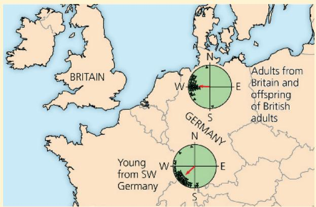

## Conclusion

The young of the British blackcaps and the young birds from Germany (the control group) were raised under similar conditions but showed very different migratory orientations, indicating that their migratory orientation has a genetic basis.

Data from P. Berthold et al., Rapid microevolution of migratory behavior in a wild bird species, Nature 360:668–690 (1992).

WHAT IF? Suppose the birds had not shown a difference in orientation in these experiments. Could you conclude that the behavior was not genetically based? Explain.

For suggested answer, see Appendix A.

What about circumstances when individuals help others who are not their offspring? By considering a broader group of relatives than just parents and offspring, biologist William Hamilton found an answer. He began by proposing that an animal could increase its genetic representation in the next generation by helping close relatives other than its own offspring. Like parents and offspring, full siblings have half their genes in common. Therefore, selection might also favor helping siblings or helping one's parents produce more siblings. This thinking led Hamilton to the idea of inclusive fitness, the total effect an individual has on proliferating its genes by producing its own offspring and by providing aid that enables other close relatives to produce offspring.

## Hamilton's Rule and Kin Selection

The power of Hamilton's hypothesis was that it provided a way to measure, or quantify, the effect of altruism on fitness. According to Hamilton, the three key variables in an act of altruism are the benefit to the recipient, the cost to the altruist, and the coefficient of relatedness. The benefit, $B$ , is the average

<!-- END OFFICIAL MINERU API RESULT part_12 -->

<!-- BEGIN OFFICIAL MINERU API RESULT part_13 -->

number of extra offspring that the recipient of an altruistic act produces. The cost, C, is how many fewer offspring the altruist produces. The coefficient of relatedness, r, equals the fraction of genes that, on average, are shared. Natural selection favors altruism when the benefit to the recipient multiplied by the coefficient of relatedness exceeds the cost to the altruist—in other words, when rB > C. This statement is called Hamilton's rule.

To better understand Hamilton's rule, let's apply it to a human population in which the average individual has two children. We'll imagine that a teenager is close to drowning in heavy surf, and his sister risks her life to swim out and pull her sibling to safety. If the teen had drowned, his reproductive output would have been zero; but now, if we use the average, he can reach adulthood and eventually parent two children. The benefit to the brother is thus two offspring ( $B = 2$ ). What cost does his sister incur? Let's say that she has a $25\%$ chance of drowning in attempting the rescue. The cost of the altruistic act to the sister is then 0.25 times 2, the number of offspring she would be expected to have if she had stayed on shore ( $C = 0.25 \times 2 = 0.5$ ). Finally, we note that a brother and sister share half their genes on average ( $r = 0.5$ ). One way to see this is in terms of the separation of homologous chromosomes that occurs during meiosis of gametes (Figure 51.26; see also Figure 13.7).

We can use our values of B, C, and r to evaluate whether natural selection would favor the altruistic act in our imaginary scenario. For the surf rescue, $rB = 0.5 \times 2 = 1$ , whereas C = 0.5.

## Figure 51.26 The coefficient of relatedness between siblings.

The red band indicates a particular allele (version of a gene) present on one chromosome, but not its homolog, in parent A. Sibling 1 has inherited the allele from parent A. There is a probability of $\frac{1}{2}$ that sibling 2 will also inherit this allele from parent A. Any allele present on one chromosome of either parent will behave similarly. The coefficient of relatedness between the two siblings is thus $\frac{1}{2}$ , or 0.5.

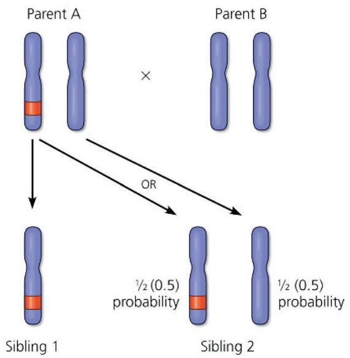  
WHAT IF? The coefficient of relatedness of an individual to a full (nontwin) sibling or to either parent is the same: 0.5. Does this value also hold true in cases of polyandry and polygyny?
For suggested answer, see Appendix A.

Because $rB$ is greater than $C$ , Hamilton's rule is satisfied; thus, natural selection would favor this altruistic act.

Averaging over many individuals and generations, any particular gene in a sister faced with the situation described will be passed on to more offspring if she risks the rescue than if she does not. Among the genes propagated in this way may be some that contribute to altruistic behavior. Natural selection that thus favors altruism by enhancing the reproductive success of relatives is called kin selection.

Kin selection weakens with hereditary distance. Siblings have an r of 0.5, but between an aunt and her niece, $r = 0.25 \left( \frac{1}{4} \right)$ , and between first cousins, $r = 0.125 \left( \frac{1}{8} \right)$ . Notice that as the degree of relatedness decreases, the rB term in the Hamilton inequality also decreases. Would natural selection favor rescuing a cousin? Not unless the surf were less treacherous. For the original conditions, $rB = 0.125 \times 2 = 0.25$ , which is only half the value of C (0.5). British geneticist J. B. S. Haldane appears to have anticipated these ideas when he jokingly stated that he would not lay down his life for one brother, but would do so for two brothers or eight cousins.

If kin selection explains altruism, then the examples of unselfish behavior we observe among diverse animal species should involve close relatives. This is apparently the case, but often in complex ways. Like most mammals, female Belding's ground squirrels settle close to their site of birth, whereas males settle at distant sites (Figure 51.27). Since nearly all alarm calls are given by females, they are most likely aiding close relatives. In the case of worker bees, who are all sterile, anything they do to help the entire hive benefits the only permanent member who is reproductively active—the queen, who is their parent.

In the case of naked mole rats, DNA analyses have shown that all the individuals in a colony are closely related. Genetically, the queen appears to be a sibling, offspring, or parent of the kings, and the nonreproductive mole rats are the queen's direct

## Figure 51.27 Kin selection and altruism in Belding's ground squirrels.

This graph helps explain the male-female difference in altruistic behavior of ground squirrels. Once weaned (pups are nursed for about one month), females are more likely than males to live near close relatives. Alarm calls that warn these relatives increase the inclusive fitness of the female altruist.

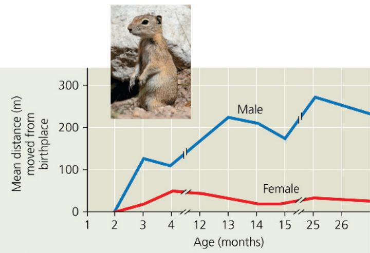

descendants or her siblings. Therefore, when a nonreproductive individual enhances a queen's or king's chances of reproducing, the altruist increases the chance that some genes identical to its own will be passed to the next generation.

## Reciprocal Altruism

Some animals occasionally behave altruistically toward others who are not relatives. A baboon may help an unrelated companion in a fight, or a wolf may offer food to another wolf even though they share no kinship. Such behavior can be adaptive if the aided individual returns the favor in the future. This sort of exchange of aid, called reciprocal altruism, is commonly invoked to explain altruism that occurs between unrelated humans. Reciprocal altruism is rare in other animals; it is limited largely to species (such as chimpanzees) with social groups stable enough that individuals have many chances to exchange aid. It is generally thought to occur when individuals are likely to meet again and when there would be negative consequences associated with not returning favors to individuals who had been helpful in the past, a pattern of behavior that behavioral ecologists refer to as “cheating.”

Since cheating may benefit the cheater substantially, how could reciprocal altruism evolve? Game theory provides a possible answer in the form of a behavioral strategy called tit for tat. In the tit-for-tat strategy, an individual treats another in the same way it was treated the last time they met. Individuals adopting this behavior are always altruistic, or cooperative, on the first encounter with another individual and will remain so as long as their altruism is reciprocated. When their cooperation is not reciprocated, however, individuals employing tit for tat will retaliate immediately but return to cooperative behavior as soon as the other individual becomes cooperative. The tit-for-tat strategy has been used to explain the few apparently reciprocal altruistic interactions observed in animals—ranging from blood sharing between nonrelated vampire bats to social grooming in primates.

## Evolution and Human Culture

As animals, humans behave (and, sometimes, misbehave). Just as humans vary extensively in anatomical features, we display substantial variations in behavior. Environment intervenes in the path from genotype to phenotype for physical traits, but does so much more profoundly for behavioral traits. Furthermore, as a consequence of our marked capacity for learning, humans are probably more able than any other animal to acquire new behaviors and skills (Figure 51.28).

Some human activities have a less easily defined function in survival and reproduction than do, for example, foraging or courtship. One of these activities is play, which is sometimes defined as behavior that appears purposeless. We recognize play in children and what we think is play in the young of other vertebrates. Behavioral biologists describe “object play,” such as chimpanzees playing with leaves, “locomotor play,” such as the acrobatics of an antelope, and “social play,” such as the interactions and antics of lion cubs. These categories, however, do little to inform us about the function of play. One idea is that, rather than generating specific skills or experience, play serves

as preparation for
unexpected events and for
circumstances that cannot
be controlled.

Figure 51.28 Learning a new behavior.

Human behavior and culture are related to evolutionary theory in the discipline of sociobiology. The main premise of sociobiology is that certain behavioral characteristics exist because they are expressions of genes that have been perpetuated by natural selection. In his seminal 1975 book Sociobiology: The New Synthesis, E. O. Wilson speculated about the evolutionary basis of certain kinds of social behavior. By including a few examples from human culture, he sparked a debate that continues today.

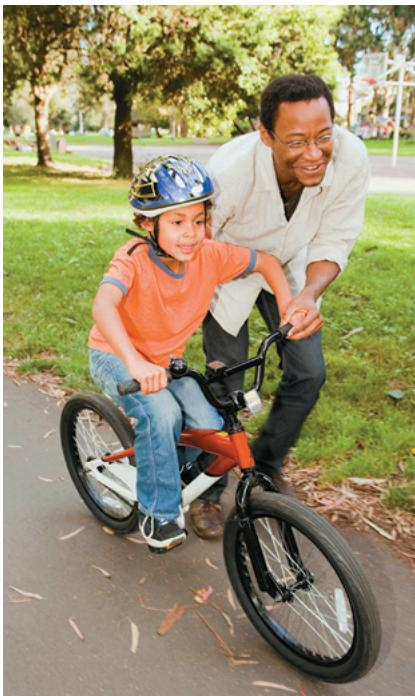

Over our recent evolutionary history, we have built up structured societies with governments, laws, cultural values, and religions that define what is acceptable behavior and what is not, even when unacceptable behavior might enhance an individual's Darwinian fitness. Perhaps it is our social and cultural institutions that make us distinct and that provide those qualities that at times make less apparent the continuum between humans and other animals. One such quality, our considerable capacity for reciprocal altruism, will be essential as we tackle current challenges, including global climate change, in which individual and collective interests often appear to be in conflict.

## Interview

Interview with E. O. Wilson: Pioneering the field of sociobiology (eTextbook only)

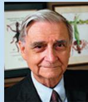

## Concept Check 51.4

1. Explain why geographic variation in garter snake prey choice might indicate that the behavior evolved by natural selection.

2. Suppose an individual organism aids the survival and reproductive success of the offspring of its sibling. How might this behavior result in indirect selection for certain genes carried by that individual?

3. WHAT IF? Suppose you applied Hamilton's logic to a situation in which one individual is past reproductive age. Could there still be selection for an altruistic act?

Associative learning

Imprinting

Cognition

## Summary of Key Concepts

To review key terms, go to the Vocabulary Self-Quiz (eTextbook only).

## Concept 51.1: Discrete sensory inputs can stimulate both simple and complex behaviors

\- Behavior is the sum of an animal's responses to external and internal stimuli. In behavior studies, proximate, or "how," questions focus on the stimuli that trigger a behavior and on genetic, physiological, and anatomical mechanisms underlying a behavioral act. Ultimate, or "why," questions address evolutionary significance.

\- A fixed action pattern is a largely invariant behavior triggered by a simple cue known as a sign stimulus.

\- Migratory movements involve navigation, which can be based on orientation relative to the sun, the stars, or Earth's magnetic field. Animal behavior is often synchronized to the circadian cycle of light and dark in the environment or to the seasons.

\- The transmission and reception of signals constitute animal communication. Animals use visual, auditory, chemical, and tactile signals. Chemical substances called pheromones transmit species-specific information between members of a species in behaviors ranging from foraging to courtship.

How is migration based on circannual rhythms poorly suited for adaptation to global climate change?

## Concept 51.2: Learning establishes specific links between experience and behavior

\- Cross-fostering studies can be used to measure the influence of social environment and experience on behavior.

\- Learning, the modification of behavior as a result of experience, can take many forms, as summarized in the diagram that follows.

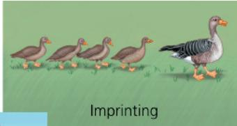

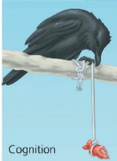  
Forms of learning and problem solving

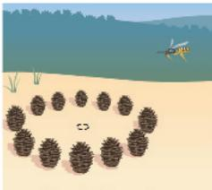  
Spatial learning

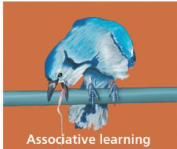

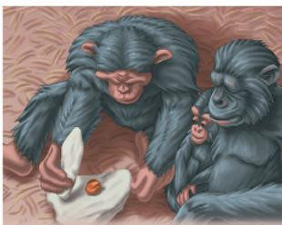  
Social learning

How do imprinting in geese and song development in sparrows differ with regard to the resulting behavior?

## Concept 51.3: Selection for individual survival and reproductive success can explain diverse behaviors

\- Controlled experiments in the laboratory can give rise to interpretable evolutionary changes in behavior.

\- An optimal foraging model is based on the idea that natural selection should favor foraging behavior that minimizes the costs of foraging and maximizes the benefits.

\- Sexual dimorphism correlates with the types of mating relationship, which include monogamous and polygamous mating systems. Variations in mating system and mode of fertilization affect certainty of paternity, which in turn, through evolution, influences mating behavior and parental care.

\- Game theory provides a way of thinking about evolution in situations where the fitness of a particular behavioral phenotype is influenced by other behavioral phenotypes in the population.

In some spider species, the female eats the male immediately after copulation. How might you explain this behavior from an evolutionary perspective?

## Concept 51.4: Genetic analyses and the concept of inclusive fitness provide a basis for studying the evolution of behavior

\- Genetic studies in insects have revealed the existence of master regulatory genes that control complex behaviors. Within the underlying hierarchy, multiple genes influence specific behaviors, such as a courtship song. Research on voles illustrates how variation in a single gene can determine differences in complex behaviors.

\- Behavioral variation within a species that corresponds to environmental variation may be evidence of past evolution.

\- Altruism can be explained by the concept of inclusive fitness, the effect an individual has on proliferating its genes by producing its own offspring and by providing aid that enables close relatives to reproduce. The coefficient of relatedness and Hamilton's rule provide a way of measuring the strength of the selective forces favoring altruism against the potential cost of the "selfless" behavior. Kin selection favors altruistic behavior by enhancing the reproductive success of relatives.

What insight about the genetic basis of behavior emerges from studying the effects of courtship mutations in fruit flies and of pair-bonding in voles? For suggested answers, see Appendix A.

## Test Your Understanding

For more multiple-choice questions, go to the Practice Test (eTextbook only).

## Levels 1-2: Remembering/Understanding

1. Which of the following is true of innate behaviors?

(A) Their expression is only weakly influenced by genes.

(B) They occur with or without environmental stimuli.

(C) They are expressed in most individuals in a population.

(D) They occur in invertebrates and some vertebrates but not mammals.

2. According to Hamilton's rule, natural selection

(A) favors altruistic behavior as long as it does not put the altruist at risk of death.

(B) favors altruistic acts when the resulting benefit to the recipient, corrected for relatedness, exceeds the cost to the altruist.

(C) is more likely to favor altruistic behavior that benefits an offspring than altruistic behavior that benefits a sibling.

(D) can promote altruistic behavior between two unrelated individuals.

3. Female spotted sandpipers aggressively court males and, after mating, leave the clutch of young for the male to incubate. This sequence may be repeated several times with different males until no available males remain, forcing the female to incubate her last clutch. Which of the following terms best describes this behavior?

(A) polygyny

(B) polyandry

(C) promiscuity

(D) certainty of paternity

## Levels 3-4: Applying/Analyzing

4. A region of the canary forebrain shrinks during the nonbreeding season and enlarges when breeding season begins. This change is probably associated with the annual

(A) addition of new syllables to a canary's song repertoire.

(B) crystallization of subsong into adult songs.

(C) critical period in which canary parents imprint on new offspring.

(D) elimination of the memorized template for songs sung the previous year.

5. Although many chimpanzees live in environments with oil palm nuts, members of only a few populations use stones to crack open the nuts. The likely explanation is that

(A) the behavioral difference is caused by genetic differences between populations.

(B) members of different populations have different nutritional requirements.

(C) the cultural tradition of using stones to crack nuts has arisen in only some populations.

(D) members of different populations differ in learning ability.

6. Which of the following is required for a behavioral trait to evolve by natural selection?

(A) An individual's reproductive success depends in part on how the behavior is performed.

(B) The behavior is very similar in all members of the population.

(C) In each individual, the form of the behavior is determined entirely by genes.

(D) The behavior remains constant despite changes in the environment.

## Levels 5-6: Evaluating/Creating

7. DRAW IT You are considering two optimal foraging models for the behavior of a mussel-feeding shorebird, the oystercatcher. In model A, the energetic reward increases solely with mussel size. In model B, you take into consideration that larger mussels are more difficult to open. Construct a graph of reward (energy benefit on a scale of 0–10) versus mussel length (scale of 0–70 mm) for each model. Assume that mussels under 10 mm provide no benefit and are ignored by the birds. Also assume that mussels start becoming difficult to open when

they reach 40 mm in length and impossible to open when 70 mm long. Considering the graphs you have drawn, indicate what observations and measurements you would want to make in this shorebird's habitat to help determine which model is more accurate.

8. EVOLUTION CONNECTION We often explain our behavior in terms of subjective feelings, motives, or reasons, but evolutionary explanations are based on reproductive fitness. Can both kinds of explanation be valid? For instance, is an explanation for behavior such as “falling in love” incompatible with an evolutionary explanation?

9. SCIENTIFIC INQUIRY Scientists studying scrub jays found that "helpers" often assist mated pairs of birds by gathering food for their offspring. (a) Propose a hypothesis to explain what advantage there might be for the helpers to engage in this behavior instead of seeking their own territories and mates. (b) Explain how you would test your hypothesis. If it is correct, what results would you predict your tests to yield?

10. SCIENCE, TECHNOLOGY, AND SOCIETY Researchers are very interested in studying identical twins separated at birth and raised apart. So far, the data reveal that such twins frequently have similar personalities, mannerisms, habits, and interests. What general question do you think researchers hope to answer by studying such twins? Why do identical twins make good subjects for this research? What are the potential pitfalls of this research? What abuses might occur if the studies are not evaluated critically? Explain your thinking.

11. WRITE ABOUT A THEME: INFORMATION Learning is defined as a change in behavior as a result of experience. In a short essay (100–150 words), describe how heritable information contributes to the acquisition of learning, using some examples from imprinting and associative learning.

## 12. SYNTHESIZE YOUR KNOWLEDGE

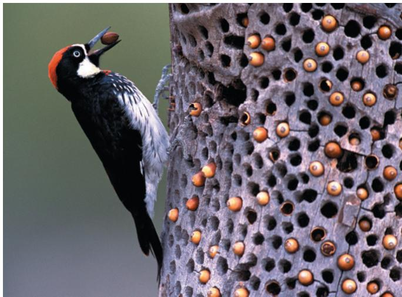

Acorn woodpeckers (Melanerpes formicivorus) stash acorns in storage holes they drill in trees. When these woodpeckers breed, the offspring from previous years often help with parental duties. Activities of these nonbreeding helpers include incubating eggs and defending stashed acorns. Propose some questions that a behavioral biologist could ask about the proximate and ultimate causation of these behaviors.

For selected answers, see Appendix A.

Unit 8 Ecology

An Interview with Elisa Bonaccorso

Dr. Elisa Bonaccorso is a professor at the University San Francisco de Quito in Ecuador, where she studies the evolutionary biology, ecology, and conservation of birds. Her recent work focuses on the ecology and genetics of hillstars, a group of hummingbirds adapted to the high elevation of the Andes. Dr. Bonaccorso is also part of the South American Classification Committee of the International Ornithologists' Union, a group of experts systematically evaluating the taxonomy of South American birds.

## How have your research interests evolved?

I got into ecology and ornithology as an undergraduate. During my PhD work, I got really excited about studying evolution, especially in the Andes, and how important mountain ranges and valleys are in speciation (forming new species). I became very interested in population genetics, because that is the level where speciation occurs, and that led to conservation genetics. Some of my recent work has been on the blue-throated hillstar (Oreotrochilus cyanolaemus), which we discovered in 2018 and identified as a new species based on morphological and genetic data. Because its population and range are both very small, this species has been considered “Critically Endangered” from the moment it was discovered. There are currently no public reserves protecting its habitat, but my group collaborates with the managers of a private reserve established soon after the description of the species. As we work to protect this bird, our efforts also help protect many species of plants, amphibians, and other parts of the ecosystem.

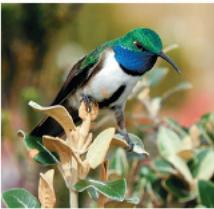

At a fieldwork site in the Andes, where Dr. Bonaccorso and her team study the blue-throated hillstar (inset).

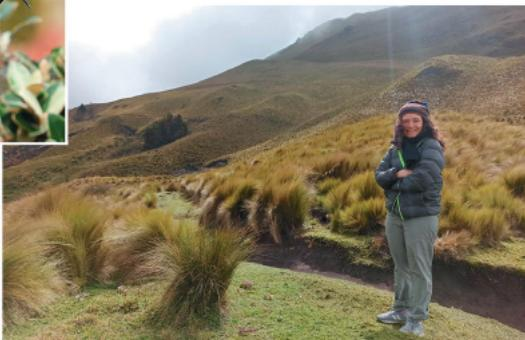

"As we work to protect this bird species, our efforts also help protect many species of plants, amphibians, and other parts of the ecosystem."

## What does your job look like day to day?

It's often difficult to know how my day is going to be! I spend time in the office for many of my responsibilities. I direct a master's degree program in Tropical Ecology and Conservation, so part of my job involves teaching and giving career advice. I also do a lot of social media managing and fundraising: for example, to support scholarships for women of the Amazon region who are interested in ecology and conservation. Recently, I helped set up a water quality monitoring program for a local stream in Quito, which our graduate students run with the local community. I analyze data and write research papers. I also get out in the field: I teach a course in the Galápagos each year, and the research on the blue-throated hillstar involves fieldwork in a remote part of the Andes.

## What leads to successful conservation efforts?

I think there are two key pillars to conservation. One definitely is science. You need to work through conservation questions with the best scientific knowledge of species, ecosystems, and ecological interactions. But the other big part is people. Conservation biologists need to work in partnership with the people that live in the places that are the focus of conservation efforts. In many cases, the people who live in

ecologically threatened areas know what needs to be done to protect them, and need support. In other cases, people may not be acting in ways that preserve ecosystems because they have other priorities—they need money to eat, need their cows, need their farming operations—but they might be open to adopting ecologically friendly practices. So, it's important to communicate with residents, politicians, and company owners to understand their needs and start

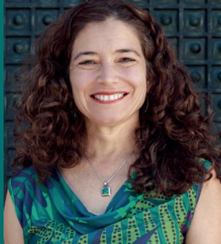  
Dr. Elisa Bonaccorso

a dialogue to achieve conservation goals in a way that works for all. For example, preserving a “no-take” reserve (an area where fishing is prohibited) typically increases the amount of fish that can be caught outside the reserve because as the fish stock grows inside the reserve, there is fish “spillover” to nearby areas where fishing is allowed. It’s not intuitive to most people that reducing the fishing area can increase overall catch. Biologists can work with social scientists and leaders from local communities to help various groups make these connections.

## What would you tell students who hope to get involved with conservation work?

Many interesting things are currently happening. People are more environmentally conscious overall; there is a collective understanding that we need to act on climate change, deforestation, overuse of agricultural chemicals, and other threats to ecosystems. Our global networks system allows us to communicate about these very important issues and help give a voice to people who didn't have a strong voice before. An international initiative aims to conserve 30% of land and sea by 2030. I'm also optimistic about debt-for-nature swaps, where national debt is forgiven in exchange for investments in preserving nature, In Ecuador, we're preserving a big chunk of ocean next to the Galápagos Islands through such a system. Additionally, there are many local initiatives that help preserve natural environments. Here in Ecuador, farmers are growing organic products in mixed agricultural landscapes, and people in cities are increasingly interested in buying straight from such farmers, to reduce the environmental impact of their food. We need both these big initiatives as well as the local initiatives to reach conservation goals, and seeing more of both makes me hopeful. Students can make a difference at so many angles: academia, non-government organizations, or various levels of governments. As biologists, we're at the center of these important things; if we follow a path based on science and in understanding what various people need, we can be a very powerful force for positive change.

