# 第52章 An Introduction to Ecology and the Biosphere

<!-- 章节边界按正文内容恢复；原始 MinerU 内容保留如下。 -->

# An Introduction to Ecology and the Biosphere

## Key Concepts

52.1 Earth's climate varies by latitude and season and is changing rapidly

52.2 The distribution of terrestrial biomes is controlled by climate and disturbance

52.3 Aquatic biomes are diverse and dynamic systems that cover most of Earth

52.4 Interactions between organisms and the environment limit the distribution of species

52.5 Ecological change and evolution affect one another over long and short periods of time

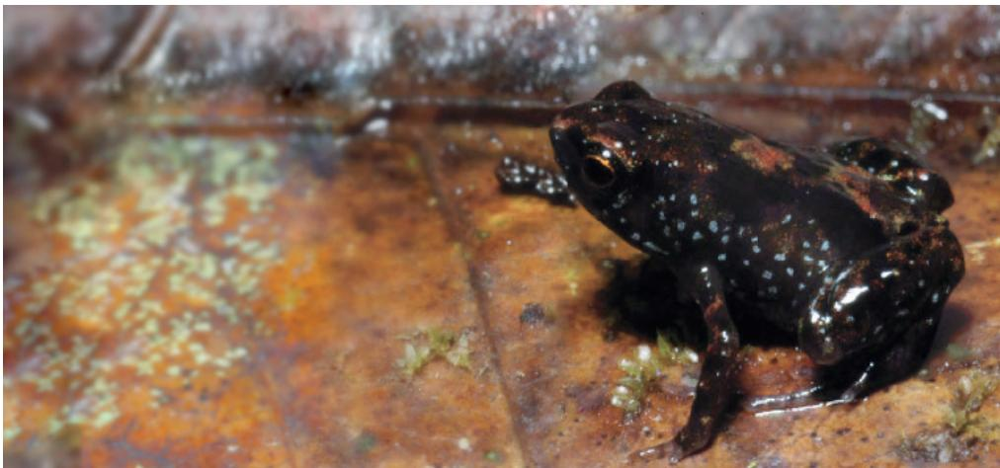

Figure 52.1 Dwarfed by a dime, this tiny frog (Paedophryne swiftorum) was discovered on a 2008 expedition to Papua New Guinea. The entire genus Paedophryne is known only from a single peninsula in the eastern part of the country. Adult frogs in this genus are about 8 mm long and are among the smallest adult vertebrates on Earth.  
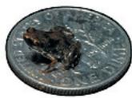

## Study Tip

Make a table: As you read the chapter, build a table listing factors that influence species distribution in terrestrial and aquatic environments. Add figure numbers or page numbers that give examples of these factors in each type of environment.

<table><tr><td>Type of environment</td><td>Factor affecting what species live there</td><td>Example</td></tr><tr><td>Lake</td><td>Amount of sunlight that reaches organisms</td><td>Photosynthetic plants and algae live at shallow edges and sunlit surface (Figs. 52.15 and 52.18)</td></tr><tr><td></td><td></td><td></td></tr></table>

What determines where a species such as this tiny frog lives?  
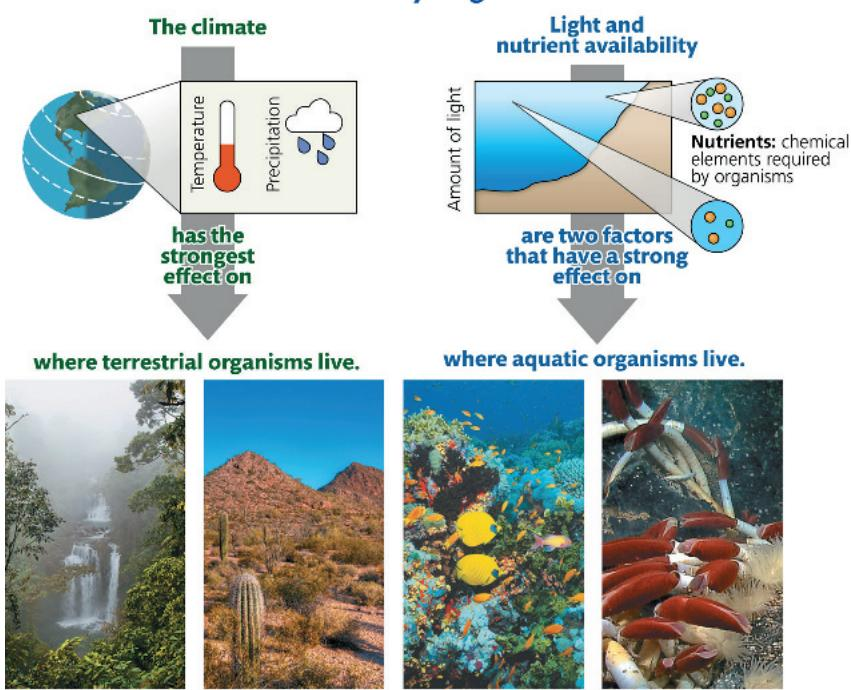  
Dispersal and interactions among organisms, such as competition, also affect where species are found.

When studying a species in nature, scientists often begin by asking, what environmental factors limit where it is found? How do variations in an organism's food supply or interactions with other species, such as predators, affect the size of their populations?

Questions like these are the subject of ecology, the scientific study of the interactions between organisms and the environment. (Note that here and throughout this text, the term environment

refers to other organisms as well as the physical aspects of an organism's surroundings.) The interactions studied by ecologists can be organized into a hierarchy that ranges in scale from single organisms to the planet (Figure 52.2). We'll begin our study of ecology by considering how Earth's climate and other factors determine the location of major life zones on land and in the oceans.

## Exploring the Scope of Ecological Research

## Figure 52.2

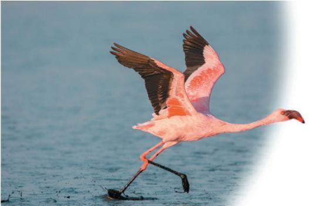

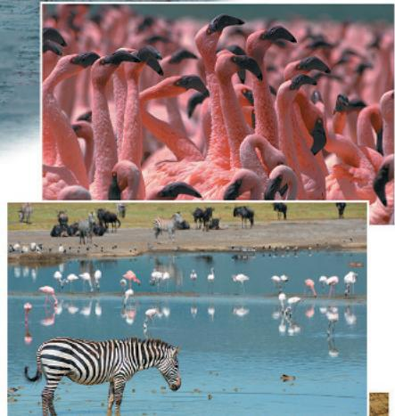

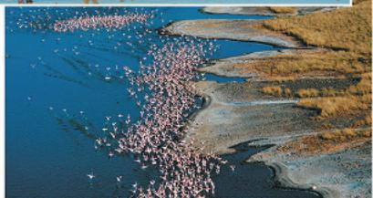

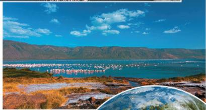

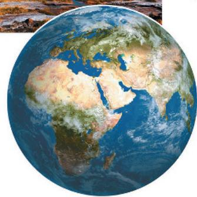

Ecologists work at different levels of the biological hierarchy, from individual organisms to the planet. Here we present a sample research question for each level of the hierarchy.

## Organismal Ecology

Organismal ecology, which includes the subdisciplines of physiological, evolutionary, and behavioral ecology, is concerned with how an organism's structure, physiology, and behavior meet the challenges posed by its environment.

How do flamingos select a mate?

## Population Ecology

A population is a group of individuals of the same species living in an area. Population ecology analyzes factors that affect population size and how and why it changes through time.

What environmental factors affect the reproductive rate of flamingos?

## Community Ecology

A community is a group of populations of different species in an area. Community ecology examines how interactions between species, such as predation and competition, affect community structure and organization.

What factors influence the diversity of species that interact at this African lake?

## Ecosystem Ecology

An ecosystem is the community of organisms in an area and the physical factors with which those organisms interact. Ecosystem ecology emphasizes energy flow and chemical cycling between organisms and the environment.

What factors control photosynthetic productivity in this aquatic ecosystem?

## Landscape Ecology

A landscape (or seascape) is a mosaic of connected ecosystems. Research in landscape ecology focuses on the factors controlling exchanges of energy, materials, and organisms across multiple ecosystems.

To what extent do nutrients from terrestrial ecosystems affect organisms in the lake?

## Global Ecology

The biosphere is the global ecosystem—the sum of all the planet's ecosystems and landscapes. Global ecology examines how the regional exchange of energy and materials influences the functioning and distribution of organisms across the biosphere.

How do global patterns of air circulation affect the distribution of organisms?

# Concept 52.1: Earth's climate varies by latitude and season and is changing rapidly

The most significant influence on the distribution of organisms on land is climate, the long-term prevailing weather conditions in a given area. Four physical factors—temperature, precipitation, sunlight, and wind—are key components of climate. To set the stage for understanding how climate—and climate change—affect life on Earth, we’ll begin by examining patterns in climate at the global, regional, and local levels.

## Global Climate Patterns

Global climate patterns are determined largely by the input of solar energy and Earth's movement in space. The sun warms the atmosphere, land, and water. This warming establishes the temperature variations, movements of air and water, and evaporation of water that cause dramatic latitudinal variations in climate. Figure 52.3, on the next page, summarizes Earth's climate patterns and how they are formed.

## Regional and Local Effects on Climate

Climate varies seasonally and can be modified by other factors, such as large bodies of water and mountain ranges. We will examine each of these factors in more detail.

## Seasonality

In middle to high latitudes, Earth's tilted axis of rotation and its annual passage around the sun cause strong seasonal cycles in day length, solar radiation, and temperature (Figure 52.4). The changing angle of the sun over the course of the year also affects local environments. For example, the belts of wet and dry air on either side of the equator move slightly northward and southward as the sun's angle changes; this produces marked wet and dry seasons around $20^{\circ}$ north and $20^{\circ}$ south latitude, where many tropical deciduous forests grow. In addition, seasonal changes in wind patterns alter ocean currents, sometimes causing the upwelling of cold water from deep ocean layers (see Figure 52.15). This nutrient-rich water stimulates the growth of surface-dwelling phytoplankton and the organisms that feed on them. Though these upwelling zones make up only a few percent of the ocean's area, they are the source of more than $25\%$ of all fish caught globally.

## Bodies of Water

Ocean currents influence climate along the coasts of continents by heating or cooling overlying air masses that pass across the land. Coastal regions are also generally wetter than inland areas at the same latitude. The cool, misty climate produced by the cold California Current that flows southward along western North America supports a coniferous rain forest ecosystem along much of the continent's Pacific coast and large redwood groves farther south. Conversely, the west coast of northern Europe has a mild climate because the Gulf Stream carries warm water from the

Figure 52.4 Seasonal variation in sunlight intensity.

Because Earth is tilted on its axis relative to its plane of orbit around the sun, the intensity of solar radiation varies seasonally. This variation is smallest in the tropics and increases toward the poles.

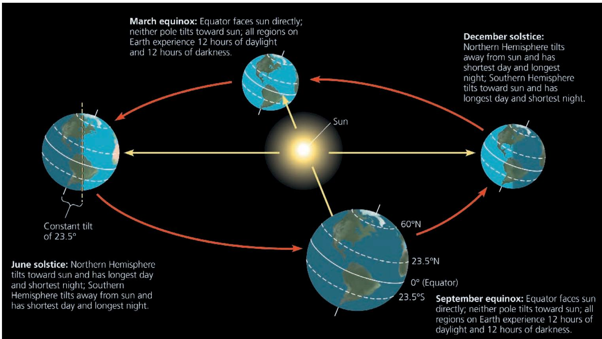

## Exploring Global Climate Patterns

## Figure 52.3

## Latitudinal Variation in Sunlight Intensity

Earth's curved shape causes latitudinal variation in the intensity of sunlight. Sunlight strikes the tropics (those regions that lie between $23.5^{\circ}$ north latitude and $23.5^{\circ}$ south latitude) most directly, while at higher latitudes, sunlight hits Earth at an oblique angle. This means that a given area at the equator (say, a square meter) receives more solar energy than the same area at higher latitudes. Therefore, temperatures are generally highest near the equator and steadily decrease with increasing latitude.

## Global Air Circulation and Precipitation Patterns

Intense solar radiation near the equator initiates a global pattern of air circulation and precipitation. High temperatures in the tropics evaporate water from Earth's surface and cause warm, wet air masses to rise (blue arrows) and flow toward the poles. As the rising air masses expand and cool, they release much of their water content, creating abundant precipitation in tropical regions. The high-altitude air masses, now dry, descend (tan arrows) toward Earth around $30^{\circ}$ north and south, absorbing moisture from the land and creating an arid climate conducive to the development of the deserts that are common at those latitudes. Some of the descending air then flows toward the poles. At latitudes around $60^{\circ}$ north and south, the air masses again rise and release abundant precipitation (though less than in the tropics). Some of the cold, dry rising air then flows to the poles, where it descends and flows back toward the equator, absorbing moisture and creating the comparatively rainless and bitterly cold climates of the polar regions.

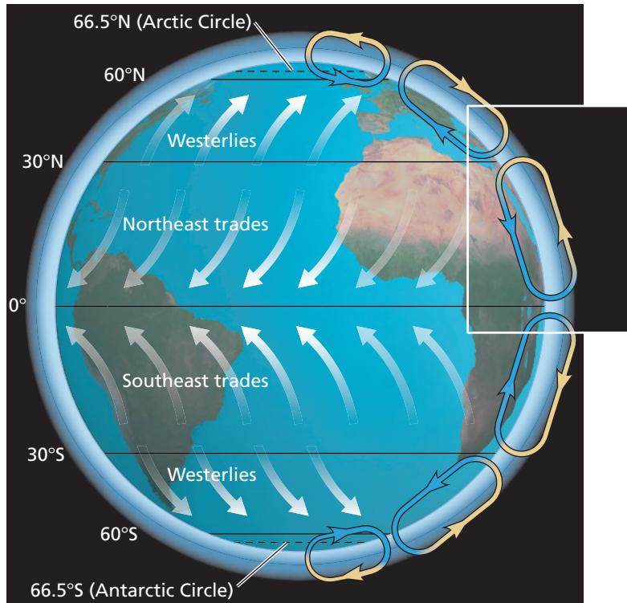

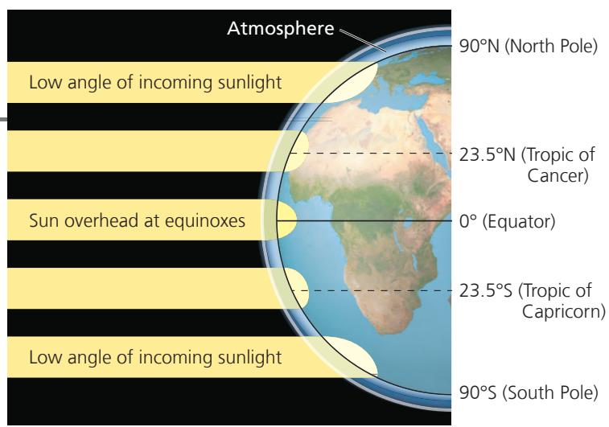

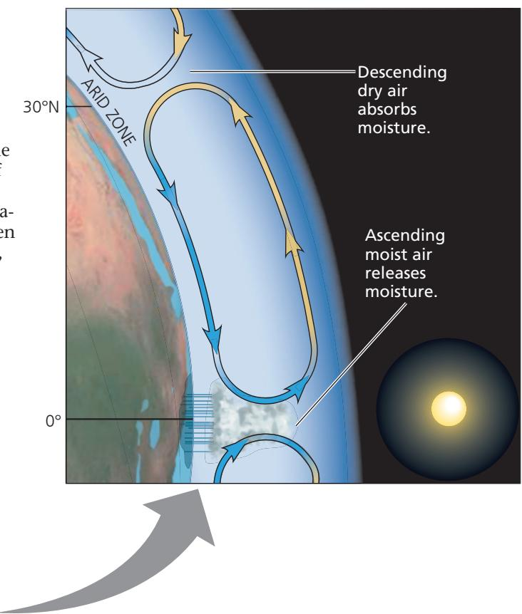

Air flowing close to Earth's surface creates predictable global wind patterns. As Earth rotates on its axis, land near the equator moves faster than that at the poles, deflecting the winds from the vertical paths shown above and creating the more easterly and westerly flows shown at left. Cooling trade winds blow from the northeast to the southwest (northern hemisphere) or the southeast to the northwest (southern hemisphere) in the tropics. Prevailing westerlies blow from the southwest to the northeast (northern hemisphere) or the northwest to the southeast (southern hemisphere) in temperate zones, defined as the regions between the Tropic of Cancer and the Arctic Circle and between the Tropic of Capricorn and the Antarctic Circle.

Figure 52.5 Global circulation of surface water in the oceans.

Water is warmed at the equator and flows north and south toward the poles, where it cools. Note the similarities between the direction of water circulation in the gyres and the direction of the trade winds in Figure 52.3. This is due to the fact that ocean surface circulation is driven by dominant winds.

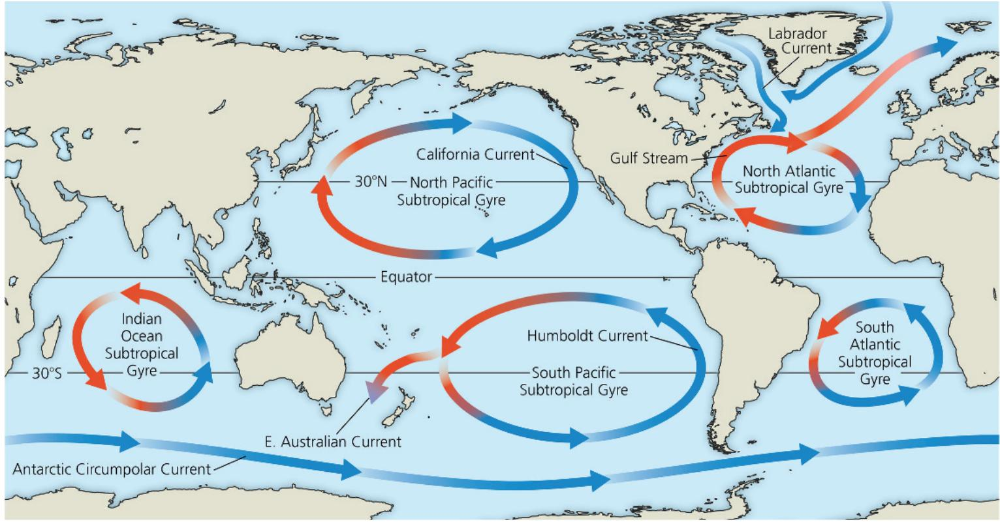

equator to the North Atlantic (Figure 52.5). As a result, northwestern Europe is warmer during winter than southeastern Canada, which is farther south but is cooled by the Labrador Current flowing south from the coast of Greenland.

Because of the high specific heat of water (see Concept 3.2), oceans and large lakes tend to moderate the climate of nearby land. Therefore, coastal areas with moist air tend to have a smaller difference in temperature between day and night than deserts do. The difference in heat capacity of water and land also influences local wind patterns, resulting in a cooling breeze blowing onto land during a hot day and out to sea at night (Figure 52.6). This local moderation of climate can be limited to the coast itself, however. In southern California and southwestern Australia, cool, dry ocean breezes in summer are warmed when they contact the land, absorbing moisture and creating a hot, arid climate just a few kilometers inland (see Figure 3.5). This climate pattern also occurs around the Mediterranean Sea, which gives it the name Mediterranean climate.

## Mountains

Like large bodies of water, mountains influence air flow over land. When warm, moist air approaches a mountain, the air rises and cools, releasing moisture on the windward side of the peak (Figure 52.7). On the leeward side, cooler, dry air descends, absorbing moisture and producing a “rain shadow.” Such leeward rain shadows determine where many deserts are found, including the Mojave Desert of western North America and the Gobi Desert of Asia.

Mountains also affect the amount of sunlight reaching an area and thus the local temperature and rainfall. South-facing slopes in

Figure 52.6 Effects of the ocean on coastal wind patterns.  
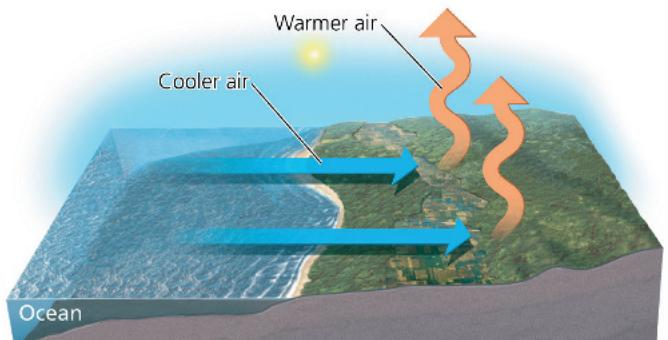  
(a) On a hot day, the land heats up more quickly than the ocean. This warmer, less dense air over the land rises and is replaced by cooler air from offshore.

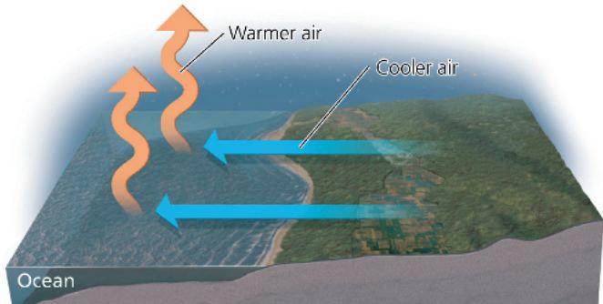  
(b) When the temperature drops at night, the land cools more quickly than the ocean. Now the relatively warmer, less dense air over the water rises and is replaced by cooler air from land.

Figure 52.7 How mountains affect climate.

This figure illustrates what happens when warm, moist wind blows over a mountain range.

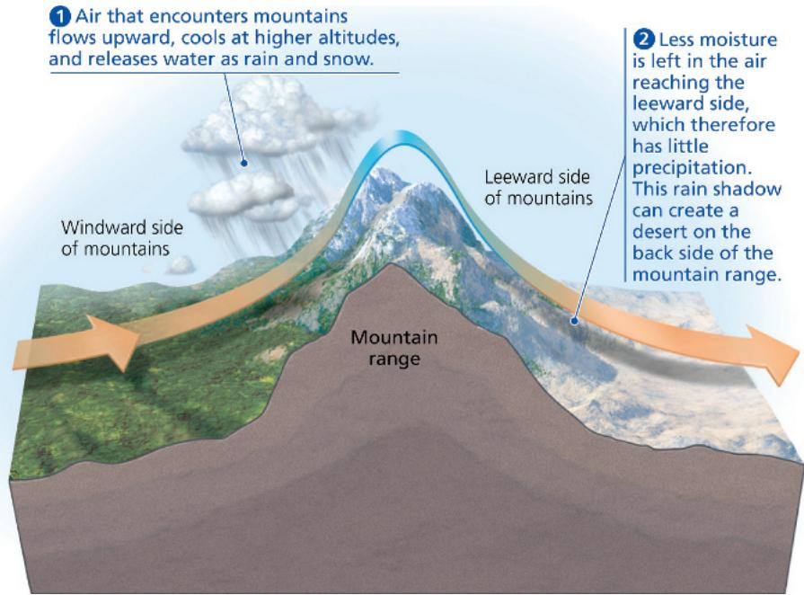

the Northern Hemisphere receive more sunlight than north-facing slopes and are therefore warmer and drier. These physical differences influence species distributions locally. On many mountains in western North America, spruce and other conifers grow on the cooler north-facing slopes, but shrubby, drought-resistant plants inhabit the south-facing slopes. In addition, every 1,000-m increase in elevation produces an average temperature drop of $6^{\circ}$ C, equivalent to that produced by an 880-km increase in latitude. This is one reason that high-elevation plant communities near the equator, for example, can be similar to lower-elevation plant communities that are far from the equator.

## Effects of Vegetation on Climate

Climate affects where terrestrial organisms can live, but organisms can also affect climate. This is especially true of forests, which can alter the climate at local and even regional scales.

When viewed from above, a forest is darker in color than a desert or grassland. As a result, a forest absorbs more (and reflects less) solar energy than does a desert or grassland, thereby contributing to a warming of Earth's surface in forested areas. This warming effect, however, is more than offset by transpiration, an evaporative loss of water from a plant that cools the plant's surface—similar to how your body is cooled when you sweat. The evaporative loss of water is much greater in forests than in other ecosystems, causing forests to affect climate in two key ways: Forests reduce Earth's surface temperature and they increase precipitation rates (Figure 52.8). As documented in regions around the world, the climate becomes hotter and drier in areas where humans have cut down large forests and becomes cooler and wetter where humans have restored large forests.

## Microclimate

At an even smaller scale is the microclimate, very fine, localized patterns in climatic conditions. Many features in the environment influence microclimate by casting shade, altering evaporation from soil, or changing wind patterns. For example, forest trees often moderate the microclimate below them. Cleared areas therefore

Figure 52.8 How cutting down a forest affects regional climate.  
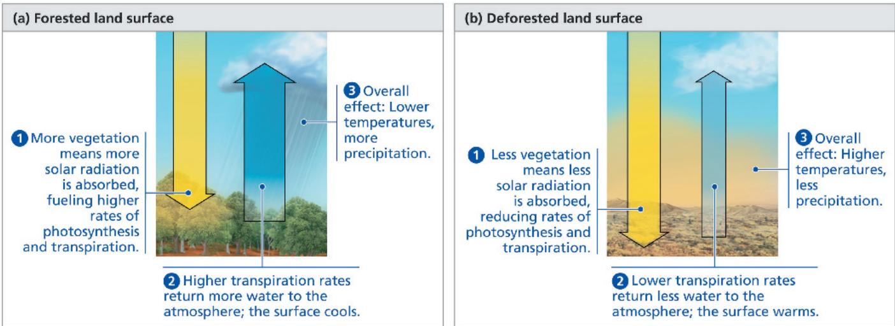

typically experience greater temperature extremes than the forest interior because of greater solar radiation and wind currents that arise from the rapid heating and cooling of open land. Within a forest, low-lying ground is usually wetter than higher ground and tends to be occupied by different tree species. A log or large stone can shelter organisms such as salamanders, worms, and insects, buffering them from the extremes of temperature and moisture.

Every environment on Earth exhibits small-scale differences in chemical and physical attributes, such as temperature, light, water, and nutrients. Later, we'll examine how these abiotic, or nonliving, factors influence the distribution and abundance of organisms. Similarly, all of the biotic, or living, factors—the other organisms that are part of an individual's environment—also influence the distribution and abundance of life on Earth.

## Global Climate Change

Because climatic variables affect the geographic ranges of most plants and animals, any large-scale change in Earth's climate profoundly affects the biosphere. In fact, a large-scale climate "experiment" is under way: The burning of fossil fuels and deforestation are increasing the concentrations of carbon dioxide and other greenhouse gases in the atmosphere. This has caused climate change, a directional change to the global climate that lasts three decades or more (as opposed to short-term changes in the weather). As we'll explore in more detail in Concept 56.4, Earth has warmed an average of $1.1^{\circ}\mathrm{C}$ $(2.0^{\circ}\mathrm{F})$ since 1900 and is projected to warm $0.5 - 4.5^{\circ}\mathrm{C}$ $(1 - 8^{\circ}\mathrm{F})$ more by the year 2100. Wind and precipitation patterns also are shifting, and extreme weather events (such as major storms and droughts) are occurring more frequently.

How will these changes affect the distribution of species on Earth? Some species may shift their ranges in response to climate change toward higher latitudes (toward the poles), greater elevations, or greater depths in aquatic habitats. A growing amount of research documents that such range shifts are already occurring for many species in all ecosystems. As just a few examples, as the climate has warmed in recent decades, 22 of 35 European butterfly species studied have shifted their ranges farther north by 35–240 km; marine zooplankton globally have shifted their ranges by an average of about 100 km/decade; and a study in the North Sea showed that the depth range of many fish species has deepened by several meters per decade.

Yet, there is considerable variation in range shift between species: Some are adjusting their ranges much more readily than others, which is likely to lead to novel interactions in ecological communities (see Figure 56.31). There are three main reasons for this variation. First, species vary in their dispersal abilities. Animals that swim, fly, or run can more readily move in response to environmental change than sessile (nonmotile) organisms, such as plants that are rooted in place. Populations of sessile organisms can experience range shifts if offspring (which are dispersed via seeds and larvae) settle in different areas than the parents, but this generational shift is especially slow for long-lived species that have long generation times. Second, a lack of suitable habitat can impede range shifts for many species. Consider, for example, a rodent living on the southern coast of Australia or a salamander species inhabiting a mountaintop in Mexico. Range shifts to greater latitude or greater elevation, respectively, are not possible in these examples. Human activities that destroy and fragment habitats can alter how species can adjust their ranges; this is especially relevant

## Figure 52.9 Examples of variation in abiotic factors.

In response to a warming climate, species may adjust their ranges toward higher latitudes, deeper water, or higher elevation to stay in zones of suitable temperatures. However, other abiotic factors may not be suitable in the potential new range.

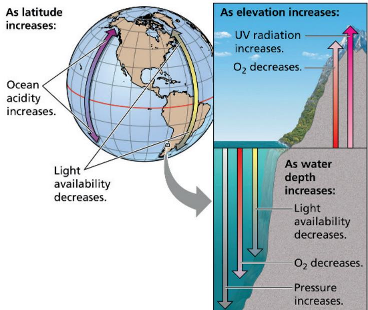  
WHAT IF? Suppose warming ocean waters cause corals to shift their ranges to higher latitudes. What changes in other abiotic factors would the corals face as latitude increases?
For suggested answer, see Appendix A.

## Interview

Interview with Margaret Davis: Using fossil pollen to track tree species migration (eTextbook only)

for terrestrial species. Finally, it is important to remember that while temperature is a very important factor affecting species' ranges, there are many other abiotic factors that affect where organisms can live and thrive. Range shifts that would maintain an organism within its ideal temperature range may place it in an area that is unsuitable with respect to other abiotic factors (Figure 52.9).

A growing body of research shows the complicated impacts of climate change on biological communities. For example, in western North America, researchers have documented nearly 200 plant species that have moved to lower elevations, most likely in response to decreased rain and snow at higher elevations. Another recent study found that, on average, the geographic ranges of 67 bumblebee species (Figure 52.10) in the Northern Hemisphere have

Figure 52.10 The rusty-patched bumblebee (Bombus affinis).

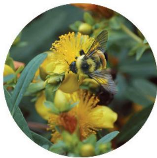

been shrinking: The bees have been retreating from the southern edges of their distributions, but failing to expand their ranges to the north. Many groups of organisms with limited ability for range shifts are in severe decline. For example, the increasing frequency of marine heat waves in the past two decades has severely reduced reef-building corals around the world.

## Concept Check 52.1

1. Explain how the sun's unequal heating of Earth's surface results in deserts near $30^{\circ}$ north and south of the equator.

2. What are some of the differences in microclimate between an unplanted agricultural field and a nearby stream corridor with trees?

3. WHAT IF? Changes in Earth's climate at the end of the last ice age happened gradually, taking centuries to thousands of years. If the planet continues to warm at its current, rapid rate, how might this affect the evolution of long-lived trees compared with that of annual plants, which have much shorter generation times?

4. MAKE CONNECTIONS Focusing just on the effects of temperature, would you expect the global distribution of $C_{4}$ plants to expand or contract as Earth becomes warmer? Why? (See Concept 10.4.)

For suggested answers, see Appendix A.

# Concept 52.2: The distribution of terrestrial biomes is controlled by climate and disturbance

Earth's life is distributed on a grand scale in biomes, major life zones characterized by vegetation type in terrestrial biomes (or by the physical environment in aquatic biomes). On land, what determines where biomes are located?

## Climate and Terrestrial Biomes

Because climate has a strong influence on the distribution of plant species, it is a major factor in determining the locations of terrestrial biomes (Figure 52.11). The importance of climate on the distribution of biomes can be shown in a climograph, a plot of the annual mean temperature and precipitation in a particular region. Figure 52.12 is a climograph for some North American biomes. Notice, for instance, that the range of precipitation in northern coniferous and temperate forests is similar but that temperate forests are generally warmer. Temperate grasslands are typically drier than either kind of forest, and deserts are drier still.

Factors other than mean temperature and precipitation also play a role in determining where biomes exist. Some areas in North America with a particular combination of temperature and precipitation support a temperate broadleaf forest, but other areas with similar values support a coniferous forest (see the overlap in Figure 52.12). One reason for this variation is that climographs are based on annual averages, but the pattern of climatic variation is often as important as the average climate. For example, some areas may receive regular precipitation throughout the year, whereas other areas may have distinct wet and dry seasons.

## General Features of Terrestrial Biomes

Most terrestrial biomes are named for major climatic features and for their predominant vegetation. Temperate grasslands, for instance, are generally found in middle latitudes, where the climate is moderate, and are dominated by various grass species. Each biome is also characterized by microorganisms, fungi, and animals adapted to that particular environment. Temperate grasslands are usually more likely than temperate broadleaf forests to

Figure 52.11 The distribution of major terrestrial biomes.  
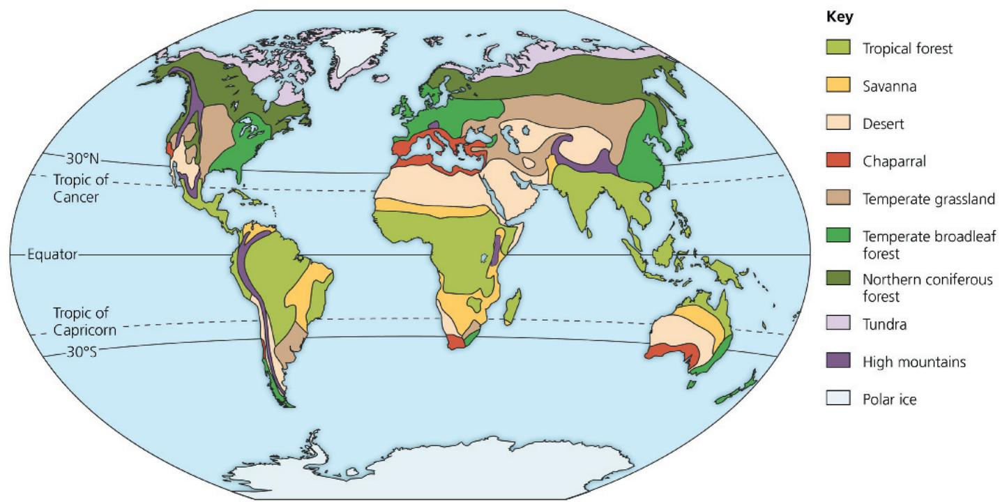

## Figure 52.12 A climograph for some major biomes in North America.

The areas plotted here encompass the ranges of annual mean temperature and precipitation in the biomes.

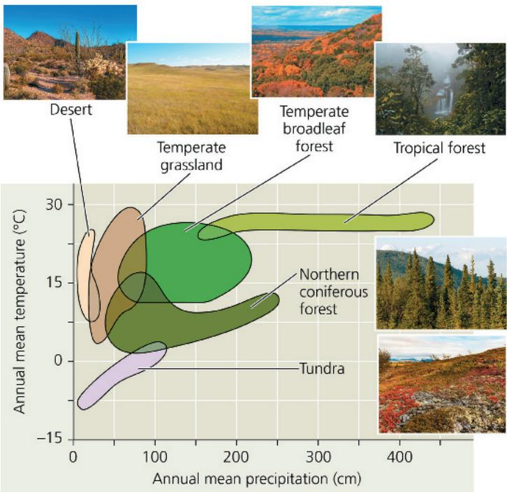  
INTERPRET THE DATA Some arctic tundra ecosystems receive as little rainfall as deserts but have much more dense vegetation. What climatic factor could cause this difference? Explain.

be populated by arbuscular mycorrhizal fungi (see Figure 37.14) and by large grazing mammals. Although Figure 52.11 shows distinct boundaries between the biomes, terrestrial biomes usually grade into neighboring biomes, sometimes over large areas. The area of intergradation, called an ecotone, may be wide or narrow.

Vertical layering of vegetation is an important feature of terrestrial biomes. In many forests, the layers from top to bottom consist of the upper canopy, the low-tree layer, the shrub understory, the ground layer of herbaceous plants, the forest floor (litter layer), and the root layer. Nonforest biomes have similar, though usually

less pronounced, layers. Layering of vegetation provides many different habitats for animals, which sometimes exist in well-defined feeding groups, from the insectivorous birds and bats that feed above canopies to the worms, arthropods, and small mammals that search for food in the litter and root layers below.

The species composition of each kind of biome varies from place to place. For instance, in the northern coniferous forest (taiga) of North America, red spruce is common in the east but does not occur in most other areas, where black spruce and white spruce are abundant. As Figure 52.13 shows, cacti living in deserts of North and South America resemble plants called euphorbs found in African deserts. But since cacti and euphorbs belong to different evolutionary lineages, their similarities are due to convergent evolution rather than shared ancestry.

## Disturbance and Terrestrial Biomes

Biomes are dynamic, and disturbance rather than stability tends to be the rule. In ecological terms, disturbance is an event such as a storm, fire, or human activity that changes a community, removing organisms from it and altering resource availability. For example, hurricanes and other storms create openings for new species in many tropical and temperate forests and can alter forest composition. After Hurricane Katrina struck the Gulf coast of the United States in 2005, mixed swamp forests in the area shifted toward a dominance of bald cypress (Taxodium distichum) and water tupelo (Nyssa aquatica) because these species are less susceptible to wind damage than other tree species found there. As a result of disturbances, biomes are often patchy, containing several different communities in a single area.

In many biomes, even the dominant plants depend on periodic disturbance. Natural wildfires are an integral component of grasslands, savannas, chaparral, and many coniferous forests. Before agricultural and urban development, much of the south-eastern United States was dominated by a single conifer species, the longleaf pine. Without periodic burning, broadleaf trees tended to replace the pines. Forest managers now use fire as a tool to help maintain many coniferous forests.

Figure 52.14 summarizes the major features of terrestrial biomes. As you read about the characteristics of each biome, remember that humans have altered much of Earth's surface,

Figure 52.13 Convergent evolution in a cactus and a euphorb.

Cacti in the genus Cereus are found in the Americas; Euphorbia canariensis, a euphorb, is native to the Canary Islands, off the northwest coast of Africa.

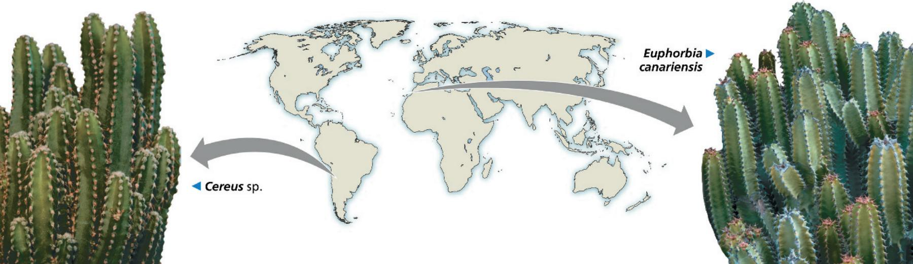

## Exploring Terrestrial Biomes

Figure 52.14

## Tropical Forest

Distribution Tropical forest occurs in equatorial and subequatorial regions.

Precipitation In tropical rain forests, rainfall is relatively constant, about 200–400 cm annually. In tropical dry forests, precipitation is highly seasonal, about 150–200 cm annually, with a six- to seven-month dry season.

Temperature High year-round, averaging 25–29°C with little seasonal variation.

Plants Tropical forests are vertically layered, and competition for light is intense. Layers in rain forests include trees that grow above a closed canopy, the canopy trees, one or two layers of subcanopy trees, and layers of shrubs and herbs (small, nonwoody plants). There are generally fewer layers in tropical dry forests. Broadleaf evergreen trees are dominant in tropical rain forests, whereas many tropical dry forest trees drop

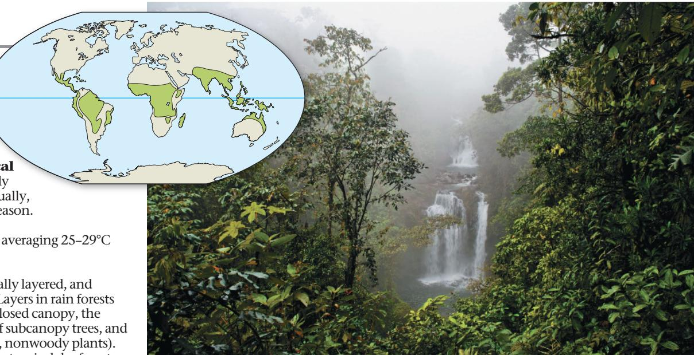  
A tropical rain forest in Costa Rica

their leaves during the dry season. Epiphytes such as bromeliads and orchids generally cover tropical forest trees but are less abundant in dry forests. Thorny shrubs and succulent plants are common in some tropical dry forests.

Animals Earth's tropical forests are home to millions of species, including an estimated 5–30 million still undescribed species of insects, spiders, and other arthropods. In fact, animal diversity is higher in tropical forests than in any other terrestrial biome. The animals, including amphibians, birds and other reptiles, mammals, and arthropods, are adapted to the vertically layered environment and are often inconspicuous.

Human Impact Humans have long had thriving communities in tropical forests. Many tropical forests are now being cut down and converted to farmland, urban areas, and other types of land use.

## Desert

Distribution Deserts occur in bands near $30^{\circ}$ north and south latitude or at other latitudes in the interior of continents (for instance, the Gobi Desert of north-central Asia).

Temperature Temperature is variable seasonally and daily. Maximum air temperature in hot deserts may exceed $50^{\circ}$ C; in cold deserts air temperature may fall below $-30^{\circ}$ C.

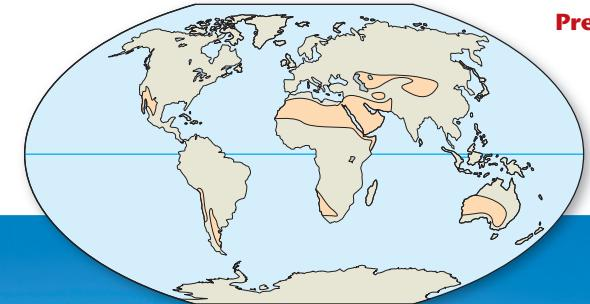  
Precipitation
Precipitation is low and highly variable, generally less than 30 cm per year.

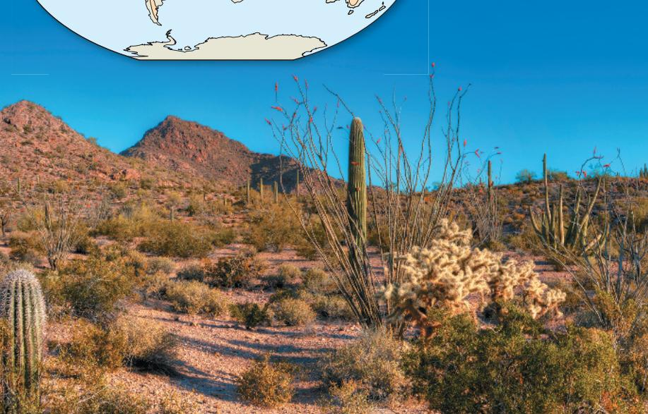

Plants Deserts are dominated by low, widely scattered vegetation; the proportion of bare ground is high compared with other biomes. The plants include succulents such as cacti or euphorbs, deeply rooted shrubs, and herbs that grow during the infrequent moist periods. Desert plant adaptations include tolerance of heat and dessication, water storage, and reduced leaf surface area. Physical defenses, such as spines, and chemical defenses, such as toxins in the leaves of shrubs, are common. Many of the plants exhibit $C_{4}$ or CAM photosynthesis.

Animals Common desert animals include snakes and lizards, scorpions, ants, beetles, migratory and resident birds, and seed-eating rodents. Many species are nocturnal. Water conservation is a common adaptation, with some species surviving solely on water obtained from breaking down carbohydrates in seeds.

Human Impact Long-distance transport of water and deep groundwater wells have allowed humans to maintain substantial populations in deserts. Urbanization and conversion to irrigated agriculture have reduced the natural biodiversity of some deserts.

Organ Pipe Cactus National Monument, Arizona

## Savanna

Distribution Savanna occurs in equatorial and subequatorial regions.

Precipitation Seasonal rainfall averages 30–50 cm per year. The dry season can last up to eight or nine months.

Temperature The savanna is warm year-round, averaging 24–29°C, but with somewhat more seasonal variation than in tropical forests.

Plants The scattered trees found at different densities in the savanna often are thorny and have small leaves, an apparent adaptation to the relatively dry conditions. Fires are common in the dry season, and the dominant plant species are fire-adapted and tolerant of seasonal drought. Grasses and small nonwoody plants called forbs, which make up most of the ground cover, grow rapidly in response to seasonal rains and are tolerant of grazing by large mammals and other herbivores.

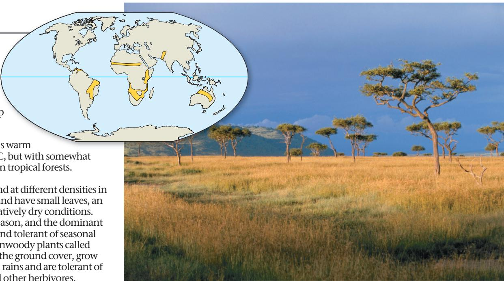

Animals Large plant-eating mammals, such as wildebeests and zebras, and predators, including lions and hyenas, are common inhabitants. However, the dominant herbivores are actually insects, especially termites. During seasonal droughts, grazing mammals often migrate to parts of the savanna with more forage and scattered watering holes.

A savanna in Kenya

Human Impact The earliest humans may have lived in savannas. Fires set by humans may help maintain this biome, though overly frequent fires reduce tree regeneration by killing the seedlings and saplings. Cattle ranching and overhunting have led to declines in large-mammal populations.

## Chaparral

Distribution This biome occurs in midlatitude coastal regions on several continents, and its many names reflect its far-flung distribution: chaparral in North America, matorral in Spain and Chile,

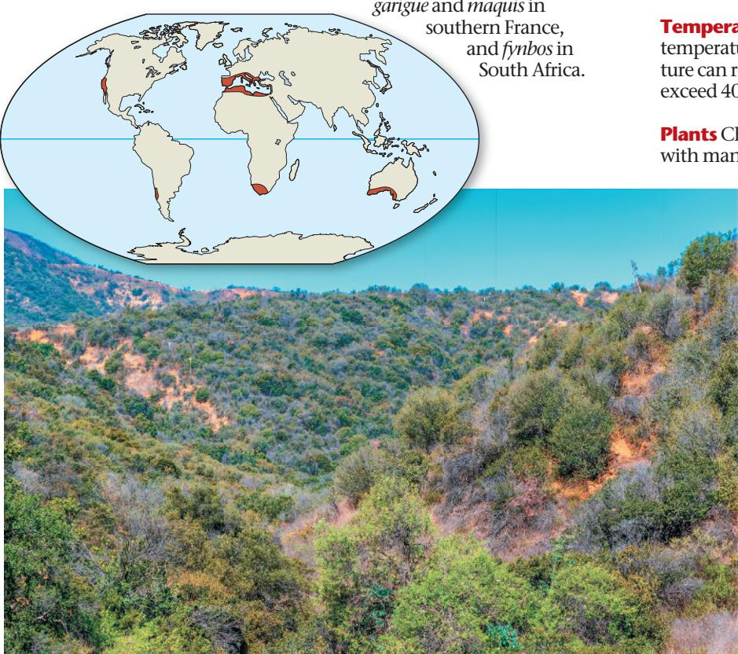

Precipitation Precipitation is highly seasonal, with rainy winters and dry summers. Annual precipitation generally falls within the range of 30–50 cm.

Temperature Fall, winter, and spring are cool, with average temperatures in the range of 10–12°C. Average summer temperature can reach 30°C, and daytime maximum temperature can exceed 40°C.

Plants Chaparral is dominated by shrubs and small trees, along with many kinds of grasses and herbs. Plant diversity is high, with

many species confined to a specific, relatively small geographic area. Adaptations of the woody plants to drought include their tough evergreen leaves, which reduce water loss. Adaptations to fire are also prominent. Some of the shrubs produce seeds that will germinate only after a hot fire; food reserves stored in their fire-resistant roots enable them to resprout quickly and use nutrients released by the fire.

Animals Native mammals include browsers, such as deer and goats, that feed on twigs and buds of woody vegetation, and a high diversity of small mammals. Chaparral areas also support many species of amphibians, birds and other reptiles, and insects.

Human Impact Chaparral areas have been heavily settled and reduced through conversion to agriculture and urbanization. Humans contribute to the fires that sweep across the chaparral.

An area of chaparral in California

(Continued)

## Figure 52.14 (Continued)

## Temperate Grassland

Distribution The veldts of South Africa, the puszta of Hungary, the pampas of Argentina and Uruguay, the steppes of Russia, and the plains and prairies of central North America are examples of temperate grasslands.

Precipitation Precipitation is often highly seasonal, with relatively dry winters and wet summers. Annual precipitation generally averages between 30 and 100 cm. Periodic drought is common.

Temperature Winters are generally cold, with average temperatures falling below $-10^{\circ}C$ . Summers, with average temperatures often approaching $30^{\circ}C$ , are hot.

Plants The dominant plants are grasses and forbs, which vary in height from a few centimeters to 2 m in tallgrass prairie. Many grassland plants have adaptations that help them survive periodic, protracted droughts and fire. For example, grasses can sprout quickly following fire. Grazing by large mammals helps prevent establishment of woody shrubs and trees.

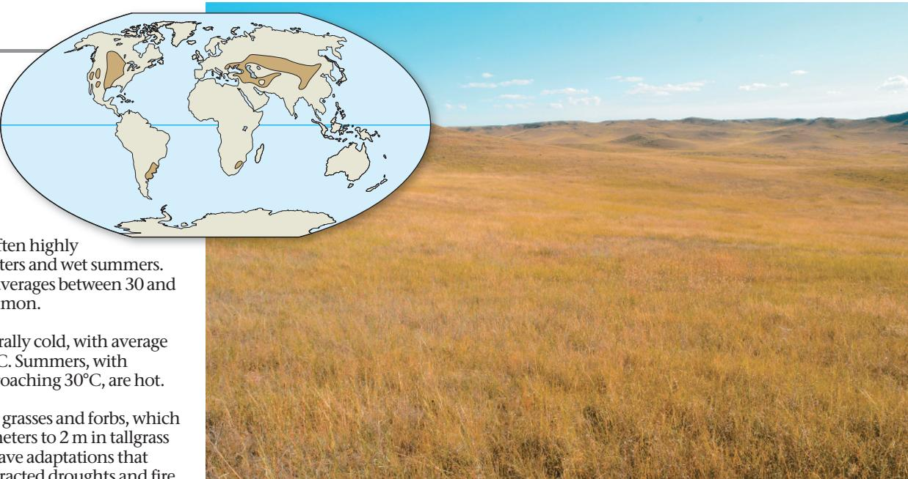  
A grassland in Nebraska

Animals Native mammals include large grazers such as bison and wild horses. Temperate grasslands are also inhabited by a wide variety of burrowing mammals, such as prairie dogs in North America.

Human Impact Deep, fertile soils make temperate grasslands ideal places for agriculture, especially for growing grains. As a consequence, most grassland in North America and much of Eurasia has been converted to farmland. In some drier grasslands, cattle and other grazers have turned parts of the biome into desert.

## Northern Coniferous Forest

Distribution Extending in a broad band across northern North America and Eurasia to the edge of the arctic tundra, the northern coniferous forest, or taiga, is the largest terrestrial biome on Earth.

Precipitation Annual precipitation generally ranges from 30 to $70\mathrm{cm}$ , and periodic droughts are common. However, some coastal coniferous forests of the U.S. Pacific Northwest are temperate

rain forests that may receive over 300 cm of annual precipitation.

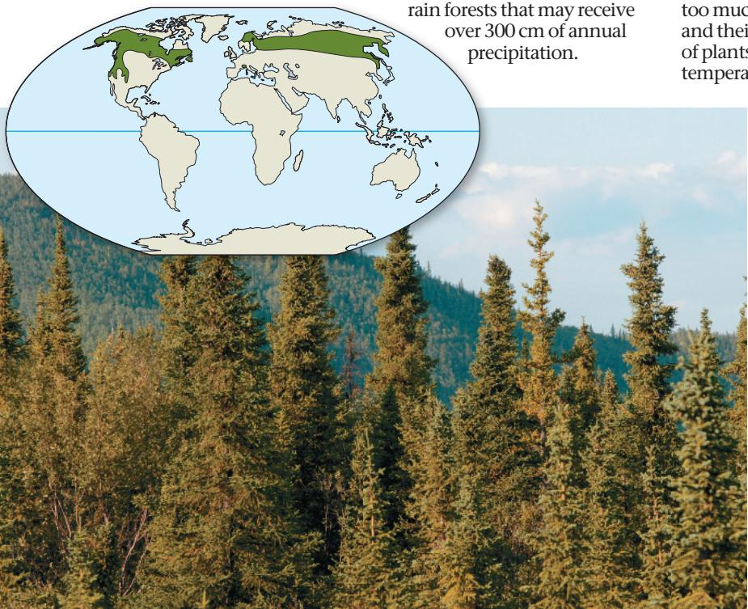

Temperature Winters are usually cold; summers may be hot. Some areas of coniferous forest in Siberia typically range in temperature from $-50^{\circ}C$ in winter to over $20^{\circ}C$ in summer.

Plants Northern coniferous forests are dominated by cone-bearing trees, such as pine, spruce, fir, and hemlock, some of which depend on fire to regenerate. The conical shape of many conifers prevents too much snow from accumulating and breaking their branches, and their needle- or scale-like leaves reduce water loss. The diversity of plants in the shrub and herb layers of these forests is lower than in temperate broadleaf forests.

Animals While many migratory birds nest in northern coniferous forests, other species reside there year-round. The mammals of this biome, which include moose, brown bears, and Siberian tigers, are diverse. Periodic outbreaks of insects that feed on the dominant trees can kill vast tracts of trees.

Human Impact Although they have not been heavily settled by human populations, northern coniferous forests are being logged at an alarming rate, and the old-growth stands of these trees may soon disappear.

A coniferous forest in Alaska

Continued on next page

## Temperate Broadleaf Forest

Distribution Temperate broadleaf forest is found mainly at midlatitudes in the Northern Hemisphere, with smaller areas in Chile, South Africa, Australia, and New Zealand.

Precipitation Precipitation can average from about 70 to over 200 cm annually. Significant amounts fall during all seasons, including summer rain and, in some forests, winter snow.

Temperature Winter temperatures average $0^{\circ}$ C. Summers, with temperatures up to $35^{\circ}$ C, are hot and humid.

Plants A mature temperate broadleaf forest has distinct vertical layers, including a closed canopy, one or two strata of understory trees, a shrub layer, and an herb layer. There are few epiphytes. The dominant plants in the Northern Hemisphere are deciduous trees, which drop their leaves before winter, when low temperatures would reduce photosynthesis and make water uptake from frozen soil difficult. In Australia, evergreen eucalyptus trees dominate these forests.

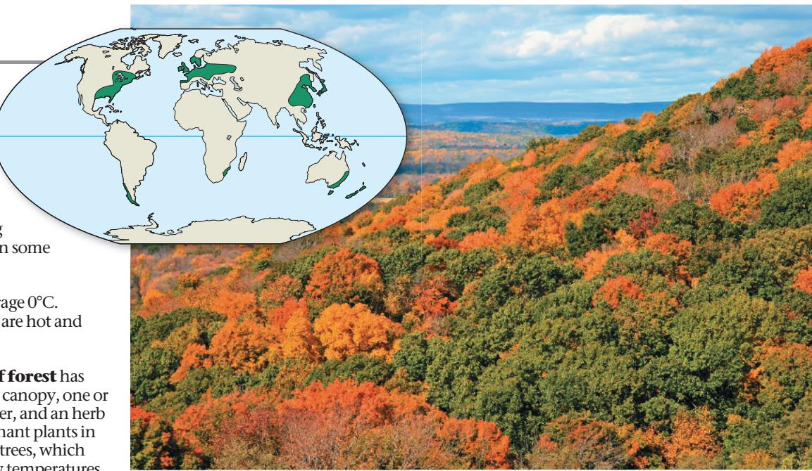  
A temperate broadleaf forest in New Jersey

Animals In the Northern Hemisphere, many mammals hibernate in winter, while many bird species migrate to warmer climates. Mammals, birds, and insects make use of all the vertical layers of the forest.

Human Impact Temperate broadleaf forest has been heavily settled on all continents. Logging and land clearing for agriculture and urban development cleared virtually all the original deciduous forests in North America. However, owing to their capacity for recovery, these forests are returning over much of their former range.

## Tundra

Distribution Tundra covers expansive areas of the Arctic, amounting to $20\%$ of Earth's land surface. High winds and low temperatures produce similar plant communities, called alpine

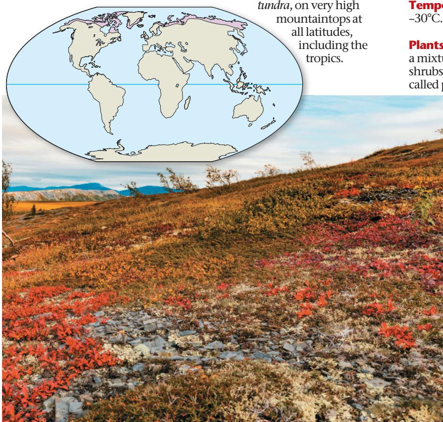

Precipitation Precipitation averages from 20 to 60 cm annually in arctic tundra but may exceed 100 cm in alpine tundra.

Temperature Winters are cold, with averages in some areas below $-30^{\circ}\mathrm{C}$ . Summer temperatures generally average less than $10^{\circ}\mathrm{C}$ .

Plants The vegetation of tundra is mostly herbaceous, consisting of a mixture of mosses, grasses, and forbs, along with some dwarf shrubs and trees and lichens. A permanently frozen layer of soil called permafrost restricts the growth of plant roots.

Animals Large grazing musk oxen are resident, while caribou and reindeer are migratory. Predators include bears, wolves, and foxes. Many bird species migrate to the tundra for summer nesting.

Human Impact Tundra is sparsely settled but has become the focus of significant mineral and oil extraction in recent years.

Tundra in Yukon Territory, Canada, in autumn

replacing natural communities with urban and agricultural ones. The central United States, for example, is classified as grassland and once contained extensive areas of tallgrass prairie. Very little of the original prairie remains today, however, having been converted to farmland.

## Concept Check 52.2

1. Based on the climograph in Figure 52.12, what mainly differentiates temperate grassland from temperate broadleaf forest?

2. Using Figure 52.14, identify the natural biome in which you live, and summarize its abiotic and biotic characteristics. Do these reflect your actual surroundings? Explain.

3. WHAT IF? If average temperatures on Earth increase by $4^{\circ}$ C in this century, predict which biome would be most likely to replace tundra in some locations as a result. Explain.

For suggested answers, see Appendix A.

## Concept 52.3: Aquatic biomes are diverse and dynamic systems that cover most of Earth

Some of the most important factors affecting aquatic biomes are the amount of light and the availability of nutrients–chemical elements required by primary producers for their growth and metabolism. Aquatic biomes are also influenced by other physical and chemical factors. For example, marine biomes generally have salt concentrations that average 3%, whereas freshwater biomes are usually characterized by a salt concentration of less than 0.1%.

The oceans make up the largest marine biome, covering about $75\%$ of Earth's surface. Because of their vast size, they greatly impact the biosphere. Water evaporated from the oceans provides most of the planet's rainfall. Marine algae and photosynthetic bacteria supply much of the world's oxygen and consume large amounts of atmospheric carbon dioxide. Ocean temperatures have a major effect on global climate and wind patterns (see Figure 52.3), and along with large lakes, oceans tend to moderate the climate of nearby land.

Freshwater biomes are closely linked to the soils and biotic components of the surrounding terrestrial biome. The particular characteristics of a freshwater biome are also influenced by the patterns and speed of water flow and the climate to which the biome is exposed.

## Zonation in Aquatic Biomes

An important feature of aquatic biomes is their physical and chemical stratification (layering), both vertically and horizontally, as illustrated for both a lake and a marine environment in Figure 52.15. Light is absorbed by water, and its intensity decreases rapidly with depth, resulting in vertical stratification. The upper photic zone is the region where there is sufficient light for photosynthesis, while the lower aphotic zone is the region where little light penetrates. Deep in the aphotic zone of the ocean lies the abyssal zone, at 2,000–6,000 m below the surface. The water column is called the pelagic zone. The bottom surface of all these aquatic zones, deep or shallow, is the benthic zone,

Figure 52.15 Zonation in aquatic environments.  
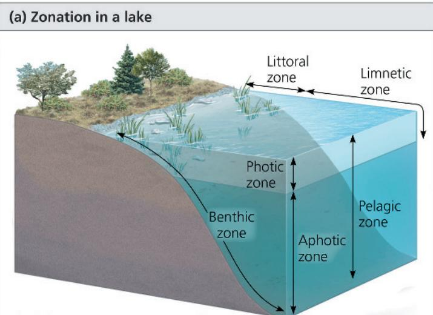  
The lake environment is generally classified on the basis of three physical criteria: light penetration (photic and aphotic zones), distance from shore and water depth (littoral and limnetic zones), and whether the environment is open water (pelagic zone) or on the bottom (benthic zone).

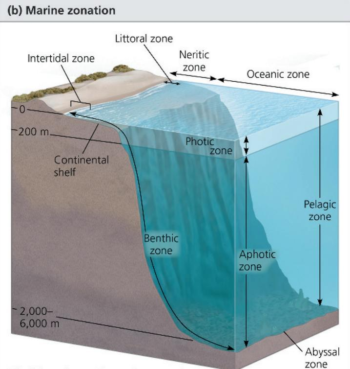  
Like lakes, the marine environment is generally classified on the basis of light penetration (photic and aphotic zones), distance from shore and water depth (intertidal, littoral, neritic, and oceanic zones), and whether the environment is open water (pelagic zone) or on the bottom (benthic zone).

The diagram shows a cross-section of an ocean basin in the tropics, where a permanent thermocline occurs. The thermocline limits exchange between the colder, more dense deep water below and the warmer, less dense shallow water above, resulting in low nutrient concentration in surface waters, except in areas where runoff or upwelling occur.

Rivers carry nutrients (represented by orange and green circles) from terrestrial ecosystems; as a result, coastal waters typically have high nutrient availability.

Nutrient concentration in surface waters is usually low when a strong thermocline is present (for example, at tropical latitudes or in the summer in temperate zones): Available nutrients are quickly used by photosynthetic organisms, and the thermocline prevents mixing of the water column.

In some parts of oceans and large lakes, deep water is forced to the surface when dominant winds force surface water away from land. This process, called upwelling, brings cold, nutrient-rich water to the surface.

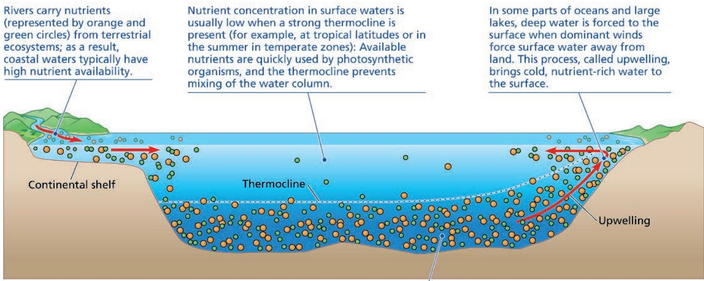  
Nutrients are plentiful in the deep ocean below the photic zone, since they are released through decomposition of organisms and by the consumers when they respire, and there are no photosynthetic organisms to take up the nutrients.

which consists of rocks and sediment occupied by communities of organisms collectively called the benthos. In addition, the photic zone exhibits horizontal stratification with distance from shore. Where the benthos is within the photic zone (called the littoral zone in both lakes and oceans), aquatic plants and seaweeds are important primary producers, along with phytoplankton. In areas farther from shore where the benthos is deeper than the photic zone, phytoplankton floating near the surface are the only primary producers. In lakes, this occurs in the limnetic zone (photic zone in an area of a lake that is too deep for rooted plants to grow). In oceans, this occurs in part of the neritic zone (the water column above the continental shelf) and in the oceanic zone (the water column above deep oceanic crust). A major source of food for many benthic species, especially those in the aphotic zone, is dead organic matter called detritus, which “rains” down from the productive surface waters of the photic zone.

While thermal energy from sunlight warms surface waters to whatever depth the sunlight penetrates, the deeper waters remain quite cold. In many areas of oceans and lakes, a narrow layer of abrupt temperature change called a thermocline separates the more uniformly warm (and less dense) upper layer from more uniformly cold (and denser) deeper waters. Such thermoclines occur year-round in the tropics and in the summer in temperate zones. Where and when strong thermoclines occur, surface waters are typically low in nutrients, because photosynthetic organisms are constantly taking up available nutrients. Deeper waters, on the other hand, are typically nutrient-rich, because respiration and decomposition release nutrients from organic molecules, yet the aphotic zone lacks photosynthetic organisms that would take up nutrients. Several mechanisms can supply nutrients to the photic zone, including 1) runoff from land, which leads to greater nutrient levels in the neritic zone compared to the oceanic zone, especially near large rivers (Figure 52.16a); 2) upwelling of deep water toward the surface caused by winds forcing surface current away from land or away from another surface current (Figure 52.16b); and 3) vertical mixing caused by temperature-driven changes in water density.

Temperature affects water density differently in marine and freshwater environments. In the oceans, water density increases continuously as temperature decreases, all the way to the point of ice formation. When surface water is cold—year-round in polar zones and in autumn, winter, and spring in temperate zones—it sinks to the bottom due to its higher density, forcing less dense, nutrient-rich deep water to the surface (Figure 52.17, on the next page). The density of fresh water, however, is highest at $4^{\circ}$ C, and so in freshwater environments the water column is stratified not just in the summer, due to warm surface water, but also in the winter, due to less dense water (colder than $4^{\circ}$ C) at the surface. As a result, a temperate lake experiences the most vertical mixing—called turnover—in spring and autumn. This seasonal turnover also plays an important role in bringing oxygen to the bottom of the lake.

In both freshwater and marine environments, communities are distributed according to water depth, degree of light penetration, amount of water movement, distance from shore, and whether they are found in open water or near the bottom. Marine communities, in particular, illustrate the limitations on species distribution that result from these abiotic factors. Most of

Figure 52.17 Seasonal vertical mixing in temperate marine ecosystems.

The water column is well-mixed in the winter, when the surface is continuously cooled by cold air above, causing this dense water to sink to the bottom and less dense bottom water to rise to the surface. Considerable water column mixing also occurs in the spring and fall. In the summer, however, warming of surface waters by the sun leads to a strong thermocline that separates warmer, less dense surface water from colder, more dense bottom water. Nutrients become limiting in surface waters as they are used by photosynthetic organisms, and the thermocline prevents mixing of nutrient-rich bottom water with nutrient-poor surface water.

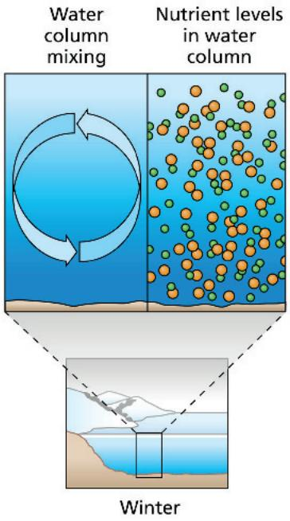

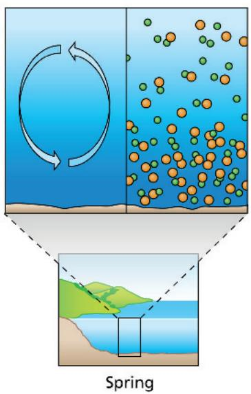

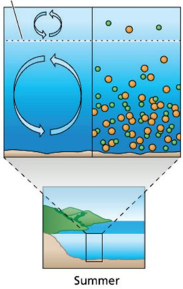

the plankton and fish biomass is found in the relatively shallow photic zone (see Figure 52.15b). Because water absorbs light so well and the ocean is so deep, most of the ocean volume is dark (the aphotic zone) and generally harbors a much lower density of organisms, which are mostly consumers that rely on food that falls from the photic zone above. However, there are isolated areas that teem with life, where hydrogen sulfide and other chemicals provide the energy for chemosynthetic organisms to grow. These producers in turn support a high biomass of consumers.

Figure 52.18 explores the main characteristics of Earth's major aquatic biomes.

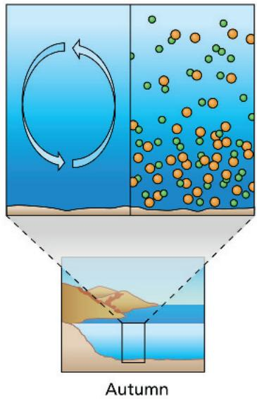

## Concept Check 52.3

1. Why are phytoplankton, and not benthic algae or rooted aquatic plants, the dominant photosynthetic organisms of the oceanic pelagic zone? (See Figure 52.18.)

2. MAKE CONNECTIONS Many organisms living in estuaries experience freshwater and saltwater conditions each day with the rising and falling of tides. Explain how these changing conditions challenge the survival of these organisms (see Concept 44.1).

3. MAKE CONNECTIONS As noted in Figure 52.18, the addition of nutrients to a lake can cause an algal bloom. When these algae die, complex molecules in their bodies are broken down by decomposers using aerobic respiration. Explain why this could reduce the lake's oxygen levels (see Concept 9.1).

## Concept 52.4: Interactions between organisms and the environment limit the distribution of species

Broadly speaking, species distributions are a consequence of both ecological factors and evolutionary history. Consider kangaroos, which are found in Australia and nowhere else in the world. Fossil evidence indicates that kangaroos and their close relatives originated in Australia, roughly 5 million years ago. By that time, Australia had moved close to its present location (by continental drift; see Concept 25.4), and it was not connected to other landmasses. Thus, kangaroos occur only in Australia in part because of an accident of history: The kangaroo lineage originated there at a point in time when the continent was geographically isolated.

But ecological factors are also important. To date, kangaroos have not dispersed (on their own) to other continents; hence, they are restricted to the continent on which they originated. And within Australia, kangaroos are found in some habitats but not in others. The red kangaroo, for example, occurs in the arid grasslands of central Australia, but not in the tall, open forests of eastern Australia. Moreover, kangaroos are not unusual in this

# Exploring Aquatic Biomes

Figure 52.18

## Lakes

Physical Environment Standing bodies of water range from ponds a few square meters in area to lakes covering thousands of square kilometers. Light decreases with depth, creating stratification. Temperate lakes may have a seasonal thermocline; tropical lowland lakes have a thermocline year-round.

Chemical Environment The salinity, oxygen concentration, and nutrient content differ greatly among lakes and can vary with season. Oligotrophic lakes tend to be nutrient-poor and generally oxygen-rich; eutrophic lakes are nutrient-rich and often depleted of oxygen in the deepest zone in summer and if covered with ice in winter. The amount of decomposable organic matter in bottom sediments is low in oligotrophic lakes and high in eutrophic lakes; high rates of decomposition in deeper layers of eutrophic lakes cause periodic oxygen depletion.

Geologic Features Oligotrophic lakes tend to have less surface area relative to their depth than eutrophic lakes. Oligotrophic lakes may become more eutrophic over time as runoff adds sediments and nutrients.

Photosynthetic Organisms Rooted and floating aquatic plants in lakes live in the littoral zone, the shallow, well-lit waters close to shore. Farther from shore, where water is too deep to support rooted aquatic plants, the limnetic zone is inhabited by a variety of phytoplankton, including cyanobacteria.

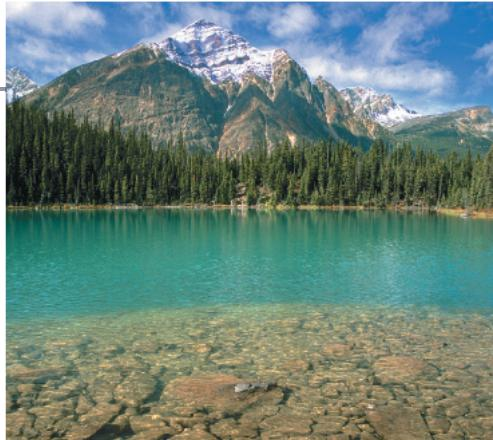  
An oligotrophic lake in Jasper National Park, Alberta

Heterotrophs In the limnetic zone, small drifting heterotrophs, or zooplankton, graze on the phytoplankton. The benthic zone is inhabited by assorted invertebrates whose species composition depends partly on oxygen levels. Fishes live in all zones with sufficient oxygen.

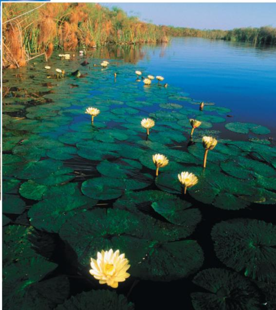  
A eutrophic lake in the Okavango Delta, Botswana

Human Impact Runoff from fertilized land and dumping of wastes lead to nutrient enrichment, which can produce large numbers of algae (an algal “bloom”) oxygen depletion, and fish kills.

## Wetlands

Physical Environment A wetland is a habitat that is inundated by water at least some of the time and that supports plants adapted to water-saturated soil. Some wetlands are inundated at all times, whereas others flood infrequently.

Chemical Environment Because of high organic production by plants and decomposition by microbes and other organisms, both the water and the soils are periodically low in dissolved oxygen. Wetlands have a high capacity to filter dissolved nutrients and chemical pollutants.

Geologic Features Basin wetlands develop in shallow basins, ranging from upland depressions to filled-in lakes and ponds. Riverine wetlands develop along shallow and periodically flooded banks of rivers and streams. Fringe wetlands occur along the coasts of large lakes and seas, where water

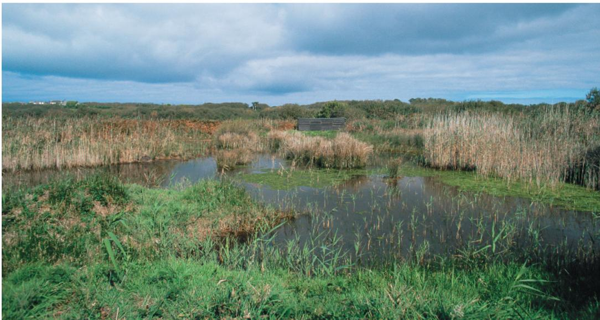

flows back and forth because of rising lake levels or tidal action. Thus, fringe wetlands include both freshwater and marine biomes.

Photosynthetic Organisms Wetlands are among the most productive biomes on Earth. Their water-saturated soils favor the growth of plants such as pond lilies and cattails, many sedges, bald cypress, and black spruce, which have adaptations enabling them to grow in water or in soil that is periodically anaerobic owing to the presence of unaerated water. Woody plants dominate the vegetation of swamps, while bogs are dominated by sphagnum mosses.

Heterotrophs Wetlands are home to a diverse community of invertebrates, birds, and many other organisms. Herbivores, from crustaceans and aquatic insect larvae to muskrats, consume algae, detritus, and plants. Carnivores are also varied and may include dragonflies, otters, frogs, alligators, and herons.

Human Impact Wetlands help purify water and reduce peak flooding. Draining and filling have destroyed up to 90% of wetlands in Europe.

A basin wetland in the United Kingdom

(Continued)

## Figure 52.18 (Continued)

## Streams and Rivers

Physical Environment The most prominent physical characteristic of streams and rivers is the speed and volume of their flow. Headwater streams are generally cold, clear, swift, and turbulent. Farther downstream, where numerous tributaries may have joined, forming a river, the water is generally warmer and more turbid because of suspended sediment. Streams and rivers are stratified into vertical zones.

Chemical Environment The salt and nutrient content of streams and rivers increases from the headwaters to the mouth. Headwaters are generally rich in oxygen. Downstream water may also contain substantial oxygen, except where there has been organic enrichment. A large fraction of the organic matter in rivers consists of dissolved or highly fragmented material that is carried by the current from forested streams.

Geologic Features Headwater stream channels are often narrow, have a rocky bottom, and alternate between shallow sections and deeper pools. The downstream stretches of rivers are generally wide and meandering. River bottoms are often silty from sediments deposited over long periods of time.

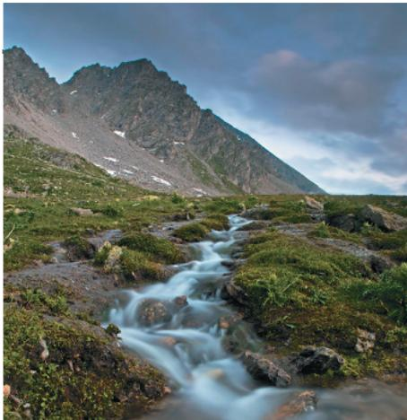  
A headwater stream in Washington

## Estuaries

Physical Environment An estuary is a transition area between river and sea. Seawater flows up the estuary channel during a rising tide and flows back down during the falling tide. Often, higher-density seawater occupies the bottom of the channel and

Photosynthetic Organisms Headwater streams that flow through grasslands or deserts may be rich in phytoplankton or rooted aquatic plants.

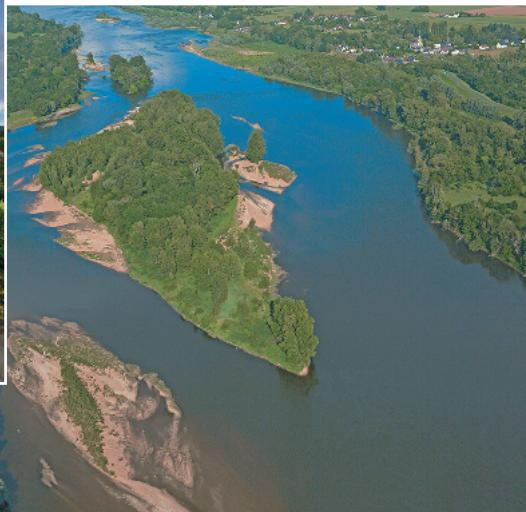  
The Loire River in France, far from its headwaters

Heterotrophs A great diversity of fishes and invertebrates inhabit unpolluted rivers and streams, distributed according to, and throughout, the vertical zones. In streams flowing through temperate or tropical forests, organic matter from terrestrial vegetation is the primary source of food for aquatic consumers.

Human Impact Municipal, agricultural, and industrial pollution degrade water quality and kill aquatic organisms. Damming and flood control impair the natural functioning of stream and river ecosystems and threaten migratory species such as salmon.

mixes little with the lower-density river water at the surface.

Chemical Environment Salinity varies spatially within estuaries, from nearly that of fresh water to that of seawater. Salinity also varies with the rise and fall of the tides. Nutrients from the river make estuaries, like wetlands, among the most productive biomes.

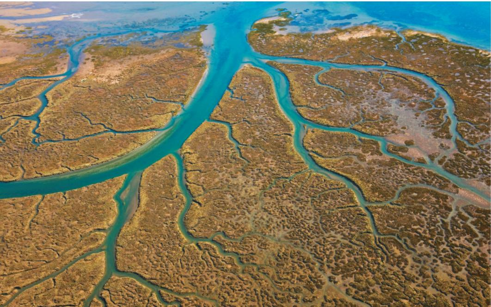

Geologic Features Estuarine flow patterns combined with the sediments carried by river and tidal waters create a complex network of tidal channels, islands, natural levees, and mudflats.

Photosynthetic Organisms Saltmarsh grasses and algae, including phytoplankton, are the major producers in estuaries.

Heterotrophs Estuaries support an abundance of worms, oysters, crabs, and many fish species that humans consume. Many marine invertebrates and fishes use estuaries as a breeding ground or migrate through them to freshwater habitats upstream. Estuaries are also crucial feeding areas for waterfowl and some marine mammals.

Human Impact Filling, dredging, and pollution from upstream have disrupted estuaries worldwide.

An estuary in southern Spain

## Intertidal Zones

Physical Environment An intertidal zone is periodically submerged and exposed by the tides, twice daily on most marine shores. Upper zones experience longer exposures to air and greater variations in temperature and salinity. Changes in physical conditions from the upper to the lower intertidal zones limit the distributions of many organisms to particular strata, as shown in the photograph.

Chemical Environment Oxygen and nutrient levels are generally high and are renewed with each turn of the tides.

Geologic Features The substrates of intertidal zones, which are generally either rocky or sandy, select for particular behavior and anatomy among intertidal organisms. The configuration of bays or coastlines influences the magnitude of tides and the relative exposure of intertidal organisms to wave action.

Photosynthetic Organisms A high diversity and biomass of attached marine algae inhabit rocky intertidal zones, especially in the lower zone. Sandy

intertidal zones exposed to vigorous wave action generally lack attached plants or algae, while sandy intertidal zones in protected bays or lagoons often support rich beds of seagrass and algae.

Heterotrophs Many of the animals in rocky intertidal environments have structural adaptations that enable them to attach to the hard substrate. The composition, density, and diversity of animals change markedly from the upper to the lower intertidal zones. Many of the animals in sandy or muddy intertidal zones, such as worms, clams, and predatory crustaceans, bury themselves and feed as the tides bring sources of food. Other common animals are sponges, sea anemones, echino-derms, and small fishes.

Human Impact Oil pollution has disrupted many intertidal areas. The construction of rock walls and barriers to reduce erosion from waves and storm surges has disrupted this zone in some locations.

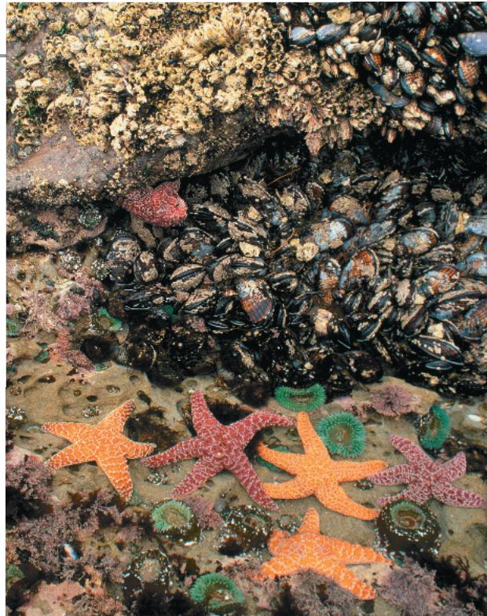  
A rocky intertidal zone on the Oregon coast

## Oceanic Pelagic Zone

Physical Environment The oceanic pelagic zone is a vast realm of open blue water, constantly mixed by wind driven oceanic currents. Because of higher water clarity, the photic zone extends to greater depths than in coastal marine waters.

Chemical Environment Oxygen levels are generally high. Nutrient concentrations are generally lower than in coastal waters. Because they are thermally stratified year-round, some tropical areas of the oceanic pelagic zone have lower nutrient concentrations than temperate oceans. Turnover between fall and spring renews nutrients in the photic zones of temperate and high-latitude ocean areas.

Geologic Features This biome covers approximately $70\%$ of Earth's surface and has an average depth of nearly $4,000\mathrm{m}$ . The deepest point in the ocean is more than $10,000\mathrm{m}$ beneath the surface.

Photosynthetic Organisms The dominant photosynthetic organisms are phytoplankton, including photosynthetic bacteria, that drift with the oceanic currents. Spring turnover renews nutrients in temperate

Open ocean near Iceland

(Continued)

oceans, producing a surge of phytoplankton growth. Because of this biome's large size, photosynthetic plankton account for about half of the photosynthetic activity on Earth.

Heterotrophs The most abundant heterotrophs in this biome are zooplankton. These protists, worms, copepods, shrimp-like krill, jellies, and small larvae of invertebrates and fishes graze on photosynthetic plankton. The oceanic pelagic zone also includes numerous free-swimming animals, such as large squids, fishes, sea turtles, and marine mammals.

Human Impact Overfishing has depleted fish stocks in all Earth's oceans; marine life has also been harmed by pollution, ocean acidification, and global warming.

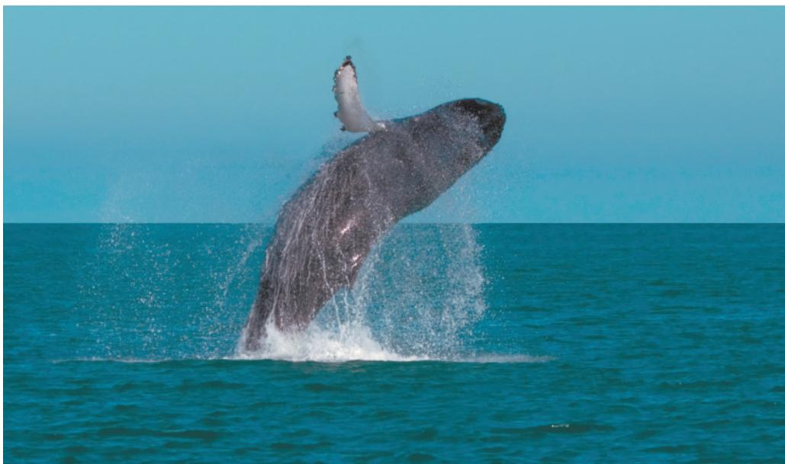

Figure 52.18 (Continued)

Coral Reefs

Physical Environment Coral reefs are formed largely from the calcium carbonate skeletons of corals. Shallow reef-building corals live in the photic zone of relatively stable tropical marine environments with high water clarity, primarily near islands and along the edge of some continents. They are sensitive to temperatures below about 18–20°C and above 30°C. Deep-sea coral reefs, found between 200 and 1,500 m deep, are less known than their shallow counterparts but harbor as much diversity as many shallow reefs do.

Chemical Environment Corals require high oxygen levels and are excluded by high inputs of fresh water and nutrients.

Geologic Features Corals require a solid substrate for attachment. A typical coral reef begins as a fringing reef on a young, high island, forming an offshore barrier reef later in the history of the island and becoming a coral atoll as the older island submerges.

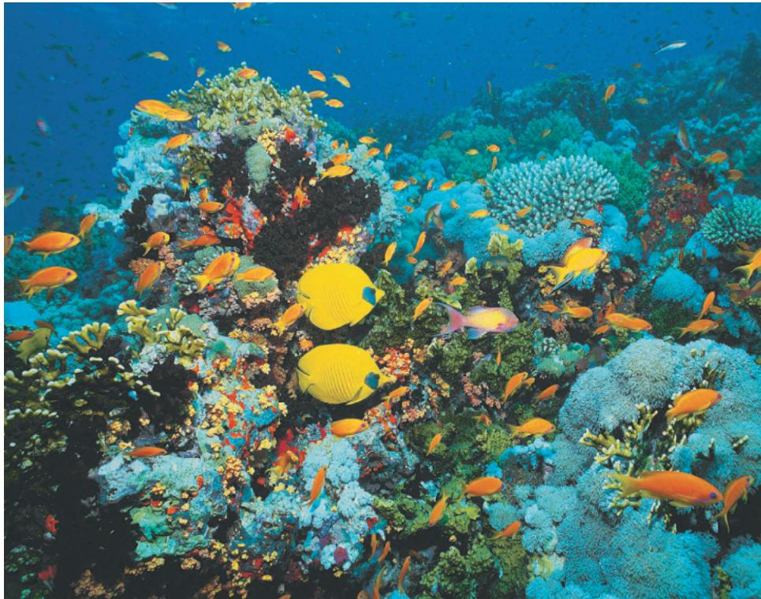  
A coral reef in the Red Sea

Photosynthetic Organisms Unicellular algae live within the tissues of the corals, forming a mutualistic relationship that provides the corals with organic molecules. Diverse multicellular red and green algae growing on the reef also contribute substantial amounts of photosynthesis.

Heterotrophs Corals, a diverse group of cnidarians, are themselves the predominant animals on coral reefs. However, fish and invertebrate diversity is exceptionally high. Overall animal diversity on coral reefs rivals that of tropical forests.
Human Impact Collecting of coral

skeletons and overfishing have reduced populations of corals and reef fishes. Global warming and pollution may be contributing to large-scale coral death. Development of coastal mangroves for aquaculture has also reduced spawning grounds for many species of reef fishes.

## Marine Benthic Zone

Physical Environment The marine benthic zone consists of the seafloor below the surface waters of the coastal, or neritic, zone and the offshore pelagic zone. Except for shallow, near-coastal areas, the marine benthic zone receives no sunlight. Water temperature declines with depth, while pressure increases. As a result, organisms in the very deep benthic, or abyssal, zone are adapted to continuous cold (about 3°C) and very high water pressure.

Chemical Environment Except in areas of organic enrichment, oxygen is usually

present at sufficient concentrations to support diverse animal life.

Geologic Features Soft sediments cover most of the benthic zone. However, there are areas of rocky substrate on reefs, submarine mountains, and new oceanic crust.

Autotrophs Photosynthetic organisms, mainly algae, are limited to shallow benthic areas with sufficient light to support them. Unique assemblages of organisms live near deep-sea hydrothermal vents on mid-ocean ridges. In these dark, hot

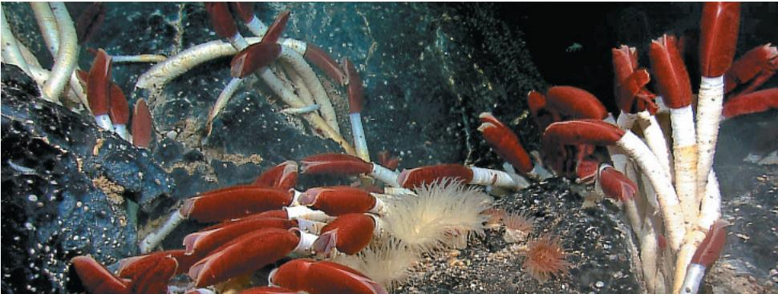

environments, the food producers are chemoautotrophic prokaryotes that obtain energy by oxidizing $H_{2}S$ formed by a reaction of the hot water with dissolved sulfate ( $SO_{4}^{2-}$ ).

Heterotrophs Neritic benthic communities include numerous invertebrates and fishes. Beyond the photic zone, most consumers depend entirely on organic matter raining down from above. Among the animals of the deep-sea hydrothermal vent communities are giant tube worms (pictured), some more than 1 m long. They are nourished by chemoautotrophic prokaryotes that live as symbionts within their bodies. Many other invertebrates, including arthropods and echinoderms, are also abundant around the vents.

Human Impact Overfishing has decimated important benthic fish populations, such as the cod of the Grand Banks off Newfoundland. Dumping of organic wastes has created oxygen-deprived benthic areas.

A deep-sea hydrothermal vent community

Figure 52.19 Distribution of the saguaro cactus in North America.

Freezing temperatures strongly limit where saguaros are found, but other abiotic and biotic factors are also important.

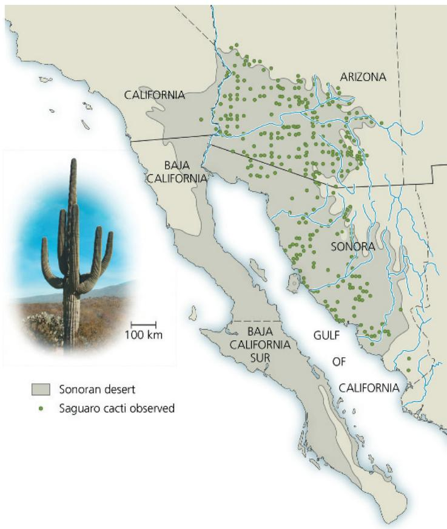

respect—all species are found in some habitats but not others. Hence, ecologists ask not only where species occur, but also why species occur where they do: What ecological factors—biotic and abiotic—determine their distribution?

In many cases, both biotic and abiotic factors affect the distribution of a species, as is true of the saguaro cactus (Carnegiea gigantea). Saguaros are found almost exclusively in the Sonoran Desert of the southwestern United States and northwestern Mexico (Figure 52.19). To the north, their range is limited by an abiotic factor: temperature. Saguaros tolerate freezing temperatures only briefly, typically for less than a day, and

generally cannot survive at temperatures below $-4^{\circ}C$ ( $25^{\circ}F$ ). For the same reason, saguaros are rarely found at elevations above 1,200 m (4,000 feet).

However, temperature alone does not fully explain the distribution of saguaros, including why they are missing from the western portion of the Sonoran Desert. Water availability is critical because seedling survival typically requires consecutive years of moist conditions, something that may occur only a few times each century. Biotic factors almost certainly influence their distribution as well. Mice and grazers such as goats eat the seedlings, and bats pollinate the large, white flowers that open at night. Saguaros are also vulnerable to a deadly bacterial disease. Thus, for the saguaro, as for most other species, ecologists need to consider multiple factors and alternative hypotheses when attempting to explain the distribution of a species.

To see how ecologists might arrive at such an explanation, let's examine the ecological factors highlighted by the questions in the flowchart in Figure 52.20.

## Dispersal and Distribution

One factor that contributes greatly to the global distribution of organisms is dispersal, the movement of individuals or gametes away from their area of origin or from centers of high population density. For example, while land-bound kangaroos have not reached Africa under their own power, other Australian organisms that disperse more readily, such as some birds, have. The dispersal of organisms is critical to understanding the role of geographic isolation in evolution (see Concept 24.2) as well as the patterns of species distribution we see today, including that of the Pacific diatom discussed earlier in this chapter.

## Natural Range Expansions and Adaptive Radiation

The importance of dispersal is most evident when organisms reach an area where they did not exist previously, called a range expansion. For instance, 200 years ago, the cattle egret (Bubulcus ibis) was found only in Africa and southwestern Europe. But in the late 1800s, some of these birds managed to cross the Atlantic Ocean and colonize northeastern South America. From there, cattle egrets gradually spread southward and also northward through Central America and into North America, reaching Florida by 1960

Figure 52.20 Flowchart of factors limiting geographic distribution.  
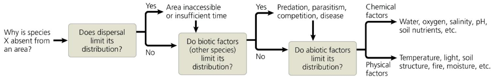  
How might the importance of various abiotic factors differ for aquatic and terrestrial ecosystems? For suggested answer, see Appendix A.

Figure 52.21 Dispersal of the cattle egret in the Americas.
Native to Africa, cattle egrets were first reported in South America in 1877. The color-coding and dates show the regions to which the birds had spread at different points in time.

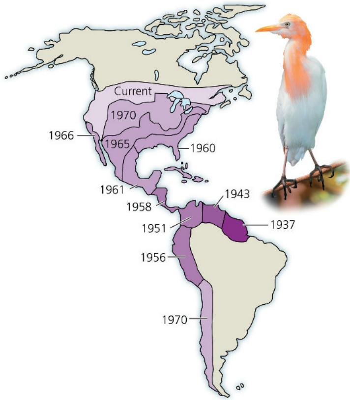  
Figure 52.22 Effects of feeding by sea urchins on seaweed distribution.

(Figure 52.21). Today they have breeding populations as far west as the Pacific coast of the United States and as far north as southern Canada.

In rare cases, such long-distance dispersal can lead to adaptive radiation, the rapid evolution of an ancestral species into new species that fill many ecological niches. The diversity of Hawaiian silverswords is one example of adaptive radiation that was possible only with the long-distance dispersal of an ancestral tarweed from North America (see Figure 25.22).

Natural range expansions clearly show the influence of dispersal on distribution. However, opportunities to observe such dispersal directly are rare, so ecologists often turn to experimental methods to better understand the role of dispersal in limiting the distribution of species.

## Species Transplants

To determine if dispersal is a key factor limiting the distribution of a species, ecologists may observe the results of intentional or accidental transplants of the species to areas where it was previously absent. For a transplant to be successful, some of the organisms must not only survive in the new area but also reproduce there sustainably. If a transplant is successful, then we can conclude that the potential range of the species is larger than its actual range; in other words, the species could live in certain areas where it currently does not.

Seaweed abundance in areas from which the long-spined sea urchin (Centrostephanus rodgersii) had been removed was much higher than seaweed abundance in adjacent control sites from which the urchin was not removed.

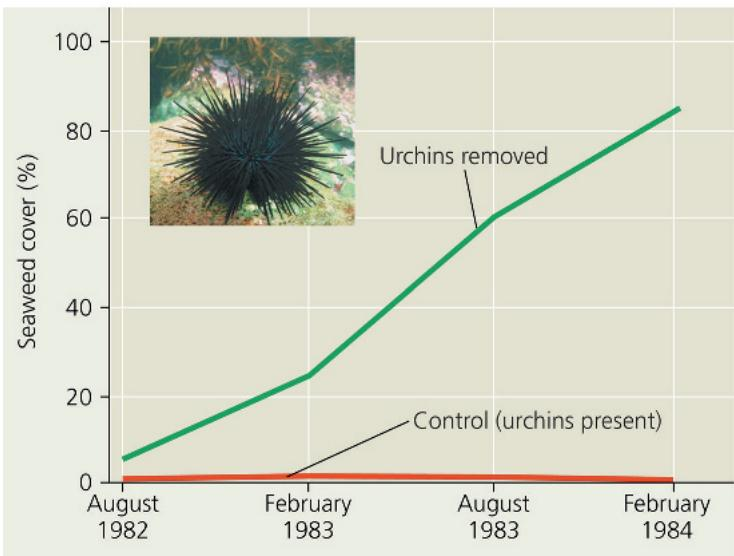

In some cases, species introduced to new geographic locations have disrupted the communities and ecosystems to which they have been introduced (see Concept 56.1). Consequently, ecologists rarely move species to new regions. Instead, they document the outcome when a species reaches a new region in other ways, such as when a predator is introduced to control a pest species or when a species has been moved accidentally to the area.

## Biotic Factors

Our next question is whether biotic factors—other species—limit the distribution of a species. Often, the ability of a species to survive and reproduce is reduced by its interactions with other species, such as predators (organisms that kill their prey) or herbivores (organisms that eat plants or algae). Figure 52.22 shows how an herbivore, the long-spined sea urchin (Centrostephanus rodgersii), has affected the distribution of a food species. In certain marine ecosystems, there is often an inverse relationship between the abundance of sea urchins and seaweeds (multicellular algae, such as kelp). Where urchins that graze on seaweeds and other algae are common, large stands of seaweeds do not become established. As shown in Figure 52.22, Australian researchers tested whether C. rodgersii is a biotic factor limiting seaweed distribution. When this urchin was removed from experimental plots, seaweed cover increased dramatically, showing that C. rodgersii limited the distribution of seaweeds.

In addition to predation and herbivory, the presence or absence of pollinators, food resources, parasites, pathogens, and competing organisms can act as a biotic limitation on species distribution. Such biotic limitations are common in nature.

## Abiotic Factors

The last question in the flowchart in Figure 52.20 considers whether abiotic factors, such as temperature, water, oxygen, salinity, sunlight, or soil, might be limiting a species' distribution. If the physical conditions at a site do not allow a species to survive and reproduce, then the species will not be found there. Throughout this discussion, keep in mind that most abiotic factors vary substantially over space and time. Daily and annual fluctuations of abiotic factors may either blur or accentuate regional distinctions. Furthermore, organisms can avoid some stressful conditions temporarily through behaviors such as dormancy or hibernation (see Concept 40.4).

## Temperature

Environmental temperature is an important factor in the distribution of organisms because of its effect on biological processes. Cells may rupture if the water they contain freezes (at temperatures below $0^{\circ}$ C), and the proteins of most organisms denature at temperatures above $45^{\circ}$ C. Organisms typically function best within a specific range of environmental temperature. Temperatures outside that range may force some animals to expend energy regulating their internal temperature, as mammals and birds do (see Figure 40.16). Extraordinary adaptations enable certain organisms, such as thermophilic prokaryotes, to live outside the temperature range habitable by other life.

As mentioned earlier, climate change has already caused hundreds of species to alter their geographic ranges. A shift in the range of one species can also have profound effects on the distribution of other species. Consider how rising sea temperatures have affected the geographic range of the sea urchin C. rodgersii. Since 1950, water temperatures along the coast of Tasmania, an island south of mainland Australia, have increased from 11.5°C to 12.5°C. This has enabled C. rodgersii—whose larvae fail to develop properly if temperatures drop below 12°C—to expand its range to the south (Figure 52.23). The urchin is a voracious consumer of kelp and other algae. As a result, algal communities that once harbored a rich diversity of other species have been completely destroyed in regions where the urchin has become well established (denoted by a solid orange line in Figure 52.23).

## Water and Oxygen

The dramatic variation in water availability among habitats is another important factor in species distribution. Species living at the seashore or in tidal wetlands can desiccate (dry out) as the tide recedes. Terrestrial organisms face a nearly constant threat of desiccation, and the distribution of terrestrial species reflects their ability to obtain and conserve water. Many amphibians, such as the tiny frog in Figure 52.1, are particularly vulnerable to drying because they use their moist, delicate skin for gas exchange. Desert organisms exhibit a variety of adaptations for acquiring and conserving water in dry environments, as described in Concept 44.4.

Water affects oxygen availability in aquatic environments and in flooded soils, where the slow diffusion of oxygen in water can

Figure 52.23 A sea urchin's expanding range.

Since the 1950s, water temperatures along the coast of Tasmania have increased, allowing the sea urchin C. rodgersii to expand its range to the south. The bold orange type indicates the years when C. rodgersii was first observed colonizing those locations. Once its population has been established in a new location, C. rodgersii has eliminated the local kelp community.

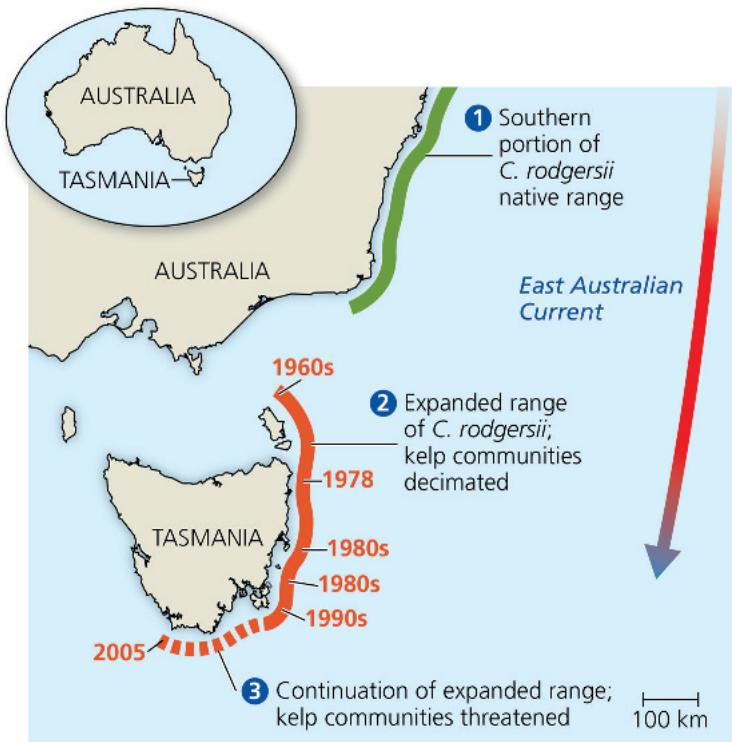

limit cellular respiration and other physiological processes. Oxygen concentrations can be particularly low in deep ocean and deep lake waters, as well as in sediments where organic matter is abundant. Flooded wetland soils may also have low oxygen content. Mangroves and other trees have specialized roots that project above the water and help the root system obtain oxygen (see Figure 35.4). Unlike many flooded wetlands, the surface waters of streams and rivers tend to be well oxygenated because of rapid exchange of gases with the atmosphere.

## Salinity

The salt concentration of water in the environment affects the water balance of organisms through osmosis. Most aquatic organisms are restricted to either freshwater or saltwater habitats by their limited ability to osmoregulate (see Concept 44.1). Most terrestrial organisms can excrete excess salts from specialized glands or in feces or urine. However, the salt concentrations in some habitats (such as salt flats) are so high that few species of plants or animals can survive there (Figure 52.24). In the Scientific Skills Exercise, you can interpret data from an experiment investigating the influence of salinity on plant distributions.

Figure 52.24 Salar de Uyuni, in Bolivia, the largest salt flat in the world.

Aside from the flamingos that breed there annually, very few animals or plants inhabit the vast expanse of crusty white salt.

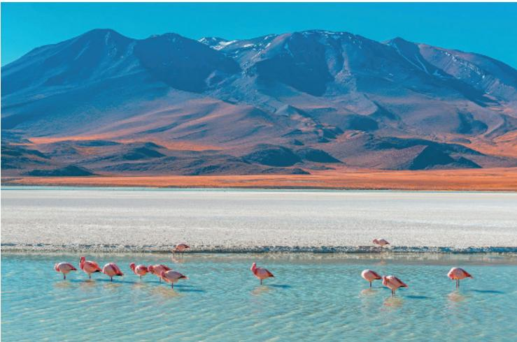

# Scientific Skills Exercise Making a Bar Graph and a Line Graph to Interpret Data

How Do Salinity and Competition Affect the Distribution of Plants in an Estuary? Field observations show that Spartina patens (salt marsh hay) is a dominant plant in salt marshes and Typha angustifolia (cattail) is a dominant plant in freshwater marshes. In this exercise, you will graph and interpret data from an experiment that examined the influence of an abiotic factor, salinity, and a biotic factor, competition, on the growth of these two species.

How the Experiment Was Done Researchers planted S. patens and T. angustifolia in salt marshes and freshwater marshes with and without neighboring plants. After two growing seasons (1.5 years), they measured the biomass of each species in each treatment. The researchers also grew both species in a greenhouse at six salinity levels and measured the biomass at each level after eight weeks.

Data from the Field Experiment (averages of 16 replicate samples)

<table><tr><td rowspan="3"></td><td colspan="4">Average Biomass (g/100 cm2)</td></tr><tr><td colspan="2">Spartina patens</td><td colspan="2">Typha angustifolia</td></tr><tr><td>Salt Marshes</td><td>Freshwater Marshes</td><td>Salt Marshes</td><td>Freshwater Marshes</td></tr><tr><td>With neighbors</td><td>8</td><td>3</td><td>0</td><td>18</td></tr><tr><td>Without neighbors</td><td>10</td><td>20</td><td>0</td><td>33</td></tr></table>

Data from the Greenhouse Experiment

<table><tr><td>Salinity (parts per thousand)</td><td>0</td><td>20</td><td>40</td><td>60</td><td>80</td><td>100</td></tr><tr><td>% maximum biomass (S. patens)</td><td>77</td><td>40</td><td>29</td><td>17</td><td>9</td><td>0</td></tr><tr><td>% maximum biomass (T. angustifolia)</td><td>80</td><td>20</td><td>10</td><td>0</td><td>0</td><td>0</td></tr></table>

Data from C. M. Crain et al., Physical and biotic drivers of plant distribution across estuarine salinity gradients, Ecology 85:2539–2549 (2004).

Salmon that migrate between freshwater streams and the ocean use both behavioral and physiological mechanisms to osmoregulate. They balance their salt content by adjusting the amount of water they drink and by switching their gills from taking up salt in fresh water to excreting salt in the ocean.

## Sunlight

Sunlight provides the energy that drives most ecosystems, and too little sunlight can limit the distribution of photosynthetic species. In forests, shading by leaves makes competition for light especially intense, particularly for seedlings growing on the forest floor. In aquatic environments, every meter of water depth absorbs about 45% of the red light and about 2% of the blue light passing through it. Thus, most photosynthesis occurs relatively near the water surface.

Too much light can also limit the survival of organisms. In some ecosystems, such as deserts, high light levels can increase temperature stress if animals and plants are unable to avoid the light or to cool themselves through evaporation (see Figure 40.12).

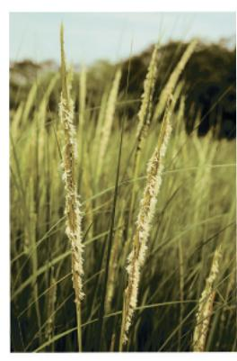  
▲ Spartina patens

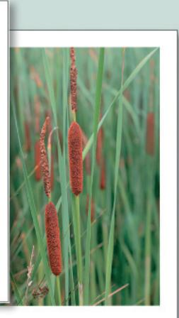  
▲ Typha angustifolia

## INTERPRET THE DATA

1. Make a bar graph of the data from the field experiment. (For additional information about graphs, see the Scientific Skills Review in Appendix D.) What do these data indicate about the salinity tolerances of S. patens and T. angustifolia?

2. What do the data from the field experiment indicate about the effect of competition on the growth of these two species? Which species was limited more by competition?

3. Make a line graph of the data from the greenhouse experiment. Decide which values constitute the dependent and independent variables, and use these values to set up the axes of your graph.

4. (a) In the field, S. patens is typically absent from freshwater marshes. Based on the data, does this appear to be due to salinity or competition? Explain your answer. (b) T. angustifolia does not grow in salt marshes. Does this appear to be due to salinity or competition? Explain your answer.

Instructors: A version of this Scientific Skills Exercise can be assigned in Mastering Biology.

Figure 52.25 Alpine tree line in Banff National Park, Canada. Organisms living at high elevations are exposed not only to high levels of ultraviolet radiation but also to freezing temperatures, moisture deficits, and strong winds. Above the tree line, the combination of such factors restricts the growth and survival of trees.  
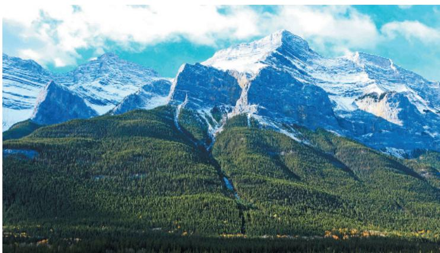

At high elevations, the sun's rays are more likely to damage DNA and proteins because the atmosphere is thinner, absorbing less ultraviolet (UV) radiation. Damage from UV radiation, combined with other abiotic stresses, prevents trees from surviving above a certain elevation, resulting in the appearance of a tree line on mountain slopes (Figure 52.25).

## Rocks and Soil

In terrestrial environments, the pH, mineral composition, and physical structure of rocks and soil limit the distribution of plants and thus of the animals that feed on them, contributing to the patchiness of terrestrial ecosystems. The pH of soil can limit the distribution of organisms directly, through extreme acidic or basic conditions, or indirectly, by affecting the solubility of toxins and nutrients. Soil phosphorus, for instance, is relatively insoluble in basic soils and precipitates into forms unavailable to plants.

In a river, the composition of rocks and soil that make up the substrate (riverbed) can affect water chemistry, which in turn influences the resident organisms. In freshwater and marine environments, the structure of the substrate determines the organisms that can attach to it or burrow into it.

## Concept Check 52.4

1. Describe human actions that could expand a species' range by changing its (a) dispersal or (b) biotic interactions.

2. WHAT IF? You suspect that deer are restricting the distribution of a tree species by preferentially eating the seedlings of the tree. How might you test this hypothesis?

3. MAKE CONNECTIONS Hawaiian silverswords underwent a remarkable adaptive radiation after their ancestor reached Hawaii, while the islands were still young (see Figure 25.23). Would you expect the cattle egret to undergo a similar adaptive radiation in the Americas (see Figure 52.21)? Explain.

# Concept 52.5: Ecological change and evolution affect one another over long and short periods of time

Biologists have long recognized that ecological interactions can cause evolutionary change, and vice versa (Figure 52.26). The history of life includes many examples of these reciprocal effects occurring over long periods of time. Consider the origin and diversification of plants. As described in Concept 29.3, the evolutionary origin of plants altered the chemical cycling of carbon, leading to the removal of large quantities of carbon dioxide from the atmosphere. As the adaptive radiation of plants continued over time, the appearance of new plant species provided new habitats and new sources of food for insects and other animals. In turn, the availability of new habitats and new food sources stimulated bursts of speciation in animals, leading to further ecological changes. Here, as in many other such examples, ecological and evolutionary changes had ongoing and major effects upon one another.

The interplay between ecological and evolutionary change illustrated by the origin of plants occurred over millions of years. Reciprocal “eco-evolutionary” effects occurring over centuries or thousands of years are also well documented, as in the examples of the mosquitofish and the apple maggot fly discussed in Concept 24.2. But are such joint effects common over even shorter periods of time? As we’ve seen in previous chapters, ecological change can cause evolutionary change over the course of a few years to decades; examples include beak length evolution in soapberry bugs (see Figure 22.13) and the formation of new sunflower species (see Figure 24.18).

Recent studies show that the causation can run both ways: Rapid evolution can also cause rapid ecological change. For

Figure 52.26 Reciprocal effects of ecological and evolutionary change.

An ecological change, such as the expansion of a predator's range, can alter the selective pressures faced by prey populations. This could cause evolutionary change, such as an increase in the frequency of a new defensive mechanism in a prey population; that change, in turn, could alter the outcome of ecological interactions.

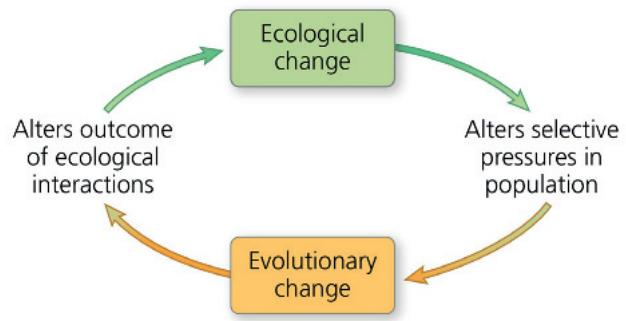

example, Trinidadian guppy (Poecilia reticulata) populations evolve rapidly when predators are removed: Guppy color patterns, jaw morphology, and feeding preferences all change within a few years. In 2017, researchers showed that these rapid evolutionary changes affect the stream ecosystems in which the guppies live. For instance, guppies that had evolved under different levels of predation had contrasting effects on algal abundance (Figure 52.27). Guppies that had evolved under low predation fed primarily on algae (thereby reducing algal abundance), while guppies that had evolved under high predation fed primarily on invertebrates (thereby tending to increase algal abundance because some invertebrates eat algae). As producers, algae are key components of the ecosystem: Other organisms depend on them for food, either directly (by eating them) or indirectly (by eating an organism that ate algae). Overall, this and other studies show that ecological change and evolution have the potential to exert rapid feedback effects on each other.

## Concept Check 52.5

1. Describe a scenario showing how ecological change and evolution can affect one another.

2. MAKE CONNECTIONS Fisheries target older, larger cod fish, causing cod that reproduce at a younger age and smaller size to be favored by natural selection. Younger, smaller cod have fewer offspring than do older cod. Predict how evolution in response to fishing would affect the ability of a cod population to recover from overfishing. What other reciprocal eco-evolutionary effects might occur? (See Concept 23.3.)

Figure 52.27 Rapid evolution leading to rapid ecological change. Dotted lines connect algal abundance at control sites (with no guppies) to algal abundance at nearby sites in the same streams inhabited by guppies that had evolved under either low or high levels of predation.  
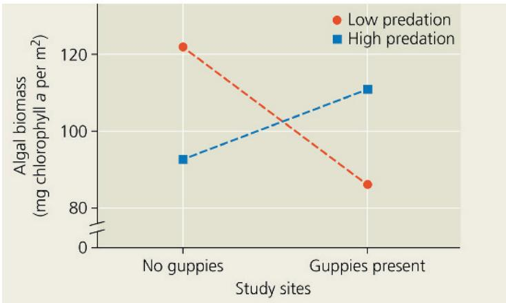

For suggested answers, see Appendix A.

## Chapter 52 Review

## Summary of Key Concepts

To review key terms, go to the Vocabulary Self-Quiz (eTextbook only).

## Concept 52.1: Earth's climate varies by latitude and season and is changing rapidly

\- Global climate patterns are largely determined by the input of solar energy and Earth's revolution around the sun.

\- The changing angle of the sun over the year, bodies of water, and mountains exert seasonal, regional, and local effects on climate.

\- Climate affects where plants can live, but these effects run both ways: Vegetation can alter local and regional climate.

\- Fine-scale differences in certain abiotic (nonliving) factors, such as sunlight and temperature, determine microclimate.

\- Increasing greenhouse gas concentrations in the air are warming Earth and altering the distributions of many species. Some species will not be able to shift their ranges quickly enough to reach suitable habitat in the future.

Suppose global air circulation suddenly reversed, with moist air ascending at $30^{\circ}$ north and south latitude and descending at the equator. At what latitude would you most likely find deserts in this scenario?

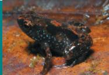

## Concept 52.2: The distribution of terrestrial biomes is controlled by climate and disturbance

\- Climographs show that temperature and precipitation are correlated with biomes. Because other factors also play roles in biome location, biomes overlap.

\- Terrestrial biomes are often named for major physical or climatic factors and for their predominant vegetation. Vertical layering is an important feature of terrestrial biomes.

\- Disturbance, both natural and human-induced, influences the type of vegetation found in biomes. Humans have altered much of Earth's surface, replacing the natural terrestrial communities described and depicted in Figure 52.14 with urban and agricultural ones.

\- The pattern of climatic variation is as important as the average climate in determining where biomes occur.

In what ways are disturbances important for savanna ecosystems and the plants in them?

## Concept 52.3: Aquatic biomes are diverse and dynamic systems that cover most of Earth

\- Aquatic biomes are characterized primarily by their physical and chemical environment, and are often layered with regard to light penetration, temperature, and nutrient availability. Marine biomes have a higher salt concentration than freshwater biomes.

\- Light penetration decreases quickly with depth, and only the shallowest parts of aquatic biomes have enough light to sustain photosynthesis. Where waters are shallow enough that the photic zone reaches the benthic zone, benthic seaweeds (algae) and aquatic plants can be important primary producers. In areas where the benthos is deeper than the photic zone, phytoplankton are the only photosynthetic organisms.

\- Availability of nutrients is an important determinant of aquatic biomes. Nutrients are often limited in the photic zone. New nutrients can be added to the photic zone via runoff from land, upwelling of nutrient-rich deep water, and density-driven mixing of the water column.

In which aquatic biomes might you find an aphotic zone?

## Concept 52.4: Interactions between organisms and the environment limit the distribution of species

Ecologists want to know not only where species occur but also why those species occur where they do.

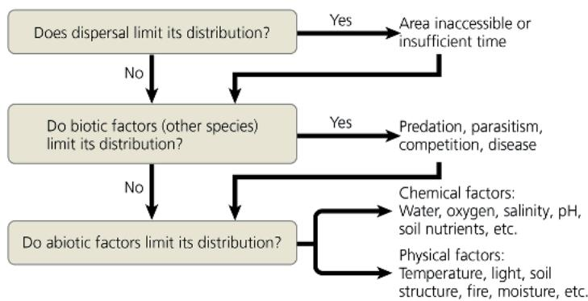  
VISUAL SKILLS If you were an ecologist studying the chemical and physical limits to the distributions of species, how might you rearrange the flowchart preceding this question?

## Concept 52.5: Ecological change and evolution affect one another over long and short periods of time

\- Ecological interactions can cause evolutionary change, as when predators cause natural selection in a prey population.

\- Likewise, an evolutionary change, such as an increase in the frequency of a new defensive mechanism in a prey population, can alter the outcome of ecological interactions.

Suppose humans introduced a species to a new continent where it had few predators or parasites. How might this lead to eco-evolutionary feedback effects?

For suggested answers, see Appendix A.

## Test Your Understanding

For more multiple-choice questions, go to the Practice Test (eTextbook only).

## Levels 1-2: Remembering/Understanding

1. Which of the following areas of study focuses on the exchange of energy, organisms, and materials between ecosystems?

(A) organismal ecology

(B) landscape ecology

(C) ecosystem ecology

(D) community ecology

2. Which lake zone would be absent in a very shallow lake?

(A) benthic zone

(B) aphotic zone

(C) pelagic zone

(D) littoral zone

## Levels 3-4: Applying/Analyzing

3. Which of the following is characteristic of most terrestrial biomes?

(A) a distribution predicted almost entirely by rock and soil patterns

(B) clear boundaries between adjacent biomes

(C) vegetation demonstrating vertical layering

(D) cold winter months

4. The oceans affect the biosphere by

(A) absorbing a substantial amount of the biosphere's oxygen.

(B) regulating the pH of freshwater biomes and terrestrial groundwater.

(C) decreasing winter temperatures of coastal terrestrial biomes.

(D) removing carbon dioxide from the atmosphere.

5. Which statement about dispersal is true?

(A) Dispersal is not a component of the life cycles of most plants and animals.

(B) Dispersal occurs only on an evolutionary time scale.

(C) Colonization of devastated areas after floods or volcanic eruptions depends on dispersal.

(D) The ability to disperse does not affect the geographic distribution of a species.

6. When climbing a mountain, we can observe transitions in biological communities that are analogous to the changes (A) in biomes at different latitudes.

(B) in different depths in the ocean.

(C) in a community through different seasons.

(D) in an ecosystem as it evolves over time.

7. Suppose that the number of bird species is determined mainly by the number of vertical strata found in the environment. If so, in which of the following biomes would you find the greatest number of bird species?

(A) tropical rain forest

(B) savanna

(C) desert

(D) temperate broadleaf forest

## Levels 5-6: Evaluating/Creating

8. WHAT IF? If the direction of Earth's rotation reversed, the most predictable effect would be

(A) a big change in the length of the year.

(B) winds blowing from west to east along the equator.

(C) a loss of seasonal variation at high latitudes.

(D) the elimination of ocean currents.

9. INTERPRET THE DATA After examining Figure 52.22, you decide to study feeding relationships among sea otters, sea urchins, and kelp. You know that sea otters prey on sea urchins and that urchins eat kelp. At four coastal sites, you measure kelp abundance. Then, you spend one day at each site and mark whether otters are present or absent every 5 minutes during the day. Graph kelp abundance (on the y-axis versus otter density (on the x-axis), using the data below. Then, formulate a hypothesis to explain any pattern you observe.

<table><tr><td>Site</td><td>Otter Density (# sightings per day)</td><td>Kelp Abundance (% cover)</td></tr><tr><td>1</td><td>98</td><td>75</td></tr><tr><td>2</td><td>18</td><td>15</td></tr><tr><td>3</td><td>85</td><td>60</td></tr><tr><td>4</td><td>36</td><td>25</td></tr></table>

10. EVOLUTION CONNECTION Discuss how the distribution of a species can be affected both by its evolutionary history and by ecological factors. Could ongoing evolutionary change also affect its distribution? Explain.

11. SCIENTIFIC INQUIRY Jens Clausen and colleagues, at the Carnegie Institution of Washington, studied how the size of yarrow plants (Achillea lanulosa) growing on the slopes of the Sierra Nevada varied with elevation. They found that plants from low elevations were generally taller than plants from high elevations, as shown in the diagram.

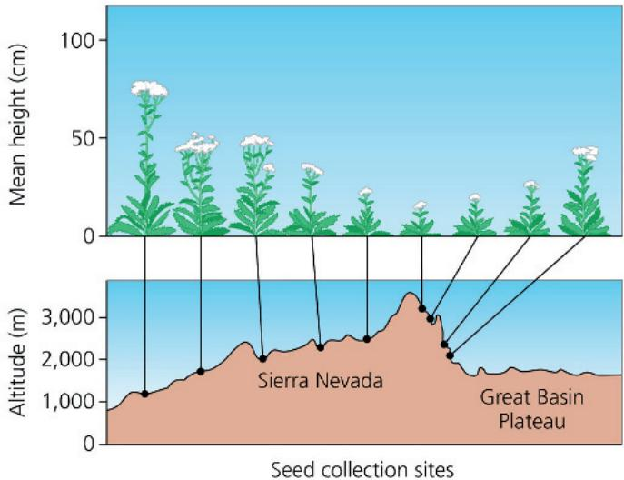  
Data from J. Clausen et al., Experimental studies on the nature of species. III. Environmental responses of climatic races of Achillea, Carnegie Institution of Washington Publication No. 581 (1948).

Clausen and colleagues proposed two hypotheses to explain this variation within a species: (1) There are genetic differences between populations of plants found at different elevations. (2) The

species has developmental flexibility and can assume tall or short growth forms, depending on local abiotic factors. If you had seeds from yarrow plants found at low and high elevations, how would you test these hypotheses?

12. WRITE ABOUT A THEME: INTERACTIONS Global warming is occurring rapidly in arctic marine and terrestrial ecosystems. The reflective white snow and ice cover are melting quickly and extensively, uncovering darker-colored ocean water, plants, and rocks. In a short essay (100–150 words), explain how this process might exemplify positive feedback.

## 13. SYNTHESIZE YOUR KNOWLEDGE

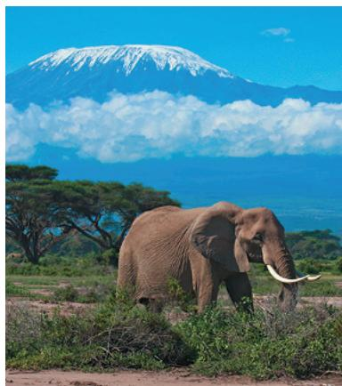  
If you were to hike up Mount Kilimanjaro in Tanzania, you would pass through several habitats, including savanna at the base, forest on the slopes, and alpine tundra near the top. Explain how such diverse habitats can be found at one location near the equator.  
For selected answers, see Appendix A.

# Explore Scientific Papers with Science in the Classroom | AAAS

How have Earth's forests changed over time? Go to "Seeing the Forest for the Trees" at www.scienceintheclassroom.org.

Instructors: Questions can be assigned in Mastering Biology.

