# 第54章 Community Ecology

<!-- 章节边界按正文内容恢复；原始 MinerU 内容保留如下。 -->

# Community Ecology

## Key Concepts

54.1 Interactions between species can help, harm, or have no effect on the individuals involved

54.2 Diversity and trophic structure characterize biological communities

54.3 Disturbance influences species diversity and composition

54.4 Biogeographic factors affect community diversity

54.5 Pathogens alter community structure locally and globally

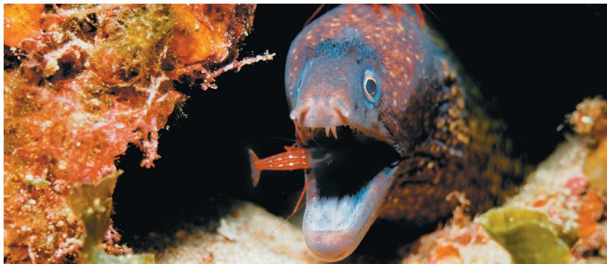  
Figure 54.1 Although this moray eel could easily eat the cleaner wrasse in its mouth, the eel remains still, allowing the wrasse to eat parasites living in the eel's mouth. The wrasse and the eel—and the parasites in the eel's mouth—live together in a community, a group of populations of different species living in close enough proximity to interact.

## Study Tip

Make a table: As you read the chapter, build a table listing factors that can affect community structure. Add in figure numbers or page numbers that give examples of these factors.

<table><tr><td>Factor affecting community structure</td><td>What aspect of community structure is affected?</td><td>Example</td></tr><tr><td>Competition</td><td>Locations where a species can live in a community</td><td>Competition between two barnacle species (Figure 543)</td></tr><tr><td></td><td></td><td></td></tr></table>

## What are some factors that influence the structure of a community?

## Foundation species

Species that are large or abundant, such as the corals that form this reef, may affect community structure by providing habitat and food for other organisms, like the parrotfish below.

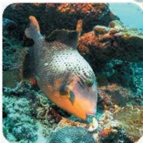

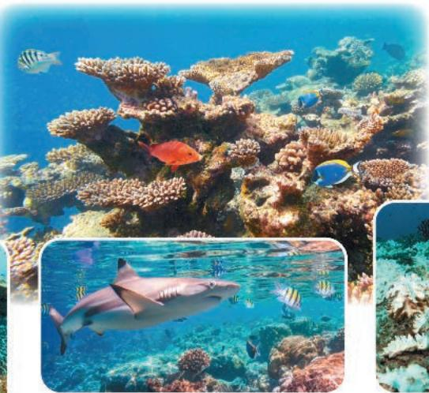

Interactions between species
Predation and other interactions affect the number of species in a community and the particular species that are present. Interactions can be classified in three categories:

\- Competition: negatively affects both organisms involved

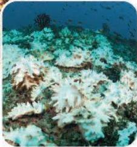  
Disturbances
Marine heat waves (resulting in coral bleaching, above), storms, human activities, and other disturbances can affect a community by removing organisms or altering resource availability.

• Exploitation: benefits one organism while harming the other

• Positive interactions: benefit one or both organisms without harming either

# Concept 54.1: Interactions between species can help, harm, or have no effect on the individuals involved

In the interaction shown in Figure 54.1, both organisms benefit: The cleaner wrasse gains access to a supply of food, and the moray eel is freed of parasites that might weaken it or spread disease. However, other interactions between members of different species can harm one of the participants, and still others can reduce the reproduction and survival of both participants. We'll begin this chapter by examining ecological interactions between the members of different species that live together in a community. We'll then turn to factors that affect community structure—the number of species found in a community, the particular species that are present, and the relative abundance of these species.

Some key relationships in the life of an organism are its interactions with individuals of other species in the community. These interspecific interactions include competition, predation, herbivory, parasitism, mutualism, and commensalism. In this section, we'll define and describe each of these interactions, grouping them according to whether they have positive (+) or negative (−) effects on the survival and reproduction of individuals engaged in the interaction.

For example, predation is a $+/-$ interaction, with a positive effect on the survival and reproduction of members of the predator population and a negative effect on members of the prey population. Mutualism is a $+/+$ interaction in which the survival and reproduction of individuals of each species is increased in the presence of the other. A zero (0) indicates that the members of a species are not affected by the interaction.

We'll consider three broad categories of ecological interactions: competition $(- / -)$ , exploitation $(+ / -)$ , and positive interactions $(+ / +$ or $+ / 0)$ . As you study examples of these interactions, bear in mind that their effects can change over time. For example, an interaction that typically benefits individuals of both species may at times continue to benefit one of them, while harming or having no effect on the other.

## Competition

Interspecific competition is a $- / -$ interaction that occurs when individuals of different species each use a resource that limits the survival and reproduction of both individuals. (As described in Figure 53.18, competition for resources can also occur between members of the same species; this case is sometimes distinguished as intraspecific competition.) Weeds growing in a garden compete with garden plants for soil nutrients and water. Lynx and foxes in the northern forests of Alaska and Canada compete for prey such as snowshoe hares. In contrast, some resources, such as oxygen, are rarely in short supply on land; most terrestrial species use this resource but do not usually compete for it.

## Competitive Exclusion and Mechanisms of Coexistence

What happens in a community when individuals of two species compete for limited resources? In 1934, Russian ecologist G. F. Gause studied this question using laboratory experiments with two closely related ciliate species, Paramecium aurelia and Paramecium caudatum (see Figure 28.19a). He cultured the species under stable conditions, adding a constant amount of food each day. When Gause grew the two species separately, each population increased rapidly in number and then leveled off at the apparent carrying capacity of the culture (see Figure 53.10a for an illustration of the logistic growth of a Paramecium population). But when Gause grew the two species together, P. caudatum became extinct in the culture. Gause inferred that P. aurelia had a competitive edge in obtaining food. More generally, his results led him to conclude that two species whose members compete for the same limiting resources cannot coexist permanently in the same place. In the absence of disturbance, one species will use the resources more efficiently and reproduce more rapidly than the other. Even a slight reproductive advantage will eventually lead to local elimination of the inferior competitor, an outcome called competitive exclusion. Note, however, that coexistence can occur between species that compete for two or more resources, as long as both species are not limited by the same resource. For instance, two species of diatoms may coexist in a lake if one is limited by silicate concentration and the other one by phosphate concentration. Exploring how various competitors coexist in natural communities is an important area of research in community ecology.

## Ecological Niches and Natural Selection

EVOLUTION Competition for limited resources can cause evolutionary change in populations. One way to examine how this occurs is to focus on an organism's ecological niche, the specific set of biotic and abiotic resources that an organism uses in its environment. The niche of a tropical tree lizard, for instance, includes the temperature range it tolerates, the size of branches on which it perches, the time of day when it is active, and the sizes and kinds of insects it eats. Such factors define the lizard's niche, or ecological role—how it fits into an ecosystem.

We can use the niche concept to restate the principle of competitive exclusion: Two species cannot coexist permanently in a community if their niches are identical. However, ecologically similar species can coexist in a community if one or more significant differences in their niches arise through time. Evolution by natural selection can result in one of the species using a different set of resources or similar resources at different times of the day or year. The differentiation of niches that enables similar species to coexist in a community is called resource partitioning (Figure 54.2).

As a result of competition, a species' fundamental niche, which is the niche potentially occupied by that species, is often different from its realized niche, the portion of its fundamental niche that it actually occupies. Ecologists can identify the fundamental niche of a species by testing the range of conditions in which it grows and reproduces in the absence of competitors. They can also test whether a potential competitor limits a species' realized niche by removing the

Figure 54.2 Resource partitioning among Dominican Republic lizards.

Seven species of Anolis lizards live in close proximity, and all feed on insects and other small arthropods. However, competition for food is reduced because each lizard species has a different preferred perch, thus occupying a distinct niche.

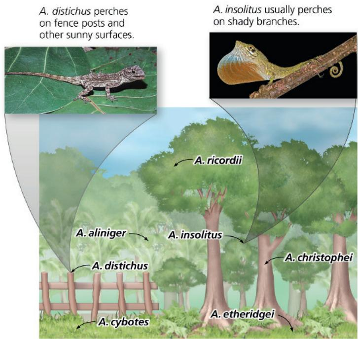

competitor and seeing if the first species expands into the newly available space. The classic experiment depicted in Figure 54.3 clearly showed that competition between individuals of two barnacle species kept one species from occupying part of its fundamental niche.

Species can partition their niches not just in space, as lizards and barnacles do, but in time as well. The common spiny mouse (Acomys cahirinus) and the golden spiny mouse (A. russatus; Figure 54.4) live in rocky habitats of the Middle East and Africa, using similar microhabitats and food sources. Where they coexist, A. cahirinus is nocturnal (active at night), while A. russatus is diurnal (active during the day). Surprisingly, laboratory research showed that A. russatus is naturally nocturnal. To be active during the day, it must override its biological clock in the presence of A. cahirinus. When researchers in Israel removed all A. cahirinus individuals from a site in the species' natural habitat, A. russatus individuals at that site became nocturnal, consistent with the

Figure 54.4 The golden spiny mouse (Acomys russatus).  
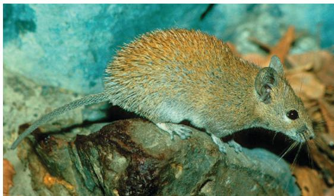

## Figure 54.3

# Inquiry: Can a species' niche be influenced by competition?

## Experiment

Ecologist Joseph Connell studied two barnacle species—Chthamalus stellatus and Balanus balanoides—that have a stratified distribution on rocks along the coast of Scotland. Chthamalus is usually found higher on the rocks than Balanus. To determine whether the distribution of Chthamalus is the result of competition with Balanus, Connell removed Balanus from the rocks at several sites.

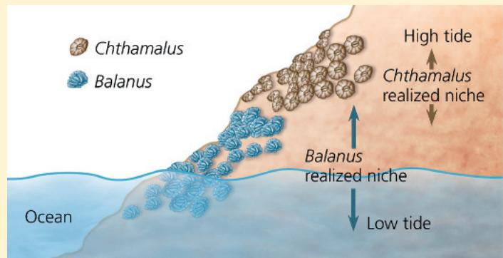

## Results

Chthamalus spread into the region formerly occupied by Balanus.

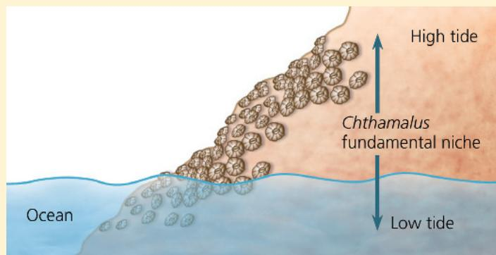

## Conclusion

Competition makes the realized niche of Chthamalus much smaller than its fundamental niche.

Data from J. H. Connell, The influence of interspecific competition and other factors on the distribution of the barnacle Chthamalus stellatus, Ecology 42:710–723 (1961).

WHAT IF? Other observations showed that Balanus cannot survive high on the rocks because it dries out during low tides. How would Balanus's realized niche compare with its fundamental niche?

For suggested answer, see Appendix A.

Instructors: A related Experimental Inquiry Tutorial can be assigned in Mastering Biology.

laboratory results. This change in behavior suggests that these individuals were competing for resources and that partitioning of their active time helps them coexist.

## Character Displacement

Closely related species whose populations are sometimes allopatric (geographically separate; see Concept 24.2) and sometimes sympatric (geographically overlapping) provide additional evidence of how competition affects communities. In some cases, the allopatric populations of such species are morphologically similar and use similar resources. By contrast, sympatric populations, which would potentially compete for resources, show differences in body structures and in the resources they use. This tendency for characteristics to diverge more in sympatric than in allopatric populations of two species is called character displacement. An example of character displacement can be seen in two species of Galápagos finches, Geospiza fuliginosa and Geospiza fortis: Beak depths in these species are similar in allopatric populations but have diverged considerably in sympatric populations (Figure 54.5).

## Figure 54.5 Character displacement: indirect evidence of past competition.

Allopatric populations of Geospiza fuliginosa and Geospiza fortis on Los Hermanos and Daphne Islands have similar beak morphologies (top two graphs) and presumably eat similarly sized seeds. However, where the two species are sympatric on Floreana and San Cristóbal, G. fuliginosa has a shallower, smaller beak and G. fortis a deeper, larger one (bottom graph), adaptations that favor eating different-sized seeds.

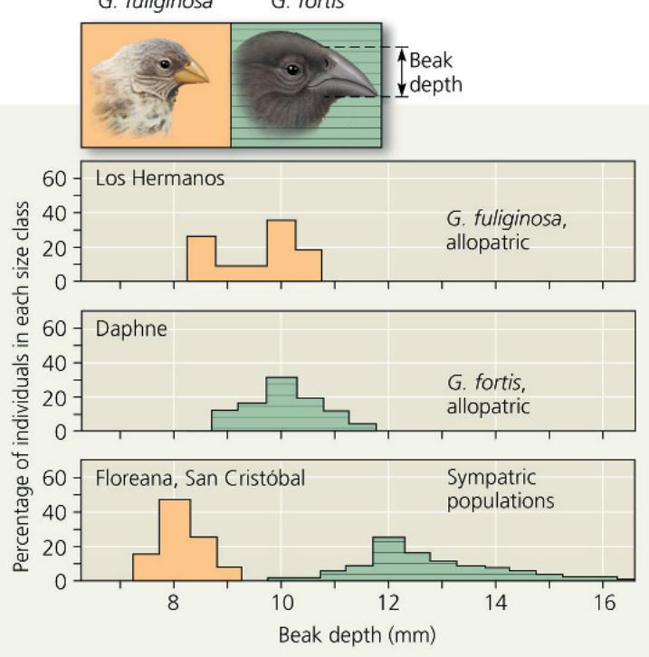  
WHAT IF? If G. fuliginosa became extinct on Floreana, predict how beak depth would change over time in Floreana's G. fortis population. Explain your reasoning.

## Exploitation

All heterotrophic organisms must eat, and all organisms are at risk of being eaten. As a result, much of the drama in nature involves exploitation, a term for any type of $+ / -$ interaction in which individuals of one species benefit by feeding on (and thereby harming) individuals of the other species. Exploitative interactions include predation, herbivory, and parasitism.

## Predation

Predation is a +/− interaction in which an individual of one species, the predator, kills and eats an individual of the other species, the prey. Though the term predation generally elicits such images as a lion attacking and eating an antelope, it applies to a wide range of interactions. A rotifer (a tiny aquatic animal that is smaller than many unicellular protists) that kills a protist by eating it can also be considered a predator. Because eating and avoiding being eaten are prerequisites to reproductive success, the adaptations of both predators and prey tend to be refined through natural selection. In the Scientific Skills Exercise, after you turn the page, you can interpret data on the impact of natural selection for a specific predator-prey interaction.

Many important feeding adaptations of predators are obvious and familiar. Most predators have acute senses that enable them to find and identify potential prey. Rattlesnakes and other pit vipers, for example, find their prey with a pair of heat-sensing organs located between their eyes and nostrils (see Figure 50.7b). Owls have characteristically large eyes that help them see prey at night. Many predators also have adaptations such as claws, fangs, or poison that help them catch and subdue their food. Predators that pursue their prey are generally fast and agile, whereas those that lie in ambush are often disguised in their environments.

Just as predators possess adaptations for capturing prey, potential prey have adaptations that help them avoid being eaten. In animals, these adaptations include behavioral defenses such as hiding, fleeing, and forming herds or schools. Active self-defense is less common, though some large grazing mammals vigorously defend their young from predators.

Animals also display a variety of morphological and physiological defensive adaptations. Mechanical or chemical defenses protect species such as porcupines and skunks (Figure 54.6a and b). Some animals, such as the European fire salamander, can synthesize toxins; others accumulate toxins passively from the plants they eat. Animals with effective chemical defenses often exhibit bright aposematic coloration, or warning coloration, such as that of poison dart frogs (Figure 54.6c). Such coloration seems to be adaptive because predators often avoid brightly colored prey. Cryptic coloration, or camouflage, makes prey difficult to see (Figure 54.6d).

Some prey species are protected by their resemblance to other species. For example, in Batesian mimicry, a palatable or harmless species mimics an unpalatable or harmful species to which it is not closely related. The larva of the hawkmoth Hemeroplanes ornatus puffs up its head and thorax when disturbed, looking like the head of a small venomous snake (Figure 54.6e). In this case, the mimicry even involves behavior; the larva weaves its head back

For suggested answer, see Appendix A.

Figure 54.6 Examples of defensive adaptations in animals.  
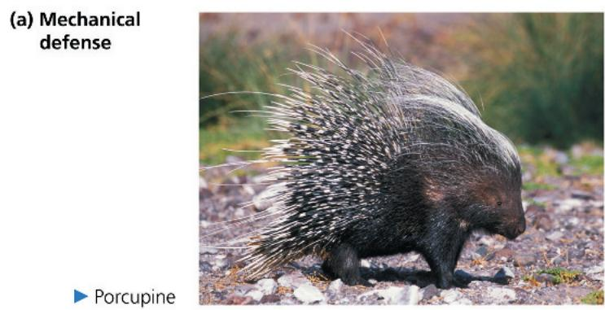

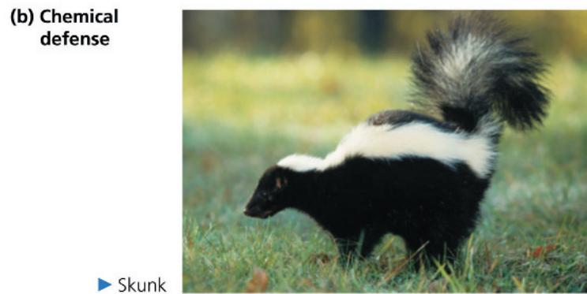

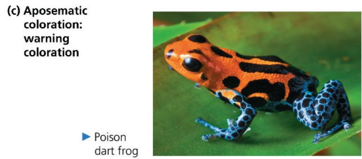

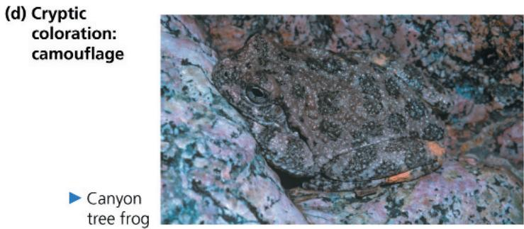

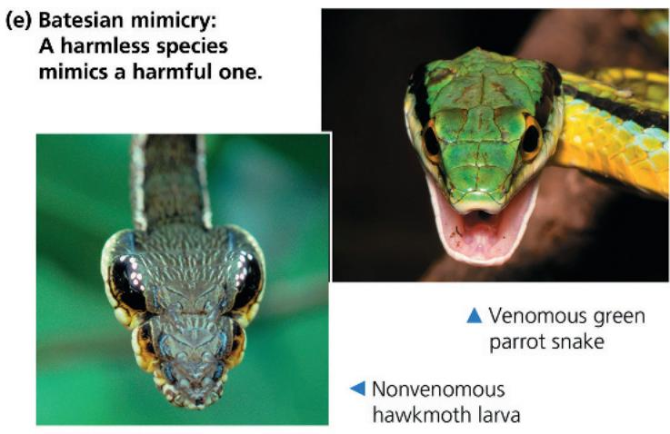  
(f) Müllerian mimicry: Two unpalatable species mimic each other.

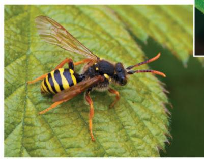

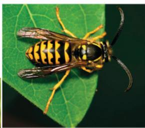  
MAKE CONNECTIONS Explain how natural selection could increase the resemblance of a harmless species to a distantly related harmful species. In addition to selection, what else could account for a harmless species resembling a closely related harmful species? (See Concept 22.2.)  
For suggested answer, see Appendix A.

and forth and hisses like a snake. Such cases of Batesian mimicry are thought to result from natural selection, as individuals in the harmless species that happen to more closely resemble the harmful one are avoided by predators who have learned not to eat the harmful ones. Over time, closer and closer resemblance to the harmful species evolves. In Müllerian mimicry, two or more unpalatable species, such as the cuckoo bee and yellow jacket, resemble each other (Figure 54.6f). Presumably, the more unpalatable prey there are, the faster predators learn to avoid prey with that particular appearance.

Mimicry has also evolved in many predators. The mimic octopus Thaumoctopus mimicus (Figure 54.7, after you turn the page) can take on the appearance and movement of more than a dozen marine animals, including crabs, sea stars, sea snakes, fish, and stingrays. This octopus's ability to mimic other animals enables it to approach prey—for example, imitating a crab to approach another crab and eat it. The octopus also can defend itself from predators through mimicry. When attacked by a damselfish, the octopus quickly mimics a banded sea snake, a known predator of the damselfish.

# Scientific Skills Exercise Making a Bar Graph and a Scatter Plot

Can a Native Predator Species Adapt Rapidly to an Introduced Prey Species? Cane toads (Bufo marinus) were introduced to Australia in 1935 in a failed attempt to control an insect pest. Since then, the toads have spread across northeastern Australia,

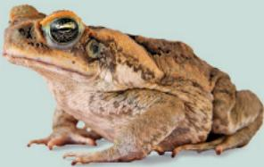

with a population of over 200 million today. Cane toads have glands that produce a toxin that is poisonous to snakes and other potential predators. In this exercise, you will graph and interpret data from a two-part experiment conducted to determine whether native Australian predators have developed resistance to the cane toad toxin.

How the Experiment Was Done In part 1, researchers collected 12 red-bellied black snakes (Pseudechis porphyriacus) from areas where cane toads had existed for 40–60 years and another 12 from areas free of cane toads. They recorded the percentage of snakes from each area that ate either a freshly killed native frog (Limnodynastes peronii, a species the snakes commonly eat) or a freshly killed cane toad from which the toxin gland had been removed (making the toad nonpoisonous). In part 2, researchers collected snakes from areas where cane toads had been present for 5–60 years. To assess how cane toad toxin affected the physiological activity of these snakes, they injected small amounts of the toxin into the snakes' stomachs and measured the snakes' swimming speed in a small pool.

Data from the Experiment, Part 1

<table><tr><td rowspan="2">Type of Prey Offered</td><td colspan="2">% of Snakes from Each Area That Ate Each Type of Prey</td></tr><tr><td>Area with Cane Toads Present for 40–60 Years</td><td>Area with No Cane Toads</td></tr><tr><td>Native frog</td><td>100</td><td>100</td></tr><tr><td>Cane toad</td><td>0</td><td>50</td></tr></table>

## Interview

Interview with Tracy Langkilde: Studying the evolution of novel defensive adaptations in lizards (eTextbook only)

## Herbivory

Herbivory is an exploitative (+/−) interaction in which an organism—an herbivore—eats parts of a plant or alga, thereby harming it but usually not killing it. While large mammalian herbivores such as cattle, sheep, and water buffalo may be most familiar, most herbivores are actually invertebrates, such as grasshoppers, caterpillars, and beetles. In the ocean, herbivores include sea urchins, some fishes, and certain mammals (Figure 54.8).

Data from the Experiment, Part 2

<table><tr><td>Number of Years Cane Toads Had Been Present in the Area</td><td>5</td><td>10</td><td>10</td><td>20</td><td>50</td><td>60</td><td>60</td><td>60</td><td>60</td><td>60</td></tr><tr><td>% Reduction in Snake Swimming Speed</td><td>52</td><td>19</td><td>30</td><td>30</td><td>5</td><td>5</td><td>9</td><td>11</td><td>12</td><td>22</td></tr></table>

Data from B. L. Phillips and R. Shine, An invasive species induces rapid adaptive change in a native predator: cane toads and black snakes in Australia, Proceedings of the Royal Society B 273:1545–1550 (2006).

## INTERPRET THE DATA

1. Make a bar graph of the data in part 1. (For additional information about graphs, see the Scientific Skills Review in Appendix D.)

2. What do the data represented in the graph suggest about the effects of cane toads on the predatory behavior of red-bellied black snakes in areas where the toads are and are not currently found?

3. Suppose a novel enzyme that deactivates the cane toad toxin evolved in a snake population exposed to cane toads. If the researchers repeated part 1 of this study, predict how the results would change.

4. Identify the dependent and independent variables in part 2 and make a scatter plot. What conclusion would you draw about whether exposure to cane toads is having a selective effect on the snakes? Explain.

5. Explain why a bar graph is appropriate for presenting the data in part 1 and a scatter plot is appropriate for the data in part 2.

Instructors: A version of this Scientific Skills Exercise can be assigned in Mastering Biology.

Like predators, herbivores have many specialized adaptations. Many herbivorous insects have chemical sensors on their feet that enable them to distinguish between plants based on their toxicity or nutritional value. Some mammalian herbivores, such as goats, use their sense of smell to examine plants, rejecting some and eating others. They may also eat just a specific part of a plant, such as the flowers. Many herbivores also have specialized teeth or digestive systems adapted for processing vegetation (see Concept 41.4).

Unlike animals, plants cannot run away to avoid being eaten. Instead, a plant's arsenal against herbivores may feature chemical toxins or structures such as spines and thorns. Among the plant compounds that serve as chemical defenses are the poison strychnine, produced by the tropical vine Strychnos toxifera; nicotine, from the tobacco plant; and tannins, from a variety of plant species. Compounds that are not toxic to humans but may be distasteful to many herbivores are responsible for the familiar flavors of cinnamon, cloves, and peppermint. Certain

Figure 54.7 The mimic octopus.

(a) After hiding six of its tentacles in a hole in the seafloor, the octopus waves its other two tentacles to mimic a sea snake. (b) Flattening its body and arranging its arms to trail behind, the octopus mimics a sole (a flat fish). (c) It can mimic a lionfish that has its poisonous spines extended by spreading out its curved arms on each side of its body.

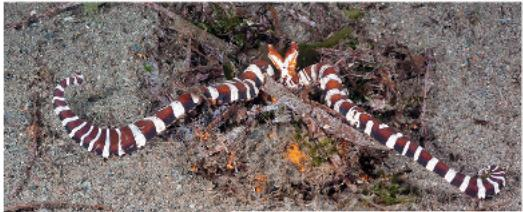  
(a) Mimicking a sea snake

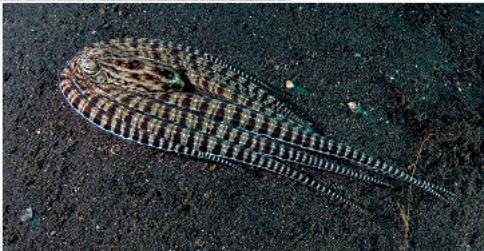

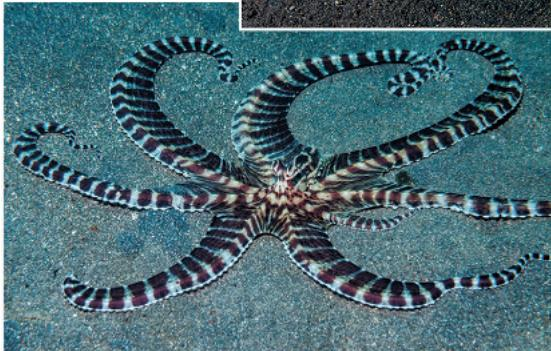  
(b) Mimicking a sole  
(c) Mimicking a lionfish

Figure 54.8 An herbivorous marine mammal.  
This West Indian manatee (Trichechus manatus) in Florida is grazing on Hydrilla, an introduced plant species.  
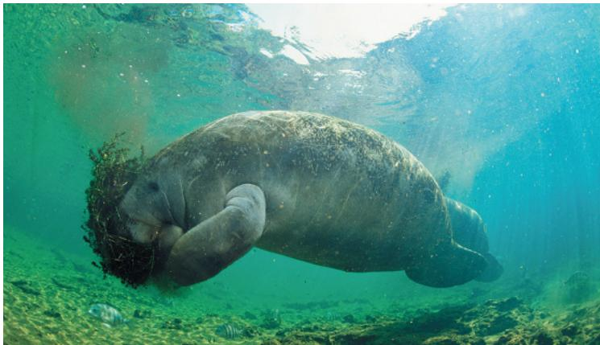

plants produce chemicals that cause abnormal development in some insects that eat them. For more examples of how plants defend themselves, see Make Connections Figure 39.27, “Levels of Plant Defenses Against Herbivores.”

## Parasitism

Parasitism is a +/− exploitative interaction in which one organism, the parasite, derives its nourishment from another organism, its host, which is harmed in the process. Parasites that live within the body of their host, such as tapeworms, are called endoparasites; parasites that feed on the external surface of a host, such as ticks and lice, are called ectoparasites. Some ecologists have estimated that at least one-third of all species on Earth are parasites. In one particular type of parasitism, parasitoid insects—usually small wasps—lay eggs on or in living hosts. The larvae then feed on the body of the host, eventually killing it.

Many parasites have complex life cycles involving multiple hosts. The blood fluke, which currently infects approximately 200 million people around the world, requires two hosts at different times in its development: humans and freshwater snails (see Figure 33.10). Some parasites change the behavior of their current host in ways that increase the likelihood that the parasite will reach its next host. For instance, crustaceans that are parasitized by acanthocephalan (spiny-headed) worms leave protective cover and move into the open, where they are more likely to be eaten by the birds that are the second host in the worm's life cycle.

Parasites can significantly affect the survival, reproduction, and density of their host population, either directly or indirectly. For example, ticks that feed as ectoparasites on moose can weaken their hosts by withdrawing blood and causing hair breakage and loss. In their weakened condition, the moose have a greater chance of dying from cold stress or predation by wolves.

## Positive Interactions

While nature abounds with dramatic and gory examples of exploitative interactions, ecological communities are also heavily influenced by positive interactions, a term that refers to a +/+ or +/0 interaction between members of two species in which at least one individual benefits and neither is harmed. Positive interactions include mutualism and commensalism. As we'll see, positive interactions can affect the diversity of species found in an ecological community.

## Mutualism

Mutualism is a +/+ interaction that benefits individuals of both of the interacting species. Mutualisms are common in nature, as illustrated by examples seen in previous chapters, including cellulose digestion by microorganisms in the digestive systems of termites and ruminant mammals, animals that pollinate flowers or disperse seeds, nutrient exchange between fungi and plant roots in mycorrhizae, and photosynthesis by unicellular algae in corals. In some mutualisms, such as the acacia-ant example shown in Figure 54.9, each of the interacting individuals depends on the other for their survival and reproduction. In other mutualisms, however, both individuals can survive on their own.

Typically, both partners in a mutualism incur costs as well as benefits. In mycorrhizae, for example, the plant often transfers carbohydrates to the fungus, while the fungus transfers limiting nutrients, such as phosphorus, to the plant. Each partner benefits, but each partner also experiences a cost: It transfers materials that it could have used to support its own growth and metabolism. For an interaction to be considered a mutualism, the benefits to each partner must exceed the costs. When this is not the case, the mutualism may break down, at least temporarily. In some mycorrhizae, for example, the plant may cease to supply carbohydrates to its fungal partner when soil nutrients are plentiful—a change that occurs because the cost of supporting the fungus has become greater than the benefits the fungus can provide.

Figure 54.9 Mutualism between acacia trees and ants.  
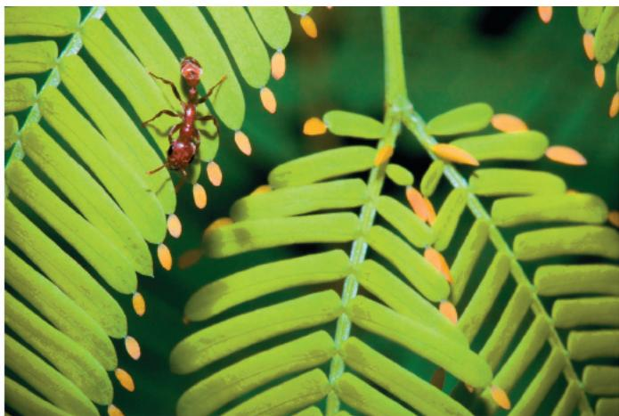

(a) Certain species of acacia trees (genus Acacia) in Central and South America have hollow thorns (not shown) that are home to stinging ants of the genus Pseudomyrmex. The ants feed on nectar produced by the tree and on protein-rich swellings (yellow in the photograph) at the tips of leaflets.  
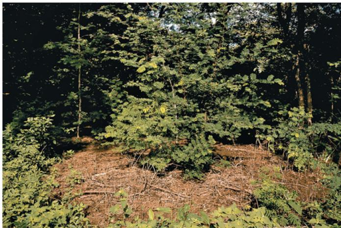  
(b) The acacia benefits because the pugnacious ants, which attack anything that touches the tree, remove fungal spores, small herbivores, and debris. They also clip vegetation that grows close to the acacia.

## Commensalism

An interaction that benefits the individuals of one of the interacting species but neither harms nor helps the individuals of the other species is called commensalism (+/0). Like mutualism, commensalisms are common in nature. For instance, many wildflowers that grow best in low light levels are found only in shaded, forest floor environments. Such shade-tolerant “specialists” depend entirely on the trees that tower above them—the trees provide their dim habitat. Yet the survival and reproduction of the trees are not affected by these wildflowers. Thus, these species are involved in a +/0 interaction in which the wildflowers benefit and the trees are not affected.

Figure 54.10 Commensalism between cattle egrets and African buffalo.  
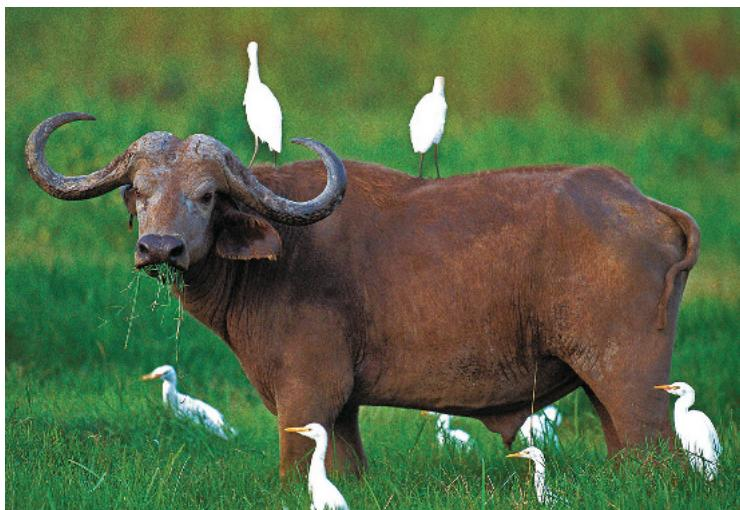

In another example of a commensalism, cattle egrets feed on insects flushed out of the grass by grazing bison, cattle, horses, and other herbivores (Figure 54.10). Because the birds increase their feeding rates when following the herbivores, they clearly benefit from the association. Much of the time, the herbivores are not affected by the birds. At times, however, the herbivores too may derive some benefit; for example, the birds may remove and eat ticks and other ectoparasites from the herbivores' skin, or they may warn the herbivores of a predator's approach. This example provides another illustration of a key point about ecological interactions: Their effects can change over time. In this case, an interaction whose effects are typically $+ / 0$ (commensalism) may at times become $+ / +$ (mutualism).

Positive interactions can have major effects on ecological communities. For instance, the black rush Juncus gerardii alters soil conditions in ways that benefit other plant species in New England salt marshes (Figure 54.11a). Juncus shades the soil surface, which reduces evaporation and thus lowers the concentration of salt in the soil. The presence of Juncus also increases soil oxygen levels; this occurs because some oxygen leaks into the soil as Juncus transports oxygen to its belowground tissues. In one study, when Juncus was removed from areas of the marsh, those areas supported 50% fewer plant species (Figure 54.11b).

Like positive interactions, competition and exploitation (predation, herbivory, and parasitism) also can strongly affect ecological communities, as examples throughout the rest of this chapter will show.

## Figure 54.11 Positive interactions in New England salt marshes.

When black rush (Juncus gerardii) is present, soil salt concentrations drop and soil oxygen levels rise, increasing the number of plant species that can live in the marsh.

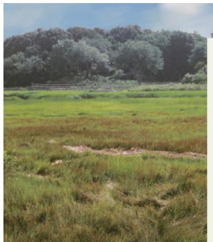  
(a) Salt marsh with Juncus (foreground)

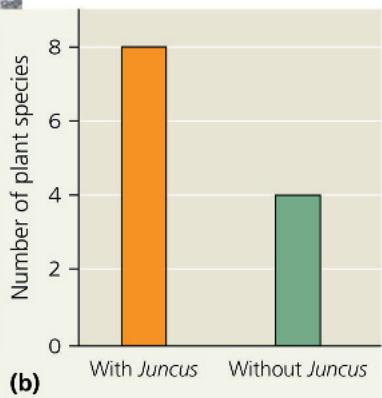

## Concept Check 54.1

1. Explain how competition, predation, and mutualism differ in their effects on members of the two interacting species.

2. According to the principle of competitive exclusion, what outcome is expected when two species with identical niches compete for a resource? Why?

3. MAKE CONNECTIONS Figure 24.14 illustrates how a hybrid zone can change over time. Imagine that two finch species colonize a new island and are capable of hybridizing (mating and producing viable offspring). The island contains two plant species, one with large seeds and one with small seeds, growing in isolated habitats. If the two finch species specialize in eating different plant species, would reproductive barriers be reinforced, weakened, or unchanged in this hybrid zone? Explain.

For suggested answers, see Appendix A.

## Concept 54.2: Diversity and trophic structure characterize biological communities

Ecological communities can be characterized by certain general attributes, including how diverse they are and the feeding relationships of their species. In some cases, as you'll read, a few species exert strong control on a community's structure—the number, identity, and relative abundance of its species.

## Species Diversity

The species diversity of a community—the variety of different kinds of organisms that make up the community—has two components. One is species richness, the number of different species in the community. The other is the relative abundance of the different species, the proportion each species represents of all individuals in the community.

Imagine two small forest communities, each with 100 individuals distributed among four tree species (A, B, C, and D) as follows:

Community 1: 25A, 25B, 25C, 25D

Community 2: 80A, 5B, 5C, 10D

The species richness is the same for both communities because they both contain four species of trees, but the relative abundance is very different (Figure 54.12). You would easily notice the four types of trees in community 1, but unless you looked carefully, you might see only the abundant species A in the second forest. Given this, many observers would intuitively describe community 1 as the more diverse of the two communities.

Ecologists use many tools to compare the diversity of communities. They often calculate indexes of diversity based on species richness and relative abundance. One widely used index is the Shannon diversity index (H):

$$
H = - \left(p _ {\mathrm{A}} \ln p _ {\mathrm{A}} + p _ {\mathrm{B}} \ln p _ {\mathrm{B}} + p _ {\mathrm{C}} \ln p _ {\mathrm{C}} + \dots\right)
$$

where A, B, C... are the species in the community, p is the relative abundance of each species, and ln is the natural logarithm; the ln of each value of p can be determined using the “ln” key on a scientific calculator. A higher value of H indicates a more diverse community. Let’s use this equation to calculate the Shannon diversity index of the two communities in Figure 54.12. For community 1, p = 0.25 for each species, so

$$
H = - 4 (0. 2 5 \ln 0. 2 5) = 1. 3 9.
$$

For community 2,

$$
H = - [ 0. 8 \ln 0. 8 + 2 (0. 0 5 \ln 0. 0 5) + 0. 1 \ln 0. 1 ] = 0. 7 1.
$$

## Figure 54.12 Which forest is more diverse?

Ecologists would say that community 1 has greater species diversity, a measure that includes both species richness and relative abundance.

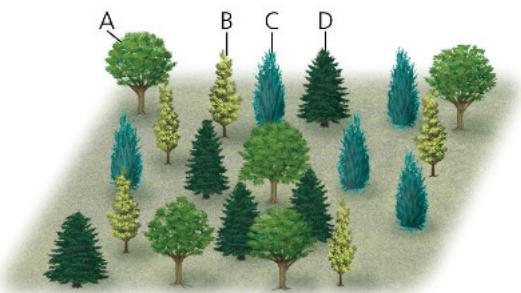  
Community 1 A: $25\%$ B: $25\%$ C: $25\%$ D: $25\%$

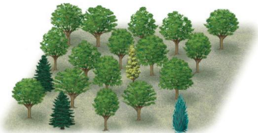  
Community 2 A: $80\%$ B: $5\%$ C: $5\%$ D: $10\%$

Figure 54.13 Two samples of one species, the red alga Chondracanthus harveyanus.

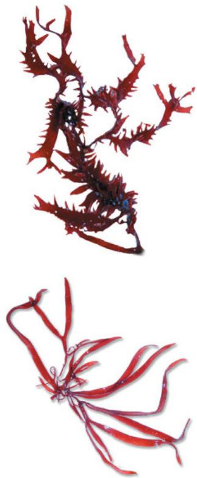

These calculations confirm our intuitive description of community 1 as more diverse. Indeed, for a given species richness, greater species evenness (that is, closer values of relative abundance between species) results in communities that have greater species diversity.

Determining the number and relative abundance of species in a community can be challenging. Because most species in a community are relatively rare, it may be hard to obtain a sample size large enough to be representative. It can also be difficult to identify some of the species in the community. If an unknown organism cannot be identified on the basis of morphology alone, it is useful to compare all or part of its genome to a reference database of DNA sequences from known organisms. For example,

although the two samples of red algae shown in Figure 54.13 might appear to be two different species, comparing their sequences of a short standardized section of DNA—a DNA "barcode"—to a reference database shows that they belong to the same species. Researchers are increasingly using DNA sequencing for species identification as it becomes cheaper and as DNA sequences from more organisms are added to comparative databases.

It can also be difficult to census the highly mobile or less visible members of communities, such as microorganisms, deep-sea creatures, and nocturnal species. The small size of microorganisms makes them particularly difficult to sample, so ecologists now commonly use molecular tools to help determine microbial diversity (Figure 54.14).

## Diversity and Community Stability

In addition to measuring species diversity, ecologists manipulate diversity in experimental communities in nature and in the laboratory. Many experiments examine the potential benefits of diversity, including increased productivity and stability of biological communities.

Researchers at the Cedar Creek Ecosystem Science Reserve, in Minnesota, have been manipulating plant diversity in experimental communities for more than three decades (Figure 54.15a). Higher-diversity communities generally are more productive and are better able to withstand and recover from environmental stresses, such as droughts. More diverse

## Figure 54.14

# Research Method: Determining Microbial Diversity Using Molecular Tools

## Application

Ecologists are increasingly using molecular techniques to determine microbial diversity and richness in environmental samples. One such technique produces a DNA profile for microbial taxa based on sequence variations in the DNA that encodes the small subunit of ribosomal RNA. Researchers used this method to compare the diversity of soil bacteria in 98 habitats across North and South America to help identify environmental variables associated with high bacterial diversity.

## Technique

Researchers first extracted and purified DNA from the microbial community in each sample. They used the polymerase chain reaction (PCR; see Figure 20.7) to amplify the ribosomal DNA and labeled it with a fluorescent dye. Restriction enzymes then cut the amplified, labeled DNA into fragments of different lengths, which are separated

by gel electrophoresis. (A gel is shown here; see also Figure 20.6.) The number and abundance of these fragments characterize the sample's DNA profile, which was then used to calculate the Shannon diversity index $(H)$ of each sample. Researchers then looked for a correlation between $H$ and several environmental variables, including vegetation type, mean annual temperature and rainfall, and soil acidity.

## Results

The diversity of bacterial communities was related to soil pH, with the Shannon diversity index being highest in neutral soils (pH 7) and lowest in very acidic soils (pH < 5). Amazonian rain forests, which have extremely high plant and animal diversity, had the most acidic soils and the lowest bacterial diversity of the samples tested.

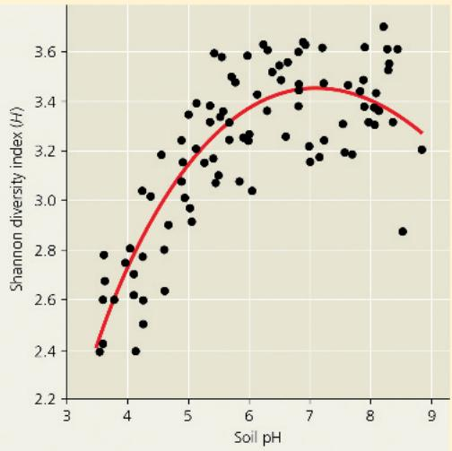  
Data from N. Fierer and R. B. Jackson, The diversity and biogeography of soil bacterial communities, Proceedings of the National Academy of Sciences USA 103:626–631 (2006).

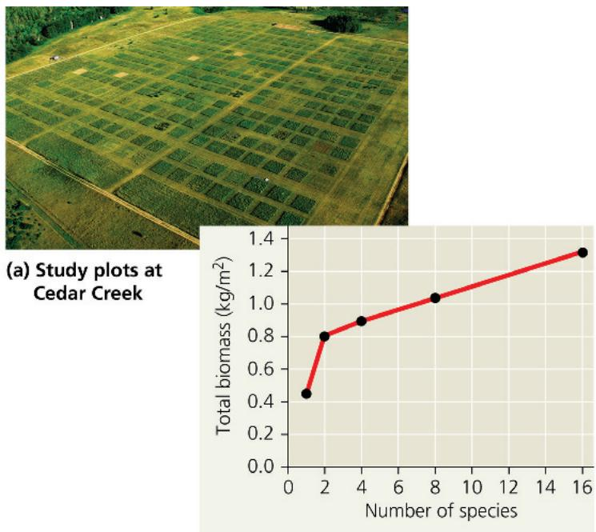  
(a) Study plots at Cedar Creek

Figure 54.15 The Cedar Creek Ecosystem Science Reserve, site of long-term experiments on manipulating plant diversity.  
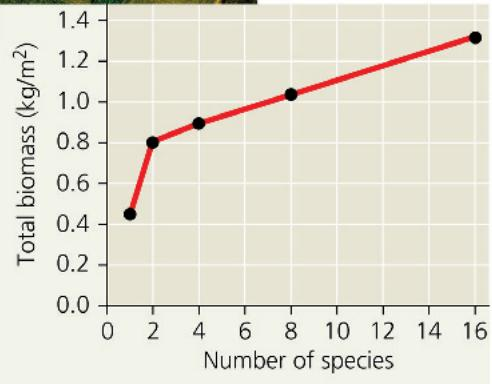  
(b) Total biomass of plants (6 years after planting) in study plots with varying plant species richness

communities are also more stable year to year in their productivity. In one decade-long experiment, for instance, researchers at Cedar Creek created 168 plots, each containing 1, 2, 4, 8, or 16 perennial grassland species. The most diverse plots consistently produced more biomass (the total mass of all organisms in a habitat) each year than did the single-species plots (Figure 54.15b).

Higher-diversity communities are often more resistant to introduced species, which are organisms that humans have moved to regions outside of the species' native range. In research conducted off the coast of Connecticut, scientists created communities of different levels of diversity consisting of sessile marine invertebrates, including tunicates (see Figure 34.5). They then examined how vulnerable these experimental communities were to an introduced tunicate. They found that the introduced tunicate was four times more likely to survive in lower-diversity communities than in higher-diversity ones. The researchers concluded that relatively diverse communities captured more of the resources available in the system, leaving fewer resources for the introduced species and thus decreasing its survival.

## Trophic Structure

In addition to species diversity, the structure and dynamics of a community also depend on the feeding relationships between organisms—the trophic structure of the community. The transfer of chemical energy from its source in plants and other autotrophs (primary producers) through herbivores (primary consumers) to carnivores (secondary, tertiary, and quaternary consumers) and eventually to decomposers is referred to as a

Figure 54.16 Examples of terrestrial and marine food chains. The arrows trace the transfer of the chemical energy in food through the trophic levels of a community when organisms feed on one another. Decomposers, which consume the remains of organisms from all trophic levels, are not shown here.  
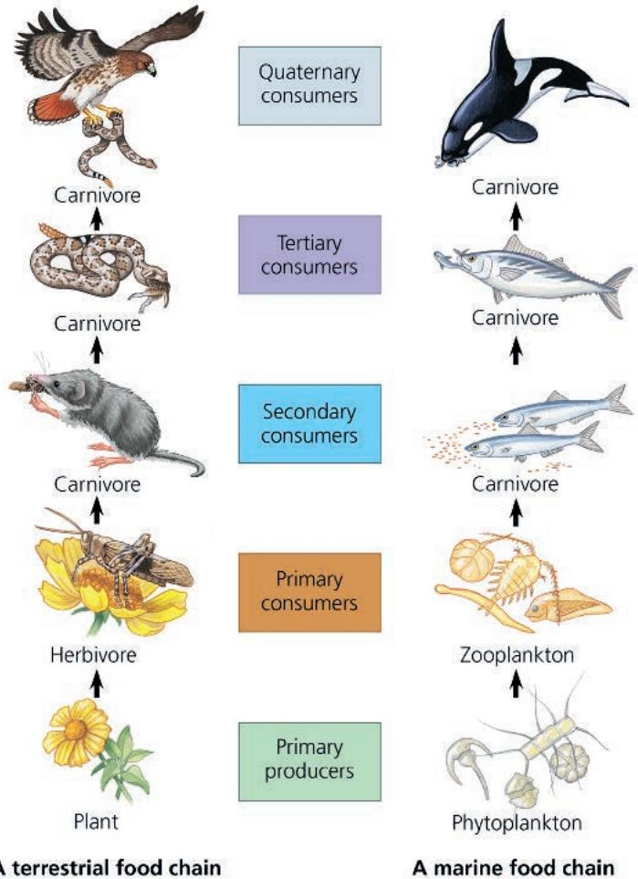  
VISUAL SKILLS Suppose the abundance of carnivores that eat zooplankton increased greatly. Use this diagram to infer how that might affect phytoplankton abundance.

For suggested answer, see Appendix A.

food chain (Figure 54.16). The position an organism occupies in a food chain is called its trophic level.

## Food Webs

A food chain is not an isolated unit, separate from other feeding relationships in a community. Instead, a group of food chains are linked together to form a food web. Ecologists diagram the trophic relationships of a community using arrows that link species according to who eats whom. In an Antarctic pelagic community, for example, the primary producers are phytoplankton, which serve as food for the dominant grazing zooplankton, especially krill and copepods, both of which are crustaceans (Figure 54.17). These zooplankton species are in turn eaten by various carnivores, including other plankton, penguins, seals, fishes, and baleen whales. Squids, which are carnivores that feed on fishes and

Figure 54.17 An Antarctic marine food web.

Arrows follow the transfer of the chemical energy in food from the producers (phytoplankton) up through the trophic levels. For simplicity, this diagram omits decomposers. At various times over the last two centuries, humans have also played a role in the Antarctic food web as consumers of fish, krill, and whales.

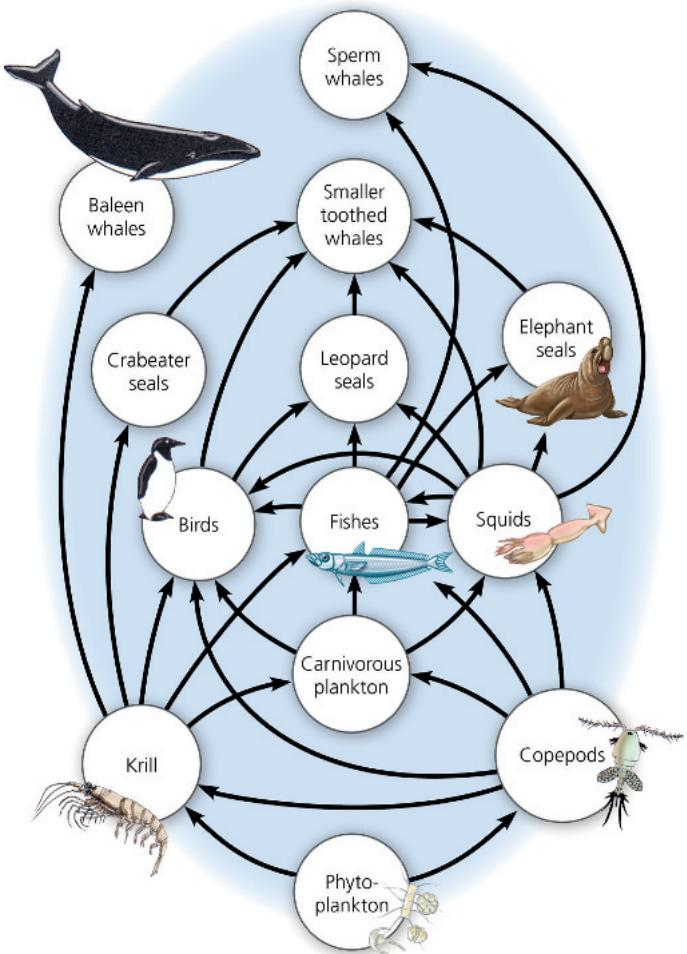  
VISUAL SKILLS For each organism in this food web, indicate the number of other kinds of organisms that it eats. Which two organisms are both predator and prey for each other?  
For suggested answer, see Appendix A.

zooplankton, are another important link in these food webs, as they are in turn eaten by seals and toothed whales.

How are food chains linked into food webs? A given species may weave into the web at more than one trophic level. In the food web shown in Figure 54.17, krill feed on phytoplankton as well as on other grazing zooplankton, such as copepods. Such “nonexclusive” consumers are also found in terrestrial communities. For instance, foxes are omnivores whose diet includes berries and other plant materials, herbivores such as mice, and other predators, such as weasels. Humans are among the most versatile of omnivores.

Complicated food webs can be simplified in two ways for easier study. First, species with similar trophic relationships in a given community can be grouped into broad functional

Figure 54.18 Partial food web for Chesapeake Bay estuary. The sea nettle (Chrysaora quinquecirrha) and the juvenile striped bass (Morone saxatilis) are the main predators of fish larvae.  
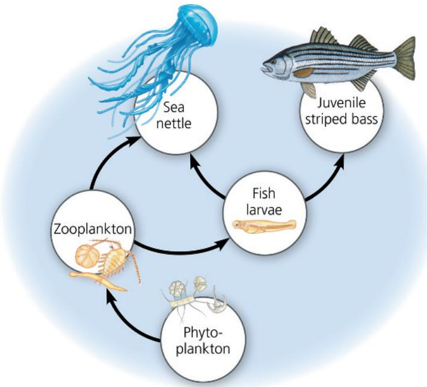  
VISUAL SKILLS Based on this food web, identify organisms that function as primary, secondary, or tertiary consumers.
For suggested answer, see Appendix A.

groups. In Figure 54.17, more than 100 phytoplankton species are grouped as the primary producers in the food web. A second way to simplify a food web is to isolate a portion of the web that interacts very little with the rest of the community. Figure 54.18 illustrates a partial food web for sea nettles (a type of cnidarian) and juvenile striped bass in the Chesapeake Bay estuary on the Atlantic coast of the United States.

## Limits on Food Chain Length

Each food chain within a food web is usually only a few links long. In the Antarctic web of Figure 54.17, there are rarely more than seven links from the producers to any top-level predator, and most chains in this web have fewer links. In fact, most food webs studied to date have chains consisting of five or fewer links.

Why do food chains tend to be relatively short? The most common explanation suggests that the length of a food chain is limited by the inefficiency of energy transfer along the chain. On average, only about 10% of the energy stored in the organic matter of each trophic level is converted to organic matter at the next trophic level (see Concept 55.3). Thus, a producer level consisting of 100 kg of plant material can support about 10 kg of herbivore biomass and 1 kg of carnivore biomass. At a certain point, there simply is not enough energy to sustain viable populations at the next trophic level.

Another factor that may limit food chain length is that carnivores tend to be larger at higher trophic levels. The size of a carnivore puts an upper limit on the size of food it can take into its mouth. And except in a few cases, large carnivores cannot live on very small food items because they cannot obtain enough food in a given time to meet their metabolic needs. Among the exceptions are baleen whales, huge filter feeders with adaptations that enable them to consume enormous quantities of krill and other small organisms (see Figure 41.5).

## Species with a Large Impact

Certain species have an especially large impact on the structure of entire communities because they are highly abundant or play a pivotal role in community dynamics. The impact of these species occurs through trophic interactions and their influence on the physical environment.

Foundation species have strong effects on their communities as a result of their large size or high abundance. Examples of foundation species include trees, desert shrubs such as creosote, and certain marine algae, such as kelp. Such species often have community-wide effects because they provide habitat or food. Foundation species may also be competitively dominant—superior in exploiting key resources such as space, water, nutrients, or t light.

The impact of a foundation species can be discovered when it is removed from the community. For example, the American chestnut was a competitively dominant tree in deciduous forests of eastern North America before 1910, making up more than 40% of mature trees. Then, humans accidentally introduced the fungal disease chestnut blight to New York City via nursery stock imported from Asia. Between 1910 and 1950, this fungus killed almost all of the chestnut trees in eastern North America. In this case, removing the foundation species had a relatively small impact on some species but large effects on others. Oaks, hickories, beeches, and red maples that were already present in the forest increased in abundance and replaced the chestnuts. No mammals or birds seemed to have been harmed by the loss of the chestnut, but seven species of moths and butterflies that fed on the tree became extinct.

In contrast to foundation species, keystone species are not usually abundant in a community. They exert strong control on community structure not by numerical might but by their pivotal ecological roles. In other words, keystone species have a disproportionately high impact on the community. Figure 54.19 highlights the importance of a keystone species, a sea star, in maintaining the diversity of an intertidal community. In this case, the sea star affects its community by feeding on and thereby limiting the abundance of a competitively dominant species, a mussel.

Still other organisms exert their influence on a community not through trophic interactions but by changing the physical environment. Species that create or dramatically alter their environment are called ecosystem engineers. A familiar ecosystem engineer is the beaver (Figure 54.20, on the next page). The effects

## Figure 54.19

# Inquiry: Is Pisaster ochraceus a keystone species?

## Experiment

In rocky intertidal communities of western North America, the relatively uncommon sea star Pisaster ochraceus preys on mussels such as Mytilus californianus, a dominant competitor for space. Robert Paine, of the University of Washington, removed Pisaster

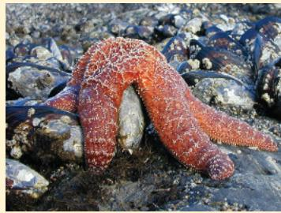

from an area in the intertidal zone and examined the effect on species richness.

## Results

In the absence of Pisaster, species richness declined as mussels monopolized the rock face and eliminated most other invertebrates and algae. In a control area where Pisaster was not removed, species richness changed very little.

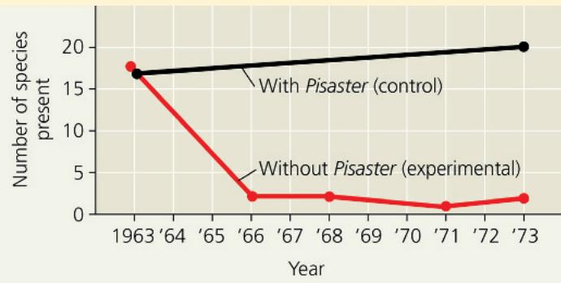  
Data from R. T. Paine, Intertidal community structure. Experimental studies on the relationship between a dominant competitor and its principal predator. Oecologia 15:93–120 (1974).

## Conclusion

Pisaster acts as a keystone species, exerting an influence on the community that is not reflected in its abundance.

WHAT IF? Suppose that an invasive fungus killed most individuals of Mytilus at these sites. Predict how species richness would be affected if Pisaster were then removed.

For suggested answer, see Appendix A.

of ecosystem engineers on other species can be positive or negative, depending on the needs of the other species. Some foundation species, such as corals, can also be considered ecosystem engineers because their presence modifies the physical environment in ways that create habitats on which other species depend.

Figure 54.20 Beavers as ecosystem engineers.

By felling trees, building dams, and creating ponds, beavers can transform large areas of forest into flooded wetlands.

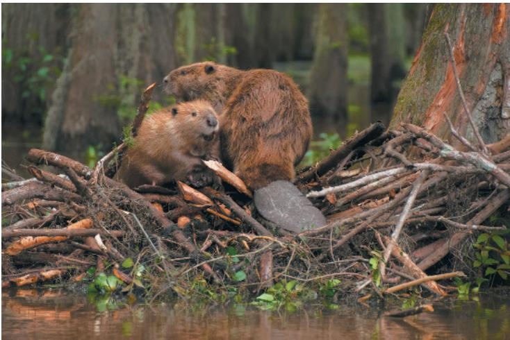

(killer whales) should increase the abundance of primary carnivores (sea otters), decrease the number of herbivores (urchins), and increase the abundance of primary producers (kelp). The effects thus move down the trophic structure as alternating +/− effects.

Ecologists have applied top-down control to improve water quality in lakes with a high abundance of algae. For example, in lakes with three trophic levels, removing fish should improve water quality by increasing zooplankton density, thereby decreasing algal populations (Figure 54.22). In lakes with four trophic levels, adding top predators should have the same effect.

Ecologists in Finland used this approach to help purify Lake Vesijärvi, a large lake that was polluted with city sewage and industrial waste until 1976. After pollution controls reduced these inputs, the lake's water quality began to improve. In 1986, however, massive blooms of cyanobacteria began occurring. These blooms coincided with an increase in the population of roach, a fish species that eats zooplankton, which otherwise keep cyanobacteria in check. To reverse these changes, ecologists removed nearly a million kilograms of fish from the lake between

## Bottom-Up and Top-Down Controls

The ways in which adjacent trophic levels affect one another can be useful for describing community organization. These effects occur in two general ways: organisms can be controlled by what they eat (“bottom-up” control) or by what eats them (“top-down” control).

In bottom-up control, the abundance of organisms at each trophic level is limited by nutrient supply or the availability of food at lower trophic levels. As shown on the left side of Figure 54.21, the supply of nutrients controls plant numbers, which control herbivore numbers, which in turn control predator numbers. To change the structure of a bottom-up community, you would need to alter the biomass or abundance of organisms at lower trophic levels, allowing those changes to propagate up through the food web. For example, if you add nutrients to stimulate plant growth, then each of the higher trophic levels should also increase in biomass. If you change predator abundance, however, the effect should not extend down to the lower trophic levels.

In top-down control, the abundance of organisms at each trophic level is controlled by the abundance of consumers at higher trophic levels. Thus, in top-down control, predators limit herbivores, and herbivores limit plants or algae. In the example on the right side of Figure 54.21, removing the top carnivores

Figure 54.21 Bottom-up and top-down control.

The abundance of organisms at each trophic level can be controlled from the bottom up (by the availability of food or nutrients) or from the top down (by rates of consumption at higher trophic levels). Large gray arrows indicate the direction of control in each of the food chains shown.

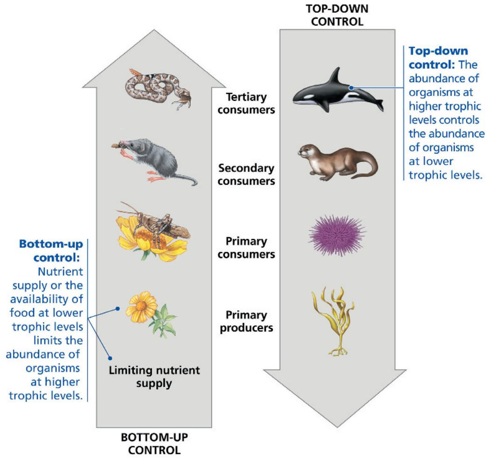

Figure 54.22 Restoring water quality in a lake with top-down control.

Decreasing the abundance of fish that ate zooplankton results in a decrease in the biomass of algae, improving water quality. Arrow thickness indicates the relative strength of each top-down control.

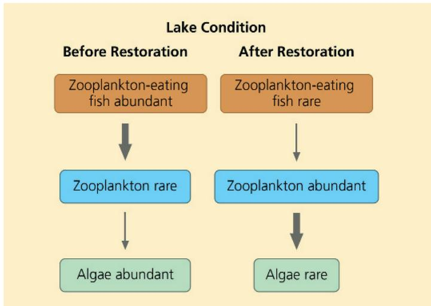

1989 and 1993, reducing roach abundance by about 80%. At the same time, they added a fourth trophic level by stocking the lake with pike perch, a predatory fish that eats roach. The water cleared up, and the last cyanobacterial bloom was in 1989. Ecologists continue to monitor the lake for cyanobacterial blooms and low oxygen availability, but the lake has remained clear, even though roach removal ended in 1993. One cautionary note on this successful restoration of water quality in Lake Vesijarvi: While the introduction of the non-native pike perch to the lake accomplished the goal of improving water quality while seeming to avoid any measurable negative consequences, we need to remember that in many cases, species introduced for biological control have become pests in their introduced ecosystems, as we'll discuss more in Concept 56.1.

## Concept Check 54.2

1. What two components contribute to species diversity? Explain how two communities with the same number of species can differ in species diversity.

2. How is a food chain different from a food web?

3. WHAT IF? Consider a grassland with five trophic levels: grasses, mice, snakes, raccoons, and bobcats. If you released additional bobcats into the grassland, how would grass biomass change if bottom-up control applied? If top-down control applied?

4. MAKE CONNECTIONS Rising atmospheric $CO_{2}$ levels lead to ocean acidification (see Figure 3.12) and higher ocean temperatures, both of which can reduce krill abundance. Predict how a drop in krill abundance might affect other organisms in the food web shown in Figure 54.17. Which organisms are particularly at risk? Explain.

# Concept 54.3: Disturbance influences species diversity and composition

Decades ago, most ecologists thought that biological communities are at equilibrium, a more or less stable balance, unless seriously disturbed by human activities. This “balance of nature” view focused on competition as a key factor determining the composition and stability of communities. Stability in this context refers to a community’s tendency to reach and maintain a relatively constant composition of species.

Proponents of this view thought that the community of plants at a site had only one stable equilibrium, a climax community controlled solely by climate. They also argued that biotic interactions caused the species in the community to function as an integrated unit—in effect, as a superorganism. This argument was based on the observation that certain species of plants are often found together, such as the oaks, maples, birches, and beeches in deciduous forests of the northeastern United States.

Other ecologists questioned whether most communities were at equilibrium and challenged the concept of a single climax community. They thought that differences in soils, topography, and other factors created many potential communities that were stable within a region. Rather than functioning as an integrated unit, communities could be viewed as chance assemblages of species found together because they have similar abiotic requirements, such as for temperature, rainfall, and soil type. Moreover, evidence shows that disturbance keeps many communities from reaching a state of equilibrium in species diversity or composition. A disturbance is an event, such as a storm, fire, flood, drought, or human activity, that changes a community by removing organisms from it or altering resource availability.

This emphasis on change in communities led to the formulation of the nonequilibrium model, which describes most communities as constantly changing after disturbance. Even relatively stable communities can be rapidly transformed into nonequilibrium communities. Let's examine some of the ways that disturbances influence community structure.

## Characterizing Disturbance

The types of disturbances and their frequency and severity vary among communities. Storms disturb almost all communities, even those in the oceans through the action of waves. Fire is a significant disturbance; in fact, chaparral and some grassland biomes require regular burning to maintain their structure and species composition. Many streams and ponds are disturbed by seasonal flooding and drying. A high level of disturbance is generally the result of frequent and intense disturbance, while low disturbance levels can result from either a low frequency or low intensity of disturbance.

The intermediate disturbance hypothesis states that moderate levels of disturbance foster greater species diversity than do high or low levels of disturbance. High levels of disturbance reduce diversity by creating environmental stresses that exceed the tolerances of many species or by disturbing the community so often that slow-growing or slow-colonizing species are excluded. At the other extreme, low levels of disturbance can reduce species diversity by allowing competitively dominant species to exclude less competitive ones. Meanwhile, intermediate levels of disturbance can foster greater species diversity by opening up habitats for occupation by less competitive species. Such intermediate disturbance levels rarely create conditions so severe that they exceed the environmental tolerances or recovery rates of potential community members.

Figure 54.23 Testing the intermediate disturbance hypothesis. Researchers identified the taxa (species or genera) of invertebrates at two locations in each of 27 New Zealand streams. They assessed the intensity of flooding at each location using an index of streambed disturbance. The number of invertebrate taxa peaked where the intensity of flooding was at intermediate levels.  
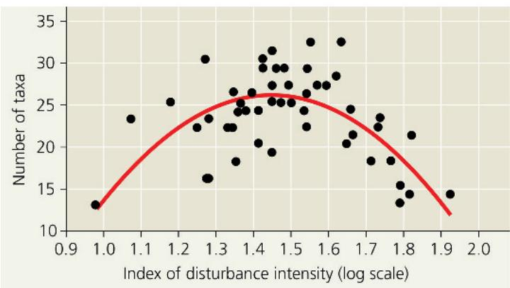

The intermediate disturbance hypothesis is supported by many terrestrial and aquatic studies. In one study, ecologists in New Zealand compared the richness of invertebrates living in the beds of streams exposed to different frequencies and intensities of flooding (Figure 54.23). When floods occurred either very frequently or rarely, invertebrate richness was low. Frequent floods made it difficult for some species to become established in the streambed, while rare floods resulted in species being displaced by superior competitors. Invertebrate richness peaked in streams that had an intermediate frequency or intensity of flooding, as predicted by the hypothesis.

Although moderate levels of disturbance appear to maximize species diversity in some cases, small and large disturbances also can have important effects on community structure. Small-scale disturbances can create patches of different habitats across a landscape, which help maintain diversity in a community. Large-scale disturbances are also a natural part of many communities. Much of Yellowstone National Park, for example, is dominated by lodgepole pine, a tree species that requires the rejuvenating influence of periodic fires. Lodgepole pine cones remain closed until exposed to intense heat. When a forest fire burns the trees, the cones open and the seeds are released. The new generation of lodgepole pines can then thrive on nutrients released from the burned trees and in the sunlight that is no longer blocked by taller trees.

In the summer of 1988, extensive areas of Yellowstone burned during a severe drought (Figure 54.24a). By 1989, many burned areas in the park were largely covered with new vegetation,

Figure 54.24 Recovery following a large-scale disturbance. The 1988 Yellowstone National Park fires burned large areas of forests dominated by lodgepole pines.  
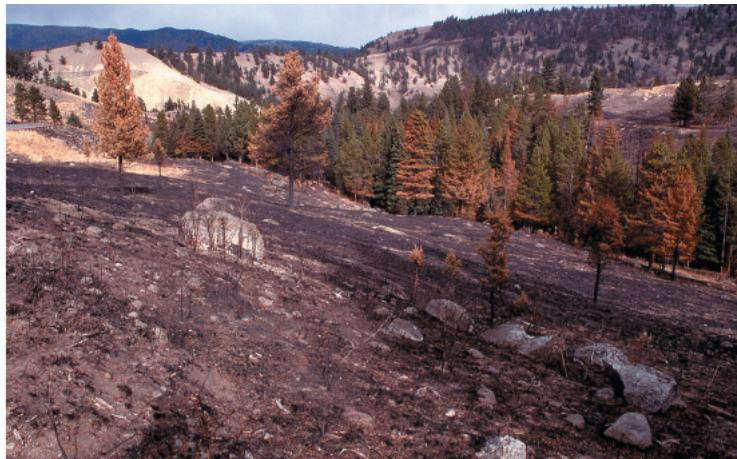  
(a) Soon after fire. While all trees in the foreground of this photograph were killed by the fire, unburned trees can be seen in other locations.

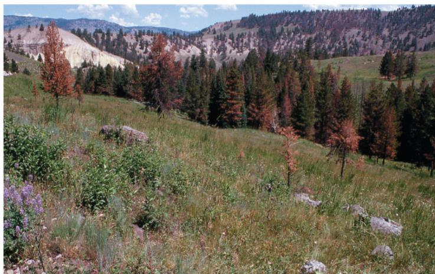  
(b) One year after fire. The community has begun to recover. Herbaceous plants, different from those in the former forest, cover the ground.

suggesting that the species in this community are adapted to rapid recovery after fire (Figure 54.24b). In fact, large-scale fires have periodically swept through the lodgepole pine forests of Yellowstone and other northern areas for thousands of years. In contrast, more southerly pine forests were historically affected by frequent but low-intensity fires. In these forests, a century of human intervention to suppress small fires has allowed an unnatural buildup of fuels in some places and elevated the risk of large, severe fires to which the species are not adapted.

## Interview

Interview with Monica Turner: Studying the consequences of fire and other disturbances on ecosystems (eTextbook only)

Studies of the Yellowstone forest community and many others indicate that they are nonequilibrium communities, changing continually because of natural disturbances and the internal processes of growth and reproduction. Mounting evidence suggests that nonequilibrium conditions are in fact the norm for most communities.

## Ecological Succession

Changes in the composition of terrestrial communities are most apparent after a severe disturbance, such as a volcanic eruption or a glacier, strips away all the existing vegetation. The disturbed area may be colonized by a variety of species, which are gradually replaced by other species, which are in turn replaced by still other species—a process called ecological succession. When this process begins in a virtually lifeless area, such as on a new volcanic island or on the rubble (moraine) left by a retreating glacier, it is called primary succession.

Let's now examine typical patterns of succession in terrestrial ecosystems. During primary succession, the only life-forms initially present are often prokaryotic organisms and unicellular eukaryotes. Lichens and mosses, which grow from windblown spores, are commonly the first macroscopic photosynthesizers to colonize such areas. Soil develops gradually as rocks weather and organic matter accumulates from the decomposed remains of the early colonizers. Once soil is present, the lichens and mosses are usually overgrown by grasses, shrubs, and trees that sprout from seeds blown in from nearby areas or carried in by animals. Eventually, an area is colonized by plants that become the community's dominant form of vegetation. Producing such a community through primary succession may take hundreds or thousands of years.

Early-arriving species and later-arriving ones may be linked by one of three key processes: facilitation, tolerance, and inhibition (Figure 54.25). In facilitation, the early arrivals may make the environment more favorable for the appearance of the later species—for example, by increasing the fertility of the soil. Alternatively, succession in some ecosystems may occur via tolerance: A number of different species are capable of becoming established early in primary succession, and the early colonizers neither help nor impede the arrival of other species. Finally, in the process of inhibition, many species are able to start a succession, and the earliest settlers inhibit the establishment of other species. It is important to note that ecological successions rarely feature only one of these patterns; the nature of the mechanisms at play may be different for various sets of species in the community and they may change as the succession progresses.

Figure 54.25 Three contrasting models of succession.  
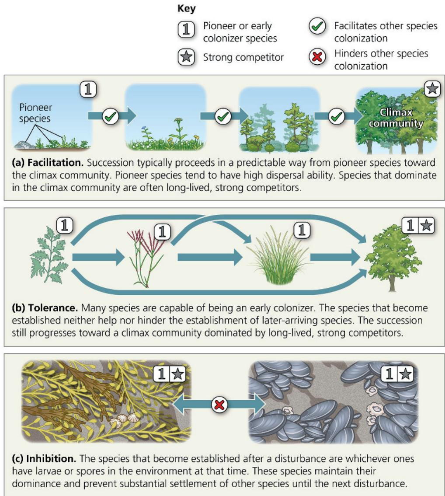

Ecologists have conducted some of the most extensive research on primary succession at Glacier Bay in southeastern Alaska, where glaciers have retreated more than 100 km since 1760 (Figure 54.26). By studying the communities at different distances from the mouth of the bay—with the oldest exposed areas being closest to the mouth and the more recently exposed areas being farthest—ecologists can examine different stages in succession. As the glaciers have retreated, the following sequence of events occurred on areas above the waterline of the bay: The exposed glacial moraine is colonized first by pioneering species that include liverworts, mosses, fireweed, scattered Dryas (a mat-forming shrub), and willows. ② After about three decades, Dryas dominates the plant community. ③ A few decades later, the area is invaded by alder, which forms dense thickets up to 9 m tall. ④ In the next two centuries, these alder stands are overgrown first by Sitka spruce and later by western hemlock and mountain hemlock. In areas of poor drainage, the forest floor of this spruce-hemlock forest is invaded by sphagnum moss, which holds water and acidifies the soil, eventually killing the trees. Thus, by about 300 years after glacial retreat, the vegetation consists of sphagnum bogs on the poorly drained flat areas and spruce-hemlock forest on the well-drained slopes.

Succession on glacial moraines exhibits clear facilitation, especially in early in the succession, owing to changes in soil nutrients and other environmental factors caused by transitions in the vegetation. Because the bare soil after glacial retreat is low in nitrogen content, almost all the pioneer plant species begin succession with poor growth and yellow leaves due to limited nitrogen supply. The exceptions are Dryas and alder, whose roots host symbiotic bacteria that fix atmospheric nitrogen (see Figure 37.12). Soil nitrogen content increases quickly during the

Figure 54.26 Glacial retreat and primary succession near the shores of Glacier Bay, Alaska. The different shades of blue on the map are based on historical information of how the area covered by Glacier Bay has increased over time due to retreat of the glaciers since 1760.  
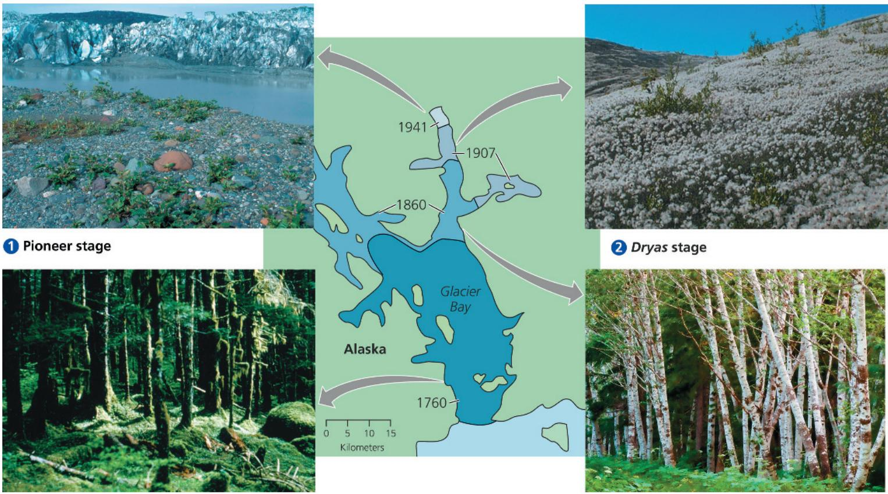  
4 Spruce stage

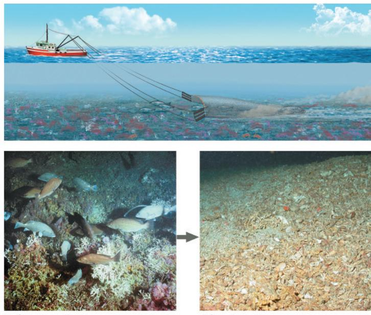

Figure 54.27 Changes in soil nitrogen content during succession at Glacier Bay.  
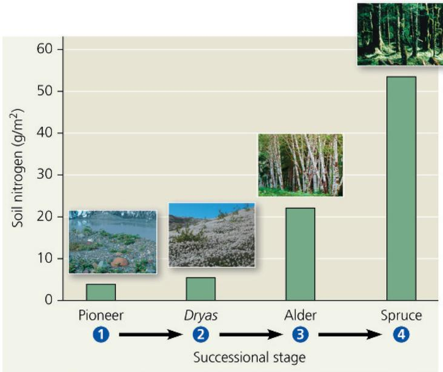  
MAKE CONNECTIONS Figure 37.11 illustrates two types of atmospheric nitrogen fixation by prokaryotes. At the earliest stages of primary succession, before any plants are present at a site, which type of nitrogen fixation would occur, and why?  
For suggested answer, see Appendix A.  
Before trawling  
After trawling

alder stage of succession and keeps increasing during the spruce stage (Figure 54.27). By altering soil properties, pioneer plant species can facilitate colonization by new plant species during early succession. In later stages of succession, interactions between species likely include a combination of facilitation, tolerance, and inhibition.

In contrast to primary succession, secondary succession involves the recolonization of an area after a major disturbance has removed most but not all of the organisms in a community, as in Yellowstone following the 1988 fires (see Figure 54.25). Following the disturbance, the area may return to something like its original state. For instance, in a forested area that has been cleared for farming and later abandoned, the earliest plants to recolonize are often herbaceous species that grow from windblown or animal-borne seeds. If the area has not been burned or heavily grazed, woody shrubs may in time replace most of the herbaceous species, and forest trees may eventually replace most of the shrubs.

## Human Disturbance

Ecological succession is a response to disturbance of the environment, and some of the strongest disturbances result from human activities. Agricultural development has disrupted what were once the vast grasslands of the North American prairie. Tropical rain forests are quickly disappearing as a result of clear-cutting for lumber, cattle grazing, and farmland. Centuries of overgrazing and agricultural

Figure 54.28 Disturbance of the ocean floor by trawling. These photos show the seafloor off northwestern Australia before and after deep-sea trawlers have passed through.

disturbance have contributed to famine in parts of Africa by turning seasonal grasslands into vast barren areas.

Human actions have disturbed marine ecosystems as well as terrestrial ones. The effects of ocean trawling, in which boats drag weighted nets across the seafloor, are similar to those of clear-cutting a forest or plowing a field. The trawls scrape and scour corals and other life on the seafloor (Figure 54.28). In a typical year, ships trawl an area about the size of South America, 150 times larger than the area of forests that are clear-cut annually.

Because disturbance by human activities is often severe, it reduces species diversity in many communities. In Chapter 56, we'll take a closer look at how human-caused disturbance is affecting the diversity of life.

## Concept Check 54.3

1. Why do high and low levels of disturbance usually reduce species diversity? Why does an intermediate level of disturbance promote species diversity?

2. During succession, how might the early species facilitate the arrival of other species?

3. WHAT IF? Most prairies experience regular fires, typically every few years. If these disturbances were relatively modest, how would the species diversity of a prairie likely be affected if no burning occurred for 100 years? Explain.

# Concept 54.4: Biogeographic factors affect community diversity

So far, we have examined relatively small-scale or local factors that influence the diversity of communities, including the effects of species interactions, foundation species, and many types of disturbances. Large-scale biogeographic factors also contribute to the tremendous range of diversity observed in biological communities. Two biogeographic factors in particular—the latitude of a community and the area it occupies—have been investigated for more than a century.

## Latitudinal Gradients

In the 1850s, both Charles Darwin and Alfred Wallace pointed out that plant and animal life was generally more abundant and diverse in the tropics than in other parts of the globe. Since that time, many researchers have confirmed this observation. One study found that a 6.6-hectare (1 ha = 10,000 m $^{2}$ ) plot in tropical Malaysia contained 711 tree species, while a 2-ha plot of deciduous forest in Michigan typically contained just 10 to 15 tree species. Many groups of animals show similar latitudinal gradients. For instance, there are more than 200 species of ants in Brazil but only 7 in Alaska.

Two key factors that can affect latitudinal gradients of species richness are evolutionary history and climate. Over the course of evolution, a series of speciation events may lead to increased species richness in a community (see Concept 24.2). Tropical communities are generally older than temperate or polar communities, which have repeatedly “started over” after major disturbances such as glaciations. As a result, species diversity may be highest in the tropics simply because there has been more time for speciation to occur in tropical communities than in temperate or polar communities.

Climate is another key factor thought to affect latitudinal gradients of richness and diversity. In terrestrial communities, the two main climatic factors correlated with diversity are sunlight and precipitation, both of which occur at high levels in the tropics. These factors can be considered together by measuring a community's rate of evapotranspiration, the evaporation of water from soil and plants. Evapotranspiration, a function of solar radiation, temperature, and water availability, is much higher in hot areas with abundant rainfall than in areas with low temperatures or low precipitation. The species richness of plants and animals correlates with measures of evapotranspiration, as shown for vertebrates in Figure 54.29.

## Area Effects

In 1807, naturalist and explorer Alexander von Humboldt described one of the first patterns of species richness to be recognized, the species-area curve: All other factors being equal, the larger the geographic area of a community, the more species it has. One explanation for this relationship is that larger areas offer a greater diversity of habitats and microhabitats. Another factor is that larger habitats can support bigger populations, which are at lesser risk of extinction compared to small populations.

Figure 54.29 Energy, water, and species richness.
Vertebrate species richness in North America increases with an index of evapotranspiration, expressed as rainfall equivalents (mm/yr).  
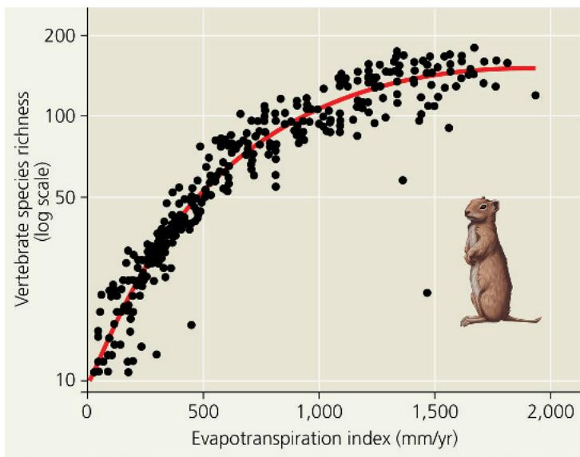

Predictions of the species-area relationship have been tested by examining the number of animals and plants in many different regions. As one example, in the Sunda Islands of Malaysia, the number of bird species increased with island size (Figure 54.30). Different species-area curves vary in how rapidly species richness increases with area. Even so, the basic concept of diversity increasing with increasing area applies in many situations, from surveys of ant diversity in New Guinea to studies of plant species richness on islands of different sizes.

## Island Equilibrium Model

Because of their isolation and limited size, islands provide excellent opportunities for studying how area and other factors affect the species diversity of communities. By “islands,” we mean not only oceanic islands, but also habitat islands on land, such as lakes, mountain peaks, or habitat fragments—any patch surrounded by an environment not suitable for the “island” species.

Figure 54.30 Species richness and island area.
The number of bird species on the Sunda Islands of Malaysia increases with island size.  
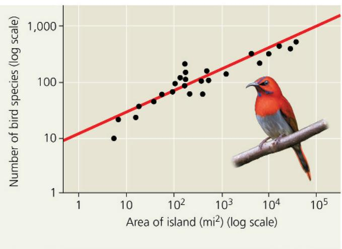

Figure 54.31 MacArthur and Wilson's island equilibrium model. The equilibrium number of species on an island represents a balance between the immigration of new species (red curve) and the extinction of species already there (black curve). The point at which these curves intersect shows the predicted equilibrium number of species $(Q)$ .  
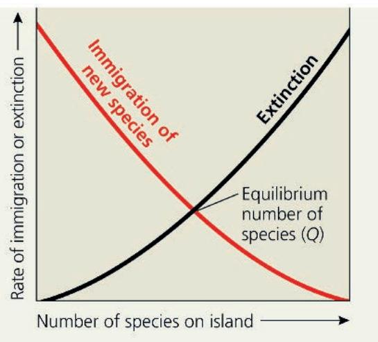  
WHAT IF? Suppose rising sea levels substantially decreased the size of the island. How would that affect (a) the population sizes of species already on the island, (b) the extinction curve shown above, and (c) the predicted equilibrium number of species?  
For suggested answer, see Appendix A.  
Figure 54.32 Mangrove island.  
The islands that researchers studied were small, each consisting of one or a few mangrove trees.

Recognizing the opportunities that studying islands provides, Robert MacArthur and E. O. Wilson developed a method for predicting the species diversity of islands (Figure 54.31). In their approach, the number of species on an island represents a balance between the immigration of new species to the island and the extinction of species already there.

In Figure 54.31, note that the immigration rate decreases as the number of species on the island gets larger, while the extinction rate increases. To see why this is so, consider a newly formed oceanic island that receives colonizing species from a distant mainland. At any given time, an island's immigration and extinction rates are affected by the number of species currently present. As the number of species already on the island increases, the immigration rate of new species decreases, because any individual reaching the island is less likely to represent a species that is not already present. Moreover, as more species inhabit an island, extinction rates on the island increase because of the greater likelihood of competitive exclusion.

An island's size and its distance from the mainland are important elements influencing the island's species richness. Small islands generally have lower immigration rates because potential colonizers are less likely to reach a small island than a large one. Small islands also have higher extinction rates because they generally contain fewer resources, have less diverse habitats, and have smaller population sizes. With respect to distance, an island that is closer to the mainland generally has a higher immigration rate and a lower extinction rate than one farther away. Arriving colonists increase the abundance of a species on a near island, thereby reducing the species' chance of extinction.

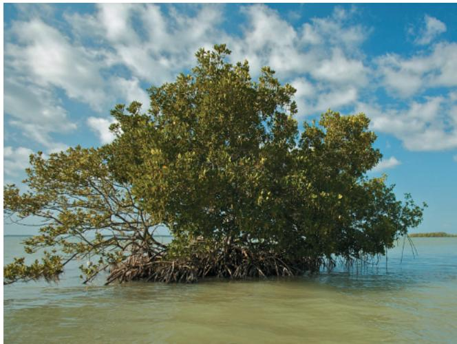

MacArthur and Wilson's model is called the island equilibrium model because an equilibrium will eventually be reached where the rate of species immigration equals the rate of species extinction. The number of species at this equilibrium point is correlated with the island's size and distance from the mainland. Although the number of species ultimately should stabilize at a constant level, immigration and extinction continue and hence the exact species composition on the island may change over time.

Researchers tested the island equilibrium model in an experiment on six small mangrove islands in the Florida Keys (Figure 54.32). To do this, they first painstakingly identified and counted all of the arthropod species on each island. As predicted by the model, they found more species on islands that were larger and closer to the mainland. They then fumigated four of the islands with methyl bromide to kill all of the arthropods. As also predicted by the model, the number of arthropod species on the islands increased over time to near their pre-fumigation values (Figure 54.33).

Figure 54.33 Testing the island equilibrium model.

The graph shows results for one of the islands studied. The number of arthropod species increased over time; by 140 days, it had reached levels similar to those found on the island prior to the start of the experiment.

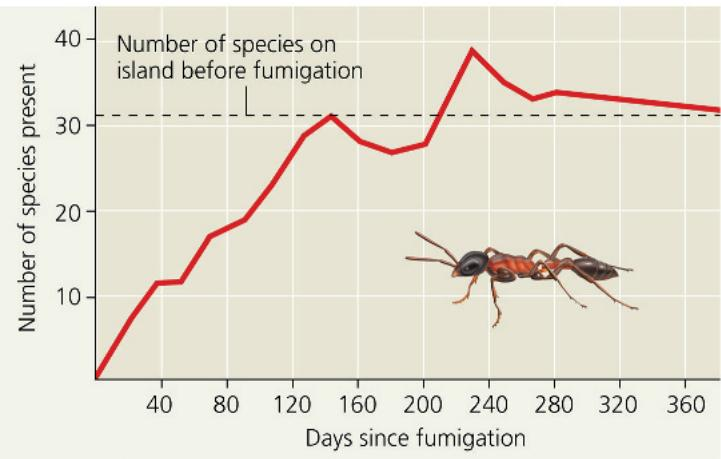

The island closest to the mainland recovered first, while the island farthest from the mainland was the slowest to recover. The number of arthropod species on the remaining two islands—which were not fumigated and hence served as controls—remained approximately constant during the study.

## Concept Check 54.4

1. Describe two hypotheses as to why species diversity is greater in the tropics than in temperate and polar regions.

2. Describe how an island's size and distance from the mainland affect the island's species richness.

3. WHAT IF? Based on MacArthur and Wilson's island equilibrium model, predict how the richness of birds on an island would compare with that of snakes and lizards there.

For suggested answers, see Appendix A.

## Concept 54.5: Pathogens alter community structure locally and globally

Now that we have examined several important factors that structure biological communities, we'll finish the chapter by examining community interactions involving pathogens, disease-causing microorganisms, viruses, viroids, or prions. (Viroids and prions are infectious RNA molecules and proteins, respectively; see Concept 19.3.) As you'll see, pathogens have strong effects on ecological communities.

Pathogens produce especially clear effects when they are introduced into new habitats, as in the case of the fungus that causes chestnut blight (see Concept 54.2). A pathogen can be particularly virulent in a new habitat because new host populations have not had a chance to become resistant to the pathogen through natural selection. The invasive chestnut blight fungus had far stronger effects on the American chestnut, for instance, than it had on Asian chestnut species in the fungus's native habitat.

## Effects on Community Structure

The ecological importance of disease can be highlighted by how pathogens have affected coral reef communities. White-band disease, caused by an unknown pathogen, has resulted in dramatic changes in Caribbean reefs. The disease kills corals by causing their tissue to slough off in a band from the base to the tip of the branches. Because of the disease, staghorn coral (Acropora

cervicornis) has virtually disappeared from the Caribbean. Populations of elkhorn coral (Acropora palmata) have also been decimated. Such corals provide key habitat for lobsters as well as snappers and other fish species. When corals die, their skeletons often become overgrown by algae because herbivore biomass is quite low—in part because of a disease that infected a key sea urchin herbivore. Eventually, the dead coral skeletons topple because of damage from storms and other disturbances. The complex, three-dimensional structure of the reef disappears, and diversity plummets.

Pathogens also influence community structure in terrestrial ecosystems. Consider sudden oak death (SOD), a recently discovered disease that is caused by the protist Phytophthora ramorum (see Concept 28.6). SOD was first described in California in 1995, when hikers noticed trees dying around San Francisco Bay. By 2014, it had spread more than 1,000 km, from the central California coast to southern Oregon, and it had killed more than a million oaks and other trees. The loss of the oaks has led to the decreased abundance of at least five bird species, including the acorn woodpecker and the oak titmouse, that rely on oaks for food and habitat. Although there is currently no cure for SOD, scientists recently sequenced the genome of P. ramorum in hopes of finding a way to fight the pathogen.

## Community Ecology and Zoonotic Diseases

Three-quarters of emerging human diseases and many of the most devastating established diseases are caused by zoonotic pathogens—those that are transferred to humans from other animals, either through direct contact with an infected animal or via an intermediate species, called a vector. The vectors that spread zoonotic diseases are often parasites, including ticks, lice, and mosquitoes. Established zoonotic diseases such as rabies, plague, dengue fever, Chagas' disease, Salmonella infection, and some forms of sleeping sickness cause an estimated 1 billion cases of illness in people and millions of deaths each year. Emerging zoonotic diseases such as Lyme disease, Zika virus, Ebola hemorrhagic fever, and mpox also pose a dire threat to global health and world economies.

Identifying the community of hosts and vectors for a pathogen can help prevent illnesses such as Lyme disease, which is spread by ticks. For years, scientists thought that the primary host for the Lyme pathogen was the white-footed mouse because mice are heavily parasitized by young ticks. When researchers vaccinated mice against Lyme disease and released them into the wild, however, the number of infected ticks hardly changed. Further investigation in New York revealed that two inconspicuous shrew species were the source for more than half the infected ticks collected in the field (Figure 54.34). Identifying the most important hosts for a pathogen provides information that may be used to control the hosts most responsible for spreading diseases.

Ecologists also use their knowledge of community interactions to track the spread of zoonotic diseases. One example, avian flu, is caused by highly contagious viruses transmitted through the saliva and feces of birds (see Concept 19.3). Most of these viruses cause milder symptoms in wild birds than in domesticated birds, the most common source of human infections. Since 2003, one particular viral strain, called H5N1, has killed hundreds of millions of poultry, as well as hundreds of thousands of wild birds and more than 450 people.

Figure 54.34 Unexpected hosts of the Lyme disease pathogen. A combination of ecological data and genetic analyses enabled scientists to show that more than half of ticks carrying the Lyme pathogen became infected by feeding on the northern short-tailed shrew (Blarina brevicauda) or the masked shrew (Sorex cinereus).  
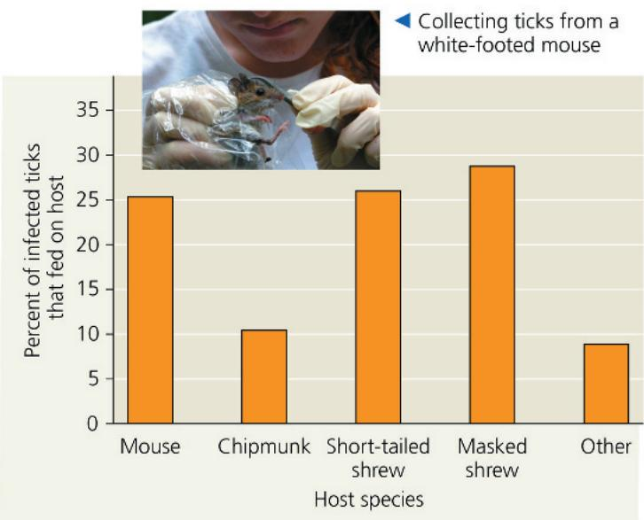  
MAKE CONNECTIONS Concept 23.1 discusses the significance of genetic variation between populations. How might genetic variation between shrew populations in different locations affect the number of infected ticks? For suggested answer, see Appendix A.  
Figure 54.35 Tracking avian flu.

Control programs that quarantine domestic birds or monitor their transport can be difficult for strains of avian flu that spread naturally through the movements of wild birds. This is the case for H5N1, which, from 2003 to 2006, spread rapidly across Asia, the Middle East, Europe, and Africa. In 2021–22, the virus was transmitted from Europe to eastern Canada, perhaps transported by ducks or other migratory water birds. It then spread rapidly across the United States and Canada, forcing farmers to kill tens of millions of poultry. This outbreak also led to the deaths of thousands of wild birds, including more than 50 bald eagles. Ecologists are studying the virus by trapping and testing migrating and resident birds (Figure 54.35), but to date, efforts to halt its spread have not been successful.

Human activities that lead to climate change and the destruction of natural habitat increase the risk of zoonotic disease by allowing animal carriers of disease to move into new geographic regions and by increasing the contact people have with wild animals. In addition, humans are transporting pathogens around the world at unprecedented rates. For

A graduate student bands a young gyrfalcon as part of a project to monitor the spread of avian flu.  
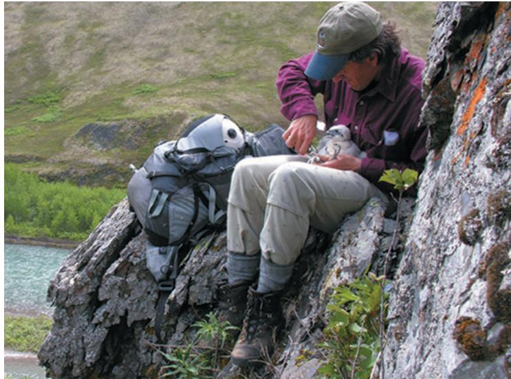

example, genetic analyses suggest that the pathogen that causes SOD, P. ramorum, likely came to North America from Europe in nursery plants.

Similarly, the pathogens that cause human diseases are spread by the global movements of people. In recent years, coronaviruses have caused several new infectious diseases in humans. First identified in 2003 in Foshan, China, severe acute respiratory syndrome (SARS) originated from the transfer of the coronavirus SARS-CoV from bats to civet cats to humans and caused 774 confirmed deaths worldwide. In 2012, Middle East respiratory syndrome (MERS) emerged in the Saudi Arabia from the transfer of the coronavirus MERS-CoV from camels to humans and caused at least 943 deaths worldwide. The most striking coronavirus to affect humans in recent years has been SARS-CoV-2, the coronavirus that causes COVID-19. It was first detected in Wuhan, China, in late 2019. This virus quickly spread around the world when infected individuals traveled to other countries. Within three years, COVID-19 had a confirmed death toll of more than 6.5 million people, with over 1,000,000 fatalities in the United States alone. (The actual numbers may have been significantly higher since many people who died with COVID-19-like symptoms were not tested for SARS-CoV-2.) These events, as well as an alarming increase in the overall number of emerging zoonotic diseases, indicate a need to broaden our efforts to survey wildlife populations for viruses with the potential to cause human disease.

While our emphasis here has been on community ecology, pathogens are also greatly influenced by changes in the physical environment. To control pathogens and the diseases they cause, scientists need an ecosystem perspective—an intimate knowledge of how the pathogens interact with other species and with all aspects of their environment. Ecosystems are the subject of Chapter 55.

## Concept Check 54.5

1. What are pathogens?

2. WHAT IF? Rabies, a viral disease in mammals, is not currently found in the British Isles. If you were in charge of disease control

For suggested answers, see Appendix A.

## Chapter 54 Review

there, what practical approaches might you employ to keep the rabies virus from reaching these islands?

## Summary of Key Concepts

To review key terms, go to the Vocabulary Self-Quiz (eTextbook only).

Concept 54.1: Interactions between species can help, harm, or have no effect on the individuals involved

\- Interspecific interactions affect the survival and reproduction of the individuals that engage in them. As shown in the table, these interactions can be grouped into three broad categories: competition, exploitation, and positive interactions.

\- Competitive exclusion states that two species whose members compete for the same resource cannot coexist permanently in the same place. Resource partitioning is the differentiation of ecological niches that enables species to coexist in a community.

For each interaction listed in the table, give an example of a pair of species that exhibit the interaction.

<table><tr><td>Interaction</td><td>Description</td></tr><tr><td>Interspecific Competition (-/-)</td><td>Individuals of different species each use a limited resource, reducing the survival or reproduction of both individuals.</td></tr><tr><td>Exploitation (+/-)</td><td>Members of one species benefit by feeding upon (and thereby harming) members of the other species. Exploitation includes the following:</td></tr><tr><td>Predation</td><td>An individual of one species, the predator, kills and eats an individual of the other, the prey.</td></tr><tr><td>Herbivory</td><td>An herbivore eats part of a plant or alga.</td></tr><tr><td>Parasitism</td><td>The parasite derives its nourishment from a second organism, its host.</td></tr><tr><td>Positive interactions (+/+ or 0/+)</td><td>Members of one species benefit, while members of the other benefit or are not harmed. Positive interactions include the following:</td></tr><tr><td>Mutualism (+/+)</td><td>Members of both species benefit from the interaction.</td></tr><tr><td>Commensalism (+/0)</td><td>Members of one species benefit, while members of the other are not affected.</td></tr></table>

## Concept 54.2: Diversity and trophic structure characterize biological communities

\- Species diversity is affected by both the number of species in a community—its species richness—and their relative abundance.

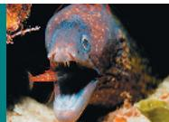

\- More diverse communities typically produce more biomass and show less year-to-year variation in growth than less diverse communities and are more resistant to introduced species.

\- Trophic structure is a key factor in community dynamics. Food chains link the trophic levels from producers to top carnivores. Branching food chains and complex trophic interactions form food webs.

\- Foundation species are large or abundant members of a community that provide food or habitat. Keystone species are usually less abundant species that exert a disproportionate influence on community structure. Ecosystem engineers influence community structure through their effects on the physical environment.

\- In bottom-up control, the abundance of organisms at each trophic level is limited by nutrient supply or food availability. In top-down control, each trophic level is controlled by the abundance of consumers at higher trophic levels.

Based on indexes such as the Shannon diversity index, is a community of higher species richness always more diverse than a community of lower species richness? Explain.

## Concept 54.3: Disturbance influences species diversity and composition

\- Increasing evidence suggests that disturbance and lack of equilibrium, rather than stability and equilibrium, are the norm for most communities. According to the intermediate disturbance hypothesis, moderate levels of disturbance can foster higher species diversity than can low or high levels of disturbance.

\- Ecological succession is the sequence of community and ecosystem changes after a disturbance. Primary succession occurs in an area that is virtually lifeless, while secondary succession occurs after a disturbance has removed most but not all of the organisms in a community.

Is the disturbance pictured in Figure 54.28 more likely to initiate primary or secondary succession? Explain.

## Concept 54.4: Biogeographic factors affect community diversity

\- Species richness generally declines along a latitudinal gradient from the tropics to the poles. Climate influences the diversity gradient through energy (heat and light) and water. The greater age of tropical environments also may contribute to their greater species richness.

\- Species richness is directly related to a community's geographic size, a principle formalized in the species-area curve.

\- Species richness on islands depends on island size and distance from the mainland. The island equilibrium model maintains that species richness on an ecological island reaches an equilibrium where new immigrations are balanced by extinctions.

How have periods of glaciation influenced latitudinal patterns of diversity?

## Concept 54.5: Pathogens alter community structure locally and globally

\- Pathogens play a key in structuring terrestrial and marine communities.

\- Zoonotic pathogens are transferred from other animals to humans and cause most emerging human diseases. Community ecology provides the framework for identifying key species interactions associated with such pathogens and for helping us track and control their spread.

Suppose a pathogen attacks a keystone species. Explain how this could alter the structure of a community.

For suggested answers, see Appendix A.

## Test Your Understanding

For more multiple-choice questions, go to the Practice Test (eTextbook only).

## Levels 1-2: Remembering/Understanding

1. The feeding relationships among the species in a community determine the community's

(A) secondary succession.

(B) ecological niche.

(C) species richness.

(D) trophic structure.

2. The principle of competitive exclusion states that

(A) two species cannot coexist in the same habitat.

(B) competition between two species always causes extinction or emigration of one species.

(C) two species that have exactly the same niche cannot coexist in a community.

(D) two species will stop reproducing until one species leaves the habitat.

3. Based on the intermediate disturbance hypothesis, a community's species diversity is increased by

(A) frequent massive disturbance.

(B) stable conditions with no disturbance.

(C) moderate levels of disturbance.

(D) human intervention to eliminate disturbance.

4. According to the island equilibrium model, species richness would be greatest on an island that is

(A) large and remote.

(B) small and remote.

(C) large and close to a mainland.

(D) small and close to a mainland.

## Levels 3-4: Applying/Analyzing

5. Predators that are keystone species can maintain species diversity in a community if they

(A) competitively exclude other predators.

(B) prey on the community's dominant competitors.

(C) reduce the number of disruptions in the community.

(D) prey on the least abundant species in the community.

6. Food chains tend to be short because

(A) only a single species of herbivore feeds on each plant species.

(B) local extinction of a species causes extinction of the other species in its food chain.

(C) most of the energy in a trophic level is lost as energy passes to the next higher level.

(D) most producers are inedible.

7. Which of the following could qualify as a top-down control on a grassland community?

(A) limitation of plant biomass by rainfall amount (B) influence of temperature on interspecific competition among plants

(C) influence of soil nutrients on the abundance of grasses versus wildflowers

(D) effect of grazing by bison on plant species diversity

8. The most plausible hypothesis to explain why species richness is higher in tropical than in temperate regions is that

(A) tropical communities are younger.

(B) tropical regions generally have more available water and higher levels of solar radiation.

(C) tropical habitats tend to have smaller areas than temperate habitats.

(D) diversity increases as evapotranspiration decreases.

9. Community 1 contains 100 individuals distributed among four species: 5A, 5B, 85C, and 5D. Community 2 contains 100 individuals distributed among three species: 30A, 40B, and 30C. Calculate the Shannon diversity index (H) for each community. Which community is more diverse?

## Levels 5-6: Evaluating/Creating

10. DRAW IT In the Chesapeake Bay estuary, the blue crab is an omnivore that eats eelgrass and other primary producers as well as clams. It is also a cannibal. In turn, the crabs are eaten by humans and by the endangered Kemp's Ridley sea turtle. Based on this information, draw a food web that includes the blue crab. Assuming that top-down control occurs in this system, describe what would happen to the abundance of eelgrass if humans stopped eating blue crabs.

11. EVOLUTION CONNECTION Explain why adaptations of particular organisms to competition may not necessarily represent instances of character displacement. What would a researcher have to demonstrate about two competing species to make a convincing case for character displacement?

12. SCIENTIFIC INQUIRY An ecologist studying desert plants performed the following experiment. She staked out two identical plots, containing sagebrush plants and small annual wildflowers. She found the same five wildflower species in roughly equal numbers on both plots. She then enclosed one plot with a fence to keep out kangaroo rats, the most common grain-eaters of the area. After two years, four of the wildflower species were no longer present in the fenced plot, but one species had become much more abundant. The control plot had not changed in species diversity. Using the principles of community ecology, propose a hypothesis to explain her results. What additional evidence would support your hypothesis?

13. WRITE ABOUT A THEME: INTERACTIONS In Batesian mimicry, a palatable species gains protection by mimicking an unpalatable one. Imagine that individuals of a palatable, brightly colored fly species are blown to three remote islands. The first island has no predators of that species; the second has predators but no similarly colored, unpalatable species; and the third has both predators and a similarly colored, unpalatable species. In a short essay (100–150 words), predict what might happen to the coloration of the palatable species on each island through time if coloration is a genetically controlled trait. Explain your predictions.

## 14. SYNTHESIZE YOUR KNOWLEDGE

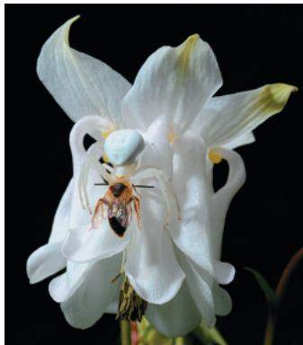  
For selected answers, see Appendix A.

Describe two types of ecological interactions that appear to be occurring between the three species shown in this photo. (Look closely to see the three species: a flower, a bee, and a spider!) What morphological adaptation can be seen in the species that is at the highest trophic level in this scene?

# Explore Scientific Papers with Science in the Classroom | AAAS

How do native species evolve in response to introduced species? Go to “There’s a New Kid in Town” at www.scienceintheclassroom.org.

Instructors: Questions can be assigned in Mastering Biology.

